---

# 多态与扩展机制

---

## 多态类型（Polymorphism Types）

多态（Polymorphism）是面向对象与函数式编程中最核心的抽象能力之一，其本质是**"用同一套接口操控不同形态的实体"**。如果说封装是对数据的隐藏，继承是对结构的复用，那么多态就是对行为的抽象与统一。理解多态不能只停留在"子类重写父类方法"这一层面，计算机科学家 Luca Cardelli 和 Peter Wegner 早在 1985 年就将多态划分为更精细的三大类别，而 Kotlin 作为一门现代静态类型语言，对这三种多态都提供了一流的语言级支持。

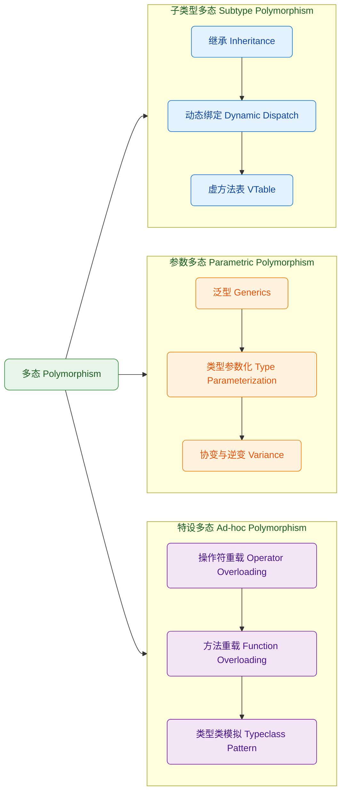

### 子类型多态（Subtype Polymorphism）

子类型多态是最广为人知的多态形式，其核心思想来自 Barbara Liskov 提出的**里氏替换原则（Liskov Substitution Principle, LSP）**：凡是父类能出现的地方，子类对象都应该能够无缝替代，且程序行为不应发生异常变化。在 Kotlin 中，子类型多态通过 `open` 关键字声明可继承类、`override` 关键字声明方法重写来实现。

它的运作机制依赖于**运行时动态分派（Dynamic Dispatch）**：编译器在编译阶段无法确定调用的究竟是哪个实现，只有在运行时，JVM 根据对象的实际类型，通过**虚方法表（Virtual Method Table, VTable）**来查找并调用正确的方法。

### 参数多态（Parametric Polymorphism）

参数多态通过引入**类型参数（Type Parameter）**，使得同一段代码能够在保持类型安全的前提下，操控不同类型的数据。这是泛型（Generics）的理论基础。一个经典的例子是 `List<T>`：无论 T 是 `Int`、`String` 还是自定义类，`add`、`get` 等操作的逻辑完全相同，编译器会在类型擦除前完成类型检查，从而在不牺牲安全性的前提下实现代码复用。Kotlin 在 Java 泛型的基础上引入了**声明处型变（Declaration-site Variance）**，即 `in/out` 修饰符，大幅减少了通配符（wildcard）的使用负担。

### 特设多态（Ad-hoc Polymorphism）

特设多态与前两者截然不同——它不需要任何继承关系，而是针对**不同类型分别定义同名行为**。Kotlin 中的操作符重载（`operator fun plus(...)`）和函数重载（同名函数接受不同参数类型）都是特设多态的体现。更进一步，Kotlin 的扩展函数机制可以模拟 Haskell 中的**类型类（Typeclass）**模式，为任意类型附加行为约束，而无需修改其源码，这将在后续章节中深入探讨。

---

## 子类型多态（Subtype Polymorphism）

子类型多态在 Kotlin 中的实现远比表面看起来复杂，它涉及从语言语法层面的 `open/override` 设计哲学，一直深入到 JVM 字节码层面的虚方法表（VTable）调用机制。理解这一完整链路，能让你在编写高性能代码、排查多态相关 Bug 时更加游刃有余。

### 继承关系（Inheritance）

Kotlin 的继承设计有一个与 Java 截然不同的哲学决定：**所有类默认是 `final` 的**。这一设计源于《Effective Java》中 Joshua Bloch 的建议——"为继承而设计，并提供文档说明；否则就禁止继承"。这意味着你必须显式使用 `open` 关键字来声明一个类或方法允许被继承或重写，这一机制从源头杜绝了很多因意外继承导致的脆性设计（fragile base class problem）。

```kotlin
// 定义一个可被继承的抽象图形基类
// abstract 类天然是 open 的，无需重复声明
abstract class Shape(val name: String) {

    // abstract 方法必须在子类中被重写
    // 返回图形面积，单位为平方单位
    abstract fun area(): Double

    // open 方法：允许子类选择性重写
    // 提供默认的描述信息，子类可以覆盖
    open fun describe(): String {
        // 默认实现：输出图形名称和面积
        return "Shape: $name, Area: ${"%.2f".format(area())}"
    }

    // 非 open 方法：final，不可被重写
    // 保证核心日志逻辑不被子类篡改
    fun printInfo() {
        println(describe())
    }
}

// 使用 : Shape(参数) 语法调用父类构造器
// Circle 是一个具体（concrete）的子类
class Circle(val radius: Double) : Shape("Circle") {

    // 必须使用 override 关键字，且编译器强制检查
    // 若父类方法非 open/abstract，则编译报错
    override fun area(): Double {
        // π × r²，使用 Kotlin 标准库常量 Math.PI
        return Math.PI * radius * radius
    }

    // 选择性重写 describe()，添加半径信息
    override fun describe(): String {
        // super.describe() 调用父类实现，实现复用
        return "${super.describe()}, Radius: $radius"
    }
}

// Rectangle 子类，继承 Shape
class Rectangle(val width: Double, val height: Double) : Shape("Rectangle") {

    override fun area(): Double {
        // 长方形面积 = 宽 × 高
        return width * height
    }
    // 未重写 describe()，使用父类默认实现
}

// 演示多态的核心用法
fun main() {
    // 声明为父类类型 Shape，但实际指向子类对象
    // 这正是子类型多态的经典用法：面向接口/抽象编程
    val shapes: List<Shape> = listOf(
        Circle(5.0),          // 实际类型：Circle
        Rectangle(4.0, 6.0),  // 实际类型：Rectangle
        Circle(3.0)            // 实际类型：Circle
    )

    // 遍历时，JVM 根据实际类型动态分派调用正确的 area()
    for (shape in shapes) {
        shape.printInfo() // 静态类型是 Shape，但调用的是子类实现
    }
}
```

值得注意的是，Kotlin 中 `override` 的方法默认仍然是 `open` 的——也就是说，如果 `Circle` 被进一步继承，其 `area()` 方法也可以被孙子类重写。若要阻断这一继承链，需要显式使用 `final override`：

```kotlin
// 使用 final override 终止多态继承链
// 任何继承 Circle 的子类都无法再重写 area()
class ImmutableCircle(radius: Double) : Circle(radius) {
    final override fun area(): Double {
        // 使用 super 调用父类 Circle 的实现
        return super.area()
    }
}
```

### 动态绑定（Dynamic Dispatch）

动态绑定（Dynamic Dispatch）是子类型多态得以运作的核心机制。它解决的核心问题是：当一个变量的**静态类型（Static Type）**是父类，而其**运行时类型（Runtime Type）**是子类时，调用方法应该走哪个实现？

**静态绑定（Static Binding）**发生在编译阶段，编译器根据变量的声明类型直接确定调用目标，通常对应 JVM 的 `invokestatic`（静态方法）和 `invokespecial`（构造器、private方法、super调用）指令。而**动态绑定**发生在运行时，由 JVM 通过 `invokevirtual` 指令在虚方法表中查找真正的方法实现。

```kotlin
// 演示静态类型 vs 运行时类型的核心区别
open class Animal {
    // open 方法，参与动态绑定，使用 invokevirtual 调用
    open fun sound(): String = "..."

    // companion object 中的函数对应 Java 静态方法
    // 使用静态绑定，不参与多态
    companion object {
        fun category(): String = "Animal"
    }
}

class Dog : Animal() {
    // override 方法：运行时会被动态分派到这里
    override fun sound(): String = "Woof"

    companion object {
        // 即使子类定义了同名"静态方法"，也不会覆盖父类
        // 这是静态绑定不参与多态的直接体现
        fun category(): String = "Dog"
    }
}

class Cat : Animal() {
    override fun sound(): String = "Meow"
}

fun demonstrateDispatch() {
    // 声明为父类 Animal 类型，编译器看到的是 Animal
    val animal: Animal = Dog()

    // ✅ 动态绑定：运行时类型是 Dog，输出 "Woof"
    // JVM 在运行时查找 Dog 的 VTable，找到 Dog.sound()
    println(animal.sound())

    // ⚠️ 静态绑定：编译器看到 Animal 类型，直接调用 Animal.category()
    // 即使 animal 实际是 Dog，也输出 "Animal"
    // 这是 Kotlin/Java 中"静态方法不参与多态"的典型陷阱
    println(Animal.category())

    // 多态集合遍历：每个元素的 sound() 调用都通过各自的 VTable
    val animals: List<Animal> = listOf(Dog(), Cat(), Dog())
    animals.forEach { println(it.sound()) } // 输出: Woof, Meow, Woof
}
```

动态绑定与 Kotlin 的**智能转换（Smart Cast）**结合使用时，会产生一种既安全又符合直觉的多态体验：

```kotlin
// sealed class 让编译器知道 Shape 的所有子类
// 结合 when 表达式，可以实现穷尽性检查（exhaustive check）
sealed class Shape2

// data class 自动生成 equals/hashCode/copy/toString
data class Circle2(val radius: Double) : Shape2()
data class Rectangle2(val width: Double, val height: Double) : Shape2()
data class Triangle2(val base: Double, val height: Double) : Shape2()

// 使用 when 表达式进行类型分支：这是 Kotlin 中处理
// sealed class 多态的惯用模式，编译器会强制覆盖所有子类
fun computeArea(shape: Shape2): Double = when (shape) {
    // 每个分支中，shape 被智能转换为对应子类类型
    // 无需手动强转，编译器自动推断
    is Circle2    -> Math.PI * shape.radius * shape.radius   // shape: Circle2
    is Rectangle2 -> shape.width * shape.height               // shape: Rectangle2
    is Triangle2  -> 0.5 * shape.base * shape.height          // shape: Triangle2
    // sealed class 保证 when 是穷尽的，无需 else 分支
}
```

### 虚方法表（Virtual Method Table，VTable）

虚方法表是 JVM 实现动态绑定的底层数据结构，也是理解多态性能开销的关键。每个**类（而非对象）**在加载时，JVM 会为其构建一张 VTable，它本质上是一个**函数指针数组**，其中每个槽位（slot）对应该类的一个虚方法入口地址。

```
// VTable 结构示意（内存视角）
// ┌─────────────────────────────────────────────┐
// │            Animal 类的 VTable               │
// ├──────┬──────────────────────────────────────┤
// │ 槽位 │ 方法入口地址                          │
// ├──────┼──────────────────────────────────────┤
// │  0   │ → Object.equals()                    │
// │  1   │ → Object.hashCode()                  │
// │  2   │ → Object.toString()                  │
// │  3   │ → Animal.sound()   ← 新增槽位         │
// └──────┴──────────────────────────────────────┘
//
// ┌─────────────────────────────────────────────┐
// │             Dog 类的 VTable                 │
// ├──────┬──────────────────────────────────────┤
// │ 槽位 │ 方法入口地址                          │
// ├──────┼──────────────────────────────────────┤
// │  0   │ → Object.equals()   ← 继承，同槽位    │
// │  1   │ → Object.hashCode() ← 继承，同槽位    │
// │  2   │ → Object.toString() ← 继承，同槽位    │
// │  3   │ → Dog.sound()       ← 覆盖！指向 Dog  │
// └──────┴──────────────────────────────────────┘
//
// 运行时调用 animal.sound()：
// 1. 读取 animal 引用，找到堆上的 Dog 对象
// 2. 从 Dog 对象头（Object Header）找到 Dog 的 VTable
// 3. 读取槽位 3 的函数指针 → Dog.sound()
// 4. 执行 Dog.sound()，输出 "Woof"
```

这一机制带来了一个重要的性能推论：`invokevirtual` 虽然涉及一次间接寻址（通过对象头→类元数据→VTable），但现代 JIT 编译器（如 HotSpot C2）会通过**内联缓存（Inline Cache）**和**去虚化（Devirtualization）**优化将其降为直接调用，因此对于热路径代码，动态分派的开销通常微乎其微。

下图展示了从 Kotlin 源代码到 JVM 字节码再到运行时 VTable 查找的完整链路：

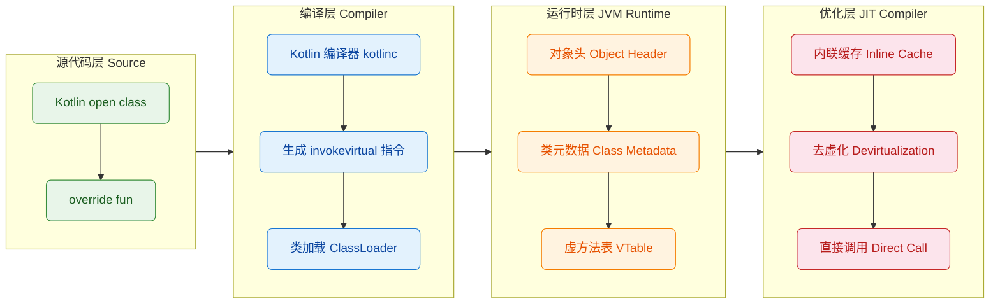

理解 VTable 还能帮助解释一个常见的 Kotlin 陷阱：**在构造器中调用 `open` 方法**。

```kotlin
open class Base {
    // ⚠️ 危险行为：在构造器中调用 open 方法
    // 此时子类尚未完成初始化，但 VTable 已指向子类实现
    init {
        // JVM 已通过 VTable 确定调用 Derived.value
        // 但 Derived 的属性此时尚未初始化！
        println("Base init, value = ${value()}")
    }

    // open 方法，子类可重写
    open fun value(): Int = 0
}

class Derived : Base() {
    // 这个属性在 Base 的 init 块执行时还没有被赋值
    // JVM 中 Int 字段的默认零值会被读取
    private val number: Int = 42

    // 重写父类方法，返回 number 字段的值
    override fun value(): Int = number
}

fun main() {
    val d = Derived()
    // 构造器输出: "Base init, value = 0"  ← 而非 42！
    // 最终访问:   d.value() = 42
    println("Final value = ${d.value()}")
}
```

上面这个例子清晰地揭示了 VTable 动态绑定与构造器执行顺序之间的张力。在 `Base.init` 执行时，JVM 的 VTable 已经确定了 `value()` 应调用 `Derived.value()`，但 `Derived.number` 字段此时仍处于 JVM 的零值状态（`0`），因此读取到的是 `0` 而非 `42`。这正是为什么 Kotlin 官方文档和静态分析工具（如 Detekt）都会警告"avoid calling open methods in constructors"。

---

**📝 练习题**

以下 Kotlin 代码的输出结果是什么？

```kotlin
open class Printer {
    open fun print() = println("Printer")
    fun execute() = print()
}

class LaserPrinter : Printer() {
    override fun print() = println("LaserPrinter")
}

fun main() {
    val p: Printer = LaserPrinter()
    p.execute()
}
```

A. `Printer`
B. `LaserPrinter`
C. 编译错误
D. 运行时抛出 `ClassCastException`

**【答案】** B

**【解析】** `execute()` 是定义在 `Printer` 中的非 `open` 方法，其内部调用了 `this.print()`。由于 `print()` 是 `open` 方法，JVM 在运行时通过**虚方法表（VTable）**进行动态分派，而 `p` 的运行时类型是 `LaserPrinter`，所以 `LaserPrinter` 的 VTable 中槽位指向 `LaserPrinter.print()`，最终输出 `"LaserPrinter"`。关键在于：**`execute()` 本身是否 `open` 与此无关**，因为 `execute()` 方法体内部的 `print()` 调用使用的是 `this` 引用，而 `this` 在运行时指向 `LaserPrinter` 实例，动态绑定规则始终作用于 `this` 的**运行时类型**，而非**静态声明类型**。

---

## 参数多态(泛型实现、类型参数化、代码复用)

参数多态(Parametric Polymorphism)是现代静态类型语言中最强大的抽象机制之一。它允许我们编写适用于多种类型的代码，而无需为每种类型重复实现相同的逻辑。在 Kotlin 中，参数多态主要通过泛型(Generics)系统实现，这套系统既继承了 Java 泛型的核心思想，又在类型安全性、语法简洁性和表达能力上做出了显著改进。

### 泛型的本质与动机

在没有泛型的时代,开发者若要实现通用的数据结构(如列表、栈、队列),往往只有两种选择：要么为每种类型编写重复代码,要么使用类型擦除和运行时类型转换。前者导致代码膨胀和维护噩梦,后者则牺牲了类型安全性,将本应在编译期发现的类型错误推迟到运行时。

泛型的引入彻底解决了这一矛盾。通过引入**类型参数**(Type Parameter),我们可以将类型本身作为参数传递给类、接口或函数,从而实现"参数化的类型定义"。这种机制的核心价值在于:

**类型安全的保证**：编译器能够在编译期验证类型兼容性,消除了大量运行时类型转换异常的可能性。

**代码复用的最大化**：一份泛型代码可以安全地应用于无限多种具体类型,无需任何修改或复制。

**抽象层次的提升**：开发者可以专注于算法和数据结构的本质逻辑,而不必纠缠于具体类型的细节。

### 泛型类与泛型接口

Kotlin 中的泛型类声明使用尖括号 `<T>` 语法来引入类型参数。类型参数可以在类的属性、方法和构造函数中自由使用,就像使用具体类型一样:

```kotlin
// 定义一个泛型容器类,T 是类型参数
class Box<T>(
    private var content: T  // T 可以作为属性类型使用
) {
    // T 可以作为方法返回类型
    fun get(): T = content
    
    // T 可以作为方法参数类型
    fun set(value: T) {
        content = value
    }
    
    // T 可以用于方法内部的局部变量
    fun replaceAndReturn(newValue: T): T {
        val old = content  // old 的类型推断为 T
        content = newValue
        return old
    }
}

// 使用时提供具体类型参数
val intBox = Box<Int>(42)           // T 被绑定为 Int
val stringBox = Box<String>("hello") // T 被绑定为 String

// Kotlin 支持类型推断,可以省略显式类型参数
val inferredBox = Box(3.14)  // 编译器推断 T 为 Double
```

泛型接口的声明与使用方式完全类似,它允许我们定义抽象的契约而不绑定具体类型:

```kotlin
// 定义泛型接口,支持多个类型参数
interface Transformer<I, O> {
    fun transform(input: I): O  // I 和 O 是两个独立的类型参数
}

// 实现泛型接口时,可以指定具体类型
class StringToIntTransformer : Transformer<String, Int> {
    override fun transform(input: String): Int = input.length
}

// 也可以保持泛型,将类型参数传递给接口
class IdentityTransformer<T> : Transformer<T, T> {
    override fun transform(input: T): T = input
}
```

### 泛型函数与类型参数约束

除了泛型类和接口,Kotlin 还支持泛型函数(Generic Functions)。函数级别的泛型提供了更细粒度的类型参数化能力,允许我们在不改变整个类结构的前提下,为特定方法引入类型参数:

```kotlin
// 泛型函数的类型参数声明在函数名之前
fun <T> createList(vararg elements: T): List<T> {
    return elements.toList()  // 返回类型推断为 List<T>
}

// 调用时可以显式指定类型参数
val numbers = createList<Int>(1, 2, 3)

// 通常编译器可以从参数推断类型
val words = createList("a", "b", "c")  // 推断为 List<String>

// 更复杂的例子:交换函数
fun <T> swap(a: T, b: T): Pair<T, T> {
    return Pair(b, a)  // Pair 也是泛型类,接收两个类型参数
}
```

在实际应用中,我们经常需要对类型参数施加**约束**(Constraints),以确保类型参数满足特定条件。Kotlin 提供了上界约束(Upper Bound)语法:

```kotlin
// 约束 T 必须是 Comparable<T> 的子类型
fun <T : Comparable<T>> max(a: T, b: T): T {
    return if (a > b) a else b  // 因为 T 实现了 Comparable,可以使用 > 运算符
}

// 使用示例
val maxInt = max(10, 20)        // Int 实现了 Comparable<Int>
val maxString = max("a", "z")   // String 实现了 Comparable<String>
// val maxBox = max(Box(1), Box(2))  // 编译错误: Box 未实现 Comparable
```

对于需要多个约束的场景,Kotlin 提供了 `where` 子句:

```kotlin
// T 必须同时实现 Comparable 和 Appendable
fun <T> processData(data: T): String 
    where T : Comparable<T>, 
          T : Appendable {
    // 可以调用 T 上的 compareTo 和 append 方法
    return data.toString()
}
```

### 型变与协变、逆变

泛型系统中最微妙且容易混淆的概念是**型变**(Variance),它决定了泛型类型之间的子类型关系如何受类型参数子类型关系的影响。Kotlin 支持声明处型变(Declaration-site Variance)和使用处型变(Use-site Variance)两种机制。

**不变性**(Invariance)是默认行为。假设 `Dog` 是 `Animal` 的子类,但 `Box<Dog>` 和 `Box<Animal>` 之间**没有**子类型关系:

```kotlin
open class Animal
class Dog : Animal()

val dogBox: Box<Dog> = Box(Dog())
// val animalBox: Box<Animal> = dogBox  // 编译错误!不变性
```

这种限制看似严格,实则是为了保证类型安全。想象如果允许上述赋值:

```kotlin
val animalBox: Box<Animal> = dogBox  // 假设这是允许的
animalBox.set(Animal())  // 现在向 Box 中放入 Animal
val dog: Dog = dogBox.get()  // 但原始引用期望取出 Dog!运行时错误
```

**协变**(Covariance)允许泛型类型随类型参数"同向"改变子类型关系。使用 `out` 修饰符声明:

```kotlin
// Producer<T> 只产出 T,不消费 T
class Producer<out T>(private val value: T) {
    fun produce(): T = value  // 只能在 out 位置使用 T
    // fun consume(item: T) {}  // 编译错误!T 不能在 in 位置
}

val dogProducer: Producer<Dog> = Producer(Dog())
val animalProducer: Producer<Animal> = dogProducer  // 合法!协变
val animal: Animal = animalProducer.produce()  // 安全:取出的 Dog 可以赋值给 Animal
```

**逆变**(Contravariance)允许泛型类型随类型参数"反向"改变子类型关系。使用 `in` 修饰符:

```kotlin
// Consumer<T> 只消费 T,不产出 T
class Consumer<in T> {
    fun consume(item: T) {  // 只能在 in 位置使用 T
        // 处理 item
    }
    // fun produce(): T  // 编译错误!T 不能在 out 位置
}

val animalConsumer: Consumer<Animal> = Consumer()
val dogConsumer: Consumer<Dog> = animalConsumer  // 合法!逆变
dogConsumer.consume(Dog())  // 安全:传入的 Dog 会被当作 Animal 处理
```

Kotlin 标准库中的经典例子是 `List<out E>`(协变,只读)和 `MutableList<E>`(不变,可读写):

```kotlin
val dogs: List<Dog> = listOf(Dog(), Dog())
val animals: List<Animal> = dogs  // 合法!List 是协变的

val mutableDogs: MutableList<Dog> = mutableListOf(Dog())
// val mutableAnimals: MutableList<Animal> = mutableDogs  // 编译错误!MutableList 不变
```

### 类型擦除与具体化

Kotlin 运行在 JVM 上,继承了 Java 的类型擦除(Type Erasure)机制。泛型类型信息在编译后会被擦除,运行时无法获取:

```kotlin
val stringList = listOf("a", "b")
val intList = listOf(1, 2)

// 运行时两者都是 ArrayList,类型参数被擦除
println(stringList::class)  // class java.util.ArrayList
println(intList::class)     // class java.util.ArrayList

// 无法进行类型检查
// if (stringList is List<String>) {}  // 编译错误:无法检查被擦除的类型
```

然而 Kotlin 通过 `reified` 关键字提供了一种绕过类型擦除的机制,但**仅限于内联函数**:

```kotlin
// inline + reified 保留类型信息
inline fun <reified T> isInstance(value: Any): Boolean {
    return value is T  // 合法!T 的类型信息被具体化
}

// 使用示例
println(isInstance<String>("hello"))  // true
println(isInstance<Int>("hello"))     // false

// 实际编译后,编译器会将类型参数替换为具体类型
// isInstance<String>("hello") -> "hello" is String
```

`reified` 的典型应用场景包括类型安全的集合过滤、反射操作等:

```kotlin
// 标准库中的 filterIsInstance 实现
inline fun <reified T> Iterable<*>.filterIsInstance(): List<T> {
    return filterIsInstanceTo(ArrayList<T>())
}

val mixed: List<Any> = listOf(1, "two", 3.0, "four")
val strings: List<String> = mixed.filterIsInstance<String>()  // ["two", "four"]
```

### 泛型与代码复用的工程实践

参数多态的最大价值在于消除重复代码。以下是一个实际的数据结构示例,展示泛型如何实现高度复用:

```kotlin
// 通用的栈数据结构
class Stack<T> {
    private val elements = mutableListOf<T>()  // 内部使用泛型 List
    
    // 入栈操作,接受 T 类型参数
    fun push(element: T) {
        elements.add(element)
    }
    
    // 出栈操作,返回 T 类型或 null
    fun pop(): T? {
        return if (elements.isEmpty()) null 
               else elements.removeAt(elements.lastIndex)
    }
    
    // 查看栈顶元素,不移除
    fun peek(): T? = elements.lastOrNull()
    
    // 检查栈是否为空
    val isEmpty: Boolean get() = elements.isEmpty()
    
    // 获取栈的大小
    val size: Int get() = elements.size
    
    // 支持函数式操作:遍历所有元素
    inline fun forEach(action: (T) -> Unit) {
        elements.forEach(action)  // 将操作委托给底层 List
    }
}

// 单一实现,适用于所有类型
val intStack = Stack<Int>()
intStack.push(1)
intStack.push(2)
println(intStack.pop())  // 2

val stringStack = Stack<String>()
stringStack.push("hello")
stringStack.push("world")
stringStack.forEach { println(it.uppercase()) }  // HELLO, WORLD
```

更进一步,我们可以组合多个泛型组件构建复杂系统:

```kotlin
// 泛型的 Result 类型,封装成功或失败
sealed class Result<out T> {
    data class Success<T>(val data: T) : Result<T>()
    data class Error(val exception: Exception) : Result<Nothing>()
    
    // 提供 map 操作,转换成功结果
    inline fun <R> map(transform: (T) -> R): Result<R> = when (this) {
        is Success -> Success(transform(data))  // 转换成功值
        is Error -> this  // 保持错误状态
    }
}

// 泛型的异步操作包装器
class AsyncOperation<T>(private val operation: () -> T) {
    // 执行操作并返回 Result
    fun execute(): Result<T> = try {
        Result.Success(operation())  // 成功时包装结果
    } catch (e: Exception) {
        Result.Error(e)  // 失败时包装异常
    }
}

// 使用示例:组合泛型组件
val fetchData = AsyncOperation { 
    // 模拟网络请求
    "data from server" 
}

val result = fetchData.execute()  // Result<String>
val uppercaseResult = result.map { it.uppercase() }  // Result<String>

when (uppercaseResult) {
    is Result.Success -> println(uppercaseResult.data)
    is Result.Error -> println("Failed: ${uppercaseResult.exception}")
}
```

### 泛型系统的底层实现

从编译器角度看,Kotlin 泛型的处理分为两个阶段:

**编译期类型检查**：编译器维护完整的类型参数信息,执行严格的类型兼容性验证。这个阶段确保所有泛型操作的类型安全性。

**字节码生成**：在生成 JVM 字节码时,类型参数被擦除并替换为其上界(默认为 `Any?`)。编译器会在必要位置插入类型转换指令,但这些转换对开发者透明。

下面的 Mermaid 图展示了泛型代码的编译转换流程:

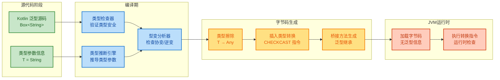

---

## 特设多态(操作符重载、方法重载、类型类模拟)

特设多态(Ad-hoc Polymorphism),又称为**重载多态**,与参数多态形成鲜明对比。如果说参数多态是"一份代码,无限类型",那么特设多态就是"相同名称,不同实现"。它允许同一个操作符或函数名称在不同上下文中表现出不同的行为,编译器根据参数类型和数量在编译期选择正确的实现。

### 操作符重载的本质

Kotlin 的操作符重载(Operator Overloading)机制允许我们为自定义类型赋予内置操作符(如 `+`、`-`、`*`、`[]` 等)以语义。这不是语法糖,而是通过约定(Convention)将操作符映射到特定的成员函数或扩展函数。

每个可重载的操作符都对应一个预定义的函数名称。例如 `+` 操作符对应 `plus` 函数,`[]` 索引操作符对应 `get` 和 `set` 函数。使用 `operator` 修饰符标记这些函数,即可启用操作符语法:

```kotlin
// 定义一个二维向量类
data class Vector2D(val x: Double, val y: Double) {
    
    // 重载 + 操作符,对应 plus 函数
    operator fun plus(other: Vector2D): Vector2D {
        return Vector2D(
            x = this.x + other.x,  // 分量相加
            y = this.y + other.y
        )
    }
    
    // 重载 - 操作符,对应 minus 函数
    operator fun minus(other: Vector2D): Vector2D {
        return Vector2D(this.x - other.x, this.y - other.y)
    }
    
    // 重载 * 操作符,实现标量乘法
    operator fun times(scalar: Double): Vector2D {
        return Vector2D(x * scalar, y * scalar)
    }
    
    // 重载一元 - 操作符,对应 unaryMinus 函数
    operator fun unaryMinus(): Vector2D {
        return Vector2D(-x, -y)  // 取反每个分量
    }
}

// 使用操作符语法
val v1 = Vector2D(3.0, 4.0)
val v2 = Vector2D(1.0, 2.0)

val sum = v1 + v2        // 等价于 v1.plus(v2)
val diff = v1 - v2       // 等价于 v1.minus(v2)
val scaled = v1 * 2.0    // 等价于 v1.times(2.0)
val negated = -v1        // 等价于 v1.unaryMinus()

println(sum)     // Vector2D(x=4.0, y=6.0)
println(negated) // Vector2D(x=-3.0, y=-4.0)
```

Kotlin 支持的可重载操作符涵盖算术、比较、索引、调用等多个类别:

```kotlin
class Matrix(private val data: Array<DoubleArray>) {
    
    // 索引操作符:mat[i, j]
    operator fun get(row: Int, col: Int): Double {
        return data[row][col]  // 委托给底层数组
    }
    
    // 索引赋值操作符:mat[i, j] = value
    operator fun set(row: Int, col: Int, value: Double) {
        data[row][col] = value
    }
    
    // in 操作符:value in matrix
    operator fun contains(value: Double): Boolean {
        return data.any { row -> value in row }  // 检查是否包含某值
    }
    
    // 范围操作符:matrix1..matrix2
    operator fun rangeTo(other: Matrix): List<Matrix> {
        // 生成从 this 到 other 的插值矩阵序列
        return listOf(this, other)  // 简化实现
    }
}

val mat = Matrix(arrayOf(
    doubleArrayOf(1.0, 2.0),
    doubleArrayOf(3.0, 4.0)
))

println(mat[0, 1])   // 2.0,调用 get
mat[1, 0] = 5.0      // 调用 set
println(5.0 in mat)  // true,调用 contains
```

**操作符重载的调用优先级**完全遵循操作符的内置优先级。`*` 和 `/` 高于 `+` 和 `-`,单目操作符高于双目操作符:

```kotlin
val v = Vector2D(1.0, 2.0)
val result = -v * 2.0 + Vector2D(3.0, 4.0)
// 等价于 (v.unaryMinus().times(2.0)).plus(Vector2D(3.0, 4.0))
// 即 ((-v) * 2.0) + Vector2D(3.0, 4.0)
```

### 操作符重载的扩展实现

操作符重载不仅限于类的成员函数,还可以通过扩展函数为现有类型添加操作符支持,甚至混合不同类型:

```kotlin
// 为 Int 扩展 * 操作符,支持 Int * Vector2D
operator fun Int.times(vector: Vector2D): Vector2D {
    val scalar = this.toDouble()  // 转换为 Double
    return Vector2D(vector.x * scalar, vector.y * scalar)
}

// 为 String 扩展 * 操作符,实现重复字符串
operator fun String.times(n: Int): String {
    return this.repeat(n)  // 调用标准库的 repeat
}

// 使用扩展操作符
val scaled = 3 * Vector2D(1.0, 2.0)  // Vector2D(3.0, 6.0)
val repeated = "ab" * 3              // "ababab"
```

需要注意的是,操作符重载应当遵循**直觉性原则**。为类型定义的操作符语义应当符合该操作符的常规语义,否则会导致代码可读性下降:

```kotlin
// 好的实践:+ 用于组合/合并语义
data class Config(val settings: Map<String, String>) {
    operator fun plus(other: Config): Config {
        return Config(settings + other.settings)  // 合并配置
    }
}

// 不好的实践:* 用于完全无关的操作
data class User(val name: String) {
    // ❌ 混淆:* 通常表示乘法或重复,而非删除操作
    operator fun times(other: User): Unit {
        // 删除另一个用户???
    }
}
```

### 方法重载与函数签名

方法重载(Method Overloading)是最传统的特设多态形式,允许在同一作用域内定义多个同名函数,只要它们的**函数签名**(Function Signature)不同即可。函数签名由函数名、参数类型列表和参数数量组成(不包括返回类型):

```kotlin
class Printer {
    
    // 重载 print 函数:处理 Int
    fun print(value: Int) {
        println("Integer: $value")
    }
    
    // 重载 print 函数:处理 String
    fun print(value: String) {
        println("String: $value")
    }
    
    // 重载 print 函数:处理多个 Int
    fun print(vararg values: Int) {
        println("Multiple integers: ${values.joinToString()}")
    }
    
    // 重载 print 函数:处理泛型 List
    fun <T> print(list: List<T>) {
        println("List of ${list.size} elements: $list")
    }
}

val printer = Printer()
printer.print(42)              // 调用 print(Int)
printer.print("hello")         // 调用 print(String)
printer.print(1, 2, 3)         // 调用 print(vararg Int)
printer.print(listOf(1, 2))    // 调用 print(List<T>)
```

编译器通过**静态分派**(Static Dispatch)在编译期选择正确的重载版本。分派规则基于参数的**静态类型**(编译时类型),而非运行时类型:

```kotlin
open class Animal
class Dog : Animal()

fun process(animal: Animal) {
    println("Processing animal")
}

fun process(dog: Dog) {
    println("Processing dog")
}

val dog: Dog = Dog()
val animal: Animal = dog  // 静态类型为 Animal,运行时类型为 Dog

process(dog)     // "Processing dog" - 静态类型是 Dog
process(animal)  // "Processing animal" - 静态类型是 Animal,即使运行时是 Dog
```

Kotlin 还支持**默认参数**(Default Arguments),这在一定程度上减少了方法重载的需求:

```kotlin
// 使用默认参数替代多个重载
fun connect(
    host: String,
    port: Int = 8080,         // 默认端口
    timeout: Int = 5000,      // 默认超时
    useSSL: Boolean = false   // 默认不使用 SSL
) {
    println("Connecting to $host:$port (SSL=$useSSL, timeout=$timeout)")
}

// 可以省略任何默认参数
connect("localhost")                      // 使用所有默认值
connect("example.com", port = 443)        // 使用命名参数指定部分参数
connect("db.server", 3306, useSSL = true) // 混合使用
```

### 比较操作符的约定

Kotlin 为比较操作符提供了特殊的约定。实现 `Comparable` 接口后,所有比较操作符(`<`、`>`、`<=`、`>=`)都会自动可用:

```kotlin
// 实现 Comparable 接口
data class Version(val major: Int, val minor: Int, val patch: Int) 
    : Comparable<Version> {
    
    // compareTo 是 Comparable 的唯一抽象方法
    override fun compareTo(other: Version): Int {
        // 先比较主版本号
        if (this.major != other.major) {
            return this.major - other.major
        }
        // 再比较次版本号
        if (this.minor != other.minor) {
            return this.minor - other.minor
        }
        // 最后比较补丁版本号
        return this.patch - other.patch
    }
}

val v1 = Version(1, 2, 3)
val v2 = Version(1, 3, 0)

println(v1 < v2)   // true,自动调用 compareTo
println(v1 >= v2)  // false
println(v1 == v2)  // false,使用 data class 的 equals

// 可以用于排序
val versions = listOf(
    Version(2, 0, 0),
    Version(1, 5, 2),
    Version(1, 5, 1)
)
val sorted = versions.sorted()  // 自动使用 compareTo
println(sorted)  // [Version(1,5,1), Version(1,5,2), Version(2,0,0)]
```

等值操作符 `==` 和 `!=` 则映射到 `equals` 方法,而引用相等性使用 `===`:

```kotlin
data class Point(val x: Int, val y: Int)

val p1 = Point(1, 2)
val p2 = Point(1, 2)
val p3 = p1

println(p1 == p2)   // true,调用 equals,比较值
println(p1 === p2)  // false,比较引用,不同对象
println(p1 === p3)  // true,相同引用
```

### 调用操作符与 DSL 构建

`invoke` 操作符允许我们像调用函数一样调用对象,这是构建 DSL(Domain-Specific Language)的核心技术:

```kotlin
// 定义一个可调用的类
class Greeter(private val greeting: String) {
    
    // 重载 invoke 操作符
    operator fun invoke(name: String) {
        println("$greeting, $name!")
    }
    
    // 重载不同参数的 invoke
    operator fun invoke(firstName: String, lastName: String) {
        println("$greeting, $firstName $lastName!")
    }
}

val hello = Greeter("Hello")
hello("World")          // "Hello, World!" - 像函数一样调用
hello("John", "Doe")    // "Hello, John Doe!"

// 更复杂的例子:HTML DSL
class HTML {
    private val content = StringBuilder()
    
    // invoke 接收 lambda,构建嵌套结构
    operator fun invoke(build: HTML.() -> Unit): String {
        this.build()  // 执行构建逻辑
        return content.toString()
    }
    
    fun tag(name: String, text: String) {
        content.append("<$name>$text</$name>\n")
    }
}

val html = HTML()
val page = html {  // 调用 invoke(lambda)
    tag("h1", "Title")
    tag("p", "Paragraph")
}
println(page)
// <h1>Title</h1>
// <p>Paragraph</p>
```

### 类型类模式模拟

虽然 Kotlin 不像 Haskell 或 Scala 那样原生支持类型类(Type Class),但我们可以使用接口和扩展函数组合来模拟类型类的行为。类型类的核心思想是定义一组操作,然后为不同类型提供这些操作的实现:

```kotlin
// 定义"可序列化"类型类接口
interface Serializable<T> {
    fun serialize(value: T): String       // 序列化方法
    fun deserialize(str: String): T       // 反序列化方法
}

// 为 Int 提供实现
object IntSerializer : Serializable<Int> {
    override fun serialize(value: Int): String = value.toString()
    override fun deserialize(str: String): Int = str.toInt()
}

// 为 List<Int> 提供实现
object IntListSerializer : Serializable<List<Int>> {
    override fun serialize(value: List<Int>): String {
        return value.joinToString(",")  // 用逗号分隔
    }
    override fun deserialize(str: String): List<Int> {
        return str.split(",").map { it.toInt() }
    }
}

// 通用的序列化函数,接收类型类实例
fun <T> save(value: T, serializer: Serializable<T>): String {
    return serializer.serialize(value)
}

fun <T> load(str: String, serializer: Serializable<T>): T {
    return serializer.deserialize(str)
}

// 使用类型类
val savedInt = save(42, IntSerializer)          // "42"
val loadedInt = load("100", IntSerializer)      // 100

val savedList = save(listOf(1, 2, 3), IntListSerializer)  // "1,2,3"
val loadedList = load("4,5,6", IntListSerializer)         // [4, 5, 6]
```

更进一步,我们可以使用**上下文接收者**(Context Receivers,实验性功能)或扩展函数来简化类型类的使用:

```kotlin
// 使用扩展函数模拟类型类约束
context(Serializable<T>)  // 实验性:上下文接收者
fun <T> T.toJson(): String = serialize(this)

context(Serializable<T>)
fun <T> String.fromJson(): T = deserialize(this)

// 在提供 Serializable<Int> 上下文的作用域内使用
with(IntSerializer) {
    val json = 42.toJson()       // "42"
    val value = "100".fromJson() // 100
}
```

类型类模式的一个实际应用是定义通用的比较策略:

```kotlin
// 定义比较策略类型类
interface Comparator<T> {
    fun compare(a: T, b: T): Int
}

// 为 String 定义不区分大小写的比较
object CaseInsensitiveComparator : Comparator<String> {
    override fun compare(a: String, b: String): Int {
        return a.lowercase().compareTo(b.lowercase())
    }
}

// 通用排序函数,接收比较策略
fun <T> List<T>.sortedWith(comparator: Comparator<T>): List<T> {
    return this.sortedWith { a, b -> comparator.compare(a, b) }
}

val words = listOf("Banana", "apple", "Cherry")
val sorted = words.sortedWith(CaseInsensitiveComparator)
println(sorted)  // [apple, Banana, Cherry]
```

### 特设多态的底层机制

与参数多态的类型擦除不同,特设多态的分派(Dispatch)机制发生在编译期。编译器根据函数签名生成不同的方法描述符(Method Descriptor),在调用点直接绑定到具体实现:

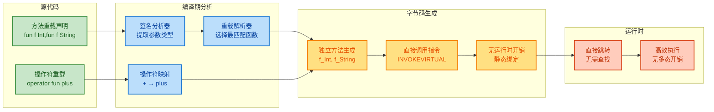

特设多态的编译产物是多个完全独立的方法,每个方法都有唯一的 JVM 签名。这与子类型多态的虚方法表(Virtual Method Table)查找形成对比,特设多态的调用是**零运行时开销**的直接跳转。

---

**📝 练习题**

**题目1：泛型型变理解**
以下代码中,哪些赋值操作是合法的?

```kotlin
class Producer<out T>(val value: T)
class Consumer<in T>
class Box<T>(var value: T)

val dogProducer: Producer<Dog> = Producer(Dog())
val animalProducer: Producer<Animal> = dogProducer  // (A)

val animalConsumer: Consumer<Animal> = Consumer()
val dogConsumer: Consumer<Dog> = animalConsumer     // (B)

val dogBox: Box<Dog> = Box(Dog())
val animalBox: Box<Animal> = dogBox                 // (C)
```

A. 仅 (A) 合法  
B. (A) 和 (B) 合法  
C. (A) 和 (C) 合法  
D. 三者都不合法  

**【答案】** B

**【解析】** 
- **(A) 合法**：`Producer<out T>` 声明为协变,表示 `T` 只能在输出位置(out position)使用。由于 `Dog` 是 `Animal` 的子类型,协变性允许 `Producer<Dog>` 赋值给 `Producer<Animal>`。从类型安全角度看,`Producer<Dog>` 产出的值必然是 `Dog`,而 `Dog` 可以安全地当作 `Animal` 使用。

- **(B) 合法**：`Consumer<in T>` 声明为逆变,表示 `T` 只能在输入位置(in position)使用。逆变性允许 `Consumer<Animal>` 赋值给 `Consumer<Dog>`。从类型安全角度看,`Consumer<Dog>` 会接收 `Dog` 实例,而 `Consumer<Animal>` 可以处理任何 `Animal`,自然包括 `Dog`。

- **(C) 不合法**：`Box<T>` 是不变的(invariant),因为 `var value: T` 同时在输入和输出位置使用 `T`。如果允许这个赋值,就可以向 `animalBox` 中放入任意 `Animal`,但通过原始的 `dogBox` 引用取出时会期望得到 `Dog`,导致类型安全问题。不变性正是为了防止这种情况。

---

**题目2：操作符重载的优先级**
以下表达式的求值顺序是什么?

```kotlin
data class Vec(val x: Int) {
    operator fun plus(other: Vec) = Vec(x + other.x)
    operator fun times(n: Int) = Vec(x * n)
    operator fun unaryMinus() = Vec(-x)
}

val result = -Vec(2) * 3 + Vec(5)
```

A. `(((-Vec(2)) * 3) + Vec(5))` → `Vec(1)`  
B. `(-(Vec(2) * 3)) + Vec(5)` → `Vec(-1)`  
C. `(-Vec(2)) * (3 + Vec(5))` → 编译错误  
D. `-(Vec(2) * (3 + Vec(5)))` → 编译错误  

**【答案】** A

**【解析】** 操作符重载严格遵循 Kotlin 的操作符优先级规则:
1. **一元操作符** (如 `-`) 优先级最高,首先执行
2. **乘法操作符** (`*`) 优先级高于加法操作符 (`+`)
3. **加法操作符** (`+`) 最后执行

因此求值过程为:
1. `-Vec(2)` → 调用 `unaryMinus()` → `Vec(-2)`
2. `Vec(-2) * 3` → 调用 `times(3)` → `Vec(-6)`
3. `Vec(-6) + Vec(5)` → 调用 `plus(Vec(5))` → `Vec(1)`

选项 C 和 D 尝试将 `Int` 类型的 `3` 与 `Vec(5)` 相加,这会导致编译错误,因为 `Int` 没有定义与 `Vec` 相加的操作符。

---

## 扩展函数深入(Extension Functions Deep Dive)

扩展函数 (Extension Functions) 是 Kotlin 最具特色的语言特性之一,它允许我们在不修改原有类代码、不使用继承的情况下,为类添加新的函数功能。这种机制在保持代码整洁的同时,极大地提升了语言的表达能力和灵活性。

### 扩展函数的语法结构

扩展函数的声明语法由三个核心部分组成:**接收者类型** (Receiver Type)、**函数名称**和**函数体**。其基本形式为:

```kotlin
// 基础语法结构
fun ReceiverType.extensionFunctionName(parameters): ReturnType {
    // 函数体中,this 指向 ReceiverType 的实例
    return result
}

// 实际示例:为 String 类添加扩展函数
fun String.removeWhitespace(): String {
    return this.replace("\\s".toRegex(), "") // this 指向调用该函数的 String 对象
}

// 使用扩展函数
fun main() {
    val text = "Hello World"
    val result = text.removeWhitespace() // 像调用成员函数一样调用
    println(result) // 输出: HelloWorld
}
```

在扩展函数内部,关键字 `this` 代表**接收者对象** (Receiver Object),即调用该扩展函数的实例。值得注意的是,`this` 通常可以省略,直接访问接收者的公开成员:

```kotlin
// 为 List<Int> 添加计算平均值的扩展函数
fun List<Int>.average(): Double {
    if (isEmpty()) return 0.0 // 省略 this.isEmpty()
    return sum().toDouble() / size // 省略 this.sum() 和 this.size
}

// 使用示例
fun main() {
    val numbers = listOf(1, 2, 3, 4, 5)
    println(numbers.average()) // 输出: 3.0
}
```

扩展函数可以声明在**任何作用域**内:顶层 (top-level)、类内部、甚至是局部作用域。这种灵活性使得我们可以精确控制扩展函数的可见性范围。

```kotlin
// 1. 顶层扩展函数 - 全局可用
fun String.capitalizeWords(): String {
    return split(" ").joinToString(" ") { 
        it.replaceFirstChar { char -> char.uppercase() } 
    }
}

// 2. 类内部的扩展函数 - 仅在类内部可用
class StringProcessor {
    // 这个扩展函数只能在 StringProcessor 类内部使用
    private fun String.reverse(): String {
        return this.reversed()
    }
    
    fun process(text: String): String {
        return text.reverse() // 只能在类内部调用
    }
}

// 3. 局部扩展函数 - 仅在函数作用域内可用
fun demonstrate() {
    // 这个扩展函数只在 demonstrate 函数内部有效
    fun Int.square(): Int = this * this
    
    println(5.square()) // 输出: 25
}
```

### 静态解析机制 (Static Resolution)

扩展函数最重要的特性之一是**静态解析** (Static Dispatch),这意味着扩展函数的调用在**编译期**就已经确定,而非运行时动态绑定。这与类的成员函数形成了鲜明对比。

```kotlin
open class Shape
class Circle : Shape()

// 为 Shape 定义扩展函数
fun Shape.getName(): String = "Shape"

// 为 Circle 定义扩展函数
fun Circle.getName(): String = "Circle"

fun main() {
    val shape: Shape = Circle() // 声明类型是 Shape,实际类型是 Circle
    println(shape.getName()) // 输出: "Shape" 而非 "Circle"
    // 扩展函数根据变量的声明类型(编译期类型)解析,而非运行时类型
}
```

这种行为的根本原因在于,扩展函数在**字节码层面**被编译为**静态方法**,接收者对象作为第一个参数传入:

```kotlin
// Kotlin 源代码
fun String.addPrefix(prefix: String): String {
    return "$prefix$this"
}

// 等价的 Java 字节码概念(伪代码)
public static String addPrefix(String $receiver, String prefix) {
    return prefix + $receiver;
}

// 调用方式
val result = "World".addPrefix("Hello ")
// 编译后实际调用: StringExtensionsKt.addPrefix("World", "Hello ")
```

这张流程图展示了扩展函数的编译期解析过程:

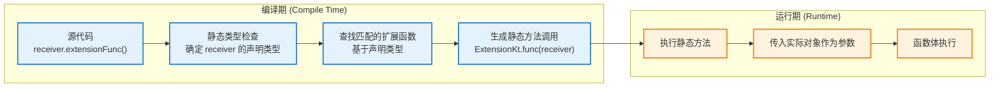

静态解析带来两个重要影响:

1. **性能优势**: 没有虚方法表查找的开销,调用效率与普通静态方法相同
2. **行为限制**: 无法实现真正的多态覆盖 (Polymorphic Override)

```kotlin
open class Animal {
    open fun sound() = "Some sound" // 成员函数,支持多态
}

class Dog : Animal() {
    override fun sound() = "Bark" // 覆盖父类方法
}

// 扩展函数,无法被覆盖
fun Animal.description() = "Animal extension"
fun Dog.description() = "Dog extension"

fun printInfo(animal: Animal) {
    println(animal.sound())       // 多态调用,输出: Bark
    println(animal.description()) // 静态解析,输出: Animal extension
}

fun main() {
    val dog = Dog()
    printInfo(dog)
}
```

### 成员函数优先原则 (Member Always Wins)

当扩展函数与类的成员函数**签名冲突**时,Kotlin 遵循**成员优先** (Member Always Wins) 原则。这是一个关键的设计决策,确保了类的封装性不会被外部扩展函数破坏。

```kotlin
class MyClass {
    fun existingFunction() {
        println("Member function") // 类的成员函数
    }
}

// 尝试定义同名同签名的扩展函数
fun MyClass.existingFunction() {
    println("Extension function") // 这个扩展函数会被忽略
}

fun main() {
    val obj = MyClass()
    obj.existingFunction() // 输出: "Member function"
    // 成员函数始终优先,扩展函数永远不会被调用
}
```

然而,如果扩展函数的**签名不同**(参数列表不同),则可以实现函数重载 (Overload):

```kotlin
class Calculator {
    fun add(a: Int, b: Int): Int = a + b // 成员函数:两个参数
}

// 扩展函数:三个参数,构成重载
fun Calculator.add(a: Int, b: Int, c: Int): Int {
    return a + b + c
}

fun main() {
    val calc = Calculator()
    println(calc.add(1, 2))       // 调用成员函数,输出: 3
    println(calc.add(1, 2, 3))    // 调用扩展函数,输出: 6
}
```

这个优先级规则的层次结构可以用以下图示表达:

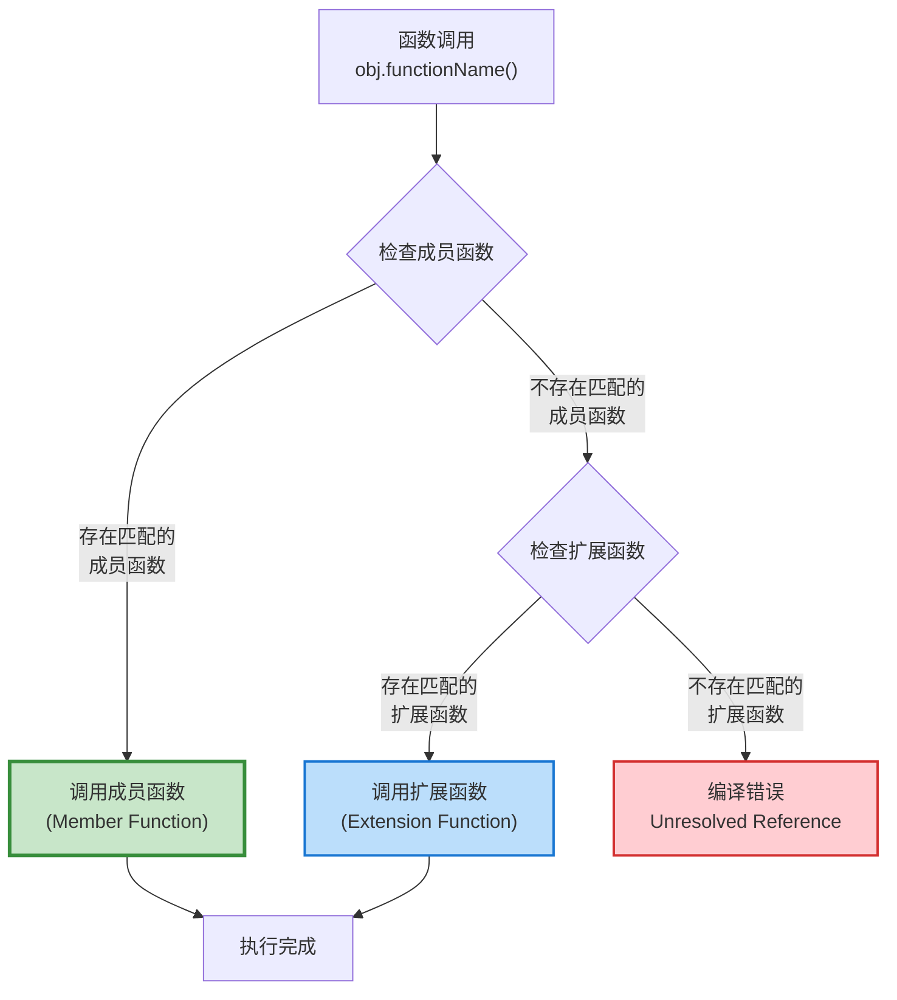

成员优先原则的设计动机包括:

1. **向后兼容性**: 当库作者在新版本中添加了新的成员函数时,不会意外地破坏使用者编写的同名扩展函数
2. **封装保护**: 类的内部实现细节始终优先于外部扩展,维护了面向对象的封装性
3. **明确性**: 开发者可以放心地为第三方类添加扩展,而不必担心命名冲突

### 可空接收者扩展 (Nullable Receiver Extensions)

Kotlin 的扩展函数支持一个强大的特性:**可空接收者** (Nullable Receiver)。我们可以为可空类型 (Nullable Type) 定义扩展函数,在函数内部安全地处理 `null` 情况。

```kotlin
// 为可空的 String? 定义扩展函数
fun String?.isNullOrBlank(): Boolean {
    // this 的类型是 String?,可能为 null
    return this == null || this.isBlank()
}

fun main() {
    val text1: String? = null
    val text2: String? = "  "
    val text3: String? = "Hello"
    
    println(text1.isNullOrBlank()) // true - 处理 null 情况
    println(text2.isNullOrBlank()) // true - 处理空白字符串
    println(text3.isNullOrBlank()) // false - 正常字符串
    
    // 即使 text1 是 null,也可以安全调用扩展函数,不会抛出 NPE
}
```

这种机制的核心价值在于,它允许我们在**调用点**不需要使用安全调用运算符 (`?.`),而是将 null 检查逻辑封装在扩展函数内部:

```kotlin
// 为 Any? 定义扩展函数,将对象转换为安全的字符串表示
fun Any?.toSafeString(): String {
    return when {
        this == null -> "null"           // 处理 null 情况
        this is String -> "\"$this\""    // 字符串加引号
        else -> this.toString()          // 其他类型调用 toString()
    }
}

fun main() {
    val obj1: Any? = null
    val obj2: Any? = "Hello"
    val obj3: Any? = 42
    
    // 无需使用 ?. 安全调用
    println(obj1.toSafeString()) // 输出: null
    println(obj2.toSafeString()) // 输出: "Hello"
    println(obj3.toSafeString()) // 输出: 42
}
```

Kotlin 标准库中大量使用了可空接收者扩展,最典型的例子是 `let`、`run`、`apply` 等作用域函数:

```kotlin
// 标准库中的实际实现(简化版)
public inline fun <T, R> T?.let(block: (T) -> R): R? {
    // this 可能为 null
    return if (this == null) null else block(this)
}

// 实际使用场景
fun processUser(name: String?) {
    name?.let { 
        // 只有当 name 不为 null 时才执行这个代码块
        println("Processing user: $it")
        // 在这个代码块中,it 的类型是 String(非空)
    }
}
```

可空接收者扩展与非空接收者扩展的对比:

```kotlin
// 非空接收者扩展
fun String.addExclamation(): String {
    return "$this!" // this 是 String 类型(非空)
}

// 可空接收者扩展
fun String?.addExclamationSafe(): String {
    return if (this != null) "$this!" else "null!" // this 是 String? 类型
}

fun main() {
    val text1: String = "Hello"
    val text2: String? = null
    
    println(text1.addExclamation())      // 输出: Hello!
    // println(text2.addExclamation())   // 编译错误:String? 不能调用 String 的扩展
    
    println(text1.addExclamationSafe())  // 输出: Hello!
    println(text2.addExclamationSafe())  // 输出: null!
}
```

可空接收者扩展的类型层次关系:

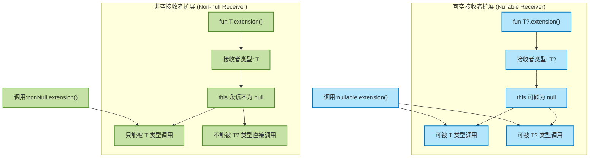

这种设计使得 Kotlin 在保持类型安全的同时,提供了极大的便利性。开发者可以根据实际需求选择合适的接收者类型,在 API 设计时明确表达函数对 null 的处理策略。

---

## 扩展属性(Extension Properties)

扩展属性 (Extension Properties) 是扩展函数概念在属性领域的延伸,允许我们为现有类型添加新的属性访问器,而无需修改原始类定义。然而,与扩展函数相比,扩展属性有着更严格的限制,这些限制源于 Kotlin 属性系统的底层实现机制。

### 扩展属性的本质:无幕后字段

扩展属性最根本的限制是**不能有幕后字段** (Backing Field)。这意味着扩展属性**不能存储状态**,只能通过计算来提供值。从本质上讲,扩展属性就是一对精心伪装的 getter/setter 方法。

```kotlin
// 正确的扩展属性:通过计算获得值
val String.lastChar: Char
    get() = this[length - 1] // 必须提供 getter,通过计算返回值

// 错误示例:尝试使用幕后字段
val String.cachedLength: Int = this.length // 编译错误!
// Error: Extension property cannot have a backing field

// 错误示例:尝试在 getter 中使用 field 关键字
val String.upperCaseCache: String
    get() = field ?: this.uppercase() // 编译错误!
// Error: Unresolved reference: field
```

这个限制的根本原因在于,扩展属性没有地方可以存储数据。回顾之前提到的,扩展函数在字节码层面被编译为静态方法,同样地,扩展属性被编译为静态的 getter/setter 方法:

```kotlin
// Kotlin 源代码
val String.lastChar: Char
    get() = this[length - 1]

// 编译后等价的 Java 伪代码
public static char getLastChar(String $receiver) {
    return $receiver.charAt($receiver.length() - 1);
}

// 调用方式
val char = "Hello".lastChar
// 实际字节码调用: StringExtensionsKt.getLastChar("Hello")
```

由于扩展属性本质上是静态方法,它们无法在对象实例中分配内存空间来存储字段值,因此必须通过计算来动态生成属性值。

### 计算属性模式 (Computed Property Pattern)

扩展属性的主要用途是为现有类型提供**计算属性** (Computed Properties),这些属性的值基于对象的现有状态计算得出,而不是独立存储。

```kotlin
// 为 List<T> 添加计算属性:获取倒数第二个元素
val <T> List<T>.penultimate: T
    get() {
        if (size < 2) throw NoSuchElementException("List has less than 2 elements")
        return this[size - 2] // 基于现有的 size 和索引访问计算
    }

// 为 Int 添加计算属性:判断是否为偶数
val Int.isEven: Boolean
    get() = this % 2 == 0 // 通过取模运算计算

// 为 String 添加计算属性:获取所有元音字母
val String.vowels: String
    get() = this.filter { it.lowercaseChar() in "aeiou" } // 通过过滤计算

fun main() {
    val list = listOf(1, 2, 3, 4, 5)
    println(list.penultimate) // 输出: 4
    
    println(42.isEven)        // 输出: true
    println(17.isEven)        // 输出: false
    
    println("Hello World".vowels) // 输出: eoo
}
```

计算属性模式的优势在于提供了**类似字段的访问语法**,同时保持了**延迟计算**的性能特性。与函数调用相比,属性访问在语义上更清晰,暗示了操作的轻量级和无副作用特性。

```kotlin
// 函数风格:适用于有明显计算成本或副作用的操作
fun String.extractEmails(): List<String> {
    val emailPattern = "[a-zA-Z0-9._%+-]+@[a-zA-Z0-9.-]+\\.[a-zA-Z]{2,}".toRegex()
    return emailPattern.findAll(this).map { it.value }.toList()
}

// 属性风格:适用于简单、快速、无副作用的访问
val String.wordCount: Int
    get() = split("\\s+".toRegex()).size

fun main() {
    val text = "Contact us at info@example.com or support@test.org"
    
    // 函数调用:暗示有计算过程
    val emails = text.extractEmails()
    
    // 属性访问:感觉像是直接访问字段
    val count = text.wordCount
}
```

### 扩展 val 与 var 属性

扩展属性可以声明为 `val`(只读) 或 `var`(可变),但即使是 `var` 属性,也无法真正存储状态,只能通过 getter/setter 委托到其他属性或操作。

```kotlin
// 只读扩展属性 (val)
val String.indices: IntRange
    get() = 0 until length // 只有 getter

// 可变扩展属性 (var) - 实际上是对现有可变状态的封装
var StringBuilder.firstChar: Char
    get() = this[0]                    // getter: 读取第一个字符
    set(value) { this[0] = value }     // setter: 修改第一个字符

fun main() {
    val str = "Hello"
    println(str.indices) // 输出: 0..4
    
    val builder = StringBuilder("Hello")
    println(builder.firstChar) // 输出: H
    
    builder.firstChar = 'J'    // 通过 setter 修改
    println(builder)           // 输出: Jello
    
    // 底层操作的是 StringBuilder 的内部状态,而非扩展属性自己的字段
}
```

需要强调的是,`var` 扩展属性的 setter 必须委托到某种可变的底层状态。如果接收者类型本身是不可变的 (immutable),则无法为其定义有意义的 `var` 扩展属性:

```kotlin
// 为不可变的 String 定义 var 扩展属性 - 这在逻辑上是不可能的
var String.firstChar: Char
    get() = this[0]
    set(value) {
        // 无法实现!String 是不可变的,无法修改其内容
        // this[0] = value // 编译错误: No set method providing array access
    }

// 唯一的"变通"方式是返回新对象,但这已经偏离了属性赋值的语义
var String.capitalized: String
    get() = this.replaceFirstChar { it.uppercase() }
    set(value) {
        // 这个 setter 实际上无法改变 this 的值
        // 只能在某个外部可变容器中替换引用,但这不是属性的职责
        println("Warning: Cannot mutate immutable String")
    }
```

扩展属性的类型特征:

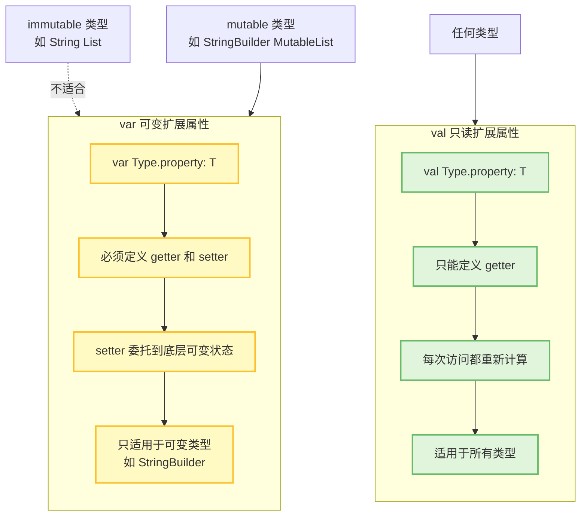

### 计算属性与性能考量

由于扩展属性每次访问时都会重新计算值(除非底层对象自己做了缓存),在性能敏感的场景下需要格外注意:

```kotlin
// 开销较大的计算属性
val String.isPalindrome: Boolean
    get() = this == this.reversed() // 每次访问都会创建反转字符串

fun inefficientUsage(text: String) {
    // 糟糕的写法:在循环中多次访问计算属性
    repeat(1000) {
        if (text.isPalindrome) { // 每次循环都重新计算
            println("Is palindrome")
        }
    }
}

fun efficientUsage(text: String) {
    // 优化写法:缓存计算结果
    val isPalindrome = text.isPalindrome // 只计算一次
    repeat(1000) {
        if (isPalindrome) { // 使用缓存的值
            println("Is palindrome")
        }
    }
}
```

对于计算成本较高的扩展属性,可以考虑提供对应的扩展函数,并在文档中说明性能特征:

```kotlin
// 轻量级计算:适合作为属性
val List<Int>.sum: Int
    get() = this.sum() // O(n) 但常用,可接受

// 重量级计算:最好作为函数,明确表达有计算成本
fun <T> List<T>.allPermutations(): List<List<T>> {
    // 复杂的排列组合算法
    // 使用函数而非属性,提醒调用者这是一个昂贵的操作
    // ...
}
```

扩展属性的设计哲学可以总结为:**提供便捷的访问语法,但不引入隐藏的复杂性**。当属性的计算成本可能误导使用者时,应该优先使用函数而非属性,保持 API 的直观性和可预测性。

---

## 扩展作用域(顶层扩展、成员扩展、伴生对象扩展)

Kotlin 的扩展机制并非仅限于简单的"为类添加方法"这一单一场景。实际上，扩展函数和扩展属性可以声明在不同的作用域 (Scope) 中，每种作用域都有其独特的语义和应用场景。理解扩展的作用域规则，是掌握 Kotlin 高级特性、设计 DSL (Domain-Specific Language) 以及构建层次化 API 的关键基础。

在 Kotlin 中，扩展可以声明在三个主要作用域：**顶层作用域 (Top-level Scope)**、**成员作用域 (Member Scope)** 以及 **伴生对象作用域 (Companion Object Scope)**。这三种作用域形成了一个从全局到局部、从静态到实例的层级结构,为开发者提供了极大的灵活性。

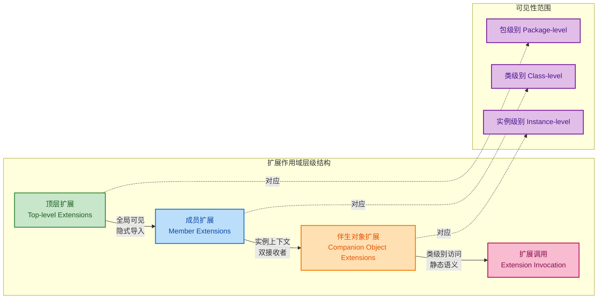

### 顶层扩展 (Top-level Extensions)

顶层扩展是最常见也是最直观的扩展形式。它们直接声明在文件的顶层,不属于任何类的内部。顶层扩展具有包级别 (Package-level) 的可见性,可以通过 `import` 语句在其他文件中使用。

从语义上讲,顶层扩展本质上是一种**全局工具函数**的优雅替代方案。传统的 Java 工具类 (如 `StringUtils.isEmpty(str)`) 需要显式传递对象作为参数,而 Kotlin 的顶层扩展通过接收者 (Receiver) 机制,将调用语法转换为更符合面向对象风格的 `str.isEmpty()` 形式。

```kotlin
// File: StringExtensions.kt
package com.example.utils

/**
 * 顶层扩展函数: 判断字符串是否为空或仅包含空白字符
 * 接收者类型: String
 * 返回值: Boolean
 */
fun String.isBlankOrEmpty(): Boolean {
    // trim() 移除首尾空白字符
    // isEmpty() 检查结果是否为空字符串
    return this.trim().isEmpty()
}

/**
 * 顶层扩展属性: 计算字符串中的单词数量
 * 注意: 扩展属性不能有幕后字段,必须通过 get() 计算
 */
val String.wordCount: Int
    get() {
        // 如果字符串为空白,返回 0
        if (this.isBlank()) return 0
        // split("\\s+") 按空白字符分割,转为正则表达式
        // toRegex() 将字符串转换为正则表达式对象
        return this.split("\\s+".toRegex()).size
    }

// File: Main.kt
package com.example

// 导入顶层扩展 (如果在不同包中)
import com.example.utils.isBlankOrEmpty
import com.example.utils.wordCount

fun main() {
    val text = "   Hello Kotlin World   "
    
    // 调用顶层扩展函数,语法如同调用成员方法
    println(text.isBlankOrEmpty())  // 输出: false
    
    // 访问顶层扩展属性,语法如同访问成员属性
    println(text.wordCount)         // 输出: 3
    
    val emptyText = "    "
    println(emptyText.isBlankOrEmpty())  // 输出: true
    println(emptyText.wordCount)         // 输出: 0
}
```

顶层扩展的**核心优势**在于其**全局可复用性**和**零侵入性**。开发者无需修改原有类的定义,即可为标准库类型 (如 `String`、`List`) 或第三方库类型添加自定义行为。同时,由于扩展是静态解析的,不会产生运行时性能开销。

然而,顶层扩展也有其局限性。由于它们缺乏对类内部状态的访问权限,只能操作 `public` 成员,因此无法实现需要访问 `private` 字段的复杂逻辑。此外,过度使用顶层扩展可能导致命名空间污染,尤其是在大型项目中,需要谨慎设计扩展的命名和分组。

### 成员扩展 (Member Extensions)

成员扩展是指在类的内部声明的扩展函数或扩展属性。这种扩展形式引入了**双接收者 (Dual Receiver)** 的概念: 一个是扩展的接收者 (Extension Receiver),另一个是包含该扩展的类的实例 (Dispatch Receiver)。成员扩展可以同时访问这两个接收者的成员,这为构建 DSL 和设计分层 API 提供了强大的工具。

在成员扩展的函数体内,关键字 `this` 默认指向**扩展接收者**,而**分发接收者**可以通过 `this@外部类名` 的语法显式访问。这种机制允许扩展函数在特定的上下文 (Context) 中执行,从而实现作用域限定 (Scoped) 的行为。

```kotlin
/**
 * HTML DSL 示例: 使用成员扩展构建类型安全的 HTML 构建器
 */
class HTMLBuilder {
    // 存储生成的 HTML 标签
    private val elements = mutableListOf<String>()
    
    /**
     * 成员扩展函数: 为 String 添加 unaryPlus 操作符
     * 接收者: String (扩展接收者)
     * 上下文: HTMLBuilder 实例 (分发接收者)
     * 
     * 这个扩展只在 HTMLBuilder 内部可见和可用
     */
    operator fun String.unaryPlus() {
        // this 指向 String 实例 (扩展接收者)
        // this@HTMLBuilder 指向外部 HTMLBuilder 实例 (分发接收者)
        this@HTMLBuilder.elements.add(this)
    }
    
    /**
     * 成员扩展函数: 为 String 添加 invoke 操作符,支持嵌套标签
     * 接收者: String (扩展接收者,表示标签名)
     * 参数: block - 接收者为 HTMLBuilder 的 lambda
     */
    operator fun String.invoke(block: HTMLBuilder.() -> Unit) {
        // this 是标签名 (如 "div")
        this@HTMLBuilder.elements.add("<$this>")
        
        // 创建新的 HTMLBuilder 实例作为嵌套上下文
        val nested = HTMLBuilder()
        // 在嵌套上下文中执行 block
        nested.block()
        
        // 将嵌套内容添加到当前构建器
        this@HTMLBuilder.elements.addAll(nested.elements)
        
        this@HTMLBuilder.elements.add("</$this>")
    }
    
    /**
     * 构建最终的 HTML 字符串
     */
    fun build(): String = elements.joinToString("\n")
}

/**
 * DSL 入口函数: 创建 HTML 构建器并执行构建逻辑
 */
fun html(block: HTMLBuilder.() -> Unit): String {
    val builder = HTMLBuilder()
    builder.block()  // 执行构建逻辑
    return builder.build()
}

// 使用示例
fun main() {
    val htmlContent = html {
        // 在这个作用域内,"div"、"p" 等字符串拥有了特殊的语义
        // 因为 HTMLBuilder 的成员扩展为它们添加了 invoke 操作符
        
        "div" {  // 调用 String.invoke(block)
            +"<h1>Welcome</h1>"  // 调用 String.unaryPlus()
            
            "p" {
                +"This is a paragraph"
            }
            
            "p" {
                +"Another paragraph"
            }
        }
    }
    
    println(htmlContent)
    /*
     * 输出:
     * <div>
     * <h1>Welcome</h1>
     * <p>
     * This is a paragraph
     * </p>
     * <p>
     * Another paragraph
     * </p>
     * </div>
     */
}
```

成员扩展的**关键价值**在于其**上下文限定性 (Context-bound)**。通过将扩展声明在类内部,我们可以确保这些扩展只在特定的上下文中可用,避免了全局命名空间的污染。这种模式在 DSL 设计中尤为常见,例如 Kotlin 官方的 `kotlinx.html` 库和 `Gradle Kotlin DSL` 都大量使用了成员扩展。

从编译器的角度看,成员扩展在字节码层面会被编译为一个接受两个参数的静态方法: 第一个参数是分发接收者 (外部类实例),第二个参数是扩展接收者。调用时,编译器会自动传递这两个隐式参数。

```kotlin
// Kotlin 源码
class Container {
    fun String.extend() { /* ... */ }
}

// 等价的 Java 字节码概念 (伪代码)
public static void extend(Container $this, String $receiver) {
    // 方法体
}
```

### 伴生对象扩展 (Companion Object Extensions)

伴生对象 (Companion Object) 是 Kotlin 对静态成员的替代方案。由于伴生对象本质上是一个单例对象,它也可以作为扩展的接收者。为伴生对象添加扩展,在语义上相当于为类添加"静态方法",但仍然保持了 Kotlin 面向对象的设计哲学。

伴生对象扩展的典型应用场景包括: **工厂方法 (Factory Methods)**、**反序列化逻辑 (Deserialization)**、**DSL 构建器 (Builder Pattern)** 等。通过扩展伴生对象,我们可以在不修改原有类定义的前提下,为类添加类级别的行为。

```kotlin
/**
 * 原始类定义: User 类包含伴生对象
 */
class User(val name: String, val age: Int) {
    companion object {
        // 伴生对象可以包含常量或工厂方法
        const val MIN_AGE = 0
        const val MAX_AGE = 150
    }
}

/**
 * 为 User 的伴生对象添加扩展函数
 * 接收者: User.Companion (伴生对象类型)
 * 
 * 注意: 必须显式声明接收者类型为 User.Companion
 */
fun User.Companion.createGuest(): User {
    // 在扩展函数内部,可以访问伴生对象的成员
    // this 指向 User.Companion 单例
    return User("Guest", 18)
}

/**
 * 为伴生对象添加工厂方法: 从 JSON 字符串创建 User
 */
fun User.Companion.fromJson(json: String): User? {
    // 简化的 JSON 解析逻辑 (实际应使用 kotlinx.serialization)
    val regex = """"name":"([^"]+)".*"age":(\d+)""".toRegex()
    val match = regex.find(json) ?: return null
    
    val (name, ageStr) = match.destructured  // 解构匹配结果
    val age = ageStr.toIntOrNull() ?: return null
    
    // 验证年龄范围 (访问伴生对象的常量)
    if (age !in MIN_AGE..MAX_AGE) return null
    
    return User(name, age)
}

/**
 * 为伴生对象添加扩展属性: 提供默认实例
 */
val User.Companion.default: User
    get() = User("Anonymous", 0)

// 使用示例
fun main() {
    // 调用伴生对象扩展函数,语法如同调用静态方法
    val guest = User.createGuest()
    println("Guest: ${guest.name}, ${guest.age}")  // 输出: Guest: Guest, 18
    
    // 从 JSON 创建用户
    val json = """{"name":"Alice","age":30}"""
    val alice = User.fromJson(json)
    println("From JSON: ${alice?.name}, ${alice?.age}")  // 输出: From JSON: Alice, 30
    
    // 访问扩展属性
    val defaultUser = User.default
    println("Default: ${defaultUser.name}, ${defaultUser.age}")  // 输出: Default: Anonymous, 0
    
    // 验证边界情况
    val invalidJson = """{"name":"Bob","age":200}"""
    val bob = User.fromJson(invalidJson)
    println("Invalid age: $bob")  // 输出: Invalid age: null
}
```

伴生对象扩展的一个重要特性是它们**不会被子类继承**。这是因为伴生对象本质上是一个独立的对象,而非类的成员。如果需要在继承层次中共享类级别的扩展行为,应该考虑使用顶层扩展或接口默认实现。

```kotlin
open class Base {
    companion object
}

class Derived : Base()

// 为 Base 的伴生对象添加扩展
fun Base.Companion.extensionMethod() {
    println("Base companion extension")
}

fun main() {
    Base.extensionMethod()     // 正确: 输出 "Base companion extension"
    // Derived.extensionMethod()  // 编译错误: Derived 的伴生对象没有此扩展
}
```

从实现原理看,伴生对象扩展在字节码层面会被编译为一个静态方法,其第一个参数是伴生对象的单例实例。由于伴生对象在类加载时即被初始化,这些扩展方法实际上具有与 Java 静态方法相同的性能特征。

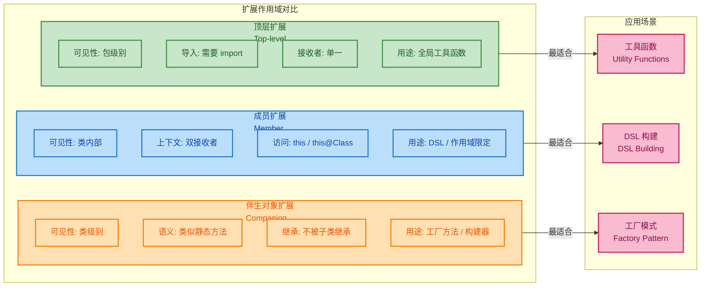

理解这三种扩展作用域的区别和适用场景,是编写高质量 Kotlin 代码的关键。顶层扩展适合全局复用的工具函数,成员扩展适合构建上下文限定的 DSL,而伴生对象扩展适合为类添加类级别的工厂方法。合理选择扩展的作用域,不仅能提升代码的可读性和可维护性,还能有效避免命名冲突和作用域污染。

---

## 扩展解析规则(静态解析、覆盖规则、同名成员优先)

扩展机制虽然在语法上看起来像是为类"动态添加"了新的方法或属性,但其底层实现是**完全静态的 (Statically Resolved)**。这意味着扩展函数的调用在编译期就已经确定,不会产生运行时的动态分发 (Dynamic Dispatch) 开销。然而,静态解析也带来了一些与面向对象多态 (Polymorphism) 不同的行为特征,开发者必须深刻理解这些规则,才能避免常见的陷阱。

### 静态解析 (Static Resolution)

扩展函数的调用是基于**声明类型 (Declared Type)** 而非**运行时类型 (Runtime Type)** 进行解析的。这与虚方法 (Virtual Method) 的动态分发形成了鲜明对比。在 Java 或 Kotlin 的普通成员方法中,方法调用会根据对象的实际类型在运行时查找虚方法表 (Virtual Method Table, vtable),从而实现多态。但扩展函数不参与这一机制,它们在编译期就被解析为对静态方法的调用。

```kotlin
/**
 * 定义类层次结构
 */
open class Shape {
    open fun draw() {
        println("Drawing a shape")  // 虚方法,支持多态
    }
}

class Circle : Shape() {
    override fun draw() {
        println("Drawing a circle")  // 重写父类方法
    }
}

/**
 * 为 Shape 添加扩展函数
 */
fun Shape.describe(): String {
    return "This is a shape"  // 扩展函数,静态解析
}

/**
 * 为 Circle 添加扩展函数
 */
fun Circle.describe(): String {
    return "This is a circle"  // 另一个独立的扩展函数
}

// 测试静态解析行为
fun main() {
    // 声明类型为 Shape,运行时类型为 Circle
    val shape: Shape = Circle()
    
    // 调用成员方法 draw(): 动态分发,调用 Circle.draw()
    shape.draw()  // 输出: "Drawing a circle"
    
    // 调用扩展函数 describe(): 静态解析,调用 Shape.describe()
    println(shape.describe())  // 输出: "This is a shape"
    
    // 如果显式转换为 Circle 类型
    val circle = shape as Circle
    println(circle.describe())  // 输出: "This is a circle"
}
```

在上面的例子中,尽管 `shape` 变量的运行时类型是 `Circle`,但调用 `describe()` 时,编译器根据其**声明类型** `Shape` 选择了 `Shape.describe()` 扩展。这种行为可以用下面的伪 Java 代码来理解:

```java
// Kotlin 编译后的等价 Java 伪代码
public static String describe(Shape $this) {
    return "This is a shape";
}

public static String describe(Circle $this) {
    return "This is a circle";
}

// 调用时
Shape shape = new Circle();
String result = ExtensionsKt.describe(shape);  // 调用 describe(Shape)
```

这种静态解析的设计决策有其深刻的原因。首先,它保证了**性能**: 扩展函数不需要虚方法表查找,调用开销与普通静态方法相同。其次,它避免了**版本兼容性问题**: 如果扩展支持多态,那么添加一个新的扩展可能会意外改变已有代码的行为,破坏封装性。

然而,静态解析也带来了一些反直觉的行为。开发者在使用扩展时,必须清楚地认识到**扩展不是真正的成员方法**,它们是编译期的语法糖,而非运行时的动态特性。

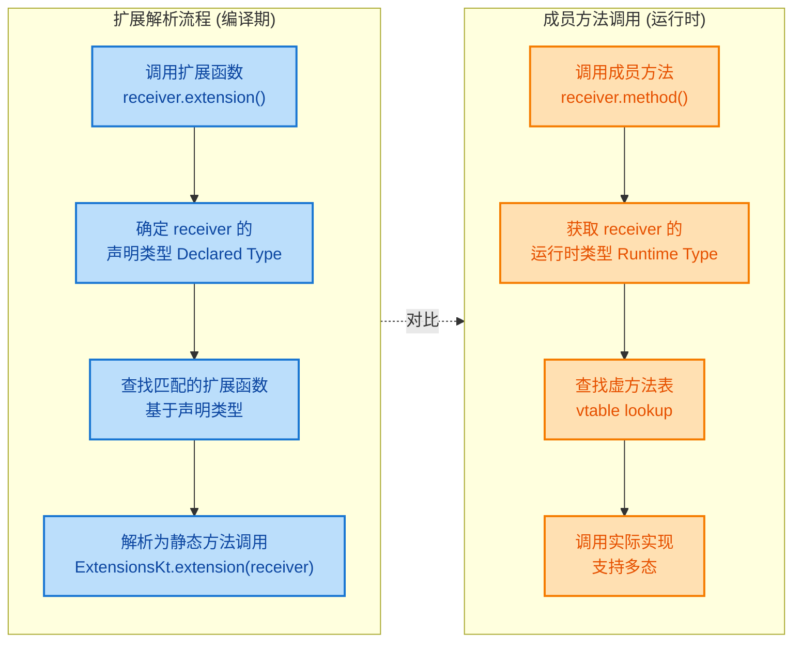

### 覆盖规则 (Shadowing Rules)

当一个类既有成员方法,又有同名的扩展函数时,**成员方法总是优先 (Member Always Wins)**。这是 Kotlin 的一个核心设计原则,目的是保证类的封装性不会被外部扩展意外破坏。即使扩展函数的签名更加匹配,或者在作用域上更接近调用点,成员方法仍然具有绝对优先权。

```kotlin
/**
 * 定义一个类,包含成员方法 print()
 */
class Document {
    /**
     * 成员方法: 打印文档内容
     */
    fun print() {
        println("Printing document content")
    }
}

/**
 * 为 Document 添加同名扩展函数 print()
 * 注意: 这个扩展函数会被成员方法覆盖 (Shadowed)
 */
fun Document.print() {
    println("Extension: Printing document")
}

/**
 * 为 Document 添加不同签名的扩展函数 print(String)
 * 这个扩展函数不会被覆盖,因为签名不同
 */
fun Document.print(message: String) {
    println("Extension: $message")
}

fun main() {
    val doc = Document()
    
    // 调用 print(): 成员方法优先,输出 "Printing document content"
    doc.print()
    
    // 调用 print(String): 扩展函数,因为成员方法没有这个签名
    doc.print("Custom message")  // 输出: "Extension: Custom message"
}
```

这种覆盖规则具有重要的**向后兼容性 (Backward Compatibility)** 意义。假设你为第三方库的类添加了扩展,而该库在新版本中添加了同名的成员方法,你的代码不会因此崩溃,而是自动切换到使用新的成员方法。这种平滑过渡机制是扩展设计的一大亮点。

然而,这也可能导致**隐式行为变化 (Silent Behavior Change)**。如果库的新版本添加了与你的扩展同名的成员方法,而该方法的行为与你的扩展不同,你的代码可能在升级后产生意外结果,且编译器不会发出任何警告。因此,在为第三方库添加扩展时,应该谨慎选择扩展的命名,避免与潜在的成员方法冲突。

```kotlin
/**
 * 演示成员优先规则的细节
 */
class Container {
    // 成员方法: 参数类型为 Any?
    fun process(value: Any?) {
        println("Member: processing $value")
    }
}

// 扩展函数: 参数类型为 String (更具体)
fun Container.process(value: String) {
    println("Extension: processing string $value")
}

fun main() {
    val container = Container()
    
    // 传入 String 类型参数
    container.process("test")  
    // 输出: "Member: processing test"
    // 即使扩展函数的参数类型更匹配,成员方法仍然优先
    
    // 显式调用扩展函数需要使用 run 作用域函数
    with(container) {
        // 在 with 作用域内,扩展函数仍然被成员方法覆盖
        process("test")  // 输出: "Member: processing test"
    }
}
```

### 同名成员优先 (Member Priority)

成员优先规则不仅适用于方法,也适用于属性。当类有一个成员属性,而扩展定义了同名的扩展属性时,成员属性总是优先。这种规则确保了类的内部状态不会被外部扩展意外访问或覆盖。

```kotlin
/**
 * 定义一个数据类,包含成员属性 name
 */
data class Person(val name: String, val age: Int)

/**
 * 为 Person 添加扩展属性 name (与成员属性同名)
 * 这个扩展属性永远不会被访问到
 */
val Person.name: String
    get() = "Extension name"  // 被成员属性覆盖

/**
 * 为 Person 添加扩展属性 description (不与成员冲突)
 */
val Person.description: String
    get() = "Person: $name, Age: $age"  // 可以访问成员属性

fun main() {
    val person = Person("Alice", 30)
    
    // 访问 name: 成员属性优先
    println(person.name)  // 输出: "Alice"
    
    // 访问 description: 扩展属性
    println(person.description)  // 输出: "Person: Alice, Age: 30"
}
```

在扩展属性的 `get()` 方法中访问 `name` 时,实际访问的是**成员属性**,而非扩展属性自身。这避免了递归调用的风险,也体现了成员优先的一致性。

从编译器实现的角度看,成员优先规则是通过**名称解析优先级 (Name Resolution Priority)** 实现的。编译器在解析一个方法或属性调用时,会按以下顺序查找:

1. **成员方法/属性** (包括继承的成员)
2. **扩展函数/属性** (按作用域从内到外查找)
3. **顶层函数/属性**

一旦找到匹配的成员,编译器就会停止查找,不再考虑后续的扩展或顶层声明。这种确定性的解析顺序保证了代码行为的可预测性。

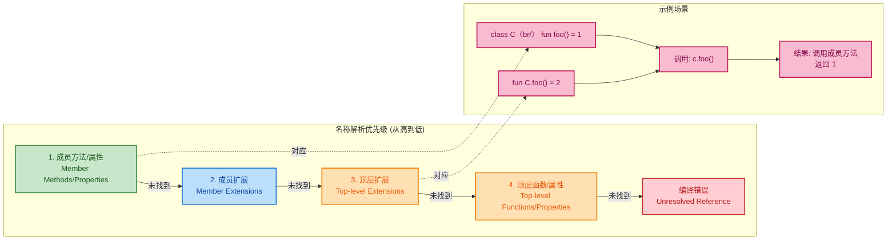

### 扩展解析的边界情况 (Edge Cases)

在某些特殊场景下,扩展解析的行为可能出乎意料。理解这些边界情况,有助于避免潜在的 Bug 和混淆。

**场景 1: 可空接收者扩展与非空成员**

```kotlin
class NullableTest {
    // 成员方法: 接收者非空
    fun process() {
        println("Member process")
    }
}

// 扩展函数: 接收者可空
fun NullableTest?.process() {
    println("Extension process (nullable)")
}

fun main() {
    val obj: NullableTest? = null
    
    // obj 为 null,只能调用可空接收者扩展
    obj.process()  // 输出: "Extension process (nullable)"
    
    val nonNull: NullableTest = NullableTest()
    
    // nonNull 非空,成员方法优先
    nonNull.process()  // 输出: "Member process"
}
```

在这个例子中,虽然成员方法通常优先,但当接收者为 `null` 时,成员方法无法调用 (因为会触发 NPE),编译器会自动选择可空接收者扩展。这是一个例外情况,但符合空安全的设计原则。

**场景 2: 泛型约束与扩展解析**

```kotlin
interface Printable {
    fun print()
}

class Document : Printable {
    override fun print() {
        println("Document print")
    }
}

// 扩展函数: 接收者类型为泛型 T,约束为 Printable
fun <T : Printable> T.printExtension() {
    println("Extension printExtension")
    this.print()  // 调用接口方法
}

fun main() {
    val doc: Printable = Document()
    
    // 调用扩展函数
    doc.printExtension()  
    // 输出:
    // "Extension printExtension"
    // "Document print"
}
```

泛型约束不会影响扩展解析,扩展函数仍然基于声明类型 (这里是 `Printable`) 解析。但在扩展函数内部调用 `print()` 时,会通过虚方法表查找到 `Document.print()`,因为这是一个普通的接口方法调用。

**场景 3: 扩展与重载解析 (Overload Resolution)**

```kotlin
class OverloadTest

// 扩展函数 1: 参数类型为 Int
fun OverloadTest.process(value: Int) {
    println("Extension: Int $value")
}

// 扩展函数 2: 参数类型为 String
fun OverloadTest.process(value: String) {
    println("Extension: String $value")
}

// 扩展函数 3: 参数类型为 Any (更通用)
fun OverloadTest.process(value: Any) {
    println("Extension: Any $value")
}

fun main() {
    val obj = OverloadTest()
    
    obj.process(42)       // 输出: "Extension: Int 42"
    obj.process("test")   // 输出: "Extension: String test"
    obj.process(3.14)     // 输出: "Extension: Any 3.14"
    
    // 编译器根据参数类型选择最匹配的重载
}
```

扩展函数支持重载 (Overloading),编译器会根据参数类型选择最具体的匹配。这与普通函数的重载解析规则一致。

### 实践建议与陷阱规避

基于上述解析规则,以下是一些实践建议:

1. **避免与成员方法同名**: 为第三方库添加扩展时,应该选择独特的命名,避免与现有或未来的成员方法冲突。例如,使用前缀或后缀,如 `extProcess()` 或 `processExt()`。

2. **明确声明类型**: 如果需要调用特定的扩展函数,应该显式声明变量类型,避免依赖编译器的类型推断。

3. **使用作用域函数控制调用**: 在需要明确区分扩展和成员时,可以使用 `run`、`let` 等作用域函数,配合显式类型转换。

4. **文档化扩展行为**: 对于公共 API 中的扩展,应该清晰地文档化其与成员方法的关系,避免使用者混淆。

5. **警惕库升级**: 定期检查依赖库的更新日志,留意是否添加了与你的扩展同名的成员方法,必要时调整代码。

扩展机制的静态解析和成员优先规则,虽然在某些情况下可能显得不够灵活,但它们保证了代码的**稳定性**、**性能**和**可预测性**。理解这些规则的深层原理,是掌握 Kotlin 高级特性、编写健壮代码的必经之路。

---

**📝 练习题**

**题目 1**: 考虑以下代码,输出结果是什么?

```kotlin
open class Animal {
    open fun sound() = "Some sound"
}

class Dog : Animal() {
    override fun sound() = "Bark"
}

fun Animal.sound() = "Extension sound"

fun main() {
    val animal: Animal = Dog()
    println(animal.sound())
}
```

A. "Some sound"  
B. "Bark"  
C. "Extension sound"  
D. 编译错误

**【答案】** B

**【解析】** 这道题考查了**成员方法优先于扩展函数**的规则。虽然为 `Animal` 定义了扩展函数 `sound()`,但 `Animal` 类本身已经有了成员方法 `sound()`,根据"成员总是优先"原则,调用会解析到成员方法。而成员方法 `sound()` 是虚方法 (virtual method),支持多态,因此会根据 `animal` 的运行时类型 `Dog` 进行动态分发,调用 `Dog.sound()`,输出 "Bark"。这个例子清晰展示了扩展的静态解析与成员方法的动态分发之间的区别: 扩展不参与多态,而成员方法支持多态。

---

**题目 2**: 下列关于成员扩展 (Member Extensions) 的说法,哪一项是**错误**的?

A. 成员扩展可以同时访问扩展接收者和分发接收者的成员  
B. 成员扩展在类外部无法直接调用,必须通过类实例作为上下文  
C. 成员扩展会被子类继承,可以被重写 (override)  
D. 成员扩展常用于构建 DSL,实现作用域限定的语法

**【答案】** C

**【解析】** 选项 C 是错误的。成员扩展**不会被子类继承**,也**不能被重写**。这是因为扩展本质上是编译期的静态方法,不参与类的继承体系和虚方法表。即使在子类中定义了同名的成员扩展,它也是一个独立的扩展,而非对父类扩展的重写。选项 A 正确,成员扩展的双接收者机制允许访问两个对象的成员; 选项 B 正确,成员扩展的作用域限定在声明它的类内部; 选项 D 正确,成员扩展是 Kotlin DSL 设计的核心工具之一,可以创建上下文相关的语法结构。

---

## 泛型扩展(类型参数约束、接收者类型参数)

扩展函数 (Extension Functions) 与泛型 (Generics) 的结合是 Kotlin 类型系统中的一个强大特性。通过为泛型类型定义扩展函数，我们可以在保持类型安全的前提下，编写出高度复用、表达力强的代码。泛型扩展允许我们对类型参数施加约束 (Type Parameter Constraints)，并在接收者类型 (Receiver Type) 上使用类型参数化 (Type Parameterization)，从而实现更加灵活的 API 设计。

### 泛型扩展的基本语法

泛型扩展函数在接收者类型之前声明类型参数，语法形式为：

```kotlin
// 基本的泛型扩展函数
fun <T> List<T>.secondOrNull(): T? {
    return if (this.size >= 2) this[1] else null
}

// 使用示例
val numbers = listOf(1, 2, 3)
val second = numbers.secondOrNull() // 返回 2，类型为 Int?

val strings = listOf("a")
val secondString = strings.secondOrNull() // 返回 null，类型为 String?
```

在这个例子中，`<T>` 是类型参数，`List<T>` 是接收者类型。编译器会根据调用时的实际类型自动推断 `T` 的具体类型。这种机制确保了类型安全：对 `List<Int>` 调用时返回 `Int?`，对 `List<String>` 调用时返回 `String?`。

### 类型参数约束

类型参数约束 (Type Parameter Constraints) 允许我们限制泛型类型参数必须满足特定条件。Kotlin 支持上界约束 (Upper Bound Constraints)，通过 `:` 操作符指定类型参数的上界。

#### 单一上界约束

最常见的约束形式是指定单一上界，要求类型参数必须是某个类型或其子类型：

```kotlin
// 约束 T 必须是 Comparable<T> 的子类型
fun <T : Comparable<T>> List<T>.sortedCopy(): List<T> {
    return this.sorted() // sorted() 要求元素实现 Comparable
}

// 使用示例
val numbers = listOf(3, 1, 4, 1, 5)
val sorted = numbers.sortedCopy() // OK: Int 实现了 Comparable<Int>

data class Person(val name: String, val age: Int)
val people = listOf(Person("Alice", 30), Person("Bob", 25))
// people.sortedCopy() // 编译错误: Person 未实现 Comparable<Person>
```

上界约束不仅限于接口，也可以是具体类：

```kotlin
// 约束 T 必须是 Number 或其子类
fun <T : Number> List<T>.sum(): Double {
    return this.sumOf { it.toDouble() } // Number 有 toDouble() 方法
}

val intSum = listOf(1, 2, 3).sum()       // OK: Int 继承 Number
val doubleSum = listOf(1.5, 2.5).sum()   // OK: Double 继承 Number
// listOf("a", "b").sum()                // 编译错误: String 不是 Number
```

#### 多重约束 (Where 子句)

当需要对一个类型参数施加多个约束时，使用 `where` 子句：

```kotlin
// T 必须同时实现 Comparable<T> 和 CharSequence
fun <T> List<T>.sortedAndJoined(): String 
    where T : Comparable<T>, 
          T : CharSequence {
    return this.sorted().joinToString()
}

// 使用示例
val strings = listOf("banana", "apple", "cherry")
val result = strings.sortedAndJoined() // OK: String 同时满足两个约束

// 自定义类型示例
class SortableString(private val value: String) : Comparable<SortableString>, CharSequence {
    override fun compareTo(other: SortableString) = value.compareTo(other.value)
    override val length: Int get() = value.length
    override fun get(index: Int) = value[index]
    override fun subSequence(startIndex: Int, endIndex: Int) = value.subSequence(startIndex, endIndex)
    override fun toString() = value
}

val customStrings = listOf(SortableString("c"), SortableString("a"))
val customResult = customStrings.sortedAndJoined() // OK
```

`where` 子句在声明多个类型参数且每个都有约束时尤其有用：

```kotlin
// K 必须实现 Comparable<K>，V 必须是 Number 子类
fun <K, V> Map<K, V>.sortedByKeyAndSumValues(): Pair<List<K>, Double>
    where K : Comparable<K>,
          V : Number {
    val sortedKeys = this.keys.sorted()
    val sum = this.values.sumOf { it.toDouble() }
    return sortedKeys to sum
}

// 使用示例
val data = mapOf("b" to 2, "a" to 3, "c" to 1)
val (keys, sum) = data.sortedByKeyAndSumValues()
println("Keys: $keys, Sum: $sum") // Keys: [a, b, c], Sum: 6.0
```

### 接收者类型参数化

扩展函数的接收者类型本身可以是泛型类型，这使得我们能够编写适用于多种泛型容器的通用扩展：

#### 为泛型集合编写扩展

```kotlin
// 为所有 List<T> 添加分区功能
fun <T> List<T>.partitionBy(predicate: (T) -> Boolean): Pair<List<T>, List<T>> {
    val matching = mutableListOf<T>()      // 满足条件的元素
    val notMatching = mutableListOf<T>()   // 不满足条件的元素
    
    for (element in this) {
        if (predicate(element)) {
            matching.add(element)
        } else {
            notMatching.add(element)
        }
    }
    
    return matching to notMatching
}

// 使用示例
val numbers = listOf(1, 2, 3, 4, 5, 6)
val (evens, odds) = numbers.partitionBy { it % 2 == 0 }
println("Evens: $evens")  // Evens: [2, 4, 6]
println("Odds: $odds")    // Odds: [1, 3, 5]
```

#### 嵌套泛型类型的扩展

对于嵌套的泛型类型（如 `List<List<T>>`），可以编写扁平化或转换的扩展：

```kotlin
// 将嵌套列表扁平化
fun <T> List<List<T>>.flatten(): List<T> {
    val result = mutableListOf<T>()
    for (sublist in this) {
        result.addAll(sublist)  // 将每个子列表的元素添加到结果中
    }
    return result
}

// 使用示例
val nested = listOf(
    listOf(1, 2),
    listOf(3, 4, 5),
    listOf(6)
)
val flat = nested.flatten()
println(flat)  // [1, 2, 3, 4, 5, 6]
```

注意 Kotlin 标准库已提供 `flatten()` 方法，这里仅作演示。实际项目中应使用标准库的实现。

#### 带约束的接收者类型参数

结合类型约束和接收者类型参数化，可以实现更复杂的扩展逻辑：

```kotlin
// 只为元素实现了 Comparable 的 List 提供中位数计算
fun <T : Comparable<T>> List<T>.median(): T? {
    if (this.isEmpty()) return null
    
    val sorted = this.sorted()           // 排序列表
    val middle = sorted.size / 2         // 中间索引
    
    return if (sorted.size % 2 == 1) {
        sorted[middle]                   // 奇数个元素，返回中间值
    } else {
        sorted[middle - 1]               // 偶数个元素，返回中间偏左值（简化处理）
    }
}

// 使用示例
val scores = listOf(85, 92, 78, 90, 88)
println("Median: ${scores.median()}")  // Median: 88

val names = listOf("Charlie", "Alice", "Bob")
println("Median: ${names.median()}")   // Median: Bob (按字典序)
```

### 可变性与泛型扩展

Kotlin 的泛型具有型变 (Variance) 特性，扩展函数在设计时需要考虑型变对类型安全的影响：

```kotlin
// 协变类型参数（只读）
fun <T> List<T>.firstThreeOrLess(): List<T> {
    return this.take(3)  // take() 返回新列表，不修改原列表
}

// 逆变类型参数（只写）的扩展（较少见）
fun <T> Comparator<T>.reversed(): Comparator<T> {
    return Comparator { a, b -> this.compare(b, a) }  // 反转比较逻辑
}

// 不变类型参数（可读可写）
fun <T> MutableList<T>.swapAt(i: Int, j: Int) {
    val temp = this[i]      // 读取元素
    this[i] = this[j]       // 写入元素
    this[j] = temp          // 写入元素
}

// 使用示例
val mutableNumbers = mutableListOf(1, 2, 3, 4)
mutableNumbers.swapAt(0, 3)
println(mutableNumbers)  // [4, 2, 3, 1]
```

### Reified 类型参数与扩展

使用 `inline` 和 `reified` 关键字，可以在扩展函数中访问类型参数的运行时信息 (Runtime Type Information)：

```kotlin
// 泛型类型安全转换
inline fun <reified T> Any?.safeCastOrNull(): T? {
    return this as? T  // reified 使得运行时能进行类型检查
}

// 使用示例
val any: Any = "Hello"
val str: String? = any.safeCastOrNull<String>()   // "Hello"
val num: Int? = any.safeCastOrNull<Int>()         // null

// 过滤特定类型的元素
inline fun <reified T> List<*>.filterIsInstance(): List<T> {
    val result = mutableListOf<T>()
    for (element in this) {
        if (element is T) {  // reified 使得 is 检查合法
            result.add(element)
        }
    }
    return result
}

// 使用示例
val mixed: List<Any> = listOf(1, "two", 3, "four", 5.0)
val strings = mixed.filterIsInstance<String>()
println(strings)  // [two, four]
```

### 实战案例：构建类型安全的 DSL

泛型扩展在构建类型安全的领域特定语言 (Domain-Specific Language, DSL) 时非常有用：

```kotlin
// 构建查询 DSL
class Query<T> {
    private val conditions = mutableListOf<(T) -> Boolean>()
    
    // 添加过滤条件
    fun where(condition: (T) -> Boolean) {
        conditions.add(condition)
    }
    
    // 执行查询
    fun execute(data: List<T>): List<T> {
        return data.filter { item ->
            conditions.all { condition -> condition(item) }  // 所有条件都满足
        }
    }
}

// 为任意类型的列表添加查询扩展
fun <T> List<T>.query(block: Query<T>.() -> Unit): List<T> {
    val query = Query<T>()     // 创建查询对象
    query.block()              // 执行 DSL 块
    return query.execute(this) // 执行查询并返回结果
}

// 使用示例
data class Product(val name: String, val price: Double, val inStock: Boolean)

val products = listOf(
    Product("Laptop", 999.0, true),
    Product("Mouse", 25.0, true),
    Product("Keyboard", 75.0, false),
    Product("Monitor", 300.0, true)
)

val affordableInStock = products.query {
    where { it.price < 500 }    // 价格小于 500
    where { it.inStock }        // 有货
}

println(affordableInStock)
// [Product(name=Mouse, price=25.0, inStock=true), 
//  Product(name=Monitor, price=300.0, inStock=true)]
```

### 泛型扩展的性能考虑

泛型扩展函数在编译后会进行类型擦除 (Type Erasure)，除非使用 `reified` 关键字。理解这一点对编写高性能代码很重要：

```kotlin
// 普通泛型扩展 - 类型擦除
fun <T> List<T>.toTypedArray(): Array<T> {
    // 编译错误: 无法创建泛型数组，因为运行时不知道 T 的具体类型
    // return Array<T>(size) { this[it] }
    
    @Suppress("UNCHECKED_CAST")
    return (this as List<Any?>).toTypedArray() as Array<T>  // 需要类型强制转换
}

// Reified 泛型扩展 - 保留类型信息
inline fun <reified T> List<T>.toTypedArrayReified(): Array<T> {
    return Array(size) { this[it] }  // 合法：编译器内联后知道 T 的具体类型
}

// 性能对比
val numbers = listOf(1, 2, 3, 4, 5)
val array1 = numbers.toTypedArray()          // 需要额外的类型转换
val array2 = numbers.toTypedArrayReified()   // 直接生成正确类型的数组
```

通过合理使用泛型扩展和类型约束，我们可以构建出既类型安全又高度复用的 API。这种能力在库设计、框架开发和业务逻辑抽象中都发挥着关键作用。

---

## 扩展与多态结合(扩展虚拟化限制、设计模式应用)

扩展函数 (Extension Functions) 与多态 (Polymorphism) 的交互是 Kotlin 类型系统中一个微妙且重要的主题。虽然扩展函数提供了为现有类型添加新行为的能力,但它们与传统面向对象的多态机制存在本质区别。理解扩展函数的静态解析特性 (Static Resolution) 以及它们在多态场景中的限制,对于编写健壮、可维护的代码至关重要。

### 扩展函数的静态解析本质

扩展函数在编译时根据声明类型 (Declared Type) 而非运行时类型 (Runtime Type) 进行解析。这意味着扩展函数不支持运行时多态 (Runtime Polymorphism),不会像虚方法 (Virtual Methods) 那样通过虚方法表 (Virtual Method Table, VMT) 进行动态分发 (Dynamic Dispatch)。

```kotlin
// 定义类层次结构
open class Animal {
    open fun sound() = "Some sound"  // 虚方法
}

class Dog : Animal() {
    override fun sound() = "Woof"    // 重写虚方法
}

// 为 Animal 定义扩展函数
fun Animal.description() = "Animal making ${this.sound()}"

// 为 Dog 定义同名扩展函数
fun Dog.description() = "Dog barking: ${this.sound()}"

// 测试静态解析
fun main() {
    val animal: Animal = Dog()  // 声明类型: Animal, 运行时类型: Dog
    
    // 虚方法调用 - 运行时多态
    println(animal.sound())           // 输出: Woof (调用 Dog.sound())
    
    // 扩展函数调用 - 静态解析
    println(animal.description())     // 输出: Animal making Woof (调用 Animal.description())
    
    // 如果显式声明为 Dog 类型
    val dog: Dog = Dog()
    println(dog.description())        // 输出: Dog barking: Woof (调用 Dog.description())
}
```

上述例子清晰展示了区别：
- `sound()` 是成员函数,支持多态,根据运行时类型 `Dog` 调用对应实现
- `description()` 是扩展函数,在编译时根据声明类型 `Animal` 确定调用哪个版本

### 扩展虚拟化的限制

由于扩展函数的静态解析特性,它们无法实现真正的虚拟化 (Virtualization)。这在设计需要多态行为的系统时需要特别注意:

```kotlin
// 尝试通过扩展函数模拟多态 (错误示范)
open class Shape {
    open val name = "Shape"
}

class Circle : Shape() {
    override val name = "Circle"
}

class Rectangle : Shape() {
    override val name = "Rectangle"
}

// 为每个类型定义扩展函数
fun Shape.draw() = println("Drawing a generic shape")
fun Circle.draw() = println("Drawing a circle")
fun Rectangle.draw() = println("Drawing a rectangle")

// 多态场景下的问题
fun drawShapes(shapes: List<Shape>) {
    for (shape in shapes) {
        shape.draw()  // 问题: 总是调用 Shape.draw(), 无法多态分发
    }
}

fun main() {
    val shapes: List<Shape> = listOf(Circle(), Rectangle(), Shape())
    drawShapes(shapes)
    // 输出:
    // Drawing a generic shape
    // Drawing a generic shape
    // Drawing a generic shape
}
```

解决方案是使用成员函数而非扩展函数:

```kotlin
// 正确的多态实现
open class Shape {
    open fun draw() = println("Drawing a generic shape")  // 虚方法
}

class Circle : Shape() {
    override fun draw() = println("Drawing a circle")     // 重写
}

class Rectangle : Shape() {
    override fun draw() = println("Drawing a rectangle")  // 重写
}

fun drawShapes(shapes: List<Shape>) {
    for (shape in shapes) {
        shape.draw()  // 运行时多态, 正确分发
    }
}

fun main() {
    val shapes: List<Shape> = listOf(Circle(), Rectangle(), Shape())
    drawShapes(shapes)
    // 输出:
    // Drawing a circle
    // Drawing a rectangle
    // Drawing a generic shape
}
```

### 扩展函数与成员函数的优先级

当扩展函数与成员函数同名时,成员函数始终优先。这是 Kotlin 保证向后兼容性的重要机制:

```kotlin
class MyClass {
    fun greet() = "Hello from member"  // 成员函数
}

fun MyClass.greet() = "Hello from extension"  // 扩展函数

fun main() {
    val obj = MyClass()
    println(obj.greet())  // 输出: Hello from member (成员函数优先)
}
```

这一规则意味着即使后续为库中的类添加扩展函数,也不会意外覆盖已有的成员函数行为,从而避免破坏性变更。

### 扩展函数在设计模式中的应用

尽管扩展函数不支持运行时多态,但它们在某些设计模式中仍然非常有用,特别是在不需要多态行为的场景下。

#### 1. 装饰器模式 (Decorator Pattern)

扩展函数可以为现有类型添加新功能,而无需修改原始类或创建包装类:

```kotlin
// 原始类 (来自第三方库, 无法修改)
class Logger {
    fun log(message: String) {
        println("[LOG] $message")
    }
}

// 使用扩展函数添加时间戳功能 (装饰器)
fun Logger.logWithTimestamp(message: String) {
    val timestamp = System.currentTimeMillis()
    this.log("[$timestamp] $message")  // 复用原有功能
}

// 使用示例
fun main() {
    val logger = Logger()
    logger.logWithTimestamp("Application started")
    // 输出: [LOG] [1707591234567] Application started
}
```

#### 2. 适配器模式 (Adapter Pattern)

扩展函数可以将现有接口适配为新接口:

```kotlin
// 遗留接口
interface LegacyPrinter {
    fun printText(text: String)
}

// 现代接口
interface ModernPrinter {
    fun print(content: String, format: String)
}

// 使用扩展函数实现适配
fun LegacyPrinter.toModern(): ModernPrinter {
    val legacy = this  // 捕获当前 LegacyPrinter 实例
    return object : ModernPrinter {
        override fun print(content: String, format: String) {
            val formatted = "[$format] $content"
            legacy.printText(formatted)  // 适配到遗留接口
        }
    }
}

// 使用示例
class OldPrinter : LegacyPrinter {
    override fun printText(text: String) {
        println("Old Printer: $text")
    }
}

fun main() {
    val oldPrinter = OldPrinter()
    val modernPrinter = oldPrinter.toModern()  // 适配
    modernPrinter.print("Hello", "UTF-8")
    // 输出: Old Printer: [UTF-8] Hello
}
```

#### 3. 策略模式 (Strategy Pattern) 的类型安全增强

扩展函数可以为策略接口提供默认实现或工具方法:

```kotlin
// 策略接口
interface SortStrategy<T> {
    fun sort(list: MutableList<T>)
}

// 为策略接口添加便捷扩展
fun <T> SortStrategy<T>.sortAndReturn(list: List<T>): List<T> {
    val mutable = list.toMutableList()  // 创建可变副本
    this.sort(mutable)                  // 应用策略
    return mutable                      // 返回排序后的列表
}

// 具体策略实现
class QuickSort<T : Comparable<T>> : SortStrategy<T> {
    override fun sort(list: MutableList<T>) {
        // 简化的快速排序实现
        if (list.size <= 1) return
        list.sortWith(compareBy { it })
    }
}

// 使用示例
fun main() {
    val strategy = QuickSort<Int>()
    val unsorted = listOf(5, 2, 8, 1, 9)
    val sorted = strategy.sortAndReturn(unsorted)  // 使用扩展函数
    println(sorted)  // [1, 2, 5, 8, 9]
}
```

#### 4. 访问者模式 (Visitor Pattern) 的简化

扩展函数可以简化访问者模式的实现,避免繁琐的双重分发 (Double Dispatch):

```kotlin
// 抽象语法树节点
sealed class AstNode
data class NumberNode(val value: Int) : AstNode()
data class AddNode(val left: AstNode, val right: AstNode) : AstNode()
data class MultiplyNode(val left: AstNode, val right: AstNode) : AstNode()

// 使用扩展函数实现访问者逻辑
fun AstNode.evaluate(): Int = when (this) {
    is NumberNode -> this.value
    is AddNode -> this.left.evaluate() + this.right.evaluate()
    is MultiplyNode -> this.left.evaluate() * this.right.evaluate()
}

fun AstNode.print(): String = when (this) {
    is NumberNode -> this.value.toString()
    is AddNode -> "(${this.left.print()} + ${this.right.print()})"
    is MultiplyNode -> "(${this.left.print()} * ${this.right.print()})"
}

// 使用示例
fun main() {
    // 构造 AST: (2 + 3) * 4
    val ast = MultiplyNode(
        AddNode(NumberNode(2), NumberNode(3)),
        NumberNode(4)
    )
    
    println(ast.print())      // 输出: ((2 + 3) * 4)
    println(ast.evaluate())   // 输出: 20
}
```

### 扩展函数与接口实现

扩展函数不能为类添加接口实现,但可以为已实现接口的类型提供额外的便捷方法:

```kotlin
// 接口定义
interface Identifiable {
    val id: String
}

// 实现类
data class User(override val id: String, val name: String) : Identifiable
data class Product(override val id: String, val price: Double) : Identifiable

// 为所有 Identifiable 类型添加扩展
fun Identifiable.toIdString(): String = "ID:${this.id}"

// 为特定实现类型添加扩展
fun User.toDisplayName(): String = "${this.name} (${this.toIdString()})"

// 使用示例
fun main() {
    val user = User("U001", "Alice")
    val product = Product("P001", 99.99)
    
    println(user.toIdString())       // 输出: ID:U001
    println(product.toIdString())    // 输出: ID:P001
    println(user.toDisplayName())    // 输出: Alice (ID:U001)
}
```

### 混合使用扩展与多态的最佳实践

在实际项目中,合理混合使用扩展函数和多态机制可以达到最佳效果:

```kotlin
// 核心业务逻辑使用多态
abstract class PaymentMethod {
    abstract fun process(amount: Double): Boolean  // 虚方法
}

class CreditCard(private val cardNumber: String) : PaymentMethod() {
    override fun process(amount: Double): Boolean {
        println("Processing $amount via Credit Card $cardNumber")
        return true
    }
}

class PayPal(private val email: String) : PaymentMethod() {
    override fun process(amount: Double): Boolean {
        println("Processing $amount via PayPal $email")
        return true
    }
}

// 使用扩展函数添加辅助功能 (非多态)
fun PaymentMethod.processWithLogging(amount: Double): Boolean {
    println("Starting payment processing...")
    val result = this.process(amount)  // 调用多态的 process() 方法
    println("Payment processing completed: ${if (result) "SUCCESS" else "FAILED"}")
    return result
}

// 使用示例
fun main() {
    val methods: List<PaymentMethod> = listOf(
        CreditCard("1234-5678-9012-3456"),
        PayPal("user@example.com")
    )
    
    for (method in methods) {
        method.processWithLogging(100.0)  // 扩展函数添加日志, process() 多态分发
        println("---")
    }
}

// 输出:
// Starting payment processing...
// Processing 100.0 via Credit Card 1234-5678-9012-3456
// Payment processing completed: SUCCESS
// ---
// Starting payment processing...
// Processing 100.0 via PayPal user@example.com
// Payment processing completed: SUCCESS
// ---
```

### 架构层面的权衡

下面用 Mermaid 图展示扩展函数与多态在架构中的定位:

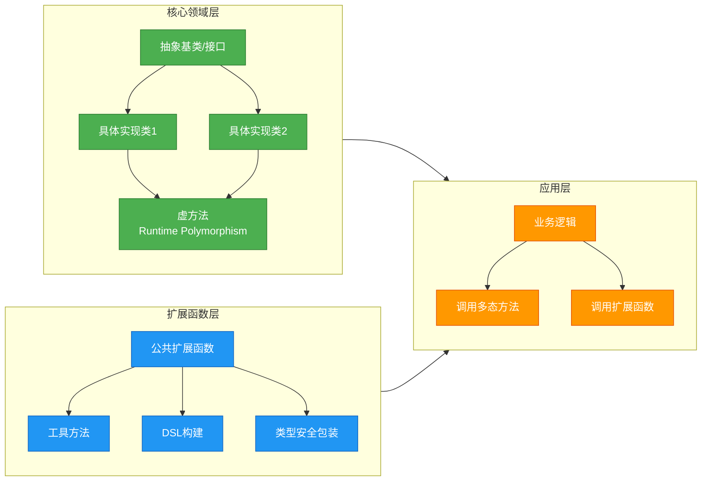

**设计原则**:
- **核心多态行为**: 必须在运行时动态分发的逻辑(如支付处理、图形渲染)应使用虚方法
- **静态增强功能**: 不需要多态但可以提升 API 易用性的功能(如日志、格式化、转换)使用扩展函数
- **类型安全 DSL**: 利用扩展函数的接收者类型特性构建领域特定语言

---

**📝 练习题 1**

以下代码的输出是什么?

```kotlin
open class Vehicle {
    open fun info() = "Vehicle"
}

class Car : Vehicle() {
    override fun info() = "Car"
}

fun Vehicle.describe() = "This is a ${this.info()}"
fun Car.describe() = "This is specifically a ${this.info()}"

fun main() {
    val vehicle: Vehicle = Car()
    println(vehicle.describe())
}
```

A. `This is a Vehicle`  
B. `This is a Car`  
C. `This is specifically a Car`  
D. 编译错误

**【答案】** B

**【解析】** 
这道题考查的是扩展函数的静态解析与成员函数的动态多态的组合使用。

1. `vehicle` 的声明类型是 `Vehicle`,运行时类型是 `Car`
2. 调用 `vehicle.describe()` 时,由于 `describe()` 是扩展函数,会根据声明类型 `Vehicle` 静态解析,因此调用的是 `Vehicle.describe()`
3. 在 `Vehicle.describe()` 内部,调用了 `this.info()`。`info()` 是成员函数(虚方法),会根据运行时类型 `Car` 进行动态分发,调用 `Car.info()`,返回 `"Car"`
4. 因此最终输出是 `This is a Car`

**关键要点**: 
- 扩展函数调用 = 静态解析(基于声明类型)
- 成员函数调用 = 动态分发(基于运行时类型)
- 当扩展函数内部调用成员函数时,成员函数仍然遵循多态规则

---

**📝 练习题 2**

设计一个泛型扩展函数 `findFirstDuplicate()`,要求:
- 适用于任何实现了 `Comparable<T>` 的类型的列表
- 返回列表中第一个重复出现的元素(如果存在)
- 时间复杂度为 O(n log n) 或更优

以下哪个实现是正确且最优的?

A. 
```kotlin
fun <T : Comparable<T>> List<T>.findFirstDuplicate(): T? {
    val sorted = this.sorted()
    for (i in 0 until sorted.size - 1) {
        if (sorted[i] == sorted[i + 1]) return sorted[i]
    }
    return null
}
```

B.
```kotlin
fun <T : Comparable<T>> List<T>.findFirstDuplicate(): T? {
    val seen = mutableSetOf<T>()
    for (element in this) {
        if (!seen.add(element)) return element
    }
    return null
}
```

C.
```kotlin
fun <T : Comparable<T>> List<T>.findFirstDuplicate(): T? {
    return this.groupBy { it }
        .filterValues { it.size > 1 }
        .keys.firstOrNull()
}
```

D. 以上都不正确

**【答案】** B

**【解析】** 

**选项 A 分析**:
- 时间复杂度: O(n log n) (排序)
- 空间复杂度: O(n)
- **问题**: 排序后找到的是字典序最小的重复元素,而非原列表中"第一个"重复出现的元素。例如 `[3, 1, 2, 1, 3]`,排序后变成 `[1, 1, 2, 3, 3]`,会返回 `1`,但实际上原列表中 `3` 才是第一个重复的

**选项 B 分析**:
- 时间复杂度: O(n) (单次遍历)
- 空间复杂度: O(n)
- **正确性**: 使用 `HashSet` 记录已见元素,当 `add()` 返回 `false` 时说明元素已存在,这就是原列表中第一个重复出现的元素
- **最优**: 时间和空间复杂度都是理论最优

**选项 C 分析**:
- 时间复杂度: O(n)
- 空间复杂度: O(n)
- **问题**: `filterValues` 和 `keys` 操作后,元素的顺序可能不保持原列表顺序,且 `firstOrNull()` 返回的不一定是原列表中第一个重复的元素

**正确答案**: B 是最优且正确的实现,既保证了找到原列表中第一个重复元素,又具有线性时间复杂度。

**知识点总结**:
- 泛型约束 `<T : Comparable<T>>` 确保类型可比较(虽然这里实际不需要,`<T>` 即可,因为 `HashSet` 只需要 `equals()` 和 `hashCode()`)
- `Set.add()` 返回 `Boolean`: `true` 表示元素成功添加(之前不存在), `false` 表示元素已存在
- 要保持"第一个"语义,必须按原列表顺序遍历,不能依赖排序或分组

---

## 类型类模式(使用扩展函数模拟、上下文接收者)

类型类（Type Class）是函数式编程中的一个重要概念，最早源自 Haskell 语言。它提供了一种在不修改原有类型定义的前提下，为类型添加新行为的机制。虽然 Kotlin 没有原生的类型类支持，但我们可以通过扩展函数、接口和上下文接收者（Context Receivers）来优雅地模拟这一模式。

### 类型类的核心思想

在传统的面向对象编程中，我们通过继承来为类型添加行为。但这种方式存在局限性：如果你无法修改源代码（比如第三方库的类），或者不想建立继承关系，就无法为类型添加新的能力。类型类则提供了一种 **后验多态**（Ad-hoc Polymorphism）的解决方案——在类型定义之后，仍然可以为其"追加"符合某种协议的行为。

在 Kotlin 中，我们可以将类型类理解为一个定义了某种能力的接口，然后通过扩展函数为不同的类型提供这种能力的具体实现。这种模式在处理序列化、JSON 转换、比较操作等横切关注点时特别有用。

### 基础类型类模拟

让我们从一个简单的例子开始——定义一个 `Show` 类型类，用于将对象转换为可读的字符串表示：

```kotlin
// 定义类型类接口 - 描述"可展示"的能力
interface Show<T> {
    // 将类型 T 的实例转换为字符串
    fun show(value: T): String
}

// 为 Int 类型提供 Show 实现
object IntShow : Show<Int> {
    override fun show(value: Int): String = "整数: $value"
}

// 为 List<Int> 提供 Show 实现
object IntListShow : Show<List<Int>> {
    override fun show(value: List<Int>): String = 
        "[${value.joinToString(", ")}]"  // 格式化列表
}

// 为 Person 提供 Show 实现
data class Person(val name: String, val age: Int)

object PersonShow : Show<Person> {
    override fun show(value: Person): String = 
        "${value.name} (${value.age}岁)"  // 自定义展示格式
}

// 使用类型类的泛型函数
fun <T> display(value: T, shower: Show<T>) {
    println(shower.show(value))  // 委托给具体的 Show 实现
}

// 使用示例
fun main() {
    display(42, IntShow)                        // 输出: 整数: 42
    display(listOf(1, 2, 3), IntListShow)      // 输出: [1, 2, 3]
    display(Person("张三", 25), PersonShow)    // 输出: 张三 (25岁)
}
```

这个基础实现已经展示了类型类的核心思想：通过接口定义能力，通过单独的对象提供实现。但每次调用都需要显式传递 `Show` 实例，这显得繁琐。

### 使用扩展函数优化

我们可以通过扩展函数将类型类能力直接"附着"到类型上，使调用更加自然：

```kotlin
// 为类型类接口添加扩展函数
interface Show<T> {
    fun show(value: T): String
}

// 定义扩展函数 - 将 show 能力注入到 T 类型上
fun <T> T.show(shower: Show<T>): String = shower.show(this)

// 或者更进一步，使用接收者扩展
fun <T> Show<T>.showValue(value: T): String = show(value)

// 使用示例
fun main() {
    val num = 42
    println(num.show(IntShow))  // 扩展函数调用，更自然
    
    val person = Person("李四", 30)
    println(person.show(PersonShow))  // 直接在对象上调用
}
```

### 上下文接收者（Context Receivers）- 实验性特性

Kotlin 1.6.20 引入了上下文接收者（Context Receivers）特性，这是模拟类型类的最优雅方式。它允许我们在函数作用域内隐式访问某些接收者，避免显式传递类型类实例：

```kotlin
// 启用上下文接收者特性（需要在编译器选项中添加 -Xcontext-receivers）

// 定义类型类接口
interface Show<T> {
    fun show(value: T): String
}

// 使用 context 关键字定义需要 Show<T> 上下文的扩展函数
context(Show<T>)  // 声明此函数需要 Show<T> 的上下文
fun <T> T.show(): String = show(this)  // 直接调用上下文中的 show 方法

// 定义具体的类型类实例
object IntShow : Show<Int> {
    override fun show(value: Int): String = "Int($value)"
}

object StringShow : Show<String> {
    override fun show(value: String): String = "\"$value\""
}

// 在需要类型类的作用域中使用
fun main() {
    // 通过 with 提供上下文
    with(IntShow) {
        val num = 42
        println(num.show())  // 无需传递 IntShow，自动从上下文获取
    }
    
    with(StringShow) {
        val text = "Hello"
        println(text.show())  // 输出: "Hello"
    }
}
```

上下文接收者的强大之处在于可以组合多个上下文：

```kotlin
// 定义多个类型类
interface Show<T> {
    fun show(value: T): String
}

interface Eq<T> {
    fun equals(a: T, b: T): Boolean
}

// 同时需要两个上下文的函数
context(Show<T>, Eq<T>)  // 需要两个类型类上下文
fun <T> T.displayAndCompare(other: T): String {
    return "${this.show()} ${if (equals(this, other)) "==" else "!="} ${other.show()}"
}

// 具体实现
object IntShow : Show<Int> {
    override fun show(value: Int): String = value.toString()
}

object IntEq : Eq<Int> {
    override fun equals(a: Int, b: Int): Boolean = a == b
}

// 使用多个上下文
fun main() {
    with(IntShow) {
        with(IntEq) {
            println(5.displayAndCompare(5))   // 输出: 5 == 5
            println(3.displayAndCompare(7))   // 输出: 3 != 7
        }
    }
}
```

### 类型类的实际应用场景

让我们看一个更实际的例子——实现一个通用的 JSON 序列化类型类：

```kotlin
// 定义 JsonEncoder 类型类
interface JsonEncoder<T> {
    fun encode(value: T): String  // 将类型 T 编码为 JSON 字符串
}

// 为基础类型提供实现
object IntEncoder : JsonEncoder<Int> {
    override fun encode(value: Int): String = value.toString()
}

object StringEncoder : JsonEncoder<String> {
    override fun encode(value: String): String = "\"$value\""  // 添加引号
}

object BooleanEncoder : JsonEncoder<Boolean> {
    override fun encode(value: Boolean): String = value.toString()
}

// 为 List 提供泛型实现
class ListEncoder<T>(
    private val elementEncoder: JsonEncoder<T>  // 依赖元素的编码器
) : JsonEncoder<List<T>> {
    override fun encode(value: List<T>): String {
        // 将列表中每个元素编码后用逗号连接
        val elements = value.joinToString(",") { elementEncoder.encode(it) }
        return "[$elements]"  // 包裹在方括号中
    }
}

// 为自定义类型提供实现
data class User(val id: Int, val name: String, val active: Boolean)

object UserEncoder : JsonEncoder<User> {
    override fun encode(value: User): String {
        // 手动构建 JSON 对象字符串
        return """{
            |"id": ${IntEncoder.encode(value.id)},
            |"name": ${StringEncoder.encode(value.name)},
            |"active": ${BooleanEncoder.encode(value.active)}
            |}""".trimMargin()
    }
}

// 使用上下文接收者简化调用
context(JsonEncoder<T>)
fun <T> T.toJson(): String = encode(this)

// 实际使用
fun main() {
    // 编码基础类型
    with(IntEncoder) {
        println(42.toJson())  // 输出: 42
    }
    
    // 编码列表
    val numbers = listOf(1, 2, 3)
    with(ListEncoder(IntEncoder)) {
        println(numbers.toJson())  // 输出: [1,2,3]
    }
    
    // 编码复杂对象
    val user = User(1, "Alice", true)
    with(UserEncoder) {
        println(user.toJson())  
        // 输出:
        // {
        //   "id": 1,
        //   "name": "Alice",
        //   "active": true
        // }
    }
}
```

### 类型类模式的架构视图

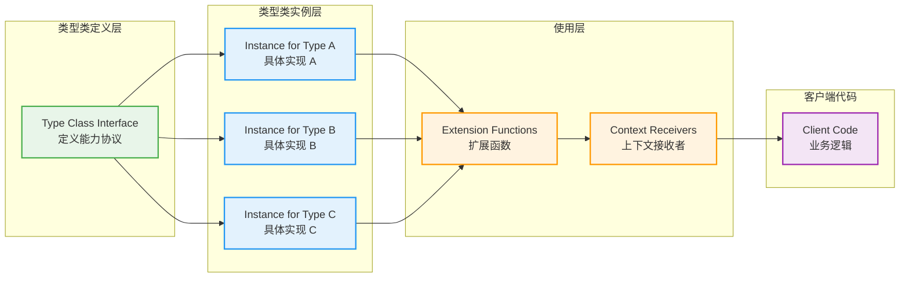

### 类型类的高级技巧

#### 1. 类型类组合

多个类型类可以组合使用，形成更强大的抽象：

```kotlin
// 定义可序列化类型类
interface Serializable<T> {
    fun serialize(value: T): ByteArray
}

// 定义可反序列化类型类
interface Deserializable<T> {
    fun deserialize(bytes: ByteArray): T
}

// 组合两个类型类，形成完整的序列化能力
interface Codec<T> : Serializable<T>, Deserializable<T>

// 为 String 提供完整的 Codec 实现
object StringCodec : Codec<String> {
    override fun serialize(value: String): ByteArray = 
        value.toByteArray(Charsets.UTF_8)  // 编码为 UTF-8 字节数组
    
    override fun deserialize(bytes: ByteArray): String = 
        String(bytes, Charsets.UTF_8)  // 从字节数组解码
}

// 使用上下文接收者同时要求两种能力
context(Serializable<T>, Deserializable<T>)
fun <T> T.roundTrip(): T {
    val bytes = serialize(this)      // 先序列化
    return deserialize(bytes)        // 再反序列化
}
```

#### 2. 高阶类型类（Higher-Kinded Types 模拟）

虽然 Kotlin 不直接支持高阶类型，但可以通过一些技巧模拟：

```kotlin
// 定义 Functor 类型类的接口
interface Functor<F> {
    fun <A, B> map(fa: Kind<F, A>, f: (A) -> B): Kind<F, B>
}

// Kind 是一个标记类型，用于表示 F<A>
interface Kind<out F, out A>

// 为 List 实现 Functor
object ListFunctor : Functor<ForList> {
    override fun <A, B> map(fa: Kind<ForList, A>, f: (A) -> B): Kind<ForList, B> {
        val list = fa.fix()  // 将 Kind 转换回 List
        return list.map(f).k()  // 应用映射后再转为 Kind
    }
}

// 辅助类型和扩展函数
class ForList private constructor()
typealias ListOf<A> = Kind<ForList, A>

fun <A> List<A>.k(): ListOf<A> = this as ListOf<A>
fun <A> ListOf<A>.fix(): List<A> = this as List<A>
```

这种模拟方式虽然繁琐，但能够表达函数式编程中的高级抽象。

### 类型类模式 vs 接口继承

让我们对比一下两种方式的差异：

```kotlin
// 方式一：传统接口继承
interface Drawable {
    fun draw(): String
}

class Circle : Drawable {
    override fun draw(): String = "○"
}

// 问题：第三方类无法实现接口
// data class Point(val x: Int, val y: Int)  // 无法让 Point 实现 Drawable

// 方式二：类型类模式
interface Draw<T> {
    fun draw(value: T): String
}

data class Point(val x: Int, val y: Int)  // 原始类型不需要修改

object PointDraw : Draw<Point> {  // 在外部为 Point 提供绘制能力
    override fun draw(value: Point): String = "(${value.x},${value.y})"
}

// 可以为任何类型添加绘制能力，即使是标准库类型
object IntDraw : Draw<Int> {
    override fun draw(value: Int): String = value.toString()
}

// 使用上下文接收者
context(Draw<T>)
fun <T> T.render(): String = draw(this)

fun main() {
    with(PointDraw) {
        println(Point(3, 4).render())  // 输出: (3,4)
    }
    
    with(IntDraw) {
        println(42.render())  // 输出: 42
    }
}
```

### 类型类模式的优势与限制

**优势：**
1. **开放封闭原则**：无需修改原始类型即可添加新能力
2. **类型安全**：编译期检查类型类实例的存在性
3. **灵活组合**：可以为同一类型提供多种不同的类型类实现
4. **解耦**：行为与数据分离，便于测试和维护

**限制：**
1. **显式传递**：没有上下文接收者时，需要显式传递类型类实例
2. **实验性特性**：上下文接收者仍是实验性功能，API 可能变化
3. **学习曲线**：对于不熟悉函数式编程的开发者来说较为抽象
4. **缺少编译器推导**：Kotlin 不像 Haskell 那样能自动推导类型类实例

---

## 伴生对象扩展(为类添加"静态"方法)

Kotlin 摒弃了 Java 的 `static` 关键字，转而使用伴生对象（Companion Object）来表达类级别的成员。更强大的是，Kotlin 允许我们通过扩展函数为伴生对象添加新方法，从而在不修改原始类定义的情况下，为类添加类似"静态方法"的能力。

### 伴生对象基础回顾

在深入扩展之前，让我们快速回顾伴生对象的基本概念：

```kotlin
class MyClass {
    // 伴生对象 - 每个类只能有一个
    companion object {
        const val MAX_SIZE = 100  // 编译期常量
        
        fun create(): MyClass {   // 工厂方法
            return MyClass()
        }
    }
}

// 调用伴生对象成员
fun main() {
    val instance = MyClass.create()       // 类似 Java 的静态方法调用
    println(MyClass.MAX_SIZE)             // 类似 Java 的静态字段访问
}
```

伴生对象本质上是一个特殊的单例对象，关联到外部类。当我们调用 `MyClass.create()` 时，实际上是在调用 `MyClass.Companion.create()`，只是编译器允许我们省略 `Companion`。

### 为伴生对象添加扩展函数

扩展函数不仅可以为类实例添加方法，也可以为伴生对象添加方法。这使得我们能够在不修改原始类的情况下，为其添加新的"静态"功能：

```kotlin
// 原始类定义（例如来自第三方库）
class User(val name: String, val email: String) {
    companion object {
        // 原有的伴生对象方法
        fun createDefault(): User = User("Guest", "guest@example.com")
    }
}

// 为 User 的伴生对象添加扩展函数
fun User.Companion.fromJson(json: String): User {
    // 简化的 JSON 解析示例
    val parts = json.trim('{', '}').split(",")  // 分割 JSON 字符串
    val name = parts[0].substringAfter(":").trim('"')  // 提取 name 字段
    val email = parts[1].substringAfter(":").trim('"') // 提取 email 字段
    return User(name, email)  // 构造 User 对象
}

// 为伴生对象添加另一个扩展
fun User.Companion.createAdmin(name: String): User {
    return User(name, "$name@admin.example.com")  // 自动生成管理员邮箱
}

// 使用扩展函数
fun main() {
    // 调用原有的伴生对象方法
    val guest = User.createDefault()
    println(guest.name)  // 输出: Guest
    
    // 调用扩展的伴生对象方法
    val user = User.fromJson("""{"name":"Alice","email":"alice@example.com"}""")
    println(user.email)  // 输出: alice@example.com
    
    val admin = User.createAdmin("Bob")
    println(admin.email)  // 输出: Bob@admin.example.com
}
```

### 扩展已有类的伴生对象

这个特性在扩展标准库或第三方库时特别有用。例如，我们可以为 Kotlin 标准库的 `String` 类添加伴生对象扩展：

```kotlin
// String 类没有伴生对象，但我们可以为它添加！
// 注意：这需要先声明一个空的伴生对象
// 对于标准库类，我们直接扩展即可

// 为 String 的伴生对象添加扩展
fun String.Companion.random(length: Int): String {
    val chars = ('a'..'z') + ('A'..'Z') + ('0'..'9')  // 字符池
    return (1..length)  // 生成指定长度的序列
        .map { chars.random() }  // 随机选择字符
        .joinToString("")        // 连接成字符串
}

fun String.Companion.fromCodePoints(vararg codePoints: Int): String {
    // 从 Unicode 码点创建字符串
    return String(codePoints, 0, codePoints.size)
}

// 使用
fun main() {
    val randomStr = String.random(10)  // 生成 10 位随机字符串
    println(randomStr)  // 例如: aB3xQ9pL2k
    
    val emoji = String.fromCodePoints(0x1F600, 0x1F44D)  // 😀👍
    println(emoji)
}
```

**注意**：实际上 `String` 类没有伴生对象，上述代码会编译失败。这说明我们**只能为已经定义了伴生对象的类添加扩展**。如果类没有伴生对象，即使我们声明扩展函数，也无法调用。

让我们修正这个例子，使用一个自定义类：

```kotlin
// 自定义一个没有伴生对象的类
class Message(val content: String)

// 无法直接扩展，因为没有伴生对象
// fun Message.Companion.create(text: String) = Message(text)  // 编译错误！

// 正确做法：先为类添加空的伴生对象
class Message2(val content: String) {
    companion object  // 空的伴生对象
}

// 现在可以扩展了
fun Message2.Companion.create(text: String): Message2 {
    return Message2(text)
}

fun Message2.Companion.empty(): Message2 {
    return Message2("")  // 创建空消息
}

fun main() {
    val msg = Message2.create("Hello")  // 使用扩展工厂方法
    val empty = Message2.empty()         // 使用另一个扩展方法
}
```

### 伴生对象扩展的实际应用场景

#### 1. 工厂方法扩展

为现有类添加新的创建方式，而无需修改原始代码：

```kotlin
// 假设这是一个第三方库的类
data class Config(val host: String, val port: Int, val timeout: Int) {
    companion object {
        fun default() = Config("localhost", 8080, 30)
    }
}

// 在你的代码中扩展伴生对象
fun Config.Companion.fromEnvironment(): Config {
    // 从环境变量读取配置
    val host = System.getenv("APP_HOST") ?: "localhost"
    val port = System.getenv("APP_PORT")?.toIntOrNull() ?: 8080
    val timeout = System.getenv("APP_TIMEOUT")?.toIntOrNull() ?: 30
    return Config(host, port, timeout)
}

fun Config.Companion.forTesting(): Config {
    // 专门用于测试的配置
    return Config("testhost", 9999, 5)
}

// 使用
fun main() {
    val defaultConfig = Config.default()           // 原有方法
    val envConfig = Config.fromEnvironment()       // 扩展方法
    val testConfig = Config.forTesting()           // 扩展方法
}
```

#### 2. 类型转换扩展

为类添加从其他类型转换的能力：

```kotlin
import java.time.LocalDate
import java.time.format.DateTimeFormatter

data class Event(val name: String, val date: LocalDate) {
    companion object
}

// 从 ISO 字符串创建事件
fun Event.Companion.fromIsoString(name: String, isoDate: String): Event {
    val date = LocalDate.parse(isoDate)  // 解析 ISO 8601 日期
    return Event(name, date)
}

// 从时间戳创建事件
fun Event.Companion.fromTimestamp(name: String, epochDay: Long): Event {
    val date = LocalDate.ofEpochDay(epochDay)  // 从纪元日创建日期
    return Event(name, date)
}

// 使用
fun main() {
    val event1 = Event.fromIsoString("Meeting", "2026-02-15")
    val event2 = Event.fromTimestamp("Conference", 19767L)  // 2024-02-10
    
    println(event1)  // Event(name=Meeting, date=2026-02-15)
    println(event2)  // Event(name=Conference, date=2024-02-10)
}
```

#### 3. DSL 构建器扩展

为类添加 DSL 风格的构建器方法：

```kotlin
data class EmailMessage(
    val to: List<String>,
    val subject: String,
    val body: String,
    val attachments: List<String> = emptyList()
) {
    companion object
}

// 为伴生对象添加 DSL 构建器
class EmailBuilder {
    private val recipients = mutableListOf<String>()
    private var subject: String = ""
    private var body: String = ""
    private val attachments = mutableListOf<String>()
    
    fun to(vararg emails: String) {
        recipients.addAll(emails)  // 添加收件人
    }
    
    fun subject(text: String) {
        subject = text  // 设置主题
    }
    
    fun body(text: String) {
        body = text  // 设置正文
    }
    
    fun attach(vararg files: String) {
        attachments.addAll(files)  // 添加附件
    }
    
    internal fun build(): EmailMessage {
        require(recipients.isNotEmpty()) { "至少需要一个收件人" }
        require(subject.isNotBlank()) { "主题不能为空" }
        return EmailMessage(recipients, subject, body, attachments)
    }
}

// 为伴生对象添加 DSL 入口
fun EmailMessage.Companion.build(block: EmailBuilder.() -> Unit): EmailMessage {
    return EmailBuilder().apply(block).build()  // 应用 DSL 块并构建
}

// 使用 DSL
fun main() {
    val email = EmailMessage.build {
        to("alice@example.com", "bob@example.com")  // 多个收件人
        subject("重要通知")
        body("这是一封测试邮件")
        attach("report.pdf", "data.xlsx")  // 添加附件
    }
    
    println(email)
    // 输出: EmailMessage(to=[alice@example.com, bob@example.com], 
    //                    subject=重要通知, body=这是一封测试邮件, 
    //                    attachments=[report.pdf, data.xlsx])
}
```

### 伴生对象扩展的解析机制

理解伴生对象扩展的工作原理有助于我们更好地使用它。让我们通过反编译来看看编译器是如何处理的：

```kotlin
// Kotlin 代码
class MyClass {
    companion object {
        fun original() = println("原始方法")
    }
}

fun MyClass.Companion.extended() = println("扩展方法")

fun main() {
    MyClass.original()   // 调用原始方法
    MyClass.extended()   // 调用扩展方法
}
```

编译后的 Java 代码（简化版）等价于：

```java
// 反编译后的 Java 代码
public final class MyClass {
    // 伴生对象作为静态内部类
    public static final Companion Companion = new Companion();
    
    public static final class Companion {
        public final void original() {
            System.out.println("原始方法");
        }
    }
}

// 扩展函数编译为静态方法，第一个参数是接收者
public final class ExtensionsKt {
    public static final void extended(MyClass.Companion $this$extended) {
        System.out.println("扩展方法");
    }
}

// main 函数调用
public static void main(String[] args) {
    MyClass.Companion.original();                   // 直接调用伴生对象方法
    ExtensionsKt.extended(MyClass.Companion);       // 调用扩展函数，传入伴生对象
}
```

这揭示了几个关键点：
1. 伴生对象编译为一个静态内部类
2. 扩展函数编译为静态方法，接收伴生对象作为参数
3. Kotlin 的语法糖让调用看起来一致

### 伴生对象扩展的架构视图

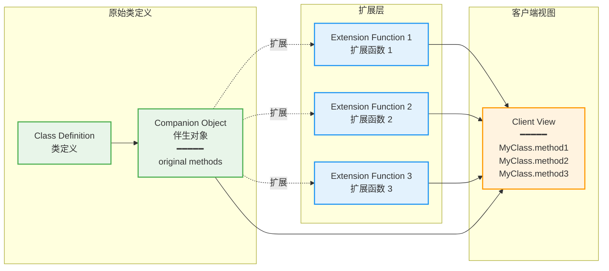

### 伴生对象扩展 vs 顶层函数

开发者常常困惑：什么时候应该使用伴生对象扩展，什么时候应该使用普通的顶层函数？让我们对比一下：

```kotlin
data class User(val id: Int, val name: String) {
    companion object
}

// 方式一：伴生对象扩展
fun User.Companion.create(id: Int, name: String): User {
    return User(id, name)
}

// 方式二:顶层函数
fun createUser(id: Int, name: String): User {
    return User(id, name)
}

// 使用对比
fun main() {
    val user1 = User.create(1, "Alice")  // 方式一：更面向对象
    val user2 = createUser(2, "Bob")     // 方式二：更函数式
}
```

**选择建议：**
- **使用伴生对象扩展**：当方法逻辑上属于类的一部分，作为该类的替代构造方式或工厂方法时
- **使用顶层函数**：当函数是通用的工具函数，不特定属于某个类时

### 伴生对象扩展的命名约定

为了避免混淆，建议遵循以下命名约定：

```kotlin
data class Document(val content: String) {
    companion object {
        // 原有的工厂方法使用简单名称
        fun empty() = Document("")
    }
}

// 扩展的工厂方法使用更具描述性的名称
fun Document.Companion.fromFile(path: String): Document {
    // 从文件读取内容（简化示例）
    return Document("文件内容")
}

fun Document.Companion.fromUrl(url: String): Document {
    // 从 URL 获取内容（简化示例）
    return Document("URL内容")
}

// 明确表明是扩展功能
fun Document.Companion.createTemplate(templateType: String): Document {
    return when (templateType) {
        "letter" -> Document("尊敬的XXX：")
        "report" -> Document("报告标题：")
        else -> Document.empty()
    }
}
```

### 伴生对象扩展的限制

尽管伴生对象扩展功能强大,但也有一些限制需要注意：

```kotlin
class MyClass {
    companion object {
        private fun privateMethod() = "私有方法"
        internal fun internalMethod() = "内部方法"
    }
}

// 限制 1：无法访问伴生对象的私有成员
fun MyClass.Companion.tryAccessPrivate() {
    // privateMethod()  // 编译错误：无法访问 private 成员
}

// 限制 2：无法访问其他模块的 internal 成员（跨模块时）
fun MyClass.Companion.tryAccessInternal() {
    // 如果在不同模块中，无法访问 internalMethod()
}

// 限制 3：无法覆盖伴生对象的现有方法
fun MyClass.Companion.privateMethod() {  // 这不是覆盖，而是新增方法
    // 这个方法与伴生对象中的 privateMethod 是不同的
    // 但由于访问修饰符，实际上我们调用的总是这个扩展版本
}
```

### 伴生对象扩展的最佳实践

1. **语义清晰**：扩展方法应当在语义上属于该类
   ```kotlin
   // 好的示例：为 User 添加从数据库加载的方法
   fun User.Companion.findById(id: Int): User? { ... }
   
   // 不好的示例：与 User 无关的业务逻辑
   fun User.Companion.calculateTax(amount: Double): Double { ... }
   ```

2. **避免冲突**：注意方法名不要与原有方法冲突
   ```kotlin
   class Data {
       companion object {
           fun load() = Data()
       }
   }
   
   // 避免使用相同名称
   // fun Data.Companion.load(source: String) = Data()  // 容易混淆
   
   // 使用更明确的名称
   fun Data.Companion.loadFrom(source: String) = Data()
   ```

3. **文档说明**：为扩展方法添加文档，说明其用途
   ```kotlin
   /**
    * 从 CSV 文件创建用户列表
    * @param csvPath CSV 文件路径
    * @return 用户列表
    */
   fun User.Companion.fromCsv(csvPath: String): List<User> {
       // 实现...
   }
   ```

---

## 📝 练习题

**练习题 1：类型类模式应用**

假设你需要为多种数据类型实现一个通用的"可比较大小"能力，但这些类型来自不同的库，你无法修改它们的源代码。以下哪种方式最符合 Kotlin 的类型类模式？

```kotlin
// 已有的类型
data class Temperature(val celsius: Double)
data class Distance(val meters: Double)
```

A. 创建一个 `Comparable` 接口，让 `Temperature` 和 `Distance` 实现它  
B. 定义一个 `Comparator<T>` 接口和对应的实例，使用扩展函数调用  
C. 为每个类型单独写一个比较函数  
D. 使用反射动态获取比较逻辑

**【答案】** B

**【解析】** 类型类模式的核心思想是在不修改原始类型的情况下为其添加能力。选项 A 需要修改 `Temperature` 和 `Distance` 的定义，违反了题目条件（无法修改源代码）。选项 C 虽然可行但缺乏抽象和复用性。选项 D 使用反射会损失类型安全性且性能较差。

选项 B 正确实现了类型类模式：
```kotlin
interface Comparator<T> {
    fun compare(a: T, b: T): Int
}

object TemperatureComparator : Comparator<Temperature> {
    override fun compare(a: Temperature, b: Temperature): Int = 
        a.celsius.compareTo(b.celsius)
}

context(Comparator<T>)
fun <T> T.isGreaterThan(other: T): Boolean = compare(this, other) > 0
```

这种方式既保持了类型安全，又不需要修改原始类型，完全符合类型类的设计理念。

---

**练习题 2：伴生对象扩展的作用域**

以下代码中，哪些调用是合法的？

```kotlin
// File: Data.kt (模块 A)
class Data(val value: Int) {
    companion object {
        fun create() = Data(0)
        internal fun createInternal() = Data(1)
    }
}

fun Data.Companion.fromString(s: String) = Data(s.toInt())

// File: Main.kt (模块 B，依赖模块 A)
fun main() {
    Data.create()              // 调用 1
    Data.createInternal()      // 调用 2
    Data.fromString("42")      // 调用 3
}
```

A. 只有调用 1 合法  
B. 调用 1 和调用 2 合法  
C. 调用 1 和调用 3 合法  
D. 全部合法

**【答案】** C

**【解析】** 在 Kotlin 的模块系统中：
- **调用 1**：`create()` 是 public 方法，可以跨模块访问，✅ 合法
- **调用 2**：`createInternal()` 是 internal 方法，只能在模块 A 内访问，在模块 B 中调用会报编译错误，❌ 非法
- **调用 3**：`fromString()` 是顶层扩展函数（默认 public），虽然定义在模块 A，但只要在模块 B 中导入该函数，就可以正常使用，✅ 合法

关键点：`internal` 可见性修饰符限制成员只能在定义它的模块内访问。伴生对象扩展函数默认是 public 的，除非显式声明为 internal 或 private。

---

## 本章小结

本章系统性地探讨了 Kotlin 中多态机制与扩展机制这两大核心特性，它们共同构成了 Kotlin 灵活且强大的类型系统基础。通过深入理解这些机制的实现原理、使用场景以及相互关系，我们能够编写出更加优雅、可维护且高性能的代码。

### 多态机制的三个维度

在类型理论中，**多态 (Polymorphism)** 被划分为三种主要形式，每一种都在 Kotlin 中有着清晰的体现：

**子类型多态 (Subtype Polymorphism)** 是面向对象编程的基石，它建立在继承关系之上，通过虚方法表 (Virtual Method Table, vtable) 实现动态绑定。当我们声明一个父类型引用指向子类实例时，运行时会根据对象的实际类型来决定调用哪个方法实现。这种机制使得我们可以编写出符合里氏替换原则的代码，父类引用可以透明地操作任何子类对象。Kotlin 默认所有类都是 `final` 的设计，要求我们显式使用 `open` 关键字来启用继承，这是一种防御性编程的体现，避免了不必要的虚方法调用开销。

**参数多态 (Parametric Polymorphism)** 通过泛型实现，允许我们编写与具体类型无关的通用代码。Kotlin 的泛型系统支持类型参数化，使得同一套代码可以处理不同类型的数据而无需重复编写。通过型变 (Variance) 机制——协变 (`out`)、逆变 (`in`) 和不变——我们可以精确控制泛型类型的子类型关系。泛型在编译时会经过类型擦除 (Type Erasure)，转换为原始类型，这是 JVM 平台的限制，但 Kotlin 通过 `reified` 关键字在内联函数中突破了这一限制，允许我们在运行时访问类型参数信息。

**特设多态 (Ad-hoc Polymorphism)** 体现在操作符重载和方法重载上。Kotlin 允许我们通过 `operator` 关键字为自定义类型重载标准操作符，使得代码更加直观。方法重载则允许同名方法根据参数类型和数量的不同提供不同实现。虽然 Kotlin 没有像 Haskell 那样的类型类 (Type Class) 系统，但我们可以通过扩展函数结合接口约束来模拟类型类的行为，实现类似的抽象能力。

### 扩展机制的静态本质

Kotlin 的扩展机制是一项革命性的特性，它允许我们在不修改原有类代码的前提下为类型添加新的函数和属性。这种能力在处理第三方库、SDK 或者需要保持模块边界清晰的场景中尤为重要。

**扩展函数 (Extension Function)** 的实现原理是静态解析：编译器会将扩展函数转换为以接收者对象作为第一个参数的静态方法。这意味着扩展函数的调用在编译期就已经确定，不存在动态绑定的开销。这种设计带来了几个重要特性：首先，扩展函数无法访问接收者类的私有成员，因为它本质上是外部函数；其次，当扩展函数与成员函数同名时，成员函数始终优先，这是一条铁律，确保了类的封装性不会被外部扩展破坏；最后，扩展函数可以定义在可空类型上，允许我们在空安全的前提下扩展功能。

**扩展属性 (Extension Property)** 在设计上禁止使用幕后字段 (Backing Field)，因为扩展无法向现有类型注入状态。扩展属性必须提供显式的 getter，对于 `var` 属性还需要提供 setter。这些访问器实际上是编译为静态方法的，每次访问属性时都会调用对应的方法。扩展属性本质上是计算属性，它们提供了一种语法糖，使得派生数据的访问看起来像字段访问一样自然。

**扩展的作用域控制**提供了多种组织方式：顶层扩展具有最广泛的可见性，通常用于定义通用工具函数；成员扩展允许在类内部定义扩展，这些扩展可以同时访问外部类的成员和扩展接收者的成员，形成双接收者上下文；伴生对象扩展则为类添加了类似"静态方法"的能力，虽然 Kotlin 没有真正的静态方法，但这种模式在实践中非常有用。

### 扩展解析的关键规则

理解扩展的解析规则对于避免潜在的陷阱至关重要。扩展函数的调用是**静态解析**的，这意味着调用哪个扩展函数仅取决于声明变量的类型，而非运行时对象的实际类型。这与成员函数的动态绑定形成了鲜明对比。当我们声明 `val shape: Shape = Circle()` 并调用 `shape.draw()`，如果 `draw()` 是成员函数，会调用 `Circle` 的实现；但如果 `draw()` 是扩展函数，则会调用 `Shape` 的扩展。

在存在同名成员和扩展的情况下，**成员优先原则**始终生效。这是为了保护类的封装性，防止外部扩展意外覆盖或干扰类的核心行为。当多个扩展函数签名相同时，作用域更近的扩展会被优先选择，这与一般的作用域遮蔽规则一致。

**泛型扩展**允许我们为泛型类型添加扩展，并可以对类型参数施加约束。通过 `where` 子句，我们可以指定接收者类型必须满足多个上界条件。这使得扩展函数可以在保证类型安全的前提下，调用接收者类型的特定方法或属性。结合 `reified` 类型参数，内联扩展函数甚至可以在运行时检查和操作泛型类型，突破了类型擦除的限制。

### 多态与扩展的协作与限制

虽然扩展机制和多态机制都为代码复用提供了强大支持，但它们的结合存在一些微妙的限制。由于扩展函数是静态解析的，**扩展无法实现真正的虚拟化 (Virtualization)**。这意味着我们无法通过扩展来实现多态行为——如果需要运行时的动态绑定，必须使用成员函数或接口实现。

然而，这并不意味着扩展与多态设计模式格格不入。实际上，扩展函数可以与策略模式、装饰器模式等结合使用，作为一种非侵入式的功能增强手段。例如，我们可以为接口类型定义扩展函数，这些扩展会对所有实现该接口的类可见，提供默认行为。这类似于接口的默认方法 (Default Method)，但更加灵活，因为扩展可以在接口定义之外添加。

**类型类模式 (Type Class Pattern)** 是函数式编程中常见的抽象机制，Kotlin 可以通过扩展函数结合泛型约束来模拟。我们定义一个接口作为类型类，然后通过扩展函数为不同类型提供该接口的"实例"。虽然这不如 Haskell 等语言的原生类型类系统灵活，但在实践中足以应对大多数场景。上下文接收者 (Context Receiver) 的引入进一步增强了这种能力,允许我们显式声明函数所需的隐式上下文。

**伴生对象扩展**是一个强大但容易被忽视的特性。由于 Kotlin 的类没有静态成员，伴生对象充当了静态成员的角色。通过为伴生对象定义扩展函数，我们可以在类外部为类添加"静态方法"，这在库设计中非常有用。例如，我们可以为第三方库的类添加工厂方法或工具函数，而无需继承或修改原始代码。

### 知识体系图谱

下面的图展示了本章知识点的逻辑结构和相互关系：

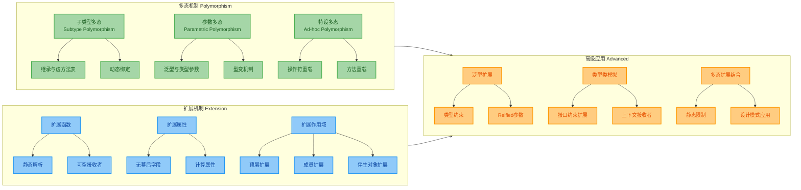

### 实践中的权衡与选择

在实际开发中，选择使用成员函数还是扩展函数，选择继承还是组合，选择多态还是泛型，都需要根据具体场景权衡。以下是一些指导原则:

当功能是类型的核心职责且需要访问私有状态时，使用**成员函数**。当需要为现有类型添加工具方法或适配器方法时，使用**扩展函数**。扩展函数特别适合将特定领域的逻辑与核心数据模型解耦，保持模块的单一职责。

当需要运行时多态行为时，使用**子类型多态**和接口。当需要编译时的类型安全和代码复用时，使用**泛型**。对于简单的工具函数多态，**函数重载**是最直接的选择。

扩展函数的静态解析特性意味着它们无法被"覆盖"，这在某些情况下是优势——扩展的行为是可预测的，不会因为继承层次而改变。但在需要策略模式或访问者模式等运行时行为定制时，必须使用成员函数或接口。

### 性能考量

虽然我们主要关注设计和可维护性，但理解性能影响也很重要。子类型多态的虚方法调用在现代 JVM 上已经被高度优化，通过内联缓存 (Inline Cache) 和去虚拟化 (Devirtualization) 技术，单态调用点的性能接近直接调用。扩展函数由于是静态方法调用,性能开销非常小，且可以被内联优化。

泛型的类型擦除虽然限制了运行时类型信息，但也避免了类型实例化的开销。`reified` 内联函数在编译时会将函数体复制到调用点，虽然会增加字节码大小，但消除了函数调用开销并保留了类型信息。

总的来说，Kotlin 的多态和扩展机制在性能上都经过精心设计，在绝大多数场景下不会成为瓶颈。真正的性能优化应该基于实际测量，过早优化往往得不偿失。

---

**📝 练习题 1：扩展解析与多态**

以下代码的输出是什么？

```kotlin
open class Animal {
    open fun sound() = "Some sound"
}

class Dog : Animal() {
    override fun sound() = "Woof"
}

fun Animal.sound() = "Extension sound"

fun main() {
    val animal: Animal = Dog()
    println(animal.sound())
}
```

A. "Some sound"  
B. "Woof"  
C. "Extension sound"  
D. 编译错误

**【答案】** B

**【解析】** 本题考查成员函数与扩展函数的优先级，以及子类型多态的动态绑定机制。虽然定义了扩展函数 `fun Animal.sound()`，但由于 `Animal` 类已经有同名成员函数 `sound()`，根据**成员优先原则**，扩展函数会被忽略，编译器甚至会发出警告提示扩展被遮蔽。接下来，由于 `sound()` 是 `open` 的虚方法，调用时会发生动态绑定。虽然变量声明类型是 `Animal`，但运行时对象是 `Dog` 实例，因此会调用 `Dog.sound()`，输出 "Woof"。这个例子完美展示了两个关键点：(1) 成员函数始终优先于扩展函数；(2) 成员函数的调用遵循多态的动态绑定规则。如果 `Animal` 类没有 `sound()` 成员函数，那么会调用扩展函数，但此时由于扩展是静态解析的，会输出 "Extension sound" 而非根据实际类型调用。

---

**📝 练习题 2：泛型扩展与类型约束**

以下哪个扩展函数定义是**错误**的？

A. `fun <T> T.printType() { println(T::class) }`  
B. `inline fun <reified T> T.printType() { println(T::class) }`  
C. `fun <T : Comparable<T>> List<T>.sortedSafe() = this.sorted()`  
D. `fun <T> T.toJsonString() where T : Serializable, T : Any = serialize(this)`

**【答案】** A

**【解析】** 本题考查泛型扩展函数的类型参数使用规则。选项 A 试图在普通（非内联）函数中访问类型参数 `T` 的运行时类型信息 `T::class`，这违反了 JVM 的类型擦除机制。在 JVM 平台上，泛型类型参数在运行时会被擦除为其上界（默认是 `Any?`），因此无法在运行时获取 `T` 的实际类型。这段代码会导致编译错误："Cannot use 'T' as reified type parameter. Use a class instead."

选项 B 是正确的，因为使用了 `inline` 和 `reified` 修饰符。`reified` 关键字要求函数必须是内联的，这样编译器可以在每个调用点将类型参数替换为实际类型，从而突破类型擦除的限制。内联函数的函数体会被复制到调用点，因此可以在编译时知道具体类型。

选项 C 正确使用了类型约束 `T : Comparable<T>`，要求类型参数必须是可比较的。`List<T>` 的 `sorted()` 方法确实要求元素类型实现 `Comparable` 接口，这个扩展函数正确地传递了这个约束。

选项 D 使用了 `where` 子句语法来指定多个类型约束，要求 `T` 必须同时实现 `Serializable` 接口且是非空类型（`Any` 而非 `Any?`）。这是合法的语法，允许我们对类型参数施加多个上界约束。

---

