---

# 操作符重载

---

## 操作符重载概述

在 Kotlin 中，操作符重载 (Operator Overloading) 是一种强大的语言特性，它允许开发者为自定义类型赋予与内置类型相同的操作符语义。这种机制通过**约定 (Conventions)** 实现，而非像 C++ 那样直接重载操作符符号本身。Kotlin 的设计哲学是：操作符只是特定函数的语法糖，编译器会将操作符表达式转换为对应的函数调用。

### operator 关键字：声明式的操作符标记

`operator` 关键字是操作符重载的核心标识符。它明确告诉编译器："这个函数是一个操作符实现，可以通过特定符号调用"。这种显式声明的设计避免了意外重载，提高了代码的可读性和安全性。

```kotlin
// 定义一个表示二维点的数据类
data class Point(val x: Int, val y: Int) {
    
    // 使用 operator 关键字标记 plus 函数，表示这是 + 操作符的实现
    operator fun plus(other: Point): Point {
        // 返回两个点坐标相加的结果
        return Point(x + other.x, y + other.y)
    }
}

fun main() {
    val p1 = Point(10, 20)  // 创建第一个点 (10, 20)
    val p2 = Point(30, 40)  // 创建第二个点 (30, 40)
    
    // 使用 + 操作符，编译器会将其转换为 p1.plus(p2) 的函数调用
    val p3 = p1 + p2        // 结果为 Point(40, 60)
    
    println(p3)  // 输出: Point(x=40, y=60)
}
```

在上述代码中，当我们写 `p1 + p2` 时，Kotlin 编译器实际上将其转换为 `p1.plus(p2)` 的方法调用。这就是约定机制的核心：**操作符符号与特定函数名之间存在固定的映射关系**。

如果我们忘记添加 `operator` 关键字，编译器会立即报错：

```kotlin
data class Point(val x: Int, val y: Int) {
    // 缺少 operator 关键字
    fun plus(other: Point): Point {
        return Point(x + other.x, y + other.y)
    }
}

fun main() {
    val p1 = Point(10, 20)
    val p2 = Point(30, 40)
    val p3 = p1 + p2  // ❌ 编译错误: 'plus' must be marked with 'operator' modifier
}
```

### 约定机制 (Conventions)：符号到函数的映射表

Kotlin 的操作符重载基于**约定 (Conventions)** 机制，这是一种编译器级别的协议：特定的操作符符号对应特定的函数名。编译器负责在编译期将操作符表达式转换为函数调用，而开发者只需按照约定实现对应名称的函数即可。

这种设计带来了三个核心优势：

1. **类型安全**：编译器在编译期就能检查操作符的合法性，避免运行时错误
2. **明确性**：通过 `operator` 关键字显式标记，代码意图一目了然
3. **扩展性**：可以通过扩展函数为任何类型添加操作符支持，无需修改原始类

下面是 Kotlin 操作符约定的核心架构图：

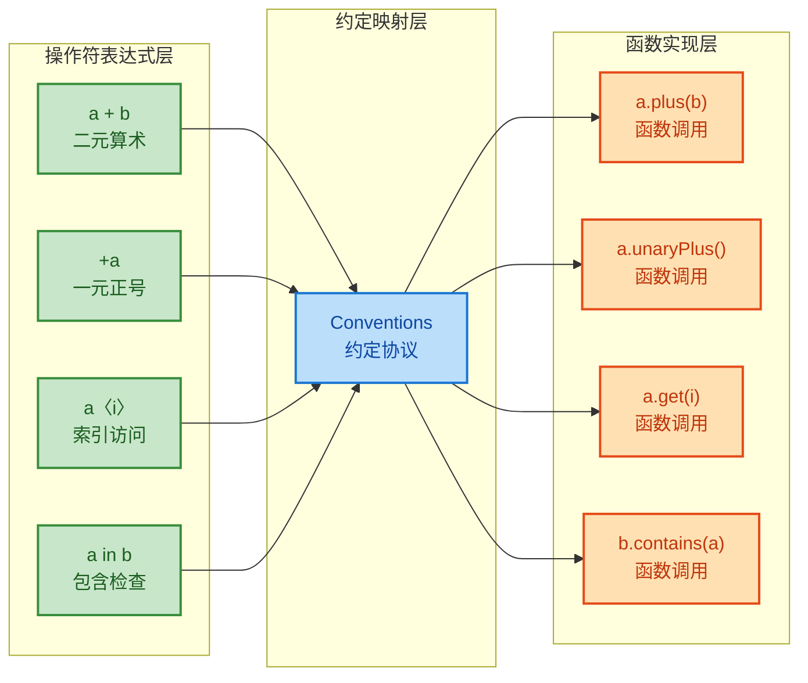

让我们通过一个完整的例子来理解约定机制的工作流程：

```kotlin
// 定义一个表示复数的类 (Complex Number)
data class Complex(val real: Double, val imaginary: Double) {
    
    // 实现加法操作符：a + b → a.plus(b)
    operator fun plus(other: Complex): Complex {
        // 实部相加，虚部相加：(a+bi) + (c+di) = (a+c) + (b+d)i
        return Complex(real + other.real, imaginary + other.imaginary)
    }
    
    // 实现减法操作符：a - b → a.minus(b)
    operator fun minus(other: Complex): Complex {
        // 实部相减，虚部相减：(a+bi) - (c+di) = (a-c) + (b-d)i
        return Complex(real - other.real, imaginary - other.imaginary)
    }
    
    // 实现乘法操作符：a * b → a.times(b)
    operator fun times(other: Complex): Complex {
        // 复数乘法公式：(a+bi) * (c+di) = (ac-bd) + (ad+bc)i
        val newReal = real * other.real - imaginary * other.imaginary
        val newImaginary = real * other.imaginary + imaginary * other.real
        return Complex(newReal, newImaginary)
    }
    
    // 自定义输出格式
    override fun toString(): String {
        return when {
            imaginary >= 0 -> "$real + ${imaginary}i"  // 正虚部
            else -> "$real - ${-imaginary}i"           // 负虚部
        }
    }
}

fun main() {
    val c1 = Complex(3.0, 4.0)   // 3 + 4i
    val c2 = Complex(1.0, 2.0)   // 1 + 2i
    
    // 编译器将这些操作符表达式转换为函数调用
    val sum = c1 + c2           // 实际调用: c1.plus(c2)  → 4 + 6i
    val diff = c1 - c2          // 实际调用: c1.minus(c2) → 2 + 2i
    val product = c1 * c2       // 实际调用: c1.times(c2) → -5 + 10i
    
    println("和: $sum")          // 输出: 和: 4.0 + 6.0i
    println("差: $diff")         // 输出: 差: 2.0 + 2.0i
    println("积: $product")      // 输出: 积: -5.0 + 10.0i
}
```

约定机制的另一个强大之处在于**扩展函数**。我们可以为任何已存在的类型添加操作符支持，无需修改原始代码：

```kotlin
// 为 String 类添加重复操作符：字符串 * 次数
operator fun String.times(n: Int): String {
    // 使用 repeat 函数重复字符串 n 次
    return this.repeat(n)
}

fun main() {
    val repeated = "Kotlin" * 3  // 调用扩展函数: "Kotlin".times(3)
    println(repeated)            // 输出: KotlinKotlinKotlin
}
```

## 一元操作符

一元操作符 (Unary Operators) 作用于单个操作数，是最简单的操作符类型。Kotlin 支持五种一元操作符，每种都对应一个特定的约定函数。

### 一元加减：unaryPlus 和 unaryMinus

一元加号 `+a` 和一元减号 `-a` 分别对应 `unaryPlus()` 和 `unaryMinus()` 函数。这两个操作符常用于数值类型，表示正负号。

```kotlin
// 定义一个表示向量的类
data class Vector2D(val x: Double, val y: Double) {
    
    // 实现一元加号：+a → a.unaryPlus()
    // 对于向量来说，一元加号通常返回自身（保持不变）
    operator fun unaryPlus(): Vector2D {
        return this  // 返回向量本身
    }
    
    // 实现一元减号：-a → a.unaryMinus()
    // 对于向量来说，一元减号返回反向量（方向相反）
    operator fun unaryMinus(): Vector2D {
        return Vector2D(-x, -y)  // x 和 y 分量都取反
    }
    
    override fun toString(): String = "($x, $y)"
}

fun main() {
    val v = Vector2D(3.0, 4.0)  // 创建向量 (3.0, 4.0)
    
    val positive = +v           // 调用 v.unaryPlus()，返回 (3.0, 4.0)
    val negative = -v           // 调用 v.unaryMinus()，返回 (-3.0, -4.0)
    
    println("原向量: $v")         // 输出: 原向量: (3.0, 4.0)
    println("+v: $positive")     // 输出: +v: (3.0, 4.0)
    println("-v: $negative")     // 输出: -v: (-3.0, -4.0)
    
    // 一元减号可以链式调用
    val doubleNegative = --v    // 相当于 -(-v)，调用两次 unaryMinus()
    println("--v: $doubleNegative")  // 输出: --v: (3.0, 4.0)
}
```

对于自定义的数值类型，一元减号特别有用。例如，实现一个大整数类：

```kotlin
// 简化的大整数类（仅用于演示）
data class BigInt(val value: Long) {
    
    // 实现一元减号，取相反数
    operator fun unaryMinus(): BigInt {
        return BigInt(-value)  // 将内部值取反
    }
    
    // 实现加法以配合演示
    operator fun plus(other: BigInt): BigInt {
        return BigInt(value + other.value)
    }
}

fun main() {
    val a = BigInt(100)
    val b = BigInt(50)
    
    // 使用一元减号和加法构造复杂表达式
    val result = -a + b  // 相当于 (-100) + 50 = -50
    println(result.value)  // 输出: -50
}
```

### 逻辑非：not 操作符

逻辑非操作符 `!a` 对应 `not()` 函数，通常用于布尔值的取反。但我们也可以为自定义类型实现这个操作符，赋予其特定的语义。

```kotlin
// 定义一个表示开关状态的类
data class Switch(val isOn: Boolean) {
    
    // 实现逻辑非：!a → a.not()
    // 对于开关来说，逻辑非表示切换状态
    operator fun not(): Switch {
        return Switch(!isOn)  // 将 isOn 取反
    }
    
    override fun toString(): String = if (isOn) "ON" else "OFF"
}

fun main() {
    val switch = Switch(true)   // 创建一个开启的开关
    
    val toggled = !switch       // 调用 switch.not()，切换状态
    println("原状态: $switch")     // 输出: 原状态: ON
    println("切换后: $toggled")    // 输出: 切换后: OFF
    
    // 多次切换
    val toggledTwice = !!switch  // 两次取反，回到原始状态
    println("两次切换: $toggledTwice")  // 输出: 两次切换: ON
}
```

一个更实际的例子是实现位掩码 (Bit Mask) 的逻辑非：

```kotlin
// 定义一个位掩码类，用于权限控制
@JvmInline  // 内联类，零开销抽象
value class Permission(val mask: Int) {
    
    // 实现逻辑非，表示取反所有权限位
    operator fun not(): Permission {
        return Permission(mask.inv())  // 使用 Int.inv() 进行按位取反
    }
    
    // 实现位或操作，用于组合权限
    operator fun or(other: Permission): Permission {
        return Permission(mask or other.mask)
    }
    
    // 实现位与操作，用于检查权限
    operator fun and(other: Permission): Permission {
        return Permission(mask and other.mask)
    }
    
    companion object {
        val READ = Permission(0b0001)    // 读权限: 0001
        val WRITE = Permission(0b0010)   // 写权限: 0010
        val EXECUTE = Permission(0b0100) // 执行权限: 0100
    }
}

fun main() {
    // 组合读写权限
    val readWrite = Permission.READ or Permission.WRITE  // 0011
    
    // 取反权限（假设使用 8 位表示）
    val denied = !readWrite  // 对 0011 取反
    
    println("读写权限: ${readWrite.mask.toString(2)}")  // 输出: 读写权限: 11
    println("拒绝权限: ${denied.mask.toString(2)}")     // 输出大量 1（取决于 Int 位数）
}
```

### 自增自减：inc 和 dec 操作符

自增 `++` 和自减 `--` 操作符分别对应 `inc()` 和 `dec()` 函数。这两个操作符支持前缀形式（`++a`）和后缀形式（`a++`），它们的语义略有不同：

- **前缀形式** `++a`：先自增，再返回新值
- **后缀形式** `a++`：先返回旧值，再自增

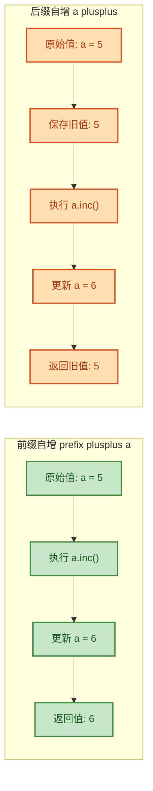

实现 `inc()` 和 `dec()` 时，有一个重要原则：**这些函数必须返回一个新对象，而不能修改原对象**。这是因为 Kotlin 推荐使用不可变对象，编译器会自动处理赋值逻辑。

```kotlin
// 定义一个表示日期的简化类
data class SimpleDate(val year: Int, val month: Int, val day: Int) {
    
    // 实现自增：++a 或 a++ → a.inc()
    // 返回下一天的日期（简化版，不考虑月末和年末）
    operator fun inc(): SimpleDate {
        // 注意：返回新对象，不修改当前对象
        return when {
            day < 28 -> SimpleDate(year, month, day + 1)  // 日期 +1
            month < 12 -> SimpleDate(year, month + 1, 1)  // 下个月的第一天
            else -> SimpleDate(year + 1, 1, 1)            // 下一年的第一天
        }
    }
    
    // 实现自减：--a 或 a-- → a.dec()
    // 返回前一天的日期（简化版）
    operator fun dec(): SimpleDate {
        return when {
            day > 1 -> SimpleDate(year, month, day - 1)   // 日期 -1
            month > 1 -> SimpleDate(year, month - 1, 28)  // 上个月的最后一天（简化）
            else -> SimpleDate(year - 1, 12, 28)          // 上一年的最后一天（简化）
        }
    }
    
    override fun toString(): String = "$year-${month.toString().padStart(2, '0')}-${day.toString().padStart(2, '0')}"
}

fun main() {
    var date = SimpleDate(2024, 12, 31)  // 创建日期: 2024-12-31
    
    println("原日期: $date")              // 输出: 原日期: 2024-12-31
    
    // 前缀自增：先自增，再使用
    val nextDay = ++date                 // date 先变为 2025-01-01，然后赋值给 nextDay
    println("前缀++后: date=$date, nextDay=$nextDay")  
    // 输出: 前缀++后: date=2025-01-01, nextDay=2025-01-01
    
    // 后缀自增：先使用，再自增
    val currentDay = date++              // 先将 2025-01-01 赋值给 currentDay，date 再变为 2025-01-02
    println("后缀++后: date=$date, currentDay=$currentDay")
    // 输出: 后缀++后: date=2025-01-02, currentDay=2025-01-01
    
    // 自减操作
    --date  // date 变为 2025-01-01
    println("自减后: $date")              // 输出: 自减后: 2025-01-01
}
```

再看一个计数器的例子，展示 `inc()` 和 `dec()` 在循环中的应用：

```kotlin
// 定义一个线程安全的计数器（简化版）
data class Counter(val count: Int) {
    
    // 实现自增
    operator fun inc(): Counter {
        return Counter(count + 1)  // 返回计数 +1 的新对象
    }
    
    // 实现自减
    operator fun dec(): Counter {
        return Counter(count - 1)  // 返回计数 -1 的新对象
    }
    
    // 实现比较操作符（用于循环条件）
    operator fun compareTo(other: Counter): Int {
        return count.compareTo(other.count)
    }
}

fun main() {
    var counter = Counter(0)  // 初始计数为 0
    
    // 使用自增操作符进行计数循环
    while (counter < Counter(5)) {
        println("当前计数: ${counter.count}")
        counter++  // 等价于 counter = counter.inc()
    }
    // 输出:
    // 当前计数: 0
    // 当前计数: 1
    // 当前计数: 2
    // 当前计数: 3
    // 当前计数: 4
    
    println("最终计数: ${counter.count}")  // 输出: 最终计数: 5
}
```

**关键要点**：
1. `inc()` 和 `dec()` 必须返回与调用者相同类型的对象
2. 这些函数不应修改原对象（遵循不可变性原则）
3. 编译器会自动处理前缀和后缀形式的差异
4. `var` 变量是必需的，因为需要重新赋值（`a++` 实际上是 `a = a.inc()`）

---

**📝 练习题**

以下代码的输出是什么？

```kotlin
data class Score(val value: Int) {
    operator fun inc() = Score(value + 10)
    operator fun dec() = Score(value - 10)
}

fun main() {
    var score = Score(50)
    val temp1 = score++
    val temp2 = ++score
    println("${temp1.value}, ${temp2.value}, ${score.value}")
}
```

A. `50, 60, 70`  
B. `50, 70, 70`  
C. `60, 70, 70`  
D. `50, 60, 60`

**【答案】** B

**【解析】**  
这道题考查前缀和后缀自增的执行顺序差异：

1. **`val temp1 = score++`（后缀自增）**：
   - 先将当前 `score` 的值（`Score(50)`）赋给 `temp1`
   - 然后执行 `score = score.inc()`，使 `score` 变为 `Score(60)`
   - 所以 `temp1.value = 50`

2. **`val temp2 = ++score`（前缀自增）**：
   - 先执行 `score = score.inc()`，使 `score` 从 `Score(60)` 变为 `Score(70)`
   - 然后将新的 `score` 值赋给 `temp2`
   - 所以 `temp2.value = 70`，`score.value = 70`

最终输出：`50, 70, 70`，对应选项 B。

关键记忆点：**后缀先用后增，前缀先增后用**。

---

## 二元算术操作符

在 Kotlin 中，二元算术操作符（Binary Arithmetic Operators）允许我们通过重载特定的约定函数，为自定义类型赋予 `+`、`-`、`*`、`/`、`%` 等操作符的能力。这种机制不仅让代码更具表达力，还能让自定义类型像内置类型一样自然地参与数学运算。

### 基本约定函数

Kotlin 为五个标准算术操作符定义了对应的约定函数（Conventions）。当编译器遇到 `a + b` 这样的表达式时，会自动转换为 `a.plus(b)` 的函数调用。这种设计遵循了 **操作符即函数** 的理念。

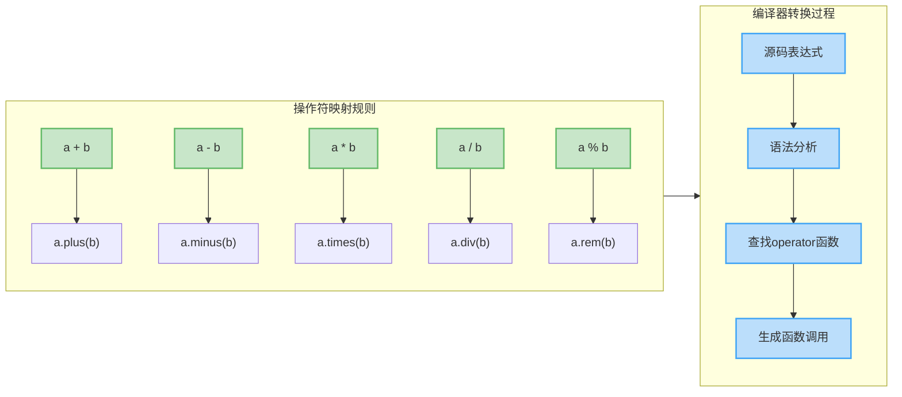

下表总结了所有二元算术操作符的约定函数名称：

| 操作符表达式 | 约定函数名 | 英文全称 | 语义 |
|------------|-----------|---------|-----|
| `a + b` | `plus` | Addition | 加法运算 |
| `a - b` | `minus` | Subtraction | 减法运算 |
| `a * b` | `times` | Multiplication | 乘法运算 |
| `a / b` | `div` | Division | 除法运算 |
| `a % b` | `rem` | Remainder | 取余运算 |

### 实现加法操作符

让我们通过一个 `Vector2D` 二维向量类来演示如何重载加法操作符。在数学中，两个向量相加需要将对应分量分别相加，这是一个非常直观的操作符重载场景。

```kotlin
// 定义一个二维向量类，包含 x 和 y 两个坐标分量
data class Vector2D(val x: Double, val y: Double) {
    
    // 使用 operator 关键字标记 plus 函数，允许使用 + 操作符
    operator fun plus(other: Vector2D): Vector2D {
        // 将当前向量的 x 分量与 other 向量的 x 分量相加
        val newX = this.x + other.x
        // 将当前向量的 y 分量与 other 向量的 y 分量相加
        val newY = this.y + other.y
        // 返回一个新的 Vector2D 实例，体现不可变性原则
        return Vector2D(newX, newY)
    }
    
    // 重写 toString 方法以便于调试输出
    override fun toString(): String = "($x, $y)"
}

fun main() {
    // 创建两个向量实例
    val v1 = Vector2D(3.0, 4.0)  // 向量 v1 = (3, 4)
    val v2 = Vector2D(1.0, 2.0)  // 向量 v2 = (1, 2)
    
    // 使用 + 操作符，编译器会转换为 v1.plus(v2)
    val v3 = v1 + v2  // 结果：(4.0, 6.0)
    
    println("v1 + v2 = $v3")  // 输出: v1 + v2 = (4.0, 6.0)
    
    // 可以链式调用，因为返回类型也是 Vector2D
    val v4 = v1 + v2 + Vector2D(0.5, 0.5)
    println("链式加法: $v4")  // 输出: 链式加法: (4.5, 6.5)
}
```

**关键设计原则**：
1. **不可变性（Immutability）**：`plus` 函数返回新对象而非修改原对象，这是函数式编程的最佳实践
2. **类型安全**：参数类型必须与接收者类型匹配（或兼容），编译器会进行严格检查
3. **语义清晰**：操作符重载应该符合数学或领域常识，避免反直觉的实现

### 实现完整的算术操作符集

对于一个数值类型，通常需要实现完整的算术操作符集合。以下示例展示了如何为 `Complex` 复数类实现全套运算：

```kotlin
// 定义复数类，包含实部(real)和虚部(imaginary)
data class Complex(val real: Double, val imaginary: Double) {
    
    // 加法：(a + bi) + (c + di) = (a+c) + (b+d)i
    operator fun plus(other: Complex): Complex {
        // 实部相加
        val newReal = this.real + other.real
        // 虚部相加
        val newImaginary = this.imaginary + other.imaginary
        return Complex(newReal, newImaginary)
    }
    
    // 减法：(a + bi) - (c + di) = (a-c) + (b-d)i
    operator fun minus(other: Complex): Complex {
        // 实部相减
        val newReal = this.real - other.real
        // 虚部相减
        val newImaginary = this.imaginary - other.imaginary
        return Complex(newReal, newImaginary)
    }
    
    // 乘法：(a + bi) * (c + di) = (ac - bd) + (ad + bc)i
    operator fun times(other: Complex): Complex {
        // 根据复数乘法公式计算实部：ac - bd
        val newReal = this.real * other.real - this.imaginary * other.imaginary
        // 根据复数乘法公式计算虚部：ad + bc
        val newImaginary = this.real * other.imaginary + this.imaginary * other.real
        return Complex(newReal, newImaginary)
    }
    
    // 除法：(a + bi) / (c + di) = [(a + bi)(c - di)] / (c² + d²)
    operator fun div(other: Complex): Complex {
        // 计算分母：c² + d²（模的平方）
        val denominator = other.real * other.real + other.imaginary * other.imaginary
        // 检查除数是否为零
        require(denominator != 0.0) { "不能除以零复数" }
        
        // 计算实部：(ac + bd) / (c² + d²)
        val newReal = (this.real * other.real + this.imaginary * other.imaginary) / denominator
        // 计算虚部：(bc - ad) / (c² + d²)
        val newImaginary = (this.imaginary * other.real - this.real * other.imaginary) / denominator
        return Complex(newReal, newImaginary)
    }
    
    // 取余运算（这里定义为模运算的一种变体）
    operator fun rem(other: Complex): Complex {
        // 注意：复数的模运算没有标准定义，这里仅作示例
        // 实际应用中需要根据具体需求定义语义
        val quotient = this / other  // 先计算商
        // 将商的实部和虚部都取整
        val flooredQuotient = Complex(
            kotlin.math.floor(quotient.real),
            kotlin.math.floor(quotient.imaginary)
        )
        // 余数 = 被除数 - 商 * 除数
        return this - (flooredQuotient * other)
    }
    
    // 重写 toString 以标准复数形式显示
    override fun toString(): String {
        return when {
            imaginary >= 0 -> "$real + ${imaginary}i"
            else -> "$real - ${-imaginary}i"
        }
    }
}

fun main() {
    val c1 = Complex(3.0, 4.0)   // 3 + 4i
    val c2 = Complex(1.0, 2.0)   // 1 + 2i
    
    // 测试加法
    println("加法: $c1 + $c2 = ${c1 + c2}")  // (4.0 + 6.0i)
    
    // 测试减法
    println("减法: $c1 - $c2 = ${c1 - c2}")  // (2.0 + 2.0i)
    
    // 测试乘法
    println("乘法: $c1 * $c2 = ${c1 * c2}")  // (-5.0 + 10.0i)
    
    // 测试除法
    println("除法: $c1 / $c2 = ${c1 / c2}")  // (2.2 + 0.4i)
    
    // 混合运算
    val result = (c1 + c2) * Complex(2.0, 0.0) / c2
    println("混合运算: $result")
}
```

### 操作符的交换律与扩展函数

在某些情况下，我们希望支持不同类型之间的运算。例如，向量与标量（Scalar）的乘法：`vector * 2.0` 和 `2.0 * vector` 都应该有效。这需要通过扩展函数来实现交换律支持。

```kotlin
data class Vector2D(val x: Double, val y: Double) {
    // 向量 * 标量（成员函数）
    operator fun times(scalar: Double): Vector2D {
        // 将向量的每个分量乘以标量
        return Vector2D(x * scalar, y * scalar)
    }
}

// 标量 * 向量（扩展函数，实现交换律）
// 注意：这里必须定义在类外部，因为接收者类型是 Double
operator fun Double.times(vector: Vector2D): Vector2D {
    // 调用向量的 times 函数，利用乘法交换律
    return vector * this
}

fun main() {
    val v = Vector2D(3.0, 4.0)
    
    // 向量在左，标量在右（使用成员函数）
    val v1 = v * 2.0  // 结果: (6.0, 8.0)
    
    // 标量在左，向量在右（使用扩展函数）
    val v2 = 2.0 * v  // 结果: (6.0, 8.0)
    
    println("v * 2.0 = $v1")
    println("2.0 * v = $v2")
    println("结果相等: ${v1 == v2}")  // true
}
```

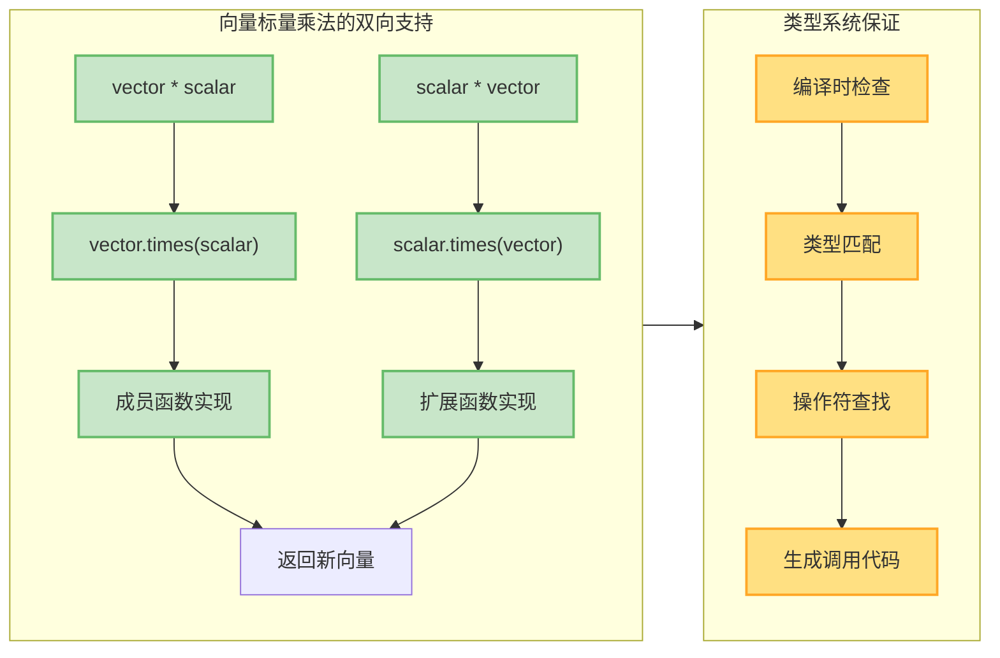

### 返回类型的灵活性

操作符函数的返回类型不必与操作数类型相同。例如，两个 `Point` 对象相减可以返回一个 `Vector`，表示位移：

```kotlin
// 定义点类，表示二维空间中的位置
data class Point(val x: Double, val y: Double)

// 定义向量类，表示方向和距离
data class Vector(val dx: Double, val dy: Double) {
    override fun toString() = "Vector(Δx=$dx, Δy=$dy)"
}

// 为 Point 类添加减法操作符，返回类型是 Vector
operator fun Point.minus(other: Point): Vector {
    // 计算 x 方向的位移
    val dx = this.x - other.x
    // 计算 y 方向的位移
    val dy = this.y - other.y
    // 返回向量而非点
    return Vector(dx, dy)
}

fun main() {
    val p1 = Point(5.0, 8.0)  // 起点
    val p2 = Point(2.0, 3.0)  // 终点
    
    // 两点相减得到向量
    val displacement: Vector = p1 - p2
    println("从 p2 到 p1 的位移: $displacement")  
    // 输出: 从 p2 到 p1 的位移: Vector(Δx=3.0, Δy=5.0)
}
```

这种设计体现了 **语义精确性**：点与点相减在几何意义上就是向量，返回不同类型能更清晰地表达领域概念。

### 操作符函数的可见性与限制

操作符函数必须满足以下约束：

1. **必须标记 `operator` 关键字**：未标记会导致编译错误
2. **参数数量固定**：二元操作符必须恰好有一个参数（接收者本身算一个操作数）
3. **不能有默认参数**：操作符函数不支持默认参数值
4. **可以是成员函数、扩展函数或顶层函数**

```kotlin
class Matrix(private val data: Array<IntArray>) {
    // ❌ 错误示例：缺少 operator 关键字
    // fun plus(other: Matrix): Matrix { ... }
    
    // ✅ 正确示例
    operator fun plus(other: Matrix): Matrix {
        // 检查矩阵维度是否匹配
        require(data.size == other.data.size && 
                data[0].size == other.data[0].size) {
            "矩阵维度必须相同才能相加"
        }
        
        // 创建结果矩阵
        val result = Array(data.size) { i ->
            IntArray(data[0].size) { j ->
                // 对应元素相加
                data[i][j] + other.data[i][j]
            }
        }
        return Matrix(result)
    }
    
    // ❌ 错误示例：二元操作符不能有默认参数
    // operator fun times(scalar: Int = 1): Matrix { ... }
}
```

## 复合赋值操作符

复合赋值操作符（Compound Assignment Operators）结合了算术运算与赋值操作，例如 `+=`、`-=`、`*=`、`/=`、`%=`。Kotlin 提供了两种机制来支持这些操作符：**自动转换机制** 和 **显式约定函数**。

### 自动转换机制

当你为类定义了二元算术操作符（如 `plus`）后，即使没有显式定义 `plusAssign`，Kotlin 也能自动支持 `+=` 操作符。编译器会将 `a += b` 转换为 `a = a + b`。

```kotlin
data class Counter(val value: Int) {
    // 仅定义 plus 操作符
    operator fun plus(other: Counter): Counter {
        // 返回新的 Counter 实例
        return Counter(this.value + other.value)
    }
}

fun main() {
    var c1 = Counter(10)  // 注意：必须是 var 才能重新赋值
    val c2 = Counter(5)
    
    // 编译器自动转换：c1 = c1 + c2
    c1 += c2  // 等价于 c1 = c1.plus(c2)
    
    println("c1.value = ${c1.value}")  // 输出: c1.value = 15
}
```

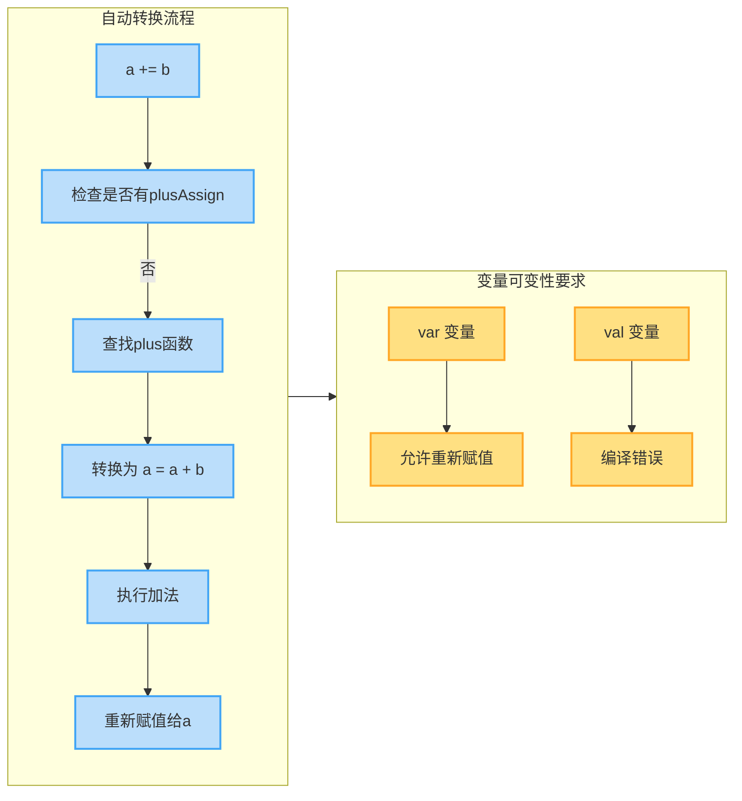

### 显式定义复合赋值函数

如果你希望 `+=` 直接修改对象本身（而非创建新对象），可以显式定义 `plusAssign` 约定函数。这种方法常用于可变集合（Mutable Collections）等场景。

```kotlin
// 定义一个可变的整数累加器
class MutableCounter(private var value: Int) {
    
    // 显式定义 plusAssign，直接修改内部状态
    operator fun plusAssign(increment: Int) {
        // 注意：这里修改的是内部私有属性，不返回新对象
        value += increment  // 等价于 value = value + increment
    }
    
    // 提供 getter 以便外部读取
    fun getValue(): Int = value
    
    override fun toString() = "MutableCounter(value=$value)"
}

fun main() {
    val counter = MutableCounter(10)  // 可以用 val，因为不改变引用
    
    println("初始值: $counter")
    
    // 使用 += 操作符，调用 plusAssign
    counter += 5  // 直接修改内部状态
    println("加5后: $counter")  // 输出: MutableCounter(value=15)
    
    counter += 10
    println("再加10后: $counter")  // 输出: MutableCounter(value=25)
}
```

下表总结了所有复合赋值操作符及其约定函数：

| 操作符表达式 | 自动转换形式 | 显式约定函数 | 函数返回类型 |
|------------|------------|------------|------------|
| `a += b` | `a = a + b` | `plusAssign(b)` | `Unit` |
| `a -= b` | `a = a - b` | `minusAssign(b)` | `Unit` |
| `a *= b` | `a = a * b` | `timesAssign(b)` | `Unit` |
| `a /= b` | `a = a / b` | `divAssign(b)` | `Unit` |
| `a %= b` | `a = a % b` | `remAssign(b)` | `Unit` |

**关键区别**：
- **自动转换**：创建新对象，要求变量是 `var`
- **显式约定函数**：修改原对象，返回类型必须是 `Unit`

### 集合类型的复合赋值

Kotlin 标准库中的可变集合大量使用了 `plusAssign` 系列函数，使得添加元素的操作更加自然：

```kotlin
fun main() {
    // 创建可变列表
    val numbers = mutableListOf(1, 2, 3)
    
    // 使用 += 添加单个元素，调用 MutableList.plusAssign
    numbers += 4  // 等价于 numbers.plusAssign(4) 或 numbers.add(4)
    println("添加单个元素: $numbers")  // [1, 2, 3, 4]
    
    // 使用 += 添加多个元素，调用 MutableList.plusAssign(集合)
    numbers += listOf(5, 6, 7)  // 等价于 numbers.addAll(listOf(5, 6, 7))
    println("添加多个元素: $numbers")  // [1, 2, 3, 4, 5, 6, 7]
    
    // 使用 -= 删除元素，调用 MutableList.minusAssign
    numbers -= 3  // 等价于 numbers.remove(3)
    println("删除元素3: $numbers")  // [1, 2, 4, 5, 6, 7]
    
    // 创建可变集合（Set）
    val uniqueNumbers = mutableSetOf(1, 2, 3)
    uniqueNumbers += 4  // 自动去重
    uniqueNumbers += 2  // 重复元素不会添加
    println("可变集合: $uniqueNumbers")  // [1, 2, 3, 4]
}
```

这里展示了 Kotlin 标准库内部的实现原理（简化版）：

```kotlin
// MutableList 的 plusAssign 扩展函数（标准库简化版）
operator fun <T> MutableCollection<T>.plusAssign(element: T) {
    // 直接调用集合的 add 方法
    this.add(element)
}

// 支持添加整个集合
operator fun <T> MutableCollection<T>.plusAssign(elements: Iterable<T>) {
    // 直接调用集合的 addAll 方法
    this.addAll(elements)
}

// MutableList 的 minusAssign 扩展函数
operator fun <T> MutableCollection<T>.minusAssign(element: T) {
    // 直接调用集合的 remove 方法
    this.remove(element)
}
```

### 二义性解决规则

当一个类同时定义了 `plus` 和 `plusAssign` 时，编译器该如何处理 `a += b`？Kotlin 的规则如下：

1. **优先使用 `plusAssign`**：如果存在且参数类型匹配，直接调用
2. **回退到 `plus`**：如果没有 `plusAssign` 或类型不匹配，尝试转换为 `a = a + b`
3. **编译错误**：如果两者都可用且同样匹配，报告二义性错误

```kotlin
class Ambiguous(val value: Int) {
    // 定义 plus，返回新对象
    operator fun plus(other: Ambiguous): Ambiguous {
        println("调用 plus")
        return Ambiguous(value + other.value)
    }
    
    // 同时定义 plusAssign，修改自身
    operator fun plusAssign(other: Ambiguous) {
        println("调用 plusAssign")
        // 注意：这里无法直接修改 value（因为它是 val）
        // 实际场景中应该使用 var 或修改内部可变状态
    }
}

fun main() {
    var a = Ambiguous(10)
    val b = Ambiguous(5)
    
    // ⚠️ 编译器警告或错误：存在二义性
    // 无法确定是调用 plusAssign 还是转换为 a = a + b
    // a += b  // 取消注释会导致编译错误
    
    // 解决方案1：显式调用
    a.plusAssign(b)  // 明确调用 plusAssign
    
    // 解决方案2：显式使用赋值形式
    a = a + b  // 明确使用 plus
}
```

**最佳实践**：
- 对于 **不可变类型**（Immutable Types），仅定义 `plus` 等二元操作符
- 对于 **可变类型**（Mutable Types），仅定义 `plusAssign` 等复合赋值操作符
- 避免在同一类中同时定义两者，除非有明确的语义区分

### 自定义可变类型示例

以下示例展示了如何为自定义的可变类型实现完整的复合赋值操作符集：

```kotlin
// 定义一个可变的数学区间类
class MutableRange(
    private var start: Int,  // 起始值（可变）
    private var end: Int     // 结束值（可变）
) {
    // 扩展区间：将起始值减小，结束值增大
    operator fun plusAssign(expansion: Int) {
        require(expansion >= 0) { "扩展值必须非负" }
        // 向两端扩展
        start -= expansion
        end += expansion
    }
    
    // 收缩区间：将起始值增大，结束值减小
    operator fun minusAssign(contraction: Int) {
        require(contraction >= 0) { "收缩值必须非负" }
        // 向中心收缩
        start += contraction
        end -= contraction
        // 确保区间仍然有效
        require(start <= end) { "收缩后区间无效: [$start, $end]" }
    }
    
    // 放大区间：两端同时乘以倍数
    operator fun timesAssign(multiplier: Int) {
        require(multiplier > 0) { "倍数必须为正" }
        // 计算中心点
        val center = (start + end) / 2.0
        // 计算半径
        val halfWidth = (end - start) / 2.0
        // 放大半径
        val newHalfWidth = (halfWidth * multiplier).toInt()
        // 更新边界
        start = (center - newHalfWidth).toInt()
        end = (center + newHalfWidth).toInt()
    }
    
    // 检查某个值是否在区间内
    operator fun contains(value: Int): Boolean {
        return value in start..end
    }
    
    override fun toString() = "[$start, $end]"
}

fun main() {
    val range = MutableRange(10, 20)
    println("初始区间: $range")  // [10, 20]
    
    // 扩展区间
    range += 5
    println("扩展5单位后: $range")  // [5, 25]
    
    // 收缩区间
    range -= 3
    println("收缩3单位后: $range")  // [8, 22]
    
    // 放大区间
    range *= 2
    println("放大2倍后: $range")  // [1, 29]
    
    // 检查包含性
    println("15 是否在区间内: ${15 in range}")  // true
}
```

### 性能考虑

在选择自动转换与显式定义时，性能是一个重要考量：

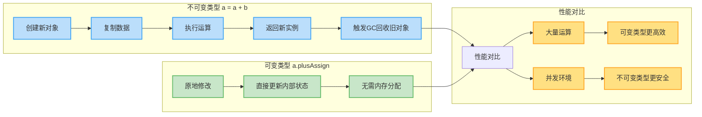

**性能建议**：
- 循环中大量执行 `+=`：优先使用 `plusAssign`（避免频繁对象创建）
- 多线程环境：优先使用不可变类型 + `plus`（线程安全）
- 小对象、少量运算：性能差异可忽略，选择更符合语义的方式

---

**📝 练习题**

下面这段代码会输出什么结果？请解释原因。

```kotlin
data class Box(val items: Int) {
    operator fun plus(other: Box) = Box(items + other.items)
    operator fun plusAssign(other: Box) {
        println("plusAssign被调用")
    }
}

fun main() {
    var box1 = Box(10)
    val box2 = Box(5)
    box1 += box2
    println(box1.items)
}
```

**A.** 输出 `plusAssign被调用` 和 `10`  
**B.** 输出 `plusAssign被调用` 和 `15`  
**C.** 编译错误：存在二义性  
**D.** 输出 `15`（不输出 `plusAssign被调用`）

**【答案】** C

**【解析】** 这道题考查的是复合赋值操作符的二义性问题。当一个类同时定义了 `plus` 和 `plusAssign` 且两者都能应用于 `+=` 操作时，编译器无法确定应该：
1. 调用 `plusAssign(other)` 直接修改对象
2. 转换为 `box1 = box1 + box2` 调用 `plus` 并重新赋值

由于存在两种可能的解释且优先级相同，Kotlin 编译器会报告二义性错误，强制开发者明确选择其中一种方式。这是 Kotlin 类型系统严格性的体现，避免了潜在的逻辑错误。

**解决方案**：
- 删除 `plusAssign` 函数（如果 `Box` 应该是不可变的）
- 删除 `plus` 函数（如果 `Box` 应该是可变的）
- 或显式调用：`box1.plusAssign(box2)` 或 `box1 = box1 + box2`

---

## 比较操作符

在 Kotlin 中，比较操作符不仅仅是简单的符号，而是通过**操作符重载约定（operator conventions）**实现的一套优雅机制。这使得我们可以为自定义类型定义逻辑上的"相等"和"大小"关系，让代码更符合直觉。

### equals 与相等性比较

Kotlin 中的 `==` 操作符实际上调用的是 `equals()` 方法，这与 Java 有本质区别。在 Java 中，`==` 比较的是引用地址，而在 Kotlin 中：

- `==` 调用 `equals()` 方法（结构相等，structural equality）
- `===` 比较引用地址（引用相等，referential equality）

这意味着当我们重载 `equals()` 方法时，`==` 操作符的行为也会随之改变。需要注意的是，`equals()` 方法**不需要** `operator` 关键字，因为它是 `Any` 类中的开放方法，我们只是在重写（override）它。

```kotlin
// 定义一个表示复数的类
class Complex(val real: Double, val imaginary: Double) {
    
    // 重写 equals 方法来定义相等性
    // 不需要 operator 关键字，因为这是重写而非新定义
    override fun equals(other: Any?): Boolean {
        // 检查是否是同一个引用
        if (this === other) return true
        
        // 检查类型是否匹配
        if (other !is Complex) return false
        
        // 比较实部和虚部
        return real == other.real && imaginary == other.imaginary
    }
    
    // 重写 equals 必须同时重写 hashCode，保持契约一致性
    override fun hashCode(): Int {
        var result = real.hashCode()
        result = 31 * result + imaginary.hashCode()
        return result
    }
    
    override fun toString() = "$real + ${imaginary}i"
}

fun main() {
    val c1 = Complex(3.0, 4.0)
    val c2 = Complex(3.0, 4.0)
    val c3 = c1
    
    // 结构相等：调用 equals() 方法
    println(c1 == c2)  // true，因为实部和虚部都相等
    
    // 引用相等：比较内存地址
    println(c1 === c2) // false，不同的对象实例
    println(c1 === c3) // true，指向同一个对象
    
    // != 操作符自动实现，等价于 !(c1 == c2)
    println(c1 != Complex(5.0, 6.0)) // true
}
```

**重要约定**：重写 `equals()` 时必须满足以下数学性质：
- **自反性（Reflexive）**：`x.equals(x)` 必须为 `true`
- **对称性（Symmetric）**：`x.equals(y)` 为 `true` 当且仅当 `y.equals(x)` 为 `true`
- **传递性（Transitive）**：若 `x.equals(y)` 且 `y.equals(z)`，则 `x.equals(z)` 必为 `true`
- **一致性（Consistent）**：多次调用结果应保持一致
- **非空性（Non-null）**：`x.equals(null)` 必须返回 `false`

### compareTo 与大小比较

对于大小比较操作符（`<`、`>`、`<=`、`>=`），Kotlin 使用 `compareTo()` 方法实现。这个方法需要 `operator` 修饰符，返回一个 `Int` 值：

- 返回负数：当前对象小于参数对象
- 返回零：两个对象相等
- 返回正数：当前对象大于参数对象

```kotlin
// 定义一个表示版本号的类
class Version(val major: Int, val minor: Int, val patch: Int) : Comparable<Version> {
    
    // 实现 compareTo 方法，定义版本号的比较逻辑
    override operator fun compareTo(other: Version): Int {
        // 首先比较主版本号
        if (major != other.major) {
            return major - other.major
        }
        // 主版本号相同，比较次版本号
        if (minor != other.minor) {
            return minor - other.minor
        }
        // 次版本号也相同，比较修订号
        return patch - other.patch
    }
    
    override fun toString() = "$major.$minor.$patch"
}

fun main() {
    val v1 = Version(1, 2, 3)
    val v2 = Version(1, 2, 5)
    val v3 = Version(2, 0, 0)
    
    // 所有比较操作符都基于 compareTo 实现
    println(v1 < v2)   // true，因为 compareTo 返回负数
    println(v1 > v2)   // false
    println(v3 >= v1)  // true，主版本号更大
    println(v1 <= v2)  // true
    
    // 可以直接用于排序
    val versions = listOf(v3, v1, v2)
    println(versions.sorted()) // [1.2.3, 1.2.5, 2.0.0]
}
```

**比较链（Comparison Chaining）** 是一个便利特性。当你实现了 `compareTo` 后，可以优雅地进行多条件比较：

```kotlin
// 定义一个学生类，按照成绩、姓名排序
data class Student(val name: String, val score: Int, val age: Int) : Comparable<Student> {
    
    override fun compareTo(other: Student): Int {
        // 使用 compareValuesBy 实现多级比较
        // 首先按成绩降序，然后按姓名字典序，最后按年龄升序
        return compareValuesBy(
            this, other,
            { -it.score },     // 负号实现降序
            { it.name },       // 字典序
            { it.age }         // 升序
        )
    }
}

fun main() {
    val students = listOf(
        Student("Alice", 95, 20),
        Student("Bob", 95, 19),
        Student("Charlie", 90, 21)
    )
    
    // 自动按照 compareTo 定义的规则排序
    students.sorted().forEach { println(it) }
    // 输出:
    // Student(name=Alice, score=95, age=20)
    // Student(name=Bob, score=95, age=19)
    // Student(name=Charlie, score=90, age=21)
}
```

下面通过 Mermaid 图展示比较操作符的工作机制：

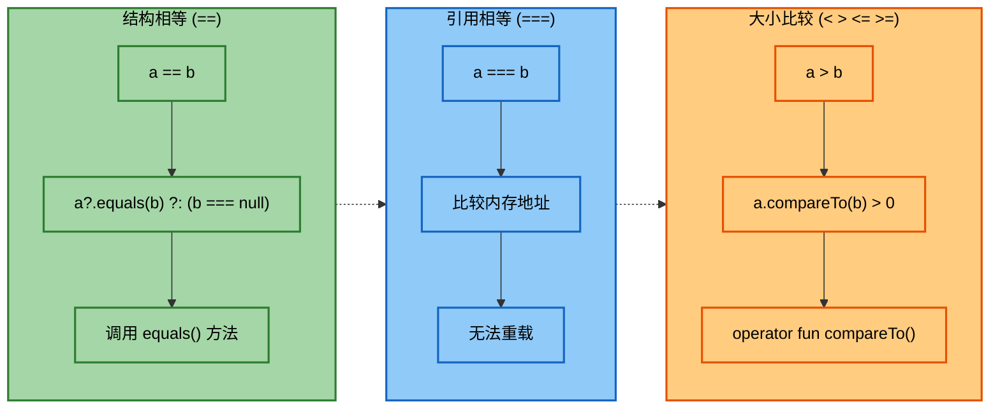

### 空安全与比较操作符

Kotlin 的比较操作符对 `null` 有特殊处理：

```kotlin
fun main() {
    val a: String? = "Hello"
    val b: String? = null
    
    // == 操作符会自动处理 null 情况
    // 等价于：a?.equals(b) ?: (b === null)
    println(a == b)     // false
    println(b == null)  // true
    println(null == null) // true
    
    // compareTo 不能直接用于可空类型
    val x: Int? = 5
    val y: Int? = 3
    
    // 错误：不能直接比较可空类型
    // println(x > y)  // 编译错误
    
    // 需要先进行空值检查
    if (x != null && y != null) {
        println(x > y)  // true
    }
}
```

### 实战案例：金额类

下面通过一个完整的金额类示例，展示比较操作符的综合应用：

```kotlin
// 定义一个表示金额的类，包含数值和货币单位
class Money(val amount: Double, val currency: String) : Comparable<Money> {
    
    // 重写 equals：只有金额和货币都相同才相等
    override fun equals(other: Any?): Boolean {
        if (this === other) return true
        if (other !is Money) return false
        
        // 比较金额时使用 epsilon 避免浮点误差
        val epsilon = 0.001
        return kotlin.math.abs(amount - other.amount) < epsilon && 
               currency == other.currency
    }
    
    // 重写 hashCode 保持契约
    override fun hashCode(): Int {
        var result = amount.hashCode()
        result = 31 * result + currency.hashCode()
        return result
    }
    
    // 实现 compareTo：只能比较相同货币的金额
    override fun compareTo(other: Money): Int {
        // 检查货币是否相同
        require(currency == other.currency) {
            "无法比较不同货币: $currency vs ${other.currency}"
        }
        // 比较金额大小
        return amount.compareTo(other.amount)
    }
    
    override fun toString() = "$amount $currency"
}

fun main() {
    val price1 = Money(99.99, "USD")
    val price2 = Money(99.99, "USD")
    val price3 = Money(120.00, "USD")
    val price4 = Money(99.99, "CNY")
    
    // 相等性比较
    println(price1 == price2)  // true，金额和货币都相同
    println(price1 == price4)  // false，货币不同
    
    // 大小比较（相同货币）
    println(price1 < price3)   // true
    println(price3 >= price1)  // true
    
    // 尝试比较不同货币会抛出异常
    try {
        println(price1 > price4)
    } catch (e: IllegalArgumentException) {
        println("错误: ${e.message}")
        // 输出: 错误: 无法比较不同货币: USD vs CNY
    }
}
```

## 索引访问

索引访问操作符允许我们像访问数组一样使用方括号 `[]` 来读取和设置对象的元素。这是 Kotlin 操作符重载中最实用的特性之一，广泛应用于集合、映射、矩阵等数据结构。

### get 操作符：读取元素

`get` 操作符用于通过索引读取元素，使用 `operator` 关键字修饰。当我们写 `obj[index]` 时，实际上调用的是 `obj.get(index)`。

```kotlin
// 定义一个自定义的列表类
class CustomList<T>(private val elements: MutableList<T> = mutableListOf()) {
    
    // 重载 get 操作符，支持通过索引访问元素
    operator fun get(index: Int): T {
        // 检查索引是否有效
        require(index in elements.indices) {
            "索引越界: $index，有效范围: ${elements.indices}"
        }
        // 返回对应位置的元素
        return elements[index]
    }
    
    // 可以添加更多方法
    fun add(element: T) {
        elements.add(element)
    }
    
    val size: Int get() = elements.size
    
    override fun toString() = elements.toString()
}

fun main() {
    val list = CustomList<String>()
    list.add("Kotlin")
    list.add("Java")
    list.add("Python")
    
    // 使用索引访问操作符
    println(list[0])  // 调用 get(0)，输出: Kotlin
    println(list[1])  // 输出: Java
    
    // 索引越界会抛出异常
    try {
        println(list[10])
    } catch (e: IllegalArgumentException) {
        println("错误: ${e.message}")
    }
}
```

### set 操作符：设置元素

`set` 操作符用于通过索引设置元素值。当我们写 `obj[index] = value` 时，实际调用的是 `obj.set(index, value)`。

```kotlin
// 扩展上面的 CustomList 类，添加 set 操作符
class MutableCustomList<T>(private val elements: MutableList<T> = mutableListOf()) {
    
    // get 操作符：读取元素
    operator fun get(index: Int): T {
        require(index in elements.indices) {
            "索引越界: $index，有效范围: ${elements.indices}"
        }
        return elements[index]
    }
    
    // set 操作符：设置元素
    // 注意：set 必须返回 Unit
    operator fun set(index: Int, value: T) {
        require(index in elements.indices) {
            "索引越界: $index，有效范围: ${elements.indices}"
        }
        // 更新指定位置的元素
        elements[index] = value
    }
    
    fun add(element: T) {
        elements.add(element)
    }
    
    val size: Int get() = elements.size
    
    override fun toString() = elements.toString()
}

fun main() {
    val list = MutableCustomList<String>()
    list.add("Kotlin")
    list.add("Java")
    list.add("Python")
    
    println("修改前: $list")  // [Kotlin, Java, Python]
    
    // 使用索引赋值操作符
    list[1] = "Scala"  // 调用 set(1, "Scala")
    
    println("修改后: $list")  // [Kotlin, Scala, Python]
}
```

### 多维索引

Kotlin 支持多维索引访问，这对于实现矩阵、表格等数据结构非常有用。`get` 和 `set` 可以接受多个参数：

```kotlin
// 定义一个二维矩阵类
class Matrix(val rows: Int, val cols: Int) {
    // 使用一维数组存储二维数据
    private val data = DoubleArray(rows * cols)
    
    // 多参数 get 操作符：支持 matrix[row, col] 语法
    operator fun get(row: Int, col: Int): Double {
        // 检查行列索引是否有效
        require(row in 0 until rows && col in 0 until cols) {
            "索引越界: ($row, $col)，有效范围: (0..${rows-1}, 0..${cols-1})"
        }
        // 将二维索引转换为一维索引
        return data[row * cols + col]
    }
    
    // 多参数 set 操作符：支持 matrix[row, col] = value 语法
    operator fun set(row: Int, col: Int, value: Double) {
        require(row in 0 until rows && col in 0 until cols) {
            "索引越界: ($row, $col)，有效范围: (0..${rows-1}, 0..${cols-1})"
        }
        // 设置对应位置的值
        data[row * cols + col] = value
    }
    
    // 打印矩阵的辅助方法
    fun print() {
        for (i in 0 until rows) {
            for (j in 0 until cols) {
                print("${this[i, j]}\t")  // 使用 get 操作符
            }
            println()
        }
    }
}

fun main() {
    // 创建一个 3x3 矩阵
    val matrix = Matrix(3, 3)
    
    // 使用多维索引设置值
    matrix[0, 0] = 1.0
    matrix[0, 1] = 2.0
    matrix[0, 2] = 3.0
    matrix[1, 0] = 4.0
    matrix[1, 1] = 5.0
    matrix[1, 2] = 6.0
    matrix[2, 0] = 7.0
    matrix[2, 1] = 8.0
    matrix[2, 2] = 9.0
    
    // 读取和打印矩阵
    println("矩阵内容:")
    matrix.print()
    // 输出:
    // 1.0  2.0  3.0
    // 4.0  5.0  6.0
    // 7.0  8.0  9.0
    
    // 读取特定元素
    println("中心元素: ${matrix[1, 1]}")  // 5.0
}
```

### 高级应用：稀疏矩阵

对于大型稀疏矩阵（大部分元素为零），我们可以使用 `Map` 来优化存储：

```kotlin
// 定义一个稀疏矩阵类，只存储非零元素
class SparseMatrix(val rows: Int, val cols: Int) {
    // 使用 Map 存储非零元素，键为 (row, col) 的 Pair
    private val data = mutableMapOf<Pair<Int, Int>, Double>()
    
    // get 操作符：返回元素值，默认为 0.0
    operator fun get(row: Int, col: Int): Double {
        require(row in 0 until rows && col in 0 until cols) {
            "索引越界: ($row, $col)"
        }
        // 如果元素不存在于 Map 中，返回 0.0
        return data[Pair(row, col)] ?: 0.0
    }
    
    // set 操作符：只存储非零元素
    operator fun set(row: Int, col: Int, value: Double) {
        require(row in 0 until rows && col in 0 until cols) {
            "索引越界: ($row, $col)"
        }
        
        if (value != 0.0) {
            // 非零元素存入 Map
            data[Pair(row, col)] = value
        } else {
            // 零元素从 Map 中移除（如果存在）
            data.remove(Pair(row, col))
        }
    }
    
    // 获取非零元素的数量
    fun nonZeroCount() = data.size
    
    // 打印矩阵（展示稀疏特性）
    fun print() {
        for (i in 0 until rows) {
            for (j in 0 until cols) {
                val value = this[i, j]
                print(if (value == 0.0) "·\t" else "$value\t")
            }
            println()
        }
    }
}

fun main() {
    // 创建一个 5x5 的稀疏矩阵
    val sparse = SparseMatrix(5, 5)
    
    // 只设置少量非零元素
    sparse[0, 0] = 1.0
    sparse[2, 3] = 5.0
    sparse[4, 1] = 3.0
    
    println("稀疏矩阵 (· 表示零元素):")
    sparse.print()
    // 输出:
    // 1.0  ·    ·    ·    ·
    // ·    ·    ·    ·    ·
    // ·    ·    ·    5.0  ·
    // ·    ·    ·    ·    ·
    // ·    3.0  ·    ·    ·
    
    println("非零元素数量: ${sparse.nonZeroCount()}")  // 3
    println("总元素数量: ${sparse.rows * sparse.cols}")  // 25
}
```

### 索引访问与扩展函数结合

我们可以为现有类添加索引访问能力：

```kotlin
// 为 String 添加安全的索引访问
operator fun String.get(range: IntRange): String {
    // 确保范围在有效区间内
    val safeRange = range.first.coerceAtLeast(0)..range.last.coerceAtMost(length - 1)
    return substring(safeRange)
}

// 为 Map 添加多键访问
operator fun <K, V> Map<K, V>.get(vararg keys: K): List<V?> {
    // 返回多个键对应的值列表
    return keys.map { this[it] }
}

fun main() {
    // 使用扩展的 String 索引访问
    val text = "Kotlin Programming"
    println(text[0..5])     // Kotlin
    println(text[7..100])   // Programming（自动限制范围）
    
    // 使用扩展的 Map 多键访问
    val scores = mapOf(
        "Alice" to 95,
        "Bob" to 87,
        "Charlie" to 92
    )
    
    val results = scores["Alice", "Charlie", "David"]
    println(results)  // [95, 92, null]
}
```

下面通过 Mermaid 图展示索引访问的工作流程：

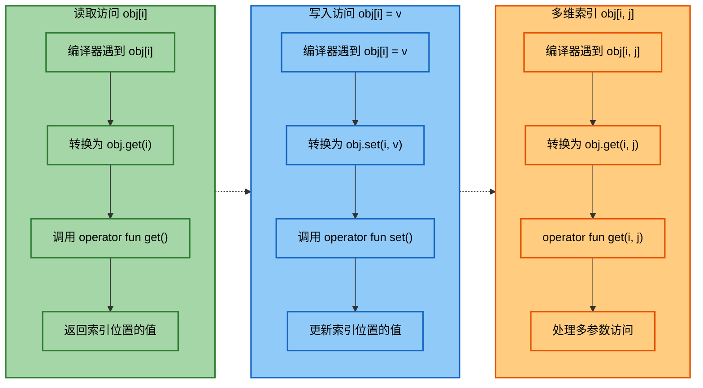

### 实战案例：配置管理器

下面展示一个实用的配置管理器，支持层级访问和类型安全：

```kotlin
// 定义一个配置管理器类，支持链式索引访问
class Config(private val data: MutableMap<String, Any> = mutableMapOf()) {
    
    // get 操作符：支持键访问
    operator fun get(key: String): Any? {
        return data[key]
    }
    
    // set 操作符：支持键赋值
    operator fun set(key: String, value: Any) {
        data[key] = value
    }
    
    // 泛型的安全获取方法
    inline fun <reified T> getValue(key: String, default: T): T {
        val value = data[key]
        return when {
            value is T -> value
            else -> default
        }
    }
    
    // 支持嵌套配置
    fun getOrCreateSection(key: String): Config {
        val existing = data[key]
        if (existing is Config) {
            return existing
        }
        // 创建新的子配置
        val section = Config()
        data[key] = section
        return section
    }
    
    override fun toString(): String {
        return data.toString()
    }
}

fun main() {
    val config = Config()
    
    // 使用索引访问设置配置
    config["app.name"] = "MyApp"
    config["app.version"] = "1.0.0"
    config["server.port"] = 8080
    config["server.host"] = "localhost"
    
    // 读取配置
    println("应用名称: ${config["app.name"]}")  // MyApp
    println("端口: ${config["server.port"]}")   // 8080
    
    // 使用类型安全的方法
    val port = config.getValue("server.port", 3000)
    val timeout = config.getValue("server.timeout", 30) // 使用默认值
    
    println("端口(Int): $port")      // 8080
    println("超时(Int): $timeout")   // 30
    
    // 嵌套配置
    val dbConfig = config.getOrCreateSection("database")
    dbConfig["host"] = "db.example.com"
    dbConfig["port"] = 5432
    
    println("完整配置: $config")
}
```

**📝 练习题**

**题目 1**：以下代码的输出是什么？

```kotlin
class Point(val x: Int, val y: Int) : Comparable<Point> {
    override fun compareTo(other: Point): Int {
        return when {
            x != other.x -> x - other.x
            else -> y - other.y
        }
    }
}

fun main() {
    val p1 = Point(3, 5)
    val p2 = Point(3, 2)
    val p3 = Point(1, 8)
    println(p1 > p2)
    println(p2 > p3)
}
```

A. `true false`  
B. `false true`  
C. `true true`  
D. `false false`

**【答案】** C

**【解析】** 
- 第一个比较 `p1 > p2`：两个点的 x 坐标相同（都是 3），所以比较 y 坐标。`p1.y = 5 > p2.y = 2`，因此 `compareTo` 返回正数，结果为 `true`。
- 第二个比较 `p2 > p3`：x 坐标不同，`p2.x = 3 > p3.x = 1`，`compareTo` 返回正数，结果为 `true`。

关键点在于理解 `compareTo` 的实现逻辑：首先比较 x 坐标，只有当 x 相同时才比较 y 坐标。

---

**题目 2**：以下代码能否编译通过？如果能，输出是什么？

```kotlin
class Grid<T>(private val width: Int, private val height: Int) {
    private val data = MutableList<T?>(width * height) { null }
    
    operator fun get(x: Int, y: Int): T? = data[y * width + x]
    operator fun set(x: Int, y: Int, value: T) {
        data[y * width + x] = value
    }
}

fun main() {
    val grid = Grid<String>(3, 2)
    grid[1, 0] = "A"
    grid[2, 1] = "B"
    println(grid[1, 0])
    println(grid[0, 0])
}
```

A. 编译错误：`get` 和 `set` 参数不匹配  
B. 编译错误：泛型类型推断失败  
C. 运行成功，输出 `A` 和 `null`  
D. 运行成功，输出 `A` 和空字符串

**【答案】** C

**【解析】**
代码可以正常编译和运行。关键点：
1. `get` 和 `set` 操作符可以有不同的返回类型：`get` 返回 `T?`（可空类型），`set` 接受 `T`（非空类型）
2. 内部使用 `MutableList<T?>` 存储，初始化时所有元素为 `null`
3. `grid[1, 0] = "A"` 设置了位置 (1, 0) 的值为 "A"
4. `grid[0, 0]` 从未被设置过，仍然是初始值 `null`

因此输出为 `A` 和 `null`。这展示了 Kotlin 索引访问操作符的灵活性，允许 `get` 和 `set` 有不对称的类型签名。

---

## in操作符

`in` 操作符是 Kotlin 中一个非常实用且语义化的操作符，它通过 `contains` 约定（Convention）来实现成员资格检查（Membership Test）。当我们使用 `element in collection` 这样的表达式时，实际上是在调用集合对象的 `contains` 方法。这种设计使得代码更加自然，符合人类的思维习惯。

### contains 约定的实现机制

`in` 操作符的背后是一个简单而优雅的约定：任何定义了 `operator fun contains(element: T): Boolean` 方法的类型，都可以使用 `in` 操作符进行成员检查。编译器会将 `a in b` 转换为 `b.contains(a)` 的方法调用。

```kotlin
// 自定义一个简单的集合类
class SimpleSet<T>(private val items: MutableList<T> = mutableListOf()) {
    
    // 定义 contains 操作符函数，使其支持 in 检查
    operator fun contains(element: T): Boolean {
        // 遍历内部列表，检查元素是否存在
        for (item in items) {
            if (item == element) {
                return true  // 找到元素，返回 true
            }
        }
        return false  // 未找到元素，返回 false
    }
    
    // 添加元素的辅助方法
    fun add(element: T) {
        items.add(element)
    }
}

fun main() {
    val mySet = SimpleSet<String>()
    mySet.add("Kotlin")
    mySet.add("Java")
    mySet.add("Python")
    
    // 使用 in 操作符检查成员资格
    println("Kotlin" in mySet)      // 输出: true (调用 mySet.contains("Kotlin"))
    println("Swift" in mySet)       // 输出: false
    println("Java" !in mySet)       // 输出: false (!in 是 in 的否定形式)
}
```

需要注意的是，`!in` 操作符是 `in` 的逻辑否定，编译器会将 `a !in b` 转换为 `!(a in b)`，也就是 `!b.contains(a)`。我们不需要单独为 `!in` 定义操作符函数。

### 范围检查与区间

`in` 操作符在范围检查（Range Checking）场景中特别有用。Kotlin 的区间（Range）类型天然支持 `in` 操作符，因为它们都实现了 `contains` 方法。这使得我们可以用非常直观的方式检查一个值是否在某个范围内。

```kotlin
fun checkAge(age: Int) {
    // 使用 in 检查年龄是否在合法范围内
    when {
        age in 0..17 -> {
            // age 是否在 [0, 17] 闭区间内
            println("未成年人: $age 岁")
        }
        age in 18..65 -> {
            // age 是否在 [18, 65] 闭区间内
            println("成年人: $age 岁")
        }
        age in 66..120 -> {
            // age 是否在 [66, 120] 闭区间内
            println("老年人: $age 岁")
        }
        else -> {
            println("无效年龄: $age")
        }
    }
}

fun main() {
    checkAge(15)   // 输出: 未成年人: 15 岁
    checkAge(30)   // 输出: 成年人: 30 岁
    checkAge(70)   // 输出: 老年人: 70 岁
    
    // in 也可以用于字符范围
    val char = 'm'
    if (char in 'a'..'z') {
        println("$char 是小写字母")  // 输出: m 是小写字母
    }
    
    // 检查浮点数范围
    val score = 85.5
    if (score in 60.0..100.0) {
        println("及格分数: $score")  // 输出: 及格分数: 85.5
    }
}
```

对于更复杂的范围检查，我们可以组合多个 `in` 表达式或使用逻辑运算符：

```kotlin
fun validateInput(value: Int): Boolean {
    // 检查值是否在多个有效范围内的任意一个
    return value in 1..10 || value in 20..30 || value in 40..50
}

fun isWeekend(dayOfWeek: Int): Boolean {
    // 检查是否为周末 (假设 6=周六, 7=周日)
    return dayOfWeek in 6..7
}

fun main() {
    println(validateInput(5))    // 输出: true (在 1..10 范围内)
    println(validateInput(15))   // 输出: false (不在任何有效范围内)
    println(validateInput(25))   // 输出: true (在 20..30 范围内)
    
    println(isWeekend(6))        // 输出: true
    println(isWeekend(3))        // 输出: false
}
```

### 自定义类型的范围检查

我们可以为自定义类型实现 `contains` 操作符，以支持更复杂的范围检查逻辑。这在处理日期、时间、坐标等场景时特别有用。

```kotlin
// 定义一个表示日期范围的类
data class DateRange(val start: Int, val end: Int) {
    
    // 实现 contains 操作符，检查某个日期是否在范围内
    operator fun contains(date: Int): Boolean {
        // 检查日期是否在 start 和 end 之间（包含边界）
        return date in start..end
    }
}

// 定义一个表示二维坐标点的类
data class Point(val x: Int, val y: Int)

// 定义一个表示矩形区域的类
data class Rectangle(val topLeft: Point, val bottomRight: Point) {
    
    // 实现 contains 操作符，检查某个点是否在矩形内
    operator fun contains(point: Point): Boolean {
        // 检查点的 x 坐标是否在矩形的水平范围内
        val inXRange = point.x in topLeft.x..bottomRight.x
        // 检查点的 y 坐标是否在矩形的垂直范围内
        val inYRange = point.y in topLeft.y..bottomRight.y
        // 只有当点同时在水平和垂直范围内时，才认为点在矩形内
        return inXRange && inYRange
    }
}

fun main() {
    // 日期范围检查
    val summerVacation = DateRange(start = 601, end = 831)  // 6月1日到8月31日
    println(715 in summerVacation)    // 输出: true (7月15日在暑假范围内)
    println(1001 in summerVacation)   // 输出: false (10月1日不在暑假范围内)
    
    // 矩形区域检查
    val screen = Rectangle(
        topLeft = Point(0, 0),
        bottomRight = Point(1920, 1080)
    )
    
    val clickPoint1 = Point(100, 200)
    val clickPoint2 = Point(2000, 500)
    
    println(clickPoint1 in screen)    // 输出: true (点在屏幕范围内)
    println(clickPoint2 in screen)    // 输出: false (点超出屏幕范围)
}
```

### 集合与容器的 in 检查

Kotlin 标准库中的所有集合类型（List、Set、Map 等）都已经实现了 `contains` 方法，因此可以直接使用 `in` 操作符。对于 Map 类型，`in` 检查的是键（Key）的存在性，而不是值（Value）。

```kotlin
fun main() {
    // List 的 in 检查
    val languages = listOf("Kotlin", "Java", "Python", "JavaScript")
    println("Kotlin" in languages)        // 输出: true
    println("Swift" in languages)         // 输出: false
    
    // Set 的 in 检查 (性能通常优于 List)
    val primeNumbers = setOf(2, 3, 5, 7, 11, 13, 17, 19)
    println(7 in primeNumbers)            // 输出: true (O(1) 时间复杂度)
    println(10 in primeNumbers)           // 输出: false
    
    // Map 的 in 检查 (检查键是否存在)
    val capitals = mapOf(
        "中国" to "北京",
        "美国" to "华盛顿",
        "日本" to "东京"
    )
    println("中国" in capitals)           // 输出: true (检查键)
    println("北京" in capitals)           // 输出: false (这是值，不是键)
    println("英国" in capitals)           // 输出: false
    
    // 如果要检查值是否存在，需要使用 containsValue
    println(capitals.containsValue("北京"))  // 输出: true
    
    // String 也支持 in 检查 (检查子串)
    val message = "Hello, Kotlin!"
    println("Kotlin" in message)          // 输出: true
    println("Java" in message)            // 输出: false
}
```

### 性能考量与最佳实践

在实现 `contains` 操作符时，需要注意性能问题。不同的数据结构有不同的查找效率：

```kotlin
import kotlin.system.measureTimeMillis

fun main() {
    val size = 100000
    val list = (1..size).toList()         // List: 顺序查找 O(n)
    val set = (1..size).toSet()           // Set: 哈希查找 O(1)
    
    val searchValue = 99999
    
    // 测量 List 的 contains 性能
    val listTime = measureTimeMillis {
        repeat(1000) {
            searchValue in list  // 每次都需要遍历大部分元素
        }
    }
    
    // 测量 Set 的 contains 性能
    val setTime = measureTimeMillis {
        repeat(1000) {
            searchValue in set   // 哈希表直接定位，速度快
        }
    }
    
    println("List contains 耗时: $listTime ms")   // 通常较慢
    println("Set contains 耗时: $setTime ms")     // 通常快得多
}
```

**最佳实践建议**：

1. **选择合适的数据结构**：如果需要频繁进行 `in` 检查，优先使用 `Set` 而不是 `List`
2. **避免重复计算**：如果同一个集合需要多次检查，考虑将其转换为 `Set`
3. **语义化代码**：使用 `in` 操作符可以让代码更具可读性，比 `contains()` 方法调用更自然
4. **区间优化**：对于数值范围检查，使用区间操作符 `..` 创建的范围对象非常高效

```kotlin
// 好的实践：使用 Set 进行频繁的成员检查
val allowedExtensions = setOf("jpg", "png", "gif", "webp")

fun isValidImage(filename: String): Boolean {
    val extension = filename.substringAfterLast('.').lowercase()
    return extension in allowedExtensions  // O(1) 时间复杂度
}

// 不太好的实践：使用 List 会导致 O(n) 查找
val allowedExtensionsList = listOf("jpg", "png", "gif", "webp")

fun isValidImageSlow(filename: String): Boolean {
    val extension = filename.substringAfterLast('.').lowercase()
    return extension in allowedExtensionsList  // O(n) 时间复杂度
}
```

## 调用操作符

调用操作符（Invoke Operator）是 Kotlin 中一个强大而独特的特性，它允许我们像调用函数一样"调用"一个对象实例。通过实现 `invoke` 操作符函数，任何对象都可以变成"可调用的"（Callable），这为函数式编程、DSL 设计和 API 简化提供了无限可能。

### invoke 约定的基本原理

当我们对一个对象使用函数调用语法 `obj(args)` 时，如果该对象定义了 `operator fun invoke(...)` 方法,编译器会将这个调用转换为 `obj.invoke(args)`。这种机制让对象能够表现得像函数一样。

```kotlin
// 定义一个简单的类，实现 invoke 操作符
class Greeter(private val greeting: String) {
    
    // 定义 invoke 操作符函数，接收一个 name 参数
    operator fun invoke(name: String): String {
        // 返回问候语和名字的组合
        return "$greeting, $name!"
    }
}

fun main() {
    val greeter = Greeter("Hello")
    
    // 像调用函数一样调用 greeter 对象
    println(greeter("Alice"))      // 输出: Hello, Alice!
    println(greeter("Bob"))        // 输出: Hello, Bob!
    
    // 实际上等价于调用 invoke 方法
    println(greeter.invoke("Charlie"))  // 输出: Hello, Charlie!
}
```

`invoke` 操作符可以有多个重载版本，支持不同的参数签名，这使得对象能够响应各种不同的调用模式：

```kotlin
// 定义一个计算器类，支持多种调用方式
class Calculator {
    
    // 无参数的 invoke：返回默认值
    operator fun invoke(): Int {
        return 0
    }
    
    // 单参数的 invoke：返回参数本身
    operator fun invoke(x: Int): Int {
        return x
    }
    
    // 双参数的 invoke：执行加法
    operator fun invoke(x: Int, y: Int): Int {
        return x + y
    }
    
    // 三参数的 invoke：执行复杂计算
    operator fun invoke(x: Int, y: Int, z: Int): Int {
        return x + y * z  // 遵循运算优先级
    }
    
    // 可变参数的 invoke：计算所有参数的和
    operator fun invoke(vararg numbers: Int): Int {
        return numbers.sum()
    }
}

fun main() {
    val calc = Calculator()
    
    println(calc())                    // 输出: 0 (调用无参 invoke)
    println(calc(5))                   // 输出: 5 (调用单参 invoke)
    println(calc(3, 4))                // 输出: 7 (调用双参 invoke)
    println(calc(2, 3, 4))             // 输出: 14 (2 + 3*4, 调用三参 invoke)
    println(calc(1, 2, 3, 4, 5))       // 输出: 15 (调用可变参数 invoke)
}
```

### 函数对象与高阶函数

`invoke` 操作符的一个重要应用是创建函数对象（Function Objects）。实际上，Kotlin 中的 Lambda 表达式和函数引用在底层就是通过实现 `invoke` 操作符的对象来实现的。

```kotlin
// 定义一个函数类型的包装类
class FunctionWrapper<T, R>(private val func: (T) -> R) {
    
    // 实现 invoke，委托给内部的函数
    operator fun invoke(value: T): R {
        println("调用前处理...")  // 可以在调用前后添加额外逻辑
        val result = func(value)  // 执行实际的函数
        println("调用后处理...")
        return result
    }
}

fun main() {
    // 创建一个函数包装器
    val doubler = FunctionWrapper<Int, Int> { it * 2 }
    
    // 像普通函数一样调用
    val result = doubler(5)  // 输出: 调用前处理... 调用后处理...
    println("结果: $result")  // 输出: 结果: 10
}
```

我们可以利用 `invoke` 操作符创建更复杂的函数组合器（Function Combinators）：

```kotlin
// 定义一个函数组合器类
class FunctionComposer<A, B, C>(
    private val f: (B) -> C,  // 第一个函数: B -> C
    private val g: (A) -> B   // 第二个函数: A -> B
) {
    // 实现 invoke，执行函数组合 f(g(x))
    operator fun invoke(value: A): C {
        val intermediate = g(value)  // 先执行 g
        return f(intermediate)        // 再执行 f
    }
}

// 扩展函数，用于创建函数组合
infix fun <A, B, C> ((B) -> C).compose(g: (A) -> B): FunctionComposer<A, B, C> {
    return FunctionComposer(this, g)
}

fun main() {
    // 定义两个简单函数
    val addOne: (Int) -> Int = { it + 1 }
    val double: (Int) -> Int = { it * 2 }
    
    // 组合函数: (x + 1) * 2
    val composed = double compose addOne
    
    println(composed(5))   // 输出: 12 ((5 + 1) * 2)
    println(composed(10))  // 输出: 22 ((10 + 1) * 2)
}
```

### DSL 应用：构建流畅的 API

`invoke` 操作符在 DSL（Domain-Specific Language，领域特定语言）设计中扮演着重要角色。它可以让我们创建出非常流畅和直观的 API。

```kotlin
// 定义一个 HTML DSL 构建器
class HtmlBuilder {
    private val elements = mutableListOf<String>()
    
    // 使用 invoke 添加标签
    operator fun invoke(tag: String, content: String) {
        elements.add("<$tag>$content</$tag>")
    }
    
    // 使用 invoke 添加带属性的标签
    operator fun invoke(tag: String, attributes: Map<String, String>, content: String) {
        val attrs = attributes.entries.joinToString(" ") { "${it.key}=\"${it.value}\"" }
        elements.add("<$tag $attrs>$content</$tag>")
    }
    
    // 嵌套构建器
    operator fun invoke(tag: String, builder: HtmlBuilder.() -> Unit) {
        val nested = HtmlBuilder()
        nested.builder()  // 执行嵌套构建逻辑
        elements.add("<$tag>${nested.build()}</$tag>")
    }
    
    fun build(): String = elements.joinToString("\n")
}

// 使用 DSL 构建 HTML
fun html(builder: HtmlBuilder.() -> Unit): String {
    val htmlBuilder = HtmlBuilder()
    htmlBuilder.builder()
    return htmlBuilder.build()
}

fun main() {
    val webpage = html {
        // 使用 invoke 操作符添加元素
        this("html") {
            this("head") {
                this("title", "我的网页")
            }
            this("body") {
                this("h1", "欢迎来到 Kotlin DSL")
                this("p", "这是通过 invoke 操作符构建的 HTML")
                this("a", mapOf("href" to "https://kotlinlang.org"), "访问 Kotlin 官网")
            }
        }
    }
    
    println(webpage)
}
```

上面的示例输出的 HTML 结构：

```html
<html>
<head>
<title>我的网页</title>
</head>
<body>
<h1>欢迎来到 Kotlin DSL</h1>
<p>这是通过 invoke 操作符构建的 HTML</p>
<a href="https://kotlinlang.org">访问 Kotlin 官网</a>
</body>
</html>
```

### 实际应用：配置构建器

`invoke` 操作符在配置管理和构建器模式中也非常有用。下面是一个数据库配置的示例：

```kotlin
// 数据库配置类
data class DatabaseConfig(
    var host: String = "localhost",
    var port: Int = 3306,
    var username: String = "",
    var password: String = "",
    var database: String = ""
)

// 配置构建器
class DatabaseConfigBuilder {
    private val config = DatabaseConfig()
    
    // 使用 invoke 设置配置项
    operator fun invoke(key: String, value: Any) {
        when (key) {
            "host" -> config.host = value as String
            "port" -> config.port = value as Int
            "username" -> config.username = value as String
            "password" -> config.password = value as String
            "database" -> config.database = value as String
        }
    }
    
    // 使用 Lambda 配置方式
    operator fun invoke(block: DatabaseConfig.() -> Unit) {
        config.block()
    }
    
    fun build(): DatabaseConfig = config
}

// 顶层函数，用于创建配置
fun database(builder: DatabaseConfigBuilder.() -> Unit): DatabaseConfig {
    val configBuilder = DatabaseConfigBuilder()
    configBuilder.builder()
    return configBuilder.build()
}

fun main() {
    // 方式1: 使用 invoke 的键值对设置
    val config1 = database {
        this("host", "192.168.1.100")
        this("port", 5432)
        this("username", "admin")
        this("password", "secret123")
        this("database", "myapp")
    }
    
    // 方式2: 使用 Lambda 块直接设置属性
    val config2 = database {
        this {  // 调用接收 DatabaseConfig.() -> Unit 的 invoke
            host = "db.example.com"
            port = 3306
            username = "user"
            password = "pass"
            database = "production"
        }
    }
    
    println(config1)
    println(config2)
}
```

### 带接收者的 invoke

`invoke` 操作符可以定义为扩展函数，这在某些高级场景下非常有用：

```kotlin
// 为函数类型添加 invoke 扩展
operator fun <T> ((T) -> Unit).invoke(value: T, times: Int) {
    // 重复调用函数 times 次
    repeat(times) {
        this(value)  // this 指向原始函数
    }
}

fun main() {
    val printer: (String) -> Unit = { println(it) }
    
    // 使用扩展的 invoke，重复打印 3 次
    printer("Hello Kotlin", 3)
    // 输出:
    // Hello Kotlin
    // Hello Kotlin
    // Hello Kotlin
}
```

### 实战案例：事件监听器工厂

下面是一个实际的应用场景，使用 `invoke` 操作符创建一个灵活的事件监听器系统：

```kotlin
// 事件类型
sealed class Event {
    data class Click(val x: Int, val y: Int) : Event()
    data class KeyPress(val key: Char) : Event()
    data class Scroll(val delta: Int) : Event()
}

// 事件监听器工厂
class EventListenerFactory {
    private val listeners = mutableMapOf<String, MutableList<(Event) -> Unit>>()
    
    // 使用 invoke 注册监听器
    operator fun invoke(eventType: String, listener: (Event) -> Unit) {
        listeners.getOrPut(eventType) { mutableListOf() }.add(listener)
        println("已注册 $eventType 监听器")
    }
    
    // 触发事件
    fun trigger(eventType: String, event: Event) {
        listeners[eventType]?.forEach { it(event) }
    }
}

fun main() {
    val eventFactory = EventListenerFactory()
    
    // 使用 invoke 注册多个监听器
    eventFactory("click") { event ->
        if (event is Event.Click) {
            println("点击位置: (${event.x}, ${event.y})")
        }
    }
    
    eventFactory("click") { event ->
        if (event is Event.Click) {
            println("记录点击事件到日志")
        }
    }
    
    eventFactory("keypress") { event ->
        if (event is Event.KeyPress) {
            println("按键: ${event.key}")
        }
    }
    
    // 触发事件
    eventFactory.trigger("click", Event.Click(100, 200))
    eventFactory.trigger("keypress", Event.KeyPress('A'))
}
```

### invoke 与扩展函数的结合

我们可以为已有类型添加 `invoke` 操作符扩展，从而增强其功能：

```kotlin
// 为 String 添加 invoke 扩展，实现字符串模板功能
operator fun String.invoke(vararg args: Any): String {
    var result = this
    args.forEachIndexed { index, arg ->
        // 将占位符 {0}, {1}, {2}... 替换为实际参数
        result = result.replace("{$index}", arg.toString())
    }
    return result
}

// 为 List 添加 invoke 扩展，实现元素访问和过滤
operator fun <T> List<T>.invoke(predicate: (T) -> Boolean): List<T> {
    return this.filter(predicate)
}

fun main() {
    // 字符串模板调用
    val template = "你好，{0}！今天是 {1}，温度是 {2}°C"
    println(template("Alice", "星期一", 25))
    // 输出: 你好,Alice！今天是 星期一，温度是 25°C
    
    // List 过滤调用
    val numbers = listOf(1, 2, 3, 4, 5, 6, 7, 8, 9, 10)
    val evenNumbers = numbers { it % 2 == 0 }  // 调用 invoke 进行过滤
    println("偶数: $evenNumbers")  // 输出: 偶数: [2, 4, 6, 8, 10]
}
```

### 最佳实践与注意事项

使用 `invoke` 操作符时需要注意以下几点：

1. **语义清晰性**：只有在"调用"这个动作在语义上合理时才使用 `invoke`。不要滥用它来创建难以理解的 API。

2. **类型安全**：充分利用 Kotlin 的类型系统，为 `invoke` 提供明确的参数和返回类型。

3. **文档化**：由于 `invoke` 会隐藏方法调用，务必提供清晰的文档说明对象如何被"调用"。

4. **性能考虑**：`invoke` 操作符本质上就是普通方法调用，不会带来额外的性能开销。

```kotlin
// 好的实践：语义清晰
class EmailSender(private val smtpServer: String) {
    // 发送邮件的动作，使用 invoke 很自然
    operator fun invoke(to: String, subject: String, body: String) {
        println("通过 $smtpServer 发送邮件到 $to")
        println("主题: $subject")
        println("内容: $body")
    }
}

// 不好的实践：语义模糊
class UserRepository {
    // 这里使用 invoke 并不直观，应该使用明确的方法名如 findById
    operator fun invoke(id: Int): User? {
        // ... 查找用户
        return null
    }
}

fun main() {
    val emailSender = EmailSender("smtp.example.com")
    // 这样调用很直观："发送邮件"这个动作
    emailSender(
        to = "user@example.com",
        subject = "欢迎",
        body = "欢迎使用我们的服务！"
    )
    
    val repo = UserRepository()
    // 这样调用就不太直观了，repo(123) 是什么意思？
    val user = repo(123)  // 不如 repo.findById(123) 清晰
}
```

---

**📝 练习题 1**

以下代码的输出结果是什么？

```kotlin
class Counter {
    private var count = 0
    
    operator fun invoke(): Int {
        return ++count
    }
}

fun main() {
    val counter = Counter()
    println(counter() + counter() + counter())
}
```

A. 3  
B. 6  
C. 9  
D. 编译错误

**【答案】** B

**【解析】** 这道题考查 `invoke` 操作符的执行顺序和状态变化。`Counter` 类内部维护了一个 `count` 状态，每次调用 `invoke()` 时会先自增再返回。表达式 `counter() + counter() + counter()` 的执行过程如下：

1. 第一次调用 `counter()`：count 从 0 变为 1，返回 1
2. 第二次调用 `counter()`：count 从 1 变为 2，返回 2
3. 第三次调用 `counter()`：count 从 2 变为 3，返回 3
4. 最终计算：1 + 2 + 3 = 6

需要注意的是，每次 `invoke` 调用都会修改对象的内部状态，这是一个有副作用（Side Effect）的操作。在实际编程中，如果 `invoke` 有副作用，需要特别小心表达式的求值顺序。

---

**📝 练习题 2**

请实现一个 `Validator` 类，使其能够使用 `in` 操作符来检查字符串是否满足某些验证规则。要求支持以下用法：

```kotlin
val emailValidator = Validator { it.contains("@") && it.contains(".") }
val lengthValidator = Validator { it.length >= 6 }

println("test@example.com" in emailValidator)  // true
println("invalid" in emailValidator)           // false
println("short" in lengthValidator)            // false
println("longpassword" in lengthValidator)     // true
```

请写出 `Validator` 类的实现。

**【答案】**

```kotlin
class Validator(private val rule: (String) -> Boolean) {
    operator fun contains(value: String): Boolean {
        return rule(value)
    }
}
```

**【解析】** 这道题综合考查了 `in` 操作符（`contains` 约定）和函数对象的应用。`Validator` 类需要：

1. **接收验证规则**：构造函数接收一个 `(String) -> Boolean` 类型的函数，代表验证逻辑
2. **实现 contains 操作符**：定义 `operator fun contains(value: String): Boolean`，使其支持 `in` 检查
3. **委托给规则函数**：在 `contains` 内部调用存储的规则函数来执行实际验证

这种设计模式非常灵活，允许我们通过传入不同的 Lambda 表达式来创建各种自定义验证器。`in` 操作符使得验证代码读起来非常自然，就像在问"这个字符串在验证器的有效范围内吗？"。实际开发中，这种模式常用于表单验证、输入检查等场景。

---

## 区间操作符

在 Kotlin 中，区间（Range）是一个极其优雅的概念，它通过操作符重载机制让我们能够用简洁的语法表达"从某值到某值"的连续范围。区间操作符不仅让代码更具表达力，还在循环遍历、条件判断、集合操作等场景中发挥着重要作用。Kotlin 提供了两个核心的区间操作符：`..`（rangeTo）和 `..<`（rangeUntil），它们分别对应闭区间和半开区间的语义。

### `..` 操作符与 rangeTo 约定

`..` 操作符在 Kotlin 中被映射到 `rangeTo` 函数，用于创建**闭区间**（Closed Range），即包含起始值和结束值的区间。当你写下 `1..10` 时，编译器会将其转换为 `1.rangeTo(10)` 的函数调用。

```kotlin
// 标准库中 rangeTo 的简化定义
operator fun Int.rangeTo(other: Int): IntRange {
    return IntRange(this, other) // 创建一个从 this 到 other 的闭区间
}

// 实际使用示例
fun demonstrateRangeTo() {
    val range1 = 1..5              // 创建闭区间 [1, 2, 3, 4, 5]
    val range2 = 'a'..'z'          // 字符区间 ['a', 'b', ..., 'z']
    val range3 = 1.0..10.0         // 不支持!Double 类型不支持迭代
    
    // 遍历区间
    for (i in 1..5) {              // i 会依次取值 1, 2, 3, 4, 5
        print("$i ")               // 输出: 1 2 3 4 5
    }
    println()
    
    // 检查元素是否在区间内
    val num = 3
    if (num in 1..10) {            // 等价于 num >= 1 && num <= 10
        println("$num 在区间内")   // 输出: 3 在区间内
    }
    
    // 反向区间需要使用 downTo
    for (i in 5 downTo 1) {        // 从 5 递减到 1
        print("$i ")               // 输出: 5 4 3 2 1
    }
    println()
    
    // 使用 step 控制步长
    for (i in 1..10 step 2) {      // 步长为 2
        print("$i ")               // 输出: 1 3 5 7 9
    }
}
```

区间对象实现了 `ClosedRange<T>` 接口，这个接口定义了 `start` 和 `endInclusive` 两个属性，分别表示区间的起始值和结束值（包含）。对于可迭代的区间（如 `IntRange`、`CharRange`），它们还实现了 `Iterable` 接口，因此可以在 `for` 循环中使用。

```kotlin
// 自定义类型的区间操作符
data class Version(val major: Int, val minor: Int) : Comparable<Version> {
    override fun compareTo(other: Version): Int {
        // 先比较主版本号，再比较次版本号
        return if (major != other.major) {
            major - other.major
        } else {
            minor - other.minor
        }
    }
    
    // 重载 rangeTo 操作符,创建版本区间
    operator fun rangeTo(other: Version): ClosedRange<Version> {
        return object : ClosedRange<Version> {
            override val start: Version = this@Version       // 起始版本
            override val endInclusive: Version = other       // 结束版本(包含)
        }
    }
    
    override fun toString() = "$major.$minor"
}

fun testVersionRange() {
    val v1 = Version(1, 0)
    val v2 = Version(2, 5)
    val range = v1..v2                    // 使用 .. 创建版本区间
    
    val current = Version(1, 8)
    if (current in range) {               // 检查当前版本是否在区间内
        println("版本 $current 在支持范围内")  // 输出: 版本 1.8 在支持范围内
    }
}
```

### `..<` 操作符与 rangeUntil 约定

从 Kotlin 1.7 开始，标准库引入了 `..<` 操作符（映射到 `rangeUntil` 函数），用于创建**半开区间**（Half-Open Range），即包含起始值但不包含结束值。这种语义在处理数组索引、集合切片等场景时非常自然，因为它与大多数编程语言中"从 0 开始、长度为 n"的习惯一致。

```kotlin
// 标准库中 rangeUntil 的简化定义
operator fun Int.rangeUntil(other: Int): IntRange {
    return IntRange(this, other - 1)  // 注意:结束值减 1,形成半开区间
}

// 对比闭区间与半开区间
fun compareRanges() {
    val closedRange = 0..5            // 闭区间 [0, 1, 2, 3, 4, 5]
    val openRange = 0..<5             // 半开区间 [0, 1, 2, 3, 4]
    
    println("闭区间元素:")
    for (i in closedRange) {
        print("$i ")                  // 输出: 0 1 2 3 4 5
    }
    println()
    
    println("半开区间元素:")
    for (i in openRange) {
        print("$i ")                  // 输出: 0 1 2 3 4
    }
    println()
    
    // 实际应用:遍历数组索引
    val array = arrayOf("A", "B", "C", "D", "E")
    for (i in 0..<array.size) {       // 使用半开区间,避免越界
        println("array[$i] = ${array[i]}")
    }
    
    // 等价于传统的写法
    for (i in 0 until array.size) {   // until 是中缀函数,与 ..< 语义相同
        println("array[$i] = ${array[i]}")
    }
}
```

半开区间在处理连续切片时特别有用，因为"从索引 a 到索引 b（不含）"的语义可以清晰地表达"长度为 b - a"的逻辑，避免了 +1/-1 的心智负担：

```kotlin
fun sliceExample() {
    val text = "Hello, Kotlin!"
    
    // 提取子字符串:从索引 0 到 5(不含)
    val hello = text.substring(0..<5)     // "Hello"
    
    // 等价于
    val hello2 = text.substring(0, 5)     // substring 本身就是半开语义
    
    // 使用闭区间需要手动减 1,容易出错
    val hello3 = text.substring(0..4)     // 错误!区间不能直接传给 substring
    
    println(hello)   // 输出: Hello
}
```

### 区间的内部实现与性能优化

Kotlin 标准库为基本类型提供了高度优化的区间实现。以 `IntRange` 为例，它是一个 `value class`（内联类），在运行时不会产生额外的对象分配开销：

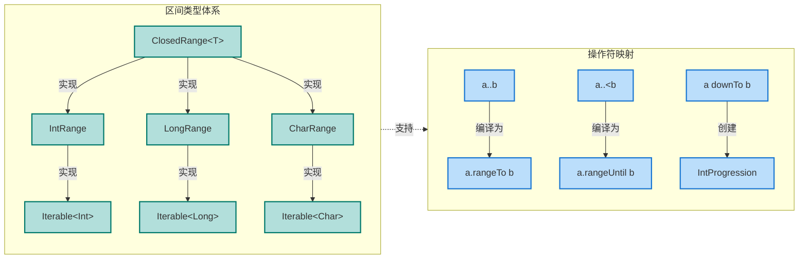

在字节码层面，`1..10` 这样的区间创建会被内联优化，避免不必要的函数调用开销：

```kotlin
// 原始代码
fun sumRange(n: Int): Int {
    var sum = 0
    for (i in 1..n) {          // 创建区间并遍历
        sum += i
    }
    return sum
}

// 编译器优化后的等价逻辑(伪代码)
fun sumRangeOptimized(n: Int): Int {
    var sum = 0
    var i = 1                  // 直接使用计数器,无区间对象
    while (i <= n) {           // 边界检查内联
        sum += i
        i++
    }
    return sum
}
```

### 区间操作符的高级应用

区间不仅用于循环，还可以与 `in` 操作符、`when` 表达式结合，构建优雅的条件判断逻辑：

```kotlin
// 使用区间进行多条件判断
fun gradeStudent(score: Int): String {
    return when (score) {
        in 90..100 -> "优秀"        // score >= 90 && score <= 100
        in 80..<90 -> "良好"        // score >= 80 && score < 90
        in 70..<80 -> "中等"        // score >= 70 && score < 80
        in 60..<70 -> "及格"        // score >= 60 && score < 70
        else -> "不及格"            // score < 60
    }
}

// 自定义区间操作符用于日期范围
data class SimpleDate(val year: Int, val month: Int, val day: Int) : Comparable<SimpleDate> {
    override fun compareTo(other: SimpleDate): Int {
        // 比较年、月、日
        return when {
            year != other.year -> year - other.year
            month != other.month -> month - other.month
            else -> day - other.day
        }
    }
    
    // 重载 rangeTo 创建日期区间
    operator fun rangeTo(other: SimpleDate): ClosedRange<SimpleDate> {
        return object : ClosedRange<SimpleDate> {
            override val start = this@SimpleDate
            override val endInclusive = other
        }
    }
    
    override fun toString() = "$year-${month.toString().padStart(2, '0')}-${day.toString().padStart(2, '0')}"
}

fun checkDateInRange() {
    val startDate = SimpleDate(2024, 1, 1)    // 2024-01-01
    val endDate = SimpleDate(2024, 12, 31)    // 2024-12-31
    val range = startDate..endDate            // 创建全年日期区间
    
    val today = SimpleDate(2024, 6, 15)       // 2024-06-15
    if (today in range) {                     // 检查日期是否在区间内
        println("$today 在 2024 年范围内")    // 输出: 2024-06-15 在 2024 年范围内
    }
}
```

### 区间与数学概念的映射

从数学角度看，Kotlin 的区间操作符清晰地表达了集合论中的区间概念：

- `a..b` → 闭区间 \[a, b\]，包含端点
- `a..<b` → 半开区间 \[a, b)，左闭右开
- `a downTo b` → 降序闭区间 \[b, a\]（反向遍历）

这种设计让代码的数学语义更加直观，特别是在处理连续数据（如温度范围、时间跨度、坐标区间）时，能够用极简的语法表达复杂的逻辑边界。

---

## 解构操作符

解构声明（Destructuring Declaration）是 Kotlin 提供的一种语法糖，允许将一个对象"拆解"成多个变量。这一特性通过 `componentN()` 系列操作符函数实现，其中 N 是从 1 开始的整数，代表对象的第 N 个组成部分。解构不仅让代码更简洁，还能显著提升多值返回、集合遍历等场景的可读性。

### componentN 约定与解构声明

解构声明的核心是一系列名为 `component1()`、`component2()`、`component3()`... 的操作符函数。当你写下 `val (x, y) = point` 时,编译器会将其转换为:

```kotlin
val x = point.component1()  // 提取第一个组件
val y = point.component2()  // 提取第二个组件
```

这些函数必须标记为 `operator`，才能参与解构操作：

```kotlin
// 手动为普通类定义解构操作符
class Point(val x: Int, val y: Int) {
    // 定义第一个组件:x 坐标
    operator fun component1(): Int = x
    
    // 定义第二个组件:y 坐标
    operator fun component2(): Int = y
}

fun usePointDestructuring() {
    val point = Point(10, 20)
    
    // 解构声明:将 point 拆解为 x 和 y
    val (x, y) = point           // 编译为: val x = point.component1(); val y = point.component2()
    
    println("x = $x, y = $y")    // 输出: x = 10, y = 20
    
    // 也可以用在 for 循环中
    val points = listOf(Point(1, 2), Point(3, 4), Point(5, 6))
    for ((px, py) in points) {   // 遍历时自动解构每个 Point
        println("坐标: ($px, $py)")
    }
    // 输出:
    // 坐标: (1, 2)
    // 坐标: (3, 4)
    // 坐标: (5, 6)
}
```

解构操作符的命名是按顺序递增的，最多支持到 `component5()`（实际上标准库支持更多，但常用的是前 5 个）。如果只需要部分组件，可以用下划线 `_` 占位：

```kotlin
fun partialDestructuring() {
    val point = Point(10, 20)
    
    val (x, _) = point           // 只关心 x 坐标,忽略 y
    println("x = $x")            // 输出: x = 10
    
    // 在 lambda 中解构 Map 的键值对
    val map = mapOf("a" to 1, "b" to 2, "c" to 3)
    map.forEach { (key, value) ->     // Map.Entry 支持解构为 key 和 value
        println("$key -> $value")
    }
    // 输出:
    // a -> 1
    // b -> 2
    // c -> 3
}
```

### 数据类的自动解构

`data class` 是 Kotlin 中最常使用解构的场景，因为编译器会**自动为主构造函数的每个参数生成对应的 componentN 函数**。这意味着你无需手动编写任何代码，就能直接解构数据类：

```kotlin
// 数据类自动生成 component1() 和 component2()
data class User(val name: String, val age: Int)

fun dataClassDestructuring() {
    val user = User("Alice", 25)
    
    // 直接解构,无需手动定义 componentN
    val (userName, userAge) = user   // 自动调用 component1() 和 component2()
    
    println("姓名: $userName, 年龄: $userAge")  // 输出: 姓名: Alice, 年龄: 25
    
    // 多值返回的典型用法
    fun getUser(): User {
        return User("Bob", 30)
    }
    
    val (name, age) = getUser()      // 函数返回数据类,立即解构
    println("从函数返回: $name, $age") // 输出: 从函数返回: Bob, 30
}
```

编译器为 `data class User(val name: String, val age: Int)` 生成的代码等价于：

```kotlin
class UserGenerated(val name: String, val age: Int) {
    operator fun component1(): String = name   // 第一个参数对应 component1
    operator fun component2(): Int = age       // 第二个参数对应 component2
    
    // 还会生成 equals、hashCode、toString、copy 等方法
}
```

这种自动化极大地简化了数据传递的代码，特别是在需要从函数返回多个值时，数据类 + 解构的组合比使用 `Pair` 或 `Triple` 更具语义性：

```kotlin
// 使用 Pair 的低语义方式
fun getUserInfoPoor(): Pair<String, Int> {
    return Pair("Charlie", 28)
}

fun testPair() {
    val (name, age) = getUserInfoPoor()  // 虽然能解构,但 Pair 缺乏语义
    // 问题:看代码无法直接知道 first 是姓名,second 是年龄
}

// 使用数据类的高语义方式
data class UserInfo(val name: String, val age: Int)

fun getUserInfoGood(): UserInfo {
    return UserInfo("Charlie", 28)
}

fun testDataClass() {
    val (name, age) = getUserInfoGood()  // 类型名称明确表达了数据含义
    // 优势:UserInfo 清晰表明这是用户信息,name 和 age 有明确的字段名
}
```

### 自定义解构策略

有时我们需要为非数据类的普通类提供解构能力,或者为同一个类提供多种解构方式。这时可以通过扩展函数来实现：

```kotlin
// 为标准库的 List 添加解构前三个元素的能力
operator fun <T> List<T>.component1(): T = this[0]  // 提取第 1 个元素
operator fun <T> List<T>.component2(): T = this[1]  // 提取第 2 个元素
operator fun <T> List<T>.component3(): T = this[2]  // 提取第 3 个元素

fun listDestructuring() {
    val list = listOf(100, 200, 300, 400)
    
    // 解构前三个元素
    val (first, second, third) = list    // 使用扩展的 componentN
    
    println("前三个元素: $first, $second, $third")  // 输出: 前三个元素: 100, 200, 300
    // 注意:如果 list 元素少于 3 个,会抛出 IndexOutOfBoundsException
}

// 为自定义类提供多种解构视角
class Rectangle(val width: Int, val height: Int) {
    // 默认解构:宽度和高度
    operator fun component1() = width
    operator fun component2() = height
}

// 通过扩展函数提供"面积和周长"的解构视角
operator fun Rectangle.component3(): Int = width * height        // 面积
operator fun Rectangle.component4(): Int = 2 * (width + height)  // 周长

fun rectangleDestructuring() {
    val rect = Rectangle(5, 10)
    
    // 基础解构:宽和高
    val (w, h) = rect
    println("宽度: $w, 高度: $h")  // 输出: 宽度: 5, 高度: 10
    
    // 扩展解构:宽、高、面积、周长
    val (width, height, area, perimeter) = rect
    println("面积: $area, 周长: $perimeter")  // 输出: 面积: 50, 周长: 30
}
```

### 解构在集合操作中的应用

解构在处理键值对、分组数据时表现尤为优雅。Kotlin 标准库的 `Map.Entry`、`Pair`、`Triple` 等类型都内置了解构支持：

```kotlin
fun mapDestructuring() {
    val capitals = mapOf(
        "中国" to "北京",
        "美国" to "华盛顿",
        "日本" to "东京"
    )
    
    // 遍历 Map 时解构键值对
    for ((country, capital) in capitals) {   // Map.Entry 解构为 key 和 value
        println("$country 的首都是 $capital")
    }
    // 输出:
    // 中国 的首都是 北京
    // 美国 的首都是 华盛顿
    // 日本 的首都是 东京
    
    // 使用 filter 和解构
    val asianCountries = capitals.filter { (country, _) ->
        country in listOf("中国", "日本", "韩国")  // 只关心 key,value 用 _ 忽略
    }
    println(asianCountries)  // 输出: {中国=北京, 日本=东京}
}

// 使用 groupBy 和解构
data class Student(val name: String, val grade: Int, val major: String)

fun groupStudents() {
    val students = listOf(
        Student("Alice", 90, "CS"),
        Student("Bob", 85, "Math"),
        Student("Charlie", 90, "CS"),
        Student("David", 85, "CS")
    )
    
    // 按成绩分组,然后遍历时解构
    val grouped = students.groupBy { it.grade }
    for ((grade, studentList) in grouped) {  // 解构 Map.Entry
        println("成绩 $grade 分的学生:")
        studentList.forEach { println("  - ${it.name}") }
    }
    // 输出:
    // 成绩 90 分的学生:
    //   - Alice
    //   - Charlie
    // 成绩 85 分的学生:
    //   - Bob
    //   - David
}
```

### 解构的内部机制

从字节码层面看，解构声明会被编译器转换为一系列临时变量赋值：

```kotlin
// 原始代码
data class Point(val x: Int, val y: Int)
val point = Point(10, 20)
val (a, b) = point

// 编译后的等价 Java 代码(简化版)
Point point = new Point(10, 20);
int a = point.component1();  // 调用 component1() 获取 x
int b = point.component2();  // 调用 component2() 获取 y
```

这意味着解构操作本质上是**语法糖**，没有运行时魔法，性能与直接调用 `componentN()` 函数完全一致。对于数据类，编译器还会进行内联优化，进一步消除函数调用开销。

### 解构声明的完整可视化

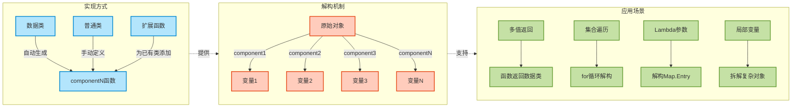

### 解构的边界情况与注意事项

在使用解构时需要注意以下几点，以避免运行时错误或逻辑陷阱：

```kotlin
// 1. 解构变量数量不能超过 componentN 函数的定义数量
data class Pair2D(val x: Int, val y: Int)

fun errorCase1() {
    val pair = Pair2D(1, 2)
    // val (a, b, c) = pair  // 编译错误!Pair2D 只有 component1 和 component2
}

// 2. 解构可为空类型时需要安全调用
data class NullablePoint(val x: Int?, val y: Int?)

fun nullableDestructuring() {
    val point: NullablePoint? = NullablePoint(10, null)
    
    // 错误:可能为 null
    // val (x, y) = point  // 编译错误!point 可能为 null
    
    // 正确:使用安全调用
    point?.let { (x, y) ->          // 在 let 块内解构非空对象
        println("x = $x, y = $y")   // x 和 y 本身仍然可能为 null
    }
}

// 3. 解构顺序与主构造函数参数顺序一致
data class Person(val name: String, val age: Int, val city: String)

fun orderMatters() {
    val person = Person("Alice", 25, "Beijing")
    
    val (n, a, c) = person  // n=name, a=age, c=city(按构造函数顺序)
    println("$n, $a, $c")   // 输出: Alice, 25, Beijing
    
    // 不能随意调换顺序!解构总是按 component1, component2, component3 的顺序
    val (city, name, age) = person  // 错误理解!实际仍是 name, age, city
    println("$city, $name, $age")   // 输出: Alice, 25, Beijing (不是预期的顺序!)
}
```

解构操作符通过 `componentN` 约定，为 Kotlin 带来了极简而强大的多值处理能力。结合数据类的自动生成、扩展函数的灵活定制，以及在集合操作中的无缝集成，解构声明成为了提升代码表达力的重要工具。理解其背后的编译机制和使用边界，能够帮助我们在实际开发中更加自信地运用这一特性。

---

**📝 练习题 1**

以下代码的输出结果是什么？

```kotlin
data class Triple<A, B, C>(val first: A, val second: B, val third: C)

fun main() {
    val numbers = Triple(1, 2, 3)
    val range = numbers.first..numbers.third
    val contains = numbers.second in range
    val (a, _, c) = numbers
    println("$contains, ${a..<c}")
}
```

A. `true, 1..2`  
B. `false, 1..<3`  
C. `true, 1..<3`  
D. `true, [1, 2]`

**【答案】** C

**【解析】**  
1. `numbers.first..numbers.third` 创建闭区间 `1..3`（即 [1, 2, 3]）
2. `numbers.second` 的值是 `2`，`2 in 1..3` 结果为 `true`
3. 解构 `val (a, _, c) = numbers` 得到 `a=1`, `c=3`（中间的 `second` 被忽略）
4. `a..<c` 即 `1..<3` 创建半开区间 [1, 2)，但这是一个 `IntRange` 对象，`toString()` 输出为 `1..<3`

因此输出为 `true, 1..<3`。选项 A 错在区间表示，选项 B 错在 `contains` 的值，选项 D 错在区间的字符串表示形式。

---

**📝 练习题 2**

现有一个 RGB 颜色类，需要支持解构为红、绿、蓝三个分量，同时能够通过 `..` 操作符创建颜色渐变区间。以下哪种实现是**错误**的？

```kotlin
data class Color(val red: Int, val green: Int, val blue: Int)
```

A. 为 `Color` 添加 `operator fun rangeTo(other: Color): ClosedRange<Color>`  
B. 直接使用 `val (r, g, b) = Color(255, 128, 0)` 进行解构  
C. 为 `Color` 添加 `operator fun component4(): Int = (red + green + blue) / 3` 返回平均亮度  
D. 使用 `Color(100, 50, 25)..Color(200, 150, 75)` 创建颜色渐变区间，要求 `Color` 实现 `Comparable<Color>`

**【答案】** D

**【解析】**  
- 选项 A **正确**：可以通过重载 `rangeTo` 操作符为 `Color` 添加 `..` 支持，返回 `ClosedRange<Color>`
- 选项 B **正确**：`data class` 自动为主构造函数的三个参数生成 `component1()`, `component2()`, `component3()`，可以直接解构
- 选项 C **正确**：可以通过扩展函数或直接在类中添加 `component4()` 来提供第四个解构分量（虽然通常只解构前三个）
- 选项 D **错误**：虽然可以为 `Color` 实现 `Comparable<Color>` 接口并重载 `rangeTo`，但颜色的"大小关系"在数学上没有明确定义（RGB 三个维度如何比较？），强行实现会导致语义模糊。正确的做法是定义自定义的渐变逻辑，而不是依赖 `Comparable` 的自然顺序

因此答案为 D，这种实现在语义上是有问题的。

---

## 操作符优先级

在 Kotlin 中理解操作符优先级(Operator Precedence)和结合性(Associativity)至关重要，这直接影响表达式的求值顺序。与其他现代编程语言类似，Kotlin 遵循数学和编程语言的传统约定，但也有一些独特之处值得深入探讨。

操作符优先级决定了在没有括号明确指定的情况下，复合表达式中各个操作符的执行顺序。例如在表达式 `a + b * c` 中，乘法操作符 `*` 的优先级高于加法操作符 `+`,因此会先计算 `b * c`,再将结果与 `a` 相加。

### 完整优先级表

Kotlin 的操作符优先级从高到低排列如下。处于同一优先级层级的操作符按照它们的结合性来决定求值顺序：

```kotlin
// 优先级表 (从高到低)
// 优先级 15 (最高): 后缀操作符
// ++, --, ., ?., ?
val array = intArrayOf(1, 2, 3)
val result1 = array[0]++  // 后缀递增优先级最高

// 优先级 14: 前缀操作符  
// -, +, ++, --, !, label@
val result2 = -++result1  // 先执行前缀递增,再取负值

// 优先级 13: 类型转换
// as, as?, is, !is
val obj: Any = "text"
val str = obj as? String  // 安全类型转换

// 优先级 12: 乘法、除法、取余
// *, /, %
val calc1 = 10 + 5 * 2  // 结果是 20,先乘后加

// 优先级 11: 加法、减法
// +, -
val calc2 = 10 - 5 + 2  // 结果是 7,从左到右执行

// 优先级 10: 区间操作符
// .., ..
val range = 1..10 + 5  // 等价于 1..(10+5),区间优先级低于加法

// 优先级 9: 中缀函数
// 所有用 infix 声明的函数
infix fun Int.pow(exponent: Int) = Math.pow(this.toDouble(), exponent.toDouble()).toInt()
val power = 2 pow 3 + 1  // 等价于 (2 pow 3) + 1 = 9

// 优先级 8: Elvis 操作符
// ?:
val value = null ?: "default" + "suffix"  // 等价于 null ?: ("default" + "suffix")

// 优先级 7: 命名检查操作符
// in, !in, is, !is
val inRange = 5 in 1..10 && true  // in 操作符优先级低于逻辑操作符

// 优先级 6: 比较操作符
// <, >, <=, >=
val comparison = 5 > 3 && 2 < 4  // 比较优先于逻辑与

// 优先级 5: 相等性检查
// ==, !=
val equality = 5 + 5 == 10  // 先计算加法,再比较相等性

// 优先级 4: 逻辑与
// &&
val and = true || false && false  // && 优先级高于 ||, 结果为 true

// 优先级 3: 逻辑或
// ||
val or = true || false && false  // 先执行 &&, 再执行 ||

// 优先级 2: 赋值操作符
// =, +=, -=, *=, /=, %=
var x = 5
var y = x += 2  // 右结合,y = (x += 2) = 7

// 优先级 1 (最低): Lambda 表达式分隔符
// ->
```

这个优先级表展示了 Kotlin 中所有主要操作符的相对优先级。在实际编程中，理解这些规则能帮助我们编写更清晰、更易维护的代码。

### 结合性规则

结合性(Associativity)决定了相同优先级的操作符如何组合。Kotlin 中的操作符主要分为三种结合性：

**左结合(Left Associative)**：大多数二元操作符都是左结合的，这意味着表达式从左向右求值。

```kotlin
// 算术操作符 - 左结合
val result1 = 10 - 5 - 2  // 等价于 ((10 - 5) - 2) = 3,而不是 (10 - (5 - 2)) = 7

// 除法操作符 - 左结合
val result2 = 100 / 10 / 2  // 等价于 ((100 / 10) / 2) = 5

// 中缀函数调用 - 左结合
infix fun String.append(other: String) = this + other
val text = "A" append "B" append "C"  // 等价于 (("A" append "B") append "C") = "ABC"

// 索引访问操作符 - 左结合
val matrix = arrayOf(
    arrayOf(1, 2, 3),
    arrayOf(4, 5, 6)
)
val element = matrix[0][1]  // 等价于 (matrix[0])[1] = 2
```

**右结合(Right Associative)**：赋值操作符和部分特殊操作符是右结合的，从右向左求值。

```kotlin
// 赋值操作符 - 右结合
var a: Int
var b: Int  
var c = 10
b = c  // b = c 先执行
a = b  // 然后 a = b 执行
// 链式赋值: a = b = c 等价于 a = (b = c)

// 复合赋值同样遵循右结合
var x = 5
var y = 3
x += y += 2  // 等价于 x += (y += 2), y先变成5,然后x变成10

// Elvis 操作符 - 右结合
val result = null ?: null ?: "default"  // 等价于 null ?: (null ?: "default") = "default"
```

**无结合性(Non-Associative)**：某些操作符不允许连续使用而不加括号，例如比较操作符。

```kotlin
// 比较操作符 - 无结合性
val value = 5
// val invalid = 1 < value < 10  // 编译错误!不能链式比较

// 正确的做法是使用逻辑操作符连接
val valid = 1 < value && value < 10  // 合法表达式

// 类型检查操作符 - 无结合性
val obj: Any = "text"
// val invalid = obj is String is Boolean  // 编译错误!

// in 操作符 - 无结合性  
// val invalid = 5 in 1..10 in setOf(true, false)  // 编译错误!
```

### 优先级陷阱与最佳实践

虽然理解优先级规则很重要，但过度依赖隐式优先级会降低代码可读性。下面是一些常见的陷阱和建议：

```kotlin
// 陷阱 1: Elvis 操作符与其他操作符混用
fun getUserName(user: User?): String {
    // 不清晰: Elvis 优先级低于加法
    return user?.name ?: "Guest" + " User"  // 实际是: user?.name ?: ("Guest" + " User")
    
    // 清晰写法: 使用括号明确意图
    return (user?.name ?: "Guest") + " User"
}

// 陷阱 2: 位运算与比较操作符
fun checkFlags(flags: Int): Boolean {
    val FLAG_ENABLED = 0x01
    val FLAG_VISIBLE = 0x02
    
    // 不清晰: 位与优先级的认知误区
    // return flags and FLAG_ENABLED == FLAG_ENABLED  // 错误!等价于 flags and (FLAG_ENABLED == FLAG_ENABLED)
    
    // 清晰写法
    return (flags and FLAG_ENABLED) == FLAG_ENABLED
}

// 陷阱 3: 复杂的中缀函数链
infix fun Int.times(multiplicand: Int) = this * multiplicand
infix fun Int.plus(addend: Int) = this + addend

fun calculate(): Int {
    // 不清晰: 中缀函数的优先级可能引起混淆
    return 2 times 3 plus 4  // 看起来像 2 * (3 + 4) 但实际是 (2 * 3) + 4 = 10
    
    // 清晰写法: 使用括号或传统调用方式
    return (2 times 3) plus 4  // 明确表达意图
}

// 陷阱 4: Lambda 与操作符混用
fun processData(data: List<Int>?): List<Int> {
    // 不清晰: Elvis 与 Lambda 的组合
    return data?.filter { it > 0 } ?: emptyList()  // 可读性尚可
    
    // 对于复杂的 Lambda,建议使用括号
    return data?.filter { 
        it > 0 && it % 2 == 0  // 多条件过滤
    } ?: emptyList()
}

// 最佳实践: 宁可多用括号也要保证清晰
class ComplexCalculator {
    fun evaluate(x: Int, y: Int, z: Int): Int {
        // 避免这样写
        // return x + y * z - x / y + z % x
        
        // 推荐写法: 即使优先级正确,也用括号增强可读性
        return (x + (y * z)) - (x / y) + (z % x)
    }
    
    // 对于真正复杂的计算,拆分成多个步骤
    fun evaluateClear(x: Int, y: Int, z: Int): Int {
        val multiplication = y * z  // 乘法结果
        val division = x / y        // 除法结果
        val remainder = z % x       // 取余结果
        return x + multiplication - division + remainder  // 清晰的最终计算
    }
}
```

### 优先级可视化

下面的 Mermaid 图展示了常用操作符的优先级关系和求值流程：

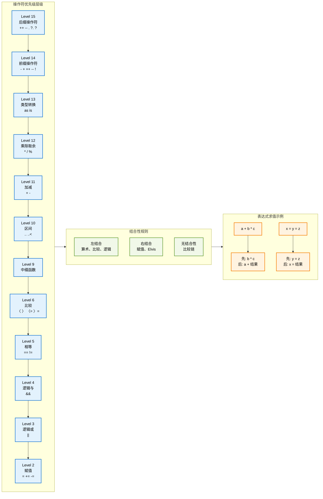

这个图表清晰地展示了优先级的层级结构、不同的结合性规则,以及典型的表达式求值过程。理解这些规则能够帮助我们编写更加准确、可预测的代码。

---

## 操作符扩展

Kotlin 的一大强大特性是能够为已有的类添加操作符支持，即使这些类来自标准库、第三方库或者 Java 代码。通过扩展函数(Extension Functions)结合 `operator` 修饰符，我们可以让任何类型支持操作符语法，极大地提升代码的表达力和可读性。

操作符扩展不仅仅是语法糖，它体现了 Kotlin "为类型添加行为而不修改源代码"的设计哲学。这种能力让我们能够构建更加自然、更符合领域语言的 API。

### 为标准类型添加操作符

虽然 Kotlin 标准库已经为常见类型提供了丰富的操作符支持，但在某些特定场景下，我们可能需要添加自定义的操作符行为：

```kotlin
// 为 String 添加乘法操作符 - 重复字符串
operator fun String.times(count: Int): String {
    // 使用 StringBuilder 高效构建重复字符串
    return buildString {
        repeat(count) {  // 重复 count 次
            append(this@times)  // 追加原始字符串
        }
    }
}

// 使用示例
fun testStringMultiply() {
    val repeated = "Kotlin" * 3  // 调用扩展操作符
    println(repeated)  // 输出: KotlinKotlinKotlin
    
    val separator = "=" * 20  // 创建分隔线
    println(separator)  // 输出: ====================
}

// 为 List 添加减法操作符 - 移除元素
operator fun <T> List<T>.minus(element: T): List<T> {
    // 创建新列表,移除所有匹配的元素
    return this.filter { it != element }  // 过滤掉指定元素
}

// 使用示例
fun testListSubtraction() {
    val numbers = listOf(1, 2, 3, 2, 4, 2, 5)
    val filtered = numbers - 2  // 移除所有的 2
    println(filtered)  // 输出: [1, 3, 4, 5]
}

// 为 LocalDate 添加算术操作符
import java.time.LocalDate
import java.time.temporal.ChronoUnit

// 日期加天数
operator fun LocalDate.plus(days: Long): LocalDate {
    return this.plusDays(days)  // 调用 Java 时间 API
}

// 日期减天数
operator fun LocalDate.minus(days: Long): LocalDate {
    return this.minusDays(days)  // 减去指定天数
}

// 两个日期相减得到天数差
operator fun LocalDate.minus(other: LocalDate): Long {
    return ChronoUnit.DAYS.between(other, this)  // 计算天数差
}

// 使用示例
fun testDateOperators() {
    val today = LocalDate.now()  // 获取当前日期
    val tomorrow = today + 1  // 明天
    val yesterday = today - 1  // 昨天
    
    val daysDiff = tomorrow - yesterday  // 日期差: 2天
    println("天数差: $daysDiff")  // 输出: 天数差: 2
}
```

这些扩展让我们能够以更自然的方式操作标准类型，代码变得更加简洁直观。

### 为第三方类添加操作符

在使用第三方库时，我们经常希望这些类能够支持操作符语法。通过扩展，我们可以在不修改原始代码的情况下实现这一点：

```kotlin
// 假设这是第三方库中的类(我们无法修改)
class Vector2D(val x: Double, val y: Double) {
    override fun toString() = "Vector2D(x=$x, y=$y)"
}

// 为 Vector2D 添加加法操作符
operator fun Vector2D.plus(other: Vector2D): Vector2D {
    return Vector2D(
        x = this.x + other.x,  // X 分量相加
        y = this.y + other.y   // Y 分量相加
    )
}

// 为 Vector2D 添加减法操作符
operator fun Vector2D.minus(other: Vector2D): Vector2D {
    return Vector2D(
        x = this.x - other.x,  // X 分量相减
        y = this.y - other.y   // Y 分量相减
    )
}

// 为 Vector2D 添加标量乘法
operator fun Vector2D.times(scalar: Double): Vector2D {
    return Vector2D(
        x = this.x * scalar,  // X 分量缩放
        y = this.y * scalar   // Y 分量缩放
    )
}

// 支持标量在左侧: 3.0 * vector
operator fun Double.times(vector: Vector2D): Vector2D {
    return vector * this  // 委托给 Vector2D 的 times 操作符
}

// 向量点积操作符(使用 infix)
infix fun Vector2D.dot(other: Vector2D): Double {
    return this.x * other.x + this.y * other.y  // 点积计算公式
}

// 一元负号操作符
operator fun Vector2D.unaryMinus(): Vector2D {
    return Vector2D(-x, -y)  // 反转向量方向
}

// 使用示例
fun demonstrateVectorOperators() {
    val v1 = Vector2D(3.0, 4.0)
    val v2 = Vector2D(1.0, 2.0)
    
    // 向量加法
    val sum = v1 + v2  // Vector2D(x=4.0, y=6.0)
    println("v1 + v2 = $sum")
    
    // 向量减法
    val diff = v1 - v2  // Vector2D(x=2.0, y=2.0)
    println("v1 - v2 = $diff")
    
    // 标量乘法(两种方式)
    val scaled1 = v1 * 2.0  // Vector2D(x=6.0, y=8.0)
    val scaled2 = 2.0 * v1  // Vector2D(x=6.0, y=8.0)
    println("v1 * 2.0 = $scaled1")
    println("2.0 * v1 = $scaled2")
    
    // 点积
    val dotProduct = v1 dot v2  // 3*1 + 4*2 = 11.0
    println("v1 · v2 = $dotProduct")
    
    // 一元负号
    val negated = -v1  // Vector2D(x=-3.0, y=-4.0)
    println("-v1 = $negated")
    
    // 复合表达式
    val result = (v1 + v2) * 2.0 - v1  // 复杂的向量运算
    println("(v1 + v2) * 2.0 - v1 = $result")
}
```

通过这些扩展，原本只是简单数据类的 `Vector2D` 现在拥有了完整的向量运算能力，代码的可读性显著提升。

### 为 Java 类添加操作符

Kotlin 与 Java 的互操作性使得我们可以为 Java 类添加操作符支持，这在处理 Java 集合、日期时间等 API 时特别有用：

```kotlin
import java.math.BigDecimal
import java.math.BigInteger

// 为 BigDecimal 添加算术操作符
operator fun BigDecimal.plus(other: BigDecimal): BigDecimal {
    return this.add(other)  // 调用 Java 的 add 方法
}

operator fun BigDecimal.minus(other: BigDecimal): BigDecimal {
    return this.subtract(other)  // 调用 Java 的 subtract 方法
}

operator fun BigDecimal.times(other: BigDecimal): BigDecimal {
    return this.multiply(other)  // 调用 Java 的 multiply 方法
}

operator fun BigDecimal.div(other: BigDecimal): BigDecimal {
    // 使用默认的舍入模式进行除法
    return this.divide(other, java.math.RoundingMode.HALF_UP)
}

// 为 BigDecimal 添加比较操作符
operator fun BigDecimal.compareTo(other: BigDecimal): Int {
    // BigDecimal 已有 compareTo,但显式扩展以示例
    return this.compareTo(other)
}

// 使用示例: 金融计算
fun calculateTotalPrice() {
    val price = BigDecimal("19.99")  // 商品价格
    val quantity = BigDecimal("3")   // 数量
    val taxRate = BigDecimal("0.08") // 税率 8%
    
    // 使用操作符进行精确的金融计算
    val subtotal = price * quantity  // 小计
    val tax = subtotal * taxRate     // 税额
    val total = subtotal + tax       // 总计
    
    println("小计: $$subtotal")
    println("税额: $$tax")
    println("总计: $$total")
    
    // 比较操作符
    val discount = BigDecimal("5.00")
    if (total > discount) {
        println("总价超过了折扣金额")
    }
}

// 为 BigInteger 添加操作符
operator fun BigInteger.plus(other: BigInteger): BigInteger = this.add(other)
operator fun BigInteger.minus(other: BigInteger): BigInteger = this.subtract(other)
operator fun BigInteger.times(other: BigInteger): BigInteger = this.multiply(other)
operator fun BigInteger.div(other: BigInteger): BigInteger = this.divide(other)
operator fun BigInteger.rem(other: BigInteger): BigInteger = this.remainder(other)

// 位运算操作符扩展
infix fun BigInteger.shl(bits: Int): BigInteger = this.shiftLeft(bits)  // 左移
infix fun BigInteger.shr(bits: Int): BigInteger = this.shiftRight(bits) // 右移
infix fun BigInteger.and(other: BigInteger): BigInteger = this.and(other) // 按位与
infix fun BigInteger.or(other: BigInteger): BigInteger = this.or(other)   // 按位或

// 大整数计算示例
fun bigIntegerCalculation() {
    val a = BigInteger("123456789012345678901234567890")
    val b = BigInteger("987654321098765432109876543210")
    
    val sum = a + b  // 大整数加法
    val product = a * b  // 大整数乘法
    val shifted = a shl 10  // 左移10位
    
    println("和: $sum")
    println("积: $product")
    println("左移后: $shifted")
}
```

这些扩展使得 Java 的数值类型在 Kotlin 中使用起来更加自然，避免了冗长的方法调用。

### 复杂领域对象的操作符扩展

在实际项目中，我们经常需要为业务领域对象添加操作符支持，以构建更加流畅的 API：

```kotlin
// 购物车系统示例
data class Product(
    val id: String,
    val name: String,
    val price: Double
)

data class CartItem(
    val product: Product,
    val quantity: Int
) {
    val totalPrice: Double
        get() = product.price * quantity  // 计算该商品的总价
}

class ShoppingCart(
    private val items: MutableMap<String, CartItem> = mutableMapOf()
) {
    // 获取所有商品项
    val allItems: Collection<CartItem>
        get() = items.values
    
    // 计算购物车总价
    val total: Double
        get() = items.values.sumOf { it.totalPrice }
    
    override fun toString(): String {
        return "ShoppingCart(items=${items.size}, total=$total)"
    }
}

// 添加商品到购物车: cart += product
operator fun ShoppingCart.plusAssign(product: Product) {
    val items = this::class.java.getDeclaredField("items").apply {
        isAccessible = true  // 访问私有字段
    }.get(this) as MutableMap<String, CartItem>
    
    val existingItem = items[product.id]
    if (existingItem != null) {
        // 商品已存在,数量加1
        items[product.id] = existingItem.copy(quantity = existingItem.quantity + 1)
    } else {
        // 新商品,添加到购物车
        items[product.id] = CartItem(product, 1)
    }
}

// 从购物车移除商品: cart -= product
operator fun ShoppingCart.minusAssign(product: Product) {
    val items = this::class.java.getDeclaredField("items").apply {
        isAccessible = true
    }.get(this) as MutableMap<String, CartItem>
    
    val existingItem = items[product.id]
    if (existingItem != null && existingItem.quantity > 1) {
        // 数量减1
        items[product.id] = existingItem.copy(quantity = existingItem.quantity - 1)
    } else {
        // 移除商品
        items.remove(product.id)
    }
}

// 检查商品是否在购物车中: product in cart
operator fun ShoppingCart.contains(product: Product): Boolean {
    val items = this::class.java.getDeclaredField("items").apply {
        isAccessible = true
    }.get(this) as MutableMap<String, CartItem>
    return product.id in items
}

// 通过索引访问商品: cart[productId]
operator fun ShoppingCart.get(productId: String): CartItem? {
    val items = this::class.java.getDeclaredField("items").apply {
        isAccessible = true
    }.get(this) as MutableMap<String, CartItem>
    return items[productId]
}

// 合并两个购物车: cart1 + cart2
operator fun ShoppingCart.plus(other: ShoppingCart): ShoppingCart {
    val newCart = ShoppingCart()
    
    // 添加第一个购物车的商品
    this.allItems.forEach { item ->
        repeat(item.quantity) {
            newCart += item.product
        }
    }
    
    // 添加第二个购物车的商品
    other.allItems.forEach { item ->
        repeat(item.quantity) {
            newCart += item.product
        }
    }
    
    return newCart
}

// 使用示例
fun demonstrateShoppingCart() {
    val cart = ShoppingCart()
    
    // 创建商品
    val laptop = Product("P001", "Laptop", 999.99)
    val mouse = Product("P002", "Mouse", 29.99)
    val keyboard = Product("P003", "Keyboard", 79.99)
    
    // 使用操作符添加商品
    cart += laptop
    cart += mouse
    cart += mouse  // 再添加一个鼠标
    cart += keyboard
    
    println("购物车状态: $cart")  // 输出购物车信息
    
    // 检查商品是否在购物车中
    if (laptop in cart) {
        println("购物车中包含笔记本电脑")
    }
    
    // 访问特定商品
    val mouseItem = cart["P002"]
    println("鼠标数量: ${mouseItem?.quantity}")  // 输出: 鼠标数量: 2
    
    // 移除一个鼠标
    cart -= mouse
    println("移除后购物车: $cart")
    
    // 创建另一个购物车并合并
    val cart2 = ShoppingCart()
    cart2 += Product("P004", "Monitor", 299.99)
    
    val mergedCart = cart + cart2  // 合并购物车
    println("合并后的购物车: $mergedCart")
}
```

### 操作符扩展的最佳实践

在为类型添加操作符扩展时，需要遵循一些设计原则以确保代码的可维护性和可读性：

```kotlin
// ✅ 好的实践: 操作符语义清晰自然
class TimeRange(val start: Int, val end: Int)

operator fun TimeRange.contains(hour: Int): Boolean {
    return hour in start..end  // 语义明确: 检查时间是否在范围内
}

// 使用起来很自然
fun checkBusinessHours(hour: Int) {
    val businessHours = TimeRange(9, 17)
    if (hour in businessHours) {  // 清晰易懂
        println("营业时间内")
    }
}

// ❌ 不好的实践: 操作符语义不清晰或令人困惑
class User(val name: String, val age: Int)

// 这样的操作符定义让人困惑: + 的含义不明确
operator fun User.plus(other: User): User {
    return User("${this.name}${other.name}", (this.age + other.age) / 2)
}
// 问题: user1 + user2 的结果很难理解,不如使用命名函数

// ✅ 好的实践: 为相关操作提供一致的操作符集
class Money(val amount: Double, val currency: String) {
    init {
        require(amount >= 0) { "金额不能为负数" }
    }
}

// 提供完整的算术操作符
operator fun Money.plus(other: Money): Money {
    require(this.currency == other.currency) { "货币类型必须相同" }
    return Money(this.amount + other.amount, this.currency)
}

operator fun Money.minus(other: Money): Money {
    require(this.currency == other.currency) { "货币类型必须相同" }
    require(this.amount >= other.amount) { "余额不足" }
    return Money(this.amount - other.amount, this.currency)
}

operator fun Money.times(multiplier: Double): Money {
    require(multiplier >= 0) { "乘数不能为负数" }
    return Money(this.amount * multiplier, this.currency)
}

// 提供比较操作符
operator fun Money.compareTo(other: Money): Int {
    require(this.currency == other.currency) { "货币类型必须相同" }
    return this.amount.compareTo(other.amount)
}

// ✅ 好的实践: 文档化非标准的操作符行为
/**
 * 矩阵乘法操作符
 * 
 * 注意: 此操作符执行数学意义上的矩阵乘法,而不是逐元素相乘
 * 
 * @throws IllegalArgumentException 当矩阵维度不匹配时
 */
operator fun Matrix.times(other: Matrix): Matrix {
    require(this.columns == other.rows) {
        "矩阵维度不匹配: ${this.rows}x${this.columns} 与 ${other.rows}x${other.columns}"
    }
    // 矩阵乘法实现...
    TODO("矩阵乘法实现")
}

// ✅ 好的实践: 保持操作符的不可变性(除非特意设计为可变)
data class Point(val x: Int, val y: Int)

// 返回新对象而不是修改原对象
operator fun Point.plus(other: Point): Point {
    return Point(this.x + other.x, this.y + other.y)  // 创建新实例
}

// 对于可变操作,使用 plusAssign 等复合赋值操作符
class MutablePoint(var x: Int, var y: Int)

operator fun MutablePoint.plusAssign(other: MutablePoint) {
    this.x += other.x  // 直接修改当前对象
    this.y += other.y
}
```

### 扩展操作符的作用域管理

合理地组织操作符扩展的可见性能够避免命名冲突和意外行为：

```kotlin
// 方案 1: 使用独立的对象封装操作符扩展
object VectorOperators {
    operator fun Vector2D.plus(other: Vector2D): Vector2D {
        return Vector2D(this.x + other.x, this.y + other.y)
    }
    
    operator fun Vector2D.times(scalar: Double): Vector2D {
        return Vector2D(this.x * scalar, this.y * scalar)
    }
}

// 使用时需要导入
fun calculateWithVectors() {
    with(VectorOperators) {  // 在作用域内启用操作符
        val v1 = Vector2D(1.0, 2.0)
        val v2 = Vector2D(3.0, 4.0)
        val result = v1 + v2  // 使用操作符
    }
}

// 方案 2: 为特定 DSL 创建扩展作用域
class MathContext {
    // 在此上下文中定义特殊的操作符行为
    operator fun Int.times(str: String): String {
        return str.repeat(this)  // 整数 * 字符串 = 重复字符串
    }
    
    operator fun String.div(delimiter: String): List<String> {
        return this.split(delimiter)  // 字符串 / 分隔符 = 分割结果
    }
}

// 使用 DSL 上下文
fun mathDsl(block: MathContext.() -> Unit) {
    MathContext().block()  // 在特定上下文中执行
}

fun demonstrateDSL() {
    mathDsl {
        val repeated = 3 * "Kotlin"  // "KotlinKotlinKotlin"
        val parts = "a,b,c" / ","    // ["a", "b", "c"]
        
        println(repeated)
        println(parts)
    }
    
    // 在普通作用域中这些操作符不可用
    // val invalid = 3 * "Test"  // 编译错误
}

// 方案 3: 使用顶层扩展但添加文档说明
/**
 * 日期时间操作符扩展
 * 
 * 这些扩展为 java.time 包的类添加了操作符支持
 * 导入此文件时请注意可能与其他扩展冲突
 */
// 文件: DateTimeOperators.kt

import java.time.*

operator fun LocalDateTime.plus(duration: Duration): LocalDateTime {
    return this.plus(duration)
}

operator fun LocalDateTime.minus(duration: Duration): LocalDateTime {
    return this.minus(duration)
}
```

操作符扩展是 Kotlin 表达力的重要组成部分。通过为现有类型添加操作符支持，我们能够创建更加直观、更接近问题域的 API。但同时也要注意不要过度使用或滥用操作符，保持代码的清晰性和可维护性始终是最重要的。

---

**📝 练习题**

以下代码的输出结果是什么？

```kotlin
data class Complex(val real: Double, val imaginary: Double)

operator fun Complex.plus(other: Complex) = 
    Complex(real + other.real, imaginary + other.imaginary)

operator fun Complex.times(scalar: Double) = 
    Complex(real * scalar, imaginary * scalar)

fun main() {
    val c1 = Complex(1.0, 2.0)
    val c2 = Complex(3.0, 4.0)
    val result = c1 + c2 * 2.0
    println("${result.real}, ${result.imaginary}")
}
```

A. `4.0, 6.0`  
B. `7.0, 10.0`  
C. `8.0, 12.0`  
D. `编译错误`

**【答案】** B

**【解析】** 
根据 Kotlin 的操作符优先级规则，乘法操作符 `*` 的优先级高于加法操作符 `+`。因此表达式 `c1 + c2 * 2.0` 会先执行 `c2 * 2.0`，得到 `Complex(6.0, 8.0)`，然后再执行 `c1 + Complex(6.0, 8.0)`，最终结果是 `Complex(7.0, 10.0)`。这个例子展示了操作符扩展遵循标准的优先级规则，即使是自定义的操作符也完全符合 Kotlin 的优先级体系。

---

## 本章小结

操作符重载 (Operator Overloading) 是 Kotlin 语言表达力的重要体现，它通过 `operator` 关键字和约定 (Conventions) 机制，让开发者能够为自定义类型赋予直观的操作语义。本章系统梳理了 Kotlin 中所有可重载的操作符类型，从简单的一元操作到复杂的 DSL 构建，形成了完整的操作符生态。

### 核心理念回顾

Kotlin 的操作符重载遵循 **"约定优于配置"** (Convention over Configuration) 的设计哲学。与 C++ 的自由操作符重载不同，Kotlin 采用了受限但清晰的约定机制：

1. **固定函数名映射**：每个操作符符号都对应唯一的函数名（如 `+` → `plus`），避免了歧义
2. **强制 operator 标记**：必须显式声明 `operator` 修饰符，增强代码可读性和意图表达
3. **类型安全保障**：编译器严格检查参数类型和返回类型，防止运行时错误
4. **扩展友好**：支持通过扩展函数为第三方类添加操作符，无需修改源码

### 操作符分类体系

下图展示了本章涵盖的操作符完整分类，按照功能域和使用频率进行组织：

```mermaid
graph LR
    subgraph 核心操作符体系
        direction TB
        A[操作符重载<br/>Operator Overloading]
        
        A --> B1[一元操作符<br/>Unary Operators]
        A --> B2[二元操作符<br/>Binary Operators]
        A --> B3[访问操作符<br/>Access Operators]
        A --> B4[特殊操作符<br/>Special Operators]
        
        B1 --> C1["+前缀 unaryPlus<br/>-前缀 unaryMinus<br/>! not<br/>++ inc<br/>-- dec"]
        
        B2 --> C2[算术类<br/>+ plus<br/>- minus<br/>* times<br/>/ div<br/>% rem]
        B2 --> C3[复合赋值<br/>+= plusAssign<br/>-= minusAssign<br/>*= timesAssign<br/>/= divAssign<br/>%= remAssign]
        B2 --> C4[比较类<br/>== equals<br/>!= 自动反转<br/>〉〈 compareTo]
        
        B3 --> C5[索引访问<br/>&#91;&#93; get<br/>&#91;&#93;= set<br/>多维索引支持]
        B3 --> C6[范围检查<br/>in contains<br/>!in 自动反转]
        B3 --> C7[区间构造<br/>.. rangeTo<br/>..〈rangeUntil]
        
        B4 --> C8[函数调用<br/>&#40;&#41; invoke<br/>支持多参数]
        B4 --> C9[解构声明<br/>component1~N<br/>数据类自动生成]
    end
    
    classDef categoryNode fill:#4CAF50,stroke:#2E7D32,stroke-width:2px,color:#fff
    classDef subCategoryNode fill:#2196F3,stroke:#1565C0,stroke-width:2px,color:#fff
    classDef detailNode fill:#FF9800,stroke:#E65100,stroke-width:1px,color:#fff
    
    class A categoryNode
    class B1,B2,B3,B4 subCategoryNode
    class C1,C2,C3,C4,C5,C6,C7,C8,C9 detailNode
```

### 关键知识点串联

#### 1. 操作符优先级与结合性

所有操作符都严格遵守 Kotlin 预定义的优先级表，从高到低依次为：

```kotlin
// 优先级由高到低排列（仅列出本章涉及的操作符）
后缀操作符:  ++  --  .  []  ()  ?. 
前缀操作符:  -  +  ++  --  !
类型转换:    as  as?
乘除取余:    *  /  %
加减:        +  -
区间:        ..  ..
中缀调用:    named infix functions
Elvis:       ?:
比较:        <  >  <=  >=
相等性:      ==  !=
逻辑与:      &&
逻辑或:      ||
赋值:        =  +=  -=  *=  /=  %=
```

**结合性规则**：
- 大多数操作符为 **左结合** (Left Associative)：`a + b + c` 等价于 `(a + b) + c`
- 赋值操作符为 **右结合** (Right Associative)：`a = b = c` 等价于 `a = (b = c)`

#### 2. 复合赋值的双重实现机制

这是最容易被忽视但极其重要的设计细节：

```kotlin
// 机制一：显式定义 plusAssign (原地修改)
operator fun MutableList<Int>.plusAssign(element: Int) {
    this.add(element)  // 直接修改当前对象，无返回值
}

// 机制二：自动回退到 plus + 赋值 (创建新对象)
operator fun ImmutableList<Int>.plus(element: Int): ImmutableList<Int> {
    return ImmutableList(this.items + element)  // 返回新对象
}

// 使用时的行为差异
val mutable = mutableListOf(1, 2, 3)
mutable += 4  // 调用 plusAssign，原地修改

val immutable = ImmutableList(1, 2, 3)
immutable += 4  // 调用 plus，然后重新赋值（需要 var 声明）
```

**最佳实践建议**：
- 可变类型同时定义 `plus` 和 `plusAssign`，让用户选择语义
- 不可变类型只定义 `plus`，避免误导
- 避免在同一类中让两者行为产生冲突

#### 3. 扩展函数的威力

操作符重载与扩展函数的结合，创造了极大的灵活性：

```kotlin
// 为第三方库的 BigDecimal 添加直观的算术操作
operator fun BigDecimal.times(percent: Int): BigDecimal {
    return this.multiply(BigDecimal(percent)).divide(BigDecimal(100))
}

val price = BigDecimal("199.99")
val discountedPrice = price * 20  // 计算 20% 的价格
// 输出: 39.998，代码语义清晰如同内置类型
```

这种能力让 Kotlin 成为构建 **DSL (Domain-Specific Language)** 的理想选择，特别是在配置、测试、UI 构建等领域。

### 实战应用场景总结

| 操作符类型 | 典型应用场景 | 代码示例 |
|---------|------------|---------|
| **算术操作符** | 数学类型、向量运算、金额计算 | `val v3 = v1 + v2` |
| **复合赋值** | 集合操作、累加器、Builder 模式 | `list += element` |
| **比较操作符** | 自定义排序、版本号比较、优先级队列 | `if (version1 > version2)` |
| **索引访问** | 矩阵操作、配置读取、缓存系统 | `matrix[row, col] = value` |
| **in 操作符** | 范围检查、权限验证、集合成员判断 | `if (user in adminList)` |
| **invoke 操作符** | 策略模式、命令模式、函数式编程 | `strategy(data)` |
| **区间操作符** | 循环迭代、数值范围、版本区间 | `for (i in 1..100)` |
| **解构操作符** | 多返回值、模式匹配、数据提取 | `val (name, age) = user` |

### 设计原则与注意事项

在实际项目中应用操作符重载时，务必遵循以下原则：

1. **语义一致性原则** (Semantic Consistency)  
   操作符的行为必须符合直觉，`+` 应该表示"组合"或"增加"，而非"删除"或"分割"。违反直觉的重载会导致代码难以维护。

2. **可交换性考量** (Commutativity Consideration)  
   如果数学上可交换（如加法），实现时也应保持一致：
   ```kotlin
   a + b 应该等价于 b + a  // 如果语义上成立
   ```

3. **性能意识** (Performance Awareness)  
   操作符通常在热点路径中频繁调用，避免在重载实现中引入重量级操作（如 I/O、复杂计算）。

4. **null 安全处理**  
   结合 Kotlin 的 null 安全特性，合理设计参数类型：
   ```kotlin
   operator fun Point.plus(other: Point?): Point {
       return other?.let { Point(x + it.x, y + it.y) } ?: this
   }
   ```

5. **文档化要求**  
   非标准操作符行为必须有清晰的 KDoc 注释，说明参数语义、返回值含义和边界情况。

### 与 Java 互操作性

虽然 Java 不支持操作符重载，但 Kotlin 编译后的字节码完全兼容：

```kotlin
// Kotlin 代码
operator fun Complex.plus(other: Complex) = Complex(real + other.real, imag + other.imag)
val result = c1 + c2

// 从 Java 调用时
Complex result = c1.plus(c2);  // 直接调用生成的方法名
```

这种设计保证了 Kotlin 代码既能享受操作符的简洁性，又不会在混合项目中造成障碍。

### 进阶主题预告

操作符重载为更高级的 Kotlin 特性奠定了基础，后续章节将会探讨：

- **委托属性** (Delegated Properties)：通过 `getValue` 和 `setValue` 约定实现属性代理
- **类型安全的构建器** (Type-Safe Builders)：结合 `invoke` 和扩展 lambda 构建 DSL
- **上下文接收者** (Context Receivers)：扩展操作符的作用域控制能力
- **内联值类** (Inline Value Classes)：零开销的操作符重载实现

### 最后的思考

操作符重载的本质是 **语法糖的艺术化应用** (The Art of Syntactic Sugar)。它不改变程序的能力边界，但能极大提升代码的 **表达力** (Expressiveness) 和 **可读性** (Readability)。优秀的操作符重载能让代码读起来像自然语言，而糟糕的重载则会成为维护噩梦。

记住这条黄金法则：**让代码的意图一目了然，而非炫耀技巧**。当你在考虑是否应该重载某个操作符时，问自己三个问题：
1. 这个操作符在这个上下文中是否符合直觉？
2. 6 个月后的我，能否快速理解这段代码？
3. 团队的新成员是否会因此困惑？

如果任何一个答案是"否"，那就选择普通的命名函数吧。

---

**📝 综合练习题**

**题目 1：操作符选择与实现**

假设你正在开发一个金融系统，需要设计一个 `Money` 类来表示金额。以下哪种操作符重载组合最合理？

```kotlin
data class Money(val amount: BigDecimal, val currency: String)
```

A. 只重载 `plus` 和 `minus`，禁止 `times` 和 `div`  
B. 重载 `plus`、`minus`、`times`(乘以数字)、`div`(除以数字)  
C. 重载所有算术操作符，包括金额之间的乘法和除法  
D. 只重载 `compareTo`，其他操作用命名函数

**【答案】** B

**【解析】**  
金融领域的金额运算有明确的语义约束：

- `plus` / `minus`：同币种金额相加减，符合直觉且常用（如订单总价计算）
- `times` / `div`：金额乘以或除以数字（如计算折扣、分摊成本），语义清晰
- **金额之间的乘法和除法在数学上无意义**（两笔钱相乘得到什么？），重载会导致逻辑混乱
- 只重载比较操作符会牺牲代码简洁性，`orderTotal + tax` 比 `orderTotal.add(tax)` 更符合业务表达

**正确实现示例**：
```kotlin
operator fun Money.plus(other: Money): Money {
    require(currency == other.currency) { "币种不匹配: $currency vs ${other.currency}" }
    return Money(amount + other.amount, currency)
}

operator fun Money.times(multiplier: Int): Money {
    return Money(amount * BigDecimal(multiplier), currency)
}

// 使用
val price = Money(BigDecimal("99.99"), "USD")
val total = price * 3 + Money(BigDecimal("5.00"), "USD")  // 清晰的业务逻辑表达
```

---

**题目 2：操作符优先级陷阱**

以下代码的输出是什么？

```kotlin
data class Version(val major: Int, val minor: Int) : Comparable<Version> {
    override fun compareTo(other: Version): Int {
        return if (major != other.major) major - other.major
        else minor - other.minor
    }
}

operator fun Version.rangeTo(other: Version) = VersionRange(this, other)
class VersionRange(val start: Version, val end: Version)

operator fun VersionRange.contains(version: Version): Boolean {
    return version >= start && version <= end
}

fun main() {
    val v1 = Version(1, 0)
    val v2 = Version(2, 5)
    val v3 = Version(2, 0)
    
    println(v3 in v1..v2)  // 输出什么?
}
```

A. `true`（因为 2.0 在 1.0 到 2.5 之间）  
B. `false`（比较逻辑错误）  
C. 编译错误（操作符冲突）  
D. 运行时异常

**【答案】** A

**【解析】**  
这道题考查操作符优先级和约定的组合运用：

1. **表达式解析顺序**：`v3 in v1..v2`
   - 首先执行 `v1..v2`（`..` 的优先级高于 `in`）
   - 调用 `v1.rangeTo(v2)`，返回 `VersionRange(Version(1,0), Version(2,5))`
   - 然后执行 `v3 in <range>`，调用 `contains` 函数

2. **contains 逻辑验证**：
   ```kotlin
   v3 >= start  // Version(2,0) >= Version(1,0) → true
   v3 <= end    // Version(2,0) <= Version(2,5) → true
   ```
   两个条件都满足，返回 `true`

3. **关键点**：`compareTo` 的实现是正确的（先比较 major，再比较 minor），确保了比较操作符 `>=` 和 `<=` 的语义正确。

**扩展思考**：如果将代码改为 `v3 in v1 .. v2`（添加空格），结果不变，因为空格不影响操作符优先级。但如果写成 `(v3 in v1) .. v2`，则会编译错误，因为 `v3 in v1` 返回 `Boolean`，无法调用 `rangeTo`。

---
