---

# 文件与IO

---

## 路径操作（Path 接口、路径组合、相对路径、绝对路径）

在 Kotlin/JVM 中，文件与 IO 操作的一切起点都是**路径（Path）**。路径是文件系统中定位资源的"地址"，无论你要读文件、写文件还是遍历目录，第一步永远是构造一个正确的路径对象。Kotlin 并没有重新发明轮子，而是直接复用了 Java NIO.2 的 `java.nio.file.Path` 接口，并在其上提供了一系列简洁的扩展函数，让路径操作变得更加符合 Kotlin 的惯用风格。

### Path 接口基础

`java.nio.file.Path` 是 Java 7 引入的现代文件路径抽象，用来替代老旧的 `java.io.File`。它本身**不代表一个真实存在的文件**，而仅仅是一个路径字符串的结构化表示。你可以把它理解为一张"地图上的坐标"——坐标本身不等于那个地方，但你可以用它去导航。

在 Kotlin 中，构造 `Path` 对象最常用的方式是 `kotlin.io.path` 包下的顶层函数：

```kotlin
// 导入 Kotlin 对 Path 的扩展支持（必须导入，否则很多扩展函数不可用）
import kotlin.io.path.*
import java.nio.file.Path

fun main() {
    // 方式一：使用 Kotlin 提供的顶层函数 Path()，最简洁
    val p1: Path = Path("src/main/kotlin/App.kt")

    // 方式二：使用 Java 原生的 Paths.get()，效果完全一致
    val p2: Path = java.nio.file.Paths.get("src/main/kotlin/App.kt")

    // 两者指向同一个逻辑路径
    println(p1 == p2) // true
}
```

`Path()` 函数实际上就是 `Paths.get()` 的 Kotlin 包装，推荐优先使用 `Path()` 写法，更简洁也更 Kotlin-idiomatic。

Path 对象提供了丰富的属性来拆解路径的各个组成部分：

```kotlin
import kotlin.io.path.*

fun main() {
    val path = Path("/home/user/projects/demo/Main.kt")

    // fileName：路径的最后一个组成部分（文件名或目录名）
    println(path.fileName)       // Main.kt

    // parent：父路径，即去掉最后一个组成部分后的路径
    println(path.parent)         // /home/user/projects/demo

    // root：路径的根元素，Unix 下是 "/"，Windows 下可能是 "C:\"
    println(path.root)           // /

    // nameCount：路径中名称元素的数量（不含根）
    println(path.nameCount)      // 4  (home, user/projects/demo, Main.kt 拆开共4段)

    // 通过索引获取路径中的某一段
    println(path.getName(0))     // home
    println(path.getName(3))     // Main.kt

    // extension 是 Kotlin 扩展属性，获取文件扩展名
    println(path.extension)      // kt

    // nameWithoutExtension 也是 Kotlin 扩展属性
    println(path.nameWithoutExtension) // Main
}
```

这些属性都是纯字符串层面的解析，不会访问文件系统，因此即使路径指向的文件不存在也完全可以调用。

### 相对路径与绝对路径

路径分为两种基本形态：**绝对路径（Absolute Path）** 和 **相对路径（Relative Path）**。理解它们的区别是正确操作文件系统的前提。

**绝对路径**从文件系统的根开始，完整描述了从根到目标的全部路径。它不依赖"当前工作目录"，在任何上下文中都指向同一个位置：

- Unix/macOS：以 `/` 开头，如 `/home/user/data.txt`
- Windows：以盘符开头，如 `C:\Users\user\data.txt`

**相对路径**不以根开头，它的实际指向取决于"当前工作目录（Current Working Directory, CWD）"。比如 `src/Main.kt` 在不同的 CWD 下会解析到不同的绝对位置。

```kotlin
import kotlin.io.path.*

fun main() {
    val absolute = Path("/home/user/projects/Main.kt")
    val relative = Path("src/Main.kt")

    // isAbsolute：判断路径是否为绝对路径
    println(absolute.isAbsolute)  // true
    println(relative.isAbsolute)  // false

    // toAbsolutePath()：将相对路径转换为绝对路径（基于当前工作目录）
    // 假设 CWD 是 /home/user/projects
    println(relative.toAbsolutePath())
    // 输出: /home/user/projects/src/Main.kt

    // 绝对路径调用 toAbsolutePath() 返回自身
    println(absolute.toAbsolutePath())
    // 输出: /home/user/projects/Main.kt
}
```

一个常见的陷阱是：`toAbsolutePath()` 不会自动规范化路径中的 `.` 和 `..`。如果你需要一个干净的、消除了冗余的绝对路径，应该再调用 `normalize()` 或直接使用 `toRealPath()`（后者还会验证文件是否真实存在）：

```kotlin
import kotlin.io.path.*

fun main() {
    val messy = Path("/home/user/./projects/../projects/demo/Main.kt")

    // normalize()：消除 "." 和 ".." 等冗余部分，纯字符串操作
    println(messy.normalize())
    // 输出: /home/user/projects/demo/Main.kt

    // toRealPath()：解析为真实的绝对路径（会访问文件系统，文件必须存在）
    // 如果文件不存在会抛出 NoSuchFileException
    // println(messy.toRealPath())
}
```

### 路径组合（resolve 与 `/` 操作符）

在实际开发中，我们经常需要将一个基础目录和一个子路径拼接起来。`Path` 提供了 `resolve()` 方法来完成这件事，而 Kotlin 更进一步，重载了 `/` 操作符让路径拼接像写文件路径一样自然：

```kotlin
import kotlin.io.path.*

fun main() {
    val base = Path("/home/user/projects")

    // resolve()：将子路径附加到当前路径之后
    val full1 = base.resolve("demo/Main.kt")
    println(full1) // /home/user/projects/demo/Main.kt

    // Kotlin 重载的 / 操作符，效果与 resolve() 完全一致，但更直观
    val full2 = base / "demo" / "Main.kt"
    println(full2) // /home/user/projects/demo/Main.kt

    // 注意：如果传入的是绝对路径，resolve 会直接返回那个绝对路径（忽略 base）
    val abs = base.resolve("/etc/config.txt")
    println(abs) // /etc/config.txt  ← base 被忽略了！
}
```

`/` 操作符是 Kotlin `kotlin.io.path` 包提供的扩展，它让路径拼接的代码可读性大幅提升。这是 Kotlin 相比纯 Java 代码的一个典型优势。

除了 `resolve()`，还有一个容易混淆的方法 `resolveSibling()`，它不是在当前路径下追加子路径，而是在当前路径的**同级目录**下替换最后一段：

```kotlin
import kotlin.io.path.*

fun main() {
    val file = Path("/home/user/projects/Main.kt")

    // resolveSibling()：在同级目录下定位另一个文件
    val sibling = file.resolveSibling("Test.kt")
    println(sibling) // /home/user/projects/Test.kt

    // 典型用途：给文件换个名字或换个扩展名
    val backup = file.resolveSibling("Main.kt.bak")
    println(backup) // /home/user/projects/Main.kt.bak
}
```

### relativize：计算相对路径

与 `resolve()` 相反，`relativize()` 用于计算从一个路径到另一个路径的**相对路径**。这在生成相对链接、日志输出等场景中非常有用：

```kotlin
import kotlin.io.path.*

fun main() {
    val base = Path("/home/user/projects")
    val target = Path("/home/user/projects/demo/src/Main.kt")

    // relativize()：计算从 base 到 target 需要走的相对路径
    val rel = base.relativize(target)
    println(rel) // demo/src/Main.kt

    // 反过来也可以
    val back = target.relativize(base)
    println(back) // ../../..  （往上走三级）

    // 验证：base.resolve(rel) 应该等于 target
    println(base.resolve(rel).normalize() == target.normalize()) // true
}
```

需要注意的是，`relativize()` 要求两个路径要么都是绝对路径，要么都是相对路径，否则会抛出 `IllegalArgumentException`。

### 路径操作全景图

下面用一张 Mermaid 图来总结 Path 的核心操作及其关系：


```mermaid
graph LR
    subgraph Construction["构造 Path"]
        direction TB
        A["Path(string)"]
        B["Paths.get(string)"]
        C["file.toPath()"]
    end

    subgraph Properties["属性解析"]
        direction TB
        D["fileName"]
        E["parent"]
        F["root"]
        G["extension"]
        H["isAbsolute"]
    end

    subgraph Combine["路径组合"]
        direction TB
        I["resolve() / 操作符"]
        J["resolveSibling()"]
        K["relativize()"]
    end

    subgraph Normalize["路径规范化"]
        direction TB
        L["normalize()"]
        M["toAbsolutePath()"]
        N["toRealPath()"]
    end

    Construction --> Properties
    Properties --> Combine
    Combine --> Normalize

    classDef green fill:#C8E6C9,stroke:#388E3C,color:#1B5E20
    classDef blue fill:#BBDEFB,stroke:#1976D2,color:#0D47A1
    classDef orange fill:#FFE0B2,stroke:#F57C20,color:#E65100
    classDef teal fill:#B2DFDB,stroke:#00897B,color:#004D40

    class A,B,C green
    class D,E,F,G,H blue
    class I,J,K orange
    class L,M,N teal
```

### Path 与旧版 File 的互转

虽然推荐使用 `Path`，但很多老代码和第三方库仍然使用 `java.io.File`。两者可以轻松互转：

```kotlin
import kotlin.io.path.*
import java.io.File

fun main() {
    val path = Path("/home/user/data.txt")
    val file = File("/home/user/data.txt")

    // Path → File
    val fileFromPath: File = path.toFile()

    // File → Path
    val pathFromFile: java.nio.file.Path = file.toPath()

    // 两者指向同一个位置
    println(pathFromFile == path) // true
}
```

一个实用的经验法则是：新代码优先使用 `Path` + `kotlin.io.path` 扩展函数，只在需要兼容旧 API 时才转换为 `File`。

---

## 文件读取（readText、readLines、readBytes、forEachLine）

有了路径之后，最常见的操作就是读取文件内容。Kotlin 在 `kotlin.io.path` 包中为 `Path` 提供了一组极其简洁的扩展函数，覆盖了从"一次性读完"到"逐行流式处理"的各种场景。同时，`java.io.File` 上也有对应的同名扩展。这些函数让 Kotlin 的文件读取代码量通常只有 Java 的 1/5 到 1/10。

### readText：一次性读取全部文本

`readText()` 是最简单粗暴的读取方式——把整个文件内容作为一个 `String` 返回。适合读取配置文件、模板、小型 JSON 等**确定不会太大**的文件：

```kotlin
import kotlin.io.path.*

fun main() {
    val path = Path("config.json")

    // readText() 将文件全部内容读入一个 String
    // 默认使用 UTF-8 编码，也可以显式指定
    val content: String = path.readText()
    println(content)

    // 指定编码（处理非 UTF-8 文件时需要）
    val gbkContent = path.readText(Charsets.ISO_8859_1)
}
```

`readText()` 的内部实现非常直接：打开一个 `BufferedReader`，读取全部内容，然后关闭流。它的源码大致等价于：

```kotlin
// 伪代码，展示 readText 的内部逻辑
fun Path.readText(charset: Charset = Charsets.UTF_8): String {
    // reader() 也是 Kotlin 扩展函数，返回 BufferedReader
    return reader(charset).use { it.readText() }
    // use {} 确保读取完毕后自动关闭流（即使发生异常）
}
```

**关键注意点**：`readText()` 会将整个文件加载到内存中。如果文件有几百 MB 甚至更大，会直接导致 `OutOfMemoryError`。Kotlin 官方文档明确建议：**文件大小不应超过 2GB**（`String` 的理论上限），实际上超过几十 MB 就应该考虑流式读取了。

### readLines：按行读取为列表

`readLines()` 将文件内容按行分割，返回一个 `List<String>`。每一行的末尾换行符会被自动去除：

```kotlin
import kotlin.io.path.*

fun main() {
    val path = Path("users.csv")

    // readLines() 返回 List<String>，每个元素是一行
    val lines: List<String> = path.readLines()

    // 跳过表头，处理数据行
    lines.drop(1).forEach { line ->
        // 按逗号分割每一行
        val fields = line.split(",")
        println("Name: ${fields[0]}, Age: ${fields[1]}")
    }

    // 也可以直接获取行数
    println("Total lines: ${lines.size}")
}
```

`readLines()` 和 `readText()` 一样，会将**全部内容**加载到内存中（以 `List` 的形式）。所以它同样不适合处理大文件。它的优势在于：返回的是结构化的行列表，可以直接用 `filter`、`map`、`drop` 等集合操作来处理，非常方便。

一个常见的对比：

```kotlin
// 这两种写法效果相似，但 readLines() 更高效
val way1 = path.readText().split("\n")    // 先读全部文本，再手动分割（多一次拷贝）
val way2 = path.readLines()               // 直接按行读取，内部用 BufferedReader
```

`readLines()` 内部使用 `BufferedReader.readLine()` 逐行读取后收集到列表中，避免了 `split()` 带来的额外字符串拷贝开销。

### readBytes：读取原始字节

当你处理的不是文本文件（比如图片、音频、二进制协议数据），或者你需要对原始字节进行操作时，`readBytes()` 是正确的选择：

```kotlin
import kotlin.io.path.*

fun main() {
    val imagePath = Path("logo.png")

    // readBytes() 返回 ByteArray，即原始字节数组
    val bytes: ByteArray = imagePath.readBytes()

    // 查看文件大小（字节数）
    println("File size: ${bytes.size} bytes")

    // 检查 PNG 文件头魔数（PNG 文件以 0x89504E47 开头）
    if (bytes.size >= 4 &&
        bytes[0] == 0x89.toByte() &&
        bytes[1] == 0x50.toByte() && // 'P'
        bytes[2] == 0x4E.toByte() && // 'N'
        bytes[3] == 0x47.toByte()    // 'G'
    ) {
        println("Valid PNG file!")
    }

    // 也可以用于文件复制的底层实现
    val copyPath = Path("logo_copy.png")
    copyPath.writeBytes(bytes) // writeBytes 是对应的写入函数
}
```

`readBytes()` 同样是一次性全量读取，大文件慎用。对于大型二进制文件，应该使用 `InputStream` 进行流式读取（后续章节会详细讲解）。

### forEachLine：逐行回调处理

`forEachLine()` 是一个介于"全量读取"和"流式处理"之间的折中方案。它逐行读取文件，对每一行执行你提供的 lambda，读取完毕后自动关闭流：

```kotlin
import kotlin.io.path.*

fun main() {
    val logPath = Path("server.log")

    // forEachLine 逐行读取，每读一行就执行 lambda
    // 读完后自动关闭文件流
    logPath.forEachLine { line ->
        // 只打印包含 ERROR 的行
        if ("ERROR" in line) {
            println(line)
        }
    }

    // 指定编码
    logPath.forEachLine(Charsets.UTF_8) { line ->
        println(line)
    }
}
```

`forEachLine()` 的关键优势在于：**它不会把所有行同时保留在内存中**。每一行被处理后，如果你没有主动保存它，它就可以被垃圾回收。这使得它比 `readLines()` 更适合处理中等大小的文件。

但要注意，`forEachLine()` 并不是真正的惰性序列（lazy sequence）。它内部仍然使用 `BufferedReader`，只是不把结果收集到列表中。如果你需要对行进行链式的 `filter`、`map`、`take` 等操作，更好的选择是 `useLines()`（将在"序列处理大文件"章节详细讲解）。

### 四种读取方式对比

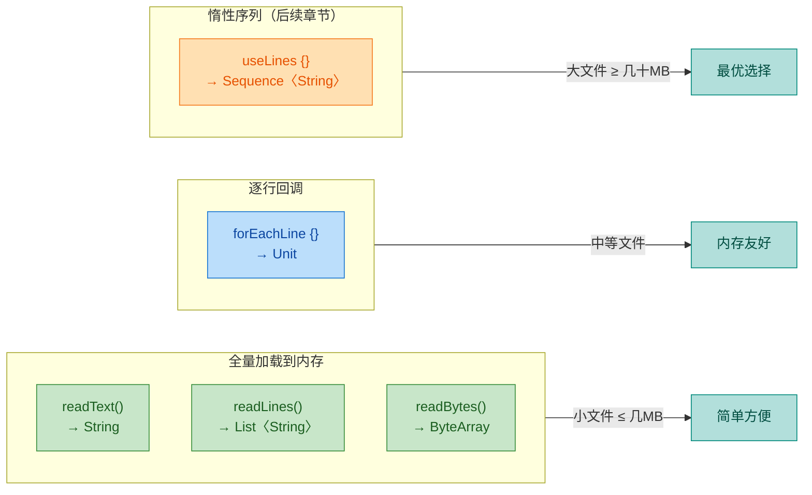
```mermaid
graph LR
    subgraph AllInMemory["全量加载到内存"]
        direction TB
        A["readText()
        → String"]
        B["readLines()
        → List〈String〉"]
        C["readBytes()
        → ByteArray"]
    end

    subgraph Streaming["逐行回调"]
        direction TB
        D["forEachLine {}
        → Unit"]
    end

    subgraph LazyStream["惰性序列（后续章节）"]
        direction TB
        E["useLines {}
        → Sequence〈String〉"]
    end

    AllInMemory --> |"小文件 ≤ 几MB"| OK1["简单方便"]
    Streaming --> |"中等文件"| OK2["内存友好"]
    LazyStream --> |"大文件 ≥ 几十MB"| OK3["最优选择"]

    classDef green fill:#C8E6C9,stroke:#388E3C,color:#1B5E20
    classDef blue fill:#BBDEFB,stroke:#1976D2,color:#0D47A1
    classDef orange fill:#FFE0B2,stroke:#F57C20,color:#E65100
    classDef teal fill:#B2DFDB,stroke:#00897B,color:#004D40

    class A,B,C green
    class D blue
    class E orange
    class OK1,OK2,OK3 teal
```

### 实际场景：读取 Properties 配置文件

来看一个综合运用的实际例子——读取一个简单的 key=value 配置文件：

```kotlin
import kotlin.io.path.*

// 假设 app.properties 内容如下：
// # Database Config
// db.host=localhost
// db.port=5432
// db.name=myapp

fun loadConfig(configPath: String): Map<String, String> {
    // 使用 readLines 读取所有行
    return Path(configPath)
        .readLines()
        // 过滤掉空行和注释行（以 # 开头）
        .filter { it.isNotBlank() && !it.trimStart().startsWith("#") }
        // 按第一个 "=" 分割为 key-value 对
        .associate { line ->
            val (key, value) = line.split("=", limit = 2) // limit=2 防止 value 中含有 "="
            key.trim() to value.trim()
        }
}

fun main() {
    val config = loadConfig("app.properties")
    // 类型安全地访问配置
    val host = config["db.host"] ?: "localhost"
    val port = config["db.port"]?.toIntOrNull() ?: 5432
    println("Connecting to $host:$port")
}
```

### 异常处理

文件读取是典型的 IO 操作，随时可能失败。常见的异常包括：

```kotlin
import kotlin.io.path.*
import java.nio.file.NoSuchFileException
import java.nio.file.AccessDeniedException
import java.io.IOException

fun safeRead(filePath: String): String? {
    return try {
        Path(filePath).readText()
    } catch (e: NoSuchFileException) {
        // 文件不存在
        println("File not found: ${e.file}")
        null
    } catch (e: AccessDeniedException) {
        // 没有读取权限
        println("Permission denied: ${e.file}")
        null
    } catch (e: IOException) {
        // 其他 IO 错误（磁盘故障、编码错误等）
        println("IO error: ${e.message}")
        null
    }
}
```

一个好的实践是：在读取文件之前先检查文件是否存在和可读，虽然这不能完全避免竞态条件（Time-of-check to time-of-use, TOCTOU），但能提供更好的用户体验：

```kotlin
import kotlin.io.path.*

fun main() {
    val path = Path("data.txt")

    // 前置检查（不能替代异常处理，但能提供更好的错误信息）
    if (!path.exists()) {
        println("Error: File does not exist at ${path.toAbsolutePath()}")
        return
    }
    if (!path.isReadable()) {
        println("Error: No read permission for $path")
        return
    }

    // 正式读取
    val content = path.readText()
    println("Read ${content.length} characters")
}
```

---

**📝 练习题**

以下代码的输出是什么？

```kotlin
import kotlin.io.path.*

fun main() {
    val base = Path("/data/projects")
    val sub = Path("src/main")
    val full = base / sub.toString() / "App.kt"
    val rel = base.relativize(full)
    println(rel)
}
```

A. `/data/projects/src/main/App.kt`

B. `src/main/App.kt`

C. `../src/main/App.kt`

D. `App.kt`

**【答案】** B
**【解析】** `base / sub.toString() / "App.kt"` 通过 `/` 操作符（即 `resolve`）将路径拼接为 `/data/projects/src/main/App.kt`。然后 `base.relativize(full)` 计算从 `/data/projects` 到 `/data/projects/src/main/App.kt` 的相对路径，结果就是 `src/main/App.kt`。`relativize()` 的作用是"从起点到终点需要走的相对路径"，由于 `full` 是 `base` 的子路径，所以直接去掉 `base` 前缀即可得到答案 B。

---

**📝 练习题**

关于 Kotlin 文件读取函数，以下说法正确的是？

A. `readLines()` 返回的列表中，每行末尾保留了换行符 `\n`

B. `readText()` 可以安全地读取任意大小的文件，不会有内存问题

C. `forEachLine {}` 处理完毕后需要手动关闭文件流

D. `readBytes()` 返回 `ByteArray`，适合处理二进制文件

**【答案】** D
**【解析】** A 错误：`readLines()` 内部使用 `BufferedReader.readLine()`，该方法会自动去除每行末尾的换行符。B 错误：`readText()` 将整个文件加载为一个 `String`，大文件会导致 `OutOfMemoryError`，官方建议文件不超过 2GB。C 错误：`forEachLine {}` 内部使用了 `use {}` 模式，处理完毕后会自动关闭流，无需手动操作。D 正确：`readBytes()` 返回原始字节数组 `ByteArray`，不涉及字符编码转换，是处理图片、音频等二进制文件的正确选择。

---

## 文件写入（writeText、writeBytes、appendText、buffered 写入）

文件读取解决了"从哪里拿数据"的问题，而文件写入则回答"数据往哪里放"。Kotlin 在 `kotlin.io` 和 `kotlin.io.path` 两套 API 中都提供了极其简洁的写入能力，从一行代码写入整个文本，到精细控制的缓冲流写入，覆盖了日常开发中几乎所有场景。理解它们的内部行为——是覆盖还是追加、是否自动刷新缓冲区、字符集如何生效——对写出健壮的 IO 代码至关重要。

### writeText —— 一步到位的文本覆盖写入

`writeText` 是 `File` 类的扩展函数，它的语义非常直白：把一个完整的字符串写入文件，如果文件已有内容则 **全部覆盖（overwrite）**。

```kotlin
import java.io.File

fun main() {
    // 创建一个 File 对象，指向当前目录下的 output.txt
    val file = File("output.txt")

    // writeText 会：
    // 1. 如果文件不存在 → 自动创建
    // 2. 如果文件已存在 → 清空原有内容
    // 3. 将字符串以指定编码（默认 UTF-8）写入
    file.writeText("Hello, Kotlin IO!")

    // 验证写入结果
    println(file.readText()) // 输出: Hello, Kotlin IO!
}
```

`writeText` 的函数签名揭示了它的全部能力：

```kotlin
// stdlib 源码简化版
public fun File.writeText(
    text: String,            // 要写入的完整文本
    charset: Charset = Charsets.UTF_8  // 字符编码，默认 UTF-8
): Unit {
    // 内部实际调用的是 writeBytes
    writeBytes(text.toByteArray(charset))
}
```

可以看到，`writeText` 本质上是先将字符串按指定编码转为字节数组，再调用 `writeBytes` 完成写入。这意味着编码转换发生在内存中，对于超大字符串（hundreds of MB），这会产生一个同等大小的字节数组副本，内存占用翻倍。

指定编码的典型场景：

```kotlin
import java.io.File

fun main() {
    val file = File("gbk_output.txt")

    // 某些遗留系统要求 GBK 编码
    file.writeText("你好，Kotlin！", charset = Charsets.ISO_8859_1)

    // 读取时也必须用相同编码，否则乱码
    val content = file.readText(charset = Charsets.ISO_8859_1)
    println(content)
}
```

### writeBytes —— 原始字节级写入

当你处理的不是文本而是二进制数据（图片、音频、序列化对象等），`writeBytes` 是最直接的选择。它同样是覆盖语义。

```kotlin
import java.io.File

fun main() {
    val file = File("binary.dat")

    // 构造一段字节数据
    val data: ByteArray = byteArrayOf(
        0x48, 0x65, 0x6C, 0x6C, 0x6F  // 对应 ASCII "Hello"
    )

    // 直接写入原始字节，不涉及任何编码转换
    file.writeBytes(data)

    // 读回验证
    val readBack = file.readBytes()
    println(readBack.contentEquals(data)) // 输出: true
    println(String(readBack))            // 输出: Hello
}
```

`writeBytes` 的内部实现非常简洁：

```kotlin
// stdlib 源码简化版
public fun File.writeBytes(array: ByteArray): Unit {
    // 打开一个 FileOutputStream（覆盖模式）
    // 写入全部字节
    // 关闭流
    FileOutputStream(this).use { it.write(array) }
}
```

注意这里用了 `use` 函数来保证流的关闭——即使 `write` 抛出异常，流也会被正确释放。这是 Kotlin 资源管理的标准模式，后续章节会深入讨论。

一个实用场景——文件复制的简易实现：

```kotlin
import java.io.File

fun main() {
    val source = File("photo.jpg")
    val dest = File("photo_backup.jpg")

    // 读取全部字节 → 写入新文件，两行完成复制
    // 注意：仅适合小文件，大文件应使用流式复制
    dest.writeBytes(source.readBytes())
}
```

### appendText —— 追加而非覆盖

在日志记录、数据采集等场景中，我们需要在文件末尾不断追加内容而不是覆盖。`appendText` 正是为此而生。

```kotlin
import java.io.File
import java.time.LocalDateTime

fun main() {
    val logFile = File("app.log")

    // 模拟多次日志写入
    repeat(3) { index ->
        // appendText 每次调用都在文件末尾追加
        // 不会清除已有内容
        logFile.appendText(
            "[${LocalDateTime.now()}] Event #$index occurred\n"
        )
    }

    // 读取完整日志
    println(logFile.readText())
    // 输出类似：
    // [2025-01-15T10:30:01] Event #0 occurred
    // [2025-01-15T10:30:01] Event #1 occurred
    // [2025-01-15T10:30:01] Event #2 occurred
}
```

`appendText` 与 `writeText` 的核心区别在于底层 `FileOutputStream` 的构造参数：

```kotlin
// writeText 内部 → FileOutputStream(file)          → 覆盖模式
// appendText 内部 → FileOutputStream(file, true)    → 追加模式（append = true）

// appendText 源码简化
public fun File.appendText(
    text: String,
    charset: Charset = Charsets.UTF_8
): Unit {
    // 第二个参数 true 表示 append 模式
    appendBytes(text.toByteArray(charset))
}

public fun File.appendBytes(array: ByteArray): Unit {
    FileOutputStream(this, true).use { it.write(array) }
    //                    ^^^^ 关键：追加模式
}
```

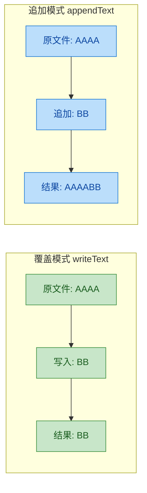
```mermaid
graph LR
    subgraph WriteMode["覆盖模式 writeText"]
        direction TB
        W1["原文件: AAAA"] --> W2["写入: BB"] --> W3["结果: BB"]
    end

    subgraph AppendMode["追加模式 appendText"]
        direction TB
        A1["原文件: AAAA"] --> A2["追加: BB"] --> A3["结果: AAAABB"]
    end

    classDef greenBox fill:#C8E6C9,stroke:#388E3C,color:#1B5E20
    classDef blueBox fill:#BBDEFB,stroke:#1976D2,color:#0D47A1

    class W1,W2,W3 greenBox
    class A1,A2,A3 blueBox
```

需要注意的性能陷阱：每次调用 `appendText` 都会打开文件、写入、关闭文件。如果在一个循环中高频调用，这个开销会非常显著。对于这种场景，应该使用 buffered 写入。

### Buffered 写入 —— 高性能的流式写入

当写入操作频繁或数据量较大时，每次直接写磁盘的代价太高。缓冲写入（Buffered Write）的核心思想是：先将数据积攒在内存缓冲区中，攒够一定量后再一次性刷入磁盘（flush），大幅减少实际的磁盘 IO 次数。

```kotlin
import java.io.File

fun main() {
    val file = File("buffered_output.txt")

    // bufferedWriter() 返回 BufferedWriter
    // use {} 确保写入完成后自动 flush + close
    file.bufferedWriter().use { writer ->
        // 写入第一行
        writer.write("第一行内容")
        // newLine() 写入平台相关的换行符
        // Windows: \r\n, Unix/Mac: \n
        writer.newLine()

        // 写入第二行
        writer.write("第二行内容")
        writer.newLine()

        // 也可以用 appendLine 风格（BufferedWriter 实现了 Appendable）
        writer.append("第三行内容")
        writer.newLine()
    }
    // use 块结束时自动调用 close()，close() 内部会先 flush()

    println(file.readText())
}
```

缓冲区的工作机制可以用下图来理解：

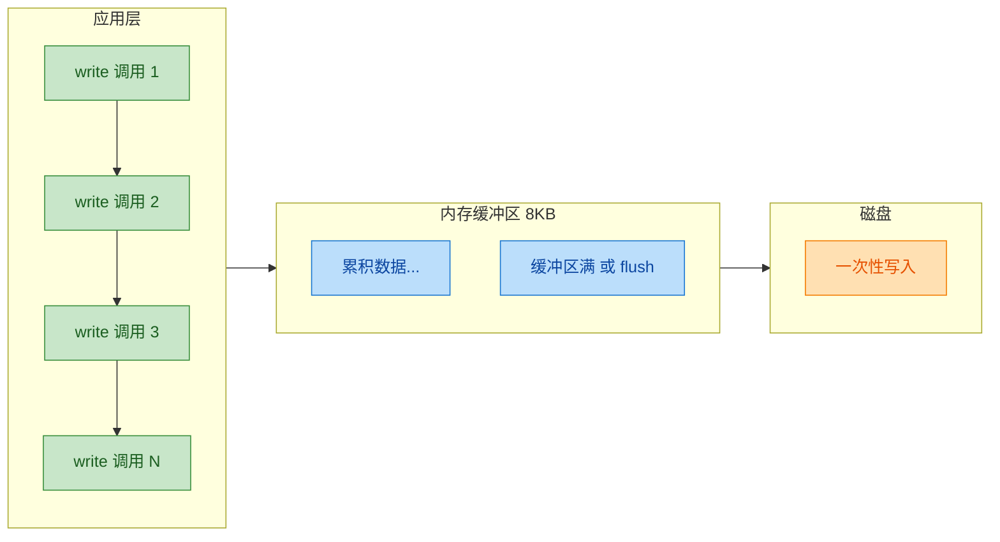
```mermaid
graph LR
    subgraph App["应用层"]
        direction TB
        C1["write 调用 1"]
        C2["write 调用 2"]
        C3["write 调用 3"]
        C4["write 调用 N"]
        C1 --> C2 --> C3 --> C4
    end

    subgraph Buffer["内存缓冲区 8KB"]
        direction TB
        B1["累积数据..."]
        B2["缓冲区满 或 flush"]
    end

    subgraph Disk["磁盘"]
        direction TB
        D1["一次性写入"]
    end

    App --> Buffer --> Disk

    classDef appStyle fill:#C8E6C9,stroke:#388E3C,color:#1B5E20
    classDef bufStyle fill:#BBDEFB,stroke:#1976D2,color:#0D47A1
    classDef diskStyle fill:#FFE0B2,stroke:#F57C00,color:#E65100

    class C1,C2,C3,C4 appStyle
    class B1,B2 bufStyle
    class D1 diskStyle
```

`BufferedWriter` 默认缓冲区大小为 8192 字符（8KB）。可以自定义：

```kotlin
import java.io.File

fun main() {
    val file = File("large_output.txt")

    // 指定 32KB 缓冲区，适合大量写入场景
    file.bufferedWriter(bufferSize = 32 * 1024).use { writer ->
        // 模拟写入 10 万行数据
        repeat(100_000) { i ->
            writer.write("Line $i: This is some generated content")
            writer.newLine()
        }
    }

    println("写入完成，文件大小: ${file.length()} bytes")
}
```

对比 `appendText` 循环 vs `bufferedWriter` 的性能差异：

```kotlin
import java.io.File
import kotlin.system.measureTimeMillis

fun main() {
    val lines = 10_000

    // 方式一：循环调用 appendText（每次都开关文件）
    val file1 = File("slow.txt")
    val time1 = measureTimeMillis {
        repeat(lines) { i ->
            file1.appendText("Line $i\n") // 每次: open → write → close
        }
    }

    // 方式二：bufferedWriter 一次性写入
    val file2 = File("fast.txt")
    val time2 = measureTimeMillis {
        file2.bufferedWriter().use { writer ->
            repeat(lines) { i ->
                writer.write("Line $i")   // 写入缓冲区
                writer.newLine()
            }
        } // 一次: open → 多次缓冲写入 → flush → close
    }

    println("appendText 循环: ${time1}ms")  // 通常数百到数千毫秒
    println("bufferedWriter:  ${time2}ms")  // 通常几十毫秒
    // 性能差距可达 10~100 倍

    // 清理
    file1.delete()
    file2.delete()
}
```

### PrintWriter —— 格式化写入的利器

`printWriter()` 返回的 `PrintWriter` 提供了 `println`、`printf` 等便捷方法，写入体验类似于控制台输出：

```kotlin
import java.io.File

fun main() {
    val file = File("report.txt")

    file.printWriter().use { out ->
        // println 自动追加换行
        out.println("=== 销售报告 ===")
        out.println()

        // printf 支持格式化字符串（与 Java 的 String.format 一致）
        val items = listOf(
            Triple("Widget A", 150, 29.99),
            Triple("Widget B", 89, 49.50),
            Triple("Widget C", 312, 12.75)
        )

        // 表头：左对齐 -12 字符，右对齐 8 字符，右对齐 10.2 浮点
        out.printf("%-12s %8s %10s%n", "Product", "Qty", "Price")
        out.println("-".repeat(32))

        items.forEach { (name, qty, price) ->
            out.printf("%-12s %8d %10.2f%n", name, qty, price)
        }

        out.println("-".repeat(32))
        val total = items.sumOf { it.second * it.third }
        out.printf("%-12s %19.2f%n", "Total", total)
    }

    // 打印文件内容验证
    println(file.readText())
}
```

### kotlin.io.path 的写入 API

Kotlin 1.5+ 引入的 `kotlin.io.path` 包为 `Path` 对象提供了对等的写入扩展，底层使用 NIO.2，在某些场景下性能更优且功能更丰富：

```kotlin
import kotlin.io.path.*
import java.nio.file.Path
import java.nio.file.StandardOpenOption

fun main() {
    val path = Path("nio_output.txt")

    // writeText — 与 File.writeText 语义相同
    path.writeText("NIO2 写入测试\n")

    // appendText — 追加
    path.appendText("追加的第二行\n")

    // writeLines — 直接写入字符串列表，每个元素自动换行
    val lines = listOf("Line A", "Line B", "Line C")
    Path("lines_output.txt").writeLines(lines)

    // 使用 OpenOption 精细控制写入行为
    path.writeText(
        "带选项的写入",
        // CREATE: 不存在则创建
        // TRUNCATE_EXISTING: 存在则清空
        // WRITE: 写入模式
        StandardOpenOption.CREATE,
        StandardOpenOption.TRUNCATE_EXISTING,
        StandardOpenOption.WRITE
    )

    println(path.readText())
}
```

### 写入 API 全景对比

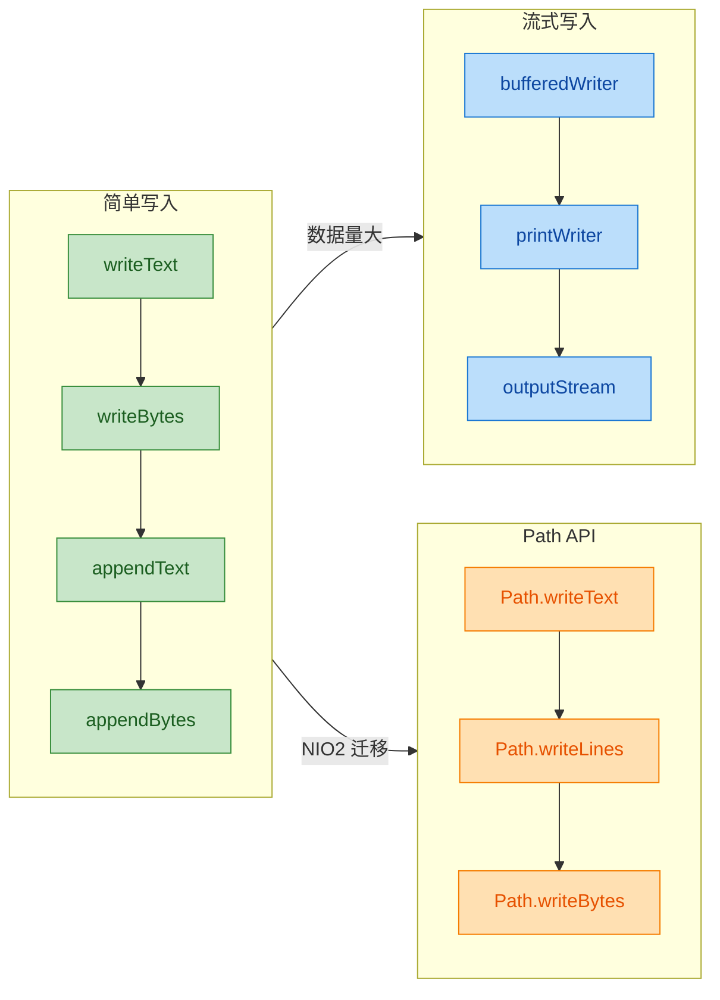
```mermaid
graph LR
    subgraph Simple["简单写入"]
        direction TB
        S1["writeText"]
        S2["writeBytes"]
        S3["appendText"]
        S4["appendBytes"]
        S1 --> S2 --> S3 --> S4
    end

    subgraph Streamed["流式写入"]
        direction TB
        T1["bufferedWriter"]
        T2["printWriter"]
        T3["outputStream"]
        T1 --> T2 --> T3
    end

    subgraph NIO["Path API"]
        direction TB
        N1["Path.writeText"]
        N2["Path.writeLines"]
        N3["Path.writeBytes"]
        N1 --> N2 --> N3
    end

    Simple -->|"数据量大"| Streamed
    Simple -->|"NIO2 迁移"| NIO

    classDef simpleStyle fill:#C8E6C9,stroke:#388E3C,color:#1B5E20
    classDef streamStyle fill:#BBDEFB,stroke:#1976D2,color:#0D47A1
    classDef nioStyle fill:#FFE0B2,stroke:#F57C00,color:#E65100

    class S1,S2,S3,S4 simpleStyle
    class T1,T2,T3 streamStyle
    class N1,N2,N3 nioStyle
```

| API | 模式 | 适用场景 | 内存特征 |
|---|---|---|---|
| `writeText` | 覆盖 | 小文本一次性写入 | 全量加载到内存 |
| `writeBytes` | 覆盖 | 小二进制文件写入 | 全量字节数组 |
| `appendText` | 追加 | 偶尔追加少量文本 | 每次开关文件 |
| `bufferedWriter` | 流式 | 大量/高频写入 | 8KB 缓冲区 |
| `printWriter` | 流式 | 格式化文本输出 | 带缓冲 |
| `Path.writeLines` | 覆盖 | 按行写入列表 | NIO.2 底层 |

---

## 文件操作（exists、delete、copyTo、moveTo、createFile）

文件的读写只是 IO 操作的一部分。在实际项目中，我们同样频繁地需要检查文件是否存在、创建新文件、删除旧文件、复制或移动文件。Kotlin 在 `java.io.File` 的扩展和 `kotlin.io.path` 包中都提供了简洁的 API 来完成这些操作。理解这些操作的原子性（atomicity）、异常行为和跨平台差异，是写出可靠文件管理代码的基础。

### exists —— 文件存在性检查

`exists()` 是最基础的文件操作之一，返回 `Boolean` 表示文件或目录是否存在于文件系统中。

```kotlin
import java.io.File

fun main() {
    val file = File("config.yaml")

    // exists() 检查文件系统中是否存在该路径对应的文件或目录
    if (file.exists()) {
        println("配置文件已存在，大小: ${file.length()} bytes")
    } else {
        println("配置文件不存在，将创建默认配置")
        file.writeText("app:\n  name: MyApp\n  version: 1.0")
    }

    // 还有一些相关的判断方法
    println("是文件: ${file.isFile}")           // true（不是目录）
    println("是目录: ${file.isDirectory}")       // false
    println("可读: ${file.canRead()}")           // true（通常）
    println("可写: ${file.canWrite()}")          // true（通常）
    println("是隐藏文件: ${file.isHidden}")      // false（Unix 下以 . 开头才是）
}
```

`kotlin.io.path` 中的对应 API 提供了更丰富的选项：

```kotlin
import kotlin.io.path.*
import java.nio.file.Path
import java.nio.file.LinkOption

fun main() {
    val path = Path("config.yaml")

    // 基本存在性检查
    println("存在: ${path.exists()}")
    println("不存在: ${path.notExists()}")

    // 注意：exists() 返回 false 不等于 notExists() 返回 true
    // 当权限不足无法确定时，两者可能都返回 false

    // 不跟随符号链接的检查
    println("存在(不跟随链接): ${path.exists(LinkOption.NOFOLLOW_LINKS)}")

    // Path 的类型判断
    println("是常规文件: ${path.isRegularFile()}")
    println("是目录: ${path.isDirectory()}")
    println("是符号链接: ${path.isSymbolicLink()}")
}
```

一个容易被忽视的要点：`exists()` 存在 TOCTOU（Time-of-check to time-of-use）竞态问题。在你检查文件存在之后、实际操作之前，另一个进程可能已经删除了它。因此在并发环境中，不要依赖 `exists()` 的结果来保证后续操作的安全性，而应该直接尝试操作并捕获异常。

```kotlin
import java.io.File
import java.io.FileNotFoundException

fun main() {
    val file = File("data.txt")

    // 不推荐：先检查再操作（存在竞态）
    // if (file.exists()) { file.readText() }

    // 推荐：直接操作，捕获异常
    try {
        val content = file.readText()
        println(content)
    } catch (e: FileNotFoundException) {
        println("文件不存在: ${e.message}")
    }
}
```

### createNewFile 与 createFile —— 创建新文件

`File.createNewFile()` 是 Java 原生方法，而 `Path.createFile()` 是 Kotlin/NIO.2 的扩展。两者都用于创建空文件，但行为有微妙差异。

```kotlin
import java.io.File

fun main() {
    val file = File("new_file.txt")

    // createNewFile() 返回 Boolean
    // true  → 文件不存在，成功创建了空文件
    // false → 文件已存在，什么都没做
    val created = file.createNewFile()
    println("文件创建成功: $created") // 第一次: true

    // 再次调用
    val createdAgain = file.createNewFile()
    println("再次创建: $createdAgain") // false，文件已存在

    // 清理
    file.delete()
}
```

```kotlin
import kotlin.io.path.*
import java.nio.file.Path
import java.nio.file.FileAlreadyExistsException
import java.nio.file.attribute.PosixFilePermissions

fun main() {
    val path = Path("new_file_nio.txt")

    // Path.createFile() 在文件已存在时抛出异常（而非返回 false）
    try {
        path.createFile()
        println("文件创建成功")
    } catch (e: FileAlreadyExistsException) {
        println("文件已存在: ${e.message}")
    }

    // 在 Unix/Linux/macOS 上可以指定权限
    // val pathWithPerms = Path("secure.txt").createFile(
    //     PosixFilePermissions.asFileAttribute(
    //         PosixFilePermissions.fromString("rw-------")
    //     )
    // )

    // 清理
    path.deleteIfExists()
}
```

### delete 与 deleteIfExists —— 文件删除

```kotlin
import java.io.File

fun main() {
    // === File.delete() ===
    val file = File("temp.txt")
    file.writeText("临时数据")

    // delete() 返回 Boolean
    // true  → 删除成功
    // false → 删除失败（文件不存在、权限不足、目录非空等）
    // 注意：不会抛异常，失败原因不明确
    val deleted = file.delete()
    println("删除成功: $deleted") // true

    // 删除不存在的文件
    val deletedAgain = file.delete()
    println("再次删除: $deletedAgain") // false，但不知道为什么失败
}
```

```kotlin
import kotlin.io.path.*
import java.nio.file.Path
import java.nio.file.DirectoryNotEmptyException

fun main() {
    val path = Path("temp_nio.txt")
    path.writeText("临时数据")

    // Path.deleteIfExists() 返回 Boolean
    // true  → 文件存在且已删除
    // false → 文件本来就不存在
    val deleted = path.deleteIfExists()
    println("删除成功: $deleted") // true

    // Path.deleteExisting() 在文件不存在时抛出 NoSuchFileException
    // path.deleteExisting() // 此时会抛异常

    // 删除非空目录会抛 DirectoryNotEmptyException
    val dir = Path("test_dir")
    dir.createDirectory()
    Path("test_dir/child.txt").writeText("子文件")

    try {
        dir.deleteIfExists() // 抛异常：目录非空
    } catch (e: DirectoryNotEmptyException) {
        println("无法删除非空目录: ${e.message}")
        // 需要先递归删除内容
        Path("test_dir/child.txt").deleteIfExists()
        dir.deleteIfExists()
    }
}
```

`deleteOnExit()` 是一个特殊方法，它注册一个 JVM 关闭钩子（shutdown hook），在程序退出时自动删除文件。常用于临时文件管理：

```kotlin
import java.io.File

fun main() {
    // 创建临时文件
    val tempFile = File.createTempFile("myapp_", ".tmp")
    println("临时文件: ${tempFile.absolutePath}")

    // 注册 JVM 退出时删除
    tempFile.deleteOnExit()

    // 使用临时文件...
    tempFile.writeText("处理中的临时数据")

    // 程序结束时，JVM 会自动删除这个文件
    // 注意：如果 JVM 异常终止（kill -9），钩子不会执行
}
```

### copyTo —— 文件复制

`copyTo` 是 Kotlin 为 `File` 提供的扩展函数，功能比 Java 原生的文件复制更直观：

```kotlin
import java.io.File

fun main() {
    // 准备源文件
    val source = File("source.txt")
    source.writeText("这是源文件的内容\n包含多行数据\n用于测试复制功能")

    // === 基本复制 ===
    // copyTo 返回目标 File 对象
    val dest = source.copyTo(File("dest.txt"))
    println("复制完成: ${dest.name}, 大小: ${dest.length()} bytes")

    // === 覆盖已存在的文件 ===
    // 默认情况下，如果目标文件已存在，会抛出 FileAlreadyExistsException
    try {
        source.copyTo(File("dest.txt")) // 抛异常！
    } catch (e: FileAlreadyExistsException) {
        println("目标文件已存在: ${e.message}")
    }

    // 设置 overwrite = true 允许覆盖
    source.copyTo(File("dest.txt"), overwrite = true)
    println("覆盖复制完成")

    // === bufferSize 参数 ===
    // 控制复制时的缓冲区大小，默认 8KB
    // 大文件可以增大缓冲区提升性能
    source.copyTo(
        target = File("dest_large_buf.txt"),
        overwrite = true,
        bufferSize = 64 * 1024  // 64KB 缓冲区
    )

    // 清理
    listOf("source.txt", "dest.txt", "dest_large_buf.txt").forEach {
        File(it).delete()
    }
}
```

`copyTo` 的函数签名：

```kotlin
public fun File.copyTo(
    target: File,                  // 目标文件
    overwrite: Boolean = false,    // 是否覆盖已存在的目标
    bufferSize: Int = DEFAULT_BUFFER_SIZE  // 缓冲区大小（8192）
): File
```

对于目录的递归复制，`copyTo` 只能复制单个文件。要复制整个目录树，需要使用 `copyRecursively`：

```kotlin
import java.io.File

fun main() {
    // 准备目录结构
    val srcDir = File("src_dir")
    srcDir.mkdirs()
    File("src_dir/a.txt").writeText("文件 A")
    File("src_dir/sub").mkdirs()
    File("src_dir/sub/b.txt").writeText("文件 B")

    // copyRecursively 递归复制整个目录树
    val destDir = File("dest_dir")
    val success = srcDir.copyRecursively(
        target = destDir,
        overwrite = false,
        // onError 回调处理复制过程中的错误
        onError = { file, exception ->
            println("复制 ${file.path} 失败: ${exception.message}")
            OnErrorAction.SKIP  // SKIP 跳过该文件继续，TERMINATE 终止整个复制
        }
    )
    println("递归复制${if (success) "成功" else "失败"}")

    // 验证
    destDir.walkTopDown().forEach { println(it.path) }

    // 清理
    srcDir.deleteRecursively()
    destDir.deleteRecursively()
}
```

### moveTo（renameTo）—— 文件移动与重命名

Java 的 `File` 类只有 `renameTo()` 方法，它既能重命名也能移动，但行为在不同操作系统上不一致且不可靠。`kotlin.io.path` 的 `moveTo` 则提供了更可靠的跨平台实现。

```kotlin
import java.io.File

fun main() {
    val original = File("old_name.txt")
    original.writeText("原始内容")

    // === File.renameTo() ===
    // 返回 Boolean，不抛异常
    // 问题1：跨文件系统移动可能失败
    // 问题2：失败时不知道原因
    // 问题3：不同 OS 行为不一致
    val target = File("new_name.txt")
    val success = original.renameTo(target)
    println("重命名${if (success) "成功" else "失败"}")

    // 清理
    target.delete()
}
```

```kotlin
import kotlin.io.path.*
import java.nio.file.Path
import java.nio.file.StandardCopyOption

fun main() {
    val source = Path("original.txt")
    source.writeText("原始内容")

    // === Path.moveTo() — 推荐方式 ===
    // 底层使用 Files.move()，行为明确且跨平台一致
    val dest = source.moveTo(Path("moved.txt"))
    println("移动完成: ${dest.name}")

    // 如果目标已存在，默认抛 FileAlreadyExistsException
    // 使用 overwrite = true 覆盖
    Path("another.txt").also { it.writeText("另一个文件") }
    dest.moveTo(Path("another.txt"), overwrite = true)

    // moveTo 还支持原子移动（如果文件系统支持）
    // 原子移动意味着：要么完全成功，要么完全不动，不会出现中间状态
    // 这在并发环境中非常重要
    Path("another.txt").moveTo(
        Path("final.txt"),
        StandardCopyOption.ATOMIC_MOVE
    )

    // 清理
    Path("final.txt").deleteIfExists()
}
```

`renameTo` 与 `moveTo` 的关键差异值得用一张图来总结：

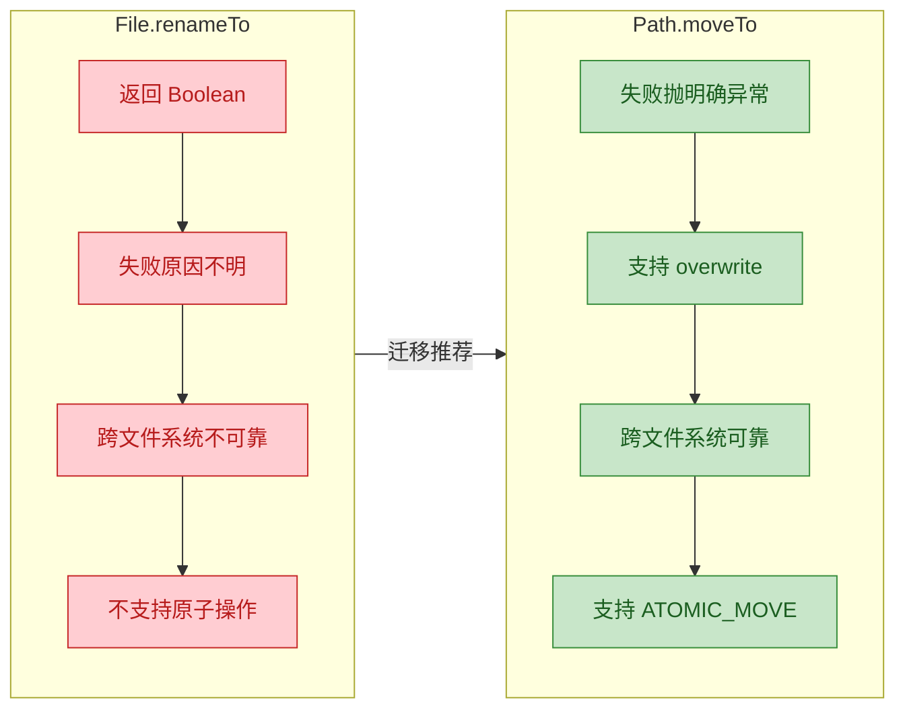
```mermaid
graph LR
    subgraph Legacy["File.renameTo"]
        direction TB
        L1["返回 Boolean"]
        L2["失败原因不明"]
        L3["跨文件系统不可靠"]
        L4["不支持原子操作"]
        L1 --> L2 --> L3 --> L4
    end

    subgraph Modern["Path.moveTo"]
        direction TB
        M1["失败抛明确异常"]
        M2["支持 overwrite"]
        M3["跨文件系统可靠"]
        M4["支持 ATOMIC_MOVE"]
        M1 --> M2 --> M3 --> M4
    end

    Legacy -->|"迁移推荐"| Modern

    classDef legacyStyle fill:#FFCDD2,stroke:#C62828,color:#B71C1C
    classDef modernStyle fill:#C8E6C9,stroke:#388E3C,color:#1B5E20

    class L1,L2,L3,L4 legacyStyle
    class M1,M2,M3,M4 modernStyle
```

### 临时文件与 createTempFile

临时文件是一种常见需求——处理上传、缓存中间结果、测试用例等场景都需要创建生命周期有限的文件。

```kotlin
import java.io.File
import kotlin.io.path.*
import java.nio.file.Path

fun main() {
    // === Java/Kotlin File 方式 ===
    // 在系统临时目录创建临时文件
    val tempFile = File.createTempFile(
        "myapp_",    // 前缀
        ".tmp"       // 后缀
    )
    println("临时文件: ${tempFile.absolutePath}")
    // 类似: /tmp/myapp_1234567890.tmp (Linux/Mac)
    // 类似: C:\Users\xxx\AppData\Local\Temp\myapp_1234567890.tmp (Windows)

    // 指定临时文件所在目录
    val customDir = File("my_temp")
    customDir.mkdirs()
    val tempInCustomDir = File.createTempFile("data_", ".csv", customDir)
    println("自定义目录临时文件: ${tempInCustomDir.path}")

    // === kotlin.io.path 方式 ===
    val tempPath = kotlin.io.path.createTempFile(
        prefix = "nio_",
        suffix = ".dat"
    )
    println("NIO 临时文件: $tempPath")

    // 在指定目录创建
    val tempInDir = kotlin.io.path.createTempFile(
        directory = Path("my_temp"),
        prefix = "nio_data_",
        suffix = ".bin"
    )

    // 清理
    tempFile.delete()
    tempInCustomDir.delete()
    tempPath.deleteIfExists()
    tempInDir.deleteIfExists()
    customDir.delete()
}
```

### 文件属性与元数据

除了基本的存在性检查，文件的元数据信息在很多场景下也非常有用：

```kotlin
import java.io.File
import java.text.SimpleDateFormat
import java.util.Date

fun main() {
    val file = File("metadata_demo.txt")
    file.writeText("Hello, metadata!")

    // 基本属性
    println("文件名: ${file.name}")              // metadata_demo.txt
    println("父目录: ${file.parent}")             // null（相对路径时）
    println("绝对路径: ${file.absolutePath}")
    println("规范路径: ${file.canonicalPath}")     // 解析 . 和 .. 后的路径

    // 大小
    println("文件大小: ${file.length()} bytes")

    // 时间戳
    val sdf = SimpleDateFormat("yyyy-MM-dd HH:mm:ss")
    println("最后修改: ${sdf.format(Date(file.lastModified()))}")

    // 修改时间戳
    file.setLastModified(0L) // 设置为 epoch 时间
    println("修改后时间: ${sdf.format(Date(file.lastModified()))}")

    // 权限（部分方法在 Windows 上行为不同）
    println("可读: ${file.canRead()}")
    println("可写: ${file.canWrite()}")
    println("可执行: ${file.canExecute()}")

    // 设置权限
    file.setReadOnly()                    // 设为只读
    println("设为只读后可写: ${file.canWrite()}") // false
    file.setWritable(true)               // 恢复可写

    // 扩展名和名称分离
    println("扩展名: ${file.extension}")          // txt
    println("无扩展名名称: ${file.nameWithoutExtension}") // metadata_demo

    // 清理
    file.delete()
}
```

`kotlin.io.path` 提供了更丰富的属性访问：

```kotlin
import kotlin.io.path.*
import java.nio.file.Path
import java.nio.file.attribute.BasicFileAttributes
import java.nio.file.Files

fun main() {
    val path = Path("nio_meta.txt")
    path.writeText("NIO metadata demo")

    // 基本属性
    println("文件名: ${path.name}")
    println("父路径: ${path.parent}")
    println("绝对路径: ${path.absolute()}")
    println("文件大小: ${path.fileSize()} bytes")

    // 读取完整的文件属性（一次系统调用获取所有属性，比逐个查询高效）
    val attrs: BasicFileAttributes = Files.readAttributes(
        path,
        BasicFileAttributes::class.java
    )
    println("创建时间: ${attrs.creationTime()}")
    println("最后修改: ${attrs.lastModifiedTime()}")
    println("最后访问: ${attrs.lastAccessTime()}")
    println("是符号链接: ${attrs.isSymbolicLink}")

    // 清理
    path.deleteIfExists()
}
```

### 文件操作的异常处理模式

文件操作天然容易出错——权限不足、磁盘满、路径不存在、并发冲突等。建立一套统一的异常处理模式非常重要：

```kotlin
import java.io.File
import java.io.IOException
import java.nio.file.FileAlreadyExistsException
import java.nio.file.NoSuchFileException

fun main() {
    // 模式一：使用 runCatching 进行函数式异常处理
    val result = runCatching {
        File("nonexistent.txt").readText()
    }

    result
        .onSuccess { content ->
            println("读取成功: $content")
        }
        .onFailure { error ->
            println("读取失败: ${error.message}")
        }

    // 也可以提供默认值
    val content = runCatching {
        File("config.txt").readText()
    }.getOrDefault("默认配置内容")
    println("配置: $content")

    // 模式二：封装安全操作函数
    fun safeWriteText(file: File, text: String): Boolean {
        return try {
            // 确保父目录存在
            file.parentFile?.mkdirs()
            // 先写入临时文件，再原子替换（防止写入中途失败导致数据丢失）
            val tempFile = File(file.parent ?: ".", ".${file.name}.tmp")
            tempFile.writeText(text)
            // renameTo 在同一文件系统上通常是原子的
            val success = tempFile.renameTo(file)
            if (!success) {
                // 回退：直接写入
                file.writeText(text)
                tempFile.delete()
            }
            true
        } catch (e: IOException) {
            println("写入失败: ${e.message}")
            false
        }
    }

    // 使用安全写入
    safeWriteText(File("safe_output.txt"), "安全写入的内容")

    // 清理
    File("safe_output.txt").delete()
}
```

### 文件操作 API 速查表

| 操作 | File API | Path API | 失败行为 |
|---|---|---|---|
| 存在检查 | `file.exists()` | `path.exists()` | 返回 false |
| 创建文件 | `file.createNewFile()` | `path.createFile()` | Boolean / 抛异常 |
| 删除 | `file.delete()` | `path.deleteIfExists()` | Boolean / 抛异常 |
| 复制 | `file.copyTo(dest)` | `Files.copy(src, dest)` | 抛异常 |
| 移动 | `file.renameTo(dest)` | `path.moveTo(dest)` | Boolean / 抛异常 |
| 递归删除 | `file.deleteRecursively()` | 需手动实现 | Boolean |
| 递归复制 | `file.copyRecursively(dest)` | 需手动实现 | Boolean + 回调 |
| 文件大小 | `file.length()` | `path.fileSize()` | 0L / 抛异常 |
| 最后修改 | `file.lastModified()` | `path.getLastModifiedTime()` | 0L / 抛异常 |

可以看到一个清晰的趋势：`File` API 倾向于用返回值表示成败（静默失败），而 `Path` API 倾向于抛出具体异常（显式失败）。在现代 Kotlin 开发中，`Path` API 的异常模式更受推崇，因为它迫使开发者正视错误，而不是忽略一个 `false` 返回值。

---

**📝 练习题 1**

以下代码执行后，`output.txt` 的内容是什么？

```kotlin
val file = File("output.txt")
file.writeText("AAA")
file.appendText("BBB")
file.writeText("CCC")
file.appendText("DDD")
```

A. `AAABBBCCCDDD`
B. `CCCDDD`
C. `AAABBB`
D. `DDD`

**【答案】** B
**【解析】** 执行流程如下：`writeText("AAA")` 覆盖写入，文件内容为 `AAA`；`appendText("BBB")` 追加，内容变为 `AAABBB`；`writeText("CCC")` 再次覆盖写入，之前的内容全部清除，文件内容变为 `CCC`；`appendText("DDD")` 追加，最终内容为 `CCCDDD`。关键在于 `writeText` 是覆盖语义（内部使用 `FileOutputStream(file)` 不带 append 参数），每次调用都会清空文件重新写入。

**📝 练习题 2**

在高频日志写入场景中，以下哪种方式性能最优？

```kotlin
// 方式 A
repeat(10000) { file.appendText("log line $it\n") }

// 方式 B
file.bufferedWriter().use { w ->
    repeat(10000) { w.write("log line $it\n") }
}

// 方式 C
val sb = StringBuilder()
repeat(10000) { sb.appendLine("log line $it") }
file.writeText(sb.toString())

// 方式 D
repeat(10000) { file.writeText("log line $it\n") }
```

A. 方式 A
B. 方式 B
C. 方式 C
D. 方式 D

**【答案】** B
**【解析】** 方式 A 每次 `appendText` 都执行一次 open → write → close，10000 次文件系统调用开销巨大。方式 B 使用 `bufferedWriter`，只打开一次文件，数据先写入 8KB 内存缓冲区，缓冲区满时才刷盘，最后 `use` 块结束时 flush + close，IO 次数最少。方式 C 虽然也只写一次文件，但需要在内存中构建完整的字符串，对于超大数据量会造成内存压力，且 `StringBuilder` 的扩容也有开销。方式 D 最差——每次 `writeText` 都覆盖之前的内容，最终文件只有最后一行，逻辑上就是错误的。综合 IO 效率和内存使用，方式 B 是最优解。

---

## 目录操作（createDirectory、listDirectoryEntries、walk 遍历）

在文件系统的世界里，目录（Directory）是组织文件的基本容器。Kotlin 在 `kotlin.io.path` 包中为 `java.nio.file.Path` 提供了一系列简洁的扩展函数，让目录的创建、列举和遍历变得极为流畅。与 Java 原生 API 相比，Kotlin 的封装消除了大量样板代码，同时保留了底层的全部能力。

### 创建目录：createDirectory 与 createDirectories

创建目录是最基础的操作。Kotlin 提供了两个关键函数，它们的区别在于是否递归创建中间路径：

```kotlin
import kotlin.io.path.*  // 引入 path 扩展函数
import java.nio.file.Path

fun main() {
    // === createDirectory：只创建最后一级目录 ===
    // 如果父目录不存在，会抛出 java.nio.file.NoSuchFileException
    val singleDir: Path = Path("output")  // 构建路径对象
    singleDir.createDirectory()           // 创建 "output" 目录

    // === createDirectories：递归创建所有缺失的中间目录 ===
    // 类似于 Linux 的 mkdir -p 命令
    val nestedDir: Path = Path("output/logs/2024/archive")
    nestedDir.createDirectories()  // 一次性创建 output -> logs -> 2024 -> archive

    // === 重复创建的行为差异 ===
    // createDirectory() 在目录已存在时抛出 FileAlreadyExistsException
    // createDirectories() 在目录已存在时静默成功（幂等操作）
    nestedDir.createDirectories()  // 安全，不会报错

    // === 实战模式：条件创建 ===
    val dataDir = Path("data")
    if (!dataDir.exists()) {       // 先检查是否存在
        dataDir.createDirectory()  // 不存在才创建
    }

    // 更简洁的写法：直接用 createDirectories（推荐）
    Path("data").createDirectories()  // 存在就跳过，不存在就创建
}
```

两者的核心区别可以用一张图来理解：

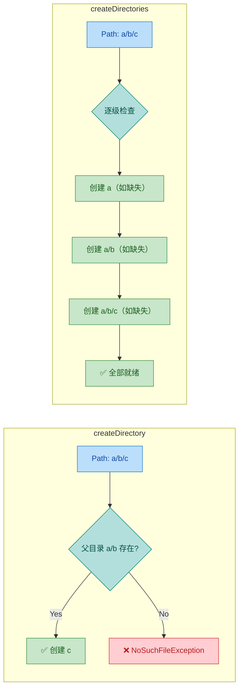
```mermaid
graph LR
    subgraph createDirectory
        direction TB
        A["Path: a/b/c"] --> B{"父目录 a/b 存在?"}
        B -->|Yes| C["✅ 创建 c"]
        B -->|No| D["❌ NoSuchFileException"]
    end

    subgraph createDirectories
        direction TB
        E["Path: a/b/c"] --> F{"逐级检查"}
        F --> G["创建 a（如缺失）"]
        G --> H["创建 a/b（如缺失）"]
        H --> I["创建 a/b/c（如缺失）"]
        I --> J["✅ 全部就绪"]
    end

    classDef green fill:#C8E6C9,stroke:#388E3C,color:#1B5E20
    classDef red fill:#FFCDD2,stroke:#D32F2F,color:#B71C1C
    classDef blue fill:#BBDEFB,stroke:#1976D2,color:#0D47A1
    classDef teal fill:#B2DFDB,stroke:#00796B,color:#004D40

    class A,E blue
    class C,J,G,H,I green
    class D red
    class B,F teal
```

实际开发中，`createDirectories()` 是更安全的选择——它的幂等性（idempotent）意味着无论调用多少次，结果都一致，不会因为目录已存在而崩溃。

### 列举目录内容：listDirectoryEntries

当你需要查看一个目录下有哪些文件和子目录时，`listDirectoryEntries` 是最直接的工具。它返回一个 `List<Path>`，包含目录下的所有直接子项（不递归）：

```kotlin
import kotlin.io.path.*

fun main() {
    val projectDir = Path("my-project")

    // === 列举所有直接子项 ===
    // 返回 List<Path>，包含文件和子目录（不递归进入子目录）
    val allEntries: List<Path> = projectDir.listDirectoryEntries()
    allEntries.forEach { entry ->
        // name 属性获取文件/目录名（不含父路径）
        println("${entry.name} -> isDirectory: ${entry.isDirectory()}")
    }

    // === 使用 glob 模式过滤 ===
    // glob 是一种简单的通配符语法，比正则表达式更直观

    // 只列出 .kt 文件
    val ktFiles = projectDir.listDirectoryEntries("*.kt")

    // 只列出 .kt 和 .java 文件（花括号表示"或"）
    val sourceFiles = projectDir.listDirectoryEntries("*.{kt,java}")

    // 只列出以 test 开头的文件
    val testFiles = projectDir.listDirectoryEntries("test*")

    // 只列出所有 JSON 配置文件
    val configs = projectDir.listDirectoryEntries("*.json")

    // === 结合 Kotlin 集合操作进行精细过滤 ===
    val largeKtFiles = projectDir.listDirectoryEntries("*.kt")
        .filter { it.fileSize() > 1024 }       // 大于 1KB 的文件
        .sortedByDescending { it.fileSize() }   // 按大小降序排列
        .take(5)                                 // 取前 5 个

    largeKtFiles.forEach { file ->
        // 打印文件名和大小（转换为 KB）
        println("${file.name}: ${file.fileSize() / 1024} KB")
    }
}
```

Glob 模式是文件系统通配符的标准语法，以下是常用的 glob 规则速查：

| Glob 模式 | 含义 | 示例匹配 |
|-----------|------|---------|
| `*` | 匹配任意数量字符（不跨目录） | `*.kt` → `Main.kt` |
| `?` | 匹配单个字符 | `?.txt` → `a.txt` |
| `{a,b}` | 匹配 a 或 b | `*.{kt,java}` → `App.kt`, `App.java` |
| `[abc]` | 匹配方括号内任一字符 | `[MT]*.kt` → `Main.kt`, `Test.kt` |
| `[0-9]` | 匹配范围内字符 | `log[0-9].txt` → `log3.txt` |

需要注意的是，`listDirectoryEntries` 会一次性将所有条目加载到内存中形成 `List`。对于包含数万个文件的超大目录，这可能造成内存压力。此时应考虑使用 `java.nio.file.Files.newDirectoryStream()` 进行惰性迭代，或者使用后面会讲到的 `walk` 系列函数。

### 目录遍历入门：walk 与 forEachDirectoryEntry

除了只看"一层"的 `listDirectoryEntries`，Kotlin 还提供了递归遍历整棵目录树的能力：

```kotlin
import kotlin.io.path.*

fun main() {
    val root = Path("my-project")

    // === forEachDirectoryEntry：遍历直接子项（非递归） ===
    // 与 listDirectoryEntries 类似，但不创建中间 List，更节省内存
    root.forEachDirectoryEntry("*.kt") { entry ->  // 支持 glob 过滤
        println("Found: ${entry.name}")             // 逐个处理
    }

    // === Path.walk()（Kotlin 1.9.20+，kotlin.io.path 包） ===
    // 返回 Sequence<Path>，惰性递归遍历整棵目录树
    val allFiles: Sequence<Path> = root.walk()  // 默认深度优先（DFS）
    allFiles
        .filter { it.isRegularFile() }          // 只保留普通文件（排除目录）
        .filter { it.extension == "kt" }        // 只保留 .kt 扩展名
        .forEach { println(it) }                // 打印完整路径
}
```

`forEachDirectoryEntry` 和 `listDirectoryEntries` 的关系，类似于 `forEach` 和 `toList` 的关系——前者是即时消费，后者是先收集再处理。如果你只需要遍历而不需要持有完整列表，`forEachDirectoryEntry` 更高效。

下面这张图展示了三种目录访问方式的适用场景：

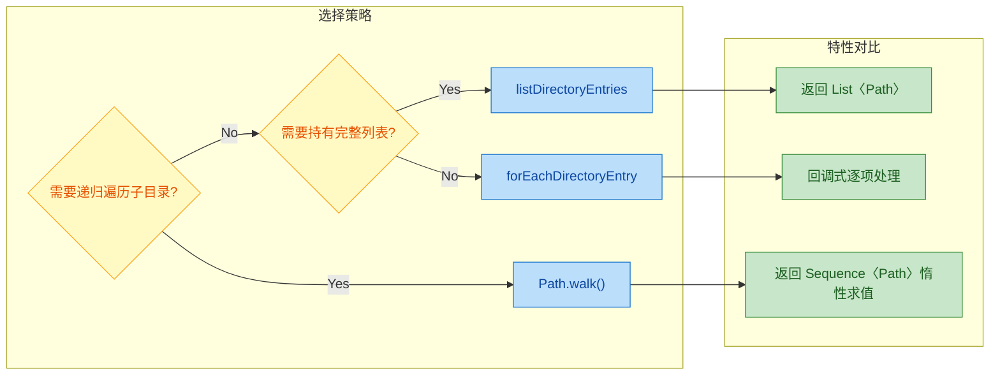
```mermaid
graph LR
    subgraph 选择策略
        direction TB
        Q{"需要递归遍历子目录?"} -->|No| S1{"需要持有完整列表?"}
        Q -->|Yes| S3["Path.walk()"]
        S1 -->|Yes| S2["listDirectoryEntries"]
        S1 -->|No| S4["forEachDirectoryEntry"]
    end

    subgraph 特性对比
        direction TB
        S2 --> F1["返回 List〈Path〉"]
        S4 --> F2["回调式逐项处理"]
        S3 --> F3["返回 Sequence〈Path〉惰性求值"]
    end

    classDef question fill:#FFF9C4,stroke:#F9A825,color:#E65100
    classDef method fill:#BBDEFB,stroke:#1976D2,color:#0D47A1
    classDef feature fill:#C8E6C9,stroke:#388E3C,color:#1B5E20

    class Q,S1 question
    class S2,S3,S4 method
    class F1,F2,F3 feature
```

### 实战：构建项目目录结构报告

将上面学到的 API 组合起来，我们可以写一个实用的目录结构打印工具：

```kotlin
import kotlin.io.path.*
import java.nio.file.Path

// 递归打印目录树，类似 Linux 的 tree 命令
fun printTree(dir: Path, prefix: String = "", isLast: Boolean = true) {
    // 打印当前节点（目录名），使用树形连接符
    val connector = if (isLast) "└── " else "├── "  // 最后一项用 └，其余用 ├
    println("$prefix$connector${dir.name}/")          // 目录名后加 / 标识

    // 获取当前目录的所有子项，并按名称排序
    val children = dir.listDirectoryEntries()
        .sortedWith(                                   // 自定义排序规则
            compareByDescending<Path> { it.isDirectory() }  // 目录排在前面
                .thenBy { it.name }                         // 同类型按名称字母序
        )

    // 计算下一级的缩进前缀
    val childPrefix = prefix + if (isLast) "    " else "│   "

    children.forEachIndexed { index, child ->          // 带索引遍历
        val childIsLast = (index == children.size - 1) // 判断是否为最后一项
        if (child.isDirectory()) {
            printTree(child, childPrefix, childIsLast) // 递归处理子目录
        } else {
            val conn = if (childIsLast) "└── " else "├── "
            println("$childPrefix$conn${child.name}")  // 打印文件名
        }
    }
}

fun main() {
    val projectRoot = Path("my-project")
    println(projectRoot.name + "/")  // 打印根目录名
    printTree(projectRoot)           // 开始递归打印
}
```

输出效果类似：

```text
my-project/
└── my-project/
    ├── src/
    │   ├── main/
    │   │   └── Main.kt
    │   └── test/
    │       └── MainTest.kt
    ├── build.gradle.kts
    └── settings.gradle.kts
```

---

## 遍历策略（walkTopDown 深度优先、walkBottomUp、过滤、限制深度）

目录遍历是文件系统操作中最常见也最容易出问题的场景之一。遍历策略的选择直接影响程序的正确性和性能——比如删除目录树时必须从底部开始（先删子文件再删父目录），而搜索文件时从顶部开始通常更高效。Kotlin 提供了两套遍历 API：`java.io.File` 上的 `walkTopDown` / `walkBottomUp`，以及 `kotlin.io.path` 包中更现代的 `Path.walk()`。

### File.walkTopDown：自顶向下深度优先

`walkTopDown()` 是 `java.io.File` 的扩展函数，返回一个 `FileTreeWalk` 对象（实现了 `Sequence<File>` 接口）。它采用深度优先搜索（DFS, Depth-First Search）策略，先访问父目录，再递归进入子目录：

```kotlin
import java.io.File

fun main() {
    val root = File("my-project")

    // === 基本用法：自顶向下遍历 ===
    // walkTopDown 返回 Sequence<File>，惰性求值
    root.walkTopDown().forEach { file ->
        // 计算缩进层级：相对路径中的分隔符数量
        val depth = file.relativeTo(root).path
            .count { it == File.separatorChar }  // 统计路径分隔符个数
        val indent = "  ".repeat(depth)          // 每层缩进两个空格
        val icon = if (file.isDirectory) "📁" else "📄"  // 目录和文件用不同图标
        println("$indent$icon ${file.name}")
    }
}
```

对于如下目录结构：

```text
my-project/
├── src/
│   ├── Main.kt
│   └── utils/
│       └── Helper.kt
├── test/
│   └── MainTest.kt
└── README.md
```

`walkTopDown` 的访问顺序是：

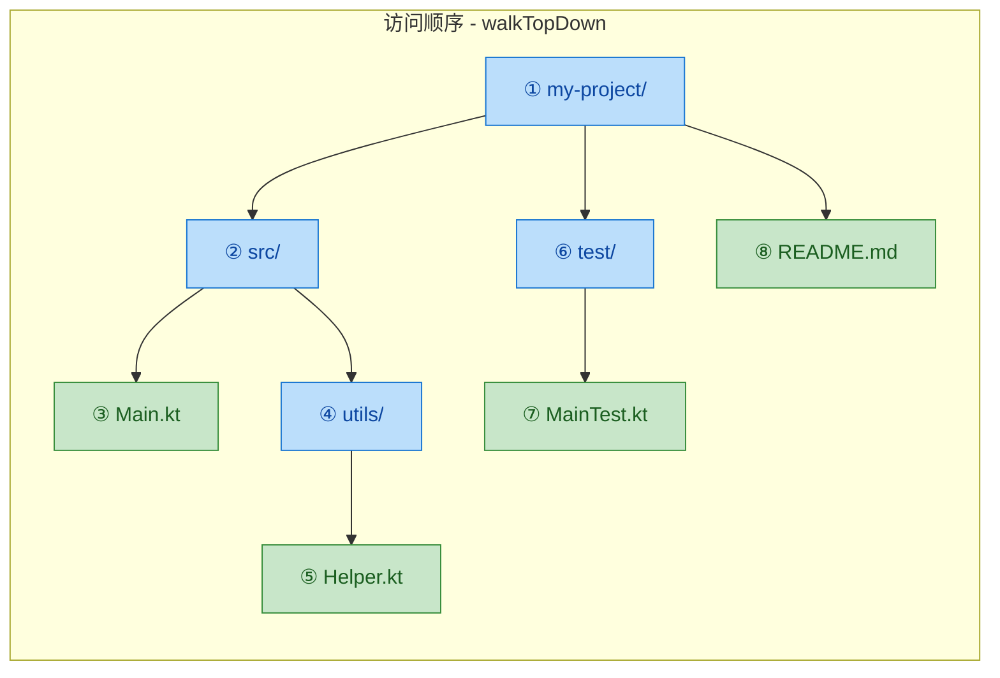
```mermaid
graph LR
    subgraph 访问顺序 - walkTopDown
        direction TB
        N1["① my-project/"] --> N2["② src/"]
        N2 --> N3["③ Main.kt"]
        N2 --> N4["④ utils/"]
        N4 --> N5["⑤ Helper.kt"]
        N1 --> N6["⑥ test/"]
        N6 --> N7["⑦ MainTest.kt"]
        N1 --> N8["⑧ README.md"]
    end

    classDef dir fill:#BBDEFB,stroke:#1976D2,color:#0D47A1
    classDef file fill:#C8E6C9,stroke:#388E3C,color:#1B5E20

    class N1,N2,N4,N6 dir
    class N3,N5,N7,N8 file
```

核心特征：父目录总是在其子内容之前被访问。这种策略非常适合搜索和收集场景——你可以在遍历过程中尽早发现目标并短路退出。

### File.walkBottomUp：自底向上遍历

`walkBottomUp()` 的遍历方向恰好相反——先递归到最深层，再逐级回溯到根目录：

```kotlin
import java.io.File

fun main() {
    val root = File("my-project")

    // === 自底向上遍历 ===
    root.walkBottomUp().forEach { file ->
        println(file.relativeTo(root))  // 打印相对路径
    }
    // 输出顺序（与 walkTopDown 相反）：
    // Main.kt
    // Helper.kt
    // utils
    // src
    // MainTest.kt
    // test
    // README.md
    // my-project（根目录最后）
}
```

同样的目录结构，`walkBottomUp` 的访问顺序：

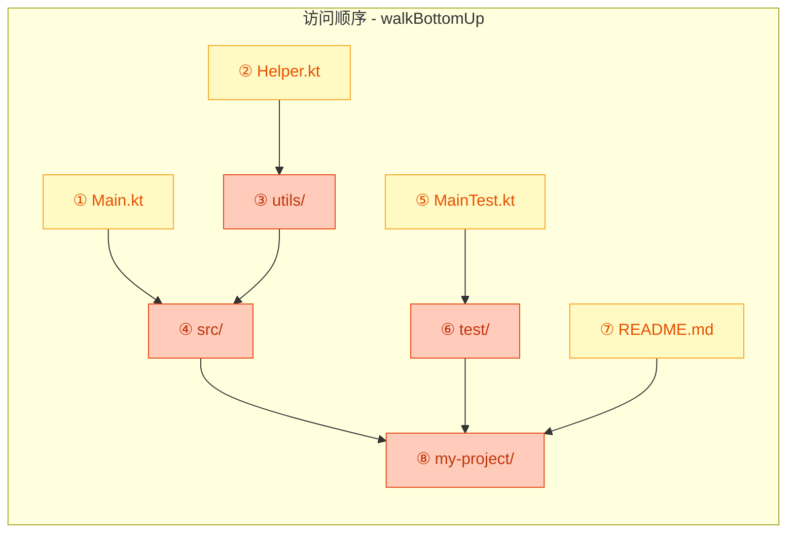
```mermaid
graph LR
    subgraph 访问顺序 - walkBottomUp
        direction TB
        N3["① Main.kt"] --> N2["④ src/"]
        N5["② Helper.kt"] --> N4["③ utils/"]
        N4 --> N2
        N7["⑤ MainTest.kt"] --> N6["⑥ test/"]
        N2 --> N1["⑧ my-project/"]
        N6 --> N1
        N8["⑦ README.md"] --> N1
    end

    classDef dir fill:#FFCCBC,stroke:#E64A19,color:#BF360C
    classDef file fill:#FFF9C4,stroke:#F9A825,color:#E65100

    class N1,N2,N4,N6 dir
    class N3,N5,N7,N8 file
```

`walkBottomUp` 最经典的应用场景是递归删除目录树。因为文件系统要求目录为空才能删除，所以必须先删除所有子文件和子目录，最后才能删除父目录：

```kotlin
import java.io.File

fun main() {
    val tempDir = File("temp-workspace")

    // === 安全的递归删除 ===
    // walkBottomUp 保证子项在父目录之前被处理
    tempDir.walkBottomUp().forEach { file ->
        val deleted = file.delete()  // 删除当前文件或空目录
        if (deleted) {
            println("Deleted: ${file.path}")
        } else {
            println("Failed to delete: ${file.path}")
        }
    }

    // Kotlin 也提供了更简洁的内置方法
    // tempDir.deleteRecursively()  // 内部实现原理与上面类似
}
```

### 两种策略的对比与选择

| 特性 | walkTopDown | walkBottomUp |
|------|------------|-------------|
| 访问顺序 | 父目录 → 子内容 | 子内容 → 父目录 |
| 算法 | 前序深度优先（Pre-order DFS） | 后序深度优先（Post-order DFS） |
| 典型场景 | 搜索文件、生成目录树、复制目录 | 删除目录树、计算目录大小 |
| 短路优化 | 适合（找到即停） | 不适合（必须遍历完） |
| 返回类型 | `FileTreeWalk`（`Sequence<File>`） | `FileTreeWalk`（`Sequence<File>`） |

### 限制遍历深度：maxDepth

在处理深层嵌套的目录结构时（比如 `node_modules`），无限递归可能导致性能问题甚至栈溢出。`FileTreeWalk` 提供了 `maxDepth()` 方法来限制递归深度：

```kotlin
import java.io.File

fun main() {
    val root = File("my-project")

    // === maxDepth 控制递归层数 ===
    // maxDepth(1) 表示只看根目录和它的直接子项（共 2 层）
    root.walkTopDown()
        .maxDepth(1)          // 限制深度为 1（根 + 直接子项）
        .forEach { println(it.name) }
    // 输出：my-project, src, test, README.md
    // 不会进入 src/ 或 test/ 内部

    // maxDepth(2) 会多看一层
    root.walkTopDown()
        .maxDepth(2)          // 根 + 子项 + 孙项
        .forEach { println(it.relativeTo(root)) }
    // 输出：., src, src/Main.kt, src/utils, test, test/MainTest.kt, README.md
    // 注意 utils/ 内部的 Helper.kt 不会出现

    // maxDepth(0) 只返回根目录自身
    root.walkTopDown()
        .maxDepth(0)
        .toList()             // 结果：[my-project]
}
```

深度值的含义：

```text
my-project/          ← depth 0（根目录自身）
├── src/             ← depth 1
│   ├── Main.kt      ← depth 2
│   └── utils/       ← depth 2
│       └── Helper.kt ← depth 3
├── test/            ← depth 1
│   └── MainTest.kt  ← depth 2
└── README.md        ← depth 1
```

### 过滤与剪枝：onEnter 回调

`FileTreeWalk` 提供了一个强大的 `onEnter` 回调，它在进入每个目录之前被调用。返回 `true` 表示继续进入该目录，返回 `false` 则跳过整个子树（pruning，剪枝）。这比先遍历再 `filter` 高效得多，因为被跳过的子树根本不会被访问：

```kotlin
import java.io.File

fun main() {
    val root = File("my-project")

    // === onEnter：进入目录前的守门回调 ===
    root.walkTopDown()
        .onEnter { dir ->
            // 跳过隐藏目录（以 . 开头）和 build 产物目录
            val skip = dir.name.startsWith(".") ||  // .git, .idea 等
                       dir.name == "build" ||        // Gradle 构建产物
                       dir.name == "node_modules"    // npm 依赖（如果有）
            !skip  // 返回 true 表示进入，false 表示跳过
        }
        .filter { it.isFile }                        // 只保留文件
        .filter { it.extension in listOf("kt", "java") }  // 只要源代码
        .forEach { println(it.relativeTo(root)) }
}
```

`onEnter` 的剪枝效果可以用下图理解：

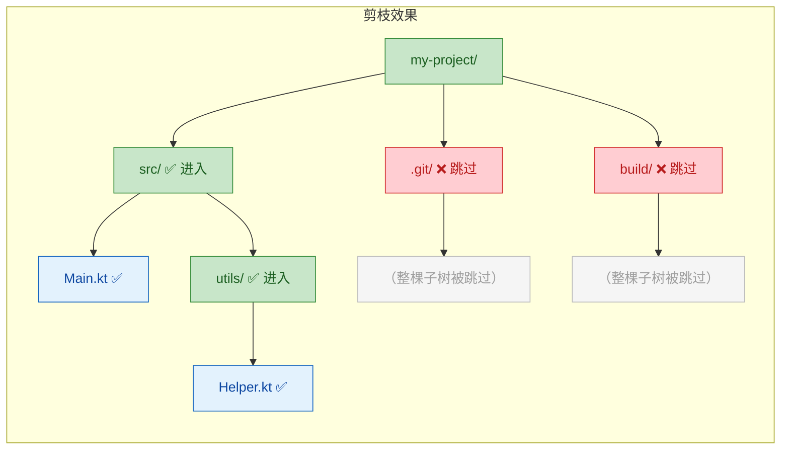
```mermaid
graph LR
    subgraph 剪枝效果
        direction TB
        R["my-project/"] --> S["src/ ✅ 进入"]
        R --> B[".git/ ❌ 跳过"]
        R --> T["build/ ❌ 跳过"]
        S --> M["Main.kt ✅"]
        S --> U["utils/ ✅ 进入"]
        U --> H["Helper.kt ✅"]
        B --> BX["（整棵子树被跳过）"]
        T --> TX["（整棵子树被跳过）"]
    end

    classDef enter fill:#C8E6C9,stroke:#388E3C,color:#1B5E20
    classDef skip fill:#FFCDD2,stroke:#D32F2F,color:#B71C1C
    classDef file fill:#E3F2FD,stroke:#1565C0,color:#0D47A1
    classDef ghost fill:#F5F5F5,stroke:#BDBDBD,color:#9E9E9E

    class R,S,U enter
    class B,T skip
    class M,H file
    class BX,TX ghost
```

### onLeave 回调

与 `onEnter` 对应，`onLeave` 在离开一个目录后被调用。它主要用于清理或统计：

```kotlin
import java.io.File

fun main() {
    val root = File("my-project")
    var fileCount = 0  // 文件计数器

    root.walkTopDown()
        .onEnter { dir ->
            println("→ Entering: ${dir.name}")  // 进入目录时打印
            true                                 // 始终进入
        }
        .onLeave { dir ->
            println("← Leaving: ${dir.name}")   // 离开目录时打印
        }
        .forEach { file ->
            if (file.isFile) {
                fileCount++  // 统计文件数量
            }
        }

    println("Total files: $fileCount")
}
```

### 现代 API：Path.walk()（Kotlin 1.9.20+）

从 Kotlin 1.9.20 开始，`kotlin.io.path` 包引入了 `Path.walk()` 函数，这是更现代、更推荐的遍历方式。它基于 `java.nio.file` 体系，返回 `Sequence<Path>`：

```kotlin
import kotlin.io.path.*

fun main() {
    val root = Path("my-project")

    // === Path.walk() 基本用法 ===
    // 默认使用 PathWalkOption 为空集，即自顶向下深度优先
    root.walk()
        .filter { it.isRegularFile() }    // 只保留普通文件
        .filter { it.extension == "kt" }  // 只要 Kotlin 源文件
        .forEach { println(it) }

    // === 包含隐藏文件和符号链接 ===
    root.walk(PathWalkOption.INCLUDE_DIRECTORIES)  // 结果中包含目录本身
        .forEach { println(it) }

    // === 结合 Sequence 操作进行复杂查询 ===
    // 找出项目中最大的 5 个 Kotlin 文件
    val top5 = root.walk()
        .filter { it.isRegularFile() }             // 只要文件
        .filter { it.extension == "kt" }           // 只要 .kt
        .sortedByDescending { it.fileSize() }      // 按大小降序
        .take(5)                                    // 取前 5 个
        .toList()                                   // 终端操作，触发求值

    top5.forEachIndexed { index, path ->
        println("#${index + 1}: ${path.name} (${path.fileSize() / 1024} KB)")
    }
}
```

### File.walk 系列 vs Path.walk() 对比

| 特性 | File.walkTopDown/walkBottomUp | Path.walk() |
|------|------------------------------|-------------|
| 所属包 | `kotlin.io`（`java.io.File` 扩展） | `kotlin.io.path`（`java.nio.file.Path` 扩展） |
| 引入版本 | Kotlin 1.0 | Kotlin 1.9.20（ExperimentalPathApi 之前） |
| 返回类型 | `FileTreeWalk`（`Sequence<File>`） | `Sequence<Path>` |
| 遍历方向 | 可选 TopDown / BottomUp | 默认 TopDown |
| 深度控制 | `.maxDepth(n)` | 暂无内置，需手动过滤 |
| 剪枝回调 | `onEnter` / `onLeave` | 无内置回调，用 `filter` 替代 |
| 符号链接 | 默认跟随 | 可通过 `PathWalkOption` 控制 |
| 推荐程度 | 成熟稳定，兼容性好 | 更现代，与 NIO2 生态一致 |

### 实战：智能项目分析器

综合运用遍历策略，构建一个分析项目结构的工具：

```kotlin
import java.io.File

// 项目分析结果数据类
data class ProjectStats(
    val totalFiles: Int,           // 总文件数
    val totalDirs: Int,            // 总目录数
    val totalSize: Long,           // 总大小（字节）
    val filesByExtension: Map<String, Int>,  // 按扩展名统计文件数
    val largestFiles: List<File>,  // 最大的文件列表
    val deepestPath: String        // 最深的路径
)

fun analyzeProject(root: File): ProjectStats {
    var totalFiles = 0                          // 文件计数器
    var totalDirs = 0                           // 目录计数器
    var totalSize = 0L                          // 总大小累加器
    val extCount = mutableMapOf<String, Int>()  // 扩展名 -> 文件数
    var maxDepth = 0                            // 最大深度
    var deepestPath = ""                        // 最深路径

    // 使用 walkTopDown 遍历，跳过不需要的目录
    val allFiles = root.walkTopDown()
        .onEnter { dir ->
            // 剪枝：跳过版本控制、构建产物、IDE 配置
            dir.name !in setOf(".git", ".idea", "build", "out", "node_modules")
        }
        .onLeave { dir ->
            totalDirs++  // 离开目录时计数
        }
        .filter { it.isFile }  // 只处理文件
        .toList()              // 收集为列表

    allFiles.forEach { file ->
        totalFiles++                                    // 文件计数
        totalSize += file.length()                      // 累加大小
        val ext = file.extension.ifEmpty { "no-```kotlin
ext" }  // 获取扩展名，无扩展名标记为 "no-ext"
        extCount[ext] = (extCount[ext] ?: 0) + 1       // 扩展名计数

        // 计算当前文件的深度
        val depth = file.relativeTo(root).path
            .count { it == File.separatorChar }         // 路径分隔符数量即深度
        if (depth > maxDepth) {                         // 更新最大深度
            maxDepth = depth
            deepestPath = file.relativeTo(root).path
        }
    }

    // 找出最大的 5 个文件
    val largest = allFiles
        .sortedByDescending { it.length() }  // 按文件大小降序
        .take(5)                              // 取前 5 个

    return ProjectStats(
        totalFiles = totalFiles,
        totalDirs = totalDirs,
        totalSize = totalSize,
        filesByExtension = extCount.toSortedMap(),  // 按扩展名字母序排列
        largestFiles = largest,
        deepestPath = deepestPath
    )
}

fun main() {
    val root = File("my-project")
    val stats = analyzeProject(root)

    println("=== 项目分析报告 ===")
    println("文件总数: ${stats.totalFiles}")
    println("目录总数: ${stats.totalDirs}")
    println("总大小: ${stats.totalSize / 1024} KB")
    println()

    println("--- 文件类型分布 ---")
    stats.filesByExtension.forEach { (ext, count) ->
        // 用 # 号绘制简易柱状图
        val bar = "#".repeat(count.coerceAtMost(30))  // 最多 30 个 #
        println("  .$ext: $bar ($count)")
    }
    println()

    println("--- 最大文件 TOP 5 ---")
    stats.largestFiles.forEachIndexed { i, file ->
        println("  #${i + 1}: ${file.name} (${file.length() / 1024} KB)")
    }
    println()

    println("最深路径: ${stats.deepestPath}")
}
```

### 遍历中的异常处理

真实的文件系统充满了意外——权限不足、符号链接成环、文件在遍历过程中被删除等。`FileTreeWalk` 提供了 `onFail` 回调来优雅地处理这些情况：

```kotlin
import java.io.File
import java.io.IOException

fun main() {
    val root = File("/some/system/path")

    root.walkTopDown()
        .onEnter { dir ->
            // 尝试进入目录，如果没有读权限则跳过
            dir.canRead()  // 返回 false 时自动跳过该子树
        }
        .onFail { file, exception ->
            // 当访问某个文件/目录失败时调用
            // file: 出问题的文件
            // exception: 具体的异常（通常是 IOException）
            when (exception) {
                is java.nio.file.AccessDeniedException ->
                    System.err.println("权限不足，跳过: ${file.path}")
                is java.nio.file.NoSuchFileException ->
                    System.err.println("文件已被删除: ${file.path}")
                else ->
                    System.err.println("未知错误 [${file.path}]: ${exception.message}")
            }
            // onFail 不需要返回值，遍历会自动继续处理下一个条目
        }
        .filter { it.isFile }
        .forEach { file ->
            // 安全地处理每个文件
            try {
                println("${file.name}: ${file.length()} bytes")
            } catch (e: SecurityException) {
                System.err.println("安全异常: ${e.message}")
            }
        }
}
```

`onFail` 的设计哲学是"容错继续"（fault-tolerant continuation）——遇到单个文件的错误不应该中断整棵目录树的遍历。这在处理大型文件系统时尤为重要。

### 遍历策略的完整决策流程

将所有遍历相关的知识点整合为一张决策图：

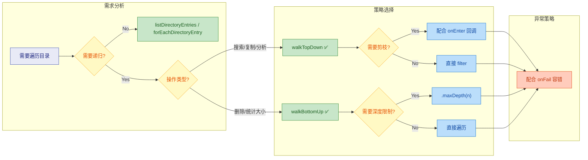
```mermaid
graph LR
    subgraph 需求分析
        direction TB
        START["需要遍历目录"] --> Q1{"需要递归?"}
        Q1 -->|No| A1["listDirectoryEntries / forEachDirectoryEntry"]
        Q1 -->|Yes| Q2{"操作类型?"}
    end

    subgraph 策略选择
        direction TB
        Q2 -->|搜索/复制/分析| Q3["walkTopDown ✅"]
        Q2 -->|删除/统计大小| Q4["walkBottomUp ✅"]
        Q3 --> Q5{"需要剪枝?"}
        Q5 -->|Yes| Q6["配合 onEnter 回调"]
        Q5 -->|No| Q7["直接 filter"]
        Q4 --> Q8{"需要深度限制?"}
        Q8 -->|Yes| Q9[".maxDepth(n)"]
        Q8 -->|No| Q10["直接遍历"]
    end

    subgraph 异常策略
        direction TB
        Q6 --> E["配合 onFail 容错"]
        Q7 --> E
        Q9 --> E
        Q10 --> E
    end

    classDef start fill:#E8EAF6,stroke:#3F51B5,color:#1A237E
    classDef question fill:#FFF9C4,stroke:#F9A825,color:#E65100
    classDef answer fill:#C8E6C9,stroke:#388E3C,color:#1B5E20
    classDef detail fill:#BBDEFB,stroke:#1976D2,color:#0D47A1
    classDef error fill:#FFCCBC,stroke:#E64A19,color:#BF360C

    class START start
    class Q1,Q2,Q5,Q8 question
    class A1,Q3,Q4 answer
    class Q6,Q7,Q9,Q10 detail
    class E error
```

### 性能考量与最佳实践

遍历大型目录树时，性能和内存是必须关注的问题。以下是几条关键建议：

```kotlin
import java.io.File

fun main() {
    val root = File("large-project")

    // ❌ 反模式：先收集所有文件到 List，再过滤
    // 如果目录包含 100 万个文件，这会占用大量内存
    val bad = root.walkTopDown()
        .toList()                    // 一次性加载所有路径到内存！
        .filter { it.extension == "kt" }

    // ✅ 正确做法：利用 Sequence 的惰性求值，边遍历边过滤
    // 内存中同一时刻只持有当前正在处理的路径
    val good = root.walkTopDown()
        .onEnter { it.name != ".git" }  // 尽早剪枝，避免进入无关子树
        .filter { it.isFile }            // 先过滤掉目录
        .filter { it.extension == "kt" } // 再过滤扩展名
        .take(100)                       // 如果只需要前 100 个，尽早终止
        .toList()                        // 最终才收集

    // ✅ 正确做法：用 find 替代 filter + first（找到即停）
    val target = root.walkTopDown()
        .onEnter { it.name != "build" }
        .find { it.name == "Application.kt" }  // 找到第一个就停止遍历
    println("Found: ${target?.path ?: "not found"}")

    // ✅ 正确做法：统计时用 fold/reduce 而不是 toList + sum
    val totalKtSize = root.walkTopDown()
        .onEnter { it.name !in setOf(".git", "build", ".idea") }
        .filter { it.isFile && it.extension == "kt" }
        .fold(0L) { acc, file ->         // 流式累加，不创建中间集合
            acc + file.length()
        }
    println("Kotlin 源码总大小: ${totalKtSize / 1024} KB")
}
```

核心原则总结：

- 尽早剪枝（`onEnter`）：避免进入不需要的子树，这是最有效的优化
- 保持惰性（Sequence）：不要过早调用 `toList()`，让 Sequence 的惰性求值帮你节省内存
- 尽早终止（`take` / `find` / `first`）：如果不需要遍历全部，就不要遍历全部
- 避免中间集合：用 `fold`、`sumOf`、`count` 等终端操作直接得出结果

---

**📝 练习题 1**

以下代码的目的是递归删除 `temp` 目录及其所有内容，哪种写法是正确的？

```kotlin
val temp = File("temp")
```

A. `temp.walkTopDown().forEach { it.delete() }`
B. `temp.walkBottomUp().forEach { it.delete() }`
C. `temp.listFiles()?.forEach { it.delete() }; temp.delete()`
D. `temp.delete()`

**【答案】** B
**【解析】** 文件系统要求目录必须为空才能被删除。`walkTopDown` (选项 A) 会先尝试删除父目录，此时子文件还在，删除必然失败。`walkBottomUp` (选项 B) 从最深层开始，先删除所有叶子文件，再逐级删除已清空的目录，顺序正确。选项 C 只处理了一层子项，不会递归进入子目录。选项 D 只能删除空目录，如果 `temp` 非空则直接返回 `false`。实际开发中也可以直接使用 `temp.deleteRecursively()`，其内部实现原理与选项 B 一致。

**📝 练习题 2**

在使用 `walkTopDown` 遍历一个包含 50 万个文件的项目目录时，以下哪种写法内存效率最高？

```kotlin
val root = File("huge-project")
```

A.
```kotlin
val files = root.walkTopDown().toList().filter { it.extension == "kt" }
```

B.
```kotlin
val files = root.walkTopDown()
    .onEnter { it.name != ".git" }
    .filter { it.isFile && it.extension == "kt" }
    .toList()
```

C.
```kotlin
val count = root.walkTopDown()
    .onEnter { it.name !in setOf(".git", "build") }
    .filter { it.isFile && it.extension == "kt" }
    .count()
```

D.
```kotlin
val files = root.walkTopDown().toMutableList()
files.removeAll { it.extension != "kt" }
```

**【答案】** C
**【解析】** 选项 A 和 D 都先调用了 `toList()` / `toMutableList()`，会将 50 万个 `File` 对象全部加载到内存中，内存开销巨大。选项 B 虽然使用了 `onEnter` 剪枝和 Sequence 链式过滤（比 A 好很多），但最终仍然 `toList()` 收集了所有匹配的 Kotlin 文件。选项 C 是最优解：`onEnter` 剪掉了 `.git` 和 `build` 两棵子树（避免无效遍历），Sequence 链保持惰性求值，最终 `count()` 是终端操作，只维护一个整数计数器，全程不创建任何中间集合，内存占用最小。

---

## 序列处理大文件（useLines、流式读取、内存优化）

在实际开发中，我们经常需要处理体积庞大的文件——日志文件动辄数 GB、CSV 数据集包含数百万行、数据库导出文件更是天文数字。如果一次性将整个文件加载到内存中（比如 `readText()` 或 `readLines()`），JVM 堆内存会迅速被撑爆，抛出 `OutOfMemoryError`。这就是"序列处理大文件"这一主题的核心动机：**用尽可能少的内存，逐步处理任意大小的文件**。

Kotlin 在标准库中提供了一套优雅的 API，将 **Sequence（惰性序列）** 的思想与文件 IO 深度结合，让我们能够以"流水线"的方式逐行消费文件内容，而不必将全部数据驻留在内存中。这种模式在英文社区中常被称为 **Lazy Streaming** 或 **Line-by-line Processing**。

### useLines —— 惰性逐行处理的核心 API

`useLines` 是 Kotlin 处理大文件的首选武器。它的签名非常简洁：

```kotlin
// File.useLines 的简化签名
// 接收一个 lambda，lambda 的参数是 Sequence<String>
// lambda 执行完毕后，底层 Reader 会自动关闭
fun File.useLines(
    charset: Charset = Charsets.UTF_8,  // 默认 UTF-8 编码
    block: (Sequence<String>) -> T       // 接收惰性序列的处理块
): T                                     // 返回 block 的计算结果
```

关键点在于：`block` 接收的是一个 `Sequence<String>`，而不是 `List<String>`。Sequence 是惰性的（lazy），只有在终端操作（terminal operation）被调用时，才会真正从文件中读取数据。这意味着在任意时刻，内存中只保留"当前正在处理的那一行"以及中间计算状态，而不是整个文件的全部内容。

```kotlin
import java.io.File

fun main() {
    val file = File("server-access.log") // 假设这是一个 2GB 的日志文件

    // useLines 打开文件，将每一行包装为 Sequence<String>
    // lambda 结束后自动关闭底层的 BufferedReader
    val errorCount = file.useLines { lines: Sequence<String> ->
        lines
            .filter { it.contains("ERROR") }  // 惰性过滤：只保留包含 ERROR 的行
            .count()                            // 终端操作：触发实际读取并计数
    }

    // 此时文件已经关闭，errorCount 保存了结果
    println("共发现 $errorCount 条错误日志") // 共发现 1523 条错误日志
}
```

上面这段代码即使面对 2GB 的日志文件，内存占用也极低——因为 `filter` 和 `count` 都是在序列管道中逐行执行的，每次只有一行字符串存在于内存中。

我们来对比一下"一次性加载"与"序列处理"在内存行为上的巨大差异：

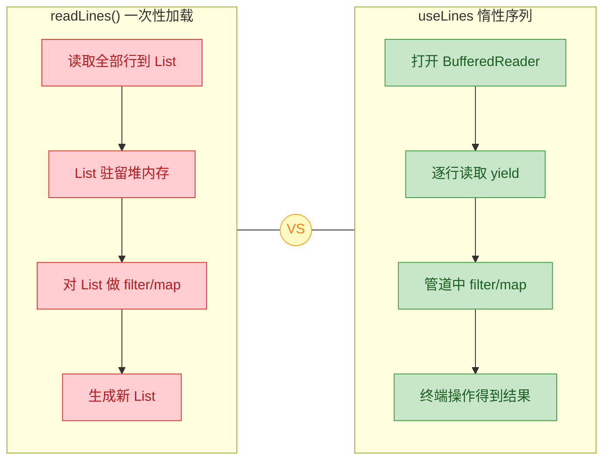
```mermaid
graph LR
    subgraph ReadLines["readLines() 一次性加载"]
        direction TB
        RL1["读取全部行到 List"]:::danger
        RL2["List 驻留堆内存"]:::danger
        RL3["对 List 做 filter/map"]:::danger
        RL4["生成新 List"]:::danger
        RL1 --> RL2 --> RL3 --> RL4
    end

    subgraph UseLines["useLines 惰性序列"]
        direction TB
        UL1["打开 BufferedReader"]:::safe
        UL2["逐行读取 yield"]:::safe
        UL3["管道中 filter/map"]:::safe
        UL4["终端操作得到结果"]:::safe
        UL1 --> UL2 --> UL3 --> UL4
    end

    ReadLines --- VS(("VS")):::vs --- UseLines

    classDef danger fill:#FFCDD2,stroke:#E53935,color:#B71C1C
    classDef safe fill:#C8E6C9,stroke:#43A047,color:#1B5E20
    classDef vs fill:#FFF9C4,stroke:#F9A825,color:#F57F17
```

一个非常重要的注意事项：**不要让 Sequence 逃逸出 `useLines` 的 lambda 作用域**。因为 lambda 结束后底层 Reader 就关闭了，如果你把 Sequence 引用保存到外部变量，后续再消费它就会抛出 `IOException`：

```kotlin
import java.io.File

fun main() {
    val file = File("data.txt")

    // ❌ 错误示范：将 Sequence 泄漏到 useLines 外部
    val leakedSequence = file.useLines { lines ->
        lines.filter { it.isNotBlank() } // 返回的仍然是惰性 Sequence
    }
    // 此时 Reader 已关闭
    // leakedSequence.toList() // 💥 IOException: Stream closed

    // ✅ 正确做法：在 lambda 内部完成所有消费
    val result = file.useLines { lines ->
        lines
            .filter { it.isNotBlank() }  // 惰性中间操作
            .toList()                     // 终端操作，在 lambda 内完成物化
    }
    println(result) // 安全使用
}
```

### 流式读取的底层机制

要真正理解 `useLines` 为什么省内存，我们需要深入看看它的实现原理。`useLines` 的底层依赖 `BufferedReader.lineSequence()`，而这个扩展函数利用了 Kotlin 的 **协程式序列构建器**（`sequence { ... }` + `yield`）来实现逐行惰性生成：

```kotlin
// Kotlin 标准库中 BufferedReader.lineSequence() 的简化实现
fun BufferedReader.lineSequence(): Sequence<String> = sequence {
    // sequence 构建器创建一个惰性序列
    // 内部代码只在消费者请求下一个元素时才执行
    while (true) {
        val line = readLine()  // 从缓冲区读取一行
            ?: break           // 如果返回 null，说明到达文件末尾，退出循环
        yield(line)            // 将这一行"产出"给序列的消费者
        // yield 之后，执行暂停，直到消费者请求下一个元素
    }
}

// useLines 的简化实现
fun <T> File.useLines(
    charset: Charset = Charsets.UTF_8,
    block: (Sequence<String>) -> T
): T {
    // bufferedReader() 创建一个 BufferedReader
    // use {} 确保 block 执行完毕后自动调用 close()
    return bufferedReader(charset).use { reader ->
        block(reader.lineSequence()) // 将惰性序列传给用户的 block
    }
}
```

这里的 `yield` 是序列构建器中的挂起点（suspension point）。每次消费者调用 `iterator.next()` 请求下一个元素时，`sequence` 块才会从上次 `yield` 的位置恢复执行，读取下一行，然后再次 `yield` 暂停。这就是"惰性"的本质——**生产者和消费者交替执行，按需读取**。

整个数据流可以用下面的时序图来描述：

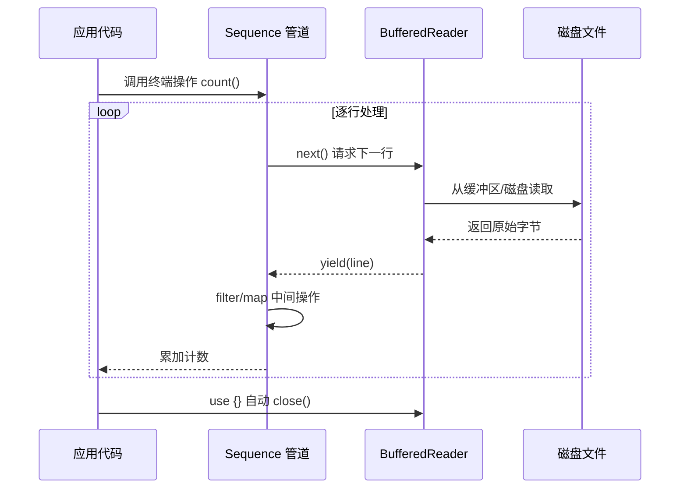
```mermaid
sequenceDiagram
    participant App as 应用代码
    participant Seq as Sequence 管道
    participant BR as BufferedReader
    participant Disk as 磁盘文件

    App->>Seq: 调用终端操作 count()
    loop 逐行处理
        Seq->>BR: next() 请求下一行
        BR->>Disk: 从缓冲区/磁盘读取
        Disk-->>BR: 返回原始字节
        BR-->>Seq: yield(line)
        Seq->>Seq: filter/map 中间操作
        Seq-->>App: 累加计数
    end
    App->>BR: use {} 自动 close()
```

`BufferedReader` 内部维护了一个默认 8KB 的字符缓冲区（`defaultCharBufferSize = 8192`）。它并不是每次 `readLine()` 都发起一次系统调用（system call）去读磁盘，而是一次性从底层 `InputStream` 读取 8KB 数据填充缓冲区，然后从缓冲区中逐行切割。当缓冲区耗尽时，再读取下一个 8KB 块。这种分层缓冲机制大幅减少了昂贵的磁盘 IO 次数。

```text
┌─────────────────────────────────────────────────────┐
│                    磁盘文件 (2GB)                      │
│  [Block 0: 8KB] [Block 1: 8KB] [Block 2: 8KB] ...  │
└──────────┬──────────────────────────────────────────┘
           │ 每次读 8KB
           ▼
┌──────────────────────┐
│  BufferedReader 缓冲区  │  ← 内存中只有 8KB 缓冲
│  "line1\nline2\nli..." │
└──────────┬───────────┘
           │ readLine() 逐行切割
           ▼
┌──────────────────────┐
│  Sequence<String>     │  ← 当前只持有 1 行
│  yield("line1")       │
└──────────┬───────────┘
           │ filter / map / count
           ▼
┌──────────────────────┐
│  终端操作结果           │  ← 一个 Int / List / ...
│  count = 1523         │
└───────────────────────┘
```

所以整个过程中，内存占用 ≈ 8KB 缓冲区 + 当前行字符串 + 中间计算状态，与文件总大小完全无关。

### 内存优化：对比与实战策略

让我们通过一个具体的场景来量化不同方案的内存差异。假设我们有一个 1GB 的 CSV 文件，每行约 200 字节，共约 500 万行，我们需要统计其中某个字段大于阈值的行数。

```kotlin
import java.io.File

data class SalesRecord(
    val id: String,       // 订单 ID
    val amount: Double,   // 金额
    val region: String    // 地区
)

// 解析 CSV 行为 SalesRecord 对象
fun parseLine(line: String): SalesRecord? {
    val parts = line.split(",")          // 按逗号分割
    if (parts.size < 3) return null      // 格式不合法则跳过
    return SalesRecord(
        id = parts[0].trim(),            // 第一列：订单 ID
        amount = parts[1].trim().toDoubleOrNull() ?: return null, // 第二列：金额
        region = parts[2].trim()         // 第三列：地区
    )
}

fun main() {
    val file = File("sales_data.csv") // 1GB CSV 文件

    // ========== 方案 A：readLines() 一次性加载 ==========
    // 峰值内存 ≈ 1GB (原始字符串) + 500万个对象 ≈ 1.5~2GB
    // 极易触发 OutOfMemoryError
    // val bigOrders = file.readLines()       // 💥 一次性加载全部行到 List<String>
    //     .drop(1)                           // 跳过表头
    //     .mapNotNull { parseLine(it) }      // 解析每一行，生成新 List
    //     .filter { it.amount > 10000.0 }    // 再生成一个新 List
    //     .count()

    // ========== 方案 B：useLines 惰性序列 ==========
    // 峰值内存 ≈ 8KB 缓冲 + 1 行字符串 + 1 个 SalesRecord ≈ 几十 KB
    val bigOrders = file.useLines { lines ->
        lines
            .drop(1)                          // 惰性跳过第一行（表头）
            .mapNotNull { parseLine(it) }     // 惰性解析：每次只解析当前行
            .filter { it.amount > 10000.0 }   // 惰性过滤：不满足条件的立即丢弃
            .count()                          // 终端操作：逐行累加计数
    }

    println("大额订单数量: $bigOrders")
}
```

方案 A 中，`readLines()` 返回 `List<String>`，所有 500 万行字符串同时存在于内存中；随后 `mapNotNull` 又生成一个新的 `List<SalesRecord>`；`filter` 再生成一个新 List。整个过程中，内存中同时存在多个大型集合的拷贝。

方案 B 中，`useLines` 返回 `Sequence<String>`，`drop`、`mapNotNull`、`filter` 都是惰性中间操作，它们不会创建任何中间集合。只有当 `count()` 这个终端操作驱动迭代时，数据才会一行一行地流过整个管道。

下面是一些实战中常用的序列处理模式：

```kotlin
import java.io.File

fun main() {
    val logFile = File("application.log")

    // 模式 1：提取前 N 条匹配结果（不需要扫描整个文件）
    // take(10) 一旦收集到 10 条就会停止读取，后续行根本不会被读取
    val firstTenErrors = logFile.useLines { lines ->
        lines
            .filter { "FATAL" in it }    // 只关注 FATAL 级别
            .take(10)                     // 取前 10 条就停止
            .toList()                     // 物化为 List 返回
    }

    // 模式 2：分组统计（使用 groupingBy 避免中间 Map 膨胀）
    val errorsByHour = logFile.useLines { lines ->
        lines
            .filter { "ERROR" in it }                    // 过滤错误行
            .map { it.substring(0, 13) }                 // 提取 "2024-01-15 08" 时间前缀
            .groupingBy { it }                           // 按小时分组
            .eachCount()                                 // 统计每组数量
    }
    // 结果: {2024-01-15 08=23, 2024-01-15 09=45, ...}

    // 模式 3：多文件合并处理
    val logDir = File("logs/")
    val allErrors = logDir.listFiles { f -> f.extension == "log" }  // 获取所有 .log 文件
        ?.asSequence()                                               // 文件列表转为序列
        ?.flatMap { file ->                                          // 对每个文件展开行序列
            file.bufferedReader()                                    // 注意：这里需要手动管理关闭
                .lineSequence()
                .filter { "ERROR" in it }
        }
        ?.take(100)                                                  // 取前 100 条
        ?.toList()
        ?: emptyList()

    println("前 10 条 FATAL: $firstTenErrors")
    println("按小时统计: $errorsByHour")
    println("跨文件错误: ${allErrors.size} 条")
}
```

注意模式 3 中的一个陷阱：当我们跨多个文件使用 `flatMap` + `lineSequence()` 时，`useLines` 无法直接使用（因为它的 lambda 只管理单个文件的生命周期）。此时需要手动管理 Reader 的关闭，或者封装一个更高级的工具函数：

```kotlin
import java.io.File

// 封装一个安全的多文件序列处理器
// 使用 sequence 构建器确保每个文件读完后立即关闭
fun Iterable<File>.mergedLines(): Sequence<String> = sequence {
    for (file in this@mergedLines) {          // 遍历每个文件
        file.useLines { lines ->              // 对每个文件使用 useLines 确保关闭
            for (line in lines) {             // 逐行迭代
                yield(line)                   // 产出到外层序列
            }
        }
        // useLines lambda 结束，当前文件的 Reader 已关闭
        // 然后继续处理下一个文件
    }
}

fun main() {
    val logFiles = File("logs/").listFiles { f -> f.extension == "log" }?.toList()
        ?: emptyList()

    // 安全地跨文件流式处理
    val criticalErrors = logFiles
        .mergedLines()                        // 所有文件的行合并为一个惰性序列
        .filter { "CRITICAL" in it }          // 惰性过滤
        .take(50)                             // 只取前 50 条
        .toList()                             // 物化

    println("找到 ${criticalErrors.size} 条严重错误")
}
```

### bufferedReader 与 forEachLine 的流式替代方案

除了 `useLines`，Kotlin 还提供了其他流式处理文件的方式。它们各有适用场景：

```kotlin
import java.io.File

fun main() {
    val file = File("data.txt")

    // 方式 1：forEachLine —— 简单的逐行回调
    // 内部也使用 BufferedReader，自动关闭
    // 缺点：无法使用 Sequence 的链式操作（filter/map/take 等）
    // 适合：简单的逐行处理，不需要复杂变换
    var count = 0
    file.forEachLine { line ->               // 每读一行就调用一次 lambda
        if ("ERROR" in line) {
            count++                           // 手动累加
        }
    }
    println("forEachLine 统计: $count")

    // 方式 2：bufferedReader + use —— 最底层的控制
    // 适合：需要精细控制读取逻辑（如跳过特定字节、读取非文本格式）
    file.bufferedReader().use { reader ->     // use 确保自动关闭
        var line = reader.readLine()          // 手动读取第一行
        while (line != null) {                // 循环直到 null（文件末尾）
            // 在这里可以做任何自定义处理
            println(line)
            line = reader.readLine()          // 读取下一行
        }
    }

    // 方式 3：useLines —— 推荐方式（已详细介绍）
    // 兼具安全性和 Sequence 的强大链式操作能力
    val result = file.useLines { lines ->
        lines.filter { it.isNotBlank() }.count()
    }
    println("useLines 统计: $result")
}
```

三种方式的对比：

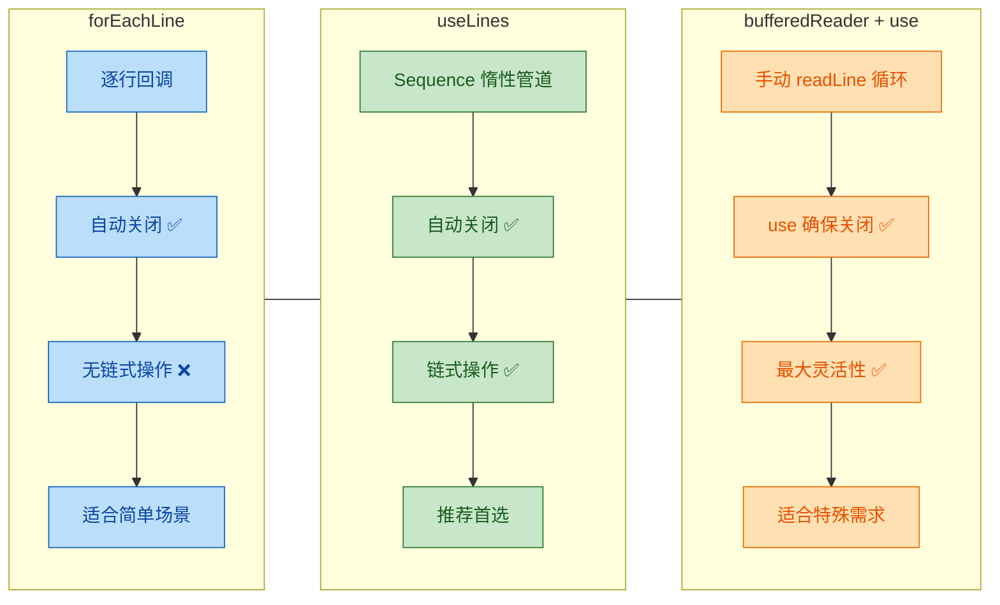
```mermaid
graph LR
    subgraph ForEachLine["forEachLine"]
        direction TB
        F1["逐行回调"]:::mid
        F2["自动关闭 ✅"]:::mid
        F3["无链式操作 ❌"]:::mid
        F4["适合简单场景"]:::mid
        F1 --> F2 --> F3 --> F4
    end

    subgraph UseLines["useLines"]
        direction TB
        U1["Sequence 惰性管道"]:::good
        U2["自动关闭 ✅"]:::good
        U3["链式操作 ✅"]:::good
        U4["推荐首选"]:::good
        U1 --> U2 --> U3 --> U4
    end

    subgraph BufferedReader["bufferedReader + use"]
        direction TB
        B1["手动 readLine 循环"]:::low
        B2["use 确保关闭 ✅"]:::low
        B3["最大灵活性 ✅"]:::low
        B4["适合特殊需求"]:::low
        B1 --> B2 --> B3 --> B4
    end

    ForEachLine --- UseLines --- BufferedReader

    classDef good fill:#C8E6C9,stroke:#2E7D32,color:#1B5E20
    classDef mid fill:#BBDEFB,stroke:#1565C0,color:#0D47A1
    classDef low fill:#FFE0B2,stroke:#EF6C00,color:#E65100
```

### 性能调优：缓冲区大小与编码

在极端性能敏感的场景下，可以调整 `BufferedReader` 的缓冲区大小：

```kotlin
import java.io.File

fun main() {
    val hugeFile = File("massive_dataset.csv")

    // 默认缓冲区 8KB，对于顺序读取大文件，可以增大到 64KB 或更大
    // 更大的缓冲区 = 更少的系统调用次数 = 更高的吞吐量
    val customBufferSize = 64 * 1024 // 64KB

    hugeFile.bufferedReader(
        charset = Charsets.UTF_8,            // 显式指定编码
        bufferSize = customBufferSize        // 自定义缓冲区大小
    ).use { reader ->
        // lineSequence() 返回惰性序列，与 useLines 内部机制相同
        val count = reader.lineSequence()
            .filter { it.startsWith("2024") } // 只处理 2024 年的数据
            .count()
        println("2024 年数据行数: $count")
    }

    // 如果文件编码不是 UTF-8（比如中文 GBK 文件）
    val gbkFile = File("legacy_data.csv")
    gbkFile.useLines(charset = Charsets.forName("GBK")) { lines ->
        lines.forEach { println(it) }        // 正确解码 GBK 中文
    }
}
```

缓冲区大小的选择是一个权衡：更大的缓冲区减少系统调用但增加内存占用，更小的缓冲区节省内存但增加 IO 次数。对于大多数场景，默认的 8KB 已经足够好。只有在 profiling 确认 IO 是瓶颈时，才需要调大缓冲区。

### Sequence 中间操作的惰性本质验证

为了让你直观感受 Sequence 的惰性特性，我们可以在管道中插入 `onEach` 打印日志，观察执行顺序：

```kotlin
import java.io.File

fun main() {
    // 准备一个小测试文件
    val testFile = File("test_lazy.txt")
    testFile.writeText(
        """
        alpha
        beta
        gamma
        delta
        epsilon
        """.trimIndent()
    )

    println("=== Sequence（惰性）执行顺序 ===")
    testFile.useLines { lines ->
        lines
            .onEach { println("  [读取] $it") }       // 观察：何时读取
            .filter { it.length > 4 }                   // 长度大于 4
            .onEach { println("  [通过过滤] $it") }    // 观察：何时通过过滤
            .take(2)                                     // 只取前 2 个
            .onEach { println("  [被消费] $it") }      // 观察：何时被消费
            .toList()                                    // 终端操作
    }
    // 输出：
    //   [读取] alpha        ← 第 1 行：长度 5 > 4
    //   [通过过滤] alpha
    //   [被消费] alpha
    //   [读取] beta         ← 第 2 行：长度 4，不通过
    //   [读取] gamma        ← 第 3 行：长度 5 > 4
    //   [通过过滤] gamma
    //   [被消费] gamma      ← 已收集 2 个，take(2) 满足，停止！
    //   ❗ delta 和 epsilon 根本没有被读取

    println("\n=== List（急切）执行顺序 ===")
    testFile.readLines()                                // 一次性全部加载
        .onEach { println("  [读取] $it") }            // 全部 5 行都会打印
        .filter { it.length > 4 }
        .onEach { println("  [通过过滤] $it") }
        .take(2)
        .onEach { println("  [被消费] $it") }
    // 输出：先打印全部 5 个 [读取]，再打印过滤结果，再 take
    // 即使只需要 2 个结果，也读取并处理了全部 5 行

    testFile.delete() // 清理测试文件
}
```

这个实验清晰地展示了 Sequence 的"纵向执行"模式（每个元素走完整个管道再处理下一个）与 List 的"横向执行"模式（每个操作处理完所有元素再进入下一个操作）之间的根本区别。对于大文件处理，纵向执行意味着可以提前终止（short-circuit），`take(2)` 满足后剩余的行根本不会被读取。

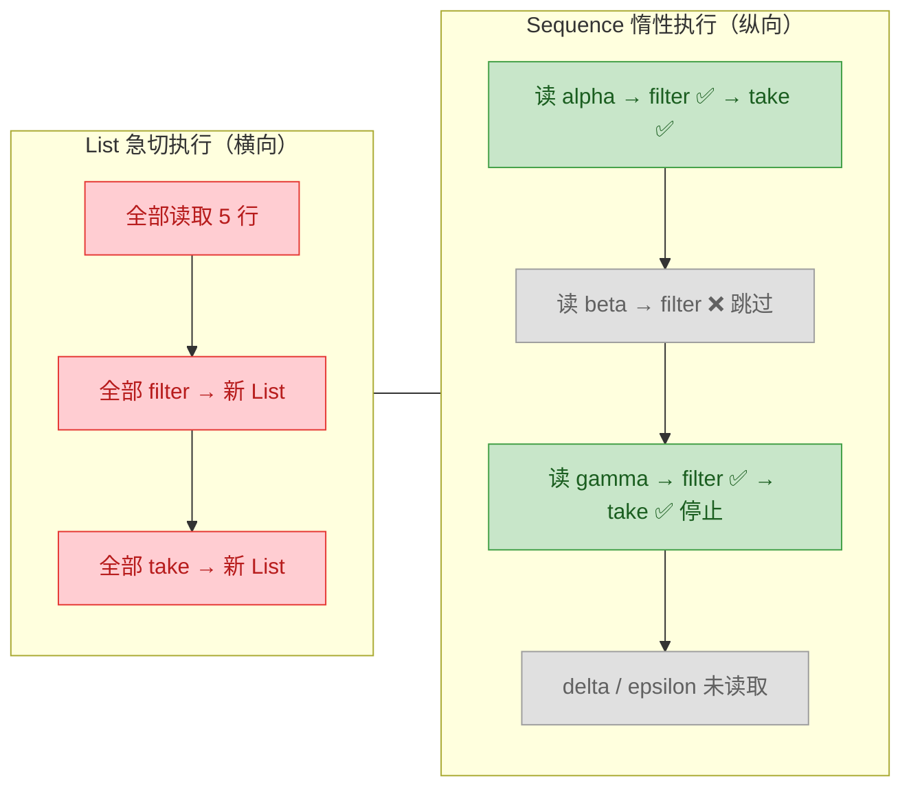
```mermaid
graph LR
    subgraph Eager["List 急切执行（横向）"]
        direction TB
        E1["全部读取 5 行"]:::danger
        E2["全部 filter → 新 List"]:::danger
        E3["全部 take → 新 List"]:::danger
        E1 --> E2 --> E3
    end

    subgraph Lazy["Sequence 惰性执行（纵向）"]
        direction TB
        L1["读 alpha → filter ✅ → take ✅"]:::safe
        L2["读 beta → filter ❌ 跳过"]:::skip
        L3["读 gamma → filter ✅ → take ✅ 停止"]:::safe
        L4["delta / epsilon 未读取"]:::skip
        L1 --> L2 --> L3 --> L4
    end

    Eager --- Lazy

    classDef danger fill:#FFCDD2,stroke:#E53935,color:#B71C1C
    classDef safe fill:#C8E6C9,stroke:#43A047,color:#1B5E20
    classDef skip fill:#E0E0E0,stroke:#9E9E9E,color:#616161
```

---

**📝 练习题**

以下代码处理一个 5GB 的日志文件，哪个选项能在最低内存占用下正确统计包含 "TIMEOUT" 的行数？

```kotlin
val file = File("huge.log")
```

A.
```kotlin
val count = file.readText().lines().filter { "TIMEOUT" in it }.size
```

B.
```kotlin
val count = file.readLines().count { "TIMEOUT" in it }
```

C.
```kotlin
val count = file.useLines { it.filter { line -> "TIMEOUT" in line }.count() }
```

D.
```kotlin
val seq = file.useLines { it.filter { line -> "TIMEOUT" in line } }
val count = seq.count()
```

**【答案】** C

**【解析】** A 使用 `readText()` 将 5GB 文件整体读入一个 `String`，再调用 `lines()` 分割为 `List<String>`，内存峰值远超 5GB，几乎必然 OOM。B 使用 `readLines()` 一次性将所有行加载到 `List<String>`，虽然比 A 略好（没有额外的完整字符串副本），但仍然需要将全部行驻留内存，对 5GB 文件同样不可行。C 使用 `useLines` 获取惰性 `Sequence<String>`，`filter` 和 `count` 都在序列管道中逐行执行，内存中只保留当前行和计数器，峰值内存仅几十 KB，是正确且最优的方案。D 虽然也使用了 `useLines`，但 lambda 返回的是一个未消费的

---

## 资源管理（use 函数、自动关闭、异常安全）

在文件与 IO 编程中，资源泄漏（Resource Leak）是最常见也最隐蔽的 Bug 之一。每当你打开一个文件流、数据库连接或网络 Socket，操作系统都会为其分配有限的底层句柄（file descriptor）。如果程序在使用完毕后忘记关闭，或者在关闭之前抛出了异常导致 `close()` 永远不会被执行，这些句柄就会一直被占用，最终可能耗尽系统资源，导致程序甚至整个操作系统出现不可预期的行为。

Java 世界用 `try-with-resources` 解决了这个问题，而 Kotlin 则提供了更优雅、更函数式的方案——`use` 扩展函数。理解 `use` 的工作原理、异常处理机制以及适用边界，是写出健壮 IO 代码的关键。

### Closeable 与 AutoCloseable：资源管理的契约

在深入 `use` 之前，必须先理解它所依赖的两个 Java 接口。

```kotlin
// java.io.Closeable —— 传统 IO 资源的契约
// 继承自 AutoCloseable，约定 close() 是幂等的（多次调用效果相同）
public interface Closeable extends AutoCloseable {
    // 释放资源，可能抛出 IOException
    void close() throws IOException;
}

// java.lang.AutoCloseable —— 更宽泛的资源契约
// close() 不要求幂等，可以抛出任意 Exception
public interface AutoCloseable {
    void close() throws Exception;
}
```

两者的关系和区别可以用一张图来理解：

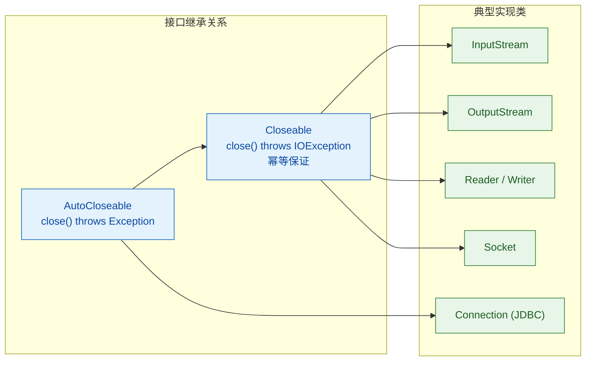
```mermaid
graph LR
    subgraph 接口继承关系
        direction TB
        A["AutoCloseable<br/>close() throws Exception"]
        B["Closeable<br/>close() throws IOException<br/>幂等保证"]
        A --> B
    end

    subgraph 典型实现类
        direction TB
        C["InputStream"]
        D["OutputStream"]
        E["Reader / Writer"]
        F["Connection (JDBC)"]
        G["Socket"]
    end

    B --> C
    B --> D
    B --> E
    A --> F
    B --> G

    classDef iface fill:#E3F2FD,stroke:#1565C0,color:#0D47A1
    classDef impl fill:#E8F5E9,stroke:#2E7D32,color:#1B5E20

    class A,B iface
    class C,D,E,F,G impl
```

Kotlin 的 `use` 函数为这两个接口都提供了扩展，因此几乎所有需要手动关闭的资源都可以使用 `use` 来管理。

### 没有 use 的世界：手动资源管理的痛苦

先来看看不使用 `use` 时，正确关闭资源有多麻烦：

```kotlin
import java.io.BufferedReader
import java.io.FileReader
import java.io.IOException

fun readFirstLineManual(path: String): String? {
    // 声明在外部，以便 finally 块能访问
    var reader: BufferedReader? = null
    return try {
        // 打开资源
        reader = BufferedReader(FileReader(path))
        // 读取第一行（业务逻辑）
        reader.readLine()
    } catch (e: IOException) {
        // 处理读取过程中的异常
        println("读取失败: ${e.message}")
        null
    } finally {
        // 无论成功还是失败，都必须尝试关闭
        try {
            reader?.close() // close() 本身也可能抛异常！
        } catch (e: IOException) {
            // 关闭失败的异常通常只能记录日志
            println("关闭资源失败: ${e.message}")
        }
    }
}
```

这段代码有几个明显的问题：

- 样板代码极多（boilerplate），真正的业务逻辑只有一行 `reader.readLine()`
- `finally` 块中的 `close()` 本身也可能抛异常，需要再套一层 `try-catch`
- 如果业务逻辑和 `close()` 同时抛异常，`finally` 中的异常会"吞掉"业务异常（exception suppression 问题）
- 多个资源嵌套时，代码会变成"金字塔噩梦"

### use 函数：Kotlin 的优雅解法

`use` 是 Kotlin 标准库为 `Closeable` 和 `AutoCloseable` 提供的扩展函数。它的使用方式极其简洁：

```kotlin
import java.io.File

fun readFirstLine(path: String): String? {
    // use 会在 lambda 执行完毕后自动调用 close()
    // 无论 lambda 正常返回还是抛出异常，资源都会被关闭
    return File(path).bufferedReader().use { reader ->
        reader.readLine() // lambda 的返回值就是 use 的返回值
    }
}
```

一行 `use` 替代了前面十几行的 `try-finally` 嵌套。代码意图清晰：打开资源、使用资源、自动关闭。

#### use 的源码剖析

理解 `use` 的实现，能帮助你在复杂场景下做出正确判断：

```kotlin
// Kotlin 标准库中 use 的简化版实现（基于实际源码）
// 定义在 Closeable 上的扩展函数
public inline fun <T : Closeable?, R> T.use(block: (T) -> R): R {
    // 用于记录业务逻辑中抛出的异常
    var exception: Throwable? = null
    try {
        // 执行用户传入的 lambda（业务逻辑）
        return block(this)
    } catch (e: Throwable) {
        // 捕获业务异常并记录
        exception = e
        // 重新抛出，不吞掉
        throw e
    } finally {
        // 根据 this 是否为 null 决定是否需要关闭
        when {
            // API 版本 >= 16 时的处理（Android / JVM）
            this == null -> { /* 资源为 null，无需关闭 */ }
            exception == null -> close() // 业务正常，直接关闭
            else -> {
                // 业务异常了，关闭时也可能抛异常
                try {
                    close()
                } catch (closeException: Throwable) {
                    // 关键！将 close 异常作为 suppressed 附加到业务异常上
                    // 而不是覆盖业务异常
                    exception.addSuppressed(closeException)
                }
            }
        }
    }
}
```

这段源码揭示了 `use` 的三个核心设计：

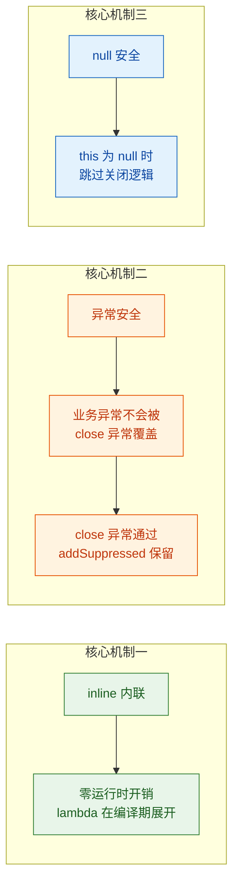
```mermaid
graph LR
    subgraph 核心机制一
        direction TB
        A1["inline 内联"]
        A2["零运行时开销<br/>lambda 在编译期展开"]
    end

    subgraph 核心机制二
        direction TB
        B1["异常安全"]
        B2["业务异常不会被<br/>close 异常覆盖"]
        B3["close 异常通过<br/>addSuppressed 保留"]
        B2 --> B3
    end

    subgraph 核心机制三
        direction TB
        C1["null 安全"]
        C2["this 为 null 时<br/>跳过关闭逻辑"]
    end

    A1 --> A2
    B1 --> B2
    C1 --> C2

    classDef box1 fill:#E8F5E9,stroke:#2E7D32,color:#1B5E20
    classDef box2 fill:#FFF3E0,stroke:#E65100,color:#BF360C
    classDef box3 fill:#E3F2FD,stroke:#1565C0,color:#0D47A1

    class A1,A2 box1
    class B1,B2,B3 box2
    class C1,C2 box3
```

### 异常安全：Suppressed Exception 机制详解

这是 `use` 最精妙的部分，也是面试高频考点。当业务逻辑和 `close()` 同时抛出异常时，会发生什么？

```kotlin
import java.io.Closeable

// 自定义一个"问题资源"来演示异常行为
class ProblematicResource : Closeable {
    fun doWork() {
        // 业务逻辑抛出异常
        throw IllegalStateException("业务逻辑出错了！")
    }

    override fun close() {
        // 关闭时也抛出异常
        throw IOException("关闭资源也失败了！")
    }
}

fun main() {
    try {
        ProblematicResource().use { resource ->
            resource.doWork() // 这里抛出 IllegalStateException
            // use 的 finally 块会调用 close()，又抛出 IOException
        }
    } catch (e: Exception) {
        // 捕获到的是业务异常（主异常）
        println("主异常: ${e.message}")
        // 输出: 主异常: 业务逻辑出错了！

        // close 的异常被附加为 suppressed exception
        for (suppressed in e.suppressed) {
            println("被抑制的异常: ${suppressed.message}")
            // 输出: 被抑制的异常: 关闭资源也失败了！
        }
    }
}
```

整个异常传播流程如下：

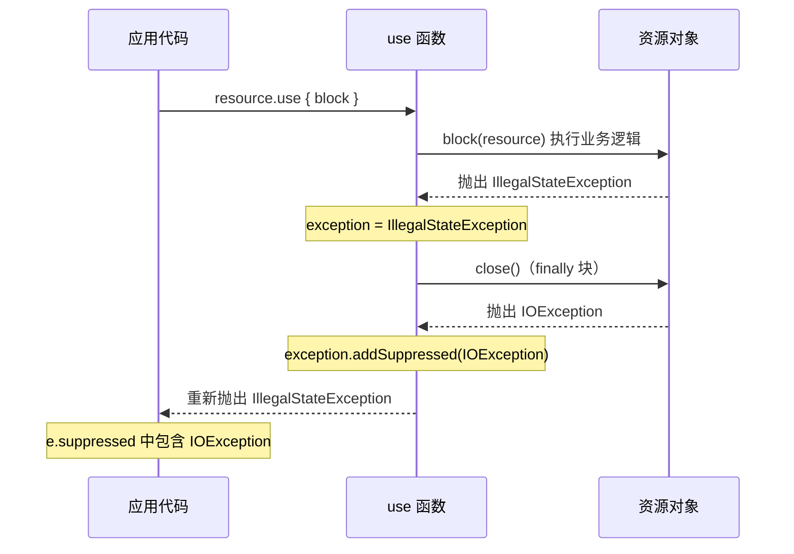
```mermaid
sequenceDiagram
    participant App as 应用代码
    participant Use as use 函数
    participant Res as 资源对象

    App->>Use: resource.use { block }
    Use->>Res: block(resource) 执行业务逻辑
    Res-->>Use: 抛出 IllegalStateException
    Note over Use: exception = IllegalStateException
    Use->>Res: close()（finally 块）
    Res-->>Use: 抛出 IOException
    Note over Use: exception.addSuppressed(IOException)
    Use-->>App: 重新抛出 IllegalStateException
    Note over App: e.suppressed 中包含 IOException
```

这个设计保证了：主异常（业务逻辑的错误）永远不会被 `close()` 的异常覆盖，同时 `close()` 的异常信息也不会丢失。对比手动 `try-finally`，如果不特别处理，`finally` 中的异常会直接替换 `try` 中的异常，导致真正的错误原因被隐藏。

### use 的多种使用姿势

#### 基本文件读写

```kotlin
import java.io.File

fun main() {
    val file = File("example.txt")

    // 写入：PrintWriter 实现了 Closeable
    file.printWriter().use { writer ->
        writer.println("第一行内容") // 写入一行
        writer.println("第二行内容") // 写入另一行
    } // 自动 flush + close

    // 读取：BufferedReader 实现了 Closeable
    val content = file.bufferedReader().use { reader ->
        reader.readText() // 读取全部内容，作为 use 的返回值
    }
    println(content)
}
```

#### 嵌套资源的正确处理

当需要同时管理多个资源时，嵌套 `use` 是最安全的方式：

```kotlin
import java.io.File

fun copyFile(source: String, target: String) {
    // 外层 use 管理输入流
    File(source).inputStream().use { input ->
        // 内层 use 管理输出流
        File(target).outputStream().use { output ->
            // 两个流都处于打开状态，执行拷贝
            input.copyTo(output) // Kotlin 标准库的便捷方法
        } // output 先关闭
    } // input 后关闭（LIFO 顺序，与资源打开顺序相反）
}
```

关闭顺序遵循 LIFO（Last In, First Out）原则，这与栈的行为一致：

```kotlin
// 资源关闭顺序的内存模型
//
// 打开顺序:  input(第1个) → output(第2个)
// 关闭顺序:  output(第1个关闭) → input(第2个关闭)
//
// ┌─────────────────────────┐
// │  use(input)             │  ← 最外层，最后关闭
// │  ┌───────────────────┐  │
// │  │  use(output)      │  │  ← 最内层，最先关闭
// │  │  ┌─────────────┐  │  │
// │  │  │  copyTo()   │  │  │  ← 业务逻辑
// │  │  └─────────────┘  │  │
// │  └───────────────────┘  │
// └─────────────────────────┘
```

#### 与 Kotlin 标准库的配合

很多 Kotlin 标准库函数内部已经使用了 `use`，你不需要再手动调用：

```kotlin
import java.io.File

fun main() {
    val file = File("data.txt")

    // readText() 内部已经使用了 use，无需手动管理
    val text = file.readText()

    // readLines() 同理
    val lines = file.readLines()

    // useLines() 是专门为逐行处理设计的，内部用 use 管理 BufferedReader
    val longLines = file.useLines { sequence ->
        // sequence 是 Sequence<String>，惰性求值
        sequence.filter { it.length > 80 } // 过滤长行
            .toList() // 终端操作，触发实际读取
    } // BufferedReader 在这里自动关闭

    // ⚠️ 注意：不要让 Sequence 逃逸出 useLines 的 lambda
    // 以下写法是错误的：
    // val escaped = file.useLines { it } // Sequence 逃逸！
    // escaped.toList() // 此时 Reader 已关闭，会抛异常
}
```

### 自定义资源类实现 Closeable

当你编写自己的资源类时，实现 `Closeable` 接口就能享受 `use` 的便利：

```kotlin
import java.io.Closeable

// 模拟一个数据库连接池中的连接
class DatabaseConnection(private val url: String) : Closeable {
    // 标记连接是否已关闭
    private var closed = false

    init {
        // 构造时建立连接
        println("连接到数据库: $url")
    }

    fun query(sql: String): List<String> {
        // 检查连接状态，防止在关闭后使用
        check(!closed) { "连接已关闭，无法执行查询" }
        println("执行查询: $sql")
        // 模拟返回结果
        return listOf("row1", "row2", "row3")
    }

    override fun close() {
        if (!closed) {
            // 幂等设计：多次调用 close 不会出错
            closed = true
            println("关闭数据库连接: $url")
        }
    }
}

fun main() {
    // 像使用文件流一样使用自定义资源
    val results = DatabaseConnection("jdbc:mysql://localhost/mydb").use { conn ->
        conn.query("SELECT * FROM users") // 返回查询结果
    } // 自动关闭连接

    println("查询结果: $results")
    // 输出:
    // 连接到数据库: jdbc:mysql://localhost/mydb
    // 执行查询: SELECT * FROM users
    // 关闭数据库连接: jdbc:mysql://localhost/mydb
    // 查询结果: [row1, row2, row3]
}
```

实现 `Closeable` 时的最佳实践：

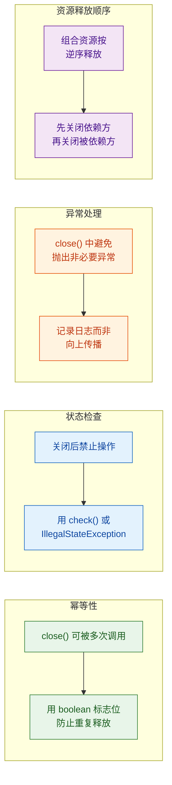
```mermaid
graph LR
    subgraph 幂等性
        direction TB
        I1["close() 可被多次调用"]
        I2["用 boolean 标志位<br/>防止重复释放"]
        I1 --> I2
    end

    subgraph 状态检查
        direction TB
        S1["关闭后禁止操作"]
        S2["用 check() 或<br/>IllegalStateException"]
        S1 --> S2
    end

    subgraph 异常处理
        direction TB
        E1["close() 中避免<br/>抛出非必要异常"]
        E2["记录日志而非<br/>向上传播"]
        E1 --> E2
    end

    subgraph 资源释放顺序
        direction TB
        R1["组合资源按<br/>逆序释放"]
        R2["先关闭依赖方<br/>再关闭被依赖方"]
        R1 --> R2
    end

    classDef green fill:#E8F5E9,stroke:#2E7D32,color:#1B5E20
    classDef blue fill:#E3F2FD,stroke:#1565C0,color:#0D47A1
    classDef orange fill:#FFF3E0,stroke:#E65100,color:#BF360C
    classDef purple fill:#F3E5F5,stroke:#6A1B9A,color:#4A148C

    class I1,I2 green
    class S1,S2 blue
    class E1,E2 orange
    class R1,R2 purple
```

### use 与 Java try-with-resources 的对比

Kotlin 没有 `try-with-resources` 语法，因为 `use` 函数完全覆盖了它的功能，而且更灵活：

```kotlin
// ===== Java 的 try-with-resources =====
// try (BufferedReader reader = new BufferedReader(new FileReader("file.txt"))) {
//     String line = reader.readLine();
// }
// 编译器生成的代码与 Kotlin use 的逻辑几乎一致

// ===== Kotlin 的 use =====
// 功能完全等价，但 use 是库函数而非语言特性
File("file.txt").bufferedReader().use { reader ->
    val line = reader.readLine()
}
```

| 特性 | Java try-with-resources | Kotlin use |
|------|------------------------|------------|
| 实现方式 | 语言级语法糖 | 标准库扩展函数 |
| Suppressed Exception | 支持 | 支持 |
| 多资源管理 | 一个 try 声明多个资源 | 嵌套 use 调用 |
| 返回值 | 不直接支持（需外部变量） | lambda 返回值即 use 返回值 |
| null 安全 | 不支持 null 资源 | 支持（`T : Closeable?`） |
| 可扩展性 | 固定语法 | 可自定义类似扩展 |

### 高级模式：自定义 use-like 扩展

有时你需要管理的"资源"并不实现 `Closeable`，但仍然需要确保某种清理操作。你可以编写自己的 `use` 风格扩展：

```kotlin
// 为 Android 的 Cursor 编写 use 扩展（假设它没有实现 Closeable）
// 实际上 Android Cursor 已经实现了 Closeable，这里仅作演示
inline fun <R> AutoCleanup.use(block: (AutoCleanup) -> R): R {
    try {
        return block(this)
    } finally {
        cleanup() // 自定义的清理方法
    }
}

// 更通用的模式：为任意对象提供 "借用" 语义
// 类似 Rust 的 RAII 或 Python 的 context manager
inline fun <T, R> T.borrowing(
    cleanup: (T) -> Unit, // 清理函数
    block: (T) -> R       // 业务逻辑
): R {
    // 用于追踪业务异常
    var exception: Throwable? = null
    try {
        return block(this) // 执行业务逻辑
    } catch (e: Throwable) {
        exception = e
        throw e
    } finally {
        try {
            cleanup(this) // 执行清理
        } catch (cleanupException: Throwable) {
            // 与 use 相同的 suppressed 策略
            exception?.addSuppressed(cleanupException)
                ?: throw cleanupException
        }
    }
}

// 使用示例
fun main() {
    val tempDir = createTempDir("demo")

    // 使用完毕后自动删除临时目录
    tempDir.borrowing(
        cleanup = { it.deleteRecursively() } // 清理逻辑
    ) { dir ->
        // 在临时目录中工作
        File(dir, "temp.txt").writeText("临时数据")
        println("临时文件已创建: ${dir.listFiles()?.map { it.name }}")
    } // tempDir 在这里被递归删除
}
```

### 常见陷阱与最佳实践

#### 陷阱一：资源逃逸

```kotlin
import java.io.BufferedReader
import java.io.File

// ❌ 错误：让资源引用逃逸出 use 的作用域
fun getReaderWrong(): BufferedReader {
    val file = File("data.txt")
    var escapedReader: BufferedReader? = null
    file.bufferedReader().use { reader ->
        escapedReader = reader // 引用逃逸！
    }
    // 此时 reader 已经关闭
    // escapedReader!!.readLine() // 抛出 IOException: Stream closed
    return escapedReader!! // 返回一个已关闭的资源
}

// ✅ 正确：在 use 内部完成所有操作，只返回数据
fun getContentCorrect(): String {
    return File("data.txt").bufferedReader().use { reader ->
        reader.readText() // 返回读取到的数据，而非 reader 本身
    }
}
```

#### 陷阱二：装饰器流的关闭

```kotlin
import java.io.*

fun writeCompressed(path: String, data: String) {
    // ❌ 潜在问题：只对最外层调用 use
    // 如果 BufferedWriter 构造失败，FileOutputStream 会泄漏
    // FileOutputStream(path) 已经打开了文件句柄
    // BufferedOutputStream(...) 如果此时抛异常，句柄就丢了

    // ✅ 安全写法：从最底层开始逐层 use
    FileOutputStream(path).use { fos ->          // 第1层：文件输出流
        BufferedOutputStream(fos).use { bos ->   // 第2层：缓冲层
            OutputStreamWriter(bos, Charsets.UTF_8).use { writer -> // 第3层：字符编码
                writer.write(data) // 写入数据
            }
        }
    }

    // 实际上，对于简单场景，Kotlin 提供了更简洁的方式
    File(path).writeText(data) // 内部已处理好所有资源管理
}
```

#### 陷阱三：在 use 中使用 return

```kotlin
import java.io.File

// use 是 inline 函数，所以 lambda 中的 return 是非局部返回
fun findKeyword(path: String, keyword: String): Boolean {
    File(path).bufferedReader().use { reader ->
        reader.forEachLine { line ->
            if (keyword in line) {
                // 这个 return 直接从 findKeyword 函数返回
                // use 的 finally 块仍然会执行（资源仍会被关闭）
                return true
            }
        }
    }
    return false
}

// 如果你只想从 lambda 返回而非从外层函数返回，使用标签
fun countKeywordLines(path: String, keyword: String): Int {
    var count = 0
    File(path).bufferedReader().use { reader ->
        reader.forEachLine { line ->
            if (keyword in line) {
                count++
                return@forEachLine // 只跳过当前行的处理，继续下一行
            }
        }
    }
    return count
}
```

### use 的完整生命周期流程

```mermaid
graph LR
    subgraph 资源获取
        direction TB
        A1["创建资源对象"]
        A2["如 File.inputStream()"]
        A1 --> A2
    end

    subgraph use执行
        direction TB
        B1["进入 use lambda"]
        B2["执行业务逻辑"]
        B3{"是否抛出异常?"}
        B4["记录异常到变量"]
        B5["正常返回结果"]
        B1 --> B2
        B2 --> B3
        B3 -- 是 --> B4
        B3 -- 否 --> B5
    end

    subgraph 资源释放
        direction TB
        C1["进入 finally 块"]
        C2{"资源是否为 null?"}
        C3["跳过关闭"]
        C4{"业务是否有异常?"}
        C5["直接调用 close()"]
        C6["try { close() }"]
        C7{"close 是否抛异常?"}
        C8["addSuppressed"]
        C9["关闭完成"]
        C1 --> C2
        C2 -- 是 --> C3
        C2 -- 否 --> C4
        C4 -- 否 --> C5
        C4 -- 是 --> C6
        C6 --> C7
        C7 -- 是 --> C8
        C7 -- 否 --> C9
        C5 --> C9
        C8 --> C9
    end

    subgraph 最终结果
        direction TB
        D1["返回业务结果"]
        D2["抛出业务异常<br/>suppressed 中含 close 异常"]
        D3["抛出 close 异常<br/>仅当业务无异常时"]
    end

    A2 --> B1
    B5 --> C1
    B4 --> C1
    C3 --> D1
    C9 --> D1
    C9 --> D2
    C5 --> D3

    classDef acquire fill:#E8F5E9,stroke:#2E7D32,color:#1B5E20
    classDef execute fill:#E3F2FD,stroke:#1565C0,color:#0D47A1
    classDef release fill:#FFF3E0,stroke:#E65100,color:#BF360C
    classDef result fill:#F3E5F5,stroke:#6A1B9A,color:#4A148C

    class A1,A2 acquire
    class B1,B2,B3,B4,B5 execute
    class C1,C2,C3,C4,C5,C6,C7,C8,C9 release
    class D1,D2,D3 result
```

这张流程图完整展示了 `use` 从资源获取到最终释放的每一个决策分支。核心要点是：无论业务逻辑成功与否，`finally` 块一定会执行；而异常的优先级始终是业务异常 > close 异常。

### use 与协程的交互

在 Kotlin 协程环境中使用 `use` 需要注意一些微妙之处：

```kotlin
import kotlinx.coroutines.*
import java.io.File

suspend fun readFileAsync(path: String): String {
    // use 本身不是 suspend 函数，但它的 lambda 可以调用 suspend 函数
    // 因为 use 是 inline 的，lambda 会被内联到调用处
    return File(path).bufferedReader().use { reader ->
        // 可以在这里调用挂起函数
        delay(100) // 模拟异步操作
        reader.readText()
    }
    // 注意：即使协程被取消（CancellationException），
    // use 的 finally 块仍然会执行，资源仍然会被正确关闭
}

// 协程取消时的资源安全性演示
fun main() = runBlocking {
    val job = launch {
        File("large_file.txt").bufferedReader().use { reader ->
            reader.lineSequence().forEach { line ->
                // 每处理一行都检查协程是否被取消
                ensureActive() // 如果协程已取消，抛出 CancellationException
                println(line)
                delay(10) // 模拟耗时处理
            }
        } // CancellationException 也是 Throwable，use 会正确处理
    }

    delay(50)    // 让协程运行一会儿
    job.cancel() // 取消协程
    job.join()   // 等待协程完成取消流程
    // 资源已被安全关闭，不会泄漏
}
```

协程取消抛出的 `CancellationException` 继承自 `Throwable`，而 `use` 的 `catch` 块捕获的正是 `Throwable`，所以取消场景下资源同样会被安全释放。

### 资源管理的决策树

面对不同的 IO 场景，如何选择正确的资源管理策略？

```mermaid
graph LR
    subgraph 判断入口
        direction TB
        Q1{"资源类型?"}
    end

    subgraph 文件简单操作
        direction TB
        F1["readText / writeText<br/>readLines / readBytes"]
        F2["内部已自动管理<br/>无需手动 use"]
        F1 --> F2
    end

    subgraph 流式处理
        direction TB
        S1["useLines / forEachLine"]
        S2["逐行惰性处理<br/>内存友好"]
        S1 --> S2
    end

    subgraph 底层流操作
        direction TB
        L1["InputStream<br/>OutputStream<br/>Reader / Writer"]
        L2["必须使用 use"]
        L3["嵌套资源用嵌套 use"]
        L1 --> L2
        L2 --> L3
    end

    subgraph 自定义资源
        direction TB
        C1["实现 Closeable"]
        C2["close() 保持幂等"]
        C3["即可使用 use"]
        C1 --> C2
        C2 --> C3
    end

    subgraph 非Closeable资源
        direction TB
        N1["自定义 borrowing 扩展"]
        N2["或 try-finally 手动管理"]
        N1 --> N2
    end

    Q1 -- "简单文件读写" --> F1
    Q1 -- "大文件逐行" --> S1
    Q1 -- "底层 IO 流" --> L1
    Q1 -- "自定义类" --> C1
    Q1 -- "第三方无 Closeable" --> N1

    classDef entry fill:#F3E5F5,stroke:#6A1B9A,color:#4A148C
    classDef simple fill:#E8F5E9,stroke:#2E7D32,color:#1B5E20
    classDef stream fill:#E3F2FD,stroke:#1565C0,color:#0D47A1
    classDef low fill:#FFF3E0,stroke:#E65100,color:#BF360C
    classDef custom fill:#FFF9C4,stroke:#F57F17,color:#E65100
    classDef nonclose fill:#FFEBEE,stroke:#C62828,color:#B71C1C

    class Q1 entry
    class F1,F2 simple
    class S1,S2 stream
    class L1,L2,L3 low
    class C1,C2,C3 custom
    class N1,N2 nonclose
```

### 综合实战：安全的文件处理器

将本节所有知识点融合到一个实际场景中：

```kotlin
import java.io.*

// 一个健壮的 CSV 文件处理器
class CsvProcessor(private val inputPath: String) : Closeable {
    // 内部持有的资源
    private val reader: BufferedReader = File(inputPath).bufferedReader()
    // 关闭标志，保证幂等
    private var closed = false
    // 记录已处理行数
    private var processedLines = 0

    // 逐行处理 CSV，返回处理结果
    fun processRows(handler: (List<String>) -> Unit): Int {
        // 关闭后禁止操作
        check(!closed) { "处理器已关闭" }

        reader.forEachLine { line ->
            // 按逗号分割每行
            val columns = line.split(",")
                .map { it.trim() } // 去除每列的空白
            handler(columns)       // 交给调用方处理
            processedLines++       // 计数
        }
        return processedLines
    }

    override fun close() {
        if (!closed) {
            closed = true
            reader.close() // 关闭底层 BufferedReader
            println("CsvProcessor 已关闭，共处理 $processedLines 行")
        }
    }
}

fun main() {
    // 准备测试数据
    File("test.csv").writeText(
        """
        name, age, city
        Alice, 30, Beijing
        Bob, 25, Shanghai
        Charlie, 35, Shenzhen
        """.trimIndent()
    )

    // 使用 use 管理 CsvProcessor 的生命周期
    val rowCount = CsvProcessor("test.csv").use { processor ->
        processor.processRows { columns ->
            // 打印每行的列数据
            println("列数据: $columns")
        }
    } // 自动调用 close()

    println("总计处理: $rowCount 行")

    // 清理测试文件
    File("test.csv").delete()
}
```

这个例子展示了：自定义 `Closeable` 实现、幂等 `close()`、状态检查、以及通过 `use` 实现自动资源管理的完整模式。

---

**📝 练习题**

以下代码中，如果 `doWork()` 抛出 `RuntimeException`，而 `close()` 抛出 `IOException`，最终 `catch` 块中捕获到的异常是什么？

```kotlin
class MyResource : Closeable {
    fun doWork() { throw RuntimeException("work failed") }
    override fun close() { throw IOException("close failed") }
}

fun main() {
    try {
        MyResource().use { it.doWork() }
    } catch (e: Exception) {
        println(e::class.simpleName)           // 问题1: 输出什么？
        println(e.suppressed.size)             // 问题2: 输出什么？
        println(e.suppressed[0]::class.simpleName) // 问题3: 输出什么？
    }
}
```

A. `IOException` / `1` / `RuntimeException`

B. `RuntimeException` / `0` / 抛出 ArrayIndexOutOfBoundsException

C. `RuntimeException` / `1` / `IOException`

D. `IOException` / `0` / 抛出 ArrayIndexOutOfBoundsException

**【答案】** C

**【解析】** `use` 函数的异常处理策略是：业务逻辑中的异常（`RuntimeException`）作为主异常被抛出，`close()` 中的异常（`IOException`）通过 `addSuppressed` 附加到主异常上。因此 `catch` 捕获到的是 `RuntimeException`，它的 `suppressed` 数组中包含 1 个元素，即 `IOException`。这个设计确保了真正的错误原因（业务逻辑失败）不会被资源关闭的异常所掩盖，同时关闭异常的信息也不会丢失。这与 Java `try-with-resources` 的 suppressed exception 机制完全一致。

---

## 标准输入输出（readLine、println、格式化输出）

在前面的章节中，我们一直在和文件系统打交道——读文件、写文件、遍历目录。但别忘了，程序与外界交互最原始、最直接的通道其实是**标准输入输出（Standard I/O）**。当你在终端里运行一个 Kotlin 程序，敲入一行文字然后按下回车，这就是 `stdin`；程序在屏幕上打印出结果，这就是 `stdout`。它们是 Unix 哲学中"一切皆文件"理念的经典体现——标准输入输出本质上就是两个特殊的字节流。

Kotlin 在标准 I/O 方面既继承了 Java 的 `System.in` / `System.out` / `System.err` 体系，又通过顶层函数（top-level functions）做了极大的简化。对于日常开发、竞赛编程（competitive programming）、脚本工具和调试场景，掌握这些 API 能让你事半功倍。

### readLine() 与标准输入

`readLine()` 是 Kotlin 标准库提供的一个顶层函数，用于从标准输入（`stdin`）读取一行文本。它的签名非常简洁：

```kotlin
// Kotlin 标准库中的定义（简化版）
// 从标准输入读取一行字符串
// 如果已到达输入流末尾（EOF），返回 null
public fun readLine(): String?
```

返回类型是 `String?`，这意味着当输入流结束（比如管道输入结束、用户按下 `Ctrl+D`）时，它会返回 `null`。这是一个非常重要的设计细节——你必须处理 `null` 的情况，否则程序可能在意想不到的地方崩溃。

```kotlin
fun main() {
    // 提示用户输入
    print("请输入你的名字: ")  // print 不换行，光标停在冒号后面

    // readLine() 返回 String?，需要处理 null
    val name: String? = readLine()

    // 使用 Elvis 操作符提供默认值
    val safeName = name ?: "匿名用户"  // 如果用户直接 EOF，给一个兜底值

    println("你好, $safeName!")  // 字符串模板输出
}
```

在实际场景中，你经常需要读取的不只是字符串，还有数字、多个值等。这就需要对 `readLine()` 的结果做解析：

```kotlin
fun main() {
    // === 读取单个整数 ===
    print("请输入你的年龄: ")
    val age: Int = readLine()       // 读取一行，得到 String?
        ?.trim()                     // 去除首尾空白字符（用户可能多敲空格）
        ?.toIntOrNull()              // 安全转换为 Int，失败返回 null 而非抛异常
        ?: 0                         // 如果任何一步为 null，默认值为 0

    println("你的年龄是: $age")

    // === 读取一行中的多个值 ===
    print("请输入两个数字（空格分隔）: ")
    val parts = readLine()           // 读取整行 "10 20"
        ?.split(" ")                 // 按空格拆分为 List<String>
        ?: emptyList()               // null 安全兜底

    // 解构赋值 + 安全转换
    val a = parts.getOrNull(0)?.toIntOrNull() ?: 0  // 第一个元素
    val b = parts.getOrNull(1)?.toIntOrNull() ?: 0  // 第二个元素

    println("两数之和: ${a + b}")

    // === 读取一行浮点数列表 ===
    print("请输入若干浮点数（逗号分隔）: ")
    val numbers: List<Double> = readLine()
        ?.split(",")                 // 按逗号拆分
        ?.mapNotNull { it.trim().toDoubleOrNull() }  // 逐个转换，跳过无效值
        ?: emptyList()

    println("平均值: ${if (numbers.isNotEmpty()) numbers.average() else "无数据"}")
}
```

#### readlnOrNull() 与 readln()（Kotlin 1.6+）

从 Kotlin 1.6 开始，标准库新增了两个更现代的函数来替代老旧的 `readLine()`：

```kotlin
// readln() —— 读取一行，如果遇到 EOF 直接抛出 RuntimeException
// 适合你确信一定有输入的场景（比如竞赛编程）
val line: String = readln()  // 注意：返回的是 String，不是 String?

// readlnOrNull() —— 读取一行，EOF 时返回 null
// 语义上等价于旧的 readLine()，但命名更符合 Kotlin 惯例
val lineOrNull: String? = readlnOrNull()
```

这两个函数的命名遵循了 Kotlin 标准库的一贯风格：`xxxOrNull` 表示安全版本，不带后缀的版本在失败时抛异常。类比 `String.toInt()` 和 `String.toIntOrNull()`，逻辑完全一致。

```kotlin
fun main() {
    // 竞赛编程风格：快速读取，不做 null 检查
    val n = readln().trim().toInt()          // 读取测试用例数量
    repeat(n) {                               // 循环 n 次
        val (x, y) = readln().split(" ")      // 解构一行中的两个值
            .map { it.toInt() }               // 全部转为 Int
        println(x + y)                        // 输出结果
    }
}
```

#### 循环读取直到 EOF

在处理管道输入（piped input）或文件重定向时，你需要持续读取直到输入流结束：

```kotlin
fun main() {
    // 方式一：while 循环 + readlnOrNull()
    // 适合逐行处理，遇到 EOF 自动退出
    var lineNumber = 1                        // 行号计数器
    while (true) {
        val line = readlnOrNull() ?: break    // EOF 时 break 跳出循环
        println("${lineNumber++}: $line")     // 打印带行号的内容
    }
}
```

```kotlin
fun main() {
    // 方式二：generateSequence 生成惰性序列
    // 更函数式的写法，readlnOrNull 返回 null 时序列自动终止
    val lines: Sequence<String> = generateSequence(::readlnOrNull)

    lines
        .filter { it.isNotBlank() }           // 过滤空行
        .map { it.uppercase() }               // 全部转大写
        .forEachIndexed { index, line ->       // 带索引遍历
            println("[$index] $line")
        }
}
```

`generateSequence(::readlnOrNull)` 是一个非常优雅的惯用写法（idiomatic pattern）。`generateSequence` 接受一个 lambda，反复调用它来生成序列元素，当 lambda 返回 `null` 时序列终止——这恰好和 `readlnOrNull()` 的语义完美契合。

### println、print 与标准输出

Kotlin 的 `println()` 和 `print()` 是最常用的输出函数，它们是对 `System.out.println()` / `System.out.print()` 的顶层包装：

```kotlin
fun main() {
    // print() —— 输出内容，不换行
    print("Hello, ")       // 光标停在逗号空格后面
    print("World!")        // 紧接着输出
    println()              // 单独换行（无参数版本）

    // println() —— 输出内容 + 换行
    println("第一行")      // 输出后自动换行
    println("第二行")      // 新的一行

    // println 可以输出任意类型，内部调用 toString()
    println(42)            // Int → "42"
    println(3.14)          // Double → "3.14"
    println(true)          // Boolean → "true"
    println(listOf(1,2,3)) // List → "[1, 2, 3]"
    println(null)          // null → "null"
}
```

#### 字符串模板（String Templates）

Kotlin 的字符串模板是输出格式化的核心武器，比 Java 的字符串拼接优雅得多：

```kotlin
fun main() {
    val language = "Kotlin"
    val version = 2.0

    // 简单变量引用：$变量名
    println("Language: $language")              // Language: Kotlin

    // 表达式求值：${表达式}
    println("Version: ${version + 0.1}")       // Version: 2.1

    // 在花括号内可以写任意表达式
    val items = listOf("apple", "banana", "cherry")
    println("共 ${items.size} 项: ${items.joinToString()}")
    // 共 3 项: apple, banana, cherry

    // 条件表达式也可以内嵌
    val score = 85
    println("成绩: $score (${if (score >= 60) "及格" else "不及格"})")
    // 成绩: 85 (及格)

    // 多行字符串（trimIndent 去除公共缩进）
    val report = """
        |===== 报告 =====
        |语言: $language
        |版本: $version
        |条目数: ${items.size}
        |================
    """.trimMargin()       // trimMargin 以 | 为边界符去除左侧空白
    println(report)
}
```

#### 标准错误输出（stderr）

除了 `stdout`，还有 `stderr` 用于输出错误和诊断信息。Kotlin 没有为 `stderr` 提供顶层快捷函数，需要直接使用 Java 的 `System.err`：

```kotlin
fun main() {
    // 正常输出走 stdout
    println("这是正常输出")

    // 错误/警告信息走 stderr
    System.err.println("这是错误输出")

    // 在终端中，stdout 和 stderr 可以分别重定向：
    // $ kotlin Main.kt > output.txt 2> error.txt
    // stdout 写入 output.txt，stderr 写入 error.txt
}
```

在生产代码中，`stderr` 常用于日志、调试信息和错误报告，这样不会污染程序的正常输出流——这在 Unix 管道组合中尤为重要。

### 格式化输出

当你需要精确控制数字的小数位数、字符串的对齐方式、表格的列宽时，简单的字符串模板就不够用了。Kotlin 提供了多种格式化手段。

#### String.format()

`String.format()` 直接继承自 Java 的 `String.format()`，使用 `%` 占位符语法：

```kotlin
fun main() {
    // === 数字格式化 ===
    val pi = 3.141592653589793

    // %f —— 浮点数，默认 6 位小数
    println(String.format("Pi = %f", pi))           // Pi = 3.141593

    // %.2f —— 指定 2 位小数
    println(String.format("Pi ≈ %.2f", pi))         // Pi ≈ 3.14

    // %10.2f —— 总宽度 10，右对齐，2 位小数
    println(String.format("Pi = %10.2f", pi))       // Pi =       3.14

    // %-10.2f —— 总宽度 10，左对齐
    println(String.format("Pi = %-10.2f|", pi))     // Pi = 3.14      |

    // %d —— 整数
    println(String.format("十进制: %d", 255))        // 十进制: 255

    // %x —— 十六进制（小写）
    println(String.format("十六进制: %x", 255))      // 十六进制: ff

    // %X —— 十六进制（大写）
    println(String.format("十六进制: %X", 255))      // 十六进制: FF

    // %o —— 八进制
    println(String.format("八进制: %o", 255))        // 八进制: 377

    // %e —— 科学计数法
    println(String.format("科学计数: %e", 123456.789))  // 科学计数: 1.234568e+05

    // === 字符串格式化 ===
    val name = "Kotlin"

    // %s —— 字符串
    println(String.format("Hello, %s!", name))       // Hello, Kotlin!

    // %20s —— 宽度 20，右对齐
    println(String.format("[%20s]", name))            // [              Kotlin]

    // %-20s —— 宽度 20，左对齐
    println(String.format("[%-20s]", name))           // [Kotlin              ]

    // === 多参数组合 ===
    println(String.format("%-10s | %5d | %8.2f", "苹果", 42, 6.5))
    // 苹果         |    42 |     6.50
}
```

常用的格式化占位符速查：

```text
┌──────────┬──────────────────────────────────────┐
│ 占位符    │ 说明                                  │
├──────────┼──────────────────────────────────────┤
│ %d       │ 十进制整数                             │
│ %f       │ 浮点数（默认 6 位小数）                  │
│ %e       │ 科学计数法                             │
│ %s       │ 字符串                                │
│ %x / %X  │ 十六进制（小写 / 大写）                  │
│ %o       │ 八进制                                │
│ %b       │ 布尔值                                │
│ %c       │ 字符                                  │
│ %n       │ 平台相关换行符                          │
│ %%       │ 输出字面量 %                           │
├──────────┼──────────────────────────────────────┤
│ %10d     │ 宽度 10，右对齐                         │
│ %-10d    │ 宽度 10，左对齐                         │
│ %010d    │ 宽度 10，前导零填充                      │
│ %+d      │ 强制显示正负号                          │
│ %,d      │ 千位分隔符（如 1,000,000）               │
│ %.2f     │ 2 位小数                              │
│ %10.2f   │ 总宽度 10，2 位小数                     │
└──────────┴──────────────────────────────────────┘
```

#### format() 扩展函数（Kotlin 风格）

Kotlin 1.9+ 为 `String` 提供了 `format()` 作为成员扩展，写法更自然：

```kotlin
fun main() {
    // Kotlin 风格的 format 调用
    val formatted = "姓名: %-8s 分数: %6.1f".format("张三", 92.567)
    println(formatted)   // 姓名: 张三       分数:   92.6

    // 直接在 println 中使用
    println("0x%04X".format(255))   // 0x00FF（4 位十六进制，前导零）
}
```

#### 构建表格输出

格式化输出最常见的实战场景之一就是打印对齐的表格：

```kotlin
// 数据类，表示一条学生记录
data class Student(
    val name: String,      // 姓名
    val age: Int,          // 年龄
    val score: Double      // 分数
)

fun main() {
    // 准备测试数据
    val students = listOf(
        Student("Alice", 20, 95.5),
        Student("Bob", 22, 87.3),
        Student("Charlie", 19, 92.8),
        Student("Diana", 21, 78.0)
    )

    // 定义列宽格式
    val header = "%-10s | %4s | %6s".format("Name", "Age", "Score")
    val separator = "-".repeat(header.length)  // 生成等长的分隔线

    println(header)        // 打印表头
    println(separator)     // 打印分隔线

    // 遍历数据，逐行格式化输出
    students.forEach { student ->
        println(
            "%-10s | %4d | %6.1f".format(
                student.name,    // 左对齐，宽度 10
                student.age,     // 右对齐，宽度 4
                student.score    // 右对齐，宽度 6，1 位小数
            )
        )
    }

    println(separator)

    // 汇总行
    val avgScore = students.map { it.score }.average()  // 计算平均分
    println("%-10s | %4s | %6.1f".format("Average", "", avgScore))
}
```

输出效果：

```text
Name       |  Age |  Score
----------------------------
Alice      |   20 |   95.5
Bob        |   22 |   87.3
Charlie    |   19 |   92.8
Diana      |   21 |   78.0
----------------------------
Average    |      |   88.4
```

#### buildString 与 StringBuilder

当你需要拼接大量内容时，反复用 `+` 拼接字符串会产生大量中间对象。`buildString` 是 Kotlin 对 `StringBuilder` 的优雅封装：

```kotlin
fun main() {
    // buildString 内部使用 StringBuilder，避免字符串拼接的性能问题
    val report = buildString {
        appendLine("===== 系统报告 =====")       // appendLine = append + 换行
        appendLine()                              // 空行

        // 可以在 lambda 内使用循环、条件等任意逻辑
        val metrics = mapOf(
            "CPU 使用率" to 73.2,
            "内存占用" to 4096.0,
            "磁盘 IO" to 120.5
        )

        metrics.forEach { (key, value) ->
            // 在 buildString 内部，this 就是 StringBuilder
            append("  ")                          // 缩进
            append("%-12s".format(key))           // 格式化键名
            append(": ")
            appendLine("%8.1f".format(value))     // 格式化数值 + 换行
        }

        appendLine()
        append("===== 报告结束 =====")
    }

    println(report)
}
```

`buildString` 的优势在于：它返回一个不可变的 `String`，但构建过程中使用的是可变的 `StringBuilder`，兼顾了性能和不可变性。

### 标准 I/O 的底层：System.in 与 BufferedReader

对于更复杂的输入场景——比如需要高性能读取大量数据、或者需要 peek/mark 等高级操作——你可以直接操作底层的 `System.in`：

```kotlin
import java.io.BufferedReader
import java.io.InputStreamReader

fun main() {
    // 将 System.in（InputStream）包装为 BufferedReader
    // InputStreamReader 负责字节→字符的解码（默认 UTF-8）
    // BufferedReader 提供缓冲，大幅提升逐行读取性能
    val reader: BufferedReader = System.in.bufferedReader()

    // 方式一：逐行读取
    val firstLine = reader.readLine()          // 读取第一行
    println("第一行: $firstLine")

    // 方式二：读取所有剩余行为 List
    val remainingLines: List<String> = reader.readLines()
    remainingLines.forEach { println(it) }

    // 方式三：流式处理（惰性）
    // 注意：reader 已经被 readLines() 消费完了，这里仅作示意
    // reader.lineSequence().filter { ... }.forEach { ... }

    reader.close()  // 关闭 reader（实际中 stdin 通常不需要手动关闭）
}
```

在竞赛编程中，`BufferedReader` + `StreamTokenizer` 是经典的高速输入组合：

```kotlin
import java.io.BufferedReader
import java.io.InputStreamReader
import java.io.StreamTokenizer

fun main() {
    // StreamTokenizer 可以自动解析数字和单词，比 split 更快
    val st = StreamTokenizer(BufferedReader(InputStreamReader(System.`in`)))

    // 读取一个数字 token
    st.nextToken()                             // 推进到下一个 token
    val n = st.nval.toInt()                    // nval 是 Double 类型，转为 Int

    // 读取 n 个数字
    val numbers = IntArray(n) {
        st.nextToken()                         // 每次调用推进一个 token
        st.nval.toInt()                        // 取出数值
    }

    // 高速输出：PrintWriter 比 println 快得多
    val pw = System.out.bufferedWriter()
    pw.write("Sum = ${numbers.sum()}")
    pw.newLine()
    pw.flush()                                 // 必须 flush，否则内容可能留在缓冲区
}
```

### 标准 I/O 流的重定向

```mermaid
graph LR
    subgraph Input["输入源"]
        direction TB
        KB["键盘<br/>Keyboard"]
        FI["文件<br/>file.txt"]
        PIPE_IN["管道<br/>Pipe"]
    end

    subgraph Process["Kotlin 进程"]
        direction TB
        STDIN["System.in<br/>stdin"]
        PROGRAM["程序逻辑<br/>main()"]
        STDOUT["System.out<br/>stdout"]
        STDERR["System.err<br/>stderr"]
        STDIN --> PROGRAM
        PROGRAM --> STDOUT
        PROGRAM --> STDERR
    end

    subgraph Output["输出目标"]
        direction TB
        SCREEN["终端屏幕<br/>Terminal"]
        FO["文件<br/>output.txt"]
        FE["文件<br/>error.log"]
        PIPE_OUT["管道<br/>Pipe"]
    end

    KB -->|"默认"| STDIN
    FI -->|"< file.txt"| STDIN
    PIPE_IN -->|"cmd |"| STDIN

    STDOUT -->|"默认"| SCREEN
    STDOUT -->|"> output.txt"| FO
    STDOUT -->|"| cmd"| PIPE_OUT
    STDERR -->|"默认"| SCREEN
    STDERR -->|"2> error.log"| FE

    classDef inputCls fill:#C8E6C9,stroke:#388E3C,color:#1B5E20
    classDef processCls fill:#BBDEFB,stroke:#1976D2,color:#0D47A1
    classDef outputCls fill:#FFE0B2,stroke:#F57C00,color:#E65100

    class KB,FI,PIPE_IN inputCls
    class STDIN,PROGRAM,STDOUT,STDERR processCls
    class SCREEN,FO,FE,PIPE_OUT outputCls
```

在终端中，你可以灵活地重定向这三个流：

```kotlin
// 假设编译后的程序为 app.jar

// 1. 从文件读取输入（替代键盘）
// $ java -jar app.jar < input.txt

// 2. 将输出写入文件（替代屏幕）
// $ java -jar app.jar > output.txt

// 3. 将错误输出单独写入文件
// $ java -jar app.jar 2> error.log

// 4. 组合：从文件读入，正常输出到文件，错误输出到另一个文件
// $ java -jar app.jar < input.txt > output.txt 2> error.log

// 5. 管道：将一个程序的输出作为另一个程序的输入
// $ cat data.txt | java -jar app.jar | sort > result.txt
```

你也可以在代码中通过 Java API 动态重定向：

```kotlin
import java.io.ByteArrayInputStream
import java.io.PrintStream
import java.io.ByteArrayOutputStream

fun main() {
    // === 重定向 stdin（模拟用户输入，常用于测试）===
    val simulatedInput = "Alice\n25\n"                     // 模拟两行输入
    val originalIn = System.`in`                           // 保存原始 stdin
    System.setIn(ByteArrayInputStream(simulatedInput.toByteArray()))  // 替换为模拟流

    val name = readln()                                    // 读到 "Alice"
    val age = readln().toInt()                             // 读到 25
    println("$name is $age years old")

    System.setIn(originalIn)                               // 恢复原始 stdin

    // === 重定向 stdout（捕获输出，常用于测试）===
    val originalOut = System.out                           // 保存原始 stdout
    val capturedOutput = ByteArrayOutputStream()           // 创建捕获缓冲区
    System.setOut(PrintStream(capturedOutput))             // 替换 stdout

    println("这行输出会被捕获")                              // 不会显示在屏幕上

    System.setOut(originalOut)                              // 恢复原始 stdout

    // 现在可以检查捕获到的内容
    val output = capturedOutput.toString()
    println("捕获到的内容: $output")                         // 在屏幕上显示
}
```

### 实战：交互式命令行工具

把前面学到的知识综合起来，构建一个简单但完整的交互式 CLI 工具：

```kotlin
/**
 * 一个简单的交互式计算器 REPL
 * 支持 +、-、*、/ 四则运算
 * 输入 quit 或 EOF 退出
 */
fun main() {
    println("=== Kotlin 计算器 ===")                       // 欢迎信息
    println("输入格式: 数字 运算符 数字")                     // 使用说明
    println("输入 quit 退出")
    println()

    // 使用 generateSequence 构建输入序列
    generateSequence {
        print(">>> ")                                      // 提示符
        System.out.flush()                                 // 确保提示符立即显示
        readlnOrNull()                                     // 读取输入，EOF 返回 null
    }
    .takeWhile { it.trim().lowercase() != "quit" }        // 遇到 quit 停止
    .forEach { input ->
        // 尝试解析并计算
        val result = calculate(input.trim())
        if (result != null) {
            println("  = ${"%.4f".format(result)}")        // 格式化输出 4 位小数
        } else {
            System.err.println("  ✗ 无法解析: $input")     // 错误信息走 stderr
        }
    }

    println("\n再见!")
}

/**
 * 解析并计算一个简单的二元表达式
 * @param expression 形如 "3 + 4" 的表达式字符串
 * @return 计算结果，解析失败返回 null
 */
fun calculate(expression: String): Double? {
    // 用正则表达式匹配：数字 运算符 数字
    val regex = Regex("""(-?\d+\.?\d*)\s*([+\-*/])\s*(-?\d+\.?\d*)""")
    val match = regex.matchEntire(expression) ?: return null  // 不匹配则返回 null

    val (leftStr, op, rightStr) = match.destructured       // 解构三个捕获组
    val left = leftStr.toDoubleOrNull() ?: return null     // 转换左操作数
    val right = rightStr.toDoubleOrNull() ?: return null   // 转换右操作数

    return when (op) {                                      // 根据运算符计算
        "+" -> left + right
        "-" -> left - right
        "*" -> left * right
        "/" -> if (right != 0.0) left / right else null    // 除零保护
        else -> null                                        // 未知运算符
    }
}
```

---

## 二进制IO（InputStream、OutputStream、缓冲）

在前面的章节中，我们大量使用了 `readText`、`writeText` 等面向文本的便捷函数。但现实世界中，大量数据并非文本——图片、音频、视频、序列化对象、网络协议报文——它们都是原始的字节流（raw byte stream）。处理这类数据，就必须深入 Java/Kotlin 的二进制 IO 体系：`InputStream` 与 `OutputStream`。

理解二进制 IO 的核心在于一个思维转换：你不再以"行"或"字符"为单位思考，而是以**字节（Byte）**甚至**字节数组（ByteArray）**为单位思考。每次读写操作都是在搬运一块块原始的 0 和 1。

### InputStream 与 OutputStream 体系概览

Java IO 库以两棵抽象类树为根基：`InputStream`（输入字节流）和 `OutputStream`（输出字节流）。Kotlin 完全复用了这套体系，并在其上添加了扩展函数使其更符合 Kotlin 的惯用风格。

```mermaid
graph LR
    subgraph InputHierarchy["InputStream 家族"]
        direction TB
        IS["InputStream\n(抽象基类)"]
        FIS["FileInputStream\n文件读取"]
        BIS["BufferedInputStream\n缓冲装饰"]
        BAIS["ByteArrayInputStream\n内存字节数组"]
        IS --> FIS
        IS --> BIS
        IS --> BAIS
    end

    subgraph OutputHierarchy["OutputStream 家族"]
        direction TB
        OS["OutputStream\n(抽象基类)"]
        FOS["FileOutputStream\n文件写入"]
        BOS["BufferedOutputStream\n缓冲装饰"]
        BAOS["ByteArrayOutputStream\n内存字节数组"]
        OS --> FOS
        OS --> BOS
        OS --> BAOS
    end

    subgraph DecoratorPattern["装饰器模式 Decorator"]
        direction TB
        RAW["原始流\nRaw Stream"]
        BUF["缓冲流\nBuffered Stream"]
        DATA["数据流\nData Stream"]
        RAW --> BUF --> DATA
    end

    InputHierarchy --> DecoratorPattern
    OutputHierarchy --> DecoratorPattern

    classDef baseClass fill:#E3F2FD,stroke:#1565C0,color:#0D47A1
    classDef fileClass fill:#E8F5E9,stroke:#2E7D32,color:#1B5E20
    classDef bufClass fill:#FFF3E0,stroke:#E65100,color:#BF360C
    classDef memClass fill:#F3E5F5,stroke:#6A1B9A,color:#4A148C
    classDef decoClass fill:#FFFDE7,stroke:#F9A825,color:#F57F17

    class IS,OS baseClass
    class FIS,FOS fileClass
    class BIS,BOS bufClass
    class BAIS,BAOS memClass
    class RAW,BUF,DATA decoClass
```

这套体系的精髓在于**装饰器模式（Decorator Pattern）**：你可以像套娃一样，把一个原始流包裹进缓冲流，再包裹进数据流，每一层都增加新的能力，而外层对内层的具体类型毫不关心。

### InputStream 核心操作

`InputStream` 是所有输入字节流的抽象基类，它定义了几个关键方法：

```kotlin
import java.io.FileInputStream
import java.io.File

fun main() {
    val file = File("sample.bin") // 目标二进制文件

    // --- 方式一：逐字节读取 ---
    // read() 返回 0~255 的 Int，到达末尾返回 -1
    val inputStream = FileInputStream(file) // 创建文件输入流
    var byte: Int = inputStream.read()      // 读取第一个字节
    while (byte != -1) {                    // -1 表示流结束（EOF）
        // byte 此时是 0~255 的整数，代表一个无符号字节
        print("%02X ".format(byte))         // 以十六进制格式打印
        byte = inputStream.read()           // 继续读取下一个字节
    }
    inputStream.close()                     // 必须手动关闭释放资源
    println()

    // --- 方式二：批量读取到字节数组 ---
    val inputStream2 = FileInputStream(file)
    val buffer = ByteArray(1024)            // 分配 1KB 的缓冲区
    var bytesRead: Int                      // 记录每次实际读取的字节数

    // read(buffer) 将数据填入 buffer，返回实际读取的字节数
    // 当返回 -1 时表示流已结束
    bytesRead = inputStream2.read(buffer)
    while (bytesRead != -1) {
        // 只处理 buffer 中 [0, bytesRead) 范围内的有效数据
        for (i in 0 until bytesRead) {
            print("%02X ".format(buffer[i]))
        }
        bytesRead = inputStream2.read(buffer) // 继续读取下一批
    }
    inputStream2.close()                      // 关闭流
}
```

这里有一个非常重要的细节：`read()` 返回的是 `Int` 而非 `Byte`。这是因为 Kotlin/Java 的 `Byte` 是有符号的（-128 到 127），而字节流需要表达 0 到 255 的无符号范围，同时还需要 -1 作为 EOF 哨兵值。用 `Int` 可以同时容纳这两个需求。

### OutputStream 核心操作

`OutputStream` 是输出字节流的抽象基类，与 `InputStream` 对称：

```kotlin
import java.io.FileOutputStream
import java.io.File

fun main() {
    val file = File("output.bin")

    // --- 方式一：逐字节写入 ---
    val outputStream = FileOutputStream(file) // 创建文件输出流（覆盖模式）
    outputStream.write(0x48)                  // 写入字节 'H' (0x48)
    outputStream.write(0x65)                  // 写入字节 'e' (0x65)
    outputStream.write(0x6C)                  // 写入字节 'l' (0x6C)
    outputStream.write(0x6C)                  // 写入字节 'l' (0x6C)
    outputStream.write(0x6F)                  // 写入字节 'o' (0x6F)
    outputStream.flush()                      // 强制将缓冲区数据刷入磁盘
    outputStream.close()                      // 关闭流

    // --- 方式二：批量写入字节数组 ---
    val outputStream2 = FileOutputStream(file, true) // true = 追加模式
    val data = byteArrayOf(                          // 构造字节数组
        0x20,                                        // 空格
        0x57, 0x6F, 0x72, 0x6C, 0x64                // "World"
    )
    outputStream2.write(data)                        // 一次性写入整个数组
    outputStream2.write(data, 0, 3)                  // 写入 data[0..2]，即前3个字节
    outputStream2.flush()                            // 刷新缓冲
    outputStream2.close()                            // 关闭流

    // 验证写入结果
    println(file.readText()) // 输出: Hello Wor（追加了 " Wor"）
}
```

`flush()` 是一个容易被忽视但极其关键的操作。操作系统和 Java 运行时为了性能，通常会在内存中维护写缓冲区，`flush()` 强制将这些缓冲数据真正写入底层目标（磁盘、网络等）。在 `close()` 之前如果不 `flush()`，可能丢失数据——不过 `close()` 的默认实现通常会先调用 `flush()`。

### 缓冲流：性能的关键

直接使用 `FileInputStream` / `FileOutputStream` 进行逐字节读写，每次 `read()` 或 `write()` 都会触发一次系统调用（system call），这在操作系统层面是非常昂贵的。缓冲流通过在内存中维护一个缓冲区，将多次小的读写操作合并为一次大的系统调用，性能提升可达数十倍甚至上百倍。

```kotlin
import java.io.BufferedInputStream
import java.io.BufferedOutputStream
import java.io.FileInputStream
import java.io.FileOutputStream
import java.io.File

fun main() {
    val source = File("large_video.mp4")      // 源文件
    val dest = File("large_video_copy.mp4")   // 目标文件

    // 用 BufferedInputStream 包裹 FileInputStream（装饰器模式）
    // 默认缓冲区大小为 8192 字节（8KB）
    val bis = BufferedInputStream(
        FileInputStream(source),
        65536                                  // 自定义缓冲区：64KB
    )

    // 用 BufferedOutputStream 包裹 FileOutputStream
    val bos = BufferedOutputStream(
        FileOutputStream(dest),
        65536                                  // 同样 64KB 缓冲区
    )

    val buffer = ByteArray(8192)               // 应用层读写缓冲区 8KB
    var bytesRead: Int

    // 经典的流拷贝循环
    bytesRead = bis.read(buffer)               // 从缓冲输入流读取
    while (bytesRead != -1) {
        bos.write(buffer, 0, bytesRead)        // 写入缓冲输出流
        bytesRead = bis.read(buffer)           // 继续读取
    }

    bos.flush()                                // 确保所有数据写入磁盘
    bos.close()                                // 关闭输出流
    bis.close()                                // 关闭输入流

    println("文件复制完成: ${dest.length()} bytes")
}
```

这里存在两层缓冲，理解它们的区别很重要：

```text
┌─────────────────────────────────────────────────────────────────┐
│                        应用层                                    │
│   buffer = ByteArray(8192)    ← 你自己分配的搬运工具             │
├─────────────────────────────────────────────────────────────────┤
│                    BufferedInputStream                           │
│   内部 buf = ByteArray(65536) ← 装饰器自带的预读缓冲             │
│   一次系统调用读 64KB，后续 read() 从内部 buf 取数据              │
├─────────────────────────────────────────────────────────────────┤
│                    FileInputStream                               │
│   每次 read() = 一次 OS 系统调用（昂贵！）                       │
├─────────────────────────────────────────────────────────────────┤
│                    操作系统内核                                   │
│   磁盘 I/O、页缓存 (Page Cache)                                 │
└─────────────────────────────────────────────────────────────────┘
```

`BufferedInputStream` 的内部缓冲区负责减少系统调用次数，而你自己的 `buffer` 负责减少 JVM 方法调用次数。两者协同工作，达到最佳性能。

### Kotlin 扩展函数：更优雅的二进制 IO

Kotlin 标准库为 `InputStream`、`OutputStream` 以及 `File` 提供了大量扩展函数，让二进制 IO 变得更简洁、更安全：

```kotlin
import java.io.File

fun main() {
    val source = File("image.png")
    val dest = File("image_copy.png")

    // --- readBytes()：一次性读取整个文件为 ByteArray ---
    // 适合小文件，大文件会导致 OutOfMemoryError
    val allBytes: ByteArray = source.readBytes()  // 内部自动打开、读取、关闭
    println("文件大小: ${allBytes.size} bytes")

    // --- writeBytes()：一次性写入 ByteArray ---
    dest.writeBytes(allBytes)                     // 覆盖写入，自动关闭

    // --- appendBytes()：追加字节数据 ---
    dest.appendBytes(byteArrayOf(0x00, 0xFF.toByte())) // 在文件末尾追加

    // --- inputStream() / outputStream()：获取流并配合 use 自动关闭 ---
    source.inputStream().use { input ->           // use 确保自动关闭
        dest.outputStream().use { output ->       // 嵌套 use
            input.copyTo(output, bufferSize = 8192) // Kotlin 内置的流拷贝
        }
    }

    // --- bufferedReader() / bufferedWriter() 用于文本 ---
    // --- buffered() 用于给任意流添加缓冲 ---
    source.inputStream().buffered(65536).use { bufferedInput ->
        // buffered() 返回 BufferedInputStream，参数为缓冲区大小
        val header = ByteArray(8)                 // 只读取文件头 8 字节
        bufferedInput.read(header)                // 读取 PNG 文件签名
        println("文件头: ${header.joinToString(" ") { "%02X".format(it) }}")
    }
}
```

其中 `copyTo` 是一个非常实用的扩展函数，它的内部实现本质上就是我们前面手写的缓冲拷贝循环，但封装得更安全、更简洁。来看看它的源码思路：

```kotlin
// kotlin.io.IOStreams.kt 中的简化版实现
public fun InputStream.copyTo(
    out: OutputStream,          // 目标输出流
    bufferSize: Int = DEFAULT_BUFFER_SIZE // 默认 8KB
): Long {
    var bytesCopied: Long = 0               // 累计拷贝字节数
    val buffer = ByteArray(bufferSize)      // 分配缓冲区
    var bytes = read(buffer)                // 首次读取
    while (bytes >= 0) {                    // >= 0 表示还有数据
        out.write(buffer, 0, bytes)         // 写入实际读取的字节
        bytesCopied += bytes                // 累加计数
        bytes = read(buffer)                // 继续读取
    }
    return bytesCopied                      // 返回总拷贝字节数
}
```

### DataInputStream 与 DataOutputStream

当你需要读写 Java 基本类型（Int、Long、Double、Boolean 等）的二进制表示时，`DataInputStream` 和 `DataOutputStream` 是标准选择。它们按照固定的字节序（Big-Endian）编码和解码基本类型：

```kotlin
import java.io.DataInputStream
import java.io.DataOutputStream
import java.io.FileInputStream
import java.io.FileOutputStream
import java.io.BufferedOutputStream
import java.io.BufferedInputStream
import java.io.File

fun main() {
    val file = File("data.bin")

    // --- 写入结构化二进制数据 ---
    DataOutputStream(                              // 最外层：数据流
        BufferedOutputStream(                      // 中间层：缓冲
            FileOutputStream(file)                 // 最内层：文件流
        )
    ).use { dos ->                                 // use 自动关闭整个流链
        dos.writeInt(42)                           // 写入 4 字节 Int（Big-Endian）
        dos.writeLong(System.currentTimeMillis())  // 写入 8 字节 Long
        dos.writeDouble(3.14159)                   // 写入 8 字节 Double
        dos.writeBoolean(true)                     // 写入 1 字节 Boolean
        dos.writeUTF("Hello, Kotlin!")             // 写入 Modified UTF-8 字符串
        // writeUTF 先写 2 字节长度，再写字符串内容
    }

    // --- 读取结构化二进制数据 ---
    DataInputStream(
        BufferedInputStream(
            FileInputStream(file)
        )
    ).use { dis ->
        val intVal = dis.readInt()                 // 读取 4 字节还原为 Int
        val longVal = dis.readLong()               // 读取 8 字节还原为 Long
        val doubleVal = dis.readDouble()           // 读取 8 字节还原为 Double
        val boolVal = dis.readBoolean()            // 读取 1 字节还原为 Boolean
        val strVal = dis.readUTF()                 // 读取 Modified UTF-8 字符串

        println("Int: $intVal")                    // 42
        println("Long: $longVal")                  // 时间戳
        println("Double: $doubleVal")              // 3.14159
        println("Boolean: $boolVal")               // true
        println("String: $strVal")                 // Hello, Kotlin!
    }
}
```

使用 `DataInputStream` / `DataOutputStream` 时有一个铁律：**读取顺序必须与写入顺序完全一致**。如果你先写了 Int 再写了 Long，读的时候也必须先 readInt 再 readLong。顺序错乱会导致字节错位，读出来的数据完全是垃圾值，而且不会抛出任何异常——这是一个非常隐蔽的 bug。

### ByteArrayInputStream 与 ByteArrayOutputStream

有时候你并不想和文件打交道，而是想在内存中构建或解析字节数据。`ByteArrayInputStream` 和 `ByteArrayOutputStream` 就是为此设计的——它们把字节数组包装成流接口，让你可以用统一的流 API 处理内存数据：

```kotlin
import java.io.ByteArrayInputStream
import java.io.ByteArrayOutputStream
import java.io.DataInputStream
import java.io.DataOutputStream

fun main() {
    // --- ByteArrayOutputStream：在内存中构建字节数据 ---
    val baos = ByteArrayOutputStream()             // 内部维护一个可增长的字节数组
    DataOutputStream(baos).use { dos ->
        dos.writeInt(100)                          // 写入 Int
        dos.writeUTF("内存中的数据")                // 写入字符串
    }
    val bytes: ByteArray = baos.toByteArray()      // 获取最终的字节数组
    println("生成了 ${bytes.size} 字节的数据")

    // --- ByteArrayInputStream：从字节数组中读取 ---
    val bais = ByteArrayInputStream(bytes)         // 用刚才的字节数组构造输入流
    DataInputStream(bais).use { dis ->
        println("Int: ${dis.readInt()}")           // 100
        println("String: ${dis.readUTF()}")        // 内存中的数据
    }
}
```

这种模式在单元测试中特别有用——你可以用 `ByteArrayOutputStream` 捕获函数的输出，然后验证字节内容，完全不需要创建临时文件。

### 实战：自定义二进制文件格式

把前面学到的知识综合起来，我们来实现一个简单的自定义二进制文件格式——一个迷你图片元数据存储格式：

```kotlin
import java.io.*

// 定义文件格式的魔数（Magic Number），用于标识文件类型
// 类似 PNG 的 89 50 4E 47，PDF 的 25 50 44 46
const val MAGIC_NUMBER = 0x4B494D47               // "KIMG" 的 ASCII 编码

// 图片元数据数据类
data class ImageMeta(
    val width: Int,                                // 图片宽度（像素）
    val height: Int,                               // 图片高度（像素）
    val format: String,                            // 格式名称（如 "PNG", "JPEG"）
    val data: ByteArray                            // 原始图片数据
)

// 将 ImageMeta 写入二进制文件
fun writeImageMeta(file: File, meta: ImageMeta) {
    DataOutputStream(
        BufferedOutputStream(FileOutputStream(file))
    ).use { dos ->
        dos.writeInt(MAGIC_NUMBER)                 // [4字节] 魔数，标识文件类型
        dos.writeInt(1)                            // [4字节] 版本号 v1
        dos.writeInt(meta.width)                   // [4字节] 宽度
        dos.writeInt(meta.height)                  // [4字节] 高度
        dos.writeUTF(meta.format)                  // [2+N字节] 格式字符串
        dos.writeInt(meta.data.size)               // [4字节] 数据长度
        dos.write(meta.data)                       // [N字节] 原始数据
    }
}

// 从二进制文件读取 ImageMeta
fun readImageMeta(file: File): ImageMeta {
    DataInputStream(
        BufferedInputStream(FileInputStream(file))
    ).use { dis ->
        // 验证魔数
        val magic = dis.readInt()                  // 读取前 4 字节
        require(magic == MAGIC_NUMBER) {           // 校验是否为我们的格式
            "无效的文件格式: 期望 0x${MAGIC_NUMBER.toString(16)}, " +
            "实际 0x${magic.toString(16)}"
        }

        val version = dis.readInt()                // 读取版本号
        require(version == 1) { "不支持的版本: $version" }

        val width = dis.readInt()                  // 读取宽度
        val height = dis.readInt()                 // 读取高度
        val format = dis.readUTF()                 // 读取格式字符串
        val dataSize = dis.readInt()               // 读取数据长度
        val data = ByteArray(dataSize)             // 分配对应大小的数组
        dis.readFully(data)                        // 确保完整读取所有字节
        // readFully 与 read 的区别：
        // read 可能只读取部分数据，readFully 保证读满或抛异常

        return ImageMeta(width, height, format, data)
    }
}

fun main() {
    val file = File("test.kimg")

    // 构造测试数据
    val fakePngData = ByteArray(256) { it.toByte() } // 模拟图片数据
    val meta = ImageMeta(1920, 1080, "PNG", fakePngData)

    // 写入
    writeImageMeta(file, meta)
    println("写入完成: ${file.length()} bytes")

    // 读取
    val loaded = readImageMeta(file)
    println("宽度: ${loaded.width}")                // 1920
    println("高度: ${loaded.height}")               // 1080
    println("格式: ${loaded.format}")               // PNG
    println("数据大小: ${loaded.data.size}")         // 256

    // 清理
    file.delete()
}
```

文件的二进制布局如下：

```text
偏移量    大小      内容              说明
──────────────────────────────────────────────
0x00      4 bytes   4B 49 4D 47      魔数 "KIMG"
0x04      4 bytes   00 00 00 01      版本号 1
0x08      4 bytes   00 00 07 80      宽度 1920
0x0C      4 bytes   00 00 04 38      高度 1080
0x10      2 bytes   00 03            UTF字符串长度 3
0x12      3 bytes   50 4E 47         "PNG"
0x15      4 bytes   00 00 01 00      数据长度 256
0x19      256 bytes ...              原始图片数据
```

### 缓冲区大小选择指南

缓冲区大小的选择直接影响 IO 性能。没有放之四海而皆准的最优值，但有一些经验法则：

```mermaid
graph LR
    subgraph SmallBuffer["小缓冲区 1-4 KB"]
        direction TB
        S1["内存占用低"]
        S2["系统调用频繁"]
        S3["适合：小文件、低内存环境"]
    end

    subgraph MediumBuffer["中等缓冲区 8-64 KB"]
        direction TB
        M1["性能与内存的平衡点"]
        M2["覆盖大多数场景"]
        M3["推荐：通用默认选择"]
    end

    subgraph LargeBuffer["大缓冲区 256KB-1MB"]
        direction TB
        L1["系统调用最少"]
        L2["内存占用高"]
        L3["适合：大文件顺序读写"]
    end

    subgraph Factors["影响因素"]
        direction TB
        F1["磁盘类型 SSD vs HDD"]
        F2["文件系统块大小 4KB"]
        F3["OS 页缓存大小"]
        F4["并发流数量"]
    end

    SmallBuffer --> MediumBuffer --> LargeBuffer
    Factors --> MediumBuffer

    classDef small fill:#E8F5E9,stroke:#2E7D32,color:#1B5E20
    classDef medium fill:#E3F2FD,stroke:#1565C0,color:#0D47A1
    classDef large fill:#FFF3E0,stroke:#E65100,color:#BF360C
    classDef factor fill:#F3E5F5,stroke:#6A1B9A,color:#4A148C

    class S1,S2,S3 small
    class M1,M2,M3 medium
    class L1,L2,L3 large
    class F1,F2,F3,F4 factor
```

一般建议：对于文件 IO，8KB 到 64KB 是最常用的范围。现代 SSD 的最小读写单元通常是 4KB（一个页），所以缓冲区至少应该是 4KB 的整数倍。如果你在处理大文件（视频、数据库备份等），可以考虑 256KB 甚至 1MB 的缓冲区。

---

## 文件监听（WatchService、监听变化）

在很多实际场景中，你的程序需要对文件系统的变化做出实时响应：配置文件被修改后自动重新加载、监控日志目录中新文件的产生、热部署时检测 class 文件的更新等。Java NIO.2 提供了 `WatchService` API 来实现这种文件系统事件监听机制，Kotlin 可以直接使用它。

`WatchService` 的底层依赖操作系统原生的文件监听机制——Linux 上是 `inotify`，macOS 上是 `kqueue`/`FSEvents`，Windows 上是 `ReadDirectoryChangesW`。这意味着它不是通过轮询（polling）实现的，而是由操作系统内核在文件变化时主动通知 JVM，效率远高于定时扫描。

### WatchService 工作原理

```mermaid
graph LR
    subgraph Application["应用层"]
        direction TB
        A1["创建 WatchService"]
        A2["注册目录 + 事件类型"]
        A3["循环调用 take/poll"]
        A4["处理 WatchEvent"]
        A1 --> A2 --> A3 --> A4
        A4 -->|"继续监听"| A3
    end

    subgraph JVM["JVM 层"]
        direction TB
        J1["WatchService 实例"]
        J2["WatchKey 队列"]
        J3["事件缓冲区"]
        J1 --> J2 --> J3
    end

    subgraph OS["操作系统内核"]
        direction TB
        O1["inotify / kqueue\nFSEvents / RDCW"]
        O2["文件系统事件"]
        O3["内核通知回调"]
        O2 --> O1 --> O3
    end

    Application --> JVM --> OS

    classDef app fill:#E8F5E9,stroke:#2E7D32,color:#1B5E20
    classDef jvm fill:#E3F2FD,stroke:#1565C0,color:#0D47A1
    classDef os fill:#FFF3E0,stroke:#E65100,color:#BF360C

    class A1,A2,A3,A4 app
    class J1,J2,J3 jvm
    class O1,O2,O3 os
```

整个流程可以概括为四步：创建监听服务 → 注册目录和感兴趣的事件 → 阻塞等待事件 → 处理事件并重置 Key。

### 三种事件类型

`WatchService` 能监听三种标准事件，它们定义在 `StandardWatchEventKinds` 中：

| 事件常量 | 含义 | 典型场景 |
|---|---|---|
| `ENTRY_CREATE` | 目录中有新文件/子目录被创建 | 监控上传目录、日志轮转 |
| `ENTRY_MODIFY` | 已有文件内容被修改 | 配置热加载、文件同步 |
| `ENTRY_DELETE` | 文件/子目录被删除 | 清理检测、安全审计 |

还有一个特殊的 `OVERFLOW` 事件，当操作系统的事件缓冲区溢出（事件产生速度超过消费速度）时触发，表示可能丢失了部分事件。

### 基础用法：监听单个目录

```kotlin
import java.nio.file.*

fun main() {
    val dir = Path.of("watched_dir")                     // 要监听的目录
    if (!Files.exists(dir)) {
        Files.createDirectory(dir)                       // 确保目录存在
    }

    // 第一步：从默认文件系统获取 WatchService 实例
    val watchService: WatchService = FileSystems
        .getDefault()
        .newWatchService()

    // 第二步：将目录注册到 WatchService，指定感兴趣的事件类型
    // register() 返回一个 WatchKey，代表这个注册关系
    val watchKey: WatchKey = dir.register(
        watchService,
        StandardWatchEventKinds.ENTRY_CREATE,            // 监听创建
        StandardWatchEventKinds.ENTRY_MODIFY,            // 监听修改
        StandardWatchEventKinds.ENTRY_DELETE              // 监听删除
    )

    println("开始监听目录: $dir")
    println("请在另一个终端中对该目录进行文件操作...")

    // 第三步：进入事件循环
    while (true) {
        // take() 是阻塞方法，没有事件时线程会挂起
        // 也可以用 poll() 非阻塞，或 poll(timeout, unit) 带超时
        val key: WatchKey = watchService.take()          // 阻塞等待事件

        // 第四步：从 WatchKey 中取出所有待处理的事件
        for (event in key.pollEvents()) {
            val kind = event.kind()                      // 事件类型

            // OVERFLOW 表示事件可能丢失，通常直接跳过
            if (kind == StandardWatchEventKinds.OVERFLOW) {
                println("⚠️ 事件溢出，可能丢失部分事件")
                continue
            }

            // context() 返回触发事件的相对路径（相对于注册的目录）
            val filename = event.context() as Path
            val fullPath = dir.resolve(filename)         // 拼接为完整路径

            // 根据事件类型做不同处理
            when (kind) {
                StandardWatchEventKinds.ENTRY_CREATE ->
                    println("✅ 新建: $filename (${Files.size(fullPath)} bytes)")
                StandardWatchEventKinds.ENTRY_MODIFY ->
                    println("📝 修改: $filename")
                StandardWatchEventKinds.ENTRY_DELETE ->
                    println("❌ 删除: $filename")
            }
        }

        // 第五步：重置 WatchKey，使其能继续接收后续事件
        // 如果 reset() 返回 false，说明目录已不可访问，退出循环
        val valid = key.reset()
        if (!valid) {
            println("目录不再可访问，停止监听")
            break
        }
    }

    watchService.close()                                 // 关闭 WatchService
}
```

这段代码中有几个关键点需要特别注意：

`take()` vs `poll()` 的选择：`take()` 会阻塞当前线程直到有事件到来，适合专用监听线程；`poll()` 立即返回（可能返回 null），适合需要同时做其他事情的场景；`poll(long timeout, TimeUnit unit)` 是折中方案，等待指定时间后超时返回。

`reset()` 的必要性：每次处理完事件后必须调用 `reset()`。WatchKey 有三种状态——Ready（就绪，可以接收事件）、Signalled（已触发，正在被处理）、Invalid（无效，目录被删除或 WatchService 被关闭）。`take()` 返回的 Key 处于 Signalled 状态，必须 `reset()` 回到 Ready 状态才能继续工作。

```mermaid
graph LR
    subgraph KeyLifecycle["WatchKey 生命周期"]
        direction TB
        READY["Ready\n就绪状态\n等待事件"]
        SIGNALLED["Signalled\n已触发状态\n事件待处理"]
        INVALID["Invalid\n无效状态\n不可恢复"]
        READY -->|"事件到达"| SIGNALLED
        SIGNALLED -->|"reset() 成功"| READY
        SIGNALLED -->|"reset() 失败\n或 cancel()"| INVALID
        READY -->|"cancel() 或\n目录删除"| INVALID
    end

    classDef ready fill:#E8F5E9,stroke:#2E7D32,color:#1B5E20
    classDef signalled fill:#FFF3E0,stroke:#E65100,color:#BF360C
    classDef invalid fill:#FFEBEE,stroke:#C62828,color:#B71C1C

    class READY ready
    class SIGNALLED signalled
    class INVALID invalid
```

### 监听多个目录

实际项目中，你往往需要同时监听多个目录。一个 `WatchService` 实例可以注册多个目录，通过 `WatchKey` 来区分事件来源：

```kotlin
import java.nio.file.*

fun main() {
    val watchService = FileSystems.getDefault().newWatchService()

    // 要监听的多个目录
    val directories = listOf(
        Path.of("config"),                               // 配置文件目录
        Path.of("uploads"),                              // 上传目录
        Path.of("logs")                                  // 日志目录
    )

    // 用 Map 记录 WatchKey 与目录的对应关系
    val keyToDir = mutableMapOf<WatchKey, Path>()

    for (dir in directories) {
        if (!Files.exists(dir)) {
            Files.createDirectories(dir)                 // 确保目录存在
        }
        // 每个目录单独注册，得到各自的 WatchKey
        val key = dir.register(
            watchService,
            StandardWatchEventKinds.ENTRY_CREATE,
            StandardWatchEventKinds.ENTRY_MODIFY,
            StandardWatchEventKinds.ENTRY_DELETE
        )
        keyToDir[key] = dir                              // 建立映射
        println("已注册监听: $dir")
    }

    println("开始监听 ${directories.size} 个目录...")

    while (true) {
        val key = watchService.take()                    // 阻塞等待任意目录的事件
        val dir = keyToDir[key]                          // 通过 Key 查找是哪个目录

        if (dir == null) {
            key.reset()
            continue                                     // 未知的 Key，跳过
        }

        for (event in key.pollEvents()) {
            if (event.kind() == StandardWatchEventKinds.OVERFLOW) continue

            val filename = event.context() as Path
            // 打印时包含目录信息，方便区分来源
            println("[${dir.fileName}] ${event.kind().name()}: $filename")
        }

        // 如果 reset 失败，从映射中移除该目录
        if (!key.reset()) {
            println("目录 $dir 不再可访问，移除监听")
            keyToDir.remove(key)
            if (keyToDir.isEmpty()) {                    // 所有目录都失效
                println("没有可监听的目录了，退出")
                break
            }
        }
    }

    watchService.close()
}
```

### 递归监听子目录

`WatchService` 有一个重要的限制：它只监听直接注册的目录，不会自动递归监听子目录。如果你需要监听整棵目录树，必须手动遍历并注册所有子目录，同时在检测到新子目录创建时动态注册：

```kotlin
import java.nio.file.*
import java.nio.file.attribute.BasicFileAttributes

class RecursiveDirectoryWatcher(
    private val rootDir: Path                            // 根目录
) {
    private val watchService = FileSystems.getDefault().newWatchService()
    private val keyToDir = mutableMapOf<WatchKey, Path>() // Key -> 目录映射

    // 注册单个目录
    private fun registerDirectory(dir: Path) {
        val key = dir.register(
            watchService,
            StandardWatchEventKinds.ENTRY_CREATE,
            StandardWatchEventKinds.ENTRY_MODIFY,
            StandardWatchEventKinds.ENTRY_DELETE
        )
        keyToDir[key] = dir
        println("  注册: $dir")
    }

    // 递归注册目录树中的所有子目录
    private fun registerAll(start: Path) {
        // walkFileTree 是 NIO.2 提供的目录遍历 API
        Files.walkFileTree(start, object : SimpleFileVisitor<Path>() {
            // 每进入一个目录前被调用
            override fun preVisitDirectory(
                dir: Path,
                attrs: BasicFileAttributes
            ): FileVisitResult {
                registerDirectory(dir)                   // 注册该目录
                return FileVisitResult.CONTINUE          // 继续遍历
            }
        })
    }

    // 启动监听
    fun watch() {
        println("递归注册目录树: $rootDir")
        registerAll(rootDir)                             // 初始注册所有现有目录
        println("开始递归监听...\n")

        while (true) {
            val key = watchService.take()
            val dir = keyToDir[key] ?: continue

            for (event in key.pollEvents()) {
                val kind = event.kind()
                if (kind == StandardWatchEventKinds.OVERFLOW) continue

                val name = event.context() as Path
                val child = dir.resolve(name)            // 完整路径

                println("[${kind.name()}] $child")

                // 关键：如果新创建的是目录，递归注册它及其子目录
                if (kind == StandardWatchEventKinds.ENTRY_CREATE
                    && Files.isDirectory(child)
                ) {
                    println("  检测到新目录，递归注册...")
                    registerAll(child)                   // 注册新目录及其子目录
                }
            }

            if (!key.reset()) {
                keyToDir.remove(key)
                if (keyToDir.isEmpty()) break
            }
        }

        watchService.close()
    }
}

fun main() {
    val root = Path.of("project_root")
    if (!Files.exists(root)) {
        Files.createDirectories(root)
    }
    RecursiveDirectoryWatcher(root).watch()              // 启动递归监听
}
```

### 实战：配置文件热加载

文件监听最经典的应用场景之一就是配置热加载（Hot Reload）——当配置文件被修改时，程序自动重新读取配置，无需重启：

```kotlin
import java.nio.file.*
import java.util.Properties
import java.util.concurrent.ConcurrentHashMap
import kotlin.concurrent.thread

class HotReloadConfig(
    private val configFile: Path                         // 配置文件路径
) {
    // 用线程安全的 Map 存储配置项
    private val properties = ConcurrentHashMap<String, String>()

    init {
        loadConfig()                                     // 初始加载
        startWatching()                                  // 启动后台监听线程
    }

    // 加载/重新加载配置文件
    private fun loadConfig() {
        if (!Files.exists(configFile)) {
            println("配置文件不存在: $configFile")
            return
        }

        val props = Properties()
        Files.newBufferedReader(configFile).use { reader ->
            props.load(reader)                           // 解析 .properties 文件
        }

        properties.clear()                               // 清空旧配置
        for ((key, value) in props) {
            properties[key.toString()] = value.toString() // 写入新配置
        }

        println("配置已加载 (${properties.size} 项):")
        properties.forEach { (k, v) ->
            println("  $k = $v")
        }
    }

    // 在后台线程中启动文件监听
    private fun startWatching() {
        // daemon = true 表示守护线程，主线程退出时自动终止
        thread(isDaemon = true, name = "config-watcher") {
            val watchService = FileSystems.getDefault().newWatchService()
            val dir = configFile.parent                  // 监听配置文件所在目录
            dir.register(
                watchService,
                StandardWatchEventKinds.ENTRY_MODIFY
            )

            println("配置监听已启动: $configFile\n")

            while (true) {
                val key = watchService.take()

                // 防抖处理：文件保存时可能触发多次 MODIFY 事件
                // 短暂等待让所有事件都到达
                Thread.sleep(200)

                for (event in key.pollEvents()) {
                    val changed = event.context() as Path
                    // 只关心目标配置文件的变化
                    if (changed.fileName == configFile.fileName) {
                        println("\n🔄 检测到配置变更，重新加载...")
                        loadConfig()
                    }
                }

                if (!key.reset()) break
            }
        }
    }

    // 对外提供的配置读取接口
    operator fun get(key: String): String? = properties[key]

    fun getOrDefault(key: String, default: String): String =
        properties.getOrDefault(key, default)
}

fun main() {
    // 准备配置文件
    val configPath = Path.of("app.properties")
    Files.writeString(
        configPath,
        "server.port=8080\nserver.host=localhost\n"
    )

    // 创建热加载配置实例
    val config = HotReloadConfig(configPath)

    // 模拟应用运行，定期读取配置
    println("\n应用运行中，每 3 秒读取一次配置...")
    println("请手动修改 app.properties 观察热加载效果\n")

    repeat(20) { i ->
        Thread.sleep(3000)
        val port = config.getOrDefault("server.port", "未设置")
        val host = config.getOrDefault("server.host", "未设置")
        println("[${i + 1}] 当前配置 -> host=$host, port=$port")
    }
}
```

代码中的 `Thread.sleep(200)` 防抖处理值得特别说明。很多文本编辑器在保存文件时，实际上会执行"写入临时文件 → 删除原文件 → 重命名临时文件"这样的原子操作序列，这会在极短时间内触发多个事件。200ms 的延迟可以将这些事件合并为一次处理，避免重复加载。

### WatchService 的局限性与注意事项

`WatchService` 虽然强大，但有几个需要了解的局限：

```mermaid
graph LR
    subgraph Limitations["已知局限"]
        direction TB
        L1["不递归\n只监听直接注册的目录"]
        L2["事件合并\n短时间内多次修改\n可能只收到一次通知"]
        L3["平台差异\nmacOS 上可能退化为轮询\n延迟较高 ~10s"]
        L4["OVERFLOW\n事件产生过快时\n可能丢失事件"]
    end

    subgraph Solutions["应对策略"]
        direction TB
        S1["手动递归注册\n+ 动态注册新目录"]
        S2["防抖 + 校验\n对比文件 hash 判断\n是否真正变化"]
        S3["第三方库\n如 kotlinx-io\n或 JNA 直接调用原生 API"]
        S4["定期全量扫描\n作为兜底补偿机制"]
    end

    L1 --> S1
    L2 --> S2
    L3 --> S3
    L4 --> S4

    classDef limit fill:#FFEBEE,stroke:#C62828,color:#B71C1C
    classDef solution fill:#E8F5E9,stroke:#2E7D32,color:#1B5E20

    class L1,L2,L3,L4 limit
    class S1,S2,S3,S4 solution
```

特别是在 macOS 上，由于 JDK 的 `WatchService` 实现在某些版本中并未使用原生的 `kqueue`/`FSEvents`，而是退化为轮询模式（polling），导致事件延迟可能高达数秒甚至 10 秒。如果你的应用对实时性要求很高且需要跨平台，可以考虑使用第三方库如 `io.methvin:directory-watcher`，它在所有平台上都使用原生 API。

---

**📝 练习题 1**

以下代码尝试复制一个二进制文件，哪一项描述了其最严重的性能问题？

```kotlin
val input = FileInputStream("large.bin")
val output = FileOutputStream("copy.bin")
var b = input.read()
while (b != -1) {
    output.write(b)
    b = input.read()
}
input.close()
output.close()
```

A. 没有调用 `flush()`，数据可能丢失

B. 逐字节读写，每次 `read()`/`write()` 都触发系统调用，性能极差

C. 没有使用 `use` 函数，异常时资源泄漏

D. `read()` 返回 `Int` 而非 `Byte`，存在类型转换开销

**【答案】** B
**【解析】** 这段代码的核心问题是逐字节操作。每次 `read()` 和 `write()` 都会触发一次操作系统的系统调用（system call），而系统调用涉及用户态到内核态的上下文切换，开销非常大。对于一个 100MB 的文件，这意味着约 2 亿次系统调用。正确做法是使用 `BufferedInputStream`/`BufferedOutputStream` 包裹，或者使用 `ByteArray` 缓冲区批量读写，甚至直接用 Kotlin 的 `inputStream.copyTo(outputStream)`。选项 A 不准确，因为 `close()` 内部会调用 `flush()`；选项 C 确实是问题但不是"性能"问题；选项 D 中 Int 到 Byte 的转换开销与系统调用相比完全可以忽略。

**📝 练习题 2**

关于 `WatchService`，以下哪项说法是错误的？

A. `take()` 是阻塞方法，没有事件时线程会挂起等待

B. 处理完事件后必须调用 `WatchKey.reset()`，否则无法接收后续事件

C. `WatchService` 会自动递归监听注册目录下的所有子目录

D. 在 macOS 上，JDK 的 `WatchService` 实现可能退化为轮询模式，导致较高延迟

**【答案】** C
**【解析】** `WatchService` 只监听直接注册的目录，不会自动递归监听子目录。如果需要监听整棵目录树，必须手动遍历所有子目录并逐一注册，同时在检测到 `ENTRY_CREATE` 事件且新建的是目录时，动态注册新目录。选项 A 正确，`take()` 确实会阻塞；选项 B 正确，不调用 `reset()` 的 WatchKey 会停留在 Signalled 状态，无法再次被 `take()` 返回；选项 D 正确，这是 macOS 上 JDK WatchService 的已知问题，部分 JDK 版本使用轮询而非原生 `kqueue`。

---

## 本章小结

本章系统地走完了 Kotlin 文件与 IO 的完整知识图谱——从最基础的路径表示，到高层便捷函数，再到底层字节流操作和文件系统事件监听。我们来用一张全景图把所有知识点串联起来，建立一个清晰的心智模型。

### 知识全景图

```mermaid
graph LR
    subgraph PathLayer["路径层 Path"]
        direction TB
        P1["Path.of() / Paths.get()"]
        P2["resolve / relativize"]
        P3["toAbsolutePath / normalize"]
        P4["fileName / parent / root"]
        P1 --> P2 --> P3 --> P4
    end

    subgraph HighLevelAPI["高层便捷 API"]
        direction TB
        H1["readText / readLines"]
        H2["writeText / appendText"]
        H3["readBytes / writeBytes"]
        H4["forEachLine / useLines"]
        H1 --> H2 --> H3 --> H4
    end

    subgraph FileOps["文件与目录操作"]
        direction TB
        F1["exists / createFile"]
        F2["delete / deleteIfExists"]
        F3["copyTo / moveTo"]
        F4["createDirectory / listDirectoryEntries"]
        F5["walkTopDown / walkBottomUp"]
        F1 --> F2 --> F3 --> F4 --> F5
    end

    subgraph StreamLayer["字节流层 Stream"]
        direction TB
        S1["InputStream / OutputStream"]
        S2["Buffered 缓冲装饰"]
        S3["DataInputStream / DataOutputStream"]
        S4["ByteArray 内存流"]
        S1 --> S2 --> S3 --> S4
    end

    subgraph ResourceMgmt["资源与安全"]
        direction TB
        R1["use 自动关闭"]
        R2["异常安全保障"]
        R3["Closeable / AutoCloseable"]
        R1 --> R2 --> R3
    end

    subgraph Advanced["进阶能力"]
        direction TB
        A1["WatchService 文件监听"]
        A2["序列式大文件处理"]
        A3["标准输入输出"]
        A1 --> A2 --> A3
    end

    PathLayer --> HighLevelAPI
    PathLayer --> FileOps
    HighLevelAPI --> StreamLayer
    FileOps --> Advanced
    StreamLayer --> ResourceMgmt
    ResourceMgmt --> Advanced

    classDef pathCls fill:#E3F2FD,stroke:#1565C0,color:#0D47A1
    classDef highCls fill:#E8F5E9,stroke:#2E7D32,color:#1B5E20
    classDef fileCls fill:#F3E5F5,stroke:#6A1B9A,color:#4A148C
    classDef streamCls fill:#FFF3E0,stroke:#E65100,color:#BF360C
    classDef resCls fill:#FFFDE7,stroke:#F9A825,color:#F57F17
    classDef advCls fill:#FFEBEE,stroke:#C62828,color:#B71C1C

    class P1,P2,P3,P4 pathCls
    class H1,H2,H3,H4 highCls
    class F1,F2,F3,F4,F5 fileCls
    class S1,S2,S3,S4 streamCls
    class R1,R2,R3 resCls
    class A1,A2,A3 advCls
```

### 核心概念回顾

整章内容可以按照一条主线来理解：**路径定位 → 内容读写 → 文件管理 → 资源安全 → 进阶监听**。每一层都建立在前一层的基础之上。

路径操作是一切的起点。`Path` 接口是 Java NIO.2 对文件系统路径的抽象，它本身不关心文件是否存在，只负责路径的拼接（`resolve`）、相对化（`relativize`）、规范化（`normalize`）等纯字符串层面的操作。理解"路径对象 ≠ 文件本身"这一点，是避免很多初学者困惑的关键。

文件读写分为两个层次。高层 API（`readText`、`writeText`、`readLines` 等）是 Kotlin 对 `java.io.File` 的扩展函数，它们内部封装了流的创建、缓冲、读取、关闭等全部细节，一行代码搞定整个操作。底层 API（`InputStream`、`OutputStream` 及其装饰器）则给你完全的控制权，适合处理二进制数据、大文件流式传输、自定义协议等场景。选择哪一层取决于你的需求复杂度——简单文本操作用高层 API，复杂二进制处理用底层流。

文件与目录操作覆盖了日常开发中最常见的文件系统交互：判断存在性、创建、删除、复制、移动、目录遍历。其中 `walkTopDown` 和 `walkBottomUp` 返回的是 `FileTreeWalk`（一个 `Sequence<File>`），这意味着它是惰性求值的，遍历百万文件的目录树也不会一次性加载到内存。

资源管理是贯穿全章的安全主题。`use` 函数是 Kotlin 对 Java try-with-resources 的优雅替代，它保证无论代码块正常结束还是抛出异常，资源都会被正确关闭。任何实现了 `Closeable` 或 `AutoCloseable` 接口的对象都可以使用 `use`。养成"凡是打开流就用 `use`"的习惯，可以从根本上杜绝资源泄漏。

序列处理大文件是性能优化的核心策略。`useLines` 返回一个 `Sequence<String>`，配合 `filter`、`map`、`take` 等操作符，可以在只占用极少内存的情况下处理 GB 级别的文本文件。关键原理是惰性求值——每一行只在被消费时才从磁盘读取，处理完立即丢弃，内存中始终只保留当前行。

文件监听（`WatchService`）让程序能够对文件系统变化做出实时响应。它依赖操作系统内核的原生通知机制，效率远高于定时轮询。但要注意它不递归监听子目录、macOS 上可能有延迟、以及需要正确处理 `OVERFLOW` 事件等陷阱。

### API 选择决策指南

面对一个具体的文件 IO 需求时，如何选择合适的 API？以下决策路径可以帮助你快速定位：

```mermaid
graph LR
    subgraph Question["需求判断"]
        direction TB
        Q1["文件内容是文本\n还是二进制?"]
        Q2["文件大小是否\n可能超过内存?"]
        Q3["需要随机访问\n还是顺序读写?"]
        Q1 --> Q2 --> Q3
    end

    subgraph TextPath["文本路径"]
        direction TB
        T1["小文件\nreadText / writeText"]
        T2["按行处理\nreadLines / forEachLine"]
        T3["大文件流式\nuseLines + Sequence"]
        T1 --> T2 --> T3
    end

    subgraph BinaryPath["二进制路径"]
        direction TB
        B1["小文件\nreadBytes / writeBytes"]
        B2["流式处理\nBuffered + InputStream"]
        B3["结构化数据\nDataInputStream"]
        B1 --> B2 --> B3
    end

    subgraph SafetyPath["安全保障"]
        direction TB
        SF1["use 自动关闭"]
        SF2["buffered 缓冲加速"]
        SF3["copyTo 流拷贝"]
        SF1 --> SF2 --> SF3
    end

    Question --> TextPath
    Question --> BinaryPath
    TextPath --> SafetyPath
    BinaryPath --> SafetyPath

    classDef question fill:#E3F2FD,stroke:#1565C0,color:#0D47A1
    classDef text fill:#E8F5E9,stroke:#2E7D32,color:#1B5E20
    classDef binary fill:#FFF3E0,stroke:#E65100,color:#BF360C
    classDef safety fill:#F3E5F5,stroke:#6A1B9A,color:#4A148C

    class Q1,Q2,Q3 question
    class T1,T2,T3 text
    class B1,B2,B3 binary
    class SF1,SF2,SF3 safety
```

### 常见陷阱速查表

| 陷阱 | 症状 | 正确做法 |
|---|---|---|
| `readText` 读大文件 | `OutOfMemoryError` | 改用 `useLines` 流式处理 |
| 忘记 `close()` / 不用 `use` | 文件句柄泄漏，最终 "Too many open files" | 所有流操作都用 `use` 包裹 |
| 逐字节读写无缓冲 | 复制速度极慢 | 使用 `BufferedInputStream` 或 `copyTo` |
| `readLines` 后在 `use` 外使用 | 流已关闭，数据不可访问 | 在 `use` 块内完成所有处理 |
| `WatchService` 不调 `reset()` | 只收到第一批事件后就沉默 | 每次处理完事件后调用 `key.reset()` |
| `DataInputStream` 读写顺序不一致 | 读出垃圾数据，无异常 | 严格保持读写顺序和类型一致 |
| `walkTopDown` 结果调 `toList()` | 大目录树内存爆炸 | 保持 Sequence 惰性，用 `filter`/`take` 限制 |
| macOS 上 `WatchService` 延迟高 | 文件变更后数秒才收到通知 | 考虑第三方库 `directory-watcher` |

### 性能心智模型

理解 IO 性能的关键在于理解"系统调用的代价"。每一次 `read()` 或 `write()` 如果直接穿透到操作系统内核，都需要经历用户态 → 内核态的上下文切换，这个开销大约在微秒级别。看起来很小，但乘以百万次就变成了秒级延迟。

```text
┌──────────────────────────────────────────────────────────┐
│  无缓冲：100MB 文件 ≈ 1亿次 read() ≈ 1亿次系统调用       │
│  耗时：数十秒甚至数分钟                                    │
├──────────────────────────────────────────────────────────┤
│  8KB 缓冲：100MB ÷ 8KB ≈ 12,800 次系统调用               │
│  耗时：毫秒级                                             │
├──────────────────────────────────────────────────────────┤
│  64KB 缓冲：100MB ÷ 64KB ≈ 1,600 次系统调用              │
│  耗时：毫秒级（与 8KB 差距不大，边际收益递减）              │
└──────────────────────────────────────────────────────────┘
```

所以缓冲的本质就是"攒一批再发"，用内存空间换系统调用次数。8KB 是 Kotlin/Java 默认的缓冲区大小，对绝大多数场景已经足够好。

### Kotlin vs Java：IO 风格对比

最后，总结一下 Kotlin 在文件 IO 方面相比 Java 的核心改进，这也是本章反复体现的 Kotlin 设计哲学：

| 维度 | Java 风格 | Kotlin 风格 |
|---|---|---|
| 读取文本 | `new BufferedReader(new FileReader(...))` + 循环 | `file.readText()` 一行搞定 |
| 资源关闭 | `try-with-resources` 语法 | `use {}` 扩展函数，更灵活 |
| 流式处理 | `BufferedReader.lines()` 返回 `Stream` | `useLines {}` 返回 `Sequence`，自动关闭 |
| 文件遍历 | `Files.walkFileTree()` + `FileVisitor` 接口 | `file.walkTopDown()` 返回 `Sequence` |
| 字节操作 | 手动创建流、缓冲、循环 | `readBytes()` / `inputStream().copyTo()` |
| 路径拼接 | `path.resolve("sub")` | 同样，但可配合 `/` 操作符重载 |

Kotlin 并没有重新发明 IO 轮子，而是在 Java 坚实的 IO/NIO 基础上，通过扩展函数、`use` 模式、`Sequence` 惰性求值等语言特性，大幅降低了样板代码量，同时保持了与 Java IO 库的完全互操作性。当 Kotlin 的便捷 API 无法满足需求时，你随时可以"降级"到 Java 的底层 API，两者无缝衔接。

---

**📝 练习题**

以下是一个处理大型日志文件的函数，请问哪一项改进能同时解决内存问题和资源泄漏问题？

```kotlin
fun countErrors(logFile: File): Int {
    val lines = logFile.readLines()        // 读取所有行
    val errors = lines.filter { "ERROR" in it }
    return errors.size
}
```

A. 将 `readLines()` 改为 `readText().split("\n")` 并手动计数

B. 将 `readLines()` 改为 `useLines { it.count { line -> "ERROR" in line } }`

C. 在函数开头添加 `System.gc()` 强制垃圾回收

D. 将 `filter` 改为 `asSequence().filter` 实现惰性求值

**【答案】** B
**【解析】** `readLines()` 会将整个文件的所有行一次性加载到 `List<String>` 中，对于大文件会导致 `OutOfMemoryError`。选项 B 使用 `useLines`，它内部通过 `BufferedReader` 逐行读取，返回 `Sequence<String>` 实现惰性求值，内存中始终只保留当前行；同时 `useLines` 的 lambda 执行完毕后会自动关闭底层的 Reader，解决了资源泄漏问题。选项 A 更糟糕，`readText()` 把整个文件读成一个巨大的 String，内存占用更高。选项 C 是无效操作，`gc()` 只是建议 JVM 回收，不能解决根本的内存分配问题。选项 D 虽然让 `filter` 变成惰性，但 `readLines()` 本身已经把所有数据加载到内存了，惰性 filter 无法挽救前面的全量加载。

---