---

# 类型系统深入

---

## 类型层次

Kotlin 拥有一套精心设计的类型系统，其核心在于建立了一个**完整的类型层次结构（Type Hierarchy）**。理解这个层次结构是掌握 Kotlin 类型系统的基石。与 Java 不同，Kotlin 的类型系统是**统一的（Unified）**——没有原始类型（Primitive Types）与引用类型（Reference Types）的割裂，一切皆为对象。

在这个类型层次中，有三个特殊的类型扮演着关键角色：**Any** 位于顶端作为所有非空类型的根，**Nothing** 沉于底部表示"不可能存在的值"，而 **Unit** 则优雅地替代了 Java 中的 `void`。让我们逐一深入探索。

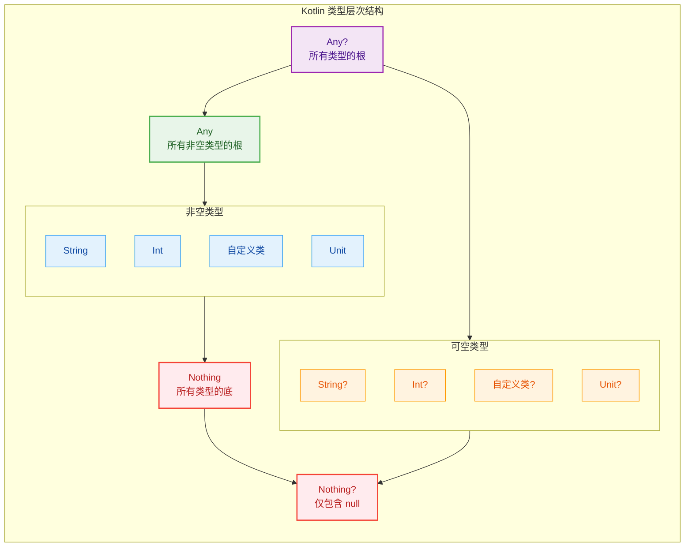

### Any 根类型

**Any** 是 Kotlin 类型层次结构的**根类型（Root Type）**，相当于 Java 中的 `java.lang.Object`，但设计更为精炼。在 Kotlin 中，所有非空类型都隐式继承自 `Any`。

#### Any 的本质与定义

```kotlin
// Any 类的核心定义（简化版）
// 位于 kotlin 包中，是所有 Kotlin 类的隐式父类
public open class Any {
    // 比较两个对象是否"相等"
    // 默认实现是引用相等（===），子类通常会重写
    public open operator fun equals(other: Any?): Boolean
    
    // 返回对象的哈希码，用于 HashMap、HashSet 等数据结构
    // 契约：equals 相等的对象必须有相同的 hashCode
    public open fun hashCode(): Int
    
    // 返回对象的字符串表示
    // 默认返回 "类名@哈希码"，子类通常会重写以提供更有意义的信息
    public open fun toString(): String
}
```

与 Java 的 `Object` 相比，`Any` 只声明了三个核心方法，而没有 `wait()`、`notify()`、`clone()` 等与并发或对象复制相关的方法。这体现了 Kotlin **"只保留必要"** 的设计哲学。

#### Any 的使用场景

```kotlin
// 场景一：作为通用容器的类型参数
// 当你需要存储任意类型的对象时
val mixedList: MutableList<Any> = mutableListOf(
    "Hello",           // String 类型
    42,                // Int 类型（自动装箱）
    3.14,              // Double 类型
    listOf(1, 2, 3)    // List<Int> 类型
)

// 场景二：作为函数参数，接受任意非空值
fun printInfo(obj: Any) {
    // 所有对象都保证有这三个方法
    println("类型: ${obj::class.simpleName}")  // 获取运行时类型名
    println("toString: $obj")                   // 调用 toString()
    println("hashCode: ${obj.hashCode()}")      // 调用 hashCode()
}

// 场景三：类型检查与智能转换的基础
fun processAny(value: Any) {
    // 使用 when 表达式进行类型分发
    when (value) {
        is String -> println("字符串长度: ${value.length}")  // 智能转换为 String
        is Int -> println("整数的平方: ${value * value}")    // 智能转换为 Int
        is List<*> -> println("列表大小: ${value.size}")     // 智能转换为 List
        else -> println("未知类型: ${value::class}")
    }
}
```

#### Any 与 Any? 的关系

这是一个**至关重要**的区分点：

```kotlin
// Any：所有"非空"类型的父类型
// Any?：所有类型（包括可空类型）的父类型

val nonNullValue: Any = "Hello"    // ✅ 正确：String 是 Any 的子类型
// val nonNullValue2: Any = null   // ❌ 编译错误：null 不能赋给 Any

val nullableValue: Any? = null     // ✅ 正确：Any? 可以持有 null
val alsoNullable: Any? = "Hello"   // ✅ 正确：Any? 也可以持有非空值

// 类型层次关系
// Any? 是真正的"万能类型"，Any 是"万能非空类型"
fun acceptAnything(value: Any?) {
    // value 可能是 null，必须进行空检查
    if (value != null) {
        println(value.toString())  // 安全调用
    }
}
```

```kotlin
┌─────────────────────────────────────────────────┐
│                    Any?                         │
│  ┌───────────────────────────────────────────┐  │
│  │                  Any                      │  │
│  │  ┌─────────┐ ┌─────────┐ ┌─────────────┐  │  │
│  │  │ String  │ │   Int   │ │ CustomClass │  │  │
│  │  └─────────┘ └─────────┘ └─────────────┘  │  │
│  └───────────────────────────────────────────┘  │
│                    null                         │
└─────────────────────────────────────────────────┘
```

### Nothing 底类型

如果说 `Any` 是类型层次的"天花板"，那么 **Nothing** 就是"地基"。`Nothing` 是 Kotlin 类型系统中的**底类型（Bottom Type）**，它是所有类型的子类型，但**没有任何实例**。

#### Nothing 的理论基础

在类型理论中，底类型是一个特殊的类型，它：
- 是所有类型的子类型（Subtype of every type）
- 没有任何值属于这个类型（Uninhabited type）

这听起来很抽象，但它在实际编程中有着重要的应用。

```kotlin
// Nothing 的定义（概念性的，实际无法实例化）
public class Nothing private constructor() {
    // 私有构造函数，永远无法创建实例
    // 这个类存在的意义不是被实例化，而是作为类型系统的一部分
}
```

#### Nothing 的核心应用场景

**场景一：表示函数永不返回**

```kotlin
// 抛出异常的函数 —— 永远不会正常返回
fun fail(message: String): Nothing {
    // 这个函数执行后，控制流永远不会继续
    // 要么抛出异常，要么进入无限循环
    throw IllegalArgumentException(message)
}

// 无限循环的函数 —— 同样永不返回
fun infiniteLoop(): Nothing {
    while (true) {
        // 永远执行下去...
        Thread.sleep(1000)
    }
}

// 实际应用：结合 Elvis 操作符
fun getUser(id: Int): User {
    // 如果 findUser 返回 null，则调用 fail()
    // 由于 fail() 返回 Nothing，整个表达式的类型是 User
    return findUser(id) ?: fail("User not found: $id")
}

// 为什么这能工作？
// Nothing 是所有类型的子类型，所以 Nothing 也是 User 的子类型
// 因此 "User ?: Nothing" 的结果类型是 User
```

**场景二：作为泛型的类型参数**

```kotlin
// 空列表的类型推断
val emptyList: List<Nothing> = emptyList()

// 为什么是 List<Nothing>？
// 因为列表为空，没有任何元素，所以元素类型可以是"任何类型的子类型"
// Nothing 正是这样的类型

// 这使得空列表可以赋值给任何类型的列表变量
val stringList: List<String> = emptyList()  // ✅ List<Nothing> 兼容 List<String>
val intList: List<Int> = emptyList()        // ✅ List<Nothing> 兼容 List<Int>
val anyList: List<Any> = emptyList()        // ✅ List<Nothing> 兼容 List<Any>
```

**场景三：TODO() 函数的实现**

```kotlin
// Kotlin 标准库中的 TODO 函数
public inline fun TODO(): Nothing = throw NotImplementedError()

public inline fun TODO(reason: String): Nothing = 
    throw NotImplementedError("An operation is not implemented: $reason")

// 使用示例
fun calculateComplexAlgorithm(): Double {
    TODO("等待算法专家实现")
    // 编译器知道这行代码永远不会执行
    // 所以不会报"缺少 return 语句"的错误
}

// TODO() 的妙用：占位符开发
class UserRepository {
    fun findById(id: Long): User = TODO()      // 暂未实现
    fun save(user: User): Unit = TODO()        // 暂未实现
    fun delete(id: Long): Boolean = TODO()     // 暂未实现
}
```

#### Nothing 与 Nothing? 的区别

```kotlin
// Nothing：没有任何值，是所有类型的子类型
// Nothing?：只有一个值 null，是所有可空类型的子类型

val nothingValue: Nothing = ???  // ❌ 不可能，Nothing 没有任何实例

val nothingNullable: Nothing? = null  // ✅ 唯一可能的值就是 null

// Nothing? 的实际意义
// 它是 null 字面量的类型
val justNull = null  // 类型推断为 Nothing?
```

```mermaid
graph TB
    subgraph NULLABLE["可空类型层次"]
        direction TB
        ANYN2["Any?"]
        STRINGN["String?"]
        INTN["Int?"]
        NOTHINGN2["Nothing?<br/>只包含 null"]
    end
    
    subgraph NONNULL["非空类型层次"]
        direction TB
        ANY2["Any"]
        STRING2["String"]
        INT2["Int"]
        NOTHING2["Nothing<br/>无任何值"]
    end
    
    ANYN2 --> STRINGN
    ANYN2 --> INTN
    STRINGN --> NOTHINGN2
    INTN --> NOTHINGN2
    
    ANY2 --> STRING2
    ANY2 --> INT2
    STRING2 --> NOTHING2
    INT2 --> NOTHING2
    
    NOTHING2 -.->|"子类型"| NOTHINGN2
    
    classDef nullableClass fill:#FCE4EC,stroke:#C2185B,stroke-width:2px,color:#880E4F
    classDef nonNullClass fill:#E8F5E9,stroke:#388E3C,stroke-width:2px,color:#1B5E20
    classDef bottomClass fill:#FFF8E1,stroke:#FFA000,stroke-width:2px,color:#FF6F00
    
    class ANYN2,STRINGN,INTN nullableClass
    class ANY2,STRING2,INT2 nonNullClass
    class NOTHING2,NOTHINGN2 bottomClass
```

### Unit 类型

**Unit** 是 Kotlin 对 Java `void` 的优雅替代。但与 `void` 不同，`Unit` 是一个**真正的类型**，拥有一个**单例实例**。

#### Unit 的设计哲学

在 Java 中，`void` 是一个关键字，表示"没有返回值"。这导致了一些不一致性：
- `void` 不是类型，不能用作泛型参数
- 需要 `Void` 包装类来处理某些场景
- 方法签名的不统一

Kotlin 通过 `Unit` 解决了这些问题：

```kotlin
// Unit 的定义
public object Unit {
    // Unit 是一个单例对象
    // 只有一个实例，就是 Unit 本身
    override fun toString() = "kotlin.Unit"
}

// Unit 作为返回类型
fun printMessage(message: String): Unit {
    println(message)
    // 隐式返回 Unit
    // return Unit  // 可以显式写，但通常省略
}

// 省略 Unit 的简写形式（最常见）
fun printMessage2(message: String) {
    println(message)
    // 返回类型推断为 Unit
}
```

#### Unit 的实际应用

**场景一：函数式编程中的统一性**

```kotlin
// 在 Java 中，你需要区分 Function 和 Consumer
// Java: Function<String, Void> vs Consumer<String>

// 在 Kotlin 中，一切都是返回值的函数
val printFunction: (String) -> Unit = { message ->
    println(message)
    // 隐式返回 Unit
}

// 高阶函数可以统一处理
fun <T, R> transform(value: T, transformer: (T) -> R): R {
    return transformer(value)
}

// 无论返回什么类型，都可以使用同一个函数
val result1: Int = transform("Hello") { it.length }        // 返回 Int
val result2: Unit = transform("Hello") { println(it) }     // 返回 Unit
```

**场景二：泛型中的应用**

```kotlin
// Unit 可以作为泛型参数，这是 void 做不到的
interface Callback<T> {
    fun onSuccess(result: T)
    fun onError(error: Throwable)
}

// 当不需要返回数据时，使用 Unit
class VoidCallback : Callback<Unit> {
    override fun onSuccess(result: Unit) {
        println("操作成功完成")
    }
    
    override fun onError(error: Throwable) {
        println("操作失败: ${error.message}")
    }
}

// 协程中的常见模式
// suspend fun doSomething(): Unit
// Deferred<Unit> 表示一个没有返回值的异步操作
```

**场景三：与 Java 的互操作**

```kotlin
// Kotlin 的 Unit 返回函数
fun kotlinFunction(): Unit {
    println("Kotlin function")
}

// 从 Java 调用时，返回类型是 void
// Java: kotlinFunction();  // 返回 void

// 但如果你需要在 Java 中获取 Unit 实例
// Java: Unit unit = KotlinFileKt.kotlinFunction();  // 也可以
```

#### Unit vs void vs Void 对比

```kotlin
// ┌─────────────┬──────────────────────────────────────────────────┐
// │   概念       │                    说明                          │
// ├─────────────┼──────────────────────────────────────────────────┤
// │ Java void   │ 关键字，表示无返回值，不是类型                      │
// │ Java Void   │ void 的包装类，唯一值是 null                       │
// │ Kotlin Unit │ 真正的类型，单例对象，有且仅有一个实例               │
// └─────────────┴──────────────────────────────────────────────────┘

// Unit 的优势演示
fun demonstrateUnitAdvantage() {
    // 1. 可以存储在变量中
    val unit: Unit = Unit
    
    // 2. 可以作为表达式的值
    val result = if (true) {
        println("执行某操作")
        // 这个分支返回 Unit
    } else {
        println("执行另一操作")
        // 这个分支也返回 Unit
    }
    // result 的类型是 Unit
    
    // 3. 可以用在集合中
    val unitList: List<Unit> = listOf(Unit, Unit, Unit)
    
    // 4. 可以进行比较（虽然没什么意义）
    println(Unit == Unit)  // true，因为是单例
    println(Unit === Unit) // true，同一个实例
}
```

### 三种特殊类型的关系总结

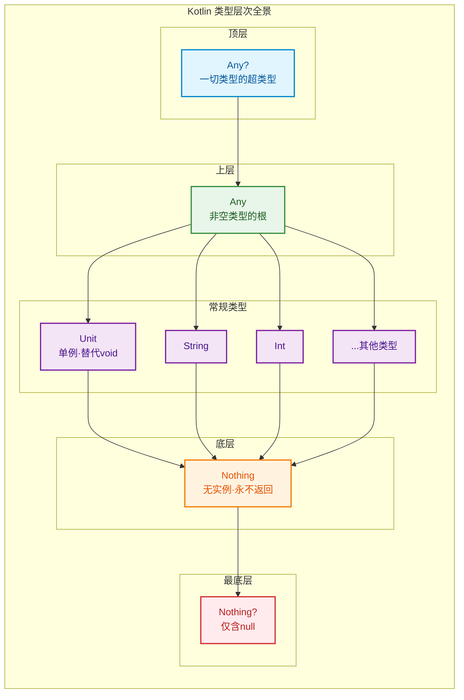

```kotlin
// 综合示例：展示三种类型的协作
class TypeHierarchyDemo {
    
    // Any：接受任意非空值
    fun logAny(value: Any) {
        println("[LOG] ${value::class.simpleName}: $value")
    }
    
    // Unit：表示"执行动作，不关心返回值"
    fun performAction(action: () -> Unit) {
        println("开始执行动作...")
        action()  // 执行传入的动作
        println("动作执行完毕")
    }
    
    // Nothing：表示"此路不通"
    fun validatePositive(number: Int): Int {
        return if (number > 0) {
            number
        } else {
            // fail() 返回 Nothing，所以整个 if 表达式返回 Int
            fail("数字必须为正数，实际值: $number")
        }
    }
    
    private fun fail(message: String): Nothing {
        throw IllegalArgumentException(message)
    }
    
    // 综合运用
    fun demonstrate() {
        // Any 的使用
        logAny("Hello")      // 字符串
        logAny(42)           // 整数
        logAny(listOf(1,2))  // 列表
        
        // Unit 的使用
        performAction {
            println("这是一个返回 Unit 的 lambda")
        }
        
        // Nothing 的使用（通过 validatePositive）
        val validNumber = validatePositive(10)  // 正常返回 10
        // val invalid = validatePositive(-5)   // 会抛出异常
    }
}
```

---

**📝 练习题**

以下关于 Kotlin 类型层次的描述，哪一项是**正确**的？

A. `Any` 是所有类型（包括可空类型）的父类型，`null` 可以赋值给 `Any` 类型的变量

B. `Nothing` 类型有一个特殊的实例叫做 `nothing`，可以通过 `Nothing.INSTANCE` 访问

C. `Unit` 与 Java 的 `void` 完全等价，在编译后会被擦除为 `void`

D. `Nothing` 是所有类型的子类型，这使得返回 `Nothing` 的函数可以用在任何需要返回值的地方

**【答案】** D

**【解析】** 

- **选项 A 错误**：`Any` 是所有**非空类型**的父类型，`null` 不能赋值给 `Any`。能接受 `null` 的是 `Any?`。

- **选项 B 错误**：`Nothing` 类型**没有任何实例**，这是它作为底类型的核心特性。它的存在是为了类型系统的完整性，而不是为了被实例化。

- **选项 C 错误**：虽然 `Unit` 在与 Java 互操作时会映射为 `void`，但它们并不"完全等价"。`Unit` 是一个真正的类型，有单例实例，可以作为泛型参数，这些都是 `void` 做不到的。

- **选项 D 正确**：`Nothing` 作为底类型，是所有类型的子类型。这意味着当一个函数声明返回 `Nothing` 时（如 `throw` 表达式或 `TODO()`），它可以出现在任何期望返回值的位置，因为 `Nothing` 兼容任何类型。例如 `val x: String = TODO()` 是合法的，因为 `Nothing` 是 `String` 的子类型。

---

## 可空类型系统

空指针异常（NullPointerException，简称 NPE）被 Tony Hoare 称为他的"十亿美元错误"（Billion Dollar Mistake）。在 Java 中，任何引用类型都可能为 `null`，而编译器对此毫无感知，导致 NPE 成为运行时最常见的崩溃原因之一。

Kotlin 从语言层面彻底重新设计了空值处理机制，将**可空性（Nullability）编码进类型系统**。这意味着编译器能够在编译期就捕获大多数潜在的空指针问题，而不是等到运行时才崩溃。这套系统由四个核心组件构成：**可空类型 `T?`**、**安全调用 `?.`**、**Elvis 操作符 `?:`** 以及 **非空断言 `!!`**。

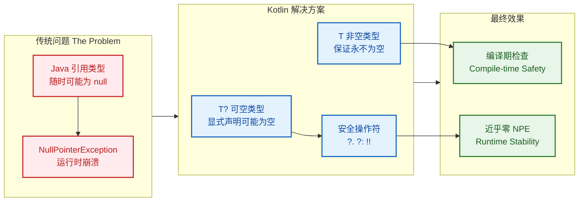

### 可空类型 T?

在 Kotlin 中，类型系统将每种类型分为两个变体：**非空类型 `T`** 和 **可空类型 `T?`**。这个简单的 `?` 后缀彻底改变了空值的处理方式。

#### 基本概念与声明

```kotlin
// 非空类型：保证永远不会是 null
var name: String = "Alice"      // ✅ 正确
// name = null                  // ❌ 编译错误：Null can not be a value of a non-null type String

// 可空类型：显式声明"这个值可能为 null"
var nullableName: String? = "Bob"  // ✅ 正确
nullableName = null                 // ✅ 正确：String? 允许 null

// 类型推断也遵循这个规则
val inferredNonNull = "Hello"      // 推断为 String（非空）
val inferredNullable: String? = null  // 必须显式声明类型，因为 null 本身无法推断具体类型
```

#### 非空类型与可空类型的关系

```kotlin
// 核心规则：非空类型是可空类型的子类型
// String <: String?（String 是 String? 的子类型）

val nonNull: String = "Hello"
val nullable: String? = nonNull    // ✅ 正确：子类型可以赋值给父类型

// 反过来不行
val anotherNullable: String? = "World"
// val anotherNonNull: String = anotherNullable  // ❌ 编译错误：需要显式处理可能的 null
```

```kotlin
┌─────────────────────────────────────────┐
│              String?                    │
│  ┌─────────────────────────────────┐    │
│  │           String                │    │
│  │   "Hello"  "World"  "Kotlin"    │    │
│  └─────────────────────────────────┘    │
│                null                     │
└─────────────────────────────────────────┘

String? = String ∪ {null}
```

#### 可空类型的限制

```kotlin
val nullableString: String? = "Hello"

// 不能直接调用成员方法或访问属性
// val length = nullableString.length  // ❌ 编译错误：Only safe (?.) or non-null asserted (!!.) calls are allowed

// 必须先处理 null 的可能性
// 方式一：显式 null 检查
if (nullableString != null) {
    // 在这个作用域内，编译器知道 nullableString 不是 null
    // 发生"智能转换"（Smart Cast）为 String
    val length = nullableString.length  // ✅ 正确
    println("长度: $length")
}

// 方式二：使用安全调用操作符（下一节详解）
val safeLength = nullableString?.length  // ✅ 正确，返回 Int?

// 方式三：使用 Elvis 操作符提供默认值（后续详解）
val lengthOrZero = nullableString?.length ?: 0  // ✅ 正确，返回 Int
```

#### 函数参数与返回值中的可空类型

```kotlin
// 参数可空性
fun greet(name: String?) {
    // name 可能为 null，必须安全处理
    if (name != null) {
        println("Hello, $name!")
    } else {
        println("Hello, stranger!")
    }
}

// 调用示例
greet("Alice")  // 输出: Hello, Alice!
greet(null)     // 输出: Hello, stranger!

// 返回值可空性
fun findUserById(id: Int): User? {
    // 可能找到用户，也可能返回 null
    return database.query("SELECT * FROM users WHERE id = ?", id)
}

// 调用者必须处理可能的 null
val user: User? = findUserById(42)
// user.name  // ❌ 编译错误
user?.name    // ✅ 安全调用
```

### 安全调用 ?.

**安全调用操作符 `?.`** 是 Kotlin 处理可空类型最优雅的方式。它的语义是："如果接收者不为 null，则执行调用；否则返回 null"。

#### 基本语法与行为

```kotlin
val nullableString: String? = "Hello, Kotlin"

// 安全调用：如果 nullableString 不为 null，调用 length；否则整个表达式返回 null
val length: Int? = nullableString?.length  // 结果: 13

// 当值为 null 时
val nullString: String? = null
val nullLength: Int? = nullString?.length  // 结果: null（不会抛出 NPE）

// 等价的传统写法（更冗长）
val traditionalLength: Int? = if (nullableString != null) {
    nullableString.length
} else {
    null
}
```

#### 安全调用的返回类型

```kotlin
// 重要：安全调用的返回类型总是可空的
val str: String? = "Hello"

val length: Int? = str?.length      // 返回 Int?，不是 Int
val upper: String? = str?.uppercase()  // 返回 String?，不是 String

// 即使原始值不为 null，编译器也无法在编译期确定这一点
// 因此返回类型必须是可空的

// 如果你确定值不为 null，可以使用 !! 或提供默认值
val definiteLength: Int = str?.length ?: 0      // 使用 Elvis 提供默认值
val assertedLength: Int = str?.length!!         // 使用非空断言（有风险）
```

#### 安全调用方法

```kotlin
class Person(val name: String, var email: String?)

val person: Person? = Person("Alice", "alice@example.com")

// 安全调用属性
val email: String? = person?.email  // 如果 person 为 null，返回 null

// 安全调用方法
val emailLength: Int? = person?.email?.length  // 链式安全调用

// 安全调用与赋值结合
person?.email = "newemail@example.com"  // 如果 person 为 null，赋值不会执行

// 安全调用执行代码块（配合 let）
person?.let { p ->
    // 只有当 person 不为 null 时，这个代码块才会执行
    // 在这里，p 是非空的 Person 类型
    println("Name: ${p.name}, Email: ${p.email}")
}
```

### Elvis 操作符 ?:

**Elvis 操作符 `?:`**（得名于其形状像猫王 Elvis Presley 的发型 😄）用于在值为 null 时提供**默认值或替代行为**。

#### 基本语法

```kotlin
// 语法：nullableValue ?: defaultValue
// 语义：如果 nullableValue 不为 null，返回它；否则返回 defaultValue

val nullableName: String? = null
val name: String = nullableName ?: "Unknown"  // 结果: "Unknown"

val anotherName: String? = "Alice"
val result: String = anotherName ?: "Unknown"  // 结果: "Alice"
```

#### Elvis 操作符的多种用法

```kotlin
// 用法一：提供默认值
fun getDisplayName(user: User?): String {
    return user?.name ?: "Guest"
}

// 用法二：提供默认计算
fun getConfigValue(key: String): Int {
    val value: Int? = config[key]
    return value ?: computeDefaultValue(key)  // 只有在 value 为 null 时才计算默认值
}

// 用法三：抛出异常
fun requireUser(user: User?): User {
    return user ?: throw IllegalArgumentException("User cannot be null")
}

// 用法四：提前返回（Early Return）
fun processUser(user: User?) {
    val validUser = user ?: return  // 如果 user 为 null，直接返回
    // 下面的代码中，validUser 保证不为 null
    println("Processing user: ${validUser.name}")
}

// 用法五：结合 Nothing 类型
fun getUser(id: Int): User {
    return findUserById(id) ?: fail("User not found: $id")
    // fail() 返回 Nothing，所以整个表达式类型是 User
}

private fun fail(message: String): Nothing {
    throw IllegalStateException(message)
}
```

#### Elvis 操作符的链式使用

```kotlin
// 可以链式使用多个 Elvis 操作符，实现"回退链"
fun getDisplayName(user: User?): String {
    return user?.nickname      // 首选：昵称
        ?: user?.name          // 其次：真名
        ?: user?.email         // 再次：邮箱
        ?: "Anonymous"         // 最后：匿名
}

// 实际场景：配置优先级
fun getServerUrl(): String {
    return System.getenv("SERVER_URL")           // 环境变量优先
        ?: config.getProperty("server.url")      // 其次配置文件
        ?: "http://localhost:8080"               // 最后默认值
}
```

#### 安全调用与 Elvis 的组合

```kotlin
// 最常见的组合模式
val user: User? = findUser(id)

// 模式一：获取属性或默认值
val userName: String = user?.name ?: "Unknown"

// 模式二：链式调用后提供默认值
val city: String = user?.address?.city ?: "Unknown City"

// 模式三：执行操作或替代操作
user?.sendNotification() ?: logWarning("User not found, notification skipped")

// 模式四：转换后提供默认值
val nameLength: Int = user?.name?.length ?: 0
```

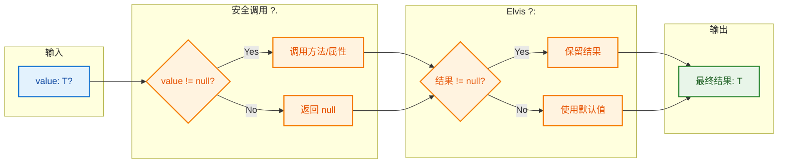

### 非空断言 !!

**非空断言操作符 `!!`** 是 Kotlin 空安全系统中的"紧急出口"。它告诉编译器："我确定这个值不是 null，如果是，就让程序崩溃吧。"

#### 基本语法与行为

```kotlin
val nullableString: String? = "Hello"

// 非空断言：将 String? 转换为 String
val nonNullString: String = nullableString!!  // ✅ 正确，因为值确实不为 null

// 当值为 null 时
val nullString: String? = null
// val crash: String = nullString!!  // ❌ 运行时抛出 NullPointerException（KotlinNullPointerException）
```

#### 为什么需要 !! 操作符

```kotlin
// 场景一：你比编译器更了解情况
class UserManager {
    private var currentUser: User? = null
    
    fun login(user: User) {
        currentUser = user
    }
    
    fun getCurrentUserName(): String {
        // 业务逻辑保证：调用此方法时用户一定已登录
        // 但编译器不知道这一点
        return currentUser!!.name
    }
}

// 场景二：与 Java 代码互操作
// Java 方法返回的类型在 Kotlin 中是"平台类型"
// 如果你确定它不会返回 null
val javaResult: String = javaObject.getStringValue()!!

// 场景三：测试代码中
@Test
fun testUserCreation() {
    val user = createUser("Alice")
    // 在测试中，我们期望 user 不为 null
    // 如果为 null，测试应该失败
    assertEquals("Alice", user!!.name)
}
```

#### !! 的危险性与最佳实践

```kotlin
// ⚠️ 危险用法：盲目使用 !!
fun dangerousCode(input: String?) {
    val length = input!!.length  // 如果 input 为 null，程序崩溃
}

// ✅ 更好的做法：使用安全调用 + Elvis
fun saferCode(input: String?): Int {
    return input?.length ?: 0
}

// ✅ 更好的做法：显式检查并处理
fun explicitCode(input: String?): Int {
    if (input == null) {
        throw IllegalArgumentException("Input cannot be null")
        // 或者 return 0
        // 或者 log warning 并返回默认值
    }
    return input.length  // 智能转换，不需要 !!
}

// ✅ 最佳实践：在边界处验证，内部使用非空类型
fun processInput(input: String?) {
    val validInput = input ?: throw IllegalArgumentException("Input required")
    // validInput 是 String 类型，后续代码无需处理 null
    doSomethingWith(validInput)
}
```

#### 连续 !! 的代码异味

```kotlin
// ❌ 代码异味：连续使用 !!
val city = user!!.address!!.city!!

// 问题：
// 1. 如果任何一个为 null，你不知道是哪个
// 2. 异常信息不明确
// 3. 代码脆弱，难以维护

// ✅ 更好的做法
val city = user?.address?.city ?: "Unknown"

// 或者，如果确实需要非空
val city = user?.address?.city 
    ?: throw IllegalStateException("User must have a complete address")
```

### 四种空处理方式对比

```kotlin
// 假设我们有一个可空的字符串
val nullableString: String? = getStringFromSomewhere()

// 方式一：显式 null 检查（最传统）
if (nullableString != null) {
    println(nullableString.length)  // 智能转换
}

// 方式二：安全调用（最常用）
println(nullableString?.length)  // 输出 null 或长度

// 方式三：安全调用 + Elvis（需要默认值时）
println(nullableString?.length ?: 0)  // 输出 0 或长度

// 方式四：非空断言（确定不为 null 时）
println(nullableString!!.length)  // 可能抛出 NPE
```

| 方式 | 语法 | 返回类型 | null 时行为 | 适用场景 |
|------|------|----------|-------------|----------|
| 显式检查 | `if (x != null)` | `T` | 不执行分支 | 需要复杂逻辑处理 |
| 安全调用 | `x?.method()` | `T?` | 返回 null | 简单属性访问/方法调用 |
| Elvis | `x ?: default` | `T` | 返回默认值 | 需要保证非空结果 |
| 非空断言 | `x!!` | `T` | 抛出 NPE | 100% 确定非空 |

---

**📝 练习题**

阅读以下代码，分析其输出结果：

```kotlin
fun main() {
    val a: String? = "Kotlin"
    val b: String? = null
    
    val result1 = a?.length ?: -1
    val result2 = b?.length ?: -1
    val result3 = a?.let { it.uppercase() } ?: "DEFAULT"
    val result4 = b?.let { it.uppercase() } ?: "DEFAULT"
    
    println("$result1, $result2, $result3, $result4")
}
```

A. `6, null, KOTLIN, null`

B. `6, -1, KOTLIN, DEFAULT`

C. `6, -1, Kotlin, DEFAULT`

D. `null, -1, KOTLIN, DEFAULT`

**【答案】** B

**【解析】** 

让我们逐行分析：

1. **`result1 = a?.length ?: -1`**
   - `a` 是 `"Kotlin"`，不为 null
   - `a?.length` 返回 `6`
   - `6 ?: -1` 结果是 `6`（因为 6 不是 null）

2. **`result2 = b?.length ?: -1`**
   - `b` 是 `null`
   - `b?.length` 返回 `null`（安全调用在接收者为 null 时返回 null）
   - `null ?: -1` 结果是 `-1`（Elvis 操作符在左侧为 null 时返回右侧值）

3. **`result3 = a?.let { it.uppercase() } ?: "DEFAULT"`**
   - `a` 不为 null，所以 `let` 代码块执行
   - `"Kotlin".uppercase()` 返回 `"KOTLIN"`
   - `"KOTLIN" ?: "DEFAULT"` 结果是 `"KOTLIN"`

4. **`result4 = b?.let { it.uppercase() } ?: "DEFAULT"`**
   - `b` 是 null，所以 `b?.let` 返回 null（`let` 代码块不执行）
   - `null ?: "DEFAULT"` 结果是 `"DEFAULT"`

因此最终输出是 `6, -1, KOTLIN, DEFAULT`，选 B。

注意选项 C 的陷阱：`uppercase()` 会将字符串转为大写，所以是 `KOTLIN` 而不是 `Kotlin`。

---

## 安全调用链

在 Kotlin 的可空类型系统中，安全调用操作符 `?.` 是避免 `NullPointerException` 的基础工具。但在实际开发中，我们常常需要处理多层嵌套的可空对象，或者在空安全的前提下执行一系列链式操作。这就是 **安全调用链 (Safe Call Chain)** 发挥作用的场景。安全调用链允许我们优雅地处理复杂的可空对象访问，同时保持代码的简洁性和可读性。

### 链式调用的基本原理

安全调用操作符 `?.` 的核心特性是：**如果接收者为 `null`，整个表达式短路返回 `null`，而不会抛出异常**。这个特性使得我们可以将多个 `?.` 连接起来，形成调用链。

```kotlin
// 假设有一个复杂的对象结构
data class Address(val street: String?, val city: String?)
data class Company(val address: Address?)
data class Employee(val name: String, val company: Company?)

// 传统的空安全处理方式 - 嵌套判断
fun getCityTraditional(employee: Employee?): String? {
    if (employee != null) {  // 第一层判断
        val company = employee.company
        if (company != null) {  // 第二层判断
            val address = company.address
            if (address != null) {  // 第三层判断
                return address.city  // 终于可以访问 city
            }
        }
    }
    return null  // 任何一层为 null，返回 null
}

// 使用安全调用链 - 优雅简洁
fun getCityWithSafeCall(employee: Employee?): String? {
    return employee?.company?.address?.city  // 一行搞定，任何一环为 null，整体返回 null
}

// 测试用例
fun main() {
    val emp1 = Employee("张三", Company(Address("中关村大街", "北京")))
    val emp2 = Employee("李四", Company(Address("淮海路", null)))  // city 为 null
    val emp3 = Employee("王五", Company(null))  // address 为 null
    val emp4 = Employee("赵六", null)  // company 为 null
    
    println(getCityWithSafeCall(emp1))  // 输出: 北京
    println(getCityWithSafeCall(emp2))  // 输出: null (city 为 null)
    println(getCityWithSafeCall(emp3))  // 输出: null (address 为 null)
    println(getCityWithSafeCall(emp4))  // 输出: null (company 为 null)
}
```

在上面的例子中，`employee?.company?.address?.city` 这条链式调用从左到右依次执行：
1. 检查 `employee` 是否为 `null`，如果是则短路返回 `null`
2. 如果 `employee` 非空，继续检查 `company` 是否为 `null`
3. 如果 `company` 非空，继续检查 `address` 是否为 `null`
4. 如果 `address` 非空，最终返回 `city`（可能是 `null`）

这种链式调用避免了深层嵌套的 `if` 判断，代码可读性大幅提升。

### let 函数配合安全调用

`let` 是 Kotlin 标准库中的一个作用域函数 (Scope Function)，它的签名为：`fun <T, R> T.let(block: (T) -> R): R`。`let` 将调用对象作为 lambda 参数传递，并返回 lambda 的结果。

**当 `let` 与安全调用 `?.` 结合使用时，会产生强大的效果**：只有当接收者非空时，`let` 的 lambda 才会执行。这种模式在实际开发中非常常见，用于"仅在非空时执行某些操作"。

```kotlin
// 场景：发送邮件给员工，但只有当员工的邮箱不为 null 时才发送
data class User(val name: String, val email: String?)

fun sendEmail(email: String) {
    println("发送邮件到: $email")
}

// 不使用 let - 需要显式判空
fun notifyUserWithoutLet(user: User?) {
    if (user != null) {  // 判空
        val email = user.email  // 提取 email
        if (email != null) {  // 再次判空
            sendEmail(email)  // 执行操作
        }
    }
}

// 使用 ?. 配合 let - 简洁优雅
fun notifyUserWithLet(user: User?) {
    user?.email?.let { email ->  // 只有 user 和 email 都非空时，lambda 才执行
        sendEmail(email)  // 在 lambda 内部，email 是智能转换为非空的 String 类型
    }
    // 如果 user 或 email 为 null，整个 let 被跳过，不会执行 sendEmail
}

// 更简洁的写法 - 使用 it 隐式参数
fun notifyUserConcise(user: User?) {
    user?.email?.let { sendEmail(it) }  // it 代表非空的 email
}

// 测试
fun main() {
    val user1 = User("Alice", "alice@example.com")
    val user2 = User("Bob", null)  // email 为 null
    val user3: User? = null  // user 为 null
    
    notifyUserWithLet(user1)  // 输出: 发送邮件到: alice@example.com
    notifyUserWithLet(user2)  // 不执行，因为 email 为 null
    notifyUserWithLet(user3)  // 不执行，因为 user 为 null
}
```

`let` 的另一个重要用途是 **避免重复的空安全调用**。假设我们需要对一个可空对象的属性进行多次访问：

```kotlin
data class Config(val timeout: Int, val retryCount: Int)

// 不使用 let - 重复的 ?.
fun processConfigWithoutLet(config: Config?) {
    val timeout = config?.timeout ?: 5000  // 默认 5000ms
    val retryCount = config?.retryCount ?: 3  // 默认 3 次
    println("超时设置: ${timeout}ms, 重试次数: $retryCount")
}

// 使用 let - 避免重复
fun processConfigWithLet(config: Config?) {
    config?.let {  // 在 lambda 内部，it 是智能转换为非空的 Config
        println("超时设置: ${it.timeout}ms, 重试次数: ${it.retryCount}")
        // 可以直接访问 it.timeout 和 it.retryCount，无需重复 ?.
    } ?: run {  // 配合 Elvis 操作符，处理 config 为 null 的情况
        println("使用默认配置")
    }
}
```

### 作用域函数在安全调用链中的应用

除了 `let`，Kotlin 还提供了其他作用域函数，如 `apply`、`also`、`run` 和 `with`。它们在安全调用链中各有用途：

```kotlin
data class Person(var name: String, var age: Int)

// let: 以 lambda 参数形式传递对象，返回 lambda 结果
fun example1(person: Person?) {
    val result = person?.let {
        println("姓名: ${it.name}")  // it 代表 person
        it.age  // 返回 age
    }
    println("结果: $result")  // 如果 person 为 null，result 也为 null
}

// apply: 以 this 形式访问对象，返回对象本身，常用于对象配置
fun example2(person: Person?) {
    person?.apply {
        name = "修改后的姓名"  // 直接使用属性名，this 可省略
        age = 30  // 配置多个属性
    }?.also {  // 链式调用 also
        println("配置完成: $it")  // also 也以 it 形式传递
    }
}

// run: 以 this 形式访问对象，返回 lambda 结果
fun example3(person: Person?) {
    val description = person?.run {
        "姓名: $name, 年龄: $age"  // 直接访问 name 和 age
    } ?: "无人员信息"  // 配合 Elvis 提供默认值
    println(description)
}

// also: 以 lambda 参数形式传递对象，返回对象本身，常用于副作用操作
fun example4(person: Person?) {
    person?.also {
        println("记录日志: 访问了 ${it.name}")  // 执行副作用（如日志、调试）
    }?.let {
        // 继续链式处理
        it.age + 1  // 计算某些值
    }
}

// 测试
fun main() {
    val person = Person("张三", 25)
    example1(person)  // 输出: 姓名: 张三 \n 结果: 25
    example2(person)  // 输出: 配置完成: Person(name=修改后的姓名, age=30)
    example3(person)  // 输出: 姓名: 修改后的姓名, 年龄: 30
    example4(person)  // 输出: 记录日志: 访问了 修改后的姓名
}
```

**作用域函数对比表**：

| 函数 | 对象引用方式 | 返回值 | 典型用途 |
|------|------------|--------|----------|
| `let` | `it` (lambda 参数) | Lambda 结果 | 空安全执行、局部变量转换 |
| `apply` | `this` (接收者) | 对象本身 | 对象配置、建造者模式 |
| `also` | `it` (lambda 参数) | 对象本身 | 副作用操作（日志、调试） |
| `run` | `this` (接收者) | Lambda 结果 | 对象计算、作用域限定 |
| `with` | `this` (接收者) | Lambda 结果 | 非扩展函数版本的 `run` |

### 复杂场景下的安全调用链

在实际项目中，我们常常需要组合多种技术来构建健壮的调用链：

```kotlin
// 模拟一个网络请求返回的 JSON 数据结构
data class ApiResponse(val code: Int, val data: UserData?)
data class UserData(val user: UserInfo?)
data class UserInfo(val profile: Profile?)
data class Profile(val avatarUrl: String?, val bio: String?)

// 场景：从 API 响应中提取用户头像 URL，如果不存在则使用默认值
fun extractAvatar(response: ApiResponse?): String {
    return response
        ?.takeIf { it.code == 200 }  // 只处理成功的响应 (code 200)
        ?.data  // 提取 data
        ?.user  // 提取 user
        ?.profile  // 提取 profile
        ?.avatarUrl  // 提取 avatarUrl
        ?.takeUnless { it.isBlank() }  // 排除空字符串
        ?: "https://example.com/default-avatar.png"  // 任何一环出问题，使用默认头像
}

// 场景：链式调用配合集合操作
fun extractActiveUserNames(response: ApiResponse?): List<String> {
    return response
        ?.data
        ?.user
        ?.let { userInfo ->  // 非空时执行复杂逻辑
            // 假设 UserInfo 有一个好友列表
            listOf(userInfo.profile?.bio ?: "无签名")  // 简化示例
        }
        ?.filterNotNull()  // 过滤掉 null 元素
        ?.filter { it.isNotEmpty() }  // 过滤空字符串
        ?: emptyList()  // 默认返回空列表
}

// 测试
fun main() {
    val response1 = ApiResponse(200, UserData(UserInfo(Profile("avatar.jpg", "Hello"))))
    val response2 = ApiResponse(404, null)  // 错误响应
    val response3 = ApiResponse(200, UserData(UserInfo(Profile("", "Hi"))))  // 头像为空
    
    println(extractAvatar(response1))  // 输出: avatar.jpg
    println(extractAvatar(response2))  // 输出: https://example.com/default-avatar.png
    println(extractAvatar(response3))  // 输出: https://example.com/default-avatar.png (空字符串被过滤)
}
```

下面用 Mermaid 图展示安全调用链的执行流程：

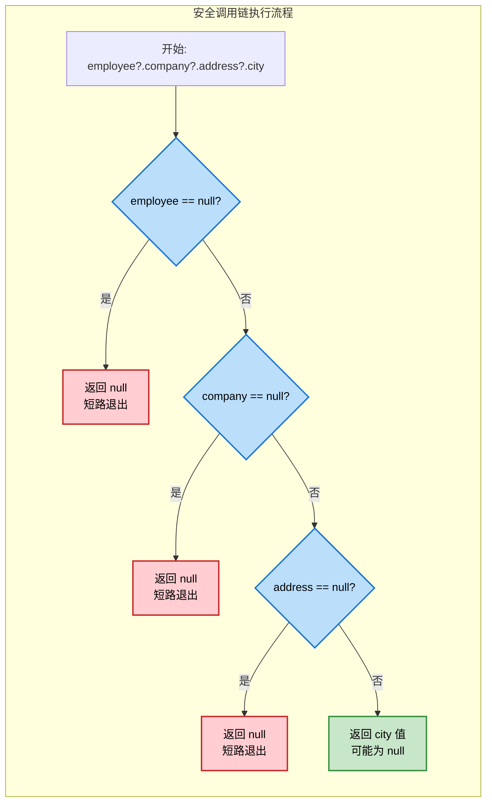

### 最佳实践

1. **链式调用不宜过长**：虽然 Kotlin 支持无限链式调用,但过长的链会降低可读性。建议超过 4-5 层时考虑引入中间变量。

2. **优先使用 `let` 而非重复 `?.`**：当需要多次访问可空对象的属性时，用 `let` 引入局部作用域。

3. **配合 Elvis 提供默认值**：`?.let { } ?: defaultValue` 是处理可空值的惯用模式。

4. **善用 `takeIf` 和 `takeUnless`**：这两个函数可以在调用链中加入条件过滤，非常优雅。

```kotlin
// takeIf: 条件为 true 时返回对象本身，否则返回 null
val validAge = age.takeIf { it >= 18 }  // 只有年龄 >= 18 才返回 age

// takeUnless: 条件为 false 时返回对象本身，否则返回 null
val nonEmptyName = name.takeUnless { it.isBlank() }  // 只有名字非空才返回 name
```

---

## 平台类型

当 Kotlin 与 Java 代码互操作时，会遇到一个特殊的类型系统概念：**平台类型 (Platform Types)**。由于 Java 不区分可空和非空引用（Java 中所有对象引用都可能为 `null`），Kotlin 编译器无法从 Java 代码中准确判断一个类型是 `T` 还是 `T?`。为了平衡类型安全和互操作性，Kotlin 引入了平台类型，用符号 `T!` 表示（这个符号只在错误信息中出现，不能在代码中直接写）。

### Java 互操作中的类型推断困境

考虑以下 Java 代码：

```java
// Java 类
public class JavaUser {
    private String name;  // 在 Java 中，String 可能是 null
    
    public String getName() {
        return name;  // 可能返回 null，但 Java 没有类型系统层面的约束
    }
    
    public void setName(String name) {
        this.name = name;  // 允许传入 null
    }
}
```

在 Kotlin 中调用这个 Java 类时，`getName()` 的返回类型该是 `String` 还是 `String?`？Kotlin 编译器面临两难选择：

1. **如果假设为 `String`（非空）**：可能导致运行时 NPE（如果 Java 代码实际返回了 `null`）
2. **如果假设为 `String?`（可空）**：会强制 Kotlin 开发者进行大量不必要的空安全检查，即使 Java 代码永远不返回 `null`

**平台类型 `String!` 就是 Kotlin 的妥协方案**：它既可以被当作 `String` 使用，也可以被当作 `String?` 使用，由开发者自己判断并承担风险。

```kotlin
// Kotlin 代码调用 Java 类
fun testPlatformType() {
    val javaUser = JavaUser()  // 创建 Java 对象
    
    // getName() 返回平台类型 String!
    val name1 = javaUser.name  // name1 的类型是 String!（平台类型）
    
    // 开发者可以选择将其视为非空类型
    val name2: String = javaUser.name  // 视为 String，如果实际为 null 会抛 NPE
    
    // 或者视为可空类型
    val name3: String? = javaUser.name  // 视为 String?，安全但需要额外判空
    
    // 直接使用也是允许的（相当于信任 Java 代码不返回 null）
    println(javaUser.name.length)  // 如果 name 为 null，这里会抛 NPE
    
    // 安全的做法：使用安全调用
    println(javaUser.name?.length)  // 推荐方式，避免 NPE
}
```

### 平台类型的 `!` 符号

在 Kotlin 的错误信息或 IDE 提示中，你可能会看到 `String!` 这样的符号。**这个 `!` 不是 Kotlin 语法的一部分，你不能在代码中写 `val x: String!`**，它仅用于编译器内部表示和错误提示。

```kotlin
fun demonstratePlatformTypeError() {
    val javaUser = JavaUser()
    javaUser.name = null  // Java 允许设置为 null
    
    // 下面这行代码会在运行时抛出 NPE，错误信息会提到 String!
    val length = javaUser.name.length
    // 错误信息示例:
    // kotlin.NullPointerException: javaUser.name must not be null
    // 类型显示为: String! (Platform Type)
}
```

### 空安全边界 (Nullability Boundary)

**空安全边界是 Kotlin 与 Java 互操作的核心概念**：当 Java 代码的值进入 Kotlin 世界时，开发者需要在边界处明确处理可空性，将平台类型转换为明确的 Kotlin 类型（`T` 或 `T?`）。

```kotlin
// 不良实践：让平台类型在 Kotlin 代码中传播
class KotlinService {
    private val javaUser = JavaUser()
    
    // 糟糕：返回平台类型，将不确定性传递给调用者
    fun getUserName() = javaUser.name  // 返回 String!
}

// 良好实践：在边界处消除平台类型
class KotlinServiceSafe {
    private val javaUser = JavaUser()
    
    // 方案 1：如果确信 Java 代码不会返回 null，显式声明为非空
    fun getUserName(): String {
        return javaUser.name ?: throw IllegalStateException("Name must not be null")
        // 或者使用非空断言（不推荐，除非绝对确定）
        // return javaUser.name!!
    }
    
    // 方案 2：保守做法，声明为可空类型
    fun getUserNameSafe(): String? {
        return javaUser.name  // 平台类型 String! 安全地转换为 String?
    }
    
    // 方案 3：提供默认值
    fun getUserNameOrDefault(): String {
        return javaUser.name ?: "Unknown"  // Elvis 操作符提供默认值
    }
}
```

**空安全边界的黄金法则**：
- **不要让平台类型逃逸到公共 API**：所有公共函数的返回类型和参数类型都应该是明确的 Kotlin 类型
- **在最早的调用点处理可空性**：不要让平台类型在代码中传播多层
- **使用 IDE 提示和静态分析**：IntelliJ IDEA 会警告平台类型的使用

### Java 注解对平台类型的影响

现代 Java 代码常使用空性注解（如 `@Nullable`、`@NotNull`、JSR-305 等）来标注可空性。**Kotlin 编译器会识别这些注解，并将平台类型细化为明确的类型**。

```java
// Java 代码使用注解
import org.jetbrains.annotations.NotNull;
import org.jetbrains.annotations.Nullable;

public class AnnotatedJavaUser {
    @NotNull  // 明确标注非空
    public String getUsername() {
        return "admin";
    }
    
    @Nullable  // 明确标注可空
    public String getEmail() {
        return null;
    }
    
    public String getPhone() {  // 没有注解，仍然是平台类型
        return null;
    }
}
```

在 Kotlin 中调用：

```kotlin
fun testAnnotatedJavaTypes() {
    val user = AnnotatedJavaUser()
    
    // username 被识别为 String（非空），因为有 @NotNull
    val username: String = user.username  // OK，类型安全
    // val usernameNullable: String? = user.username  // 编译警告：不需要可空类型
    
    // email 被识别为 String?（可空），因为有 @Nullable
    val email: String? = user.email  // OK
    // val emailNonNull: String = user.email  // 编译错误：类型不匹配
    
    // phone 没有注解，仍然是 String!（平台类型）
    val phone1: String = user.phone  // 允许但有风险
    val phone2: String? = user.phone  // 安全做法
}
```

**支持的注解框架**：
- JetBrains 注解（`org.jetbrains.annotations`）
- Android 注解（`androidx.annotation`）
- JSR-305（`javax.annotation`）
- FindBugs（`edu.umd.cs.findbugs.annotations`）
- Eclipse 注解（`org.eclipse.jdt.annotation`）

### 平台类型的常见陷阱

```kotlin
// 陷阱 1：平台类型在链式调用中传播
fun trap1() {
    val javaUser = JavaUser()
    // 如果 getName() 返回 null，这里会 NPE
    // 因为平台类型允许你假设它非空
    val upperName = javaUser.name.uppercase()  // 危险！
    
    // 安全做法
    val safeUpperName = javaUser.name?.uppercase()  // 使用安全调用
}

// 陷阱 2：集合的平台类型
fun trap2() {
    val javaList: List<String> = JavaCollectionProvider.getStringList()  // List<String!>!
    // 这个列表本身可能为 null，列表元素也可能为 null
    
    // 危险：假设列表和元素都非空
    for (item in javaList) {  // 可能 NPE（如果 javaList 为 null）
        println(item.length)  // 可能 NPE（如果 item 为 null）
    }
    
    // 安全做法
    javaList?.forEach { item ->  // 安全调用处理列表本身的可空性
        item?.let { println(it.length) }  // 安全调用处理元素的可空性
    }
}

// 陷阱 3：平台类型的泛型
fun trap3() {
    val javaMap: Map<String, String> = JavaCollectionProvider.getStringMap()
    // 实际类型是 Map<String!, String!>!
    // Key 可能为 null，Value 可能为 null，整个 Map 也可能为 null
    
    val value = javaMap["key"]  // value 是 String!（平台类型）
    // 如果 value 为 null，下面会 NPE
    println(value.length)  // 危险！
}
```

用 Mermaid 图说明平台类型的转换流程：

```mermaid
graph LR
    subgraph "Java → Kotlin 平台类型转换"
        direction TB
        J[Java 代码<br/>返回类型]
        P{是否有<br/>空性注解?}
        NT[@NotNull<br/>注解]
        N[@Nullable<br/>注解]
        PL[平台类型<br/>String!]
        KN[Kotlin 非空<br/>String]
        KNL[Kotlin 可空<br/>String?]
        
        J --> P
        P -->|有 @NotNull| NT
        P -->|有 @Nullable| N
        P -->|无注解| PL
        NT --> KN
        N --> KNL
        PL -.开发者选择.-> KC{边界处理}
        KC -->|信任 Java| KN
        KC -->|保守处理| KNL
    end
    
    subgraph "Kotlin 使用建议"
        direction TB
        R1[推荐: 显式声明<br/>返回类型]
        R2[推荐: 使用<br/>安全调用 ?.]
        R3[推荐: Elvis<br/>提供默认值]
    end
    
    KN --> R1
    KNL --> R2
    PL --> R3
    
    classDef javaType fill:#FFE0B2,stroke:#E65100,stroke-width:2px,color:#000
    classDef kotlinNonNull fill:#C8E6C9,stroke:#388E3C,stroke-width:2px,color:#000
    classDef kotlinNullable fill:#B3E5FC,stroke:#0277BD,stroke-width:2px,color:#000
    classDef platform fill:#FFF9C4,stroke:#F57F17,stroke-width:2px,color:#000
    classDef recommend fill:#E1BEE7,stroke:#7B1FA2,stroke-width:2px,color:#000
    
    class J javaType
    class KN kotlinNonNull
    class KNL kotlinNullable
    class PL,KC platform
    class R1,R2,R3 recommend
```

### 最佳实践总结

1. **尽早消除平台类型**：在 Java 互操作边界处立即转换为明确的 Kotlin 类型
2. **默认使用安全调用**：对所有来自 Java 的值使用 `?.`，除非绝对确定非空
3. **为 Java 代码添加注解**：如果你维护 Java 代码，添加 `@Nullable`/`@NotNull` 注解帮助 Kotlin 理解
4. **不要在 API 中暴露平台类型**：所有公共函数签名都应该是明确的 Kotlin 类型
5. **使用 Elvis 提供默认值**：`javaValue ?: defaultValue` 是处理平台类型的惯用模式
6. **启用编译器警告**：在 Gradle 中配置 `-Xexplicit-api=strict` 强制显式 API 声明

```kotlin
// gradle.properties 或 build.gradle.kts
kotlin {
    explicitApi = ExplicitApiMode.Strict  // 强制显式声明公共 API 的可见性和类型
}
```

---

**📝 练习题**

**题目 1：** 以下 Kotlin 代码调用了 Java 方法 `getUserName(): String`（未标注任何注解）。哪种写法最安全且符合 Kotlin 最佳实践？

```kotlin
class UserService(private val javaUser: JavaUser) {
    // 选项在下方
}
```

A. `fun getName() = javaUser.userName`  
B. `fun getName(): String = javaUser.userName!!`  
C. `fun getName(): String? = javaUser.userName`  
D. `fun getName(): String = javaUser.userName.trim()`

**【答案】** C

**【解析】** 
- **A 选项**错误：返回平台类型 `String!`，将不确定性传递给调用者，违反空安全边界原则。
- **B 选项**错误：使用非空断言 `!!` 虽然能通过编译，但如果 Java 代码返回 `null` 会抛出 NPE，且这种强制断言是代码坏味道。
- **C 选项正确**：显式声明返回类型为 `String?`，保守地处理可空性。即使 Java 代码返回 `null`，Kotlin 侧也能安全处理。这是平台类型转换的最佳实践。
- **D 选项**错误：直接调用 `trim()` 假设 `userName` 非空，如果实际为 `null` 会在 `trim()` 调用时抛出 NPE。

**关键点**：在没有明确空性信息的情况下（如 Java 未标注 `@NotNull`/`@Nullable`），应保守地将平台类型转换为可空类型 `T?`，并在后续代码中用安全调用 `?.` 或 Elvis `?:` 处理。这样即使 Java 行为改变，Kotlin 代码也不会崩溃。

---

**题目 2：** 以下代码片段中，哪一行最可能在运行时抛出 `NullPointerException`？

```kotlin
fun processUser() {
    val javaUser = JavaUser()  // Java 类，未使用空性注解
    val name = javaUser.name   // 1
    val upper = name?.uppercase()  // 2
    val length = upper!!.length  // 3
    println(length)  // 4
}
```

A. 第 1 行  
B. 第 2 行  
C. 第 3 行  
D. 第 4 行

**【答案】** C

**【解析】**
- **第 1 行**：`javaUser.name` 返回平台类型 `String!`，赋值给 `name` 变量。即使 `name` 实际为 `null`，这一行不会抛异常（只是将 `null` 赋给变量）。
- **第 2 行**：使用安全调用 `name?.uppercase()`。如果 `name` 为 `null`，整个表达式返回 `null`，不会抛异常。此时 `upper` 的类型是 `String?`。
- **第 3 行（正确答案）**：使用非空断言 `upper!!`。如果 `upper` 为 `null`（即第 2 行的 `name` 为 `null` 导致 `uppercase()` 返回 `null`），这里会立即抛出 `NullPointerException`。**非空断言 `!!` 是最危险的操作，应尽量避免使用**。
- **第 4 行**：如果第 3 行没有抛异常，说明 `length` 已经是有效的 `Int` 值，`println` 不会抛异常。

**教训**：
1. 平台类型本身的赋值不会抛 NPE，但后续使用时会。
2. 安全调用 `?.` 永远不会抛 NPE。
3. **非空断言 `!!` 是 NPE 的主要来源，应该用 Elvis `?:` 或 `requireNotNull()` 替代**。

---

## 智能转换

智能转换 (Smart Cast) 是 Kotlin 类型系统中最优雅的特性之一。它允许编译器在进行类型检查后，**自动将变量转换为目标类型**，无需显式地进行类型转换操作。这不仅简化了代码，还提高了代码的安全性和可读性。

在传统的 Java 中,我们通常需要先用 `instanceof` 检查类型,然后再进行强制类型转换:

```java
// Java 传统写法
if (obj instanceof String) {
    String str = (String) obj;  // 需要显式转换
    System.out.println(str.length());
}
```

而 Kotlin 的智能转换机制让这一切变得极为简洁:

```kotlin
// Kotlin 智能转换
if (obj is String) {
    println(obj.length)  // 编译器自动将 obj 转换为 String 类型
}
```

### is 检查后自动转换

`is` 操作符是 Kotlin 中用于类型检查的关键字,相当于 Java 中的 `instanceof`。但 Kotlin 的编译器在 `is` 检查通过后,会在**特定的作用域内**自动完成类型转换。

```kotlin
fun describe(obj: Any): String {
    // obj 的声明类型是 Any
    
    if (obj is String) {
        // 在这个 if 块中,编译器知道 obj 一定是 String 类型
        // 因此自动将 obj 转换为 String,可以直接访问 String 的属性和方法
        return "字符串,长度为 ${obj.length}"
    }
    
    if (obj is Int) {
        // 在这个 if 块中,obj 被智能转换为 Int
        return "整数,值为 $obj"
    }
    
    if (obj !is Double) {
        // 使用 !is 进行否定检查
        return "不是 Double 类型"
    }
    // 注意:在 !is 检查之后的 else 分支中,编译器也能进行智能转换
    
    return "其他类型"
}

// 更复杂的示例:结合逻辑运算符
fun processData(data: Any?) {
    // 使用 && 运算符,右侧可以安全使用智能转换
    if (data is String && data.length > 0) {
        // data 已被智能转换为 String(非空)
        println("非空字符串: ${data.uppercase()}")
    }
    
    // 使用 || 运算符
    if (data !is String || data.isEmpty()) {
        // 在 || 的右侧,data 已被智能转换为 String
        println("空字符串或非字符串类型")
        return
    }
    // 执行到这里,编译器知道 data 必定是非空的 String
    println("确定是非空字符串: $data")
}
```

**智能转换的核心原理**在于编译器的**数据流分析** (Data Flow Analysis)。编译器会跟踪代码的执行路径,分析在特定代码块中变量的类型状态。当编译器能够**确保**变量在某个作用域内不会改变类型时,就会自动完成转换。

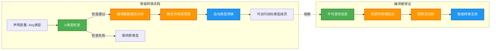

### 作用域

智能转换并非在所有情况下都能生效。编译器必须**保证**变量在智能转换的作用域内不会被修改,否则可能导致类型不安全。因此,智能转换的生效受到严格的**作用域规则**约束。

**规则 1: 局部变量 (Local Variables) vs 成员属性 (Properties)**

```kotlin
class Container {
    var data: Any = "初始值"  // 成员属性
    
    fun process() {
        // ❌ 错误:成员属性 var 无法智能转换
        if (data is String) {
            // 编译错误:Smart cast to 'String' is impossible
            // 原因:data 是 var 属性,可能在其他线程或其他代码中被修改
            // println(data.length)
        }
        
        // ✅ 解决方案 1: 使用局部变量缓存
        val localData = data  // 创建局部 val 引用
        if (localData is String) {
            println(localData.length)  // 智能转换生效
        }
        
        // ✅ 解决方案 2: 显式转换
        if (data is String) {
            val str = data as String
            println(str.length)
        }
    }
    
    // ✅ val 属性可以智能转换(有条件)
    val immutableData: Any = "不变"
    
    fun processImmutable() {
        if (immutableData is String) {
            println(immutableData.length)  // 可以智能转换
        }
    }
}

// 局部变量的智能转换
fun localVariableExample() {
    var localVar: Any = "可变局部变量"
    
    // ✅ 局部 var 可以智能转换
    if (localVar is String) {
        // 编译器能追踪局部变量的生命周期和修改情况
        println(localVar.length)  // 智能转换生效
    }
    
    // ✅ 局部 val 更容易智能转换
    val localVal: Any = "不可变局部变量"
    if (localVal is String) {
        println(localVal.length)  // 智能转换生效
    }
}
```

**为什么成员 `var` 属性无法智能转换?**

成员 `var` 属性存在**可见性和并发风险**:
1. **多线程访问**:其他线程可能同时修改属性值
2. **自定义 getter**:属性可能重写 getter,每次访问返回不同的值
3. **继承覆盖**:子类可能覆盖属性

```kotlin
class RiskExample {
    var data: Any = "字符串"
    
    fun riskyOperation() {
        if (data is String) {
            // 假设这里智能转换生效
            // 但在访问 data.length 之前,另一个线程可能执行:
            // data = 123  (修改为 Int)
            // 此时访问 data.length 会导致类型错误
        }
    }
}
```

**规则 2: 控制流作用域**

智能转换的作用域严格遵循控制流边界:

```kotlin
fun controlFlowScope(obj: Any) {
    // 场景 1: if-else 分支
    if (obj is String) {
        println(obj.length)  // ✅ if 块内有效
    } else {
        // ❌ else 块内智能转换无效,obj 仍是 Any
        // println(obj.length)  // 编译错误
    }
    // ❌ if 块外部无效
    // println(obj.length)  // 编译错误
    
    // 场景 2: 提前返回后的智能转换
    if (obj !is String) {
        return  // 提前返回
    }
    // ✅ 执行到这里,编译器知道 obj 必定是 String
    println(obj.length)  // 智能转换有效
    
    // 场景 3: && 运算符
    if (obj is String && obj.isNotEmpty()) {
        // ✅ && 右侧,obj 已是 String
        println(obj[0])
    }
    
    // 场景 4: || 运算符
    if (obj !is String || obj.isEmpty()) {
        return
    }
    // ✅ 执行到这里,obj 必定是非空 String
    println(obj.length)
}
```

**规则 3: 捕获变量 (Captured Variables)**

在 lambda 表达式或局部类中捕获的变量,智能转换有特殊限制:

```kotlin
fun captureExample(obj: Any) {
    // ❌ 捕获的 var 变量无法智能转换
    var mutableObj: Any = obj
    if (mutableObj is String) {
        // ✅ 直接访问可以
        println(mutableObj.length)
        
        val lambda = {
            // ❌ lambda 中无法智能转换
            // 原因:lambda 可能在 mutableObj 修改后执行
            // println(mutableObj.length)  // 编译错误
        }
    }
    
    // ✅ val 变量可以在 lambda 中智能转换
    val immutableObj: Any = obj
    if (immutableObj is String) {
        val lambda = {
            println(immutableObj.length)  // ✅ 智能转换有效
        }
        lambda()
    }
}
```

### when 中的智能转换

`when` 表达式是 Kotlin 中功能强大的分支结构,智能转换在 `when` 中同样适用,并且表现得更加灵活和优雅。

```kotlin
// 基础用法:类型匹配
fun describeType(obj: Any): String = when (obj) {
    is String -> {
        // obj 自动转换为 String
        "字符串,长度: ${obj.length}, 内容: $obj"
    }
    is Int -> {
        // obj 自动转换为 Int
        "整数,值: $obj, 二进制: ${obj.toString(2)}"
    }
    is List<*> -> {
        // obj 自动转换为 List
        "列表,元素个数: ${obj.size}"
    }
    else -> "未知类型: ${obj::class.simpleName}"
}

// 复杂条件组合
fun processValue(value: Any): String = when {
    value is String && value.startsWith("http") -> {
        // 组合条件,value 智能转换为 String
        "URL: ${value.substringAfter("://")}"
    }
    value is Int && value > 0 -> {
        // value 智能转换为 Int
        "正整数: $value"
    }
    value is Int && value < 0 -> {
        // value 智能转换为 Int
        "负整数: ${-value} 的相反数"
    }
    else -> "其他情况"
}

// 密封类(Sealed Class)与 when 的完美结合
sealed class Result {
    data class Success(val data: String) : Result()
    data class Error(val exception: Exception) : Result()
    object Loading : Result()
}

fun handleResult(result: Result): String = when (result) {
    is Result.Success -> {
        // result 智能转换为 Result.Success
        "成功获取数据: ${result.data}"
    }
    is Result.Error -> {
        // result 智能转换为 Result.Error
        "发生错误: ${result.exception.message}"
    }
    Result.Loading -> {
        // 单例对象,直接匹配
        "加载中..."
    }
    // 密封类的 when 必须穷尽所有情况,否则编译错误
}

// when 作为表达式,智能转换在每个分支返回
fun calculateLength(obj: Any?): Int = when {
    obj == null -> 0  // 处理 null
    obj is String -> obj.length  // obj 转换为 String
    obj is Collection<*> -> obj.size  // obj 转换为 Collection
    obj is Array<*> -> obj.size  // obj 转换为 Array
    else -> -1  // 无法计算长度
}
```

**when 中的多重条件与智能转换**:

```kotlin
// 范围检查与类型检查结合
fun categorize(value: Any): String = when {
    value !is Number -> "非数字类型"
    value is Int && value in 0..10 -> {
        // value 智能转换为 Int
        "0-10 的整数: $value"
    }
    value is Double && value > 100.0 -> {
        // value 智能转换为 Double
        "大于 100 的浮点数: $value"
    }
    else -> "其他数字: $value"
}

// 嵌套的智能转换
fun processNested(outer: Any): String {
    return when (outer) {
        is List<*> -> {
            // outer 转换为 List
            when {
                outer.isEmpty() -> "空列表"
                outer.first() is String -> {
                    // outer.first() 转换为 String
                    "字符串列表,首元素: ${outer.first() as String}"
                }
                else -> "非字符串列表"
            }
        }
        is Map<*, *> -> {
            // outer 转换为 Map
            "Map,键值对数量: ${outer.size}"
        }
        else -> "其他类型"
    }
}
```

**智能转换的流程可视化**:

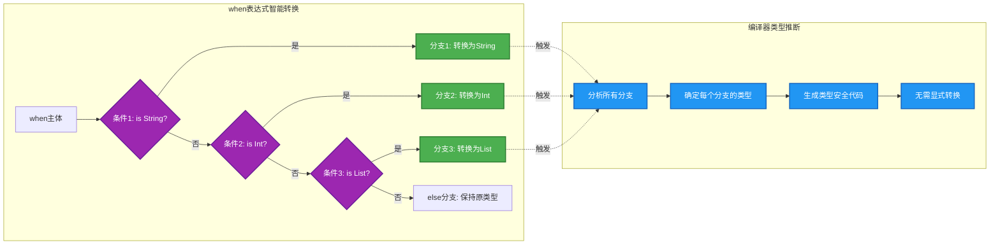

## 安全转换

在处理类型转换时,我们经常面临一个问题:**如果转换失败怎么办?** Kotlin 提供了两种类型转换操作符:
- **不安全转换** `as`:转换失败抛出 `ClassCastException`
- **安全转换** `as?`:转换失败返回 `null`

安全转换操作符 `as?` 是 Kotlin 空安全设计的重要组成部分,它让类型转换变得更加健壮和优雅。

### as? 操作符

`as?` 操作符尝试将值转换为目标类型,如果转换成功则返回转换后的值,**如果转换失败则返回 `null`**,而不会抛出异常。

```kotlin
// 不安全转换 as:转换失败抛异常
fun unsafeCast(obj: Any): String {
    return obj as String  // 如果 obj 不是 String,抛出 ClassCastException
}

// 调用示例
fun testUnsafeCast() {
    val str = unsafeCast("Hello")  // ✅ 成功,返回 "Hello"
    // val num = unsafeCast(123)  // ❌ 抛出异常:ClassCastException
}

// 安全转换 as?:转换失败返回 null
fun safeCast(obj: Any): String? {
    return obj as? String  // 如果 obj 不是 String,返回 null
}

// 调用示例
fun testSafeCast() {
    val str = safeCast("Hello")  // ✅ 返回 "Hello"
    val num = safeCast(123)      // ✅ 返回 null,不抛异常
    
    // 配合空安全操作符使用
    val length = safeCast("Kotlin")?.length  // 返回 6
    val nullLength = safeCast(123)?.length   // 返回 null
}

// 实际应用:处理集合元素
fun processElements(elements: List<Any>) {
    for (element in elements) {
        // 尝试转换为 String 并处理
        val str = element as? String
        if (str != null) {
            println("字符串元素: $str, 长度: ${str.length}")
        } else {
            println("非字符串元素: $element")
        }
    }
}

// 更简洁的写法:使用 let
fun processElementsConcise(elements: List<Any>) {
    for (element in elements) {
        // as? 结合 let,只处理转换成功的情况
        (element as? String)?.let { str ->
            println("字符串元素: $str, 长度: ${str.length}")
        }
    }
}
```

**as? 的返回类型**是**可空类型**。这是设计上的巧妙之处,它强制开发者处理转换失败的情况:

```kotlin
// as? 返回可空类型
val obj: Any = 123
val str: String? = obj as? String  // 类型是 String?,不是 String

// 错误示例:不能直接赋值给非空类型
// val nonNullStr: String = obj as? String  // ❌ 编译错误:类型不匹配

// 正确做法:处理 null 情况
val nonNullStr: String = (obj as? String) ?: "默认值"  // ✅ 使用 Elvis 操作符
```

**类型转换操作符对比**:

```kotlin
fun compareTypeConversion(obj: Any) {
    // 方式 1: 不安全转换 as
    try {
        val str1 = obj as String  // 可能抛异常
        println("转换成功: $str1")
    } catch (e: ClassCastException) {
        println("转换失败,捕获异常")
    }
    
    // 方式 2: 安全转换 as?
    val str2 = obj as? String  // 不会抛异常,失败返回 null
    if (str2 != null) {
        println("转换成功: $str2")
    } else {
        println("转换失败,返回 null")
    }
    
    // 方式 3: 智能转换 is
    if (obj is String) {
        // obj 自动转换,无需显式 as 或 as?
        println("类型检查成功,自动转换: $obj")
    } else {
        println("类型检查失败")
    }
}
```

### 失败返回 null

安全转换的核心价值在于:**将异常处理转换为空值处理**。这与 Kotlin 的空安全理念完美契合,让代码更加清晰和易于维护。

```kotlin
// 场景 1: 解析配置数据
data class Config(val settings: Map<String, Any>)

fun getIntSetting(config: Config, key: String): Int {
    // 从 Map 获取值,尝试转换为 Int
    val value = config.settings[key]  // 返回 Any?
    
    // 使用 as? 安全转换,失败返回 null,然后使用 Elvis 提供默认值
    return (value as? Int) ?: 0  // 如果不是 Int 或为 null,返回 0
}

fun getStringSetting(config: Config, key: String): String {
    val value = config.settings[key]
    return (value as? String) ?: "未设置"
}

// 调用示例
fun testConfig() {
    val config = Config(
        mapOf(
            "timeout" to 5000,      // Int
            "host" to "localhost",  // String
            "port" to "8080"        // String(不是 Int)
        )
    )
    
    println(getIntSetting(config, "timeout"))    // 输出: 5000
    println(getIntSetting(config, "port"))       // 输出: 0 (转换失败)
    println(getIntSetting(config, "missing"))    // 输出: 0 (key 不存在)
    println(getStringSetting(config, "host"))    // 输出: localhost
}

// 场景 2: 处理 JSON 数据
data class User(val name: String, val age: Int)

fun parseUser(data: Map<String, Any?>): User? {
    // 尝试提取并转换各个字段
    val name = data["name"] as? String ?: return null  // name 必须是 String
    val age = data["age"] as? Int ?: return null       // age 必须是 Int
    
    return User(name, age)
}

// 调用示例
fun testParseUser() {
    // ✅ 合法数据
    val validData = mapOf("name" to "Alice", "age" to 30)
    val user1 = parseUser(validData)  // 返回 User("Alice", 30)
    
    // ❌ age 类型错误
    val invalidData1 = mapOf("name" to "Bob", "age" to "thirty")
    val user2 = parseUser(invalidData1)  // 返回 null
    
    // ❌ 缺少字段
    val invalidData2 = mapOf("name" to "Charlie")
    val user3 = parseUser(invalidData2)  // 返回 null
}

// 场景 3: 类型过滤与转换
fun filterAndConvertToStrings(items: List<Any>): List<String> {
    return items.mapNotNull { item ->
        // mapNotNull 会自动过滤掉 null 结果
        item as? String  // 只保留成功转换为 String 的元素
    }
}

// 调用示例
fun testFilterAndConvert() {
    val mixed = listOf("apple", 123, "banana", 45.6, "cherry", null)
    val strings = filterAndConvertToStrings(mixed)
    println(strings)  // 输出: [apple, banana, cherry]
}

// 场景 4: 链式安全转换
interface Animal
class Dog(val name: String) : Animal
class Cat(val name: String) : Animal

fun processAnimal(animal: Any) {
    // 链式使用 as? 和安全调用
    val dogName = (animal as? Dog)?.name
    val catName = (animal as? Cat)?.name
    
    when {
        dogName != null -> println("这是一只狗,名字: $dogName")
        catName != null -> println("这是一只猫,名字: $catName")
        else -> println("未知动物")
    }
}

// 场景 5: 与 when 表达式结合
fun identifyType(obj: Any): String = when (val converted = obj) {
    is String -> "字符串: $converted"
    is Int -> "整数: $converted"
    else -> {
        // 尝试多种转换
        (converted as? Double)?.let { "浮点数: $it" }
            ?: (converted as? Boolean)?.let { "布尔值: $it" }
            ?: "未知类型: ${converted::class.simpleName}"
    }
}
```

**安全转换的最佳实践**:

```kotlin
// ✅ 推荐:结合 Elvis 操作符提供默认值
fun safeConvertWithDefault(obj: Any): String {
    return (obj as? String) ?: "转换失败的默认值"
}

// ✅ 推荐:结合 let 处理非 null 情况
fun safeConvertWithLet(obj: Any) {
    (obj as? String)?.let { str ->
        println("成功转换为字符串: $str")
        // 这里可以安全使用 str
    }
}

// ✅ 推荐:结合 also 进行链式操作
fun safeConvertChain(obj: Any): String? {
    return (obj as? String)
        ?.trim()
        ?.uppercase()
        ?.also { println("处理后的字符串: $it") }
}

// ❌ 不推荐:忽略转换失败的情况
fun unsafeIgnore(obj: Any) {
    val str = obj as? String
    println(str?.length)  // 可能输出 null,但没有合理处理
}

// ✅ 推荐:明确处理转换失败
fun safeHandle(obj: Any) {
    val str = obj as? String
    if (str != null) {
        println("字符串长度: ${str.length}")
    } else {
        println("无法转换为字符串")
    }
}
```

**类型转换流程图**:

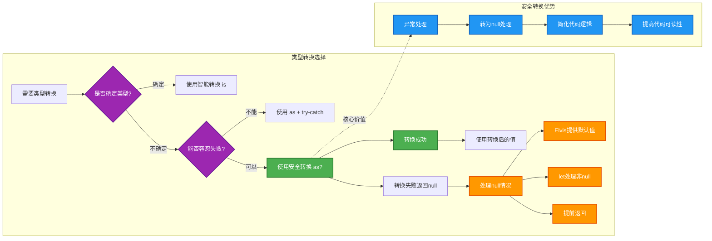

---

**📝 练习题 1**

下面哪段代码**无法**通过编译?

```kotlin
class Example {
    var data: Any = "Hello"
    
    fun process() {
        // 代码片段 A
        if (data is String) {
            println(data.length)
        }
        
        // 代码片段 B
        val local = data
        if (local is String) {
            println(local.length)
        }
        
        // 代码片段 C
        val str = data as? String
        println(str?.length)
        
        // 代码片段 D
        if (data !is String) return
        println(data.length)
    }
}
```

A. 代码片段 A  
B. 代码片段 B  
C. 代码片段 C  
D. 代码片段 D

**【答案】** A

**【解析】**
代码片段 A 无法通过编译,因为 `data` 是类的成员 `var` 属性。编译器无法保证在 `is` 检查和使用 `data.length` 之间,`data` 不会被其他代码(如其他线程)修改,因此不会对成员 `var` 属性进行智能转换。

- **代码片段 B** 可以编译通过,因为 `local` 是局部 `val` 变量,编译器能追踪其生命周期,智能转换生效。
- **代码片段 C** 可以编译通过,`as?` 安全转换不依赖智能转换机制,总是返回可空类型。
- **代码片段 D** 可以编译通过,虽然 `data` 是成员 `var` 属性,但在 `!is` 检查后提前 `return`,编译器通过数据流分析确定后续代码中 `data` 必定是 `String` 类型,智能转换在这种特殊情况下生效。

---

**📝 练习题 2**

以下代码的输出是什么?

```kotlin
fun mysterious(items: List<Any>): Int {
    var count = 0
    for (item in items) {
        when {
            item is String && item.length > 5 -> count += 1
            item is Int && item > 10 -> count += 2
            item as? Double != null -> count += 3
        }
    }
    return count
}

fun main() {
    val list = listOf("Kotlin", 5, 15, 3.14, "Hi", 20.5)
    println(mysterious(list))
}
```

A. 6  
B. 8  
C. 9  
D. 10

**【答案】** C

**【解析】**
逐个分析列表中的元素:

1. `"Kotlin"` (String, 长度 6 > 5) → 匹配第一个条件,`count += 1`,累计 = **1**
2. `5` (Int, 5 ≤ 10) → 不匹配任何条件,累计 = **1**
3. `15` (Int, 15 > 10) → 匹配第二个条件,`count += 2`,累计 = **3**
4. `3.14` (Double) → 不匹配前两个条件,`as? Double` 转换成功(非 null),匹配第三个条件,`count += 3`,累计 = **6**
5. `"Hi"` (String, 长度 2 ≤ 5) → 不匹配任何条件,累计 = **6**
6. `20.5` (Double) → 不匹配前两个条件,`as? Double` 转换成功,匹配第三个条件,`count += 3`,累计 = **9**

最终输出 **9**。

这道题综合考查了:
- `when` 表达式中的智能转换(`is` 检查后自动转换类型)
- 组合条件的短路求值(`&&` 运算符)
- 安全转换 `as?` 的使用(转换成功返回非 null,失败返回 null)
- 条件表达式的逻辑判断

---

## 类型检查与转换(is、!is、as、as?)

Kotlin 作为一门静态类型语言，在编译期就确定了变量的类型。但在实际开发中，我们经常需要处理多态场景——例如父类引用指向子类对象，或者处理泛型擦除后的对象。此时就需要在运行时 (Runtime) 检查对象的实际类型，并在确认类型后进行安全转换。Kotlin 提供了四个核心操作符来完成这些任务：`is`、`!is`、`as` 和 `as?`。

### is 操作符：类型检查的基石

`is` 操作符用于在运行时检查一个对象是否属于某个类型。它返回一个 `Boolean` 值，类似于 Java 中的 `instanceof` 关键字，但功能更强大。

```kotlin
// 定义一个简单的类层次结构
open class Animal(val name: String)  // 父类：动物
class Dog(name: String, val breed: String) : Animal(name)  // 子类：狗
class Cat(name: String, val color: String) : Animal(name)  // 子类：猫

fun main() {
    val animal: Animal = Dog("旺财", "哈士奇")  // 父类引用指向子类对象
    
    // 使用 is 检查 animal 是否真的是一只狗
    if (animal is Dog) {
        // 在这个作用域内，Kotlin 编译器知道 animal 一定是 Dog 类型
        // 因此可以直接访问 Dog 特有的属性，无需手动转换
        println("${animal.name} 是一只 ${animal.breed}")  // 输出: 旺财 是一只 哈士奇
    }
    
    // 检查是否不是某个类型
    if (animal !is Cat) {
        println("这不是一只猫")  // 输出: 这不是一只猫
    }
}
```

**核心特性**：`is` 操作符不仅能检查精确类型，还支持继承链上的类型检查。如果 `animal is Animal` 返回 `true`，那么无论 `animal` 实际是 `Dog` 还是 `Cat`，结果都为真。

```kotlin
fun describe(obj: Any) {  // Any 是 Kotlin 中所有类的根类型
    when {
        obj is String -> println("这是一个字符串，长度为 ${obj.length}")
        obj is Int -> println("这是一个整数，值为 $obj")
        obj is List<*> -> println("这是一个列表，大小为 ${obj.size}")
        else -> println("未知类型")
    }
}

fun main() {
    describe("Hello")       // 输出: 这是一个字符串，长度为 5
    describe(42)           // 输出: 这是一个整数，值为 42
    describe(listOf(1, 2)) // 输出: 这是一个列表，大小为 2
}
```

### !is 操作符：否定式检查

`!is` 是 `is` 的否定形式，用于检查对象**不是**某个类型。这在需要排除某些类型时非常有用。

```kotlin
fun processData(data: Any) {
    // 如果数据不是字符串，直接返回
    if (data !is String) {
        println("只能处理字符串类型的数据")
        return
    }
    
    // 此时编译器已经知道 data 一定是 String 类型
    println("处理字符串: ${data.uppercase()}")  // 可以直接调用 String 的方法
}

fun main() {
    processData(123)      // 输出: 只能处理字符串类型的数据
    processData("hello")  // 输出: 处理字符串: HELLO
}
```

### 智能转换的底层逻辑

当你使用 `is` 检查类型后，Kotlin 编译器会在检查成功的作用域内自动将变量转换为目标类型，这称为**智能转换 (Smart Cast)**。这个特性基于编译器的**数据流分析 (Data Flow Analysis)**，只有在编译器能够确保变量类型不会改变的情况下才会生效。

```kotlin
fun smartCastExample(value: Any) {
    // 在 if 之前，value 的类型是 Any
    if (value is String) {
        // 在这个 if 块内，编译器将 value 智能转换为 String
        println(value.length)  // ✅ 可以访问 String 的属性
        println(value.uppercase())  // ✅ 可以调用 String 的方法
    }
    
    // 离开 if 块后，value 又回到 Any 类型
    // println(value.length)  // ❌ 编译错误: Unresolved reference: length
}
```

**智能转换的限制条件**：智能转换只在编译器能够保证变量不会被修改时才生效。例如，对于 `var` 可变属性，如果它可能在其他线程中被修改，智能转换就不会发生。

```kotlin
class Container {
    var value: Any = "初始值"  // 可变属性
    
    fun process() {
        if (value is String) {
            // ❌ 编译错误: Smart cast to 'String' is impossible
            // 因为 value 是 var，可能在检查后被其他代码修改
            // println(value.length)
            
            // 解决方案：手动转换或使用局部变量
            val temp = value as String
            println(temp.length)
        }
    }
}
```

### as 操作符：强制类型转换

`as` 操作符用于显式地将一个对象转换为指定类型，类似于 Java 中的强制类型转换 (Cast)。但与 Java 不同的是，如果转换失败，`as` 会抛出 `ClassCastException` 异常，而不是返回 `null`。

```kotlin
fun main() {
    val obj: Any = "Kotlin"
    
    // 使用 as 强制转换为 String
    val str: String = obj as String  // ✅ 转换成功
    println(str.uppercase())  // 输出: KOTLIN
    
    val number: Any = 42
    try {
        val text: String = number as String  // ❌ 抛出 ClassCastException
    } catch (e: ClassCastException) {
        println("类型转换失败: ${e.message}")
        // 输出: 类型转换失败: class java.lang.Integer cannot be cast to class java.lang.String
    }
}
```

**使用场景**：`as` 通常用于你**确定**对象一定是某个类型的场景。如果不确定，应该使用更安全的 `as?` 操作符。

```kotlin
// 典型使用场景：从泛型容器中取出对象
fun processUserData(data: Map<String, Any>) {
    val name = data["name"] as String  // 假设你确定 name 一定是 String
    val age = data["age"] as Int       // 假设你确定 age 一定是 Int
    
    println("用户: $name, 年龄: $age")
}

fun main() {
    val userData = mapOf("name" to "张三", "age" to 25)
    processUserData(userData)  // 输出: 用户: 张三, 年龄: 25
}
```

### as? 操作符：安全类型转换

`as?` 是 `as` 的安全版本，被称为**安全转换操作符 (Safe Cast Operator)**。它的行为是：如果转换成功，返回转换后的对象；如果转换失败，返回 `null` 而不是抛出异常。

```kotlin
fun main() {
    val obj: Any = "Kotlin"
    
    // 使用 as? 进行安全转换
    val str: String? = obj as? String  // ✅ 转换成功，str = "Kotlin"
    println(str?.uppercase())  // 输出: KOTLIN
    
    val number: Any = 42
    val text: String? = number as? String  // ❌ 转换失败，text = null
    println(text?.uppercase())  // 输出: null
}
```

**最佳实践**：在大多数情况下，应该优先使用 `as?` 而不是 `as`，除非你有充分的理由确信转换一定会成功。安全转换通常与 Elvis 操作符 `?:` 配合使用。

```kotlin
fun parseUserAge(input: Any): Int {
    // 尝试将输入转换为 Int，如果失败则返回默认值 0
    return input as? Int ?: run {
        println("输入不是有效的整数，使用默认值 0")
        0
    }
}

fun main() {
    println(parseUserAge(25))      // 输出: 25
    println(parseUserAge("abc"))   // 输出: 输入不是有效的整数，使用默认值 0
                                    //      0
}
```

### 类型检查与转换的综合应用

在实际开发中，类型检查与转换经常结合使用。下面是一个处理多态数据的完整示例：

```kotlin
// 定义一个消息系统的类层次
sealed class Message  // 密封类，限定所有可能的子类

data class TextMessage(val content: String, val sender: String) : Message()
data class ImageMessage(val url: String, val width: Int, val height: Int) : Message()
data class VideoMessage(val url: String, val duration: Int) : Message()

// 消息处理器
class MessageProcessor {
    fun process(message: Message) {
        when (message) {  // when 表达式会自动进行智能转换
            is TextMessage -> {
                // 在这个分支中，message 被智能转换为 TextMessage
                println("收到来自 ${message.sender} 的文本消息: ${message.content}")
            }
            is ImageMessage -> {
                // 智能转换为 ImageMessage
                println("收到图片消息: ${message.url}")
                println("尺寸: ${message.width} x ${message.height}")
            }
            is VideoMessage -> {
                // 智能转换为 VideoMessage
                println("收到视频消息: ${message.url}, 时长: ${message.duration} 秒")
            }
        }
    }
    
    // 使用 as? 进行安全转换的示例
    fun extractTextContent(message: Message): String? {
        return (message as? TextMessage)?.content
        // 如果 message 是 TextMessage，返回其 content
        // 否则返回 null
    }
}

fun main() {
    val processor = MessageProcessor()
    
    val messages: List<Message> = listOf(
        TextMessage("你好，世界！", "Alice"),
        ImageMessage("https://example.com/image.jpg", 1920, 1080),
        VideoMessage("https://example.com/video.mp4", 120)
    )
    
    // 处理所有消息
    messages.forEach { processor.process(it) }
    
    // 提取文本内容
    println("\n文本内容提取:")
    messages.forEach { message ->
        val text = processor.extractTextContent(message)
        println("${message::class.simpleName}: ${text ?: "非文本消息"}")
    }
}
```

输出结果：
```
收到来自 Alice 的文本消息: 你好，世界！
收到图片消息: https://example.com/image.jpg
尺寸: 1920 x 1080
收到视频消息: https://example.com/video.mp4, 时长: 120 秒

文本内容提取:
TextMessage: 你好，世界！
ImageMessage: 非文本消息
VideoMessage: 非文本消息
```

### 类型检查的性能考量

虽然 `is` 和 `as` 操作符在语法上很简洁，但它们在运行时需要进行类型检查，这会带来一定的性能开销。在性能敏感的代码中，应该避免频繁的类型检查。

```kotlin
// ❌ 性能较差的写法：每次循环都进行类型检查
fun sumIntegers(list: List<Any>): Int {
    var sum = 0
    for (item in list) {
        if (item is Int) {  // 每次循环都检查类型
            sum += item
        }
    }
    return sum
}

// ✅ 更好的写法：使用 filterIsInstance 一次性过滤
fun sumIntegersBetter(list: List<Any>): Int {
    return list.filterIsInstance<Int>().sum()  // 只检查一次，然后批量处理
}

fun main() {
    val mixedList: List<Any> = listOf(1, "hello", 2, 3.14, 4, "world", 5)
    
    println(sumIntegers(mixedList))        // 输出: 12
    println(sumIntegersBetter(mixedList))  // 输出: 12 (性能更好)
}
```

### 类型检查的底层实现

从字节码层面看，Kotlin 的 `is` 操作符最终会编译为 JVM 的 `instanceof` 指令，而 `as` 会编译为 `checkcast` 指令。这些指令的执行速度通常很快，但在循环中频繁调用时仍然会产生可观的开销。

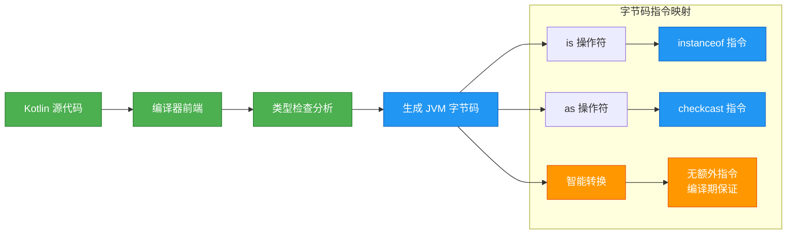

## 类型别名(typealias、简化复杂类型、可读性提升)

随着项目规模的增长，我们会遇到越来越复杂的类型声明——嵌套的泛型、冗长的函数类型、多层的集合结构。这些复杂类型不仅书写繁琐，更会严重影响代码的可读性。Kotlin 提供了 `typealias` 关键字来解决这个问题，允许我们为现有类型创建别名 (Alias)，从而让代码更加简洁和易懂。

### typealias 的基本语法

`typealias` 的语法非常简单：在顶层或类内部使用 `typealias` 关键字，为现有类型定义一个新名称。

```kotlin
// 为基本类型创建别名
typealias UserId = String          // 用户 ID 类型
typealias Timestamp = Long         // 时间戳类型
typealias Price = Double           // 价格类型

// 使用类型别名
fun getUserById(id: UserId): String {  // 参数类型是 UserId，实际上就是 String
    return "用户-$id"
}

fun getCurrentTime(): Timestamp {  // 返回类型是 Timestamp，实际上就是 Long
    return System.currentTimeMillis()
}

fun main() {
    val userId: UserId = "user_12345"  // UserId 类型的变量
    println(getUserById(userId))        // 输出: 用户-user_12345
    
    val now: Timestamp = getCurrentTime()  // Timestamp 类型的变量
    println("当前时间戳: $now")             // 输出: 当前时间戳: 1739174400000
}
```

**重要概念**：`typealias` **不会创建新的类型**，它只是给现有类型起了一个别名。在编译后，所有的类型别名都会被替换为原始类型。这意味着 `UserId` 和 `String` 在类型系统中是完全等价的，可以互换使用。

```kotlin
typealias Name = String
typealias Nickname = String

fun main() {
    val userName: Name = "张三"
    val userNick: Nickname = userName  // ✅ 可以直接赋值，因为本质上都是 String
    
    // 也可以将普通 String 赋值给类型别名
    val anotherName: Name = "李四"     // ✅ 没问题
}
```

### 简化复杂的泛型类型

`typealias` 最常见的使用场景是简化复杂的泛型声明。当你需要频繁使用嵌套泛型时，类型别名能够大幅提升代码的可读性。

```kotlin
// ❌ 没有类型别名的写法：冗长且难以理解
fun processUserData(
    data: Map<String, List<Pair<String, Int>>>
): Map<String, List<Pair<String, Int>>> {
    // 处理逻辑
    return data
}

// ✅ 使用类型别名的写法：清晰且语义明确
typealias UserName = String                          // 用户名
typealias AttributeName = String                     // 属性名
typealias AttributeValue = Int                       // 属性值
typealias UserAttribute = Pair<AttributeName, AttributeValue>  // 用户属性
typealias UserAttributes = List<UserAttribute>       // 用户属性列表
typealias UserDataMap = Map<UserName, UserAttributes>  // 用户数据映射

fun processUserDataBetter(data: UserDataMap): UserDataMap {
    // 现在代码的意图一目了然
    return data.mapValues { (_, attributes) ->
        // 过滤掉值为 0 的属性
        attributes.filter { it.second != 0 }
    }
}

fun main() {
    val userData: UserDataMap = mapOf(
        "张三" to listOf("年龄" to 25, "积分" to 0, "等级" to 5),
        "李四" to listOf("年龄" to 30, "积分" to 100, "等级" to 8)
    )
    
    val processed = processUserDataBetter(userData)
    processed.forEach { (name, attrs) ->
        println("$name: ${attrs.joinToString { "${it.first}=${it.second}" }}")
    }
    // 输出:
    // 张三: 年龄=25, 等级=5
    // 李四: 年龄=30, 积分=100, 等级=8
}
```

### 简化函数类型

函数类型 (Function Type) 在 Kotlin 中经常用于高阶函数和回调，但它们的语法可能变得非常复杂。`typealias` 可以让函数类型的定义更加直观。

```kotlin
// 定义各种函数类型的别名
typealias Validator<T> = (T) -> Boolean                    // 验证器：接收一个参数，返回布尔值
typealias Transformer<T, R> = (T) -> R                     // 转换器：接收 T 类型，返回 R 类型
typealias EventHandler = (String) -> Unit                  // 事件处理器：接收事件名称，无返回值
typealias AsyncCallback<T> = (Result<T>) -> Unit           // 异步回调：接收 Result，无返回值

// 使用函数类型别名
class UserService {
    // 验证用户名
    fun validateUsername(
        username: String,
        validator: Validator<String>  // 使用别名，清晰表达意图
    ): Boolean {
        return validator(username)
    }
    
    // 转换用户数据
    fun <R> transformUser(
        username: String,
        transformer: Transformer<String, R>  // 使用别名
    ): R {
        return transformer(username)
    }
    
    // 异步加载用户
    fun loadUserAsync(
        userId: String,
        callback: AsyncCallback<String>  // 使用别名
    ) {
        // 模拟异步操作
        Thread {
            Thread.sleep(1000)
            callback(Result.success("用户-$userId"))
        }.start()
    }
}

fun main() {
    val service = UserService()
    
    // 使用 lambda 表达式作为 Validator
    val isValid = service.validateUsername("admin") { name ->
        name.length >= 3 && name.matches(Regex("[a-zA-Z0-9]+"))
    }
    println("用户名有效: $isValid")  // 输出: 用户名有效: true
    
    // 使用 lambda 表达式作为 Transformer
    val upperName = service.transformUser("alice") { it.uppercase() }
    println("转换后的用户名: $upperName")  // 输出: 转换后的用户名: ALICE
    
    // 使用 lambda 表达式作为 AsyncCallback
    service.loadUserAsync("12345") { result ->
        result.onSuccess { user -> println("加载成功: $user") }
        result.onFailure { error -> println("加载失败: ${error.message}") }
    }
    
    // 等待异步操作完成
    Thread.sleep(1500)  // 输出: 加载成功: 用户-12345
}
```

### 提升代码的领域语义

在领域驱动设计 (Domain-Driven Design, DDD) 中，类型别名可以帮助我们构建更加贴近业务领域的类型系统，让代码"说人话"。

```kotlin
// 电商系统的类型别名
typealias ProductId = String          // 商品 ID
typealias OrderId = String            // 订单 ID
typealias CustomerId = String         // 客户 ID
typealias Money = Double              // 金额（实际项目中应使用 BigDecimal）
typealias Quantity = Int              // 数量

// 订单项：商品 ID -> 数量
typealias OrderItems = Map<ProductId, Quantity>

// 价格表：商品 ID -> 价格
typealias PriceTable = Map<ProductId, Money>

// 订单验证器
typealias OrderValidator = (OrderId, OrderItems) -> Boolean

// 订单计算器
data class Order(
    val orderId: OrderId,
    val customerId: CustomerId,
    val items: OrderItems
)

class OrderService(
    private val priceTable: PriceTable  // 使用类型别名，意图清晰
) {
    // 计算订单总价
    fun calculateTotal(order: Order): Money {
        return order.items.entries.sumOf { (productId, quantity) ->
            val price = priceTable[productId] ?: 0.0  // 获取商品单价
            price * quantity  // 单价 × 数量
        }
    }
    
    // 验证订单
    fun validateOrder(
        order: Order,
        validator: OrderValidator  // 使用函数类型别名
    ): Boolean {
        return validator(order.orderId, order.items)
    }
}

fun main() {
    // 构建价格表
    val prices: PriceTable = mapOf(
        "PROD-001" to 99.99,
        "PROD-002" to 149.99,
        "PROD-003" to 299.99
    )
    
    val service = OrderService(prices)
    
    // 创建订单
    val order = Order(
        orderId = "ORDER-12345",
        customerId = "CUST-001",
        items = mapOf(
            "PROD-001" to 2,   // 购买 2 个 PROD-001
            "PROD-002" to 1    // 购买 1 个 PROD-002
        )
    )
    
    // 计算总价
    val total = service.calculateTotal(order)
    println("订单总价: ¥${"%.2f".format(total)}")  // 输出: 订单总价: ¥349.97
    
    // 验证订单（检查数量是否合理）
    val isValid = service.validateOrder(order) { _, items ->
        items.values.all { it > 0 && it <= 100 }  // 数量必须在 1-100 之间
    }
    println("订单有效: $isValid")  // 输出: 订单有效: true
}
```

### 类型别名的作用域

`typealias` 可以定义在不同的作用域中，它们的可见性遵循 Kotlin 的标准访问修饰符规则。

```kotlin
// 顶层类型别名：在整个文件中可见
typealias GlobalUserId = String

class UserManager {
    // 类内部的类型别名：只在类内部可见
    private typealias InternalCache = MutableMap<String, Any>
    
    private val cache: InternalCache = mutableMapOf()  // 使用内部类型别名
    
    fun cacheUser(id: GlobalUserId, data: Any) {  // 使用全局类型别名
        cache[id] = data
    }
}

// 在函数内部定义类型别名（较少见）
fun processData() {
    typealias LocalData = List<String>  // 局部类型别名
    val data: LocalData = listOf("a", "b", "c")
    println(data)
}
```

### 类型别名 vs 内联类

你可能会想，既然 `typealias` 不创建新类型，那如何才能创建一个"强类型"的别名，避免不同语义的值被混用呢？答案是使用 **内联类 (Inline Class)** 或 **值类 (Value Class)**。

```kotlin
// typealias: 不创建新类型，可以互换
typealias Meters = Double
typealias Kilograms = Double

fun calculateBMI(weight: Kilograms, height: Meters): Double {
    return weight / (height * height)
}

fun main() {
    val height: Meters = 1.75
    val weight: Kilograms = 70.0
    
    // ❌ 语义错误，但编译器不会报错（因为都是 Double）
    val wrongBMI = calculateBMI(height, weight)  // 参数位置颠倒了！
    println(wrongBMI)  // 输出错误的结果
    
    // ✅ 正确的调用
    val correctBMI = calculateBMI(weight, height)
    println(correctBMI)  // 输出: 22.857142857142858
}
```

```kotlin
// 值类 (Value Class): 创建新类型，不能互换
@JvmInline
value class Meters(val value: Double)  // 强类型的米

@JvmInline
value class Kilograms(val value: Double)  // 强类型的千克

fun calculateBMISafe(weight: Kilograms, height: Meters): Double {
    return weight.value / (height.value * height.value)
}

fun main() {
    val height = Meters(1.75)
    val weight = Kilograms(70.0)
    
    // ❌ 编译错误: Type mismatch
    // val wrongBMI = calculateBMISafe(height, weight)
    
    // ✅ 必须按正确顺序传参
    val correctBMI = calculateBMISafe(weight, height)
    println(correctBMI)  // 输出: 22.857142857142858
}
```

### 类型别名的最佳实践

1. **使用有意义的名称**：类型别名的名称应该能够清晰表达其业务含义，而不仅仅是简化长类型。

```kotlin
// ❌ 不推荐：名称没有表达业务含义
typealias M = Map<String, List<Int>>

// ✅ 推荐：名称清晰表达了业务语义
typealias StudentGrades = Map<String, List<Int>>  // 学生成绩：姓名 -> 分数列表
```

2. **避免过度嵌套**：即使使用了类型别名，也要避免创建过于复杂的嵌套结构，这通常意味着设计需要重构。

```kotlin
// ❌ 不推荐：过度嵌套，即使有别名也难以理解
typealias ComplexData = Map<String, List<Map<String, Pair<Int, List<String>>>>>

// ✅ 推荐：将复杂结构拆分为多个有意义的类型
typealias UserId = String
typealias Metadata = Pair<Int, List<String>>
typealias Properties = Map<String, Metadata>
typealias UserData = Map<UserId, List<Properties>>
```

3. **结合注释使用**：在复杂场景下，为类型别名添加注释，说明其用途和约束。

```kotlin
/**
 * 用户权限集合
 * 键：资源 ID (例如 "document-123")
 * 值：权限列表 (例如 ["read", "write"])
 */
typealias UserPermissions = Map<String, List<String>>
```

### 类型别名的编译时与运行时

从编译器的角度看，类型别名在编译后会完全消失，所有别名都会被替换为原始类型。这意味着类型别名**没有运行时开销**。

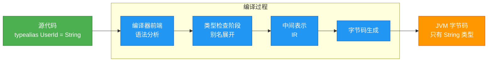

**📝 练习题 1**

以下哪个关于 `is` 和 `as?` 操作符的描述是**错误**的？

A. `is` 操作符在检查成功后会触发智能转换，无需手动转换类型  
B. `as?` 操作符在转换失败时返回 `null`，不会抛出异常  
C. 对于 `var` 可变属性，智能转换总是会自动生效  
D. `is` 操作符可以检查对象是否属于继承链上的任意类型  

**【答案】** C

**【解析】** 
选项 C 是错误的。智能转换 (Smart Cast) 只在编译器能够保证变量不会被修改的情况下才会生效。对于 `var` 可变属性，尤其是类的成员属性，编译器无法保证在类型检查和使用之间该属性不会被其他代码（如其他线程或其他方法）修改，因此智能转换不会自动生效。解决方案是将属性值赋给一个局部 `val` 变量，或者使用显式转换 `as` 或 `as?`。

其他选项的解释：
- **A 正确**：`is` 操作符确实会在检查成功的作用域内触发智能转换，这是 Kotlin 编译器的数据流分析能力的体现。
- **B 正确**：`as?` 被称为安全转换操作符，转换失败时返回 `null` 而不是抛出 `ClassCastException`，这是它与 `as` 的主要区别。
- **D 正确**：`is` 支持多态检查，如果对象是某个类的子类实例，`obj is 父类` 也会返回 `true`。

---

**📝 练习题 2**

在以下代码中，`typealias` 的使用有什么潜在问题？应该如何改进？

```kotlin
typealias Temperature = Double
typealias Distance = Double

fun calculateSpeed(distance: Distance, time: Temperature): Double {
    return distance / time
}

fun main() {
    val temp: Temperature = 25.0  // 摄氏度
    val dist: Distance = 100.0     // 米
    
    val speed = calculateSpeed(temp, dist)  // 参数位置错误！
    println("速度: $speed m/s")
}
```

A. 代码会产生编译错误，无法通过编译  
B. 代码可以编译，但会计算出错误的结果，因为参数位置颠倒了  
C. 代码完全正确，没有任何问题  
D. 应该使用内联类 (Inline Class) 或值类 (Value Class) 代替类型别名  

**【答案】** B 和 D

**【解析】**  
这道题考察对 `typealias` 本质的理解。

**B 是正确的**：由于 `typealias` 不创建新的类型，`Temperature` 和 `Distance` 在类型系统中都等价于 `Double`，因此编译器无法检测到参数位置的错误。代码可以正常编译，但会产生错误的结果（用温度除以距离，这在物理意义上是荒谬的）。

**D 也是正确的**：这正是改进方案。当我们需要为不同语义的值创建强类型区分时，应该使用值类 (Value Class) 而不是类型别名：

```kotlin
@JvmInline
value class Temperature(val celsius: Double)

@JvmInline
value class Distance(val meters: Double)

fun calculateSpeed(distance: Distance, time: Double): Double {
    return distance.meters / time
}

fun main() {
    val temp = Temperature(25.0)
    val dist = Distance(100.0)
    
    // ❌ 编译错误: Type mismatch: required Distance, found Temperature
    // val speed = calculateSpeed(temp, dist)
    
    // ✅ 必须传递正确的类型
    val speed = calculateSpeed(dist, 10.0)
    println("速度: $speed m/s")
}
```

值类在编译时创建了真正的新类型，可以防止不同语义的值被混用，同时在运行时又没有额外开销（因为 `@JvmInline` 注解会在字节码层面优化掉包装类）。这是类型安全和性能的完美平衡。

---

## 类型投影(使用处型变、in/out修饰符)

类型投影 (Type Projection) 是 Kotlin 泛型系统中的一个强大特性,它允许我们在使用泛型类型时临时改变其型变行为。这种机制被称为"使用处型变" (use-site variance),与我们之前学习的"声明处型变" (declaration-site variance) 形成互补。

在实际开发中,我们经常遇到这样的场景:某个泛型类在声明时是不变的 (invariant),但在特定使用场合下,我们希望它表现出协变或逆变的特性。类型投影正是为解决这一需求而生。

### 使用处型变的本质

使用处型变允许我们在使用泛型类型的地方,通过 `out` 和 `in` 修饰符来限制类型参数的使用方式,从而在保证类型安全的前提下实现灵活的型变行为。

让我们通过一个经典的场景来理解这个概念。假设我们有一个不变的泛型容器类:

```kotlin
// 标准的不变泛型类,没有声明处型变修饰符
class Box<T>(var value: T)

fun main() {
    val intBox: Box<Int> = Box(42)
    // val anyBox: Box<Any> = intBox  // ❌ 编译错误!即使 Int 是 Any 的子类型
    
    // 问题核心:Box<Int> 和 Box<Any> 之间没有子类型关系
    // 因为 Box 是不变的(invariant)
}
```

这里的问题在于,虽然 `Int` 是 `Any` 的子类型,但 `Box<Int>` 并不是 `Box<Any>` 的子类型。这是因为 `Box` 是不变的——如果允许这种赋值,我们可以通过 `anyBox` 往容器里放入任何类型,破坏类型安全:

```kotlin
// 假设允许上面的赋值
val anyBox: Box<Any> = intBox  // 假设可行
anyBox.value = "String"        // 放入字符串
val num: Int = intBox.value    // 💥 运行时崩溃!期望 Int 得到 String
```

但在某些场景下,我们只需要从 `Box` 中读取数据,不需要写入。这时候,我们可以使用类型投影来临时改变型变行为:

```kotlin
fun printBox(box: Box<out Any>) {  // 使用 out 投影
    // 在这个函数内,box 被视为协变的生产者
    val value: Any = box.value      // ✅ 可以读取,类型为 Any
    // box.value = "test"           // ❌ 编译错误!不能写入
    println("Box contains: $value")
}

fun main() {
    val intBox = Box(42)
    printBox(intBox)  // ✅ 现在可以传入 Box<Int> 了!
}
```

### out 投影:协变的生产者

`out` 投影将类型参数限制为只能出现在"输出位置" (out position),使得泛型类型表现为协变。使用 `out` 投影后,我们只能从该类型中读取数据,不能写入。

```kotlin
// 演示 out 投影的完整行为
class Container<T>(private var item: T) {
    fun get(): T = item           // 输出位置:返回 T
    fun set(value: T) {           // 输入位置:接收 T
        item = value
    }
}

// 使用 out 投影创建只读视图
fun processContainer(container: Container<out Number>) {
    // out 投影的效果:
    
    // ✅ 可以调用返回 T 的方法
    val num: Number = container.get()  // 读取是安全的
    println("Got number: $num")
    
    // ❌ 不能调用接收 T 的方法
    // container.set(3.14)  // 编译错误!禁止写入
    // container.set(42)    // 即使是 Int 也不行
    
    // 原因:我们不知道 container 的实际类型参数
    // 它可能是 Container<Int>,也可能是 Container<Double>
    // 如果允许写入,就可能破坏类型安全
}

fun main() {
    val intContainer = Container<Int>(42)
    val doubleContainer = Container<Double>(3.14)
    
    // 由于 out 投影,两者都可以传入
    processContainer(intContainer)    // ✅ Container<Int> → Container<out Number>
    processContainer(doubleContainer) // ✅ Container<Double> → Container<out Number>
}
```

`out` 投影的核心思想是:**如果我们承诺不往容器里写入任何东西,那么把子类型的容器当作父类型的容器使用是安全的**。

### in 投影:逆变的消费者

与 `out` 相反,`in` 投影将类型参数限制为只能出现在"输入位置" (in position),使得泛型类型表现为逆变。使用 `in` 投影后,我们只能向该类型写入数据,不能读取(只能读取为 `Any?`)。

```kotlin
// 演示 in 投影的典型场景
class Processor<T> {
    fun process(item: T) {          // 输入位置:接收 T
        println("Processing: $item")
    }
    
    fun getProcessed(): T {         // 输出位置:返回 T
        throw UnsupportedOperationException()
    }
}

// 使用 in 投影创建只写视图
fun addNumbers(processor: Processor<in Int>) {
    // in 投影的效果:
    
    // ✅ 可以调用接收 T 的方法
    processor.process(42)        // 写入 Int 是安全的
    processor.process(100)       // 可以多次写入
    
    // ❌ 不能调用返回 T 的方法(返回类型变成 Any?)
    // val result: Int = processor.getProcessed()  // 编译错误!
    val anyResult: Any? = processor.getProcessed()  // 只能读取为 Any?
    
    // 原因:我们不知道 processor 的实际类型参数
    // 它可能是 Processor<Number>,也可能是 Processor<Any>
    // 如果返回 Number 或 Any,我们无法安全地转换为 Int
}

fun main() {
    val numberProcessor = Processor<Number>()
    val anyProcessor = Processor<Any>()
    
    // 由于 in 投影,父类型的处理器可以接受子类型的数据
    addNumbers(numberProcessor)  // ✅ Processor<Number> → Processor<in Int>
    addNumbers(anyProcessor)     // ✅ Processor<Any> → Processor<in Int>
    
    // 为什么安全?
    // numberProcessor 可以处理任何 Number,Int 是 Number 的子类型,当然可以
    // anyProcessor 可以处理任何 Any,Int 也是 Any 的子类型,同样可以
}
```

`in` 投影的核心思想是:**如果我们承诺不从容器里读取特定类型的数据,那么把父类型的容器当作子类型的容器使用是安全的**。

### 声明处型变 vs 使用处型变

为了更清晰地理解两种型变方式的区别和联系,我们通过一个完整的对比示例来说明:

```kotlin
// 1. 声明处型变:在类定义时就确定型变行为
// 优点:使用时更简洁,一次声明处处受益
// 缺点:限制了类的设计灵活性
class Producer<out T>(private val value: T) {  // 声明处协变
    fun get(): T = value          // ✅ 允许:输出位置
    // fun set(v: T) {}           // ❌ 禁止:输入位置,编译错误
}

class Consumer<in T> {                         // 声明处逆变
    fun accept(value: T) {        // ✅ 允许:输入位置
        println(value)
    }
    // fun get(): T { ... }       // ❌ 禁止:输出位置,编译错误
}

fun useDeclarationSite() {
    val stringProducer: Producer<String> = Producer("Hello")
    val anyProducer: Producer<Any> = stringProducer  // ✅ 自动协变
    
    val anyConsumer: Consumer<Any> = Consumer()
    val stringConsumer: Consumer<String> = anyConsumer  // ✅ 自动逆变
}

// 2. 使用处型变:在使用时临时指定型变行为
// 优点:更灵活,可以在不变的类型上临时应用型变
// 缺点:每次使用都需要显式声明
class MutableBox<T>(var value: T)  // 不变的类,既能读又能写

fun useSiteVariance() {
    val intBox = MutableBox(42)
    
    // 临时将 MutableBox 当作协变的生产者使用
    val producer: MutableBox<out Number> = intBox  // ✅ out 投影
    val num: Number = producer.value               // ✅ 可以读取
    // producer.value = 3.14                       // ❌ 不能写入
    
    // 临时将 MutableBox 当作逆变的消费者使用
    val anyBox = MutableBox<Any>("Initial")
    val consumer: MutableBox<in String> = anyBox   // ✅ in 投影
    consumer.value = "New Value"                   // ✅ 可以写入
    val readValue: Any? = consumer.value           // ⚠️ 只能读取为 Any?
}
```

下面通过一个流程图来展示两种型变方式的决策逻辑:

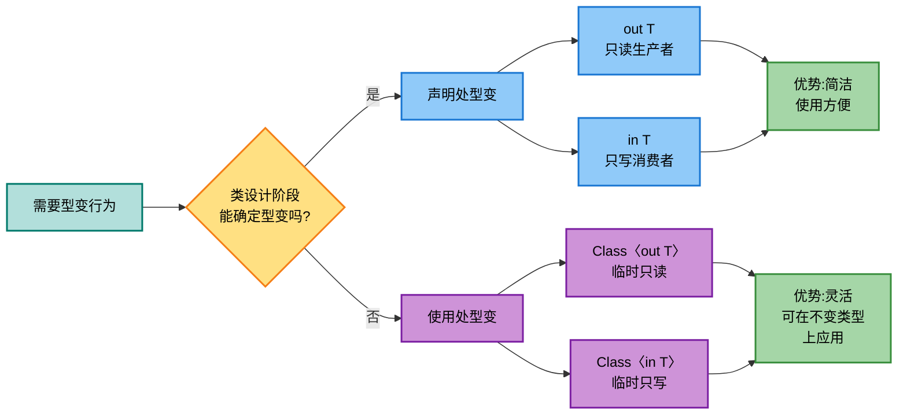

### 实战案例:复制函数的类型投影

理解类型投影最好的方式是看一个经典的实战案例——集合的复制函数。Kotlin 标准库中的 `copyInto` 函数就巧妙地运用了类型投影:

```kotlin
// 模拟 Kotlin 标准库的 copyInto 实现
fun <T> Array<out T>.copyInto(
    destination: Array<in T>,  // 目标数组使用 in 投影
    destinationOffset: Int = 0,
    startIndex: Int = 0,
    endIndex: Int = size
): Array<in T> {
    // this: Array<out T> - 源数组使用 out 投影(扩展接收者隐式带 out)
    // destination: Array<in T> - 目标数组使用 in 投影
    
    // 从源数组读取数据
    for (i in startIndex until endIndex) {
        val element: T = this[i]  // ✅ 从 Array<out T> 读取
        destination[destinationOffset + i - startIndex] = element  // ✅ 写入 Array<in T>
    }
    return destination
}

// 使用示例:展示灵活性
fun demonstrateCopyInto() {
    val intArray: Array<Int> = arrayOf(1, 2, 3, 4, 5)
    val numberArray: Array<Number> = arrayOfNulls<Number>(10)
    val anyArray: Array<Any?> = arrayOfNulls<Any>(10)
    
    // ✅ Array<Int> → Array<out Int>
    // ✅ Array<Number> → Array<in Int> (Number 是 Int 的父类型)
    intArray.copyInto(numberArray, destinationOffset = 0)
    
    // ✅ Array<Int> → Array<out Int>
    // ✅ Array<Any?> → Array<in Int> (Any? 是 Int 的父类型)
    intArray.copyInto(anyArray, destinationOffset = 5)
    
    println("Number array: ${numberArray.contentToString()}")
    println("Any array: ${anyArray.contentToString()}")
    
    // 如果没有类型投影,我们需要为每种类型组合写单独的函数:
    // fun copyIntToNumber(src: Array<Int>, dst: Array<Number>)
    // fun copyIntToAny(src: Array<Int>, dst: Array<Any>)
    // fun copyDoubleToNumber(src: Array<Double>, dst: Array<Number>)
    // ... 组合爆炸!
}
```

这个例子完美展示了类型投影的威力:
- 源数组使用 `out` 投影,允许传入任何子类型的数组
- 目标数组使用 `in` 投影,允许传入任何父类型的数组
- 一个函数解决所有合理的类型组合,避免代码重复

### 类型投影的限制与约束

虽然类型投影提供了巨大的灵活性,但它也带来了一些使用上的限制。理解这些限制有助于我们更好地设计 API:

```kotlin
class DataHolder<T>(private var data: T) {
    fun get(): T = data
    fun set(value: T) { data = value }
}

fun demonstrateProjectionLimitations() {
    val holder = DataHolder("Hello")
    
    // 1. out 投影的限制
    val outProjection: DataHolder<out Any> = holder
    val value: Any = outProjection.get()  // ✅ 可以读取
    // outProjection.set("World")         // ❌ 不能调用接收 T 的方法
    // outProjection.set(42)              // ❌ 即使是 Any 的子类型也不行
    
    // 2. in 投影的限制
    val stringHolder = DataHolder("Initial")
    val inProjection: DataHolder<in String> = stringHolder
    inProjection.set("New Value")          // ✅ 可以写入 String
    // val str: String = inProjection.get() // ❌ 返回类型是 Any?,不是 String
    val anyValue: Any? = inProjection.get()  // ✅ 只能读取为 Any?
    
    // 3. 同时使用 out 和 in?不可能!
    // val bothProjection: DataHolder<out Number, in Number> = ...  // ❌ 语法错误
    // 一个类型参数不能同时是协变和逆变的
    
    // 4. 投影是传染性的
    fun processOutProjection(h: DataHolder<out Number>): DataHolder<out Number> {
        // 如果返回参数中的投影类型,调用者也会受到投影限制
        return h
    }
    
    val result = processOutProjection(DataHolder<Int>(42))
    // result.set(100)  // ❌ 调用者也不能写入
}
```

### 高级场景:嵌套泛型的投影

当泛型类型嵌套时,类型投影的行为变得更加微妙。我们需要理解投影如何在嵌套结构中传播:

```kotlin
// 嵌套泛型的投影示例
class Wrapper<T>(val value: T)

fun demonstrateNestedProjection() {
    // 场景 1: 简单嵌套
    val intWrapper: Wrapper<Int> = Wrapper(42)
    val numberWrapper: Wrapper<out Number> = intWrapper  // ✅ 外层协变
    val num: Number = numberWrapper.value                // ✅ 读取成功
    
    // 场景 2: 双层嵌套
    val deepWrapper: Wrapper<Wrapper<Int>> = Wrapper(Wrapper(42))
    
    // ✅ 只投影外层
    val outerProjection: Wrapper<out Wrapper<Int>> = deepWrapper
    val innerWrapper: Wrapper<Int> = outerProjection.value  // 内层保持 Wrapper<Int>
    
    // ✅ 投影两层
    val bothProjection: Wrapper<out Wrapper<out Number>> = deepWrapper
    val innerValue: Number = bothProjection.value.value  // 两层都是协变的
    
    // 场景 3: 列表嵌套
    val intLists: List<List<Int>> = listOf(listOf(1, 2), listOf(3, 4))
    // List 在声明时就是协变的 (List<out E>)
    val numberLists: List<List<Number>> = intLists  // ✅ 自动协变传播
    
    // 手动投影也可以
    val manualProjection: List<out List<out Number>> = intLists  // 显式双层协变
}
```

下面用一个图表来说明类型投影在不同场景下的行为模式:

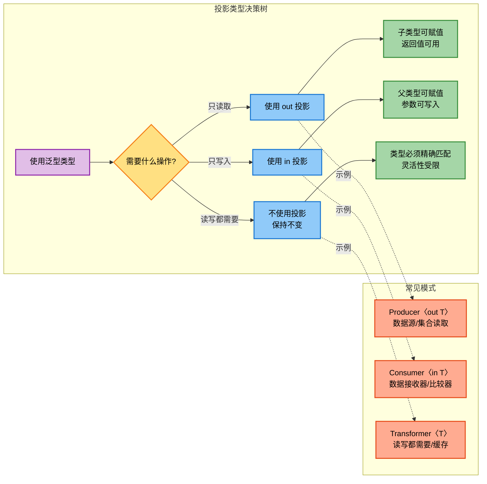

## 星号投影(未知类型、安全访问)

星号投影 (Star Projection) 是 Kotlin 类型系统中用于表示"未知类型"的一种特殊语法,记作 `*`。它提供了一种安全的方式来处理泛型类型参数完全未知的情况,可以类比为 Java 中的无界通配符 `<?>`。

### 星号投影的核心概念

当我们面对一个泛型类型,但完全不关心或不知道其具体的类型参数时,就可以使用星号投影。星号投影本质上是一种**类型安全的逃生舱**——它允许我们在不知道确切类型的情况下,依然能够安全地操作泛型对象。

```kotlin
// 基础示例:星号投影的基本用法
class Box<T>(val value: T)

fun handleUnknownBox(box: Box<*>) {  // 星号投影:表示未知类型
    // box 的类型参数是未知的,可能是 Box<Int>、Box<String>、Box<Any> 等任何类型
    
    // ✅ 可以读取,但类型被投影为 Any?
    val value: Any? = box.value  // 安全:任何类型都是 Any? 的子类型
    println("Box contains: $value")
    
    // ❌ 不能写入(Box 是不可变的,这里只是示意)
    // 如果 Box 有 set 方法,也无法调用
    // 因为我们不知道应该传入什么类型
}

fun main() {
    val intBox = Box(42)
    val stringBox = Box("Hello")
    val anyBox = Box<Any>(listOf(1, 2, 3))
    
    // 所有类型的 Box 都可以传入
    handleUnknownBox(intBox)     // Box<Int> → Box<*>
    handleUnknownBox(stringBox)  // Box<String> → Box<*>
    handleUnknownBox(anyBox)     // Box<Any> → Box<*>
}
```

### 星号投影与类型投影的关系

星号投影实际上是 `out` 和 `in` 投影的一种特殊形式,其具体行为取决于类型参数的型变声明:

```kotlin
// 规则 1: 对于协变类型参数 (out T),星号投影等价于 <out Any?>
class Producer<out T>(val value: T)

fun processProducer(producer: Producer<*>) {
    // Producer<*> 等价于 Producer<out Any?>
    val value: Any? = producer.value  // ✅ 可以读取为 Any?
}

// 规则 2: 对于逆变类型参数 (in T),星号投影等价于 <in Nothing>
class Consumer<in T> {
    fun accept(value: T) {
        println(value)
    }
}

fun processConsumer(consumer: Consumer<*>) {
    // Consumer<*> 等价于 Consumer<in Nothing>
    // consumer.accept(???)  // ❌ 无法调用!因为 Nothing 没有实例
    // Nothing 是所有类型的子类型,但没有任何值属于 Nothing
}

// 规则 3: 对于不变类型参数 (T),星号投影等价于 <out Any?>
class MutableBox<T>(var value: T)

fun processMutableBox(box: MutableBox<*>) {
    // MutableBox<*> 等价于 MutableBox<out Any?>
    val value: Any? = box.value       // ✅ 可以读取为 Any?
    // box.value = "new"              // ❌ 不能写入
    // box.value = null               // ❌ 即使是 null 也不行
}
```

让我们通过一个对比表格来清晰地理解这三种规则:

```kotlin
/*
╔═══════════════════════════╦═══════════════════════╦═══════════════════════════════════╗
║ 类型参数声明              ║ 星号投影 (*)          ║ 等价形式                          ║
╠═══════════════════════════╬═══════════════════════╬═══════════════════════════════════╣
║ class C<out T>            ║ C<*>                  ║ C<out Any?>                       ║
║ (协变/只读)               ║                       ║ 可以读取,返回 Any?                ║
╠═══════════════════════════╬═══════════════════════╬═══════════════════════════════════╣
║ class C<in T>             ║ C<*>                  ║ C<in Nothing>                     ║
║ (逆变/只写)               ║                       ║ 无法写入(Nothing 无实例)          ║
╠═══════════════════════════╬═══════════════════════╬═══════════════════════════════════╣
║ class C<T>                ║ C<*>                  ║ C<out Any?>                       ║
║ (不变/读写)               ║                       ║ 只能读取,返回 Any?                ║
╚═══════════════════════════╩═══════════════════════╩═══════════════════════════════════╝

关键洞察:
- 协变 (out T): 星号投影保留读取能力,但类型变为最通用的 Any?
- 逆变 (in T): 星号投影失去写入能力,因为 Nothing 类型没有实例
- 不变 (T): 星号投影表现得像协变,只能读取不能写入
*/
```

### 实战应用:类型擦除与反射

星号投影在处理运行时类型信息和反射时特别有用,因为 JVM 的类型擦除机制会丢失泛型的具体类型参数:

```kotlin
import kotlin.reflect.KClass

// 场景 1: 集合类型检查
fun analyzeCollection(obj: Any) {
    when (obj) {
        // ✅ 使用星号投影检查是否为 List,不关心元素类型
        is List<*> -> {
            println("这是一个 List,包含 ${obj.size} 个元素")
            // 遍历元素,类型为 Any?
            obj.forEach { item: Any? ->
                println("  元素: $item (类型: ${item?.javaClass?.simpleName})")
            }
        }
        
        // ✅ 检查是否为 Map,不关心键值类型
        is Map<*, *> -> {  // 多个类型参数都可以用 *
            println("这是一个 Map,包含 ${obj.size} 个键值对")
            obj.forEach { (key, value) ->
                println("  $key -> $value")
            }
        }
        
        // ✅ 检查是否为 Pair,不关心两个类型参数
        is Pair<*, *> -> {
            println("这是一个 Pair: ${obj.first} to ${obj.second}")
        }
    }
}

fun main() {
    analyzeCollection(listOf(1, 2, 3))
    analyzeCollection(mapOf("a" to 1, "b" to 2))
    analyzeCollection("Hello" to 42)
}

// 场景 2: 泛型类的 KClass 处理
fun processGenericClass(klass: KClass<*>) {  // KClass<*> 表示任意类的类型信息
    println("类名: ${klass.simpleName}")
    println("限定名: ${klass.qualifiedName}")
    
    // 可以安全地访问类的元数据
    println("是否为 data class: ${klass.isData}")
    println("是否为 sealed: ${klass.isSealed}")
    
    // 无法创建实例,因为不知道构造器参数类型
    // val instance = klass.createInstance()  // 可能失败
}

// 场景 3: 类型安全的容器操作
class TypedContainer<T : Any>(private val klass: KClass<T>) {
    private val items = mutableListOf<T>()
    
    fun add(item: T) {
        items.add(item)
    }
    
    fun getAll(): List<T> = items.toList()
}

// 使用星号投影创建容器的通用处理函数
fun processAnyContainer(container: TypedContainer<*>) {  // 不关心容器的具体类型
    val items: List<Any> = container.getAll()  // 读取为 List<Any>
    println("容器包含 ${items.size} 个元素: $items")
    
    // ❌ 无法添加元素,因为不知道容器接受什么类型
    // container.add(...)  // 编译错误
}
```

### 星号投影的安全性保证

星号投影的设计理念是"宁可受限也要安全"。让我们通过一个综合示例来理解这种安全性:

```kotlin
// 定义一个可变的泛型缓存
class Cache<T> {
    private var cached: T? = null
    
    fun put(value: T) {  // 接收 T 类型参数
        cached = value
    }
    
    fun get(): T? {      // 返回 T? 类型
        return cached
    }
    
    fun clear() {        // 不涉及 T 的方法可以正常调用
        cached = null
    }
}

fun demonstrateSafety() {
    val intCache = Cache<Int>()
    intCache.put(42)
    
    // 使用星号投影
    val unknownCache: Cache<*> = intCache
    
    // ✅ 安全操作 1: 读取返回 Any?
    val value: Any? = unknownCache.get()
    println("读取到: $value")
    
    // ✅ 安全操作 2: 调用不涉及类型参数的方法
    unknownCache.clear()
    println("缓存已清空")
    
    // ❌ 不安全操作: 禁止写入
    // unknownCache.put(100)      // 编译错误!不知道应该传入什么类型
    // unknownCache.put("text")   // 编译错误!即使传入字符串也不行
    // unknownCache.put(null)     // 编译错误!即使传入 null 也被禁止
    
    // 为什么禁止写入?
    // 假设允许 unknownCache.put("text"),那么:
    // 1. unknownCache 实际指向 Cache<Int>
    // 2. 写入字符串后,缓存中存的是 "text"
    // 3. 其他代码通过 intCache.get() 读取,期望得到 Int
    // 4. 💥 运行时类型转换崩溃!
}

// 对比: 如果没有星号投影的保护
fun unsafeExample() {
    // 假设 Kotlin 允许这样做(实际不允许)
    // val cache: Cache<Any> = Cache<Int>()  // ❌ 编译错误!
    // cache.put("unsafe")  // 如果能执行,会破坏类型安全
}
```

### 多类型参数的星号投影

当泛型类有多个类型参数时,星号投影可以单独应用于每个参数,也可以全部使用星号:

```kotlin
// 定义一个双类型参数的转换器
class Transformer<in Input, out Output>(private val transform: (Input) -> Output) {
    fun apply(input: Input): Output = transform(input)
}

fun demonstrateMultipleStarProjections() {
    val intToString = Transformer<Int, String> { it.toString() }
    
    // 场景 1: 部分星号投影
    val partialStar1: Transformer<Int, *> = intToString
    // Input 是 Int,Output 是 *
    // val result: String = partialStar1.apply(42)  // ❌ 返回类型是 Any?,不是 String
    val result1: Any? = partialStar1.apply(42)     // ✅ 只能接收 Any?
    
    val partialStar2: Transformer<*, String> = intToString
    // Input 是 *,Output 是 String
    // partialStar2.apply(42)  // ❌ 无法传入任何参数 (相当于 in Nothing)
    // 由于 Input 是逆变的 (in),星号投影变成 in Nothing
    
    // 场景 2: 完全星号投影
    val fullStar: Transformer<*, *> = intToString
    // fullStar.apply(???)  // ❌ 无法调用:Input 是 in Nothing,无法传参
    // val result: ??? = fullStar.apply(...)  // Output 是 out Any?
    
    // 场景 3: Map 的星号投影(最常见)
    val stringIntMap: Map<String, Int> = mapOf("one" to 1, "two" to 2)
    
    val keyStar: Map<*, Int> = stringIntMap   // 不关心键类型,但值必须是 Int
    val valueStar: Map<String, *> = stringIntMap  // 键必须是 String,不关心值类型
    val bothStar: Map<*, *> = stringIntMap    // 都不关心,最常用!
    
    // bothStar 的使用
    bothStar.forEach { (key, value) ->  // key: Any?, value: Any?
        println("$key -> $value")
    }
}
```

下面用一个流程图展示星号投影的类型推导逻辑:

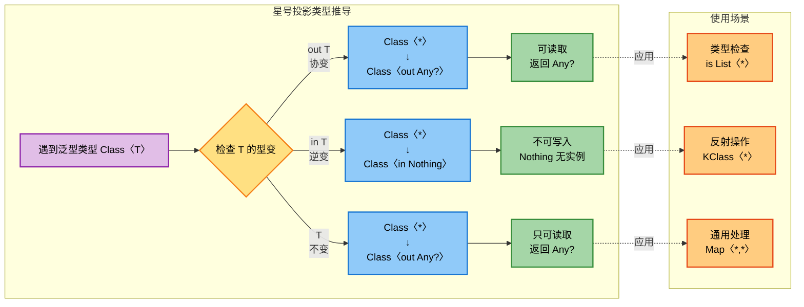

### 星号投影 vs Java 通配符对比

对于有 Java 背景的开发者,理解 Kotlin 星号投影与 Java 通配符的对应关系很有帮助:

```kotlin
/*
Kotlin 星号投影 vs Java 通配符:

┌─────────────────────────────┬───────────────────────────┬─────────────────────────┐
│ Kotlin                      │ Java 等价形式             │ 说明                    │
├─────────────────────────────┼───────────────────────────┼─────────────────────────┤
│ List<*>                     │ List<?>                   │ 未知类型的列表          │
│ (等价于 List<out Any?>)     │                           │ 可读取,返回 Object      │
├─────────────────────────────┼───────────────────────────┼─────────────────────────┤
│ MutableList<*>              │ List<?>                   │ 可变列表的只读视图      │
│ (等价于 MutableList<out Any?>)│                         │ 不能添加元素            │
├─────────────────────────────┼───────────────────────────┼─────────────────────────┤
│ Comparator<*>               │ Comparator<?>             │ 未知类型的比较器        │
│ (in T 投影为 in Nothing)    │                           │ 无法使用 compare 方法   │
├─────────────────────────────┼───────────────────────────┼─────────────────────────┤
│ Map<*, *>                   │ Map<?, ?>                 │ 未知键值类型的 Map      │
│                             │                           │ 可遍历,元素类型 Any?    │
├─────────────────────────────┼───────────────────────────┼─────────────────────────┤
│ Array<*>                    │ Object[]                  │ 未知元素类型的数组      │
│ (等价于 Array<out Any?>)    │                           │ 只读访问                │
└─────────────────────────────┴───────────────────────────┴─────────────────────────┘

主要区别:
1. Kotlin 的星号投影更安全,严格禁止不安全的写操作
2. Java 的 <?> 在某些情况下可以添加 null,Kotlin 星号投影完全禁止
3. Kotlin 根据型变声明自动推导等价形式,Java 需要显式指定边界
*/

// Kotlin 示例
fun kotlinStarProjection() {
    val list: MutableList<Int> = mutableListOf(1, 2, 3)
    val starList: MutableList<*> = list
    
    starList.add(null)  // ❌ 编译错误!完全禁止添加
    val item: Any? = starList[0]  // ✅ 只能读取
}

// 等价的 Java 代码
/*
void javaWildcard() {
    List<Integer> list = new ArrayList<>(Arrays.asList(1, 2, 3));
    List<?> starList = list;
    
    starList.add(null);  // ⚠️ Java 允许添加 null!
    Object item = starList.get(0);  // 读取为 Object
}
*/
```

### 最佳实践与使用建议

基于星号投影的特性,这里总结一些实用的最佳实践:

```kotlin
// ✅ 推荐使用场景

// 1. 类型检查 - 只关心是否为某种泛型类型,不关心具体参数
fun isListType(obj: Any): Boolean {
    return obj is List<*>  // ✅ 清晰表达"任意类型的 List"
}

// 2. 遍历未知类型的集合 - 只需要读取元素
fun printAllElements(collection: Collection<*>) {
    collection.forEach { element: Any? ->  // ✅ 安全遍历
        println(element)
    }
}

// 3. 反射和元数据操作 - 不需要创建实例
fun analyzeClass(klass: KClass<*>) {
    println("Analyzing ${klass.simpleName}")  // ✅ 只读取元数据
}

// 4. Map 操作 - 不关心键值具体类型
fun countMapSize(map: Map<*, *>): Int {
    return map.size  // ✅ 访问不依赖类型参数的属性
}

// ❌ 不推荐使用场景

// 1. 需要写入数据时 - 应该使用具体类型或 in 投影
fun badAdd(list: MutableList<*>) {
    // list.add(...)  // ❌ 无法调用,应该避免这种设计
}

// 改进版本: 使用具体类型参数
fun <T> goodAdd(list: MutableList<T>, item: T) {
    list.add(item)  // ✅ 类型安全的添加
}

// 2. 需要返回具体类型时 - 不应过度使用星号投影
fun badGetFirst(list: List<*>): Any? {  // ❌ 返回类型太宽泛
    return list.firstOrNull()
}

// 改进版本: 保留类型信息
fun <T> goodGetFirst(list: List<T>): T? {  // ✅ 保留类型参数
    return list.firstOrNull()
}

// 3. API 设计 - 星号投影不应出现在公共 API 的返回类型中
class BadAPI {
    fun getData(): List<*> {  // ❌ 调用者失去类型信息
        return listOf(1, 2, 3)
    }
}

class GoodAPI {
    fun getData(): List<Int> {  // ✅ 明确的返回类型
        return listOf(1, 2, 3)
    }
}
```

**📝 练习题**

**题目**: 以下代码片段中,哪些使用了正确的星号投影语法和语义?

```kotlin
// 代码片段 A
fun processData(data: List<*>) {
    data.add(null)
}

// 代码片段 B
fun checkType(obj: Any): Boolean {
    return obj is Map<String, *>
}

// 代码片段 C
class Container<out T>(val value: T)
fun getContainer(): Container<*> {
    return Container("test")
}

// 代码片段 D
fun <T> transform(input: List<*>): List<T> {
    return input as List<T>
}
```

A. 仅代码片段 B 正确  
B. 代码片段 B 和 C 正确  
C. 代码片段 B、C 和 D 正确  
D. 所有代码片段都正确

**【答案】** B

**【解析】**

- **代码片段 A**: ❌ 错误。`List<*>` 等价于 `List<out Any?>`,是只读的。虽然 `List` 本身是只读接口,但即使是 `MutableList<*>` 也无法调用 `add` 方法,因为星号投影禁止写入操作。

- **代码片段 B**: ✅ 正确。这是星号投影的典型用法——类型检查。`Map<String, *>` 表示键类型必须是 `String`,值类型未知。这种用法完全合法且安全。

- **代码片段 C**: ✅ 正确。`Container<out T>` 是协变的,`Container<*>` 等价于 `Container<out Any?>`。作为返回类型使用星号投影是合法的,虽然调用者会失去具体的类型信息(只能读取 `Any?`),但在某些通用处理场景下是可以接受的。

- **代码片段 D**: ❌ 错误。这段代码存在严重的类型安全问题。`List<*>` 无法安全地转换为任意的 `List<T>`,因为我们不知道 `input` 的实际元素类型。这种强制转换会导致运行时类型转换异常。正确的做法是使用 `@Suppress("UNCHECKED_CAST")` 并且只在确保类型安全的情况下使用,或者重新设计 API 避免这种转换。

**核心要点**: 星号投影主要用于只读操作、类型检查和反射场景,不应用于需要写入数据或进行不安全类型转换的场合。

---

## 本章小结

Kotlin 的类型系统 (Type System) 是该语言最具特色的设计之一，它在编译期就能捕获大量潜在的空指针异常 (NullPointerException)，同时提供了丰富的类型操作机制。本章我们系统学习了从基础类型层次到高级类型投影的完整知识体系，这些机制共同构成了 Kotlin 强大的类型安全保障。

### 类型系统的整体架构

Kotlin 的类型系统建立在清晰的层次结构之上。在这个体系中，`Any` 作为所有非空类型的根类型 (Root Type)，类似 Java 的 `Object`，但更加纯粹——它只定义了 `equals()`、`hashCode()` 和 `toString()` 三个基本方法。而 `Any?` 则是真正的顶层类型 (Top Type)，包含了所有可空类型。

在类型层次的另一端，`Nothing` 作为底类型 (Bottom Type) 存在，它是所有类型的子类型。这个看似抽象的概念在实践中非常有用：当函数永远不会正常返回时（抛出异常或进入无限循环），使用 `Nothing` 返回类型可以让编译器进行更精确的控制流分析。`Nothing?` 则只有唯一值 `null`，成为空值的精确类型表示。

`Unit` 类型在这个体系中扮演特殊角色，它表示"无有意义的返回值"，类似 Java 的 `void`，但作为真正的类型对象存在，这使得函数式编程中的类型推导更加一致。

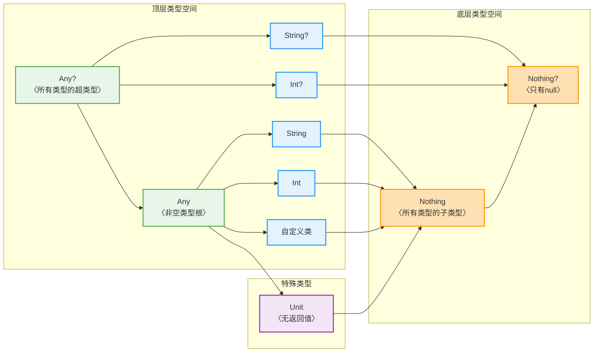

### 空安全机制的多层防护

Kotlin 最引以为傲的特性就是将空安全 (Null Safety) 提升到类型系统层面。通过区分可空类型 `T?` 和非空类型 `T`，编译器在编译期就能阻止绝大多数空指针访问。

安全调用操作符 `?.` 构建了第一道防线，它将空值检查与方法调用融为一体，返回可空类型结果。Elvis 操作符 `?:` 则提供了优雅的默认值机制，形成"尝试获取-失败回退"的流畅调用链。当我们确信某个值不为空时，非空断言 `!!` 可以强制转换，但这也是唯一可能引发 `NullPointerException` 的显式位置。

安全调用链 (Safe Call Chain) 的设计哲学体现了函数式编程的思想。结合 `let`、`also`、`run` 等作用域函数，我们可以构建出既简洁又安全的数据处理管道。例如 `user?.address?.let { processAddress(it) }` 这样的表达式，既避免了冗长的 null 检查，又保持了代码的可读性。

```kotlin
// 多层防护的实际应用示例
data class Company(val name: String, val ceo: Person?)
data class Person(val name: String, val email: String?)

fun sendEmailToCEO(company: Company?): String {
    // 第一层：安全调用链 - 任何环节为 null 则短路返回 null
    val email = company?.ceo?.email
    
    // 第二层：Elvis 操作符 - 提供默认值
    val recipient = email ?: "noreply@company.com"
    
    // 第三层：let 作用域函数 - 仅在非空时执行
    company?.name?.let { companyName ->
        println("向 $companyName 的 CEO 发送邮件")
    }
    
    // 返回结果，整个流程无需任何 if-null 判断
    return "邮件已发送至: $recipient"
}
```

### 平台类型与互操作边界

平台类型 (Platform Type) 是 Kotlin 与 Java 互操作时的关键机制。由于 Java 不区分可空与非空，Kotlin 引入了 `T!` 标记（仅在编译器内部使用，源码中不可见）来表示"可空性未知"的类型。

这个设计在实践中意味着：当我们从 Java 代码获取对象时，Kotlin 既允许将其赋值给 `T`，也允许赋值给 `T?`，将空安全的责任交给了开发者。这是一种务实的妥协——既保持了与 Java 的无缝集成，又通过编译器警告和运行时检查来降低风险。


合理使用 `@Nullable` 和 `@NotNull` 等 JSR-305 注解，可以让 Java API 的空安全语义在 Kotlin 中得到更准确的表达，这是建立跨语言类型安全边界的最佳实践。

### 智能转换与类型细化

智能转换 (Smart Cast) 展示了 Kotlin 编译器的强大推理能力。当我们使用 `is` 检查某个变量的类型后，在后续的作用域中，编译器会自动将该变量视为已检查的类型，无需显式转换。

这种机制的核心在于控制流分析 (Control Flow Analysis)。编译器会追踪变量的类型状态，确保只在安全的情况下进行智能转换。例如在 `if` 分支、`when` 表达式、`&&` 和 `||` 逻辑运算符后，都能触发智能转换。但对于可变属性 (var property) 或可能在 lambda 中被修改的变量，智能转换会被禁用，因为编译器无法保证类型的稳定性。

```kotlin
// 智能转换在不同场景下的应用
fun processValue(value: Any) {
    // 场景1: if 表达式中的智能转换
    if (value is String) {
        println(value.uppercase()) // value 自动转为 String
    }
    
    // 场景2: when 表达式的多分支智能转换
    when (value) {
        is Int -> println("数字: ${value * 2}")      // value 是 Int
        is String -> println("字符串长度: ${value.length}") // value 是 String
        is List<*> -> println("列表大小: ${value.size}")    // value 是 List
    }
    
    // 场景3: 逻辑运算符触发的智能转换
    if (value is String && value.isNotEmpty()) {
        // && 右侧,value 已是 String,可直接调用 isNotEmpty()
        println("非空字符串: $value")
    }
    
    // 场景4: Elvis 与 return 配合的智能转换
    val str = value as? String ?: return
    // 此后 str 一定是 String 类型,因为 null 时已 return
    println(str.length)
}
```

安全转换 `as?` 是类型转换的温和版本，失败时返回 `null` 而非抛出异常。它常与 Elvis 操作符或 `let` 配合使用，形成"尝试转换-失败处理"的优雅模式。相比之下，强制转换 `as` 在类型不匹配时会抛出 `ClassCastException`，应当谨慎使用。

### 类型别名与代码可读性

类型别名 (Type Alias) 通过 `typealias` 关键字为现有类型创建新名称，这是提升代码可读性的强大工具。对于复杂的泛型类型、函数类型或嵌套类型，使用语义化的别名可以让代码的意图更加清晰。

```kotlin
// 类型别名的实际应用价值

// 1. 简化复杂的泛型集合类型
typealias UserCache = MutableMap<String, User>
typealias EventHandler = (Event) -> Unit
typealias ValidationResult = Result<User, List<String>>

// 2. 为函数类型提供语义化名称
typealias Predicate<T> = (T) -> Boolean
typealias Transformer<T, R> = (T) -> R

// 使用别名后的代码更易理解
class UserRepository {
    private val cache: UserCache = mutableMapOf() // 而非 MutableMap<String, User>
    
    fun findUser(predicate: Predicate<User>): User? { // 而非 (User) -> Boolean
        return cache.values.find(predicate)
    }
}
```

需要注意的是，类型别名只是编译期的名称替换，它不会创建新类型。这意味着 `typealias UserId = String` 定义后，`UserId` 和 `String` 完全可以互换使用，不存在类型安全的隔离。若需要真正的类型区分，应使用 inline class（value class）。

### 型变与类型投影

型变 (Variance) 是泛型类型系统中的高级主题，它解决了"子类型关系如何在泛型中传递"的问题。Kotlin 支持声明处型变 (Declaration-site Variance) 和使用处型变 (Use-site Variance) 两种机制。

声明处型变通过 `out` 修饰符声明协变 (Covariance)，通过 `in` 修饰符声明逆变 (Contravariance)。例如 `List<out T>` 是协变的，这意味着 `List<String>` 是 `List<Any>` 的子类型，但只能从中读取数据。`Comparable<in T>` 是逆变的，可以向其写入数据但读取时类型信息会丢失。

使用处型影 (Type Projection) 则在使用泛型时临时指定型变关系。当我们声明 `Array<out Number>` 时，表示该数组只能读取 `Number` 类型数据，不能写入，即使数组实际类型是 `Array<Int>`。反之，`Array<in Int>` 表示可以写入 `Int` 及其子类型，但读取时只能得到 `Any?`。

```kotlin
// 型变在实践中的应用

// 协变：生产者(Producer)使用 out
interface Source<out T> {
    fun produce(): T  // 只能产出 T,不能消费
}

// 逆变：消费者(Consumer)使用 in
interface Sink<in T> {
    fun consume(item: T)  // 只能消费 T,不能产出
}

// 使用处型变示例
fun copyArray(from: Array<out Any>, to: Array<in String>) {
    // from 只能读取,读到的是 Any 类型
    val item: Any = from[0]
    
    // to 只能写入 String 或其子类型
    to[0] = "Hello"
    
    // 编译错误: to[0] 的读取类型会是 Nothing,无法使用
    // val x = to[0]
}

// PECS 原则 (Producer Extends, Consumer Super)
fun <T> copy(from: List<out T>, to: MutableList<in T>) {
    for (item in from) {
        to.add(item)  // from 生产数据,to 消费数据
    }
}
```

星号投影 (Star Projection) `*` 表示"未知类型"，它是型变的特殊形式。`List<*>` 相当于 `List<out Any?>`，我们只能安全地读取 `Any?` 类型数据。对于有多个类型参数的泛型，可以对部分参数使用星号投影，如 `Map<String, *>` 表示键类型已知为 `String`，值类型未知。

### 类型系统的设计哲学

回顾整个类型系统，我们能看到 Kotlin 设计的几个核心理念：

**安全优先，但不牺牲实用性**：空安全机制在编译期消除大量错误，但平台类型的设计又保证了与 Java 的互操作性。这种平衡体现了工程化思维——绝对的安全往往伴随着高昂的成本，务实的妥协反而能带来更好的开发体验。

**类型推导与显式标注的结合**：智能转换让编译器自动推导类型变化，减少了样板代码。但在关键位置（如公共 API），显式的类型标注又能提升代码的可读性和稳定性。

**表达力与性能的统一**：`inline class`（本章未详述，但属于类型系统范畴）可以在零开销的前提下创建类型安全的包装类。型变机制在保证类型安全的同时，也为泛型提供了足够的灵活性。

在实际开发中，深入理解类型系统可以帮助我们：
1. 编写更安全的代码，在编译期发现潜在问题
2. 设计更合理的 API，清晰表达可空性和类型约束
3. 与 Java 代码高效互操作，明确边界并处理兼容性
4. 利用泛型和型变实现通用而类型安全的组件

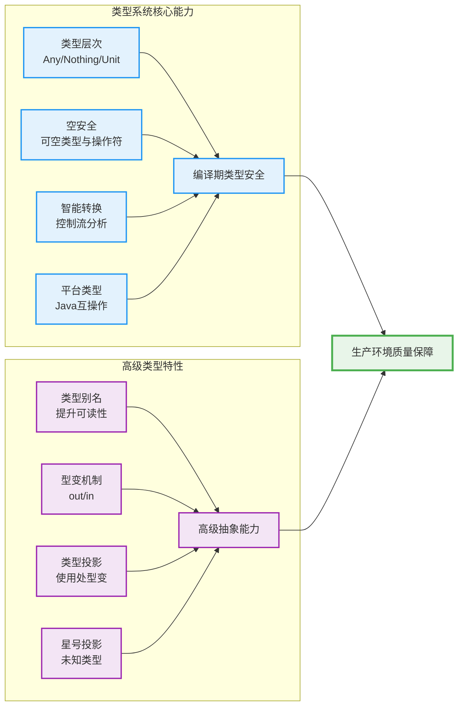

掌握 Kotlin 的类型系统，不仅仅是学会了几个操作符的用法，更重要的是理解了"类型作为约束，编译器作为守护者"的现代编程范式。这种思维方式会深刻影响我们设计代码架构和处理数据流的方式，最终写出更健壮、更易维护的 Kotlin 程序。

---

### 📝 练习题

**题目 1：类型系统综合应用**

以下代码片段中，哪个操作会导致编译错误？

```kotlin
fun processData(input: Any?) {
    // 操作 A
    val length1 = input?.toString()?.length
    
    // 操作 B
    if (input is String) {
        val length2 = input.length
    }
    
    // 操作 C
    val items: List<Any> = listOf("A", 1, 2.0)
    val strings: List<String> = items
    
    // 操作 D
    val number = input as? Int ?: 0
}
```

A. 操作 A - 安全调用链  
B. 操作 B - 智能转换  
C. 操作 C - 类型赋值  
D. 操作 D - 安全转换配合 Elvis

**【答案】** C

**【解析】**  
操作 C 会导致编译错误。虽然 `List<String>` 在逻辑上应该是 `List<Any>` 的子类型（字符串是任意对象），但 Kotlin 中的 `List` 接口声明为 `List<out E>`，是协变的只读接口。协变意味着 `List<String>` 确实是 `List<Any>` 的子类型，但这里的赋值方向反了——我们试图将 `List<Any>` 赋值给 `List<String>`，这是逆变方向，编译器会报错 `Type mismatch`。

如果改为 `val anyItems: List<Any> = strings`（即 `List<String>` 赋值给 `List<Any>`），则完全合法，因为协变允许向上转型。

其他操作解析：
- **操作 A**：安全调用链完全合法，`input` 为 `null` 时短路返回 `null`，`length1` 类型为 `Int?`
- **操作 B**：典型的智能转换，`is String` 检查后，`input` 在 if 块内自动转为 `String` 类型
- **操作 D**：安全转换 `as?` 失败时返回 `null`，Elvis 操作符提供默认值 `0`，`number` 类型为 `Int`

---

**题目 2：型变与类型投影**

有以下泛型接口和函数定义：

```kotlin
interface Container<T> {
    fun get(): T
    fun set(item: T)
}

fun transfer(from: Container<out Number>, to: Container<in Int>) {
    // 以下哪些操作是合法的？
    
    // 操作 1
    val num: Number = from.get()
    
    // 操作 2
    from.set(42)
    
    // 操作 3
    to.set(100)
    
    // 操作 4
    val value: Int = to.get()
}
```

以下哪个说法是正确的？

A. 操作 1 和操作 2 都合法  
B. 操作 1 和操作 3 都合法  
C. 操作 2 和操作 4 都合法  
D. 操作 3 和操作 4 都合法

**【答案】** B

**【解析】**  
正确答案是 B，只有操作 1 和操作 3 是合法的。

详细分析：
- **操作 1 合法**：`from` 声明为 `Container<out Number>`，`out` 表示协变，只能作为生产者（Producer）读取数据。`from.get()` 返回 `Number` 类型完全合法。

- **操作 2 非法**：协变类型 `Container<out Number>` 禁止调用消费者方法 `set(item: T)`。因为如果允许写入，假设 `from` 实际类型是 `Container<Int>`，我们可能写入 `Double`，破坏类型安全。编译器会报错：`Type parameter T is declared as 'out' but occurs in 'in' position`。

- **操作 3 合法**：`to` 声明为 `Container<in Int>`，`in` 表示逆变,只能作为消费者（Consumer）写入数据。`to.set(100)` 传入 `Int` 类型完全合法。即使 `to` 实际类型是 `Container<Number>`，写入 `Int` 也是安全的（子类型可以安全向上转型）。

- **操作 4 非法**：逆变类型 `Container<in Int>` 禁止调用生产者方法 `get(): T` 并获得有意义的类型。即使能调用，返回类型会被推导为 `Nothing`（所有类型的子类型），无法赋值给 `Int`。这是因为编译器不知道 `to` 的实际类型参数是什么（可能是 `Container<Number>`、`Container<Any>` 等），无法安全地返回具体类型。

**PECS 原则记忆**：Producer Extends (out), Consumer Super (in)  
- `out T`：生产者，只能读（extends/协变）  
- `in T`：消费者，只能写（super/逆变）

---

