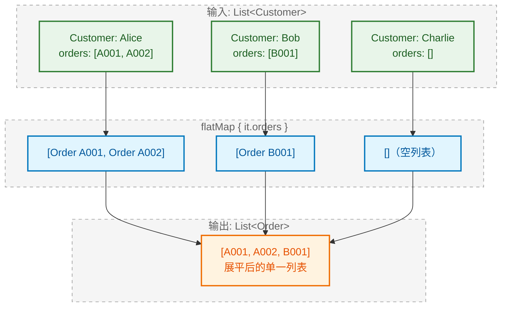
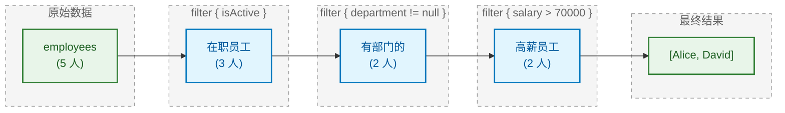
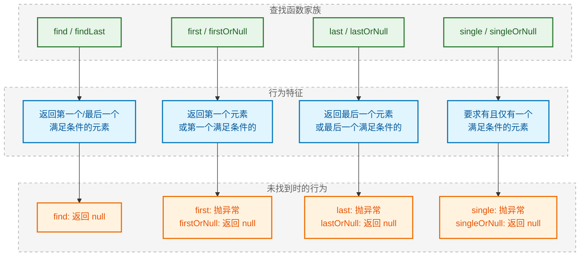
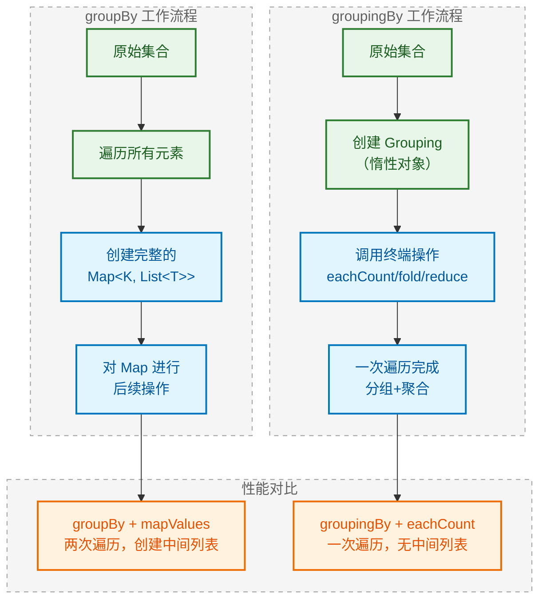
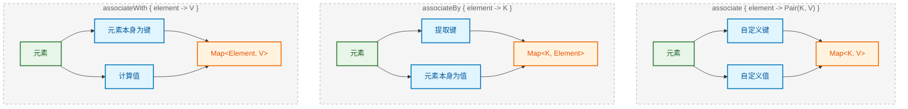
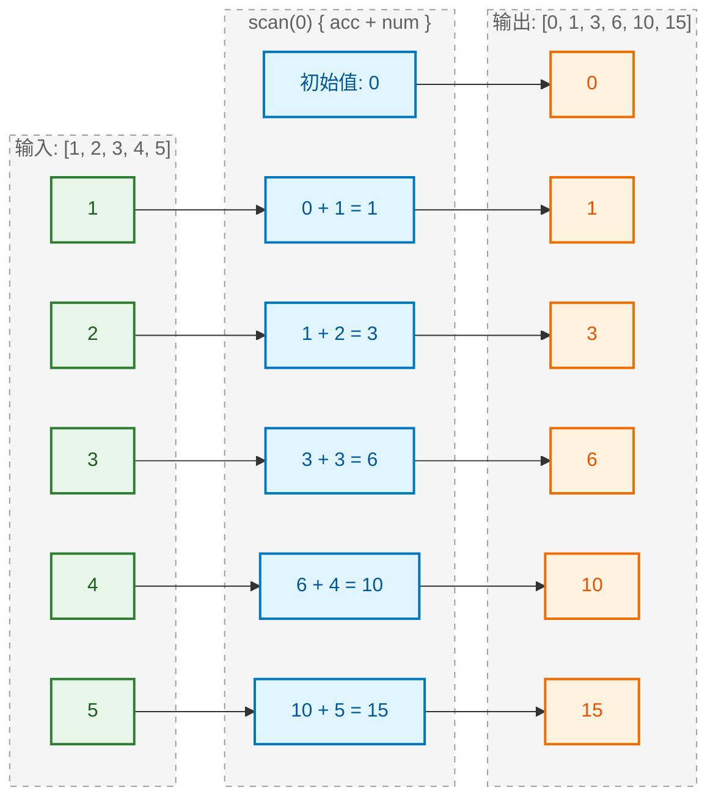
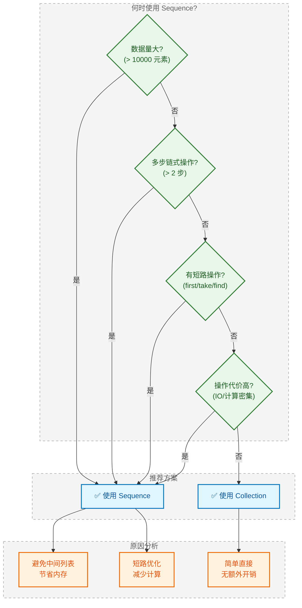

---

# 集合函数式操作

---

## 转换操作 (Transformation Operations)

转换操作是集合函数式编程的基石，它允许我们将一个集合中的元素按照特定规则转换为另一种形式，生成一个新的集合。这类操作不会修改原集合（immutability），而是返回一个全新的集合对象。

### map 映射

`map` 是最基础也是最常用的转换函数。它对集合中的每个元素应用给定的转换函数 (transformation function)，并将所有转换结果收集到一个新的列表中。

```kotlin
// map 函数签名
// inline fun <T, R> Iterable<T>.map(transform: (T) -> R): List<R>

fun main() {
    // 基础示例：将数字列表中的每个元素翻倍
    val numbers = listOf(1, 2, 3, 4, 5)          // 原始列表
    val doubled = numbers.map { it * 2 }         // 对每个元素执行 *2 操作
    println(doubled)                              // 输出: [2, 4, 6, 8, 10]
    
    // 类型转换：将整数转换为字符串
    val strings = numbers.map { "Number: $it" }  // Int -> String 的类型转换
    println(strings)                              // 输出: [Number: 1, Number: 2, ...]
    
    // 对象属性提取：从数据类中提取特定字段
    data class User(val name: String, val age: Int)  // 定义用户数据类
    
    val users = listOf(
        User("Alice", 25),                        // 创建用户列表
        User("Bob", 30),
        User("Charlie", 35)
    )
    
    val names = users.map { it.name }             // 提取所有用户的姓名
    println(names)                                 // 输出: [Alice, Bob, Charlie]
    
    val ages = users.map { it.age }               // 提取所有用户的年龄
    println(ages)                                  // 输出: [25, 30, 35]
}
```

`map` 的核心特性是 **一对一映射 (one-to-one mapping)**：输入集合有 N 个元素，输出集合也必定有 N 个元素。

### mapNotNull

当转换过程中可能产生 `null` 值，而我们希望自动过滤掉这些空值时，`mapNotNull` 是最佳选择。它结合了 `map` 和 `filterNotNull` 的功能。

```kotlin
// mapNotNull 函数签名
// inline fun <T, R : Any> Iterable<T>.mapNotNull(transform: (T) -> R?): List<R>

fun main() {
    // 场景：将字符串解析为整数，无效字符串返回 null
    val inputs = listOf("1", "2", "abc", "4", "xyz", "6")
    
    // 使用 map + filterNotNull 的传统方式（两次遍历）
    val traditional = inputs
        .map { it.toIntOrNull() }                 // 转换，可能产生 null: [1, 2, null, 4, null, 6]
        .filterNotNull()                          // 过滤掉 null 值
    
    // 使用 mapNotNull 的简洁方式（一次遍历，性能更优）
    val efficient = inputs.mapNotNull { it.toIntOrNull() }
    
    println(efficient)                            // 输出: [1, 2, 4, 6]
    
    // 实际应用：从可能为空的嵌套结构中安全提取数据
    data class Order(val product: String?)        // 产品名可能为空
    
    val orders = listOf(
        Order("iPhone"),                          // 有效订单
        Order(null),                              // 无效订单（产品为空）
        Order("MacBook"),                         // 有效订单
        Order(null)                               // 无效订单
    )
    
    // 安全提取所有非空产品名
    val products = orders.mapNotNull { it.product }
    println(products)                             // 输出: [iPhone, MacBook]
}
```

### mapIndexed

当转换逻辑需要同时访问元素的**索引 (index)** 和**值 (value)** 时，使用 `mapIndexed`。

```kotlin
// mapIndexed 函数签名
// inline fun <T, R> Iterable<T>.mapIndexed(transform: (index: Int, T) -> R): List<R>

fun main() {
    val letters = listOf("a", "b", "c", "d")
    
    // 生成带序号的列表项
    val numbered = letters.mapIndexed { index, letter ->
        "${index + 1}. $letter"                   // 索引从0开始，+1 变成自然序号
    }
    println(numbered)                             // 输出: [1. a, 2. b, 3. c, 4. d]
    
    // 根据索引位置进行不同处理
    val processed = letters.mapIndexed { index, letter ->
        if (index % 2 == 0) {                     // 偶数索引位置
            letter.uppercase()                    // 转大写
        } else {                                  // 奇数索引位置
            letter                                // 保持原样
        }
    }
    println(processed)                            // 输出: [A, b, C, d]
    
    // 结合索引计算权重值
    val scores = listOf(100, 90, 80, 70)
    val weighted = scores.mapIndexed { index, score ->
        score * (scores.size - index)             // 越靠前权重越高
    }
    println(weighted)                             // 输出: [400, 270, 160, 70]
}
```

同样存在 `mapIndexedNotNull`，它结合了索引访问和空值过滤的能力。

### flatten

`flatten` 用于将**嵌套集合 (nested collection)** 展平为单层集合。它是处理 `List<List<T>>` 结构的利器。

```kotlin
// flatten 函数签名
// fun <T> Iterable<Iterable<T>>.flatten(): List<T>

fun main() {
    // 二维列表展平
    val nested = listOf(
        listOf(1, 2, 3),                          // 第一个子列表
        listOf(4, 5),                             // 第二个子列表
        listOf(6, 7, 8, 9)                        // 第三个子列表
    )
    
    val flat = nested.flatten()                   // 展平为一维
    println(flat)                                 // 输出: [1, 2, 3, 4, 5, 6, 7, 8, 9]
    
    // 实际场景：合并多个数据源
    val localData = listOf("local1", "local2")    // 本地数据
    val remoteData = listOf("remote1", "remote2") // 远程数据
    val cacheData = listOf("cache1")              // 缓存数据
    
    val allData = listOf(localData, remoteData, cacheData).flatten()
    println(allData)                              // 输出: [local1, local2, remote1, remote2, cache1]
    
    // 处理空列表的情况
    val withEmpty = listOf(
        listOf(1, 2),
        emptyList(),                              // 空列表会被安全处理
        listOf(3, 4)
    )
    println(withEmpty.flatten())                  // 输出: [1, 2, 3, 4]
}
```

```kotlin
┌─────────────────────────────────────────────────────────────┐
│  flatten 操作可视化                                          │
│                                                             │
│  输入: List<List<Int>>                                      │
│  ┌─────────┐  ┌─────────┐  ┌─────────────┐                 │
│  │ [1,2,3] │  │  [4,5]  │  │  [6,7,8,9]  │                 │
│  └────┬────┘  └────┬────┘  └──────┬──────┘                 │
│       │            │              │                         │
│       └────────────┼──────────────┘                         │
│                    ▼                                        │
│  输出: List<Int>                                            │
│  ┌─────────────────────────────────────────┐               │
│  │  [1, 2, 3, 4, 5, 6, 7, 8, 9]            │               │
│  └─────────────────────────────────────────┘               │
└─────────────────────────────────────────────────────────────┘
```

### flatMap

`flatMap` 是 `map` + `flatten` 的组合操作。它先对每个元素应用转换函数（该函数返回一个集合），然后将所有结果集合展平为单一列表。这是函数式编程中极其重要的操作，在 Monad 理论中被称为 **bind** 或 **>>=**。

```kotlin
// flatMap 函数签名
// inline fun <T, R> Iterable<T>.flatMap(transform: (T) -> Iterable<R>): List<R>

fun main() {
    // 基础示例：每个数字生成多个结果
    val numbers = listOf(1, 2, 3)
    
    // 每个数字生成 [n, n*10, n*100] 三个值
    val expanded = numbers.flatMap { n ->
        listOf(n, n * 10, n * 100)                // 返回一个列表
    }
    println(expanded)                             // 输出: [1, 10, 100, 2, 20, 200, 3, 30, 300]
    
    // 等价于 map + flatten
    val equivalent = numbers
        .map { n -> listOf(n, n * 10, n * 100) }  // 先 map: [[1,10,100], [2,20,200], [3,30,300]]
        .flatten()                                 // 再 flatten: [1, 10, 100, 2, 20, 200, ...]
    
    // 实际场景：获取所有用户的所有订单
    data class Order(val id: String, val amount: Double)
    data class Customer(val name: String, val orders: List<Order>)
    
    val customers = listOf(
        Customer("Alice", listOf(
            Order("A001", 100.0),
            Order("A002", 200.0)
        )),
        Customer("Bob", listOf(
            Order("B001", 150.0)
        )),
        Customer("Charlie", listOf())             // Charlie 没有订单
    )
    
    // 获取所有订单（展平嵌套结构）
    val allOrders = customers.flatMap { it.orders }
    println(allOrders.map { it.id })              // 输出: [A001, A002, B001]
    
    // 计算总金额
    val totalAmount = allOrders.sumOf { it.amount }
    println("Total: $totalAmount")                // 输出: Total: 450.0
}
```



**map vs flatMap 的核心区别**：

| 特性 | map | flatMap |
|------|-----|---------|
| 转换函数返回类型 | `(T) -> R` | `(T) -> Iterable<R>` |
| 输出结构 | 保持原有层级 | 展平一层 |
| 元素数量关系 | 1:1 | 1:N（可以是 0、1 或多个） |

---

## 过滤操作 (Filtering Operations)

过滤操作用于从集合中筛选出满足特定条件的元素子集。与转换操作不同，过滤操作不改变元素本身，只决定元素的去留。

### filter

`filter` 是最基础的过滤函数，它接受一个**谓词函数 (predicate function)**，返回所有使谓词返回 `true` 的元素组成的新列表。

```kotlin
// filter 函数签名
// inline fun <T> Iterable<T>.filter(predicate: (T) -> Boolean): List<T>

fun main() {
    val numbers = listOf(1, 2, 3, 4, 5, 6, 7, 8, 9, 10)
    
    // 筛选偶数
    val evens = numbers.filter { it % 2 == 0 }    // 谓词：是否为偶数
    println(evens)                                 // 输出: [2, 4, 6, 8, 10]
    
    // 筛选大于 5 的数
    val greaterThan5 = numbers.filter { it > 5 }
    println(greaterThan5)                          // 输出: [6, 7, 8, 9, 10]
    
    // 组合条件：偶数且大于 5
    val combined = numbers.filter { it % 2 == 0 && it > 5 }
    println(combined)                              // 输出: [6, 8, 10]
    
    // 对象过滤
    data class Product(
        val name: String,
        val price: Double,
        val inStock: Boolean
    )
    
    val products = listOf(
        Product("iPhone", 999.0, true),
        Product("MacBook", 1999.0, false),         // 缺货
        Product("AirPods", 199.0, true),
        Product("iPad", 799.0, true)
    )
    
    // 筛选有库存且价格低于 1000 的产品
    val affordable = products.filter { 
        it.inStock && it.price < 1000             // 复合条件
    }
    println(affordable.map { it.name })           // 输出: [iPhone, AirPods, iPad]
}
```

### filterNot

`filterNot` 是 `filter` 的反向操作，它返回所有使谓词返回 `false` 的元素。当排除条件比包含条件更容易表达时，使用 `filterNot` 可以提高代码可读性。

```kotlin
// filterNot 函数签名
// inline fun <T> Iterable<T>.filterNot(predicate: (T) -> Boolean): List<T>

fun main() {
    val numbers = listOf(1, 2, 3, 4, 5, 6, 7, 8, 9, 10)
    
    // 排除偶数（等价于筛选奇数）
    val odds = numbers.filterNot { it % 2 == 0 }
    println(odds)                                  // 输出: [1, 3, 5, 7, 9]
    
    // 实际场景：排除黑名单用户
    data class User(val id: Int, val name: String)
    
    val allUsers = listOf(
        User(1, "Alice"),
        User(2, "Bob"),
        User(3, "Charlie"),
        User(4, "David")
    )
    
    val blacklist = setOf(2, 4)                   // 黑名单用户 ID
    
    // 使用 filterNot 排除黑名单用户
    val activeUsers = allUsers.filterNot { it.id in blacklist }
    println(activeUsers.map { it.name })          // 输出: [Alice, Charlie]
    
    // 对比：使用 filter 实现相同效果（可读性稍差）
    val sameResult = allUsers.filter { it.id !in blacklist }
}
```

### filterIsInstance

`filterIsInstance` 是一个**类型过滤器 (type filter)**，它从集合中筛选出特定类型的元素。这在处理混合类型集合（如 `List<Any>`）时非常有用，并且会自动进行**智能类型转换 (smart cast)**。

```kotlin
// filterIsInstance 函数签名（泛型版本）
// inline fun <reified R> Iterable<*>.filterIsInstance(): List<R>

fun main() {
    // 混合类型列表
    val mixed: List<Any> = listOf(
        1,                                         // Int
        "hello",                                   // String
        2.5,                                       // Double
        "world",                                   // String
        3,                                         // Int
        true,                                      // Boolean
        "kotlin"                                   // String
    )
    
    // 筛选所有字符串
    val strings: List<String> = mixed.filterIsInstance<String>()
    println(strings)                               // 输出: [hello, world, kotlin]
    
    // 筛选所有整数
    val ints: List<Int> = mixed.filterIsInstance<Int>()
    println(ints)                                  // 输出: [1, 3]
    
    // 筛选所有数字（Number 是 Int、Double 等的父类）
    val numbers: List<Number> = mixed.filterIsInstance<Number>()
    println(numbers)                               // 输出: [1, 2.5, 3]
    
    // 实际场景：处理多态事件流
    sealed class Event {                          // 密封类定义事件类型
        data class Click(val x: Int, val y: Int) : Event()
        data class Scroll(val delta: Int) : Event()
        data class KeyPress(val key: Char) : Event()
    }
    
    val events: List<Event> = listOf(
        Event.Click(100, 200),
        Event.Scroll(-50),
        Event.Click(150, 300),
        Event.KeyPress('A'),
        Event.Scroll(100)
    )
    
    // 只处理点击事件
    val clicks = events.filterIsInstance<Event.Click>()
    clicks.forEach { println("Clicked at (${it.x}, ${it.y})") }
    // 输出:
    // Clicked at (100, 200)
    // Clicked at (150, 300)
}
```

`filterIsInstance` 的优势在于它利用了 Kotlin 的**具体化类型参数 (reified type parameter)**，在运行时保留了类型信息，因此可以进行类型检查和自动转换。

### filterNotNull

`filterNotNull` 专门用于从**可空类型集合 (nullable collection)** 中移除所有 `null` 元素，并将结果类型从 `List<T?>` 转换为 `List<T>`（非空类型）。

```kotlin
// filterNotNull 函数签名
// fun <T : Any> Iterable<T?>.filterNotNull(): List<T>

fun main() {
    // 包含 null 的列表
    val withNulls: List<String?> = listOf("a", null, "b", null, "c", null)
    
    // 过滤掉所有 null 值
    val withoutNulls: List<String> = withNulls.filterNotNull()
    println(withoutNulls)                          // 输出: [a, b, c]
    
    // 注意类型变化：List<String?> -> List<String>
    // 过滤后可以安全地调用非空方法
    withoutNulls.forEach { 
        println(it.length)                         // 无需 ?. 安全调用
    }
    
    // 实际场景：处理可能失败的批量操作
    fun fetchUserById(id: Int): String? {         // 模拟可能失败的查询
        return if (id % 2 == 0) "User$id" else null
    }
    
    val userIds = listOf(1, 2, 3, 4, 5, 6)
    
    // 批量查询，过滤失败结果
    val validUsers = userIds
        .map { fetchUserById(it) }                 // [null, User2, null, User4, null, User6]
        .filterNotNull()                           // [User2, User4, User6]
    
    println(validUsers)                            // 输出: [User2, User4, User6]
    
    // 更简洁的写法：使用 mapNotNull
    val sameResult = userIds.mapNotNull { fetchUserById(it) }
}
```

### 过滤操作的链式组合

在实际开发中，我们经常需要组合多个过滤条件。Kotlin 的函数式 API 支持流畅的链式调用 (method chaining)。

```kotlin
fun main() {
    data class Employee(
        val name: String,
        val department: String?,                   // 部门可能为空（新员工）
        val salary: Double,
        val isActive: Boolean
    )
    
    val employees = listOf(
        Employee("Alice", "Engineering", 80000.0, true),
        Employee("Bob", null, 50000.0, true),      // 新员工，未分配部门
        Employee("Charlie", "Sales", 60000.0, false), // 已离职
        Employee("David", "Engineering", 90000.0, true),
        Employee("Eve", null, 45000.0, false)      // 已离职的新员工
    )
    
    // 链式过滤：在职的、有部门的、工资超过 70000 的员工
    val seniorEngineers = employees
        .filter { it.isActive }                    // 第一步：筛选在职员工
        .filter { it.department != null }          // 第二步：筛选有部门的
        .filter { it.salary > 70000 }              // 第三步：筛选高薪员工
    
    println(seniorEngineers.map { it.name })       // 输出: [Alice, David]
    
    // 等价的单次过滤（性能更优，只遍历一次）
    val sameResult = employees.filter {
        it.isActive && it.department != null && it.salary > 70000
    }
}
```



### 过滤操作性能提示

当处理大型集合时，需要注意以下性能考量：

```kotlin
fun main() {
    val largeList = (1..1_000_000).toList()
    
    // ❌ 低效：多次链式 filter 会创建多个中间列表
    val inefficient = largeList
        .filter { it % 2 == 0 }                    // 创建中间列表 1
        .filter { it % 3 == 0 }                    // 创建中间列表 2
        .filter { it > 500000 }                    // 创建中间列表 3
    
    // ✅ 高效方案 1：合并条件到单个 filter
    val efficient1 = largeList.filter {
        it % 2 == 0 && it % 3 == 0 && it > 500000  // 单次遍历，单个结果列表
    }
    
    // ✅ 高效方案 2：使用 Sequence（惰性求值，后续章节详解）
    val efficient2 = largeList.asSequence()        // 转换为序列
        .filter { it % 2 == 0 }                    // 惰性操作，不创建中间列表
        .filter { it % 3 == 0 }                    // 惰性操作
        .filter { it > 500000 }                    // 惰性操作
        .toList()                                   // 终端操作，触发计算
}
```

---

📝 **练习题 1**

以下代码的输出是什么？

```kotlin
val data = listOf(1, 2, 3, 4, 5)
val result = data
    .map { it * 2 }
    .filter { it > 5 }
    .map { it - 1 }
println(result)
```

A. `[5, 7, 9]`
B. `[6, 8, 10]`
C. `[1, 3, 5, 7, 9]`
D. `[5, 6, 7, 8, 9]`

【答案】A

【解析】让我们逐步追踪数据流：
1. 原始数据：`[1, 2, 3, 4, 5]`
2. `map { it * 2 }`：每个元素乘以 2 → `[2, 4, 6, 8, 10]`
3. `filter { it > 5 }`：保留大于 5 的元素 → `[6, 8, 10]`
4. `map { it - 1 }`：每个元素减 1 → `[5, 7, 9]`

选项 B 错误是因为漏掉了最后的 `map { it - 1 }` 操作。选项 C 和 D 的元素数量与过滤后的结果不符。

---

📝 **练习题 2**

关于 `flatMap` 和 `map` + `flatten` 的关系，以下说法正确的是？

```kotlin
val lists = listOf(listOf(1, 2), listOf(3, 4))
val a = lists.flatMap { it.map { n -> n * 2 } }
val b = lists.map { it.map { n -> n * 2 } }.flatten()
```

A. `a` 和 `b` 的结果不同，`flatMap` 会先展平再映射
B. `a` 和 `b` 的结果相同，但 `flatMap` 只需一次遍历，性能更优
C. `a` 和 `b` 的结果相同，性能也完全相同
D. `flatMap` 不能包含 `map` 操作，代码会编译错误

【答案】B

【解析】
- `flatMap` 等价于 `map` + `flatten` 的组合，两者结果相同：`[2, 4, 6, 8]`
- 但 `flatMap` 在内部实现上更高效，它在单次遍历中完成转换和展平，避免创建中间的嵌套列表
- 选项 A 错误：`flatMap` 是先对每个元素应用转换（返回集合），然后展平结果，不是先展平
- 选项 D 错误：`flatMap` 的 lambda 可以包含任意逻辑，只要最终返回一个 `Iterable` 即可

---

## 检查操作 (Checking Operations)

检查操作用于判断集合中的元素是否满足特定条件，返回布尔值 (Boolean)。这类操作不会修改集合，也不会返回元素，而是回答"是或否"的问题。它们在条件判断、数据验证等场景中非常实用。

### any

`any` 函数检查集合中是否**至少有一个元素**满足给定条件。只要找到一个符合条件的元素，就会立即返回 `true`（短路求值，short-circuit evaluation），无需遍历整个集合。

```kotlin
// any 函数签名
// inline fun <T> Iterable<T>.any(predicate: (T) -> Boolean): Boolean
// fun <T> Iterable<T>.any(): Boolean  // 无参版本：检查集合是否非空

fun main() {
    val numbers = listOf(1, 2, 3, 4, 5, 6, 7, 8, 9, 10)
    
    // 检查是否存在偶数
    val hasEven = numbers.any { it % 2 == 0 }     // 找到 2 就返回 true
    println("Has even: $hasEven")                  // 输出: Has even: true
    
    // 检查是否存在大于 100 的数
    val hasLarge = numbers.any { it > 100 }       // 遍历完所有元素都不满足
    println("Has large: $hasLarge")                // 输出: Has large: false
    
    // 无参版本：检查集合是否非空
    val emptyList = emptyList<Int>()
    val nonEmptyList = listOf(1, 2, 3)
    
    println(emptyList.any())                       // 输出: false（空集合）
    println(nonEmptyList.any())                    // 输出: true（非空集合）
    
    // 实际场景：验证用户输入
    data class FormField(val name: String, val value: String, val isRequired: Boolean)
    
    val formFields = listOf(
        FormField("username", "john", true),
        FormField("email", "", true),              // 必填但为空
        FormField("phone", "", false)              // 非必填，可为空
    )
    
    // 检查是否有必填字段为空
    val hasEmptyRequired = formFields.any { 
        it.isRequired && it.value.isEmpty()        // 必填且值为空
    }
    
    if (hasEmptyRequired) {
        println("Error: Some required fields are empty!")
    }
}
```

### all

`all` 函数检查集合中是否**所有元素**都满足给定条件。只要找到一个不符合条件的元素，就会立即返回 `false`（短路求值）。

```kotlin
// all 函数签名
// inline fun <T> Iterable<T>.all(predicate: (T) -> Boolean): Boolean

fun main() {
    val numbers = listOf(2, 4, 6, 8, 10)
    
    // 检查是否全部为偶数
    val allEven = numbers.all { it % 2 == 0 }
    println("All even: $allEven")                  // 输出: All even: true
    
    // 检查是否全部为正数
    val mixedNumbers = listOf(1, -2, 3, -4, 5)
    val allPositive = mixedNumbers.all { it > 0 } // 遇到 -2 就返回 false
    println("All positive: $allPositive")          // 输出: All positive: false
    
    // 重要特性：空集合对 all 返回 true（vacuous truth，空真）
    val emptyList = emptyList<Int>()
    println(emptyList.all { it > 0 })              // 输出: true（空集合）
    
    // 实际场景：验证所有订单是否已支付
    data class Order(val id: String, val isPaid: Boolean, val amount: Double)
    
    val orders = listOf(
        Order("001", true, 100.0),
        Order("002", true, 200.0),
        Order("003", true, 150.0)
    )
    
    val allPaid = orders.all { it.isPaid }
    println("All orders paid: $allPaid")           // 输出: All orders paid: true
    
    // 组合条件：所有订单已支付且金额大于 0
    val allValid = orders.all { it.isPaid && it.amount > 0 }
    println("All orders valid: $allValid")         // 输出: All orders valid: true
}
```

> **关于空真 (Vacuous Truth)**：在数学逻辑中，"对于空集合中的所有元素，条件 P 成立"这个命题被认为是真的，因为不存在反例。这是 `all` 对空集合返回 `true` 的原因。

### none

`none` 函数检查集合中是否**没有任何元素**满足给定条件。它在逻辑上等价于 `!any { ... }`，但语义更清晰。

```kotlin
// none 函数签名
// inline fun <T> Iterable<T>.none(predicate: (T) -> Boolean): Boolean
// fun <T> Iterable<T>.none(): Boolean  // 无参版本：检查集合是否为空

fun main() {
    val numbers = listOf(1, 3, 5, 7, 9)            // 全是奇数
    
    // 检查是否没有偶数
    val noEven = numbers.none { it % 2 == 0 }
    println("No even numbers: $noEven")            // 输出: No even numbers: true
    
    // 检查是否没有负数
    val noNegative = numbers.none { it < 0 }
    println("No negative: $noNegative")            // 输出: No negative: true
    
    // 无参版本：检查集合是否为空
    val emptyList = emptyList<Int>()
    println(emptyList.none())                      // 输出: true（空集合）
    println(numbers.none())                        // 输出: false（非空集合）
    
    // 实际场景：检查是否没有错误
    data class ValidationResult(val field: String, val hasError: Boolean, val message: String)
    
    val results = listOf(
        ValidationResult("username", false, ""),
        ValidationResult("email", false, ""),
        ValidationResult("password", false, "")
    )
    
    // 检查是否没有任何验证错误
    val noErrors = results.none { it.hasError }
    if (noErrors) {
        println("Validation passed!")              // 输出: Validation passed!
    }
}
```

### contains 与 in 操作符

`contains` 函数检查集合中是否包含指定元素。Kotlin 还提供了更简洁的 `in` 操作符作为语法糖。

```kotlin
// contains 函数签名
// operator fun <T> Iterable<T>.contains(element: T): Boolean

fun main() {
    val fruits = listOf("apple", "banana", "cherry", "date")
    
    // 使用 contains 方法
    val hasApple = fruits.contains("apple")
    println("Has apple: $hasApple")                // 输出: Has apple: true
    
    // 使用 in 操作符（推荐，更简洁）
    val hasMango = "mango" in fruits
    println("Has mango: $hasMango")                // 输出: Has mango: false
    
    // 使用 !in 检查不包含
    val noGrape = "grape" !in fruits
    println("No grape: $noGrape")                  // 输出: No grape: true
    
    // 数字集合
    val numbers = listOf(1, 2, 3, 4, 5)
    println(3 in numbers)                          // 输出: true
    println(10 in numbers)                         // 输出: false
    
    // 实际场景：权限检查
    val userPermissions = setOf("read", "write", "delete")
    val requiredPermission = "admin"
    
    if (requiredPermission in userPermissions) {
        println("Access granted")
    } else {
        println("Access denied")                   // 输出: Access denied
    }
    
    // containsAll：检查是否包含所有指定元素
    val requiredPermissions = listOf("read", "write")
    val hasAllRequired = userPermissions.containsAll(requiredPermissions)
    println("Has all required: $hasAllRequired")   // 输出: Has all required: true
}
```

### any、all、none 的逻辑关系

这三个函数之间存在明确的逻辑等价关系，理解这些关系有助于选择最具可读性的表达方式：

```kotlin
fun main() {
    val numbers = listOf(1, 2, 3, 4, 5)
    val predicate: (Int) -> Boolean = { it > 3 }
    
    // 逻辑等价关系演示
    println("=== 逻辑等价关系 ===")
    
    // any 与 none 的关系：互为否定
    println(numbers.any(predicate))                // true（存在 4, 5 > 3）
    println(!numbers.none(predicate))              // true（等价）
    
    // none 与 any 的关系：互为否定
    println(numbers.none(predicate))               // false
    println(!numbers.any(predicate))               // false（等价）
    
    // all 与 any + 否定谓词的关系
    val allGreaterThan0 = numbers.all { it > 0 }
    val noneNotGreaterThan0 = numbers.none { it <= 0 }  // 否定谓词
    println(allGreaterThan0)                       // true
    println(noneNotGreaterThan0)                   // true（等价）
}
```

```kotlin
┌─────────────────────────────────────────────────────────────────┐
│  any / all / none 逻辑关系图                                     │
│                                                                 │
│  ┌─────────────────┐         ┌─────────────────┐               │
│  │   any { P }     │ ══════► │  !none { P }    │               │
│  │  "存在满足P的"   │  等价    │  "并非全不满足P" │               │
│  └─────────────────┘         └─────────────────┘               │
│                                                                 │
│  ┌─────────────────┐         ┌─────────────────┐               │
│  │   all { P }     │ ══════► │  none { !P }    │               │
│  │  "全部满足P"     │  等价    │  "没有不满足P的" │               │
│  └─────────────────┘         └─────────────────┘               │
│                                                                 │
│  ┌─────────────────┐         ┌─────────────────┐               │
│  │   none { P }    │ ══════► │  !any { P }     │               │
│  │  "没有满足P的"   │  等价    │  "并非存在满足P" │               │
│  └─────────────────┘         └─────────────────┘               │
└─────────────────────────────────────────────────────────────────┘
```

---

## 查找操作 (Finding Operations)

查找操作用于从集合中定位并返回满足特定条件的元素。与检查操作返回布尔值不同，查找操作返回实际的元素（或 `null`）。这类操作在需要获取具体数据时非常有用。

### find 与 findLast

`find` 返回**第一个**满足条件的元素，`findLast` 返回**最后一个**满足条件的元素。如果没有找到，两者都返回 `null`。

```kotlin
// find 函数签名
// inline fun <T> Iterable<T>.find(predicate: (T) -> Boolean): T?
// inline fun <T> Iterable<T>.findLast(predicate: (T) -> Boolean): T?

fun main() {
    val numbers = listOf(1, 2, 3, 4, 5, 6, 7, 8, 9, 10)
    
    // find：查找第一个偶数
    val firstEven = numbers.find { it % 2 == 0 }
    println("First even: $firstEven")              // 输出: First even: 2
    
    // findLast：查找最后一个偶数
    val lastEven = numbers.findLast { it % 2 == 0 }
    println("Last even: $lastEven")                // 输出: Last even: 10
    
    // 查找不存在的元素
    val notFound = numbers.find { it > 100 }
    println("Not found: $notFound")                // 输出: Not found: null
    
    // 实际场景：查找用户
    data class User(val id: Int, val name: String, val role: String)
    
    val users = listOf(
        User(1, "Alice", "admin"),
        User(2, "Bob", "user"),
        User(3, "Charlie", "admin"),
        User(4, "David", "user")
    )
    
    // 查找第一个管理员
    val firstAdmin = users.find { it.role == "admin" }
    println("First admin: ${firstAdmin?.name}")    // 输出: First admin: Alice
    
    // 查找最后一个管理员
    val lastAdmin = users.findLast { it.role == "admin" }
    println("Last admin: ${lastAdmin?.name}")      // 输出: Last admin: Charlie
    
    // 安全处理：使用 let 或 Elvis 操作符
    users.find { it.name == "Eve" }?.let { user ->
        println("Found: ${user.name}")
    } ?: println("User not found")                 // 输出: User not found
}
```

### first 与 firstOrNull

`first` 和 `firstOrNull` 用于获取集合的第一个元素，或第一个满足条件的元素。关键区别在于**空安全处理方式**：

- `first()`：如果集合为空或没有满足条件的元素，抛出 `NoSuchElementException`
- `firstOrNull()`：如果集合为空或没有满足条件的元素，返回 `null`

```kotlin
// first 函数签名
// fun <T> Iterable<T>.first(): T
// inline fun <T> Iterable<T>.first(predicate: (T) -> Boolean): T

// firstOrNull 函数签名
// fun <T> Iterable<T>.firstOrNull(): T?
// inline fun <T> Iterable<T>.firstOrNull(predicate: (T) -> Boolean): T?

fun main() {
    val numbers = listOf(1, 2, 3, 4, 5)
    val emptyList = emptyList<Int>()
    
    // 获取第一个元素
    println(numbers.first())                       // 输出: 1
    println(numbers.firstOrNull())                 // 输出: 1
    
    // 空集合的处理差异
    // println(emptyList.first())                  // ❌ 抛出 NoSuchElementException
    println(emptyList.firstOrNull())               // 输出: null（安全）
    
    // 带条件的查找
    val firstEven = numbers.first { it % 2 == 0 }
    println("First even: $firstEven")              // 输出: First even: 2
    
    // 条件不满足时的处理差异
    // val notFound = numbers.first { it > 100 }  // ❌ 抛出 NoSuchElementException
    val notFoundSafe = numbers.firstOrNull { it > 100 }
    println("Not found: $notFoundSafe")            // 输出: Not found: null
    
    // 实际场景：获取默认值
    val defaultValue = numbers.firstOrNull { it > 100 } ?: -1
    println("With default: $defaultValue")         // 输出: With default: -1
}
```

> **最佳实践**：除非你**确定**集合非空且元素存在，否则优先使用 `firstOrNull` 配合 Elvis 操作符 `?:` 提供默认值，这样可以避免运行时异常。

### last 与 lastOrNull

`last` 和 `lastOrNull` 与 `first` 系列函数对称，用于获取集合的**最后一个**元素。

```kotlin
// last 函数签名
// fun <T> List<T>.last(): T
// inline fun <T> Iterable<T>.last(predicate: (T) -> Boolean): T

// lastOrNull 函数签名
// fun <T> List<T>.lastOrNull(): T?
// inline fun <T> Iterable<T>.lastOrNull(predicate: (T) -> Boolean): T?

fun main() {
    val numbers = listOf(1, 2, 3, 4, 5)
    
    // 获取最后一个元素
    println(numbers.last())                        // 输出: 5
    println(numbers.lastOrNull())                  // 输出: 5
    
    // 带条件的查找
    val lastEven = numbers.last { it % 2 == 0 }
    println("Last even: $lastEven")                // 输出: Last even: 4
    
    val lastOdd = numbers.lastOrNull { it % 2 != 0 }
    println("Last odd: $lastOdd")                  // 输出: Last odd: 5
    
    // 实际场景：获取最新记录
    data class LogEntry(val timestamp: Long, val message: String, val level: String)
    
    val logs = listOf(
        LogEntry(1000, "App started", "INFO"),
        LogEntry(2000, "User logged in", "INFO"),
        LogEntry(3000, "Database error", "ERROR"),
        LogEntry(4000, "Retry successful", "INFO"),
        LogEntry(5000, "App closed", "INFO")
    )
    
    // 获取最后一条错误日志
    val lastError = logs.lastOrNull { it.level == "ERROR" }
    println("Last error: ${lastError?.message}")   // 输出: Last error: Database error
    
    // 获取最新日志
    val latestLog = logs.lastOrNull()
    println("Latest: ${latestLog?.message}")       // 输出: Latest: App closed
}
```

### single 与 singleOrNull

`single` 系列函数用于获取集合中**唯一**满足条件的元素。它们的特殊之处在于：如果有**零个**或**多个**元素满足条件，都会被视为异常情况。

```kotlin
// single 函数签名
// fun <T> Iterable<T>.single(): T
// inline fun <T> Iterable<T>.single(predicate: (T) -> Boolean): T

// singleOrNull 函数签名
// fun <T> Iterable<T>.singleOrNull(): T?
// inline fun <T> Iterable<T>.singleOrNull(predicate: (T) -> Boolean): T?

fun main() {
    // 单元素集合
    val singleElement = listOf(42)
    println(singleElement.single())                // 输出: 42
    
    // 多元素集合
    val multipleElements = listOf(1, 2, 3)
    // println(multipleElements.single())          // ❌ 抛出 IllegalArgumentException
    println(multipleElements.singleOrNull())       // 输出: null（多于一个元素）
    
    // 空集合
    val emptyList = emptyList<Int>()
    // println(emptyList.single())                 // ❌ 抛出 NoSuchElementException
    println(emptyList.singleOrNull())              // 输出: null（没有元素）
    
    // 带条件的查找
    val numbers = listOf(1, 2, 3, 4, 5, 6)
    
    // 查找唯一满足条件的元素
    val singleGreaterThan5 = numbers.singleOrNull { it > 5 }
    println("Single > 5: $singleGreaterThan5")     // 输出: Single > 5: 6（只有一个）
    
    val singleGreaterThan3 = numbers.singleOrNull { it > 3 }
    println("Single > 3: $singleGreaterThan3")     // 输出: Single > 3: null（有多个：4,5,6）
    
    val singleGreaterThan10 = numbers.singleOrNull { it > 10 }
    println("Single > 10: $singleGreaterThan10")   // 输出: Single > 10: null（没有）
    
    // 实际场景：根据唯一标识查找
    data class Config(val key: String, val value: String)
    
    val configs = listOf(
        Config("database.url", "jdbc:mysql://localhost"),
        Config("database.user", "root"),
        Config("database.password", "secret")
    )
    
    // 查找唯一的配置项
    val dbUrl = configs.singleOrNull { it.key == "database.url" }
    println("DB URL: ${dbUrl?.value}")             // 输出: DB URL: jdbc:mysql://localhost
    
    // 如果配置重复，返回 null（数据异常）
    val duplicateConfigs = configs + Config("database.url", "jdbc:postgresql://localhost")
    val ambiguousUrl = duplicateConfigs.singleOrNull { it.key == "database.url" }
    println("Ambiguous: $ambiguousUrl")            // 输出: Ambiguous: null（有重复）
}
```

### 查找函数对比总结



| 函数 | 找到时 | 未找到时 | 多个匹配时 | 推荐场景 |
|------|--------|----------|------------|----------|
| `find` | 返回元素 | 返回 `null` | 返回第一个 | 通用查找 |
| `findLast` | 返回元素 | 返回 `null` | 返回最后一个 | 从后查找 |
| `first` | 返回元素 | 抛异常 | 返回第一个 | 确定非空时 |
| `firstOrNull` | 返回元素 | 返回 `null` | 返回第一个 | 安全查找 |
| `last` | 返回元素 | 抛异常 | 返回最后一个 | 确定非空时 |
| `lastOrNull` | 返回元素 | 返回 `null` | 返回最后一个 | 安全查找 |
| `single` | 返回元素 | 抛异常 | 抛异常 | 唯一性验证 |
| `singleOrNull` | 返回元素 | 返回 `null` | 返回 `null` | 安全唯一性检查 |

---

📝 **练习题 1**

以下代码的输出是什么？

```kotlin
val numbers = listOf(1, 2, 3, 4, 5)
val result = numbers.all { it > 0 } && numbers.none { it > 10 }
println(result)
```

A. `true`
B. `false`
C. 编译错误
D. 运行时异常

【答案】A

【解析】
- `numbers.all { it > 0 }`：检查所有元素是否大于 0。列表 `[1, 2, 3, 4, 5]` 中所有元素都大于 0，返回 `true`
- `numbers.none { it > 10 }`：检查是否没有元素大于 10。列表中没有大于 10 的元素，返回 `true`
- `true && true` = `true`

选项 B 错误是因为两个条件都满足。选项 C 和 D 错误是因为代码语法正确且不会抛出异常。

---

📝 **练习题 2**

以下代码执行后，`result` 的值是什么？

```kotlin
val items = listOf("a", "bb", "ccc", "dd", "e")
val result = items.singleOrNull { it.length == 2 }
```

A. `"bb"`
B. `"dd"`
C. `null`
D. 抛出 `IllegalArgumentException`

【答案】C

【解析】
- `singleOrNull` 要求有且仅有一个元素满足条件
- 条件 `it.length == 2` 匹配的元素有两个：`"bb"` 和 `"dd"`
- 由于有多个匹配项，`singleOrNull` 返回 `null`（而不是抛出异常，那是 `single` 的行为）

选项 A 和 B 错误是因为存在多个匹配项时不会返回任何一个。选项 D 错误是因为 `singleOrNull` 在多个匹配时返回 `null` 而非抛异常，只有 `single` 才会抛异常。

---

## 聚合操作 (Aggregation Operations)

聚合操作 (Aggregation Operations) 用于将集合中的多个元素**归纳为单一结果值**。这类操作遍历整个集合，通过特定的计算逻辑（如求和、计数、求平均等）产生一个汇总结果。聚合操作是数据分析和统计计算的基础。

### count

`count` 函数用于统计集合中元素的数量。它有两种形式：无参版本返回集合总元素数，带谓词版本返回满足条件的元素数量。

```kotlin
// count 函数签名
// fun <T> Iterable<T>.count(): Int
// inline fun <T> Iterable<T>.count(predicate: (T) -> Boolean): Int

fun main() {
    val numbers = listOf(1, 2, 3, 4, 5, 6, 7, 8, 9, 10)
    
    // 无参版本：统计总数
    val total = numbers.count()
    println("Total count: $total")                 // 输出: Total count: 10
    
    // 带谓词版本：统计满足条件的元素数量
    val evenCount = numbers.count { it % 2 == 0 } // 统计偶数个数
    println("Even count: $evenCount")              // 输出: Even count: 5
    
    // 统计大于 5 的元素数量
    val greaterThan5 = numbers.count { it > 5 }
    println("Greater than 5: $greaterThan5")       // 输出: Greater than 5: 5
    
    // 实际场景：统计订单状态
    data class Order(val id: String, val status: String, val amount: Double)
    
    val orders = listOf(
        Order("001", "completed", 100.0),
        Order("002", "pending", 200.0),
        Order("003", "completed", 150.0),
        Order("004", "cancelled", 80.0),
        Order("005", "pending", 300.0)
    )
    
    // 统计各状态订单数量
    val completedCount = orders.count { it.status == "completed" }
    val pendingCount = orders.count { it.status == "pending" }
    val cancelledCount = orders.count { it.status == "cancelled" }
    
    println("Completed: $completedCount")          // 输出: Completed: 2
    println("Pending: $pendingCount")              // 输出: Pending: 2
    println("Cancelled: $cancelledCount")          // 输出: Cancelled: 1
    
    // 注意：对于 List，使用 size 属性比 count() 更高效
    // size 是 O(1)，count() 需要遍历是 O(n)
    println(numbers.size)                          // 推荐：直接访问属性
    println(numbers.count())                       // 不推荐：需要遍历
}
```

### sum 与 sumOf

`sum` 函数用于计算数值集合的总和。对于非数值集合，使用 `sumOf` 配合选择器函数提取数值进行求和。

```kotlin
// sum 函数签名（仅适用于数值类型集合）
// fun Iterable<Int>.sum(): Int
// fun Iterable<Long>.sum(): Long
// fun Iterable<Double>.sum(): Double

// sumOf 函数签名（通用版本）
// inline fun <T> Iterable<T>.sumOf(selector: (T) -> Int): Int
// inline fun <T> Iterable<T>.sumOf(selector: (T) -> Double): Double

fun main() {
    // 数值集合直接求和
    val integers = listOf(1, 2, 3, 4, 5)
    val intSum = integers.sum()
    println("Int sum: $intSum")                    // 输出: Int sum: 15
    
    val doubles = listOf(1.5, 2.5, 3.0, 4.0)
    val doubleSum = doubles.sum()
    println("Double sum: $doubleSum")              // 输出: Double sum: 11.0
    
    // 使用 sumOf 从对象中提取数值求和
    data class Product(val name: String, val price: Double, val quantity: Int)
    
    val cart = listOf(
        Product("iPhone", 999.0, 1),
        Product("AirPods", 199.0, 2),
        Product("Case", 29.0, 3)
    )
    
    // 计算总价格（单价 × 数量）
    val totalPrice = cart.sumOf { it.price * it.quantity }
    println("Total price: $totalPrice")            // 输出: Total price: 1484.0
    
    // 计算总数量
    val totalQuantity = cart.sumOf { it.quantity }
    println("Total quantity: $totalQuantity")      // 输出: Total quantity: 6
    
    // sumOf 支持不同的返回类型
    val sumAsInt = cart.sumOf { it.quantity }      // 返回 Int
    val sumAsDouble = cart.sumOf { it.price }      // 返回 Double
    val sumAsLong = cart.sumOf { it.quantity.toLong() }  // 返回 Long
    
    // 条件求和：只计算特定商品
    val expensiveTotal = cart
        .filter { it.price > 100 }                 // 先过滤
        .sumOf { it.price * it.quantity }          // 再求和
    println("Expensive items total: $expensiveTotal")  // 输出: 1397.0
}
```

### average

`average` 函数计算数值集合的**算术平均值 (arithmetic mean)**，返回 `Double` 类型。对于空集合，返回 `NaN`（Not a Number）。

```kotlin
// average 函数签名
// fun Iterable<Int>.average(): Double
// fun Iterable<Double>.average(): Double

fun main() {
    val scores = listOf(85, 90, 78, 92, 88)
    
    // 计算平均分
    val avgScore = scores.average()
    println("Average score: $avgScore")            // 输出: Average score: 86.6
    
    // 空集合返回 NaN
    val emptyList = emptyList<Int>()
    val emptyAvg = emptyList.average()
    println("Empty average: $emptyAvg")            // 输出: Empty average: NaN
    println("Is NaN: ${emptyAvg.isNaN()}")         // 输出: Is NaN: true
    
    // 处理 NaN 的安全方式
    val safeAvg = if (emptyList.isEmpty()) 0.0 else emptyList.average()
    println("Safe average: $safeAvg")              // 输出: Safe average: 0.0
    
    // 实际场景：计算商品平均评分
    data class Review(val productId: String, val rating: Int, val comment: String)
    
    val reviews = listOf(
        Review("P001", 5, "Excellent!"),
        Review("P001", 4, "Good"),
        Review("P001", 5, "Love it"),
        Review("P001", 3, "OK"),
        Review("P001", 4, "Nice")
    )
    
    // 计算平均评分
    val avgRating = reviews.map { it.rating }.average()
    println("Average rating: %.1f".format(avgRating))  // 输出: Average rating: 4.2
    
    // 或使用 sumOf 手动计算（更灵活）
    val manualAvg = reviews.sumOf { it.rating }.toDouble() / reviews.size
    println("Manual average: %.1f".format(manualAvg))  // 输出: Manual average: 4.2
}
```

### maxOrNull 与 minOrNull

`maxOrNull` 和 `minOrNull` 分别返回集合中的最大值和最小值。如果集合为空，返回 `null`。还有带选择器的变体 `maxByOrNull` 和 `minByOrNull`，以及带比较器的 `maxWithOrNull` 和 `minWithOrNull`。

```kotlin
// maxOrNull / minOrNull 函数签名
// fun <T : Comparable<T>> Iterable<T>.maxOrNull(): T?
// fun <T : Comparable<T>> Iterable<T>.minOrNull(): T?

// maxByOrNull / minByOrNull 函数签名
// inline fun <T, R : Comparable<R>> Iterable<T>.maxByOrNull(selector: (T) -> R): T?
// inline fun <T, R : Comparable<R>> Iterable<T>.minByOrNull(selector: (T) -> R): T?

fun main() {
    val numbers = listOf(3, 1, 4, 1, 5, 9, 2, 6)
    
    // 基础用法：获取最大/最小值
    val max = numbers.maxOrNull()
    val min = numbers.minOrNull()
    println("Max: $max, Min: $min")                // 输出: Max: 9, Min: 1
    
    // 空集合返回 null
    val emptyList = emptyList<Int>()
    println("Empty max: ${emptyList.maxOrNull()}") // 输出: Empty max: null
    
    // 使用 Elvis 操作符提供默认值
    val safeMax = emptyList.maxOrNull() ?: 0
    println("Safe max: $safeMax")                  // 输出: Safe max: 0
    
    // 字符串集合的最大/最小（按字典序）
    val words = listOf("apple", "banana", "cherry")
    println("Max word: ${words.maxOrNull()}")      // 输出: Max word: cherry
    println("Min word: ${words.minOrNull()}")      // 输出: Min word: apple
    
    // maxByOrNull / minByOrNull：根据选择器比较
    data class Employee(val name: String, val salary: Double, val age: Int)
    
    val employees = listOf(
        Employee("Alice", 80000.0, 30),
        Employee("Bob", 95000.0, 45),
        Employee("Charlie", 70000.0, 25),
        Employee("David", 85000.0, 35)
    )
    
    // 找出薪资最高的员工
    val highestPaid = employees.maxByOrNull { it.salary }
    println("Highest paid: ${highestPaid?.name}")  // 输出: Highest paid: Bob
    
    // 找出年龄最小的员工
    val youngest = employees.minByOrNull { it.age }
    println("Youngest: ${youngest?.name}")         // 输出: Youngest: Charlie
    
    // maxOfOrNull / minOfOrNull：直接返回选择器的值（而非元素本身）
    val maxSalary = employees.maxOfOrNull { it.salary }
    val minAge = employees.minOfOrNull { it.age }
    println("Max salary: $maxSalary")              // 输出: Max salary: 95000.0
    println("Min age: $minAge")                    // 输出: Min age: 25
}
```

### 聚合操作的组合使用

在实际开发中，聚合操作经常与其他集合操作组合使用，形成强大的数据处理管道 (data processing pipeline)。

```kotlin
fun main() {
    data class Transaction(
        val id: String,
        val type: String,           // "income" 或 "expense"
        val amount: Double,
        val category: String
    )
    
    val transactions = listOf(
        Transaction("T001", "income", 5000.0, "salary"),
        Transaction("T002", "expense", 1200.0, "rent"),
        Transaction("T003", "expense", 300.0, "food"),
        Transaction("T004", "income", 500.0, "bonus"),
        Transaction("T005", "expense", 150.0, "transport"),
        Transaction("T006", "expense", 200.0, "food"),
        Transaction("T007", "income", 100.0, "interest")
    )
    
    // 综合统计
    val totalIncome = transactions
        .filter { it.type == "income" }            // 筛选收入
        .sumOf { it.amount }                       // 求和
    
    val totalExpense = transactions
        .filter { it.type == "expense" }           // 筛选支出
        .sumOf { it.amount }                       // 求和
    
    val balance = totalIncome - totalExpense
    
    println("=== 财务报表 ===")
    println("Total Income: $$totalIncome")         // 输出: Total Income: $5600.0
    println("Total Expense: $$totalExpense")       // 输出: Total Expense: $1850.0
    println("Balance: $$balance")                  // 输出: Balance: $3750.0
    
    // 统计各类别支出
    val foodExpense = transactions
        .filter { it.type == "expense" && it.category == "food" }
        .sumOf { it.amount }
    println("Food expense: $$foodExpense")         // 输出: Food expense: $500.0
    
    // 计算平均单笔支出
    val avgExpense = transactions
        .filter { it.type == "expense" }
        .map { it.amount }
        .average()
    println("Avg expense: $%.2f".format(avgExpense))  // 输出: Avg expense: $462.50
    
    // 找出最大单笔支出
    val maxExpense = transactions
        .filter { it.type == "expense" }
        .maxByOrNull { it.amount }
    println("Max expense: ${maxExpense?.category} - $${maxExpense?.amount}")
    // 输出: Max expense: rent - $1200.0
}
```

---

## 分组操作 (Grouping Operations)

分组操作用于将集合中的元素按照特定规则**分类归组**，生成一个 `Map`，其中键 (key) 是分组依据，值 (value) 是属于该组的元素列表。这是数据分析中非常常用的操作，类似于 SQL 中的 `GROUP BY`。

### groupBy

`groupBy` 是最常用的分组函数，它接受一个**键选择器 (key selector)** 函数，根据该函数的返回值对元素进行分组。

```kotlin
// groupBy 函数签名
// inline fun <T, K> Iterable<T>.groupBy(keySelector: (T) -> K): Map<K, List<T>>
// inline fun <T, K, V> Iterable<T>.groupBy(
//     keySelector: (T) -> K,
//     valueTransform: (T) -> V
// ): Map<K, List<V>>

fun main() {
    // 基础示例：按奇偶分组
    val numbers = listOf(1, 2, 3, 4, 5, 6, 7, 8, 9, 10)
    
    val byParity = numbers.groupBy { 
        if (it % 2 == 0) "even" else "odd"         // 键选择器
    }
    println(byParity)
    // 输出: {odd=[1, 3, 5, 7, 9], even=[2, 4, 6, 8, 10]}
    
    // 按首字母分组
    val words = listOf("apple", "apricot", "banana", "blueberry", "cherry")
    
    val byFirstLetter = words.groupBy { it.first() }
    println(byFirstLetter)
    // 输出: {a=[apple, apricot], b=[banana, blueberry], c=[cherry]}
    
    // 实际场景：员工按部门分组
    data class Employee(val name: String, val department: String, val salary: Double)
    
    val employees = listOf(
        Employee("Alice", "Engineering", 80000.0),
        Employee("Bob", "Engineering", 90000.0),
        Employee("Charlie", "Sales", 70000.0),
        Employee("David", "Sales", 75000.0),
        Employee("Eve", "HR", 65000.0)
    )
    
    // 按部门分组
    val byDepartment = employees.groupBy { it.department }
    
    byDepartment.forEach { (dept, emps) ->
        println("$dept: ${emps.map { it.name }}")
    }
    // 输出:
    // Engineering: [Alice, Bob]
    // Sales: [Charlie, David]
    // HR: [Eve]
    
    // 带值转换的 groupBy：只保留员工姓名
    val namesByDept = employees.groupBy(
        keySelector = { it.department },           // 键：部门
        valueTransform = { it.name }               // 值：只取姓名
    )
    println(namesByDept)
    // 输出: {Engineering=[Alice, Bob], Sales=[Charlie, David], HR=[Eve]}
}
```

### groupBy 的进阶用法

```kotlin
fun main() {
    data class Student(
        val name: String,
        val grade: Int,           // 年级：1-12
        val score: Double,
        val gender: String
    )
    
    val students = listOf(
        Student("Alice", 10, 95.0, "F"),
        Student("Bob", 10, 88.0, "M"),
        Student("Charlie", 11, 92.0, "M"),
        Student("Diana", 11, 96.0, "F"),
        Student("Eve", 10, 91.0, "F"),
        Student("Frank", 12, 85.0, "M")
    )
    
    // 按年级分组后进行聚合计算
    val avgScoreByGrade = students
        .groupBy { it.grade }                      // 先分组
        .mapValues { (_, students) ->              // 对每组计算平均分
            students.map { it.score }.average()
        }
    
    println("Average score by grade:")
    avgScoreByGrade.forEach { (grade, avg) ->
        println("  Grade $grade: %.1f".format(avg))
    }
    // 输出:
    // Average score by grade:
    //   Grade 10: 91.3
    //   Grade 11: 94.0
    //   Grade 12: 85.0
    
    // 多级分组：先按年级，再按性别
    val byGradeAndGender = students
        .groupBy { it.grade }                      // 第一级：按年级
        .mapValues { (_, gradeStudents) ->
            gradeStudents.groupBy { it.gender }    // 第二级：按性别
        }
    
    println("\nStudents by grade and gender:")
    byGradeAndGender.forEach { (grade, byGender) ->
        println("Grade $grade:")
        byGender.forEach { (gender, list) ->
            println("  $gender: ${list.map { it.name }}")
        }
    }
    // 输出:
    // Grade 10:
    //   F: [Alice, Eve]
    //   M: [Bob]
    // Grade 11:
    //   M: [Charlie]
    //   F: [Diana]
    // Grade 12:
    //   M: [Frank]
    
    // 统计每组数量
    val countByGrade = students
        .groupBy { it.grade }
        .mapValues { it.value.size }               // 转换为数量
    
    println("\nCount by grade: $countByGrade")
    // 输出: Count by grade: {10=3, 11=2, 12=1}
}
```

### groupingBy 与 Grouping

`groupingBy` 返回一个 `Grouping` 对象，它是一个**中间表示 (intermediate representation)**，支持更高效的分组聚合操作。与 `groupBy` 不同，`groupingBy` 采用**惰性求值 (lazy evaluation)**，只在需要时才进行计算。

```kotlin
// groupingBy 函数签名
// inline fun <T, K> Iterable<T>.groupingBy(
//     crossinline keySelector: (T) -> K
// ): Grouping<T, K>

// Grouping 提供的聚合方法
// fun <T, K> Grouping<T, K>.eachCount(): Map<K, Int>
// fun <T, K, R> Grouping<T, K>.fold(...): Map<K, R>
// fun <T, K, R> Grouping<T, K>.reduce(...): Map<K, R>
// fun <T, K, R> Grouping<T, K>.aggregate(...): Map<K, R>

fun main() {
    val words = listOf("apple", "apricot", "banana", "blueberry", "cherry", "coconut")
    
    // eachCount()：统计每组元素数量
    val countByFirstLetter = words
        .groupingBy { it.first() }                 // 创建 Grouping
        .eachCount()                               // 统计每组数量
    
    println("Count by first letter: $countByFirstLetter")
    // 输出: Count by first letter: {a=2, b=2, c=2}
    
    // 对比 groupBy 实现相同功能
    val sameResult = words
        .groupBy { it.first() }                    // 创建完整的 Map<Char, List<String>>
        .mapValues { it.value.size }               // 再转换为数量
    
    // groupingBy + eachCount 更高效，因为不需要创建中间列表
    
    // fold()：对每组进行折叠操作
    data class Item(val category: String, val price: Double)
    
    val items = listOf(
        Item("food", 10.0),
        Item("food", 20.0),
        Item("electronics", 100.0),
        Item("food", 15.0),
        Item("electronics", 200.0)
    )
    
    // 计算每个类别的总价
    val totalByCategory = items
        .groupingBy { it.category }
        .fold(0.0) { accumulator, item ->          // 初始值 0.0
            accumulator + item.price               // 累加价格
        }
    
    println("Total by category: $totalByCategory")
    // 输出: Total by category: {food=45.0, electronics=300.0}
    
    // reduce()：类似 fold，但使用第一个元素作为初始值
    val maxPriceByCategory = items
        .groupingBy { it.category }
        .reduce { _, maxItem, item ->              // key 参数通常不用
            if (item.price > maxItem.price) item else maxItem
        }
    
    println("Max price item by category:")
    maxPriceByCategory.forEach { (category, item) ->
        println("  $category: ${item.price}")
    }
    // 输出:
    // Max price item by category:
    //   food: 20.0
    //   electronics: 200.0
}
```

### aggregate：最灵活的分组聚合

`aggregate` 是 `Grouping` 最强大的方法，它提供了完全的控制权，可以处理每组的第一个元素和后续元素的不同逻辑。

```kotlin
// aggregate 函数签名
// inline fun <T, K, R> Grouping<T, K>.aggregate(
//     operation: (key: K, accumulator: R?, element: T, first: Boolean) -> R
// ): Map<K, R>

fun main() {
    data class Sale(val product: String, val quantity: Int, val price: Double)
    
    val sales = listOf(
        Sale("iPhone", 2, 999.0),
        Sale("MacBook", 1, 1999.0),
        Sale("iPhone", 3, 999.0),
        Sale("AirPods", 5, 199.0),
        Sale("MacBook", 2, 1999.0),
        Sale("AirPods", 3, 199.0)
    )
    
    // 使用 aggregate 计算每个产品的销售统计
    data class SalesSummary(
        val totalQuantity: Int,
        val totalRevenue: Double,
        val transactionCount: Int
    )
    
    val salesSummary = sales
        .groupingBy { it.product }
        .aggregate { _, accumulator: SalesSummary?, sale, first ->
            if (first) {
                // 第一个元素：初始化累加器
                SalesSummary(
                    totalQuantity = sale.quantity,
                    totalRevenue = sale.quantity * sale.price,
                    transactionCount = 1
                )
            } else {
                // 后续元素：累加到现有值
                SalesSummary(
                    totalQuantity = accumulator!!.totalQuantity + sale.quantity,
                    totalRevenue = accumulator.totalRevenue + sale.quantity * sale.price,
                    transactionCount = accumulator.transactionCount + 1
                )
            }
        }
    
    println("=== Sales Summary ===")
    salesSummary.forEach { (product, summary) ->
        println("$product:")
        println("  Quantity: ${summary.totalQuantity}")
        println("  Revenue: $${summary.totalRevenue}")
        println("  Transactions: ${summary.transactionCount}")
    }
    // 输出:
    // === Sales Summary ===
    // iPhone:
    //   Quantity: 5
    //   Revenue: $4995.0
    //   Transactions: 2
    // MacBook:
    //   Quantity: 3
    //   Revenue: $5997.0
    //   Transactions: 2
    // AirPods:
    //   Quantity: 8
    //   Revenue: $1592.0
    //   Transactions: 2
}
```

### groupBy vs groupingBy 对比



| 特性 | groupBy | groupingBy |
|------|---------|------------|
| 返回类型 | `Map<K, List<T>>` | `Grouping<T, K>` |
| 求值方式 | 立即求值 (eager) | 惰性求值 (lazy) |
| 中间列表 | 创建完整列表 | 不创建 |
| 适用场景 | 需要访问分组后的完整列表 | 只需要聚合结果 |
| 性能 | 内存占用较高 | 内存效率更高 |
| 灵活性 | 可进行任意后续操作 | 仅限于聚合操作 |

---

📝 **练习题 1**

以下代码的输出是什么？

```kotlin
val numbers = listOf(1, 2, 3, 4, 5)
val result = numbers.filter { it > 2 }.sumOf { it * 2 }
println(result)
```

A. `30`
B. `24`
C. `18`
D. `12`

【答案】B

【解析】
1. `filter { it > 2 }`：筛选出大于 2 的元素 → `[3, 4, 5]`
2. `sumOf { it * 2 }`：每个元素乘以 2 后求和 → `3*2 + 4*2 + 5*2 = 6 + 8 + 10 = 24`

选项 A (30) 是 `[1,2,3,4,5]` 全部乘以 2 再求和的结果。选项 C (18) 可能是误算。选项 D (12) 是 `[3,4,5]` 直接求和的结果。

---

## 分区操作 (Partitioning Operations)

分区操作 (Partitioning) 是一种特殊的分组方式，它将集合中的元素按照给定的谓词条件**一分为二**：满足条件的元素放入第一组，不满足条件的元素放入第二组。与 `filter` 不同的是，分区操作会**同时保留**两部分结果，而不是丢弃不满足条件的元素。

### partition

`partition` 函数接受一个谓词 (predicate)，返回一个 `Pair<List<T>, List<T>>`，其中 `first` 包含满足条件的元素，`second` 包含不满足条件的元素。

```kotlin
// partition 函数签名
// inline fun <T> Iterable<T>.partition(
//     predicate: (T) -> Boolean
// ): Pair<List<T>, List<T>>

fun main() {
    val numbers = listOf(1, 2, 3, 4, 5, 6, 7, 8, 9, 10)
    
    // 按奇偶分区
    val (evens, odds) = numbers.partition { it % 2 == 0 }
    println("Evens: $evens")                       // 输出: Evens: [2, 4, 6, 8, 10]
    println("Odds: $odds")                         // 输出: Odds: [1, 3, 5, 7, 9]
    
    // 注意：使用解构声明 (destructuring declaration) 可以直接获取两个列表
    // val result = numbers.partition { it % 2 == 0 }
    // val evens = result.first
    // val odds = result.second
    
    // 按阈值分区
    val (large, small) = numbers.partition { it > 5 }
    println("Large (>5): $large")                  // 输出: Large (>5): [6, 7, 8, 9, 10]
    println("Small (<=5): $small")                 // 输出: Small (<=5): [1, 2, 3, 4, 5]
}
```

### partition 的实际应用场景

`partition` 在需要同时处理"符合条件"和"不符合条件"两类数据时特别有用，避免了两次遍历集合。

```kotlin
fun main() {
    // 场景1：验证结果分类
    data class ValidationResult(
        val field: String,
        val isValid: Boolean,
        val message: String
    )
    
    val results = listOf(
        ValidationResult("username", true, "OK"),
        ValidationResult("email", false, "Invalid format"),
        ValidationResult("password", true, "OK"),
        ValidationResult("phone", false, "Too short"),
        ValidationResult("age", true, "OK")
    )
    
    // 分离有效和无效的验证结果
    val (valid, invalid) = results.partition { it.isValid }
    
    println("Valid fields: ${valid.map { it.field }}")
    // 输出: Valid fields: [username, password, age]
    
    println("Invalid fields:")
    invalid.forEach { println("  ${it.field}: ${it.message}") }
    // 输出:
    // Invalid fields:
    //   email: Invalid format
    //   phone: Too short
    
    // 场景2：任务调度 - 分离已完成和待处理任务
    data class Task(val id: Int, val name: String, val isCompleted: Boolean)
    
    val tasks = listOf(
        Task(1, "Design UI", true),
        Task(2, "Implement API", false),
        Task(3, "Write tests", true),
        Task(4, "Deploy", false),
        Task(5, "Documentation", false)
    )
    
    val (completed, pending) = tasks.partition { it.isCompleted }
    
    println("\n=== Task Status ===")
    println("Completed (${completed.size}): ${completed.map { it.name }}")
    println("Pending (${pending.size}): ${pending.map { it.name }}")
    // 输出:
    // === Task Status ===
    // Completed (2): [Design UI, Write tests]
    // Pending (3): [Implement API, Deploy, Documentation]
    
    // 场景3：数据清洗 - 分离有效和无效数据
    val rawData = listOf("123", "abc", "456", "", "789", "xyz", null, "0")
    
    // 使用 filterNotNull 先去除 null，再分区
    val (validNumbers, invalidEntries) = rawData
        .filterNotNull()                           // 先过滤 null
        .partition { it.toIntOrNull() != null }    // 再按是否为有效数字分区
    
    println("\nValid numbers: $validNumbers")      // 输出: Valid numbers: [123, 456, 789, 0]
    println("Invalid entries: $invalidEntries")    // 输出: Invalid entries: [abc, , xyz]
}
```

### partition vs filter + filterNot

```kotlin
fun main() {
    val numbers = (1..1_000_000).toList()
    val predicate: (Int) -> Boolean = { it % 2 == 0 }
    
    // ❌ 低效方式：两次遍历
    val evens1 = numbers.filter(predicate)         // 第一次遍历
    val odds1 = numbers.filterNot(predicate)       // 第二次遍历
    
    // ✅ 高效方式：一次遍历
    val (evens2, odds2) = numbers.partition(predicate)  // 只遍历一次
    
    // 两种方式结果相同，但 partition 性能更优
}
```

```kotlin
┌─────────────────────────────────────────────────────────────────┐
│  partition vs filter + filterNot 对比                           │
│                                                                 │
│  filter + filterNot:                                            │
│  ┌─────────┐    遍历1    ┌─────────┐                           │
│  │ [1..10] │ ──────────► │ evens   │  filter { 偶数 }          │
│  └─────────┘             └─────────┘                           │
│       │                                                         │
│       │         遍历2    ┌─────────┐                           │
│       └────────────────► │ odds    │  filterNot { 偶数 }       │
│                          └─────────┘                           │
│  总计：2 次完整遍历                                              │
│                                                                 │
│  partition:                                                     │
│  ┌─────────┐    遍历1    ┌─────────┐                           │
│  │ [1..10] │ ──────────► │ (evens, │  partition { 偶数 }       │
│  └─────────┘             │  odds)  │                           │
│                          └─────────┘                           │
│  总计：1 次遍历，同时产出两个结果                                  │
└─────────────────────────────────────────────────────────────────┘
```

---

## 关联操作 (Association Operations)

关联操作用于将集合转换为 `Map`，建立键值对 (key-value pairs) 的映射关系。Kotlin 提供了三个主要的关联函数：`associate`、`associateBy` 和 `associateWith`，它们适用于不同的场景。

### associate

`associate` 是最灵活的关联函数，它接受一个转换函数，该函数为每个元素生成一个 `Pair<K, V>` 作为 Map 的键值对。

```kotlin
// associate 函数签名
// inline fun <T, K, V> Iterable<T>.associate(
//     transform: (T) -> Pair<K, V>
// ): Map<K, V>

fun main() {
    // 基础示例：数字到其平方的映射
    val numbers = listOf(1, 2, 3, 4, 5)
    
    val squares = numbers.associate { n ->
        n to n * n                                 // 使用 to 创建 Pair
    }
    println(squares)                               // 输出: {1=1, 2=4, 3=9, 4=16, 5=25}
    
    // 字符串处理：单词到长度的映射
    val words = listOf("apple", "banana", "cherry")
    
    val wordLengths = words.associate { word ->
        word to word.length
    }
    println(wordLengths)                           // 输出: {apple=5, banana=6, cherry=6}
    
    // 复杂对象：创建 ID 到对象的映射
    data class User(val id: Int, val name: String, val email: String)
    
    val users = listOf(
        User(1, "Alice", "alice@example.com"),
        User(2, "Bob", "bob@example.com"),
        User(3, "Charlie", "charlie@example.com")
    )
    
    // 创建 ID -> User 的映射
    val userById = users.associate { user ->
        user.id to user                            // 键: id, 值: 整个 User 对象
    }
    
    println(userById[2]?.name)                     // 输出: Bob
    
    // 创建 email -> name 的映射
    val nameByEmail = users.associate { user ->
        user.email to user.name
    }
    println(nameByEmail["alice@example.com"])      // 输出: Alice
}
```

### associateBy

`associateBy` 用于以元素的某个属性作为键，元素本身（或其转换结果）作为值。它比 `associate` 更简洁，适用于"根据某个属性建立索引"的场景。

```kotlin
// associateBy 函数签名
// inline fun <T, K> Iterable<T>.associateBy(
//     keySelector: (T) -> K
// ): Map<K, T>

// 带值转换的版本
// inline fun <T, K, V> Iterable<T>.associateBy(
//     keySelector: (T) -> K,
//     valueTransform: (T) -> V
// ): Map<K, V>

fun main() {
    data class Product(
        val sku: String,          // 库存单位 (Stock Keeping Unit)
        val name: String,
        val price: Double,
        val category: String
    )
    
    val products = listOf(
        Product("SKU001", "iPhone", 999.0, "Electronics"),
        Product("SKU002", "MacBook", 1999.0, "Electronics"),
        Product("SKU003", "AirPods", 199.0, "Electronics"),
        Product("SKU004", "iPad", 799.0, "Electronics")
    )
    
    // 单参数版本：以 SKU 为键，Product 为值
    val productBySku = products.associateBy { it.sku }
    
    println(productBySku["SKU002"]?.name)          // 输出: MacBook
    println(productBySku["SKU003"]?.price)         // 输出: 199.0
    
    // 双参数版本：以 SKU 为键，只保留名称为值
    val nameBySku = products.associateBy(
        keySelector = { it.sku },                  // 键选择器
        valueTransform = { it.name }               // 值转换器
    )
    println(nameBySku)
    // 输出: {SKU001=iPhone, SKU002=MacBook, SKU003=AirPods, SKU004=iPad}
    
    // 以名称为键，价格为值
    val priceByName = products.associateBy(
        keySelector = { it.name },
        valueTransform = { it.price }
    )
    println(priceByName["iPhone"])                 // 输出: 999.0
    
    // 实际应用：快速查找
    fun findProductBySku(sku: String): Product? {
        return productBySku[sku]                   // O(1) 查找
    }
    
    val found = findProductBySku("SKU001")
    println("Found: ${found?.name} - $${found?.price}")
    // 输出: Found: iPhone - $999.0
}
```

### associateWith

`associateWith` 与 `associateBy` 相反：它以元素本身作为键，以转换结果作为值。适用于"为每个元素计算关联值"的场景。

```kotlin
// associateWith 函数签名
// inline fun <K, V> Iterable<K>.associateWith(
//     valueSelector: (K) -> V
// ): Map<K, V>

fun main() {
    // 基础示例：单词到长度的映射
    val words = listOf("apple", "banana", "cherry", "date")
    
    val wordToLength = words.associateWith { it.length }
    println(wordToLength)
    // 输出: {apple=5, banana=6, cherry=6, date=4}
    
    // 数字到其属性的映射
    val numbers = listOf(1, 2, 3, 4, 5, 6)
    
    val numberProperties = numbers.associateWith { n ->
        mapOf(
            "square" to n * n,
            "isEven" to (n % 2 == 0),
            "isPositive" to (n > 0)
        )
    }
    
    println(numberProperties[4])
    // 输出: {square=16, isEven=true, isPositive=true}
    
    // 实际场景：计算每个用户的统计信息
    data class User(val id: Int, val name: String)
    data class Activity(val userId: Int, val action: String, val timestamp: Long)
    
    val users = listOf(
        User(1, "Alice"),
        User(2, "Bob"),
        User(3, "Charlie")
    )
    
    val activities = listOf(
        Activity(1, "login", 1000),
        Activity(1, "view", 1100),
        Activity(2, "login", 1200),
        Activity(1, "purchase", 1300),
        Activity(2, "view", 1400),
        Activity(3, "login", 1500)
    )
    
    // 为每个用户计算活动统计
    val userStats = users.associateWith { user ->
        val userActivities = activities.filter { it.userId == user.id }
        mapOf(
            "totalActions" to userActivities.size,
            "lastActivity" to userActivities.maxOfOrNull { it.timestamp }
        )
    }
    
    userStats.forEach { (user, stats) ->
        println("${user.name}: $stats")
    }
    // 输出:
    // Alice: {totalActions=3, lastActivity=1300}
    // Bob: {totalActions=2, lastActivity=1400}
    // Charlie: {totalActions=1, lastActivity=1500}
}
```

### 三种关联函数的对比



| 函数 | 键来源 | 值来源 | 典型用途 |
|------|--------|--------|----------|
| `associate` | 自定义 | 自定义 | 完全自定义键值对 |
| `associateBy` | 从元素提取 | 元素本身（或转换） | 根据属性建立索引 |
| `associateWith` | 元素本身 | 计算得出 | 为元素计算关联值 |

### 键冲突处理 (Key Collision)

当多个元素产生相同的键时，**后面的元素会覆盖前面的元素**。这是所有关联操作的共同行为。

```kotlin
fun main() {
    data class Person(val name: String, val age: Int, val city: String)
    
    val people = listOf(
        Person("Alice", 25, "New York"),
        Person("Bob", 30, "Los Angeles"),
        Person("Charlie", 25, "Chicago"),          // 与 Alice 同龄
        Person("David", 30, "Boston")              // 与 Bob 同龄
    )
    
    // 以年龄为键 - 会发生键冲突
    val byAge = people.associateBy { it.age }
    println(byAge)
    // 输出: {25=Person(name=Charlie, ...), 30=Person(name=David, ...)}
    // Alice 被 Charlie 覆盖，Bob 被 David 覆盖
    
    // 如果需要保留所有元素，应使用 groupBy
    val groupedByAge = people.groupBy { it.age }
    println(groupedByAge)
    // 输出: {25=[Alice, Charlie], 30=[Bob, David]}
    
    // 或者使用 associateBy 时确保键的唯一性
    val byName = people.associateBy { it.name }    // name 是唯一的
    println(byName["Alice"])                       // 安全，不会被覆盖
}
```

### 综合应用示例

```kotlin
fun main() {
    // 电商场景：订单处理系统
    data class Order(
        val orderId: String,
        val customerId: Int,
        val items: List<String>,
        val total: Double,
        val status: String
    )
    
    val orders = listOf(
        Order("ORD001", 101, listOf("iPhone", "Case"), 1050.0, "shipped"),
        Order("ORD002", 102, listOf("MacBook"), 1999.0, "pending"),
        Order("ORD003", 101, listOf("AirPods"), 199.0, "delivered"),
        Order("ORD004", 103, listOf("iPad", "Pencil"), 950.0, "shipped"),
        Order("ORD005", 102, listOf("Watch"), 399.0, "pending")
    )
    
    // 1. 使用 associateBy 创建订单快速查找表
    val orderLookup = orders.associateBy { it.orderId }
    println("Order ORD003: ${orderLookup["ORD003"]?.status}")
    // 输出: Order ORD003: delivered
    
    // 2. 使用 associateWith 计算每个订单的商品数量
    val itemCounts = orders.associateWith { it.items.size }
    println("Item counts: $itemCounts")
    // 输出: {ORD001=2, ORD002=1, ORD003=1, ORD004=2, ORD005=1}
    
    // 3. 使用 associate 创建客户ID到总消费的映射
    val customerTotals = orders
        .groupBy { it.customerId }                 // 先按客户分组
        .associate { (customerId, customerOrders) ->
            customerId to customerOrders.sumOf { it.total }
        }
    println("Customer totals: $customerTotals")
    // 输出: Customer totals: {101=1249.0, 102=2398.0, 103=950.0}
    
    // 4. 使用 partition + associateBy 分离并索引
    val (activeOrders, completedOrders) = orders.partition { 
        it.status in listOf("pending", "shipped") 
    }
    
    val activeOrderLookup = activeOrders.associateBy { it.orderId }
    val completedOrderLookup = completedOrders.associateBy { it.orderId }
    
    println("Active orders: ${activeOrderLookup.keys}")
    // 输出: Active orders: [ORD001, ORD002, ORD004, ORD005]
    println("Completed orders: ${completedOrderLookup.keys}")
    // 输出: Completed orders: [ORD003]
}
```

---

📝 **练习题 1**

以下代码的输出是什么？

```kotlin
val numbers = listOf(1, 2, 3, 4, 5, 6)
val (a, b) = numbers.partition { it % 3 == 0 }
println("${a.size}, ${b.size}")
```

A. `2, 4`
B. `4, 2`
C. `3, 3`
D. `6, 0`

【答案】A

【解析】
- `partition { it % 3 == 0 }` 将列表分为两部分：
  - `first` (a)：满足条件的元素（能被 3 整除）→ `[3, 6]`，size = 2
  - `second` (b)：不满足条件的元素 → `[1, 2, 4, 5]`，size = 4
- 因此输出 `2, 4`

选项 B 颠倒了顺序。选项 C 和 D 的计算错误。

---

📝 **练习题 2**

关于 `associateBy` 和 `associateWith` 的区别，以下说法正确的是？

```kotlin
data class Item(val id: Int, val name: String)
val items = listOf(Item(1, "A"), Item(2, "B"))

val map1 = items.associateBy { it.id }
val map2 = items.associateWith { it.id }
```

A. `map1` 和 `map2` 的类型相同
B. `map1` 的键是 `Int`，`map2` 的键是 `Item`
C. `map1` 的值是 `Int`，`map2` 的值是 `Item`
D. 两者都会在键冲突时抛出异常

【答案】B

【解析】
- `associateBy { it.id }`：以 `id` 为键，`Item` 为值 → `Map<Int, Item>`
  - `map1` = `{1=Item(1, "A"), 2=Item(2, "B")}`
- `associateWith { it.id }`：以 `Item` 为键，`id` 为值 → `Map<Item, Int>`
  - `map2` = `{Item(1, "A")=1, Item(2, "B")=2}`

选项 A 错误：类型不同，一个是 `Map<Int, Item>`，一个是 `Map<Item, Int>`。
选项 C 错误：`map1` 的值是 `Item`，`map2` 的值是 `Int`。
选项 D 错误：键冲突时不会抛异常，而是后值覆盖前值。

---

## 排序操作 (Sorting Operations)

排序操作用于对集合中的元素按照特定规则重新排列顺序。Kotlin 提供了丰富的排序函数，支持自然排序 (natural ordering)、自定义排序 (custom ordering) 以及逆序操作。所有排序函数都返回**新的集合**，不会修改原集合（immutability）。

### sorted 与 sortedDescending

`sorted` 函数对实现了 `Comparable` 接口的元素进行**自然升序排序 (natural ascending order)**。`sortedDescending` 则进行**自然降序排序 (natural descending order)**。

```kotlin
// sorted 函数签名
// fun <T : Comparable<T>> Iterable<T>.sorted(): List<T>
// fun <T : Comparable<T>> Iterable<T>.sortedDescending(): List<T>

fun main() {
    // 数字排序
    val numbers = listOf(5, 2, 8, 1, 9, 3, 7, 4, 6)
    
    val ascending = numbers.sorted()               // 升序排序
    println("Ascending: $ascending")               // 输出: [1, 2, 3, 4, 5, 6, 7, 8, 9]
    
    val descending = numbers.sortedDescending()    // 降序排序
    println("Descending: $descending")             // 输出: [9, 8, 7, 6, 5, 4, 3, 2, 1]
    
    // 字符串排序（按字典序 lexicographical order）
    val words = listOf("banana", "apple", "cherry", "date", "apricot")
    
    println(words.sorted())
    // 输出: [apple, apricot, banana, cherry, date]
    
    println(words.sortedDescending())
    // 输出: [date, cherry, banana, apricot, apple]
    
    // 原集合不变（不可变性）
    println("Original: $numbers")                  // 输出: [5, 2, 8, 1, 9, 3, 7, 4, 6]
    
    // 字符排序
    val chars = listOf('c', 'a', 'b', 'e', 'd')
    println(chars.sorted())                        // 输出: [a, b, c, d, e]
}
```

### sortedBy 与 sortedByDescending

当需要根据元素的**某个属性**进行排序时，使用 `sortedBy` 和 `sortedByDescending`。它们接受一个**选择器函数 (selector function)**，根据选择器返回的值进行排序。

```kotlin
// sortedBy 函数签名
// inline fun <T, R : Comparable<R>> Iterable<T>.sortedBy(
//     crossinline selector: (T) -> R?
// ): List<T>

fun main() {
    data class Person(val name: String, val age: Int, val salary: Double)
    
    val people = listOf(
        Person("Alice", 30, 80000.0),
        Person("Bob", 25, 60000.0),
        Person("Charlie", 35, 90000.0),
        Person("David", 28, 75000.0),
        Person("Eve", 32, 85000.0)
    )
    
    // 按年龄升序排序
    val byAgeAsc = people.sortedBy { it.age }
    println("By age (asc):")
    byAgeAsc.forEach { println("  ${it.name}: ${it.age}") }
    // 输出:
    //   Bob: 25
    //   David: 28
    //   Alice: 30
    //   Eve: 32
    //   Charlie: 35
    
    // 按薪资降序排序
    val bySalaryDesc = people.sortedByDescending { it.salary }
    println("\nBy salary (desc):")
    bySalaryDesc.forEach { println("  ${it.name}: ${it.salary}") }
    // 输出:
    //   Charlie: 90000.0
    //   Eve: 85000.0
    //   Alice: 80000.0
    //   David: 75000.0
    //   Bob: 60000.0
    
    // 按名字长度排序
    val byNameLength = people.sortedBy { it.name.length }
    println("\nBy name length:")
    println(byNameLength.map { it.name })
    // 输出: [Bob, Eve, Alice, David, Charlie]
    
    // 字符串列表按长度排序
    val words = listOf("apple", "pie", "banana", "kiwi", "strawberry")
    println("\nWords by length: ${words.sortedBy { it.length }}")
    // 输出: [pie, kiwi, apple, banana, strawberry]
}
```

### sortedWith：自定义比较器

当排序逻辑更复杂时，可以使用 `sortedWith` 配合自定义的 `Comparator`。这提供了最大的灵活性，支持多字段排序、复杂条件排序等场景。

```kotlin
// sortedWith 函数签名
// fun <T> Iterable<T>.sortedWith(comparator: Comparator<in T>): List<T>

fun main() {
    data class Product(
        val name: String,
        val category: String,
        val price: Double,
        val rating: Double
    )
    
    val products = listOf(
        Product("iPhone", "Electronics", 999.0, 4.8),
        Product("MacBook", "Electronics", 1999.0, 4.9),
        Product("AirPods", "Electronics", 199.0, 4.7),
        Product("Desk", "Furniture", 299.0, 4.5),
        Product("Chair", "Furniture", 199.0, 4.6)
    )
    
    // 使用 Comparator 进行多字段排序
    // 先按类别排序，类别相同则按价格降序
    val sorted = products.sortedWith(
        compareBy<Product> { it.category }         // 第一排序键：类别（升序）
            .thenByDescending { it.price }         // 第二排序键：价格（降序）
    )
    
    println("Sorted by category, then by price (desc):")
    sorted.forEach { println("  ${it.category} - ${it.name}: $${it.price}") }
    // 输出:
    //   Electronics - MacBook: $1999.0
    //   Electronics - iPhone: $999.0
    //   Electronics - AirPods: $199.0
    //   Furniture - Desk: $299.0
    //   Furniture - Chair: $199.0
    
    // 使用 compareBy 的简洁写法
    val byRatingThenPrice = products.sortedWith(
        compareByDescending<Product> { it.rating }
            .thenBy { it.price }
    )
    
    println("\nBy rating (desc), then price (asc):")
    byRatingThenPrice.forEach { 
        println("  ${it.name}: rating=${it.rating}, price=$${it.price}") 
    }
    
    // 自定义 Comparator lambda
    val customSorted = products.sortedWith { p1, p2 ->
        when {
            p1.category != p2.category -> p1.category.compareTo(p2.category)
            else -> p2.price.compareTo(p1.price)   // 价格降序
        }
    }
}
```

### reversed 与 asReversed

`reversed` 返回一个元素顺序**完全颠倒**的新列表。`asReversed` 返回原列表的**逆序视图 (reversed view)**，不创建新列表。

```kotlin
// reversed 函数签名
// fun <T> Iterable<T>.reversed(): List<T>

// asReversed 函数签名（仅适用于 List）
// fun <T> List<T>.asReversed(): List<T>

fun main() {
    val numbers = listOf(1, 2, 3, 4, 5)
    
    // reversed：创建新的逆序列表
    val reversed = numbers.reversed()
    println("Reversed: $reversed")                 // 输出: [5, 4, 3, 2, 1]
    println("Original: $numbers")                  // 输出: [1, 2, 3, 4, 5]（不变）
    
    // asReversed：返回逆序视图（不创建新列表）
    val mutableList = mutableListOf(1, 2, 3, 4, 5)
    val reversedView = mutableList.asReversed()
    
    println("Reversed view: $reversedView")        // 输出: [5, 4, 3, 2, 1]
    
    // 修改原列表会影响视图
    mutableList.add(6)
    println("After adding 6:")
    println("  Original: $mutableList")            // 输出: [1, 2, 3, 4, 5, 6]
    println("  View: $reversedView")               // 输出: [6, 5, 4, 3, 2, 1]
    
    // 常见用法：先排序再逆序
    val words = listOf("apple", "banana", "cherry")
    val sortedReversed = words.sorted().reversed()
    println("Sorted then reversed: $sortedReversed")
    // 输出: [cherry, banana, apple]
    
    // 等价于 sortedDescending
    println("Same as: ${words.sortedDescending()}")
}
```

### 排序稳定性 (Sorting Stability)

Kotlin 的排序算法是**稳定的 (stable)**，这意味着相等元素的相对顺序在排序后保持不变。

```kotlin
fun main() {
    data class Task(val name: String, val priority: Int, val order: Int)
    
    val tasks = listOf(
        Task("Task A", 2, 1),
        Task("Task B", 1, 2),
        Task("Task C", 2, 3),                      // 与 Task A 同优先级
        Task("Task D", 1, 4),                      // 与 Task B 同优先级
        Task("Task E", 2, 5)                       // 与 Task A, C 同优先级
    )
    
    // 按优先级排序
    val sorted = tasks.sortedBy { it.priority }
    
    println("Sorted by priority (stable):")
    sorted.forEach { println("  ${it.name}: priority=${it.priority}, order=${it.order}") }
    // 输出:
    //   Task B: priority=1, order=2
    //   Task D: priority=1, order=4    ← B 和 D 保持原有相对顺序
    //   Task A: priority=2, order=1
    //   Task C: priority=2, order=3    ← A, C, E 保持原有相对顺序
    //   Task E: priority=2, order=5
}
```

---

## 归约操作 (Reduction Operations)

归约操作 (Reduction/Folding Operations) 是函数式编程的核心概念之一，它将集合中的所有元素通过某种**累积运算 (accumulation)** 合并为单一结果。这类操作从一个初始值（或第一个元素）开始，依次与每个元素进行运算，最终产生一个汇总值。

### reduce

`reduce` 从集合的**第一个元素**开始，依次与后续元素进行累积运算。它不需要初始值，但要求集合**非空**。

```kotlin
// reduce 函数签名
// inline fun <S, T : S> Iterable<T>.reduce(
//     operation: (acc: S, T) -> S
// ): S

fun main() {
    val numbers = listOf(1, 2, 3, 4, 5)
    
    // 计算总和
    val sum = numbers.reduce { acc, num ->
        println("acc=$acc, num=$num, result=${acc + num}")
        acc + num                                  // 累加
    }
    // 输出:
    // acc=1, num=2, result=3
    // acc=3, num=3, result=6
    // acc=6, num=4, result=10
    // acc=10, num=5, result=15
    println("Sum: $sum")                           // 输出: Sum: 15
    
    // 计算乘积
    val product = numbers.reduce { acc, num -> acc * num }
    println("Product: $product")                   // 输出: Product: 120
    
    // 找最大值（手动实现 max）
    val max = numbers.reduce { acc, num -> 
        if (num > acc) num else acc 
    }
    println("Max: $max")                           // 输出: Max: 5
    
    // 字符串拼接
    val words = listOf("Hello", "World", "Kotlin")
    val sentence = words.reduce { acc, word -> "$acc $word" }
    println("Sentence: $sentence")                 // 输出: Sentence: Hello World Kotlin
    
    // ⚠️ 空集合会抛出异常
    val emptyList = emptyList<Int>()
    // emptyList.reduce { acc, num -> acc + num }  // ❌ UnsupportedOperationException
    
    // 安全处理：使用 reduceOrNull
    val safeResult = emptyList.reduceOrNull { acc, num -> acc + num }
    println("Safe result: $safeResult")            // 输出: Safe result: null
}
```

```kotlin
┌─────────────────────────────────────────────────────────────────┐
│  reduce 执行过程可视化                                           │
│                                                                 │
│  输入: [1, 2, 3, 4, 5]                                          │
│                                                                 │
│  Step 1:  acc=1, num=2  →  1 + 2 = 3                           │
│  Step 2:  acc=3, num=3  →  3 + 3 = 6                           │
│  Step 3:  acc=6, num=4  →  6 + 4 = 10                          │
│  Step 4:  acc=10, num=5 →  10 + 5 = 15                         │
│                                                                 │
│  结果: 15                                                       │
└─────────────────────────────────────────────────────────────────┘
```

### fold

`fold` 与 `reduce` 类似，但它接受一个**显式的初始值 (initial value)**。这使得 `fold` 可以安全地处理空集合，并且结果类型可以与元素类型不同。

```kotlin
// fold 函数签名
// inline fun <T, R> Iterable<T>.fold(
//     initial: R,
//     operation: (acc: R, T) -> R
// ): R

fun main() {
    val numbers = listOf(1, 2, 3, 4, 5)
    
    // 带初始值的求和
    val sumWith10 = numbers.fold(10) { acc, num ->
        acc + num                                  // 从 10 开始累加
    }
    println("Sum with initial 10: $sumWith10")     // 输出: 25 (10+1+2+3+4+5)
    
    // 空集合安全处理
    val emptyList = emptyList<Int>()
    val safeSum = emptyList.fold(0) { acc, num -> acc + num }
    println("Empty list sum: $safeSum")            // 输出: 0（返回初始值）
    
    // 类型转换：Int 列表 → String
    val asString = numbers.fold("Numbers:") { acc, num ->
        "$acc $num"
    }
    println(asString)                              // 输出: Numbers: 1 2 3 4 5
    
    // 构建复杂对象
    data class Stats(val sum: Int, val count: Int, val max: Int)
    
    val stats = numbers.fold(Stats(0, 0, Int.MIN_VALUE)) { acc, num ->
        Stats(
            sum = acc.sum + num,
            count = acc.count + 1,
            max = maxOf(acc.max, num)
        )
    }
    println("Stats: $stats")
    // 输出: Stats(sum=15, count=5, max=5)
    
    // 实际场景：购物车总价计算
    data class CartItem(val name: String, val price: Double, val quantity: Int)
    
    val cart = listOf(
        CartItem("iPhone", 999.0, 1),
        CartItem("Case", 29.0, 2),
        CartItem("AirPods", 199.0, 1)
    )
    
    val total = cart.fold(0.0) { acc, item ->
        acc + item.price * item.quantity
    }
    println("Cart total: $$total")                 // 输出: Cart total: $1256.0
}
```

### reduce vs fold 对比

| 特性 | reduce | fold |
|------|--------|------|
| 初始值 | 使用第一个元素 | 显式指定 |
| 空集合处理 | 抛出异常 | 返回初始值 |
| 结果类型 | 必须与元素类型兼容 | 可以是任意类型 |
| 迭代次数 | n-1 次（n 为元素数） | n 次 |
| 推荐场景 | 确定非空且类型一致 | 通用场景 |

### foldRight 与 reduceRight

`foldRight` 和 `reduceRight` 从集合的**最后一个元素**开始，向前累积。这在某些场景下（如构建右结合的数据结构）非常有用。

```kotlin
// foldRight 函数签名
// inline fun <T, R> List<T>.foldRight(
//     initial: R,
//     operation: (T, acc: R) -> R  // 注意参数顺序：元素在前，累加器在后
// ): R

fun main() {
    val numbers = listOf(1, 2, 3, 4, 5)
    
    // fold vs foldRight 的区别
    val foldResult = numbers.fold("") { acc, num -> "($acc + $num)" }
    println("fold: $foldResult")
    // 输出: fold: (((( + 1) + 2) + 3) + 4) + 5)
    
    val foldRightResult = numbers.foldRight("") { num, acc -> "($num + $acc)" }
    println("foldRight: $foldRightResult")
    // 输出: foldRight: (1 + (2 + (3 + (4 + (5 + )))))
    
    // 实际应用：构建嵌套结构
    sealed class Expr {
        data class Num(val value: Int) : Expr()
        data class Add(val left: Expr, val right: Expr) : Expr()
    }
    
    // 使用 foldRight 构建右结合的加法表达式树
    val expr = numbers.map { Expr.Num(it) as Expr }
        .reduceRight { num, acc -> Expr.Add(num, acc) }
    
    println("Expression tree: $expr")
    // 构建的是: Add(1, Add(2, Add(3, Add(4, Num(5)))))
}
```

### scan 与 runningFold

`scan` 和 `runningFold` 是 `fold` 的变体，它们返回**所有中间结果**组成的列表，而不仅仅是最终结果。这对于需要追踪累积过程的场景非常有用。

```kotlin
// scan / runningFold 函数签名
// inline fun <T, R> Iterable<T>.scan(
//     initial: R,
//     operation: (acc: R, T) -> R
// ): List<R>

// runningFold 是 scan 的别名，功能完全相同

fun main() {
    val numbers = listOf(1, 2, 3, 4, 5)
    
    // scan：返回所有中间结果
    val runningSums = numbers.scan(0) { acc, num -> acc + num }
    println("Running sums: $runningSums")
    // 输出: [0, 1, 3, 6, 10, 15]
    //        ↑  ↑  ↑  ↑   ↑   ↑
    //       初始 +1 +2 +3  +4  +5
    
    // runningFold 是 scan 的别名
    val sameThing = numbers.runningFold(0) { acc, num -> acc + num }
    println("Same result: $sameThing")             // 输出相同
    
    // 不带初始值的版本：runningReduce
    val runningProducts = numbers.runningReduce { acc, num -> acc * num }
    println("Running products: $runningProducts")
    // 输出: [1, 2, 6, 24, 120]
    //        ↑  ↑  ↑   ↑    ↑
    //        1  1*2 2*3 6*4 24*5
    
    // 实际应用：计算累计余额
    data class Transaction(val description: String, val amount: Double)
    
    val transactions = listOf(
        Transaction("Initial deposit", 1000.0),
        Transaction("Grocery", -150.0),
        Transaction("Salary", 3000.0),
        Transaction("Rent", -1200.0),
        Transaction("Utilities", -100.0)
    )
    
    val balanceHistory = transactions.scan(0.0) { balance, tx ->
        balance + tx.amount
    }
    
    println("\n=== Balance History ===")
    println("Starting balance: ${balanceHistory[0]}")
    transactions.forEachIndexed { index, tx ->
        println("${tx.description}: ${tx.amount} → Balance: ${balanceHistory[index + 1]}")
    }
    // 输出:
    // Starting balance: 0.0
    // Initial deposit: 1000.0 → Balance: 1000.0
    // Grocery: -150.0 → Balance: 850.0
    // Salary: 3000.0 → Balance: 3850.0
    // Rent: -1200.0 → Balance: 2650.0
    // Utilities: -100.0 → Balance: 2550.0
}
```



### 归约操作的高级应用

```kotlin
fun main() {
    // 场景：使用 fold 实现其他集合操作
    val numbers = listOf(1, 2, 3, 4, 5, 6, 7, 8, 9, 10)
    
    // 用 fold 实现 filter
    val evens = numbers.fold(emptyList<Int>()) { acc, num ->
        if (num % 2 == 0) acc + num else acc
    }
    println("Evens (via fold): $evens")            // 输出: [2, 4, 6, 8, 10]
    
    // 用 fold 实现 map
    val doubled = numbers.fold(emptyList<Int>()) { acc, num ->
        acc + (num * 2)
    }
    println("Doubled (via fold): $doubled")        // 输出: [2, 4, 6, ..., 20]
    
    // 用 fold 实现 partition
    val (even, odd) = numbers.fold(Pair(emptyList<Int>(), emptyList<Int>())) { (evens, odds), num ->
        if (num % 2 == 0) {
            Pair(evens + num, odds)
        } else {
            Pair(evens, odds + num)
        }
    }
    println("Even: $even, Odd: $odd")
    
    // 用 fold 实现 groupBy
    val byRemainder = numbers.fold(emptyMap<Int, List<Int>>()) { acc, num ->
        val key = num % 3
        val currentList = acc[key] ?: emptyList()
        acc + (key to (currentList + num))
    }
    println("Grouped by %3: $byRemainder")
    // 输出: {1=[1, 4, 7, 10], 2=[2, 5, 8], 0=[3, 6, 9]}
}
```

---

📝 **练习题 1**

以下代码的输出是什么？

```kotlin
val numbers = listOf(1, 2, 3, 4)
val result = numbers.fold(10) { acc, num -> acc - num }
println(result)
```

A. `0`
B. `-10`
C. `10`
D. `0` 或抛出异常

【答案】A

【解析】
- `fold(10)` 从初始值 10 开始
- 执行过程：
  - 10 - 1 = 9
  - 9 - 2 = 7
  - 7 - 3 = 4
  - 4 - 4 = 0
- 最终结果为 0

选项 B 计算错误。选项 C 忽略了累积运算。选项 D 错误，`fold` 不会抛出异常。

---

📝 **练习题 2**

关于 `scan` 和 `fold` 的区别，以下说法正确的是？

```kotlin
val list = listOf(1, 2, 3)
val a = list.fold(0) { acc, n -> acc + n }
val b = list.scan(0) { acc, n -> acc + n }
```

A. `a` 和 `b` 的类型相同
B. `a` 是 `Int`，`b` 是 `List<Int>`
C. `b` 的长度等于 `list` 的长度
D. `scan` 不需要初始值

【答案】B

【解析】
- `fold` 返回最终的累积结果，类型为 `Int`，值为 6
- `scan` 返回所有中间结果组成的列表，类型为 `List<Int>`，值为 `[0, 1, 3, 6]`

选项 A 错误：类型不同，一个是 `Int`，一个是 `List<Int>`。
选项 C 错误：`b` 的长度是 4（包含初始值），而 `list` 的长度是 3。`scan` 的结果长度 = 原列表长度 + 1。
选项 D 错误：`scan` 需要初始值，不需要初始值的版本是 `runningReduce`。

---

## 序列 Sequence

序列 (Sequence) 是 Kotlin 提供的一种**惰性求值 (lazy evaluation)** 集合处理机制。与普通集合的**急切求值 (eager evaluation)** 不同，序列不会立即执行操作，而是将操作"记录"下来，直到真正需要结果时才执行计算。这种设计在处理大型数据集或链式操作时可以显著提升性能。

### 创建序列

Kotlin 提供了多种创建序列的方式，适用于不同的场景。

```kotlin
// 序列的核心接口
// interface Sequence<out T> {
//     operator fun iterator(): Iterator<T>
// }

fun main() {
    // 方式1：从现有集合转换 - asSequence()
    val list = listOf(1, 2, 3, 4, 5)
    val sequenceFromList = list.asSequence()      // List -> Sequence
    println("From list: ${sequenceFromList.toList()}")
    
    // 方式2：使用 sequenceOf() 直接创建
    val sequenceOf = sequenceOf(1, 2, 3, 4, 5)    // 类似 listOf()
    println("sequenceOf: ${sequenceOf.toList()}")
    
    // 方式3：从迭代器创建
    val iterator = listOf("a", "b", "c").iterator()
    val sequenceFromIterator = iterator.asSequence()
    println("From iterator: ${sequenceFromIterator.toList()}")
    
    // 方式4：使用 generateSequence() 生成（后面详解）
    val generated = generateSequence(1) { it + 1 }  // 无限序列
        .take(5)                                     // 取前5个
    println("Generated: ${generated.toList()}")
    
    // 方式5：使用 sequence {} 构建器（后面详解）
    val built = sequence {
        yield(1)                                   // 产出单个值
        yieldAll(listOf(2, 3))                     // 产出多个值
        yieldAll(generateSequence(4) { it + 1 }.take(2))
    }
    println("Built: ${built.toList()}")            // 输出: [1, 2, 3, 4, 5]
}
```

### 中间操作与惰性求值

序列的核心特性是**惰性求值 (lazy evaluation)**。中间操作 (intermediate operations) 如 `map`、`filter` 等不会立即执行，而是返回一个新的序列，将操作"延迟"到终端操作时才执行。

```kotlin
fun main() {
    val numbers = listOf(1, 2, 3, 4, 5)
    
    // 集合的急切求值：每个操作立即执行
    println("=== Collection (Eager) ===")
    val collectionResult = numbers
        .map { 
            println("Collection map: $it")
            it * 2 
        }
        .filter { 
            println("Collection filter: $it")
            it > 4 
        }
    println("Collection operations done")
    println("Result: $collectionResult")
    // 输出顺序：
    // Collection map: 1, 2, 3, 4, 5 (全部 map 完)
    // Collection filter: 2, 4, 6, 8, 10 (全部 filter 完)
    // Collection operations done
    // Result: [6, 8, 10]
    
    println("\n=== Sequence (Lazy) ===")
    val sequenceResult = numbers.asSequence()
        .map { 
            println("Sequence map: $it")
            it * 2 
        }
        .filter { 
            println("Sequence filter: $it")
            it > 4 
        }
    println("Sequence operations defined (not executed yet)")
    println("Now calling toList()...")
    println("Result: ${sequenceResult.toList()}")
    // 输出顺序：
    // Sequence operations defined (not executed yet)
    // Now calling toList()...
    // Sequence map: 1, Sequence filter: 2
    // Sequence map: 2, Sequence filter: 4
    // Sequence map: 3, Sequence filter: 6
    // Sequence map: 4, Sequence filter: 8
    // Sequence map: 5, Sequence filter: 10
    // Result: [6, 8, 10]
}
```

```kotlin
┌─────────────────────────────────────────────────────────────────────┐
│  Collection vs Sequence 执行模式对比                                 │
│                                                                     │
│  Collection (急切求值 - Horizontal Processing):                      │
│  ┌─────────────────────────────────────────────────────────────┐   │
│  │ [1,2,3,4,5] → map全部 → [2,4,6,8,10] → filter全部 → [6,8,10]│   │
│  └─────────────────────────────────────────────────────────────┘   │
│  特点：每步产生完整的中间列表                                         │
│                                                                     │
│  Sequence (惰性求值 - Vertical Processing):                          │
│  ┌─────────────────────────────────────────────────────────────┐   │
│  │ 1 → map → 2 → filter → ✗                                    │   │
│  │ 2 → map → 4 → filter → ✗                                    │   │
│  │ 3 → map → 6 → filter → ✓ → 收集                             │   │
│  │ 4 → map → 8 → filter → ✓ → 收集                             │   │
│  │ 5 → map → 10 → filter → ✓ → 收集                            │   │
│  └─────────────────────────────────────────────────────────────┘   │
│  特点：逐元素处理，无中间列表                                         │
└─────────────────────────────────────────────────────────────────────┘
```

### 终端操作

终端操作 (terminal operations) 是触发序列实际计算的操作。调用终端操作后，序列会开始处理元素并产生最终结果。

```kotlin
fun main() {
    val sequence = sequenceOf(1, 2, 3, 4, 5, 6, 7, 8, 9, 10)
    
    // 常见终端操作
    
    // 1. toList() / toSet() / toMutableList() - 转换为集合
    val list = sequence.filter { it % 2 == 0 }.toList()
    println("toList: $list")                       // 输出: [2, 4, 6, 8, 10]
    
    // 2. first() / last() / find() - 查找元素
    val firstEven = sequenceOf(1, 2, 3, 4, 5).first { it % 2 == 0 }
    println("first even: $firstEven")              // 输出: 2
    
    // 3. count() / sum() / average() - 聚合操作
    val count = sequenceOf(1, 2, 3, 4, 5).count { it > 2 }
    println("count > 2: $count")                   // 输出: 3
    
    // 4. forEach() - 遍历（有副作用）
    sequenceOf("a", "b", "c").forEach { print("$it ") }
    println()                                      // 输出: a b c
    
    // 5. reduce() / fold() - 归约
    val sum = sequenceOf(1, 2, 3, 4, 5).reduce { acc, n -> acc + n }
    println("sum: $sum")                           // 输出: 15
    
    // 6. any() / all() / none() - 检查操作
    val hasEven = sequenceOf(1, 3, 5, 7).any { it % 2 == 0 }
    println("has even: $hasEven")                  // 输出: false
    
    // 7. joinToString() - 字符串拼接
    val joined = sequenceOf(1, 2, 3).joinToString(", ")
    println("joined: $joined")                     // 输出: 1, 2, 3
    
    // 重要：序列只能消费一次（某些情况下）
    val seq = sequenceOf(1, 2, 3)
    println(seq.toList())                          // 输出: [1, 2, 3]
    println(seq.toList())                          // 输出: [1, 2, 3]（sequenceOf 可重复）
    
    // 但从迭代器创建的序列只能消费一次
    val iteratorSeq = listOf(1, 2, 3).iterator().asSequence()
    println(iteratorSeq.toList())                  // 输出: [1, 2, 3]
    println(iteratorSeq.toList())                  // 输出: []（已耗尽）
}
```

### 短路操作的优势

序列的惰性求值在遇到**短路操作 (short-circuit operations)** 时优势明显，可以避免不必要的计算。

```kotlin
fun main() {
    // 场景：找到第一个满足条件的元素
    val numbers = (1..1_000_000).toList()
    
    // Collection：必须处理所有元素
    println("=== Collection ===")
    var collectionOps = 0
    val collectionFirst = numbers
        .map { 
            collectionOps++
            it * 2 
        }
        .first { it > 10 }
    println("Collection result: $collectionFirst")
    println("Collection operations: $collectionOps")  // 1,000,000 次！
    
    // Sequence：找到后立即停止
    println("\n=== Sequence ===")
    var sequenceOps = 0
    val sequenceFirst = numbers.asSequence()
        .map { 
            sequenceOps++
            it * 2 
        }
        .first { it > 10 }
    println("Sequence result: $sequenceFirst")
    println("Sequence operations: $sequenceOps")      // 只有 6 次！
    
    // take() 的短路效果
    println("\n=== take() short-circuit ===")
    var takeOps = 0
    val taken = (1..1_000_000).asSequence()
        .map { 
            takeOps++
            it * 2 
        }
        .take(5)
        .toList()
    println("Taken: $taken")                          // [2, 4, 6, 8, 10]
    println("Operations: $takeOps")                   // 只有 5 次
}
```

### 性能对比与使用场景

```kotlin
fun main() {
    val largeList = (1..10_000_000).toList()
    
    // 测试场景：多步链式操作
    
    // Collection 方式
    val collectionTime = measureTimeMillis {
        largeList
            .map { it * 2 }                        // 创建中间列表 1
            .filter { it % 3 == 0 }                // 创建中间列表 2
            .take(100)                             // 创建中间列表 3
            .sum()
    }
    println("Collection time: ${collectionTime}ms")
    
    // Sequence 方式
    val sequenceTime = measureTimeMillis {
        largeList.asSequence()
            .map { it * 2 }                        // 惰性，无中间列表
            .filter { it % 3 == 0 }                // 惰性，无中间列表
            .take(100)                             // 惰性，短路
            .sum()
    }
    println("Sequence time: ${sequenceTime}ms")
    
    // 通常 Sequence 会快很多，因为：
    // 1. 无中间列表的内存分配
    // 2. take(100) 短路，只处理前面的元素
}

// 辅助函数
inline fun measureTimeMillis(block: () -> Unit): Long {
    val start = System.currentTimeMillis()
    block()
    return System.currentTimeMillis() - start
}
```



| 场景 | 推荐 | 原因 |
|------|------|------|
| 小集合 (< 1000) | Collection | Sequence 有额外开销 |
| 单步操作 | Collection | 无中间列表问题 |
| 多步链式 + 大数据 | Sequence | 避免中间列表 |
| 需要短路 (first/take) | Sequence | 提前终止计算 |
| 无限数据流 | Sequence | Collection 无法表示 |
| 需要多次遍历 | Collection | Sequence 可能只能消费一次 |

---

## 序列生成 (Sequence Generation)

除了从现有集合转换，Kotlin 还提供了强大的序列生成机制，可以创建**无限序列 (infinite sequences)** 或按需生成元素的序列。

### generateSequence

`generateSequence` 用于生成**递推序列 (recursive sequence)**，每个元素基于前一个元素计算得出。它有两种形式：带种子值的和不带种子值的。

```kotlin
// generateSequence 函数签名
// fun <T : Any> generateSequence(seed: T?, nextFunction: (T) -> T?): Sequence<T>
// fun <T : Any> generateSequence(nextFunction: () -> T?): Sequence<T>

fun main() {
    // 形式1：带种子值 - 从初始值开始递推
    // 生成自然数序列
    val naturals = generateSequence(1) { it + 1 }  // 1, 2, 3, 4, ...
    println("First 10 naturals: ${naturals.take(10).toList()}")
    // 输出: [1, 2, 3, 4, 5, 6, 7, 8, 9, 10]
    
    // 生成 2 的幂次序列
    val powersOf2 = generateSequence(1) { it * 2 } // 1, 2, 4, 8, 16, ...
    println("Powers of 2: ${powersOf2.take(10).toList()}")
    // 输出: [1, 2, 4, 8, 16, 32, 64, 128, 256, 512]
    
    // 生成斐波那契数列
    val fibonacci = generateSequence(Pair(0, 1)) { (a, b) ->
        Pair(b, a + b)                             // 下一对：(当前第二个, 两数之和)
    }.map { it.first }                             // 只取每对的第一个数
    
    println("Fibonacci: ${fibonacci.take(10).toList()}")
    // 输出: [0, 1, 1, 2, 3, 5, 8, 13, 21, 34]
    
    // 有限序列：返回 null 时终止
    val countdown = generateSequence(10) { n ->
        if (n > 0) n - 1 else null                 // 到 0 时返回 null，序列终止
    }
    println("Countdown: ${countdown.toList()}")
    // 输出: [10, 9, 8, 7, 6, 5, 4, 3, 2, 1, 0]
    
    // 形式2：无种子值 - 每次调用函数生成下一个值
    var counter = 0
    val generated = generateSequence {
        if (counter < 5) counter++ else null       // 生成 0-4，然后终止
    }
    println("Generated: ${generated.toList()}")
    // 输出: [0, 1, 2, 3, 4]
}
```

### generateSequence 实际应用

```kotlin
fun main() {
    // 应用1：遍历树形结构（向上遍历父节点）
    data class TreeNode(val value: String, val parent: TreeNode?)
    
    val root = TreeNode("root", null)
    val child1 = TreeNode("child1", root)
    val child2 = TreeNode("child2", child1)
    val leaf = TreeNode("leaf", child2)
    
    // 从叶子节点向上遍历到根节点
    val pathToRoot = generateSequence(leaf) { it.parent }
    println("Path to root: ${pathToRoot.map { it.value }.toList()}")
    // 输出: [leaf, child2, child1, root]
    
    // 应用2：读取文件行（模拟）
    fun readNextLine(): String? {
        // 模拟读取文件
        return null  // 实际中返回下一行或 null
    }
    
    // val lines = generateSequence { readNextLine() }
    // lines.forEach { println(it) }
    
    // 应用3：分页加载数据
    data class Page(val number: Int, val hasNext: Boolean, val items: List<String>)
    
    fun loadPage(pageNum: Int): Page {
        // 模拟加载分页数据
        val items = listOf("Item ${pageNum * 10 + 1}", "Item ${pageNum * 10 + 2}")
        return Page(pageNum, pageNum < 3, items)   // 假设只有 4 页
    }
    
    val allItems = generateSequence(loadPage(0)) { page ->
        if (page.hasNext) loadPage(page.number + 1) else null
    }.flatMap { it.items.asSequence() }
    
    println("All items: ${allItems.toList()}")
    // 输出: [Item 1, Item 2, Item 11, Item 12, Item 21, Item 22, Item 31, Item 32]
    
    // 应用4：数学序列 - 质数生成（埃拉托斯特尼筛法简化版）
    fun isPrime(n: Int): Boolean {
        if (n < 2) return false
        return (2..Math.sqrt(n.toDouble()).toInt()).none { n % it == 0 }
    }
    
    val primes = generateSequence(2) { it + 1 }
        .filter { isPrime(it) }
    
    println("First 10 primes: ${primes.take(10).toList()}")
    // 输出: [2, 3, 5, 7, 11, 13, 17, 19, 23, 29]
}
```

### sequence 构建器与 yield

`sequence` 构建器提供了更灵活的序列生成方式，使用**协程风格 (coroutine-style)** 的 `yield` 和 `yieldAll` 函数来产出元素。这种方式可以实现复杂的生成逻辑。

```kotlin
// sequence 构建器签名
// fun <T> sequence(block: suspend SequenceScope<T>.() -> Unit): Sequence<T>

// SequenceScope 提供的方法
// suspend fun yield(value: T)           // 产出单个值
// suspend fun yieldAll(iterator: Iterator<T>)  // 产出迭代器的所有值
// suspend fun yieldAll(elements: Iterable<T>)  // 产出集合的所有值
// suspend fun yieldAll(sequence: Sequence<T>)  // 产出序列的所有值

fun main() {
    // 基础用法：使用 yield 产出单个值
    val simple = sequence {
        yield(1)                                   // 产出 1
        yield(2)                                   // 产出 2
        yield(3)                                   // 产出 3
    }
    println("Simple: ${simple.toList()}")          // 输出: [1, 2, 3]
    
    // 使用 yieldAll 产出多个值
    val combined = sequence {
        yield(0)                                   // 单个值
        yieldAll(listOf(1, 2, 3))                  // 从列表产出
        yieldAll(sequenceOf(4, 5))                 // 从序列产出
        yield(6)                                   // 单个值
    }
    println("Combined: ${combined.toList()}")      // 输出: [0, 1, 2, 3, 4, 5, 6]
    
    // 在循环中使用 yield
    val squares = sequence {
        var n = 1
        while (true) {                             // 无限循环
            yield(n * n)                           // 产出 n 的平方
            n++
        }
    }
    println("First 5 squares: ${squares.take(5).toList()}")
    // 输出: [1, 4, 9, 16, 25]
    
    // 条件产出
    val filtered = sequence {
        for (i in 1..10) {
            if (i % 2 == 0) {                      // 只产出偶数
                yield(i)
            }
        }
    }
    println("Filtered: ${filtered.toList()}")      // 输出: [2, 4, 6, 8, 10]
}
```

### yield 的惰性特性

`yield` 的关键特性是**挂起 (suspend)**：每次调用 `yield` 后，序列生成器会暂停执行，直到消费者请求下一个元素时才继续。

```kotlin
fun main() {
    val lazySequence = sequence {
        println("Generating 1")
        yield(1)
        println("Generating 2")
        yield(2)
        println("Generating 3")
        yield(3)
        println("Done generating")
    }
    
    println("Sequence created, nothing generated yet")
    
    println("\nTaking first element:")
    println("First: ${lazySequence.first()}")
    // 输出:
    // Generating 1
    // First: 1
    // 注意：只生成了第一个元素！
    
    println("\nTaking first two elements:")
    println("First two: ${lazySequence.take(2).toList()}")
    // 输出:
    // Generating 1
    // Generating 2
    // First two: [1, 2]
    // 注意：只生成了前两个元素！
    
    println("\nTaking all elements:")
    println("All: ${lazySequence.toList()}")
    // 输出:
    // Generating 1
    // Generating 2
    // Generating 3
    // Done generating
    // All: [1, 2, 3]
}
```

### sequence 构建器的高级应用

```kotlin
fun main() {
    // 应用1：树的深度优先遍历
    data class Node(val value: Int, val children: List<Node> = emptyList())
    
    val tree = Node(1, listOf(
        Node(2, listOf(Node(4), Node(5))),
        Node(3, listOf(Node(6)))
    ))
    
    fun dfs(node: Node): Sequence<Int> = sequence {
        yield(node.value)                          // 先产出当前节点
        for (child in node.children) {
            yieldAll(dfs(child))                   // 递归产出子节点
        }
    }
    
    println("DFS traversal: ${dfs(tree).toList()}")
    // 输出: [1, 2, 4, 5, 3, 6]
    
    // 应用2：展平嵌套结构
    val nested = listOf(
        listOf(1, 2),
        listOf(3, 4, 5),
        listOf(6)
    )
    
    val flattened = sequence {
        for (inner in nested) {
            yieldAll(inner)
        }
    }
    println("Flattened: ${flattened.toList()}")    // 输出: [1, 2, 3, 4, 5, 6]
    
    // 应用3：交替合并两个序列
    fun <T> interleave(seq1: Sequence<T>, seq2: Sequence<T>): Sequence<T> = sequence {
        val iter1 = seq1.iterator()
        val iter2 = seq2.iterator()
        
        while (iter1.hasNext() || iter2.hasNext()) {
            if (iter1.hasNext()) yield(iter1.next())
            if (iter2.hasNext()) yield(iter2.next())
        }
    }
    
    val interleaved = interleave(
        sequenceOf(1, 3, 5),
        sequenceOf(2, 4, 6, 8)
    )
    println("Interleaved: ${interleaved.toList()}")
    // 输出: [1, 2, 3, 4, 5, 6, 8]
    
    // 应用4：带状态的复杂生成逻辑
    fun collatzSequence(start: Int): Sequence<Int> = sequence {
        var n = start
        while (n != 1) {
            yield(n)
            n = if (n % 2 == 0) n / 2 else 3 * n + 1
        }
        yield(1)                                   // 最后产出 1
    }
    
    println("Collatz(13): ${collatzSequence(13).toList()}")
    // 输出: [13, 40, 20, 10, 5, 16, 8, 4, 2, 1]
}
```

### generateSequence vs sequence 构建器对比

| 特性 | generateSequence | sequence {} |
|------|------------------|-------------|
| 生成模式 | 递推（基于前一个值） | 任意逻辑 |
| 灵活性 | 较低 | 很高 |
| 适用场景 | 简单递推序列 | 复杂生成逻辑 |
| 多值产出 | 不支持 | 支持 (yieldAll) |
| 代码风格 | 函数式 | 命令式/协程式 |

---

📝 **练习题 1**

以下代码的输出是什么？

```kotlin
val seq = sequenceOf(1, 2, 3, 4, 5)
    .map { println("map: $it"); it * 2 }
    .filter { println("filter: $it"); it > 4 }

println("Before terminal operation")
println("Count: ${seq.count()}")
```

A. 先打印所有 map，再打印所有 filter，最后打印 "Before terminal operation"
B. 先打印 "Before terminal operation"，然后交替打印 map 和 filter
C. 只打印 "Before terminal operation" 和 "Count: 3"
D. 编译错误

【答案】B

【解析】
- 序列是惰性求值的，`map` 和 `filter` 是中间操作，不会立即执行
- 只有调用终端操作 `count()` 时才开始处理
- 序列采用逐元素处理（垂直处理），所以会交替打印 map 和 filter
- 输出顺序：

  ```
  Before terminal operation
  map: 1, filter: 2
  map: 2, filter: 4
  map: 3, filter: 6
  map: 4, filter: 8
  map: 5, filter: 10
  Count: 3
  ```

---

## 本章小结

本章系统学习了 Kotlin 集合的函数式操作 (Functional Collection Operations)，这是 Kotlin 标准库中最强大、最常用的特性之一。通过函数式编程范式，我们可以用声明式 (declarative) 的方式处理数据，代码更简洁、更易读、更不易出错。

### 关键概念回顾

**1. 转换操作 (Transformation)**

| 函数 | 用途 | 返回类型 |
|------|------|----------|
| `map` | 一对一转换 | `List<R>` |
| `mapNotNull` | 转换并过滤 null | `List<R>` |
| `mapIndexed` | 带索引转换 | `List<R>` |
| `flatten` | 展平嵌套集合 | `List<T>` |
| `flatMap` | map + flatten | `List<R>` |

**2. 过滤操作 (Filtering)**

| 函数 | 用途 | 特点 |
|------|------|------|
| `filter` | 保留满足条件的 | 最常用 |
| `filterNot` | 排除满足条件的 | filter 的反向 |
| `filterIsInstance<T>` | 按类型过滤 | 自动类型转换 |
| `filterNotNull` | 移除 null | `List<T?>` → `List<T>` |

**3. 检查与查找操作**

```kotlin
// 检查操作返回 Boolean
any { }    // 存在至少一个满足条件
all { }    // 全部满足条件
none { }   // 没有满足条件的
contains() // 包含指定元素

// 查找操作返回元素或 null
find { }        // 第一个满足条件的，无则 null
first { }       // 第一个满足条件的，无则异常
firstOrNull { } // 第一个满足条件的，无则 null
single { }      // 唯一满足条件的，否则异常
```

**4. 聚合与分组**

```kotlin
// 聚合：多个值 → 单个值
count()     // 数量
sum()       // 总和
average()   // 平均值
maxOrNull() // 最大值

// 分组：集合 → Map
groupBy { }    // Map<K, List<T>>
groupingBy { } // Grouping（惰性，配合 eachCount/fold/reduce）
partition { }  // Pair<List<T>, List<T>>
```

**5. 关联操作**

```kotlin
// 集合 → Map
associate { element -> key to value }     // 完全自定义
associateBy { element -> key }            // 元素为值
associateWith { element -> value }        // 元素为键
```

**6. 排序操作**

```kotlin
sorted()              // 自然升序
sortedDescending()    // 自然降序
sortedBy { }          // 按属性升序
sortedByDescending {} // 按属性降序
sortedWith(comparator)// 自定义比较器
reversed()            // 反转顺序
```

**7. 归约操作**

```kotlin
reduce { acc, elem -> }  // 从第一个元素开始累积
fold(initial) { }        // 从初始值开始累积
scan(initial) { }        // 返回所有中间结果
runningReduce { }        // scan 的无初始值版本
```

### Collection vs Sequence 决策指南

```kotlin
┌─────────────────────────────────────────────────────────────────┐
│                    何时使用 Sequence?                            │
├─────────────────────────────────────────────────────────────────┤
│                                                                 │
│  ✅ 使用 Sequence 的场景:                                        │
│     • 数据量大 (> 10,000 元素)                                   │
│     • 多步链式操作 (> 2 步)                                      │
│     • 包含短路操作 (first, take, find)                          │
│     • 处理无限数据流                                             │
│     • 操作代价高 (IO、网络、复杂计算)                             │
│                                                                 │
│  ✅ 使用 Collection 的场景:                                      │
│     • 数据量小 (< 1,000 元素)                                    │
│     • 单步或两步操作                                             │
│     • 需要多次遍历结果                                           │
│     • 需要随机访问 (get by index)                                │
│     • 代码简单性优先                                             │
│                                                                 │
└─────────────────────────────────────────────────────────────────┘
```

### 常见模式与最佳实践

**1. 链式操作的性能优化**

```kotlin
// ❌ 低效：多次遍历
val result = list
    .filter { it > 0 }      // 遍历 1，创建中间列表
    .map { it * 2 }         // 遍历 2，创建中间列表
    .filter { it < 100 }    // 遍历 3，创建中间列表

// ✅ 高效：使用 Sequence
val result = list.asSequence()
    .filter { it > 0 }      // 惰性
    .map { it * 2 }         // 惰性
    .filter { it < 100 }    // 惰性
    .toList()               // 一次遍历完成
```

**2. 空安全处理**

```kotlin
// ❌ 可能抛异常
val first = list.first { it > 10 }

// ✅ 安全处理
val first = list.firstOrNull { it > 10 } ?: defaultValue
```

**3. 分组后聚合**

```kotlin
// 统计每组数量
items.groupingBy { it.category }.eachCount()

// 计算每组总和
items.groupBy { it.category }
    .mapValues { (_, items) -> items.sumOf { it.price } }
```

**4. 条件组合**

```kotlin
// 多条件过滤：合并到单个 filter
list.filter { it.isActive && it.age > 18 && it.score > 60 }

// 而非链式多个 filter（除非使用 Sequence）
```

### 函数式操作的核心思想

> **"What, not How"** — 函数式编程关注的是"做什么"，而非"怎么做"。

```kotlin
// 命令式 (Imperative)：描述"怎么做"
val result = mutableListOf<Int>()
for (item in list) {
    if (item > 0) {
        result.add(item * 2)
    }
}

// 函数式 (Functional)：描述"做什么"
val result = list
    .filter { it > 0 }
    .map { it * 2 }
```

函数式风格的优势：
- **可读性 (Readability)**：代码即文档，意图清晰
- **可组合性 (Composability)**：小函数组合成复杂操作
- **不可变性 (Immutability)**：原集合不变，避免副作用
- **可测试性 (Testability)**：纯函数易于单元测试

### 本章核心要点

1. **转换操作**是数据处理的基础，`map` 用于一对一转换，`flatMap` 用于一对多转换并展平

2. **过滤操作**用于筛选数据，`filter` 保留满足条件的，`filterIsInstance` 可按类型过滤并自动转换

3. **检查操作**返回布尔值，`any`/`all`/`none` 支持短路求值

4. **查找操作**返回元素，优先使用 `OrNull` 后缀的安全版本

5. **聚合操作**将集合归纳为单一值，`sumOf`/`maxByOrNull` 等支持选择器

6. **分组操作**将集合转为 Map，`groupBy` 立即求值，`groupingBy` 惰性求值

7. **关联操作**创建键值映射，注意键冲突时后值覆盖前值

8. **排序操作**返回新集合，支持自然排序、属性排序和自定义比较器

9. **归约操作**是函数式编程核心，`fold` 比 `reduce` 更安全（支持空集合）

10. **Sequence** 采用惰性求值，适合大数据集和多步链式操作，可显著提升性能

---

📝 **综合练习题**

以下代码的输出是什么？

```kotlin
data class Order(val product: String, val quantity: Int, val price: Double)

val orders = listOf(
    Order("A", 2, 10.0),
    Order("B", 1, 20.0),
    Order("A", 3, 10.0),
    Order("C", 1, 30.0)
)

val result = orders
    .groupBy { it.product }
    .mapValues { (_, orders) -> orders.sumOf { it.quantity * it.price } }
    .filter { it.value > 25 }
    .keys

println(result)
```

A. `[A, B, C]`
B. `[A, C]`
C. `[A]`
D. `[B, C]`

【答案】B

【解析】
1. `groupBy { it.product }`：按产品分组
   - A: [Order(A,2,10), Order(A,3,10)]
   - B: [Order(B,1,20)]
   - C: [Order(C,1,30)]

2. `mapValues { sumOf { quantity * price } }`：计算每组总金额
   - A: 2×10 + 3×10 = 50
   - B: 1×20 = 20
   - C: 1×30 = 30

3. `filter { it.value > 25 }`：过滤总金额 > 25 的
   - A: 50 > 25 ✓
   - B: 20 > 25 ✗
   - C: 30 > 25 ✓

4. `.keys`：获取键集合 → `[A, C]`

---