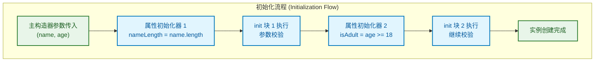
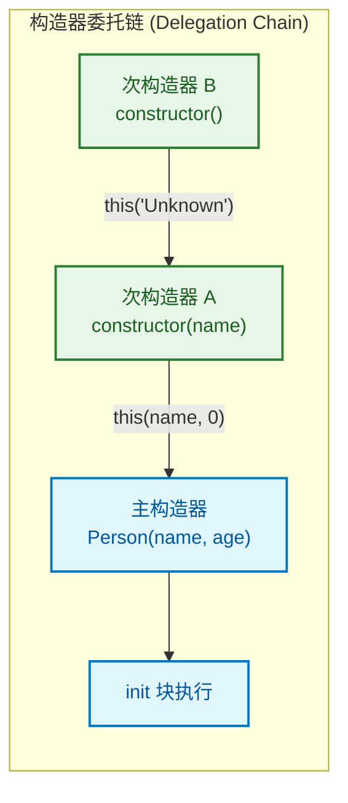
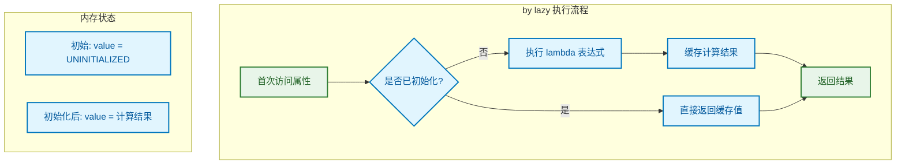
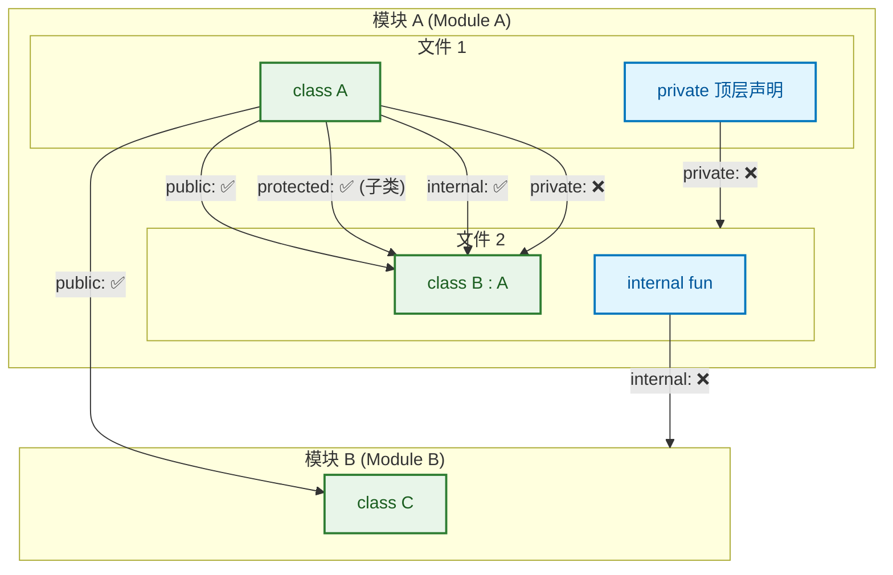
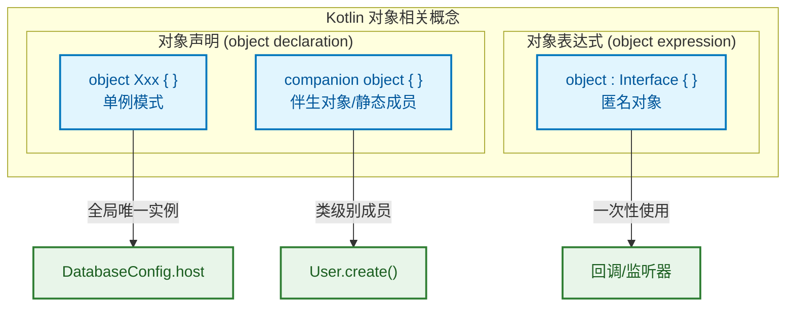
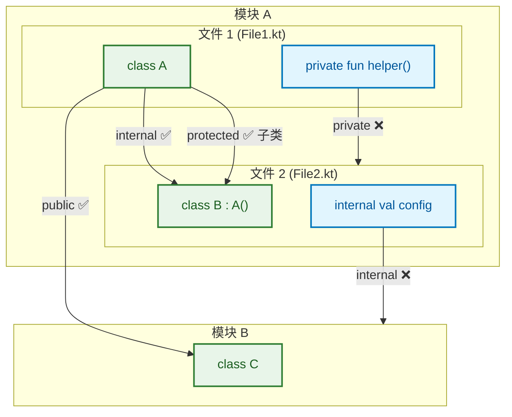
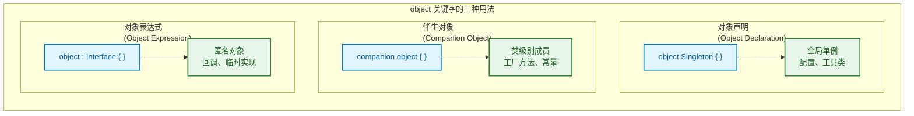

---

# 面向对象入门

---

## 类的定义

### class 关键字

Kotlin 中使用 `class` 关键字定义类，语法比 Java 更加简洁。一个最简单的类可以只有类名：

```kotlin
// 最简类定义 —— 空类也是合法的
class Empty

// 等价于 Java:
// public final class Empty { }
```

**关键差异**：Kotlin 的类**默认是 final 的** (classes are final by default)，这意味着不能被继承。若需要允许继承，必须显式添加 `open` 修饰符：

```kotlin
// 允许被继承的类
open class Animal

// 子类继承
class Dog : Animal()
```

### 主构造器 (Primary Constructor)

Kotlin 引入了**主构造器**的概念，它直接写在类名后面，与类声明融为一体：

```kotlin
// 主构造器紧跟类名
class Person constructor(name: String, age: Int) {
    // 类体
}

// 当没有注解或可见性修饰符时，constructor 关键字可省略
class Person(name: String, age: Int) {
    // 类体
}
```

```kotlin
┌──────────────────────────────────────────────────────┐
│   class Person(name: String, age: Int)               │
│         ↑              ↑                             │
│       类名         主构造器参数                        │
│                  (仅是参数，不是属性!)                  │
└──────────────────────────────────────────────────────┘
```

> ⚠️ **注意**：主构造器中的参数**默认只是参数**，不会自动成为类的属性 (property)。它们只在 `init` 块和属性初始化器中可用。

### 成员声明

类的成员包括：属性 (properties)、方法 (functions)、初始化块 (initializer blocks)、嵌套类 (nested classes) 等。

```kotlin
class Person(name: String, age: Int) {
    // ========== 属性声明 ==========
    val name: String = name          // 将构造器参数赋值给属性
    var age: Int = age               // var 表示可变属性
    val isAdult: Boolean = age >= 18 // 可以使用构造器参数进行计算
    
    // ========== 方法声明 ==========
    fun introduce(): String {
        return "我叫 $name，今年 $age 岁"
    }
    
    // ========== 初始化块 ==========
    init {
        println("Person 实例被创建: $name")
    }
}

// 使用
fun main() {
    val person = Person("张三", 25)
    println(person.introduce())  // 输出: 我叫 张三，今年 25 岁
    println(person.isAdult)      // 输出: true
}
```

---

## 构造器详解

### 主构造器参数

主构造器参数有两种使用方式：

**方式一：普通参数** —— 仅在初始化时可用

```kotlin
class Person(name: String) {
    val name: String = name  // 必须手动声明属性并赋值
    
    fun greet() {
        // println(name)  // ❌ 这里的 name 是属性，不是构造器参数
    }
}
```

**方式二：直接声明为属性** —— 在参数前加 `val` 或 `var`

```kotlin
class Person(
    val name: String,    // 自动成为只读属性 (read-only property)
    var age: Int         // 自动成为可变属性 (mutable property)
) {
    fun greet() {
        println("Hello, $name!")  // ✅ 直接使用属性
    }
}

// 使用
val person = Person("李四", 30)
println(person.name)   // ✅ 可以访问
person.age = 31        // ✅ 可以修改 (因为是 var)
// person.name = "王五" // ❌ 编译错误 (因为是 val)
```

```kotlin
┌─────────────────────────────────────────────────────────────┐
│  class Person(name: String)    vs    class Person(val name: String)  │
│                ↓                                    ↓                │
│         仅是构造器参数                          同时是属性              │
│      (只在 init 块中可用)                    (整个类中都可用)           │
└─────────────────────────────────────────────────────────────┘
```

**参数默认值** (Default Arguments)：

```kotlin
class Person(
    val name: String,
    var age: Int = 0,                    // 默认值为 0
    val country: String = "China"        // 默认值为 "China"
)

// 多种实例化方式
val p1 = Person("张三")                   // age=0, country="China"
val p2 = Person("李四", 25)               // country="China"
val p3 = Person("王五", 30, "Japan")      // 全部指定
val p4 = Person("赵六", country = "USA")  // 使用命名参数跳过 age
```

### init 初始化块

`init` 块是主构造器的一部分，用于执行初始化逻辑。一个类可以有**多个** `init` 块，它们按**声明顺序**执行：

```kotlin
class Person(val name: String, val age: Int) {
    
    // 属性初始化器 (property initializer)
    val nameLength: Int = name.length
    
    // 第一个 init 块
    init {
        println("【init 1】开始初始化，name = $name")
        require(name.isNotBlank()) { "姓名不能为空" }  // 参数校验
    }
    
    // 属性可以穿插在 init 块之间
    val isAdult: Boolean = age >= 18
    
    // 第二个 init 块
    init {
        println("【init 2】继续初始化，isAdult = $isAdult")
        require(age >= 0) { "年龄不能为负数" }
    }
}
```

**执行顺序可视化**：



### 次构造器 (Secondary Constructor)

当需要多种构造方式时，可以使用 `constructor` 关键字定义次构造器：

```kotlin
class Person(val name: String, val age: Int) {
    
    var email: String = ""
    
    // 次构造器 1：只接收 name
    constructor(name: String) : this(name, 0) {
        println("次构造器 1 被调用")
    }
    
    // 次构造器 2：接收 name 和 email
    constructor(name: String, email: String) : this(name, 0) {
        this.email = email
        println("次构造器 2 被调用，email = $email")
    }
}

// 使用不同构造器
val p1 = Person("张三", 25)              // 主构造器
val p2 = Person("李四")                  // 次构造器 1
val p3 = Person("王五", "wang@mail.com") // 次构造器 2
```

### 构造器委托 (Constructor Delegation)

**核心规则**：次构造器**必须**直接或间接委托给主构造器。这确保了主构造器的初始化逻辑一定会执行。

```kotlin
class Person(val name: String, val age: Int) {
    
    init {
        println("主构造器 init 块执行")
    }
    
    // 直接委托给主构造器
    constructor(name: String) : this(name, 0) {
        println("次构造器 A 执行")
    }
    
    // 间接委托：先委托给次构造器 A，A 再委托给主构造器
    constructor() : this("Unknown") {
        println("次构造器 B 执行")
    }
}
```

```kotlin
// 调用 Person() 时的执行顺序：
// 1. 主构造器 init 块执行
// 2. 次构造器 A 执行
// 3. 次构造器 B 执行
```



**与 Java 对比**：

```java
// Java 中的构造器重载
public class Person {
    private final String name;
    private final int age;
    
    public Person(String name, int age) {
        this.name = name;
        this.age = age;
    }
    
    public Person(String name) {
        this(name, 0);  // 委托给另一个构造器
    }
}
```

```kotlin
// Kotlin 等价写法 —— 更简洁
class Person(val name: String, val age: Int = 0)
// 一行搞定！默认参数替代了构造器重载
```

---

## 属性

### 字段与访问器的统一 (Unified Properties)

在 Java 中，我们需要分别声明字段 (field) 和访问器方法 (getter/setter)：

```java
// Java 的繁琐写法
public class Person {
    private String name;  // 字段
    
    // Getter
    public String getName() {
        return name;
    }
    
    // Setter
    public void setName(String name) {
        this.name = name;
    }
}
```

Kotlin 将字段和访问器**统一为属性 (property)** 的概念：

```kotlin
// Kotlin 的简洁写法
class Person {
    var name: String = ""  // 这一行包含了：字段 + getter + setter
}

// 使用时看起来像直接访问字段，实际上调用的是访问器
val person = Person()
person.name = "张三"       // 实际调用 setName("张三")
println(person.name)       // 实际调用 getName()
```

```kotlin
┌─────────────────────────────────────────────────────────────┐
│                    Kotlin 属性 (Property)                    │
│  ┌─────────────────────────────────────────────────────┐   │
│  │  var name: String = ""                              │   │
│  └─────────────────────────────────────────────────────┘   │
│                          ↓                                  │
│  ┌─────────────┐  ┌─────────────┐  ┌─────────────┐        │
│  │ 幕后字段     │  │  getter     │  │  setter     │        │
│  │ (Backing   │  │  (自动生成)   │  │  (自动生成)   │        │
│  │  Field)    │  │             │  │             │        │
│  └─────────────┘  └─────────────┘  └─────────────┘        │
└─────────────────────────────────────────────────────────────┘
```

### 自动生成 getter/setter

**val 属性**：只读，只生成 getter

```kotlin
class Circle(val radius: Double) {
    // val 属性：编译器自动生成 getter，无 setter
    val diameter: Double = radius * 2
}

// 反编译后的 Java 代码 (概念展示)
// public final class Circle {
//     private final double radius;
//     private final double diameter;
//     
//     public final double getRadius() { return this.radius; }
//     public final double getDiameter() { return this.diameter; }
// }
```

**var 属性**：可变，生成 getter 和 setter

```kotlin
class Rectangle(var width: Double, var height: Double) {
    // var 属性：编译器自动生成 getter 和 setter
}

val rect = Rectangle(10.0, 5.0)
println(rect.width)   // 调用 getWidth()
rect.height = 8.0     // 调用 setHeight(8.0)
```

**与 Java 互操作** (Interoperability)：

```kotlin
// Kotlin 类
class User(var name: String, val id: Int)
```

```java
// 从 Java 调用 Kotlin 类
User user = new User("张三", 1001);
user.getName();        // ✅ getter 可用
user.setName("李四");  // ✅ setter 可用 (因为是 var)
user.getId();          // ✅ getter 可用
// user.setId(1002);   // ❌ 编译错误，val 没有 setter
```

**属性初始化的多种方式**：

```kotlin
class Demo {
    // 1. 直接赋值
    var count: Int = 0
    
    // 2. 使用表达式
    val timestamp: Long = System.currentTimeMillis()
    
    // 3. 使用构造器参数
    // (在主构造器中用 val/var 声明)
    
    // 4. 延迟初始化 (后续章节详解)
    lateinit var data: String
    
    // 5. 惰性初始化 (后续章节详解)
    val config: Map<String, String> by lazy {
        loadConfig()
    }
    
    private fun loadConfig(): Map<String, String> = mapOf("key" to "value")
}
```

---

📝 **练习题 1**

以下代码的输出是什么？

```kotlin
class Example(name: String) {
    val greeting = "Hello, $name"
    
    init {
        println(greeting)
    }
}

fun main() {
    Example("Kotlin")
}
```

A. 编译错误，name 在 init 块中不可用  
B. 输出 `Hello, Kotlin`  
C. 输出 `Hello, null`  
D. 运行时异常

【答案】B

【解析】主构造器参数 `name` 在属性初始化器和 `init` 块中都可用。`greeting` 属性在 `init` 块执行前已完成初始化（按声明顺序），所以输出 `Hello, Kotlin`。选项 A 错误是因为构造器参数在整个初始化阶段都有效；选项 C 和 D 不会发生，因为 `name` 是非空的 `String` 类型。

---

📝 **练习题 2**

关于 Kotlin 构造器，以下说法**错误**的是：

A. 一个类可以有多个 `init` 块，它们按声明顺序执行  
B. 次构造器必须直接或间接委托给主构造器  
C. 在主构造器参数前加 `val` 会使其成为只读属性  
D. 如果类有主构造器，次构造器可以不委托给它

【答案】D

【解析】选项 D 错误。Kotlin 强制要求：如果类有主构造器，所有次构造器**必须**直接或间接委托给主构造器（使用 `this(...)`）。这是为了确保主构造器中的初始化逻辑（包括 `init` 块和属性初始化器）一定会执行。选项 A、B、C 的描述都是正确的。

---

## 自定义访问器

### get() 方法

Kotlin 允许为属性自定义 getter，实现**计算属性** (computed property) —— 每次访问时动态计算值，而非存储固定值：

```kotlin
class Rectangle(val width: Double, val height: Double) {
    
    // 自定义 getter：每次访问时计算
    val area: Double
        get() = width * height  // 不存储值，每次调用时计算
    
    // 等价的完整写法
    val perimeter: Double
        get() {
            return 2 * (width + height)
        }
    
    // 对比：普通属性（存储固定值）
    val initialArea: Double = width * height  // 只在初始化时计算一次
}

fun main() {
    val rect = Rectangle(10.0, 5.0)
    println(rect.area)       // 输出: 50.0
    println(rect.perimeter)  // 输出: 30.0
}
```

**计算属性 vs 存储属性**：

```kotlin
┌────────────────────────────────────────────────────────────────┐
│  存储属性 (Stored Property)      计算属性 (Computed Property)   │
│  ─────────────────────────      ──────────────────────────     │
│  val x: Int = 10                val x: Int                     │
│       ↓                             get() = a + b              │
│  ┌─────────┐                            ↓                      │
│  │ 内存存储 │                    每次访问时重新计算                │
│  │  值: 10 │                    (无幕后字段, no backing field)   │
│  └─────────┘                                                   │
└────────────────────────────────────────────────────────────────┘
```

**何时使用计算属性**：
- 值依赖于其他属性，且需要保持同步
- 计算开销很小（复杂计算建议用函数）
- 语义上更像"属性"而非"操作"

```kotlin
class Person(val firstName: String, val lastName: String) {
    // ✅ 适合用计算属性：fullName 语义上是属性
    val fullName: String
        get() = "$firstName $lastName"
    
    // ✅ 适合用函数：格式化是一种操作
    fun formatForDisplay(): String = "【$lastName】$firstName"
}
```

### set() 方法

对于 `var` 属性，可以自定义 setter 来控制赋值行为：

```kotlin
class User {
    // 自定义 setter：添加校验逻辑
    var age: Int = 0
        set(value) {
            if (value < 0) {
                throw IllegalArgumentException("年龄不能为负数")
            }
            field = value  // field 是幕后字段，存储实际值
        }
    
    // 自定义 setter：转换输入值
    var name: String = ""
        set(value) {
            field = value.trim().uppercase()  // 自动去空格并转大写
        }
}

fun main() {
    val user = User()
    user.name = "  alice  "
    println(user.name)  // 输出: ALICE
    
    user.age = 25       // ✅ 正常赋值
    // user.age = -1    // ❌ 抛出 IllegalArgumentException
}
```

**同时自定义 getter 和 setter**：

```kotlin
class Temperature {
    // 内部以摄氏度存储
    var celsius: Double = 0.0
    
    // 华氏度属性：读写时自动转换
    var fahrenheit: Double
        get() = celsius * 9 / 5 + 32           // 读取时：摄氏 → 华氏
        set(value) {
            celsius = (value - 32) * 5 / 9     // 写入时：华氏 → 摄氏
        }
}

fun main() {
    val temp = Temperature()
    temp.celsius = 100.0
    println(temp.fahrenheit)  // 输出: 212.0
    
    temp.fahrenheit = 32.0
    println(temp.celsius)     // 输出: 0.0
}
```

### field 幕后字段 (Backing Field)

`field` 是 Kotlin 提供的特殊标识符，**只能在访问器内部使用**，代表属性的实际存储位置：

```kotlin
class Counter {
    var count: Int = 0
        set(value) {
            println("count 从 $field 变为 $value")  // field 读取当前值
            field = value                           // field 写入新值
        }
}
```

**为什么需要 field？**

```kotlin
class BadExample {
    var value: Int = 0
        set(newValue) {
            // ❌ 错误写法：会导致无限递归！
            // this.value = newValue  // 这会再次调用 setter
            
            // ✅ 正确写法：使用 field
            field = newValue
        }
}
```

```kotlin
┌─────────────────────────────────────────────────────────────┐
│  this.value = x    →    调用 setter    →    this.value = x  │
│       ↑                                          │          │
│       └──────────────── 无限循环 ←───────────────┘          │
│                                                             │
│  field = x         →    直接写入内存    →    完成赋值        │
│                         (绕过 setter)                       │
└─────────────────────────────────────────────────────────────┘
```

**幕后字段的生成规则**：

编译器会在以下情况自动生成幕后字段 (backing field will be generated)：
1. 使用默认访问器
2. 自定义访问器中引用了 `field`

```kotlin
class Example {
    // ✅ 有幕后字段：使用了默认 getter，需要存储值
    val stored: Int = 42
    
    // ❌ 无幕后字段：纯计算属性，不存储值
    val computed: Int
        get() = System.currentTimeMillis().toInt()
    
    // ✅ 有幕后字段：setter 中使用了 field
    var validated: Int = 0
        set(value) {
            field = if (value > 0) value else 0
        }
}
```

**私有化 setter**：

```kotlin
class Article {
    // 外部只读，内部可写
    var readCount: Int = 0
        private set  // setter 私有化
    
    fun markAsRead() {
        readCount++  // 类内部可以修改
    }
}

fun main() {
    val article = Article()
    println(article.readCount)  // ✅ 可以读取
    // article.readCount = 100  // ❌ 编译错误：setter 是 private
    article.markAsRead()
    println(article.readCount)  // 输出: 1
}
```

---

## 延迟初始化

### lateinit 关键字

`lateinit` 用于声明**稍后初始化**的属性，告诉编译器"我保证在使用前会初始化它"：

```kotlin
class UserService {
    // 声明时不初始化，承诺稍后赋值
    lateinit var currentUser: User
    
    fun login(username: String) {
        // 在某个时机进行初始化
        currentUser = User(username)
    }
    
    fun showProfile() {
        println("当前用户: ${currentUser.name}")
    }
}
```

**lateinit 的限制条件**：

```kotlin
class Example {
    // ✅ 正确：var + 非空引用类型
    lateinit var name: String
    
    // ❌ 错误：不能用于 val（必须是 var）
    // lateinit val id: String
    
    // ❌ 错误：不能用于可空类型
    // lateinit var nullable: String?
    
    // ❌ 错误：不能用于基本类型
    // lateinit var count: Int
    // lateinit var flag: Boolean
    
    // ❌ 错误：不能用于带自定义访问器的属性
    // lateinit var custom: String
    //     get() = "hello"
}
```

```kotlin
┌─────────────────────────────────────────────────────────────┐
│                    lateinit 使用条件                         │
│  ┌─────────────┬─────────────┬─────────────┬─────────────┐ │
│  │     var     │   非空类型   │  引用类型    │  无自定义    │ │
│  │   (可变)    │ (non-null)  │ (非基本类型) │   访问器     │ │
│  │     ✓       │      ✓      │      ✓      │      ✓      │ │
│  └─────────────┴─────────────┴─────────────┴─────────────┘ │
│                    四个条件必须同时满足                       │
└─────────────────────────────────────────────────────────────┘
```

### 使用场景

**场景一：依赖注入 (Dependency Injection)**

```kotlin
class OrderController {
    // 由 DI 框架注入，声明时无法获得实例
    @Inject
    lateinit var orderService: OrderService
    
    @Inject
    lateinit var userService: UserService
    
    fun createOrder() {
        val user = userService.getCurrentUser()
        orderService.create(user)
    }
}
```

**场景二：Android 视图绑定 (View Binding)**

```kotlin
class MainActivity : AppCompatActivity() {
    // View 在 onCreate 之后才能获取
    lateinit var binding: ActivityMainBinding
    lateinit var adapter: UserAdapter
    
    override fun onCreate(savedInstanceState: Bundle?) {
        super.onCreate(savedInstanceState)
        binding = ActivityMainBinding.inflate(layoutInflater)
        setContentView(binding.root)
        
        adapter = UserAdapter()
        binding.recyclerView.adapter = adapter
    }
}
```

**场景三：单元测试 (Unit Testing)**

```kotlin
class UserServiceTest {
    // 在 @Before 方法中初始化
    lateinit var userService: UserService
    lateinit var mockRepository: UserRepository
    
    @Before
    fun setup() {
        mockRepository = mock(UserRepository::class.java)
        userService = UserService(mockRepository)
    }
    
    @Test
    fun testGetUser() {
        // 此时 userService 已初始化
        val user = userService.getUser(1)
        assertNotNull(user)
    }
}
```

### isInitialized 检查

访问未初始化的 `lateinit` 属性会抛出 `UninitializedPropertyAccessException`。可以使用 `::property.isInitialized` 安全检查：

```kotlin
class ConfigManager {
    lateinit var config: Config
    
    fun loadConfig() {
        config = Config.load()
    }
    
    fun getConfigValue(key: String): String? {
        // 安全检查：使用属性引用的 isInitialized
        return if (::config.isInitialized) {
            config.getValue(key)
        } else {
            println("警告: 配置尚未加载")
            null
        }
    }
}
```

**注意事项**：

```kotlin
class Example {
    lateinit var data: String
    
    fun check() {
        // ✅ 正确：使用 this::data 或 ::data
        if (this::data.isInitialized) {
            println(data)
        }
    }
    
    fun checkOther(other: Example) {
        // ❌ 错误：不能检查其他实例的 lateinit 属性
        // if (other::data.isInitialized) { }  // 编译错误
    }
}
```

**lateinit vs 可空类型**：

```kotlin
// 方案一：lateinit（确定会初始化时使用）
class ServiceA {
    lateinit var dependency: Dependency
    
    fun doWork() {
        dependency.execute()  // 直接使用，无需判空
    }
}

// 方案二：可空类型（可能为空时使用）
class ServiceB {
    var dependency: Dependency? = null
    
    fun doWork() {
        dependency?.execute()  // 每次使用都需要判空
        // 或
        dependency?.let { it.execute() }
    }
}
```

---

## 惰性属性

### by lazy 委托

`by lazy` 实现**惰性初始化** (lazy initialization)：属性在**首次访问时**才执行初始化，且只执行一次：

```kotlin
class DatabaseManager {
    // 数据库连接：首次访问时才创建
    val connection: Connection by lazy {
        println("正在建立数据库连接...")
        DriverManager.getConnection("jdbc:mysql://localhost/db")
    }
    
    fun query(sql: String) {
        // 第一次调用时初始化 connection
        connection.createStatement().executeQuery(sql)
    }
}

fun main() {
    val manager = DatabaseManager()
    println("DatabaseManager 已创建")  // connection 尚未初始化
    
    manager.query("SELECT * FROM users")  // 此时才初始化 connection
    manager.query("SELECT * FROM orders") // 复用已初始化的 connection
}

// 输出:
// DatabaseManager 已创建
// 正在建立数据库连接...
```

**lazy 的基本语法**：

```kotlin
val propertyName: Type by lazy {
    // 初始化代码块
    // 最后一行表达式作为属性值
    computeValue()
}
```



### 线程安全 (Thread Safety)

`lazy` 提供三种线程安全模式，通过 `LazyThreadSafetyMode` 参数指定：

```kotlin
class Example {
    // 1. SYNCHRONIZED（默认）：线程安全，加锁保证只初始化一次
    val syncValue: String by lazy(LazyThreadSafetyMode.SYNCHRONIZED) {
        println("SYNCHRONIZED 初始化")
        "sync"
    }
    
    // 2. PUBLICATION：允许多线程同时初始化，但只有第一个完成的值被采用
    val pubValue: String by lazy(LazyThreadSafetyMode.PUBLICATION) {
        println("PUBLICATION 初始化 - ${Thread.currentThread().name}")
        "pub"
    }
    
    // 3. NONE：无线程安全保证，性能最好，仅用于单线程场景
    val noneValue: String by lazy(LazyThreadSafetyMode.NONE) {
        println("NONE 初始化")
        "none"
    }
}
```

**三种模式对比**：

| 模式 | 线程安全 | 性能 | 适用场景 |
|------|---------|------|---------|
| `SYNCHRONIZED` | ✅ 完全安全 | 较低（有锁开销） | 多线程环境（默认选择） |
| `PUBLICATION` | ✅ 最终一致 | 中等 | 初始化幂等且开销不大 |
| `NONE` | ❌ 不安全 | 最高 | 确定单线程访问 |

```kotlin
// Android 主线程场景：可以使用 NONE 提升性能
class MainActivity : AppCompatActivity() {
    // UI 操作只在主线程，无需线程安全
    private val adapter: UserAdapter by lazy(LazyThreadSafetyMode.NONE) {
        UserAdapter(this)
    }
}
```

### 初始化时机

**对比：立即初始化 vs 惰性初始化**：

```kotlin
class ResourceManager {
    // 立即初始化：对象创建时就执行
    val eagerResource: Resource = Resource("eager").also {
        println("eagerResource 已初始化")
    }
    
    // 惰性初始化：首次访问时才执行
    val lazyResource: Resource by lazy {
        println("lazyResource 正在初始化...")
        Resource("lazy")
    }
    
    init {
        println("ResourceManager 构造完成")
    }
}

fun main() {
    println("=== 创建 ResourceManager ===")
    val manager = ResourceManager()
    
    println("\n=== 访问 lazyResource ===")
    println(manager.lazyResource.name)
    
    println("\n=== 再次访问 lazyResource ===")
    println(manager.lazyResource.name)
}

// 输出:
// === 创建 ResourceManager ===
// eagerResource 已初始化
// ResourceManager 构造完成
//
// === 访问 lazyResource ===
// lazyResource 正在初始化...
// lazy
//
// === 再次访问 lazyResource ===
// lazy
```

**惰性初始化的典型应用**：

```kotlin
class Application {
    // 1. 昂贵的资源：数据库连接、网络客户端
    val httpClient: OkHttpClient by lazy {
        OkHttpClient.Builder()
            .connectTimeout(30, TimeUnit.SECONDS)
            .build()
    }
    
    // 2. 可能不会用到的功能模块
    val analyticsEngine: AnalyticsEngine by lazy {
        AnalyticsEngine.initialize(this)
    }
    
    // 3. 依赖其他属性的计算
    val config: Config by lazy { loadConfig() }
    val apiBaseUrl: String by lazy { config.getString("api.base.url") }
    
    // 4. 单例模式的实现
    companion object {
        val instance: Application by lazy { Application() }
    }
}
```

**lateinit vs by lazy 对比**：

```kotlin
┌──────────────────┬─────────────────────┬─────────────────────┐
│       特性        │      lateinit       │       by lazy       │
├──────────────────┼─────────────────────┼─────────────────────┤
│     修饰符        │        var          │         val         │
│     类型限制      │   非空引用类型       │       任意类型       │
│     初始化时机    │     手动控制         │      首次访问       │
│     初始化次数    │     可多次赋值       │      仅一次         │
│     线程安全      │        否           │    可配置           │
│     空检查        │   isInitialized     │       不需要        │
│     典型场景      │   DI、Android View  │   昂贵资源、配置    │
└──────────────────┴─────────────────────┴─────────────────────┘
```

```kotlin
class Comparison {
    // lateinit：我来决定何时初始化
    lateinit var manualInit: Service
    
    // by lazy：首次使用时自动初始化
    val autoInit: Service by lazy { Service() }
    
    fun setup() {
        manualInit = Service()  // 手动初始化
    }
    
    fun use() {
        manualInit.doWork()  // 需确保已调用 setup()
        autoInit.doWork()    // 自动处理，无需担心
    }
}
```

---

📝 **练习题 1**

以下代码的输出是什么？

```kotlin
class Demo {
    val a: Int by lazy {
        println("初始化 a")
        1
    }
    
    val b: Int by lazy {
        println("初始化 b")
        a + 1
    }
}

fun main() {
    val demo = Demo()
    println("创建完成")
    println(demo.b)
    println(demo.a)
}
```

A. 创建完成 → 初始化 a → 初始化 b → 2 → 1  
B. 初始化 a → 初始化 b → 创建完成 → 2 → 1  
C. 创建完成 → 初始化 b → 初始化 a → 2 → 1  
D. 创建完成 → 初始化 b → 2 → 初始化 a → 1

【答案】C

【解析】`by lazy` 在首次访问时才初始化。创建 `Demo` 实例时不会初始化任何 lazy 属性。访问 `demo.b` 时触发 b 的初始化，而 b 的初始化依赖 a，所以先初始化 a（输出"初始化 a"），再完成 b 的初始化（输出"初始化 b"），然后输出 b 的值 2。再次访问 `demo.a` 时，a 已经初始化过，直接返回缓存值 1。**注意**：虽然 a 先被初始化，但"初始化 b"的 println 在 a 初始化完成后、b 的 lambda 继续执行时才输出，所以顺序是"初始化 b"在"初始化 a"之后... 等等，让我重新分析：访问 b → 执行 b 的 lambda → 遇到 `a + 1` → 访问 a → 执行 a 的 lambda → 输出"初始化 a" → 返回 1 → 继续 b 的 lambda → 输出"初始化 b" → 返回 2。所以正确顺序是 C。

---

📝 **练习题 2**

关于 `lateinit` 和 `by lazy`，以下说法**正确**的是：

A. `lateinit` 可以用于 `val` 属性  
B. `by lazy` 的属性可以被多次赋值  
C. `lateinit` 可以用于 `Int` 类型  
D. `by lazy` 默认是线程安全的

【答案】D

【解析】选项 D 正确，`by lazy` 默认使用 `LazyThreadSafetyMode.SYNCHRONIZED`，保证线程安全。选项 A 错误，`lateinit` 只能用于 `var`；选项 B 错误，`by lazy` 用于 `val`，只能初始化一次；选项 C 错误，`lateinit` 不能用于基本类型（Int、Boolean 等），只能用于引用类型。

---

## 可见性修饰符

Kotlin 提供四种可见性修饰符 (visibility modifiers) 来控制类、对象、接口、函数、属性的访问范围。与 Java 不同，Kotlin 的**默认可见性是 public**。

### 修饰符总览

```kotlin
┌─────────────────────────────────────────────────────────────────────┐
│                    Kotlin 可见性修饰符对比                            │
├──────────────┬──────────────┬──────────────┬───────────────────────┤
│   修饰符      │   类成员      │   顶层声明    │      可见范围          │
├──────────────┼──────────────┼──────────────┼───────────────────────┤
│   public     │  所有地方可见  │  所有地方可见  │  默认值，最大范围      │
│   private    │  本类内部     │  本文件内部    │  最小范围             │
│   protected  │  本类+子类    │   ❌ 不可用   │  继承体系内           │
│   internal   │  本模块内     │  本模块内      │  模块级隔离           │
└──────────────┴──────────────┴──────────────┴───────────────────────┘
```

### private 私有

`private` 是最严格的可见性，限制访问范围到最小单元：

**类成员的 private**：仅在声明它的类内部可见

```kotlin
class BankAccount(private var balance: Double) {
    
    // private 方法：仅类内部可调用
    private fun validateAmount(amount: Double) {
        require(amount > 0) { "金额必须为正数" }
    }
    
    fun deposit(amount: Double) {
        validateAmount(amount)      // ✅ 类内部可以访问
        balance += amount
    }
    
    fun withdraw(amount: Double): Boolean {
        validateAmount(amount)
        if (balance >= amount) {
            balance -= amount
            return true
        }
        return false
    }
    
    fun getBalance(): Double = balance
}

fun main() {
    val account = BankAccount(1000.0)
    account.deposit(500.0)           // ✅ public 方法可访问
    // account.balance               // ❌ 编译错误：private 属性
    // account.validateAmount(100.0) // ❌ 编译错误：private 方法
    println(account.getBalance())    // ✅ 输出: 1500.0
}
```

**顶层声明的 private**：仅在声明它的文件内可见

```kotlin
// ========== FileA.kt ==========
private const val SECRET_KEY = "abc123"  // 仅本文件可见

private fun encrypt(data: String): String {  // 仅本文件可见
    return data + SECRET_KEY
}

fun processData(data: String): String {  // public，其他文件可调用
    return encrypt(data)  // ✅ 同文件内可访问 private 函数
}

// ========== FileB.kt ==========
fun test() {
    processData("hello")  // ✅ 可以调用
    // SECRET_KEY         // ❌ 编译错误：不可见
    // encrypt("test")    // ❌ 编译错误：不可见
}
```

### protected 受保护

`protected` 成员在**本类及其子类**中可见，**不能用于顶层声明**：

```kotlin
open class Animal(protected val name: String) {
    
    protected open fun makeSound(): String {
        return "..."
    }
    
    fun introduce() {
        // ✅ 类内部可以访问 protected 成员
        println("我是 $name，我的叫声是: ${makeSound()}")
    }
}

class Dog(name: String) : Animal(name) {
    
    // ✅ 子类可以访问父类的 protected 成员
    override fun makeSound(): String {
        return "汪汪汪"
    }
    
    fun showName() {
        println("狗狗的名字: $name")  // ✅ 访问继承的 protected 属性
    }
}

class Cat(name: String) : Animal(name) {
    override fun makeSound() = "喵喵喵"
}

fun main() {
    val dog = Dog("旺财")
    dog.introduce()    // ✅ 输出: 我是 旺财，我的叫声是: 汪汪汪
    dog.showName()     // ✅ 输出: 狗狗的名字: 旺财
    // dog.name        // ❌ 编译错误：protected 在类外部不可见
    // dog.makeSound() // ❌ 编译错误：protected 在类外部不可见
}
```

**与 Java 的区别**：Java 的 `protected` 允许同包访问，Kotlin 的 `protected` 严格限制为类和子类。

### internal 模块内

`internal` 是 Kotlin 特有的修饰符，限制可见性到**同一模块** (module) 内：

> **模块 (Module)** 的定义：一起编译的 Kotlin 文件集合，例如：
> - 一个 IntelliJ IDEA 模块
> - 一个 Maven 项目
> - 一个 Gradle source set（如 `main`、`test`）
> - 一次 `kotlinc` 调用编译的文件

```kotlin
// ========== library 模块 ==========
// 模块内部实现，不希望暴露给使用者
internal class DatabaseConnection {
    internal fun connect() { /* ... */ }
}

// 公开的 API
class DatabaseManager {
    private val connection = DatabaseConnection()  // ✅ 同模块可访问
    
    fun query(sql: String): List<Map<String, Any>> {
        connection.connect()
        // ...
        return emptyList()
    }
}

// ========== app 模块（依赖 library）==========
fun main() {
    val manager = DatabaseManager()  // ✅ public 类可访问
    manager.query("SELECT * FROM users")
    
    // val conn = DatabaseConnection()  // ❌ 编译错误：internal 类不可见
}
```

**internal 的典型应用场景**：

```kotlin
// SDK/库开发：隐藏实现细节
internal class HttpClientImpl : HttpClient {
    // 具体实现，不暴露给库的使用者
}

// 公开接口
interface HttpClient {
    fun get(url: String): Response
}

// 工厂方法提供实例
fun createHttpClient(): HttpClient = HttpClientImpl()
```

### public 公开

`public` 是默认可见性，成员在任何地方都可见：

```kotlin
// 以下两种写法等价
class User(val name: String)
public class User(public val name: String)

// 顶层函数默认也是 public
fun greet(name: String) = "Hello, $name"
public fun greet(name: String) = "Hello, $name"  // 等价
```

### 可见性修饰符对比图



---

## 数据类

### data class 声明

数据类 (data class) 是 Kotlin 为"只持有数据"的类提供的便捷语法，编译器会自动生成常用方法：

```kotlin
// 一行代码定义完整的数据类
data class User(
    val id: Long,
    val name: String,
    val email: String,
    val age: Int = 0  // 可以有默认值
)

// 等价于 Java 中需要手写的大量代码：
// - 构造器
// - getter/setter
// - equals()
// - hashCode()
// - toString()
// - copy() (Java 没有原生支持)
```

**data class 的要求**：

```kotlin
// ✅ 正确：主构造器至少有一个参数
data class Point(val x: Int, val y: Int)

// ✅ 正确：参数必须是 val 或 var
data class Config(var host: String, val port: Int)

// ❌ 错误：不能是 abstract、open、sealed 或 inner
// abstract data class AbstractData(val x: Int)
// open data class OpenData(val x: Int)

// ✅ 可以实现接口
data class Person(val name: String) : Serializable
```

### 自动生成 equals/hashCode/toString

**equals() 和 hashCode()**：基于主构造器中的所有属性生成

```kotlin
data class User(val id: Long, val name: String)

fun main() {
    val user1 = User(1, "Alice")
    val user2 = User(1, "Alice")
    val user3 = User(2, "Alice")
    
    // equals() 比较所有属性
    println(user1 == user2)  // true（内容相同）
    println(user1 == user3)  // false（id 不同）
    
    // hashCode() 一致性
    println(user1.hashCode() == user2.hashCode())  // true
    
    // 可以安全地用作 Map 的 key 或 Set 的元素
    val userSet = setOf(user1, user2, user3)
    println(userSet.size)  // 2（user1 和 user2 被视为相同）
}
```

**toString()**：生成可读的字符串表示

```kotlin
data class Product(val id: Int, val name: String, val price: Double)

fun main() {
    val product = Product(101, "Kotlin Book", 59.9)
    println(product)  // 输出: Product(id=101, name=Kotlin Book, price=59.9)
    
    // 对比普通类
    class RegularProduct(val id: Int, val name: String)
    val regular = RegularProduct(101, "Book")
    println(regular)  // 输出: RegularProduct@1b6d3586（内存地址）
}
```

**注意：类体中声明的属性不参与生成的方法**

```kotlin
data class User(val id: Long, val name: String) {
    // 这个属性不参与 equals/hashCode/toString
    var loginCount: Int = 0
}

fun main() {
    val user1 = User(1, "Alice").apply { loginCount = 10 }
    val user2 = User(1, "Alice").apply { loginCount = 20 }
    
    println(user1 == user2)  // true！loginCount 不参与比较
    println(user1)           // User(id=1, name=Alice)，不包含 loginCount
}
```

### copy 方法

`copy()` 方法用于创建对象的副本，可以选择性地修改某些属性：

```kotlin
data class User(
    val id: Long,
    val name: String,
    val email: String,
    val role: String = "user"
)

fun main() {
    val original = User(1, "Alice", "alice@example.com")
    
    // 完整复制
    val copy1 = original.copy()
    println(copy1)  // User(id=1, name=Alice, email=alice@example.com, role=user)
    
    // 修改部分属性（其他保持不变）
    val copy2 = original.copy(name = "Alice Smith")
    println(copy2)  // User(id=1, name=Alice Smith, email=alice@example.com, role=user)
    
    // 修改多个属性
    val admin = original.copy(
        name = "Admin",
        email = "admin@example.com",
        role = "admin"
    )
    println(admin)  // User(id=1, name=Admin, email=admin@example.com, role=admin)
    
    // 原对象不受影响（不可变性）
    println(original)  // User(id=1, name=Alice, email=alice@example.com, role=user)
}
```

**copy() 的实际应用**：

```kotlin
// 状态管理：创建新状态而非修改原状态
data class AppState(
    val isLoading: Boolean = false,
    val data: List<String> = emptyList(),
    val error: String? = null
)

class ViewModel {
    private var state = AppState()
    
    fun loadData() {
        // 开始加载
        state = state.copy(isLoading = true, error = null)
        
        try {
            val result = fetchData()
            // 加载成功
            state = state.copy(isLoading = false, data = result)
        } catch (e: Exception) {
            // 加载失败
            state = state.copy(isLoading = false, error = e.message)
        }
    }
}
```

### 解构声明 (Destructuring Declarations)

数据类自动生成 `componentN()` 函数，支持解构声明：

```kotlin
data class User(val id: Long, val name: String, val email: String)

fun main() {
    val user = User(1, "Alice", "alice@example.com")
    
    // 解构声明：按顺序提取属性
    val (id, name, email) = user
    println("ID: $id, Name: $name, Email: $email")
    
    // 等价于：
    val id2 = user.component1()    // id
    val name2 = user.component2()  // name
    val email2 = user.component3() // email
    
    // 可以用 _ 忽略不需要的属性
    val (_, userName, _) = user
    println("只需要名字: $userName")
}
```

**解构在循环中的应用**：

```kotlin
data class Entry(val key: String, val value: Int)

fun main() {
    val entries = listOf(
        Entry("a", 1),
        Entry("b", 2),
        Entry("c", 3)
    )
    
    // 在 for 循环中解构
    for ((key, value) in entries) {
        println("$key -> $value")
    }
    
    // Map 的遍历（Map.Entry 支持解构）
    val map = mapOf("x" to 10, "y" to 20)
    for ((k, v) in map) {
        println("$k = $v")
    }
    
    // 在 lambda 中解构
    entries.forEach { (key, value) ->
        println("处理: $key -> $value")
    }
}
```

---

## 对象声明

### object 单例

Kotlin 使用 `object` 关键字直接声明单例 (singleton)，无需手写单例模式：

```kotlin
// 声明一个单例对象
object DatabaseConfig {
    val host: String = "localhost"
    val port: Int = 3306
    var maxConnections: Int = 10
    
    fun getConnectionString(): String {
        return "jdbc:mysql://$host:$port"
    }
}

fun main() {
    // 直接通过对象名访问
    println(DatabaseConfig.host)                  // localhost
    println(DatabaseConfig.getConnectionString()) // jdbc:mysql://localhost:3306
    
    DatabaseConfig.maxConnections = 20  // 可以修改 var 属性
    
    // 单例验证
    val config1 = DatabaseConfig
    val config2 = DatabaseConfig
    println(config1 === config2)  // true，同一个实例
}
```

**object 的特点**：

```kotlin
object Logger {
    init {
        // 首次访问时执行（懒加载）
        println("Logger 初始化")
    }
    
    fun log(message: String) {
        println("[LOG] $message")
    }
}

// object 可以继承类和实现接口
interface Serializer {
    fun serialize(data: Any): String
}

object JsonSerializer : Serializer {
    override fun serialize(data: Any): String {
        return """{"data": "$data"}"""
    }
}
```

**与 Java 单例对比**：

```java
// Java 传统单例模式（双重检查锁）
public class Singleton {
    private static volatile Singleton instance;
    private Singleton() {}
    
    public static Singleton getInstance() {
        if (instance == null) {
            synchronized (Singleton.class) {
                if (instance == null) {
                    instance = new Singleton();
                }
            }
        }
        return instance;
    }
}
```

```kotlin
// Kotlin 一行搞定，且线程安全
object Singleton
```

### 伴生对象 (Companion Object)

Kotlin 没有 `static` 关键字，使用**伴生对象**实现类级别的成员：

```kotlin
class User private constructor(val id: Long, val name: String) {
    
    // 伴生对象：属于类而非实例
    companion object {
        // "静态"属性
        const val MAX_NAME_LENGTH = 50
        private var idCounter = 0L
        
        // "静态"方法 / 工厂方法
        fun create(name: String): User {
            require(name.length <= MAX_NAME_LENGTH) { "名字太长" }
            return User(++idCounter, name)
        }
        
        // 可以访问私有构造器
        fun createAdmin(): User = User(0, "Admin")
    }
    
    override fun toString() = "User(id=$id, name=$name)"
}

fun main() {
    // 通过类名访问伴生对象成员
    println(User.MAX_NAME_LENGTH)  // 50
    
    val user1 = User.create("Alice")
    val user2 = User.create("Bob")
    println(user1)  // User(id=1, name=Alice)
    println(user2)  // User(id=2, name=Bob)
    
    // 不能直接实例化（构造器私有）
    // val user = User(3, "Test")  // ❌ 编译错误
}
```

**伴生对象可以命名和实现接口**：

```kotlin
interface Factory<T> {
    fun create(): T
}

class MyClass {
    // 命名的伴生对象
    companion object MyFactory : Factory<MyClass> {
        override fun create(): MyClass = MyClass()
    }
}

fun main() {
    // 两种访问方式
    val obj1 = MyClass.create()
    val obj2 = MyClass.MyFactory.create()
    
    // 伴生对象本身也是对象，可以赋值给变量
    val factory: Factory<MyClass> = MyClass.MyFactory
}
```

**@JvmStatic 注解**：让伴生对象成员在 Java 中表现为真正的静态成员

```kotlin
class Utils {
    companion object {
        @JvmStatic
        fun helper(): String = "I'm static in Java"
        
        fun nonStatic(): String = "I need Companion"
    }
}
```

```java
// Java 调用
Utils.helper();                    // ✅ @JvmStatic 可以直接调用
Utils.Companion.nonStatic();       // 需要通过 Companion 访问
```

### 对象表达式 (Object Expression)

对象表达式用于创建**匿名对象**，类似 Java 的匿名内部类：

```kotlin
// 实现接口的匿名对象
interface ClickListener {
    fun onClick()
    fun onLongClick(): Boolean
}

fun setClickListener(listener: ClickListener) {
    listener.onClick()
}

fun main() {
    // 对象表达式：创建实现接口的匿名对象
    setClickListener(object : ClickListener {
        override fun onClick() {
            println("点击了")
        }
        
        override fun onLongClick(): Boolean {
            println("长按了")
            return true
        }
    })
}
```

**继承类的对象表达式**：

```kotlin
open class Animal(val name: String) {
    open fun speak() = "..."
}

fun main() {
    // 继承类并重写方法
    val dog = object : Animal("旺财") {
        override fun speak() = "汪汪汪"
    }
    
    println("${dog.name} 说: ${dog.speak()}")  // 旺财 说: 汪汪汪
}
```

**不继承任何类型的匿名对象**：

```kotlin
fun main() {
    // 创建一个临时的数据容器
    val result = object {
        val code = 200
        val message = "Success"
        val data = listOf("a", "b", "c")
    }
    
    // 只能在局部作用域使用这些属性
    println("Code: ${result.code}, Message: ${result.message}")
    
    // 注意：作为返回值时，类型会退化
    fun getResult() = object {
        val value = 42
    }
    // val r = getResult()
    // r.value  // ❌ 编译错误：返回类型是 Any
}
```

**对象表达式可以访问外部变量**（与 Java 不同，不要求 final）：

```kotlin
fun countClicks(button: Button) {
    var clickCount = 0  // 不需要是 final
    
    button.setOnClickListener(object : OnClickListener {
        override fun onClick() {
            clickCount++  // ✅ 可以修改外部变量
            println("点击次数: $clickCount")
        }
    })
}
```



---

📝 **练习题 1**

以下代码的输出是什么？

```kotlin
data class Point(val x: Int, val y: Int) {
    var label: String = ""
}

fun main() {
    val p1 = Point(1, 2).apply { label = "A" }
    val p2 = Point(1, 2).apply { label = "B" }
    println(p1 == p2)
    println(p1.toString())
}
```

A. `false` 和 `Point(x=1, y=2, label=A)`  
B. `true` 和 `Point(x=1, y=2, label=A)`  
C. `true` 和 `Point(x=1, y=2)`  
D. `false` 和 `Point(x=1, y=2)`

【答案】C

【解析】data class 自动生成的 `equals()` 和 `toString()` 只考虑**主构造器中的属性**。`label` 是在类体中声明的，不参与这些方法。因此 `p1 == p2` 为 `true`（只比较 x 和 y），`toString()` 输出 `Point(x=1, y=2)`（不包含 label）。

---

📝 **练习题 2**

关于 Kotlin 的 `object` 关键字，以下说法**错误**的是：

A. `object` 声明的单例是线程安全的  
B. 伴生对象可以实现接口  
C. 对象表达式可以访问并修改外部的非 final 变量  
D. 一个类可以有多个伴生对象

【答案】D

【解析】选项 D 错误，一个类**只能有一个**伴生对象 (A class can only have one companion object)。选项 A 正确，Kotlin 的 object 单例由 JVM 类加载机制保证线程安全；选项 B 正确，伴生对象可以命名并实现接口；选项 C 正确，与 Java 匿名内部类不同，Kotlin 对象表达式可以访问和修改外部变量。

---

## 可见性修饰符

Kotlin 提供四种可见性修饰符 (visibility modifiers) 来控制声明的访问范围。与 Java 不同，**Kotlin 的默认可见性是 public**，而非包私有 (package-private)。

### 修饰符总览

```kotlin
┌─────────────────────────────────────────────────────────────────────────┐
│                      Kotlin 可见性修饰符速查表                            │
├────────────┬─────────────────────┬─────────────────────────────────────┤
│   修饰符    │     类成员作用域     │          顶层声明作用域               │
├────────────┼─────────────────────┼─────────────────────────────────────┤
│  public    │  任何地方可见        │  任何地方可见 (默认)                  │
│  private   │  仅本类内部可见      │  仅本文件内部可见                     │
│  protected │  本类 + 子类可见     │  ❌ 不能用于顶层声明                  │
│  internal  │  同一模块内可见      │  同一模块内可见                       │
└────────────┴─────────────────────┴─────────────────────────────────────┘
```

### private 私有

`private` 是最严格的可见性限制，将访问范围限定在最小单元内。

**类成员的 private**：仅在声明它的类内部可见

```kotlin
class BankAccount(private var balance: Double) {
    
    // private 方法：仅类内部可调用
    private fun logTransaction(amount: Double, type: String) {
        println("[$type] 金额: $amount, 余额: $balance")
    }
    
    fun deposit(amount: Double) {
        balance += amount
        logTransaction(amount, "存款")  // ✅ 类内部可以访问
    }
    
    fun getBalance(): Double = balance
}

fun main() {
    val account = BankAccount(1000.0)
    account.deposit(500.0)
    println(account.getBalance())  // ✅ 输出: 1500.0
    
    // account.balance = 9999.0    // ❌ 编译错误: private 属性不可访问
    // account.logTransaction(...) // ❌ 编译错误: private 方法不可访问
}
```

**顶层声明的 private**：仅在声明它的文件内可见

```kotlin
// ========== Utils.kt ==========
private const val SECRET_KEY = "abc123"  // 仅本文件可见

private fun encrypt(data: String): String {  // 仅本文件可见
    return "$data-$SECRET_KEY"
}

fun processData(data: String): String {  // public，其他文件可调用
    return encrypt(data)  // ✅ 同文件内可访问 private 函数
}

// ========== Main.kt ==========
fun main() {
    processData("hello")  // ✅ 可以调用 public 函数
    // SECRET_KEY         // ❌ 编译错误: 不可见
    // encrypt("test")    // ❌ 编译错误: 不可见
}
```

### protected 受保护

`protected` 成员在**本类及其子类**中可见。注意：**不能用于顶层声明**。

```kotlin
open class Animal(protected val name: String) {
    
    protected open fun makeSound(): String = "..."
    
    fun introduce() {
        println("我是 $name, 我的叫声: ${makeSound()}")
    }
}

class Dog(name: String) : Animal(name) {
    
    // ✅ 子类可以访问 protected 成员
    override fun makeSound(): String = "汪汪汪"
    
    fun showName() {
        println("狗狗名字: $name")  // ✅ 访问继承的 protected 属性
    }
}

fun main() {
    val dog = Dog("旺财")
    dog.introduce()   // ✅ 输出: 我是 旺财, 我的叫声: 汪汪汪
    dog.showName()    // ✅ 输出: 狗狗名字: 旺财
    
    // dog.name       // ❌ 编译错误: protected 在类外部不可见
    // dog.makeSound() // ❌ 编译错误: protected 在类外部不可见
}
```

**Kotlin vs Java 的 protected 差异**：

| 特性 | Kotlin protected | Java protected |
|------|------------------|----------------|
| 子类访问 | ✅ | ✅ |
| 同包访问 | ❌ | ✅ |
| 顶层声明 | ❌ 不允许 | N/A |

### internal 模块内

`internal` 是 Kotlin 特有的修饰符，限制可见性到**同一模块** (module) 内。

> **模块 (Module)** 的定义：一起编译的 Kotlin 文件集合
> - 一个 IntelliJ IDEA 模块
> - 一个 Maven/Gradle 项目
> - 一个 Gradle source set (如 main, test)

```kotlin
// ========== library 模块 ==========
// 内部实现类，不希望暴露给库的使用者
internal class HttpClientImpl {
    internal fun executeRequest(url: String): String {
        return "Response from $url"
    }
}

// 公开的 API
class NetworkManager {
    private val client = HttpClientImpl()  // ✅ 同模块可访问
    
    fun fetch(url: String): String {
        return client.executeRequest(url)
    }
}

// ========== app 模块 (依赖 library) ==========
fun main() {
    val manager = NetworkManager()
    manager.fetch("https://api.example.com")  // ✅ public 可访问
    
    // val client = HttpClientImpl()  // ❌ 编译错误: internal 跨模块不可见
}
```

**internal 的典型应用场景**：

```kotlin
// SDK/库开发：隐藏实现细节，只暴露必要的 API
public interface PaymentService {
    fun pay(amount: Double): Boolean
}

internal class PaymentServiceImpl : PaymentService {
    // 具体实现，对库使用者隐藏
    override fun pay(amount: Double): Boolean {
        // 复杂的支付逻辑...
        return true
    }
}

// 工厂函数提供实例
fun createPaymentService(): PaymentService = PaymentServiceImpl()
```

### public 公开

`public` 是默认可见性，声明在任何地方都可见：

```kotlin
// 以下两种写法完全等价
class User(val name: String)
public class User(public val name: String)

// 顶层函数默认也是 public
fun greet() = "Hello"
public fun greet() = "Hello"  // 等价
```

### 可见性作用域对比图



---

## 数据类

### data class 声明

数据类 (data class) 是 Kotlin 为"主要用于存储数据"的类提供的便捷语法。编译器会根据主构造器中的属性自动生成常用方法。

```kotlin
// 一行代码定义完整的数据类
data class User(
    val id: Long,
    val name: String,
    val email: String,
    val age: Int = 0  // 可以有默认值
)

// 等价于 Java 中需要手写的大量样板代码:
// - 私有字段 + getter/setter
// - equals() 和 hashCode()
// - toString()
// - 构造器
```

**data class 的限制条件**：

```kotlin
// ✅ 正确: 主构造器至少有一个参数
data class Point(val x: Int, val y: Int)

// ✅ 正确: 参数必须标记为 val 或 var
data class Config(var host: String, val port: Int)

// ❌ 错误: 不能是 abstract, open, sealed 或 inner
// abstract data class AbstractData(val x: Int)
// open data class OpenData(val x: Int)

// ✅ 可以实现接口
data class Person(val name: String, val age: Int) : Comparable<Person> {
    override fun compareTo(other: Person) = this.age - other.age
}
```

### 自动生成 equals/hashCode/toString

**equals() 和 hashCode()**：基于主构造器中声明的所有属性

```kotlin
data class User(val id: Long, val name: String)

fun main() {
    val user1 = User(1, "Alice")
    val user2 = User(1, "Alice")
    val user3 = User(2, "Alice")
    
    // equals() 比较所有主构造器属性
    println(user1 == user2)  // true (结构相等)
    println(user1 == user3)  // false (id 不同)
    println(user1 === user2) // false (不是同一对象)
    
    // hashCode() 一致性保证
    println(user1.hashCode() == user2.hashCode())  // true
    
    // 可以安全用于 Set 和 Map
    val userSet = setOf(user1, user2, user3)
    println(userSet.size)  // 2 (user1 和 user2 被视为相同)
}
```

**toString()**：生成可读的字符串表示

```kotlin
data class Product(val id: Int, val name: String, val price: Double)

fun main() {
    val product = Product(101, "Kotlin 实战", 79.9)
    println(product)  // Product(id=101, name=Kotlin 实战, price=79.9)
    
    // 对比普通类
    class RegularProduct(val id: Int, val name: String)
    println(RegularProduct(1, "Book"))  // RegularProduct@3b07d329
}
```

**重要：类体中声明的属性不参与自动生成的方法**

```kotlin
data class User(val id: Long, val name: String) {
    // 类体中的属性不参与 equals/hashCode/toString
    var loginCount: Int = 0
}

fun main() {
    val user1 = User(1, "Alice").apply { loginCount = 10 }
    val user2 = User(1, "Alice").apply { loginCount = 99 }
    
    println(user1 == user2)  // true! loginCount 不参与比较
    println(user1)           // User(id=1, name=Alice) 不包含 loginCount
}
```

```kotlin
┌─────────────────────────────────────────────────────────────────┐
│  data class User(val id: Long, val name: String) {              │
│      var loginCount: Int = 0                                    │
│  }                                                              │
│  ─────────────────────────────────────────────────────────────  │
│  主构造器属性: id, name     →  参与 equals/hashCode/toString     │
│  类体属性: loginCount       →  不参与自动生成的方法               │
└─────────────────────────────────────────────────────────────────┘
```

### copy 方法

`copy()` 方法创建对象副本，可选择性修改部分属性，是实现**不可变数据模式** (immutable data pattern) 的关键：

```kotlin
data class User(
    val id: Long,
    val name: String,
    val email: String,
    val role: String = "user"
)

fun main() {
    val original = User(1, "Alice", "alice@mail.com")
    
    // 完整复制
    val copy1 = original.copy()
    println(original === copy1)  // false, 新对象
    println(original == copy1)   // true, 内容相同
    
    // 修改部分属性
    val updated = original.copy(name = "Alice Smith", role = "admin")
    println(updated)  // User(id=1, name=Alice Smith, email=alice@mail.com, role=admin)
    
    // 原对象不变 (不可变性)
    println(original) // User(id=1, name=Alice, email=alice@mail.com, role=user)
}
```

**copy() 的实际应用 —— 状态管理**：

```kotlin
// UI 状态类
data class UiState(
    val isLoading: Boolean = false,
    val data: List<String> = emptyList(),
    val errorMessage: String? = null
)

class ViewModel {
    private var state = UiState()
    
    fun loadData() {
        // 开始加载: 只修改 isLoading
        state = state.copy(isLoading = true, errorMessage = null)
        
        try {
            val result = fetchFromNetwork()
            // 成功: 更新 data, 关闭 loading
            state = state.copy(isLoading = false, data = result)
        } catch (e: Exception) {
            // 失败: 设置错误信息
            state = state.copy(isLoading = false, errorMessage = e.message)
        }
    }
}
```

### 解构声明 (Destructuring Declarations)

数据类自动生成 `componentN()` 函数，支持将对象解构为多个变量：

```kotlin
data class Person(val name: String, val age: Int, val city: String)

fun main() {
    val person = Person("张三", 25, "北京")
    
    // 解构声明: 按主构造器参数顺序提取
    val (name, age, city) = person
    println("$name, $age 岁, 来自 $city")
    
    // 等价于手动调用 componentN()
    val name2 = person.component1()  // "张三"
    val age2 = person.component2()   // 25
    val city2 = person.component3()  // "北京"
    
    // 使用 _ 忽略不需要的值
    val (userName, _, userCity) = person
    println("$userName 来自 $userCity")
}
```

**解构在集合操作中的应用**：

```kotlin
data class Entry(val key: String, val value: Int)

fun main() {
    val entries = listOf(
        Entry("a", 1),
        Entry("b", 2),
        Entry("c", 3)
    )
    
    // for 循环中解构
    for ((key, value) in entries) {
        println("$key -> $value")
    }
    
    // Map 遍历 (Map.Entry 支持解构)
    val map = mapOf("x" to 10, "y" to 20)
    for ((k, v) in map) {
        println("$k = $v")
    }
    
    // Lambda 参数解构
    entries.filter { (_, value) -> value > 1 }
           .forEach { (key, value) -> println("$key: $value") }
}
```

---

## 对象声明

Kotlin 使用 `object` 关键字提供三种对象相关的语法结构：对象声明 (单例)、伴生对象、对象表达式。

### object 单例

`object` 声明直接定义一个单例 (singleton)，无需手写单例模式的样板代码：

```kotlin
// 声明单例对象
object DatabaseConfig {
    val host: String = "localhost"
    val port: Int = 3306
    private var connectionCount = 0
    
    fun connect(): String {
        connectionCount++
        return "Connected to $host:$port (#$connectionCount)"
    }
}

fun main() {
    // 直接通过对象名访问成员
    println(DatabaseConfig.host)      // localhost
    println(DatabaseConfig.connect()) // Connected to localhost:3306 (#1)
    println(DatabaseConfig.connect()) // Connected to localhost:3306 (#2)
    
    // 验证单例
    val ref1 = DatabaseConfig
    val ref2 = DatabaseConfig
    println(ref1 === ref2)  // true, 同一实例
}
```

**object 的特性**：

```kotlin
// 1. 可以继承类和实现接口
interface Logger {
    fun log(message: String)
}

object ConsoleLogger : Logger {
    override fun log(message: String) {
        println("[LOG] $message")
    }
}

// 2. 有 init 块，首次访问时执行 (懒加载)
object AppConfig {
    init {
        println("AppConfig 初始化")  // 首次访问时打印
    }
    val version = "1.0.0"
}

// 3. 不能有构造器 (无法传参)
// object Invalid(val x: Int)  // ❌ 编译错误
```

**与 Java 单例对比**：

```java
// Java: 双重检查锁单例 (约 15 行)
public class Singleton {
    private static volatile Singleton instance;
    private Singleton() {}
    
    public static Singleton getInstance() {
        if (instance == null) {
            synchronized (Singleton.class) {
                if (instance == null) {
                    instance = new Singleton();
                }
            }
        }
        return instance;
    }
}
```

```kotlin
// Kotlin: 一行搞定，线程安全由 JVM 保证
object Singleton
```

### 伴生对象 (Companion Object)

Kotlin 没有 `static` 关键字，使用**伴生对象**实现类级别的成员和工厂方法：

```kotlin
class User private constructor(val id: Long, val name: String) {
    
    // 伴生对象: 属于类本身，而非实例
    companion object {
        // 类级别的常量
        const val MAX_NAME_LENGTH = 50
        
        // 类级别的状态
        private var idSequence = 0L
        
        // 工厂方法
        fun create(name: String): User {
            require(name.length <= MAX_NAME_LENGTH) { "名字过长" }
            return User(++idSequence, name)
        }
        
        // 可以访问私有构造器
        fun createGuest(): User = User(-1, "Guest")
    }
}

fun main() {
    // 通过类名访问伴生对象成员
    println(User.MAX_NAME_LENGTH)  // 50
    
    val user1 = User.create("Alice")
    val user2 = User.create("Bob")
    println(user1.id)  // 1
    println(user2.id)  // 2
    
    // 私有构造器阻止直接实例化
    // val user = User(3, "Test")  // ❌ 编译错误
}
```

**伴生对象可以命名并实现接口**：

```kotlin
interface Factory<T> {
    fun create(): T
}

class MyService {
    // 命名的伴生对象
    companion object Provider : Factory<MyService> {
        override fun create(): MyService = MyService()
    }
    
    fun doWork() = println("Working...")
}

fun main() {
    // 多种访问方式
    val service1 = MyService.create()
    val service2 = MyService.Provider.create()
    val service3 = MyService.Companion.create()  // 默认名 Companion
    
    // 伴生对象可以作为值传递
    val factory: Factory<MyService> = MyService.Provider
    val service4 = factory.create()
}
```

**@JvmStatic —— Java 互操作**：

```kotlin
class StringUtils {
    companion object {
        @JvmStatic
        fun isEmpty(str: String?): Boolean = str.isNullOrEmpty()
        
        fun isBlank(str: String?): Boolean = str.isNullOrBlank()
    }
}
```

```java
// Java 调用
StringUtils.isEmpty("");              // ✅ @JvmStatic 直接调用
StringUtils.Companion.isBlank("");    // 无注解需要通过 Companion
```

### 对象表达式 (Object Expression)

对象表达式创建**匿名对象**，类似 Java 的匿名内部类，但更强大：

```kotlin
// 1. 实现接口的匿名对象
interface ClickListener {
    fun onClick()
}

fun setListener(listener: ClickListener) {
    listener.onClick()
}

fun main() {
    setListener(object : ClickListener {
        override fun onClick() {
            println("按钮被点击")
        }
    })
}
```

```kotlin
// 2. 继承类的匿名对象
open class Animal(val name: String) {
    open fun speak() = "..."
}

fun main() {
    val dog = object : Animal("旺财") {
        override fun speak() = "汪汪汪"
    }
    println("${dog.name}: ${dog.speak()}")  // 旺财: 汪汪汪
}
```

```kotlin
// 3. 同时继承类和实现多个接口
interface Runnable { fun run() }
interface Callable { fun call(): String }

val worker = object : Animal("Worker"), Runnable, Callable {
    override fun speak() = "Working"
    override fun run() = println("Running...")
    override fun call() = "Done"
}
```

**对象表达式可以访问和修改外部变量**（与 Java 不同）：

```kotlin
fun createCounter(): () -> Int {
    var count = 0  // 不需要是 final
    
    val incrementer = object : Function0<Int> {
        override fun invoke(): Int {
            count++  // ✅ 可以修改外部变量
            return count
        }
    }
    
    return incrementer
}

fun main() {
    val counter = createCounter()
    println(counter())  // 1
    println(counter())  // 2
}
```

**临时数据容器**：

```kotlin
fun main() {
    // 创建临时的匿名对象持有多个值
    val result = object {
        val code = 200
        val message = "Success"
        val timestamp = System.currentTimeMillis()
    }
    
    println("Code: ${result.code}, Message: ${result.message}")
    
    // 注意: 作为函数返回值时类型会退化为 Any
    fun getResult() = object { val value = 42 }
    // getResult().value  // ❌ 编译错误
}
```

### 三种 object 用法对比



---

📝 **练习题 1**

以下代码的输出是什么？

```kotlin
data class Point(val x: Int, val y: Int) {
    var label: String = "default"
}

fun main() {
    val p1 = Point(1, 2).apply { label = "A" }
    val p2 = Point(1, 2).apply { label = "B" }
    println("${p1 == p2}, ${p1.label}, ${p2.label}")
}
```

A. `false, A, B`  
B. `true, A, B`  
C. `true, A, A`  
D. `false, default, default`

【答案】B

【解析】data class 的 `equals()` 只比较**主构造器中的属性** (x 和 y)，类体中声明的 `label` 不参与比较。因此 `p1 == p2` 为 `true`。但 `label` 是各自独立的属性，`apply` 分别设置为 "A" 和 "B"，所以输出 `true, A, B`。

---

📝 **练习题 2**

关于 Kotlin 的可见性修饰符，以下说法**正确**的是：

A. `protected` 成员可以被同一包中的其他类访问  
B. `internal` 成员可以被依赖当前模块的其他模块访问  
C. Kotlin 的默认可见性是 `internal`  
D. `private` 顶层函数只在声明它的文件内可见

【答案】D

【解析】选项 D 正确，顶层声明的 `private` 限制可见性到当前文件。选项 A 错误，Kotlin 的 `protected` 不允许同包访问（与 Java 不同）；选项 B 错误，`internal` 仅在同一模块内可见，跨模块不可访问；选项 C 错误，Kotlin 的默认可见性是 `public`。

---