---

# 元编程：DSL构建

---

## DSL 概念

在软件工程中，我们每天都在与各种"语言"打交道——SQL 用来查数据库，HTML 用来描述页面结构，CSS 用来定义样式，正则表达式用来匹配文本。它们都不是通用编程语言（General-Purpose Language, GPL），而是为某一特定领域量身定制的语言，这就是 **DSL（Domain-Specific Language，领域特定语言）** 的核心思想。

Kotlin 语言层面提供了极其丰富的语法特性——Lambda 接收者、中缀函数、操作符重载、invoke 约定等——使得我们可以在 Kotlin 内部构建出 **读起来像自然语言或领域描述、写起来有编译器保驾护航** 的 DSL。这一整章的内容，就是围绕"如何用 Kotlin 构建 DSL"展开的。而本节，我们先从概念层面把 DSL 的全貌讲透。

---

### 领域特定语言（Domain-Specific Language）

#### 什么是 DSL

DSL 是一种 **针对特定问题域（Domain）设计的、表达力高度集中的语言**。它与 GPL（如 Kotlin、Java、Python）的根本区别在于：

| 维度 | GPL（通用语言） | DSL（领域语言） |
|------|----------------|-----------------|
| **适用范围** | 任意计算问题 | 特定业务领域 |
| **表达力** | 广而浅 | 窄而深 |
| **学习成本** | 高（语法庞大） | 低（贴近领域术语） |
| **抽象层级** | 接近机器或通用范式 | 接近人类对该领域的思维模型 |
| **典型例子** | Kotlin, Java, C++ | SQL, HTML, Regex, Gradle Script |

一句话总结：**GPL 回答的是"怎么做"（How），DSL 回答的是"做什么"（What）。** 当你写 `SELECT name FROM users WHERE age > 18` 时，你只是在声明"我要什么数据"，而不用关心底层的索引扫描、哈希连接等执行细节。这种声明式（Declarative）风格，正是 DSL 最核心的魅力。

#### DSL 的分类光谱

DSL 并不是一个非黑即白的概念，它是一条从"完全独立"到"嵌入宿主语言"的光谱：

```mermaid
graph LR
    subgraph 外部DSL["🔧 外部 DSL (External DSL)"]
        direction TB
        A["独立语法 & 解析器"]
        B["SQL / HTML / CSS"]
        C["正则表达式 / Protobuf"]
    end

    subgraph 内部DSL["🏠 内部 DSL (Internal DSL)"]
        direction TB
        D["复用宿主语言语法"]
        E["Kotlin DSL / Groovy DSL"]
        F["Ruby Rake / Scala SBT"]
    end

    subgraph 语言工作台["🏗️ Language Workbench"]
        direction TB
        G["可视化 DSL 设计"]
        H["JetBrains MPS"]
        I["Xtext / Spoofax"]
    end

    外部DSL -->|"嵌入宿主语言"| 内部DSL
    内部DSL -->|"工具化 & 可视化"| 语言工作台

    classDef extStyle fill:#E8F5E9,stroke:#43A047,color:#1B5E20
    classDef intStyle fill:#E3F2FD,stroke:#1E88E5,color:#0D47A1
    classDef wbStyle fill:#FFF3E0,stroke:#FB8C00,color:#E65100

    class A,B,C extStyle
    class D,E,F intStyle
    class G,H,I wbStyle
```

**外部 DSL（External DSL）** 拥有自己独立的词法、语法和解析器。SQL 就是典型——你需要一个 SQL 解析器才能执行它，它和宿主语言（比如 Kotlin）的语法毫无关系。优点是自由度极高，缺点是需要从零构建整套工具链（Lexer → Parser → AST → Interpreter/Compiler）。

**内部 DSL（Internal DSL）** 则是我们本章的核心。它 **寄生在宿主语言内部**，复用宿主语言的编译器、类型系统和工具链，通过巧妙的 API 设计让代码"看起来"像一门新语言。Martin Fowler 在其经典著作中将其称为 **"Fluent Interface"**（流畅接口）的一种高阶形态。

**Language Workbench** 则是更高级的 DSL 构建范式，以 JetBrains MPS 为代表，提供可视化的语言设计环境，这超出了本章的讨论范围。

#### 为什么 DSL 重要

DSL 的价值可以从三个角度来理解：

1. **沟通效率**：DSL 使用领域术语，领域专家（非程序员）也能阅读甚至编写。比如，一个测试用例写成 `user should haveAge(greaterThan(18))` 比写成一堆 `assert` 语句直观得多。

2. **错误防御**：好的 DSL 在结构层面就限制了非法操作。你无法在 HTML DSL 中把 `<tr>` 写到 `<div>` 里面（如果 DSL 设计得当），因为类型系统不允许。

3. **代码精简**：DSL 把大量样板代码（Boilerplate）封装到底层，上层只留最有表达力的核心逻辑。

---

### 内部 DSL（Internal DSL）

#### Kotlin 为什么是构建内部 DSL 的顶级语言

并非所有语言都适合构建内部 DSL。一门语言要成为好的 DSL 宿主（Host Language），需要具备 **语法弹性**——即允许开发者"扭曲"常规语法，使代码呈现出领域化的外观。Kotlin 在这方面几乎做到了极致：

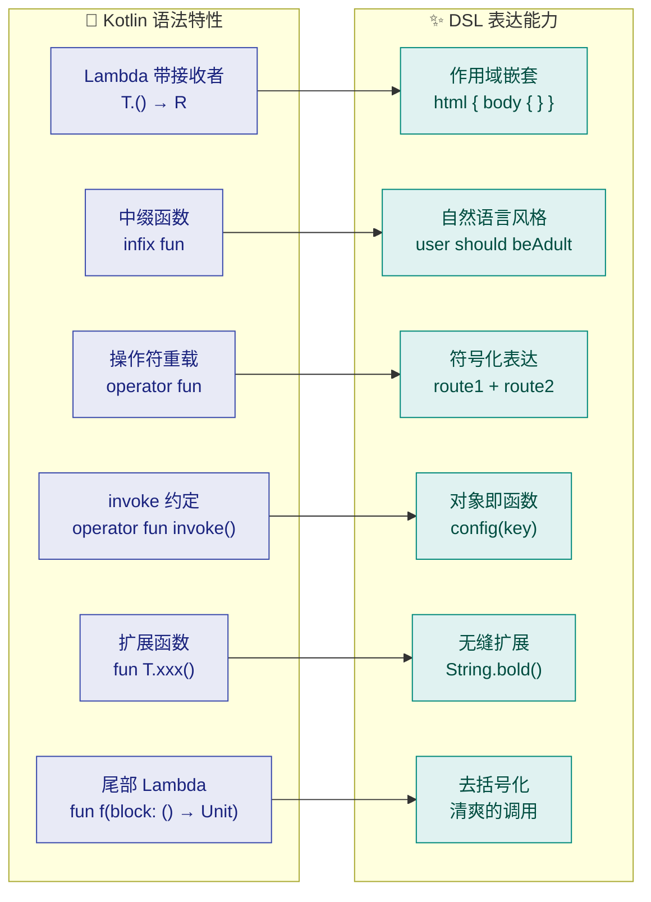

我们通过一个最小化的例子来感受一下。假设我们要构建一个人员信息配置的 DSL，期望的调用方式如下：

```kotlin
// 这就是我们期望的 DSL 调用方式
// 看起来像声明式配置，实际上是纯 Kotlin 代码
val person = person {       // person 是一个顶层函数
    name = "Alice"          // name 是接收者对象的属性
    age = 28                // age 同理
    address {               // address 是接收者对象的方法，接受一个 Lambda
        city = "Shanghai"   // 嵌套作用域内的属性
        zip = "200000"
    }
}
```

上面这段代码 **没有任何魔法，也不需要任何编译器插件**——它就是合法的 Kotlin 代码。下面是支撑它的完整实现：

```kotlin
// ======== 数据模型层 ========

// 地址数据类，存储城市和邮编
data class Address(
    val city: String,       // 城市名称
    val zip: String         // 邮政编码
)

// 人员数据类，存储姓名、年龄和可选地址
data class Person(
    val name: String,       // 姓名
    val age: Int,           // 年龄
    val address: Address?   // 地址（可空，允许不填）
)

// ======== Builder 层（DSL 的骨架）========

// 地址构建器：DSL 用户在 address { ... } 块内操作的就是这个对象
class AddressBuilder {
    var city: String = ""   // 默认空字符串，DSL 用户可直接赋值
    var zip: String = ""    // 同上

    // 将 Builder 的可变状态"凝固"为不可变的数据对象
    fun build(): Address = Address(city, zip)
}

// 人员构建器：DSL 用户在 person { ... } 块内操作的就是这个对象
class PersonBuilder {
    var name: String = ""   // DSL 用户通过 name = "xxx" 赋值
    var age: Int = 0        // DSL 用户通过 age = 28 赋值

    // 持有一个内部的地址构建器引用（初始为 null）
    private var addressBuilder: AddressBuilder? = null

    // 这个函数接收一个「以 AddressBuilder 为接收者」的 Lambda
    // 当 DSL 用户写 address { city = "Shanghai" } 时，
    // 花括号内的 this 就指向 AddressBuilder 实例
    fun address(block: AddressBuilder.() -> Unit) {
        val builder = AddressBuilder() // 创建 AddressBuilder 实例
        builder.block()                // 在该实例上执行用户的 Lambda
        addressBuilder = builder       // 保存引用
    }

    // 构建最终的 Person 对象
    fun build(): Person = Person(
        name = name,
        age = age,
        address = addressBuilder?.build()  // 如果用户没写 address 块，则为 null
    )
}

// ======== DSL 入口函数 ========

// 顶层函数：接收一个「以 PersonBuilder 为接收者」的 Lambda
// 这是整个 DSL 的唯一入口
fun person(block: PersonBuilder.() -> Unit): Person {
    val builder = PersonBuilder()   // 创建 PersonBuilder 实例
    builder.block()                 // 在该实例上执行用户传入的配置 Lambda
    return builder.build()          // 返回构建完成的 Person 对象
}
```

我们来拆解这段代码中用到的关键 Kotlin 特性：

| 特性 | 在上面代码中的体现 | 效果 |
|------|-------------------|------|
| **带接收者的 Lambda**（`T.() -> R`） | `PersonBuilder.() -> Unit` | Lambda 内部的 `this` 指向 `PersonBuilder`，可直接访问其属性和方法 |
| **尾部 Lambda 语法** | `person { ... }` 而非 `person({ ... })` | 去掉括号，代码更像声明式配置 |
| **属性访问语法** | `name = "Alice"` | Kotlin 属性的 setter 本身就是赋值语法，天然适合 DSL |
| **嵌套 Lambda** | `address { city = "Shanghai" }` | 通过在 Builder 内再定义接受 Lambda 的方法，实现层级嵌套 |

#### 内部 DSL vs 普通 API：界限在哪

很多人会困惑：内部 DSL 和设计良好的 API 有什么本质区别？其实两者之间并没有一条清晰的分界线，更像是一个 **连续的光谱**：

```kotlin
// ========= 光谱最左端：纯命令式 API =========
// 特点：逐步调用，暴露所有实现细节
val builder = PersonBuilder()     // 手动创建 Builder
builder.name = "Alice"            // 逐条设置
builder.age = 28
val addrBuilder = AddressBuilder()
addrBuilder.city = "Shanghai"
addrBuilder.zip = "200000"
builder.setAddress(addrBuilder.build())
val person = builder.build()      // 手动 build

// ========= 光谱中间：流畅 API (Fluent API) =========
// 特点：链式调用，但仍然是"方法调用"的外观
val person = PersonBuilder()
    .name("Alice")                // 每个方法返回 this
    .age(28)
    .address(AddressBuilder()
        .city("Shanghai")
        .zip("200000")
        .build())
    .build()

// ========= 光谱最右端：内部 DSL =========
// 特点：声明式、嵌套、读起来像配置文件
val person = person {
    name = "Alice"                // 属性赋值 ≠ 方法调用
    age = 28
    address {                     // 嵌套块 ≠ 方法链
        city = "Shanghai"
        zip = "200000"
    }
}
```

从上面三段代码可以看出，**内部 DSL 的核心追求是让代码的"噪音"降到最低**——没有 `new`、没有 `.build()`、没有括号嵌套，只留下与领域相关的纯净信息。

#### 知名的 Kotlin 内部 DSL 实例

Kotlin 生态中有大量生产级的内部 DSL，它们是学习 DSL 设计的最佳教材：

| DSL | 领域 | 代码示例概览 |
|-----|------|-------------|
| **Ktor Routing** | HTTP 路由 | `routing { get("/") { call.respond("Hi") } }` |
| **Jetpack Compose** | UI 声明 | `Column { Text("Hello") ; Button(onClick={}) { Text("Click") } }` |
| **Exposed** | SQL 查询 | `Users.select { Users.age greater 18 }` |
| **Gradle Kotlin DSL** | 构建脚本 | `dependencies { implementation("org.xxx:lib:1.0") }` |
| **Kotest** | 测试断言 | `name shouldBe "Alice"` |
| **Kotlinx.html** | HTML 生成 | `html { body { h1 { +"Hello" } } }` |

它们共同的设计思路都是一样的：**通过带接收者的 Lambda 创建嵌套作用域，让用户在每一层作用域中只能看到该层级的合法操作**。

---

### 类型安全（Type Safety）

#### 为什么类型安全是 DSL 的生命线

回忆一下外部 DSL 的使用体验。当你在 Java 中拼接 SQL 字符串时：

```kotlin
// 这是一段危险的 SQL 拼接（仅用于演示反面模式）
val sql = "SELECT * FROM users WHERE name = '" + userInput + "'"
// 问题 1：SQL 注入风险（userInput 可能包含恶意 SQL）
// 问题 2：语法错误只有运行时才会暴露（字段名拼错、类型不匹配...）
// 问题 3：无 IDE 补全、无重构支持
```

这段代码的问题在于：**编译器完全不理解字符串里面的内容**。字段名拼错？编译通过。表名不存在？编译通过。类型不匹配？编译通过。所有错误都被推迟到运行时（Runtime），甚至推迟到生产环境。

**类型安全的内部 DSL 彻底解决了这个问题**，因为 DSL 代码就是宿主语言的代码，每一个符号都参与编译器的类型检查：

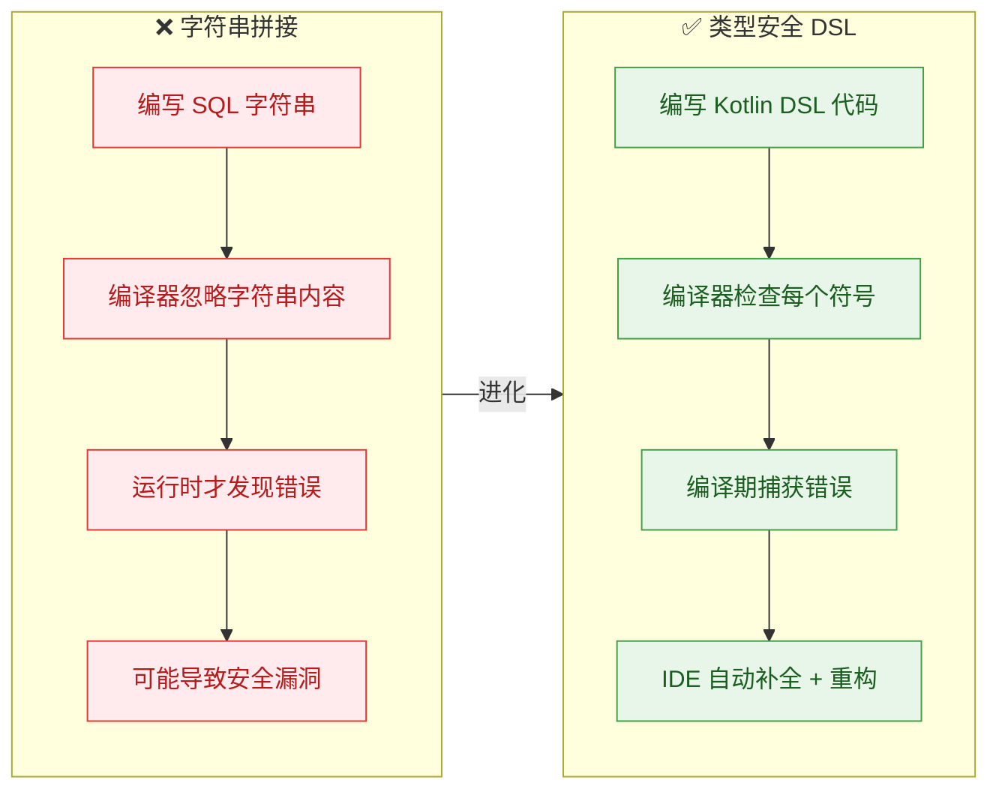

#### 类型安全 DSL 的三道防线

一个设计良好的类型安全 DSL 通常从三个层面阻止非法操作：

**第一道防线：结构约束（Structural Constraint）**

通过接收者类型限定，确保每个嵌套层级只暴露该层级的合法操作。

```kotlin
// ======== HTML DSL 的类型安全结构示例 ========

// 所有 HTML 标签的抽象基类
open class Tag(val name: String) {
    // 子标签列表
    val children = mutableListOf<Tag>()
    // 文本内容
    var text: String = ""

    override fun toString(): String {
        // 递归渲染 HTML（简化版）
        val childrenHtml = children.joinToString("") { it.toString() }
        val content = text + childrenHtml
        return "<$name>$content</$name>"
    }
}

// HTML 标签：只允许添加 head 和 body
class HTML : Tag("html") {
    // head 方法：接收者是 Head，所以 Lambda 内只能用 Head 的方法
    fun head(block: Head.() -> Unit) {
        val head = Head()          // 创建 Head 实例
        head.block()               // 执行 Lambda
        children.add(head)         // 将 head 加入 html 的子标签
    }

    // body 方法：同理，接收者是 Body
    fun body(block: Body.() -> Unit) {
        val body = Body()
        body.block()
        children.add(body)
    }
}

// Head 标签：只允许添加 title
class Head : Tag("head") {
    fun title(block: Title.() -> Unit) {
        val title = Title()
        title.block()
        children.add(title)
    }
}

// Title 标签：只允许设置文本
class Title : Tag("title")

// Body 标签：允许添加 h1 和 p
class Body : Tag("body") {
    fun h1(block: H1.() -> Unit) {
        val h1 = H1()
        h1.block()
        children.add(h1)
    }

    fun p(block: P.() -> Unit) {
        val p = P()
        p.block()
        children.add(p)
    }
}

class H1 : Tag("h1")
class P : Tag("p")

// DSL 入口
fun html(block: HTML.() -> Unit): HTML {
    val html = HTML()              // 创建根标签
    html.block()                   // 执行配置 Lambda
    return html                    // 返回构建好的 HTML 树
}
```

使用效果：

```kotlin
val page = html {
    head {                          // ✅ 合法：HTML 作用域内有 head 方法
        title {                     // ✅ 合法：Head 作用域内有 title 方法
            text = "My Page"        // ✅ 合法：设置文本
        }
    }
    body {                          // ✅ 合法：HTML 作用域内有 body 方法
        h1 { text = "Hello!" }     // ✅ 合法：Body 作用域内有 h1 方法
        p { text = "Welcome" }     // ✅ 合法：Body 作用域内有 p 方法

        // title { }               // ❌ 编译错误！Body 内没有 title 方法
        // head { }                // ❌ 编译错误！Body 内没有 head 方法
    }
    // h1 { }                      // ❌ 编译错误！HTML 内没有 h1 方法
}

println(page)
// 输出：<html><head><title>My Page</title></head><body><h1>Hello!</h1><p>Welcome</p></body></html>
```

注意看：**你不可能在 `body` 块内写 `title { }`，因为 `Body` 类根本没有 `title` 方法**。编译器直接报错，而不是让你在运行时才发现 HTML 结构不对。这就是结构约束的力量。

**第二道防线：类型参数约束（Generic Constraint）**

通过泛型和类型推断，确保数据类型的一致性。

```kotlin
// 一个类型安全的配置 DSL 片段
// 配置项被泛型参数 T 保护，存取必须类型一致
class ConfigKey<T>(val name: String)    // 泛型键：每个键绑定一个类型 T

class ConfigScope {
    // 内部存储（使用 Any? 擦除类型，但对外接口是类型安全的）
    private val map = mutableMapOf<String, Any?>()

    // 设置配置值：只接受与 Key 类型匹配的值
    operator fun <T> ConfigKey<T>.invoke(value: T) {
        map[this.name] = value          // 存入 map
    }

    // 读取配置值：返回类型自动推断为 T
    @Suppress("UNCHECKED_CAST")
    fun <T> get(key: ConfigKey<T>): T = map[key.name] as T
}

// 定义具体的配置键（每个键的类型在定义时就确定）
val port = ConfigKey<Int>("port")        // port 只能存 Int
val host = ConfigKey<String>("host")     // host 只能存 String
val debug = ConfigKey<Boolean>("debug")  // debug 只能存 Boolean

fun config(block: ConfigScope.() -> Unit): ConfigScope {
    return ConfigScope().apply(block)
}

// 使用 DSL
val cfg = config {
    port(8080)         // ✅ Int -> ConfigKey<Int>，类型匹配
    host("localhost")  // ✅ String -> ConfigKey<String>，类型匹配
    debug(true)        // ✅ Boolean -> ConfigKey<Boolean>，类型匹配

    // port("abc")     // ❌ 编译错误！String 不匹配 ConfigKey<Int>
    // debug(42)       // ❌ 编译错误！Int 不匹配 ConfigKey<Boolean>
}
```

**第三道防线：作用域隔离（Scope Isolation）**

这是后续小节 `@DslMarker` 要深入讨论的内容，这里先给出直觉。问题出在 Kotlin Lambda 的 **隐式外层接收者访问**：

```kotlin
html {
    body {
        // 在 body { } 块内，this 是 Body
        // 但 Kotlin 允许访问外层接收者 HTML 的方法！
        body {
            // 😱 body 里面又嵌了一个 body！
            // 这在语法上是合法的（因为外层 HTML 也有 body 方法）
            // 但在 HTML 语义上是荒谬的
        }
    }
}
```

`@DslMarker` 注解就是 Kotlin 为 DSL 设计者提供的"作用域隔离"武器，它能 **禁止隐式访问外层接收者的成员**，让上面那段代码变成编译错误。我们将在后续章节深入剖析。

#### 类型安全 DSL 的实际价值

把三道防线综合起来，类型安全 DSL 带来的价值可以这样归纳：

```mermaid
graph LR
    subgraph 编译期["🛡️ 编译期保护"]
        direction TB
        C1["结构不合法 → 编译错误"]
        C2["类型不匹配 → 编译错误"]
        C3["作用域越界 → 编译错误"]
    end

    subgraph 开发体验["🚀 开发体验"]
        direction TB
        D1["IDE 智能补全"]
        D2["一键重构"]
        D3["即时错误高亮"]
    end

    subgraph 运行时["💎 运行时"]
        direction TB
        R1["零反射开销"]
        R2["零字符串解析"]
        R3["与手写代码等价的性能"]
    end

    编译期 --> 开发体验 --> 运行时

    classDef compileStyle fill:#E8EAF6,stroke:#3949AB,color:#1A237E
    classDef devStyle fill:#E0F7FA,stroke:#00ACC1,color:#006064
    classDef runStyle fill:#FFF8E1,stroke:#FFB300,color:#E65100

    class C1,C2,C3 compileStyle
    class D1,D2,D3 devStyle
    class R1,R2,R3 runStyle
```

特别值得强调的是 **性能维度**：由于类型安全的内部 DSL 在编译后就是普通的函数调用和对象创建（如果配合 `inline` 关键字，Lambda 甚至会被内联消除），所以它在运行时 **没有任何额外开销**——不需要反射，不需要解析字符串，不需要运行时类型检查。这与外部 DSL（如 SQL 字符串需要运行时解析）形成了鲜明对比。

---

**📝 练习题**

以下关于 Kotlin 内部 DSL 和类型安全的描述，哪一项是 **错误的**？

A. 内部 DSL 复用宿主语言的编译器和类型系统，无需自行实现词法/语法解析器


B. 带接收者的 Lambda（`T.() -> Unit`）是实现 DSL 作用域嵌套的关键语法特性


C. 类型安全的 DSL 在运行时通过反射机制来检查结构合法性，从而避免非法操作


D. `@DslMarker` 注解可以防止 Lambda 块内隐式访问外层接收者的成员，避免作用域污染


**【答案】** C

**【解析】** 类型安全 DSL 的核心价值恰恰在于 **编译期**（Compile-time）而非运行时（Runtime）完成所有检查。DSL 的结构约束、类型匹配和作用域隔离全部由 Kotlin 编译器在编译阶段完成验证。编译后的字节码就是普通的方法调用和对象构造，不涉及任何反射操作。如果配合 `inline` 关键字，Lambda 本身甚至会被内联到调用处，实现零额外开销。选项 C 所说的"运行时通过反射检查"恰好反转了类型安全 DSL 的核心设计理念，因此是错误的。A 正确描述了内部 DSL 的定义；B 正确指出了带接收者 Lambda 的核心作用；D 正确描述了 `@DslMarker` 的功能。

---

## Lambda 接收者（Lambda with Receiver）

在上一节中，我们了解了 DSL 的基本概念——它是一种针对特定领域的"小型语言"，而 Kotlin 内部 DSL 的核心驱动力，就是 **带接收者的函数字面量（Function Literals with Receiver）**。这是 Kotlin 语言设计中最精妙的特性之一，它让我们可以在一个 Lambda 块中，像编写该对象的成员函数一样，直接调用其属性和方法，无需任何前缀。这正是 `apply { }`, `buildString { }`, 以及各种 Kotlin DSL 看起来如此自然流畅的根本原因。

理解 Lambda 接收者，是掌握整个 DSL 构建技术的 **最关键一步**。本节将从普通 Lambda 出发，逐步推导出"带接收者的 Lambda"的完整心智模型。

---

### 从普通 Lambda 到带接收者的 Lambda

要理解带接收者的 Lambda，最好的方式是从一个 **对比** 开始。

#### 普通 Lambda（Regular Lambda）

我们都熟悉普通的高阶函数。假设我们要封装一个对 `StringBuilder` 进行操作的工具函数：

```kotlin
// 定义一个普通的高阶函数
// 参数 action 是一个普通 Lambda：接收 StringBuilder 作为参数
fun buildStringNormal(action: (StringBuilder) -> Unit): String {
    val sb = StringBuilder()       // 内部创建 StringBuilder 实例
    action(sb)                     // 将 sb 作为参数传给 Lambda
    return sb.toString()           // 返回最终构建的字符串
}

fun main() {
    // 使用时，必须通过参数名 it（或自定义名）来操作 StringBuilder
    val result = buildStringNormal { it ->
        it.append("Hello, ")      // 必须用 it.append
        it.append("World!")       // 每次调用都要带 it 前缀
    }
    println(result) // Hello, World!
}
```

这段代码功能上完全正确，但每次操作 `StringBuilder` 都需要写 `it.xxx`。当操作很多时，代码就会变得 **冗长而嘈杂**。

#### 带接收者的 Lambda（Lambda with Receiver）

现在，我们用带接收者的 Lambda 改写：

```kotlin
// 关键变化：参数类型从 (StringBuilder) -> Unit
//          变成了 StringBuilder.() -> Unit
// 这意味着 Lambda 内部的 this 就是 StringBuilder 实例
fun buildStringDSL(action: StringBuilder.() -> Unit): String {
    val sb = StringBuilder()       // 同样创建 StringBuilder 实例
    sb.action()                    // 在 sb 上调用 Lambda，sb 成为 this
    return sb.toString()           // 返回结果
}

fun main() {
    // 使用时，Lambda 内部的 this 就是 StringBuilder
    // 可以直接调用 append，就像在 StringBuilder 内部写代码一样
    val result = buildStringDSL {
        append("Hello, ")         // 直接调用，无需前缀！
        append("World!")          // 简洁、自然、流畅
    }
    println(result) // Hello, World!
}
```

两段代码的功能完全相同，但第二种写法 **消除了所有显式的对象引用**，Lambda 体读起来就像是 `StringBuilder` 自身的一段配置脚本。这就是 DSL 风格的起点。

> 事实上，Kotlin 标准库中的 `buildString` 函数，其签名就是 `public inline fun buildString(builderAction: StringBuilder.() -> Unit): String`，与我们上面的写法如出一辙。

#### 关键对比图

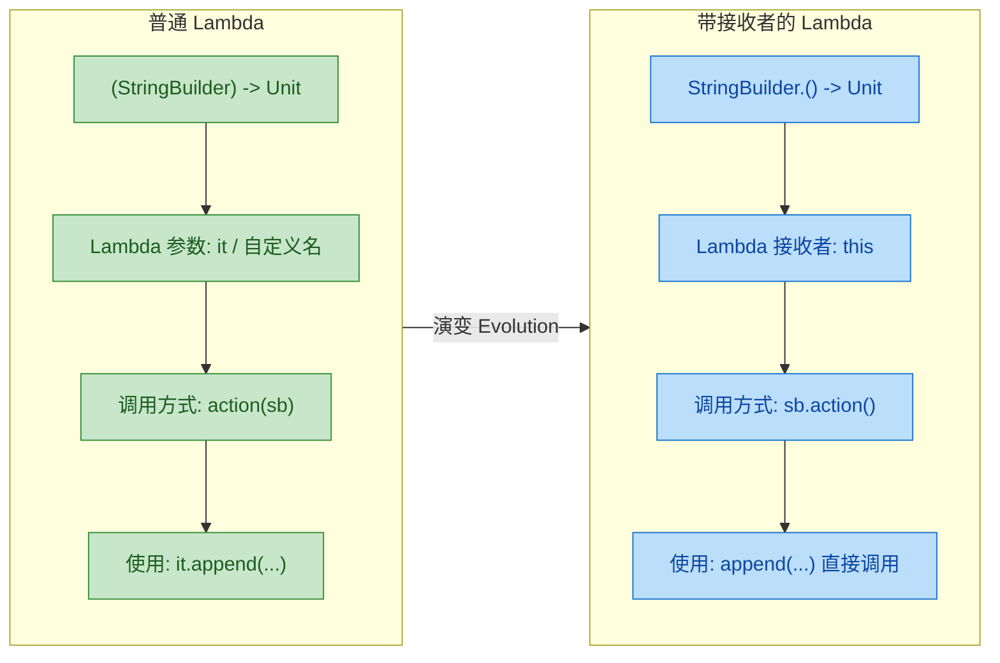

---

### 函数类型语法深度解析

带接收者的函数类型是一种 **特殊的函数类型声明**，它的语法需要仔细拆解。

#### 语法结构

```kotlin
// 通用形式：
// ReceiverType.(ParameterTypes) -> ReturnType

// 无参数、无返回值的接收者 Lambda
val greet: StringBuilder.() -> Unit = {
    append("Hi!")                  // this 是 StringBuilder
}

// 带参数的接收者 Lambda
val appendLine: StringBuilder.(String) -> Unit = { line ->
    append(line)                   // this 是 StringBuilder
    append("\n")                   // line 是 Lambda 的显式参数
}

// 带返回值的接收者 Lambda
val currentLength: StringBuilder.() -> Int = {
    this.length                    // 显式使用 this 访问 length 属性
}
```

我们可以用一张分解图来理解这个类型声明的每一部分：

```
StringBuilder . () -> Unit
─────┬──────   ─┬─   ──┬──
     │          │      │
  接收者类型   参数列表  返回类型
 (Receiver)  (Params) (Return)
```

**核心语义**：这种类型声明告诉编译器——"这个 Lambda 可以在一个 `StringBuilder` 实例上被调用，并且在 Lambda 内部，`this` 指向该实例。"

#### 与扩展函数的等价关系

带接收者的 Lambda 在概念上与 **扩展函数（Extension Function）** 高度一致。两者都拥有一个隐式的 `this` 指向接收者对象：

```kotlin
// 扩展函数写法
fun StringBuilder.addExclamation() {
    append("!")                    // this 是 StringBuilder
}

// 带接收者的 Lambda 写法（完全等价的语义）
val addExclamation: StringBuilder.() -> Unit = {
    append("!")                    // this 同样是 StringBuilder
}

fun main() {
    val sb = StringBuilder("Hello")

    // 两种写法的调用方式完全相同
    sb.addExclamation()            // 扩展函数调用
    sb.addExclamation()            // Lambda 变量调用（语法一致）

    println(sb) // Hello!!
}
```

它们的区别在于：扩展函数是 **编译期静态绑定** 的命名函数，而带接收者的 Lambda 是一个 **可以存储、传递的函数对象**，它拥有更高的灵活性，非常适合作为高阶函数的参数。

---

### `this` 作用域（Scope of `this`）

`this` 的作用域管理是使用带接收者 Lambda 时最需要注意的核心话题。当多个带接收者的 Lambda 嵌套时，`this` 会形成 **作用域层叠（Scope Stacking）**。

#### 单层 `this`

在最简单的场景下，`this` 就是唯一的接收者：

```kotlin
class HtmlBuilder {
    private val elements = mutableListOf<String>() // 存储 HTML 元素

    // 添加一个段落标签
    fun p(text: String) {
        elements.add("<p>$text</p>")               // 将段落加入列表
    }

    // 添加一个标题标签
    fun h1(text: String) {
        elements.add("<h1>$text</h1>")             // 将标题加入列表
    }

    // 构建最终的 HTML 字符串
    fun build(): String = elements.joinToString("\n") // 用换行连接所有元素
}

// 高阶函数，接受带接收者的 Lambda
fun html(init: HtmlBuilder.() -> Unit): String {
    val builder = HtmlBuilder()    // 创建构建器实例
    builder.init()                 // 在构建器上执行 Lambda
    return builder.build()         // 返回构建结果
}

fun main() {
    val page = html {
        // 此处 this = HtmlBuilder 实例
        h1("Welcome")             // 等价于 this.h1("Welcome")
        p("This is Kotlin DSL")   // 等价于 this.p("This is Kotlin DSL")
    }
    println(page)
    // <h1>Welcome</h1>
    // <p>This is Kotlin DSL</p>
}
```

#### 多层嵌套 `this`

当 Lambda 嵌套时，情况变得更复杂也更有趣。每一层嵌套都会引入一个新的 `this`，**最内层的 `this` 会遮蔽（shadow）外层的 `this`**：

```kotlin
class Table {
    private val rows = mutableListOf<String>()     // 存储行数据

    // tr 函数接受一个以 Row 为接收者的 Lambda
    fun tr(init: Row.() -> Unit) {
        val row = Row()            // 创建 Row 实例
        row.init()                 // 执行 Lambda，this = Row
        rows.add(row.build())      // 将构建好的行添加到表格
    }

    fun build(): String = rows.joinToString("\n")  // 构建表格
}

class Row {
    private val cells = mutableListOf<String>()    // 存储单元格

    // td 函数添加一个单元格
    fun td(content: String) {
        cells.add("<td>$content</td>")             // 添加单元格标签
    }

    fun build(): String = "<tr>${cells.joinToString("")}</tr>" // 构建行
}

fun table(init: Table.() -> Unit): String {
    val t = Table()                // 创建 Table 实例
    t.init()                       // 执行 Lambda，this = Table
    return t.build()               // 返回最终 HTML
}

fun main() {
    val html = table {             // this: Table
        tr {                       // this: Row（内层遮蔽了外层的 Table）
            td("Cell 1")          // 等价于 this.td("Cell 1")，this = Row
            td("Cell 2")          // 同上
        }
        tr {                       // this: Row（新的 Row 实例）
            td("Cell 3")
            td("Cell 4")
        }
    }
    println(html)
    // <tr><td>Cell 1</td><td>Cell 2</td></tr>
    // <tr><td>Cell 3</td><td>Cell 4</td></tr>
}
```

#### `this` 作用域层叠的可视化

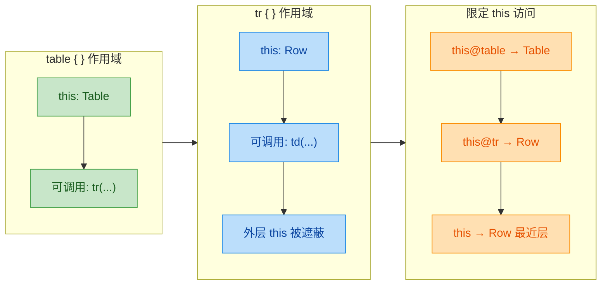

#### 使用限定 `this`（Qualified `this`）

当你确实需要在内层 Lambda 中访问外层接收者时，可以使用 **带标签的 `this`** 表达式：

```kotlin
class Outer {
    val name = "Outer"

    // inner 函数接受以 Inner 为接收者的 Lambda
    fun inner(block: Inner.() -> Unit) {
        Inner().block()            // 创建 Inner 并执行 Lambda
    }
}

class Inner {
    val name = "Inner"
}

fun buildOuter(init: Outer.() -> Unit): Outer {
    return Outer().apply(init)     // 创建 Outer 并应用初始化 Lambda
}

fun main() {
    buildOuter {                   // this: Outer
        println(name)              // "Outer"   — this.name

        inner {                    // this: Inner（遮蔽了 Outer）
            println(name)          // "Inner"   — this.name（最近层）
            println(this@inner.name)   // "Inner"   — 显式限定，等价
            println(this@buildOuter.name) // "Outer" — 穿透到外层接收者！
        }
    }
}
```

`this@label` 中的 `label` 默认是 **调用该 Lambda 的函数名**。这个机制允许你在嵌套 DSL 中精确定位任何一层的接收者。

---

### 带接收者 Lambda 的三种传递方式

带接收者的 Lambda 在实际使用中有多种传递和调用方式，理解它们有助于看懂各种 DSL 源码。

```kotlin
class Config {
    var host = "localhost"         // 默认主机
    var port = 8080                // 默认端口

    override fun toString() = "$host:$port" // 格式化输出
}

// 高阶函数，接受带接收者的 Lambda
fun configure(init: Config.() -> Unit): Config {
    val config = Config()          // 创建配置对象
    config.init()                  // 方式1：像扩展函数一样在对象上调用
    return config
}

fun main() {
    // === 方式 1：尾随 Lambda 语法（最常见，最 DSL 风格）===
    val c1 = configure {
        host = "example.com"       // 直接赋值属性
        port = 443                 // 简洁、自然
    }
    println(c1) // example.com:443

    // === 方式 2：将 Lambda 存储在变量中再传递 ===
    val myInit: Config.() -> Unit = {
        host = "api.server.com"    // Lambda 变量也可以有接收者类型
        port = 9090
    }
    val c2 = configure(myInit)     // 把变量作为参数传入
    println(c2) // api.server.com:9090

    // === 方式 3：传递函数引用（Method Reference）===
    fun Config.productionSetup() {
        host = "prod.server.com"   // 扩展函数可以作为接收者 Lambda 传递
        port = 443
    }
    val c3 = configure(Config::productionSetup) // 函数引用
    println(c3) // prod.server.com:443
}
```

三种方式在编译后生成的字节码本质上是等价的，选择哪种取决于代码的可读性和复用性需求。

---

### `apply` / `with` / `run` 的本质

Kotlin 标准库中的作用域函数（Scope Functions），其底层正是带接收者的 Lambda。理解了本节内容后，这些函数的行为就变得透明了：

```kotlin
fun main() {
    // === apply: 接收者是调用对象，返回调用对象本身 ===
    // 签名: public inline fun <T> T.apply(block: T.() -> Unit): T
    val list1 = mutableListOf<Int>().apply {
        add(1)                     // this = MutableList<Int>
        add(2)                     // 直接调用 add
        add(3)
    }
    println(list1) // [1, 2, 3]

    // === with: 接收者作为第一个参数传入，返回 Lambda 结果 ===
    // 签名: public inline fun <T, R> with(receiver: T, block: T.() -> R): R
    val csv = with(list1) {
        joinToString(",")          // this = list1，直接调用 joinToString
    }
    println(csv) // 1,2,3

    // === run: 接收者是调用对象，返回 Lambda 结果 ===
    // 签名: public inline fun <T, R> T.run(block: T.() -> R): R
    val upper = "hello".run {
        uppercase()                // this = "hello"
    }
    println(upper) // HELLO
}
```

它们的核心区别可以归纳为：

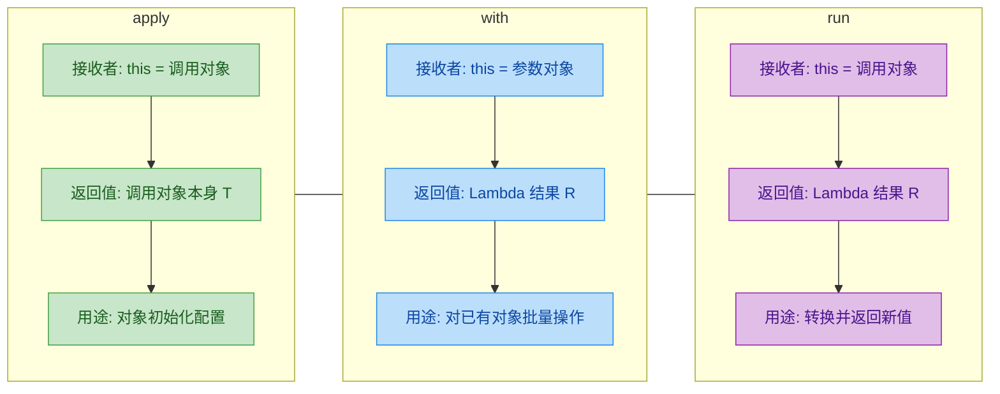

---

### 泛型接收者 Lambda：构建通用 DSL 工具

在实战中，DSL 的构建函数通常需要支持任意类型的接收者，这就需要 **泛型** 的加持：

```kotlin
// 一个通用的"构建并初始化"函数
// T: 要构建的类型；block 是以 T 为接收者的 Lambda
inline fun <T> T.configure(block: T.() -> Unit): T {
    this.block()                   // 在当前对象上执行配置 Lambda
    return this                    // 返回配置后的对象（链式调用）
}

// 一个通用的"创建-配置-转换"函数
// T: 接收者类型；R: 返回类型
inline fun <T, R> T.transform(block: T.() -> R): R {
    return this.block()            // 在当前对象上执行 Lambda 并返回结果
}

data class Server(
    var host: String = "",         // 服务器主机名
    var port: Int = 0,             // 端口号
    var ssl: Boolean = false       // 是否启用 SSL
)

fun main() {
    // 泛型接收者让同一个函数适用于任何类型
    val server = Server().configure {
        host = "kotlin.org"        // this: Server
        port = 443
        ssl = true
    }
    println(server) // Server(host=kotlin.org, port=443, ssl=true)

    // transform 将 Server 转换为一个描述字符串
    val desc = server.transform {
        "Server at $host:$port (SSL: $ssl)" // this: Server，返回 String
    }
    println(desc) // Server at kotlin.org:443 (SSL: true)
}
```

这种模式是 Kotlin DSL 生态中极其常见的基础工具——从 Ktor 的路由配置到 Jetpack Compose 的 Modifier，背后都是泛型接收者 Lambda 在工作。

---

### 接收者 Lambda 与普通 Lambda 的互操作

一个容易忽略但非常实用的细节是：**带接收者的 Lambda 和对应的普通 Lambda 在类型系统中是兼容的**。

```kotlin
fun main() {
    // 带接收者的 Lambda 类型
    val receiverLambda: StringBuilder.() -> Unit = {
        append("Hello")           // this = StringBuilder
    }

    // 普通 Lambda 类型（参数形式）
    val normalLambda: (StringBuilder) -> Unit = {
        it.append("Hello")        // it = StringBuilder
    }

    // ✅ 带接收者的 Lambda 可以赋值给普通 Lambda 变量
    val asNormal: (StringBuilder) -> Unit = receiverLambda

    // ✅ 调用时，接收者变成了第一个参数
    val sb = StringBuilder()
    asNormal(sb)                   // 等价于 sb.receiverLambda()
    println(sb) // Hello

    // ⚠️ 反方向：普通 Lambda 也可以赋值给带接收者类型的变量
    val asReceiver: StringBuilder.() -> Unit = normalLambda
    val sb2 = StringBuilder()
    sb2.asReceiver()               // 等价于 normalLambda(sb2)
    println(sb2) // Hello
}
```

这意味着 `A.(B) -> C` 和 `(A, B) -> C` 在 Kotlin 的类型系统中是 **完全兼容的**。编译器会在幕后自动完成转换。这一特性在设计 DSL API 时提供了极大的灵活性——你可以根据调用者的偏好同时支持两种风格。

下面的内存模型图展示了编译器视角下两者的等价性：

```kotlin
// 编译器视角的等价转换：
//
// 带接收者的 Lambda:
//   StringBuilder.() -> Unit
//   ┌─────────────────────────────┐
//   │  this: StringBuilder ──────►│ append("Hello")
//   │  (隐式参数，通过 this 访问) │
//   └─────────────────────────────┘
//
// 普通 Lambda:
//   (StringBuilder) -> Unit
//   ┌─────────────────────────────┐
//   │  it: StringBuilder ────────►│ it.append("Hello")
//   │  (显式参数，通过 it 访问)   │
//   └─────────────────────────────┘
//
// 本质区别仅在于：this（隐式）vs it（显式）
// 编译后的 JVM 字节码中，两者生成相同的方法签名：
//   invoke(StringBuilder): void
```

---

### 实战：一个迷你 JSON DSL

将上述所有知识融合起来，我们构建一个真实可用的迷你 JSON DSL：

```kotlin
// JSON 值的密封接口
sealed interface JsonValue {
    fun toJson(): String           // 每种 JSON 类型都能序列化为字符串
}

// JSON 对象 {"key": value, ...}
class JsonObject : JsonValue {
    // 存储键值对，保持插入顺序
    private val entries = linkedMapOf<String, JsonValue>()

    // DSL 方法：使用 to 中缀函数风格添加字符串值
    fun string(key: String, value: String) {
        entries[key] = JsonString(value) // 将字符串值包装后存入
    }

    // DSL 方法：添加数字值
    fun number(key: String, value: Number) {
        entries[key] = JsonNumber(value) // 将数字值包装后存入
    }

    // DSL 方法：嵌套对象，参数是带接收者的 Lambda！
    fun obj(key: String, init: JsonObject.() -> Unit) {
        val child = JsonObject()   // 创建子对象
        child.init()               // 在子对象上执行 Lambda（this = child）
        entries[key] = child       // 将子对象存入当前对象
    }

    // 序列化为 JSON 字符串
    override fun toJson(): String {
        return entries.entries.joinToString(", ", "{", "}") { (k, v) ->
            "\"$k\": ${v.toJson()}" // 每个键值对格式化
        }
    }
}

// JSON 字符串值 "..."
class JsonString(private val value: String) : JsonValue {
    override fun toJson() = "\"$value\""  // 加上双引号
}

// JSON 数字值
class JsonNumber(private val value: Number) : JsonValue {
    override fun toJson() = value.toString() // 直接转字符串
}

// 顶层 DSL 入口函数
fun json(init: JsonObject.() -> Unit): JsonObject {
    val root = JsonObject()        // 创建根 JSON 对象
    root.init()                    // 执行配置 Lambda（this = root）
    return root                    // 返回配置好的对象
}

fun main() {
    // 使用 DSL 构建 JSON —— 看起来就像在写 JSON 本身！
    val result = json {
        string("name", "Kotlin")           // this: JsonObject (root)
        number("version", 2.0)
        obj("features") {                  // this: JsonObject (child)
            string("paradigm", "multi")    // 在子对象中操作
            number("year", 2011)
            obj("platforms") {             // this: JsonObject (grandchild)
                string("primary", "JVM")   // 三层嵌套，每层 this 不同
                string("secondary", "JS")
            }
        }
    }
    println(result.toJson())
    // {"name": "Kotlin", "version": 2.0, "features": {"paradigm": "multi", "year": 2011, "platforms": {"primary": "JVM", "secondary": "JS"}}}
}
```

整个 DSL 的核心就是 `JsonObject.() -> Unit` 这个带接收者的函数类型。每一次嵌套的 `obj { }` 调用，都创建了一个新的作用域，其中 `this` 指向新的 `JsonObject` 实例。**层层嵌套的接收者 Lambda，自然地映射了 JSON 的树形结构**。

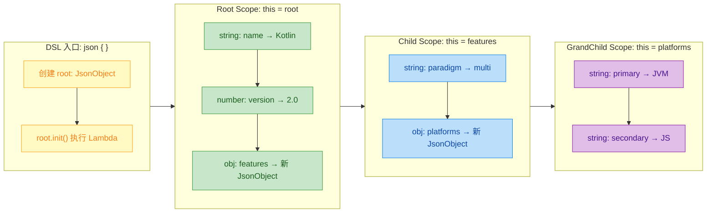

---

### 本节要点总结

| 概念 | 核心要点 |
|------|----------|
| **函数类型语法** | `Receiver.() -> ReturnType` — 小数点前是接收者类型 |
| **`this` 绑定** | Lambda 内部的 `this` 自动指向接收者实例 |
| **与扩展函数的关系** | 带接收者的 Lambda ≈ 匿名扩展函数 |
| **嵌套遮蔽** | 内层 `this` 遮蔽外层，用 `this@label` 穿透 |
| **类型兼容** | `A.() -> R` 与 `(A) -> R` 互相赋值兼容 |
| **DSL 构建范式** | 高阶函数 + 带接收者的 Lambda = 声明式 DSL |

---

**📝 练习题**

以下代码的输出结果是什么？

```kotlin
class A {
    fun greet() = "Hello from A"
}

class B {
    fun greet() = "Hello from B"
}

fun buildA(block: A.() -> Unit) = A().apply(block)
fun A.nested(block: B.() -> Unit) = B().apply(block)

fun main() {
    buildA {
        nested {
            println(greet())
            println(this@buildA.greet())
        }
    }
}
```

A. Hello from A → Hello from A


B. Hello from B → Hello from B


C. Hello from B → Hello from A


D. Hello from A → Hello from B


**【答案】** C

**【解析】** 在 `buildA { }` 的 Lambda 中，`this` 的类型是 `A`。调用 `nested { }` 后，内层 Lambda 的接收者类型变为 `B`，此时 **最近层的 `this` 是 `B` 的实例**。因此，直接调用 `greet()` 会解析为 `B.greet()`，输出 `"Hello from B"`。而 `this@buildA` 使用限定标签穿透到外层的 `A` 实例，调用 `A.greet()`，输出 `"Hello from A"`。这完美展示了带接收者 Lambda 嵌套时的 **`this` 遮蔽与限定穿透** 机制。

---

## 作用域控制（@DslMarker、防止作用域污染）

在上一节中，我们学习了 **带接收者的 Lambda（Lambda with Receiver）** 如何让 DSL 获得自然、流畅的语法。然而，当 DSL 的嵌套层级加深时，一个隐蔽而危险的问题便浮出水面——**作用域污染（Scope Leaking / Scope Pollution）**。简单来说，在内层 Lambda 中，你能"意外地"访问到外层接收者的成员函数，从而写出语义荒谬但编译器却毫无怨言的代码。Kotlin 为此提供了一套精巧的元注解机制 `@DslMarker`，从编译期彻底封堵这一漏洞。本节将由浅入深地剖析问题根源、解决原理与工程实践。

---

### 问题根源：隐式接收者的叠加

Kotlin 的接收者 Lambda 本质上是一个 **隐式 `this` 的作用域链**。当多个带接收者的 Lambda 嵌套时，内层可以看到所有外层的 `this`。我们先通过一个最经典的 HTML DSL 来直观感受这个问题。

```kotlin
// ========== 定义三个简化的 HTML 构建器类 ==========

// 最外层：<html> 标签的构建器
class HTML {
    // 子元素列表，存放所有子节点的字符串表示
    private val children = mutableListOf<String>()

    // 嵌套 <head> 标签：接收一个以 HEAD 为接收者的 Lambda
    fun head(block: HEAD.() -> Unit) {
        val head = HEAD()          // 创建 HEAD 实例
        head.block()               // 在 HEAD 作用域中执行 Lambda
        children += head.render()  // 将渲染结果加入子元素
    }

    // 嵌套 <body> 标签：接收一个以 BODY 为接收者的 Lambda
    fun body(block: BODY.() -> Unit) {
        val body = BODY()          // 创建 BODY 实例
        body.block()               // 在 BODY 作用域中执行 Lambda
        children += body.render()  // 将渲染结果加入子元素
    }

    // 渲染当前标签及所有子元素
    fun render(): String = "<html>\n${children.joinToString("\n")}\n</html>"
}

// <head> 标签的构建器
class HEAD {
    private val children = mutableListOf<String>()

    // <title> 是 head 的合法子元素
    fun title(text: String) {
        children += "  <title>$text</title>"
    }

    fun render(): String = "<head>\n${children.joinToString("\n")}\n</head>"
}

// <body> 标签的构建器
class BODY {
    private val children = mutableListOf<String>()

    // <h1> 是 body 的合法子元素
    fun h1(text: String) {
        children += "  <h1>$text</h1>"
    }

    // <p> 是 body 的合法子元素
    fun p(text: String) {
        children += "  <p>$text</p>"
    }

    fun render(): String = "<body>\n${children.joinToString("\n")}\n</body>"
}

// ========== 顶层入口函数 ==========
fun html(block: HTML.() -> Unit): HTML {
    val html = HTML()   // 创建根节点
    html.block()        // 执行用户传入的 DSL Lambda
    return html         // 返回构建好的树
}
```

现在来写一段"看起来很正常"的 DSL 调用：

```kotlin
fun main() {
    val page = html {                   // this: HTML
        head {                          // this: HEAD
            title("My Page")           // ✅ 正确：HEAD.title()
        }
        body {                          // this: BODY
            h1("Hello")                // ✅ 正确：BODY.h1()

            // ⚠️ 危险！在 body{} 里面调用了 head{} ——
            // 编译器不会报错，因为外层 HTML 的 this 仍然可见！
            head {                      // 实际调用的是 HTML.head()
                title("Injected!")      // 语义完全错误
            }
        }
    }
    println(page.render())
}
```

在 `body { }` 这个 Lambda 内部，**隐式接收者链** 如下图所示：

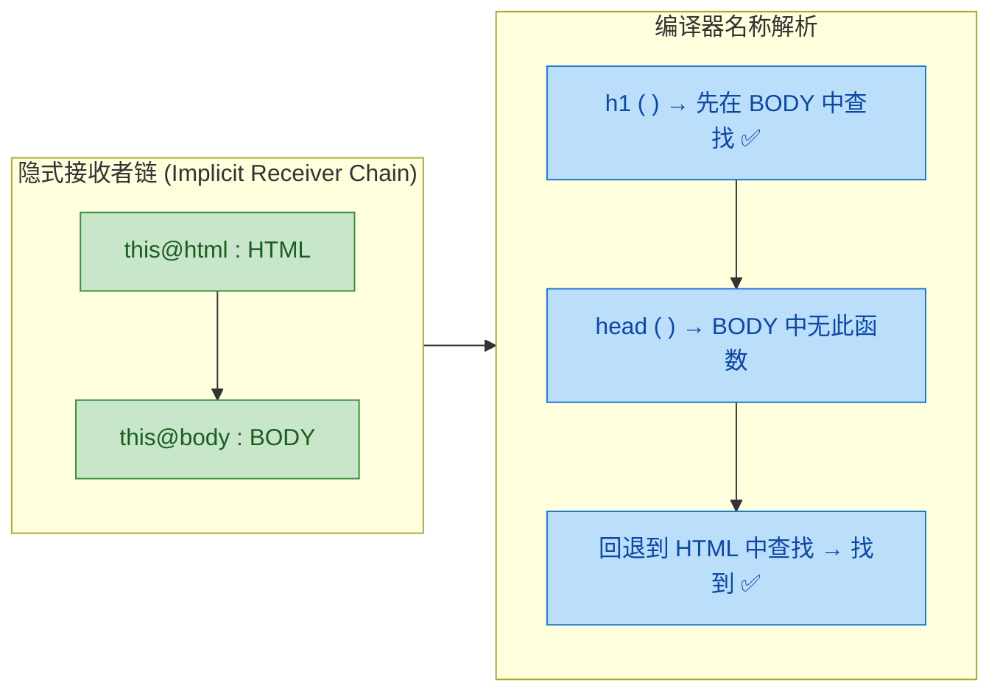

编译器的名称解析（Name Resolution）会沿着接收者链 **由内向外** 逐层查找。一旦在外层找到匹配的函数签名，便会默默通过编译。这在普通代码里是一种便利特性，但在 **DSL 场景** 中却是灾难——用户根本不打算调用外层的函数，却因手滑或不了解内部结构而写出了非法嵌套。

> 核心矛盾：**带接收者 Lambda 的嵌套** 天然产生多层 `this`，而 DSL 的语义要求每层 Lambda **只能看到当前层的接收者**。

---

### @DslMarker：编译期的作用域防火墙

Kotlin 从 **1.1** 版本开始引入了 `@DslMarker` 这一 **元注解（Meta-Annotation）**。它的作用非常明确：告诉编译器，被同一个 `@DslMarker` 注解标记过的多个接收者类型，在嵌套 Lambda 中 **不允许隐式访问外层接收者的成员**。

#### 基本使用三步法

```kotlin
// ========== 第一步：定义你的 DSL 标记注解 ==========
@DslMarker                          // 元注解：声明这是一个 DSL 作用域标记
@Target(AnnotationTarget.CLASS)     // 只允许标注在类上
annotation class HtmlDslMarker       // 自定义注解名，语义上表示 "HTML DSL 家族"

// ========== 第二步：将注解标记到所有 DSL 构建器类上 ==========
@HtmlDslMarker                      // 标记：HTML 属于 HtmlDsl 作用域族
class HTML { /* ... 同上 ... */ }

@HtmlDslMarker                      // 标记：HEAD 属于 HtmlDsl 作用域族
class HEAD { /* ... 同上 ... */ }

@HtmlDslMarker                      // 标记：BODY 属于 HtmlDsl 作用域族
class BODY { /* ... 同上 ... */ }

// ========== 第三步：无需修改其他代码，编译器自动生效 ==========
```

标记完成后，之前那段"危险代码"将 **直接编译失败**：

```kotlin
fun main() {
    html {                              // this: HTML
        body {                          // this: BODY
            h1("Hello")                // ✅ BODY.h1() — 当前作用域，允许

            // ❌ 编译错误！
            // 'fun head(block: HEAD.() -> Unit): Unit' can't be called
            // in this context by implicit receiver.
            // Use the explicit receiver if necessary: this@html.head { }
            head {
                title("Injected!")
            }
        }
    }
}
```

编译器给出了精确的错误提示：如果你 **确实** 需要调用外层的 `head()`，必须使用 **显式限定接收者** `this@html.head { }`。这种设计既保证了安全性，又保留了灵活性——不是完全禁止，而是 **强制你表明意图**。

---

### @DslMarker 底层原理深度剖析

为了真正理解 `@DslMarker` 的工作方式，我们需要深入编译器的 **接收者解析规则（Receiver Resolution Rules）**。

#### 隐式接收者的优先级模型

在没有 `@DslMarker` 的情况下，Kotlin 编译器维护着一个 **隐式接收者栈（Implicit Receiver Stack）**。当你在 Lambda 内调用一个函数时，编译器按以下顺序查找：

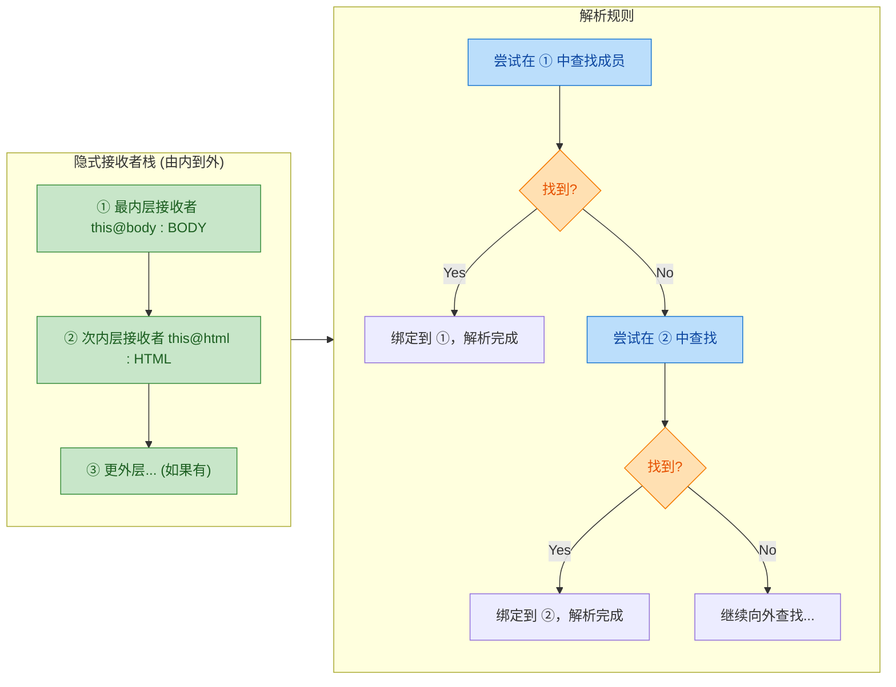

#### 加入 @DslMarker 后的变化

当编译器检测到**当前接收者**和**外层接收者**都被同一个 `@DslMarker` 注解标记时，它会 **将外层接收者从隐式解析候选集中剔除**。注意关键词——**同一个**。不同的 `@DslMarker` 注解之间互不影响。

```kotlin
// 两个完全独立的 DSL 标记
@DslMarker annotation class HtmlDsl    // HTML DSL 家族
@DslMarker annotation class CssDsl     // CSS DSL 家族

@HtmlDsl class BODY { /* ... */ }
@CssDsl  class StyleBuilder { /* ... */ }

// 如果 body 内嵌套了 style Lambda:
// BODY 和 StyleBuilder 属于不同 DslMarker 族，
// 因此 StyleBuilder 内部仍可隐式访问 BODY 的成员！
```

这是一个容易被忽视的细节。在大型项目中混用多套 DSL 时，要仔细规划 Marker 的归属。

用一张表格来总结解析行为的对比：

| 场景 | 无 @DslMarker | 有 @DslMarker (同族) |
|------|:---:|:---:|
| 内层访问内层接收者成员 | ✅ 允许 | ✅ 允许 |
| 内层隐式访问外层接收者成员 | ✅ 允许（危险） | ❌ 编译错误 |
| 内层**显式**访问外层接收者成员 | ✅ 允许 | ✅ 允许（`this@label`） |
| 不同 DslMarker 族之间的交叉访问 | ✅ 允许 | ✅ 允许（不受影响） |

---

### 完整工程实例：类型安全的 HTML DSL

下面给出加入 `@DslMarker` 后的完整、可运行代码，将之前的简化示例升级为一个稍微更真实的实现：

```kotlin
// ======================== DSL Marker 定义 ========================
@DslMarker
@Target(AnnotationTarget.CLASS)         // 限定只能注解在类上
annotation class HtmlTagMarker           // 所有 HTML 标签构建器的统一标记

// ======================== 标签基类 ========================
@HtmlTagMarker                           // 基类标记后，所有子类自动继承此标记
open class Tag(val name: String) {
    // 子节点列表
    protected val children = mutableListOf<Tag>()
    // 文本内容（叶子节点使用）
    var textContent: String = ""

    // 渲染当前标签树为 HTML 字符串（递归）
    open fun render(indent: Int = 0): String {
        val pad = "  ".repeat(indent)               // 缩进控制
        return if (children.isEmpty() && textContent.isNotEmpty()) {
            "$pad<$name>$textContent</$name>"        // 叶子节点：单行输出
        } else {
            buildString {
                appendLine("$pad<$name>")            // 开标签
                children.forEach {                   // 递归渲染子节点
                    appendLine(it.render(indent + 1))
                }
                append("$pad</$name>")               // 闭标签
            }
        }
    }
}

// ======================== 具体标签类 ========================
class HTML : Tag("html") {
    // 只允许在 <html> 内调用 head {}
    fun head(block: HEAD.() -> Unit) {
        val head = HEAD()                           // 实例化 HEAD 构建器
        head.block()                                // 在 HEAD 作用域中执行用户代码
        children += head                            // 将 HEAD 挂载为子节点
    }

    // 只允许在 <html> 内调用 body {}
    fun body(block: BODY.() -> Unit) {
        val body = BODY()                           // 实例化 BODY 构建器
        body.block()                                // 在 BODY 作用域中执行用户代码
        children += body                            // 将 BODY 挂载为子节点
    }
}

class HEAD : Tag("head") {
    // <title> 是 <head> 的合法子元素
    fun title(text: String) {
        val t = Tag("title")                        // 创建 <title> 节点
        t.textContent = text                        // 设置文本内容
        children += t                               // 挂载
    }

    // <meta> 标签（简化演示）
    fun meta(charset: String) {
        val m = Tag("meta charset=\"$charset\"")    // 简化处理
        children += m
    }
}

class BODY : Tag("body") {
    // <h1> 标签
    fun h1(text: String) {
        val h = Tag("h1")
        h.textContent = text
        children += h
    }

    // <p> 标签
    fun p(text: String) {
        val p = Tag("p")
        p.textContent = text
        children += p
    }

    // <div> 可嵌套子元素
    fun div(block: BODY.() -> Unit) {
        val div = BODY()                            // 复用 BODY 的能力（简化）
        div.block()
        // 偷换标签名用于演示目的
        children += object : Tag("div") {
            init { this.children.addAll(div.children) }
        }
    }
}

// ======================== 顶层入口 ========================
fun html(block: HTML.() -> Unit): HTML {
    return HTML().apply(block)                      // 创建根节点并执行 DSL
}

// ======================== 使用示例 ========================
fun main() {
    val document = html {                           // this: HTML
        head {                                      // this: HEAD
            title("Kotlin DSL Demo")
            meta("UTF-8")

            // ❌ 编译错误！head {} 内不能隐式调用 body {}
            // body { h1("Oops") }
        }
        body {                                      // this: BODY
            h1("Welcome to Kotlin DSL")
            p("This is a type-safe builder example.")

            div {                                   // this: BODY (div 复用)
                p("Inside a div")

                // ❌ 编译错误！div {} 内不能隐式调用 head {}
                // head { title("Nope") }

                // ✅ 如果确实需要，必须显式限定：
                // this@html.head { title("Explicitly!") }
            }
        }
    }

    println(document.render())
}
```

输出结果：

```text
<html>
  <head>
    <title>Kotlin DSL Demo</title>
    <meta charset="UTF-8"><meta charset="UTF-8">
  </head>
  <body>
    <h1>Welcome to Kotlin DSL</h1>
    <p>This is a type-safe builder example.</p>
    <div>
      <p>Inside a div</p>
    </div>
  </body>
</html>
```

请注意一个关键设计：**`@HtmlTagMarker` 标注在了基类 `Tag` 上**。由于 Kotlin 注解是可继承的（在 `@DslMarker` 场景下编译器会检查整个类型层级），所以 `HTML`、`HEAD`、`BODY` 等子类 **自动获得相同的标记**，无需逐一标注。

---

### 继承场景下的 @DslMarker 传播规则

`@DslMarker` 的传播行为值得单独拿出来说明，因为在实际项目中，DSL 构建器往往有复杂的继承体系。

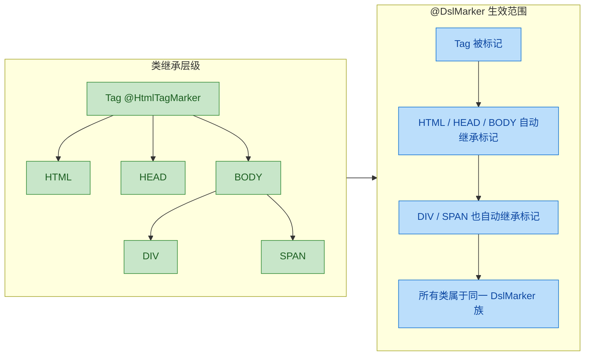

传播规则可以归纳为三条：

1. **直接标注**：类上直接写了 `@HtmlTagMarker`，该类属于此 Marker 族。
2. **继承传播**：父类/父接口被标注，子类自动属于同一族。
3. **间接标注**：如果一个注解 A 被 `@DslMarker` 标记，而另一个注解 B 被 A 标记，则 B 也具有 DslMarker 语义（不过这种间接用法较少见）。

> ⚠️ 常见误区：有些开发者以为只标注基类就够了，结果发现某个 **独立的** 工具类（没有继承 Tag）未被覆盖。所以在设计时，要确保所有参与 DSL 作用域的类都在同一继承链上，或者手动逐一标注。

---

### 多 DSL 混合：跨族访问控制

在真实项目中，你可能同时使用多套 DSL——比如在 HTML 构建过程中内嵌 CSS 样式。这时需要定义 **不同的 Marker**：

```kotlin
// ======================== 两套独立的 DslMarker ========================
@DslMarker annotation class HtmlDsl    // HTML 标签族
@DslMarker annotation class CssDsl     // CSS 样式族

// ======================== HTML 构建器 ========================
@HtmlDsl
class BodyBuilder {
    private val elements = mutableListOf<String>()

    // 在 body 中可以嵌套 style 块（跨族）
    fun style(block: StyleBuilder.() -> Unit) {
        val sb = StyleBuilder()          // 创建 CSS 族构建器
        sb.block()                       // 在 CSS 作用域中执行
        elements += "<style>${sb.build()}</style>"
    }

    fun p(text: String) {
        elements += "<p>$text</p>"
    }

    fun build(): String = elements.joinToString("\n")
}

// ======================== CSS 构建器 ========================
@CssDsl
class StyleBuilder {
    private val rules = mutableListOf<String>()

    // CSS 规则：选择器 + 属性块
    fun rule(selector: String, block: RuleBuilder.() -> Unit) {
        val rb = RuleBuilder()
        rb.block()
        rules += "$selector { ${rb.build()} }"
    }

    fun build(): String = rules.joinToString("\n")
}

@CssDsl
class RuleBuilder {
    private val props = mutableListOf<String>()

    // CSS 属性设置
    fun property(name: String, value: String) {
        props += "$name: $value;"
    }

    fun build(): String = props.joinToString(" ")
}

// ======================== 使用示例 ========================
fun main() {
    val body = BodyBuilder().apply {     // this: BodyBuilder (@HtmlDsl)
        p("Hello World")

        style {                          // this: StyleBuilder (@CssDsl)
            rule("body") {               // this: RuleBuilder  (@CssDsl)
                property("margin", "0")
                property("padding", "0")

                // ❌ 同族限制：RuleBuilder 内不能隐式调用 StyleBuilder.rule()
                // rule("h1") { ... }  // 编译错误！

                // ✅ 跨族穿透：RuleBuilder(@CssDsl) 内可以隐式访问 BodyBuilder(@HtmlDsl)
                // p("Accessible!")     // 这行能编译通过！（但语义不合理）
            }
        }
    }
    println(body.build())
}
```

这里有一个重要发现：**`@CssDsl` 只限制了 `StyleBuilder` 和 `RuleBuilder` 之间的隐式穿透，但 `RuleBuilder` 仍然可以隐式访问 `BodyBuilder` 的成员**，因为它们属于不同的 Marker 族。

解决办法有两种：

**方案 A：统一 Marker（简单粗暴）**

```kotlin
// 所有构建器共用一个 Marker，彻底封堵跨族穿透
@DslMarker annotation class UnifiedDsl

@UnifiedDsl class BodyBuilder { /* ... */ }
@UnifiedDsl class StyleBuilder { /* ... */ }
@UnifiedDsl class RuleBuilder  { /* ... */ }
```

**方案 B：双重标注（精细控制）**

```kotlin
// RuleBuilder 同时属于两个族
@CssDsl
@HtmlDsl           // 额外标注，使其与 BodyBuilder 也互斥
class RuleBuilder { /* ... */ }
```

方案 A 更简洁，适合封闭项目；方案 B 更灵活，适合需要组合第三方 DSL 的场景。

---

### 防御性编程：@DslMarker 之外的补充手段

`@DslMarker` 是最核心的防线，但在工程实践中，我们往往还需要额外的防御策略来提升 DSL 的健壮性。

#### 1. 使用 `@Deprecated` 给出友好提示

如果你的 DSL 无法使用 `@DslMarker`（比如需要兼容旧代码），可以通过 `@Deprecated` + `ERROR` 级别来模拟禁止调用：

```kotlin
class InnerScope {
    // 当用户在内层尝试调用外层的 dangerousMethod 时
    // 编译器会报 ERROR 级别错误（而非警告）
    @Deprecated(
        message = "Cannot call dangerousMethod in InnerScope. Use explicit receiver.",
        level = DeprecationLevel.ERROR     // ERROR 级别 = 编译失败
    )
    fun dangerousMethod() {
        // 空实现，永远不会被调用
        // 仅用于"覆盖"外层同名函数的解析
    }
}
```

这种 **Shadow + Deprecate** 模式虽然是手动挡，但在某些边界场景下依然有用。

#### 2. `this` 的显式限定始终是逃生舱

无论 `@DslMarker` 如何限制，**显式限定的 `this@label`** 始终可以突破作用域墙。这是一个经过深思熟虑的设计——DSL 限制的是"意外访问"，而非"刻意访问"：

```kotlin
html {                                  // 标签: html
    body {                              // 标签: body
        // ❌ 隐式调用被阻止
        // head { title("Nope") }

        // ✅ 显式限定：开发者明确知道自己在做什么
        this@html.head {
            title("I know what I'm doing")
        }
    }
}
```

#### 3. 接口隔离：暴露最小 API

另一个强有力的策略是**不让构建器暴露不必要的函数**。通过接口隔离，内层根本看不到外层的实现细节：

```kotlin
// 只暴露 body 层面允许的操作
interface BodyScope {
    fun h1(text: String)               // ✅ 允许
    fun p(text: String)                // ✅ 允许
    fun div(block: BodyScope.() -> Unit) // ✅ 允许嵌套 div
    // head() 根本不在此接口中，连"误调用"的可能都没有
}

// 内部实现类对外不可见
internal class BodyScopeImpl : BodyScope {
    override fun h1(text: String) { /* ... */ }
    override fun p(text: String) { /* ... */ }
    override fun div(block: BodyScope.() -> Unit) { /* ... */ }
}
```

这种设计让 DSL 的 **API 表面积（API Surface Area）** 降到最低，是大型 DSL 框架（如 Jetpack Compose）的常见实践。

---

### Jetpack Compose 中的真实案例

Jetpack Compose 是 `@DslMarker` 在工业级项目中最著名的应用之一。Compose 的布局系统大量依赖带接收者的 Lambda，如果没有作用域控制，嵌套组件之间的混乱调用将不可想象。

```kotlin
// Compose 框架内部定义（简化）
@DslMarker
annotation class LayoutScopeMarker

@LayoutScopeMarker
interface ColumnScope {
    // Column 特有的 Modifier 扩展
    fun Modifier.weight(weight: Float): Modifier
    fun Modifier.align(alignment: Alignment.Horizontal): Modifier
}

@LayoutScopeMarker
interface RowScope {
    // Row 特有的 Modifier 扩展
    fun Modifier.weight(weight: Float): Modifier
    fun Modifier.align(alignment: Alignment.CenterVertically): Modifier
}
```

```kotlin
// 用户代码
Column {                                // this: ColumnScope
    Text("Hello")

    Row {                               // this: RowScope
        Text("World")

        // ❌ 编译错误！不能在 Row 中使用 ColumnScope 的 align
        // Modifier.align(Alignment.CenterHorizontally)

        // ✅ 只能使用 RowScope 的 align
        Text(
            text = "Aligned",
            modifier = Modifier.align(Alignment.CenterVertically)
        )
    }
}
```

如果没有 `@LayoutScopeMarker`，在 `Row` 中误用 `ColumnScope.align()` 不会报错但会产生完全错误的布局行为，且极难调试。`@DslMarker` 让这类错误在 **编写时** 就被捕获，极大提升了开发体验。

---

### 本节知识架构总览

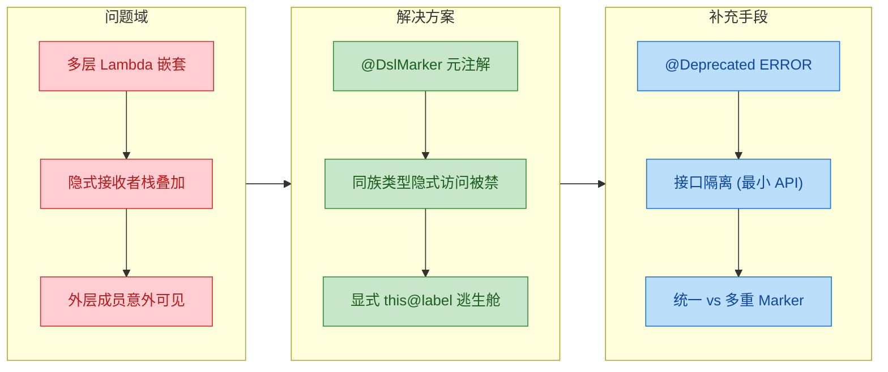

---

**📝 练习题**

以下代码使用了 `@DslMarker`，请问哪一行会产生 **编译错误**？

```kotlin
@DslMarker annotation class MyDsl

@MyDsl class Outer {
    fun outerFun() = println("outer")
}

@MyDsl class Inner {
    fun innerFun() = println("inner")
}

fun buildOuter(block: Outer.() -> Unit) = Outer().block()

fun Outer.nested(block: Inner.() -> Unit) = Inner().block()

fun main() {
    buildOuter {          // this: Outer
        outerFun()        // Line A
        nested {          // this: Inner
            innerFun()    // Line B
            outerFun()    // Line C
            this@buildOuter.outerFun() // Line D
        }
    }
}
```

A. Line A


B. Line B


C. Line C


D. Line D

**【答案】** C

**【解析】** `Outer` 和 `Inner` 被同一个 `@MyDsl` 注解标记，因此在 `Inner` 作用域的 Lambda 中，**不能隐式访问外层 `Outer` 的成员**。Line C 的 `outerFun()` 试图通过隐式接收者链回退到 `Outer` 来解析，被 `@DslMarker` 拦截，产生编译错误。而 Line D 使用了显式限定 `this@buildOuter.outerFun()`，这是 **始终允许** 的逃生舱写法，所以 Line D 能正常编译。Line A 在 `Outer` 自己的作用域内调用 `outerFun()`，当然合法。Line B 在 `Inner` 自己的作用域内调用 `innerFun()`，同样合法。因此只有 Line C 会编译失败。

---

## 类型安全构建器 (Type-Safe Builders)

类型安全构建器 (Type-Safe Builder) 是 Kotlin DSL 体系中最具代表性、也是最强大的设计模式。它的核心理念是：**利用编译器的类型系统，在编译期（而非运行时）就确保 DSL 语法结构的正确性**。与传统的字符串拼接或 Builder 模式相比，类型安全构建器能让编译器帮你检查"哪些嵌套是合法的"、"哪些属性可以在哪个作用域中使用"，从根本上消灭一整类 runtime error。

这种模式的基石是前文介绍的 **Lambda with Receiver**。通过将不同层级的构建逻辑封装在不同 Receiver 类型的 Lambda 中，我们能构造出一套层次分明、编译器可校验的声明式 API。Kotlin 官方的 `kotlinx.html`、Jetpack Compose、Gradle Kotlin DSL、Exposed ORM 等重量级框架，底层无一不依赖这套机制。

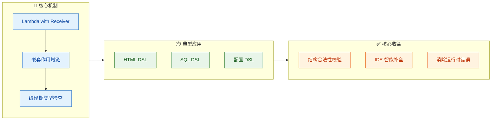

要深刻理解类型安全构建器，我们需要拆解它的运作原理。最关键的一句话是：**每一层嵌套，对应一个新的 Receiver 类型；每个 Receiver 类型，精确定义了该层允许调用的方法**。编译器通过 Receiver 类型推导，自动限制了开发者在每一层能做什么、不能做什么。这就是 "type-safe" 的含义——安全性由类型系统在编译期保证。

---

### HTML DSL —— 最经典的类型安全构建器

HTML DSL 是介绍类型安全构建器时最常用的范例，因为 HTML 本身就是一棵嵌套的标签树，与 Kotlin 的 Lambda 嵌套结构天然契合。我们的目标是用 Kotlin 代码写出类似这样的声明式结构：

```kotlin
// 目标：用 Kotlin DSL 生成 HTML，而不是手动拼接字符串
val page = html {
    head {
        title("Kotlin DSL 教程")
    }
    body {
        h1("类型安全构建器")
        p("这是一个用 Kotlin DSL 生成的段落。")
        ul {
            li("第一项")
            li("第二项")
            li("第三项")
        }
    }
}
```

这段代码看起来像一门声明式的 mini-language，但它是 **100% 合法的 Kotlin 代码**，而且编译器会保证：你不能在 `head {}` 里写 `li()`，也不能在 `ul {}` 外面直接写 `li()`。这就是类型安全。

下面我们从零构建这套 HTML DSL，逐步拆解每一层的设计。

#### 第一步：定义节点基类

```kotlin
// ====== 所有 HTML 元素的抽象基类 ======

// 用 @DslMarker 标注，防止外层作用域泄露到内层
@DslMarker                              // 声明一个 DSL 标记注解
annotation class HtmlDsl                // 所有 HTML 构建器类都会标注它

@HtmlDsl                                // 将标记应用到基类
abstract class HtmlElement {            // HTML 元素的抽象基类
    // 子元素列表，所有嵌套标签都会被添加到这里
    protected val children = mutableListOf<HtmlElement>()

    // 将子元素添加到当前节点
    fun addChild(child: HtmlElement) {  // 统一的子节点注册方法
        children.add(child)             // 加入子列表
    }

    // 每个具体标签必须实现自己的渲染逻辑
    abstract fun render(indent: String = ""): String  // 缩进渲染为字符串
}
```

这里的 `@HtmlDsl` 注解是关键。通过 `@DslMarker`，Kotlin 编译器会阻止在内层 Lambda 中隐式访问外层 Receiver 的方法，从而避免作用域污染。

#### 第二步：定义具体标签

```kotlin
// ====== 文本节点 —— 代表纯文本内容 ======
class TextElement(                      // 纯文本节点，不含子元素
    private val text: String            // 持有文本内容
) : HtmlElement() {
    override fun render(indent: String) // 渲染时直接输出文本
        = "$indent$text\n"              // 加上缩进和换行
}

// ====== 通用标签节点 —— 含标签名、属性和子元素 ======
@HtmlDsl                                // 标记为 DSL 作用域
open class Tag(                         // 通用 HTML 标签
    private val name: String            // 标签名，如 "div", "p", "ul"
) : HtmlElement() {

    // 标签属性表，如 class="xxx", id="yyy"
    private val attributes = mutableMapOf<String, String>()

    // DSL 内设置属性的方法
    fun attribute(key: String, value: String) {  // 添加 HTML 属性
        attributes[key] = value                   // 存入属性表
    }

    // 渲染：开标签 + 子元素递归渲染 + 闭标签
    override fun render(indent: String): String {
        val builder = StringBuilder()              // 创建字符串构建器
        // 拼接属性字符串，如 class="container" id="main"
        val attrStr = if (attributes.isNotEmpty()) // 判断是否有属性
            attributes.entries.joinToString(" ") { // 遍历所有属性
                "${it.key}=\"${it.value}\""         // 拼接为 key="value"
            }.let { " $it" }                        // 前面加空格
        else ""                                     // 无属性则为空串

        builder.append("$indent<$name$attrStr>\n")  // 输出开标签
        children.forEach { child ->                  // 遍历所有子元素
            builder.append(child.render("$indent  ")) // 递归渲染，增加缩进
        }
        builder.append("$indent</$name>\n")          // 输出闭标签
        return builder.toString()                     // 返回完整字符串
    }
}
```

#### 第三步：为每个嵌套层级创建特定的 Receiver 类

这是类型安全的 **灵魂所在**。不同标签内部允许的嵌套内容不同，我们通过继承 `Tag` 并只在对应子类中暴露合法方法来实现限制：

```kotlin
// ====== HTML 根节点 —— 只允许 head{} 和 body{} ======
class Html : Tag("html") {                      // html 标签
    fun head(init: Head.() -> Unit) {            // 只在 html 内可调用 head
        val head = Head()                         // 创建 Head 节点
        head.init()                               // 在 Head 作用域内执行 lambda
        addChild(head)                            // 将 head 挂载为子节点
    }

    fun body(init: Body.() -> Unit) {            // 只在 html 内可调用 body
        val body = Body()                         // 创建 Body 节点
        body.init()                               // 在 Body 作用域内执行 lambda
        addChild(body)                            // 将 body 挂载为子节点
    }
}

// ====== Head 节点 —— 只允许 title() ======
class Head : Tag("head") {                       // head 标签
    fun title(text: String) {                     // 只允许在 head 内调用 title
        val titleTag = Tag("title")               // 创建 title 标签
        titleTag.addChild(TextElement(text))      // 给 title 添加文本子节点
        addChild(titleTag)                        // 将 title 挂载到 head
    }
}

// ====== Body 节点 —— 允许 h1, p, div, ul 等 ======
class Body : Tag("body") {                       // body 标签
    fun h1(text: String) {                        // 在 body 内可调用 h1
        val tag = Tag("h1")                       // 创建 h1 标签
        tag.addChild(TextElement(text))           // 添加文本内容
        addChild(tag)                             // 挂载到 body
    }

    fun p(text: String) {                         // 在 body 内可调用 p
        val tag = Tag("p")                        // 创建 p 标签
        tag.addChild(TextElement(text))           // 添加文本内容
        addChild(tag)                             // 挂载到 body
    }

    fun ul(init: Ul.() -> Unit) {                 // 在 body 内可调用 ul
        val ul = Ul()                             // 创建 Ul 节点
        ul.init()                                 // 在 Ul 作用域内执行
        addChild(ul)                              // 挂载到 body
    }

    fun div(init: Body.() -> Unit) {              // div 复用 Body 的作用域
        val div = Tag("div")                      // 创建 div 标签
        val body = Body()                         // 借用 Body 作用域
        body.init()                               // 执行 lambda
        body.children.forEach { div.addChild(it) }// 把子节点转移到 div
        addChild(div)                             // 挂载 div
    }
}

// ====== Ul 节点 —— 只允许 li() ======
class Ul : Tag("ul") {                           // ul 标签
    fun li(text: String) {                        // 只允许在 ul 内调用 li
        val li = Tag("li")                        // 创建 li 标签
        li.addChild(TextElement(text))            // 添加文本
        addChild(li)                              // 挂载到 ul
    }
}
```

#### 第四步：顶层入口函数

```kotlin
// ====== DSL 入口 —— 全局函数 ======
fun html(init: Html.() -> Unit): Html {  // 顶层构建函数
    val html = Html()                     // 创建根节点
    html.init()                           // 在 Html 作用域内执行 lambda
    return html                           // 返回构建完成的 HTML 树
}
```

#### 类型安全的威力

现在我们来看编译器如何保护我们：

```kotlin
html {
    head {
        title("OK")     // ✅ Head 作用域内合法
        // li("Oops")   // ❌ 编译错误！Head 中没有 li() 方法
    }
    body {
        h1("标题")       // ✅ Body 作用域内合法
        ul {
            li("项目")   // ✅ Ul 作用域内合法
            // h1("X")   // ❌ 编译错误！Ul 中没有 h1() 方法
        }
        // li("脱离")    // ❌ 编译错误！Body 中没有 li() 方法
    }
}
```

下面这张图完整展示了 Receiver 类型如何形成一条"作用域链"，以及每层允许的方法集：

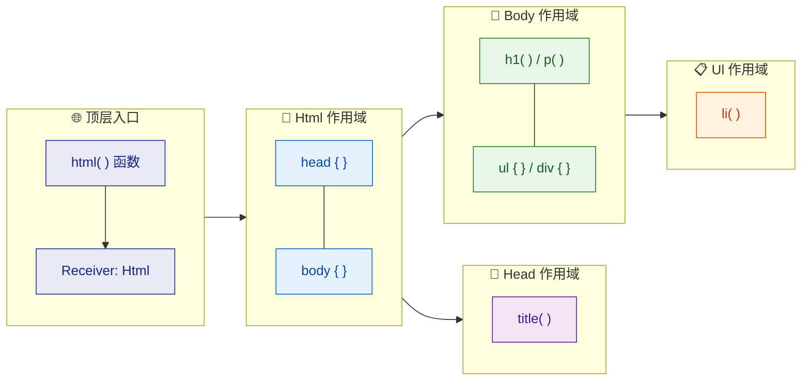

这个层级结构意味着：**每深入一层 Lambda，`this` 的类型就会切换为对应的 Receiver 类**，而该类上暴露的方法集合就是该层 DSL 的"语法"。编译器负责校验你的每一次调用是否匹配当前 `this` 类型上的方法签名，这就是 "type-safe" 的完整含义。

---

### SQL DSL —— 类型安全的查询构建器

SQL DSL 是类型安全构建器的另一个经典应用场景。手动拼接 SQL 字符串不仅容易出错，还有 SQL 注入风险。通过类型安全构建器，我们可以让编译器保证查询结构的合法性。Kotlin 生态中最著名的实现是 **Exposed** 框架，我们先模拟一个简化版来理解原理。

#### 表定义 —— 用 Kotlin 对象映射数据库表

```kotlin
// ====== 列类型 —— 用泛型锁定列的数据类型 ======
class Column<T>(                             // 泛型列，T 为列的数据类型
    val name: String,                        // 列名
    val table: Table                         // 所属表的引用
) {
    // 生成 "表名.列名" 格式的 SQL 片段
    fun fullName(): String =                 // 返回全限定列名
        "${table.tableName}.$name"           // 如 "users.id"
}

// ====== 表基类 —— 每个数据库表继承它 ======
abstract class Table(                        // 抽象表定义
    val tableName: String                    // 表名
) {
    // 已注册的列列表
    val columns = mutableListOf<Column<*>>() // 保存所有列定义

    // DSL 方法：声明一个整型列
    fun integer(name: String): Column<Int> { // 定义 Int 类型的列
        val col = Column<Int>(name, this)    // 创建列对象
        columns.add(col)                     // 注册到表
        return col                           // 返回列引用
    }

    // DSL 方法：声明一个字符串列
    fun varchar(                             // 定义 String 类型的列
        name: String,                        // 列名
        length: Int = 255                    // 最大长度，默认 255
    ): Column<String> {
        val col = Column<String>(name, this) // 创建列对象
        columns.add(col)                     // 注册到表
        return col                           // 返回列引用
    }
}

// ====== 具体表定义 —— 使用 object 单例 ======
object Users : Table("users") {              // users 表
    val id = integer("id")                   // id 列，Int 类型
    val name = varchar("name", 50)           // name 列，String 类型
    val email = varchar("email", 100)        // email 列，String 类型
}

object Orders : Table("orders") {            // orders 表
    val id = integer("id")                   // 订单 id
    val userId = integer("user_id")          // 外键，关联 users.id
    val amount = integer("amount")           // 金额
}
```

#### 查询构建器 —— 用 Lambda 嵌套模拟 SQL 语法

```kotlin
// ====== WHERE 条件表达式 ======
sealed class Expression {                     // 所有条件表达式的基类
    abstract fun toSql(): String              // 生成 SQL 片段

    // 条件间用 AND 连接
    infix fun and(other: Expression):         // 中缀函数实现 AND
        Expression = AndExpression(this, other)

    // 条件间用 OR 连接
    infix fun or(other: Expression):          // 中缀函数实现 OR
        Expression = OrExpression(this, other)
}

// "列 = 值" 表达式
class EqExpression(                           // 等值比较
    private val column: Column<*>,            // 左侧列
    private val value: Any                    // 右侧值
) : Expression() {
    override fun toSql(): String =            // 生成如 users.id = 1
        "${column.fullName()} = ${formatValue(value)}"

    private fun formatValue(v: Any) = when(v) { // 格式化值
        is String -> "'$v'"                      // 字符串加引号
        else -> v.toString()                     // 其他类型直接转换
    }
}

// AND 组合表达式
class AndExpression(                          // AND 连接
    private val left: Expression,             // 左表达式
    private val right: Expression             // 右表达式
) : Expression() {
    override fun toSql() =                    // 生成 (left AND right)
        "(${left.toSql()} AND ${right.toSql()})"
}

// OR 组合表达式
class OrExpression(                           // OR 连接
    private val left: Expression,
    private val right: Expression
) : Expression() {
    override fun toSql() =                    // 生成 (left OR right)
        "(${left.toSql()} OR ${right.toSql()})"
}

// ====== 列的扩展函数 —— DSL 语法糖 ======
infix fun <T> Column<T>.eq(value: T):        // 类型安全的等值比较
    Expression = EqExpression(this, value as Any)
// 注意泛型 T：Column<Int>.eq() 只接受 Int，Column<String>.eq() 只接受 String
```

注意 `eq` 扩展函数的泛型约束——`Column<Int>` 上的 `eq` 只接受 `Int` 参数，如果你试图传入 `String`，编译器会直接报错。**这就是类型安全在 SQL DSL 中的体现**。

#### 查询 DSL 主体

```kotlin
// ====== 查询构建器 ======
@DslMarker
annotation class SqlDsl                       // SQL DSL 作用域标记

@SqlDsl
class Query {                                 // 查询构建上下文
    private val selectedColumns =             // SELECT 的列
        mutableListOf<Column<*>>()
    private var fromTable: Table? = null       // FROM 的表
    private var whereExpr: Expression? = null  // WHERE 条件

    // SELECT 子句
    fun select(vararg cols: Column<*>) {       // 选择列
        selectedColumns.addAll(cols)            // 添加到列表
    }

    // FROM 子句
    fun from(table: Table) {                   // 指定表
        fromTable = table                       // 记录表引用
    }

    // WHERE 子句 —— 接收一个返回 Expression 的 Lambda
    fun where(condition: () -> Expression) {    // 条件构建
        whereExpr = condition()                 // 执行 Lambda 得到表达式
    }

    // 生成最终 SQL
    fun build(): String {                       // 构建 SQL 字符串
        val cols = if (selectedColumns.isEmpty()) "*"  // 无列则 SELECT *
            else selectedColumns.joinToString(", ")    // 逗号分隔列名
                { it.fullName() }
        val sql = StringBuilder("SELECT $cols")         // 拼接 SELECT
        fromTable?.let { sql.append(" FROM ${it.tableName}") }  // 拼接 FROM
        whereExpr?.let { sql.append(" WHERE ${it.toSql()}") }   // 拼接 WHERE
        return sql.toString()                            // 返回完整 SQL
    }
}

// ====== 顶层 DSL 入口 ======
fun query(init: Query.() -> Unit): String {    // DSL 入口函数
    val q = Query()                             // 创建查询构建器
    q.init()                                    // 在 Query 作用域内执行
    return q.build()                            // 构建并返回 SQL
}
```

#### 使用效果

```kotlin
fun main() {
    // 简单查询
    val sql1 = query {                         // 开始构建查询
        select(Users.name, Users.email)        // SELECT users.name, users.email
        from(Users)                            // FROM users
        where { Users.id eq 1 }               // WHERE users.id = 1
    }
    println(sql1)
    // 输出: SELECT users.name, users.email FROM users WHERE users.id = 1

    // 复合条件查询
    val sql2 = query {                         // 开始构建查询
        select(Users.name)                     // SELECT users.name
        from(Users)                            // FROM users
        where {                                // WHERE 复合条件
            (Users.name eq "Alice") and        // name = 'Alice'
            (Users.email eq "a@b.com")         // AND email = 'a@b.com'
        }
    }
    println(sql2)
    // 输出: SELECT users.name FROM users
    //       WHERE (users.name = 'Alice' AND users.email = 'a@b.com')

    // ❌ 编译错误示例（取消注释会报错）：
    // where { Users.id eq "hello" }
    // 原因：Users.id 是 Column<Int>，eq 要求参数类型为 Int，传 String 不匹配
}
```

类型安全在这里体现得非常清晰：

| 表达式 | 是否合法 | 原因 |
|--------|---------|------|
| `Users.id eq 1` | ✅ | `Column<Int>.eq(Int)` 类型匹配 |
| `Users.name eq "Alice"` | ✅ | `Column<String>.eq(String)` 类型匹配 |
| `Users.id eq "hello"` | ❌ | `Column<Int>.eq(String)` 类型不匹配 |
| `Users.name eq 42` | ❌ | `Column<String>.eq(Int)` 类型不匹配 |

---

### 配置 DSL —— 嵌套结构化配置

在实际工程中，应用程序的配置往往是分层嵌套的：数据库配置、服务器配置、缓存配置、日志配置等。传统做法是用 YAML/JSON + 反序列化，但这种方式丢失了编译期检查。使用 Kotlin 配置 DSL，我们可以获得 **类型安全 + IDE 自动补全 + 编译期校验** 的三重保障。

#### 目标用法

```kotlin
// 目标：像写配置文件一样写 Kotlin 代码
val config = appConfig {
    server {
        host = "0.0.0.0"
        port = 8080
        ssl {
            enabled = true
            certPath = "/etc/ssl/cert.pem"
        }
    }
    database {
        url = "jdbc:postgresql://localhost:5432/mydb"
        username = "admin"
        password = "secret"
        pool {
            maxSize = 20
            minIdle = 5
            timeout = 30_000L
        }
    }
    logging {
        level = LogLevel.INFO
        format = "JSON"
    }
}
```

#### 完整实现

```kotlin
// ====== DSL 标记 ======
@DslMarker
annotation class ConfigDsl                      // 配置 DSL 作用域标记

// ====== 日志级别枚举 ======
enum class LogLevel {                           // 日志级别定义
    DEBUG, INFO, WARN, ERROR                    // 四个级别
}

// ====== SSL 配置 ======
@ConfigDsl
class SslConfig {                               // SSL 子配置
    var enabled: Boolean = false                 // 是否启用 SSL
    var certPath: String = ""                    // 证书路径
    var keyPath: String = ""                     // 密钥路径

    override fun toString() =                   // 方便打印
        "SSL(enabled=$enabled, cert=$certPath)"
}

// ====== 服务器配置 ======
@ConfigDsl
class ServerConfig {                            // 服务器配置
    var host: String = "localhost"               // 主机地址，默认 localhost
    var port: Int = 8080                         // 端口号，默认 8080
    private var sslConfig = SslConfig()          // 内嵌 SSL 配置

    // 嵌套 DSL：在 server {} 内部可以调用 ssl {}
    fun ssl(init: SslConfig.() -> Unit) {        // SSL 配置入口
        sslConfig.apply(init)                    // 在 SslConfig 作用域内执行
    }

    fun getSsl() = sslConfig                     // 获取 SSL 配置

    override fun toString() =
        "Server(host=$host, port=$port, ssl=$sslConfig)"
}

// ====== 连接池配置 ======
@ConfigDsl
class PoolConfig {                              // 连接池配置
    var maxSize: Int = 10                        // 最大连接数
    var minIdle: Int = 2                         // 最小空闲连接
    var timeout: Long = 10_000L                  // 超时时间（毫秒）

    override fun toString() =
        "Pool(max=$maxSize, minIdle=$minIdle, timeout=${timeout}ms)"
}

// ====== 数据库配置 ======
@ConfigDsl
class DatabaseConfig {                          // 数据库配置
    var url: String = ""                         // JDBC URL
    var username: String = ""                    // 用户名
    var password: String = ""                    // 密码
    private var poolConfig = PoolConfig()        // 内嵌连接池配置

    // 嵌套 DSL：在 database {} 内部可以调用 pool {}
    fun pool(init: PoolConfig.() -> Unit) {      // 连接池配置入口
        poolConfig.apply(init)                   // 在 PoolConfig 作用域内执行
    }

    fun getPool() = poolConfig

    override fun toString() =
        "Database(url=$url, user=$username, pool=$poolConfig)"
}

// ====== 日志配置 ======
@ConfigDsl
class LoggingConfig {                           // 日志配置
    var level: LogLevel = LogLevel.INFO          // 日志级别
    var format: String = "TEXT"                  // 输出格式

    override fun toString() =
        "Logging(level=$level, format=$format)"
}

// ====== 应用总配置 ======
@ConfigDsl
class AppConfig {                               // 应用程序总配置
    private var serverConfig = ServerConfig()    // 服务器配置
    private var databaseConfig = DatabaseConfig()// 数据库配置
    private var loggingConfig = LoggingConfig()  // 日志配置

    fun server(init: ServerConfig.() -> Unit) {  // server 配置入口
        serverConfig.apply(init)                 // 在 ServerConfig 作用域执行
    }

    fun database(init: DatabaseConfig.() -> Unit) { // database 配置入口
        databaseConfig.apply(init)                    // 在 DatabaseConfig 作用域执行
    }

    fun logging(init: LoggingConfig.() -> Unit) { // logging 配置入口
        loggingConfig.apply(init)                   // 在 LoggingConfig 作用域执行
    }

    // 获取各子配置
    fun getServer() = serverConfig
    fun getDatabase() = databaseConfig
    fun getLogging() = loggingConfig

    override fun toString() = """
        |AppConfig:
        |  $serverConfig
        |  $databaseConfig
        |  $loggingConfig
    """.trimMargin()
}

// ====== 顶层 DSL 入口 ======
fun appConfig(init: AppConfig.() -> Unit): AppConfig { // 入口函数
    return AppConfig().apply(init)                       // 创建并初始化
}
```

#### 配置 DSL 的嵌套层级

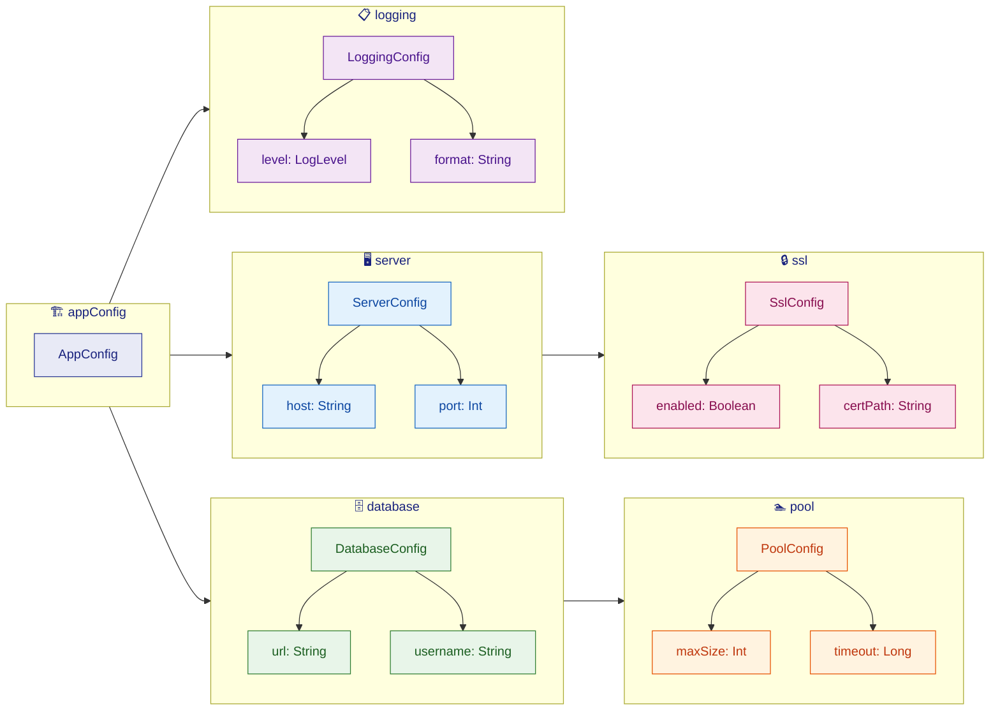

#### 配置验证 —— 在构建时检查一致性

类型安全构建器的一大优势是：你可以在构建完成后（甚至构建过程中）执行 **语义验证**：

```kotlin
// ====== 带验证的配置入口 ======
fun validatedConfig(                                // 带校验的入口
    init: AppConfig.() -> Unit                      // 配置 Lambda
): AppConfig {
    val config = AppConfig().apply(init)             // 先构建配置

    // ===== 业务规则校验 =====
    val server = config.getServer()                  // 获取 server 配置
    require(server.port in 1..65535) {               // 校验端口范围
        "端口号必须在 1~65535 之间，当前值: ${server.port}"
    }

    val db = config.getDatabase()                    // 获取 database 配置
    require(db.url.isNotBlank()) {                   // 校验 URL 非空
        "数据库 URL 不能为空"
    }

    val pool = db.getPool()                          // 获取连接池配置
    require(pool.maxSize >= pool.minIdle) {          // 最大连接数 >= 最小空闲数
        "maxSize(${pool.maxSize}) 不能小于 minIdle(${pool.minIdle})"
    }

    return config                                     // 校验通过，返回配置
}
```

这样一来，开发者在编写配置时，不仅能获得编译期的类型检查（传错类型会报错），还能在运行初期就捕获语义错误（端口越界、URL 为空等）。

---

### 三种 DSL 的对比与设计模式总结

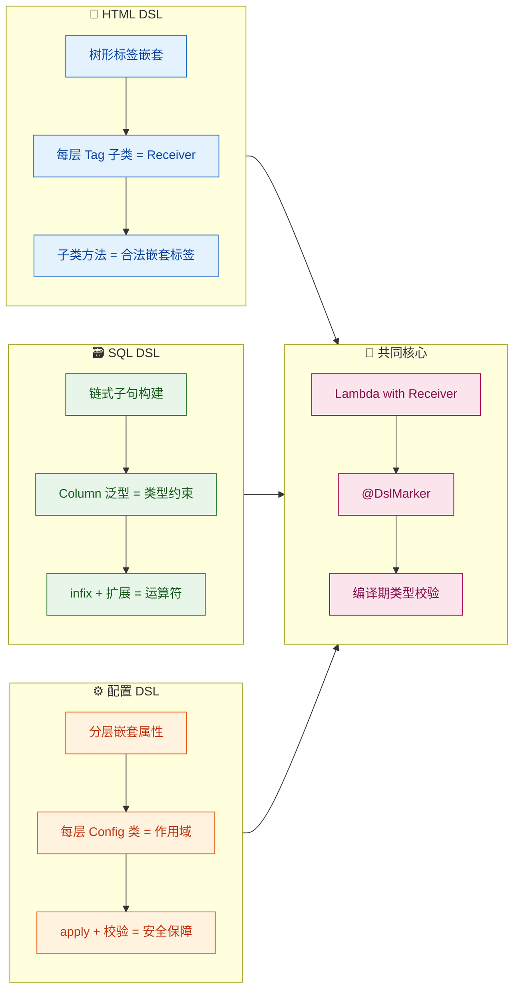

| 维度 | HTML DSL | SQL DSL | 配置 DSL |
|------|----------|---------|----------|
| **嵌套方式** | 标签树（父子关系） | 子句链（平铺 + 条件嵌套） | 配置树（分组属性） |
| **类型安全焦点** | 嵌套结构合法性 | 列类型与值类型匹配 | 属性类型 + 语义校验 |
| **Receiver 数量** | 多（每种标签一个） | 少（Query 为主） | 中（每层配置一个） |
| **典型框架** | kotlinx.html, Compose | Exposed, Ktorm | Ktor, Spring DSL |
| **核心技术** | 继承 + Lambda Receiver | 泛型 + 中缀函数 + 扩展 | `apply` + `require` 校验 |

三种 DSL 的外观迥异，但内核一致：**通过 Receiver 类型限定作用域，通过编译器类型检查保证结构安全**。掌握这个核心思想后，你可以为任何领域（路由、UI布局、测试断言、状态机定义……）设计出类型安全的 DSL。

---

### 设计类型安全构建器的通用步骤

最后，我们将上面三个案例的实现过程抽象成一套可复用的方法论：

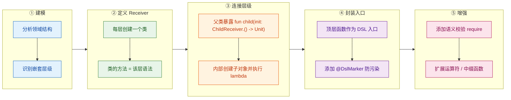

1. **建模 (Model)**：分析你的领域中有哪些"层级"或"块"。HTML 有标签层级，SQL 有子句层级，配置有分组层级。
2. **定义 Receiver (Define Receivers)**：为每一层创建一个类。该类上暴露的 public 方法和属性，就是用户在这一层可以使用的"语法"。
3. **连接层级 (Wire Layers)**：在父 Receiver 类中定义形如 `fun child(init: ChildReceiver.() -> Unit)` 的方法，内部创建子 Receiver 实例、执行 lambda、将结果注册到父节点。
4. **封装入口 (Create Entry Point)**：提供一个顶层函数（如 `html {}`、`query {}`、`appConfig {}`），它创建根 Receiver 并返回结果。别忘了在所有 Receiver 类上打 `@DslMarker` 注解。
5. **增强 (Enhance)**：添加运算符重载、中缀函数、`require` 校验等，让 DSL 更加流畅和健壮。

---

**📝 练习题**

以下 Kotlin 代码定义了一个简化的配置 DSL：

```kotlin
@DslMarker
annotation class CfgDsl

@CfgDsl
class Server {
    var port: Int = 80
    fun endpoint(path: String) { println("  endpoint: $path") }
}

@CfgDsl
class App {
    fun server(init: Server.() -> Unit) {
        Server().apply(init)
    }
}

fun app(init: App.() -> Unit) = App().apply(init)
```

当我们执行以下代码时，会发生什么？

```kotlin
app {
    server {
        port = 3000
        endpoint("/api")
        server {   // <-- 注意：在 server 内部又调用了 server
            port = 4000
        }
    }
}
```

A. 正常编译运行，内层 `server {}` 创建了第二个 Server 实例，port 为 4000


B. 编译错误，因为 `@CfgDsl` 的 `@DslMarker` 机制阻止了在 `Server` 作用域中隐式访问外层 `App` 的 `server()` 方法


C. 正常编译运行，但内层 `server {}` 覆盖了外层的 port，最终 port 为 4000


D. 运行时异常 `StackOverflowError`，因为 `server` 递归调用了自己


**【答案】** B

**【解析】**

`@DslMarker` 注解的核心作用是：**当多个带有相同 `@DslMarker` 标记的 Receiver 嵌套时，编译器只允许隐式访问最内层的 Receiver，外层 Receiver 的方法必须通过显式限定才能调用**。

在本题中，`App` 和 `Server` 都标注了 `@CfgDsl`。当执行到 `server { ... }` 内部时，当前的 `this` 类型是 `Server`。此时如果再写 `server { ... }`，编译器会检查：

- `Server` 类本身没有 `server()` 方法 → 不匹配
- 外层的 `App` 有 `server()` 方法，但 `App` 和 `Server` 共享同一个 `@DslMarker` 标记 → **隐式访问被禁止**

因此编译器会报错：`'fun server(init: Server.() -> Unit): Unit' can't be called in this context by implicit receiver. Use the explicit one if necessary.` 如果开发者确实需要在 Server 内部再创建一个 Server，则必须显式写 `this@app.server { ... }` 来指定外层 Receiver。这正是 `@DslMarker` 防止作用域污染 (scope pollution) 的精髓。

---

## 中缀符号与DSL（Infix Notation & DSL）

在前面的章节中，我们已经掌握了 **Lambda 接收者**、**作用域控制** 和 **类型安全构建器** 等核心武器。但如果你仔细回顾那些 DSL 代码，会发现它们在语法上仍然带有明显的"函数调用味道"——括号 `()`、点号 `.` 随处可见。真正优秀的 DSL 应该 **像自然语言一样阅读**，而 Kotlin 的 **中缀函数（Infix Function）** 正是消除这些语法噪声的关键利器。

一个直观的对比：

```kotlin
// 普通函数调用 —— 有括号、有点号，程序员味很重
user.should(equal("Alice"))

// 中缀风格 —— 读起来像英语句子
user should equal("Alice")
```

仅仅是去掉了 `.` 和 `()`，可读性就产生了质的飞跃。这就是 `infix` 的魅力所在。

---

### infix 函数基础

#### 语法定义与三大约束

`infix` 是 Kotlin 提供的一个函数修饰符（modifier），它允许你在调用 **成员函数** 或 **扩展函数** 时省略点号和括号。但它有 **三条硬性约束**，缺一不可：

```kotlin
// ✅ 合法的 infix 函数
infix fun String.onto(other: String): Pair<String, String> {
    // 1️⃣ 必须是成员函数或扩展函数（这里是 String 的扩展函数）
    // 2️⃣ 必须有且仅有一个参数（other）
    // 3️⃣ 参数不能是可变参数(vararg)，也不能有默认值
    return Pair(this, other)  // this 指向调用者（接收者）
}

fun main() {
    // 中缀调用：省略了点号和括号
    val pair = "key" onto "value"   // 等价于 "key".onto("value")
    println(pair)                    // 输出: (key, value)
}
```

下面用一张表格归纳三大约束的细节：

| 约束 | 说明 | 违规示例 |
|------|------|---------|
| **必须是成员函数或扩展函数** | 顶层函数（Top-level function）不能标记 `infix` | `infix fun doSomething(x: Int)` ❌ |
| **必须恰好一个参数** | 零个参数或多个参数均不允许 | `infix fun String.tag(a: Int, b: Int)` ❌ |
| **参数无默认值、非 vararg** | 即使只有一个 vararg 参数也不行 | `infix fun String.tag(vararg x: Int)` ❌ |

#### 中缀调用的本质是语法糖

编译器在遇到 `a foo b` 这种写法时，会将其 **脱糖（desugar）** 为 `a.foo(b)`。也就是说，中缀调用和普通调用在字节码层面 **完全相同**，没有任何运行时开销：

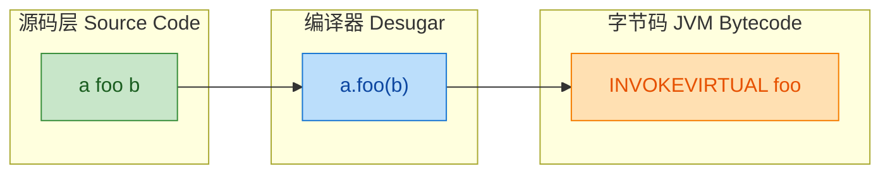

#### 运算符优先级

中缀函数的优先级 **低于** 算术运算符和范围运算符（`..`），但 **高于** 布尔运算符（`&&`、`||`）和比较运算符以及赋值运算符。这意味着在复杂表达式中，你可能需要用括号来消除歧义：

```kotlin
infix fun Int.add(other: Int): Int = this + other

fun main() {
    // 中缀优先级演示
    val result = 1 add 2 + 3   // 等价于 1.add(2 + 3) = 1.add(5) = 6
    println(result)              // 输出: 6（不是 3 + 3 = 6，虽然结果相同）

    val result2 = 1 + 2 add 3  // 等价于 (1 + 2).add(3) = 3.add(3) = 6
    println(result2)             // 输出: 6

    // ⚠️ 和布尔运算混用时，infix 优先级更高
    // val check = true && 1 add 2 == 3  →  true && (1.add(2)) == 3  →  true && 3 == 3  →  true
}
```

优先级从高到低的关键梯队如下：

```
算术运算符 (+, -, *, /)
  ↓
范围运算符 (..)
  ↓
中缀函数 (infix)          ← 在这里
  ↓
比较/相等运算符 (<, >, ==, !=)
  ↓
布尔运算符 (&&, ||)
  ↓
赋值运算符 (=, +=, …)
```

---

### 标准库中的经典 infix 函数

Kotlin 标准库本身就大量使用了 `infix`，学会识别它们能帮助你理解中缀设计的最佳实践。

#### `to` — 创建 Pair

这可能是 Kotlin 中最著名的 infix 函数：

```kotlin
// 标准库源码（简化版）
public infix fun <A, B> A.to(that: B): Pair<A, B> = Pair(this, that)

fun main() {
    // 传统写法
    val pair1 = Pair("name", "Alice")

    // 中缀写法 —— 更自然
    val pair2 = "name" to "Alice"

    // 在 mapOf 中大放异彩
    val config = mapOf(
        "host" to "localhost",   // 每一行都像键值对的声明
        "port" to 8080,          // 读起来就像配置文件
        "debug" to true
    )
}
```

`to` 之所以经典，是因为它完美展示了 infix 的设计哲学：**让代码的意图（intent）比语法（syntax）更突出**。

#### `until`、`downTo`、`step` — 范围操作

```kotlin
fun main() {
    // until: 创建半开区间 [0, 10)
    for (i in 0 until 10) {           // 等价于 0.until(10)
        print("$i ")                   // 输出: 0 1 2 3 4 5 6 7 8 9
    }
    println()

    // downTo: 递减范围
    for (i in 10 downTo 1) {          // 等价于 10.downTo(1)
        print("$i ")                   // 输出: 10 9 8 7 6 5 4 3 2 1
    }
    println()

    // step: 指定步长（可链式使用）
    for (i in 0 until 20 step 3) {    // 等价于 (0.until(20)).step(3)
        print("$i ")                   // 输出: 0 3 6 9 12 15 18
    }
}
```

注意 `step` 是在 `IntRange`/`IntProgression` 上定义的 infix 扩展函数，因此可以与 `until`、`downTo` **链式串接**，这正是流畅接口（Fluent Interface）的雏形。

#### 其他标准库 infix 函数

| 函数 | 所在类型 | 用途 | 示例 |
|------|---------|------|------|
| `and` / `or` / `xor` | `Int`, `Long` 等 | 位运算 | `0xFF and 0x0F` |
| `shl` / `shr` / `ushr` | `Int`, `Long` 等 | 位移 | `1 shl 4` → `16` |
| `matches` | `String` | 正则匹配 | `"abc" matches Regex("[a-z]+")` |
| `zip` | `Iterable` | 拉链合并 | `listA zip listB` |

---

### 用 infix 构建流畅接口（Fluent Interface）

流畅接口（Fluent Interface）是一种面向 API 设计的模式，其核心目标是让 **方法链** 读起来像自然语言。中缀函数是实现流畅接口的 Kotlin 原生利器。

#### 案例：权限声明 DSL

设想我们要构建一个 DSL 来描述用户权限：

```kotlin
// ---------- 核心数据模型 ----------
// 权限动作枚举
enum class Action { READ, WRITE, DELETE, ADMIN }

// 权限规则：谁(role) 能对什么资源(resource) 做什么(actions)
data class Permission(
    val role: String,                    // 角色名称
    val resource: String,                // 目标资源
    val actions: Set<Action>             // 允许的操作集合
)

// ---------- DSL 构建器 ----------
class PermissionBuilder {
    var role: String = ""                // 当前角色
    var resource: String = ""            // 当前资源
    val actions = mutableSetOf<Action>() // 收集的操作

    // infix: "role" can "admin"  →  设置角色名
    infix fun String.can(action: String): PermissionBuilder {
        role = this                      // this 是调用者字符串，即角色名
        resource = ""                    // 重置资源
        actions.add(                     // 将字符串映射为 Action 枚举
            Action.valueOf(action.uppercase())
        )
        return this@PermissionBuilder    // 返回构建器以支持链式调用
    }

    // infix: ... and "write"  →  追加更多操作
    infix fun PermissionBuilder.and(action: String): PermissionBuilder {
        actions.add(                     // 继续向集合追加操作
            Action.valueOf(action.uppercase())
        )
        return this                      // 链式返回
    }

    // infix: ... on "articles"  →  指定资源
    infix fun PermissionBuilder.on(res: String): Permission {
        resource = res                   // 设置目标资源
        return build()                   // 构建最终结果
    }

    // 内部构建方法
    private fun build() = Permission(role, resource, actions.toSet())
}

// 顶层入口函数
fun permission(block: PermissionBuilder.() -> Permission): Permission {
    return PermissionBuilder().block()   // 在构建器作用域中执行 lambda
}

// ---------- 使用 ----------
fun main() {
    val perm = permission {
        // 读起来就像英语："editor can read and write on articles"
        "editor" can "read" and "write" on "articles"
    }

    println(perm)
    // 输出: Permission(role=editor, resource=articles, actions=[READ, WRITE])
}
```

看看最终使用方式——`"editor" can "read" and "write" on "articles"`——这已经不像代码，而像一句 **自然语言声明**。这就是 infix 在 DSL 中的真正威力。

下面用 Mermaid 图展示这条链式调用的执行流程：

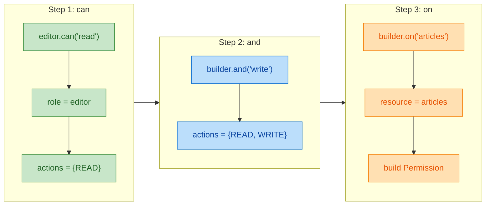

#### 案例：时间表达式 DSL

利用 infix 可以构造极其自然的时间表达式：

```kotlin
import kotlin.time.Duration
import kotlin.time.Duration.Companion.hours
import kotlin.time.Duration.Companion.minutes
import kotlin.time.Duration.Companion.seconds

// 时间偏移描述
data class TimeOffset(
    val duration: Duration,   // 持续时长
    val direction: String     // "ago" 或 "later"
)

// infix 扩展：让 Duration 支持 "ago" 和 "later"
infix fun Duration.from(point: String): TimeOffset {
    // 例如: 2.hours from "now"  →  TimeOffset(2h, "later")
    return TimeOffset(this, "from_$point")
}

// Int 扩展属性 + infix 组合
val Int.hrs: Duration                     // 3.hrs → 3 小时
    get() = this.hours

val Int.mins: Duration                    // 30.mins → 30 分钟
    get() = this.minutes

val Int.secs: Duration                    // 45.secs → 45 秒
    get() = this.seconds

// infix: 时间组合 "and"
infix fun Duration.and(other: Duration): Duration {
    return this + other                   // 将两段时长相加
}

fun main() {
    // 读起来像自然语言："3 小时 and 30 分钟"
    val meeting = 3.hrs and 30.mins
    println("会议时长: $meeting")          // 输出: 会议时长: 3h 30m

    // 链式组合
    val workout = 1.hrs and 15.mins and 30.secs
    println("锻炼时长: $workout")          // 输出: 锻炼时长: 1h 15m 30s

    // 结合 from 使用
    val deadline = 2.hrs from "now"
    println("截止描述: $deadline")          // 输出: 截止描述: TimeOffset(duration=2h, direction=from_now)
}
```

---

### 中缀链式调用的设计原则

设计一个好的 infix DSL 链不是随便堆砌关键字，而是要遵循一些核心原则。

#### 原则一：语义连贯性（Semantic Coherence）

每个 infix 调用的 **接收者** 和 **参数** 之间必须存在清晰的语义关系，整条链读下来应当是一句 **有意义的陈述**：

```kotlin
// ✅ 语义连贯 —— "user should have role admin"
user should have role "admin"

// ❌ 语义断裂 —— 动词和名词关系不明确
user make have into "admin"
```

#### 原则二：类型驱动链式传递（Type-Driven Chaining）

链中每一步的返回类型决定了下一步可以调用哪些 infix 函数。利用 **不同的中间类型** 可以精确控制 DSL 的语法合法性：

```kotlin
// ---------- 类型驱动的链式传递 ----------

// 中间状态类型：表示 "已选择了来源" 的状态
class FromClause(val source: String)

// 中间状态类型：表示 "已选择了来源和目标" 的状态
class ToClause(val source: String, val destination: String)

// 最终结果
data class Route(
    val source: String,
    val destination: String,
    val mode: String
)

// 第一步: "from" 返回 FromClause
infix fun String.from(source: String): FromClause {
    // this 在这里不使用，source 是起点
    return FromClause(source)
}

// 第二步: FromClause 上的 "to"，返回 ToClause
infix fun FromClause.to(destination: String): ToClause {
    return ToClause(this.source, destination)   // 携带前面的信息
}

// 第三步: ToClause 上的 "by"，返回最终 Route
infix fun ToClause.by(mode: String): Route {
    return Route(this.source, this.destination, mode)
}

fun main() {
    // 链式调用，每一步类型不同，编译器强制你按顺序书写
    val route = "route" from "Beijing" to "Shanghai" by "train"
    println(route)
    // 输出: Route(source=Beijing, destination=Shanghai, mode=train)

    // ❌ 编译错误！FromClause 上没有 by 方法
    // "route" from "Beijing" by "train"

    // ❌ 编译错误！String 上没有 to(作为 FromClause 的 to)
    // "route" to "Shanghai"
}
```

这里的核心技巧是：**每个 infix 函数返回一个不同的中间类型**，而下一个 infix 函数只定义在该中间类型上。编译器会自动保证链的顺序正确，这就是 **Type-Safe Chain**。

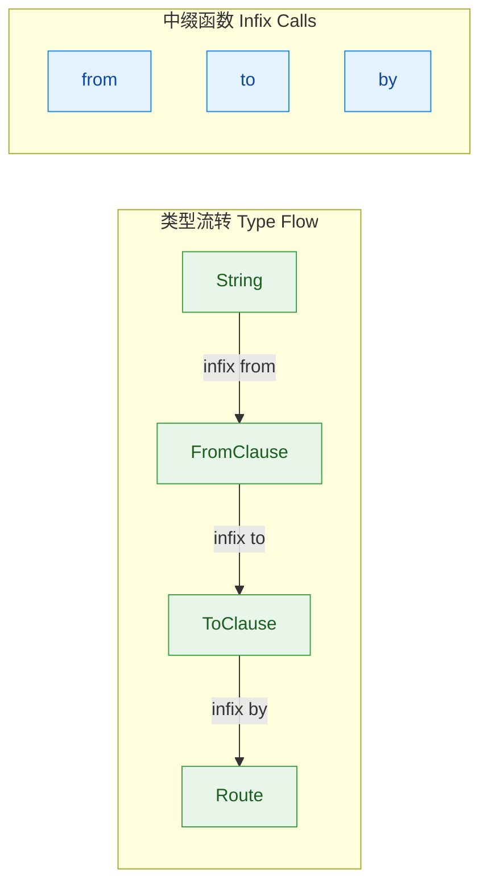

#### 原则三：避免 infix 滥用

并非所有函数都适合标记为 `infix`。以下是判断标准：

```kotlin
// ✅ 适合 infix —— 二元关系明确，读起来像自然语言
infix fun User.belongsTo(group: Group): Boolean   // user belongsTo adminGroup
infix fun Task.assignTo(user: User): Task          // task assignTo alice
infix fun Duration.after(event: Event): Timestamp  // 5.minutes after loginEvent

// ❌ 不适合 infix —— 操作对参数关系不明确，或者纯计算
infix fun String.process(config: Config): Result   // "data" process config → 含义模糊
infix fun Int.compute(x: Int): Int                 // 1 compute 2 → 不如用运算符
```

**经验法则**：如果去掉点号和括号后，表达式读起来 **不像** 一个通顺的英语/中文短语，那就不应该用 `infix`。

---

### infix 与其他 DSL 技术的组合

`infix` 很少单独出现，它往往与 Lambda 接收者、扩展函数、操作符重载等技术 **协同作战**，共同构建流畅的 DSL 体验。

#### 组合一：infix + Lambda 接收者

```kotlin
// 规则引擎 DSL
class RuleEngine {
    val rules = mutableListOf<Pair<String, () -> Boolean>>()

    // infix: "rule_name" means { condition }
    infix fun String.means(condition: () -> Boolean) {
        rules.add(this to condition)     // this 是规则名称
    }

    // 检查所有规则
    fun evaluate(): Map<String, Boolean> {
        return rules.associate { (name, condition) ->
            name to condition()          // 执行每条规则的条件 lambda
        }
    }
}

// 顶层 DSL 入口（Lambda 接收者）
fun rules(block: RuleEngine.() -> Unit): RuleEngine {
    return RuleEngine().apply(block)     // apply 让 block 在 RuleEngine 作用域内执行
}

fun main() {
    val age = 25
    val hasLicense = true

    val engine = rules {
        // infix 让规则声明像自然语言
        "canDrive" means { age >= 18 && hasLicense }
        "canVote" means { age >= 18 }
        "canDrink" means { age >= 21 }
    }

    val results = engine.evaluate()
    results.forEach { (rule, passed) ->
        println("$rule: $passed")
    }
    // 输出:
    // canDrive: true
    // canVote: true
    // canDrink: true
}
```

#### 组合二：infix + 扩展属性（模拟无参中缀）

Kotlin 的 infix 要求 **恰好一个参数**，但有时我们想要一个 **无参的尾词**（例如 `5.seconds ago`）。这时可以用 **扩展属性** 来模拟：

```kotlin
import kotlin.time.Duration
import kotlin.time.Duration.Companion.seconds
import kotlin.time.Duration.Companion.minutes
import kotlin.time.Duration.Companion.hours
import java.time.Instant

// 方向标记（单例对象，充当"语法糖关键字"）
object Ago                                // 方向：过去
object Later                              // 方向：未来

// infix：Duration ago Ago / Duration later Later
infix fun Duration.ago(@Suppress("UNUSED_PARAMETER") marker: Ago): Instant {
    return Instant.now().minusMillis(this.inWholeMilliseconds)
}

infix fun Duration.later(@Suppress("UNUSED_PARAMETER") marker: Later): Instant {
    return Instant.now().plusMillis(this.inWholeMilliseconds)
}

// 使用扩展属性暴露单例，省略括号
val ago = Ago       // 全局 "关键字"
val later = Later   // 全局 "关键字"

fun main() {
    // 非常接近自然语言的表达
    val pastTime = 30.seconds ago ago         // "30 秒前"
    val futureTime = 2.hours later later      // "2 小时后"

    println("30秒前: $pastTime")
    println("2小时后: $futureTime")
}
```

> ⚠️ **注意**：这种技巧虽然巧妙，但 `ago ago` 的重复看起来并不完美。在实际项目中，更常见的做法是结合扩展属性直接返回结果，或者使用 `invoke` 约定来进一步优化。

#### 组合三：infix + 泛型 — 类型安全断言

这个组合在测试 DSL 中极为常见：

```kotlin
// ---------- 极简断言库 ----------

// 中间类型：包裹实际值，作为断言链的起点
class Assertion<T>(val actual: T)

// 断言匹配器接口
interface Matcher<T> {
    fun test(value: T): Boolean          // 测试是否匹配
    fun description(): String            // 失败时的描述
}

// 创建 Assertion 的扩展属性
val <T> T.should: Assertion<T>
    get() = Assertion(this)              // 任何类型 T 都能 .should 进入断言链

// infix: assertion be matcher
infix fun <T> Assertion<T>.be(matcher: Matcher<T>) {
    if (!matcher.test(actual)) {         // 如果匹配失败
        throw AssertionError(            // 抛出断言错误
            "Expected ${matcher.description()}, but got: $actual"
        )
    }
}

// ---------- 内置匹配器 ----------

// equalTo 匹配器
fun <T> equalTo(expected: T) = object : Matcher<T> {
    override fun test(value: T) = value == expected
    override fun description() = "equal to $expected"
}

// greaterThan 匹配器（约束 T 必须 Comparable）
fun <T : Comparable<T>> greaterThan(expected: T) = object : Matcher<T> {
    override fun test(value: T) = value > expected
    override fun description() = "greater than $expected"
}

fun main() {
    // 流畅的断言语法
    val result = 42
    result.should be equalTo(42)         // ✅ 通过

    val name = "Kotlin"
    name.should be equalTo("Kotlin")     // ✅ 通过

    val score = 95
    score.should be greaterThan(90)      // ✅ 通过

    // score.should be equalTo(100)      // ❌ AssertionError: Expected equal to 100, but got: 95
}
```

这里 `should` 是扩展属性（返回 `Assertion<T>`），`be` 是 infix 函数（接收 `Matcher<T>`），两者组合后形成了 `value.should be matcher(...)` 这样极具表现力的断言语法。

---

### 实战：构建一个迷你 HTTP 路由 DSL

把本节学到的所有技术融合起来，我们构建一个完整的 HTTP 路由 DSL：

```kotlin
// ---------- 数据模型 ----------
enum class HttpMethod { GET, POST, PUT, DELETE }

data class RouteDefinition(
    val method: HttpMethod,               // HTTP 方法
    val path: String,                     // 路由路径
    val handler: (String) -> String       // 处理函数（入参为请求体，返回响应体）
)

// ---------- 中间类型（类型驱动链式） ----------
// 表示已选择了 HTTP 方法的中间状态
class MethodSelected(val method: HttpMethod)

// 表示已选择了方法和路径的中间状态
class PathSelected(val method: HttpMethod, val path: String)

// ---------- infix 链式函数 ----------

// 第一步：选择 HTTP 方法（全局 infix）
// "route" get "/users"  →  先忽略 "route"，重点是 get + 路径
infix fun String.get(path: String): PathSelected {
    return PathSelected(HttpMethod.GET, path)
}

infix fun String.post(path: String): PathSelected {
    return PathSelected(HttpMethod.POST, path)
}

infix fun String.put(path: String): PathSelected {
    return PathSelected(HttpMethod.PUT, path)
}

infix fun String.delete(path: String): PathSelected {
    return PathSelected(HttpMethod.DELETE, path)
}

// 第二步：指定处理函数
infix fun PathSelected.handling(handler: (String) -> String): RouteDefinition {
    return RouteDefinition(                // 组装最终的路由定义
        method = this.method,
        path = this.path,
        handler = handler
    )
}

// ---------- 路由表构建器 ----------
class Router {
    val routes = mutableListOf<RouteDefinition>()

    // 使用 unaryPlus 操作符添加路由（后续章节会详细讲 operator）
    operator fun RouteDefinition.unaryPlus() {
        routes.add(this)                  // 将路由加入列表
    }
}

// 顶层 DSL 入口
fun router(block: Router.() -> Unit): Router {
    return Router().apply(block)
}

// ---------- 使用 ----------
fun main() {
    val app = router {
        // 每一行都是一条流畅的路由声明
        +"route" get "/users" handling { _ -> """{"users": []}""" }
        +"route" post "/users" handling { body -> """{"created": $body}""" }
        +"route" delete "/users/1" handling { _ -> """{"deleted": true}""" }
    }

    // 打印所有注册的路由
    app.routes.forEach { route ->
        println("${route.method} ${route.path}")
    }
    // 输出:
    // GET /users
    // POST /users
    // DELETE /users/1

    // 模拟调用
    val postHandler = app.routes[1].handler
    println(postHandler("""{"name":"Alice"}"""))
    // 输出: {"created": {"name":"Alice"}}
}
```

整个 DSL 的技术栈一览：

```mermaid
graph LR
    subgraph Infix["infix 函数"]
        direction TB
        I1["get / post / delete"]
        I2["handling"]
    end

    subgraph Types["中间类型"]
        direction TB
        T1["MethodSelected"]
        T2["PathSelected"]
        T3["RouteDefinition"]
    end

    subgraph Builder["构建器模式"]
        direction TB
        B1["Router"]
        B2["Lambda 接收者"]
        B3["operator unaryPlus"]
    end

    subgraph Result["最终产物"]
        direction TB
        R1["路由表 routes"]
    end

    Infix --> Types --> Builder --> Result

    classDef greenNode fill:#C8E6C9,stroke:#388E3C,color:#1B5E20
    classDef blueNode fill:#BBDEFB,stroke:#1976D2,color:#0D47A1
    classDef orangeNode fill:#FFE0B2,stroke:#F57C00,color:#E65100
    classDef purpleNode fill:#E1BEE7,stroke:#8E24AA,color:#4A148C

    class I1,I2 greenNode
    class T1,T2,T3 blueNode
    class B1,B2,B3 orangeNode
    class R1 purpleNode
```

---

### infix 常见陷阱与最佳实践

#### 陷阱一：this 指向混淆

在 Lambda 接收者内部使用 infix 时，`this` 可能指向外层接收者，而非你预期的对象：

```kotlin
class Outer {
    val name = "Outer"

    // infix 扩展函数定义在 Outer 的成员位置
    infix fun String.tag(label: String): String {
        // ⚠️ 这里的 this 是 String（调用者），不是 Outer
        // 要访问 Outer 需要 this@Outer
        return "$this[$label] from ${this@Outer.name}"
    }
}

fun main() {
    val outer = Outer()
    with(outer) {
        val result = "hello" tag "greeting"  // this = "hello"
        println(result)                       // 输出: hello[greeting] from Outer
    }
}
```

#### 陷阱二：优先级导致的意外解析

```kotlin
infix fun Int.pow(exponent: Int): Int {
    var result = 1
    repeat(exponent) { result *= this }
    return result
}

fun main() {
    // ⚠️ 注意优先级
    println(2 pow 3 + 1)     // 等价于 2.pow(3 + 1) = 2.pow(4) = 16
    println((2 pow 3) + 1)   // 等价于 8 + 1 = 9

    // 建议：涉及算术运算时，始终用括号明确意图
}
```

#### 最佳实践总结

| 实践 | 说明 |
|------|------|
| **命名用动词或介词** | `to`, `from`, `by`, `with`, `at`, `means`, `should` — 让链条形成句子 |
| **返回中间类型** | 用不同类型控制链的合法顺序，而非全返回同一类型 |
| **保持参数简单** | 参数最好是基础类型、字符串或 lambda，避免复杂对象 |
| **文档先行** | 先写出期望的 DSL 使用示例，再反向实现 infix 函数 |
| **不要替代运算符** | 如果功能本质是数学运算，应使用 `operator` 而非 `infix` |

---

**📝 练习题**

以下代码的输出是什么？

```kotlin
infix fun String.repeat(n: Int): String = this.repeat(n)

infix fun String.then(other: String): String = "$this -> $other"

fun main() {
    val result = "Go" then "Stop" then "Go"
    println(result)
}
```

A. `Go -> Stop -> Go`


B. `Go -> Stop`


C. 编译错误：infix 调用有歧义


D. `Go -> Go -> Stop`


**【答案】** A

**【解析】** 中缀函数的结合性（associativity）是 **从左到右（left-associative）**。因此 `"Go" then "Stop" then "Go"` 的解析过程为：

1. 先执行左侧：`"Go" then "Stop"` → `"Go -> Stop"`（返回一个新 String）
2. 再执行右侧：`"Go -> Stop" then "Go"` → `"Go -> Stop -> Go"`

最终结果为 `Go -> Stop -> Go`，选 A。这也说明 infix 链天然支持从左到右的顺序组合，非常适合构建线性流畅的 DSL 表达式。注意这里第一个 `repeat` 函数虽然定义了，但由于 `String` 本身就有 `repeat(Int)` 成员方法，而 infix 扩展在 **this 调用自身同名函数** 时会导致无限递归——但本题没有调用它，所以不影响结果。这也是一个值得警惕的陷阱：**不要用 infix 扩展覆盖同名标准库方法**。

---

## invoke 约定（函数对象、DSL 语法糖）

在 Kotlin 的操作符约定体系中，`invoke` 是一个极其特殊的存在。它允许你像调用函数一样调用一个对象实例——即 **把对象当函数用**。这一特性看似微小，却是构建流畅 DSL 语法糖的核心支柱之一。理解 `invoke` 约定，就像拿到了一把隐藏的钥匙，能解锁 Kotlin DSL 中许多"看起来不像合法代码、但确实能编译通过"的魔法写法。

### invoke 操作符基础

Kotlin 中有一组被称为 **约定（Conventions）** 的机制：当你在类中定义了特定名称的函数并标记为 `operator` 时，编译器就允许你使用对应的语法糖。例如 `plus` 对应 `+`，`get` 对应 `[]`。而 `invoke` 对应的语法糖是最直接的——**圆括号 `()`**。

换句话说，当一个对象定义了 `operator fun invoke(...)`，你就可以用 `对象名(参数)` 的方式调用它，完全等价于 `对象名.invoke(参数)`。

```kotlin
// 定义一个简单的类，重载 invoke 操作符
class Greeter(val greeting: String) {
    // operator 关键字是必须的，它告诉编译器这是一个约定函数
    // invoke 可以接受任意参数，也可以有返回值
    operator fun invoke(name: String): String {
        return "$greeting, $name!"  // 将问候语和名字拼接
    }
}

fun main() {
    val hello = Greeter("Hello")  // 创建一个 Greeter 实例

    // 传统调用方式：显式调用 invoke
    println(hello.invoke("Alice"))  // 输出: Hello, Alice!

    // 语法糖调用方式：直接用圆括号
    // 编译器会自动将 hello("Bob") 翻译为 hello.invoke("Bob")
    println(hello("Bob"))           // 输出: Hello, Bob!
}
```

这里的关键认知是：**`hello("Bob")` 并不是在调用一个函数，而是在对一个对象使用 `()` 操作符**。编译器在背后做了脱糖（desugaring），将其转换为 `hello.invoke("Bob")`。

### invoke 的多重重载

与其他操作符一样，`invoke` 支持重载（overload）。你可以在同一个类中定义多个参数签名不同的 `invoke`，编译器会根据调用时传入的参数类型和数量自动匹配：

```kotlin
// 一个灵活的查询构建器
class QueryBuilder {
    // 无参 invoke：执行默认查询
    operator fun invoke(): String {
        return "SELECT * FROM table"  // 返回默认查询语句
    }

    // 单参数 invoke：按表名查询
    operator fun invoke(table: String): String {
        return "SELECT * FROM $table"  // 根据传入的表名生成查询
    }

    // 双参数 invoke：按表名和条件查询
    operator fun invoke(table: String, where: String): String {
        return "SELECT * FROM $table WHERE $where"  // 带条件的查询
    }
}

fun main() {
    val query = QueryBuilder()  // 创建查询构建器实例

    println(query())                        // SELECT * FROM table
    println(query("users"))                 // SELECT * FROM users
    println(query("users", "age > 18"))     // SELECT * FROM users WHERE age > 18
    // 三种调用形式，对象 query 看起来就像一个"多态函数"
}
```

这种多重重载让一个对象具备了"多态函数"的表现力——同一个名字，根据参数不同执行不同逻辑。

### 函数类型与 invoke 的内在联系

这是理解 `invoke` 约定最关键的一环。在 Kotlin 中，**所有的函数类型（Function Types）本质上都是带有 `invoke` 方法的接口**。当你声明一个类型为 `(Int) -> String` 的变量时，它实际上是 `Function1<Int, String>` 接口的实例，而该接口恰好定义了 `operator fun invoke(p1: Int): String`。

```kotlin
fun main() {
    // lambda 本质上是一个实现了 Function1<Int, String> 接口的匿名对象
    val doubleToString: (Int) -> String = { num ->
        "Number is ${num * 2}"  // 将数字翻倍并转为字符串
    }

    // 我们平时写的 lambda 调用：doubleToString(5)
    // 其实就是 invoke 约定在起作用！
    println(doubleToString(5))           // Number is 10
    println(doubleToString.invoke(5))    // Number is 10  完全等价
}
```

下面用一张图来揭示这层关系：

```mermaid
graph LR
    subgraph SyntaxLayer["语法层 Syntax Layer"]
        direction TB
        A["val f: &#40;Int&#41; -&gt; String"]
        B["f&#40;42&#41;"]
    end

    subgraph CompilerLayer["编译器脱糖 Compiler Desugaring"]
        direction TB
        C["Function1〈Int, String〉"]
        D["f.invoke&#40;42&#41;"]
    end

    subgraph JVMLayer["JVM 字节码 Bytecode"]
        direction TB
        E["实现 invoke 方法的匿名内部类"]
        F["INVOKEVIRTUAL invoke"]
    end

    A --> C
    B --> D
    C --> E
    D --> F

    classDef syntax fill:#C8E6C9,stroke:#388E3C,color:#1B5E20
    classDef compiler fill:#BBDEFB,stroke:#1976D2,color:#0D47A1
    classDef jvm fill:#FFE0B2,stroke:#F57C00,color:#E65100

    class A,B syntax
    class C,D compiler
    class E,F jvm
```

这意味着一个深刻的事实：**在 Kotlin 中，"调用一个 lambda"和"对一个对象使用 `()` 操作符"是完全相同的机制**。这种统一性正是 DSL 能写得如此自然的根本原因。

### 让类实现函数类型接口

既然函数类型本质是接口，那么我们的类当然可以直接实现它。这是一种让类同时表现为"对象"和"函数"的强大技巧：

```kotlin
// IntPredicate 既是一个类（拥有状态和方法），
// 又实现了 (Int) -> Boolean 函数类型接口
class IntPredicate(
    private val description: String  // 谓词的文字描述
) : (Int) -> Boolean {              // 实现函数类型接口

    // 必须重写 invoke，这是函数类型接口的唯一抽象方法
    override fun invoke(value: Int): Boolean {
        return value > 0  // 判断是否为正数
    }

    // 作为类，可以有自己的额外方法
    fun describe(): String = "Predicate: $description"
}

fun main() {
    val isPositive = IntPredicate("checks if positive")

    // 当作函数使用（invoke 约定）
    println(isPositive(42))         // true
    println(isPositive(-1))         // false

    // 当作对象使用（访问类自身的方法）
    println(isPositive.describe())  // Predicate: checks if positive

    // 最强大的部分：可以传递给任何需要 (Int) -> Boolean 的高阶函数！
    val numbers = listOf(-2, -1, 0, 1, 2, 3)
    // filter 期望一个 (Int) -> Boolean，而 isPositive 完美适配
    val positives = numbers.filter(isPositive)
    println(positives)              // [1, 2, 3]
}
```

这种技巧在 DSL 构建中非常实用——你的 DSL 节点对象既可以像函数一样被调用来配置子元素，又可以作为对象持有自身的状态和属性。

### invoke 在 DSL 中的核心应用

现在进入重头戏：`invoke` 约定如何在 DSL 中大展拳脚。我们将从简单到复杂，逐步展示它如何创造出极其自然的 DSL 语法。

#### 场景一：配置对象的 "再次配置"

在 DSL 中经常遇到一种需求——一个已创建的配置对象，需要被再次打开并追加配置。`invoke` 让这个过程变得极其自然：

```kotlin
// 数据库连接配置类
class DatabaseConfig {
    var host: String = "localhost"     // 主机地址，默认 localhost
    var port: Int = 5432              // 端口号，默认 PostgreSQL 端口
    var database: String = ""         // 数据库名
    var maxConnections: Int = 10      // 最大连接数

    // invoke 接收一个「以 DatabaseConfig 为接收者的 lambda」
    // 这让 lambda 内部可以直接用 this 访问所有属性
    operator fun invoke(block: DatabaseConfig.() -> Unit) {
        this.block()  // 在当前实例上执行配置 lambda
    }

    override fun toString(): String =
        "DB($host:$port/$database, maxConn=$maxConnections)"
}

fun main() {
    val config = DatabaseConfig()  // 创建配置实例

    // 第一次配置：设置基础信息
    config {                       // 等价于 config.invoke { ... }
        host = "192.168.1.100"     // 在 lambda 内 this 就是 config
        port = 3306
        database = "myapp"
    }
    println(config)  // DB(192.168.1.100:3306/myapp, maxConn=10)

    // 第二次配置：追加或修改部分属性
    config {                       // 再次"调用"同一个对象
        maxConnections = 50        // 只修改需要变更的部分
    }
    println(config)  // DB(192.168.1.100:3306/myapp, maxConn=50)
}
```

注意观察 `config { ... }` 这行代码——如果不知道 `invoke` 约定，你可能会以为 `config` 是一个函数。**这正是 DSL 追求的效果：让配置代码读起来像声明式的自然语言，而不是命令式的 API 调用。**

#### 场景二：嵌套 DSL 节点构建

在构建树状 DSL（如 HTML、UI 布局）时，`invoke` 可以让节点对象同时承担"创建者"和"配置容器"的双重角色：

```kotlin
// DSL 标记注解，防止作用域污染（后续章节详解）
@DslMarker
annotation class LayoutDsl

// 所有布局节点的基类
@LayoutDsl
open class LayoutNode(val type: String) {
    // 存储子节点列表
    val children = mutableListOf<LayoutNode>()
    // 存储节点属性
    val attrs = mutableMapOf<String, String>()

    // invoke 约定：允许用 node { ... } 的语法向节点内部添加子节点
    operator fun invoke(block: LayoutNode.() -> Unit): LayoutNode {
        this.block()     // 在当前节点上执行配置 lambda
        return this      // 返回自身，支持链式调用
    }

    // 创建子节点的辅助函数
    fun node(type: String, block: LayoutNode.() -> Unit = {}): LayoutNode {
        val child = LayoutNode(type)  // 创建新的子节点
        child.block()                 // 执行子节点的配置 lambda
        children.add(child)           // 将子节点添加到当前节点
        return child                  // 返回子节点引用
    }

    // 设置属性的辅助函数
    fun attr(key: String, value: String) {
        attrs[key] = value  // 存入属性映射
    }

    // 递归打印节点树（用于调试）
    fun render(indent: Int = 0): String {
        val pad = "  ".repeat(indent)               // 缩进字符串
        val attrStr = if (attrs.isEmpty()) ""        // 属性为空则不显示
            else " " + attrs.entries.joinToString(" ") { "${it.key}=${it.value}" }
        val self = "$pad<$type$attrStr>"             // 当前节点的开标签
        val childStr = children.joinToString("\n") { // 递归渲染所有子节点
            it.render(indent + 1)
        }
        val close = "$pad</$type>"                   // 闭标签
        return if (children.isEmpty()) self          // 无子节点时单行输出
            else "$self\n$childStr\n$close"          // 有子节点时多行输出
    }
}

fun main() {
    val root = LayoutNode("Column")

    // invoke 让我们可以直接对已有节点 "追加内容"
    root {                                   // root.invoke { ... }
        attr("padding", "16dp")              // 设置根节点属性

        node("Row") {                        // 创建子节点 Row
            attr("alignment", "center")

            node("Text") {                   // Row 内部嵌套 Text
                attr("content", "Hello")
            }
            node("Text") {
                attr("content", "World")
            }
        }

        node("Spacer") {                     // 与 Row 并列的 Spacer
            attr("height", "8dp")
        }
    }

    println(root.render())
}
```

输出结构：

```text
<Column padding=16dp>
  <Row alignment=center>
    <Text content=Hello>
    <Text content=World>
  </Row>
  <Spacer height=8dp>
</Column>
```

整个构建过程完全是声明式的。`root { ... }` 这种语法之所以成立，全靠 `invoke` 约定在背后撑腰。

#### 场景三：构建可组合的 DSL 片段

`invoke` 约定的另一个高阶用法是把 DSL 配置片段保存为变量，然后在需要时"注入"到不同的上下文中：

```kotlin
class StyleSheet {
    val styles = mutableMapOf<String, String>()  // 存储样式键值对

    // invoke 约定：用 styleSheet { ... } 语法添加样式
    operator fun invoke(block: StyleSheet.() -> Unit): StyleSheet {
        this.block()  // 执行配置
        return this
    }

    // 中缀函数让赋值语法更自然
    infix fun String.to(value: String) {
        styles[this] = value  // 将样式键值对存入 map
    }

    override fun toString() = styles.toString()
}

fun main() {
    // 将 DSL 配置片段保存为 lambda 变量
    // 注意类型是 StyleSheet.() -> Unit，即带接收者的函数类型
    val commonStyle: StyleSheet.() -> Unit = {
        "font-size" to "14px"       // 使用中缀函数设置样式
        "font-family" to "Arial"
        "color" to "#333333"
    }

    // 片段可以在不同的 StyleSheet 实例上复用
    val headerStyle = StyleSheet() {     // 构造 + invoke 一步到位
        "font-size" to "24px"            // 覆盖通用样式中的字号
        "font-weight" to "bold"
    }
    headerStyle(commonStyle)              // 用 invoke 注入通用样式（后者会覆盖前者同名项）

    val bodyStyle = StyleSheet()
    bodyStyle(commonStyle)                // 同一个片段注入到不同对象

    println("Header: $headerStyle")
    // Header: {font-size=14px, font-weight=bold, font-family=Arial, color=#333333}
    println("Body:   $bodyStyle")
    // Body:   {font-size=14px, font-family=Arial, color=#333333}
}
```

注意 `headerStyle(commonStyle)` 这行——`commonStyle` 是一个 `StyleSheet.() -> Unit` 类型的 lambda，而 `invoke` 的参数恰好也是这个类型，所以可以直接传入。**DSL 片段变成了可复用、可组合的"配置模块"。**

### invoke 与伴生对象的妙用

Kotlin 中伴生对象（Companion Object）也可以定义 `invoke`，这让类名本身看起来像一个"工厂函数"：

```kotlin
class Color private constructor(   // 私有构造函数，禁止外部 new
    val r: Int, val g: Int, val b: Int
) {
    companion object {
        // 在伴生对象上定义 invoke
        // 这样 Color(r, g, b) 看起来像构造函数，实际是工厂方法
        operator fun invoke(r: Int, g: Int, b: Int): Color {
            // 可以在这里加入校验逻辑
            require(r in 0..255) { "Red out of range" }    // 校验红色分量
            require(g in 0..255) { "Green out of range" }  // 校验绿色分量
            require(b in 0..255) { "Blue out of range" }   // 校验蓝色分量
            return Color(r, g, b)  // 校验通过后调用私有构造函数
        }

        // 还可以重载不同参数版本
        operator fun invoke(hex: String): Color {
            // 从十六进制字符串解析颜色
            val value = hex.removePrefix("#").toLong(16)  // 去掉 # 前缀并解析
            return Color(
                r = (value shr 16 and 0xFF).toInt(),      // 提取红色分量
                g = (value shr 8 and 0xFF).toInt(),       // 提取绿色分量
                b = (value and 0xFF).toInt()              // 提取蓝色分量
            )
        }
    }

    override fun toString() = "Color($r, $g, $b)"
}

fun main() {
    // 看起来像构造函数调用，实际是 Color.Companion.invoke(...)
    val red = Color(255, 0, 0)
    val blue = Color("#0000FF")

    println(red)   // Color(255, 0, 0)
    println(blue)  // Color(0, 0, 255)

    // 会抛出异常：Red out of range
    // val invalid = Color(300, 0, 0)
}
```

这种模式在 Kotlin 标准库和许多框架中随处可见。例如 `CoroutineScope(Dispatchers.IO)` 看起来像构造函数，实际上就是伴生对象的 `invoke`。它的优势在于：**外部调用者无需关心工厂细节，语法上与普通构造一致**。

### invoke 脱糖的完整流程

为了彻底理解编译器如何处理 `invoke`，让我们用一张流程图梳理脱糖过程：

```mermaid
graph LR
    subgraph SourceCode["源代码 Source"]
        direction TB
        S1["obj&#40;args&#41;"]
        S2["obj { lambda }"]
        S3["ClassName&#40;args&#41;"]
    end

    subgraph Resolve["编译器解析 Resolve"]
        direction TB
        R1{"obj 是函数?"}
        R2{"obj 有 invoke?"}
        R3{"Companion 有 invoke?"}
    end

    subgraph Desugar["脱糖结果 Desugared"]
        direction TB
        D1["直接函数调用"]
        D2["obj.invoke&#40;args&#41;"]
        D3["ClassName.Companion.invoke&#40;args&#41;"]
    end

    S1 --> R1
    S2 --> R2
    S3 --> R3

    R1 -- Yes --> D1
    R1 -- No --> R2
    R2 -- Yes --> D2
    R2 -- No --> R3
    R3 -- Yes --> D3

    classDef source fill:#C8E6C9,stroke:#388E3C,color:#1B5E20
    classDef resolve fill:#BBDEFB,stroke:#1976D2,color:#0D47A1
    classDef desugar fill:#FFE0B2,stroke:#F57C00,color:#E65100

    class S1,S2,S3 source
    class R1,R2,R3 resolve
    class D1,D2,D3 desugar
```

编译器的优先级是：**先检查是否为普通函数调用 → 再检查实例上的 `invoke` → 最后检查伴生对象的 `invoke`**。理解这个优先级对于排查 DSL 中的名称冲突至关重要。

### invoke 与扩展函数的联动

`invoke` 还可以作为扩展函数定义在类外部。这意味着你可以对现有类"注入" `()` 调用的能力，而无需修改其源码：

```kotlin
// 为 List<Int> 类型扩展 invoke 操作符
// 让列表可以直接用 list(index) 取元素（类似 Python 的 __call__）
operator fun List<Int>.invoke(index: Int): Int {
    return this[index]  // 委托给 get 方法
}

// 更实用的例子：为 Map 扩展 invoke，实现"再配置"能力
operator fun <K, V> MutableMap<K, V>.invoke(
    block: MutableMap<K, V>.() -> Unit  // 带接收者的 lambda
) {
    this.block()  // 在 map 自身上执行 lambda
}

fun main() {
    val nums = listOf(10, 20, 30)
    println(nums(1))  // 20，等价于 nums.invoke(1) 即 nums[1]

    val config = mutableMapOf<String, Any>()
    // 利用 invoke 扩展，让 MutableMap 也能用 DSL 风格配置
    config {
        put("debug", true)       // lambda 内部 this 是 config
        put("version", "2.0")
        put("maxRetry", 3)
    }
    println(config)  // {debug=true, version=2.0, maxRetry=3}
}
```

这种扩展 `invoke` 的方式在框架级 DSL 中非常常见——**你不需要让用户继承你的类，只需提供一个 `invoke` 扩展即可赋予任何对象 DSL 配置能力。**

### invoke 约定的注意事项与最佳实践

使用 `invoke` 虽然强大，但需要注意几个陷阱：

**1. 可读性与"魔法"的平衡**

```kotlin
// ❌ 过度使用：让人困惑 "obj 到底是什么？函数还是对象？"
val processor = DataProcessor()
processor(data)          // 不清楚这是在做什么
processor(config)        // 完全不同的操作，但语法一样
processor(data, config)  // 参数越多越容易混乱

// ✅ 适度使用：在 DSL 上下文中，语义明确时才用 invoke
database {               // 清晰表达"配置数据库"
    host = "localhost"
}
```

**2. 避免与构造函数歧义**

```kotlin
class Service {
    companion object {
        // ⚠️ 如果参数签名与主构造函数完全一致，会产生歧义
        // 调用者无法分辨 Service(name) 调用的是构造函数还是 invoke
        operator fun invoke(name: String): Service = Service()
    }
}
// 最佳实践：伴生对象 invoke 的参数签名应与构造函数不同
// 或者用 private constructor + invoke 的组合（如前文 Color 示例）
```

**3. 配合 `@DslMarker` 使用**

当 `invoke` 用于嵌套 DSL 时，务必配合 `@DslMarker` 注解，防止内层 lambda 意外访问外层的 `invoke`，造成作用域污染（详见作用域控制章节）。

### 综合实战：迷你路由 DSL

最后，我们用一个综合示例把本节知识融合起来——构建一个简洁的 HTTP 路由 DSL：

```kotlin
// DSL 标记注解
@DslMarker
annotation class RouterDsl

// 路由条目：保存路径、方法和处理器
data class Route(
    val method: String,            // HTTP 方法
    val path: String,              // 路径
    val handler: () -> String      // 处理函数
)

// 路由组：对应一个路径前缀下的所有路由
@RouterDsl
class RouteGroup(val prefix: String) {
    val routes = mutableListOf<Route>()  // 存储该组下的所有路由

    // GET 请求快捷方法
    fun get(path: String, handler: () -> String) {
        routes.add(Route("GET", "$prefix$path", handler))
    }

    // POST 请求快捷方法
    fun post(path: String, handler: () -> String) {
        routes.add(Route("POST", "$prefix$path", handler))
    }
}

// 路由器：DSL 的根节点
@RouterDsl
class Router {
    val groups = mutableListOf<RouteGroup>()  // 所有路由组

    // invoke 约定：让 router { ... } 语法成为可能
    operator fun invoke(block: Router.() -> Unit): Router {
        this.block()   // 执行配置 lambda
        return this    // 返回自身
    }

    // route 函数：创建路由组
    fun route(prefix: String, block: RouteGroup.() -> Unit) {
        val group = RouteGroup(prefix)  // 创建新的路由组
        group.block()                   // 执行路由组内的配置
        groups.add(group)               // 将路由组添加到路由器
    }

    // 打印所有已注册的路由
    fun printRoutes() {
        groups.flatMap { it.routes }          // 展平所有路由组中的路由
            .forEach { route ->
                println("${route.method.padEnd(6)} ${route.path} -> ${route.handler()}")
            }
    }
}

fun main() {
    val router = Router()

    // 使用 invoke 约定配置路由
    router {                                      // router.invoke { ... }
        route("/api/users") {                     // 创建 /api/users 路由组
            get("/")      { "List all users" }    // GET  /api/users/
            get("/{id}")  { "Get user by ID" }    // GET  /api/users/{id}
            post("/")     { "Create new user" }   // POST /api/users/
        }

        route("/api/posts") {                     // 创建 /api/posts 路由组
            get("/")      { "List all posts" }    // GET  /api/posts/
            post("/")     { "Create new post" }   // POST /api/posts/
        }
    }

    router.printRoutes()
}
```

输出：

```text
GET    /api/users/ -> List all users
GET    /api/users/{id} -> Get user by ID
POST   /api/users/ -> Create new user
GET    /api/posts/ -> List all posts
POST   /api/posts/ -> Create new post
```

在这个例子中，`invoke` 约定让 `router { ... }` 成为一个合法且自然的 DSL 入口。内部嵌套的 `route`、`get`、`post` 则通过带接收者的 lambda 构建出层次清晰的路由结构。整个配置读起来接近自然语言，这就是 `invoke` 约定在 DSL 中的终极价值。

---

**📝 练习题**

以下 Kotlin 代码编译运行后，输出什么？

```kotlin
class Box(var value: Int) {
    operator fun invoke(transform: (Int) -> Int) {
        value = transform(value)
    }
}

fun main() {
    val box = Box(10)
    box { it * 3 }
    box { it + 5 }
    println(box.value)
}
```

A. 10


B. 30


C. 35


D. 45


**【答案】** C

**【解析】** `Box` 类定义了 `operator fun invoke(transform: (Int) -> Int)`，因此 `box { it * 3 }` 等价于 `box.invoke({ it * 3 })`。第一次调用时 `value = 10 * 3 = 30`；第二次调用 `box { it + 5 }` 时 `value = 30 + 5 = 35`。每次 `invoke` 都会用 `transform` 函数对当前 `value` 进行原地变换，结果累积生效。最终 `box.value` 为 **35**。注意这里的关键：`invoke` 内部是 `value = transform(value)`，它读取的是当前最新的 `value` 而非初始值，所以两次变换是链式累积的而非各自独立的。

---

## 操作符与DSL（操作符重载在DSL中的应用）

在前面的章节中，我们已经掌握了 Lambda 接收者、作用域控制、`infix` 中缀函数以及 `invoke` 约定等 DSL 构建基石。现在，我们将目光聚焦于 Kotlin 最具表达力的武器之一 —— **操作符重载（Operator Overloading）**。操作符重载允许我们为自定义类型赋予 `+`、`-`、`*`、`[]`、`..`、`in`、`>` 等操作符语义，当它与 DSL 设计理念相结合时，能够让领域代码的表达力产生质的飞跃：代码不再像"调用函数"，而更像在"书写规则"。

操作符重载本身是 Kotlin 的一项基础语言特性，但在 DSL 语境下它的角色发生了微妙变化 —— 它不仅仅是语法糖，而是 **领域语义的直接映射**。例如，在一个 CSS DSL 中，`margin + 10.px` 比 `margin.add(Pixel(10))` 更直观；在路由 DSL 中，`"/api" / "users" / id` 比 `path("api").child("users").child(id)` 更像在描述 URL 结构本身。这就是操作符在 DSL 中的核心价值：**用符号消灭噪声，用直觉替代认知**。

### 操作符重载基础回顾与 DSL 视角

Kotlin 的操作符重载机制基于**约定（Convention）**：编译器为每一个操作符预定义了一个对应的函数名，只要我们在类上用 `operator` 关键字声明了同名函数，就能使用对应的操作符语法。下表汇总了在 DSL 构建中最常被利用的操作符映射：

| 操作符 | 对应函数名 | 典型 DSL 场景 |
|:---:|:---:|:---|
| `a + b` | `a.plus(b)` | 集合追加、样式合并 |
| `a - b` | `a.minus(b)` | 集合移除、规则排除 |
| `a * b` | `a.times(b)` | 重复、权重 |
| `a / b` | `a.div(b)` | 路径拼接、层级划分 |
| `a % b` | `a.rem(b)` | 模板占位符 |
| `a..b` | `a.rangeTo(b)` | 区间、时间跨度 |
| `a in b` | `b.contains(a)` | 成员检查、权限判断 |
| `a[i]` | `a.get(i)` | 属性读取、配置查询 |
| `a[i] = v` | `a.set(i, v)` | 属性写入、配置赋值 |
| `a += b` | `a.plusAssign(b)` | 增量注册、追加规则 |
| `a > b` | `a.compareTo(b) > 0` | 优先级、依赖排序 |
| `+a` | `a.unaryPlus()` | 元素添加（HTML DSL 经典用法） |
| `-a` | `a.unaryMinus()` | 取反、否定条件 |

关键规则重申：**`operator` 关键字是必需的**。没有它，编译器不会将函数视为操作符约定的实现，调用方也无法使用符号语法。

```kotlin
// ❌ 缺少 operator 关键字 → 编译器不认
fun String.div(other: String): String = "$this/$other"

// ✅ 正确声明
operator fun String.div(other: String): String = "$this/$other"
```

从 DSL 设计的角度，我们需要思考的不是"哪个操作符能重载"，而是 **"哪个操作符的符号含义与领域语义天然吻合"**。滥用操作符重载会让 DSL 变得晦涩难懂，而精准的操作符选择则能让代码不言自明。

### 算术操作符构建路径 DSL

路径拼接是操作符重载最经典的 DSL 应用之一。`/` 符号在人类认知中天然代表"路径分隔"，因此用 `div` 操作符来构建路径表达式极为直觉化。

```kotlin
// ---------- 路径片段的值类型 ----------
// 使用 value class 避免包装开销，确保类型安全
@JvmInline
value class Path(val segments: List<String>) {

    // 路径 / 路径 → 拼接两段路径
    operator fun div(other: Path): Path =
        Path(segments + other.segments)           // 将两个列表合并成一条新路径

    // 路径 / 字符串 → 追加一个片段
    operator fun div(segment: String): Path =
        Path(segments + segment)                  // 在已有片段列表末尾追加

    // 最终输出为标准路径格式
    override fun toString(): String =
        segments.joinToString("/", prefix = "/")  // 用 "/" 连接所有片段，前缀加 "/"
}

// ---------- 字符串的扩展操作符 ----------
// 让普通字符串也能作为路径起点
operator fun String.div(other: String): Path =
    Path(listOf(this, other))                     // 两个字符串构成最初的二段路径

operator fun String.div(path: Path): Path =
    Path(listOf(this) + path.segments)            // 字符串在前，已有路径在后

// ---------- DSL 使用示例 ----------
fun main() {
    // 写出的代码就像在直接书写路径结构
    val apiPath = "api" / "v2" / "users"          // 产生 Path([api, v2, users])
    val detailPath = apiPath / "profile"          // 产生 Path([api, v2, users, profile])

    println(apiPath)                              // 输出: /api/v2/users
    println(detailPath)                           // 输出: /api/v2/users/profile
}
```

注意这段代码的阅读体验：`"api" / "v2" / "users"` 几乎就是你在浏览器地址栏里看到的 URL 形态。这就是操作符 DSL 的魅力 —— **代码即文档**。

我们可以将此模式进一步扩展到带有动态参数的路由系统：

```kotlin
// ---------- 路由参数占位符 ----------
// 用 sealed interface 区分静态片段与动态参数
sealed interface RouteSegment {
    data class Static(val value: String) : RouteSegment   // 固定文本片段
    data class Param(val name: String) : RouteSegment      // 动态参数 {:name}
}

class Route(val segments: List<RouteSegment> = emptyList()) {

    // Route / 字符串 → 追加静态片段
    operator fun div(segment: String): Route =
        Route(segments + RouteSegment.Static(segment))     // 包装为 Static 后追加

    // Route / 参数 → 追加动态片段
    operator fun div(param: RouteParam): Route =
        Route(segments + RouteSegment.Param(param.name))   // 包装为 Param 后追加

    // 生成路由模板字符串
    fun toPattern(): String = segments.joinToString("/", prefix = "/") { seg ->
        when (seg) {
            is RouteSegment.Static -> seg.value            // 静态片段原样输出
            is RouteSegment.Param  -> ":${seg.name}"       // 动态参数加 ":" 前缀
        }
    }
}

// 参数占位符类型
data class RouteParam(val name: String)

// ---------- DSL 入口函数 ----------
fun route(base: String): Route =
    Route(listOf(RouteSegment.Static(base)))               // 以一个静态片段起始

// 创建动态参数的工厂函数
fun param(name: String) = RouteParam(name)

// ---------- 使用示例 ----------
fun main() {
    val userRoute = route("api") / "users" / param("id") / "posts"
    println(userRoute.toPattern())                         // 输出: /api/users/:id/posts
}
```

### 一元操作符 unaryPlus 与 HTML DSL

在 Kotlin 社区最经典的 HTML DSL（kotlinx.html 的设计灵感来源）中，`+` 号被赋予了一个非常巧妙的语义 —— **将文本节点添加到当前 HTML 元素中**。这里使用的是一元操作符 `unaryPlus`，即前缀 `+` 而非二元加法。

```kotlin
// ---------- HTML 标签基础类 ----------
// 所有 HTML 标签的抽象父类
@DslMarker                                                 // 防止嵌套作用域泄漏
annotation class HtmlDsl

@HtmlDsl
open class Tag(val name: String) {
    val children = mutableListOf<Any>()                    // 子元素列表(可以是 Tag 或 String)

    // ★ 核心：一元 + 操作符 → 将字符串作为文本节点添加
    operator fun String.unaryPlus() {
        children += this                                   // 把字符串自身加入父标签的子列表
    }

    // 渲染成 HTML 字符串（简化版，用递归处理嵌套）
    fun render(indent: Int = 0): String {
        val pad = "  ".repeat(indent)                      // 缩进字符串
        val builder = StringBuilder()
        builder.appendLine("$pad<$name>")                  // 开标签
        for (child in children) {
            when (child) {
                is Tag    -> builder.append(child.render(indent + 1))  // 子标签递归渲染
                is String -> builder.appendLine("$pad  $child")        // 文本节点直接输出
            }
        }
        builder.appendLine("$pad</$name>")                 // 闭标签
        return builder.toString()
    }
}

// ---------- 具体标签类 ----------
class Html : Tag("html")
class Body : Tag("body")
class H1   : Tag("h1")
class P    : Tag("p")
class Ul   : Tag("ul")
class Li   : Tag("li")

// ---------- 标签构建函数（带接收者的 Lambda） ----------
fun html(block: Html.() -> Unit): Html =
    Html().apply(block)                                    // 创建 Html 对象并执行 DSL 块

fun Tag.body(block: Body.() -> Unit) {
    val body = Body().apply(block)                         // 创建 Body 并执行块
    children += body                                       // 挂到父标签下
}

fun Tag.h1(block: H1.() -> Unit) {
    children += H1().apply(block)                          // h1 标签
}

fun Tag.p(block: P.() -> Unit) {
    children += P().apply(block)                           // p 标签
}

fun Tag.ul(block: Ul.() -> Unit) {
    children += Ul().apply(block)                          // ul 标签
}

fun Tag.li(block: Li.() -> Unit) {
    children += Li().apply(block)                          // li 标签
}

// ---------- DSL 使用 ----------
fun main() {
    val page = html {
        body {
            h1 { +"Welcome to Kotlin DSL" }                // + 操作符添加文本节点
            p  { +"Operator overloading makes DSL elegant" }
            ul {
                li { +"Item A" }
                li { +"Item B" }
                li { +"Item C" }
            }
        }
    }
    println(page.render())
}
```

输出结果：

```text
<html>
  <body>
    <h1>
      Welcome to Kotlin DSL
    </h1>
    <p>
      Operator overloading makes DSL elegant
    </p>
    <ul>
      <li>
        Item A
      </li>
      <li>
        Item B
      </li>
      <li>
        Item C
      </li>
    </ul>
  </body>
</html>
```

这里的精髓在于 `operator fun String.unaryPlus()` 是在 `Tag` 类内部声明的**成员扩展函数**。这意味着它只在 `Tag` 的接收者作用域内可用 —— 你无法在 DSL 块外面对任意字符串使用 `+` 来产生副作用，这正是 DSL 作用域安全的体现。

```mermaid
graph LR
    subgraph DSL_Syntax["🖊️ DSL 语法层"]
        direction TB
        A["+文本"]
        B["h1 { }"]
        C["body { }"]
    end

    subgraph Operator_Layer["⚙️ 操作符映射层"]
        direction TB
        D["String.unaryPlus()"]
        E["Tag.h1(block)"]
        F["Tag.body(block)"]
    end

    subgraph DOM_Tree["🌳 DOM 树构建"]
        direction TB
        G["TextNode"]
        H["Tag - h1"]
        I["Tag - body"]
        J["children.add()"]
    end

    A --> D
    B --> E
    C --> F
    D --> G
    E --> H
    F --> I
    G --> J
    H --> J
    I --> J

    classDef syntax fill:#C8E6C9,stroke:#388E3C,color:#1B5E20
    classDef mapping fill:#BBDEFB,stroke:#1976D2,color:#0D47A1
    classDef dom fill:#FFE0B2,stroke:#F57C00,color:#E65100

    class A,B,C syntax
    class D,E,F mapping
    class G,H,I,J dom
```

### 索引操作符 get/set 构建配置 DSL

`[]` 操作符在 DSL 中可以用来模拟**键值对配置**或**属性访问**，让配置 DSL 拥有类似 JSON 或 Map 的直观读写语法。

```kotlin
// ---------- 配置容器 ----------
class Config {
    // 内部用 MutableMap 存储所有配置项
    private val store = mutableMapOf<String, Any>()

    // get 操作符 → config["key"] 读取
    operator fun get(key: String): Any? =
        store[key]                                         // 委托给内部 Map 的 get

    // set 操作符 → config["key"] = value 写入
    operator fun set(key: String, value: Any) {
        store[key] = value                                 // 委托给内部 Map 的 set
    }

    // contains 操作符 → "key" in config 判断是否存在
    operator fun contains(key: String): Boolean =
        key in store                                       // 委托给 Map 的 contains

    override fun toString(): String =
        store.entries.joinToString("\n") { (k, v) ->       // 格式化输出所有配置项
            "  $k = $v"
        }
}

// ---------- DSL 入口 ----------
fun config(block: Config.() -> Unit): Config =
    Config().apply(block)                                  // 创建配置对象并在其上执行块

// ---------- 使用示例 ----------
fun main() {
    val appConfig = config {
        this["app.name"]    = "KotlinDSL"                  // set 操作符写入
        this["app.version"] = "2.1.0"                      // 多种值类型均可
        this["app.port"]    = 8080
        this["app.debug"]   = true
    }

    println(appConfig["app.name"])                         // get 操作符读取 → KotlinDSL
    println("app.port" in appConfig)                       // contains 操作符 → true
    println(appConfig)
}
```

但上面的写法仍然需要 `this["..."]`，可以通过**委托属性 + 操作符**进一步美化：

```kotlin
// ---------- 带有属性风格写法的配置 DSL ----------
class TypedConfig {
    private val store = mutableMapOf<String, Any>()

    // 内部辅助类，利用 setValue/getValue 操作符约定实现委托
    inner class Entry(private val key: String) {

        // getValue 操作符 → 支持 by 委托读取
        operator fun getValue(thisRef: Any?, property: kotlin.reflect.KProperty<*>): Any? =
            store[key]                                     // 从 store 中按 key 读取

        // setValue 操作符 → 支持 by 委托写入
        operator fun setValue(thisRef: Any?, property: kotlin.reflect.KProperty<*>, value: Any) {
            store[key] = value                             // 向 store 中按 key 写入
        }
    }

    // 工厂函数，生成绑定了特定 key 的委托对象
    fun entry(key: String) = Entry(key)

    override fun toString() = store.toString()
}

fun main() {
    val cfg = TypedConfig()

    // 变量名无所谓，真正的 key 由 entry("...") 决定
    var appName by cfg.entry("app.name")                   // 委托给 Entry
    var port    by cfg.entry("app.port")

    appName = "MyApp"                                      // 实际调用 Entry.setValue
    port    = 3000                                         // 实际调用 Entry.setValue

    println(appName)                                       // 实际调用 Entry.getValue → MyApp
    println(cfg)                                           // {app.name=MyApp, app.port=3000}
}
```

### rangeTo 操作符与区间 DSL

`..` 操作符（对应 `rangeTo` 函数）天然适合表达**范围、跨度、时间区间**等概念。在 DSL 中，它的语义非常直观 —— "从 A 到 B"。

```kotlin
import java.time.LocalDate
import java.time.temporal.ChronoUnit

// ---------- 日期区间类 ----------
data class DateRange(
    val start: LocalDate,                                  // 起始日期
    val end: LocalDate                                     // 结束日期
) : Iterable<LocalDate> {                                  // 实现 Iterable 使其可遍历

    // 计算区间包含的总天数
    val days: Long
        get() = ChronoUnit.DAYS.between(start, end) + 1   // 闭区间所以 +1

    // contains 操作符 → date in dateRange
    operator fun contains(date: LocalDate): Boolean =
        date in start..end                                 // 利用 LocalDate 自带的 compareTo

    // 支持 for 循环遍历每一天
    override fun iterator(): Iterator<LocalDate> = object : Iterator<LocalDate> {
        var current = start                                // 从起始日期开始
        override fun hasNext() = !current.isAfter(end)     // 未超过结束日期就继续
        override fun next(): LocalDate {
            val result = current                           // 返回当前日期
            current = current.plusDays(1)                   // 游标前移一天
            return result
        }
    }
}

// ---------- 操作符扩展 ----------
// 让 LocalDate 支持 .. 操作符直接创建 DateRange
operator fun LocalDate.rangeTo(other: LocalDate): DateRange =
    DateRange(this, other)                                 // 将起止日期包装成 DateRange

// ---------- 使用示例 ----------
fun main() {
    val vacation = LocalDate.of(2025, 7, 1)..LocalDate.of(2025, 7, 5)

    println("假期天数: ${vacation.days}")                   // 输出: 假期天数: 5

    val checkDate = LocalDate.of(2025, 7, 3)
    println("7月3日在假期内: ${checkDate in vacation}")      // 输出: true

    // 遍历每一天
    for (day in vacation) {
        println("  📅 $day")                               // 逐天打印
    }
}
```

### 比较操作符 compareTo 构建优先级/权重 DSL

`compareTo` 操作符（对应 `<`, `>`, `<=`, `>=`）在 DSL 中可以用来表示**优先级排序、规则权重、依赖关系**等。只需实现 `Comparable<T>` 接口或声明 `operator fun compareTo`，即可使用全套比较符号。

```kotlin
// ---------- 任务优先级 DSL ----------
// 使用 enum 定义优先级等级
enum class Priority : Comparable<Priority> {               // enum 天然实现 Comparable
    LOW, MEDIUM, HIGH, CRITICAL                            // 序号越大优先级越高
}

data class Task(
    val name: String,                                      // 任务名称
    val priority: Priority                                 // 任务优先级
) : Comparable<Task> {

    // compareTo 操作符 → 基于优先级比较任务
    override fun compareTo(other: Task): Int =
        this.priority.compareTo(other.priority)            // 委托给 Priority 的比较
}

// ---------- 任务调度器 DSL ----------
class Scheduler {
    private val tasks = mutableListOf<Task>()              // 任务列表

    // plusAssign 操作符 → scheduler += task
    operator fun plusAssign(task: Task) {
        tasks += task                                      // 添加任务
    }

    // 按优先级排序后执行
    fun execute() {
        tasks.sortDescending()                             // 利用 compareTo 降序排列
        tasks.forEachIndexed { index, task ->
            println("${index + 1}. [${task.priority}] ${task.name}")
        }
    }
}

// ---------- 使用示例 ----------
fun main() {
    val scheduler = Scheduler()

    val bugFix   = Task("修复登录 Bug",   Priority.CRITICAL)
    val feature  = Task("新增搜索功能",    Priority.MEDIUM)
    val refactor = Task("重构数据层",      Priority.LOW)
    val hotfix   = Task("紧急安全补丁",    Priority.HIGH)

    // 使用 += 操作符注册任务
    scheduler += bugFix
    scheduler += feature
    scheduler += refactor
    scheduler += hotfix

    // 操作符直接比较任务
    println("bugFix > feature ? ${bugFix > feature}")      // true (CRITICAL > MEDIUM)
    println("refactor < hotfix ? ${refactor < hotfix}")    // true (LOW < HIGH)
    println()

    scheduler.execute()
    // 输出:
    // 1. [CRITICAL] 修复登录 Bug
    // 2. [HIGH] 紧急安全补丁
    // 3. [MEDIUM] 新增搜索功能
    // 4. [LOW] 重构数据层
}
```

### 综合实战：CSS 样式 DSL

现在让我们把多种操作符融合在一起，构建一个 mini CSS DSL，充分展示操作符重载如何在真实场景中协同工作。

```kotlin
// ---------- CSS 单位系统 ----------
// 使用 sealed class 统一管理不同 CSS 单位
sealed class CssValue {
    abstract val raw: String                               // 输出为 CSS 文本

    data class Px(val value: Int) : CssValue() {           // 像素单位
        override val raw get() = "${value}px"

        // + 操作符 → 像素相加
        operator fun plus(other: Px) = Px(value + other.value)

        // * 操作符 → 数值倍乘
        operator fun times(factor: Int) = Px(value * factor)
    }

    data class Em(val value: Double) : CssValue() {        // em 单位
        override val raw get() = "${value}em"
    }

    data class Percent(val value: Int) : CssValue() {      // 百分比
        override val raw get() = "${value}%"
    }

    data class Color(val hex: String) : CssValue() {       // 颜色值
        override val raw get() = hex
    }
}

// ---------- 数字扩展属性 → 单位转换语法糖 ----------
val Int.px    get() = CssValue.Px(this)                    // 10.px → Px(10)
val Double.em get() = CssValue.Em(this)                    // 1.5.em → Em(1.5)
val Int.pct   get() = CssValue.Percent(this)               // 100.pct → Percent(100)

// ---------- CSS 规则容器 ----------
class CssRule(val selector: String) {
    // 用 mutableMap 存储属性名 → 属性值
    private val properties = mutableMapOf<String, String>()

    // set 操作符 → rule["margin"] = 10.px
    operator fun set(property: String, value: CssValue) {
        properties[property] = value.raw                   // 存储为字符串
    }

    // set 操作符(字符串重载) → rule["display"] = "flex"
    operator fun set(property: String, value: String) {
        properties[property] = value
    }

    // 渲染为 CSS 文本
    fun render(): String = buildString {
        appendLine("$selector {")
        properties.forEach { (k, v) ->
            appendLine("  $k: $v;")                        // 属性: 值;
        }
        appendLine("}")
    }
}

// ---------- 样式表容器 ----------
class StyleSheet {
    private val rules = mutableListOf<CssRule>()

    // plusAssign 操作符 → sheet += rule
    operator fun plusAssign(rule: CssRule) {
        rules += rule
    }

    // invoke 操作符 → sheet(".container") { ... }
    operator fun invoke(selector: String, block: CssRule.() -> Unit) {
        val rule = CssRule(selector).apply(block)          // 创建规则并执行 DSL 块
        rules += rule                                      // 注册到样式表
    }

    // 渲染整个样式表
    fun render(): String =
        rules.joinToString("\n") { it.render() }           // 拼接所有规则
}

// ---------- DSL 入口 ----------
fun styleSheet(block: StyleSheet.() -> Unit): StyleSheet =
    StyleSheet().apply(block)

// ---------- 使用示例 ----------
fun main() {
    val css = styleSheet {
        // invoke 操作符创建规则块
        this(".container") {
            this["width"]      = 100.pct                   // set + 扩展属性
            this["max-width"]  = 1200.px                   // set + px 单位
            this["margin"]     = 0.px + 0.px               // plus 操作符合并
            this["padding"]    = 16.px * 2                 // times 操作符倍乘
            this["display"]    = "flex"                     // set 字符串重载
        }

        this("h1") {
            this["font-size"]  = 2.0.em                    // em 单位
            this["color"]      = CssValue.Color("#1976D2") // 颜色值
        }
    }

    println(css.render())
}
```

输出结果：

```text
.container {
  width: 100%;
  max-width: 1200px;
  margin: 0px;
  padding: 32px;
  display: flex;
}

h1 {
  font-size: 2.0em;
  color: #1976D2;
}
```

下面这张图清晰展示了该 CSS DSL 中各操作符如何在不同层次协同工作：

```mermaid
graph LR
    subgraph Literal_Layer["📝 字面量层"]
        direction TB
        A1["10.px"]
        A2["2.0.em"]
        A3["100.pct"]
    end

    subgraph Operator_Layer["⚙️ 操作符层"]
        direction TB
        B1["plus: 0.px + 0.px"]
        B2["times: 16.px * 2"]
        B3["set: rule 索引写入"]
    end

    subgraph Builder_Layer["🏗️ 构建器层"]
        direction TB
        C1["CssRule 属性收集"]
        C2["StyleSheet 规则注册"]
        C3["invoke 选择器映射"]
    end

    subgraph Output["📄 CSS 输出"]
        direction TB
        D1[".container { ... }"]
        D2["h1 { ... }"]
    end

    A1 --> B1
    A1 --> B2
    A1 --> B3
    A2 --> B3
    A3 --> B3
    B1 --> C1
    B2 --> C1
    B3 --> C1
    C1 --> C2
    C3 --> C2
    C2 --> D1
    C2 --> D2

    classDef literal fill:#E8F5E9,stroke:#43A047,color:#1B5E20
    classDef ops fill:#E3F2FD,stroke:#1E88E5,color:#0D47A1
    classDef builder fill:#FFF3E0,stroke:#FB8C00,color:#E65100
    classDef output fill:#FCE4EC,stroke:#E91E63,color:#880E4F

    class A1,A2,A3 literal
    class B1,B2,B3 ops
    class C1,C2,C3 builder
    class D1,D2 output
```

### 操作符重载的设计原则与反模式

在 DSL 中使用操作符重载是一把双刃剑。用得好是"代码诗歌"，用得差则是"密码学论文"。以下原则务必牢记：

**✅ 设计原则（Best Practices）**

| 原则 | 说明 | 示例 |
|:---|:---|:---|
| **语义一致** | 操作符的符号含义必须与领域语义吻合 | `/` 用于路径拼接 ✅，`/` 用于发送消息 ❌ |
| **可预测性** | 操作符行为应无副作用，结果可推断 | `a + b` 返回新对象 ✅，`a + b` 修改数据库 ❌ |
| **对称性** | 如果定义了 `+`，考虑是否也需要 `-` | 有 `addRule` 就应有 `removeRule` |
| **类型安全** | 用类型系统防止无意义的操作 | `Px + Px` ✅，`Px + Em` 编译报错 ✅ |
| **文档化** | 非常规操作符用法必须有 KDoc 注释 | `/** 将文本节点添加到当前标签 */` |

**❌ 反模式（Anti-patterns）**

```kotlin
// 反模式 1：语义不匹配
// ❌ 用 * 表示"发送通知"？完全无法从符号推断意图
operator fun User.times(message: String) = sendNotification(message)
// user * "hello"  ← 这是什么意思？

// 反模式 2：操作符产生隐式副作用
// ❌ 加法操作竟然写数据库
operator fun Order.plus(item: Item): Order {
    database.insert(item)                                  // 副作用藏在操作符里
    return this.copy(items = items + item)
}

// 反模式 3：过度嵌套操作符导致可读性崩溃
// ❌ 没有人能一眼看懂这行代码的意图
val result = (a / b) * c + (d..e) % f
```

将反模式判断逻辑用一个简单的自检流程图来可视化：

```mermaid
graph LR
    subgraph Check["🔍 操作符设计自检流程"]
        direction TB
        Q1{"符号含义与领域语义一致？"}
        Q2{"行为无副作用且可预测？"}
        Q3{"类型系统能防止误用？"}
        OK["✅ 可以使用操作符"]
        NO["❌ 改用具名函数"]

        Q1 -- 是 --> Q2
        Q1 -- 否 --> NO
        Q2 -- 是 --> Q3
        Q2 -- 否 --> NO
        Q3 -- 是 --> OK
        Q3 -- 否 --> NO
    end

    classDef question fill:#E3F2FD,stroke:#1565C0,color:#0D47A1
    classDef good fill:#E8F5E9,stroke:#2E7D32,color:#1B5E20
    classDef bad fill:#FFEBEE,stroke:#C62828,color:#B71C1C

    class Q1,Q2,Q3 question
    class OK good
    class NO bad
```

### 操作符重载与其他 DSL 技术的协同关系

操作符重载并非孤立存在，它需要与其他 Kotlin DSL 技术紧密配合才能发挥最大威力。下面这张全景图总结了各技术之间的协同关系：

```mermaid
graph LR
    subgraph Foundation["🧱 语言基础设施"]
        direction TB
        F1["Extension Functions"]
        F2["Extension Properties"]
        F3["operator keyword"]
    end

    subgraph DSL_Core["🔧 DSL 核心机制"]
        direction TB
        C1["Lambda with Receiver"]
        C2["@DslMarker"]
        C3["invoke Convention"]
    end

    subgraph Operator_DSL["⚡ 操作符 DSL"]
        direction TB
        O1["Arithmetic: + - * /"]
        O2["Index: get / set"]
        O3["Unary: unaryPlus"]
        O4["Range: rangeTo"]
        O5["Compare: compareTo"]
    end

    subgraph Syntax_Sugar["🍬 语法增强"]
        direction TB
        S1["infix functions"]
        S2["Property Delegates"]
        S3["Scope Functions"]
    end

    F1 --> O1
    F2 --> O1
    F3 --> O1
    F3 --> O2
    F3 --> O3
    F3 --> O4
    F3 --> O5
    C1 --> O2
    C1 --> O3
    C2 --> O3
    C3 --> O2
    S1 --> O1
    S2 --> O2
    S3 --> O2

    classDef foundation fill:#E8EAF6,stroke:#3949AB,color:#1A237E
    classDef core fill:#E3F2FD,stroke:#1976D2,color:#0D47A1
    classDef ops fill:#FFF3E0,stroke:#EF6C00,color:#E65100
    classDef sugar fill:#F3E5F5,stroke:#8E24AA,color:#4A148C

    class F1,F2,F3 foundation
    class C1,C2,C3 core
    class O1,O2,O3,O4,O5 ops
    class S1,S2,S3 sugar
```

总结一下本节的核心脉络：

- **操作符重载的本质**是将 `operator fun` 映射为符号语法，降低 DSL 的调用噪声。
- **算术操作符**（`+`, `-`, `*`, `/`）适用于路径、样式计算、集合操作等场景。
- **一元操作符**（`unaryPlus`）在 HTML DSL 中巧妙地充当文本节点添加器。
- **索引操作符**（`get`/`set`）为配置 DSL 提供类 Map 的读写体验。
- **区间操作符**（`rangeTo`）天然表达"从…到…"的领域语义。
- **比较操作符**（`compareTo`）赋予自定义类型直接使用 `<` `>` 的能力。
- **黄金法则**：只在操作符符号与领域语义天然吻合时使用，否则请退回到具名函数。

---

**📝 练习题**

阅读以下代码，`result` 的输出是什么？

```kotlin
@JvmInline
value class Weight(val value: Double) {
    operator fun plus(other: Weight) = Weight(value + other.value)
    operator fun times(factor: Int) = Weight(value * factor)
    operator fun compareTo(other: Weight) = value.compareTo(other.value)
}

val Double.kg get() = Weight(this)

fun main() {
    val a = 2.5.kg
    val b = 1.0.kg
    val c = (a + b) * 2
    val d = 5.0.kg
    val result = c > d
    println(result)
}
```

A. `true`


B. `false`


C. 编译错误：`Weight` 不支持 `>` 操作符


D. 运行时异常


**【答案】** A

**【解析】** 逐步推演计算过程：`a = Weight(2.5)`，`b = Weight(1.0)`，`a + b = Weight(3.5)`，`(a + b) * 2 = Weight(7.0)`，`d = Weight(5.0)`。然后 `c > d` 即 `Weight(7.0) > Weight(5.0)`，会调用我们定义的 `compareTo` 函数，`7.0.compareTo(5.0)` 返回正数，因此 `c > d` 为 `true`。

选项 C 是一个容易引发困惑的干扰项。有人可能认为必须实现 `Comparable<Weight>` 接口才能使用 `>` 操作符，但实际上 Kotlin 只要求存在一个签名正确的 `operator fun compareTo` 即可 —— 编译器是基于**操作符约定（convention）** 而非接口来解析操作符的。当然，在实际项目中，同时实现 `Comparable<T>` 接口仍然是最佳实践，因为它能让你的类型与标准库的排序、集合等 API 无缝协作。

---

## 构建器模式（apply/also、初始化DSL）

在前面的章节中，我们已经掌握了 Lambda 接收者、作用域控制、类型安全构建器等核心武器。现在，让我们把视角拉回到一个更"日常"但极其重要的话题——**构建器模式（Builder Pattern）**。在传统 Java 中，构建器模式是一种经典的创建型设计模式，用于分步骤构造复杂对象。而 Kotlin 的语言特性——特别是 `apply`、`also` 等作用域函数，以及带接收者的 Lambda——让我们可以用极其简洁、声明式的方式实现同样的目的，甚至更进一步，将构建器直接演进为 **初始化 DSL**。

本节将从传统 Java Builder 的痛点出发，逐步展示 Kotlin 如何用语言层面的能力优雅地替代冗长的构建器代码，并最终将其升华为类型安全的 DSL。

---

### 传统 Builder 模式回顾与痛点

经典的 Builder Pattern 在 Java 中被广泛使用（如 `AlertDialog.Builder`、`OkHttpClient.Builder`），它通过链式调用（Fluent Interface）解决了"大量可选参数导致构造函数爆炸"的问题。

```java
// Java 中经典的 Builder 模式
public class ServerConfig {
    private final String host;       // 主机地址
    private final int port;          // 端口号
    private final boolean ssl;       // 是否启用 SSL
    private final int maxRetries;    // 最大重试次数
    private final long timeout;      // 超时时间(ms)

    // 私有构造函数，只能通过 Builder 创建
    private ServerConfig(Builder builder) {
        this.host = builder.host;
        this.port = builder.port;
        this.ssl = builder.ssl;
        this.maxRetries = builder.maxRetries;
        this.timeout = builder.timeout;
    }

    // 静态内部 Builder 类
    public static class Builder {
        private String host = "localhost"; // 默认值
        private int port = 8080;           // 默认值
        private boolean ssl = false;       // 默认值
        private int maxRetries = 3;        // 默认值
        private long timeout = 5000L;      // 默认值

        // 每个 setter 返回 this，实现链式调用
        public Builder host(String host) {
            this.host = host;
            return this;
        }

        public Builder port(int port) {
            this.port = port;
            return this;
        }

        public Builder ssl(boolean ssl) {
            this.ssl = ssl;
            return this;
        }

        public Builder maxRetries(int maxRetries) {
            this.maxRetries = maxRetries;
            return this;
        }

        public Builder timeout(long timeout) {
            this.timeout = timeout;
            return this;
        }

        // 终结方法，创建目标对象
        public ServerConfig build() {
            return new ServerConfig(this);
        }
    }
}
```

调用方式：

```java
// Java Builder 链式调用
ServerConfig config = new ServerConfig.Builder()
    .host("api.example.com")  // 设置主机
    .port(443)                // 设置端口
    .ssl(true)                // 启用 SSL
    .maxRetries(5)            // 最大重试 5 次
    .timeout(10000L)          // 超时 10 秒
    .build();                 // 构建最终对象
```

这段代码的痛点显而易见：

1. **大量样板代码（Boilerplate）**：每个属性都需要一个字段 + 一个 setter，且 setter 必须返回 `this`。
2. **重复劳动**：属性在目标类和 Builder 类中各声明一次，构造函数中还要赋值一次——**三次重复**。
3. **缺乏强制约束**：忘了调用 `.build()` 编译器也不报错，容易出 bug。
4. **无法用编译器保证必填字段**：所有字段在 Builder 中都有默认值，"必填"只能靠文档或运行时检查。

---

### Kotlin 的第一次简化：命名参数 + 默认值

Kotlin 原生支持 **命名参数（Named Arguments）** 和 **默认参数值（Default Parameter Values）**，这意味着很多时候你根本不需要 Builder：

```kotlin
// Kotlin 数据类 + 默认参数：一行顶 Java 几十行
data class ServerConfig(
    val host: String = "localhost",  // 默认主机地址
    val port: Int = 8080,            // 默认端口
    val ssl: Boolean = false,        // 默认不启用 SSL
    val maxRetries: Int = 3,         // 默认重试 3 次
    val timeout: Long = 5000L        // 默认超时 5 秒
)

// 使用命名参数，只设置需要更改的字段
val config = ServerConfig(
    host = "api.example.com",   // 指定主机
    port = 443,                 // 指定端口
    ssl = true                  // 启用 SSL，其余保留默认
)
```

这已经解决了大部分简单场景。但当对象内部包含**嵌套结构**、**集合**或需要**条件组装**时，命名参数就力不从心了。这时就需要 Kotlin 的作用域函数和 DSL 能力登场。

---

### apply 函数：核心构建利器

`apply` 是 Kotlin 标准库中最适合做"对象初始化"的作用域函数。它的签名如下：

```kotlin
// apply 的签名：T 是接收者类型
// block 是一个「以 T 为接收者」的 Lambda
// 返回值就是 T 本身（即 this）
public inline fun <T> T.apply(block: T.() -> Unit): T {
    block()    // 在 T 的上下文中执行 Lambda
    return this // 返回对象本身
}
```

关键点在于：**Lambda 的接收者就是调用 `apply` 的对象本身**。在 Lambda 内部，`this` 指向该对象，因此可以直接访问其属性和方法，无需前缀。

```kotlin
// 可变版本的配置类
class ServerConfig {
    var host: String = "localhost"   // 主机地址
    var port: Int = 8080             // 端口号
    var ssl: Boolean = false         // 是否 SSL
    var maxRetries: Int = 3          // 最大重试次数
    var timeout: Long = 5000L        // 超时毫秒数
    
    // 嵌套对象：连接池配置
    var poolConfig: PoolConfig = PoolConfig()

    override fun toString(): String =
        "ServerConfig(host=$host, port=$port, ssl=$ssl, retries=$maxRetries)"
}

class PoolConfig {
    var maxConnections: Int = 10     // 最大连接数
    var minIdle: Int = 2             // 最小空闲连接
    var idleTimeout: Long = 60000L   // 空闲超时(ms)
}

// 使用 apply 进行对象初始化
val config = ServerConfig().apply {
    // 在此 Lambda 中，this == 刚创建的 ServerConfig 实例
    host = "api.example.com"        // 等价于 this.host = ...
    port = 443                      // 直接赋值属性
    ssl = true                      // 无需 setter 方法
    maxRetries = 5                  // 简洁直观
    timeout = 10_000L               // Kotlin 数字下划线分隔

    // 嵌套对象同样可以用 apply 初始化
    poolConfig = PoolConfig().apply {
        maxConnections = 50          // 内层 this == PoolConfig 实例
        minIdle = 5                  // 直接设置嵌套属性
        idleTimeout = 120_000L       // 两分钟超时
    }
}
```

与 Java Builder 相比，代码量减少了 70% 以上，且语义完全等价。

---

### also 函数：副作用与审计利器

`also` 和 `apply` 类似，都返回对象本身。但核心区别在于：**`also` 的 Lambda 参数是 `it`（普通参数），而非 `this`（接收者）**。

```kotlin
// also 的签名：注意 block 的参数是 (T)，不是 T.() -> Unit
public inline fun <T> T.also(block: (T) -> Unit): T {
    block(this)  // 将自身作为参数传给 Lambda
    return this  // 返回对象本身
}
```

这个细微差异决定了两者的最佳使用场景：

| 特性 | `apply` | `also` |
|---|---|---|
| Lambda 类型 | `T.() -> Unit`（接收者 Lambda） | `(T) -> Unit`（普通 Lambda） |
| 访问对象方式 | `this`（可省略） | `it`（或自定义命名） |
| 最佳场景 | 对象初始化 / 属性配置 | 副作用：日志、校验、调试 |
| 语义隐喻 | "对对象做配置" | "顺便对对象做点事" |

```kotlin
// also 的典型使用：链式操作中插入副作用
val config = ServerConfig().apply {
    host = "api.example.com"       // apply 中做初始化
    port = 443
    ssl = true
}.also {
    // also 中做副作用：打日志、校验等
    println("配置已创建: ${it.host}:${it.port}")  // 用 it 引用对象
    require(it.port > 0) { "端口必须为正数" }      // 运行时校验
}.also {
    // 可以链接多个 also，每个做不同的副作用
    auditLogger.log("New config: ${it.host}")     // 审计日志
}
```

一个黄金搭配模式是 **apply 负责构建，also 负责校验**：

```kotlin
// apply 构建 + also 校验的组合模式
fun createConfig(environment: String): ServerConfig =
    ServerConfig().apply {
        // 根据环境条件化配置
        when (environment) {
            "production" -> {
                host = "prod.api.com"   // 生产环境主机
                port = 443              // HTTPS 端口
                ssl = true              // 强制 SSL
                maxRetries = 5          // 生产环境多重试
            }
            "staging" -> {
                host = "staging.api.com" // 预发布环境
                port = 443
                ssl = true
                maxRetries = 3
            }
            else -> {
                host = "localhost"       // 开发环境
                port = 8080              // HTTP 端口
                ssl = false              // 无需 SSL
                maxRetries = 1           // 快速失败
            }
        }
    }.also { config ->
        // also 中用具名参数 config 代替 it，增强可读性
        require(config.host.isNotBlank()) { "主机地址不能为空" }
        require(config.port in 1..65535) { "端口范围 1~65535" }
        require(config.timeout > 0) { "超时必须为正数" }
    }
```

---

### 五大作用域函数对比全景图

在深入初始化 DSL 之前，我们有必要厘清 Kotlin 标准库中全部五个作用域函数的异同，因为构建器模式和 DSL 会频繁混用它们：

```mermaid
graph LR
    subgraph ScopeFunctions["Kotlin 作用域函数全景"]
        direction TB

        subgraph ReturnThis["返回对象本身 ↩️ this/it"]
            direction TB
            A["apply { this }"]
            B["also { it }"]
        end

        subgraph ReturnLambda["返回 Lambda 结果 ↩️ R"]
            direction TB
            C["run { this → R }"]
            D["let { it → R }"]
        end

        subgraph ReturnWith["独立调用"]
            direction TB
            E["with(obj) { this → R }"]
        end
    end

    ReturnThis --> UseCase1["✅ 构建器模式<br/>对象初始化"]
    ReturnLambda --> UseCase2["✅ 变换/转换<br/>空安全链"]
    ReturnWith --> UseCase3["✅ 批量操作<br/>已有对象"]

    classDef greenBox fill:#C8E6C9,stroke:#388E3C,color:#1B5E20
    classDef blueBox fill:#BBDEFB,stroke:#1976D2,color:#0D47A1
    classDef orangeBox fill:#FFE0B2,stroke:#F57C00,color:#E65100
    classDef useCase fill:#F3E5F5,stroke:#7B1FA2,color:#4A148C

    class A,B greenBox
    class C,D blueBox
    class E orangeBox
    class UseCase1,UseCase2,UseCase3 useCase
```

用一段代码快速展示五者的行为差异：

```kotlin
data class User(var name: String = "", var age: Int = 0)

fun main() {
    val user = User()

    // apply：接收者 this，返回对象本身
    val r1: User = user.apply {
        name = "Alice"  // this.name = "Alice"
        age = 30        // this.age = 30
    }
    // r1 === user，是同一个对象

    // also：参数 it，返回对象本身
    val r2: User = user.also {
        println(it.name) // 通过 it 访问
    }
    // r2 === user，是同一个对象

    // run：接收者 this，返回 Lambda 结果
    val r3: String = user.run {
        "$name is $age years old" // this.name，返回 String
    }
    // r3 == "Alice is 30 years old"

    // let：参数 it，返回 Lambda 结果
    val r4: String = user.let {
        "${it.name} is ${it.age}" // 通过 it 访问，返回 String
    }
    // r4 == "Alice is 30"

    // with：非扩展函数，接收者 this，返回 Lambda 结果
    val r5: String = with(user) {
        "$name is $age"  // this.name，返回 String
    }
    // r5 == "Alice is 30"
}
```

**构建器模式核心选择**：当你需要"创建或配置对象后返回该对象"时，选 `apply`；当你需要在链上插入副作用时，选 `also`。

---

### 从 apply 到初始化 DSL

`apply` 本身就是一个微型的"无 Builder 的 Builder"。但当对象结构变得复杂——嵌套层级更深、包含集合、需要条件分支——我们可以在 `apply` 的基础上，包装出**专属的初始化 DSL**。

#### 思路：将 apply 提升为工厂函数 + DSL

```kotlin
// ============== 定义领域模型 ==============

// 网络请求配置
class HttpRequest {
    var url: String = ""                       // 请求 URL
    var method: String = "GET"                 // HTTP 方法
    val headers: MutableMap<String, String> =   // 请求头集合
        mutableMapOf()
    var body: RequestBody? = null               // 请求体（可选）
    var timeout: Long = 30_000L                 // 超时(ms)

    // DSL 辅助方法：以更自然的语法添加 header
    fun header(key: String, value: String) {
        headers[key] = value                    // 将键值对加入 map
    }

    // DSL 辅助方法：配置请求体
    fun body(init: RequestBody.() -> Unit) {
        body = RequestBody().apply(init)        // 用 apply 初始化嵌套对象
    }
}

class RequestBody {
    var contentType: String = "application/json" // 内容类型
    var content: String = ""                      // 请求内容
}

// ============== 顶层 DSL 入口函数 ==============

// 这就是一个「初始化 DSL」——工厂函数 + 带接收者的 Lambda
fun httpRequest(init: HttpRequest.() -> Unit): HttpRequest =
    HttpRequest().apply(init)  // 创建对象 → apply 初始化 → 返回

// ============== 使用 DSL ==============

val request = httpRequest {
    // 在此 Lambda 中，this == HttpRequest 实例
    url = "https://api.example.com/users"       // 设置 URL
    method = "POST"                              // POST 请求
    timeout = 15_000L                            // 15 秒超时

    // 调用辅助方法，语法自然
    header("Authorization", "Bearer token123")   // 添加认证头
    header("Accept", "application/json")         // 添加 Accept 头

    // 嵌套 DSL 配置请求体
    body {
        contentType = "application/json"          // JSON 类型
        content = """{"name": "Alice", "age": 30}""" // JSON 内容
    }
}
```

上面这段代码的精髓在于 `httpRequest { ... }` 这个调用。从使用者的角度看，它完全是一个**声明式**的配置块；从实现者角度看，它只是 `apply` 的一层薄封装。

下面用流程图展示这个模式的运行机制：

```mermaid
graph LR
    subgraph EntryPoint["DSL 入口"]
        direction TB
        A["httpRequest { ... }"]
        B["创建 HttpRequest()"]
        C["调用 .apply(init)"]
    end

    subgraph LambdaExec["Lambda 执行"]
        direction TB
        D["this = HttpRequest"]
        E["url = ..."]
        F["method = ..."]
        G["header(k, v)"]
        H["body { ... }"]
    end

    subgraph Nested["嵌套初始化"]
        direction TB
        I["创建 RequestBody()"]
        J["调用 .apply(bodyInit)"]
        K["contentType = ..."]
        L["content = ..."]
    end

    subgraph Result["返回结果"]
        direction TB
        M["返回完整配置的<br/>HttpRequest 对象"]
    end

    A --> B --> C --> D
    D --> E --> F --> G --> H
    H --> I --> J --> K --> L
    L --> M

    classDef entry fill:#C8E6C9,stroke:#388E3C,color:#1B5E20
    classDef exec fill:#BBDEFB,stroke:#1976D2,color:#0D47A1
    classDef nested fill:#FFE0B2,stroke:#F57C00,color:#E65100
    classDef result fill:#E1BEE7,stroke:#7B1FA2,color:#4A148C

    class A,B,C entry
    class D,E,F,G,H exec
    class I,J,K,L nested
    class M result
```

---

### 集合构建器：buildList / buildMap / buildSet

Kotlin 标准库从 1.6 开始正式提供了 **集合构建器函数**（Collection Builder Functions），它们本质上也是"初始化 DSL"的典范：

```kotlin
// buildList：以 DSL 风格构建不可变 List
val users = buildList {
    // this 的类型是 MutableList<User>
    add(User("Alice", 30))       // 添加元素
    add(User("Bob", 25))         // 继续添加

    // 支持条件性添加
    if (includeAdmin) {
        add(User("Admin", 99))   // 按条件添加
    }

    // 支持批量添加
    addAll(loadUsersFromDB())    // 从数据库加载并批量添加
}
// 返回的 users 是 List<User>（不可变）

// buildMap：以 DSL 风格构建不可变 Map
val config = buildMap<String, Any> {
    // this 的类型是 MutableMap<String, Any>
    put("host", "localhost")     // 放入键值对
    put("port", 8080)            // 继续放入

    // 用 Kotlin 的 [] 操作符语法糖
    this["ssl"] = true           // 等价于 put("ssl", true)
    this["timeout"] = 5000L      // 更自然的写法
}
// 返回的 config 是 Map<String, Any>（不可变）

// buildSet：以 DSL 风格构建不可变 Set
val permissions = buildSet {
    // this 的类型是 MutableSet<String>
    add("READ")                  // 添加权限
    add("WRITE")                 // 添加权限
    
    if (isAdmin) {
        addAll(listOf("DELETE", "ADMIN"))  // 管理员额外权限
    }
}
// 返回的 permissions 是 Set<String>（不可变）
```

这些函数的实现原理与我们的 `httpRequest` 完全一致——创建一个 Mutable 容器，用 `apply` 风格的 Lambda 填充，最后转为 Immutable 返回。

---

### 实战：多层嵌套的初始化 DSL

下面我们构建一个更贴近实际场景的案例——**通知系统配置 DSL**，展示如何在多层嵌套中优雅地使用 `apply`/`also` 以及 DSL 技巧：

```kotlin
// ============== 领域模型定义 ==============

// 通知渠道
class NotificationChannel {
    var name: String = ""                            // 渠道名称
    var enabled: Boolean = true                      // 是否启用
    val filters: MutableList<String> = mutableListOf() // 过滤规则

    // DSL 方法：添加过滤器
    fun filter(pattern: String) {
        filters.add(pattern)                         // 添加过滤模式
    }
}

// 邮件渠道（继承通知渠道的概念）
class EmailChannel : NotificationChannel() {
    var smtpHost: String = ""                        // SMTP 服务器
    var smtpPort: Int = 587                          // SMTP 端口
    var from: String = ""                            // 发件人地址
    val recipients: MutableList<String> =             // 收件人列表
        mutableListOf()

    // DSL 方法：添加收件人
    fun to(address: String) {
        recipients.add(address)                      // 添加一个收件人
    }
}

// Webhook 渠道
class WebhookChannel : NotificationChannel() {
    var url: String = ""                             // Webhook URL
    var secret: String = ""                          // 签名密钥
    var retryCount: Int = 3                          // 重试次数
}

// 通知系统总配置
class NotificationConfig {
    var appName: String = ""                          // 应用名称
    val emailChannels: MutableList<EmailChannel> =    // 邮件渠道列表
        mutableListOf()
    val webhookChannels: MutableList<WebhookChannel> = // Webhook 渠道列表
        mutableListOf()

    // DSL 方法：配置一个邮件渠道
    fun email(init: EmailChannel.() -> Unit) {
        emailChannels.add(EmailChannel().apply(init)) // 创建 → 初始化 → 加入列表
    }

    // DSL 方法：配置一个 Webhook 渠道
    fun webhook(init: WebhookChannel.() -> Unit) {
        webhookChannels.add(WebhookChannel().apply(init)) // 同上
    }
}

// ============== 顶层 DSL 入口 ==============

fun notifications(init: NotificationConfig.() -> Unit): NotificationConfig =
    NotificationConfig()
        .apply(init)             // 主体初始化
        .also { config ->        // also 做最终校验
            require(config.appName.isNotBlank()) {
                "appName 不能为空"                    // 校验应用名
            }
            require(config.emailChannels.isNotEmpty() ||
                    config.webhookChannels.isNotEmpty()) {
                "至少配置一个通知渠道"                  // 至少一个渠道
            }
        }

// ============== DSL 使用示例 ==============

val config = notifications {
    appName = "MyApp"                                // 设置应用名

    email {                                          // 配置邮件渠道 1
        name = "运维告警"                             // 渠道名称
        smtpHost = "smtp.company.com"                // SMTP 服务器
        from = "alert@company.com"                   // 发件人

        to("ops-team@company.com")                   // 收件人 1
        to("manager@company.com")                    // 收件人 2

        filter("severity:critical")                  // 只接收严重告警
        filter("env:production")                     // 只接收生产环境
    }

    email {                                          // 配置邮件渠道 2
        name = "开发通知"
        smtpHost = "smtp.company.com"
        from = "notify@company.com"

        to("dev-team@company.com")

        filter("severity:*")                         // 所有级别
        enabled = false                              // 暂时禁用
    }

    webhook {                                        // 配置 Webhook 渠道
        name = "Slack 通知"
        url = "https://hooks.slack.com/services/xxx" // Slack Webhook URL
        secret = "webhook-secret-key"                // 签名密钥
        retryCount = 5                               // 重试 5 次

        filter("severity:warning")                   // 警告及以上
        filter("severity:critical")
    }
}
```

上面这段 DSL 使用代码读起来几乎像自然语言配置文件，而它完全是**类型安全**的——拼错属性名、传错类型，编译器都会立刻报错。这就是 `apply` + DSL 的威力。

---

### apply/also 在 DSL 中的进阶技巧

#### 技巧一：apply 链式叠加不同阶段

```kotlin
// 将对象初始化分为逻辑阶段，每个 apply 负责一个维度
fun createDatabaseConfig(env: String) = DatabaseConfig()
    .apply {
        // 阶段 1：基础连接信息
        url = "jdbc:postgresql://${resolveHost(env)}/mydb"
        driver = "org.postgresql.Driver"
    }
    .apply {
        // 阶段 2：连接池参数
        maxPoolSize = if (env == "production") 50 else 10
        minIdle = if (env == "production") 10 else 2
        idleTimeout = 600_000L
    }
    .apply {
        // 阶段 3：安全与监控
        username = Secrets.get("db.username")
        password = Secrets.get("db.password")
        enableMetrics = true
    }
    .also {
        // 最终校验（also 适合做 side-effect）
        it.validate()
        logger.info("数据库配置就绪: ${it.url}")
    }
```

这种"阶段化 apply"的好处是：每个 `apply` 块职责单一、可独立审查，且关注点分离（Separation of Concerns）非常清晰。

#### 技巧二：also 做调试探针

在复杂的链式调用中，`also` 可以作为一个"不破坏链路的调试探针"：

```kotlin
// 在链式 DSL 操作中插入 also 做中间状态观察
val result = rawData
    .also { println("原始数据: $it") }        // 观察输入
    .map { transform(it) }                    // 变换
    .also { println("变换后: $it") }           // 观察中间状态
    .filter { it.isValid() }                  // 过滤
    .also { println("过滤后剩余 ${it.size} 条") } // 观察过滤结果
    .sortedBy { it.priority }                 // 排序
    .also { println("最终结果: $it") }         // 观察最终输出
```

调试完成后，只需删除 `also` 行，不影响任何业务逻辑。这比到处插 `println` 后还要重构代码干净得多。

#### 技巧三：泛型工厂 + apply 模板

```kotlin
// 泛型化的 DSL 工厂函数——可为任意类型生成初始化 DSL
inline fun <reified T : Any> create(
    noinline init: T.() -> Unit  // 带接收者的初始化 Lambda
): T {
    // 通过反射创建实例（要求有无参构造函数）
    val instance = T::class.java
        .getDeclaredConstructor()
        .newInstance()
    return instance.apply(init)  // apply 执行初始化
}

// 使用：自动推断类型，无需手动 new
val config = create<ServerConfig> {
    host = "example.com"
    port = 443
}

val user = create<User> {
    name = "Alice"
    age = 30
}
```

---

### 对比：Builder 类 vs apply DSL vs 类型安全构建器

```mermaid
graph LR
    subgraph JavaBuilder["Java Builder 模式"]
        direction TB
        J1["显式 Builder 类"]
        J2["链式 setter 返回 this"]
        J3[".build 终结"]
        J1 --> J2 --> J3
    end

    subgraph ApplyDSL["Kotlin apply 模式"]
        direction TB
        K1["数据类/普通类"]
        K2[".apply { 直接赋值 }"]
        K3[".also { 校验 }"]
        K1 --> K2 --> K3
    end

    subgraph TypeSafe["类型安全构建器"]
        direction TB
        T1["DSL 入口函数"]
        T2["嵌套接收者 Lambda"]
        T3["@DslMarker 作用域控制"]
        T1 --> T2 --> T3
    end

    JavaBuilder -->|"演进"| ApplyDSL
    ApplyDSL -->|"升华"| TypeSafe

    classDef java fill:#FFCDD2,stroke:#C62828,color:#B71C1C
    classDef apply fill:#C8E6C9,stroke:#388E3C,color:#1B5E20
    classDef safe fill:#BBDEFB,stroke:#1976D2,color:#0D47A1

    class J1,J2,J3 java
    class K1,K2,K3 apply
    class T1,T2,T3 safe
```

| 维度 | Java Builder | apply DSL | 类型安全构建器 |
|---|---|---|---|
| **代码量** | 极多（3x 重复） | 极少 | 中等（需定义 DSL 方法） |
| **类型安全** | ✅ 编译期检查 | ✅ 编译期检查 | ✅✅ 更强（@DslMarker） |
| **嵌套支持** | 笨重 | 自然（嵌套 apply） | 优雅（嵌套 Lambda） |
| **可读性** | 中等 | 高 | 极高（接近自然语言） |
| **条件构建** | if-else 在链中 | if-else 在 Lambda 中 | if-else 在 DSL 块中 |
| **不可变支持** | Builder → Immutable | 需额外封装 | 可设计为不可变 |
| **适用场景** | 跨语言 API | 单类/浅层嵌套 | 复杂嵌套 / 公共 API |

---

### 构建不可变对象的 DSL 模式

前面的例子使用了 `var` 属性，对象是可变的（Mutable）。在很多场景下，我们希望构建完成后对象**不可变**（Immutable）。这可以通过分离"Builder 阶段"和"Product 阶段"来实现：

```kotlin
// ============== 不可变目标对象 ==============
// 所有属性都是 val，创建后不可修改
data class ImmutableConfig(
    val host: String,            // 不可变
    val port: Int,               // 不可变
    val ssl: Boolean,            // 不可变
    val maxRetries: Int,         // 不可变
    val headers: Map<String, String> // 不可变 Map
)

// ============== 可变构建器（DSL 用） ==============
class ConfigBuilder {
    var host: String = "localhost"                    // 可变，供 DSL 赋值
    var port: Int = 8080
    var ssl: Boolean = false
    var maxRetries: Int = 3
    private val headers: MutableMap<String, String> = // 内部可变
        mutableMapOf()

    // DSL 辅助方法
    fun header(key: String, value: String) {
        headers[key] = value                         // 添加 header
    }

    // 构建方法：从 Mutable → Immutable
    fun build(): ImmutableConfig = ImmutableConfig(
        host = host,
        port = port,
        ssl = ssl,
        maxRetries = maxRetries,
        headers = headers.toMap()  // MutableMap → 不可变 Map
    )
}

// ============== DSL 入口 ==============
fun config(init: ConfigBuilder.() -> Unit): ImmutableConfig =
    ConfigBuilder()
        .apply(init)   // 用 apply 在可变 Builder 上执行 DSL
        .build()       // 转为不可变对象

// ============== 使用 ==============
val cfg: ImmutableConfig = config {
    host = "api.example.com"     // 在 Builder 上赋值
    port = 443
    ssl = true
    header("X-Api-Key", "abc")   // 调用 Builder 的方法
}
// cfg 是 ImmutableConfig，所有属性不可变
// cfg.host = "other"  ← 编译错误！val 不能重新赋值
```

这种 **Mutable Builder → Immutable Product** 模式结合了 DSL 的优雅语法和不可变对象的安全性，是生产级代码的最佳实践。

---

### 与 Kotlin 标准库的关系

Kotlin 标准库本身大量使用了"apply + 初始化 DSL"的模式。除了前面提到的 `buildList`/`buildMap`/`buildSet`，还有一些值得关注的例子：

```kotlin
// StringBuilder 的 buildString 函数
val greeting = buildString {
    // this 的类型是 StringBuilder
    append("Hello, ")            // 追加文本
    append("World!")             // 继续追加
    appendLine()                 // 换行
    append("From Kotlin DSL")   // 再追加
}
// greeting == "Hello, World!\nFrom Kotlin DSL"

// Regex 的构建也可以用 apply 风格
val regex = StringBuilder().apply {
    append("^")                  // 行首
    append("[a-zA-Z]")           // 首字符必须是字母
    append("[a-zA-Z0-9_]*")     // 后续字符
    append("$")                  // 行尾
}.toString().toRegex()

// sequence 构建器（协程式）
val fibonacci = sequence {
    var a = 0                    // 第一项
    var b = 1                    // 第二项
    while (true) {
        yield(a)                 // 产出当前值（挂起点）
        val next = a + b         // 计算下一项
        a = b                    // 移动指针
        b = next                 // 更新下一项
    }
}
// fibonacci.take(8).toList() == [0, 1, 1, 2, 3, 5, 8, 13]
```

这些标准库 API 的设计哲学完全一致：**提供一个作用域（通过接收者 Lambda），在其中声明式地描述你想要的结果，框架负责组装**。这正是 Kotlin 初始化 DSL 的精髓所在。

---

### 小结：何时用什么

```kotlin
// 📌 决策速查表

// 1. 简单对象、少量属性 → 命名参数 + 默认值
val simple = ServerConfig(host = "localhost", port = 8080)

// 2. 中等复杂、需要条件逻辑 → apply
val medium = ServerConfig().apply {
    host = if (isProd) "prod.com" else "localhost"
    port = 443
}

// 3. 需要副作用（日志/校验） → apply + also
val validated = ServerConfig().apply { /* 配置 */ }.also { /* 校验 */ }

// 4. 复杂嵌套结构 → 封装为初始化 DSL
val complex = notifications {
    email { /* ... */ }
    webhook { /* ... */ }
}

// 5. 需要不可变产物 → Builder + DSL + build()
val immutable = config { host = "prod.com" } // 返回不可变对象
```

核心思想只有一个：**Kotlin 的作用域函数（尤其是 `apply`）+ 带接收者的 Lambda = 零成本的内嵌 Builder 模式**。你不再需要手写 Builder 类的样板代码，语言本身就是最好的构建器。

---

**📝 练习题**

以下代码的输出结果是什么？

```kotlin
class Box {
    var size: Int = 0
    var color: String = "white"
    override fun toString() = "Box(size=$size, color=$color)"
}

fun main() {
    val result = Box()
        .apply { size = 10 }
        .also { it.color = "red" }
        .apply { size += 5 }
        .also { println("检查: $it") }
        .let { "${it.color}-${it.size}" }

    println("结果: $result")
}
```

A. 检查: Box(size=10, color=red) → 结果: red-10


B. 检查: Box(size=15, color=red) → 结果: red-15


C. 检查: Box(size=15, color=white) → 结果: white-15


D. 编译错误：`also` 和 `apply` 不能链式调用


**【答案】** B

**【解析】**

让我们逐步跟踪这条链式调用（始终操作**同一个** Box 对象）：

1. `Box()` — 创建 Box 实例，`size=0, color="white"`。
2. `.apply { size = 10 }` — `apply` 的 `this` 是 Box，`size` 被设为 10。`apply` 返回 Box 本身。此时状态：`size=10, color="white"`。
3. `.also { it.color = "red" }` — `also` 通过 `it` 访问 Box，将 `color` 设为 `"red"`。`also` 返回 Box 本身。此时状态：`size=10, color="red"`。
4. `.apply { size += 5 }` — `apply` 的 `this` 是 Box，`size = 10 + 5 = 15`。返回 Box 本身。此时状态：`size=15, color="red"`。
5. `.also { println("检查: $it") }` — 打印 `"检查: Box(size=15, color=red)"`。返回 Box 本身。
6. `.let { "${it.color}-${it.size}" }` — `let` 的 `it` 是 Box，Lambda 返回 `"red-15"`。注意 `let` 返回的是 **Lambda 的结果**（String），而非 Box 本身。

因此 `result` 的类型是 `String`，值为 `"red-15"`。最终输出两行：`检查: Box(size=15, color=red)` 和 `结果: red-15`。

本题考查核心点：`apply`/`also` **返回对象本身**，`let` **返回 Lambda 结果**。链式调用中 `apply` 和 `also` 可以自由混合，因为它们都返回同一个对象，保持链路畅通。

---

## 测试 DSL — Kotest、should 语法与 BDD 风格

测试是软件工程的基石，而 Kotlin 社区在这一领域走得更远——通过 **DSL（Domain-Specific Language）** 来重新定义"如何写测试"。传统的 JUnit 风格依赖注解和方法定义，而 Kotlin 的语言特性（Lambda 接收者、中缀函数、扩展函数）使得我们能构建出**近乎自然语言**的测试代码。本节以 **Kotest** 为核心，深入剖析测试 DSL 的设计哲学与实现原理，从 `should` 语法到完整的 BDD（Behavior-Driven Development）工作流。

---

### Kotest 框架概览

Kotest 是一个面向 Kotlin 的综合性、便捷且模块化的测试框架。 它目前由三大核心模块组成：**Test Framework**（测试框架）、**Assertions Library**（断言库）和 **Property Testing**（属性测试）。 你可以将所有模块组合使用，也可以只选取需要的模块，与其他测试框架或库混合搭配。

这种模块化设计本身就是 DSL 思维的体现——每个模块都是一个"领域"，提供专门的语言构件。

```kotlin
// build.gradle.kts — Kotest 依赖配置
dependencies {
    // 测试框架核心（提供各种 Spec 风格）
    testImplementation("io.kotest:kotest-runner-junit5:5.8.0")
    // 断言库（提供 shouldBe、shouldContain 等 matcher）
    testImplementation("io.kotest:kotest-assertions-core:5.8.0")
    // 属性测试模块（可选）
    testImplementation("io.kotest:kotest-property:5.8.0")
}

tasks.withType<Test> {
    useJUnitPlatform() // 使用 JUnit Platform 运行 Kotest
}
```

与 JUnit 不同，JUnit 的测试用例是函数定义，而在 Kotest 中，测试用例是 Spec 类的 init 块内的**函数调用**。这归结为一个事实：Kotest 为编写测试提供了一套 DSL。这个看似微小的细节提供了强大的能力：可以在运行时动态生成测试用例。

```mermaid
graph LR
    subgraph KotestFramework["Kotest Framework"]
        direction TB
        TF["Test Framework<br/>测试框架"]
        AL["Assertions Library<br/>断言库"]
        PT["Property Testing<br/>属性测试"]
    end

    subgraph TestStyles["Testing Styles 测试风格"]
        direction TB
        FS["FunSpec"]
        SS["StringSpec"]
        SHS["ShouldSpec"]
        BS["BehaviorSpec"]
        DS["DescribeSpec"]
        FES["FeatureSpec"]
    end

    subgraph Matchers["Matcher 生态"]
        direction TB
        CM["Core Matchers<br/>核心匹配器"]
        JM["JSON Matchers"]
        KM["Ktor Matchers"]
        CUM["Custom Matchers<br/>自定义匹配器"]
    end

    KotestFramework --> TestStyles
    KotestFramework --> Matchers

    classDef frameworkStyle fill:#E3F2FD,stroke:#1565C0,color:#0D47A1
    classDef styleNode fill:#E8F5E9,stroke:#2E7D32,color:#1B5E20
    classDef matcherNode fill:#FFF3E0,stroke:#E65100,color:#BF360C

    class TF,AL,PT frameworkStyle
    class FS,SS,SHS,BS,DS,FES styleNode
    class CM,JM,KM,CUM matcherNode
```

---

### 测试风格 DSL（Testing Styles）

Kotest 最引人注目的设计之一是提供了**多种测试风格**，每种风格都是一套独立的 DSL。Kotest 提供了 8 种不同的测试定义风格，有些灵感来自于其他流行的测试框架，让你有宾至如归的感觉；有些是专门为 Kotest 创建的。 这些风格之间没有功能差异，所有风格都允许相同类型的配置——线程、标签等——只是你如何组织测试的偏好问题。

#### StringSpec — 极简风格

StringSpec 是最简洁的风格，测试名称就是一个字符串，非常适合简单、聚焦的测试。

```kotlin
import io.kotest.core.spec.style.StringSpec  // 导入 StringSpec 基类
import io.kotest.matchers.shouldBe           // 导入 shouldBe 匹配器

// 测试类继承 StringSpec，构造器接收一个 Lambda
class CalculatorTest : StringSpec({

    // 字符串即测试名，后跟 Lambda 即测试体
    "addition of 2 + 3 should be 5" {
        val result = 2 + 3     // 执行被测逻辑
        result shouldBe 5      // 中缀断言：result 应该等于 5
    }

    "empty string length should be 0" {
        "".length shouldBe 0   // 空字符串长度为 0
    }
})
```

其 DSL 的核心在于 `String.invoke(lambda)` 操作符约定——字符串字面量后面直接跟花括号，看起来就像"描述 + 行为"的自然语言。

#### FunSpec — 函数式风格

FunSpec 允许你通过调用一个名为 `test` 的函数，并传入字符串参数来描述测试，然后将测试本身作为 Lambda 来创建测试。

```kotlin
import io.kotest.core.spec.style.FunSpec
import io.kotest.matchers.shouldBe

class UserServiceTest : FunSpec({

    // context 用于分组
    context("用户注册功能") {

        // test() 定义具体的测试用例
        test("有效邮箱应注册成功") {
            val email = "user@example.com"        // 准备测试数据
            email.contains("@") shouldBe true     // 验证邮箱格式
        }

        test("无效邮箱应注册失败") {
            val email = "invalid-email"            // 无效数据
            email.contains("@") shouldBe false     // 应不含 @
        }
    }
})
```

#### ShouldSpec — should 关键词风格

ShouldSpec 与 FunSpec 相似，但使用 `should` 关键词代替 `test`。 这种命名让测试用例天然读起来像需求描述："某某**应当**做某事"。

```kotlin
import io.kotest.core.spec.style.ShouldSpec
import io.kotest.matchers.shouldBe

class MathShouldTest : ShouldSpec({

    // context 提供分组上下文
    context("加法运算") {

        // should() 定义测试——天然读作"应当..."
        should("正确计算两个正数之和") {
            (3 + 7) shouldBe 10
        }

        should("处理负数加法") {
            (-5 + 3) shouldBe -2
        }
    }

    context("除法运算") {
        should("正确计算整除") {
            (10 / 2) shouldBe 5
        }
    }
})
```

#### DescribeSpec — JavaScript 风格

在 DescribeSpec 中，外层测试使用 `describe` 函数创建，内层测试使用 `it` 函数。JavaScript 和 Ruby 开发者会立即认出这种风格，因为它常用于那些语言的测试框架。

```kotlin
import io.kotest.core.spec.style.DescribeSpec
import io.kotest.matchers.shouldBe

class PaymentDescribeTest : DescribeSpec({

    // describe 定义被测主题
    describe("支付网关") {

        // it 定义具体行为
        it("应成功处理有效卡号") {
            val isValid = true       // 模拟验证结果
            isValid shouldBe true
        }

        // describe 可嵌套
        describe("退款流程") {
            it("应在 7 天内完成退款") {
                val days = 5
                (days <= 7) shouldBe true
            }
        }
    }
})
```

---

### should 语法——Matcher DSL 深度解析

断言模块的核心功能是测试状态的函数。Kotest 将这些状态断言函数称为 **matchers**（匹配器）。 有超过 350 个 matcher 分布在多个模块中。

`should` 语法是 Kotest 断言系统的灵魂，其背后是 Kotlin 的 **infix function（中缀函数）** 和 **extension function（扩展函数）** 机制。

#### 基本 Matcher 使用

```kotlin
import io.kotest.core.spec.style.FunSpec
import io.kotest.matchers.shouldBe              // 等值匹配
import io.kotest.matchers.shouldNotBe            // 不等值
import io.kotest.matchers.string.*               // 字符串相关 matcher
import io.kotest.matchers.collections.*          // 集合相关 matcher
import io.kotest.matchers.comparables.*          // 比较相关 matcher

class MatcherShowcase : FunSpec({

    test("等值匹配 shouldBe / shouldNotBe") {
        val x = 42
        x shouldBe 42              // 通过：42 == 42
        x shouldNotBe 0            // 通过：42 != 0
    }

    test("字符串 Matcher") {
        val msg = "Hello, Kotlin!"
        msg shouldStartWith "Hello"          // 以 "Hello" 开头
        msg shouldEndWith "!"                // 以 "!" 结尾
        msg shouldContain "Kotlin"           // 包含 "Kotlin"
        msg.shouldHaveLength(14)             // 长度为 14
    }

    test("集合 Matcher") {
        val list = listOf(1, 2, 3, 4, 5)
        list.shouldNotBeEmpty()              // 非空
        list shouldContain 3                 // 包含元素 3
        list.shouldBeSorted()                // 已排序
        list shouldHaveSize 5                // 大小为 5
    }

    test("比较 Matcher") {
        val score = 85
        score shouldBeGreaterThan 80         // 大于 80
        score shouldBeLessThan 100           // 小于 100
    }
})
```

#### should 的 DSL 原理拆解

`shouldBe` 看起来像魔法，但它不过是标准的 Kotlin 中缀扩展函数：

```kotlin
// ---- 简化后的 shouldBe 实现原理 ----

// Matcher 接口：所有匹配器的基础
interface Matcher<in T> {
    // 传入实际值，返回匹配结果
    fun test(value: T): MatcherResult
}

// MatcherResult：封装匹配结果
data class MatcherResult(
    val passed: Boolean,                    // 是否通过
    val failureMessage: () -> String,       // 失败时的提示信息
    val negatedFailureMessage: () -> String // 取反时的失败提示
)

// shouldBe 是 Any? 上的中缀扩展函数
infix fun <T> T.shouldBe(expected: T) {
    // 内部创建一个等值匹配器并执行
    this should be(expected)
}

// should 是更通用的中缀函数，接受任意 Matcher
infix fun <T> T.should(matcher: Matcher<T>) {
    val result = matcher.test(this)         // 执行匹配
    if (!result.passed) {                   // 未通过则抛异常
        throw AssertionError(result.failureMessage())
    }
}
```

关键语法糖链条如下：

```
result shouldBe 5
   │       │     │
   │       │     └─ expected value（期望值）
   │       └─ infix fun（中缀扩展函数）
   └─ receiver（实际值，this）
```

扩展函数风格的优势在于 IDE 可以为你自动补全，但有些人可能更偏好中缀风格，因为它看起来更简洁。

#### 两种 Matcher 调用风格对比

```kotlin
test("两种风格对比") {
    val text = "hello"

    // 风格 1：中缀函数风格（infix style）
    // 读作：text should startWith("h")
    text should startWith("h")

    // 风格 2：扩展函数风格（extension function style）
    // 读作：text.shouldStartWith("h")
    text.shouldStartWith("h")

    // 取反版本
    text shouldNot endWith("z")         // 中缀取反
    text.shouldNotEndWith("z")          // 扩展取反
}
```

#### 自定义 Matcher

在 Kotest 中定义自己的 matcher 很简单，只需扩展 `Matcher<T>` 接口，其中 T 是你希望匹配的类型。

```kotlin
import io.kotest.core.spec.style.FunSpec
import io.kotest.matchers.Matcher
import io.kotest.matchers.MatcherResult
import io.kotest.matchers.should

// ---- 自定义 Matcher：验证邮箱格式 ----

// 返回 Matcher<String> 的工厂函数
fun beValidEmail() = Matcher<String> { value ->
    MatcherResult(
        // 匹配条件：包含 @ 且 @ 后有 .
        passed = value.contains("@") && value.substringAfter("@").contains("."),
        // 失败提示
        failureMessage = { "\"$value\" should be a valid email address" },
        // 取反失败提示
        negatedFailureMessage = { "\"$value\" should not be a valid email address" }
    )
}

// 便捷扩展函数：让使用者可以写 email.shouldBeValidEmail()
fun String.shouldBeValidEmail(): String {
    this should beValidEmail()  // 委托给 Matcher
    return this                 // 返回自身，支持链式调用
}

// ---- 使用自定义 Matcher ----
class EmailTest : FunSpec({
    test("验证邮箱格式") {
        // 中缀风格
        "user@example.com" should beValidEmail()

        // 扩展函数风格（支持链式）
        "dev@kotlin.org"
            .shouldBeValidEmail()
            .shouldContain("kotlin")
    }
})
```

#### 组合 Matcher（Composed Matchers）

组合 Matcher 可以为任何类型创建，通过组合一个或多个 matcher。这允许从简单的 matcher 构建复杂的 matcher。有两种逻辑运算可以组合 matcher：逻辑或（`Matcher.any`）和逻辑与（`Matcher.all`）。

```kotlin
import io.kotest.matchers.Matcher
import io.kotest.matchers.string.containADigit
import io.kotest.matchers.string.contain

// 密码强度匹配器：必须同时满足所有条件
val strongPasswordMatcher = Matcher.all(
    containADigit(),                        // 必须包含数字
    contain(Regex("[a-z]")),                // 必须包含小写字母
    contain(Regex("[A-Z]")),                // 必须包含大写字母
    contain(Regex("[!@#\$%^&*]"))           // 必须包含特殊字符
)

// 弱密码匹配器：满足任一条件即可
val weakPasswordMatcher = Matcher.any(
    containADigit(),                        // 包含数字即可
    contain(Regex("[A-Z]"))                 // 或包含大写即可
)
```

---

### BDD 风格测试——BehaviorSpec

BDD（Behavior-Driven Development）强调用**业务语言**描述系统行为，其核心结构是 **Given / When / Then**。BehaviorSpec 在喜欢以 BDD 风格编写测试的人中很受欢迎，它允许你使用 `context`、`given`、`when`、`then`。

```kotlin
import io.kotest.core.spec.style.BehaviorSpec
import io.kotest.matchers.shouldBe

// ---- 购物车 BDD 测试 ----
class ShoppingCartSpec : BehaviorSpec({

    // Given：设定前提条件
    given("一个空的购物车") {
        val cart = ShoppingCart()               // 创建空购物车

        // When：执行动作
        `when`("添加一件价格为 99.9 的商品") {
            cart.add(Product("Kotlin书", 99.9))  // 添加商品

            // Then：验证结果
            then("购物车应包含 1 件商品") {
                cart.itemCount shouldBe 1        // 断言数量
            }

            then("总价应为 99.9") {
                cart.totalPrice shouldBe 99.9    // 断言总价
            }
        }

        `when`("不添加任何商品") {
            then("购物车应为空") {
                cart.itemCount shouldBe 0
            }
        }
    }
})

// ---- 辅助类定义 ----
data class Product(val name: String, val price: Double)

class ShoppingCart {
    private val items = mutableListOf<Product>()

    fun add(product: Product) { items.add(product) }

    val itemCount: Int get() = items.size
    val totalPrice: Double get() = items.sumOf { it.price }
}
```

> ⚠️ **注意**：因为 `when` 是 Kotlin 的关键字，所以必须用反引号 `` `when` `` 将其括起。 或者，也可以使用首字母大写版本，如 `Context`、`Given`、`When`、`Then`。

#### And 嵌套——更深的 BDD 层级

```kotlin
class UserRegistrationSpec : BehaviorSpec({

    given("一个注册表单") {
        // and 在 given 中增加额外层级
        and("用户已填写有效邮箱") {
            val email = "user@example.com"

            `when`("用户点击注册按钮") {
                // and 在 when 中增加条件
                and("服务器返回成功") {
                    then("应显示欢迎页面") {
                        email.contains("@") shouldBe true
                    }
                }
            }
        }
    }
})
```

#### BDD 测试的 DSL 结构分析

BehaviorSpec 的 DSL 是如何实现的？其核心依赖 **Lambda with Receiver（带接收者的 Lambda）**：

```kotlin
// ---- BehaviorSpec DSL 结构简化还原 ----

// BehaviorSpec 的核心方法签名（简化）
abstract class BehaviorSpec(body: BehaviorSpec.() -> Unit) {

    // given() 接收描述字符串和一个 Lambda，Lambda 的接收者是 GivenContext
    fun given(description: String, block: GivenContext.() -> Unit) { /*...*/ }

    inner class GivenContext {
        // when() 在 GivenContext 内部，接收者是 WhenContext
        fun `when`(description: String, block: WhenContext.() -> Unit) { /*...*/ }
        // and() 增加层级
        fun and(description: String, block: GivenContext.() -> Unit) { /*...*/ }
    }

    inner class WhenContext {
        // then() 在 WhenContext 内部，接收者是 ThenContext
        fun then(description: String, block: ThenContext.() -> Unit) { /*...*/ }
        fun and(description: String, block: WhenContext.() -> Unit) { /*...*/ }
    }

    inner class ThenContext {
        // then 作用域内写断言，无需进一步嵌套
    }
}
```

```mermaid
graph LR
    subgraph BDD["BDD DSL 嵌套结构"]
        direction TB
        G["given(描述)<br/>GivenContext"]
        W["when(描述)<br/>WhenContext"]
        T["then(描述)<br/>ThenContext"]
        A1["and(描述)<br/>扩展层级"]
    end

    subgraph Scope["作用域控制"]
        direction TB
        S1["given 内只能调用<br/>when / and"]
        S2["when 内只能调用<br/>then / and"]
        S3["then 内写断言"]
    end

    G --> W
    W --> T
    G --> A1
    A1 --> W

    BDD --> Scope

    classDef givenStyle fill:#E8F5E9,stroke:#2E7D32,color:#1B5E20
    classDef whenStyle fill:#E3F2FD,stroke:#1565C0,color:#0D47A1
    classDef thenStyle fill:#FFF3E0,stroke:#E65100,color:#BF360C
    classDef scopeStyle fill:#F3E5F5,stroke:#7B1FA2,color:#4A148C

    class G,A1 givenStyle
    class W whenStyle
    class T thenStyle
    class S1,S2,S3 scopeStyle
```

这正是前面章节介绍的 **`@DslMarker` 防止作用域污染** 的典型应用——`ThenContext` 内不能直接调用 `given()`，因为它不在 `BehaviorSpec` 的直接接收者作用域中。

---

### FeatureSpec — Cucumber 风格

FeatureSpec 允许你使用 `feature` 和 `scenario`，这对使用过 Cucumber 的人来说很熟悉。虽然并非完全等同于 Cucumber，但关键词模仿了那种风格。

```kotlin
import io.kotest.core.spec.style.FeatureSpec
import io.kotest.matchers.shouldBe

class LoginFeatureSpec : FeatureSpec({

    // feature 定义功能模块
    feature("用户登录") {

        // scenario 定义场景
        scenario("使用正确密码登录应成功") {
            val authenticated = authenticate("admin", "pass123")
            authenticated shouldBe true
        }

        scenario("使用错误密码登录应失败") {
            val authenticated = authenticate("admin", "wrong")
            authenticated shouldBe false
        }
    }

    feature("密码重置") {
        scenario("有效邮箱应发送重置链接") {
            val sent = sendResetLink("user@example.com")
            sent shouldBe true
        }
    }
})

// 模拟函数
fun authenticate(user: String, pass: String): Boolean = (user == "admin" && pass == "pass123")
fun sendResetLink(email: String): Boolean = email.contains("@")
```

---

### 生命周期钩子与测试 DSL

除了不同的风格之外，Kotest 还提供了灵活的生命周期钩子和扩展机制。它提供了我们在其他测试框架中熟知的所有标准钩子，如 `beforeSpec`、`afterSpec`、`beforeTest`、`afterTest` 等。此外，我们还可以轻松实现和插入自定义扩展和钩子。

```kotlin
import io.kotest.core.spec.style.BehaviorSpec
import io.kotest.matchers.shouldBe

class DatabaseSpec : BehaviorSpec({

    // ---- 生命周期钩子 ----
    beforeSpec {
        println("🚀 整个 Spec 开始前：初始化数据库连接")
    }

    afterSpec {
        println("🧹 整个 Spec 结束后：关闭数据库连接")
    }

    beforeTest {
        println("  ▶ 每个测试开始前：开启事务")
    }

    afterTest { (testCase, result) ->
        println("  ◀ 每个测试结束后：回滚事务 (结果: ${result.isSuccess})")
    }

    // ---- 测试用例 ----
    given("数据库中有用户数据") {
        `when`("查询存在的用户") {
            then("应返回该用户") {
                val found = true    // 模拟查询
                found shouldBe true
            }
        }
    }
})
```

---

### 数据驱动测试（Data-Driven Testing）

我们可以为单个测试用例提供多个输入，以检查不同示例，而不是为不同的输入数据编写多个测试。可以使用 `kotest-framework-datatest-jvm` 库中的 `withData` 函数向测试提供数据。

```kotlin
import io.kotest.core.spec.style.FunSpec
import io.kotest.datatest.withData
import io.kotest.matchers.shouldBe

// 数据类封装测试参数
data class MathTestCase(
    val a: Int,          // 操作数 1
    val b: Int,          // 操作数 2
    val expected: Int    // 期望结果
)

class DataDrivenTest : FunSpec({

    context("加法数据驱动测试") {
        // withData 自动为每组数据生成独立的测试用例
        withData(
            MathTestCase(1, 1, 2),       // 1 + 1 = 2
            MathTestCase(2, 3, 5),       // 2 + 3 = 5
            MathTestCase(-1, 1, 0),      // -1 + 1 = 0
            MathTestCase(0, 0, 0)        // 0 + 0 = 0
        ) { (a, b, expected) ->
            (a + b) shouldBe expected     // 对每组数据执行相同逻辑
        }
    }
})
```

---

### 构建自己的测试 DSL

掌握了 Kotest 的工作原理后，我们可以借鉴同样的技巧，为特定业务领域构建**自定义测试 DSL**。以下示例展示了一个简单的 HTTP API 测试 DSL：

```kotlin
// ---- 自定义 API 测试 DSL ----

// DSL 标记注解，防止作用域污染
@DslMarker
annotation class ApiTestDsl

// API 测试上下文
@ApiTestDsl
class ApiTestContext {
    var baseUrl: String = ""                         // 基础 URL
    private val testCases = mutableListOf<TestCase>() // 测试用例集合

    // endpoint DSL：定义一个 API 端点测试
    fun endpoint(path: String, block: EndpointContext.() -> Unit) {
        val ctx = EndpointContext(path)               // 创建端点上下文
        ctx.block()                                   // 执行 DSL 块
        testCases.add(ctx.build())                    // 收集测试用例
    }

    fun run() {
        testCases.forEach { tc ->
            println("Testing: ${tc.method} $baseUrl${tc.path}")
            println("  Expected status: ${tc.expectedStatus}")
            println("  Assertions: ${tc.assertions.size}")
        }
    }
}

@ApiTestDsl
class EndpointContext(val path: String) {
    var method: String = "GET"                        // HTTP 方法
    var expectedStatus: Int = 200                     // 期望状态码
    private val assertions = mutableListOf<String>()  // 断言描述列表

    // expect DSL：添加期望描述
    fun expect(description: String) {
        assertions.add(description)
    }

    fun build() = TestCase(path, method, expectedStatus, assertions)
}

data class TestCase(
    val path: String,
    val method: String,
    val expectedStatus: Int,
    val assertions: List<String>
)

// 顶层入口函数
fun apiTest(block: ApiTestContext.() -> Unit): ApiTestContext {
    return ApiTestContext().apply(block)
}

// ---- 使用自定义 API 测试 DSL ----
fun main() {
    apiTest {
        baseUrl = "https://api.example.com"          // 配置基础 URL

        endpoint("/users") {                          // 测试 /users 端点
            method = "GET"                            // GET 方法
            expectedStatus = 200                      // 期望 200
            expect("响应应包含用户列表")                // 添加断言描述
            expect("用户数量应大于 0")
        }

        endpoint("/users/999") {                      // 测试不存在的用户
            method = "GET"
            expectedStatus = 404                      // 期望 404
            expect("响应应包含错误消息")
        }
    }.run()                                           // 执行所有测试
}
```

输出：

```text
Testing: GET https://api.example.com/users
  Expected status: 200
  Assertions: 2
Testing: GET https://api.example.com/users/999
  Expected status: 404
  Assertions: 1
```

---

### 异常测试与软断言

```kotlin
import io.kotest.core.spec.style.FunSpec
import io.kotest.matchers.shouldBe
import io.kotest.matchers.string.shouldStartWith
import io.kotest.assertions.throwables.shouldThrow
import io.kotest.assertions.assertSoftly

class AdvancedAssertions : FunSpec({

    // ---- 异常测试 ----
    test("除以零应抛出 ArithmeticException") {
        val exception = shouldThrow<ArithmeticException> {
            // 这个 Lambda 内的代码应抛出指定异常
            val result = 10 / 0
        }
        // 还可以对异常消息进行断言
        exception.message shouldStartWith "/ by zero"
    }

    // ---- 软断言：收集所有失败而非第一个就停止 ----
    test("用户信息应全部正确（软断言）") {
        val user = User("Alice", 25, "alice@example.com")

        // assertSoftly 内部所有断言都会执行
        // 即使前面的失败了，后面的也会继续
        assertSoftly {
            user.name shouldBe "Alice"
            user.age shouldBe 25
            user.email shouldBe "alice@example.com"
        }
    }
})

data class User(val name: String, val age: Int, val email: String)
```

软断言（Soft Assertions）是测试 DSL 的一个重要特性——它利用 Lambda 作用域收集所有断言结果，最后统一汇报，避免了"修一个断言跑一次"的痛苦循环。

---

### Kotest 与其他 BDD 框架的比较

```mermaid
graph LR
    subgraph KotestBDD["Kotest BehaviorSpec"]
        direction TB
        K1["given / when / then"]
        K2["纯 Kotlin DSL"]
        K3["与断言库深度集成"]
        K4["动态测试生成"]
    end

    subgraph Cucumber["Cucumber + Kotlin"]
        direction TB
        C1["Given / When / Then"]
        C2["Gherkin 文件 + Step 定义"]
        C3["非技术人员可读写"]
        C4["需要 Glue Code"]
    end

    subgraph Spek["Spek Framework"]
        direction TB
        S1["describe / it"]
        S2["RSpec 风格"]
        S3["Kotlin 原生"]
        S4["社区较小"]
    end

    KotestBDD --- Cucumber
    Cucumber --- Spek

    classDef kotestStyle fill:#E8F5E9,stroke:#2E7D32,color:#1B5E20
    classDef cucumberStyle fill:#E3F2FD,stroke:#1565C0,color:#0D47A1
    classDef spekStyle fill:#FFF3E0,stroke:#E65100,color:#BF360C

    class K1,K2,K3,K4 kotestStyle
    class C1,C2,C3,C4 cucumberStyle
    class S1,S2,S3,S4 spekStyle
```

| 维度 | **Kotest BehaviorSpec** | **Cucumber** | **Spek** |
|------|------------------------|-------------|----------|
| 语言 | 纯 Kotlin DSL | Gherkin + Kotlin/Java | Kotlin DSL |
| 学习曲线 | 低（Kotlin 开发者零门槛） | 中（需学 Gherkin 语法） | 低 |
| 非技术人员可读 | 一般 | ✅ 优秀 | 一般 |
| 断言生态 | 350+ matchers | 需额外集成 | 需额外集成 |
| 动态测试 | ✅ 支持 | ❌ 静态 Feature 文件 | 有限 |
| 社区活跃度 | ⭐ 高 | ⭐ 高 | 较低 |

Kotest 提供了强大的 DSL 用于行为驱动测试，使得编写表达力强且可读性高的测试变得容易。 这使得产品负责人可以用英文在 Confluence 中编写测试，然后我们可以将其翻译为代码。

---

### 实战：完整的 BDD 测试案例

下面是一个综合了所有技巧的完整测试示例——模拟一个银行转账场景：

```kotlin
import io.kotest.core.spec.style.BehaviorSpec
import io.kotest.matchers.shouldBe
import io.kotest.matchers.doubles.shouldBeGreaterThan
import io.kotest.assertions.throwables.shouldThrow

// ---- 领域模型 ----
data class BankAccount(
    val id: String,                          // 账户 ID
    var balance: Double                       // 余额
) {
    // 存款
    fun deposit(amount: Double) {
        require(amount > 0) { "存款金额必须大于 0" }
        balance += amount
    }

    // 取款
    fun withdraw(amount: Double) {
        require(amount > 0) { "取款金额必须大于 0" }
        require(balance >= amount) { "余额不足" }
        balance -= amount
    }

    // 转账
    fun transferTo(target: BankAccount, amount: Double) {
        this.withdraw(amount)                 // 从当前账户扣款
        target.deposit(amount)                // 向目标账户存入
    }
}

// ---- BDD 测试 ----
class BankTransferSpec : BehaviorSpec({

    given("Alice 的账户余额为 1000.0") {
        val alice = BankAccount("alice", 1000.0)

        and("Bob 的账户余额为 500.0") {
            val bob = BankAccount("bob", 500.0)

            `when`("Alice 向 Bob 转账 300.0") {
                alice.transferTo(bob, 300.0)

                then("Alice 的余额应为 700.0") {
                    alice.balance shouldBe 700.0
                }

                then("Bob 的余额应为 800.0") {
                    bob.balance shouldBe 800.0
                }
            }
        }

        `when`("Alice 尝试取款 2000.0（超过余额）") {
            then("应抛出 IllegalArgumentException") {
                val ex = shouldThrow<IllegalArgumentException> {
                    alice.withdraw(2000.0)
                }
                ex.message shouldBe "余额不足"
            }
        }

        `when`("Alice 尝试存入负数金额") {
            then("应抛出 IllegalArgumentException") {
                shouldThrow<IllegalArgumentException> {
                    alice.deposit(-100.0)
                }
            }
        }
    }
})
```

---

### DSL 技术要素总结

测试 DSL 是本章所学所有 DSL 技术的综合应用。下表回顾了 Kotest 测试 DSL 中用到的每项 Kotlin 语言特性：

| Kotlin 特性 | 在测试 DSL 中的应用 | 示例 |
|------------|-------------------|------|
| **Lambda with Receiver** | Spec 类构造器、given/when/then 嵌套 | `BehaviorSpec({ given("...") { } })` |
| **Infix Function** | `shouldBe`, `shouldContain` 等断言 | `result shouldBe 5` |
| **Extension Function** | `.shouldBeEmpty()`, `.shouldStartWith()` | `list.shouldNotBeEmpty()` |
| **Operator Overloading** | StringSpec 的 `String.invoke()` | `"test name" { ... }` |
| **@DslMarker** | 防止 then 内调用 given | 作用域隔离 |
| **Generics** | `Matcher<T>` 类型安全 | `Matcher<String>` |
| **高阶函数** | `beforeTest {}`, `afterTest {}` | 生命周期钩子 |

---

**📝 练习题**

以下 Kotest 代码存在编译错误，请找出原因：

```kotlin
class MySpec : BehaviorSpec({
    given("一个列表") {
        val list = listOf(1, 2, 3)
        then("应包含 3 个元素") {
            list shouldHaveSize 3
        }
    }
})
```

A. `shouldHaveSize` 不是有效的 Kotest matcher


B. `then` 不能直接嵌套在 `given` 中，必须先有 `when`


C. `BehaviorSpec` 不支持 `given` 关键词


D. `listOf(1, 2, 3)` 不能在 `given` 块中声明


**【答案】** B

**【解析】** BehaviorSpec 的 DSL 遵循严格的 **Given → When → Then** 层级结构。`given` 块的接收者是 `GivenContext`，该上下文中只定义了 `when()`（或 `When()`）和 `and()` 方法，并**没有**直接定义 `then()` 方法。`then()` 只存在于 `WhenContext` 中。因此代码会编译失败——在 `given` 作用域内无法解析 `then`。正确写法应为：

```kotlin
given("一个列表") {
    val list = listOf(1, 2, 3)
    `when`("检查其大小") {        // 必须先有 when
        then("应包含 3 个元素") {
            list shouldHaveSize 3
        }
    }
}
```

这正体现了 DSL 通过**作用域控制**（类似 `@DslMarker`）强制保证 BDD 语法结构正确性的设计理念——编译器会帮你检查"语法"是否合规。

---

**📝 练习题 2**

关于 Kotest 的 `shouldBe` 断言，以下哪项描述**最准确**？

A. `shouldBe` 是 Kotlin 标准库提供的关键字


B. `shouldBe` 是通过 `infix` 扩展函数实现的，底层调用 `Matcher` 接口的 `test()` 方法


C. `shouldBe` 只能用于基本类型（Int, String, Boolean），不支持自定义类型


D. `shouldBe` 必须在 `BehaviorSpec` 中才能使用，其他 Spec 不支持


**【答案】** B

**【解析】** `shouldBe` 并非 Kotlin 语言关键字，而是 Kotest 断言库通过 **infix extension function** 实现的 DSL 语法糖。其内部创建一个等值 `Matcher`，调用 `test(value)` 方法返回 `MatcherResult`，根据 `passed` 字段决定是否抛出 `AssertionError`。由于它定义在 `Any?` 上（`infix fun <T> T.shouldBe(expected: T)`），所以**任何类型**都可以使用，包括自定义的 data class。同时，Kotest matchers 是框架无关的，你可以将它们与 Kotest 框架配合使用，也可以与任何其他框架配合使用。即使你满意 JUnit，仍然可以使用 Kotest 断言模块提供的强大 matchers。

---

## Gradle Kotlin DSL（构建脚本、依赖配置、任务定义）

Gradle Kotlin DSL 是 Kotlin DSL 技术在真实工程中最具影响力的落地实践。在本章前面的章节中，我们学习了 Lambda 接收者、`@DslMarker`、类型安全构建器、`invoke` 约定等基础设施——而 Gradle Kotlin DSL 正是将这些技术 **全部融合** 的工业级范本。从 2016 年 Gradle 开始孵化 Kotlin DSL，到如今 Android 项目与 Spring Boot 项目默认推荐 `.kts` 脚本，Gradle Kotlin DSL 已经成为每一位 Kotlin 开发者的必备技能。

理解 Gradle Kotlin DSL 有双重价值：第一，它让你掌握现代构建系统的配置方式；第二，它是一份极佳的 "DSL 设计教科书"——你可以从中反推 Gradle 团队是如何运用 Kotlin 语言特性来打造流畅、类型安全的构建脚本的。

---

### 从 Groovy DSL 到 Kotlin DSL：为什么迁移？

早期 Gradle 使用 Groovy 作为脚本语言。Groovy 是一门动态语言，编写构建脚本时非常灵活，但也带来了严重的 **可维护性问题**：

| 痛点 | Groovy DSL | Kotlin DSL |
|------|-----------|------------|
| **IDE 支持** | 自动补全极弱，几乎靠猜 | 完整的代码补全、跳转、重构 |
| **类型安全** | 运行时才报错 | 编译期捕获错误 |
| **文档可达性** | 查 API 靠搜索引擎 | Ctrl+Click 直接跳转到源码 |
| **重构信心** | 改一处可能处处崩 | 编译器帮你守护 |
| **学习曲线** | 需要额外学 Groovy 语法 | Kotlin 开发者零额外成本 |

Kotlin DSL 的本质是：**构建脚本就是 Kotlin 代码**。它以 `.gradle.kts` 为扩展名，由 Kotlin 编译器编译执行，享受 Kotlin 的全部语言特性。

```
text
Groovy DSL                          Kotlin DSL
─────────                           ──────────
build.gradle          ──────▶       build.gradle.kts
settings.gradle       ──────▶       settings.gradle.kts
动态类型 + 魔法语法     ──────▶       静态类型 + 标准 Kotlin
```

---

### 构建脚本的本质：一切皆 Kotlin 对象

理解 Gradle Kotlin DSL 的关键在于：**每一行脚本都是在某个 Kotlin 对象的作用域（receiver scope）内执行的函数调用**。

#### 脚本文件与委托对象的映射

```mermaid
graph LR
    subgraph Scripts["构建脚本文件"]
        direction TB
        S1["settings.gradle.kts"]
        S2["build.gradle.kts<br/>根项目"]
        S3["build.gradle.kts<br/>子模块"]
    end

    subgraph Delegates["Gradle 委托对象"]
        direction TB
        D1["Settings 实例"]
        D2["Project 实例<br/>rootProject"]
        D3["Project 实例<br/>subproject"]
    end

    subgraph APIs["核心 API 入口"]
        direction TB
        A1["include / pluginManagement"]
        A2["plugins / dependencies<br/>repositories / tasks"]
        A3["plugins / dependencies<br/>android / sourceSets"]
    end

    S1 --> D1
    S2 --> D2
    S3 --> D3
    D1 --> A1
    D2 --> A2
    D3 --> A3

    classDef scriptStyle fill:#C8E6C9,stroke:#388E3C,color:#1B5E20
    classDef delegateStyle fill:#BBDEFB,stroke:#1976D2,color:#0D47A1
    classDef apiStyle fill:#FFE0B2,stroke:#F57C0F,color:#E65100

    class S1,S2,S3 scriptStyle
    class D1,D2,D3 delegateStyle
    class A1,A2,A3 apiStyle
```

当 Gradle 执行 `build.gradle.kts` 时，整个脚本文件的内容都运行在一个 `Project` 实例的上下文中。换句话说，脚本的隐式 `this` 就是 `Project` 对象。这就是为什么你可以直接调用 `dependencies { }`, `repositories { }` 等方法——它们都是 `Project` 接口上定义的扩展函数或成员函数。

```kotlin
// build.gradle.kts
// 整个文件的隐式接收者(implicit receiver)是 Project 实例

// 1. 这里调用的是 Project.plugins { } 
plugins {
    // PluginDependenciesSpec 作用域
    id("org.jetbrains.kotlin.jvm") version "1.9.22"
}

// 2. 这里调用的是 Project.repositories { }
repositories {
    // RepositoryHandler 作用域
    mavenCentral()  // 调用 RepositoryHandler.mavenCentral()
}

// 3. 这里调用的是 Project.dependencies { }
dependencies {
    // DependencyHandlerScope 作用域
    implementation("org.jetbrains.kotlinx:kotlinx-coroutines-core:1.7.3")
}
```

每一个 `{ }` 块都是一个 **带接收者的 Lambda**（Lambda with Receiver），接收者类型各不相同。正是本章前文讲到的核心机制在这里大放异彩。

---

### settings.gradle.kts：项目结构声明

`settings.gradle.kts` 是 Gradle 构建的 **入口文件**，在所有 `build.gradle.kts` 之前执行。它的委托对象是 `Settings` 接口。

```kotlin
// settings.gradle.kts
// 隐式接收者: Settings

// rootProject 是 Settings 的属性，类型为 ProjectDescriptor
rootProject.name = "my-kotlin-project"  // 设置根项目名称

// include() 是 Settings 的方法，用于声明子模块
include(":app")          // 包含 app 模块
include(":core:domain")  // 包含嵌套子模块 core/domain
include(":core:data")    // 包含嵌套子模块 core/data

// pluginManagement 块 —— 统一管理插件仓库和版本
pluginManagement {
    // 接收者: PluginManagementSpec
    repositories {
        // 接收者: RepositoryHandler
        gradlePluginPortal()   // Gradle 插件门户
        mavenCentral()         // Maven 中央仓库
        google()               // Google Maven 仓库 (Android 必需)
    }
}

// dependencyResolutionManagement —— 统一管理依赖仓库
dependencyResolutionManagement {
    // 接收者: DependencyResolutionManagement
    repositoriesMode.set(
        RepositoriesMode.FAIL_ON_PROJECT_REPOS  // 强制使用统一仓库
    )
    repositories {
        mavenCentral()
        google()
    }
}
```

这种设计让多模块项目的结构声明非常清晰。`include()` 函数签名实际上是 `Settings.include(vararg projectPaths: String)`，接受可变参数。

---

### plugins 块：类型安全的插件声明

`plugins { }` 块是 Gradle Kotlin DSL 中最能体现类型安全设计的部分之一。

```kotlin
// build.gradle.kts

plugins {
    // 此块的接收者是 PluginDependenciesSpec
    
    // 方式一：通过字符串 ID 声明插件
    id("org.jetbrains.kotlin.jvm") version "1.9.22"
    // id() 返回 PluginDependencySpec，version 是其中缀函数

    // 方式二：使用 Kotlin 预编译访问器（更简洁）
    kotlin("jvm") version "1.9.22"
    // kotlin() 是 PluginDependenciesSpec 的扩展函数
    // 等价于 id("org.jetbrains.kotlin.jvm")

    // 方式三：通过 libs 版本目录（推荐的现代方式）
    alias(libs.plugins.kotlin.jvm)
    // alias() 接受 Provider<PluginDependency> 类型

    // application 插件 —— Gradle 内置，无需版本号
    application
    // 这是一个预定义的扩展属性
}
```

注意 `version` 的调用方式：`id("...") version "1.9.22"` 看起来像自然语言，实际上 `version` 是 `PluginDependencySpec` 上的 **中缀函数（infix function）**，正是前文所学的中缀表达式在 DSL 中的实战应用。

```kotlin
// Gradle 源码中的简化表示：
interface PluginDependencySpec {
    // 中缀函数，让 "id(...) version ..." 的写法成为可能
    infix fun version(version: String?): PluginDependencySpec
    
    // 同样支持 apply false
    infix fun apply(apply: Boolean): PluginDependencySpec
}
```

---

### 依赖配置（Dependency Configuration）

依赖配置是日常开发中接触最频繁的 DSL 块。我们来深入剖析它的分层结构与运作机制。

#### 依赖配置的作用域层级

```mermaid
graph LR
    subgraph Configurations["依赖配置类型 Configurations"]
        direction TB
        C1["implementation<br/>编译+运行时，不传递"]
        C2["api<br/>编译+运行时，向上传递"]
        C3["compileOnly<br/>仅编译期"]
        C4["runtimeOnly<br/>仅运行时"]
        C5["testImplementation<br/>测试编译+运行时"]
    end

    subgraph Notation["依赖声明方式 Notation"]
        direction TB
        N1["字符串简写<br/>group:artifact:version"]
        N2["命名参数<br/>group/name/version"]
        N3["项目依赖<br/>project 引用"]
        N4["平台/BOM<br/>platform 约束"]
    end

    subgraph Resolution["解析阶段 Resolution"]
        direction TB
        R1["冲突解决<br/>版本仲裁"]
        R2["传递依赖<br/>Transitive"]
        R3["排除规则<br/>Exclude"]
    end

    Configurations --> Notation
    Notation --> Resolution

    classDef configStyle fill:#C8E6C9,stroke:#43A047,color:#1B5E20
    classDef notationStyle fill:#BBDEFB,stroke:#1E88E5,color:#0D47A1
    classDef resolveStyle fill:#FFE0B2,stroke:#FB8C00,color:#E65100

    class C1,C2,C3,C4,C5 configStyle
    class N1,N2,N3,N4 notationStyle
    class R1,R2,R3 resolveStyle
```

#### 完整的 dependencies 块示例

```kotlin
// build.gradle.kts

dependencies {
    // ═══════════════════════════════════════════
    // 1. 基本声明方式 —— 字符串简写 (最常用)
    // ═══════════════════════════════════════════
    // 格式: "group:artifact:version"
    implementation("org.jetbrains.kotlinx:kotlinx-coroutines-core:1.7.3")
    
    // ═══════════════════════════════════════════
    // 2. 命名参数方式 (更明确)
    // ═══════════════════════════════════════════
    implementation(
        group = "com.squareup.okhttp3",   // 组织/组名
        name = "okhttp",                  // 构件名
        version = "4.12.0"                // 版本号
    )
    
    // ═══════════════════════════════════════════
    // 3. 项目(模块)依赖
    // ═══════════════════════════════════════════
    // project() 返回 ProjectDependency，指向本地子模块
    implementation(project(":core:domain"))  // 依赖 core/domain 模块
    
    // ═══════════════════════════════════════════
    // 4. BOM (Bill of Materials) 平台依赖
    // ═══════════════════════════════════════════
    // platform() 导入 BOM，统一管理一组库的版本
    implementation(platform("com.squareup.okhttp3:okhttp-bom:4.12.0"))
    implementation("com.squareup.okhttp3:okhttp")        // 无需写 version
    implementation("com.squareup.okhttp3:logging-interceptor") // 版本由 BOM 管理
    
    // ═══════════════════════════════════════════
    // 5. 各种配置类型
    // ═══════════════════════════════════════════
    // api —— 会传递给依赖此模块的消费者 (需要 java-library 插件)
    api("com.google.code.gson:gson:2.10.1")
    
    // compileOnly —— 仅编译期可见，不打入最终包 (如注解处理器的注解)
    compileOnly("org.projectlombok:lombok:1.18.30")
    
    // runtimeOnly —— 仅运行时，编译期不可见 (如 JDBC 驱动)
    runtimeOnly("com.mysql:mysql-connector-j:8.2.0")
    
    // testImplementation —— 仅测试代码可见
    testImplementation("org.jetbrains.kotlin:kotlin-test")
    testImplementation("io.kotest:kotest-runner-junit5:5.8.0")
    
    // ═══════════════════════════════════════════
    // 6. 排除传递依赖
    // ═══════════════════════════════════════════
    implementation("com.example:some-lib:1.0") {
        // 此 Lambda 的接收者是 ExternalModuleDependency
        exclude(
            group = "org.unwanted",       // 排除指定 group
            module = "unwanted-module"    // 排除指定 module
        )
        // 关闭所有传递依赖
        isTransitive = false
    }
    
    // ═══════════════════════════════════════════
    // 7. 版本目录 (Version Catalog) —— 现代推荐方式
    // ═══════════════════════════════════════════
    // 引用 gradle/libs.versions.toml 中定义的依赖
    implementation(libs.kotlinx.coroutines.core)
    testImplementation(libs.kotest.runner.junit5)
}
```

#### implementation vs api 的传递性差异

这是一个高频面试点。我们用一个具象的例子来解释：

```kotlin
// 假设有三层模块: app → library → utils

// ─── utils/build.gradle.kts ───
// utils 模块暴露了 Gson
dependencies {
    api("com.google.code.gson:gson:2.10.1")    // 向上传递
}

// ─── library/build.gradle.kts ───
dependencies {
    implementation(project(":utils"))           // 依赖 utils
}
// 问题：library 能用 Gson 吗？ → ✅ 可以，因为 utils 用了 api
// 问题：app 依赖 library 后能用 Gson 吗？ → ❌ 不行！
// 因为 library 用的是 implementation，切断了传递链

// ─── 如果 library 改为 api ───
dependencies {
    api(project(":utils"))                     // 向上传递 utils 的所有 api 依赖
}
// 此时 app 依赖 library 后就能直接使用 Gson 了 ✅
```

```
text
传递链: implementation 切断, api 传递

app  ←─── library ←─── utils ←─── Gson
         impl(utils)   api(gson)
           │
           ▼
    app 看不到 Gson ❌

app  ←─── library ←─── utils ←─── Gson
         api(utils)    api(gson)
           │
           ▼
    app 可以用 Gson ✅
```

**核心原则**：始终优先使用 `implementation`。只有当你模块的 **公开 API 签名** 中直接暴露了某个依赖的类型时，才使用 `api`。这能显著减少重编译范围，加快构建速度。

---

### 版本目录（Version Catalog）

Gradle 7.0 引入的 Version Catalog 是现代多模块项目的版本管理标准方案。它使用 TOML 文件集中声明版本，并自动生成类型安全的访问器。

```toml
# gradle/libs.versions.toml

# ───── 版本号集中定义 ─────
[versions]
kotlin = "1.9.22"                    # Kotlin 编译器版本
coroutines = "1.7.3"                 # 协程库版本
ktor = "2.3.7"                       # Ktor 框架版本
kotest = "5.8.0"                     # Kotest 测试框架版本

# ───── 依赖库声明 ─────
[libraries]
# 格式: 逻辑名 = { group, name, version.ref }
kotlinx-coroutines-core = {
    group = "org.jetbrains.kotlinx",
    name = "kotlinx-coroutines-core",
    version.ref = "coroutines"        # 引用 [versions] 中的 coroutines
}
ktor-server-core = {
    group = "io.ktor",
    name = "ktor-server-core-jvm",
    version.ref = "ktor"
}
ktor-server-netty = {
    group = "io.ktor",
    name = "ktor-server-netty-jvm",
    version.ref = "ktor"
}
kotest-runner-junit5 = {
    group = "io.kotest",
    name = "kotest-runner-junit5",
    version.ref = "kotest"
}

# ───── 依赖包 (bundle): 一次引入多个相关库 ─────
[bundles]
ktor-server = [
    "ktor-server-core",               # 自动引用上面声明的 library
    "ktor-server-netty",
]

# ───── 插件声明 ─────
[plugins]
kotlin-jvm = {
    id = "org.jetbrains.kotlin.jvm",
    version.ref = "kotlin"
}
```

在 `build.gradle.kts` 中引用时，TOML 中的短横线 `-` 会映射为点号 `.`：

```kotlin
// build.gradle.kts

plugins {
    // libs.plugins.kotlin.jvm 对应 TOML 中的 [plugins] kotlin-jvm
    alias(libs.plugins.kotlin.jvm)
}

dependencies {
    // libs.kotlinx.coroutines.core 对应 TOML 中的 kotlinx-coroutines-core
    implementation(libs.kotlinx.coroutines.core)
    
    // libs.bundles.ktor.server 一次引入 bundle 中所有库
    implementation(libs.bundles.ktor.server)
    
    // 测试依赖
    testImplementation(libs.kotest.runner.junit5)
}
```

Version Catalog 的优势在于：**一处修改版本，所有模块同步更新**，同时保留完整的类型安全和 IDE 补全能力。

---

### 任务定义（Task Definition）

Gradle 的构建过程由 **Task** 驱动。每个 Task 是一个可执行的工作单元，Task 之间通过依赖关系组成有向无环图（DAG）。

#### Task 生命周期

```mermaid
graph LR
    subgraph Initialization["初始化阶段 Initialization"]
        direction TB
        I1["解析 settings.gradle.kts"]
        I2["确定参与构建的项目"]
    end

    subgraph Configuration["配置阶段 Configuration"]
        direction TB
        C1["执行所有 build.gradle.kts"]
        C2["创建并配置 Task 对象"]
        C3["构建 Task DAG"]
    end

    subgraph Execution["执行阶段 Execution"]
        direction TB
        E1["按依赖顺序执行 Task"]
        E2["增量构建 / UP-TO-DATE"]
        E3["输出构建结果"]
    end

    Initialization --> Configuration
    Configuration --> Execution

    classDef initStyle fill:#C8E6C9,stroke:#43A047,color:#1B5E20
    classDef configStyle fill:#BBDEFB,stroke:#1E88E5,color:#0D47A1
    classDef execStyle fill:#FFE0B2,stroke:#FB8C00,color:#E65100

    class I1,I2 initStyle
    class C1,C2,C3 configStyle
    class E1,E2,E3 execStyle
```

**关键概念**：在 **配置阶段**，所有 `build.gradle.kts` 脚本都会被执行，Task 对象被创建和配置，但 Task 的 **行为体（action）** 不会运行。只有在 **执行阶段**，被选中的 Task 才会真正执行其 action。

#### 注册与配置 Task

```kotlin
// build.gradle.kts

// ═══════════════════════════════════════════
// 方式一: register —— 惰性注册 (推荐！)
// ═══════════════════════════════════════════
// register 不会立即创建 Task 实例，只在真正需要时才实例化
// 这对大型项目的配置阶段性能至关重要
tasks.register("hello") {
    // 此 Lambda 的接收者是 Task
    group = "custom"                    // 任务分组 (gradle tasks 中的分类)
    description = "打印问候信息"         // 任务描述
    
    doLast {
        // doLast 添加一个 Action，在执行阶段最后运行
        println("Hello from Gradle Kotlin DSL!")
    }
}

// ═══════════════════════════════════════════
// 方式二: register 带类型参数 —— 使用现有 Task 类型
// ═══════════════════════════════════════════
tasks.register<Copy>("copyDocs") {
    // 接收者类型是 Copy (Gradle 内置的复制任务)
    group = "documentation"
    description = "复制文档到输出目录"
    
    from("src/docs")                    // 源目录
    into(layout.buildDirectory.dir("docs"))  // 目标目录
    include("**/*.md")                  // 只包含 Markdown 文件
}

// ═══════════════════════════════════════════
// 方式三: register<Zip> —— 打包任务
// ═══════════════════════════════════════════
tasks.register<Zip>("packageDist") {
    group = "distribution"
    description = "将构建产物打成 ZIP 包"
    
    archiveBaseName.set("my-project")        // 文件基础名
    archiveVersion.set("1.0.0")              // 版本号
    destinationDirectory.set(                // 输出目录
        layout.buildDirectory.dir("dist")
    )
    
    from(layout.buildDirectory.dir("libs"))  // 要打包的内容
}
```

> **`register` vs `create`**：`register` 采用惰性求值（lazy evaluation），Task 实例只在被依赖或被执行时才创建；`create` 则立即创建实例。在大型项目中，大量使用 `create` 会拖慢配置阶段。**现代 Gradle 推荐始终使用 `register`**。

#### Task 依赖与排序

```kotlin
// build.gradle.kts

// 注册"生成代码"任务
val generateCode = tasks.register("generateCode") {
    group = "build"
    description = "自动生成代码"
    
    doLast {
        // 创建生成文件的目录
        val outputDir = layout.buildDirectory.dir("generated").get().asFile
        outputDir.mkdirs()                     // 确保目录存在
        
        // 写入生成的 Kotlin 文件
        File(outputDir, "Generated.kt").writeText(
            """
            |package com.example.generated
            |
            |object BuildInfo {
            |    const val VERSION = "1.0.0"
            |    const val BUILD_TIME = "${System.currentTimeMillis()}"
            |}
            """.trimMargin()
        )
        println("代码生成完成 ✅")
    }
}

// 注册"编译"任务，依赖 generateCode
tasks.register("compileAll") {
    group = "build"
    description = "编译所有代码"
    
    // dependsOn —— 声明硬依赖：compileAll 执行前，generateCode 必须先完成
    dependsOn(generateCode)
    
    doLast {
        println("编译完成 ✅")
    }
}

// 注册"部署"任务
tasks.register("deploy") {
    group = "deployment"
    description = "部署到服务器"
    
    // 依赖多个任务
    dependsOn("compileAll", "packageDist")
    
    // mustRunAfter —— 弱排序: 如果 test 也在执行图中，deploy 必须在其后
    mustRunAfter("test")
    
    doLast {
        println("部署完成 🚀")
    }
}
```

Task 排序相关 API 的区别：

| API | 语义 | 是否触发依赖 |
|-----|------|------------|
| `dependsOn(taskB)` | A 执行前 B **必须** 先执行 | ✅ 会把 B 拉入执行图 |
| `mustRunAfter(taskB)` | 如果 B 也在执行图中，A 在 B 之后 | ❌ 不会拉入 B |
| `shouldRunAfter(taskB)` | 同上，但可被忽略以打破循环 | ❌ 不会拉入 B |
| `finalizedBy(taskB)` | A 执行后 B **必定** 执行（无论 A 是否成功） | ✅ 会把 B 拉入执行图 |

#### 自定义 Task 类型

对于复杂的、可复用的任务逻辑，应当定义自定义 Task 类：

```kotlin
// buildSrc/src/main/kotlin/GenerateReportTask.kt
// 或直接定义在 build.gradle.kts 中

import org.gradle.api.DefaultTask          // 基类
import org.gradle.api.tasks.Input          // 标记输入属性
import org.gradle.api.tasks.OutputFile     // 标记输出文件
import org.gradle.api.tasks.TaskAction     // 标记执行方法
import org.gradle.api.file.RegularFileProperty
import org.gradle.api.provider.Property

// 继承 DefaultTask，使用 abstract 配合 Property API
abstract class GenerateReportTask : DefaultTask() {

    // @Input 标记此属性为任务输入 —— 值变化时任务需要重新执行
    @get:Input
    abstract val projectName: Property<String>

    // @Input
    @get:Input
    abstract val version: Property<String>

    // @OutputFile 标记输出文件 —— Gradle 据此判断是否 UP-TO-DATE
    @get:OutputFile
    abstract val reportFile: RegularFileProperty

    // @TaskAction 标记真正的执行逻辑
    @TaskAction
    fun generate() {
        // 获取 Property 的值
        val name = projectName.get()          // 从 Property<String> 中取值
        val ver = version.get()

        // 构建报告内容
        val content = buildString {
            appendLine("═══════════════════════════")
            appendLine("  项目报告 / Project Report")
            appendLine("═══════════════════════════")
            appendLine("项目名称: $name")
            appendLine("版本号:   $ver")
            appendLine("生成时间: ${java.time.LocalDateTime.now()}")
            appendLine("═══════════════════════════")
        }

        // 写入输出文件
        val output = reportFile.get().asFile   // 获取 File 对象
        output.parentFile.mkdirs()             // 确保父目录存在
        output.writeText(content)              // 写入内容

        logger.lifecycle("📄 报告已生成: ${output.absolutePath}")
    }
}
```

在 `build.gradle.kts` 中注册使用：

```kotlin
// build.gradle.kts

tasks.register<GenerateReportTask>("generateReport") {
    group = "reporting"
    description = "生成项目报告"
    
    // 配置输入属性 (使用 Property.set)
    projectName.set(project.name)            // 从 Project 获取名称
    version.set("2.1.0")                     // 设置版本号
    
    // 配置输出文件
    reportFile.set(
        layout.buildDirectory.file("reports/project-report.txt")
    )
}
```

`@Input` 和 `@OutputFile` 注解是 Gradle **增量构建（Incremental Build）** 的核心：当输入不变且输出已存在时，Gradle 会标记任务为 `UP-TO-DATE` 并跳过执行，极大提升构建速度。

---

### 配置拆分与复用：Convention Plugins

当多个子模块共享相同的构建配置时，复制粘贴 `build.gradle.kts` 是一种反模式。Gradle 推荐使用 **Convention Plugins（约定插件）** 来实现配置复用。

```kotlin
// buildSrc/src/main/kotlin/kotlin-library-conventions.gradle.kts
// 这是一个预编译脚本插件 (Precompiled Script Plugin)

plugins {
    // 应用 Kotlin JVM 插件
    kotlin("jvm")
}

// 此脚本的接收者同样是 Project
kotlin {
    // 统一 JVM 目标版本
    jvmToolchain(17)
}

dependencies {
    // 所有使用此约定的模块都会自动获得这些依赖
    "implementation"(platform("org.jetbrains.kotlin:kotlin-bom"))
    "testImplementation"("org.jetbrains.kotlin:kotlin-test")
    "testImplementation"("io.kotest:kotest-runner-junit5:5.8.0")
}

tasks.withType<Test>().configureEach {
    // 统一测试配置: 使用 JUnit Platform
    useJUnitPlatform()
}
```

子模块只需一行即可引用：

```kotlin
// core/domain/build.gradle.kts

plugins {
    // 应用约定插件 —— 文件名即插件 ID
    id("kotlin-library-conventions")
}

// 仅声明此模块特有的依赖
dependencies {
    implementation(libs.kotlinx.coroutines.core)
}
```

---

### Gradle Kotlin DSL 背后的语言特性映射

让我们回顾一下，Gradle Kotlin DSL 中每一个 "魔法" 背后对应的 Kotlin 语言特性：

```mermaid
graph LR
    subgraph DSL_Syntax["Gradle DSL 语法"]
        direction TB
        D1["dependencies { ... }"]
        D2["id ... version ..."]
        D3["libs.kotlinx.coroutines"]
        D4["tasks.register〈Copy〉 { }"]
        D5["exclude { group = ... }"]
        D6["isTransitive = false"]
    end

    subgraph Kotlin_Feature["Kotlin 语言特性"]
        direction TB
        K1["Lambda with Receiver"]
        K2["Infix Function"]
        K3["Extension Properties<br/>+ Operator Overloading"]
        K4["Reified Type Parameter"]
        K5["Nested Lambda Receiver"]
        K6["Property Access Syntax"]
    end

    D1 --> K1
    D2 --> K2
    D3 --> K3
    D4 --> K4
    D5 --> K5
    D6 --> K6

    classDef dslStyle fill:#C8E6C9,stroke:#43A047,color:#1B5E20
    classDef ktStyle fill:#BBDEFB,stroke:#1E88E5,color:#0D47A1

    class D1,D2,D3,D4,D5,D6 dslStyle
    class K1,K2,K3,K4,K5,K6 ktStyle
```

| Gradle 语法 | Kotlin 特性 | 解释 |
|------------|------------|------|
| `dependencies { }` | Lambda with Receiver | Lambda 接收者是 `DependencyHandlerScope` |
| `id("x") version "1.0"` | Infix Function | `version` 是中缀函数 |
| `libs.kotlinx.coroutines` | Extension Property + Operator | 生成的类型安全访问器 |
| `register<Copy>("x") { }` | Reified Type Parameter | 内联函数 + 具体化泛型 |
| `exclude { group = "..." }` | 嵌套 Lambda Receiver | 内层 Lambda 接收者切换 |
| `isTransitive = false` | Property Access Syntax | Kotlin 属性访问语法 |

---

### 实战：从零构建一个多模块 Kotlin 项目

下面是一个完整的多模块项目配置示例，将本节所有知识点串联：

```kotlin
// ═══════════════════════════════════════════
// settings.gradle.kts
// ═══════════════════════════════════════════
rootProject.name = "kotlin-dsl-demo"       // 根项目名

// 声明所有子模块
include(":app")
include(":core:domain")
include(":core:data")

// 插件统一管理
pluginManagement {
    repositories {
        gradlePluginPortal()
        mavenCentral()
    }
}

// 依赖仓库统一管理
dependencyResolutionManagement {
    repositoriesMode.set(RepositoriesMode.FAIL_ON_PROJECT_REPOS)
    repositories {
        mavenCentral()
    }
}
```

```kotlin
// ═══════════════════════════════════════════
// build.gradle.kts (根项目)
// ═══════════════════════════════════════════
plugins {
    // base 插件提供 clean 等基础任务
    base
}

// 为所有子项目统一配置（注意：这不是推荐方式，Convention Plugin 更好）
subprojects {
    // 此 Lambda 的接收者是每个子 Project
    group = "com.example.dsl-demo"         // 统一 group
    version = "1.0.0"                      // 统一 version
}
```

```kotlin
// ═══════════════════════════════════════════
// core/domain/build.gradle.kts
// ═══════════════════════════════════════════
plugins {
    alias(libs.plugins.kotlin.jvm)         // 应用 Kotlin JVM 插件
}

kotlin {
    jvmToolchain(17)                       // JVM 17
}

dependencies {
    // domain 层通常是纯 Kotlin，依赖极少
    implementation(libs.kotlinx.coroutines.core)
    
    testImplementation(libs.kotest.runner.junit5)
}

tasks.withType<Test>().configureEach {
    useJUnitPlatform()                     // 使用 JUnit5 运行测试
}
```

```kotlin
// ═══════════════════════════════════════════
// core/data/build.gradle.kts
// ═══════════════════════════════════════════
plugins {
    alias(libs.plugins.kotlin.jvm)
}

kotlin {
    jvmToolchain(17)
}

dependencies {
    // data 层依赖 domain 层
    implementation(project(":core:domain"))
    
    // 网络 / 数据库等基础设施依赖
    implementation(libs.bundles.ktor.server)
    
    testImplementation(libs.kotest.runner.junit5)
}
```

```kotlin
// ═══════════════════════════════════════════
// app/build.gradle.kts
// ═══════════════════════════════════════════
plugins {
    alias(libs.plugins.kotlin.jvm)
    application                            // 应用 application 插件，支持 run 任务
}

kotlin {
    jvmToolchain(17)
}

application {
    // 配置主类 —— Application 插件提供的 DSL
    mainClass.set("com.example.MainKt")    // Kotlin 文件编译后的类名
}

dependencies {
    implementation(project(":core:domain"))
    implementation(project(":core:data"))
    
    testImplementation(libs.kotest.runner.junit5)
}

// 自定义任务: 打印依赖树摘要
tasks.register("depsSummary") {
    group = "help"
    description = "打印运行时依赖摘要"
    
    doLast {
        // 在执行阶段访问 configurations
        val runtimeDeps = configurations
            .getByName("runtimeClasspath")  // 获取运行时类路径配置
            .resolvedConfiguration           // 解析后的配置
            .firstLevelModuleDependencies    // 第一层依赖
        
        println("══ 运行时依赖 (${runtimeDeps.size} 个) ══")
        runtimeDeps.forEach { dep ->
            println("  📦 ${dep.moduleGroup}:${dep.moduleName}:${dep.moduleVersion}")
        }
    }
}
```

---

### 常见坑与最佳实践

**1. 字符串配置名 vs 类型安全访问器**

```kotlin
// ❌ Groovy 风格残留 —— 用字符串引用配置
dependencies {
    "implementation"("some:lib:1.0")    // 编译期无法检查配置名拼写
}

// ✅ Kotlin DSL 生成的访问器 —— 有 IDE 补全和编译期检查
dependencies {
    implementation("some:lib:1.0")      // implementation 是生成的扩展函数
}
```

> 只有在 `plugins { }` 块正确应用了插件后，对应的类型安全访问器（如 `implementation`, `api`）才会生成。如果你在 `plugins` 块之外用 `apply plugin:` 方式应用插件，就只能使用字符串方式。

**2. 配置阶段 vs 执行阶段**

```kotlin
// ❌ 常见错误：在配置阶段执行昂贵操作
tasks.register("bad") {
    // 这段代码在配置阶段就会执行！
    val files = fileTree("src").files   // 每次 gradle 命令都会扫描文件树
    println("Found ${files.size} files")
    
    doLast {
        // 只有这里才是执行阶段
    }
}

// ✅ 正确：昂贵操作放在 doLast/doFirst 中
tasks.register("good") {
    doLast {
        // 只有真正运行此任务时才会执行
        val files = fileTree("src").files
        println("Found ${files.size} files")
    }
}
```

**3. `buildSrc` vs Composite Build vs Convention Plugins**

```
text
代码复用方案对比:

buildSrc/                    ── 最简单，单仓库内复用
├── 自动在classpath中          ── 改动会导致全量重编译
└── 适合中小项目               ── 无法跨仓库共享

build-logic/ (Composite)    ── 独立构建，增量编译友好
├── 通过 includeBuild 引入    ── 可以发布为独立工件
└── 适合大型项目               ── Google 推荐 (Android)

独立插件项目                   ── 完全解耦
├── 发布到 Maven/Gradle Portal ── 跨团队/跨公司共享
└── 适合通用工具               ── 维护成本最高
```

---

**📝 练习题**

以下 Gradle Kotlin DSL 代码片段中，哪一个操作会在 **配置阶段（Configuration Phase）** 而非执行阶段执行？

```kotlin
tasks.register("myTask") {
    val greeting = "Hello"               // 代码 A
    
    doFirst {
        println("First: $greeting")      // 代码 B
    }
    
    doLast {
        println("Last: $greeting")       // 代码 C
    }
    
    println("Configured: $greeting")     // 代码 D
}
```

A. 代码 B `println("First: $greeting")`


B. 代码 C `println("Last: $greeting")`


C. 代码 A `val greeting = "Hello"` 和代码 D `println("Configured: $greeting")`


D. 以上所有代码都在执行阶段运行


**【答案】** C

**【解析】** 在 `tasks.register { }` 的 Lambda 体中，除了 `doFirst { }` 和 `doLast { }` 内部的代码会延迟到执行阶段，**其余代码都在配置阶段执行**。具体来说：

- **代码 A**（`val greeting = "Hello"`）是变量赋值，处于 Lambda 主体，在任务被配置（realize）时执行；
- **代码 D**（`println("Configured: ...")`）同样在 Lambda 主体中，配置阶段执行；
- **代码 B / C** 分别包裹在 `doFirst` / `doLast` 中，它们是注册 Action 的调用，Action 的执行体在执行阶段运行。

需要额外注意的是，`register` 使用惰性注册，这个 Lambda **不会在每次 `gradle` 命令时都执行**——只有当该任务被实际需要时（如 `gradle myTask` 或被其他任务 `dependsOn`），Gradle 才会 "realize" 这个任务并执行配置 Lambda。但一旦 realize，A 和 D 就会在配置阶段运行，而 B 和 C 等到执行阶段才运行。这是理解 Gradle 构建生命周期的关键区分点。

---

## 本章小结

本章围绕 **元编程：DSL 构建（Metaprogramming: DSL Construction）** 这一主题，从底层语言机制到上层工程实践，系统性地拆解了 Kotlin 中构建类型安全 DSL 的全部核心技术。下面从 **知识全景、核心技术回顾、设计原则、技术关联** 四个维度进行总结。

---

### 知识全景图

```mermaid
graph LR
    subgraph Foundation["🧱 语言基础设施"]
        direction TB
        A["Lambda 接收者<br/>T.() -> Unit"]
        B["invoke 约定<br/>operator fun invoke()"]
        C["中缀函数<br/>infix fun"]
        D["操作符重载<br/>operator fun plus/get..."]
    end

    subgraph Control["🛡️ 安全与控制"]
        direction TB
        E["@DslMarker<br/>作用域隔离"]
        F["类型安全构建器<br/>编译期校验"]
        G["构建器模式<br/>apply / also"]
    end

    subgraph Practice["🚀 工程实践"]
        direction TB
        H["HTML DSL"]
        I["SQL DSL"]
        J["配置 DSL"]
        K["测试 DSL<br/>Kotest / BDD"]
        L["Gradle Kotlin DSL<br/>build.gradle.kts"]
    end

    subgraph Core["💡 核心理念"]
        direction TB
        M["DSL 概念<br/>领域特定语言"]
    end

    Core --> Foundation
    Foundation --> Control
    Control --> Practice

    classDef foundation fill:#E3F2FD,stroke:#1565C0,color:#0D47A1,stroke-width:2px
    classDef control fill:#FFF3E0,stroke:#EF6C00,color:#BF360C,stroke-width:2px
    classDef practice fill:#E8F5E9,stroke:#2E7D32,color:#1B5E20,stroke-width:2px
    classDef core fill:#F3E5F5,stroke:#7B1FA2,color:#4A148C,stroke-width:2px

    class A,B,C,D foundation
    class E,F,G control
    class H,I,J,K,L practice
    class M core
```

这张全景图清晰地呈现了本章的 **四层递进结构**：先理解 DSL 是什么（核心理念），再掌握 Kotlin 提供了哪些语法糖（语言基础设施），然后学习如何让 DSL 安全可控（安全与控制），最后将一切付诸实践（工程实践）。

---

### 核心技术回顾

#### 一、DSL 的本质与分类

DSL（Domain-Specific Language）是一种针对特定问题域设计的迷你语言。Kotlin 所构建的是 **内部 DSL（Internal DSL）**——它并不需要独立的编译器或解释器，而是完全寄生在宿主语言 Kotlin 的语法体系之内。这意味着你写的 DSL 代码本质上就是合法的 Kotlin 代码，但它读起来像是一种专门的语言。

内部 DSL 的三大优势贯穿全章：

| 优势 | 解释 | 对应章节技术 |
|------|------|-------------|
| **类型安全** | 编译器在编译期即可捕获结构性错误 | 类型安全构建器、`@DslMarker` |
| **IDE 支持** | 自动补全、跳转、重构一应俱全 | Lambda 接收者提供的 `this` 上下文 |
| **零学习曲线** | 不需要学习新语法，只需理解 API 设计 | 中缀函数、invoke 约定、操作符重载 |

#### 二、Lambda 接收者 —— DSL 的基石

带接收者的 Lambda（Lambda with Receiver）是 Kotlin DSL 最关键的语言特性，没有之一。其函数类型 `T.() -> Unit` 让 Lambda 体内部获得一个隐式的 `this: T`，从而可以直接调用 `T` 的所有成员，省去冗余的对象引用前缀。

```kotlin
// 不使用接收者 —— 冗长且噪音大
fun buildHtml(block: (HtmlBuilder) -> Unit): String {
    val builder = HtmlBuilder()  // 手动创建构建器
    block(builder)               // 调用者需要显式传入 builder
    return builder.build()
}
// 使用时：
buildHtml { builder ->           // 必须声明参数名
    builder.head { }             // 每次都要写 builder.
    builder.body { }
}

// 使用接收者 —— 简洁且自然
fun buildHtml(block: HtmlBuilder.() -> Unit): String {
    val builder = HtmlBuilder()  // 手动创建构建器
    builder.block()              // builder 成为 this
    return builder.build()
}
// 使用时：
buildHtml {                      // 无需声明参数，this 即 HtmlBuilder
    head { }                     // 直接调用成员函数
    body { }                     // 读起来像声明式标记语言
}
```

这一机制与 `apply`、`also` 等标准库作用域函数深度融合，构成了 **构建器模式** 在 Kotlin 中的惯用写法。

#### 三、作用域控制 —— DSL 的护城河

Lambda 接收者带来了简洁性，但也引入了 **作用域污染（Scope Leaking）** 的风险：嵌套 Lambda 内部可以偷偷访问到外层接收者的成员，导致编写出语义上不合法但语法上能编译通过的代码。

`@DslMarker` 注解是 Kotlin 专门为 DSL 设计的作用域隔离机制。通过自定义一个标记注解并应用于 DSL 的各层构建器类，编译器会 **禁止** 内层 Lambda 隐式访问外层接收者，要求开发者必须使用 `this@外层标签` 来显式引用。

```kotlin
@DslMarker                              // 步骤1：定义标记注解
annotation class HtmlDsl

@HtmlDsl                                // 步骤2：标记所有构建器
class TableBuilder {
    fun tr(block: TrBuilder.() -> Unit) { /*...*/ }
}

@HtmlDsl
class TrBuilder {
    fun td(text: String) { /*...*/ }
}

// 步骤3：效果 —— 编译器自动守护作用域
table {
    tr {
        td("OK")                        // ✅ 正确：td 属于 TrBuilder
        // tr { }                        // ❌ 编译错误！tr 属于外层 TableBuilder
        this@table.tr { }               // ✅ 显式引用：明确表达意图
    }
}
```

#### 四、语法糖三剑客：中缀、invoke、操作符

这三者共同的使命是 **消除语法噪音**，让 DSL 代码无限逼近自然语言或领域标记：

```mermaid
graph LR
    subgraph Infix["📗 中缀函数 infix"]
        direction TB
        I1["user should beAdmin"]
        I2["route GET /api/users"]
        I3["key to value"]
    end

    subgraph Invoke["📘 invoke 约定"]
        direction TB
        V1["config { ... }"]
        V2["validator(data)"]
        V3["module { single { } }"]
    end

    subgraph Operator["📙 操作符重载"]
        direction TB
        O1["div + class = HTML DSL"]
        O2["table[row, col]"]
        O3["route1 + route2"]
    end

    Infix --> |组合| DSL["✨ 流畅的 DSL 语法"]
    Invoke --> |组合| DSL
    Operator --> |组合| DSL

    classDef infix fill:#E8F5E9,stroke:#43A047,color:#1B5E20,stroke-width:2px
    classDef invoke fill:#E3F2FD,stroke:#1E88E5,color:#0D47A1,stroke-width:2px
    classDef operator fill:#FFF3E0,stroke:#FB8C00,color:#E65100,stroke-width:2px
    classDef dsl fill:#FCE4EC,stroke:#E91E63,color:#880E4F,stroke-width:2px

    class I1,I2,I3 infix
    class V1,V2,V3 invoke
    class O1,O2,O3 operator
    class DSL dsl
```

| 技术 | 核心语法 | DSL 中的角色 | 典型场景 |
|------|---------|-------------|---------|
| **中缀函数** | `infix fun A.verb(b: B)` | 让双目操作读起来像英文短语 | 测试断言 `x should equal(5)` |
| **invoke 约定** | `operator fun invoke(...)` | 让对象可以像函数一样被"调用" | 配置块 `myModule { ... }` |
| **操作符重载** | `operator fun plus/get/...` | 用数学/集合直觉替代方法调用 | HTML 构建 `div + class("main")` |

三者可以自由组合。例如，Gradle Kotlin DSL 同时使用了 invoke 约定（`dependencies { }`）、中缀函数（`exclude group "xxx"`）和操作符重载（`project(":module")`）。

#### 五、类型安全构建器 —— DSL 的实战范式

本章通过三个经典 DSL 展示了类型安全构建器模式的通用架构：

```mermaid
graph LR
    subgraph HTML["📄 HTML DSL"]
        direction TB
        H1["html { }"]
        H2["head { } / body { }"]
        H3["div / p / a"]
    end

    subgraph SQL["🗄️ SQL DSL"]
        direction TB
        S1["select { }"]
        S2["from(table)"]
        S3["where { col eq value }"]
    end

    subgraph Config["⚙️ 配置 DSL"]
        direction TB
        C1["server { }"]
        C2["port / host"]
        C3["database { url / pool }"]
    end

    Pattern["🧩 通用模式<br/>Builder + Receiver Lambda<br/>+ @DslMarker"] --> HTML
    Pattern --> SQL
    Pattern --> Config

    classDef html fill:#E8EAF6,stroke:#3949AB,color:#1A237E,stroke-width:2px
    classDef sql fill:#E0F2F1,stroke:#00897B,color:#004D40,stroke-width:2px
    classDef config fill:#FBE9E7,stroke:#F4511E,color:#BF360C,stroke-width:2px
    classDef pattern fill:#F3E5F5,stroke:#8E24AA,color:#4A148C,stroke-width:2px

    class H1,H2,H3 html
    class S1,S2,S3 sql
    class C1,C2,C3 config
    class Pattern pattern
```

无论哪种 DSL，其骨架代码都遵循同一套模式：

```kotlin
// === 通用 DSL 构建器骨架 ===

// 1. 定义 DslMarker
@DslMarker
annotation class MyDsl

// 2. 构建器类：持有可变状态，暴露声明式 API
@MyDsl
class OuterBuilder {
    private val children = mutableListOf<Node>()       // 收集子节点

    fun inner(block: InnerBuilder.() -> Unit) {        // 嵌套构建器
        val b = InnerBuilder()                          // 创建子构建器
        b.block()                                       // 在子构建器作用域中执行 Lambda
        children.add(b.build())                         // 将结果收集到父级
    }

    fun build(): OuterNode = OuterNode(children)       // 最终产出不可变对象
}

// 3. 顶层入口函数
fun outer(block: OuterBuilder.() -> Unit): OuterNode { // 接收者 Lambda 作为参数
    return OuterBuilder().apply(block).build()          // apply 设置作用域 → build 产出结果
}
```

这套 **Builder + Receiver Lambda + @DslMarker** 的三位一体模式，是本章最核心的可迁移知识。

#### 六、测试 DSL 与 Gradle Kotlin DSL —— 生态中的 DSL

本章最后两节从"自己造 DSL"转向"使用别人造的 DSL"，帮助你在真实工程中识别和运用 DSL 思想：

- **测试 DSL（Kotest）** 利用中缀函数 `should`、Lambda 接收者 `describe { }`、操作符重载等，将断言和用例组织写成接近自然语言的 BDD 风格：`name shouldBe "Kotlin"`。
- **Gradle Kotlin DSL** 将构建脚本从 Groovy 的动态类型迁移到 Kotlin 的静态类型，核心语法如 `plugins { }`, `dependencies { }`, `tasks.register { }` 全部基于 invoke 约定和 Lambda 接收者实现，带来了完整的 IDE 补全与编译期校验。

---

### DSL 设计黄金法则

在全章的学习之后，提炼出以下 **七条设计原则**，它们是衡量一个 Kotlin DSL 质量的标尺：

```mermaid
graph LR
    subgraph Rules["📐 DSL 设计七原则"]
        direction TB
        R1["1️⃣ 声明式优先<br/>描述 What 而非 How"]
        R2["2️⃣ 最小惊讶<br/>符合领域专家直觉"]
        R3["3️⃣ 类型安全<br/>编译期拦截非法结构"]
        R4["4️⃣ 作用域隔离<br/>@DslMarker 守护边界"]
        R5["5️⃣ 渐进披露<br/>简单用例简单写"]
        R6["6️⃣ 可组合<br/>小 DSL 拼成大 DSL"]
        R7["7️⃣ 可调试<br/>生成中间模型 而非直接副作用"]
    end

    classDef rule fill:#E8F5E9,stroke:#388E3C,color:#1B5E20,stroke-width:1px
    class R1,R2,R3,R4,R5,R6,R7 rule
```

| # | 原则 | 反面案例 | 正面实践 |
|---|------|---------|---------|
| 1 | **声明式优先** | DSL 内部出现 `if/for` 控制流 | 提供 `items(list) { }` 等声明式 API |
| 2 | **最小惊讶** | `add` 函数实际执行了删除 | 方法命名与领域术语一致 |
| 3 | **类型安全** | 字符串拼接构建 SQL | `where { col eq value }` 编译期校验 |
| 4 | **作用域隔离** | 嵌套 `tr { tr { } }` 编译通过 | `@HtmlDsl` 阻止隐式外层访问 |
| 5 | **渐进披露** | 简单配置也需要写 10 行 | 提供合理默认值，复杂场景才展开 |
| 6 | **可组合** | 一个巨型 Builder 包办一切 | 多个小 Builder 各司其职，自由嵌套 |
| 7 | **可调试** | `body { }` 直接写入流 | 先构建 `Element` 树，再统一渲染 |

---

### 技术关联地图

DSL 构建并不是一座孤岛，它与 Kotlin 的诸多核心特性紧密交织。下图展示了本章知识与其他章节知识的依赖关系：

```mermaid
graph LR
    subgraph DSL["🏗️ 本章 DSL 技术栈"]
        direction TB
        D1["Lambda 接收者"]
        D2["@DslMarker"]
        D3["invoke 约定"]
        D4["操作符重载"]
        D5["中缀函数"]
        D6["构建器模式"]
    end

    subgraph Deps["📚 依赖的前置知识"]
        direction TB
        P1["高阶函数与Lambda"]
        P2["注解与元编程"]
        P3["扩展函数"]
        P4["泛型与类型系统"]
        P5["作用域函数<br/>apply/also/let/run"]
    end

    subgraph Apps["🌍 应用领域"]
        direction TB
        A1["Gradle 构建脚本"]
        A2["Jetpack Compose UI"]
        A3["Ktor 路由 / Exposed ORM"]
        A4["测试框架 Kotest"]
        A5["序列化与配置"]
    end

    Deps --> DSL --> Apps

    classDef dsl fill:#E3F2FD,stroke:#1565C0,color:#0D47A1,stroke-width:2px
    classDef dep fill:#FFF8E1,stroke:#F9A825,color:#F57F17,stroke-width:2px
    classDef app fill:#E8F5E9,stroke:#2E7D32,color:#1B5E20,stroke-width:2px

    class D1,D2,D3,D4,D5,D6 dsl
    class P1,P2,P3,P4,P5 dep
    class A1,A2,A3,A4,A5 app
```

特别值得注意的是 **Jetpack Compose**——它是目前 Kotlin DSL 思想最宏大的工程实践。Compose 的 `@Composable` 函数 + 尾随 Lambda 设计，本质上就是一个超大型的 UI DSL，其背后的编译器插件将 DSL 的能力从"库级别"推进到了"语言级别"。理解了本章的知识，你就掌握了理解 Compose 设计哲学的全部前置条件。

---

### 一句话速记卡

以下速记卡可用于快速复习本章十个核心知识点：

| 知识点 | 一句话速记 |
|--------|-----------|
| DSL 概念 | 内部 DSL = 合法的宿主语言代码 + 领域专用的阅读体验 |
| Lambda 接收者 | `T.() -> Unit` 让 Lambda 内部的 `this` 变成 `T`，从而省略所有 `builder.` 前缀 |
| 作用域控制 | `@DslMarker` 在编译期禁止内层 Lambda 隐式访问外层接收者 |
| 类型安全构建器 | Builder + Receiver Lambda + @DslMarker 三位一体 |
| 中缀函数 | `infix` 消除圆括号和点号，让双目操作变成英文短语 |
| invoke 约定 | `operator fun invoke()` 让对象伪装成函数，`config { }` 的秘密 |
| 操作符重载 | 用 `+` `-` `[ ]` 等符号替代方法调用，契合领域直觉 |
| 构建器模式 | `apply { }` 在对象上开作用域，`also { }` 做副作用，二者撑起初始化 DSL |
| 测试 DSL | `shouldBe` / `describe-it` 让测试即文档（Tests as Documentation） |
| Gradle Kotlin DSL | `build.gradle.kts` = 静态类型 + IDE 补全 + 编译期校验 |

---

**📝 综合练习题 1**

以下哪一组技术的组合，最完整地概括了 Kotlin 类型安全 DSL 的核心构成要素？


A. 高阶函数 + 字符串模板 + data class


B. Lambda 接收者 + @DslMarker + 构建器类


C. 协程 + Channel + Flow


D. 反射 + 注解处理器 + 代码生成


**【答案】** B

**【解析】** 本章反复强调的核心范式即 **Builder + Receiver Lambda + @DslMarker** 三位一体。**Lambda 接收者**（`T.() -> Unit`）提供隐式 `this` 上下文，让 DSL 调用简洁自然；**@DslMarker** 提供编译期作用域隔离，防止嵌套 Lambda 中的作用域污染；**构建器类** 持有可变状态，收集声明式调用的结果，最终 `build()` 产出不可变领域对象。选项 A 中的字符串模板与 DSL 无关；选项 C 是并发编程的技术栈；选项 D 是外部代码生成方案（如 KSP / KAPT），属于编译期元编程而非运行时 DSL 构建。

---

**📝 综合练习题 2**

阅读以下代码，指出编译结果：

```kotlin
@DslMarker
annotation class FormDsl

@FormDsl
class FormBuilder {
    fun field(name: String, block: FieldBuilder.() -> Unit) { /*...*/ }
}

@FormDsl
class FieldBuilder {
    var required: Boolean = false
    fun validate(rule: String) { /*...*/ }
}

fun form(block: FormBuilder.() -> Unit) = FormBuilder().apply(block)

// 调用处
val myForm = form {
    field("email") {
        required = true
        field("nested") {        // <-- 关注此行
            validate("notBlank")
        }
    }
}
```

A. 编译通过，`nested` 成为 `email` 的子字段


B. 编译错误，因为 `FieldBuilder` 中没有 `field` 函数，且 `@FormDsl` 阻止了隐式访问外层 `FormBuilder`


C. 编译通过，但运行时抛出 `StackOverflowError`


D. 编译错误，因为 `@DslMarker` 不能同时标注两个类


**【答案】** B

**【解析】** `FormBuilder` 和 `FieldBuilder` 都标注了 `@FormDsl`，因此它们被 Kotlin 编译器视为同一个 DSL 作用域族群。当代码位于 `field("email") { }` 的 Lambda 内部时，当前接收者是 `FieldBuilder`，而外层隐式接收者 `FormBuilder` 被 `@DslMarker` 机制 **屏蔽**。`FieldBuilder` 自身并未定义 `field(...)` 函数，因此编译器找不到可用的 `field` 方法，直接报编译错误。如果开发者确实需要在此处调用外层的 `field`，必须写 `this@form.field("nested") { ... }` 来显式解除屏蔽。这正是 `@DslMarker` 的核心价值——**将"不小心写出的非法嵌套"从运行期隐患变为编译期错误**。选项 D 错误，`@DslMarker` 可以标注任意多个类。

---