---

# 元编程：反射

---

## 反射概述

反射（Reflection）是元编程（Metaprogramming）中最核心的能力之一。简单来说，反射允许程序在 **运行时（Runtime）** 审视和操作自身的结构——包括类、函数、属性、注解等一切构成程序骨架的元素。如果说普通代码是"写死的剧本"，那么反射就是让程序拥有了"即兴发挥"的能力：它可以在运行时才决定调用哪个函数、读取哪个属性、创建哪个类的实例。

在 Java 世界中，`java.lang.reflect` 包早已是框架开发者的老朋友——Spring、Hibernate、Jackson 等几乎所有主流框架都重度依赖反射。Kotlin 在此基础上构建了自己的反射体系 `kotlin.reflect`，它不仅完全兼容 Java 反射，还提供了更丰富的类型信息（如可空性、扩展函数等），与 Kotlin 语言特性深度契合。

### 运行时类型信息（Runtime Type Information）

在静态类型语言中，绝大多数类型检查发生在编译期。编译器帮你确认类型安全后，类型信息在字节码层面会被大量擦除（尤其是泛型）。但总有一些场景，编译期无法预知一切：

- 你从网络接收了一段 JSON，需要动态地将其映射到某个数据类
- 你编写了一个依赖注入框架，需要在运行时扫描类的构造函数并自动注入参数
- 你需要实现一个通用的序列化器，它能处理任意类型的对象

这些场景的共同点是：**代码在编写时不知道要处理的具体类型，只有在运行时才能确定**。这就是运行时类型信息（RTTI, Runtime Type Information）的用武之地。

Kotlin 提供了两种获取运行时类型信息的基本方式：

```kotlin
// 方式一：通过实例获取 —— 得到的是对象的实际运行时类型
val str = "Hello Kotlin"
val kClass1 = str::class  // 返回 KClass<String>

// 方式二：通过类型直接获取 —— 在编译期就确定的类型引用
val kClass2 = String::class  // 返回 KClass<String>

// 两者的微妙区别在多态场景下体现得淋漓尽致
open class Animal
class Dog : Animal()

val animal: Animal = Dog()          // 声明类型是 Animal，实际类型是 Dog
println(animal::class)              // class Dog —— 反射看到的是真实类型
println(animal::class.simpleName)   // Dog
```

这里有一个关键认知：**反射永远尊重运行时的真实类型，而非编译期的声明类型**。这与 `is` 类型检查的行为一致，但反射能做的远不止类型判断——它能深入到类的内部结构中去。

要使用 Kotlin 反射，需要在项目中引入反射库依赖。Kotlin 将反射库从标准库中分离出来，是为了让不需要反射的项目（如 Android 轻量应用）不必承担额外的包体积：

```kotlin
// build.gradle.kts 中添加依赖
dependencies {
    // Kotlin 反射库，提供 KClass、KFunction、KProperty 等完整 API
    implementation("org.jetbrains.kotlin:kotlin-reflect")
}
```

### KClass —— Kotlin 反射的入口

`KClass<T>` 是 Kotlin 反射体系的核心入口类，它是对一个 Kotlin 类的完整运行时描述。你可以把它想象成一张"类的身份证"，上面记录了这个类的名称、成员、构造函数、父类、注解等所有元信息。

```kotlin
import kotlin.reflect.KClass
import kotlin.reflect.full.*  // 扩展函数所在包，提供 memberProperties 等便捷 API

// 定义一个示例数据类
data class User(
    val name: String,       // 只读属性
    var age: Int,           // 可变属性
    val email: String = ""  // 带默认值的属性
)

fun exploreKClass() {
    // 获取 KClass 实例
    val kClass: KClass<User> = User::class

    // --- 基本身份信息 ---
    println(kClass.simpleName)      // "User" —— 不含包名的短名称
    println(kClass.qualifiedName)   // "com.example.User" —— 完整限定名

    // --- 类的性质判断 ---
    println(kClass.isData)          // true —— 是否为 data class
    println(kClass.isAbstract)      // false —— 是否为抽象类
    println(kClass.isSealed)        // false —— 是否为密封类
    println(kClass.isOpen)          // false —— data class 默认 final
    println(kClass.isFinal)         // true —— 是否为 final 类
    println(kClass.isCompanion)     // false —— 是否为伴生对象

    // --- 构造函数 ---
    // primaryConstructor 获取主构造函数（Kotlin 特有概念）
    val primaryCtor = kClass.primaryConstructor
    println(primaryCtor)            // fun <init>(String, Int, String): User
    // constructors 获取所有构造函数
    println(kClass.constructors.size)  // 1

    // --- 成员列表 ---
    // memberProperties 获取类中声明的所有属性（不含继承的）
    kClass.memberProperties.forEach { prop ->
        println("${prop.name}: ${prop.returnType}")
        // 输出：name: kotlin.String
        //       age: kotlin.Int
        //       email: kotlin.String
    }
}
```

`KClass` 的设计哲学是"一切皆可查询"。它暴露的 API 覆盖了 Kotlin 类的所有语言特性，下面用一张图来展示 `KClass` 的核心能力全景：

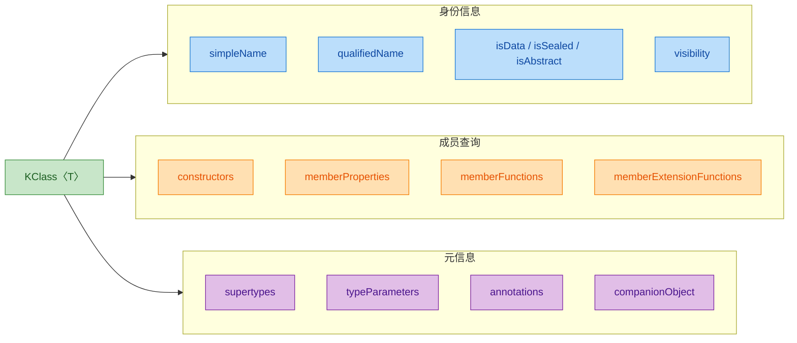

值得注意的是，`KClass` 与 Java 的 `java.lang.Class` 之间可以自由转换，这在与 Java 框架互操作时非常重要：

```kotlin
// Kotlin KClass -> Java Class
val javaClass: Class<User> = User::class.java

// Java Class -> Kotlin KClass
val kotlinClass: KClass<User> = javaClass.kotlin

// 从实例获取 Java Class（注意写法差异）
val user = User("Alice", 30)
val jClass: Class<out User> = user.javaClass      // Java 风格
val kClass: KClass<out User> = user::class         // Kotlin 风格
```

### KCallable —— 可调用元素的统一抽象

如果说 `KClass` 是"类的身份证"，那么 `KCallable<R>` 就是"一切可调用事物的通用协议"。在 Kotlin 反射体系中，`KCallable` 是 `KFunction` 和 `KProperty` 的共同父接口，它抽象了"可以被调用并返回结果"这一核心行为。

为什么需要这层抽象？因为在 Kotlin 中，属性的访问本质上也是函数调用（getter/setter），所以函数和属性在反射层面共享了大量公共特征：

```kotlin
import kotlin.reflect.KCallable

data class Book(val title: String, val price: Double) {
    fun describe(): String = "$title costs $$price"
}

fun exploreKCallable() {
    val kClass = Book::class

    // members 返回所有 KCallable（包含属性 + 函数 + 继承自 Any 的方法）
    kClass.members.forEach { callable: KCallable<*> ->
        println("${callable.name} -> 返回类型: ${callable.returnType}")
    }
    // 输出示例：
    // title -> 返回类型: kotlin.String
    // price -> 返回类型: kotlin.Double
    // describe -> 返回类型: kotlin.String
    // equals -> 返回类型: kotlin.Boolean
    // hashCode -> 返回类型: kotlin.Int
    // toString -> 返回类型: kotlin.String
    // copy -> 返回类型: Book
    // component1 -> 返回类型: kotlin.String
    // component2 -> 返回类型: kotlin.Double
}
```

`KCallable` 接口定义的核心属性和方法如下：

```kotlin
// KCallable 的关键成员（简化展示）
interface KCallable<out R> {
    val name: String                    // 名称（函数名或属性名）
    val parameters: List<KParameter>    // 参数列表
    val returnType: KType               // 返回类型
    val typeParameters: List<KTypeParameter>  // 泛型类型参数
    val visibility: KVisibility?        // 可见性（PUBLIC, PRIVATE 等）
    val isAbstract: Boolean             // 是否抽象
    val isFinal: Boolean                // 是否 final
    val isOpen: Boolean                 // 是否 open
    val isSuspend: Boolean              // 是否为挂起函数（协程相关）

    // 核心方法：通过反射调用
    fun call(vararg args: Any?): R      // 按位置传参调用
    fun callBy(args: Map<KParameter, Any?>): R  // 按命名参数调用（支持默认值）
}
```

`KCallable` 的继承体系构成了 Kotlin 反射的骨架：

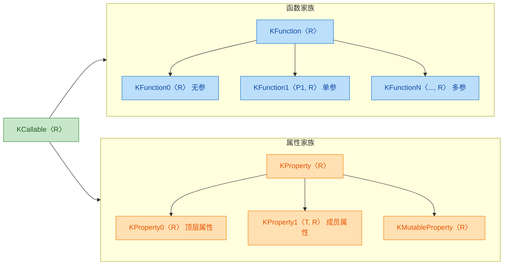

让我们通过一个实际例子来感受 `KCallable` 的 `call` 方法如何工作：

```kotlin
import kotlin.reflect.full.memberFunctions
import kotlin.reflect.full.primaryConstructor

data class Point(val x: Int, val y: Int) {
    fun distanceTo(other: Point): Double {
        // 计算两点之间的欧几里得距离
        val dx = (x - other.x).toDouble()
        val dy = (y - other.y).toDouble()
        return Math.sqrt(dx * dx + dy * dy)
    }
}

fun reflectiveCall() {
    // 1. 通过反射创建实例
    val ctor = Point::class.primaryConstructor!!  // 获取主构造函数
    val p1 = ctor.call(3, 4)                      // 反射调用构造函数，等价于 Point(3, 4)
    val p2 = ctor.call(0, 0)                      // 创建原点

    println(p1)  // Point(x=3, y=4)

    // 2. 通过反射调用成员函数
    val distFn = Point::class.memberFunctions
        .first { it.name == "distanceTo" }         // 按名称查找函数

    // call 的第一个参数是 receiver（即 this），后续是函数参数
    val distance = distFn.call(p1, p2)             // 等价于 p1.distanceTo(p2)
    println("Distance: $distance")                 // Distance: 5.0

    // 3. 查看函数的参数信息
    distFn.parameters.forEach { param ->
        println("参数: ${param.name}, 类型: ${param.type}, 索引: ${param.index}")
    }
    // 输出：
    // 参数: null, 类型: Point, 索引: 0       <-- 这是隐式的 this（receiver）
    // 参数: other, 类型: Point, 索引: 1      <-- 这是显式参数
}
```

注意 `call` 方法的一个重要细节：对于成员函数和成员属性，`parameters` 列表的第一个元素（index = 0）是 **receiver 实例**（即 `this`），它的 `name` 为 `null`。这是因为成员函数在 JVM 层面本质上是一个以实例为第一参数的静态方法。

最后，来看一下 `KCallable` 三大核心概念之间的协作关系：

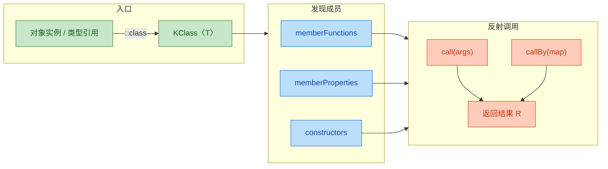

这三者的关系可以用一句话概括：**通过 `KClass` 进入反射世界，通过 `KCallable`（及其子类型 `KFunction`、`KProperty`）发现和操作类的成员，最终通过 `call` / `callBy` 完成运行时的动态调用**。

这就是 Kotlin 反射的全景入口。后续章节将逐一深入 `KFunction`、`KProperty`、`KParameter` 等具体接口，探索它们各自的独特能力。

---

**📝 练习题**

以下代码的输出是什么？

```kotlin
open class Base {
    open fun greet() = "Hello from Base"
}

class Derived : Base() {
    override fun greet() = "Hello from Derived"
}

fun main() {
    val obj: Base = Derived()
    val kClass = obj::class
    println("${kClass.simpleName}, ${kClass.isFinal}, ${kClass.isOpen}")
}
```

A. Base, false, true

B. Derived, true, false

C. Derived, false, true

D. Base, true, false

**【答案】** B

**【解析】** `obj::class` 获取的是对象的 **运行时实际类型**，而非声明类型。`obj` 虽然声明为 `Base`，但实际是 `Derived` 的实例，所以 `kClass.simpleName` 是 `"Derived"`。`Derived` 类没有用 `open` 修饰，Kotlin 中类默认是 `final` 的，因此 `isFinal = true`，`isOpen = false`。这道题考察两个核心点：反射尊重运行时类型，以及 Kotlin 类默认 final 的设计哲学。

---

## 类引用（Class References）

在 Kotlin 反射体系中，"类引用"是一切反射操作的起点。你要检查一个对象的类型、遍历它的成员、动态调用它的方法——第一步都是拿到这个类的引用。Kotlin 提供了 `::class` 语法来获取类引用，返回的是一个 `KClass` 实例。这个 `KClass` 就是 Kotlin 反射世界的"身份证"，它承载了一个类在运行时的全部元数据。

同时，由于 Kotlin 运行在 JVM 之上，它和 Java 的 `java.lang.Class` 之间存在紧密的互操作关系。理解两者的区别与转换方式，是掌握 Kotlin 反射的关键基础。

### ::class 语法获取类引用

Kotlin 中获取类引用有两种基本形式：通过类名直接获取（编译时已知类型），以及通过对象实例获取（运行时动态获取）。

```kotlin
import kotlin.reflect.KClass

// ========== 方式一：通过类名获取（编译期类型） ==========
// 语法：类名::class
// 返回类型：KClass<类名>，这是一个编译期就确定的精确类型
val stringClass: KClass<String> = String::class
// 此时 stringClass 的泛型参数是 String，编译器完全知道它指向哪个类

val intClass: KClass<Int> = Int::class
// 对于 Kotlin 基本类型，::class 返回的是 Kotlin 自己的 KClass
// 而不是 Java 的 int.class 或 Integer.class

// ========== 方式二：通过实例获取（运行时类型） ==========
// 语法：实例::class
// 返回类型：KClass<out T>，注意这里有 out 协变标记
val greeting: String = "Hello, Kotlin Reflection!"
val runtimeClass: KClass<out String> = greeting::class
// 为什么是 KClass<out String>？
// 因为实例的实际运行时类型可能是 String 的子类（虽然 String 是 final 的）
// 编译器用 out 来表达"至少是 String 或其子类型"的语义

// ========== 多态场景下的运行时类型 ==========
open class Animal(val name: String)          // 基类
class Dog(name: String) : Animal(name)       // 子类
class Cat(name: String) : Animal(name)       // 子类

fun printActualClass(animal: Animal) {
    // animal 的编译期类型是 Animal
    // 但 ::class 返回的是运行时的实际类型
    val kClass: KClass<out Animal> = animal::class
    println("编译期声明类型: Animal")
    println("运行时实际类型: ${kClass.simpleName}")
    // simpleName 返回类的简单名称（不含包名）
}

fun main() {
    printActualClass(Dog("Buddy"))
    // 输出：
    // 编译期声明类型: Animal
    // 运行时实际类型: Dog

    printActualClass(Cat("Whiskers"))
    // 输出：
    // 编译期声明类型: Animal
    // 运行时实际类型: Cat
}
```

这里有一个非常重要的细节值得展开：`::class` 返回的永远是对象的运行时实际类型（runtime type），而不是变量的编译期声明类型（declared type）。这和 Java 中 `obj.getClass()` 的行为一致。当你把一个 `Dog` 赋值给 `Animal` 类型的变量，再对它调用 `::class`，拿到的是 `Dog` 的 `KClass`，而不是 `Animal` 的。

再来看一个容易踩坑的场景——可空类型：

```kotlin
fun main() {
    // 可空类型的类引用
    val nullableStr: String? = "not null"
    // 注意：不能对可空变量直接用 ::class
    // val cls = nullableStr::class  // 编译错误！

    // 正确做法：先进行空检查，或使用安全调用
    if (nullableStr != null) {
        // 智能转换后，nullableStr 变成非空类型，可以安全使用 ::class
        val cls = nullableStr::class
        println(cls.simpleName) // 输出: String
    }

    // 另一种方式：使用 let
    nullableStr?.let {
        println(it::class.simpleName) // 输出: String
    }

    // 如果值确实为 null
    val actualNull: String? = null
    // actualNull::class  // 编译错误：不能对可空类型使用 ::class
    // 这是 Kotlin 的类型安全设计——null 没有类型，自然没有 KClass
}
```

### KClass 对象详解

`KClass<T>` 是 Kotlin 反射库（`kotlin-reflect`）中的核心接口，定义在 `kotlin.reflect` 包下。它是 Kotlin 对"类"这个概念的完整抽象，提供了比 Java `Class` 更丰富、更符合 Kotlin 语义的 API。

先来看 `KClass` 的核心属性和方法全景：

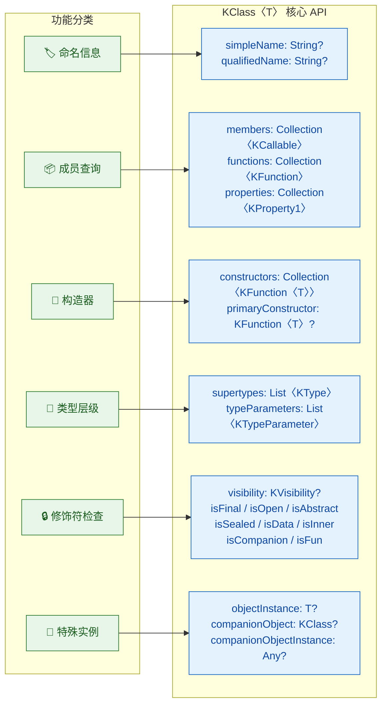

下面通过一个完整的示例来逐一探索这些 API：

```kotlin
import kotlin.reflect.KClass
import kotlin.reflect.full.*  // 引入扩展函数：memberProperties, memberFunctions 等

// 定义一个有代表性的类结构用于演示
data class User(
    val id: Long,              // 只读属性
    var name: String,          // 可变属性
    val email: String = ""     // 带默认值的属性
) {
    // 次构造器
    constructor(name: String) : this(0L, name, "")

    // 成员函数
    fun greet(): String = "Hi, I'm $name"

    // 伴生对象
    companion object {
        const val TABLE_NAME = "users"
        fun create(name: String): User = User(name = name)
    }
}

fun main() {
    // 获取 KClass 引用
    val kClass: KClass<User> = User::class

    // ========== 1. 命名信息 ==========
    println("simpleName: ${kClass.simpleName}")
    // 输出: simpleName: User
    // simpleName 是不含包名的短名称

    println("qualifiedName: ${kClass.qualifiedName}")
    // 输出: qualifiedName: com.example.User（取决于你的包名）
    // qualifiedName 是包含完整包路径的全限定名
    // 注意：匿名类和局部类的 qualifiedName 为 null

    // ========== 2. 修饰符检查 ==========
    println("isFinal: ${kClass.isFinal}")       // true，Kotlin 类默认 final
    println("isOpen: ${kClass.isOpen}")          // false
    println("isAbstract: ${kClass.isAbstract}")  // false
    println("isSealed: ${kClass.isSealed}")      // false
    println("isData: ${kClass.isData}")          // true，因为是 data class
    println("isInner: ${kClass.isInner}")        // false
    println("isCompanion: ${kClass.isCompanion}")// false，User 本身不是伴生对象

    // visibility 返回 KVisibility 枚举
    println("visibility: ${kClass.visibility}")  // PUBLIC

    // ========== 3. 构造器 ==========
    // primaryConstructor 获取主构造器
    val primaryCtor = kClass.primaryConstructor
    println("主构造器参数: ${primaryCtor?.parameters?.map { "${it.name}: ${it.type}" }}")
    // 输出: 主构造器参数: [id: kotlin.Long, name: kotlin.String, email: kotlin.String]

    // constructors 获取所有构造器（包括主构造器和次构造器）
    println("构造器总数: ${kClass.constructors.size}")
    // 输出: 构造器总数: 2（主构造器 + 次构造器）

    // ========== 4. 成员查询 ==========
    // memberProperties 获取类自身声明的属性（不含继承的）
    println("\n--- 成员属性 ---")
    kClass.memberProperties.forEach { prop ->
        // prop 是 KProperty1<User, *> 类型
        println("  ${prop.name}: ${prop.returnType}, 只读=${prop is kotlin.reflect.KMutableProperty1}")
    }
    // 输出:
    //   email: kotlin.String, 只读=false
    //   id: kotlin.Long, 只读=false
    //   name: kotlin.String, 只读=true  (var 属性是 KMutableProperty1)

    // memberFunctions 获取成员函数（含继承自 Any 的）
    println("\n--- 成员函数 ---")
    kClass.memberFunctions.forEach { func ->
        println("  ${func.name}(${func.parameters.size} params) -> ${func.returnType}")
    }
    // 会列出 greet, equals, hashCode, toString, copy, component1/2/3 等

    // ========== 5. 伴生对象 ==========
    val companion = kClass.companionObject
    println("\n伴生对象类名: ${companion?.simpleName}")
    // 输出: 伴生对象类名: Companion

    val companionInstance = kClass.companionObjectInstance
    println("伴生对象实例: $companionInstance")
    // 输出: 伴生对象实例: com.example.User$Companion@xxxx

    // ========== 6. 超类型信息 ==========
    println("\n--- 超类型 ---")
    kClass.supertypes.forEach { supertype ->
        println("  $supertype")
    }
    // 输出: kotlin.Any（data class 默认继承 Any）
}
```

关于 `KClass` 有几个值得注意的设计细节：

第一，`KClass` 的相等性（equality）。两个 `KClass` 实例只要指向同一个类，它们就是 `==` 相等的。这意味着你可以安全地用 `KClass` 作为 Map 的 key 或在 `when` 表达式中做类型分发：

```kotlin
fun describeType(kClass: KClass<*>): String = when (kClass) {
    // 直接用 KClass 实例做匹配
    String::class  -> "这是一个字符串类型"
    Int::class     -> "这是一个整数类型"
    List::class    -> "这是一个列表类型"
    else           -> "未知类型: ${kClass.simpleName}"
}

fun main() {
    println(describeType(String::class))  // 这是一个字符串类型
    println(describeType("hello"::class)) // 这是一个字符串类型
    // 无论通过类名还是实例获取，指向同一个类的 KClass 都相等
}
```

第二，`objectInstance` 属性。对于 `object` 声明（单例），`KClass` 提供了直接获取单例实例的能力：

```kotlin
object AppConfig {
    val version = "1.0.0"
    fun printVersion() = println("App v$version")
}

fun main() {
    val kClass = AppConfig::class
    // objectInstance 对于 object 声明返回其单例实例
    // 对于普通 class 返回 null
    val instance = kClass.objectInstance
    println(instance === AppConfig) // true，确实是同一个单例
    instance?.printVersion()        // App v1.0.0
}
```

第三，`KClass` 上的 `isInstance` 方法，相当于 Java 的 `instanceof` 的反射版本：

```kotlin
fun main() {
    val stringClass = String::class

    // isInstance 检查一个值是否是该类的实例
    println(stringClass.isInstance("hello"))  // true
    println(stringClass.isInstance(42))       // false
    println(stringClass.isInstance(null))     // false，null 不是任何类的实例

    // 这在需要动态类型检查时非常有用
    // 比如实现一个简单的依赖注入容器
    val registry = mutableMapOf<KClass<*>, Any>()
    registry[String::class] = "default"
    registry[Int::class] = 42

    // 类型安全的获取
    inline fun <reified T : Any> get(): T? {
        val value = registry[T::class]
        // 用 isInstance 做运行时类型验证
        return if (T::class.isInstance(value)) value as T else null
    }
}
```

### Java Class 对比与互操作

Kotlin 的 `KClass` 和 Java 的 `java.lang.Class` 是两套并行的反射体系。在纯 Kotlin 项目中你可以只用 `KClass`，但在与 Java 库互操作时（比如 Spring、Jackson、Gson 等），你经常需要在两者之间转换。

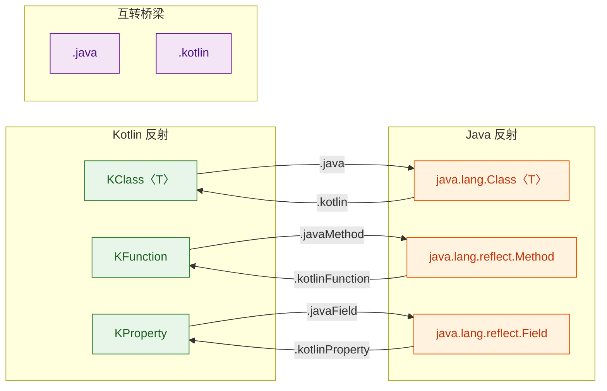

转换方式非常直观：

```kotlin
import kotlin.reflect.jvm.javaField
import kotlin.reflect.jvm.javaMethod
import kotlin.reflect.jvm.kotlinFunction
import kotlin.reflect.jvm.kotlinProperty

data class Person(val name: String, var age: Int)

fun main() {
    // ========== KClass <-> Java Class 互转 ==========

    // Kotlin -> Java：使用 .java 属性
    val kClass = Person::class
    val javaClass: Class<Person> = kClass.java
    println("Java Class: ${javaClass.name}")
    // 输出: Java Class: com.example.Person

    // Java -> Kotlin：使用 .kotlin 扩展属性
    val backToKClass = javaClass.kotlin
    println("KClass: ${backToKClass.simpleName}")
    // 输出: KClass: Person

    // 两者指向同一个类，互转后相等
    println("互转后相等: ${kClass == backToKClass}") // true

    // ========== 从实例获取 Java Class ==========
    val person = Person("Alice", 30)

    // 方式一：通过 KClass 中转
    val cls1 = person::class.java

    // 方式二：直接用 Java 风格（Kotlin 也支持）
    val cls2 = person.javaClass

    // 两者结果相同
    println("两种方式相等: ${cls1 == cls2}") // true

    // ========== KFunction <-> Method ==========
    val kFunction = Person::greet  // 假设 Person 有 greet 方法
    // 注意：需要 import kotlin.reflect.jvm.javaMethod
    // val javaMethod = kFunction.javaMethod
    // val backToKFunction = javaMethod?.kotlinFunction

    // ========== KProperty <-> Field ==========
    val kProperty = Person::name
    // 注意：需要 import kotlin.reflect.jvm.javaField
    val javaField = kProperty.javaField
    println("Java Field name: ${javaField?.name}")  // name
    println("Java Field type: ${javaField?.type}")   // class java.lang.String
    // val backToKProperty = javaField?.kotlinProperty
}
```

两套反射体系在设计哲学上有显著差异，下面做一个系统对比：

```kotlin
// ========== 差异一：基本类型的处理 ==========
fun main() {
    // Kotlin 的 KClass 对基本类型有统一的抽象
    val intKClass = Int::class
    println("KClass simpleName: ${intKClass.simpleName}")  // Int

    // 但转成 Java Class 时，会得到 primitive type
    val intJavaClass = Int::class.java
    println("Java Class: $intJavaClass")          // int
    println("是否基本类型: ${intJavaClass.isPrimitive}") // true

    // 如果你需要的是包装类型（Integer），使用 javaPrimitiveType / javaObjectType
    val intPrimitive = Int::class.javaPrimitiveType
    val intWrapper = Int::class.javaObjectType
    println("Primitive: $intPrimitive")  // int
    println("Wrapper: $intWrapper")      // class java.lang.Integer

    // 这个区别在与 Java 反射 API 交互时非常重要
    // 比如通过反射查找方法时，参数类型必须精确匹配

    // ========== 差异二：属性 vs 字段 ==========
    // Kotlin 的 KProperty 是"属性"的抽象，包含 getter/setter
    // Java 的 Field 是"字段"的抽象，是底层存储
    // 一个 Kotlin val 属性 = 一个 private Java field + 一个 public getter method
    // 一个 Kotlin var 属性 = 一个 private Java field + getter + setter

    // ========== 差异三：可空性信息 ==========
    // KClass/KType 保留了 Kotlin 的可空性信息
    // Java Class/Type 没有可空性概念（需要靠注解 @Nullable 等）
    data class Example(val nullable: String?, val nonNull: String)
    val props = Example::class.memberProperties
    props.forEach { p ->
        println("${p.name}: ${p.returnType}, isMarkedNullable=${p.returnType.isMarkedNullable}")
    }
    // 输出:
    // nonNull: kotlin.String, isMarkedNullable=false
    // nullable: kotlin.String?, isMarkedNullable=true
    // Java 反射无法区分这两者
}
```

最后，来看一个实际场景——与 Java 框架互操作时的类引用使用：

```kotlin
import kotlin.reflect.KClass

// 模拟一个简化的"服务定位器"模式
// 这在 Android 开发（Koin）和后端开发（Spring）中非常常见
class ServiceLocator {
    // 内部用 Java Class 作为 key（因为很多 Java 库需要 Class 对象）
    private val services = mutableMapOf<Class<*>, Any>()

    // 对外暴露 Kotlin 风格的 API，接受 KClass
    fun <T : Any> register(kClass: KClass<T>, instance: T) {
        // 内部转换为 Java Class 存储
        services[kClass.java] = instance
    }

    // 使用 reified 泛型让调用更自然
    inline fun <reified T : Any> get(): T? {
        // T::class 获取 KClass，.java 转为 Java Class 用于查找
        return services[T::class.java] as? T
    }

    // 也提供接受 Java Class 的重载，方便 Java 代码调用
    fun <T : Any> register(javaClass: Class<T>, instance: T) {
        services[javaClass] = instance
    }

    fun <T : Any> get(javaClass: Class<T>): T? {
        return services[javaClass] as? T
    }
}

// 使用示例
interface Logger { fun log(msg: String) }
class ConsoleLogger : Logger {
    override fun log(msg: String) = println("[LOG] $msg")
}

fun main() {
    val locator = ServiceLocator()

    // Kotlin 风格注册
    locator.register(Logger::class, ConsoleLogger())

    // Kotlin 风格获取（利用 reified，无需传 class 参数）
    val logger = locator.get<Logger>()
    logger?.log("Service located!") // [LOG] Service located!

    // Java 风格获取（在与 Java 代码互操作时使用）
    val logger2 = locator.get(Logger::class.java)
    logger2?.log("Java style!")     // [LOG] Java style!
}
```

总结一下 `KClass` 和 Java `Class` 的核心差异：

| 维度 | KClass (Kotlin) | Class (Java) |
|------|-----------------|--------------|
| 包路径 | `kotlin.reflect.KClass` | `java.lang.Class` |
| 可空性感知 | 保留 `?` 信息 | 无可空性概念 |
| 属性抽象 | `KProperty`（getter/setter） | `Field`（底层字段） |
| 基本类型 | 统一为 `Int::class` 等 | 区分 `int.class` 和 `Integer.class` |
| 默认值信息 | 可通过 `KParameter.isOptional` 获取 | 无法感知 |
| data class 感知 | `isData` 属性 | 无直接支持 |
| sealed class 感知 | `isSealed` + `sealedSubclasses` | 无直接支持 |
| 互转方式 | `.java` 转为 Java Class | `.kotlin` 转为 KClass |

---

**📝 练习题**

以下代码的输出是什么？

```kotlin
open class Base
class Derived : Base()

fun identify(obj: Base) {
    val kClass = obj::class
    println("${kClass.simpleName}, isFinal=${kClass.isFinal}")
}

fun main() {
    identify(Derived())
}
```

A. `Base, isFinal=false`

B. `Derived, isFinal=true`

C. `Base, isFinal=true`

D. `Derived, isFinal=false`

**【答案】** B

**【解析】** `obj::class` 返回的是运行时实际类型，而不是编译期声明类型。虽然参数 `obj` 的声明类型是 `Base`，但传入的实际对象是 `Derived()`，所以 `obj::class` 得到的是 `Derived` 的 `KClass`。`simpleName` 自然是 `"Derived"`。而 `Derived` 类没有用 `open` 修饰，Kotlin 中类默认是 `final` 的，因此 `isFinal` 为 `true`。这道题同时考察了两个核心知识点：`::class` 的运行时语义，以及 Kotlin "默认 final"的设计哲学。

---

## 类型信息（Type Introspection）

拿到 `KClass` 对象只是反射的第一步，真正有价值的操作是从中 **提取类型信息**——类叫什么名字、有哪些成员、继承了谁、泛型参数是什么。Kotlin 反射库围绕 `KClass<T>` 提供了一整套属性和方法，让你在运行时像翻阅说明书一样审视任何类的内部结构。这一节我们逐一拆解这些 API，并通过实际代码演示它们的用法和注意事项。

---

### simpleName 与 qualifiedName —— 类的"身份证"

每个类都有两个名字：**简单名（simple name）** 和 **全限定名（qualified name）**。它们分别对应 `KClass` 的两个属性：

- `simpleName: String?` —— 类的短名称，不含包路径。例如 `String` 的 simpleName 就是 `"String"`。
- `qualifiedName: String?` —— 类的完整路径名，包含包名。例如 `"kotlin.String"`。

两者都是可空类型 `String?`，因为某些特殊类（匿名对象、局部类、lambda 生成的类）在语言层面没有名字。

```kotlin
// 定义一个普通的数据类
data class User(val name: String, val age: Int)

fun main() {
    // 通过 ::class 获取 KClass 实例
    val kClass = User::class

    // simpleName: 只返回类名本身，不含包路径
    println(kClass.simpleName)      // 输出: User

    // qualifiedName: 返回 "包名.类名" 的完整路径
    println(kClass.qualifiedName)   // 输出: com.example.User（取决于你的包声明）
}
```

对于匿名对象和局部类，这两个属性会返回 `null`：

```kotlin
fun main() {
    // 匿名对象没有语言层面的名字
    val anonymous = object : Runnable {
        override fun run() {}
    }

    // 匿名对象的 simpleName 和 qualifiedName 均为 null
    println(anonymous::class.simpleName)      // 输出: null
    println(anonymous::class.qualifiedName)   // 输出: null

    // 函数内部定义的局部类
    class LocalHelper

    // 局部类有 simpleName，但 qualifiedName 为 null
    println(LocalHelper::class.simpleName)      // 输出: LocalHelper
    println(LocalHelper::class.qualifiedName)   // 输出: null
}
```

这个行为在做日志框架、序列化框架时非常关键——你不能盲目对 `qualifiedName` 做 `!!` 非空断言，否则遇到匿名类就会崩溃。安全的做法是始终用 `?:` 提供一个 fallback：

```kotlin
fun safeClassName(kClass: KClass<*>): String {
    // 优先使用 qualifiedName，其次 simpleName，最后兜底 "<anonymous>"
    return kClass.qualifiedName
        ?: kClass.simpleName
        ?: "<anonymous>"
}
```

下面这张图展示了不同类型的名称解析结果：

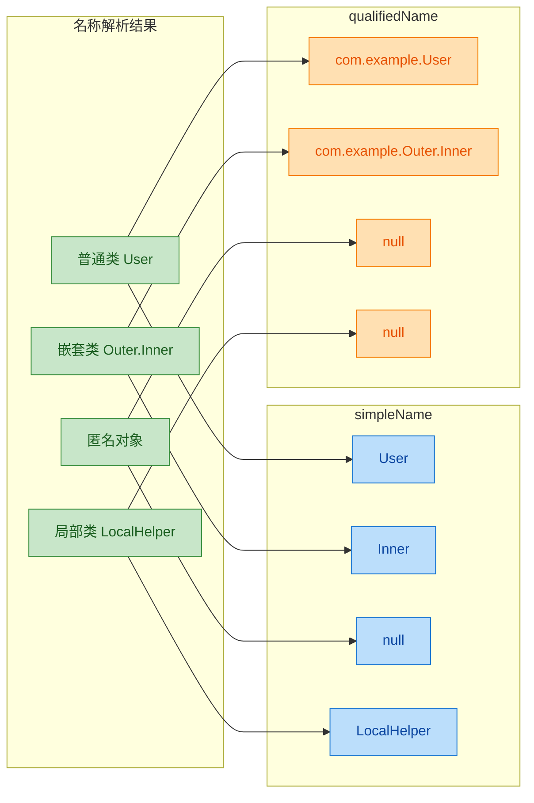

还有一个容易忽略的细节：**Kotlin 内置类型的 qualifiedName 使用的是 Kotlin 的包路径，而非 Java 的**。比如 `Int::class.qualifiedName` 返回 `"kotlin.Int"` 而不是 `"java.lang.Integer"`。如果你需要 Java 侧的全限定名，应该走 `Int::class.java.name`，它会返回 `"int"`（基本类型）或 `"java.lang.Integer"`（包装类型）。

---

### 成员列表 —— 透视类的内部结构

`KClass` 提供了多个属性来获取类的成员，它们返回的都是 `Collection`，让你可以遍历、过滤、搜索：

| 属性 | 返回类型 | 包含内容 |
|---|---|---|
| `members` | `Collection<KCallable<*>>` | 所有成员（属性 + 函数），含继承的 |
| `declaredMembers` | `Collection<KCallable<*>>` | 仅本类声明的成员，不含继承的 |
| `functions` | `Collection<KFunction<*>>` | 所有函数，含继承的 |
| `declaredFunctions` | `Collection<KFunction<*>>` | 仅本类声明的函数 |
| `memberProperties` | `Collection<KProperty1<T, *>>` | 所有成员属性，含继承的 |
| `declaredMemberProperties` | `Collection<KProperty1<T, *>>` | 仅本类声明的属性 |
| `constructors` | `Collection<KFunction<T>>` | 所有构造函数 |

`declared` 前缀是一个重要的过滤维度：带 `declared` 的只返回当前类自己定义的成员，不带的则会把从父类、接口继承来的成员也一并列出。

```kotlin
import kotlin.reflect.full.*  // 需要引入反射扩展库

// 定义一个基类
open class Animal(val species: String) {
    // 基类中的一个普通方法
    open fun sound(): String = "..."
}

// 子类继承 Animal，并新增自己的属性和方法
class Dog(
    val name: String,       // Dog 自己声明的属性
    val age: Int            // Dog 自己声明的属性
) : Animal("Canine") {
    // Dog 自己声明的方法
    fun fetch(item: String): String = "$name fetches $item"

    // 重写父类方法
    override fun sound(): String = "Woof!"
}

fun main() {
    val kClass = Dog::class

    // --- members: 包含自身 + 继承的所有成员 ---
    println("=== members (全部成员) ===")
    kClass.members.forEach { member ->
        // 打印每个成员的名称和返回类型
        println("  ${member.name} -> ${member.returnType}")
    }
    // 会看到: name, age, fetch, sound, species, equals, hashCode, toString 等

    println()

    // --- declaredMembers: 仅 Dog 自己声明的成员 ---
    println("=== declaredMembers (仅自身声明) ===")
    kClass.declaredMembers.forEach { member ->
        println("  ${member.name} -> ${member.returnType}")
    }
    // 只会看到: name, age, fetch, sound（因为 sound 被 override 了，算 Dog 声明的）

    println()

    // --- declaredMemberProperties: 仅 Dog 自己声明的属性 ---
    println("=== declaredMemberProperties ===")
    kClass.declaredMemberProperties.forEach { prop ->
        // 属性有 name 和 returnType
        println("  ${prop.name}: ${prop.returnType}")
    }
    // 输出: name: kotlin.String, age: kotlin.Int

    println()

    // --- constructors: 所有构造函数 ---
    println("=== constructors ===")
    kClass.constructors.forEach { ctor ->
        // 打印构造函数的参数列表
        val params = ctor.parameters.joinToString { "${it.name}: ${it.type}" }
        println("  constructor($params)")
    }
    // 输出: constructor(name: kotlin.String, age: kotlin.Int)
}
```

一个实用技巧是结合 `filterIsInstance` 来精确筛选成员类型：

```kotlin
import kotlin.reflect.KMutableProperty1
import kotlin.reflect.full.memberProperties

data class Config(
    var host: String = "localhost",  // 可变属性
    var port: Int = 8080,            // 可变属性
    val version: String = "1.0"      // 不可变属性
)

fun main() {
    val kClass = Config::class

    // 从所有成员属性中，筛选出可变属性（var 声明的）
    val mutableProps = kClass.memberProperties
        .filterIsInstance<KMutableProperty1<Config, *>>()

    println("可变属性:")
    mutableProps.forEach { prop ->
        // KMutableProperty1 才有 set 方法
        println("  var ${prop.name}: ${prop.returnType}")
    }
    // 输出: var host: kotlin.String, var port: kotlin.Int
    // version 不会出现，因为它是 val
}
```

这种模式在依赖注入框架、ORM 映射、配置加载器中非常常见——框架需要知道哪些字段可以被赋值。

---

### 超类与继承链 —— supertypes 和 superclasses

`KClass` 提供了 `supertypes` 属性来获取当前类的所有直接父类型（包括父类和接口），返回类型是 `List<KType>`：

```kotlin
import kotlin.reflect.full.supertypes
import kotlin.reflect.full.superclasses

// 定义接口
interface Serializable
interface Loggable {
    fun log(message: String)
}

// 抽象基类
abstract class BaseEntity(val id: Long)

// 具体类，同时继承基类和两个接口
class Order(
    id: Long,
    val product: String,
    val quantity: Int
) : BaseEntity(id), Serializable, Loggable {
    override fun log(message: String) {
        println("[Order#$id] $message")
    }
}

fun main() {
    val kClass = Order::class

    // --- supertypes: 返回 List<KType>，包含直接父类和接口 ---
    println("=== supertypes (直接父类型) ===")
    kClass.supertypes.forEach { supertype ->
        // KType 的 toString() 会显示完整的类型信息
        println("  $supertype")
    }
    // 输出:
    //   BaseEntity
    //   Serializable
    //   Loggable

    println()

    // --- superclasses: 返回 List<KClass<*>>，只包含类（不含接口） ---
    println("=== superclasses ===")
    kClass.superclasses.forEach { superclass ->
        println("  ${superclass.simpleName}")
    }
    // 输出:
    //   BaseEntity
    //   Any（所有 Kotlin 类的隐式父类）
}
```

注意 `supertypes` 和 `superclasses` 的区别：

- `supertypes` 返回 `List<KType>`，包含接口，且保留泛型参数信息。
- `superclasses` 返回 `List<KClass<*>>`，只包含类（class），不含接口（interface）。

如果你需要遍历完整的继承链（不只是直接父类），可以写一个递归函数：

```kotlin
import kotlin.reflect.KClass
import kotlin.reflect.full.superclasses

/**
 * 递归收集一个类的完整继承链（BFS 广度优先）
 * 返回从当前类到 Any 的所有祖先类
 */
fun KClass<*>.allSuperclasses(): List<KClass<*>> {
    // 用一个可变集合做去重（菱形继承时同一个类可能出现多次）
    val visited = mutableSetOf<KClass<*>>()
    // BFS 队列
    val queue = ArrayDeque<KClass<*>>()

    // 将直接父类加入队列
    queue.addAll(this.superclasses)

    while (queue.isNotEmpty()) {
        // 取出队首元素
        val current = queue.removeFirst()
        // 如果已经访问过，跳过（处理菱形继承）
        if (current in visited) continue
        // 标记为已访问
        visited.add(current)
        // 将 current 的父类也加入队列
        queue.addAll(current.superclasses)
    }

    return visited.toList()
}

fun main() {
    // ArrayList 的继承链相当深
    val chain = ArrayList::class.allSuperclasses()
    chain.forEach { println(it.simpleName) }
    // 会看到: AbstractMutableList, MutableList, AbstractMutableCollection, ... Any
}
```

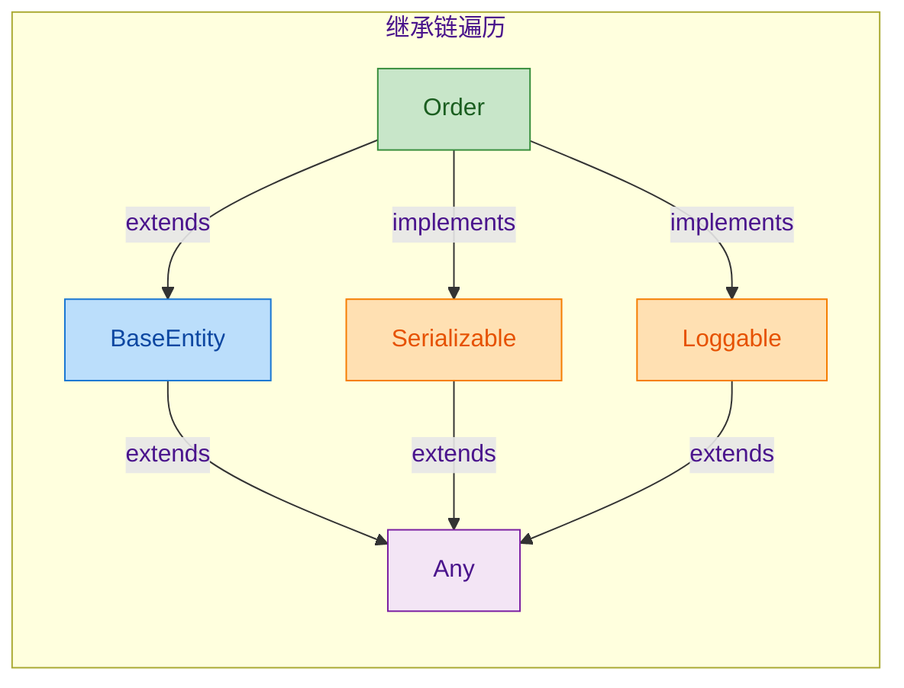

---

### 泛型信息 —— typeParameters 与 KTypeParameter

Kotlin 的泛型在编译后会被擦除（type erasure），但反射 API 仍然能在运行时读取类声明时的 **类型参数元数据**。`KClass.typeParameters` 返回 `List<KTypeParameter>`，每个 `KTypeParameter` 包含：

- `name: String` —— 类型参数的名称，如 `T`、`K`、`V`。
- `upperBounds: List<KType>` —— 上界约束列表。没有显式约束时默认是 `[Any?]`。
- `variance: KVariance` —— 声明处型变（declaration-site variance），值为 `INVARIANT`、`IN` 或 `OUT`。

```kotlin
import kotlin.reflect.KTypeParameter
import kotlin.reflect.KVariance

// 一个带有多个类型参数的泛型类
// out V 表示协变，T : Comparable<T> 表示有上界约束
class Repository<K : Any, out V : Comparable<V>>(
    private val store: MutableMap<K, V> = mutableMapOf()
)

fun main() {
    val kClass = Repository::class

    println("类名: ${kClass.simpleName}")
    println("类型参数数量: ${kClass.typeParameters.size}")
    println()

    kClass.typeParameters.forEachIndexed { index, param: KTypeParameter ->
        println("--- 类型参数 #$index ---")

        // name: 类型参数的名称
        println("  名称: ${param.name}")

        // variance: 声明处型变
        val varianceStr = when (param.variance) {
            KVariance.INVARIANT -> "不变 (invariant)"   // 既不是 in 也不是 out
            KVariance.IN        -> "逆变 (in)"          // 消费者
            KVariance.OUT       -> "协变 (out)"         // 生产者
        }
        println("  型变: $varianceStr")

        // upperBounds: 上界约束列表
        println("  上界约束:")
        param.upperBounds.forEach { bound ->
            println("    $bound")
        }
        println()
    }
}
```

输出：

```
类名: Repository
类型参数数量: 2

--- 类型参数 #0 ---
  名称: K
  型变: 不变 (invariant)
  上界约束:
    kotlin.Any

--- 类型参数 #1 ---
  名称: V
  型变: 协变 (out)
  上界约束:
    java.lang.Comparable<V>
```

注意几个要点：

1. `K : Any` 的上界是 `kotlin.Any`（非空），而如果写 `K`（无约束），上界会是 `kotlin.Any?`（可空）。
2. `out V` 的 variance 是 `KVariance.OUT`，这是声明处型变（declaration-site variance），和 Java 的 `? extends` 使用处型变不同。
3. 类型擦除意味着你无法在运行时知道某个 `Repository` 实例的 `K` 具体是 `String` 还是 `Int`——`typeParameters` 只告诉你类声明时的参数元数据，不是实例化时的具体类型。

如果你需要获取实例化时的具体类型参数，需要借助 `KType`（通常从属性或函数的返回类型中获取）：

```kotlin
import kotlin.reflect.full.memberProperties
import kotlin.reflect.full.createType
import kotlin.reflect.jvm.jvmErasure

// 一个持有泛型属性的类
class Container {
    // 这个属性的类型是 List<String>，泛型参数在编译时被记录到元数据中
    val items: List<String> = listOf("a", "b", "c")

    // Map<String, Int> 有两个类型参数
    val mapping: Map<String, Int> = mapOf("x" to 1)
}

fun main() {
    val kClass = Container::class

    kClass.memberProperties.forEach { prop ->
        println("属性: ${prop.name}")

        // prop.returnType 是 KType，包含完整的泛型信息
        val returnType = prop.returnType
        println("  返回类型: $returnType")

        // jvmErasure: 擦除后的原始类型
        println("  擦除类型: ${returnType.jvmErasure.simpleName}")

        // arguments: 类型参数列表，每个元素是 KTypeProjection
        if (returnType.arguments.isNotEmpty()) {
            println("  类型参数:")
            returnType.arguments.forEachIndexed { i, projection ->
                // projection.type 可能为 null（星号投影 * 时）
                val typeStr = projection.type?.toString() ?: "*"
                // projection.variance 表示使用处型变（null 表示 * 投影）
                val varianceStr = projection.variance?.name ?: "STAR"
                println("    [$i] $typeStr ($varianceStr)")
            }
        }
        println()
    }
}
```

输出：

```
属性: items
  返回类型: kotlin.collections.List<kotlin.String>
  擦除类型: List
  类型参数:
    [0] kotlin.String (OUT)

属性: mapping
  返回类型: kotlin.collections.Map<kotlin.String, kotlin.Int>
  擦除类型: Map
  类型参数:
    [0] kotlin.String (INVARIANT)
    [1] kotlin.Int (INVARIANT)
```

这里 `List<String>` 的类型参数显示 `OUT` 是因为 `List` 在 Kotlin 中声明为 `interface List<out E>`，所以 `E` 的 variance 是 `OUT`。而 `Map<K, V>` 的 `K` 和 `V` 都是 `INVARIANT`。

下面这张图总结了 `KClass` 类型信息 API 的整体结构：

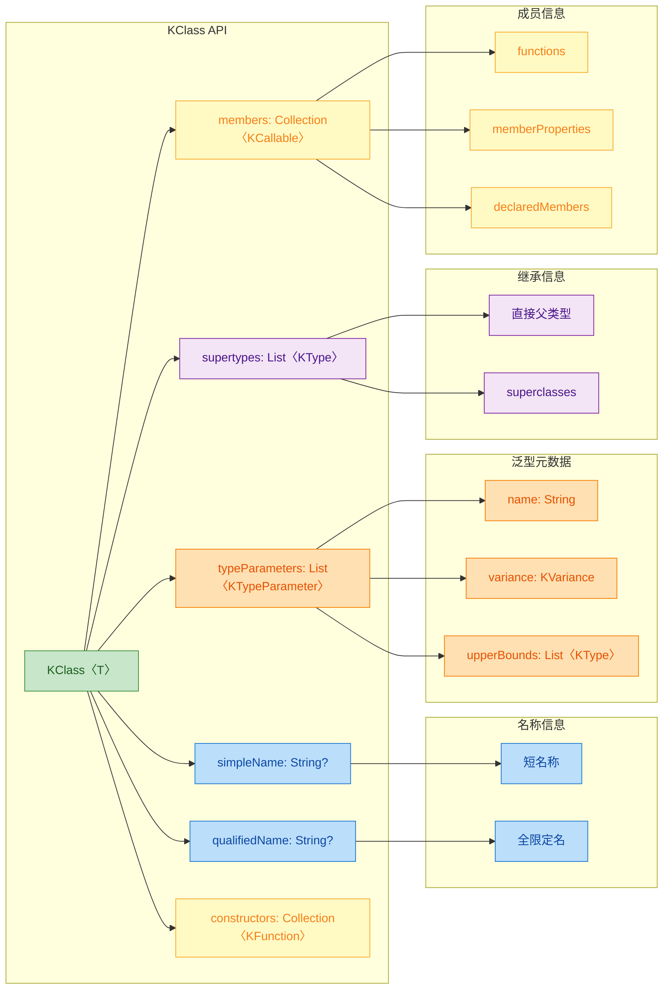

---

### 其他实用的 KClass 属性

除了上面重点讲解的几个 API，`KClass` 还有一些非常实用的布尔属性和辅助属性，在框架开发中经常用到：

```kotlin
import kotlin.reflect.full.*

// 密封类
sealed class Shape {
    data class Circle(val radius: Double) : Shape()
    data class Rectangle(val w: Double, val h: Double) : Shape()
}

// 抽象类
abstract class Engine

// 伴生对象示例
class MyService {
    companion object Factory {
        fun create(): MyService = MyService()
    }
}

fun main() {
    // --- isAbstract: 是否是抽象类 ---
    println("Engine isAbstract: ${Engine::class.isAbstract}")           // true
    println("Shape isAbstract: ${Shape::class.isAbstract}")             // true（sealed 也是 abstract）
    println("Shape.Circle isAbstract: ${Shape.Circle::class.isAbstract}") // false

    // --- isSealed: 是否是密封类 ---
    println("Shape isSealed: ${Shape::class.isSealed}")                 // true

    // --- sealedSubclasses: 密封类的所有直接子类 ---
    println("Shape 的子类:")
    Shape::class.sealedSubclasses.forEach {
        println("  ${it.simpleName}")
    }
    // 输出: Circle, Rectangle

    // --- isData: 是否是 data class ---
    println("Circle isData: ${Shape.Circle::class.isData}")             // true

    // --- isCompanion: 是否是伴生对象 ---
    println("Factory isCompanion: ${MyService.Factory::class.isCompanion}") // true

    // --- companionObject: 获取伴生对象的 KClass ---
    val companion = MyService::class.companionObject
    println("MyService 的伴生对象: ${companion?.simpleName}")            // Factory

    // --- companionObjectInstance: 获取伴生对象的实例 ---
    val instance = MyService::class.companionObjectInstance
    println("伴生对象实例: $instance")

    // --- isOpen / isFinal ---
    println("Shape isOpen: ${Shape::class.isOpen}")                     // false（sealed 不是 open）
    println("Shape isFinal: ${Shape::class.isFinal}")                   // false（sealed 也不是 final）

    // --- visibility: 可见性修饰符 ---
    println("MyService visibility: ${MyService::class.visibility}")     // PUBLIC

    // --- objectInstance: 获取 object 单例的实例 ---
    // 对于 object 声明（单例），这个属性返回唯一实例；对于普通类返回 null
    object AppConfig {
        val debug = true
    }
    // 注意：局部 object 无法通过 ::class.objectInstance 获取
}
```

这些属性在以下场景中特别有用：

- `isSealed` + `sealedSubclasses`：序列化框架用来自动注册所有子类型（如 kotlinx.serialization 的多态序列化）。
- `isData`：ORM 框架判断是否可以自动生成 `copy()`、`toString()` 等。
- `companionObjectInstance`：依赖注入框架通过伴生对象提供工厂方法。
- `isAbstract`：框架在尝试实例化类之前先检查，避免 `InstantiationException`。

---

### 综合实战：运行时类信息打印器

把上面所有知识点串起来，写一个通用的"类信息打印器"，可以对任意类输出完整的反射报告：

```kotlin
import kotlin.reflect.KClass
import kotlin.reflect.KVisibility
import kotlin.reflect.full.*

/**
 * 打印一个 KClass 的完整类型信息报告
 * 包括：名称、修饰符、类型参数、继承关系、成员列表
 */
fun <T : Any> printClassReport(kClass: KClass<T>) {
    // ========== 1. 基本名称信息 ==========
    println("╔══════════════════════════════════════")
    println("║ 类名: ${kClass.simpleName ?: "<anonymous>"}")
    println("║ 全限定名: ${kClass.qualifiedName ?: "<none>"}")

    // ========== 2. 修饰符信息 ==========
    val modifiers = buildList {
        if (kClass.isAbstract) add("abstract")       // 是否抽象
        if (kClass.isSealed) add("sealed")           // 是否密封
        if (kClass.isData) add("data")               // 是否数据类
        if (kClass.isOpen) add("open")               // 是否可继承
        if (kClass.isFinal) add("final")             // 是否最终类
        if (kClass.isCompanion) add("companion")     // 是否伴生对象
        if (kClass.isInner) add("inner")             // 是否内部类
        if (kClass.isFun) add("fun")                 // 是否函数式接口
        if (kClass.isValue) add("value")             // 是否值类
    }
    println("║ 修饰符: ${modifiers.joinToString(", ").ifEmpty { "none" }}")
    println("║ 可见性: ${kClass.visibility ?: "unknown"}")

    // ========== 3. 类型参数 ==========
    if (kClass.typeParameters.isNotEmpty()) {
        println("║ 类型参数:")
        kClass.typeParameters.forEach { tp ->
            // 显示名称、型变、上界
            val bounds = tp.upperBounds.joinToString(" & ")
            println("║   ${tp.variance.name} ${tp.name} : $bounds")
        }
    }

    // ========== 4. 继承关系 ==========
    println("║ 直接父类型:")
    kClass.supertypes.forEach { st ->
        println("║   $st")
    }

    // ========== 5. 构造函数 ==========
    println("║ 构造函数 (${kClass.constructors.size} 个):")
    kClass.constructors.forEach { ctor ->
        val params = ctor.parameters.joinToString(", ") {
            // 显示参数名、类型、是否可选
            val optional = if (it.isOptional) " = ..." else ""
            "${it.name}: ${it.type}$optional"
        }
        println("║   constructor($params)")
    }

    // ========== 6. 声明的属性 ==========
    println("║ 声明的属性 (${kClass.declaredMemberProperties.size} 个):")
    kClass.declaredMemberProperties.forEach { prop ->
        // 判断是 val 还是 var
        val mutability = if (prop is kotlin.reflect.KMutableProperty<*>) "var" else "val"
        val vis = prop.visibility?.name?.lowercase() ?: ""
        println("║   $vis $mutability ${prop.name}: ${prop.returnType}")
    }

    // ========== 7. 声明的函数 ==========
    println("║ 声明的函数 (${kClass.declaredFunctions.size} 个):")
    kClass.declaredFunctions.forEach { func ->
        val params = func.parameters
            .drop(1) // 第一个参数是 receiver（this），跳过
            .joinToString(", ") { "${it.name}: ${it.type}" }
        println("║   fun ${func.name}($params): ${func.returnType}")
    }

    println("╚══════════════════════════════════════")
}

// ---------- 测试用的类 ----------
interface Printable {
    fun prettyPrint(): String
}

data class Book(
    val title: String,
    val author: String,
    val year: Int = 2024
) : Printable {
    var rating: Double = 0.0

    override fun prettyPrint(): String = "\"$title\" by $author ($year)"

    fun isClassic(): Boolean = year < 2000
}

fun main() {
    // 对 Book 类执行完整的反射报告
    printClassReport(Book::class)
}
```

输出效果类似：

```
╔══════════════════════════════════════
║ 类名: Book
║ 全限定名: com.example.Book
║ 修饰符: data, final
║ 可见性: PUBLIC
║ 直接父类型:
║   com.example.Printable
║   kotlin.Any
║ 构造函数 (1 个):
║   constructor(title: kotlin.String, author: kotlin.String, year: kotlin.Int = ...)
║ 声明的属性 (4 个):
║   public val title: kotlin.String
║   public val author: kotlin.String
║   public val year: kotlin.Int
║   public var rating: kotlin.Double
║ 声明的函数 (2 个):
║   fun prettyPrint(): kotlin.String
║   fun isClassic(): kotlin.Boolean
╚══════════════════════════════════════
```

这个工具函数本身就是对本节所有 API 的一次综合演练。在实际项目中，类似的逻辑被广泛用于：

- 调试工具（运行时打印对象结构）
- 文档生成器（自动从代码生成 API 文档）
- 序列化框架（扫描属性列表，决定如何编码/解码）
- 依赖注入容器（分析构造函数参数，自动注入依赖）

---

**📝 练习题**

以下代码的输出是什么？

```kotlin
import kotlin.reflect.full.declaredMemberProperties
import kotlin.reflect.full.memberProperties

open class Parent {
    val x: Int = 1
    val y: String = "hello"
}

class Child : Parent() {
    val z: Double = 3.14
}

fun main() {
    val declared = Child::class.declaredMemberProperties.map { it.name }.sorted()
    val all = Child::class.memberProperties.map { it.name }.sorted()
    println("declared=$declared, all=$all")
}
```

A. `declared=[x, y, z], all=[x, y, z]`

B. `declared=[z], all=[x, y, z]`

C. `declared=[z], all=[z]`

D. `declared=[x, y], all=[x, y, z]`

**【答案】** B

**【解析】** `declaredMemberProperties` 只返回当前类自身声明的属性，`Child` 只声明了 `z`，所以 declared 列表是 `[z]`。而 `memberProperties` 返回包含继承在内的所有成员属性，`Child` 从 `Parent` 继承了 `x` 和 `y`，加上自己的 `z`，排序后是 `[x, y, z]`。这道题的核心考点就是 `declared` 前缀的过滤语义——它是反射 API 中区分"自身声明"与"全部可见"的关键分界线。

---

## KFunction 接口：函数引用、参数信息与调用

Kotlin 反射体系中，`KFunction` 是描述函数元数据的核心接口。如果说 `KClass` 让你在运行时"看见"一个类的全貌，那么 `KFunction` 就是让你在运行时"看见并操控"一个函数——你可以获取它的名称、参数列表、返回类型，甚至直接调用它，而无需在编译期知道具体调用的是哪个函数。这种能力在依赖注入框架、序列化引擎、测试工具和插件系统中极为常见。

`KFunction` 继承自 `KCallable<R>`，而 `KCallable` 又继承自 `(args) -> R` 的函数类型概念。整个继承链条是：

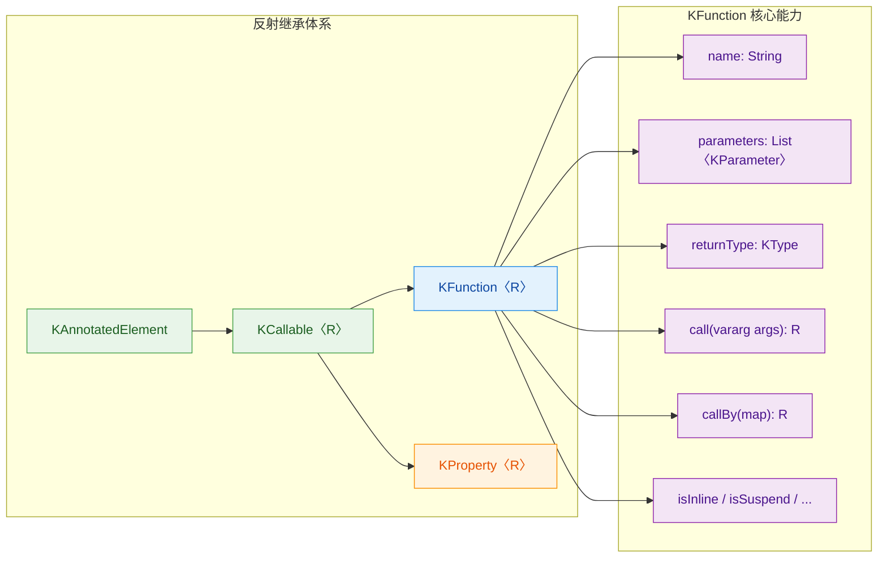

从图中可以看出，`KFunction` 从 `KCallable` 继承了 `name`、`parameters`、`returnType`、`call` 等核心成员，同时自身还额外提供了 `isInline`、`isSuspend`、`isOperator` 等函数特有的元数据标志。

### 函数引用：从编译期符号到运行时对象

在 Kotlin 中，获取一个函数的反射引用使用双冒号 `::` 语法。这个操作会将一个编译期的函数符号转化为一个运行时的 `KFunction` 对象，从而让你可以像操作普通对象一样操作这个函数。

```kotlin
// 定义一个普通的顶层函数
fun greet(name: String): String {
    return "Hello, $name!"
}

fun main() {
    // 使用 :: 获取函数引用，得到 KFunction1<String, String> 类型
    val funcRef = ::greet

    // funcRef 现在是一个对象，可以赋值、传递、存储
    println(funcRef)           // 输出: fun greet(kotlin.String): kotlin.String
    println(funcRef("World"))  // 像普通函数一样调用，输出: Hello, World!
}
```

这里有一个关键概念需要理解：`::greet` 返回的类型实际上同时实现了两个接口——`KFunction1<String, String>`（反射接口）和 `(String) -> String`（函数类型接口）。这意味着函数引用既可以用于反射操作，也可以作为高阶函数的参数传递：

```kotlin
fun square(x: Int): Int = x * x

fun main() {
    val ref = ::square

    // 作为反射对象使用 —— 获取元数据
    println(ref.name)        // 输出: square
    println(ref.returnType)  // 输出: kotlin.Int

    // 作为函数类型使用 —— 传入高阶函数
    val results = listOf(1, 2, 3, 4).map(ref)
    println(results)         // 输出: [1, 4, 9, 16]
}
```

函数引用不仅限于顶层函数，还可以引用类的成员函数、构造函数、扩展函数等。不同来源的函数引用在使用方式上有细微差别：

```kotlin
class Calculator {
    // 成员函数
    fun add(a: Int, b: Int): Int = a + b
}

fun String.exclaim(): String = "$this!"  // 扩展函数

fun main() {
    // ① 成员函数引用：第一个参数是接收者实例
    val addRef = Calculator::add
    val calc = Calculator()
    // 成员函数引用调用时，第一个参数必须传入实例对象
    println(addRef.call(calc, 3, 5))  // 输出: 8

    // ② 绑定成员函数引用：已绑定特定实例，无需再传接收者
    val boundAddRef = calc::add
    println(boundAddRef.call(10, 20)) // 输出: 30

    // ③ 扩展函数引用：与成员函数类似，第一个参数是接收者
    val exclaimRef = String::exclaim
    println(exclaimRef.call("Kotlin")) // 输出: Kotlin!

    // ④ 构造函数引用：使用 ::ClassName 语法
    val ctorRef = ::Calculator
    val newCalc = ctorRef.call()       // 创建新实例
    println(newCalc)                   // 输出: Calculator@xxxx
}
```

这里有一个容易混淆的点：`Calculator::add` 和 `calc::add` 的区别。前者是未绑定引用（unbound reference），它的 `parameters` 列表中第一个参数是 `Calculator` 实例；后者是绑定引用（bound reference），实例已经固定，`parameters` 中不再包含接收者参数。

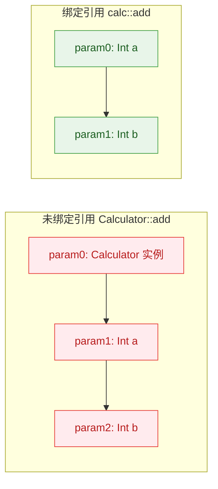

### 参数信息：深入 KFunction 的参数元数据

每个 `KFunction` 都持有一个 `parameters` 属性，返回 `List<KParameter>`。通过遍历这个列表，你可以在运行时获取函数每个参数的完整信息——名称、类型、是否可选、在参数列表中的位置，甚至它的种类（普通参数、接收者、扩展接收者等）。

```kotlin
import kotlin.reflect.full.* // 引入反射扩展
import kotlin.reflect.KParameter

// 定义一个参数丰富的函数，用于演示参数元数据
fun sendMessage(
    to: String,                    // 必选参数
    message: String,               // 必选参数
    priority: Int = 0,             // 可选参数，有默认值
    encrypted: Boolean = false     // 可选参数，有默认值
): String {
    return "[$priority] To $to: $message (encrypted=$encrypted)"
}

fun main() {
    // 获取函数引用
    val func = ::sendMessage

    // 遍历所有参数，打印详细元数据
    func.parameters.forEach { param ->
        println("────────────────────────")
        println("索引 (index):      ${param.index}")       // 参数在列表中的位置
        println("名称 (name):       ${param.name}")        // 参数名称
        println("类型 (type):       ${param.type}")        // 参数的 KType
        println("种类 (kind):       ${param.kind}")        // INSTANCE / EXTENSION_RECEIVER / VALUE
        println("可选 (isOptional): ${param.isOptional}")  // 是否有默认值
    }
}
```

输出结果：

```
────────────────────────
索引 (index):      0
名称 (name):       to
类型 (type):       kotlin.String
种类 (kind):       VALUE
可选 (isOptional): false
────────────────────────
索引 (index):      1
名称 (name):       message
类型 (type):       kotlin.String
种类 (kind):       VALUE
可选 (isOptional): false
────────────────────────
索引 (index):      2
名称 (name):       priority
类型 (type):       kotlin.Int
种类 (kind):       VALUE
可选 (isOptional): true
────────────────────────
索引 (index):      3
名称 (name):       encrypted
类型 (type):       kotlin.Boolean
种类 (kind):       VALUE
可选 (isOptional): true
```

`KParameter.kind` 是一个枚举，有三个值，理解它们对于正确使用反射调用至关重要：

```kotlin
import kotlin.reflect.KParameter

// 演示三种 KParameter.Kind
class Host {
    // 成员扩展函数：同时拥有 INSTANCE 和 EXTENSION_RECEIVER
    fun String.memberExtension(suffix: String): String {
        return "$this@Host: $this$suffix"
    }
}

fun main() {
    // 获取成员扩展函数的引用
    val func = Host::class.memberExtensionFunctions.first { it.name == "memberExtension" }

    func.parameters.forEach { param ->
        // kind 可能是:
        //   INSTANCE           -> 类实例 (this@Host)
        //   EXTENSION_RECEIVER -> 扩展接收者 (this: String)
        //   VALUE              -> 普通值参数 (suffix)
        println("${param.kind} -> name=${param.name}, type=${param.type}")
    }
}
```

对于成员函数，`parameters[0]` 的 kind 是 `INSTANCE`，代表调用该函数所需的类实例。对于扩展函数，还会多出一个 `EXTENSION_RECEIVER` 类型的参数。普通值参数的 kind 都是 `VALUE`。

参数的类型信息通过 `KParameter.type` 获取，返回 `KType` 对象。`KType` 不仅包含类信息，还包含泛型参数和可空性：

```kotlin
fun process(items: List<String?>, count: Int?): Map<String, Int> {
    return emptyMap()
}

fun main() {
    val func = ::process

    func.parameters.forEach { param ->
        val type = param.type
        println("参数: ${param.name}")
        println("  类型: $type")                              // 完整类型字符串
        println("  分类器 (classifier): ${type.classifier}")  // 基础类型 KClass
        println("  可空 (isMarkedNullable): ${type.isMarkedNullable}") // 是否标记为可空
        println("  泛型参数 (arguments): ${type.arguments}")  // 泛型类型参数列表
        println()
    }

    // 返回类型同样可以获取
    println("返回类型: ${func.returnType}")
    println("返回类型泛型参数: ${func.returnType.arguments}")
}
```

### 调用 call：运行时动态执行函数

`KFunction` 最强大的能力之一就是 `call(vararg args: Any?): R`。它允许你在运行时动态调用一个函数，而无需在编译期知道具体调用的是哪个函数。这是反射的核心用途之一。

`call` 方法接受一个 `vararg` 参数数组，参数必须按照 `parameters` 列表的顺序依次传入，包括实例参数（如果有的话）：

```kotlin
import kotlin.reflect.full.functions

class MathUtils {
    fun multiply(a: Int, b: Int): Int = a * b
    fun divide(a: Double, b: Double): Double = a / b
}

fun main() {
    val utils = MathUtils()
    val kClass = utils::class

    // 通过名称查找函数
    val multiplyFunc = kClass.functions.first { it.name == "multiply" }
    val divideFunc = kClass.functions.first { it.name == "divide" }

    // 使用 call 动态调用
    // 注意：成员函数的第一个参数必须是实例对象
    val product = multiplyFunc.call(utils, 6, 7)
    println("6 × 7 = $product")  // 输出: 6 × 7 = 42

    val quotient = divideFunc.call(utils, 22.0, 7.0)
    println("22 ÷ 7 = $quotient") // 输出: 22 ÷ 7 = 3.142857142857143
}
```

`call` 的参数传递有严格的规则。如果参数数量不对、类型不匹配，会在运行时抛出异常。这是反射调用的一个重要风险点——编译器无法帮你检查这些错误：

```kotlin
fun add(a: Int, b: Int): Int = a + b

fun main() {
    val func = ::add

    // ✅ 正确调用
    println(func.call(3, 4))  // 输出: 7

    // ❌ 参数数量不对 —— 抛出 IllegalArgumentException
    try {
        func.call(3)
    } catch (e: IllegalArgumentException) {
        println("参数数量错误: ${e.message}")
    }

    // ❌ 参数类型不对 —— 抛出 IllegalArgumentException
    try {
        func.call("3", "4")  // 传入 String 而非 Int
    } catch (e: IllegalArgumentException) {
        println("参数类型错误: ${e.message}")
    }
}
```

对于有默认参数的函数，`call` 方法有一个重要限制：它不支持省略可选参数。即使参数有默认值，使用 `call` 时也必须显式传入所有参数的值：

```kotlin
fun greet(name: String, greeting: String = "Hello"): String {
    return "$greeting, $name!"
}

fun main() {
    val func = ::greet

    // ✅ 传入所有参数
    println(func.call("Alice", "Hi"))  // 输出: Hi, Alice!

    // ❌ 尝试省略默认参数 —— 抛出异常
    try {
        func.call("Alice")  // 少了 greeting 参数
    } catch (e: IllegalArgumentException) {
        println("call 不支持默认参数: ${e.message}")
    }
}
```

这个限制引出了 `callBy` 方法——反射调用中更灵活、更强大的选择。

### callBy：命名参数调用与默认值支持

`callBy(args: Map<KParameter, Any?>): R` 是 `call` 的增强版本。它接受一个 `Map`，key 是 `KParameter` 对象，value 是对应的参数值。它的两大优势是：

1. 支持省略有默认值的可选参数——如果 Map 中没有某个 `isOptional = true` 的参数，就会自动使用其默认值。
2. 参数顺序无关——因为是通过 `KParameter` 对象作为 key 来匹配的，不依赖位置。

```kotlin
import kotlin.reflect.KParameter

// 一个参数较多、部分有默认值的函数
fun createUser(
    name: String,
    age: Int,
    email: String = "unknown@example.com",
    role: String = "user",
    active: Boolean = true
): String {
    return "User(name=$name, age=$age, email=$email, role=$role, active=$active)"
}

fun main() {
    val func = ::createUser

    // 构建参数 Map：只传必选参数 + 想覆盖的可选参数
    val params = func.parameters  // 获取参数列表

    val argsMap = mutableMapOf<KParameter, Any?>()

    // 遍历参数，按名称填充值
    for (param in params) {
        when (param.name) {
            "name"  -> argsMap[param] = "Alice"
            "age"   -> argsMap[param] = 30
            "role"  -> argsMap[param] = "admin"
            // email 和 active 不传，使用默认值
        }
    }

    // 使用 callBy 调用，省略的可选参数自动使用默认值
    val result = func.callBy(argsMap)
    println(result)
    // 输出: User(name=Alice, age=30, email=unknown@example.com, role=admin, active=true)
}
```

`callBy` 在框架开发中极为实用。比如一个简易的依赖注入容器，可以通过反射分析构造函数参数，自动从容器中查找并注入依赖：

```kotlin
import kotlin.reflect.KFunction
import kotlin.reflect.KParameter
import kotlin.reflect.full.primaryConstructor

// ── 模拟的服务类 ──
class Logger {
    fun log(msg: String) = println("[LOG] $msg")
}

class Database(val connectionString: String = "jdbc:default://localhost") {
    fun query(sql: String) = "Result of: $sql"
}

class UserService(
    val logger: Logger,           // 必选依赖
    val database: Database,       // 必选依赖
    val maxRetries: Int = 3       // 可选配置，有默认值
) {
    fun findUser(id: Int): String {
        logger.log("Finding user $id")
        return database.query("SELECT * FROM users WHERE id = $id")
    }
}

// ── 简易 DI 容器 ──
class SimpleContainer {
    // 存储已注册的实例，key 是 KClass
    private val registry = mutableMapOf<kotlin.reflect.KClass<*>, Any>()

    // 注册实例
    fun <T : Any> register(instance: T) {
        registry[instance::class] = instance
    }

    // 通过反射自动创建实例
    inline fun <reified T : Any> resolve(): T {
        val kClass = T::class
        val constructor = kClass.primaryConstructor
            ?: throw IllegalArgumentException("${kClass.simpleName} 没有主构造函数")

        // 构建 callBy 所需的参数 Map
        val argsMap = mutableMapOf<KParameter, Any?>()

        for (param in constructor.parameters) {
            // 在注册表中查找匹配类型的实例
            val resolved = registry.entries.find { (key, _) ->
                // classifier 是参数类型对应的 KClass
                key == param.type.classifier
            }?.value

            if (resolved != null) {
                // 找到了依赖，放入 Map
                argsMap[param] = resolved
            } else if (!param.isOptional) {
                // 必选参数找不到依赖，抛出异常
                throw IllegalArgumentException(
                    "无法解析参数: ${param.name}: ${param.type}"
                )
            }
            // 可选参数找不到依赖时，不放入 Map，callBy 会使用默认值
        }

        // 使用 callBy 调用构造函数，可选参数自动使用默认值
        return constructor.callBy(argsMap) as T
    }
}

fun main() {
    val container = SimpleContainer()

    // 注册基础依赖
    container.register(Logger())
    container.register(Database("jdbc:mysql://prod-server:3306/mydb"))

    // 自动解析并创建 UserService
    // maxRetries 没有注册，但它是可选参数，callBy 会使用默认值 3
    val userService = container.resolve<UserService>()

    // 验证注入成功
    println(userService.findUser(42))
    println("maxRetries = ${userService.maxRetries}")  // 输出: maxRetries = 3
}
```

这个例子展示了 `callBy` 的真正威力：框架代码不需要知道 `UserService` 的构造函数签名，完全通过反射动态分析参数、匹配依赖、处理默认值，最终完成对象的创建。

### call 与 callBy 的对比与选择

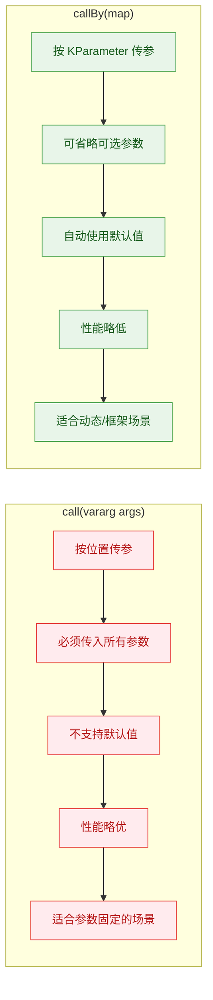

一个实用的对比示例：

```kotlin
fun format(
    text: String,
    uppercase: Boolean = false,
    trim: Boolean = true,
    maxLength: Int = 100
): String {
    var result = text
    if (trim) result = result.trim()                    // 根据 trim 参数决定是否去除空白
    if (uppercase) result = result.uppercase()          // 根据 uppercase 参数决定是否转大写
    if (result.length > maxLength) {                    // 超过最大长度则截断
        result = result.take(maxLength) + "..."
    }
    return result
}

fun main() {
    val func = ::format

    // ── 使用 call：必须传入全部 4 个参数 ──
    val r1 = func.call("  hello world  ", true, true, 50)
    println(r1)  // 输出: HELLO WORLD

    // ── 使用 callBy：只传需要的参数，其余用默认值 ──
    val textParam = func.parameters.first { it.name == "text" }
    val uppercaseParam = func.parameters.first { it.name == "uppercase" }

    val r2 = func.callBy(mapOf(
        textParam to "  hello world  ",
        uppercaseParam to true
        // trim 默认 true，maxLength 默认 100
    ))
    println(r2)  // 输出: HELLO WORLD
}
```

### 构造函数引用

构造函数在反射中也是 `KFunction` 的一种。通过 `KClass.constructors` 可以获取所有构造函数，通过 `KClass.primaryConstructor` 可以获取主构造函数。构造函数引用也可以用 `::ClassName` 语法获取：

```kotlin
import kotlin.reflect.full.primaryConstructor
import kotlin.reflect.full.valueParameters

data class Point(val x: Double, val y: Double) {
    // 次构造函数
    constructor(xy: Double) : this(xy, xy)
}

fun main() {
    val kClass = Point::class

    // 获取主构造函数
    val primary = kClass.primaryConstructor!!
    println("主构造函数参数:")
    primary.valueParameters.forEach { p ->
        // valueParameters 只包含 VALUE 类型的参数，排除了 INSTANCE 等
        println("  ${p.name}: ${p.type}")
    }

    // 获取所有构造函数
    println("\n所有构造函数 (共 ${kClass.constructors.size} 个):")
    kClass.constructors.forEach { ctor ->
        val paramStr = ctor.parameters.joinToString(", ") { "${it.name}: ${it.type}" }
        println("  Point($paramStr)")
    }

    // 通过反射调用构造函数创建实例
    val p1 = primary.call(3.0, 4.0)
    println("\np1 = $p1")  // 输出: p1 = Point(x=3.0, y=4.0)

    // 使用 :: 语法获取构造函数引用
    val ctorRef = ::Point
    val p2 = ctorRef(5.0, 6.0)  // 像普通函数一样调用
    println("p2 = $p2")          // 输出: p2 = Point(x=5.0, y=6.0)
}
```

### KFunction 的附加属性

`KFunction` 接口还提供了一系列布尔属性，用于查询函数的修饰符和特性：

```kotlin
import kotlin.reflect.full.functions
import kotlin.reflect.jvm.isAccessible

class Demo {
    // 各种修饰符的函数
    inline fun inlineFunc(block: () -> Unit) = block()
    operator fun plus(other: Demo): Demo = this
    infix fun combine(other: Demo): Demo = this
    suspend fun asyncWork(): String = "done"
    external fun nativeCall()
    private fun secret(): String = "hidden"
}

fun main() {
    val kClass = Demo::class

    kClass.functions.forEach { func ->
        // 跳过从 Any 继承的函数
        if (func.name in listOf("equals", "hashCode", "toString")) return@forEach

        println("函数: ${func.name}")
        println("  isInline:    ${func.isInline}")    // 是否是 inline 函数
        println("  isOperator:  ${func.isOperator}")  // 是否是 operator 函数
        println("  isInfix:     ${func.isInfix}")     // 是否是 infix 函数
        println("  isSuspend:   ${func.isSuspend}")   // 是否是 suspend 函数
        println("  isExternal:  ${func.isExternal}")  // 是否是 external 函数
        println("  isAbstract:  ${func.isAbstract}")  // 是否是抽象函数
        println("  isFinal:     ${func.isFinal}")     // 是否是 final 函数
        println("  isOpen:      ${func.isOpen}")      // 是否是 open 函数
        println("  visibility:  ${func.visibility}")  // 可见性: PUBLIC, PRIVATE, etc.
        println()
    }
}
```

这些属性在框架开发中非常有用。例如，一个序列化框架可能需要跳过 `private` 函数，一个协程调度器需要识别 `suspend` 函数，一个 DSL 构建器可能只处理 `infix` 或 `operator` 函数。

### 实战：基于反射的命令分发器

将以上知识综合运用，构建一个通过反射自动发现和调用命令处理函数的分发器：

```kotlin
import kotlin.reflect.KFunction
import kotlin.reflect.full.declaredFunctions
import kotlin.reflect.full.findAnnotation
import kotlin.reflect.full.valueParameters

// 自定义注解，标记可被分发的命令
@Target(AnnotationTarget.FUNCTION)
@Retention(AnnotationRetention.RUNTIME)
annotation class Command(
    val name: String,           // 命令名称
    val description: String     // 命令描述
)

// 命令处理器类
class CommandHandler {

    @Command("hello", "向用户打招呼")
    fun hello(name: String, greeting: String = "你好"): String {
        return "$greeting, $name!"
    }

    @Command("add", "计算两个数的和")
    fun add(a: Int, b: Int): String {
        return "$a + $b = ${a + b}"
    }

    @Command("repeat", "重复输出文本")
    fun repeat(text: String, times: Int = 3, separator: String = " "): String {
        // 将文本重复指定次数，用分隔符连接
        return List(times) { text }.joinToString(separator)
    }
}

// 命令分发器：通过反射自动发现和调用命令
class CommandDispatcher(private val handler: Any) {

    // 缓存：命令名 -> KFunction 映射
    private val commands: Map<String, KFunction<*```kotlin
>> = handler::class.declaredFunctions
        .filter { it.findAnnotation<Command>() != null }  // 只保留有 @Command 注解的函数
        .associateBy { it.findAnnotation<Command>()!!.name } // 以命令名为 key 建立映射

    // 列出所有可用命令
    fun listCommands() {
        println("可用命令:")
        commands.forEach { (name, func) ->
            val cmd = func.findAnnotation<Command>()!!
            val paramStr = func.valueParameters.joinToString(", ") { p ->
                // 构建参数签名字符串，可选参数加上 "?" 标记
                val optional = if (p.isOptional) " (可选)" else ""
                "${p.name}: ${p.type}$optional"
            }
            println("  /$name($paramStr) — ${cmd.description}")
        }
    }

    // 分发并执行命令
    fun dispatch(commandName: String, args: Map<String, Any?>): Any? {
        // 查找命令对应的函数
        val func = commands[commandName]
            ?: throw IllegalArgumentException("未知命令: /$commandName")

        // 构建 callBy 所需的参数 Map
        val argsMap = mutableMapOf<kotlin.reflect.KParameter, Any?>()

        for (param in func.parameters) {
            when (param.kind) {
                // INSTANCE 参数：传入 handler 实例
                kotlin.reflect.KParameter.Kind.INSTANCE -> {
                    argsMap[param] = handler
                }
                // VALUE 参数：从用户传入的 args 中查找
                kotlin.reflect.KParameter.Kind.VALUE -> {
                    val value = args[param.name]
                    if (value != null) {
                        // 用户提供了该参数的值
                        argsMap[param] = value
                    } else if (!param.isOptional) {
                        // 必选参数缺失，抛出友好的错误信息
                        throw IllegalArgumentException(
                            "命令 /$commandName 缺少必选参数: ${param.name} (${param.type})"
                        )
                    }
                    // 可选参数未提供时不放入 Map，callBy 自动使用默认值
                }
                else -> { /* EXTENSION_RECEIVER 等情况此处忽略 */ }
            }
        }

        // 使用 callBy 执行函数，自动处理默认参数
        return func.callBy(argsMap)
    }
}

fun main() {
    val handler = CommandHandler()
    val dispatcher = CommandDispatcher(handler)

    // 列出所有命令
    dispatcher.listCommands()
    println()

    // 调用 /hello 命令，省略可选参数 greeting
    val r1 = dispatcher.dispatch("hello", mapOf("name" to "Kotlin"))
    println("/hello -> $r1")  // 输出: /hello -> 你好, Kotlin!

    // 调用 /hello 命令，覆盖默认的 greeting
    val r2 = dispatcher.dispatch("hello", mapOf("name" to "World", "greeting" to "Hey"))
    println("/hello -> $r2")  // 输出: /hello -> Hey, World!

    // 调用 /add 命令
    val r3 = dispatcher.dispatch("add", mapOf("a" to 17, "b" to 25))
    println("/add -> $r3")    // 输出: /add -> 17 + 25 = 42

    // 调用 /repeat 命令，只传必选参数
    val r4 = dispatcher.dispatch("repeat", mapOf("text" to "Kotlin"))
    println("/repeat -> $r4") // 输出: /repeat -> Kotlin Kotlin Kotlin

    // 调用 /repeat 命令，覆盖部分可选参数
    val r5 = dispatcher.dispatch("repeat", mapOf(
        "text" to "Go",
        "times" to 5,
        "separator" to "-"
    ))
    println("/repeat -> $r5") // 输出: /repeat -> Go-Go-Go-Go-Go
}
```

这个命令分发器完整展示了 `KFunction` 的核心能力链条：通过注解发现函数 → 通过 `parameters` 分析参数 → 通过 `callBy` 动态调用并自动处理默认值。整个过程中，分发器代码完全不需要知道 `CommandHandler` 里有哪些方法、参数是什么——一切都在运行时通过反射动态解析。

```mermaid
graph LR
    subgraph 命令注册阶段
        direction TB
        R1["扫描 handler 的所有函数"]
        R2["过滤带 @Command 注解的函数"]
        R3["建立 name -> KFunction 映射缓存"]
        R1 --> R2 --> R3
    end

    subgraph 命令分发阶段
        direction TB
        D1["根据命令名查找 KFunction"]
        D2["遍历 parameters 构建参数 Map"]
        D3["INSTANCE 参数填入 handler"]
        D4["VALUE 参数从用户输入匹配"]
        D5["可选参数缺失则跳过"]
        D6["callBy 执行并返回结果"]
        D1 --> D2 --> D3 --> D4 --> D5 --> D6
    end

    R3 --> D1

    classDef reg fill:#E8F5E9,stroke:#43A047,color:#1B5E20
    classDef dis fill:#E3F2FD,stroke:#1E88E5,color:#0D47A1

    class R1,R2,R3 reg
    class D1,D2,D3,D4,D5,D6 dis
```

---

**📝 练习题**

以下代码的输出是什么？

```kotlin
fun greet(name: String, punctuation: String = "!"): String {
    return "Hello, $name$punctuation"
}

fun main() {
    val func = ::greet
    val param = func.parameters.first { it.name == "name" }
    val result = func.callBy(mapOf(param to "Kotlin"))
    println(result)
}
```

A. 编译错误，callBy 不接受不完整的参数 Map

B. 运行时抛出 IllegalArgumentException，缺少 punctuation 参数

C. 输出 `Hello, Kotlin!`

D. 输出 `Hello, Kotlinnull`

**【答案】** C

**【解析】** `callBy` 的核心特性就是能够自动处理有默认值的可选参数。`punctuation` 参数的 `isOptional` 为 `true`（因为它有默认值 `"!"`），当 `callBy` 的参数 Map 中没有包含这个参数时，它会自动使用函数定义中的默认值 `"!"`。因此只需要传入必选参数 `name`，`callBy` 就能正确调用函数，输出 `Hello, Kotlin!`。如果换成 `call`，则必须传入所有参数，否则会抛出异常。这正是 `callBy` 相比 `call` 的最大优势所在。

---

**📝 练习题**

关于 `KFunction.parameters` 列表中 `KParameter.kind` 的描述，以下哪项是正确的？

A. 顶层函数的 parameters 列表第一个元素的 kind 是 `INSTANCE`

B. 绑定成员函数引用（如 `obj::method`）的 parameters 中仍然包含 kind 为 `INSTANCE` 的参数

C. 未绑定成员函数引用（如 `MyClass::method`）的 parameters 第一个元素的 kind 是 `INSTANCE`

D. 扩展函数引用的 parameters 中不会出现 `EXTENSION_RECEIVER` 类型的参数

**【答案】** C

**【解析】** 未绑定的成员函数引用 `MyClass::method` 在反射中，`parameters` 列表的第一个元素代表类实例，其 `kind` 为 `KParameter.Kind.INSTANCE`。选项 A 错误，顶层函数没有实例，所有参数的 kind 都是 `VALUE`。选项 B 错误，绑定引用 `obj::method` 已经绑定了具体实例，`parameters` 中不再包含 `INSTANCE` 参数，只剩下 `VALUE` 类型的普通参数。选项 D 错误，扩展函数引用的 `parameters` 中确实会包含 `EXTENSION_RECEIVER` 类型的参数，代表扩展接收者。理解 `KParameter.Kind` 的三种值（`INSTANCE`、`EXTENSION_RECEIVER`、`VALUE`）及其出现时机，是正确使用 `call` / `callBy` 的关键。

---

## KProperty 接口：属性引用、get/set、Getter/Setter

Kotlin 的反射体系中，`KProperty` 是与 `KFunction` 并列的另一大核心接口。如果说 `KFunction` 让我们在运行时"调用函数"，那么 `KProperty` 就让我们在运行时"读写属性"。在依赖注入框架、ORM 映射、序列化引擎等场景中，`KProperty` 的身影无处不在——它让我们可以在完全不知道属性名的情况下，动态地获取或修改对象的状态。

### 属性引用基础：从 `::` 操作符说起

与函数引用类似，Kotlin 使用 `::` 操作符来获取属性的引用。但属性引用返回的不是 `KFunction`，而是 `KProperty` 家族中的某个具体子类型。这个子类型取决于属性的"可变性"和"归属"——是顶层属性还是成员属性，是 `val` 还是 `var`。

```kotlin
// 顶层只读属性
val PI = 3.14159

// 顶层可变属性
var counter = 0

// 类中的属性
class User(val name: String, var age: Int)

fun main() {
    // 获取顶层只读属性的引用，类型为 KProperty0<Double>
    val piRef = ::PI
    println(piRef.get()) // 3.14159

    // 获取顶层可变属性的引用，类型为 KMutableProperty0<Int>
    val counterRef = ::counter
    counterRef.set(42)       // 通过反射修改值
    println(counter)         // 42

    // 获取成员属性的引用，类型为 KProperty1<User, String>
    val nameRef = User::name
    val user = User("Alice", 30)
    println(nameRef.get(user)) // Alice —— 需要传入接收者实例

    // 获取成员可变属性的引用，类型为 KMutableProperty1<User, Int>
    val ageRef = User::age
    ageRef.set(user, 25)       // 通过反射修改成员属性
    println(user.age)          // 25
}
```

这里有一个关键的数字后缀约定：`KProperty0` 表示无需接收者（顶层属性或已绑定实例），`KProperty1` 表示需要一个接收者（成员属性），`KProperty2` 表示需要两个接收者（扩展属性定义在某个类内部时）。这个设计与 `KFunction0`、`KFunction1` 的思路完全一致。

### KProperty 继承体系全景

`KProperty` 的类型层级比初看起来要丰富得多。理解这棵继承树，是灵活运用属性反射的前提。

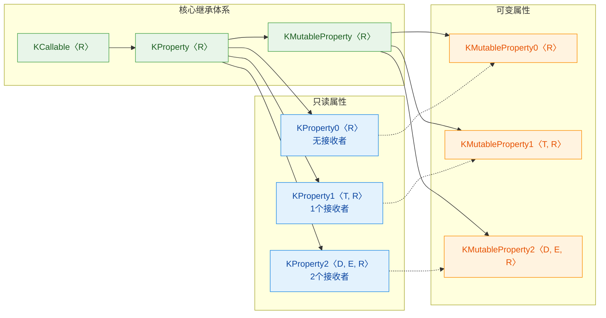

几个要点：

- `KProperty` 继承自 `KCallable`，所以它天然拥有 `name`、`parameters`、`returnType`、`visibility` 等元数据。
- `KMutableProperty` 是 `KProperty` 的子接口，额外提供了 `set` 方法。`val` 属性只能 `get`，`var` 属性既能 `get` 也能 `set`。
- 虚线箭头表示 `KMutableProperty0` 同时也是 `KProperty0` 的子类型，以此类推。这意味着你可以把一个 `KMutableProperty1` 赋值给 `KProperty1` 类型的变量，只是丢失了 `set` 能力。

### get 与 set：属性的动态读写

`get` 和 `set` 是 `KProperty` 最核心的两个操作。它们的签名随着接收者数量的不同而变化。

```kotlin
import kotlin.reflect.KMutableProperty1
import kotlin.reflect.KProperty1

data class Book(
    val title: String,       // 只读属性
    var price: Double,       // 可变属性
    var inStock: Boolean     // 可变属性
)

fun main() {
    val book = Book("Kotlin in Action", 39.99, true)

    // ---- KProperty1.get(receiver) ----
    // 只读属性引用：只有 get，没有 set
    val titleProp: KProperty1<Book, String> = Book::title
    val titleValue = titleProp.get(book)  // 传入实例作为接收者
    println("书名: $titleValue")           // 书名: Kotlin in Action

    // ---- KMutableProperty1.get / set ----
    // 可变属性引用：既有 get 也有 set
    val priceProp: KMutableProperty1<Book, Double> = Book::price
    println("原价: ${priceProp.get(book)}")  // 原价: 39.99

    priceProp.set(book, 29.99)               // 动态修改价格
    println("折后: ${priceProp.get(book)}")  // 折后: 29.99

    // ---- 批量操作示例 ----
    // 将所有 Boolean 类型的可变属性设为 false
    Book::class.members
        .filterIsInstance<KMutableProperty1<Book, *>>() // 筛选可变成员属性
        .filter { it.returnType.classifier == Boolean::class } // 筛选 Boolean 类型
        .forEach { prop ->
            @Suppress("UNCHECKED_CAST")
            // 强制转型后调用 set
            (prop as KMutableProperty1<Book, Boolean>).set(book, false)
            println("${prop.name} 已设为 false")
        }

    println(book) // Book(title=Kotlin in Action, price=29.99, inStock=false)
}
```

这段代码展示了一个非常实用的模式：通过反射遍历所有属性，按类型筛选，然后批量修改。ORM 框架在将数据库行映射到对象时，本质上就是在做类似的事情——根据列名找到对应的 `KMutableProperty`，然后调用 `set` 把值填进去。

### Getter 与 Setter 对象：深入属性访问器

每个 `KProperty` 内部都持有一个 `getter` 对象，而 `KMutableProperty` 还额外持有一个 `setter` 对象。这些访问器本身也是 `KFunction`，这意味着你可以像操作普通函数引用一样操作它们。

```kotlin
class Temperature {
    // 带自定义 getter/setter 的属性
    var celsius: Double = 0.0
        get() {
            println("  [getter 被调用]")
            return field
        }
        set(value) {
            println("  [setter 被调用, 新值=$value]")
            field = value
        }
}

fun main() {
    val temp = Temperature()
    val celsiusProp = Temperature::celsius

    // ---- 访问 getter 对象 ----
    val getter = celsiusProp.getter
    println("getter 类型: ${getter::class.simpleName}")
    // getter 类型: KMutableProperty1$Getter (具体实现类名可能不同)

    // getter 本身是 KFunction，可以用 call 调用
    println("通过 getter.call: ${getter.call(temp)}")
    // [getter 被调用]
    // 通过 getter.call: 0.0

    // 也可以直接用 get，效果相同
    println("通过 get: ${celsiusProp.get(temp)}")
    // [getter 被调用]
    // 通过 get: 0.0

    // ---- 访问 setter 对象 ----
    val setter = celsiusProp.setter
    println("\nsetter 参数列表:")
    setter.parameters.forEach { param ->
        // 打印 setter 的每个参数信息
        println("  ${param.name ?: "receiver"} : ${param.type}")
    }
    // setter 参数列表:
    //   receiver : Temperature
    //   <set-?> : kotlin.Double

    // 通过 setter.call 调用
    setter.call(temp, 36.6)
    // [setter 被调用, 新值=36.6]

    println("当前温度: ${temp.celsius}")
    // [getter 被调用]
    // 当前温度: 36.6
}
```

`getter` 和 `setter` 作为 `KFunction` 的一个重要意义在于：它们可以被传递、存储、组合。例如，你可以把多个属性的 `getter` 收集到一个列表中，统一调用来生成一份"属性快照"：

```kotlin
data class Config(
    val host: String = "localhost",
    val port: Int = 8080,
    val debug: Boolean = false
)

fun snapshot(instance: Any): Map<String, Any?> {
    // 获取实例的 KClass
    return instance::class.members
        .filterIsInstance<KProperty1<Any, *>>() // 筛选出属性
        .associate { prop ->
            // 用属性名作为 key，getter 的返回值作为 value
            prop.name to prop.getter.call(instance)
        }
}

fun main() {
    val config = Config(host = "192.168.1.1", port = 3000, debug = true)
    val snap = snapshot(config)
    // 输出所有属性的当前值
    snap.forEach { (key, value) ->
        println("$key = $value")
    }
    // debug = true
    // host = 192.168.1.1
    // port = 3000
}
```

### 绑定引用 vs 未绑定引用

属性引用有两种形态：未绑定引用（unbound reference）和绑定引用（bound reference）。区别在于是否已经"锁定"了接收者实例。

```kotlin
class Wallet(var balance: Double)

fun main() {
    val wallet = Wallet(100.0)

    // ---- 未绑定引用 (Unbound) ----
    // 类型: KMutableProperty1<Wallet, Double>
    // 每次 get/set 都需要显式传入实例
    val unboundRef = Wallet::balance
    println(unboundRef.get(wallet))       // 100.0
    unboundRef.set(wallet, 200.0)
    println(unboundRef.get(wallet))       // 200.0

    // ---- 绑定引用 (Bound) ----
    // 类型: KMutableProperty0<Double>
    // 实例已经绑定，get/set 不再需要传入实例
    val boundRef = wallet::balance
    println(boundRef.get())               // 200.0
    boundRef.set(300.0)
    println(boundRef.get())               // 300.0

    // 绑定引用的 getter 也是 KFunction0
    val getBalance: () -> Double = wallet::balance.getter
    println("通过绑定 getter: ${getBalance()}") // 通过绑定 getter: 300.0
}
```

```kotlin
// 内存模型示意

// 未绑定引用 Wallet::balance
// ┌──────────────────────────┐
// │  KMutableProperty1       │
// │  ┌────────────────────┐  │
// │  │ name = "balance"   │  │
// │  │ receiver = ???     │──│──▶ 调用时才传入
// │  └────────────────────┘  │
// └──────────────────────────┘

// 绑定引用 wallet::balance
// ┌──────────────────────────┐       ┌──────────┐
// │  KMutableProperty0       │       │  Wallet   │
// │  ┌────────────────────┐  │       │ balance=  │
// │  │ name = "balance"   │  │       │   300.0   │
// │  │ receiver ──────────│──│──────▶│           │
// │  └────────────────────┘  │       └──────────┘
// └──────────────────────────┘
```

绑定引用在实际开发中非常方便。当你已经持有一个对象实例，并且需要把"对该对象某个属性的访问能力"传递给其他函数时，绑定引用可以省去到处传递实例的麻烦。

### 属性元数据：从 KProperty 中提取丰富信息

`KProperty` 不仅仅是 get/set 的载体，它还携带了大量关于属性本身的元数据。这些信息在框架开发中极为重要。

```kotlin
import kotlin.reflect.full.memberProperties
import kotlin.reflect.jvm.javaField
import kotlin.reflect.jvm.javaGetter
import kotlin.reflect.jvm.javaSetter

open class Animal(open val species: String)

class Dog(
    override val species: String,  // 重写的只读属性
    var name: String,              // 可变属性
    val vaccinated: Boolean,       // 只读属性
    private var microchipId: Long  // 私有可变属性
) : Animal(species) {
    // 委托属性
    val nickname: String by lazy { name.lowercase() }

    // 计算属性（无 backing field）
    val summary: String
        get() = "$name ($species)"
}

fun main() {
    println("===== Dog 类的属性元数据 =====\n")

    Dog::class.memberProperties.sortedBy { it.name }.forEach { prop ->
        println("属性名: ${prop.name}")
        println("  返回类型: ${prop.returnType}")
        println("  是否为 val: ${prop !is kotlin.reflect.KMutableProperty<*>}")
        println("  可见性: ${prop.visibility}")
        println("  是否 abstract: ${prop.isAbstract}")
        println("  是否 open: ${prop.isOpen}")
        println("  是否 final: ${prop.isFinal}")
        println("  是否 const: ${prop.isConst}")
        println("  是否 lateinit: ${prop.isLateinit}")
        println("  是否 suspend: ${prop.isSuspend}")

        // JVM 互操作信息
        println("  Java Field: ${prop.javaField?.name ?: "无 (计算属性或委托)"}")
        println("  Java Getter: ${prop.javaGetter?.name ?: "无"}")

        if (prop is kotlin.reflect.KMutableProperty<*>) {
            println("  Java Setter: ${prop.javaSetter?.name ?: "无"}")
        }

        println()
    }
}
```

输出中你会看到一些有趣的细节：

- `nickname` 是 `lazy` 委托属性，它有一个 backing field（存储 `Lazy` 实例），但 `javaField` 的名字可能是 `nickname$delegate`。
- `summary` 是计算属性，没有 backing field，所以 `javaField` 为 `null`。
- `microchipId` 的 `visibility` 是 `PRIVATE`。
- `species` 因为被 `override`，所以 `isOpen` 为 `true`（在 `Dog` 中它仍然可以被进一步重写，除非 `Dog` 是 `final` 的）。

### 实战模式：反射驱动的属性拷贝

一个经典的应用场景是"浅拷贝"——把一个对象的属性值复制到另一个同类型对象中。`data class` 的 `copy()` 方法只能在编译期使用，而反射版本可以在运行时动态完成。

```kotlin
import kotlin.reflect.KMutableProperty
import kotlin.reflect.full.memberProperties

/**
 * 将 source 对象的所有可变属性值拷贝到 target 对象中。
 * 只拷贝名称和类型都匹配的属性。
 */
fun <T : Any> shallowCopy(source: T, target: T) {
    // 获取 source 的 KClass
    val kClass = source::class

    // 遍历所有成员属性
    kClass.memberProperties.forEach { prop ->
        // 只处理可变属性（var）
        if (prop is KMutableProperty<*>) {
            @Suppress("UNCHECKED_CAST")
            val mutableProp = prop as KMutableProperty1<T, Any?>

            // 从 source 读取值
            val value = mutableProp.get(source)
            // 写入 target
            mutableProp.set(target, value)
        }
    }
}

data class Profile(
    val id: Int,          // val —— 不会被拷贝
    var username: String,
    var email: String,
    var score: Int
)

fun main() {
    val original = Profile(1, "alice", "alice@example.com", 950)
    val blank = Profile(999, "", "", 0)

    println("拷贝前: $blank")
    // Profile(id=999, username=, email=, score=0)

    shallowCopy(original, blank)

    println("拷贝后: $blank")
    // Profile(id=999, username=alice, email=alice@example.com, score=950)
    // 注意 id 没有变，因为它是 val
}
```

这个模式还可以扩展为"跨类型属性映射"（类似 Java 的 BeanUtils.copyProperties），只需要额外加上名称匹配和类型兼容性检查。

### 属性引用与函数式编程的结合

属性引用可以直接当作函数使用，这在集合操作中特别优雅：

```kotlin
data class Employee(
    val name: String,
    val department: String,
    val salary: Double
)

fun main() {
    val employees = listOf(
        Employee("Alice", "Engineering", 95000.0),
        Employee("Bob", "Marketing", 72000.0),
        Employee("Carol", "Engineering", 105000.0),
        Employee("Dave", "Marketing", 68000.0)
    )

    // KProperty1<Employee, String> 实现了 (Employee) -> String
    // 所以可以直接传给 map、sortedBy、groupBy 等高阶函数
    val names: List<String> = employees.map(Employee::name)
    println("所有员工: $names")
    // [Alice, Bob, Carol, Dave]

    // 按薪资排序
    val bySalary = employees.sortedBy(Employee::salary)
    println("薪资排序: ${bySalary.map(Employee::name)}")
    // [Dave, Bob, Alice, Carol]

    // 按部门分组
    val byDept: Map<String, List<Employee>> = employees.groupBy(Employee::department)
    byDept.forEach { (dept, members) ->
        val avgSalary = members.map(Employee::salary).average()
        println("$dept: 平均薪资 = ${"%.0f".format(avgSalary)}")
    }
    // Engineering: 平均薪资 = 100000
    // Marketing: 平均薪资 = 70000

    // 组合多个属性引用构建比较器
    val comparator = compareBy(Employee::department)
        .thenByDescending(Employee::salary)
    employees.sortedWith(comparator).forEach { println("  ${it.name} | ${it.department} | ${it.salary}") }
}
```

这里 `Employee::name` 既是一个 `KProperty1<Employee, String>`，也是一个 `(Employee) -> String`。Kotlin 编译器会自动将属性引用适配为函数类型，这使得属性引用在函数式编程中成为一等公民。

### KProperty 与 Java 反射的互操作

在 JVM 平台上，Kotlin 属性最终会编译为 Java 的字段（field）加上 getter/setter 方法。`kotlin-reflect` 提供了桥接 API 来在两个世界之间自由切换。

```kotlin
import kotlin.reflect.full.memberProperties
import kotlin.reflect.jvm.javaField
import kotlin.reflect.jvm.javaGetter
import kotlin.reflect.jvm.javaSetter
import kotlin.reflect.jvm.kotlinProperty

class Settings {
    var theme: String = "dark"
    val version: Int = 2
}

fun main() {
    // ---- Kotlin → Java ----
    val themeProp = Settings::theme
    val jField = themeProp.javaField       // java.lang.reflect.Field
    val jGetter = themeProp.javaGetter     // java.lang.reflect.Method (getTheme)
    val jSetter = themeProp.javaSetter     // java.lang.reflect.Method (setTheme)

    println("Java field name: ${jField?.name}")       // theme
    println("Java getter: ${jGetter?.name}")           // getTheme
    println("Java setter: ${jSetter?.name}")           // setTheme

    // ---- Java → Kotlin ----
    // 从 Java 的 Field 反向获取 KProperty
    val backToKotlin = jField?.kotlinProperty
    println("回到 Kotlin: ${backToKotlin?.name}, 类型=${backToKotlin?.returnType}")
    // 回到 Kotlin: theme, 类型=kotlin.String

    // ---- 实际应用：通过 Java 反射绕过访问限制 ----
    val settings = Settings()
    val versionField = Settings::version.javaField!!
    versionField.isAccessible = true          // 绕过 final 限制
    versionField.setInt(settings, 99)         // 强制修改 val 属性的底层字段
    println("被修改的 version: ${settings.version}") // 99
    // 注意：这是一种 hack，生产代码中应谨慎使用
}
```

最后那个"修改 `val` 属性"的技巧值得特别说明：Kotlin 的 `val` 在语言层面是只读的，`KProperty` 不提供 `set` 方法。但在 JVM 层面，它只是一个 `final` 字段，通过 Java 反射的 `setAccessible(true)` 可以强行修改。这在测试中偶尔有用，但在生产代码中应该避免，因为它破坏了不可变性的契约。

---

**📝 练习题**

以下代码的输出是什么？

```kotlin
import kotlin.reflect.KMutableProperty1
import kotlin.reflect.full.memberProperties

data class Point(val x: Int, var y: Int)

fun main() {
    val point = Point(10, 20)
    val mutableProps = Point::class.memberProperties
        .filterIsInstance<KMutableProperty1<Point, *>>()

    println("可变属性数量: ${mutableProps.size}")
    mutableProps.forEach { prop ->
        println("${prop.name}: ${prop.get(point)}")
    }
}
```

A. 可变属性数量: 2，输出 x: 10 和 y: 20

B. 可变属性数量: 1，输出 y: 20

C. 可变属性数量: 0，无属性输出

D. 编译错误，`filterIsInstance` 不能用于 `KProperty`

**【答案】** B

**【解析】** `Point` 有两个属性：`val x` 和 `var y`。`filterIsInstance<KMutableProperty1<Point, *>>()` 只会保留实现了 `KMutableProperty1` 接口的属性引用，而只有 `var` 声明的属性才会生成 `KMutableProperty1` 实例。`val x` 对应的是 `KProperty1`（只读），不满足过滤条件。因此最终只剩下 `y` 一个可变属性，输出其名称和值。这也印证了 `KProperty` 继承体系中 `KMutableProperty` 是 `KProperty` 的子接口这一设计——`var` 属性"是一个" `KMutableProperty`，同时也"是一个" `KProperty`；而 `val` 属性只"是一个" `KProperty`。

---

## KParameter 接口（参数元数据、名称、类型、可选性）

在前面的章节中，我们学习了 `KFunction` 和 `KProperty`，它们分别代表函数和属性的反射抽象。但当我们深入到函数调用层面时，一个不可回避的问题浮出水面：**函数的参数本身，也是需要被反射检视的对象**。`KParameter` 正是 Kotlin 反射体系中专门用来描述"参数"这一概念的接口。

`KParameter` 的价值在于，它让我们能够在运行时精确地了解一个函数（或构造函数）的每一个参数的完整元数据——名称是什么、类型是什么、有没有默认值、是不是可选的、它在参数列表中排第几位。这些信息在很多高级场景中至关重要，比如依赖注入框架需要根据参数类型自动注入实例，序列化库需要根据参数名称映射 JSON 字段，或者我们想用 `callBy` 实现命名参数调用时需要构建 `Map<KParameter, Any?>`。

### KParameter 的基本结构与获取方式

`KParameter` 接口定义在 `kotlin.reflect` 包中，它不是独立存在的，而是从 `KCallable`（`KFunction` 和 `KProperty` 的共同父接口）的 `parameters` 属性中获取的。每一个 `KParameter` 实例代表可调用对象的一个参数。

```kotlin
import kotlin.reflect.KParameter
import kotlin.reflect.full.memberFunctions

// 定义一个示例类，包含不同类型的参数
class UserService {
    // 一个普通的成员函数，拥有多种参数形式
    fun createUser(
        name: String,            // 必填参数
        age: Int,                // 必填参数
        email: String = "N/A",   // 带默认值的可选参数
        isAdmin: Boolean = false // 带默认值的可选参数
    ): String {
        return "User($name, $age, $email, admin=$isAdmin)"
    }
}

fun main() {
    // 通过反射获取 createUser 函数的引用
    val func = UserService::class.memberFunctions
        .first { it.name == "createUser" }

    // 遍历该函数的所有 KParameter
    func.parameters.forEach { param ->
        println("index=${param.index}, name=${param.name}, kind=${param.kind}")
    }
}
```

运行上面的代码，输出类似于：

```
index=0, name=null, kind=INSTANCE
index=1, name=name, kind=VALUE
index=2, name=age, kind=VALUE
index=3, name=email, kind=VALUE
index=4, name=isAdmin, kind=VALUE
```

这里有一个非常重要的细节：**第一个参数（index=0）的 `name` 为 `null`，`kind` 为 `INSTANCE`**。这是因为 `createUser` 是一个成员函数，调用它时需要一个接收者对象（receiver），这个接收者在反射体系中被建模为第一个参数。这是 Kotlin 反射与 Java 反射的一个显著区别——Java 的 `Method.getParameters()` 不会包含 `this` 引用，而 Kotlin 将其统一纳入参数列表。

### KParameter.Kind —— 参数的种类

`KParameter` 通过 `kind` 属性区分参数的种类，这是一个枚举类型 `KParameter.Kind`，包含三个值：

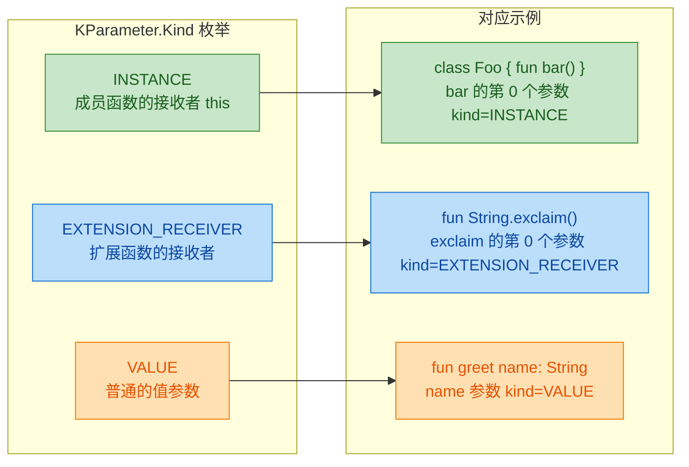

用代码来验证这三种 kind：

```kotlin
import kotlin.reflect.KParameter
import kotlin.reflect.full.memberFunctions
import kotlin.reflect.full.extensionReceiverParameter

class Demo {
    fun memberFunc(x: Int) {}
}

// 顶层扩展函数
fun String.shout(): String = this.uppercase() + "!"

fun main() {
    // 1. 成员函数 —— 第一个参数是 INSTANCE
    val memberParams = Demo::class.memberFunctions
        .first { it.name == "memberFunc" }
        .parameters

    memberParams.forEach { p ->
        // index=0 -> INSTANCE (Demo 实例本身)
        // index=1 -> VALUE   (参数 x)
        println("[memberFunc] index=${p.index}, kind=${p.kind}, name=${p.name}")
    }

    // 2. 扩展函数 —— 第一个参数是 EXTENSION_RECEIVER
    val extFunc = ::shout  // 获取扩展函数引用 (KFunction)
    extFunc.parameters.forEach { p ->
        // index=0 -> EXTENSION_RECEIVER (String 接收者)
        println("[shout] index=${p.index}, kind=${p.kind}, name=${p.name}")
    }

    // 3. 也可以通过 extensionReceiverParameter 快捷获取
    val receiver = extFunc.extensionReceiverParameter
    println("扩展接收者类型: ${receiver?.type}")  // kotlin.String
}
```

理解 `Kind` 的意义在于：当你使用 `callBy` 构建参数映射时，你必须为 `INSTANCE` 类型的参数提供对象实例，为 `EXTENSION_RECEIVER` 提供扩展接收者，而只有 `VALUE` 类型的参数才是我们通常意义上的"函数参数"。

### 参数名称（name）

`KParameter.name` 返回参数的名称，类型为 `String?`。对于 `INSTANCE` 和 `EXTENSION_RECEIVER` 类型的参数，`name` 通常为 `null`，因为它们没有显式的参数名。对于 `VALUE` 类型的参数，`name` 就是源码中声明的参数名。

```kotlin
import kotlin.reflect.full.primaryConstructor

// 数据类的构造函数参数名在反射中非常有用
data class Config(
    val host: String,
    val port: Int,
    val useSsl: Boolean = true
)

fun main() {
    // 获取主构造函数
    val constructor = Config::class.primaryConstructor!!

    // 遍历构造函数的参数，打印名称
    constructor.parameters.forEach { param ->
        // 输出: host, port, useSsl
        println("参数名: ${param.name}, 类型: ${param.type}")
    }
}
```

参数名称在实际框架开发中极为常用。例如，一个简易的 JSON 反序列化器可以根据 JSON 的 key 与构造函数参数名进行匹配：

```kotlin
import kotlin.reflect.KParameter
import kotlin.reflect.full.primaryConstructor

// 模拟一个极简的 JSON-to-Object 映射
fun <T : Any> fromMap(klass: kotlin.reflect.KClass<T>, map: Map<String, Any?>): T {
    // 获取主构造函数
    val ctor = klass.primaryConstructor
        ?: throw IllegalArgumentException("类 ${klass.simpleName} 没有主构造函数")

    // 构建 KParameter -> 值 的映射
    val args: Map<KParameter, Any?> = ctor.parameters
        .filter { param ->
            // 只处理 VALUE 类型的参数
            param.kind == KParameter.Kind.VALUE
        }
        .filter { param ->
            // 如果 map 中有对应的 key，或者参数没有默认值（必须提供）
            map.containsKey(param.name) || !param.isOptional
        }
        .associateWith { param ->
            // 根据参数名从 map 中取值
            map[param.name]
        }

    // 使用 callBy 调用构造函数，支持默认参数
    return ctor.callBy(args)
}

data class Person(
    val name: String,
    val age: Int,
    val city: String = "Unknown"
)

fun main() {
    // 模拟从 JSON 解析出的 Map
    val jsonMap = mapOf("name" to "Alice", "age" to 30)

    // city 有默认值且 map 中没有提供，callBy 会自动使用默认值
    val person = fromMap(Person::class, jsonMap)
    println(person)  // Person(name=Alice, age=30, city=Unknown)
}
```

这段代码展示了 `KParameter.name` 和 `KParameter.isOptional` 配合 `callBy` 的经典用法，这也是 Kotlin 序列化框架（如 kotlinx.serialization）和依赖注入框架的核心思路之一。

### 参数类型（type）

`KParameter.type` 返回一个 `KType` 对象，它完整描述了参数的类型信息，包括泛型参数和可空性。

```kotlin
import kotlin.reflect.full.primaryConstructor

data class Container(
    val items: List<String>,       // 泛型类型
    val count: Int,                // 基本类型
    val label: String?,            // 可空类型
    val metadata: Map<String, Any> // 多泛型参数类型
)

fun main() {
    val ctor = Container::class.primaryConstructor!!

    ctor.parameters.forEach { param ->
        val type = param.type

        println("--- 参数: ${param.name} ---")
        // classifier 返回 KClassifier，通常是 KClass
        println("  类型分类器 (classifier): ${type.classifier}")
        // isMarkedNullable 表示类型是否标记为可空
        println("  是否可空 (isMarkedNullable): ${type.isMarkedNullable}")
        // arguments 返回泛型类型参数列表
        println("  泛型参数 (arguments): ${type.arguments}")
        // 完整的类型字符串表示
        println("  完整类型: $type")
    }
}
```

输出类似于：

```
--- 参数: items ---
  类型分类器 (classifier): class kotlin.collections.List
  是否可空 (isMarkedNullable): false
  泛型参数 (arguments): [kotlin.String]
  完整类型: kotlin.collections.List<kotlin.String>
--- 参数: count ---
  类型分类器 (classifier): class kotlin.Int
  是否可空 (isMarkedNullable): false
  泛型参数 (arguments): []
  完整类型: kotlin.Int
--- 参数: label ---
  类型分类器 (classifier): class kotlin.String
  是否可空 (isMarkedNullable): true
  泛型参数 (arguments): []
  完整类型: kotlin.String?
--- 参数: metadata ---
  类型分类器 (classifier): class kotlin.collections.Map
  是否可空 (isMarkedNullable): false
  泛型参数 (arguments): [kotlin.String, kotlin.Any]
  完整类型: kotlin.collections.Map<kotlin.String, kotlin.Any>
```

`KType` 是 Kotlin 反射中类型系统的核心表示，它比 Java 的 `java.lang.reflect.Type` 更加直观，因为它天然支持可空性标记和 Kotlin 的泛型语法。

### 可选性（isOptional）与默认值

`KParameter.isOptional` 是一个 `Boolean` 属性，当参数在源码中声明了默认值时，它返回 `true`。这个属性是 `callBy` 能够跳过有默认值参数的关键所在。

```kotlin
import kotlin.reflect.full.primaryConstructor

class HttpClient(
    val baseUrl: String,                    // 必填，isOptional = false
    val timeout: Long = 30_000L,            // 可选，isOptional = true
    val retryCount: Int = 3,                // 可选，isOptional = true
    val headers: Map<String, String> = emptyMap() // 可选，isOptional = true
)

fun main() {
    val ctor = HttpClient::class.primaryConstructor!!

    println("=== HttpClient 构造函数参数分析 ===")
    ctor.parameters.forEach { param ->
        val required = if (param.isOptional) "可选 (有默认值)" else "必填"
        println("  ${param.name}: ${param.type} -> $required")
    }

    // 利用 isOptional 实现"只传必填参数"的智能构造
    val requiredParams = ctor.parameters.filter { !it.isOptional }
    val optionalParams = ctor.parameters.filter { it.isOptional }

    println("\n必填参数: ${requiredParams.map { it.name }}")
    println("可选参数: ${optionalParams.map { it.name }}")
}
```

输出：

```
=== HttpClient 构造函数参数分析 ===
  baseUrl: kotlin.String -> 必填
  timeout: kotlin.Long -> 可选 (有默认值)
  retryCount: kotlin.Int -> 可选 (有默认值)
  headers: kotlin.collections.Map<kotlin.String, kotlin.Any> -> 可选 (有默认值)

必填参数: [baseUrl]
可选参数: [timeout, retryCount, headers]
```

需要特别注意的是：**Kotlin 反射无法直接获取默认值本身**。`isOptional` 只告诉你"这个参数有默认值"，但不会告诉你默认值是什么。如果你想让默认值生效，唯一的方式是在 `callBy` 的参数映射中不包含该参数——`callBy` 会自动触发编译器生成的默认值逻辑。

```kotlin
import kotlin.reflect.KParameter
import kotlin.reflect.full.primaryConstructor

data class ServerConfig(
    val host: String,
    val port: Int = 8080,
    val maxConnections: Int = 100
)

fun main() {
    val ctor = ServerConfig::class.primaryConstructor!!

    // 场景 1: 只提供必填参数，可选参数使用默认值
    val minimalArgs = ctor.parameters
        .filter { it.kind == KParameter.Kind.VALUE && it.name == "host" }
        .associateWith { "localhost" as Any? }

    val config1 = ctor.callBy(minimalArgs)
    // ServerConfig(host=localhost, port=8080, maxConnections=100)
    println(config1)

    // 场景 2: 覆盖部分默认值
    val partialArgs = ctor.parameters
        .filter { it.kind == KParameter.Kind.VALUE }
        .associateWith { param ->
            when (param.name) {
                "host" -> "192.168.1.1"
                "port" -> 9090
                // maxConnections 不在映射中，使用默认值
                else -> null
            }
        }
        // 移除值为 null 且参数可选的条目，让 callBy 使用默认值
        .filter { (param, value) -> value != null || !param.isOptional }

    val config2 = ctor.callBy(partialArgs)
    // ServerConfig(host=192.168.1.1, port=9090, maxConnections=100)
    println(config2)
}
```

### KParameter 的索引（index）

`KParameter.index` 返回参数在参数列表中的位置（从 0 开始）。对于成员函数，index=0 通常是 `INSTANCE` 参数；对于顶层函数，index=0 就是第一个 `VALUE` 参数。

```kotlin
import kotlin.reflect.full.memberFunctions

class Calculator {
    fun add(a: Int, b: Int, c: Int = 0): Int = a + b + c
}

fun main() {
    val addFunc = Calculator::class.memberFunctions
        .first { it.name == "add" }

    // 用 index 构建一个参数位置到参数信息的映射
    val paramMap = addFunc.parameters.associate { param ->
        param.index to mapOf(
            "name" to (param.name ?: "<receiver>"),
            "kind" to param.kind.name,
            "type" to param.type.toString(),
            "optional" to param.isOptional
        )
    }

    paramMap.forEach { (index, info) ->
        println("[$index] $info")
    }
    // [0] {name=<receiver>, kind=INSTANCE, type=Calculator, optional=false}
    // [1] {name=a, kind=VALUE, type=kotlin.Int, optional=false}
    // [2] {name=b, kind=VALUE, type=kotlin.Int, optional=false}
    // [3] {name=c, kind=VALUE, type=kotlin.Int, optional=true}
}
```

`index` 在需要按位置（而非按名称）匹配参数时非常有用，比如当你从一个有序的值列表中按顺序填充参数时。

### KParameter 的注解（annotations）

`KParameter` 继承自 `KAnnotatedElement`，因此它拥有 `annotations` 属性，可以获取标注在参数上的所有注解。这在框架开发中极为常见——通过参数注解来控制序列化行为、验证规则、注入策略等。

```kotlin
import kotlin.reflect.full.primaryConstructor
import kotlin.reflect.full.findAnnotation

// 自定义注解：标记字段的 JSON 名称
@Target(AnnotationTarget.VALUE_PARAMETER)
@Retention(AnnotationRetention.RUNTIME)
annotation class JsonField(val name: String)

// 自定义注解：标记参数不能为空字符串
@Target(AnnotationTarget.VALUE_PARAMETER)
@Retention(AnnotationRetention.RUNTIME)
annotation class NotBlank

data class UserDto(
    @JsonField("user_name") @NotBlank
    val name: String,

    @JsonField("user_age")
    val age: Int,

    val nickname: String = "anonymous"
)

fun main() {
    val ctor = UserDto::class.primaryConstructor!!

    ctor.parameters.forEach { param ->
        println("参数: ${param.name}")

        // 获取所有注解
        param.annotations.forEach { annotation ->
            println("  注解: $annotation")
        }

        // 使用 findAnnotation 精确查找特定注解
        val jsonField = param.findAnnotation<JsonField>()
        if (jsonField != null) {
            println("  -> JSON 映射名: ${jsonField.name}")
        }

        val notBlank = param.findAnnotation<NotBlank>()
        if (notBlank != null) {
            println("  -> 标记为 NotBlank，需要验证非空")
        }

        println()
    }
}
```

输出：

```
参数: name
  注解: @JsonField(name=user_name)
  注解: @NotBlank()
  -> JSON 映射名: user_name
  -> 标记为 NotBlank，需要验证非空

参数: age
  注解: @JsonField(name=user_age)
  -> JSON 映射名: user_age

参数: nickname
```

### 综合实战：基于 KParameter 的自动依赖注入

下面我们用一个稍微完整的例子，展示如何利用 `KParameter` 的全部能力实现一个微型的依赖注入容器：

```kotlin
import kotlin.reflect.KClass
import kotlin.reflect.KParameter
import kotlin.reflect.full.primaryConstructor

// 一个极简的 DI 容器
class MiniContainer {
    // 存储类型到实例的映射
    private val registry = mutableMapOf<KClass<*>, Any>()

    // 注册一个实例
    fun <T : Any> register(klass: KClass<T>, instance: T) {
        registry[klass] = instance
    }

    // 根据类型自动解析并创建实例
    fun <T : Any> resolve(klass: KClass<T>): T {
        // 如果已经注册过，直接返回
        @Suppress("UNCHECKED_CAST")
        registry[klass]?.let { return it as T }

        // 否则尝试通过主构造函数自动创建
        val ctor = klass.primaryConstructor
            ?: throw IllegalArgumentException("${klass.simpleName} 没有主构造函数")

        // 遍历构造函数的每个参数，尝试自动解析
        val args = mutableMapOf<KParameter, Any?>()

        for (param in ctor.parameters) {
            when (param.kind) {
                // VALUE 类型的参数才需要注入
                KParameter.Kind.VALUE -> {
                    // 获取参数的 KClass
                    val paramClass = param.type.classifier as? KClass<*>
                        ?: throw IllegalArgumentException(
                            "无法解析参数 ${param.name} 的类型"
                        )

                    // 尝试从容器中解析该类型
                    val resolved = registry[paramClass]

                    if (resolved != null) {
                        // 容器中有注册的实例，直接使用
                        args[param] = resolved
                    } else if (param.isOptional) {
                        // 参数可选且容器中没有，跳过让默认值生效
                        // 不将该参数加入 args map
                    } else {
                        // 必填参数且容器中没有，抛出异常
                        throw IllegalStateException(
                            "无法解析必填参数: ${param.name}: ${param.type}"
                        )
                    }
                }
                // INSTANCE 和 EXTENSION_RECEIVER 在构造函数中不会出现
                else -> {}
            }
        }

        // 使用 callBy 创建实例（自动处理默认参数）
        val instance = ctor.callBy(args)

        // 缓存创建的实例
        registry[klass] = instance

        return instance
    }
}

// 示例服务类
class DatabaseConnection(val url: String)

class UserRepository(
    val db: DatabaseConnection,                // 必填，需要注入
    val tableName: String = "users"            // 可选，有默认值
)

class UserService(
    val repo: UserRepository,                  // 必填，需要注入
    val maxRetries: Int = 3                    // 可选，有默认值
)

fun main() {
    val container = MiniContainer()

    // 手动注册基础依赖
    container.register(
        DatabaseConnection::class,
        DatabaseConnection("jdbc:postgresql://localhost/mydb")
    )

    // 自动解析 UserService（会递归解析 UserRepository）
    container.register(String::class, "users") // tableName 有默认值，不注册也行
    val userService = container.resolve(UserService::class)

    println("DB URL: ${userService.repo.db.url}")
    // DB URL: jdbc:postgresql://localhost/mydb
    println("Table: ${userService.repo.tableName}")
    // Table: users (使用了默认值)
    println("Max Retries: ${userService.maxRetries}")
    // Max Retries: 3 (使用了默认值)
}
```

这个例子综合运用了 `KParameter` 的 `kind`（区分参数种类）、`type`（获取参数类型用于查找注册实例）、`isOptional`（判断是否可以跳过）以及 `name`（用于错误信息），完整展示了 `KParameter` 在实际框架开发中的核心作用。

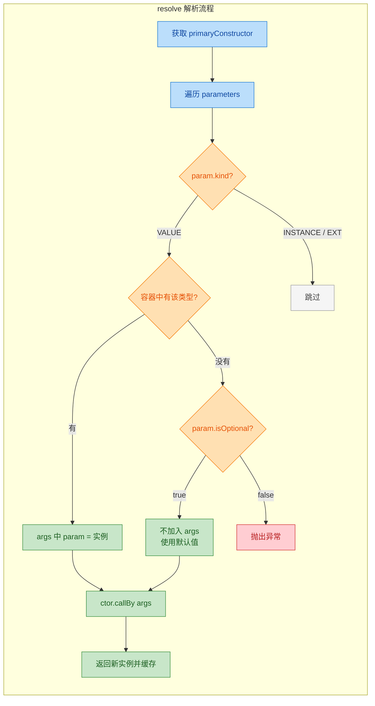

### KParameter 属性速查表

```kotlin
// KParameter 核心属性一览
// ┌──────────────┬──────────────────┬──────────────────────────────────┐
// │   属性        │   类型            │   说明                           │
// ├──────────────┼──────────────────┼──────────────────────────────────┤
// │ index        │ Int              │ 参数在列表中的位置 (从 0 开始)      │
// │ name         │ String?          │ 参数名 (receiver 为 null)          │
// │ type         │ KType            │ 参数的完整类型信息                  │
// │ kind         │ KParameter.Kind  │ INSTANCE / EXTENSION_RECEIVER / VALUE │
// │ isOptional   │ Boolean          │ 是否有默认值                       │
// │ isVararg     │ Boolean          │ 是否是 vararg 参数                 │
// │ annotations  │ List<Annotation> │ 参数上的注解列表                    │
// └──────────────┴──────────────────┴──────────────────────────────────┘
```

最后补充一个容易遗漏的属性——`isVararg`。当参数声明为 `vararg` 时，该属性为 `true`，并且参数的 `type` 会是 `Array<T>` 而非 `T`：

```kotlin
import kotlin.reflect.full.primaryConstructor

class Logger(vararg val tags: String)

fun main() {
    val ctor = Logger::class.primaryConstructor!!
    val param = ctor.parameters.first()

    println("name: ${param.name}")         // tags
    println("isVararg: ${param.isVararg}") // true
    println("type: ${param.type}")         // kotlin.Array<out kotlin.String>
}
```

---

## 反射调用（call 调用、callBy 命名参数调用）

反射最核心的价值，不仅仅是"看到"程序的结构信息，更在于能够在运行时**动态地执行**函数、构造对象、读写属性。Kotlin 反射体系中，`call` 和 `callBy` 是两个最关键的调用入口，它们定义在 `KCallable<R>` 接口上，几乎所有可调用的反射元素（函数、属性访问器、构造器）都继承了这两个方法。理解它们的工作原理、参数映射规则以及异常处理机制，是掌握 Kotlin 反射实战的必经之路。

### call —— 按位置传参的通用调用

`call` 是 `KCallable` 接口中最直接的调用方式，其签名非常简洁：

```kotlin
// KCallable 接口中的 call 方法签名
// 接收一个 vararg 参数数组，返回泛型 R
public fun call(vararg args: Any?): R
```

它的语义等价于 Java 反射中的 `Method.invoke(obj, args...)`：你按照参数的**声明顺序**，把所有实参依次传入。这里的"所有参数"包含一个容易被忽略的细节——**接收者（receiver）**。

#### 基本用法：调用普通函数

```kotlin
import kotlin.reflect.full.functions

// 定义一个简单的工具类
class MathHelper {
    // 一个普通的成员函数，接收两个 Int，返回它们的和
    fun add(a: Int, b: Int): Int = a + b
}

fun main() {
    // 获取 MathHelper 的 KClass
    val kClass = MathHelper::class

    // 从成员函数列表中，按名称找到 add 函数
    val addFunc = kClass.functions.first { it.name == "add" }

    // 创建一个实例，作为成员函数调用时的 receiver
    val instance = MathHelper()

    // call 调用：第一个参数是 receiver（实例），后续参数按声明顺序传入
    // 等价于 instance.add(3, 5)
    val result = addFunc.call(instance, 3, 5)

    println(result) // 输出: 8
}
```

这里最关键的一点：对于**成员函数**，`call` 的第一个参数永远是该成员所属类的实例（即 `this` 引用）。这与 Java 反射中 `method.invoke(obj, ...)` 的设计完全一致。

#### 调用顶层函数

顶层函数（top-level function）没有所属类的实例，因此不需要传 receiver：

```kotlin
// 顶层函数：不属于任何类
fun greet(name: String): String = "Hello, $name!"

fun main() {
    // 通过函数引用获取 KFunction
    val greetFunc = ::greet

    // 顶层函数没有 receiver，直接传业务参数即可
    val result = greetFunc.call("Kotlin")

    println(result) // 输出: Hello, Kotlin!
}
```

#### 调用构造函数

构造函数同样是 `KCallable` 的子类型（`KFunction`），通过 `call` 可以动态创建对象：

```kotlin
import kotlin.reflect.full.primaryConstructor

// 一个数据类，拥有主构造函数
data class User(val name: String, val age: Int)

fun main() {
    val kClass = User::class

    // 获取主构造函数的 KFunction 引用
    val constructor = kClass.primaryConstructor
        ?: throw IllegalStateException("No primary constructor found")

    // call 调用构造函数：无需 receiver，按参数顺序传入
    // 等价于 User("Alice", 30)
    val user = constructor.call("Alice", 30)

    println(user)       // 输出: User(name=Alice, age=30)
    println(user.name)  // 输出: Alice
}
```

#### call 的参数数量校验

`call` 对参数数量有严格要求——传入的实参个数必须与 `KCallable.parameters` 的数量**精确匹配**。多一个、少一个都会抛出 `IllegalArgumentException`：

```kotlin
class Demo {
    fun sayHello(name: String) = "Hello, $name"
}

fun main() {
    val func = Demo::class.functions.first { it.name == "sayHello" }
    val instance = Demo()

    // ✅ 正确：1 个 receiver + 1 个业务参数 = 2 个参数
    println(func.call(instance, "World"))

    // ❌ 错误：参数不足，缺少业务参数
    // func.call(instance)
    // 抛出 IllegalArgumentException: Callable expects 2 arguments, but 1 were provided

    // ❌ 错误：参数过多
    // func.call(instance, "World", "Extra")
    // 抛出 IllegalArgumentException: Callable expects 2 arguments, but 3 were provided
}
```

这意味着，即使函数声明了默认参数值，`call` 也**不会**自动使用它们——你必须显式传入每一个参数。这正是 `callBy` 存在的意义。

#### call 的类型安全问题

由于 `call` 的参数类型是 `vararg Any?`，编译器无法在编译期检查参数类型是否匹配。类型错误只会在运行时暴露：

```kotlin
class Calculator {
    fun multiply(a: Int, b: Int): Int = a * b
}

fun main() {
    val func = Calculator::class.functions.first { it.name == "multiply" }
    val instance = Calculator()

    // ✅ 正确的类型
    println(func.call(instance, 4, 5)) // 输出: 20

    // ❌ 传入 String 而非 Int，编译通过，但运行时抛出 IllegalArgumentException
    try {
        func.call(instance, "four", "five")
    } catch (e: IllegalArgumentException) {
        // argument type mismatch
        println("Type mismatch: ${e.message}")
    }
}
```

这是反射调用的固有代价——你用运行时的灵活性换取了编译期的类型安全。

### callBy —— 按名称传参，支持默认值

`callBy` 是 Kotlin 反射相对于 Java 反射的一个重大增强。它的签名如下：

```kotlin
// KCallable 接口中的 callBy 方法签名
// 接收一个 Map，key 是 KParameter，value 是对应的实参
public fun callBy(args: Map<KParameter, Any?>): R
```

与 `call` 的本质区别在于：

1. 参数通过 `Map<KParameter, Any?>` 传递，是**按名称（按参数对象）映射**的，而非按位置。
2. 如果某个参数在 Map 中**缺失**，且该参数在声明时有**默认值**，则自动使用默认值。
3. 如果某个参数缺失且**没有**默认值，也不是可选的（optional），则抛出 `IllegalArgumentException`。

这使得 `callBy` 在处理拥有大量默认参数的 Kotlin 函数时极为方便。

#### 基本用法：利用默认参数

```kotlin
import kotlin.reflect.full.primaryConstructor

// 一个拥有多个默认参数的数据类
data class ServerConfig(
    val host: String = "localhost",  // 默认值: localhost
    val port: Int = 8080,            // 默认值: 8080
    val useSsl: Boolean = false,     // 默认值: false
    val maxConnections: Int = 100    // 默认值: 100
)

fun main() {
    val constructor = ServerConfig::class.primaryConstructor!!

    // 获取所有参数的 KParameter 引用
    val params = constructor.parameters

    // 只传入我们关心的参数，其余使用默认值
    // 构建 Map：KParameter -> 实参值
    val args = mapOf(
        params.first { it.name == "host" } to "192.168.1.100",
        params.first { it.name == "useSsl" } to true
        // port 和 maxConnections 未传入，将使用默认值
    )

    // callBy 会自动填充缺失参数的默认值
    val config = constructor.callBy(args)

    println(config)
    // 输出: ServerConfig(host=192.168.1.100, port=8080, useSsl=true, maxConnections=100)
}
```

如果用 `call` 来实现同样的效果，你必须手动传入所有 4 个参数，无法跳过任何一个。`callBy` 让你只关注需要覆盖的参数，其余交给默认值机制。

#### callBy 调用成员函数

`callBy` 同样适用于成员函数，但别忘了——成员函数的 `parameters` 列表中，第 0 个参数是 receiver（`instance` 参数，其 `kind` 为 `KParameter.Kind.INSTANCE`）：

```kotlin
import kotlin.reflect.full.functions
import kotlin.reflect.KParameter

class EmailSender {
    // 一个拥有多个默认参数的成员函数
    fun send(
        to: String,                          // 必填
        subject: String = "No Subject",      // 默认值
        body: String = "",                   // 默认值
        isHtml: Boolean = false,             // 默认值
        priority: Int = 3                    // 默认值: 普通优先级
    ): String {
        return "Sending to=$to, subject=$subject, html=$isHtml, priority=$priority"
    }
}

fun main() {
    val kClass = EmailSender::class
    val sendFunc = kClass.functions.first { it.name == "send" }
    val instance = EmailSender()

    // 构建参数映射
    val argsMap = buildMap<KParameter, Any?> {
        for (param in sendFunc.parameters) {
            when (param.kind) {
                // receiver 参数：传入实例
                KParameter.Kind.INSTANCE -> put(param, instance)
                // 业务参数：只传必填的和需要覆盖的
                KParameter.Kind.VALUE -> {
                    when (param.name) {
                        "to" -> put(param, "dev@example.com")       // 必填参数
                        "priority" -> put(param, 1)                  // 覆盖默认值
                        // subject, body, isHtml 不传，使用默认值
                    }
                }
                else -> { /* 扩展函数的 receiver，此处不涉及 */ }
            }
        }
    }

    val result = sendFunc.callBy(argsMap)
    println(result)
    // 输出: Sending to=dev@example.com, subject=No Subject, html=false, priority=1
}
```

#### callBy 的参数缺失校验

如果一个**必填参数**（没有默认值、不是 optional）在 Map 中缺失，`callBy` 会立即报错：

```kotlin
import kotlin.reflect.full.primaryConstructor

data class Point(val x: Int, val y: Int) // 两个参数都没有默认值

fun main() {
    val constructor = Point::class.primaryConstructor!!

    // 只传了 x，缺少必填参数 y
    val args = mapOf(
        constructor.parameters.first { it.name == "x" } to 10
    )

    try {
        constructor.callBy(args) // ❌ 抛出异常
    } catch (e: IllegalArgumentException) {
        // No argument provided for a required parameter: 
        // parameter #1 y of fun <init>(kotlin.Int, kotlin.Int): Point
        println("Missing required param: ${e.message}")
    }
}
```

### call 与 callBy 的对比全景

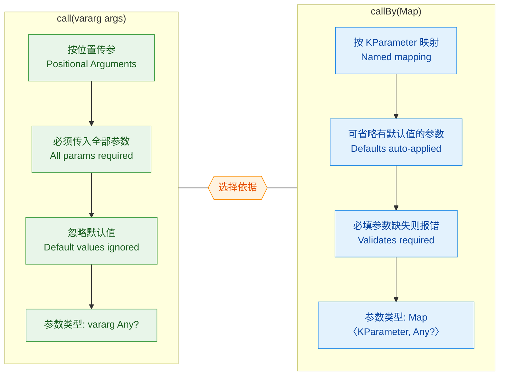

简单总结选择策略：

- 当你**明确知道所有参数的值和顺序**时，用 `call`——它更直接，开销略小。
- 当函数有**默认参数**，或者你需要**按名称动态组装参数**时，用 `callBy`——它更灵活，更 Kotlin-idiomatic。

### 实战：构建通用的反射调用工具

在实际项目中，反射调用常用于框架层面的通用逻辑，比如依赖注入、配置映射、RPC 调用分发等。下面构建一个小型的"配置对象工厂"，演示 `callBy` 的典型应用场景：

```kotlin
import kotlin.reflect.KClass
import kotlin.reflect.KParameter
import kotlin.reflect.full.primaryConstructor

/**
 * 通用配置工厂：从 Map<String, Any?> 创建任意数据类实例
 * 利用 callBy 自动处理默认参数
 */
object ConfigFactory {

    /**
     * 根据传入的键值对 Map，通过反射创建指定类型的实例
     * @param kClass 目标类的 KClass
     * @param rawConfig 原始配置数据，key 为参数名，value 为参数值
     * @return 创建好的实例
     */
    fun <T : Any> create(kClass: KClass<T>, rawConfig: Map<String, Any?>): T {
        // 获取主构造函数，如果没有则抛出异常
        val constructor = kClass.primaryConstructor
            ?: throw IllegalArgumentException("${kClass.simpleName} has no primary constructor")

        // 将 Map<String, Any?> 转换为 Map<KParameter, Any?>
        // 只映射在 rawConfig 中存在的参数，其余留给默认值
        val args = mutableMapOf<KParameter, Any?>()

        for (param in constructor.parameters) {
            // 检查原始配置中是否包含该参数名
            if (rawConfig.containsKey(param.name)) {
                // 存在则放入映射
                args[param] = rawConfig[param.name]
            }
            // 不存在的参数：
            //   - 如果有默认值，callBy 会自动使用
            //   - 如果是必填参数，callBy 会抛出异常
        }

        // 使用 callBy 创建实例，自动应用默认值
        return constructor.callBy(args)
    }
}

// ---------- 使用示例 ----------

data class DatabaseConfig(
    val url: String,                          // 必填
    val driver: String = "com.mysql.cj.jdbc.Driver",  // 有默认值
    val username: String = "root",            // 有默认值
    val password: String = "",                // 有默认值
    val poolSize: Int = 10,                   // 有默认值
    val timeout: Long = 30_000L               // 有默认值: 30秒
)

fun main() {
    // 模拟从配置文件或环境变量读取的原始数据
    val rawConfig = mapOf(
        "url" to "jdbc:mysql://prod-db:3306/myapp",
        "username" to "app_user",
        "password" to "s3cret",
        "poolSize" to 20
        // driver 和 timeout 未提供，将使用默认值
    )

    // 通过反射工厂创建配置对象
    val dbConfig = ConfigFactory.create(DatabaseConfig::class, rawConfig)

    println(dbConfig)
    // 输出: DatabaseConfig(
    //   url=jdbc:mysql://prod-db:3306/myapp,
    //   driver=com.mysql.cj.jdbc.Driver,
    //   username=app_user,
    //   password=s3cret,
    //   poolSize=20,
    //   timeout=30000
    // )
}
```

这个模式在 Spring Boot 的 `@ConfigurationProperties`、Kotlin Serialization 的反序列化、以及各种 ORM 框架的实体映射中都有类似的实现思路。`callBy` 的默认值支持让 Kotlin 在这类场景下比 Java 反射优雅得多。

### 异常处理与边界情况

反射调用涉及运行时动态行为，异常处理至关重要。以下是 `call` 和 `callBy` 可能抛出的主要异常：

```kotlin
import kotlin.reflect.full.functions
import kotlin.reflect.full.primaryConstructor

class Service {
    fun riskyOperation(input: String): Int {
        // 业务逻辑可能抛出异常
        return input.toInt() // 如果 input 不是数字，抛出 NumberFormatException
    }
}

fun main() {
    val func = Service::class.functions.first { it.name == "riskyOperation" }
    val instance = Service()

    // 情况 1: 参数数量错误 → IllegalArgumentException
    try {
        func.call(instance) // 缺少 input 参数
    } catch (e: IllegalArgumentException) {
        println("参数数量错误: ${e.message}")
    }

    // 情况 2: 参数类型错误 → IllegalArgumentException
    try {
        func.call(instance, 123) // 传入 Int 而非 String
    } catch (e: IllegalArgumentException) {
        println("参数类型错误: ${e.message}")
    }

    // 情况 3: 被调用函数内部抛出异常
    // call/callBy 会将内部异常包装在 InvocationTargetException 中（Java 反射行为）
    // 但 Kotlin 反射通常直接抛出原始异常
    try {
        func.call(instance, "not_a_number")
    } catch (e: NumberFormatException) {
        // 直接捕获到业务异常
        println("业务异常: ${e.message}")
    } catch (e: Exception) {
        // 兜底捕获
        println("其他异常: ${e::class.simpleName} - ${e.message}")
    }

    // 情况 4: callBy 缺少必填参数 → IllegalArgumentException
    val constructor = Service::class.primaryConstructor
    // Service 有无参构造函数，这里用另一个类演示
    data class Strict(val id: Int) // 无默认值

    try {
        Strict::class.primaryConstructor!!.callBy(emptyMap()) // 缺少必填参数 id
    } catch (e: IllegalArgumentException) {
        println("必填参数缺失: ${e.message}")
    }
}
```

#### 异常传播机制的细微差别

Kotlin 反射的 `call`/`callBy` 在异常传播上与 Java 反射有一个重要区别：

```kotlin
// Java 反射: method.invoke() 将被调用方法的异常包装在 InvocationTargetException 中
// 你需要 catch InvocationTargetException 然后通过 .cause 获取原始异常

// Kotlin 反射: call()/callBy() 直接抛出被调用方法的原始异常
// 不需要解包 InvocationTargetException，代码更简洁
```

这是 Kotlin 反射 API 的一个人性化设计——减少了异常处理的样板代码。

### 反射调用属性的 Getter 和 Setter

`call` 和 `callBy` 不仅适用于函数，也适用于属性的 getter/setter，因为它们本质上也是 `KCallable`：

```kotlin
import kotlin.reflect.full.memberProperties
import kotlin.reflect.KMutableProperty

class Person(var name: String, var age: Int)

fun main() {
    val person = Person("Bob", 25)
    val kClass = Person::class

    // 获取 name 属性的 KProperty
    val nameProp = kClass.memberProperties.first { it.name == "name" }

    // 通过 call 调用 getter（getter 的参数只有 receiver）
    val currentName = nameProp.getter.call(person)
    println("Current name: $currentName") // 输出: Current name: Bob

    // 如果是可变属性，可以调用 setter
    if (nameProp is KMutableProperty<*>) {
        // setter 的参数：receiver + 新值
        nameProp.setter.call(person, "Robert")
        println("Updated name: ${person.name}") // 输出: Updated name: Robert
    }

    // 同样可以用 callBy
    val ageProp = kClass.memberProperties.first { it.name == "age" }
    val ageArgs = mapOf(ageProp.getter.parameters[0] to person)
    val currentAge = ageProp.getter.callBy(ageArgs)
    println("Current age: $currentAge") // 输出: Current age: 25
}
```

### 调用流程的内部机制

从宏观视角看，`call` 和 `callBy` 的内部执行流程如下：

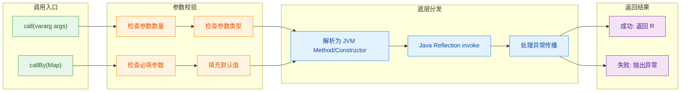

无论是 `call` 还是 `callBy`，最终都会走到 JVM 层面的 `java.lang.reflect.Method.invoke()` 或 `Constructor.newInstance()`。Kotlin 反射层所做的工作主要是参数校验、默认值填充和异常转换。

### nullable 参数与 callBy 的交互

一个容易踩坑的地方：当参数类型是 nullable 时，`callBy` 对"Map 中不包含该 key"和"Map 中包含该 key 但 value 为 null"的处理是不同的：

```kotlin
import kotlin.reflect.full.primaryConstructor

data class Message(
    val text: String,
    val sender: String? = null,   // nullable + 有默认值
    val metadata: String? = null  // nullable + 有默认值
)

fun main() {
    val constructor = Message::class.primaryConstructor!!
    val params = constructor.parameters

    // 场景 1: Map 中不包含 sender → 使用默认值 null
    val args1 = mapOf(
        params.first { it.name == "text" } to "Hello"
        // sender 和 metadata 都不在 Map 中，使用默认值 null
    )
    println(constructor.callBy(args1))
    // 输出: Message(text=Hello, sender=null, metadata=null)

    // 场景 2: Map 中包含 sender 且值为 null → 显式传入 null
    val args2 = mapOf(
        params.first { it.name == "text" } to "Hello",
        params.first { it.name == "sender" } to null  // 显式传 null
    )
    println(constructor.callBy(args2))
    // 输出: Message(text=Hello, sender=null, metadata=null)

    // 两种结果看起来一样，但语义不同：
    // 场景 1: "我不关心这个参数，用默认值就好"
    // 场景 2: "我明确要求这个参数的值是 null"
    // 当默认值不是 null 时，差异就很明显了
}

data class Greeting(
    val name: String,
    val prefix: String? = "Dear"  // nullable，但默认值不是 null
)

fun main2() {
    val ctor = Greeting::class.primaryConstructor!!
    val params = ctor.parameters

    // 不传 prefix → 使用默认值 "Dear"
    val g1 = ctor.callBy(mapOf(params[0] to "Alice"))
    println(g1) // Greeting(name=Alice, prefix=Dear)

    // 显式传 null → prefix 为 null，不使用默认值
    val g2 = ctor.callBy(mapOf(params[0] to "Alice", params[1] to null))
    println(g2) // Greeting(name=Alice, prefix=null)
}
```

这个区别在编写通用反序列化逻辑或配置映射时非常重要——你需要区分"用户没有提供这个字段"和"用户明确将这个字段设为 null"。

---

**📝 练习题**

以下 Kotlin 代码的输出是什么？

```kotlin
import kotlin.reflect.full.primaryConstructor

data class Config(
    val name: String,
    val retries: Int = 3,
    val verbose: Boolean = false
)

fun main() {
    val ctor = Config::class.primaryConstructor!!
    val params = ctor.parameters
    val args = mapOf(
        params.first { it.name == "name" } to "prod",
        params.first { it.name == "verbose" } to true
    )
    val config = ctor.callBy(args)
    println("${config.name}, ${config.retries}, ${config.verbose}")
}
```

A. `prod, 0, true`

B. `prod, 3, true`

C. `prod, 3, false`

D. 抛出 `IllegalArgumentException`，因为缺少 `retries` 参数

**【答案】** B

**【解析】** `callBy` 的核心特性就是自动应用默认参数值。在传入的 Map 中，`name` 被显式设为 `"prod"`，`verbose` 被显式设为 `true`，而 `retries` 没有出现在 Map 中。由于 `retries` 在声明时有默认值 `3`，`callBy` 会自动使用该默认值。因此最终输出 `prod, 3, true`。如果换成 `call`，则必须传入所有 3 个参数，否则会抛出异常。选项 A 错误是因为 `0` 是 Int 的零值而非声明的默认值；选项 C 忽略了 `verbose` 被显式覆盖为 `true`；选项 D 混淆了 `call` 和 `callBy` 的行为。

---

## 扩展反射（Extension Reflection）

Kotlin 的扩展函数和扩展属性是语言层面的"语法糖"，它们在编译后会变成普通的静态方法。但在反射的世界里，Kotlin 提供了一套专门的 API 来感知和操作这些扩展成员。理解扩展反射，关键在于搞清楚一个核心问题：**扩展函数的"接收者"（receiver）在反射模型中是如何表达的？**

这一节我们将从扩展函数的编译本质出发，逐步深入到 `KFunction` 的 `extensionReceiverParameter`、成员扩展（member extension）的双重接收者，以及实际的反射调用技巧。

---

### 扩展函数的编译本质与反射模型

在进入反射 API 之前，必须先回顾扩展函数在 JVM 层面的真实面貌。当你写下：

```kotlin
// 定义一个 String 的扩展函数
fun String.wordCount(): Int = this.split(" ").size
```

编译器实际上生成的是一个静态方法，大致等价于：

```java
// 编译后的 Java 字节码等价形式
public static int wordCount(String $this$wordCount) {
    return $this$wordCount.split(" ").length;
}
```

也就是说，`this`（即扩展接收者，extension receiver）被编译器"降级"为方法的第一个参数。这个事实直接影响了反射 API 的设计——Kotlin 反射需要在这个"静态方法"之上，重新还原出"这是一个扩展函数，它的接收者类型是 `String`"这一语义信息。

Kotlin 反射通过 `KFunction` 接口上的 `extensionReceiverParameter` 属性来表达这层关系：

```kotlin
import kotlin.reflect.full.extensionReceiverParameter

fun String.wordCount(): Int = this.split(" ").size

fun main() {
    // 通过 :: 获取扩展函数的引用
    val funcRef = String::wordCount

    // 查看扩展接收者参数（extension receiver parameter）
    val receiver = funcRef.extensionReceiverParameter
    println(receiver)          // extension receiver parameter of fun String.wordCount(): Int
    println(receiver?.type)    // kotlin.String

    // 对比：普通参数列表（parameters）包含接收者
    println(funcRef.parameters.size)  // 1 —— 扩展接收者也算一个 parameter
    println(funcRef.parameters[0].kind) // EXTENSION_RECEIVER
}
```

这里有一个非常重要的细节：`KFunction.parameters` 列表中，扩展接收者会作为 `kind == KParameter.Kind.EXTENSION_RECEIVER` 的参数出现在最前面。这与普通参数（`kind == VALUE`）和实例接收者（`kind == INSTANCE`）形成了清晰的三分类。

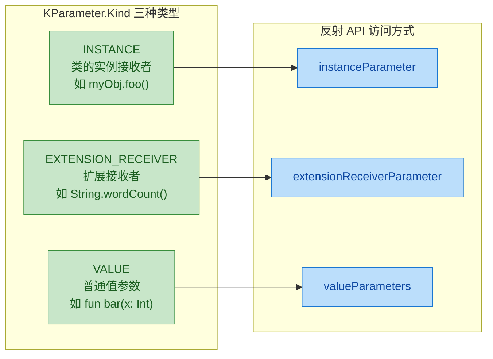

---

### 扩展函数的反射引用与调用

获取扩展函数的反射引用有两种常见方式：通过 `::` 操作符直接引用，或者从类的 `KClass` 中查找。两种方式在使用上有显著差异。

#### 方式一：直接使用 `::` 引用

```kotlin
fun Int.isEven(): Boolean = this % 2 == 0

fun main() {
    // 直接引用扩展函数，类型是 KFunction1<Int, Boolean>
    val ref = Int::isEven

    // 调用方式一：像普通函数一样调用，传入接收者作为参数
    println(ref(42))    // true
    println(ref(7))     // false

    // 调用方式二：使用 call，同样需要传入接收者
    println(ref.call(42))  // true

    // 查看函数名称
    println(ref.name)   // isEven
}
```

注意 `Int::isEven` 的类型是 `KFunction1<Int, Boolean>`——扩展接收者占据了第一个类型参数的位置。这与编译后"接收者变成第一个参数"的本质完全一致。

#### 方式二：从 KClass 的扩展函数列表中查找

这里有一个常见的"坑"：`KClass.memberFunctions` 和 `KClass.memberExtensionFunctions` 是两个不同的集合。**顶层扩展函数不会出现在目标类的 `memberFunctions` 中**，因为它们本质上不是类的成员。

```kotlin
import kotlin.reflect.full.memberFunctions
import kotlin.reflect.full.extensionFunctions

fun String.wordCount(): Int = this.split(" ").size

fun main() {
    val stringClass = String::class

    // 顶层扩展函数不会出现在 memberFunctions 中
    val found = stringClass.memberFunctions.find { it.name == "wordCount" }
    println(found)  // null —— 找不到！

    // 顶层扩展函数需要通过直接引用来获取
    // 它们不"属于"任何 KClass
    val directRef = String::wordCount
    println(directRef.name)  // wordCount
}
```

这是因为扩展函数在语义上并没有真正"注入"到目标类中。它只是一个静态函数，编译器通过语法糖让你可以用 `"hello".wordCount()` 的方式调用。反射 API 忠实地反映了这一事实。

---

### 成员扩展函数（Member Extension Functions）

成员扩展函数是 Kotlin 中一个相对高级的特性——它是定义在某个类内部的扩展函数。这种函数同时拥有两个接收者：

- **dispatch receiver**（分发接收者）：即包含这个扩展函数的类的实例
- **extension receiver**（扩展接收者）：即被扩展的类型的实例

```kotlin
class Formatter(private val prefix: String) {
    // 这是一个成员扩展函数
    // dispatch receiver = Formatter 实例
    // extension receiver = String 实例
    fun String.formatWithPrefix(): String {
        // this 指向 String（extension receiver）
        // this@Formatter 指向 Formatter（dispatch receiver）
        return "$prefix: $this"
    }
}
```

在反射中，成员扩展函数可以通过 `KClass.memberExtensionFunctions` 获取：

```kotlin
import kotlin.reflect.full.memberExtensionFunctions
import kotlin.reflect.KFunction
import kotlin.reflect.KParameter

class Formatter(private val prefix: String) {
    fun String.formatWithPrefix(): String = "$prefix: $this"
}

fun main() {
    val kClass = Formatter::class

    // 从 Formatter 类中获取成员扩展函数
    val memberExt = kClass.memberExtensionFunctions.find {
        it.name == "formatWithPrefix"
    }

    println(memberExt)  // fun Formatter.String.formatWithPrefix(): String
    println(memberExt?.parameters?.size)  // 2

    // 逐个检查参数的 kind
    memberExt?.parameters?.forEach { param ->
        println("${param.name ?: "(unnamed)"} -> ${param.kind}")
    }
    // 输出：
    // (unnamed) -> INSTANCE           ← dispatch receiver (Formatter)
    // (unnamed) -> EXTENSION_RECEIVER ← extension receiver (String)
}
```

可以看到，`parameters` 列表中同时出现了 `INSTANCE` 和 `EXTENSION_RECEIVER` 两种 kind。这正是成员扩展函数的"双重接收者"在反射模型中的体现。

#### 反射调用成员扩展函数

调用成员扩展函数时，需要同时传入两个接收者：

```kotlin
import kotlin.reflect.full.memberExtensionFunctions

class Formatter(private val prefix: String) {
    fun String.formatWithPrefix(): String = "$prefix: $this"
}

fun main() {
    val formatter = Formatter("LOG")  // dispatch receiver 实例
    val kClass = Formatter::class

    val memberExt = kClass.memberExtensionFunctions.find {
        it.name == "formatWithPrefix"
    }!!

    // call 调用时，按 parameters 顺序传参：
    // 第一个参数 = dispatch receiver (Formatter 实例)
    // 第二个参数 = extension receiver (String 实例)
    val result = memberExt.call(formatter, "Hello World")
    println(result)  // LOG: Hello World
}
```

这个调用顺序非常关键：**先 dispatch receiver，再 extension receiver，最后才是普通的 value parameters**（如果有的话）。

下面这张图完整展示了成员扩展函数在反射调用时的参数映射关系：

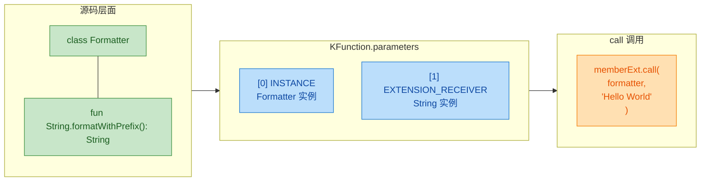

---

### 扩展属性的反射

扩展属性的反射与扩展函数类似，但使用的是 `KProperty` 系列接口。扩展属性同样拥有 `extensionReceiverParameter`：

```kotlin
import kotlin.reflect.full.memberExtensionProperties

// 顶层扩展属性
val String.firstWord: String
    get() = this.split(" ").first()

class StringUtils {
    // 成员扩展属性
    val String.lastChar: Char
        get() = this[this.length - 1]
}

fun main() {
    // ---- 顶层扩展属性 ----
    val propRef = String::firstWord
    println(propRef.name)  // firstWord
    println(propRef.extensionReceiverParameter?.type)  // kotlin.String

    // 通过 get 调用，传入接收者
    println(propRef.get("Hello World"))  // Hello

    // ---- 成员扩展属性 ----
    val memberExtProps = StringUtils::class.memberExtensionProperties
    memberExtProps.forEach { prop ->
        println("${prop.name}: receiver=${prop.extensionReceiverParameter?.type}")
    }
    // 输出: lastChar: receiver=kotlin.String

    // 调用成员扩展属性的 getter
    val lastCharProp = memberExtProps.first()
    val utils = StringUtils()
    // 需要传入 dispatch receiver 和 extension receiver
    val result = lastCharProp.getter.call(utils, "Kotlin")
    println(result)  // n
}
```

---

### 判断一个函数/属性是否为扩展

在编写通用的反射工具时，经常需要判断某个 `KCallable` 是否是扩展成员。最直接的方式就是检查 `extensionReceiverParameter` 是否为 `null`：

```kotlin
import kotlin.reflect.KCallable
import kotlin.reflect.full.memberFunctions
import kotlin.reflect.full.memberExtensionFunctions

fun KCallable<*>.isExtension(): Boolean {
    // 如果 extensionReceiverParameter 不为 null，说明这是一个扩展
    return this.extensionReceiverParameter != null
}

class Demo {
    fun normalMethod() {}                    // 普通成员方法
    fun String.extMethod(): String = this    // 成员扩展方法
}

fun main() {
    val allFunctions = Demo::class.memberFunctions +
                       Demo::class.memberExtensionFunctions

    allFunctions.forEach { func ->
        println("${func.name} -> isExtension=${func.isExtension()}")
    }
    // normalMethod -> isExtension=false
    // extMethod -> isExtension=true
    // equals -> isExtension=false
    // hashCode -> isExtension=false
    // toString -> isExtension=false
}
```

---

### 实战：通用扩展函数发现与调用框架

下面是一个稍微综合的例子，展示如何通过反射发现并调用一个类中所有的成员扩展函数：

```kotlin
import kotlin.reflect.KFunction
import kotlin.reflect.KParameter
import kotlin.reflect.full.memberExtensionFunctions
import kotlin.reflect.full.createInstance

class Transformer {
    // 将字符串转为大写并加前缀
    fun String.shout(): String = ">>> ${this.uppercase()} <<<"

    // 将整数翻倍
    fun Int.doubled(): Int = this * 2

    // 带额外参数的成员扩展
    fun String.repeat(times: Int): String = this.repeat(times)
}

/**
 * 发现并调用指定类中所有成员扩展函数
 * @param instance 类的实例（dispatch receiver）
 * @param extensionReceiver 扩展接收者
 * @param additionalArgs 额外的值参数（如果有）
 */
fun invokeAllMatchingExtensions(
    instance: Any,
    extensionReceiver: Any,
    additionalArgs: Map<String, Any?> = emptyMap()
) {
    val kClass = instance::class
    // 获取所有成员扩展函数
    val extensions = kClass.memberExtensionFunctions

    extensions.forEach { func ->
        val extParam = func.extensionReceiverParameter ?: return@forEach

        // 检查扩展接收者类型是否匹配
        val extType = extParam.type.classifier
        if (extType != extensionReceiver::class) return@forEach

        // 构建参数映射
        val argsMap = mutableMapOf<KParameter, Any?>()

        func.parameters.forEach { param ->
            when (param.kind) {
                // dispatch receiver —— 类实例
                KParameter.Kind.INSTANCE -> argsMap[param] = instance
                // extension receiver —— 扩展接收者
                KParameter.Kind.EXTENSION_RECEIVER -> argsMap[param] = extensionReceiver
                // 普通值参数 —— 从 additionalArgs 中查找
                KParameter.Kind.VALUE -> {
                    val argValue = additionalArgs[param.name]
                    if (argValue != null || param.isOptional) {
                        argsMap[param] = argValue
                    }
                }
            }
        }

        // 只有所有必需参数都满足时才调用
        val allRequiredSatisfied = func.parameters.all {
            it.isOptional || it in argsMap
        }

        if (allRequiredSatisfied) {
            try {
                // 使用 callBy 支持命名参数和可选参数
                val result = func.callBy(argsMap)
                println("${func.name}($extensionReceiver) = $result")
            } catch (e: Exception) {
                println("${func.name} 调用失败: ${e.message}")
            }
        }
    }
}

fun main() {
    val transformer = Transformer()

    // 调用所有接收 String 的成员扩展
    println("=== String extensions ===")
    invokeAllMatchingExtensions(transformer, "hello")
    // shout(hello) = >>> HELLO <

    // 调用所有接收 Int 的成员扩展
    println("=== Int extensions ===")
    invokeAllMatchingExtensions(transformer, 21)
    // doubled(21) = 42
}
```

这个框架的核心思路是：遍历 `memberExtensionFunctions`，通过 `extensionReceiverParameter` 的类型进行匹配，然后用 `callBy` 完成调用。这种模式在插件系统、DSL 引擎等场景中非常实用。

---

### 扩展反射的局限性与注意事项

有几个容易踩坑的地方值得特别强调：

1. **顶层扩展函数不属于任何 KClass**：你无法通过 `String::class.memberFunctions` 找到 `fun String.wordCount()`。顶层扩展只能通过 `::` 直接引用，或者通过扫描包含它的文件对应的 Facade 类（如 `MyFileKt::class`）来间接获取。

2. **Java 互操作的差异**：从 Java 反射的视角看，扩展函数就是一个普通的静态方法，没有任何"扩展"语义。只有 Kotlin 反射（`kotlin-reflect`）才能识别 `extensionReceiverParameter`。

3. **成员扩展的可见性**：成员扩展函数只能在其所在类的作用域内调用（或通过 `with`/`run` 等作用域函数）。反射调用时虽然可以绕过这个限制，但需要注意 `isAccessible` 的设置。

4. **性能考量**：反射调用扩展函数的开销与反射调用普通函数相同。如果是高频调用场景，建议缓存 `KFunction` 引用，或者考虑使用编译时代码生成（如 KSP）替代运行时反射。

```kotlin
// 顶层扩展函数的"宿主类"查找示例
// 假设 Extensions.kt 文件中定义了扩展函数
// 编译后会生成 ExtensionsKt 类

fun String.myExtension(): String = this.uppercase()

fun main() {
    // 通过 Facade 类的 Java 反射可以找到
    val facadeClass = Class.forName("ExtensionsKt")
    val javaMethod = facadeClass.getMethod("myExtension", String::class.java)
    println(javaMethod)  // public static String ExtensionsKt.myExtension(String)

    // 但这是 Java 反射，丢失了"扩展"语义
    // Kotlin 反射中，直接用 :: 引用是最可靠的方式
    val kotlinRef = String::myExtension
    println(kotlinRef.extensionReceiverParameter?.type)  // kotlin.String
}
```

---

**📝 练习题**

以下代码中，`memberExt.call(...)` 的正确调用方式是什么？

```kotlin
class Host {
    fun Int.plusTen(): Int = this + 10
}

val host = Host()
val memberExt = Host::class.memberExtensionFunctions.first()
val result = memberExt.call(/* ??? */)
```

A. `memberExt.call(5)`

B. `memberExt.call(host, 5)`

C. `memberExt.call(5, host)`

D. `memberExt.call(host, 5, 10)`

**【答案】** B

**【解析】** 成员扩展函数拥有两个接收者。`call` 的参数顺序严格遵循 `parameters` 列表的顺序：第一个是 `INSTANCE`（dispatch receiver，即 `Host` 实例），第二个是 `EXTENSION_RECEIVER`（extension receiver，即 `Int` 值）。`plusTen()` 没有额外的值参数，所以只需要传两个参数。选项 A 缺少 dispatch receiver；选项 C 顺序颠倒；选项 D 多传了一个参数。正确答案是 `memberExt.call(host, 5)`，返回值为 `15`。

---

## 泛型反射（类型参数、星号投影、具体化类型）

泛型（Generics）是 Kotlin 类型系统中极为重要的一环，它让我们在编译期就能对类型进行约束和推断。然而，JVM 上的泛型存在一个众所周知的历史遗留问题——**类型擦除（Type Erasure）**。在运行时，`List<String>` 和 `List<Int>` 的类型信息被擦除为同一个 `List`，这使得"在运行时获取泛型的具体类型参数"变得异常困难。

Kotlin 的反射 API（`kotlin-reflect`）为我们提供了一套相对完善的工具来"窥探"泛型信息。虽然它无法完全绕过 JVM 类型擦除的限制，但通过 `KType`、`KTypeParameter`、`KTypeProjection` 等接口，我们可以在**类声明层面**获取大量泛型元数据。再结合 Kotlin 独有的 `reified` 关键字，我们甚至可以在 `inline` 函数中实现真正的"运行时泛型类型保留"。

本节将从三个维度展开：类型参数的反射读取、星号投影的处理、以及 `reified` 具体化类型与反射的协作。

### 类型参数反射（KTypeParameter 与 KType）

要理解泛型反射，首先需要区分两个核心概念：

- **类型参数（Type Parameter）**：声明在类或函数上的占位符，如 `class Box<T>` 中的 `T`。它描述的是"这个泛型叫什么名字、有什么约束"。
- **类型实参（Type Argument）**：实际使用时填入的具体类型，如 `Box<String>` 中的 `String`。它描述的是"这个泛型被具体化为了什么"。

在 Kotlin 反射体系中，这两者分别由 `KTypeParameter` 和 `KTypeProjection` 来表示，而 `KType` 则是将它们串联起来的核心桥梁。

```kotlin
// 定义一个带有两个类型参数的泛型类
// T 有上界约束 Any（非空），V 有上界约束 Comparable<V>（可比较）
class Repository<T : Any, V : Comparable<V>> {
    // 一个返回泛型类型 T 的函数
    fun findById(id: V): T? = null
}

fun main() {
    // 通过 ::class 获取 KClass 对象
    val kClass = Repository::class

    // typeParameters 返回类声明上的所有类型参数列表
    // 类型为 List<KTypeParameter>
    val typeParams = kClass.typeParameters

    // 遍历每一个类型参数
    typeParams.forEach { param ->
        // name: 类型参数的名称，如 "T"、"V"
        println("类型参数名称: ${param.name}")

        // upperBounds: 该类型参数的上界约束列表
        // 每个上界是一个 KType 对象
        // T 的上界是 Any，V 的上界是 Comparable<V>
        param.upperBounds.forEach { bound ->
            println("  上界约束: $bound")
        }

        // variance: 声明处型变（declaration-site variance）
        // 可能的值: INVARIANT（不变）、IN（逆变）、OUT（协变）
        println("  型变: ${param.variance}")
    }
}
```

输出结果：

```
类型参数名称: T
  上界约束: kotlin.Any
  型变: INVARIANT
类型参数名称: V
  上界约束: java.lang.Comparable<V>
  型变: INVARIANT
```

这里有一个关键认知：`typeParameters` 获取的是**类声明层面**的信息，而不是某个具体实例的类型实参。也就是说，即使你创建了 `Repository<String, Int>()`，通过 `::class` 拿到的 `typeParameters` 依然是 `T` 和 `V`，而不是 `String` 和 `Int`。这正是类型擦除的体现。

下面这张图展示了 Kotlin 反射中泛型相关接口的层级关系：

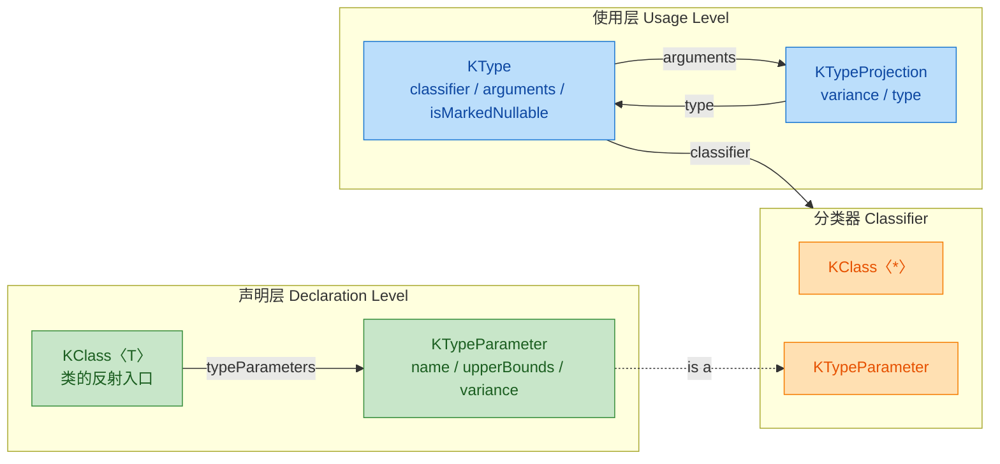

接下来看看如何从函数的返回类型和参数类型中提取泛型信息：

```kotlin
import kotlin.reflect.full.functions

class Wrapper<T> {
    // 函数参数和返回值都涉及泛型
    fun transform(input: List<T>): Map<String, T> {
        return emptyMap()
    }
}

fun main() {
    val kClass = Wrapper::class

    // 从成员函数中找到 transform 方法
    val transformFun = kClass.functions.first { it.name == "transform" }

    // 获取返回类型的 KType
    val returnType = transformFun.returnType
    // 打印完整的返回类型表示
    println("返回类型: $returnType") // Map<kotlin.String, T>

    // arguments 属性返回 List<KTypeProjection>
    // 每个 KTypeProjection 代表一个类型实参
    returnType.arguments.forEachIndexed { index, projection ->
        // projection.variance: 使用处型变（use-site variance）
        // projection.type: 该实参对应的 KType（可能为 null，星号投影时）
        println("  类型实参[$index]: variance=${projection.variance}, type=${projection.type}")
    }

    // 获取 input 参数的类型信息
    // parameters[0] 是 this（接收者），parameters[1] 才是 input
    val inputParam = transformFun.parameters[1]
    val inputType = inputParam.type
    println("参数类型: $inputType") // List<T>

    // classifier 属性返回该类型的分类器
    // 对于普通类，classifier 是 KClass
    // 对于类型参数（如 T），classifier 是 KTypeParameter
    println("参数类型的 classifier: ${inputType.classifier}") // kotlin.collections.List

    // 深入获取 List<T> 中 T 的信息
    val innerArg = inputType.arguments[0]
    println("List 内部类型实参: ${innerArg.type}")                    // T
    println("List 内部 classifier: ${innerArg.type?.classifier}")     // null 或 KTypeParameter
}
```

这段代码揭示了一个重要事实：当泛型类型参数尚未被具体化时，`classifier` 返回的是 `KTypeParameter` 而非 `KClass`。这意味着我们能知道"这里用了一个叫 T 的类型参数"，但无法知道"T 具体是什么类型"。

对于函数返回类型和属性类型中的泛型信息，我们还可以通过 `KType` 的 `isMarkedNullable` 属性来判断该类型是否被标记为可空：

```kotlin
import kotlin.reflect.full.memberProperties

class Container<T> {
    // 可空的泛型属性
    var nullableValue: T? = null
    // 非空的泛型属性（假设 T 本身非空）
    var nonNullValue: T? = null
}

fun main() {
    val props = Container::class.memberProperties

    props.forEach { prop ->
        val type = prop.returnType
        // isMarkedNullable: 该类型是否在源码中被标记为 ?（可空）
        println("${prop.name}: type=$type, nullable=${type.isMarkedNullable}")
        // classifier 在这里是 KTypeParameter，因为 T 未被具体化
        println("  classifier 类型: ${type.classifier?.let { it::class.simpleName }}")
    }
}
```

### 星号投影（Star Projection）

星号投影（Star Projection）是 Kotlin 泛型中一个独特的概念，写作 `*`。它的语义是"我不知道也不关心这个类型参数具体是什么"。在 Java 中，与之对应的是通配符 `?`（即 `List<?>`）。

在反射 API 中，星号投影通过 `KTypeProjection` 来表示。当一个类型实参是 `*` 时，`KTypeProjection` 的 `variance` 为 `null`，`type` 也为 `null`。

```kotlin
import kotlin.reflect.KTypeProjection
import kotlin.reflect.full.createType
import kotlin.reflect.full.starProjectedType

fun main() {
    // ========== 方式一：使用 starProjectedType ==========
    // starProjectedType 会将类的所有类型参数替换为 *
    // 对于 Map<K, V>，starProjectedType 就是 Map<*, *>
    val mapStarType = Map::class.starProjectedType
    println("Map 的星号投影类型: $mapStarType") // kotlin.collections.Map<*, *>

    // 检查 arguments 中的每个投影
    mapStarType.arguments.forEachIndexed { index, projection ->
        // 星号投影的 variance 和 type 都是 null
        println("  实参[$index]: variance=${projection.variance}, type=${projection.type}")
    }

    // ========== 方式二：手动构造带星号投影的 KType ==========
    // KTypeProjection.STAR 是一个预定义的常量，代表 *
    val listStarType = List::class.createType(
        arguments = listOf(KTypeProjection.STAR) // List<*>
    )
    println("\n手动构造: $listStarType") // kotlin.collections.List<*>

    // ========== 方式三：混合具体类型和星号投影 ==========
    // 构造 Map<String, *>
    val mixedType = Map::class.createType(
        arguments = listOf(
            // 第一个类型参数：具体化为 String（INVARIANT 不变型变）
            KTypeProjection.invariant(String::class.createType()),
            // 第二个类型参数：星号投影
            KTypeProjection.STAR
        )
    )
    println("混合构造: $mixedType") // kotlin.collections.Map<kotlin.String, *>

    // ========== KTypeProjection 的工厂方法 ==========
    // invariant(type): 不变 —— 等价于直接写 T
    val invariantProj = KTypeProjection.invariant(Int::class.createType())
    println("\nINVARIANT: variance=${invariantProj.variance}, type=${invariantProj.type}")

    // covariant(type): 协变 —— 等价于 out T
    val covariantProj = KTypeProjection.covariant(Number::class.createType())
    println("OUT: variance=${covariantProj.variance}, type=${covariantProj.type}")

    // contravariant(type): 逆变 —— 等价于 in T
    val contravariantProj = KTypeProjection.contravariant(String::class.createType())
    println("IN: variance=${contravariantProj.variance}, type=${contravariantProj.type}")

    // STAR: 星号投影 —— 等价于 *
    val starProj = KTypeProjection.STAR
    println("STAR: variance=${starProj.variance}, type=${starProj.type}")
}
```

输出结果：

```
Map 的星号投影类型: kotlin.collections.Map<*, *>
  实参[0]: variance=null, type=null
  实参[1]: variance=null, type=null

手动构造: kotlin.collections.List<*>

混合构造: kotlin.collections.Map<kotlin.String, *>

INVARIANT: variance=INVARIANT, type=kotlin.Int
OUT: variance=OUT, type=kotlin.Number
IN: variance=IN, type=kotlin.String
STAR: variance=null, type=null
```

星号投影在实际开发中有一个非常重要的应用场景——**类型安全的反射检查**。当你需要判断一个对象是否是某个泛型类的实例，但不关心具体的类型参数时，星号投影就派上用场了：

```kotlin
import kotlin.reflect.full.isSubtypeOf
import kotlin.reflect.full.createType
import kotlin.reflect.full.starProjectedType
import kotlin.reflect.KTypeProjection

fun main() {
    // 构造具体类型 List<String>
    val listStringType = List::class.createType(
        arguments = listOf(
            KTypeProjection.invariant(String::class.createType())
        )
    )

    // 构造星号投影类型 List<*>
    val listStarType = List::class.starProjectedType

    // List<String> 是 List<*> 的子类型吗？—— 是的
    println("List<String> isSubtypeOf List<*>: ${listStringType.isSubtypeOf(listStarType)}")

    // 构造 MutableList<*>
    val mutableListStarType = MutableList::class.starProjectedType

    // List<*> 是 MutableList<*> 的子类型吗？—— 不是，List 是只读的
    println("List<*> isSubtypeOf MutableList<*>: ${listStarType.isSubtypeOf(mutableListStarType)}")

    // 构造 Collection<*>
    val collectionStarType = Collection::class.starProjectedType

    // List<String> 是 Collection<*> 的子类型吗？—— 是的
    println("List<String> isSubtypeOf Collection<*>: ${listStringType.isSubtypeOf(collectionStarType)}")
}
```

下面用一张图来总结 `KTypeProjection` 的四种形态及其与 Kotlin 源码语法的对应关系：

```mermaid
graph LR
    subgraph Source["Kotlin 源码语法"]
        direction TB
        S1["Box〈String〉"]
        S2["Box〈out Number〉"]
        S3["Box〈in CharSequence〉"]
        S4["Box〈*〉"]
    end

    subgraph Projection["KTypeProjection"]
        direction TB
        P1["INVARIANT\ntype = KType(String)"]
        P2["OUT\ntype = KType(Number)"]
        P3["IN\ntype = KType(CharSequence)"]
        P4["STAR\nvariance = null\ntype = null"]
    end

    subgraph Meaning["语义含义"]
        direction TB
        M1["精确匹配\n只接受 String"]
        M2["协变 Producer\n可读取为 Number"]
        M3["逆变 Consumer\n可写入 CharSequence"]
        M4["未知类型\n读取为 Any?\n不可写入"]
    end

    S1 --> P1 --> M1
    S2 --> P2 --> M2
    S3 --> P3 --> M3
    S4 --> P4 --> M4

    classDef green fill:#C8E6C9,stroke:#388E3C,color:#1B5E20
    classDef blue fill:#BBDEFB,stroke:#1976D2,color:#0D47A1
    classDef orange fill:#FFE0B2,stroke:#F57C00,color:#E65100

    class S1,S2,S3,S4 green
    class P1,P2,P3,P4 blue
    class M1,M2,M3,M4 orange
```

### 具体化类型（Reified Type Parameters）

前面我们反复提到 JVM 的类型擦除问题——在运行时，泛型的具体类型信息会丢失。Kotlin 提供了一个优雅的解决方案：`reified` 关键字。它只能用在 `inline` 函数的类型参数上，编译器会在每个调用点将类型参数替换为实际类型，从而在运行时保留完整的类型信息。

`reified` 与反射的结合，是 Kotlin 元编程中最强大的技巧之一。

```kotlin
import kotlin.reflect.KClass
import kotlin.reflect.full.memberProperties
import kotlin.reflect.full.primaryConstructor

// inline + reified 让 T 的类型信息在运行时可用
// 普通泛型函数无法在函数体内使用 T::class，但 reified 可以
inline fun <reified T : Any> inspectType() {
    // T::class 在普通泛型函数中会编译报错
    // 但在 reified 函数中完全合法
    val kClass: KClass<T> = T::class

    println("===== 类型检查: ${kClass.simpleName} =====")
    // qualifiedName: 完整限定名
    println("完整名称: ${kClass.qualifiedName}")
    // isData: 是否是 data class
    println("是否为 data class: ${kClass.isData}")
    // isSealed: 是否是 sealed class
    println("是否为 sealed class: ${kClass.isSealed}")

    // 获取主构造函数的参数信息
    kClass.primaryConstructor?.parameters?.forEach { param ->
        println("构造参数: ${param.name} -> ${param.type}")
    }

    // 获取所有成员属性
    kClass.memberProperties.forEach { prop ->
        println("属性: ${prop.name} -> ${prop.returnType}")
    }
}

data class User(val name: String, val age: Int)

fun main() {
    // 调用时无需传入 Class 对象，编译器自动推断
    inspectType<User>()
    println()
    inspectType<String>()
}
```

输出结果：

```
===== 类型检查: User =====
完整名称: User
是否为 data class: true
是否为 sealed class: false
构造参数: name -> kotlin.String
构造参数: age -> kotlin.Int
属性: age -> kotlin.Int
属性: name -> kotlin.String

===== 类型检查: String =====
完整名称: kotlin.String
是否为 data class: false
是否为 sealed class: false
属性: length -> kotlin.Int
```

`reified` 的一个经典应用场景是构建类型安全的反序列化/工厂函数。下面展示一个简化的 JSON 反序列化示例：

```kotlin
import kotlin.reflect.KClass
import kotlin.reflect.full.primaryConstructor
import kotlin.reflect.KParameter

// 模拟一个简单的 JSON 解析结果（实际项目中会用 Gson/Moshi/kotlinx.serialization）
typealias JsonObject = Map<String, Any?>

// 核心：reified 让我们在运行时拿到 T 的 KClass
// 然后通过反射自动将 Map 映射到数据类的构造函数参数
inline fun <reified T : Any> JsonObject.deserialize(): T {
    return deserializeInternal(T::class, this)
}

// 实际的反序列化逻辑（非 inline，可以被复用）
fun <T : Any> deserializeInternal(kClass: KClass<T>, json: JsonObject): T {
    // 获取主构造函数，如果没有则抛出异常
    val constructor = kClass.primaryConstructor
        ?: throw IllegalArgumentException("${kClass.simpleName} 没有主构造函数")

    // 构建参数映射：KParameter -> 实际值
    val args = mutableMapOf<KParameter, Any?>()

    // 遍历构造函数的每一个参数
    constructor.parameters.forEach { param ->
        // 从 JSON Map 中按参数名查找对应的值
        val value = json[param.name]

        if (value != null) {
            // 找到了值，放入参数映射
            args[param] = value
        } else if (param.isOptional) {
            // 值为 null 但参数有默认值，跳过（让默认值生效）
            // 不放入 args 中，callBy 会自动使用默认值
        } else if (param.type.isMarkedNullable) {
            // 值为 null 且参数允许 null，显式传入 null
            args[param] = null
        } else {
            // 值为 null、无默认值、不可空 —— 报错
            throw IllegalArgumentException("缺少必需参数: ${param.name}")
        }
    }

    // 使用 callBy 调用构造函数（支持命名参数和默认值）
    return constructor.callBy(args)
}

// 测试用的数据类
data class Article(
    val title: String,                    // 必需，非空
    val author: String = "Anonymous",     // 有默认值
    val tags: List<String>? = null        // 可空，有默认值
)

fun main() {
    // 模拟 JSON 数据
    val json1: JsonObject = mapOf(
        "title" to "Kotlin Reflection Deep Dive",
        "author" to "Kiro",
        "tags" to listOf("kotlin", "reflection")
    )

    val json2: JsonObject = mapOf(
        "title" to "Minimalist Guide"
        // author 缺失 -> 使用默认值 "Anonymous"
        // tags 缺失 -> 使用默认值 null
    )

    // reified 让调用方式极其简洁
    val article1 = json1.deserialize<Article>()
    val article2 = json2.deserialize<Article>()

    println(article1) // Article(title=Kotlin Reflection Deep Dive, author=Kiro, tags=[kotlin, reflection])
    println(article2) // Article(title=Minimalist Guide, author=Anonymous, tags=null)
}
```

这个例子展示了 `reified` + 反射的威力：调用者只需写 `json.deserialize<Article>()`，无需传递任何 `Class` 对象或类型 token，编译器和反射系统会自动完成所有类型推断和对象构造。

接下来看看 `reified` 与类型检查（`is`）和类型转换（`as`）的结合：

```kotlin
// 在普通泛型函数中，以下代码会编译报错：
// fun <T> checkType(obj: Any): Boolean = obj is T  // ❌ Cannot check for erased type

// 但在 reified 函数中完全合法：
inline fun <reified T> isInstanceOf(obj: Any): Boolean {
    // reified 让 T 在运行时可用，因此 is 检查合法
    return obj is T
}

// 类型安全的转换函数
inline fun <reified T> safeCast(obj: Any): T? {
    // as? 安全转换，失败返回 null 而不是抛异常
    return obj as? T
}

// 过滤集合中特定类型的元素（类似 filterIsInstance）
inline fun <reified T> List<*>.filterByType(): List<T> {
    // 利用 reified 进行运行时类型检查
    return this.filter { it is T }.map {
        @Suppress("UNCHECKED_CAST")
        it as T  // 这里的 cast 是安全的，因为已经通过 is 检查
    }
}

fun main() {
    println(isInstanceOf<String>("hello"))  // true
    println(isInstanceOf<String>(42))       // false
    println(isInstanceOf<Number>(3.14))     // true

    val result = safeCast<String>("world")
    println("safeCast 结果: $result")       // world

    val mixed = listOf(1, "two", 3.0, "four", 5)
    // 只保留 String 类型的元素
    val strings = mixed.filterByType<String>()
    println("过滤结果: $strings")           // [two, four]
}
```

最后，让我们深入理解 `reified` 的编译原理。`reified` 之所以能绕过类型擦除，是因为 `inline` 函数在编译时会被内联到调用点，编译器在内联时将类型参数替换为实际类型：

```mermaid
graph LR
    subgraph SourceCode["源码 Source Code"]
        direction TB
        Def["inline fun 〈reified T〉 check(obj: Any)\n    = obj is T"]
        Call1["check〈String〉(x)"]
        Call2["check〈Int〉(y)"]
    end

    subgraph Compiler["Kotlin 编译器 Inline"]
        direction TB
        Inline["内联展开\n类型参数替换"]
    end

    subgraph Bytecode["JVM 字节码 Bytecode"]
        direction TB
        BC1["x instanceof String"]
        BC2["y instanceof Integer"]
    end

    Def --> Inline
    Call1 --> Inline
    Call2 --> Inline
    Inline --> BC1
    Inline --> BC2

    classDef green fill:#C8E6C9,stroke:#388E3C,color:#1B5E20
    classDef blue fill:#BBDEFB,stroke:#1976D2,color:#0D47A1
    classDef orange fill:#FFE0B2,stroke:#F57C00,color:#E65100

    class Def,Call1,Call2 green
    class Inline blue
    class BC1,BC2 orange
```

这意味着 `reified` 并不是真正在运行时"恢复"了泛型信息，而是编译器在编译期就把具体类型"烙印"到了字节码中。这也解释了为什么 `reified` 只能用于 `inline` 函数——非内联函数无法在调用点展开代码。

`reified` 的限制也值得注意：

```kotlin
// ✅ 合法：inline 函数 + reified
inline fun <reified T> works() { /* ... */ }

// ❌ 非法：非 inline 函数不能使用 reified
// fun <reified T> doesNotWork() { /* ... */ }

// ❌ 非法：类的类型参数不能使用 reified
// class Box<reified T>  // 编译错误

// ❌ 非法：reified 类型参数不能用于创建实例
// inline fun <reified T> create(): T = T()  // 编译错误，无法直接调用构造函数

// ✅ 但可以通过反射创建实例
inline fun <reified T : Any> createViaReflection(): T {
    // 利用 reified 获取 KClass，再通过反射调用构造函数
    return T::class.primaryConstructor?.call()
        ?: throw IllegalArgumentException("无法创建 ${T::class.simpleName} 的实例")
}
```

将 `reified` 与 `KType` 结合使用，可以实现更高级的类型操作。Kotlin 提供了 `typeOf<T>()` 函数（需要 `reified`），它能在运行时获取完整的泛型类型信息，包括嵌套的类型参数：

```kotlin
import kotlin.reflect.typeOf
import kotlin.reflect.KTypeProjection

// typeOf 是 Kotlin 标准库提供的 reified 函数
// 它返回一个完整的 KType，包含所有泛型信息
inline fun <reified T> printFullType() {
    // typeOf<T>() 能捕获完整的泛型类型，不受类型擦除影响
    val type = typeOf<T>()
    println("完整类型: $type")
    println("  classifier: ${type.classifier}")
    println("  nullable: ${type.isMarkedNullable}")

    // 递归打印所有类型实参
    fun printArguments(args: List<KTypeProjection>, indent: String = "  ") {
        args.forEachIndexed { i, arg ->
            if (arg == KTypeProjection.STAR) {
                println("$indent  实参[$```kotlin
import kotlin.reflect.typeOf
import kotlin.reflect.KTypeProjection

// typeOf 是 Kotlin 标准库提供的 reified 函数
// 它返回一个完整的 KType，包含所有泛型信息
inline fun <reified T> printFullType() {
    // typeOf<T>() 能捕获完整的泛型类型，不受类型擦除影响
    val type = typeOf<T>()
    println("完整类型: $type")
    println("  classifier: ${type.classifier}")
    println("  nullable: ${type.isMarkedNullable}")

    // 递归打印所有类型实参
    fun printArguments(args: List<KTypeProjection>, indent: String = "  ") {
        args.forEachIndexed { i, arg ->
            if (arg == KTypeProjection.STAR) {
                // 星号投影
                println("$indent  实参[$i]: *")
            } else {
                // 具体类型实参
                println("$indent  实参[$i]: variance=${arg.variance}, type=${arg.type}")
                // 如果该实参本身还有嵌套的类型参数，递归打印
                arg.type?.arguments?.let { nestedArgs ->
                    if (nestedArgs.isNotEmpty()) {
                        printArguments(nestedArgs, "$indent    ")
                    }
                }
            }
        }
    }

    if (type.arguments.isNotEmpty()) {
        printArguments(type.arguments)
    }
}

fun main() {
    // 简单类型
    printFullType<String>()
    println()

    // 单层泛型
    printFullType<List<Int>>()
    println()

    // 嵌套泛型 —— typeOf 能完整保留所有层级的类型信息！
    printFullType<Map<String, List<Int>>>()
    println()

    // 可空类型
    printFullType<List<String?>?>()
    println()

    // 星号投影
    printFullType<Map<*, List<*>>>()
}
```

输出结果：

```
完整类型: kotlin.String
  classifier: class kotlin.String
  nullable: false

完整类型: kotlin.collections.List<kotlin.Int>
  classifier: class kotlin.collections.List
  nullable: false
    实参[0]: variance=INVARIANT, type=kotlin.Int

完整类型: kotlin.collections.Map<kotlin.String, kotlin.collections.List<kotlin.Int>>
  classifier: class kotlin.collections.Map
  nullable: false
    实参[0]: variance=INVARIANT, type=kotlin.String
    实参[1]: variance=INVARIANT, type=kotlin.collections.List<kotlin.Int>
        实参[0]: variance=INVARIANT, type=kotlin.Int

完整类型: kotlin.collections.List<kotlin.String?>?
  classifier: class kotlin.collections.List
  nullable: true
    实参[0]: variance=INVARIANT, type=kotlin.String?

完整类型: kotlin.collections.Map<*, kotlin.collections.List<*>>
  classifier: class kotlin.collections.Map
  nullable: false
    实参[0]: *
    实参[1]: variance=INVARIANT, type=kotlin.collections.List<*>
        实参[0]: *
```

`typeOf<T>()` 是 Kotlin 反射中对抗类型擦除的终极武器。与 `T::class` 只能获取"擦除后的原始类"不同，`typeOf<T>()` 能保留完整的泛型嵌套结构、可空性标记、以及型变信息。这在序列化框架、依赖注入容器、ORM 映射等需要精确类型信息的场景中极为关键。

下面用一个综合示例来展示 `typeOf` 在实际框架开发中的应用——一个简易的类型安全依赖注入容器：

```kotlin
import kotlin.reflect.KType
import kotlin.reflect.typeOf

// 一个极简的依赖注入容器
// 使用 KType 作为 key，确保泛型类型也能被正确区分
class MiniContainer {
    // 存储：KType -> 对应的实例
    // 注意：用 KType 而不是 KClass 作为 key
    // 这样 List<String> 和 List<Int> 会被视为不同的绑定
    private val bindings = mutableMapOf<KType, Any>()

    // 注册一个实例，reified 让我们能获取完整的 KType
    inline fun <reified T> register(instance: T) {
        // typeOf<T>() 保留完整泛型信息作为 key
        val type = typeOf<T>()
        bindings[type] = instance as Any
        println("[注册] $type -> $instance")
    }

    // 获取一个实例
    inline fun <reified T> resolve(): T {
        val type = typeOf<T>()
        val instance = bindings[type]
            ?: throw IllegalStateException("未找到类型 $type 的绑定")
        @Suppress("UNCHECKED_CAST")
        return instance as T
    }

    // 检查是否存在某类型的绑定
    inline fun <reified T> has(): Boolean {
        return bindings.containsKey(typeOf<T>())
    }
}

fun main() {
    val container = MiniContainer()

    // 注册不同的泛型类型 —— 它们会被正确区分
    container.register<List<String>>(listOf("hello", "world"))
    container.register<List<Int>>(listOf(1, 2, 3))
    container.register<Map<String, Int>>(mapOf("a" to 1, "b" to 2))
    container.register<String>("global-config")

    println()

    // 解析时，泛型类型被精确匹配
    val strings: List<String> = container.resolve<List<String>>()
    val ints: List<Int> = container.resolve<List<Int>>()
    val map: Map<String, Int> = container.resolve<Map<String, Int>>()
    val config: String = container.resolve<String>()

    println("[解析] List<String> = $strings")
    println("[解析] List<Int> = $ints")
    println("[解析] Map<String, Int> = $map")
    println("[解析] String = $config")

    println()

    // 类型检查
    println("has List<String>? ${container.has<List<String>>()}")   // true
    println("has List<Double>? ${container.has<List<Double>>()}")   // false
    println("has Set<String>?  ${container.has<Set<String>>()}")    // false
}
```

输出结果：

```
[注册] kotlin.collections.List<kotlin.String> -> [hello, world]
[注册] kotlin.collections.List<kotlin.Int> -> [1, 2, 3]
[注册] kotlin.collections.Map<kotlin.String, kotlin.Int> -> {a=1, b=2}
[注册] kotlin.String -> global-config

[解析] List<String> = [hello, world]
[解析] List<Int> = [1, 2, 3]
[解析] Map<String, Int> = {a=1, b=2}
[解析] String = global-config

has List<String>? true
has List<Double>? false
has Set<String>?  false
```

如果我们用传统的 `KClass` 作为 key，`List<String>` 和 `List<Int>` 都会映射到同一个 `List::class`，后注册的会覆盖前者。而 `typeOf` 返回的 `KType` 包含完整的泛型信息，因此能正确区分它们。这正是 Koin、Kodein 等 Kotlin 依赖注入框架的核心原理之一。

最后，用一张全景图来总结泛型反射中各个 API 的关系和适用场景：

```mermaid
graph LR
    subgraph Erasure["类型擦除的世界 JVM Runtime"]
        direction TB
        E1["obj::class\n只能拿到 KClass\n泛型信息丢失"]
        E2["obj is List〈String〉\n编译报错\nCannot check erased type"]
    end

    subgraph Declaration["声明层反射 Declaration"]
        direction TB
        D1["KClass.typeParameters\n获取 T, V 等占位符"]
        D2["KType.arguments\n获取 KTypeProjection 列表"]
        D3["KTypeProjection\nINVARIANT / OUT / IN / STAR"]
    end

    subgraph Reified["reified 突破擦除"]
        direction TB
        R1["inline + reified\nT::class 合法"]
        R2["typeOf〈T〉()\n完整 KType 含嵌套泛型"]
        R3["obj is T\n运行时类型检查合法"]
    end

    E1 -.->|"局限"| Declaration
    E2 -.->|"解决方案"| Reified
    D1 --> D2 --> D3
    R1 --> R2
    R1 --> R3

    classDef red fill:#FFCDD2,stroke:#D32F2F,color:#B71C1C
    classDef blue fill:#BBDEFB,stroke:#1976D2,color:#0D47A1
    classDef green fill:#C8E6C9,stroke:#388E3C,color:#1B5E20

    class E1,E2 red
    class D1,D2,D3 blue
    class R1,R2,R3 green
```

---

**📝 练习题**

以下代码的输出是什么？

```kotlin
import kotlin.reflect.typeOf

inline fun <reified T> describeType(): String {
    val type = typeOf<T>()
    val args = type.arguments
    return if (args.isEmpty()) {
        "${type.classifier} (无类型参数)"
    } else {
        "${type.classifier} 有 ${args.size} 个类型参数, 第一个是 ${args[0]}"
    }
}

fun main() {
    println(describeType<Map<String, List<Int>>>())
}
```

A. `class kotlin.collections.Map (无类型参数)`

B. `class kotlin.collections.Map 有 2 个类型参数, 第一个是 KTypeProjection(INVARIANT, kotlin.String)`

C. `class kotlin.collections.Map 有 1 个类型参数, 第一个是 KTypeProjection(INVARIANT, kotlin.String)`

D. 运行时抛出异常，因为 Map 的泛型信息被擦除

**【答案】** B

**【解析】** `typeOf<T>()` 配合 `reified` 能在运行时保留完整的泛型类型信息，不受 JVM 类型擦除的影响。`Map<String, List<Int>>` 有两个类型参数（K 和 V），因此 `arguments.size` 为 2。第一个类型实参是 `String`，其 `KTypeProjection` 的 `variance` 为 `INVARIANT`（因为没有使用 `in` 或 `out`），`type` 为 `kotlin.String`。`KTypeProjection` 的 `toString()` 格式正是 `KTypeProjection(INVARIANT, kotlin.String)`。选项 A 错误是因为 `typeOf` 确实能获取类型参数；选项 C 错误是因为 Map 有两个类型参数而非一个；选项 D 错误是因为 `reified` + `typeOf` 正是为了绕过类型擦除而设计的。

---

## 可见性检查（isAccessible、修改访问权限）

反射最强大也最危险的能力之一，就是能够突破 Kotlin/JVM 的访问控制机制（Access Control）。正常情况下，`private`、`protected`、`internal` 等可见性修饰符会在编译期阻止你访问不该访问的成员。但在运行时，反射可以绕过这些限制——前提是你显式地告诉反射引擎："我知道我在做什么，请放行。"

这一节我们深入探讨 `isAccessible` 属性的工作原理、如何修改访问权限，以及这样做的风险与最佳实践。

### 为什么需要可见性检查

在实际开发中，有很多场景需要访问非公开成员：

- 测试框架需要注入 `private` 字段来设置测试状态（如 MockK、Mockito）。
- 序列化/反序列化框架需要读写 `private` 属性来还原对象（如 Gson、Kotlin Serialization 的底层机制）。
- 依赖注入框架需要向 `private` 构造器或字段注入依赖（如 Koin、Dagger 的部分场景）。
- 插件系统或热修复方案需要在运行时修改内部实现。

Kotlin 反射和 Java 反射都提供了 `isAccessible` 这个开关，让你在运行时临时"解锁"这些受保护的成员。

```mermaid
graph LR
    subgraph CompileTime["编译期访问控制"]
        direction TB
        A["public 成员"]:::green
        B["internal 成员"]:::blue
        C["protected 成员"]:::orange
        D["private 成员"]:::red
    end

    subgraph Runtime["运行时反射突破"]
        direction TB
        E["isAccessible = false\n默认遵守访问控制"]:::blue
        F["isAccessible = true\n绕过访问控制"]:::orange
        G["成功访问 private/protected"]:::green
    end

    A -->|"直接访问"| E
    B -->|"模块外不可见"| E
    C -->|"子类外不可见"| E
    D -->|"类外不可见"| E
    E -->|"设置 isAccessible = true"| F
    F -->|"反射调用"| G

    classDef green fill:#C8E6C9,stroke:#388E3C,color:#1B5E20
    classDef blue fill:#BBDEFB,stroke:#1976D2,color:#0D47A1
    classDef orange fill:#FFE0B2,stroke:#F57C00,color:#E65100
    classDef red fill:#FFCDD2,stroke:#D32F2F,color:#B71C1C
```

### isAccessible 属性详解

`isAccessible` 是 `java.lang.reflect.AccessibleObject` 上的属性，而 Kotlin 反射的 `KCallable`、`KProperty`、`KFunction` 等最终都会桥接到 Java 反射对象上。因此，可见性检查的核心机制实际上是 JVM 层面的。

先来看一个最基础的例子，理解默认行为：

```kotlin
import kotlin.reflect.full.declaredMemberProperties
import kotlin.reflect.jvm.isAccessible

// 定义一个包含各种可见性成员的类
class SecretVault {
    public val publicKey: String = "open-door"        // 公开属性
    internal val internalCode: String = "module-only"  // 模块内可见
    protected val protectedData: String = "family-only" // 子类可见
    private val secretPassword: String = "super-secret" // 仅类内可见

    private fun decrypt(cipher: String): String {       // 私有方法
        return cipher.reversed()
    }
}

fun main() {
    val vault = SecretVault()
    val kClass = vault::class

    // 遍历所有声明的属性（包括 private）
    kClass.declaredMemberProperties.forEach { prop ->
        // 打印属性名和当前的 isAccessible 状态
        println("属性: ${prop.name}, isAccessible: ${prop.isAccessible}")

        // 尝试直接获取值
        try {
            // 对于 public 属性，这里能成功
            // 对于 private/protected 属性，会抛出 IllegalCallableAccessException
            val value = prop.getter.call(vault)
            println("  值: $value")
        } catch (e: Exception) {
            // 捕获访问被拒绝的异常
            println("  访问被拒: ${e.message}")
        }
    }
}
```

运行这段代码，你会发现 `publicKey` 可以正常读取，而 `private` 和 `protected` 成员会抛出异常。这就是 `isAccessible` 默认为 `false` 时的行为——它尊重原始的可见性声明。

需要特别注意的是，`isAccessible` 的语义并不是"这个成员是否可以被访问"，而是"是否跳过 JVM 的访问检查（suppress access checks）"。即使一个 `public` 成员，它的 `isAccessible` 默认也是 `false`——只不过 `public` 成员即使不跳过检查也能通过。

### 修改访问权限：打开潘多拉之盒

要访问 `private` 成员，你需要将 `isAccessible` 设置为 `true`。Kotlin 反射提供了非常简洁的方式：

```kotlin
import kotlin.reflect.full.declaredMemberFunctions
import kotlin.reflect.full.declaredMemberProperties
import kotlin.reflect.jvm.isAccessible

class BankAccount(
    private var balance: Double,       // 私有余额字段
    private val accountId: String      // 私有账户ID
) {
    // 私有方法：内部转账逻辑
    private fun internalTransfer(amount: Double, target: String): Boolean {
        if (amount > balance) return false
        balance -= amount
        println("从账户 $accountId 转出 $amount 到 $target")
        return true
    }

    override fun toString(): String = "BankAccount($accountId, balance=$balance)"
}

fun main() {
    val account = BankAccount(1000.0, "ACC-001")
    val kClass = account::class

    // === 访问私有属性 ===
    // 通过名称查找 balance 属性
    val balanceProp = kClass.declaredMemberProperties
        .first { it.name == "balance" }

    // 此时 isAccessible 为 false，无法直接读取
    println("修改前 isAccessible: ${balanceProp.isAccessible}") // false

    // 设置为 true，绕过访问检查
    balanceProp.isAccessible = true
    println("修改后 isAccessible: ${balanceProp.isAccessible}") // true

    // 现在可以读取私有属性的值了
    val currentBalance = balanceProp.getter.call(account)
    println("当前余额: $currentBalance") // 1000.0

    // === 调用私有方法 ===
    val transferFunc = kClass.declaredMemberFunctions
        .first { it.name == "internalTransfer" }

    // 同样需要先解锁
    transferFunc.isAccessible = true

    // call 的第一个参数是接收者对象（this），后面是方法参数
    val result = transferFunc.call(account, 200.0, "ACC-002")
    println("转账结果: $result") // true

    // 验证余额已变化
    val newBalance = balanceProp.getter.call(account)
    println("转账后余额: $newBalance") // 800.0
}
```

这段代码展示了反射的"超能力"——我们从外部读取了 `private var balance`，还调用了 `private fun internalTransfer`。在正常的 Kotlin 代码中，这是绝对不可能的。

### 修改私有属性的值

对于 `var`（可变属性），反射不仅能读，还能写。但需要注意类型转换：

```kotlin
import kotlin.reflect.KMutableProperty1
import kotlin.reflect.full.declaredMemberProperties
import kotlin.reflect.jvm.isAccessible

class GameCharacter(
    private var health: Int = 100,     // 私有生命值
    private var level: Int = 1,        // 私有等级
    private val name: String = "Hero"  // 私有不可变名称
) {
    fun status() = "$name [Lv.$level] HP: $health"
}

fun main() {
    val hero = GameCharacter()
    println("初始状态: ${hero.status()}") // Hero [Lv.1] HP: 100

    val kClass = hero::class

    // 找到 health 属性并解锁
    val healthProp = kClass.declaredMemberProperties
        .first { it.name == "health" }
    healthProp.isAccessible = true

    // 检查是否是可变属性（var）
    if (healthProp is KMutableProperty1) {
        // 安全地转换为 KMutableProperty1 后调用 set
        // 第一个参数是对象实例，第二个是新值
        @Suppress("UNCHECKED_CAST")
        val mutableProp = healthProp as KMutableProperty1<GameCharacter, Int>
        mutableProp.set(hero, 9999) // 作弊：直接修改生命值
    }

    // 修改等级
    val levelProp = kClass.declaredMemberProperties
        .first { it.name == "level" }
    levelProp.isAccessible = true

    if (levelProp is KMutableProperty1) {
        @Suppress("UNCHECKED_CAST")
        val mutableLevel = levelProp as KMutableProperty1<GameCharacter, Int>
        mutableLevel.set(hero, 99) // 直接改等级
    }

    println("修改后状态: ${hero.status()}") // Hero [Lv.99] HP: 9999

    // 尝试修改 val 属性（name）
    val nameProp = kClass.declaredMemberProperties
        .first { it.name == "name" }
    nameProp.isAccessible = true

    // nameProp 是 KProperty1 而不是 KMutableProperty1
    // 因为 name 是 val，所以没有 setter
    println("name 是否可变: ${nameProp is KMutableProperty1}") // false
}
```

注意 `val` 属性虽然可以通过反射读取，但不能通过 Kotlin 反射的 `set` 来修改。不过，如果你降级到 Java 反射层面，甚至连 `final` 字段都可以强行修改（虽然极不推荐）。

### Kotlin 反射 vs Java 反射的 isAccessible

Kotlin 反射和 Java 反射在处理可见性时有微妙的差异，理解这些差异对于混合使用两套 API 非常重要：

```kotlin
import kotlin.reflect.full.declaredMemberProperties
import kotlin.reflect.jvm.isAccessible
import kotlin.reflect.jvm.javaField

class MixedAccess {
    private val secret: String = "kotlin-secret"
}

fun main() {
    val obj = MixedAccess()
    val kClass = obj::class

    // Kotlin 反射方式
    val kProp = kClass.declaredMemberProperties.first { it.name == "secret" }

    // 通过 Kotlin 反射设置 isAccessible
    kProp.isAccessible = true
    val valueViaKotlin = kProp.getter.call(obj)
    println("Kotlin 反射读取: $valueViaKotlin") // kotlin-secret

    // 获取底层的 Java Field 对象
    val javaField = kProp.javaField
    println("Java Field: $javaField")
    // 输出类似: private final java.lang.String MixedAccess.secret

    // Java 反射方式：需要单独设置 isAccessible
    // 注意：Kotlin 的 isAccessible 和 Java 的 isAccessible 是独立的
    javaField?.isAccessible = true
    val valueViaJava = javaField?.get(obj)
    println("Java 反射读取: $valueViaJava") // kotlin-secret
}
```

```mermaid
graph LR
    subgraph KotlinReflect["Kotlin 反射层"]
        direction TB
        K1["KProperty"]:::green
        K2["KFunction"]:::green
        K3["KParameter"]:::green
        K4["isAccessible\n(kotlin.reflect.jvm)"]:::blue
    end

    subgraph Bridge["桥接层"]
        direction TB
        B1[".javaField"]:::orange
        B2[".javaMethod"]:::orange
        B3[".javaConstructor"]:::orange
    end

    subgraph JavaReflect["Java 反射层"]
        direction TB
        J1["Field"]:::red
        J2["Method"]:::red
        J3["Constructor"]:::red
        J4["isAccessible\n(java.lang.reflect)"]:::red
    end

    K1 --> B1
    K2 --> B2
    K1 --> K4
    K2 --> K4
    B1 --> J1
    B2 --> J2
    B3 --> J3
    J1 --> J4
    J2 --> J4
    J3 --> J4

    classDef green fill:#C8E6C9,stroke:#388E3C,color:#1B5E20
    classDef blue fill:#BBDEFB,stroke:#1976D2,color:#0D47A1
    classDef orange fill:#FFE0B2,stroke:#F57C00,color:#E65100
    classDef red fill:#FFCDD2,stroke:#D32F2F,color:#B71C1C
```

关键区别在于：Kotlin 的 `isAccessible`（来自 `kotlin.reflect.jvm` 包）设置的是 Kotlin 反射对象的访问标志；而 Java 的 `isAccessible`（来自 `java.lang.reflect.AccessibleObject`）设置的是 Java 反射对象的访问标志。两者是独立的，设置一个不会自动影响另一个。不过在实践中，Kotlin 反射内部会在需要时自动桥接到 Java 层，所以大多数情况下只设置 Kotlin 侧就够了。

### 构造器的可见性突破

`private constructor` 是单例模式、工厂模式中常见的设计。反射同样可以突破它：

```kotlin
import kotlin.reflect.full.primaryConstructor
import kotlin.reflect.jvm.isAccessible

// 经典的私有构造器模式
class Singleton private constructor(val id: String) {
    companion object {
        // 正常途径只能通过这个工厂方法创建
        fun create(id: String): Singleton = Singleton(id)
    }

    override fun toString() = "Singleton(id=$id)"
}

fun main() {
    // 正常方式
    val normal = Singleton.create("official")
    println(normal) // Singleton(id=official)

    // 反射方式：绕过私有构造器
    val kClass = Singleton::class
    val constructor = kClass.primaryConstructor!! // 获取主构造器

    println("构造器可见性: ${constructor.visibility}") // PRIVATE
    println("构造器 isAccessible: ${constructor.isAccessible}") // false

    // 解锁构造器
    constructor.isAccessible = true

    // 直接调用私有构造器创建实例
    val hacked = constructor.call("hacked")
    println(hacked) // Singleton(id=hacked)

    // 这破坏了单例的设计意图！
    println("是否同一实例: ${normal === hacked}") // false
}
```

这个例子清楚地展示了反射的双刃剑特性——它能突破任何访问限制，但也能破坏精心设计的架构约束。

### internal 可见性的特殊处理

Kotlin 的 `internal` 修饰符在 JVM 层面有特殊的实现方式。编译器会对 `internal` 成员的名称进行 name mangling（名称修饰），在名称后附加模块信息，使得其他模块即使通过 Java 代码也难以直接调用：

```kotlin
import kotlin.reflect.full.declaredMemberFunctions
import kotlin.reflect.jvm.isAccessible
import kotlin.reflect.jvm.javaMethod

class ModuleService {
    // internal 函数在 JVM 字节码中会被 name mangling
    internal fun processData(input: String): String {
        return "processed: $input"
    }

    private fun secretLogic(): String = "top-secret"
}

fun main() {
    val service = ModuleService()
    val kClass = service::class

    // Kotlin 反射能正确识别 internal 函数
    val internalFunc = kClass.declaredMemberFunctions
        .first { it.name == "processData" }

    println("Kotlin 名称: ${internalFunc.name}")
    // 输出: processData（Kotlin 反射看到的是原始名称）

    // 查看 JVM 层面的真实名称
    val javaMethod = internalFunc.javaMethod
    println("Java 名称: ${javaMethod?.name}")
    // 输出类似: processData$module_name（被 mangling 过的名称）

    // 可见性信息
    println("可见性: ${internalFunc.visibility}") // INTERNAL

    // internal 在同模块内可以直接访问，不需要设置 isAccessible
    // 但如果从其他模块通过反射访问，则需要设置
    internalFunc.isAccessible = true
    val result = internalFunc.call(service, "hello")
    println("调用结果: $result") // processed: hello
}
```

### 安全地使用 isAccessible：try-finally 模式

修改 `isAccessible` 后应该恢复原状，避免对后续代码产生副作用。推荐使用 `try-finally` 或封装工具函数：

```kotlin
import kotlin.reflect.KCallable
import kotlin.reflect.full.declaredMemberProperties
import kotlin.reflect.jvm.isAccessible

// 封装一个安全的反射访问工具函数
// 在 block 执行期间临时解锁访问权限，执行完毕后自动恢复
inline fun <T> KCallable<*>.withAccessible(block: () -> T): T {
    val wasAccessible = isAccessible  // 记录原始状态
    try {
        isAccessible = true           // 临时解锁
        return block()                // 执行操作
    } finally {
        isAccessible = wasAccessible  // 无论成功失败，都恢复原状
    }
}

// 更通用的版本：批量解锁多个成员
fun <T> withAccessibleMembers(
    vararg callables: KCallable<*>,  // 接收多个可调用对象
    block: () -> T                   // 要执行的操作
): T {
    // 保存所有成员的原始状态
    val originalStates = callables.map { it to it.isAccessible }
    try {
        // 全部解锁
        callables.forEach { it.isAccessible = true }
        return block()
    } finally {
        // 全部恢复
        originalStates.forEach { (callable, wasAccessible) ->
            callable.isAccessible = wasAccessible
        }
    }
}

class Config(
    private val dbHost: String = "localhost",
    private val dbPort: Int = 5432,
    private val dbPassword: String = "s3cret"
)

fun main() {
    val config = Config()
    val kClass = config::class

    val hostProp = kClass.declaredMemberProperties.first { it.name == "dbHost" }
    val portProp = kClass.declaredMemberProperties.first { it.name == "dbPort" }
    val passProp = kClass.declaredMemberProperties.first { it.name == "dbPassword" }

    // 方式一：单个成员的安全访问
    val host = hostProp.withAccessible {
        hostProp.getter.call(config)
    }
    println("Host: $host") // localhost

    // 访问结束后，isAccessible 已自动恢复
    println("恢复后 isAccessible: ${hostProp.isAccessible}") // false

    // 方式二：批量安全访问
    withAccessibleMembers(hostProp, portProp, passProp) {
        val h = hostProp.getter.call(config)
        val p = portProp.getter.call(config)
        val pw = passProp.getter.call(config)
        println("连接信息: $h:$p (password: $pw)")
        // 输出: 连接信息: localhost:5432 (password: s3cret)
    }
}
```

### Java 9+ 模块系统的影响

从 Java 9 开始，模块系统（JPMS / Project Jigsaw）对反射的访问权限施加了更严格的限制。即使你设置了 `isAccessible = true`，如果目标类所在的模块没有 `opens` 对应的包，JVM 会抛出 `InaccessibleObjectException`：

```kotlin
fun main() {
    // 尝试反射访问 JDK 内部类（Java 9+ 模块化后受限）
    try {
        val stringClass = String::class.java
        // String 的内部 value 字段在 Java 9+ 中被模块系统保护
        val valueField = stringClass.getDeclaredField("value")
        valueField.isAccessible = true // Java 9+ 可能抛出异常
        val internalValue = valueField.get("Hello")
        println("内部值: $internalValue")
    } catch (e: Exception) {
        // java.lang.reflect.InaccessibleObjectException:
        // Unable to make field private final byte[] java.lang.String.value
        // accessible: module java.base does not "opens java.lang" to unnamed module
        println("模块系统阻止访问: ${e::class.simpleName}")
        println("消息: ${e.message}")
    }
}
```

在 Java 9+ 环境下，如果你确实需要访问模块内部的类，需要在启动 JVM 时添加参数：

```kotlin
// JVM 启动参数示例（不是 Kotlin 代码，是命令行参数）
// --add-opens java.base/java.lang=ALL-UNNAMED
// --add-opens java.base/java.lang.reflect=ALL-UNNAMED

// 或者在 build.gradle.kts 中配置：
// tasks.withType<JavaExec> {
//     jvmArgs = listOf(
//         "--add-opens", "java.base/java.lang=ALL-UNNAMED"
//     )
// }
```

```mermaid
graph LR
    subgraph Java8["Java 8 及以前"]
        direction TB
        A1["setAccessible true"]:::green
        A2["访问任意 private 成员"]:::green
        A1 --> A2
    end

    subgraph Java9Plus["Java 9+ 模块系统"]
        direction TB
        B1["setAccessible true"]:::blue
        B2{"目标模块是否 opens 该包?"}:::orange
        B3["访问成功"]:::green
        B4["InaccessibleObjectException"]:::red
        B5["需要 --add-opens JVM 参数"]:::orange
        B1 --> B2
        B2 -->|"是"| B3
        B2 -->|"否"| B4
        B4 --> B5
        B5 -->|"添加后重试"| B3
    end

    classDef green fill:#C8E6C9,stroke:#388E3C,color:#1B5E20
    classDef blue fill:#BBDEFB,stroke:#1976D2,color:#0D47A1
    classDef orange fill:#FFE0B2,stroke:#F57C00,color:#E65100
    classDef red fill:#FFCDD2,stroke:#D32F2F,color:#B71C1C
```

### SecurityManager 与反射权限

虽然 `SecurityManager` 在 Java 17 中已被标记为 deprecated（并计划在未来版本移除），但在一些企业环境和旧系统中仍然存在。当 `SecurityManager` 启用时，反射的 `setAccessible` 调用会触发安全检查：

```kotlin
// 模拟 SecurityManager 对反射的影响
// 注意：SecurityManager 在 Java 17+ 已 deprecated
fun demonstrateSecurityManager() {
    // 如果存在 SecurityManager，以下调用可能抛出 SecurityException
    try {
        val kClass = SecureService::class
        val privateProp = kClass.declaredMemberProperties
            .first { it.name == "apiKey" }

        // 在有 SecurityManager 的环境中，这一步可能被拦截
        privateProp.isAccessible = true
        // SecurityException: access denied
        // ("java.lang.reflect.ReflectPermission" "suppressAccessChecks")
    } catch (e: SecurityException) {
        println("安全管理器阻止了反射访问: ${e.message}")
    }
}

class SecureService(private val apiKey: String = "secret-key-123")
```

### 实战：通用的深度对象拷贝器

结合可见性突破，我们可以实现一个能处理 `private` 字段的深拷贝工具：

```kotlin
import kotlin.reflect.KMutableProperty1
import kotlin.reflect.full.declaredMemberProperties
import kotlin.reflect.full.primaryConstructor
import kotlin.reflect.jvm.isAccessible

// 通用深拷贝函数：即使是 private 属性也能拷贝
@Suppress("UNCHECKED_CAST")
fun <T : Any> deepCopy(instance: T): T {
    val kClass = instance::class                       // 获取运行时类信息
    val constructor = kClass.primaryConstructor         // 获取主构造器
        ?: throw IllegalArgumentException(
            "${kClass.simpleName} 没有主构造器，无法深拷贝"
        )

    constructor.isAccessible = true                    // 解锁构造器（可能是 private）

    // 收集构造器参数对应的值
    val args = constructor.parameters.associateWith { param ->
        // 找到与构造器参数同名的属性
        val prop = kClass.declaredMemberProperties
            .firstOrNull { it.name == param.name }
            ?: throw IllegalArgumentException(
                "找不到与参数 ${param.name} 对应的属性"
            )

        prop.isAccessible = true                       // 解锁属性（可能是 private）
        val value = prop.getter.call(instance)         // 读取当前值

        // 如果值是自定义对象，递归深拷贝
        // 这里简化处理：只对非基本类型、非 String 递归
        when (value) {
            null -> null
            is String, is Number, is Boolean, is Char -> value // 不可变类型直接复用
            is List<*> -> value.map { item ->                  // 列表递归拷贝
                if (item != null && item::class.primaryConstructor != null) {
                    deepCopy(item)
                } else item
            }
            else -> {
                // 尝试递归深拷贝
                if (value::class.primaryConstructor != null) {
                    deepCopy(value)
                } else value
            }
        }
    }

    // 使用收集到的参数值调用构造器创建新实例
    return constructor.callBy(args) as T
}

// 测试用的数据类
data class Address(
    private val city: String,      // 注意：全是 private
    private val street: String,
    private val zip: String
)

data class Person(
    private val name: String,
    private val age: Int,
    private val address: Address   // 嵌套对象
)

fun main() {
    val original = Person("Alice", 30, Address("Beijing", "Chang'an Ave", "100000"))

    // 深拷贝（即使所有字段都是 private）
    val copied = deepCopy(original)

    println("原始: $original")
    println("拷贝: $copied")
    println("是否相等: ${original == copied}")       // true（data class 的 equals）
    println("是否同一对象: ${original === copied}")   // false（不同实例）
}
```

### 最佳实践与风险警示

可见性检查的突破是一把双刃剑，使用时务必遵循以下原则：

```mermaid
graph LR
    subgraph DO["推荐做法"]
        direction TB
        D1["仅在框架/库内部使用"]:::green
        D2["用 try-finally 恢复状态"]:::green
        D3["添加充分的文档注释"]:::green
        D4["限制在测试代码中使用"]:::green
        D5["优先考虑公开 API"]:::green
    end

    subgraph DONT["避免做法"]
        direction TB
        N1["业务代码中随意突破访问控制"]:::red
        N2["修改 val/final 字段的值"]:::red
        N3["绕过私有构造器破坏单例"]:::red
        N4["不恢复 isAccessible 状态"]:::red
        N5["在性能敏感路径上使用"]:::red
    end

    subgraph RISK["潜在风险"]
        direction TB
        R1["破坏封装性导致耦合"]:::orange
        R2["JVM 版本升级后行为变化"]:::orange
        R3["SecurityManager 拦截"]:::orange
        R4["模块系统阻止访问"]:::orange
        R5["多线程下的竞态条件"]:::orange
    end

    classDef green fill:#C8E6C9,stroke:#388E3C,color:#1B5E20
    classDef red fill:#FFCDD2,stroke:#D32F2F,color:#B71C1C
    classDef orange fill:#FFE0B2,stroke:#F57C00,color:#E65100
```

总结几条核心原则：

第一，能不用就不用（Prefer public API over reflection）。如果一个类提供了公开的接口来完成你需要的操作，永远优先使用公开接口。反射突破访问控制应该是最后的手段。

第二，框架可以用，业务代码慎用。Spring、Hibernate、Jackson 这些框架大量使用反射来访问私有成员，这是合理的——它们是基础设施。但在日常业务代码中随意突破访问控制，会让代码变得脆弱且难以维护。

第三，始终恢复 `isAccessible` 状态。使用 `try-finally` 或前面封装的 `withAccessible` 工具函数，确保访问权限在使用后被恢复。这不仅是好习惯，也能避免在共享反射对象时产生意外的副作用。

第四，注意线程安全。`isAccessible` 的修改不是线程安全的。如果多个线程同时操作同一个反射对象的 `isAccessible`，可能产生竞态条件。在并发场景下，要么为每个线程获取独立的反射对象，要么使用同步机制。

```kotlin
import kotlin.reflect.full.declaredMemberProperties
import kotlin.reflect.jvm.isAccessible
import java.util.concurrent.ConcurrentHashMap

// 线程安全的反射访问缓存
object ReflectionCache {
    // 缓存已解锁的属性引用，避免重复查找和解锁
    private val propertyCache = ConcurrentHashMap<String, Any>()

    // 获取并缓存已解锁的属性
    inline fun <reified T : Any> getProperty(
        propertyName: String
    ): kotlin.reflect.KProperty1<T, *> {
        val key = "${T::class.qualifiedName}.$propertyName"  // 构建唯一缓存键

        @Suppress("UNCHECKED_CAST")
        return propertyCache.getOrPut(key) {
            // 首次访问时查找并解锁
            val prop = T::class.declaredMemberProperties
                .first { it.name == propertyName }
            prop.isAccessible = true  // 解锁一次，缓存后复用
            prop
        } as kotlin.reflect.KProperty1<T, *>
    }
}

// 使用示例
class UserProfile(
    private val userId: String,
    private val email: String
)

fun main() {
    val user = UserProfile("U001", "alice@example.com")

    // 通过缓存获取已解锁的属性，避免重复反射开销
    val emailProp = ReflectionCache.getProperty<UserProfile>("email")
    val email = emailProp.get(user)
    println("Email: $email") // alice@example.com

    // 第二次调用直接命中缓存，无需重新查找和解锁
    val emailAgain = ReflectionCache.getProperty<UserProfile>("email")
    println("缓存命中: ${emailProp === emailAgain}") // true
}
```

---

**📝 练习题**

以下代码在 Java 16+ 环境中运行，结果是什么？

```kotlin
class Vault {
    private val secret: String = "diamond"
}

fun main() {
    val vault = Vault()
    val prop = Vault::class.declaredMemberProperties.first()
    println(prop.getter.call(vault))
}
```

A. 输出 `diamond`
B. 编译错误，无法访问 private 属性
C. 抛出 `IllegalCallableAccessException`，因为未设置 `isAccessible = true`
D. 抛出 `InaccessibleObjectException`，因为模块系统限制

**【答案】** C
**【解析】** `declaredMemberProperties` 能够发现 `private` 属性（反射可以"看到"所有成员），所以不会编译错误。但调用 `prop.getter.call(vault)` 时，由于 `isAccessible` 默认为 `false`，Kotlin 反射会检查可见性并抛出 `IllegalCallableAccessException`。选项 D 的 `InaccessibleObjectException` 是 Java 9+ 模块系统针对跨模块访问 JDK 内部 API 时抛出的异常，而 `Vault` 是用户自定义类，不受模块系统的 `opens` 限制，所以不会触发该异常。正确做法是在调用前加上 `prop.isAccessible = true`。

---

**📝 练习题**

关于 `isAccessible` 的以下说法，哪一项是错误的？

A. 将 Kotlin 反射对象的 `isAccessible` 设为 `true`，不会自动影响通过 `.javaField` 获取的 Java `Field` 对象的 `isAccessible` 状态

B. `public` 成员的 `isAccessible` 默认也是 `false`，但因为本身就是公开的，所以不设置也能正常访问

C. 在启用了 `SecurityManager` 的环境中，调用 `setAccessible(true)` 可能抛出 `SecurityException`

D. 设置 `isAccessible = true` 后，该成员对所有线程都永久变为可访问状态，无需再次设置


**【答案】** D

**【解析】** `isAccessible` 是设置在具体的反射对象实例上的标志，而不是修改类本身的可见性元数据。如果另一个线程通过 `declaredMemberProperties` 重新获取了一个新的 `KProperty` 实例，那个新实例的 `isAccessible` 仍然是 `false`。只有当多个线程共享同一个反射对象引用时，一个线程的修改才对其他线程可见（但这本身存在竞态风险）。选项 A 正确，Kotlin 反射和 Java 反射的 `isAccessible` 是独立管理的。选项 B 正确，`isAccessible` 的含义是"是否跳过访问检查"，`public` 成员即使不跳过检查也能通过。选项 C 正确，`SecurityManager`（虽已 deprecated）确实会拦截 `suppressAccessChecks` 权限。

---

## 注解反射（Annotation Reflection）

注解（Annotation）是 Kotlin/JVM 元编程体系中极为重要的一环。我们在前面的章节中已经学习了如何通过反射获取类、函数、属性、参数等元数据，而注解反射则是将这些能力推向实际工程应用的关键桥梁。简单来说，注解反射就是在运行时读取附加在代码元素上的注解信息，并根据这些信息动态地改变程序行为。

Spring 框架的 `@Autowired`、Jackson 的 `@JsonProperty`、Room 数据库的 `@Entity`——这些我们耳熟能详的框架能力，底层都依赖注解反射来实现。理解注解反射，就是理解"框架是如何读懂你的声明式代码"的核心原理。

在 Kotlin 中，注解反射主要通过 `kotlin-reflect` 库提供的 `annotations` 属性以及 `findAnnotation<T>()` 等扩展函数来完成。同时，由于 Kotlin 运行在 JVM 之上，Java 原生的 `java.lang.reflect` 注解 API 同样可用，两者可以互补协作。

### 注解的定义与保留策略

在深入"读取注解"之前，我们必须先理解注解本身是如何定义的，以及保留策略（Retention Policy）如何决定注解在运行时是否可见。这是注解反射能否工作的前提条件。

Kotlin 中使用 `annotation class` 关键字定义注解，并通过元注解（meta-annotation）来控制注解的行为：

```kotlin
// 定义一个自定义注解
@Target(AnnotationTarget.CLASS, AnnotationTarget.FUNCTION) // 指定注解可以标注在类和函数上
@Retention(AnnotationRetention.RUNTIME)                     // 指定注解保留到运行时（反射可读取）
@MustBeDocumented                                            // 注解会出现在生成的文档中
annotation class MyApi(
    val version: String,       // 注解参数：版本号
    val deprecated: Boolean = false  // 注解参数：是否已废弃，带默认值
)
```

`AnnotationRetention` 有三个级别，它们直接决定了注解在编译和运行过程中的生命周期：

```text
┌─────────────────────────────────────────────────────────────────┐
│                  Annotation Retention Levels                    │
├──────────────┬──────────────────────────────────────────────────┤
│    SOURCE     │ 仅存在于源码中，编译后丢弃。                      │
│              │ 典型用途：IDE 提示、代码生成触发器                  │
│              │ 例如：@Suppress                                  │
├──────────────┼──────────────────────────────────────────────────┤
│    BINARY    │ 编译进 .class 文件，但运行时不可通过反射读取。      │
│              │ 典型用途：编译期检查、ABI 兼容标记                  │
├──────────────┼──────────────────────────────────────────────────┤
│    RUNTIME   │ 编译进 .class 文件，且运行时可通过反射读取。        │
│              │ 典型用途：框架注入、序列化配置、路由映射              │
│              │ 例如：@JvmStatic, 自定义框架注解                   │
└──────────────┴──────────────────────────────────────────────────┘
```

这里有一个非常关键的点：只有 `AnnotationRetention.RUNTIME` 的注解才能在运行时通过反射读取。如果你定义了一个注解却忘记指定 `@Retention(AnnotationRetention.RUNTIME)`，那么在 Kotlin 中默认保留策略就是 `RUNTIME`（这一点与 Java 不同，Java 默认是 `CLASS` 即 `BINARY`）。虽然 Kotlin 的默认值对反射友好，但显式声明仍然是最佳实践。

注解参数的类型有严格限制，只允许以下类型：

```kotlin
// 注解参数允许的类型：
// 1. 基本类型（Int, Long, Float, Double, Boolean, Char, Byte, Short）
// 2. String
// 3. KClass<*>（类引用）
// 4. 枚举类型
// 5. 其他注解类型
// 6. 以上类型的数组

// 示例：展示各种参数类型
enum class LogLevel { DEBUG, INFO, WARN, ERROR }  // 枚举类型

annotation class Validate(val pattern: String)     // 另一个注解，用作嵌套

@Target(AnnotationTarget.CLASS)
@Retention(AnnotationRetention.RUNTIME)
annotation class ServiceConfig(
    val name: String,                          // String 类型
    val maxRetries: Int = 3,                   // 基本类型，带默认值
    val level: LogLevel = LogLevel.INFO,       // 枚举类型
    val handler: KClass<*>,                    // 类引用类型
    val validators: Array<Validate> = [],      // 注解数组类型
    val tags: Array<String> = []               // String 数组类型
)
```

### 读取注解（Reading Annotations at Runtime）

掌握了注解的定义之后，我们进入核心主题：如何在运行时读取这些注解。Kotlin 反射体系中，几乎所有的 `KAnnotatedElement`（包括 `KClass`、`KFunction`、`KProperty`、`KParameter`）都提供了 `annotations` 属性，返回该元素上所有注解的列表。

#### 通过 annotations 属性获取注解列表

```kotlin
import kotlin.reflect.full.*

// 定义注解
@Target(AnnotationTarget.CLASS)
@Retention(AnnotationRetention.RUNTIME)
annotation class Entity(val tableName: String)

@Target(AnnotationTarget.PROPERTY)
@Retention(AnnotationRetention.RUNTIME)
annotation class Column(val name: String, val nullable: Boolean = false)

@Target(AnnotationTarget.PROPERTY)
@Retention(AnnotationRetention.RUNTIME)
annotation class PrimaryKey

// 使用注解标注一个数据类
@Entity(tableName = "users")                // 类级别注解
data class User(
    @PrimaryKey                              // 属性级别注解
    @Column(name = "user_id")               // 属性级别注解（多个注解叠加）
    val id: Long,

    @Column(name = "user_name", nullable = false)
    val name: String,

    @Column(name = "email_address", nullable = true)
    val email: String?
)

fun main() {
    val kClass = User::class                 // 获取 KClass 引用

    // 1. 读取类上的所有注解
    println("=== 类注解 ===")
    kClass.annotations.forEach { annotation ->
        println("  注解类型: ${annotation.annotationClass.simpleName}")
        // 输出: 注解类型: Entity
    }

    // 2. 读取属性上的所有注解
    println("\n=== 属性注解 ===")
    kClass.memberProperties.forEach { prop ->
        println("属性: ${prop.name}")
        prop.annotations.forEach { annotation ->
            println("  注解: ${annotation.annotationClass.simpleName}")
        }
    }
    // 输出:
    // 属性: email
    //   注解: Column
    // 属性: id
    //   注解: PrimaryKey
    //   注解: Column
    // 属性: name
    //   注解: Column
}
```

`annotations` 属性返回的是 `List<Annotation>` 类型。每个元素都是注解的实例，你可以通过类型检查或类型转换来访问注解的具体参数。

#### 使用 findAnnotation 精确查找

在实际开发中，我们通常不需要遍历所有注解，而是要查找某个特定类型的注解。`kotlin-reflect` 提供了非常便捷的 `findAnnotation<T>()` 扩展函数：

```kotlin
import kotlin.reflect.full.findAnnotation
import kotlin.reflect.full.memberProperties

fun main() {
    val kClass = User::class

    // 使用 findAnnotation 精确查找类上的 @Entity 注解
    val entityAnnotation = kClass.findAnnotation<Entity>()
    if (entityAnnotation != null) {
        println("表名: ${entityAnnotation.tableName}")
        // 输出: 表名: users
    }

    // 遍历属性，查找带有 @PrimaryKey 的属性
    val primaryKeyProp = kClass.memberProperties.find { prop ->
        prop.findAnnotation<PrimaryKey>() != null   // 查找是否存在 @PrimaryKey 注解
    }
    println("主键属性: ${primaryKeyProp?.name}")
    // 输出: 主键属性: id

    // 读取每个属性的 @Column 注解参数
    kClass.memberProperties.forEach { prop ->
        val column = prop.findAnnotation<Column>()  // 尝试查找 @Column 注解
        if (column != null) {
            println("${prop.name} -> 列名: ${column.name}, 可空: ${column.nullable}")
        }
    }
    // 输出:
    // email -> 列名: email_address, 可空: true
    // id -> 列名: user_id, 可空: false
    // name -> 列名: user_name, 可空: false
}
```

`findAnnotation<T>()` 的返回值是 `T?`——找到则返回注解实例，找不到则返回 `null`。这比手动遍历 `annotations` 列表再做类型转换要简洁得多。另外还有一个 `hasAnnotation<T>()` 函数，仅返回 `Boolean`，适合只需要判断"有没有"而不需要读取参数的场景：

```kotlin
import kotlin.reflect.full.hasAnnotation

// 仅判断是否存在某注解，不需要读取参数
val isPrimaryKey = User::class.memberProperties.any { it.hasAnnotation<PrimaryKey>() }
println("User 类是否有主键属性: $isPrimaryKey")
// 输出: User 类是否有主键属性: true
```

#### 函数与参数上的注解读取

注解不仅可以标注在类和属性上，函数和参数同样是注解反射的重要目标。很多框架（如 Ktor 路由、Spring MVC）都依赖函数和参数级别的注解：

```kotlin
@Target(AnnotationTarget.FUNCTION)
@Retention(AnnotationRetention.RUNTIME)
annotation class Route(val path: String, val method: String = "GET")

@Target(AnnotationTarget.VALUE_PARAMETER)
@Retention(AnnotationRetention.RUNTIME)
annotation class QueryParam(val name: String)

@Target(AnnotationTarget.VALUE_PARAMETER)
@Retention(AnnotationRetention.RUNTIME)
annotation class PathVar(val name: String)

class UserController {

    @Route(path = "/users/{id}", method = "GET")   // 函数级别注解
    fun getUser(
        @PathVar(name = "id") userId: Long,         // 参数级别注解
        @QueryParam(name = "fields") fields: String? // 参数级别注解
    ): String {
        return "User: $userId"
    }
}

fun main() {
    val kClass = UserController::class
    
    // 遍历所有成员函数
    kClass.memberFunctions.forEach { func ->
        // 查找带有 @Route 注解的函数
        val route = func.findAnnotation<Route>()
        if (route != null) {
            println("路由: ${route.method} ${route.path}")
            println("函数: ${func.name}")

            // 遍历函数参数（跳过第一个 this 参数）
            func.parameters.drop(1).forEach { param ->
                // 读取参数上的注解
                val pathVar = param.findAnnotation<PathVar>()
                val queryParam = param.findAnnotation<QueryParam>()

                when {
                    pathVar != null ->
                        println("  路径变量: ${pathVar.name} -> 参数: ${param.name}: ${param.type}")
                    queryParam != null ->
                        println("  查询参数: ${queryParam.name} -> 参数: ${param.name}: ${param.type}")
                    else ->
                        println("  普通参数: ${param.name}: ${param.type}")
                }
            }
        }
    }
    // 输出:
    // 路由: GET /users/{id}
    // 函数: getUser
    //   路径变量: id -> 参数: userId: kotlin.Long
    //   查询参数: fields -> 参数: fields: kotlin.String?
}
```

### 注解参数（Annotation Parameters）

前面我们已经看到了如何读取注解参数的基本用法。这一节我们深入探讨注解参数的各种类型、默认值处理，以及嵌套注解等高级场景。

#### 各类型参数的读取

```kotlin
import kotlin.reflect.KClass
import kotlin.reflect.full.findAnnotation

enum class Scope { SINGLETON, PROTOTYPE, REQUEST }

// 嵌套注解：用于描述依赖关系
@Target(AnnotationTarget.CLASS)
@Retention(AnnotationRetention.RUNTIME)
annotation class Dependency(val type: KClass<*>)

// 主注解：包含各种类型的参数
@Target(AnnotationTarget.CLASS)
@Retention(AnnotationRetention.RUNTIME)
annotation class Component(
    val name: String,                              // String 参数
    val priority: Int = 0,                         // Int 参数，带默认值
    val lazy: Boolean = true,                      // Boolean 参数
    val scope: Scope = Scope.SINGLETON,            // 枚举参数
    val implementedBy: KClass<*> = Any::class,     // KClass 参数
    val dependencies: Array<Dependency> = [],      // 嵌套注解数组
    val tags: Array<String> = []                   // String 数组
)

interface Cache
class RedisCacheImpl : Cache

@Component(
    name = "redisCache",
    priority = 10,
    lazy = false,
    scope = Scope.SINGLETON,
    implementedBy = RedisCacheImpl::class,
    dependencies = [
        Dependency(type = RedisCacheImpl::class)
    ],
    tags = ["cache", "redis", "production"]
)
class CacheService

fun main() {
    val kClass = CacheService::class
    val component = kClass.findAnnotation<Component>()!! // 确定存在，直接断言

    // 读取各种类型的参数
    println("名称: ${component.name}")                    // String
    println("优先级: ${component.priority}")               // Int
    println("延迟加载: ${component.lazy}")                 // Boolean
    println("作用域: ${component.scope}")                  // Enum
    println("实现类: ${component.implementedBy.simpleName}") // KClass

    // 读取嵌套注解数组
    println("依赖:")
    component.dependencies.forEach { dep ->
        println("  - ${dep.type.simpleName}")             // 嵌套注解的参数
    }

    // 读取 String 数组
    println("标签: ${component.tags.joinToString(", ")}")

    // 输出:
    // 名称: redisCache
    // 优先级: 10
    // 延迟加载: false
    // 作用域: SINGLETON
    // 实现类: RedisCacheImpl
    // 依赖:
    //   - RedisCacheImpl
    // 标签: cache, redis, production
}
```

#### KClass 参数的实际应用

注解中的 `KClass<*>` 参数在框架设计中非常常见，它允许你在注解中引用其他类，从而建立声明式的类型关联。典型场景包括序列化器指定、策略模式选择等：

```kotlin
@Target(AnnotationTarget.PROPERTY)
@Retention(AnnotationRetention.RUNTIME)
annotation class Serializer(val using: KClass<*>)  // 指定序列化器类

interface FieldSerializer<T> {
    fun serialize(value: T): String
}

// 自定义日期序列化器
class DateSerializer : FieldSerializer<Long> {
    override fun serialize(value: Long): String {
        return java.text.SimpleDateFormat("yyyy-MM-dd").format(java.util.Date(value))
    }
}

data class Event(
    val name: String,

    @Serializer(using = DateSerializer::class)  // 声明式指定序列化器
    val timestamp: Long
)

fun serializeObject(obj: Any): Map<String, String> {
    val result = mutableMapOf<String, String>()
    val kClass = obj::class

    kClass.memberProperties.forEach { prop ->
        val value = prop.getter.call(obj)                // 通过反射获取属性值
        val serializerAnnotation = prop.findAnnotation<Serializer>()

        if (serializerAnnotation != null && value != null) {
            // 通过 KClass 参数动态实例化序列化器
            val serializerClass = serializerAnnotation.using
            val serializer = serializerClass.constructors.first().call()  // 反射创建实例

            @Suppress("UNCHECKED_CAST")
            val typedSerializer = serializer as FieldSerializer<Any>
            result[prop.name] = typedSerializer.serialize(value)          // 调用序列化
        } else {
            result[prop.name] = value.toString()                          // 默认 toString
        }
    }
    return result
}

fun main() {
    val event = Event("Conference", 1700000000000L)
    val serialized = serializeObject(event)
    println(serialized)
    // 输出: {name=Conference, timestamp=2023-11-14}
}
```

### Kotlin 注解反射与 Java 注解反射的互操作

由于 Kotlin 运行在 JVM 上，Kotlin 的注解在编译后会变成标准的 Java 注解。因此，Java 的 `java.lang.reflect` 注解 API 同样可以用来读取 Kotlin 注解。在某些场景下（比如与纯 Java 框架集成），你可能需要混合使用两套 API。

```kotlin
import kotlin.reflect.full.findAnnotation

@Target(AnnotationTarget.CLASS)
@Retention(AnnotationRetention.RUNTIME)
annotation class Table(val name: String)

@Table(name = "orders")
class Order(val id: Long, val amount: Double)

fun main() {
    // === Kotlin 反射方式 ===
    val kClass = Order::class
    val ktAnnotation = kClass.findAnnotation<Table>()
    println("[Kotlin] 表名: ${ktAnnotation?.name}")
    // 输出: [Kotlin] 表名: orders

    // === Java 反射方式 ===
    val jClass = Order::class.java                          // 获取 Java Class 对象
    val jAnnotation = jClass.getAnnotation(Table::class.java) // Java 方式读取注解
    println("[Java]   表名: ${jAnnotation?.name}")
    // 输出: [Java]   表名: orders

    // === 对比：获取所有注解 ===
    println("\nKotlin annotations: ${kClass.annotations.map { it.annotationClass.simpleName }}")
    println("Java annotations:   ${jClass.annotations.map { it.annotationClass.simpleName }}")
    // 两者结果一致，但 Java 方式可能还会包含 @Metadata 等 Kotlin 编译器生成的注解
}
```

需要注意的一个重要差异：Kotlin 的 `annotations` 属性默认只返回 Kotlin 可识别的注解，而 Java 的 `getAnnotations()` 会返回所有 JVM 级别的注解（包括 Kotlin 编译器自动添加的 `@Metadata` 注解）。

另一个常见的坑是注解的 use-site target（使用处目标）。Kotlin 的一个属性在 JVM 层面可能对应 field、getter、setter 等多个 Java 元素，因此注解的实际附着位置可能与你的预期不同：

```kotlin
@Target(AnnotationTarget.FIELD)
@Retention(AnnotationRetention.RUNTIME)
annotation class JsonField(val name: String)

data class Product(
    @field:JsonField(name = "product_name")   // 明确指定注解附着在 JVM field 上
    val name: String,

    @get:JsonField(name = "product_price")    // 明确指定注解附着在 getter 上
    val price: Double
)

fun main() {
    val kClass = Product::class

    // Kotlin 反射：属性的 annotations 可能为空！
    kClass.memberProperties.forEach { prop ->
        val ktAnnotation = prop.findAnnotation<JsonField>()
        println("[Kotlin 属性] ${prop.name}: $ktAnnotation")
    }
    // 可能输出:
    // [Kotlin 属性] name: null    <-- @field: 注解不在属性级别
    // [Kotlin 属性] price: null   <-- @get: 注解不在属性级别

    // 需要通过 Java 反射在正确的位置查找
    val jClass = Product::class.java

    // 在 field 上查找
    jClass.declaredFields.forEach { field ->
        val annotation = field.getAnnotation(JsonField::class.java)
        if (annotation != null) {
            println("[Java Field]  ${field.name}: ${annotation.name}")
        }
    }
    // 输出: [Java Field]  name: product_name

    // 在 getter 上查找
    jClass.declaredMethods.forEach { method ->
        val annotation = method.getAnnotation(JsonField::class.java)
        if (annotation != null) {
            println("[Java Method] ${method.name}: ${annotation.name}")
        }
    }
    // 输出: [Java Method] getPrice: product_price
}
```

这个例子清楚地展示了为什么理解 use-site target（`@field:`、`@get:`、`@set:`、`@param:`、`@property:` 等）对注解反射至关重要。如果你使用 `@property:` 前缀，则注解只能通过 Kotlin 反射的 `prop.annotations` 读取；如果使用 `@field:` 前缀，则需要通过 Java 反射在 field 上读取。

### 实战：基于注解反射的迷你验证框架

将前面学到的知识综合起来，我们构建一个小型但完整的注解驱动验证框架。这个例子展示了注解反射在实际工程中的典型应用模式：

```kotlin
import kotlin.reflect.KClass
import kotlin.reflect.full.findAnnotation
import kotlin.reflect.full.memberProperties

// ========== 1. 定义验证注解 ==========

@Target(AnnotationTarget.PROPERTY)
@Retention(AnnotationRetention.RUNTIME)
annotation class NotBlank(val message: String = "不能为空")  // 非空白验证

@Target(AnnotationTarget.PROPERTY)
@Retention(AnnotationRetention.RUNTIME)
annotation class Range(                                       // 范围验证
    val min: Int = Int.MIN_VALUE,
    val max: Int = Int.MAX_VALUE,
    val message: String = "超出范围"
)

@Target(AnnotationTarget.PROPERTY)
@Retention(AnnotationRetention.RUNTIME)
annotation class Pattern(                                     // 正则验证
    val regex: String,
    val message: String = "格式不正确"
)

// ========== 2. 验证结果 ==========

data class ValidationError(
    val property: String,    // 属性名
    val message: String      // 错误信息
)

// ========== 3. 验证引擎（核心） ==========

object Validator {

    fun validate(obj: Any): List<ValidationError> {
        val errors = mutableListOf<ValidationError>()        // 收集所有错误
        val kClass = obj::class                               // 获取运行时 KClass

        kClass.memberProperties.forEach { prop ->
            val value = prop.getter.call(obj)                 // 反射获取属性值
            val propName = prop.name                          // 属性名称

            // 检查 @NotBlank
            prop.findAnnotation<NotBlank>()?.let { annotation ->
                if (value == null || (value is String && value.isBlank())) {
                    errors.add(ValidationError(propName, annotation.message))
                }
            }

            // 检查 @Range
            prop.findAnnotation<Range>()?.let { annotation ->
                if (value is Int && (value < annotation.min || value > annotation.max)) {
                    errors.add(ValidationError(
                        propName,
                        "${annotation.message}: 期望 [${annotation.min}, ${annotation.max}], 实际 $value"
                    ))
                }
            }

            // 检查 @Pattern
            prop.findAnnotation<Pattern>()?.let { annotation ->
                if (value is String && !Regex(annotation.regex).matches(value)) {
                    errors.add(ValidationError(propName, "${annotation.message}: $value"))
                }
            }
        }

        return errors
    }
}

// ========== 4. 使用验证框架 ==========

data class RegisterForm(
    @NotBlank(message = "用户名不能为空")
    @Pattern(regex = "^[a-zA-Z0-9_]{3,20}$", message = "用户名只能包含字母数字下划线，3-20位")
    val username: String,

    @NotBlank(message = "邮箱不能为空")
    @Pattern(regex = "^[\\w.-]+@[\\w.-]+\\.[a-zA-Z]{2,}$", message = "邮箱格式不正确")
    val email: String,

    @Range(min = 1, max = 150, message = "年龄超出合理范围")
    val age: Int,

    @NotBlank(message = "密码不能为空")
    val password: String
)

fun main() {
    // 测试用例 1：全部合法
    val validForm = RegisterForm("kotlin_dev", "dev@kotlin.org", 28, "Str0ngP@ss")
    val errors1 = Validator.validate(validForm)
    println("合法表单错误数: ${errors1.size}")
    // 输出: 合法表单错误数: 0

    // 测试用例 2：多处违规
    val invalidForm = RegisterForm("", "not-an-email", 200, "  ")
    val errors2 = Validator.validate(invalidForm)
    println("\n非法表单错误:")
    errors2.forEach { error ->
        println("  [${error.property}] ${error.message}")
    }
    // 输出:
    // 非法表单错误:
    //   [username] 用户名不能为空
    //   [username] 用户名只能包含字母数字下划线，3-20位:
    //   [email] 邮箱格式不正确: not-an-email
    //   [age] 年龄超出合理范围: 期望 [1, 150], 实际 200
    //   [password] 密码不能为空
}
```

整个验证框架的工作流程可以用下面的流程图来概括：

```mermaid
graph LR
    subgraph Input["输入层"]
        direction TB
        A["待验证对象 obj"]
        B["obj::class 获取 KClass"]
        A --> B
    end

    subgraph Scan["扫描层"]
        direction TB
        C["遍历 memberProperties"]
        D["prop.findAnnotation〈T〉"]
        E["prop.getter.call 取值"]
        C --> D
        D --> E
    end

    subgraph Validate["验证层"]
        direction TB
        F["@NotBlank 检查"]
        G["@Range 检查"]
        H["@Pattern 检查"]
        F --> G
        G --> H
    end

    subgraph Output["输出层"]
        direction TB
        I["收集 ValidationError"]
        J["返回 List 结果"]
        I --> J
    end

    Input --> Scan
    Scan --> Validate
    Validate --> Output

    classDef inputStyle fill:#C8E6C9,stroke:#388E3C,color:#1B5E20
    classDef scanStyle fill:#BBDEFB,stroke:#1976D2,color:#0D47A1
    classDef validateStyle fill:#FFE0B2,stroke:#F57C00,color:#E65100
    classDef outputStyle fill:#E1BEE7,stroke:#7B1FA2,color:#4A148C

    class A,B inputStyle
    class C,D,E scanStyle
    class F,G,H validateStyle
    class I,J outputStyle
```

### 注解反射的注意事项与最佳实践

在实际项目中使用注解反射时，有几个容易踩坑的地方和值得遵循的实践原则，这里做一个系统性的梳理。

#### 保留策略的陷阱

最常见的问题就是注解在运行时"消失"了。开发者定义了注解、标注了注解、也写了反射读取代码，但 `findAnnotation` 始终返回 `null`。绝大多数情况下，原因就是保留策略不对：

```kotlin
// ❌ 错误示范：忘记指定 Retention，或者显式指定为 SOURCE/BINARY
@Target(AnnotationTarget.CLASS)
@Retention(AnnotationRetention.SOURCE)   // 编译后就丢弃了，运行时不可见！
annotation class Invisible(val value: String)

@Invisible("hello")
class Ghost

fun main() {
    val annotation = Ghost::class.findAnnotation<Invisible>()
    println(annotation)  // 输出: null  —— 注解在编译阶段已被丢弃
}

// ✅ 正确做法：显式声明 RUNTIME
@Target(AnnotationTarget.CLASS)
@Retention(AnnotationRetention.RUNTIME)  // 运行时可见
annotation class Visible(val value: String)

@Visible("hello")
class Present

fun main() {
    val annotation = Present::class.findAnnotation<Visible>()
    println(annotation?.value)  // 输出: hello
}
```

虽然 Kotlin 的默认保留策略是 `RUNTIME`（对反射友好），但显式声明 `@Retention(AnnotationRetention.RUNTIME)` 仍然是推荐做法，因为它让代码意图更清晰，也避免了与 Java 注解（默认 `CLASS`）混用时的困惑。

#### 注解实例的相等性与缓存

一个容易被忽略的细节：每次调用 `findAnnotation<T>()` 或访问 `annotations` 属性时，返回的注解实例是否是同一个对象？答案取决于实现，但在实践中你不应该依赖引用相等性（`===`），而应该使用结构相等性（`==`）。JVM 规范保证了注解实例的 `equals()` 方法基于所有参数值进行比较：

```kotlin
@Retention(AnnotationRetention.RUNTIME)
annotation class Tag(val value: String)

@Tag("test")
class Sample

fun main() {
    val kClass = Sample::class

    // 两次获取注解
    val a1 = kClass.findAnnotation<Tag>()
    val a2 = kClass.findAnnotation<Tag>()

    println(a1 == a2)   // true  —— 结构相等，参数值相同
    println(a1 === a2)  // 不保证 —— 引用相等性取决于实现

    // 如果需要频繁读取同一注解，建议缓存结果
    val cachedTag = kClass.findAnnotation<Tag>()  // 读取一次
    // 后续直接使用 cachedTag，避免重复反射调用
}
```

#### 可重复注解（Repeatable Annotations）

Kotlin 1.6+ 支持 `@Repeatable` 注解，允许同一个元素上标注多个相同类型的注解。读取可重复注解时需要使用 `findAnnotations`（注意是复数形式）：

```kotlin
@Repeatable                                          // 标记为可重复
@Target(AnnotationTarget.CLASS)
@Retention(AnnotationRetention.RUNTIME)
annotation class Capability(val name: String)

@Capability("read")
@Capability("write")
@Capability("execute")
class AdminRole

fun main() {
    val kClass = AdminRole::class

    // findAnnotation 只返回第一个匹配的注解
    val single = kClass.findAnnotation<Capability>()
    println("单个: ${single?.name}")
    // 输出: 单个: read

    // findAnnotations（复数）返回所有匹配的注解列表
    val all = kClass.annotations.filterIsInstance<Capability>()
    println("全部: ${all.map { it.name }}")
    // 输出: 全部: [read, write, execute]
}
```

#### 注解继承问题

这是一个非常重要但经常被误解的话题。在 JVM 上，只有 Java 的 `@Inherited` 元注解能让类注解被子类继承，而 Kotlin 目前没有直接等价的机制。这意味着默认情况下，父类上的注解不会自动出现在子类上：

```kotlin
@Target(AnnotationTarget.CLASS)
@Retention(AnnotationRetention.RUNTIME)
annotation class Loggable(val level: String = "INFO")

@Loggable(level = "DEBUG")
open class BaseService

class OrderService : BaseService()  // 没有显式标注 @Loggable

fun main() {
    // 直接在子类上查找 —— 找不到！
    val direct = OrderService::class.findAnnotation<Loggable>()
    println("子类直接查找: $direct")
    // 输出: 子类直接查找: null

    // 需要手动向上遍历继承链
    fun <T : Annotation> findInherited(kClass: KClass<*>, annotationType: KClass<T>): T? {
        // 先在当前类查找
        kClass.findAnnotation(annotationType)?.let { return it }
        // 递归查找超类
        kClass.superclasses.forEach { superClass ->
            findInherited(superClass, annotationType)?.let { return it }
        }
        return null
    }

    val inherited = findInherited(OrderService::class, Loggable::class)
    println("继承链查找: ${inherited?.level}")
    // 输出: 继承链查找: DEBUG
}
```

如果你确实需要注解继承行为，可以通过 Java 互操作来实现——用 Java 定义注解并标注 `@Inherited`，然后在 Kotlin 中使用：

```java
// 在 Java 文件中定义
@Inherited                              // Java 的继承元注解
@Retention(RetentionPolicy.RUNTIME)
@Target(ElementType.TYPE)
public @interface Transactional {
    String isolation() default "DEFAULT";
}
```

```kotlin
// 在 Kotlin 中使用
@Transactional(isolation = "SERIALIZABLE")
open class BaseRepository

class UserRepository : BaseRepository()

fun main() {
    // Java 的 @Inherited 生效，子类可以继承父类注解
    val annotation = UserRepository::class.java.getAnnotation(Transactional::class.java)
    println("隔离级别: ${annotation?.isolation}")
    // 输出: 隔离级别: SERIALIZABLE
}
```

下面这张图总结了注解反射中各种读取方式的选择逻辑：

```mermaid
graph LR
    subgraph Decision["判断需求"]
        direction TB
        A["需要读取注解"]
        B{"需要注解参数值?"}
        A --> B
    end

    subgraph Simple["简单判断"]
        direction TB
        C["hasAnnotation〈T〉"]
        D["返回 Boolean"]
        C --> D
    end

    subgraph Single["单个读取"]
        direction TB
        E{"可能有多个?"}
        F["findAnnotation〈T〉"]
        G["返回 T?"]
        E -->|"否"| F
        F --> G
    end

    subgraph Multi["批量读取"]
        direction TB
        H["annotations.filterIsInstance〈T〉"]
        I["返回 List〈T〉"]
        H --> I
    end

    subgraph Compat["Java 互操作"]
        direction TB
        J["class.java.getAnnotation"]
        K["支持 @Inherited"]
        J --> K
    end

    B -->|"否"| Simple
    B -->|"是"| Single
    E -->|"是"| Multi
    Single -->|"需要继承"| Compat

    classDef decisionStyle fill:#C8E6C9,stroke:#388E3C,color:#1B5E20
    classDef simpleStyle fill:#BBDEFB,stroke:#1976D2,color:#0D47A1
    classDef singleStyle fill:#FFF9C4,stroke:#F9A825,color:#F57F17
    classDef multiStyle fill:#FFE0B2,stroke:#F57C00,color:#E65100
    classDef compatStyle fill:#E1BEE7,stroke:#7B1FA2,color:#4A148C

    class A,B decisionStyle
    class C,D simpleStyle
    class E,F,G singleStyle
    class H,I multiStyle
    class J,K compatStyle
```

---

**📝 练习题**

以下代码的输出是什么？

```kotlin
@Target(AnnotationTarget.PROPERTY)
@Retention(AnnotationRetention.RUNTIME)
annotation class Label(val value: String)

@Target(AnnotationTarget.PROPERTY)
@Retention(AnnotationRetention.SOURCE)
annotation class DebugOnly(val tag: String)

data class Item(
    @Label("商品名称")
    @DebugOnly(tag = "item_name")
    val name: String,

    @Label("商品价格")
    val price: Double
)

fun main() {
    val props = Item::class.memberProperties
    val labelCount = props.count { it.findAnnotation<Label>() != null }
    val debugCount = props.count { it.findAnnotation<DebugOnly>() != null }
    println("$labelCount, $debugCount")
}
```

A. `2, 1`

B. `2, 0`

C. `1, 1`

D. `0, 0`

**【答案】** B

**【解析】** `@Label` 的保留策略是 `RUNTIME`，因此两个属性上的 `@Label` 注解在运行时都可以通过反射读取，`labelCount = 2`。而 `@DebugOnly` 的保留策略是 `SOURCE`，这意味着它只存在于源码中，编译后就被丢弃了，运行时 `findAnnotation<DebugOnly>()` 始终返回 `null`，所以 `debugCount = 0`。这道题的核心考点就是 `AnnotationRetention` 对反射可见性的决定性影响——只有 `RUNTIME` 级别的注解才能在运行时被反射读取。

---

## 反射性能

反射（Reflection）是一把双刃剑：它赋予了程序在运行时自省和动态操作的能力，但这种灵活性是有代价的。在生产环境中，如果不加节制地使用反射，可能会成为性能瓶颈。理解反射的性能开销来源、掌握缓存优化策略、以及在合适的场景选择替代方案，是每一个 Kotlin/JVM 开发者必须具备的工程素养。

### 反射的性能开销

反射之所以慢，并非因为某一个单一原因，而是多个因素叠加的结果。要真正理解反射的性能特征，我们需要从 JVM 底层机制说起。

当你通过普通方式调用一个函数时，JVM 在编译期就已经确定了调用目标的方法签名、参数类型和返回类型，HotSpot JIT 编译器可以将其内联（inline）、优化为极其高效的机器码。而反射调用则完全不同——JVM 在运行时才解析目标方法，需要经历一系列额外步骤。

```kotlin
// ========== 直接调用 vs 反射调用的性能对比 ==========

import kotlin.reflect.full.memberFunctions
import kotlin.system.measureNanoTime

class Calculator {
    // 一个简单的加法方法
    fun add(a: Int, b: Int): Int = a + b
}

fun main() {
    val calculator = Calculator()

    // ---------- 直接调用 ----------
    // JVM 在编译期就知道调用目标，可以被 JIT 内联优化
    val directTime = measureNanoTime {
        repeat(1_000_000) {
            calculator.add(1, 2) // 编译期绑定，零额外开销
        }
    }
    println("直接调用 1,000,000 次: ${directTime / 1_000_000} ms")

    // ---------- 反射调用（未缓存 KFunction）----------
    // 每次循环都重新查找函数引用，开销最大
    val reflectUncachedTime = measureNanoTime {
        repeat(1_000_000) {
            // 每次都通过 memberFunctions 查找，涉及集合遍历
            val func = Calculator::class.memberFunctions.first { it.name == "add" }
            // call() 内部需要做参数装箱、类型检查、安全校验
            func.call(calculator, 1, 2)
        }
    }
    println("反射调用（未缓存）1,000,000 次: ${reflectUncachedTime / 1_000_000} ms")

    // ---------- 反射调用（已缓存 KFunction）----------
    // 提前缓存函数引用，只有 call() 本身的开销
    val cachedFunc = Calculator::class.memberFunctions.first { it.name == "add" }
    val reflectCachedTime = measureNanoTime {
        repeat(1_000_000) {
            cachedFunc.call(calculator, 1, 2) // 省去了查找开销
        }
    }
    println("反射调用（已缓存）1,000,000 次: ${reflectCachedTime / 1_000_000} ms")
}

// 典型输出（数值因机器而异，关注数量级差异）:
// 直接调用 1,000,000 次: ~2 ms
// 反射调用（未缓存）1,000,000 次: ~3500 ms
// 反射调用（已缓存）1,000,000 次: ~150 ms
```

从上面的基准测试可以看出，反射调用比直接调用慢了约 1-2 个数量级，而未缓存的反射调用更是慢了 3 个数量级。这些开销具体来自以下几个层面：

```mermaid
graph LR
    subgraph SRC["反射调用链路"]
        direction TB
        A["用户代码<br>func.call(obj, args)"]
        B["Kotlin 反射层<br>KFunction / KProperty"]
        C["Java 反射层<br>java.lang.reflect.Method"]
        D["JVM 安全检查<br>Access Control"]
        E["参数处理<br>Boxing / Unboxing"]
        F["方法分派<br>Native or Generated Accessor"]
        A --> B --> C --> D --> E --> F
    end

    subgraph COST["各环节开销来源"]
        direction TB
        G["KClass 元数据构建<br>首次访问需初始化"]
        H["成员查找<br>遍历 memberFunctions 集合"]
        I["安全校验<br>isAccessible 检查"]
        J["参数装箱<br>Int → Integer 等"]
        K["无法内联<br>JIT 优化失效"]
    end

    SRC --> COST

    classDef srcStyle fill:#E3F2FD,stroke:#1565C0,color:#0D47A1
    classDef costStyle fill:#FFF3E0,stroke:#E65100,color:#BF360C

    class A,B,C,D,E,F srcStyle
    class G,H,I,J,K costStyle
```

逐一拆解这些开销来源：

第一，元数据构建开销（Metadata Construction）。当你第一次访问 `MyClass::class` 时，Kotlin 反射库需要解析该类的 `@Metadata` 注解（这是 Kotlin 编译器写入字节码的元信息），构建出完整的 `KClass` 对象，包括所有成员函数、属性、构造器、类型参数等。这个初始化过程涉及大量的字符串解析和对象创建，是一次性的但不可忽视的开销。

第二，成员查找开销（Member Lookup）。`memberFunctions`、`memberProperties` 等属性返回的是集合，每次通过名称查找都需要遍历。如果类的成员很多，这个遍历本身就有线性时间复杂度。

第三，参数装箱开销（Boxing Overhead）。反射的 `call()` 方法签名是 `call(vararg args: Any?)`，这意味着所有基本类型参数（`Int`、`Long`、`Boolean` 等）都必须装箱为对应的包装类型（`Integer`、`Long`、`Boolean`）。在高频调用场景下，装箱/拆箱产生的临时对象会给 GC 带来压力。

第四，安全检查开销（Security Check）。每次反射调用都会经过 JVM 的访问控制检查（Access Control Check），验证调用者是否有权限访问目标成员。即使你设置了 `isAccessible = true`，底层仍然有一定的检查逻辑。

第五，JIT 优化失效（JIT Optimization Defeat）。这是最关键的一点。普通方法调用可以被 JIT 编译器内联（inline），消除虚方法分派开销，甚至进行逃逸分析（Escape Analysis）来消除对象分配。但反射调用由于其动态性质，JIT 编译器很难对其进行有效优化。`Method.invoke()` 在底层最初通过 JNI 调用 native 代码，在调用次数超过阈值（默认 15 次）后，JVM 会生成字节码访问器（Generated Bytecode Accessor），但即便如此，其性能仍远不及直接调用。

```kotlin
// ========== 装箱开销的直观演示 ==========

import kotlin.reflect.KFunction
import kotlin.reflect.full.memberFunctions

class MathOps {
    // 参数和返回值都是基本类型 Int
    fun multiply(a: Int, b: Int): Int = a * b
}

fun main() {
    val ops = MathOps()
    val func: KFunction<*> = MathOps::class.memberFunctions
        .first { it.name == "multiply" }

    // 当通过 call() 调用时：
    // 1. 参数 3 和 4 从 int 装箱为 Integer（Boxing）
    // 2. 传入 vararg Any? 数组（数组分配）
    // 3. 内部通过 Method.invoke(obj, Object[]) 调用
    // 4. 返回值 Integer 拆箱为 int（Unboxing）
    val result = func.call(ops, 3, 4) // 每次调用都有装箱/拆箱开销
    println("结果: $result") // 输出: 结果: 12

    // 对比：直接调用无任何装箱
    val directResult = ops.multiply(3, 4) // JVM 直接操作 int，零开销
    println("直接结果: $directResult") // 输出: 直接结果: 12
}
```

### 缓存策略

既然反射的开销主要来自元数据查找和对象构建，那么最直接的优化思路就是缓存（Caching）。将反射操作的结果缓存起来，避免重复计算，是实践中最常用也最有效的优化手段。

最基本的缓存策略是缓存 `KFunction` 和 `KProperty` 引用。前面的基准测试已经展示了，仅仅缓存函数引用就能带来 20 倍以上的性能提升。

```kotlin
// ========== 基础缓存：缓存 KFunction 引用 ==========

import kotlin.reflect.KFunction
import kotlin.reflect.full.memberFunctions

class UserService {
    fun findById(id: Long): String = "User-$id"
    fun findByName(name: String): String = "User($name)"
}

// 简单的反射调用器，内部缓存函数引用
class ReflectiveInvoker(private val targetClass: kotlin.reflect.KClass<*>) {

    // 使用 Map 缓存函数名到 KFunction 的映射
    // 首次查找后存入缓存，后续直接命中
    private val functionCache: MutableMap<String, KFunction<*>> = mutableMapOf()

    // 根据函数名获取 KFunction，优先从缓存读取
    fun getFunction(name: String): KFunction<*> {
        return functionCache.getOrPut(name) {
            // 仅在缓存未命中时执行查找（这是昂贵操作）
            targetClass.memberFunctions.first { it.name == name }
        }
    }

    // 缓存后的反射调用
    fun invoke(instance: Any, functionName: String, vararg args: Any?): Any? {
        val func = getFunction(functionName) // 缓存命中时几乎零开销
        return func.call(instance, *args)    // 仅剩 call() 本身的开销
    }
}

fun main() {
    val invoker = ReflectiveInvoker(UserService::class)
    val service = UserService()

    // 第一次调用：缓存未命中，需要查找
    val user1 = invoker.invoke(service, "findById", 42L)
    println(user1) // 输出: User-42

    // 第二次调用：缓存命中，直接使用已缓存的 KFunction
    val user2 = invoker.invoke(service, "findById", 100L)
    println(user2) // 输出: User-100

    // 不同函数名，首次查找后也会被缓存
    val user3 = invoker.invoke(service, "findByName", "Alice")
    println(user3) // 输出: User(Alice)
}
```

对于更复杂的场景，我们可以构建一个完整的反射元数据缓存层，将 `KClass`、`KFunction`、`KProperty`、`KParameter` 等信息统一管理：

```kotlin
// ========== 进阶缓存：完整的反射元数据缓存 ==========

import kotlin.reflect.KClass
import kotlin.reflect.KFunction
import kotlin.reflect.KProperty1
import kotlin.reflect.full.memberFunctions
import kotlin.reflect.full.memberProperties
import kotlin.reflect.full.primaryConstructor
import java.util.concurrent.ConcurrentHashMap

/**
 * 线程安全的反射元数据缓存
 * 使用 ConcurrentHashMap 保证多线程环境下的安全性
 */
object ReflectionCache {

    // ---------- KClass 级别的缓存 ----------
    // 缓存每个类的成员函数映射：函数名 -> KFunction
    private val functionCaches = ConcurrentHashMap<KClass<*>, Map<String, KFunction<*>>>()

    // 缓存每个类的属性映射：属性名 -> KProperty1
    private val propertyCaches = ConcurrentHashMap<KClass<*>, Map<String, KProperty1<*, *>>>()

    // 缓存每个类的主构造器
    private val constructorCache = ConcurrentHashMap<KClass<*>, KFunction<*>?>()

    /**
     * 获取指定类的函数映射（带缓存）
     * 首次调用时构建映射并缓存，后续直接返回
     */
    fun getFunctions(kClass: KClass<*>): Map<String, KFunction<*>> {
        return functionCaches.getOrPut(kClass) {
            // 将 memberFunctions 转换为 name -> KFunction 的 Map
            // associateBy 在有同名函数时只保留最后一个（重载场景需特殊处理）
            kClass.memberFunctions.associateBy { it.name }
        }
    }

    /**
     * 获取指定类的属性映射（带缓存）
     */
    fun getProperties(kClass: KClass<*>): Map<String, KProperty1<*, *>> {
        return propertyCaches.getOrPut(kClass) {
            kClass.memberProperties.associateBy { it.name }
        }
    }

    /**
     * 获取指定类的主构造器（带缓存）
     */
    fun getPrimaryConstructor(kClass: KClass<*>): KFunction<*>? {
        return constructorCache.getOrPut(kClass) {
            kClass.primaryConstructor
        }
    }

    /**
     * 便捷方法：根据名称获取单个函数
     */
    fun getFunction(kClass: KClass<*>, name: String): KFunction<*>? {
        return getFunctions(kClass)[name]
    }

    /**
     * 便捷方法：根据名称获取单个属性
     */
    fun getProperty(kClass: KClass<*>, name: String): KProperty1<*, *>? {
        return getProperties(kClass)[name]
    }

    /**
     * 清除所有缓存（用于测试或热重载场景）
     */
    fun clearAll() {
        functionCaches.clear()
        propertyCaches.clear()
        constructorCache.clear()
    }

    /**
     * 清除指定类的缓存
     */
    fun evict(kClass: KClass<*>) {
        functionCaches.remove(kClass)
        propertyCaches.remove(kClass)
        constructorCache.remove(kClass)
    }
}

// ---------- 使用示例 ----------
data class Product(val id: Int, val name: String, val price: Double)

fun main() {
    val kClass = Product::class

    // 第一次访问：构建缓存
    val props = ReflectionCache.getProperties(kClass)
    println("属性列表: ${props.keys}") // 输出: 属性列表: [id, name, price]

    // 后续访问：直接命中缓存，无需重新解析
    val nameProperty = ReflectionCache.getProperty(kClass, "name")
    val product = Product(1, "Kotlin Book", 49.99)

    // 通过缓存的 KProperty 读取值
    @Suppress("UNCHECKED_CAST")
    val propTyped = nameProperty as KProperty1<Product, String>
    println("产品名称: ${propTyped.get(product)}") // 输出: 产品名称: Kotlin Book

    // 缓存的构造器
    val constructor = ReflectionCache.getPrimaryConstructor(kClass)
    println("构造器参数: ${constructor?.parameters?.map { it.name }}")
    // 输出: 构造器参数: [id, name, price]
}
```

对于需要处理函数重载的场景，简单的 `name -> KFunction` 映射不够用，需要更精细的缓存键设计：

```kotlin
// ========== 处理重载函数的缓存策略 ==========

import kotlin.reflect.KClass
import kotlin.reflect.KFunction
import kotlin.reflect.full.memberFunctions
import java.util.concurrent.ConcurrentHashMap

/**
 * 函数签名键：由函数名 + 参数类型列表组成
 * 用于唯一标识一个重载函数
 */
data class FunctionSignature(
    val name: String,                          // 函数名
    val parameterTypes: List<KClass<*>>        // 参数类型列表（不含 receiver）
)

object OverloadAwareCache {

    // 缓存：类 -> (函数签名 -> KFunction)
    private val cache = ConcurrentHashMap<KClass<*>, Map<FunctionSignature, KFunction<*>>>()

    /**
     * 构建某个类的完整函数签名映射
     */
    private fun buildSignatureMap(kClass: KClass<*>): Map<FunctionSignature, KFunction<*>> {
        return kClass.memberFunctions.associateBy { func ->
            FunctionSignature(
                name = func.name,
                // 跳过第一个参数（即 receiver / this），取剩余参数的类型
                parameterTypes = func.parameters.drop(1).map {
                    it.type.classifier as KClass<*>
                }
            )
        }
    }

    /**
     * 根据函数名和参数类型精确查找重载函数
     */
    fun findFunction(
        kClass: KClass<*>,
        name: String,
        paramTypes: List<KClass<*>>
    ): KFunction<*>? {
        val signatureMap = cache.getOrPut(kClass) { buildSignatureMap(kClass) }
        return signatureMap[FunctionSignature(name, paramTypes)]
    }
}

// ---------- 使用示例 ----------
class Formatter {
    // 三个同名重载函数
    fun format(value: Int): String = "Int: $value"
    fun format(value: String): String = "String: $value"
    fun format(value: Double): String = "Double: $value"
}

fun main() {
    val formatter = Formatter()

    // 精确匹配 format(String) 重载
    val formatString = OverloadAwareCache.findFunction(
        Formatter::class,
        "format",
        listOf(String::class)
    )
    println(formatString?.call(formatter, "hello")) // 输出: String: hello

    // 精确匹配 format(Int) 重载
    val formatInt = OverloadAwareCache.findFunction(
        Formatter::class,
        "format",
        listOf(Int::class)
    )
    println(formatInt?.call(formatter, 42)) // 输出: Int: 42
}
```

### 替代方案

在很多场景下，我们使用反射是为了实现某种"动态性"——动态创建对象、动态调用方法、动态读写属性。但 Kotlin 和 JVM 生态提供了多种替代方案，它们在保留灵活性的同时，能显著降低甚至消除反射的性能开销。

```mermaid
graph LR
    subgraph REFLECTION["反射使用场景"]
        direction TB
        R1["动态调用方法"]
        R2["动态创建对象"]
        R3["序列化/反序列化"]
        R4["依赖注入"]
        R5["动态代理"]
    end

    subgraph ALTERNATIVES["替代方案"]
        direction TB
        A1["函数引用 / 高阶函数"]
        A2["工厂模式 / 构建器"]
        A3["编译期代码生成<br>KSP / KAPT"]
        A4["编译期 DI<br>Koin DSL / Dagger"]
        A5["接口 + 策略模式"]
    end

    R1 --> A1
    R2 --> A2
    R3 --> A3
    R4 --> A4
    R5 --> A5

    classDef refStyle fill:#FFEBEE,stroke:#C62828,color:#B71C1C
    classDef altStyle fill:#E8F5E9,stroke:#2E7D32,color:#1B5E20

    class R1,R2,R3,R4,R5 refStyle
    class A1,A2,A3,A4,A5 altStyle
```

第一种替代方案是使用函数引用和高阶函数（Function References & Higher-Order Functions）。Kotlin 的函数是一等公民，函数引用 `::functionName` 在编译期就确定了调用目标，不需要运行时查找：

```kotlin
// ========== 替代方案一：函数引用替代反射调用 ==========

class TextProcessor {
    fun toUpperCase(text: String): String = text.uppercase()
    fun toLowerCase(text: String): String = text.lowercase()
    fun capitalize(text: String): String = text.replaceFirstChar { it.uppercase() }
}

// ---------- 反射方式（慢）----------
fun processWithReflection(processor: TextProcessor, methodName: String, text: String): String {
    // 运行时查找方法，有反射开销
    val func = processor::class.members.first { it.name == methodName }
    return func.call(processor, text) as String
}

// ---------- 函数引用方式（快）----------
// 使用 Map 存储函数引用，编译期绑定，零反射开销
fun processWithFunctionRef(processor: TextProcessor, operation: String, text: String): String {
    // 函数引用在编译期就确定了调用目标
    val operations: Map<String, (String) -> String> = mapOf(
        "toUpperCase" to processor::toUpperCase,   // 编译期绑定
        "toLowerCase" to processor::toLowerCase,   // 无装箱开销
        "capitalize"  to processor::capitalize     // 可被 JIT 内联
    )
    // 通过 Map 查找（O(1) 哈希查找）后直接调用
    return operations[operation]?.invoke(text)
        ?: throw IllegalArgumentException("Unknown operation: $operation")
}

fun main() {
    val processor = TextProcessor()

    // 两种方式结果相同，但性能差异显著
    println(processWithReflection(processor, "toUpperCase", "hello"))  // HELLO
    println(processWithFunctionRef(processor, "toUpperCase", "hello")) // HELLO
}
```

第二种替代方案是使用工厂模式替代反射创建对象（Factory Pattern）。很多框架使用反射来动态实例化类，但如果类型集合是已知的，工厂模式是更好的选择：

```kotlin
// ========== 替代方案二：工厂模式替代反射实例化 ==========

// 定义一个消息处理器接口
interface MessageHandler {
    fun handle(message: String)
}

// 具体实现
class EmailHandler : MessageHandler {
    override fun handle(message: String) = println("发送邮件: $message")
}

class SmsHandler : MessageHandler {
    override fun handle(message: String) = println("发送短信: $message")
}

class PushHandler : MessageHandler {
    override fun handle(message: String) = println("推送通知: $message")
}

// ---------- 反射方式（慢，且类型不安全）----------
fun createHandlerByReflection(className: String): MessageHandler {
    // 通过全限定类名反射创建实例
    val kClass = Class.forName(className).kotlin
    return kClass.constructors.first { it.parameters.isEmpty() }
        .call() as MessageHandler
}

// ---------- 工厂模式（快，且类型安全）----------
object HandlerFactory {
    // 注册表：类型标识 -> 构造 lambda
    // lambda 在编译期确定，调用时无反射开销
    private val registry: Map<String, () -> MessageHandler> = mapOf(
        "email" to ::EmailHandler,  // 构造器引用，编译期绑定
        "sms"   to ::SmsHandler,
        "push"  to ::PushHandler
    )

    // 通过类型标识创建实例
    fun create(type: String): MessageHandler {
        return registry[type]?.invoke()
            ?: throw IllegalArgumentException("未知的处理器类型: $type")
    }

    // 支持动态注册新类型（保持扩展性）
    // 如果需要运行时注册，可以改用 MutableMap
}

fun main() {
    // 工厂方式：类型安全，性能优异
    val handler = HandlerFactory.create("email")
    handler.handle("你好，世界！") // 输出: 发送邮件: 你好，世界！
}
```

第三种替代方案是编译期代码生成（Compile-Time Code Generation）。这是现代 Kotlin 生态中最强大的反射替代方案。通过 KSP（Kotlin Symbol Processing）或 KAPT（Kotlin Annotation Processing Tool），在编译期扫描注解并生成代码，将"运行时反射"转变为"编译期生成"，实现零运行时开销：

```kotlin
// ========== 替代方案三：编译期代码生成的思路演示 ==========

// --- 第一步：定义注解 ---
// 这个注解标记需要自动生成 toMap() 方法的类
@Target(AnnotationTarget.CLASS)
@Retention(AnnotationRetention.SOURCE) // SOURCE 级别，不进入字节码
annotation class AutoMapper

// --- 第二步：用户代码（使用注解）---
@AutoMapper
data class User(
    val id: Long,
    val name: String,
    val email: String
)

// --- 第三步：KSP 处理器在编译期生成的代码（示意）---
// 以下代码由 KSP 处理器自动生成，不需要手写
// 文件: UserMapper_Generated.kt
fun User.toMap(): Map<String, Any?> {
    // 直接访问属性，无反射，编译期确定
    return mapOf(
        "id" to this.id,       // 直接属性访问，零开销
        "name" to this.name,   // 无装箱（String 本身是引用类型）
        "email" to this.email  // 可被 JIT 完全内联
    )
}

// 对比：如果用反射实现同样的功能
fun Any.toMapByReflection(): Map<String, Any?> {
    // 运行时遍历所有属性，逐个反射读取值
    return this::class.memberProperties.associate { prop ->
        @Suppress("UNCHECKED_CAST")
        val kProp = prop as kotlin.reflect.KProperty1<Any, *>
        prop.name to kProp.get(this) // 每次 get() 都有反射开销
    }
}
```

实际项目中，许多知名框架已经采用了编译期代码生成来替代反射：

```kotlin
// ========== 实际框架中的编译期替代方案 ==========

// 1. Moshi（JSON 序列化）—— 使用 KSP/KAPT 生成 JsonAdapter
//    编译期生成的适配器直接读写属性，无反射
//    @JsonClass(generateAdapter = true)
//    data class ApiResponse(val code: Int, val message: String)
//    → 编译期生成 ApiResponseJsonAdapter，直接属性访问

// 2. Room（数据库 ORM）—— 使用 KSP/KAPT 生成 DAO 实现
//    @Dao
//    interface UserDao {
//        @Query("SELECT * FROM users WHERE id = :id")
//        fun findById(id: Long): User
//    }
//    → 编译期生成 UserDao_Impl，直接 SQL 绑定，无反射

// 3. Dagger/Hilt（依赖注入）—— 编译期生成注入代码
//    @Inject constructor(val repo: UserRepository)
//    → 编译期生成 Factory 类，直接调用构造器，无反射

// 4. kotlinx.serialization —— Kotlin 编译器插件
//    @Serializable
//    data class Config(val host: String, val port: Int)
//    → 编译器插件直接生成 serializer，完全无反射
```

第四种替代方案是使用 `MethodHandle`（Java 7+）。`java.lang.invoke.MethodHandle` 是 JVM 提供的比 `java.lang.reflect.Method` 更底层、更高效的反射替代 API。它在设计上更接近直接方法调用，JVM 可以对其进行更好的优化：

```kotlin
// ========== 替代方案四：MethodHandle 替代传统反射 ==========

import java.lang.invoke.MethodHandles
import java.lang.invoke.MethodType
import kotlin.reflect.full.memberFunctions
import kotlin.system.measureNanoTime

class Greeter {
    fun greet(name: String): String = "Hello, $name!"
}

fun main() {
    val greeter = Greeter()

    // ---------- 传统反射方式 ----------
    val kFunc = Greeter::class.memberFunctions.first { it.name == "greet" }

    // ---------- MethodHandle 方式 ----------
    // 获取 Lookup 对象（类似于反射的入口）
    val lookup = MethodHandles.lookup()
    // 定义方法签名：返回 String，参数为 String
    val methodType = MethodType.methodType(String::class.java, String::class.java)
    // 查找目标方法（这一步类似反射的 getMethod，但结果可被 JVM 深度优化）
    val methodHandle = lookup.findVirtual(Greeter::class.java, "greet", methodType)

    // ---------- 性能对比 ----------
    val iterations = 1_000_000

    // 反射调用
    val reflectTime = measureNanoTime {
        repeat(iterations) {
            kFunc.call(greeter, "World") // 每次都有安全检查 + 装箱
        }
    }

    // MethodHandle 调用
    val handleTime = measureNanoTime {
        repeat(iterations) {
            // invokeExact 要求参数类型精确匹配，无装箱
            // JVM 可以将 MethodHandle 调用内联优化
            methodHandle.invoke(greeter, "World") as String
        }
    }

    println("反射调用: ${reflectTime / 1_000_000} ms")
    println("MethodHandle: ${handleTime / 1_000_000} ms")
    // 典型结果：MethodHandle 比反射快 2-5 倍
}
```

`MethodHandle` 之所以更快，核心原因在于它与 JVM 的 `invokedynamic` 指令深度集成。JIT 编译器能够将 `MethodHandle` 的调用视为"几乎等同于直接调用"来优化，包括内联和逃逸分析。不过它的 API 相对底层，使用起来不如 Kotlin 反射那么友好。

第五种替代方案是接口抽象与策略模式（Interface + Strategy Pattern）。当你发现自己在用反射来实现"根据条件选择不同行为"时，往往意味着可以用面向对象的多态来替代：

```kotlin
// ========== 替代方案五：策略模式替代反射分派 ==========

// 定义序列化策略接口
interface Serializer<T> {
    fun serialize(obj: T): String
    fun deserialize(json: String): T
}

// 各类型的具体序列化实现
class IntSerializer : Serializer<Int> {
    override fun serialize(obj: Int): String = obj.toString()
    override fun deserialize(json: String): Int = json.toInt()
}

class StringSerializer : Serializer<String> {
    override fun serialize(obj: String): String = "\"$obj\""
    override fun deserialize(json: String): String = json.removeSurrounding("\"")
}

class ListSerializer : Serializer<List<*>> {
    override fun serialize(obj: List<*>): String = obj.joinToString(",", "[", "]")
    override fun deserialize(json: String): List<String> =
        json.removeSurrounding("[", "]").split(",")
}

// 策略注册中心（替代反射查找）
object SerializerRegistry {
    // 编译期注册，类型安全
    private val serializers = mutableMapOf<kotlin.reflect.KClass<*>, Serializer<*>>()

    init {
        // 启动时注册所有已知的序列化器
        register(Int::class, IntSerializer())
        register(String::class, StringSerializer())
        register(List::class, ListSerializer())
    }

    // 注册新的序列化器
    fun <T : Any> register(type: kotlin.reflect.KClass<T>, serializer: Serializer<T>) {
        serializers[type] = serializer
    }

    // 获取序列化器（通过 Map 查找，O(1)，无反射）
    @Suppress("UNCHECKED_CAST")
    fun <T : Any> getSerializer(type: kotlin.reflect.KClass<T>): Serializer<T> {
        return serializers[type] as? Serializer<T>
            ?: throw IllegalArgumentException("No serializer for ${type.simpleName}")
    }
}

fun main() {
    // 使用策略模式：类型安全，零反射开销
    val intSerializer = SerializerRegistry.getSerializer(Int::class)
    println(intSerializer.serialize(42))          // 输出: 42
    println(intSerializer.deserialize("42"))      // 输出: 42

    val strSerializer = SerializerRegistry.getSerializer(String::class)
    println(strSerializer.serialize("Kotlin"))    // 输出: "Kotlin"
}
```

下面这张表格总结了各种替代方案的适用场景和性能特征，帮助你在实际项目中做出正确的技术选型：

```
┌──────────────────────┬──────────────────┬──────────────┬──────────────────────────┐
│       方案            │    性能          │   类型安全    │       适用场景            │
├──────────────────────┼──────────────────┼──────────────┼──────────────────────────┤
│ 直接调用              │ ★★★★★ 最快      │ ✅ 完全安全   │ 类型在编译期已知          │
│ 函数引用              │ ★★★★★ 接近直接  │ ✅ 完全安全   │ 需要传递/存储可调用对象    │
│ 接口 + 策略模式       │ ★★★★☆ 很快      │ ✅ 完全安全   │ 行为分派、插件化架构      │
│ MethodHandle          │ ★★★★☆ 很快      │ ⚠️ 部分安全  │ 需要动态性但追求性能      │
│ 编译期代码生成(KSP)   │ ★★★★★ 零开销    │ ✅ 完全安全   │ 序列化、ORM、DI 等框架    │
│ 反射（已缓存）        │ ★★★☆☆ 中等      │ ❌ 运行时检查 │ 类型完全未知的动态场景    │
│ 反射（未缓存）        │ ★☆☆☆☆ 最慢      │ ❌ 运行时检查 │ 仅用于一次性操作          │
└──────────────────────┴──────────────────┴──────────────┴──────────────────────────┘
```

最后，给出一套实际项目中的反射使用决策流程，帮助你判断何时该用反射、何时该选择替代方案：

```mermaid
graph LR
    subgraph DECISION["反射使用决策流程"]
        direction TB
        Q1["需要动态行为?"]
        Q2["类型在编译期已知?"]
        Q3["是否高频调用路径?"]
        Q4["能否用编译期生成?"]

        A1["直接调用 / 函数引用<br>零开销"]
        A2["接口 + 策略模式<br>多态分派"]
        A3["KSP / 编译器插件<br>编译期生成代码"]
        A4["MethodHandle<br>JVM 优化友好"]
        A5["Kotlin 反射 + 缓存<br>确保缓存元数据"]

        Q1 -->|"否"| A1
        Q1 -->|"是"| Q2
        Q2 -->|"是"| A2
        Q2 -->|"否"| Q3
        Q3 -->|"否"| A5
        Q3 -->|"是"| Q4
        Q4 -->|"是"| A3
        Q4 -->|"否"| A4
    end

    classDef question fill:#E3F2FD,stroke:#1565C0,color:#0D47A1
    classDef good fill:#E8F5E9,stroke:#2E7D32,color:#1B5E20
    classDef ok fill:#FFF8E1,stroke:#F9A825,color:#F57F17
    classDef caution fill:#FFF3E0,stroke:#E65100,color:#BF360C

    class Q1,Q2,Q3,Q4 question
    class A1,A2,A3 good
    class A4 ok
    class A5 caution
```

总结这套决策逻辑的核心原则：能在编译期解决的，绝不拖到运行时；必须在运行时解决的，一定要缓存；缓存了还不够快的，考虑 MethodHandle 或代码生成。反射是最后的手段（Reflection as a last resort），而不是第一选择。

在实际工程中，一个成熟的 Kotlin 项目通常会呈现这样的分布：95% 的代码使用直接调用和接口多态，4% 使用编译期代码生成（KSP/编译器插件），只有不到 1% 的代码真正需要运行时反射——而这 1% 通常出现在框架的最底层基础设施中，比如通用的 JSON 解析器、ORM 映射引擎、或依赖注入容器的核心。

---

**📝 练习题**

以下代码在高并发 Web 服务中被频繁调用，每秒约 10,000 次请求。哪种优化策略能带来最显著的性能提升？

```kotlin
fun handleRequest(handlerName: String, request: Request): Response {
    val handlerClass = Class.forName("com.app.handlers.$handlerName").kotlin
    val instance = handlerClass.constructors.first().call()
    val processFunc = handlerClass.memberFunctions.first { it.name == "process" }
    return processFunc.call(instance, request) as Response
}
```

A. 将 `isAccessible = true` 设置在 `processFunc` 上以跳过访问检查

B. 将 `Class.forName()` 的结果、构造器和 `KFunction` 全部缓存到 `ConcurrentHashMap` 中

C. 将反射替换为工厂模式 + 接口多态，预注册所有 Handler 实例

D. 使用 `callBy` 替代 `call` 来调用 `processFunc`

**【答案】** C

**【解析】** 这道题考察的是反射性能优化的最佳实践。选项 A 只能省去访问权限检查这一小部分开销，对整体性能提升微乎其微。选项 B（缓存）确实能带来显著提升，消除了每次请求都重新查找类、构造器和函数的开销，但 `call()` 本身的装箱、安全检查和 JIT 优化失效问题依然存在。选项 D 的 `callBy` 实际上比 `call` 更慢，因为它还需要额外处理参数名称匹配。选项 C 是最优解——在每秒 10,000 次的高频场景下，应该彻底消除反射：预先创建所有 Handler 实例（或使用工厂 lambda），通过 `Map<String, Handler>` 直接查找并调用接口方法 `process()`，这样整个调用链路都是编译期绑定的直接调用，可以被 JIT 完全内联优化，性能接近原生方法调用。这体现了"反射是最后手段"的核心原则——当类型集合是有限且已知的，多态永远优于反射。

---

## 本章小结

反射（Reflection）是 Kotlin 元编程体系中最核心的运行时能力。回顾整章内容，我们从"什么是反射"出发，逐步深入到类、函数、属性、参数、泛型、注解等各个维度的运行时内省与操控，最后落脚于性能权衡与工程实践。本节将以全局视角，把所有知识点串联成一张完整的知识地图。

### 核心概念回顾

反射的本质是 **在运行时获取和操作程序结构的能力**。Kotlin 在 JVM 反射之上构建了一套独立的反射 API（`kotlin-reflect` 库），其类型体系以三大支柱为核心：

- `KClass<T>` — 类的运行时表示，承载类名、成员列表、构造器、超类、注解、泛型参数等全部元数据。
- `KCallable<R>` — 所有可调用元素（函数、属性、构造器）的公共抽象，提供 `call` / `callBy` 两种调用方式。
- `KType` — 类型的完整描述，包含 classifier、泛型实参（`arguments`）、可空性（`isMarkedNullable`）等信息。

从 `KCallable` 向下派生出 `KFunction`（函数引用）和 `KProperty`（属性引用），而 `KParameter` 则描述了每一个参数的名称、类型、索引、是否可选等元数据。这些接口共同构成了 Kotlin 反射的类型层次：

```mermaid
graph LR
    subgraph Core["核心反射类型层次"]
        direction TB
        KC["KClass〈T〉<br/>类的运行时表示"]
        KCa["KCallable〈R〉<br/>可调用元素抽象"]
        KF["KFunction〈R〉<br/>函数引用"]
        KP["KProperty〈V〉<br/>属性引用"]
        KPar["KParameter<br/>参数元数据"]
        KT["KType<br/>类型描述"]
    end

    subgraph Obtain["获取方式"]
        direction TB
        O1["MyClass::class"]
        O2["::myFun"]
        O3["::myProp"]
        O4["kFunc.parameters"]
        O5["kClass.supertypes"]
    end

    subgraph Capability["关键能力"]
        direction TB
        C1["成员枚举 / 构造器发现"]
        C2["call / callBy 动态调用"]
        C3["get / set 动态读写"]
        C4["名称 / 类型 / 可选性"]
        C5["泛型实参 / 可空性"]
    end

    KC --> KCa
    KCa --> KF
    KCa --> KP
    KF --> KPar
    KP --> KPar
    KC --> KT

    O1 --> KC
    O2 --> KF
    O3 --> KP
    O4 --> KPar
    O5 --> KT

    KC --> C1
    KF --> C2
    KP --> C3
    KPar --> C4
    KT --> C5

    classDef core fill:#E3F2FD,stroke:#1565C0,color:#0D47A1
    classDef obtain fill:#E8F5E9,stroke:#2E7D32,color:#1B5E20
    classDef cap fill:#FFF3E0,stroke:#E65100,color:#BF360C

    class KC,KCa,KF,KP,KPar,KT core
    class O1,O2,O3,O4,O5 obtain
    class C1,C2,C3,C4,C5 cap
```

### 知识脉络梳理

整章的学习路径可以归纳为 **"认识 → 获取 → 内省 → 调用 → 进阶 → 优化"** 六个阶段：

```mermaid
graph LR
    subgraph S1["阶段一：认识"]
        direction TB
        A1["反射概述"]
        A2["运行时类型信息 RTTI"]
        A1 --> A2
    end

    subgraph S2["阶段二：获取"]
        direction TB
        B1["::class 类引用"]
        B2["::func 函数引用"]
        B3["::prop 属性引用"]
        B1 --> B2 --> B3
    end

    subgraph S3["阶段三：内省"]
        direction TB
        C1["KClass 类型信息"]
        C2["KParameter 参数元数据"]
        C3["KType 泛型与可空性"]
        C1 --> C2 --> C3
    end

    subgraph S4["阶段四：调用"]
        direction TB
        D1["call 位置参数调用"]
        D2["callBy 命名参数调用"]
        D3["属性 get / set"]
        D1 --> D2 --> D3
    end

    subgraph S5["阶段五：进阶"]
        direction TB
        E1["扩展函数反射"]
        E2["泛型反射与星号投影"]
        E3["可见性与 isAccessible"]
        E4["注解反射"]
        E1 --> E2 --> E3 --> E4
    end

    subgraph S6["阶段六：优化"]
        direction TB
        F1["反射性能开销分析"]
        F2["缓存策略"]
        F3["替代方案选型"]
        F1 --> F2 --> F3
    end

    S1 --> S2 --> S3 --> S4 --> S5 --> S6

    classDef s1 fill:#E8EAF6,stroke:#283593,color:#1A237E
    classDef s2 fill:#E0F2F1,stroke:#00695C,color:#004D40
    classDef s3 fill:#E3F2FD,stroke:#1565C0,color:#0D47A1
    classDef s4 fill:#FFF3E0,stroke:#E65100,color:#BF360C
    classDef s5 fill:#FCE4EC,stroke:#AD1457,color:#880E4F
    classDef s6 fill:#F3E5F5,stroke:#6A1B9A,color:#4A148C

    class A1,A2 s1
    class B1,B2,B3 s2
    class C1,C2,C3 s3
    class D1,D2,D3 s4
    class E1,E2,E3,E4 s5
    class F1,F2,F3 s6
```

### 关键 API 速查表

下面这张表汇总了本章涉及的所有核心 API，方便日后快速查阅：

```kotlin
// ═══════════════════════════════════════════════════════
// 一、类引用与类型信息
// ═══════════════════════════════════════════════════════

val kClass: KClass<MyClass> = MyClass::class          // 编译期获取 KClass
val kClass2: KClass<out Any> = instance::class         // 运行时从实例获取
val jClass: Class<MyClass> = MyClass::class.java       // 转换为 Java Class
val backToK: KClass<MyClass> = jClass.kotlin           // Java Class 转回 KClass

kClass.simpleName          // "MyClass" — 简单类名
kClass.qualifiedName       // "com.example.MyClass" — 全限定名
kClass.members             // 所有成员（含继承）: Collection<KCallable<*>>
kClass.declaredMembers     // 仅本类声明的成员
kClass.constructors        // 所有构造器: Collection<KFunction<MyClass>>
kClass.supertypes          // 超类型列表: List<KType>
kClass.typeParameters      // 类型参数: List<KTypeParameter>
kClass.isAbstract          // 是否抽象
kClass.isSealed            // 是否密封
kClass.isData              // 是否数据类
kClass.sealedSubclasses    // 密封类的子类列表
kClass.objectInstance      // object 声明的单例实例（若适用）

// ═══════════════════════════════════════════════════════
// 二、函数反射
// ═══════════════════════════════════════════════════════

val kFunc: KFunction<Unit> = ::topLevelFun             // 顶层函数引用
val kFunc2 = MyClass::memberFun                        // 成员函数引用
val kFunc3 = instance::memberFun                       // 绑定引用（已绑定接收者）

kFunc.name                 // 函数名
kFunc.parameters           // 参数列表: List<KParameter>
kFunc.returnType           // 返回类型: KType
kFunc.typeParameters       // 函数级类型参数
kFunc.isSuspend            // 是否挂起函数
kFunc.isInline             // 是否内联函数（注意：反射中受限）
kFunc.call(args)           // 位置参数调用
kFunc.callBy(mapOf(...))   // 命名参数调用（支持跳过有默认值的参数）

// ═══════════════════════════════════════════════════════
// 三、属性反射
// ═══════════════════════════════════════════════════════

val kProp: KProperty1<MyClass, String> = MyClass::name // 成员属性引用
val kMutProp: KMutableProperty1<MyClass, Int> = MyClass::age // 可变属性引用

kProp.get(instance)                // 读取属性值
kMutProp.set(instance, 30)         // 写入属性值
kProp.getter                       // KProperty.Getter — 本身也是 KFunction
kMutProp.setter                    // KMutableProperty.Setter
kProp.isLateinit                   // 是否 lateinit
kProp.isConst                      // 是否 const

// ═══════════════════════════════════════════════════════
// 四、参数元数据
// ═══════════════════════════════════════════════════════

val param: KParameter = kFunc.parameters[0]

param.name                 // 参数名（可能为 null）
param.type                 // 参数类型: KType
param.index                // 参数索引
param.kind                 // INSTANCE / EXTENSION_RECEIVER / VALUE
param.isOptional           // 是否有默认值
param.isVararg             // 是否可变参数

// ═══════════════════════════════════════════════════════
// 五、泛型反射
// ═══════════════════════════════════════════════════════

val kType: KType = kClass.supertypes.first()

kType.classifier           // KClassifier（KClass 或 KTypeParameter）
kType.arguments            // 泛型实参: List<KTypeProjection>
kType.isMarkedNullable     // 是否标记为可空

val projection: KTypeProjection = kType.arguments[0]
projection.variance        // IN / OUT / INVARIANT（星号投影时为 null）
projection.type            // 实际类型（星号投影时为 null）

// typeOf<T>() — 具体化类型获取（需 inline + reified）
inline fun <reified T> getType(): KType = typeOf<T>()

// ═══════════════════════════════════════════════════════
// 六、可见性与注解
// ═══════════════════════════════════════════════════════

kFunc.visibility           // KVisibility: PUBLIC / PROTECTED / INTERNAL / PRIVATE
kFunc.isAccessible = true  // 突破访问限制（类似 Java setAccessible）

kClass.annotations         // 类上的注解列表
kFunc.annotations          // 函数上的注解列表
kProp.annotations          // 属性上的注解列表

// 查找特定注解
val anno = kClass.findAnnotation<MyAnnotation>()
anno?.someParam            // 读取注解参数
```

### 反射使用决策模型

在实际工程中，"该不该用反射"往往是最关键的决策。以下决策流程图总结了本章关于性能与替代方案的讨论：

```mermaid
graph LR
    subgraph Decision["反射使用决策"]
        direction TB
        Q1{"需要运行时<br/>动态发现类型?"}
        Q2{"是否在热路径<br/>高频调用?"}
        Q3{"能否用接口<br/>或泛型替代?"}
        Q4{"能否缓存<br/>反射结果?"}

        R1["直接使用反射"]
        R2["使用接口 / 泛型 / 密封类"]
        R3["缓存 KClass / KFunction<br/>仅首次反射"]
        R4["考虑编译期方案<br/>KSP / 代码生成"]

        Q1 -- "否" --> R2
        Q1 -- "是" --> Q2
        Q2 -- "否" --> R1
        Q2 -- "是" --> Q3
        Q3 -- "是" --> R2
        Q3 -- "否" --> Q4
        Q4 -- "是" --> R3
        Q4 -- "否" --> R4
    end

    classDef question fill:#E3F2FD,stroke:#1565C0,color:#0D47A1
    classDef good fill:#E8F5E9,stroke:#2E7D32,color:#1B5E20
    classDef warn fill:#FFF3E0,stroke:#E65100,color:#BF360C
    classDef alt fill:#F3E5F5,stroke:#6A1B9A,color:#4A148C

    class Q1,Q2,Q3,Q4 question
    class R1 good
    class R3 warn
    class R2,R4 alt
```

核心原则：反射是"最后的手段"（last resort）。能在编译期解决的问题，就不要推迟到运行时。

### 典型应用场景总结

本章所学的反射能力，在实际工程中有以下典型应用：

```kotlin
// ═══════════════════════════════════════════════════════
// 场景一：通用序列化 / 反序列化框架
// ═══════════════════════════════════════════════════════
// 利用 KClass.memberProperties 遍历所有属性
// 利用 KParameter + callBy 构造实例（跳过有默认值的参数）
// 利用注解反射读取 @SerialName 等自定义映射

// 场景二：依赖注入容器
// 利用 KClass.constructors 发现构造器
// 利用 KParameter.type 解析依赖类型
// 利用 KClass.findAnnotation<Inject>() 识别注入点

// 场景三：ORM 框架
// 利用 KProperty 映射数据库列
// 利用 KMutableProperty.set 填充实体对象
// 利用注解反射读取 @Column、@Table 等映射信息

// 场景四：测试框架
// 利用 KFunction 发现测试方法
// 利用 KClass.declaredFunctions 枚举所有测试用例
// 利用 isAccessible = true 测试私有方法

// 场景五：插件系统 / 动态加载
// 利用 Class.forName + .kotlin 动态加载类
// 利用 KClass.objectInstance 获取单例插件
// 利用 KClass.isSubclassOf 验证插件接口实现
```

### 易错点与最佳实践清单

```kotlin
// ═══════════════════════════════════════════════════════
// ❌ 常见错误
// ═══════════════════════════════════════════════════════

// 1. 忘记添加 kotlin-reflect 依赖 → 运行时 KotlinReflectionNotSupportedError
// 2. 对未绑定引用调用 call 时忘记传 instance 参数
//    MyClass::name.call()          // ❌ 缺少接收者
//    MyClass::name.call(instance)  // ✅

// 3. callBy 的 Map 中包含了有默认值且想跳过的参数
//    callBy(mapOf(optionalParam to null))  // ❌ 传了 null 不等于跳过
//    callBy(mapOf(/* 不放这个 key */))      // ✅ 不放进 map 才是跳过

// 4. 混淆 KClass 与 Java Class
//    kClass == jClass  // ❌ 类型不同，永远 false
//    kClass == jClass.kotlin  // ✅

// 5. 在热路径中反复获取 KClass / KFunction 而不缓存
//    for (item in bigList) {
//        item::class.memberProperties.forEach { ... }  // ❌ 每次都反射
//    }

// ═══════════════════════════════════════════════════════
// ✅ 最佳实践
// ═══════════════════════════════════════════════════════

// 1. 缓存反射结果
//    private val propCache = MyClass::class.memberProperties.associateBy { it.name }

// 2. 优先使用绑定引用减少参数传递
//    val getName = instance::name  // 已绑定，直接 .get() 即可

// 3. 用 callBy 处理有默认值参数的构造器
//    val requiredParams = constructor.parameters.filter { !it.isOptional }

// 4. 谨慎使用 isAccessible = true，仅在框架内部使用

// 5. 生产代码优先考虑 KSP / 编译期代码生成替代运行时反射

// 6. 添加 ProGuard/R8 规则保留反射用到的类和成员
//    -keep class com.example.model.** { *; }
```

### 全章知识关联图

最后，用一张全景图将本章所有知识点的关联关系呈现出来：

```mermaid
graph LR
    subgraph Foundation["基础层"]
        direction TB
        F1["反射概述<br/>RTTI 原理"]
        F2["::class 类引用<br/>KClass vs Java Class"]
        F3["类型信息<br/>名称 / 成员 / 超类"]
        F1 --> F2 --> F3
    end

    subgraph Core["核心 API 层"]
        direction TB
        C1["KFunction<br/>函数引用与调用"]
        C2["KProperty<br/>属性引用与读写"]
        C3["KParameter<br/>参数元数据"]
        C4["call / callBy<br/>反射调用"]
        C1 --> C3
        C2 --> C3
        C3 --> C4
    end

    subgraph Advanced["进阶能力层"]
        direction TB
        A1["扩展反射<br/>扩展函数 / 成员扩展"]
        A2["泛型反射<br/>KType / 星号投影 / typeOf"]
        A3["可见性检查<br/>isAccessible"]
        A4["注解反射<br/>findAnnotation"]
        A1 --> A2 --> A3 --> A4
    end

    subgraph Practice["工程实践层"]
        direction TB
        P1["性能开销分析"]
        P2["缓存策略"]
        P3["替代方案<br/>KSP / 代码生成"]
        P1 --> P2 --> P3
    end

    Foundation --> Core
    Core --> Advanced
    Advanced --> Practice

    F3 -.-> A2
    C1 -.-> A1
    C3 -.-> C4
    A4 -.-> P1

    classDef found fill:#E8EAF6,stroke:#283593,color:#1A237E
    classDef core fill:#E3F2FD,stroke:#1565C0,color:#0D47A1
    classDef adv fill:#FFF3E0,stroke:#E65100,color:#BF360C
    classDef prac fill:#E8F5E9,stroke:#2E7D32,color:#1B5E20

    class F1,F2,F3 found
    class C1,C2,C3,C4 core
    class A1,A2,A3,A4 adv
    class P1,P2,P3 prac
```

### 一句话总结

Kotlin 反射赋予了程序在运行时"审视自身"的能力 — `KClass` 看结构，`KFunction` / `KProperty` 看行为与状态，`KParameter` 看细节，`KType` 看泛型，注解反射看元数据。但这种能力伴随着性能代价和类型安全的削弱，因此工程实践中应遵循 **"编译期优先、反射兜底、结果必缓存"** 的原则，在灵活性与性能之间找到最佳平衡点。

**📝 练习题 1**

以下代码的输出是什么？

```kotlin
data class User(val name: String, val age: Int = 25)

fun main() {
    val constructor = User::class.primaryConstructor!!
    val nameParam = constructor.parameters.first { it.name == "name" }
    // 只传 name，跳过有默认值的 age
    val user = constructor.callBy(mapOf(nameParam to "Alice"))
    println("${user.name}, ${user.age}")
}
```

A. 编译错误，callBy 不存在
B. Alice, 0
C. Alice, 25
D. 运行时抛出 IllegalArgumentException

**【答案】** C
**【解析】** `callBy` 接受一个 `Map<KParameter, Any?>` 参数。当某个 `KParameter.isOptional == true`（即有默认值）且未出现在 map 的 key 中时，`callBy` 会自动使用该参数的默认值。这里 `age` 参数有默认值 `25` 且未被放入 map，因此构造出的 `User` 对象的 `age` 为 `25`。这正是 `callBy` 相比 `call` 的核心优势 — `call` 要求传入所有参数，无法利用默认值。

**📝 练习题 2**

关于 Kotlin 反射的性能优化，以下哪种做法是错误的？

A. 将 `KClass.memberProperties` 的结果缓存到 `Map` 中，避免重复反射

B. 在热路径中使用 `instance::property` 绑定引用代替 `KClass::property` 未绑定引用

C. 对于高频调用的场景，使用 `isAccessible = true` 可以显著提升反射调用性能

D. 在编译期使用 KSP 生成代码，完全避免运行时反射开销

**【答案】** C

**【解析】** `isAccessible = true` 的作用是绕过 Kotlin/JVM 的访问权限检查（类似 Java 的 `setAccessible(true)`），使得反射可以访问 `private`、`protected` 等非公开成员。它确实能省去一次权限检查的开销，但这个开销相比反射本身的方法查找、参数装箱、动态分派等开销来说微乎其微，远谈不上"显著提升"。真正有效的优化手段是 A（缓存反射元数据）、B（使用绑定引用减少间接调用）和 D（编译期代码生成完全消除运行时反射）。

---
