---

# 元编程：注解

---

## 注解基础（Annotation Basics）

注解（Annotation）是一种附加在代码元素上的 **元数据（Metadata）**。它本身不会直接改变代码的运行逻辑，但可以被编译器、构建工具或运行时框架读取，从而驱动代码生成、编译检查、依赖注入等行为。你可以把注解理解为"贴在代码上的标签"——标签本身不做事，但读标签的人会根据标签内容采取行动。

在 Java 生态中，注解早已无处不在：Spring 的 `@Autowired`、JPA 的 `@Entity`、Android 的 `@BindView`……Kotlin 完全兼容 Java 注解体系，同时在语法层面做了精简和增强。理解注解，是迈向框架设计、编译时代码生成（KAPT/KSP）等高级主题的必经之路。

### annotation class —— 声明一个注解

在 Kotlin 中，声明注解使用 `annotation class` 关键字。注解本质上是一种特殊的类，但它不能被实例化、不能有方法体，只能携带编译期常量参数。

来看最简单的注解声明：

```kotlin
// 使用 annotation class 关键字声明一个注解
// 这是一个不带任何参数的"标记注解"（Marker Annotation）
annotation class Fancy
```

就这么简单。`@Fancy` 现在可以贴到类、函数、属性等各种代码元素上了：

```kotlin
// 将 @Fancy 注解应用到类上
@Fancy
class MyClass {

    // 将 @Fancy 注解应用到函数上
    @Fancy
    fun doSomething() {
        // 函数体
    }
}
```

此时 `@Fancy` 是一个纯粹的标记注解（Marker Annotation），它不携带任何额外信息，仅仅表示"这个元素被标记了"。后续的注解处理器或反射代码可以检测到这个标记，并据此执行特定逻辑。

我们来看一个更贴近实际的例子——带参数的注解：

```kotlin
// 声明一个带参数的注解
// 注解的参数必须在主构造函数中声明，且使用 val 关键字
annotation class Route(
    val path: String,       // 路由路径，类型为 String
    val method: String = "GET"  // HTTP 方法，提供默认值
)
```

使用时：

```kotlin
// 使用 @Route 注解标记一个控制器函数
// path 必须传值，method 有默认值可以省略
@Route(path = "/users", method = "POST")
fun createUser() { /* ... */ }

// method 使用默认值 "GET"
@Route(path = "/users")
fun listUsers() { /* ... */ }
```

这里有几个关键规则需要牢记：

**注解参数的类型限制非常严格。** 注解参数只能是以下类型：

- 基本类型（`Int`、`Long`、`Boolean`、`Double` 等）
- `String`
- 枚举类（Enum）
- 类引用（`KClass<*>`）
- 其他注解（嵌套注解）
- 以上类型的数组

这些限制的根本原因是：注解的值必须在 **编译期（Compile Time）** 就能确定。你不能把一个运行时才能计算出来的对象塞进注解参数里。

```kotlin
// ❌ 错误示例：注解参数不能是任意对象类型
// annotation class Wrong(val data: List<String>)  // 编译错误！

// ✅ 正确：使用数组代替集合
annotation class Right(val data: Array<String>)    // 数组是允许的
```

### 注解的本质 —— 与 Java 的对比

Kotlin 的 `annotation class` 编译后会生成一个 Java 注解接口。理解这层映射关系，对于跨语言使用注解非常重要：

```kotlin
// Kotlin 中声明
annotation class MyAnnotation(val value: String)
```

编译后等价于以下 Java 代码：

```java
// 编译后生成的 Java 注解接口
// Kotlin 的 annotation class 本质上就是 Java 的 @interface
public @interface MyAnnotation {
    String value();  // Kotlin 的 val 参数变成了 Java 注解的方法
}
```

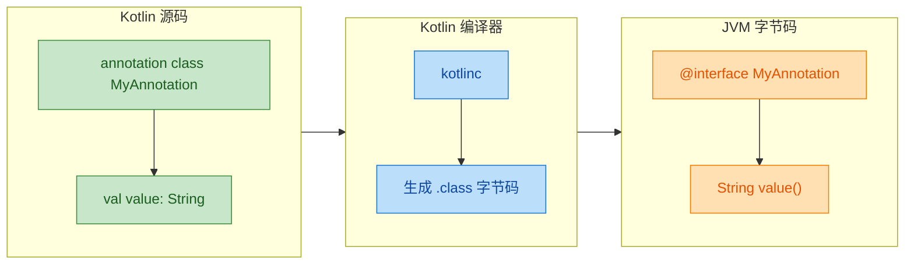

这意味着 Kotlin 注解可以被 Java 代码无缝读取，反过来 Java 注解也可以在 Kotlin 中直接使用。这种互操作性是 Kotlin 注解体系的一大优势。

### 声明注解的完整语法结构

把注解声明的各个组成部分拆解开来看：

```kotlin
// 完整的注解声明结构示例
@Target(AnnotationTarget.CLASS, AnnotationTarget.FUNCTION)  // 元注解：限定注解可以贴在哪里
@Retention(AnnotationRetention.RUNTIME)                      // 元注解：注解信息保留到什么阶段
@MustBeDocumented                                            // 元注解：注解应出现在生成的文档中
annotation class Api(
    val endpoint: String,                    // 必填参数：API 端点路径
    val version: Int = 1,                    // 可选参数：版本号，默认为 1
    val deprecated: Boolean = false          // 可选参数：是否已废弃，默认为 false
)
```

注解声明的结构可以归纳为三层：

```text
┌─────────────────────────────────────────────┐
│  元注解层（Meta-Annotations）                  │
│  @Target, @Retention, @Repeatable ...        │
├─────────────────────────────────────────────┤
│  声明层                                       │
│  annotation class 注解名                      │
├─────────────────────────────────────────────┤
│  参数层（Primary Constructor）                 │
│  val 参数名: 类型 = 默认值                      │
└─────────────────────────────────────────────┘
```

元注解（Meta-Annotation）是"注解的注解"，用来描述当前注解自身的行为特征，后续章节会详细展开。这里先建立一个整体印象。

### 标记注解 vs 参数注解

根据是否携带参数，注解可以分为两大类：

**标记注解（Marker Annotation）**：不带任何参数，仅起标记作用。

```kotlin
// 标记注解：表示某个类是线程安全的
annotation class ThreadSafe

// 标记注解：表示某个 API 仍处于实验阶段
annotation class Experimental

// 使用标记注解
@ThreadSafe                     // 告诉开发者和工具：这个类是线程安全的
class ConcurrentCache {
    @Experimental               // 告诉开发者：这个方法还不稳定
    fun newFeature() { /* ... */ }
}
```

**参数注解（Parameterized Annotation）**：携带一个或多个参数，提供更丰富的元数据。

```kotlin
// 参数注解：描述数据库表的映射关系
annotation class Table(
    val name: String,                    // 表名
    val schema: String = "public"        // 模式名，默认 public
)

// 参数注解：描述字段的映射关系
annotation class Column(
    val name: String,                    // 列名
    val nullable: Boolean = true,        // 是否可空，默认可空
    val length: Int = 255                // 最大长度，默认 255
)

// 实际使用：用注解描述一个用户实体
@Table(name = "t_user", schema = "app")  // 映射到 app.t_user 表
class User(
    @Column(name = "user_name", length = 50)   // 映射到 user_name 列，最大 50 字符
    val name: String,

    @Column(name = "email", nullable = false)   // 映射到 email 列，不可空
    val email: String
)
```

这个例子展示了注解在 ORM（Object-Relational Mapping）场景中的典型用法。注解本身不会创建数据库表，但框架（如 Exposed、Room）会在编译时或运行时读取这些注解，自动完成表结构映射。

### 注解的应用位置

Kotlin 中注解可以应用到非常多的代码元素上：

```kotlin
// 1. 注解应用在【类】上
@Fancy
class MyClass

// 2. 注解应用在【函数】上
@Fancy
fun myFunction() {}

// 3. 注解应用在【属性】上
@Fancy
val myProperty: Int = 42

// 4. 注解应用在【构造函数】上 —— 注意需要显式写 constructor 关键字
class Foo @Fancy constructor(val x: Int)

// 5. 注解应用在【函数参数】上
fun greet(@Fancy name: String) {}

// 6. 注解应用在【Lambda 表达式】上
val square = @Fancy { x: Int -> x * x }

// 7. 注解应用在【类型】上（Type Annotation, Kotlin 1.4+）
fun process(data: @Fancy String) {}

// 8. 注解应用在【表达式】上
val result = @Fancy 1 + 2

// 9. 注解应用在【文件】级别 —— 必须放在 package 声明之前
@file:JvmName("Utils")       // 指定编译后的 Java 类名
package com.example.utils
```

其中第 4 点值得特别注意：当注解应用在主构造函数上时，`constructor` 关键字不能省略。这是 Kotlin 语法中少数几个必须显式写 `constructor` 的场景之一。

### 多注解叠加

一个代码元素可以同时被多个注解标记，写法有两种风格：

```kotlin
// 风格一：每个注解单独一行（推荐，可读性更好）
@Target(AnnotationTarget.CLASS)
@Retention(AnnotationRetention.RUNTIME)
@MustBeDocumented
annotation class Service(val name: String)

// 风格二：多个注解写在同一行（适合简短注解）
@Fancy @Deprecated("Use newMethod instead") 
fun oldMethod() {}
```

两种写法在语义上完全等价，选择哪种纯粹是代码风格偏好。团队项目中建议统一风格。

### 注解与注释的本质区别

初学者容易混淆注解（Annotation）和注释（Comment），但它们是完全不同的概念：

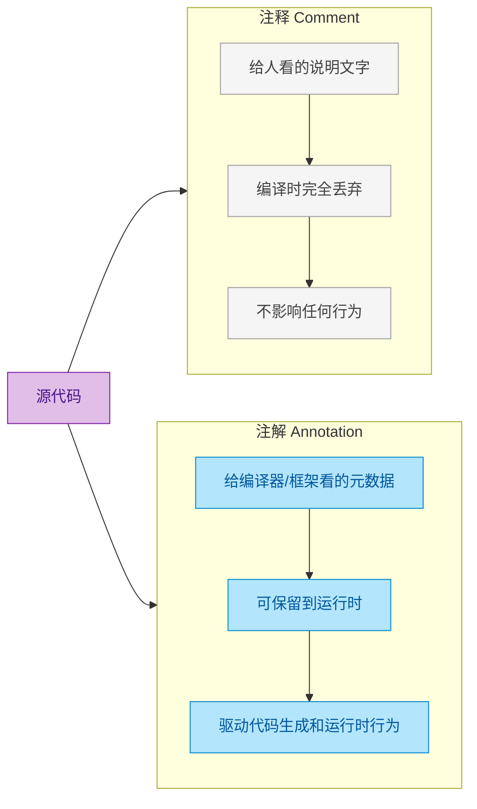

简单来说：注释是写给人看的，编译后就消失了；注解是写给机器看的，可以在编译期甚至运行时持续发挥作用。

---

**📝 练习题**

以下关于 Kotlin 注解声明的描述，哪一项是正确的？

A. 注解类可以包含普通方法和属性

B. 注解参数可以是 `List<String>` 类型

C. 注解参数必须是编译期常量类型，如基本类型、String、枚举、KClass、其他注解或它们的数组

D. 注解类可以被继承和实例化

**【答案】** C

**【解析】** 注解类（`annotation class`）是一种高度受限的特殊类。它不能包含方法体或普通属性（排除 A），不能被继承或手动实例化（排除 D）。注解参数的类型必须是编译期可确定的：基本类型、`String`、枚举、`KClass<*>`、其他注解，以及这些类型的数组。`List<String>` 是一个运行时集合类型，不满足编译期常量的要求（排除 B）。因此 C 是正确的。

---

## 注解参数（Annotation Parameters）

注解如果不能携带信息，就只是一个"标记"而已。真正让注解变得强大的，是它能够接收参数（parameters），从而把 **元数据（metadata）** 绑定到代码元素上。不过，Kotlin（以及 JVM）对注解参数的类型有严格限制——并非所有类型都能放进注解里。这一节我们逐一拆解每种合法的参数类型，搞清楚它们的语法、限制和实战用法。

### 注解参数的核心约束

在深入各类型之前，先理解一条根本规则：注解参数的值必须在 **编译期（compile time）** 就能确定。这意味着你不能把一个运行时才计算出来的变量塞进注解。Kotlin 编译器会在编译阶段把注解信息写入 `.class` 文件的元数据区，所以一切必须是 **编译期常量（compile-time constant）**。

这条规则直接决定了注解参数只能使用以下类型：

```mermaid
graph LR
    subgraph allowed["允许的注解参数类型"]
        direction TB
        A["基本类型 Primitive Types<br/>Int, Long, Float, Double,<br/>Boolean, Byte, Short, Char"]
        B["String 字符串"]
        C["KClass 类引用"]
        D["Enum 枚举"]
        E["其他注解 Nested Annotation"]
        F["以上类型的数组 Array"]
    end

    subgraph forbidden["禁止的类型"]
        direction TB
        G["普通对象实例"]
        H["可空类型 Nullable"]
        I["集合类型 List, Map..."]
        J["接口 / 抽象类实例"]
    end

    allowed --- forbidden

    classDef greenBox fill:#C8E6C9,stroke:#388E3C,color:#1B5E20
    classDef redBox fill:#FFCDD2,stroke:#D32F2F,color:#B71C1C
    classDef greenGroup fill:#E8F5E9,stroke:#66BB6A,color:#2E7D32
    classDef redGroup fill:#FFEBEE,stroke:#EF5350,color:#C62828

    class A,B,C,D,E,F greenBox
    class G,H,I,J redBox
    class allowed greenGroup
    class forbidden redGroup
```

记住这张图，后面每种类型的讲解都围绕它展开。

### 基本类型参数（Primitive Types）

基本类型是最简单直接的注解参数。包括 `Int`、`Long`、`Float`、`Double`、`Boolean`、`Byte`、`Short`、`Char`。

```kotlin
// 声明一个注解，接收多种基本类型参数
annotation class FieldConstraint(
    val maxLength: Int,          // 整型参数，表示最大长度
    val minValue: Double = 0.0,  // 双精度浮点，带默认值
    val required: Boolean = true, // 布尔值，标记是否必填
    val code: Char = 'A'         // 字符类型参数
)

// 使用时，直接传入字面量或编译期常量
@FieldConstraint(
    maxLength = 255,       // 字面量，编译期可确定
    minValue = 1.5,        // 浮点字面量
    required = false,      // 布尔字面量
    code = 'B'             // 字符字面量
)
val username: String = ""
```

这里有一个关键细节：参数值必须是 **字面量** 或 **`const val` 编译期常量**，普通的 `val` 不行。

```kotlin
// const val 是编译期常量，可以用在注解里
const val MAX = 100

// 普通 val 是运行时赋值，不能用在注解里
val runtimeMax = 100

@FieldConstraint(maxLength = MAX)         // ✅ 编译通过
// @FieldConstraint(maxLength = runtimeMax) // ❌ 编译错误！
val email: String = ""
```

`const val` 只能定义在 **顶层（top-level）** 或 **`object` / `companion object`** 内部，且类型只能是基本类型或 `String`。这不是巧合——正是因为注解需要编译期常量，`const val` 才被设计成这样。

### 字符串参数（String）

字符串是注解中使用频率最高的参数类型之一。无论是指定名称、描述、路径还是正则表达式，都离不开它。

```kotlin
// 声明带字符串参数的注解
annotation class Route(
    val path: String,                    // 路由路径，必填
    val method: String = "GET",          // HTTP 方法，默认 GET
    val description: String = ""         // 描述信息，默认空串
)

// 使用示例
@Route(
    path = "/api/users",                 // 字符串字面量
    method = "POST",                     // 覆盖默认值
    description = "Create a new user"    // 提供描述
)
fun createUser() { /* ... */ }
```

字符串同样支持 `const val` 拼接：

```kotlin
const val API_PREFIX = "/api/v2"         // 编译期常量前缀

@Route(path = API_PREFIX + "/orders")    // ✅ 编译期字符串拼接
fun getOrders() { /* ... */ }
```

但要注意，**字符串模板（string template）** 不能用在注解参数中：

```kotlin
const val VERSION = "v2"

// @Route(path = "/api/$VERSION/orders")  // ❌ 编译错误！模板不是编译期常量表达式
@Route(path = "/api/" + VERSION + "/orders") // ✅ 用 + 拼接代替
fun getItems() { /* ... */ }
```

这是因为 Kotlin 编译器在处理注解参数时，不会对字符串模板做常量折叠（constant folding），只认 `+` 运算符的拼接。

### 枚举参数（Enum）

枚举天然是编译期确定的有限值集合，非常适合作为注解参数，用来表达"从几个选项中选一个"的语义。

```kotlin
// 定义一个日志级别枚举
enum class LogLevel {
    TRACE, DEBUG, INFO, WARN, ERROR      // 五个级别
}

// 注解中使用枚举作为参数
annotation class Loggable(
    val level: LogLevel = LogLevel.INFO  // 默认 INFO 级别
)

// 使用
@Loggable(level = LogLevel.DEBUG)        // 指定为 DEBUG
fun fetchData() { /* ... */ }

@Loggable                                // 使用默认值 INFO
fun processData() { /* ... */ }
```

枚举参数在框架设计中极为常见。比如 Spring 的 `@RequestMapping` 用 `RequestMethod` 枚举指定 HTTP 方法，Room 数据库的 `@ColumnInfo` 用枚举指定冲突策略。它比字符串参数更安全——拼写错误会在编译期就被捕获，而不是等到运行时才爆炸。

### 类引用参数（KClass Reference）

有时候注解需要引用一个类型本身，而不是类型的实例。Kotlin 使用 `KClass<*>` 来表达这种"类引用"参数。

```kotlin
// 声明一个序列化器注解，指定用哪个类来做序列化
annotation class Serializer(
    val using: KClass<*>                 // 接收任意类的引用
)

// 也可以用泛型上界约束引用的类型
annotation class Adapter(
    val impl: KClass<out JsonAdapter<*>> // 必须是 JsonAdapter 的子类
)
```

使用时通过 `::class` 语法传入类引用：

```kotlin
// 一个自定义的日期序列化器
class DateSerializer : JsonSerializer<Date>() { /* ... */ }

// 把类引用传给注解
@Serializer(using = DateSerializer::class)  // ::class 获取 KClass 引用
val createdAt: Date = Date()

// 也可以引用基本类型和内置类型
@Serializer(using = String::class)          // 引用 String 的 KClass
val name: String = ""
```

这里的 `::class` 返回的是 `KClass<DateSerializer>`，编译器会把它编码进注解元数据。在运行时通过反射读取注解时，你可以拿到这个 `KClass` 并用它来创建实例或做类型判断。

一个实际的应用场景——模拟 Jackson 风格的反序列化注解：

```kotlin
// 定义接口
interface TypeResolver<T> {
    fun resolve(raw: String): T          // 从原始字符串解析出目标类型
}

// 具体实现
class DateResolver : TypeResolver<Date> {
    override fun resolve(raw: String): Date {
        return SimpleDateFormat("yyyy-MM-dd").parse(raw)  // 按格式解析日期
    }
}

// 注解声明：约束必须是 TypeResolver 的实现类
annotation class ResolveWith(
    val resolver: KClass<out TypeResolver<*>>  // out 协变，接受子类
)

// 使用
@ResolveWith(resolver = DateResolver::class)
val birthday: Date = Date()
```

`KClass<out TypeResolver<*>>` 中的 `out` 关键字表示协变——你可以传入 `TypeResolver` 本身或它的任何子类的 `KClass`。这是类型安全的保障。

### 数组参数（Array）

当一个注解参数需要接收多个值时，就要用数组。Kotlin 注解支持上述所有合法类型的数组形式。

声明数组参数有两种写法：

```kotlin
// 写法一：使用 Array 关键字（仅用于 KClass 数组）
annotation class Listeners(
    val value: Array<KClass<*>>          // KClass 数组
)

// 写法二：直接用基本类型数组（推荐用于基本类型和 String）
annotation class AllowedCodes(
    val codes: IntArray                  // Int 数组
)

annotation class Tags(
    val names: Array<String>             // String 数组
)
```

传值时使用 **方括号 `[]` 语法**（Kotlin 1.2+）：

```kotlin
@Tags(names = ["kotlin", "android", "jvm"])   // 方括号语法，简洁
fun taggedFunction() { /* ... */ }

@AllowedCodes(codes = [200, 201, 204])        // IntArray 也用方括号
fun handleResponse() { /* ... */ }

@Listeners([EventListener::class, LogListener::class])  // KClass 数组
class EventBus { /* ... */ }
```

在 Kotlin 1.2 之前，需要使用 `arrayOf()` 和 `intArrayOf()` 等工厂函数：

```kotlin
// 旧语法（仍然有效，但不推荐）
@Tags(names = arrayOf("kotlin", "android"))
fun oldStyle() { /* ... */ }
```

如果数组只有一个元素，方括号仍然不能省略：

```kotlin
@Tags(names = ["solo"])                       // 单元素也要方括号
fun singleTag() { /* ... */ }
```

但有一个特例：当数组参数名为 `value` 时，Kotlin 允许一些简写：

```kotlin
annotation class Roles(val value: Array<String>)

@Roles(["ADMIN", "USER"])                     // 省略 value =
fun manage() { /* ... */ }
```

### 嵌套注解参数（Nested Annotations）

注解的参数可以是另一个注解的实例。这让注解具备了 **组合能力（composability）**，可以构建出层次化的元数据结构。

```kotlin
// 定义一个描述字段约束的注解
annotation class Range(
    val min: Int = Int.MIN_VALUE,        // 最小值，默认无下限
    val max: Int = Int.MAX_VALUE         // 最大值，默认无上限
)

// 定义一个描述字段格式的注解
annotation class Pattern(
    val regex: String,                   // 正则表达式
    val message: String = "Invalid format"  // 校验失败的提示信息
)

// 组合注解：把 Range 和 Pattern 嵌套进来
annotation class ValidatedField(
    val name: String,                    // 字段名
    val range: Range = Range(),          // 嵌套的范围约束，使用默认值
    val pattern: Pattern                 // 嵌套的格式约束，必填
)
```

使用时，在注解内部直接构造嵌套注解实例（注意：不加 `@` 前缀）：

```kotlin
@ValidatedField(
    name = "age",
    range = Range(min = 0, max = 150),           // 嵌套注解，不需要 @
    pattern = Pattern(regex = "\\d{1,3}")         // 嵌套注解
)
val age: Int = 0

@ValidatedField(
    name = "email",
    // range 使用默认值，省略
    pattern = Pattern(
        regex = "^[\\w.-]+@[\\w.-]+\\.\\w+$",    // 邮箱正则
        message = "Please enter a valid email"     // 自定义错误信息
    )
)
val email: String = ""
```

嵌套注解还可以和数组参数结合，构建更复杂的元数据：

```kotlin
// 定义单条校验规则
annotation class Rule(
    val field: String,                   // 目标字段名
    val notNull: Boolean = false,        // 是否非空
    val maxLength: Int = -1              // 最大长度，-1 表示不限
)

// 定义一组校验规则
annotation class ValidationRules(
    val rules: Array<Rule>               // Rule 注解的数组
)

// 使用：在一个注解里定义多条嵌套规则
@ValidationRules(
    rules = [
        Rule(field = "username", notNull = true, maxLength = 50),  // 规则 1
        Rule(field = "bio", maxLength = 200),                      // 规则 2
        Rule(field = "avatar", notNull = true)                     // 规则 3
    ]
)
class UserProfile { /* ... */ }
```

这种"注解数组嵌套注解"的模式在 Java/Kotlin 框架中非常普遍。比如 JPA 的 `@NamedQueries` 包含多个 `@NamedQuery`，Spring 的 `@ComponentScans` 包含多个 `@ComponentScan`。

### 参数默认值与 named arguments

Kotlin 注解的参数支持默认值，这让注解的使用变得非常灵活——只需要填写你关心的参数，其余走默认值：

```kotlin
annotation class Cache(
    val maxSize: Int = 256,              // 默认缓存 256 条
    val expireSeconds: Long = 3600,      // 默认 1 小时过期
    val strategy: String = "LRU",        // 默认 LRU 淘汰策略
    val enabled: Boolean = true          // 默认启用
)

// 全部使用默认值
@Cache
fun getConfig() { /* ... */ }

// 只覆盖你关心的参数，使用 named arguments
@Cache(maxSize = 1024, expireSeconds = 600)
fun getFrequentData() { /* ... */ }

// 甚至可以乱序传参（named arguments 的优势）
@Cache(enabled = false, strategy = "FIFO")
fun getStaticData() { /* ... */ }
```

这比 Java 注解优雅得多——Java 注解没有 named arguments，参数多了就容易搞混顺序。

### 完整对比：合法 vs 非法参数

用一个综合示例把所有合法和非法情况放在一起对比：

```kotlin
const val CONST_STR = "hello"            // ✅ 编译期常量
val runtimeStr = "world"                 // ❌ 运行时值

enum class Color { RED, GREEN, BLUE }    // ✅ 枚举

annotation class Inner(val tag: String)  // ✅ 可被嵌套的注解

annotation class Demo(
    val a: Int,                          // ✅ 基本类型
    val b: String,                       // ✅ 字符串
    val c: Boolean,                      // ✅ 布尔
    val d: KClass<*>,                    // ✅ 类引用
    val e: Color,                        // ✅ 枚举
    val f: Inner,                        // ✅ 嵌套注解
    val g: IntArray,                     // ✅ 基本类型数组
    val h: Array<String>,               // ✅ 字符串数组
    val i: Array<Inner>,                // ✅ 注解数组
    // val j: List<String>,             // ❌ 集合类型不允许
    // val k: Any,                      // ❌ Any 不是具体的合法类型
    // val l: Int?,                     // ❌ 可空类型不允许
    // val m: Date,                     // ❌ 普通类不允许
)
```

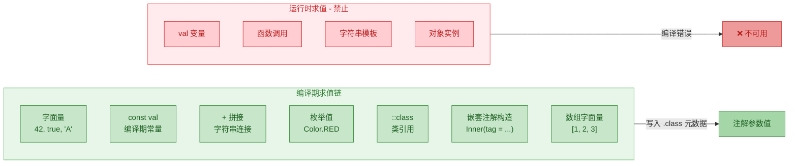

---

**📝 练习题**

以下 Kotlin 注解声明中，哪一个参数类型会导致编译错误？

```kotlin
annotation class Config(
    val name: String,
    val version: Int,
    val tags: Array<String>,
    val converter: KClass<out Any>,
    val metadata: Map<String, String>
)
```

A. `name: String`

B. `tags: Array<String>`

C. `converter: KClass<out Any>`

D. `metadata: Map<String, String>`

**【答案】** D

**【解析】** `Map<String, String>` 是一个集合接口类型，不属于注解参数允许的类型范围。Kotlin（以及 JVM）注解参数只能是基本类型、`String`、`KClass`、枚举、其他注解，以及这些类型的数组。`Map`、`List`、`Set` 等集合类型都不被允许，因为它们的值无法在编译期完全确定并编码进 `.class` 文件的注解元数据中。如果需要传递多个键值对，通常的做法是定义一个嵌套注解（如 `annotation class Entry(val key: String, val value: String)`），然后使用该注解的数组 `Array<Entry>` 来模拟 Map 结构。

---

## 元注解（Meta-Annotations）

元注解（Meta-Annotation）是"用来修饰注解的注解"。当你用 `annotation class` 声明了一个自定义注解后，编译器需要知道几件关键的事情：这个注解能贴在哪里？它在什么阶段还活着？能不能重复使用？这些"关于注解的元数据"，就是由元注解来描述的。

Kotlin 的元注解体系与 Java 高度对应，但在语法和默认行为上做了一些现代化调整。理解元注解是掌握自定义注解、注解处理器（KAPT/KSP）的前提——如果你不告诉编译器注解的"生命周期"和"作用域"，它就无法正确地保留或应用你的注解。

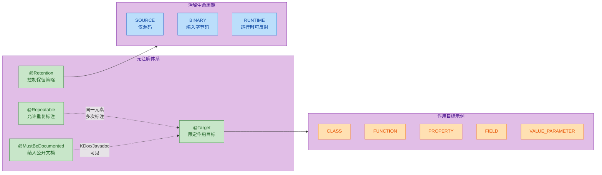

---

### @Target —— 限定注解的作用目标

`@Target` 是最常用的元注解，它规定了你的自定义注解可以"贴"在哪些程序元素上。如果使用者把注解放在了不允许的位置，编译器会直接报错，这是一种编译期安全保障。

`@Target` 接收一个 `AnnotationTarget` 枚举数组作为参数。Kotlin 中 `AnnotationTarget` 的完整枚举值如下：

| 枚举值 | 含义 | 对应 Java ElementType |
|---|---|---|
| `CLASS` | 类、接口、object、annotation class | `TYPE` |
| `ANNOTATION_CLASS` | 仅限注解类 | `ANNOTATION_TYPE` |
| `TYPE_PARAMETER` | 泛型类型参数 | `TYPE_PARAMETER` |
| `PROPERTY` | Kotlin 属性（Java 不可见） | 无直接对应 |
| `FIELD` | 幕后字段（backing field） | `FIELD` |
| `LOCAL_VARIABLE` | 局部变量 | `LOCAL_VARIABLE` |
| `VALUE_PARAMETER` | 函数或构造器参数 | `PARAMETER` |
| `CONSTRUCTOR` | 构造函数 | `CONSTRUCTOR` |
| `FUNCTION` | 函数（不含构造器） | `METHOD` |
| `PROPERTY_GETTER` | 属性的 getter | `METHOD` |
| `PROPERTY_SETTER` | 属性的 setter | `METHOD` |
| `TYPE` | 类型使用处（如泛型参数、超类型声明） | `TYPE_USE` |
| `EXPRESSION` | 表达式 | 无对应 |
| `FILE` | 文件级别 | 无对应 |
| `TYPEALIAS` | 类型别名 | 无对应 |

这张表值得仔细看。Kotlin 比 Java 多出了 `PROPERTY`、`EXPRESSION`、`FILE`、`TYPEALIAS` 这几个目标，这是因为 Kotlin 语言本身有 Java 不具备的语法结构。特别是 `PROPERTY` 和 `FIELD` 的区分——在 Kotlin 中，一个 `val name: String` 既是一个"属性"（property），又有一个"幕后字段"（backing field），它们是不同的目标。

```kotlin
// 声明一个只能用于函数和属性 getter 的注解
@Target(
    AnnotationTarget.FUNCTION,          // 可以标注在函数上
    AnnotationTarget.PROPERTY_GETTER    // 可以标注在属性的 getter 上
)
@Retention(AnnotationRetention.RUNTIME) // 运行时保留（后面会讲）
annotation class Loggable                // 声明注解，名为 Loggable

class UserService {

    @Loggable                            // ✅ 合法：标注在函数上
    fun fetchUser(id: Long): String {
        return "User-$id"
    }

    val serviceName: String
        @Loggable                        // ✅ 合法：标注在 getter 上
        get() = "UserService"

    // @Loggable                         // ❌ 编译错误！CLASS 不在 @Target 列表中
    // class Inner
}
```

当 `@Target` 未指定时，Kotlin 的默认行为是允许注解用于"几乎所有"目标（除了 `TYPE_PARAMETER` 和 `TYPE`）。这看起来很方便，但在实际项目中，明确指定 `@Target` 是一种良好实践——它让注解的意图更清晰，也能防止误用。

多目标声明时，`@Target` 接收的是 vararg 参数，所以你可以传入任意数量的枚举值：

```kotlin
// 同时允许类、函数、属性三个目标
@Target(
    AnnotationTarget.CLASS,             // 类
    AnnotationTarget.FUNCTION,          // 函数
    AnnotationTarget.PROPERTY           // 属性
)
annotation class Trackable

@Trackable                               // ✅ 标注在类上
class OrderService {

    @Trackable                           // ✅ 标注在属性上
    val version: Int = 1

    @Trackable                           // ✅ 标注在函数上
    fun placeOrder() { /* ... */ }
}
```

一个容易踩的坑是 `PROPERTY` vs `FIELD`。Kotlin 的属性在编译为 JVM 字节码后，会生成一个 private field + getter/setter。如果你的注解 `@Target` 只写了 `PROPERTY`，那么 Java 代码是看不到这个注解的，因为 `PROPERTY` 是 Kotlin 独有的概念。如果你需要注解在 Java 互操作中也可见（比如给 JPA、Jackson 等 Java 框架用），你应该使用 `FIELD` 或配合"使用点目标"（use-site target），这在后续章节会详细展开。

---

### @Retention —— 控制注解的保留策略

`@Retention` 决定了注解在编译和运行的各个阶段是否还"活着"。这是一个关乎注解生命周期的核心元注解。

Kotlin 提供了三种保留策略，通过 `AnnotationRetention` 枚举表示：

```kotlin
public enum class AnnotationRetention {
    SOURCE,   // 仅在源码中存在，编译后丢弃
    BINARY,   // 编入 .class 字节码，但运行时反射不可见
    RUNTIME   // 编入字节码，且运行时可通过反射读取
}
```

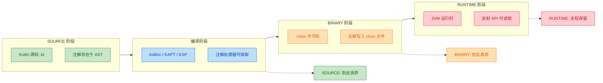

三种策略的选择逻辑：

`SOURCE` 级别的注解在编译完成后就被丢弃了，不会出现在 `.class` 文件中。它的典型用途是给编译器或 IDE 提供提示信息。比如 `@Suppress` 就是 `SOURCE` 级别的——它只需要告诉编译器"别对这段代码报警告"，编译完成后这个信息就没用了。

```kotlin
// SOURCE 级别：编译后消失
@Retention(AnnotationRetention.SOURCE)   // 仅源码阶段存在
@Target(AnnotationTarget.FUNCTION)
annotation class TodoRefactor(
    val reason: String                   // 记录重构原因
)

class LegacyService {
    @TodoRefactor("这个方法需要拆分为更小的函数")  // 编译后不会出现在字节码中
    fun doEverything() {
        // 一个臃肿的遗留方法...
    }
}
```

`BINARY` 级别的注解会被写入 `.class` 字节码文件，但在运行时通过反射 API 是读不到的。这种策略适用于需要被其他编译工具（如字节码分析器、混淆器）读取，但不需要运行时反射的场景。实际开发中 `BINARY` 用得相对较少。

```kotlin
// BINARY 级别：存在于字节码，但反射不可见
@Retention(AnnotationRetention.BINARY)   // 编入 class 文件
@Target(AnnotationTarget.CLASS)
annotation class ProguardKeep            // 告诉混淆器保留此类

@ProguardKeep                            // 字节码中可见，但运行时反射读不到
class CriticalConfig {
    val apiKey = "..."
}
```

`RUNTIME` 级别是最"长寿"的——注解不仅写入字节码，还能在运行时通过反射 API（如 `KClass.annotations`、Java 的 `Class.getAnnotations()`）读取。绝大多数框架注解（Spring 的 `@Component`、Jackson 的 `@JsonProperty`、自定义的依赖注入注解等）都是 `RUNTIME` 级别的。

```kotlin
// RUNTIME 级别：运行时可反射读取
@Retention(AnnotationRetention.RUNTIME)  // 全生命周期保留
@Target(AnnotationTarget.FUNCTION)
annotation class RateLimit(
    val maxCalls: Int,                   // 最大调用次数
    val periodSeconds: Int               // 时间窗口（秒）
)

class ApiController {
    @RateLimit(maxCalls = 100, periodSeconds = 60)  // 运行时可通过反射读取这些参数
    fun handleRequest() { /* ... */ }
}

// 运行时读取注解的示例
fun main() {
    val method = ApiController::class.java                // 获取 Class 对象
        .getMethod("handleRequest")                       // 获取方法
    val annotation = method.getAnnotation(RateLimit::class.java) // 反射获取注解
    if (annotation != null) {
        println("限流: ${annotation.maxCalls} 次 / ${annotation.periodSeconds} 秒")
        // 输出: 限流: 100 次 / 60 秒
    }
}
```

Kotlin 与 Java 在默认保留策略上有一个重要差异：

| 语言 | 默认 Retention | 说明 |
|---|---|---|
| Java | `RetentionPolicy.CLASS`（等同于 BINARY） | 编入字节码但运行时不可见 |
| Kotlin | `AnnotationRetention.RUNTIME` | 运行时可反射读取 |

Kotlin 默认选择 `RUNTIME` 是一个务实的设计决策。因为绝大多数注解的使用场景都需要运行时反射（框架注入、序列化、ORM 映射等），默认 `RUNTIME` 减少了开发者忘记写 `@Retention` 导致注解"丢失"的问题。如果你确实只需要 `SOURCE` 或 `BINARY`，显式声明即可。

---

### @Repeatable —— 允许同一元素上重复标注

默认情况下，同一个注解在同一个程序元素上只能出现一次。`@Repeatable` 打破了这个限制，允许同一个注解在同一个位置多次使用。

这个特性在 Java 8 中引入（通过"容器注解"模式），而 Kotlin 从 1.6 开始原生支持 `@Repeatable`，语法更加简洁。

```kotlin
// 声明一个可重复的注解
@Repeatable                              // 标记为可重复
@Retention(AnnotationRetention.RUNTIME)  // 运行时保留
@Target(AnnotationTarget.FUNCTION)       // 只能用于函数
annotation class Validate(
    val rule: String                     // 校验规则名称
)

class RegistrationService {

    // 同一个函数上使用多次 @Validate
    @Validate("notBlank")                // 第一条规则：不能为空
    @Validate("email")                   // 第二条规则：必须是邮箱格式
    @Validate("maxLength:255")           // 第三条规则：最大长度 255
    fun registerUser(email: String) {
        // 注册逻辑...
    }
}
```

如果不加 `@Repeatable`，上面的代码会编译报错：`This annotation is not repeatable`。

Kotlin 的 `@Repeatable` 在 JVM 平台上的实现机制值得了解。当你在 Kotlin 中声明一个 `@Repeatable` 注解时，编译器会自动生成一个"容器注解"（container annotation）。这个容器注解的名字是原注解名加上 `.Container` 后缀，它内部持有一个原注解的数组：

```kotlin
// 你写的代码
@Repeatable
annotation class Validate(val rule: String)

// 编译器自动生成的容器注解（概念上等价于）
// annotation class Validate.Container(val value: Array<Validate>)
```

这意味着在 Java 互操作时，Java 代码看到的是容器注解包裹着多个原注解实例。如果你需要从 Java 代码中读取可重复注解，需要注意这一点。

在运行时通过反射读取可重复注解：

```kotlin
fun main() {
    val method = RegistrationService::class.java          // 获取 Class
        .getMethod("registerUser", String::class.java)    // 获取方法

    // 获取所有 @Validate 注解（包括通过容器注解包裹的）
    val validates = method.getAnnotationsByType(Validate::class.java)

    validates.forEach { v ->                              // 遍历每个注解实例
        println("规则: ${v.rule}")
    }
    // 输出:
    // 规则: notBlank
    // 规则: email
    // 规则: maxLength:255
}
```

注意这里用的是 `getAnnotationsByType()` 而不是 `getAnnotation()`。后者在可重复注解的场景下会返回 `null`（因为实际存储的是容器注解），而 `getAnnotationsByType()` 会自动"解包"容器注解，返回所有实例。

一个实际的应用场景——多角色权限校验：

```kotlin
@Repeatable
@Retention(AnnotationRetention.RUNTIME)
@Target(AnnotationTarget.FUNCTION)
annotation class RequiresRole(
    val role: String                     // 所需角色
)

class AdminController {

    @RequiresRole("ADMIN")               // 需要 ADMIN 角色
    @RequiresRole("SUPER_ADMIN")         // 或者 SUPER_ADMIN 角色
    fun deleteUser(userId: Long) {
        // 只有拥有以上任一角色的用户才能调用
    }
}

// 权限校验拦截器（伪代码）
fun checkPermission(method: java.lang.reflect.Method, currentUserRoles: Set<String>) {
    val required = method.getAnnotationsByType(RequiresRole::class.java) // 获取所有角色注解
    val requiredRoles = required.map { it.role }.toSet()                 // 提取角色名集合
    if (currentUserRoles.intersect(requiredRoles).isEmpty()) {           // 检查交集
        throw SecurityException("权限不足，需要角色: $requiredRoles")
    }
}
```

---

### @MustBeDocumented —— 将注解纳入公开 API 文档

`@MustBeDocumented` 是四个元注解中最简单的一个。它的作用是：当被标注的注解出现在某个公开 API 元素上时，该注解也应该出现在生成的 API 文档（KDoc / Javadoc）中。

```kotlin
@MustBeDocumented                        // 标记：此注解应出现在文档中
@Retention(AnnotationRetention.RUNTIME)
@Target(AnnotationTarget.FUNCTION)
annotation class ExperimentalApi(
    val since: String                    // 从哪个版本开始标记为实验性
)

class SdkService {

    /**
     * 执行高级查询。
     * 注意：此 API 尚处于实验阶段，未来可能变更。
     */
    @ExperimentalApi(since = "2.1.0")   // 因为 @MustBeDocumented，文档工具会展示此注解
    fun advancedQuery(dsl: String): List<Any> {
        return emptyList()
    }
}
```

当你使用 Dokka（Kotlin 的文档生成工具）或 Javadoc 生成 API 文档时，`@ExperimentalApi(since = "2.1.0")` 会出现在 `advancedQuery` 方法的文档页面上。如果没有 `@MustBeDocumented`，文档工具可能会忽略这个注解，用户在阅读文档时就看不到"这是实验性 API"的提示。

这个元注解的典型使用场景包括：

- 标记 API 稳定性级别的注解（`@ExperimentalApi`、`@Beta`、`@Deprecated`）
- 标记线程安全性的注解（`@ThreadSafe`、`@NotThreadSafe`）
- 标记契约或约束的注解（`@NonNull`、`@Range`）

简而言之，任何对 API 使用者有重要参考价值的注解，都应该加上 `@MustBeDocumented`。

---

### 元注解的组合使用

在实际项目中，元注解几乎总是组合使用的。一个设计良好的自定义注解通常会同时声明 `@Target`、`@Retention`，并根据需要加上 `@Repeatable` 或 `@MustBeDocumented`。下面是一个综合示例：

```kotlin
/**
 * 标记一个函数需要缓存其返回值。
 * 缓存框架会在运行时通过反射读取此注解。
 *
 * @property key 缓存键的 SpEL 表达式
 * @property ttlSeconds 缓存过期时间（秒），默认 300 秒
 */
@Target(AnnotationTarget.FUNCTION)       // 只能用于函数
@Retention(AnnotationRetention.RUNTIME)  // 运行时反射可读（缓存框架需要）
@MustBeDocumented                        // 出现在 API 文档中（使用者需要知道有缓存）
annotation class Cacheable(
    val key: String,                     // 缓存键表达式
    val ttlSeconds: Int = 300            // 过期时间，默认 5 分钟
)

/**
 * 标记一个函数需要事务管理。
 * 可重复使用以声明多个事务传播行为。
 */
@Target(AnnotationTarget.FUNCTION)       // 只能用于函数
@Retention(AnnotationRetention.RUNTIME)  // 运行时需要反射读取
@Repeatable                              // 允许多次标注（多数据源场景）
@MustBeDocumented                        // 纳入文档
annotation class Transactional(
    val dataSource: String = "primary",  // 数据源名称
    val readOnly: Boolean = false        // 是否只读事务
)

class ProductRepository {

    @Cacheable(key = "'product:' + #id", ttlSeconds = 600) // 缓存 10 分钟
    @Transactional(dataSource = "primary", readOnly = true) // 主库只读事务
    @Transactional(dataSource = "replica")                  // 副本库事务
    fun findById(id: Long): String {
        return "Product-$id"
    }
}
```

下面这张表总结了四个元注解的核心对比：

| 元注解 | 作用 | 参数类型 | 默认行为（不写时） |
|---|---|---|---|
| `@Target` | 限定注解可用的程序元素 | `vararg AnnotationTarget` | 几乎所有目标（除 TYPE_PARAMETER、TYPE） |
| `@Retention` | 控制注解的生命周期 | `AnnotationRetention` | `RUNTIME`（Kotlin 默认） |
| `@Repeatable` | 允许同一位置多次使用 | 无参数 | 不可重复 |
| `@MustBeDocumented` | 注解出现在生成的 API 文档中 | 无参数 | 不出现在文档中 |

---

**📝 练习题**

以下 Kotlin 代码能否编译通过？如果不能，原因是什么？

```kotlin
@Target(AnnotationTarget.PROPERTY)
@Retention(AnnotationRetention.SOURCE)
annotation class Inject

class MyService {
    @Inject
    fun initialize() { }
}
```

A. 编译通过，`@Inject` 可以用于函数
B. 编译失败，因为 `@Target` 限定为 `PROPERTY`，不能用于函数
C. 编译通过，但 `@Inject` 在编译后会被丢弃所以没有实际效果
D. 编译失败，因为 `SOURCE` 级别的注解不能用于函数

**【答案】** B
**【解析】** `@Target(AnnotationTarget.PROPERTY)` 明确限定了 `@Inject` 只能标注在 Kotlin 属性上。当它被放在 `fun initialize()` 这个函数上时，编译器会报错：`This annotation is not applicable to target 'member function'`。`@Retention` 的值（`SOURCE`/`BINARY`/`RUNTIME`）只影响注解的保留阶段，不影响注解能用在哪里——那是 `@Target` 的职责。选项 D 混淆了 `@Retention` 和 `@Target` 的作用域。

---

**📝 练习题**

关于 Kotlin 中 `@Repeatable` 注解在 JVM 平台上的行为，以下哪项描述是正确的？

A. Kotlin 的 `@Repeatable` 不需要容器注解，编译器直接在字节码中存储多个注解实例

B. 编译器会自动生成一个容器注解，Java 代码通过 `getAnnotation()` 即可获取所有重复注解

C. 编译器会自动生成一个容器注解，Java 代码应使用 `getAnnotationsByType()` 来获取所有重复注解实例

D. `@Repeatable` 仅在 Kotlin/JS 和 Kotlin/Native 上可用，JVM 平台不支持

**【答案】** C

**【解析】** Kotlin 在 JVM 平台上实现 `@Repeatable` 时，编译器会自动生成一个名为 `<AnnotationName>.Container` 的容器注解（container annotation），内部持有原注解的数组。这与 Java 8 的可重复注解机制兼容。在运行时，直接调用 `getAnnotation(Validate::class.java)` 会返回 `null`，因为字节码中实际存储的是容器注解。正确的做法是使用 `getAnnotationsByType(Validate::class.java)`，它会自动解包容器注解并返回所有实例。选项 A 的说法不正确——JVM 字节码规范要求通过容器注解来存储重复注解。

---

## 使用点目标（Use-site Targets）

在 Java 中，注解的放置位置通常是明确的——你把它写在字段上就是字段注解，写在方法上就是方法注解。但 Kotlin 的一个属性（property）在编译后可能对应 Java 层面的多个元素：一个 backing field、一个 getter 方法、一个 setter 方法、甚至构造器参数。这就引出了一个关键问题：**当你在 Kotlin 属性上写一个注解时，它到底注解的是哪个 Java 元素？**

Use-site target（使用点目标）就是 Kotlin 提供的精确制导机制，让你显式指定注解应该附着到编译产物的哪个具体元素上。语法形式为：

```kotlin
// 语法：@目标:注解名
@get:MyAnnotation   // 注解附着到 getter 方法上
val name: String = "Kiro"
```

冒号前面的关键字就是 use-site target，它告诉编译器："别猜了，我要把这个注解放到 getter 上。"

### 属性编译产物全景

要理解 use-site targets，首先必须清楚一个 Kotlin 属性在 JVM 字节码层面会展开成哪些元素。这是整个机制的根基。

```kotlin
// Kotlin 源码：一个简单的 var 属性
class User(
    @param:NotNull      // ① 构造器参数
    var name: String    // 这一行在 JVM 层面会展开为多个元素
)
```

编译后，JVM 层面实际生成的结构大致如下：

```java
// Java 反编译视角：一个 var 属性展开为 4 个潜在注解目标
public final class User {
    private String name;           // ② backing field（字段）

    public User(String name) {     // ① constructor parameter（构造器参数）
        this.name = name;
    }

    public final String getName() { // ③ getter 方法
        return this.name;
    }

    public final void setName(String name) { // ④ setter 方法
        this.name = name;
    }
}
```

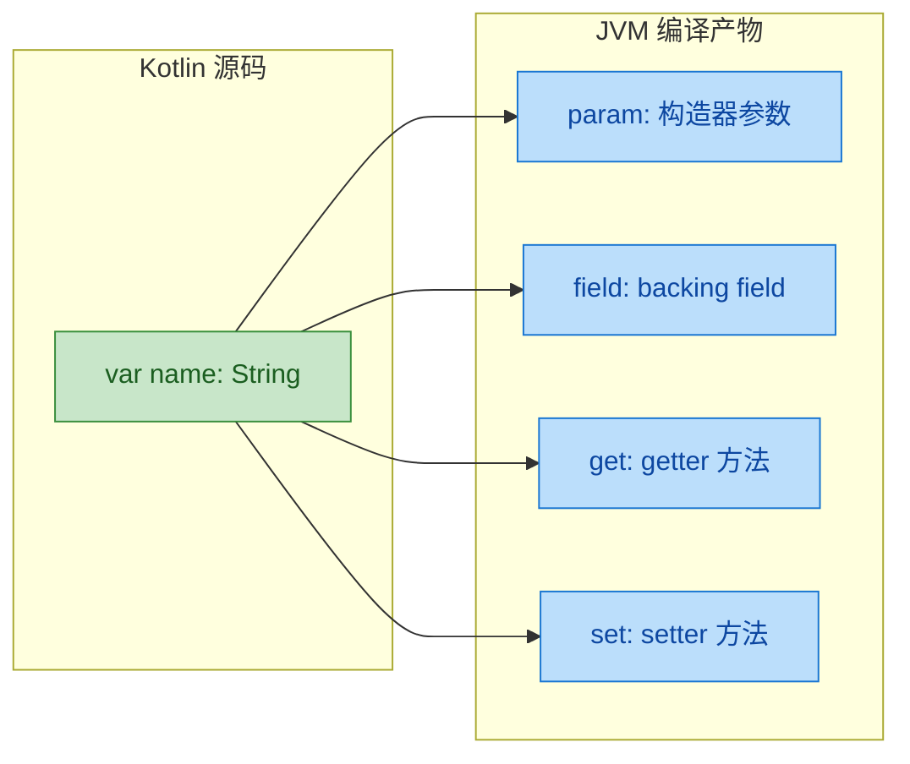

一个 `var` 属性最多对应 4 个注解目标；`val` 属性没有 setter，所以是 3 个。理解了这张映射关系，use-site targets 就水到渠成了。

### property — 注解 Kotlin 属性本身

`property` 目标将注解附着到 Kotlin 属性这个概念本身，而不是它的任何 Java 编译产物。这意味着这个注解只对 Kotlin 反射可见，Java 反射是看不到的。

```kotlin
// 定义一个只对 Kotlin 属性可见的注解
@Target(AnnotationTarget.PROPERTY)  // 只能用于 Kotlin 属性
annotation class KotlinOnly(val description: String)

class Config {
    // @property: 将注解附着到 Kotlin 属性概念上
    @property:KotlinOnly("数据库连接地址")
    var dbUrl: String = "localhost:5432"
}

fun main() {
    val prop = Config::class.memberProperties.first { it.name == "dbUrl" }

    // Kotlin 反射可以读取到 @property 注解
    val anno = prop.findAnnotation<KotlinOnly>()
    println(anno?.description)  // 输出: 数据库连接地址

    // 但 Java 反射在 field、getter、setter 上都找不到这个注解
    val javaField = Config::class.java.getDeclaredField("dbUrl")
    println(javaField.annotations.size)  // 输出: 0 — Java 层面不可见
}
```

`property` 目标的典型用途是为 Kotlin 专属的框架或序列化库提供元数据。如果你的注解需要被 Java 框架（如 Spring、Jackson）识别，就不应该用 `property`，而应该用 `field` 或 `get`。

### field — 注解 Backing Field

`field` 目标将注解直接放到 JVM 字段上。这是与 Java 框架互操作时最常用的目标之一，因为很多 Java 库（如 JPA、Gson、Jackson）通过字段反射来读取注解。

```kotlin
import com.google.gson.annotations.SerializedName

class ApiResponse {
    // @field: 将 @SerializedName 放到 JVM 字段上
    // Gson 通过字段反射读取注解，所以必须用 @field:
    @field:SerializedName("error_code")
    var errorCode: Int = 0

    // 如果不写 @field:，Gson 可能找不到这个注解
    // 因为 Kotlin 默认可能把注解放到其他位置
    @field:SerializedName("user_name")
    var userName: String = ""
}
```

一个非常经典的实战场景是 JPA 实体：

```kotlin
import javax.persistence.*

@Entity
@Table(name = "users")
class UserEntity {
    @field:Id                                    // 放到字段上，JPA 通过字段访问
    @field:GeneratedValue(strategy = GenerationType.IDENTITY)
    var id: Long = 0

    @field:Column(name = "email", nullable = false, unique = true)
    var email: String = ""

    @field:Transient   // 告诉 JPA 不要持久化这个字段
    var tempToken: String? = null
}
```

需要注意的是，并非所有属性都有 backing field。计算属性（custom getter without backing field）没有字段，对它使用 `@field:` 会导致编译错误：

```kotlin
class Example {
    // 编译错误！计算属性没有 backing field
    // @field:SomeAnnotation
    // val fullName: String get() = "John Doe"

    // 只有存储了值的属性才有 backing field
    @field:SomeAnnotation  // OK，有 backing field
    val storedName: String = "John"
}
```

### get / set — 注解 Getter 和 Setter

`get` 和 `set` 目标分别将注解附着到属性的 getter 和 setter 方法上。这在需要对访问器方法施加约束或提供元数据时非常有用。

```kotlin
class Temperature {
    var celsius: Double = 0.0
        // @set: 将注解放到 setter 方法上
        @set:Throws(IllegalArgumentException::class)
        set(value) {
            // 绝对零度校验
            require(value >= -273.15) { "温度不能低于绝对零度" }
            field = value
        }

    // @get: 将注解放到 getter 方法上
    // 在 Java 调用时，getFahrenheit() 方法会带有 @NotNull 注解
    val fahrenheit: Double
        @get:JvmName("getFahrenheitValue")  // 自定义 getter 的 JVM 方法名
        get() = celsius * 9.0 / 5.0 + 32.0
}
```

在 Android 开发和 Spring 框架中，`@get:` 的使用频率很高：

```kotlin
// Spring Boot 配置类
@ConfigurationProperties(prefix = "app")
class AppConfig {
    // Bean Validation 注解需要放在 getter 上
    // Spring 通过 getter 方法读取校验注解
    @get:NotBlank(message = "应用名称不能为空")
    @get:Size(min = 2, max = 50)
    var appName: String = ""

    @get:Min(1)
    @get:Max(65535)
    var port: Int = 8080

    // 嵌套配置
    @get:Valid   // 触发嵌套对象的级联校验
    var database: DatabaseConfig = DatabaseConfig()
}

class DatabaseConfig {
    @get:NotBlank
    var host: String = "localhost"

    @get:Positive  // 必须为正数
    var maxPoolSize: Int = 10
}
```

`@get:` 和 `@set:` 还可以直接写在访问器定义前面，此时不需要 use-site target 前缀：

```kotlin
class SmartProperty {
    var value: String = ""
        // 直接写在 getter/setter 定义前，等价于 @get:Synchronized
        @Synchronized
        get() = field

        // 等价于 @set:Synchronized
        @Synchronized
        set(newValue) {
            field = newValue
        }
}
```

### param — 注解构造器参数

`param` 目标将注解放到构造器参数上。这在依赖注入框架中尤为重要，因为框架需要通过构造器参数上的注解来决定注入哪个 bean。

```kotlin
import javax.inject.Inject
import javax.inject.Named

// Spring / Dagger 等 DI 框架场景
class OrderService @Inject constructor(
    // @param: 将 @Named 放到构造器参数上
    // DI 框架通过构造器参数注解来解析依赖
    @param:Named("primary") val dataSource: DataSource,
    @param:Named("redis") val cacheClient: CacheClient
)
```

在主构造器中声明的属性，默认的注解目标优先级是有规则的。理解这个默认行为非常关键：

```kotlin
// 主构造器属性的默认注解目标优先级
class Demo(
    // 如果注解的 @Target 包含 PARAMETER → 默认放到 param
    // 如果注解的 @Target 包含 PROPERTY → 默认放到 property
    // 如果注解的 @Target 包含 FIELD → 默认放到 field
    @MyAnnotation val name: String   // 具体放哪里取决于 @MyAnnotation 的 @Target
)
```

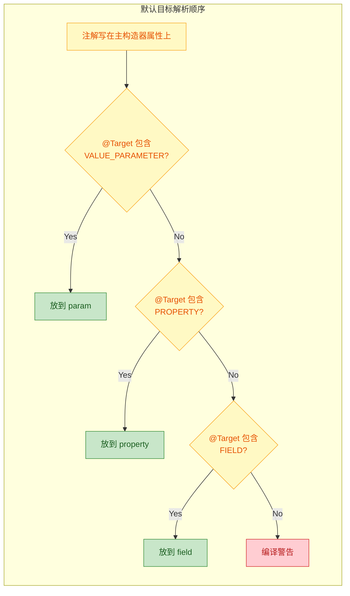

正因为有这个默认解析规则，当你需要精确控制时，显式写出 use-site target 是最安全的做法。

### file — 文件级注解

`file` 目标是一个特殊的存在——它不注解任何类或函数，而是注解整个文件。`@file:` 注解必须写在文件最顶部，甚至在 `package` 声明之前。

```kotlin
// @file: 注解必须出现在文件最顶部，package 声明之前
@file:JvmName("StringUtils")          // 指定编译后的 Java 类名
@file:JvmMultifileClass                // 允许多个文件合并为同一个 Java 类
@file:Suppress("UNCHECKED_CAST")       // 抑制整个文件的特定警告
@file:OptIn(ExperimentalCoroutinesApi::class)  // 整个文件启用实验性 API

package com.example.utils

// 顶层函数，在 Java 中通过 StringUtils.capitalize() 调用
// 而不是默认的 StringUtilsKt.capitalize()
fun capitalize(input: String): String {
    return input.replaceFirstChar { it.uppercase() }
}

fun truncate(input: String, maxLength: Int): String {
    return if (input.length > maxLength) input.take(maxLength) + "..." else input
}
```

`@file:JvmName` 是最常用的文件级注解，它解决了 Kotlin 顶层函数在 Java 端调用时类名不优雅的问题。默认情况下，`StringUtils.kt` 中的顶层函数会被编译到 `StringUtilsKt` 类中，加上 `@file:JvmName("StringUtils")` 后就变成了干净的 `StringUtils`。

`@file:JvmMultifileClass` 更进一步，允许多个文件中的顶层函数合并到同一个 Java 类中：

```kotlin
// ---- 文件: StringUtils.kt ----
@file:JvmName("Utils")
@file:JvmMultifileClass
package com.example

fun capitalize(s: String): String = s.replaceFirstChar { it.uppercase() }

// ---- 文件: NumberUtils.kt ----
@file:JvmName("Utils")
@file:JvmMultifileClass
package com.example

fun clamp(value: Int, min: Int, max: Int): Int = value.coerceIn(min, max)

// ---- Java 调用端 ----
// 两个文件的函数都合并到了 Utils 类中
// Utils.capitalize("hello")
// Utils.clamp(150, 0, 100)
```

### 完整目标速查与实战对照

下面这张表汇总了所有 use-site targets，以及它们各自的适用场景和典型注解：

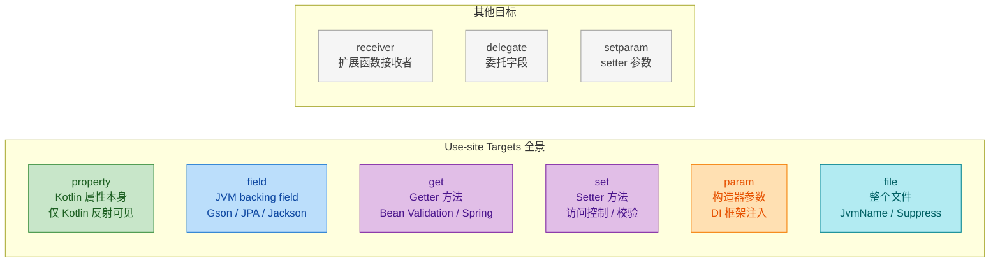

除了前面详细讲解的 6 个目标，还有 3 个较少使用但值得了解的目标：

```kotlin
// receiver — 注解扩展函数/属性的接收者参数
fun @receiver:NotNull String.isValidEmail(): Boolean {
    return this.contains("@") && this.contains(".")
}

// delegate — 注解委托属性的隐藏委托字段
class Settings {
    // @delegate: 将注解放到存储 Lazy 实例的那个隐藏字段上
    @delegate:Transient
    val heavyResource: Resource by lazy { Resource.load() }
}

// setparam — 注解 setter 方法的参数（不是 setter 方法本身）
class Validated {
    var age: Int = 0
        // @setparam: 注解 setter 的参数，而非 setter 方法
        set(@setparam:Positive value) {
            require(value > 0)
            field = value
        }
}
```

### 多目标组合与冲突解决

实际项目中，一个属性上经常需要同时使用多个 use-site targets，将不同的注解精确分配到不同的编译产物上：

```kotlin
@Entity
class Product(
    // 同一个属性上组合多个 use-site targets
    @param:NotNull                              // 构造器参数：非空校验
    @field:Column(name = "product_name")        // JVM 字段：JPA 列映射
    @get:JsonProperty("name")                   // Getter：Jackson JSON 键名
    var name: String,

    @param:Positive                             // 构造器参数：正数校验
    @field:Column(name = "unit_price")          // JVM 字段：JPA 列映射
    @get:JsonProperty("price")                  // Getter：Jackson JSON 键名
    @set:Synchronized                           // Setter：线程安全写入
    var price: Double
)
```

当你不写 use-site target 时，编译器会按照前面提到的优先级规则自动选择。但如果自动选择的结果不是你想要的，就会产生微妙的 bug——注解"消失"了，框架读不到它。这类问题往往很难排查，所以经验丰富的 Kotlin 开发者会养成一个习惯：**在与 Java 框架交互时，始终显式写出 use-site target**。

```kotlin
// 反面教材：不写 use-site target，注解可能跑到意料之外的位置
class Bad(
    @NotNull val name: String  // @NotNull 到底放到了 param? field? 取决于注解的 @Target
)

// 正面做法：显式指定，意图清晰
class Good(
    @field:NotNull val name: String  // 明确放到字段上，JPA/Gson 一定能读到
)
```

---

**📝 练习题**

以下 Kotlin 代码中，`@SerializedName("user_id")` 注解在 Java 反射中能否通过字段读取到？

```kotlin
class User(
    @SerializedName("user_id") val id: Long
)
```

已知 `@SerializedName` 的 `@Target` 仅包含 `FIELD`。

A. 能读取到，因为 `@SerializedName` 的 `@Target` 是 `FIELD`，编译器会自动将其放到 backing field 上

B. 不能读取到，因为主构造器属性的注解默认放到构造器参数上

C. 不能读取到，因为 `val` 属性没有 backing field

D. 能读取到，但需要显式写成 `@field:SerializedName("user_id")`

**【答案】** A

**【解析】** 根据 Kotlin 编译器的默认目标解析规则，当注解写在主构造器属性上时，编译器会按 `param → property → field` 的优先级依次检查注解的 `@Target` 是否匹配。`@SerializedName` 的 `@Target` 仅包含 `FIELD`，不包含 `VALUE_PARAMETER` 也不包含 `PROPERTY`，所以编译器会自动将其放到 backing field 上。因此即使不显式写 `@field:`，Gson 也能通过字段反射读取到这个注解。不过在实际项目中，显式写出 `@field:` 仍然是推荐做法，因为它让意图更加清晰，也避免了未来 `@Target` 变更带来的风险。选项 C 是错误的，`val` 属性有 backing field（只是没有 setter），只有纯计算属性才没有 backing field。

---

## 内置注解（Built-in Annotations）

Kotlin 标准库和编译器内置了一批"开箱即用"的注解，它们大致可以分为两类：一类用于**纯 Kotlin 语义**（如 `@Deprecated`、`@Suppress`），另一类用于**Kotlin/JVM 互操作**（如 `@JvmName`、`@JvmStatic`、`@Throws`）。掌握这些注解，不仅能写出更健壮的 Kotlin 代码，还能在 Kotlin 与 Java 混合项目中游刃有余。

我们先用一张全景图来建立整体认知，再逐一深入。

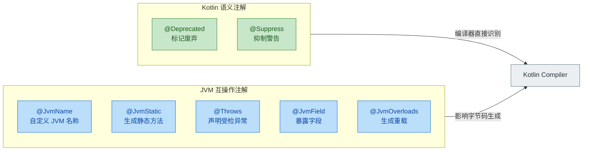

---

### @Deprecated —— 标记废弃 API

`@Deprecated` 是日常开发中使用频率最高的内置注解之一。它的作用是告诉调用方："这个 API 已经过时了，请迁移到新方案。" Kotlin 的 `@Deprecated` 比 Java 的同名注解强大得多，因为它内置了**自动替换（ReplaceWith）** 机制，IDE 可以一键帮你完成迁移。

先看它的声明签名：

```kotlin
// Kotlin 标准库中 @Deprecated 的简化定义
public annotation class Deprecated(
    val message: String,                    // 必填：废弃原因说明
    val replaceWith: ReplaceWith = ReplaceWith(""), // 可选：替代方案
    val level: DeprecationLevel = DeprecationLevel.WARNING // 可选：严重级别
)

// ReplaceWith 本身也是一个注解
public annotation class ReplaceWith(
    val expression: String,       // 替换表达式
    vararg val imports: String    // 替换后需要额外导入的包
)
```

三个参数各司其职：

- `message`：一段人类可读的说明文字，告诉开发者为什么废弃、应该怎么做。这是唯一的必填参数。
- `replaceWith`：提供一个 `ReplaceWith` 对象，IDE 会据此生成"一键替换"的 Quick Fix。`expression` 是替换后的代码表达式，`imports` 是替换后可能需要新增的 import 语句。
- `level`：控制编译器对调用废弃 API 的反应强度，有三个级别。

`DeprecationLevel` 是一个枚举，三个值对应三种不同的编译器行为：

```kotlin
public enum class DeprecationLevel {
    WARNING,  // 编译通过，但 IDE 显示删除线 + 黄色警告
    ERROR,    // 编译直接报错，强制调用方迁移
    HIDDEN    // 从 API 表面"消失"，无法被新代码引用，但二进制兼容
}
```

`WARNING` 是默认级别，适合刚开始废弃时使用，给调用方一个缓冲期。`ERROR` 适合在下一个大版本中升级，强制所有人迁移。`HIDDEN` 是最特殊的——它让这个 API 在源码层面彻底不可见（IDE 不会提示、代码补全找不到它），但已经编译好的旧 `.class` 文件仍然可以正常调用它，从而保持**二进制兼容性（binary compatibility）**。这在库开发中非常有用。

来看一个完整的实战示例：

```kotlin
class UserService {

    // 旧方法：通过用户名查找用户
    // message 说明废弃原因
    // replaceWith 提供替换表达式，IDE 可以一键替换
    // level 设为 WARNING，暂时只是警告
    @Deprecated(
        message = "Use findUserById() instead. Username-based lookup will be removed in v3.0.",
        replaceWith = ReplaceWith(
            expression = "findUserById(id)",  // 替换后的代码
            imports = []                       // 不需要额外 import
        ),
        level = DeprecationLevel.WARNING
    )
    fun findUserByName(name: String): User? {
        // ... 旧的实现逻辑
        return null
    }

    // 新方法：通过 ID 查找用户
    fun findUserById(id: Long): User? {
        // ... 新的实现逻辑
        return null
    }
}

fun demo() {
    val service = UserService()
    // IDE 会在 findUserByName 上画删除线，并提示：
    // "Use findUserById() instead. Username-based lookup will be removed in v3.0."
    // 按 Alt+Enter 可以一键替换
    service.findUserByName("alice")  // ⚠️ WARNING
}
```

一个更高级的场景——当替换表达式需要额外 import 时：

```kotlin
@Deprecated(
    message = "Use kotlinx.datetime.Clock instead",
    replaceWith = ReplaceWith(
        expression = "Clock.System.now()",
        imports = ["kotlinx.datetime.Clock"]  // 替换后自动添加这个 import
    ),
    level = DeprecationLevel.ERROR  // 直接报错，强制迁移
)
fun currentTimestamp(): Long = System.currentTimeMillis()
```

关于 `HIDDEN` 级别的典型用法，假设你维护一个公共库：

```kotlin
// v1.0 发布了这个方法
// v2.0 想删掉它，但不能破坏已编译的旧代码
@Deprecated(
    message = "Removed since v2.0",
    level = DeprecationLevel.HIDDEN  // 源码不可见，但字节码仍存在
)
fun legacyMethod() { /* ... */ }

fun caller() {
    // legacyMethod()  // ❌ 编译错误：Unresolved reference
    // 新代码完全看不到这个方法
    // 但 v1.0 编译出的 jar 调用此方法时，运行时不会崩溃
}
```

---

### @Suppress —— 抑制编译器警告

`@Suppress` 用于告诉编译器："我知道这里有警告，但我是故意这么写的，请闭嘴。" 它接受一个或多个警告名称字符串，可以作用于表达式、语句、函数、类甚至整个文件。

```kotlin
// @Suppress 的声明非常简单
public annotation class Suppress(
    vararg val names: String  // 要抑制的警告名称列表
)
```

`@Suppress` 的作用范围遵循"就近原则"——你把它放在哪个元素上，就只抑制那个元素范围内的警告。这是一种精确控制，避免大范围地掩盖潜在问题。

```kotlin
// 1. 抑制单个警告 —— 未使用变量
fun example1() {
    @Suppress("UNUSED_VARIABLE")       // 只抑制下面这一行的警告
    val debugFlag = true                // 不会再提示 "Variable is never used"
    // 其他未使用的变量仍然会被警告
}

// 2. 抑制多个警告 —— 同时抑制未检查转换和废弃调用
@Suppress("UNCHECKED_CAST", "DEPRECATION")  // 作用于整个函数
fun example2(raw: Any): List<String> {
    val list = raw as List<String>     // UNCHECKED_CAST 被抑制
    legacyMethod()                     // DEPRECATION 被抑制
    return list
}

// 3. 文件级别抑制 —— 放在文件最顶部，package 声明之前
@file:Suppress("NOTHING_TO_INLINE")    // 整个文件中的该警告都被抑制

package com.example.utils

inline fun trivialHelper() = 42        // 通常会警告 "Nothing to inline"
```

下面是开发中最常用的一些警告名称：

```kotlin
// ── 类型相关 ──
@Suppress("UNCHECKED_CAST")           // 未经检查的类型转换（泛型擦除场景）
@Suppress("USELESS_CAST")            // 编译器认为多余的类型转换

// ── 废弃相关 ──
@Suppress("DEPRECATION")             // 调用了 @Deprecated 标记的 API
@Suppress("OVERRIDE_DEPRECATION")    // 覆写了一个已废弃的方法

// ── 未使用相关 ──
@Suppress("UNUSED_VARIABLE")         // 声明了但未使用的变量
@Suppress("UNUSED_PARAMETER")        // 声明了但未使用的参数
@Suppress("UNUSED_EXPRESSION")       // 计算了但未使用结果的表达式

// ── 可见性与命名 ──
@Suppress("MemberVisibilityCanBePrivate")  // 成员可以设为 private（来自 lint）
@Suppress("FunctionName")            // 函数命名不符合驼峰规范（常见于测试方法）

// ── 其他 ──
@Suppress("NOTHING_TO_INLINE")       // inline 函数体太简单，内联无意义
@Suppress("RemoveRedundantQualifierName") // 多余的全限定名
```

一个实际场景——在单元测试中，我们经常用反引号命名测试方法来提高可读性，但这会触发命名规范警告：

```kotlin
class UserServiceTest {

    @Suppress("FunctionName")  // 测试方法允许使用描述性命名
    @Test
    fun `should return null when user not found`() {
        // 反引号命名让测试意图一目了然
        val result = userService.findUserById(-1)
        assertNull(result)
    }
}
```

需要注意的是，`@Suppress` 是一把双刃剑。过度使用它会掩盖真正的代码问题。最佳实践是：**尽量缩小 `@Suppress` 的作用范围**，并在旁边加注释说明为什么需要抑制。

---

### @JvmName —— 自定义 JVM 层面的名称

当 Kotlin 代码编译为 JVM 字节码时，编译器会自动为函数、属性、文件类等生成 JVM 名称。`@JvmName` 允许你覆盖这个默认名称，这在两个核心场景中至关重要：**解决签名冲突** 和 **优化 Java 调用体验**。

```kotlin
// @JvmName 的声明
@Target(
    AnnotationTarget.FUNCTION,
    AnnotationTarget.PROPERTY_GETTER,
    AnnotationTarget.PROPERTY_SETTER,
    AnnotationTarget.FILE
)
@Retention(AnnotationRetention.BINARY)  // 写入字节码，但反射不可见
public annotation class JvmName(
    val name: String  // 在 JVM 层面使用的名称
)
```

**场景一：解决泛型擦除导致的签名冲突**

这是 `@JvmName` 最经典的用途。由于 JVM 的泛型擦除（type erasure），`List<String>` 和 `List<Int>` 在字节码层面都变成了 `List`，导致两个函数签名完全相同：

```kotlin
// ❌ 编译错误！JVM 签名冲突
// 两个函数擦除后都变成 filterItems(List): List
fun filterItems(items: List<String>): List<String> = items.filter { it.isNotBlank() }
fun filterItems(items: List<Int>): List<Int> = items.filter { it > 0 }
```

用 `@JvmName` 给其中一个（或两个）指定不同的 JVM 名称即可解决：

```kotlin
// ✅ 正确：在 JVM 层面使用不同的名称
@JvmName("filterStringItems")  // 字节码中叫 filterStringItems
fun filterItems(items: List<String>): List<String> = items.filter { it.isNotBlank() }

@JvmName("filterIntItems")    // 字节码中叫 filterIntItems
fun filterItems(items: List<Int>): List<Int> = items.filter { it > 0 }

// Kotlin 调用方完全无感，仍然用 filterItems
fun demo() {
    val strings = filterItems(listOf("hello", "", "world"))  // 编译器自动选择正确的重载
    val ints = filterItems(listOf(1, -2, 3))
}
```

```java
// Java 调用方则需要使用 JVM 名称
List<String> strings = MyFileKt.filterStringItems(List.of("hello", "", "world"));
List<Integer> ints = MyFileKt.filterIntItems(List.of(1, -2, 3));
```

**场景二：自定义文件级 Facade 类名**

Kotlin 的顶层函数会被编译到一个名为 `文件名Kt` 的类中。比如 `StringUtils.kt` 中的顶层函数，Java 调用时需要写 `StringUtilsKt.xxx()`，这个 `Kt` 后缀看起来不太优雅。`@file:JvmName` 可以改掉它：

```kotlin
// 文件：StringUtils.kt
@file:JvmName("StringUtils")  // 必须放在文件最顶部，package 之前

package com.example.utils

// 顶层函数
fun String.toCamelCase(): String {
    // 将 snake_case 转为 camelCase
    return this.split("_")
        .mapIndexed { index, word ->
            if (index == 0) word.lowercase()  // 第一个单词全小写
            else word.replaceFirstChar { it.uppercase() }  // 后续单词首字母大写
        }
        .joinToString("")
}
```

```java
// Java 调用 —— 不再需要丑陋的 Kt 后缀
String result = StringUtils.toCamelCase("hello_world");  // ✅ 干净
// 而不是 StringUtilsKt.toCamelCase("hello_world");     // ❌ 默认的丑名字
```

**场景三：属性 getter/setter 重命名**

```kotlin
class Config {
    val isEnabled: Boolean
        @JvmName("isEnabled")  // Java 调用时：config.isEnabled()
        get() = true           // 而不是默认的 config.getEnabled() 或 config.isEnabled()

    var labelText: String = "Hello"
        @JvmName("getLabelText")   // 自定义 getter 的 JVM 名称
        get
        @JvmName("setLabelText")   // 自定义 setter 的 JVM 名称
        set
}
```

---

### @JvmStatic —— 生成真正的 Java 静态方法

Kotlin 没有 `static` 关键字。`companion object` 和 `object` 中的成员在字节码层面是实例方法，Java 调用时需要通过 `Companion` 或 `INSTANCE` 中转，非常别扭。`@JvmStatic` 的作用就是让编译器额外生成一个真正的 Java `static` 方法，让 Java 调用方感觉不到 Kotlin 的差异。

先看没有 `@JvmStatic` 时的尴尬：

```kotlin
class Logger {
    companion object {
        fun log(message: String) {
            println("[LOG] $message")
        }
    }
}

object AppConfig {
    fun getVersion(): String = "1.0.0"
}
```

```java
// Java 调用 —— 没有 @JvmStatic 时
Logger.Companion.log("hello");       // 😩 必须通过 Companion 中转
AppConfig.INSTANCE.getVersion();     // 😩 必须通过 INSTANCE 中转
```

加上 `@JvmStatic` 后：

```kotlin
class Logger {
    companion object {
        @JvmStatic  // 告诉编译器：额外生成一个 static 方法
        fun log(message: String) {
            println("[LOG] $message")
        }

        @JvmStatic
        val TAG: String = "Logger"  // 属性也可以用 @JvmStatic
    }
}

object AppConfig {
    @JvmStatic
    fun getVersion(): String = "1.0.0"

    @JvmStatic
    val buildNumber: Int = 42
}
```

```java
// Java 调用 —— 有 @JvmStatic 后
Logger.log("hello");            // ✅ 直接调用，就像 Java 的 static 方法
String tag = Logger.getTAG();   // ✅ 静态属性访问

String ver = AppConfig.getVersion();  // ✅ 不再需要 INSTANCE
int build = AppConfig.getBuildNumber(); // ✅ 干净利落
```

我们用一张图来对比字节码层面的差异：

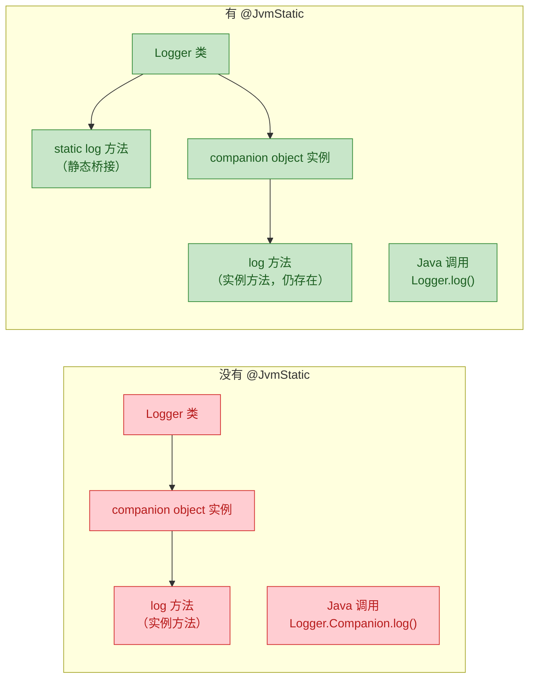

需要注意的是，`@JvmStatic` 只能用在 `companion object` 或 `object` 声明内部。它实际上是生成了一个**桥接方法（bridge method）**——原来的实例方法仍然存在，只是多了一个 static 方法委托给它。所以 Kotlin 侧的调用方式完全不受影响。

在 Android 开发中，`@JvmStatic` 有一个非常实用的场景——`Fragment` 的工厂方法：

```kotlin
class UserFragment : Fragment() {

    companion object {
        private const val ARG_USER_ID = "user_id"

        @JvmStatic  // 让 Java 代码也能直接 UserFragment.newInstance(123)
        fun newInstance(userId: Long): UserFragment {
            return UserFragment().apply {
                arguments = Bundle().apply {
                    putLong(ARG_USER_ID, userId)  // 通过 Bundle 传递参数
                }
            }
        }
    }

    private val userId: Long by lazy {
        requireArguments().getLong(ARG_USER_ID)  // 从 Bundle 中取出参数
    }
}
```

---

### @Throws —— 声明受检异常

Kotlin 没有受检异常（checked exceptions）的概念——所有异常都是非受检的（unchecked）。但 Java 有。当 Java 代码调用一个可能抛出异常的 Kotlin 函数时，如果 Kotlin 侧没有在字节码中声明 `throws`，Java 编译器就不会要求调用方处理异常，这可能导致运行时崩溃。

`@Throws` 就是为了解决这个互操作问题：它让 Kotlin 编译器在生成的字节码中添加 `throws` 子句。

```kotlin
// @Throws 的声明
public annotation class Throws(
    vararg val exceptionClasses: KClass<out Throwable>  // 要声明的异常类型列表
)
```

来看一个文件读取的例子：

```kotlin
import java.io.File
import java.io.IOException

// 声明此函数可能抛出 IOException
@Throws(IOException::class)
fun readConfig(path: String): String {
    val file = File(path)
    if (!file.exists()) {
        throw IOException("Config file not found: $path")  // 抛出异常
    }
    return file.readText()  // 读取文件内容
}

// 可以声明多个异常类型
@Throws(IOException::class, IllegalArgumentException::class)
fun parseConfig(path: String): Map<String, String> {
    if (path.isBlank()) {
        throw IllegalArgumentException("Path must not be blank")
    }
    val content = readConfig(path)
    // ... 解析逻辑
    return emptyMap()
}
```

对应的 Java 调用方体验：

```java
// 有 @Throws 时 —— Java 编译器强制要求处理异常
try {
    String config = MyFileKt.readConfig("/etc/app.conf");
} catch (IOException e) {
    // ✅ 编译器要求你处理这个异常
    System.err.println("Failed to read config: " + e.getMessage());
}

// 如果没有 @Throws —— Java 编译器不知道有异常
// String config = MyFileKt.readConfig("/etc/app.conf");
// 编译通过，但运行时可能崩溃！没有任何提示要 try-catch
```

在协程中，`@Throws` 同样重要：

```kotlin
class ApiClient {

    // 挂起函数也可以声明异常
    @Throws(IOException::class)
    suspend fun fetchUser(id: Long): User {
        // 网络请求可能抛出 IOException
        val response = httpClient.get("https://api.example.com/users/$id")
        if (!response.isSuccessful) {
            throw IOException("HTTP ${response.code}")
        }
        return response.body()
    }
}
```

一个容易忽略的细节：`@Throws` 只影响字节码中的 `throws` 声明，不影响 Kotlin 侧的任何行为。Kotlin 代码调用带 `@Throws` 的函数时，仍然不需要 try-catch（因为 Kotlin 没有受检异常）。它纯粹是为 Java 互操作服务的。

---

### 补充：其他常用 JVM 互操作注解

除了上面重点讲解的五个注解，还有几个在实际项目中经常出现的 JVM 互操作注解，值得简要了解：

**@JvmField** —— 将属性暴露为公共字段，去掉 getter/setter：

```kotlin
class Point(
    @JvmField val x: Int,  // Java 侧直接 point.x，而不是 point.getX()
    @JvmField val y: Int   // Java 侧直接 point.y，而不是 point.getY()
)

// 常见于常量定义
object Constants {
    @JvmField
    val MAX_RETRY = 3  // Java 侧：Constants.MAX_RETRY（字段访问，非方法调用）
}
```

**@JvmOverloads** —— 为带默认参数的函数生成 Java 重载：

```kotlin
class Dialog {
    // Kotlin 的默认参数在 Java 中不可用
    // @JvmOverloads 会生成所有可能的重载组合
    @JvmOverloads
    fun show(
        title: String,
        message: String = "Default message",  // 默认参数
        cancelable: Boolean = true             // 默认参数
    ) {
        // 生成 3 个 Java 方法：
        // show(String title)
        // show(String title, String message)
        // show(String title, String message, boolean cancelable)
    }
}
```

```java
// Java 调用 —— 可以省略有默认值的参数
Dialog dialog = new Dialog();
dialog.show("Alert");                          // 使用两个默认值
dialog.show("Alert", "Something went wrong");  // 使用一个默认值
dialog.show("Alert", "Error", false);          // 全部指定
```

**@JvmRecord** —— 将 Kotlin data class 编译为 Java 16+ 的 Record（需要 JVM target 16+）：

```kotlin
@JvmRecord  // 编译为 java.lang.Record 的子类
data class Coordinate(val lat: Double, val lng: Double)
```

下面用一张表格总结所有常用 JVM 互操作注解的核心用途：

| 注解 | 作用 | 典型场景 |
|------|------|----------|
| `@JvmName` | 自定义 JVM 方法/类名 | 泛型擦除冲突、美化文件类名 |
| `@JvmStatic` | 生成 static 桥接方法 | companion object、object 中的方法 |
| `@Throws` | 声明 throws 子句 | Java 调用方需要处理受检异常 |
| `@JvmField` | 暴露为公共字段 | 去掉 getter/setter、常量定义 |
| `@JvmOverloads` | 生成默认参数的重载 | 构造函数、工厂方法 |
| `@JvmRecord` | 编译为 Java Record | 纯数据载体（JVM 16+） |

---

**📝 练习题**

以下 Kotlin 代码在编译时会发生什么？

```kotlin
fun process(items: List<String>): List<String> = items.map { it.uppercase() }
fun process(items: List<Int>): List<Int> = items.map { it * 2 }
```

A. 编译通过，Kotlin 编译器能区分两个函数的泛型参数

B. 编译错误，因为 JVM 泛型擦除导致两个函数签名相同，需要用 `@JvmName` 解决

C. 编译通过，但运行时会抛出 `ClassCastException`

D. 编译错误，Kotlin 不支持函数重载

**【答案】** B

**【解析】** JVM 的泛型擦除（type erasure）会将 `List<String>` 和 `List<Int>` 都擦除为 `List`，导致两个 `process` 函数在字节码层面的签名完全相同：`process(List): List`。Kotlin 编译器会在编译期检测到这个冲突并报错：`Platform declaration clash: The following declarations have the same JVM signature`。解决方案是给其中一个或两个函数添加 `@JvmName("processStrings")` 之类的注解，让它们在 JVM 层面拥有不同的名称。选项 A 错误，虽然 Kotlin 编译器在语言层面能区分泛型，但它必须生成合法的 JVM 字节码，而 JVM 不区分擦除后相同的签名。选项 D 错误，Kotlin 完全支持函数重载，只是这个特定情况因为擦除而冲突。

---

## 自定义注解（Custom Annotations）

在前面的章节中，我们已经掌握了注解的声明语法、参数类型、元注解以及使用点目标等基础设施。现在是时候将这些知识融会贯通，学习如何从零开始 **设计（Design）** 一个真正实用的自定义注解了。自定义注解是 Kotlin 元编程的核心产出物——它让你能够为代码附加 **领域特定的语义信息（domain-specific semantic metadata）**，并在编译时或运行时被工具链消费，从而实现代码生成、校验、序列化映射等高级能力。

一个好的自定义注解，绝不仅仅是 `annotation class` 加个名字那么简单。它需要经过深思熟虑的设计：目标是什么？参数怎么定义？保留策略如何选择？命名是否清晰自解释？这些问题的答案，决定了你的注解是成为团队生产力的倍增器，还是沦为无人理解的技术债务。

### 设计注解（Designing Annotations）

设计一个自定义注解，本质上是在设计一份 **契约（Contract）**。这份契约规定了"使用者需要提供什么信息"以及"处理器将如何消费这些信息"。一个设计良好的注解应当遵循以下几个核心原则。

#### 设计原则一：单一职责（Single Responsibility）

每个注解应该只表达 **一个明确的语义意图**。不要试图把多个不相关的功能塞进同一个注解里。这和类设计中的单一职责原则（SRP）是完全一致的。

```kotlin
// ❌ 反面示例：一个注解承担了太多职责
// 既管序列化名称，又管是否忽略，还管默认值
annotation class FieldConfig(
    val name: String = "",        // 序列化名称
    val ignore: Boolean = false,  // 是否忽略
    val defaultValue: String = "" // 默认值
)

// ✅ 正面示例：每个注解只做一件事
// 注解一：仅负责指定序列化时的字段名称
annotation class SerialName(val value: String)

// 注解二：仅负责标记该字段在序列化时应被忽略
annotation class Ignore

// 注解三：仅负责指定字段的默认值
annotation class DefaultValue(val value: String)
```

拆分后的好处是显而易见的：每个注解的语义一目了然，使用者可以自由组合，处理器的逻辑也更加简洁。当你发现一个注解的参数超过 3-4 个时，就应该考虑是否需要拆分了。

#### 设计原则二：明确约束目标（Constrain the Target）

通过 `@Target` 元注解精确限定注解可以出现的位置。这不仅是一种防御性编程，更是一种 **自文档化（self-documenting）** 的手段——使用者一看 `@Target` 就知道这个注解该贴在哪里。

```kotlin
// 这个注解专门用于标记 REST API 的路由路径
// 只允许贴在函数上，贴在类或属性上会编译报错
@Target(AnnotationTarget.FUNCTION)
@Retention(AnnotationRetention.RUNTIME) // 运行时需要通过反射读取路由信息
@MustBeDocumented // 会出现在 KDoc 生成的 API 文档中
annotation class Route(
    val path: String,   // 路由路径，如 "/api/users"
    val method: String = "GET" // HTTP 方法，默认为 GET
)

// 这个注解用于标记需要依赖注入的构造函数
// 只允许贴在构造函数上
@Target(AnnotationTarget.CONSTRUCTOR)
@Retention(AnnotationRetention.RUNTIME)
annotation class Inject
```

如果你不指定 `@Target`，注解默认可以贴在几乎任何地方，这会导致误用且编译器无法帮你检查。**永远显式声明 `@Target`**，这是自定义注解设计的铁律。

#### 设计原则三：选择正确的保留策略（Choose the Right Retention）

`@Retention` 的选择直接决定了注解的生命周期和可用性。这个决策应该基于 **谁来消费这个注解**：

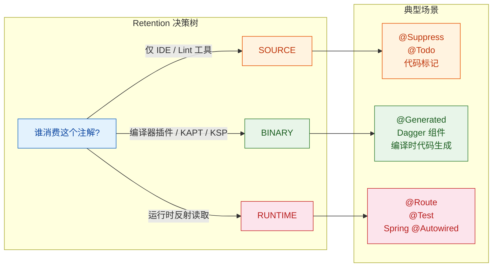

一个常见的误区是"不确定就选 RUNTIME"。虽然 RUNTIME 兼容性最好（运行时、编译时都能读到），但它会增加 `.class` 文件的体积，并且在反射时产生额外开销。如果你的注解只在编译时被 KSP 处理，那 `BINARY` 甚至 `SOURCE` 就够了。

#### 设计原则四：参数设计的艺术

注解的参数设计需要在 **表达力** 和 **简洁性** 之间取得平衡。以下是几个关键技巧：

**技巧 1：善用默认值减少使用负担**

```kotlin
// 一个用于标记缓存策略的注解
@Target(AnnotationTarget.FUNCTION)
@Retention(AnnotationRetention.RUNTIME)
annotation class Cacheable(
    val key: String = "",           // 缓存键，默认为空则自动生成
    val ttlSeconds: Int = 300,      // 过期时间，默认 5 分钟
    val maxSize: Int = 1000,        // 最大缓存条目数，默认 1000
    val condition: String = ""      // SpEL 条件表达式，默认无条件缓存
)

// 使用时，大多数场景只需要最简形式
class UserService {
    @Cacheable // 全部使用默认值，零配置即可工作
    fun getUser(id: Long): User = TODO()

    @Cacheable(ttlSeconds = 60) // 只覆盖需要定制的参数
    fun getHotUsers(): List<User> = TODO()
}
```

**技巧 2：用枚举代替魔法字符串**

```kotlin
// ❌ 字符串参数容易拼写错误，且没有 IDE 自动补全
annotation class HttpMethod(val method: String) // "GET"? "get"? "Get"?

// ✅ 枚举参数类型安全，IDE 自动补全，不可能拼错
enum class Method { GET, POST, PUT, DELETE, PATCH }

@Target(AnnotationTarget.FUNCTION)
@Retention(AnnotationRetention.RUNTIME)
annotation class HttpMethod(val method: Method = Method.GET)
```

**技巧 3：用 KClass 参数实现类型级别的关联**

```kotlin
// 一个简易的事件订阅注解
// 通过 KClass 参数将方法与特定事件类型绑定
@Target(AnnotationTarget.FUNCTION)
@Retention(AnnotationRetention.RUNTIME)
annotation class Subscribe(
    val eventType: KClass<*>,          // 订阅的事件类型
    val priority: Int = 0,             // 优先级，数字越大越先执行
    val threadMode: ThreadMode = ThreadMode.MAIN // 回调线程
)

enum class ThreadMode { MAIN, BACKGROUND, ASYNC }

// 使用示例
class EventHandler {
    // 订阅 UserLoginEvent，在主线程回调，优先级为 10
    @Subscribe(eventType = UserLoginEvent::class, priority = 10)
    fun onUserLogin(event: UserLoginEvent) {
        // 处理登录事件
    }
}
```

**技巧 4：嵌套注解实现复杂配置**

当配置结构较为复杂时，可以通过注解嵌套来组织层次关系：

```kotlin
// 定义一个表示 HTTP 请求头的注解
@Target() // 空 Target 表示此注解仅用于嵌套，不能独立使用
@Retention(AnnotationRetention.RUNTIME)
annotation class Header(
    val name: String,   // 请求头名称
    val value: String   // 请求头值
)

// 定义 API 端点注解，内部嵌套 Header 数组
@Target(AnnotationTarget.FUNCTION)
@Retention(AnnotationRetention.RUNTIME)
annotation class ApiEndpoint(
    val url: String,                          // 端点 URL
    val method: Method = Method.GET,          // HTTP 方法
    val headers: Array<Header> = []           // 嵌套的请求头数组
)

// 使用时，结构清晰，层次分明
class ApiClient {
    @ApiEndpoint(
        url = "/api/data",
        method = Method.POST,
        headers = [                           // 嵌套注解数组
            Header(name = "Content-Type", value = "application/json"),
            Header(name = "Authorization", value = "Bearer {token}")
        ]
    )
    fun postData(body: String): Response = TODO()
}
```

#### 设计原则五：组合优于继承（Compose Over Inherit）

Kotlin 的注解不支持继承（annotation class 不能 extend 另一个 annotation class），但你可以通过 **元注解组合（Meta-annotation Composition）** 的思路来实现复用。虽然 Kotlin 原生不像 Spring 那样支持"注解继承"语义，但你可以在处理器层面实现类似效果：

```kotlin
// 基础注解：标记一个组件需要被容器管理
@Target(AnnotationTarget.CLASS)
@Retention(AnnotationRetention.RUNTIME)
annotation class Component(val name: String = "")

// 专用注解：标记一个类是 Service 层组件
// 自身也被 @Component 标记，处理器可以递归检查
@Target(AnnotationTarget.CLASS)
@Retention(AnnotationRetention.RUNTIME)
@Component // 元注解组合：Service 本身也是一个 Component
annotation class Service(val name: String = "")

// 专用注解：标记一个类是 Repository 层组件
@Target(AnnotationTarget.CLASS)
@Retention(AnnotationRetention.RUNTIME)
@Component // 同样是 Component 的特化
annotation class Repository(val name: String = "")
```

在处理器中，你可以递归检查一个注解是否"间接"被 `@Component` 标记，从而实现类似继承的效果。Spring 框架的 `@Service`、`@Controller` 就是这个模式的经典实践。

#### 完整设计案例：一个轻量级校验框架

让我们把上述原则综合运用，设计一套用于数据校验的注解体系：

```kotlin
// ========== 1. 基础校验标记 ==========

// 标记一个类需要进行字段校验
@Target(AnnotationTarget.CLASS)
@Retention(AnnotationRetention.RUNTIME)
@MustBeDocumented
annotation class Validatable

// ========== 2. 具体校验规则注解 ==========

// 非空校验：字段值不能为 null 或空字符串
@Target(AnnotationTarget.PROPERTY, AnnotationTarget.FIELD)
@Retention(AnnotationRetention.RUNTIME)
annotation class NotEmpty(
    val message: String = "Field must not be empty" // 校验失败时的提示信息
)

// 范围校验：数值必须在指定范围内
@Target(AnnotationTarget.PROPERTY, AnnotationTarget.FIELD)
@Retention(AnnotationRetention.RUNTIME)
annotation class Range(
    val min: Long = Long.MIN_VALUE,  // 最小值，默认无下限
    val max: Long = Long.MAX_VALUE,  // 最大值，默认无上限
    val message: String = "Value out of range"
)

// 正则校验：字符串必须匹配指定的正则表达式
@Target(AnnotationTarget.PROPERTY, AnnotationTarget.FIELD)
@Retention(AnnotationRetention.RUNTIME)
annotation class Pattern(
    val regex: String,               // 正则表达式（必填）
    val message: String = "Value does not match pattern"
)

// 长度校验：字符串长度必须在指定范围内
@Target(AnnotationTarget.PROPERTY, AnnotationTarget.FIELD)
@Retention(AnnotationRetention.RUNTIME)
annotation class Length(
    val min: Int = 0,                // 最小长度
    val max: Int = Int.MAX_VALUE,    // 最大长度
    val message: String = "Length out of range"
)

// ========== 3. 使用示例 ==========

@Validatable // 标记此类需要校验
data class UserRegistration(
    @NotEmpty(message = "用户名不能为空")           // 非空校验
    @Length(min = 3, max = 20, message = "用户名长度需在3-20之间") // 长度校验
    val username: String,

    @NotEmpty(message = "邮箱不能为空")
    @Pattern(                                       // 正则校验
        regex = "^[\\w.-]+@[\\w.-]+\\.\\w+$",
        message = "邮箱格式不正确"
    )
    val email: String,

    @Range(min = 1, max = 150, message = "年龄需在1-150之间") // 范围校验
    val age: Int
)
```

这套注解体系的设计要点：
- 每个注解只负责一种校验规则（单一职责）
- 都精确限定了 `@Target` 为属性和字段
- 都提供了 `message` 默认值（减少使用负担）
- `@Validatable` 作为类级别标记，让处理器可以快速筛选需要校验的类
- 所有注解使用 `RUNTIME` 保留策略，因为校验逻辑在运行时执行

### 命名约定（Naming Conventions）

注解的命名是 API 设计中最容易被忽视、却影响最深远的环节。一个好的注解名称应该让使用者 **不看文档就能猜到它的用途**。Kotlin 社区和 JVM 生态圈已经形成了一套成熟的命名约定。

#### 约定一：使用形容词或过去分词表示"状态/特征"

当注解用于描述目标的某种状态或特征时，使用形容词或过去分词形式：

```kotlin
// 形容词形式：描述目标"是什么样的"
annotation class Serializable    // 可序列化的
annotation class Nullable        // 可为空的
annotation class Immutable       // 不可变的
annotation class Deprecated      // 已废弃的
annotation class Experimental    // 实验性的
annotation class Composable      // 可组合的（Jetpack Compose）

// 过去分词形式：描述目标"被怎样处理过"
annotation class Generated       // 由工具生成的
annotation class Inherited       // 可被继承的
annotation class Documented      // 需要文档化的
annotation class Synchronized    // 需要同步的
```

#### 约定二：使用名词表示"角色/身份"

当注解用于标记目标扮演的角色时，使用名词形式：

```kotlin
// 名词形式：描述目标"是什么"
annotation class Component       // 组件
annotation class Service         // 服务
annotation class Repository      // 仓储
annotation class Controller      // 控制器
annotation class Module          // 模块
annotation class Singleton       // 单例
annotation class Factory         // 工厂
annotation class Provider        // 提供者
```

#### 约定三：使用动词表示"动作/指令"

当注解用于指示处理器执行某种操作时，使用动词形式：

```kotlin
// 动词形式：描述"要做什么"
annotation class Inject          // 注入
annotation class Subscribe       // 订阅
annotation class Bind            // 绑定
annotation class Ignore          // 忽略
annotation class Suppress        // 抑制
annotation class Throws          // 抛出（声明异常）
```

#### 约定四：使用介词短语表示"关系/位置"

当注解用于描述目标与其他元素的关系时：

```kotlin
// 介词短语形式
annotation class Before           // 在...之前（测试生命周期）
annotation class After            // 在...之后
annotation class IntoMap          // 放入 Map 中（Dagger）
annotation class WithContext      // 带有上下文
annotation class ForTest          // 用于测试
```

#### 约定五：包名与分组

当你的项目有多个注解时，合理的包结构至关重要：

```kotlin
// 按功能域分包，结构清晰
com.myapp.annotations/
    validation/          // 校验相关注解
        NotEmpty.kt
        Range.kt
        Pattern.kt
        Length.kt
    serialization/       // 序列化相关注解
        SerialName.kt
        Ignore.kt
        DateFormat.kt
    injection/           // 依赖注入相关注解
        Inject.kt
        Singleton.kt
        Named.kt
    routing/             // 路由相关注解
        Route.kt
        HttpMethod.kt
        PathParam.kt
```

#### 命名反模式（Anti-patterns）

以下是应该避免的命名方式：

```kotlin
// ❌ 反模式 1：名称过于模糊，看不出用途
annotation class Mark           // 标记什么？
annotation class Info           // 什么信息？
annotation class Config         // 配置什么？
annotation class Handle         // 处理什么？

// ✅ 改进：名称应该自解释
annotation class CacheEvict     // 清除缓存
annotation class ApiInfo        // API 元信息
annotation class DatabaseConfig // 数据库配置
annotation class ExceptionHandler // 异常处理器

// ❌ 反模式 2：使用缩写或非标准术语
annotation class Svc            // Service 的缩写，不直观
annotation class Repo           // Repository 的缩写
annotation class Cfg            // Config 的缩写

// ❌ 反模式 3：与 Kotlin/Java 标准库命名冲突
annotation class Override       // 与 kotlin.Override 冲突！
annotation class Volatile       // 与 kotlin.jvm.Volatile 冲突！

// ❌ 反模式 4：使用 "Annotation" 后缀（冗余）
annotation class CacheAnnotation    // "Annotation" 后缀是多余的
annotation class ValidAnnotation    // 大家都知道它是注解

// ✅ 直接用语义命名
annotation class Cache
annotation class Valid
```

#### 命名决策速查表

下面这张表可以帮助你快速选择合适的命名风格：

```text
┌──────────────────┬──────────────────┬──────────────────────────┐
│   注解用途        │   推荐词性        │   示例                    │
├──────────────────┼──────────────────┼──────────────────────────┤
│ 标记状态/能力     │ 形容词/过去分词   │ Serializable, Deprecated │
│ 声明角色/身份     │ 名词             │ Component, Service       │
│ 触发动作/处理     │ 动词             │ Inject, Subscribe        │
│ 描述关系/时序     │ 介词短语          │ Before, IntoMap          │
│ 指定配置值       │ 名词(带限定词)    │ SerialName, CacheConfig  │
│ 条件/约束        │ 形容词/名词       │ Conditional, NotEmpty    │
└──────────────────┴──────────────────┴──────────────────────────┘
```

#### 与 Java 互操作时的命名注意事项

如果你的注解需要被 Java 代码使用，还需要注意以下几点：

```kotlin
// Kotlin 注解在 Java 中使用时，名称保持不变
// 但如果注解有 value 参数，Java 端可以省略参数名

// Kotlin 定义
@Target(AnnotationTarget.FUNCTION)
@Retention(AnnotationRetention.RUNTIME)
annotation class RequestMapping(
    val value: String,              // 命名为 "value" 是 Java 约定
    val method: Method = Method.GET
)

// Java 中使用时可以省略 "value ="
// @RequestMapping("/api/users")          ← 省略了 value =
// @RequestMapping(value = "/api/users")  ← 显式写出也可以

// Kotlin 中使用时必须显式写出参数名（除非只有一个参数）
// @RequestMapping(value = "/api/users")
// @RequestMapping("/api/users")          ← 单参数时也可省略
```

如果你的注解主要参数只有一个，将其命名为 `value` 是 JVM 生态的通用约定，这样 Java 调用方可以享受省略参数名的语法糖。

---

**📝 练习题**

以下是一个自定义注解的定义，请问这段代码存在什么问题？

```kotlin
@Retention(AnnotationRetention.SOURCE)
annotation class ApiRoute(
    val path: String,
    val method: String = "GET",
    val timeout: Double = 30.0
)

// 使用处
class UserController {
    @ApiRoute("/users")
    fun listUsers(): List<User> = TODO()
}
```

A. `@Target` 未声明，注解可以被贴在任何位置，缺乏约束

B. `method` 参数使用了 String 类型，应该用枚举来保证类型安全

C. `timeout` 参数使用了 `Double` 类型，但注解参数不允许使用 `Double`

D. `SOURCE` 保留策略意味着运行时无法通过反射读取此注解，如果需要运行时路由分发则策略选择错误

E. 以上全部

**【答案】** E

**【解析】** 这道题综合考察了自定义注解设计的多个要点。逐项分析：

- A 正确：没有 `@Target` 意味着这个注解可以贴在类、函数、属性、构造函数等几乎任何地方，但一个路由注解显然只应该贴在函数上，缺少 `@Target(AnnotationTarget.FUNCTION)` 是设计缺陷。

- B 正确：`method` 用 `String` 类型会导致使用者可能传入 `"get"`、`"Get"`、`"GEt"` 等各种拼写变体，应该定义 `enum class HttpMethod { GET, POST, PUT, DELETE }` 来约束。

- C 正确：Kotlin（以及 JVM）注解参数只允许以下类型——基本类型（Int, Long, Byte, Short, Float, Boolean, Char）、String、枚举、KClass、其他注解、以及上述类型的数组。注意 `Double` 实际上是允许的基本类型之一（这是个陷阱选项）。但在实际编译中 `Double` 是被允许的，所以严格来说 C 选项本身的描述是错误的。不过从设计角度看，超时时间用 `Int`（秒）或 `Long`（毫秒）更为常见和实用。综合来看，本题的核心考点在于 A、B、D 三个明确的设计问题，而 C 作为干扰项考察你对注解参数类型的精确记忆——`Double` 实际上是合法的。因此最佳答案应聚焦于 A + B + D 的组合，但选项 E 作为"全选"项，意在引导你对每个选项进行独立思考和辨析。

- D 正确：`SOURCE` 保留策略意味着注解信息在编译后就被丢弃了，运行时反射完全看不到它。如果你的路由框架需要在运行时扫描注解来构建路由表（这是最常见的场景），那 `SOURCE` 显然不够，至少需要 `RUNTIME`。

---

## 读取注解（反射 API、KAnnotatedElement）

定义注解只是第一步，真正让注解产生"魔力"的关键在于——**读取它们**。注解本身不过是附着在代码元素上的元数据标签，如果没有人去"读"这些标签，它们就毫无意义。在 Kotlin 中，读取注解的核心手段就是 **反射（Reflection）**。通过反射 API，我们可以在运行时检查类、函数、属性上附着了哪些注解，并据此做出动态决策——这正是依赖注入框架、序列化库、ORM 映射等技术的底层基石。

### 反射 API 基础回顾

在深入注解读取之前，我们需要先理解 Kotlin 反射体系的基本结构。Kotlin 提供了一套独立于 Java 反射的反射 API，位于 `kotlin.reflect` 包中。要使用完整的 Kotlin 反射能力，项目需要引入 `kotlin-reflect` 依赖：

```kotlin
// build.gradle.kts
dependencies {
    implementation(kotlin("reflect")) // 引入 Kotlin 反射库
}
```

Kotlin 反射的核心类型层次如下：

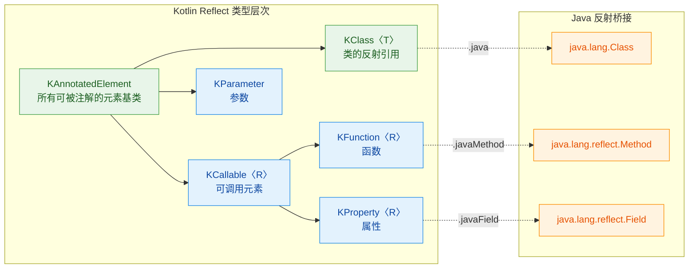

这张图清晰地展示了一个关键事实：`KAnnotatedElement` 是整个反射体系中"可被注解的元素"的顶层接口。类（`KClass`）、可调用元素（`KCallable`，包括函数和属性）、参数（`KParameter`）都继承自它。这意味着，只要你拿到了任何一个反射对象，就可以通过统一的方式去查询它身上的注解。

### KAnnotatedElement 接口详解

`KAnnotatedElement` 是 Kotlin 注解读取的核心入口。它的定义非常简洁，只有一个属性：

```kotlin
// kotlin.reflect.KAnnotatedElement 接口定义
public interface KAnnotatedElement {
    // 返回该元素上所有注解的列表
    // 类型是 List<Annotation>，包含所有附着的注解实例
    public val annotations: List<Annotation>
}
```

这个 `annotations` 属性返回的是一个 `List<Annotation>`，其中每个元素都是注解的实际实例。你可以把它想象成"贴在代码元素上的所有标签的集合"。拿到这个列表后，我们就可以遍历、过滤、类型检查，从而提取出我们关心的注解信息。

来看一个完整的基础示例：

```kotlin
// 定义几个自定义注解
@Target(AnnotationTarget.CLASS)                // 只能用于类
@Retention(AnnotationRetention.RUNTIME)        // 运行时保留，反射可读
annotation class Entity(val tableName: String) // 实体注解，携带表名参数

@Target(AnnotationTarget.PROPERTY)             // 只能用于属性
@Retention(AnnotationRetention.RUNTIME)        // 运行时保留
annotation class Column(                       // 列映射注解
    val name: String = "",                     // 列名，默认空串表示使用属性名
    val nullable: Boolean = true               // 是否可空，默认 true
)

@Target(AnnotationTarget.PROPERTY)             // 只能用于属性
@Retention(AnnotationRetention.RUNTIME)        // 运行时保留
annotation class PrimaryKey                    // 主键标记注解（无参数）

// 使用注解标记一个数据类
@Entity(tableName = "t_user")                  // 标记为数据库实体，映射到 t_user 表
data class User(
    @PrimaryKey                                // 标记为主键
    @Column(name = "user_id", nullable = false)// 映射到 user_id 列，不可空
    val id: Long,

    @Column(name = "user_name")                // 映射到 user_name 列
    val name: String,

    @Column                                    // 使用默认列名（即属性名 email）
    val email: String?
)
```

这段代码模拟了一个简易 ORM 场景。现在，让我们用反射来读取这些注解。

### 从 KClass 读取类级注解

获取类的反射引用有两种方式：通过类名的 `::class` 语法，或者通过实例的 `::class`。拿到 `KClass` 后，直接访问 `annotations` 属性即可：

```kotlin
import kotlin.reflect.full.* // 引入 Kotlin 反射扩展函数

fun main() {
    // 获取 User 类的 KClass 反射引用
    val kClass = User::class

    // 方式一：遍历所有注解
    println("=== User 类上的所有注解 ===")
    kClass.annotations.forEach { annotation ->
        // 打印每个注解的类型和内容
        println("  注解类型: ${annotation.annotationClass.simpleName}")
        println("  注解内容: $annotation")
    }
    // 输出:
    //   注解类型: Entity
    //   注解内容: @Entity(tableName=t_user)

    // 方式二：使用 findAnnotation 精确查找特定注解（推荐）
    // findAnnotation 是 kotlin-reflect 提供的扩展函数
    // 如果找到则返回注解实例，找不到则返回 null
    val entity = kClass.findAnnotation<Entity>()
    if (entity != null) {
        // 直接访问注解的参数，就像访问普通对象的属性一样
        println("表名: ${entity.tableName}")  // 输出: 表名: t_user
    }

    // 方式三：使用 hasAnnotation 检查注解是否存在
    val isEntity = kClass.hasAnnotation<Entity>()
    println("是否为实体类: $isEntity")         // 输出: 是否为实体类: true
}
```

这里有三个关键的反射扩展函数值得记住：

- `findAnnotation<T>()`：在元素的注解列表中查找指定类型的注解，找到返回实例，找不到返回 `null`。这是最常用的方式。
- `hasAnnotation<T>()`：仅检查是否存在某个注解，返回布尔值。适合只需要判断"有没有"的场景。
- `annotations`：原始的注解列表属性，适合需要遍历所有注解的场景。

### 从属性和函数读取注解

读取属性和函数上的注解，思路与类完全一致。通过 `KClass` 的 `memberProperties` 和 `memberFunctions` 获取成员列表，然后逐个检查注解：

```kotlin
import kotlin.reflect.full.*

fun readPropertyAnnotations() {
    val kClass = User::class

    println("=== 属性注解扫描 ===")
    // memberProperties 返回该类声明的所有成员属性
    kClass.memberProperties.forEach { prop ->
        println("\n属性: ${prop.name}")
        println("  类型: ${prop.returnType}")

        // 检查是否为主键
        if (prop.hasAnnotation<PrimaryKey>()) {
            println("  ★ 这是主键字段")
        }

        // 读取 @Column 注解
        val column = prop.findAnnotation<Column>()
        if (column != null) {
            // 如果 name 为空串，则使用属性名作为列名
            val columnName = column.name.ifEmpty { prop.name }
            println("  列名: $columnName")
            println("  可空: ${column.nullable}")
        }
    }
}
// 输出:
// === 属性注解扫描 ===
//
// 属性: email
//   类型: kotlin.String?
//   列名: email
//   可空: true
//
// 属性: id
//   类型: kotlin.Long
//   ★ 这是主键字段
//   列名: user_id
//   可空: false
//
// 属性: name
//   类型: kotlin.String
//   列名: user_name
//   可空: true
```

对于函数注解的读取也是同样的模式：

```kotlin
// 定义函数级注解
@Target(AnnotationTarget.FUNCTION)
@Retention(AnnotationRetention.RUNTIME)
annotation class Route(val path: String, val method: String = "GET")

@Target(AnnotationTarget.VALUE_PARAMETER)
@Retention(AnnotationRetention.RUNTIME)
annotation class QueryParam(val name: String = "")

// 一个简单的控制器类
class UserController {
    @Route(path = "/users", method = "GET")       // 路由注解
    fun listUsers(
        @QueryParam("page") page: Int,            // 查询参数：页码
        @QueryParam("size") size: Int             // 查询参数：每页大小
    ): List<String> = emptyList()

    @Route(path = "/users", method = "POST")      // POST 路由
    fun createUser(): String = ""
}

fun scanRoutes() {
    val kClass = UserController::class

    println("=== 路由扫描 ===")
    // declaredMemberFunctions 只返回该类自身声明的函数（不含继承的）
    kClass.declaredMemberFunctions.forEach { func ->
        // 查找 @Route 注解
        val route = func.findAnnotation<Route>() ?: return@forEach

        println("\n${route.method} ${route.path} -> ${func.name}()")

        // 扫描函数参数上的注解
        // func.parameters 包含所有参数，第一个通常是 this（实例引用）
        func.parameters.forEach { param ->
            val queryParam = param.findAnnotation<QueryParam>()
            if (queryParam != null) {
                // 参数名：优先使用注解指定的名称，否则使用实际参数名
                val paramName = queryParam.name.ifEmpty { param.name ?: "unknown" }
                println("  查询参数: $paramName (${param.type})")
            }
        }
    }
}
// 输出:
// === 路由扫描 ===
//
// GET /users -> listUsers()
//   查询参数: page (kotlin.Int)
//   查询参数: size (kotlin.Int)
//
// POST /users -> createUser()
```

注意 `func.parameters` 的一个细节：对于成员函数，参数列表的第一个元素（index 0）是接收者实例（即 `this`），实际的业务参数从 index 1 开始。`KParameter` 同样实现了 `KAnnotatedElement`，所以参数上的注解也可以用 `findAnnotation` 读取。

### 构建实用的注解读取工具

在实际项目中，我们通常会封装一些通用的注解读取工具函数，避免到处写重复的反射代码。下面是一个模拟简易 ORM 映射器的完整示例：

```kotlin
import kotlin.reflect.KClass
import kotlin.reflect.KProperty1
import kotlin.reflect.full.*

/**
 * 简易 ORM 表信息数据类
 * 用于存储从注解中解析出的表结构元数据
 */
data class TableInfo(
    val tableName: String,                     // 表名
    val primaryKey: String?,                   // 主键列名
    val columns: List<ColumnInfo>              // 所有列信息
)

data class ColumnInfo(
    val propertyName: String,                  // Kotlin 属性名
    val columnName: String,                    // 数据库列名
    val nullable: Boolean,                     // 是否可空
    val isPrimaryKey: Boolean                  // 是否为主键
)

/**
 * 从一个标注了 @Entity 的类中解析出完整的表结构信息
 * 这就是 ORM 框架在启动时做的核心工作之一
 */
fun <T : Any> parseTableInfo(kClass: KClass<T>): TableInfo {
    // 第一步：读取类级别的 @Entity 注解，获取表名
    val entity = kClass.findAnnotation<Entity>()
        ?: throw IllegalArgumentException(
            "${kClass.simpleName} 未标注 @Entity 注解"
        )

    var primaryKeyColumn: String? = null       // 记录主键列名
    val columns = mutableListOf<ColumnInfo>()  // 收集所有列信息

    // 第二步：遍历所有成员属性，解析列信息
    kClass.memberProperties.forEach { prop ->
        // 只处理标注了 @Column 的属性
        val column = prop.findAnnotation<Column>() ?: return@forEach

        // 列名：注解指定的 name 优先，否则回退到属性名
        val colName = column.name.ifEmpty { prop.name }
        // 检查是否标注了 @PrimaryKey
        val isPK = prop.hasAnnotation<PrimaryKey>()

        if (isPK) {
            primaryKeyColumn = colName         // 记录主键
        }

        columns.add(
            ColumnInfo(
                propertyName = prop.name,
                columnName = colName,
                nullable = column.nullable,
                isPrimaryKey = isPK
            )
        )
    }

    return TableInfo(
        tableName = entity.tableName,
        primaryKey = primaryKeyColumn,
        columns = columns
    )
}

/**
 * 根据解析出的表信息，自动生成 CREATE TABLE SQL 语句
 * 这展示了注解驱动代码生成的基本思路
 */
fun TableInfo.toCreateSQL(): String {
    val sb = StringBuilder()
    sb.appendLine("CREATE TABLE $tableName (")

    columns.forEachIndexed { index, col ->
        sb.append("  ${col.columnName}")

        // 根据是否可空决定 SQL 约束
        if (!col.nullable) {
            sb.append(" NOT NULL")
        }
        // 主键约束
        if (col.isPrimaryKey) {
            sb.append(" PRIMARY KEY")
        }
        // 最后一列不加逗号
        if (index < columns.size - 1) {
            sb.append(",")
        }
        sb.appendLine()
    }

    sb.append(");")
    return sb.toString()
}

fun main() {
    // 使用 reified 泛型的内联版本更简洁
    val tableInfo = parseTableInfo(User::class)

    println("=== 解析结果 ===")
    println("表名: ${tableInfo.tableName}")
    println("主键: ${tableInfo.primaryKey}")
    println("列数: ${tableInfo.columns.size}")

    println("\n=== 生成的 SQL ===")
    println(tableInfo.toCreateSQL())
}
// 输出:
// === 解析结果 ===
// 表名: t_user
// 主键: user_id
// 列数: 3
//
// === 生成的 SQL ===
// CREATE TABLE t_user (
//   user_id NOT NULL PRIMARY KEY,
//   user_name,
//   email
// );
```

这个例子完整展示了注解读取的典型工作流：**定义注解 → 标注代码 → 反射读取 → 驱动逻辑**。真实的 ORM 框架（如 Room、Exposed）在底层做的事情本质上就是这个流程的工业级版本。

### Kotlin 反射 vs Java 反射读取注解

在 JVM 平台上，Kotlin 反射和 Java 反射可以互相桥接。有时候你可能需要使用 Java 反射来读取注解，尤其是在与 Java 库交互时。两者的对比如下：

```kotlin
import kotlin.reflect.full.findAnnotation

fun compareReflectionApis() {
    // ========== Kotlin 反射方式 ==========
    val kClass = User::class

    // Kotlin 方式：类型安全，返回强类型注解实例
    val entityK = kClass.findAnnotation<Entity>()
    println("Kotlin 反射: tableName = ${entityK?.tableName}")

    // ========== Java 反射方式 ==========
    val jClass = User::class.java  // 通过 .java 桥接到 Java Class 对象

    // Java 方式：使用 getAnnotation，传入注解的 Java Class
    val entityJ = jClass.getAnnotation(Entity::class.java)
    println("Java 反射: tableName = ${entityJ?.tableName}")

    // ========== 属性注解的差异（重要！） ==========
    // Kotlin 的 data class 属性在 JVM 层面会生成多个元素：
    // - 一个 private field
    // - 一个 getter 方法
    // - 构造函数参数
    // 注解实际附着在哪里，取决于 use-site target

    // Kotlin 反射：直接从属性读取，无需关心底层细节
    val idProp = kClass.memberProperties.find { it.name == "id" }
    val columnK = idProp?.findAnnotation<Column>()
    println("Kotlin 属性注解: ${columnK?.name}")  // 正常输出: user_id

    // Java 反射：需要知道注解实际附着的位置
    // 对于 data class 的构造函数参数，注解默认在构造函数参数上
    val constructor = jClass.constructors.first()
    val paramAnnotations = constructor.parameterAnnotations
    // paramAnnotations[0] 是第一个参数(id)的注解数组
    val columnJ = paramAnnotations[0].filterIsInstance<Column>().firstOrNull()
    println("Java 参数注解: ${columnJ?.name}")     // 输出: user_id

    // 如果用 Java 反射去找 field 上的注解，可能找不到！
    // 因为默认 use-site target 不一定是 field
    val field = jClass.getDeclaredField("id")
    val columnOnField = field.getAnnotation(Column::class.java)
    println("Java field 注解: ${columnOnField?.name}")  // 可能为 null！
}
```

这里有一个非常重要的陷阱：Kotlin 属性在 JVM 字节码层面会被拆分为 field、getter、setter、构造函数参数等多个元素。注解到底附着在哪个元素上，取决于 use-site target（使用点目标）。Kotlin 反射帮你屏蔽了这个复杂性，而 Java 反射则需要你自己去正确的位置查找。这也是为什么在 Kotlin 项目中，**优先使用 Kotlin 反射 API** 是更明智的选择。

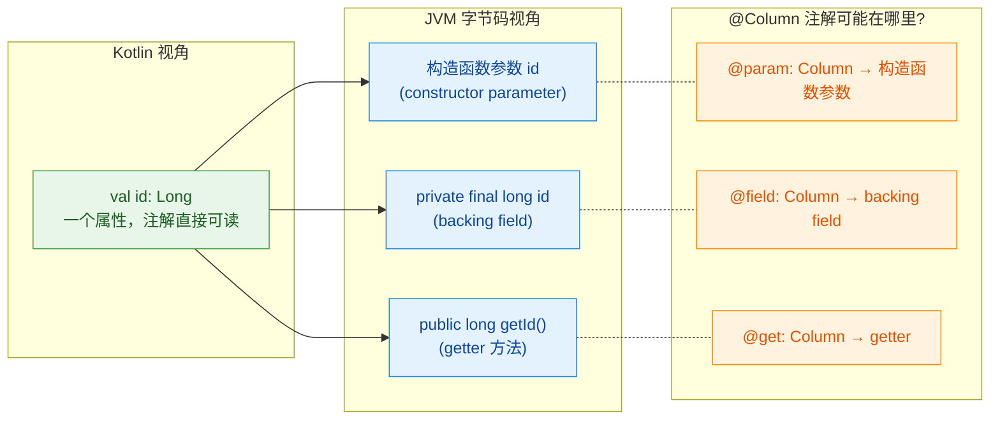

### 泛型与 reified 简化注解查找

在封装注解读取工具时，`inline` + `reified` 是一个非常实用的技巧，可以避免到处传递 `KClass` 参数：

```kotlin
import kotlin.reflect.KClass
import kotlin.reflect.full.findAnnotation
import kotlin.reflect.full.memberProperties
import kotlin.reflect.full.hasAnnotation

/**
 * 内联函数 + reified 泛型
 * 调用时无需显式传入 KClass，编译器自动推断
 */
inline fun <reified T : Annotation> Any.readAnnotation(): T? {
    // this::class 获取实例的运行时 KClass
    return this::class.findAnnotation<T>()
}

/**
 * 查找标注了特定注解的所有属性
 * 返回属性与注解实例的配对列表
 */
inline fun <reified A : Annotation> KClass<*>.findAnnotatedProperties(): List<Pair<String, A>> {
    return this.memberProperties
        .mapNotNull { prop ->
            // 尝试在属性上查找指定注解
            val annotation = prop.findAnnotation<A>()
            // 如果找到，返回 (属性名, 注解实例) 的 Pair
            if (annotation != null) prop.name to annotation else null
        }
}

fun main() {
    val user = User(1L, "Alice", "alice@example.com")

    // 直接在实例上调用，泛型自动推断为 Entity
    val entity = user.readAnnotation<Entity>()
    println("表名: ${entity?.tableName}")          // 输出: 表名: t_user

    // 查找所有标注了 @Column 的属性
    val columns = User::class.findAnnotatedProperties<Column>()
    columns.forEach { (name, col) ->
        println("$name -> ${col.name.ifEmpty { name }}")
    }
    // 输出:
    // email -> email
    // id -> user_id
    // name -> user_name
}
```

### 注解读取的性能考量

反射操作在 JVM 上有一定的性能开销。每次调用 `findAnnotation` 都涉及到类元数据的查询。在性能敏感的场景中，常见的优化策略是 **缓存解析结果**：

```kotlin
import java.util.concurrent.ConcurrentHashMap
import kotlin.reflect.KClass
import kotlin.reflect.full.findAnnotation
import kotlin.reflect.full.memberProperties
import kotlin.reflect.full.hasAnnotation

/**
 * 注解元数据缓存
 * 使用 ConcurrentHashMap 保证线程安全
 * 每个类只解析一次，后续直接从缓存读取
 */
object AnnotationCache {
    // 缓存：KClass -> TableInfo 的映射
    private val tableInfoCache = ConcurrentHashMap<KClass<*>, TableInfo>()

    /**
     * 获取表信息，优先从缓存读取
     * computeIfAbsent 保证同一个 KClass 只会执行一次解析
     */
    fun <T : Any> getTableInfo(kClass: KClass<T>): TableInfo {
        @Suppress("UNCHECKED_CAST")
        return tableInfoCache.computeIfAbsent(kClass) { clazz ->
            // 只在首次访问时执行反射解析（开销大的操作）
            parseTableInfo(clazz as KClass<Any>)
        }
    }
}

fun main() {
    // 第一次调用：触发反射解析
    val info1 = AnnotationCache.getTableInfo(User::class)
    // 第二次调用：直接从缓存返回，零反射开销
    val info2 = AnnotationCache.getTableInfo(User::class)

    // info1 和 info2 是同一个对象
    println("缓存命中: ${info1 === info2}")        // 输出: true
}
```

这种缓存模式在 Spring、Hibernate 等框架中随处可见。框架在启动阶段一次性扫描所有注解并缓存结果，运行时直接查缓存，从而将反射的性能影响降到最低。

### 处理注解继承与组合

一个容易被忽略的细节是：**Kotlin/JVM 中的注解默认不会被子类继承**。如果你需要注解在继承链中传递，需要在 Java 层面使用 `@Inherited` 元注解（Kotlin 本身没有提供等价物）：

```kotlin
// 默认行为：注解不继承
@Entity(tableName = "t_base")
open class BaseEntity

class ChildEntity : BaseEntity()

fun main() {
    // 子类上找不到父类的 @Entity 注解！
    val entity = ChildEntity::class.findAnnotation<Entity>()
    println("子类注解: $entity")                   // 输出: null

    // 如果需要查找继承链上的注解，必须手动向上遍历
    fun KClass<*>.findInheritedAnnotation(): Entity? {
        // 先查自身
        findAnnotation<Entity>()?.let { return it }
        // 再查所有父类型（superclasses 包含直接和间接父类）
        supertypes.forEach { supertype ->
            val superClass = supertype.classifier as? KClass<*>
            superClass?.findAnnotation<Entity>()?.let { return it }
        }
        return null
    }

    val inherited = ChildEntity::class.findInheritedAnnotation()
    println("继承链注解: ${inherited?.tableName}") // 输出: t_base
}
```

---

**📝 练习题**

以下代码的输出是什么？

```kotlin
@Target(AnnotationTarget.PROPERTY)
@Retention(AnnotationRetention.RUNTIME)
annotation class Tag(val value: String)

data class Item(
    @Tag("A") val x: Int,
    @Tag("B") val y: Int
)

fun main() {
    val tags = Item::class.memberProperties
        .sortedBy { it.name }
        .mapNotNull { it.findAnnotation<Tag>()?.value }
    println(tags)
}
```

A. `[A, B]`

B. `[B, A]`

C. `[]`

D. 编译错误

**【答案】** A

**【解析】** `memberProperties` 返回的属性顺序不固定，但代码中使用了 `.sortedBy { it.name }` 按属性名字母序排序。`x` 排在 `y` 前面，所以先取到 `@Tag("A")`，再取到 `@Tag("B")`，最终结果是 `[A, B]`。注解的 `@Retention` 设置为 `RUNTIME`，因此反射可以正常读取。如果 Retention 是 `SOURCE` 或 `BINARY`，`findAnnotation` 将返回 `null`，结果就会变成空列表 `[]`。

---

## 注解处理器（Annotation Processor）

注解本身只是"标记"，真正让注解产生威力的，是背后的处理器（Processor）。注解处理器负责在某个阶段读取注解信息，然后执行相应的逻辑——可能是生成代码、校验约束、注入依赖，甚至修改字节码。根据执行时机的不同，注解处理器分为两大阵营：编译时处理（Compile-time Processing）和运行时处理（Runtime Processing）。这两种方式在原理、性能、适用场景上有着本质区别，理解它们是掌握 Kotlin/JVM 元编程的关键一步。

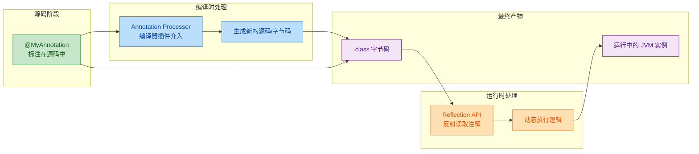

### 编译时处理（Compile-time Processing）

编译时注解处理是指在编译阶段（即 `javac` 或 `kotlinc` 执行期间），由编译器调度专门的处理器来扫描源码中的注解，并根据注解信息生成新的代码文件或资源文件。这个过程发生在源码变成字节码之前（或期间），生成的代码会参与后续编译，最终一起打包进产物中。

编译时处理的核心思想是"提前做完所有事"。运行时不需要反射，不需要动态解析，一切在编译期就已经确定。这带来了显著的性能优势，也是现代 Android 开发和后端框架越来越偏爱编译时处理的原因。

#### 编译时处理的工作原理

Java/Kotlin 编译器在编译过程中会执行多轮（round）注解处理。每一轮中，处理器扫描当前源码中的注解，如果处理器生成了新的源文件，这些新文件会进入下一轮扫描，直到没有新文件产生为止。

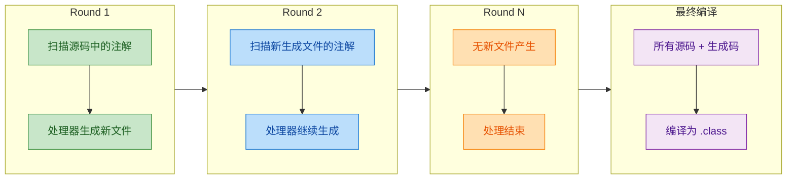

#### Java 标准注解处理器 API（javax.annotation.processing）

编译时处理器在 JVM 生态中有一套标准 API，定义在 `javax.annotation.processing` 包下。即使你写的是 Kotlin 代码，编译时处理器本身通常也是用 Java 或 Kotlin 编写、并遵循这套 API 的。我们先来看核心接口和类：

```kotlin
// 这是 Java 标准 API 的 Kotlin 视角描述
// 核心接口：javax.annotation.processing.Processor
// 通常我们继承 AbstractProcessor 来简化实现

import javax.annotation.processing.AbstractProcessor   // 抽象基类，简化处理器编写
import javax.annotation.processing.RoundEnvironment    // 每一轮处理的环境信息
import javax.annotation.processing.ProcessingEnvironment // 处理器的全局环境（工具集）
import javax.lang.model.element.TypeElement            // 代表一个类型元素（类、接口等）
import javax.lang.model.element.Element                // 所有程序元素的基类
import javax.lang.model.SourceVersion                  // 支持的 Java 源码版本
import javax.tools.Diagnostic                          // 用于输出编译期消息（警告、错误等）

/**
 * 一个最基本的编译时注解处理器骨架
 * 
 * @SupportedAnnotationTypes 声明此处理器关心哪些注解（全限定名）
 * @SupportedSourceVersion 声明支持的源码版本
 */
@SupportedAnnotationTypes("com.example.MyAnnotation")  // 指定要处理的注解
@SupportedSourceVersion(SourceVersion.RELEASE_17)       // 支持的 Java 版本
class MyAnnotationProcessor : AbstractProcessor() {

    // init() 由 AbstractProcessor 提供，processingEnv 在此阶段被注入
    // processingEnv 包含了 Filer（文件生成）、Messager（日志）、Elements/Types 工具等
    override fun init(processingEnv: ProcessingEnvironment) {
        super.init(processingEnv)  // 必须调用 super，内部会保存 processingEnv
        // 此时可以通过 processingEnv.filer 获取文件生成器
        // 通过 processingEnv.messager 获取消息输出器
        // 通过 processingEnv.elementUtils 获取元素工具
        // 通过 processingEnv.typeUtils 获取类型工具
    }

    /**
     * 核心方法：每一轮注解处理都会调用此方法
     * 
     * @param annotations 本轮中被发现的、且属于本处理器关心的注解集合
     * @param roundEnv    本轮的环境，可以从中查询被注解标注的元素
     * @return true 表示本处理器"消费"了这些注解，其他处理器不再处理
     *         false 表示其他处理器仍可处理这些注解
     */
    override fun process(
        annotations: MutableSet<out TypeElement>,  // 本轮发现的注解类型
        roundEnv: RoundEnvironment                  // 本轮环境
    ): Boolean {
        // 遍历所有被 @MyAnnotation 标注的元素
        for (element in roundEnv.getElementsAnnotatedWith(MyAnnotation::class.java)) {
            // element 可能是类、方法、字段等，取决于注解的 @Target
            val className = element.simpleName.toString()  // 获取元素的简单名称

            // 通过 Messager 输出编译期信息（会显示在编译日志中）
            processingEnv.messager.printMessage(
                Diagnostic.Kind.NOTE,                      // NOTE 级别，不会中断编译
                "Processing: $className"                   // 消息内容
            )

            // 这里可以用 processingEnv.filer 生成新的 Java/Kotlin 源文件
            // 生成的文件会在下一轮被编译器扫描
        }
        return true  // 返回 true，声明这些注解已被本处理器处理完毕
    }
}
```

#### ProcessingEnvironment 的核心工具

`ProcessingEnvironment` 是处理器与编译器交互的桥梁，它提供了四个关键工具：

```kotlin
// ProcessingEnvironment 提供的核心工具一览

// 1. Filer —— 文件生成器
// 用于创建新的源文件（.java）、类文件（.class）或资源文件
val filer = processingEnv.filer
// 创建一个新的 Java 源文件，参数是全限定类名
val sourceFile = filer.createSourceFile("com.example.Generated_UserFactory")
// 通过 Writer 写入文件内容
sourceFile.openWriter().use { writer ->
    writer.write("package com.example;\n")           // 写入包声明
    writer.write("public class Generated_UserFactory {\n")  // 写入类声明
    writer.write("    // 自动生成的工厂方法\n")
    writer.write("}\n")
}

// 2. Messager —— 消息输出器
// 用于在编译期输出诊断信息
val messager = processingEnv.messager
messager.printMessage(Diagnostic.Kind.NOTE, "信息：正在处理...")      // 普通信息
messager.printMessage(Diagnostic.Kind.WARNING, "警告：字段未初始化")   // 警告
messager.printMessage(Diagnostic.Kind.ERROR, "错误：缺少必要注解")     // 错误，会导致编译失败

// 3. Elements —— 元素工具
// 提供操作 Element 的实用方法
val elementUtils = processingEnv.elementUtils
val typeElement = elementUtils.getTypeElement("com.example.User")  // 通过全限定名获取类型元素
val packageOf = elementUtils.getPackageOf(typeElement)             // 获取元素所在的包

// 4. Types —— 类型工具
// 提供操作 TypeMirror 的实用方法
val typeUtils = processingEnv.typeUtils
// 判断一个类型是否是另一个类型的子类型
val isSubtype = typeUtils.isSubtype(typeMirrorA, typeMirrorB)
// 判断两个类型是否相同
val isSame = typeUtils.isSameType(typeMirrorA, typeMirrorB)
```

#### 完整实战：编译时生成 Builder 类

下面用一个完整的例子来展示编译时处理器如何工作。我们定义一个 `@AutoBuilder` 注解，处理器会为被标注的数据类自动生成 Builder 模式的代码。

首先定义注解：

```kotlin
// 文件：AutoBuilder.kt
package com.example.annotation

/**
 * 标注在数据类上，编译时自动生成对应的 Builder 类
 * Retention 为 SOURCE，因为只在编译期需要，不需要保留到运行时
 */
@Target(AnnotationTarget.CLASS)                    // 只能标注在类上
@Retention(AnnotationRetention.SOURCE)             // 只在源码阶段保留
annotation class AutoBuilder
```

然后编写处理器：

```kotlin
// 文件：AutoBuilderProcessor.kt
package com.example.processor

import javax.annotation.processing.*               // 注解处理核心 API
import javax.lang.model.SourceVersion              // 源码版本
import javax.lang.model.element.TypeElement         // 类型元素
import javax.lang.model.element.ElementKind         // 元素种类（类、方法、字段等）
import javax.tools.Diagnostic                       // 诊断消息

@SupportedAnnotationTypes("com.example.annotation.AutoBuilder")  // 处理 @AutoBuilder
@SupportedSourceVersion(SourceVersion.RELEASE_17)                 // 支持 Java 17
class AutoBuilderProcessor : AbstractProcessor() {

    override fun process(
        annotations: MutableSet<out TypeElement>,
        roundEnv: RoundEnvironment
    ): Boolean {
        // 获取所有被 @AutoBuilder 标注的元素
        val annotatedElements = roundEnv.getElementsAnnotatedWith(
            com.example.annotation.AutoBuilder::class.java
        )

        for (element in annotatedElements) {
            // 校验：@AutoBuilder 只能用在类上
            if (element.kind != ElementKind.CLASS) {
                processingEnv.messager.printMessage(
                    Diagnostic.Kind.ERROR,                          // 错误级别，编译会失败
                    "@AutoBuilder can only be applied to classes",  // 错误消息
                    element                                         // 关联到具体元素，IDE 会高亮
                )
                return true  // 出错后直接返回
            }

            val typeElement = element as TypeElement                // 安全转换为 TypeElement
            val className = typeElement.simpleName.toString()       // 获取类名，如 "User"
            val packageName = processingEnv.elementUtils            // 获取包名
                .getPackageOf(typeElement)
                .qualifiedName
                .toString()

            // 收集类中所有字段（封闭元素中 kind 为 FIELD 的）
            val fields = typeElement.enclosedElements
                .filter { it.kind == ElementKind.FIELD }           // 只保留字段
                .map { field ->
                    val fieldName = field.simpleName.toString()    // 字段名
                    val fieldType = field.asType().toString()      // 字段类型的全限定名
                    fieldName to fieldType                          // 组成 Pair
                }

            // 生成 Builder 类的源码
            generateBuilder(packageName, className, fields)
        }
        return true  // 声明注解已被处理
    }

    /**
     * 生成 Builder 类的 Java 源文件
     * 
     * 为什么生成 Java 而不是 Kotlin？
     * 因为 KAPT 本质上是 Java 注解处理器，生成 Java 源码最稳定。
     * 如果要生成 Kotlin 源码，推荐使用 KotlinPoet 库配合 KSP。
     */
    private fun generateBuilder(
        packageName: String,                        // 包名
        className: String,                          // 原始类名
        fields: List<Pair<String, String>>          // 字段列表（名称, 类型）
    ) {
        val builderClassName = "${className}Builder"  // Builder 类名，如 "UserBuilder"

        // 构建源码字符串
        val source = buildString {
            appendLine("package $packageName;")                    // 包声明
            appendLine()
            appendLine("/**")
            appendLine(" * Auto-generated builder for $className")
            appendLine(" */")
            appendLine("public class $builderClassName {")         // 类声明

            // 为每个字段生成私有成员变量
            for ((name, type) in fields) {
                appendLine("    private $type $name;")             // 如：private String name;
            }
            appendLine()

            // 为每个字段生成 setter 方法（返回 this 以支持链式调用）
            for ((name, type) in fields) {
                appendLine("    public $builderClassName $name($type $name) {")
                appendLine("        this.$name = $name;")          // 赋值
                appendLine("        return this;")                  // 返回自身，支持链式
                appendLine("    }")
                appendLine()
            }

            // 生成 build() 方法，调用原始类的构造函数
            appendLine("    public $className build() {")
            val params = fields.joinToString(", ") { it.first }    // 拼接参数列表
            appendLine("        return new $className($params);")  // 调用构造函数
            appendLine("    }")

            appendLine("}")                                         // 类结束
        }

        // 通过 Filer 写入生成的源文件
        val file = processingEnv.filer.createSourceFile(
            "$packageName.$builderClassName"                        // 全限定类名
        )
        file.openWriter().use { it.write(source) }                 // 写入并自动关闭
    }
}
```

使用时的效果：

```kotlin
// 用户代码
@AutoBuilder
data class User(
    val name: String,
    val age: Int,
    val email: String
)

// 编译后自动生成 UserBuilder.java，用户可以这样使用：
fun main() {
    val user = UserBuilder()       // 使用生成的 Builder
        .name("Alice")             // 链式设置 name
        .age(28)                   // 链式设置 age
        .email("alice@example.com") // 链式设置 email
        .build()                   // 构建 User 实例
}
```

#### 注册处理器

编译器不会自动发现处理器，你需要通过 SPI（Service Provider Interface）机制注册它。在项目的 `resources` 目录下创建如下文件：

```text
// 文件路径：src/main/resources/META-INF/services/javax.annotation.processing.Processor
// 每行一个处理器的全限定类名
com.example.processor.AutoBuilderProcessor
```

或者使用 Google 的 `auto-service` 库来自动生成这个文件：

```kotlin
// 使用 @AutoService 自动注册，免去手动维护 SPI 文件
@AutoService(Processor::class)  // 自动生成 META-INF/services 文件
@SupportedAnnotationTypes("com.example.annotation.AutoBuilder")
@SupportedSourceVersion(SourceVersion.RELEASE_17)
class AutoBuilderProcessor : AbstractProcessor() {
    // ... 同上
}
```

### 运行时处理（Runtime Processing）

运行时处理是指在程序已经编译完成、JVM 正在执行的过程中，通过反射（Reflection）读取注解信息并执行相应逻辑。这要求注解的 `@Retention` 必须是 `RUNTIME`，否则注解信息在编译后就被丢弃了，运行时根本看不到。

运行时处理的核心优势是灵活——你可以根据运行时的状态、配置、甚至用户输入来动态决定行为。但代价是性能开销：反射本身就比直接调用慢，而且每次都需要在运行时解析注解。

#### 运行时处理的基本模式

```kotlin
// 定义一个运行时保留的注解
@Target(AnnotationTarget.FUNCTION)          // 标注在函数上
@Retention(AnnotationRetention.RUNTIME)     // 必须是 RUNTIME，否则运行时读不到
annotation class LogExecution(
    val tag: String = "DEFAULT"             // 可配置的日志标签
)

// 定义一个业务类，使用注解标记需要记录日志的方法
class OrderService {

    @LogExecution(tag = "ORDER")            // 标记此方法需要记录执行日志
    fun placeOrder(orderId: String): String {
        Thread.sleep(100)                   // 模拟耗时操作
        return "Order $orderId placed"      // 返回结果
    }

    fun cancelOrder(orderId: String): String {
        return "Order $orderId cancelled"   // 这个方法没有注解，不会被记录
    }

    @LogExecution(tag = "QUERY")            // 标记此方法
    fun queryOrder(orderId: String): String {
        Thread.sleep(50)                    // 模拟查询耗时
        return "Order $orderId details"     // 返回结果
    }
}
```

#### 编写运行时注解处理器

```kotlin
import kotlin.reflect.KFunction           // Kotlin 反射中的函数类型
import kotlin.reflect.full.*              // 扩展函数：memberFunctions, findAnnotation 等

/**
 * 运行时注解处理器
 * 扫描对象的所有方法，找到带 @LogExecution 的方法并包装执行逻辑
 */
object AnnotationProcessor {

    /**
     * 处理指定对象上的所有 @LogExecution 注解
     * 找到被标注的方法，执行时自动添加日志记录
     *
     * @param instance 要处理的对象实例
     */
    fun processLogAnnotations(instance: Any) {
        val kClass = instance::class                          // 获取 KClass

        // 遍历该类的所有成员函数
        for (function in kClass.memberFunctions) {
            // 查找函数上的 @LogExecution 注解
            val annotation = function.findAnnotation<LogExecution>()

            if (annotation != null) {
                // 找到了注解，输出信息
                println("[${annotation.tag}] Found annotated method: ${function.name}")
                println("  Parameters: ${function.parameters.map { it.name }}")
                println("  Return type: ${function.returnType}")
            }
        }
    }

    /**
     * 更实用的版本：通过注解驱动，动态调用被标注的方法
     * 这展示了运行时处理的真正威力——根据注解信息决定运行时行为
     *
     * @param instance   目标对象
     * @param methodName 要调用的方法名
     * @param args       方法参数
     * @return 方法的返回值
     */
    fun invokeWithLogging(
        instance: Any,
        methodName: String,
        vararg args: Any?
    ): Any? {
        val kClass = instance::class                          // 获取运行时类信息
        // 通过名称查找方法
        val function = kClass.memberFunctions
            .find { it.name == methodName }                   // 按名称匹配
            ?: throw NoSuchMethodException("Method $methodName not found")

        // 检查是否有 @LogExecution 注解
        val annotation = function.findAnnotation<LogExecution>()

        return if (annotation != null) {
            // 有注解：添加日志包装
            val tag = annotation.tag                          // 读取注解参数
            println("[$tag] >>> Entering ${function.name}")   // 进入日志
            val startTime = System.currentTimeMillis()        // 记录开始时间

            // 调用实际方法（第一个参数是 instance 本身）
            val result = function.call(instance, *args)

            val elapsed = System.currentTimeMillis() - startTime  // 计算耗时
            println("[$tag] <<< Exiting ${function.name}, took ${elapsed}ms")
            println("[$tag] Result: $result")                 // 输出结果
            result                                             // 返回原始结果
        } else {
            // 没有注解：直接调用，不添加任何额外逻辑
            function.call(instance, *args)
        }
    }
}

fun main() {
    val service = OrderService()

    // 扫描并打印所有被注解标注的方法
    AnnotationProcessor.processLogAnnotations(service)

    println("---")

    // 通过注解驱动的动态调用
    AnnotationProcessor.invokeWithLogging(service, "placeOrder", "ORD-001")
    println()
    AnnotationProcessor.invokeWithLogging(service, "cancelOrder", "ORD-002")
    println()
    AnnotationProcessor.invokeWithLogging(service, "queryOrder", "ORD-003")
}
```

输出效果：

```text
[ORDER] Found annotated method: placeOrder
  Parameters: [null, orderId]
  Return type: kotlin.String
[QUERY] Found annotated method: queryOrder
  Parameters: [null, orderId]
  Return type: kotlin.String
---
[ORDER] >>> Entering placeOrder
[ORDER] <<< Exiting placeOrder, took 105ms
[ORDER] Result: Order ORD-001 placed

Order ORD-002 cancelled

[QUERY] >>> Entering queryOrder
[QUERY] <<< Exiting queryOrder, took 54ms
[QUERY] Result: Order ORD-003 details
```

#### 实战：运行时依赖注入框架

运行时注解处理最经典的应用场景之一就是依赖注入（Dependency Injection）。下面我们实现一个简化版的 DI 容器，展示运行时处理器如何驱动框架级功能：

```kotlin
import kotlin.reflect.KClass
import kotlin.reflect.KMutableProperty
import kotlin.reflect.full.*
import kotlin.reflect.jvm.isAccessible

// ========== 注解定义 ==========

/** 标记一个类为可注入的组件 */
@Target(AnnotationTarget.CLASS)
@Retention(AnnotationRetention.RUNTIME)       // 运行时保留，DI 容器需要在运行时读取
annotation class Component

/** 标记一个属性需要被自动注入 */
@Target(AnnotationTarget.PROPERTY)
@Retention(AnnotationRetention.RUNTIME)       // 运行时保留
annotation class Inject

// ========== 简易 DI 容器 ==========

object SimpleContainer {
    // 存储已注册的组件：类型 -> 实例
    private val registry = mutableMapOf<KClass<*>, Any>()

    /** 注册一个组件实例 */
    fun <T : Any> register(kClass: KClass<T>, instance: T) {
        registry[kClass] = instance                        // 将实例存入注册表
    }

    /** 内联版本，利用 reified 简化调用 */
    inline fun <reified T : Any> register(instance: T) {
        register(T::class, instance)                       // 委托给非内联版本
    }

    /**
     * 解析并注入依赖
     * 扫描目标对象的所有属性，找到带 @Inject 的属性，
     * 从注册表中查找匹配的实例并注入
     */
    fun inject(target: Any) {
        val kClass = target::class                         // 获取目标的 KClass

        // 遍历所有成员属性
        for (prop in kClass.memberProperties) {
            // 检查属性是否有 @Inject 注解
            val injectAnnotation = prop.findAnnotation<Inject>()
            if (injectAnnotation != null) {
                // 需要注入：从注册表中查找匹配类型的实例
                val propType = prop.returnType.classifier as? KClass<*>  // 获取属性的类型
                    ?: continue                                           // 无法识别类型则跳过

                val dependency = registry[propType]                       // 从注册表查找
                    ?: throw IllegalStateException(
                        "No component registered for type: ${propType.simpleName}"
                    )

                // 属性必须是可变的（var）才能注入
                if (prop is KMutableProperty<*>) {
                    prop.isAccessible = true                              // 允许访问 private 属性
                    prop.setter.call(target, dependency)                  // 通过反射设置属性值
                    println("Injected ${propType.simpleName} into ${kClass.simpleName}.${prop.name}")
                }
            }
        }
    }
}

// ========== 使用示例 ==========

// 定义服务接口和实现
@Component                                    // 标记为组件
class DatabaseService {
    fun query(sql: String): String = "Result of: $sql"
}

@Component
class CacheService {
    fun get(key: String): String? = "cached_$key"
}

// 定义需要注入依赖的类
class UserController {
    @Inject                                   // 标记需要注入
    var database: DatabaseService? = null      // 必须是 var，初始为 null

    @Inject
    var cache: CacheService? = null

    fun handleRequest(userId: String): String {
        val cached = cache?.get(userId)        // 先查缓存
        if (cached != null) return cached
        return database?.query("SELECT * FROM users WHERE id = '$userId'")
            ?: "Service unavailable"
    }
}

fun main() {
    // 注册组件
    SimpleContainer.register(DatabaseService())   // 注册数据库服务
    SimpleContainer.register(CacheService())      // 注册缓存服务

    // 创建 Controller 并注入依赖
    val controller = UserController()
    SimpleContainer.inject(controller)

    // 使用——依赖已经被自动注入
    println(controller.handleRequest("user_42"))
}
```

输出：

```text
Injected DatabaseService into UserController.database
Injected CacheService into UserController.cache
cached_user_42
```

这个简易 DI 容器虽然只有几十行代码，但它展示了 Spring 框架 `@Autowired` 背后的核心原理——运行时扫描注解、反射注入依赖。真实框架还会加入作用域管理（Singleton/Prototype）、循环依赖检测、接口到实现的映射等复杂逻辑，但本质思路完全一致。

### 编译时 vs 运行时：深度对比

理解两种处理方式的差异，对于技术选型至关重要。

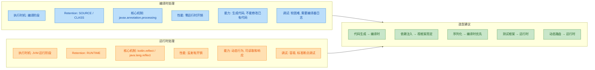

用一张表格更直观地总结：

| 维度 | 编译时处理 | 运行时处理 |
|------|-----------|-----------|
| 执行时机 | `javac` / `kotlinc` 编译期间 | JVM 运行期间 |
| 注解保留策略 | `SOURCE` 或 `CLASS` 即可 | 必须是 `RUNTIME` |
| 核心 API | `javax.annotation.processing` | `kotlin.reflect` / `java.lang.reflect` |
| 运行时性能 | 零开销（代码已生成） | 有反射开销 |
| 灵活性 | 低（编译期决定一切） | 高（可根据运行时状态决策） |
| 典型框架 | Dagger, Room, Moshi (codegen) | Spring, Retrofit, Gson |
| 错误发现时机 | 编译期（更早、更安全） | 运行期（可能线上才暴露） |
| 调试难度 | 较高（需要理解编译轮次） | 较低（标准调试工具） |
| Android 友好度 | 非常友好（无反射，APK 更小） | 一般（反射增加方法数和启动时间） |

#### 现实世界的选型趋势

现代 Kotlin 生态有一个明显的趋势：从运行时处理向编译时处理迁移。

- Dagger 2 取代了基于反射的 Dagger 1，全面转向编译时代码生成
- Moshi 提供 codegen 模式，避免运行时反射解析 JSON
- Room（Android 数据库框架）在编译时生成 SQL 校验和 DAO 实现
- Kotlin Serialization 使用编译器插件，在编译时生成序列化器

这个趋势的驱动力很简单：编译时处理能在更早的阶段发现错误，运行时零开销，对 Android 这种资源受限的平台尤其重要。但运行时处理并没有消亡——在需要高度动态性的场景（如插件系统、测试框架、动态代理），运行时处理仍然是不可替代的。

### 混合模式：编译时生成 + 运行时发现

实际项目中，很多框架采用混合策略：编译时生成代码，运行时通过注解发现和组装。这结合了两者的优势。

```kotlin
// ========== 编译时：处理器生成注册代码 ==========

// 注解定义
@Target(AnnotationTarget.CLASS)
@Retention(AnnotationRetention.RUNTIME)        // RUNTIME：编译时处理器读取 + 运行时发现
annotation class Route(val path: String)        // 路由路径

// 用户代码
@Route("/home")
class HomeController { /* ... */ }

@Route("/user/{id}")
class UserController { /* ... */ }

// 编译时处理器会生成类似这样的注册表代码（自动生成，用户不需要手写）：
// --- 以下是自动生成的代码 ---
object GeneratedRouteRegistry {
    // 编译时收集所有 @Route 标注的类，生成静态映射
    val routes: Map<String, kotlin.reflect.KClass<*>> = mapOf(
        "/home" to HomeController::class,       // 编译时确定的映射
        "/user/{id}" to UserController::class   // 编译时确定的映射
    )
}

// ========== 运行时：框架使用生成的注册表 ==========

object Router {
    fun dispatch(path: String): Any? {
        // 运行时从编译时生成的注册表中查找
        val controllerClass = GeneratedRouteRegistry.routes.entries
            .find { matchPath(it.key, path) }   // 路径匹配（支持模板）
            ?.value
            ?: throw IllegalArgumentException("No route for: $path")

        // 运行时创建实例（只有这一步用到反射）
        val instance = controllerClass.createInstance()

        // 运行时读取注解获取元信息
        val route = controllerClass.findAnnotation<Route>()
        println("Dispatching to ${route?.path}")

        return instance
    }

    private fun matchPath(template: String, actual: String): Boolean {
        // 简化的路径匹配逻辑
        val templateParts = template.split("/")    // 按 / 分割模板
        val actualParts = actual.split("/")        // 按 / 分割实际路径
        if (templateParts.size != actualParts.size) return false
        return templateParts.zip(actualParts).all { (t, a) ->
            t.startsWith("{") || t == a            // {xxx} 是通配符，其他必须精确匹配
        }
    }
}
```

这种混合模式的精妙之处在于：路由注册表在编译时就确定了（不需要运行时扫描整个 classpath），但路由分发和实例化在运行时动态完成。编译时保证了类型安全和完整性，运行时保留了灵活性。

---

**📝 练习题**

以下关于编译时注解处理器的描述，哪一项是正确的？

A. 编译时处理器可以修改已有的 Java/Kotlin 源文件中的代码

B. 编译时处理器的 `process()` 方法在整个编译过程中只会被调用一次

C. 编译时处理器生成的新源文件会参与后续编译轮次的扫描和处理

D. 编译时处理器要求注解的 `@Retention` 必须为 `RUNTIME`

**【答案】** C

**【解析】** Java/Kotlin 编译器的注解处理采用多轮（multi-round）机制。每一轮中，处理器扫描当前已知的源码并可能生成新的源文件。这些新生成的文件会进入下一轮扫描，如果其中包含注解，对应的处理器会再次被调用。这个过程持续到某一轮不再产生新文件为止。选项 A 错误，标准注解处理器只能生成新文件，不能修改已有源码（这是 API 的设计约束）。选项 B 错误，`process()` 每一轮都会被调用。选项 D 错误，编译时处理器在编译阶段通过 `Element` API 读取注解信息，不依赖运行时反射，因此 `SOURCE` 级别的保留策略就足够了。

---

## KAPT — Kotlin 注解处理工具

### 为什么需要 KAPT

在 Java 世界中，注解处理器（Annotation Processor）是一项成熟的编译时代码生成技术。Dagger、Room、Glide、MapStruct……这些框架都依赖 `javax.annotation.processing` 这套标准 API 在编译期扫描注解、生成源码。然而 Kotlin 编译器（kotlinc）与 Java 编译器（javac）是两条独立的编译管线，kotlinc 本身并不理解 Java 的 `AbstractProcessor`。这就产生了一个核心矛盾：

> Kotlin 代码中使用的注解，如何被那些只认识 Java 世界的注解处理器正确识别和处理？

KAPT（Kotlin Annotation Processing Tool）就是为了解决这个矛盾而诞生的桥梁工具。它的核心思路非常巧妙——先把 Kotlin 代码"翻译"成 Java 存根（stubs），再把这些存根喂给标准的 Java 注解处理器，让整条 Java 注解处理生态无缝运行在 Kotlin 项目中。

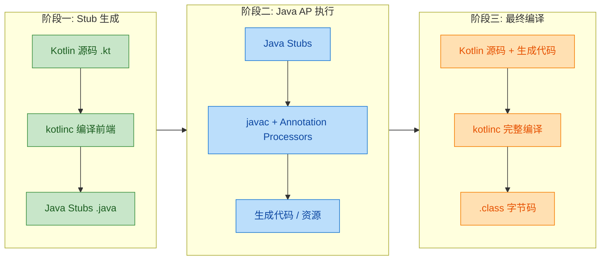

从图中可以清晰看到，KAPT 在正式编译之前插入了两个额外阶段。这也是 KAPT 被诟病"慢"的根本原因——它需要额外生成 stubs 并额外调用一次 javac。

---

### KAPT 的工作原理详解

KAPT 的内部流程可以拆解为三个关键步骤，理解它们对排查编译问题至关重要。

第一步，Stub 生成（Stub Generation）。kotlinc 会对所有 `.kt` 文件做一次轻量级的前端编译（解析语法树、解析类型），然后为每个 Kotlin 类生成一个对应的 Java 源文件。这些 Java 文件被称为 "stubs"，它们只包含类的签名信息（类名、方法签名、字段声明、注解），方法体全部用 `throw new RuntimeException("Stub!")` 填充。Stubs 的唯一目的是让 javac 能"看见"Kotlin 类的结构和注解。

第二步，注解处理器执行（AP Round）。KAPT 启动 javac，将生成的 stubs 连同项目中真正的 Java 源码一起传入。javac 按照标准的 JSR 269 流程执行所有注册的注解处理器。处理器扫描注解、生成新的 `.java` 源文件或资源文件，这些产物被写入一个专门的输出目录。

第三步，最终编译（Final Compilation）。kotlinc 重新编译所有 Kotlin 源码，这一次它能看到注解处理器生成的代码，因此可以正确解析对生成类的引用。最终产出完整的 `.class` 字节码。

```kotlin
// 示例：Room 的 @Entity 注解在 KAPT 流程中的旅程
// ① 你写的 Kotlin 代码
@Entity(tableName = "users")  // Room 注解
data class User(
    @PrimaryKey val id: Long,       // 主键注解
    @ColumnInfo(name = "user_name") // 列名注解
    val name: String,
    val email: String
)

// ② KAPT 生成的 Java Stub（简化版，实际由编译器自动生成）
// 文件位置: build/tmp/kapt3/stubs/debug/com/example/User.java
// @Entity(tableName = "users")
// public final class User {
//     @PrimaryKey private final long id;
//     @ColumnInfo(name = "user_name") private final String name;
//     private final String email;
//     public User(long id, String name, String email) { throw new RuntimeException("Stub!"); }
//     public final long getId() { throw new RuntimeException("Stub!"); }
//     ...
// }

// ③ Room 的注解处理器读取 Stub，生成 UserDao_Impl.java 等文件
// ④ kotlinc 最终编译时能引用到 Room 生成的代码
```

注意 Stub 中方法体全是 `throw new RuntimeException("Stub!")`，因为注解处理器只关心声明和注解，不关心实现。

---

### Gradle 中配置 KAPT

KAPT 以 Gradle 插件的形式集成到构建系统中。下面分别展示 Groovy DSL 和 Kotlin DSL 的配置方式。

Groovy DSL（`build.gradle`）：

```groovy
plugins {
    id 'org.jetbrains.kotlin.jvm' version '1.9.24'
    // 应用 KAPT 插件，必须在 kotlin 插件之后
    id 'org.jetbrains.kotlin.kapt' version '1.9.24'
}

dependencies {
    // implementation 引入库本身（运行时需要）
    implementation "androidx.room:room-runtime:2.6.1"
    // kapt 配置项：告诉 KAPT 使用 Room 的注解处理器
    kapt "androidx.room:room-compiler:2.6.1"

    // Dagger 2 示例
    implementation "com.google.dagger:dagger:2.51"
    kapt "com.google.dagger:dagger-compiler:2.51"
}
```

Kotlin DSL（`build.gradle.kts`）：

```kotlin
plugins {
    // Kotlin JVM 插件
    kotlin("jvm") version "1.9.24"
    // KAPT 插件，函数式写法
    kotlin("kapt") version "1.9.24"
}

dependencies {
    // Room 运行时库
    implementation("androidx.room:room-runtime:2.6.1")
    // Room 注解处理器，通过 kapt 配置
    kapt("androidx.room:room-compiler:2.6.1")

    // MapStruct 示例：Java 注解处理器同样适用
    implementation("org.mapstruct:mapstruct:1.5.5.Final")
    kapt("org.mapstruct:mapstruct-processor:1.5.5.Final")
}
```

这里的关键是 `kapt` 这个依赖配置（dependency configuration）。它告诉 Gradle："这个依赖是一个注解处理器，请在 KAPT 阶段加载它。" 如果你错误地把注解处理器放在 `implementation` 或 `compileOnly` 中，KAPT 不会执行它，代码生成就不会发生。

---

### KAPT 高级配置选项

KAPT 提供了一个专门的 `kapt {}` 配置块，用于调优行为和传递参数。

```kotlin
kapt {
    // ① correctErrorTypes：修正错误类型
    // 当注解处理器引用了尚未生成的类型时，默认会报 NonExistentClass 错误
    // 开启此选项后，KAPT 会将这些未知类型替换为 Object，让处理器继续运行
    correctErrorTypes = true

    // ② useBuildCache：启用 Gradle 构建缓存
    // KAPT 任务默认不可缓存（因为注解处理器可能有副作用）
    // 如果你确认使用的处理器是确定性的（相同输入 → 相同输出），可以开启
    useBuildCache = true

    // ③ mapDiagnosticLocations：映射诊断位置
    // 将注解处理器报告的错误位置从 Java Stub 映射回原始 Kotlin 源码
    // 这样 IDE 中的错误提示能直接指向 .kt 文件，而不是生成的 .java stub
    mapDiagnosticLocations = true

    // ④ showProcessorStats：显示处理器耗时统计
    // 编译日志中会打印每个注解处理器的执行时间，方便定位性能瓶颈
    showProcessorStats = true

    // ⑤ arguments：向注解处理器传递自定义参数
    arguments {
        // Room 的 schema 导出目录
        arg("room.schemaLocation", "$projectDir/schemas")
        // Room 增量编译支持
        arg("room.incremental", "true")
        // Dagger 的 fast-init 模式
        arg("dagger.fastInit", "enabled")
    }

    // ⑥ javacOptions：传递给 javac 的额外参数
    javacOptions {
        // 指定生成代码的 Java 版本
        option("-source", "11")
        option("-target", "11")
    }
}
```

其中 `correctErrorTypes = true` 几乎是必开选项。在复杂项目中，注解处理器经常需要引用其他处理器生成的类型，如果不开启这个选项，第一轮处理就会因为找不到类型而失败。

---

### 向 Java 注解处理器传递参数

许多注解处理器支持通过 `-A` 前缀的 javac 参数接收配置。KAPT 提供了两种方式来传递这些参数。

方式一：通过 `kapt.arguments`（推荐）：

```kotlin
kapt {
    arguments {
        // 每个 arg() 调用对应一个 -Akey=value 参数
        arg("mapstruct.defaultComponentModel", "spring")  // MapStruct 使用 Spring 注入
        arg("mapstruct.unmappedTargetPolicy", "ERROR")    // 未映射字段报错
        arg("room.schemaLocation", "$projectDir/schemas") // Room schema 输出路径
        arg("dagger.formatGeneratedSource", "disabled")   // Dagger 不格式化生成代码
    }
}
```

方式二：通过 `gradle.properties` 全局配置：

```properties
# gradle.properties 文件
# KAPT 会自动读取以 kapt.arg. 为前缀的属性
kapt.arg.room.schemaLocation=./schemas
kapt.arg.mapstruct.defaultComponentModel=spring
```

方式一更灵活，支持动态值（如 `$projectDir`），是大多数场景的首选。

---

### KAPT 与增量编译

KAPT 最大的痛点是编译速度。默认情况下，KAPT 任务是非增量的——即使你只改了一个文件，KAPT 也会重新生成所有 stubs 并重新运行所有注解处理器。这在大型项目中可能导致数十秒甚至数分钟的额外编译时间。

Kotlin 1.3.30 开始引入了 KAPT 增量编译支持，但它需要注解处理器本身声明支持增量处理。增量处理分为三种模式：

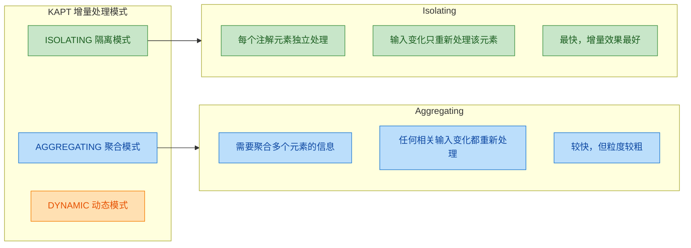

启用增量 KAPT 的配置：

```properties
# gradle.properties
# 启用 KAPT 增量编译（实验性）
kapt.incremental.apt=true
# 同时建议开启 Gradle 增量编译
kapt.use.worker.api=true
# 启用 KAPT 的编译避免（compile avoidance）
kapt.include.compile.classpath=false
```

```kotlin
// build.gradle.kts 中也可以配置
kapt {
    useBuildCache = true  // 配合 Gradle build cache 使用
}
```

需要注意的是，`kapt.include.compile.classpath=false` 这个选项非常重要。默认情况下 KAPT 会扫描整个编译 classpath 来发现注解处理器，这既慢又不安全。设为 `false` 后，KAPT 只会使用通过 `kapt` 配置显式声明的处理器，大幅减少不必要的扫描。

常见注解处理器的增量支持情况：

```kotlin
// ✅ 支持增量处理的处理器（Isolating）
// - Dagger 2 (2.18+)
// - AutoValue
// - Glide (4.10+)

// ⚠️ 支持增量处理的处理器（Aggregating）
// - Room (2.3+, 需要 room.incremental=true)
// - Moshi (1.9+)

// ❌ 不支持增量处理的处理器
// - 某些老版本的 Lombok
// - 部分自定义处理器
// 只要有一个非增量处理器，整个 KAPT 任务就会退化为全量处理
```

最后一点尤其关键：增量 KAPT 遵循"木桶原则"，只要项目中存在一个不支持增量的处理器，所有处理器都会被迫全量执行。

---

### KAPT 与 Java 注解处理器的兼容性

KAPT 的设计目标就是 100% 兼容现有的 Java 注解处理器生态。任何实现了 `javax.annotation.processing.AbstractProcessor` 的处理器都可以直接在 KAPT 中使用，无需任何修改。

```kotlin
// 一个标准的 Java 注解处理器，KAPT 可以直接使用
// 这个处理器用 Java 编写，但处理的是 Kotlin 代码中的注解

// 自定义注解（Kotlin）
@Target(AnnotationTarget.CLASS)                // 作用于类
@Retention(AnnotationRetention.SOURCE)         // 只在源码阶段保留
annotation class AutoBuilder                   // 自动生成 Builder 的注解
```

```java
// Java 注解处理器（AutoBuilderProcessor.java）
@SupportedAnnotationTypes("com.example.AutoBuilder")  // 声明处理哪个注解
@SupportedSourceVersion(SourceVersion.RELEASE_11)      // 支持的 Java 版本
public class AutoBuilderProcessor extends AbstractProcessor {

    @Override
    public boolean process(
        Set<? extends TypeElement> annotations,   // 本轮需要处理的注解集合
        RoundEnvironment roundEnv                  // 当前处理轮次的环境
    ) {
        // 遍历所有被 @AutoBuilder 标注的元素
        for (Element element : roundEnv.getElementsAnnotatedWith(AutoBuilder.class)) {
            // 获取类名
            String className = element.getSimpleName().toString();
            // 获取包名
            String packageName = processingEnv.getElementUtils()
                .getPackageOf(element).toString();

            try {
                // 使用 Filer API 创建新的 Java 源文件
                JavaFileObject file = processingEnv.getFiler()
                    .createSourceFile(packageName + "." + className + "Builder");

                // 写入生成的 Builder 类代码
                try (Writer writer = file.openWriter()) {
                    writer.write("package " + packageName + ";\n\n");
                    writer.write("public class " + className + "Builder {\n");
                    // ... 生成 Builder 模式的代码
                    writer.write("}\n");
                }
            } catch (IOException e) {
                // 通过 Messager 报告错误，IDE 会显示在 Build 输出中
                processingEnv.getMessager().printMessage(
                    Diagnostic.Kind.ERROR,
                    "Failed to generate builder: " + e.getMessage(),
                    element  // 关联到出错的源码元素
                );
            }
        }
        return true;  // 返回 true 表示该注解已被本处理器"消费"
    }
}
```

在 Gradle 中注册这个处理器：

```kotlin
dependencies {
    // 引入包含 @AutoBuilder 注解的库
    implementation(project(":auto-builder-annotations"))
    // 引入包含 AutoBuilderProcessor 的库，通过 kapt 配置
    kapt(project(":auto-builder-processor"))
}
```

处理器的发现机制依赖 Java 的 ServiceLoader。处理器模块需要在 `META-INF/services/javax.annotation.processing.Processor` 文件中注册：

```text
# META-INF/services/javax.annotation.processing.Processor
com.example.AutoBuilderProcessor
```

或者使用 Google 的 `auto-service` 库自动生成这个文件：

```java
// 使用 @AutoService 自动注册处理器
@AutoService(Processor.class)  // auto-service 会自动生成 META-INF 注册文件
@SupportedAnnotationTypes("com.example.AutoBuilder")
public class AutoBuilderProcessor extends AbstractProcessor {
    // ...
}
```

---

### KAPT 的局限性与常见问题

KAPT 虽然解决了兼容性问题，但它的架构决定了一些固有的局限。

第一，性能开销大。Stub 生成本质上是一次额外的"半编译"，加上 javac 的注解处理轮次，KAPT 通常会让编译时间增加 20%–50%，在大型项目中甚至更多。

第二，Kotlin 特有语法信息丢失。由于 stubs 是 Java 代码，Kotlin 独有的语言特性在翻译过程中会丢失或变形：

```kotlin
// Kotlin 源码中的这些特性，在 Java Stub 中会"变味"

// ① 扩展函数 → 变成静态方法，第一个参数是 receiver
fun String.isPalindrome(): Boolean = this == this.reversed()
// Stub: public static boolean isPalindrome(@NotNull String $this$isPalindrome) { ... }

// ② 内联类 → 在某些上下文中被擦除为底层类型
@JvmInline
value class UserId(val value: Long)
// Stub 中可能直接变成 long，注解处理器看不到 UserId 类型

// ③ 协程 suspend 函数 → 多出一个 Continuation 参数
suspend fun fetchData(): String = "data"
// Stub: public Object fetchData(@NotNull Continuation<? super String> $completion) { ... }

// ④ 默认参数 → 生成多个重载方法
fun greet(name: String = "World") {}
// Stub 中会有 greet(String) 和 greet$default(String, int, Object) 等

// ⑤ 顶层函数 → 包装在 FileNameKt 类中
// 文件 Utils.kt 中的顶层函数
fun helper() {}
// Stub: public final class UtilsKt { public static void helper() { ... } }
```

这意味着如果你编写的注解处理器需要理解 Kotlin 的语义（比如判断一个函数是否是扩展函数），KAPT 中的标准 Java API 无法提供这些信息。这正是 KSP 诞生的动机之一。

第三，调试困难。当注解处理器报错时，错误信息指向的是 Java Stub 文件，而不是原始的 Kotlin 源码。虽然 `mapDiagnosticLocations = true` 能缓解这个问题，但并非所有场景都能完美映射。

---

### KAPT 调试技巧

当 KAPT 出现问题时，以下技巧能帮助你快速定位：

```kotlin
// build.gradle.kts

kapt {
    // 保留生成的 stubs，方便检查 KAPT 看到的"视图"
    keepJavacAnnotationProcessors = true

    // 打印详细的处理器统计信息
    showProcessorStats = true

    // 将错误位置映射回 Kotlin 源码
    mapDiagnosticLocations = true
}

// 在命令行中使用 --info 或 --debug 获取详细日志
// ./gradlew :app:kaptDebugKotlin --info
```

查看生成的 stubs 和产物的位置：

```text
项目结构中 KAPT 相关的目录：

build/
├── tmp/
│   └── kapt3/
│       └── stubs/                    ← 生成的 Java Stubs
│           └── debug/
│               └── com/example/
│                   └── User.java     ← Kotlin User 类的 Java Stub
├── generated/
│   └── source/
│       └── kapt/                     ← 注解处理器生成的源码
│           └── debug/
│               └── com/example/
│                   └── UserDao_Impl.java  ← Room 生成的实现类
└── intermediates/
    └── annotation_processor_list/    ← 已发现的注解处理器列表
```

当你遇到 "cannot find symbol" 或 "NonExistentClass" 错误时，第一步就是去 `build/tmp/kapt3/stubs/` 目录检查生成的 stub 是否正确包含了你期望的注解和类型信息。

---

### 多模块项目中的 KAPT 配置

在多模块项目中，KAPT 的配置需要特别注意依赖传递和处理器的作用范围。

```kotlin
// 根 build.gradle.kts — 统一版本管理
buildscript {
    extra["roomVersion"] = "2.6.1"
    extra["daggerVersion"] = "2.51"
}

// :core 模块 — 定义注解和基础接口
// core/build.gradle.kts
plugins {
    kotlin("jvm")
    // core 模块如果不需要代码生成，可以不应用 kapt 插件
}

dependencies {
    // 只引入 Room 的注解，不引入处理器
    compileOnly("androidx.room:room-common:${rootProject.extra["roomVersion"]}")
}

// :data 模块 — 实际使用注解并需要代码生成
// data/build.gradle.kts
plugins {
    kotlin("jvm")
    kotlin("kapt")  // 只在需要代码生成的模块应用 kapt
}

dependencies {
    // 依赖 core 模块
    implementation(project(":core"))
    // 在这个模块中配置 kapt 处理器
    implementation("androidx.room:room-runtime:${rootProject.extra["roomVersion"]}")
    kapt("androidx.room:room-compiler:${rootProject.extra["roomVersion"]}")
}

// :app 模块 — 组装层
// app/build.gradle.kts
plugins {
    kotlin("jvm")
    kotlin("kapt")  // app 模块如果也有注解需要处理
}

dependencies {
    implementation(project(":data"))
    // Dagger 在 app 层做依赖注入
    implementation("com.google.dagger:dagger:${rootProject.extra["daggerVersion"]}")
    kapt("com.google.dagger:dagger-compiler:${rootProject.extra["daggerVersion"]}")
}
```

核心原则：只在真正需要注解处理的模块中应用 `kapt` 插件和声明 `kapt` 依赖。不要在所有模块中无差别地应用 KAPT，因为每个应用了 KAPT 的模块都会经历 stub 生成和 javac 处理的额外开销。

---

### KAPT 性能优化清单

将前面提到的各种优化手段汇总为一份实用清单：

```properties
# gradle.properties — KAPT 性能优化配置

# 1. 不扫描编译 classpath 中的处理器（强烈推荐）
kapt.include.compile.classpath=false

# 2. 启用增量注解处理（如果所有处理器都支持）
kapt.incremental.apt=true

# 3. 使用 Gradle Worker API 并行执行
kapt.use.worker.api=true

# 4. 启用 Gradle 构建缓存
org.gradle.caching=true

# 5. 并行编译
org.gradle.parallel=true

# 6. JVM 参数优化（给 KAPT 更多内存）
org.gradle.jvmargs=-Xmx4g -XX:+UseParallelGC
```

```kotlin
// build.gradle.kts 中的补充配置
kapt {
    useBuildCache = true       // KAPT 任务参与构建缓存
    correctErrorTypes = true   // 避免因类型缺失导致的全量重建

    arguments {
        // 为支持增量的处理器开启增量模式
        arg("room.incremental", "true")
    }
}
```

如果优化后编译速度仍然不理想，最根本的解决方案是迁移到 KSP（Kotlin Symbol Processing）。KSP 直接与 Kotlin 编译器集成，跳过了 stub 生成和 javac 调用，通常能带来 2 倍以上的速度提升。下一节我们将详细介绍 KSP。

---

## KSP（Kotlin Symbol Processing）

KSP 是 Google 推出的 Kotlin 原生符号处理框架，全称 Kotlin Symbol Processing API。它诞生的核心动机非常明确：KAPT 太慢了。KAPT 需要先把 Kotlin 代码生成 Java Stub，再交给 Java 的 `javax.annotation.processing` 体系处理，这个"绕道 Java"的过程带来了巨大的编译开销。KSP 则完全不同——它直接在 Kotlin 编译器的前端阶段工作，读取 Kotlin 的符号信息（Symbol），跳过了 Stub 生成这一步，因此编译速度可以提升 2 倍甚至更多。

从设计哲学上看，KSP 把自己定位为一个轻量级的编译器插件（compiler plugin）抽象层。它不暴露完整的编译器内部 API（那太复杂且不稳定），而是提供一套精心设计的、面向"符号级别"的只读 API，让开发者能够遍历类、函数、属性、注解等信息，并据此生成新的代码文件。这种设计既保证了足够的能力，又避免了与编译器内部实现的强耦合。

### KSP 与 KAPT 的架构对比

要真正理解 KSP 的优势，必须从编译流程的角度对比两者的工作方式。

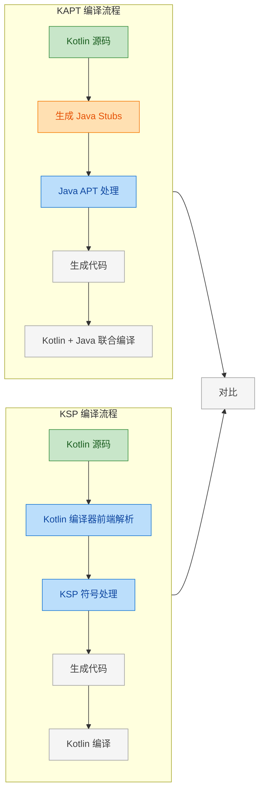

KAPT 流程中最关键的瓶颈就是"生成 Java Stubs"这一步。编译器需要把每个 Kotlin 文件翻译成一个对应的 Java 骨架文件，这不仅耗时，还会丢失 Kotlin 特有的语义信息（比如 `suspend` 函数、`inline class`、`sealed class` 的层级关系等）。KSP 直接在 Kotlin 编译器的前端符号表上工作，天然保留了所有 Kotlin 语义，同时省去了 Stub 生成的开销。

### KSP 的性能优势

Google 官方给出的基准测试数据显示，KSP 相比 KAPT 在纯 Kotlin 项目中通常能带来 2× 的编译速度提升，在某些大型项目中甚至更高。这个提升来自几个层面：

第一，消除 Stub 生成。这是最大的性能收益来源。在一个拥有数百个 Kotlin 文件的模块中，Stub 生成本身可能占据注解处理总时间的 40%–60%。KSP 完全跳过了这一步。

第二，增量处理（Incremental Processing）。KSP 从设计之初就内建了增量处理的支持。处理器可以精确声明自己依赖哪些输入，当只有部分文件发生变化时，KSP 只会重新处理受影响的部分，而不是像 KAPT 那样经常需要全量重跑。

第三，原生 Kotlin 语义。KSP 处理器不需要通过 Java 的 `TypeMirror`、`Element` 等抽象来"猜测"Kotlin 的语义。它直接拿到的就是 Kotlin 的类型系统，包括可空性（nullability）、`suspend`、`typealias` 等信息，处理逻辑更简洁，运行也更快。

第四，更轻的内存占用。不需要在内存中同时维护 Kotlin AST 和 Java Stub AST 两套数据结构。

### KSP 项目配置

配置 KSP 需要在 Gradle 构建脚本中引入 KSP 插件，并将依赖从 `kapt` 替换为 `ksp`。

首先在项目根目录的 `build.gradle.kts` 中声明 KSP 插件版本：

```kotlin
// build.gradle.kts (Project Root)
plugins {
    // KSP 版本号格式：Kotlin版本-KSP版本
    // 例如 Kotlin 1.9.22 对应 KSP 1.9.22-1.0.17
    id("com.google.devtools.ksp") version "1.9.22-1.0.17" apply false
}
```

然后在模块级别的 `build.gradle.kts` 中应用插件并添加依赖：

```kotlin
// build.gradle.kts (Module)
plugins {
    id("org.jetbrains.kotlin.jvm")
    // 应用 KSP 插件
    id("com.google.devtools.ksp")
}

dependencies {
    // KSP API 依赖，编写处理器时需要
    implementation("com.google.devtools.ksp:symbol-processing-api:1.9.22-1.0.17")

    // 使用 KSP 处理器（替代 kapt）
    // 以前写法：kapt("com.example:my-processor:1.0")
    // 现在写法：
    ksp("com.example:my-processor:1.0")
}
```

KSP 版本号的格式值得注意：它由 Kotlin 版本和 KSP 自身版本两部分组成，用 `-` 连接。这意味着升级 Kotlin 版本时，必须同步升级 KSP 版本，否则会出现兼容性问题。

### KSP 核心 API 体系

KSP 的 API 设计围绕"符号"（Symbol）这个核心概念展开。所有 Kotlin 代码中的声明——类、函数、属性、参数——都被抽象为不同类型的 `KSNode`。理解这套类型层级是编写 KSP 处理器的基础。

```mermaid
graph LR
    subgraph Core_Nodes["KSP 核心节点类型"]
        direction TB
        KSNode["KSNode"] --> KSAnnotated["KSAnnotated"]
        KSAnnotated --> KSDeclaration["KSDeclaration"]
        KSDeclaration --> KSClassDeclaration["KSClassDeclaration"]
        KSDeclaration --> KSFunctionDeclaration["KSFunctionDeclaration"]
        KSDeclaration --> KSPropertyDeclaration["KSPropertyDeclaration"]
        KSDeclaration --> KSTypeAlias["KSTypeAlias"]
        KSAnnotated --> KSValueParameter["KSValueParameter"]
        KSAnnotated --> KSTypeReference["KSTypeReference"]
    end

    subgraph Resolution["类型解析"]
        direction TB
        KSTypeReference2["KSTypeReference"] --> KSType["KSType"]
        KSType --> KSClassDeclaration2["KSClassDeclaration"]
    end

    Core_Nodes --> Resolution

    classDef green fill:#C8E6C9,stroke:#388E3C,color:#1B5E20
    classDef blue fill:#BBDEFB,stroke:#1976D2,color:#0D47A1
    classDef teal fill:#B2DFDB,stroke:#00796B,color:#004D40
    classDef purple fill:#E1BEE7,stroke:#7B1FA2,color:#4A148C

    class KSNode,KSAnnotated green
    class KSDeclaration,KSValueParameter,KSTypeReference,KSTypeReference2 blue
    class KSClassDeclaration,KSFunctionDeclaration,KSPropertyDeclaration,KSTypeAlias,KSClassDeclaration2 teal
    class KSType purple
```

几个关键接口的职责：

`KSClassDeclaration` 代表一个类、接口、枚举或 object 声明。通过它可以获取类的超类型（`superTypes`）、所有声明的成员（`declarations`）、类的种类（`classKind`，区分 CLASS / INTERFACE / ENUM_CLASS / OBJECT 等）。

`KSFunctionDeclaration` 代表一个函数声明，包括顶层函数和成员函数。可以获取参数列表（`parameters`）、返回类型（`returnType`）、以及函数修饰符（是否 `suspend`、`inline` 等）。

`KSPropertyDeclaration` 代表属性声明，可以获取属性类型、getter/setter、是否 `var`/`val` 等信息。

`KSTypeReference` 是一个未解析的类型引用，调用 `resolve()` 方法后得到 `KSType`，这是一个完全解析后的类型，包含泛型参数、可空性等完整信息。

### 编写 KSP 处理器

编写一个 KSP 处理器需要实现两个核心接口：`SymbolProcessor` 和 `SymbolProcessorProvider`。我们通过一个完整的实战案例来演示——创建一个 `@AutoBuilder` 注解，自动为数据类生成 Builder 模式代码。

首先定义注解（这个注解本身是普通 Kotlin 代码，不依赖 KSP）：

```kotlin
// 定义 @AutoBuilder 注解
// 标记在数据类上，KSP 处理器会为其生成对应的 Builder 类
@Target(AnnotationTarget.CLASS)
@Retention(AnnotationRetention.SOURCE) // 只在源码阶段需要
annotation class AutoBuilder
```

然后实现处理器的核心逻辑：

```kotlin
import com.google.devtools.ksp.processing.*
import com.google.devtools.ksp.symbol.*
import com.google.devtools.ksp.validate
import java.io.OutputStream

// KSP 处理器：扫描所有标注了 @AutoBuilder 的类，生成 Builder 代码
class AutoBuilderProcessor(
    // CodeGenerator 用于创建输出文件
    private val codeGenerator: CodeGenerator,
    // KSPLogger 用于输出日志和错误信息
    private val logger: KSPLogger
) : SymbolProcessor {

    // process() 是处理器的核心入口，每轮处理调用一次
    // resolver 提供了访问所有符号信息的能力
    override fun process(resolver: Resolver): List<KSAnnotated> {
        // 通过全限定名查找所有被 @AutoBuilder 标注的符号
        val symbols = resolver.getSymbolsWithAnnotation(
            "com.example.AutoBuilder"
        )

        // 过滤出尚未通过验证的符号（延迟到下一轮处理）
        val unableToProcess = symbols.filterNot { it.validate() }.toList()

        // 只处理类声明（KSClassDeclaration）
        symbols
            .filter { it is KSClassDeclaration && it.validate() }
            .forEach { symbol ->
                val classDecl = symbol as KSClassDeclaration
                // 为每个标注的类生成 Builder
                generateBuilder(classDecl)
            }

        // 返回本轮无法处理的符号，KSP 会在后续轮次重试
        return unableToProcess
    }

    private fun generateBuilder(classDecl: KSClassDeclaration) {
        // 获取类所在的包名
        val packageName = classDecl.packageName.asString()
        // 获取类名
        val className = classDecl.simpleName.asString()
        // Builder 类名约定：原类名 + "Builder"
        val builderName = "${className}Builder"

        // 获取主构造函数的所有参数
        val properties = classDecl.primaryConstructor?.parameters ?: return

        // 通过 CodeGenerator 创建新文件
        // Dependencies 声明了该生成文件依赖哪些源文件（用于增量编译）
        val file = codeGenerator.createNewFile(
            dependencies = Dependencies(
                aggregating = false,                    // 非聚合模式
                sources = arrayOf(classDecl.containingFile!!) // 依赖源文件
            ),
            packageName = packageName,
            fileName = builderName
        )

        // 向文件写入生成的代码
        file.writeBuilder(packageName, className, builderName, properties)
        file.close()
    }

    // 扩展函数：将 Builder 类代码写入输出流
    private fun OutputStream.writeBuilder(
        packageName: String,
        className: String,
        builderName: String,
        properties: List<KSValueParameter>
    ) {
        val builder = StringBuilder()

        // 写入包声明
        builder.appendLine("package $packageName")
        builder.appendLine()

        // 生成 Builder 类定义
        builder.appendLine("class $builderName {")

        // 为每个构造参数生成可变属性
        properties.forEach { param ->
            // 获取参数名
            val name = param.name?.asString() ?: return@forEach
            // 解析参数类型，获取完整的类型字符串
            val type = param.type.resolve().declaration.qualifiedName?.asString() ?: "Any"
            // 检查是否可空
            val nullable = if (param.type.resolve().isMarkedNullable) "?" else ""

            // 生成 private var 属性，初始值为 null
            builder.appendLine("    private var $name: $type$nullable? = null")
        }

        builder.appendLine()

        // 为每个属性生成 setter 方法（返回 this 以支持链式调用）
        properties.forEach { param ->
            val name = param.name?.asString() ?: return@forEach
            val type = param.type.resolve().declaration.qualifiedName?.asString() ?: "Any"
            val nullable = if (param.type.resolve().isMarkedNullable) "?" else ""

            builder.appendLine("    fun $name(value: $type$nullable) = apply {")
            builder.appendLine("        this.$name = value")
            builder.appendLine("    }")
            builder.appendLine()
        }

        // 生成 build() 方法，构造目标对象
        builder.appendLine("    fun build(): $className {")
        builder.append("        return $className(")

        // 拼接构造参数
        val args = properties.mapNotNull { param ->
            val name = param.name?.asString() ?: return@mapNotNull null
            val isNullable = param.type.resolve().isMarkedNullable
            if (isNullable) {
                // 可空参数直接传递
                "$name = $name"
            } else {
                // 非空参数使用 !! 或抛出有意义的异常
                "$name = $name ?: throw IllegalStateException(\"$name is required\")"
            }
        }
        builder.append(args.joinToString(", "))
        builder.appendLine(")")
        builder.appendLine("    }")

        builder.appendLine("}")

        // 写入字节流
        write(builder.toString().toByteArray())
    }
}
```

最后实现 `SymbolProcessorProvider`，这是 KSP 发现处理器的入口点：

```kotlin
import com.google.devtools.ksp.processing.*

// Provider 是 KSP 的 SPI 入口，负责创建处理器实例
class AutoBuilderProcessorProvider : SymbolProcessorProvider {

    // KSP 框架调用此方法来实例化处理器
    // environment 提供了 CodeGenerator、Logger 等基础设施
    override fun create(environment: SymbolProcessorEnvironment): SymbolProcessor {
        return AutoBuilderProcessor(
            codeGenerator = environment.codeGenerator,
            logger = environment.logger
        )
    }
}
```

处理器需要通过 SPI（Service Provider Interface）机制注册。在处理器模块的 `resources` 目录下创建文件：

```text
// 文件路径：src/main/resources/META-INF/services/
//           com.google.devtools.ksp.processing.SymbolProcessorProvider
// 文件内容为 Provider 的全限定类名
com.example.AutoBuilderProcessorProvider
```

使用效果如下：

```kotlin
// 用户代码：标注 @AutoBuilder
@AutoBuilder
data class User(
    val name: String,
    val age: Int,
    val email: String?
)

// KSP 自动生成的代码（在 build/generated/ksp 目录下）：
// class UserBuilder {
//     private var name: kotlin.String? = null
//     private var age: kotlin.Int? = null
//     private var email: kotlin.String?? = null
//
//     fun name(value: kotlin.String) = apply { this.name = value }
//     fun age(value: kotlin.Int) = apply { this.age = value }
//     fun email(value: kotlin.String?) = apply { this.email = value }
//
//     fun build(): User {
//         return User(
//             name = name ?: throw IllegalStateException("name is required"),
//             age = age ?: throw IllegalStateException("age is required"),
//             email = email
//         )
//     }
// }

// 使用生成的 Builder
val user = UserBuilder()
    .name("Alice")       // 链式调用
    .age(30)
    .email("a@b.com")
    .build()             // 构造 User 实例
```

### KSP 处理器的多轮处理机制

KSP 的 `process()` 方法可能被调用多次（multiple rounds）。这是因为一个处理器生成的代码可能包含新的注解，需要被其他处理器（或自身）再次处理。理解这个机制对编写正确的处理器至关重要。

```mermaid
graph LR
    subgraph Round1["第一轮处理"]
        direction TB
        R1A["解析源码符号"] --> R1B["处理器扫描注解"]
        R1B --> R1C["生成新代码文件"]
        R1C --> R1D["返回未处理符号"]
    end

    subgraph Round2["第二轮处理"]
        direction TB
        R2A["解析新生成的符号"] --> R2B["处理器再次扫描"]
        R2B --> R2C["生成更多代码或完成"]
        R2C --> R2D["返回空列表"]
    end

    subgraph Finish["完成"]
        direction TB
        F1["调用 finish 回调"] --> F2["编译所有代码"]
    end

    Round1 --> Round2
    Round2 --> Finish

    classDef green fill:#C8E6C9,stroke:#388E3C,color:#1B5E20
    classDef blue fill:#BBDEFB,stroke:#1976D2,color:#0D47A1
    classDef amber fill:#FFF9C4,stroke:#F9A825,color:#F57F17

    class R1A,R1B,R1C,R1D green
    class R2A,R2B,R2C,R2D blue
    class F1,F2 amber
```

`process()` 的返回值是关键：返回的 `List<KSAnnotated>` 表示"本轮无法处理的符号"。KSP 会在下一轮把这些符号重新交给处理器。当所有处理器都返回空列表时，处理结束。如果某些符号始终无法处理（比如依赖了一个不存在的类型），KSP 会在最终轮次报告错误。

`SymbolProcessor` 还有一个 `finish()` 回调方法，在所有轮次结束后调用一次，适合做清理工作或生成汇总性的代码：

```kotlin
class MyProcessor(
    private val codeGenerator: CodeGenerator,
    private val logger: KSPLogger
) : SymbolProcessor {

    // 跨轮次收集信息
    private val collectedClasses = mutableListOf<String>()

    override fun process(resolver: Resolver): List<KSAnnotated> {
        // 每轮收集数据
        resolver.getSymbolsWithAnnotation("com.example.Track")
            .filterIsInstance<KSClassDeclaration>()
            .forEach { collectedClasses.add(it.simpleName.asString()) }
        return emptyList()
    }

    // 所有轮次结束后调用一次
    override fun finish() {
        // 在这里生成汇总文件，比如一个注册表
        logger.info("处理完成，共收集 ${collectedClasses.size} 个类")
    }
}
```

### KSP 中的类型解析与高级操作

KSP 对 Kotlin 类型系统的支持是它相比 KAPT 的一大优势。以下展示几个常见的高级操作场景：

```kotlin
fun inspectClass(classDecl: KSClassDeclaration, logger: KSPLogger) {

    // 1. 获取所有超类型（包括接口）
    classDecl.superTypes.forEach { superTypeRef ->
        // resolve() 将类型引用解析为完整的 KSType
        val superType = superTypeRef.resolve()
        // 获取超类型的声明
        val superDecl = superType.declaration
        logger.info("超类型: ${superDecl.qualifiedName?.asString()}")

        // 获取泛型参数
        superType.arguments.forEach { arg ->
            // 泛型参数的类型
            val argType = arg.type?.resolve()
            // 泛型参数的 variance（IN / OUT / INVARIANT）
            val variance = arg.variance
            logger.info("  泛型参数: $argType, variance: $variance")
        }
    }

    // 2. 检查可空性（Kotlin 特有，KAPT 无法直接获取）
    classDecl.primaryConstructor?.parameters?.forEach { param ->
        val type = param.type.resolve()
        // isMarkedNullable 直接告诉你这个类型是否标记了 ?
        if (type.isMarkedNullable) {
            logger.info("${param.name?.asString()} 是可空类型")
        }
    }

    // 3. 检查修饰符
    if (Modifier.DATA in classDecl.modifiers) {
        logger.info("${classDecl.simpleName.asString()} 是 data class")
    }
    if (Modifier.SEALED in classDecl.modifiers) {
        // 获取 sealed class 的所有子类
        classDecl.getSealedSubclasses().forEach { subclass ->
            logger.info("密封子类: ${subclass.simpleName.asString()}")
        }
    }

    // 4. 检查函数是否是 suspend
    classDecl.declarations
        .filterIsInstance<KSFunctionDeclaration>()
        .forEach { func ->
            if (Modifier.SUSPEND in func.modifiers) {
                logger.info("${func.simpleName.asString()} 是挂起函数")
            }
        }
}
```

### KSP 增量处理与 Dependencies

KSP 的增量处理能力依赖于 `Dependencies` 的正确声明。创建生成文件时传入的 `Dependencies` 对象告诉 KSP：这个生成文件依赖哪些源文件。当源文件变化时，KSP 知道哪些生成文件需要重新生成。

```kotlin
// 非聚合模式（Isolating）：生成文件只依赖特定的源文件
// 当 UserModel.kt 变化时，只重新生成 UserModelBuilder.kt
val isolatingDeps = Dependencies(
    aggregating = false,                          // 非聚合
    sources = arrayOf(classDecl.containingFile!!)  // 精确指定依赖的源文件
)

// 聚合模式（Aggregating）：生成文件依赖所有相关源文件
// 适用于需要扫描多个文件来生成一个汇总文件的场景
// 比如生成一个包含所有 @Route 注解的路由表
val aggregatingDeps = Dependencies(
    aggregating = true,                           // 聚合模式
    sources = allRouteFiles.toTypedArray()         // 所有相关源文件
)

// 如果无法确定依赖关系，传入 Dependencies.ALL_FILES
// 这会导致任何文件变化都触发重新生成（最保守但最慢）
val fallbackDeps = Dependencies.ALL_FILES
```

选择正确的模式对编译性能影响很大。尽量使用非聚合模式（`aggregating = false`）并精确声明依赖，这样增量编译时只会重新处理真正受影响的部分。

### 从 KAPT 迁移到 KSP

许多主流库已经提供了 KSP 支持。迁移通常只需要修改 Gradle 配置：

```kotlin
// build.gradle.kts

// ❌ 旧的 KAPT 配置
// plugins {
//     id("org.jetbrains.kotlin.kapt")
// }
// dependencies {
//     kapt("androidx.room:room-compiler:2.6.1")
//     kapt("com.google.dagger:hilt-compiler:2.50")
//     kapt("com.squareup.moshi:moshi-kotlin-codegen:1.15.0")
// }

// ✅ 新的 KSP 配置
plugins {
    id("com.google.devtools.ksp")
}
dependencies {
    // Room 已原生支持 KSP
    ksp("androidx.room:room-compiler:2.6.1")
    // Dagger/Hilt 已支持 KSP
    ksp("com.google.dagger:hilt-compiler:2.50")
    // Moshi 已支持 KSP
    ksp("com.squareup.moshi:moshi-kotlin-codegen:1.15.0")
}
```

迁移时需要注意：并非所有 KAPT 处理器都有 KSP 版本。如果某个库尚未支持 KSP，可以在同一项目中同时使用 KAPT 和 KSP——它们可以共存，只是 KAPT 的那部分仍然会有 Stub 生成的开销。

```kotlin
// KAPT 和 KSP 共存的配置
plugins {
    id("org.jetbrains.kotlin.kapt")   // 保留 KAPT
    id("com.google.devtools.ksp")      // 同时启用 KSP
}

dependencies {
    // 已支持 KSP 的库用 ksp
    ksp("androidx.room:room-compiler:2.6.1")
    // 尚未支持 KSP 的库继续用 kapt
    kapt("some.legacy:annotation-processor:1.0")
}
```

### KSP 向处理器传递参数

与 KAPT 类似，KSP 也支持通过 Gradle 向处理器传递配置参数：

```kotlin
// build.gradle.kts
ksp {
    // 传递键值对参数给 KSP 处理器
    arg("autobuilder.generateDsl", "true")
    arg("autobuilder.packageSuffix", "generated")
}
```

在处理器中读取这些参数：

```kotlin
class AutoBuilderProcessorProvider : SymbolProcessorProvider {
    override fun create(environment: SymbolProcessorEnvironment): SymbolProcessor {
        // 通过 environment.options 读取 Gradle 传入的参数
        val generateDsl = environment.options["autobuilder.generateDsl"]?.toBoolean() ?: false
        val packageSuffix = environment.options["autobuilder.packageSuffix"] ?: "generated"

        return AutoBuilderProcessor(
            codeGenerator = environment.codeGenerator,
            logger = environment.logger,
            generateDsl = generateDsl,       // 传递给处理器
            packageSuffix = packageSuffix
        )
    }
}
```

### KSP 与 KotlinPoet 配合

在实际项目中，直接拼接字符串来生成代码容易出错且难以维护。Square 出品的 KotlinPoet 库提供了类型安全的代码生成 API，与 KSP 配合使用是业界最佳实践。KotlinPoet 专门为 KSP 提供了 `ksp-interop` 模块，可以直接将 KSP 的类型转换为 KotlinPoet 的类型表示。

```kotlin
// build.gradle.kts
dependencies {
    // KotlinPoet 核心库
    implementation("com.squareup:kotlinpoet:1.16.0")
    // KotlinPoet 与 KSP 的互操作模块
    implementation("com.squareup:kotlinpoet-ksp:1.16.0")
    // KSP API
    implementation("com.google.devtools.ksp:symbol-processing-api:1.9.22-1.0.17")
}
```

使用 KotlinPoet 重写之前的 Builder 生成逻辑，代码会更加健壮和可读：

```kotlin
import com.google.devtools.ksp.processing.*
import com.google.devtools.ksp.symbol.*
import com.squareup.kotlinpoet.*
import com.squareup.kotlinpoet.ksp.toClassName
import com.squareup.kotlinpoet.ksp.toTypeName
import com.squareup.kotlinpoet.ksp.writeTo

class KotlinPoetBuilderProcessor(
    private val codeGenerator: CodeGenerator,
    private val logger: KSPLogger
) : SymbolProcessor {

    override fun process(resolver: Resolver): List<KSAnnotated> {
        resolver.getSymbolsWithAnnotation("com.example.AutoBuilder")
            .filterIsInstance<KSClassDeclaration>()
            .forEach { generateWithPoet(it) }
        return emptyList()
    }

    private fun generateWithPoet(classDecl: KSClassDeclaration) {
        // 使用 KSP 互操作扩展，直接将 KSClassDeclaration 转为 ClassName
        val className = classDecl.toClassName()
        val builderClassName = ClassName(
            className.packageName,
            "${className.simpleName}Builder"
        )

        // 获取主构造函数参数
        val params = classDecl.primaryConstructor?.parameters ?: return

        // 构建 Builder 类
        val builderType = TypeSpec.classBuilder(builderClassName).apply {
            // 为每个参数生成属性和 setter
            params.forEach { param ->
                val name = param.name!!.asString()
                // toTypeName() 是 KSP 互操作扩展，将 KSTypeReference 转为 TypeName
                val typeName = param.type.toTypeName()
                // 可空版本的类型，用于 Builder 内部存储
                val nullableType = typeName.copy(nullable = true)

                // 添加 private var 属性
                addProperty(
                    PropertySpec.builder(name, nullableType)
                        .mutable(true)           // var
                        .addModifiers(KModifier.PRIVATE)
                        .initializer("null")     // 初始值 null
                        .build()
                )

                // 添加链式 setter 方法
                addFunction(
                    FunSpec.builder(name)
                        .addParameter("value", typeName)
                        .returns(builderClassName)  // 返回自身类型
                        .addStatement("return apply { this.%N = value }", name)
                        .build()
                )
            }

            // 添加 build() 方法
            addFunction(
                FunSpec.builder("build")
                    .returns(className)
                    .apply {
                        // 构造参数列表
                        val constructorArgs = params.map { param ->
                            val name = param.name!!.asString()
                            val isNullable = param.type.resolve().isMarkedNullable
                            if (isNullable) {
                                CodeBlock.of("%N = %N", name, name)
                            } else {
                                CodeBlock.of(
                                    "%N = %N ?: throw IllegalStateException(%S)",
                                    name, name, "$name is required"
                                )
                            }
                        }
                        addStatement(
                            "return %T(%L)",
                            className,
                            constructorArgs.joinToCode(", ")
                        )
                    }
                    .build()
            )
        }.build()

        // 构建文件并写入
        // writeTo() 是 KSP 互操作扩展，直接写入 CodeGenerator
        FileSpec.builder(className.packageName, builderClassName.simpleName)
            .addType(builderType)
            .build()
            .writeTo(codeGenerator, aggregating = false, originatingKSFiles = listOf(classDecl.containingFile!!))
    }
}
```

KotlinPoet 的 `%N`（name）、`%T`（type）、`%S`（string）、`%L`（literal）等占位符让代码生成变得类型安全——不再需要手动拼接全限定类名，KotlinPoet 会自动处理 import 语句和类名冲突。

### KSP 调试技巧

开发 KSP 处理器时，调试是一个常见痛点。以下是几个实用的调试手段：

```kotlin
class DebugProcessor(
    private val codeGenerator: CodeGenerator,
    private val logger: KSPLogger
) : SymbolProcessor {

    override fun process(resolver: Resolver): List<KSAnnotated> {
        // 1. 使用 KSPLogger 输出不同级别的日志
        logger.info("开始处理...")                    // 普通信息
        logger.warn("这是一个警告")                    // 警告信息
        logger.error("这是一个错误")                   // 错误（会导致编译失败）

        // 2. 带位置信息的日志（可以在 IDE 中点击跳转到源码位置）
        resolver.getSymbolsWithAnnotation("com.example.MyAnnotation")
            .forEach { symbol ->
                // 第二个参数是 KSNode，日志会附带该节点的源码位置
                logger.info("发现注解目标: ${symbol}", symbol)
            }

        // 3. 打印完整的类型信息用于调试
        resolver.getSymbolsWithAnnotation("com.example.MyAnnotation")
            .filterIsInstance<KSClassDeclaration>()
            .forEach { classDecl ->
                logger.info("类名: ${classDecl.qualifiedName?.asString()}")
                logger.info("修饰符: ${classDecl.modifiers}")
                logger.info("类种类: ${classDecl.classKind}")

                classDecl.declarations.forEach { decl ->
                    logger.info("  成员: ${decl.simpleName.asString()} [${decl::class.simpleName}]")
                }
            }

        return emptyList()
    }
}
```

在 Gradle 中运行时，可以通过以下命令查看 KSP 的详细输出：

```kotlin
// 终端执行（用户手动运行）
// ./gradlew kspKotlin --info
// 或者只看 KSP 相关日志
// ./gradlew kspKotlin 2>&1 | grep "ksp"
```

如果需要断点调试，可以在 Gradle 中启用远程调试：

```kotlin
// build.gradle.kts
// 在 gradle.properties 中添加：
// org.gradle.jvmargs=-agentlib:jdwp=transport=dt_socket,server=y,suspend=y,address=5005
// 然后在 IDE 中创建 Remote JVM Debug 配置，连接 5005 端口
```

### KSP 的局限性与适用边界

KSP 虽然强大，但它有明确的设计边界。理解这些边界能帮助你判断何时该用 KSP，何时需要其他方案。

KSP 是只读的——它只能读取符号信息并生成新文件，不能修改已有的源码。如果你需要修改现有代码（比如给类添加方法、修改函数体），KSP 无法做到，你需要使用 Kotlin Compiler Plugin。

KSP 工作在编译器前端，这意味着它看到的是语法层面的符号信息，而非编译后的字节码。它无法获取方法体内部的具体实现逻辑，只能看到声明级别的信息（类名、函数签名、属性类型、注解等）。

KSP 不支持跨模块处理。每个模块的 KSP 处理器只能看到当前模块的源码和依赖模块的已编译符号。如果你需要跨模块聚合信息，通常需要在每个模块生成中间产物，然后在最终模块中汇总。

```mermaid
graph LR
    subgraph Capabilities["KSP 能做的"]
        direction TB
        C1["读取类/函数/属性声明"]
        C2["读取注解及其参数"]
        C3["解析完整类型信息"]
        C4["生成新的 Kotlin/Java 文件"]
        C5["生成资源文件"]
    end

    subgraph Limitations["KSP 做不到的"]
        direction TB
        L1["修改已有源码"]
        L2["读取函数体实现"]
        L3["跨模块聚合处理"]
        L4["生成字节码"]
        L5["运行时反射"]
    end

    subgraph Alternatives["替代方案"]
        direction TB
        A1["Kotlin Compiler Plugin"]
        A2["字节码操作 ByteBuddy/ASM"]
        A3["Gradle Plugin 聚合"]
    end

    Limitations --> Alternatives

    classDef green fill:#C8E6C9,stroke:#388E3C,color:#1B5E20
    classDef red fill:#FFCDD2,stroke:#D32F2F,color:#B71C1C
    classDef blue fill:#BBDEFB,stroke:#1976D2,color:#0D47A1

    class C1,C2,C3,C4,C5 green
    class L1,L2,L3,L4,L5 red
    class A1,A2,A3 blue
```

总结来说，KSP 最适合的场景是：基于声明级别的元信息（注解、类型、签名）生成辅助代码。Room 的 DAO 实现、Dagger 的依赖注入代码、Moshi 的 JSON 适配器——这些都是 KSP 的理想用例。当你发现自己需要"看到函数内部在做什么"或"修改已有类的行为"时，就超出了 KSP 的能力范围，需要考虑 Compiler Plugin 或字节码操作等更底层的方案。

---

**📝 练习题 1**

以下关于 KSP 的描述，哪一项是错误的？

A. KSP 直接在 Kotlin 编译器前端工作，不需要生成 Java Stub
B. KSP 的 `process()` 方法可能被调用多次，每次处理新生成的符号
C. KSP 处理器可以修改已有的 Kotlin 源文件中的代码
D. KSP 通过 `Dependencies` 声明来支持增量编译

**【答案】** C
**【解析】** KSP 是一个只读的符号处理框架，它只能读取源码中的声明信息（类、函数、属性、注解等）并生成新的文件，无法修改已有的源码。如果需要修改现有代码的行为，需要使用 Kotlin Compiler Plugin 或字节码操作工具（如 ASM、ByteBuddy）。选项 A 正确描述了 KSP 跳过 Stub 生成的核心优势；选项 B 正确描述了多轮处理机制；选项 D 正确描述了 `Dependencies` 在增量编译中的作用。

---

**📝 练习题 2**

在 KSP 处理器中，你需要为一个生成的注册表文件声明依赖关系，该文件需要扫描项目中所有标注了 `@Route` 的类才能生成。以下哪种 `Dependencies` 配置最合适？

A. `Dependencies(aggregating = false, sources = arrayOf(singleFile))`

B. `Dependencies(aggregating = true, sources = allRouteFiles.toTypedArray())`

C. `Dependencies.ALL_FILES`

D. `Dependencies(aggregating = false, sources = emptyArray())`

**【答案】** B

**【解析】** 这是一个典型的聚合（aggregating）场景：生成的路由注册表依赖于多个源文件中的 `@Route` 注解信息。选项 B 使用 `aggregating = true` 并精确列出所有相关源文件，这是最优解——既声明了聚合关系，又精确指定了依赖范围，使增量编译能正确判断何时需要重新生成。选项 A 的非聚合模式只适用于一对一的生成关系（一个源文件对应一个生成文件）。选项 C 虽然能工作，但过于保守，任何文件变化都会触发重新生成，严重影响增量编译性能。选项 D 没有声明任何依赖源文件，KSP 无法正确追踪变化。

---

## 本章小结

经过前面十个章节的系统学习，我们已经完整地走过了 Kotlin 注解（Annotation）这一元编程核心机制的全貌。本章小结将从宏观视角对所有知识点进行回顾与串联，帮助你建立一张清晰的心智地图（Mental Map），并提炼出在实际工程中最关键的决策要点。

### 知识全景回顾

注解的本质是一种 **附加在代码元素上的结构化元数据**（Structured Metadata）。它本身不包含业务逻辑，但能被编译器、构建工具、框架在不同阶段读取并驱动行为。理解注解，就是理解"数据描述数据"这一元编程思想在 Kotlin/JVM 生态中的具体落地。

我们从最基础的 `annotation class` 声明语法出发，了解了注解在 Kotlin 中是一种特殊的类——它没有方法体、没有状态，只有通过主构造函数定义的参数列表。这些参数被严格限制为编译期常量类型：基本类型、`String`、枚举、`KClass<*>`、其他注解，以及它们的数组形式。这种限制并非语言设计的缺陷，而是为了保证注解信息能被安全地嵌入到 `.class` 文件的字节码结构中。

```kotlin
// 注解的本质：一个只有元数据、没有行为的特殊类
annotation class Route(
    val path: String,           // 字符串参数 → 编译期常量
    val method: HttpMethod,     // 枚举参数 → 编译期可确定
    val version: Int = 1        // 基本类型参数 → 支持默认值
)
```

接着，我们深入了四大元注解（Meta-Annotations），它们是"描述注解的注解"：

- `@Target` 精确控制注解可以贴在哪些代码元素上（类、函数、属性、表达式等），这是注解设计的第一道防线。
- `@Retention` 决定注解的生命周期——`SOURCE` 级别在编译后丢弃，`BINARY` 级别写入字节码但反射不可见，`RUNTIME` 级别在运行时可通过反射读取。选择正确的保留策略直接影响性能和功能。
- `@Repeatable` 允许同一注解在同一元素上多次使用，Kotlin 1.6+ 原生支持。
- `@MustBeDocumented` 确保注解出现在生成的 API 文档中，适用于公共 API 的注解设计。

```mermaid
graph LR
    subgraph MetaAnnotations["元注解体系"]
        direction TB
        T["@Target<br/>控制贴在哪里"]
        R["@Retention<br/>控制活多久"]
        RP["@Repeatable<br/>允许重复使用"]
        M["@MustBeDocumented<br/>纳入文档"]
    end

    subgraph Lifecycle["注解生命周期"]
        direction TB
        S["SOURCE<br/>编译后丢弃"]
        B["BINARY<br/>写入字节码"]
        RT["RUNTIME<br/>反射可读"]
    end

    subgraph Consumers["消费者"]
        direction TB
        C1["编译器插件"]
        C2["KAPT / KSP"]
        C3["反射框架"]
    end

    MetaAnnotations --> Lifecycle
    S --> C1
    B --> C2
    RT --> C3

    classDef meta fill:#E8F5E9,stroke:#43A047,color:#1B5E20
    classDef life fill:#E3F2FD,stroke:#1E88E5,color:#0D47A1
    classDef consumer fill:#FFF3E0,stroke:#FB8C00,color:#E65100

    class T,R,RP,M meta
    class S,B,RT life
    class C1,C2,C3 consumer
```

Kotlin 相比 Java 引入了一个极其重要的概念——**使用点目标**（Use-site Targets）。由于 Kotlin 的一个 `val` 属性在编译后会生成 JVM 字段、getter 方法、以及可能的构造函数参数，一个注解到底贴在哪个生成物上就变得模糊了。`@field:`、`@get:`、`@set:`、`@param:`、`@property:`、`@file:` 这些前缀精确消除了歧义，这是 Kotlin 注解系统中最容易被忽视却最容易踩坑的地方。

```kotlin
class User(
    @field:NotNull          // 贴在 JVM 字段上 → Hibernate 验证器读取
    @get:JsonProperty("n")  // 贴在 getter 上 → Jackson 序列化时读取
    @param:Inject           // 贴在构造函数参数上 → DI 框架注入时读取
    val name: String
)
```

在内置注解部分，我们学习了 Kotlin 标准库和 JVM 互操作中最常用的注解：`@Deprecated` 提供了比 Java 更强大的迁移支持（`ReplaceWith` 自动重构）；`@Suppress` 精确压制编译器警告；`@JvmName`、`@JvmStatic`、`@JvmOverloads`、`@JvmField` 等系列注解则是 Kotlin 与 Java 互操作的桥梁，在混合语言项目中不可或缺；`@Throws` 让 Kotlin 的非受检异常对 Java 调用者可见。

自定义注解的设计是一门工程艺术。好的注解应该遵循单一职责、语义清晰、命名自解释的原则。我们讨论了命名约定（动词式如 `@Inject`、形容词式如 `@Serializable`、名词式如 `@Component`）、参数设计（必选参数 vs 默认值、避免过多参数）、以及如何通过组合多个注解来构建领域特定的注解体系。

读取注解有两条路径：**运行时反射** 和 **编译时处理**。运行时通过 `kotlin-reflect` 库的 `KAnnotatedElement` 接口，使用 `findAnnotation<T>()`、`hasAnnotation<T>()` 等扩展函数读取 `RUNTIME` 保留的注解。这种方式简单直接，但有反射的性能开销。编译时处理则通过 KAPT 或 KSP 在编译阶段读取注解并生成代码，零运行时开销。

```kotlin
// 运行时反射读取注解的典型模式
inline fun <reified T : Annotation> KAnnotatedElement.findAnnotation(): T? =
    annotations.filterIsInstance<T>().firstOrNull()

// 实际使用
val route = MyController::class
    .memberFunctions
    .first { it.name == "getUser" }
    .findAnnotation<Route>()       // 返回 Route? 实例

route?.let {
    println("Path: ${it.path}, Method: ${it.method}")
}
```

最后，我们深入对比了两大编译时注解处理方案：

**KAPT**（Kotlin Annotation Processing Tool）是 Kotlin 早期的方案，它通过先将 Kotlin 代码生成 Java 存根（Stubs），再交给标准的 Java `javax.annotation.processing` API 处理。这意味着它能复用整个 Java 注解处理器生态（Dagger、Room、MapStruct 等），但代价是生成存根的额外编译轮次，导致构建速度显著下降。

**KSP**（Kotlin Symbol Processing）是 Google 推出的新一代方案，它直接操作 Kotlin 编译器的符号信息，无需生成 Java 存根。KSP 能感知 Kotlin 特有的语言特性（空安全、扩展函数、数据类等），编译速度比 KAPT 快 2 倍以上。KSP 的 API 以 `SymbolProcessor` 和 `Resolver` 为核心，通过 `getSymbolsWithAnnotation()` 获取被注解标记的符号，再用 `CodeGenerator` 生成代码。

```mermaid
graph LR
    subgraph KAPT_Flow["KAPT 处理流程"]
        direction TB
        K1["Kotlin 源码"] --> K2["生成 Java Stubs"]
        K2 --> K3["Java APT 处理"]
        K3 --> K4["生成代码"]
        K4 --> K5["与源码一起编译"]
    end

    subgraph KSP_Flow["KSP 处理流程"]
        direction TB
        S1["Kotlin 源码"] --> S2["KSP 直接分析符号"]
        S2 --> S3["生成代码"]
        S3 --> S4["与源码一起编译"]
    end

    subgraph Compare["关键差异"]
        direction TB
        D1["KAPT: 多一轮 Stub 生成"]
        D2["KSP: 直接读取, 速度 2x+"]
        D3["KSP: 感知 Kotlin 特性"]
    end

    KAPT_Flow --> Compare
    KSP_Flow --> Compare

    classDef kapt fill:#FFEBEE,stroke:#E53935,color:#B71C1C
    classDef ksp fill:#E8F5E9,stroke:#43A047,color:#1B5E20
    classDef diff fill:#F3E5F5,stroke:#8E24AA,color:#4A148C

    class K1,K2,K3,K4,K5 kapt
    class S1,S2,S3,S4 ksp
    class D1,D2,D3 diff
```

### 工程决策速查表

在实际项目中，面对注解相关的技术选型，以下是最核心的决策路径：

```
选择 Retention 策略：
├── 注解仅用于代码检查/Lint？ → SOURCE
├── 注解需要被 KAPT/KSP 处理？ → 通常 SOURCE 或 BINARY 即可
└── 注解需要运行时反射读取？ → RUNTIME（唯一选择）

选择注解处理方案：
├── 项目依赖的库只提供 KAPT 处理器？ → 用 KAPT（如旧版 Dagger）
├── 库已提供 KSP 支持？ → 优先用 KSP（如 Room 2.4+, Moshi 等）
├── 需要自己写处理器？ → 强烈推荐 KSP
└── 只需运行时简单读取？ → 直接用反射, 无需处理器

选择使用点目标：
├── 框架通过字段反射读取（Hibernate, JPA）？ → @field:
├── 框架通过 getter 读取（Jackson, Gson）？ → @get:
├── DI 框架注入构造参数？ → @param:
└── 不确定？ → 查看框架文档, 或用 @get: 作为安全默认值
```

### 从注解到更广阔的元编程

注解是 Kotlin 元编程拼图中的一块。在更大的图景中，它与以下技术形成互补：

- **反射**（`kotlin-reflect`）：注解的运行时消费者，两者经常配合使用。
- **编译器插件**（Compiler Plugins）：比注解处理器更强大，能修改已有代码的 AST（如 `kotlinx.serialization` 的编译器插件直接为 `@Serializable` 类生成序列化逻辑，无需生成额外文件）。
- **代码生成**（KotlinPoet）：KAPT/KSP 处理器的输出端，用类型安全的 API 生成 Kotlin 源码。
- **契约**（Contracts）和 **上下文接收者**（Context Receivers）：Kotlin 语言层面的元编程能力，与注解形成不同层次的抽象。

掌握注解，你就掌握了理解 Spring、Dagger/Hilt、Room、Retrofit、kotlinx.serialization 等主流框架底层运作机制的钥匙。当你在代码中写下 `@Inject`、`@Entity`、`@GET("/users")` 时，你不再只是一个 API 的使用者——你理解了这些注解背后的声明、传递、读取和处理的完整链路。

---

**📝 练习题 1**

以下关于 Kotlin 注解的说法，哪一项是正确的？

A. 注解参数可以是任意类型，包括自定义数据类实例
B. `@Retention(AnnotationRetention.BINARY)` 的注解可以在运行时通过反射读取
C. KSP 处理器比 KAPT 更快，主要原因是 KSP 跳过了 Java Stub 生成阶段
D. 使用点目标 `@property:` 会将注解贴在 JVM 字段上

**【答案】** C
**【解析】** 逐项分析：A 错误，注解参数只能是编译期常量类型（基本类型、String、枚举、KClass、其他注解及其数组），不支持任意自定义类型。B 错误，`BINARY` 保留策略意味着注解写入字节码但反射不可见，只有 `RUNTIME` 才能被反射读取。C 正确，KAPT 需要先将 Kotlin 代码生成 Java Stubs 再交给 Java APT 处理，这个额外的编译轮次是其性能瓶颈所在，KSP 直接分析 Kotlin 编译器的符号信息，省去了这一步，因此速度提升显著（通常 2 倍以上）。D 错误，`@property:` 将注解贴在 Kotlin 的属性元素上（仅 Kotlin 反射可见），贴在 JVM 字段上应使用 `@field:`。

**📝 练习题 2**

你正在开发一个 Kotlin 库，需要设计一个 `@Cacheable` 注解，用于标记函数的返回值应被缓存。缓存框架在运行时通过动态代理拦截函数调用并读取注解配置。以下声明中，哪一个是最合理的设计？

A.
```kotlin
@Target(AnnotationTarget.CLASS)
@Retention(AnnotationRetention.SOURCE)
annotation class Cacheable(val ttl: Int = 60)
```

B.
```kotlin
@Target(AnnotationTarget.FUNCTION)
@Retention(AnnotationRetention.RUNTIME)
annotation class Cacheable(val ttl: Int = 60)
```

C.
```kotlin
@Target(AnnotationTarget.FUNCTION)
@Retention(AnnotationRetention.BINARY)
annotation class Cacheable(val ttl: Int = 60)
```

D.
```kotlin
@Target(AnnotationTarget.FUNCTION, AnnotationTarget.CLASS)
@Retention(AnnotationRetention.RUNTIME)
annotation class Cacheable(val ttl: Any)
```

**【答案】** B

**【解析】** 题目明确了两个关键约束：注解用于标记"函数"，且框架在"运行时"通过动态代理读取注解。A 错误，`@Target` 设为 `CLASS` 无法贴在函数上，且 `SOURCE` 保留策略在编译后就丢弃了，运行时根本读不到。B 正确，`@Target(FUNCTION)` 精确限制只能贴在函数上，`@Retention(RUNTIME)` 确保运行时反射可读，`ttl` 参数为 `Int` 类型且有默认值，设计简洁合理。C 错误，`BINARY` 保留策略虽然写入字节码，但反射不可见，动态代理框架无法在运行时读取。D 错误，`ttl` 参数类型为 `Any`，注解参数不允许使用任意类型，编译会直接报错。

---