---

# 协程进阶

---

## 协程异常处理

在日常开发中，我们写的代码不可能永远一帆风顺——网络请求会超时、JSON 解析会失败、空指针会不期而至。在传统的线程模型里，我们用 `try-catch` 就能搞定大部分场景。但协程引入了结构化并发（Structured Concurrency）的概念后，异常的传播路径变得更加复杂：一个子协程的失败，可能会导致兄弟协程被取消，甚至整个协程树崩塌。理解协程的异常处理机制，是写出健壮异步代码的关键。

### 异常传播机制

协程的异常传播遵循一个核心原则：**异常沿着协程层级结构向上传播（propagate upward）**。当一个子协程抛出未捕获的异常时，它不会像普通线程那样悄悄死掉，而是会通知自己的父协程。父协程收到异常后，会执行以下三步操作：

1. **取消自身剩余的所有子协程**（Cancel all other children）
2. **取消自身**（Cancel itself）
3. **将异常向上传播给自己的父协程**（Propagate the exception upward）

这个过程会一直递归，直到到达协程树的根节点（通常是 `CoroutineScope`）。这就是所谓的"一个失败，全部取消"的行为。

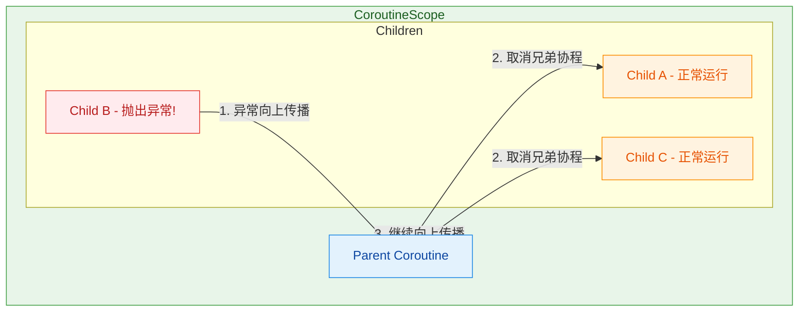

我们先来看一个最基础的例子，直观感受异常传播的威力：

```kotlin
import kotlinx.coroutines.*

fun main() = runBlocking {
    // 在 runBlocking 作用域内启动两个子协程
    val job1 = launch {
        delay(1000L) // 模拟耗时操作
        println("Job1 完成") // 这行永远不会执行
    }

    val job2 = launch {
        delay(500L) // 500ms 后抛出异常
        throw RuntimeException("Job2 出错了!") // 未捕获的异常
    }

    // job2 的异常会传播给 runBlocking（父协程）
    // runBlocking 会取消 job1，然后自身也会因异常而终止
    joinAll(job1, job2)
    println("这行也不会执行") // 因为 runBlocking 已经被异常终止
}
```

运行结果是程序直接崩溃，`Job1 完成` 和最后的 `println` 都不会输出。这就是结构化并发的"连坐"效应。

需要特别注意的是，`launch` 和 `async` 对异常的处理方式有本质区别：

- **`launch`**：异常会立即向上传播。它是一种"fire-and-forget"的协程构建器，异常被视为未捕获异常（uncaught exception）。
- **`async`**：异常不会立即传播，而是被封装在返回的 `Deferred` 对象中。只有当你调用 `.await()` 时，异常才会被重新抛出。

```kotlin
import kotlinx.coroutines.*

fun main() = runBlocking {
    // async 的异常被"延迟"到 await() 时才暴露
    val deferred = async {
        delay(100L)
        throw ArithmeticException("计算出错") // 异常被存储在 Deferred 中
    }

    try {
        val result = deferred.await() // 在这里异常才被抛出
        println("结果: $result")
    } catch (e: ArithmeticException) {
        println("捕获到异常: ${e.message}") // 输出: 捕获到异常: 计算出错
    }
}
```

但这里有一个容易踩的坑：虽然 `async` 的异常在 `await()` 时才对调用者可见，但异常仍然会向父协程传播！也就是说，即使你不调用 `await()`，父协程依然会收到异常通知并触发取消链。这是因为结构化并发的传播机制是独立于 `await()` 的。

```kotlin
import kotlinx.coroutines.*

fun main() = runBlocking {
    val scope = CoroutineScope(Job()) // 创建独立作用域

    val deferred = scope.async {
        delay(100L)
        throw RuntimeException("async 内部异常")
    }

    delay(200L)
    // 即使不调用 await()，scope 也已经因为异常而被取消了
    println("scope 是否活跃: ${scope.isActive}") // 输出: false
}
```

还有一个重要的概念是 **`CancellationException` 的特殊地位**。在协程世界里，`CancellationException` 被视为"正常取消"，不会触发异常传播。这是协程框架有意为之的设计——取消是协程生命周期的正常组成部分，不应该被当作错误来处理。

```kotlin
import kotlinx.coroutines.*

fun main() = runBlocking {
    val job = launch {
        val child = launch {
            delay(Long.MAX_VALUE) // 永远挂起
        }
        delay(100L)
        child.cancel() // 取消子协程，抛出 CancellationException
        // 但父协程不会受影响，因为 CancellationException 不会向上传播
        println("父协程仍然存活") // 正常输出
    }
    job.join()
    println("runBlocking 也正常结束") // 正常输出
}
```

### CoroutineExceptionHandler

既然异常会沿着协程树一路向上传播，那我们能不能在顶层设置一个"全局兜底"的异常处理器？答案就是 `CoroutineExceptionHandler`。它的角色类似于线程中的 `Thread.uncaughtExceptionHandler`——一个最后的安全网（last resort），用来处理那些没有被任何 `try-catch` 捕获的异常。

`CoroutineExceptionHandler` 是一个 `CoroutineContext` 元素，你可以把它作为上下文的一部分传递给协程构建器：

```kotlin
import kotlinx.coroutines.*

fun main() = runBlocking {
    // 创建一个异常处理器
    val handler = CoroutineExceptionHandler { coroutineContext, throwable ->
        // coroutineContext: 发生异常的协程的上下文
        // throwable: 捕获到的异常对象
        println("捕获到异常: ${throwable.message}")
        println("协程名称: ${coroutineContext[CoroutineName]?.name}")
    }

    // handler 必须安装在根协程或 CoroutineScope 上才有效
    val scope = CoroutineScope(SupervisorJob() + handler + CoroutineName("MyScope"))

    scope.launch(CoroutineName("Worker")) {
        throw IllegalStateException("出了点问题")
    }

    delay(200L) // 等待异常被处理
    // 输出:
    // 捕获到异常: 出了点问题
    // 协程名称: Worker
}
```

关于 `CoroutineExceptionHandler`，有几条非常关键的规则必须牢记：

**规则一：只对 `launch` 有效，对 `async` 无效。** 因为 `async` 的设计哲学是把异常交给 `await()` 的调用者处理，所以 `CoroutineExceptionHandler` 不会拦截 `async` 的异常。

**规则二：必须安装在根协程（root coroutine）或 CoroutineScope 上。** 安装在子协程上是无效的，因为子协程的异常会先传播给父协程，根本轮不到子协程自己的 handler 来处理。

```kotlin
import kotlinx.coroutines.*

fun main() = runBlocking {
    val handler = CoroutineExceptionHandler { _, e ->
        println("Handler 捕获: ${e.message}")
    }

    // ❌ 错误用法：handler 安装在子协程上，不会生效
    val job = launch {
        launch(handler) { // 这个 handler 不会被调用!
            throw RuntimeException("子协程异常")
        }
    }

    job.join()
    // 异常会直接传播到 runBlocking，导致程序崩溃
}
```

```kotlin
import kotlinx.coroutines.*

fun main() = runBlocking {
    val handler = CoroutineExceptionHandler { _, e ->
        println("Handler 捕获: ${e.message}")
    }

    // ✅ 正确用法：handler 安装在根协程（scope 级别）
    val scope = CoroutineScope(SupervisorJob() + handler)

    scope.launch {
        launch {
            throw RuntimeException("深层子协程异常")
        }
    }

    delay(200L)
    // 输出: Handler 捕获: 深层子协程异常
}
```

**规则三：`CoroutineExceptionHandler` 是"善后"而非"恢复"。** 当 handler 被调用时，协程已经完成了异常传播和取消流程。你可以在 handler 里记录日志、上报 Crash、弹 Toast，但你无法阻止协程的取消。它不是 `try-catch` 的替代品。

**规则四：多个异常的聚合处理。** 如果多个子协程同时抛出异常，只有第一个异常会被传递给 handler，后续的异常会作为 `suppressed exceptions` 附加到第一个异常上（类似 Java 7 的 try-with-resources 机制）。

```kotlin
import kotlinx.coroutines.*

fun main() = runBlocking {
    val handler = CoroutineExceptionHandler { _, e ->
        println("主异常: ${e.message}")
        // 获取被抑制的异常列表
        e.suppressed.forEach { suppressed ->
            println("被抑制的异常: ${suppressed.message}")
        }
    }

    val scope = CoroutineScope(SupervisorJob() + handler)

    scope.launch {
        launch {
            try {
                delay(Long.MAX_VALUE)
            } finally {
                // 在取消的 finally 块中再抛异常
                throw ArithmeticException("清理时出错")
            }
        }
        launch {
            delay(10L)
            throw IOException("网络异常") // 第一个异常
        }
    }

    delay(300L)
    // 输出:
    // 主异常: 网络异常
    // 被抑制的异常: 清理时出错
}
```

### SupervisorJob 与监督作用域

默认的异常传播行为——"一个孩子失败，全家遭殃"——在很多场景下过于激进。想象一个 UI 界面同时发起了三个网络请求：加载用户头像、加载动态列表、加载推荐内容。如果加载头像失败了，我们真的希望动态列表和推荐内容也一起取消吗？显然不合理。

这就是 `SupervisorJob` 的用武之地。`SupervisorJob` 改变了异常的传播方向：**子协程的失败不会向上传播给父协程，也不会影响兄弟协程。** 每个子协程独立管理自己的生命周期。

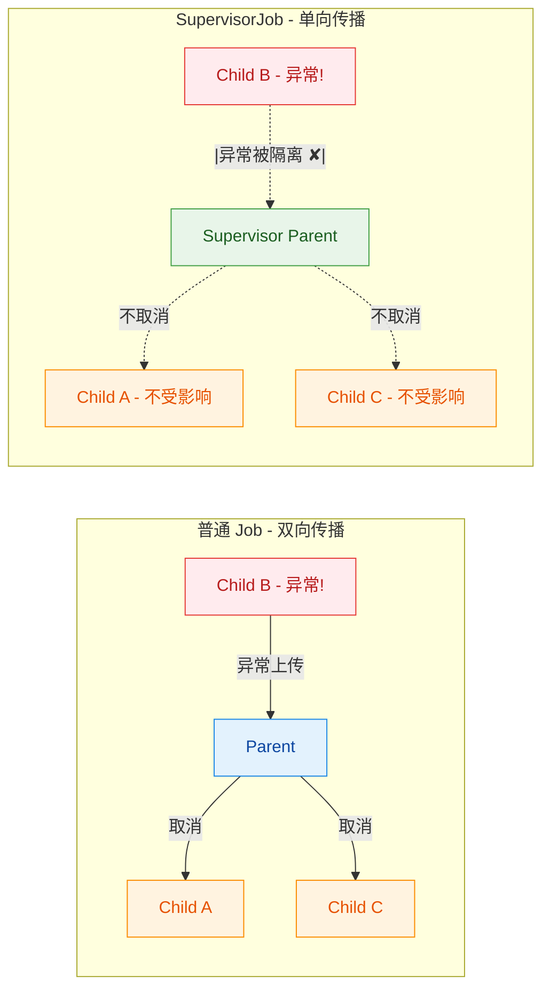

使用 `SupervisorJob` 有两种常见方式：

**方式一：在 CoroutineScope 中使用 SupervisorJob**

```kotlin
import kotlinx.coroutines.*

fun main() = runBlocking {
    val handler = CoroutineExceptionHandler { _, e ->
        println("Handler: ${e.message}")
    }

    // 使用 SupervisorJob 创建作用域
    val supervisor = CoroutineScope(SupervisorJob() + handler)

    val job1 = supervisor.launch {
        delay(100L)
        throw RuntimeException("Job1 崩溃了")
        // 异常不会影响 job2
    }

    val job2 = supervisor.launch {
        delay(200L)
        println("Job2 正常完成") // 这行会正常执行!
    }

    delay(500L)
    // 输出:
    // Handler: Job1 崩溃了
    // Job2 正常完成
}
```

**方式二：使用 `supervisorScope` 构建器**

`supervisorScope` 是一个挂起函数，它创建一个使用 `SupervisorJob` 的子作用域。与直接创建 `CoroutineScope(SupervisorJob())` 不同，`supervisorScope` 仍然遵循结构化并发——它会等待所有子协程完成后才返回。

```kotlin
import kotlinx.coroutines.*

fun main() = runBlocking {
    supervisorScope {
        val job1 = launch {
            delay(100L)
            throw RuntimeException("Job1 失败")
            // 异常不会取消 supervisorScope 和 job2
        }

        val job2 = launch {
            delay(200L)
            println("Job2 完成了") // 正常输出
        }

        // supervisorScope 会等待 job1 和 job2 都结束
    }
    // 注意：如果没有 CoroutineExceptionHandler，
    // job1 的异常仍然会导致程序崩溃
    println("supervisorScope 之后")
}
```

使用 `SupervisorJob` 时有一个极其常见的陷阱——**SupervisorJob 只对直接子协程有效**。如果你在 `supervisorScope` 的子协程内部再嵌套 `launch`，那个嵌套的 `launch` 使用的是普通 `Job`，异常传播行为又回到了默认模式。

```kotlin
import kotlinx.coroutines.*

fun main() = runBlocking {
    val handler = CoroutineExceptionHandler { _, e ->
        println("Handler: ${e.message}")
    }

    val scope = CoroutineScope(SupervisorJob() + handler)

    scope.launch { // 这是 supervisor 的直接子协程
        // 但这里面的 launch 用的是普通 Job!
        launch { // 孙子协程
            throw RuntimeException("孙子协程异常")
            // 这个异常会取消父协程（scope.launch 那个），
            // 但不会影响 scope 的其他直接子协程
        }
        launch {
            delay(200L)
            println("这行不会执行") // 被兄弟协程的异常取消了
        }
    }

    scope.launch { // 另一个直接子协程
        delay(300L)
        println("我不受影响") // 正常输出，因为 SupervisorJob 隔离了直接子协程
    }

    delay(500L)
}
```

最后，我们来对比一下三种异常处理策略的适用场景：

| 策略 | 适用场景 | 行为特点 |
|------|---------|---------|
| `try-catch` | 已知可能失败的具体操作 | 精确捕获，可恢复执行 |
| `CoroutineExceptionHandler` | 全局兜底，日志记录，Crash 上报 | 善后处理，无法恢复 |
| `SupervisorJob` | 多个独立并行任务，互不影响 | 隔离失败，保护兄弟协程 |

在实际项目中，这三者往往是组合使用的。比如在 Android 的 `ViewModel` 中，`viewModelScope` 默认使用 `SupervisorJob`，这样一个网络请求的失败不会取消其他请求。然后在每个 `launch` 内部用 `try-catch` 处理具体的业务异常，同时在 Application 级别设置 `CoroutineExceptionHandler` 作为最后的安全网。

```kotlin
// Android ViewModel 中的典型用法（伪代码示意）
class MyViewModel : ViewModel() {
    // viewModelScope 内部已经使用了 SupervisorJob + Dispatchers.Main.immediate

    fun loadDashboard() {
        // 三个请求互不影响（SupervisorJob 的功劳）
        viewModelScope.launch {
            try {
                val avatar = userRepository.loadAvatar() // 具体操作用 try-catch
                _avatarState.value = avatar
            } catch (e: Exception) {
                _avatarState.value = AvatarState.Error(e.message)
            }
        }

        viewModelScope.launch {
            try {
                val feeds = feedRepository.loadFeeds()
                _feedState.value = feeds
            } catch (e: Exception) {
                _feedState.value = FeedState.Error(e.message)
            }
        }

        viewModelScope.launch {
            try {
                val recommendations = recRepository.loadRecs()
                _recState.value = recommendations
            } catch (e: Exception) {
                _recState.value = RecState.Error(e.message)
            }
        }
    }
}
```

---

**📝 练习题**

以下代码的输出结果是什么？

```kotlin
fun main() = runBlocking {
    val handler = CoroutineExceptionHandler { _, e ->
        println("Caught: ${e.message}")
    }

    val scope = CoroutineScope(Job() + handler)

    scope.launch {
        launch {
            delay(100)
            throw RuntimeException("Boom")
        }
        launch {
            delay(200)
            println("Second child")
        }
    }

    delay(500)
    println("Done")
}
```

A. `Caught: Boom` → `Second child` → `Done`

B. `Caught: Boom` → `Done`

C. `Second child` → `Caught: Boom` → `Done`

D. 程序崩溃，无输出

**【答案】** B

**【解析】** `scope` 使用的是普通 `Job()`（不是 `SupervisorJob`），所以第一个子协程抛出异常后，异常会向上传播到 `scope.launch` 这个父协程。父协程会先取消所有子协程（包括第二个 `launch`），然后将异常继续向上传播到 `scope`。由于 `scope` 安装了 `CoroutineExceptionHandler`，异常被 handler 捕获并打印 `Caught: Boom`。第二个子协程因为被取消，`Second child` 不会输出。最后 `runBlocking` 中的 `delay(500)` 正常结束，打印 `Done`。如果把 `Job()` 换成 `SupervisorJob()`，结果就会变成 A。

---

## 通道 Channel

### 通道概念

在协程的世界里，`Deferred`（即 `async` 的返回值）只能传递一个单一的值。当我们需要在协程之间建立一条**持续的数据流通道**——一个协程不断地生产数据，另一个协程不断地消费数据——`Deferred` 就力不从心了。这正是 `Channel`（通道）登场的时刻。

`Channel` 的概念直接借鉴自 Go 语言的 channel 和 CSP（Communicating Sequential Processes）并发模型。其核心思想是：**不要通过共享内存来通信，而要通过通信来共享内存（Don't communicate by sharing memory; share memory by communicating）**。

你可以把 `Channel` 想象成一条**传送带**：生产者在一端放上物品，消费者在另一端取走物品。这条传送带是 **协程安全（coroutine-safe）** 的，多个协程可以同时向它发送或从它接收数据，而不需要额外的同步机制。

从 API 层面看，`Channel` 实现了两个接口：

- `SendChannel<E>`：定义了发送端的能力（`send`、`close`）。
- `ReceiveChannel<E>`：定义了接收端的能力（`receive`、`cancel`）。

```kotlin
// Channel 接口的简化定义
// Channel 同时实现了发送和接收两个接口
public interface Channel<E> : SendChannel<E>, ReceiveChannel<E>
```

它与 `BlockingQueue`（阻塞队列）非常相似，关键区别在于：`BlockingQueue` 使用**阻塞**的 `put` 和 `take` 操作（会阻塞线程），而 `Channel` 使用**挂起**的 `send` 和 `receive` 操作（只挂起协程，不阻塞线程）。这是本质性的差异，也是 Channel 能在协程体系中高效工作的根本原因。

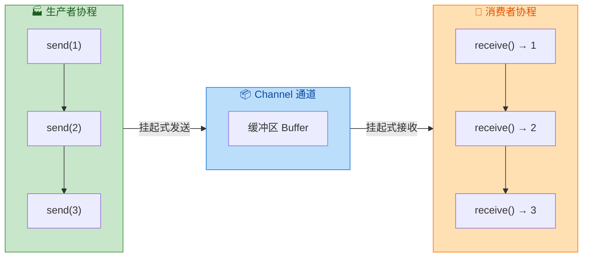

下面用一个最简单的例子来感受 Channel 的基本用法：

```kotlin
import kotlinx.coroutines.*
import kotlinx.coroutines.channels.*

fun main() = runBlocking {
    // 创建一个 Int 类型的通道，默认是 Rendezvous（会合）类型
    val channel = Channel<Int>()

    // 启动一个生产者协程
    launch {
        for (x in 1..5) {
            println("发送 $x")  // 打印发送日志
            channel.send(x)     // 挂起式发送，如果通道满了就挂起等待
        }
        channel.close()         // 发送完毕后关闭通道，通知消费者不会再有新数据
    }

    // 在主协程中消费数据
    // 使用 for-in 迭代通道，通道关闭后循环自动结束
    for (value in channel) {
        println("接收到 $value")
    }

    println("通道已关闭，消费完毕")
}
```

运行输出（由于是 Rendezvous 通道，发送和接收严格交替）：

```
发送 1
接收到 1
发送 2
接收到 2
发送 3
接收到 3
发送 4
接收到 4
发送 5
接收到 5
通道已关闭，消费完毕
```

这个例子展示了 Channel 最核心的三个操作：`send`、`receive`（通过 for-in 隐式调用）和 `close`。接下来我们逐一深入。

---

### 发送 send

`send` 是 `SendChannel` 接口上定义的**挂起函数（suspend function）**，用于向通道中发射一个元素。

```kotlin
// SendChannel 接口中的 send 签名
public interface SendChannel<in E> {
    // 向通道发送指定的元素 element
    // 如果通道的缓冲区已满，该函数会挂起，直到有空间可用
    public suspend fun send(element: E)

    // 非挂起版本的尝试发送（Kotlin 1.5+ 推荐使用 trySend 替代已废弃的 offer）
    // 立即返回结果，不会挂起
    public fun trySend(element: E): ChannelResult<Unit>
}
```

`send` 的行为取决于通道当前的状态：

1. **通道有空闲缓冲空间**：`send` 将元素放入缓冲区，立即返回，不挂起。
2. **通道缓冲区已满（或无缓冲）**：`send` 会**挂起**当前协程，直到有消费者调用 `receive` 取走元素腾出空间。
3. **通道已关闭**：`send` 会抛出 `ClosedSendChannelException`。

```kotlin
import kotlinx.coroutines.*
import kotlinx.coroutines.channels.*

fun main() = runBlocking {
    // 创建一个容量为 2 的缓冲通道
    val channel = Channel<String>(capacity = 2)

    launch {
        val items = listOf("A", "B", "C", "D")
        for (item in items) {
            println("准备发送 $item ...")
            channel.send(item)  // 缓冲区满时会挂起
            println("已发送 $item")
        }
        channel.close()  // 所有数据发送完毕，关闭通道
    }

    // 故意延迟消费，观察 send 的挂起行为
    delay(1000)  // 等待 1 秒，让生产者先跑
    println("--- 开始消费 ---")
    for (value in channel) {
        println("接收到: $value")
        delay(500)  // 模拟消费耗时
    }
}
```

输出类似：

```
准备发送 A ...
已发送 A
准备发送 B ...
已发送 B
准备发送 C ...
（此处 C 挂起了，因为缓冲区容量为 2，已被 A 和 B 占满）
--- 开始消费 ---
接收到: A
已发送 C
准备发送 D ...
接收到: B
已发送 D
接收到: C
接收到: D
```

可以清晰地看到：A 和 B 顺利进入缓冲区，但发送 C 时缓冲区已满，`send` 挂起等待。直到消费者取走 A，C 才得以发送成功。

`trySend` 是 `send` 的非挂起版本（non-suspending counterpart），它不会挂起协程，而是立即返回一个 `ChannelResult`，告诉你发送是否成功：

```kotlin
import kotlinx.coroutines.*
import kotlinx.coroutines.channels.*

fun main() = runBlocking {
    // 容量为 1 的缓冲通道
    val channel = Channel<Int>(capacity = 1)

    // 第一次 trySend：缓冲区空，发送成功
    val result1 = channel.trySend(1)
    println("trySend(1): ${result1.isSuccess}")  // true

    // 第二次 trySend：缓冲区已满，发送失败
    val result2 = channel.trySend(2)
    println("trySend(2): ${result2.isSuccess}")  // false

    // 取走一个元素后再试
    channel.receive()  // 取走 1
    val result3 = channel.trySend(2)
    println("trySend(2) 重试: ${result3.isSuccess}")  // true

    channel.close()
}
```

`trySend` 适合在不能挂起的上下文中使用（比如回调函数、普通函数），或者当你希望在通道满时执行降级策略（如丢弃、日志告警）而非阻塞等待时。

---

### 接收 receive

`receive` 是 `ReceiveChannel` 接口上定义的挂起函数，用于从通道中取出一个元素。

```kotlin
// ReceiveChannel 接口中的核心方法
public interface ReceiveChannel<out E> {
    // 从通道接收一个元素
    // 如果通道为空，该函数会挂起，直到有新元素可用
    // 如果通道已关闭且为空，抛出 ClosedReceiveChannelException
    public suspend fun receive(): E

    // 非挂起版本的尝试接收
    public fun tryReceive(): ChannelResult<E>

    // 接收并返回一个 ChannelResult，通道关闭时返回 closed 结果而非抛异常
    public suspend fun receiveCatching(): ChannelResult<E>
}
```

`receive` 的行为同样取决于通道状态：

1. **通道中有元素**：立即取出并返回，不挂起。
2. **通道为空但未关闭**：**挂起**当前协程，等待生产者 `send` 新元素。
3. **通道为空且已关闭**：抛出 `ClosedReceiveChannelException`。

正因为第三种情况会抛异常，实际开发中我们更推荐使用 `receiveCatching` 或 `for-in` 循环来安全地消费通道：

```kotlin
import kotlinx.coroutines.*
import kotlinx.coroutines.channels.*

fun main() = runBlocking {
    val channel = Channel<Int>()

    // 生产者：发送 3 个元素后关闭
    launch {
        for (i in 1..3) {
            channel.send(i)
        }
        channel.close()  // 关闭通道
    }

    // === 方式一：for-in 循环（推荐，最简洁） ===
    // 通道关闭后循环自动结束，无需手动判断
    // for (value in channel) {
    //     println(value)
    // }

    // === 方式二：receiveCatching（安全接收） ===
    // 返回 ChannelResult，可以区分"成功接收"、"通道关闭"、"失败"
    while (true) {
        val result = channel.receiveCatching()  // 不会抛异常
        if (result.isClosed) {
            println("通道已关闭，退出循环")
            break
        }
        println("接收到: ${result.getOrNull()}")  // 安全获取值
    }

    // === 方式三：tryReceive（非挂起，立即返回） ===
    // 适合轮询场景，但通常不推荐，因为会浪费 CPU
    // val result = channel.tryReceive()
    // if (result.isSuccess) { ... }
}
```

下面这张图总结了三种接收方式的适用场景：

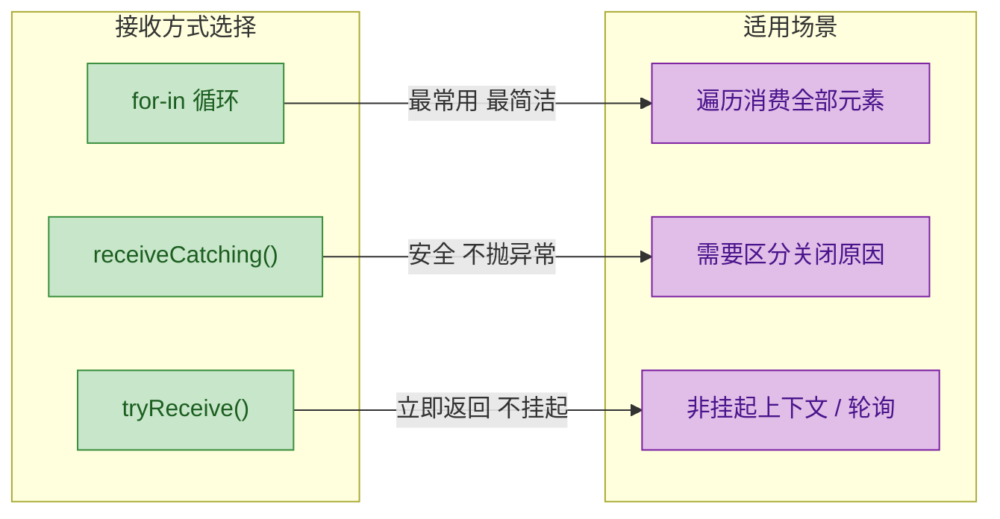

一个常见的陷阱是：在通道关闭后调用 `receive` 会抛异常。来看一个对比：

```kotlin
import kotlinx.coroutines.*
import kotlinx.coroutines.channels.*

fun main() = runBlocking {
    val channel = Channel<Int>()

    launch {
        channel.send(42)
        channel.close()  // 发送一个元素后立即关闭
    }

    // 第一次 receive：成功取到 42
    println(channel.receive())  // 输出: 42

    // 第二次 receive：通道已关闭且为空，抛出异常！
    try {
        channel.receive()  // ClosedReceiveChannelException
    } catch (e: ClosedReceiveChannelException) {
        println("捕获异常: ${e.message}")  // Channel was closed
    }

    // 安全的做法：使用 receiveCatching
    // val result = channel.receiveCatching()
    // println(result.isClosed)  // true，不会抛异常
}
```

---

### 关闭 close

`close` 是通道生命周期管理中最关键的操作。它向通道发送一个特殊的**关闭令牌（close token）**，表示"不会再有新元素了"。

```kotlin
// SendChannel 接口中的 close 方法
public interface SendChannel<in E> {
    // 关闭通道
    // cause 参数可选，用于传递关闭原因（异常）
    // 关闭后：send 会抛异常，但已在缓冲区中的元素仍可被 receive
    public fun close(cause: Throwable? = null): Boolean
}
```

理解 `close` 的关键在于：**关闭是单向的，且不会丢弃已缓冲的数据**。

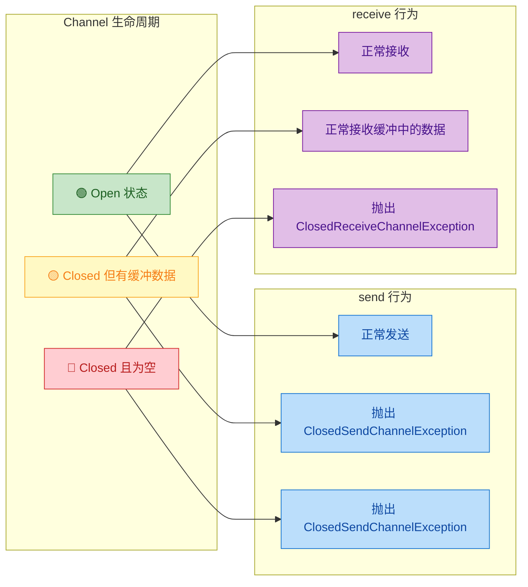

来看一个展示"关闭后仍可接收缓冲数据"的例子：

```kotlin
import kotlinx.coroutines.*
import kotlinx.coroutines.channels.*

fun main() = runBlocking {
    // 容量为 5 的缓冲通道
    val channel = Channel<Int>(capacity = 5)

    // 生产者：一口气发送 5 个元素，然后立即关闭
    launch {
        for (i in 1..5) {
            channel.send(i)       // 缓冲区足够大，不会挂起
            println("已发送: $i")
        }
        channel.close()           // 关闭通道
        println("通道已关闭")

        // 关闭后再尝试发送
        try {
            channel.send(6)       // 抛出 ClosedSendChannelException
        } catch (e: ClosedSendChannelException) {
            println("关闭后发送失败: ${e.message}")
        }
    }

    // 消费者：延迟一会儿再开始消费
    delay(100)
    println("--- 开始消费 ---")

    // 即使通道已关闭，缓冲区中的 5 个元素仍然可以被接收
    for (value in channel) {
        println("接收到: $value")
    }
    println("所有数据消费完毕")
}
```

输出：

```
已发送: 1
已发送: 2
已发送: 3
已发送: 4
已发送: 5
通道已关闭
关闭后发送失败: Channel was closed
--- 开始消费 ---
接收到: 1
接收到: 2
接收到: 3
接收到: 4
接收到: 5
所有数据消费完毕
```

这证明了 `close` 的语义是"不再接受新数据"，而非"立即清空通道"。已经在缓冲区中的数据会被完整地交付给消费者。

还有一个重要的概念是**带异常的关闭**。你可以通过 `close(cause)` 传递一个异常，表示通道因错误而关闭：

```kotlin
import kotlinx.coroutines.*
import kotlinx.coroutines.channels.*

fun main() = runBlocking {
    val channel = Channel<Int>()

    launch {
        channel.send(1)
        channel.send(2)
        // 模拟发生错误，带异常关闭通道
        channel.close(IllegalStateException("数据源出错"))
    }

    // receiveCatching 可以拿到关闭原因
    while (true) {
        val result = channel.receiveCatching()
        if (result.isClosed) {
            // exceptionOrNull() 可以获取 close 时传入的异常
            val cause = result.exceptionOrNull()
            println("通道关闭，原因: $cause")
            break
        }
        println("接收到: ${result.getOrNull()}")
    }
}
```

输出：

```
接收到: 1
接收到: 2
通道关闭，原因: java.lang.IllegalStateException: 数据源出错
```

最后，关于 `close` 和 `cancel` 的区别需要特别注意：

```kotlin
// close()：优雅关闭，已缓冲的数据仍可被消费
// 属于 SendChannel 的方法
// 语义：生产者说"我不会再发了，但你把剩下的消费完"
channel.close()

// cancel()：强制取消，丢弃所有未消费的缓冲数据
// 属于 ReceiveChannel 的方法
// 语义：消费者说"我不要了，全部丢掉"
channel.cancel()
```

```kotlin
import kotlinx.coroutines.*
import kotlinx.coroutines.channels.*

fun main() = runBlocking {
    // 演示 cancel 会丢弃缓冲数据
    val channel = Channel<Int>(capacity = 10)

    launch {
        for (i in 1..10) {
            channel.send(i)  // 全部放入缓冲区
        }
    }

    delay(50)  // 等待生产者发送完毕

    // 只消费前 3 个
    repeat(3) {
        println("接收到: ${channel.receive()}")
    }

    // 消费者不想要剩下的了，直接 cancel
    channel.cancel()  // 缓冲区中剩余的 4~10 全部被丢弃
    println("通道已取消")

    // 此时再 receive 会抛 CancellationException
    try {
        channel.receive()
    } catch (e: CancellationException) {
        println("取消后接收失败: ${e.message}")
    }
}
```

用一张内存模型图来总结 Channel 的完整结构：

```kotlin
// Channel 内部结构示意（简化）
//
// ┌─────────────────────────────────────────────────┐
// │                  Channel<E>                      │
// │                                                  │
// │  SendChannel<E>          ReceiveChannel<E>       │
// │  ┌──────────────┐       ┌───────────────────┐    │
// │  │ send(e)      │       │ receive(): E      │    │
// │  │ trySend(e)   │       │ tryReceive()      │    │
// │  │ close()      │       │ receiveCatching() │    │
// │  └──────┬───────┘       │ cancel()          │    │
// │         │               └────────┬──────────┘    │
// │         ▼                        ▲               │
// │  ┌──────────────────────────────────────────┐    │
// │  │         Buffer (缓冲区)                   │    │
// │  │  [ E₁ | E₂ | E₃ | ... | Eₙ ]           │    │
// │  │  容量由 Channel(capacity) 决定            │    │
// │  └──────────────────────────────────────────┘    │
// │                                                  │
// │  isClosedForSend: Boolean  // 是否对发送关闭     │
// │  isClosedForReceive: Boolean // 是否对接收关闭   │
// │  (对接收关闭 = 对发送关闭 + 缓冲区为空)          │
// └─────────────────────────────────────────────────┘
```

---

**📝 练习题**

以下代码的输出是什么？

```kotlin
fun main() = runBlocking {
    val channel = Channel<Int>(capacity = 2)
    
    launch {
        for (i in 1..4) {
            channel.send(i)
        }
        channel.close()
    }
    
    delay(100)
    val first = channel.receive()
    val second = channel.receive()
    println("$first, $second")
    
    val result = channel.receiveCatching()
    println("${result.getOrNull()}, isClosed=${result.isClosed}")
}
```

A. `1, 2` 然后 `null, isClosed=true`

B. `1, 2` 然后 `3, isClosed=false`

C. `3, 4` 然后 `null, isClosed=true`

D. `1, 2` 然后 `3, isClosed=true`

**【答案】** B

**【解析】** 通道容量为 2，生产者发送 1~4。前两个元素（1、2）直接进入缓冲区，发送 3 时缓冲区已满，`send(3)` 挂起。`delay(100)` 后消费者开始接收，`receive()` 取走 1 和 2（输出 `1, 2`）。取走后缓冲区有空间，生产者恢复执行，依次发送 3 和 4，然后 `close()`。此时缓冲区中还有 3 和 4。`receiveCatching()` 取到 3，通道尚未对接收关闭（因为缓冲区中还有 4），所以 `isClosed=false`，`getOrNull()` 返回 3。最终输出 `1, 2` 然后 `3, isClosed=false`。

---

## 通道类型（Channel Types）

在上一节中我们了解了 Channel 的基本概念——它是协程之间传递数据的管道。但在实际使用中，一个关键问题是：当生产者发送数据的速度和消费者接收数据的速度不匹配时，Channel 该如何表现？是让生产者等待，还是允许它继续发送？能缓存多少数据？

这就是 Channel 容量策略（capacity policy）要解决的问题。Kotlin 协程库提供了四种内置的通道类型，每种类型对应不同的缓冲行为和背压（backpressure）策略。理解它们的区别，是写出高效、不死锁的协程通信代码的基础。

Channel 的类型由创建时传入的 `capacity` 参数决定，Kotlin 在 `Channel` 伴生对象中定义了四个常量：

```kotlin
// Channel 伴生对象中的容量常量
val RENDEZVOUS = 0        // 会合通道，容量为 0
val BUFFERED = 64         // 默认缓冲大小（可通过系统属性修改）
val CONFLATED = -1        // 冲突通道，只保留最新值
val UNLIMITED = Int.MAX_VALUE  // 无限容量通道
```

我们先用一张全局视图来建立直觉，然后逐一深入每种类型。

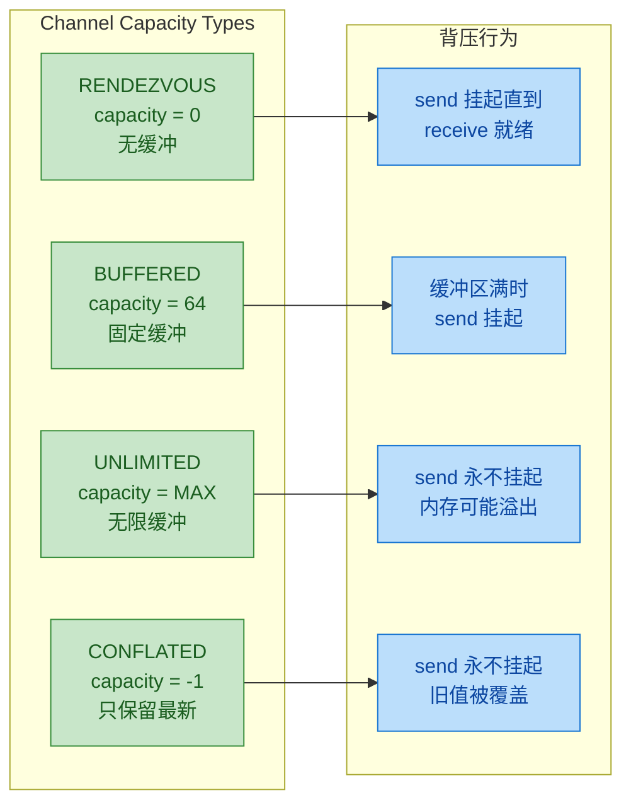

---

### 会合通道（Rendezvous Channel）

会合通道是 Channel 的默认类型，容量为 0。"Rendezvous" 这个词来自法语，意思是"约会、会面"——非常形象地描述了这种通道的行为：发送方和接收方必须"见面"才能完成数据交换。

当你调用 `Channel<T>()` 而不传任何参数，或者显式传入 `Channel.RENDEZVOUS` 时，得到的就是会合通道：

```kotlin
// 以下两种写法等价，都创建会合通道
val channel1 = Channel<Int>()                    // 默认就是 RENDEZVOUS
val channel2 = Channel<Int>(Channel.RENDEZVOUS)  // 显式指定
```

会合通道的核心规则非常简单：没有任何缓冲区。`send()` 会挂起，直到有协程调用 `receive()`；反过来，`receive()` 也会挂起，直到有协程调用 `send()`。两者必须同时就绪，数据才能从发送方直接传递到接收方，就像两个人面对面递东西。

```kotlin
import kotlinx.coroutines.*
import kotlinx.coroutines.channels.*

fun main() = runBlocking {
    // 创建一个会合通道，容量为 0
    val channel = Channel<String>()

    // 启动生产者协程
    launch {
        println("[生产者] 准备发送 A...")
        channel.send("A")  // 挂起！因为此时还没有人 receive
        println("[生产者] A 已发送")  // 只有消费者 receive 之后才会打印

        println("[生产者] 准备发送 B...")
        channel.send("B")  // 再次挂起，等待下一次 receive
        println("[生产者] B 已发送")

        channel.close()  // 发送完毕，关闭通道
    }

    // 主协程充当消费者，故意延迟来观察行为
    delay(1000)  // 延迟 1 秒，让生产者先到达 send 并挂起
    println("[消费者] 准备接收第一个值...")
    val first = channel.receive()  // 此时生产者的 send("A") 恢复
    println("[消费者] 收到: $first")

    delay(1000)  // 再延迟 1 秒
    println("[消费者] 准备接收第二个值...")
    val second = channel.receive()  // 生产者的 send("B") 恢复
    println("[消费者] 收到: $second")
}
```

运行输出的时间线大致如下：

```
[生产者] 准备发送 A...
                          ← 生产者在 send("A") 处挂起，等待 1 秒
[消费者] 准备接收第一个值...
[生产者] A 已发送          ← send 和 receive 同时完成
[消费者] 收到: A
[生产者] 准备发送 B...
                          ← 生产者在 send("B") 处再次挂起
[消费者] 准备接收第二个值...
[生产者] B 已发送
[消费者] 收到: B
```

会合通道的内存模型可以这样理解——通道内部没有任何存储空间，数据直接在两个协程之间"握手传递"：

```kotlin
// 会合通道的内存模型（概念图）
//
// 生产者协程                    消费者协程
// ┌──────────┐                ┌──────────┐
// │ send("A")│───── 握手 ─────│ receive()│
// │  挂起... │   直接传递数据  │  挂起... │
// └──────────┘                └──────────┘
//        ↕                          ↕
//   谁先到谁等待              谁先到谁等待
//
// 通道内部缓冲区大小 = 0，没有中间存储
```

会合通道的典型使用场景是需要严格同步的协程协作。比如你希望生产者每产生一条数据，消费者就立即处理，不允许任何积压。这在需要精确控制执行顺序的场景中非常有用，但也意味着吞吐量受限于较慢的一方。

---

### 缓冲通道（Buffered Channel）

缓冲通道在发送方和接收方之间引入了一个固定大小的缓冲区。只要缓冲区没满，`send()` 就可以立即完成而不挂起；只有当缓冲区满了，`send()` 才会挂起等待消费者腾出空间。

```kotlin
// 创建一个容量为 3 的缓冲通道
val channel = Channel<Int>(capacity = 3)

// 使用默认缓冲大小（64）
val defaultBuffered = Channel<Int>(Channel.BUFFERED)
```

`Channel.BUFFERED` 的默认值是 64，但可以通过 JVM 系统属性 `kotlinx.coroutines.channels.defaultBuffer` 来修改。在大多数场景下，你会直接传入一个具体的数字来精确控制缓冲区大小。

缓冲通道的行为可以类比为一个固定长度的队列：生产者往队尾放数据，消费者从队头取数据。队列没满时生产者畅通无阻，队列满了生产者就得排队等。

```kotlin
import kotlinx.coroutines.*
import kotlinx.coroutines.channels.*

fun main() = runBlocking {
    // 创建容量为 3 的缓冲通道
    val channel = Channel<Int>(capacity = 3)

    // 生产者：快速发送 5 个元素
    val producer = launch {
        for (i in 1..5) {
            println("[生产者] 发送 $i ...")
            channel.send(i)  // 前 3 个不会挂起，第 4 个开始挂起
            println("[生产者] $i 已进入缓冲区")
        }
        channel.close()
    }

    // 消费者：故意慢速消费，每次间隔 1 秒
    val consumer = launch {
        delay(2000)  // 先等 2 秒，让生产者把缓冲区填满
        for (value in channel) {
            println("[消费者] 收到: $value")
            delay(1000)  // 模拟慢速处理
        }
    }

    producer.join()
    consumer.join()
}
```

输出的时间线揭示了缓冲通道的核心行为：

```
[生产者] 发送 1 ...
[生产者] 1 已进入缓冲区    ← 缓冲区: [1]，未满，不挂起
[生产者] 发送 2 ...
[生产者] 2 已进入缓冲区    ← 缓冲区: [1, 2]，未满
[生产者] 发送 3 ...
[生产者] 3 已进入缓冲区    ← 缓冲区: [1, 2, 3]，刚好满
[生产者] 发送 4 ...
                           ← 缓冲区已满！生产者在 send(4) 处挂起
                           ← 等待 2 秒后消费者开始工作...
[消费者] 收到: 1           ← 消费者取走 1，缓冲区腾出空间
[生产者] 4 已进入缓冲区    ← 生产者恢复，4 进入缓冲区
[生产者] 发送 5 ...
                           ← 缓冲区又满了，再次挂起
[消费者] 收到: 2
[生产者] 5 已进入缓冲区
[消费者] 收到: 3
[消费者] 收到: 4
[消费者] 收到: 5
```

下面用一个动态过程图来展示缓冲区的状态变化：

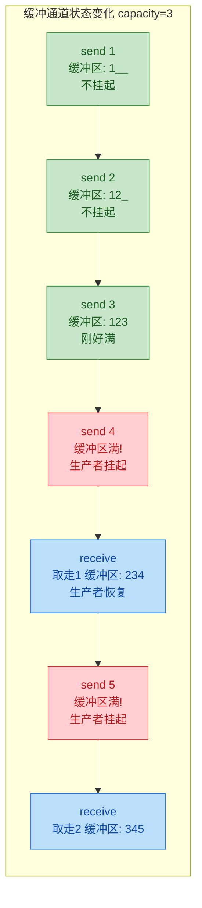

缓冲通道是实际开发中最常用的类型。它的核心价值在于解耦生产者和消费者的速度差异——生产者可以"突发"地快速产生一批数据，消费者按自己的节奏慢慢处理，缓冲区充当了两者之间的"蓄水池"。

选择缓冲区大小是一门平衡的艺术：太小则生产者频繁挂起，吞吐量上不去；太大则占用过多内存，且数据在缓冲区中滞留时间过长。一般的经验法则是：根据消费者的处理速度和生产者的突发量来估算，通常 16~128 是比较合理的范围。

---

### 无限容量通道（Unlimited Channel）

无限容量通道的缓冲区大小为 `Int.MAX_VALUE`（约 21 亿），在实际意义上等同于"无限"。`send()` 永远不会因为缓冲区满而挂起——每次调用都会立即将元素放入内部队列并返回。

```kotlin
// 创建无限容量通道
val channel = Channel<Int>(Channel.UNLIMITED)
```

这听起来很美好——生产者永远不阻塞，代码写起来最简单。但天下没有免费的午餐，无限容量通道的代价是内存风险。如果生产者持续快于消费者，数据会在通道内部无限堆积，最终可能导致 `OutOfMemoryError`。

```kotlin
import kotlinx.coroutines.*
import kotlinx.coroutines.channels.*

fun main() = runBlocking {
    // 创建无限容量通道
    val channel = Channel<Int>(Channel.UNLIMITED)

    // 生产者：瞬间发送大量数据，send 永不挂起
    val producer = launch {
        for (i in 1..1_000_000) {
            channel.send(i)  // 永远不会挂起，全部进入内存队列
        }
        println("[生产者] 100 万条数据全部发送完毕")
        channel.close()
    }

    // 消费者：慢速消费
    val consumer = launch {
        var count = 0
        for (value in channel) {
            count++
            if (count % 200_000 == 0) {
                println("[消费者] 已处理 $count 条")
                delay(100)  // 模拟处理耗时
            }
        }
        println("[消费者] 全部处理完毕，共 $count 条")
    }

    producer.join()
    consumer.join()
}
```

在这个例子中，生产者几乎瞬间就把 100 万条数据全部塞进了通道的内部队列，而消费者还在慢慢处理。这 100 万条数据全部驻留在内存中，如果数据量更大或者每条数据体积更大，内存就会被撑爆。

```kotlin
// 无限容量通道的内存模型
//
// 生产者                    通道内部队列                    消费者
// ┌──────┐    send()     ┌──────────────────────┐    receive()   ┌──────┐
// │ 快速 │──────────────→│ 1 2 3 4 5 ... 99999  │──────────────→│ 慢速 │
// │ 生产 │   永不挂起     │   无限增长的队列！      │   按需取出     │ 消费 │
// └──────┘               └──────────────────────┘               └──────┘
//                              ↑
//                         内存持续增长
//                         OOM 风险！
```

那什么时候该用无限容量通道？典型场景是：你能确保生产者的总数据量是有限的，或者消费者的速度不会长期慢于生产者。比如事件总线（Event Bus）场景中，事件的产生是偶发的、突发量有限的，用无限容量通道可以避免事件丢失，同时简化代码逻辑。

---

### 冲突通道（Conflated Channel）

冲突通道是四种类型中最特殊的一个。它的缓冲区只保留最新的一个值——每次 `send()` 都会立即成功（永不挂起），但如果上一个值还没被消费者取走，它就会被新值直接覆盖（conflate，合并/冲突）。

```kotlin
// 创建冲突通道
val channel = Channel<Int>(Channel.CONFLATED)
```

"Conflated" 这个词在英文中有"合并、混合"的意思。在这里的语义是：当新数据到来时，旧的未消费数据被"合并"掉了——实际上就是被丢弃了，只保留最新状态。

```kotlin
import kotlinx.coroutines.*
import kotlinx.coroutines.channels.*

fun main() = runBlocking {
    // 创建冲突通道
    val channel = Channel<Int>(Channel.CONFLATED)

    // 生产者：快速发送 1 到 10
    launch {
        for (i in 1..10) {
            println("[生产者] 发送 $i")
            channel.send(i)  // 永不挂起，但旧值会被覆盖
        }
        channel.close()
    }

    // 消费者：故意延迟，让生产者先把数据全部发完
    delay(500)  // 等待 500ms，生产者早已发完全部数据

    // 此时通道中只保留了最后一个值
    for (value in channel) {
        println("[消费者] 收到: $value")
    }
}
```

输出结果：

```
[生产者] 发送 1
[生产者] 发送 2
[生产者] 发送 3
[生产者] 发送 4
[生产者] 发送 5
[生产者] 发送 6
[生产者] 发送 7
[生产者] 发送 8
[生产者] 发送 9
[生产者] 发送 10
[消费者] 收到: 10
```

消费者只收到了 `10`！前面的 1~9 全部被后来的值覆盖了。这不是 bug，这是 conflated channel 的设计意图。

让我们用一个更贴近实际的例子来理解为什么需要这种行为——传感器数据采集：

```kotlin
import kotlinx.coroutines.*
import kotlinx.coroutines.channels.*

// 模拟温度传感器，每 100ms 产生一个读数
fun main() = runBlocking {
    val sensorChannel = Channel<Double>(Channel.CONFLATED)

    // 传感器：高频率产生温度数据
    val sensor = launch {
        var temp = 20.0
        repeat(100) {  // 产生 100 个读数
            temp += (-0.5..0.5).random()  // 模拟温度波动
            sensorChannel.send(temp)       // 永不挂起，旧值被覆盖
            delay(100)                     // 每 100ms 一个读数
        }
        sensorChannel.close()
    }

    // UI 更新：每 1 秒刷新一次显示（比传感器慢 10 倍）
    val display = launch {
        for (temp in sensorChannel) {
            // 每次拿到的都是最新的温度值
            // 中间被跳过的旧值对 UI 显示没有意义
            println("[显示] 当前温度: ${"%.1f".format(temp)}°C")
            delay(1000)  // UI 每秒刷新一次
        }
    }

    sensor.join()
    display.join()
}
```

在这个场景中，传感器每 100ms 产生一个温度读数，但 UI 每秒才刷新一次。中间那些没被消费的读数是"过时的状态"，丢弃它们完全合理——UI 只需要展示最新温度。如果用缓冲通道，消费者会逐个处理所有历史数据，导致显示的温度越来越"滞后"。

冲突通道的内部状态变化过程：

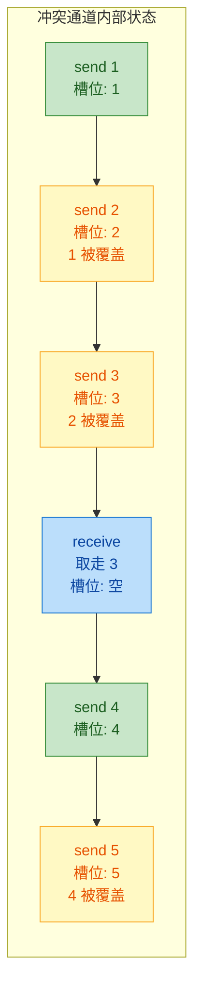

---

### 四种通道类型对比

理解了每种类型的细节后，我们把它们放在一起做一个系统性的对比。这张表值得收藏，在实际选型时可以快速查阅：

```kotlin
// 四种通道类型速查表
//
// ┌──────────────┬────────────┬──────────────┬──────────────┬───────────────┐
// │              │ RENDEZVOUS │   BUFFERED   │  UNLIMITED   │   CONFLATED   │
// │              │  (默认)     │  (固定缓冲)   │  (无限缓冲)   │  (只留最新)    │
// ├──────────────┼────────────┼──────────────┼──────────────┼───────────────┤
// │ capacity     │     0      │   N (默认64)  │ Int.MAX_VALUE│     -1        │
// ├──────────────┼────────────┼──────────────┼──────────────┼───────────────┤
// │ send 挂起?   │ 总是挂起    │ 缓冲满时挂起  │  永不挂起     │   永不挂起     │
// │              │(等receive) │              │              │               │
// ├──────────────┼────────────┼──────────────┼──────────────┼───────────────┤
// │ receive 挂起?│ 总是挂起    │ 缓冲空时挂起  │ 缓冲空时挂起  │  缓冲空时挂起  │
// │              │(等send)    │              │              │               │
// ├──────────────┼────────────┼──────────────┼──────────────┼───────────────┤
// │ 数据丢失?    │    否      │     否       │     否       │    是(旧值)    │
// ├──────────────┼────────────┼──────────────┼──────────────┼───────────────┤
// │ OOM 风险?    │    否      │     否       │     是       │     否        │
// ├──────────────┼────────────┼──────────────┼──────────────┼───────────────┤
// │ 典型场景     │ 严格同步    │ 通用生产消费  │ 事件总线      │  状态/传感器   │
// │              │ 握手传递    │ 速率解耦      │ 有限突发      │  只关心最新值  │
// └──────────────┴────────────┴──────────────┴──────────────┴───────────────┘
```

### BufferOverflow 策略与自定义缓冲行为

除了上面四种预定义类型，Kotlin 协程库还提供了更细粒度的控制方式。`Channel()` 工厂函数接受一个 `onBufferOverflow` 参数，允许你在缓冲区满时指定不同的溢出策略：

```kotlin
import kotlinx.coroutines.channels.*

// BufferOverflow 枚举有三个值：
// SUSPEND    — 缓冲区满时 send 挂起（默认行为）
// DROP_OLDEST — 缓冲区满时丢弃最旧的元素，send 不挂起
// DROP_LATEST — 缓冲区满时丢弃最新要发送的元素，send 不挂起

// 示例：容量为 3，满了就丢弃最旧的元素
val channel = Channel<Int>(
    capacity = 3,                              // 缓冲区大小为 3
    onBufferOverflow = BufferOverflow.DROP_OLDEST  // 满了丢最旧的
)
```

这三种溢出策略的行为差异如下：

```kotlin
import kotlinx.coroutines.*
import kotlinx.coroutines.channels.*

fun main() = runBlocking {
    println("=== DROP_OLDEST 策略 ===")
    testOverflow(BufferOverflow.DROP_OLDEST)

    println("\n=== DROP_LATEST 策略 ===")
    testOverflow(BufferOverflow.DROP_LATEST)
}

suspend fun testOverflow(policy: BufferOverflow) {
    // 创建容量为 3 的通道，使用指定的溢出策略
    val channel = Channel<Int>(
        capacity = 3,
        onBufferOverflow = policy
    )

    // 生产者：快速发送 1~6
    for (i in 1..6) {
        channel.send(i)  // 不会挂起！溢出时按策略丢弃
        println("  发送: $i")
    }
    channel.close()

    // 消费者：一次性取出所有剩余元素
    print("  收到: ")
    for (value in channel) {
        print("$value ")
    }
    println()
}
```

输出：

```
=== DROP_OLDEST 策略 ===
  发送: 1
  发送: 2
  发送: 3
  发送: 4       ← 缓冲区满，丢弃最旧的 1
  发送: 5       ← 丢弃 2
  发送: 6       ← 丢弃 3
  收到: 4 5 6   ← 只剩最新的三个

=== DROP_LATEST 策略 ===
  发送: 1
  发送: 2
  发送: 3
  发送: 4       ← 缓冲区满，丢弃当前要发送的 4
  发送: 5       ← 丢弃 5
  发送: 6       ← 丢弃 6
  收到: 1 2 3   ← 只剩最早的三个
```

`DROP_OLDEST` 的效果类似于一个滑动窗口，始终保留最近 N 个值；`DROP_LATEST` 则像一个"先到先得"的固定容器，满了就拒绝新数据。实际上，`Channel.CONFLATED` 在内部实现上等价于 `capacity = 1, onBufferOverflow = BufferOverflow.DROP_OLDEST`。

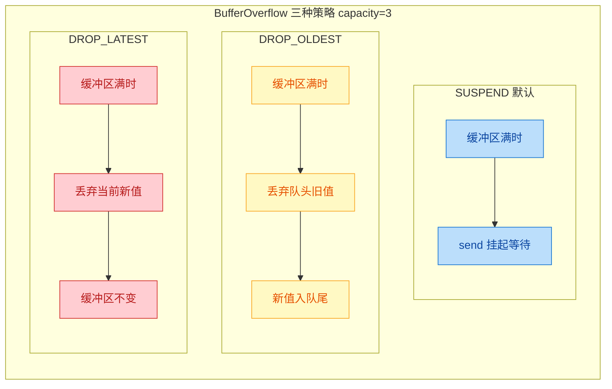

### 通道类型的选型指南

面对实际项目，如何选择合适的通道类型？这里给出一个决策思路：

首先问自己：数据能不能丢？如果不能丢（比如订单消息、日志事件），那就排除 CONFLATED 和 DROP 策略。接下来问：生产者和消费者的速率差异大吗？如果差异不大或需要严格同步，用 RENDEZVOUS；如果有一定差异但总量可控，用 BUFFERED；如果生产者有大量突发但总量有限，可以考虑 UNLIMITED。

如果数据可以丢（比如 UI 状态更新、传感器读数），那 CONFLATED 是最佳选择——它天然地只保留最新状态，既不会 OOM，也不会让消费者处理过时数据。

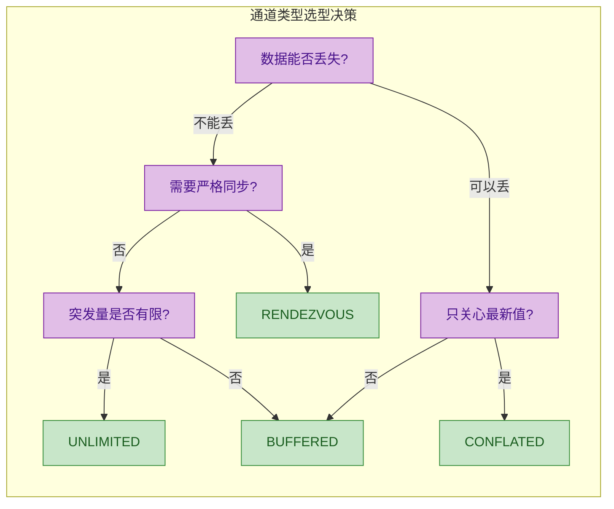

---

**📝 练习题**

以下代码的输出结果是什么？

```kotlin
fun main() = runBlocking {
    val channel = Channel<Int>(Channel.CONFLATED)

    launch {
        channel.send(1)
        channel.send(2)
        channel.send(3)
        delay(200)
        channel.send(4)
        channel.send(5)
        channel.close()
    }

    delay(100)
    println(channel.receive())
    delay(300)
    println(channel.receive())
}
```

A. 1 然后 4

B. 3 然后 5

C. 1 然后 5

D. 3 然后 4

**【答案】** B

**【解析】** 这道题考查 CONFLATED 通道的核心行为——只保留最新值。生产者先连续发送 1、2、3，由于是冲突通道，1 被 2 覆盖，2 被 3 覆盖，通道中只保留 3。100ms 后消费者调用 `receive()` 拿到 3。接着生产者在 200ms 时发送 4，紧接着发送 5，4 被 5 覆盖。消费者在 300ms 后再次 `receive()`，拿到的是 5。所以输出是 `3` 然后 `5`，选 B。这个例子清晰地展示了 conflated channel 的"只关心最新状态"语义——中间的过渡值（1、2、4）全部被丢弃，消费者永远只看到最新的快照。

---

## 生产者消费者（Producer-Consumer）

在并发编程中，**生产者-消费者模式（Producer-Consumer Pattern）** 是最经典的协作模型之一：一方负责生产数据，另一方负责消费数据，中间通过一个共享的缓冲区（在协程世界里就是 Channel）来解耦。前面我们已经学习了 Channel 的基本收发操作，但手动创建 Channel、手动管理协程的生命周期和关闭时机，写起来既繁琐又容易出错。Kotlin 协程库为此提供了一套更优雅的 API —— `produce` 构建器和 `consumeEach` 扩展函数，让生产者-消费者模式的实现变得声明式且安全。

### produce 构建器

#### 为什么需要 produce

先回顾一下"手动版"的生产者写法，感受一下痛点：

```kotlin
// 手动创建 Channel 并在协程中发送数据
fun CoroutineScope.manualProducer(): Channel<Int> {
    // 手动创建一个 Channel 实例
    val channel = Channel<Int>()
    // 启动一个协程来发送数据
    launch {
        for (i in 1..5) {
            channel.send(i)       // 逐个发送数据
        }
        channel.close()           // ⚠️ 必须手动关闭，否则消费端会永远挂起等待
    }
    return channel                // 返回 Channel 供消费端使用
}
```

这段代码有几个隐患：

- 如果 `send` 过程中抛出异常，`channel.close()` 永远不会执行，消费端将永远挂起（hang forever）。
- 你需要自己记住在所有退出路径上调用 `close()`，包括正常结束和异常退出。
- Channel 的创建和协程的启动是分离的，代码意图不够清晰。

`produce` 构建器就是为了解决这些问题而生的。

#### produce 的基本用法

`produce` 是 `CoroutineScope` 上的一个扩展函数，它同时完成三件事：创建一个 Channel、启动一个协程往里面发数据、并在协程结束时自动关闭 Channel。它的返回类型是 `ReceiveChannel<E>` —— 注意，只暴露接收端，生产逻辑被封装在内部，外部只能消费，不能往里塞数据，这是一种很好的职责隔离。

```kotlin
import kotlinx.coroutines.*
import kotlinx.coroutines.channels.*

fun main() = runBlocking {
    // produce 构建器：创建一个生产者协程
    // 返回值类型是 ReceiveChannel<Int>，只暴露接收能力
    val channel: ReceiveChannel<Int> = produce {
        // 这个 lambda 的 receiver 是 ProducerScope<Int>
        // ProducerScope 同时实现了 CoroutineScope 和 SendChannel
        for (i in 1..5) {
            send(i)                // 直接调用 send，无需持有 channel 引用
            println("已发送: $i")  // 打印发送日志
        }
        // ✅ 不需要手动 close()！produce 会在协程结束时自动关闭 Channel
    }

    // 消费端：通过 for-in 遍历接收数据
    for (value in channel) {
        println("已接收: $value")
    }
    println("消费完毕")
}
```

输出：

```
已发送: 1
已接收: 1
已发送: 2
已接收: 2
已发送: 3
已接收: 3
已发送: 4
已接收: 4
已发送: 5
已接收: 5
消费完毕
```

因为默认是 Rendezvous Channel（容量为 0），所以 send 和 receive 是交替执行的 —— 每次 send 都会挂起直到有人 receive。

#### produce 的签名解析

来看一下 `produce` 的完整签名，理解每个参数的含义：

```kotlin
// produce 函数签名
fun <E> CoroutineScope.produce(
    context: CoroutineContext = EmptyCoroutineContext,  // 可选：附加的协程上下文（如 Dispatchers）
    capacity: Int = 0,                                  // Channel 容量，默认 0（Rendezvous）
    block: suspend ProducerScope<E>.() -> Unit          // 生产者逻辑，运行在 ProducerScope 中
): ReceiveChannel<E>                                    // 返回只读的接收通道
```

几个关键点：

- `context` 参数允许你指定生产者协程运行的调度器，比如 `Dispatchers.IO`，适合做 I/O 密集型的数据生产。
- `capacity` 直接决定了底层 Channel 的类型。传 `Channel.BUFFERED` 可以使用默认缓冲大小（通常是 64），传 `Channel.UNLIMITED` 则是无限容量，传 `Channel.CONFLATED` 则只保留最新值。
- `block` 的 receiver 是 `ProducerScope<E>`，它继承了 `SendChannel<E>` 和 `CoroutineScope`，所以在 block 内部你既可以直接 `send()`，也可以启动子协程。

```kotlin
fun main() = runBlocking {
    // 指定容量为 3 的缓冲 Channel，运行在 IO 调度器上
    val channel = produce(Dispatchers.IO, capacity = 3) {
        for (i in 1..10) {
            send(i)
            // 因为有缓冲，前 3 个 send 不会挂起
            println("[${Thread.currentThread().name}] 发送: $i")
        }
    }

    // 模拟慢消费者
    for (value in channel) {
        delay(200)  // 每 200ms 消费一个
        println("[${Thread.currentThread().name}] 接收: $value")
    }
}
```

#### produce 的自动关闭与异常安全

`produce` 最大的优势之一就是异常安全（exception safety）。无论生产者协程是正常结束还是因异常终止，Channel 都会被自动关闭：

```kotlin
fun main() = runBlocking {
    val channel = produce {
        send(1)
        send(2)
        // 模拟生产过程中发生异常
        throw RuntimeException("生产出错了！")
        // send(3) 永远不会执行
    }

    try {
        // 消费端会收到前两个值，然后在下一次 receive 时收到异常
        for (value in channel) {
            println("接收: $value")
        }
    } catch (e: RuntimeException) {
        // Channel 被异常关闭时，消费端会收到这个异常
        println("捕获异常: ${e.message}")
    }
}
```

输出：

```
接收: 1
接收: 2
捕获异常: 生产出错了！
```

这里的机制是：当生产者协程因异常终止时，`produce` 会调用 `channel.close(cause)` 将异常作为关闭原因传递。消费端在下一次尝试 `receive` 时，会重新抛出这个异常。这比手动管理 try-finally 要可靠得多。

#### ProducerScope 深入理解

`ProducerScope` 是 `produce` 构建器内部 lambda 的 receiver 类型，它的继承关系值得关注：

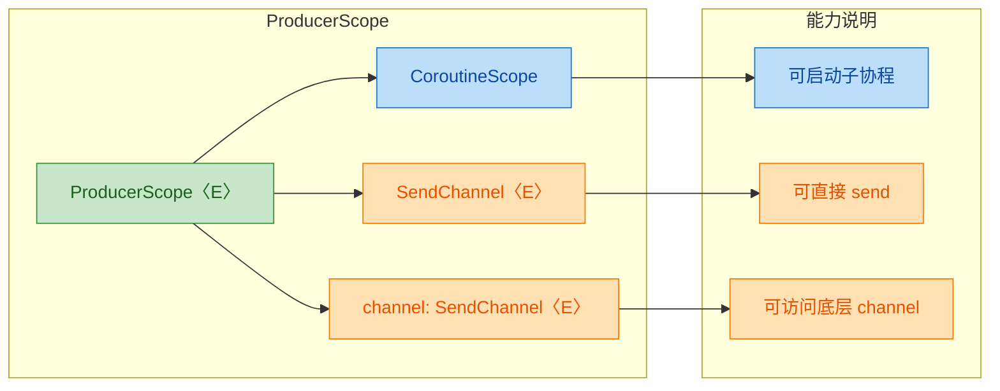

因为 `ProducerScope` 同时是 `CoroutineScope`，你可以在生产者内部启动子协程来并行生产数据：

```kotlin
fun main() = runBlocking {
    val channel = produce {
        // 在 ProducerScope 内启动多个子协程并行生产
        launch {
            for (i in 1..3) {
                send(i * 10)          // 子协程 1 发送 10, 20, 30
                delay(100)
            }
        }
        launch {
            for (i in 1..3) {
                send(i * 100)         // 子协程 2 发送 100, 200, 300
                delay(150)
            }
        }
        // produce 会等待所有子协程完成后才关闭 Channel
    }

    for (value in channel) {
        println("接收: $value")
    }
}
```

`produce` 会等待其内部所有子协程（包括通过 `launch` 启动的）全部完成后，才自动关闭 Channel。这是结构化并发（Structured Concurrency）的体现。

### consumeEach 扩展函数

#### 从 for-in 到 consumeEach

前面我们一直用 `for (value in channel)` 来消费 Channel 中的数据，这种方式简洁直观，但有一个微妙的问题：如果消费过程中抛出异常，Channel 不会被自动取消。来看对比：

```kotlin
// 方式一：for-in 循环（不会自动取消 Channel）
for (value in channel) {
    // 如果这里抛异常，channel 本身不会被取消
    // 生产者可能还在继续运行、继续发送
    process(value)
}

// 方式二：consumeEach（会自动取消 Channel）
channel.consumeEach { value ->
    // 如果这里抛异常，consumeEach 会自动取消（cancel）Channel
    // 生产者会收到 CancellationException，停止生产
    process(value)
}
```

`consumeEach` 是 `ReceiveChannel` 上的扩展函数，它的核心语义是："我要消费这个 Channel 中的所有数据，消费完毕后（无论正常还是异常），确保 Channel 被正确关闭/取消。"

#### consumeEach 的基本用法

```kotlin
import kotlinx.coroutines.*
import kotlinx.coroutines.channels.*

fun main() = runBlocking {
    // 创建一个生产者
    val numbers = produce {
        for (i in 1..5) {
            send(i)
            println("发送: $i")
        }
    }

    // 使用 consumeEach 消费所有数据
    // consumeEach 是一个挂起函数，会在 Channel 关闭后正常返回
    numbers.consumeEach { value ->
        println("消费: $value")
    }

    println("所有数据已消费完毕")
}
```

输出：

```
发送: 1
消费: 1
发送: 2
消费: 2
发送: 3
消费: 3
发送: 4
消费: 4
发送: 5
消费: 5
所有数据已消费完毕
```

#### consumeEach 的异常处理行为

`consumeEach` 的关键价值在于异常场景下的资源清理。来看一个详细的对比实验：

```kotlin
fun main() = runBlocking {
    // ========== 场景 1：for-in 遇到异常 ==========
    println("=== 场景 1: for-in ===")
    val ch1 = produce {
        for (i in 1..5) {
            send(i)
            println("  [生产者1] 发送: $i")
        }
        // 如果消费端异常但没取消 channel，这里的后续逻辑可能受影响
        println("  [生产者1] 生产完毕")
    }

    try {
        for (value in ch1) {
            println("  [消费者1] 接收: $value")
            if (value == 3) throw RuntimeException("消费出错")
        }
    } catch (e: Exception) {
        println("  [消费者1] 捕获异常: ${e.message}")
        // ⚠️ 需要手动取消 channel
        ch1.cancel()
    }

    delay(100) // 等待一下观察生产者状态

    // ========== 场景 2：consumeEach 遇到异常 ==========
    println("\n=== 场景 2: consumeEach ===")
    val ch2 = produce {
        for (i in 1..5) {
            send(i)
            println("  [生产者2] 发送: $i")
        }
        println("  [生产者2] 生产完毕")
    }

    try {
        ch2.consumeEach { value ->
            println("  [消费者2] 接收: $value")
            if (value == 3) throw RuntimeException("消费出错")
            // ✅ consumeEach 内部会自动 cancel channel
        }
    } catch (e: Exception) {
        println("  [消费者2] 捕获异常: ${e.message}")
        // 不需要手动取消，consumeEach 已经处理了
    }
}
```

#### consumeEach 的内部实现原理

理解 `consumeEach` 的实现有助于掌握它的行为。其核心逻辑大致如下：

```kotlin
// consumeEach 的简化实现（伪代码）
public suspend inline fun <E> ReceiveChannel<E>.consumeEach(action: (E) -> Unit) {
    // consume 是另一个扩展函数，它保证在 block 结束后取消 Channel
    consume {
        // 使用迭代器遍历 Channel 中的所有元素
        for (element in this) {
            action(element)    // 对每个元素执行用户提供的操作
        }
    }
}

// consume 的简化实现
public inline fun <E, R> ReceiveChannel<E>.consume(block: ReceiveChannel<E>.() -> R): R {
    var cause: Throwable? = null
    try {
        return block()         // 执行消费逻辑
    } catch (e: Throwable) {
        cause = e              // 记录异常
        throw e                // 重新抛出
    } finally {
        // ✅ 关键：无论正常还是异常，都会取消 Channel
        cancelConsumed(cause)
    }
}
```

可以看到，`consumeEach` 底层使用了 `consume` 函数，而 `consume` 通过 try-finally 确保 Channel 在任何情况下都会被取消。这就是它比裸 `for-in` 更安全的原因。

### produce + consumeEach 组合实战

#### 经典生产者-消费者模式

将 `produce` 和 `consumeEach` 组合使用，就是 Kotlin 协程中最地道的生产者-消费者实现方式：

```kotlin
import kotlinx.coroutines.*
import kotlinx.coroutines.channels.*

// 模拟一个数据源：从"数据库"中逐条读取用户 ID
fun CoroutineScope.produceUserIds(): ReceiveChannel<Int> = produce(capacity = 5) {
    // capacity = 5 表示缓冲 5 个元素，生产者可以"跑在前面"
    println("[生产者] 开始读取用户 ID...")
    for (id in 1001..1010) {
        delay(50)              // 模拟数据库查询耗时
        send(id)               // 发送用户 ID 到 Channel
        println("[生产者] 发送用户 ID: $id")
    }
    println("[生产者] 所有用户 ID 已发送")
    // ✅ produce 自动关闭 Channel
}

// 模拟处理逻辑：根据用户 ID 查询详细信息
suspend fun processUser(id: Int): String {
    delay(100)                 // 模拟网络请求耗时
    return "User($id, name=用户$id)"
}

fun main() = runBlocking {
    // 启动生产者
    val userIds = produceUserIds()

    // 使用 consumeEach 消费
    userIds.consumeEach { id ->
        val userInfo = processUser(id)   // 处理每个用户 ID
        println("[消费者] 处理完成: $userInfo")
    }

    println("全部处理完毕")
}
```

#### 多阶段处理链

`produce` 的返回值是 `ReceiveChannel`，这意味着你可以把一个 `produce` 的输出作为下一个处理阶段的输入，形成处理链（这其实就是下一节要讲的 Pipeline 的雏形）：

```kotlin
import kotlinx.coroutines.*
import kotlinx.coroutines.channels.*

// 第一阶段：生产原始数据
fun CoroutineScope.produceNumbers(): ReceiveChannel<Int> = produce {
    for (i in 1..10) {
        send(i)                // 发送 1 到 10
    }
}

// 第二阶段：过滤 —— 只保留偶数
fun CoroutineScope.filterEven(
    input: ReceiveChannel<Int>       // 接收上一阶段的输出
): ReceiveChannel<Int> = produce {
    // 消费 input 中的每个元素
    input.consumeEach { value ->
        if (value % 2 == 0) {        // 只保留偶数
            send(value)              // 转发到下一阶段
        }
    }
}

// 第三阶段：转换 —— 将数字平方
fun CoroutineScope.square(
    input: ReceiveChannel<Int>
): ReceiveChannel<Int> = produce {
    input.consumeEach { value ->
        send(value * value)          // 平方后转发
    }
}

fun main() = runBlocking {
    // 构建处理链：生产 -> 过滤偶数 -> 平方
    val numbers = produceNumbers()          // 1, 2, 3, ..., 10
    val evenNumbers = filterEven(numbers)   // 2, 4, 6, 8, 10
    val squaredNumbers = square(evenNumbers) // 4, 16, 36, 64, 100

    // 最终消费
    squaredNumbers.consumeEach { result ->
        println("结果: $result")
    }
}
```

输出：

```
结果: 4
结果: 16
结果: 36
结果: 64
结果: 100
```

这个处理链的数据流可以用下图表示：

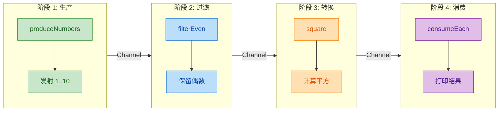

每个阶段都是一个独立的协程，通过 Channel 连接。数据像水流一样从左到右流过每个处理节点。这种模式天然支持背压（backpressure）—— 如果某个阶段处理得慢，上游的 `send` 会自动挂起等待。

#### 带超时的生产者

实际开发中，生产者可能需要在一定时间内完成工作。结合 `withTimeout` 使用：

```kotlin
fun main() = runBlocking {
    val channel = produce {
        var count = 0
        // 持续生产数据，直到被取消
        while (true) {
            send(count++)
            delay(200)             // 每 200ms 生产一个
        }
    }

    // 只消费 1 秒钟的数据
    withTimeout(1000) {
        channel.consumeEach { value ->
            println("接收: $value")
        }
    }
    // withTimeout 超时后会取消内部协程
    // consumeEach 会取消 channel
    // 生产者协程收到 CancellationException 后停止
    println("超时，停止消费")
}
```

输出大致为：

```
接收: 0
接收: 1
接收: 2
接收: 3
接收: 4
超时，停止消费
```

### produce 与 consumeEach 使用注意事项

有几个容易踩坑的地方值得特别强调：

```kotlin
// ❌ 错误：在 produce 外部持有 SendChannel 引用并发送
val channel = produce<Int> { /* ... */ }
// channel 的类型是 ReceiveChannel<Int>，无法 send
// 这是设计上的刻意限制，保证生产逻辑封装在 produce 内部

// ❌ 错误：对同一个 ReceiveChannel 多次调用 consumeEach
val ch = produce { send(1); send(2); send(3) }
ch.consumeEach { println(it) }   // 第一次：正常消费
ch.consumeEach { println(it) }   // 第二次：Channel 已关闭/取消，不会收到任何数据

// ✅ 正确：一个 produce 对应一个消费者
// 如果需要多个消费者，应该使用 BroadcastChannel 或 SharedFlow

// ❌ 注意：consumeEach 内部不要再调用 channel.cancel()
// consumeEach 已经在 finally 中处理了取消逻辑，重复取消虽然不会报错但没有意义
```

还有一个关于结构化并发的重要细节：`produce` 创建的协程是当前 `CoroutineScope` 的子协程。如果父协程被取消，生产者协程也会被取消，Channel 也会随之关闭。这意味着你不需要担心生产者"泄漏"的问题。

```kotlin
fun main() = runBlocking {
    val job = launch {
        val channel = produce {
            var i = 0
            while (true) {
                send(i++)
                delay(100)
            }
        }

        channel.consumeEach {
            println("接收: $it")
        }
    }

    delay(500)
    job.cancel()       // 取消父协程 → 生产者协程也被取消 → Channel 关闭
    println("已取消")
}
```

---

**📝 练习题**

以下代码的输出是什么？

```kotlin
fun main() = runBlocking {
    val channel = produce {
        send(1)
        send(2)
        send(3)
    }

    println(channel.receive())
    channel.consumeEach { println(it) }
    println("done")
}
```

A. 1 2 3 done

B. 1 done

C. 编译错误，receive 和 consumeEach 不能混用

D. 运行时抛出异常

**【答案】** A

**【解析】** `channel.receive()` 从 Channel 中取出第一个元素 `1` 并打印。此时 Channel 中还剩 `2` 和 `3`。接着 `consumeEach` 会消费剩余的所有元素，依次打印 `2` 和 `3`。当 `produce` 协程结束后 Channel 自动关闭，`consumeEach` 检测到关闭后正常返回，最后打印 `done`。`receive()` 和 `consumeEach` 可以混用，只要注意 `receive()` 会"消耗"掉元素，后续的 `consumeEach` 只能看到剩余的元素。不过在实际开发中，建议选择一种消费方式保持一致，避免混用带来的可读性问题。

---

**📝 练习题**

关于 `produce` 构建器，以下说法正确的是？

A. `produce` 返回 `SendChannel`，外部可以向其中发送数据

B. `produce` 内部协程异常终止时，Channel 不会被关闭，需要手动处理

C. `produce` 创建的协程遵循结构化并发，父协程取消时生产者也会被取消

D. `produce` 内部不能启动子协程，因为 `ProducerScope` 不是 `CoroutineScope`

**【答案】** C

**【解析】** A 错误：`produce` 返回的是 `ReceiveChannel`，只暴露接收端，外部无法 send，这是刻意的设计以封装生产逻辑。B 错误：`produce` 的核心优势之一就是异常安全，无论正常结束还是异常终止，Channel 都会被自动关闭（异常时会将异常作为 close 的 cause 传递）。C 正确：`produce` 启动的协程是当前 CoroutineScope 的子协程，完全遵循结构化并发的规则，父协程取消时子协程也会被取消。D 错误：`ProducerScope` 同时继承了 `CoroutineScope` 和 `SendChannel`，在其内部完全可以使用 `launch`、`async` 等启动子协程。

---

## 管道 Pipeline（通道连接、数据流转换）

管道（Pipeline）是一种经典的并发设计模式，其核心思想是：将一个复杂的数据处理任务拆解为多个独立的阶段（stage），每个阶段由一个协程负责，阶段之间通过 Channel 进行数据传递。这就像工厂的流水线——原材料从一端进入，经过多道工序加工，最终从另一端输出成品。

Pipeline 模式在协程中的价值在于：每个阶段可以独立地、并发地运行。当第一个阶段产出数据并发送到 Channel 后，它不需要等待下游处理完毕就可以继续生产下一个数据。这种"流水线并行"能显著提升吞吐量，尤其适合 ETL（Extract-Transform-Load）、数据清洗、流式计算等场景。

### 通道连接：Pipeline 的基本结构

Pipeline 的本质就是"用 Channel 把多个协程串起来"。每个阶段（stage）从上游 Channel 读取数据，处理后写入下游 Channel，形成一条数据流水线。

我们先用一张 Mermaid 图来直观理解 Pipeline 的拓扑结构：

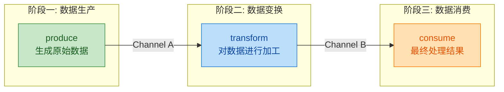

这张图清晰地展示了三个核心要素：

- 每个阶段是一个独立的协程（或 `produce` 构建器）
- 阶段之间通过 Channel 连接，Channel 既是上游的输出，也是下游的输入
- 数据单向流动，从左到右依次经过每个阶段

来看一个最基础的 Pipeline 示例——生成数字、平方变换、最终消费：

```kotlin
import kotlinx.coroutines.*
import kotlinx.coroutines.channels.*

// 阶段一：生产者，生成 1 到 5 的整数
fun CoroutineScope.produceNumbers(): ReceiveChannel<Int> = produce {
    for (i in 1..5) {       // 循环生成 1, 2, 3, 4, 5
        send(i)             // 将每个数字发送到通道
        println("生产: $i") // 打印日志，观察执行顺序
    }
    // produce 构建器在 lambda 结束后自动关闭通道
}

// 阶段二：变换器，接收上游通道的数据，计算平方后发送到下游
fun CoroutineScope.square(input: ReceiveChannel<Int>): ReceiveChannel<Int> = produce {
    for (value in input) {          // 从上游通道逐个接收数据
        val result = value * value  // 计算平方
        send(result)                // 将结果发送到下游通道
        println("变换: $value -> $result")
    }
    // 上游通道关闭后，for 循环自动结束，本通道也随之关闭
}

fun main() = runBlocking {
    // 构建管道：将两个阶段串联起来
    val numbers = produceNumbers()      // 阶段一的输出通道
    val squared = square(numbers)       // 阶段二以阶段一的输出作为输入

    // 阶段三：最终消费者，直接在主协程中消费
    for (result in squared) {           // 从最终通道逐个接收结果
        println("消费: $result")
    }

    println("管道处理完毕")
}
```

输出结果（顺序可能因调度略有不同）：

```
生产: 1
变换: 1 -> 1
消费: 1
生产: 2
变换: 2 -> 4
消费: 4
生产: 3
变换: 3 -> 9
消费: 9
生产: 4
变换: 4 -> 16
消费: 16
生产: 5
变换: 5 -> 25
消费: 25
管道处理完毕
```

注意观察输出顺序——由于我们使用的是默认的 Rendezvous Channel（容量为 0），每次 `send` 都会挂起直到对端 `receive`，所以数据是"一个一个"流过管道的。这正是 Pipeline 的典型行为：数据像水流一样逐个通过每个阶段。

这里有一个关键的设计细节值得深入理解：每个阶段函数都是 `CoroutineScope` 的扩展函数，返回 `ReceiveChannel<T>`。这种签名意味着：

1. 调用者只能从返回的通道中读取数据（`ReceiveChannel` 是只读的），无法向其中写入，保证了数据流向的单一性
2. 阶段内部启动的协程绑定在调用者的 `CoroutineScope` 上，生命周期由外部管理
3. `produce` 构建器在 lambda 正常结束或异常时都会自动关闭通道，下游能感知到"数据已经全部发完了"

### 数据流转换：多阶段 Pipeline 实战

真实场景中的 Pipeline 往往不止两三个阶段。让我们构建一个更贴近实际的例子——模拟一个简单的日志处理管道：原始日志 → 过滤 → 解析 → 格式化输出。

```kotlin
import kotlinx.coroutines.*
import kotlinx.coroutines.channels.*

// 模拟的原始日志数据类
data class RawLog(
    val timestamp: Long,    // 时间戳
    val level: String,      // 日志级别: INFO, WARN, ERROR
    val message: String     // 日志内容
)

// 解析后的结构化日志
data class ParsedLog(
    val time: String,       // 格式化后的时间
    val level: String,      // 日志级别
    val message: String,    // 日志内容
    val isError: Boolean    // 是否为错误日志
)

// 阶段一：日志生产者，模拟不断产生的原始日志
fun CoroutineScope.produceRawLogs(): ReceiveChannel<RawLog> = produce {
    // 模拟一批原始日志数据
    val logs = listOf(
        RawLog(1000L, "INFO", "Application started"),
        RawLog(2000L, "DEBUG", "Loading config"),       // DEBUG 级别，后续会被过滤
        RawLog(3000L, "WARN", "Memory usage high"),
        RawLog(4000L, "ERROR", "Database connection failed"),
        RawLog(5000L, "INFO", "Retrying connection"),
        RawLog(6000L, "ERROR", "Retry failed"),
        RawLog(7000L, "DEBUG", "Dumping stack trace"),  // DEBUG 级别，后续会被过滤
        RawLog(8000L, "INFO", "Application shutdown")
    )
    for (log in logs) {     // 逐条发送原始日志
        send(log)
    }
}

// 阶段二：过滤器，只保留 INFO、WARN、ERROR 级别的日志（过滤掉 DEBUG）
fun CoroutineScope.filterLogs(
    input: ReceiveChannel<RawLog>   // 上游通道：原始日志
): ReceiveChannel<RawLog> = produce {
    for (log in input) {                        // 从上游逐条接收
        if (log.level != "DEBUG") {             // 过滤条件：排除 DEBUG
            send(log)                           // 符合条件的日志发送到下游
        }
        // 不符合条件的日志被静默丢弃
    }
}

// 阶段三：解析器，将原始日志转换为结构化的 ParsedLog
fun CoroutineScope.parseLogs(
    input: ReceiveChannel<RawLog>   // 上游通道：过滤后的原始日志
): ReceiveChannel<ParsedLog> = produce {
    for (log in input) {                        // 从上游逐条接收
        // 将时间戳转换为可读的时间字符串（简化处理）
        val timeStr = "T+${log.timestamp / 1000}s"
        // 构建结构化日志对象
        val parsed = ParsedLog(
            time = timeStr,                     // 格式化时间
            level = log.level,                  // 保留原始级别
            message = log.message,              // 保留原始消息
            isError = log.level == "ERROR"      // 标记是否为错误
        )
        send(parsed)                            // 发送到下游
    }
}

// 阶段四：格式化输出器，将结构化日志转换为最终的展示字符串
fun CoroutineScope.formatLogs(
    input: ReceiveChannel<ParsedLog>    // 上游通道：结构化日志
): ReceiveChannel<String> = produce {
    for (log in input) {                        // 从上游逐条接收
        // 根据是否为错误日志，添加不同的前缀标记
        val prefix = if (log.isError) "🔴" else "🟢"
        // 拼接最终的格式化字符串
        val formatted = "$prefix [${log.time}] ${log.level}: ${log.message}"
        send(formatted)                         // 发送到下游
    }
}

fun main() = runBlocking {
    // 构建四阶段管道，每个阶段的输出作为下一个阶段的输入
    val raw = produceRawLogs()          // 阶段一 → 输出原始日志
    val filtered = filterLogs(raw)      // 阶段二 → 输出过滤后的日志
    val parsed = parseLogs(filtered)    // 阶段三 → 输出结构化日志
    val formatted = formatLogs(parsed)  // 阶段四 → 输出格式化字符串

    // 最终消费：打印所有格式化后的日志
    for (line in formatted) {
        println(line)
    }
}
```

输出：

```
🟢 [T+1s] INFO: Application started
🟢 [T+3s] WARN: Memory usage high
🔴 [T+4s] ERROR: Database connection failed
🟢 [T+5s] INFO: Retrying connection
🔴 [T+6s] ERROR: Retry failed
🟢 [T+8s] INFO: Application shutdown
```

可以看到，DEBUG 级别的日志被阶段二过滤掉了，ERROR 日志被标记了红色圆点。整个处理过程被清晰地分解为四个独立的阶段，每个阶段职责单一、易于测试和替换。

让我们用一张更详细的流程图来展示数据在这个管道中的流转过程：

```mermaid
graph LR
    subgraph P1["Stage 1: Produce"]
        direction TB
        A1["8 条原始日志\nINFO, DEBUG, WARN\nERROR ..."]
    end

    subgraph P2["Stage 2: Filter"]
        direction TB
        A2["过滤 DEBUG\n保留 6 条日志"]
    end

    subgraph P3["Stage 3: Parse"]
        direction TB
        A3["RawLog 转 ParsedLog\n时间格式化\n标记 isError"]
    end

    subgraph P4["Stage 4: Format"]
        direction TB
        A4["拼接展示字符串\n添加 emoji 前缀"]
    end

    subgraph C["Consumer"]
        direction TB
        A5["println\n最终输出 6 行"]
    end

    A1 -->|"Channel〈RawLog〉"| A2
    A2 -->|"Channel〈RawLog〉"| A3
    A3 -->|"Channel〈ParsedLog〉"| A4
    A4 -->|"Channel〈String〉"| A5

    classDef green fill:#C8E6C9,stroke:#388E3C,color:#1B5E20
    classDef blue fill:#BBDEFB,stroke:#1976D2,color:#0D47A1
    classDef indigo fill:#C5CAE9,stroke:#303F9F,color:#1A237E
    classDef orange fill:#FFE0B2,stroke:#F57C00,color:#E65100
    classDef red fill:#FFCDD2,stroke:#D32F2F,color:#B71C1C

    class A1 green
    class A2 blue
    class A3 indigo
    class A4 orange
    class A5 red
```

### Pipeline 的关键设计原则

在实际工程中构建 Pipeline 时，有几个重要的设计原则需要牢记：

**原则一：通道关闭的传播（Closure Propagation）**

Pipeline 能正常终止的关键在于通道关闭信号的逐级传播。当阶段一的 `produce` 块执行完毕，它创建的通道会自动关闭。阶段二中 `for (value in input)` 检测到上游通道关闭后，循环结束，阶段二的 `produce` 块也随之结束，它的通道也关闭……如此逐级传播，直到最终消费者的 `for` 循环结束。

```kotlin
// 这段代码展示了关闭传播的机制
fun CoroutineScope.stage(input: ReceiveChannel<Int>): ReceiveChannel<Int> = produce {
    for (value in input) {  // 当 input 被关闭且所有元素被消费完毕后
        send(value * 2)     // 这个循环自然结束
    }
    // produce 块结束 → 输出通道自动关闭 → 下游感知到关闭
    println("阶段结束，通道已关闭")
}
```

**原则二：背压（Backpressure）天然存在**

由于 Channel 的 `send` 在通道满时会挂起，Pipeline 天然具备背压机制。如果下游处理速度慢，上游会自动减速，不会出现数据堆积导致内存溢出的问题。这是 Pipeline 相比回调链或 RxJava 的一个显著优势——背压是内建的，不需要额外处理。

```kotlin
import kotlinx.coroutines.*
import kotlinx.coroutines.channels.*

// 快速生产者
fun CoroutineScope.fastProducer(): ReceiveChannel<Int> = produce {
    for (i in 1..10) {
        println("即将发送: $i")
        send(i)                         // 如果下游还没消费，这里会挂起等待
        println("已发送: $i")
    }
}

// 慢速消费的变换阶段
fun CoroutineScope.slowTransform(
    input: ReceiveChannel<Int>
): ReceiveChannel<String> = produce {
    for (value in input) {
        delay(500)                      // 模拟耗时处理（500ms）
        send("处理结果: $value")        // 处理完毕后发送
    }
}

fun main() = runBlocking {
    val fast = fastProducer()           // 生产者很快
    val slow = slowTransform(fast)      // 变换阶段很慢

    for (result in slow) {              // 最终消费
        println(result)
    }
    // 观察输出会发现：生产者不会一口气发完 10 个
    // 而是发一个、等下游消费一个、再发下一个
}
```

**原则三：用缓冲通道提升吞吐量**

默认的 Rendezvous Channel 虽然保证了严格的同步，但在某些场景下会限制吞吐量。如果各阶段的处理速度不均匀，可以在阶段之间使用带缓冲的 Channel 来"削峰填谷"：

```kotlin
import kotlinx.coroutines.*
import kotlinx.coroutines.channels.*

// 使用 produce 的 capacity 参数来指定输出通道的缓冲大小
fun CoroutineScope.bufferedProducer(): ReceiveChannel<Int> = produce(capacity = 5) {
    // 输出通道容量为 5，生产者可以"预生产"最多 5 个元素
    for (i in 1..20) {
        send(i)                 // 通道未满时不会挂起，可以持续生产
        println("生产: $i")
    }
}

fun CoroutineScope.bufferedTransform(
    input: ReceiveChannel<Int>
): ReceiveChannel<Int> = produce(capacity = 3) {
    // 变换阶段也有 3 个元素的缓冲
    for (value in input) {
        delay(100)              // 模拟处理耗时
        send(value * value)     // 处理后发送到缓冲通道
    }
}

fun main() = runBlocking {
    val produced = bufferedProducer()
    val transformed = bufferedTransform(produced)

    for (result in transformed) {
        delay(200)              // 消费者比较慢
        println("消费: $result")
    }
}
```

缓冲通道让生产者可以"跑在前面"，不必每次都等下游消费完才能继续。但缓冲并不会消除背压，只是延迟了背压的触发时机——当缓冲区也满了，`send` 依然会挂起。

### Pipeline 的异常处理与资源清理

Pipeline 中的异常处理需要特别注意。当某个阶段抛出异常时，该阶段的 `produce` 通道会以异常方式关闭（close with cause），下游在尝试接收时会收到这个异常。

```kotlin
import kotlinx.coroutines.*
import kotlinx.coroutines.channels.*

fun CoroutineScope.riskyTransform(
    input: ReceiveChannel<Int>
): ReceiveChannel<Int> = produce {
    for (value in input) {
        if (value == 3) {
            // 模拟处理第 3 个元素时出错
            throw IllegalStateException("处理元素 $value 时发生错误")
        }
        send(value * 10)
    }
}

fun main() = runBlocking {
    val numbers = produce {
        for (i in 1..5) send(i)     // 生产 1 到 5
    }

    val transformed = riskyTransform(numbers)

    try {
        for (result in transformed) {   // 消费变换后的数据
            println("收到: $result")
        }
    } catch (e: IllegalStateException) {
        // 当 riskyTransform 抛出异常时
        // 下游的 for 循环会收到这个异常
        println("管道异常: ${e.message}")
    }

    // 注意：上游的 numbers 通道中可能还有未消费的数据
    // produce 构建器会在其协程被取消时自动关闭通道
    // 但如果需要确保资源清理，可以显式 cancel
    numbers.cancel()    // 显式取消上游，确保资源释放
}
```

输出：

```
收到: 10
收到: 20
管道异常: 处理元素 3 时发生错误
```

在生产环境中，更健壮的做法是使用 `supervisorScope` 或在每个阶段内部做 try-catch，将异常转化为特殊的"错误信号"发送到下游，而不是直接中断整个管道：

```kotlin
import kotlinx.coroutines.*
import kotlinx.coroutines.channels.*

// 用密封类表示管道中的数据，包含正常值和错误
sealed class PipelineResult<out T> {
    data class Success<T>(val value: T) : PipelineResult<T>()       // 正常数据
    data class Error(val cause: Throwable) : PipelineResult<Nothing>() // 错误信号
}

// 安全的变换阶段：捕获异常，转化为 Error 信号
fun CoroutineScope.safeTransform(
    input: ReceiveChannel<Int>
): ReceiveChannel<PipelineResult<Int>> = produce {
    for (value in input) {
        try {
            if (value == 3) throw IllegalStateException("元素 $value 处理失败")
            send(PipelineResult.Success(value * 10))    // 正常结果
        } catch (e: Exception) {
            send(PipelineResult.Error(e))               // 错误信号，不中断管道
        }
    }
}

fun main() = runBlocking {
    val numbers = produce { for (i in 1..5) send(i) }
    val results = safeTransform(numbers)

    for (result in results) {
        when (result) {
            is PipelineResult.Success -> println("成功: ${result.value}")
            is PipelineResult.Error -> println("跳过错误: ${result.cause.message}")
        }
    }
}
```

输出：

```
成功: 10
成功: 20
跳过错误: 元素 3 处理失败
成功: 40
成功: 50
```

这种模式让管道具备了"容错能力"——单个元素的处理失败不会导致整条管道崩溃。

### 无限管道与惰性求值

Pipeline 的一个强大特性是它可以处理无限数据流。由于 Channel 的挂起特性，生产者只在消费者需要时才会继续生产，这实现了类似惰性求值（lazy evaluation）的效果。

下面是一个经典的例子——用 Pipeline 生成素数序列（Sieve of Eratosthenes）：

```kotlin
import kotlinx.coroutines.*
import kotlinx.coroutines.channels.*

// 阶段一：生成从 2 开始的无限自然数序列
fun CoroutineScope.numbersFrom(start: Int): ReceiveChannel<Int> = produce {
    var x = start           // 从 start 开始
    while (true) {          // 无限循环（不会真的无限运行，因为 send 会挂起）
        send(x++)           // 发送当前数字，然后自增
    }
}

// 筛选阶段：过滤掉能被 prime 整除的数
fun CoroutineScope.filter(
    input: ReceiveChannel<Int>,     // 上游通道
    prime: Int                      // 当前素数，用于过滤
): ReceiveChannel<Int> = produce {
    for (value in input) {          // 从上游逐个接收
        if (value % prime != 0) {   // 不能被 prime 整除的数才放行
            send(value)             // 发送到下游
        }
    }
}

fun main() = runBlocking {
    // 初始通道：2, 3, 4, 5, 6, 7, 8, 9, 10, ...
    var channel = numbersFrom(2)

    // 找前 10 个素数
    repeat(10) {
        val prime = channel.receive()   // 通道中的第一个数一定是素数
        println("素数: $prime")

        // 创建新的过滤阶段，过滤掉 prime 的倍数
        // 每发现一个素数，就在管道末尾追加一个过滤器
        channel = filter(channel, prime)
    }

    // 找完后取消整个协程作用域中的管道
    coroutineContext.cancelChildren()
}
```

输出：

```
素数: 2
素数: 3
素数: 5
素数: 7
素数: 11
素数: 13
素数: 17
素数: 19
素数: 23
素数: 29
```

这个素数筛的 Pipeline 结构非常精妙。让我们用图来展示它的动态构建过程：

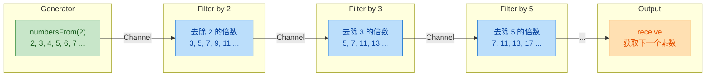

每发现一个新素数，管道就动态地增长一个过滤阶段。这展示了 Pipeline 的另一个特性——管道的拓扑结构可以在运行时动态构建，不必在编译期确定。

需要注意的是，这个素数筛示例主要用于教学目的。在实际生产中，为每个素数创建一个协程和一个 Channel 的开销虽然不大（Kotlin 协程非常轻量），但对于大规模计算来说，传统的数组筛法效率更高。Pipeline 模式真正发光的场景是 I/O 密集型的流式处理，比如网络数据流、文件处理、消息队列消费等。

### Pipeline 与 Flow 的对比

学到这里，你可能会想：Pipeline 和后面要学的 Flow 有什么区别？它们确实解决了类似的问题，但设计哲学不同：

```kotlin
// Pipeline 方式：基于 Channel，热的（eager），多协程
fun CoroutineScope.pipelineSquare(): ReceiveChannel<Int> = produce {
    val source = produce { for (i in 1..5) send(i) }   // 立即开始生产
    for (v in source) send(v * v)                       // 立即开始变换
}

// Flow 方式：冷的（lazy），声明式，单协程
fun flowSquare(): Flow<Int> = flow {
    for (i in 1..5) emit(i)     // 只有在 collect 时才开始执行
}.map { it * it }               // 声明式变换，不会立即执行
```

| 特性 | Pipeline (Channel) | Flow |
|------|-------------------|------|
| 热/冷 | 热（Hot）：创建即开始运行 | 冷（Cold）：collect 时才运行 |
| 协程数量 | 每个阶段一个协程 | 通常在单个协程中执行 |
| 适用场景 | 多生产者/消费者、扇入扇出 | 单一数据流的声明式变换 |
| 背压 | Channel 容量控制 | 天然顺序执行，无需额外处理 |
| 取消 | 需要手动取消或依赖 scope | 取消 collect 的协程即可 |

简单来说：如果你需要多个协程之间的通信和协作，用 Channel + Pipeline；如果你只需要对一个数据流做声明式的变换和处理，用 Flow 更简洁。

---

## 扇出扇入（Fan-out & Fan-in）

在真实的并发系统中，单一生产者对单一消费者的模型往往不够用。想象一个任务分发系统：一个任务队列产生大量待处理任务，你希望多个 Worker 协程并行消费以提高吞吐量——这就是扇出（Fan-out）。反过来，多个数据源各自产生数据，你需要将它们汇聚到一个通道中统一处理——这就是扇入（Fan-in）。

扇出与扇入是 Channel 并发模型中最核心的两种拓扑结构，它们直接对应分布式系统中的 "Work Distribution" 和 "Result Aggregation" 两大经典模式。理解它们，是从"会用协程"迈向"能设计协程架构"的关键一步。

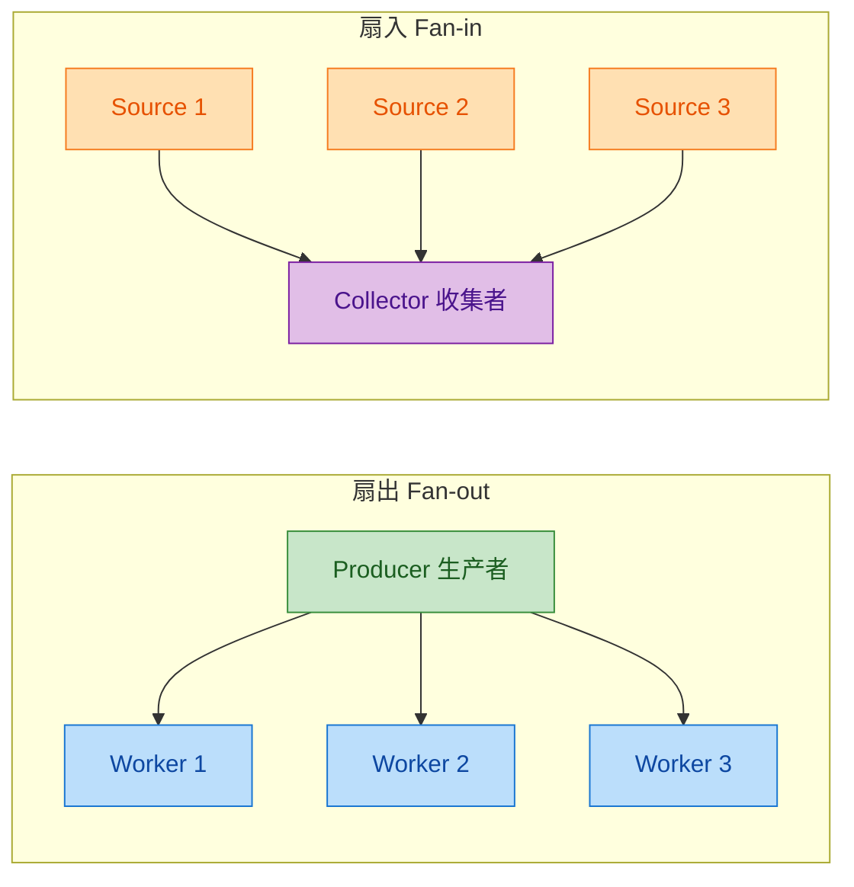

### 扇出（Fan-out）：多协程消费同一通道

扇出的核心思想非常直观：一个 Channel 作为任务队列，多个协程同时从中 `receive`。Channel 天然保证每条消息只会被一个消费者取走（point-to-point semantics），不会出现重复消费的问题。这与广播（broadcast）模型有本质区别——Channel 的扇出是竞争消费，谁抢到算谁的。

这种特性使得 Channel 天然适合做 Work Queue（工作队列）。你不需要额外加锁，不需要手动分配任务，Channel 内部的挂起机制已经帮你处理好了一切并发安全问题。

来看一个完整的扇出示例：

```kotlin
import kotlinx.coroutines.*
import kotlinx.coroutines.channels.*

// 生产者函数：向通道中发送一系列任务
fun CoroutineScope.produceTask(count: Int): ReceiveChannel<Int> = produce {
    // 循环发送 count 个任务编号
    for (i in 1..count) {
        send(i)               // 将任务编号发送到通道
        delay(100)            // 模拟任务生成间隔
    }
    // produce 构建器在 lambda 结束后自动关闭通道
}

// Worker 函数：从通道中竞争消费任务
fun CoroutineScope.launchWorker(
    id: Int,                  // Worker 的编号，用于标识
    channel: ReceiveChannel<Int>  // 要消费的通道
) = launch {
    // 使用 for-in 迭代通道，通道关闭后循环自动结束
    for (task in channel) {
        println("Worker #$id 正在处理任务 #$task")
        delay(300)            // 模拟任务处理耗时（比生产慢，体现多Worker的价值）
    }
}

fun main() = runBlocking {
    // 创建生产者，生产 10 个任务
    val taskChannel = produceTask(10)

    // 启动 3 个 Worker 协程，它们共享同一个通道
    repeat(3) { workerId ->
        launchWorker(workerId + 1, taskChannel)
    }

    // runBlocking 会等待所有子协程完成
    // 通道关闭后，所有 Worker 的 for 循环会自然退出
}
```

运行这段代码，你会看到类似这样的输出（顺序可能略有不同，因为是并发调度）：

```
Worker #1 正在处理任务 #1
Worker #2 正在处理任务 #2
Worker #3 正在处理任务 #3
Worker #1 正在处理任务 #4
Worker #2 正在处理任务 #5
Worker #3 正在处理任务 #6
Worker #1 正在处理任务 #7
Worker #2 正在处理任务 #8
Worker #3 正在处理任务 #9
Worker #1 正在处理任务 #10
```

注意观察：每个任务只被一个 Worker 处理，没有重复。三个 Worker 轮流（大致均匀地）分担了所有任务。生产者每 100ms 产生一个任务，单个 Worker 处理需要 300ms，如果只有一个消费者就会积压；三个 Worker 并行消费，吞吐量提升了约 3 倍。

这里有一个重要的设计细节值得深入理解：为什么用 `for (task in channel)` 而不是 `while (true) { channel.receive() }`？区别在于，`for-in` 会在通道关闭时优雅退出循环，而 `receive()` 在通道关闭后会抛出 `ClosedReceiveChannelException`。在扇出场景中，生产者完成后关闭通道是通知所有消费者"没有更多数据了"的标准信号，`for-in` 能自然响应这个信号。

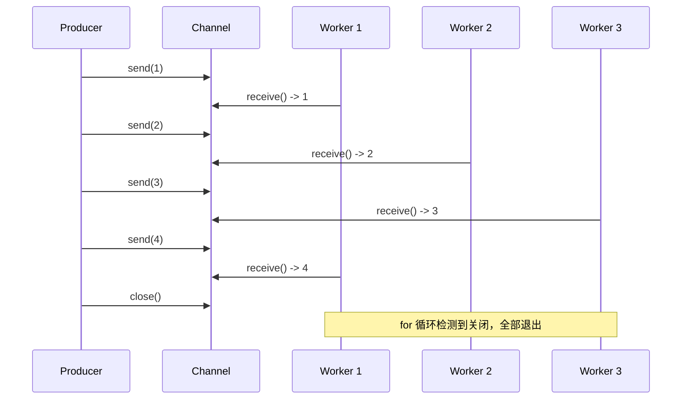

扇出模式的一个常见变体是带优先级的消费。虽然标准 Channel 不直接支持优先级，但你可以通过让不同 Worker 使用不同的处理策略来实现类似效果。更高级的做法是使用多个 Channel 配合 `select` 表达式（后续章节会详细讲解）。

### 扇入（Fan-in）：多协程生产到同一通道

扇入是扇出的镜像操作：多个协程各自产生数据，全部发送到同一个 Channel 中，由一个（或少数几个）消费者统一处理。这在日志聚合、多数据源合并、传感器数据汇总等场景中极为常见。

Channel 的 `send` 操作同样是并发安全的，多个协程可以同时向同一个通道发送数据，不会丢失也不会损坏。数据到达消费者的顺序取决于各生产者的发送时机——先到先得，自然交错（interleaving）。

```kotlin
import kotlinx.coroutines.*
import kotlinx.coroutines.channels.*

// 数据源函数：模拟一个独立的数据生产者
suspend fun sendData(
    channel: SendChannel<String>,  // 目标通道（注意类型是 SendChannel，只暴露发送能力）
    sourceId: String,              // 数据源标识
    count: Int,                    // 要发送的数据条数
    delayMs: Long                  // 每条数据的发送间隔
) {
    repeat(count) { i ->
        val message = "[$sourceId] 数据 #${i + 1}"  // 构造带来源标识的消息
        channel.send(message)                         // 发送到共享通道
        delay(delayMs)                                // 模拟不同数据源的不同速率
    }
}

fun main() = runBlocking {
    // 创建一个共享通道，所有数据源都往这里发送
    val mergedChannel = Channel<String>()

    // 启动三个不同速率的数据源
    launch { sendData(mergedChannel, "传感器A", 4, 200L) }  // 快速源
    launch { sendData(mergedChannel, "传感器B", 3, 350L) }  // 中速源
    launch { sendData(mergedChannel, "传感器C", 2, 500L) }  // 慢速源

    // 启动一个协程负责在所有生产者完成后关闭通道
    launch {
        delay(2200)               // 等待足够长的时间让所有生产者完成
        mergedChannel.close()     // 关闭通道，通知消费者数据已全部到达
    }

    // 消费者：统一处理来自所有数据源的数据
    for (data in mergedChannel) {
        println("收集器接收: $data")
    }
}
```

输出会是各数据源消息的自然交错：

```
收集器接收: [传感器A] 数据 #1
收集器接收: [传感器B] 数据 #1
收集器接收: [传感器A] 数据 #2
收集器接收: [传感器C] 数据 #1
收集器接收: [传感器B] 数据 #2
收集器接收: [传感器A] 数据 #3
收集器接收: [传感器A] 数据 #4
收集器接收: [传感器C] 数据 #2
收集器接收: [传感器B] 数据 #3
```

上面的代码有一个不太优雅的地方：我们用 `delay(2200)` 来"猜测"所有生产者何时完成，然后手动关闭通道。这种做法脆弱且不可靠。更好的方式是利用结构化并发来精确控制通道的生命周期：

```kotlin
import kotlinx.coroutines.*
import kotlinx.coroutines.channels.*

fun main() = runBlocking {
    val mergedChannel = Channel<String>()

    // 将所有生产者放在一个 coroutineScope 中
    // coroutineScope 会等待内部所有协程完成后才继续执行
    launch {
        coroutineScope {
            // 生产者 1
            launch {
                repeat(4) { i ->
                    mergedChannel.send("[传感器A] 数据 #${i + 1}")
                    delay(200)
                }
            }
            // 生产者 2
            launch {
                repeat(3) { i ->
                    mergedChannel.send("[传感器B] 数据 #${i + 1}")
                    delay(350)
                }
            }
            // 生产者 3
            launch {
                repeat(2) { i ->
                    mergedChannel.send("[传感器C] 数据 #${i + 1}")
                    delay(500)
                }
            }
        }
        // 所有生产者都完成后，coroutineScope 返回
        // 此时安全地关闭通道
        mergedChannel.close()
    }

    // 消费者
    for (data in mergedChannel) {
        println("收集器接收: $data")
    }
}
```

这个版本利用 `coroutineScope` 的结构化并发特性：它会挂起直到内部所有 `launch` 的协程都完成，然后才执行 `mergedChannel.close()`。这是一种确定性的、不依赖时间猜测的优雅方案。

扇入时还有一个值得注意的类型设计：`sendData` 函数的参数类型是 `SendChannel<String>` 而非 `Channel<String>`。这是 Kotlin Channel API 的一个精妙设计——通过接口分离（Interface Segregation），你可以限制函数只拥有发送能力，防止生产者意外地从通道中读取数据。同理，消费者应该只持有 `ReceiveChannel` 引用。

```kotlin
// Channel 的接口继承关系
// Channel<E> 同时实现了 SendChannel<E> 和 ReceiveChannel<E>
```

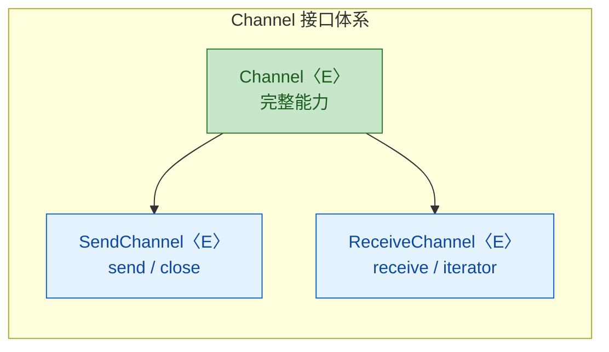

### 扇出与扇入的组合：完整的并发流水线

在实际工程中，扇出和扇入经常组合使用，形成一个完整的并发处理流水线：一个生产者产生任务 → 多个 Worker 并行处理（扇出）→ 处理结果汇聚到一个结果通道（扇入）→ 最终消费者收集结果。

这种模式在服务端开发中极为常见，比如：HTTP 请求分发给多个处理线程，处理结果统一返回；或者批量数据处理中，将大数据集分片给多个协程并行计算，最后合并结果。

```kotlin
import kotlinx.coroutines.*
import kotlinx.coroutines.channels.*

fun main() = runBlocking {
    // 第一阶段：生产任务（单生产者）
    val tasks: ReceiveChannel<Int> = produce {
        for (i in 1..9) {
            send(i)                    // 发送 9 个任务
            delay(50)                  // 模拟任务生成
        }
    }

    // 第二阶段：多 Worker 并行处理（扇出 + 扇入）
    // 结果通道：所有 Worker 的处理结果汇聚于此
    val results = Channel<String>()

    // 启动 3 个 Worker，每个从 tasks 通道竞争消费，处理后发送到 results 通道
    val workers = List(3) { workerId ->
        launch {
            for (task in tasks) {                          // 扇出：竞争消费任务
                delay((100L..300L).random())                // 模拟不同耗时的处理
                val result = "Worker${workerId + 1} 完成任务 #$task, 结果=${task * task}"
                results.send(result)                       // 扇入：结果汇聚到同一通道
            }
        }
    }

    // 启动一个协程等待所有 Worker 完成后关闭结果通道
    launch {
        workers.forEach { it.join() }   // 等待所有 Worker 协程结束
        results.close()                 // 安全关闭结果通道
    }

    // 第三阶段：收集所有结果（单消费者）
    for (result in results) {
        println(result)
    }

    println("所有任务处理完毕")
}
```

这段代码展示了一个经典的三阶段流水线：

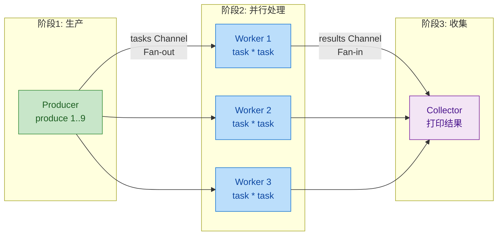

这里有一个关键的生命周期管理技巧：`workers.forEach { it.join() }` 确保所有 Worker 都处理完毕后才关闭 `results` 通道。如果过早关闭，还在工作的 Worker 调用 `results.send()` 时会抛出 `ClosedSendChannelException`。这是扇出扇入组合中最容易出错的地方。

### 公平性与调度行为

一个经常被问到的问题是：扇出时，多个 Worker 消费任务是否公平？答案是：大致公平，但不保证严格均匀。

Kotlin 协程的 Channel 在有多个消费者同时挂起等待时，采用的是 FIFO（先到先服务）的唤醒策略。也就是说，先调用 `receive` 并挂起的协程会先被唤醒拿到数据。但由于每个 Worker 的处理耗时可能不同，实际分配到的任务数量会有差异——处理快的 Worker 自然会回来"抢"更多任务。

这其实是一个非常好的特性：它实现了自动的负载均衡（automatic load balancing）。不需要你手动分配"Worker 1 处理任务 1、4、7，Worker 2 处理任务 2、5、8"这种静态分配，Channel 的竞争消费机制天然让空闲的 Worker 获取更多任务，忙碌的 Worker 获取更少任务。

```kotlin
import kotlinx.coroutines.*
import kotlinx.coroutines.channels.*

fun main() = runBlocking {
    val channel = produce {
        repeat(12) { send(it + 1) }   // 快速生产 12 个任务
    }

    // 三个 Worker 处理速度不同
    val counters = IntArray(3)         // 记录每个 Worker 处理了多少任务

    val jobs = List(3) { id ->
        launch {
            for (task in channel) {
                counters[id]++
                // Worker 0 最快，Worker 2 最慢
                delay((id + 1) * 100L)
            }
        }
    }

    jobs.forEach { it.join() }

    // 输出各 Worker 的任务处理数量
    counters.forEachIndexed { id, count ->
        println("Worker #${id + 1} 处理了 $count 个任务")
    }
    // 典型输出：
    // Worker #1 处理了 6 个任务  （最快，抢到最多）
    // Worker #2 处理了 4 个任务
    // Worker #3 处理了 2 个任务  （最慢，抢到最少）
}
```

这个结果完美体现了自动负载均衡：快的 Worker 自然承担更多工作，慢的 Worker 承担更少，整体吞吐量最大化。

### 实践注意事项与常见陷阱

在使用扇出扇入模式时，有几个容易踩的坑需要特别注意：

第一，通道关闭的时机。扇出时，生产者关闭通道后所有消费者会自然退出——这很直观。但扇入时，你需要等所有生产者都完成后才能关闭通道。过早关闭会导致还在发送的生产者抛异常，过晚关闭（或忘记关闭）会导致消费者永远挂起。使用 `coroutineScope` 或 `join` 来精确控制关闭时机。

第二，异常传播。如果某个 Worker 在处理任务时抛出异常，默认情况下这个异常会传播到父协程，可能导致整个协程树被取消——包括其他正常工作的 Worker。如果你希望单个 Worker 的失败不影响其他 Worker，可以使用 `SupervisorJob`（在异常处理章节已详细讲解）或在 Worker 内部用 `try-catch` 捕获异常。

第三，背压（Backpressure）。如果生产者速度远快于消费者，即使有多个 Worker 也可能处理不过来。此时 Channel 的容量设置就很关键——无缓冲通道会让生产者自动减速（挂起等待），有缓冲通道则允许一定程度的速率差异。根据实际场景选择合适的通道容量。

```kotlin
// 不同容量策略的选择
val unbuffered = Channel<Int>()                    // 会合通道：严格同步，生产者必须等消费者准备好
val buffered = Channel<Int>(64)                    // 缓冲通道：允许生产者领先消费者最多 64 个元素
val unlimited = Channel<Int>(Channel.UNLIMITED)    // 无限容量：永不挂起生产者，但可能导致内存问题
val conflated = Channel<Int>(Channel.CONFLATED)    // 冲突通道：只保留最新值，适合状态更新场景
```

---

**📝 练习题**

以下代码中，3 个 Worker 从同一个 Channel 消费数据。假设 Channel 中有 6 条消息，且每个 Worker 处理速度完全相同，那么关于消息分配，以下哪个说法是正确的？

```kotlin
val channel = produce { repeat(6) { send(it) } }
repeat(3) { id ->
    launch { for (msg in channel) { process(msg) } }
}
```

A. 每个 Worker 一定恰好处理 2 条消息，Channel 保证严格轮询分配

B. 每条消息可能被多个 Worker 同时收到并处理（广播语义）

C. 每条消息只会被一个 Worker 接收，但具体分配取决于调度时序，不保证严格均匀

D. 第一个启动的 Worker 会独占所有消息，其他 Worker 拿不到任何数据

**【答案】** C

**【解析】** Kotlin Channel 遵循 point-to-point 语义，每条消息只会被一个消费者取走，所以 B 错误。虽然 Channel 内部对挂起的消费者使用 FIFO 唤醒策略，但实际分配取决于协程的调度时序和处理速度，不保证严格均匀分配，所以 A 的"一定恰好"过于绝对。D 也不正确，因为当 Worker 1 在处理消息时会挂起（`process` 耗时），其他 Worker 有机会从通道中获取消息。C 准确描述了 Channel 扇出的行为特征：互斥消费 + 调度决定分配。

---

## Flow 冷流（Cold Flow）

Kotlin 协程中的 `Channel` 是一种"热"的数据流——一旦生产者开始发送数据，不管有没有消费者，数据都在流动。而 `Flow` 则代表了一种截然不同的设计哲学：它是**冷的（cold）**，只有当终端操作符（如 `collect`）被调用时，上游的代码才会真正执行。这与 Kotlin 中的 `Sequence`（冷序列）以及 RxJava 中的 `Observable`（冷模式）理念一脉相承。

`Flow` 是 Kotlin 协程库中处理**异步数据流**的核心 API。如果说 `suspend` 函数解决的是"异步返回单个值"的问题，那么 `Flow` 解决的就是"异步返回多个值"的问题。

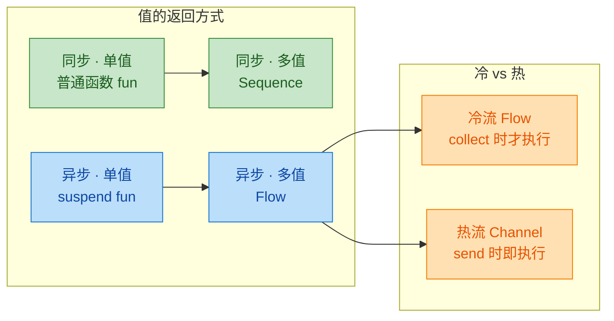

### flow 构建器（flow Builder）

创建一个 `Flow` 最基本的方式就是使用 `flow { ... }` 构建器函数。在这个 lambda 块内部，你可以调用 `emit()` 来向下游发射值。`flow` 构建器内部的代码块被称为**流的体（flow body）**，它本身就是一个挂起函数的上下文，因此你可以在里面自由调用其他挂起函数。

```kotlin
import kotlinx.coroutines.flow.*
import kotlinx.coroutines.delay

// flow { ... } 构建器返回一个 Flow<T> 类型的冷流对象
// 此时没有任何代码被执行——这就是"冷"的含义
val numbersFlow: Flow<Int> = flow {
    println("Flow 开始执行")  // 只有 collect 时才会打印
    for (i in 1..3) {
        delay(1000)           // 模拟异步操作，如网络请求
        emit(i)               // 向下游发射一个值
        println("已发射: $i") // 发射后的日志
    }
    println("Flow 执行完毕")
}
```

这段代码定义完之后，控制台不会有任何输出。`flow { ... }` 只是声明了一个数据流的"蓝图"，真正的执行要等到有人来 `collect` 它。

除了 `flow { ... }` 构建器，Kotlin 还提供了几种便捷的创建方式：

```kotlin
import kotlinx.coroutines.flow.*

// 1. flowOf() —— 从固定的值创建 Flow，类似 listOf()
val fixedFlow: Flow<Int> = flowOf(1, 2, 3)

// 2. .asFlow() —— 将集合或区间转换为 Flow
val rangeFlow: Flow<Int> = (1..5).asFlow()
val listFlow: Flow<String> = listOf("A", "B", "C").asFlow()

// 3. emptyFlow() —— 创建一个空的 Flow，不发射任何值
val empty: Flow<Nothing> = emptyFlow()
```

这些便捷方式本质上都是对 `flow { ... }` 的封装。比如 `flowOf(1, 2, 3)` 等价于：

```kotlin
// flowOf 的等价手写实现
flow {
    emit(1)  // 发射第一个值
    emit(2)  // 发射第二个值
    emit(3)  // 发射第三个值
}
```

理解 `flow` 构建器有一个关键点：**flow body 中的代码每次 collect 都会重新执行**。这意味着如果你对同一个 `Flow` 调用两次 `collect`，整个 flow body 会从头到尾跑两遍。这正是"冷流"的核心特征——每个收集者都会触发一次独立的执行。

```kotlin
import kotlinx.coroutines.*
import kotlinx.coroutines.flow.*

val myFlow = flow {
    println("Flow body 执行了")  // 每次 collect 都会打印
    emit(42)
}

fun main() = runBlocking {
    // 第一次收集
    myFlow.collect { value -> println("第一次收到: $value") }
    // 第二次收集
    myFlow.collect { value -> println("第二次收到: $value") }
}
// 输出:
// Flow body 执行了
// 第一次收到: 42
// Flow body 执行了
// 第二次收到: 42
```

### emit 发射（Emitting Values）

`emit()` 是 `FlowCollector` 接口中定义的唯一一个挂起函数，它是 Flow 内部向下游传递数据的唯一通道。每次调用 `emit(value)` 时，当前协程会**挂起**，直到下游的收集者处理完这个值之后，才会恢复执行并继续发射下一个值。这种机制天然地实现了**背压（backpressure）**——生产者不会比消费者更快。

```kotlin
import kotlinx.coroutines.*
import kotlinx.coroutines.flow.*

fun main() = runBlocking {
    val timedFlow = flow {
        for (i in 1..3) {
            val emitTime = System.currentTimeMillis()
            println("[$emitTime] 准备发射 $i")
            emit(i)  // 挂起，等待下游处理完毕后才恢复
            println("[$emitTime] 发射 $i 完成，下游已处理")
        }
    }

    timedFlow.collect { value ->
        println("  收到 $value，开始处理...")
        delay(2000)  // 模拟耗时处理
        println("  处理 $value 完毕")
    }
}
// 输出（简化时间戳）:
// 准备发射 1
//   收到 1，开始处理...
//   处理 1 完毕
// 发射 1 完成，下游已处理
// 准备发射 2
//   收到 2，开始处理...
//   处理 2 完毕
// 发射 2 完成，下游已处理
// 准备发射 3
//   收到 3，开始处理...
//   处理 3 完毕
// 发射 3 完成，下游已处理
```

从输出可以清晰地看到：`emit` 和 `collect` 是**交替执行**的，形成了一个严格的"发射-处理-发射-处理"的节奏。这与 Channel 的行为不同——Channel 的 `send` 和 `receive` 可以在不同协程中并发执行。

```mermaid
sequenceDiagram
    participant P as flow body<br>生产者
    participant C as collect<br>消费者

    P->>P: emit(1) 挂起
    P->>C: 传递值 1
    C->>C: 处理值 1 (delay 2s)
    C-->>P: 处理完毕, 恢复
    P->>P: emit(2) 挂起
    P->>C: 传递值 2
    C->>C: 处理值 2 (delay 2s)
    C-->>P: 处理完毕, 恢复
    P->>P: emit(3) 挂起
    P->>C: 传递值 3
    C->>C: 处理值 3 (delay 2s)
    C-->>P: 处理完毕, 恢复
    P->>P: flow body 结束
```

`emit` 有一个重要的约束：**它不是线程安全的，不允许从不同的协程中并发调用**。也就是说，你不能在 `flow { ... }` 内部启动多个协程然后同时 `emit`。这是 Flow 的设计原则之一——**顺序性（sequential）**。如果你需要并发地合并多个数据源，应该使用 `channelFlow { ... }` 或者 `merge` 操作符。

```kotlin
import kotlinx.coroutines.*
import kotlinx.coroutines.flow.*

// ❌ 错误示范：不能在 flow 中并发 emit
val badFlow = flow {
    coroutineScope {
        launch { emit(1) }  // 并发 emit，会抛出异常
        launch { emit(2) }
    }
}

// ✅ 正确做法：使用 channelFlow 实现并发发射
val goodFlow = channelFlow {
    launch { send(1) }  // channelFlow 内部使用 send，支持并发
    launch { send(2) }
}
```

`channelFlow` 内部使用了 `Channel` 作为桥梁，因此它支持多协程并发地向下游发送数据，同时对外仍然暴露 `Flow` 接口，保持了 API 的一致性。

另一个值得注意的点是 `emit` 的类型安全。`Flow<T>` 中的 `emit` 只接受类型 `T` 的值，编译器会在编译期帮你检查类型匹配：

```kotlin
// Flow<Int> 只能 emit Int 类型的值
val intFlow: Flow<Int> = flow {
    emit(1)       // ✅ 合法
    emit(2)       // ✅ 合法
    // emit("hello") // ❌ 编译错误：Type mismatch
}
```

### collect 收集（Collecting Values）

`collect` 是 Flow 最核心的**终端操作符（terminal operator）**。它是一个挂起函数，调用后会触发整个 flow body 的执行，并逐个接收上游发射的值。`collect` 会一直挂起，直到 Flow 完成（flow body 正常结束）或者抛出异常。

```kotlin
import kotlinx.coroutines.*
import kotlinx.coroutines.flow.*

fun main() = runBlocking {
    val fruitFlow = flowOf("Apple", "Banana", "Cherry")

    // collect 是挂起函数，必须在协程作用域中调用
    // lambda 参数就是对每个发射值的处理逻辑
    fruitFlow.collect { fruit ->
        println("收到水果: $fruit")
    }

    println("收集完毕，Flow 已结束")
}
// 输出:
// 收到水果: Apple
// 收到水果: Banana
// 收到水果: Cherry
// 收集完毕，Flow 已结束
```

除了基本的 `collect`，Kotlin 还提供了一系列便捷的终端操作符，它们本质上都是对 `collect` 的封装：

```kotlin
import kotlinx.coroutines.*
import kotlinx.coroutines.flow.*

fun main() = runBlocking {
    val numbers = flowOf(1, 2, 3, 4, 5)

    // toList() —— 将所有发射值收集到一个 List 中
    val list: List<Int> = numbers.toList()
    println("toList: $list")  // [1, 2, 3, 4, 5]

    // toSet() —— 收集到 Set 中，自动去重
    val set: Set<Int> = flowOf(1, 2, 2, 3, 3).toSet()
    println("toSet: $set")    // [1, 2, 3]

    // first() —— 只取第一个值，然后取消 Flow
    val first: Int = numbers.first()
    println("first: $first")  // 1

    // single() —— 期望 Flow 只发射一个值，否则抛异常
    val single: Int = flowOf(42).single()
    println("single: $single") // 42

    // reduce() —— 累积操作，类似集合的 reduce
    val sum: Int = numbers.reduce { acc, value ->
        acc + value  // 累加：1+2+3+4+5
    }
    println("reduce sum: $sum") // 15

    // fold() —— 带初始值的累积操作
    val foldResult: Int = numbers.fold(100) { acc, value ->
        acc + value  // 100+1+2+3+4+5
    }
    println("fold: $foldResult") // 115

    // count() —— 统计发射值的数量
    val count: Int = numbers.count()
    println("count: $count")  // 5
}
```

`collect` 的一个重要特性是它**尊重结构化并发（Structured Concurrency）**。当收集 Flow 的协程被取消时，Flow 的执行也会随之取消：

```kotlin
import kotlinx.coroutines.*
import kotlinx.coroutines.flow.*

fun main() = runBlocking {
    val infiniteFlow = flow {
        var i = 0
        while (true) {           // 无限循环发射
            emit(i++)
            delay(500)           // 每 500ms 发射一次
        }
    }

    // withTimeoutOrNull 会在超时后取消内部协程
    val result = withTimeoutOrNull(2200) {
        infiniteFlow.collect { value ->
            println("收到: $value")
        }
    }
    println("结果: $result")  // null，因为超时了
}
// 输出:
// 收到: 0
// 收到: 1
// 收到: 2
// 收到: 3
// 结果: null
```

Flow 在取消时会通过 `CancellationException` 来中断执行，这与协程的取消机制完全一致。由于 `delay` 和 `emit` 都是挂起点，它们会自动检查协程的取消状态。如果你的 flow body 中有 CPU 密集型的计算而没有挂起点，可以使用 `currentCoroutineContext().ensureActive()` 来手动检查取消：

```kotlin
import kotlinx.coroutines.*
import kotlinx.coroutines.flow.*
import kotlin.coroutines.coroutineContext

val cpuIntensiveFlow = flow {
    for (i in 1..1_000_000) {
        // CPU 密集计算，没有自然挂起点
        // 手动检查协程是否已被取消
        currentCoroutineContext().ensureActive()
        emit(i)
    }
}
```

最后，让我们用一张完整的图来总结 Flow 冷流从构建到收集的完整生命周期：

```mermaid
graph LR
    subgraph 构建阶段["构建阶段 (声明)"]
        direction TB
        A["flow { }"]
        B["flowOf()"]
        C[".asFlow()"]
        D["channelFlow { }"]
    end

    subgraph 中间操作["中间操作 (惰性)"]
        direction TB
        E["map / filter"]
        F["transform"]
        G["flowOn"]
        H["buffer"]
    end

    subgraph 终端操作["终端操作 (触发执行)"]
        direction TB
        I["collect { }"]
        J["toList / toSet"]
        K["first / single"]
        L["reduce / fold"]
    end

    A --> E
    B --> E
    C --> E
    D --> E
    E --> I
    F --> I
    G --> J
    H --> K
    E --> L

    classDef green fill:#C8E6C9,stroke:#388E3C,color:#1B5E20
    classDef blue fill:#BBDEFB,stroke:#1976D2,color:#0D47A1
    classDef orange fill:#FFE0B2,stroke:#F57C00,color:#E65100

    class A,B,C,D green
    class E,F,G,H blue
    class I,J,K,L orange
```

Flow 的设计遵循了一个清晰的三段式模型：构建阶段只是声明，中间操作符是惰性的链式变换，只有终端操作符才会真正启动整条流水线。这种"冷启动"的设计让 Flow 天然具备了资源高效利用的优势——没有消费者，就没有计算。

---

**📝 练习题**

以下代码的输出是什么？

```kotlin
val myFlow = flow {
    println("Start")
    emit(1)
    println("Between")
    emit(2)
    println("End")
}

fun main() = runBlocking {
    println("Before collect")
    myFlow.collect { println("Got $it") }
    println("After first collect")
    myFlow.collect { println("Got $it") }
    println("Done")
}
```

A. Before collect → Start → Got 1 → Got 2 → Between → End → After first collect → Got 1 → Got 2 → Done

B. Before collect → Start → Got 1 → Between → Got 2 → End → After first collect → Start → Got 1 → Between → Got 2 → End → Done

C. Before collect → Start → Got 1 → Between → Got 2 → End → After first collect → Got 1 → Between → Got 2 → Done

D. Before collect → Start → Between → End → Got 1 → Got 2 → After first collect → Start → Between → End → Got 1 → Got 2 → Done

**【答案】** B

**【解析】** Flow 是冷流，每次 `collect` 都会从头执行整个 flow body。第一次 `collect` 时：打印 "Start"，`emit(1)` 挂起并将值 1 传给收集者打印 "Got 1"，恢复后打印 "Between"，`emit(2)` 挂起并传值打印 "Got 2"，恢复后打印 "End"。第二次 `collect` 时，整个 flow body 重新执行一遍，所以 "Start"、"Between"、"End" 都会再次出现。选项 C 的错误在于第二次收集时缺少了 "Start" 和 "End"，而 D 的错误在于把所有 emit 的值攒到最后才输出——实际上 `emit` 和 `collect` 是交替执行的。

---

## Flow 操作符（map、filter、transform、take、zip、combine）

Flow 的真正威力不在于简单地发射和收集数据，而在于它提供了一套丰富的中间操作符（Intermediate Operators），让你可以像搭积木一样对数据流进行声明式的变换、过滤和组合。如果你熟悉 Kotlin 集合的 `map`、`filter` 等函数，那 Flow 操作符的学习曲线会非常平缓——它们的语义几乎一致，只不过操作的对象从"静态集合"变成了"异步数据流"。

中间操作符的核心特征是：它们本身不会触发 Flow 的执行，只是返回一个新的 Flow。只有当终端操作符（如 `collect`）被调用时，整个操作链才会真正运行。这就是 Flow 冷流（Cold Stream）特性的体现。

```mermaid
graph LR
    subgraph Source["数据源 Source"]
        direction TB
        E1["emit(1)"]
        E2["emit(2)"]
        E3["emit(3)"]
        E4["emit(4)"]
    end

    subgraph Operators["中间操作符 Operators"]
        direction TB
        F["filter { it > 1 }"]
        M["map { it * 10 }"]
        T["take(2)"]
    end

    subgraph Terminal["终端操作符 Terminal"]
        direction TB
        C["collect { println(it) }"]
        R["结果: 20, 30"]
    end

    Source --> Operators
    Operators --> Terminal

    classDef srcStyle fill:#C8E6C9,stroke:#388E3C,color:#1B5E20
    classDef opStyle fill:#BBDEFB,stroke:#1976D2,color:#0D47A1
    classDef termStyle fill:#FFE0B2,stroke:#F57C20,color:#E65100

    class E1,E2,E3,E4 srcStyle
    class F,M,T opStyle
    class C,R termStyle
```

### map —— 逐元素变换

`map` 是最基础也最常用的变换操作符。它对上游 Flow 发射的每一个元素应用一个转换函数（transform lambda），然后将转换后的结果发射到下游。语义上和 `List.map` 完全一致，区别在于 `map` 的 lambda 是一个挂起函数（suspend function），这意味着你可以在变换过程中执行异步操作。

```kotlin
import kotlinx.coroutines.*
import kotlinx.coroutines.flow.*

// 模拟一个异步查询函数
suspend fun fetchUserName(id: Int): String {
    delay(100) // 模拟网络请求耗时
    return "User_$id" // 返回用户名
}

fun main() = runBlocking {
    // 创建一个发射整数 ID 的 Flow
    val idFlow: Flow<Int> = flowOf(1, 2, 3, 4, 5)

    idFlow
        .map { id ->
            // map 的 lambda 是 suspend 函数，可以调用挂起函数
            // 将每个 ID 转换为用户名
            fetchUserName(id)
        }
        .collect { userName ->
            // 终端操作符，触发整个链路执行
            println(userName) // 输出: User_1, User_2, ... User_5
        }
}
```

`map` 的内部实现非常直观：它创建一个新的 Flow，在新 Flow 的 `collect` 被调用时，去 collect 上游 Flow，对每个收到的值应用变换函数后再 `emit` 出去。

```kotlin
// map 的简化实现原理（帮助理解，非源码）
fun <T, R> Flow<T>.map(transform: suspend (T) -> R): Flow<R> = flow {
    collect { value ->          // 收集上游的每个值
        emit(transform(value))  // 变换后发射到下游
    }
}
```

一个值得注意的点：由于 `map` 的 lambda 是顺序执行的，如果变换操作本身很耗时（比如网络请求），那么整个 Flow 的处理速度会受限于每次变换的耗时。如果你需要并发地执行变换，可以考虑 `flatMapMerge` 等操作符，这属于更高级的话题。

### filter —— 条件过滤

`filter` 操作符根据给定的谓词（predicate）对上游元素进行筛选，只有满足条件的元素才会被发射到下游。同样，它的 lambda 也是挂起函数。

```kotlin
import kotlinx.coroutines.*
import kotlinx.coroutines.flow.*

fun main() = runBlocking {
    // 创建一个 1 到 10 的 Flow
    val numberFlow = (1..10).asFlow()

    numberFlow
        .filter { number ->
            // 只保留偶数
            number % 2 == 0
        }
        .collect { evenNumber ->
            print("$evenNumber ") // 输出: 2 4 6 8 10
        }
}
```

`filter` 和 `map` 经常组合使用，形成"先筛选再变换"或"先变换再筛选"的管道。操作符的顺序会影响性能——通常建议先 `filter` 减少数据量，再 `map` 做变换，这样可以避免对不需要的元素做无谓的计算：

```kotlin
import kotlinx.coroutines.*
import kotlinx.coroutines.flow.*

data class Order(
    val id: Int,          // 订单 ID
    val amount: Double,   // 订单金额
    val isPaid: Boolean   // 是否已支付
)

suspend fun calculateTax(amount: Double): Double {
    delay(50) // 模拟复杂计算
    return amount * 0.13 // 13% 税率
}

fun main() = runBlocking {
    val orders = flowOf(
        Order(1, 100.0, true),
        Order(2, 250.0, false),  // 未支付，会被过滤
        Order(3, 80.0, true),
        Order(4, 500.0, true)
    )

    orders
        .filter { it.isPaid }           // 先过滤：只处理已支付订单
        .map { order ->
            // 再变换：计算税额（耗时操作只对已支付订单执行）
            val tax = calculateTax(order.amount)
            "Order#${order.id}: amount=${order.amount}, tax=$tax"
        }
        .collect { result ->
            println(result)
        }
    // 输出:
    // Order#1: amount=100.0, tax=13.0
    // Order#3: amount=80.0, tax=10.4
    // Order#4: amount=500.0, tax=65.0
}
```

### transform —— 通用变换

`transform` 是 `map` 和 `filter` 的"超集"。它给你完全的控制权——在 lambda 中你可以对每个上游元素发射零个、一个或多个值。实际上，`map` 和 `filter` 都可以用 `transform` 来实现。

`transform` 的 lambda 接收一个 `FlowCollector` 作为 receiver，这意味着你可以在 lambda 内部直接调用 `emit`：

```kotlin
import kotlinx.coroutines.*
import kotlinx.coroutines.flow.*

fun main() = runBlocking {
    val numberFlow = flowOf(1, 2, 3)

    numberFlow
        .transform { value ->
            // 对每个元素，可以发射任意数量的值
            emit("Processing $value...")   // 先发射一个状态提示
            delay(100)                     // 模拟处理耗时
            emit("Result: ${value * value}") // 再发射计算结果
        }
        .collect { message ->
            println(message)
        }
    // 输出:
    // Processing 1...
    // Result: 1
    // Processing 2...
    // Result: 4
    // Processing 3...
    // Result: 9
}
```

用 `transform` 模拟 `map` 和 `filter` 的行为：

```kotlin
import kotlinx.coroutines.*
import kotlinx.coroutines.flow.*

fun main() = runBlocking {
    val flow = flowOf(1, 2, 3, 4, 5)

    // 用 transform 模拟 filter + map
    flow
        .transform { value ->
            if (value % 2 == 0) {       // filter 逻辑：只处理偶数
                emit(value * 10)        // map 逻辑：乘以 10
            }
            // 奇数不调用 emit，等同于被过滤掉
        }
        .collect { println(it) }
    // 输出: 20 40
}
```

`transform` 在实际开发中非常实用。比如在 Android 中，你可能需要在每次网络请求前发射一个 Loading 状态，请求成功后发射 Success 状态，这种"一个输入对应多个输出"的场景就是 `transform` 的主场。

### take —— 限制数量

`take` 操作符只取上游 Flow 的前 N 个元素，达到数量后立即取消上游 Flow 的收集。这是一个"截断型"操作符。

```kotlin
import kotlinx.coroutines.*
import kotlinx.coroutines.flow.*

fun infiniteCounter(): Flow<Int> = flow {
    var count = 0
    while (true) {           // 无限循环发射
        emit(count++)
        delay(100)           // 每 100ms 发射一个
    }
}

fun main() = runBlocking {
    infiniteCounter()
        .take(5)             // 只取前 5 个元素
        .collect { value ->
            println(value)   // 输出: 0, 1, 2, 3, 4
        }
    // take(5) 收到第 5 个元素后，会通过抛出内部异常来取消上游 Flow
    println("Done!")         // 正常到达这里
}
```

`take` 的取消机制值得深入了解。当收集到足够数量的元素后，`take` 会抛出一个内部的 `AbortFlowException` 来终止上游 Flow 的执行。这个异常会被 Flow 基础设施捕获，不会泄漏到外部。但这意味着如果你在 `flow { }` 构建器中使用了 `try-finally`，`finally` 块会被正常执行：

```kotlin
import kotlinx.coroutines.*
import kotlinx.coroutines.flow.*

fun main() = runBlocking {
    val resourceFlow = flow {
        try {
            println("开始发射...")
            emit(1)
            emit(2)
            emit(3) // 这行不会执行，因为 take(2) 已经取消了
        } finally {
            // finally 块会正常执行，适合做资源清理
            println("Flow 被取消，执行清理操作")
        }
    }

    resourceFlow
        .take(2)
        .collect { println("收到: $it") }
    // 输出:
    // 开始发射...
    // 收到: 1
    // 收到: 2
    // Flow 被取消，执行清理操作
}
```

除了 `take`，还有一些相关的限制操作符值得了解：

```kotlin
import kotlinx.coroutines.*
import kotlinx.coroutines.flow.*

fun main() = runBlocking {
    val flow = flowOf(1, 2, 3, 4, 5, 1, 2)

    // takeWhile：持续取元素直到条件不满足，然后停止
    flow.takeWhile { it < 4 }
        .collect { print("$it ") } // 输出: 1 2 3
    println()

    // drop：跳过前 N 个元素
    flow.drop(3)
        .collect { print("$it ") } // 输出: 4 5 1 2
    println()

    // dropWhile：跳过元素直到条件不满足，之后全部发射
    flow.dropWhile { it < 3 }
        .collect { print("$it ") } // 输出: 3 4 5 1 2
}
```

### zip —— 配对组合

`zip` 操作符将两个 Flow 按位置一一配对（pair-wise），用一个合并函数将配对的元素组合成新值。当任意一个 Flow 完成时，`zip` 产生的 Flow 也随之完成，另一个 Flow 会被取消。

```mermaid
graph LR
    subgraph FlowA["Flow A"]
        direction TB
        A1["emit(A)"]
        A2["emit(B)"]
        A3["emit(C)"]
    end

    subgraph FlowB["Flow B"]
        direction TB
        B1["emit(1)"]
        B2["emit(2)"]
        B3["emit(3)"]
    end

    subgraph Zip["zip 配对"]
        direction TB
        Z1["A - 1"]
        Z2["B - 2"]
        Z3["C - 3"]
    end

    FlowA --> Zip
    FlowB --> Zip

    classDef flowAStyle fill:#C8E6C9,stroke:#388E3C,color:#1B5E20
    classDef flowBStyle fill:#BBDEFB,stroke:#1976D2,color:#0D47A1
    classDef zipStyle fill:#F3E5F5,stroke:#7B1FA2,color:#4A148C

    class A1,A2,A3 flowAStyle
    class B1,B2,B3 flowBStyle
    class Z1,Z2,Z3 zipStyle
```

```kotlin
import kotlinx.coroutines.*
import kotlinx.coroutines.flow.*

fun main() = runBlocking {
    // 两个 Flow：名字和年龄
    val names = flowOf("Alice", "Bob", "Charlie")
    val ages = flowOf(25, 30, 28)

    // zip 将两个 Flow 按位置配对
    names.zip(ages) { name, age ->
        "$name is $age years old"  // 合并函数
    }.collect { result ->
        println(result)
    }
    // 输出:
    // Alice is 25 years old
    // Bob is 30 years old
    // Charlie is 28 years old
}
```

`zip` 的一个重要行为是：如果两个 Flow 的发射速度不同，快的那个会等待慢的。也就是说，`zip` 会同步两个 Flow 的节奏：

```kotlin
import kotlinx.coroutines.*
import kotlinx.coroutines.flow.*

fun main() = runBlocking {
    // 快速 Flow：每 100ms 发射一次
    val fastFlow = flow {
        for (i in 1..5) {
            delay(100)
            println("  Fast emit: $i")
            emit(i)
        }
    }

    // 慢速 Flow：每 300ms 发射一次
    val slowFlow = flow {
        for (c in listOf("A", "B", "C")) {
            delay(300)
            println("  Slow emit: $c")
            emit(c)
        }
    }

    val startTime = System.currentTimeMillis()

    fastFlow.zip(slowFlow) { num, letter ->
        "$letter$num"
    }.collect { value ->
        val elapsed = System.currentTimeMillis() - startTime
        println("${elapsed}ms -> Collected: $value")
    }
    // 快速 Flow 会等待慢速 Flow
    // 输出大约:
    // 300ms -> Collected: A1
    // 600ms -> Collected: B2
    // 900ms -> Collected: C3
    // 注意：fastFlow 的第 4、5 个元素被丢弃，因为 slowFlow 只有 3 个元素
}
```

当两个 Flow 长度不同时，`zip` 以较短的那个为准，多余的元素会被忽略（较长的 Flow 会被取消）。

### combine —— 最新值组合

`combine` 和 `zip` 都是组合两个 Flow 的操作符，但行为截然不同。`combine` 在任意一个 Flow 发射新值时，都会取另一个 Flow 的最新值进行组合。这意味着 `combine` 不会像 `zip` 那样严格配对，而是始终使用"最新状态"。

```mermaid
graph LR
    subgraph FlowA["Flow A (慢)"]
        direction TB
        A1["emit(A) @0ms"]
        A2["emit(B) @300ms"]
    end

    subgraph FlowB["Flow B (快)"]
        direction TB
        B1["emit(1) @0ms"]
        B2["emit(2) @100ms"]
        B3["emit(3) @200ms"]
    end

    subgraph Combine["combine 最新值"]
        direction TB
        C1["A-1"]
        C2["A-2"]
        C3["A-3"]
        C4["B-3"]
    end

    FlowA --> Combine
    FlowB --> Combine

    classDef flowAStyle fill:#C8E6C9,stroke:#388E3C,color:#1B5E20
    classDef flowBStyle fill:#BBDEFB,stroke:#1976D2,color:#0D47A1
    classDef combStyle fill:#FFF9C4,stroke:#F9A825,color:#F57F17

    class A1,A2 flowAStyle
    class B1,B2,B3 flowBStyle
    class C1,C2,C3,C4 combStyle
```

```kotlin
import kotlinx.coroutines.*
import kotlinx.coroutines.flow.*

fun main() = runBlocking {
    // 模拟：用户输入的搜索关键词（变化较慢）
    val searchQuery = flow {
        emit("Kotlin")       // 初始搜索词
        delay(500)
        emit("Kotlin Flow")  // 用户继续输入
    }

    // 模拟：排序方式切换（变化较快）
    val sortOrder = flow {
        emit("按时间")
        delay(200)
        emit("按热度")
        delay(200)
        emit("按相关性")
    }

    // combine：任一 Flow 发射新值时，取另一个的最新值组合
    searchQuery.combine(sortOrder) { query, sort ->
        "搜索「$query」，$sort 排序"
    }.collect { result ->
        println(result)
    }
    // 可能的输出（取决于时序）:
    // 搜索「Kotlin」，按时间 排序
    // 搜索「Kotlin」，按热度 排序
    // 搜索「Kotlin」，按相关性 排序
    // 搜索「Kotlin Flow」，按相关性 排序
}
```

`zip` 和 `combine` 的区别是面试高频考点，我们用一张对比表来总结：

```kotlin
// ┌──────────────┬──────────────────────────┬──────────────────────────┐
// │     特性      │          zip             │        combine           │
// ├──────────────┼──────────────────────────┼──────────────────────────┤
// │  配对方式     │ 严格按位置 1:1 配对       │ 任一发射时取最新值组合     │
// │  等待行为     │ 快的等慢的               │ 不等待，用最新值           │
// │  完成条件     │ 任一 Flow 完成即完成      │ 两个 Flow 都完成才完成     │
// │  输出数量     │ = min(flowA, flowB)      │ >= max(flowA, flowB)     │
// │  典型场景     │ 合并两个对应的数据源       │ 合并多个独立变化的状态      │
// │  类比        │ 拉链（zipper）            │ 最新快照（latest snapshot）│
// └──────────────┴──────────────────────────┴──────────────────────────┘
```

`combine` 在 Android 开发中极其常用。典型场景是将多个 `StateFlow`（如用户输入、筛选条件、排序方式）组合成一个 UI 状态：

```kotlin
import kotlinx.coroutines.*
import kotlinx.coroutines.flow.*

// 模拟 ViewModel 中的状态组合
data class UiState(
    val query: String,       // 搜索关键词
    val category: String,    // 分类筛选
    val isLoading: Boolean   // 加载状态
)

fun main() = runBlocking {
    // 三个独立的状态源（实际项目中通常是 MutableStateFlow）
    val queryFlow = MutableStateFlow("")
    val categoryFlow = MutableStateFlow("全部")
    val loadingFlow = MutableStateFlow(false)

    // 使用 combine 将三个状态合并为一个 UiState
    val uiState: Flow<UiState> = combine(
        queryFlow,       // 参数1：搜索词 Flow
        categoryFlow,    // 参数2：分类 Flow
        loadingFlow      // 参数3：加载状态 Flow
    ) { query, category, isLoading ->
        // 任何一个 Flow 发射新值时，都会用三者的最新值重新组合
        UiState(query, category, isLoading)
    }

    // 在后台收集 UI 状态
    val job = launch {
        uiState.collect { state ->
            println("UI 更新: $state")
        }
    }

    delay(100)
    queryFlow.value = "Kotlin"       // 触发重新组合
    delay(100)
    categoryFlow.value = "教程"       // 再次触发
    delay(100)
    loadingFlow.value = true          // 又一次触发
    delay(100)

    job.cancel()
    // 输出:
    // UI 更新: UiState(query=, category=全部, isLoading=false)
    // UI 更新: UiState(query=Kotlin, category=全部, isLoading=false)
    // UI 更新: UiState(query=Kotlin, category=教程, isLoading=false)
    // UI 更新: UiState(query=Kotlin, category=教程, isLoading=true)
}
```

注意上面的 `combine` 接收了三个 Flow 参数——`combine` 函数有多个重载版本，支持 2 到 5 个 Flow 的组合，还有一个接收 `Array<Flow>` 的版本用于更多 Flow 的场景。

### 操作符链式组合实战

真正的威力在于将多个操作符串联起来，形成声明式的数据处理管道。下面是一个综合示例，模拟一个实时数据处理场景：

```kotlin
import kotlinx.coroutines.*
import kotlinx.coroutines.flow.*

// 模拟传感器数据
data class SensorReading(
    val sensorId: String,    // 传感器 ID
    val temperature: Double, // 温度读数
    val timestamp: Long      // 时间戳
)

// 模拟传感器数据流
fun sensorDataFlow(): Flow<SensorReading> = flow {
    val sensors = listOf("S1", "S2", "S3")
    var time = 0L
    repeat(20) { i ->
        val reading = SensorReading(
            sensorId = sensors[i % 3],                    // 轮流产生三个传感器的数据
            temperature = 20.0 + (Math.random() * 15),    // 20~35 度随机温度
            timestamp = time
        )
        emit(reading)
        time += 1000
        delay(50) // 模拟数据产生间隔
    }
}

fun main() = runBlocking {
    sensorDataFlow()
        .filter { reading ->
            // 第一步：只关注 S1 传感器的数据
            reading.sensorId == "S1"
        }
        .map { reading ->
            // 第二步：将摄氏度转换为华氏度
            reading.copy(
                temperature = reading.temperature * 9.0 / 5.0 + 32.0
            )
        }
        .filter { reading ->
            // 第三步：只保留高温告警（华氏 90 度以上）
            reading.temperature > 90.0
        }
        .transform { reading ->
            // 第四步：为每个告警生成两条消息
            emit("⚠️ 高温告警: ${reading.sensorId} " +
                 "温度 ${"%.1f".format(reading.temperature)}°F")
            emit("   时间戳: ${reading.timestamp}ms")
        }
        .take(6) // 第五步：只取前 6 条消息（即前 3 个告警）
        .collect { message ->
            println(message)
        }
}
```

这个例子展示了 `filter → map → filter → transform → take` 的链式组合。每个操作符各司其职，代码的意图一目了然。这就是声明式编程的魅力——你描述"做什么"，而不是"怎么做"。

### 其他常用操作符速览

除了上面详细讲解的六个核心操作符，Flow 还提供了许多实用的操作符，这里做一个快速索引：

```kotlin
import kotlinx.coroutines.*
import kotlinx.coroutines.flow.*

fun main() = runBlocking {
    val flow = flowOf(1, 2, 2, 3, 3, 3, 4)

    // distinctUntilChanged：去除连续重复值
    flow.distinctUntilChanged()
        .collect { print("$it ") } // 输出: 1 2 3 4
    println()

    // onEach：对每个元素执行副作用（不改变元素本身）
    flowOf("A", "B", "C")
        .onEach { println("  即将发射: $it") } // 日志、埋点等副作用
        .collect { print("$it ") }
    println()

    // reduce：将所有元素归约为单个值（终端操作符）
    val sum = flowOf(1, 2, 3, 4, 5)
        .reduce { accumulator, value ->
            accumulator + value  // 累加
        }
    println("Sum = $sum") // 输出: Sum = 15

    // fold：带初始值的归约（终端操作符）
    val product = flowOf(1, 2, 3, 4)
        .fold(1) { acc, value ->
            acc * value  // 累乘
        }
    println("Product = $product") // 输出: Product = 24

    // toList / toSet：收集为集合（终端操作符）
    val list = flowOf(1, 2, 3).toList()
    println("List = $list") // 输出: List = [1, 2, 3]

    // first / firstOrNull：取第一个元素（终端操作符）
    val first = flowOf(10, 20, 30).first()
    println("First = $first") // 输出: First = 10

    // count：计数（终端操作符）
    val count = flowOf(1, 2, 3, 4, 5)
        .filter { it % 2 == 0 }
        .count()
    println("Even count = $count") // 输出: Even count = 2
}
```

---

**📝 练习题 1**

以下代码的输出是什么？

```kotlin
fun main() = runBlocking {
    flowOf(1, 2, 3, 4, 5)
        .filter { it % 2 != 0 }
        .map { it * it }
        .take(2)
        .collect { print("$it ") }
}
```

A. `1 4 9 16 25`

B. `1 9`

C. `1 4`

D. `1 9 25`

**【答案】** B

**【解析】** `filter { it % 2 != 0 }` 保留奇数 `1, 3, 5`。然后 `map { it * it }` 将它们平方得到 `1, 9, 25`。最后 `take(2)` 只取前两个，所以输出 `1 9`。操作符是惰性的、顺序执行的：元素 1 通过 filter → map → take（计数 1）→ collect 输出；元素 2 被 filter 拦截；元素 3 通过 filter → map → take（计数 2，达到上限）→ collect 输出；之后 take 取消上游，元素 4、5 不再处理。

---

## Flow 上下文（Flow Context）

在前面的章节中，我们已经掌握了 Flow 的基本构建与操作符链式调用。但有一个关键问题一直被隐含地回避了——**Flow 的代码到底运行在哪个协程上下文中？** 当我们在 `flow { ... }` 里执行耗时的数据库查询或网络请求时，它会阻塞主线程吗？当我们在 `collect { ... }` 里更新 UI 时，能保证在主线程吗？

这就是 Flow 上下文（Flow Context）要解决的核心问题。Kotlin 协程为 Flow 设计了一套严格而优雅的上下文保持机制（Context Preservation），并通过 `flowOn` 操作符提供了安全切换上下文的能力。同时，为了解决生产速度与消费速度不匹配的问题，还提供了 `buffer`、`conflate`、`collectLatest` 等缓冲策略。

### 上下文保持原则（Context Preservation）

Flow 有一条铁律，理解它是掌握 Flow 上下文的前提：

> **Flow 的 `emit` 和 `collect` 必须在同一个协程上下文中执行。**

这条规则被称为 **上下文保持原则（Context Preservation）**。它的设计意图是让 Flow 的行为可预测——收集者（collector）在哪个上下文启动收集，发射者（emitter）就在哪个上下文发射值。

```kotlin
// ✅ 正确：flow 默认继承 collect 所在的上下文
fun simpleFlow(): Flow<Int> = flow {
    // 这里的代码运行在 collect 被调用时的上下文中
    println("Flow started in: ${Thread.currentThread().name}") // 打印当前线程名
    for (i in 1..3) {
        delay(100) // 模拟异步操作，挂起但不阻塞线程
        emit(i)    // 发射值，与 collect 在同一上下文
    }
}

fun main() = runBlocking {
    // collect 在 runBlocking 的上下文中调用（主线程）
    simpleFlow().collect { value ->
        // 收集也在主线程
        println("Collected $value in: ${Thread.currentThread().name}")
    }
}
// 输出：
// Flow started in: main
// Collected 1 in: main
// Collected 2 in: main
// Collected 3 in: main
```

这段代码中，`flow { ... }` 构建器内部的代码和 `collect { ... }` 的 lambda 都运行在 `main` 线程上，因为 `collect` 是在 `runBlocking`（主线程）的协程作用域中被调用的。

那如果我们试图在 `flow { ... }` 内部手动切换上下文会怎样？

```kotlin
// ❌ 错误示范：在 flow 构建器内部使用 withContext 切换上下文
fun wrongFlow(): Flow<Int> = flow {
    // 试图在 flow 内部切换到 IO 调度器
    withContext(Dispatchers.IO) {
        emit(1) // 💥 这里会抛出 IllegalStateException!
    }
}

fun main() = runBlocking {
    wrongFlow().collect { value ->
        println(value)
    }
}
// 抛出异常：
// java.lang.IllegalStateException:
// Flow invariant is violated:
// Flow was collected in [BlockingCoroutine, BlockingEventLoop],
// but emission happened in [DispatchedCoroutine, Dispatchers.IO].
```

Kotlin 会在运行时检测到这种违规行为并直接抛出 `IllegalStateException`。错误信息非常明确：Flow 在一个上下文中被收集，却在另一个上下文中发射，这违反了 Flow 的不变量（invariant）。

为什么要有这条限制？原因有两个：

1. **线程安全**：如果 `emit` 和 `collect` 可以在不同线程中随意执行，那么中间操作符（如 `map`、`filter`）的状态管理将变得极其复杂，需要额外的同步机制。
2. **可预测性**：收集者可以确信，自己收到的每一个值都来自同一个上下文，不需要担心线程切换带来的竞态条件。

```mermaid
graph LR
    subgraph ContextRule["上下文保持原则"]
        direction TB
        E["emit() 发射端"]
        O["中间操作符 map/filter"]
        C["collect() 收集端"]
        E --> O --> C
    end

    subgraph Correct["✅ 合法"]
        direction TB
        A1["同一上下文"]
        A2["使用 flowOn 切换"]
    end

    subgraph Wrong["❌ 违规"]
        direction TB
        B1["flow 内 withContext"]
        B2["flow 内手动切调度器"]
    end

    ContextRule --> Correct
    ContextRule --> Wrong

    classDef ruleBox fill:#E3F2FD,stroke:#1565C0,color:#0D47A1
    classDef okBox fill:#E8F5E9,stroke:#2E7D32,color:#1B5E20
    classDef errBox fill:#FFEBEE,stroke:#C62828,color:#B71C1C

    class ContextRule ruleBox
    class Correct,A1,A2 okBox
    class Wrong,B1,B2 errBox
    class E,O,C ruleBox
```

### flowOn 操作符——安全切换上游上下文

既然不能在 `flow { ... }` 内部用 `withContext` 切换上下文，那如何让耗时的数据生产逻辑运行在后台线程呢？答案就是 `flowOn` 操作符。

`flowOn` 的作用是：**改变它上游（upstream）的 Flow 执行上下文，而不影响下游（downstream）。**

```kotlin
fun heavyComputationFlow(): Flow<Int> = flow {
    // 这段代码将运行在 Dispatchers.Default 上（由下方 flowOn 指定）
    println("Emitting in: ${Thread.currentThread().name}")
    for (i in 1..3) {
        Thread.sleep(100) // 模拟 CPU 密集型计算（注意这里用 sleep 模拟阻塞）
        emit(i)           // 发射计算结果
    }
}.flowOn(Dispatchers.Default) // 将上游切换到 Default 调度器（计算线程池）

fun main() = runBlocking {
    // collect 仍然在主线程（runBlocking 的上下文）
    heavyComputationFlow().collect { value ->
        println("Collected $value in: ${Thread.currentThread().name}")
    }
}
// 输出（线程名可能略有不同）：
// Emitting in: DefaultDispatcher-worker-1
// Collected 1 in: main
// Collected 2 in: main
// Collected 3 in: main
```

可以看到，`emit` 运行在 `DefaultDispatcher-worker-1` 线程上，而 `collect` 仍然在 `main` 线程。`flowOn` 成功地将上游的执行上下文切换到了 `Dispatchers.Default`，同时保持了下游（收集端）的上下文不变。

`flowOn` 的关键特性：

- 它只影响**上游**操作符，不影响下游
- 它在内部创建了一个新的协程来执行上游逻辑
- 上游和下游之间通过 Channel 进行通信（这也是为什么 `flowOn` 自带缓冲效果）

```kotlin
// flowOn 只影响它上方的操作符
fun example(): Flow<Int> = flow {
    // ③ 运行在 Dispatchers.IO 上（被最近的 flowOn 影响）
    println("emit in: ${Thread.currentThread().name}")
    emit(1)
}
.map { value ->
    // ② 运行在 Dispatchers.IO 上（在 flowOn(IO) 的上游范围内）
    println("map in: ${Thread.currentThread().name}")
    value * 10
}
.flowOn(Dispatchers.IO) // 将上面所有操作切换到 IO 调度器
.filter { value ->
    // ① 运行在 collect 的上下文中（flowOn 的下游，不受影响）
    println("filter in: ${Thread.currentThread().name}")
    value > 5
}
```

当存在多个 `flowOn` 时，每个 `flowOn` 只影响它与上一个 `flowOn` 之间的操作符：

```kotlin
fun multiFlowOn(): Flow<Int> = flow {
    // 运行在 Dispatchers.IO（被第一个 flowOn 影响）
    println("emit in: ${Thread.currentThread().name}")
    emit(1)
}
.flowOn(Dispatchers.IO)        // 第一个 flowOn：将 flow{} 切到 IO
.map { value ->
    // 运行在 Dispatchers.Default（被第二个 flowOn 影响）
    println("map in: ${Thread.currentThread().name}")
    value * 2
}
.flowOn(Dispatchers.Default)   // 第二个 flowOn：将 map 切到 Default
.collect { value ->
    // 运行在调用者的上下文（如 main 线程）
    println("collect in: ${Thread.currentThread().name}")
}
```

```mermaid
graph LR
    subgraph IO["Dispatchers.IO"]
        direction TB
        F["flow { emit(1) }"]
    end

    subgraph Default["Dispatchers.Default"]
        direction TB
        M["map { it * 2 }"]
    end

    subgraph Main["调用者上下文 Main"]
        direction TB
        C["collect { ... }"]
    end

    F -- "flowOn IO" --> M
    M -- "flowOn Default" --> C

    classDef ioStyle fill:#E8F5E9,stroke:#2E7D32,color:#1B5E20
    classDef defaultStyle fill:#E3F2FD,stroke:#1565C0,color:#0D47A1
    classDef mainStyle fill:#FFF3E0,stroke:#E65100,color:#BF360C

    class IO,F ioStyle
    class Default,M defaultStyle
    class Main,C mainStyle
```

### flowOn 的内部机制

`flowOn` 并不是简单地包了一层 `withContext`。它的实现要精妙得多——它在上游和下游之间引入了一个 **Channel（通道）** 作为缓冲桥梁。

```kotlin
// flowOn 的简化伪代码，帮助理解其内部原理
fun <T> Flow<T>.flowOn(context: CoroutineContext): Flow<T> = flow {
    // 创建一个 Channel 作为上下游之间的桥梁
    val channel = Channel<T>()

    // 在指定的 context 中启动一个新协程来执行上游
    val job = CoroutineScope(context).launch {
        this@flowOn.collect { value ->
            channel.send(value) // 上游产生的值通过 Channel 发送
        }
        channel.close() // 上游完成后关闭 Channel
    }

    // 在当前上下文中从 Channel 接收值并向下游发射
    for (value in channel) {
        emit(value) // 从 Channel 取出值，发射给下游
    }

    job.join() // 等待上游协程完成
}
```

这个设计带来了一个重要的副作用：**`flowOn` 天然具有缓冲能力**。因为上游在一个独立协程中运行，它可以在下游还没来得及消费时就继续生产，多余的值会暂存在 Channel 中。

### 缓冲 buffer——解耦生产与消费速度

在实际场景中，生产者和消费者的速度往往不一致。比如，数据库查询每 100ms 产出一条记录，但 UI 渲染每条需要 300ms。如果没有缓冲，整个流水线的吞吐量将被最慢的环节拖累。

先看没有缓冲时的情况：

```kotlin
fun simpleFlow(): Flow<Int> = flow {
    for (i in 1..3) {
        delay(100) // 模拟生产耗时 100ms
        emit(i)
        println("Emitted $i at ${System.currentTimeMillis()}")
    }
}

fun main() = runBlocking {
    val startTime = System.currentTimeMillis()

    simpleFlow().collect { value ->
        delay(300) // 模拟消费耗时 300ms
        println("Collected $value at ${System.currentTimeMillis() - startTime}ms")
    }
}
// 输出（大约）：
// Emitted 1 at ...
// Collected 1 at 400ms    (100 + 300)
// Emitted 2 at ...
// Collected 2 at 800ms    (400 + 100 + 300)
// Emitted 3 at ...
// Collected 3 at 1200ms   (800 + 100 + 300)
// 总耗时约 1200ms
```

没有缓冲时，`emit` 和 `collect` 是**串行**的：发射一个值 → 等待收集完成 → 再发射下一个值。总耗时 = 3 × (100 + 300) = 1200ms。

```kotlin
// 使用 buffer 操作符引入缓冲
fun main() = runBlocking {
    val startTime = System.currentTimeMillis()

    simpleFlow()
        .buffer() // 引入缓冲，让生产和消费并发执行
        .collect { value ->
            delay(300) // 消费仍然需要 300ms
            println("Collected $value at ${System.currentTimeMillis() - startTime}ms")
        }
}
// 输出（大约）：
// Collected 1 at 400ms    (100 生产 + 300 消费)
// Collected 2 at 700ms    (400 + 300，第2个值早已在缓冲中等待)
// Collected 3 at 1000ms   (700 + 300，第3个值也早已就绪)
// 总耗时约 1000ms（节省了 200ms）
```

使用 `buffer()` 后，生产和消费可以**并发**进行。当消费者在处理第 1 个值时，生产者不需要等待，可以继续生产第 2、第 3 个值并放入缓冲区。总耗时 ≈ 100（首次生产）+ 3 × 300（消费）= 1000ms。

```mermaid
graph LR
    subgraph NoBuf["无缓冲 串行执行 ~1200ms"]
        direction TB
        NE1["emit 1 (100ms)"] --> NC1["collect 1 (300ms)"]
        NC1 --> NE2["emit 2 (100ms)"]
        NE2 --> NC2["collect 2 (300ms)"]
        NC2 --> NE3["emit 3 (100ms)"]
        NE3 --> NC3["collect 3 (300ms)"]
    end

    subgraph WithBuf["有缓冲 并发执行 ~1000ms"]
        direction TB
        BE["emit 1,2,3 并发生产"] --> BUF["Buffer 缓冲区"]
        BUF --> BC1["collect 1 (300ms)"]
        BC1 --> BC2["collect 2 (300ms)"]
        BC2 --> BC3["collect 3 (300ms)"]
    end

    NoBuf ~~~ WithBuf

    classDef slowStyle fill:#FFEBEE,stroke:#C62828,color:#B71C1C
    classDef fastStyle fill:#E8F5E9,stroke:#2E7D32,color:#1B5E20
    classDef bufStyle fill:#FFF8E1,stroke:#F9A825,color:#E65100

    class NoBuf,NE1,NC1,NE2,NC2,NE3,NC3 slowStyle
    class WithBuf,BE,BC1,BC2,BC3 fastStyle
    class BUF bufStyle
```

`buffer()` 接受一个可选的容量参数：

```kotlin
// 指定缓冲区容量
flow.buffer(capacity = 10)          // 固定容量为 10
flow.buffer(Channel.UNLIMITED)      // 无限容量（慎用，可能导致 OOM）
flow.buffer(Channel.CONFLATED)      // 合并模式，等价于 conflate()
flow.buffer(Channel.RENDEZVOUS)     // 容量为 0，无缓冲（默认行为）
flow.buffer(Channel.BUFFERED)       // 使用默认缓冲大小（通常为 64）
```

还可以指定溢出策略（`BufferOverflow`），当缓冲区满时决定如何处理：

```kotlin
flow.buffer(
    capacity = 10,
    onBufferOverflow = BufferOverflow.SUSPEND     // 默认：挂起生产者，等待消费者腾出空间
)
flow.buffer(
    capacity = 10,
    onBufferOverflow = BufferOverflow.DROP_OLDEST // 丢弃缓冲区中最旧的值
)
flow.buffer(
    capacity = 10,
    onBufferOverflow = BufferOverflow.DROP_LATEST // 丢弃最新尝试放入的值
)
```

### conflate——只关心最新值

`conflate()` 是一种特殊的缓冲策略：当消费者来不及处理时，**丢弃中间值，只保留最新的**。这在 UI 场景中非常常见——如果传感器每 10ms 推送一次数据，但 UI 刷新需要 100ms，那中间的 9 个值其实没有意义，我们只关心最新状态。

```kotlin
fun sensorFlow(): Flow<Int> = flow {
    for (i in 1..5) {
        delay(100) // 传感器每 100ms 产出一个值
        emit(i)
        println("Emitted $i")
    }
}

fun main() = runBlocking {
    val startTime = System.currentTimeMillis()

    sensorFlow()
        .conflate() // 合并：消费者忙碌时丢弃中间值，只保留最新
        .collect { value ->
            delay(300) // UI 渲染需要 300ms
            println("Collected $value at ${System.currentTimeMillis() - startTime}ms")
        }
}
// 输出（大约）：
// Emitted 1
// Emitted 2
// Emitted 3
// Collected 1 at 400ms   (第1个值正常消费)
// Emitted 4
// Emitted 5
// Collected 3 at 700ms   (第2个值被跳过，直接拿到当时最新的第3个)
// Collected 5 at 1000ms  (第4个值被跳过，直接拿到最新的第5个)
```

注意输出中 `Collected 2` 和 `Collected 4` 消失了——它们在消费者忙碌时被更新的值覆盖了。`conflate()` 本质上等价于 `buffer(capacity = Channel.CONFLATED)`，即缓冲区大小为 1 且溢出时丢弃旧值。

### collectLatest——取消旧的，处理新的

`collectLatest` 提供了另一种处理背压的思路：当新值到来时，**取消正在进行的收集操作，重新开始处理最新值**。

```kotlin
fun searchQueryFlow(): Flow<String> = flow {
    // 模拟用户快速输入搜索关键词
    val queries = listOf("K", "Ko", "Kot", "Kotl", "Kotlin")
    for (query in queries) {
        delay(100) // 每 100ms 输入一个字符
        emit(query)
        println("User typed: $query")
    }
}

fun main() = runBlocking {
    searchQueryFlow()
        .collectLatest { query ->
            // 模拟网络搜索请求，耗时 300ms
            println("Searching for: $query ...")
            delay(300) // 如果在这 300ms 内有新值到来，这个协程会被取消
            println("Search result for: $query ✅")
        }
}
// 输出（大约）：
// User typed: K
// Searching for: K ...
// User typed: Ko
// Searching for: Ko ...       (K 的搜索被取消了)
// User typed: Kot
// Searching for: Kot ...      (Ko 的搜索被取消了)
// User typed: Kotl
// Searching for: Kotl ...     (Kot 的搜索被取消了)
// User typed: Kotlin
// Searching for: Kotlin ...   (Kotl 的搜索被取消了)
// Search result for: Kotlin ✅ (只有最后一个搜索完成了)
```

这正是搜索框 debounce 的经典模式：用户还在输入时，之前的搜索请求会被自动取消，只有用户停止输入后的最终查询才会真正完成。`collectLatest` 内部的 lambda 是在一个独立的协程中执行的，每当新值到来，旧协程就会被 `cancel`。

### conflate vs collectLatest 对比

这两者都是处理"消费者跟不上生产者"的策略，但机制完全不同：

```kotlin
// conflate：生产者端合并，消费者完整执行
flow.conflate().collect { value ->
    // 每次 collect 都会完整执行
    // 但可能跳过一些中间值
    heavyProcess(value) // 一定会执行完毕
}

// collectLatest：消费者端取消重启
flow.collectLatest { value ->
    // 如果有新值到来，当前执行会被取消
    heavyProcess(value) // 可能被中途取消！
}
```

```mermaid
graph LR
    subgraph Conflate["conflate 合并策略"]
        direction TB
        CF1["emit 1,2,3,4,5"]
        CF2["缓冲区只保留最新"]
        CF3["collect 1 完整执行"]
        CF4["collect 3 完整执行"]
        CF5["collect 5 完整执行"]
        CF1 --> CF2 --> CF3 --> CF4 --> CF5
    end

    subgraph Latest["collectLatest 取消策略"]
        direction TB
        CL1["emit 1,2,3,4,5"]
        CL2["collect 1 被取消"]
        CL3["collect 2 被取消"]
        CL4["collect 3 被取消"]
        CL5["collect 4 被取消"]
        CL6["collect 5 完整执行"]
        CL1 --> CL2 --> CL3 --> CL4 --> CL5 --> CL6
    end

    Conflate ~~~ Latest

    classDef confStyle fill:#E8F5E9,stroke:#2E7D32,color:#1B5E20
    classDef latestStyle fill:#E3F2FD,stroke:#1565C0,color:#0D47A1
    classDef cancelStyle fill:#FFEBEE,stroke:#C62828,color:#B71C1C

    class Conflate,CF1,CF2,CF3,CF4,CF5 confStyle
    class Latest,CL1,CL6 latestStyle
    class CL2,CL3,CL4,CL5 cancelStyle
```

选择建议：
- **conflate**：适合"状态展示"场景，如传感器数据、股票行情。消费者的处理逻辑不会被打断，只是可能跳过一些中间状态。
- **collectLatest**：适合"请求-响应"场景，如搜索建议、自动补全。旧的请求没有意义，应该尽快取消以节省资源。

### 实战：Android 中的典型用法

在 Android 开发中，Flow 上下文切换是日常操作。以下是一个典型的 ViewModel 模式：

```kotlin
class UserViewModel(
    private val userRepository: UserRepository // 数据仓库，封装了网络/数据库操作
) : ViewModel() {

    // 搜索关键词的 StateFlow（后续章节会详细讲解）
    private val _searchQuery = MutableStateFlow("") // 初始值为空字符串

    // 搜索结果 Flow
    val searchResults: Flow<List<User>> = _searchQuery
        .debounce(300) // 防抖：用户停止输入 300ms 后才触发搜索
        .filter { it.isNotBlank() } // 过滤空白输入
        .map { query ->
            // 这个 map 将在 IO 调度器上执行（由下方 flowOn 指定）
            userRepository.searchUsers(query) // 网络请求或数据库查询
        }
        .flowOn(Dispatchers.IO) // 将上游的 map（网络请求）切换到 IO 线程
        .catch { e ->
            // 异常处理（在 collect 的上下文中执行）
            emit(emptyList()) // 出错时发射空列表
        }

    // 在 Activity/Fragment 中收集
    // lifecycleScope.launch {
    //     viewModel.searchResults
    //         .collectLatest { users ->
    //             // 在主线程更新 UI
    //             adapter.submitList(users)
    //         }
    // }
}
```

这段代码展示了 Flow 上下文在实际项目中的完整应用：
1. `flowOn(Dispatchers.IO)` 确保网络请求不在主线程执行
2. `debounce` + `collectLatest` 组合实现高效的搜索体验
3. `catch` 处理异常，保证 UI 不会崩溃

### flowOn 与 launchIn 的配合

除了在 `collect` 端指定上下文，还可以用 `launchIn` 配合 `onEach` 来简化代码：

```kotlin
fun events(): Flow<Event> = flow {
    // 产生事件流
    emit(Event.Loading)
    delay(1000)
    emit(Event.Success(data))
}

fun main() = runBlocking {
    events()
        .flowOn(Dispatchers.IO)       // 上游在 IO 线程执行
        .onEach { event ->
            // onEach 相当于 collect 的替代，但不是终端操作符
            updateUI(event)            // 在 launchIn 指定的作用域中执行
        }
        .launchIn(this)               // 在当前 CoroutineScope 中启动收集
    // launchIn 返回 Job，可以用来取消收集

    println("Flow launched, not blocking here") // 这行会立即执行
}
```

`launchIn` 的优势在于它是**非阻塞**的——它启动一个新协程来收集 Flow，调用方可以继续执行后续代码。而 `collect` 是挂起函数，会阻塞当前协程直到 Flow 完成。

### 性能考量与最佳实践

```kotlin
// ❌ 不推荐：多次不必要的 flowOn 切换
flow { emit(1) }
    .map { it * 2 }
    .flowOn(Dispatchers.IO)       // 切到 IO
    .filter { it > 0 }
    .flowOn(Dispatchers.Default)  // 又切到 Default
    .map { it.toString() }
    .flowOn(Dispatchers.IO)       // 又切回 IO
    // 每个 flowOn 都会创建新的协程和 Channel，增加开销

// ✅ 推荐：合理分组，减少上下文切换次数
flow {
    // 所有 IO 操作放在一起
    val data = fetchFromNetwork()  // 网络请求
    val cached = readFromDB()      // 数据库读取
    emit(data + cached)
}
.flowOn(Dispatchers.IO)            // 一次 flowOn 搞定所有 IO 操作
.map { it.toUIModel() }           // 轻量转换，可以在主线程做
.collect { updateUI(it) }         // 主线程更新 UI
```

关键原则总结：
- `flowOn` 只影响上游，不影响下游
- 每个 `flowOn` 都有创建协程和 Channel 的开销，不要滥用
- `buffer()` 解耦生产消费速度，提升吞吐量
- `conflate()` 丢弃中间值，适合状态展示

---

## Flow 异常处理

在响应式数据流编程中，异常处理是一个绕不开的核心话题。与传统的 `try-catch` 不同，Flow 作为一条声明式的数据管道，它的异常处理有着自己独特的哲学——**异常透明性 (Exception Transparency)**。理解这个原则，是写出健壮 Flow 代码的关键。

一条 Flow 链路中，异常可能在三个阶段产生：

```
text
┌─────────────┐      ┌──────────────────┐      ┌─────────────┐
│  上游 emit   │ ───▶ │  中间操作符变换    │ ───▶ │  下游 collect │
│  (Producer)  │      │  (Intermediate)   │      │  (Consumer)  │
└─────────────┘      └──────────────────┘      └─────────────┘
   可能抛异常            可能抛异常               可能抛异常
```

Flow 提供了 `catch` 操作符来优雅地拦截上游异常，以及 `onCompletion` 操作符来处理流的终结信号。接下来我们逐一深入。

---

### catch 操作符

`catch` 是 Flow 中最核心的异常处理操作符。它的作用类似于在流的管道中间插入一个 `try-catch` 块，但它只能捕获**上游**（即它左边）抛出的异常。

先看一个最基础的例子：

```kotlin
import kotlinx.coroutines.*
import kotlinx.coroutines.flow.*

// 模拟一个会在发射过程中出错的 Flow
fun riskyFlow(): Flow<Int> = flow {
    emit(1)                    // 正常发射第一个值
    emit(2)                    // 正常发射第二个值
    throw RuntimeException("数据源出错了！") // 第三次发射时抛出异常
    emit(3)                    // 这行永远不会执行
}

fun main() = runBlocking {
    riskyFlow()
        .catch { e ->
            // catch 块捕获了上游 flow 构建器中抛出的异常
            println("捕获到异常: ${e.message}")
            // 可以在这里发射一个兜底值（fallback value）
            emit(-1)
        }
        .collect { value ->
            // 收集器正常接收值
            println("收到: $value")
        }
}
```

```text
收到: 1
收到: 2
捕获到异常: 数据源出错了！
收到: -1
```

这段代码展示了 `catch` 的两个关键能力：

1. 拦截上游异常，防止它传播到 `collect`，避免整个协程崩溃。
2. 在 `catch` 块内部可以调用 `emit()` 发射替代值，让下游继续正常工作。这在实际开发中非常实用——比如网络请求失败时，可以 `emit` 一份本地缓存数据。

`catch` 还可以做更多事情：

```kotlin
fun main() = runBlocking {
    riskyFlow()
        .catch { e ->
            when (e) {
                // 根据异常类型做不同处理
                is IllegalStateException -> {
                    println("状态异常，发射默认值")
                    emit(0)                // 发射兜底值，流继续
                }
                is RuntimeException -> {
                    println("运行时异常，记录日志后重新抛出")
                    throw e                // 重新抛出，异常继续向下传播
                }
                else -> {
                    println("未知异常: ${e.message}")
                    // 什么都不做，异常被吞掉，流正常结束
                }
            }
        }
        .collect { value ->
            println("收到: $value")
        }
}
```

在 `catch` 内部，你有三种选择：

- 调用 `emit(...)` 发射替代值，流继续正常运行
- 调用 `throw` 重新抛出异常（原样或包装后），异常继续传播
- 什么都不做，异常被静默吞掉，流正常完成

下面这张流程图清晰地展示了 `catch` 在 Flow 管道中的工作位置和决策逻辑：

```mermaid
graph LR
    subgraph upstream["上游 Upstream"]
        direction TB
        A["flow 构建器<br/>emit 值"] --> B["中间操作符<br/>map / filter"]
    end

    subgraph catchBlock["catch 操作符"]
        direction TB
        C{"异常发生?"} -->|Yes| D["进入 catch 块"]
        C -->|No| E["值透传到下游"]
        D --> F{"处理策略"}
        F -->|"emit 兜底值"| G["发射替代值"]
        F -->|"throw 重抛"| H["异常继续传播"]
        F -->|"静默吞掉"| I["流正常结束"]
    end

    subgraph downstream["下游 Downstream"]
        direction TB
        J["collect 收集器"]
    end

    upstream --> catchBlock
    E --> downstream
    G --> downstream
    H -.->|"崩溃"| downstream

    classDef greenNode fill:#C8E6C9,stroke:#388E3C,color:#1B5E20
    classDef blueNode fill:#BBDEFB,stroke:#1976D2,color:#0D47A1
    classDef orangeNode fill:#FFE0B2,stroke:#F57C00,color:#E65100
    classDef redNode fill:#FFCDD2,stroke:#D32F2F,color:#B71C1C

    class A,B greenNode
    class C,D,F blueNode
    class E,G,I orangeNode
    class H redNode
```

需要特别注意的一点：**`catch` 只能捕获上游的异常，无法捕获下游 `collect` 中的异常**。这是初学者最容易踩的坑：

```kotlin
fun main() = runBlocking {
    flow {
        emit(1)
        emit(2)
        emit(3)
    }
    .catch { e ->
        // 这个 catch 永远捕获不到 collect 中的异常！
        println("catch 捕获: ${e.message}")
    }
    .collect { value ->
        println("收到: $value")
        if (value == 2) {
            // 这个异常发生在 collect（下游），catch 管不到
            throw RuntimeException("collect 中出错了！")
        }
    }
}
// 输出:
// 收到: 1
// 收到: 2
// 然后程序因未捕获的 RuntimeException 崩溃
```

那如果确实需要捕获 `collect` 中的异常怎么办？有两种常见做法：

```kotlin
fun main() = runBlocking {
    // 方案一：用 onEach 替代 collect 中的逻辑，把"消费"提到 catch 上游
    flow {
        emit(1)
        emit(2)
        emit(3)
    }
    .onEach { value ->
        // onEach 是中间操作符，位于 catch 的上游
        println("处理: $value")
        if (value == 2) {
            throw RuntimeException("处理出错了！")
        }
    }
    .catch { e ->
        // 现在可以捕获到了，因为 onEach 在 catch 上游
        println("catch 捕获: ${e.message}")
    }
    .collect()  // 空 collect，仅触发流的执行

    println("---")

    // 方案二：在 collect 外面包一层 try-catch（最朴素的方式）
    try {
        flow {
            emit(1)
            emit(2)
        }.collect { value ->
            if (value == 2) throw RuntimeException("collect 出错")
            println("收到: $value")
        }
    } catch (e: Exception) {
        println("外层 try-catch 捕获: ${e.message}")
    }
}
```

方案一是更 "Flow 风格" 的写法——把业务逻辑从 `collect` 移到 `onEach`，这样 `catch` 就能覆盖到了。方案二则是传统的命令式写法，简单直接但不够声明式。

---

### 异常透明性

异常透明性 (Exception Transparency) 是 Flow 设计中的一条核心原则。简单来说：**Flow 的 `emit` 不应该被 `try-catch` 包裹，异常应该透明地传播给下游，而不是在上游被偷偷吞掉。**

为什么要有这条规则？考虑这样一个场景：

```kotlin
// ❌ 违反异常透明性的写法
fun badFlow(): Flow<Int> = flow {
    for (i in 1..3) {
        try {
            emit(i)  // 把 emit 包在 try-catch 里
        } catch (e: Exception) {
            // 吞掉了下游抛出的异常！
            println("吞掉异常: ${e.message}")
        }
    }
}

fun main() = runBlocking {
    badFlow().collect { value ->
        println("收到: $value")
        if (value == 2) {
            // 下游想通过抛异常来取消流
            throw CancellationException("不想要了")
        }
    }
}
```

如果 `emit` 被 `try-catch` 包裹，下游通过抛异常来取消流的机制就会失效——异常被上游吞掉了，流会继续发射，下游的意图被完全忽略。这就是"异常不透明"带来的问题。

Kotlin 官方对此的态度非常明确：**`flow { ... }` 构建器中的代码必须遵守异常透明性，不能在 `emit` 外面套 `try-catch` 来捕获下游异常。**

```kotlin
// ✅ 正确做法：让异常自然传播
fun goodFlow(): Flow<Int> = flow {
    for (i in 1..3) {
        emit(i)  // 不要包裹 try-catch
    }
}

// ✅ 如果上游自身的逻辑可能出错，try-catch 应该只包裹自身逻辑
fun betterFlow(): Flow<String> = flow {
    for (i in 1..3) {
        val data = try {
            // try-catch 只包裹可能出错的业务逻辑
            fetchDataFromNetwork(i)
        } catch (e: IOException) {
            "缓存数据_$i"  // 出错时用兜底值
        }
        emit(data)  // emit 在 try-catch 外面，异常透明
    }
}

suspend fun fetchDataFromNetwork(id: Int): String {
    if (id == 2) throw java.io.IOException("网络超时")
    return "网络数据_$id"
}
```

关键区别在于：`try-catch` 可以包裹你自己的业务代码（网络请求、文件读写等），但**不要**把 `emit()` 放进 `try-catch` 里。

下面用一张对比图来总结异常透明性的正确与错误模式：

```mermaid
graph LR
    subgraph wrong["❌ 违反异常透明性"]
        direction TB
        W1["flow 构建器"] --> W2["try-catch 包裹 emit"]
        W2 --> W3["下游异常被吞掉"]
        W3 --> W4["流无法正常取消"]
    end

    subgraph correct["✅ 遵守异常透明性"]
        direction TB
        C1["flow 构建器"] --> C2["emit 不被包裹"]
        C2 --> C3["下游异常自然传播"]
        C3 --> C4["catch 操作符统一处理"]
    end

    classDef redNode fill:#FFCDD2,stroke:#D32F2F,color:#B71C1C
    classDef greenNode fill:#C8E6C9,stroke:#388E3C,color:#1B5E20

    class W1,W2,W3,W4 redNode
    class C1,C2,C3,C4 greenNode
```

异常透明性的本质是一种**职责分离**：上游负责生产数据，下游负责消费数据，异常处理交给专门的 `catch` 操作符。每个环节各司其职，不越界。

---

### 完成处理 onCompletion

`onCompletion` 操作符类似于 `try-finally` 中的 `finally` 块——无论流是正常完成、被取消、还是因异常终止，`onCompletion` 都会被调用。它是做资源清理、日志记录、UI 状态更新的理想位置。

```kotlin
import kotlinx.coroutines.*
import kotlinx.coroutines.flow.*

fun main() = runBlocking {
    // 场景一：流正常完成
    println("=== 正常完成 ===")
    flowOf(1, 2, 3)
        .onCompletion { cause ->
            // cause 为 null 表示流正常完成，没有异常
            if (cause == null) {
                println("流正常完成，没有异常")
            }
        }
        .collect { println("收到: $it") }

    println()

    // 场景二：流因异常终止
    println("=== 异常终止 ===")
    flow {
        emit(1)
        throw RuntimeException("出错了！")
    }
    .onCompletion { cause ->
        // cause 不为 null，携带了导致流终止的异常信息
        if (cause != null) {
            println("流异常终止: ${cause.message}")
        }
    }
    .catch { e ->
        // catch 在 onCompletion 之后，负责真正处理异常
        println("catch 处理: ${e.message}")
    }
    .collect { println("收到: $it") }

    println()

    // 场景三：流被取消
    println("=== 被取消 ===")
    val job = launch {
        flow {
            emit(1)
            emit(2)
            delay(1000)  // 模拟耗时操作
            emit(3)      // 不会执行到这里
        }
        .onCompletion { cause ->
            // 取消也会触发 onCompletion，cause 是 CancellationException
            println("流结束，原因: ${cause?.let { it::class.simpleName } ?: "正常完成"}")
        }
        .collect { println("收到: $it") }
    }
    delay(100)    // 让流跑一会儿
    job.cancel()  // 取消协程
    job.join()    // 等待取消完成
}
```

```text
=== 正常完成 ===
收到: 1
收到: 2
收到: 3
流正常完成，没有异常

=== 异常终止 ===
收到: 1
流异常终止: 出错了！
catch 处理: 出错了！

=== 被取消 ===
收到: 1
收到: 2
流结束，原因: CancellationException
```

`onCompletion` 的 lambda 参数 `cause: Throwable?` 是关键：

- `cause == null`：流正常完成
- `cause is CancellationException`：流被取消
- `cause` 是其他异常：流因错误终止

需要注意的是，`onCompletion` **不会消费异常**。它只是"观察"异常，异常仍然会继续向下传播。所以通常 `onCompletion` 和 `catch` 搭配使用：

```kotlin
fun main() = runBlocking {
    flow {
        emit("加载中...")
        throw RuntimeException("网络错误")
    }
    .onCompletion { cause ->
        // onCompletion 先执行：做 UI 状态更新
        println("隐藏加载动画")
        if (cause != null) {
            println("显示错误提示图标")
        }
    }
    .catch { e ->
        // catch 后执行：处理异常，发射兜底值
        println("捕获异常: ${e.message}")
        emit("加载失败，显示缓存内容")
    }
    .collect { println("UI 显示: $it") }
}
```

```text
UI 显示: 加载中...
隐藏加载动画
显示错误提示图标
捕获异常: 网络错误
UI 显示: 加载失败，显示缓存内容
```

这个模式在 Android 开发中非常常见——`onCompletion` 负责 UI 状态收尾（隐藏 loading、重置状态），`catch` 负责错误恢复（显示缓存、发射默认值）。

`onCompletion` 和 `catch` 的顺序也很重要，我们来看看不同顺序的效果：

```kotlin
fun main() = runBlocking {
    // 顺序一：onCompletion 在 catch 之前（推荐）
    println("=== onCompletion 在 catch 前 ===")
    flow<Int> {
        throw RuntimeException("错误")
    }
    .onCompletion { cause ->
        // 此时 cause != null，能看到异常
        println("onCompletion 看到异常: ${cause?.message}")
    }
    .catch { e ->
        println("catch 处理异常: ${e.message}")
    }
    .collect()

    println()

    // 顺序二：onCompletion 在 catch 之后
    println("=== onCompletion 在 catch 后 ===")
    flow<Int> {
        throw RuntimeException("错误")
    }
    .catch { e ->
        // catch 先拦截了异常
        println("catch 处理异常: ${e.message}")
    }
    .onCompletion { cause ->
        // 异常已经被 catch 消费了，cause 为 null
        println("onCompletion 看到异常: ${cause?.message}")
    }
    .collect()
}
```

```text
=== onCompletion 在 catch 前 ===
onCompletion 看到异常: 错误
catch 处理异常: 错误

=== onCompletion 在 catch 后 ===
catch 处理异常: 错误
onCompletion 看到异常: null
```

当 `onCompletion` 在 `catch` 前面时，它能观察到原始异常；当它在 `catch` 后面时，异常已经被 `catch` 消费了，`cause` 变成了 `null`。大多数场景下，推荐把 `onCompletion` 放在 `catch` 前面。

下面这张图总结了 `onCompletion` 在不同场景下的行为：

```mermaid
graph LR
    subgraph trigger["触发 onCompletion 的三种场景"]
        direction TB
        T1["正常完成<br/>cause = null"]
        T2["异常终止<br/>cause = Exception"]
        T3["被取消<br/>cause = CancellationException"]
    end

    subgraph behavior["onCompletion 行为"]
        direction TB
        B1["观察异常但不消费"]
        B2["可执行清理逻辑"]
        B3["异常继续向下传播"]
    end

    subgraph next["后续处理"]
        direction TB
        N1["catch 消费异常"]
        N2["collect 正常结束"]
    end

    trigger --> behavior
    behavior --> next

    classDef greenNode fill:#C8E6C9,stroke:#388E3C,color:#1B5E20
    classDef blueNode fill:#BBDEFB,stroke:#1976D2,color:#0D47A1
    classDef orangeNode fill:#FFE0B2,stroke:#F57C00,color:#E65100

    class T1,T2,T3 greenNode
    class B1,B2,B3 blueNode
    class N1,N2 orangeNode
```

最后，来看一个综合实战示例，模拟一个典型的数据加载场景：

```kotlin
import kotlinx.coroutines.*
import kotlinx.coroutines.flow.*

// 模拟从网络分页加载数据
fun loadPages(): Flow<List<String>> = flow {
    // 第一页正常返回
    emit(listOf("文章A", "文章B"))
    delay(100) // 模拟网络延迟

    // 第二页正常返回
    emit(listOf("文章C", "文章D"))
    delay(100)

    // 第三页网络出错
    throw java.io.IOException("服务器 500 错误")
}

fun main() = runBlocking {
    var totalItems = 0  // 统计总共加载了多少条

    loadPages()
        .onEach { page ->
            // onEach 处理每一页数据（位于 catch 上游）
            totalItems += page.size
            println("加载了一页: $page")
        }
        .onCompletion { cause ->
            // 无论成功失败，都输出统计信息
            println("--- 加载结束 ---")
            println("共加载 $totalItems 条数据")
            when {
                cause == null -> println("状态: 全部加载完成 ✅")
                cause is CancellationException -> println("状态: 用户取消了加载 🚫")
                else -> println("状态: 加载中断 (${cause.message}) ⚠️")
            }
        }
        .catch { e ->
            // 网络错误时发射缓存数据作为兜底
            println("网络异常，加载本地缓存...")
            emit(listOf("缓存文章X", "缓存文章Y"))
        }
        .collect { page ->
            // 最终的消费者
            page.forEach { println("  展示: $it") }
        }
}
```

```text
加载了一页: [文章A, 文章B]
  展示: 文章A
  展示: 文章B
加载了一页: [文章C, 文章D]
  展示: 文章C
  展示: 文章D
--- 加载结束 ---
共加载 4 条数据
状态: 加载中断 (服务器 500 错误) ⚠️
网络异常，加载本地缓存...
  展示: 缓存文章X
  展示: 缓存文章Y
```

这个例子把 `onEach`、`onCompletion`、`catch` 三者串联起来，形成了一个完整的异常处理链路：`onEach` 做业务处理，`onCompletion` 做收尾统计，`catch` 做异常恢复。这就是 Flow 异常处理的最佳实践模式。

---

**📝 练习题**

以下代码的输出是什么？

```kotlin
fun main() = runBlocking {
    flow {
        emit(1)
        emit(2)
        throw IllegalStateException("boom")
    }
    .onCompletion { cause ->
        println("A: ${cause?.message}")
    }
    .catch { e ->
        println("B: ${e.message}")
        emit(99)
    }
    .onCompletion { cause ->
        println("C: ${cause?.message}")
    }
    .collect {
        println("D: $it")
    }
}
```

A. D: 1 → D: 2 → A: boom → B: boom → D: 99 → C: null

B. D: 1 → D: 2 → B: boom → A: boom → D: 99 → C: null

C. D: 1 → D: 2 → A: boom → B: boom → C: null → D: 99

D. D: 1 → D: 2 → A: null → B: boom → D: 99 → C: boom

**【答案】** A

**【解析】** 流先正常发射 1 和 2，`collect` 打印 `D: 1` 和 `D: 2`。然后上游抛出异常，异常沿管道向下传播。第一个 `onCompletion` 位于 `catch` 之前，它能观察到异常，打印 `A: boom`（但不消费异常）。接着 `catch` 捕获并消费了异常，打印 `B: boom`，然后 `emit(99)` 发射兜底值。`collect` 收到 99，打印 `D: 99`。最后整条流正常结束，第二个 `onCompletion` 位于 `catch` 之后，此时异常已被消费，`cause` 为 `null`，打印 `C: null`。这道题的核心考点是：`onCompletion` 的位置决定了它能否看到异常，以及 `catch` 消费异常后下游视角中流是"正常完成"的。

---

## StateFlow 状态流

在实际的应用开发中，我们经常需要一种能够"持有当前状态"并在状态变化时通知所有观察者的机制。传统的 `LiveData` 在 Android 中承担了这个角色，但它与 Android 生命周期深度耦合，无法在纯 Kotlin 模块中使用。Kotlin 协程库提供了 `StateFlow`——一种专为状态管理设计的热流（Hot Flow），它始终持有一个最新值，任何新的订阅者都能立即获得当前状态，而不需要等待下一次发射。

`StateFlow` 本质上是 `SharedFlow` 的一个特化版本（specialized variant），它具备以下核心特征：它永远有一个值（never empty）、它只保留最新值（conflated）、它在值未变化时不会重复通知（distinctUntilChanged）。这三个特征使它成为 UI 状态管理的理想选择。

```mermaid
graph LR
    subgraph Producer["状态生产端"]
        direction TB
        VM["ViewModel / 业务逻辑层"]
        MSF["MutableStateFlow"]
        VM -->|".value = newState"| MSF
    end

    subgraph StateFlow["StateFlow 核心机制"]
        direction TB
        HOLD["持有最新值\nAlways has a value"]
        CONF["Conflated 合并\n只保留最新状态"]
        DIST["distinctUntilChanged\n相同值不重复通知"]
        HOLD --> CONF --> DIST
    end

    subgraph Consumers["状态消费端"]
        direction TB
        C1["Collector A\nUI Layer"]
        C2["Collector B\nLogging"]
        C3["New Collector\n立即获得当前值"]
    end

    MSF --> HOLD
    DIST --> C1
    DIST --> C2
    DIST --> C3

    classDef green fill:#C8E6C9,stroke:#388E3C,color:#1B5E20
    classDef blue fill:#BBDEFB,stroke:#1976D2,color:#0D47A1
    classDef orange fill:#FFE0B2,stroke:#F57C20,color:#E65100

    class VM,MSF green
    class HOLD,CONF,DIST blue
    class C1,C2,C3 orange
```

### StateFlow 的基本概念与创建

`StateFlow` 接口分为只读的 `StateFlow<T>` 和可变的 `MutableStateFlow<T>`。这种设计遵循了"暴露不可变、内部可变"的封装原则（expose immutable, mutate internally），与 `List` / `MutableList` 的设计哲学一致。创建 `MutableStateFlow` 时必须提供一个初始值，因为 `StateFlow` 的契约是"始终持有一个值"。

```kotlin
import kotlinx.coroutines.flow.MutableStateFlow
import kotlinx.coroutines.flow.StateFlow
import kotlinx.coroutines.flow.asStateFlow

// --- 基本创建方式 ---

// 创建一个可变的 StateFlow，初始值为 0
// MutableStateFlow 的泛型类型由初始值自动推断为 Int
val _counter = MutableStateFlow(0)

// 通过 asStateFlow() 将可变版本转换为只读版本
// 这是对外暴露的标准做法，防止外部直接修改状态
val counter: StateFlow<Int> = _counter.asStateFlow()

// --- 在类中的典型封装模式 ---

class CounterViewModel {
    // 私有的可变状态，只有 ViewModel 内部可以修改
    private val _count = MutableStateFlow(0)

    // 公开的只读状态，外部只能观察不能修改
    val count: StateFlow<Int> = _count.asStateFlow()

    // 提供明确的方法来修改状态
    fun increment() {
        // 直接赋值给 .value 属性来更新状态
        _count.value = _count.value + 1
    }

    fun decrement() {
        _count.value = _count.value - 1
    }

    fun reset() {
        _count.value = 0
    }
}
```

初始值的设计是 `StateFlow` 与普通 `Flow` 最根本的区别之一。普通的冷流（Cold Flow）在被 `collect` 之前不会产生任何值，而 `StateFlow` 从创建的那一刻起就持有一个确定的状态。这意味着你可以在任何时刻通过 `.value` 属性同步地读取当前状态，而不需要挂起等待：

```kotlin
import kotlinx.coroutines.flow.MutableStateFlow

fun main() {
    // 创建时就持有初始值 "idle"
    val status = MutableStateFlow("idle")

    // 可以同步读取当前值，无需挂起
    println(status.value) // 输出: idle

    // 更新状态
    status.value = "loading"
    println(status.value) // 输出: loading

    // 再次更新
    status.value = "success"
    println(status.value) // 输出: success
}
```

对于复杂状态，通常使用密封类（sealed class）或数据类（data class）作为 `StateFlow` 的类型参数，这样可以用类型系统精确描述所有可能的状态：

```kotlin
import kotlinx.coroutines.flow.MutableStateFlow
import kotlinx.coroutines.flow.StateFlow
import kotlinx.coroutines.flow.asStateFlow

// 使用密封类定义 UI 状态的所有可能形态
sealed class UiState {
    // 空闲状态，初始状态
    object Idle : UiState()

    // 加载中状态
    object Loading : UiState()

    // 成功状态，携带数据
    data class Success(val data: List<String>) : UiState()

    // 错误状态，携带错误信息
    data class Error(val message: String) : UiState()
}

class ArticleViewModel {
    // 初始状态为 Idle
    private val _uiState = MutableStateFlow<UiState>(UiState.Idle)
    val uiState: StateFlow<UiState> = _uiState.asStateFlow()

    suspend fun loadArticles() {
        // 切换到加载状态
        _uiState.value = UiState.Loading
        try {
            // 模拟网络请求
            val articles = fetchArticlesFromNetwork()
            // 请求成功，切换到成功状态
            _uiState.value = UiState.Success(articles)
        } catch (e: Exception) {
            // 请求失败，切换到错误状态
            _uiState.value = UiState.Error(e.message ?: "Unknown error")
        }
    }

    private suspend fun fetchArticlesFromNetwork(): List<String> {
        // 模拟网络延迟
        kotlinx.coroutines.delay(1000)
        return listOf("Article 1", "Article 2", "Article 3")
    }
}
```

### 状态共享与多订阅者机制

`StateFlow` 是一种热流（Hot Flow），这意味着它的状态独立于收集者而存在。无论有没有人在 `collect`，`StateFlow` 都会持有并更新它的值。当多个协程同时收集同一个 `StateFlow` 时，它们都会收到相同的状态更新——这就是"状态共享"（state sharing）的含义。

```kotlin
import kotlinx.coroutines.*
import kotlinx.coroutines.flow.MutableStateFlow
import kotlinx.coroutines.flow.collect

fun main() = runBlocking {
    // 创建一个共享的状态流
    val sharedState = MutableStateFlow("初始状态")

    // 订阅者 A：模拟 UI 层
    val jobA = launch {
        sharedState.collect { value ->
            // 每次状态变化时，订阅者 A 都会收到通知
            println("  [UI 层] 收到状态: $value")
        }
    }

    // 订阅者 B：模拟日志层
    val jobB = launch {
        sharedState.collect { value ->
            // 订阅者 B 也会同时收到相同的状态
            println("  [日志层] 记录状态: $value")
        }
    }

    // 给收集器一点启动时间
    delay(100)

    // 生产端更新状态，所有订阅者都会收到
    sharedState.value = "加载中"
    delay(100)

    sharedState.value = "加载完成"
    delay(100)

    // 取消所有收集
    jobA.cancel()
    jobB.cancel()
}
```

输出结果：

```
  [UI 层] 收到状态: 初始状态
  [日志层] 记录状态: 初始状态
  [UI 层] 收到状态: 加载中
  [日志层] 记录状态: 加载中
  [UI 层] 收到状态: 加载完成
  [日志层] 记录状态: 加载完成
```

一个非常重要的特性是：新的订阅者在开始收集时会立即收到当前最新值（the most recent value）。这与普通的 `SharedFlow`（默认 `replay = 0`）不同，后者新订阅者不会收到任何历史值。这个特性对 UI 开发至关重要——当用户旋转屏幕导致 Activity 重建时，新的 UI 组件可以立即获得当前状态并渲染，而不会出现空白屏幕：

```kotlin
import kotlinx.coroutines.*
import kotlinx.coroutines.flow.MutableStateFlow
import kotlinx.coroutines.flow.collect

fun main() = runBlocking {
    val state = MutableStateFlow("状态 A")

    // 先更新几次状态，此时没有任何收集者
    state.value = "状态 B"
    state.value = "状态 C"

    // 现在才开始收集
    val job = launch {
        state.collect { value ->
            // 新订阅者立即收到当前最新值 "状态 C"
            // 不会收到 "状态 A" 或 "状态 B"，因为它们已被覆盖
            println("收到: $value")
        }
    }

    delay(100)

    // 继续更新
    state.value = "状态 D"
    delay(100)

    job.cancel()
}
// 输出:
// 收到: 状态 C    ← 立即收到当前最新值
// 收到: 状态 D    ← 后续更新
```

`StateFlow` 的共享机制在内存模型上也值得理解。所有收集者共享同一个状态引用，`StateFlow` 内部使用了高效的并发原语来保证线程安全。你可以从任何线程、任何协程安全地读写 `.value`：

```kotlin
import kotlinx.coroutines.*
import kotlinx.coroutines.flow.MutableStateFlow

fun main() = runBlocking {
    val counter = MutableStateFlow(0)

    // 从多个协程并发更新状态
    // 注意：单次 .value 赋值是原子的，但 read-modify-write 不是
    val jobs = List(100) {
        launch(Dispatchers.Default) {
            repeat(100) {
                // ⚠️ 这种写法存在竞态条件（race condition）
                // counter.value = counter.value + 1  // 不安全！

                // 正确做法：使用 update 函数进行原子性的 read-modify-write
                counter.update { currentValue ->
                    currentValue + 1
                }
            }
        }
    }

    // 等待所有协程完成
    jobs.forEach { it.join() }

    // 使用 update 后结果是正确的
    println("最终计数: ${counter.value}") // 输出: 最终计数: 10000
}
```

这里引出了一个关键点：虽然 `.value` 的单次读写是线程安全的，但"先读后写"（read-then-write）的复合操作并不是原子的。`MutableStateFlow` 提供了 `update` 函数来解决这个问题，它接受一个转换函数，内部使用 CAS（Compare-And-Swap）循环来保证原子性。

```mermaid
graph LR
    subgraph Unsafe["⚠️ 非原子操作"]
        direction TB
        R1["读取 value = 5"]
        M1["计算 5 + 1 = 6"]
        W1["写入 value = 6"]
        R1 --> M1 --> W1
    end

    subgraph Race["竞态窗口"]
        direction TB
        R2["另一个协程也读到 5"]
        M2["也计算 5 + 1 = 6"]
        W2["也写入 value = 6"]
        R2 --> M2 --> W2
    end

    subgraph Safe["✅ update 原子操作"]
        direction TB
        CAS1["CAS: 读取当前值 5"]
        CALC["执行转换: 5 + 1 = 6"]
        CAS2["CAS: 若仍为 5 则写入 6"]
        RETRY["若已变化则重试"]
        CAS1 --> CALC --> CAS2
        CAS2 -->|"失败"| RETRY
        RETRY -->|"重新读取"| CAS1
    end

    Unsafe -.->|"可能丢失更新"| Race
    Safe -.->|"保证正确性"| CAS2

    classDef red fill:#FFCDD2,stroke:#D32F2F,color:#B71C1C
    classDef yellow fill:#FFF9C4,stroke:#F9A825,color:#F57F17
    classDef green fill:#C8E6C9,stroke:#388E3C,color:#1B5E20

    class R1,M1,W1 red
    class R2,M2,W2 yellow
    class CAS1,CALC,CAS2,RETRY green
```

### 订阅与收集方式

收集 `StateFlow` 有多种方式，每种方式适用于不同的场景。最基础的是直接使用 `collect`，但在 Android 开发中还有更精细的生命周期感知收集方式。

```kotlin
import kotlinx.coroutines.*
import kotlinx.coroutines.flow.*

fun main() = runBlocking {
    val temperature = MutableStateFlow(20.0)

    // 方式 1：基础 collect（会无限挂起，直到协程被取消）
    val job1 = launch {
        temperature.collect { temp ->
            println("[collect] 当前温度: $temp°C")
        }
        // 这行代码永远不会执行，因为 StateFlow 永远不会完成
        println("这行不会打印")
    }

    delay(50)

    // 方式 2：使用 first() 只获取第一个值（获取后立即返回）
    val currentTemp = temperature.first()
    println("[first] 获取到温度: $currentTemp°C")

    // 方式 3：使用 take 获取有限数量的值
    val job3 = launch {
        temperature.take(2).collect { temp ->
            println("[take(2)] 温度: $temp°C")
        }
        println("[take(2)] 收集完成") // 这行会执行，因为 take 限制了数量
    }

    delay(50)
    temperature.value = 25.0
    delay(50)
    temperature.value = 30.0
    delay(50)

    // 方式 4：使用 map 等操作符转换后收集
    val job4 = launch {
        temperature
            .map { celsius ->
                // 摄氏度转华氏度
                celsius * 9.0 / 5.0 + 32.0
            }
            .collect { fahrenheit ->
                println("[map] 华氏温度: $fahrenheit°F")
            }
    }

    delay(50)
    temperature.value = 35.0
    delay(100)

    // 清理
    job1.cancel()
    job4.cancel()
}
```

`StateFlow` 的一个重要行为是 `distinctUntilChanged`——如果你将 `.value` 设置为与当前值相同的值，收集者不会收到通知。`StateFlow` 使用 `Any.equals()` 来判断值是否发生了变化：

```kotlin
import kotlinx.coroutines.*
import kotlinx.coroutines.flow.MutableStateFlow
import kotlinx.coroutines.flow.collect

fun main() = runBlocking {
    val state = MutableStateFlow("hello")
    var emissionCount = 0

    val job = launch {
        state.collect { value ->
            emissionCount++
            println("第 $emissionCount 次收到: $value")
        }
    }

    delay(50)

    // 设置相同的值 —— 不会触发新的通知
    state.value = "hello"
    delay(50)

    // 设置不同的值 —— 会触发通知
    state.value = "world"
    delay(50)

    // 再次设置相同的值 —— 不会触发
    state.value = "world"
    delay(50)

    // 设置新值
    state.value = "kotlin"
    delay(50)

    job.cancel()
    // 输出:
    // 第 1 次收到: hello    ← 初始值
    // 第 2 次收到: world    ← 值变化了
    // 第 3 次收到: kotlin   ← 值变化了
    // 总共只有 3 次，而不是 5 次
}
```

这个 `distinctUntilChanged` 的行为对于使用 `data class` 作为状态类型时需要特别注意。`data class` 自动生成的 `equals()` 方法会比较所有属性，所以只要任何一个属性变化，就会被视为新状态：

```kotlin
import kotlinx.coroutines.*
import kotlinx.coroutines.flow.MutableStateFlow
import kotlinx.coroutines.flow.collect

// data class 自动生成 equals()，比较所有属性
data class UserProfile(
    val name: String,
    val age: Int,
    val avatar: String
)

fun main() = runBlocking {
    val profile = MutableStateFlow(UserProfile("Alice", 25, "avatar1.png"))

    val job = launch {
        profile.collect { p ->
            println("Profile 更新: $p")
        }
    }

    delay(50)

    // 创建一个属性完全相同的新对象 —— 不会触发通知
    // 因为 data class 的 equals() 比较的是属性值，不是引用
    profile.value = UserProfile("Alice", 25, "avatar1.png")
    delay(50)

    // 只改变 age —— 会触发通知
    profile.value = UserProfile("Alice", 26, "avatar1.png")
    delay(50)

    job.cancel()
    // 输出:
    // Profile 更新: UserProfile(name=Alice, age=25, avatar=avatar1.png)
    // Profile 更新: UserProfile(name=Alice, age=26, avatar=avatar1.png)
}
```

在 Android 开发中，收集 `StateFlow` 需要配合生命周期。直接在 `lifecycleScope.launch` 中 `collect` 会导致即使 Activity 进入后台，收集仍在继续，浪费资源。推荐使用 `Lifecycle.repeatOnLifecycle` 或 `Flow.flowWithLifecycle`：

```kotlin
// Android 中的最佳实践（伪代码示意）

class MyActivity : AppCompatActivity() {

    private val viewModel: MyViewModel by viewModels()

    override fun onCreate(savedInstanceState: Bundle?) {
        super.onCreate(savedInstanceState)

        // ✅ 推荐方式：repeatOnLifecycle
        // 当生命周期进入 STARTED 状态时开始收集
        // 当生命周期降到 STARTED 以下时自动取消收集
        // 重新进入 STARTED 时重新开始收集
        lifecycleScope.launch {
            repeatOnLifecycle(Lifecycle.State.STARTED) {
                viewModel.uiState.collect { state ->
                    // 安全地更新 UI
                    updateUi(state)
                }
            }
        }

        // ✅ 另一种方式：flowWithLifecycle（适合单个 Flow）
        lifecycleScope.launch {
            viewModel.uiState
                .flowWithLifecycle(lifecycle, Lifecycle.State.STARTED)
                .collect { state ->
                    updateUi(state)
                }
        }

        // ❌ 不推荐：直接在 lifecycleScope 中 collect
        // 即使 Activity 在后台，收集仍在继续
        lifecycleScope.launch {
            viewModel.uiState.collect { state ->
                updateUi(state) // 后台时仍会执行，浪费资源
            }
        }
    }
}
```

### StateFlow 与 LiveData、SharedFlow 的对比

理解 `StateFlow` 在整个响应式工具生态中的位置，有助于在实际项目中做出正确的选择：

```mermaid
graph LR
    subgraph Cold["冷流 Cold"]
        direction TB
        FLOW["Flow"]
        FLOW_DESC["每次 collect 独立执行\n无状态\n惰性求值"]
        FLOW --- FLOW_DESC
    end

    subgraph Hot["热流 Hot"]
        direction TB
        SF["SharedFlow"]
        SF_DESC["可配置 replay\n可无初始值\n事件广播"]
        SF --- SF_DESC

        STF["StateFlow"]
        STF_DESC["必须有初始值\nreplay = 1 且 conflated\ndistinctUntilChanged"]
        STF --- STF_DESC
    end

    subgraph Android["Android 专属"]
        direction TB
        LD["LiveData"]
        LD_DESC["生命周期感知\n必须主线程观察\n无操作符链"]
        LD --- LD_DESC
    end

    FLOW -->|"shareIn / stateIn"| Hot
    STF -.->|"替代"| LD

    classDef cold fill:#E3F2FD,stroke:#1565C0,color:#0D47A1
    classDef hot fill:#FFF3E0,stroke:#EF6C00,color:#E65100
    classDef android fill:#E8F5E9,stroke:#2E7D32,color:#1B5E20

    class FLOW,FLOW_DESC cold
    class SF,SF_DESC,STF,STF_DESC hot
    class LD,LD_DESC android
```

| 特性 | `StateFlow` | `SharedFlow` | `LiveData` |
|---|---|---|---|
| 初始值 | 必须提供 | 不需要 | 不需要 |
| 重播（Replay） | 固定为 1（最新值） | 可配置（0, 1, N） | 固定为 1 |
| 相同值过滤 | 自动（distinctUntilChanged） | 不过滤 | 不过滤 |
| 平台依赖 | 纯 Kotlin | 纯 Kotlin | Android 专属 |
| 生命周期感知 | 需手动配合 | 需手动配合 | 内置 |
| 适用场景 | UI 状态 | 事件（Toast、导航） | Android UI 状态 |
| 同步读取 | `.value` | `.replayCache` | `.value` |

一个常见的实践是：用 `StateFlow` 管理 UI 状态（state），用 `SharedFlow` 处理一次性事件（event）。因为 `StateFlow` 的 `distinctUntilChanged` 和 conflated 特性意味着快速连续发送相同的值只会保留最后一个，这对于"显示一个 Toast"这样的一次性事件是不合适的——如果连续触发两次相同的错误，第二次 Toast 会被吞掉：

```kotlin
import kotlinx.coroutines.flow.MutableSharedFlow
import kotlinx.coroutines.flow.MutableStateFlow
import kotlinx.coroutines.flow.SharedFlow
import kotlinx.coroutines.flow.StateFlow
import kotlinx.coroutines.flow.asSharedFlow
import kotlinx.coroutines.flow.asStateFlow

// 定义 UI 状态
data class ScreenState(
    val items: List<String> = emptyList(),
    val isLoading: Boolean = false
)

// 定义一次性事件
sealed class UiEvent {
    data class ShowToast(val message: String) : UiEvent()
    data class Navigate(val route: String) : UiEvent()
}

class MyViewModel {
    // ✅ 用 StateFlow 管理持续性的 UI 状态
    private val _state = MutableStateFlow(ScreenState())
    val state: StateFlow<ScreenState> = _state.asStateFlow()

    // ✅ 用 SharedFlow 处理一次性事件
    // replay = 0 表示不重播，新订阅者不会收到旧事件
    private val _events = MutableSharedFlow<UiEvent>()
    val events: SharedFlow<UiEvent> = _events.asSharedFlow()

    suspend fun loadData() {
        // 更新状态：开始加载
        _state.value = _state.value.copy(isLoading = true)

        try {
            val data = listOf("Item 1", "Item 2")
            // 更新状态：加载完成
            _state.value = _state.value.copy(
                items = data,
                isLoading = false
            )
            // 发送一次性事件
            _events.emit(UiEvent.ShowToast("加载成功"))
        } catch (e: Exception) {
            _state.value = _state.value.copy(isLoading = false)
            // 即使连续两次相同的错误消息，SharedFlow 也会都发出
            _events.emit(UiEvent.ShowToast("加载失败: ${e.message}"))
        }
    }
}
```

### 将冷流转换为 StateFlow：stateIn

在实际项目中，数据源通常以冷流（Cold Flow）的形式存在——比如 Room 数据库的查询、DataStore 的读取等。我们需要将这些冷流转换为 `StateFlow` 以便在 UI 层使用。`stateIn` 操作符就是为此设计的：

```kotlin
import kotlinx.coroutines.*
import kotlinx.coroutines.flow.*

// 模拟一个数据库查询，返回冷流
fun observeUserSettings(): Flow<Map<String, String>> = flow {
    // 模拟数据库变化
    emit(mapOf("theme" to "light", "language" to "zh"))
    delay(2000)
    emit(mapOf("theme" to "dark", "language" to "zh"))
    delay(2000)
    emit(mapOf("theme" to "dark", "language" to "en"))
}

class SettingsViewModel(
    private val viewModelScope: CoroutineScope
) {
    // 使用 stateIn 将冷流转换为 StateFlow
    val settings: StateFlow<Map<String, String>> = observeUserSettings()
        .stateIn(
            // scope: 共享开始的协程作用域
            scope = viewModelScope,

            // started: 共享策略，控制上游流何时开始和停止
            started = SharingStarted.WhileSubscribed(
                stopTimeoutMillis = 5000  // 最后一个订阅者取消后等待 5 秒再停止上游
            ),

            // initialValue: 在上游第一个值到达之前使用的初始值
            initialValue = emptyMap()
        )
}
```

`SharingStarted` 有三种策略，选择哪种取决于你的使用场景：

```kotlin
import kotlinx.coroutines.flow.*
import kotlinx.coroutines.CoroutineScope

fun exampleSharingStrategies(
    upstream: Flow<String>,
    scope: CoroutineScope
) {
    // 策略 1: Eagerly —— 立即开始收集上游，即使没有订阅者
    // 适用于：应用级别的全局状态，需要始终保持最新
    val eager: StateFlow<String> = upstream.stateIn(
        scope = scope,
        started = SharingStarted.Eagerly,       // 立即启动，永不停止
        initialValue = "default"
    )

    // 策略 2: Lazily —— 第一个订阅者出现时开始，之后永不停止
    // 适用于：需要懒加载但一旦启动就持续运行的状态
    val lazy: StateFlow<String> = upstream.stateIn(
        scope = scope,
```kotlin

        started = SharingStarted.Lazily,         // 第一个订阅者触发启动
        initialValue = "default"
    )

    // 策略 3: WhileSubscribed —— 有订阅者时运行，无订阅者时停止
    // 适用于：Android ViewModel 中最常用的策略
    val whileSubscribed: StateFlow<String> = upstream.stateIn(
        scope = scope,
        started = SharingStarted.WhileSubscribed(
            stopTimeoutMillis = 5000,            // 最后一个订阅者消失后等 5 秒再停止
            replayExpirationMillis = Long.MAX_VALUE // 重播缓存永不过期
        ),
        initialValue = "default"
    )
}

```

`WhileSubscribed` 是 Android 开发中最推荐的策略。`stopTimeoutMillis = 5000` 的设计意图是：当用户旋转屏幕时，Activity 会经历短暂的销毁和重建，这个过程通常在几秒内完成。5 秒的超时窗口可以避免在配置变更期间不必要地重启上游数据源（比如重新查询数据库），同时在用户真正离开页面后及时释放资源。

```mermaid

graph LR
    subgraph Strategies["SharingStarted 策略对比"]
        direction TB

        subgraph EG["Eagerly"]
            direction TB
            EG1["创建时立即启动"]
            EG2["永不停止"]
            EG3["适合全局状态"]
            EG1 --> EG2 --> EG3
        end

        subgraph LZ["Lazily"]
            direction TB
            LZ1["首个订阅者触发启动"]
            LZ2["启动后永不停止"]
            LZ3["适合懒加载场景"]
            LZ1 --> LZ2 --> LZ3
        end

        subgraph WS["WhileSubscribed"]
            direction TB
            WS1["有订阅者时启动"]
            WS2["无订阅者时延迟停止"]
            WS3["适合 Android ViewModel"]
            WS1 --> WS2 --> WS3
        end
    end

    classDef eager fill:#FFCDD2,stroke:#C62828,color:#B71C1C
    classDef lazy fill:#FFF9C4,stroke:#F9A825,color:#F57F17
    classDef ws fill:#C8E6C9,stroke:#2E7D32,color:#1B5E20

    class EG1,EG2,EG3 eager
    class LZ1,LZ2,LZ3 lazy
    class WS1,WS2,WS3 ws

```

### StateFlow 的内部机制与性能特征

理解 `StateFlow` 的内部工作原理有助于写出更高效的代码。`StateFlow` 本质上是一个 `replay = 1` 且 `distinctUntilChanged` 的 `SharedFlow`，但它的实现经过了专门优化，比手动配置等价的 `SharedFlow` 更高效。

从并发模型来看，`MutableStateFlow` 内部使用了无锁（lock-free）的 CAS 操作来更新状态。当你调用 `state.value = newValue` 时，内部流程大致如下：

```kotlin

// 伪代码：StateFlow 内部更新逻辑的简化表示
// 实际实现在 kotlinx.coroutines 源码中更复杂

class MutableStateFlowImpl<T>(initialValue: T) {
    // 使用 AtomicReference 持有当前状态
    private val _state = AtomicReference(initialValue)

    // 持有所有活跃的收集者
    private val collectors = ConcurrentLinkedList<Continuation<T>>()

    var value: T
        get() = _state.get()  // 无锁读取，O(1)
        set(newValue) {
            // 循环 CAS 直到成功
            while (true) {
                val oldValue = _state.get()
                // distinctUntilChanged：相同值直接返回
                if (oldValue == newValue) return
                // 原子性地替换值
                if (_state.compareAndSet(oldValue, newValue)) {
                    // 成功后通知所有收集者
                    notifyCollectors(newValue)
                    return
                }
                // CAS 失败说明有并发修改，重试
            }
        }
}

```

`StateFlow` 的 conflated 特性意味着如果生产者更新状态的速度快于消费者处理的速度，中间的状态会被跳过，消费者只会看到最新值。这对于 UI 渲染来说是理想的行为——我们只关心最终要显示什么，不关心中间经历了哪些状态：

```kotlin

import kotlinx.coroutines.*
import kotlinx.coroutines.flow.MutableStateFlow
import kotlinx.coroutines.flow.collect

fun main() = runBlocking {
    val progress = MutableStateFlow(0)

    // 慢速消费者：每次处理需要 100ms
    val job = launch {
        progress.collect { value ->
            println("处理进度: $value%")
            delay(100) // 模拟耗时的 UI 渲染
        }
    }

    delay(50)

    // 快速生产者：快速更新 0 到 100
    for (i in 1..100) {
        progress.value = i
        delay(1) // 每 1ms 更新一次
    }

    delay(500) // 等待消费者处理
    job.cancel()

    // 输出类似于（中间值被跳过）：
    // 处理进度: 0%
    // 处理进度: 12%
    // 处理进度: 25%
    // 处理进度: 38%
    // ...
    // 处理进度: 100%
    // 注意：不会输出所有 0-100 的值，中间状态被 conflate 了
}

```

```kotlin

// ┌─────────────────────────────────────────────────────────┐
// │              StateFlow Conflation 示意                   │
// │                                                         │
// │  Producer:  1  2  3  4  5  6  7  8  9  10  ...  100    │
// │             ↓  ↓  ↓  ↓  ↓  ↓  ↓  ↓  ↓   ↓        ↓   │
// │  StateFlow: [1][2][3][4][5][6][7][8][9][10] ... [100]  │
// │                ↑        ↑        ↑              ↑      │
// │  Consumer:     1        5        9    ...      100     │
// │            (只看到部分值，中间值被 conflate 跳过)         │
// └─────────────────────────────────────────────────────────┘

```

### 实战模式：完整的状态管理架构

将前面所有知识点整合，下面展示一个完整的、生产级别的状态管理模式。这个模式在 Android 社区中被广泛采用，通常称为 MVI（Model-View-Intent）或 UDF（Unidirectional Data Flow，单向数据流）：

```kotlin

import kotlinx.coroutines.*
import kotlinx.coroutines.flow.*

// ========== 1. 定义状态和意图 ==========

// 屏幕状态：不可变数据类，描述 UI 的完整快照
data class TodoState(
    val todos: List<String> = emptyList(),   // 待办事项列表
    val isLoading: Boolean = false,          // 是否正在加载
    val error: String? = null,               // 错误信息
    val inputText: String = ""               // 输入框文本
)

// 用户意图：密封类，描述所有可能的用户操作
sealed class TodoIntent {
    object LoadTodos : TodoIntent()                        // 加载列表
    data class AddTodo(val text: String) : TodoIntent()    // 添加待办
    data class DeleteTodo(val index: Int) : TodoIntent()   // 删除待办
    data class UpdateInput(val text: String) : TodoIntent() // 更新输入
}

// ========== 2. ViewModel 实现 ==========

class TodoViewModel(
    private val scope: CoroutineScope
) {
    // 内部可变状态
    private val _state = MutableStateFlow(TodoState())

    // 对外暴露只读状态
    val state: StateFlow<TodoState> = _state.asStateFlow()

    // 处理用户意图的统一入口
    fun handleIntent(intent: TodoIntent) {
        when (intent) {
            // 加载待办列表
            is TodoIntent.LoadTodos -> {
                scope.launch {
                    // 设置加载状态
                    _state.update { it.copy(isLoading = true, error = null) }
                    try {
                        // 模拟网络请求
                        delay(1000)
                        val todos = listOf("学习 StateFlow", "写单元测试", "Code Review")
                        // 更新为成功状态
                        _state.update { it.copy(todos = todos, isLoading = false) }
                    } catch (e: Exception) {
                        // 更新为错误状态
                        _state.update {
                            it.copy(isLoading = false, error = e.message)
                        }
                    }
                }
            }

            // 添加新待办
            is TodoIntent.AddTodo -> {
                _state.update { currentState ->
                    currentState.copy(
                        todos = currentState.todos + intent.text,
                        inputText = "" // 清空输入框
                    )
                }
            }

            // 删除待办
            is TodoIntent.DeleteTodo -> {
                _state.update { currentState ->
                    currentState.copy(
                        todos = currentState.todos.filterIndexed { index, _ ->
                            index != intent.index
                        }
                    )
                }
            }

            // 更新输入框文本
            is TodoIntent.UpdateInput -> {
                _state.update { it.copy(inputText = intent.text) }
            }
        }
    }
}

// ========== 3. 使用示例 ==========

fun main() = runBlocking {
    val viewModel = TodoViewModel(this)

    // 订阅状态变化
    val job = launch {
        viewModel.state.collect { state ->
            println("--- UI 状态更新 ---")
            println("加载中: ${state.isLoading}")
            println("待办数量: ${state.todos.size}")
            println("待办列表: ${state.todos}")
            println("输入框: '${state.inputText}'")
            state.error?.let { println("错误: $it") }
            println()
        }
    }

    delay(100)

    // 模拟用户操作序列
    viewModel.handleIntent(TodoIntent.LoadTodos)
    delay(1200) // 等待加载完成

    viewModel.handleIntent(TodoIntent.UpdateInput("学习协程"))
    delay(50)

    viewModel.handleIntent(TodoIntent.AddTodo("学习协程"))
    delay(50)

    viewModel.handleIntent(TodoIntent.DeleteTodo(0))
    delay(50)

    job.cancel()
}

```

这个模式的核心思想是：UI 状态是 `StateFlow` 中不可变数据的函数，所有状态变更都通过 `update` 原子操作完成，用户操作被建模为 Intent 并通过统一入口处理。这种单向数据流确保了状态的可预测性和可测试性。

```mermaid

graph LR
    subgraph View["View 层"]
        direction TB
        UI["UI 组件"]
        RENDER["渲染状态"]
        ACTION["用户操作"]
        UI --> RENDER
        UI --> ACTION
    end

    subgraph ViewModel["ViewModel 层"]
        direction TB
        INTENT["Intent 处理"]
        REDUCE["State 更新\nupdate / copy"]
        SF["MutableStateFlow"]
        INTENT --> REDUCE --> SF
    end

    subgraph Data["Data 层"]
        direction TB
        REPO["Repository"]
        DB["Database / API"]
        REPO --> DB
    end

    ACTION -->|"TodoIntent"| INTENT
    SF -->|"StateFlow collect"| RENDER
    REDUCE -.->|"suspend call"| REPO

    classDef green fill:#C8E6C9,stroke:#388E3C,color:#1B5E20
    classDef blue fill:#BBDEFB,stroke:#1976D2,color:#0D47A1
    classDef orange fill:#FFE0B2,stroke:#F57C20,color:#E65100

    class UI,RENDER,ACTION green
    class INTENT,REDUCE,SF blue
    class REPO,DB orange

```

---

**📝 练习题**

以下关于 `StateFlow` 的描述，哪一项是错误的？

A. `StateFlow` 必须在创建时提供一个初始值，因为它的契约是"始终持有一个值"

B. 当 `MutableStateFlow` 的 `.value` 被设置为与当前值相同的值时，收集者不会收到新的通知

C. 多个协程可以安全地并发执行 `state.value = state.value + 1` 而不会丢失更新

D. 新的收集者在开始 `collect` 时会立即收到 `StateFlow` 的当前最新值

**【答案】** C

**【解析】** 选项 C 是错误的。虽然 `MutableStateFlow` 的单次 `.value` 读取和单次 `.value` 赋值各自是线程安全的，但 `state.value = state.value + 1` 是一个"先读后写"（read-then-write）的复合操作，它不是原子的。在并发场景下，两个协程可能同时读到相同的旧值，然后各自加 1 写回，导致一次更新丢失（lost update）。正确的做法是使用 `state.update { it + 1 }`，它内部通过 CAS（Compare-And-Swap）循环保证了原子性。选项 A、B、D 都是 `StateFlow` 的正确特性描述。

---

## SharedFlow 共享流

### 从 StateFlow 到 SharedFlow：理解热流的完整图谱

在上一节中我们学习了 `StateFlow`——一种始终持有"最新状态"的热流。但在实际开发中，并非所有场景都需要"状态"语义。考虑以下情况：

- 用户点击了一个按钮，你需要弹出一个 Toast——这是一个"事件"（Event），不是"状态"（State）。如果用 `StateFlow` 来承载，当屏幕旋转后 collector 重新订阅，它会再次收到那个"最新值"，导致 Toast 重复弹出。
- 一个日志系统需要把每条日志广播给所有监听者，即使连续两条日志内容相同也必须都送达——但 `StateFlow` 会对相同的值进行去重（conflation），连续 emit 相同值时后续 collector 只能收到一次。

`SharedFlow` 正是为了解决这类问题而生的。它是 Kotlin 协程中最通用、最灵活的热流（Hot Flow）实现，`StateFlow` 实际上只是 `SharedFlow` 的一个特化版本。理解 `SharedFlow`，就等于掌握了 Kotlin 热流体系的核心。

### 热流 vs 冷流：本质区别回顾

在深入 `SharedFlow` 之前，我们再次明确冷流与热流的根本差异，因为这直接决定了你在架构中如何选型：

```mermaid

graph LR
    subgraph ColdFlow["Cold Flow 冷流"]
        direction TB
        CF1["每个 collector 触发独立执行"]
        CF2["无 collector 时不产生数据"]
        CF3["一对一关系"]
        CF1 --> CF2 --> CF3
    end

    subgraph HotFlow["Hot Flow 热流"]
        direction TB
        HF1["数据独立于 collector 产生"]
        HF2["多个 collector 共享同一数据源"]
        HF3["一对多广播关系"]
        HF1 --> HF2 --> HF3
    end

    subgraph SharedFlowBox["SharedFlow 特性"]
        direction TB
        SF1["可配置重播缓存"]
        SF2["不去重 支持重复值"]
        SF3["可配置背压策略"]
        SF4["支持多订阅者广播"]
        SF1 --> SF2 --> SF3 --> SF4
    end

    ColdFlow -->|"升级"| HotFlow
    HotFlow -->|"最通用实现"| SharedFlowBox

    classDef coldStyle fill:#E8F5E9,stroke:#43A047,color:#1B5E20
    classDef hotStyle fill:#E3F2FD,stroke:#1E88E5,color:#0D47A1
    classDef sharedStyle fill:#FFF3E0,stroke:#FB8C00,color:#E65100

    class CF1,CF2,CF3 coldStyle
    class HF1,HF2,HF3 hotStyle
    class SF1,SF2,SF3,SF4 sharedStyle
    class ColdFlow coldStyle
    class HotFlow hotStyle
    class SharedFlowBox sharedStyle

```

冷流（`Flow`）就像一个"函数调用"——你 collect 一次，它就从头执行一次，每个 collector 拿到的是独立的数据流。而热流（`SharedFlow` / `StateFlow`）更像一个"广播电台"——它持续发射信号，任何时候有人调频进来（collect），就能听到当前正在播放的内容。

### SharedFlow 的核心概念

`SharedFlow` 是 `kotlinx.coroutines` 中定义的一个接口，继承自 `Flow`。它的核心设计理念是：一个发射源，多个订阅者，数据以广播形式分发。

来看它的接口定义：

```kotlin

// SharedFlow 接口 —— 只读，用于订阅（收集）数据
public interface SharedFlow<out T> : Flow<T> {
    // replayCache: 重播缓存，新订阅者连接时会立即收到缓存中的历史值
    public val replayCache: List<T>
}

// MutableSharedFlow 接口 —— 可写，用于发射数据
public interface MutableSharedFlow<T> : SharedFlow<T>, FlowCollector<T> {
    // emit: 挂起函数，向所有订阅者发射一个值
    override suspend fun emit(value: T)

    // tryEmit: 非挂起版本，尝试发射，成功返回 true
    public fun tryEmit(value: T): Boolean

    // subscriptionCount: 当前活跃订阅者数量（本身也是一个 StateFlow）
    public val subscriptionCount: StateFlow<Int>

    // resetReplayCache: 清空重播缓存
    public fun resetReplayCache()
}

```

这个设计遵循了与 `StateFlow` 相同的"读写分离"模式：对外暴露只读的 `SharedFlow`，内部持有可变的 `MutableSharedFlow`。这是一种非常好的封装实践。

### 创建 SharedFlow

创建 `MutableSharedFlow` 时，有三个关键参数需要理解：

```kotlin

public fun <T> MutableSharedFlow(
    replay: Int = 0,            // 重播缓存大小，新订阅者会收到最近 replay 个历史值
    extraBufferCapacity: Int = 0, // 额外缓冲容量，用于在订阅者处理慢时暂存数据
    onBufferOverflow: BufferOverflow = BufferOverflow.SUSPEND // 缓冲区满时的策略
): MutableSharedFlow<T>

```

这三个参数共同决定了 `SharedFlow` 的行为特征。我们逐一拆解。

#### replay：重播缓存

`replay` 参数决定了新订阅者在开始 collect 时，能立即收到多少个"历史值"。

```kotlin

import kotlinx.coroutines.*
import kotlinx.coroutines.flow.*

fun main() = runBlocking {
    // 创建一个 replay = 2 的 SharedFlow
    // 新订阅者连接时，会立即收到最近 2 个已发射的值
    val sharedFlow = MutableSharedFlow<String>(replay = 2)

    // 在任何人订阅之前，先发射 3 个值
    sharedFlow.emit("A")  // 被挤出重播缓存（缓存只保留最近 2 个）
    sharedFlow.emit("B")  // 保留在重播缓存中
    sharedFlow.emit("C")  // 保留在重播缓存中

    // 查看当前重播缓存的内容
    println("Replay cache: ${sharedFlow.replayCache}")
    // 输出: Replay cache: [B, C]

    // 现在启动一个订阅者
    val job = launch {
        sharedFlow.collect { value ->
            println("Collector received: $value")
        }
    }

    // 给 collector 一点时间来处理重播缓存中的值
    delay(100)

    // 发射新值
    sharedFlow.emit("D")
    delay(100)

    job.cancel()
}
// 输出:
// Replay cache: [B, C]
// Collector received: B    <-- 来自重播缓存
// Collector received: C    <-- 来自重播缓存
// Collector received: D    <-- 实时接收的新值

```

重播缓存的工作方式可以用下面的模型来理解：

```kotlin

// replay = 2 时的缓存变化过程（滑动窗口）
//
// emit("A") → 缓存: [A]
// emit("B") → 缓存: [A, B]
// emit("C") → 缓存: [B, C]      ← A 被挤出（缓存已满，FIFO）
// emit("D") → 缓存: [C, D]      ← B 被挤出
//
// 新订阅者此时加入 → 立即收到 [C, D]，然后等待后续实时数据

```

当 `replay = 0`（默认值）时，新订阅者不会收到任何历史数据，只能收到订阅之后发射的值。这正是处理"事件"的理想配置——你不希望新来的订阅者收到过去的点击事件或导航指令。

#### extraBufferCapacity：额外缓冲

`extraBufferCapacity` 提供了一个额外的缓冲区，用于在发射者（emitter）速度快于订阅者（collector）处理速度时暂存数据。总缓冲容量 = `replay` + `extraBufferCapacity`。

```kotlin

import kotlinx.coroutines.*
import kotlinx.coroutines.flow.*

fun main() = runBlocking {
    // replay=1, extraBufferCapacity=2
    // 总缓冲容量 = 1 + 2 = 3
    val sharedFlow = MutableSharedFlow<Int>(
        replay = 1,              // 重播 1 个历史值
        extraBufferCapacity = 2  // 额外缓冲 2 个值
    )

    // 启动一个"慢速"订阅者
    val job = launch {
        sharedFlow.collect { value ->
            delay(500) // 模拟慢速处理，每个值需要 500ms
            println("Slow collector got: $value")
        }
    }

    delay(50) // 确保订阅者已启动

    // 快速连续发射多个值
    repeat(5) { i ->
        println("Emitting: $i")
        sharedFlow.emit(i) // 缓冲区满时，emit 会挂起等待
        println("Emitted: $i")
    }

    delay(3000) // 等待所有值被处理
    job.cancel()
}

```

当缓冲区满了之后，`emit` 的行为取决于第三个参数 `onBufferOverflow`。

#### onBufferOverflow：背压策略

当总缓冲区（replay + extraBufferCapacity）已满，而订阅者还没来得及消费时，`onBufferOverflow` 决定了如何处理这种"背压"（Backpressure）情况：

```kotlin

import kotlinx.coroutines.*
import kotlinx.coroutines.flow.*

fun main() = runBlocking {
    // 策略一：SUSPEND（默认）—— emit 挂起，等待缓冲区有空间
    val suspendFlow = MutableSharedFlow<Int>(
        replay = 1,
        extraBufferCapacity = 1,
        onBufferOverflow = BufferOverflow.SUSPEND // 缓冲满时挂起发射者
    )

    // 策略二：DROP_OLDEST —— 丢弃缓冲区中最旧的值，腾出空间放新值
    val dropOldestFlow = MutableSharedFlow<Int>(
        replay = 1,
        extraBufferCapacity = 1,
        onBufferOverflow = BufferOverflow.DROP_OLDEST // 丢弃最旧的值
    )

    // 策略三：DROP_LATEST —— 丢弃当前要发射的新值（缓冲区内容不变）
    val dropLatestFlow = MutableSharedFlow<Int>(
        replay = 1,
        extraBufferCapacity = 1,
        onBufferOverflow = BufferOverflow.DROP_LATEST // 丢弃最新要发射的值
    )

    // 演示 DROP_OLDEST 的行为
    println("=== DROP_OLDEST Demo ===")

    val job = launch {
        dropOldestFlow.collect { value ->
            delay(200) // 慢速消费
            println("Received: $value")
        }
    }

    delay(50)

    // 快速发射 0..4
    for (i in 0..4) {
        val success = dropOldestFlow.tryEmit(i) // tryEmit 不会挂起
        println("tryEmit($i) = $success")
    }

    delay(2000)
    job.cancel()
}

```

三种策略的对比：

```mermaid

graph LR
    subgraph SUSPEND["SUSPEND 策略"]
        direction TB
        S1["缓冲区满"]
        S2["emit 挂起等待"]
        S3["订阅者消费后恢复"]
        S1 --> S2 --> S3
    end

    subgraph DROP_OLDEST["DROP_OLDEST 策略"]
        direction TB
        DO1["缓冲区满"]
        DO2["丢弃最旧的值"]
        DO3["新值放入缓冲区"]
        DO1 --> DO2 --> DO3
    end

    subgraph DROP_LATEST["DROP_LATEST 策略"]
        direction TB
        DL1["缓冲区满"]
        DL2["新值被直接丢弃"]
        DL3["缓冲区内容不变"]
        DL1 --> DL2 --> DL3
    end

    classDef suspendStyle fill:#E8F5E9,stroke:#43A047,color:#1B5E20
    classDef dropOldStyle fill:#E3F2FD,stroke:#1E88E5,color:#0D47A1
    classDef dropLatStyle fill:#FFF3E0,stroke:#FB8C00,color:#E65100

    class S1,S2,S3 suspendStyle
    class DO1,DO2,DO3 dropOldStyle
    class DL1,DL2,DL3 dropLatStyle
    class SUSPEND suspendStyle
    class DROP_OLDEST dropOldStyle
    class DROP_LATEST dropLatStyle

```

在 Android 开发中，`DROP_OLDEST` 是最常用的非挂起策略——UI 通常只关心最新的数据，丢掉旧数据是合理的。

### 多订阅者广播机制

`SharedFlow` 最核心的能力就是"广播"——一次 emit，所有活跃的 collector 都能收到。这与冷流的"一对一"模型截然不同。

```kotlin

import kotlinx.coroutines.*
import kotlinx.coroutines.flow.*

fun main() = runBlocking {
    // 创建一个事件总线风格的 SharedFlow
    val eventBus = MutableSharedFlow<String>(replay = 0)

    // 订阅者 1：模拟 UI 层
    val uiJob = launch {
        eventBus.collect { event ->
            println("[UI Layer] 收到事件: $event")
        }
    }

    // 订阅者 2：模拟日志层
    val logJob = launch {
        eventBus.collect { event ->
            println("[Log Layer] 记录事件: $event")
        }
    }

    // 订阅者 3：模拟分析层
    val analyticsJob = launch {
        eventBus.collect { event ->
            println("[Analytics] 上报事件: $event")
        }
    }

    delay(100) // 确保所有订阅者都已启动

    // 发射事件 —— 所有订阅者都会收到
    eventBus.emit("用户点击了登录按钮")
    delay(100)

    eventBus.emit("登录请求成功")
    delay(100)

    // 查看当前订阅者数量
    println("当前订阅者数量: ${eventBus.subscriptionCount.value}")
    // 输出: 当前订阅者数量: 3

    // 取消一个订阅者
    analyticsJob.cancel()
    delay(100)

    println("取消 Analytics 后订阅者数量: ${eventBus.subscriptionCount.value}")
    // 输出: 取消 Analytics 后订阅者数量: 2

    eventBus.emit("页面跳转到首页")
    delay(100)

    uiJob.cancel()
    logJob.cancel()
}
// 输出:
// [UI Layer] 收到事件: 用户点击了登录按钮
// [Log Layer] 记录事件: 用户点击了登录按钮
// [Analytics] 上报事件: 用户点击了登录按钮
// [UI Layer] 收到事件: 登录请求成功
// [Log Layer] 记录事件: 登录请求成功
// [Analytics] 上报事件: 登录请求成功
// 当前订阅者数量: 3
// 取消 Analytics 后订阅者数量: 2
// [UI Layer] 收到事件: 页面跳转到首页
// [Log Layer] 记录事件: 页面跳转到首页

```

注意一个关键行为：当 `replay = 0` 且没有任何订阅者时，`emit` 发射的值会被直接丢弃。这就是为什么在上面的代码中我们需要 `delay(100)` 来确保订阅者先启动。

### subscriptionCount：感知订阅者

`MutableSharedFlow` 提供了 `subscriptionCount` 属性，它本身是一个 `StateFlow<Int>`，可以让你实时感知当前有多少活跃订阅者。这在某些场景下非常有用：

```kotlin

import kotlinx.coroutines.*
import kotlinx.coroutines.flow.*

fun main() = runBlocking {
    val sharedFlow = MutableSharedFlow<String>()

    // 监听订阅者数量变化，实现"有人听才说话"的模式
    val monitorJob = launch {
        sharedFlow.subscriptionCount
            .map { count -> count > 0 }       // 转换为"是否有订阅者"的布尔值
            .distinctUntilChanged()            // 只在状态变化时触发
            .collect { hasSubscribers ->
                if (hasSubscribers) {
                    println("✅ 有订阅者了，开始工作...")
                } else {
                    println("⏸️ 没有订阅者，暂停工作...")
                }
            }
    }

    delay(100)
    // 输出: ⏸️ 没有订阅者，暂停工作...

    val collectorJob = launch {
        sharedFlow.collect { println("Got: $it") }
    }
    delay(100)
    // 输出: ✅ 有订阅者了，开始工作...

    collectorJob.cancel()
    delay(100)
    // 输出: ⏸️ 没有订阅者，暂停工作...

    monitorJob.cancel()
}

```

Kotlin 标准库还提供了一个便捷的扩展函数 `SharingStarted.WhileSubscribed()`，它在内部就是利用 `subscriptionCount` 来实现"有订阅者时才启动上游"的逻辑。

### SharedFlow vs StateFlow：深度对比

`StateFlow` 本质上就是一个带有特定约束的 `SharedFlow`。用代码来表达这种关系：

```kotlin

// StateFlow 在概念上等价于以下 SharedFlow 配置：
// val stateFlow = MutableSharedFlow<T>(
//     replay = 1,                              // 始终保留最新值
//     onBufferOverflow = BufferOverflow.DROP_OLDEST  // 新值覆盖旧值
// )
// 再加上：
// - 强制要求初始值
// - 对相同值去重（distinctUntilChanged）
// - value 属性可同步读取当前值

```

完整对比表：

```kotlin

// ┌──────────────────────┬──────────────────────┬──────────────────────┐
// │       特性            │     StateFlow        │     SharedFlow       │
// ├──────────────────────┼──────────────────────┼──────────────────────┤
// │ 初始值               │ 必须提供              │ 不需要               │
// │ replay               │ 固定为 1             │ 可配置 (0, 1, N)     │
// │ 相同值去重            │ 是 (distinctUntilChanged) │ 否              │
// │ .value 属性          │ 有 (同步读取)         │ 无                   │
// │ 缓冲策略             │ DROP_OLDEST (固定)    │ 可配置               │
// │ 适用场景             │ UI 状态              │ 事件、命令、通知      │
// │ resetReplayCache()   │ 不支持               │ 支持                 │
// └──────────────────────┴──────────────────────┴──────────────────────┘

```

用一个实际例子来说明为什么事件场景必须用 `SharedFlow` 而不是 `StateFlow`：

```kotlin

import kotlinx.coroutines.*
import kotlinx.coroutines.flow.*

// ❌ 错误示范：用 StateFlow 传递一次性事件
class WrongViewModel {
    // 用 StateFlow 来表示"显示 Toast"事件
    private val _toastEvent = MutableStateFlow("")
    val toastEvent: StateFlow<String> = _toastEvent

    fun showToast(message: String) {
        _toastEvent.value = message
    }
}

// 问题：
// 1. 初始值 "" 会被 collector 收到，需要额外过滤
// 2. 屏幕旋转后重新 collect，会再次收到最后一个 Toast 消息
// 3. 连续调用 showToast("网络错误") 两次，第二次会被去重丢弃

// ✅ 正确做法：用 SharedFlow 传递一次性事件
class CorrectViewModel {
    // replay=0: 新订阅者不会收到历史事件
    private val _toastEvent = MutableSharedFlow<String>()
    val toastEvent: SharedFlow<String> = _toastEvent

    // emit 是挂起函数，需要在协程中调用
    suspend fun showToast(message: String) {
        _toastEvent.emit(message)
    }
}

```

### 将冷流转换为 SharedFlow：shareIn

在实际项目中，数据源通常是冷流（比如来自 Room 数据库、Retrofit 网络请求），但你希望多个 UI 组件共享同一个数据流，避免重复请求。`shareIn` 就是完成这个转换的桥梁。

```kotlin

import kotlinx.coroutines.*
import kotlinx.coroutines.flow.*

// 模拟一个"昂贵"的冷流数据源
fun expensiveDataSource(): Flow<Int> = flow {
    println("🔥 数据源开始执行（昂贵操作）")
    var counter = 0
    while (true) {
        emit(counter++)       // 每秒发射一个递增值
        delay(1000)
    }
}

fun main() = runBlocking {
    // 将冷流转换为 SharedFlow
    val sharedData: SharedFlow<Int> = expensiveDataSource()
        .shareIn(
            scope = this,                          // 共享的协程作用域
            started = SharingStarted.WhileSubscribed(  // 启动策略
                stopTimeoutMillis = 5000           // 最后一个订阅者取消后等 5 秒再停止
            ),
            replay = 1                             // 新订阅者收到最近 1 个值
        )

    // 两个订阅者共享同一个数据源 —— "数据源开始执行" 只会打印一次
    val job1 = launch {
        sharedData.collect { println("Collector-1: $it") }
    }

    val job2 = launch {
        sharedData.collect { println("Collector-2: $it") }
    }

    delay(3500)
    job1.cancel()
    job2.cancel()
}
// 输出:
// 🔥 数据源开始执行（昂贵操作）   <-- 只执行一次！
// Collector-1: 0
// Collector-2: 0
// Collector-1: 1
// Collector-2: 1
// Collector-1: 2
// Collector-2: 2

```

`shareIn` 的三个 `SharingStarted` 策略：

```mermaid

graph LR
    subgraph Eagerly["SharingStarted.Eagerly"]
        direction TB
        E1["立即启动上游"]
        E2["永不停止"]
        E3["适合: 应用级常驻数据"]
        E1 --> E2 --> E3
    end

    subgraph Lazily["SharingStarted.Lazily"]
        direction TB
        L1["第一个订阅者出现时启动"]
        L2["之后永不停止"]
        L3["适合: 延迟初始化的共享数据"]
        L1 --> L2 --> L3
    end

    subgraph WhileSub["SharingStarted.WhileSubscribed"]
        direction TB
        W1["有订阅者时启动"]
        W2["无订阅者时延迟停止"]
        W3["适合: Android UI 层数据共享"]
        W1 --> W2 --> W3
    end

    classDef eagerStyle fill:#E8F5E9,stroke:#43A047,color:#1B5E20
    classDef lazyStyle fill:#E3F2FD,stroke:#1E88E5,color:#0D47A1
    classDef whileStyle fill:#FFF3E0,stroke:#FB8C00,color:#E65100

    class E1,E2,E3 eagerStyle
    class L1,L2,L3 lazyStyle
    class W1,W2,W3 whileStyle
    class Eagerly eagerStyle
    class Lazily lazyStyle
    class WhileSub whileStyle

```

在 Android 中，`WhileSubscribed(5000)` 是最推荐的策略——当用户离开页面（Activity/Fragment 进入后台），collector 被取消，5 秒后如果没有新的订阅者，上游数据源也会停止，节省资源。如果用户在 5 秒内返回，上游不会重启，订阅者直接从 replay cache 获取最新值。

### 实战模式：事件总线（Event Bus）

`SharedFlow` 非常适合实现一个轻量级的事件总线，替代传统的 EventBus 库或 LiveData 的事件传递：

```kotlin

import kotlinx.coroutines.*
import kotlinx.coroutines.flow.*

// 定义事件类型的密封类
sealed class AppEvent {
    data class ShowToast(val message: String) : AppEvent()  // Toast 事件
    data class Navigate(val route: String) : AppEvent()     // 导航事件
    object ShowLoading : AppEvent()                         // 显示加载
    object HideLoading : AppEvent()                         // 隐藏加载
}

// 全局事件总线（单例）
object EventBus {
    // replay=0: 不重播历史事件
    // extraBufferCapacity=64: 提供足够的缓冲，避免发射者被挂起
    private val _events = MutableSharedFlow<AppEvent>(
        replay = 0,
        extraBufferCapacity = 64,
        onBufferOverflow = BufferOverflow.DROP_OLDEST // 极端情况下丢弃旧事件
    )
    val events: SharedFlow<AppEvent> = _events.asSharedFlow() // 对外暴露只读版本

    // 发射事件
    suspend fun emit(event: AppEvent) {
        _events.emit(event)
    }

    // 非挂起版本，适合在非协程环境中使用
    fun tryEmit(event: AppEvent): Boolean {
        return _events.tryEmit(event)
    }
}

fun main() = runBlocking {
    // UI 层订阅者：只关心 Toast 和 Navigation 事件
    val uiJob = launch {
        EventBus.events
            .filter { it is AppEvent.ShowToast || it is AppEvent.Navigate }
            .collect { event ->
                when (event) {
                    is AppEvent.ShowToast -> println("🍞 Toast: ${event.message}")
                    is AppEvent.Navigate -> println("🧭 Navigate to: ${event.route}")
                    else -> { /* 不会到达这里 */ }
                }
            }
    }

    // Loading 层订阅者：只关心 Loading 状态
    val loadingJob = launch {
        EventBus.events
            .filter { it is AppEvent.ShowLoading || it is AppEvent.HideLoading }
            .collect { event ->
                when (event) {
                    AppEvent.ShowLoading -> println("⏳ 显示加载动画...")
                    AppEvent.HideLoading -> println("✅ 隐藏加载动画")
                    else -> { /* 不会到达这里 */ }
                }
            }
    }

    delay(100) // 确保订阅者就绪

    // 模拟业务流程
    EventBus.emit(AppEvent.ShowLoading)
    delay(50)
    EventBus.emit(AppEvent.ShowToast("正在登录..."))
    delay(50)
    EventBus.emit(AppEvent.HideLoading)
    delay(50)
    EventBus.emit(AppEvent.Navigate("/home"))
    delay(50)
    EventBus.emit(AppEvent.ShowToast("登录成功！"))
    delay(200)

    uiJob.cancel()
    loadingJob.cancel()
}
// 输出:
// ⏳ 显示加载动画...
// 🍞 Toast: 正在登录...
// ✅ 隐藏加载动画
// 🧭 Navigate to: /home
// 🍞 Toast: 登录成功！

```

注意这里使用了 `asSharedFlow()` 扩展函数——它将 `MutableSharedFlow` 包装为只读的 `SharedFlow`，防止外部代码直接调用 `emit`。这和 `StateFlow` 的 `asStateFlow()` 是同样的封装思路。

### tryEmit vs emit：挂起与非挂起的选择

`SharedFlow` 提供了两种发射方式，它们的行为差异在实际开发中非常重要：

```kotlin

import kotlinx.coroutines.*
import kotlinx.coroutines.flow.*

fun main() = runBlocking {
    // 场景一：有缓冲的 SharedFlow —— tryEmit 通常成功
    val bufferedFlow = MutableSharedFlow<Int>(
        replay = 0,
        extraBufferCapacity = 10  // 有 10 个缓冲位
    )

    // tryEmit 是非挂起函数，立即返回结果
    val success = bufferedFlow.tryEmit(42)
    println("tryEmit 到有缓冲的 flow: $success") // true

    // 场景二：无缓冲的 SharedFlow —— tryEmit 在无订阅者时失败
    val unbufferedFlow = MutableSharedFlow<Int>(
        replay = 0,
        extraBufferCapacity = 0  // 无缓冲
    )

    // 没有订阅者，也没有缓冲空间，tryEmit 返回 false
    val failed = unbufferedFlow.tryEmit(42)
    println("tryEmit 到无缓冲的 flow: $failed") // false

    // 场景三：emit 是挂起函数，会等待直到值被消费或放入缓冲
    val flow3 = MutableSharedFlow<Int>(extraBufferCapacity = 0)

    val job = launch {
        flow3.collect {
            println("收到: $it")
        }
    }
    delay(50)

    // emit 会挂起当前协程，直到至少一个订阅者接收了这个值
    flow3.emit(100) // 因为有活跃的 collector，所以能成功发射
    delay(50)

    job.cancel()
}

```

选择指南：

```kotlin

// ┌─────────────────────────────────────────────────────────────────┐
// │ 使用 emit（挂起）的场景：                                        │
// │   - 在协程内部发射                                               │
// │   - 不能丢失数据，愿意等待                                        │
// │   - ViewModel 的 suspend 函数中                                  │
// │                                                                  │
// │ 使用 tryEmit（非挂起）的场景：                                    │
// │   - 在回调、监听器等非协程环境中                                   │
// │   - 可以接受偶尔丢失数据                                         │
// │   - 需要配合 extraBufferCapacity > 0 使用                        │
// │   - 典型：View 的 onClick 回调中发射事件                          │
// └─────────────────────────────────────────────────────────────────┘

```

### resetReplayCache：清空重播缓存

`SharedFlow` 独有的能力——你可以在运行时清空重播缓存，这在某些场景下非常有用：

```kotlin

import kotlinx.coroutines.*
import kotlinx.coroutines.flow.*

fun main() = runBlocking {
    val sharedFlow = MutableSharedFlow<String>(replay = 2)

    // 发射一些值
    sharedFlow.emit("旧数据1")
    sharedFlow.emit("旧数据2")
    println("清空前 replayCache: ${sharedFlow.replayCache}")
    // 输出: 清空前 replayCache: [旧数据1, 旧数据2]

    // 清空重播缓存 —— 新订阅者将不会收到任何历史值
    sharedFlow.resetReplayCache()
    println("清空后 replayCache: ${sharedFlow.replayCache}")
    // 输出: 清空后 replayCache: []

    // 此时新订阅者加入，不会收到 "旧数据1" 和 "旧数据2"
    val job = launch {
        sharedFlow.collect { println("新订阅者收到: $it") }
    }
    delay(50)

    sharedFlow.emit("新数据")
    delay(50)
    // 输出: 新订阅者收到: 新数据

    job.cancel()
}

```

典型用途：用户登出时清空缓存中的敏感数据，防止新的 UI 组件订阅时看到上一个用户的信息。

### SharedFlow 的内部缓冲模型

为了真正理解 `SharedFlow` 的行为，我们需要看清它内部的缓冲区结构。整个缓冲区可以分为三个逻辑区域：

```kotlin

// SharedFlow 内部缓冲区模型
//
// ┌─────────────────────────────────────────────────────────────┐
// │                    SharedFlow Buffer                        │
// │                                                             │
// │  ┌──────────────┐  ┌──────────────────┐  ┌──────────────┐  │
// │  │ Replay Buffer│  │ Extra Buffer     │  │ (Overflow)   │  │
// │  │              │  │                  │  │              │  │
// │  │ 新订阅者会   │  │ 暂存发射者的     │  │ 取决于       │  │
// │  │ 立即收到这些 │  │ 超前数据         │  │ onBuffer-    │  │
// │  │ 历史值       │  │                  │  │ Overflow策略 │  │
// │  │              │  │                  │  │              │  │
// │  │ size=replay  │  │ size=extraBuffer │  │ SUSPEND /    │  │
// │  │              │  │ Capacity         │  │ DROP_OLDEST /│  │
// │  │              │  │                  │  │ DROP_LATEST  │  │
// │  └──────────────┘  └──────────────────┘  └──────────────┘  │
// │                                                             │
// │  totalBufferSize = replay + extraBufferCapacity             │
// │                                                             │
// │  数据流向: emit → [Extra Buffer] → [Replay Buffer] → collect│
// └─────────────────────────────────────────────────────────────┘

```

数据在缓冲区中的流转过程：

```mermaid

graph LR
    subgraph Emitter["发射端"]
        direction TB
        EM["emit / tryEmit"]
    end

    subgraph Buffer["缓冲区 totalSize = replay + extra"]
        direction TB
        B1["值进入缓冲队列"]
        B2["最旧的值滑入 Replay 区域"]
        B3["所有订阅者消费后释放空间"]
        B1 --> B2 --> B3
    end

    subgraph Collectors["订阅端"]
        direction TB
        C1["Collector A"]
        C2["Collector B"]
        C3["Collector C"]
    end

    subgraph NewSub["新订阅者"]
        direction TB
        NS["从 Replay Cache 获取历史值"]
    end

    Emitter --> Buffer
    Buffer --> Collectors
    Buffer -.->|"replay"| NewSub

    classDef emitStyle fill:#E8F5E9,stroke:#43A047,color:#1B5E20
    classDef bufferStyle fill:#E3F2FD,stroke:#1E88E5,color:#0D47A1
    classDef collectStyle fill:#FFF3E0,stroke:#FB8C00,color:#E65100
    classDef newSubStyle fill:#F3E5F5,stroke:#8E24AA,color:#4A148C

    class EM emitStyle
    class B1,B2,B3 bufferStyle
    class C1,C2,C3 collectStyle
    class NS newSubStyle
    class Emitter emitStyle
    class Buffer bufferStyle
    class Collectors collectStyle
    class NewSub newSubStyle

```

一个关键细节：当有多个订阅者时，缓冲区中的值只有在所有活跃订阅者都消费之后才会被释放。这意味着最慢的订阅者决定了缓冲区的消耗速度。如果某个订阅者处理极慢，缓冲区可能会被填满，进而触发背压策略。

### Android 实战：ViewModel 中的 SharedFlow 模式

在 Android 开发中，`SharedFlow` 最经典的用法是在 ViewModel 中处理一次性事件（one-time events）。以下是一个完整的、符合生产标准的模式：

```kotlin

import kotlinx.coroutines.*
import kotlinx.coroutines.flow.*

// 密封接口定义 UI 事件
sealed interface UiEvent {
    data class ShowSnackbar(val message: String) : UiEvent
    data class Navigate(val route: String) : UiEvent
    data object NavigateBack : UiEvent
}

// ViewModel（简化版，不依赖 Android 框架）
class LoginViewModel(
    private val scope: CoroutineScope // 在真实 Android 中使用 viewModelScope
) {
    // 状态：用 StateFlow
    private val _uiState = MutableStateFlow(LoginUiState())
    val uiState: StateFlow<LoginUiState> = _uiState.asStateFlow()

    // 事件：用 SharedFlow
    private val _uiEvent = MutableSharedFlow<UiEvent>(
        extraBufferCapacity = 1,                    // 允许在非挂起环境中 tryEmit
        onBufferOverflow = BufferOverflow.DROP_OLDEST // 极端情况下丢弃旧事件
    )
    val uiEvent: SharedFlow<UiEvent> = _uiEvent.asSharedFlow()

    fun onLoginClick(username: String, password: String) {
        scope.launch {
            // 更新状态：显示加载
            _uiState.update { it.copy(isLoading = true) }

            try {
                // 模拟网络请求
                delay(1000)
                val success = username == "admin" && password == "1234"

                if (success) {
                    // 发射一次性事件：导航到首页
                    _uiEvent.emit(UiEvent.Navigate("/home"))
                    _uiEvent.emit(UiEvent.ShowSnackbar("欢迎回来，$username！"))
                } else {
                    // 发射一次性事件：显示错误提示
                    _uiEvent.emit(UiEvent.ShowSnackbar("用户名或密码错误"))
                }
            } catch (e: Exception) {
                _uiEvent.emit(UiEvent.ShowSnackbar("网络异常: ${e.message}"))
            } finally {
                // 更新状态：隐藏加载
                _uiState.update { it.copy(isLoading = false) }
            }
        }
    }
}

// UI 状态数据类
data class LoginUiState(
    val isLoading: Boolean = false
)

fun main() = runBlocking {
    val viewModel = LoginViewModel(this)

    // 模拟 UI 层收集状态
    val stateJob = launch {
        viewModel.uiState.collect { state ->
            println("UI State: isLoading=${state.isLoading}")
        }
    }

    // 模拟 UI 层收集事件
    val eventJob = launch {
        viewModel.uiEvent.collect { event ->
            when (event) {
                is UiEvent.ShowSnackbar -> println("🍞 Snackbar: ${event.message}")
                is UiEvent.Navigate -> println("🧭 Navigate: ${event.route}")
                UiEvent.NavigateBack -> println("⬅️ Navigate Back")
            }
        }
    }

    delay(100)

    // 模拟用户操作
    println("\n--- 尝试错误密码 ---")
    viewModel.onLoginClick("admin", "wrong")
    delay(1500)

    println("\n--- 尝试正确密码 ---")
    viewModel.onLoginClick("admin", "1234")
    delay(1500)

    stateJob.cancel()
    eventJob.cancel()
}

```

这个模式的核心思想是：用 `StateFlow` 管理"持续性状态"（如加载中、表单数据），用 `SharedFlow` 传递"一次性事件"（如 Toast、导航、Snackbar）。两者配合使用，覆盖了 UI 层几乎所有的数据需求。

### 常见陷阱与最佳实践

```kotlin

// ⚠️ 陷阱 1：replay=0 时，emit 在无订阅者时数据丢失
fun main() = runBlocking {
    val flow = MutableSharedFlow<Int>() // replay=0, 默认

    flow.emit(1) // 没有订阅者，这个值直接丢失了！

    val job = launch {
        flow.collect { println("Got: $it") } // 永远不会收到 1
    }
    delay(50)
    flow.emit(2) // 有订阅者了，这个值能收到
    delay(50)
    job.cancel()
    // 只输出: Got: 2
}

// ⚠️ 陷阱 2：在 launch 中 collect SharedFlow 会永远挂起
// SharedFlow 的 collect 永远不会正常完成（它是无限的热流）
// 必须通过取消协程来停止收集
fun main() = runBlocking {
    val flow = MutableSharedFlow<Int>()

    // ❌ 这会导致 runBlocking 永远不会结束
    // flow.collect { println(it) }

    // ✅ 正确：在可取消的 launch 中收集
    val job = launch {
        flow.collect { println(it) }
    }
    delay(1000)
    job.cancel() // 必须手动取消
}

// ⚠️ 陷阱 3：不要在 SharedFlow 上使用 terminal operators 期望它完成
// 以下代码会永远挂起，因为 SharedFlow 永远不会完成
// val list = sharedFlow.toList()  // ❌ 永远不会返回
// val first = sharedFlow.first()  // ✅ 这个可以，收到第一个值就返回

// ✅ 最佳实践总结：
// 1. 事件用 SharedFlow(replay=0)，状态用 StateFlow
// 2. 需要在非协程环境发射时，配置 extraBufferCapacity > 0 并使用 tryEmit
// 3. 对外暴露只读的 SharedFlow（使用 asSharedFlow()）
// 4. Android 中使用 Lifecycle.repeatOnLifecycle 来安全收集
// 5. 不要期望 SharedFlow 的 collect 会正常完成

```

---

**📝 练习题**

以下代码的输出是什么？

```kotlin

fun main() = runBlocking {
    val shared = MutableSharedFlow<Int>(replay = 2, extraBufferCapacity = 1)

    shared.emit(10)
    shared.emit(20)
    shared.emit(30)

    val job = launch {
        shared.collect { println(it) }
    }
    delay(100)

    shared.emit(40)
    delay(100)
    job.cancel()
}

```

A. 10, 20, 30, 40

B. 20, 30, 40

C. 30, 40

D. 10, 20, 30

**【答案】** B

**【解析】** `replay = 2` 意味着重播缓存只保留最近 2 个值。三次 emit 之后，缓存中保留的是 `[20, 30]`（10 被挤出）。`extraBufferCapacity = 1` 提供了额外的缓冲空间，但在没有订阅者的情况下，值进入缓冲后最终只有 replay 区域的值会被保留给新订阅者。当 `launch` 中的 collector 开始收集时，它首先从 replay cache 中收到 `20` 和 `30`，然后实时收到后续发射的 `40`。因此输出为 `20, 30, 40`，选 B。

---

## select 表达式

在并发编程中，我们经常面临一个经典场景：同时等待多个异步操作，但只关心最先完成的那个结果。比如同时向两个服务器请求数据，谁先返回就用谁的；或者同时监听多个 Channel，哪个先有数据就处理哪个。这就是 `select` 表达式要解决的核心问题——**多路复用（Multiplexing）**。

Kotlin 协程的 `select` 表达式灵感来源于 Go 语言的 `select` 语句和 CSP（Communicating Sequential Processes）模型。它允许你同时挂起等待多个挂起操作，并在其中任意一个完成时立即恢复执行，返回该操作的结果。`select` 本身是一个挂起函数，它不会阻塞线程，而是以协程挂起的方式优雅地等待。

需要注意的是，截至目前 `select` 仍然标记为 `@ExperimentalCoroutinesApi`，API 可能在未来版本中发生变化，但其核心思想和使用模式已经非常稳定。

```kotlin

// select 的基本签名
// R 是 select 表达式的返回值类型
// builder 是一个 SelectBuilder 的 lambda，在其中注册多个候选子句（clause）
public suspend inline fun <R> select(
    crossinline builder: SelectBuilder<R>.() -> Unit // 在这个 lambda 中注册各种候选操作
): R

```

```mermaid

graph LR
    subgraph SELECT["select 表达式"]
        direction TB
        C1["子句 Clause 1"]
        C2["子句 Clause 2"]
        C3["子句 Clause 3"]
    end

    S["协程挂起等待"] --> SELECT
    SELECT --> W{"哪个先就绪?"}
    W -->|"Clause 2 先完成"| R["返回 Clause 2 的结果"]

    classDef selectBox fill:#E8F5E9,stroke:#43A047,color:#1B5E20
    classDef clauseBox fill:#E3F2FD,stroke:#1E88E5,color:#0D47A1
    classDef decisionBox fill:#FFF3E0,stroke:#FB8C00,color:#E65100
    classDef resultBox fill:#F3E5F5,stroke:#8E24AA,color:#4A148C

    class SELECT selectBox
    class C1,C2,C3 clauseBox
    class W decisionBox
    class S,R resultBox

```

### 等待多个挂起函数

最常见的 `select` 用法是同时等待多个 `Deferred`（即 `async` 的返回值）。每个 `Deferred` 提供了 `onAwait` 子句，可以注册到 `select` 中。当任意一个 `Deferred` 率先完成时，`select` 就会恢复并执行对应的处理块。

```kotlin

import kotlinx.coroutines.*
import kotlinx.coroutines.selects.select

// 模拟从两个不同的数据源获取数据
// 哪个先返回就用哪个的结果
suspend fun fetchFromPrimary(): String {
    delay(800) // 主数据源需要 800ms
    return "Primary Data"
}

suspend fun fetchFromBackup(): String {
    delay(500) // 备份数据源需要 500ms
    return "Backup Data"
}

fun main() = runBlocking {
    // 同时启动两个异步任务
    val primary = async { fetchFromPrimary() }   // 启动主数据源请求
    val backup = async { fetchFromBackup() }     // 启动备份数据源请求

    // select 会挂起当前协程，等待第一个完成的 Deferred
    val result = select<String> {
        // 注册 primary 的 onAwait 子句
        // 当 primary 完成时，执行这个 lambda 并将返回值作为 select 的结果
        primary.onAwait { value ->
            "Got from primary: $value"
        }
        // 注册 backup 的 onAwait 子句
        // 当 backup 完成时，执行这个 lambda
        backup.onAwait { value ->
            "Got from backup: $value"
        }
    }

    // backup 只需 500ms，所以它先完成
    println(result) // 输出: Got from backup: Backup Data

    // 重要：select 只选择第一个完成的，但另一个 async 仍在运行
    // 如果不再需要，应该取消它以释放资源
    coroutineContext.cancelChildren()
}

```

这里有一个非常重要的细节：`select` 只是"选择"了第一个就绪的子句并执行其处理块，但它并不会自动取消其他未被选中的操作。在上面的例子中，即使 `backup` 先完成了，`primary` 对应的协程仍然在后台运行。如果你不再需要它的结果，应该手动取消，否则会造成资源浪费。这是使用 `select` 时最容易忽略的陷阱之一。

一个更健壮的写法是在 `select` 完成后立即取消"输家"：

```kotlin

import kotlinx.coroutines.*
import kotlinx.coroutines.selects.select

suspend fun queryServiceA(): String {
    delay(300) // 服务 A 响应较快
    return "Response from A"
}

suspend fun queryServiceB(): String {
    delay(700) // 服务 B 响应较慢
    return "Response from B"
}

fun main() = runBlocking {
    val deferredA = async { queryServiceA() } // 启动对服务 A 的查询
    val deferredB = async { queryServiceB() } // 启动对服务 B 的查询

    val fastest = select<String> {
        deferredA.onAwait { it }  // 直接返回结果字符串
        deferredB.onAwait { it }
    }

    // select 返回后，取消所有子协程（包括已完成的和未完成的）
    // 对已完成的协程调用 cancel 是安全的，不会有副作用
    deferredA.cancel()
    deferredB.cancel()

    println("Fastest response: $fastest") // 输出: Fastest response: Response from A
}

```

当多个 `Deferred` 同时完成（在实际调度中几乎不可能完全同时，但理论上可能），`select` 会按照子句在代码中的注册顺序选择第一个。这被称为 **first-clause bias**，即靠前注册的子句具有优先权。

```mermaid

graph LR
    subgraph LAUNCH["同时启动"]
        direction TB
        A["async A: 300ms"]
        B["async B: 700ms"]
    end

    subgraph SEL["select 等待"]
        direction TB
        OA["onAwait A"]
        OB["onAwait B"]
    end

    LAUNCH --> SEL
    OA -->|"A 先完成 ✓"| RES["返回 A 的结果"]
    OB -.->|"B 未被选中"| CAN["cancel B"]

    classDef launchBox fill:#E8F5E9,stroke:#43A047,color:#1B5E20
    classDef selBox fill:#E3F2FD,stroke:#1E88E5,color:#0D47A1
    classDef resBox fill:#F3E5F5,stroke:#8E24AA,color:#4A148C
    classDef canBox fill:#FFEBEE,stroke:#E53935,color:#B71C1C

    class LAUNCH launchBox
    class A,B launchBox
    class SEL selBox
    class OA,OB selBox
    class RES resBox
    class CAN canBox

```

`select` 还可以用于实现 **racing pattern**（竞赛模式），这在网络请求、数据库查询等 I/O 密集型场景中非常实用：

```kotlin

import kotlinx.coroutines.*
import kotlinx.coroutines.selects.select

// 通用的竞赛函数：同时执行多个挂起操作，返回最先完成的结果
// 未完成的操作会被自动取消
suspend fun <T> raceOf(
    vararg tasks: suspend () -> T // 接收多个挂起函数作为参数
): T = coroutineScope {
    // 将每个挂起函数包装成 async
    val deferreds = tasks.map { task ->
        async { task() }
    }

    // select 等待第一个完成的
    val result = select<T> {
        deferreds.forEach { deferred ->
            deferred.onAwait { it } // 为每个 deferred 注册 onAwait 子句
        }
    }

    // 取消所有协程（包括已完成的）
    deferreds.forEach { it.cancel() }

    result // 返回最先完成的结果
}

fun main() = runBlocking {
    val winner = raceOf(
        { delay(100); "Fast" },    // 100ms 完成
        { delay(200); "Medium" },  // 200ms 完成
        { delay(300); "Slow" }     // 300ms 完成
    )
    println(winner) // 输出: Fast
}

```

### 通道选择

`select` 的另一个核心能力是同时监听多个 `Channel` 的读写操作。Channel 提供了两个可用于 `select` 的子句：

- `onReceive`：当 Channel 中有数据可读时触发。如果 Channel 已关闭，会抛出 `ClosedReceiveChannelException`。
- `onReceiveCatching`：更安全的版本，Channel 关闭时不会抛异常，而是返回一个 `ChannelResult`，你可以检查它是成功值还是关闭信号。
- `onSend`：当 Channel 有空间可写时触发。

这使得 `select` 成为构建复杂通道路由逻辑的利器。

```kotlin

import kotlinx.coroutines.*
import kotlinx.coroutines.channels.*
import kotlinx.coroutines.selects.select

fun main() = runBlocking {
    // 创建两个通道，模拟两个不同的数据来源
    val channelA = Channel<String>() // 通道 A
    val channelB = Channel<String>() // 通道 B

    // 生产者 A：每 300ms 发送一条消息
    launch {
        repeat(3) { i ->
            delay(300)                          // 每 300ms 发送一次
            channelA.send("A-$i")               // 发送到通道 A
        }
        channelA.close()                        // 发送完毕后关闭通道
    }

    // 生产者 B：每 500ms 发送一条消息
    launch {
        repeat(3) { i ->
            delay(500)                          // 每 500ms 发送一次
            channelB.send("B-$i")               // 发送到通道 B
        }
        channelB.close()                        // 发送完毕后关闭通道
    }

    // 消费者：使用 select 同时监听两个通道
    // 哪个通道先有数据就从哪个读取
    repeat(6) { // 总共期望收到 6 条消息（A 3条 + B 3条）
        val message = select<String> {
            // 使用 onReceiveCatching 安全地接收
            // 即使通道关闭也不会抛异常
            channelA.onReceiveCatching { result ->
                result.getOrNull() ?: "A closed" // 通道关闭时返回提示
            }
            channelB.onReceiveCatching { result ->
                result.getOrNull() ?: "B closed" // 通道关闭时返回提示
            }
        }
        println("Received: $message")
    }
}

```

输出大致如下（具体顺序取决于时间调度）：

```

Received: A-0
Received: B-0
Received: A-1
Received: A-2
Received: B-1
Received: B-2

```

通道 A 每 300ms 发一次，通道 B 每 500ms 发一次，所以 A 的消息通常会更频繁地被 `select` 选中。

`onSend` 子句则用于"向多个通道中最先有空间的那个发送数据"的场景，这在负载均衡中非常有用：

```kotlin

import kotlinx.coroutines.*
import kotlinx.coroutines.channels.*
import kotlinx.coroutines.selects.select

fun main() = runBlocking {
    // 两个工作通道，容量为 1（模拟两个处理能力有限的 worker）
    val worker1 = Channel<Int>(1) // worker1 的任务队列，容量 1
    val worker2 = Channel<Int>(1) // worker2 的任务队列，容量 1

    // worker1 处理任务（较慢）
    launch {
        for (task in worker1) {
            println("Worker1 processing task $task")
            delay(500) // worker1 处理一个任务需要 500ms
        }
    }

    // worker2 处理任务（较快）
    launch {
        for (task in worker2) {
            println("Worker2 processing task $task")
            delay(200) // worker2 处理一个任务需要 200ms
        }
    }

    // 分发任务：哪个 worker 的通道有空间就发给谁
    repeat(6) { taskId ->
        select {
            // 尝试向 worker1 发送任务
            worker1.onSend(taskId) {
                println("Dispatched task $taskId to Worker1")
            }
            // 尝试向 worker2 发送任务
            worker2.onSend(taskId) {
                println("Dispatched task $taskId to Worker2")
            }
        }
    }

    delay(2000) // 等待所有任务处理完成
    worker1.close()  // 关闭通道
    worker2.close()
}

```

这个模式实现了一种简单的负载均衡：任务会自动流向处理速度更快（通道更早腾出空间）的 worker。

```mermaid

graph LR
    subgraph PRODUCER["任务分发器"]
        direction TB
        T["Task 0..5"]
    end

    subgraph SEL["select onSend"]
        direction TB
        S1["onSend worker1"]
        S2["onSend worker2"]
    end

    subgraph WORKERS["Workers"]
        direction TB
        W1["Worker1: 500ms/task"]
        W2["Worker2: 200ms/task"]
    end

    T --> SEL
    S1 --> W1
    S2 --> W2

    classDef prodBox fill:#E8F5E9,stroke:#43A047,color:#1B5E20
    classDef selBox fill:#E3F2FD,stroke:#1E88E5,color:#0D47A1
    classDef workBox fill:#FFF3E0,stroke:#FB8C00,color:#E65100

    class PRODUCER,T prodBox
    class SEL,S1,S2 selBox
    class WORKERS,W1,W2 workBox

```

### 超时选择

在实际开发中，我们不可能无限等待一个异步操作。`select` 可以与 `onTimeout` 子句配合，实现优雅的超时控制。`onTimeout` 接收一个毫秒数，如果在指定时间内没有任何其他子句就绪，就会触发超时处理。

```kotlin

import kotlinx.coroutines.*
import kotlinx.coroutines.channels.*
import kotlinx.coroutines.selects.select

fun main() = runBlocking {
    val channel = Channel<String>() // 创建一个通道

    // 生产者：延迟 2 秒后才发送数据
    launch {
        delay(2000)                    // 模拟一个很慢的操作
        channel.send("Delayed Data")   // 2 秒后才发送
    }

    // 消费者：最多等 1 秒
    val result = select<String> {
        // 注册通道接收子句
        channel.onReceiveCatching { res ->
            res.getOrNull() ?: "Channel closed"
        }
        // 注册超时子句：1000ms 后如果没有数据就触发
        onTimeout(1000) {
            "Timeout! No data received within 1 second"
        }
    }

    println(result) // 输出: Timeout! No data received within 1 second
    coroutineContext.cancelChildren() // 清理后台协程
}

```

`onTimeout` 的强大之处在于它可以和任意数量的其他子句组合。比如同时等待多个通道和多个 Deferred，并设置一个统一的超时上限：

```kotlin

import kotlinx.coroutines.*
import kotlinx.coroutines.channels.*
import kotlinx.coroutines.selects.select

// 模拟一个带超时的多源数据获取
suspend fun fetchWithTimeout() = coroutineScope {
    val apiChannel = Channel<String>()    // API 数据通道
    val cacheDeferred = async {           // 缓存查询（异步）
        delay(800)                        // 缓存查询需要 800ms
        "Cached Result"
    }

    // 模拟 API 请求
    launch {
        delay(1500)                       // API 需要 1500ms
        apiChannel.send("API Result")
    }

    val result = select<String> {
        // 子句 1：等待 API 通道的数据
        apiChannel.onReceiveCatching { res ->
            "From API: ${res.getOrNull()}"
        }
        // 子句 2：等待缓存查询完成
        cacheDeferred.onAwait { value ->
            "From Cache: $value"
        }
        // 子句 3：超时兜底
        onTimeout(1000) {
            "Fallback: Default Value"     // 1 秒内都没结果就用默认值
        }
    }

    // 清理资源
    apiChannel.close()
    cacheDeferred.cancel()

    result
}

fun main() = runBlocking {
    // 缓存 800ms < 超时 1000ms < API 1500ms
    // 所以缓存会先返回
    val data = fetchWithTimeout()
    println(data) // 输出: From Cache: Cached Result
}

```

这个例子展示了一个非常实用的模式：同时查缓存和调 API，谁先返回用谁，但无论如何不超过 1 秒。这种 **cache-race-with-timeout** 模式在移动端和后端开发中都很常见。

我们还可以利用 `select` + `onTimeout` 实现一个带超时的重试机制：

```kotlin

import kotlinx.coroutines.*
import kotlinx.coroutines.selects.select

// 模拟一个不稳定的网络请求
suspend fun unstableRequest(attempt: Int): String {
    val delayTime = if (attempt < 2) 3000L else 200L // 前两次很慢，第三次很快
    delay(delayTime)
    return "Success on attempt $attempt"
}

// 带超时的重试：每次尝试最多等 1 秒，超时就重试
suspend fun requestWithRetry(
    maxRetries: Int = 3,          // 最大重试次数
    timeoutPerAttempt: Long = 1000 // 每次尝试的超时时间
): String = coroutineScope {
    var lastError = "All attempts timed out" // 记录最后的错误信息

    repeat(maxRetries) { attempt ->
        val deferred = async { unstableRequest(attempt) } // 启动一次请求

        val result = select<String?> {
            deferred.onAwait { it }           // 请求成功返回结果
            onTimeout(timeoutPerAttempt) {    // 超时返回 null
                deferred.cancel()             // 取消超时的请求
                null
            }
        }

        if (result != null) {
            return@coroutineScope result      // 成功则直接返回
        }

        println("Attempt $attempt timed out, retrying...") // 超时则打印日志继续重试
    }

    lastError // 所有重试都失败
}

fun main() = runBlocking {
    val result = requestWithRetry()
    println(result)
    // 输出:
    // Attempt 0 timed out, retrying...
    // Attempt 1 timed out, retrying...
    // Success on attempt 2
}

```

最后，整理一下 `select` 中可用的所有子句类型：

```mermaid

graph LR
    subgraph DEFERRED["Deferred 子句"]
        direction TB
        D1["onAwait: 等待异步结果"]
    end

    subgraph CHANNEL["Channel 子句"]
        direction TB
        C1["onReceive: 接收数据"]
        C2["onReceiveCatching: 安全接收"]
        C3["onSend: 发送数据"]
    end

    subgraph TIMEOUT["超时子句"]
        direction TB
        T1["onTimeout: 超时兜底"]
    end

    SELECT["select 表达式"] --> DEFERRED
    SELECT --> CHANNEL
    SELECT --> TIMEOUT

    classDef selNode fill:#F3E5F5,stroke:#8E24AA,color:#4A148C
    classDef defBox fill:#E8F5E9,stroke:#43A047,color:#1B5E20
    classDef chanBox fill:#E3F2FD,stroke:#1E88E5,color:#0D47A1
    classDef timeBox fill:#FFF3E0,stroke:#FB8C00,color:#E65100

    class SELECT selNode
    class DEFERRED,D1 defBox
    class CHANNEL,C1,C2,C3 chanBox
    class TIMEOUT,T1 timeBox

```

关于 `select` 的几个关键要点总结：

- `select` 是挂起函数，不阻塞线程，完美融入协程体系。
- 它只选择第一个就绪的子句，不会自动取消其他操作——资源清理是你的责任。
- 当多个子句同时就绪时，按注册顺序选择（first-clause bias）。
- `onTimeout` 是实现超时控制的优雅方式，比 `withTimeout` 更灵活，因为它可以和其他子句组合。
- `select` 目前仍是实验性 API（`@ExperimentalCoroutinesApi`），但核心语义已经稳定。

---

**📝 练习题**

以下代码的输出是什么？

```kotlin

fun main() = runBlocking {
    val ch1 = Channel<Int>()
    val ch2 = Channel<Int>()

    launch { delay(100); ch1.send(1) }
    launch { delay(100); ch2.send(2) }

    val result = select<Int> {
        ch1.onReceive { it * 10 }
        ch2.onReceive { it * 10 }
    }
    println(result)
}

```

A. 一定输出 10
B. 一定输出 20
C. 输出 10 或 20，取决于调度，但 10 的概率更高（first-clause bias）
D. 编译错误，select 不能同时监听两个 Channel

**【答案】** C
**【解析】** 两个 `launch` 都在 `delay(100)` 后发送数据，理论上几乎同时就绪。当多个子句同时就绪时，`select` 具有 first-clause bias，即优先选择代码中先注册的子句。因此 `ch1.onReceive` 被选中的概率更高，返回 `1 * 10 = 10`。但由于协程调度器的非确定性，`ch2` 也有可能恰好先被调度执行完 `send`，此时返回 `2 * 10 = 20`。所以结果不是完全确定的，但 10 出现的概率更高。选项 D 错误，`select` 完全支持同时监听多个 Channel。

---

**📝 练习题**

关于 `select` 表达式，以下说法正确的是？

A. `select` 会自动取消未被选中的子句对应的协程

B. `onTimeout` 子句触发后，其他子句对应的协程会被自动取消

C. `select` 中的 `onReceive` 在 Channel 关闭时会抛出 `ClosedReceiveChannelException`

D. `select` 是阻塞函数，会阻塞当前线程直到某个子句就绪

**【答案】** C

**【解析】** A 错误，`select` 不会自动取消任何协程，资源清理需要开发者手动处理，这是使用 `select` 时最常见的陷阱。B 同理错误，`onTimeout` 触发只是让 `select` 返回超时处理块的结果，不会影响其他协程的生命周期。C 正确，`onReceive` 在 Channel 已关闭时会抛出异常，这也是为什么推荐使用更安全的 `onReceiveCatching` 的原因。D 错误，`select` 是挂起函数（`suspend fun`），它挂起协程但不阻塞线程。

---

## 共享可变状态

在并发编程的世界里，有一条铁律：**当多个协程同时读写同一块数据时，灾难就在眼前**。这并非 Kotlin 协程独有的问题——它是所有并发模型（线程、协程、Actor）都必须面对的根本性挑战。Kotlin 协程虽然比线程更轻量，但它们底层仍然运行在线程池上，因此传统多线程中的 race condition（竞态条件）、data corruption（数据损坏）等问题一个都不会少。

理解共享可变状态的危险性，以及掌握 Kotlin 协程提供的各种同步工具，是从"会用协程"到"用好协程"的关键一步。

### 线程安全问题

#### 问题的本质：非原子操作

我们先从一个最经典的例子开始——多个协程对同一个计数器执行自增操作：

```kotlin

import kotlinx.coroutines.*
import kotlin.system.measureTimeMillis

var counter = 0 // 共享的可变状态

fun main() = runBlocking {
    val time = measureTimeMillis {
        coroutineScope {
            // 启动 1000 个协程，每个协程对 counter 自增 1000 次
            repeat(1000) {
                launch(Dispatchers.Default) { // 使用多线程调度器
                    repeat(1000) {
                        counter++ // 非原子操作，存在竞态条件
                    }
                }
            }
        }
    }
    // 期望结果：1000 * 1000 = 1,000,000
    // 实际结果：几乎每次都小于 1,000,000
    println("Counter = $counter") // 例如输出：Counter = 587923
    println("耗时：${time}ms")
}

```

为什么结果不是预期的 1,000,000？因为 `counter++` 这个看似简单的操作，在底层实际上分为三步：

```text

1. READ:  从内存读取 counter 的当前值到寄存器（假设值为 42）
2. MODIFY: 在寄存器中将值加 1（变为 43）
3. WRITE: 将新值写回内存（counter = 43）

```

当两个协程（运行在不同线程上）同时执行这三步时，就可能出现经典的 "lost update"（丢失更新）问题：

```text

时间线          协程A (Thread-1)         协程B (Thread-2)         counter 内存值
─────────────────────────────────────────────────────────────────────────────
  t1            READ counter = 42                                    42
  t2                                     READ counter = 42           42
  t3            MODIFY: 42 + 1 = 43                                  42
  t4                                     MODIFY: 42 + 1 = 43        42
  t5            WRITE: counter = 43                                  43
  t6                                     WRITE: counter = 43        43
─────────────────────────────────────────────────────────────────────────────
结果：两个协程各自增了一次，但 counter 只从 42 变成了 43，丢失了一次更新！

```

这就是竞态条件（Race Condition）。两个协程"竞赛"着访问同一块内存，最终结果取决于谁先谁后——这是不确定的，因此程序的行为也变得不确定。

#### 为什么 Dispatchers.Default 会暴露问题

这里有一个关键细节：如果把 `Dispatchers.Default` 换成单线程调度器，问题就消失了。因为 `Dispatchers.Default` 使用一个线程池（线程数等于 CPU 核心数），多个协程真正地并行执行在不同线程上。而单线程调度器上的协程虽然是并发的（concurrent），但不是并行的（parallel），同一时刻只有一个协程在执行，自然不会出现竞态。

但这并不意味着"用单线程就安全了"——这只是回避了问题，而非解决了问题。真正的并发程序需要在多线程环境下也能正确工作。

#### 不仅仅是计数器

竞态条件不仅出现在简单的自增操作中。以下场景同样危险：

```kotlin

// 场景1：check-then-act（先检查再操作）
val cache = mutableMapOf<String, String>() // 共享的可变 Map

// 两个协程同时执行这段代码
if (!cache.containsKey("key")) {   // 检查
    cache["key"] = computeValue()  // 操作 —— 可能两个协程都通过了检查
}

// 场景2：复合操作
val list = mutableListOf<Int>() // 共享的可变 List

// 协程A: list.add(1)  与  协程B: list.add(2) 同时执行
// 可能导致 ArrayList 内部数组越界或数据覆盖

```

`mutableListOf()`、`mutableMapOf()` 等标准集合都不是线程安全的。在多协程环境下直接使用它们，轻则数据错误，重则抛出 `ConcurrentModificationException` 或 `ArrayIndexOutOfBoundsException`。

#### 解决思路总览

面对共享可变状态问题，Kotlin 协程生态提供了多种解决方案，每种都有其适用场景：

```mermaid

graph LR
    subgraph Problem["问题根源"]
        direction TB
        P1["共享可变状态"]
        P2["多协程并发访问"]
        P1 --- P2
    end

    subgraph Solutions["解决方案"]
        direction TB
        S1["原子变量 AtomicXxx"]
        S2["互斥锁 Mutex"]
        S3["线程限制"]
        S4["Channel 通信"]
        S5["不可变数据"]
    end

    subgraph Traits["特点"]
        direction TB
        T1["无锁, 高性能, 仅限简单类型"]
        T2["协程友好, 可保护复合操作"]
        T3["限制到单线程, 简单但有瓶颈"]
        T4["以通信代替共享, CSP 模型"]
        T5["从根源消除问题"]
    end

    Problem --> Solutions
    S1 --- T1
    S2 --- T2
    S3 --- T3
    S4 --- T4
    S5 --- T5

    classDef problem fill:#FFCDD2,stroke:#E53935,color:#B71C1C
    classDef solution fill:#C8E6C9,stroke:#43A047,color:#1B5E20
    classDef trait fill:#BBDEFB,stroke:#1E88E5,color:#0D47A1

    class P1,P2 problem
    class S1,S2,S3,S4,S5 solution
    class T1,T2,T3,T4,T5 trait

```

接下来我们逐一深入每种方案。

### 互斥锁 Mutex

#### 为什么不用 synchronized

在传统 Java 多线程编程中，`synchronized` 关键字是最常用的同步手段。但在协程中，`synchronized` 有一个致命缺陷：**它会阻塞线程**。

当一个协程在 `synchronized` 块中挂起（suspend）时，它持有的锁不会释放，而底层线程被阻塞，无法执行其他协程。这违背了协程"轻量级、非阻塞"的设计哲学，在极端情况下甚至可能导致死锁或线程饥饿。

```kotlin

// ❌ 不推荐：在协程中使用 synchronized
val lock = Any()
var counter = 0

launch(Dispatchers.Default) {
    synchronized(lock) {
        // 如果这里调用了挂起函数，线程会被阻塞
        // 其他需要这个线程的协程全部卡住
        delay(100) // 编译器会警告：在 synchronized 块中调用挂起函数
        counter++
    }
}

```

Kotlin 协程提供了 `Mutex`（Mutual Exclusion，互斥锁）作为协程友好的替代方案。`Mutex` 的 `lock()` 是一个挂起函数——当锁被占用时，协程会挂起而非阻塞线程，线程可以去执行其他协程。

#### Mutex 基本用法

```kotlin

import kotlinx.coroutines.*
import kotlinx.coroutines.sync.Mutex
import kotlinx.coroutines.sync.withLock

val mutex = Mutex() // 创建互斥锁实例
var counter = 0     // 被保护的共享状态

fun main() = runBlocking {
    coroutineScope {
        repeat(1000) {
            launch(Dispatchers.Default) {
                repeat(1000) {
                    // withLock 是 lock/unlock 的安全封装
                    // 等价于：mutex.lock(); try { counter++ } finally { mutex.unlock() }
                    mutex.withLock {
                        counter++ // 临界区：同一时刻只有一个协程能执行这里
                    }
                }
            }
        }
    }
    println("Counter = $counter") // 输出：Counter = 1000000 ✅ 结果正确
}

```

`withLock` 是一个内联扩展函数，它在内部使用 `try-finally` 确保即使临界区抛出异常，锁也一定会被释放。这是推荐的使用方式，手动调用 `lock()` / `unlock()` 容易忘记释放锁。

#### Mutex 的工作原理

```mermaid

sequenceDiagram
    participant A as 协程A
    participant M as Mutex
    participant B as 协程B

    A->>M: lock() 请求获取锁
    M-->>A: 锁空闲, 立即获取成功
    Note over A: 进入临界区, 执行 counter++

    B->>M: lock() 请求获取锁
    M-->>B: 锁被占用, 协程B挂起等待
    Note over B: 挂起, 不阻塞线程

    A->>M: unlock() 释放锁
    M-->>B: 唤醒协程B, 授予锁
    Note over B: 进入临界区, 执行 counter++
    B->>M: unlock() 释放锁

```

Mutex 内部维护了一个等待队列。当锁被占用时，后续请求锁的协程会被挂起并加入队列。锁释放时，队列中的第一个协程被唤醒并获得锁。整个过程没有线程阻塞。

#### Mutex 保护复合操作

Mutex 的真正价值在于它能保护任意复杂的复合操作，而不仅仅是简单的自增：

```kotlin

import kotlinx.coroutines.*
import kotlinx.coroutines.sync.Mutex
import kotlinx.coroutines.sync.withLock

// 模拟一个银行账户系统
data class Account(val name: String, var balance: Double) // 账户数据类

val mutex = Mutex() // 保护转账操作的互斥锁
val accountA = Account("Alice", 1000.0) // Alice 的账户
val accountB = Account("Bob", 1000.0)   // Bob 的账户

// 转账操作：从 from 转 amount 到 to
// 这是一个复合操作：扣款 + 存款必须作为整体执行
suspend fun transfer(from: Account, to: Account, amount: Double) {
    mutex.withLock { // 整个转账操作在锁的保护下执行
        if (from.balance >= amount) { // 检查余额是否充足
            from.balance -= amount    // 扣款
            // 即使这里发生协程切换，锁仍然被持有，其他协程无法干扰
            to.balance += amount      // 存款
        }
    }
}

fun main() = runBlocking {
    coroutineScope {
        // 模拟大量并发转账
        repeat(1000) {
            launch(Dispatchers.Default) {
                transfer(accountA, accountB, 1.0) // A 转给 B
            }
            launch(Dispatchers.Default) {
                transfer(accountB, accountA, 1.0) // B 转给 A
            }
        }
    }
    // 无论怎么转，总金额不变
    println("Alice: ${accountA.balance}, Bob: ${accountB.balance}")
    println("总额: ${accountA.balance + accountB.balance}") // 始终为 2000.0
}

```

#### Mutex 的注意事项与陷阱

Mutex 不是可重入的（non-reentrant）。如果同一个协程在持有锁的情况下再次尝试获取同一把锁，会导致死锁：

```kotlin

val mutex = Mutex()

suspend fun outer() {
    mutex.withLock {
        // 已经持有锁
        inner() // ❌ 死锁！inner 也尝试获取同一把锁
    }
}

suspend fun inner() {
    mutex.withLock {
        // 永远无法获取锁，因为 outer 还没释放
        println("永远不会执行到这里")
    }
}

```

解决方案是重构代码，将需要锁保护的逻辑提取出来，避免嵌套加锁：

```kotlin

val mutex = Mutex()

// 将实际逻辑提取为不加锁的私有函数
private fun doWork() {
    // 实际业务逻辑，不涉及锁
    println("执行业务逻辑")
}

suspend fun outer() {
    mutex.withLock {
        doWork()  // ✅ 直接调用不加锁的函数
        doMore()  // ✅ 同样不加锁
    }
}

private fun doMore() {
    println("更多逻辑")
}

```

另一个需要注意的点是：**临界区应尽量小**。锁持有的时间越长，并发度越低，性能越差：

```kotlin

// ❌ 不好：锁的范围太大
mutex.withLock {
    val data = fetchFromNetwork()  // 网络请求可能耗时数秒
    counter += processData(data)   // 只有这一行真正需要锁保护
}

// ✅ 好：只锁必要的部分
val data = fetchFromNetwork()      // 网络请求在锁外执行
val result = processData(data)     // 数据处理也在锁外
mutex.withLock {
    counter += result              // 只有写入共享状态时才加锁
}

```

#### tryLock：非阻塞尝试

有时候你不想等待锁释放，而是想"试一下，拿不到就算了"：

```kotlin

val mutex = Mutex()

suspend fun tryDoWork() {
    if (mutex.tryLock()) { // 尝试获取锁，立即返回 true/false
        try {
            // 获取成功，执行临界区代码
            println("获取锁成功，执行操作")
        } finally {
            mutex.unlock() // 手动释放锁（tryLock 不能用 withLock）
        }
    } else {
        // 获取失败，执行备选逻辑
        println("锁被占用，跳过本次操作")
    }
}

```

这在某些场景下很有用，比如定时任务：如果上一次任务还没执行完（锁还被持有），就跳过本次执行。

### 原子变量

#### 什么是原子操作

对于简单的计数器、标志位等场景，Mutex 虽然正确，但有些"杀鸡用牛刀"。原子变量（Atomic Variables）提供了一种更轻量的解决方案。

原子变量利用 CPU 提供的硬件级原子指令（如 CAS — Compare And Swap），在不使用锁的情况下保证操作的原子性。这意味着一个原子操作要么完全执行，要么完全不执行，不会出现"执行到一半被打断"的情况。

```text

普通变量 counter++:
  READ → MODIFY → WRITE  （三步，可被打断）

原子变量 atomicCounter.incrementAndGet():
  [READ + MODIFY + WRITE]  （硬件保证为一个不可分割的操作）

```

#### AtomicInteger / AtomicLong / AtomicBoolean

Kotlin 可以直接使用 Java 的 `java.util.concurrent.atomic` 包中的原子类：

```kotlin

import kotlinx.coroutines.*
import java.util.concurrent.atomic.AtomicInteger

val counter = AtomicInteger(0) // 创建原子整数，初始值为 0

fun main() = runBlocking {
    coroutineScope {
        repeat(1000) {
            launch(Dispatchers.Default) {
                repeat(1000) {
                    counter.incrementAndGet() // 原子自增，线程安全
                }
            }
        }
    }
    println("Counter = ${counter.get()}") // 输出：Counter = 1000000 ✅
}

```

AtomicInteger 提供了丰富的原子操作方法：

```kotlin

import java.util.concurrent.atomic.AtomicInteger

fun main() {
    val atomic = AtomicInteger(0) // 初始值 0

    // 基本读写
    atomic.get()          // 读取当前值：0
    atomic.set(10)        // 设置值为 10

    // 原子自增/自减
    atomic.incrementAndGet()  // 先加1再返回：11（类似 ++i）
    atomic.getAndIncrement()  // 先返回再加1：11，之后变为 12（类似 i++）
    atomic.decrementAndGet()  // 先减1再返回：11
    atomic.getAndDecrement()  // 先返回再减1：11，之后变为 10

    // 原子加法
    atomic.addAndGet(5)       // 加5后返回：15
    atomic.getAndAdd(3)       // 返回15，之后变为 18

    // CAS 操作（Compare And Swap）
    // 如果当前值等于 expect，则设置为 update，返回 true
    // 如果当前值不等于 expect，不做任何操作，返回 false
    val success = atomic.compareAndSet(
        18,  // expect: 期望的当前值
        100  // update: 要设置的新值
    )
    println("CAS 成功: $success, 当前值: ${atomic.get()}") // CAS 成功: true, 当前值: 100

    // updateAndGet：基于当前值计算新值（原子操作）
    val result = atomic.updateAndGet { currentValue ->
        currentValue * 2 // 将当前值翻倍
    }
    println("翻倍后: $result") // 翻倍后: 200
}

```

#### CAS 的工作原理

CAS（Compare And Swap）是原子变量的核心机制，理解它对于理解无锁编程至关重要：

```mermaid

graph LR
    subgraph CAS["CAS 操作流程"]
        direction TB
        R["读取当前值 current = 42"]
        C["计算新值 new = 43"]
        CMP{"current == 内存中的值?"}
        S["写入成功, 值变为 43"]
        F["写入失败, 重新读取并重试"]

        R --> C
        C --> CMP
        CMP -- "是: 没有被其他线程修改" --> S
        CMP -- "否: 已被其他线程修改" --> F
        F --> R
    end

    classDef read fill:#E3F2FD,stroke:#1565C0,color:#0D47A1
    classDef compute fill:#E8F5E9,stroke:#2E7D32,color:#1B5E20
    classDef decision fill:#FFF3E0,stroke:#EF6C00,color:#E65100
    classDef success fill:#C8E6C9,stroke:#43A047,color:#1B5E20
    classDef fail fill:#FFCDD2,stroke:#E53935,color:#B71C1C

    class R read
    class C compute
    class CMP decision
    class S success
    class F fail

```

CAS 的精妙之处在于：它把"检查"和"更新"合并为一个硬件级的原子操作。如果在你读取值之后、写入之前，有其他线程修改了这个值，CAS 会检测到并让你重试。这种"乐观锁"策略在低竞争场景下性能远优于互斥锁。

#### Kotlin 原生原子类型（Kotlin 2.1+）

从 Kotlin 2.1 开始，标准库引入了跨平台的原子类型，不再需要依赖 Java 的 `java.util.concurrent.atomic`：

```kotlin

import kotlin.concurrent.atomics.AtomicInt
import kotlin.concurrent.atomics.AtomicLong
import kotlin.concurrent.atomics.AtomicBoolean

fun main() {
    // Kotlin 原生原子类型
    val atomicInt = AtomicInt(0)       // 原子整数
    val atomicLong = AtomicLong(0L)    // 原子长整数
    val atomicBool = AtomicBoolean(false) // 原子布尔值

    // 使用方式与 Java 版本类似
    atomicInt.incrementAndGet()  // 原子自增
    atomicInt.addAndGet(5)       // 原子加法

    // 通过 value 属性直接读写
    atomicInt.value = 42         // 等价于 set(42)
    println(atomicInt.value)     // 等价于 get()

    // CAS 操作
    atomicInt.compareAndSet(42, 100) // 如果当前值是42，则设为100

    // 原子布尔值常用于标志位
    atomicBool.value = true      // 设置标志
    if (atomicBool.value) {      // 检查标志
        println("标志已设置")
    }
}

```

Kotlin 原生原子类型的优势在于跨平台支持——它们在 JVM、Native、Wasm 等所有 Kotlin 目标平台上都可用。

#### AtomicReference：原子引用

当你需要原子地更新一个对象引用时，可以使用 `AtomicReference`：

```kotlin

import java.util.concurrent.atomic.AtomicReference

// 不可变数据类
data class UserState(
    val name: String,    // 用户名
    val loginCount: Int  // 登录次数
)

val stateRef = AtomicReference(UserState("Alice", 0)) // 原子引用

// 原子地更新状态
fun recordLogin() {
    // updateAndGet 保证读取-修改-写入的原子性
    stateRef.updateAndGet { currentState ->
        // 基于当前状态创建新状态（不可变数据 + 原子引用 = 线程安全）
        currentState.copy(loginCount = currentState.loginCount + 1)
    }
}

```

这种"不可变数据 + 原子引用"的模式非常强大，它结合了函数式编程的安全性和原子操作的高性能。

#### 原子变量 vs Mutex：如何选择

```kotlin

// ✅ 适合原子变量的场景：
// 1. 简单的计数器
val counter = AtomicInteger(0)
counter.incrementAndGet()

// 2. 布尔标志位
val isRunning = AtomicBoolean(true)
isRunning.set(false)

// 3. 单个引用的原子更新
val config = AtomicReference(Config.default())
config.updateAndGet { it.copy(timeout = 5000) }


// ✅ 适合 Mutex 的场景：
// 1. 需要保护多个变量的一致性
mutex.withLock {
    balance -= amount   // 这两行必须作为整体执行
    transactionLog.add(Transaction(amount)) // 不能只执行一半
}

// 2. 需要保护非原子的数据结构
mutex.withLock {
    list.add(element)       // ArrayList 不是线程安全的
    map[key] = value        // HashMap 不是线程安全的
}

// 3. 临界区包含挂起函数
mutex.withLock {
    val data = fetchData()  // 挂起函数
    cache[key] = data       // 更新缓存
}

```

简单总结：

| 维度 | 原子变量 | Mutex |
|------|---------|-------|
| 适用范围 | 单个简单值 | 任意复合操作 |
| 性能 | 极高（无锁，硬件级） | 较高（有挂起/恢复开销） |
| 能否保护多个变量 | 不能 | 能 |
| 能否在临界区挂起 | 不适用 | 可以 |
| 实现原理 | CAS 自旋 | 挂起队列 |

### 其他同步策略

除了 Mutex 和原子变量，还有几种值得了解的并发策略。

#### 线程限制（Thread Confinement）

最简单粗暴的方案：把所有对共享状态的访问限制在单个线程上。既然只有一个线程访问，就不存在竞态条件：

```kotlin

import kotlinx.coroutines.*
import kotlin.system.measureTimeMillis

// 创建一个单线程调度器，所有对 counter 的操作都在这个线程上执行
val counterContext = newSingleThreadContext("CounterThread")
var counter = 0

fun main() = runBlocking {
    val time = measureTimeMillis {
        coroutineScope {
            repeat(1000) {
                launch(Dispatchers.Default) { // 协程运行在默认调度器（多线程）
                    repeat(1000) {
                        // 只有修改共享状态时才切换到单线程
                        withContext(counterContext) {
                            counter++ // 在单线程上执行，天然线程安全
                        }
                    }
                }
            }
        }
    }
    println("Counter = $counter") // 输出：Counter = 1000000 ✅
    println("耗时：${time}ms")
    counterContext.close() // 使用完毕后关闭单线程调度器，释放资源
}

```

这种方案的缺点是每次访问共享状态都需要 `withContext` 切换上下文，有一定的性能开销。如果访问非常频繁（如上面的例子），开销会很明显。但如果共享状态的访问相对不频繁，这是一个简单有效的方案。

还有一种"粗粒度"的线程限制——把整个协程都限制在单线程上：

```kotlin

val counterContext = newSingleThreadContext("CounterThread")
var counter = 0

fun main() = runBlocking {
    val time = measureTimeMillis {
        coroutineScope {
            repeat(1000) {
                // 整个协程都在单线程上运行
                launch(counterContext) {
                    repeat(1000) {
                        counter++ // 不需要 withContext，因为已经在单线程上了
                    }
                }
            }
        }
    }
    println("Counter = $counter") // 输出：Counter = 1000000 ✅
    counterContext.close()
}

```

粗粒度限制更简单，但牺牲了并行性——所有协程都串行执行在一个线程上。

#### 以通信代替共享（CSP 模型）

Go 语言有一句名言："Don't communicate by sharing memory; share memory by communicating."（不要通过共享内存来通信，而要通过通信来共享内存。）

Kotlin 的 Channel 天然支持这种模式。与其让多个协程直接读写共享变量，不如让一个"管理者"协程独占状态，其他协程通过 Channel 发送消息来请求修改：

```kotlin

import kotlinx.coroutines.*
import kotlinx.coroutines.channels.Channel

// 定义消息类型
sealed class CounterMsg                                // 密封类，限定消息种类
object Increment : CounterMsg()                        // 自增消息
class GetCount(val response: CompletableDeferred<Int>) : CounterMsg() // 查询消息，携带回调

// 启动一个"管理者"协程，独占 counter 状态
fun CoroutineScope.counterManager(): Channel<CounterMsg> {
    val channel = Channel<CounterMsg>()  // 创建消息通道
    launch {
        var counter = 0                  // 状态被封闭在这个协程内部，外部无法直接访问
        for (msg in channel) {           // 循环接收消息
            when (msg) {
                is Increment -> counter++                    // 收到自增消息，执行自增
                is GetCount -> msg.response.complete(counter) // 收到查询消息，返回当前值
            }
        }
    }
    return channel
}

fun main() = runBlocking {
    val channel = counterManager()       // 启动管理者协程

    coroutineScope {
        repeat(1000) {
            launch(Dispatchers.Default) {
                repeat(1000) {
                    channel.send(Increment) // 通过发送消息来"修改"状态
                }
            }
        }
    }

    // 查询最终结果
    val response = CompletableDeferred<Int>() // 创建一个 Deferred 用于接收结果
    channel.send(GetCount(response))          // 发送查询消息
    println("Counter = ${response.await()}")  // 等待并打印结果：1000000 ✅
    channel.close()                           // 关闭通道
}

```

这种 Actor 模式的核心思想是：**状态被封闭在单个协程内部**，外界只能通过消息与之交互。由于只有一个协程访问状态，竞态条件从根本上被消除了。这种模式在复杂业务场景中尤其有价值——管理者协程可以维护任意复杂的状态，而外部协程完全不需要关心同步问题。

#### 不可变数据策略

最彻底的解决方案是从源头消除问题——如果数据是不可变的（immutable），就根本不存在竞态条件：

```kotlin

import kotlinx.coroutines.*
import java.util.concurrent.atomic.AtomicReference

// 不可变的状态类
data class AppState(
    val userCount: Int = 0,       // 用户数量
    val totalRequests: Int = 0,   // 总请求数
    val errors: List<String> = emptyList() // 错误列表（不可变 List）
)

// 用 AtomicReference 持有不可变状态
val stateRef = AtomicReference(AppState())

// 原子地更新状态：每次都创建新对象，而非修改旧对象
fun recordRequest() {
    stateRef.updateAndGet { current ->
        // copy() 创建一个新的 AppState 实例
        // 旧的实例不受影响，正在读取旧实例的协程不会被干扰
        current.copy(totalRequests = current.totalRequests + 1)
    }
}

fun recordError(error: String) {
    stateRef.updateAndGet { current ->
        // 创建新的 List，而非修改原有 List
        current.copy(errors = current.errors + error)
    }
}

fun main() = runBlocking {
    coroutineScope {
        // 多个协程并发更新状态
        repeat(1000) {
            launch(Dispatchers.Default) {
                recordRequest()  // 安全：每次都是原子地替换整个状态对象
            }
        }
        repeat(10) {
            launch(Dispatchers.Default) {
                recordError("Error #$it") // 安全：同上
            }
        }
    }

    val finalState = stateRef.get()
    println("总请求数: ${finalState.totalRequests}") // 1000
    println("错误数: ${finalState.errors.size}")      // 10
}

```

这种模式在 Android 开发中非常常见——Jetpack Compose 的状态管理、MVI 架构模式都大量使用了"不可变状态 + 原子更新"的思路。

#### 各方案性能对比

不同同步方案在性能上差异显著。以下是一个定性的对比（实际数字取决于硬件和竞争程度）：

```mermaid

graph LR
    subgraph Perf["性能排序: 高 → 低"]
        direction TB
        A["1. 原子变量 AtomicXxx"]
        B["2. 线程限制 粗粒度"]
        C["3. Mutex"]
        D["4. 线程限制 细粒度 withContext"]
        E["5. Channel Actor 模式"]

        A --> B
        B --> C
        C --> D
        D --> E
    end

    subgraph Flex["灵活性排序: 高 → 低"]
        direction TB
        F1["1. Channel Actor 模式"]
        F2["2. Mutex"]
        F3["3. 线程限制"]
        F4["4. 原子变量"]

        F1 --> F2
        F2 --> F3
        F3 --> F4
    end

    classDef perf fill:#E8F5E9,stroke:#2E7D32,color:#1B5E20
    classDef flex fill:#E3F2FD,stroke:#1565C0,color:#0D47A1

    class A,B,C,D,E perf
    class F1,F2,F3,F4 flex

```

选择哪种方案，取决于你的具体场景：

- **简单计数器/标志位** → 原子变量，性能最优
- **保护复杂数据结构或多步操作** → Mutex，平衡了性能和灵活性
- **复杂状态管理，需要清晰的消息协议** → Channel/Actor 模式
- **状态访问不频繁，追求代码简洁** → 线程限制
- **追求架构层面的安全性** → 不可变数据 + 原子引用

在实际项目中，这些方案往往是组合使用的。比如用不可变数据类表示状态，用 `StateFlow`（内部基于原子操作）来分发状态，用 Mutex 保护数据库写入操作。没有银弹，只有最适合当前场景的工具。

---

**📝 练习题 1**

以下代码在 `Dispatchers.Default` 上并发执行，最终 `counter` 的值是什么？

```kotlin

var counter = 0
coroutineScope {
    val mutex = Mutex()
    repeat(100) {
        launch(Dispatchers.Default) {
            mutex.withLock {
                val temp = counter
                yield() // 主动让出执行权
                counter = temp + 1
            }
        }
    }
}
println(counter)

```

A. 不确定，可能小于 100

B. 恰好 100

C. 可能大于 100

D. 编译错误，yield() 不能在 withLock 中调用

**【答案】** B

**【解析】** `Mutex.withLock` 保证同一时刻只有一个协程能进入临界区。即使临界区内调用了 `yield()` 让出执行权，锁仍然被当前协程持有，其他协程无法进入。因此 `yield()` 只是让当前协程暂时挂起，恢复后继续执行 `counter = temp + 1`，不会有其他协程在此期间修改 `counter`。这正是 Mutex 相比 `synchronized` 的优势——挂起时不阻塞线程，但锁的语义完全保留。最终结果恰好是 100。

**📝 练习题 2**

关于 `AtomicInteger` 的 `compareAndSet(expect, update)` 方法，以下说法正确的是：

A. 如果当前值等于 `expect`，则设置为 `update` 并返回 `true`；否则抛出异常

B. 如果当前值等于 `expect`，则设置为 `update` 并返回 `true`；否则返回 `false` 且不修改值

C. 该方法内部使用了 `synchronized` 来保证原子性

D. 该方法在高竞争场景下性能优于 `Mutex`，因此应始终优先使用

**【答案】** B

**【解析】** `compareAndSet`（CAS）是原子变量的核心操作。它在硬件层面将"比较"和"交换"合并为一个不可分割的操作：如果当前值等于 `expect`，则原子地将其设置为 `update` 并返回 `true`；如果当前值已被其他线程修改（不等于 `expect`），则什么都不做，返回 `false`。它不会抛出异常（排除 A），也不使用 `synchronized`，而是依赖 CPU 的 CAS 指令（排除 C）。至于 D，在高竞争场景下 CAS 会频繁自旋重试，性能反而可能不如 Mutex，因此不能说"始终优先使用"。

---

## 本章小结

经过整章的深入学习，我们已经系统地掌握了 Kotlin 协程进阶体系中的核心知识。本章从异常处理出发，途经 Channel 通信机制、Flow 响应式流，最终抵达并发安全领域，构建了一套完整的协程高级编程知识图谱。下面我们从全局视角对整章内容进行系统性回顾与融会贯通。

### 知识全景图

```mermaid

graph LR
    subgraph Exception["异常处理体系"]
        direction TB
        E1["异常传播机制"]
        E2["CoroutineExceptionHandler"]
        E3["SupervisorJob"]
        E1 --> E2
        E2 --> E3
    end

    subgraph Channel["Channel 通信体系"]
        direction TB
        C1["Channel 基础\nsend / receive / close"]
        C2["四种通道类型\nUnlimited / Buffered\nRendezvous / Conflated"]
        C3["produce 构建器\nconsumeEach"]
        C4["Pipeline 管道"]
        C5["扇出 Fan-out\n扇入 Fan-in"]
        C1 --> C2
        C2 --> C3
        C3 --> C4
        C4 --> C5
    end

    subgraph Flow["Flow 响应式流体系"]
        direction TB
        F1["Flow 冷流\nflow / emit / collect"]
        F2["操作符\nmap / filter / transform\ntake / zip / combine"]
        F3["上下文与缓冲\nflowOn / buffer"]
        F4["异常处理\ncatch / onCompletion"]
        F5["StateFlow 状态流"]
        F6["SharedFlow 共享流"]
        F1 --> F2
        F2 --> F3
        F3 --> F4
        F4 --> F5
        F5 --> F6
    end

    subgraph Concurrency["并发安全体系"]
        direction TB
        S1["select 表达式\n多路复用"]
        S2["共享可变状态\nMutex / Atomic"]
        S1 --> S2
    end

    Exception --> Channel
    Channel --> Flow
    Flow --> Concurrency

    classDef exceptionStyle fill:#FFCDD2,stroke:#E53935,color:#B71C1C
    classDef channelStyle fill:#FFE0B2,stroke:#FB8C00,color:#E65100
    classDef flowStyle fill:#BBDEFB,stroke:#1E88E5,color:#0D47A1
    classDef concurrencyStyle fill:#C8E6C9,stroke:#43A047,color:#1B5E20

    class E1,E2,E3 exceptionStyle
    class C1,C2,C3,C4,C5 channelStyle
    class F1,F2,F3,F4,F5,F6 flowStyle
    class S1,S2 concurrencyStyle

```

### 核心知识回顾

整章内容可以归纳为四大支柱，每一根支柱都解决了协程编程中一类关键问题。

第一大支柱是协程异常处理。我们学到，协程的异常传播遵循结构化并发（Structured Concurrency）原则——子协程的未捕获异常会向上传播到父协程，导致整个协程树被取消。这是一种"一损俱损"的默认策略。为了应对这种行为，我们有两个核心工具：`CoroutineExceptionHandler` 作为全局兜底的异常处理器，安装在根协程上用于记录日志或做最终处理；`SupervisorJob` 则改变了传播方向，让子协程的失败不会影响兄弟协程，这在 UI 场景中尤为重要——一个网络请求失败不应该导致整个页面崩溃。

```kotlin

// 本章核心模式速记：Supervisor 隔离 + Handler 兜底
val scope = CoroutineScope(
    SupervisorJob() +                    // 子协程失败互不影响
    CoroutineExceptionHandler { _, e ->   // 兜底处理未捕获异常
        log("Caught: $e")
    }
)

```

第二大支柱是 Channel 通信机制。Channel 是协程间通信的桥梁，本质上是一个并发安全的阻塞队列（blocking queue），但它用挂起（suspend）替代了阻塞（block）。我们学习了四种通道类型：`UNLIMITED`（无限缓冲，生产者永不挂起）、`BUFFERED`（固定缓冲区，满时挂起）、`RENDEZVOUS`（零缓冲，必须握手交接）、`CONFLATED`（只保留最新值，旧值被覆盖）。在此基础上，`produce` 构建器让我们能优雅地创建生产者协程，Pipeline 模式让多个通道串联形成数据处理流水线，而扇出（Fan-out）和扇入（Fan-in）则实现了多协程并行消费和多协程合并生产的经典并发模式。

```kotlin

// Channel 四种类型的核心差异一览
// UNLIMITED:   send 永不挂起，内存可能溢出
// BUFFERED:    缓冲区满时 send 挂起，平衡生产消费速度
// RENDEZVOUS:  send 必须等 receive 就绪，严格同步
// CONFLATED:   send 覆盖旧值永不挂起，receive 只拿最新值

```

第三大支柱是 Flow 响应式流体系，这也是本章篇幅最大、最核心的部分。Flow 的设计哲学可以用三个关键词概括：冷（Cold）、声明式（Declarative）、上下文保持（Context Preservation）。

冷流意味着 `flow { ... }` 构建器中的代码只有在终端操作符（如 `collect`）被调用时才会执行，每次 collect 都会从头开始执行——这与 Channel 的热（Hot）特性形成鲜明对比。我们学习了丰富的中间操作符：`map` 做一对一变换，`filter` 做过滤，`transform` 做灵活的一对多变换，`take` 做截断，`zip` 做一对一配对合并，`combine` 做最新值组合。`flowOn` 让我们能切换上游的执行上下文而不违反上下文保持原则，`buffer` 则通过引入并发让生产和消费解耦提速。

异常处理方面，`catch` 操作符只能捕获上游异常（异常透明性），`onCompletion` 则在流完成时执行清理逻辑，无论正常完成还是异常终止。

然后我们从冷流过渡到了热流。`StateFlow` 是一个始终持有当前值的状态容器，天然适合 UI 状态管理，它要求初始值、通过 `value` 属性读写、自动去重（conflated）。`SharedFlow` 则更加灵活，支持 `replay` 缓存和 `extraBufferCapacity` 配置，适合事件广播场景。两者的本质区别在于：StateFlow 关注"当前状态是什么"，SharedFlow 关注"发生了什么事件"。

```kotlin

// 冷流 vs 热流的核心对比
// Flow（冷流）：每次 collect 重新执行，无订阅者时不产生数据
// StateFlow（热流）：始终持有最新值，新订阅者立即获得当前状态
// SharedFlow（热流）：可配置重播，适合一次性事件广播

```

第四大支柱是并发安全。`select` 表达式让我们能同时等待多个挂起操作，哪个先就绪就执行哪个——这是多路复用（multiplexing）的协程实现。而共享可变状态问题则是并发编程的永恒话题：多个协程同时读写同一个变量会导致数据竞争。我们学习了三种解决方案：`Mutex`（协程互斥锁，用挂起替代阻塞）、`AtomicInteger` 等原子变量（无锁 CAS 操作，适合简单计数）、以及将状态封装到单一协程中通过 Channel 通信的 Actor 模式。

### 技术选型决策树

在实际开发中，面对不同的场景，如何选择正确的工具是最关键的能力。以下决策树总结了本章所有核心组件的适用场景：

```mermaid

graph LR
    Start["协程间需要\n传递数据?"]
    Start -->|一次性结果| DA["async/await\nDeferred"]
    Start -->|持续数据流| Stream

    Stream["数据流特征?"]
    Stream -->|单生产者\n多消费者| Hot
    Stream -->|按需生产\n惰性求值| Cold["Flow 冷流\nflow builder"]

    Hot["需要状态\n还是事件?"]
    Hot -->|持有当前状态| SF["StateFlow\n去重 + 初始值"]
    Hot -->|事件广播| SHF["SharedFlow\nreplay + buffer"]

    Start -->|双向通信\n协程间协作| CH

    CH["通信模式?"]
    CH -->|点对点| Chan["Channel\nRendezvous/Buffered"]
    CH -->|流水线处理| Pipe["Pipeline\n多级 Channel 串联"]
    CH -->|多对一或一对多| Fan["Fan-in / Fan-out"]

    Start -->|并发安全| Safe

    Safe["操作复杂度?"]
    Safe -->|简单计数| Atomic["AtomicInteger\n无锁 CAS"]
    Safe -->|复杂临界区| Mutex["Mutex\n协程互斥锁"]
    Safe -->|状态封装| Actor["Actor 模式\n单协程 + Channel"]

    classDef startStyle fill:#E8EAF6,stroke:#3F51B5,color:#1A237E
    classDef decisionStyle fill:#FFF3E0,stroke:#FF9800,color:#E65100
    classDef resultStyle fill:#E8F5E9,stroke:#4CAF50,color:#1B5E20
    classDef channelStyle fill:#FFF9C4,stroke:#FBC02D,color:#F57F17
    classDef safeStyle fill:#FCE4EC,stroke:#E91E63,color:#880E4F

    class Start startStyle
    class Stream,Hot,CH,Safe decisionStyle
    class DA,Cold,SF,SHF resultStyle
    class Chan,Pipe,Fan channelStyle
    class Atomic,Mutex,Actor safeStyle

```

### Channel vs Flow 深度对比

本章中最容易混淆的两个概念就是 Channel 和 Flow，它们都能传递数据流，但设计哲学截然不同。理解它们的区别是掌握本章的关键：

| 维度 | Channel | Flow |
|------|---------|------|
| 温度 | 热（Hot）——创建即活跃 | 冷（Cold）——collect 时才执行 |
| 消费模型 | 每个元素只被一个消费者接收 | 每个收集器独立执行完整流 |
| 背压策略 | 通过缓冲区大小和挂起实现 | 天然背压，collect 处理完才 emit 下一个 |
| 生命周期 | 需要显式 close 或绑定协程作用域 | 随 collect 协程自动管理 |
| 适用场景 | 协程间通信、工作分发 | 数据变换管道、响应式编程 |
| 多消费者 | 元素被分发（Fan-out） | 每个收集器获得完整副本 |

一个简单的记忆法则：如果你需要"协程 A 发消息给协程 B"，用 Channel；如果你需要"定义一个数据处理管道，谁需要谁来收集"，用 Flow。

### 异常处理策略总览

异常处理贯穿了本章多个知识点，不同组件有不同的异常处理方式，这里做一个统一梳理：

```kotlin

// 1. 普通协程：try-catch + CoroutineExceptionHandler
val handler = CoroutineExceptionHandler { _, e -> log(e) }
scope.launch(handler) {
    try {
        riskyWork()          // 优先用 try-catch 处理可恢复异常
    } catch (e: IOException) {
        retry()
    }
    // 不可恢复异常交给 handler 兜底
}

// 2. SupervisorScope：隔离子协程失败
supervisorScope {
    launch { taskA() }       // taskA 失败不影响 taskB
    launch { taskB() }
}

// 3. Flow：catch 操作符（只捕获上游）
flow { emit(riskyData()) }
    .catch { e -> emit(fallbackData()) }  // 捕获上游异常，可发射兜底值
    .onCompletion { cause ->              // 无论成功失败都执行
        if (cause != null) log("Flow failed: $cause")
    }
    .collect { process(it) }              // collect 中的异常不被 catch 捕获

// 4. Channel：对 ClosedReceiveChannelException 做防御
for (item in channel) {       // for-in 自动处理通道关闭
    process(item)
}

```

### 性能优化要点

本章涉及了多个与性能相关的知识点，在实际项目中需要特别注意：

`buffer` 操作符通过引入并发，让 Flow 的生产和消费可以并行执行，这在生产端耗时（如网络请求）和消费端耗时（如 UI 渲染）的场景下能显著提升吞吐量。`conflate` 则是一种"丢弃中间值"的策略，当消费速度跟不上生产速度时，只处理最新值——这在传感器数据、股票行情等场景下非常实用。

Channel 的类型选择直接影响性能特征：`RENDEZVOUS` 提供最严格的背压但吞吐量最低，`BUFFERED` 在吞吐量和内存之间取得平衡，`UNLIMITED` 吞吐量最高但有内存溢出风险，`CONFLATED` 适合只关心最新值的场景。

在并发安全方面，`AtomicInteger` 的 CAS 操作比 `Mutex` 的挂起/恢复开销小得多，但只适用于简单的原子操作。对于复杂的临界区逻辑，`Mutex` 是更安全的选择。而 Actor 模式通过消除共享状态从根本上避免了竞争条件，是最符合协程哲学的方案。

### 实际项目中的组合运用

在真实的 Android 或后端项目中，本章的知识点很少单独使用，更多的是组合运用。一个典型的 Android ViewModel 可能同时用到 `SupervisorJob`（隔离子任务失败）、`StateFlow`（暴露 UI 状态）、`flowOn`（切换到 IO 线程执行网络请求）、`catch`（处理异常并更新错误状态）：

```kotlin

class UserViewModel : ViewModel() {
    // SupervisorJob 由 viewModelScope 内置提供
    // StateFlow 持有 UI 状态
    private val _uiState = MutableStateFlow<UiState>(UiState.Loading)
    val uiState: StateFlow<UiState> = _uiState.asStateFlow()

    fun loadUser(id: String) {
        viewModelScope.launch {                    // 内置 SupervisorJob
            repository.getUserFlow(id)             // 返回 Flow
                .map { user -> UiState.Success(user) }  // 变换为 UI 状态
                .flowOn(Dispatchers.IO)            // 上游在 IO 线程执行
                .catch { e ->                      // 捕获上游异常
                    emit(UiState.Error(e.message)) // 发射错误状态
                }
                .collect { state ->                // 在主线程收集
                    _uiState.value = state         // 更新 StateFlow
                }
        }
    }
}

```

这段代码虽然只有十几行，却融合了本章至少五个核心知识点。这就是协程进阶知识的价值——每个单独的概念都不复杂，但组合在一起就能构建出简洁而强大的并发架构。

### 从本章到实战的桥梁

掌握本章内容后，你已经具备了使用 Kotlin 协程解决绝大多数并发问题的能力。回顾整个学习路径：

我们从异常处理开始，理解了结构化并发如何保证协程树的可靠性；然后通过 Channel 学会了协程间的通信协作；接着 Flow 体系让我们掌握了声明式的响应式数据流编程；最后并发安全章节教会了我们如何在多协程环境下保护共享状态。这四大支柱相互配合，构成了 Kotlin 协程的完整高级工具箱。

在后续的实际开发中，建议遵循一个简单的原则：优先使用 Flow 处理数据流，必要时才降级到 Channel；优先使用结构化并发管理生命周期，避免全局 scope 泄漏；优先通过隔离状态避免共享，实在需要共享时选择合适的同步原语。

---

**📝 综合练习题 1**

以下代码的输出结果是什么？

```kotlin

fun main() = runBlocking {
    val handler = CoroutineExceptionHandler { _, e ->
        println("Handler caught: ${e.message}")
    }
    val scope = CoroutineScope(SupervisorJob() + handler)

    val flow = flow {
        emit(1)
        emit(2)
        throw RuntimeException("Flow error")
    }

    scope.launch {
        flow
            .catch { e -> println("Catch: ${e.message}") }
            .onCompletion { cause -> println("Completed: ${cause?.message}") }
            .collect { println("Collected: $it") }
    }

    delay(100)
    scope.cancel()
}

```

A. Collected: 1 → Collected: 2 → Handler caught: Flow error

B. Collected: 1 → Collected: 2 → Catch: Flow error → Completed: null

C. Collected: 1 → Collected: 2 → Completed: Flow error → Catch: Flow error

D. Collected: 1 → Collected: 2 → Catch: Flow error → Completed: Flow error

**【答案】** B

**【解析】** 这道题综合考察了 Flow 异常处理的执行顺序。`flow` 构建器先正常发射 1 和 2，然后抛出异常。`catch` 操作符捕获了上游的 `RuntimeException` 并打印 "Catch: Flow error"。关键点在于：`catch` 捕获异常后，异常被消费掉了，流正常结束。因此 `onCompletion` 收到的 `cause` 是 `null`（表示正常完成），打印 "Completed: null"。`CoroutineExceptionHandler` 不会被触发，因为异常已经被 `catch` 处理了，没有逃逸到协程层面。这体现了 Flow 异常透明性的核心原则：`catch` 只处理上游异常，处理后流视为正常完成。

---

**📝 综合练习题 2**

在一个高频传感器数据采集场景中，生产者每 10ms 产生一个数据点，消费者处理每个数据点需要 100ms。以下哪种方案最合适？

A. 使用 `Channel(Channel.RENDEZVOUS)` 传递数据

B. 使用 `Channel(Channel.UNLIMITED)` 传递数据

C. 使用 `flow { ... }.buffer(Channel.CONFLATED).collect { ... }`

D. 使用 `flow { ... }.buffer(50).collect { ... }`

**【答案】** C

**【解析】** 这是一道典型的背压策略选型题。生产速度（10ms/个）远快于消费速度（100ms/个），消费者根本来不及处理所有数据。选项 A（RENDEZVOUS）会让生产者每次都挂起等待消费者，严重拖慢生产端，传感器数据可能丢失。选项 B（UNLIMITED）不会挂起生产者，但数据会在内存中无限堆积，最终导致 OOM。选项 D（固定缓冲 50）只是延缓了问题，缓冲区迟早会满，之后生产者还是会被挂起。选项 C 使用 `CONFLATED` 策略，当消费者来不及处理时，自动丢弃中间值只保留最新值。对于传感器数据这种"只关心最新状态"的场景，这是最合理的策略——既不会 OOM，也不会阻塞生产者，消费者始终处理最新的数据点。

---

