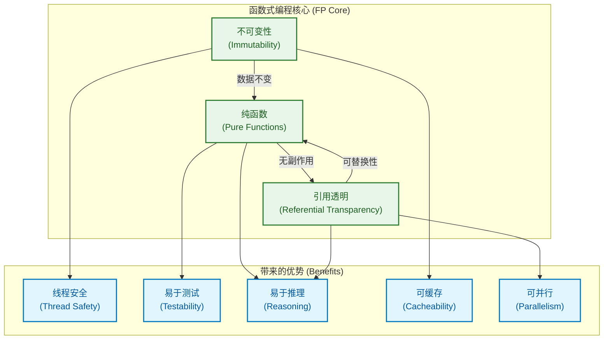
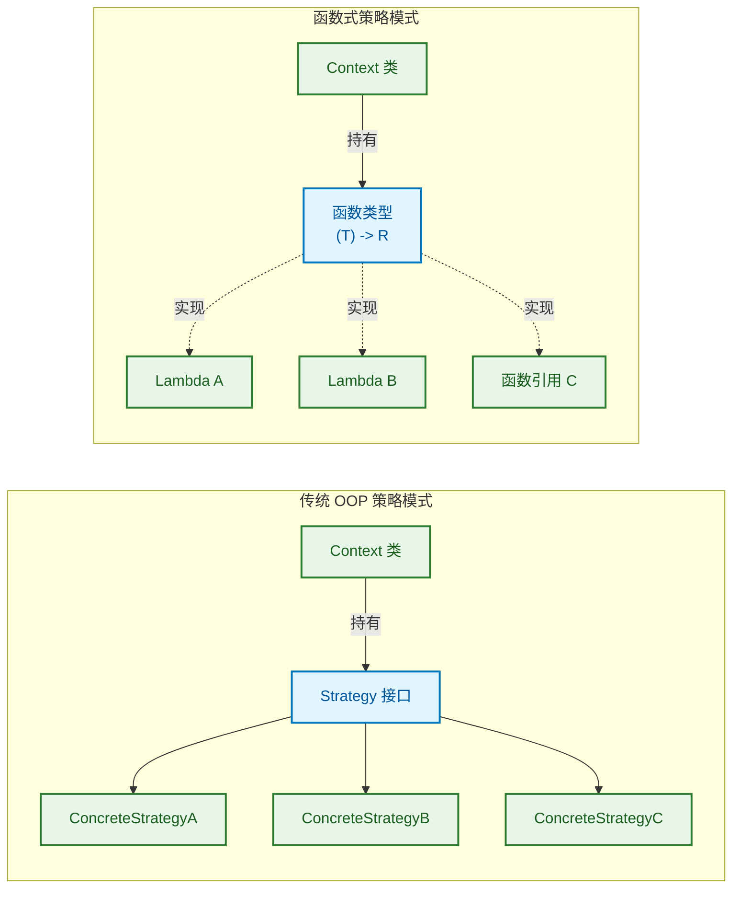
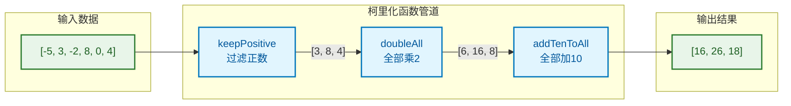
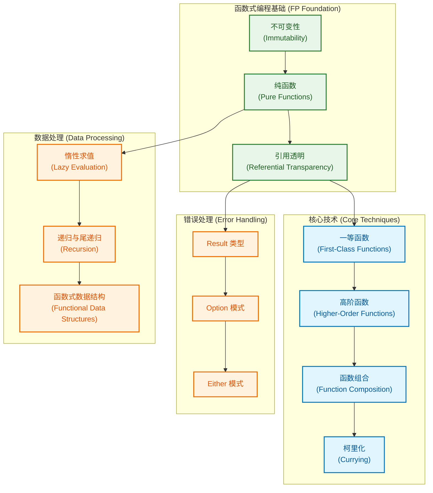

---

# 函数式编程

---

# 函数式编程思想

函数式编程 (Functional Programming, FP) 是一种编程范式 (programming paradigm)，它将计算视为数学函数的求值，强调使用纯函数、避免共享状态和可变数据。Kotlin 作为一门多范式语言 (multi-paradigm language)，对函数式编程提供了优秀的支持。理解函数式编程思想，能帮助我们写出更简洁、更安全、更易于测试和并发的代码。

## 不可变性 (Immutability)

不可变性是函数式编程的基石之一。其核心理念是：**一旦数据被创建，就永远不会被修改** (Once created, data is never modified)。如果需要"改变"数据，实际上是创建一个包含新值的新数据副本。

### 为什么不可变性如此重要？

在传统的命令式编程 (imperative programming) 中，我们习惯于修改变量的状态。但这种做法在复杂系统中会带来严重问题：

```kotlin
// ❌ 可变状态带来的问题示例
class BankAccount {
    var balance: Double = 0.0  // 可变状态 (mutable state)
    
    fun deposit(amount: Double) {
        balance += amount  // 直接修改状态
    }
    
    fun withdraw(amount: Double) {
        balance -= amount  // 直接修改状态
    }
}

// 在多线程环境下，这段代码可能产生竞态条件 (race condition)
// 线程A和线程B同时读取 balance = 100
// 线程A: balance = 100 + 50 = 150
// 线程B: balance = 100 - 30 = 70
// 最终结果取决于谁后写入，可能是 150 或 70，而不是正确的 120
```

不可变性从根本上消除了这类问题：

```kotlin
// ✅ 不可变设计 (immutable design)
data class BankAccount(
    val balance: Double  // 使用 val 声明不可变属性
) {
    // 不修改原对象，而是返回新对象
    fun deposit(amount: Double): BankAccount {
        return copy(balance = balance + amount)  // 创建新实例
    }
    
    // 同样返回新对象
    fun withdraw(amount: Double): BankAccount {
        return copy(balance = balance - amount)  // 创建新实例
    }
}

// 使用示例
fun main() {
    val account1 = BankAccount(100.0)           // 初始账户
    val account2 = account1.deposit(50.0)       // 存款后的新账户
    val account3 = account2.withdraw(30.0)      // 取款后的新账户
    
    println(account1.balance)  // 100.0 - 原账户不变！
    println(account2.balance)  // 150.0
    println(account3.balance)  // 120.0
}
```

### Kotlin 中实现不可变性的方式

```kotlin
// 1. 使用 val 而非 var
val name = "Kotlin"           // 不可变引用 (immutable reference)
// name = "Java"              // ❌ 编译错误！

// 2. 使用不可变集合 (immutable collections)
val numbers = listOf(1, 2, 3)           // 不可变列表
val mapping = mapOf("a" to 1, "b" to 2) // 不可变映射
val unique = setOf(1, 2, 3)             // 不可变集合

// 3. 使用 data class 配合 copy() 方法
data class User(
    val id: Long,
    val name: String,
    val email: String
)

val user1 = User(1, "Alice", "alice@example.com")
val user2 = user1.copy(email = "newalice@example.com")  // 只修改 email

// 4. 注意：val 只保证引用不可变，不保证内容不可变！
val mutableList = mutableListOf(1, 2, 3)
// mutableList = mutableListOf(4, 5, 6)  // ❌ 引用不可变
mutableList.add(4)                        // ✅ 但内容可以修改！
```

```kotlin
┌─────────────────────────────────────────────────────────────┐
│  val 的真正含义：引用不可变 vs 内容不可变                      │
├─────────────────────────────────────────────────────────────┤
│                                                             │
│  val list = mutableListOf(1, 2, 3)                         │
│                                                             │
│  list ─────────────────► MutableList [1, 2, 3, 4]          │
│    ↑                            ↑                          │
│  引用锁定                      内容可变                      │
│  (reference locked)         (content mutable)              │
│                                                             │
│  ════════════════════════════════════════════════════════  │
│                                                             │
│  val list = listOf(1, 2, 3)    // 真正的不可变              │
│                                                             │
│  list ─────────────────► List [1, 2, 3]                    │
│    ↑                            ↑                          │
│  引用锁定                      内容也锁定                    │
│  (reference locked)         (content locked)               │
│                                                             │
└─────────────────────────────────────────────────────────────┘
```

### 不可变性的优势总结

| 优势 | 说明 |
|------|------|
| **线程安全 (Thread Safety)** | 不可变对象天然线程安全，无需同步机制 |
| **可预测性 (Predictability)** | 数据不会被意外修改，行为更可预测 |
| **易于调试 (Easy Debugging)** | 状态变化有迹可循，每个版本都被保留 |
| **支持撤销/重做 (Undo/Redo)** | 历史状态自然保留，轻松实现时间旅行调试 |
| **缓存友好 (Cache Friendly)** | 不可变对象可以安全缓存和共享 |

---

## 纯函数 (Pure Functions)

纯函数是函数式编程的核心概念。一个函数被称为"纯函数"，必须满足两个条件：

1. **确定性 (Deterministic)**：相同的输入永远产生相同的输出
2. **无副作用 (No Side Effects)**：不修改任何外部状态，不依赖任何可变的外部状态

### 纯函数 vs 非纯函数

```kotlin
// ═══════════════════════════════════════════════════════════
// ✅ 纯函数示例 (Pure Functions)
// ═══════════════════════════════════════════════════════════

// 纯函数1：简单的数学计算
fun add(a: Int, b: Int): Int {
    return a + b  // 只依赖输入参数，无副作用
}

// 纯函数2：字符串处理
fun formatName(firstName: String, lastName: String): String {
    return "$lastName, $firstName"  // 确定性输出，无副作用
}

// 纯函数3：列表转换
fun doubleAll(numbers: List<Int>): List<Int> {
    return numbers.map { it * 2 }  // 返回新列表，不修改原列表
}

// 纯函数4：复杂业务逻辑也可以是纯的
data class Order(val items: List<Item>, val discount: Double)
data class Item(val name: String, val price: Double)

fun calculateTotal(order: Order): Double {
    val subtotal = order.items.sumOf { it.price }  // 计算小计
    return subtotal * (1 - order.discount)          // 应用折扣
    // 只依赖输入的 order，不访问任何外部状态
}
```

```kotlin
// ═══════════════════════════════════════════════════════════
// ❌ 非纯函数示例 (Impure Functions)
// ═══════════════════════════════════════════════════════════

// 非纯函数1：依赖外部可变状态
var taxRate = 0.1  // 外部可变状态

fun calculateTax(amount: Double): Double {
    return amount * taxRate  // ❌ 依赖外部变量，taxRate 变化会影响结果
}

// 非纯函数2：修改外部状态（副作用）
var totalSales = 0.0

fun recordSale(amount: Double): Double {
    totalSales += amount  // ❌ 副作用：修改了外部变量
    return amount
}

// 非纯函数3：依赖系统状态
fun getCurrentTimeGreeting(): String {
    val hour = java.time.LocalTime.now().hour  // ❌ 依赖系统时间
    return when {
        hour < 12 -> "Good morning"
        hour < 18 -> "Good afternoon"
        else -> "Good evening"
    }
}

// 非纯函数4：I/O 操作
fun readUserInput(): String {
    print("Enter your name: ")
    return readLine() ?: ""  // ❌ 依赖外部输入，每次可能不同
}

// 非纯函数5：随机数
fun rollDice(): Int {
    return (1..6).random()  // ❌ 不确定性输出
}
```

### 如何将非纯函数改造为纯函数

核心思想是：**将依赖的外部状态作为参数传入** (Inject dependencies as parameters)。

```kotlin
// ═══════════════════════════════════════════════════════════
// 改造示例：将非纯函数转化为纯函数
// ═══════════════════════════════════════════════════════════

// 改造前：依赖外部 taxRate
var taxRate = 0.1
fun calculateTax(amount: Double): Double = amount * taxRate

// ✅ 改造后：将 taxRate 作为参数传入
fun calculateTaxPure(amount: Double, taxRate: Double): Double {
    return amount * taxRate  // 现在是纯函数了！
}

// ─────────────────────────────────────────────────────────────

// 改造前：依赖系统时间
fun getCurrentTimeGreeting(): String {
    val hour = java.time.LocalTime.now().hour
    return when {
        hour < 12 -> "Good morning"
        hour < 18 -> "Good afternoon"
        else -> "Good evening"
    }
}

// ✅ 改造后：将时间作为参数传入
fun getGreetingForHour(hour: Int): String {
    return when {
        hour < 12 -> "Good morning"
        hour < 18 -> "Good afternoon"
        else -> "Good evening"
    }
}

// 使用时在"边界"处注入实际时间
fun main() {
    val currentHour = java.time.LocalTime.now().hour  // 副作用隔离在边界
    val greeting = getGreetingForHour(currentHour)     // 纯函数调用
    println(greeting)                                   // 副作用隔离在边界
}
```

### 纯函数的优势

```kotlin
// ═══════════════════════════════════════════════════════════
// 纯函数的可测试性优势
// ═══════════════════════════════════════════════════════════

// 纯函数极易测试 - 不需要 mock，不需要设置环境
fun testGetGreetingForHour() {
    // 测试边界条件，完全确定性
    assert(getGreetingForHour(0) == "Good morning")
    assert(getGreetingForHour(11) == "Good morning")
    assert(getGreetingForHour(12) == "Good afternoon")
    assert(getGreetingForHour(17) == "Good afternoon")
    assert(getGreetingForHour(18) == "Good evening")
    assert(getGreetingForHour(23) == "Good evening")
    // 每次运行结果都一样，不受时间影响！
}

// ═══════════════════════════════════════════════════════════
// 纯函数的可缓存性（记忆化 Memoization）
// ═══════════════════════════════════════════════════════════

// 因为纯函数相同输入必定相同输出，所以可以安全缓存
fun <T, R> memoize(function: (T) -> R): (T) -> R {
    val cache = mutableMapOf<T, R>()  // 缓存映射
    return { input: T ->
        cache.getOrPut(input) {       // 有缓存就用缓存
            function(input)            // 没有就计算并存入
        }
    }
}

// 使用示例：斐波那契数列
val fibonacci: (Int) -> Long = memoize { n: Int ->
    if (n <= 1) n.toLong()
    else fibonacci(n - 1) + fibonacci(n - 2)
}
```

---

## 引用透明 (Referential Transparency)

引用透明是纯函数的一个重要特性：**一个表达式可以被它的值替换，而不改变程序的行为** (An expression can be replaced with its value without changing the program's behavior)。

### 理解引用透明

```kotlin
// ═══════════════════════════════════════════════════════════
// 引用透明示例
// ═══════════════════════════════════════════════════════════

// 纯函数
fun square(x: Int): Int = x * x

// 以下两段代码完全等价（引用透明）
val result1 = square(4) + square(4)  // 使用函数调用
val result2 = 16 + 16                 // 直接使用值替换

// 我们可以安全地用 16 替换 square(4)，程序行为不变
// 这就是引用透明 (referential transparency)

// ─────────────────────────────────────────────────────────────

// ❌ 非引用透明的例子
var counter = 0

fun incrementAndGet(): Int {
    counter += 1      // 副作用：修改外部状态
    return counter
}

// 以下两段代码 **不等价**！
val a1 = incrementAndGet() + incrementAndGet()  // 1 + 2 = 3
val a2 = 1 + 1                                   // 2

// incrementAndGet() 不能被它的返回值替换
// 因为每次调用都会改变 counter 的状态
// 这就是 **非引用透明** (not referentially transparent)
```

### 引用透明的实际意义

```kotlin
// ═══════════════════════════════════════════════════════════
// 引用透明使代码推理变得简单
// ═══════════════════════════════════════════════════════════

// 考虑这个复杂表达式
fun processOrder(order: Order): ProcessedOrder {
    val validated = validateOrder(order)           // 纯函数
    val priced = calculatePricing(validated)       // 纯函数
    val discounted = applyDiscounts(priced)        // 纯函数
    return finalizeOrder(discounted)               // 纯函数
}

// 因为每个函数都是纯的、引用透明的，我们可以：
// 1. 独立测试每个函数
// 2. 安全地重排序（如果没有数据依赖）
// 3. 并行执行独立的计算
// 4. 缓存中间结果
// 5. 用等价的值替换任何子表达式

// ═══════════════════════════════════════════════════════════
// 引用透明支持等式推理 (Equational Reasoning)
// ═══════════════════════════════════════════════════════════

// 数学证明风格的代码推理
// 假设有纯函数 f 和 g
fun f(x: Int): Int = x * 2
fun g(x: Int): Int = x + 1

// 我们可以进行代数变换
val expr1 = f(g(3))        // 原始表达式
val expr2 = f(3 + 1)       // 替换 g(3) 为其值
val expr3 = f(4)           // 计算 3 + 1
val expr4 = 4 * 2          // 替换 f(4) 为其定义
val expr5 = 8              // 最终结果

// 每一步替换都是安全的，因为函数是引用透明的
```

### 函数式编程三大支柱的关系



---

## 📝 练习题

**题目1：关于不可变性，以下哪个说法是正确的？**

A. 使用 `val` 声明的变量，其内容一定不可变

B. `val list = mutableListOf(1,2,3)` 中，list 的内容不可被修改

C. 不可变对象天然是线程安全的，因为没有状态可以被修改

D. Kotlin 中所有集合默认都是不可变的

【答案】C

【解析】C 正确，不可变对象因为状态永远不变，所以多线程访问时无需同步，天然线程安全。A 错误，`val` 只保证引用不可变，如果引用的是可变对象（如 MutableList），内容仍可修改。B 错误，虽然 `list` 引用不可变，但 `mutableListOf` 创建的是可变列表，可以调用 `add()`、`remove()` 等方法修改内容。D 错误，Kotlin 区分可变集合（MutableList）和不可变集合（List），需要开发者显式选择。

---

**题目2：以下哪个函数是纯函数？**

```kotlin
// 函数A
var multiplier = 2
fun multiplyA(x: Int): Int = x * multiplier

// 函数B
fun multiplyB(x: Int, multiplier: Int): Int = x * multiplier

// 函数C
fun multiplyC(x: Int): Int {
    println("Calculating...")
    return x * 2
}

// 函数D
fun multiplyD(x: Int): Int = x * Random.nextInt(10)
```

A. 函数A

B. 函数B

C. 函数C

D. 函数D

【答案】B

【解析】B 是纯函数，它只依赖输入参数 `x` 和 `multiplier`，相同输入永远产生相同输出，且无副作用。A 不是纯函数，因为它依赖外部可变变量 `multiplier`，当 `multiplier` 改变时，相同的 `x` 会产生不同结果。C 不是纯函数，虽然计算本身是确定的，但 `println()` 是副作用（I/O 操作），会影响外部世界（控制台输出）。D 不是纯函数，因为使用了随机数，相同输入会产生不同输出，违反了确定性原则。

---

# 一等函数 (First-Class Functions)

在 Kotlin 中，函数是"一等公民" (first-class citizens)，这意味着函数可以像普通值一样被操作：可以赋值给变量、作为参数传递、作为返回值返回。这是函数式编程的基础能力，也是 Kotlin 区别于 Java（Java 8 之前）的重要特性。

## 函数赋值 (Function Assignment)

在 Kotlin 中，我们可以将函数赋值给变量，就像赋值一个整数或字符串一样。

### 函数类型 (Function Types)

每个函数都有一个类型，由参数类型和返回类型组成：

```kotlin
// ═══════════════════════════════════════════════════════════
// 函数类型的语法：(参数类型列表) -> 返回类型
// ═══════════════════════════════════════════════════════════

// 无参数，返回 Unit 的函数类型
val greet: () -> Unit = { println("Hello!") }

// 接收一个 Int，返回 Int 的函数类型
val square: (Int) -> Int = { x -> x * x }

// 接收两个参数的函数类型
val add: (Int, Int) -> Int = { a, b -> a + b }

// 接收 String，返回 Boolean 的函数类型
val isLongString: (String) -> Boolean = { it.length > 10 }

// 复杂类型：接收函数作为参数的函数类型
val transformer: ((Int) -> Int, Int) -> Int = { func, value -> 
    func(value) 
}
```

### 将具名函数赋值给变量

使用双冒号 `::` 操作符（函数引用，function reference）可以获取具名函数的引用：

```kotlin
// ═══════════════════════════════════════════════════════════
// 函数引用 (Function Reference) 使用 :: 操作符
// ═══════════════════════════════════════════════════════════

// 定义一个普通的具名函数
fun double(x: Int): Int {
    return x * 2
}

fun isEven(x: Int): Boolean {
    return x % 2 == 0
}

fun main() {
    // 使用 :: 获取函数引用，赋值给变量
    val doubleFunc: (Int) -> Int = ::double
    val evenChecker: (Int) -> Boolean = ::isEven
    
    // 通过变量调用函数
    println(doubleFunc(5))      // 输出: 10
    println(evenChecker(4))     // 输出: true
    
    // 函数引用可以直接用于高阶函数
    val numbers = listOf(1, 2, 3, 4, 5)
    val doubled = numbers.map(::double)        // [2, 4, 6, 8, 10]
    val evens = numbers.filter(::isEven)       // [2, 4]
}
```

### Lambda 表达式赋值

Lambda 表达式是定义匿名函数的简洁方式：

```kotlin
// ═══════════════════════════════════════════════════════════
// Lambda 表达式的各种写法
// ═══════════════════════════════════════════════════════════

// 完整写法：显式声明参数类型
val sum1: (Int, Int) -> Int = { a: Int, b: Int -> a + b }

// 简化写法：类型推断参数类型
val sum2: (Int, Int) -> Int = { a, b -> a + b }

// 单参数时可以使用 it 关键字
val square1: (Int) -> Int = { x -> x * x }  // 显式参数名
val square2: (Int) -> Int = { it * it }      // 使用 it

// 多行 Lambda，最后一个表达式是返回值
val complexOperation: (Int) -> String = { number ->
    val doubled = number * 2           // 中间计算
    val squared = doubled * doubled    // 更多计算
    "Result: $squared"                 // 最后一行是返回值
}

// 无参数的 Lambda
val sayHello: () -> Unit = { println("Hello, Kotlin!") }

// 调用示例
fun main() {
    println(sum1(3, 4))              // 输出: 7
    println(square2(5))              // 输出: 25
    println(complexOperation(3))     // 输出: Result: 36
    sayHello()                       // 输出: Hello, Kotlin!
}
```

### 匿名函数 (Anonymous Functions)

除了 Lambda，Kotlin 还支持匿名函数语法，它更接近普通函数的写法：

```kotlin
// ═══════════════════════════════════════════════════════════
// 匿名函数 vs Lambda 表达式
// ═══════════════════════════════════════════════════════════

// Lambda 表达式
val sumLambda: (Int, Int) -> Int = { a, b -> a + b }

// 匿名函数 - 使用 fun 关键字但没有函数名
val sumAnonymous: (Int, Int) -> Int = fun(a: Int, b: Int): Int {
    return a + b  // 可以使用 return 语句
}

// 匿名函数的优势：可以显式指定返回类型
val parser: (String) -> Int = fun(s: String): Int {
    return s.toIntOrNull() ?: 0  // 明确的返回类型
}

// 匿名函数中的 return 只返回该函数
// Lambda 中的 return 会返回外层函数（非局部返回）
fun processNumbers(numbers: List<Int>): List<Int> {
    // Lambda 中的 return 会直接返回 processNumbers 函数！
    // return numbers.map { if (it < 0) return emptyList() else it * 2 }
    
    // 匿名函数中的 return 只返回当前匿名函数
    return numbers.map(fun(n: Int): Int {
        if (n < 0) return 0  // 只返回这个匿名函数，不影响外层
        return n * 2
    })
}
```

---

## 函数传递 (Passing Functions)

函数作为一等公民，可以作为参数传递给其他函数。这是高阶函数 (higher-order functions) 的基础。

### 将函数作为参数传递

```kotlin
// ═══════════════════════════════════════════════════════════
// 函数作为参数的基本用法
// ═══════════════════════════════════════════════════════════

// 定义一个接收函数参数的高阶函数
fun applyOperation(x: Int, y: Int, operation: (Int, Int) -> Int): Int {
    return operation(x, y)  // 调用传入的函数
}

// 定义几个可以传递的操作函数
fun add(a: Int, b: Int) = a + b
fun subtract(a: Int, b: Int) = a - b
fun multiply(a: Int, b: Int) = a * b

fun main() {
    // 方式1：传递函数引用
    val sum = applyOperation(10, 5, ::add)           // 15
    val diff = applyOperation(10, 5, ::subtract)     // 5
    val product = applyOperation(10, 5, ::multiply)  // 50
    
    // 方式2：传递 Lambda 表达式
    val quotient = applyOperation(10, 5) { a, b -> a / b }  // 2
    val power = applyOperation(2, 8) { base, exp -> 
        var result = 1
        repeat(exp) { result *= base }
        result  // Lambda 最后一行是返回值
    }  // 256
    
    // 方式3：传递已存储在变量中的函数
    val modulo: (Int, Int) -> Int = { a, b -> a % b }
    val remainder = applyOperation(10, 3, modulo)    // 1
}
```

### 实际应用：集合操作

Kotlin 标准库大量使用函数传递模式：

```kotlin
// ═══════════════════════════════════════════════════════════
// 标准库中的函数传递示例
// ═══════════════════════════════════════════════════════════

data class Person(
    val name: String,
    val age: Int,
    val city: String
)

fun main() {
    val people = listOf(
        Person("Alice", 28, "Beijing"),
        Person("Bob", 35, "Shanghai"),
        Person("Charlie", 22, "Beijing"),
        Person("Diana", 31, "Guangzhou")
    )
    
    // filter: 传递判断函数 (predicate)
    val adults = people.filter { it.age >= 25 }  // 筛选25岁以上
    
    // map: 传递转换函数 (transform)
    val names = people.map { it.name }  // 提取所有名字
    
    // sortedBy: 传递选择器函数 (selector)
    val byAge = people.sortedBy { it.age }  // 按年龄排序
    
    // groupBy: 传递分组键函数
    val byCity = people.groupBy { it.city }  // 按城市分组
    
    // any/all/none: 传递判断函数
    val hasYoung = people.any { it.age < 25 }    // 是否有年轻人
    val allAdults = people.all { it.age >= 18 }  // 是否都成年
    
    // fold: 传递累积函数 (accumulator)
    val totalAge = people.fold(0) { acc, person -> 
        acc + person.age  // 累加年龄
    }
    
    // 链式调用：多个函数传递组合
    val result = people
        .filter { it.city == "Beijing" }     // 筛选北京人
        .map { it.name.uppercase() }          // 名字转大写
        .sorted()                             // 排序
    // result: [ALICE, CHARLIE]
}
```

---

## 函数返回 (Returning Functions)

函数不仅可以接收函数作为参数，还可以返回函数。这种能力使我们可以创建"函数工厂" (function factory)。

### 基本的函数返回

```kotlin
// ═══════════════════════════════════════════════════════════
// 返回函数的基本语法
// ═══════════════════════════════════════════════════════════

// 返回一个加法函数
fun createAdder(n: Int): (Int) -> Int {
    // 返回一个 Lambda，它会将输入加上 n
    return { x -> x + n }
}

// 返回一个乘法函数
fun createMultiplier(factor: Int): (Int) -> Int {
    return { x -> x * factor }
}

fun main() {
    // 创建特定的函数实例
    val addFive = createAdder(5)       // 创建"加5"函数
    val addTen = createAdder(10)       // 创建"加10"函数
    val double = createMultiplier(2)   // 创建"乘2"函数
    val triple = createMultiplier(3)   // 创建"乘3"函数
    
    // 使用这些函数
    println(addFive(3))   // 8  (3 + 5)
    println(addTen(3))    // 13 (3 + 10)
    println(double(7))    // 14 (7 * 2)
    println(triple(7))    // 21 (7 * 3)
    
    // 可以继续传递这些函数
    val numbers = listOf(1, 2, 3, 4, 5)
    println(numbers.map(addFive))   // [6, 7, 8, 9, 10]
    println(numbers.map(double))    // [2, 4, 6, 8, 10]
}
```

### 闭包 (Closure)

返回的函数可以"捕获"外部作用域的变量，这种特性称为闭包 (closure)：

```kotlin
// ═══════════════════════════════════════════════════════════
// 闭包：函数捕获外部变量
// ═══════════════════════════════════════════════════════════

// 闭包示例：计数器工厂
fun createCounter(start: Int = 0): () -> Int {
    var count = start  // 这个变量会被闭包捕获
    return {
        count++  // 每次调用都会修改并返回 count
    }
}

fun main() {
    val counter1 = createCounter()      // 从0开始
    val counter2 = createCounter(100)   // 从100开始
    
    // 每个计数器维护自己的状态
    println(counter1())  // 0
    println(counter1())  // 1
    println(counter1())  // 2
    
    println(counter2())  // 100
    println(counter2())  // 101
    
    // counter1 和 counter2 是独立的，各自有自己的 count 变量
    println(counter1())  // 3 (继续自己的计数)
}
```

```kotlin
┌─────────────────────────────────────────────────────────────┐
│  闭包的内存模型 (Closure Memory Model)                       │
├─────────────────────────────────────────────────────────────┤
│                                                             │
│  createCounter(0) 调用后:                                   │
│                                                             │
│  counter1 ──────► Lambda 对象                               │
│                      │                                      │
│                      └──► 捕获的环境 { count: 0 }           │
│                                  ↓                          │
│                           count: 0 → 1 → 2 → 3...          │
│                                                             │
│  createCounter(100) 调用后:                                 │
│                                                             │
│  counter2 ──────► Lambda 对象                               │
│                      │                                      │
│                      └──► 捕获的环境 { count: 100 }         │
│                                  ↓                          │
│                           count: 100 → 101 → 102...        │
│                                                             │
│  两个闭包各自维护独立的 count 变量副本                        │
└─────────────────────────────────────────────────────────────┘
```

### 实用的函数工厂模式

```kotlin
// ═══════════════════════════════════════════════════════════
// 实用示例：验证器工厂
// ═══════════════════════════════════════════════════════════

// 创建字符串长度验证器
fun lengthValidator(min: Int, max: Int): (String) -> Boolean {
    return { str -> str.length in min..max }
}

// 创建正则表达式验证器
fun regexValidator(pattern: String): (String) -> Boolean {
    val regex = Regex(pattern)  // 编译一次，多次使用
    return { str -> regex.matches(str) }
}

// 创建范围验证器
fun rangeValidator(min: Int, max: Int): (Int) -> Boolean {
    return { value -> value in min..max }
}

fun main() {
    // 创建具体的验证器
    val usernameValidator = lengthValidator(3, 20)
    val emailValidator = regexValidator("^[\\w.-]+@[\\w.-]+\\.\\w+$")
    val ageValidator = rangeValidator(0, 150)
    
    // 使用验证器
    println(usernameValidator("ab"))           // false (太短)
    println(usernameValidator("alice"))        // true
    println(emailValidator("test@example.com")) // true
    println(ageValidator(25))                  // true
    println(ageValidator(200))                 // false
}
```

---

## 📝 练习题

**题目：以下代码的输出是什么？**

```kotlin
fun makeGreeter(greeting: String): (String) -> String {
    return { name -> "$greeting, $name!" }
}

fun main() {
    val sayHello = makeGreeter("Hello")
    val sayHi = makeGreeter("Hi")
    
    println(sayHello("Alice"))
    println(sayHi("Bob"))
    println(sayHello("Charlie"))
}
```

A. `Hello, Alice!` / `Hi, Bob!` / `Hello, Charlie!`

B. `Hi, Alice!` / `Hi, Bob!` / `Hi, Charlie!`

C. `Hello, Alice!` / `Hello, Bob!` / `Hello, Charlie!`

D. 编译错误，函数不能返回函数

【答案】A

【解析】`makeGreeter` 是一个函数工厂，它返回一个闭包。`sayHello` 捕获了 `greeting = "Hello"`，`sayHi` 捕获了 `greeting = "Hi"`。每个闭包都维护自己捕获的变量，所以 `sayHello` 始终使用 "Hello"，`sayHi` 始终使用 "Hi"。这正是闭包 (closure) 的核心特性：函数可以"记住"创建时的环境。

---

# 高阶函数模式 (Higher-Order Function Patterns)

高阶函数 (Higher-Order Function) 是指接收函数作为参数或返回函数的函数。这不仅是一种语法特性，更是一种强大的抽象工具，能够帮助我们将通用逻辑与具体实现分离。

## 函数作为抽象 (Functions as Abstractions)

函数作为抽象的核心思想是：**将变化的部分提取为函数参数，将不变的部分保留为模板** (Extract what varies as function parameters, keep what's constant as template)。

### 模板方法的函数式替代

传统 OOP 中，我们使用模板方法模式 (Template Method Pattern) 来实现"固定骨架，可变步骤"。函数式编程用高阶函数更简洁地实现同样目的：

```kotlin
// ═══════════════════════════════════════════════════════════
// 传统 OOP：模板方法模式
// ═══════════════════════════════════════════════════════════

// 抽象类定义骨架
abstract class DataProcessor {
    // 模板方法：定义处理流程
    fun process(data: String): String {
        val validated = validate(data)      // 步骤1：验证
        val transformed = transform(validated) // 步骤2：转换（可变）
        return format(transformed)          // 步骤3：格式化
    }
    
    private fun validate(data: String): String {
        return data.trim()  // 固定的验证逻辑
    }
    
    abstract fun transform(data: String): String  // 子类实现
    
    private fun format(data: String): String {
        return "Result: $data"  // 固定的格式化逻辑
    }
}

// 需要为每种转换创建子类
class UpperCaseProcessor : DataProcessor() {
    override fun transform(data: String) = data.uppercase()
}

class ReversedProcessor : DataProcessor() {
    override fun transform(data: String) = data.reversed()
}
```

```kotlin
// ═══════════════════════════════════════════════════════════
// 函数式方式：高阶函数替代模板方法
// ═══════════════════════════════════════════════════════════

// 用高阶函数，无需继承，更加灵活
fun processData(
    data: String,
    transform: (String) -> String  // 将可变部分作为函数参数
): String {
    val validated = data.trim()           // 步骤1：验证（固定）
    val transformed = transform(validated) // 步骤2：转换（传入）
    return "Result: $transformed"          // 步骤3：格式化（固定）
}

fun main() {
    val input = "  Hello World  "
    
    // 直接传入不同的转换逻辑，无需创建类
    val upper = processData(input) { it.uppercase() }
    val reversed = processData(input) { it.reversed() }
    val length = processData(input) { "Length: ${it.length}" }
    
    println(upper)     // Result: HELLO WORLD
    println(reversed)  // Result: dlroW olleH
    println(length)    // Result: Length: 11
    
    // 甚至可以组合多个转换
    val complex = processData(input) { 
        it.uppercase().replace(" ", "_") 
    }
    println(complex)   // Result: HELLO_WORLD
}
```

### 资源管理的函数式抽象

一个经典应用是资源管理（如文件、数据库连接）：

```kotlin
// ═══════════════════════════════════════════════════════════
// 资源管理：将"使用资源"的逻辑作为函数传入
// ═══════════════════════════════════════════════════════════

import java.io.File
import java.io.BufferedReader

// 高阶函数：管理文件资源的生命周期
inline fun <T> useFile(
    path: String,
    operation: (BufferedReader) -> T  // 传入"如何使用文件"的函数
): T {
    val reader = File(path).bufferedReader()  // 打开资源
    return try {
        operation(reader)  // 执行用户逻辑
    } finally {
        reader.close()     // 确保关闭资源
    }
}

// 使用示例
fun main() {
    // 读取第一行
    val firstLine = useFile("data.txt") { reader ->
        reader.readLine()
    }
    
    // 读取所有行
    val allLines = useFile("data.txt") { reader ->
        reader.readLines()
    }
    
    // 统计行数
    val lineCount = useFile("data.txt") { reader ->
        reader.lineSequence().count()
    }
    
    // 用户只关心"做什么"，不用关心资源的打开和关闭
}

// Kotlin 标准库已提供类似功能：use 扩展函数
fun readFileKotlinWay(path: String): List<String> {
    return File(path).bufferedReader().use { reader ->
        reader.readLines()  // use 会自动关闭资源
    }
}
```

### 执行上下文抽象

```kotlin
// ═══════════════════════════════════════════════════════════
// 执行上下文：计时、日志、事务等横切关注点
// ═══════════════════════════════════════════════════════════

// 计时器高阶函数
inline fun <T> measureTimeAndReturn(
    operationName: String,
    block: () -> T
): T {
    val startTime = System.currentTimeMillis()  // 记录开始时间
    val result = block()                         // 执行实际操作
    val duration = System.currentTimeMillis() - startTime
    println("$operationName took ${duration}ms")
    return result
}

// 重试机制高阶函数
inline fun <T> retry(
    times: Int,
    delay: Long = 1000L,
    block: () -> T
): T {
    var lastException: Exception? = null
    repeat(times) { attempt ->
        try {
            return block()  // 成功则直接返回
        } catch (e: Exception) {
            lastException = e
            println("Attempt ${attempt + 1} failed: ${e.message}")
            if (attempt < times - 1) {
                Thread.sleep(delay)  // 等待后重试
            }
        }
    }
    throw lastException ?: IllegalStateException("Retry failed")
}

// 使用示例
fun main() {
    // 自动计时
    val result = measureTimeAndReturn("Database query") {
        // 模拟耗时操作
        Thread.sleep(100)
        "Query result"
    }
    
    // 自动重试
    val data = retry(times = 3, delay = 500) {
        fetchDataFromNetwork()  // 可能失败的网络请求
    }
}

fun fetchDataFromNetwork(): String {
    // 模拟网络请求
    if (Math.random() < 0.7) throw RuntimeException("Network error")
    return "Data"
}
```

---

## 策略模式函数化 (Strategy Pattern with Functions)

策略模式 (Strategy Pattern) 是 OOP 中常用的行为型设计模式，用于在运行时选择算法。在函数式编程中，我们可以用函数直接替代策略接口和实现类。

### 传统 OOP 策略模式

```kotlin
// ═══════════════════════════════════════════════════════════
// 传统策略模式：需要接口 + 多个实现类
// ═══════════════════════════════════════════════════════════

// 策略接口
interface PaymentStrategy {
    fun pay(amount: Double): String
}

// 具体策略实现
class CreditCardPayment(private val cardNumber: String) : PaymentStrategy {
    override fun pay(amount: Double): String {
        return "Paid $$amount with credit card $cardNumber"
    }
}

class PayPalPayment(private val email: String) : PaymentStrategy {
    override fun pay(amount: Double): String {
        return "Paid $$amount via PayPal ($email)"
    }
}

class CryptoPayment(private val walletAddress: String) : PaymentStrategy {
    override fun pay(amount: Double): String {
        return "Paid $$amount in crypto to $walletAddress"
    }
}

// 上下文类
class ShoppingCart(private var paymentStrategy: PaymentStrategy) {
    fun checkout(amount: Double): String {
        return paymentStrategy.pay(amount)
    }
    
    fun setPaymentStrategy(strategy: PaymentStrategy) {
        this.paymentStrategy = strategy
    }
}

// 使用
fun traditionalStrategyDemo() {
    val cart = ShoppingCart(CreditCardPayment("1234-5678"))
    println(cart.checkout(100.0))
    
    cart.setPaymentStrategy(PayPalPayment("user@example.com"))
    println(cart.checkout(50.0))
}
```

### 函数式策略模式

```kotlin
// ═══════════════════════════════════════════════════════════
// 函数式策略模式：用函数类型替代接口
// ═══════════════════════════════════════════════════════════

// 策略就是一个函数类型
typealias PaymentStrategy = (Double) -> String

// 策略工厂函数（替代具体策略类）
fun creditCardPayment(cardNumber: String): PaymentStrategy = { amount ->
    "Paid $$amount with credit card $cardNumber"
}

fun payPalPayment(email: String): PaymentStrategy = { amount ->
    "Paid $$amount via PayPal ($email)"
}

fun cryptoPayment(walletAddress: String): PaymentStrategy = { amount ->
    "Paid $$amount in crypto to $walletAddress"
}

// 上下文：直接使用函数
class ShoppingCartFP(private var paymentStrategy: PaymentStrategy) {
    fun checkout(amount: Double): String = paymentStrategy(amount)
    
    fun setPaymentStrategy(strategy: PaymentStrategy) {
        this.paymentStrategy = strategy
    }
}

// 使用
fun functionalStrategyDemo() {
    val cart = ShoppingCartFP(creditCardPayment("1234-5678"))
    println(cart.checkout(100.0))
    
    cart.setPaymentStrategy(payPalPayment("user@example.com"))
    println(cart.checkout(50.0))
    
    // 函数式的优势：可以即时创建新策略，无需定义新类
    cart.setPaymentStrategy { amount ->
        "Paid $$amount with gift card (remaining: $${500 - amount})"
    }
    println(cart.checkout(30.0))
    
    // 可以组合策略
    val discountedPayment: PaymentStrategy = { amount ->
        val discounted = amount * 0.9  // 9折
        creditCardPayment("1234-5678")(discounted) + " (10% discount applied)"
    }
    cart.setPaymentStrategy(discountedPayment)
    println(cart.checkout(100.0))
}
```

### 更复杂的策略示例：排序策略

```kotlin
// ═══════════════════════════════════════════════════════════
// 排序策略：函数式实现
// ═══════════════════════════════════════════════════════════

data class Product(
    val name: String,
    val price: Double,
    val rating: Double,
    val salesCount: Int
)

// 排序策略类型
typealias SortStrategy<T> = (List<T>) -> List<T>

// 预定义的排序策略
object ProductSortStrategies {
    // 按价格升序
    val byPriceAsc: SortStrategy<Product> = { products ->
        products.sortedBy { it.price }
    }
    
    // 按价格降序
    val byPriceDesc: SortStrategy<Product> = { products ->
        products.sortedByDescending { it.price }
    }
    
    // 按评分降序
    val byRating: SortStrategy<Product> = { products ->
        products.sortedByDescending { it.rating }
    }
    
    // 按销量降序
    val bySales: SortStrategy<Product> = { products ->
        products.sortedByDescending { it.salesCount }
    }
    
    // 组合策略：先按评分，评分相同按价格
    val byRatingThenPrice: SortStrategy<Product> = { products ->
        products.sortedWith(
            compareByDescending<Product> { it.rating }
                .thenBy { it.price }
        )
    }
}

// 产品列表管理器
class ProductCatalog(private val products: List<Product>) {
    fun display(sortStrategy: SortStrategy<Product>): List<Product> {
        return sortStrategy(products)
    }
}

fun main() {
    val products = listOf(
        Product("Laptop", 999.0, 4.5, 1000),
        Product("Phone", 699.0, 4.8, 5000),
        Product("Tablet", 499.0, 4.2, 800),
        Product("Watch", 299.0, 4.8, 3000)
    )
    
    val catalog = ProductCatalog(products)
    
    // 使用不同策略
    println("By Price:")
    catalog.display(ProductSortStrategies.byPriceAsc).forEach { println(it) }
    
    println("\nBy Rating:")
    catalog.display(ProductSortStrategies.byRating).forEach { println(it) }
    
    // 动态创建策略
    val customStrategy: SortStrategy<Product> = { list ->
        list.sortedBy { it.name.length }  // 按名字长度排序
    }
    println("\nBy Name Length:")
    catalog.display(customStrategy).forEach { println(it) }
}
```

### OOP vs FP 策略模式对比



| 对比维度 | OOP 策略模式 | 函数式策略模式 |
|---------|-------------|---------------|
| **代码量** | 需要接口 + 多个实现类 | 只需函数类型 + Lambda |
| **灵活性** | 新策略需要新类 | 随时创建新 Lambda |
| **组合性** | 需要装饰器模式 | 直接函数组合 |
| **状态** | 策略类可以有状态 | 闭包捕获状态 |
| **适用场景** | 复杂策略、需要多方法 | 简单策略、单一行为 |

---

## 📝 练习题

**题目：以下代码使用函数式策略模式，输出结果是什么？**

```kotlin
typealias Formatter = (String) -> String

fun createFormatter(prefix: String, suffix: String): Formatter {
    return { text -> "$prefix$text$suffix" }
}

val htmlBold: Formatter = { "<b>$it</b>" }
val addQuotes: Formatter = createFormatter("\"", "\"")

fun format(text: String, formatter: Formatter): String = formatter(text)

fun main() {
    println(format("Hello", htmlBold))
    println(format("World", addQuotes))
}
```

A. `<b>Hello</b>` 和 `"World"`

B. `Hello` 和 `World`

C. `<b>"Hello"</b>` 和 `"World"`

D. 编译错误

【答案】A

【解析】这是函数式策略模式的典型应用。`htmlBold` 是一个直接定义的 Lambda，将文本包裹在 `<b>` 标签中。`addQuotes` 是通过工厂函数 `createFormatter` 创建的闭包，它捕获了 `prefix = "\""` 和 `suffix = "\""`。`format` 函数接收文本和格式化策略，直接调用策略函数。第一次调用使用 `htmlBold` 策略，输出 `<b>Hello</b>`；第二次调用使用 `addQuotes` 策略，输出 `"World"`。

---

# 函数组合 (Function Composition)

函数组合 (Function Composition) 是函数式编程的核心技术之一，它允许我们将多个简单函数组合成一个复杂函数。数学上，如果有函数 `f: A → B` 和 `g: B → C`，它们的组合 `g ∘ f` 是一个新函数 `A → C`，满足 `(g ∘ f)(x) = g(f(x))`。

## compose 函数

`compose` 实现从右到左的函数组合 (right-to-left composition)：先执行右边的函数，再执行左边的函数。这与数学中的函数组合符号 `∘` 一致。

```kotlin
// ═══════════════════════════════════════════════════════════
// compose: 从右到左组合
// 数学表示: (f compose g)(x) = f(g(x))
// ═══════════════════════════════════════════════════════════

// 定义 compose 中缀函数
infix fun <A, B, C> ((B) -> C).compose(other: (A) -> B): (A) -> C {
    return { a: A -> 
        this(other(a))  // 先执行 other，再执行 this
    }
}

// 示例函数
val addOne: (Int) -> Int = { it + 1 }      // 加1
val double: (Int) -> Int = { it * 2 }       // 乘2
val square: (Int) -> Int = { it * it }      // 平方

fun main() {
    // compose: 从右到左执行
    val addThenDouble = double compose addOne  // 先加1，再乘2
    val doubleThenAdd = addOne compose double  // 先乘2，再加1
    
    println(addThenDouble(5))  // (5 + 1) * 2 = 12
    println(doubleThenAdd(5))  // (5 * 2) + 1 = 11
    
    // 三个函数组合
    val complex = square compose double compose addOne
    // 执行顺序: addOne -> double -> square
    println(complex(3))  // ((3 + 1) * 2)² = 64
}
```

---

## andThen 函数

`andThen` 实现从左到右的函数组合 (left-to-right composition)：先执行左边的函数，再执行右边的函数。这更符合阅读习惯和数据流动方向。

```kotlin
// ═══════════════════════════════════════════════════════════
// andThen: 从左到右组合
// 表示: (f andThen g)(x) = g(f(x))
// ═══════════════════════════════════════════════════════════

// 定义 andThen 中缀函数
infix fun <A, B, C> ((A) -> B).andThen(other: (B) -> C): (A) -> C {
    return { a: A -> 
        other(this(a))  // 先执行 this，再执行 other
    }
}

fun main() {
    val addOne: (Int) -> Int = { it + 1 }
    val double: (Int) -> Int = { it * 2 }
    val toString: (Int) -> String = { "Result: $it" }
    
    // andThen: 从左到右执行，更直观
    val pipeline = addOne andThen double andThen toString
    // 执行顺序: addOne -> double -> toString
    
    println(pipeline(5))  // "Result: 12"  即 (5+1)*2 = 12
    
    // 对比 compose 和 andThen
    val f = addOne
    val g = double
    
    val composed = g compose f    // f 先执行，g 后执行
    val chained = f andThen g     // f 先执行，g 后执行
    
    // 两者结果相同，但 andThen 阅读顺序更自然
    println(composed(10))  // 22
    println(chained(10))   // 22
}
```

```kotlin
┌─────────────────────────────────────────────────────────────┐
│  compose vs andThen 执行顺序对比                             │
├─────────────────────────────────────────────────────────────┤
│                                                             │
│  compose (从右到左，数学风格):                               │
│  val result = (f compose g compose h)(x)                    │
│                                                             │
│       x ──► h(x) ──► g(h(x)) ──► f(g(h(x)))                │
│            [先]      [中]         [后]                      │
│                                                             │
│  ─────────────────────────────────────────────────────────  │
│                                                             │
│  andThen (从左到右，管道风格):                               │
│  val result = (f andThen g andThen h)(x)                    │
│                                                             │
│       x ──► f(x) ──► g(f(x)) ──► h(g(f(x)))                │
│            [先]      [中]         [后]                      │
│                                                             │
│  推荐: andThen 更符合数据流动的直觉                          │
└─────────────────────────────────────────────────────────────┘
```

---

## 多函数组合 (Multi-Function Composition)

在实际应用中，我们经常需要组合多个函数形成处理管道 (processing pipeline)。

```kotlin
// ═══════════════════════════════════════════════════════════
// 实用工具：组合任意数量的函数
// ═══════════════════════════════════════════════════════════

// 组合多个相同类型的函数
fun <T> composeAll(vararg functions: (T) -> T): (T) -> T {
    return { input ->
        functions.foldRight(input) { func, acc -> 
            func(acc)  // 从右到左依次应用
        }
    }
}

// 管道式组合（从左到右）
fun <T> pipeline(vararg functions: (T) -> T): (T) -> T {
    return { input ->
        functions.fold(input) { acc, func -> 
            func(acc)  // 从左到右依次应用
        }
    }
}

fun main() {
    val trim: (String) -> String = { it.trim() }
    val lowercase: (String) -> String = { it.lowercase() }
    val removeSpaces: (String) -> String = { it.replace(" ", "_") }
    val addPrefix: (String) -> String = { "user_$it" }
    
    // 创建用户名处理管道
    val normalizeUsername = pipeline(trim, lowercase, removeSpaces, addPrefix)
    
    val input = "  John Doe  "
    println(normalizeUsername(input))  // "user_john_doe"
}
```

### 实际应用：数据处理管道

```kotlin
// ═══════════════════════════════════════════════════════════
// 实际案例：订单处理管道
// ═══════════════════════════════════════════════════════════

data class Order(
    val items: List<String>,
    val subtotal: Double,
    val discount: Double = 0.0,
    val tax: Double = 0.0,
    val total: Double = 0.0,
    val status: String = "created"
)

// 定义处理步骤（每个都是纯函数）
val validateOrder: (Order) -> Order = { order ->
    require(order.items.isNotEmpty()) { "Order must have items" }
    require(order.subtotal > 0) { "Subtotal must be positive" }
    order.copy(status = "validated")
}

val applyDiscount: (Order) -> Order = { order ->
    val discountAmount = if (order.subtotal > 100) order.subtotal * 0.1 else 0.0
    order.copy(discount = discountAmount, status = "discounted")
}

val calculateTax: (Order) -> Order = { order ->
    val taxableAmount = order.subtotal - order.discount
    val taxAmount = taxableAmount * 0.08  // 8% 税率
    order.copy(tax = taxAmount, status = "taxed")
}

val calculateTotal: (Order) -> Order = { order ->
    val finalTotal = order.subtotal - order.discount + order.tax
    order.copy(total = finalTotal, status = "completed")
}

fun main() {
    // 组合成完整的处理管道
    val processOrder = pipeline(
        validateOrder,
        applyDiscount,
        calculateTax,
        calculateTotal
    )
    
    val order = Order(
        items = listOf("Book", "Pen", "Notebook"),
        subtotal = 150.0
    )
    
    val processed = processOrder(order)
    println(processed)
    // Order(items=[Book, Pen, Notebook], subtotal=150.0, 
    //        discount=15.0, tax=10.8, total=145.8, status=completed)
}
```

---

## 📝 练习题

**题目：给定以下代码，`result` 的值是什么？**

```kotlin
infix fun <A, B, C> ((A) -> B).andThen(other: (B) -> C): (A) -> C = { other(this(it)) }

val f: (Int) -> Int = { it + 2 }
val g: (Int) -> Int = { it * 3 }
val h: (Int) -> Int = { it - 1 }

val combined = f andThen g andThen h
val result = combined(4)
```

A. 11

B. 17

C. 19

D. 13

【答案】B

【解析】`andThen` 是从左到右执行。`combined(4)` 的执行过程：首先 `f(4) = 4 + 2 = 6`，然后 `g(6) = 6 * 3 = 18`，最后 `h(18) = 18 - 1 = 17`。所以结果是 17。如果使用 `compose`（从右到左），结果会不同：`h(4) = 3`，`g(3) = 9`，`f(9) = 11`。

---

# 柯里化 (Currying)

## Currying 概念

柯里化 (Currying) 是以数学家 Haskell Curry 命名的一种函数转换技术。它的核心思想是：**将一个接收多个参数的函数转换为一系列只接收单个参数的函数** (Transform a function with multiple arguments into a sequence of functions, each taking a single argument)。

从数学角度看，一个二元函数 `f(x, y)` 柯里化后变成 `f(x)(y)`，即先传入 `x` 得到一个新函数，这个新函数再接收 `y` 返回最终结果。

```kotlin
// ═══════════════════════════════════════════════════════════
// 柯里化的基本概念
// ═══════════════════════════════════════════════════════════

// 普通的二元函数
fun add(a: Int, b: Int): Int = a + b

// 柯里化版本：返回一个函数
fun addCurried(a: Int): (Int) -> Int = { b -> a + b }

// 使用对比
fun main() {
    // 普通调用：一次传入所有参数
    val sum1 = add(3, 5)  // 8
    
    // 柯里化调用：分步传入参数
    val addThree = addCurried(3)  // 得到一个"加3"的函数
    val sum2 = addThree(5)        // 8
    
    // 也可以连续调用
    val sum3 = addCurried(3)(5)   // 8
    
    // 柯里化的威力：轻松创建特化函数
    val addTen = addCurried(10)
    val addHundred = addCurried(100)
    
    println(addTen(5))      // 15
    println(addHundred(5))  // 105
    
    // 可以用于集合操作
    val numbers = listOf(1, 2, 3, 4, 5)
    val plusTen = numbers.map(addTen)  // [11, 12, 13, 14, 15]
}
```

### 为什么需要柯里化？

柯里化的价值在于提供了一种优雅的方式来实现**函数特化** (function specialization) 和**延迟计算** (deferred computation)：

```kotlin
// ═══════════════════════════════════════════════════════════
// 柯里化的实际价值
// ═══════════════════════════════════════════════════════════

// 场景：日志记录器
// 普通版本
fun log(level: String, category: String, message: String) {
    println("[$level][$category] $message")
}

// 柯里化版本
fun logCurried(level: String): (String) -> (String) -> Unit {
    return { category ->
        { message ->
            println("[$level][$category] $message")
        }
    }
}

fun main() {
    // 普通版本：每次都要传所有参数
    log("ERROR", "Database", "Connection failed")
    log("ERROR", "Database", "Query timeout")
    log("ERROR", "Network", "Request failed")
    
    // 柯里化版本：创建特化的日志函数
    val errorLog = logCurried("ERROR")           // 固定级别
    val dbErrorLog = errorLog("Database")        // 固定级别和类别
    val networkErrorLog = errorLog("Network")    // 另一个特化版本
    
    // 使用特化函数，代码更简洁
    dbErrorLog("Connection failed")
    dbErrorLog("Query timeout")
    networkErrorLog("Request failed")
    
    // 创建更多特化版本
    val infoLog = logCurried("INFO")
    val debugLog = logCurried("DEBUG")
    val apiInfoLog = infoLog("API")
    
    apiInfoLog("Request received")
    apiInfoLog("Response sent")
}
```

---

## 部分应用 (Partial Application)

部分应用 (Partial Application) 与柯里化密切相关但有所不同。部分应用是指**固定函数的部分参数，返回一个接收剩余参数的新函数** (Fix some arguments of a function, returning a new function that takes the remaining arguments)。

柯里化是一种特殊的部分应用，它每次只固定一个参数。而一般的部分应用可以一次固定任意数量的参数。

```kotlin
// ═══════════════════════════════════════════════════════════
// 部分应用 vs 柯里化
// ═══════════════════════════════════════════════════════════

// 原始三元函数
fun sendEmail(from: String, to: String, subject: String, body: String): String {
    return "From: $from\nTo: $to\nSubject: $subject\n\n$body"
}

// 柯里化：严格地每次一个参数
fun sendEmailCurried(from: String): (String) -> (String) -> (String) -> String {
    return { to ->
        { subject ->
            { body ->
                "From: $from\nTo: $to\nSubject: $subject\n\n$body"
            }
        }
    }
}

// 部分应用：可以一次固定多个参数
fun sendEmailFrom(from: String): (String, String, String) -> String {
    return { to, subject, body ->
        sendEmail(from, to, subject, body)
    }
}

fun sendEmailFromTo(from: String, to: String): (String, String) -> String {
    return { subject, body ->
        sendEmail(from, to, subject, body)
    }
}

fun main() {
    // 柯里化使用
    val fromAlice = sendEmailCurried("alice@example.com")
    val aliceToBob = fromAlice("bob@example.com")
    val greeting = aliceToBob("Hello")
    val email1 = greeting("How are you?")
    
    // 部分应用使用：更灵活
    val companyEmail = sendEmailFrom("noreply@company.com")
    val email2 = companyEmail("user@example.com", "Welcome", "Welcome to our service!")
    
    val aliceToBobDirect = sendEmailFromTo("alice@example.com", "bob@example.com")
    val email3 = aliceToBobDirect("Meeting", "Let's meet at 3pm")
}
```

---

## 手动实现柯里化

Kotlin 没有内置的自动柯里化机制，但我们可以手动实现通用的柯里化工具函数。

```kotlin
// ═══════════════════════════════════════════════════════════
// 手动实现柯里化工具函数
// ═══════════════════════════════════════════════════════════

// 二元函数柯里化
fun <A, B, R> ((A, B) -> R).curried(): (A) -> (B) -> R {
    return { a: A ->
        { b: B ->
            this(a, b)  // this 指向原函数
        }
    }
}

// 三元函数柯里化
fun <A, B, C, R> ((A, B, C) -> R).curried(): (A) -> (B) -> (C) -> R {
    return { a: A ->
        { b: B ->
            { c: C ->
                this(a, b, c)
            }
        }
    }
}

// 反柯里化：将柯里化函数转回普通函数
fun <A, B, R> ((A) -> (B) -> R).uncurried(): (A, B) -> R {
    return { a: A, b: B ->
        this(a)(b)
    }
}

fun main() {
    // 定义普通函数
    val multiply: (Int, Int) -> Int = { a, b -> a * b }
    val formatPrice: (String, Double, Int) -> String = { currency, price, quantity ->
        "$currency${price * quantity}"
    }
    
    // 柯里化
    val multiplyCurried = multiply.curried()
    val formatPriceCurried = formatPrice.curried()
    
    // 使用柯里化版本
    val double = multiplyCurried(2)
    val triple = multiplyCurried(3)
    
    println(double(5))   // 10
    println(triple(5))   // 15
    
    // 三元函数柯里化使用
    val usdFormatter = formatPriceCurried("$")
    val usd99 = usdFormatter(99.0)
    
    println(usd99(1))    // $99.0
    println(usd99(3))    // $297.0
    
    // 反柯里化
    val multiplyUncurried = multiplyCurried.uncurried()
    println(multiplyUncurried(4, 5))  // 20
}
```

### 柯里化的实际应用场景

```kotlin
// ═══════════════════════════════════════════════════════════
// 实际应用：配置化的验证器
// ═══════════════════════════════════════════════════════════

// 通用验证函数
val validateLength: (Int, Int, String) -> Boolean = { min, max, value ->
    value.length in min..max
}

val validateRange: (Int, Int, Int) -> Boolean = { min, max, value ->
    value in min..max
}

val validatePattern: (String, String) -> Boolean = { pattern, value ->
    Regex(pattern).matches(value)
}

// 柯里化扩展
fun <A, B, C, R> ((A, B, C) -> R).curried() = { a: A -> { b: B -> { c: C -> this(a, b, c) } } }
fun <A, B, R> ((A, B) -> R).curried() = { a: A -> { b: B -> this(a, b) } }

fun main() {
    // 创建特化验证器
    val validateUsername = validateLength.curried()(3)(20)      // 3-20字符
    val validatePassword = validateLength.curried()(8)(128)     // 8-128字符
    val validateAge = validateRange.curried()(0)(150)           // 0-150岁
    val validateEmail = validatePattern.curried()("^[\\w.-]+@[\\w.-]+\\.\\w+$")
    
    // 使用验证器
    println(validateUsername("alice"))           // true
    println(validateUsername("ab"))              // false (太短)
    println(validatePassword("12345678"))        // true
    println(validateAge(25))                     // true
    println(validateEmail("test@example.com"))   // true
    
    // 组合验证
    data class UserInput(val username: String, val password: String, val age: Int)
    
    fun validateUser(input: UserInput): Boolean {
        return validateUsername(input.username) &&
               validatePassword(input.password) &&
               validateAge(input.age)
    }
    
    val user = UserInput("alice", "securepass123", 25)
    println(validateUser(user))  // true
}
```

### 柯里化与函数组合的结合

```kotlin
// ═══════════════════════════════════════════════════════════
// 柯里化 + 函数组合 = 强大的抽象能力
// ═══════════════════════════════════════════════════════════

// 柯里化的 map 函数
val mapCurried: ((Int) -> Int) -> (List<Int>) -> List<Int> = { transform ->
    { list -> list.map(transform) }
}

// 柯里化的 filter 函数
val filterCurried: ((Int) -> Boolean) -> (List<Int>) -> List<Int> = { predicate ->
    { list -> list.filter(predicate) }
}

// andThen 组合
infix fun <A, B, C> ((A) -> B).andThen(other: (B) -> C): (A) -> C = { other(this(it)) }

fun main() {
    // 创建特化的列表操作
    val doubleAll = mapCurried { it * 2 }
    val keepPositive = filterCurried { it > 0 }
    val addTenToAll = mapCurried { it + 10 }
    
    // 组合成处理管道
    val processNumbers = keepPositive andThen doubleAll andThen addTenToAll
    
    val numbers = listOf(-5, 3, -2, 8, 0, 4)
    val result = processNumbers(numbers)
    
    println(result)  // [16, 26, 18]
    // 过程: [-5,3,-2,8,0,4] -> [3,8,4] -> [6,16,8] -> [16,26,18]
}
```



---

## 📝 练习题

**题目1：关于柯里化，以下说法正确的是？**

A. 柯里化会改变函数的计算结果

B. 柯里化将多参数函数转换为一系列单参数函数

C. Kotlin 原生支持自动柯里化

D. 柯里化后的函数无法转回普通函数

【答案】B

【解析】B 正确，柯里化的核心定义就是将接收多个参数的函数转换为一系列只接收单个参数的函数链。A 错误，柯里化只改变调用方式，不改变计算结果，`add(3, 5)` 和 `addCurried(3)(5)` 结果相同。C 错误，Kotlin 不像 Haskell 那样原生支持自动柯里化，需要手动实现。D 错误，可以通过 `uncurried()` 函数将柯里化函数转回普通函数。

---

**题目2：以下代码的输出是什么？**

```kotlin
fun <A, B, C, R> ((A, B, C) -> R).curried() = { a: A -> { b: B -> { c: C -> this(a, b, c) } } }

val calculate: (Int, Int, Int) -> Int = { a, b, c -> (a + b) * c }
val step1 = calculate.curried()(10)
val step2 = step1(5)
val result = step2(2)
```

A. 25

B. 30

C. 32

D. 17

【答案】B

【解析】柯里化后的调用过程：`calculate.curried()` 返回柯里化版本，`(10)` 固定 `a = 10`，`(5)` 固定 `b = 5`，`(2)` 固定 `c = 2`。最终计算 `(10 + 5) * 2 = 15 * 2 = 30`。柯里化不改变计算逻辑，只改变参数传递方式。

---

# 偏函数应用 (Partial Application)

偏函数应用 (Partial Application) 是函数式编程中的重要技术，它允许我们**固定一个多参数函数的部分参数，生成一个接收剩余参数的新函数** (Fix some arguments of a function to produce a new function with fewer arguments)。这与柯里化 (Currying) 相关但不同：柯里化严格地每次只固定一个参数，而偏函数应用可以一次固定任意数量的参数。

## 固定部分参数 (Fixing Partial Arguments)

### 基本概念与实现

```kotlin
// ═══════════════════════════════════════════════════════════
// 偏函数应用的基本概念
// ═══════════════════════════════════════════════════════════

// 原始函数：计算商品总价
fun calculatePrice(
    basePrice: Double,    // 基础价格
    taxRate: Double,      // 税率
    discount: Double,     // 折扣
    quantity: Int         // 数量
): Double {
    val priceAfterDiscount = basePrice * (1 - discount)  // 应用折扣
    val priceWithTax = priceAfterDiscount * (1 + taxRate) // 加税
    return priceWithTax * quantity                        // 乘以数量
}

// 偏函数应用：固定税率，返回新函数
fun withTaxRate(taxRate: Double): (Double, Double, Int) -> Double {
    return { basePrice, discount, quantity ->
        calculatePrice(basePrice, taxRate, discount, quantity)
    }
}

// 偏函数应用：固定税率和折扣
fun withTaxAndDiscount(taxRate: Double, discount: Double): (Double, Int) -> Double {
    return { basePrice, quantity ->
        calculatePrice(basePrice, taxRate, discount, quantity)
    }
}

fun main() {
    // 创建特化版本：美国税率 8%
    val usaPricing = withTaxRate(0.08)
    
    // 创建更特化版本：美国税率 + VIP 20% 折扣
    val usaVipPricing = withTaxAndDiscount(0.08, 0.20)
    
    // 使用特化函数
    val price1 = usaPricing(100.0, 0.0, 2)      // 无折扣，2件
    val price2 = usaVipPricing(100.0, 3)         // VIP价，3件
    
    println("普通价格: $$price1")   // 普通价格: $216.0
    println("VIP价格: $$price2")    // VIP价格: $259.2
}
```

### 通用偏函数应用工具

```kotlin
// ═══════════════════════════════════════════════════════════
// 通用的偏函数应用扩展函数
// ═══════════════════════════════════════════════════════════

// 固定第一个参数
fun <A, B, R> ((A, B) -> R).partial1(a: A): (B) -> R = { b -> this(a, b) }

// 固定第二个参数
fun <A, B, R> ((A, B) -> R).partial2(b: B): (A) -> R = { a -> this(a, b) }

// 三参数函数：固定第一个参数
fun <A, B, C, R> ((A, B, C) -> R).partial1(a: A): (B, C) -> R = { b, c -> this(a, b, c) }

// 三参数函数：固定前两个参数
fun <A, B, C, R> ((A, B, C) -> R).partial12(a: A, b: B): (C) -> R = { c -> this(a, b, c) }

// 三参数函数：固定第一个和第三个参数
fun <A, B, C, R> ((A, B, C) -> R).partial13(a: A, c: C): (B) -> R = { b -> this(a, b, c) }

fun main() {
    // 示例：字符串格式化函数
    val format: (String, String, String) -> String = { prefix, content, suffix ->
        "$prefix$content$suffix"
    }
    
    // 固定前缀和后缀，创建 HTML 标签生成器
    val bold = format.partial13("<b>", "</b>")
    val italic = format.partial13("<i>", "</i>")
    val heading = format.partial13("<h1>", "</h1>")
    
    println(bold("Hello"))      // <b>Hello</b>
    println(italic("World"))    // <i>World</i>
    println(heading("Title"))   // <h1>Title</h1>
    
    // 示例：数学运算
    val power: (Double, Double) -> Double = { base, exp -> 
        Math.pow(base, exp) 
    }
    
    val square = power.partial2(2.0)    // 固定指数为2（平方）
    val cube = power.partial2(3.0)      // 固定指数为3（立方）
    val powerOfTwo = power.partial1(2.0) // 固定底数为2
    
    println(square(5.0))      // 25.0
    println(cube(3.0))        // 27.0
    println(powerOfTwo(10.0)) // 1024.0
}
```

### 实际应用：配置化的 API 客户端

```kotlin
// ═══════════════════════════════════════════════════════════
// 实际案例：使用偏函数应用构建 API 客户端
// ═══════════════════════════════════════════════════════════

// 通用的 HTTP 请求函数
fun httpRequest(
    baseUrl: String,
    method: String,
    headers: Map<String, String>,
    endpoint: String,
    body: String?
): String {
    // 模拟 HTTP 请求
    return """
        |$method $baseUrl$endpoint
        |Headers: $headers
        |Body: ${body ?: "none"}
    """.trimMargin()
}

// 偏函数应用：创建特定 API 的客户端
fun createApiClient(
    baseUrl: String,
    defaultHeaders: Map<String, String>
): (String, String, String?) -> String {
    return { method, endpoint, body ->
        httpRequest(baseUrl, method, defaultHeaders, endpoint, body)
    }
}

// 进一步特化：创建特定方法的请求函数
fun createGetRequest(
    baseUrl: String,
    headers: Map<String, String>
): (String) -> String {
    return { endpoint ->
        httpRequest(baseUrl, "GET", headers, endpoint, null)
    }
}

fun createPostRequest(
    baseUrl: String,
    headers: Map<String, String>
): (String, String) -> String {
    return { endpoint, body ->
        httpRequest(baseUrl, "POST", headers, endpoint, body)
    }
}

fun main() {
    // 创建 GitHub API 客户端
    val githubHeaders = mapOf(
        "Authorization" to "Bearer token123",
        "Accept" to "application/vnd.github.v3+json"
    )
    
    val githubApi = createApiClient("https://api.github.com", githubHeaders)
    val githubGet = createGetRequest("https://api.github.com", githubHeaders)
    val githubPost = createPostRequest("https://api.github.com", githubHeaders)
    
    // 使用特化的客户端
    println(githubGet("/users/kotlin"))
    println(githubPost("/repos", """{"name": "new-repo"}"""))
}
```

---

## 延迟计算 (Deferred Computation)

偏函数应用的一个重要应用场景是延迟计算 (Deferred/Lazy Computation)：我们可以先配置好计算的部分参数，等到真正需要结果时再提供剩余参数执行计算。

```kotlin
// ═══════════════════════════════════════════════════════════
// 延迟计算：配置与执行分离
// ═══════════════════════════════════════════════════════════

// 报表生成器：配置阶段与执行阶段分离
data class ReportConfig(
    val title: String,
    val format: String,      // "PDF", "HTML", "CSV"
    val includeCharts: Boolean
)

// 完整的报表生成函数
fun generateReport(
    config: ReportConfig,
    dateRange: Pair<String, String>,
    data: List<Map<String, Any>>
): String {
    return """
        |=== ${config.title} ===
        |Format: ${config.format}
        |Period: ${dateRange.first} to ${dateRange.second}
        |Charts: ${if (config.includeCharts) "Yes" else "No"}
        |Records: ${data.size}
    """.trimMargin()
}

// 偏函数应用：预配置报表生成器
fun configureReportGenerator(
    config: ReportConfig
): (Pair<String, String>, List<Map<String, Any>>) -> String {
    // 配置已固定，返回等待数据的函数
    return { dateRange, data ->
        generateReport(config, dateRange, data)
    }
}

// 进一步特化：固定配置和日期范围
fun scheduleReport(
    config: ReportConfig,
    dateRange: Pair<String, String>
): (List<Map<String, Any>>) -> String {
    // 只等待数据即可生成报表
    return { data ->
        generateReport(config, dateRange, data)
    }
}

fun main() {
    // 阶段1：配置报表（可能在应用启动时）
    val salesReportConfig = ReportConfig(
        title = "Monthly Sales Report",
        format = "PDF",
        includeCharts = true
    )
    val salesReportGenerator = configureReportGenerator(salesReportConfig)
    
    // 阶段2：确定日期范围（可能在用户选择时）
    val januaryReport = scheduleReport(
        salesReportConfig,
        "2024-01-01" to "2024-01-31"
    )
    
    // 阶段3：提供数据并生成（可能在数据准备好时）
    val salesData = listOf(
        mapOf("product" to "A", "amount" to 1000),
        mapOf("product" to "B", "amount" to 2000)
    )
    
    println(januaryReport(salesData))
}
```

### 延迟计算与依赖注入

```kotlin
// ═══════════════════════════════════════════════════════════
// 偏函数应用实现简单的依赖注入
// ═══════════════════════════════════════════════════════════

// 定义依赖接口（用函数类型表示）
typealias Logger = (String) -> Unit
typealias Database = (String) -> List<String>
typealias Cache = (String, () -> List<String>) -> List<String>

// 业务逻辑函数，依赖多个服务
fun fetchUserData(
    logger: Logger,
    database: Database,
    cache: Cache,
    userId: String
): List<String> {
    logger("Fetching data for user: $userId")
    
    return cache("user_$userId") {
        logger("Cache miss, querying database")
        database("SELECT * FROM users WHERE id = '$userId'")
    }
}

// 使用偏函数应用注入依赖
fun createUserDataFetcher(
    logger: Logger,
    database: Database,
    cache: Cache
): (String) -> List<String> {
    // 依赖已注入，返回只需要 userId 的函数
    return { userId ->
        fetchUserData(logger, database, cache, userId)
    }
}

fun main() {
    // 创建依赖实现
    val consoleLogger: Logger = { msg -> println("[LOG] $msg") }
    
    val mockDatabase: Database = { query ->
        println("[DB] Executing: $query")
        listOf("user_data_1", "user_data_2")
    }
    
    val simpleCache: Cache = { key, compute ->
        println("[CACHE] Checking key: $key")
        compute()  // 简化实现，总是计算
    }
    
    // 注入依赖，创建特化函数
    val fetchUser = createUserDataFetcher(consoleLogger, mockDatabase, simpleCache)
    
    // 使用时只需提供业务参数
    val userData = fetchUser("12345")
    println("Result: $userData")
}
```

---

## 📝 练习题

**题目：关于偏函数应用，以下代码的输出是什么？**

```kotlin
fun <A, B, C, R> ((A, B, C) -> R).partial1(a: A): (B, C) -> R = { b, c -> this(a, b, c) }

val combine: (String, String, String) -> String = { a, b, c -> "$a-$b-$c" }
val withPrefix = combine.partial1("PREFIX")
val result = withPrefix("middle", "end")
```

A. `PREFIX-middle-end`

B. `middle-PREFIX-end`

C. `middle-end-PREFIX`

D. 编译错误

【答案】A

【解析】`partial1` 固定函数的第一个参数。`combine.partial1("PREFIX")` 返回一个新函数，该函数的第一个参数已被固定为 `"PREFIX"`。调用 `withPrefix("middle", "end")` 相当于调用 `combine("PREFIX", "middle", "end")`，结果是 `"PREFIX-middle-end"`。偏函数应用不改变参数的位置关系，只是预先填充了部分参数。

---

# 惰性求值 (Lazy Evaluation)

惰性求值 (Lazy Evaluation)，也称为延迟求值 (Deferred Evaluation)，是一种计算策略：**表达式的值只在真正需要时才被计算** (Values are computed only when they are actually needed)。与之相对的是及早求值 (Eager Evaluation)，即表达式一旦定义就立即计算。惰性求值是函数式编程的重要特性，能够提高性能、节省内存，甚至处理无限数据结构。

## 序列实现 (Sequence Implementation)

Kotlin 中的序列 (Sequence) 是惰性求值的核心实现。与 List 的及早求值不同，Sequence 的操作是惰性的，只有在终端操作 (terminal operation) 时才真正执行计算。

### List vs Sequence 的执行差异

```kotlin
// ═══════════════════════════════════════════════════════════
// List（及早求值）vs Sequence（惰性求值）
// ═══════════════════════════════════════════════════════════

fun main() {
    val numbers = listOf(1, 2, 3, 4, 5)
    
    // ===== List 方式：及早求值 =====
    println("=== List (Eager) ===")
    val listResult = numbers
        .map { 
            println("List map: $it")
            it * 2 
        }
        .filter { 
            println("List filter: $it")
            it > 4 
        }
        .first()
    
    println("List result: $listResult\n")
    
    // ===== Sequence 方式：惰性求值 =====
    println("=== Sequence (Lazy) ===")
    val seqResult = numbers.asSequence()
        .map { 
            println("Seq map: $it")
            it * 2 
        }
        .filter { 
            println("Seq filter: $it")
            it > 4 
        }
        .first()
    
    println("Seq result: $seqResult")
}
```

输出对比：

```kotlin
// List 输出（处理所有元素后再过滤）:
// === List (Eager) ===
// List map: 1
// List map: 2
// List map: 3
// List map: 4
// List map: 5        <- 所有元素都被 map
// List filter: 2
// List filter: 4
// List filter: 6
// List filter: 8
// List filter: 10    <- 所有元素都被 filter
// List result: 6

// Sequence 输出（逐个处理，找到即停止）:
// === Sequence (Lazy) ===
// Seq map: 1
// Seq filter: 2      <- 不满足，继续
// Seq map: 2
// Seq filter: 4      <- 不满足，继续
// Seq map: 3
// Seq filter: 6      <- 满足！停止
// Seq result: 6
```

```kotlin
┌─────────────────────────────────────────────────────────────────┐
│  List vs Sequence 执行模型对比                                   │
├─────────────────────────────────────────────────────────────────┤
│                                                                 │
│  List (横向处理 - Horizontal Processing):                       │
│                                                                 │
│  [1, 2, 3, 4, 5]                                               │
│        ↓ map (全部)                                             │
│  [2, 4, 6, 8, 10]    ← 创建中间集合                             │
│        ↓ filter (全部)                                          │
│  [6, 8, 10]          ← 创建中间集合                             │
│        ↓ first                                                  │
│       6                                                         │
│                                                                 │
│  ─────────────────────────────────────────────────────────────  │
│                                                                 │
│  Sequence (纵向处理 - Vertical Processing):                     │
│                                                                 │
│  1 → map → 2 → filter → ✗ (继续)                               │
│  2 → map → 4 → filter → ✗ (继续)                               │
│  3 → map → 6 → filter → ✓ (停止！)                             │
│  4   (未处理)                                                   │
│  5   (未处理)                                                   │
│                                                                 │
│  无中间集合，按需计算，提前终止                                   │
└─────────────────────────────────────────────────────────────────┘
```

### 创建序列的方式

```kotlin
// ═══════════════════════════════════════════════════════════
// 创建 Sequence 的多种方式
// ═══════════════════════════════════════════════════════════

fun main() {
    // 1. 从集合转换
    val fromList = listOf(1, 2, 3).asSequence()
    
    // 2. 使用 sequenceOf
    val direct = sequenceOf(1, 2, 3, 4, 5)
    
    // 3. 使用 generateSequence - 生成无限序列
    val naturals = generateSequence(1) { it + 1 }  // 1, 2, 3, 4, ...
    val powersOfTwo = generateSequence(1) { it * 2 }  // 1, 2, 4, 8, ...
    
    // 4. 使用 generateSequence 带终止条件
    val countdown = generateSequence(10) { 
        if (it > 1) it - 1 else null  // null 表示终止
    }
    println(countdown.toList())  // [10, 9, 8, 7, 6, 5, 4, 3, 2, 1]
    
    // 5. 使用 sequence 构建器（协程风格）
    val fibonacci = sequence {
        var a = 0
        var b = 1
        while (true) {
            yield(a)           // 产出当前值
            val next = a + b
            a = b
            b = next
        }
    }
    
    // 从无限序列中取有限个元素
    println(fibonacci.take(10).toList())  // [0, 1, 1, 2, 3, 5, 8, 13, 21, 34]
    
    // 6. 使用 sequence 处理复杂逻辑
    val primes = sequence {
        var num = 2
        while (true) {
            if (isPrime(num)) {
                yield(num)
            }
            num++
        }
    }
    
    println(primes.take(10).toList())  // [2, 3, 5, 7, 11, 13, 17, 19, 23, 29]
}

fun isPrime(n: Int): Boolean {
    if (n < 2) return false
    for (i in 2..Math.sqrt(n.toDouble()).toInt()) {
        if (n % i == 0) return false
    }
    return true
}
```

### 中间操作与终端操作

```kotlin
// ═══════════════════════════════════════════════════════════
// Sequence 的操作类型
// ═══════════════════════════════════════════════════════════

fun main() {
    val numbers = sequenceOf(1, 2, 3, 4, 5, 6, 7, 8, 9, 10)
    
    // ===== 中间操作 (Intermediate Operations) =====
    // 返回新的 Sequence，不触发计算
    val transformed = numbers
        .filter { it % 2 == 0 }      // 中间操作：过滤偶数
        .map { it * it }              // 中间操作：平方
        .take(3)                      // 中间操作：取前3个
    
    println("中间操作完成，但尚未计算")
    // 此时没有任何计算发生！
    
    // ===== 终端操作 (Terminal Operations) =====
    // 触发实际计算，返回具体结果
    
    // toList() - 收集为列表
    val list = transformed.toList()
    println("toList: $list")  // [4, 16, 36]
    
    // 其他终端操作示例
    val seq = sequenceOf(1, 2, 3, 4, 5)
    
    println("first: ${seq.first()}")                    // 1
    println("last: ${seq.last()}")                      // 5
    println("count: ${seq.count()}")                    // 5
    println("sum: ${seq.sum()}")                        // 15
    println("any: ${seq.any { it > 3 }}")              // true
    println("all: ${seq.all { it > 0 }}")              // true
    println("none: ${seq.none { it < 0 }}")            // true
    println("find: ${seq.find { it > 3 }}")            // 4
    println("reduce: ${seq.reduce { a, b -> a + b }}") // 15
    println("fold: ${seq.fold(10) { a, b -> a + b }}") // 25
    
    // forEach 也是终端操作
    seq.forEach { print("$it ") }  // 1 2 3 4 5
}
```

---

## 延迟计算的优势 (Advantages of Lazy Evaluation)

### 1. 性能优化：避免不必要的计算

```kotlin
// ═══════════════════════════════════════════════════════════
// 优势1：短路求值，避免不必要的计算
// ═══════════════════════════════════════════════════════════

fun expensiveOperation(n: Int): Int {
    println("  Computing expensive operation for $n...")
    Thread.sleep(100)  // 模拟耗时操作
    return n * n
}

fun main() {
    val numbers = (1..1000).toList()
    
    println("=== List (计算所有1000个元素) ===")
    val startList = System.currentTimeMillis()
    val listResult = numbers
        .map { expensiveOperation(it) }  // 计算1000次！
        .first { it > 100 }
    println("List result: $listResult, time: ${System.currentTimeMillis() - startList}ms\n")
    
    println("=== Sequence (只计算需要的元素) ===")
    val startSeq = System.currentTimeMillis()
    val seqResult = numbers.asSequence()
        .map { expensiveOperation(it) }  // 只计算到找到为止
        .first { it > 100 }
    println("Seq result: $seqResult, time: ${System.currentTimeMillis() - startSeq}ms")
    
    // Sequence 只计算了 11 个元素（11² = 121 > 100）
    // List 计算了全部 1000 个元素
}
```

### 2. 内存效率：无中间集合

```kotlin
// ═══════════════════════════════════════════════════════════
// 优势2：不创建中间集合，节省内存
// ═══════════════════════════════════════════════════════════

fun main() {
    // 处理大数据集
    val largeData = (1..10_000_000).toList()
    
    // ❌ List 方式：创建多个中间集合
    // 每个操作都创建新的 List，内存占用巨大
    // val listResult = largeData
    //     .map { it * 2 }      // 创建 1000万元素的新 List
    //     .filter { it > 100 } // 创建另一个大 List
    //     .take(10)            // 只需要10个！
    //     .toList()
    
    // ✅ Sequence 方式：流式处理，无中间集合
    val seqResult = largeData.asSequence()
        .map { it * 2 }       // 不创建集合
        .filter { it > 100 }  // 不创建集合
        .take(10)             // 不创建集合
        .toList()             // 只在最后创建小集合
    
    println(seqResult)  // [102, 104, 106, 108, 110, 112, 114, 116, 118, 120]
}
```

### 3. 处理无限数据结构

```kotlin
// ═══════════════════════════════════════════════════════════
// 优势3：可以表示和操作无限序列
// ═══════════════════════════════════════════════════════════

fun main() {
    // 无限自然数序列
    val naturals = generateSequence(1) { it + 1 }
    
    // 无限斐波那契序列
    val fibonacci = sequence {
        var (a, b) = 0 to 1
        while (true) {
            yield(a)
            val next = a + b
            a = b
            b = next
        }
    }
    
    // 从无限序列中安全地取有限数据
    println("前20个自然数: ${naturals.take(20).toList()}")
    println("前15个斐波那契数: ${fibonacci.take(15).toList()}")
    
    // 复杂查询：找出前10个既是斐波那契数又是偶数的数
    val evenFibs = fibonacci
        .filter { it % 2 == 0 }
        .take(10)
        .toList()
    println("前10个偶斐波那契数: $evenFibs")
    
    // 无限素数序列
    val primes = generateSequence(2) { n ->
        generateSequence(n + 1) { it + 1 }
            .first { candidate ->
                (2 until candidate).none { candidate % it == 0 }
            }
    }
    println("前20个素数: ${primes.take(20).toList()}")
}
```

### 4. 实际应用：文件处理

```kotlin
// ═══════════════════════════════════════════════════════════
// 实际应用：惰性处理大文件
// ═══════════════════════════════════════════════════════════

import java.io.File

fun processLargeFile(filePath: String) {
    // 使用 Sequence 惰性读取文件
    // 不会一次性将整个文件加载到内存
    File(filePath).useLines { lines: Sequence<String> ->
        val result = lines
            .filter { it.isNotBlank() }           // 过滤空行
            .map { it.trim().lowercase() }         // 清理格式
            .filter { it.startsWith("error") }     // 只要错误行
            .take(100)                             // 只取前100条
            .toList()
        
        println("Found ${result.size} error lines")
        result.forEach { println(it) }
    }
    // 文件自动关闭，内存占用极小
}

// 对比：非惰性方式（危险！）
fun processLargeFileEager(filePath: String) {
    // ❌ 这会将整个文件加载到内存！
    // 如果文件有几GB，可能导致 OutOfMemoryError
    val allLines = File(filePath).readLines()  // 全部加载
    val result = allLines
        .filter { it.isNotBlank() }
        .map { it.trim().lowercase() }
        .filter { it.startsWith("error") }
        .take(100)
    // ...
}
```

---

# 递归 (Recursion)

递归 (Recursion) 是函数式编程的核心技术之一，指的是**函数直接或间接地调用自身** (A function that calls itself directly or indirectly)。在函数式编程中，递归常常用来替代命令式编程中的循环结构，因为它更符合数学思维，也更容易保持函数的纯粹性。

## 递归定义 (Recursive Definition)

递归的本质是将一个复杂问题分解为更小的同类子问题 (Divide a complex problem into smaller subproblems of the same type)。一个良好的递归定义包含两个关键部分：

1. **基本情况 (Base Case)**：最简单的情况，可以直接给出答案，不需要继续递归
2. **递归情况 (Recursive Case)**：将问题分解为更小的子问题，通过调用自身来解决

### 经典递归示例：阶乘

```kotlin
// ═══════════════════════════════════════════════════════════
// 阶乘的递归定义
// 数学定义: n! = n × (n-1) × (n-2) × ... × 1
//          0! = 1 (定义)
// ═══════════════════════════════════════════════════════════

// 递归实现
fun factorial(n: Int): Long {
    // 基本情况 (Base Case): n 为 0 或 1 时直接返回 1
    if (n <= 1) return 1L
    
    // 递归情况 (Recursive Case): n! = n × (n-1)!
    return n * factorial(n - 1)
}

// 执行过程可视化
fun main() {
    println(factorial(5))  // 120
    
    // factorial(5) 的展开过程:
    // factorial(5)
    //   = 5 * factorial(4)
    //   = 5 * (4 * factorial(3))
    //   = 5 * (4 * (3 * factorial(2)))
    //   = 5 * (4 * (3 * (2 * factorial(1))))
    //   = 5 * (4 * (3 * (2 * 1)))        <- 触发基本情况
    //   = 5 * (4 * (3 * 2))               <- 开始回溯
    //   = 5 * (4 * 6)
    //   = 5 * 24
    //   = 120
}
```

```kotlin
┌─────────────────────────────────────────────────────────────┐
│  递归调用栈示意 (Call Stack Visualization)                   │
├─────────────────────────────────────────────────────────────┤
│                                                             │
│  调用阶段 (Winding):          回溯阶段 (Unwinding):          │
│                                                             │
│  ┌─────────────────┐         ┌─────────────────┐           │
│  │ factorial(1)=1  │ ──────► │ return 1        │           │
│  ├─────────────────┤         ├─────────────────┤           │
│  │ factorial(2)    │ ──────► │ return 2*1=2    │           │
│  ├─────────────────┤         ├─────────────────┤           │
│  │ factorial(3)    │ ──────► │ return 3*2=6    │           │
│  ├─────────────────┤         ├─────────────────┤           │
│  │ factorial(4)    │ ──────► │ return 4*6=24   │           │
│  ├─────────────────┤         ├─────────────────┤           │
│  │ factorial(5)    │ ──────► │ return 5*24=120 │           │
│  └─────────────────┘         └─────────────────┘           │
│        ↓ 入栈                       ↑ 出栈                  │
│                                                             │
└─────────────────────────────────────────────────────────────┘
```

### 更多递归示例

```kotlin
// ═══════════════════════════════════════════════════════════
// 斐波那契数列 (Fibonacci Sequence)
// 定义: F(0)=0, F(1)=1, F(n)=F(n-1)+F(n-2)
// ═══════════════════════════════════════════════════════════

// 简单递归实现（效率较低，有重复计算）
fun fibonacci(n: Int): Long {
    // 基本情况
    if (n <= 0) return 0L
    if (n == 1) return 1L
    
    // 递归情况
    return fibonacci(n - 1) + fibonacci(n - 2)
}

// ═══════════════════════════════════════════════════════════
// 列表求和 (Sum of List)
// ═══════════════════════════════════════════════════════════

fun sumList(list: List<Int>): Int {
    // 基本情况：空列表的和为 0
    if (list.isEmpty()) return 0
    
    // 递归情况：第一个元素 + 剩余元素的和
    return list.first() + sumList(list.drop(1))
}

// ═══════════════════════════════════════════════════════════
// 列表反转 (Reverse List)
// ═══════════════════════════════════════════════════════════

fun <T> reverseList(list: List<T>): List<T> {
    // 基本情况：空列表或单元素列表
    if (list.size <= 1) return list
    
    // 递归情况：反转剩余部分 + 第一个元素
    return reverseList(list.drop(1)) + list.first()
}

// ═══════════════════════════════════════════════════════════
// 二分查找 (Binary Search)
// ═══════════════════════════════════════════════════════════

fun binarySearch(
    list: List<Int>,
    target: Int,
    low: Int = 0,
    high: Int = list.size - 1
): Int {
    // 基本情况1：未找到
    if (low > high) return -1
    
    val mid = (low + high) / 2
    
    // 基本情况2：找到目标
    if (list[mid] == target) return mid
    
    // 递归情况：在左半部分或右半部分继续查找
    return if (target < list[mid]) {
        binarySearch(list, target, low, mid - 1)
    } else {
        binarySearch(list, target, mid + 1, high)
    }
}

fun main() {
    println(fibonacci(10))  // 55
    println(sumList(listOf(1, 2, 3, 4, 5)))  // 15
    println(reverseList(listOf(1, 2, 3, 4)))  // [4, 3, 2, 1]
    println(binarySearch(listOf(1, 3, 5, 7, 9, 11), 7))  // 3
}
```

---

## 递归终止条件 (Termination Conditions)

递归终止条件 (Termination Condition / Base Case) 是递归正确性的关键。没有正确的终止条件，递归会无限进行下去，最终导致栈溢出 (Stack Overflow)。

### 设计终止条件的原则

```kotlin
// ═══════════════════════════════════════════════════════════
// 终止条件设计原则
// ═══════════════════════════════════════════════════════════

// 原则1：确保每次递归都向终止条件靠近
// ❌ 错误示例：参数没有变化
fun badRecursion(n: Int): Int {
    if (n == 0) return 0
    return badRecursion(n)  // n 没有减小，永远不会终止！
}

// ✅ 正确示例：每次递归 n 都减小
fun goodRecursion(n: Int): Int {
    if (n <= 0) return 0
    return n + goodRecursion(n - 1)  // n 每次减 1，必然到达 0
}

// 原则2：覆盖所有可能的基本情况
// ❌ 不完整的终止条件
fun incompleteBase(n: Int): Int {
    if (n == 0) return 1
    return n * incompleteBase(n - 1)  // 如果 n < 0 呢？
}

// ✅ 完整的终止条件
fun completeBase(n: Int): Int {
    if (n <= 0) return 1  // 处理 0 和负数
    return n * completeBase(n - 1)
}

// 原则3：处理边界情况
fun safeRecursion(list: List<Int>): Int {
    // 处理空列表
    if (list.isEmpty()) return 0
    // 处理单元素列表（可选，但可以提高效率）
    if (list.size == 1) return list[0]
    // 递归情况
    return list.first() + safeRecursion(list.drop(1))
}
```

### 多重终止条件

```kotlin
// ═══════════════════════════════════════════════════════════
// 复杂递归可能需要多个终止条件
// ═══════════════════════════════════════════════════════════

// 示例：最大公约数 (GCD) - 欧几里得算法
fun gcd(a: Int, b: Int): Int {
    // 终止条件1：b 为 0 时，a 就是 GCD
    if (b == 0) return a
    
    // 终止条件2：a 为 0 时，b 就是 GCD（防御性编程）
    if (a == 0) return b
    
    // 递归情况：gcd(a, b) = gcd(b, a % b)
    return gcd(b, a % b)
}

// 示例：汉诺塔 (Tower of Hanoi)
fun hanoi(
    n: Int,
    from: String,
    to: String,
    aux: String,
    moves: MutableList<String> = mutableListOf()
): List<String> {
    // 终止条件：没有盘子需要移动
    if (n == 0) return moves
    
    // 递归步骤1：将 n-1 个盘子从 from 移到 aux
    hanoi(n - 1, from, aux, to, moves)
    
    // 移动最大的盘子
    moves.add("Move disk $n from $from to $to")
    
    // 递归步骤2：将 n-1 个盘子从 aux 移到 to
    hanoi(n - 1, aux, to, from, moves)
    
    return moves
}

fun main() {
    println(gcd(48, 18))  // 6
    
    val moves = hanoi(3, "A", "C", "B")
    moves.forEach { println(it) }
    // Move disk 1 from A to C
    // Move disk 2 from A to B
    // Move disk 1 from C to B
    // Move disk 3 from A to C
    // Move disk 1 from B to A
    // Move disk 2 from B to C
    // Move disk 1 from A to C
}
```

### 递归的问题：栈溢出

```kotlin
// ═══════════════════════════════════════════════════════════
// 普通递归的栈溢出问题
// ═══════════════════════════════════════════════════════════

// 这个函数在 n 较大时会导致 StackOverflowError
fun sumToN(n: Long): Long {
    if (n <= 0) return 0
    return n + sumToN(n - 1)  // 每次调用都在栈上保存状态
}

fun main() {
    // 小数值正常工作
    println(sumToN(100))    // 5050
    println(sumToN(1000))   // 500500
    
    // 大数值会栈溢出！
    // println(sumToN(100000))  // StackOverflowError!
    
    // 原因：每次递归调用都会在调用栈上创建新的栈帧
    // JVM 默认栈大小约 512KB-1MB，大约能支持几千到几万层调用
}
```

---

## 📝 练习题

**题目：以下递归函数的问题是什么？**

```kotlin
fun mystery(n: Int): Int {
    if (n == 1) return 1
    return n * mystery(n - 2)
}
```

A. 没有问题，可以正常运行

B. 当 n 为偶数时会无限递归

C. 当 n 为负数时会无限递归

D. B 和 C 都正确

【答案】D

【解析】这个函数有两个问题：(1) 当 n 为偶数时（如 n=4），递归序列是 4→2→0→-2→-4...，永远不会等于 1，导致无限递归；(2) 当 n 为负数时，同样永远不会到达终止条件 n==1。正确的写法应该是 `if (n <= 1) return 1` 或者分别处理奇偶数情况。这说明设计递归终止条件时必须确保所有可能的输入都能最终到达基本情况。

---

# 尾递归优化 (Tail Recursion Optimization)

尾递归 (Tail Recursion) 是一种特殊的递归形式，其中**递归调用是函数执行的最后一个操作** (The recursive call is the last operation performed by the function)。Kotlin 编译器可以对尾递归进行优化，将其转换为循环，从而避免栈溢出问题。

## tailrec 关键字

Kotlin 提供了 `tailrec` 修饰符来标记尾递归函数。当编译器确认函数确实是尾递归时，会将其优化为高效的循环。

### 普通递归 vs 尾递归

```kotlin
// ═══════════════════════════════════════════════════════════
// 普通递归 vs 尾递归对比
// ═══════════════════════════════════════════════════════════

// ❌ 普通递归：递归调用后还有操作（乘法）
fun factorialNormal(n: Long): Long {
    if (n <= 1) return 1
    return n * factorialNormal(n - 1)  // 递归调用后还要乘以 n
    // 必须等待递归返回后才能完成乘法，需要保存当前状态
}

// ✅ 尾递归：递归调用是最后一个操作
tailrec fun factorialTail(n: Long, accumulator: Long = 1): Long {
    if (n <= 1) return accumulator
    return factorialTail(n - 1, n * accumulator)  // 递归调用是最后操作
    // 所有计算在调用前完成，不需要保存状态
}

fun main() {
    // 两者结果相同
    println(factorialNormal(10))  // 3628800
    println(factorialTail(10))    // 3628800
    
    // 但尾递归可以处理更大的数
    // println(factorialNormal(100000))  // StackOverflowError!
    println(factorialTail(20))  // 2432902008176640000 (Long 范围内)
}
```

```kotlin
┌─────────────────────────────────────────────────────────────────┐
│  普通递归 vs 尾递归 执行模型对比                                  │
├─────────────────────────────────────────────────────────────────┤
│                                                                 │
│  普通递归 factorial(5):                                         │
│  ┌──────────────────────────────────────────┐                  │
│  │ factorial(5)                              │                  │
│  │   └─► 5 * factorial(4)                    │ ← 等待返回       │
│  │         └─► 4 * factorial(3)              │ ← 等待返回       │
│  │               └─► 3 * factorial(2)        │ ← 等待返回       │
│  │                     └─► 2 * factorial(1)  │ ← 等待返回       │
│  │                           └─► 1           │ ← 返回           │
│  │                     └─► 2 * 1 = 2         │ ← 计算并返回     │
│  │               └─► 3 * 2 = 6               │                  │
│  │         └─► 4 * 6 = 24                    │                  │
│  │   └─► 5 * 24 = 120                        │                  │
│  └──────────────────────────────────────────┘                  │
│  需要 5 个栈帧，回溯时才计算                                     │
│                                                                 │
│  ─────────────────────────────────────────────────────────────  │
│                                                                 │
│  尾递归 factorialTail(5, 1):                                    │
│  ┌──────────────────────────────────────────┐                  │
│  │ factorialTail(5, 1)   → acc = 1*5 = 5    │ ← 计算后传递     │
│  │ factorialTail(4, 5)   → acc = 5*4 = 20   │ ← 复用栈帧       │
│  │ factorialTail(3, 20)  → acc = 20*3 = 60  │ ← 复用栈帧       │
│  │ factorialTail(2, 60)  → acc = 60*2 = 120 │ ← 复用栈帧       │
│  │ factorialTail(1, 120) → return 120       │ ← 直接返回       │
│  └──────────────────────────────────────────┘                  │
│  只需要 1 个栈帧，边递归边计算                                   │
│                                                                 │
└─────────────────────────────────────────────────────────────────┘
```

### 将普通递归转换为尾递归

转换的关键是引入**累加器参数** (Accumulator Parameter)，将"回溯时的计算"提前到"递归调用前"完成。

```kotlin
// ═══════════════════════════════════════════════════════════
// 转换技巧：使用累加器参数
// ═══════════════════════════════════════════════════════════

// 示例1：求和
// 普通递归
fun sumNormal(n: Long): Long {
    if (n <= 0) return 0
    return n + sumNormal(n - 1)  // 递归后还要加
}

// 尾递归版本
tailrec fun sumTail(n: Long, acc: Long = 0): Long {
    if (n <= 0) return acc
    return sumTail(n - 1, acc + n)  // 先加再递归
}

// 示例2：斐波那契
// 普通递归（效率极低）
fun fibNormal(n: Int): Long {
    if (n <= 1) return n.toLong()
    return fibNormal(n - 1) + fibNormal(n - 2)  // 两次递归调用
}

// 尾递归版本（高效）
tailrec fun fibTail(n: Int, a: Long = 0, b: Long = 1): Long {
    if (n == 0) return a
    if (n == 1) return b
    return fibTail(n - 1, b, a + b)  // 携带前两个数
}

// 示例3：列表求和
// 普通递归
fun sumListNormal(list: List<Int>): Int {
    if (list.isEmpty()) return 0
    return list.first() + sumListNormal(list.drop(1))
}

// 尾递归版本
tailrec fun sumListTail(list: List<Int>, acc: Int = 0): Int {
    if (list.isEmpty()) return acc
    return sumListTail(list.drop(1), acc + list.first())
}

fun main() {
    // 尾递归可以处理大数值
    println(sumTail(100000))  // 5000050000，不会栈溢出
    
    // 尾递归斐波那契非常快
    println(fibTail(50))  // 12586269025，瞬间完成
    // fibNormal(50) 会非常慢（指数级时间复杂度）
}
```

---

## 编译器优化 (Compiler Optimization)

当使用 `tailrec` 修饰符时，Kotlin 编译器会将尾递归函数转换为等价的循环代码。这个过程称为**尾调用优化** (Tail Call Optimization, TCO)。

### 查看编译后的代码

```kotlin
// ═══════════════════════════════════════════════════════════
// 尾递归的编译器转换
// ═══════════════════════════════════════════════════════════

// Kotlin 源代码
tailrec fun countDown(n: Int, acc: String = ""): String {
    if (n <= 0) return acc
    return countDown(n - 1, "$acc$n ")
}

// 编译器转换后的等价 Java 代码（概念性展示）
/*
public static String countDown(int n, String acc) {
    while (true) {
        if (n <= 0) {
            return acc;
        }
        // 更新参数，而不是递归调用
        String newAcc = acc + n + " ";
        n = n - 1;
        acc = newAcc;
        // 继续循环，而不是递归
    }
}
*/

fun main() {
    println(countDown(10))  // "10 9 8 7 6 5 4 3 2 1 "
}
```

### tailrec 的使用限制

```kotlin
// ═══════════════════════════════════════════════════════════
// tailrec 的限制条件
// ═══════════════════════════════════════════════════════════

// ✅ 正确：递归调用是最后一个操作
tailrec fun validTailRec(n: Int, acc: Int = 0): Int {
    if (n <= 0) return acc
    return validTailRec(n - 1, acc + n)
}

// ❌ 错误：递归调用后还有操作
// 编译器会警告：A function is marked as tail-recursive but no tail calls are found
// tailrec fun invalidTailRec1(n: Int): Int {
//     if (n <= 0) return 0
//     return n + invalidTailRec1(n - 1)  // 递归后还要加 n
// }

// ❌ 错误：在 try-catch 块中
// tailrec fun invalidTailRec2(n: Int): Int {
//     if (n <= 0) return 0
//     return try {
//         invalidTailRec2(n - 1)  // try 块中的尾调用不能优化
//     } catch (e: Exception) {
//         0
//     }
// }

// ❌ 错误：open 函数（可能被重写）
// open class Parent {
//     tailrec open fun invalidOpen(n: Int): Int {  // open 函数不能是 tailrec
//         if (n <= 0) return 0
//         return invalidOpen(n - 1)
//     }
// }

// ✅ 正确：使用 when 表达式
tailrec fun gcdTailRec(a: Int, b: Int): Int = when {
    b == 0 -> a
    else -> gcdTailRec(b, a % b)  // 尾位置的递归调用
}
```

---

## 栈安全 (Stack Safety)

尾递归优化的主要目的是实现**栈安全** (Stack Safety)，即无论递归多少次都不会导致栈溢出。

### 性能对比测试

```kotlin
// ═══════════════════════════════════════════════════════════
// 栈安全性对比测试
// ═══════════════════════════════════════════════════════════

// 普通递归：会栈溢出
fun sumNormalUnsafe(n: Long): Long {
    if (n <= 0) return 0
    return n + sumNormalUnsafe(n - 1)
}

// 尾递归：栈安全
tailrec fun sumTailSafe(n: Long, acc: Long = 0): Long {
    if (n <= 0) return acc
    return sumTailSafe(n - 1, acc + n)
}

// 循环：作为对照
fun sumLoop(n: Long): Long {
    var sum = 0L
    for (i in 1..n) {
        sum += i
    }
    return sum
}

fun main() {
    val n = 100_000L
    
    // 测试尾递归
    val startTail = System.currentTimeMillis()
    val resultTail = sumTailSafe(n)
    val timeTail = System.currentTimeMillis() - startTail
    println("尾递归结果: $resultTail, 耗时: ${timeTail}ms")
    
    // 测试循环
    val startLoop = System.currentTimeMillis()
    val resultLoop = sumLoop(n)
    val timeLoop = System.currentTimeMillis() - startLoop
    println("循环结果: $resultLoop, 耗时: ${timeLoop}ms")
    
    // 测试普通递归（会栈溢出）
    // val resultNormal = sumNormalUnsafe(n)  // StackOverflowError!
    
    // 尾递归和循环性能相近，因为编译后本质相同
}
```

### 实际应用：深度遍历

```kotlin
// ═══════════════════════════════════════════════════════════
// 实际应用：使用尾递归进行树遍历
// ═══════════════════════════════════════════════════════════

data class TreeNode(
    val value: Int,
    val children: List<TreeNode> = emptyList()
)

// 使用尾递归计算树的所有节点值之和
tailrec fun sumTree(
    nodes: List<TreeNode>,  // 待处理的节点队列
    acc: Int = 0            // 累加器
): Int {
    // 基本情况：没有更多节点
    if (nodes.isEmpty()) return acc
    
    // 取出第一个节点
    val current = nodes.first()
    val remaining = nodes.drop(1)
    
    // 将当前节点的子节点加入队列，继续处理
    return sumTree(
        remaining + current.children,  // 广度优先
        acc + current.value
    )
}

// 使用尾递归查找节点
tailrec fun findNode(
    nodes: List<TreeNode>,
    target: Int
): TreeNode? {
    if (nodes.isEmpty()) return null
    
    val current = nodes.first()
    if (current.value == target) return current
    
    return findNode(
        nodes.drop(1) + current.children,
        target
    )
}

fun main() {
    // 构建测试树
    val tree = TreeNode(1, listOf(
        TreeNode(2, listOf(
            TreeNode(4),
            TreeNode(5)
        )),
        TreeNode(3, listOf(
            TreeNode(6),
            TreeNode(7)
        ))
    ))
    
    println("树的节点和: ${sumTree(listOf(tree))}")  // 28
    println("查找节点5: ${findNode(listOf(tree), 5)}")  // TreeNode(value=5, children=[])
}
```

### 尾递归最佳实践总结

| 场景 | 建议 |
|------|------|
| 简单累加/累乘 | 使用 `tailrec` + 累加器参数 |
| 列表处理 | 使用 `tailrec` + 剩余列表参数 |
| 树/图遍历 | 使用 `tailrec` + 节点队列参数 |
| 需要回溯的算法 | 普通递归或改用显式栈 |
| 性能关键代码 | 优先考虑循环，其次尾递归 |

---

# 函数式数据结构 (Functional Data Structures)

函数式数据结构 (Functional Data Structures) 的核心特征是**不可变性** (Immutability)：一旦创建，数据结构的内容就不能被修改。任何"修改"操作都会返回一个新的数据结构，而原始数据保持不变。这种设计带来了线程安全、可预测性和易于推理等优势。

## 不可变列表 (Immutable Lists)

Kotlin 标准库中的 `List<T>` 接口本身就是不可变的（只读的），它没有提供任何修改元素的方法。与之对应的 `MutableList<T>` 才提供了 `add()`、`remove()` 等修改方法。

### Kotlin 中的不可变集合

```kotlin
// ═══════════════════════════════════════════════════════════
// Kotlin 不可变集合 vs 可变集合
// ═══════════════════════════════════════════════════════════

fun main() {
    // 不可变列表 (Immutable/Read-only List)
    val immutableList: List<Int> = listOf(1, 2, 3)
    // immutableList.add(4)  // ❌ 编译错误！没有 add 方法
    // immutableList[0] = 10 // ❌ 编译错误！没有 set 方法
    
    // 可变列表 (Mutable List)
    val mutableList: MutableList<Int> = mutableListOf(1, 2, 3)
    mutableList.add(4)       // ✅ 可以添加
    mutableList[0] = 10      // ✅ 可以修改
    
    // "修改"不可变列表的方式：创建新列表
    val newList = immutableList + 4           // [1, 2, 3, 4]
    val filteredList = immutableList.filter { it > 1 }  // [2, 3]
    val mappedList = immutableList.map { it * 2 }       // [2, 4, 6]
    
    // 原列表不变
    println(immutableList)  // [1, 2, 3]
    println(newList)        // [1, 2, 3, 4]
}
```

### 自定义不可变列表

为了深入理解函数式数据结构，我们来实现一个简单的不可变链表 (Immutable Linked List)：

```kotlin
// ═══════════════════════════════════════════════════════════
// 自定义不可变链表 (Cons List / Singly Linked List)
// ═══════════════════════════════════════════════════════════

// 密封类定义链表结构
sealed class FList<out A> {
    // 空列表 (Empty List / Nil)
    object Nil : FList<Nothing>() {
        override fun toString() = "Nil"
    }
    
    // 非空列表：头元素 + 尾列表 (Cons Cell)
    data class Cons<A>(
        val head: A,           // 头元素
        val tail: FList<A>     // 剩余列表
    ) : FList<A>() {
        override fun toString() = "Cons($head, $tail)"
    }
}

// 便捷构造函数
fun <A> flistOf(vararg elements: A): FList<A> {
    return elements.foldRight(FList.Nil as FList<A>) { elem, acc ->
        FList.Cons(elem, acc)
    }
}

// 扩展函数：在头部添加元素 (Prepend) - O(1) 操作
fun <A> FList<A>.prepend(element: A): FList<A> {
    return FList.Cons(element, this)  // 创建新节点，复用原列表
}

// 扩展函数：获取头元素
fun <A> FList<A>.headOrNull(): A? = when (this) {
    is FList.Nil -> null
    is FList.Cons -> head
}

// 扩展函数：获取尾列表
fun <A> FList<A>.tail(): FList<A> = when (this) {
    is FList.Nil -> FList.Nil
    is FList.Cons -> tail
}

// 扩展函数：map 操作
fun <A, B> FList<A>.map(f: (A) -> B): FList<B> = when (this) {
    is FList.Nil -> FList.Nil
    is FList.Cons -> FList.Cons(f(head), tail.map(f))
}

// 扩展函数：filter 操作
fun <A> FList<A>.filter(predicate: (A) -> Boolean): FList<A> = when (this) {
    is FList.Nil -> FList.Nil
    is FList.Cons -> if (predicate(head)) {
        FList.Cons(head, tail.filter(predicate))
    } else {
        tail.filter(predicate)
    }
}

fun main() {
    val list = flistOf(1, 2, 3, 4, 5)
    println(list)  // Cons(1, Cons(2, Cons(3, Cons(4, Cons(5, Nil)))))
    
    val newList = list.prepend(0)
    println(newList.headOrNull())  // 0
    
    val doubled = list.map { it * 2 }
    println(doubled)  // Cons(2, Cons(4, Cons(6, Cons(8, Cons(10, Nil)))))
    
    val evens = list.filter { it % 2 == 0 }
    println(evens)  // Cons(2, Cons(4, Nil))
}
```

---

## 持久化数据结构 (Persistent Data Structures)

持久化数据结构 (Persistent Data Structures) 是一种特殊的不可变数据结构，它在"修改"时会**保留旧版本**，同时通过**结构共享** (Structural Sharing) 来高效地创建新版本。这里的"持久化"不是指存储到磁盘，而是指数据的历史版本被保留。

### 结构共享的原理

```kotlin
┌─────────────────────────────────────────────────────────────────┐
│  结构共享 (Structural Sharing) 示意                              │
├─────────────────────────────────────────────────────────────────┤
│                                                                 │
│  原始列表: list1 = [1, 2, 3]                                    │
│                                                                 │
│  list1 ──► [1] ──► [2] ──► [3] ──► Nil                         │
│                                                                 │
│  ─────────────────────────────────────────────────────────────  │
│                                                                 │
│  在头部添加 0: list2 = list1.prepend(0)                         │
│                                                                 │
│  list2 ──► [0] ─┐                                               │
│                 │                                               │
│  list1 ────────►[1] ──► [2] ──► [3] ──► Nil                    │
│                 ↑                                               │
│                 └── 结构共享！list2 复用了 list1 的全部节点      │
│                                                                 │
│  ─────────────────────────────────────────────────────────────  │
│                                                                 │
│  内存效率: 添加一个元素只需要 O(1) 额外空间                       │
│  两个列表共享大部分内存，而不是完整复制                           │
│                                                                 │
└─────────────────────────────────────────────────────────────────┘
```

### 持久化数据结构的实现示例

```kotlin
// ═══════════════════════════════════════════════════════════
// 持久化二叉树示例
// ═══════════════════════════════════════════════════════════

sealed class PTree<out A : Comparable<@UnsafeVariance A>> {
    object Empty : PTree<Nothing>()
    
    data class Node<A : Comparable<A>>(
        val value: A,
        val left: PTree<A>,
        val right: PTree<A>
    ) : PTree<A>()
}

// 插入操作：返回新树，原树不变
fun <A : Comparable<A>> PTree<A>.insert(element: A): PTree<A> = when (this) {
    is PTree.Empty -> PTree.Node(element, PTree.Empty, PTree.Empty)
    is PTree.Node -> when {
        element < value -> PTree.Node(value, left.insert(element), right)  // 只重建左路径
        element > value -> PTree.Node(value, left, right.insert(element))  // 只重建右路径
        else -> this  // 元素已存在，返回原树
    }
}

// 查找操作
fun <A : Comparable<A>> PTree<A>.contains(element: A): Boolean = when (this) {
    is PTree.Empty -> false
    is PTree.Node -> when {
        element < value -> left.contains(element)
        element > value -> right.contains(element)
        else -> true
    }
}

// 转换为列表（中序遍历）
fun <A : Comparable<A>> PTree<A>.toList(): List<A> = when (this) {
    is PTree.Empty -> emptyList()
    is PTree.Node -> left.toList() + value + right.toList()
}

fun main() {
    val tree1 = PTree.Empty
        .insert(5)
        .insert(3)
        .insert(7)
        .insert(1)
    
    println(tree1.toList())  // [1, 3, 5, 7]
    
    // 插入新元素，创建新树
    val tree2 = tree1.insert(4)
    
    println(tree1.toList())  // [1, 3, 5, 7] - 原树不变！
    println(tree2.toList())  // [1, 3, 4, 5, 7] - 新树包含新元素
    
    // tree1 和 tree2 共享大部分节点
}
```

### 持久化数据结构的优势

| 特性 | 说明 |
|------|------|
| **版本历史** | 自动保留所有历史版本，支持撤销/重做 |
| **线程安全** | 不可变性保证无需同步即可安全共享 |
| **内存效率** | 结构共享避免完整复制 |
| **可预测性** | 操作不会影响其他引用该数据的代码 |
| **函数式友好** | 完美配合纯函数和引用透明 |

---

## 📝 练习题

**题目：关于持久化数据结构的结构共享，以下说法正确的是？**

```kotlin
val list1 = flistOf(1, 2, 3)
val list2 = list1.prepend(0)
```

A. `list2` 完整复制了 `list1` 的所有节点

B. `list2` 和 `list1` 共享 `[1, 2, 3]` 部分的节点

C. 修改 `list2` 会影响 `list1`

D. 结构共享会导致内存泄漏

【答案】B

【解析】B 正确，`prepend` 操作只创建一个新的头节点 `[0]`，然后让它指向原来的 `list1`，因此 `[1, 2, 3]` 部分的节点被两个列表共享。A 错误，结构共享的核心就是避免完整复制。C 错误，由于数据结构是不可变的，根本无法"修改" `list2`，任何操作都会创建新结构。D 错误，结构共享不会导致内存泄漏，当没有引用指向某个版本时，垃圾回收器会正常回收。

---

# 函数式错误处理 (Functional Error Handling)

传统的错误处理方式（如抛出异常或返回 null）在函数式编程中存在问题：异常会破坏引用透明性 (referential transparency)，而 null 则容易导致空指针异常。函数式编程提倡使用**类型安全的容器**来表示可能失败的计算，使错误处理成为类型系统的一部分。

## Result 类型

Kotlin 标准库提供了 `Result<T>` 类型，用于封装可能成功或失败的计算结果。它是一个内联类 (inline class)，在成功时包含值，在失败时包含异常。

### Result 的基本使用

```kotlin
// ═══════════════════════════════════════════════════════════
// Result 类型基础
// ═══════════════════════════════════════════════════════════

// 创建 Result
fun divide(a: Int, b: Int): Result<Int> {
    return if (b == 0) {
        Result.failure(ArithmeticException("Division by zero"))
    } else {
        Result.success(a / b)
    }
}

// 使用 runCatching 自动捕获异常
fun parseNumber(str: String): Result<Int> {
    return runCatching { 
        str.toInt()  // 可能抛出 NumberFormatException
    }
}

fun main() {
    // 成功的情况
    val success = divide(10, 2)
    println(success.isSuccess)      // true
    println(success.getOrNull())    // 5
    
    // 失败的情况
    val failure = divide(10, 0)
    println(failure.isFailure)      // true
    println(failure.exceptionOrNull())  // ArithmeticException
    
    // 使用 runCatching
    val parsed = parseNumber("123")
    val invalid = parseNumber("abc")
    
    println(parsed.getOrNull())   // 123
    println(invalid.getOrNull())  // null
}
```

### 获取 Result 的值

```kotlin
// ═══════════════════════════════════════════════════════════
// 从 Result 中获取值的多种方式
// ═══════════════════════════════════════════════════════════

fun main() {
    val success: Result<Int> = Result.success(42)
    val failure: Result<Int> = Result.failure(RuntimeException("Error"))
    
    // 1. getOrNull() - 失败时返回 null
    println(success.getOrNull())  // 42
    println(failure.getOrNull())  // null
    
    // 2. getOrDefault() - 失败时返回默认值
    println(success.getOrDefault(0))  // 42
    println(failure.getOrDefault(0))  // 0
    
    // 3. getOrElse() - 失败时执行 lambda
    println(success.getOrElse { -1 })  // 42
    println(failure.getOrElse { ex -> 
        println("Error: ${ex.message}")
        -1 
    })  // 打印错误信息，返回 -1
    
    // 4. getOrThrow() - 失败时抛出异常
    println(success.getOrThrow())  // 42
    // failure.getOrThrow()  // 会抛出 RuntimeException
    
    // 5. fold() - 分别处理成功和失败
    val result = success.fold(
        onSuccess = { value -> "Got: $value" },
        onFailure = { ex -> "Failed: ${ex.message}" }
    )
    println(result)  // "Got: 42"
}
```

---

## map 和 flatMap 操作

函数式错误处理的核心是使用 `map` 和 `flatMap` 来链式处理可能失败的操作，而不需要在每一步都检查错误。

### map 操作

`map` 用于转换 Result 中的成功值，如果 Result 是失败的，则直接传递失败：

```kotlin
// ═══════════════════════════════════════════════════════════
// Result.map - 转换成功值
// ═══════════════════════════════════════════════════════════

fun main() {
    val success: Result<Int> = Result.success(10)
    val failure: Result<Int> = Result.failure(RuntimeException("Error"))
    
    // map 转换成功值
    val doubled = success.map { it * 2 }
    println(doubled.getOrNull())  // 20
    
    // 失败的 Result，map 不执行，直接传递失败
    val failedDouble = failure.map { it * 2 }
    println(failedDouble.isFailure)  // true
    
    // 链式 map
    val result = success
        .map { it * 2 }      // 20
        .map { it + 5 }      // 25
        .map { "Result: $it" }  // "Result: 25"
    
    println(result.getOrNull())  // "Result: 25"
}
```

### flatMap 操作

`flatMap` 用于链接多个可能失败的操作。当转换函数本身也返回 Result 时使用：

```kotlin
// ═══════════════════════════════════════════════════════════
// Result.flatMap (在 Kotlin 中是 mapCatching + 手动实现)
// ═══════════════════════════════════════════════════════════

// Kotlin 的 Result 没有内置 flatMap，我们可以扩展实现
inline fun <T, R> Result<T>.flatMap(transform: (T) -> Result<R>): Result<R> {
    return when {
        isSuccess -> transform(getOrThrow())
        else -> Result.failure(exceptionOrNull()!!)
    }
}

// 示例：多步骤的可能失败操作
fun parseUserId(input: String): Result<Int> = runCatching {
    input.toInt()
}

fun findUser(id: Int): Result<String> {
    return if (id > 0) {
        Result.success("User_$id")
    } else {
        Result.failure(IllegalArgumentException("Invalid user ID"))
    }
}

fun getUserPermissions(username: String): Result<List<String>> {
    return Result.success(listOf("read", "write"))
}

fun main() {
    // 链式处理多个可能失败的操作
    val result = parseUserId("123")
        .flatMap { id -> findUser(id) }
        .flatMap { user -> getUserPermissions(user) }
    
    println(result.getOrNull())  // [read, write]
    
    // 任何一步失败，整个链条失败
    val failedResult = parseUserId("abc")  // 这里失败
        .flatMap { id -> findUser(id) }     // 不执行
        .flatMap { user -> getUserPermissions(user) }  // 不执行
    
    println(failedResult.isFailure)  // true
    println(failedResult.exceptionOrNull())  // NumberFormatException
}
```

## recover 操作

`recover` 和 `recoverCatching` 用于从失败中恢复，提供备选值或执行备选逻辑。

```kotlin
// ═══════════════════════════════════════════════════════════
// Result 的错误恢复机制
// ═══════════════════════════════════════════════════════════

fun main() {
    val failure: Result<Int> = Result.failure(RuntimeException("Network error"))
    
    // recover: 从失败中恢复，提供备选值
    val recovered = failure.recover { exception ->
        println("Recovering from: ${exception.message}")
        -1  // 返回默认值
    }
    println(recovered.getOrNull())  // -1
    
    // recoverCatching: 恢复逻辑本身也可能失败
    val riskyRecover = failure.recoverCatching { exception ->
        if (exception.message?.contains("Network") == true) {
            fetchFromCache()  // 可能抛出异常
        } else {
            throw exception  // 重新抛出
        }
    }
    
    // 根据异常类型选择不同恢复策略
    val smartRecover = failure.recoverCatching { ex ->
        when (ex) {
            is java.net.SocketTimeoutException -> getDefaultValue()
            is IllegalArgumentException -> throw ex  // 不恢复，继续失败
            else -> getCachedValue()
        }
    }
}

fun fetchFromCache(): Int = 42
fun getDefaultValue(): Int = 0
fun getCachedValue(): Int = 100
```

### 完整的错误处理链

```kotlin
// ═══════════════════════════════════════════════════════════
// 实际应用：完整的错误处理管道
// ═══════════════════════════════════════════════════════════

data class User(val id: Int, val name: String, val email: String)

// 模拟各种可能失败的操作
fun fetchUserFromNetwork(id: Int): Result<User> = runCatching {
    if (id <= 0) throw IllegalArgumentException("Invalid ID")
    if (id == 999) throw java.net.SocketTimeoutException("Timeout")
    User(id, "User$id", "user$id@example.com")
}

fun fetchUserFromCache(id: Int): Result<User> = runCatching {
    User(id, "CachedUser$id", "cached$id@example.com")
}

fun validateUser(user: User): Result<User> = runCatching {
    require(user.email.contains("@")) { "Invalid email" }
    user
}

fun formatUserInfo(user: User): String {
    return "ID: ${user.id}, Name: ${user.name}, Email: ${user.email}"
}

// flatMap 扩展
inline fun <T, R> Result<T>.flatMap(transform: (T) -> Result<R>): Result<R> {
    return fold(
        onSuccess = { transform(it) },
        onFailure = { Result.failure(it) }
    )
}

fun getUserInfo(id: Int): Result<String> {
    return fetchUserFromNetwork(id)           // 尝试网络获取
        .recoverCatching {                     // 网络失败则从缓存获取
            fetchUserFromCache(id).getOrThrow()
        }
        .flatMap { user ->                     // 验证用户
            validateUser(user)
        }
        .map { user ->                         // 格式化输出
            formatUserInfo(user)
        }
        .onSuccess {                           // 成功时的副作用
            println("Successfully got user info")
        }
        .onFailure { ex ->                     // 失败时的副作用
            println("Failed to get user: ${ex.message}")
        }
}

fun main() {
    // 正常情况
    println(getUserInfo(1).getOrDefault("Unknown"))
    
    // 网络超时，从缓存恢复
    println(getUserInfo(999).getOrDefault("Unknown"))
    
    // 无效 ID，无法恢复
    println(getUserInfo(-1).getOrDefault("Unknown"))
}
```

---

## 📝 练习题

**题目：以下代码的输出是什么？**

```kotlin
val result = Result.success(10)
    .map { it * 2 }
    .map { it / 0 }  // 会抛出 ArithmeticException
    .recover { 100 }
    .map { it + 5 }

println(result.getOrNull())
```

A. `null`

B. `100`

C. `105`

D. 抛出 ArithmeticException

【答案】D

【解析】这是一个陷阱题！`map` 操作不会自动捕获异常。当执行 `it / 0` 时，会直接抛出 `ArithmeticException`，而不是将 Result 转换为失败状态。如果想要捕获 map 中的异常，应该使用 `mapCatching`。正确的写法是：`.mapCatching { it / 0 }.recover { 100 }`，这样才会得到 105。

---

# Option/Maybe 模式 (Option/Maybe Pattern)

Option 模式（在某些语言中称为 Maybe 模式）是函数式编程中处理**可能不存在的值**的标准方式。它用一个容器类型来明确表示"有值"或"无值"两种状态，从而在类型层面消除 null 的歧义。

## 空值的函数式处理 (Functional Null Handling)

### 为什么需要 Option？

在传统编程中，`null` 被用来表示"没有值"，但这带来了诸多问题：

```kotlin
// ═══════════════════════════════════════════════════════════
// null 的问题
// ═══════════════════════════════════════════════════════════

// 问题1：类型系统无法区分"可能为空"和"一定有值"
fun findUser(id: Int): User? {  // 返回 User? 表示可能为空
    // ...
    return null
}

// 问题2：容易忘记检查 null
fun processUser(id: Int) {
    val user = findUser(id)
    // 忘记检查 null，运行时 NPE！
    // println(user.name)  // NullPointerException
}

// 问题3：null 的语义不明确
// null 可能表示：
// - 用户不存在
// - 发生了错误
// - 数据还未加载
// - 用户选择不提供该信息
```

### Kotlin 的可空类型 vs Option

Kotlin 的可空类型 (`T?`) 已经在类型层面解决了部分问题，但 Option 模式提供了更丰富的函数式操作：

```kotlin
// ═══════════════════════════════════════════════════════════
// 自定义 Option 类型
// ═══════════════════════════════════════════════════════════

sealed class Option<out T> {
    // 表示有值
    data class Some<T>(val value: T) : Option<T>()
    
    // 表示无值
    object None : Option<Nothing>()
    
    // 判断是否有值
    fun isDefined(): Boolean = this is Some
    fun isEmpty(): Boolean = this is None
    
    // 获取值（不安全）
    fun get(): T = when (this) {
        is Some -> value
        is None -> throw NoSuchElementException("Option is empty")
    }
    
    // 获取值或默认值
    fun getOrElse(default: () -> @UnsafeVariance T): T = when (this) {
        is Some -> value
        is None -> default()
    }
    
    // map 操作
    inline fun <R> map(transform: (T) -> R): Option<R> = when (this) {
        is Some -> Some(transform(value))
        is None -> None
    }
    
    // flatMap 操作
    inline fun <R> flatMap(transform: (T) -> Option<R>): Option<R> = when (this) {
        is Some -> transform(value)
        is None -> None
    }
    
    // filter 操作
    inline fun filter(predicate: (T) -> Boolean): Option<T> = when (this) {
        is Some -> if (predicate(value)) this else None
        is None -> None
    }
    
    // 转换为可空类型
    fun orNull(): T? = when (this) {
        is Some -> value
        is None -> null
    }
    
    companion object {
        // 从可空值创建 Option
        fun <T> fromNullable(value: T?): Option<T> =
            if (value != null) Some(value) else None
        
        // 便捷构造
        fun <T> of(value: T): Option<T> = Some(value)
        fun <T> empty(): Option<T> = None
    }
}

// 便捷函数
fun <T> T?.toOption(): Option<T> = Option.fromNullable(this)
fun <T> some(value: T): Option<T> = Option.Some(value)
fun <T> none(): Option<T> = Option.None
```

### Option 的使用示例

```kotlin
// ═══════════════════════════════════════════════════════════
// Option 的实际使用
// ═══════════════════════════════════════════════════════════

data class User(val id: Int, val name: String, val email: String?)
data class Address(val city: String, val street: String)

// 模拟数据库查询
fun findUserById(id: Int): Option<User> {
    val users = mapOf(
        1 to User(1, "Alice", "alice@example.com"),
        2 to User(2, "Bob", null),  // Bob 没有邮箱
        3 to User(3, "Charlie", "charlie@example.com")
    )
    return users[id].toOption()
}

fun findAddressByUserId(userId: Int): Option<Address> {
    val addresses = mapOf(
        1 to Address("Beijing", "Main Street"),
        3 to Address("Shanghai", "Park Avenue")
    )
    return addresses[userId].toOption()
}

fun main() {
    // 基本使用
    val user1 = findUserById(1)
    println(user1.getOrElse { User(0, "Unknown", null) })  // Alice
    
    val user99 = findUserById(99)
    println(user99.getOrElse { User(0, "Unknown", null) })  // Unknown
    
    // 链式操作
    val userName = findUserById(1)
        .map { it.name }
        .map { it.uppercase() }
        .getOrElse { "ANONYMOUS" }
    println(userName)  // ALICE
    
    // flatMap 链接多个可能失败的操作
    val userCity = findUserById(1)
        .flatMap { user -> findAddressByUserId(user.id) }
        .map { address -> address.city }
        .getOrElse { "Unknown City" }
    println(userCity)  // Beijing
    
    // filter 过滤
    val verifiedUser = findUserById(2)
        .filter { it.email != null }  // Bob 没有邮箱，被过滤
    println(verifiedUser.isEmpty())  // true
    
    // 组合多个 Option
    val user = findUserById(1)
    val address = findAddressByUserId(1)
    
    val fullInfo = user.flatMap { u ->
        address.map { a ->
            "${u.name} lives in ${a.city}"
        }
    }
    println(fullInfo.getOrElse { "Info not available" })  // Alice lives in Beijing
}
```

### Option vs Kotlin 可空类型

```kotlin
// ═══════════════════════════════════════════════════════════
// Option 相比 Kotlin 可空类型的优势
// ═══════════════════════════════════════════════════════════

// Kotlin 可空类型方式
fun processWithNullable(id: Int): String? {
    val user: User? = findUserByIdNullable(id)
    val address: Address? = user?.let { findAddressByUserIdNullable(it.id) }
    val city: String? = address?.city
    return city?.uppercase()
}

// Option 方式 - 更清晰的链式操作
fun processWithOption(id: Int): Option<String> {
    return findUserById(id)
        .flatMap { findAddressByUserId(it.id) }
        .map { it.city }
        .map { it.uppercase() }
}

// Option 的额外优势：
// 1. 可以携带更多语义（通过扩展）
// 2. 与其他函数式类型（Result, Either）风格一致
// 3. 更容易组合和测试
// 4. 在集合操作中更自然

fun findUserByIdNullable(id: Int): User? = null
fun findAddressByUserIdNullable(id: Int): Address? = null
```

---

## 📝 练习题

**题目：以下 Option 链式操作的结果是什么？**

```kotlin
val result = some(10)
    .filter { it > 5 }
    .map { it * 2 }
    .flatMap { if (it > 15) some(it) else none() }
    .getOrElse { -1 }
```

A. -1

B. 10

C. 20

D. 抛出异常

【答案】C

【解析】让我们逐步分析：`some(10)` 创建 `Some(10)`；`.filter { it > 5 }` 因为 10 > 5，保持 `Some(10)`；`.map { it * 2 }` 变成 `Some(20)`；`.flatMap { if (it > 15) some(it) else none() }` 因为 20 > 15，返回 `Some(20)`；`.getOrElse { -1 }` 因为是 Some，返回 20。如果任何一步产生 None，最终结果就是 -1。

---

# Either 模式 (Either Pattern)

Either 模式是函数式编程中用于表示**二选一**结果的类型。它可以持有两种类型中的一种值，通常用于表示可能成功或失败的操作，其中失败时可以携带错误信息（而不仅仅是异常）。

## 表示成功或失败 (Representing Success or Failure)

### Either 的定义

```kotlin
// ═══════════════════════════════════════════════════════════
// Either 类型定义
// ═══════════════════════════════════════════════════════════

sealed class Either<out L, out R> {
    // 左值 - 通常表示失败/错误
    data class Left<L>(val value: L) : Either<L, Nothing>()
    
    // 右值 - 通常表示成功
    data class Right<R>(val value: R) : Either<Nothing, R>()
    
    // 判断方法
    fun isLeft(): Boolean = this is Left
    fun isRight(): Boolean = this is Right
    
    // 获取值
    fun leftOrNull(): L? = when (this) {
        is Left -> value
        is Right -> null
    }
    
    fun rightOrNull(): R? = when (this) {
        is Left -> null
        is Right -> value
    }
    
    // fold: 统一处理两种情况
    inline fun <T> fold(
        onLeft: (L) -> T,
        onRight: (R) -> T
    ): T = when (this) {
        is Left -> onLeft(value)
        is Right -> onRight(value)
    }
    
    // map: 只转换右值
    inline fun <T> map(transform: (R) -> T): Either<L, T> = when (this) {
        is Left -> this
        is Right -> Right(transform(value))
    }
    
    // mapLeft: 只转换左值
    inline fun <T> mapLeft(transform: (L) -> T): Either<T, R> = when (this) {
        is Left -> Left(transform(value))
        is Right -> this
    }
    
    // flatMap: 链接可能失败的操作
    inline fun <T> flatMap(transform: (R) -> Either<@UnsafeVariance L, T>): Either<L, T> = 
        when (this) {
            is Left -> this
            is Right -> transform(value)
        }
    
    // getOrElse: 获取右值或默认值
    inline fun getOrElse(default: () -> @UnsafeVariance R): R = when (this) {
        is Left -> default()
        is Right -> value
    }
    
    // getOrHandle: 获取右值或根据左值计算
    inline fun getOrHandle(handler: (L) -> @UnsafeVariance R): R = when (this) {
        is Left -> handler(value)
        is Right -> value
    }
}

// 便捷构造函数
fun <L> left(value: L): Either<L, Nothing> = Either.Left(value)
fun <R> right(value: R): Either<Nothing, R> = Either.Right(value)
```

---

## Left/Right 约定 (Left/Right Convention)

在函数式编程社区中，有一个广泛接受的约定：**Left 表示失败/错误，Right 表示成功** (Left for failure, Right for success)。这个约定来源于英语中 "right" 同时有"右边"和"正确"的含义。

### 使用 Either 进行错误处理

```kotlin
// ═══════════════════════════════════════════════════════════
// Either 用于错误处理
// ═══════════════════════════════════════════════════════════

// 定义具体的错误类型（比异常更有表达力）
sealed class UserError {
    data class NotFound(val userId: Int) : UserError()
    data class InvalidEmail(val email: String) : UserError()
    data class Unauthorized(val reason: String) : UserError()
    data class DatabaseError(val message: String) : UserError()
}

data class User(val id: Int, val name: String, val email: String)

// 使用 Either 返回结果
fun findUser(id: Int): Either<UserError, User> {
    if (id <= 0) {
        return left(UserError.NotFound(id))
    }
    // 模拟数据库查询
    val users = mapOf(
        1 to User(1, "Alice", "alice@example.com"),
        2 to User(2, "Bob", "bob@example.com")
    )
    return users[id]?.let { right(it) } 
        ?: left(UserError.NotFound(id))
}

fun validateEmail(user: User): Either<UserError, User> {
    return if (user.email.contains("@")) {
        right(user)
    } else {
        left(UserError.InvalidEmail(user.email))
    }
}

fun checkPermission(user: User): Either<UserError, User> {
    return if (user.id != 999) {
        right(user)
    } else {
        left(UserError.Unauthorized("User is banned"))
    }
}

fun main() {
    // 链式处理
    val result = findUser(1)
        .flatMap { validateEmail(it) }
        .flatMap { checkPermission(it) }
        .map { "Welcome, ${it.name}!" }
    
    // 使用 fold 处理两种情况
    val message = result.fold(
        onLeft = { error ->
            when (error) {
                is UserError.NotFound -> "User ${error.userId} not found"
                is UserError.InvalidEmail -> "Invalid email: ${error.email}"
                is UserError.Unauthorized -> "Access denied: ${error.reason}"
                is UserError.DatabaseError -> "DB error: ${error.message}"
            }
        },
        onRight = { it }
    )
    println(message)  // Welcome, Alice!
    
    // 失败的情况
    val failedResult = findUser(999)
        .flatMap { validateEmail(it) }
    
    println(failedResult.fold(
        onLeft = { "Error: $it" },
        onRight = { "Success: ${it.name}" }
    ))  // Error: NotFound(userId=999)
}
```

### Either vs Result vs Option 对比

```kotlin
// ═══════════════════════════════════════════════════════════
// 三种类型的对比和选择
// ═══════════════════════════════════════════════════════════

/*
 * Option<T>
 * - 语义：值可能存在或不存在
 * - 适用：查询可能无结果、可选配置
 * - 错误信息：无（只知道"没有"）
 * 
 * Result<T>
 * - 语义：操作可能成功或抛出异常
 * - 适用：与 Java 异常互操作、简单错误处理
 * - 错误信息：Exception（堆栈信息）
 * 
 * Either<E, T>
 * - 语义：结果是两种类型之一
 * - 适用：需要详细错误类型、业务错误建模
 * - 错误信息：自定义类型（完全控制）
 */

// 示例：同一个操作的三种实现

// Option: 只关心有没有
fun findUserOption(id: Int): Option<User> {
    return if (id > 0) some(User(id, "User", "email")) else none()
}

// Result: 使用异常
fun findUserResult(id: Int): Result<User> {
    return runCatching {
        require(id > 0) { "Invalid ID" }
        User(id, "User", "email")
    }
}

// Either: 使用自定义错误类型
fun findUserEither(id: Int): Either<UserError, User> {
    return if (id > 0) {
        right(User(id, "User", "email"))
    } else {
        left(UserError.NotFound(id))
    }
}
```

### 实际应用：表单验证

```kotlin
// ═══════════════════════════════════════════════════════════
// 实际应用：使用 Either 进行表单验证
// ═══════════════════════════════════════════════════════════

sealed class ValidationError {
    data class EmptyField(val fieldName: String) : ValidationError()
    data class TooShort(val fieldName: String, val minLength: Int) : ValidationError()
    data class TooLong(val fieldName: String, val maxLength: Int) : ValidationError()
    data class InvalidFormat(val fieldName: String, val expected: String) : ValidationError()
}

data class RegistrationForm(
    val username: String,
    val email: String,
    val password: String
)

data class ValidatedForm(
    val username: String,
    val email: String,
    val passwordHash: String
)

// 验证函数
fun validateUsername(username: String): Either<ValidationError, String> {
    return when {
        username.isBlank() -> left(ValidationError.EmptyField("username"))
        username.length < 3 -> left(ValidationError.TooShort("username", 3))
        username.length > 20 -> left(ValidationError.TooLong("username", 20))
        else -> right(username)
    }
}

fun validateEmail(email: String): Either<ValidationError, String> {
    return when {
        email.isBlank() -> left(ValidationError.EmptyField("email"))
        !email.contains("@") -> left(ValidationError.InvalidFormat("email", "user@domain.com"))
        else -> right(email)
    }
}

fun validatePassword(password: String): Either<ValidationError, String> {
    return when {
        password.isBlank() -> left(ValidationError.EmptyField("password"))
        password.length < 8 -> left(ValidationError.TooShort("password", 8))
        else -> right(password.hashCode().toString())  // 简化的哈希
    }
}

// 组合验证
fun validateForm(form: RegistrationForm): Either<ValidationError, ValidatedForm> {
    return validateUsername(form.username).flatMap { username ->
        validateEmail(form.email).flatMap { email ->
            validatePassword(form.password).map { passwordHash ->
                ValidatedForm(username, email, passwordHash)
            }
        }
    }
}

fun main() {
    // 有效表单
    val validForm = RegistrationForm("alice", "alice@example.com", "securepass123")
    val validResult = validateForm(validForm)
    println(validResult)  // Right(ValidatedForm(...))
    
    // 无效表单
    val invalidForm = RegistrationForm("ab", "invalid-email", "123")
    val invalidResult = validateForm(invalidForm)
    
    invalidResult.fold(
        onLeft = { error ->
            when (error) {
                is ValidationError.EmptyField -> println("${error.fieldName} is required")
                is ValidationError.TooShort -> println("${error.fieldName} must be at least ${error.minLength} chars")
                is ValidationError.TooLong -> println("${error.fieldName} must be at most ${error.maxLength} chars")
                is ValidationError.InvalidFormat -> println("${error.fieldName} format: ${error.expected}")
            }
        },
        onRight = { println("Form is valid: $it") }
    )
    // 输出: username must be at least 3 chars
}
```

---

## 📝 练习题

**题目：关于 Either 的 Left/Right 约定，以下说法正确的是？**

A. Left 表示成功，Right 表示失败

B. Left 和 Right 没有固定含义，可以随意使用

C. Left 通常表示失败/错误，Right 通常表示成功

D. Either 只能用于错误处理，不能用于其他场景

【答案】C

【解析】C 正确，这是函数式编程社区的广泛约定，"Right" 在英语中有"正确"的含义，所以用来表示成功的结果。A 错误，恰好相反。B 虽然技术上可行，但违反约定会导致代码难以理解。D 错误，Either 可以用于任何需要表示"二选一"的场景，比如表示两种不同类型的返回值，错误处理只是最常见的用途。

---

# 本章小结 (Chapter Summary)

本章系统地介绍了函数式编程 (Functional Programming) 在 Kotlin 中的核心概念与实践技术。函数式编程不仅是一种编程范式，更是一种思维方式，它强调通过组合纯函数、避免可变状态来构建可靠、可测试、可维护的软件系统。

## 核心概念回顾

### 函数式编程三大支柱



---

## 知识点速查表

| 概念 | 英文 | 核心要点 | Kotlin 实现 |
|------|------|----------|-------------|
| **不可变性** | Immutability | 数据创建后不可修改 | `val`、`listOf()`、`data class.copy()` |
| **纯函数** | Pure Function | 相同输入→相同输出，无副作用 | 避免访问外部可变状态 |
| **引用透明** | Referential Transparency | 表达式可被其值替换 | 纯函数的自然结果 |
| **一等函数** | First-Class Function | 函数可赋值、传递、返回 | `(T) -> R` 函数类型 |
| **高阶函数** | Higher-Order Function | 接收或返回函数的函数 | `map`、`filter`、`fold` |
| **函数组合** | Function Composition | 将多个函数组合为一个 | `compose`、`andThen` |
| **柯里化** | Currying | 多参数函数→单参数函数链 | `.curried()` 扩展 |
| **偏函数应用** | Partial Application | 固定部分参数 | `.partial1()` 等扩展 |
| **惰性求值** | Lazy Evaluation | 按需计算 | `Sequence`、`lazy` |
| **尾递归** | Tail Recursion | 递归调用在尾位置 | `tailrec` 关键字 |
| **持久化数据结构** | Persistent Data Structure | 结构共享的不可变数据 | 自定义实现 |
| **Result** | Result Type | 封装成功或异常 | `Result<T>`、`runCatching` |
| **Option** | Option/Maybe | 封装有值或无值 | 自定义 `Option<T>` |
| **Either** | Either Type | 封装两种可能类型之一 | 自定义 `Either<L, R>` |

---

## 关键代码模式总结

### 1. 函数组合模式

```kotlin
// 定义基础函数
val trim: (String) -> String = { it.trim() }
val lowercase: (String) -> String = { it.lowercase() }
val addPrefix: (String) -> String = { "user_$it" }

// 组合成管道
val normalize = trim andThen lowercase andThen addPrefix

// 使用
val result = normalize("  HELLO  ")  // "user_hello"
```

### 2. 柯里化与偏函数应用

```kotlin
// 柯里化
val add: (Int, Int) -> Int = { a, b -> a + b }
val addCurried = add.curried()
val addFive = addCurried(5)  // 固定第一个参数

// 偏函数应用
val log: (String, String, String) -> Unit = { level, tag, msg -> 
    println("[$level][$tag] $msg") 
}
val errorLog = log.partial1("ERROR")  // 固定日志级别
```

### 3. 惰性序列处理

```kotlin
// 惰性处理大数据集
val result = (1..1_000_000).asSequence()
    .filter { it % 2 == 0 }      // 不立即执行
    .map { it * 2 }               // 不立即执行
    .take(10)                     // 不立即执行
    .toList()                     // 触发计算，只处理需要的元素
```

### 4. 尾递归优化

```kotlin
// 使用累加器实现尾递归
tailrec fun factorial(n: Long, acc: Long = 1): Long {
    return if (n <= 1) acc
    else factorial(n - 1, n * acc)  // 尾位置调用
}
```

### 5. 函数式错误处理链

```kotlin
// Result 链式处理
val result = runCatching { parseInput(input) }
    .map { validate(it) }
    .flatMap { process(it) }
    .recover { defaultValue }
    .getOrElse { handleError(it) }

// Either 链式处理
val either = validateUser(input)
    .flatMap { findPermissions(it) }
    .map { formatResponse(it) }
    .fold(
        onLeft = { error -> handleError(error) },
        onRight = { success -> success }
    )
```

---

## 函数式错误处理对比

```kotlin
┌─────────────────────────────────────────────────────────────────┐
│  错误处理方式对比 (Error Handling Comparison)                    │
├─────────────────────────────────────────────────────────────────┤
│                                                                 │
│  Option<T>                                                      │
│  ├── Some(value) ──► 有值                                       │
│  └── None ─────────► 无值（不知道原因）                          │
│  适用：查询可能无结果                                            │
│                                                                 │
│  Result<T>                                                      │
│  ├── Success(value) ──► 成功                                    │
│  └── Failure(exception) ► 失败（携带异常）                       │
│  适用：与 Java 异常互操作                                        │
│                                                                 │
│  Either<E, T>                                                   │
│  ├── Right(value) ──► 成功（约定）                              │
│  └── Left(error) ───► 失败（自定义错误类型）                     │
│  适用：需要详细错误建模                                          │
│                                                                 │
└─────────────────────────────────────────────────────────────────┘
```

---

## 最佳实践建议

### ✅ 推荐做法

1. **优先使用不可变数据**：使用 `val`、不可变集合、`data class`
2. **编写纯函数**：将副作用隔离到系统边界
3. **使用函数组合**：将复杂逻辑分解为小函数再组合
4. **大数据集用 Sequence**：避免创建中间集合
5. **递归使用 tailrec**：确保栈安全
6. **类型化错误处理**：使用 Result/Either 替代异常

### ❌ 避免做法

1. **避免可变共享状态**：这是并发 bug 的根源
2. **避免在纯函数中产生副作用**：如 I/O、修改外部变量
3. **避免过度嵌套的 Lambda**：使用函数组合或提取命名函数
4. **避免忽略 Result 的错误**：始终处理失败情况
5. **避免普通递归处理大数据**：会导致栈溢出

---

## 与其他范式的结合

Kotlin 是多范式语言，函数式编程可以与面向对象编程 (OOP) 优雅结合：

```kotlin
// OOP + FP 结合示例
class OrderProcessor(
    private val validator: (Order) -> Either<ValidationError, Order>,  // 注入函数
    private val pricer: (Order) -> Order,
    private val notifier: (Order) -> Unit
) {
    fun process(order: Order): Either<ValidationError, Order> {
        return validator(order)           // 函数式验证
            .map(pricer)                  // 函数式转换
            .onRight { notifier(it) }     // 副作用隔离
    }
}

// 使用时注入具体实现
val processor = OrderProcessor(
    validator = ::validateOrder,
    pricer = ::calculatePrice,
    notifier = ::sendNotification
)
```

---

## 📝 综合练习题

**题目：以下代码体现了哪些函数式编程概念？**

```kotlin
data class User(val name: String, val age: Int)

val users = listOf(User("Alice", 25), User("Bob", 17), User("Charlie", 30))

val result = users.asSequence()
    .filter { it.age >= 18 }
    .map { it.name.uppercase() }
    .sortedBy { it }
    .toList()
```

A. 不可变性、惰性求值、高阶函数

B. 柯里化、尾递归、Either 模式

C. 偏函数应用、函数组合、Option 模式

D. 递归、持久化数据结构、Result 类型

【答案】A

【解析】这段代码体现了三个核心概念：(1) **不可变性**：`data class` 和 `listOf` 创建不可变数据，所有操作都返回新集合而不修改原数据；(2) **惰性求值**：`asSequence()` 将列表转为惰性序列，`filter`、`map`、`sortedBy` 都是中间操作，只有 `toList()` 触发实际计算；(3) **高阶函数**：`filter`、`map`、`sortedBy` 都接收 Lambda 作为参数。B、C、D 中的概念在这段代码中都没有体现。

---