---

# 异常与错误处理

---

## 异常机制（Throwable、Exception、Error）

Kotlin 的异常机制直接构建在 JVM 之上，与 Java 共享同一套异常体系。理解这套体系的根基——`Throwable` 类层次结构——是写出健壮代码的第一步。

### Throwable：异常世界的根

`Throwable` 是 Kotlin（以及 Java）中所有"可抛出对象"的顶层父类。任何能被 `throw` 关键字抛出、被 `catch` 块捕获的对象，都必须是 `Throwable` 的子类。它携带三个核心信息：

- `message: String?` — 描述异常原因的人类可读文本
- `cause: Throwable?` — 导致当前异常的"根因"异常，用于异常链（exception chaining）
- Stack trace — 异常发生时的调用栈快照，通过 `stackTrace` 属性或 `printStackTrace()` 访问

```kotlin
// 创建一个基础的 Throwable 实例（实际开发中极少直接使用）
val t = Throwable("something went wrong")  // message 参数
println(t.message)       // 输出: something went wrong
println(t.cause)         // 输出: null（没有包装其他异常）
t.printStackTrace()      // 打印完整的调用栈信息到标准错误流
```

### Exception vs Error：两条分支，两种语义

`Throwable` 之下分出两条主要分支，它们代表了截然不同的故障语义：

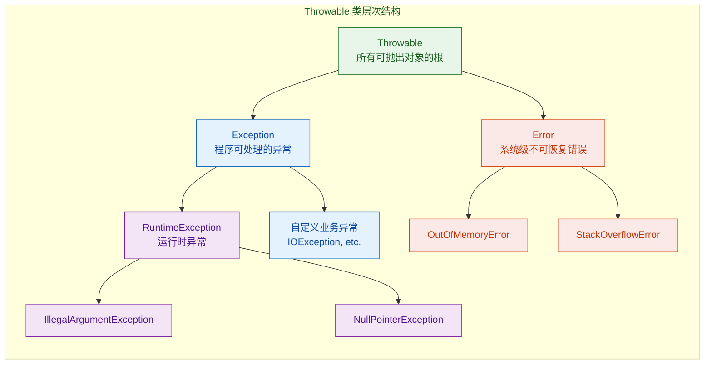

### Exception：可预见、可恢复的异常

`Exception` 表示程序在正常运行过程中"可以预见并合理处理"的异常状况。比如文件不存在、网络超时、用户输入格式错误等。开发者应当针对这类异常编写恢复逻辑。

`Exception` 下最重要的子类是 `RuntimeException`，它代表那些由编程逻辑错误引发的异常——空指针、数组越界、非法参数等。在 Java 中，`RuntimeException` 属于 unchecked exception（不强制捕获），而其他 `Exception` 子类属于 checked exception（编译器强制要求处理）。Kotlin 则更激进：所有异常都是 unchecked 的，这一点后面章节会详细展开。

```kotlin
// 常见的 RuntimeException 子类演示
fun divide(a: Int, b: Int): Int {
    // 当 b 为 0 时，主动抛出 IllegalArgumentException（RuntimeException 的子类）
    require(b != 0) { "Divisor must not be zero" }
    return a / b
}

fun main() {
    // ArithmeticException —— 也是 RuntimeException 的子类
    // 如果没有 require 守卫，JVM 会在除零时自动抛出它
    val result = divide(10, 2)  // 正常返回 5
    println(result)

    // 触发 IllegalArgumentException
    // divide(10, 0)  // 抛出: java.lang.IllegalArgumentException: Divisor must not be zero
}
```

### Error：系统级、不可恢复的严重故障

`Error` 表示 JVM 或底层系统出现了严重问题，程序通常无法（也不应该尝试）从中恢复。典型代表：

| Error 类型 | 触发场景 | 能否恢复 |
|---|---|---|
| `OutOfMemoryError` | JVM 堆内存耗尽 | 几乎不可能 |
| `StackOverflowError` | 递归过深导致栈溢出 | 通常不可能 |
| `NoClassDefFoundError` | 类加载失败 | 需要修复部署 |
| `InternalError` | JVM 内部错误 | 不可能 |

```kotlin
// 演示 StackOverflowError（Error 的子类）
fun infiniteRecursion(): Nothing {
    // 无终止条件的递归，每次调用都会在栈上压入新的帧
    // 最终栈空间耗尽，JVM 抛出 StackOverflowError
    return infiniteRecursion()
}

// 调用 infiniteRecursion() 会导致:
// Exception in thread "main" java.lang.StackOverflowError
```

关键原则：**永远不要 catch `Error`**。捕获 `OutOfMemoryError` 或 `StackOverflowError` 后，JVM 的状态可能已经不一致，任何后续操作都不可靠。正确的做法是让进程崩溃，由外部监控系统（如 Kubernetes、systemd）负责重启。

### Kotlin 异常体系与 Java 的关键差异

虽然 Kotlin 复用了 JVM 的异常类层次，但在语言层面做了几个重要的设计决策：

第一，Kotlin 没有 checked exception。Java 中 `IOException`、`SQLException` 等必须在方法签名中声明或在调用处捕获，否则编译不通过。Kotlin 认为 checked exception 在实践中弊大于利——大量开发者要么写空的 catch 块吞掉异常，要么机械地向上抛出，并没有真正处理问题。因此 Kotlin 完全移除了这一机制。

第二，`throw` 在 Kotlin 中是表达式（expression），而非语句（statement）。这意味着它有返回类型——`Nothing`，可以参与类型推断，这在下一节会详细讲解。

第三，`try-catch` 在 Kotlin 中也是表达式，可以直接赋值给变量，这让异常处理代码更加简洁。

```kotlin
// Java 风格（啰嗦）
var value: Int
try {
    value = "123".toInt()  // 可能抛出 NumberFormatException
} catch (e: NumberFormatException) {
    value = 0
}

// Kotlin 风格（try 作为表达式，直接返回值）
val value2 = try {
    "123".toInt()          // 成功时返回解析结果
} catch (e: NumberFormatException) {
    0                      // 失败时返回默认值
}
```

### 异常对象的内存模型

当异常被创建时，JVM 会做一件开销不小的事情——捕获当前线程的完整调用栈（stack trace capture）。这个过程需要遍历整个调用栈帧，在高频场景下可能成为性能瓶颈。

```text
┌─────────────────────────────────────────┐
│         Throwable 对象 (堆内存)           │
├─────────────────────────────────────────┤
│  message: String? ──→ "file not found"  │
│  cause: Throwable? ──→ null             │
│  stackTrace: Array<StackTraceElement>   │
│    ├─ [0] MyClass.readFile(Main.kt:42)  │
│    ├─ [1] MyClass.process(Main.kt:28)   │
│    └─ [2] MainKt.main(Main.kt:5)       │
└─────────────────────────────────────────┘
```

如果你在性能敏感的路径上需要使用异常作为控制流（虽然不推荐），可以通过覆写 `fillInStackTrace()` 来跳过栈捕获：

```kotlin
// 高性能场景下的轻量异常（跳过昂贵的栈捕获）
class LightweightException(message: String) : Exception(message) {
    // 覆写 fillInStackTrace，返回 this 而不实际填充栈信息
    // 这样创建异常的开销从微秒级降到纳秒级
    override fun fillInStackTrace(): Throwable = this
}
```

---

## 抛出异常（throw 表达式、Nothing 类型、异常创建）

在 Kotlin 中，`throw` 不仅仅是一个"动作"，它是一个拥有类型的表达式。这个设计看似微小，实则深刻地影响了 Kotlin 的类型系统和代码表达力。

### throw 是表达式，不是语句

在 Java 中，`throw` 是一条语句（statement），不能出现在需要值的位置。而 Kotlin 将 `throw` 提升为表达式（expression），它的类型是 `Nothing`——一个特殊的底层类型（bottom type），表示"这个表达式永远不会正常返回值"。

这意味着 `throw` 可以出现在任何需要值的地方：

```kotlin
// 1. 在 val 初始化中使用 throw
val name: String = inputName ?: throw IllegalArgumentException("Name required")
// 如果 inputName 为 null，throw 表达式被求值
// 由于 Nothing 是所有类型的子类型，它可以"假装"是 String

// 2. 在 when 表达式中使用 throw
fun getStatusMessage(code: Int): String = when (code) {
    200 -> "OK"                                          // 返回 String
    404 -> "Not Found"                                   // 返回 String
    else -> throw IllegalArgumentException("Unknown: $code")  // Nothing，兼容 String
}

// 3. 在 if-else 表达式中使用 throw
fun requirePositive(n: Int): Int =
    if (n > 0) n                                         // 返回 Int
    else throw IllegalArgumentException("Must be positive") // Nothing，兼容 Int
```

### Nothing 类型：类型系统的"黑洞"

`Nothing` 是 Kotlin 类型层次结构中最底层的类型。它有两个核心特征：

第一，`Nothing` 是所有类型的子类型（subtype of every type）。这就是为什么 `throw` 表达式可以出现在任何类型位置——编译器将 `Nothing` 视为 `String`、`Int`、`List<Foo>` 等任何类型的合法替代。

第二，`Nothing` 没有任何实例。你永远无法创建一个 `Nothing` 类型的值。一个返回类型为 `Nothing` 的函数，要么抛出异常，要么永远不终止（无限循环）。

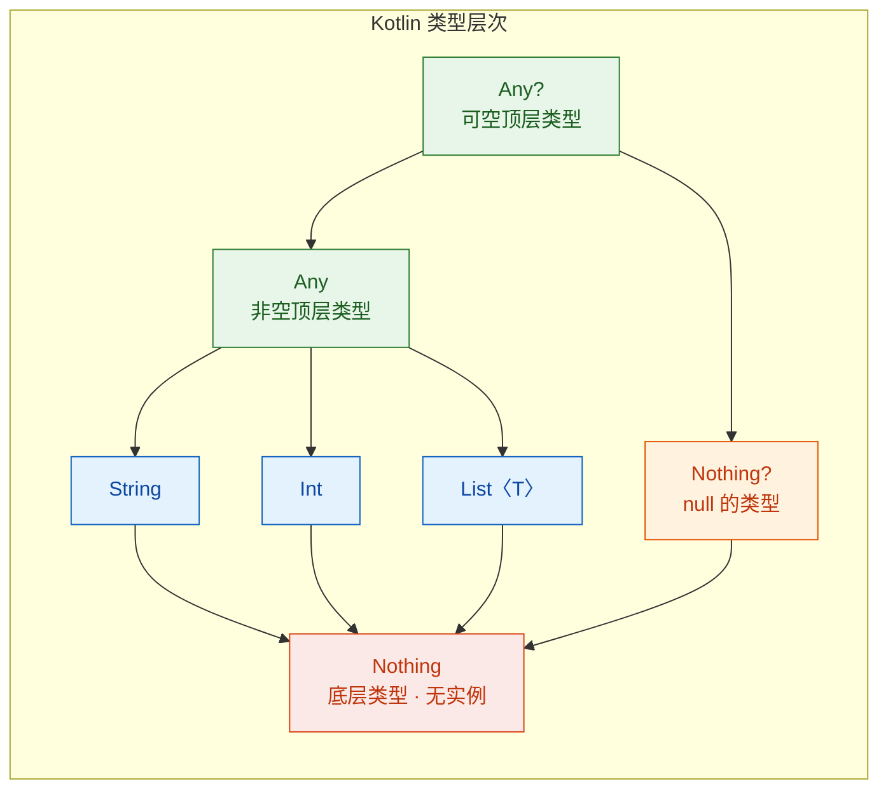

`Nothing` 在类型推断中扮演着关键角色。当编译器需要统一多个分支的类型时，`Nothing` 作为所有类型的子类型，永远不会"破坏"类型推断：

```kotlin
// 编译器推断 result 的类型为 String
// 因为 throw 的类型是 Nothing，而 Nothing 是 String 的子类型
// 所以两个分支的公共类型（LUB, Least Upper Bound）是 String
val result: String = name ?: throw Exception("missing")

// 同理，emptyList<Nothing>() 可以赋值给任何 List 类型
val strings: List<String> = emptyList()  // 实际返回 List<Nothing>，向上兼容
val ints: List<Int> = emptyList()        // 同上
```

### 返回 Nothing 的函数

标准库中有几个经典的 `Nothing` 返回类型函数：

```kotlin
// 标准库中的 TODO() 函数签名
public inline fun TODO(): Nothing = throw NotImplementedError()

// 标准库中的 error() 函数签名
public inline fun error(message: Any): Nothing =
    throw IllegalStateException(message.toString())

// 使用场景：占位符，编译通过但运行时会崩溃
fun calculateTax(income: Double): Double {
    TODO("Tax calculation not implemented yet")
    // 编译器不会报错"缺少 return"，因为 TODO() 返回 Nothing
    // Nothing 是 Double 的子类型，类型检查通过
}
```

你也可以编写自己的 `Nothing` 函数，用于封装通用的失败逻辑：

```kotlin
// 自定义的 "永不返回" 函数
fun fail(message: String): Nothing {
    // 记录日志后抛出异常
    logger.error("Fatal: $message")       // 记录错误日志
    throw ApplicationException(message)    // 抛出异常，函数永不正常返回
}

// 使用时，编译器知道 fail() 之后的代码不可达
fun processOrder(order: Order?): OrderResult {
    val validOrder = order ?: fail("Order cannot be null")
    // 编译器知道 validOrder 一定是非空的 Order 类型
    // 因为如果 order 为 null，fail() 会抛异常，不会走到这里
    return validOrder.process()
}
```

### 异常创建的几种方式

在实际开发中，创建异常对象有几种常见模式：

```kotlin
// ① 直接构造：最基础的方式
throw Exception("Something went wrong")

// ② 带 cause 的异常链：保留原始异常信息
try {
    parseConfig(rawText)
} catch (e: JsonParseException) {
    // 将底层的 JSON 解析异常包装为业务异常
    // cause 参数保留了原始异常，方便排查根因
    throw ConfigurationException("Invalid config format", cause = e)
}

// ③ 使用标准库的便捷函数
// require —— 检查参数，失败抛 IllegalArgumentException
fun setAge(age: Int) {
    require(age in 0..150) { "Age must be between 0 and 150, got $age" }
    // lambda 只在条件不满足时才执行，避免不必要的字符串拼接开销
}

// check —— 检查状态，失败抛 IllegalStateException
fun startEngine() {
    check(fuelLevel > 0) { "Cannot start engine: fuel level is $fuelLevel" }
}

// error —— 直接抛出 IllegalStateException
fun getUser(id: Long): User {
    return userCache[id] ?: error("User $id not found in cache")
}
```

### require / check / error 对比

这三个标准库函数覆盖了最常见的"前置条件检查"场景，选择哪个取决于语义：

| 函数 | 抛出的异常 | 语义 | 典型场景 |
|---|---|---|---|
| `require(condition)` | `IllegalArgumentException` | 参数校验 | 函数入口检查参数合法性 |
| `check(condition)` | `IllegalStateException` | 状态校验 | 检查对象当前状态是否允许操作 |
| `error(message)` | `IllegalStateException` | 无条件失败 | 不应到达的代码路径 |

```kotlin
class BankAccount(val balance: Double) {
    fun withdraw(amount: Double): Double {
        // require 校验参数：amount 必须为正数
        require(amount > 0) { "Withdrawal amount must be positive" }

        // check 校验状态：余额必须充足
        check(balance >= amount) { "Insufficient balance: $balance < $amount" }

        return balance - amount
    }
}
```

### throw 在 lambda 和高阶函数中的行为

由于 `throw` 是表达式且类型为 `Nothing`，它在高阶函数中的行为非常自然：

```kotlin
// 在 map 中使用 throw
val numbers = listOf("1", "2", "abc", "4")

val parsed: List<Int> = numbers.map { str ->
    // toIntOrNull() 返回 Int?
    // throw 的类型是 Nothing，Nothing 是 Int 的子类型
    // 所以 ?: 表达式整体类型为 Int
    str.toIntOrNull() ?: throw NumberFormatException("Cannot parse: $str")
}

// 在 let 中使用 throw
val config: Config = loadConfig()
    ?.let { validateConfig(it) }           // 返回 Config?
    ?: throw IllegalStateException("Config loading and validation failed")
```

### 异常创建的性能考量

异常对象的创建成本主要来自 `fillInStackTrace()`，它需要遍历当前线程的整个调用栈。在正常的错误处理路径上这不是问题，但如果你把异常当作控制流工具（比如用 `throw` 来跳出深层嵌套），性能影响就不可忽视了。

```kotlin
// ❌ 反模式：用异常做控制流
fun findFirst(list: List<Int>, predicate: (Int) -> Boolean): Int? {
    try {
        list.forEach { item ->
            if (predicate(item)) throw FoundException(item)  // 昂贵！每次都捕获栈
        }
        return null
    } catch (e: FoundException) {
        return e.value
    }
}

// ✅ 正确做法：用标准库函数
fun findFirst(list: List<Int>, predicate: (Int) -> Boolean): Int? {
    return list.firstOrNull(predicate)  // 简洁、高效、无异常开销
}
```

---

**📝 练习题**

以下代码的输出是什么？

```kotlin
fun greet(name: String?): String {
    val validName = name ?: throw IllegalArgumentException("Name is null")
    return "Hello, $validName"
}

fun main() {
    val result: Any = try {
        greet(null)
    } catch (e: IllegalArgumentException) {
        42
    }
    println(result)
}
```

A. Hello, null

B. 抛出 IllegalArgumentException，程序崩溃

C. 42

D. 编译错误：try-catch 不能赋值给变量

**【答案】** C

**【解析】** 调用 `greet(null)` 时，`name` 为 `null`，Elvis 操作符 `?:` 右侧的 `throw` 被执行，抛出 `IllegalArgumentException`。这个异常被外层的 `catch` 块捕获，`catch` 块返回 `42`。由于 Kotlin 中 `try-catch` 是表达式，整个表达式的值就是 `catch` 块的最后一个表达式值 `42`（类型为 `Int`）。`result` 声明为 `Any`，`Int` 是 `Any` 的子类型，赋值合法。最终输出 `42`。

---

## 捕获异常（try-catch-finally、catch 多个类型、finally 执行保证）

异常被抛出后，如果没有人接住它，程序就会沿着调用栈一路向上传播直到崩溃。`try-catch-finally` 就是 Kotlin 提供的"安全网"——让你在合适的层级拦截异常、做出响应、并确保善后工作一定被执行。

### try-catch 基本结构

最基础的异常捕获由 `try` 块和一个或多个 `catch` 块组成。`try` 块包裹可能抛出异常的代码，`catch` 块声明要拦截的异常类型并编写处理逻辑：

```kotlin
fun parseAge(input: String): Int {
    try {
        // toInt() 在输入不是合法整数时抛出 NumberFormatException
        val age = input.toInt()
        return age
    } catch (e: NumberFormatException) {
        // 捕获到异常后，打印友好提示并返回默认值
        println("Invalid age format: '${input}', reason: ${e.message}")
        return -1
    }
}

fun main() {
    println(parseAge("25"))    // 输出: 25
    println(parseAge("abc"))   // 输出: Invalid age format: 'abc', reason: For input string: "abc"
                               //       -1
}
```

执行流程很直观：JVM 进入 `try` 块逐行执行，一旦某行抛出异常，剩余代码立即跳过，控制权转移到匹配的 `catch` 块。如果没有异常抛出，所有 `catch` 块都会被跳过。

### catch 多个异常类型

实际开发中，一段代码可能抛出多种不同类型的异常。Kotlin 允许你编写多个 `catch` 块，按从上到下的顺序依次匹配：

```kotlin
fun readConfig(path: String): Map<String, String> {
    try {
        val file = java.io.File(path)           // 构造文件对象
        val content = file.readText()            // 可能抛 IOException
        val pairs = content.lines().map { line ->
            val parts = line.split("=")          // 按等号分割
            // 如果格式不对，parts 可能不够两个元素
            if (parts.size != 2) throw IllegalArgumentException("Bad format: $line")
            parts[0].trim() to parts[1].trim()   // 返回键值对
        }
        return pairs.toMap()
    } catch (e: java.io.FileNotFoundException) {
        // 最具体的异常放在最前面
        println("Config file not found: $path")
        return emptyMap()
    } catch (e: java.io.IOException) {
        // 更宽泛的 IO 异常（包括权限问题、磁盘错误等）
        println("IO error reading config: ${e.message}")
        return emptyMap()
    } catch (e: IllegalArgumentException) {
        // 格式解析错误
        println("Config format error: ${e.message}")
        return emptyMap()
    }
}
```

匹配顺序至关重要——JVM 会从第一个 `catch` 开始，找到第一个类型兼容的块就进入执行，后续的 `catch` 全部跳过。因此必须把更具体的子类异常放在前面，更宽泛的父类异常放在后面：

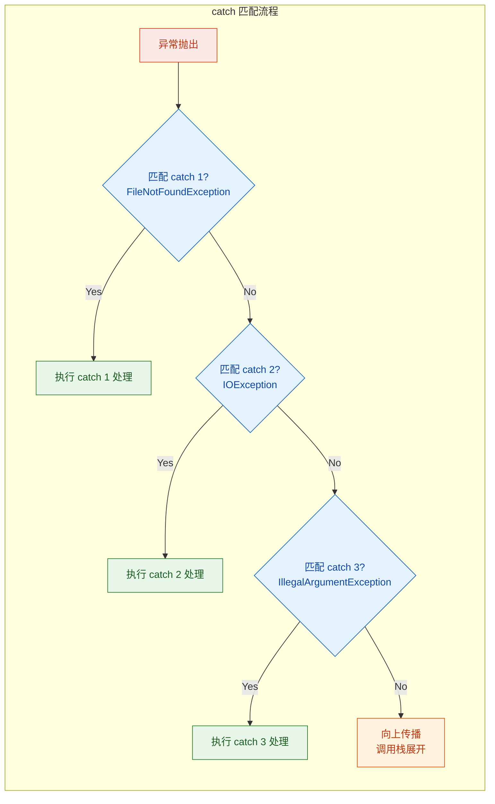

如果你把 `IOException`（父类）放在 `FileNotFoundException`（子类）前面，编译器会直接报错，因为子类的 `catch` 块永远不可达（unreachable code）。

### Kotlin 没有多类型 catch 语法

Java 7 引入了 multi-catch 语法 `catch (IOException | ParseException e)`，可以在一个 `catch` 块中同时捕获多种不相关的异常类型。Kotlin 目前不支持这种语法。如果你需要对多种异常做相同处理，有两种惯用方式：

```kotlin
// 方式一：捕获共同父类，再用 when 细分（适合异常有共同父类的情况）
try {
    riskyOperation()
} catch (e: Exception) {
    when (e) {
        is IOException,
        is IllegalArgumentException -> {
            // 对这两种异常做相同处理
            println("Handled known error: ${e.message}")
        }
        else -> throw e  // 其他异常重新抛出，不要吞掉
    }
}

// 方式二：抽取公共处理逻辑为函数（更清晰）
fun handleRecoverableError(e: Exception) {
    println("Recoverable error: ${e.message}")
    // 记录日志、发送告警等
}

try {
    riskyOperation()
} catch (e: IOException) {
    handleRecoverableError(e)           // 复用处理逻辑
} catch (e: IllegalArgumentException) {
    handleRecoverableError(e)           // 复用处理逻辑
}
```

方式一中有一个关键细节：`else -> throw e` 这一行绝对不能省略。如果你捕获了 `Exception` 却没有重新抛出未处理的类型，就等于悄悄吞掉了所有异常——这是异常处理中最危险的反模式。

### finally：无论如何都会执行的善后块

`finally` 块用于放置"无论是否发生异常都必须执行"的清理代码。典型场景包括关闭文件句柄、释放数据库连接、解锁互斥锁等：

```kotlin
fun readFirstLine(path: String): String? {
    var reader: java.io.BufferedReader? = null  // 声明在 try 外部以便 finally 访问
    try {
        reader = java.io.File(path).bufferedReader()  // 打开文件
        return reader.readLine()                       // 读取第一行并返回
    } catch (e: java.io.IOException) {
        println("Failed to read file: ${e.message}")   // 处理 IO 异常
        return null                                     // 返回 null 表示失败
    } finally {
        // 无论 try 成功还是 catch 被触发，这里都会执行
        reader?.close()                                 // 安全关闭资源
        println("Reader cleanup completed")             // 确认清理完成
    }
}
```

### finally 的执行保证与边界情况

`finally` 块的执行保证非常强，但并非绝对。以下是各种场景的行为：

```kotlin
// 场景 1：正常执行 —— finally 在 return 之前执行
fun scenario1(): String {
    try {
        return "from try"       // 准备返回
    } finally {
        println("finally runs") // 在 return 生效之前执行
    }
    // 输出: finally runs
    // 返回: "from try"
}

// 场景 2：异常被捕获 —— finally 在 catch 之后执行
fun scenario2(): String {
    try {
        throw RuntimeException("boom")
    } catch (e: RuntimeException) {
        println("caught")       // 先执行 catch
        return "from catch"     // 准备返回
    } finally {
        println("finally runs") // 在 catch 的 return 生效之前执行
    }
    // 输出: caught → finally runs
    // 返回: "from catch"
}

// 场景 3：异常未被捕获 —— finally 在异常传播之前执行
fun scenario3() {
    try {
        throw Error("fatal")    // Error 类型，没有对应的 catch
    } finally {
        println("finally runs") // 仍然执行！然后异常继续向上传播
    }
}
```

`finally` 不会执行的极端情况只有几种：JVM 进程被强制终止（`System.exit()`、`kill -9`）、线程被中断且未恢复、或者 JVM 自身崩溃（如 native crash）。在正常的 Kotlin/JVM 程序中，你可以信赖 `finally` 的执行保证。

### finally 中的 return 陷阱

`finally` 块中放 `return` 语句是一个经典的坑——它会覆盖 `try` 或 `catch` 中的返回值，甚至会吞掉异常：

```kotlin
// ⚠️ 危险示例：finally 中的 return 会覆盖一切
fun dangerousReturn(): String {
    try {
        throw RuntimeException("important error!")  // 抛出异常
    } catch (e: RuntimeException) {
        return "from catch"                          // 准备返回 "from catch"
    } finally {
        return "from finally"                        // 覆盖了 catch 的返回值！
    }
    // 实际返回: "from finally"
    // "important error!" 异常被彻底吞掉，没有任何痕迹
}

// ⚠️ 更隐蔽的情况：finally 的 return 吞掉未捕获的异常
fun silentSwallow(): String {
    try {
        throw OutOfMemoryError("heap exhausted")    // 严重错误！
    } finally {
        return "everything is fine"                  // 异常被吞掉，调用者毫不知情
    }
    // 返回: "everything is fine"
    // OutOfMemoryError 消失了——这是灾难性的 bug
}
```

这就是为什么几乎所有的代码规范都明确禁止在 `finally` 中使用 `return`。IntelliJ IDEA 也会对此发出警告。`finally` 应该只做清理工作，不应该影响控制流。

### try-catch-finally 完整执行顺序

把三个块放在一起时，执行顺序遵循严格的规则：

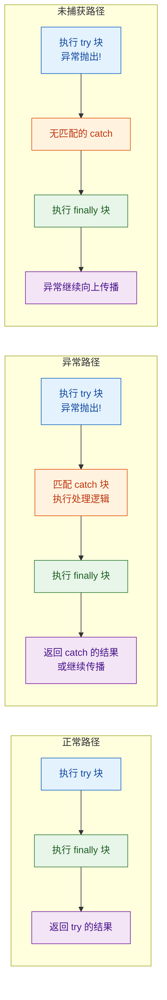

### 异常处理的最佳实践

在结束这一节之前，总结几条在实际项目中经过验证的异常处理原则：

```kotlin
// ✅ 原则 1：只捕获你能处理的异常，不要写空的 catch 块
try {
    connectToDatabase()
} catch (e: ConnectionException) {
    // 有明确的恢复策略：重试、降级、或向用户报告
    retryWithBackoff(maxAttempts = 3) { connectToDatabase() }
}

// ❌ 反模式：吞掉异常
try {
    connectToDatabase()
} catch (e: Exception) {
    // 什么都不做——bug 会在几周后以莫名其妙的方式爆发
}

// ✅ 原则 2：捕获最具体的异常类型
try {
    parseAndValidate(input)
} catch (e: ValidationException) {
    // 只处理验证异常，其他异常继续传播
    showValidationError(e.field, e.message)
}

// ❌ 反模式：捕获 Exception 或 Throwable
try {
    parseAndValidate(input)
} catch (e: Exception) {
    // 把 NullPointerException、StackOverflowError 等都吞了
    println("something went wrong")
}

// ✅ 原则 3：保留异常链（cause）
try {
    loadUserProfile(userId)
} catch (e: IOException) {
    // 包装为业务异常时，保留原始 cause
    throw UserProfileException("Failed to load profile for $userId", cause = e)
}
```

---

## try 作为表达式（返回值、异常影响）

Kotlin 的一个核心设计哲学是"尽可能让一切都是表达式"。`if`、`when`、`try` 在 Kotlin 中都是表达式（expression），而不仅仅是语句（statement）。这意味着它们可以产生一个值，直接赋给变量或作为函数返回值。

### 基本用法：try 表达式赋值

在 Java 中，如果你想根据 try-catch 的结果给变量赋值，必须先声明变量再在不同分支中赋值：

```java
// Java 风格：变量必须先声明为 var，再在不同分支赋值
int value;
try {
    value = Integer.parseInt(input);
} catch (NumberFormatException e) {
    value = 0;
}
```

Kotlin 中，`try` 表达式的值就是 `try` 块或 `catch` 块中最后一个表达式的值，可以直接用 `val` 接收：

```kotlin
// Kotlin 风格：try 是表达式，直接返回值
val value: Int = try {
    input.toInt()           // try 块的最后一个表达式 → 成功时的返回值
} catch (e: NumberFormatException) {
    0                       // catch 块的最后一个表达式 → 失败时的返回值
}
// value 是不可变的 val，类型安全，代码更简洁
```

这不仅仅是语法糖。使用 `val` 而非 `var` 意味着变量一旦赋值就不可变，编译器可以做更多优化，代码的可读性和安全性也更高。

### 返回值规则详解

`try` 表达式的返回值遵循以下规则：

```kotlin
// 规则 1：无异常时，返回 try 块最后一个表达式的值
val result1 = try {
    println("step 1")       // 执行但不影响返回值
    println("step 2")       // 执行但不影响返回值
    42                      // ← 这是 try 块的最后一个表达式，作为返回值
} catch (e: Exception) {
    -1
}
// result1 = 42

// 规则 2：有异常时，返回匹配的 catch 块最后一个表达式的值
val result2 = try {
    "abc".toInt()           // 抛出 NumberFormatException
    42                      // ← 不会执行到这里
} catch (e: NumberFormatException) {
    println("caught!")      // 执行但不影响返回值
    -1                      // ← catch 块的最后一个表达式，作为返回值
}
// result2 = -1

// 规则 3：finally 块的值不会影响 try 表达式的返回值
val result3 = try {
    42
} finally {
    100                     // finally 的值被丢弃，不影响返回值
}
// result3 = 42（不是 100）
```

第三条规则特别重要：`finally` 块虽然一定会执行，但它的"值"不会成为 `try` 表达式的结果。这与 `finally` 中 `return` 会覆盖返回值的行为形成了有趣的对比——表达式求值和 `return` 语句是两套不同的机制。

### 类型推断与 try 表达式

编译器会对 `try` 块和所有 `catch` 块的返回类型取最小公共父类型（Least Upper Bound, LUB）：

```kotlin
// try 返回 Int，catch 返回 Int → 整体类型 Int
val a: Int = try { "123".toInt() } catch (e: Exception) { 0 }

// try 返回 String，catch 返回 Int → LUB 是 Any
val b: Any = try { "hello" } catch (e: Exception) { 42 }

// try 返回 Int，catch 抛出异常（Nothing）→ Nothing 是 Int 的子类型 → 整体 Int
val c: Int = try {
    "123".toInt()
} catch (e: NumberFormatException) {
    throw IllegalStateException("Unexpected", e)  // 返回类型是 Nothing
}

// 多个 catch 块：取所有分支的 LUB
val d = try {
    readFromNetwork()                              // 返回 String
} catch (e: java.io.IOException) {
    "default"                                      // String
} catch (e: SecurityException) {
    ""                                             // String
}
// d 的类型被推断为 String
```

### try 表达式的实际应用模式

在实际项目中，`try` 表达式最常见的用法是"安全解析"和"带默认值的操作"：

```kotlin
// 模式 1：安全解析，配合 Elvis 操作符
// 先尝试解析，失败返回 null，再用 ?: 提供默认值
fun safeParseInt(s: String): Int =
    try { s.toInt() } catch (e: NumberFormatException) { 0 }

// 模式 2：在函数返回值中直接使用
fun loadConfiguration(): Config = try {
    // 尝试从文件加载配置
    ConfigLoader.fromFile("/etc/app/config.yaml")
} catch (e: java.io.FileNotFoundException) {
    // 文件不存在时使用默认配置
    Config.default()
} catch (e: ConfigParseException) {
    // 配置格式错误时也使用默认配置，但记录警告
    logger.warn("Config parse failed, using defaults", e)
    Config.default()
}

// 模式 3：在集合操作中嵌入 try 表达式
val rawScores = listOf("95", "87", "N/A", "76", "error", "88")

val validScores: List<Int> = rawScores.map { raw ->
    try {
        raw.toInt()                    // 尝试解析为整数
    } catch (e: NumberFormatException) {
        -1                             // 无法解析的标记为 -1
    }
}.filter { it >= 0 }                  // 过滤掉无效分数

// validScores = [95, 87, 76, 88]
```

### try 表达式 vs 标准库替代方案

虽然 `try` 表达式很强大，但 Kotlin 标准库提供了更简洁的替代方案来处理常见场景。选择哪种取决于你需要多少控制力：

```kotlin
val input = "42abc"

// 方式 1：try 表达式 —— 最灵活，可以区分不同异常类型
val v1 = try { input.toInt() } catch (e: NumberFormatException) { 0 }

// 方式 2：toIntOrNull + Elvis —— 最简洁，适合简单场景
val v2 = input.toIntOrNull() ?: 0

// 方式 3：runCatching —— 返回 Result 类型，适合链式处理（后续章节详解）
val v3 = runCatching { input.toInt() }.getOrDefault(0)
```

| 方式 | 优势 | 劣势 | 适用场景 |
|---|---|---|---|
| `try` 表达式 | 可捕获多种异常、逻辑灵活 | 代码较冗长 | 复杂错误处理、需要区分异常类型 |
| `xxxOrNull` + `?:` | 极简、无异常开销 | 丢失错误信息 | 简单的解析/查找操作 |
| `runCatching` | 函数式链式处理 | 捕获所有异常（包括不该捕获的） | 需要传递错误状态的场景 |

### 嵌套 try 表达式

`try` 表达式可以嵌套使用，内层的异常如果未被内层 `catch` 捕获，会传播到外层：

```kotlin
val result = try {
    // 外层 try：处理整体流程异常
    val config = try {
        // 内层 try：处理配置加载异常
        loadFromRemote()                    // 尝试远程加载
    } catch (e: java.io.IOException) {
        loadFromLocal()                     // 远程失败则加载本地缓存
    }
    applyConfig(config)                     // 应用配置，可能抛出 ConfigException
    "success"
} catch (e: ConfigException) {
    // 外层 catch：处理配置应用异常
    "failed: ${e.message}"
}
```

不过，嵌套 `try` 会降低可读性。如果嵌套超过两层，建议将内层逻辑抽取为独立函数，让每个函数只处理一层异常。

---

**📝 练习题 1**

以下代码的输出是什么？

```kotlin
fun puzzle(): Int {
    return try {
        try {
            throw IllegalArgumentException("inner")
        } finally {
            println("inner finally")
        }
    } catch (e: IllegalArgumentException) {
        println("outer catch")
        99
    } finally {
        println("outer finally")
    }
}

fun main() {
    println(puzzle())
}
```

A. inner finally → 99

B. inner finally → outer catch → outer finally → 99

C. outer catch → inner finally → outer finally → 99

D. inner finally → outer catch → 99 → outer finally

**【答案】** B

**【解析】** 内层 `try` 抛出 `IllegalArgumentException`，内层没有 `catch` 块，但有 `finally`，所以先执行内层 `finally` 打印 `inner finally`。异常继续向外传播，被外层 `catch` 捕获，打印 `outer catch`，`catch` 块返回 `99`。在 `99` 真正返回之前，外层 `finally` 执行，打印 `outer finally`。最后 `puzzle()` 返回 `99`，`main` 打印 `99`。完整输出顺序：`inner finally` → `outer catch` → `outer finally` → `99`。

**📝 练习题 2**

以下代码中 `result` 的值是什么？

```kotlin
val result: Int = try {
    val x = 10
    val y = 20
    x + y
} catch (e: Exception) {
    -1
} finally {
    999
}
```

A. 30

B. -1

C. 999

D. 编译错误

**【答案】** A

**【解析】** `try` 块正常执行，没有异常抛出，所以 `catch` 块被跳过。`try` 块最后一个表达式是 `x + y = 30`，这就是 `try` 表达式的返回值。`finally` 块虽然执行了（求值 `999`），但 `finally` 的值永远不会成为 `try` 表达式的结果。因此 `result = 30`。

---

## 受检异常（Kotlin 无受检异常、@Throws 与 Java 互操作）

### Java 的受检异常回顾

要理解 Kotlin 为什么抛弃受检异常（checked exception），我们先回顾 Java 的设计。Java 将异常分为两类：checked exception 必须在方法签名中用 `throws` 声明，调用方要么 `try-catch` 捕获，要么继续向上声明；unchecked exception（`RuntimeException` 及其子类）则不受此约束。

```java
// Java 代码：checked exception 强制处理
public String readFile(String path) throws IOException {  // 必须声明
    BufferedReader reader = new BufferedReader(new FileReader(path));
    return reader.readLine();
}

public void caller() {
    // 编译错误！必须处理 IOException
    // String content = readFile("data.txt");

    // 方式一：try-catch 捕获
    try {
        String content = readFile("data.txt");
    } catch (IOException e) {
        e.printStackTrace();
    }

    // 方式二：继续向上声明 throws IOException
}
```

Java 设计 checked exception 的初衷是好的——强制开发者思考错误处理。但在二十多年的实践中，这个机制暴露出严重的问题。

### 受检异常的实际问题

第一个问题是"吞异常"（swallowing exceptions）。当编译器强制要求处理异常时，很多开发者为了让代码编译通过，写出空的 catch 块，异常信息被彻底丢失，bug 变得极难排查：

```java
// Java 中极其常见的反模式
try {
    riskyOperation();
} catch (IOException e) {
    // 什么都不做，异常被吞掉了
    // 程序继续运行，但状态可能已经不一致
}

// 另一种常见的"应付编译器"写法
try {
    riskyOperation();
} catch (IOException e) {
    throw new RuntimeException(e);  // 机械地包装成 unchecked，毫无意义
}
```

第二个问题是"签名污染"（signature pollution）。checked exception 会沿着调用链向上传播，导致中间层的方法签名被迫声明一堆它根本不关心的异常类型：

```java
// Java：异常声明像病毒一样扩散
public void methodA() throws IOException, SQLException, ParseException {
    methodB();  // 只是中间转发，却必须声明所有异常
}

public void methodB() throws IOException, SQLException, ParseException {
    methodC();  // 同上
}

public void methodC() throws IOException, SQLException, ParseException {
    // 真正可能抛异常的地方
}
```

第三个问题是与高阶函数（lambda）的严重不兼容。Java 8 引入的函数式接口（如 `Function<T, R>`）的抽象方法没有声明 `throws`，这意味着 lambda 内部无法直接抛出 checked exception：

```java
// Java：lambda 中无法抛出 checked exception
List<String> paths = List.of("a.txt", "b.txt");
// 编译错误！IOException 是 checked exception，Function.apply() 没有声明 throws
// paths.stream().map(path -> new FileReader(path)).collect(Collectors.toList());

// 被迫在 lambda 内部 try-catch，代码变得丑陋
paths.stream().map(path -> {
    try {
        return new FileReader(path);
    } catch (IOException e) {
        throw new RuntimeException(e);  // 又是机械包装
    }
}).collect(Collectors.toList());
```

### Kotlin 的决定：全部 Unchecked

Kotlin 的设计者（JetBrains 团队，尤其是 Andrey Breslav）在深入研究了 Java 社区的实践后，做出了一个果断的决定：Kotlin 中所有异常都是 unchecked 的。编译器不会强制你捕获任何异常，也不需要在函数签名中声明可能抛出的异常。

```kotlin
// Kotlin：直接调用可能抛异常的函数，无需声明或捕获
fun readFile(path: String): String {
    // FileReader 构造函数可能抛 IOException
    // Kotlin 不要求你处理它
    return java.io.FileReader(path).readText()
}

fun caller() {
    // 直接调用，编译器不会报错
    val content = readFile("data.txt")
    // 如果文件不存在，IOException 会在运行时抛出
    // 开发者可以自行决定是否在这里或更上层处理
}
```

这并不意味着 Kotlin 鼓励忽略错误。相反，Kotlin 提供了更优雅的错误处理工具——`Result` 类型、`runCatching`、sealed class 等——让开发者在需要时主动选择处理策略，而不是被编译器强迫。

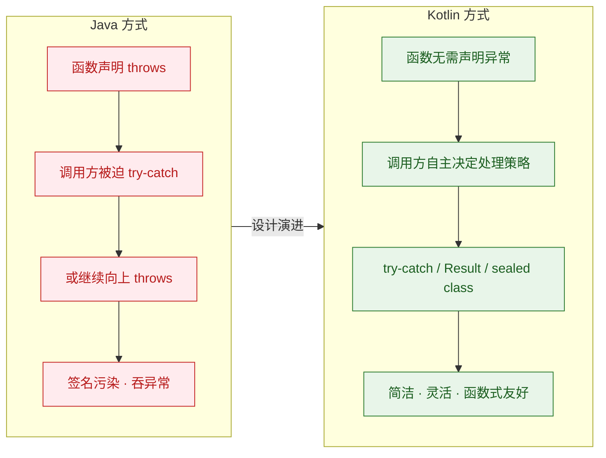

### @Throws：Java 互操作的桥梁

虽然 Kotlin 自身不需要 checked exception，但当 Kotlin 代码需要被 Java 调用时，问题就来了。Java 编译器仍然会检查 checked exception，如果 Kotlin 函数可能抛出 `IOException` 但没有在字节码中声明，Java 调用方就无法用 `try-catch` 正确捕获它（更准确地说，Java 编译器会认为 catch `IOException` 是不必要的）。

`@Throws` 注解就是为解决这个互操作问题而设计的。它不会改变 Kotlin 端的任何行为，只是在生成的 JVM 字节码中添加 `throws` 声明，让 Java 编译器满意。

```kotlin
// Kotlin 端：使用 @Throws 注解
// 这个注解不影响 Kotlin 调用者，只影响生成的字节码
@Throws(IOException::class)
fun readConfig(path: String): String {
    val file = java.io.File(path)           // 创建 File 对象
    if (!file.exists()) {                    // 检查文件是否存在
        throw IOException("File not found: $path")  // 抛出 IOException
    }
    return file.readText()                   // 读取文件全部内容
}

// 可以声明多个异常类型
@Throws(IOException::class, IllegalArgumentException::class)
fun parseConfig(path: String): Map<String, String> {
    require(path.isNotBlank()) { "Path must not be blank" }  // 可能抛 IAE
    val content = readConfig(path)                             // 可能抛 IOException
    return parseToMap(content)                                 // 解析为 Map
}
```

上面的 Kotlin 代码编译后，生成的字节码等价于以下 Java 代码：

```java
// 编译后的字节码等价 Java 代码
// @Throws 注解让编译器在方法签名中添加了 throws 声明
public static String readConfig(String path) throws IOException {
    // ... 方法体 ...
}

public static Map<String, String> parseConfig(String path)
        throws IOException, IllegalArgumentException {
    // ... 方法体 ...
}
```

现在 Java 端可以正常调用并处理异常了：

```java
// Java 端调用 Kotlin 函数
public class JavaCaller {
    public void loadSettings() {
        try {
            // Java 编译器知道 readConfig 可能抛 IOException
            String config = ConfigReaderKt.readConfig("settings.conf");
            System.out.println(config);
        } catch (IOException e) {
            // 编译器允许这个 catch 块，因为字节码中有 throws 声明
            System.err.println("Failed to read config: " + e.getMessage());
        }
    }
}
```

### 何时需要 @Throws

一个简单的判断标准：如果你的 Kotlin 函数满足以下两个条件，就应该加上 `@Throws`：

1. 函数可能抛出 checked exception（`Exception` 的子类，但不是 `RuntimeException` 的子类）
2. 函数会被 Java 代码调用

如果函数只在 Kotlin 内部使用，或者只抛出 `RuntimeException` 的子类（如 `IllegalArgumentException`、`IllegalStateException`），则不需要 `@Throws`，因为 Java 对 unchecked exception 也不做编译期检查。

```kotlin
// ✅ 需要 @Throws：抛出 checked exception + 可能被 Java 调用
@Throws(IOException::class)
fun saveData(data: ByteArray, path: String) {
    java.io.File(path).writeBytes(data)  // writeBytes 内部可能抛 IOException
}

// ❌ 不需要 @Throws：只抛出 unchecked exception
fun validateAge(age: Int) {
    require(age >= 0) { "Age cannot be negative" }
    // IllegalArgumentException 是 RuntimeException 的子类
    // Java 也不强制捕获它
}

// ❌ 不需要 @Throws：纯 Kotlin 项目，不会被 Java 调用
internal fun internalHelper(): String {
    // internal 可见性意味着只在模块内使用
    // 如果整个模块都是 Kotlin，无需 @Throws
    return java.io.File("temp.txt").readText()
}
```

### @Throws 与协程的 suspend 函数

在协程中，`@Throws` 同样适用于 `suspend` 函数。当 Java 代码通过协程的互操作机制调用 suspend 函数时，`@Throws` 确保异常声明正确传递：

```kotlin
// suspend 函数也可以使用 @Throws
@Throws(IOException::class)
suspend fun fetchRemoteConfig(url: String): String {
    // 模拟网络请求
    return withContext(Dispatchers.IO) {
        java.net.URL(url).readText()  // 可能抛出 IOException
    }
}
```

---

## 自定义异常（继承 Exception、携带上下文信息）

### 为什么需要自定义异常

标准库提供的异常类型（`IllegalArgumentException`、`IllegalStateException`、`IOException` 等）覆盖了通用场景，但在真实的业务系统中，你经常需要表达更精确的错误语义。比如"用户未找到"和"用户已被禁用"都可以用 `IllegalStateException` 表示，但调用方无法通过异常类型区分它们，只能解析 `message` 字符串——这既脆弱又不优雅。

自定义异常让你能够：
- 用类型系统精确表达不同的错误场景
- 携带结构化的上下文信息（错误码、相关实体 ID、时间戳等）
- 让 `catch` 块可以按类型精确匹配，而不是靠字符串判断
- 建立清晰的异常层次结构，反映业务领域的错误分类

### 基础自定义异常

最简单的自定义异常只需继承 `Exception`（或 `RuntimeException`）并传递 `message` 和 `cause`：

```kotlin
// 最基础的自定义异常
// 继承 RuntimeException，因为大多数业务异常不需要强制捕获
class OrderNotFoundException(
    message: String,                    // 错误描述
    cause: Throwable? = null            // 可选的原始异常（默认 null）
) : RuntimeException(message, cause)    // 调用父类构造函数

// 使用
fun findOrder(id: Long): Order {
    return orderRepository.findById(id)
        ?: throw OrderNotFoundException("Order with id $id not found")
}
```

选择继承 `Exception` 还是 `RuntimeException` 取决于你的目标平台。如果 Kotlin 代码会被 Java 调用，继承 `Exception` 意味着 Java 端必须处理它（checked），继承 `RuntimeException` 则不强制。在纯 Kotlin 项目中，两者在 Kotlin 端没有区别，但惯例上业务异常继承 `RuntimeException`。

### 携带上下文信息的异常

真正有价值的自定义异常会携带结构化的上下文数据，而不仅仅是一个字符串消息。这些数据在日志记录、错误报告、API 响应构建中都非常有用：

```kotlin
// 携带丰富上下文信息的业务异常
class PaymentFailedException(
    val orderId: Long,                   // 关联的订单 ID
    val amount: Double,                  // 支付金额
    val currency: String,                // 货币类型
    val errorCode: String,               // 支付网关返回的错误码
    message: String,                     // 人类可读的错误描述
    cause: Throwable? = null             // 原始异常
) : RuntimeException(message, cause) {

    // 提供格式化的详细信息，方便日志输出
    fun toDetailString(): String =
        "PaymentFailed[order=$orderId, amount=$amount $currency, code=$errorCode]: $message"
}

// 使用场景
fun processPayment(order: Order): PaymentReceipt {
    try {
        return paymentGateway.charge(order.totalAmount, order.currency)
    } catch (e: GatewayTimeoutException) {
        // 包装底层异常，添加业务上下文
        throw PaymentFailedException(
            orderId = order.id,                          // 携带订单 ID
            amount = order.totalAmount,                  // 携带金额
            currency = order.currency,                   // 携带币种
            errorCode = "GATEWAY_TIMEOUT",               // 标准化错误码
            message = "Payment gateway timed out for order ${order.id}",
            cause = e                                    // 保留原始异常链
        )
    }
}
```

在 `catch` 块中，调用方可以直接访问这些结构化字段：

```kotlin
// 调用方可以精确地提取上下文信息
try {
    processPayment(order)
} catch (e: PaymentFailedException) {
    // 直接访问结构化字段，无需解析字符串
    logger.error("Payment failed for order ${e.orderId}: ${e.errorCode}")
    metrics.recordPaymentFailure(e.errorCode)            // 按错误码统计
    notifyUser(e.orderId, e.amount, e.currency)          // 通知用户
}
```

### 异常层次结构设计

在复杂的业务系统中，通常会设计一个异常层次结构，用一个抽象基类统一所有业务异常，再按领域划分子类：

```kotlin
// 顶层业务异常基类（sealed 或 abstract 均可）
// 使用 abstract 允许跨模块扩展
abstract class AppException(
    val errorCode: String,               // 全局唯一的错误码
    message: String,                     // 错误描述
    cause: Throwable? = null             // 原始异常
) : RuntimeException(message, cause)

// ── 用户领域异常 ──
open class UserException(
    errorCode: String,
    message: String,
    cause: Throwable? = null
) : AppException(errorCode, message, cause)

class UserNotFoundException(
    val userId: Long                     // 携带用户 ID
) : UserException(
    errorCode = "USER_NOT_FOUND",
    message = "User $userId does not exist"
)

class UserSuspendedException(
    val userId: Long,                    // 携带用户 ID
    val reason: String                   // 封禁原因
) : UserException(
    errorCode = "USER_SUSPENDED",
    message = "User $userId is suspended: $reason"
)

// ── 订单领域异常 ──
open class OrderException(
    errorCode: String,
    message: String,
    cause: Throwable? = null
) : AppException(errorCode, message, cause)

class InsufficientStockException(
    val productId: Long,                 // 商品 ID
    val requested: Int,                  // 请求数量
    val available: Int                   // 实际库存
) : OrderException(
    errorCode = "INSUFFICIENT_STOCK",
    message = "Product $productId: requested $requested but only $available available"
)
```

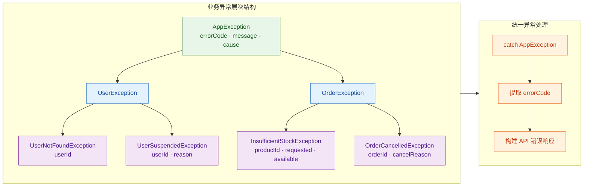

这种层次结构的好处在于，你可以在不同层级进行捕获：

```kotlin
try {
    placeOrder(userId = 42, productId = 100, quantity = 5)
} catch (e: InsufficientStockException) {
    // 最精确的匹配：库存不足，可以给用户具体提示
    showMessage("库存不足，${e.productId} 仅剩 ${e.available} 件")
} catch (e: OrderException) {
    // 中间层匹配：所有订单相关异常
    showMessage("订单处理失败：${e.errorCode}")
} catch (e: AppException) {
    // 最宽泛的匹配：所有业务异常
    logger.error("Business error [${e.errorCode}]: ${e.message}")
    showGenericError()
}
```

### 使用 sealed class 构建封闭异常体系

当你希望异常类型是有限且已知的（编译器可以检查穷尽性），可以使用 `sealed class`：

```kotlin
// sealed 异常：编译器保证 when 穷尽性
sealed class ValidationException(
    message: String
) : RuntimeException(message) {

    // 字段为空
    class MissingField(
        val fieldName: String                // 缺失的字段名
    ) : ValidationException("Field '$fieldName' is required")

    // 格式错误
    class InvalidFormat(
        val fieldName: String,               // 字段名
        val expectedPattern: String           // 期望的格式
    ) : ValidationException("Field '$fieldName' must match pattern: $expectedPattern")

    // 值超出范围
    class OutOfRange(
        val fieldName: String,               // 字段名
        val min: Number,                     // 最小值
        val max: Number,                     // 最大值
        val actual: Number                   // 实际值
    ) : ValidationException("Field '$fieldName': $actual is not in [$min, $max]")
}

// when 表达式可以穷尽所有分支，无需 else
fun handleValidationError(e: ValidationException): String = when (e) {
    is ValidationException.MissingField ->
        "请填写 ${e.fieldName}"                          // 提示用户填写
    is ValidationException.InvalidFormat ->
        "${e.fieldName} 格式不正确，应为 ${e.expectedPattern}"  // 提示正确格式
    is ValidationException.OutOfRange ->
        "${e.fieldName} 应在 ${e.min}~${e.max} 之间"     // 提示有效范围
    // 无需 else！编译器知道所有子类都已覆盖
}
```

### 异常与 API 错误响应的映射

在 Web 应用中，自定义异常的一个核心用途是统一映射为 HTTP 错误响应。携带 `errorCode` 的异常层次结构让这个映射变得非常干净：

```kotlin
// 统一的 API 错误响应数据类
data class ApiError(
    val code: String,                    // 业务错误码
    val message: String,                 // 用户可见的错误描述
    val timestamp: Long = System.currentTimeMillis()  // 错误发生时间
)

// 全局异常处理器（以 Ktor/Spring 风格为例）
fun handleException(e: Throwable): Pair<Int, ApiError> = when (e) {
    is UserNotFoundException -> 404 to ApiError(       // HTTP 404
        code = e.errorCode,
        message = "用户不存在"
    )
    is UserSuspendedException -> 403 to ApiError(      // HTTP 403
        code = e.errorCode,
        message = "账户已被封禁"
    )
    is InsufficientStockException -> 409 to ApiError(  // HTTP 409 Conflict
        code = e.errorCode,
        message = "库存不足"
    )
    is AppException -> 400 to ApiError(                // HTTP 400 兜底
        code = e.errorCode,
        message = e.message ?: "业务处理失败"
    )
    else -> 500 to ApiError(                           // HTTP 500 未知错误
        code = "INTERNAL_ERROR",
        message = "服务器内部错误"
    )
}
```

### 异常创建的实用技巧

几个在实际项目中常用的异常设计技巧：

```kotlin
// 技巧 1：使用伴生对象提供工厂方法，让创建更语义化
class ResourceConflictException private constructor(
    val resourceType: String,
    val resourceId: String,
    message: String
) : AppException("RESOURCE_CONFLICT", message) {

    companion object {
        // 工厂方法：语义清晰，调用处一目了然
        fun duplicateEmail(email: String) = ResourceConflictException(
            resourceType = "User",
            resourceId = email,
            message = "Email $email is already registered"
        )

        fun duplicateOrderNumber(orderNumber: String) = ResourceConflictException(
            resourceType = "Order",
            resourceId = orderNumber,
            message = "Order number $orderNumber already exists"
        )
    }
}

// 使用：比直接 new 更具可读性
throw ResourceConflictException.duplicateEmail("[email]")

// 技巧 2：扩展函数简化异常抛出
inline fun <reified T> notFound(id: Any): Nothing {
    // reified 获取泛型的实际类型名
    val typeName = T::class.simpleName    // 例如 "User"、"Order"
    throw AppException(
        errorCode = "${typeName?.uppercase()}_NOT_FOUND",
        message = "$typeName with id $id not found"
    )
}

// 使用
fun getUser(id: Long): User {
    return userRepository.findById(id) ?: notFound<User>(id)
    // 抛出: AppException(errorCode="USER_NOT_FOUND", message="User with id 42 not found")
}
```

---

**📝 练习题 1**

以下 Kotlin 函数需要被 Java 代码调用，且函数内部可能抛出 `IOException`。哪种写法能让 Java 调用方正确地用 `try-catch (IOException e)` 捕获异常？

```kotlin
// 选项 A
fun readData(path: String): String = File(path).readText()

// 选项 B
@Throws(IOException::class)
fun readData(path: String): String = File(path).readText()

// 选项 C
@Throws(RuntimeException::class)
fun readData(path: String): String = File(path).readText()

// 选项 D
@Suppress("TooGenericExceptionThrown")
fun readData(path: String): String = File(path).readText()
```

A. 选项 A

B. 选项 B

C. 选项 C

D. 选项 D

**【答案】** B

**【解析】** `@Throws(IOException::class)` 会在编译生成的字节码中为方法添加 `throws IOException` 声明。Java 编译器看到这个声明后，才允许调用方在 `catch` 块中捕获 `IOException`。选项 A 没有任何注解，生成的字节码不含 `throws` 声明，Java 编译器会认为 `catch (IOException e)` 是不可达的（unreachable catch block）并报警告或错误。选项 C 声明的是 `RuntimeException`，这是 unchecked exception，Java 本来就不强制捕获它，对 `IOException` 的捕获没有帮助。选项 D 的 `@Suppress` 只是抑制 Kotlin 的 lint 警告，不影响字节码生成。

**📝 练习题 2**

以下自定义异常层次结构中，`catch` 块的输出是什么？

```kotlin
abstract class AppException(val code: String, msg: String) : RuntimeException(msg)
class AuthException(code: String, msg: String) : AppException(code, msg)
class PermissionDeniedException(val resource: String)
    : AuthException("PERM_DENIED", "No access to $resource")

fun main() {
    try {
        throw PermissionDeniedException("admin_panel")
    } catch (e: AppException) {
        println("${e.code}: ${e.message}")
    }
}
```

A. 编译错误：`PermissionDeniedException` 不是 `AppException` 的子类

B. PERM_DENIED: No access to admin_panel

C. 运行时抛出 `ClassCastException`

D. 编译错误：`catch` 块无法捕获 `PermissionDeniedException`

**【答案】** B

**【解析】** `PermissionDeniedException` 继承 `AuthException`，`AuthException` 继承 `AppException`，所以 `PermissionDeniedException` 是 `AppException` 的间接子类。`catch (e: AppException)` 可以捕获所有 `AppException` 及其子类的实例。捕获后，`e.code` 访问的是 `AppException` 中定义的 `code` 属性（值为 `"PERM_DENIED"`），`e.message` 访问的是 `RuntimeException` 的 `message` 属性（值为 `"No access to admin_panel"`）。因此输出 `PERM_DENIED: No access to admin_panel`。

---

## Result 类型（Success/Failure、函数式错误处理）

传统的 `try-catch` 异常处理有一个根本性的问题：异常是"隐式的"。当你调用一个函数时，函数签名并不会告诉你它可能失败——你必须阅读文档或源码才能知道它会抛出什么异常。这种隐式性让代码的可预测性大打折扣。

Kotlin 标准库从 1.3 开始引入了 `Result<T>` 类型，它将"成功或失败"这一概念显式地编码到类型系统中，让错误处理变得可见、可组合、可推理。

### Result 的本质：一个值的容器

`Result<T>` 是一个 inline class（内联类），它要么包含一个类型为 `T` 的成功值（success），要么包含一个 `Throwable` 类型的失败信息（failure）。你可以把它理解为一个"薛定谔的盒子"——打开之前，你不知道里面是结果还是异常。

```kotlin
// Result 的概念模型（简化版，非实际源码）
// 实际上 Result 是 inline class，编译后没有额外的包装开销
@JvmInline
value class Result<out T> internal constructor(
    internal val value: Any?   // 成功时存 T 的值，失败时存 Failure(exception)
) {
    // 判断是否成功
    val isSuccess: Boolean get() = value !is Failure

    // 判断是否失败
    val isFailure: Boolean get() = value is Failure

    // 内部类，包装失败的异常
    internal class Failure(val exception: Throwable)
}
```

### 创建 Result 实例

`Result` 提供了两个工厂方法来创建实例：

```kotlin
// 创建一个成功的 Result，包含值 42
val success: Result<Int> = Result.success(42)

// 创建一个失败的 Result，包含异常信息
val failure: Result<Int> = Result.failure(IllegalStateException("something broke"))

// 验证状态
println(success.isSuccess)  // true
println(success.isFailure)  // false
println(failure.isSuccess)  // false
println(failure.isFailure)  // true
```

### 从 Result 中提取值

`Result` 提供了多种方式来安全地提取内部的值：

```kotlin
val success: Result<String> = Result.success("Kotlin")
val failure: Result<String> = Result.failure(RuntimeException("oops"))

// ① getOrNull() —— 成功返回值，失败返回 null
println(success.getOrNull())   // "Kotlin"
println(failure.getOrNull())   // null

// ② exceptionOrNull() —— 失败返回异常，成功返回 null
println(success.exceptionOrNull())  // null
println(failure.exceptionOrNull())  // java.lang.RuntimeException: oops

// ③ getOrDefault() —— 失败时返回指定的默认值
println(failure.getOrDefault("fallback"))  // "fallback"

// ④ getOrThrow() —— 成功返回值，失败直接重新抛出异常
println(success.getOrThrow())  // "Kotlin"
// failure.getOrThrow()        // 抛出 RuntimeException: oops
```

### 为什么不直接用 try-catch？

这是一个好问题。`Result` 的价值不在于替代 `try-catch`，而在于它将异常"值化"（reify）了——把异常从控制流层面提升到数据层面。一旦异常变成了值，你就可以像操作普通数据一样对它进行传递、转换、组合。

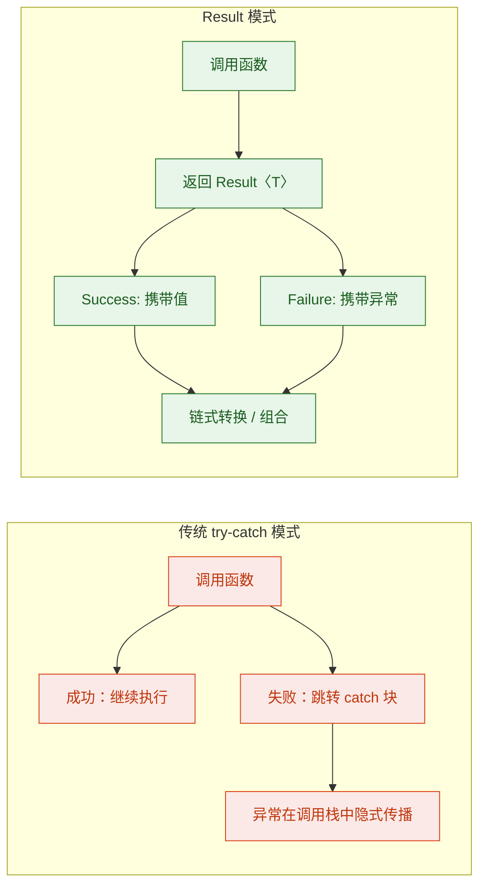

核心差异在于：`try-catch` 是命令式的——你告诉程序"如果出错了，跳到这里"；`Result` 是声明式的——你描述"对成功做什么，对失败做什么"，然后让数据流自然地流过转换管道。

### Result 与函数式错误处理哲学

函数式编程有一个核心理念：**纯函数不应该有副作用**（side effects）。抛出异常本质上是一种副作用——它打断了正常的返回流程，跳转到了调用栈中某个不确定的位置。`Result` 类型将这种副作用"驯化"为一个普通的返回值，让函数重新变得"诚实"：

```kotlin
// ❌ 不诚实的函数签名：看起来返回 User，实际可能抛异常
fun findUser(id: Long): User {
    // 可能抛出 UserNotFoundException、DatabaseException...
    // 但签名完全没有体现这一点
    return database.query("SELECT * FROM users WHERE id = ?", id)
}

// ✅ 诚实的函数签名：返回类型明确告诉调用者"可能失败"
fun findUser(id: Long): Result<User> {
    return runCatching {
        database.query("SELECT * FROM users WHERE id = ?", id)
    }
}
```

当函数返回 `Result<User>` 时，调用者在编译期就知道这个操作可能失败，必须显式处理两种情况。这种"强制面对失败"的设计，比 Java 的 checked exception 更优雅——它不需要 `throws` 声明，不会导致签名膨胀，而且可以自然地参与函数组合。

### Result 的限制

Kotlin 对 `Result` 有一个重要的限制：**不能作为函数的直接返回类型**（在早期版本中）。从 Kotlin 1.5 开始，这个限制已经放宽，`Result` 可以作为返回类型使用。但仍然不能用作属性类型的泛型参数（如 `List<Result<T>>` 在某些场景下可能有问题）。

```kotlin
// Kotlin 1.5+ 允许 Result 作为返回类型
fun parseAge(input: String): Result<Int> {
    return runCatching { input.toInt() }  // 将可能的异常包装为 Result
}

// 但 Result 作为 inline class，在某些泛型场景下会被装箱
// 这是需要注意的性能细节
val results: List<Result<Int>> = listOf("1", "abc", "3").map { parseAge(it) }
```

---

## Result 操作（map、mapCatching、recover、getOrElse、fold）

`Result` 真正的威力在于它提供的一系列转换操作符。这些操作符让你可以像搭积木一样，将多个可能失败的操作串联成一条清晰的处理管道（pipeline），而不需要层层嵌套的 `try-catch`。

### map：对成功值进行转换

`map` 是最基础的转换操作。它只在 `Result` 为成功时执行转换函数，失败时原样传递：

```kotlin
val result: Result<String> = Result.success("42")

// map 将 String 转换为 Int
// 如果 result 是 Success，执行 lambda 并将结果包装为新的 Success
// 如果 result 是 Failure，直接返回原来的 Failure，lambda 不执行
val mapped: Result<Int> = result.map { it.toInt() }

println(mapped.getOrNull())  // 42

// 失败时 map 不执行
val failed: Result<String> = Result.failure(Exception("boom"))
val mappedFail: Result<Int> = failed.map { it.toInt() }  // lambda 不会被调用
println(mappedFail.isFailure)  // true
println(mappedFail.exceptionOrNull()?.message)  // "boom"（原始异常原封不动）
```

`map` 有一个重要的假设：你传入的转换函数本身不会抛异常。如果转换函数抛了异常，这个异常会直接逃逸出去，不会被 `Result` 捕获。这就是 `mapCatching` 存在的原因。

### mapCatching：安全的转换

`mapCatching` 与 `map` 的区别在于：它会捕获转换函数中抛出的异常，并将其包装为 `Failure`：

```kotlin
val result: Result<String> = Result.success("not_a_number")

// map 版本：如果 toInt() 抛异常，异常会直接逃逸
// val dangerous: Result<Int> = result.map { it.toInt() }  // 💥 抛出 NumberFormatException

// mapCatching 版本：toInt() 的异常被捕获，包装为 Failure
val safe: Result<Int> = result.mapCatching { it.toInt() }
println(safe.isFailure)  // true
println(safe.exceptionOrNull())  // java.lang.NumberFormatException: For input string: "not_a_number"
```

经验法则：如果转换函数是纯计算（不会抛异常），用 `map`；如果转换函数可能失败（IO、解析等），用 `mapCatching`。

### recover：从失败中恢复

`recover` 是 `map` 的"镜像"——它只在 `Result` 为失败时执行，尝试提供一个替代值来"恢复"：

```kotlin
val failure: Result<Int> = Result.failure(Exception("network error"))

// recover：失败时执行 lambda，返回替代值
// 如果 Result 是 Success，直接返回原值，lambda 不执行
val recovered: Result<Int> = failure.recover { exception ->
    println("Recovering from: ${exception.message}")  // 输出: Recovering from: network error
    -1  // 提供默认值作为恢复
}

println(recovered.getOrNull())  // -1
println(recovered.isSuccess)    // true（已经从 Failure 恢复为 Success）
```

与 `map`/`mapCatching` 的对称关系一样，`recover` 也有一个安全版本 `recoverCatching`，它会捕获恢复函数中的异常：

```kotlin
val failure: Result<String> = Result.failure(Exception("primary failed"))

// recoverCatching：恢复函数本身也可能失败
val result: Result<String> = failure.recoverCatching { exception ->
    // 尝试从备用数据源恢复，但备用源也可能失败
    fetchFromBackup()  // 如果这里也抛异常，会被捕获为新的 Failure
}
```

### getOrElse：带计算的默认值

`getOrElse` 在失败时执行一个 lambda 来计算默认值，与 `getOrDefault` 的区别在于默认值是惰性计算的，而且 lambda 可以访问异常对象：

```kotlin
val failure: Result<Int> = Result.failure(IllegalArgumentException("bad input"))

// getOrElse：失败时执行 lambda，lambda 接收异常作为参数
val value: Int = failure.getOrElse { exception ->
    // 可以根据异常类型决定不同的默认值
    when (exception) {
        is IllegalArgumentException -> 0     // 参数错误，返回 0
        is IllegalStateException -> -1       // 状态错误，返回 -1
        else -> throw exception              // 未知异常，重新抛出
    }
}
println(value)  // 0

// 成功时 getOrElse 直接返回成功值，lambda 不执行
val success: Result<Int> = Result.success(42)
val successValue: Int = success.getOrElse { 0 }
println(successValue)  // 42
```

### fold：统一处理成功和失败

`fold` 是 `Result` 最强大的终结操作（terminal operation）。它接收两个 lambda——一个处理成功，一个处理失败——并返回统一的结果类型。可以把它理解为"强制你处理两种情况"的 `when` 表达式：

```kotlin
val result: Result<String> = Result.success("Kotlin")

// fold 接收两个 lambda：
// 第一个处理成功（onSuccess），第二个处理失败（onFailure）
val message: String = result.fold(
    onSuccess = { value ->
        "Got value: $value"           // 成功时的处理逻辑
    },
    onFailure = { exception ->
        "Error: ${exception.message}" // 失败时的处理逻辑
    }
)
println(message)  // "Got value: Kotlin"
```

`fold` 的优势在于它是穷尽的（exhaustive）——你必须同时提供成功和失败的处理逻辑，编译器不会让你遗漏任何一种情况。这比 `if (result.isSuccess)` 的手动检查更安全。

### onSuccess / onFailure：副作用操作

有时你只想在成功或失败时执行一些副作用（如日志记录），而不改变 `Result` 本身。`onSuccess` 和 `onFailure` 就是为此设计的——它们执行副作用后返回原始的 `Result`，支持链式调用：

```kotlin
fun processData(input: String): Result<Int> {
    return runCatching { input.toInt() }
        .onSuccess { value ->
            // 成功时记录日志（副作用），不改变 Result
            println("Successfully parsed: $value")
        }
        .onFailure { exception ->
            // 失败时记录日志（副作用），不改变 Result
            println("Failed to parse: ${exception.message}")
        }
}

// 调用
val r = processData("123")  // 输出: Successfully parsed: 123
println(r.getOrNull())      // 123
```

### 操作符全景对比

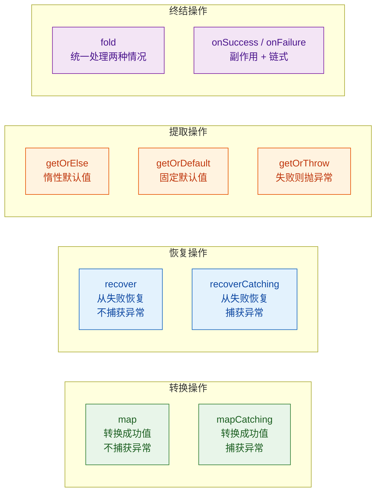

### 实战：构建完整的 Result 处理管道

下面用一个真实场景来展示如何将这些操作符串联成一条优雅的处理管道：

```kotlin
// 模拟一个用户注册流程，每一步都可能失败
data class RawInput(val email: String, val age: String)
data class ValidatedInput(val email: String, val age: Int)
data class User(val id: Long, val email: String, val age: Int)

fun registerUser(raw: RawInput): Result<User> {
    return runCatching {
        // 第一步：验证年龄格式（可能抛 NumberFormatException）
        raw.age.toInt()
    }
    .mapCatching { age ->
        // 第二步：业务规则校验（可能抛 IllegalArgumentException）
        require(age in 18..120) { "Age $age is out of valid range" }
        ValidatedInput(raw.email, age)          // 构建验证后的输入
    }
    .mapCatching { validated ->
        // 第三步：写入数据库（可能抛 DatabaseException）
        val id = database.insert(validated)     // 模拟数据库插入
        User(id, validated.email, validated.age) // 构建用户对象
    }
    .recover { exception ->
        // 如果是已知用户（邮箱重复），从缓存恢复
        when (exception) {
            is DuplicateEmailException ->
                userCache.getByEmail(raw.email)  // 返回已存在的用户
            else -> throw exception              // 未知异常，重新抛出
        }
    }
    .onSuccess { user ->
        // 成功时发送欢迎邮件（副作用）
        emailService.sendWelcome(user.email)
    }
    .onFailure { exception ->
        // 失败时记录审计日志（副作用）
        auditLog.record("Registration failed: ${exception.message}")
    }
}

// 调用方使用 fold 做最终处理
fun handleRegistration(raw: RawInput): String {
    return registerUser(raw).fold(
        onSuccess = { user ->
            "Welcome, ${user.email}! Your ID is ${user.id}"
        },
        onFailure = { error ->
            "Registration failed: ${error.message}"
        }
    )
}
```

这段代码的每一步都可能失败，但没有一个 `try-catch` 块。错误像水流一样在管道中自然传递——一旦某一步失败，后续的 `mapCatching` 全部跳过，直到遇到 `recover` 或终结操作。这就是函数式错误处理的魅力。

### map vs mapCatching 的选择决策树

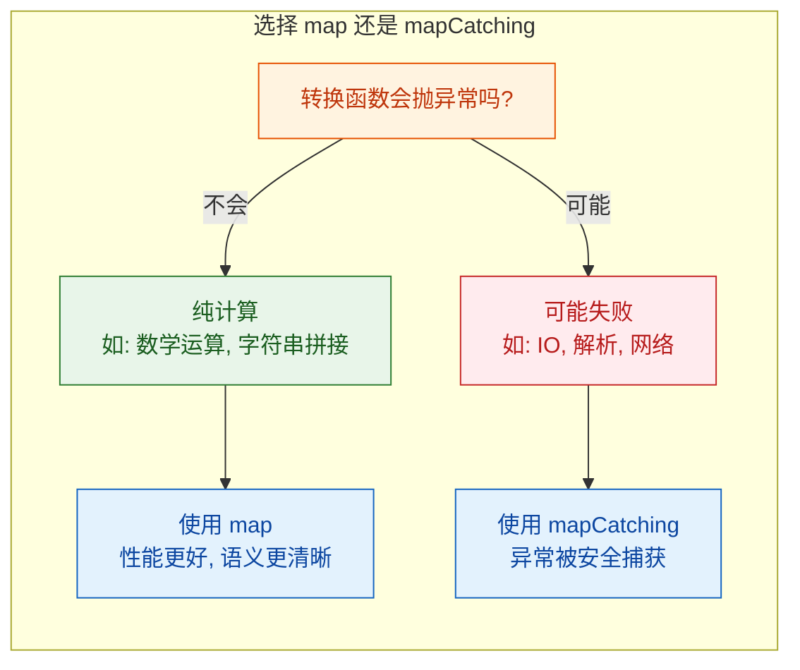

---

**📝 练习题 1**

以下代码的输出是什么？

```kotlin
fun main() {
    val result = Result.success("hello")
        .map { it.uppercase() }
        .map { it.length }
        .getOrElse { -1 }

    println(result)
}
```

A. hello

B. HELLO

C. 5

D. -1

**【答案】** C

**【解析】** `Result.success("hello")` 创建一个包含 `"hello"` 的成功 Result。第一个 `.map { it.uppercase() }` 将值转换为 `"HELLO"`，仍然是 Success。第二个 `.map { it.length }` 将 `"HELLO"` 转换为其长度 `5`，仍然是 Success。最后 `.getOrElse { -1 }` 在成功时直接返回值 `5`，lambda 不执行。因此输出 `5`。

**📝 练习题 2**

以下代码中，`recovered` 的值是什么？

```kotlin
val recovered = Result.failure<String>(IllegalStateException("fail"))
    .map { it.uppercase() }
    .recover { "default" }
    .mapCatching { it.toInt() }
    .getOrElse { 0 }
```

A. "DEFAULT"

B. "default"

C. 0

D. 抛出 IllegalStateException

**【答案】** C

**【解析】** 初始 Result 是 Failure。`.map { it.uppercase() }` 遇到 Failure 直接跳过，不执行 lambda。`.recover { "default" }` 遇到 Failure 执行恢复逻辑，返回 `Result.success("default")`。`.mapCatching { it.toInt() }` 尝试将 `"default"` 转为 Int，`toInt()` 抛出 `NumberFormatException`，被 `mapCatching` 捕获，Result 变回 Failure。最后 `.getOrElse { 0 }` 遇到 Failure，执行 lambda 返回 `0`。

---

## runCatching（捕获异常转 Result、链式处理）

前面我们学习了 `Result` 类型和它丰富的操作符，但还有一个关键问题没有解决：如何优雅地把一段可能抛异常的代码"装进" `Result` 容器？手动写 `try-catch` 再包装成 `Result.success` / `Result.failure` 未免太啰嗦。`runCatching` 就是为此而生的——它是连接"异常世界"与"Result 世界"的桥梁。

### runCatching 的本质

`runCatching` 是 Kotlin 标准库提供的顶层函数和扩展函数，它的实现极其简洁：

```kotlin
// 标准库源码（简化版）
// 顶层函数版本：对任意代码块捕获异常
public inline fun <R> runCatching(block: () -> R): Result<R> {
    return try {
        Result.success(block())    // 执行 block，成功则包装为 Success
    } catch (e: Throwable) {
        Result.failure(e)          // 捕获所有 Throwable，包装为 Failure
    }
}

// 扩展函数版本：在某个对象上下文中执行
public inline fun <T, R> T.runCatching(block: T.() -> R): Result<R> {
    return try {
        Result.success(block())    // block 以 T 为 receiver 执行
    } catch (e: Throwable) {
        Result.failure(e)          // 同样捕获所有异常
    }
}
```

核心逻辑就是一个 `try-catch`，但它把结果统一封装为 `Result`，从而让后续处理可以用函数式链条完成，而不是嵌套的 `try-catch` 块。

### 基础用法

```kotlin
// ① 顶层函数形式：包裹任意代码块
val result: Result<Int> = runCatching {
    "42".toInt()                   // 可能抛出 NumberFormatException
}
println(result)                    // 输出: Success(42)

val failed: Result<Int> = runCatching {
    "not_a_number".toInt()         // 抛出 NumberFormatException
}
println(failed)                    // 输出: Failure(java.lang.NumberFormatException: ...)

// ② 扩展函数形式：在对象上下文中执行
val parseResult: Result<Int> = "123".runCatching {
    toInt()                        // this 是 "123"，直接调用 String.toInt()
}
println(parseResult.getOrNull())   // 输出: 123
```

两种形式的区别在于：扩展函数版本的 `block` 是一个带 receiver 的 lambda（`T.() -> R`），在 lambda 内部可以直接访问 receiver 对象的成员，代码更简洁。

### 链式处理：runCatching 的真正威力

`runCatching` 的价值不在于它本身，而在于它返回 `Result` 后可以无缝衔接前一节学到的所有操作符，形成流畅的处理管道（pipeline）：

```kotlin
// 场景：解析用户输入的年龄字符串，校验范围，返回可用值或默认值
fun parseAge(input: String): Int {
    return runCatching {
        input.trim().toInt()                       // 第一步：解析字符串为整数
    }.mapCatching { age ->
        require(age in 0..150) { "Age out of range: $age" }  // 第二步：校验范围
        age                                        // 校验通过，返回 age
    }.recover { exception ->
        println("Warning: ${exception.message}")   // 第三步：失败时打印警告
        -1                                         // 返回默认值 -1
    }.getOrThrow()                                 // 第四步：提取最终值
}

fun main() {
    println(parseAge("25"))       // 输出: 25
    println(parseAge("abc"))      // 输出: Warning: For input string: "abc" → -1
    println(parseAge("200"))      // 输出: Warning: Age out of range: 200 → -1
}
```

这段代码如果用传统的 `try-catch` 写，会变成嵌套的、难以阅读的结构。而链式写法让每一步的职责清晰可见。

### 链式处理的执行流程

为了直观理解链条中 Success 和 Failure 的传播路径，我们用流程图来展示：

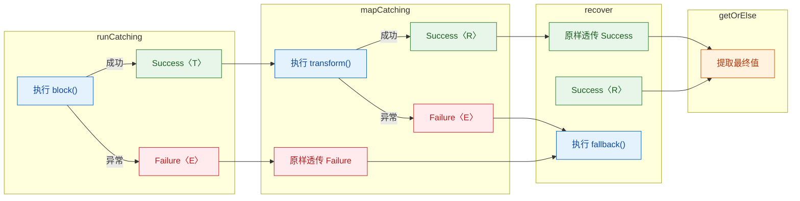

关键规则：`map` / `mapCatching` 只对 Success 执行变换，遇到 Failure 直接透传；`recover` / `recoverCatching` 只对 Failure 执行恢复，遇到 Success 直接透传。这种"铁路式"（Railway Oriented）的设计让错误处理路径和正常路径互不干扰。

### 实战：多步骤业务逻辑的链式处理

```kotlin
data class User(val id: Long, val name: String, val email: String)
data class UserDTO(val displayName: String, val maskedEmail: String)

// 模拟数据库查询，可能抛异常
fun queryUserFromDb(id: Long): User {
    if (id <= 0) throw IllegalArgumentException("Invalid user ID: $id")
    if (id == 999L) throw RuntimeException("Database connection timeout")
    return User(id, "Alice", "alice@example.com")
}

// 模拟数据转换，可能抛异常
fun toDTO(user: User): UserDTO {
    require(user.email.contains("@")) { "Invalid email format" }
    val masked = user.email.replace(Regex("(?<=.{2}).(?=.*@)"), "*")
    return UserDTO(user.name, masked)
}

// 链式处理：查询 → 转换 → 兜底
fun getUserDisplay(id: Long): UserDTO {
    return runCatching {
        queryUserFromDb(id)                        // 步骤1：查询用户
    }.mapCatching { user ->
        toDTO(user)                                // 步骤2：转换为 DTO
    }.recover { e ->
        println("Error processing user $id: ${e.message}")
        UserDTO("Unknown", "N/A")                  // 步骤3：任何失败都返回兜底 DTO
    }.getOrThrow()                                 // 步骤4：提取值（此处 recover 保证了 Success）
}

fun main() {
    println(getUserDisplay(1))     // UserDTO(displayName=Alice, maskedEmail=al***@example.com)
    println(getUserDisplay(-1))    // Error processing user -1: Invalid user ID: -1
                                   // UserDTO(displayName=Unknown, maskedEmail=N/A)
    println(getUserDisplay(999))   // Error processing user 999: Database connection timeout
                                   // UserDTO(displayName=Unknown, maskedEmail=N/A)
}
```

### runCatching 与扩展函数的组合技

扩展函数版本的 `runCatching` 在处理集合、IO 对象等场景时特别好用：

```kotlin
// 对文件对象使用扩展版 runCatching
fun readConfig(path: String): Result<Map<String, String>> {
    return File(path).runCatching {
        // this 是 File 对象，可以直接调用 readLines() 等方法
        readLines()                                // 读取所有行
            .filter { it.isNotBlank() && !it.startsWith("#") }  // 过滤空行和注释
            .associate { line ->
                val (key, value) = line.split("=", limit = 2)   // 按 = 分割
                key.trim() to value.trim()         // 去除首尾空格，组成键值对
            }
    }
}

// 对集合元素批量使用 runCatching
val inputs = listOf("10", "abc", "30", "", "50")

val results: List<Result<Int>> = inputs.map { input ->
    runCatching { input.toInt() }                  // 每个元素独立捕获异常
}

// 分离成功和失败
val successes = results.filter { it.isSuccess }.map { it.getOrThrow() }
val failures = results.filter { it.isFailure }.map { it.exceptionOrNull()!! }

println("Parsed: $successes")       // Parsed: [10, 30, 50]
println("Errors: ${failures.size}") // Errors: 2
```

### runCatching 的注意事项与陷阱

虽然 `runCatching` 非常方便，但有几个需要警惕的地方：

第一个陷阱：它捕获所有 `Throwable`，包括 `Error`。前面我们讲过，`OutOfMemoryError`、`StackOverflowError` 这类系统级错误不应该被捕获。`runCatching` 会把它们也吞进 `Result.failure` 里，这可能掩盖严重问题。

```kotlin
// ⚠️ 危险：runCatching 会捕获 OutOfMemoryError
val result = runCatching {
    val hugeArray = IntArray(Int.MAX_VALUE)  // 触发 OutOfMemoryError
}
// result 是 Failure(OutOfMemoryError)，但此时 JVM 状态可能已经不稳定
// 程序继续运行可能产生不可预测的行为

// ✅ 更安全的做法：自定义一个只捕获 Exception 的版本
inline fun <R> runCatchingSafe(block: () -> R): Result<R> {
    return try {
        Result.success(block())
    } catch (e: Exception) {       // 只捕获 Exception，放过 Error
        Result.failure(e)
    }
}
```

第二个陷阱：在协程中使用 `runCatching` 会捕获 `CancellationException`，破坏协程的取消机制。这个问题在后面"异常与协程"章节会详细讨论。

```kotlin
// ⚠️ 协程中的陷阱
suspend fun fetchData(): Result<String> {
    return runCatching {
        delay(1000)                // 如果协程被取消，delay 会抛 CancellationException
        "data"                     // runCatching 会把 CancellationException 包装为 Failure
    }                              // 协程不会真正取消！这是一个严重的 bug
}

// ✅ 协程安全版本
suspend fun fetchDataSafe(): Result<String> {
    return try {
        Result.success(actualFetch())
    } catch (e: CancellationException) {
        throw e                    // 重新抛出 CancellationException，保持取消语义
    } catch (e: Exception) {
        Result.failure(e)
    }
}
```

第三个陷阱：过度链式化。当链条超过 4-5 个操作符时，可读性反而不如结构化的 `try-catch`。链式处理的目标是让代码更清晰，而不是炫技。

```kotlin
// ❌ 过度链式化，难以理解每一步在做什么
val result = runCatching { step1() }
    .mapCatching { step2(it) }
    .mapCatching { step3(it) }
    .recoverCatching { step4() }
    .mapCatching { step5(it) }
    .recoverCatching { step6() }
    .mapCatching { step7(it) }
    .getOrDefault(fallback)

// ✅ 适度使用，保持可读性
val intermediate = runCatching { step1() }
    .mapCatching { step2(it) }
    .getOrElse { return handleEarlyFailure(it) }

val finalResult = runCatching { step3(intermediate) }
    .recover { fallback }
    .getOrThrow()
```

---

## 资源管理（use 函数、AutoCloseable、嵌套资源）

在与文件、网络连接、数据库等外部资源打交道时，一个永恒的问题是：如何确保资源在使用完毕后被正确关闭？忘记关闭资源会导致文件句柄泄漏、连接池耗尽、内存泄漏等严重问题。Java 7 引入了 `try-with-resources` 语法来解决这个问题，而 Kotlin 用一种更优雅的方式——`use` 扩展函数——达到了同样的效果。

### 问题的根源：资源泄漏

先看一个经典的资源泄漏场景：

```kotlin
// ❌ 危险：如果 readText() 抛异常，reader 永远不会被关闭
fun readFileUnsafe(path: String): String {
    val reader = BufferedReader(FileReader(path))  // 打开文件资源
    val content = reader.readText()                // 可能抛 IOException
    reader.close()                                 // 如果上一行异常，这行永远执行不到
    return content
}
```

你可能会想用 `try-finally` 来修复：

```kotlin
// ⚠️ 改进但仍有问题
fun readFileWithFinally(path: String): String {
    val reader = BufferedReader(FileReader(path))
    try {
        return reader.readText()                   // 可能抛异常 A
    } finally {
        reader.close()                             // 可能抛异常 B
        // 如果 A 和 B 都抛异常，A 会被 B 覆盖（suppressed），丢失原始错误信息
    }
}
```

这段代码有一个微妙的问题：如果 `readText()` 抛出异常 A，然后 `close()` 也抛出异常 B，那么异常 A 会被异常 B 覆盖。调用者只能看到 `close()` 的异常，而真正的根因（读取失败）被吞掉了。Java 的 `try-with-resources` 通过 suppressed exception 机制解决了这个问题，Kotlin 的 `use` 函数也做了同样的处理。

### use 函数：Kotlin 的资源管理利器

`use` 是定义在 `Closeable`（以及 Kotlin 1.8+ 的 `AutoCloseable`）上的扩展函数。它的核心契约是：无论 lambda 正常返回还是抛出异常，资源都会被关闭。

```kotlin
// use 的简化源码
public inline fun <T : Closeable?, R> T.use(block: (T) -> R): Result<R> {
    var exception: Throwable? = null       // 记录 block 中的异常
    try {
        return block(this)                 // 执行用户代码
    } catch (e: Throwable) {
        exception = e                      // 保存异常
        throw e                            // 重新抛出
    } finally {
        // 关闭资源时的异常处理
        when {
            this == null -> {}             // 资源为 null，无需关闭
            exception == null -> close()   // block 正常完成，直接关闭
            else -> {
                try {
                    close()                // block 异常了，尝试关闭
                } catch (closeException: Throwable) {
                    exception.addSuppressed(closeException)  // 关闭也失败，作为 suppressed 附加
                }
            }
        }
    }
}
```

关键设计：当 `block` 和 `close()` 都抛异常时，`close()` 的异常通过 `addSuppressed` 附加到原始异常上，而不是覆盖它。这样调用者既能看到根因，也能知道关闭时出了什么问题。

### 基础用法

```kotlin
import java.io.BufferedReader
import java.io.FileReader

// ✅ 使用 use 函数，资源自动关闭
fun readFileContent(path: String): String {
    return BufferedReader(FileReader(path)).use { reader ->
        reader.readText()                  // use 结束后 reader 自动关闭
    }                                      // 无论正常返回还是异常，都会调用 reader.close()
}

// ✅ 更简洁的写法：File 的扩展函数内部也使用了 use
fun readFileSimple(path: String): String {
    return File(path).readText()           // 内部已经用 use 管理了 InputStream
}
```

### use 与 try-with-resources 的对比

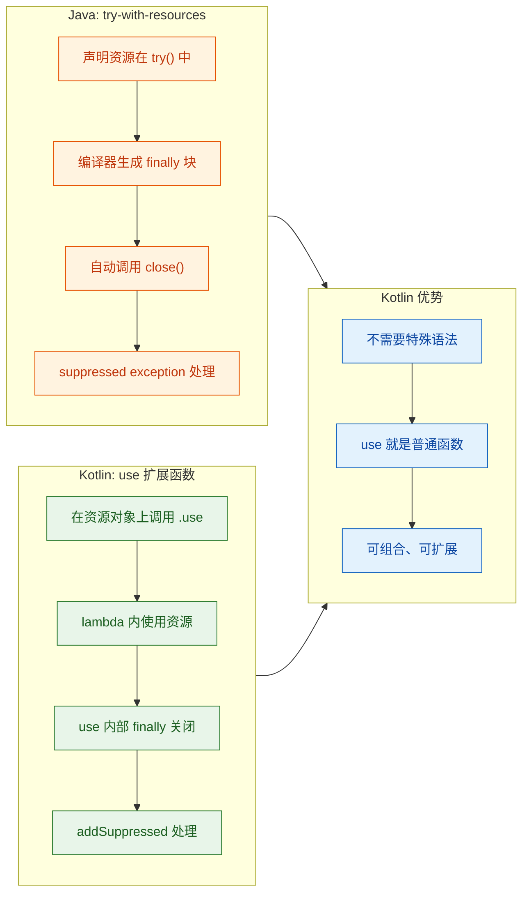

Java 需要专门的语法结构（`try(Resource r = ...) { }`），而 Kotlin 的 `use` 只是一个普通的扩展函数，不需要任何语言层面的特殊支持。这体现了 Kotlin "用库解决问题，而非用语法"的设计哲学。

### AutoCloseable 接口

从 Kotlin 1.8 开始，`use` 函数同时支持 `java.io.Closeable` 和 `java.lang.AutoCloseable`。`AutoCloseable` 是更通用的接口——`Closeable` 继承自 `AutoCloseable`，但 `AutoCloseable` 的 `close()` 方法不声明抛出 `IOException`，适用范围更广。

```kotlin
// 自定义一个实现 AutoCloseable 的资源类
class DatabaseConnection(private val url: String) : AutoCloseable {
    // 模拟连接状态
    private var isOpen = false

    // 打开连接
    fun connect() {
        println("Connecting to $url...")       // 模拟连接过程
        isOpen = true                          // 标记为已连接
        println("Connected!")
    }

    // 执行查询
    fun query(sql: String): List<String> {
        check(isOpen) { "Connection is not open" }  // 检查连接状态
        println("Executing: $sql")
        return listOf("row1", "row2", "row3")       // 模拟查询结果
    }

    // AutoCloseable 要求实现的 close 方法
    override fun close() {
        if (isOpen) {
            println("Closing connection to $url")
            isOpen = false                     // 标记为已关闭
        }
    }
}

// 使用 use 管理自定义资源
fun fetchUsers(): List<String> {
    return DatabaseConnection("jdbc:mysql://localhost/mydb").use { conn ->
        conn.connect()                         // 打开连接
        conn.query("SELECT * FROM users")      // 执行查询
    }                                          // use 结束后自动调用 conn.close()
}
```

### 嵌套资源管理

实际开发中经常需要同时管理多个资源，比如同时打开输入流和输出流进行文件复制。嵌套 `use` 是最直接的方式：

```kotlin
import java.io.FileInputStream
import java.io.FileOutputStream
import java.io.BufferedInputStream
import java.io.BufferedOutputStream

// 嵌套 use：复制文件
fun copyFile(source: String, destination: String) {
    // 外层 use 管理输入流
    BufferedInputStream(FileInputStream(source)).use { input ->
        // 内层 use 管理输出流
        BufferedOutputStream(FileOutputStream(destination)).use { output ->
            val buffer = ByteArray(8192)        // 8KB 缓冲区
            var bytesRead: Int                  // 每次读取的字节数
            // 循环读取直到文件末尾（read 返回 -1）
            while (input.read(buffer).also { bytesRead = it } != -1) {
                output.write(buffer, 0, bytesRead)  // 写入实际读取的字节数
            }
            output.flush()                      // 确保缓冲区数据写入磁盘
        }  // output 在这里自动关闭
    }      // input 在这里自动关闭
}
```

嵌套 `use` 的关闭顺序是由内到外的——先关闭 `output`，再关闭 `input`。这与资源的打开顺序相反，符合 LIFO（Last In, First Out）原则。如果内层 `close()` 抛异常，外层 `use` 仍然会确保外层资源被关闭。

当嵌套层数较多时，代码会形成"回调地狱"。可以用一个辅助类来扁平化管理：

```kotlin
// 资源管理器：收集多个 AutoCloseable，统一关闭
class ResourceScope : AutoCloseable {
    // 用栈结构存储资源，确保 LIFO 关闭顺序
    private val resources = ArrayDeque<AutoCloseable>()

    // 注册一个资源并返回它，方便链式使用
    fun <T : AutoCloseable> T.bind(): T {
        resources.addFirst(this)               // 压入栈顶
        return this
    }

    // 关闭所有资源，收集所有异常
    override fun close() {
        var primaryException: Throwable? = null
        for (resource in resources) {          // 按 LIFO 顺序遍历
            try {
                resource.close()
            } catch (e: Throwable) {
                if (primaryException == null) {
                    primaryException = e        // 第一个异常作为主异常
                } else {
                    primaryException.addSuppressed(e)  // 后续异常附加为 suppressed
                }
            }
        }
        primaryException?.let { throw it }     // 如果有异常，抛出主异常
    }
}

// 辅助函数：创建 ResourceScope 并用 use 管理
inline fun <R> resourceScope(block: ResourceScope.() -> R): R {
    return ResourceScope().use(block)          // ResourceScope 自身也是 AutoCloseable
}

// 使用示例：扁平化管理多个资源
fun processFiles(inputPath: String, outputPath: String, logPath: String) {
    resourceScope {
        // 三个资源在同一层级注册，无需嵌套
        val input = BufferedReader(FileReader(inputPath)).bind()
        val output = BufferedWriter(FileWriter(outputPath)).bind()
        val log = BufferedWriter(FileWriter(logPath)).bind()

        // 使用所有资源
        input.lineSequence().forEach { line ->
            val processed = line.uppercase()   // 处理每一行
            output.write(processed)            // 写入输出文件
            output.newLine()
            log.write("Processed: $line")      // 写入日志
            log.newLine()
        }
    }  // resourceScope 结束时，log → output → input 按 LIFO 顺序关闭
}
```

### use 与 Result / runCatching 的结合

`use` 函数在异常时会重新抛出异常，如果你希望用 `Result` 来处理而不是让异常传播，可以将 `use` 包裹在 `runCatching` 中：

```kotlin
// 读取文件内容，返回 Result 而非抛异常
fun safeReadFile(path: String): Result<String> {
    return runCatching {
        BufferedReader(FileReader(path)).use { reader ->
            reader.readText()                  // use 保证资源关闭
        }                                      // 如果抛异常，runCatching 捕获为 Failure
    }
}

// 链式处理
fun loadAndParseConfig(path: String): Result<Map<String, String>> {
    return runCatching {
        File(path).bufferedReader().use { it.readText() }  // 读取文件
    }.mapCatching { raw ->
        raw.lines()                                        // 按行分割
            .filter { it.contains("=") }                   // 过滤有效行
            .associate { line ->
                val parts = line.split("=", limit = 2)     // 分割键值
                parts[0].trim() to parts[1].trim()         // 组成 Map
            }
    }
}
```

---

## 异常与协程（协程异常传播、CoroutineExceptionHandler、SupervisorJob）

协程（Coroutines）是 Kotlin 异步编程的核心，而异常在协程中的传播行为与普通的 `try-catch` 有着本质区别。在传统的顺序代码中，异常沿着调用栈向上冒泡；而在协程的结构化并发（Structured Concurrency）模型中，异常沿着协程的父子层级关系传播，并且会触发整个协程树的取消。理解这套机制，是写出健壮异步代码的关键。

### 结构化并发与异常传播的基本规则

结构化并发的核心思想是：每个协程都有一个父协程（或父 Job），子协程的生命周期被父协程约束。当子协程抛出未捕获的异常时，默认行为遵循以下规则：

1. 子协程失败 → 异常传播给父 Job
2. 父 Job 取消所有其他子协程（sibling cancellation）
3. 父 Job 自身也被取消
4. 异常继续向上传播，直到到达根协程（root coroutine）

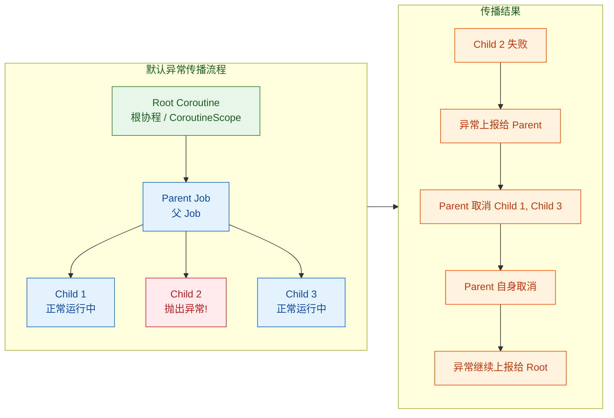

这就是所谓的"一个孩子失败，全家遭殃"的默认行为。来看一个具体的例子：

```kotlin
import kotlinx.coroutines.*

fun main() = runBlocking {
    // runBlocking 创建根协程，它会等待所有子协程完成
    try {
        coroutineScope {
            // coroutineScope 创建一个新的作用域，遵循默认传播规则
            launch {
                // 子协程 1：模拟耗时任务
                delay(1000)                          // 延迟 1 秒
                println("Child 1 completed")         // 如果没被取消，打印完成信息
            }

            launch {
                // 子协程 2：500ms 后抛出异常
                delay(500)                           // 延迟 500 毫秒
                throw RuntimeException("Child 2 failed!")  // 抛出异常
            }

            launch {
                // 子协程 3：模拟耗时任务
                delay(1500)                          // 延迟 1.5 秒
                println("Child 3 completed")         // 如果没被取消，打印完成信息
            }
        }
    } catch (e: RuntimeException) {
        // coroutineScope 会重新抛出子协程的异常
        println("Caught: ${e.message}")              // 输出: Caught: Child 2 failed!
    }
    // Child 1 和 Child 3 都不会打印，因为它们在 Child 2 失败后被取消了
}
```

注意 `coroutineScope` 和 `launch` 的区别：`coroutineScope` 是一个挂起函数，它会等待所有子协程完成，并且会将子协程的异常重新抛出（rethrow）。而 `launch` 启动的协程如果失败，异常会传播给父 Job，而不是在 `launch` 调用处抛出——这意味着在 `launch` 外面包 `try-catch` 是捕获不到的。

### launch vs async 的异常行为差异

`launch` 和 `async` 是两种最常用的协程构建器（coroutine builder），它们处理异常的方式截然不同：

`launch` 产生的是"fire-and-forget"协程，异常会立即向上传播给父 Job。你无法在 `launch` 的调用处捕获异常。

`async` 产生的是带返回值的 `Deferred`，异常被封装在 `Deferred` 中，只有在调用 `await()` 时才会被抛出。但要注意：如果 `async` 是某个 `coroutineScope` 的直接子协程，异常仍然会传播给父 Job。

```kotlin
import kotlinx.coroutines.*

fun main() = runBlocking {
    // ===== launch 的异常行为 =====
    // ❌ 这个 try-catch 捕获不到 launch 内部的异常
    try {
        val job = launch {
            throw RuntimeException("launch failed")   // 异常直接传播给父 Job
        }
        job.join()                                     // join 不会抛出异常
    } catch (e: RuntimeException) {
        println("This won't be printed")               // 永远不会执行
    }

    // ===== async 的异常行为 =====
    val deferred = async {
        throw RuntimeException("async failed")         // 异常被封装在 Deferred 中
    }

    try {
        deferred.await()                               // 调用 await() 时异常被抛出
    } catch (e: RuntimeException) {
        println("Caught from async: ${e.message}")     // 输出: Caught from async: async failed
    }
}
```

但这里有一个微妙的陷阱：即使 `async` 的异常可以通过 `await()` 捕获，如果 `async` 是 `coroutineScope` 的子协程，异常仍然会传播给父作用域，导致其他兄弟协程被取消。要避免这种行为，就需要 `SupervisorJob`。

### SupervisorJob：打破"全家遭殃"的默认行为

`SupervisorJob` 改变了异常的传播方向：子协程的失败不会向上传播给父 Job，也不会取消兄弟协程。每个子协程独立管理自己的失败。这在很多实际场景中非常有用——比如一个 UI 界面同时发起多个网络请求，其中一个失败不应该影响其他请求。

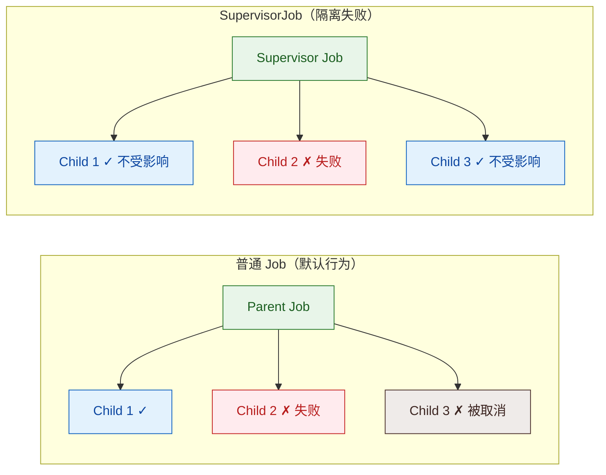

```kotlin
import kotlinx.coroutines.*

fun main() = runBlocking {
    // 使用 supervisorScope 创建一个 SupervisorJob 作用域
    supervisorScope {
        val child1 = launch {
            delay(1000)                                // 延迟 1 秒
            println("Child 1 completed successfully")  // 正常完成，不受 Child 2 影响
        }

        val child2 = launch {
            delay(500)                                 // 延迟 500 毫秒
            throw RuntimeException("Child 2 failed")   // 抛出异常
            // 异常不会传播给 supervisorScope，不会取消兄弟协程
        }

        val child3 = launch {
            delay(1500)                                // 延迟 1.5 秒
            println("Child 3 completed successfully")  // 正常完成，不受 Child 2 影响
        }
    }
    // 输出（顺序）:
    // Child 1 completed successfully
    // Child 3 completed successfully
    // （Child 2 的异常被打印到控制台，但不影响其他协程）
}
```

也可以手动创建 `SupervisorJob` 并将其作为 `CoroutineScope` 的一部分：

```kotlin
// 手动创建带 SupervisorJob 的作用域
// 常见于 ViewModel、Service 等长生命周期组件
val scope = CoroutineScope(SupervisorJob() + Dispatchers.Default)

scope.launch {
    // 这个协程失败不会影响 scope 中的其他协程
    throw RuntimeException("isolated failure")
}

scope.launch {
    delay(1000)
    println("I'm still alive!")  // 正常执行
}
```

有一个常见的误区需要特别注意：`SupervisorJob` 只对直接子协程生效。如果子协程内部又嵌套了 `coroutineScope`，那个内部作用域仍然遵循默认的传播规则。

```kotlin
supervisorScope {
    launch {
        // 这里是 supervisorScope 的直接子协程
        // 但内部的 coroutineScope 遵循默认规则
        coroutineScope {
            launch { throw RuntimeException("nested failure") }
            launch { delay(1000); println("won't print") }
            // 内部的两个 launch 仍然是"一个失败，全部取消"
        }
    }

    launch {
        delay(2000)
        println("I'm fine, supervisor protects me")  // 这个不受影响
    }
}
```

### CoroutineExceptionHandler：全局异常兜底

`CoroutineExceptionHandler` 是协程的"最后一道防线"。当异常传播到根协程且没有被任何 `try-catch` 捕获时，`CoroutineExceptionHandler` 会被调用。它类似于线程的 `Thread.uncaughtExceptionHandler`。

关键限制：`CoroutineExceptionHandler` 只在根协程（root coroutine）或 `SupervisorJob` 的直接子协程上生效。安装在中间层级的协程上是无效的。

```kotlin
import kotlinx.coroutines.*

fun main() = runBlocking {
    // 创建一个异常处理器
    val handler = CoroutineExceptionHandler { coroutineContext, throwable ->
        // coroutineContext: 发生异常的协程的上下文
        // throwable: 未捕获的异常
        println("Caught in handler: ${throwable.message}")
        println("Coroutine: ${coroutineContext[CoroutineName]?.name}")
    }

    // ✅ 正确：handler 安装在根协程上
    val scope = CoroutineScope(SupervisorJob() + handler)

    scope.launch(CoroutineName("worker-1")) {
        throw RuntimeException("Something broke")
        // 输出: Caught in handler: Something broke
        // 输出: Coroutine: worker-1
    }

    scope.launch(CoroutineName("worker-2")) {
        delay(1000)
        println("Worker 2 is fine")                    // 正常执行
    }

    delay(2000)  // 等待协程完成
    scope.cancel()  // 清理作用域
}
```

```kotlin
// ❌ 错误：handler 安装在非根协程上，不会生效
val handler = CoroutineExceptionHandler { _, e ->
    println("This won't be called: ${e.message}")
}

runBlocking {
    // launch 是 runBlocking 的子协程，不是根协程
    // handler 安装在这里无效
    launch(handler) {
        throw RuntimeException("oops")
    }
}
// 异常会传播给 runBlocking，导致程序崩溃
```

### CancellationException 的特殊地位

`CancellationException` 在协程异常体系中享有特殊待遇——它被视为"正常取消"而非"异常失败"。当协程抛出 `CancellationException` 时：

- 不会传播给父 Job（父协程不会被取消）
- 不会触发 `CoroutineExceptionHandler`
- 兄弟协程不受影响

这是结构化并发的重要设计：取消是协程生命周期的正常部分，不应被当作错误处理。

```kotlin
import kotlinx.coroutines.*

fun main() = runBlocking {
    val parent = launch {
        val child = launch {
            try {
                delay(Long.MAX_VALUE)                  // 无限等待，直到被取消
            } finally {
                // 即使被取消，finally 块仍然执行
                println("Child was cancelled")         // 输出: Child was cancelled
            }
        }

        delay(1000)                                    // 等待 1 秒
        child.cancel()                                 // 取消子协程
        // CancellationException 不会传播给 parent
        println("Parent is still alive")               // 输出: Parent is still alive
    }

    parent.join()
    println("Done")                                    // 输出: Done
}
```

但要小心：如果你在 `catch` 块中捕获了 `CancellationException` 却没有重新抛出，会破坏协程的取消机制：

```kotlin
// ❌ 危险：吞掉 CancellationException
launch {
    try {
        delay(1000)
    } catch (e: Exception) {
        // CancellationException 是 Exception 的子类
        // 捕获后不重新抛出，协程无法正常取消！
        println("Caught: $e")
    }
    // 协程会继续执行，即使它应该被取消
    println("I should not be running!")
}

// ✅ 正确：单独处理 CancellationException
launch {
    try {
        delay(1000)
    } catch (e: CancellationException) {
        // 单独捕获，执行清理后重新抛出
        println("Cleaning up...")
        throw e                                        // 必须重新抛出！
    } catch (e: Exception) {
        // 处理其他异常
        println("Caught non-cancellation exception: $e")
    }
}
```

### 异常聚合：多个子协程同时失败

当多个子协程几乎同时失败时，只有第一个异常会作为"主异常"传播，后续的异常会被附加为 suppressed exceptions（被抑制的异常），可以通过 `Throwable.suppressed` 数组访问：

```kotlin
import kotlinx.coroutines.*

fun main() = runBlocking {
    val handler = CoroutineExceptionHandler { _, e ->
        println("Primary: ${e.message}")               // 输出: Primary: First failure
        e.suppressed.forEach { suppressed ->
            println("Suppressed: ${suppressed.message}")  // 输出: Suppressed: Second failure
        }
    }

    val scope = CoroutineScope(SupervisorJob() + handler)

    scope.launch {
        // 使用普通 coroutineScope，内部遵循默认传播
        coroutineScope {
            launch {
                delay(100)
                throw RuntimeException("First failure")    // 第一个失败
            }
            launch {
                delay(150)
                throw RuntimeException("Second failure")   // 第二个失败，成为 suppressed
            }
        }
    }

    delay(1000)
    scope.cancel()
}
```

### 实战模式：Android ViewModel 中的异常处理

把上面的知识点串起来，看一个贴近真实开发的例子：

```kotlin
import kotlinx.coroutines.*

// 模拟 Android ViewModel 的异常处理模式
class UserViewModel {
    // SupervisorJob 确保一个请求失败不影响其他请求
    // Dispatchers.Main 确保 UI 更新在主线程
    private val viewModelScope = CoroutineScope(
        SupervisorJob() + Dispatchers.Main + CoroutineExceptionHandler { _, e ->
            // 全局兜底：记录日志、上报 Crashlytics
            logError("Unhandled coroutine exception", e)
        }
    )

    fun loadUserProfile(userId: String) {
        viewModelScope.launch {
            // 方式 1：try-catch 处理预期异常
            try {
                val user = fetchUser(userId)           // 挂起函数，可能抛出网络异常
                val posts = fetchPosts(userId)         // 挂起函数，可能抛出网络异常
                updateUI(user, posts)                  // 更新 UI
            } catch (e: NetworkException) {
                showError("Network error: ${e.message}")  // 展示错误提示
            }
            // 非 NetworkException 的异常会传播给 CoroutineExceptionHandler
        }
    }

    fun loadDashboard() {
        viewModelScope.launch {
            // 方式 2：supervisorScope + 独立错误处理
            // 三个请求互不影响，各自处理自己的异常
            supervisorScope {
                val userDeferred = async { fetchUser("me") }
                val statsDeferred = async { fetchStats() }
                val newsDeferred = async { fetchNews() }

                // 每个 await 单独 try-catch
                val user = try {
                    userDeferred.await()
                } catch (e: Exception) {
                    null                               // 用户信息加载失败，降级为 null
                }

                val stats = try {
                    statsDeferred.await()
                } catch (e: Exception) {
                    emptyStats()                       // 统计数据加载失败，使用空数据
                }

                val news = try {
                    newsDeferred.await()
                } catch (e: Exception) {
                    emptyList()                        // 新闻加载失败，使用空列表
                }

                updateDashboard(user, stats, news)     // 用可用的数据更新界面
            }
        }
    }

    fun onCleared() {
        viewModelScope.cancel()                        // ViewModel 销毁时取消所有协程
    }
}
```

---

## 函数式错误处理模式（Either、Option、Validated）

前面章节介绍的 `Result` 类型是 Kotlin 标准库提供的函数式错误处理工具，但它有一个明显的局限：失败侧固定为 `Throwable`。在实际业务开发中，我们经常需要用类型安全的方式表达"业务错误"而非"异常"——比如"用户名已存在"、"余额不足"这类错误，它们不是异常，而是业务逻辑的正常分支。

这就是 `Either`、`Option`、`Validated` 等函数式类型的用武之地。它们来自函数式编程（FP）传统，在 Kotlin 生态中主要由 Arrow 库提供，但理解其核心思想比依赖特定库更重要。

### Either：左失败，右成功

`Either<L, R>` 是函数式编程中最经典的错误处理类型。它表示一个值要么是 `Left(L)`（通常代表失败），要么是 `Right(R)`（通常代表成功）。这个命名约定来自英语中 "right" 的双关——既是"右边"，也是"正确的"。

与 `Result<T>` 相比，`Either` 的关键优势在于：失败侧的类型是完全自定义的，不限于 `Throwable`。你可以用密封类（sealed class）精确建模所有可能的错误类型。

```kotlin
// 定义业务错误的密封类层次
sealed class UserError {
    data class NotFound(val userId: String) : UserError()          // 用户不存在
    data class InvalidEmail(val email: String) : UserError()       // 邮箱格式错误
    data class AlreadyExists(val username: String) : UserError()   // 用户名已被占用
    data object Unauthorized : UserError()                         // 未授权
}

// 简化版 Either 实现（理解原理用，实际项目建议用 Arrow 库）
sealed class Either<out L, out R> {
    // Left 代表失败/错误
    data class Left<out L>(val value: L) : Either<L, Nothing>()
    // Right 代表成功/正确值
    data class Right<out R>(val value: R) : Either<Nothing, R>()
}

// 使用 Either 作为返回类型的函数
fun findUser(userId: String): Either<UserError, User> {
    // 模拟数据库查询
    val user = database.findById(userId)               // 查询数据库
    return if (user != null) {
        Either.Right(user)                             // 找到用户，返回 Right
    } else {
        Either.Left(UserError.NotFound(userId))        // 未找到，返回 Left
    }
}

fun validateEmail(email: String): Either<UserError, String> {
    // 简单的邮箱格式校验
    return if (email.contains("@") && email.contains(".")) {
        Either.Right(email)                            // 格式正确，返回 Right
    } else {
        Either.Left(UserError.InvalidEmail(email))     // 格式错误，返回 Left
    }
}
```

`Either` 的真正威力在于它支持链式操作（monadic chaining），让你可以把多个可能失败的操作串联起来，任何一步失败都会短路（short-circuit）后续操作：

```kotlin
// 为 Either 添加 map 和 flatMap 扩展函数
// map: 对 Right 值进行变换，Left 原样传递
inline fun <L, R, T> Either<L, R>.map(transform: (R) -> T): Either<L, T> =
    when (this) {
        is Either.Left -> this                         // 失败时直接传递，不执行 transform
        is Either.Right -> Either.Right(transform(value))  // 成功时应用变换
    }

// flatMap: 对 Right 值进行变换，变换结果本身也是 Either
inline fun <L, R, T> Either<L, R>.flatMap(transform: (R) -> Either<L, T>): Either<L, T> =
    when (this) {
        is Either.Left -> this                         // 失败时直接传递
        is Either.Right -> transform(value)            // 成功时执行下一步操作
    }

// fold: 统一处理两种情况
inline fun <L, R, T> Either<L, R>.fold(
    onLeft: (L) -> T,                                  // 处理失败
    onRight: (R) -> T                                  // 处理成功
): T = when (this) {
    is Either.Left -> onLeft(value)
    is Either.Right -> onRight(value)
}
```

```kotlin
// 链式调用示例：注册用户的完整流程
fun registerUser(
    username: String,
    email: String,
    password: String
): Either<UserError, User> {
    return validateEmail(email)                        // 第 1 步：校验邮箱
        .flatMap { validEmail ->
            checkUsernameAvailable(username)            // 第 2 步：检查用户名是否可用
                .map { validUsername ->
                    validUsername to validEmail         // 组合两个校验结果
                }
        }
        .flatMap { (name, email) ->
            createUser(name, email, password)           // 第 3 步：创建用户
        }
    // 如果任何一步返回 Left，后续步骤全部跳过
    // 最终结果要么是 Left(UserError)，要么是 Right(User)
}

// 在调用处统一处理结果
fun handleRegistration(username: String, email: String, password: String) {
    val result = registerUser(username, email, password)

    result.fold(
        onLeft = { error ->
            // 根据具体的错误类型做不同处理
            when (error) {
                is UserError.InvalidEmail -> showError("Invalid email: ${error.email}")
                is UserError.AlreadyExists -> showError("Username taken: ${error.username}")
                is UserError.NotFound -> showError("User not found")
                is UserError.Unauthorized -> redirectToLogin()
            }
        },
        onRight = { user ->
            showSuccess("Welcome, ${user.name}!")      // 注册成功
        }
    )
}
```

### Either vs Result vs Exception 对比

三种错误处理方式各有适用场景：

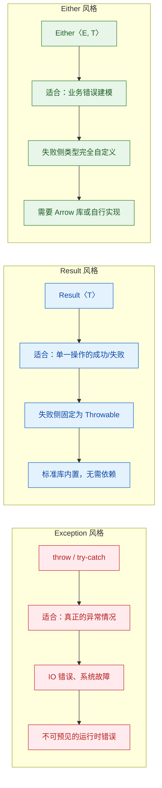

### Option：显式表达"值可能不存在"

`Option<T>`（有时也叫 `Maybe<T>`）表示一个值要么存在（`Some(value)`），要么不存在（`None`）。你可能会问：Kotlin 已经有了 `T?`（nullable types），为什么还需要 `Option`？

确实，在大多数 Kotlin 代码中，`T?` 就够用了。`Option` 的价值主要体现在以下场景：

1. 需要区分"值为 null"和"值不存在"——比如 `Map` 中 key 存在但 value 为 null，vs key 根本不存在
2. 需要与 `Either` 等函数式类型组合使用，保持 API 风格一致
3. 需要 `Option` 的丰富组合子（combinators）如 `flatMap`、`filter`、`zip` 等

```kotlin
// 简化版 Option 实现
sealed class Option<out T> {
    data object None : Option<Nothing>()               // 值不存在
    data class Some<out T>(val value: T) : Option<T>() // 值存在

    // map: 对存在的值进行变换
```kotlin
    inline fun <R> map(transform: (T) -> R): Option<R> = when (this) {
        is None -> None                                // 无值时直接返回 None
        is Some -> Some(transform(value))              // 有值时应用变换
    }

    // flatMap: 变换结果本身也是 Option
    inline fun <R> flatMap(transform: (T) -> Option<R>): Option<R> = when (this) {
        is None -> None                                // 无值时直接返回 None
        is Some -> transform(value)                    // 有值时执行下一步
    }

    // getOrElse: 提供默认值
    inline fun getOrElse(default: () -> @UnsafeVariance T): T = when (this) {
        is None -> default()                           // 无值时返回默认值
        is Some -> value                               // 有值时返回实际值
    }

    // filter: 条件过滤
    inline fun filter(predicate: (T) -> Boolean): Option<T> = when (this) {
        is None -> None
        is Some -> if (predicate(value)) this else None  // 不满足条件变为 None
    }
}

// 工厂函数：从可空值创建 Option
fun <T> T?.toOption(): Option<T> =
    if (this != null) Option.Some(this) else Option.None
```

来看 `Option` 与 Kotlin nullable types 的实际对比：

```kotlin
// 场景：从嵌套的 Map 中安全取值
val config: Map<String, Map<String, String>> = loadConfig()

// ===== Kotlin nullable 风格 =====
val dbHost: String? = config["database"]?.get("host")
// 问题：无法区分 "database" key 不存在 vs "host" key 不存在 vs host 值为 null

// ===== Option 风格 =====
fun <K, V> Map<K, V>.getOption(key: K): Option<V> =
    if (containsKey(key)) Option.Some(getValue(key))   // key 存在，包装为 Some
    else Option.None                                    // key 不存在，返回 None

val dbHostOption: Option<String> = config.getOption("database")
    .flatMap { dbConfig -> dbConfig.getOption("host") }  // 链式安全取值
    .filter { it.isNotBlank() }                          // 过滤空白字符串

// 使用时
val host = dbHostOption.getOrElse { "localhost" }        // 提供默认值
```

### Option 与 Either 的关系

`Option` 可以看作 `Either<Nothing, T>` 的特化版本——它只告诉你"有没有值"，但不告诉你"为什么没有"。当你需要携带错误原因时，应该升级到 `Either`：

```kotlin
// Option -> Either 的转换
fun <T, L> Option<T>.toEither(ifNone: () -> L): Either<L, T> = when (this) {
    is Option.None -> Either.Left(ifNone())            // None 转为 Left，附带错误信息
    is Option.Some -> Either.Right(value)              // Some 转为 Right
}

// 实际使用
fun findUserByEmail(email: String): Option<User> {
    return database.queryByEmail(email).toOption()     // 可能返回 None
}

fun getUserOrError(email: String): Either<UserError, User> {
    return findUserByEmail(email)
        .toEither { UserError.NotFound(email) }        // None 转为具体的错误类型
}
```

### Validated：累积所有错误而非短路

`Either` 的 `flatMap` 是短路的（short-circuit）——遇到第一个 `Left` 就停止后续操作。但在表单验证等场景中，我们希望一次性收集所有错误，而不是只报告第一个。这就是 `Validated` 的用武之地。

`Validated<E, A>` 的结构与 `Either` 几乎相同——`Invalid(E)` 对应 `Left`，`Valid(A)` 对应 `Right`。关键区别在于它的组合方式：多个 `Validated` 可以并行组合，错误会被累积（accumulate）到一个集合中。

```kotlin
// 简化版 Validated 实现
sealed class Validated<out E, out A> {
    data class Invalid<out E>(val errors: List<E>) : Validated<E, Nothing>()
    data class Valid<out A>(val value: A) : Validated<Nothing, A>()
}

// 创建单个错误的 Invalid
fun <E> invalidOf(error: E): Validated<E, Nothing> =
    Validated.Invalid(listOf(error))

// 创建成功的 Valid
fun <A> validOf(value: A): Validated<Nothing, A> =
    Validated.Valid(value)
```

`Validated` 的核心操作是 `zip`——将多个 `Validated` 并行组合。如果全部成功，用提供的函数合并结果；如果有任何失败，累积所有错误：

```kotlin
// zip: 并行组合两个 Validated，累积错误
fun <E, A, B, C> Validated<E, A>.zip(
    other: Validated<E, B>,
    combine: (A, B) -> C
): Validated<E, C> = when {
    // 两个都成功：合并结果
    this is Validated.Valid && other is Validated.Valid ->
        Validated.Valid(combine(this.value, other.value))
    // 两个都失败：累积错误列表
    this is Validated.Invalid && other is Validated.Invalid ->
        Validated.Invalid(this.errors + other.errors)
    // 只有 this 失败
    this is Validated.Invalid ->
        this
    // 只有 other 失败
    else ->
        other as Validated.Invalid
}
```

来看一个完整的表单验证示例，体会 `Validated` 与 `Either` 的行为差异：

```kotlin
// 定义验证错误
sealed class ValidationError(val message: String) {
    data class EmptyField(val field: String)
        : ValidationError("$field cannot be empty")
    data class TooShort(val field: String, val minLen: Int)
        : ValidationError("$field must be at least $minLen characters")
    data class InvalidFormat(val field: String, val reason: String)
        : ValidationError("$field has invalid format: $reason")
}

// 各字段的独立验证函数，每个返回 Validated
fun validateUsername(input: String): Validated<ValidationError, String> {
    return when {
        input.isBlank() ->
            invalidOf(ValidationError.EmptyField("username"))
        input.length < 3 ->
            invalidOf(ValidationError.TooShort("username", 3))
        else -> validOf(input)                         // 校验通过
    }
}

fun validateEmail(input: String): Validated<ValidationError, String> {
    return when {
        input.isBlank() ->
            invalidOf(ValidationError.EmptyField("email"))
        !input.contains("@") ->
            invalidOf(ValidationError.InvalidFormat("email", "missing @"))
        else -> validOf(input)                         // 校验通过
    }
}

fun validatePassword(input: String): Validated<ValidationError, String> {
    return when {
        input.isBlank() ->
            invalidOf(ValidationError.EmptyField("password"))
        input.length < 8 ->
            invalidOf(ValidationError.TooShort("password", 8))
        else -> validOf(input)                         // 校验通过
    }
}
```

```kotlin
// 数据类：表示验证通过后的注册表单
data class RegistrationForm(
    val username: String,
    val email: String,
    val password: String
)

// 组合所有验证：错误会被累积，而非短路
fun validateRegistration(
    username: String,
    email: String,
    password: String
): Validated<ValidationError, RegistrationForm> {
    // 先 zip 前两个
    return validateUsername(username)
        .zip(validateEmail(email)) { u, e -> u to e }  // 组合用户名和邮箱
        .zip(validatePassword(password)) { (u, e), p ->
            RegistrationForm(u, e, p)                   // 三个都成功，构建表单对象
        }
}

// 使用示例
fun main() {
    // 故意提交全部无效的数据
    val result = validateRegistration(
        username = "",                                  // 空用户名
        email = "bad-email",                            // 缺少 @
        password = "123"                                // 太短
    )

    when (result) {
        is Validated.Valid -> println("Success: ${result.value}")
        is Validated.Invalid -> {
            // 一次性拿到所有错误，而不是只有第一个
            println("Validation failed with ${result.errors.size} errors:")
            result.errors.forEach { error ->
                println("  - ${error.message}")
            }
        }
    }
    // 输出:
    // Validation failed with 3 errors:
    //   - username cannot be empty
    //   - email has invalid format: missing @
    //   - password must be at least 8 characters
}
```

如果用 `Either` + `flatMap` 做同样的事情，只会报告第一个错误（"username cannot be empty"），用户修复后提交，又会看到第二个错误，体验很差。`Validated` 的并行累积特性完美解决了这个问题。

### Either vs Validated：何时选择哪个

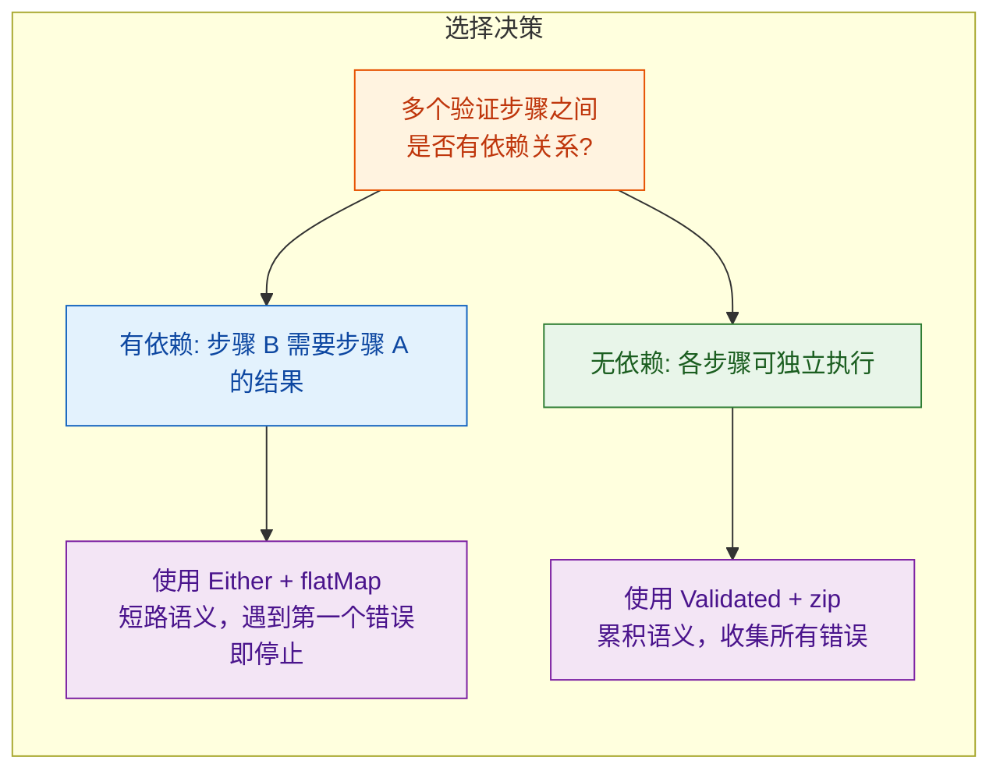

一个实用的经验法则：

- 业务流程中的顺序操作（查数据库 → 校验权限 → 执行操作）→ 用 `Either` + `flatMap`
- 表单/输入的并行校验（用户名、邮箱、密码各自独立校验）→ 用 `Validated` + `zip`
- 两者可以互相转换，在同一个业务流程中混合使用

```kotlin
// 混合使用示例：先 Validated 收集表单错误，再 Either 执行业务流程
fun register(username: String, email: String, password: String): Either<AppError, User> {
    // 第 1 阶段：Validated 并行校验，收集所有格式错误
    val formResult = validateRegistration(username, email, password)

    // 将 Validated 转为 Either
    val form: Either<AppError, RegistrationForm> = when (formResult) {
        is Validated.Valid -> Either.Right(formResult.value)
        is Validated.Invalid -> Either.Left(
            AppError.ValidationFailed(formResult.errors)   // 打包所有错误
        )
    }

    // 第 2 阶段：Either 顺序执行业务逻辑（有依赖关系，需要短路）
    return form
        .flatMap { f -> checkUsernameNotTaken(f.username) }  // 查数据库，依赖上一步
        .flatMap { f -> hashPasswordAndSave(f) }             // 保存用户，依赖上一步
}
```

### Arrow 库：生产级函数式错误处理

上面的 `Either`、`Option`、`Validated` 都是简化实现，用于理解原理。在生产项目中，推荐使用 Arrow 库（arrow-kt.io），它提供了完整、经过充分测试的实现，以及丰富的扩展函数和 DSL：

```kotlin
// build.gradle.kts
// dependencies {
//     implementation("io.arrow-kt:arrow-core:1.2.4")
// }

import arrow.core.*
import arrow.core.raise.either
import arrow.core.raise.ensure

// Arrow 的 Either DSL —— 用 either { } 块替代手动 flatMap 链
// 代码读起来像普通的顺序代码，但具有 Either 的短路语义
fun registerUser(
    username: String,
    email: String,
    password: String
): Either<UserError, User> = either {
    // ensure 类似 require，但失败时返回 Left 而非抛异常
    ensure(username.length >= 3) { UserError.TooShort("username", 3) }
    ensure(email.contains("@")) { UserError.InvalidFormat("email", "missing @") }

    // bind() 从 Either 中提取 Right 值
    // 如果是 Left，整个 either 块立即短路返回该 Left
    val hashedPassword = hashPassword(password).bind()  // Either〈UserError, String〉
    val user = saveToDatabase(username, email, hashedPassword).bind()

    user  // 最后一行是 either 块的返回值（Right 的内容）
}
```

Arrow 的 `either { }` DSL 是目前 Kotlin 生态中最优雅的函数式错误处理方案。它让你用接近命令式的写法获得函数式的类型安全保证，避免了 `flatMap` 嵌套地狱（callback hell 的函数式版本）。

---

**📝 练习题 1**

在使用协程的 `supervisorScope` 时，以下哪种说法是正确的？

A. `supervisorScope` 内所有层级的子协程失败都不会影响兄弟协程

B. `supervisorScope` 内直接子协程的失败不会取消兄弟协程，但子协程内部的 `coroutineScope` 仍遵循默认传播规则

C. `CoroutineExceptionHandler` 可以安装在 `supervisorScope` 内任意层级的协程上并生效

D. `CancellationException` 在 `supervisorScope` 中会像普通异常一样传播给父协程

**【答案】** B

**【解析】** `SupervisorJob` 的隔离效果只对其直接子协程生效。如果直接子协程内部又创建了 `coroutineScope`，那个内部作用域仍然遵循默认的"一个失败，全部取消"规则。选项 A 错在"所有层级"——隔离只在第一层。选项 C 错在 `CoroutineExceptionHandler` 只在根协程或 `SupervisorJob` 的直接子协程上生效，不是任意层级。选项 D 错在 `CancellationException` 在任何作用域中都享有特殊待遇，不会传播给父协程。

**📝 练习题 2**

使用 `Validated` 而非 `Either` 进行表单验证的核心优势是什么？

A. `Validated` 的性能比 `Either` 更好

B. `Validated` 可以累积所有验证错误，而 `Either` 的 `flatMap` 会在第一个错误处短路

C. `Validated` 支持 `flatMap` 操作，而 `Either` 不支持

D. `Validated` 是 Kotlin 标准库的一部分，无需额外依赖

**【答案】** B

**【解析】** `Either` 的 `flatMap` 具有短路语义——遇到第一个 `Left` 就停止执行后续操作，只能报告一个错误。`Validated` 通过 `zip` 操作并行组合多个验证结果，将所有失败的错误累积到一个列表中。这在表单验证场景中尤为重要，用户可以一次看到所有需要修正的字段，而不是修一个提交一次。选项 A 无依据，两者性能差异可忽略。选项 C 恰好相反——`Validated` 刻意不提供 `flatMap`（因为 `flatMap` 天然是短路的），而 `Either` 支持。选项 D 错误，`Validated` 不在标准库中，通常由 Arrow 库提供。

---

## 本章小结

本章系统地梳理了 Kotlin 异常与错误处理的完整知识体系——从最底层的 JVM 异常机制，到现代函数式错误处理范式，覆盖了日常开发中你会遇到的几乎所有场景。

### 核心知识脉络回顾

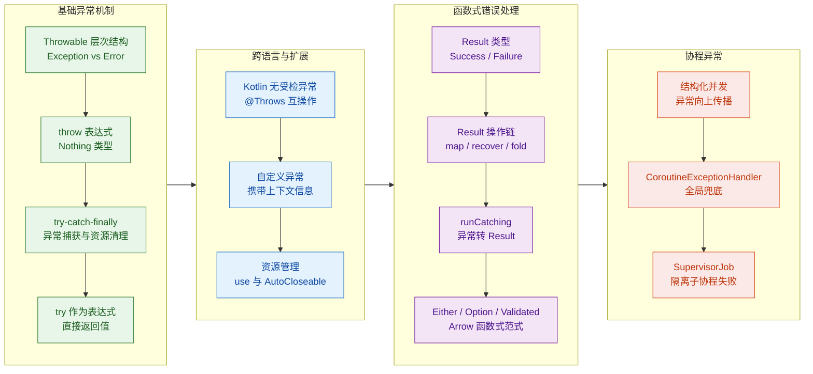

### 关键结论与设计哲学

Kotlin 的错误处理哲学可以用一句话概括：**让错误处理成为类型系统的一部分，而不是游离在类型之外的"意外"**。

这一哲学体现在几个层面的设计决策中：

第一，移除 checked exception。Java 的受检异常在理论上很美好——编译器强制你处理每一个可能的异常。但二十多年的实践证明，开发者的普遍反应是写空的 `catch` 块、机械地 `throws` 声明、或者把所有异常包装成 `RuntimeException`。Kotlin 选择信任开发者，让所有异常都是 unchecked 的，同时通过 `@Throws` 注解保持与 Java 的互操作性。

第二，`throw` 作为表达式与 `Nothing` 类型。这不仅仅是语法糖——它让异常抛出可以自然地嵌入到 Elvis 操作符、`when` 表达式、`if-else` 表达式中，使代码更紧凑、意图更清晰。`Nothing` 作为 bottom type 的设计，让类型推断在遇到异常分支时依然能正确工作。

第三，`Result` 类型与 `runCatching`。这是 Kotlin 向函数式错误处理迈出的重要一步。`Result<T>` 将"成功或失败"编码进类型系统，让编译器帮你追踪错误是否被处理。配合 `map`、`recover`、`fold` 等操作符，错误处理变成了可组合的数据流转换，而不是打断控制流的 `try-catch` 块。

第四，协程的结构化并发（Structured Concurrency）。异常在协程中不再是孤立事件——它沿着 Job 层级向上传播，确保父协程能感知子协程的失败。`SupervisorJob` 提供了隔离机制，`CoroutineExceptionHandler` 提供了全局兜底，整个体系与协程的生命周期管理紧密耦合。

### 错误处理策略选择指南

在实际项目中，面对一个可能失败的操作，你需要做出选择：用异常？用 `Result`？还是用 Arrow 的 `Either`？以下是一个决策框架：

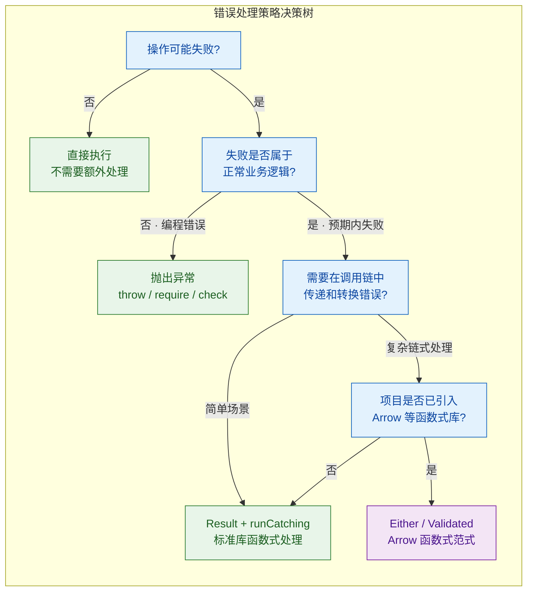

具体来说：

| 场景 | 推荐方案 | 理由 |
|---|---|---|
| 参数非法、状态不一致 | `require` / `check` / `throw` | 属于编程错误（bug），应该快速失败，暴露问题 |
| 文件不存在、网络超时 | `Result` + `runCatching` | 预期内的失败，需要优雅处理，标准库即可满足 |
| 多步骤业务流程中的错误累积 | `Either` / `Validated` | 需要收集多个错误、保留错误类型信息、复杂转换 |
| 协程中的异常 | 结构化并发 + `SupervisorJob` | 利用协程框架的传播机制，避免手动 try-catch |
| 资源操作（IO、数据库连接） | `.use {}` | 自动关闭资源，即使异常也能保证清理 |

### 常见陷阱速查

在本章的学习过程中，有几个容易踩的坑值得再次强调：

```kotlin
// ❌ 陷阱 1：catch 顺序错误——父类在前，子类永远不会被匹配
try { riskyOperation() }
catch (e: Exception) { /* 这里会捕获所有异常 */ }
catch (e: IOException) { /* 永远不可达！编译器会警告 */ }

// ✅ 正确：子类在前，父类在后
try { riskyOperation() }
catch (e: IOException) { /* 先匹配具体类型 */ }
catch (e: Exception) { /* 兜底处理其他异常 */ }
```

```kotlin
// ❌ 陷阱 2：finally 中的 return 会吞掉异常
fun dangerous(): Int {
    try {
        throw RuntimeException("boom")  // 抛出异常
    } finally {
        return 42  // finally 中的 return 会覆盖异常，调用者永远看不到异常！
    }
}
// dangerous() 返回 42，异常被静默吞掉
```

```kotlin
// ❌ 陷阱 3：对 Result 调用 getOrThrow 等于没用 Result
val result = runCatching { parseInput(raw) }
val value = result.getOrThrow()  // 如果失败，直接抛异常——那还不如直接 parseInput(raw)

// ✅ 正确：用 fold / getOrElse / recover 处理两种情况
val value = result.getOrElse { e ->
    logger.warn("Parse failed: ${e.message}")  // 记录日志
    defaultValue                                // 返回默认值
}
```

```kotlin
// ❌ 陷阱 4：在协程中用 try-catch 包裹 launch，无法捕获子协程异常
scope.launch {
    try {
        launch { throw RuntimeException("child failed") }  // 异常不会被这里的 try 捕获
    } catch (e: Exception) {
        // 永远不会执行！子协程的异常通过 Job 层级传播，不经过这里
    }
}

// ✅ 正确：使用 SupervisorJob + CoroutineExceptionHandler
val handler = CoroutineExceptionHandler { _, e -> logger.error("Caught: $e") }
val scope = CoroutineScope(SupervisorJob() + handler)
scope.launch { throw RuntimeException("child failed") }  // handler 会捕获
```

### 从异常到类型安全的演进

纵观本章内容，可以看到一条清晰的演进路线：

传统的 `try-catch` 是命令式的——它打断正常的控制流，把错误处理逻辑散落在代码各处。`Result` 类型将错误"装箱"为普通的值，让错误可以像数据一样在函数间传递和转换。Arrow 的 `Either<E, A>` 更进一步，让错误类型也成为泛型参数的一部分，实现了完全的类型安全。

这并不意味着你应该在所有地方都用 `Either` 替代异常。异常依然是处理"不应该发生的错误"（bug）的最佳工具——`require`、`check`、`error` 这些函数简洁有力，能让程序在遇到不一致状态时快速崩溃（fail fast），而不是带着错误的数据继续运行。

最终的目标是：**让可恢复的错误在类型系统中可见，让不可恢复的错误快速暴露**。Kotlin 提供了从传统异常到函数式错误处理的完整工具链，选择哪种取决于你的具体场景和团队偏好。

---

**📝 练习题 1**

以下代码的最终输出是什么？

```kotlin
fun compute(): Result<Int> = runCatching {
    val a = "10".toInt()
    val b = "0".toInt()
    a / b
}.recover { e ->
    when (e) {
        is ArithmeticException -> -1
        else -> throw e
    }
}.map { it * 2 }

fun main() {
    val output = compute().getOrElse { 0 }
    println(output)
}
```

A. 0

B. -1

C. -2

D. 抛出 ArithmeticException，程序崩溃

**【答案】** C

**【解析】** `runCatching` 块中 `10 / 0` 触发 `ArithmeticException`，`Result` 变为 `Failure`。接着 `recover` 匹配到 `ArithmeticException`，返回 `-1`，`Result` 变为 `Success(-1)`。然后 `map { it * 2 }` 将成功值从 `-1` 映射为 `-2`，`Result` 变为 `Success(-2)`。最后 `getOrElse` 从成功的 `Result` 中取出值 `-2`。输出 `-2`。

---

**📝 练习题 2**

关于 Kotlin 异常处理，以下哪项描述是错误的？

A. Kotlin 中所有异常都是 unchecked 的，编译器不强制要求捕获任何异常

B. `finally` 块中的 `return` 语句会覆盖 `try` 块中的正常返回值和异常

C. `SupervisorJob` 的作用是让父协程的失败不影响子协程

D. `use` 函数内部通过 `try-finally` 确保 `close()` 被调用，即使 lambda 抛出异常

**【答案】** C

**【解析】** `SupervisorJob` 的真正作用是让某个子协程的失败不会传播到父协程、进而不会取消其他兄弟子协程。它隔离的是"子协程之间的失败影响"，而不是"父对子的影响"。如果父协程（持有 `SupervisorJob` 的 scope）被取消，所有子协程仍然会被取消。选项 C 把方向说反了——不是"父不影响子"，而是"子不影响父和兄弟"。其余三项均正确：A 是 Kotlin 移除 checked exception 的核心设计；B 是 `finally` 中 `return` 的已知陷阱；D 是 `use` 函数的实现原理。

---

