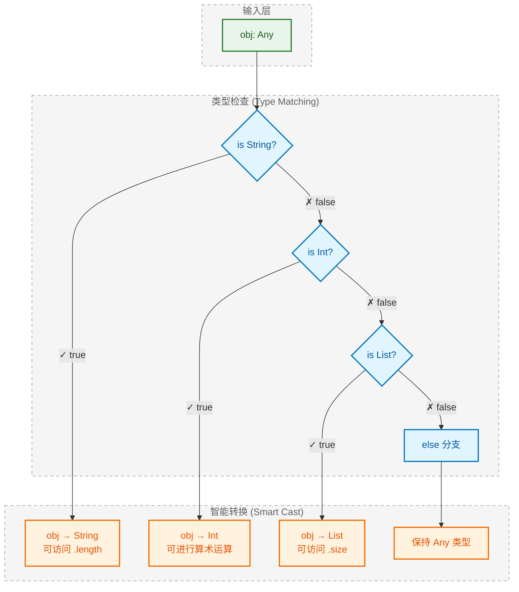
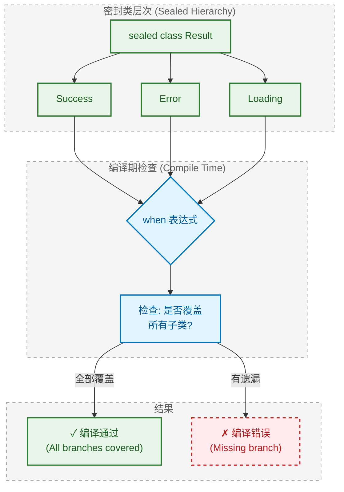
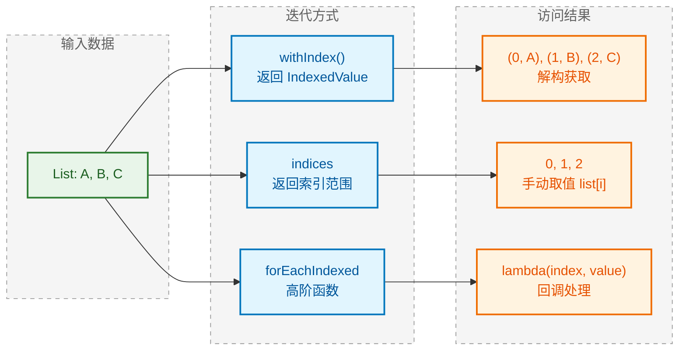
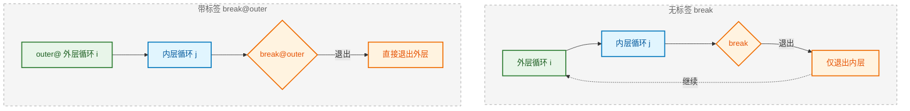
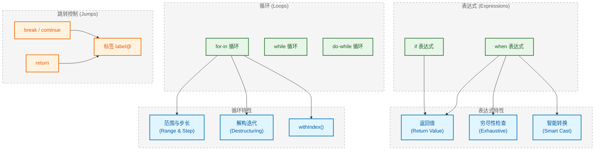

---

# 控制流

---

## if 表达式 (if Expression)

### 核心概念：if 作为表达式

在 Java 中，`if` 是一个**语句 (statement)**，它执行代码块但不返回值。而在 Kotlin 中，`if` 是一个**表达式 (expression)**——"In Kotlin, `if` is an expression: it returns a value."

```kotlin
// Java 风格：if 作为语句
var max: Int
if (a > b) {
    max = a
} else {
    max = b
}

// Kotlin 风格：if 作为表达式，直接返回值
val max = if (a > b) a else b
```

> 💡 **表达式 vs 语句**
> - **表达式 (Expression)**：计算并产生一个值，如 `a + b`、`if (x) y else z`
> - **语句 (Statement)**：执行一个动作，不产生值，如 Java 的 `if`、`for`

### 返回值规则

当 `if` 作为表达式使用时，每个分支的**最后一行**就是该分支的返回值：

```kotlin
val result = if (score >= 60) {
    println("恭喜通过！")
    "Pass"  // 这是返回值
} else {
    println("继续努力！")
    "Fail"  // 这是返回值
}
// result 的类型是 String
```

多行代码块中，Kotlin 自动将**最后一个表达式**作为返回值，无需 `return` 关键字：

```kotlin
val grade = if (score >= 90) {
    val bonus = 10
    "A+ (bonus: $bonus)"  // 返回此字符串
} else if (score >= 80) {
    "B"
} else {
    "C"
}
```

### 省略 else 的条件

当 `if` **仅作为语句**使用（不需要返回值）时，可以省略 `else`：

```kotlin
// ✅ 合法：作为语句，不需要返回值
if (isDebug) {
    println("Debug mode enabled")
}

// ❌ 编译错误：作为表达式必须有 else
val message = if (isDebug) "Debug"  
// Error: 'if' must have both main and 'else' branches if used as an expression
```

```kotlin
┌─────────────────────────────────────────────────────────┐
│           if 表达式的 else 规则                          │
├─────────────────────────────────────────────────────────┤
│  用途              │  是否需要 else  │  原因             │
├───────────────────┼────────────────┼──────────────────┤
│  作为语句 (不赋值)  │     可选       │  不需要返回值      │
│  作为表达式 (赋值)  │     必须       │  必须覆盖所有情况  │
└─────────────────────────────────────────────────────────┘
```

### 嵌套 if (Nested if)

复杂条件可以通过嵌套 `if` 实现，但要注意可读性：

```kotlin
val ticket = if (age < 18) {
    if (isStudent) "学生票 (半价)" else "未成年票"
} else {
    if (age >= 65) "老年票 (免费)" else "成人票"
}
```

> ⚠️ **最佳实践**：超过两层嵌套时，考虑使用 `when` 表达式重构，提升可读性。

### 替代三元运算符 (Ternary Operator)

Kotlin **没有**三元运算符 `? :`，因为 `if` 表达式已经足够简洁：

```kotlin
// Java
String result = condition ? "yes" : "no";

// Kotlin（完全等价，且更易读）
val result = if (condition) "yes" else "no"
```

---

## when 表达式 (when Expression)

`when` 是 Kotlin 中**最强大的分支结构**，它不仅替代了 Java 的 `switch`，还支持更丰富的匹配模式。官方描述："when defines a conditional expression with multiple branches."

### 替代 switch：基础语法

```kotlin
// Java switch
switch (day) {
    case 1: result = "Monday"; break;
    case 2: result = "Tuesday"; break;
    default: result = "Unknown"; break;
}

// Kotlin when（更简洁，无需 break）
val result = when (day) {
    1 -> "Monday"
    2 -> "Tuesday"
    else -> "Unknown"
}
```

**关键差异**：
- 无需 `break`，每个分支自动终止（no fall-through）
- 可以作为表达式返回值
- `else` 等价于 `default`

### 匹配常量 (Matching Constants)

```kotlin
fun getColorHex(color: String): String = when (color) {
    "red" -> "#FF0000"
    "green" -> "#00FF00"
    "blue" -> "#0000FF"
    else -> "#FFFFFF"
}
```

### 匹配类型 (Type Matching) —— 智能转换

`when` 配合 `is` 关键字可以进行**类型检查 (type check)**，并自动触发**智能转换 (smart cast)**：

```kotlin
fun describe(obj: Any): String = when (obj) {
    is String -> "字符串，长度为 ${obj.length}"  // 自动转换为 String
    is Int -> "整数，平方为 ${obj * obj}"        // 自动转换为 Int
    is List<*> -> "列表，大小为 ${obj.size}"     // 自动转换为 List
    else -> "未知类型"
}
```



### 匹配范围 (Range Matching)

使用 `in` 关键字检查值是否在某个**范围 (range)** 或**集合 (collection)** 中：

```kotlin
fun getGrade(score: Int): String = when (score) {
    in 90..100 -> "A"      // 90 到 100（闭区间）
    in 80 until 90 -> "B"  // 80 到 89（半开区间）
    in 70..79 -> "C"
    in 60..69 -> "D"
    else -> "F"
}

// 也可以检查是否在集合中
fun isWeekend(day: String) = when (day) {
    in listOf("Saturday", "Sunday") -> true
    else -> false
}
```

### 组合条件 (Multiple Conditions)

多个条件可以用**逗号**合并到同一分支：

```kotlin
fun isVowel(char: Char): Boolean = when (char) {
    'a', 'e', 'i', 'o', 'u',
    'A', 'E', 'I', 'O', 'U' -> true
    else -> false
}

// 等价于 Java 的 fall-through，但更清晰
fun getQuarter(month: Int): Int = when (month) {
    1, 2, 3 -> 1
    4, 5, 6 -> 2
    7, 8, 9 -> 3
    10, 11, 12 -> 4
    else -> throw IllegalArgumentException("Invalid month: $month")
}
```

### 无参数 when (when without argument)

`when` 可以**不带参数**，此时每个分支是一个**布尔表达式**，类似于 `if-else if` 链：

```kotlin
fun classifyTemperature(temp: Int): String = when {
    temp < 0 -> "冰冻 (Freezing)"
    temp < 15 -> "寒冷 (Cold)"
    temp < 25 -> "舒适 (Comfortable)"
    temp < 35 -> "炎热 (Hot)"
    else -> "极端高温 (Extreme)"
}
```

这种形式特别适合**复杂的条件组合**：

```kotlin
fun validateUser(user: User): String = when {
    user.name.isBlank() -> "用户名不能为空"
    user.age < 0 -> "年龄不能为负数"
    user.email != null && !user.email.contains("@") -> "邮箱格式错误"
    else -> "验证通过"
}
```

### when 表达式的返回值

与 `if` 相同，`when` 作为表达式时，每个分支的**最后一行**是返回值：

```kotlin
val description = when (status) {
    Status.LOADING -> {
        showProgress()
        "加载中..."  // 返回值
    }
    Status.SUCCESS -> {
        hideProgress()
        "加载成功"   // 返回值
    }
    Status.ERROR -> {
        hideProgress()
        showError()
        "加载失败"   // 返回值
    }
}
```

---

## if vs when：如何选择？

```kotlin
┌────────────────────────────────────────────────────────────────┐
│                    if vs when 选择指南                          │
├────────────────────────────────────────────────────────────────┤
│  场景                          │  推荐         │  原因          │
├───────────────────────────────┼──────────────┼───────────────┤
│  二元判断 (true/false)         │  if          │  简洁直观      │
│  多个离散值匹配                 │  when        │  替代 switch   │
│  类型检查 + 智能转换            │  when + is   │  自动 cast     │
│  范围检查                      │  when + in   │  语义清晰      │
│  复杂条件组合                   │  when 无参数  │  比 if-else 链 │
│                               │              │  更易读        │
└────────────────────────────────────────────────────────────────┘
```

---

## 📝 练习题

### 练习 1

```kotlin
val x = 5
val result = if (x > 3) {
    "big"
} else {
    "small"
}
println(result)
```

以上代码的输出是什么？

A. `big`  
B. `small`  
C. `null`  
D. 编译错误

【答案】A

【解析】`x = 5` 大于 3，所以进入第一个分支，返回 `"big"`。`if` 作为表达式将该值赋给 `result`，最终输出 `big`。

---

### 练习 2

```kotlin
fun check(obj: Any) = when (obj) {
    is String -> obj.length
    is Int -> obj * 2
    else -> 0
}

println(check("Kotlin"))
```

以上代码的输出是什么？

A. `Kotlin`  
B. `6`  
C. `12`  
D. 编译错误

【答案】B

【解析】传入的是字符串 `"Kotlin"`，匹配 `is String` 分支。由于**智能转换 (smart cast)**，`obj` 在该分支内自动被视为 `String` 类型，可以直接访问 `.length`。`"Kotlin"` 的长度是 6，所以输出 `6`。

---

## 穷尽性检查 (Exhaustive Check)

穷尽性检查是 Kotlin 编译器的一项强大特性——它能在**编译期 (compile time)** 确保你的分支逻辑覆盖了所有可能的情况，从而避免运行时遗漏导致的 bug。

### 编译器保证 (Compiler Guarantee)

当 `when` 作为**表达式 (expression)** 使用时，编译器会强制要求覆盖所有可能的分支：

```kotlin
enum class Direction { NORTH, SOUTH, EAST, WEST }

// ✅ 作为表达式：必须穷尽所有情况
val description = when (direction) {
    Direction.NORTH -> "向北"
    Direction.SOUTH -> "向南"
    Direction.EAST -> "向东"
    Direction.WEST -> "向西"
    // 无需 else，因为已覆盖所有枚举值
}

// ❌ 编译错误：缺少分支
val incomplete = when (direction) {
    Direction.NORTH -> "向北"
    Direction.SOUTH -> "向南"
    // Error: 'when' expression must be exhaustive, add necessary 'EAST', 'WEST' branches or 'else' branch
}
```

**关键规则**：

| 场景 | 是否需要 else | 原因 |
|------|--------------|------|
| `when` 作为语句 | 可选 | 不需要返回值 |
| `when` 作为表达式 + 枚举/密封类 | 可选（若已穷尽） | 编译器可推断完整性 |
| `when` 作为表达式 + 其他类型 | **必须** | 编译器无法确定所有可能值 |

```kotlin
// 对于非枚举类型，必须有 else
fun describe(num: Int): String = when (num) {
    1 -> "一"
    2 -> "二"
    else -> "其他"  // 必须！Int 有无限可能值
}
```

### 密封类的应用 (Sealed Class Application)

**密封类 (Sealed Class)** 是穷尽性检查的最佳搭档。它限制了类的继承层次，使编译器能够在编译期知道所有可能的子类型。

```kotlin
// 定义密封类层次结构
sealed class Result {
    data class Success(val data: String) : Result()
    data class Error(val message: String, val code: Int) : Result()
    data object Loading : Result()
}

// 使用 when 处理所有情况
fun handleResult(result: Result): String = when (result) {
    is Result.Success -> "成功: ${result.data}"
    is Result.Error -> "错误 ${result.code}: ${result.message}"
    is Result.Loading -> "加载中..."
    // 无需 else！编译器知道只有这三种可能
}
```



**密封类的优势**：

1. **编译期安全**：新增子类时，所有未处理的 `when` 表达式都会报错
2. **无需 else**：避免了 `else` 分支"吞掉"未来新增类型的风险
3. **IDE 支持**：自动补全所有分支

```kotlin
// 假设后来新增了一个状态
sealed class Result {
    // ... 原有子类
    data object Cancelled : Result()  // 新增！
}

// 此时所有使用 when 的地方都会编译报错，提醒你处理新情况
// Error: 'when' expression must be exhaustive, add necessary 'Cancelled' branch
```

> 💡 **最佳实践**：在处理有限状态集（如网络请求状态、UI 状态、事件类型）时，优先使用密封类配合 `when` 表达式，让编译器帮你守护代码的完整性。

---

## 循环结构 (Loop Structures)

Kotlin 的循环设计简洁而强大，`for` 循环基于**迭代器模式 (Iterator Pattern)**，可以遍历任何提供 `iterator()` 的对象。

### for 循环基础

Kotlin 的 `for` 循环语法为 `for (item in collection)`，其中 `in` 是关键字：

```kotlin
// 基础语法
for (item in collection) {
    println(item)
}

// 等价的 Java 增强 for 循环
// for (Item item : collection) { ... }
```

### 迭代范围 (Iterating Ranges)

**范围 (Range)** 是 Kotlin 的内置类型，用 `..` 或 `until` 创建：

```kotlin
// 闭区间 [1, 5]：包含 1 和 5
for (i in 1..5) {
    print("$i ")  // 输出: 1 2 3 4 5
}

// 半开区间 [1, 5)：包含 1，不包含 5
for (i in 1 until 5) {
    print("$i ")  // 输出: 1 2 3 4
}

// 倒序迭代 (downTo)
for (i in 5 downTo 1) {
    print("$i ")  // 输出: 5 4 3 2 1
}

// 自定义步长 (step)
for (i in 0..10 step 2) {
    print("$i ")  // 输出: 0 2 4 6 8 10
}

// 组合使用
for (i in 10 downTo 0 step 3) {
    print("$i ")  // 输出: 10 7 4 1
}
```

```kotlin
┌─────────────────────────────────────────────────────────────┐
│                    范围操作符速查表                           │
├─────────────────────────────────────────────────────────────┤
│  语法              │  含义              │  示例结果           │
├──────────────────┼───────────────────┼───────────────────┤
│  1..5            │  闭区间 [1,5]       │  1, 2, 3, 4, 5    │
│  1 until 5       │  半开区间 [1,5)     │  1, 2, 3, 4       │
│  5 downTo 1      │  倒序闭区间         │  5, 4, 3, 2, 1    │
│  1..10 step 2    │  步长为 2           │  1, 3, 5, 7, 9    │
│  'a'..'z'        │  字符范围           │  a, b, c, ..., z  │
└─────────────────────────────────────────────────────────────┘
```

### 迭代集合 (Iterating Collections)

`for` 可以遍历任何**可迭代对象 (Iterable)**：

```kotlin
// 遍历 List
val fruits = listOf("Apple", "Banana", "Cherry")
for (fruit in fruits) {
    println(fruit)
}

// 遍历 Set
val uniqueNumbers = setOf(1, 2, 3, 2, 1)
for (num in uniqueNumbers) {
    print("$num ")  // 输出: 1 2 3
}

// 遍历 Map 的 entries
val scores = mapOf("Alice" to 95, "Bob" to 87)
for (entry in scores) {
    println("${entry.key}: ${entry.value}")
}

// 遍历字符串（String 也是 Iterable<Char>）
for (char in "Kotlin") {
    print("$char-")  // 输出: K-o-t-l-i-n-
}

// 遍历数组
val numbers = arrayOf(1, 2, 3)
for (n in numbers) {
    print("$n ")
}
```

### 解构 in for (Destructuring in For Loop)

Kotlin 支持在 `for` 循环中使用**解构声明 (Destructuring Declaration)**，特别适合遍历 Map 或包含多个组件的对象：

```kotlin
// 解构 Map 的键值对
val userAges = mapOf("Alice" to 25, "Bob" to 30, "Charlie" to 35)

for ((name, age) in userAges) {
    println("$name is $age years old")
}
// 输出:
// Alice is 25 years old
// Bob is 30 years old
// Charlie is 35 years old

// 解构 Pair 列表
val coordinates = listOf(Pair(1, 2), Pair(3, 4), Pair(5, 6))
for ((x, y) in coordinates) {
    println("Point($x, $y)")
}

// 解构 data class
data class Person(val name: String, val age: Int)
val people = listOf(Person("Alice", 25), Person("Bob", 30))

for ((name, age) in people) {
    println("$name: $age")
}
```

**解构原理**：编译器会调用对象的 `component1()`, `component2()` 等方法：

```kotlin
// 上面的 for ((name, age) in userAges) 等价于：
for (entry in userAges) {
    val name = entry.component1()  // key
    val age = entry.component2()   // value
    println("$name is $age years old")
}
```

### 索引迭代 withIndex()

当你需要同时访问**元素**和**索引**时，使用 `withIndex()` 函数：

```kotlin
val colors = listOf("Red", "Green", "Blue")

// 使用 withIndex() 获取索引和元素
for ((index, color) in colors.withIndex()) {
    println("$index: $color")
}
// 输出:
// 0: Red
// 1: Green
// 2: Blue

// withIndex() 返回 IndexedValue<T> 对象的序列
// data class IndexedValue<out T>(val index: Int, val value: T)
```

**对比其他索引访问方式**：

```kotlin
val items = listOf("A", "B", "C")

// 方式 1: withIndex()（推荐）
for ((i, item) in items.withIndex()) {
    println("$i -> $item")
}

// 方式 2: indices 属性
for (i in items.indices) {
    println("$i -> ${items[i]}")
}

// 方式 3: forEachIndexed（函数式风格）
items.forEachIndexed { index, item ->
    println("$index -> $item")
}
```



### 迭代器协议 (Iterator Protocol)

任何类只要提供 `iterator()` 方法（返回具有 `hasNext()` 和 `next()` 的对象），就可以用于 `for` 循环：

```kotlin
// 自定义可迭代类
class CountDown(private val start: Int) {
    operator fun iterator(): Iterator<Int> = object : Iterator<Int> {
        private var current = start
        override fun hasNext() = current > 0
        override fun next() = current--
    }
}

// 使用自定义迭代
for (num in CountDown(5)) {
    print("$num ")  // 输出: 5 4 3 2 1
}
```

---

## 📝 练习题

### 练习 1

```kotlin
sealed class State {
    object Loading : State()
    data class Success(val data: String) : State()
    data class Error(val msg: String) : State()
}

fun handle(state: State) = when (state) {
    is State.Loading -> "加载中"
    is State.Success -> state.data
}
```

以上代码会发生什么？

A. 正常编译，运行时可能抛出异常  
B. 编译错误：`when` 表达式必须穷尽所有分支  
C. 正常编译和运行  
D. 编译错误：`sealed class` 不能有 `object` 子类

【答案】B

【解析】`when` 作为表达式使用时（有返回值），必须覆盖所有可能的分支。这里 `State` 是密封类，编译器知道有三个子类型：`Loading`、`Success`、`Error`。代码中缺少对 `Error` 的处理，因此编译器会报错："'when' expression must be exhaustive, add necessary 'Error' branch or 'else' branch"。这正是穷尽性检查的价值所在。

---

### 练习 2

```kotlin
val list = listOf("A", "B", "C")
for ((index, value) in list.withIndex()) {
    if (index == 1) print(value)
}
```

以上代码的输出是什么？

A. `A`  
B. `B`  
C. `C`  
D. `0`

【答案】B

【解析】`withIndex()` 返回一个包含索引和值的序列。遍历时，`index` 依次为 0, 1, 2，`value` 依次为 "A", "B", "C"。当 `index == 1` 时，对应的 `value` 是 "B"，所以输出 `B`。这道题考察了 `withIndex()` 的使用和解构声明。

---

## while 与 do-while 循环

与 `for` 循环不同，`while` 和 `do-while` 是基于**条件判断 (condition-based)** 的循环结构，适用于循环次数不确定的场景。

### while 循环

`while` 循环在每次迭代**之前**检查条件，如果条件为 `false`，循环体可能**一次都不执行**：

```kotlin
// 基础语法
while (condition) {
    // 循环体 (loop body)
}

// 示例：计算阶乘
fun factorial(n: Int): Long {
    var result = 1L
    var counter = n
    while (counter > 0) {
        result *= counter
        counter--
    }
    return result
}

println(factorial(5))  // 输出: 120
```

**执行流程**：

```kotlin
┌─────────────────────────────────────────┐
│           while 循环执行流程              │
├─────────────────────────────────────────┤
│                                         │
│    ┌──────────────┐                     │
│    │  检查条件     │◄─────────┐         │
│    └──────┬───────┘          │         │
│           │                  │         │
│     ┌─────▼─────┐            │         │
│     │  true?    │            │         │
│     └─────┬─────┘            │         │
│       yes │  no              │         │
│     ┌─────▼─────┐    ┌───────┴───┐     │
│     │ 执行循环体 │    │  退出循环  │     │
│     └─────┬─────┘    └───────────┘     │
│           │                            │
│           └──────────────────┘         │
│                                         │
└─────────────────────────────────────────┘
```

### do-while 循环

`do-while` 循环在每次迭代**之后**检查条件，因此循环体**至少执行一次**：

```kotlin
// 基础语法
do {
    // 循环体 (至少执行一次)
} while (condition)

// 示例：用户输入验证
fun readPositiveNumber(): Int {
    var input: Int
    do {
        print("请输入正整数: ")
        input = readLine()?.toIntOrNull() ?: -1
    } while (input <= 0)
    return input
}

// 示例：至少执行一次的场景
var x = 10
do {
    println("x = $x")  // 即使条件一开始就是 false，也会执行一次
    x++
} while (x < 5)
// 输出: x = 10（执行了一次）
```

### while vs do-while 对比

| 特性 | while | do-while |
|------|-------|----------|
| 条件检查时机 | 循环**前** (before) | 循环**后** (after) |
| 最少执行次数 | 0 次 | 1 次 |
| 适用场景 | 可能不需要执行 | 至少需要执行一次 |
| 语法特点 | `while (cond) { }` | `do { } while (cond)` |

```kotlin
// 对比示例
var a = 0
while (a > 0) {
    println("while: $a")  // 不会执行
}

var b = 0
do {
    println("do-while: $b")  // 输出: do-while: 0
} while (b > 0)
```

### 实际应用场景

```kotlin
// 场景 1: 读取数据直到结束标记
fun readUntilEnd(): List<String> {
    val lines = mutableListOf<String>()
    var line: String?
    while (readLine().also { line = it } != null && line != "END") {
        lines.add(line!!)
    }
    return lines
}

// 场景 2: 游戏主循环
fun gameLoop() {
    var isRunning = true
    while (isRunning) {
        processInput()
        updateGameState()
        render()
        isRunning = !isGameOver()
    }
}

// 场景 3: 重试机制
fun fetchWithRetry(maxRetries: Int): Result {
    var attempts = 0
    var result: Result
    do {
        result = tryFetch()
        attempts++
    } while (result.isFailure && attempts < maxRetries)
    return result
}
```

---

## 跳转与标签 (Jumps and Labels)

Kotlin 提供了三种跳转表达式 (jump expressions)：`break`、`continue` 和 `return`。配合**标签 (labels)**，可以实现更精确的流程控制。

### break 语句

`break` 用于**立即终止**最近的闭合循环 (terminates the nearest enclosing loop)：

```kotlin
for (i in 1..10) {
    if (i == 5) break  // 当 i 等于 5 时退出循环
    print("$i ")
}
// 输出: 1 2 3 4
```

### continue 语句

`continue` 用于**跳过**当前迭代，进入下一次迭代 (proceeds to the next step of the nearest enclosing loop)：

```kotlin
for (i in 1..10) {
    if (i % 2 == 0) continue  // 跳过偶数
    print("$i ")
}
// 输出: 1 3 5 7 9
```

### return 语句

`return` 从最近的闭合**函数**返回 (returns from the nearest enclosing function)：

```kotlin
fun findFirst(list: List<Int>, target: Int): Int? {
    for (item in list) {
        if (item == target) return item  // 找到后立即返回
    }
    return null
}
```

### 标签语法 (Label Syntax)

当存在**嵌套循环 (nested loops)** 时，普通的 `break` 和 `continue` 只能作用于最内层循环。使用**标签 (label)** 可以指定跳转的目标循环。

**标签定义**：任何表达式都可以用 `labelName@` 标记

```kotlin
// 标签语法: identifier@ 
outer@ for (i in 1..5) {
    inner@ for (j in 1..5) {
        // 可以使用 break@outer 或 continue@outer
    }
}
```

### break 与标签

```kotlin
// 不使用标签：只能退出内层循环
for (i in 1..3) {
    for (j in 1..3) {
        if (j == 2) break  // 只退出内层 j 循环
        println("i=$i, j=$j")
    }
}
// 输出:
// i=1, j=1
// i=2, j=1
// i=3, j=1

// 使用标签：可以退出外层循环
outer@ for (i in 1..3) {
    for (j in 1..3) {
        if (i == 2 && j == 2) break@outer  // 退出外层 i 循环
        println("i=$i, j=$j")
    }
}
// 输出:
// i=1, j=1
// i=1, j=2
// i=1, j=3
// i=2, j=1
```



### continue 与标签

```kotlin
outer@ for (i in 1..3) {
    for (j in 1..3) {
        if (j == 2) continue@outer  // 跳过外层循环的当前迭代
        println("i=$i, j=$j")
    }
}
// 输出:
// i=1, j=1
// i=2, j=1
// i=3, j=1
// 注意：每次 j=2 时，直接跳到下一个 i，j=3 永远不会执行
```

### 限定 return (Qualified Return)

在 **Lambda 表达式**中，`return` 的行为比较特殊。默认情况下，Lambda 中的 `return` 会从**包含该 Lambda 的函数**返回（非局部返回，non-local return），而不是仅从 Lambda 返回。

```kotlin
fun processNumbers(numbers: List<Int>) {
    numbers.forEach { num ->
        if (num == 0) return  // 从 processNumbers 函数返回！
        println(num)
    }
    println("处理完成")  // 如果遇到 0，这行不会执行
}

processNumbers(listOf(1, 2, 0, 3))
// 输出:
// 1
// 2
// （函数直接返回，"处理完成"不会打印）
```

**使用标签限定 return**：

```kotlin
fun processNumbers(numbers: List<Int>) {
    numbers.forEach label@{ num ->
        if (num == 0) return@label  // 仅从 Lambda 返回，继续下一次迭代
        println(num)
    }
    println("处理完成")
}

processNumbers(listOf(1, 2, 0, 3))
// 输出:
// 1
// 2
// 3
// 处理完成
```

**隐式标签**：Lambda 表达式会自动获得与调用它的函数同名的隐式标签：

```kotlin
fun processNumbers(numbers: List<Int>) {
    numbers.forEach { num ->
        if (num == 0) return@forEach  // 使用隐式标签
        println(num)
    }
    println("处理完成")
}
```

### 标签 return 的三种形式

```kotlin
fun demo(list: List<Int>) {
    // 形式 1: 显式标签
    list.forEach myLabel@{
        if (it < 0) return@myLabel
        println(it)
    }
    
    // 形式 2: 隐式标签（函数名）
    list.forEach {
        if (it < 0) return@forEach
        println(it)
    }
    
    // 形式 3: 匿名函数（无需标签）
    list.forEach(fun(value) {
        if (value < 0) return  // 从匿名函数返回
        println(value)
    })
}
```

### 带返回值的标签 return

标签 return 可以携带返回值，这在 `run`、`let` 等作用域函数中很有用：

```kotlin
val result = run outer@{
    listOf(1, 2, 3, 4, 5).forEach {
        if (it == 3) return@outer "找到了 3"
    }
    "没找到"
}
println(result)  // 输出: 找到了 3
```

### 跳转语句总结

```kotlin
┌──────────────────────────────────────────────────────────────┐
│                    跳转语句速查表                               │
├──────────────────────────────────────────────────────────────┤
│  语句             │  作用范围          │  行为                  │
├──────────────────┼───────────────────┼───────────────────────┤
│  break           │  最近闭合循环       │  终止循环              │
│  break@label     │  指定标签的循环     │  终止指定循环           │
│  continue        │  最近闭合循环       │  跳到下一次迭代         │
│  continue@label  │  指定标签的循环     │  跳到指定循环的下一迭代   │
│  return          │  最近闭合函数       │  从函数返回             │
│  return@label    │  指定标签的 Lambda  │  从 Lambda 返回        │
└───────────────────────────────────────────────────────────────┘
```

---

## 📝 练习题

### 练习 1

```kotlin
var count = 0
do {
    count++
} while (count > 10)
println(count)
```

以上代码的输出是什么？

A. `0`  
B. `1`  
C. `10`  
D. `11`

【答案】B

【解析】`do-while` 循环的特点是**先执行，后判断**。即使条件一开始就是 `false`，循环体也会执行一次。初始 `count = 0`，执行一次 `count++` 后变为 `1`，然后检查条件 `1 > 10` 为 `false`，循环结束。因此输出 `1`。

---

### 练习 2

```kotlin
fun test() {
    listOf(1, 2, 3).forEach {
        if (it == 2) return
        print(it)
    }
    print("done")
}
test()
```

以上代码的输出是什么？

A. `1done`  
B. `13done`  
C. `123done`  
D. `1`

【答案】D

【解析】在 Lambda 表达式中使用不带标签的 `return`，会执行**非局部返回 (non-local return)**，即从包含该 Lambda 的函数 `test()` 直接返回。当 `it == 2` 时，`return` 导致整个 `test()` 函数返回，后续的 `print(3)` 和 `print("done")` 都不会执行。因此只输出 `1`。如果想只从 Lambda 返回，应使用 `return@forEach`。

---

## 核心概念回顾 (Key Concepts Review)

本章我们系统学习了 Kotlin 的控制流结构。与 Java 相比，Kotlin 的控制流更加**表达式化 (expression-oriented)**，这意味着 `if` 和 `when` 不仅能执行代码，还能**返回值**，从而让代码更简洁、更函数式。

---

## 知识点速查表 (Quick Reference)

### if 表达式

| 特性 | 说明 | 示例 |
|------|------|------|
| 作为表达式 | 可直接返回值，替代三元运算符 | `val max = if (a > b) a else b` |
| 返回值规则 | 每个分支最后一行是返回值 | 无需 `return` 关键字 |
| else 要求 | 作为表达式时**必须**有 else | 作为语句时可省略 |

### when 表达式

| 匹配方式 | 语法 | 适用场景 |
|----------|------|----------|
| 常量匹配 | `value -> result` | 替代 switch-case |
| 类型匹配 | `is Type -> ...` | 配合智能转换 (smart cast) |
| 范围匹配 | `in range -> ...` | 数值区间判断 |
| 组合条件 | `a, b, c -> ...` | 多值共享同一分支 |
| 无参数 | `when { cond -> ... }` | 复杂布尔条件组合 |

### 穷尽性检查

```kotlin
┌─────────────────────────────────────────────────────────────┐
│              穷尽性检查 (Exhaustive Check)                    │
├─────────────────────────────────────────────────────────────┤
│                                                             │
│   when 作为表达式 + enum/sealed class                         │
│           ↓                                                 │
│   编译器自动检查是否覆盖所有分支                                 │
│           ↓                                                 │
│   ┌─────────────┐    ┌─────────────┐                        │
│   │ 全部覆盖 ✓   │    │ 有遗漏 ✗    │                         │
│   │ 无需 else   │    │ 编译报错    │                          │
│   └─────────────┘    └─────────────┘                        │
│                                                             │
│   优势：新增子类时，所有未处理的 when 都会报错提醒                 │
│                                                             │
└─────────────────────────────────────────────────────────────┘
```

### 循环结构

| 循环类型 | 语法 | 特点 |
|----------|------|------|
| for-in | `for (item in collection)` | 基于迭代器，最常用 |
| 范围迭代 | `for (i in 1..10)` | 支持 `until`、`downTo`、`step` |
| 索引迭代 | `for ((i, v) in list.withIndex())` | 同时获取索引和值 |
| while | `while (cond) { }` | 先判断后执行，可能 0 次 |
| do-while | `do { } while (cond)` | 先执行后判断，至少 1 次 |

### 跳转与标签

| 语句 | 作用 | 带标签形式 |
|------|------|-----------|
| `break` | 终止最近循环 | `break@label` 终止指定循环 |
| `continue` | 跳过当前迭代 | `continue@label` 跳到指定循环 |
| `return` | 从函数返回 | `return@label` 从 Lambda 返回 |

---

## 知识架构图 (Knowledge Architecture)



---

## Kotlin vs Java 对比 (Comparison)

| 特性 | Java | Kotlin |
|------|------|--------|
| if 返回值 | ❌ 需要三元运算符 `? :` | ✅ if 本身就是表达式 |
| switch/when | 需要 break，易 fall-through | 无需 break，自动终止 |
| 类型匹配 | instanceof + 手动转换 | `is` + 自动智能转换 |
| 范围检查 | 手动写 `x >= a && x <= b` | `x in a..b` |
| for 循环 | `for (int i = 0; i < n; i++)` | `for (i in 0 until n)` |
| 穷尽性检查 | ❌ 无（Java 17+ switch 表达式有） | ✅ enum/sealed class 自动检查 |

---

## 最佳实践 (Best Practices)

### ✅ 推荐做法

```kotlin
// 1. 优先使用 when 替代多层 if-else
val grade = when (score) {
    in 90..100 -> "A"
    in 80..89 -> "B"
    in 70..79 -> "C"
    else -> "D"
}

// 2. 使用密封类配合 when，获得编译期安全
sealed class UiState { ... }
fun render(state: UiState) = when (state) {
    is UiState.Loading -> showLoading()
    is UiState.Success -> showData(state.data)
    is UiState.Error -> showError(state.message)
    // 编译器确保不会遗漏
}

// 3. 使用 withIndex() 而非手动维护索引
for ((index, item) in list.withIndex()) {
    println("$index: $item")
}

// 4. Lambda 中使用 return@label 而非裸 return
list.forEach {
    if (it < 0) return@forEach  // 明确意图
    process(it)
}
```

### ❌ 避免做法

```kotlin
// 1. 避免过深的嵌套 if
// Bad
if (a) {
    if (b) {
        if (c) { ... }
    }
}
// Good: 使用 when 或提前 return

// 2. 避免在 when 表达式中滥用 else
// Bad: else 会"吞掉"未来新增的枚举值
when (status) {
    Status.A -> ...
    else -> ...  // 危险！
}
// Good: 显式列出所有分支

// 3. 避免在 Lambda 中使用裸 return（除非确实要退出外层函数）
list.forEach {
    if (condition) return  // 可能不是你想要的行为
}
```

---

## 常见陷阱 (Common Pitfalls)

### 陷阱 1：if 表达式忘记 else

```kotlin
// ❌ 编译错误
val result = if (flag) "yes"  // 缺少 else

// ✅ 正确
val result = if (flag) "yes" else "no"
```

### 陷阱 2：Lambda 中的 return 行为

```kotlin
fun process(list: List<Int>) {
    list.forEach {
        if (it == 0) return  // 从 process 函数返回！
        println(it)
    }
    println("done")  // 可能不会执行
}
```

### 陷阱 3：do-while 至少执行一次

```kotlin
var x = 100
do {
    println(x)  // 即使条件为 false，也会执行一次
} while (x < 10)
// 输出: 100
```

---

## 术语表 (Glossary)

| 英文术语 | 中文翻译 | 说明 |
|----------|----------|------|
| Expression | 表达式 | 计算并产生值的代码单元 |
| Statement | 语句 | 执行动作但不产生值 |
| Exhaustive Check | 穷尽性检查 | 编译器确保覆盖所有分支 |
| Smart Cast | 智能转换 | 类型检查后自动转换类型 |
| Range | 范围 | 表示一个区间，如 `1..10` |
| Label | 标签 | 用于标记循环或 Lambda |
| Non-local Return | 非局部返回 | Lambda 中 return 从外层函数返回 |
| Sealed Class | 密封类 | 限制继承层次的类 |
| Iterator | 迭代器 | 提供遍历集合的接口 |
| Destructuring | 解构 | 将对象拆分为多个变量 |

---

## 📝 综合练习

### 练习 1

```kotlin
fun check(x: Int) = when {
    x < 0 -> "negative"
    x == 0 -> "zero"
    x in 1..10 -> "small"
    else -> "large"
}
println(check(5))
```

以上代码的输出是什么？

A. `negative`  
B. `zero`  
C. `small`  
D. `large`

【答案】C

【解析】这是一个无参数的 `when` 表达式，按顺序检查每个布尔条件。`x = 5`：不小于 0，不等于 0，在 `1..10` 范围内，所以匹配第三个分支，返回 `"small"`。

---

### 练习 2

```kotlin
outer@ for (i in 1..3) {
    for (j in 1..3) {
        if (i * j > 4) break@outer
        print("$i$j ")
    }
}
```

以上代码的输出是什么？

A. `11 12 13 21 22 `  
B. `11 12 13 21 22 23 `  
C. `11 12 21 22 `  
D. `11 12 13 21 `

【答案】A

【解析】逐步分析：
- `i=1`: j=1(1), j=2(2), j=3(3) → 输出 `11 12 13 `
- `i=2`: j=1(2), j=2(4), j=3(6>4) → 输出 `21 22 `，然后 `break@outer`

当 `i=2, j=3` 时，`i*j=6>4`，执行 `break@outer` 直接退出外层循环。因此输出 `11 12 13 21 22 `。

---
