---

# 泛型进阶

---

## 泛型类

泛型类 (Generic Class) 是 Kotlin 类型系统中最基础也是最重要的泛型应用形式。它允许我们在类的定义中引入类型参数 (Type Parameter)，从而创建出能够适配多种数据类型的通用类结构。这种参数化类型 (Parameterized Type) 的设计理念，使得代码既能保持强类型检查的安全性，又能获得高度的复用性和灵活性。

泛型类的核心价值在于**类型抽象** (Type Abstraction)。传统的类设计往往针对特定类型编写，比如 `IntContainer` 只能存储整数，`StringContainer` 只能存储字符串。这种方式会导致大量重复代码，并且缺乏扩展性。而泛型类通过将类型作为参数传递，让同一套逻辑能够适配任意符合约束的类型，从根本上解决了这个问题。

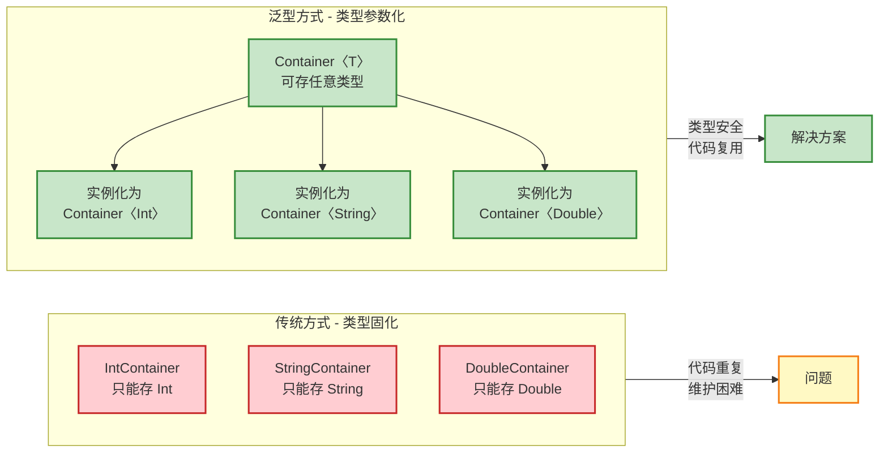

### 类型参数声明

类型参数的声明遵循特定的语法规则。在类名后紧跟尖括号 `<T>`，其中 `T` 是类型参数的名称。按照 Kotlin 约定，单个类型参数通常使用 `T` (Type)，多个参数时使用 `T`、`U`、`V` 等字母，或者使用更具语义的名称如 `K` (Key)、`V` (Value)、`E` (Element)。

```kotlin
// 基础泛型类声明 - 单个类型参数
class Box<T>(private val item: T) {  // T 是类型参数，在整个类内部可用
    
    // 返回存储的元素，返回类型是 T
    fun get(): T {
        return item  // item 的类型是 T
    }
    
    // 判断是否为空 - 演示类型参数的使用
    fun isEmpty(): Boolean {
        return item == null  // 可以对 T 类型进行 null 检查
    }
    
    // 打印元素信息
    fun printInfo() {
        println("Box contains: $item")  // T 类型可以进行字符串插值
    }
}

// 使用泛型类 - 类型实参 (Type Argument)
fun main() {
    // 创建存储 String 的 Box，T 被具体化为 String
    val stringBox = Box<String>("Hello Kotlin")  
    val content: String = stringBox.get()  // 编译器知道返回类型是 String
    println(content)  // 输出: Hello Kotlin
    
    // 创建存储 Int 的 Box，T 被具体化为 Int
    val intBox = Box<Int>(42)  
    val number: Int = intBox.get()  // 返回类型是 Int，无需类型转换
    println(number)  // 输出: 42
    
    // 类型推断 - 编译器自动推断 T 为 Double
    val doubleBox = Box(3.14)  // 等价于 Box<Double>(3.14)
    println(doubleBox.get())  // 输出: 3.14
}
```

在上述代码中，`Box<T>` 定义了一个泛型容器类。当我们创建 `Box<String>` 实例时，所有 `T` 都会被替换为 `String`；创建 `Box<Int>` 时，`T` 被替换为 `Int`。这个替换过程发生在**编译期** (Compile Time)，因此能够提供完整的类型检查，避免运行时的类型转换错误。

类型参数不仅可以用于属性和函数返回值，还可以用于局部变量、函数参数等任何需要类型的位置：

```kotlin
// 演示类型参数在类内部的全方位使用
class Container<T>(initialValue: T) {  // 构造函数参数类型为 T
    
    private var value: T = initialValue  // 属性类型为 T
    
    // 函数参数类型为 T
    fun set(newValue: T) {
        value = newValue  // 赋值操作，类型安全
    }
    
    // 返回类型为 T
    fun get(): T {
        return value
    }
    
    // 函数内部局部变量也可以使用 T
    fun transform(mapper: (T) -> T): T {  // 高阶函数，参数和返回值都是 T
        val oldValue: T = value  // 局部变量类型为 T
        val newValue: T = mapper(oldValue)  // 通过函数转换得到新值
        value = newValue
        return newValue
    }
    
    // 类型参数用于集合
    fun toList(): List<T> {  // 返回 List<T> 类型
        return listOf(value)
    }
}

fun main() {
    val container = Container(10)  // 推断为 Container<Int>
    
    container.set(20)  // 参数必须是 Int
    // container.set("error")  // 编译错误！类型不匹配
    
    val doubled = container.transform { it * 2 }  // lambda 参数和返回值都是 Int
    println(doubled)  // 输出: 40
    
    val list: List<Int> = container.toList()  // 返回 List<Int>
    println(list)  // 输出: [40]
}
```

### 多个类型参数

现实开发中，我们经常需要处理涉及多种类型的数据结构。Kotlin 允许在一个类中声明多个类型参数，它们之间用逗号分隔。最经典的例子是键值对结构，需要同时参数化键 (Key) 和值 (Value) 的类型。

```kotlin
// 双类型参数 - 键值对容器
class Pair<K, V>(  // K 代表 Key 类型，V 代表 Value 类型
    val key: K,     // 第一个类型参数用于键
    val value: V    // 第二个类型参数用于值
) {
    // 返回键，类型是 K
    fun getKey(): K = key
    
    // 返回值，类型是 V
    fun getValue(): V = value
    
    // 创建反转的键值对 - 展示类型参数的灵活组合
    fun swap(): Pair<V, K> {  // 返回类型将 K 和 V 互换
        return Pair(value, key)  // 原来的 value 作为新的 key
    }
    
    // 重写 toString 用于调试
    override fun toString(): String {
        return "Pair(key=$key, value=$value)"
    }
}

fun main() {
    // K 是 String，V 是 Int
    val pair1 = Pair<String, Int>("age", 25)
    println(pair1)  // 输出: Pair(key=age, value=25)
    
    // 类型推断 - K 是 Int，V 是 String
    val pair2 = Pair(404, "Not Found")  
    println(pair2)  // 输出: Pair(key=404, value=Not Found)
    
    // 交换键值对 - 返回 Pair<String, Int>
    val swapped: Pair<String, Int> = pair2.swap()  
    println(swapped)  // 输出: Pair(key=Not Found, value=404)
    
    // 多层嵌套泛型
    val nested = Pair<String, Pair<Int, Boolean>>(
        "status", 
        Pair(200, true)
    )
    println(nested.value.key)  // 输出: 200
}
```

多类型参数的真正威力在于构建复杂的数据结构。让我们看一个更实际的例子——缓存系统：

```kotlin
// 三类型参数 - 高级缓存类
class Cache<K, V, M>(  
    // K: 键类型
    // V: 值类型
    // M: 元数据类型 (Metadata)，例如缓存时间、访问次数等
    private val maxSize: Int = 100
) {
    // 内部存储结构 - Map 的键是 K，值是包含 V 和 M 的 Entry
    private val storage = mutableMapOf<K, Entry<V, M>>()
    
    // 内部类也可以使用外部类的类型参数
    data class Entry<V, M>(
        val value: V,       // 实际缓存的值
        val metadata: M     // 关联的元数据
    )
    
    // 存入缓存 - 三个类型参数都得到使用
    fun put(key: K, value: V, metadata: M) {
        if (storage.size >= maxSize) {
            // 移除最早的条目 (简化示例)
            storage.remove(storage.keys.first())
        }
        storage[key] = Entry(value, metadata)  // 创建 Entry<V, M>
    }
    
    // 获取值 - 返回 V? 类型
    fun get(key: K): V? {
        return storage[key]?.value  // 从 Entry 中提取 value
    }
    
    // 获取元数据 - 返回 M? 类型
    fun getMetadata(key: K): M? {
        return storage[key]?.metadata  // 从 Entry 中提取 metadata
    }
    
    // 获取完整条目 - 返回 Entry<V, M>? 类型
    fun getEntry(key: K): Entry<V, M>? {
        return storage[key]
    }
    
    // 条件过滤 - 高阶函数结合泛型
    fun filterByMetadata(predicate: (M) -> Boolean): List<Pair<K, V>> {
        // predicate 函数接受 M 类型参数
        return storage
            .filter { (_, entry) -> predicate(entry.metadata) }  // 过滤元数据
            .map { (key, entry) -> Pair(key, entry.value) }      // 映射为键值对
    }
}

// 定义元数据类型
data class CacheMetadata(
    val timestamp: Long,      // 缓存时间戳
    val accessCount: Int = 0  // 访问次数
)

fun main() {
    // 创建缓存: 键是 String，值是 User 对象，元数据是 CacheMetadata
    val cache = Cache<String, User, CacheMetadata>()
    
    // 存入数据
    cache.put(
        key = "user:1001",
        value = User("Alice", 28),
        metadata = CacheMetadata(System.currentTimeMillis(), 0)
    )
    
    cache.put(
        key = "user:1002",
        value = User("Bob", 35),
        metadata = CacheMetadata(System.currentTimeMillis() - 1000, 5)
    )
    
    // 获取值
    val user: User? = cache.get("user:1001")
    println(user)  // 输出: User(name=Alice, age=28)
    
    // 获取元数据
    val meta: CacheMetadata? = cache.getMetadata("user:1002")
    println("Access count: ${meta?.accessCount}")  // 输出: Access count: 5
    
    // 过滤高访问量的条目
    val hotData = cache.filterByMetadata { it.accessCount > 3 }
    println("Hot data: $hotData")  // 输出被频繁访问的用户
}

data class User(val name: String, val age: Int)
```

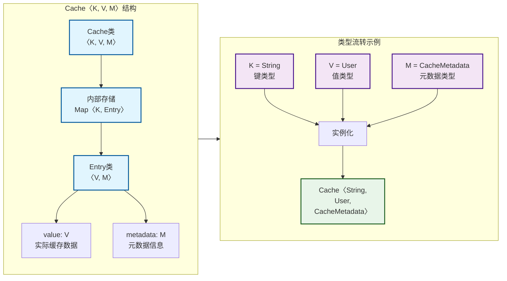

### 内部使用

类型参数在类内部的使用非常灵活，几乎可以出现在任何需要类型声明的地方。这种灵活性使得泛型类能够构建出高度抽象且类型安全的组件。

**属性与字段**：类型参数可以直接用于声明属性，包括可变属性和只读属性。

```kotlin
class Repository<T>(
    private val dataSource: DataSource<T>  // 类型参数用于依赖注入
) {
    // 缓存属性 - 使用可空的 T
    private var cachedData: T? = null  
    
    // 集合属性 - 嵌套泛型
    private val history: MutableList<T> = mutableListOf()  
    
    // 延迟属性 - 与泛型结合
    private val defaultValue: T by lazy {  
        dataSource.getDefault()  // 返回类型必须是 T
    }
    
    fun fetch(): T {
        // 先检查缓存
        cachedData?.let { return it }  // 智能转换为非空 T
        
        // 从数据源获取
        val data: T = dataSource.load()  // 明确类型为 T
        
        // 更新缓存和历史
        cachedData = data
        history.add(data)  // MutableList<T>.add(T)
        
        return data
    }
    
    fun getHistory(): List<T> {  // 返回不可变列表
        return history.toList()  // List<T>
    }
}

// 数据源接口 - 也是泛型
interface DataSource<T> {
    fun load(): T
    fun getDefault(): T
}

// 具体实现
class StringDataSource : DataSource<String> {
    override fun load(): String = "Loaded data"
    override fun getDefault(): String = "Default value"
}

fun main() {
    val repo = Repository(StringDataSource())  // 推断为 Repository<String>
    
    val data: String = repo.fetch()  // 类型安全，无需转换
    println(data)
        
    val history: List<String> = repo.getHistory()
    println(history)
}
```

**嵌套类与内部类**：泛型类可以包含嵌套类，这些嵌套类既可以使用外部类的类型参数，也可以声明自己独立的类型参数。

```kotlin
class Tree<T>(val value: T) {  // 外部类的类型参数 T
    
    // 嵌套类 - 不能直接访问外部类的 T
    class StaticNode<U>(val data: U) {  // 独立的类型参数 U
        fun process(): U = data
    }
    
    // 内部类 - 可以访问外部类的 T
    inner class Node(val nodeValue: T) {  // 使用外部类的 T
        
        // 内部类也可以有自己的类型参数
        fun <R> transform(converter: (T) -> R): R {  
            // 函数级别的类型参数 R
            return converter(nodeValue)  // T 转换为 R
        }
        
        // 访问外部类的属性
        fun isRoot(): Boolean {
            return nodeValue == this@Tree.value  // 比较与外部 T 值
        }
    }
    
    // 使用内部类创建节点
    private val children = mutableListOf<Node>()
    
    fun addChild(childValue: T): Node {  // 参数类型是 T
        val node = Node(childValue)  // 创建内部类实例
        children.add(node)
        return node
    }
    
    // 遍历所有子节点
    fun getAllChildren(): List<T> {  // 返回 List<T>
        return children.map { it.nodeValue }  // 提取所有 T 类型的值
    }
}

fun main() {
    val tree = Tree<Int>(1)  // 根节点值为 1
    
    // 添加子节点
    val child1 = tree.addChild(2)
    val child2 = tree.addChild(3)
    
    // 内部类的方法
    println(child1.isRoot())  // 输出: false
    
    // 泛型函数调用
    val stringValue: String = child1.transform { "Number: $it" }
    println(stringValue)  // 输出: Number: 2
    
    // 获取所有子节点值
    val values: List<Int> = tree.getAllChildren()
    println(values)  // 输出: [2, 3]
    
    // 静态嵌套类 - 独立的类型参数
    val staticNode = Tree.StaticNode<String>("Independent")
    println(staticNode.process())  // 输出: Independent
}
```

**扩展函数**：泛型类可以为自己定义扩展函数，这些扩展函数同样可以使用类的类型参数。

```kotlin
class Stack<E> {  // 栈结构，E 代表 Element
    private val elements = mutableListOf<E>()  // 内部使用 List<E> 存储
    
    fun push(element: E) {  // 压栈
        elements.add(element)
    }
    
    fun pop(): E? {  // 出栈
        return if (elements.isEmpty()) null else elements.removeAt(elements.lastIndex)
    }
    
    fun peek(): E? {  // 查看栈顶
        return elements.lastOrNull()
    }
    
    fun size(): Int = elements.size
}

// 扩展函数 - 使用类的类型参数 E
fun <E> Stack<E>.pushAll(items: Collection<E>) {  
    // 需要重新声明类型参数 E
    items.forEach { push(it) }  // 每个 item 的类型是 E
}

// 扩展函数 - 带约束的类型参数
fun <E : Comparable<E>> Stack<E>.max(): E? {  
    // E 必须实现 Comparable 接口
    var maxElement: E? = null
    while (size() > 0) {
        val current = pop()!!  // 非空断言，因为 size > 0
        if (maxElement == null || current > maxElement) {
            maxElement = current
        }
    }
    return maxElement
}

fun main() {
    val stack = Stack<Int>()  // Int 栈
    stack.push(5)
    stack.push(3)
    
    // 使用扩展函数批量压栈
    stack.pushAll(listOf(8, 1, 9))  // Collection<Int>
    
    println("Stack size: ${stack.size()}")  // 输出: Stack size: 5
    
    // 查找最大值 - Int 实现了 Comparable
    val maxValue = stack.max()  
    println("Max value: $maxValue")  // 输出: Max value: 9
    
    // 注意：max() 会清空栈（因为实现中使用了 pop）
    println("After max, size: ${stack.size()}")  // 输出: After max, size: 0
}
```

类型参数在内部使用时，编译器会进行严格的类型检查。这意味着你不能将错误类型的值赋给 `T` 类型的变量，也不能在需要 `T` 的地方传入不兼容的类型。这种编译期保证是泛型最大的优势之一。

```kotlin
class Processor<T> {
    private var current: T? = null  // 可空的 T
    
    fun process(input: T): T {  // 输入和输出都是 T
        current = input  // 类型匹配，允许赋值
        
        // val wrong: String = input  // 编译错误！T 可能不是 String
        
        // 类型安全的操作
        val result: T = performOperation(input)  // 函数返回 T
        return result
    }
    
    private fun performOperation(data: T): T {
        // 这里只能执行对所有类型通用的操作
        println("Processing: $data")  // toString() 对所有类型可用
        return data  // 返回相同的值
    }
    
    // 类型参数用于泛型约束
    fun <R> convert(converter: (T?) -> R): R {  
        // 将 T? 转换为任意类型 R
        return converter(current)
    }
}

fun main() {
    val processor = Processor<Double>()  // T 是 Double
    
    val result: Double = processor.process(3.14)  // 输入输出都是 Double
    println(result)
    
    // processor.process("text")  // 编译错误！String 不是 Double
    
    // 类型转换
    val intValue: Int = processor.convert { it?.toInt() ?: 0 }
    println(intValue)  // 输出: 3
}
```

通过这些内部使用的示例，我们可以看到泛型类型参数的强大之处：它既保持了高度的抽象性和通用性，又通过编译期类型检查确保了代码的安全性。这种"在抽象中保持具体"的能力，正是泛型设计的精髓所在。

---

## 泛型函数

泛型不仅可以应用在类（Generic Class）上,还可以直接应用在函数层面。泛型函数（Generic Function）允许我们在不创建泛型类的情况下，针对单个函数进行类型参数化。这种机制在集合操作、工具方法和扩展函数中极为常见，它让代码复用性达到了极致。

### 函数类型参数

函数类型参数的声明方式与类类型参数类似，但作用域仅限于该函数内部。类型参数放置在函数名之后、参数列表之前的尖括号 `<>` 中。

```kotlin
// 最基础的泛型函数：交换两个变量的值
fun <T> swap(a: T, b: T): Pair<T, T> {
    // 返回一个 Pair，第一个元素是 b，第二个元素是 a
    return Pair(b, a)
}

// 使用示例
fun main() {
    val result1 = swap(10, 20)           // T 推断为 Int
    println(result1)                      // 输出: (20, 10)
    
    val result2 = swap("hello", "world") // T 推断为 String
    println(result2)                      // 输出: (world, hello)
    
    // 显式指定类型参数（通常不需要，编译器会自动推断）
    val result3 = swap<Double>(3.14, 2.71)
    println(result3)                      // 输出: (2.71, 3.14)
}
```

泛型函数的强大之处在于可以处理任意类型的数据，同时保持类型安全。编译器会在编译期检查类型匹配，避免运行时类型错误。

**多个类型参数的函数**

一个函数可以声明多个独立的类型参数，它们之间可以没有任何关系，也可以存在依赖关系：

```kotlin
// 定义一个将两个不同类型的值转换为 Pair 的函数
fun <A, B> makePair(first: A, second: B): Pair<A, B> {
    // 创建并返回一个包含两个不同类型元素的 Pair
    return Pair(first, second)
}

// 定义一个类型转换函数，将 A 类型转换为 B 类型
fun <A, B> convert(value: A, transformer: (A) -> B): B {
    // 调用传入的转换函数 transformer，将 A 类型的值转换为 B 类型
    return transformer(value)
}

// 使用示例
fun main() {
    // A=Int, B=String
    val pair = makePair(42, "answer")
    println(pair)  // 输出: (42, answer)
    
    // A=String, B=Int，将字符串长度作为转换结果
    val length = convert("Hello") { it.length }
    println(length)  // 输出: 5
    
    // A=Int, B=Double，将整数转换为浮点数
    val doubled = convert(10) { it.toDouble() * 2 }
    println(doubled)  // 输出: 20.0
}
```

### 类型推断

Kotlin 的类型推断系统（Type Inference）非常强大，在大多数情况下，我们无需显式指定泛型函数的类型参数。编译器会根据传入的实参类型自动推断出类型参数的具体类型。

**基于参数的类型推断**

```kotlin
// 泛型列表过滤函数
fun <T> filter(list: List<T>, predicate: (T) -> Boolean): List<T> {
    val result = mutableListOf<T>()  // 根据 T 创建可变列表
    for (element in list) {          // 遍历输入列表
        if (predicate(element)) {     // 如果元素满足谓词条件
            result.add(element)       // 添加到结果列表
        }
    }
    return result                     // 返回过滤后的列表
}

fun main() {
    val numbers = listOf(1, 2, 3, 4, 5, 6, 7, 8, 9, 10)
    
    // 编译器从 numbers 的类型 List<Int> 推断出 T = Int
    // 无需写成 filter<Int>(numbers) { ... }
    val evenNumbers = filter(numbers) { it % 2 == 0 }
    println(evenNumbers)  // 输出: [2, 4, 6, 8, 10]
    
    val strings = listOf("apple", "banana", "cherry", "date")
    // 编译器从 strings 的类型 List<String> 推断出 T = String
    val longWords = filter(strings) { it.length > 5 }
    println(longWords)  // 输出: [banana, cherry]
}
```

**基于返回值的类型推断**

当函数的返回值被赋值给一个具有明确类型的变量时，编译器也能反向推断类型参数：

```kotlin
// 创建一个包含单个元素的列表
fun <T> singletonList(element: T): List<T> {
    // 使用 listOf 创建只包含一个元素的不可变列表
    return listOf(element)
}

fun main() {
    // 从返回值的期望类型推断 T = String
    val names: List<String> = singletonList("Alice")
    
    // 也可以从传入参数推断
    val numbers = singletonList(42)  // T 推断为 Int
    
    // 如果推断不明确，可以显式指定
    val mixed = singletonList<Any>("text")  // 明确指定 T = Any
}
```

**类型推断的局限性**

尽管 Kotlin 的类型推断很强大，但在某些复杂场景下仍需显式指定类型：

```kotlin
fun <T> identity(value: T): T = value

fun main() {
    // 这种情况推断明确
    val str = identity("hello")  // T = String
    
    // 当传入 null 字面量时，编译器无法推断具体类型
    // val x = identity(null)  // ❌ 编译错误：类型推断失败
    
    // 需要显式指定类型参数
    val x = identity<String?>(null)  // ✅ T = String?
    
    // 或者通过上下文提供类型信息
    val y: Int? = identity(null)  // ✅ 从变量类型推断 T = Int?
}
```

### 类型参数约束

仅仅声明一个类型参数 `T` 意味着它可以是任何类型，这在某些场景下过于宽泛。类型参数约束（Type Parameter Constraints）允许我们限制类型参数必须满足特定条件，这样我们就能在函数体内安全地调用该类型的特定方法或访问特定属性。

**基本约束语法**

```kotlin
// 约束 T 必须是 Comparable<T> 的子类型
// 这样我们就能在函数内部使用 compareTo 方法
fun <T : Comparable<T>> max(a: T, b: T): T {
    // 因为 T 必须实现 Comparable<T>，所以可以调用 compareTo
    return if (a.compareTo(b) > 0) a else b
}

fun main() {
    println(max(10, 20))           // 输出: 20 (Int 实现了 Comparable<Int>)
    println(max("apple", "banana")) // 输出: banana (String 实现了 Comparable<String>)
    println(max(3.14, 2.71))       // 输出: 3.14 (Double 实现了 Comparable<Double>)
    
    // ❌ 以下代码无法编译，因为自定义类没有实现 Comparable
    // data class Person(val name: String)
    // println(max(Person("Alice"), Person("Bob")))
}
```

约束的语法是 `<T : UpperBound>`，其中 `UpperBound` 被称为上界（Upper Bound）。这表示类型参数 `T` 必须是 `UpperBound` 的子类型。

**约束的实际应用场景**

```kotlin
// 约束 T 必须是 Number 的子类，这样可以安全地进行数值操作
fun <T : Number> sum(numbers: List<T>): Double {
    var total = 0.0  // 累加器，使用 Double 避免精度损失
    for (number in numbers) {
        // Number 类提供了 toDouble() 方法，将任意数值类型转换为 Double
        total += number.toDouble()
    }
    return total
}

fun main() {
    val integers = listOf(1, 2, 3, 4, 5)
    println(sum(integers))  // 输出: 15.0
    
    val doubles = listOf(1.5, 2.5, 3.5)
    println(sum(doubles))  // 输出: 7.5
    
    val mixed: List<Number> = listOf(1, 2.5, 3L, 4.5f)
    println(sum(mixed))  // 输出: 11.0
}
```

**可空类型约束**

默认情况下，类型参数的上界是 `Any?`，这意味着它可以接受可空类型。如果需要约束类型参数为非空类型，可以显式指定上界为 `Any`：

```kotlin
// T 默认上界是 Any?，可以接受可空类型
fun <T> printHashCode(value: T) {
    // value 可能为 null，需要使用安全调用
    println(value?.hashCode())
}

// 显式约束 T 必须是非空类型
fun <T : Any> printHashCodeNonNull(value: T) {
    // value 保证不为 null，可以直接调用方法
    println(value.hashCode())
}

fun main() {
    printHashCode(null)           // 输出: null
    printHashCode("hello")        // 输出: 99162322
    
    // printHashCodeNonNull(null) // ❌ 编译错误：类型不匹配
    printHashCodeNonNull("hello") // 输出: 99162322
}
```

下面用 Mermaid 图展示类型参数约束的层级关系：

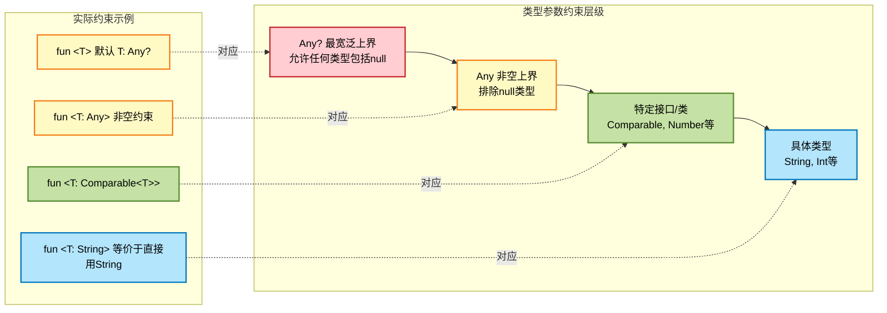

## 类型参数约束

在上一节中我们初步了解了类型参数约束的基本概念和单一上界的用法。实际开发中，我们经常需要更复杂的约束机制，例如要求一个类型同时实现多个接口，或者需要更精细的类型控制。Kotlin 为此提供了完善的多重约束语法。

### 上界约束

上界约束（Upper Bound Constraint）是泛型约束的基础形式，它规定了类型参数必须是某个特定类型的子类型。我们已经见过 `<T : Comparable<T>>` 这样的单一上界约束，现在深入探讨其工作机制和最佳实践。

**上界约束的语义**

当我们写下 `<T : UpperBound>` 时，实际上是在声明一个类型契约（Type Contract）：

```kotlin
// 上界约束示例：T 必须是 CharSequence 的子类型
fun <T : CharSequence> printLength(text: T) {
    // 因为 T 继承自 CharSequence，所以可以安全访问 length 属性
    println("Length: ${text.length}")
    
    // CharSequence 的所有成员都可以使用
    println("First char: ${text.firstOrNull()}")
    println("Substring: ${text.subSequence(0, minOf(3, text.length))}")
}

fun main() {
    printLength("Hello")              // String 实现了 CharSequence
    printLength(StringBuilder("Hi"))  // StringBuilder 实现了 CharSequence
    
    // ❌ 以下代码无法编译
    // printLength(123)  // Int 不是 CharSequence 的子类型
}
```

**多态与上界约束的结合**

上界约束让泛型函数能够利用多态特性，在编译期保证类型安全的同时，享受运行时多态带来的灵活性：

```kotlin
// 定义一个图形接口
interface Shape {
    fun area(): Double  // 计算面积
}

// 圆形实现
class Circle(val radius: Double) : Shape {
    override fun area() = Math.PI * radius * radius
}

// 矩形实现
class Rectangle(val width: Double, val height: Double) : Shape {
    override fun area() = width * height
}

// 泛型函数：计算形状列表的总面积
// T 必须是 Shape 的子类型，这样才能调用 area() 方法
fun <T : Shape> totalArea(shapes: List<T>): Double {
    var sum = 0.0                    // 初始化累加器
    for (shape in shapes) {          // 遍历所有图形
        sum += shape.area()          // 调用 area() 方法（多态调用）
    }
    return sum
}

fun main() {
    val circles = listOf(
        Circle(5.0),
        Circle(3.0)
    )
    println("Total area of circles: ${totalArea(circles)}")
    // 输出: Total area of circles: 100.53096491487338
    
    val rectangles = listOf(
        Rectangle(4.0, 5.0),
        Rectangle(3.0, 6.0)
    )
    println("Total area of rectangles: ${totalArea(rectangles)}")
    // 输出: Total area of rectangles: 38.0
    
    // 混合类型列表（使用 Shape 作为公共父类型）
    val mixedShapes: List<Shape> = listOf(
        Circle(2.0),
        Rectangle(3.0, 4.0)
    )
    println("Total area of mixed shapes: ${totalArea(mixedShapes)}")
    // 输出: Total area of mixed shapes: 24.566370614359172
}
```

**递归类型约束**

上界约束可以引用类型参数本身，这在实现 Fluent API 或构建器模式时特别有用：

```kotlin
// 递归类型约束：T 必须是 Comparable<T>
// 这保证了 T 类型的对象可以与同类型的其他对象进行比较
fun <T : Comparable<T>> findMin(values: List<T>): T? {
    if (values.isEmpty()) return null  // 空列表返回 null
    
    var min = values[0]               // 假设第一个元素是最小值
    for (i in 1 until values.size) {  // 从第二个元素开始遍历
        if (values[i] < min) {        // 使用 compareTo 进行比较（操作符重载）
            min = values[i]            // 更新最小值
        }
    }
    return min
}

fun main() {
    println(findMin(listOf(5, 2, 8, 1, 9)))  // 输出: 1
    println(findMin(listOf("zebra", "apple", "mango")))  // 输出: apple
    
    // 自定义类型，只要实现了 Comparable 就可以使用
    data class Person(val name: String, val age: Int) : Comparable<Person> {
        override fun compareTo(other: Person): Int = age.compareTo(other.age)
    }
    
    val people = listOf(
        Person("Alice", 30),
        Person("Bob", 25),
        Person("Charlie", 35)
    )
    println(findMin(people))  // 输出: Person(name=Bob, age=25)
}
```

### 多个约束where

当一个类型参数需要同时满足多个条件时，单一上界约束就不够用了。Kotlin 提供了 `where` 子句来表达多重约束（Multiple Constraints），这是泛型系统中非常强大的特性。

**where 子句的基本语法**

```kotlin
// 要求 T 同时实现 CharSequence 和 Comparable<T>
fun <T> processText(text: T)
    where T : CharSequence,
          T : Comparable<T> {
    
    // 可以使用 CharSequence 的成员
    println("Length: ${text.length}")
    println("First 3 chars: ${text.take(3)}")
    
    // 可以使用 Comparable 的成员
    val comparison = text.compareTo(text)
    println("Compare with itself: $comparison")
}

fun main() {
    // String 同时实现了 CharSequence 和 Comparable<String>
    processText("Hello Kotlin")
    
    // ❌ StringBuilder 实现了 CharSequence 但没有实现 Comparable
    // processText(StringBuilder("Hi"))  // 编译错误
}
```

**实际应用：可序列化的可比较类型**

```kotlin
import java.io.Serializable

// 泛型函数：存储并排序数据
// T 必须同时满足：可序列化 + 可比较
fun <T> storeAndSort(items: List<T>): List<T>
    where T : Serializable,
          T : Comparable<T> {
    
    // 因为 T 是 Serializable，理论上可以持久化（这里简化处理）
    println("Storing ${items.size} items...")
    
    // 因为 T 是 Comparable，可以进行排序
    return items.sorted()  // sorted() 要求元素实现 Comparable
}

fun main() {
    // String 实现了 Serializable 和 Comparable<String>
    val words = listOf("zebra", "apple", "mango", "banana")
    val sorted = storeAndSort(words)
    println(sorted)  // 输出: [apple, banana, mango, zebra]
    
    // Int 也同时实现了这两个接口
    val numbers = listOf(5, 2, 8, 1, 9)
    val sortedNumbers = storeAndSort(numbers)
    println(sortedNumbers)  // 输出: [1, 2, 5, 8, 9]
}
```

**复杂约束示例：泛型构建器模式**

在构建 DSL（Domain Specific Language）或 Fluent API 时，多重约束能够提供更强的类型安全性：

```kotlin
// 定义基础接口
interface Drawable {
    fun draw()
}

interface Clickable {
    fun onClick(handler: () -> Unit)
}

// 自定义类型必须同时实现 Drawable 和 Clickable
class Button : Drawable, Clickable {
    private var clickHandler: (() -> Unit)? = null
    
    override fun draw() {
        println("Drawing a button")
    }
    
    override fun onClick(handler: () -> Unit) {
        clickHandler = handler
    }
    
    fun performClick() {
        println("Button clicked!")
        clickHandler?.invoke()
    }
}

// 泛型函数：配置可绘制且可点击的组件
fun <T> setupComponent(component: T, config: T.() -> Unit): T
    where T : Drawable,
          T : Clickable {
    
    component.draw()        // 调用 Drawable 接口的方法
    component.config()      // 执行配置代码块
    return component
}

fun main() {
    val button = setupComponent(Button()) {
        // 在配置块中，this 是 Button 实例
        // 可以调用 Drawable 和 Clickable 的所有方法
        onClick {
            println("Button action executed!")
        }
    }
    
    button.performClick()
    // 输出:
    // Drawing a button
    // Button clicked!
    // Button action executed!
}
```

**where 子句与多个类型参数**

`where` 子句不仅可以约束单个类型参数，还能同时约束多个类型参数：

```kotlin
// K 和 V 都有各自的约束
fun <K, V> processMap(map: Map<K, V>)
    where K : Comparable<K>,
          V : Number {
    
    // 可以对 Key 进行排序（因为 K 实现了 Comparable）
    val sortedKeys = map.keys.sorted()
    println("Sorted keys: $sortedKeys")
    
    // 可以对 Value 进行数值计算（因为 V 是 Number 的子类型）
    val sum = map.values.sumOf { it.toDouble() }
    println("Sum of values: $sum")
}

fun main() {
    val scoreMap = mapOf(
        "Alice" to 95,
        "Bob" to 87,
        "Charlie" to 92
    )
    
    processMap(scoreMap)
    // 输出:
    // Sorted keys: [Alice, Bob, Charlie]
    // Sum of values: 274.0
}
```

下面用 Mermaid 图展示多重约束的工作机制：

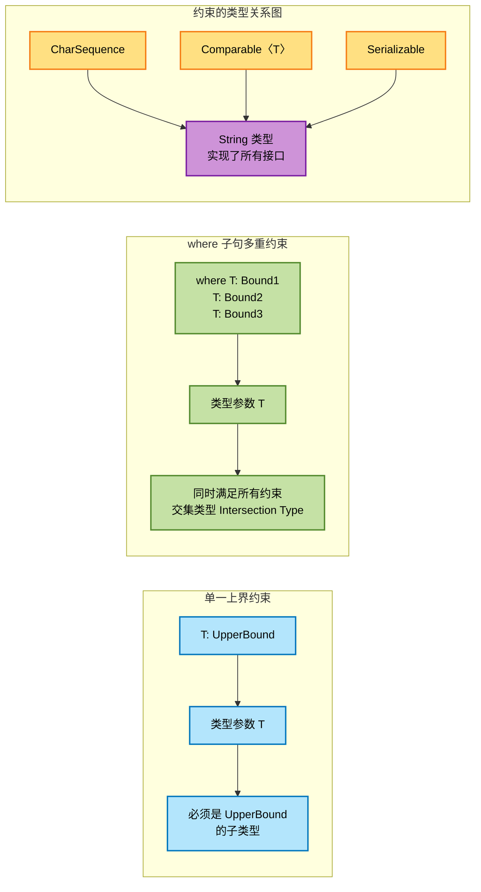

**约束与型变的交互**

类型参数约束还会与型变（Variance）产生交互作用，这在后续章节中会详细探讨。这里先给出一个预告性的示例：

```kotlin
// 协变类型参数 out T，同时有上界约束
interface Producer<out T : Number> {
    fun produce(): T  // 只能生产 T，不能消费
}

// 具体实现
class IntProducer(private val value: Int) : Producer<Int> {
    override fun produce(): Int = value
}

class DoubleProducer(private val value: Double) : Producer<Double> {
    override fun produce(): Double = value
}

// 泛型函数：处理任意 Number 子类型的生产者
fun processProducer(producer: Producer<Number>) {
    val value = producer.produce()
    println("Produced value: $value (${value::class.simpleName})")
}

fun main() {
    // 由于 Producer 是协变的（out T），可以将 Producer<Int> 赋值给 Producer<Number>
    processProducer(IntProducer(42))       // 输出: Produced value: 42 (Int)
    processProducer(DoubleProducer(3.14))  // 输出: Produced value: 3.14 (Double)
}
```

---

**📝 练习题 1**

以下代码能否编译通过？如果不能，应该如何修改？

```kotlin
fun <T : Comparable<T>> sortAndFilter(items: List<T>, threshold: T): List<T> {
    return items.filter { it > threshold }.sorted()
}

fun main() {
    val numbers = listOf(1, 5, 3, 8, 2, 9, 4)
    println(sortAndFilter(numbers, 5))
}
```

A. 可以编译通过，输出 [8, 9]  
B. 不能编译，因为 Comparable 不支持 > 操作符  
C. 不能编译，因为 sorted() 方法不适用于泛型类型  
D. 可以编译通过，但运行时会抛出异常  

**【答案】** A

**【解析】** 这段代码完全合法且能正常工作。约束 `T : Comparable<T>` 确保了类型 `T` 实现了 `Comparable` 接口，而 Kotlin 为 `Comparable` 类型重载了比较操作符（`>`, `<`, `>=`, `<=`），因此 `it > threshold` 是合法的。同时，`sorted()` 方法内部调用的正是 `compareTo` 方法，所以也能正常工作。程序会输出 `[8, 9]`，即所有大于 5 的元素按升序排列。

---

**📝 练习题 2**

以下哪个函数声明是非法的或者不推荐的？

A. `fun <T : Any?> process(value: T)`  
B. `fun <T : Number> sum(values: List<T>) where T : Comparable<T>`  
C. `fun <T> create(): T where T : String`  
D. `fun <T> convert(value: T) where T : CharSequence, T : Appendable`  

**【答案】** C

**【解析】** 选项 C 的约束 `where T : String` 实际上将类型参数完全固定为 `String` 类型，这失去了泛型的意义。如果明确知道类型就是 `String`，应该直接使用 `String` 而不是泛型。正确的做法是：`fun create(): String`。选项 A 虽然显式写出了默认上界 `Any?`（通常省略不写），但语法上合法。选项 B 合法，`Number` 和 `Comparable<T>` 可以同时约束（如 `Int`、`Double` 等类型同时满足）。选项 D 合法，要求类型同时实现 `CharSequence` 和 `Appendable`（如 `StringBuilder` 满足此条件）。

---

## 型变 (Variance)

型变 (Variance) 是泛型系统中用于描述类型参数之间关系如何影响泛型类型之间关系的核心概念。理解型变对于掌握 Kotlin 类型系统的安全性和灵活性至关重要。

在深入讨论之前，我们需要先理解一个基本问题：**当 `Cat` 是 `Animal` 的子类型时，`List<Cat>` 和 `List<Animal>` 之间是什么关系？** 这个看似简单的问题，实际上涉及到类型系统设计的核心权衡。

### 不变性 (Invariance)

不变性 (Invariance) 是最严格、最安全的型变规则。在不变的泛型类型中，即使 `A` 是 `B` 的子类型，`Container<A>` 和 `Container<B>` 之间也**没有任何继承关系**，它们是完全独立的两个类型。

```kotlin
// 定义一个不变的泛型类
class Box<T>(var item: T) {  // T 没有任何型变修饰符，默认是不变的
    fun get(): T = item       // 可以读取
    fun set(value: T) {       // 也可以写入
        item = value
    }
}

// 类型层次
open class Animal(val name: String)
class Cat(name: String) : Animal(name)
class Dog(name: String) : Animal(name)

fun demonstrateInvariance() {
    val catBox: Box<Cat> = Box(Cat("Kitty"))
    val animalBox: Box<Animal> = Box(Animal("Generic"))
    
    // ❌ 编译错误！即使 Cat 是 Animal 的子类型
    // Box<Cat> 和 Box<Animal> 之间没有继承关系
    // val boxRef: Box<Animal> = catBox  // Type mismatch
    
    // 为什么不允许？假设允许的话：
    // boxRef.set(Dog("Buddy"))  // 尝试放入 Dog
    // val cat: Cat = catBox.get()  // 实际取出的是 Dog，类型不安全！
}
```

不变性之所以如此严格，是因为泛型类型**既能读取又能写入**。如果允许 `Box<Cat>` 赋值给 `Box<Animal>`，那么通过 `Box<Animal>` 引用就可以放入 `Dog` 对象，从而破坏 `Box<Cat>` 的类型安全性。

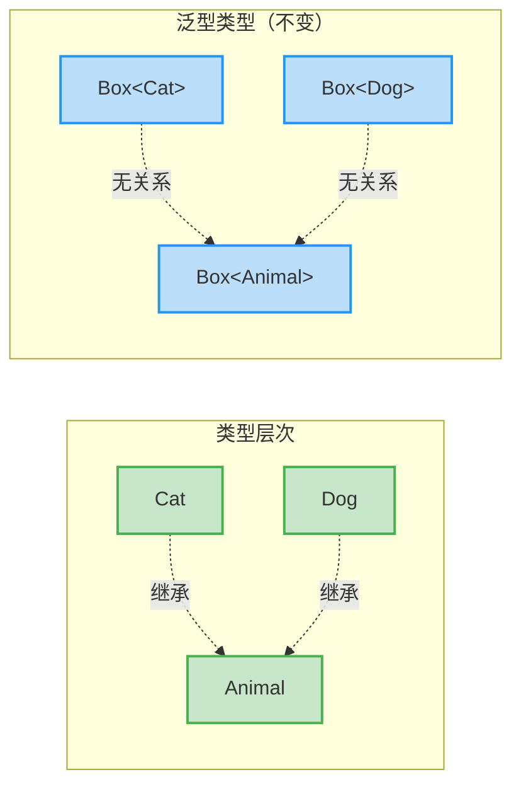

### 协变性 (Covariance)

协变性 (Covariance) 保持了类型参数的继承方向。如果 `Cat` 是 `Animal` 的子类型，那么在协变的泛型类型中，`Producer<Cat>` 也是 `Producer<Animal>` 的子类型。

协变的关键限制是：**类型参数只能出现在输出位置 (out position)**，即只能被生产/读取，不能被消费/写入。这保证了类型安全性。

```kotlin
// 协变的生产者接口（只输出，不输入）
interface Producer<out T> {  // out 关键字声明 T 是协变的
    fun produce(): T         // ✅ T 在输出位置（返回值）
    // fun consume(item: T)  // ❌ 编译错误！T 不能在输入位置（参数）
}

// 具体实现
class AnimalProducer : Producer<Animal> {
    override fun produce(): Animal = Animal("Generic Animal")
}

class CatProducer : Producer<Cat> {
    override fun produce(): Cat = Cat("Meow")
}

fun demonstrateCovariance() {
    val catProducer: Producer<Cat> = CatProducer()
    
    // ✅ 协变允许：Producer<Cat> 可以赋值给 Producer<Animal>
    // 因为只要能生产 Cat，就一定能生产 Animal（Cat 是 Animal 的子类）
    val animalProducer: Producer<Animal> = catProducer
    
    val animal: Animal = animalProducer.produce()  // 安全：返回的一定是 Animal（实际是 Cat）
    
    // 为什么安全？因为不能写入：
    // animalProducer.consume(Dog("Buddy"))  // 这个方法根本不存在！
}
```

协变的典型例子是 Kotlin 的只读列表 `List<out E>`：

```kotlin
fun covariantListExample() {
    val cats: List<Cat> = listOf(Cat("Whiskers"), Cat("Shadow"))
    
    // ✅ List 是协变的，List<Cat> 是 List<Animal> 的子类型
    val animals: List<Animal> = cats
    
    // 安全读取：取出的元素一定是 Animal（实际是 Cat）
    val firstAnimal: Animal = animals[0]
    
    // 为什么安全？List 是只读的，不能修改：
    // animals.add(Dog("Rex"))  // ❌ List 没有 add 方法
}
```

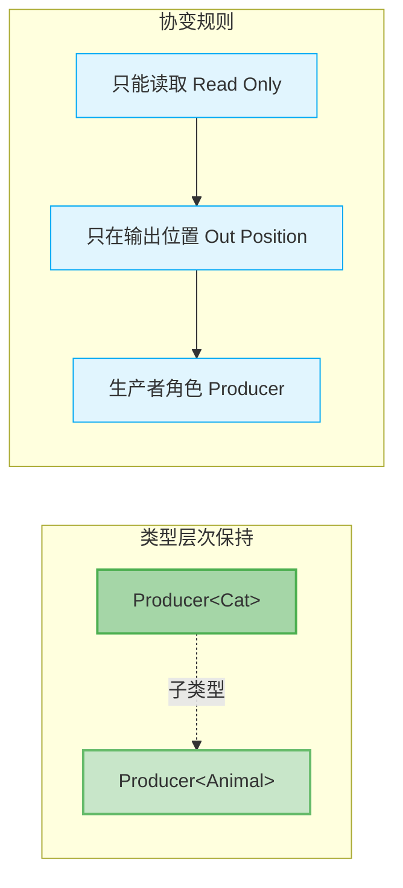

### 逆变性 (Contravariance)

逆变性 (Contravariance) **反转了类型参数的继承方向**。如果 `Cat` 是 `Animal` 的子类型，那么在逆变的泛型类型中，`Consumer<Animal>` 反而是 `Consumer<Cat>` 的子类型。

逆变的关键限制是：**类型参数只能出现在输入位置 (in position)**，即只能被消费/写入，不能被生产/读取。

```kotlin
// 逆变的消费者接口（只输入，不输出）
interface Consumer<in T> {   // in 关键字声明 T 是逆变的
    fun consume(item: T)      // ✅ T 在输入位置（参数）
    // fun produce(): T       // ❌ 编译错误！T 不能在输出位置（返回值）
}

// 具体实现
class AnimalConsumer : Consumer<Animal> {
    override fun consume(item: Animal) {
        println("消费动物: ${item.name}")
    }
}

class CatConsumer : Consumer<Cat> {
    override fun consume(item: Cat) {
        println("消费猫咪: ${item.name}")
    }
}

fun demonstrateContravariance() {
    val animalConsumer: Consumer<Animal> = AnimalConsumer()
    
    // ✅ 逆变允许：Consumer<Animal> 可以赋值给 Consumer<Cat>
    // 因为能消费 Animal 的，一定能消费 Cat（Cat 是 Animal）
    val catConsumer: Consumer<Cat> = animalConsumer
    
    // 安全写入：传入 Cat，AnimalConsumer 能处理任何 Animal
    catConsumer.consume(Cat("Fluffy"))
    
    // 为什么安全？不能读取：
    // val cat: Cat = catConsumer.produce()  // 这个方法根本不存在！
}
```

逆变的经典例子是比较器 `Comparator<in T>`：

```kotlin
fun contravariantComparatorExample() {
    // 一个通用的 Animal 比较器（按名字比较）
    val animalComparator = Comparator<Animal> { a1, a2 -> 
        a1.name.compareTo(a2.name)
    }
    
    val cats = listOf(Cat("Zara"), Cat("Alice"), Cat("Bob"))
    
    // ✅ Comparator<Animal> 可以用于排序 List<Cat>
    // 因为能比较 Animal 的，一定能比较 Cat
    val sortedCats = cats.sortedWith(animalComparator)
    
    sortedCats.forEach { println(it.name) }  // 输出: Alice, Bob, Zara
}
```

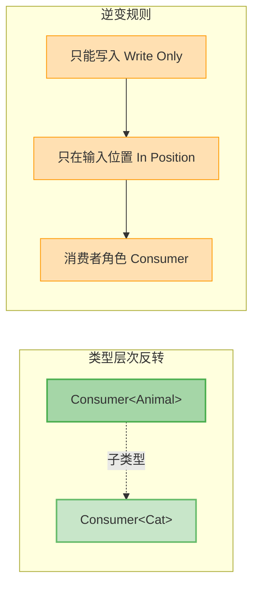

### 型变对比总结

理解三种型变的本质区别，需要从**读写权限**和**类型关系**两个维度来看：

```kotlin
// 对比三种型变
fun varianceComparison() {
    // 1. 不变 (Invariant)：既能读又能写
    val invariantBox: Box<Cat> = Box(Cat("Kitty"))
    invariantBox.set(Cat("New Cat"))  // ✅ 可写
    val cat1: Cat = invariantBox.get()  // ✅ 可读
    // val animalBox: Box<Animal> = invariantBox  // ❌ 无继承关系
    
    // 2. 协变 (Covariant)：只能读
    val covariantProducer: Producer<Cat> = CatProducer()
    val animal: Animal = covariantProducer.produce()  // ✅ 可读
    // covariantProducer.consume(Cat("New"))  // ❌ 不存在写入方法
    val animalProducer: Producer<Animal> = covariantProducer  // ✅ 有继承关系（正向）
    
    // 3. 逆变 (Contravariant)：只能写
    val contravariantConsumer: Consumer<Animal> = AnimalConsumer()
    contravariantConsumer.consume(Cat("Fluffy"))  // ✅ 可写
    // val result = contravariantConsumer.produce()  // ❌ 不存在读取方法
    val catConsumer: Consumer<Cat> = contravariantConsumer  // ✅ 有继承关系（反向）
}
```

型变特性对照表：

| 型变类型 | 声明方式 | 位置限制 | 继承关系 | 典型用途 | 记忆口诀 |
|---------|---------|---------|---------|---------|---------|
| **不变** Invariant | `<T>` | 读写均可 | 无关系 | 可变容器 | 进出自由，关系独立 |
| **协变** Covariant | `<out T>` | 只能读取 (输出) | 保持方向 | 只读容器、生产者 | 只出不进，保持关系 |
| **逆变** Contravariant | `<in T>` | 只能写入 (输入) | 反转方向 | 消费者、比较器 | 只进不出，反转关系 |

---

## 声明处型变 (Declaration-site Variance)

Kotlin 采用**声明处型变** (Declaration-site Variance) 机制，这是 Kotlin 相比 Java 的一个重大改进。在 Java 中，型变是在**使用处**通过通配符 `? extends` 和 `? super` 来指定的，而 Kotlin 允许在**类型定义处**直接声明型变，使得代码更简洁、更安全。

### out 协变 (Covariant Out)

`out` 修饰符用于声明协变的类型参数。当一个类型参数被声明为 `out T` 时，表示这个类**只生产 (produce)** `T` 类型的值，不消费它。

```kotlin
// 声明处协变：在类定义时就指定 T 是协变的
interface Source<out T> {  // out 关键字使 T 协变
    fun nextItem(): T      // ✅ T 在输出位置（返回值）
    
    // fun addItem(item: T)  // ❌ 编译错误！
    // Error: Type parameter T is declared as 'out' but occurs in 'in' position
}

// 实现协变接口
class StringSource : Source<String> {
    private var count = 0
    
    override fun nextItem(): String {
        return "Item ${++count}"
    }
}

class NumberSource : Source<Number> {
    private var value = 0.0
    
    override fun nextItem(): Number {
        return value++
    }
}

fun useCovariantSource() {
    val stringSource: Source<String> = StringSource()
    
    // ✅ 协变允许向上转型
    val anySource: Source<Any> = stringSource
    
    val item: Any = anySource.nextItem()  // 安全：返回的是 String，属于 Any
    println(item)
}
```

协变在只读集合中的应用是最经典的例子。Kotlin 标准库中的 `List<out E>` 就是协变的：

```kotlin
// Kotlin 标准库中的 List 接口（简化版）
public interface List<out E> : Collection<E> {
    override val size: Int
    override fun isEmpty(): Boolean
    override fun contains(element: @UnsafeVariance E): Boolean  // 特殊处理
    override fun iterator(): Iterator<E>
    
    public operator fun get(index: Int): E  // ✅ E 在输出位置
    public fun indexOf(element: @UnsafeVariance E): Int  // 特殊处理
    
    // 注意：没有 add(element: E) 方法
    // 因为 E 是协变的，不能在输入位置
}

fun covariantListUsage() {
    // 创建一个 String 列表
    val strings: List<String> = listOf("Kotlin", "Java", "Scala")
    
    // ✅ List<String> 是 List<Any> 的子类型
    val objects: List<Any> = strings
    
    // 安全读取
    val firstObject: Any = objects[0]  // 返回 "Kotlin"
    
    // 无法修改（List 是只读的）
    // objects.add("Python")  // ❌ Unresolved reference: add
}
```

### in 逆变 (Contravariant In)

`in` 修饰符用于声明逆变的类型参数。当一个类型参数被声明为 `in T` 时，表示这个类**只消费 (consume)** `T` 类型的值，不生产它。

```kotlin
// 声明处逆变：在类定义时就指定 T 是逆变的
interface Sink<in T> {     // in 关键字使 T 逆变
    fun addItem(item: T)   // ✅ T 在输入位置（参数）
    
    // fun getItem(): T    // ❌ 编译错误！
    // Error: Type parameter T is declared as 'in' but occurs in 'out' position
}

// 实现逆变接口
class AnySink : Sink<Any> {
    private val items = mutableListOf<Any>()
    
    override fun addItem(item: Any) {
        items.add(item)
        println("Added: $item")
    }
}

fun useContravariantSink() {
    val anySink: Sink<Any> = AnySink()
    
    // ✅ 逆变允许向下转型（反向）
    val stringSink: Sink<String> = anySink
    
    // 安全写入：传入 String，AnySink 能处理任何 Any
    stringSink.addItem("Hello")
    stringSink.addItem("World")
    
    // 无法读取
    // val item: String = stringSink.getItem()  // ❌ 方法不存在
}
```

逆变在比较器、事件处理器等场景中非常有用：

```kotlin
// Kotlin 标准库中的 Comparator（简化版）
public fun interface Comparator<in T> {  // T 是逆变的
    public fun compare(a: T, b: T): Int  // ✅ T 在输入位置
}

fun contravariantComparator() {
    // 为所有 Number 定义比较器
    val numberComparator = Comparator<Number> { a, b ->
        a.toDouble().compareTo(b.toDouble())
    }
    
    val integers = listOf(5, 2, 8, 1, 9)
    
    // ✅ Comparator<Number> 可以用于 List<Int>
    // 因为 Int 是 Number，能比较 Number 就能比较 Int
    val sorted = integers.sortedWith(numberComparator)
    
    println(sorted)  // [1, 2, 5, 8, 9]
}
```

### 生产者消费者原则 (PECS - Producer Extends Consumer Super)

PECS 原则来源于 Java，是理解型变的核心准则：

- **Producer Extends (生产者用 Extends/Out)**：如果一个泛型类型只**生产**元素供你使用，应该使用**协变 (out)**
- **Consumer Super (消费者用 Super/In)**：如果一个泛型类型只**消费**你提供的元素，应该使用**逆变 (in)**

在 Kotlin 中，`extends` 对应 `out`，`super` 对应 `in`，所以可以记为 **POCS** 原则。

```kotlin
// PECS 原则示例
class DataProcessor {
    
    // 生产者：从 source 中读取数据
    // source 只生产元素，不消费 → 使用 out（协变）
    fun <T> copyFrom(source: Source<out T>): List<T> {
        val result = mutableListOf<T>()
        repeat(3) {
            result.add(source.nextItem())  // 只读取，不写入
        }
        return result
    }
    
    // 消费者：向 sink 中写入数据
    // sink 只消费元素，不生产 → 使用 in（逆变）
    fun <T> copyTo(items: List<T>, sink: Sink<in T>) {
        items.forEach { item ->
            sink.addItem(item)  // 只写入，不读取
        }
    }
    
    // 完整的复制操作
    fun <T> copy(source: Source<out T>, sink: Sink<in T>) {
        repeat(3) {
            val item = source.nextItem()  // 从 source 读取
            sink.addItem(item)            // 向 sink 写入
        }
    }
}

fun pecsExample() {
    val processor = DataProcessor()
    
    // 生产者示例：String 生产者可以赋值给 Any 生产者
    val stringSource: Source<String> = StringSource()
    val anySource: Source<Any> = stringSource  // ✅ 协变
    
    val items: List<Any> = processor.copyFrom(anySource)
    
    // 消费者示例：Any 消费者可以赋值给 String 消费者
    val anySink: Sink<Any> = AnySink()
    val stringSink: Sink<String> = anySink  // ✅ 逆变
    
    processor.copyTo(listOf("A", "B", "C"), stringSink)
    
    // 组合使用
    processor.copy(stringSource, anySink)
}
```

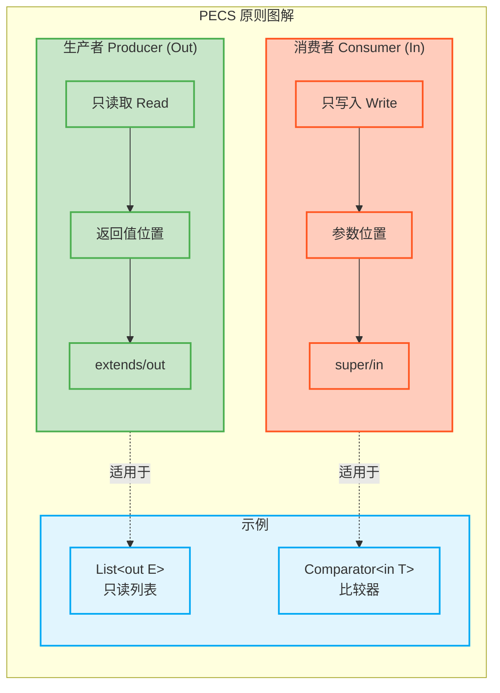

### 声明处型变的优势

Kotlin 的声明处型变相比 Java 的使用处型变有几个明显优势：

```kotlin
// Java 风格（使用处型变）
// List<? extends Animal> animals = catList;  // 每次使用都要声明
// void processList(List<? extends Animal> list) { }  // 每个方法都要写通配符

// Kotlin 风格（声明处型变）
interface ReadOnlyList<out E> {  // 一次声明，处处受益
    fun get(index: Int): E
    val size: Int
}

// 使用时无需再声明型变
fun processList(list: ReadOnlyList<Animal>) {  // 简洁明了
    // 可以传入 ReadOnlyList<Cat>
}

fun advantagesOfDeclarationSiteVariance() {
    val cats: ReadOnlyList<Cat> = object : ReadOnlyList<Cat> {
        override fun get(index: Int) = Cat("Cat $index")
        override val size = 10
    }
    
    // ✅ 直接传递，无需额外声明
    processList(cats)
    
    // Kotlin 的型变声明在类型定义处，使用处自动享受好处
    // Java 需要在每个使用点都写 ? extends Animal，容易遗漏且繁琐
}
```

**📝 练习题**

以下关于 Kotlin 型变的说法，哪个是**错误**的？

A. `List<out E>` 中的 `out` 使得 `List<String>` 可以赋值给 `List<Any>`  
B. `Comparator<in T>` 中的 `in` 使得 `Comparator<Number>` 可以赋值给 `Comparator<Int>`  
C. 声明为 `out T` 的类型参数不能出现在函数参数位置  
D. 声明为 `in T` 的类型参数不能出现在函数返回值位置，也不能出现在函数参数位置

**【答案】** D

**【解析】**  
选项 D 是错误的。`in T` 声明的逆变类型参数**可以**出现在函数参数位置（输入位置），这正是逆变的核心用途。逆变的限制是**不能**出现在返回值位置（输出位置）。

- **选项 A 正确**：`out` 声明协变，使 `List<String>` 成为 `List<Any>` 的子类型，因为 `String` 是 `Any` 的子类型，协变保持继承方向。
  
- **选项 B 正确**：`in` 声明逆变，使 `Comparator<Number>` 成为 `Comparator<Int>` 的子类型，因为 `Int` 是 `Number` 的子类型，逆变反转继承方向。

- **选项 C 正确**：`out T` 表示 T 只能在输出位置（返回值），不能在输入位置（参数），这是协变的安全性要求。

- **选项 D 错误**：`in T` 恰恰是**允许**出现在参数位置的（这是它的主要用途），只是**禁止**出现在返回值位置。例如 `Sink<in T>` 的 `addItem(item: T)` 方法中，`T` 就在参数位置。

---

## 使用处型变 (Use-site Variance)

在前面我们学习了声明处型变 (declaration-site variance)，即在类定义时就通过 `out` 和 `in` 关键字声明类型参数的型变行为。但有时我们需要在使用类型时才决定型变策略，这就是**使用处型变**的用武之地。

### 类型投影的本质

类型投影 (Type Projection) 是 Kotlin 提供的一种灵活机制，允许我们在使用泛型类型时临时改变其型变属性。这在处理那些声明为不变 (invariant) 但我们只需要部分操作的场景中特别有用。

想象这样一个场景：我们有一个接受 `MutableList<Animal>` 的函数，但我们只想从中读取元素而不修改它。此时我们希望传入 `MutableList<Cat>` 也是安全的，因为只读操作不会破坏类型安全。使用处型变正是为此而生。

```kotlin
// MutableList 声明为不变类型
// class MutableList<T> { ... }

// 使用处协变投影 - 只能读取，不能写入
fun printAnimals(animals: MutableList<out Animal>) {
    // ✅ 允许：读取操作，返回 Animal 类型
    for (animal in animals) {
        println(animal.name)
    }
    
    // ❌ 禁止：写入操作会导致编译错误
    // animals.add(Dog("Buddy")) // Error: Out-projected type prohibits the use of 'add'
}

// 现在可以传入子类型的 MutableList
val cats: MutableList<Cat> = mutableListOf(Cat("Whiskers"))
printAnimals(cats) // ✅ 类型安全
```

在上述代码中，`MutableList<out Animal>` 是一个类型投影。`out` 关键字告诉编译器：

1. **生产者角色**：这个 `MutableList` 只能作为 Animal 的生产者（只读）
2. **协变行为**：`MutableList<Cat>` 可以赋值给 `MutableList<out Animal>`
3. **操作限制**：所有会写入 T 类型参数的方法都被禁用

### 使用处逆变投影

与协变投影相对应，使用处也支持逆变投影 (contravariant projection)，用于只写入不读取的场景：

```kotlin
// 使用处逆变投影 - 只能写入，不能读取
fun addCats(destination: MutableList<in Cat>) {
    // ✅ 允许：写入 Cat 或其子类
    destination.add(Cat("Mittens"))
    destination.add(PersianCat("Fluffy")) // PersianCat extends Cat
    
    // ❌ 禁止：读取操作返回类型不确定
    // val cat: Cat = destination[0] // Error: Type mismatch
    // 只能读取为 Any?
    val item: Any? = destination[0] // ✅ 但实际用处不大
}

// 可以传入父类型的 MutableList
val animals: MutableList<Animal> = mutableListOf()
addCats(animals) // ✅ 安全：Cat 是 Animal 的子类
```

这里 `MutableList<in Cat>` 的含义是：

1. **消费者角色**：这个 `MutableList` 作为 Cat 的消费者（只写）
2. **逆变行为**：`MutableList<Animal>` 可以赋值给 `MutableList<in Cat>`
3. **类型下界**：可以安全地添加 Cat 或其子类型

### 类型投影的语法规则

Kotlin 提供了两种型变投影语法，它们在使用处临时改变类型参数的型变属性：

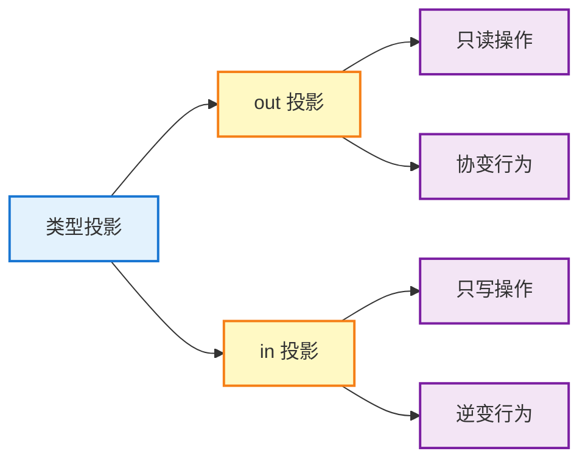

完整的语法对比：

```kotlin
// 声明处型变 vs 使用处型变

// 1️⃣ 声明处协变（类定义时决定）
class Producer<out T>(private val value: T) {
    fun get(): T = value
    // fun set(value: T) {} // ❌ 编译错误：out 位置不允许
}

// 使用时无需额外标注
val producer: Producer<Cat> = Producer(Cat("Tom"))
val animalProducer: Producer<Animal> = producer // ✅ 自动协变

// 2️⃣ 使用处协变（使用时决定）
class Box<T>(private var value: T) {  // 不变类型
    fun get(): T = value
    fun set(value: T) { this.value = value }
}

// 使用时通过投影限制操作
fun processBox(box: Box<out Animal>) {
    val animal = box.get() // ✅ 可以读取
    // box.set(Dog("Max")) // ❌ 不能写入
}

val catBox: Box<Cat> = Box(Cat("Luna"))
processBox(catBox) // ✅ 使用处协变投影使其成为可能
```

### 投影的实际应用场景

**场景一：只读集合复制**

```kotlin
// 从任意 Animal 子类的列表复制到目标列表
fun <T : Animal> copyAnimals(
    from: List<out T>,        // 源：只读，接受子类型
    to: MutableList<in T>     // 目标：只写，接受父类型
) {
    // from 只能读取，保证不会修改源
    for (item in from) {
        to.add(item)  // to 只能写入 T 或其子类
    }
}

// 实际使用
val cats: List<Cat> = listOf(Cat("A"), Cat("B"))
val animals: MutableList<Animal> = mutableListOf()

copyAnimals(cats, animals) // ✅ 完美匹配
// cats 作为 List<out Cat> -> 可以读取
// animals 作为 MutableList<in Cat> -> 可以写入 Cat
```

**场景二：比较器的逆变应用**

```kotlin
// Comparator 的定义（简化版）
interface Comparator<in T> {
    fun compare(a: T, b: T): Int
}

// Animal 的比较器
val animalComparator = Comparator<Animal> { a, b ->
    a.name.compareTo(b.name)
}

// ✅ 可以用来比较 Cat（因为 Comparator<in T> 是逆变的）
val cats = listOf(Cat("Zoe"), Cat("Alex"))
val sortedCats = cats.sortedWith(animalComparator)

// 这是合理的：如果能比较所有 Animal，当然也能比较 Cat
```

### 投影的边界情况

使用处型变虽然灵活，但也有一些需要注意的边界情况：

```kotlin
// 1️⃣ 双重投影的限制
fun problematic(
    list: MutableList<out Animal> // 协变投影
) {
    // 想要再次投影为逆变？这是不允许的
    // val contravariantList: MutableList<in Cat> = list // ❌ 编译错误
    // 类型投影是单向的，不能重复改变方向
}

// 2️⃣ 空投影（什么都不能做）
fun useless(list: MutableList<*>) { // 星号投影，后续章节详解
    // 不能读取有意义的类型（只能读到 Any?）
    val item: Any? = list[0]
    
    // 也不能写入任何类型（除了 null）
    // list.add("anything") // ❌ 编译错误
    list.add(null) // ✅ 但几乎没用
}

// 3️⃣ 嵌套泛型的投影
fun nested(
    map: Map<String, out List<Animal>> // 外层不变，内层协变
) {
    val animals: List<Animal>? = map["pets"]
    // 可以读取 List<Animal> 或其子类型如 List<Cat>
}
```

### 声明处型变 vs 使用处型变对比

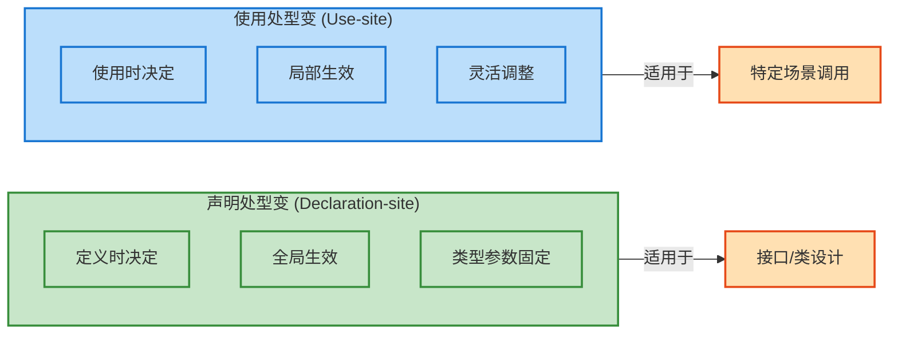

**选择指南：**

| 特性 | 声明处型变 | 使用处型变 |
|------|-----------|-----------|
| **决策时机** | 类型定义时 | 类型使用时 |
| **作用范围** | 所有使用场景 | 当前使用点 |
| **灵活性** | 固定，不可改变 | 灵活，按需调整 |
| **典型示例** | `List<out E>` | `Array<out T>` |
| **适用场景** | API 设计，明确角色 | 临时限制，特殊需求 |

```kotlin
// 实践建议：

// ✅ 优先使用声明处型变（如果你控制类型定义）
interface Source<out T> {  // 明确这是生产者
    fun produce(): T
}

// ✅ 使用处型变作为补充（处理外部不变类型）
fun processArray(array: Array<out Animal>) {
    // Array 本身是不变的，但我们只需要读取
}

// ❌ 避免混用导致混淆
class Confusing<out T> {  // 已经声明为协变
    // 使用处再投影没有意义
    fun bad(param: Confusing<out T>) { } // 冗余且令人困惑
}
```

---

## 型变实践 (Variance in Practice)

理论知识固然重要，但型变的真正威力体现在实际编程中。Kotlin 标准库的设计充分利用了型变特性，理解这些设计模式能帮助我们写出更安全、更优雅的代码。

### List 的协变设计

Kotlin 的 `List` 接口是声明处协变的经典案例。让我们深入分析其设计哲学：

```kotlin
// Kotlin 标准库中的 List 定义（简化版）
public interface List<out E> : Collection<E> {
    // ✅ 所有方法都是只读的，E 只出现在 out 位置
    override val size: Int
    override fun isEmpty(): Boolean
    override fun contains(element: @UnsafeVariance E): Boolean
    override fun iterator(): Iterator<E>
    
    // 索引访问也是只读的
    public operator fun get(index: Int): E
    public fun indexOf(element: @UnsafeVariance E): Int
}

// 得益于协变设计，我们可以自然地进行子类型转换
val cats: List<Cat> = listOf(
    Cat("Whiskers"),
    Cat("Mittens")
)

// ✅ 子类型列表可以赋值给父类型列表引用
val animals: List<Animal> = cats

// ✅ 可以安全地读取，类型为 Animal
for (animal in animals) {
    println(animal.makeSound())
}

// ✅ 传递给接受 List<Animal> 的函数
fun feedAnimals(animals: List<Animal>) {
    animals.forEach { it.eat() }
}

feedAnimals(cats) // 完全类型安全
```

**为什么 List 可以协变？**

协变的前提是类型参数只出现在"out 位置"（返回值位置）。`List` 是只读集合，所有操作都是返回元素或元素信息，不会修改内部状态，因此天然满足协变条件。

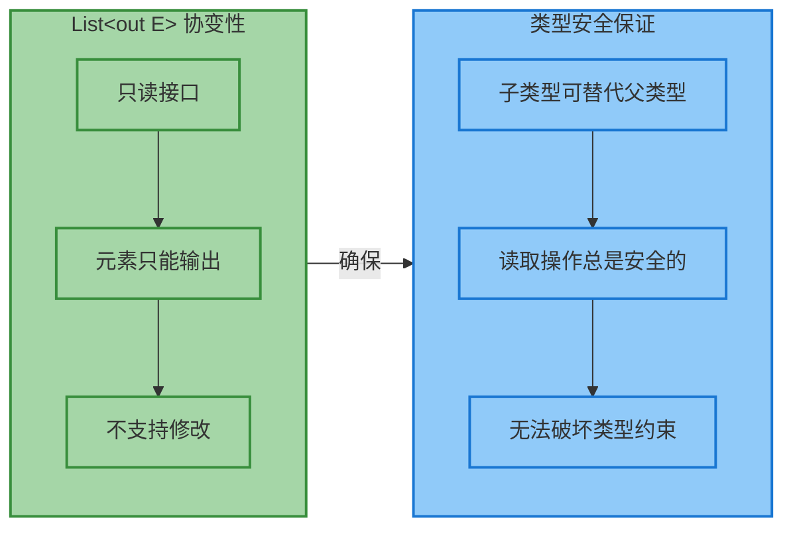

### MutableList 的不变性

与 `List` 形成鲜明对比的是 `MutableList`，它必须保持不变 (invariant)，因为它支持修改操作：

```kotlin
// MutableList 的定义（简化版）
public interface MutableList<E> : List<E>, MutableCollection<E> {
    // ❌ E 出现在 in 位置（函数参数），无法协变
    override fun add(element: E): Boolean
    override fun remove(element: E): Boolean
    
    // ❌ E 同时出现在 in 和 out 位置，无法协变也无法逆变
    public operator fun set(index: Int, element: E): E
    
    // ⚠️ 如果 MutableList 协变会发生什么？
}

// 假设 MutableList 是协变的（实际不是）
// 这将导致类型安全问题：

fun hypotheticalProblem() {
    val cats: MutableList<Cat> = mutableListOf(Cat("Tom"))
    
    // 假设可以协变赋值
    // val animals: MutableList<Animal> = cats // ❌ 实际编译错误
    
    // 如果上面成立，就能做这种事：
    // animals.add(Dog("Max"))  // 💥 把 Dog 加到 Cat 列表里！
    
    // 然后从原始引用读取：
    // val cat: Cat = cats[1]  // 💥 运行时崩溃：Dog cannot be cast to Cat
}

// 正确的做法：MutableList 保持不变
val cats: MutableList<Cat> = mutableListOf(Cat("Tom"))
// val animals: MutableList<Animal> = cats // ❌ 编译错误，类型不匹配

// 如果需要协变行为，显式转换为只读 List
val animals: List<Animal> = cats // ✅ 安全，因为 List 是协变的
```

**MutableList 不变性的设计智慧：**

```kotlin
// 实践中的正确用法

// 1️⃣ 当只需要读取时，使用 List
fun printAllAnimals(animals: List<Animal>) {  // 接受任何 Animal 子类的列表
    animals.forEach { println(it.name) }
}

val cats: List<Cat> = listOf(Cat("A"), Cat("B"))
printAllAnimals(cats) // ✅ 协变使得这成为可能

// 2️⃣ 当需要修改时，使用精确类型或泛型
fun addCat(cats: MutableList<Cat>) {  // 必须精确匹配 Cat
    cats.add(Cat("New"))
}

// 或使用泛型函数提供灵活性
fun <T : Animal> addAnimal(animals: MutableList<T>, animal: T) {
    animals.add(animal)  // 类型安全：只能添加 T 类型
}

val dogList = mutableListOf<Dog>()
addAnimal(dogList, Dog("Buddy")) // ✅ T 推断为 Dog
// addAnimal(dogList, Cat("Whiskers")) // ❌ 编译错误
```

### Function 类型的型变

Kotlin 的函数类型 (Function types) 展示了更复杂的型变模式：**参数逆变，返回值协变**。这是函数类型安全的核心规则。

```kotlin
// Kotlin 函数类型的定义（概念展示）
// interface Function1<in P, out R> {
//     operator fun invoke(p: P): R
// }

// 示例：理解函数类型的型变
typealias AnimalProcessor = (Animal) -> Animal

// 1️⃣ 返回值协变：返回更具体的类型是安全的
val catProducer: (Animal) -> Cat = { Cat("Generated") }
val processor: AnimalProcessor = catProducer
// ✅ 安全：期待 Animal，得到 Cat（Cat 是 Animal 的子类）

val result: Animal = processor(Dog("Input"))
// result 实际是 Cat，但声明为 Animal，完全安全

// 2️⃣ 参数逆变：接受更宽泛的类型是安全的
val anyConsumer: (Any) -> Animal = { 
    Animal("Default", if (it is String) it else "Unknown")
}
val animalConsumer: (Animal) -> Animal = anyConsumer
// ✅ 安全：传入 Animal，函数接受 Any（Any 是 Animal 的父类）

val cat = Cat("Test")
animalConsumer(cat) // 函数实际接受 Any，接受 Cat 绝对没问题
```

让我们通过图示理解这个看似反直觉的规则：

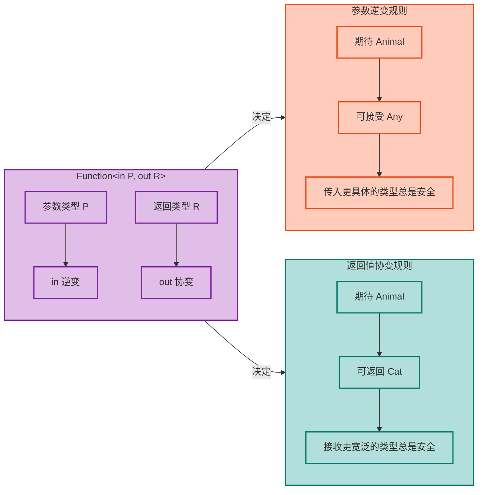

**完整示例：函数类型替换规则**

```kotlin
open class Animal(val name: String) {
    open fun makeSound() = "Some sound"
}

class Cat(name: String) : Animal(name) {
    override fun makeSound() = "Meow"
}

class Dog(name: String) : Animal(name) {
    override fun makeSound() = "Woof"
}

// 基准函数类型
typealias AnimalTransformer = (Animal) -> Animal

// ✅ 允许的替换 1：参数更宽泛（Any），返回更具体（Cat）
val superAcceptor: (Any) -> Cat = { obj ->
    when (obj) {
        is Animal -> Cat("Transformed-${obj.name}")
        else -> Cat("Default")
    }
}
val transformer1: AnimalTransformer = superAcceptor
// 原因：传入 Animal 时，函数接受 Any（更宽），没问题
//       期待返回 Animal，函数返回 Cat（更具体），也没问题

// ✅ 允许的替换 2：只改变返回类型为子类
val catReturner: (Animal) -> Cat = { Cat("Result-${it.name}") }
val transformer2: AnimalTransformer = catReturner

// ✅ 允许的替换 3：只改变参数类型为父类
val anyAcceptor: (Any) -> Animal = { 
    if (it is Animal) it else Animal("Unknown", "Unknown")
}
val transformer3: AnimalTransformer = anyAcceptor

// ❌ 禁止的替换 1：参数更具体（违反逆变）
val catOnly: (Cat) -> Animal = { it }
// val transformer4: AnimalTransformer = catOnly // 编译错误！
// 原因：可能传入 Dog，但函数只接受 Cat

// ❌ 禁止的替换 2：返回类型更宽泛（违反协变）
val anyReturner: (Animal) -> Any = { it }
// val transformer5: AnimalTransformer = anyReturner // 编译错误！
// 原因：期待 Animal，但可能返回 String 等非 Animal 类型
```

### 实际应用：集合操作中的型变

标准库中的集合操作方法充分利用了型变特性，使 API 既灵活又类型安全：

```kotlin
// 实际案例：map 函数的签名
// public inline fun <T, R> Iterable<T>.map(transform: (T) -> R): List<R>

val cats: List<Cat> = listOf(Cat("A"), Cat("B"))

// 1️⃣ 利用协变：cats 是 List<Cat>，也是 List<Animal>
val animalList: List<Animal> = cats

// 2️⃣ 函数参数的型变
val names: List<String> = cats.map { animal: Animal ->  // 参数类型可以是父类
    animal.name  // 但实际接收的是 Cat
}

// 3️⃣ 组合使用：filter 和 map
fun processPets(animals: List<Animal>): List<String> {
    return animals
        .filter { it is Cat }  // 返回 List<Animal>（协变）
        .map { it.name }       // Animal 有 name 属性，安全
}

val mixedPets: List<Animal> = listOf(Cat("Tom"), Dog("Max"), Cat("Luna"))
val catNames = processPets(mixedPets) // ["Tom", "Luna"]
```

**高级实践：构建类型安全的 DSL**

```kotlin
// 利用型变构建类型安全的构建器模式
class HtmlBuilder {
    private val children = mutableListOf<HtmlElement>()
    
    // 使用逆变接受任何元素的构建器
    fun <T : HtmlElement> element(
        builder: HtmlElementBuilder<in T>.() -> Unit
    ): T {
        val elementBuilder = HtmlElementBuilder<T>()
        elementBuilder.builder()
        val element = elementBuilder.build()
        children.add(element)
        return element
    }
}

open class HtmlElement(val tag: String)
class DivElement : HtmlElement("div")
class SpanElement : HtmlElement("span")

class HtmlElementBuilder<out T : HtmlElement> {
    fun build(): T = TODO()
}

// 使用
fun buildHtml() {
    val builder = HtmlBuilder()
    
    builder.element<DivElement> {  // 指定具体类型
        // 构建逻辑
    }
    
    // 得益于型变，可以灵活组合
}
```

**型变决策树：**

```kotlin
/**
 * 在实践中决定是否使用型变的指南：
 * 
 * 问题 1：类型参数只在返回值位置吗？
 *   ✅ 是 → 使用 out（协变），如 List<out E>
 *   ❌ 否 → 继续
 * 
 * 问题 2：类型参数只在参数位置吗？
 *   ✅ 是 → 使用 in（逆变），如 Comparator<in T>
 *   ❌ 否 → 继续
 * 
 * 问题 3：类型参数同时在 in 和 out 位置？
 *   ✅ 是 → 保持不变（invariant），如 MutableList<E>
 * 
 * 特殊情况：需要局部限制？
 *   → 使用处型变（类型投影）
 */

// 应用这个决策树：

// 案例 1：只有输出 → out
interface Producer<out T> {
    fun produce(): T  // T 只在返回值位置
}

// 案例 2：只有输入 → in
interface Consumer<in T> {
    fun consume(item: T)  // T 只在参数位置
}

// 案例 3：既有输入又有输出 → invariant
interface Processor<T> {
    fun process(input: T): T  // T 在两个位置
}

// 案例 4：需要灵活性 → 使用处型变
fun <T> transfer(
    from: Processor<out T>,  // 只需要输出能力
    to: Processor<in T>      // 只需要输入能力
) {
    val item = from.process(/* some default */)
    to.process(item)
}
```

---

**📝 练习题**

**题目：下列哪个函数签名是类型安全的，可以正确编译？**

```kotlin
open class Fruit
class Apple : Fruit()
class Orange : Fruit()

// 选项如下：
```

A. `fun processList(list: MutableList<Fruit>) { list.add(Apple()) }` 并传入 `MutableList<Apple>`

B. `fun processList(list: List<out Fruit>): Fruit { return list[0] }` 并传入 `List<Apple>`

C. `fun processList(list: MutableList<in Apple>) { val fruit: Apple = list[0] }`

D. `fun transform(f: (Fruit) -> Apple): (Apple) -> Fruit { return f }`

**【答案】** B

**【解析】**

- **A 错误**：`MutableList` 是不变的 (invariant)，`MutableList<Apple>` 不能赋值给 `MutableList<Fruit>`。如果允许，可能导致类型安全问题（向 Apple 列表中添加 Orange）。

- **B 正确**：`List<out Fruit>` 使用了协变投影，`List<Apple>` 可以安全地赋值给它。因为该函数只读取列表元素，而 Apple 是 Fruit 的子类，读取 Apple 并当作 Fruit 使用完全安全。这正是协变的典型应用场景。

- **C 错误**：`MutableList<in Apple>` 使用了逆变投影，意味着该列表是 Apple 的消费者（只能写入）。从逆变类型中读取元素时，只能得到 `Any?` 类型，无法直接得到 `Apple`。逆变投影禁止类型安全的读取操作。

- **D 错误**：函数类型的型变规则是"参数逆变，返回值协变"。`(Fruit) -> Apple` 不能赋值给 `(Apple) -> Fruit`，因为这违反了两个规则：参数从 Fruit 变为 Apple（变具体了，违反逆变），返回值从 Apple 变为 Fruit（变宽泛了,违反协变)。正确的替换应该是参数变宽泛、返回值变具体。

---

## 星号投影详解

在 Kotlin 的泛型系统中，星号投影 (Star Projection) 是一个特殊而强大的语法特性，用符号 `*` 表示。它允许我们在不知道具体类型参数的情况下，安全地使用泛型类型。星号投影本质上是一种类型安全的"类型通配符"机制，让我们能够处理那些类型参数未知或不重要的场景。

### 表示未知类型

星号投影的核心作用是表达"我不关心具体是什么类型"或"这个类型参数是未知的"。当我们使用 `List<*>` 时，实际上是在说："这是一个某种类型的列表，但我现在不需要知道具体是什么类型"。

```kotlin
// 使用星号投影处理未知类型的列表
fun printListSize(list: List<*>) {
    // 我们可以安全地获取列表大小
    println("列表包含 ${list.size} 个元素")
    
    // 我们可以迭代元素，但元素类型被视为 Any?
    for (element in list) {
        // element 的类型是 Any?，这是最安全的假设
        println("元素: $element")
    }
}

// 实际使用
val intList: List<Int> = listOf(1, 2, 3)
val stringList: List<String> = listOf("A", "B", "C")

printListSize(intList)    // ✅ 可以传入任何类型的 List
printListSize(stringList) // ✅ 星号投影让函数更加通用
```

这种设计体现了 Kotlin 的类型安全哲学：当类型未知时，系统会自动选择最安全的类型假设，避免运行时类型错误。

### 等价投影规则

星号投影在不同型变场景下有不同的等价含义。理解这些等价关系是掌握星号投影的关键：

**1. 协变类型参数 (`out T`) 的星号投影**

对于声明为 `out T` 的类型参数，`*` 等价于 `out Any?`，表示"某种未知类型的生产者"：

```kotlin
// 协变接口示例
interface Producer<out T> {
    fun produce(): T  // 只能生产 T，不能消费
}

// 星号投影的等价关系
fun processProducer(producer: Producer<*>) {
    // Producer<*> 等价于 Producer<out Any?>
    
    val item: Any? = producer.produce()  // ✅ 可以获取元素，类型为 Any?
    println("生产了一个项目: $item")
    
    // 无法向 Producer 传入任何东西（协变类型本来就不允许）
}

// 实际应用
val intProducer: Producer<Int> = object : Producer<Int> {
    override fun produce() = 42
}

val stringProducer: Producer<String> = object : Producer<String> {
    override fun produce() = "Hello"
}

processProducer(intProducer)    // ✅ 安全传递
processProducer(stringProducer) // ✅ 星号投影统一处理
```

**2. 逆变类型参数 (`in T`) 的星号投影**

对于声明为 `in T` 的类型参数，`*` 等价于 `in Nothing`，表示"某种未知类型的消费者"：

```kotlin
// 逆变接口示例
interface Consumer<in T> {
    fun consume(item: T)  // 只能消费 T，不能生产
}

// 星号投影的等价关系
fun processConsumer(consumer: Consumer<*>) {
    // Consumer<*> 等价于 Consumer<in Nothing>
    
    // ❌ 无法向消费者传入任何东西（Nothing 是所有类型的子类型）
    // consumer.consume(42)      // 编译错误
    // consumer.consume("text")  // 编译错误
    
    // 因为我们不知道消费者期望什么类型，传入任何具体值都不安全
    println("处理一个未知类型的消费者")
}

// 实际应用
val numberConsumer: Consumer<Number> = object : Consumer<Number> {
    override fun consume(item: Number) {
        println("消费数字: $item")
    }
}

processConsumer(numberConsumer)  // ✅ 但无法通过星号投影使用 consume()
```

**3. 不变类型参数的星号投影**

对于既不是 `out` 也不是 `in` 的不变类型参数，`*` 等价于 `out Any?`（读取时）和 `in Nothing`（写入时）的组合：

```kotlin
// 不变泛型类
class Box<T>(private var item: T) {
    fun get(): T = item        // 读取操作
    fun set(value: T) {        // 写入操作
        item = value
    }
}

// 星号投影的限制
fun processBox(box: Box<*>) {
    // Box<*> 的读取等价于 Box<out Any?>
    val item: Any? = box.get()  // ✅ 可以读取，类型为 Any?
    println("盒子包含: $item")
    
    // Box<*> 的写入等价于 Box<in Nothing>
    // box.set(42)      // ❌ 编译错误：无法写入
    // box.set("text")  // ❌ 编译错误：无法写入
    
    // 因为类型未知，系统不允许写入任何值
}

// 对比具体类型参数
fun processTypedBox(box: Box<Int>) {
    val item: Int = box.get()  // ✅ 知道具体类型
    box.set(100)               // ✅ 可以安全写入
}
```

这种机制确保了类型安全：当类型未知时，读取是安全的（最多得到 `Any?`），但写入是禁止的（避免类型污染）。

### 使用场景

星号投影在实际开发中有多种典型应用场景：

**场景 1：通用工具函数**

当函数只关心容器结构而不关心元素类型时，星号投影能显著简化代码：

```kotlin
// 检查任意类型列表是否为空
fun isListEmpty(list: List<*>): Boolean {
    // 无需知道元素类型，只关心列表是否为空
    return list.isEmpty()
}

// 合并多个列表的大小信息
fun getTotalSize(vararg lists: List<*>): Int {
    // 对每个列表求和大小
    return lists.sumOf { it.size }
}

// 打印任意集合的结构信息
fun printCollectionInfo(collection: Collection<*>) {
    println("集合类型: ${collection::class.simpleName}")
    println("元素数量: ${collection.size}")
    println("是否为空: ${collection.isEmpty()}")
    // 虽然不知道具体元素类型，但可以安全地访问元素
    collection.forEach { element ->
        println("  - $element (${element?.let { it::class.simpleName }})")
    }
}

// 使用示例
val numbers = listOf(1, 2, 3)
val words = listOf("Kotlin", "Java", "Scala")
val mixed = listOf(1, "two", 3.0)

println(isListEmpty(numbers))              // false
println(getTotalSize(numbers, words))      // 6
printCollectionInfo(mixed)                 // 打印详细信息
```

**场景 2：类型检查与反射**

在处理运行时类型信息时，星号投影提供了安全的类型边界：

```kotlin
// 检查对象是否为某种泛型类型的实例
fun isListInstance(obj: Any): Boolean {
    // 使用星号投影进行类型检查
    return obj is List<*>  // ✅ 安全：只检查是否为 List，不关心元素类型
}

// 处理未知泛型类型的 Map
fun processMap(map: Map<*, *>) {
    // Map<*, *> 表示键和值类型都未知
    println("Map 包含 ${map.size} 个键值对")
    
    for ((key, value) in map) {
        // key 和 value 都是 Any? 类型
        println("$key -> $value")
    }
}

// 反射场景：获取类的泛型信息
fun analyzeClass(clazz: Class<*>) {
    // Class<*> 表示某个未知类型的 Class 对象
    println("类名: ${clazz.simpleName}")
    println("是否为接口: ${clazz.isInterface}")
    
    // 可以安全地访问 Class 的结构信息
    clazz.declaredMethods.forEach { method ->
        println("  方法: ${method.name}")
    }
}

// 使用示例
val obj1 = listOf(1, 2, 3)
val obj2 = "Not a list"

println(isListInstance(obj1))  // true
println(isListInstance(obj2))  // false

val stringToInt = mapOf("a" to 1, "b" to 2)
processMap(stringToInt)        // 安全处理未知类型 Map

analyzeClass(String::class.java)  // 分析 String 类
analyzeClass(List::class.java)    // 分析 List 接口
```

**场景 3：数组和可变集合的只读视图**

星号投影可以创建安全的只读访问层：

```kotlin
// Array 的星号投影
fun printArrayContents(array: Array<*>) {
    // Array<*> 等价于 Array<out Any?>
    println("数组长度: ${array.size}")
    
    // 可以读取元素
    for (element in array) {
        println("  元素: $element")
    }
    
    // ❌ 无法写入元素
    // array[0] = "new value"  // 编译错误
}

// MutableList 的星号投影限制写入
fun readOnlyAccess(list: MutableList<*>) {
    // 可以读取
    val first: Any? = list.firstOrNull()
    println("第一个元素: $first")
    
    // 可以调用不涉及类型参数的方法
    list.clear()  // ✅ 清空列表不需要知道元素类型
    
    // ❌ 无法添加元素
    // list.add("item")  // 编译错误：类型未知
}

// 使用示例
val intArray = arrayOf(1, 2, 3, 4, 5)
val stringArray = arrayOf("A", "B", "C")

printArrayContents(intArray)    // ✅ 安全读取
printArrayContents(stringArray) // ✅ 类型无关

val mutableNumbers = mutableListOf(10, 20, 30)
readOnlyAccess(mutableNumbers)  // 只能读取和清空，不能添加
```

**场景 4：API 设计中的灵活性**

在设计库或框架时，星号投影提供了更灵活的 API 接口：

```kotlin
// 泛型事件系统
interface Event<out T> {
    val data: T
    val timestamp: Long
}

// 事件监听器（使用星号投影接受任何事件）
class EventLogger {
    fun log(event: Event<*>) {
        // 无需知道具体事件数据类型
        println("[${event.timestamp}] 事件数据: ${event.data}")
    }
}

// 事件分发器
class EventDispatcher {
    private val listeners = mutableListOf<(Event<*>) -> Unit>()
    
    // 注册监听器时使用星号投影
    fun addListener(listener: (Event<*>) -> Unit) {
        listeners.add(listener)
    }
    
    // 分发任意类型的事件
    fun <T> dispatch(event: Event<T>) {
        listeners.forEach { it(event) }
    }
}

// 使用示例
data class UserEvent(override val data: String, override val timestamp: Long) : Event<String>
data class SystemEvent(override val data: Int, override val timestamp: Long) : Event<Int>

val logger = EventLogger()
val dispatcher = EventDispatcher()

// 添加通用监听器
dispatcher.addListener { event -> logger.log(event) }

// 分发不同类型的事件
dispatcher.dispatch(UserEvent("User logged in", System.currentTimeMillis()))
dispatcher.dispatch(SystemEvent(500, System.currentTimeMillis()))
```

下图展示了星号投影在不同型变场景下的等价关系与使用限制：

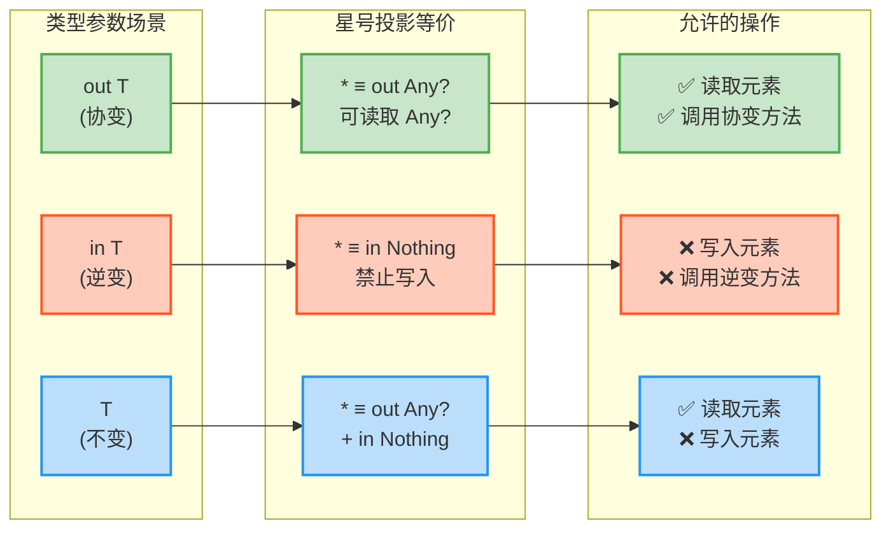

星号投影是 Kotlin 泛型系统中平衡类型安全与灵活性的精妙设计。它让我们在不牺牲类型安全的前提下，编写出更加通用和可复用的代码。理解星号投影的等价规则，能帮助我们在设计 API 和处理未知类型时做出更明智的决策。

---

## 具体化类型参数

在 JVM 平台上，泛型通常会经历类型擦除 (Type Erasure)，这意味着运行时无法获取泛型的具体类型信息。然而，Kotlin 通过 `reified` 关键字突破了这一限制，允许我们在特定场景下保留类型信息并在运行时访问它。具体化类型参数 (Reified Type Parameters) 是 Kotlin 独有的强大特性，让泛型代码能够像处理具体类型一样自然和安全。

### reified 关键字

`reified` 关键字只能用于 **内联函数 (inline functions)** 的类型参数。它的作用是告诉编译器："请保留这个类型参数的信息，让我在函数体内能像使用普通类一样使用它"。

```kotlin
// ❌ 普通泛型函数：类型信息在运行时被擦除
fun <T> normalFunction(value: Any): T? {
    // 编译错误：无法检查 value 是否为 T 类型
    // if (value is T) return value  // ❌ Cannot check for instance of erased type: T
    
    // 无法获取 T 的 Class 对象
    // val clazz = T::class.java  // ❌ 编译错误
    
    return null
}

// ✅ 内联函数 + reified：类型信息得以保留
inline fun <reified T> reifiedFunction(value: Any): T? {
    // ✅ 可以进行类型检查
    if (value is T) {
        return value  // 类型安全的转换
    }
    
    // ✅ 可以获取 Class 对象
    val clazz = T::class.java
    println("类型参数是: ${clazz.simpleName}")
    
    return null
}

// 使用示例
val stringResult = reifiedFunction<String>("Hello")  // ✅ 返回 "Hello"
val intResult = reifiedFunction<Int>("Hello")        // ✅ 返回 null（类型不匹配）
```

这种机制的本质是编译器在内联展开时，将类型参数替换为实际的类型，从而绕过了类型擦除。

### 内联函数要求

`reified` 类型参数必须与 `inline` 关键字配合使用，这是因为内联函数的工作机制使类型具体化成为可能。让我们深入理解这一要求：

**内联展开原理**

当函数被标记为 `inline` 时,编译器会在调用处直接插入函数体代码，而不是生成普通的函数调用：

```kotlin
// 内联函数定义
inline fun <reified T> typeCheck(value: Any): Boolean {
    return value is T  // 使用 reified 类型参数
}

// 调用代码
fun example() {
    val obj: Any = "Kotlin"
    val isString = typeCheck<String>(obj)  // 调用点 1
    val isInt = typeCheck<Int>(obj)        // 调用点 2
}

// 编译器内联展开后的等价代码
fun example() {
    val obj: Any = "Kotlin"
    
    // 调用点 1 展开：T 被替换为 String
    val isString = obj is String  // ✅ 直接使用具体类型
    
    // 调用点 2 展开：T 被替换为 Int
    val isInt = obj is Int  // ✅ 直接使用具体类型
}
```

通过内联展开，编译器在每个调用点都知道 `T` 的具体类型，因此可以生成类型安全的字节码。

**为什么必须是 inline？**

如果不使用 `inline`，函数会被编译成独立的字节码，而 JVM 的泛型擦除机制会移除类型参数信息：

```kotlin
// ❌ 非内联函数不能使用 reified
fun <reified T> invalidFunction(value: Any): Boolean {
    // 编译错误：'reified' type parameters can only be used in inline functions
    return value is T
}

// 原因：如果允许这样写，编译后的字节码会是：
// public static boolean invalidFunction(Object value) {
//     return value instanceof ???;  // ❌ 不知道检查什么类型
// }
```

**内联函数的性能考虑**

虽然内联可以避免函数调用开销，但也会增加字节码体积。使用 `reified` 时需要权衡：

```kotlin
// ✅ 适合内联 + reified：简短的工具函数
inline fun <reified T> List<*>.filterIsInstance(): List<T> {
    // 函数体短小，内联开销小
    return this.filter { it is T }.map { it as T }
}

// ⚠️ 不适合内联：函数体庞大
inline fun <reified T> complexProcessing(data: List<Any>) {
    // 如果函数体有数百行代码，内联会导致调用点字节码膨胀
    // 这种情况下应该考虑其他设计方案
    // ... 大量逻辑 ...
}

// 使用示例
val mixed: List<Any> = listOf(1, "two", 3, "four", 5.0)
val strings: List<String> = mixed.filterIsInstance<String>()  // ["two", "four"]
val numbers: List<Int> = mixed.filterIsInstance<Int>()        // [1, 3]
```

### 运行时类型信息

`reified` 类型参数提供了三种核心能力，让我们在运行时访问类型信息：

**1. 类型检查 (`is` 操作符)**

最常用的能力是进行类型检查，这在类型擦除的世界中通常无法实现：

```kotlin
// 泛型类型安全的过滤
inline fun <reified T> List<*>.filterByType(): List<T> {
    val result = mutableListOf<T>()
    for (element in this) {
        if (element is T) {  // ✅ reified 使 is 检查成为可能
            result.add(element)
        }
    }
    return result
}

// 检查可空性
inline fun <reified T> checkNullability(value: Any?): String {
    return when {
        value is T -> "值是 T 类型"
        value == null && null is T -> "T 是可空类型，值为 null"
        else -> "值不是 T 类型"
    }
}

// 使用示例
val items: List<Any> = listOf(1, "hello", 2, "world", 3.14)
val integers = items.filterByType<Int>()      // [1, 2]
val strings = items.filterByType<String>()    // ["hello", "world"]

println(checkNullability<String>("test"))      // "值是 T 类型"
println(checkNullability<String?>(null))       // "T 是可空类型，值为 null"
println(checkNullability<Int>("test"))         // "值不是 T 类型"
```

**2. 类型转换 (`as` 操作符)**

`reified` 允许我们执行安全的类型转换：

```kotlin
// 安全的类型转换工具
inline fun <reified T> safeCast(value: Any?): T? {
    // 使用 is 检查 + as 转换
    return if (value is T) value else null
}

// 带有默认值的转换
inline fun <reified T> castOrDefault(value: Any?, default: T): T {
    // 转换失败时返回默认值
    return (value as? T) ?: default
}

// JSON 解析场景的应用
inline fun <reified T> parseJsonValue(json: String, key: String): T? {
    // 模拟从 JSON 中提取并转换类型
    val rawValue: Any? = extractJsonValue(json, key)  // 假设的解析函数
    
    return when {
        rawValue is T -> rawValue              // ✅ 类型匹配
        rawValue is String && T::class == Int::class -> 
            rawValue.toIntOrNull() as? T       // 尝试字符串转数字
        else -> null
    }
}

fun extractJsonValue(json: String, key: String): Any? {
    // 简化的 JSON 解析（实际应使用库）
    return when (key) {
        "name" -> "Kotlin"
        "version" -> "2.0"
        "year" -> 2024
        else -> null
    }
}

// 使用示例
val obj: Any = "123"
val num: Int? = safeCast(obj)         // null（String 不是 Int）
val str: String? = safeCast(obj)      // "123"（成功转换）

val value1 = castOrDefault(null, 42)  // 42（使用默认值）
val value2 = castOrDefault("100", 0)  // 0（类型不匹配，使用默认值）

val name: String? = parseJsonValue("""{"name":"Kotlin"}""", "name")  // "Kotlin"
val year: Int? = parseJsonValue("""{"year":2024}""", "year")         // 2024
```

**3. 反射操作 (`::class` 访问)**

`reified` 使我们能够获取类型参数的 `KClass` 对象，从而进行反射操作：

```kotlin
import kotlin.reflect.full.*

// 获取类型的详细信息
inline fun <reified T> getTypeInfo(): String {
    val kClass = T::class  // ✅ 获取 KClass 对象
    
    return buildString {
        appendLine("类型名称: ${kClass.simpleName}")
        appendLine("完全限定名: ${kClass.qualifiedName}")
        appendLine("是否为数据类: ${kClass.isData}")
        appendLine("是否为密封类: ${kClass.isSealed}")
        appendLine("是否为抽象类: ${kClass.isAbstract}")
        
        // 获取成员信息
        appendLine("成员属性:")
        kClass.memberProperties.forEach { prop ->
            appendLine("  - ${prop.name}: ${prop.returnType}")
        }
        
        appendLine("成员函数:")
        kClass.memberFunctions.forEach { func ->
            appendLine("  - ${func.name}()")
        }
    }
}

// 创建实例（需要无参构造函数）
inline fun <reified T : Any> createInstance(): T? {
    return try {
        val constructor = T::class.constructors.firstOrNull { 
            it.parameters.isEmpty() 
        }
        constructor?.call()  // 调用无参构造函数
    } catch (e: Exception) {
        println("无法创建实例: ${e.message}")
        null
    }
}

// 检查注解
inline fun <reified T> hasAnnotation(annotation: KClass<out Annotation>): Boolean {
    return T::class.annotations.any { it.annotationClass == annotation }
}

// 示例数据类
data class Person(val name: String = "Unknown", val age: Int = 0)

@Deprecated("Use Person instead")
data class User(val username: String = "guest")

// 使用示例
println(getTypeInfo<Person>())
// 输出类型的完整信息

val person = createInstance<Person>()  // Person(name=Unknown, age=0)
println(person)

val hasDeprecated = hasAnnotation<User>(Deprecated::class)  // true
println("User 类是否被标记为 Deprecated: $hasDeprecated")
```

下图展示了 `reified` 类型参数的工作流程与编译器处理机制：

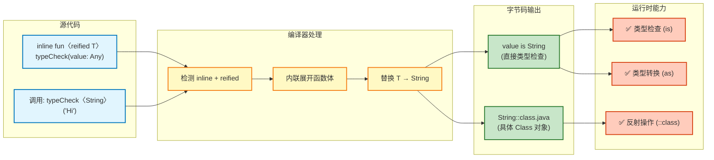

具体化类型参数是 Kotlin 对 JVM 泛型限制的创造性突破。通过 `inline` 和 `reified` 的巧妙结合，我们获得了在运行时访问泛型类型信息的能力，这让许多原本复杂或不可能的操作变得简单而优雅。理解 `reified` 的工作原理和适用场景，能帮助我们编写更加类型安全和表达力更强的代码。

---

**📝 练习题**

**题目 1**：以下关于星号投影的说法，哪一项是**错误**的？

A. `List<*>` 等价于 `List<out Any?>`，可以读取元素但元素类型为 `Any?`  
B. `Consumer<*>` 等价于 `Consumer<in Nothing>`，无法向其传入任何值  
C. `Array<*>` 可以通过索引读取元素，也可以通过索引写入新元素  
D. 星号投影在处理未知类型的泛型容器时提供了类型安全的访问方式

**【答案】** C

**【解析】**  
选项 C 错误。`Array<*>` 的星号投影等价于 `Array<out Any?>`（读取时）和 `Array<in Nothing>`（写入时）。这意味着：
- ✅ 可以读取元素：`val element: Any? = array[0]`
- ❌ 不能写入元素：`array[0] = "new value"` 会导致编译错误

这是因为类型参数未知时，编译器无法确定写入的值是否与数组的实际类型兼容，为了保证类型安全，禁止所有写入操作。

其他选项都是正确的：
- A 正确：协变类型 `out T` 的星号投影确实等价于 `out Any?`
- B 正确：逆变类型 `in T` 的星号投影等价于 `in Nothing`，因为 `Nothing` 是所有类型的子类型，无法传入任何实际值
- D 正确：星号投影正是为了在类型未知时提供安全的访问边界

---

**题目 2**：以下代码片段中，哪一个**能够成功编译**？

A. 
```kotlin
fun <T> getClassName(): String {
    return T::class.simpleName ?: "Unknown"
}
```

B. 
```kotlin
inline fun <reified T> getClassName(): String {
    return T::class.simpleName ?: "Unknown"
}
```

C. 
```kotlin
fun <T> checkType(value: Any): Boolean {
    return value is T
}
```

D. 
```kotlin
inline fun <T> checkType(value: Any): Boolean {
    return value is T
}
```

**【答案】** B

**【解析】**  
只有选项 B 能成功编译。

- **A 错误**：普通泛型函数不能使用 `T::class`，因为类型擦除后无法在运行时获取类型参数的 `Class` 对象。编译器会报错：`Cannot use 'T' as reified type parameter. Use a class instead.`

- **B 正确**：使用 `inline fun <reified T>` 组合，编译器在内联展开时会将 `T` 替换为实际类型，因此可以访问 `T::class`。这是 Kotlin 中访问泛型类型信息的标准方式。

- **C 错误**：普通泛型函数不能使用 `is T` 进行类型检查。编译器会报错：`Cannot check for instance of erased type: T`，因为运行时无法知道 `T` 的具体类型。

- **D 错误**：虽然使用了 `inline`，但缺少 `reified` 关键字。`reified` 是告诉编译器"保留类型信息"的必要声明，单独 `inline` 不足以支持类型检查操作。编译器依然会报错。

**核心要点**：在 Kotlin 中，只有 `inline fun <reified T>` 的组合才能在运行时访问类型参数的信息，包括类型检查 (`is`)、类型转换 (`as`) 和反射 (`::class`)。这是 Kotlin 突破 JVM 泛型擦除限制的关键机制。

---

## reified 应用

在前面的章节中我们了解了 `reified` 关键字的基本概念和使用要求。本节将深入探讨 `reified` 类型参数在实际开发中的三大核心应用场景：类型检查（Type Checking）、类型转换（Type Casting）以及反射操作（Reflection）。这些应用充分展示了 Kotlin 如何通过编译器内联优化突破 JVM 类型擦除的限制。

### 类型检查

传统的 Java 泛型无法在运行时进行类型检查，因为泛型信息在编译后会被擦除。而 Kotlin 的 `reified` 机制让我们能够在内联函数中访问真实的类型信息，从而实现运行时类型检查。

```kotlin
// 传统方式：需要显式传递 Class 对象
fun <T> isInstanceOfClass(value: Any, clazz: Class<T>): Boolean {
    return clazz.isInstance(value) // 依赖外部传入的 Class 对象
}

// 使用示例
val result = isInstanceOfClass("Hello", String::class.java) // 繁琐的 Class 传递

// reified 方式：编译器自动处理类型信息
inline fun <reified T> isInstanceOf(value: Any): Boolean {
    return value is T // 直接使用 is 关键字进行类型检查
}

// 使用示例：简洁优雅
val result1 = isInstanceOf<String>("Hello")        // true
val result2 = isInstanceOf<Int>("Hello")           // false
val result3 = isInstanceOf<List<String>>(listOf()) // true
```

**实战案例：集合元素过滤**

`reified` 在集合操作中特别有用，我们可以创建类型安全的过滤函数：

```kotlin
// 过滤出指定类型的元素
inline fun <reified T> Iterable<*>.filterIsInstance(): List<T> {
    val result = mutableListOf<T>() // 创建结果列表
    for (element in this) { // 遍历集合中的每个元素
        if (element is T) { // 运行时类型检查（reified 使之成为可能）
            result.add(element) // 只添加匹配类型的元素
        }
    }
    return result // 返回类型安全的结果列表
}

// 实际应用
val mixedList: List<Any> = listOf(
    "Kotlin", 
    42, 
    3.14, 
    "Java", 
    100, 
    true
)

val strings: List<String> = mixedList.filterIsInstance<String>() 
// 结果：["Kotlin", "Java"]

val numbers: List<Int> = mixedList.filterIsInstance<Int>()       
// 结果：[42, 100]

val doubles: List<Double> = mixedList.filterIsInstance<Double>() 
// 结果：[3.14]
```

**高级场景：嵌套类型检查**

```kotlin
// 检查容器中元素的类型
inline fun <reified T> checkListElementType(list: List<*>): Boolean {
    return list.all { it is T } // 验证列表中所有元素是否为指定类型
}

// 使用示例
val intList = listOf(1, 2, 3)
val mixedList = listOf(1, "two", 3)

println(checkListElementType<Int>(intList))    // true - 所有元素都是 Int
println(checkListElementType<Int>(mixedList))  // false - 包含非 Int 元素
```

### 类型转换

类型转换是 `reified` 的另一个重要应用场景。通过具体化的类型参数，我们可以编写更安全、更优雅的类型转换工具函数。

```kotlin
// 安全的类型转换：失败时返回 null
inline fun <reified T> safeCast(value: Any?): T? {
    return value as? T // 使用安全转换操作符，失败时返回 null
}

// 强制类型转换：失败时抛出异常
inline fun <reified T> forceCast(value: Any?): T {
    return value as T // 强制转换，类型不匹配会抛出 ClassCastException
}

// 使用示例
val obj: Any = "Hello Kotlin"

val str: String? = safeCast<String>(obj)   // "Hello Kotlin"
val num: Int? = safeCast<Int>(obj)         // null (转换失败)

try {
    val forceNum: Int = forceCast<Int>(obj) // 抛出 ClassCastException
} catch (e: ClassCastException) {
    println("Type mismatch: ${e.message}")
}
```

**实战案例：JSON 反序列化辅助**

```kotlin
// 模拟 JSON 解析器的类型转换辅助函数
inline fun <reified T> parseJson(jsonString: String): T? {
    // 这里简化演示，实际应使用 Gson、Jackson 等库
    return try {
        when (T::class) { // reified 允许我们访问 T::class
            String::class -> jsonString as T
            Int::class -> jsonString.toIntOrNull() as? T
            Double::class -> jsonString.toDoubleOrNull() as? T
            Boolean::class -> jsonString.toBooleanStrictOrNull() as? T
            else -> null // 复杂类型需要专业的 JSON 库
        }
    } catch (e: Exception) {
        null // 解析失败返回 null
    }
}

// 使用示例
val age: Int? = parseJson<Int>("25")           // 25
val name: String? = parseJson<String>("Alice") // "Alice"
val flag: Boolean? = parseJson<Boolean>("true")// true
val invalid: Int? = parseJson<Int>("abc")      // null
```

**类型转换与空安全结合**

```kotlin
// 带默认值的安全转换
inline fun <reified T> castOrDefault(value: Any?, default: T): T {
    return safeCast<T>(value) ?: default // 转换失败时使用默认值
}

// 使用示例
val config: Map<String, Any> = mapOf(
    "timeout" to "30",
    "retries" to 3,
    "enabled" to true
)

val timeout: Int = castOrDefault(config["timeout"], 60) // "30" 无法转为 Int，返回 60
val retries: Int = castOrDefault(config["retries"], 5)  // 3 (成功转换)
val enabled: Boolean = castOrDefault(config["enabled"], false) // true
```

### 反射操作

`reified` 类型参数的第三大应用是简化反射（Reflection）操作。在 Kotlin 中，反射 API 允许我们在运行时检查和操作类型信息，而 `reified` 使这一过程更加便捷。

```kotlin
import kotlin.reflect.KClass
import kotlin.reflect.full.* // 需要添加 kotlin-reflect 依赖

// 获取类的元数据信息
inline fun <reified T> getClassMetadata(): String {
    val kClass: KClass<T> = T::class // 获取 KClass 对象
    return buildString {
        appendLine("类名: ${kClass.simpleName}")
        appendLine("完整名: ${kClass.qualifiedName}")
        appendLine("是否 Data Class: ${kClass.isData}")
        appendLine("是否 Sealed: ${kClass.isSealed}")
        appendLine("是否 Abstract: ${kClass.isAbstract}")
        
        // 获取构造函数信息
        appendLine("\n构造函数:")
        kClass.constructors.forEach { constructor ->
            val params = constructor.parameters.joinToString { 
                "${it.name}: ${it.type}" 
            }
            appendLine("  - $params")
        }
        
        // 获取属性信息
        appendLine("\n属性:")
        kClass.memberProperties.forEach { prop ->
            appendLine("  - ${prop.name}: ${prop.returnType}")
        }
    }
}

// 示例数据类
data class User(
    val id: Int,
    val name: String,
    val email: String
)

// 使用示例
val metadata = getClassMetadata<User>()
println(metadata)
/* 输出:
类名: User
完整名: com.example.User
是否 Data Class: true
是否 Sealed: false
是否 Abstract: false

构造函数:
  - id: kotlin.Int, name: kotlin.String, email: kotlin.String

属性:
  - id: kotlin.Int
  - name: kotlin.String
  - email: kotlin.String
*/
```

**实战案例：反射创建对象**

```kotlin
// 通过反射创建对象实例
inline fun <reified T : Any> createInstance(vararg args: Any?): T? {
    val kClass = T::class // 获取类的 KClass 对象
    
    return try {
        // 查找匹配的构造函数
        val constructor = kClass.constructors.firstOrNull { constructor ->
            constructor.parameters.size == args.size && // 参数数量匹配
            constructor.parameters.zip(args).all { (param, arg) ->
                arg == null || param.type.classifier == arg::class // 参数类型匹配
            }
        }
        
        constructor?.call(*args) // 调用构造函数创建实例
    } catch (e: Exception) {
        println("创建实例失败: ${e.message}")
        null
    }
}

// 使用示例
val user1 = createInstance<User>(1, "Alice", "alice@example.com")
// 结果: User(id=1, name=Alice, email=alice@example.com)

val user2 = createInstance<User>(2, "Bob") // 参数数量不匹配
// 结果: null (创建失败)
```

**深度反射：属性访问与修改**

```kotlin
// 读取对象的所有属性值
inline fun <reified T : Any> dumpProperties(instance: T): Map<String, Any?> {
    val kClass = T::class
    return kClass.memberProperties.associate { prop ->
        prop.name to prop.get(instance) // 通过反射获取属性值
    }
}

// 使用示例
val user = User(1, "Charlie", "charlie@example.com")
val properties = dumpProperties(user)
// 结果: {id=1, name=Charlie, email=charlie@example.com}

properties.forEach { (name, value) ->
    println("$name = $value")
}
```

**反射与注解结合**

```kotlin
// 自定义注解
@Target(AnnotationTarget.PROPERTY)
annotation class Validate(val pattern: String)

// 带注解的数据类
data class FormData(
    @Validate("[a-zA-Z]+")
    val username: String,
    
    @Validate("[0-9]{10}")
    val phone: String
)

// 验证带注解的属性
inline fun <reified T : Any> validateAnnotated(instance: T): List<String> {
    val errors = mutableListOf<String>()
    val kClass = T::class
    
    kClass.memberProperties.forEach { prop ->
        // 查找 @Validate 注解
        val annotation = prop.annotations.filterIsInstance<Validate>().firstOrNull()
        
        if (annotation != null) {
            val value = prop.get(instance) as? String ?: ""
            val regex = Regex(annotation.pattern)
            
            if (!regex.matches(value)) {
                errors.add("${prop.name} 不符合格式: ${annotation.pattern}")
            }
        }
    }
    
    return errors
}

// 使用示例
val formData1 = FormData("john123", "1234567890") 
val errors1 = validateAnnotated(formData1)
// 结果: ["username 不符合格式: [a-zA-Z]+"]

val formData2 = FormData("john", "1234567890")
val errors2 = validateAnnotated(formData2)
// 结果: [] (验证通过)
```

**架构图：reified 应用场景总览**

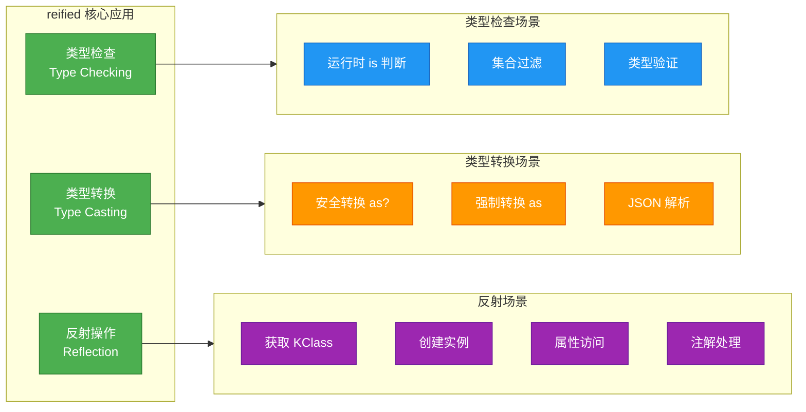

---

## 泛型约束实践

泛型约束（Generic Constraints）是 Kotlin 类型系统中的高级特性，它允许我们对类型参数施加更精细的限制。本节将探讨三种强大的泛型约束模式：递归泛型（Recursive Generics）、自类型（Self Type）以及类型安全构建器（Type-Safe Builders）。这些模式在框架设计和 API 构建中广泛应用。

### 递归泛型

递归泛型是一种类型参数引用自身所在类型的高级模式。这种技术在构建流式 API（Fluent API）和类型层次结构时特别有用，它能够确保方法链的类型安全性。

**基础概念**

```kotlin
// 传统方式：返回类型丢失
open class Builder {
    open fun setName(name: String): Builder {
        // 设置名称
        return this // 返回 Builder 类型
    }
}

class AdvancedBuilder : Builder() {
    fun setAdvancedOption(option: String): AdvancedBuilder {
        // 设置高级选项
        return this
    }
}

// 问题：类型向上转型，无法继续调用子类方法
val builder = AdvancedBuilder()
    .setName("Test") // 返回 Builder，丢失了 AdvancedBuilder 类型
    // .setAdvancedOption("option") // 编译错误！类型不匹配
```

**递归泛型解决方案**

```kotlin
// 使用递归泛型：类型参数引用自身
abstract class FluentBuilder<T : FluentBuilder<T>> {
    // 抽象方法：子类必须返回自身类型
    @Suppress("UNCHECKED_CAST")
    protected fun self(): T = this as T // 强制转换为子类型
    
    // 通用方法：返回泛型类型 T
    fun setName(name: String): T {
        println("设置名称: $name")
        return self() // 返回具体的子类类型
    }
    
    fun setDescription(desc: String): T {
        println("设置描述: $desc")
        return self()
    }
}

// 具体实现类
class ProductBuilder : FluentBuilder<ProductBuilder>() {
    fun setPrice(price: Double): ProductBuilder {
        println("设置价格: $price")
        return this // 返回 ProductBuilder 类型
    }
    
    fun setStock(stock: Int): ProductBuilder {
        println("设置库存: $stock")
        return this
    }
}

class ServiceBuilder : FluentBuilder<ServiceBuilder>() {
    fun setEndpoint(url: String): ServiceBuilder {
        println("设置端点: $url")
        return this
    }
    
    fun setTimeout(timeout: Long): ServiceBuilder {
        println("设置超时: $timeout ms")
        return this
    }
}

// 使用示例：完美的类型安全方法链
val product = ProductBuilder()
    .setName("Laptop")         // 返回 ProductBuilder
    .setDescription("Gaming")  // 返回 ProductBuilder
    .setPrice(1299.99)         // 返回 ProductBuilder
    .setStock(50)              // 返回 ProductBuilder

val service = ServiceBuilder()
    .setName("API")            // 返回 ServiceBuilder
    .setTimeout(3000)          // 返回 ServiceBuilder
    .setEndpoint("/api/v1")    // 返回 ServiceBuilder
```

**高级案例：树形结构的递归泛型**

```kotlin
// 树节点的递归泛型定义
abstract class TreeNode<T : TreeNode<T>> {
    private val children = mutableListOf<T>() // 存储子节点
    
    @Suppress("UNCHECKED_CAST")
    protected fun self(): T = this as T
    
    // 添加子节点：返回当前节点以支持链式调用
    fun addChild(child: T): T {
        children.add(child)
        return self()
    }
    
    // 批量添加子节点
    fun addChildren(vararg nodes: T): T {
        children.addAll(nodes)
        return self()
    }
    
    // 获取所有子节点
    fun getChildren(): List<T> = children.toList()
    
    // 遍历子节点
    fun forEachChild(action: (T) -> Unit) {
        children.forEach(action)
    }
}

// 文件节点实现
class FileNode(val name: String) : TreeNode<FileNode>() {
    fun markAsExecutable(): FileNode {
        println("$name 标记为可执行")
        return this
    }
}

// 目录节点实现
class DirectoryNode(val name: String) : TreeNode<DirectoryNode>() {
    fun setPermissions(permissions: String): DirectoryNode {
        println("$name 设置权限: $permissions")
        return this
    }
}

// 使用示例：构建文件树
val root = DirectoryNode("root")
    .setPermissions("755")
    .addChild(
        DirectoryNode("bin")
            .addChildren(
                FileNode("bash").markAsExecutable(),
                FileNode("ls").markAsExecutable()
            )
    )
    .addChild(
        DirectoryNode("etc")
            .addChild(FileNode("config.ini"))
    )

// 遍历目录
root.forEachChild { dir ->
    println("目录: ${dir.name}")
    dir.forEachChild { file ->
        println("  文件: ${file.name}")
    }
}
```

### 自类型

自类型（Self Type）模式是递归泛型的一个特殊应用，它要求类型参数必须是当前类型本身或其子类型。这种模式在实现可继承的构建器模式和混入（Mixin）风格的组合时非常有用。

```kotlin
// 自类型接口：要求实现类传入自身类型
interface Copyable<T : Copyable<T>> {
    fun copy(): T // 返回与自身相同的类型
}

interface Comparable<T : Comparable<T>> {
    fun compareTo(other: T): Int // 只能与同类型比较
}

// 实现自类型接口
data class Person(
    val name: String,
    val age: Int
) : Copyable<Person>, Comparable<Person> {
    
    // 实现 copy：返回 Person 类型
    override fun copy(): Person {
        return Person(name, age) // 创建新的 Person 实例
    }
    
    // 实现 compareTo：按年龄比较
    override fun compareTo(other: Person): Int {
        return this.age - other.age
    }
}

data class Employee(
    val id: String,
    val salary: Double
) : Copyable<Employee>, Comparable<Employee> {
    
    override fun copy(): Employee {
        return Employee(id, salary)
    }
    
    override fun compareTo(other: Employee): Int {
        return this.salary.compareTo(other.salary)
    }
}

// 使用示例
val person1 = Person("Alice", 30)
val person2 = person1.copy() // 返回 Person 类型
val comparison = person1.compareTo(Person("Bob", 25)) // 类型安全

val emp1 = Employee("E001", 50000.0)
val emp2 = emp1.copy() // 返回 Employee 类型

// 编译错误：类型不匹配
// person1.compareTo(emp1) // Person 无法与 Employee 比较
```

**实战案例：构建器的自类型继承**

```kotlin
// 基础构建器：使用自类型模式
abstract class BaseBuilder<T, B : BaseBuilder<T, B>> {
    protected var id: String = ""
    protected var timestamp: Long = 0L
    
    @Suppress("UNCHECKED_CAST")
    protected fun self(): B = this as B
    
    fun setId(id: String): B {
        this.id = id
        return self()
    }
    
    fun setTimestamp(timestamp: Long): B {
        this.timestamp = timestamp
        return self()
    }
    
    abstract fun build(): T // 构建最终对象
}

// 产品数据类
data class Product(
    val id: String,
    val timestamp: Long,
    val name: String,
    val price: Double
)

// 产品构建器：继承并扩展
class ProductBuilder : BaseBuilder<Product, ProductBuilder>() {
    private var name: String = ""
    private var price: Double = 0.0
    
    fun setName(name: String): ProductBuilder {
        this.name = name
        return this // 返回 ProductBuilder
    }
    
    fun setPrice(price: Double): ProductBuilder {
        this.price = price
        return this
    }
    
    override fun build(): Product {
        return Product(id, timestamp, name, price)
    }
}

// 使用示例：完整的类型安全链
val product = ProductBuilder()
    .setId("P001")              // 父类方法，返回 ProductBuilder
    .setTimestamp(System.currentTimeMillis()) // 父类方法，返回 ProductBuilder
    .setName("Laptop")          // 子类方法
    .setPrice(1299.99)          // 子类方法
    .build()                    // 返回 Product

println(product)
```

### 类型安全构建器

类型安全构建器（Type-Safe Builders）是 Kotlin DSL（Domain Specific Language）设计的核心模式。通过泛型约束和高阶函数，我们可以创建具有编译时类型检查的声明式 API。

**基础 HTML DSL 示例**

```kotlin
// HTML 元素基类
abstract class Element(val name: String) {
    val children = mutableListOf<Element>() // 子元素列表
    val attributes = mutableMapOf<String, String>() // 属性映射
    
    // 渲染为 HTML 字符串
    fun render(indent: String = ""): String = buildString {
        append("$indent<$name") // 开始标签
        
        // 渲染属性
        attributes.forEach { (key, value) ->
            append(" $key=\"$value\"")
        }
        append(">")
        
        // 渲染子元素
        if (children.isNotEmpty()) {
            appendLine()
            children.forEach { child ->
                appendLine(child.render("$indent  "))
            }
            append(indent)
        }
        
        append("</$name>") // 结束标签
    }
    
    override fun toString(): String = render()
}

// 容器元素：可以包含子元素
abstract class Container(name: String) : Element(name) {
    // 泛型约束：只能添加 Element 子类
    fun <T : Element> initTag(tag: T, init: T.() -> Unit): T {
        tag.init() // 执行初始化 lambda
        children.add(tag) // 添加到子元素列表
        return tag
    }
}

// 文本节点：叶子节点
class TextElement(val text: String) : Element("text") {
    override fun render(indent: String): String = text
}

// 具体 HTML 元素
class Html : Container("html") {
    fun head(init: Head.() -> Unit) = initTag(Head(), init)
    fun body(init: Body.() -> Unit) = initTag(Body(), init)
}

class Head : Container("head") {
    fun title(init: Title.() -> Unit) = initTag(Title(), init)
}

class Title : Container("title") {
    fun text(content: String) {
        children.add(TextElement(content))
    }
}

class Body : Container("body") {
    fun h1(init: H1.() -> Unit) = initTag(H1(), init)
    fun p(init: P.() -> Unit) = initTag(P(), init)
    fun div(init: Div.() -> Unit) = initTag(Div(), init)
}

class H1 : Container("h1") {
    fun text(content: String) {
        children.add(TextElement(content))
    }
}

class P : Container("p") {
    fun text(content: String) {
        children.add(TextElement(content))
    }
}

class Div : Container("div") {
    fun p(init: P.() -> Unit) = initTag(P(), init)
    
    // 设置属性
    fun id(value: String) {
        attributes["id"] = value
    }
    
    fun className(value: String) {
        attributes["class"] = value
    }
}

// DSL 入口函数
fun html(init: Html.() -> Unit): Html {
    val html = Html()
    html.init() // 执行 DSL 初始化块
    return html
}

// 使用示例：声明式构建 HTML
val page = html {
    head {
        title {
            text("Kotlin DSL Demo")
        }
    }
    body {
        h1 {
            text("Welcome to Kotlin")
        }
        div {
            id("content") // 设置 id 属性
            className("container") // 设置 class 属性
            
            p {
                text("This is a paragraph.")
            }
            p {
                text("Type-safe builders are powerful!")
            }
        }
    }
}

// 渲染输出
println(page.render())
/* 输出:
<html>
  <head>
    <title>Kotlin DSL Demo</title>
  </head>
  <body>
    <h1>Welcome to Kotlin</h1>
    <div id="content" class="container">
      <p>This is a paragraph.</p>
      <p>Type-safe builders are powerful!</p>
    </div>
  </body>
</html>
*/
```

**高级案例：数据库查询 DSL**

```kotlin
// SQL 查询构建器
class Query<T> {
    private val conditions = mutableListOf<String>() // WHERE 条件
    private val orderByFields = mutableListOf<String>() // 排序字段
    private var limitValue: Int? = null // 限制结果数量
    
    // WHERE 条件
    fun where(condition: String) {
        conditions.add(condition)
    }
    
    // AND 条件
    infix fun String.eq(value: Any): String {
        return "$this = '$value'" // 生成 "field = 'value'" 格式
    }
    
    infix fun String.gt(value: Any): String {
        return "$this > $value"
    }
    
    infix fun String.lt(value: Any): String {
        return "$this < $value"
    }
    
    // ORDER BY
    fun orderBy(vararg fields: String) {
        orderByFields.addAll(fields)
    }
    
    // LIMIT
    fun limit(count: Int) {
        limitValue = count
    }
    
    // 构建 SQL 字符串
    fun build(tableName: String): String = buildString {
        append("SELECT * FROM $tableName")
        
        if (conditions.isNotEmpty()) {
            append(" WHERE ")
            append(conditions.joinToString(" AND "))
        }
        
        if (orderByFields.isNotEmpty()) {
            append(" ORDER BY ")
            append(orderByFields.joinToString(", "))
        }
        
        limitValue?.let {
            append(" LIMIT $it")
        }
    }
}

// DSL 入口函数
fun <T> query(table: String, init: Query<T>.() -> Unit): String {
    val query = Query<T>()
    query.init() // 执行查询配置
    return query.build(table)
}

// 使用示例：类型安全的 SQL 构建
val sql1 = query<User>("users") {
    where("age" gt 18)
    where("name" eq "Alice")
    orderBy("created_at")
    limit(10)
}
println(sql1)
// 输出: SELECT * FROM users WHERE age > 18 AND name = 'Alice' ORDER BY created_at LIMIT 10

val sql2 = query<Product>("products") {
    where("price" lt 1000)
    where("stock" gt 0)
    orderBy("price", "name")
}
println(sql2)
// 输出: SELECT * FROM products WHERE price < 1000 AND stock > 0 ORDER BY price, name
```

**架构图：泛型约束实践模式总览**

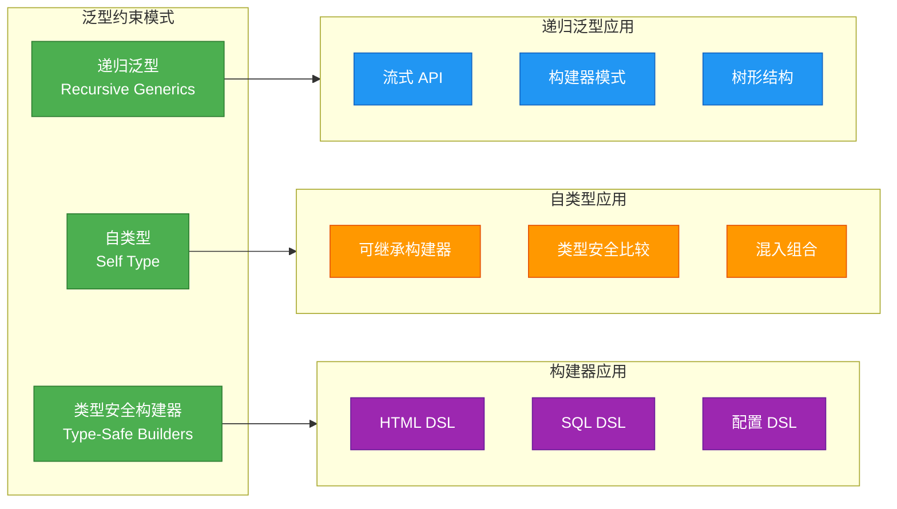

---

**📝 练习题**

**题目 1：递归泛型构建器**

请实现一个支持递归泛型的配置构建器 `ConfigBuilder`，要求：
1. 基类提供 `setAppName(name: String)` 和 `setVersion(version: String)` 方法
2. 子类 `DatabaseConfigBuilder` 添加 `setConnectionUrl(url: String)` 和 `setPoolSize(size: Int)` 方法
3. 确保方法链调用时类型安全，不会丢失子类类型

```kotlin
// 请完成以下代码
abstract class ConfigBuilder<T : ConfigBuilder<T>> {
    // TODO: 实现基类方法
}

class DatabaseConfigBuilder : ConfigBuilder<DatabaseConfigBuilder>() {
    // TODO: 实现子类方法
}

// 使用示例应该编译通过
val config = DatabaseConfigBuilder()
    .setAppName("MyApp")
    .setVersion("1.0.0")
    .setConnectionUrl("jdbc:mysql://localhost:3306/db")
    .setPoolSize(10)
```

**【答案】** 

```kotlin
abstract class ConfigBuilder<T : ConfigBuilder<T>> {
    protected var appName: String = ""
    protected var version: String = ""
    
    @Suppress("UNCHECKED_CAST")
    protected fun self(): T = this as T
    
    fun setAppName(name: String): T {
        this.appName = name
        return self()
    }
    
    fun setVersion(version: String): T {
        this.version = version
        return self()
    }
}

class DatabaseConfigBuilder : ConfigBuilder<DatabaseConfigBuilder>() {
    private var connectionUrl: String = ""
    private var poolSize: Int = 0
    
    fun setConnectionUrl(url: String): DatabaseConfigBuilder {
        this.connectionUrl = url
        return this
    }
    
    fun setPoolSize(size: Int): DatabaseConfigBuilder {
        this.poolSize = size
        return this
    }
}
```

**【解析】** 
这道题考察的是递归泛型的核心概念。关键点在于：
1. **类型参数约束**：`<T : ConfigBuilder<T>>` 确保类型参数 `T` 是 `ConfigBuilder` 的子类，并且 `T` 又引用了自身，形成递归结构。
2. **self() 方法**：通过 `this as T` 强制转换，将基类方法的返回类型从 `ConfigBuilder` 转换为实际的子类类型 `DatabaseConfigBuilder`。这样在方法链中，每次调用都返回正确的子类类型。
3. **类型安全**：编译器能够追踪整个方法链的类型变化，确保 `setAppName()` 和 `setVersion()` 返回的是 `DatabaseConfigBuilder` 而非基类 `ConfigBuilder`，从而允许继续调用 `setConnectionUrl()` 等子类特有方法。

没有递归泛型时，基类方法会返回 `ConfigBuilder` 类型，导致类型向上转型，丢失子类信息，无法继续链式调用子类方法。

---

**题目 2：reified 类型转换**

以下代码试图实现一个通用的 JSON 解析器，但存在编译错误。请指出错误原因并修复：

```kotlin
fun <T> parseJsonValue(value: String): T? {
    return when (T::class) {  // 编译错误
        String::class -> value as T
        Int::class -> value.toIntOrNull() as? T
        else -> null
    }
}
```

A. 需要添加 `inline` 关键字  
B. 需要添加 `reified` 关键字  
C. 需要添加 `inline` 和 `reified` 关键字  
D. 需要将 `T::class` 改为 `T::class.java`

**【答案】** C

**【解析】** 
这道题考察的是 `reified` 类型参数的使用前提。错误原因是：
1. **类型擦除问题**：在普通泛型函数中，由于 JVM 的类型擦除机制，类型参数 `T` 的具体类型信息在运行时不可用，因此无法使用 `T::class` 获取 `KClass` 对象。
2. **reified 要求**：要访问 `T::class`，必须将类型参数声明为 `reified`，这样编译器会在内联时将实际类型信息嵌入字节码。
3. **inline 要求**：`reified` 只能用于 `inline` 函数，因为内联是实现类型具体化的技术基础。编译器会在调用处将函数体展开，并将类型参数替换为实际类型。

修复后的代码：
```kotlin
inline fun <reified T> parseJsonValue(value: String): T? {
    return when (T::class) {
        String::class -> value as T
        Int::class -> value.toIntOrNull() as? T
        else -> null
    }
}
```

选项 A 和 B 都不完整，选项 D 虽然 `T::class.java` 在某些情况下可用（通过反射），但仍然需要 `reified` 才能访问 `T` 的类型信息。只有选项 C 同时满足了 `inline` 和 `reified` 两个必要条件。

---

## 类型擦除

在 Kotlin 和 Java 中，泛型机制在编译期和运行期的行为存在显著差异。这种差异的核心就是**类型擦除 (Type Erasure)**。理解类型擦除对于深入掌握泛型至关重要，它解释了为什么某些看似合理的泛型操作在运行时会失败，也揭示了 JVM 在向后兼容性和性能之间做出的权衡。

类型擦除是 JVM 为了在引入泛型的同时保持与旧版本字节码兼容而采用的实现策略。简单来说，**编译器会在编译阶段移除所有的泛型类型信息，将类型参数替换为其上界（默认为 `Any?` 对应 Java 的 `Object`）或具体的边界类型**。这意味着泛型类型仅在编译期存在，用于类型检查和类型推断，而在运行时，所有泛型类型都被"擦除"成了原始类型 (Raw Type)。

这种设计带来了一系列限制和特殊行为，我们需要逐一理解。

### JVM 限制

由于类型擦除机制，JVM 在运行时无法获取完整的泛型类型信息。这导致了几个重要的限制：

**1. 无法进行运行时类型检查**

最直接的影响是，你无法在运行时检查一个对象是否属于某个具体的泛型类型。例如：

```kotlin
fun <T> checkType(value: Any) {
    // ❌ 编译错误：Cannot check for instance of erased type: T
    // if (value is T) {
    //     println("Value is of type T")
    // }
    
    // ❌ 编译错误：Cannot check for instance of erased type: List<String>
    // if (value is List<String>) {
    //     println("Value is a List of Strings")
    // }
    
    // ✅ 可以检查原始类型，但无法检查类型参数
    if (value is List<*>) {  // 星号投影表示"某种类型的 List"
        println("Value is a List (but we don't know of what)")
    }
}

fun main() {
    val stringList: List<String> = listOf("A", "B")
    val intList: List<Int> = listOf(1, 2)
    
    checkType(stringList)  // 输出: Value is a List (but we don't know of what)
    checkType(intList)     // 输出: Value is a List (but we don't know of what)
    
    // 在运行时，List<String> 和 List<Int> 都被擦除为 List
    // JVM 无法区分它们
}
```

**2. 无法创建泛型数组**

由于数组在 Java/Kotlin 中是**协变的 (covariant)** 且**具体化的 (reified)**，而泛型是**类型擦除的**，两者结合会产生类型安全问题。因此，Kotlin 禁止直接创建泛型数组：

```kotlin
fun <T> createArray(size: Int): Array<T> {
    // ❌ 编译错误：Cannot create an array with a type parameter
    // return Array<T>(size) { TODO() }
    
    // ⚠️ 即使使用 @Suppress 强制编译，运行时也会出问题
    // @Suppress("UNCHECKED_CAST")
    // return arrayOfNulls<Any>(size) as Array<T>  // 危险的做法
    
    // ✅ 正确做法：使用 List 或要求 reified 类型参数
    return emptyArray()  // 实际应用中需要其他方案
}

// 使用 reified 和 inline 可以创建泛型数组
inline fun <reified T> createArraySafe(size: Int): Array<T> {
    return Array(size) { 
        throw UninitializedPropertyAccessException("Array element not initialized")
    }
}
```

**3. 泛型类型的静态成员限制**

由于类型参数是实例级别的概念，而静态成员属于类级别，类型擦除后静态上下文无法访问实例的类型信息：

```kotlin
class Box<T>(val value: T) {
    companion object {
        // ❌ 无法在伴生对象中使用外部类的类型参数 T
        // fun createDefault(): Box<T> = Box(???)
        
        // ✅ 需要重新声明类型参数
        fun <U> create(value: U): Box<U> = Box(value)
    }
}

fun main() {
    val intBox = Box.create(42)        // Box<Int>
    val stringBox = Box.create("Kotlin")  // Box<String>
}
```

**4. 无法基于类型参数进行方法重载**

由于类型擦除，以下两个方法在字节码层面具有相同的签名，会导致编译错误：

```kotlin
class Processor {
    // ❌ 编译错误：Platform declaration clash
    // 擦除后两个方法签名都是 process(List)
    // fun process(items: List<String>) { }
    // fun process(items: List<Int>) { }
    
    // ✅ 正确做法：使用不同的方法名或参数类型
    fun processStrings(items: List<String>) { }
    fun processInts(items: List<Int>) { }
}
```

让我们通过一个完整的示例来观察类型擦除的实际效果：

```kotlin
// 编译前的代码
class Container<T>(val item: T) {
    fun get(): T = item  // 返回类型参数 T
}

fun <T> printContainer(container: Container<T>) {
    println(container.get())  // 调用泛型方法
}

fun main() {
    val stringContainer = Container("Hello")  // Container<String>
    val intContainer = Container(123)         // Container<Int>
    
    printContainer(stringContainer)  // 输出: Hello
    printContainer(intContainer)     // 输出: 123
}
```

```java
// 编译后等价的字节码逻辑（伪代码）
// 所有的 T 都被擦除为 Object (Kotlin 的 Any?)

class Container {
    private final Object item;  // T 被擦除为 Object
    
    public Container(Object item) {
        this.item = item;
    }
    
    public Object get() {  // 返回类型也被擦除为 Object
        return item;
    }
}

void printContainer(Container container) {  // 类型参数消失
    System.out.println(container.get());    // 需要类型转换
}

public static void main(String[] args) {
    Container stringContainer = new Container("Hello");  // 类型信息丢失
    Container intContainer = new Container(123);
    
    // 编译器会自动插入类型转换代码（桥方法）
    printContainer(stringContainer);
    printContainer(intContainer);
}
```

### 边界保留

虽然类型参数本身会被擦除，但**类型参数的边界 (bounds) 信息会被保留**。这是类型擦除机制中的一个重要特性，它确保了泛型代码在运行时仍然具有一定的类型约束。

当我们为类型参数指定上界时，编译器会将类型参数擦除为其上界类型，而不是默认的 `Any?`：

```kotlin
// 定义带有上界约束的泛型类
open class Animal(val name: String) {
    open fun makeSound() = "Some sound"
}

class Dog(name: String) : Animal(name) {
    override fun makeSound() = "Woof!"
}

class Cat(name: String) : Animal(name) {
    override fun makeSound() = "Meow!"
}

// T 被约束为 Animal 的子类型
class AnimalShelter<T : Animal>(private val animals: MutableList<T> = mutableListOf()) {
    
    // 添加动物到收容所
    fun add(animal: T) {
        animals.add(animal)
    }
    
    // 让所有动物发出声音
    fun makeAllSoundsLoud() {
        animals.forEach { animal ->
            // 即使 T 被擦除，但擦除为 Animal 而不是 Any?
            // 因此我们仍然可以安全调用 Animal 的方法
            println("${animal.name}: ${animal.makeSound()}")  // ✅ 编译通过
        }
    }
    
    // 获取第一个动物（如果存在）
    fun getFirst(): T? = animals.firstOrNull()
}
```

```java
// 编译后的字节码等价逻辑（简化）
// T 被擦除为其上界 Animal，而不是 Object

class AnimalShelter {
    private final List animals;  // List<T> 擦除为 List
    
    public AnimalShelter(List animals) {
        this.animals = animals;
    }
    
    public void add(Animal animal) {  // T 擦除为 Animal（上界）
        animals.add(animal);
    }
    
    public void makeAllSoundsLoud() {
        for (Object obj : animals) {
            Animal animal = (Animal) obj;  // 编译器插入的强制转换
            System.out.println(animal.getName() + ": " + animal.makeSound());
        }
    }
    
    public Animal getFirst() {  // 返回类型擦除为 Animal
        return animals.isEmpty() ? null : (Animal) animals.get(0);
    }
}
```

让我们看看边界保留的实际应用：

```kotlin
// 定义接口层次
interface Comparable<in T> {
    fun compareTo(other: T): Int
}

interface Serializable  // 标记接口

// 定义带有多个约束的泛型函数
// T 必须同时实现 Comparable<T> 和 Serializable
fun <T> sortAndSerialize(items: List<T>): List<T> 
    where T : Comparable<T>,  // 第一个约束
          T : Serializable {   // 第二个约束
    
    // 由于边界保留，我们可以安全调用 compareTo
    return items.sortedWith { a, b -> a.compareTo(b) }  // ✅ 编译通过
}

// 实现符合约束的类
data class Person(val name: String, val age: Int) : Comparable<Person>, Serializable {
    override fun compareTo(other: Person): Int = age.compareTo(other.age)
}

fun main() {
    val people = listOf(
        Person("Alice", 30),
        Person("Bob", 25),
        Person("Charlie", 35)
    )
    
    val sorted = sortAndSerialize(people)  // ✅ 类型安全
    sorted.forEach { println(it) }
    
    // 输出:
    // Person(name=Bob, age=25)
    // Person(name=Alice, age=30)
    // Person(name=Charlie, age=35)
}
```

```java
// sortAndSerialize 函数编译后的签名（简化）
// T 被擦除为第一个边界 Comparable

public static List sortAndSerialize(List items) {
    // items 中的元素被视为 Comparable 类型
    return items.stream()
        .sorted((a, b) -> ((Comparable) a).compareTo(b))
        .collect(Collectors.toList());
}
```

**边界保留的关键要点**：

1. **默认边界**：如果没有显式指定上界，类型参数擦除为 `Any?`（Java 的 `Object`）
2. **显式边界**：指定上界后，擦除为该上界类型
3. **多个边界**：存在多个边界时，擦除为第一个边界（必须是类类型，接口放在 `where` 子句中）
4. **方法调用安全**：边界保留确保了即使在擦除后，仍能安全调用上界类型的方法

```kotlin
// 演示不同边界的擦除结果
class Example1<T>                         // T 擦除为 Any?
class Example2<T : Number>                // T 擦除为 Number
class Example3<T : Comparable<T>>         // T 擦除为 Comparable
class Example4<T> where T : Number,       // T 擦除为 Number（第一个边界）
                         T : Comparable<T>

fun demonstrate() {
    val ex1: Example1<String> = Example1()    // 运行时是 Example1（无类型参数）
    val ex2: Example2<Int> = Example2()       // 运行时是 Example2（无类型参数）
    
    // 两个实例在运行时具有相同的类对象
    println(ex1::class == Example1::class)    // true
    println(ex2::class == Example2::class)    // true
}
```

### 桥方法

**桥方法 (Bridge Method)** 是编译器为了解决类型擦除带来的多态性问题而自动生成的合成方法。当泛型类或接口被子类化时，由于类型擦除，子类中覆盖的方法签名可能与父类擦除后的签名不匹配。为了保持 Java 的方法覆盖语义，编译器会自动生成桥方法来"桥接"这种差异。

让我们通过一个具体例子来理解桥方法的产生过程：

```kotlin
// 定义泛型接口
interface Processor<T> {
    fun process(item: T): String  // 泛型方法
}

// 实现具体化的类
class StringProcessor : Processor<String> {
    // 覆盖方法，使用具体类型 String
    override fun process(item: String): String {
        return "Processing: ${item.uppercase()}"  // 处理字符串
    }
}

fun main() {
    val processor: Processor<String> = StringProcessor()
    println(processor.process("kotlin"))  // 输出: Processing: KOTLIN
    
    // 通过反射查看实际生成的方法
    StringProcessor::class.java.declaredMethods.forEach { method ->
        println("Method: ${method.name}, Parameters: ${method.parameterTypes.contentToString()}")
    }
}
```

上述代码编译后，`StringProcessor` 类中实际上会存在**两个** `process` 方法：

```java
// 编译后的字节码等价逻辑（Java 伪代码）

interface Processor {
    String process(Object item);  // T 被擦除为 Object
}

class StringProcessor implements Processor {
    
    // 1. 我们显式编写的方法（具体类型）
    public String process(String item) {
        return "Processing: " + item.toUpperCase();
    }
    
    // 2. 编译器自动生成的桥方法（擦除类型）
    // 这个方法是 synthetic（合成的）并且标记为 bridge
    public String process(Object item) {  // 签名匹配父接口擦除后的签名
        return this.process((String) item);  // 委托给具体类型的方法
    }
}
```

**桥方法的工作流程**：

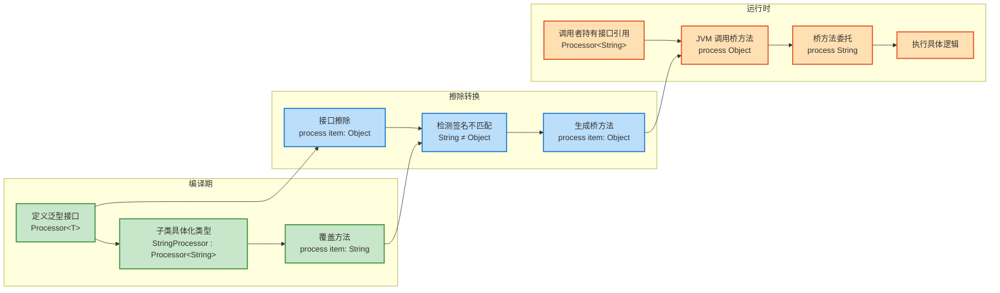

让我们看一个更复杂的例子，涉及继承链和协变返回类型：

```kotlin
// 定义泛型基类
open class Container<T>(protected val item: T) {
    // 泛型方法，返回类型是 T
    open fun getItem(): T = item
}

// 第一层继承，具体化类型为 Number
open class NumberContainer(item: Number) : Container<Number>(item) {
    // 覆盖方法，返回类型协变为 Number
    override fun getItem(): Number = super.getItem()
}

// 第二层继承，进一步具体化为 Int
class IntContainer(item: Int) : NumberContainer(item) {
    // 覆盖方法，返回类型协变为 Int
    override fun getItem(): Int = super.getItem().toInt()
}

fun demonstrateBridgeMethods() {
    val intContainer = IntContainer(42)
    
    // 不同引用类型调用同一个对象的方法
    val asContainer: Container<Number> = intContainer
    val asNumberContainer: NumberContainer = intContainer
    val asIntContainer: IntContainer = intContainer
    
    println(asContainer.getItem())        // 通过桥方法调用
    println(asNumberContainer.getItem())  // 通过桥方法调用
    println(asIntContainer.getItem())     // 直接调用具体方法
    
    // 使用反射查看 IntContainer 的所有方法
    println("\n=== IntContainer 的方法签名 ===")
    IntContainer::class.java.declaredMethods.forEach { method ->
        val synthetic = if (method.isSynthetic) " [BRIDGE]" else ""
        val params = method.parameterTypes.joinToString { it.simpleName }
        println("${method.returnType.simpleName} ${method.name}($params)$synthetic")
    }
}
```

```java
// IntContainer 编译后的等价字节码（简化）

class IntContainer extends NumberContainer {
    
    // 1. 我们显式编写的方法
    public Integer getItem() {  // 返回具体类型 Int (Integer)
        return super.getItem().intValue();
    }
    
    // 2. 桥接到父类 NumberContainer 的桥方法
    // 标记为 synthetic 和 bridge
    public Number getItem() {  // 返回 Number
        return this.getItem();  // 调用返回 Integer 的方法（协变）
    }
    
    // 3. 桥接到顶层 Container<T> 的桥方法
    // 标记为 synthetic 和 bridge
    public Object getItem() {  // 返回 Object（最终擦除类型）
        return this.getItem();  // 调用返回 Integer 的方法（协变）
    }
}
```

**桥方法在泛型函数中的应用**：

```kotlin
// 定义泛型函数接口
interface Mapper<T, R> {
    fun map(input: T): R  // 将 T 类型转换为 R 类型
}

// 实现具体的映射器
class StringLengthMapper : Mapper<String, Int> {
    override fun map(input: String): Int {
        return input.length  // 计算字符串长度
    }
}

class IntToStringMapper : Mapper<Int, String> {
    override fun map(input: Int): String {
        return input.toString()  // 将整数转换为字符串
    }
}

fun <T, R> applyMapper(mapper: Mapper<T, R>, value: T): R {
    return mapper.map(value)  // 调用映射函数
}

fun main() {
    val lengthMapper = StringLengthMapper()
    val stringMapper = IntToStringMapper()
    
    println(applyMapper(lengthMapper, "Kotlin"))  // 输出: 6
    println(applyMapper(stringMapper, 42))        // 输出: 42
}
```

```java
// StringLengthMapper 编译后的字节码（简化）

interface Mapper {
    Object map(Object input);  // 两个类型参数都擦除为 Object
}

class StringLengthMapper implements Mapper {
    
    // 1. 具体类型的方法
    public Integer map(String input) {
        return input.length();
    }
    
    // 2. 编译器生成的桥方法
    public Object map(Object input) {  // 签名匹配接口擦除后的签名
        return this.map((String) input);  // 强制转换 + 委托调用
    }
}
```

**桥方法的关键特征**：

1. **自动生成**：由编译器自动创建，开发者无法直接编写
2. **合成标记**：在字节码层面标记为 `synthetic` 和 `bridge`
3. **签名匹配**：确保子类方法签名与父类擦除后的签名一致
4. **委托调用**：桥方法内部通过类型转换委托给具体类型的方法
5. **协变返回**：支持返回类型的协变（子类型）

**为什么需要桥方法？**

```kotlin
// 没有桥方法会发生什么？

interface Animal {
    fun getType(): Any  // 擦除后的签名
}

class Dog : Animal {
    override fun getType(): String = "Dog"  // 具体类型签名
}

fun polymorphismTest() {
    val dog: Animal = Dog()
    
    // 如果没有桥方法：
    // JVM 会查找 Dog.getType(): Any
    // 但实际只存在 Dog.getType(): String
    // 导致 NoSuchMethodError！
    
    // 有了桥方法：
    // 编译器生成 Dog.getType(): Any (桥方法)
    // 该方法调用 Dog.getType(): String
    // 多态调用成功！
    
    dog.getType()  // ✅ 通过桥方法正确调用
}
```

**桥方法的性能影响**：

桥方法会带来轻微的性能开销（额外的方法调用和类型转换），但这种开销在现代 JVM 的即时编译器 (JIT) 优化下几乎可以忽略不计。JIT 编译器会内联这些桥方法，消除额外的调用开销。

```kotlin
// 性能对比示例（理论上）

class PerformanceTest {
    interface Counter<T> {
        fun increment(value: T): T
    }
    
    class IntCounter : Counter<Int> {
        override fun increment(value: Int): Int = value + 1
        
        // 编译器生成的桥方法：
        // fun increment(value: Any?): Any? = increment(value as Int)
    }
    
    fun testDirect() {
        val counter = IntCounter()
        repeat(1_000_000) {
            counter.increment(it)  // 直接调用，无开销
        }
    }
    
    fun testPolymorphic() {
        val counter: Counter<Int> = IntCounter()
        repeat(1_000_000) {
            counter.increment(it)  // 通过桥方法调用，JIT 会优化
        }
    }
}
```

通过理解桥方法的机制，我们能更好地理解泛型代码在字节码层面的实际运作方式，以及为什么 Kotlin/Java 能在类型擦除的限制下仍然保持类型安全和多态性。

## 本章小结

在本章"泛型进阶"中，我们深入探索了 Kotlin 泛型系统的核心概念和高级特性。从基础的泛型类和泛型函数出发，逐步理解了类型参数如何提供编译期的类型安全保障。通过学习类型参数约束，我们掌握了如何使用上界约束和 `where` 子句来限制类型参数的范围，确保泛型代码的正确性。

**型变 (Variance)** 是本章的核心主题之一。我们理解了不变、协变和逆变三种型变模式，以及它们如何影响类型的子类型关系。**声明处型变**通过 `out` 和 `in` 关键字在类型定义处指定型变，遵循生产者使用 `out`（协变）、消费者使用 `in`（逆变）的 PECS 原则。**使用处型变**则提供了更灵活的类型投影机制，允许我们在使用泛型类型时临时指定型变行为。

我们通过实际案例分析了 `List<out T>` 的协变特性、`MutableList<T>` 的不变性质，以及函数类型 `(T) -> R` 在参数上的逆变和返回值上的协变。**星号投影 (`*`)** 为我们提供了一种安全地处理未知类型参数的方式，在不关心具体类型时保持类型安全。

**具体化类型参数 (reified)** 是 Kotlin 对 JVM 类型擦除限制的创新突破。通过在内联函数中使用 `reified` 关键字,我们可以在运行时访问类型参数的信息，实现类型检查、类型转换和反射操作等原本不可能的功能。这极大地增强了泛型的实用性。

在泛型约束实践中，我们学习了递归泛型、自类型模式以及如何构建类型安全的 DSL 构建器。这些高级技巧展示了 Kotlin 泛型系统的强大表达能力。

最后，我们深入理解了 **类型擦除**机制及其带来的限制。JVM 为了向后兼容而采用的类型擦除导致泛型信息在运行时丢失，但边界信息会被保留。编译器通过自动生成**桥方法**来解决类型擦除带来的多态性问题，确保泛型代码的正确执行。

理解这些概念不仅帮助我们编写更安全、更优雅的泛型代码，也让我们能够更好地理解 Kotlin 标准库的设计，以及在遇到泛型相关的编译错误或运行时问题时能够快速定位和解决。

**核心要点回顾**：
- **泛型提供编译期类型安全**，避免运行时类型转换错误
- **型变控制类型的继承关系**：协变 (`out`) 保持子类型关系，逆变 (`in`) 反转子类型关系，不变则不建立关系
- **PECS 原则**：生产者 (Producer) 用 `out`，消费者 (Consumer) 用 `in`
- **`reified` 突破类型擦除限制**，但仅限内联函数
- **类型擦除在运行时移除泛型信息**，但保留边界约束
- **桥方法维护多态性**，确保泛型代码在擦除后仍能正确工作

---

**📝 练习题 1：型变与类型安全**

以下代码片段中，哪些赋值操作是**合法的**？

```kotlin
open class Animal
class Dog : Animal()
class Cat : Animal()

val dogs: List<Dog> = listOf(Dog())
val animals: List<Animal> = dogs  // (A)

val mutableDogs: MutableList<Dog> = mutableListOf(Dog())
val mutableAnimals: MutableList<Animal> = mutableDogs  // (B)

fun processDogs(consumer: (Dog) -> Unit) {}
fun processAnimals(consumer: (Animal) -> Unit) {}

val animalConsumer: (Animal) -> Unit = { }
val dogConsumer: (Dog) -> Unit = animalConsumer  // (C)

val dogProducer: () -> Dog = { Dog() }
val animalProducer: () -> Animal = dogProducer  // (D)
```

A. 仅 (A) 合法  
B. (A) 和 (C) 合法  
C. (A)、(C) 和 (D) 合法  
D. 全部合法  

**【答案】** C

**【解析】**

- **(A) 合法**：`List<out T>` 是协变的只读集合。由于 `Dog` 是 `Animal` 的子类型，根据协变规则，`List<Dog>` 是 `List<Animal>` 的子类型。这个赋值是类型安全的，因为我们只能从 `List<Animal>` 中读取元素（作为 `Animal` 类型），无法添加新元素。

- **(B) 非法**：`MutableList<T>` 是不变的可变集合。如果这个赋值合法，我们可以通过 `mutableAnimals.add(Cat())` 向列表中添加 `Cat` 对象，但底层列表实际上是 `MutableList<Dog>`，这会破坏类型安全。因此编译器禁止这种赋值。

- **(C) 合法**：函数类型 `(T) -> R` 在参数位置是逆变的（`in`），在返回值位置是协变的（`out`）。这里 `(Animal) -> Unit` 可以安全地赋值给 `(Dog) -> Unit`，因为任何能处理 `Animal` 的函数也能处理 `Dog`（`Dog` 是 `Animal` 的子类型）。当调用 `dogConsumer(Dog())` 时，实际执行的 `animalConsumer` 可以安全地接受 `Dog` 参数。

- **(D) 合法**：函数类型 `() -> T` 在返回值位置是协变的。`() -> Dog` 可以赋值给 `() -> Animal`，因为每次调用都会返回一个 `Dog` 对象，而 `Dog` 是 `Animal` 的有效子类型。调用 `animalProducer()` 总是能获得一个 `Animal`（实际是 `Dog`），类型安全得以保证。

---

**📝 练习题 2：类型擦除与 reified**

以下哪个函数**无法通过编译**？

```kotlin
// 函数 A
fun <T> isListOf(value: Any): Boolean {
    return value is List<T>
}

// 函数 B
inline fun <reified T> isListOfReified(value: Any): Boolean {
    return value is List<T>
}

// 函数 C
inline fun <reified T> createArray(size: Int): Array<T> {
    return Array(size) { throw UninitializedPropertyAccessException() }
}

// 函数 D
fun <T> checkType(value: T): String {
    return when (value) {
        is String -> "String"
        is Int -> "Int"
        else -> "Unknown"
    }
}
```

A. 仅函数 A  
B. 函数 A 和 B  
C. 函数 A 和 C  
D. 仅函数 D  

**【答案】** A

**【解析】**

- **函数 A（无法编译）**：由于类型擦除，我们无法在运行时检查泛型类型参数 `T`。表达式 `value is List<T>` 会导致编译错误："Cannot check for instance of erased type: T"。即使 `value` 确实是一个 `List`，JVM 也无法验证其元素类型是否为 `T`。

- **函数 B（可以编译）**：使用 `reified` 关键字和 `inline` 修饰符后，类型参数 `T` 的信息会在编译时内联到调用处，使得运行时类型检查成为可能。虽然仍然无法检查 `List` 的元素类型（因为 `List` 本身也是类型擦除的），但至少可以检查 `T` 本身的类型。实际上这个检查会退化为 `value is List<*>`，但语法上是合法的。

- **函数 C（可以编译）**：`reified` 类型参数允许我们在运行时创建泛型数组。编译器会将类型信息内联，使得 `Array<T>` 构造函数能够获取到实际的类型参数，从而成功创建数组。这是 `reified` 的一个经典应用场景。

- **函数 D（可以编译）**：这个函数的类型检查与泛型无关。`when` 表达式中的 `is String` 和 `is Int` 检查的是具体的值类型，而不是类型参数 `T`。函数接受任何类型 `T` 的参数，但在运行时通过 `when` 分支判断实际传入值的类型，这是完全合法的。

---