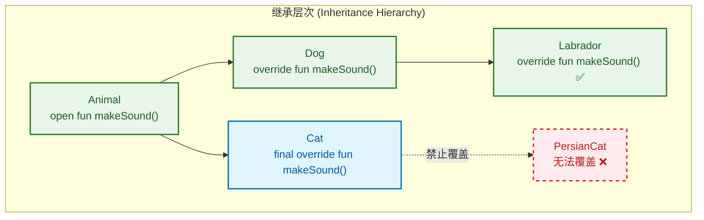
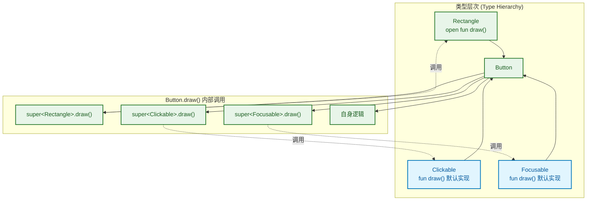
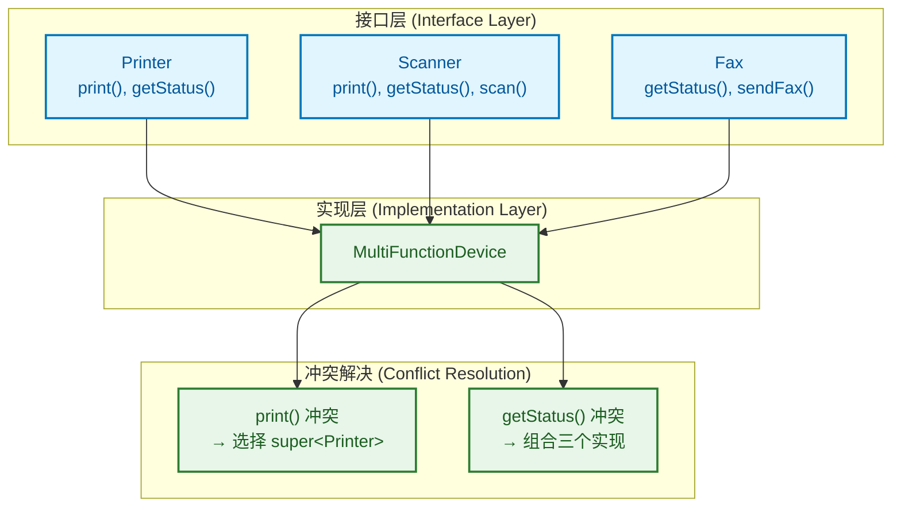
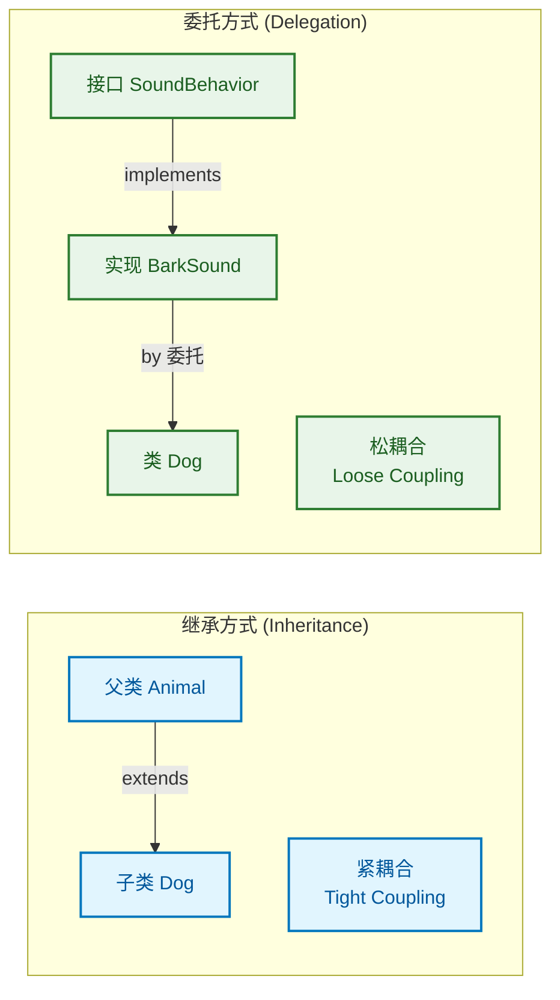
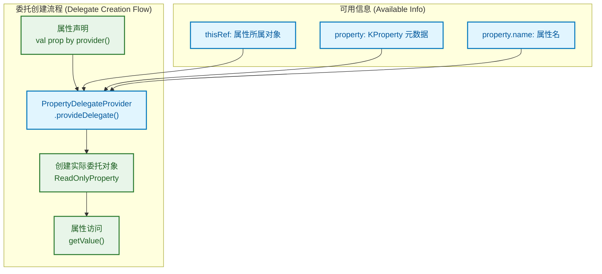
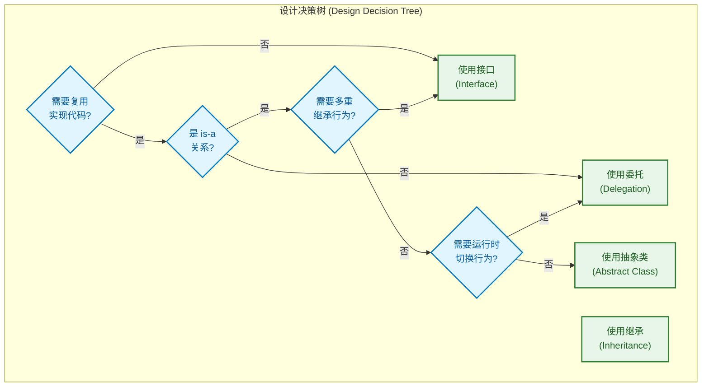

---

# 继承与多态基础

---

## 继承机制 (Inheritance Mechanism)

### open 关键字与默认 final 设计哲学

Kotlin 在类继承设计上采取了与 Java 截然相反的策略：**所有类和成员默认都是 final 的**，即不可被继承或覆盖。这一设计源自 Joshua Bloch 在《Effective Java》中的建议："Design and document for inheritance or else prohibit it"（要么为继承而设计并提供文档，要么禁止继承）。

```kotlin
// ❌ 编译错误：默认 final，无法继承
class Animal {
    fun eat() { println("eating") }
}

class Dog : Animal()  // Error: This type is final, so it cannot be inherited from

// ✅ 正确：使用 open 显式允许继承
open class Animal {
    open fun eat() { println("eating") }  // 方法也需要 open 才能被覆盖
}

class Dog : Animal()  // 编译通过
```

**为什么默认 final？**

| 设计考量 | 说明 |
|---------|------|
| **安全性 (Safety)** | 防止意外继承导致的脆弱基类问题 (Fragile Base Class Problem) |
| **性能优化 (Performance)** | final 方法可被 JVM 内联优化 (inline optimization) |
| **明确意图 (Explicit Intent)** | 强制开发者思考"这个类是否应该被继承" |
| **API 稳定性 (API Stability)** | 减少因子类依赖而无法修改父类的困境 |

### 继承语法详解

Kotlin 使用冒号 `:` 替代 Java 的 `extends` 关键字，且**必须显式调用父类构造函数**：

```kotlin
// 父类定义
open class Person(val name: String, var age: Int) {
    open fun introduce() {
        println("I'm $name, $age years old")
    }
}

// 子类继承 —— 主构造函数形式
class Student(
    name: String,           // 传递给父类，不加 val/var
    age: Int,
    val studentId: String   // 子类新增属性，需要 val/var
) : Person(name, age) {     // 冒号后调用父类构造函数
    
    override fun introduce() {
        println("I'm $name, student ID: $studentId")
    }
}

// 使用示例
fun main() {
    val student = Student("Alice", 20, "2024001")
    student.introduce()  // 输出: I'm Alice, student ID: 2024001
}
```

**构造函数继承的三种场景**：

```kotlin
// 场景1：父类有主构造函数
open class Parent(val x: Int)
class Child(x: Int, val y: Int) : Parent(x)  // 必须在声明处调用

// 场景2：父类无主构造函数，有次构造函数
open class Parent {
    val x: Int
    constructor(x: Int) {
        this.x = x
    }
}
class Child : Parent {
    constructor(x: Int) : super(x)  // 使用 super 调用父类次构造函数
}

// 场景3：父类有多个构造函数
open class Parent(val x: Int) {
    constructor(x: Int, y: Int) : this(x)
}
class Child : Parent {
    constructor(x: Int) : super(x)           // 调用父类主构造
    constructor(x: Int, y: Int) : super(x, y) // 调用父类次构造
}
```

### 继承层次中的初始化顺序

理解初始化顺序对于避免 bug 至关重要：

```kotlin
open class Base(val name: String) {
    init {
        println("Base init: name = $name")
        printName()  // ⚠️ 危险：此时子类尚未初始化
    }
    
    open fun printName() {
        println("Base.printName: $name")
    }
}

class Derived(name: String, val extra: String) : Base(name) {
    init {
        println("Derived init: extra = $extra")
    }
    
    override fun printName() {
        println("Derived.printName: $extra")  // extra 此时为 null！
    }
}

fun main() {
    Derived("test", "extraValue")
}
```

**输出结果**：
```
Base init: name = test
Derived.printName: null    // ⚠️ extra 尚未初始化，为 null
Derived init: extra = extraValue
```

```kotlin
┌─────────────────────────────────────────────────────────────┐
│              对象初始化顺序 (Initialization Order)            │
├─────────────────────────────────────────────────────────────┤
│  1. 父类主构造参数求值                                        │
│         ↓                                                   │
│  2. 父类属性初始化器 + init 块（按声明顺序）                    │
│         ↓                                                   │
│  3. 父类次构造函数体（如有）                                   │
│         ↓                                                   │
│  4. 子类主构造参数求值                                        │
│         ↓                                                   │
│  5. 子类属性初始化器 + init 块（按声明顺序）                    │
│         ↓                                                   │
│  6. 子类次构造函数体（如有）                                   │
└─────────────────────────────────────────────────────────────┘
```

> ⚠️ **最佳实践**：避免在构造函数或 init 块中调用 open 方法，因为子类覆盖的方法可能访问尚未初始化的属性。

---

## 方法覆盖 (Method Overriding)

### override 关键字的强制性

与 Java 的 `@Override` 注解不同，Kotlin 的 `override` 是**强制性关键字**，不是可选的注解。这消除了"意外覆盖"和"意外未覆盖"两类问题：

```kotlin
open class Shape {
    open fun draw() { println("Drawing shape") }
    fun fill() { println("Filling shape") }  // 非 open，不可覆盖
}

class Circle : Shape() {
    // ✅ 正确：override 是必须的
    override fun draw() { println("Drawing circle") }
    
    // ❌ 编译错误：缺少 override
    // fun draw() { println("Drawing circle") }
    
    // ❌ 编译错误：fill() 不是 open 的
    // override fun fill() { println("Filling circle") }
}
```

**Java vs Kotlin 对比**：

| 场景 | Java | Kotlin |
|-----|------|--------|
| 覆盖标记 | `@Override`（可选注解） | `override`（强制关键字） |
| 漏写覆盖标记 | 编译通过，运行时可能出错 | 编译错误 |
| 父类方法签名变更 | 子类方法变成新方法，无警告 | 编译错误，强制修复 |
| 意外同名方法 | 可能意外覆盖 | 编译错误，必须显式声明 |

### 禁止进一步覆盖：final override

当你覆盖一个方法后，该方法默认仍然是 open 的（可被孙子类继续覆盖）。使用 `final override` 可以终止覆盖链：

```kotlin
open class Animal {
    open fun makeSound() { println("Some sound") }
}

open class Dog : Animal() {
    // 允许继续被覆盖
    override fun makeSound() { println("Bark!") }
}

open class Cat : Animal() {
    // 禁止子类继续覆盖
    final override fun makeSound() { println("Meow!") }
}

class Labrador : Dog() {
    // ✅ 可以覆盖，因为 Dog.makeSound() 没有 final
    override fun makeSound() { println("Woof woof!") }
}

class PersianCat : Cat() {
    // ❌ 编译错误：Cat.makeSound() 是 final 的
    // override fun makeSound() { println("Purr~") }
}
```



### 覆盖规则与多态行为

```kotlin
open class Printer {
    open fun print(message: String) {
        println("Printer: $message")
    }
    
    // 带默认参数的方法覆盖
    open fun printWithPrefix(message: String, prefix: String = ">>>") {
        println("$prefix $message")
    }
}

class ColorPrinter : Printer() {
    override fun print(message: String) {
        println("🎨 ColorPrinter: $message")
    }
    
    // 覆盖时不能改变默认参数值（会被忽略）
    override fun printWithPrefix(message: String, prefix: String) {
        println("🎨 $prefix $message")
    }
}

fun main() {
    val printer: Printer = ColorPrinter()  // 多态引用
    printer.print("Hello")                  // 输出: 🎨 ColorPrinter: Hello
    printer.printWithPrefix("World")        // 输出: 🎨 >>> World（使用父类默认值）
}
```

> 📌 **注意**：覆盖方法时，默认参数值总是从**基类**获取。子类中指定的默认值会被忽略，这是为了保证多态调用的一致性。

---

## 属性覆盖 (Property Overriding)

### 覆盖 val 与 var 的规则

属性覆盖遵循特定的规则，核心原则是：**子类可以扩展能力，但不能削减能力**。

```kotlin
open class Vehicle {
    open val wheels: Int = 4           // 只读属性
    open var speed: Int = 0            // 可读写属性
    open val maxSpeed: Int get() = 200 // 带 getter 的只读属性
}

class Motorcycle : Vehicle() {
    // ✅ val 可以被 val 覆盖
    override val wheels: Int = 2
    
    // ✅ val 可以被 var 覆盖（扩展能力：增加 setter）
    override var maxSpeed: Int = 180
    
    // ❌ var 不能被 val 覆盖（削减能力：移除 setter）
    // override val speed: Int = 0  // 编译错误
    
    // ✅ var 可以被 var 覆盖
    override var speed: Int = 0
}
```

**覆盖规则总结**：

```kotlin
┌────────────────────────────────────────────────────────┐
│           属性覆盖规则 (Property Override Rules)         │
├────────────────────────────────────────────────────────┤
│                                                        │
│   父类 val  ──────►  子类 val  ✅ (保持只读)             │
│       │                                                │
│       └──────────►  子类 var  ✅ (扩展为可写)            │
│                                                        │
│   父类 var  ──────►  子类 var  ✅ (保持可读写)           │
│       │                                                │
│       └──────────►  子类 val  ❌ (不能削减能力)          │
│                                                        │
└────────────────────────────────────────────────────────┘
```

### 在主构造函数中覆盖属性

这是 Kotlin 的一个便捷特性，可以直接在主构造函数中使用 `override`：

```kotlin
open class User(open val name: String, open val email: String)

// 在主构造函数中直接覆盖
class AdminUser(
    override val name: String,
    override val email: String,
    val adminLevel: Int
) : User(name, email)

// 等价的完整写法
class AdminUserVerbose(name: String, email: String, val adminLevel: Int) : User(name, email) {
    override val name: String = name
    override val email: String = email
}
```

### 改变访问器 (Accessor)

覆盖属性时，可以提供自定义的 getter 和 setter：

```kotlin
open class Rectangle(val width: Double, val height: Double) {
    open val area: Double
        get() = width * height
    
    open var borderColor: String = "black"
        protected set  // 限制 setter 可见性
}

class Square(side: Double) : Rectangle(side, side) {
    // 覆盖 getter，添加日志
    override val area: Double
        get() {
            println("Calculating square area...")
            return super.width * super.width  // 或 width * height
        }
    
    // 覆盖并改变 setter 行为
    override var borderColor: String = "blue"
        set(value) {
            println("Square border color changing to: $value")
            field = value.uppercase()  // 自定义逻辑
        }
}

fun main() {
    val square = Square(5.0)
    println(square.area)           // 输出: Calculating square area... \n 25.0
    square.borderColor = "red"     // 输出: Square border color changing to: red
    println(square.borderColor)    // 输出: RED
}
```

### 使用 backing field 与计算属性

```kotlin
open class Temperature {
    open var celsius: Double = 0.0
    
    // 计算属性：没有 backing field
    open val fahrenheit: Double
        get() = celsius * 9 / 5 + 32
}

class SmartThermometer : Temperature() {
    private var _lastUpdated: Long = 0
    
    // 覆盖并添加副作用
    override var celsius: Double = 0.0
        set(value) {
            field = value                          // 使用 backing field
            _lastUpdated = System.currentTimeMillis()
            println("Temperature updated at $_lastUpdated")
        }
    
    // 覆盖计算属性，改变计算逻辑（四舍五入）
    override val fahrenheit: Double
        get() = kotlin.math.round(super.fahrenheit * 10) / 10
}
```

### 抽象属性覆盖

抽象属性必须在子类中被覆盖实现：

```kotlin
abstract class DataSource {
    // 抽象属性：没有初始值，没有访问器实现
    abstract val connectionString: String
    abstract var timeout: Int
}

class MySqlDataSource : DataSource() {
    // 必须覆盖所有抽象属性
    override val connectionString: String = "jdbc:mysql://localhost:3306/db"
    
    override var timeout: Int = 30000
        set(value) {
            require(value > 0) { "Timeout must be positive" }
            field = value
        }
}

class InMemoryDataSource : DataSource() {
    // 可以用计算属性实现抽象属性
    override val connectionString: String
        get() = "memory://temp-${System.nanoTime()}"
    
    override var timeout: Int = 0  // 内存数据源不需要超时
}
```

---

## 📝 练习题

**题目 1**：以下代码的输出是什么？

```kotlin
open class A {
    open val x: Int = 1
    init { println(x) }
}

class B : A() {
    override val x: Int = 2
}

fun main() {
    B()
}
```

A. `1`  
B. `2`  
C. `0`  
D. 编译错误

【答案】C

【解析】这是一个经典的初始化顺序陷阱。当 `B()` 被调用时：
1. 首先执行父类 `A` 的初始化
2. 在 `A` 的 `init` 块中调用 `println(x)`
3. 由于 `x` 被子类 `B` 覆盖，实际调用的是 `B.x` 的 getter
4. 但此时 `B` 的属性尚未初始化，`Int` 类型的默认值是 `0`
5. 因此输出 `0`

这说明了为什么要避免在构造过程中访问可被覆盖的成员。

---

**题目 2**：以下哪个属性覆盖是**不合法**的？

```kotlin
open class Parent {
    open val a: Int = 1
    open var b: Int = 2
    open val c: Int get() = 3
}

class Child : Parent() {
    override var a: Int = 10      // 选项 A
    override val b: Int = 20      // 选项 B
    override var c: Int = 30      // 选项 C
}
```

A. `override var a` 覆盖 `open val a`  
B. `override val b` 覆盖 `open var b`  
C. `override var c` 覆盖 `open val c`  
D. 以上都合法

【答案】B

【解析】
- **选项 A 合法**：`val` 可以被 `var` 覆盖，因为这是扩展能力（增加 setter）
- **选项 B 不合法**：`var` 不能被 `val` 覆盖，因为这会削减能力（移除 setter），父类代码可能依赖 setter 的存在
- **选项 C 合法**：`val`（即使是计算属性）可以被 `var` 覆盖

核心原则：子类可以比父类"能力更强"，但不能"能力更弱"。`var` 比 `val` 能力强（多了写入能力），所以 `val → var` 允许，`var → val` 禁止。

---

## 调用超类实现 (Calling Super Class Implementation)

### super 关键字基础用法

当子类覆盖 (override) 父类的方法或属性时，有时需要在新实现中复用父类的逻辑，而不是完全重写。Kotlin 使用 `super` 关键字来访问父类成员：

```kotlin
open class Animal {
    open val name: String = "Animal"
    
    open fun makeSound() {
        println("Some generic animal sound")
    }
    
    open fun describe() {
        println("I am an animal named $name")
    }
}

class Dog : Animal() {
    override val name: String = "Dog"
    
    override fun makeSound() {
        // 先调用父类实现，再添加自己的逻辑
        super.makeSound()
        println("Woof! Woof!")
    }
    
    override fun describe() {
        // 完全使用自己的实现，但访问父类属性
        println("I am a dog. Parent says my name is: ${super.name}")
        println("But I know my name is: $name")
    }
}

fun main() {
    val dog = Dog()
    dog.makeSound()
    // 输出:
    // Some generic animal sound
    // Woof! Woof!
    
    println("---")
    dog.describe()
    // 输出:
    // I am a dog. Parent says my name is: Animal
    // But I know my name is: Dog
}
```

**super 的三种使用场景**：

| 场景 | 语法 | 说明 |
|-----|------|------|
| 调用父类方法 | `super.methodName()` | 在覆盖方法中复用父类逻辑 |
| 访问父类属性 | `super.propertyName` | 获取父类版本的属性值 |
| 调用父类构造函数 | `super(args)` | 在次构造函数中调用父类构造 |

### 在次构造函数中使用 super

当子类没有主构造函数时，必须在每个次构造函数中通过 `super` 调用父类构造函数：

```kotlin
open class Person(val name: String, val age: Int) {
    // 父类的次构造函数
    constructor(name: String) : this(name, 0)
}

class Employee : Person {
    val employeeId: String
    
    // 次构造函数必须调用父类构造函数
    constructor(name: String, age: Int, id: String) : super(name, age) {
        this.employeeId = id
    }
    
    // 可以调用父类的不同构造函数
    constructor(name: String, id: String) : super(name) {
        this.employeeId = id
    }
    
    // 也可以委托给自己的其他构造函数
    constructor(id: String) : this("Unknown", 0, id)
}
```

### 限定 super (Qualified super)

当一个类同时继承父类和实现接口，且它们包含同名成员时，需要使用**限定 super** 语法 `super<TypeName>` 来明确指定调用哪个父类型的实现：

```kotlin
open class Rectangle {
    open fun draw() {
        println("Drawing a rectangle")
    }
    
    open val borderColor: String = "black"
}

interface Clickable {
    // 接口方法的默认实现
    fun draw() {
        println("Clickable: highlighting")
    }
    
    val borderColor: String
        get() = "blue"
}

interface Focusable {
    fun draw() {
        println("Focusable: drawing focus indicator")
    }
}

// 同时继承类和实现多个接口
class Button : Rectangle(), Clickable, Focusable {
    
    // 必须覆盖 draw()，因为存在多个实现
    override fun draw() {
        // 使用限定 super 分别调用不同父类型的实现
        super<Rectangle>.draw()      // 调用 Rectangle 的 draw
        super<Clickable>.draw()      // 调用 Clickable 的 draw
        super<Focusable>.draw()      // 调用 Focusable 的 draw
        println("Button: final rendering")
    }
    
    // 属性同样可以使用限定 super
    override val borderColor: String
        get() = "Rectangle says: ${super<Rectangle>.borderColor}, " +
                "Clickable says: ${super<Clickable>.borderColor}"
}

fun main() {
    val button = Button()
    button.draw()
    // 输出:
    // Drawing a rectangle
    // Clickable: highlighting
    // Focusable: drawing focus indicator
    // Button: final rendering
    
    println(button.borderColor)
    // 输出: Rectangle says: black, Clickable says: blue
}
```



### 内部类访问外部类的 super

在内部类 (inner class) 中，可以使用 `super@OuterClass` 语法访问外部类的父类成员：

```kotlin
open class Base {
    open fun printMessage() {
        println("Base message")
    }
}

class Outer : Base() {
    override fun printMessage() {
        println("Outer message")
    }
    
    inner class Inner {
        fun callOuterSuper() {
            // 访问外部类 Outer 的父类 Base 的方法
            super@Outer.printMessage()  // 输出: Base message
            
            // 对比：访问外部类自己的方法
            this@Outer.printMessage()   // 输出: Outer message
        }
    }
}

fun main() {
    val outer = Outer()
    val inner = outer.Inner()
    inner.callOuterSuper()
}
```

---

## 抽象类与抽象成员 (Abstract Classes and Members)

### abstract 关键字详解

抽象类 (Abstract Class) 是不能被直接实例化的类，它通常作为其他类的基类，定义一组子类必须实现的契约 (contract)。使用 `abstract` 关键字声明：

```kotlin
// 抽象类：不能直接实例化
abstract class Shape {
    // 抽象属性：没有初始值，子类必须覆盖
    abstract val name: String
    abstract val area: Double
    
    // 抽象方法：没有方法体，子类必须实现
    abstract fun draw()
    
    // 普通方法：有默认实现，子类可选择覆盖
    open fun describe() {
        println("This is a $name with area $area")
    }
    
    // 非 open 方法：子类不能覆盖
    fun printClassName() {
        println("Class: ${this::class.simpleName}")
    }
}

// ❌ 编译错误：抽象类不能实例化
// val shape = Shape()

// ✅ 正确：通过子类实例化
class Circle(val radius: Double) : Shape() {
    override val name: String = "Circle"
    override val area: Double
        get() = Math.PI * radius * radius
    
    override fun draw() {
        println("Drawing a circle with radius $radius")
    }
}

class Rectangle(val width: Double, val height: Double) : Shape() {
    override val name: String = "Rectangle"
    override val area: Double = width * height
    
    override fun draw() {
        println("Drawing a rectangle ${width}x${height}")
    }
    
    // 可选：覆盖非抽象的 open 方法
    override fun describe() {
        println("Rectangle: $width x $height = $area")
    }
}
```

**抽象成员的特点**：

| 特性 | 说明 |
|-----|------|
| 无实现 | 抽象方法没有方法体，抽象属性没有初始值或访问器实现 |
| 隐式 open | 抽象成员自动是 open 的，不需要显式声明 |
| 强制覆盖 | 非抽象子类必须覆盖所有抽象成员 |
| 可见性 | 抽象成员不能是 private（否则子类无法访问和覆盖） |

### 强制子类实现的设计模式

抽象类常用于实现**模板方法模式** (Template Method Pattern)，定义算法骨架，将某些步骤延迟到子类：

```kotlin
abstract class DataProcessor {
    // 模板方法：定义处理流程的骨架
    fun process() {
        val data = readData()           // 步骤1：读取数据（抽象）
        val validated = validate(data)   // 步骤2：验证（抽象）
        if (validated) {
            val result = transform(data) // 步骤3：转换（抽象）
            save(result)                 // 步骤4：保存（有默认实现）
        }
        cleanup()                        // 步骤5：清理（有默认实现）
    }
    
    // 抽象方法：子类必须实现
    abstract fun readData(): String
    abstract fun validate(data: String): Boolean
    abstract fun transform(data: String): String
    
    // 可覆盖的方法：有默认实现
    open fun save(result: String) {
        println("Saving: $result")
    }
    
    // 不可覆盖的方法
    private fun cleanup() {
        println("Cleanup completed")
    }
}

class CsvProcessor(private val filePath: String) : DataProcessor() {
    override fun readData(): String {
        println("Reading CSV from $filePath")
        return "csv,data,here"
    }
    
    override fun validate(data: String): Boolean {
        return data.contains(",")
    }
    
    override fun transform(data: String): String {
        return data.split(",").joinToString("|")
    }
}

class JsonProcessor(private val url: String) : DataProcessor() {
    override fun readData(): String {
        println("Fetching JSON from $url")
        return """{"key": "value"}"""
    }
    
    override fun validate(data: String): Boolean {
        return data.startsWith("{") && data.endsWith("}")
    }
    
    override fun transform(data: String): String {
        return data.replace("\"", "'")
    }
    
    // 覆盖默认的 save 实现
    override fun save(result: String) {
        println("Saving to database: $result")
    }
}
```

### 抽象类 vs 接口的选择

```kotlin
┌─────────────────────────────────────────────────────────────────┐
│              抽象类 vs 接口 (Abstract Class vs Interface)         │
├────────────────────────┬────────────────────────────────────────┤
│       抽象类            │              接口                       │
├────────────────────────┼────────────────────────────────────────┤
│ 可以有构造函数           │ 不能有构造函数                          │
│ 可以有状态（属性+backing │ 属性不能有 backing field               │
│   field）              │ （只能是抽象的或提供访问器）               │
│ 单继承                  │ 多实现                                  │
│ 可以有 private 成员     │ 成员默认 public，不能 private           │
│ 表达 "is-a" 关系        │ 表达 "can-do" 能力                      │
└────────────────────────┴────────────────────────────────────────┘
```

**选择建议**：
- 需要共享状态或构造逻辑 → **抽象类**
- 定义行为契约，允许多重实现 → **接口**
- 两者结合：用抽象类定义核心实现，用接口定义扩展能力

---

## 接口 (Interface)

### interface 声明与基本语法

接口 (Interface) 定义了一组行为契约，类可以实现 (implement) 一个或多个接口。Kotlin 接口比 Java 8+ 接口更强大，支持属性声明和方法默认实现：

```kotlin
// 基本接口声明
interface Drawable {
    // 抽象方法：实现类必须提供实现
    fun draw()
    
    // 带默认实现的方法
    fun prepare() {
        println("Preparing to draw...")
    }
}

// 实现接口
class Circle : Drawable {
    override fun draw() {
        println("Drawing a circle")
    }
    // prepare() 可以不覆盖，使用默认实现
}

// 同时继承类和实现接口
open class Shape
class Square : Shape(), Drawable {
    override fun draw() {
        println("Drawing a square")
    }
}
```

**接口的特点**：
- 使用 `interface` 关键字声明
- 不能有构造函数
- 成员默认是 `public` 且 `abstract`（方法可以有默认实现）
- 实现接口使用冒号 `:`，与继承类语法相同
- 一个类可以实现多个接口

### 方法默认实现 (Default Implementation)

Kotlin 接口可以包含方法的默认实现，这使得接口可以提供通用行为，同时允许实现类选择性覆盖：

```kotlin
interface Logger {
    // 抽象属性
    val tag: String
    
    // 抽象方法
    fun log(message: String)
    
    // 带默认实现的方法
    fun debug(message: String) {
        log("DEBUG [$tag]: $message")
    }
    
    fun info(message: String) {
        log("INFO [$tag]: $message")
    }
    
    fun error(message: String, throwable: Throwable? = null) {
        log("ERROR [$tag]: $message")
        throwable?.let { log("  Caused by: ${it.message}") }
    }
    
    // 默认实现可以调用其他成员（包括抽象成员）
    fun logSeparator() {
        log("=".repeat(50))
    }
}

class ConsoleLogger(override val tag: String) : Logger {
    // 只需实现抽象方法
    override fun log(message: String) {
        println(message)
    }
}

class FileLogger(
    override val tag: String,
    private val filePath: String
) : Logger {
    override fun log(message: String) {
        // 实际项目中会写入文件
        println("[FILE:$filePath] $message")
    }
    
    // 可选：覆盖默认实现
    override fun error(message: String, throwable: Throwable?) {
        log("🔴 CRITICAL ERROR [$tag]: $message")
        throwable?.printStackTrace()
    }
}

fun main() {
    val console = ConsoleLogger("App")
    console.debug("Application started")  // 使用默认实现
    console.info("Processing...")
    console.logSeparator()
    
    val file = FileLogger("App", "/var/log/app.log")
    file.error("Something went wrong", RuntimeException("Test"))  // 使用覆盖的实现
}
```

### 属性声明 (Property Declaration)

接口可以声明属性，但有特殊限制——**不能有 backing field**：

```kotlin
interface Vehicle {
    // 抽象属性：实现类必须提供
    val wheels: Int
    val brand: String
    
    // 带 getter 的属性：提供默认实现
    val description: String
        get() = "$brand vehicle with $wheels wheels"
    
    // 可变属性也可以声明（但不能有初始值）
    var currentSpeed: Int
    
    // ❌ 错误：接口属性不能有初始值（需要 backing field）
    // val maxSpeed: Int = 200
    
    // ✅ 正确：通过 getter 提供"默认值"
    val maxSpeed: Int
        get() = 200
}

class Car(
    override val brand: String,
    override var currentSpeed: Int = 0
) : Vehicle {
    override val wheels: Int = 4
    
    // 可以覆盖有默认 getter 的属性
    override val maxSpeed: Int
        get() = 250
}

class Motorcycle(override val brand: String) : Vehicle {
    override val wheels: Int = 2
    override var currentSpeed: Int = 0
    
    // 使用默认的 description 和 maxSpeed
}

fun main() {
    val car = Car("Toyota")
    println(car.description)  // Toyota vehicle with 4 wheels
    println(car.maxSpeed)     // 250
    
    val bike = Motorcycle("Honda")
    println(bike.description) // Honda vehicle with 2 wheels
    println(bike.maxSpeed)    // 200 (默认值)
}
```

**接口属性的三种形式**：

```kotlin
interface Example {
    // 形式1：抽象属性（必须被覆盖）
    val abstractProp: String
    
    // 形式2：带默认 getter 的属性（可选覆盖）
    val computedProp: String
        get() = "computed value"
    
    // 形式3：抽象可变属性
    var mutableProp: Int
}
```

### 接口继承

接口可以继承其他接口，形成接口层次结构：

```kotlin
interface Named {
    val name: String
}

interface Aged {
    val age: Int
}

// 接口继承多个接口
interface Person : Named, Aged {
    val email: String
    
    fun introduce() {
        println("I'm $name, $age years old. Email: $email")
    }
}

// 实现组合接口
class Employee(
    override val name: String,
    override val age: Int,
    override val email: String,
    val department: String
) : Person

// 接口可以覆盖继承的成员
interface Student : Person {
    val studentId: String
    
    // 覆盖父接口的默认实现
    override fun introduce() {
        println("Student $name (ID: $studentId), $age years old")
    }
}
```

### 函数式接口 (SAM Interface)

Kotlin 1.4+ 支持**函数式接口** (Functional Interface)，也称为 SAM (Single Abstract Method) 接口，可以使用 Lambda 表达式实例化：

```kotlin
// 使用 fun interface 声明函数式接口
fun interface Transformer<T, R> {
    fun transform(input: T): R
    
    // 可以有非抽象成员
    fun andThen(next: Transformer<R, R>): Transformer<T, R> {
        return Transformer { input -> next.transform(this.transform(input)) }
    }
}

fun interface Predicate<T> {
    fun test(value: T): Boolean
}

fun main() {
    // 使用 Lambda 创建实例（SAM 转换）
    val stringLength: Transformer<String, Int> = Transformer { it.length }
    val doubler: Transformer<Int, Int> = Transformer { it * 2 }
    
    println(stringLength.transform("Hello"))  // 5
    
    // 链式调用
    val combined = stringLength.andThen(doubler)
    println(combined.transform("Hello"))  // 10
    
    // Predicate 示例
    val isLong: Predicate<String> = Predicate { it.length > 5 }
    println(isLong.test("Kotlin"))  // true
    println(isLong.test("Java"))    // false
    
    // 作为高阶函数参数
    val words = listOf("apple", "banana", "cherry", "date")
    val longWords = words.filter { isLong.test(it) }
    println(longWords)  // [banana, cherry]
}
```

> 📌 **注意**：`fun interface` 只能有一个抽象方法，但可以有多个非抽象成员（默认实现的方法或属性）。

---

## 📝 练习题

**题目 1**：以下代码的输出是什么？

```kotlin
open class A {
    open fun greet() = "Hello from A"
}

interface B {
    fun greet() = "Hello from B"
}

class C : A(), B {
    override fun greet(): String {
        return "${super<A>.greet()} and ${super<B>.greet()}"
    }
}

fun main() {
    println(C().greet())
}
```

A. `Hello from A`  
B. `Hello from B`  
C. `Hello from A and Hello from B`  
D. 编译错误：greet() 冲突

【答案】C

【解析】当类同时继承父类和实现接口，且存在同名方法时，子类**必须**覆盖该方法以解决歧义。在覆盖方法中，可以使用限定 super 语法 `super<TypeName>` 分别调用不同父类型的实现。本例中 `super<A>.greet()` 返回 "Hello from A"，`super<B>.greet()` 返回 "Hello from B"，拼接后得到选项 C 的结果。

---

**题目 2**：以下哪个接口属性声明是**合法**的？

```kotlin
interface Config {
    val a: String = "default"           // 选项 A
    val b: String get() = "default"     // 选项 B
    var c: String = "default"           // 选项 C
    var d: String                       // 选项 D
}
```

A. `val a: String = "default"`  
B. `val b: String get() = "default"`  
C. `var c: String = "default"`  
D. `var d: String`  
E. B 和 D 都合法

【答案】E

【解析】
- **选项 A 不合法**：接口属性不能有初始值（需要 backing field 存储）
- **选项 B 合法**：通过自定义 getter 提供值，不需要 backing field
- **选项 C 不合法**：同 A，不能有初始值
- **选项 D 合法**：抽象属性声明，实现类必须提供实现

接口属性的核心限制是**不能有 backing field**，因此不能直接赋初始值。但可以通过 getter（对于 val）或 getter/setter（对于 var）提供计算值，或者声明为抽象属性由实现类提供。

---

## 多接口实现 (Multiple Interface Implementation)

### 实现多个接口

Kotlin 允许一个类同时实现多个接口 (implement multiple interfaces)，这是实现多重继承行为的主要方式。由于 Kotlin 只支持单类继承 (single class inheritance)，接口成为了组合多种能力的关键机制：

```kotlin
// 定义多个独立的接口，每个代表一种能力
interface Flyable {
    val maxAltitude: Int
    fun fly()
    fun land() {
        println("Landing safely")
    }
}

interface Swimmable {
    val maxDepth: Int
    fun swim()
    fun surface() {
        println("Surfacing")
    }
}

interface Walkable {
    fun walk()
    fun run() {
        println("Running on ground")
    }
}

// 鸭子：能飞、能游、能走
class Duck(
    override val maxAltitude: Int = 1000,
    override val maxDepth: Int = 5
) : Flyable, Swimmable, Walkable {
    
    override fun fly() {
        println("Duck flying up to $maxAltitude meters")
    }
    
    override fun swim() {
        println("Duck swimming at depth $maxDepth meters")
    }
    
    override fun walk() {
        println("Duck waddling")
    }
}

// 企鹅：能游、能走，但不能飞
class Penguin(override val maxDepth: Int = 500) : Swimmable, Walkable {
    
    override fun swim() {
        println("Penguin diving to $maxDepth meters")
    }
    
    override fun walk() {
        println("Penguin waddling on ice")
    }
}

fun main() {
    val duck = Duck()
    duck.fly()      // Duck flying up to 1000 meters
    duck.swim()     // Duck swimming at depth 5 meters
    duck.walk()     // Duck waddling
    duck.land()     // Landing safely (默认实现)
    
    // 多态：通过接口类型引用
    val swimmers: List<Swimmable> = listOf(Duck(), Penguin())
    swimmers.forEach { it.swim() }
}
```

**多接口实现的优势**：

| 优势 | 说明 |
|-----|------|
| 能力组合 (Composition) | 灵活组合多种行为，避免复杂的继承层次 |
| 解耦 (Decoupling) | 每个接口独立定义，修改一个不影响其他 |
| 多态灵活性 | 对象可以被当作任意已实现接口的类型使用 |
| 测试友好 | 可以针对单个接口进行 mock 测试 |

### 解决命名冲突 (Resolving Name Conflicts)

当多个接口包含同名成员时，实现类必须显式解决冲突。这种情况称为**菱形问题** (Diamond Problem) 的变体：

```kotlin
interface A {
    fun display() {
        println("Display from A")
    }
    
    fun process(): String = "A"
    
    val name: String
        get() = "Interface A"
}

interface B {
    fun display() {
        println("Display from B")
    }
    
    fun process(): String = "B"
    
    val name: String
        get() = "Interface B"
}

// 实现两个有冲突成员的接口
class MyClass : A, B {
    
    // 必须覆盖冲突的方法
    override fun display() {
        // 可以选择调用其中一个
        super<A>.display()
        // 或者两个都调用
        super<B>.display()
        // 或者完全自定义
        println("Display from MyClass")
    }
    
    // 必须覆盖冲突的方法
    override fun process(): String {
        // 组合两个接口的结果
        return "${super<A>.process()} + ${super<B>.process()}"
    }
    
    // 必须覆盖冲突的属性
    override val name: String
        get() = "MyClass (from A: ${super<A>.name}, from B: ${super<B>.name})"
}

fun main() {
    val obj = MyClass()
    obj.display()
    // 输出:
    // Display from A
    // Display from B
    // Display from MyClass
    
    println(obj.process())  // A + B
    println(obj.name)       // MyClass (from A: Interface A, from B: Interface B)
}
```

### super&lt;接口&gt; 语法详解

`super<InterfaceName>` 是 Kotlin 的**限定超类型调用** (Qualified Supertype Call) 语法，用于明确指定调用哪个父类型的实现：

```kotlin
interface Printer {
    fun print(message: String) {
        println("[Printer] $message")
    }
    
    fun getStatus(): String = "Printer OK"
}

interface Scanner {
    fun print(message: String) {  // 同名方法
        println("[Scanner] $message")
    }
    
    fun getStatus(): String = "Scanner OK"  // 同名方法
    
    fun scan(): String = "Scanned document"
}

interface Fax {
    fun getStatus(): String = "Fax OK"  // 又一个同名方法
    
    fun sendFax(document: String) {
        println("Sending fax: $document")
    }
}

// 多功能一体机
class MultiFunctionDevice : Printer, Scanner, Fax {
    
    // 三个接口都有 getStatus()，必须覆盖
    override fun getStatus(): String {
        // 使用 super<T> 分别调用
        val printerStatus = super<Printer>.getStatus()
        val scannerStatus = super<Scanner>.getStatus()
        val faxStatus = super<Fax>.getStatus()
        return "Device Status: $printerStatus, $scannerStatus, $faxStatus"
    }
    
    // Printer 和 Scanner 都有 print()，必须覆盖
    override fun print(message: String) {
        println("=== MultiFunctionDevice Print ===")
        super<Printer>.print(message)  // 调用 Printer 的实现
        // 注意：这里选择不调用 Scanner.print()
    }
    
    // scan() 只在 Scanner 中有，可以直接使用默认实现
    // sendFax() 只在 Fax 中有，可以直接使用默认实现
}

fun main() {
    val device = MultiFunctionDevice()
    
    println(device.getStatus())
    // Device Status: Printer OK, Scanner OK, Fax OK
    
    device.print("Hello World")
    // === MultiFunctionDevice Print ===
    // [Printer] Hello World
    
    println(device.scan())  // Scanned document
    device.sendFax("Contract")  // Sending fax: Contract
}
```



### 接口冲突的编译规则

```kotlin
┌──────────────────────────────────────────────────────────────────┐
│           接口冲突规则 (Interface Conflict Rules)                  │
├──────────────────────────────────────────────────────────────────┤
│                                                                  │
│  情况1: 多个接口有同名抽象成员                                      │
│  ────────────────────────────                                    │
│  → 实现类只需提供一个实现（满足所有接口）                             │
│                                                                  │
│  情况2: 多个接口有同名默认实现                                      │
│  ────────────────────────────                                    │
│  → 实现类必须覆盖，否则编译错误                                     │
│  → 可用 super<T> 选择性调用                                       │
│                                                                  │
│  情况3: 一个抽象 + 一个默认实现                                     │
│  ────────────────────────────                                    │
│  → 实现类必须覆盖（抽象成员优先级更高）                              │
│                                                                  │
│  情况4: 类继承 + 接口实现有同名成员                                 │
│  ────────────────────────────                                    │
│  → 类的实现优先（如果类有具体实现）                                  │
│  → 否则必须覆盖                                                   │
│                                                                  │
└──────────────────────────────────────────────────────────────────┘
```

---

## 委托模式 (Delegation Pattern)

### by 关键字与委托原理

委托 (Delegation) 是一种设计模式，允许对象将某些职责转交给另一个辅助对象处理。Kotlin 通过 `by` 关键字提供了**语言级别的委托支持**，这是 Kotlin 相比 Java 的重要优势之一。

委托的核心思想是 **"Favor composition over inheritance"**（组合优于继承）。通过委托，我们可以在不使用继承的情况下复用代码：

```kotlin
// 传统方式：手动实现委托（Java 风格）
interface SoundBehavior {
    fun makeSound()
}

class BarkSound : SoundBehavior {
    override fun makeSound() {
        println("Woof!")
    }
}

// 手动委托：需要写大量样板代码
class DogManual(private val soundBehavior: SoundBehavior) : SoundBehavior {
    override fun makeSound() {
        soundBehavior.makeSound()  // 手动转发
    }
}

// Kotlin 方式：使用 by 关键字自动委托
class DogKotlin(soundBehavior: SoundBehavior) : SoundBehavior by soundBehavior
// 编译器自动生成所有接口方法的转发代码！

fun main() {
    val bark = BarkSound()
    
    val dogManual = DogManual(bark)
    dogManual.makeSound()  // Woof!
    
    val dogKotlin = DogKotlin(bark)
    dogKotlin.makeSound()  // Woof!
}
```

### 类委托 (Class Delegation)

类委托允许一个类将接口的实现完全委托给另一个对象。编译器会自动生成所有接口方法的转发代码：

```kotlin
interface Repository {
    fun save(data: String)
    fun load(id: Int): String
    fun delete(id: Int)
    fun count(): Int
}

// 基础实现
class DatabaseRepository : Repository {
    private val storage = mutableMapOf<Int, String>()
    private var nextId = 1
    
    override fun save(data: String) {
        storage[nextId++] = data
        println("DB: Saved '$data'")
    }
    
    override fun load(id: Int): String {
        return storage[id] ?: throw NoSuchElementException("ID $id not found")
    }
    
    override fun delete(id: Int) {
        storage.remove(id)
        println("DB: Deleted ID $id")
    }
    
    override fun count(): Int = storage.size
}

// 使用委托添加日志功能，无需重写所有方法
class LoggingRepository(
    private val delegate: Repository
) : Repository by delegate {
    
    // 只覆盖需要增强的方法
    override fun save(data: String) {
        println("[LOG] Saving data: $data")
        delegate.save(data)  // 调用原始实现
        println("[LOG] Save completed")
    }
    
    override fun delete(id: Int) {
        println("[LOG] Deleting ID: $id")
        delegate.delete(id)
        println("[LOG] Delete completed")
    }
    
    // load() 和 count() 自动委托，无需手写
}

// 使用委托添加缓存功能
class CachingRepository(
    private val delegate: Repository
) : Repository by delegate {
    
    private val cache = mutableMapOf<Int, String>()
    
    override fun load(id: Int): String {
        return cache.getOrPut(id) {
            println("[CACHE] Cache miss for ID $id, loading from delegate")
            delegate.load(id)
        }.also {
            println("[CACHE] Returning: $it")
        }
    }
    
    override fun save(data: String) {
        delegate.save(data)
        // 注意：这里简化处理，实际需要获取新 ID
    }
}

fun main() {
    val db = DatabaseRepository()
    val loggingRepo = LoggingRepository(db)
    val cachingRepo = CachingRepository(loggingRepo)  // 装饰器链
    
    cachingRepo.save("Hello")
    cachingRepo.save("World")
    
    println("Count: ${cachingRepo.count()}")  // 自动委托
    
    println(cachingRepo.load(1))  // 第一次：缓存未命中
    println(cachingRepo.load(1))  // 第二次：缓存命中
}
```

### 接口委托的编译原理

当使用 `by` 关键字时，Kotlin 编译器会生成什么代码？让我们看看反编译结果：

```kotlin
// Kotlin 源码
interface Greeter {
    fun greet(): String
    fun farewell(): String
}

class EnglishGreeter : Greeter {
    override fun greet() = "Hello"
    override fun farewell() = "Goodbye"
}

class PoliteGreeter(greeter: Greeter) : Greeter by greeter

// 编译器生成的等效 Java 代码（简化版）
```

```java
// 反编译后的 Java 代码
public final class PoliteGreeter implements Greeter {
    private final Greeter $$delegate_0;  // 委托对象引用
    
    public PoliteGreeter(Greeter greeter) {
        this.$$delegate_0 = greeter;
    }
    
    // 自动生成的转发方法
    @Override
    public String greet() {
        return this.$$delegate_0.greet();
    }
    
    @Override
    public String farewell() {
        return this.$$delegate_0.farewell();
    }
}
```

### 委托与继承的对比



| 特性 | 继承 (Inheritance) | 委托 (Delegation) |
|-----|-------------------|-------------------|
| 耦合度 | 紧耦合，子类依赖父类实现细节 | 松耦合，只依赖接口契约 |
| 灵活性 | 编译时确定，运行时不可变 | 可在运行时更换委托对象 |
| 多重复用 | 单继承限制 | 可委托多个接口 |
| 代码复用 | 自动继承所有成员 | 需要 by 关键字声明 |
| 适用场景 | "is-a" 关系 | "has-a" 或 "can-do" 关系 |

---

## 属性委托 (Property Delegation)

### by 关键字用于属性

属性委托 (Delegated Properties) 是 Kotlin 的另一个强大特性，允许将属性的 getter/setter 逻辑委托给另一个对象处理。语法是 `val/var propertyName: Type by delegate`：

```kotlin
// 属性委托的基本形式
class Example {
    // 将 property 的 get/set 委托给 Delegate 对象
    var property: String by Delegate()
}

class Delegate {
    private var value: String = "initial"
    
    // 对应属性的 getter
    operator fun getValue(thisRef: Any?, property: KProperty<*>): String {
        println("Getting '${property.name}' from $thisRef")
        return value
    }
    
    // 对应属性的 setter（var 属性需要）
    operator fun setValue(thisRef: Any?, property: KProperty<*>, newValue: String) {
        println("Setting '${property.name}' to '$newValue' in $thisRef")
        value = newValue
    }
}
```

Kotlin 标准库提供了几个常用的属性委托，让我们逐一深入了解。

### lazy 委托：延迟初始化

`lazy` 是最常用的属性委托，用于实现**延迟初始化** (Lazy Initialization)。属性值在第一次访问时才计算，之后会缓存结果：

```kotlin
class DatabaseConnection {
    init {
        println("DatabaseConnection created - expensive operation!")
        Thread.sleep(1000)  // 模拟耗时操作
    }
    
    fun query(sql: String) = "Result for: $sql"
}

class UserService {
    // lazy 委托：只在第一次访问时创建
    val database: DatabaseConnection by lazy {
        println("Initializing database connection...")
        DatabaseConnection()
    }
    
    // 带配置的 lazy
    val config: Map<String, String> by lazy(LazyThreadSafetyMode.PUBLICATION) {
        println("Loading config...")
        mapOf("env" to "production", "version" to "1.0")
    }
    
    fun doSomething() {
        println("doSomething() called")
        // database 在这里才会被初始化
        println(database.query("SELECT * FROM users"))
    }
}

fun main() {
    println("Creating UserService...")
    val service = UserService()
    println("UserService created")
    
    println("\n--- First call ---")
    service.doSomething()
    
    println("\n--- Second call ---")
    service.doSomething()  // database 不会重新创建
}
```

**输出**：
```
Creating UserService...
UserService created

--- First call ---
doSomething() called
Initializing database connection...
DatabaseConnection created - expensive operation!
Result for: SELECT * FROM users

--- Second call ---
doSomething() called
Result for: SELECT * FROM users
```

**lazy 的线程安全模式**：

| 模式 | 说明 | 适用场景 |
|-----|------|---------|
| `SYNCHRONIZED` (默认) | 使用锁保证单线程初始化 | 多线程环境 |
| `PUBLICATION` | 允许多线程同时初始化，但只使用第一个完成的值 | 初始化幂等时 |
| `NONE` | 无同步，最快但不线程安全 | 单线程环境 |

```kotlin
// 不同模式的使用
val syncLazy: String by lazy(LazyThreadSafetyMode.SYNCHRONIZED) { "sync" }
val pubLazy: String by lazy(LazyThreadSafetyMode.PUBLICATION) { "pub" }
val noneLazy: String by lazy(LazyThreadSafetyMode.NONE) { "none" }
```

### observable 委托：属性变化监听

`Delegates.observable()` 允许在属性值变化时执行回调，适用于需要响应属性变化的场景：

```kotlin
import kotlin.properties.Delegates

class User {
    // observable：每次赋值后触发回调
    var name: String by Delegates.observable("Unknown") { property, oldValue, newValue ->
        println("${property.name} changed: '$oldValue' -> '$newValue'")
    }
    
    var age: Int by Delegates.observable(0) { prop, old, new ->
        println("Age updated from $old to $new")
        // 可以在这里触发 UI 更新、发送事件等
    }
}

// 实际应用：ViewModel 中的状态管理
class LoginViewModel {
    var isLoading: Boolean by Delegates.observable(false) { _, _, isLoading ->
        if (isLoading) {
            println("Showing loading spinner...")
        } else {
            println("Hiding loading spinner...")
        }
    }
    
    var errorMessage: String? by Delegates.observable(null) { _, _, error ->
        error?.let { println("Showing error: $it") }
    }
    
    fun login(username: String, password: String) {
        isLoading = true
        // 模拟网络请求
        Thread.sleep(500)
        if (username == "admin") {
            isLoading = false
            println("Login successful!")
        } else {
            isLoading = false
            errorMessage = "Invalid credentials"
        }
    }
}

fun main() {
    val user = User()
    user.name = "Alice"   // name changed: 'Unknown' -> 'Alice'
    user.name = "Bob"     // name changed: 'Alice' -> 'Bob'
    user.age = 25         // Age updated from 0 to 25
    
    println("\n--- LoginViewModel ---")
    val viewModel = LoginViewModel()
    viewModel.login("guest", "123")
}
```

### vetoable 委托：属性变化拦截

`Delegates.vetoable()` 类似于 `observable`，但回调返回 `Boolean`，可以**拒绝**不符合条件的赋值：

```kotlin
import kotlin.properties.Delegates

class BankAccount(initialBalance: Double) {
    // vetoable：返回 false 则拒绝赋值
    var balance: Double by Delegates.vetoable(initialBalance) { _, oldValue, newValue ->
        val allowed = newValue >= 0  // 不允许负数余额
        if (!allowed) {
            println("❌ Rejected: Cannot set negative balance ($newValue)")
        } else {
            println("✅ Balance changed: $oldValue -> $newValue")
        }
        allowed  // 返回 true 接受，false 拒绝
    }
    
    // 年龄必须在合理范围内
    var ownerAge: Int by Delegates.vetoable(18) { _, _, newAge ->
        newAge in 0..150
    }
}

class TemperatureController {
    // 温度必须在安全范围内
    var temperature: Double by Delegates.vetoable(20.0) { _, old, new ->
        when {
            new < -40 -> {
                println("⚠️ Temperature too low! Keeping at $old")
                false
            }
            new > 100 -> {
                println("⚠️ Temperature too high! Keeping at $old")
                false
            }
            else -> {
                println("Temperature set to $new°C")
                true
            }
        }
    }
}

fun main() {
    val account = BankAccount(1000.0)
    account.balance = 500.0    // ✅ Balance changed: 1000.0 -> 500.0
    account.balance = -100.0   // ❌ Rejected: Cannot set negative balance
    println("Final balance: ${account.balance}")  // 500.0（拒绝后保持原值）
    
    println("\n--- TemperatureController ---")
    val controller = TemperatureController()
    controller.temperature = 25.0   // Temperature set to 25.0°C
    controller.temperature = 150.0  // ⚠️ Temperature too high!
    controller.temperature = -50.0  // ⚠️ Temperature too low!
    println("Current temp: ${controller.temperature}°C")  // 25.0
}
```

### map 委托：从 Map 读取属性

Map 委托允许将属性值存储在 Map 中，属性名作为 key。这在处理 JSON 或配置数据时特别有用：

```kotlin
// 从 Map 读取属性（只读）
class UserFromMap(map: Map<String, Any?>) {
    val name: String by map
    val age: Int by map
    val email: String by map
}

// 从 MutableMap 读写属性
class MutableUser(map: MutableMap<String, Any?>) {
    var name: String by map
    var age: Int by map
    var email: String by map
}

// 实际应用：解析 JSON 响应
fun parseUserFromJson(json: Map<String, Any?>): UserFromMap {
    return UserFromMap(json)
}

// 实际应用：配置管理
class AppConfig(private val configMap: MutableMap<String, Any?>) {
    var appName: String by configMap
    var debugMode: Boolean by configMap
    var maxConnections: Int by configMap
    
    fun toMap(): Map<String, Any?> = configMap.toMap()
}

fun main() {
    // 模拟 JSON 数据
    val jsonData = mapOf(
        "name" to "Alice",
        "age" to 28,
        "email" to "alice@example.com"
    )
    
    val user = UserFromMap(jsonData)
    println("Name: ${user.name}")   // Alice
    println("Age: ${user.age}")     // 28
    println("Email: ${user.email}") // alice@example.com
    
    // 可变 Map 委托
    val mutableData = mutableMapOf<String, Any?>(
        "name" to "Bob",
        "age" to 30,
        "email" to "bob@example.com"
    )
    
    val mutableUser = MutableUser(mutableData)
    println("\nBefore: ${mutableUser.name}")
    mutableUser.name = "Robert"
    println("After: ${mutableUser.name}")
    println("Map updated: ${mutableData["name"]}")  // Robert
    
    // 配置管理示例
    println("\n--- AppConfig ---")
    val config = AppConfig(mutableMapOf(
        "appName" to "MyApp",
        "debugMode" to true,
        "maxConnections" to 100
    ))
    
    println("App: ${config.appName}, Debug: ${config.debugMode}")
    config.debugMode = false
    println("Config map: ${config.toMap()}")
}
```

> ⚠️ **注意**：Map 委托要求 Map 中必须存在对应的 key，否则会抛出 `NoSuchElementException`。对于可能缺失的字段，建议使用可空类型或提供默认值。

---

## 📝 练习题

**题目 1**：以下代码的输出是什么？

```kotlin
interface A {
    fun foo() { println("A") }
}

interface B {
    fun foo() { println("B") }
}

class C : A, B {
    override fun foo() {
        super<B>.foo()
        super<A>.foo()
    }
}

fun main() {
    C().foo()
}
```

A. `A` 然后 `B`  
B. `B` 然后 `A`  
C. 编译错误  
D. 只输出 `A`

【答案】B

【解析】当类 C 实现了两个都有 `foo()` 默认实现的接口时，必须覆盖 `foo()` 来解决冲突。在覆盖方法中，使用 `super<B>.foo()` 先调用接口 B 的实现（输出 "B"），然后 `super<A>.foo()` 调用接口 A 的实现（输出 "A"）。调用顺序由代码中的书写顺序决定。

---

## 自定义委托 (Custom Delegates)

### getValue 与 setValue 操作符函数

属性委托的核心机制是**操作符重载** (Operator Overloading)。当你使用 `by` 关键字委托属性时，Kotlin 编译器会将属性的 get/set 操作转换为对委托对象的 `getValue()` 和 `setValue()` 方法调用：

```kotlin
import kotlin.reflect.KProperty

// 最基础的自定义委托
class SimpleDelegate {
    private var storedValue: String = "default"
    
    // val 和 var 属性都需要 getValue
    operator fun getValue(
        thisRef: Any?,        // 属性所属对象的引用
        property: KProperty<*> // 属性的元数据（名称、类型等）
    ): String {
        println("Getting '${property.name}' from ${thisRef?.javaClass?.simpleName ?: "null"}")
        return storedValue
    }
    
    // 只有 var 属性需要 setValue
    operator fun setValue(
        thisRef: Any?,
        property: KProperty<*>,
        value: String          // 新值
    ) {
        println("Setting '${property.name}' to '$value'")
        storedValue = value
    }
}

class Example {
    var text: String by SimpleDelegate()
}

fun main() {
    val example = Example()
    println(example.text)      // Getting 'text' from Example → default
    example.text = "Hello"     // Setting 'text' to 'Hello'
    println(example.text)      // Getting 'text' from Example → Hello
}
```

**编译器转换原理**：

```kotlin
// 源代码
class Example {
    var text: String by SimpleDelegate()
}

// 编译器生成的等效代码（简化）
class Example {
    private val text$delegate = SimpleDelegate()
    
    var text: String
        get() = text$delegate.getValue(this, ::text)
        set(value) = text$delegate.setValue(this, ::text, value)
}
```

### ReadOnlyProperty 接口

对于只读属性 (`val`)，Kotlin 标准库提供了 `ReadOnlyProperty<T, V>` 接口，帮助规范委托的实现：

```kotlin
import kotlin.properties.ReadOnlyProperty
import kotlin.reflect.KProperty

// 实现 ReadOnlyProperty 接口
class CachedProperty<T>(
    private val initializer: () -> T
) : ReadOnlyProperty<Any?, T> {
    
    private var cachedValue: T? = null
    private var isInitialized = false
    
    override fun getValue(thisRef: Any?, property: KProperty<*>): T {
        if (!isInitialized) {
            println("Initializing '${property.name}'...")
            cachedValue = initializer()
            isInitialized = true
        }
        @Suppress("UNCHECKED_CAST")
        return cachedValue as T
    }
}

// 便捷函数，类似标准库的 lazy
fun <T> cached(initializer: () -> T): ReadOnlyProperty<Any?, T> {
    return CachedProperty(initializer)
}

// 实际应用：带日志的只读属性
class LoggedReadOnlyProperty<T>(
    private val value: T,
    private val logger: (String) -> Unit = ::println
) : ReadOnlyProperty<Any?, T> {
    
    private var accessCount = 0
    
    override fun getValue(thisRef: Any?, property: KProperty<*>): T {
        accessCount++
        logger("Property '${property.name}' accessed $accessCount time(s)")
        return value
    }
}

class Configuration {
    // 使用自定义的 cached 委托
    val databaseUrl: String by cached {
        println("Loading database URL from config file...")
        Thread.sleep(100)  // 模拟 IO 操作
        "jdbc:mysql://localhost:3306/mydb"
    }
    
    // 使用带日志的只读属性
    val appVersion: String by LoggedReadOnlyProperty("1.0.0")
}

fun main() {
    val config = Configuration()
    
    // 第一次访问触发初始化
    println("URL: ${config.databaseUrl}")
    // 第二次访问使用缓存
    println("URL: ${config.databaseUrl}")
    
    println("\n--- App Version ---")
    repeat(3) { println("Version: ${config.appVersion}") }
}
```

### ReadWriteProperty 接口

对于可变属性 (`var`)，使用 `ReadWriteProperty<T, V>` 接口：

```kotlin
import kotlin.properties.ReadWriteProperty
import kotlin.reflect.KProperty

// 带验证的属性委托
class ValidatedProperty<T>(
    private var value: T,
    private val validator: (T) -> Boolean,
    private val errorMessage: String = "Validation failed"
) : ReadWriteProperty<Any?, T> {
    
    override fun getValue(thisRef: Any?, property: KProperty<*>): T = value
    
    override fun setValue(thisRef: Any?, property: KProperty<*>, value: T) {
        if (validator(value)) {
            this.value = value
        } else {
            throw IllegalArgumentException("$errorMessage for property '${property.name}': $value")
        }
    }
}

// 便捷函数
fun <T> validated(
    initialValue: T,
    errorMessage: String = "Validation failed",
    validator: (T) -> Boolean
): ReadWriteProperty<Any?, T> {
    return ValidatedProperty(initialValue, validator, errorMessage)
}

// 带范围限制的数值属性
class RangeProperty(
    private var value: Int,
    private val range: IntRange
) : ReadWriteProperty<Any?, Int> {
    
    override fun getValue(thisRef: Any?, property: KProperty<*>): Int = value
    
    override fun setValue(thisRef: Any?, property: KProperty<*>, value: Int) {
        this.value = value.coerceIn(range)  // 自动限制在范围内
        println("${property.name} set to ${this.value} (requested: $value, range: $range)")
    }
}

fun inRange(initialValue: Int, range: IntRange) = RangeProperty(initialValue, range)

// 使用示例
class UserProfile {
    // 邮箱验证
    var email: String by validated("", "Invalid email format") { 
        it.contains("@") && it.contains(".") 
    }
    
    // 年龄范围限制
    var age: Int by inRange(18, 0..150)
    
    // 用户名长度验证
    var username: String by validated("guest", "Username must be 3-20 characters") {
        it.length in 3..20
    }
}

fun main() {
    val profile = UserProfile()
    
    // 有效赋值
    profile.email = "user@example.com"
    profile.username = "kotlin_dev"
    println("Email: ${profile.email}, Username: ${profile.username}")
    
    // 范围限制测试
    profile.age = 25    // age set to 25
    profile.age = 200   // age set to 150 (被限制)
    profile.age = -10   // age set to 0 (被限制)
    
    // 无效赋值会抛出异常
    try {
        profile.email = "invalid-email"
    } catch (e: IllegalArgumentException) {
        println("Error: ${e.message}")
    }
}
```

### 实用委托模式示例

#### 1. 非空延迟初始化 (notNull)

```kotlin
import kotlin.properties.Delegates
import kotlin.properties.ReadWriteProperty
import kotlin.reflect.KProperty

// 自己实现 notNull 委托
class NotNullProperty<T : Any> : ReadWriteProperty<Any?, T> {
    private var value: T? = null
    
    override fun getValue(thisRef: Any?, property: KProperty<*>): T {
        return value ?: throw IllegalStateException(
            "Property '${property.name}' must be initialized before access"
        )
    }
    
    override fun setValue(thisRef: Any?, property: KProperty<*>, value: T) {
        this.value = value
    }
}

fun <T : Any> notNull(): ReadWriteProperty<Any?, T> = NotNullProperty()

// 使用标准库的 Delegates.notNull()
class Activity {
    // 必须在使用前初始化，但不能在声明时初始化
    var viewModel: String by Delegates.notNull()
    
    fun onCreate() {
        viewModel = "MainViewModel"  // 初始化
    }
    
    fun onResume() {
        println("Using: $viewModel")  // 使用
    }
}
```

#### 2. 带历史记录的属性

```kotlin
class HistoryProperty<T>(
    initialValue: T,
    private val maxHistory: Int = 10
) : ReadWriteProperty<Any?, T> {
    
    private var currentValue: T = initialValue
    private val history = mutableListOf<T>()
    
    override fun getValue(thisRef: Any?, property: KProperty<*>): T = currentValue
    
    override fun setValue(thisRef: Any?, property: KProperty<*>, value: T) {
        // 保存旧值到历史
        history.add(currentValue)
        if (history.size > maxHistory) {
            history.removeAt(0)
        }
        currentValue = value
    }
    
    fun getHistory(): List<T> = history.toList()
    
    fun undo(): Boolean {
        return if (history.isNotEmpty()) {
            currentValue = history.removeLast()
            true
        } else false
    }
}

class TextEditor {
    private val contentDelegate = HistoryProperty("")
    var content: String by contentDelegate
    
    fun undo() = contentDelegate.undo()
    fun getHistory() = contentDelegate.getHistory()
}

fun main() {
    val editor = TextEditor()
    editor.content = "Hello"
    editor.content = "Hello World"
    editor.content = "Hello Kotlin"
    
    println("Current: ${editor.content}")  // Hello Kotlin
    println("History: ${editor.getHistory()}")  // [, Hello, Hello World]
    
    editor.undo()
    println("After undo: ${editor.content}")  // Hello World
}
```

#### 3. 线程安全的属性委托

```kotlin
import java.util.concurrent.locks.ReentrantReadWriteLock
import kotlin.concurrent.read
import kotlin.concurrent.write
import kotlin.properties.ReadWriteProperty
import kotlin.reflect.KProperty

class ThreadSafeProperty<T>(
    initialValue: T
) : ReadWriteProperty<Any?, T> {
    
    private var value: T = initialValue
    private val lock = ReentrantReadWriteLock()
    
    override fun getValue(thisRef: Any?, property: KProperty<*>): T {
        return lock.read { value }
    }
    
    override fun setValue(thisRef: Any?, property: KProperty<*>, value: T) {
        lock.write { this.value = value }
    }
}

fun <T> threadSafe(initialValue: T): ReadWriteProperty<Any?, T> {
    return ThreadSafeProperty(initialValue)
}

// 使用
class SharedCounter {
    var count: Int by threadSafe(0)
}
```

### 委托提供者 (PropertyDelegateProvider)

Kotlin 1.4+ 引入了 `PropertyDelegateProvider`，允许在委托创建时访问属性信息：

```kotlin
import kotlin.properties.PropertyDelegateProvider
import kotlin.properties.ReadOnlyProperty
import kotlin.reflect.KProperty

// 委托提供者：在创建委托时可以访问属性名
class EnvironmentVariableProvider : PropertyDelegateProvider<Any?, ReadOnlyProperty<Any?, String?>> {
    
    override fun provideDelegate(
        thisRef: Any?,
        property: KProperty<*>
    ): ReadOnlyProperty<Any?, String?> {
        // 将属性名转换为环境变量名（驼峰转大写下划线）
        val envName = property.name
            .replace(Regex("([a-z])([A-Z])"), "$1_$2")
            .uppercase()
        
        println("Binding property '${property.name}' to env variable '$envName'")
        
        return ReadOnlyProperty { _, _ -> System.getenv(envName) }
    }
}

fun envVar() = EnvironmentVariableProvider()

class AppEnvironment {
    // 自动绑定到 DATABASE_URL 环境变量
    val databaseUrl: String? by envVar()
    
    // 自动绑定到 API_KEY 环境变量
    val apiKey: String? by envVar()
    
    // 自动绑定到 MAX_CONNECTIONS 环境变量
    val maxConnections: String? by envVar()
}

fun main() {
    val env = AppEnvironment()
    println("Database URL: ${env.databaseUrl}")
    println("API Key: ${env.apiKey}")
}
```



---

## 本章小结

### 核心概念回顾

本章深入探讨了 Kotlin 面向对象编程的两大支柱：**继承与多态** (Inheritance & Polymorphism) 以及 **委托模式** (Delegation Pattern)。

```kotlin
┌─────────────────────────────────────────────────────────────────────┐
│                    继承与多态知识体系                                 │
├─────────────────────────────────────────────────────────────────────┤
│                                                                     │
│  ┌─────────────┐    ┌─────────────┐    ┌─────────────┐             │
│  │  继承机制    │    │  方法覆盖    │    │  属性覆盖    │             │
│  │  open/final │    │  override   │    │  val→var   │             │
│  │  : 语法     │    │  final      │    │  accessor  │             │
│  └──────┬──────┘    └──────┬──────┘    └──────┬──────┘             │
│         │                  │                  │                    │
│         └──────────────────┼──────────────────┘                    │
│                            ▼                                       │
│                   ┌─────────────────┐                              │
│                   │   super 调用    │                              │
│                   │  super<Type>   │                              │
│                   └────────┬────────┘                              │
│                            │                                       │
│         ┌──────────────────┼──────────────────┐                    │
│         ▼                  ▼                  ▼                    │
│  ┌─────────────┐    ┌─────────────┐    ┌─────────────┐             │
│  │  抽象类      │    │   接口      │    │  多接口实现  │             │
│  │  abstract   │    │  interface  │    │  冲突解决   │             │
│  └─────────────┘    └─────────────┘    └─────────────┘             │
│                                                                     │
└─────────────────────────────────────────────────────────────────────┘
```

### 关键语法速查表

| 语法 | 用途 | 示例 |
|-----|------|------|
| `open class` | 允许类被继承 | `open class Animal` |
| `open fun/val` | 允许成员被覆盖 | `open fun speak()` |
| `override` | 覆盖父类成员 | `override fun speak()` |
| `final override` | 覆盖并禁止再覆盖 | `final override fun speak()` |
| `super.member` | 调用父类实现 | `super.speak()` |
| `super<Type>` | 限定调用特定父类型 | `super<Clickable>.draw()` |
| `abstract` | 声明抽象类/成员 | `abstract class Shape` |
| `interface` | 声明接口 | `interface Drawable` |
| `by` (类委托) | 委托接口实现 | `class A : I by delegate` |
| `by` (属性委托) | 委托属性访问 | `val x by lazy { }` |

### 继承 vs 接口 vs 委托：选择指南



**选择建议总结**：

| 场景 | 推荐方案 | 原因 |
|-----|---------|------|
| 明确的 "is-a" 关系 | 继承 | Dog is an Animal |
| 定义能力/行为契约 | 接口 | Flyable, Serializable |
| 需要共享状态和构造逻辑 | 抽象类 | 模板方法模式 |
| 需要多种能力组合 | 多接口实现 | 避免菱形继承问题 |
| 运行时切换行为 | 委托 | 策略模式 |
| 装饰/增强现有功能 | 类委托 | 装饰器模式 |
| 属性访问控制/监听 | 属性委托 | lazy, observable |

### 标准库委托速查

| 委托 | 类型 | 用途 | 线程安全 |
|-----|------|------|---------|
| `lazy` | val | 延迟初始化 | 默认是 |
| `Delegates.observable` | var | 变化监听 | 否 |
| `Delegates.vetoable` | var | 变化拦截 | 否 |
| `Delegates.notNull` | var | 非空延迟初始化 | 否 |
| Map 委托 | val/var | 从 Map 读取属性 | 取决于 Map |

### 最佳实践总结

1. **默认 final 是好事**：只在明确需要时才使用 `open`，这迫使你思考设计
2. **优先组合而非继承**：使用委托模式可以获得更灵活的代码结构
3. **接口定义能力，抽象类定义骨架**：两者配合使用效果最佳
4. **善用属性委托**：`lazy`、`observable` 等可以大幅简化代码
5. **注意初始化顺序**：避免在构造函数中调用可被覆盖的方法
6. **限定 super 解决冲突**：多接口实现时，`super<Type>` 是你的好帮手

---

## 📝 练习题

**题目 1**：以下自定义委托的实现，哪个是**正确**的？

```kotlin
// 选项 A
class DelegateA {
    fun getValue(thisRef: Any?, property: KProperty<*>): String = "A"
}

// 选项 B
class DelegateB {
    operator fun getValue(thisRef: Any?, property: KProperty<*>): String = "B"
}

// 选项 C
class DelegateC : ReadOnlyProperty<Any?, String> {
    fun getValue(thisRef: Any?, property: KProperty<*>): String = "C"
}

// 选项 D
class DelegateD {
    operator fun get(thisRef: Any?, property: KProperty<*>): String = "D"
}
```

A. DelegateA  
B. DelegateB  
C. DelegateC  
D. DelegateD

【答案】B

【解析】
- **A 错误**：缺少 `operator` 关键字，`getValue` 必须是操作符函数
- **B 正确**：正确使用了 `operator fun getValue`，这是属性委托的标准签名
- **C 错误**：虽然实现了 `ReadOnlyProperty` 接口，但方法缺少 `override` 关键字，且接口要求的是 `override operator fun getValue`
- **D 错误**：方法名错误，应该是 `getValue` 而不是 `get`

---

**题目 2**：关于 Kotlin 的继承和委托，以下说法**正确**的是？

A. 一个类可以同时继承多个 `open class`  
B. `by` 关键字只能用于接口委托，不能用于属性委托  
C. 实现多个接口时，如果有同名的默认实现方法，子类可以不覆盖  
D. 使用类委托时，可以选择性地覆盖部分委托方法

【答案】D

【解析】
- **A 错误**：Kotlin（和 Java 一样）只支持单类继承，一个类只能继承一个父类
- **B 错误**：`by` 关键字既可以用于类/接口委托（`class A : I by obj`），也可以用于属性委托（`val x by lazy {}`）
- **C 错误**：当多个接口有同名的默认实现方法时，实现类**必须**覆盖该方法以解决歧义，否则编译错误
- **D 正确**：使用 `class A : Interface by delegate` 时，编译器会自动生成所有接口方法的转发代码，但你可以选择性地 `override` 某些方法来提供自定义实现，未覆盖的方法仍然委托给 delegate 对象

---