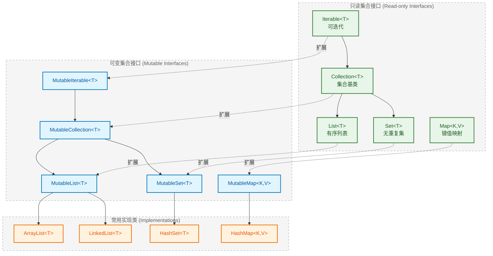
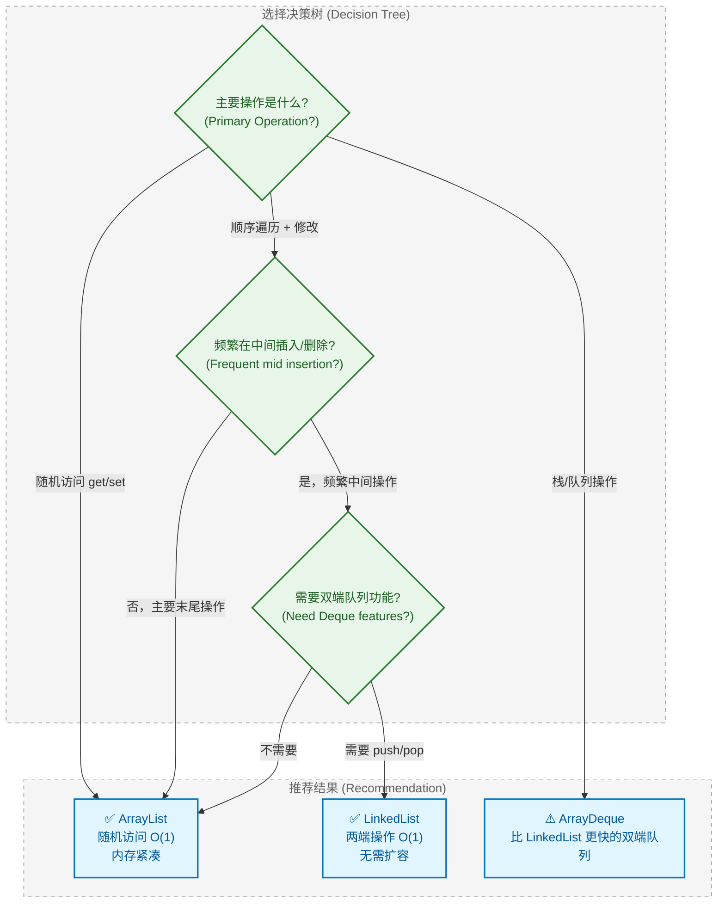
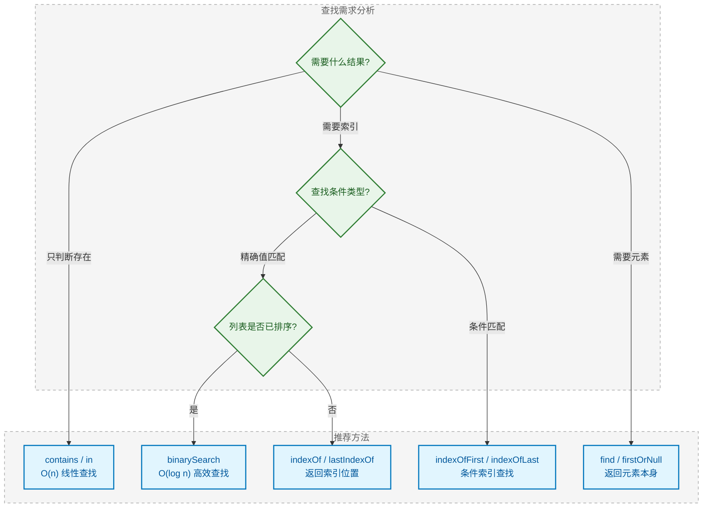
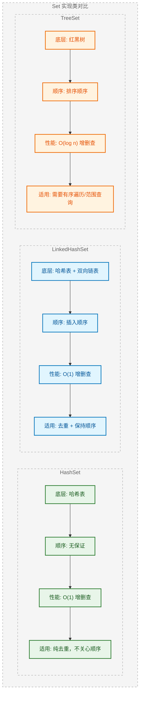
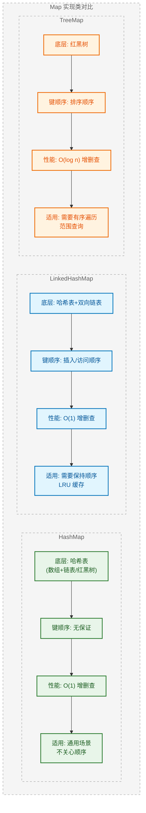
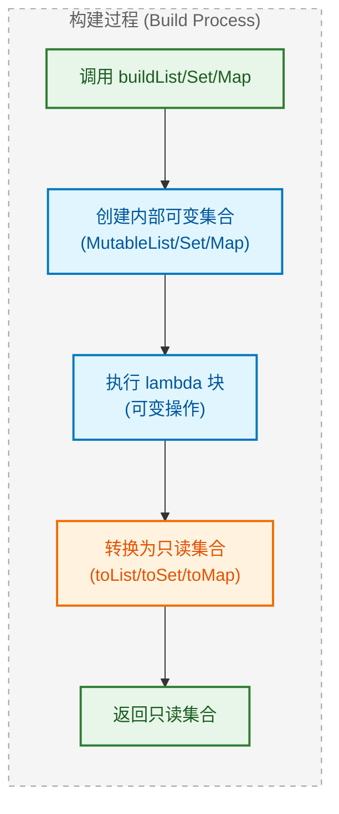

---

# 集合入门

---

## 集合概述

Kotlin 的集合框架 (Collection Framework) 建立在 Java 集合之上，但做了一个革命性的改进：**在类型系统层面区分只读集合与可变集合**。这种设计体现了 Kotlin "默认不可变" (immutable by default) 的核心哲学，能在编译期就捕获许多潜在的并发修改错误。

### 不可变集合与可变集合

在 Kotlin 中，"不可变集合" 更准确的说法是 **只读集合 (Read-only Collection)**。这个区分非常重要：

```kotlin
// 只读集合 —— 接口层面不提供修改方法
val readOnlyList: List<String> = listOf("A", "B", "C")  // 返回只读 List 接口
// readOnlyList.add("D")  // ❌ 编译错误：List 接口没有 add 方法

// 可变集合 —— 接口层面提供完整的增删改方法
val mutableList: MutableList<String> = mutableListOf("A", "B", "C")  // 返回 MutableList 接口
mutableList.add("D")  // ✅ 正常编译，列表变为 [A, B, C, D]
```

**为什么说是"只读"而非"不可变"？** 因为只读集合的底层实现可能仍然是可变的，只是通过接口隐藏了修改方法：

```kotlin
// 演示只读视图的本质
val underlying: MutableList<Int> = mutableListOf(1, 2, 3)  // 底层可变列表
val readOnlyView: List<Int> = underlying  // 向上转型为只读接口

println(readOnlyView)  // 输出: [1, 2, 3]
underlying.add(4)      // 通过原始引用修改
println(readOnlyView)  // 输出: [1, 2, 3, 4] —— 只读视图也看到了变化！
```

```kotlin
┌──────────────────────────────────────────────────────────┐
│                                                          │
│   underlying ─────────┬──────► MutableList [1,2,3,4]     │
│   (MutableList<Int>)  │              ▲                   │
│                       │              │                   │
│   readOnlyView ───────┘         底层同一对象              │
│   (List<Int>)                   (same object)            │
│        ↑                                                 │
│   只能读取，不能修改                                       │
│   (read-only interface)                                  │
│                                                          │
└──────────────────────────────────────────────────────────┘
```

**真正的不可变集合**需要使用第三方库如 Kotlinx Immutable Collections，它会在每次"修改"时返回新的集合实例。

### 集合层次结构

Kotlin 集合框架的继承体系清晰地分为两条线：只读接口与可变接口。



**核心接口职责说明**：

| 接口 | 职责 | 关键方法 |
|------|------|----------|
| `Iterable<T>` | 提供迭代能力 | `iterator()` |
| `Collection<T>` | 定义集合通用操作 | `size`, `isEmpty()`, `contains()` |
| `List<T>` | 有序、可重复、支持索引访问 | `get(index)`, `indexOf()` |
| `Set<T>` | 无序（或特定顺序）、元素唯一 | 继承 Collection |
| `Map<K,V>` | 键值对映射，键唯一 | `get(key)`, `keys`, `values` |

> 💡 **设计哲学**：Kotlin 通过接口分离实现了 "最小权限原则" (Principle of Least Privilege)。当函数只需要读取集合时，参数类型声明为 `List<T>` 而非 `MutableList<T>`，这样调用者可以传入任意列表，而函数内部无法意外修改它。

---

## List 接口

List 是最常用的集合类型，它维护元素的 **插入顺序 (insertion order)**，允许重复元素，并支持通过 **索引 (index)** 随机访问。

### listOf 创建只读列表

`listOf()` 是创建只读列表的标准方式，返回 `List<T>` 接口：

```kotlin
// 基础用法：类型自动推断
val fruits = listOf("Apple", "Banana", "Cherry")  // List<String>
val numbers = listOf(1, 2, 3, 4, 5)               // List<Int>
val mixed = listOf("Hello", 42, 3.14)             // List<Any> —— 混合类型

// 显式指定泛型类型
val explicitList: List<Number> = listOf(1, 2.5, 3L)  // Int, Double, Long 都是 Number 子类

// 创建空列表 —— 必须显式指定类型
val emptyList1: List<String> = listOf()           // 方式一：空参数
val emptyList2: List<String> = emptyList()        // 方式二：专用函数（推荐，语义更清晰）

// 创建单元素列表
val singleItem = listOf("OnlyOne")                // List<String>，包含一个元素
```

**listOf 的底层实现细节**：

```kotlin
// 查看 listOf 的实际返回类型
val list = listOf(1, 2, 3)
println(list::class)  // 输出: class java.util.Arrays$ArrayList
// 注意：这是 Arrays.asList() 返回的内部类，不是 java.util.ArrayList！

// 空列表和单元素列表有特殊优化
val empty = listOf<Int>()
println(empty::class)  // 输出: class kotlin.collections.EmptyList（单例对象）

val single = listOf(42)
println(single::class)  // 输出: class java.util.Collections$SingletonList（不可变单例）
```

### mutableListOf 创建可变列表

`mutableListOf()` 返回 `MutableList<T>` 接口，底层默认使用 `ArrayList` 实现：

```kotlin
// 创建可变列表
val mutableFruits = mutableListOf("Apple", "Banana")  // MutableList<String>

// 支持所有修改操作
mutableFruits.add("Cherry")           // 末尾添加 → [Apple, Banana, Cherry]
mutableFruits.add(0, "Apricot")       // 指定位置插入 → [Apricot, Apple, Banana, Cherry]
mutableFruits.remove("Banana")        // 删除元素 → [Apricot, Apple, Cherry]
mutableFruits[1] = "Avocado"          // 修改元素 → [Apricot, Avocado, Cherry]
mutableFruits.removeAt(0)             // 按索引删除 → [Avocado, Cherry]
mutableFruits.clear()                 // 清空列表 → []

// 创建空的可变列表
val emptyMutable: MutableList<Int> = mutableListOf()  // 空但可添加元素
emptyMutable.addAll(listOf(1, 2, 3))                  // 批量添加 → [1, 2, 3]
```

**val 与可变集合的关系**：

```kotlin
// val 限制的是引用，不是内容！
val fixedReference = mutableListOf(1, 2, 3)
// fixedReference = mutableListOf(4, 5, 6)  // ❌ 编译错误：不能重新赋值
fixedReference.add(4)                        // ✅ 可以修改内容 → [1, 2, 3, 4]

// 如果想要完全不可变，使用只读类型 + val
val trulyReadOnly: List<Int> = listOf(1, 2, 3)
// trulyReadOnly.add(4)  // ❌ 编译错误：List 没有 add 方法
```

```kotlin
┌─────────────────────────────────────────────────────────────┐
│                                                             │
│   val fixedRef ──────────► MutableList [1, 2, 3, 4]         │
│        ↑                          ↑                         │
│   引用锁定 (val)              内容可变 (MutableList)          │
│   cannot reassign            can modify content             │
│                                                             │
├─────────────────────────────────────────────────────────────┤
│                                                             │
│   val readOnly ──────────► List [1, 2, 3]                   │
│        ↑                        ↑                           │
│   引用锁定 (val)            接口只读 (List)                   │
│   cannot reassign          no mutation methods              │
│                                                             │
└─────────────────────────────────────────────────────────────┘
```

### ArrayList

`ArrayList` 是基于 **动态数组 (dynamic array)** 实现的列表，是 Kotlin/JVM 中最常用的列表实现：

```kotlin
// 创建 ArrayList 的几种方式
val arrayList1 = ArrayList<String>()                    // 直接构造，初始容量为 10
val arrayList2 = ArrayList<String>(100)                 // 指定初始容量，避免频繁扩容
val arrayList3 = arrayListOf("A", "B", "C")             // Kotlin 便捷函数
val arrayList4: ArrayList<Int> = ArrayList(listOf(1, 2, 3))  // 从已有集合构造

// ArrayList 特有操作
arrayList1.ensureCapacity(50)  // 预分配容量，提升批量添加性能
arrayList1.trimToSize()        // 释放多余容量，节省内存
```

**ArrayList 的性能特征**：

| 操作 | 时间复杂度 | 说明 |
|------|-----------|------|
| `get(index)` / `set(index, value)` | O(1) | 数组随机访问，极快 |
| `add(element)` 末尾添加 | 均摊 O(1) | 可能触发扩容 |
| `add(index, element)` 中间插入 | O(n) | 需要移动后续元素 |
| `remove(element)` / `removeAt(index)` | O(n) | 需要移动后续元素 |
| `contains(element)` | O(n) | 线性查找 |

**扩容机制详解**：

```kotlin
// ArrayList 扩容演示（概念代码）
val list = ArrayList<Int>(4)  // 初始容量 4
println("初始容量: 4")

// 添加元素直到触发扩容
for (i in 1..10) {
    list.add(i)
    // 当 size > capacity 时，新容量 = 旧容量 * 1.5（向下取整）
    // 4 → 6 → 9 → 13 → 19 → ...
}
```

```kotlin
┌─────────────────────────────────────────────────────────────────┐
│  ArrayList 扩容过程 (Growth Process)                             │
│                                                                 │
│  初始: capacity=4, size=0                                        │
│  ┌───┬───┬───┬───┐                                              │
│  │   │   │   │   │  ← 空数组                                     │
│  └───┴───┴───┴───┘                                              │
│                                                                 │
│  添加 [1,2,3,4] 后: capacity=4, size=4                           │
│  ┌───┬───┬───┬───┐                                              │
│  │ 1 │ 2 │ 3 │ 4 │  ← 已满                                       │
│  └───┴───┴───┴───┘                                              │
│                                                                 │
│  添加第 5 个元素，触发扩容: capacity=6, size=5                     │
│  ┌───┬───┬───┬───┬───┬───┐                                      │
│  │ 1 │ 2 │ 3 │ 4 │ 5 │   │  ← 新数组，旧数据已复制                 │
│  └───┴───┴───┴───┴───┴───┘                                      │
│                                                                 │
└─────────────────────────────────────────────────────────────────┘
```

### LinkedList

`LinkedList` 是基于 **双向链表 (doubly linked list)** 实现的列表，同时实现了 `List` 和 `Deque`（双端队列）接口：

```kotlin
// 创建 LinkedList
val linkedList = LinkedList<String>()  // 需要导入 java.util.LinkedList
linkedList.addAll(listOf("A", "B", "C"))

// LinkedList 特有的双端队列操作
linkedList.addFirst("Start")    // 头部添加 → [Start, A, B, C]
linkedList.addLast("End")       // 尾部添加 → [Start, A, B, C, End]
val first = linkedList.removeFirst()  // 移除并返回头部 → "Start"
val last = linkedList.removeLast()    // 移除并返回尾部 → "End"

// 作为栈 (Stack) 使用
linkedList.push("Top")          // 等同于 addFirst
val top = linkedList.pop()      // 等同于 removeFirst

// 作为队列 (Queue) 使用
linkedList.offer("NewElement")  // 等同于 addLast
val head = linkedList.poll()    // 等同于 removeFirst
```

**LinkedList 的性能特征**：

| 操作 | 时间复杂度 | 说明 |
|------|-----------|------|
| `get(index)` / `set(index, value)` | O(n) | 需要从头/尾遍历到目标位置 |
| `addFirst()` / `addLast()` | O(1) | 链表两端操作极快 |
| `removeFirst()` / `removeLast()` | O(1) | 链表两端操作极快 |
| `add(index, element)` 已知节点 | O(1) | 仅修改指针 |
| `add(index, element)` 未知节点 | O(n) | 需要先遍历找到位置 |

**ArrayList vs LinkedList 选择指南**：



> 💡 **实践建议**：在绝大多数场景下，**优先选择 ArrayList**。LinkedList 的理论优势（中间插入 O(1)）在实际中很难体现，因为你通常需要先遍历找到插入位置（O(n)）。ArrayList 的 CPU 缓存友好性 (cache locality) 使其在现代硬件上表现更好。

**完整对比示例**：

```kotlin
import java.util.LinkedList
import kotlin.system.measureTimeMillis

fun main() {
    val size = 100_000
    
    // 测试随机访问性能
    val arrayList = ArrayList((0 until size).toList())
    val linkedList = LinkedList((0 until size).toList())
    
    // ArrayList 随机访问：极快
    val arrayTime = measureTimeMillis {
        repeat(10_000) { arrayList[it * 10] }  // 随机读取
    }
    println("ArrayList 随机访问耗时: ${arrayTime}ms")  // 约 1-2ms
    
    // LinkedList 随机访问：很慢
    val linkedTime = measureTimeMillis {
        repeat(10_000) { linkedList[it * 10] }  // 每次都要遍历！
    }
    println("LinkedList 随机访问耗时: ${linkedTime}ms")  // 约 500-1000ms
    
    // 测试头部插入性能
    val arrayInsert = measureTimeMillis {
        val list = ArrayList<Int>()
        repeat(10_000) { list.add(0, it) }  // 每次都要移动所有元素
    }
    println("ArrayList 头部插入耗时: ${arrayInsert}ms")  // 约 50-100ms
    
    val linkedInsert = measureTimeMillis {
        val list = LinkedList<Int>()
        repeat(10_000) { list.addFirst(it) }  // O(1) 操作
    }
    println("LinkedList 头部插入耗时: ${linkedInsert}ms")  // 约 1-2ms
}
```

---

📝 **练习题 1**

以下代码的输出是什么？

```kotlin
val original = mutableListOf(1, 2, 3)
val readOnly: List<Int> = original
original.add(4)
println(readOnly.size)
```

A. 3  
B. 4  
C. 编译错误  
D. 运行时异常

【答案】B

【解析】`readOnly` 是 `original` 的只读视图 (read-only view)，它们指向同一个底层 `MutableList` 对象。当通过 `original` 添加元素后，`readOnly` 也能看到这个变化。这正是 Kotlin 中"只读"与"不可变"的区别——只读接口只是隐藏了修改方法，并不能阻止底层数据被其他引用修改。

---

📝 **练习题 2**

关于 ArrayList 和 LinkedList，以下说法正确的是？

A. LinkedList 的 `get(index)` 操作比 ArrayList 快  
B. ArrayList 在末尾添加元素的均摊时间复杂度是 O(n)  
C. LinkedList 适合需要频繁随机访问的场景  
D. ArrayList 的 `add(0, element)` 操作时间复杂度是 O(n)

【答案】D

【解析】
- A 错误：LinkedList 的 `get(index)` 是 O(n)，需要从头或尾遍历；ArrayList 是 O(1) 直接数组访问
- B 错误：ArrayList 末尾添加的均摊复杂度是 O(1)，虽然偶尔需要扩容，但扩容成本被分摊到多次操作中
- C 错误：LinkedList 随机访问性能很差，不适合这种场景
- D 正确：在 ArrayList 头部插入需要将所有现有元素向后移动一位，时间复杂度为 O(n)

---

## List 操作

List 作为最常用的集合类型，提供了丰富的操作方法。掌握这些操作是高效使用 Kotlin 集合的基础。

### 访问元素

Kotlin 提供了多种安全、便捷的元素访问方式，充分体现了 **空安全 (null safety)** 的设计理念：

```kotlin
val fruits = listOf("Apple", "Banana", "Cherry", "Date", "Elderberry")

// ===== 基础索引访问 =====
val first = fruits[0]              // "Apple" —— 使用操作符重载，等同于 get(0)
val third = fruits.get(2)          // "Cherry" —— 显式调用 get 方法
// val outOfBounds = fruits[10]    // ❌ 抛出 IndexOutOfBoundsException

// ===== 安全访问方法 =====
val safe = fruits.getOrNull(10)    // null —— 越界时返回 null，不抛异常
val withDefault = fruits.getOrElse(10) { "Unknown" }  // "Unknown" —— 越界时执行 lambda 返回默认值

// ===== 首尾元素访问 =====
val head = fruits.first()          // "Apple" —— 空列表会抛 NoSuchElementException
val tail = fruits.last()           // "Elderberry"
val safeHead = fruits.firstOrNull() // "Apple" —— 空列表返回 null
val safeTail = fruits.lastOrNull()  // "Elderberry"

// ===== 条件访问 =====
val firstLong = fruits.first { it.length > 5 }      // "Banana" —— 第一个长度>5的元素
val lastShort = fruits.last { it.length <= 5 }      // "Date" —— 最后一个长度<=5的元素
val firstMatch = fruits.firstOrNull { it.startsWith("Z") }  // null —— 无匹配时安全返回

// ===== 随机访问 =====
val randomFruit = fruits.random()           // 随机返回一个元素
val randomOrNull = emptyList<String>().randomOrNull()  // null —— 空列表安全处理
```

**解构声明 (Destructuring Declaration)** 可以优雅地同时获取多个元素：

```kotlin
val numbers = listOf(1, 2, 3, 4, 5)

// 解构前几个元素（最多支持 5 个 componentN 函数）
val (a, b, c) = numbers            // a=1, b=2, c=3
val (first, second) = numbers      // first=1, second=2

// 配合 _ 忽略不需要的元素
val (_, _, third) = numbers        // third=3，忽略前两个

// 实际应用：遍历带索引的列表
for ((index, value) in numbers.withIndex()) {
    println("Index $index -> Value $value")
}
```

### 添加与删除

可变列表 (MutableList) 提供了完整的增删操作，理解这些操作的 **时间复杂度 (time complexity)** 对性能优化至关重要：

```kotlin
val mutableFruits = mutableListOf("Apple", "Banana", "Cherry")

// ===== 添加操作 =====
mutableFruits.add("Date")                    // 末尾添加 → [Apple, Banana, Cherry, Date]
mutableFruits.add(1, "Apricot")              // 指定位置插入 → [Apple, Apricot, Banana, Cherry, Date]
mutableFruits.addAll(listOf("Fig", "Grape")) // 批量添加 → [..., Fig, Grape]
mutableFruits.addAll(2, listOf("X", "Y"))    // 指定位置批量插入

// ===== 使用操作符 =====
mutableFruits += "Honeydew"                  // 等同于 add("Honeydew")
mutableFruits += listOf("Kiwi", "Lemon")     // 等同于 addAll(...)

// ===== 删除操作 =====
mutableFruits.remove("Banana")               // 按值删除第一个匹配项，返回 Boolean
mutableFruits.removeAt(0)                    // 按索引删除，返回被删除的元素
mutableFruits.removeAll(listOf("X", "Y"))    // 批量删除
mutableFruits.removeIf { it.length > 6 }     // 条件删除：删除所有长度>6的元素

// ===== 使用操作符 =====
mutableFruits -= "Cherry"                    // 等同于 remove("Cherry")
mutableFruits -= listOf("Fig", "Grape")      // 等同于 removeAll(...)

// ===== 其他修改操作 =====
mutableFruits[0] = "Avocado"                 // 替换指定位置元素
mutableFruits.clear()                        // 清空列表
mutableFruits.retainAll(listOf("A", "B"))    // 只保留指定元素（取交集）
```

**操作复杂度对比**：

```kotlin
┌────────────────────────────────────────────────────────────────┐
│  ArrayList 操作复杂度 (Time Complexity)                         │
├──────────────────────┬─────────────┬───────────────────────────┤
│  操作                 │  复杂度     │  原因                      │
├──────────────────────┼─────────────┼───────────────────────────┤
│  add(element)        │  O(1)*      │  末尾添加，可能触发扩容      │
│  add(0, element)     │  O(n)       │  头部插入，需移动所有元素    │
│  add(mid, element)   │  O(n)       │  中间插入，需移动后续元素    │
│  removeAt(lastIdx)   │  O(1)       │  末尾删除，无需移动         │
│  removeAt(0)         │  O(n)       │  头部删除，需移动所有元素    │
│  remove(element)     │  O(n)       │  需要先查找元素位置         │
└──────────────────────┴─────────────┴───────────────────────────┘
  * 均摊复杂度 (amortized complexity)
```

### 查找操作

Kotlin 提供了丰富的查找 API，涵盖了各种查找场景：

```kotlin
val numbers = listOf(3, 1, 4, 1, 5, 9, 2, 6, 5, 3, 5)

// ===== 存在性判断 =====
val hasThree = 3 in numbers                  // true —— 使用 in 操作符
val hasTen = numbers.contains(10)            // false —— 显式调用
val hasAny = numbers.any { it > 8 }          // true —— 存在任意满足条件的元素
val allPositive = numbers.all { it > 0 }     // true —— 所有元素都满足条件
val noneNegative = numbers.none { it < 0 }   // true —— 没有元素满足条件

// ===== 索引查找 =====
val firstIndex = numbers.indexOf(5)          // 4 —— 第一次出现的索引
val lastIndex = numbers.lastIndexOf(5)       // 10 —— 最后一次出现的索引
val notFound = numbers.indexOf(100)          // -1 —— 未找到返回 -1

// ===== 条件索引查找 =====
val firstEvenIdx = numbers.indexOfFirst { it % 2 == 0 }   // 2 —— 第一个偶数的索引（值为4）
val lastEvenIdx = numbers.indexOfLast { it % 2 == 0 }     // 7 —— 最后一个偶数的索引（值为6）

// ===== 条件元素查找 =====
val firstEven = numbers.find { it % 2 == 0 }              // 4 —— 等同于 firstOrNull
val lastOdd = numbers.findLast { it % 2 == 1 }            // 5 —— 最后一个奇数

// ===== 二分查找（仅适用于已排序列表）=====
val sortedList = listOf(1, 2, 3, 4, 5, 6, 7, 8, 9)
val binaryResult = sortedList.binarySearch(5)             // 4 —— O(log n) 复杂度
val insertionPoint = sortedList.binarySearch(4.5.toInt()) // 负数，表示应插入位置
```

**查找方法选择指南**：



### 排序操作

Kotlin 区分了 **原地排序 (in-place sorting)** 和 **返回新列表的排序 (non-mutating sorting)**：

```kotlin
// ===== 不可变排序（返回新列表）=====
val original = listOf(3, 1, 4, 1, 5, 9, 2, 6)

val ascending = original.sorted()                    // [1, 1, 2, 3, 4, 5, 6, 9] —— 升序
val descending = original.sortedDescending()         // [9, 6, 5, 4, 3, 2, 1, 1] —— 降序
val reversed = original.reversed()                   // [6, 2, 9, 5, 1, 4, 1, 3] —— 反转
val shuffled = original.shuffled()                   // 随机打乱顺序

// 原列表不变
println(original)  // [3, 1, 4, 1, 5, 9, 2, 6]

// ===== 自定义排序 =====
data class Person(val name: String, val age: Int)
val people = listOf(
    Person("Alice", 30),
    Person("Bob", 25),
    Person("Charlie", 35)
)

// 按单一属性排序
val byAge = people.sortedBy { it.age }               // Bob(25), Alice(30), Charlie(35)
val byAgeDesc = people.sortedByDescending { it.age } // Charlie(35), Alice(30), Bob(25)
val byName = people.sortedBy { it.name }             // Alice, Bob, Charlie

// 使用 Comparator 进行复杂排序
val byAgeAndName = people.sortedWith(
    compareBy({ it.age }, { it.name })               // 先按年龄，再按姓名
)

// 自定义 Comparator
val customSort = people.sortedWith { p1, p2 ->
    when {
        p1.age != p2.age -> p1.age - p2.age          // 年龄不同，按年龄升序
        else -> p1.name.compareTo(p2.name)           // 年龄相同，按姓名字母序
    }
}
```

**可变列表的原地排序**：

```kotlin
// ===== 原地排序（修改原列表）=====
val mutableNumbers = mutableListOf(3, 1, 4, 1, 5, 9, 2, 6)

mutableNumbers.sort()                                // 原地升序排序
println(mutableNumbers)                              // [1, 1, 2, 3, 4, 5, 6, 9]

mutableNumbers.sortDescending()                      // 原地降序排序
mutableNumbers.reverse()                             // 原地反转
mutableNumbers.shuffle()                             // 原地随机打乱

// 自定义原地排序
val mutablePeople = mutableListOf(
    Person("Alice", 30),
    Person("Bob", 25)
)
mutablePeople.sortBy { it.age }                      // 原地按年龄排序
mutablePeople.sortByDescending { it.name }           // 原地按姓名降序
mutablePeople.sortWith(compareBy({ it.age }, { it.name }))  // 原地复合排序
```

**排序方法命名规律**：

```kotlin
┌──────────────────────────────────────────────────────────────────┐
│  排序方法命名规律 (Naming Convention)                              │
├─────────────────────┬────────────────────┬───────────────────────┤
│  返回新列表          │  原地修改           │  说明                  │
│  (Non-mutating)     │  (In-place)        │                       │
├─────────────────────┼────────────────────┼───────────────────────┤
│  sorted()           │  sort()            │  自然升序              │
│  sortedDescending() │  sortDescending()  │  自然降序              │
│  sortedBy {}        │  sortBy {}         │  按属性升序            │
│  sortedByDesc... {} │  sortByDesc... {}  │  按属性降序            │
│  sortedWith()       │  sortWith()        │  自定义 Comparator     │
│  reversed()         │  reverse()         │  反转顺序              │
│  shuffled()         │  shuffle()         │  随机打乱              │
└─────────────────────┴────────────────────┴───────────────────────┘
  规律：带 -ed 后缀的返回新列表，不带的原地修改
```

---

📝 **练习题 1**

以下代码的输出是什么？

```kotlin
val list = listOf(1, 2, 3, 4, 5)
val result = list.getOrElse(10) { index -> index * 2 }
println(result)
```

A. null  
B. 10  
C. 20  
D. IndexOutOfBoundsException

【答案】C

【解析】`getOrElse` 在索引越界时会执行 lambda 表达式并返回其结果。lambda 接收越界的索引作为参数，这里 `index = 10`，所以返回 `10 * 2 = 20`。这是 Kotlin 提供的安全访问方式，避免了异常抛出。选项 A 是 `getOrNull` 的行为，选项 D 是直接使用 `[]` 或 `get()` 越界时的行为。

---

📝 **练习题 2**

关于 `sorted()` 和 `sort()` 的区别，以下说法正确的是？

A. `sorted()` 只能用于 MutableList  
B. `sort()` 返回一个新的排序后的列表  
C. `sorted()` 返回新列表，原列表不变；`sort()` 原地修改列表  
D. 两者功能完全相同，只是命名不同

【答案】C

【解析】这是 Kotlin 集合 API 的重要设计模式：
- `sorted()` 是扩展函数，可用于任何 `Iterable`（包括只读 List），返回一个新的排序后的列表，原集合保持不变
- `sort()` 是 `MutableList` 的成员函数，直接在原列表上进行排序，返回 `Unit`

这种命名约定（带 -ed 后缀返回新集合）贯穿整个 Kotlin 集合 API，如 `reversed()`/`reverse()`、`shuffled()`/`shuffle()` 等。

---

## Set 接口

Set（集合）是一种 **不允许重复元素 (no duplicate elements)** 的集合类型。当你需要确保元素唯一性，或者需要高效判断元素是否存在时，Set 是最佳选择。

### setOf 创建只读 Set

`setOf()` 创建只读的 Set，返回 `Set<T>` 接口：

```kotlin
// 基础创建
val fruits = setOf("Apple", "Banana", "Cherry")      // Set<String>
val numbers = setOf(1, 2, 3, 4, 5)                   // Set<Int>

// 自动去重 —— Set 的核心特性
val withDuplicates = setOf(1, 2, 2, 3, 3, 3)
println(withDuplicates)                              // [1, 2, 3] —— 重复元素被自动移除
println(withDuplicates.size)                         // 3

// 空 Set
val emptySet1: Set<String> = setOf()                 // 空参数方式
val emptySet2: Set<String> = emptySet()              // 推荐：语义更清晰

// 元素顺序 —— setOf 默认保持插入顺序（底层是 LinkedHashSet）
val ordered = setOf("C", "A", "B")
println(ordered)                                     // [C, A, B] —— 保持插入顺序
```

**Set 的相等性判断**：

```kotlin
// Set 判断元素相等使用 equals() 和 hashCode()
data class Person(val name: String, val age: Int)

val set = setOf(
    Person("Alice", 30),
    Person("Alice", 30),                             // 重复！data class 自动生成 equals
    Person("Bob", 25)
)
println(set.size)                                    // 2 —— 只有 Alice 和 Bob

// 非 data class 需要手动重写 equals/hashCode
class SimpleClass(val value: Int)
val simpleSet = setOf(
    SimpleClass(1),
    SimpleClass(1)                                   // 不会去重！默认比较引用
)
println(simpleSet.size)                              // 2 —— 两个不同的对象
```

### mutableSetOf 创建可变 Set

`mutableSetOf()` 返回 `MutableSet<T>` 接口，底层默认使用 `LinkedHashSet`：

```kotlin
val mutableFruits = mutableSetOf("Apple", "Banana")

// 添加元素
val added1 = mutableFruits.add("Cherry")             // true —— 添加成功
val added2 = mutableFruits.add("Apple")              // false —— 已存在，添加失败
println(mutableFruits)                               // [Apple, Banana, Cherry]

// 批量添加
mutableFruits.addAll(listOf("Date", "Apple", "Fig")) // Apple 不会重复添加
println(mutableFruits)                               // [Apple, Banana, Cherry, Date, Fig]

// 删除元素
mutableFruits.remove("Banana")                       // 删除指定元素
mutableFruits.removeIf { it.length > 5 }             // 条件删除：删除 Cherry、Banana
mutableFruits.clear()                                // 清空

// 操作符支持
mutableFruits += "Grape"                             // 等同于 add
mutableFruits += setOf("Honeydew", "Kiwi")           // 等同于 addAll
mutableFruits -= "Grape"                             // 等同于 remove
```

### HashSet

`HashSet` 基于 **哈希表 (Hash Table)** 实现，提供 O(1) 的平均查找、添加、删除性能，但 **不保证元素顺序**：

```kotlin
// 创建 HashSet
val hashSet = HashSet<String>()                      // 直接构造
val hashSet2 = hashSetOf("A", "B", "C")              // Kotlin 便捷函数
val hashSet3 = HashSet(listOf("X", "Y", "Z"))        // 从集合构造

// 性能特点演示
hashSet.add("Element")                               // O(1) 平均
hashSet.contains("Element")                          // O(1) 平均
hashSet.remove("Element")                            // O(1) 平均

// 顺序不保证
val unordered = hashSetOf("C", "A", "B", "D")
println(unordered)                                   // 顺序可能是 [A, B, C, D] 或其他
// 每次运行结果可能不同！
```

**HashSet 的工作原理**：

```kotlin
┌─────────────────────────────────────────────────────────────────┐
│  HashSet 内部结构 (Internal Structure)                           │
│                                                                 │
│  元素 "Apple" → hashCode() = 63476538                           │
│                     ↓                                           │
│              桶索引 = hash % 容量 = 63476538 % 16 = 10           │
│                     ↓                                           │
│  ┌─────┬─────┬─────┬─────┬─────┬─────┬─────┬─────┐              │
│  │  0  │  1  │  2  │ ... │ 10  │ 11  │ ... │ 15  │  ← 桶数组     │
│  └─────┴─────┴─────┴─────┴──┬──┴─────┴─────┴─────┘              │
│                             │                                   │
│                             ▼                                   │
│                        ["Apple"]  ← 存储在桶 10                  │
│                             │                                   │
│                             ▼                                   │
│                     [其他hash冲突元素]  ← 链表/红黑树处理冲突       │
│                                                                 │
└─────────────────────────────────────────────────────────────────┘
```

### LinkedHashSet

`LinkedHashSet` 在 HashSet 基础上维护了一个 **双向链表 (doubly-linked list)**，用于记录元素的插入顺序：

```kotlin
// 创建 LinkedHashSet
val linkedSet = LinkedHashSet<String>()
val linkedSet2 = linkedSetOf("C", "A", "B")          // Kotlin 便捷函数

// 保持插入顺序
linkedSet.add("Third")
linkedSet.add("First")
linkedSet.add("Second")
println(linkedSet)                                   // [Third, First, Second] —— 插入顺序

// 遍历顺序稳定
linkedSet.forEach { println(it) }                    // 始终按插入顺序输出

// 性能：与 HashSet 相同的 O(1) 操作，但略有额外内存开销
```

**setOf 默认返回 LinkedHashSet**：

```kotlin
val defaultSet = setOf("A", "B", "C")
println(defaultSet::class)                           // class java.util.LinkedHashSet
// Kotlin 的 setOf 默认保持插入顺序，这是一个实用的设计决策
```

### TreeSet

`TreeSet` 基于 **红黑树 (Red-Black Tree)** 实现，元素按照 **自然顺序 (natural ordering)** 或自定义比较器排序：

```kotlin
import java.util.TreeSet

// 创建 TreeSet —— 元素自动排序
val treeSet = TreeSet<Int>()
treeSet.addAll(listOf(5, 2, 8, 1, 9, 3))
println(treeSet)                                     // [1, 2, 3, 5, 8, 9] —— 自动升序

// 字符串按字典序排序
val stringTree = TreeSet<String>()
stringTree.addAll(listOf("Banana", "Apple", "Cherry"))
println(stringTree)                                  // [Apple, Banana, Cherry]

// 自定义排序规则
val descending = TreeSet<Int>(reverseOrder())        // 降序比较器
descending.addAll(listOf(1, 5, 3, 9, 2))
println(descending)                                  // [9, 5, 3, 2, 1]

// 自定义对象排序
data class Person(val name: String, val age: Int)
val personTree = TreeSet<Person>(compareBy { it.age })
personTree.add(Person("Alice", 30))
personTree.add(Person("Bob", 25))
personTree.add(Person("Charlie", 35))
println(personTree)                                  // 按年龄排序：Bob, Alice, Charlie

// TreeSet 特有的导航方法
val numbers = TreeSet(listOf(1, 3, 5, 7, 9))
println(numbers.first())                             // 1 —— 最小元素
println(numbers.last())                              // 9 —— 最大元素
println(numbers.lower(5))                            // 3 —— 小于 5 的最大元素
println(numbers.higher(5))                           // 7 —— 大于 5 的最小元素
println(numbers.floor(6))                            // 5 —— 小于等于 6 的最大元素
println(numbers.ceiling(6))                          // 7 —— 大于等于 6 的最小元素
println(numbers.headSet(5))                          // [1, 3] —— 小于 5 的子集
println(numbers.tailSet(5))                          // [5, 7, 9] —— 大于等于 5 的子集
```

**三种 Set 实现对比**：



| 特性 | HashSet | LinkedHashSet | TreeSet |
|------|---------|---------------|---------|
| 底层结构 | 哈希表 | 哈希表 + 链表 | 红黑树 |
| 元素顺序 | 无保证 | 插入顺序 | 排序顺序 |
| 添加/删除/查找 | O(1)

---

## Set 操作

Set 除了基本的增删操作外，最强大的特性是支持数学意义上的 **集合运算 (Set Operations)**，这在数据处理、去重、比较等场景中非常实用。

### 添加与删除

可变 Set (MutableSet) 的增删操作与 List 类似，但由于 Set 的唯一性约束，添加操作会返回是否成功的布尔值：

```kotlin
val fruits = mutableSetOf("Apple", "Banana", "Cherry")

// ===== 添加操作 =====
val added1 = fruits.add("Date")              // true —— 新元素，添加成功
val added2 = fruits.add("Apple")             // false —— 已存在，添加失败（Set 不允许重复）
println(fruits)                              // [Apple, Banana, Cherry, Date]

// 批量添加 —— 返回是否有任何元素被添加
val anyAdded = fruits.addAll(listOf("Fig", "Apple", "Grape"))  // true
println(fruits)                              // [Apple, Banana, Cherry, Date, Fig, Grape]

// 操作符方式
fruits += "Honeydew"                         // 等同于 add()
fruits += setOf("Kiwi", "Lemon")             // 等同于 addAll()

// ===== 删除操作 =====
val removed1 = fruits.remove("Banana")       // true —— 存在，删除成功
val removed2 = fruits.remove("Mango")        // false —— 不存在，删除失败
println(fruits)                              // [Apple, Cherry, Date, Fig, Grape, Honeydew, Kiwi, Lemon]

// 批量删除
fruits.removeAll(listOf("Date", "Fig", "NotExist"))  // 删除存在的元素
println(fruits)                              // [Apple, Cherry, Grape, Honeydew, Kiwi, Lemon]

// 条件删除
fruits.removeIf { it.length > 5 }            // 删除长度大于5的元素
println(fruits)                              // [Apple, Grape, Kiwi, Lemon]

// 保留指定元素（取交集）
fruits.retainAll(listOf("Apple", "Kiwi", "Mango"))  // 只保留列表中存在的
println(fruits)                              // [Apple, Kiwi]

// 操作符方式删除
fruits -= "Apple"                            // 等同于 remove()
fruits -= setOf("Kiwi", "NotExist")          // 等同于 removeAll()

// 清空
fruits.clear()
println(fruits.isEmpty())                    // true
```

**add() 返回值的实际应用**：

```kotlin
// 利用 add() 返回值判断元素是否为新元素
val processedIds = mutableSetOf<Int>()

fun processItem(id: Int): Boolean {
    // 如果是新 ID，处理它；如果已处理过，跳过
    if (processedIds.add(id)) {
        println("Processing new item: $id")  // 首次处理
        return true
    } else {
        println("Item $id already processed, skipping")  // 重复跳过
        return false
    }
}

processItem(1)  // Processing new item: 1
processItem(2)  // Processing new item: 2
processItem(1)  // Item 1 already processed, skipping
```

### 集合运算：并集、交集、差集

Kotlin 为 Set 提供了完整的集合运算支持，这是 Set 区别于其他集合类型的核心优势：

```kotlin
val setA = setOf(1, 2, 3, 4, 5)
val setB = setOf(4, 5, 6, 7, 8)

// ===== 并集 (Union) =====
// 包含两个集合中所有元素，自动去重
val union1 = setA union setB                 // 中缀函数写法
val union2 = setA.union(setB)                // 标准函数写法
val union3 = setA + setB                     // 操作符写法（推荐）
println(union1)                              // [1, 2, 3, 4, 5, 6, 7, 8]

// ===== 交集 (Intersection) =====
// 只包含两个集合中都存在的元素
val intersect1 = setA intersect setB         // 中缀函数写法
val intersect2 = setA.intersect(setB)        // 标准函数写法
println(intersect1)                          // [4, 5]

// ===== 差集 (Difference / Subtract) =====
// 包含在第一个集合中但不在第二个集合中的元素
val subtract1 = setA subtract setB           // 中缀函数写法：A - B
val subtract2 = setA.subtract(setB)          // 标准函数写法
val subtract3 = setA - setB                  // 操作符写法（推荐）
println(subtract1)                           // [1, 2, 3] —— 在 A 中但不在 B 中

val subtractReverse = setB - setA            // B - A
println(subtractReverse)                     // [6, 7, 8] —— 在 B 中但不在 A 中

// ===== 对称差集 (Symmetric Difference) =====
// 只在其中一个集合中出现的元素（并集 - 交集）
val symmetricDiff = (setA union setB) - (setA intersect setB)
// 或者更直观的写法
val symmetricDiff2 = (setA - setB) + (setB - setA)
println(symmetricDiff)                       // [1, 2, 3, 6, 7, 8]
```

**集合运算可视化**：

```kotlin
┌─────────────────────────────────────────────────────────────────┐
│  集合运算图解 (Set Operations Visualization)                      │
│                                                                 │
│       setA = {1,2,3,4,5}        setB = {4,5,6,7,8}              │
│                                                                 │
│            ┌───────┐               ┌───────┐                    │
│            │ 1 2 3 │───────────────│ 6 7 8 │                    │
│            │       │   4   5       │       │                    │
│            │   A   │───────────────│   B   │                    │
│            └───────┘   (交集)       └───────┘                    │
│                                                                 │
│  并集 (A ∪ B):     {1, 2, 3, 4, 5, 6, 7, 8}  ← 所有元素          │
│  交集 (A ∩ B):     {4, 5}                    ← 共同元素          │
│  差集 (A - B):     {1, 2, 3}                 ← A 独有            │
│  差集 (B - A):     {6, 7, 8}                 ← B 独有            │
│  对称差 (A △ B):   {1, 2, 3, 6, 7, 8}        ← 非共同元素        │
│                                                                 │
└─────────────────────────────────────────────────────────────────┘
```

**实际应用场景**：

```kotlin
// 场景1：找出新增用户和流失用户
val yesterdayUsers = setOf("Alice", "Bob", "Charlie", "David")
val todayUsers = setOf("Bob", "Charlie", "Eve", "Frank")

val newUsers = todayUsers - yesterdayUsers       // 新增：[Eve, Frank]
val lostUsers = yesterdayUsers - todayUsers      // 流失：[Alice, David]
val retainedUsers = yesterdayUsers intersect todayUsers  // 留存：[Bob, Charlie]

// 场景2：权限合并
val adminPermissions = setOf("read", "write", "delete", "admin")
val userPermissions = setOf("read", "write")

val allPermissions = adminPermissions union userPermissions  // 合并权限
val adminOnlyPermissions = adminPermissions - userPermissions  // 管理员独有：[delete, admin]

// 场景3：标签去重合并
val articleTags = setOf("Kotlin", "Android", "JVM")
val videoTags = setOf("Kotlin", "Tutorial", "Beginner")
val allTags = articleTags + videoTags            // [Kotlin, Android, JVM, Tutorial, Beginner]
```

### 判断元素与集合关系

Set 提供了丰富的方法来判断元素存在性和集合之间的关系：

```kotlin
val numbers = setOf(1, 2, 3, 4, 5)
val subset = setOf(2, 3)
val other = setOf(6, 7, 8)

// ===== 元素存在性判断 =====
val hasThree = 3 in numbers                  // true —— in 操作符（推荐）
val hasTen = numbers.contains(10)            // false —— 显式调用
val hasAnyEven = numbers.any { it % 2 == 0 } // true —— 存在偶数
val allPositive = numbers.all { it > 0 }     // true —— 全部为正数
val noneNegative = numbers.none { it < 0 }   // true —— 没有负数

// ===== 集合关系判断 =====
// 子集判断：subset 的所有元素是否都在 numbers 中
val isSubset = numbers.containsAll(subset)   // true —— {2,3} ⊆ {1,2,3,4,5}

// 判断两个集合是否有交集
val hasCommon = (numbers intersect other).isNotEmpty()  // false
val noCommon = (numbers intersect other).isEmpty()      // true —— 无交集

// 判断两个集合是否相等（元素完全相同，顺序无关）
val setX = setOf(1, 2, 3)
val setY = setOf(3, 2, 1)
val setZ = setOf(1, 2, 3, 4)
println(setX == setY)                        // true —— 元素相同即相等
println(setX == setZ)                        // false —— 元素不同

// ===== 空集判断 =====
val emptySet = emptySet<Int>()
println(emptySet.isEmpty())                  // true
println(emptySet.isNotEmpty())               // false
println(numbers.isNotEmpty())                // true
```

**集合关系的数学定义**：

```kotlin
// 自定义扩展函数实现更多集合关系判断
// 真子集判断：A 是 B 的子集，且 A ≠ B
infix fun <T> Set<T>.isProperSubsetOf(other: Set<T>): Boolean {
    return this != other && other.containsAll(this)
}

// 超集判断：A 包含 B 的所有元素
infix fun <T> Set<T>.isSupersetOf(other: Set<T>): Boolean {
    return this.containsAll(other)
}

// 使用示例
val small = setOf(1, 2)
val large = setOf(1, 2, 3, 4, 5)

println(small isProperSubsetOf large)        // true —— {1,2} ⊂ {1,2,3,4,5}
println(large isSupersetOf small)            // true —— {1,2,3,4,5} ⊇ {1,2}
println(small isProperSubsetOf small)        // false —— 不是真子集
```

---

📝 **练习题 1**

以下代码的输出是什么？

```kotlin
val setA = setOf(1, 2, 3, 4)
val setB = setOf(3, 4, 5, 6)
val result = (setA - setB) + (setB - setA)
println(result.size)
```

A. 4  
B. 6  
C. 8  
D. 2

【答案】A

【解析】这是对称差集的计算。`setA - setB` 得到 `{1, 2}`（在 A 中但不在 B 中），`setB - setA` 得到 `{5, 6}`（在 B 中但不在 A 中）。两者相加得到 `{1, 2, 5, 6}`，共 4 个元素。对称差集包含的是"只在其中一个集合中出现"的元素，排除了交集 `{3, 4}`。

---

📝 **练习题 2**

关于 `mutableSet.add(element)` 的返回值，以下说法正确的是？

A. 总是返回 true  
B. 如果元素已存在返回 true，否则返回 false  
C. 如果元素是新添加的返回 true，如果已存在返回 false  
D. 返回添加后集合的大小

【答案】C

【解析】`MutableSet.add()` 方法返回一个 `Boolean` 值，表示集合是否因此次操作而发生了改变。如果元素是新的（之前不存在），添加成功并返回 `true`；如果元素已存在，集合不变并返回 `false`。这个返回值在判断元素是否为首次出现时非常有用，可以避免额外的 `contains()` 检查。

---

## Map 接口

Map（映射）是一种存储 **键值对 (key-value pairs)** 的集合，其中每个 **键 (key)** 必须唯一，而 **值 (value)** 可以重复。Map 是处理关联数据的核心数据结构，在配置管理、缓存、索引等场景中广泛使用。

### mapOf 创建只读 Map

`mapOf()` 创建只读的 Map，返回 `Map<K, V>` 接口：

```kotlin
// ===== 基础创建方式 =====
// 使用 to 中缀函数创建 Pair（推荐，可读性最好）
val capitals = mapOf(
    "China" to "Beijing",
    "Japan" to "Tokyo",
    "Korea" to "Seoul"
)

// 使用 Pair 构造函数（等价写法）
val capitals2 = mapOf(
    Pair("China", "Beijing"),
    Pair("Japan", "Tokyo")
)

// 类型推断
val scores: Map<String, Int> = mapOf(
    "Alice" to 95,
    "Bob" to 87,
    "Charlie" to 92
)

// ===== 空 Map =====
val emptyMap1: Map<String, Int> = mapOf()    // 空参数
val emptyMap2: Map<String, Int> = emptyMap() // 推荐：语义更清晰

// ===== 键的唯一性 =====
// 如果有重复的键，后面的值会覆盖前面的
val duplicateKeys = mapOf(
    "key" to "first",
    "key" to "second"                        // 覆盖前面的值
)
println(duplicateKeys)                       // {key=second}
println(duplicateKeys.size)                  // 1
```

**Map 的基本特性**：

```kotlin
val userAges = mapOf("Alice" to 30, "Bob" to 25, "Charlie" to 35)

// 基本属性
println(userAges.size)                       // 3 —— 键值对数量
println(userAges.isEmpty())                  // false
println(userAges.isNotEmpty())               // true

// 获取所有键、值、条目
println(userAges.keys)                       // [Alice, Bob, Charlie] —— Set<String>
println(userAges.values)                     // [30, 25, 35] —— Collection<Int>
println(userAges.entries)                    // [Alice=30, Bob=25, Charlie=35] —— Set<Entry>

// mapOf 默认保持插入顺序（底层是 LinkedHashMap）
val ordered = mapOf("C" to 3, "A" to 1, "B" to 2)
println(ordered.keys)                        // [C, A, B] —— 保持插入顺序
```

### mutableMapOf 创建可变 Map

`mutableMapOf()` 返回 `MutableMap<K, V>` 接口，支持增删改操作：

```kotlin
val mutableScores = mutableMapOf("Alice" to 95, "Bob" to 87)

// ===== 添加/修改操作 =====
mutableScores["Charlie"] = 92                // 添加新键值对
mutableScores["Alice"] = 98                  // 修改已有键的值
mutableScores.put("David", 88)               // put 方法，返回旧值或 null
println(mutableScores)                       // {Alice=98, Bob=87, Charlie=92, David=88}

// 批量添加
mutableScores.putAll(mapOf("Eve" to 91, "Frank" to 85))
mutableScores += mapOf("Grace" to 93)        // 操作符方式

// 仅当键不存在时添加
val oldValue = mutableScores.putIfAbsent("Alice", 100)  // 返回 98，不修改
val newValue = mutableScores.putIfAbsent("Henry", 89)   // 返回 null，添加成功

// ===== 删除操作 =====
mutableScores.remove("Bob")                  // 按键删除，返回被删除的值或 null
mutableScores.remove("Alice", 98)            // 仅当键值都匹配时删除，返回 Boolean
mutableScores -= "Charlie"                   // 操作符方式
mutableScores -= listOf("David", "Eve")      // 批量删除

// 条件删除（Java 8+ 方法）
mutableScores.entries.removeIf { it.value < 90 }  // 删除分数低于90的

// 清空
mutableScores.clear()
```

**put() 与索引操作符的区别**：

```kotlin
val map = mutableMapOf("key" to "oldValue")

// 索引操作符：简洁，无返回值
map["key"] = "newValue"

// put 方法：返回旧值，适合需要知道是否覆盖的场景
val previous = map.put("key", "anotherValue")  // 返回 "newValue"
println(previous)                              // newValue

// 实际应用：统计词频
val wordCount = mutableMapOf<String, Int>()
val words = listOf("apple", "banana", "apple", "cherry", "apple")

for (word in words) {
    val count = wordCount.put(word, (wordCount[word] ?: 0) + 1)
    // count 是旧值，可用于判断是否是首次出现
}
println(wordCount)                             // {apple=3, banana=1, cherry=1}
```

### HashMap

`HashMap` 基于 **哈希表 (Hash Table)** 实现，提供 O(1) 的平均查找性能，但 **不保证键的顺序**：

```kotlin
// 创建 HashMap
val hashMap = HashMap<String, Int>()         // 直接构造
val hashMap2 = hashMapOf("A" to 1, "B" to 2) // Kotlin 便捷函数
val hashMap3 = HashMap(mapOf("X" to 10))     // 从已有 Map 构造

// 指定初始容量和负载因子（性能优化）
val optimized = HashMap<String, Int>(100, 0.75f)
// 初始容量 100：预期存储约 100 个元素时，避免频繁扩容
// 负载因子 0.75：当元素数量达到容量的 75% 时触发扩容

// 性能特点
hashMap["key"] = 100                         // O(1) 平均
val value = hashMap["key"]                   // O(1) 平均
hashMap.remove("key")                        // O(1) 平均
hashMap.containsKey("key")                   // O(1) 平均
hashMap.containsValue(100)                   // O(n) —— 需要遍历所有值！

// 顺序不保证
val unordered = hashMapOf("C" to 3, "A" to 1, "B" to 2)
println(unordered.keys)                      // 顺序可能是 [A, B, C] 或其他任意顺序
```

### LinkedHashMap

`LinkedHashMap` 在 HashMap 基础上维护了 **插入顺序 (insertion order)** 或 **访问顺序 (access order)**：

```kotlin
// 创建 LinkedHashMap（默认保持插入顺序）
val linkedMap = LinkedHashMap<String, Int>()
val linkedMap2 = linkedMapOf("C" to 3, "A" to 1, "B" to 2)

// 保持插入顺序
linkedMap["Third"] = 3
linkedMap["First"] = 1
linkedMap["Second"] = 2
println(linkedMap.keys)                      // [Third, First, Second] —— 插入顺序

// mapOf 默认返回 LinkedHashMap
val defaultMap = mapOf("C" to 3, "A" to 1, "B" to 2)
println(defaultMap::class)                   // class java.util.LinkedHashMap

// ===== 访问顺序模式（LRU 缓存基础）=====
// 第三个参数 accessOrder = true 启用访问顺序
val accessOrderMap = LinkedHashMap<String, Int>(16, 0.75f, true)
accessOrderMap["A"] = 1
accessOrderMap["B"] = 2
accessOrderMap["C"] = 3
println(accessOrderMap.keys.toList())        // [A, B, C]

accessOrderMap["A"]                          // 访问 A，A 移到末尾
println(accessOrderMap.keys.toList())        // [B, C, A]

accessOrderMap["B"] = 20                     // 修改 B，B 移到末尾
println(accessOrderMap.keys.toList())        // [C, A, B]
```

**实现简单的 LRU 缓存**：

```kotlin
// LRU (Least Recently Used) 缓存：淘汰最久未使用的元素
class LRUCache<K, V>(private val maxSize: Int) : LinkedHashMap<K, V>(maxSize, 0.75f, true) {
    
    // 重写此方法，当返回 true 时自动删除最老的条目
    override fun removeEldestEntry(eldest: MutableMap.MutableEntry<K, V>?): Boolean {
        return size > maxSize
    }
}

// 使用示例
val cache = LRUCache<String, String>(3)      // 最多缓存 3 个元素
cache["A"] = "Apple"
cache["B"] = "Banana"
cache["C"] = "Cherry"
println(cache.keys)                          // [A, B, C]

cache["D"] = "Date"                          // 添加第 4 个，自动淘汰最老的 A
println(cache.keys)                          // [B, C, D]

cache["B"]                                   // 访问 B，B 变成最新
cache["E"] = "Elderberry"                    // 添加第 5 个，淘汰最老的 C
println(cache.keys)                          // [D, B, E]
```

### TreeMap

`TreeMap` 基于 **红黑树 (Red-Black Tree)** 实现，键按照 **自然顺序 (natural ordering)** 或自定义比较器排序：

```kotlin
import java.util.TreeMap

// 创建 TreeMap —— 键自动排序
val treeMap = TreeMap<String, Int>()
treeMap["Banana"] = 2
treeMap["Apple"] = 1
treeMap["Cherry"] = 3
println(treeMap.keys)                        // [Apple, Banana, Cherry] —— 字典序

// 数字键排序
val numberMap = TreeMap<Int, String>()
numberMap[3] = "Three"
numberMap[1] = "One"
numberMap[2] = "Two"
println(numberMap.keys)                      // [1, 2, 3] —— 自然升序

// 自定义排序（降序）
val descMap = TreeMap<Int, String>(reverseOrder())
descMap.putAll(mapOf(1 to "One", 3 to "Three", 2 to "Two"))
println(descMap.keys)                        // [3, 2, 1] —— 降序

// ===== TreeMap 特有的导航方法 =====
val scores = TreeMap(mapOf(60 to "D", 70 to "C", 80 to "B", 90 to "A"))

// 查找相邻键
println(scores.firstKey())                   // 60 —— 最小键
println(scores.lastKey())                    // 90 —— 最大键
println(scores.lowerKey(80))                 // 70 —— 小于 80 的最大键
println(scores.higherKey(80))                // 90 —— 大于 80 的最小键
println(scores.floorKey(85))                 // 80 —— 小于等于 85 的最大键
println(scores.ceilingKey(85))               // 90 —— 大于等于 85 的最小键

// 范围查询
println(scores.headMap(80))                  // {60=D, 70=C} —— 键 < 80
println(scores.tailMap(80))                  // {80=B, 90=A} —— 键 >= 80
println(scores.subMap(70, 90))               // {70=C, 80=B} —— 70 <= 键 < 90

// 获取首尾条目
println(scores.firstEntry())                 // 60=D
println(scores.lastEntry())                  // 90=A
println(scores.pollFirstEntry())             // 60=D —— 移除并返回最小条目
println(scores)                              // {70=C, 80=B, 90=A}
```

**三种 Map 实现对比**：



| 特性 | HashMap | LinkedHashMap | TreeMap |
|------|---------|---------------|---------|
| 底层结构 | 哈希表 | 哈希表 + 链表 | 红黑树 |
| 键顺序 | 无保证 | 插入/访问顺序 | 排序顺序 |
| get/put/remove | O(1) 平均 | O(1) 平均 | O(log n) |
| 内存开销 | 较低 | 中等 | 较高 |
| null 键 | 允许 1 个 | 允许 1 个 | 不允许 |
| 线程安全 | 否 | 否 | 否 |

---

## Map 操作

Map 作为键值对集合，其操作主要围绕 **键 (key)** 展开。掌握各种访问、修改和遍历方式是高效使用 Map 的关键。

### 访问键值

Kotlin 为 Map 提供了多种安全、便捷的访问方式，充分体现了 **空安全 (null safety)** 的设计理念：

```kotlin
val userScores = mapOf(
    "Alice" to 95,
    "Bob" to 87,
    "Charlie" to 92
)

// ===== 基础访问方式 =====
val aliceScore = userScores["Alice"]         // 95 —— 返回 Int?（可空类型）
val unknownScore = userScores["Unknown"]     // null —— 键不存在返回 null
val bobScore = userScores.get("Bob")         // 87 —— 等同于 [] 操作符

// ===== 安全访问方式 =====
// getValue：键不存在时抛出 NoSuchElementException
val mustExist = userScores.getValue("Alice") // 95 —— 返回非空 Int
// val crash = userScores.getValue("Unknown") // ❌ 抛出异常

// getOrDefault：键不存在时返回默认值
val withDefault = userScores.getOrDefault("Unknown", 0)  // 0
val existing = userScores.getOrDefault("Alice", 0)       // 95 —— 键存在则返回实际值

// getOrElse：键不存在时执行 lambda 计算默认值
val computed = userScores.getOrElse("Unknown") { 
    println("Computing default...")          // 仅在键不存在时执行
    -1 
}  // -1

// ===== 存在性检查 =====
val hasAlice = "Alice" in userScores         // true —— in 操作符（推荐）
val hasBob = userScores.containsKey("Bob")   // true —— 显式方法
val hasScore95 = userScores.containsValue(95) // true —— 检查值是否存在（O(n)）

// ===== 空安全处理模式 =====
// 模式1：使用 Elvis 操作符
val score1 = userScores["Unknown"] ?: 0      // 0

// 模式2：使用 let 进行非空处理
userScores["Alice"]?.let { score ->
    println("Alice's score is $score")       // 仅当值非空时执行
}

// 模式3：结合空检查
val score2 = if ("Unknown" in userScores) {
    userScores["Unknown"]!!                  // 已确认存在，安全使用 !!
} else {
    0
}
```

**访问方法对比**：

```kotlin
┌────────────────────────────────────────────────────────────────────┐
│  Map 访问方法对比 (Access Methods Comparison)                        │
├──────────────────┬─────────────────┬───────────────────────────────┤
│  方法             │  键不存在时      │  适用场景                      │
├──────────────────┼─────────────────┼───────────────────────────────┤
│  map[key]        │  返回 null      │  通用访问，需处理 null          │
│  map.getValue()  │  抛出异常       │  确定键存在，或希望快速失败       │
│  map.getOrDefault│  返回默认值     │  有固定默认值                   │
│  map.getOrElse   │  执行 lambda   │  默认值需要计算                  │
│  key in map      │  返回 false    │  仅检查存在性                    │
└──────────────────┴─────────────────┴───────────────────────────────┘
```

### 添加与删除

可变 Map (MutableMap) 提供了完整的增删改操作：

```kotlin
val mutableScores = mutableMapOf("Alice" to 95, "Bob" to 87)

// ===== 添加与修改 =====
// 方式1：索引操作符（最常用）
mutableScores["Charlie"] = 92                // 添加新键值对
mutableScores["Alice"] = 98                  // 修改已有键的值

// 方式2：put 方法（返回旧值）
val oldBob = mutableScores.put("Bob", 90)    // 返回 87（旧值）
val oldNew = mutableScores.put("David", 88)  // 返回 null（新键）

// 方式3：批量添加
mutableScores.putAll(mapOf("Eve" to 91, "Frank" to 85))
mutableScores += mapOf("Grace" to 93, "Henry" to 89)  // 操作符方式
mutableScores += "Ivy" to 94                 // 添加单个 Pair

// ===== 条件添加/修改 =====
// putIfAbsent：仅当键不存在时添加
val result1 = mutableScores.putIfAbsent("Alice", 100)  // 返回 98，不修改
val result2 = mutableScores.putIfAbsent("Jack", 86)    // 返回 null，添加成功

// getOrPut：获取值，若不存在则计算并存入（非常实用！）
val aliceScore = mutableScores.getOrPut("Alice") { 0 }  // 返回 98（已存在）
val newScore = mutableScores.getOrPut("Kate") { 
    println("Computing Kate's score...")
    calculateScore()                         // 仅在键不存在时执行
}

// compute 系列方法（Java 8+）
mutableScores.compute("Alice") { _, oldValue -> 
    (oldValue ?: 0) + 5                      // 基于旧值计算新值
}

// ===== 删除操作 =====
// 按键删除
val removedValue = mutableScores.remove("Bob")  // 返回被删除的值 90，或 null
mutableScores -= "Charlie"                   // 操作符方式
mutableScores -= listOf("David", "Eve")      // 批量删除

// 条件删除：仅当键值都匹配时删除
val removed = mutableScores.remove("Alice", 103)  // false —— 值不匹配，不删除
val removed2 = mutableScores.remove("Alice", 103) // 需要键值都匹配

// 清空
mutableScores.clear()
```

**getOrPut 的实际应用**：

```kotlin
// 场景1：分组统计
val words = listOf("apple", "banana", "apple", "cherry", "banana", "apple")
val wordCount = mutableMapOf<String, Int>()

for (word in words) {
    // 传统写法
    // wordCount[word] = (wordCount[word] ?: 0) + 1
    
    // 使用 getOrPut（更优雅）
    wordCount[word] = wordCount.getOrPut(word) { 0 } + 1
}
println(wordCount)  // {apple=3, banana=2, cherry=1}

// 场景2：构建邻接表
val edges = listOf("A" to "B", "A" to "C", "B" to "C", "C" to "D")
val adjacencyList = mutableMapOf<String, MutableList<String>>()

for ((from, to) in edges) {
    adjacencyList.getOrPut(from) { mutableListOf() }.add(to)
}
println(adjacencyList)  // {A=[B, C], B=[C], C=[D]}

// 场景3：缓存计算结果
val cache = mutableMapOf<Int, Long>()
fun fibonacci(n: Int): Long = cache.getOrPut(n) {
    if (n <= 1) n.toLong() else fibonacci(n - 1) + fibonacci(n - 2)
}
```

### 遍历 Map

Map 提供了多种遍历方式，可以遍历 **条目 (entries)**、**键 (keys)** 或 **值 (values)**：

```kotlin
val capitals = mapOf(
    "China" to "Beijing",
    "Japan" to "Tokyo",
    "Korea" to "Seoul",
    "Thailand" to "Bangkok"
)

// ===== 遍历条目 (entries) =====
// 方式1：解构声明（最推荐）
for ((country, capital) in capitals) {
    println("$country -> $capital")
}

// 方式2：显式访问 entries
for (entry in capitals.entries) {
    println("${entry.key} -> ${entry.value}")
}

// 方式3：forEach 高阶函数
capitals.forEach { (country, capital) ->
    println("$country -> $capital")
}

// 方式4：带索引遍历
capitals.entries.forEachIndexed { index, (country, capital) ->
    println("$index: $country -> $capital")
}

// ===== 遍历键 (keys) =====
for (country in capitals.keys) {
    println("Country: $country")
}

// 使用键访问值
capitals.keys.forEach { country ->
    val capital = capitals[country]          // 额外的查找操作
    println("$country -> $capital")
}

// ===== 遍历值 (values) =====
for (capital in capitals.values) {
    println("Capital: $capital")
}

// 值的聚合操作
val allCapitals = capitals.values.joinToString(", ")
println(allCapitals)                         // Beijing, Tokyo, Seoul, Bangkok

// ===== 函数式遍历 =====
// map 转换
val descriptions = capitals.map { (country, capital) ->
    "The capital of $country is $capital"
}

// filter 过滤
val longNames = capitals.filter { (country, _) -> 
    country.length > 5 
}
println(longNames)                           // {Thailand=Bangkok}

// filterKeys / filterValues
val startsWithC = capitals.filterKeys { it.startsWith("C") }
val startsWithB = capitals.filterValues { it.startsWith("B") }
```

**entries、keys、values 的类型与特性**：

```kotlin
val map = mapOf("A" to 1, "B" to 2, "C" to 3)

// entries: Set<Map.Entry<K, V>> —— 键值对的集合
val entries: Set<Map.Entry<String, Int>> = map.entries
println(entries::class)                      // LinkedEntrySet

// keys: Set<K> —— 键的集合（与 Map 共享数据）
val keys: Set<String> = map.keys
println(keys::class)                         // LinkedKeySet

// values: Collection<V> —— 值的集合（可能有重复）
val values: Collection<Int> = map.values
println(values::class)                       // LinkedValues

// 注意：这些都是视图，不是副本！
val mutableMap = mutableMapOf("A" to 1, "B" to 2)
val keysView = mutableMap.keys
println(keysView)                            // [A, B]
mutableMap["C"] = 3
println(keysView)                            // [A, B, C] —— 视图自动更新
```

```kotlin
┌─────────────────────────────────────────────────────────────────┐
│  Map 视图关系 (Map Views Relationship)                           │
│                                                                 │
│                    ┌─────────────────────┐                      │
│                    │       Map           │                      │
│                    │  {A=1, B=2, C=3}    │                      │
│                    └─────────┬───────────┘                      │
│                              │                                  │
│           ┌──────────────────┼──────────────────┐               │
│           │                  │                  │               │
│           ▼                  ▼                  ▼               │
│    ┌──────────┐      ┌──────────────┐    ┌──────────┐          │
│    │   keys   │      │   entries    │    │  values  │          │
│    │ Set<K>   │      │ Set<Entry>   │    │ Coll<V>  │          │
│    │ [A,B,C]  │      │ [A=1,B=2,C=3]│    │ [1,2,3]  │          │
│    └──────────┘      └──────────────┘    └──────────┘          │
│         ↑                   ↑                  ↑                │
│         └───────────────────┴──────────────────┘                │
│                    都是视图，共享底层数据                          │
│                   (Views, sharing underlying data)              │
│                                                                 │
└─────────────────────────────────────────────────────────────────┘
```

### getOrDefault 与相关方法

`getOrDefault` 是处理键不存在情况的优雅方式，Kotlin 还提供了一系列相关方法：

```kotlin
val config = mapOf(
    "timeout" to 30,
    "retries" to 3,
    "debug" to 0
)

// ===== getOrDefault =====
// 键存在：返回实际值
val timeout = config.getOrDefault("timeout", 60)     // 30
// 键不存在：返回默认值
val maxConn = config.getOrDefault("maxConnections", 100)  // 100

// ===== getOrElse =====
// 与 getOrDefault 类似，但默认值通过 lambda 计算
val computed = config.getOrElse("unknown") {
    println("Computing default value...")    // 仅在键不存在时执行
    calculateDefault()
}

// 区别：getOrDefault 的默认值总是会被求值
val expensive = config.getOrDefault("timeout", expensiveCalculation())  // 即使键存在也会计算
val lazy = config.getOrElse("timeout") { expensiveCalculation() }       // 键存在则不计算

// ===== withDefault =====
// 创建一个带默认值的 Map 视图
val configWithDefault = config.withDefault { key ->
    when (key) {
        "maxConnections" -> 100
        "bufferSize" -> 1024
        else -> -1
    }
}

// 使用 getValue 访问（不会返回 null）
val maxConn2 = configWithDefault.getValue("maxConnections")  // 100
val buffer = configWithDefault.getValue("bufferSize")        // 1024
val unknown = configWithDefault.getValue("whatever")         // -1

// 注意：普通 [] 访问仍然返回 null
val stillNull = configWithDefault["maxConnections"]          // null（键确实不存在）
```

**实际应用场景**：

```kotlin
// 场景1：配置读取
data class AppConfig(
    val timeout: Int,
    val retries: Int,
    val debug: Boolean
)

fun loadConfig(props: Map<String, Any>): AppConfig {
    return AppConfig(
        timeout = (props.getOrDefault("timeout", 30) as Number).toInt(),
        retries = (props.getOrDefault("retries", 3) as Number).toInt(),
        debug = props.getOrDefault("debug", false) as Boolean
    )
}

// 场景2：统计计数
fun countOccurrences(items: List<String>): Map<String, Int> {
    val counts = mutableMapOf<String, Int>()
    for (item in items) {
        counts[item] = counts.getOrDefault(item, 0) + 1
    }
    return counts
}

// 场景3：多级 Map 安全访问
val nestedMap = mapOf(
    "level1" to mapOf(
        "level2" to mapOf(
            "value" to 42
        )
    )
)

// 安全的嵌套访问
val value = (nestedMap["level1"] as? Map<*, *>)
    ?.get("level2") as? Map<*, *>
    ?.get("value") as? Int
    ?: 0
```

---

📝 **练习题 1**

以下代码的输出是什么？

```kotlin
val map = mutableMapOf("a" to 1, "b" to 2)
val result = map.getOrPut("c") { 3 }
println("$result, ${map.size}")
```

A. null, 2  
B. 3, 2  
C. 3, 3  
D. null, 3

【答案】C

【解析】`getOrPut` 方法的行为是：如果键存在，返回对应的值；如果键不存在，执行 lambda 计算值，将键值对存入 Map，然后返回该值。这里 "c" 不存在，所以计算得到 3，存入 Map（现在有 3 个元素），并返回 3。这个方法非常适合实现缓存或分组统计。

---

📝 **练习题 2**

关于 `getOrDefault` 和 `getOrElse` 的区别，以下说法正确的是？

A. 两者功能完全相同，只是命名不同  
B. `getOrDefault` 的默认值是惰性求值的  
C. `getOrElse` 的默认值只在键不存在时才会计算  
D. `getOrElse` 不能用于只读 Map

【答案】C

【解析】这是两个方法的关键区别：
- `getOrDefault(key, defaultValue)`：`defaultValue` 是一个值，无论键是否存在都会被求值
- `getOrElse(key) { defaultValue }`：lambda 只在键不存在时才执行

当默认值的计算代价较高时（如数据库查询、复杂计算），应该使用 `getOrElse` 来避免不必要的计算。这体现了 Kotlin 中 **惰性求值 (lazy evaluation)** 的设计思想。

---

## 集合构建器

Kotlin 1.6 引入了 **集合构建器 (Collection Builders)**，提供了一种优雅的方式来构建只读集合。构建器允许你在构建过程中使用可变操作，但最终返回不可变的集合。这种模式被称为 **"构建后不可变" (build-then-immutable)**。

### buildList

`buildList` 用于构建只读的 `List<T>`：

```kotlin
// ===== 基础用法 =====
val numbers = buildList {
    add(1)                                   // 在构建器内部可以使用可变操作
    add(2)
    add(3)
    addAll(listOf(4, 5, 6))
}
// numbers 的类型是 List<Int>（只读）
// numbers.add(7)                            // ❌ 编译错误：List 没有 add 方法

// ===== 条件构建 =====
val conditionalList = buildList {
    add("Always included")
    
    if (System.currentTimeMillis() % 2 == 0L) {
        add("Sometimes included")
    }
    
    for (i in 1..3) {
        add("Item $i")
    }
}

// ===== 指定初始容量 =====
val optimizedList = buildList(100) {         // 预分配容量，避免扩容
    repeat(100) { add(it) }
}

// ===== 复杂构建逻辑 =====
data class User(val name: String, val age: Int, val active: Boolean)

val users = listOf(
    User("Alice", 30, true),
    User("Bob", 25, false),
    User("Charlie", 35, true)
)

val activeUserNames = buildList {
    for (user in users) {
        if (user.active && user.age >= 30) {
            add(user.name)
        }
    }
    // 可以在最后添加额外元素
    add("System")
}
println(activeUserNames)                     // [Alice, Charlie, System]
```

**buildList vs 其他方式对比**：

```kotlin
// 方式1：传统的可变列表转只读
val list1: List<Int> = mutableListOf<Int>().apply {
    add(1)
    add(2)
    add(3)
}.toList()                                   // 需要额外的 toList() 调用

// 方式2：使用 buildList（推荐）
val list2: List<Int> = buildList {
    add(1)
    add(2)
    add(3)
}                                            // 直接返回只读 List，无需转换

// 方式3：使用 listOf + 展开操作符
val temp = mutableListOf<Int>()
temp.add(1)
temp.add(2)
val list3 = listOf(*temp.toTypedArray())     // 繁琐且低效
```

### buildSet

`buildSet` 用于构建只读的 `Set<T>`，自动处理去重：

```kotlin
// ===== 基础用法 =====
val uniqueNumbers = buildSet {
    add(1)
    add(2)
    add(2)                                   // 重复元素自动忽略
    add(3)
    addAll(listOf(3, 4, 5))                  // 批量添加，重复的被忽略
}
println(uniqueNumbers)                       // [1, 2, 3, 4, 5]
println(uniqueNumbers.size)                  // 5

// ===== 从多个来源合并去重 =====
val source1 = listOf("apple", "banana", "cherry")
val source2 = listOf("banana", "date", "elderberry")
val source3 = listOf("apple", "fig")

val allFruits = buildSet {
    addAll(source1)
    addAll(source2)
    addAll(source3)
}
println(allFruits)                           // [apple, banana, cherry, date, elderberry, fig]

// ===== 条件去重 =====
data class Product(val id: Int, val name: String)

val products = listOf(
    Product(1, "Phone"),
    Product(2, "Laptop"),
    Product(1, "Phone Updated"),             // 相同 id
    Product(3, "Tablet")
)

// 按 id 去重（保留第一个）
val uniqueIds = buildSet {
    val seenIds = mutableSetOf<Int>()
    for (product in products) {
        if (seenIds.add(product.id)) {       // add 返回 true 表示是新元素
            add(product)
        }
    }
}
println(uniqueIds)                           // [Product(1, Phone), Product(2, Laptop), Product(3, Tablet)]

// ===== 指定初始容量 =====
val largeSet = buildSet(1000) {
    repeat(1000) { add(it) }
}
```

### buildMap

`buildMap` 用于构建只读的 `Map<K, V>`：

```kotlin
// ===== 基础用法 =====
val userAges = buildMap {
    put("Alice", 30)
    put("Bob", 25)
    put("Charlie", 35)
}
// userAges 的类型是 Map<String, Int>（只读）

// ===== 使用索引操作符 =====
val config = buildMap<String, Any> {
    this["timeout"] = 30                     // 等同于 put
    this["retries"] = 3
    this["debug"] = true
    this["server"] = "localhost"
}

// ===== 从其他数据源构建 =====
data class Person(val id: Int, val name: String, val department: String)

val employees = listOf(
    Person(1, "Alice", "Engineering"),
    Person(2, "Bob", "Marketing"),
    Person(3, "Charlie", "Engineering"),
    Person(4, "David", "Sales")
)

// 构建 id -> Person 的映射
val employeeById = buildMap {
    for (employee in employees) {
        put(employee.id, employee)
    }
}

// 构建 department -> List<Person> 的分组映射
val employeesByDept = buildMap<String, MutableList<Person>> {
    for (employee in employees) {
        getOrPut(employee.department) { mutableListOf() }.add(employee)
    }
}
println(employeesByDept["Engineering"])      // [Person(1, Alice, Engineering), Person(3, Charlie, Engineering)]

// ===== 条件构建 =====
val dynamicConfig = buildMap {
    put("baseUrl", "https://api.example.com")
    
    if (isDebugMode()) {
        put("logLevel", "DEBUG")
        put("mockData", true)
    } else {
        put("logLevel", "ERROR")
    }
    
    // 从环境变量添加
    System.getenv("API_KEY")?.let { 
        put("apiKey", it) 
    }
}

// ===== 合并多个 Map =====
val defaults = mapOf("a" to 1, "b" to 2)
val overrides = mapOf("b" to 20, "c" to 30)

val merged = buildMap {
    putAll(defaults)                         // 先放入默认值
    putAll(overrides)                        // 覆盖相同的键
}
println(merged)                              // {a=1, b=20, c=30}
```

**构建器的内部原理**：



**构建器的优势总结**：

```kotlin
┌─────────────────────────────────────────────────────────────────┐
│  集合构建器优势 (Collection Builder Benefits)                      │
├─────────────────────────────────────────────────────────────────┤
│                                                                 │
│  1. 类型安全 (Type Safety)                                       │
│     └─ 返回类型是只读集合，编译器保证不可变性                        │
│                                                                 │
│  2. 简洁语法 (Concise Syntax)                                    │
│     └─ 无需手动创建可变集合再转换                                  │
│                                                                 │
│  3. 性能优化 (Performance)                                       │
│     └─ 可指定初始容量，避免扩容开销                                │
│                                                                 │
│  4. 灵活构建 (Flexible Building)                                 │
│     └─ 支持条件添加、循环、从多个来源合并                           │
│                                                                 │
│  5. 作用域限制 (Scoped Mutability)                               │
│     └─ 可变操作仅限于 lambda 内部，外部无法修改                     │
│                                                                 │
└─────────────────────────────────────────────────────────────────┘
```

**与 apply/also 的对比**：

```kotlin
// 使用 apply（返回可变集合，需要手动转换）
val list1 = mutableListOf<Int>().apply {
    add(1)
    add(2)
}  // 类型是 MutableList<Int>

// 使用 buildList（直接返回只读集合）
val list2 = buildList {
    add(1)
    add(2)
}  // 类型是 List<Int>

// 如果需要只读，apply 方式需要额外转换
val readOnlyList1: List<Int> = mutableListOf<Int>().apply {
    add(1)
    add(2)
}.toList()  // 额外的 toList() 调用和对象创建
```

---

📝 **练习题 1**

以下代码的输出是什么？

```kotlin
val set = buildSet {
    add(1)
    add(2)
    add(1)
    addAll(listOf(2, 3, 3))
}
println(set.size)
```

A. 6  
B. 5  
C. 4  
D. 3

【答案】D

【解析】`buildSet` 构建的是 Set，会自动去重。添加过程：`add(1)` → {1}，`add(2)` → {1,2}，`add(1)` → {1,2}（重复忽略），`addAll(listOf(2,3,3))` → {1,2,3}（2 和重复的 3 被忽略）。最终集合只有 3 个元素：{1, 2, 3}。

---

## 本章小结

本章系统学习了 Kotlin 集合框架的核心内容，从设计理念到具体实现，从基础操作到高级用法。以下是关键知识点的回顾与总结。

### 核心设计理念

Kotlin 集合框架最重要的设计决策是 **在类型系统层面区分只读集合与可变集合**。这体现了 "默认不可变" (immutable by default) 的编程哲学：

```kotlin
┌─────────────────────────────────────────────────────────────────┐
│  Kotlin 集合设计哲学 (Collection Design Philosophy)               │
├─────────────────────────────────────────────────────────────────┤
│                                                                 │
│  只读优先 (Read-only First)                                      │
│  ├─ listOf / setOf / mapOf 返回只读接口                          │
│  ├─ 编译器强制检查，无法调用修改方法                               │
│  └─ 最小权限原则：函数参数优先使用只读类型                          │
│                                                                 │
│  显式可变 (Explicit Mutability)                                  │
│  ├─ mutableListOf / mutableSetOf / mutableMapOf                 │
│  ├─ 明确表达修改意图                                             │
│  └─ 可变操作被限制在必要范围内                                    │
│                                                                 │
│  注意：只读 ≠ 不可变 (Read-only ≠ Immutable)                      │
│  └─ 只读是接口层面的限制，底层数据仍可能被其他引用修改               │
│                                                                 │
└─────────────────────────────────────────────────────────────────┘
```

### 三大集合类型对比


### 关键 API 速查表

**创建集合**：

| 只读集合 | 可变集合 | 说明 |
|---------|---------|------|
| `listOf()` | `mutableListOf()` | 默认 ArrayList |
| `setOf()` | `mutableSetOf()` | 默认 LinkedHashSet |
| `mapOf()` | `mutableMapOf()` | 默认 LinkedHashMap |
| `emptyList()` | - | 空列表单例 |
| `buildList {}` | - | 构建器模式 |

**常用操作**：

```kotlin
// ===== List 操作 =====
list[index]                    // 索引访问
list.getOrNull(index)          // 安全访问
list.first() / last()          // 首尾元素
list.find { condition }        // 条件查找
list.sorted() / sortedBy {}    // 排序（返回新列表）

// ===== Set 操作 =====
element in set                 // 成员判断 O(1)
setA union setB                // 并集
setA intersect setB            // 交集
setA subtract setB             // 差集 (A - B)

// ===== Map 操作 =====
map[key]                       // 访问值（可能为 null）
map.getOrDefault(key, default) // 带默认值访问
map.getOrPut(key) { value }    // 获取或计算并存入
for ((k, v) in map) {}         // 解构遍历
```

### 实现类选择指南

```kotlin
┌─────────────────────────────────────────────────────────────────┐
│  实现类选择决策 (Implementation Selection Guide)                  │
├─────────────────────────────────────────────────────────────────┤
│                                                                 │
│  List 选择:                                                     │
│  ├─ 默认选 ArrayList（99% 场景）                                 │
│  ├─ 频繁头部操作 → LinkedList 或 ArrayDeque                      │
│  └─ 栈/队列操作 → ArrayDeque（比 LinkedList 更快）               │
│                                                                 │
│  Set 选择:                                                      │
│  ├─ 不关心顺序 → HashSet（最快）                                 │
│  ├─ 保持插入顺序 → LinkedHashSet（默认）                         │
│  └─ 需要排序/范围查询 → TreeSet                                  │
│                                                                 │
│  Map 选择:                                                      │
│  ├─ 不关心顺序 → HashMap（最快）                                 │
│  ├─ 保持插入顺序 → LinkedHashMap（默认）                         │
│  ├─ 需要键排序 → TreeMap                                        │
│  └─ LRU 缓存 → LinkedHashMap(accessOrder=true)                  │
│                                                                 │
└─────────────────────────────────────────────────────────────────┘
```

### 性能复杂度总结

| 操作 | ArrayList | LinkedList | HashSet/Map | TreeSet/Map |
|------|-----------|------------|-------------|-------------|
| 随机访问 get(i) | **O(1)** | O(n) | - | - |
| 末尾添加 | O(1)* | O(1) | - | - |
| 头部添加 | O(n) | **O(1)** | - | - |
| 查找/包含 | O(n) | O(n) | **O(1)** | O(log n) |
| 添加/删除 | O(n) | O(1)** | **O(1)** | O(log n) |

> 均摊复杂度 (amortized)  
> 已知节点位置时

### 最佳实践总结

**1. 类型声明**：

```kotlin
// ✅ 推荐：使用接口类型，保持灵活性
val list: List<String> = listOf("a", "b")
val map: Map<String, Int> = mapOf("a" to 1)

// ❌ 避免：暴露具体实现类型（除非必要）
val list: ArrayList<String> = arrayListOf("a", "b")
```

**2. 函数参数**：

```kotlin
// ✅ 推荐：参数使用只读类型（最小权限原则）
fun process(items: List<String>) { ... }

// ❌ 避免：不必要地要求可变类型
fun process(items: MutableList<String>) { ... }
```

**3. 集合构建**：

```kotlin
// ✅ 推荐：使用构建器构建复杂集合
val result = buildList {
    addAll(source1)
    if (condition) add(extra)
}

// ❌ 避免：手动创建可变集合再转换
val temp = mutableListOf<String>()
temp.addAll(source1)
if (condition) temp.add(extra)
val result = temp.toList()
```

**4. 空安全访问**：

```kotlin
// ✅ 推荐：使用安全访问方法
val value = map.getOrDefault(key, defaultValue)
val item = list.getOrNull(index) ?: fallback

// ❌ 避免：可能抛出异常的访问
val value = map[key]!!  // 可能 NPE
val item = list[index]  // 可能越界
```

### 本章核心术语回顾

| 英文术语 | 中文翻译 | 说明 |
|---------|---------|------|
| Read-only Collection | 只读集合 | 接口不提供修改方法 |
| Mutable Collection | 可变集合 | 支持增删改操作 |
| Hash Table | 哈希表 | O(1) 查找的数据结构 |
| Red-Black Tree | 红黑树 | 自平衡二叉搜索树 |
| Union / Intersect / Subtract | 并集 / 交集 / 差集 | 集合运算 |
| Key-Value Pair | 键值对 | Map 的基本单元 |
| Collection Builder | 集合构建器 | 构建只读集合的 DSL |
| Amortized Complexity | 均摊复杂度 | 多次操作的平均代价 |

---

📝 **综合练习题**

以下代码的最终输出是什么？

```kotlin
val data = buildMap {
    put("a", mutableListOf(1))
    getOrPut("b") { mutableListOf() }.add(2)
    this["a"]?.add(3)
}
println("${data["a"]}, ${data["b"]}")
```

A. `[1], [2]`  
B. `[1, 3], [2]`  
C. `[1, 3], null`  
D. `null, [2]`

【答案】B

【解析】逐步分析：
1. `put("a", mutableListOf(1))` → Map 中 "a" 对应 [1]
2. `getOrPut("b") { mutableListOf() }.add(2)` → "b" 不存在，创建空列表并存入，然后添加 2，"b" 对应 [2]
3. `this["a"]?.add(3)` → "a" 存在，获取其列表并添加 3，"a" 对应 [1, 3]

最终 Map 为 `{"a"=[1,3], "b"=[2]}`，输出 `[1, 3], [2]`。

这道题综合考察了：
- `buildMap` 构建器的使用
- `getOrPut` 的行为（不存在时创建并存入）
- Map 中存储可变对象时的修改行为
- 安全调用操作符 `?.` 的使用

---