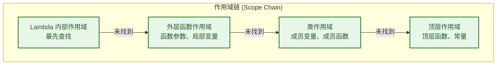
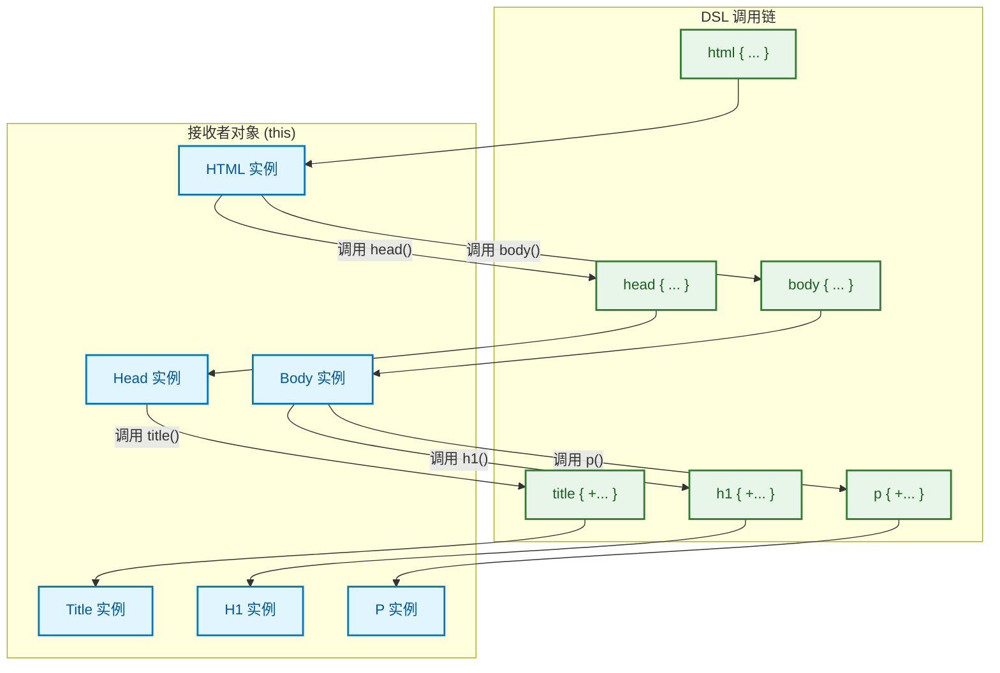
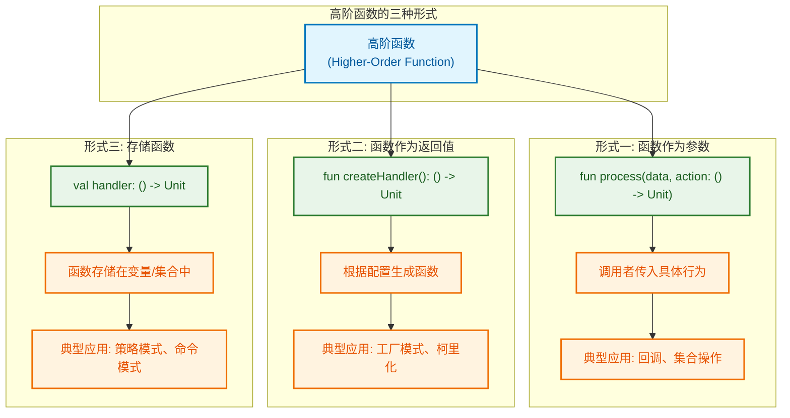
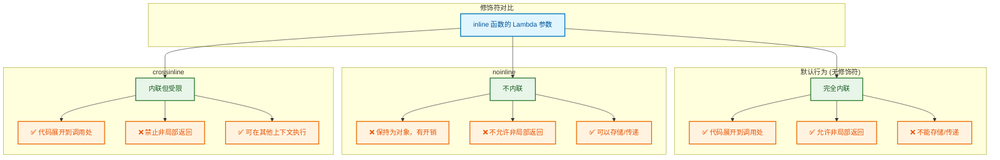
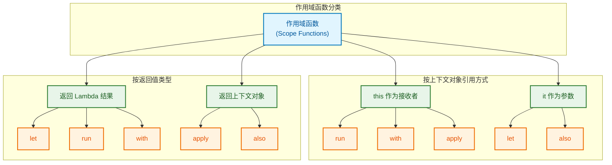
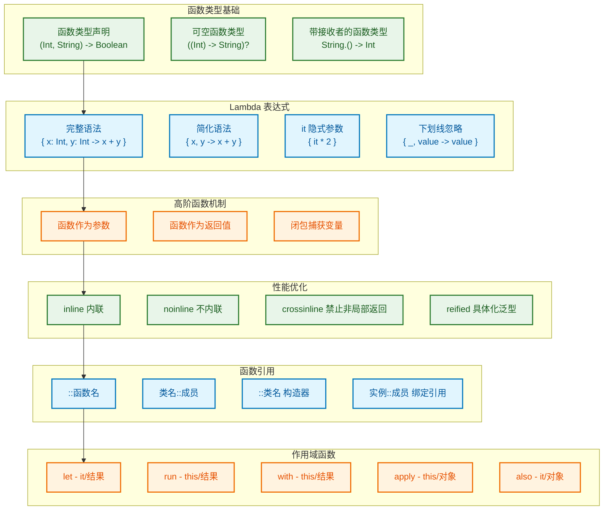

---

# 高阶函数与Lambda

---

## 函数类型 (Function Types)

在 Kotlin 中，函数是"一等公民" (first-class citizen)，这意味着函数可以像普通数据类型一样被存储在变量中、作为参数传递、或作为返回值返回。要实现这一切，首先需要理解**函数类型 (Function Type)** 的概念——它是用来描述"一个函数长什么样"的类型声明。

### 声明函数类型

函数类型的核心语法遵循一个简洁的模式：**用括号包裹参数类型，箭头指向返回类型**。这与数学中函数的映射关系 `f: X → Y` 异曲同工。

```kotlin
// ============================================================
// 函数类型的基本声明语法
// ============================================================

// 1. 无参数，返回 Unit（类似 Java 的 void）
//    () -> Unit 表示：不接收任何参数，不返回有意义的值
val noParamFunc: () -> Unit

// 2. 单参数，返回 Int
//    (String) -> Int 表示：接收一个 String，返回一个 Int
val singleParamFunc: (String) -> Int

// 3. 多参数，返回 Boolean
//    (Int, Int) -> Boolean 表示：接收两个 Int，返回一个 Boolean
val multiParamFunc: (Int, Int) -> Boolean

// 4. 参数本身也是函数类型（高阶函数的基础）
//    ((Int) -> String) -> Unit 表示：接收一个"Int转String的函数"作为参数
val higherOrderFunc: ((Int) -> String) -> Unit
```

理解函数类型时，可以把它想象成一份"契约" (contract)：它规定了这个函数**必须接收什么**、**必须返回什么**，但不关心函数内部具体怎么实现。

### (参数) -> 返回值 语法详解

让我们通过具体示例深入理解这个核心语法：

```kotlin
// ============================================================
// 函数类型的实际应用
// ============================================================

// 声明一个函数类型的变量，并赋值一个 Lambda 表达式
// 类型：(Int, Int) -> Int，即接收两个整数，返回一个整数
val add: (Int, Int) -> Int = { a, b -> 
    a + b  // Lambda 体的最后一个表达式就是返回值
}

// 调用方式与普通函数完全一致
val result = add(3, 5)  // result = 8
println("3 + 5 = $result")

// ============================================================
// 带参数名的函数类型（提高可读性，可选语法）
// ============================================================

// 可以为参数添加名称，增强代码自文档性 (self-documenting)
// 这些名称仅用于文档目的，不影响类型匹配
val calculate: (operand1: Int, operand2: Int, operator: Char) -> Int = { a, b, op ->
    when (op) {
        '+' -> a + b      // 加法
        '-' -> a - b      // 减法
        '*' -> a * b      // 乘法
        '/' -> a / b      // 除法（注意：未处理除零异常）
        else -> throw IllegalArgumentException("未知运算符: $op")
    }
}

// 使用示例
println(calculate(10, 3, '+'))  // 输出: 13
println(calculate(10, 3, '*'))  // 输出: 30
```

函数类型的参数名称是**可选的** (optional)，但在复杂场景下强烈建议添加，因为它能让代码意图更清晰。例如 `(source: String, target: String) -> Boolean` 比 `(String, String) -> Boolean` 更容易理解。

### 可空函数类型 (Nullable Function Types)

Kotlin 的空安全 (null safety) 特性同样适用于函数类型。这里有两个层面的"可空"需要区分：

```kotlin
// ============================================================
// 可空函数类型 vs 返回可空值的函数类型
// ============================================================

// 情况1：函数本身可以为 null（整个函数类型是可空的）
// 注意：必须用括号将整个函数类型包起来，再加 ?
val nullableFunc: ((Int) -> String)?  = null

// 调用时必须进行空检查
nullableFunc?.invoke(42)        // 安全调用，若为 null 则不执行
nullableFunc?.let { it(42) }    // 另一种安全调用方式

// 情况2：函数返回值可以为 null（函数本身不为 null）
// 这里不需要额外的括号
val funcReturnsNullable: (Int) -> String? = { num ->
    if (num > 0) "正数" else null  // 可能返回 null
}

// 调用时函数一定存在，但返回值需要处理
val output: String? = funcReturnsNullable(-5)  // output = null
println(output ?: "无效输入")  // 使用 Elvis 运算符提供默认值
```

```kotlin
┌─────────────────────────────────────────────────────────────────┐
│           可空函数类型 vs 返回可空的函数类型                       │
├─────────────────────────────────────────────────────────────────┤
│                                                                 │
│   ((Int) -> String)?                 (Int) -> String?           │
│         ↓                                  ↓                    │
│   ┌───────────┐                      ┌───────────┐              │
│   │  函数引用  │ ← 可能是 null        │  函数引用  │ ← 一定存在    │
│   └─────┬─────┘                      └─────┬─────┘              │
│         ↓                                  ↓                    │
│   ┌───────────┐                      ┌───────────┐              │
│   │  String   │ ← 若函数存在则非空    │  String?  │ ← 可能是 null │
│   └───────────┘                      └───────────┘              │
│                                                                 │
│   调用方式：                          调用方式：                  │
│   nullableFunc?.invoke(x)            func(x) ?: "默认值"        │
│                                                                 │
└─────────────────────────────────────────────────────────────────┘
```

一个实际应用场景——回调函数 (callback) 的可选设置：

```kotlin
// ============================================================
// 实战：可空回调函数的典型用法
// ============================================================

class NetworkRequest {
    // 成功回调：可选，函数类型可为 null
    private var onSuccess: ((String) -> Unit)? = null
    
    // 失败回调：可选，函数类型可为 null
    private var onError: ((Exception) -> Unit)? = null
    
    // 设置成功回调的方法
    fun onSuccess(callback: (String) -> Unit): NetworkRequest {
        this.onSuccess = callback  // 保存回调函数
        return this  // 返回 this 支持链式调用
    }
    
    // 设置失败回调的方法
    fun onError(callback: (Exception) -> Unit): NetworkRequest {
        this.onError = callback
        return this
    }
    
    // 模拟执行网络请求
    fun execute() {
        try {
            // 模拟网络操作...
            val response = "{ \"status\": \"ok\" }"
            
            // 安全调用：只有设置了回调才会执行
            onSuccess?.invoke(response)
        } catch (e: Exception) {
            // 安全调用：只有设置了错误回调才会执行
            onError?.invoke(e)
        }
    }
}

// 使用示例：链式调用设置回调
NetworkRequest()
    .onSuccess { response -> println("收到响应: $response") }
    .onError { error -> println("请求失败: ${error.message}") }
    .execute()
```

> 📌 **记忆技巧**：`((A) -> B)?` 中的问号在**最外层括号之后**，表示"整个函数可能不存在"；而 `(A) -> B?` 中的问号紧跟返回类型，表示"函数存在但返回值可能为空"。

---

## Lambda 表达式语法 (Lambda Expression Syntax)

Lambda 表达式是 Kotlin 函数式编程的核心语法糖 (syntactic sugar)。它提供了一种简洁的方式来定义匿名函数 (anonymous function)——即没有名字的函数。Lambda 的设计哲学是：**在保证类型安全的前提下，尽可能减少样板代码 (boilerplate code)**。

### 完整语法 (Full Syntax)

Lambda 表达式的完整形式包含所有显式声明，虽然在实际开发中较少使用，但理解它是掌握简化语法的基础：

```kotlin
// ============================================================
// Lambda 完整语法结构
// ============================================================

// 完整语法模板：
// { 参数1: 类型1, 参数2: 类型2, ... -> 函数体 }

// 示例1：两个 Int 参数，返回它们的和
val sumFull: (Int, Int) -> Int = { a: Int, b: Int -> 
    a + b  // 最后一个表达式的值就是 Lambda 的返回值
}

// 示例2：带有多条语句的 Lambda
val processString: (String) -> String = { input: String ->
    // Lambda 体可以包含多条语句
    val trimmed = input.trim()           // 第一步：去除首尾空格
    val uppercased = trimmed.uppercase() // 第二步：转为大写
    uppercased  // 最后一个表达式作为返回值（不需要 return 关键字）
}

// 示例3：无参数的 Lambda（箭头前为空，但箭头可省略）
val greet: () -> String = { 
    "Hello, Kotlin!"  // 直接是返回值
}

println(sumFull(3, 4))           // 输出: 7
println(processString("  hello  "))  // 输出: HELLO
println(greet())                 // 输出: Hello, Kotlin!
```

Lambda 表达式的完整语法结构可以分解为：

```kotlin
┌─────────────────────────────────────────────────────────────┐
│                    Lambda 完整语法解剖                       │
├─────────────────────────────────────────────────────────────┤
│                                                             │
│    { a: Int, b: Int ->  a + b }                             │
│    ↑         ↑       ↑    ↑                                 │
│    │         │       │    └── 函数体 (body)                  │
│    │         │       └─────── 箭头分隔符 (arrow separator)   │
│    │         └─────────────── 参数声明 (parameter list)      │
│    └───────────────────────── 花括号包裹 (curly braces)      │
│                                                             │
│    整体被赋值给类型为 (Int, Int) -> Int 的变量                │
│                                                             │
└─────────────────────────────────────────────────────────────┘
```

### 简化语法 (Simplified Syntax)

Kotlin 编译器具有强大的类型推断 (type inference) 能力，允许我们省略大量显式声明：

```kotlin
// ============================================================
// 类型推断带来的简化
// ============================================================

// 原始完整写法
val sumVerbose: (Int, Int) -> Int = { a: Int, b: Int -> a + b }

// 简化1：变量类型已声明，Lambda 参数类型可推断
val sumSimplified: (Int, Int) -> Int = { a, b -> a + b }

// 简化2：从 Lambda 推断变量类型（较少用，但合法）
val sumInferred = { a: Int, b: Int -> a + b }  // 编译器推断类型为 (Int, Int) -> Int

// ============================================================
// 作为函数参数时的简化（最常见场景）
// ============================================================

// 定义一个接收函数参数的高阶函数
fun operateOnNumbers(a: Int, b: Int, operation: (Int, Int) -> Int): Int {
    return operation(a, b)  // 调用传入的函数
}

// 调用时，Lambda 参数类型可完全省略（从 operation 的类型推断）
val result1 = operateOnNumbers(10, 5, { a, b -> a + b })  // 加法
val result2 = operateOnNumbers(10, 5, { a, b -> a * b })  // 乘法

println("10 + 5 = $result1")  // 输出: 10 + 5 = 15
println("10 * 5 = $result2")  // 输出: 10 * 5 = 50
```

**尾随 Lambda 语法 (Trailing Lambda Syntax)** 是 Kotlin 最优雅的简化之一：

```kotlin
// ============================================================
// 尾随 Lambda：当 Lambda 是最后一个参数时
// ============================================================

// 标准写法：Lambda 在括号内
val result3 = operateOnNumbers(10, 5, { a, b -> a - b })

// 尾随 Lambda 写法：Lambda 移到括号外
val result4 = operateOnNumbers(10, 5) { a, b -> a - b }

// 如果函数只有一个 Lambda 参数，括号可以完全省略
fun executeTask(task: () -> Unit) {
    println("任务开始...")
    task()  // 执行传入的任务
    println("任务结束!")
}

// 调用时省略空括号
executeTask {
    println("正在执行核心逻辑...")
}

// 输出:
// 任务开始...
// 正在执行核心逻辑...
// 任务结束!
```

### it 隐式参数 (Implicit Parameter)

当 Lambda 只有**单个参数**时，Kotlin 允许省略参数声明，并使用隐式名称 `it` 来引用该参数：

```kotlin
// ============================================================
// it 隐式参数的使用
// ============================================================

// 显式声明单参数
val doubleExplicit: (Int) -> Int = { number -> number * 2 }

// 使用 it 隐式参数（推荐用于简单 Lambda）
val doubleImplicit: (Int) -> Int = { it * 2 }

// 两者完全等价
println(doubleExplicit(5))  // 输出: 10
println(doubleImplicit(5))  // 输出: 10

// ============================================================
// 集合操作中的 it（最常见应用场景）
// ============================================================

val numbers = listOf(1, 2, 3, 4, 5)

// filter：保留满足条件的元素
val evenNumbers = numbers.filter { it % 2 == 0 }  // it 代表每个元素
println("偶数: $evenNumbers")  // 输出: 偶数: [2, 4]

// map：将每个元素转换为新值
val squared = numbers.map { it * it }  // it 代表每个元素
println("平方: $squared")  // 输出: 平方: [1, 4, 9, 16, 25]

// 链式调用中的 it
val result = numbers
    .filter { it > 2 }      // 保留大于2的：[3, 4, 5]
    .map { it * 10 }        // 每个乘以10：[30, 40, 50]
    .first { it > 35 }      // 找第一个大于35的：40

println("链式结果: $result")  // 输出: 链式结果: 40
```

> ⚠️ **最佳实践**：`it` 适用于简短、逻辑清晰的 Lambda。当 Lambda 体较复杂，或存在嵌套 Lambda 时，应使用显式参数名以提高可读性。

```kotlin
// ============================================================
// 何时避免使用 it
// ============================================================

// ❌ 不推荐：嵌套 Lambda 中 it 指向不明确
val nestedBad = listOf(listOf(1, 2), listOf(3, 4)).map {
    it.filter { it > 1 }  // 两个 it 分别指向什么？容易混淆
}

// ✅ 推荐：使用显式参数名
val nestedGood = listOf(listOf(1, 2), listOf(3, 4)).map { innerList ->
    innerList.filter { number -> number > 1 }  // 清晰明了
}

// ❌ 不推荐：复杂逻辑中使用 it
val complexBad = users.filter {
    it.age > 18 && it.name.startsWith("A") && it.isActive && it.score > 80
}

// ✅ 推荐：复杂逻辑使用显式参数名
val complexGood = users.filter { user ->
    user.age > 18 && 
    user.name.startsWith("A") && 
    user.isActive && 
    user.score > 80
}
```

### 下划线忽略参数 (Underscore for Unused Parameters)

当 Lambda 的某些参数在函数体中不需要使用时，可以用下划线 `_` 替代参数名，明确表示"我知道这个参数存在，但我不需要它"：

```kotlin
// ============================================================
// 下划线忽略不需要的参数
// ============================================================

// 场景1：Map 遍历时只需要 value，不需要 key
val scores = mapOf("Alice" to 95, "Bob" to 87, "Charlie" to 92)

// 使用下划线忽略 key
scores.forEach { (_, score) ->  // _ 表示忽略 key
    println("分数: $score")
}
// 输出:
// 分数: 95
// 分数: 87
// 分数: 92

// 场景2：解构声明中忽略部分组件
data class Person(val name: String, val age: Int, val city: String)

val people = listOf(
    Person("Alice", 25, "Beijing"),
    Person("Bob", 30, "Shanghai")
)

// 只关心 name 和 city，忽略 age
people.forEach { (name, _, city) ->
    println("$name 住在 $city")
}
// 输出:
// Alice 住在 Beijing
// Bob 住在 Shanghai

// ============================================================
// 多参数 Lambda 中忽略部分参数
// ============================================================

// 定义一个接收三参数函数的高阶函数
fun processWithIndex(
    items: List<String>,
    action: (index: Int, value: String, isLast: Boolean) -> Unit
) {
    items.forEachIndexed { index, value ->
        action(index, value, index == items.lastIndex)
    }
}

// 调用时只关心 value，忽略 index 和 isLast
processWithIndex(listOf("A", "B", "C")) { _, value, _ ->
    println("处理: $value")
}
// 输出:
// 处理: A
// 处理: B
// 处理: C
```

下划线的使用不仅让代码更简洁，还能**消除编译器的"未使用参数"警告** (unused parameter warning)，同时向代码阅读者传达明确的意图。

```kotlin
// ============================================================
// 实战：Android 中的典型应用
// ============================================================

// RecyclerView 的 OnItemClickListener 通常提供多个参数
// 但很多时候我们只需要 position

interface OnItemClickListener {
    fun onItemClick(view: View, position: Int, id: Long)
}

// 使用 SAM 转换 + 下划线忽略不需要的参数
recyclerView.setOnItemClickListener { _, position, _ ->
    // 只使用 position，忽略 view 和 id
    navigateToDetail(items[position])
}

// TextWatcher 的三个回调方法中，经常只需要 afterTextChanged
editText.addTextChangedListener(object : TextWatcher {
    override fun beforeTextChanged(s: CharSequence?, start: Int, count: Int, after: Int) {
        // 通常不需要实现
    }
    
    override fun onTextChanged(s: CharSequence?, start: Int, before: Int, count: Int) {
        // 通常不需要实现
    }
    
    override fun afterTextChanged(s: Editable?) {
        // 实际逻辑在这里
        validateInput(s?.toString() ?: "")
    }
})
```

---

📝 **练习题**

**题目 1**：以下哪个是正确的"可空函数类型"声明，表示该函数变量本身可以为 null？

A. `val func: (Int) -> String? = null`
B. `val func: ((Int) -> String)? = null`
C. `val func: (Int?) -> String = null`
D. `val func: (Int)? -> String = null`

【答案】B

【解析】
- **B 正确**：`((Int) -> String)?` 将整个函数类型 `(Int) -> String` 用括号包裹后加 `?`，表示这个函数引用本身可以是 null。
- **A 错误**：`(Int) -> String?` 表示函数返回值可以为 null，但函数本身必须存在，不能赋值为 null。
- **C 错误**：`(Int?) -> String` 表示函数接收一个可空的 Int 参数，函数本身不可为 null。
- **D 错误**：这是语法错误，`?` 不能放在箭头前面。

---

**题目 2**：观察以下代码，输出结果是什么？

```kotlin
val numbers = listOf(1, 2, 3, 4, 5)
val result = numbers.filter { it > 2 }.map { it * 2 }.first()
println(result)
```

A. `2`
B. `6`
C. `8`
D. `[6, 8, 10]`

【答案】B

【解析】
- `numbers.filter { it > 2 }` 过滤出大于 2 的元素，得到 `[3, 4, 5]`
- `.map { it * 2 }` 将每个元素乘以 2，得到 `[6, 8, 10]`
- `.first()` 取第一个元素，即 `6`
- 因此输出 `6`，答案是 **B**。
- **A 错误**：`2` 不在过滤后的列表中。
- **C 错误**：`8` 是第二个元素，不是第一个。
- **D 错误**：`first()` 返回单个元素，不是列表。

---

## 闭包 (Closure)

闭包 (Closure) 是函数式编程中的核心概念之一。简单来说，闭包是一个**能够"记住"并访问其定义时所在作用域中变量的函数**。即使这个函数在其原始作用域之外被调用，它依然能够访问那些被"捕获"的变量。这种能力让函数变得更加灵活和强大。

> 📖 **官方定义**："A closure is a function that captures variables from its surrounding scope." (闭包是一个能够捕获其周围作用域中变量的函数)

### 捕获外部变量 (Capturing External Variables)

当 Lambda 表达式引用了其外部作用域中的变量时，这个变量就被"捕获"了。Lambda 会持有对这个变量的引用，使得即使离开了原始作用域，依然可以访问它。

```kotlin
// ============================================================
// 基础示例：Lambda 捕获外部变量
// ============================================================

fun createGreeter(greeting: String): () -> Unit {
    // greeting 是函数参数，属于 createGreeter 的局部作用域
    // 返回的 Lambda 捕获了这个 greeting 变量
    return {
        println(greeting)  // Lambda 内部引用了外部的 greeting
    }
}

fun main() {
    // 创建两个不同的 greeter，各自捕获不同的 greeting 值
    val sayHello = createGreeter("Hello, World!")
    val sayGoodbye = createGreeter("Goodbye, World!")
    
    // 此时 createGreeter 函数已经执行完毕
    // 但 Lambda 依然"记住"了各自捕获的 greeting 值
    sayHello()    // 输出: Hello, World!
    sayGoodbye()  // 输出: Goodbye, World!
}
```

```kotlin
┌─────────────────────────────────────────────────────────────────┐
│                    闭包捕获变量的内存模型                         │
├─────────────────────────────────────────────────────────────────┤
│                                                                 │
│   createGreeter("Hello")                                        │
│         │                                                       │
│         ▼                                                       │
│   ┌─────────────────┐      ┌─────────────────────┐              │
│   │  Lambda 对象     │ ───► │  捕获的变量副本      │              │
│   │  (闭包实例)      │      │  greeting = "Hello" │              │
│   └─────────────────┘      └─────────────────────┘              │
│                                                                 │
│   即使 createGreeter 函数返回后，Lambda 依然持有 greeting 的引用  │
│                                                                 │
└─────────────────────────────────────────────────────────────────┘
```

捕获变量的类型可以是任意的——基本类型、对象引用、甚至其他函数：

```kotlin
// ============================================================
// 捕获不同类型的变量
// ============================================================

fun demonstrateClosure() {
    // 捕获基本类型
    val multiplier = 10
    val multiply: (Int) -> Int = { it * multiplier }
    
    // 捕获对象引用
    val prefix = StringBuilder("Result: ")
    val format: (Int) -> String = { prefix.append(it).toString() }
    
    // 捕获另一个函数
    val validator: (Int) -> Boolean = { it > 0 }
    val safeMultiply: (Int) -> Int? = { num ->
        if (validator(num)) multiply(num) else null  // 捕获了 validator 和 multiply
    }
    
    println(multiply(5))        // 输出: 50
    println(format(42))         // 输出: Result: 42
    println(safeMultiply(3))    // 输出: 30
    println(safeMultiply(-1))   // 输出: null
}
```

### 闭包作用域 (Closure Scope)

闭包可以访问多层嵌套作用域中的变量。理解作用域链 (scope chain) 对于正确使用闭包至关重要。

```kotlin
// ============================================================
// 多层作用域的变量捕获
// ============================================================

class Counter {
    private var count = 0  // 类成员变量（最外层作用域）
    
    fun createIncrementor(step: Int): () -> Int {
        // step 是函数参数（中间层作用域）
        val startValue = count  // 局部变量，捕获当前 count 值
        
        return {
            // Lambda 可以访问：
            // 1. 类成员 count（最外层）
            // 2. 函数参数 step（中间层）
            // 3. 局部变量 startValue（同层）
            count += step
            println("Started at $startValue, now at $count")
            count
        }
    }
}

fun main() {
    val counter = Counter()
    val incrementBy5 = counter.createIncrementor(5)
    
    incrementBy5()  // Started at 0, now at 5
    incrementBy5()  // Started at 0, now at 10 (startValue 被固定为创建时的值)
    incrementBy5()  // Started at 0, now at 15
}
```

闭包作用域的查找遵循**由内向外**的原则：



### 修改捕获变量 (Modifying Captured Variables)

与 Java 不同，Kotlin 的闭包可以**修改**捕获的变量（Java 要求被捕获的局部变量必须是 `final` 或 effectively final）。这是因为 Kotlin 编译器会将可变变量包装在一个特殊的引用对象中。

```kotlin
// ============================================================
// Kotlin 闭包可以修改捕获的变量
// ============================================================

fun countEvents(): () -> Int {
    var count = 0  // 可变局部变量
    
    return {
        count++  // 直接修改捕获的变量！
        count
    }
}

fun main() {
    val counter = countEvents()
    
    println(counter())  // 输出: 1
    println(counter())  // 输出: 2
    println(counter())  // 输出: 3
    
    // 每次调用都会修改同一个被捕获的 count 变量
}
```

**编译器的魔法**：Kotlin 编译器会将可变的捕获变量包装在 `Ref` 类中：

```kotlin
// ============================================================
// 编译器对可变捕获变量的处理（概念演示）
// ============================================================

// 你写的代码：
fun original() {
    var count = 0
    val increment = { count++ }
}

// 编译器实际生成的等效代码（简化版）：
fun compiled() {
    // 可变变量被包装在 IntRef 对象中
    val countRef = IntRef()  // 类似于 class IntRef { var element: Int = 0 }
    countRef.element = 0
    
    // Lambda 捕获的是 countRef 这个引用（不可变）
    // 但可以修改 countRef.element（引用指向的内容）
    val increment = { countRef.element++ }
}
```

```kotlin
┌─────────────────────────────────────────────────────────────────┐
│              Kotlin 可变变量捕获机制                              │
├─────────────────────────────────────────────────────────────────┤
│                                                                 │
│   源代码层面：                                                   │
│   var count = 0                                                 │
│   val lambda = { count++ }                                      │
│                                                                 │
│   编译后（JVM 字节码层面）：                                      │
│   ┌──────────────┐         ┌─────────────────┐                  │
│   │   Lambda     │ ──────► │   IntRef        │                  │
│   │   对象       │  持有    │   element = 0   │                  │
│   └──────────────┘         └─────────────────┘                  │
│         │                         ▲                             │
│         │      count++ 实际上是   │                             │
│         └─────────────────────────┘                             │
│              ref.element++                                      │
│                                                                 │
│   这样 Lambda 捕获的是 IntRef 引用（final），                    │
│   但可以修改其内部的 element 值                                  │
└─────────────────────────────────────────────────────────────────┘
```

**实战应用**：闭包修改变量在事件计数、状态累积等场景非常有用：

```kotlin
// ============================================================
// 实战：使用闭包实现事件统计
// ============================================================

fun createClickTracker(buttonName: String): Pair<() -> Unit, () -> Int> {
    var clickCount = 0           // 点击次数
    var lastClickTime = 0L       // 最后点击时间
    
    // 点击处理器
    val onClick: () -> Unit = {
        clickCount++
        lastClickTime = System.currentTimeMillis()
        println("$buttonName 被点击，总次数: $clickCount")
    }
    
    // 获取统计信息
    val getCount: () -> Int = { clickCount }
    
    return onClick to getCount
}

fun main() {
    val (onClick, getCount) = createClickTracker("提交按钮")
    
    onClick()  // 提交按钮 被点击，总次数: 1
    onClick()  // 提交按钮 被点击，总次数: 2
    onClick()  // 提交按钮 被点击，总次数: 3
    
    println("总点击次数: ${getCount()}")  // 总点击次数: 3
}
```

> ⚠️ **注意事项**：虽然 Kotlin 允许修改捕获变量，但在多线程环境下需要注意线程安全问题。被捕获的可变变量没有自动的同步机制。

---

## Lambda 接收者 (Lambda with Receiver)

Lambda 接收者 (Lambda with Receiver) 是 Kotlin 中一个强大且独特的特性。它允许在 Lambda 内部直接访问某个对象的成员，就像在该对象的成员函数内部一样。这是构建 DSL (Domain Specific Language，领域特定语言) 的核心机制。

### 带接收者的函数类型 (Function Type with Receiver)

普通函数类型的形式是 `(参数) -> 返回值`，而带接收者的函数类型在前面加上接收者类型：`接收者类型.(参数) -> 返回值`。

```kotlin
// ============================================================
// 普通函数类型 vs 带接收者的函数类型
// ============================================================

// 普通函数类型：接收一个 StringBuilder，返回 Unit
val normalFunc: (StringBuilder) -> Unit = { sb ->
    sb.append("Hello")  // 必须通过参数 sb 来访问
    sb.append(" World")
}

// 带接收者的函数类型：StringBuilder 是接收者
val receiverFunc: StringBuilder.() -> Unit = {
    append("Hello")     // 直接调用，隐式使用 this
    append(" World")    // 无需 sb. 前缀
}

fun main() {
    val sb1 = StringBuilder()
    normalFunc(sb1)           // 普通调用方式
    println(sb1)              // 输出: Hello World
    
    val sb2 = StringBuilder()
    sb2.receiverFunc()        // 像调用成员函数一样调用！
    println(sb2)              // 输出: Hello World
    
    // 也可以使用 invoke 显式调用
    val sb3 = StringBuilder()
    receiverFunc.invoke(sb3)  // 等价于 sb3.receiverFunc()
    println(sb3)              // 输出: Hello World
}
```

带接收者的函数类型本质上是将第一个参数"提升"为接收者：

```kotlin
┌─────────────────────────────────────────────────────────────────┐
│         普通函数类型 vs 带接收者的函数类型                        │
├─────────────────────────────────────────────────────────────────┤
│                                                                 │
│   普通函数类型：                                                 │
│   (StringBuilder, String) -> Unit                               │
│        ↓           ↓                                            │
│      参数1       参数2                                          │
│                                                                 │
│   带接收者的函数类型：                                           │
│   StringBuilder.(String) -> Unit                                │
│        ↓           ↓                                            │
│      接收者       参数                                          │
│     (this)                                                      │
│                                                                 │
│   两者在 JVM 层面的签名是相同的！                                │
│   区别在于 Kotlin 编译器如何处理 Lambda 内部的 this 引用         │
│                                                                 │
└─────────────────────────────────────────────────────────────────┘
```

### this 在 Lambda 中 (this in Lambda)

在带接收者的 Lambda 中，`this` 关键字指向接收者对象。这使得我们可以像在类的成员函数中一样，直接访问接收者的属性和方法。

```kotlin
// ============================================================
// this 在带接收者 Lambda 中的使用
// ============================================================

class Person(var name: String, var age: Int)

// 定义一个带接收者的高阶函数
fun Person.configure(block: Person.() -> Unit): Person {
    this.block()  // 在当前 Person 对象上执行 block
    return this
}

fun main() {
    val person = Person("Unknown", 0)
    
    // 使用带接收者的 Lambda 配置对象
    person.configure {
        // 在这个 Lambda 内部，this 指向 person 对象
        name = "Alice"      // 等价于 this.name = "Alice"
        age = 25            // 等价于 this.age = 25
        
        // 可以显式使用 this
        println("配置完成: ${this.name}, ${this.age}")
    }
    
    println("最终结果: ${person.name}, ${person.age}")
    // 输出:
    // 配置完成: Alice, 25
    // 最终结果: Alice, 25
}
```

**嵌套接收者与 this 限定** (Nested Receivers and Qualified this)：

当存在多层嵌套的带接收者 Lambda 时，可以使用 `this@标签` 来明确指定要访问哪个接收者：

```kotlin
// ============================================================
// 嵌套接收者的 this 限定
// ============================================================

class Outer {
    val outerValue = "Outer"
    
    // 带接收者的函数，接收者是 Inner
    fun Inner.process(block: Inner.() -> Unit) {
        block()
    }
    
    inner class Inner {
        val innerValue = "Inner"
        
        fun demo() {
            // 这里有两个潜在的 this：Outer 和 Inner
            process {
                // 默认 this 指向最近的接收者（Inner）
                println(innerValue)           // Inner 的属性
                println(this.innerValue)      // 显式 this，仍是 Inner
                
                // 使用限定 this 访问外层接收者
                println(this@Outer.outerValue)  // 访问 Outer 的属性
                println(this@Inner.innerValue)  // 显式指定 Inner
                println(this@process.innerValue) // 通过函数名限定
            }
        }
    }
}
```

**实战：构建 DSL 风格的 API**：

带接收者的 Lambda 是 Kotlin DSL 的基石。以下是一个简化的 HTML 构建器示例：

```kotlin
// ============================================================
// DSL 示例：简易 HTML 构建器
// ============================================================

// HTML 元素的基类
open class Tag(val name: String) {
    private val children = mutableListOf<Tag>()  // 子元素
    protected var textContent: String = ""       // 文本内容
    
    // 添加子元素
    protected fun <T : Tag> addChild(child: T, init: T.() -> Unit): T {
        child.init()           // 在子元素上执行初始化 Lambda
        children.add(child)    // 添加到子元素列表
        return child
    }
    
    // 渲染为 HTML 字符串
    override fun toString(): String {
        val childrenStr = children.joinToString("")
        val content = if (textContent.isNotEmpty()) textContent else childrenStr
        return "<$name>$content</$name>"
    }
}

// 具体的 HTML 标签
class HTML : Tag("html") {
    fun head(init: Head.() -> Unit) = addChild(Head(), init)
    fun body(init: Body.() -> Unit) = addChild(Body(), init)
}

class Head : Tag("head") {
    fun title(init: Title.() -> Unit) = addChild(Title(), init)
}

class Title : Tag("title") {
    operator fun String.unaryPlus() {  // 重载 + 运算符用于设置文本
        textContent = this
    }
}

class Body : Tag("body") {
    fun h1(init: H1.() -> Unit) = addChild(H1(), init)
    fun p(init: P.() -> Unit) = addChild(P(), init)
}

class H1 : Tag("h1") {
    operator fun String.unaryPlus() { textContent = this }
}

class P : Tag("p") {
    operator fun String.unaryPlus() { textContent = this }
}

// DSL 入口函数
fun html(init: HTML.() -> Unit): HTML {
    val html = HTML()
    html.init()  // 在 HTML 对象上执行带接收者的 Lambda
    return html
}

// ============================================================
// 使用 DSL 构建 HTML
// ============================================================

fun main() {
    val document = html {
        // this 是 HTML 对象
        head {
            // this 是 Head 对象
            title {
                // this 是 Title 对象
                +"Kotlin DSL Demo"  // 使用重载的 + 运算符
            }
        }
        body {
            // this 是 Body 对象
            h1 {
                +"Welcome to Kotlin"
            }
            p {
                +"This is a DSL example."
            }
        }
    }
    
    println(document)
    // 输出: <html><head><title>Kotlin DSL Demo</title></head><body><h1>Welcome to Kotlin</h1><p>This is a DSL example.</p></body></html>
}
```

整个 DSL 的工作流程可以用下图表示：



> 💡 **核心理解**：带接收者的 Lambda 让我们能够在 Lambda 内部"假装"自己是接收者对象的成员函数，从而可以直接访问其属性和方法。这种机制是 Kotlin 能够创建流畅、类型安全的 DSL 的关键所在。

---

📝 **练习题**

**题目 1**：观察以下代码，输出结果是什么？

```kotlin
fun createCounter(): () -> Int {
    var count = 0
    return { ++count }
}

fun main() {
    val counter1 = createCounter()
    val counter2 = createCounter()
    
    println("${counter1()}, ${counter1()}, ${counter2()}")
}
```

A. `1, 2, 3`
B. `1, 2, 1`
C. `1, 1, 1`
D. `0, 1, 0`

【答案】B

【解析】
- `createCounter()` 每次调用都会创建一个**新的闭包**，每个闭包捕获各自独立的 `count` 变量。
- `counter1` 和 `counter2` 是两个不同的闭包实例，它们各自维护自己的 `count`。
- `counter1()` 第一次调用返回 `1`（`count` 从 0 变为 1）
- `counter1()` 第二次调用返回 `2`（`count` 从 1 变为 2）
- `counter2()` 第一次调用返回 `1`（这是 `counter2` 自己的 `count`，从 0 变为 1）
- 因此输出 `1, 2, 1`，答案是 **B**。

---

**题目 2**：以下哪个是正确的"带接收者的函数类型"声明？

A. `val func: String -> Int`
B. `val func: (String) -> Int`
C. `val func: String.() -> Int`
D. `val func: () -> String.Int`

【答案】C

【解析】
- **C 正确**：`String.() -> Int` 是带接收者的函数类型，表示接收者是 `String`，无额外参数，返回 `Int`。在 Lambda 内部可以直接访问 `String` 的成员（如 `length`、`uppercase()` 等）。
- **A 错误**：`String -> Int` 语法不完整，缺少括号，这不是合法的函数类型声明。
- **B 错误**：`(String) -> Int` 是普通函数类型，`String` 是参数而非接收者，Lambda 内部需要通过参数名访问。
- **D 错误**：`() -> String.Int` 语法错误，`String.Int` 不是有效的类型表达式。

---

## 高阶函数 (Higher-Order Functions)

高阶函数 (Higher-Order Function) 是函数式编程的核心概念之一。在 Kotlin 中，**高阶函数是指接收函数作为参数，或者返回函数作为结果的函数**。这个定义看似简单，却蕴含着强大的抽象能力——它让我们能够将"行为"本身作为数据来传递和操作。

> 📖 **官方定义**："A higher-order function is a function that takes functions as parameters, or returns a function." (高阶函数是将函数作为参数或返回值的函数)

高阶函数的价值在于**分离关注点** (Separation of Concerns)：将"做什么"和"怎么做"解耦。调用者决定具体行为，高阶函数负责执行流程。

### 函数作为参数 (Function as Parameter)

将函数作为参数传递是高阶函数最常见的应用形式。这种模式允许我们编写通用的算法框架，而将具体的业务逻辑延迟到调用时决定。

```kotlin
// ============================================================
// 基础示例：函数作为参数
// ============================================================

// 定义一个高阶函数，接收一个 (Int, Int) -> Int 类型的函数参数
fun calculate(a: Int, b: Int, operation: (Int, Int) -> Int): Int {
    println("准备计算: $a 和 $b")      // 通用的前置逻辑
    val result = operation(a, b)       // 调用传入的函数执行具体计算
    println("计算完成: $result")        // 通用的后置逻辑
    return result
}

fun main() {
    // 传入不同的 Lambda 实现不同的计算逻辑
    val sum = calculate(10, 5) { x, y -> x + y }       // 加法
    val diff = calculate(10, 5) { x, y -> x - y }      // 减法
    val product = calculate(10, 5) { x, y -> x * y }   // 乘法
    
    println("和: $sum, 差: $diff, 积: $product")
    // 输出:
    // 准备计算: 10 和 5
    // 计算完成: 15
    // 准备计算: 10 和 5
    // 计算完成: 5
    // 准备计算: 10 和 5
    // 计算完成: 50
    // 和: 15, 差: 5, 积: 50
}
```

**实战应用：集合操作的回调模式**

Kotlin 标准库中的集合操作函数（如 `filter`、`map`、`forEach`）都是高阶函数的典型应用：

```kotlin
// ============================================================
// 自己实现一个简化版的 filter 函数
// ============================================================

// 泛型高阶函数：接收一个判断条件函数
fun <T> List<T>.myFilter(predicate: (T) -> Boolean): List<T> {
    val result = mutableListOf<T>()    // 创建结果列表
    for (item in this) {               // 遍历原列表
        if (predicate(item)) {         // 调用传入的判断函数
            result.add(item)           // 满足条件则添加到结果
        }
    }
    return result
}

// 自己实现一个简化版的 map 函数
fun <T, R> List<T>.myMap(transform: (T) -> R): List<R> {
    val result = mutableListOf<R>()    // 创建结果列表
    for (item in this) {               // 遍历原列表
        result.add(transform(item))    // 调用转换函数并添加结果
    }
    return result
}

fun main() {
    val numbers = listOf(1, 2, 3, 4, 5, 6, 7, 8, 9, 10)
    
    // 使用自定义的高阶函数
    val evenNumbers = numbers.myFilter { it % 2 == 0 }
    val squared = numbers.myMap { it * it }
    
    println("偶数: $evenNumbers")      // 偶数: [2, 4, 6, 8, 10]
    println("平方: $squared")          // 平方: [1, 4, 9, 16, 25, 36, 49, 64, 81, 100]
}
```

**多函数参数的高阶函数**

一个高阶函数可以接收多个函数参数，用于处理不同的场景：

```kotlin
// ============================================================
// 接收多个函数参数：成功/失败回调模式
// ============================================================

// 模拟网络请求的高阶函数
fun fetchData(
    url: String,
    onSuccess: (String) -> Unit,           // 成功回调
    onError: (Exception) -> Unit           // 失败回调
) {
    try {
        // 模拟网络请求
        if (url.startsWith("https://")) {
            val response = """{"status": "ok", "data": "Hello from $url"}"""
            onSuccess(response)            // 调用成功回调
        } else {
            throw IllegalArgumentException("不安全的 URL: 必须使用 HTTPS")
        }
    } catch (e: Exception) {
        onError(e)                         // 调用失败回调
    }
}

fun main() {
    // 调用时传入两个 Lambda
    fetchData(
        url = "https://api.example.com/data",
        onSuccess = { response ->
            println("请求成功: $response")
        },
        onError = { error ->
            println("请求失败: ${error.message}")
        }
    )
    
    // 尾随 Lambda 语法只能用于最后一个 Lambda 参数
    // 如果有多个 Lambda，建议使用命名参数提高可读性
}
```

### 函数作为返回值 (Function as Return Value)

高阶函数不仅可以接收函数，还可以**返回函数**。这种模式常用于创建"函数工厂" (Function Factory)——根据不同的配置生成不同行为的函数。

```kotlin
// ============================================================
// 函数工厂：根据配置返回不同的函数
// ============================================================

// 返回一个比较函数，根据 ascending 参数决定升序还是降序
fun createComparator(ascending: Boolean): (Int, Int) -> Int {
    return if (ascending) {
        { a, b -> a - b }      // 升序：a < b 时返回负数
    } else {
        { a, b -> b - a }      // 降序：b < a 时返回负数
    }
}

fun main() {
    val numbers = mutableListOf(3, 1, 4, 1, 5, 9, 2, 6)
    
    // 获取升序比较器
    val ascComparator = createComparator(true)
    numbers.sortWith(ascComparator)
    println("升序: $numbers")          // 升序: [1, 1, 2, 3, 4, 5, 6, 9]
    
    // 获取降序比较器
    val descComparator = createComparator(false)
    numbers.sortWith(descComparator)
    println("降序: $numbers")          // 降序: [9, 6, 5, 4, 3, 2, 1, 1]
}
```

**进阶：柯里化与部分应用 (Currying and Partial Application)**

返回函数的高阶函数可以实现柯里化 (Currying)——将多参数函数转换为一系列单参数函数的链式调用：

```kotlin
// ============================================================
// 柯里化示例：将多参数函数拆分为单参数函数链
// ============================================================

// 普通的三参数函数
fun normalAdd(a: Int, b: Int, c: Int): Int = a + b + c

// 柯里化版本：返回函数的函数的函数
fun curriedAdd(a: Int): (Int) -> (Int) -> Int {
    return { b: Int ->           // 返回一个接收 b 的函数
        { c: Int ->              // 该函数又返回一个接收 c 的函数
            a + b + c            // 最终计算结果
        }
    }
}

fun main() {
    // 普通调用
    val result1 = normalAdd(1, 2, 3)
    println("普通调用: $result1")      // 普通调用: 6
    
    // 柯里化调用
    val result2 = curriedAdd(1)(2)(3)
    println("柯里化调用: $result2")    // 柯里化调用: 6
    
    // 柯里化的优势：部分应用 (Partial Application)
    val addOne = curriedAdd(1)         // 固定第一个参数为 1
    val addOneAndTwo = addOne(2)       // 固定第二个参数为 2
    
    println(addOneAndTwo(3))           // 6 (1 + 2 + 3)
    println(addOneAndTwo(10))          // 13 (1 + 2 + 10)
    println(addOneAndTwo(100))         // 103 (1 + 2 + 100)
}
```

```kotlin
┌─────────────────────────────────────────────────────────────────┐
│                    柯里化调用链解析                               │
├─────────────────────────────────────────────────────────────────┤
│                                                                 │
│   curriedAdd(1)        (2)           (3)                        │
│       │                 │             │                         │
│       ▼                 ▼             ▼                         │
│   ┌─────────┐      ┌─────────┐   ┌─────────┐                    │
│   │ a = 1   │ ───► │ b = 2   │ ─►│ c = 3   │ ───► 结果: 6       │
│   │ 返回函数 │      │ 返回函数 │   │ 返回值  │                    │
│   └─────────┘      └─────────┘   └─────────┘                    │
│                                                                 │
│   每一步都返回一个"记住"之前参数的新函数                          │
│   这就是闭包 (Closure) 的实际应用                                │
│                                                                 │
└─────────────────────────────────────────────────────────────────┘
```

**实战：配置化的验证器工厂**

```kotlin
// ============================================================
// 实战：创建可配置的验证器
// ============================================================

// 验证器工厂：返回一个验证函数
fun createValidator(
    minLength: Int = 0,
    maxLength: Int = Int.MAX_VALUE,
    pattern: Regex? = null
): (String) -> ValidationResult {
    
    // 返回的验证函数会"记住"上面的配置参数（闭包）
    return { input: String ->
        when {
            input.length < minLength -> 
                ValidationResult.Error("长度不能少于 $minLength 个字符")
            input.length > maxLength -> 
                ValidationResult.Error("长度不能超过 $maxLength 个字符")
            pattern != null && !pattern.matches(input) -> 
                ValidationResult.Error("格式不正确")
            else -> 
                ValidationResult.Success
        }
    }
}

// 验证结果的密封类
sealed class ValidationResult {
    object Success : ValidationResult()
    data class Error(val message: String) : ValidationResult()
}

fun main() {
    // 创建用户名验证器：3-20字符，只允许字母数字下划线
    val usernameValidator = createValidator(
        minLength = 3,
        maxLength = 20,
        pattern = Regex("^[a-zA-Z0-9_]+$")
    )
    
    // 创建密码验证器：8-50字符，无格式限制
    val passwordValidator = createValidator(
        minLength = 8,
        maxLength = 50
    )
    
    // 使用验证器
    println(usernameValidator("ab"))           // Error: 长度不能少于 3 个字符
    println(usernameValidator("valid_user"))   // Success
    println(usernameValidator("invalid user")) // Error: 格式不正确
    
    println(passwordValidator("123"))          // Error: 长度不能少于 8 个字符
    println(passwordValidator("secure_password_123"))  // Success
}
```

### 存储函数 (Storing Functions)

函数在 Kotlin 中是一等公民 (first-class citizen)，这意味着函数可以像普通数据一样被存储在变量、属性、集合中。

```kotlin
// ============================================================
// 将函数存储在变量中
// ============================================================

// 存储在局部变量
val greet: (String) -> String = { name -> "Hello, $name!" }

// 存储在类的属性中
class Calculator {
    // 属性类型是函数类型
    var operation: (Int, Int) -> Int = { a, b -> a + b }
    
    fun calculate(a: Int, b: Int): Int {
        return operation(a, b)    // 调用存储的函数
    }
    
    // 切换操作模式
    fun setAddMode() { operation = { a, b -> a + b } }
    fun setSubtractMode() { operation = { a, b -> a - b } }
    fun setMultiplyMode() { operation = { a, b -> a * b } }
}

fun main() {
    val calc = Calculator()
    
    println(calc.calculate(10, 5))     // 15 (默认加法)
    
    calc.setMultiplyMode()
    println(calc.calculate(10, 5))     // 50 (切换为乘法)
    
    calc.setSubtractMode()
    println(calc.calculate(10, 5))     // 5 (切换为减法)
}
```

**将函数存储在集合中**

```kotlin
// ============================================================
// 将函数存储在 Map 中：命令模式的简化实现
// ============================================================

class CommandProcessor {
    // 命令注册表：命令名 -> 处理函数
    private val commands = mutableMapOf<String, (List<String>) -> String>()
    
    // 注册命令
    fun register(name: String, handler: (List<String>) -> String) {
        commands[name] = handler
    }
    
    // 执行命令
    fun execute(input: String): String {
        val parts = input.split(" ")           // 分割输入
        val commandName = parts.firstOrNull() ?: return "错误: 空命令"
        val args = parts.drop(1)               // 获取参数列表
        
        // 从 Map 中获取并执行对应的处理函数
        val handler = commands[commandName]
            ?: return "错误: 未知命令 '$commandName'"
        
        return handler(args)
    }
}

fun main() {
    val processor = CommandProcessor()
    
    // 注册各种命令处理函数
    processor.register("echo") { args ->
        args.joinToString(" ")                 // 原样返回参数
    }
    
    processor.register("upper") { args ->
        args.joinToString(" ").uppercase()    // 转大写
    }
    
    processor.register("count") { args ->
        "参数数量: ${args.size}"               // 统计参数数量
    }
    
    processor.register("reverse") { args ->
        args.reversed().joinToString(" ")     // 反转参数顺序
    }
    
    // 执行命令
    println(processor.execute("echo Hello World"))      // Hello World
    println(processor.execute("upper hello kotlin"))    // HELLO KOTLIN
    println(processor.execute("count a b c d e"))       // 参数数量: 5
    println(processor.execute("reverse 1 2 3 4 5"))     // 5 4 3 2 1
    println(processor.execute("unknown test"))          // 错误: 未知命令 'unknown'
}
```

**将函数存储在列表中：管道模式**

```kotlin
// ============================================================
// 函数列表：构建处理管道 (Pipeline)
// ============================================================

class TextPipeline {
    // 存储一系列文本处理函数
    private val processors = mutableListOf<(String) -> String>()
    
    // 添加处理步骤
    fun addStep(processor: (String) -> String): TextPipeline {
        processors.add(processor)
        return this    // 支持链式调用
    }
    
    // 执行整个管道
    fun process(input: String): String {
        var result = input
        for (processor in processors) {
            result = processor(result)    // 依次应用每个处理函数
        }
        return result
    }
}

fun main() {
    val pipeline = TextPipeline()
        .addStep { it.trim() }                    // 步骤1: 去除首尾空格
        .addStep { it.lowercase() }               // 步骤2: 转小写
        .addStep { it.replace(" ", "_") }         // 步骤3: 空格替换为下划线
        .addStep { "processed_$it" }              // 步骤4: 添加前缀
    
    val result = pipeline.process("  Hello World  ")
    println(result)    // 输出: processed_hello_world
}
```

高阶函数的三种形式可以用下图总结：



---

📝 **练习题**

**题目 1**：以下代码的输出是什么？

```kotlin
fun createMultiplier(factor: Int): (Int) -> Int {
    return { number -> number * factor }
}

fun main() {
    val double = createMultiplier(2)
    val triple = createMultiplier(3)
    
    println(double(triple(5)))
}
```

A. `10`
B. `15`
C. `25`
D. `30`

【答案】D

【解析】
- `createMultiplier(2)` 返回一个将输入乘以 2 的函数，赋值给 `double`
- `createMultiplier(3)` 返回一个将输入乘以 3 的函数，赋值给 `triple`
- `triple(5)` 计算 `5 * 3 = 15`
- `double(15)` 计算 `15 * 2 = 30`
- 因此最终输出 `30`，答案是 **D**

---

**题目 2**：关于高阶函数，以下说法**错误**的是？

A. 高阶函数可以接收函数作为参数
B. 高阶函数可以返回函数作为结果
C. 高阶函数必须同时接收函数参数并返回函数
D. Kotlin 标准库的 `map`、`filter` 都是高阶函数

【答案】C

【解析】
- **A 正确**：接收函数作为参数是高阶函数的定义之一
- **B 正确**：返回函数作为结果也是高阶函数的定义之一
- **C 错误**：高阶函数只需要满足"接收函数参数"或"返回函数"中的**任意一个**条件即可，不需要同时满足两者
- **D 正确**：`map` 和 `filter` 都接收一个 Lambda 作为参数，因此都是高阶函数

---

## 内联函数 (Inline Functions)

高阶函数虽然强大，但在 JVM 平台上存在一个隐藏的性能成本：**每个 Lambda 表达式都会被编译成一个匿名类**。当高阶函数被频繁调用时，这些匿名类的创建和方法调用会带来额外的内存分配和运行时开销。Kotlin 的内联函数 (Inline Function) 机制正是为了解决这个问题而设计的。

### inline 关键字

`inline` 关键字告诉编译器：**不要生成函数调用，而是将函数体直接"复制粘贴"到调用处**。这种编译期的代码展开 (code expansion) 消除了函数调用的开销。

```kotlin
// ============================================================
// 普通高阶函数 vs 内联高阶函数
// ============================================================

// 普通高阶函数（不使用 inline）
fun normalHigherOrder(action: () -> Unit) {
    println("Before action")
    action()                    // 这里会产生函数调用开销
    println("After action")
}

// 内联高阶函数（使用 inline）
inline fun inlinedHigherOrder(action: () -> Unit) {
    println("Before action")
    action()                    // 编译时会被展开，无函数调用开销
    println("After action")
}

fun main() {
    // 两种调用方式看起来完全一样
    normalHigherOrder { println("Normal action") }
    inlinedHigherOrder { println("Inlined action") }
}
```

**编译后的差异**可以通过查看字节码来理解：

```kotlin
// ============================================================
// 编译器对内联函数的处理（概念演示）
// ============================================================

// 你写的代码：
fun main() {
    inlinedHigherOrder { println("Hello") }
}

// 编译器实际生成的等效代码：
fun main() {
    // inlinedHigherOrder 的函数体被直接"粘贴"到这里
    println("Before action")
    // Lambda 的函数体也被直接"粘贴"到这里
    println("Hello")
    println("After action")
    // 没有任何函数调用！没有任何匿名类创建！
}
```

```kotlin
┌─────────────────────────────────────────────────────────────────┐
│              普通函数调用 vs 内联函数展开                         │
├─────────────────────────────────────────────────────────────────┤
│                                                                 │
│   【普通高阶函数调用】                                           │
│   main() ──调用──► normalHigherOrder() ──调用──► Lambda对象     │
│      │                    │                         │           │
│      │              创建栈帧                   创建匿名类实例     │
│      │                    │                         │           │
│      └────────────────────┴─────────────────────────┘           │
│                     运行时开销累积                               │
│                                                                 │
│   【内联函数展开】                                               │
│   main() {                                                      │
│       // 所有代码都在同一个方法内                                │
│       println("Before")                                         │
│       println("Hello")    ← Lambda 体直接展开                   │
│       println("After")                                          │
│   }                                                             │
│   无额外栈帧，无匿名类，零运行时开销                              │
│                                                                 │
└─────────────────────────────────────────────────────────────────┘
```

### 性能优化

内联函数的性能优势主要体现在以下几个方面：

**1. 消除 Lambda 对象分配**

```kotlin
// ============================================================
// 性能对比：循环中的高阶函数调用
// ============================================================

// 不使用 inline：每次调用都会创建 Lambda 对象
fun repeat(times: Int, action: (Int) -> Unit) {
    for (i in 0 until times) {
        action(i)    // 每次循环都调用 Lambda 对象的 invoke 方法
    }
}

// 使用 inline：Lambda 代码直接展开到循环体内
inline fun repeatInlined(times: Int, action: (Int) -> Unit) {
    for (i in 0 until times) {
        action(i)    // 编译时展开，无对象创建
    }
}

fun main() {
    // 假设循环 100 万次
    val iterations = 1_000_000
    
    // 非内联版本：创建 1 个 Lambda 对象，但有 100 万次虚方法调用
    repeat(iterations) { /* do something */ }
    
    // 内联版本：零对象创建，零虚方法调用，代码直接在循环内执行
    repeatInlined(iterations) { /* do something */ }
}
```

**2. 启用非局部返回 (Non-local Return)**

内联函数的一个重要特性是允许在 Lambda 中使用 `return` 直接返回外层函数：

```kotlin
// ============================================================
// 非局部返回：只有内联函数才支持
// ============================================================

inline fun findFirstEven(numbers: List<Int>, onFound: (Int) -> Unit): Int? {
    for (num in numbers) {
        if (num % 2 == 0) {
            onFound(num)
            return num    // 从 findFirstEven 函数返回
        }
    }
    return null
}

fun processNumbers() {
    val numbers = listOf(1, 3, 5, 4, 7, 8)
    
    // 在内联函数的 Lambda 中可以使用 return 返回外层函数
    findFirstEven(numbers) { found ->
        println("找到偶数: $found")
        return    // 这个 return 直接返回 processNumbers 函数！
    }
    
    // 如果找到偶数，这行代码不会执行
    println("继续处理...")
}

fun main() {
    processNumbers()
    // 输出：
    // 找到偶数: 4
    // （"继续处理..." 不会输出，因为 return 直接返回了 processNumbers）
}
```

**3. 泛型类型具体化 (Reified Type Parameters)**

内联函数可以使用 `reified` 关键字保留泛型类型信息，这在普通函数中是不可能的：

```kotlin
// ============================================================
// reified：保留泛型类型信息
// ============================================================

// 普通泛型函数：类型信息在运行时被擦除
fun <T> normalGeneric(value: Any): Boolean {
    // return value is T    // 编译错误！T 在运行时不可用
    return false
}

// 内联函数 + reified：类型信息在编译时被保留
inline fun <reified T> isInstanceOf(value: Any): Boolean {
    return value is T    // 可以使用 is 检查！
}

inline fun <reified T> filterByType(list: List<Any>): List<T> {
    return list.filter { it is T }.map { it as T }
}

fun main() {
    println(isInstanceOf<String>("Hello"))    // true
    println(isInstanceOf<String>(123))        // false
    println(isInstanceOf<Int>(123))           // true
    
    val mixed = listOf(1, "two", 3, "four", 5.0)
    val strings = filterByType<String>(mixed)
    val ints = filterByType<Int>(mixed)
    
    println("字符串: $strings")    // 字符串: [two, four]
    println("整数: $ints")         // 整数: [1, 3]
}
```

### Lambda 开销消除

让我们深入理解 Lambda 在 JVM 上的开销，以及内联如何消除它：

```kotlin
// ============================================================
// Lambda 的 JVM 实现原理
// ============================================================

// 你写的 Kotlin 代码：
val numbers = listOf(1, 2, 3)
numbers.forEach { println(it) }

// 编译器生成的等效 Java 代码（简化版）：
// 1. 为 Lambda 生成一个匿名类
final class MainKt$main$1 implements Function1<Integer, Unit> {
    public Unit invoke(Integer it) {
        System.out.println(it);
        return Unit.INSTANCE;
    }
}

// 2. 创建该类的实例并传递给 forEach
List<Integer> numbers = CollectionsKt.listOf(1, 2, 3);
numbers.forEach(new MainKt$main$1());  // 创建对象！
```

**内联消除了这些开销**：

```kotlin
// ============================================================
// 内联后的代码展开
// ============================================================

// 假设 forEach 是内联函数（实际上它确实是）
inline fun <T> Iterable<T>.forEach(action: (T) -> Unit) {
    for (element in this) action(element)
}

// 你写的代码：
val numbers = listOf(1, 2, 3)
numbers.forEach { println(it) }

// 内联展开后的等效代码：
val numbers = listOf(1, 2, 3)
for (element in numbers) {
    println(element)    // Lambda 体直接展开
}
// 没有 Function1 接口，没有匿名类，没有对象创建！
```

**何时使用 inline**：

| 场景 | 是否推荐 inline | 原因 |
|------|----------------|------|
| 接收 Lambda 参数的小函数 | ✅ 推荐 | 消除 Lambda 开销，收益明显 |
| 不接收 Lambda 的函数 | ❌ 不推荐 | 无 Lambda 开销可消除，反而增加代码体积 |
| 函数体很大的函数 | ⚠️ 谨慎 | 代码膨胀可能超过性能收益 |
| 递归函数 | ❌ 不可用 | 无限展开，编译器会报错 |
| 需要 reified 泛型 | ✅ 必须 | 只有 inline 函数才能使用 reified |

---

## noinline 与 crossinline

当一个函数被标记为 `inline` 时，它的所有 Lambda 参数默认都会被内联。但有时我们需要更精细的控制：某些 Lambda 不应该被内联，或者需要限制其返回行为。这就是 `noinline` 和 `crossinline` 的用途。

### 部分内联 (noinline)

`noinline` 修饰符告诉编译器：**这个特定的 Lambda 参数不要内联**。这在以下场景中是必要的：

```kotlin
// ============================================================
// noinline 的使用场景
// ============================================================

// 场景1：需要将 Lambda 存储到变量或传递给其他函数
inline fun processWithCallback(
    action: () -> Unit,
    noinline callback: () -> Unit    // 这个 Lambda 不会被内联
) {
    action()                          // action 会被内联展开
    
    // 如果 callback 也被内联，下面的代码就无法工作
    // 因为内联后 callback 就不是一个对象了，无法存储
    val storedCallback = callback     // 存储 Lambda
    someOtherFunction(callback)       // 传递给其他函数
}

fun someOtherFunction(func: () -> Unit) {
    // 稍后执行
    func()
}

// 场景2：Lambda 需要被多次引用
inline fun multiUse(
    noinline action: () -> Unit       // 需要作为对象使用
) {
    val reference1 = action           // 第一次引用
    val reference2 = action           // 第二次引用
    
    if (reference1 === reference2) {  // 比较引用
        println("Same object")
    }
}
```

**为什么需要 noinline？**

```kotlin
┌─────────────────────────────────────────────────────────────────┐
│                    为什么需要 noinline？                         │
├─────────────────────────────────────────────────────────────────┤
│                                                                 │
│   内联后的 Lambda 不再是一个"对象"，而是一段"代码"                │
│                                                                 │
│   【内联 Lambda】                                                │
│   inline fun foo(action: () -> Unit) {                          │
│       val x = action    // ❌ 编译错误！action 不是对象          │
│   }                                                             │
│                                                                 │
│   【noinline Lambda】                                            │
│   inline fun foo(noinline action: () -> Unit) {                 │
│       val x = action    // ✅ 可以！action 保持为对象            │
│   }                                                             │
│                                                                 │
│   noinline 让特定 Lambda 保持对象形态，可以被存储、传递、比较     │
│                                                                 │
└─────────────────────────────────────────────────────────────────┘
```

**实际应用示例**：

```kotlin
// ============================================================
// 实战：日志包装器，需要存储回调
// ============================================================

inline fun measureTime(
    tag: String,
    action: () -> Unit,                    // 主要操作，内联以获得性能
    noinline onComplete: ((Long) -> Unit)? = null  // 完成回调，需要存储
) {
    val startTime = System.currentTimeMillis()
    
    action()    // 内联展开，零开销
    
    val duration = System.currentTimeMillis() - startTime
    println("[$tag] 耗时: ${duration}ms")
    
    // onComplete 需要作为对象传递给其他函数
    onComplete?.let { callback ->
        // 可以存储、传递这个回调
        scheduleCallback(callback, duration)
    }
}

fun scheduleCallback(callback: (Long) -> Unit, value: Long) {
    // 模拟异步调度
    callback(value)
}

fun main() {
    measureTime(
        tag = "数据处理",
        action = {
            // 这部分代码会被内联，高性能
            Thread.sleep(100)
        },
        onComplete = { duration ->
            // 这部分作为回调对象，可以被存储和传递
            println("处理完成，耗时 $duration ms")
        }
    )
}
```

### 非局部返回控制 (crossinline)

`crossinline` 修饰符用于**禁止 Lambda 中的非局部返回**。这在 Lambda 会被传递到另一个执行上下文（如另一个线程或延迟执行）时是必要的。

**理解非局部返回的问题**：

```kotlin
// ============================================================
// 非局部返回的潜在问题
// ============================================================

inline fun runInThread(action: () -> Unit) {
    Thread {
        action()    // action 在另一个线程执行
    }.start()
}

fun problematic() {
    runInThread {
        println("开始执行")
        return    // 问题！这个 return 想返回 problematic()
                  // 但 action 在另一个线程执行，problematic() 可能已经返回了！
    }
    println("这行会执行吗？")  // 不确定！
}
```

**crossinline 解决这个问题**：

```kotlin
// ============================================================
// crossinline 禁止非局部返回
// ============================================================

inline fun safeRunInThread(crossinline action: () -> Unit) {
    Thread {
        action()    // action 在另一个线程执行
    }.start()
}

fun safe() {
    safeRunInThread {
        println("开始执行")
        // return    // ❌ 编译错误！crossinline 禁止非局部返回
        
        // 如果需要提前退出，只能使用 return@safeRunInThread
        return@safeRunInThread    // ✅ 局部返回，只退出 Lambda
    }
    println("这行一定会执行")    // ✅ 确定会执行
}
```

**crossinline 的典型应用场景**：

```kotlin
// ============================================================
// crossinline 典型场景：Lambda 被传递到其他上下文
// ============================================================

// 场景1：Lambda 在另一个对象中执行
inline fun createRunnable(crossinline action: () -> Unit): Runnable {
    return object : Runnable {
        override fun run() {
            action()    // action 在 Runnable.run() 中执行
        }
    }
}

// 场景2：Lambda 被存储后延迟执行
class EventHandler {
    private val handlers = mutableListOf<() -> Unit>()
    
    // 虽然函数是 inline，但 Lambda 会被存储
    inline fun addHandler(crossinline handler: () -> Unit) {
        // 将 Lambda 包装后存储
        handlers.add { handler() }
    }
    
    fun triggerAll() {
        handlers.forEach { it() }
    }
}

// 场景3：Lambda 在回调中执行
inline fun fetchDataAsync(
    url: String,
    crossinline onSuccess: (String) -> Unit,
    crossinline onError: (Exception) -> Unit
) {
    Thread {
        try {
            val data = "模拟数据 from $url"
            onSuccess(data)    // 在另一个线程回调
        } catch (e: Exception) {
            onError(e)
        }
    }.start()
}
```

**noinline vs crossinline 对比**：



**综合示例**：

```kotlin
// ============================================================
// 综合示例：同时使用 noinline 和 crossinline
// ============================================================

inline fun complexOperation(
    setup: () -> Unit,                      // 默认内联，允许非局部返回
    crossinline process: () -> Unit,        // 内联但禁止非局部返回（会在线程中执行）
    noinline cleanup: (() -> Unit)?         // 不内联（需要存储和传递）
) {
    // setup 直接内联执行
    setup()
    
    // process 在新线程中执行，禁止非局部返回
    Thread {
        try {
            process()
        } finally {
            // cleanup 作为对象传递
            cleanup?.invoke()
        }
    }.start()
}

fun main() {
    complexOperation(
        setup = {
            println("1. 初始化")
            // return    // ✅ 可以非局部返回（但这里不需要）
        },
        process = {
            println("2. 处理中...")
            // return    // ❌ 编译错误！crossinline 禁止
        },
        cleanup = {
            println("3. 清理完成")
            // return    // ❌ 编译错误！noinline 也不允许非局部返回
        }
    )
    
    println("主线程继续...")
    Thread.sleep(100)  // 等待子线程完成
}
// 输出：
// 1. 初始化
// 主线程继续...
// 2. 处理中...
// 3. 清理完成
```

---

📝 **练习题**

**题目 1**：关于 `inline` 函数，以下说法**正确**的是？

A. `inline` 函数在运行时会被特殊处理以提高性能
B. `inline` 函数的代码会在编译时被复制到每个调用处
C. `inline` 函数不能有任何参数
D. `inline` 函数只能用于顶层函数，不能用于成员函数

【答案】B

【解析】
- **A 错误**：`inline` 是编译期优化，不是运行时优化。编译后的字节码中已经没有函数调用了。
- **B 正确**：这正是 `inline` 的核心机制——编译器将函数体"复制粘贴"到每个调用处，消除函数调用开销。
- **C 错误**：`inline` 函数可以有任意参数，包括普通参数和函数类型参数。
- **D 错误**：`inline` 可以用于成员函数，但不能用于 `open` 或 `override` 的函数（因为这些函数需要支持多态，无法在编译时确定调用目标）。

---

**题目 2**：以下代码能否编译通过？如果不能，问题在哪里？

```kotlin
inline fun execute(action: () -> Unit) {
    val stored = action    // 第 2 行
    stored()
}
```

A. 可以编译通过
B. 不能编译，因为 `inline` 函数不能有 Lambda 参数
C. 不能编译，因为内联的 Lambda 不能被存储到变量
D. 不能编译，因为 `stored()` 调用语法错误

【答案】C

【解析】
- **C 正确**：当 Lambda 参数被内联后，它不再是一个对象，而是一段代码。代码不能被赋值给变量。要解决这个问题，需要将 `action` 标记为 `noinline`：`inline fun execute(noinline action: () -> Unit)`
- **A 错误**：这段代码会产生编译错误
- **B 错误**：`inline` 函数的主要用途就是接收 Lambda 参数
- **D 错误**：`stored()` 的调用语法是正确的，问题在于 `stored` 无法被赋值

---

## 函数引用 (Function References)

在 Kotlin 中，我们不仅可以用 Lambda 表达式来表示函数，还可以直接引用已存在的函数。函数引用 (Function Reference) 使用双冒号 `::` 运算符，它允许我们将具名函数 (named function) 当作值来传递，而不必为其编写 Lambda 包装器。

> 📖 **核心概念**："Function references allow you to use named functions as values." (函数引用允许你将具名函数作为值使用)

### :: 运算符

双冒号 `::` 是 Kotlin 中的**成员引用运算符** (member reference operator)，它可以创建对函数、属性或构造器的引用。这个引用本身就是一个函数类型的值，可以被存储、传递或调用。

```kotlin
// ============================================================
// :: 运算符的基本用法
// ============================================================

// 定义一个普通函数
fun isEven(number: Int): Boolean {
    return number % 2 == 0
}

fun main() {
    val numbers = listOf(1, 2, 3, 4, 5, 6)
    
    // 方式1：使用 Lambda 表达式
    val evensLambda = numbers.filter { isEven(it) }
    
    // 方式2：使用函数引用（更简洁）
    val evensReference = numbers.filter(::isEven)
    
    println(evensLambda)      // [2, 4, 6]
    println(evensReference)   // [2, 4, 6]
    
    // 函数引用可以赋值给变量
    val predicate: (Int) -> Boolean = ::isEven
    println(predicate(4))     // true
    println(predicate(5))     // false
}
```

**函数引用与 Lambda 的等价关系**：

```kotlin
┌─────────────────────────────────────────────────────────────────┐
│              函数引用 vs Lambda 表达式                           │
├─────────────────────────────────────────────────────────────────┤
│                                                                 │
│   函数定义：fun isEven(n: Int): Boolean = n % 2 == 0            │
│                                                                 │
│   ┌─────────────────────┐    ┌─────────────────────┐            │
│   │   函数引用           │    │   等价的 Lambda      │            │
│   │   ::isEven          │ ═══│   { n -> isEven(n) }│            │
│   │                     │    │   或 { isEven(it) } │            │
│   └─────────────────────┘    └─────────────────────┘            │
│                                                                 │
│   两者类型相同：(Int) -> Boolean                                 │
│   函数引用更简洁，且编译器可能进行更好的优化                       │
│                                                                 │
└─────────────────────────────────────────────────────────────────┘
```

### 成员引用 (Member References)

成员引用用于引用类的成员函数或属性。语法是 `类名::成员名`。

```kotlin
// ============================================================
// 成员函数引用
// ============================================================

class StringProcessor {
    fun process(input: String): String {
        return input.trim().uppercase()
    }
}

fun main() {
    // 成员函数引用的类型包含一个隐式的接收者参数
    // StringProcessor::process 的类型是 (StringProcessor, String) -> String
    val processorRef: (StringProcessor, String) -> String = StringProcessor::process
    
    val processor = StringProcessor()
    
    // 调用时需要提供接收者实例
    val result = processorRef(processor, "  hello  ")
    println(result)    // HELLO
    
    // 实际应用：对多个处理器实例使用同一个函数引用
    val processors = listOf(StringProcessor(), StringProcessor())
    val inputs = listOf("  abc  ", "  xyz  ")
    
    // 使用 zip 和成员引用
    val results = processors.zip(inputs) { proc, input ->
        processorRef(proc, input)
    }
    println(results)   // [ABC, XYZ]
}
```

**属性引用**：

```kotlin
// ============================================================
// 属性引用
// ============================================================

data class Person(val name: String, val age: Int)

fun main() {
    val people = listOf(
        Person("Alice", 25),
        Person("Bob", 30),
        Person("Charlie", 20)
    )
    
    // 属性引用：Person::name 的类型是 (Person) -> String
    val nameGetter: (Person) -> String = Person::name
    val ageGetter: (Person) -> Int = Person::age
    
    // 使用属性引用进行映射
    val names = people.map(Person::name)      // 等价于 map { it.name }
    val ages = people.map(Person::age)        // 等价于 map { it.age }
    
    println(names)    // [Alice, Bob, Charlie]
    println(ages)     // [25, 30, 20]
    
    // 使用属性引用进行排序
    val sortedByAge = people.sortedBy(Person::age)
    val sortedByName = people.sortedBy(Person::name)
    
    println(sortedByAge)    // [Person(name=Charlie, age=20), Person(name=Alice, age=25), Person(name=Bob, age=30)]
}
```

### 构造器引用 (Constructor References)

构造器引用使用 `::类名` 的语法，它创建一个可以调用构造器的函数引用。

```kotlin
// ============================================================
// 构造器引用
// ============================================================

data class User(val name: String, val email: String)

fun main() {
    // 构造器引用的类型是 (参数类型) -> 类类型
    // ::User 的类型是 (String, String) -> User
    val userFactory: (String, String) -> User = ::User
    
    // 使用构造器引用创建对象
    val user1 = userFactory("Alice", "alice@example.com")
    println(user1)    // User(name=Alice, email=alice@example.com)
    
    // 实际应用：将数据转换为对象
    val userData = listOf(
        "Bob" to "bob@example.com",
        "Charlie" to "charlie@example.com"
    )
    
    // 使用构造器引用进行映射
    val users = userData.map { (name, email) -> userFactory(name, email) }
    println(users)
    // [User(name=Bob, email=bob@example.com), User(name=Charlie, email=charlie@example.com)]
}
```

**工厂模式的简化**：

```kotlin
// ============================================================
// 构造器引用在工厂模式中的应用
// ============================================================

// 定义不同类型的消息
sealed class Message(val content: String)
class TextMessage(content: String) : Message(content)
class ImageMessage(content: String) : Message(content)
class VideoMessage(content: String) : Message(content)

// 消息工厂：根据类型创建不同的消息
class MessageFactory {
    // 存储构造器引用的映射
    private val creators: Map<String, (String) -> Message> = mapOf(
        "text" to ::TextMessage,
        "image" to ::ImageMessage,
        "video" to ::VideoMessage
    )
    
    fun create(type: String, content: String): Message? {
        // 根据类型获取对应的构造器引用并调用
        return creators[type]?.invoke(content)
    }
}

fun main() {
    val factory = MessageFactory()
    
    val textMsg = factory.create("text", "Hello!")
    val imageMsg = factory.create("image", "photo.jpg")
    
    println(textMsg?.content)     // Hello!
    println(imageMsg?.content)    // photo.jpg
}
```

### 绑定引用 (Bound References)

绑定引用是指**已经绑定了接收者实例**的成员引用。普通成员引用需要在调用时提供接收者，而绑定引用已经"记住"了特定的接收者实例。

```kotlin
// ============================================================
// 绑定引用 vs 未绑定引用
// ============================================================

class Calculator {
    fun add(a: Int, b: Int): Int = a + b
    fun multiply(a: Int, b: Int): Int = a * b
}

fun main() {
    val calc = Calculator()
    
    // 未绑定引用：需要接收者作为第一个参数
    // 类型是 (Calculator, Int, Int) -> Int
    val unboundAdd: (Calculator, Int, Int) -> Int = Calculator::add
    println(unboundAdd(calc, 3, 5))    // 8
    
    // 绑定引用：已经绑定了 calc 实例
    // 类型是 (Int, Int) -> Int
    val boundAdd: (Int, Int) -> Int = calc::add
    println(boundAdd(3, 5))            // 8
    
    // 绑定引用的实际应用
    val operations: List<(Int, Int) -> Int> = listOf(
        calc::add,        // 绑定到 calc 的 add
        calc::multiply    // 绑定到 calc 的 multiply
    )
    
    operations.forEach { op ->
        println(op(4, 3))    // 7, 12
    }
}
```

```kotlin
┌─────────────────────────────────────────────────────────────────┐
│              未绑定引用 vs 绑定引用                               │
├─────────────────────────────────────────────────────────────────┤
│                                                                 │
│   【未绑定引用】Calculator::add                                  │
│   类型：(Calculator, Int, Int) -> Int                           │
│   调用：unboundRef(calculatorInstance, 3, 5)                    │
│   特点：接收者作为第一个参数传入                                  │
│                                                                 │
│   【绑定引用】calc::add                                          │
│   类型：(Int, Int) -> Int                                       │
│   调用：boundRef(3, 5)                                          │
│   特点：接收者已固定为 calc，无需再传                             │
│                                                                 │
│   绑定引用 = 未绑定引用 + 固定的接收者实例                        │
│                                                                 │
└─────────────────────────────────────────────────────────────────┘
```

### 顶层函数引用 (Top-level Function References)

顶层函数 (top-level function) 是定义在文件级别、不属于任何类的函数。引用它们只需要 `::函数名`。

```kotlin
// ============================================================
// 顶层函数引用
// ============================================================

// 顶层函数定义
fun double(x: Int): Int = x * 2
fun triple(x: Int): Int = x * 3
fun square(x: Int): Int = x * x

fun main() {
    val numbers = listOf(1, 2, 3, 4, 5)
    
    // 直接引用顶层函数
    val doubled = numbers.map(::double)
    val tripled = numbers.map(::triple)
    val squared = numbers.map(::square)
    
    println(doubled)    // [2, 4, 6, 8, 10]
    println(tripled)    // [3, 6, 9, 12, 15]
    println(squared)    // [1, 4, 9, 16, 25]
    
    // 将顶层函数引用存储在集合中
    val transformations: List<(Int) -> Int> = listOf(::double, ::triple, ::square)
    
    val input = 5
    transformations.forEach { transform ->
        println("$input -> ${transform(input)}")
    }
    // 5 -> 10
    // 5 -> 15
    // 5 -> 25
}
```

**引用标准库函数**：

```kotlin
// ============================================================
// 引用标准库中的函数
// ============================================================

fun main() {
    val strings = listOf("  hello  ", "  world  ", "  kotlin  ")
    
    // 引用 String 的成员函数
    val trimmed = strings.map(String::trim)
    val uppercased = strings.map(String::uppercase)
    
    println(trimmed)      // [hello, world, kotlin]
    println(uppercased)   // [  HELLO  ,   WORLD  ,   KOTLIN  ]
    
    // 引用顶层函数 println
    listOf(1, 2, 3).forEach(::println)
    // 1
    // 2
    // 3
    
    // 组合使用
    strings
        .map(String::trim)
        .map(String::uppercase)
        .forEach(::println)
    // HELLO
    // WORLD
    // KOTLIN
}
```

---

## 作用域函数详解 (Scope Functions)

作用域函数 (Scope Functions) 是 Kotlin 标准库中的一组高阶函数，它们的唯一目的是**在对象的上下文中执行代码块**。当你对一个对象调用作用域函数并提供 Lambda 时，它会形成一个临时作用域 (temporary scope)，在这个作用域内你可以访问该对象而无需使用其名称。

Kotlin 提供了五个作用域函数：`let`、`run`、`with`、`apply`、`also`。它们的核心区别在于两点：
1. **如何引用上下文对象**：`this` 还是 `it`
2. **返回什么值**：上下文对象本身还是 Lambda 的结果



### let 用途

`let` 函数将上下文对象作为 Lambda 的参数 (`it`)，返回 Lambda 的执行结果。

**函数签名**：
```kotlin
inline fun <T, R> T.let(block: (T) -> R): R
```

**主要用途**：

```kotlin
// ============================================================
// let 的典型使用场景
// ============================================================

// 场景1：空安全调用链（最常见用途）
fun processUser(user: User?) {
    // 只有当 user 不为 null 时才执行 Lambda
    user?.let { nonNullUser ->
        println("处理用户: ${nonNullUser.name}")
        sendEmail(nonNullUser.email)
        logActivity(nonNullUser.id)
    }
    
    // 等价于：
    // if (user != null) {
    //     println("处理用户: ${user.name}")
    //     sendEmail(user.email)
    //     logActivity(user.id)
    // }
}

// 场景2：限制变量作用域
fun calculateResult(): Int {
    val result = "Hello, World!".let { str ->
        // str 只在这个 Lambda 内可见
        println("处理字符串: $str")
        str.length * 2    // 返回计算结果
    }
    // str 在这里不可访问
    return result    // 26
}

// 场景3：转换可空值
fun getDisplayName(user: User?): String {
    return user?.let { "${it.name} (${it.email})" } ?: "Guest"
}

// 场景4：链式调用中的中间处理
fun processData(input: String): String {
    return input
        .trim()
        .let { if (it.isEmpty()) "default" else it }    // 中间处理
        .uppercase()
}
```

### run 用途

`run` 函数将上下文对象作为接收者 (`this`)，返回 Lambda 的执行结果。它有两种形式：扩展函数形式和非扩展函数形式。

**函数签名**：
```kotlin
// 扩展函数形式
inline fun <T, R> T.run(block: T.() -> R): R

// 非扩展函数形式（用于执行代码块）
inline fun <R> run(block: () -> R): R
```

**主要用途**：

```kotlin
// ============================================================
// run 的典型使用场景
// ============================================================

// 场景1：对象配置并计算结果
data class Config(var host: String = "", var port: Int = 0, var timeout: Int = 0)

fun createConnection(): Connection {
    return Config().run {
        // this 是 Config 对象，可以直接访问属性
        host = "localhost"
        port = 8080
        timeout = 5000
        
        // 返回基于配置创建的连接
        Connection(this)    // 返回值是 Lambda 的结果
    }
}

// 场景2：空安全 + 计算结果
fun getUserInfo(user: User?): String {
    return user?.run {
        // this 是非空的 User
        "Name: $name, Email: $email, Age: $age"
    } ?: "No user found"
}

// 场景3：非扩展形式 - 执行代码块并返回结果
fun initializeApp(): AppState {
    return run {
        // 执行一系列初始化操作
        val config = loadConfig()
        val database = connectDatabase(config)
        val cache = initCache()
        
        // 返回最终状态
        AppState(config, database, cache)
    }
}

// 场景4：替代多层 if-else
fun processInput(input: String?): Result {
    return input?.run {
        when {
            isEmpty() -> Result.Empty
            length > 100 -> Result.TooLong
            else -> Result.Success(this.uppercase())
        }
    } ?: Result.Null
}
```

### with 用途

`with` 是一个非扩展函数，它接收上下文对象作为参数，在 Lambda 中通过 `this` 访问，返回 Lambda 的结果。

**函数签名**：
```kotlin
inline fun <T, R> with(receiver: T, block: T.() -> R): R
```

**主要用途**：

```kotlin
// ============================================================
// with 的典型使用场景
// ============================================================

// 场景1：对同一对象进行多次操作（不需要返回对象本身）
fun printUserDetails(user: User) {
    with(user) {
        // this 是 user，可以直接访问成员
        println("=== 用户详情 ===")
        println("姓名: $name")
        println("邮箱: $email")
        println("年龄: $age")
        println("================")
    }
}

// 场景2：构建字符串
fun buildReport(data: ReportData): String {
    return with(StringBuilder()) {
        appendLine("报告标题: ${data.title}")
        appendLine("生成时间: ${data.timestamp}")
        appendLine("---")
        data.items.forEach { item ->
            appendLine("- $item")
        }
        appendLine("---")
        appendLine("总计: ${data.items.size} 项")
        
        toString()    // 返回构建的字符串
    }
}

// 场景3：Canvas 绑定操作（Android 常见模式）
fun drawCustomView(canvas: Canvas) {
    with(canvas) {
        // 直接调用 Canvas 的方法
        drawColor(Color.WHITE)
        drawCircle(100f, 100f, 50f, paint)
        drawText("Hello", 50f, 200f, textPaint)
        drawLine(0f, 0f, 200f, 200f, linePaint)
    }
}

// 场景4：测试中的断言分组
fun testUser() {
    val user = createTestUser()
    
    with(user) {
        assert(name.isNotEmpty()) { "Name should not be empty" }
        assert(age >= 0) { "Age should be non-negative" }
        assert(email.contains("@")) { "Email should be valid" }
    }
}
```

### apply 用途

`apply` 函数将上下文对象作为接收者 (`this`)，**返回上下文对象本身**。这使它非常适合对象配置场景。

**函数签名**：
```kotlin
inline fun <T> T.apply(block: T.() -> Unit): T
```

**主要用途**：

```kotlin
// ============================================================
// apply 的典型使用场景
// ============================================================

// 场景1：对象初始化配置（最常见用途）
data class Person(
    var name: String = "",
    var age: Int = 0,
    var email: String = "",
    var address: String = ""
)

fun createPerson(): Person {
    return Person().apply {
        // this 是 Person 对象
        name = "Alice"
        age = 25
        email = "alice@example.com"
        address = "123 Main St"
    }
    // 返回配置好的 Person 对象
}

// 场景2：Builder 模式的简化
fun createIntent(): Intent {
    return Intent(context, TargetActivity::class.java).apply {
        putExtra("key1", "value1")
        putExtra("key2", 42)
        addFlags(Intent.FLAG_ACTIVITY_NEW_TASK)
        action = "com.example.ACTION"
    }
}

// 场景3：View 配置（Android 常见模式）
fun setupTextView(): TextView {
    return TextView(context).apply {
        text = "Hello, World!"
        textSize = 16f
        setTextColor(Color.BLACK)
        gravity = Gravity.CENTER
        setPadding(16, 8, 16, 8)
        setOnClickListener { handleClick() }
    }
}

// 场景4：链式配置
fun createComplexObject(): ComplexObject {
    return ComplexObject()
        .apply { configureBasics() }
        .apply { configureAdvanced() }
        .apply { validate() }
}

// 场景5：集合初始化
fun createInitializedList(): MutableList<String> {
    return mutableListOf<String>().apply {
        add("First")
        add("Second")
        add("Third")
        // 返回已填充的列表
    }
}
```

### also 用途

`also` 函数将上下文对象作为 Lambda 的参数 (`it`)，**返回上下文对象本身**。它适合执行"附加操作"而不改变对象。

**函数签名**：
```kotlin
inline fun <T> T.also(block: (T) -> Unit): T
```

**主要用途**：

```kotlin
// ============================================================
// also 的典型使用场景
// ============================================================

// 场景1：调试和日志记录（最常见用途）
fun processData(input: String): String {
    return input
        .trim()
        .also { println("After trim: '$it'") }           // 调试输出
        .uppercase()
        .also { println("After uppercase: '$it'") }      // 调试输出
        .replace(" ", "_")
        .also { println("Final result: '$it'") }         // 调试输出
}

// 场景2：链式调用中的副作用操作
fun createAndLogUser(): User {
    return User("Alice", "alice@example.com")
        .also { logger.info("Created user: ${it.name}") }
        .also { analytics.trackUserCreation(it) }
        .also { cache.store(it) }
}

// 场景3：验证操作
fun validateAndReturn(user: User): User {
    return user.also {
        require(it.name.isNotBlank()) { "Name cannot be blank" }
        require(it.email.contains("@")) { "Invalid email format" }
        require(it.age >= 0) { "Age cannot be negative" }
    }
}

// 场景4：初始化后的额外操作
fun initializeComponent(): Component {
    return Component().apply {
        // 配置组件
        name = "MainComponent"
        priority = 1
    }.also {
        // 配置完成后的额外操作
        componentRegistry.register(it)
        eventBus.post(ComponentCreatedEvent(it))
    }
}

// 场景5：交换变量值（利用返回对象本身的特性）
fun swapExample() {
    var a = 1
    var b = 2
    
    a = b.also { b = a }
    
    println("a = $a, b = $b")    // a = 2, b = 1
}
```

### 选择指南

选择正确的作用域函数需要考虑两个问题：
1. 你需要如何引用对象？（`this` 更简洁，`it` 更明确）
2. 你需要返回什么？（对象本身用于链式调用，Lambda 结果用于转换）

| 函数 | 对象引用 | 返回值 | 典型用途 |
|------|---------|--------|---------|
| `let` | `it` | Lambda 结果 | 空安全调用、转换、限制作用域 |
| `run` | `this` | Lambda 结果 | 对象配置 + 计算结果 |
| `with` | `this` | Lambda 结果 | 对非空对象的多次操作 |
| `apply` | `this` | 对象本身 | 对象初始化配置 |
| `also` | `it` | 对象本身 | 附加操作、日志、验证 |

**决策流程图**：

```kotlin
// ============================================================
// 作用域函数选择决策
// ============================================================

// 问题1：需要返回什么？
//   - 返回对象本身（用于链式调用）→ apply 或 also
//   - 返回计算结果（用于转换）→ let、run 或 with

// 问题2：如何引用对象？
//   - 用 this（省略引用，直接访问成员）→ run、with、apply
//   - 用 it（显式引用，避免 this 歧义）→ let、also

// 问题3：对象是否可能为 null？
//   - 可能为 null → let、run（配合 ?.）
//   - 一定不为 null → with（不是扩展函数）

// 实际选择示例：
val user: User? = findUser(id)

// 空安全 + 转换 → let
val displayName = user?.let { "${it.name} <${it.email}>" }

// 空安全 + 多操作 + 返回结果 → run
val summary = user?.run { "User $name is $age years old" }

// 非空对象 + 多操作 → with
with(nonNullUser) {
    println(name)
    println(email)
}

// 对象配置 → apply
val newUser = User().apply {
    name = "Bob"
    email = "bob@example.com"
}

// 附加操作（日志等）→ also
val loggedUser = newUser.also { println("Created: ${it.name}") }
```

---

## 本章小结

本章系统地学习了 Kotlin 高阶函数与 Lambda 表达式的核心知识体系。这些特性是 Kotlin 函数式编程的基石，掌握它们能够让你编写出更简洁、更具表达力的代码。

### 核心概念回顾



### 知识要点速查表

| 主题 | 关键点 | 记忆口诀 |
|------|--------|---------|
| **函数类型** | `(参数类型) -> 返回类型` | 括号包参数，箭头指返回 |
| **可空函数** | `((A) -> B)?` vs `(A) -> B?` | 问号位置决定谁可空 |
| **Lambda 简化** | 类型推断、尾随 Lambda、it | 能省则省，最后提外 |
| **闭包** | 捕获外部变量，可修改 | Lambda 有记忆，变量装盒子 |
| **接收者 Lambda** | `T.() -> R`，内部用 this | 点前是接收者，体内变成员 |
| **inline** | 编译期展开，消除开销 | 复制粘贴，零调用 |
| **noinline** | 保持 Lambda 为对象 | 不展开，能存储 |
| **crossinline** | 禁止非局部返回 | 能展开，不能跳 |
| **函数引用** | `::` 双冒号运算符 | 冒号取引用，函数变值用 |
| **作用域函数** | 5 个函数，2 个维度 | this/it 定引用，对象/结果定返回 |

### 作用域函数决策树

```kotlin
┌─────────────────────────────────────────────────────────────────┐
│                    作用域函数快速选择                             │
├─────────────────────────────────────────────────────────────────┤
│                                                                 │
│   需要返回什么？                                                 │
│   │                                                             │
│   ├─► 返回【对象本身】（链式调用）                                │
│   │   │                                                         │
│   │   ├─► 配置对象属性 ──────────────► apply { this.xxx }       │
│   │   │                                                         │
│   │   └─► 附加操作（日志/验证）─────► also { it.xxx }           │
│   │                                                             │
│   └─► 返回【计算结果】（转换/处理）                               │
│       │                                                         │
│       ├─► 对象可能为 null                                       │
│       │   │                                                     │
│       │   ├─► 需要显式引用 ─────────► let { it.xxx }            │
│       │   │                                                     │
│       │   └─► 需要直接访问成员 ────► run { this.xxx }           │
│       │                                                         │
│       └─► 对象一定非 null ─────────► with(obj) { this.xxx }     │
│                                                                 │
└─────────────────────────────────────────────────────────────────┘
```

### 常见陷阱与最佳实践

```kotlin
// ============================================================
// 陷阱1：混淆可空函数类型
// ============================================================

// ❌ 错误理解
val func1: (Int) -> String? = { null }     // 函数存在，返回值可空
val func2: ((Int) -> String)? = null       // 函数本身可空

// ✅ 正确用法
func1(42)           // 直接调用，返回 String?
func2?.invoke(42)   // 安全调用，函数可能不存在


// ============================================================
// 陷阱2：在非内联函数的 Lambda 中使用 return
// ============================================================

// ❌ 编译错误
fun normalFunc(action: () -> Unit) { action() }
fun test1() {
    normalFunc {
        // return    // 错误！非内联函数不允许非局部返回
        return@normalFunc  // ✅ 必须使用标签返回
    }
}

// ✅ 内联函数允许非局部返回
inline fun inlineFunc(action: () -> Unit) { action() }
fun test2() {
    inlineFunc {
        return    // ✅ 可以直接返回外层函数
    }
}


// ============================================================
// 陷阱3：作用域函数选择不当
// ============================================================

// ❌ 用 let 做配置（繁琐）
val config1 = Config().let {
    it.host = "localhost"
    it.port = 8080
    it  // 还要手动返回
}

// ✅ 用 apply 做配置（简洁）
val config2 = Config().apply {
    host = "localhost"
    port = 8080
}


// ============================================================
// 陷阱4：过度嵌套作用域函数
// ============================================================

// ❌ 嵌套过深，可读性差
user?.let { u ->
    u.address?.let { addr ->
        addr.city?.let { city ->
            println(city)
        }
    }
}

// ✅ 使用安全调用链
val city = user?.address?.city
city?.let { println(it) }

// 或者使用 run
user?.run {
    address?.run {
        city?.let { println(it) }
    }
}
```

### 性能考量总结

```kotlin
// ============================================================
// 何时使用 inline
// ============================================================

// ✅ 推荐内联的场景
inline fun <T> measureTime(block: () -> T): T { ... }     // 接收 Lambda
inline fun <reified T> parseJson(json: String): T { ... } // 需要 reified

// ❌ 不推荐内联的场景
inline fun simpleCalculation(a: Int, b: Int) = a + b      // 无 Lambda，无意义
inline fun veryLargeFunction(...) { /* 100+ 行代码 */ }   // 代码膨胀

// ⚠️ 需要 noinline 的场景
inline fun process(
    action: () -> Unit,           // 会被内联
    noinline callback: () -> Unit // 需要存储，不能内联
) {
    action()
    saveForLater(callback)  // callback 需要作为对象传递
}

// ⚠️ 需要 crossinline 的场景
inline fun runAsync(crossinline action: () -> Unit) {
    thread { action() }  // action 在其他上下文执行，禁止非局部返回
}
```

### 本章核心英文术语表

| 中文术语 | 英文术语 | 简要说明 |
|---------|---------|---------|
| 高阶函数 | Higher-Order Function | 接收或返回函数的函数 |
| 函数类型 | Function Type | 描述函数签名的类型 |
| Lambda 表达式 | Lambda Expression | 匿名函数的简洁写法 |
| 闭包 | Closure | 捕获外部变量的函数 |
| 接收者 | Receiver | 扩展函数/带接收者 Lambda 的 this |
| 内联函数 | Inline Function | 编译时展开的函数 |
| 非局部返回 | Non-local Return | 从 Lambda 返回外层函数 |
| 函数引用 | Function Reference | 对已有函数的引用 |
| 作用域函数 | Scope Function | 在对象上下文中执行代码块 |
| 尾随 Lambda | Trailing Lambda | 最后一个 Lambda 参数移到括号外 |
| 具体化类型参数 | Reified Type Parameter | 运行时保留的泛型类型 |

---

📝 **综合练习题**

**题目 1**：以下代码的输出是什么？

```kotlin
fun main() {
    val result = "Kotlin".let {
        println("Length: ${it.length}")
        it.uppercase()
    }.also {
        println("After also: $it")
    }.run {
        println("In run: $this")
        length
    }
    println("Final: $result")
}
```

A. 编译错误
B. Length: 6 → After also: KOTLIN → In run: KOTLIN → Final: 6
C. Length: 6 → After also: Kotlin → In run: Kotlin → Final: 6
D. Length: 6 → After also: KOTLIN → In run: KOTLIN → Final: KOTLIN

【答案】B

【解析】
- `let` 返回 Lambda 结果 `"Kotlin".uppercase()` = `"KOTLIN"`，打印 `Length: 6`
- `also` 返回对象本身 `"KOTLIN"`，打印 `After also: KOTLIN`
- `run` 返回 Lambda 结果 `"KOTLIN".length` = `6`，打印 `In run: KOTLIN`
- 最终 `result = 6`，打印 `Final: 6`

---

**题目 2**：关于以下代码，哪个说法是**正确**的？

```kotlin
inline fun execute(
    setup: () -> Unit,
    crossinline process: () -> Unit,
    noinline cleanup: () -> Unit
) {
    setup()
    thread { process() }
    saveCallback(cleanup)
}
```

A. `setup` 中可以使用 `return` 返回 `execute` 的调用者
B. `process` 中可以使用 `return` 返回 `execute` 的调用者
C. `cleanup` 中可以使用 `return` 返回 `execute` 的调用者
D. 三个 Lambda 中都不能使用任何形式的 `return`

【答案】A

【解析】
- **A 正确**：`setup` 是普通内联 Lambda，允许非局部返回
- **B 错误**：`process` 被 `crossinline` 修饰，禁止非局部返回（因为它在另一个线程执行）
- **C 错误**：`cleanup` 被 `noinline` 修饰，不会被内联，因此不允许非局部返回
- **D 错误**：`setup` 可以使用非局部返回

---