---

# 协程基础

---

## 协程概念

Kotlin 协程（Coroutine）是 Kotlin 语言中最具革命性的特性之一。它从根本上改变了我们编写异步和并发代码的方式——将复杂的回调地狱（Callback Hell）和线程管理，转化为看起来像同步代码一样直观的顺序式写法。要真正理解协程，我们需要从它与线程的关系、它的核心运行机制（挂起与恢复），以及它独特的生命周期管理哲学（结构化并发）三个维度来深入剖析。

### 轻量级线程

"协程是轻量级线程"——这是 Kotlin 官方文档中最经典的描述，也是最容易被误解的一句话。很多初学者会把协程理解为"更小的线程"或"线程的替代品"，但这并不准确。协程和线程是两个不同层面的抽象，它们之间的关系更像是"任务"和"执行者"的关系。

线程（Thread）是操作系统级别的资源。每创建一个线程，操作系统就需要为它分配独立的栈空间（通常 1MB 左右）、维护线程控制块（TCB），并在线程切换时执行昂贵的上下文切换（Context Switch）。这意味着，在一台普通服务器上，你能同时运行的线程数量通常在几千到几万之间就会遇到瓶颈。

协程则完全不同。协程是一种用户态（User-space）的调度单元，它由 Kotlin 运行时库（而非操作系统）来管理。一个协程在挂起时，不会占用任何线程——它的状态被保存在堆内存中的一个普通对象里，开销极小。这就是为什么你可以轻松启动十万甚至百万个协程，而不会耗尽系统资源。

我们用一段代码来直观感受这种"轻量"：

```kotlin
import kotlinx.coroutines.*

fun main() = runBlocking {
    // 同时启动 100,000 个协程
    val jobs = List(100_000) {
        launch {
            delay(1000L) // 每个协程挂起 1 秒
            print(".") // 恢复后打印一个点
        }
    }
    jobs.forEach { it.join() } // 等待所有协程完成
}
```

这段代码启动了 10 万个协程，每个协程挂起 1 秒后打印一个点。它能在几秒内顺利完成。但如果你尝试用线程做同样的事情：

```kotlin
import kotlin.concurrent.thread

fun main() {
    // 尝试启动 100,000 个线程 —— 极大概率抛出 OutOfMemoryError
    val threads = List(100_000) {
        thread {
            Thread.sleep(1000L)
            print(".")
        }
    }
    threads.forEach { it.join() }
}
```

这段代码几乎必然会抛出 `OutOfMemoryError`，因为操作系统无法为 10 万个线程分配足够的栈空间。

下面这张图展示了线程模型与协程模型在资源占用上的本质区别：

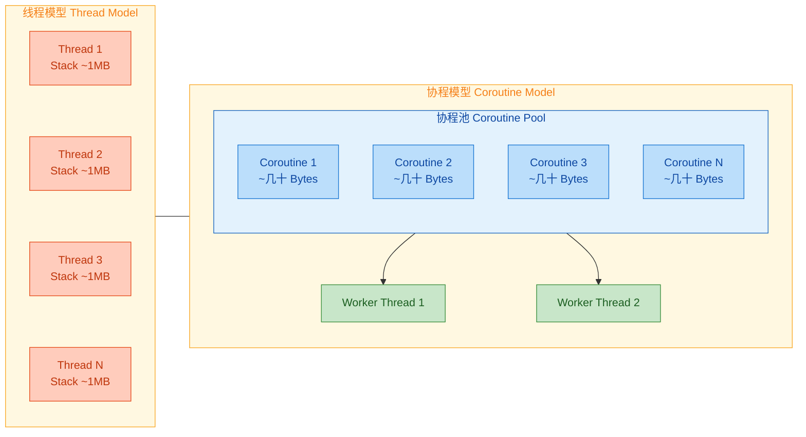

核心差异总结如下：

| 维度 | 线程 (Thread) | 协程 (Coroutine) |
|---|---|---|
| 调度层级 | OS 内核调度 (Kernel-level) | 用户态调度 (User-level) |
| 创建开销 | 高（~1MB 栈 + TCB） | 极低（堆上一个对象，几十到几百字节） |
| 切换成本 | 昂贵（内核态上下文切换） | 廉价（函数调用级别的状态保存/恢复） |
| 数量上限 | 数千~数万 | 数十万~数百万 |
| 阻塞行为 | `Thread.sleep` 阻塞整个线程 | `delay` 仅挂起协程，不阻塞线程 |

需要特别强调的一点是：协程并不是脱离线程独立存在的。每一个协程最终都必须运行在某个线程上。协程的"轻量"体现在——当一个协程挂起时（比如等待网络响应），它会释放当前线程，让这个线程去执行其他协程。等到挂起操作完成，协程再被调度到某个可用线程上恢复执行。这种"复用线程"的机制，就是协程高效的根本原因。

你可以把线程想象成高速公路上的车道，而协程是车道上行驶的汽车。传统线程模型中，每辆车（任务）独占一条车道（线程），即使车停下来等红灯（I/O 阻塞），车道也被占着。而协程模型中，车停下来等红灯时会被"抬到路边"，车道立刻让给其他车使用，等绿灯亮了再把车放回车道继续行驶。

### 挂起与恢复

挂起（Suspend）与恢复（Resume）是协程最核心的运行机制，也是协程区别于普通函数调用的根本所在。理解了这个机制，你就理解了协程的灵魂。

普通函数的执行模型非常简单：调用一个函数，它从头执行到尾，然后返回结果。在整个执行过程中，调用者必须等待。如果这个函数内部有一个耗时操作（比如网络请求需要 3 秒），那么调用它的线程就会被阻塞 3 秒，什么也做不了。

协程中的挂起函数（suspend function）打破了这个限制。当一个挂起函数遇到挂起点（Suspension Point）时，它不会阻塞当前线程，而是：

1. 将当前协程的执行状态（局部变量、执行位置等）打包保存到一个 `Continuation` 对象中
2. 将当前线程释放，让它去做别的事情
3. 当挂起的操作完成后（比如网络响应返回了），通过 `Continuation` 恢复协程的执行，从上次挂起的地方继续往下走

这个过程对开发者来说是完全透明的——你写的代码看起来就像普通的顺序代码，但底层实际上发生了"暂停-释放线程-恢复"的复杂操作。

```kotlin
import kotlinx.coroutines.*

// suspend 关键字标记这是一个挂起函数
suspend fun fetchUserData(): String {
    println("开始获取用户数据... [${Thread.currentThread().name}]")
    delay(2000L) // 挂起点：模拟网络请求，协程在此挂起，线程被释放
    println("用户数据获取完成 [${Thread.currentThread().name}]")
    return "User(name=Kiro, age=1)" // 恢复后继续执行，返回结果
}

suspend fun fetchOrderData(): String {
    println("开始获取订单数据... [${Thread.currentThread().name}]")
    delay(1500L) // 另一个挂起点
    println("订单数据获取完成 [${Thread.currentThread().name}]")
    return "Order(id=1024, item=Keyboard)"
}

fun main() = runBlocking {
    // 虽然看起来是顺序执行，但每次 delay 时线程都被释放了
    val user = fetchUserData()   // 第一次挂起并恢复
    val order = fetchOrderData() // 第二次挂起并恢复
    println("结果: $user, $order")
}
```

上面的代码看起来和普通的同步代码几乎一模一样，但它的执行过程却截然不同。让我们用一张时序图来展示协程在挂起和恢复过程中，线程是如何被复用的：

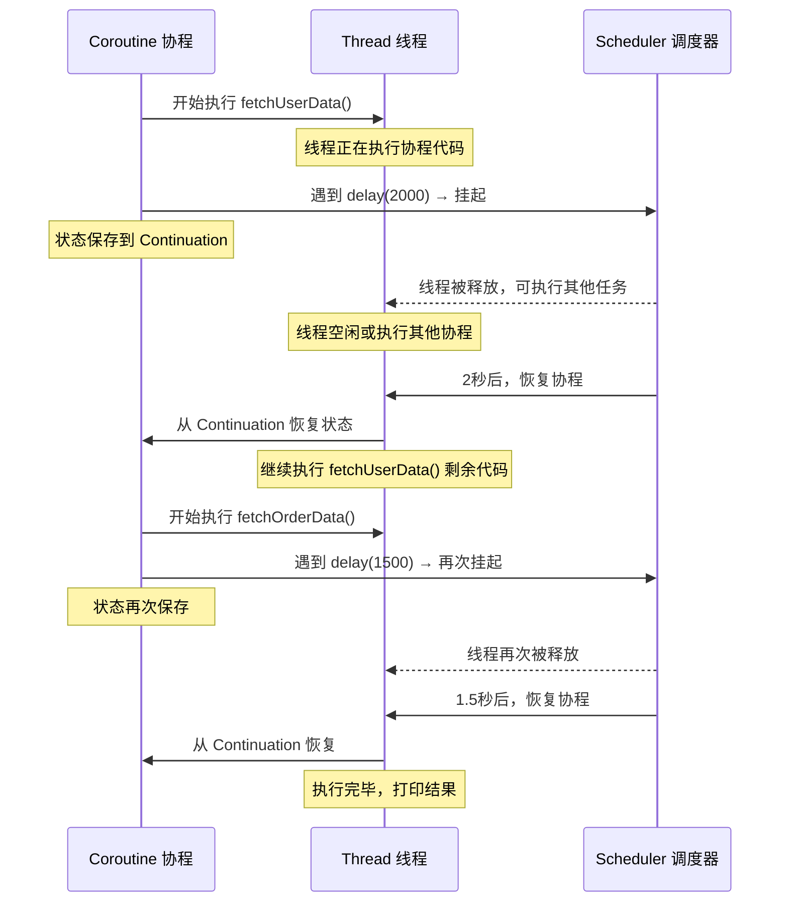

那么编译器在底层到底做了什么？当 Kotlin 编译器遇到 `suspend` 函数时，它会执行一种叫做 CPS 变换（Continuation-Passing Style Transformation）的操作。简单来说，编译器会把你写的挂起函数改造成一个状态机（State Machine）。

以 `fetchUserData()` 为例，编译器大致会将其转换为如下伪代码：

```kotlin
// 编译器生成的伪代码（简化版）
// 原始的 suspend fun fetchUserData() 被转换为带 Continuation 参数的函数
fun fetchUserData(continuation: Continuation<String>): Any? {
    // 状态机：用 label 标记当前执行到哪一步
    val sm = continuation as? FetchUserDataSM ?: FetchUserDataSM(continuation)

    when (sm.label) {
        0 -> {
            // 第一次进入：执行到第一个挂起点之前的代码
            println("开始获取用户数据...")
            sm.label = 1 // 标记下一次恢复时应该跳到 label=1
            // 调用 delay，如果它挂起了，返回 COROUTINE_SUSPENDED
            if (delay(2000L, sm) == COROUTINE_SUSPENDED) {
                return COROUTINE_SUSPENDED // 告诉调用者：我挂起了
            }
        }
        1 -> {
            // 从挂起点恢复：执行 delay 之后的代码
            println("用户数据获取完成")
            return "User(name=Kiro, age=1)" // 返回最终结果
        }
    }
    // 不可达
    throw IllegalStateException()
}
```

这里的关键概念是 `COROUTINE_SUSPENDED`——这是一个特殊的标记值。当一个挂起函数真正需要挂起时（比如 `delay` 需要等待时间），它返回这个标记值，告诉调用者"我还没执行完，先挂起了"。当等待结束后，调度器会调用 `continuation.resumeWith(result)` 来恢复执行，状态机跳到下一个 `label` 继续运行。

这种设计的精妙之处在于：开发者写的是简洁的顺序代码，编译器自动将其转换为高效的状态机，运行时通过 `Continuation` 对象实现挂起和恢复。整个过程零反射、零额外线程创建，性能开销极小。

```kotlin
// Continuation 接口的核心定义
public interface Continuation<in T> {
    // 协程上下文，包含调度器、Job 等信息
    public val context: CoroutineContext
    // 恢复协程执行，传入结果（成功值或异常）
    public fun resumeWith(result: Result<T>)
}
```

`Continuation` 本质上就是一个回调（Callback），但它被编译器和运行时完美封装了，开发者无需手动管理。你可以把它理解为"协程的存档点"——挂起时存档，恢复时读档。

### 结构化并发

结构化并发（Structured Concurrency）是 Kotlin 协程设计中最重要的架构理念，也是它与 Go 的 goroutine、Java 的 `CompletableFuture` 等并发方案最本质的区别。

在传统的并发编程中，我们启动一个线程或异步任务后，它就像一个"脱缰的野马"——你需要手动追踪它的生命周期、手动处理它的异常、手动确保它在不需要时被取消。忘记做任何一步，都可能导致资源泄漏、僵尸线程或未处理的异常。

```java
// Java 中的非结构化并发 —— 容易泄漏
ExecutorService executor = Executors.newFixedThreadPool(4);

void processRequest() {
    // 启动异步任务，但谁来管理它的生命周期？
    executor.submit(() -> fetchUserData());  // 如果 processRequest 出错，这个任务还在跑
    executor.submit(() -> fetchOrderData()); // 如果 Activity 销毁了，这个任务还在跑
    // 没有自动取消机制，没有父子关系，没有异常传播
}
```

Kotlin 的结构化并发从根本上解决了这个问题。它的核心原则是：每个协程都必须在一个明确的作用域（CoroutineScope）中启动，形成清晰的父子层级关系。这带来了三个关键保证：

1. 父协程会等待所有子协程完成后才结束（生命周期绑定）
2. 父协程被取消时，所有子协程也会被自动取消（取消传播）
3. 子协程的异常会传播给父协程（异常传播）

```kotlin
import kotlinx.coroutines.*

fun main() = runBlocking { // 这是根作用域（父）
    println("父协程开始")

    // launch 在当前作用域中启动子协程
    val job1 = launch { // 子协程 1
        println("  子协程1 开始")
        delay(2000L)
        println("  子协程1 完成") // 父协程会等待这里执行完
    }

    val job2 = launch { // 子协程 2
        println("  子协程2 开始")
        delay(1000L)
        println("  子协程2 完成")
    }

    // 不需要手动 join！父协程（runBlocking）会自动等待所有子协程完成
    println("父协程：等待子协程完成...")
    // runBlocking 会在 job1 和 job2 都完成后才结束
}
// 输出顺序：
// 父协程开始
// 父协程：等待子协程完成...
// 子协程1 开始
// 子协程2 开始
// 子协程2 完成（1秒后）
// 子协程1 完成（2秒后）
```

取消传播是结构化并发最实用的特性之一。想象一个 Android 应用场景：用户打开一个页面，页面同时发起多个网络请求。当用户按下返回键离开页面时，所有正在进行的请求都应该被自动取消，否则就是资源浪费。

```kotlin
import kotlinx.coroutines.*

fun main() = runBlocking {
    // 创建一个子作用域，模拟页面的生命周期
    val pageScope = CoroutineScope(Dispatchers.Default + Job())

    // 在页面作用域中启动多个网络请求
    pageScope.launch {
        println("请求1: 获取用户资料...")
        delay(5000L) // 模拟耗时请求
        println("请求1: 完成") // 如果被取消，这行不会执行
    }

    pageScope.launch {
        println("请求2: 获取推荐列表...")
        delay(5000L)
        println("请求2: 完成")
    }

    pageScope.launch {
        println("请求3: 获取消息通知...")
        delay(5000L)
        println("请求3: 完成")
    }

    // 模拟用户 1 秒后离开页面
    delay(1000L)
    println("用户离开页面 → 取消所有请求")
    pageScope.cancel() // 一行代码取消所有子协程！

    delay(2000L) // 等待一会儿，验证子协程确实被取消了
    println("验证：没有任何请求完成输出")
}
```

结构化并发中的异常传播同样遵循父子层级。当一个子协程抛出未捕获的异常时，这个异常会向上传播给父协程，父协程会取消所有其他子协程，然后自己也失败。这确保了"要么全部成功，要么快速失败"的语义。

```kotlin
import kotlinx.coroutines.*

fun main() = runBlocking {
    try {
        coroutineScope { // 创建一个结构化的子作用域
            launch { // 子协程 A
                delay(1000L)
                println("子协程A完成") // 不会执行，因为 B 先失败了
            }

            launch { // 子协程 B
                delay(500L)
                throw RuntimeException("子协程B出错了！") // 500ms 后抛出异常
                // 异常传播：B 失败 → 父作用域取消 A → 父作用域自己也失败
            }
        }
    } catch (e: RuntimeException) {
        println("捕获到异常: ${e.message}") // 异常被传播到这里
    }
}
// 输出：捕获到异常: 子协程B出错了！
```

下面这张图完整展示了结构化并发中父子协程的层级关系，以及取消和异常是如何在这个层级中传播的：

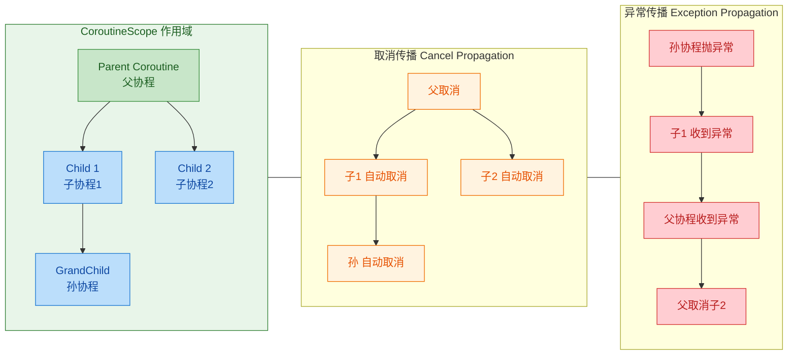

结构化并发的三大保证可以用一句话概括：协程的生命周期被限定在其作用域内，作用域负责管理所有子协程的完成、取消和异常。这就像一个公司的组织架构——部门经理（父协程）负责管理团队成员（子协程），部门撤销时所有成员自动离职，某个成员出了严重问题时经理会介入处理并通知其他成员。

与非结构化并发（如 `GlobalScope.launch`）相比，结构化并发从设计层面消除了协程泄漏的可能性。这也是为什么 Kotlin 官方强烈建议避免使用 `GlobalScope`——它绕过了结构化并发的所有保护机制，让协程重新变成了"脱缰的野马"。

```kotlin
// ❌ 不推荐：GlobalScope 启动的协程没有父子关系，无法自动取消
GlobalScope.launch {
    // 这个协程的生命周期与整个应用一样长
    // 即使启动它的组件已经销毁，它仍然在运行
}

// ✅ 推荐：在明确的作用域中启动协程
class MyViewModel : ViewModel() {
    fun loadData() {
        viewModelScope.launch { // viewModelScope 在 ViewModel 销毁时自动取消
            val data = repository.fetchData()
            _uiState.value = data
        }
    }
}
```

---

**📝 练习题**

以下代码的输出结果是什么？

```kotlin
fun main() = runBlocking {
    val job = launch {
        launch {
            delay(300L)
            println("A")
        }
        launch {
            delay(100L)
            println("B")
        }
        println("C")
    }
    delay(200L)
    job.cancel()
    delay(500L)
    println("D")
}
```

A. `C B A D`

B. `C B D`

C. `C D`

D. `C B D A`

**【答案】** B

**【解析】** 执行流程如下：`job` 启动后，其内部代码立即执行，`println("C")` 最先输出。然后两个子协程开始各自 `delay`。100ms 后第二个子协程恢复，输出 `B`。200ms 时（从 `runBlocking` 的 `delay(200L)` 算起），`job.cancel()` 被调用。此时第一个子协程还在 `delay(300L)` 中挂起（才过了 200ms），由于结构化并发的取消传播机制，`job` 被取消时其所有子协程也被自动取消，所以 `A` 永远不会输出。最后 500ms 后输出 `D`。最终结果是 `C B D`。这道题完美体现了结构化并发中"父取消 → 子自动取消"的核心特性。

---

## 挂起函数（Suspend Functions）

挂起函数是 Kotlin 协程体系中最核心的语言级抽象。如果说协程是"轻量级线程"，那么挂起函数就是驱动协程能够"暂停-恢复"的引擎。理解挂起函数的工作原理，是真正掌握协程的分水岭——它将你从"会用 `launch`/`async`"的使用者，提升为"理解协程本质"的开发者。

### suspend 关键字

#### 语法与语义

`suspend` 是 Kotlin 的一个修饰符关键字，用于标记一个函数"可能会挂起当前协程的执行"。它的语法非常简单——在 `fun` 前面加上 `suspend` 即可：

```kotlin
// 普通函数：调用后必须立即返回结果
fun fetchDataSync(): String {
    // 阻塞当前线程直到拿到数据
    return blockingHttpCall("https://api.example.com/data")
}

// 挂起函数：调用后可以挂起，让出线程，等数据就绪后再恢复
suspend fun fetchData(): String {
    // 在挂起点让出线程，数据就绪后恢复执行
    return httpClient.get("https://api.example.com/data")
}
```

这里需要特别强调一个常见误区：`suspend` 关键字本身并不会让函数自动变成异步的或在后台线程执行。它只是一个"能力声明"（capability declaration），告诉编译器："这个函数内部可能包含挂起点，请按照 CPS（Continuation-Passing Style）变换来编译它。" 真正的挂起行为，取决于函数体内部是否调用了其他挂起函数。

```kotlin
// 这个函数虽然标记了 suspend，但内部没有任何挂起点
// 它实际上和普通函数行为完全一致，不会真正挂起
suspend fun add(a: Int, b: Int): Int {
    return a + b // 纯计算，没有挂起操作
}

// 这个函数才会真正挂起——因为内部调用了 delay()
suspend fun delayedAdd(a: Int, b: Int): Int {
    delay(1000L) // delay 是一个挂起函数，这里是真正的挂起点
    return a + b
}
```

#### 调用约束

挂起函数只能在以下两种上下文中被调用：

1. 在另一个挂起函数内部
2. 在协程体（coroutine body）内部，即 `launch`、`async`、`runBlocking` 等协程构建器的 lambda 中

```kotlin
// ✅ 在协程构建器内部调用
fun main() = runBlocking {
    val data = fetchData() // OK：runBlocking 的 lambda 就是协程体
    println(data)
}

// ✅ 在另一个挂起函数内部调用
suspend fun loadAndProcess(): String {
    val raw = fetchData()  // OK：当前函数本身就是 suspend
    return process(raw)
}

// ❌ 在普通函数中直接调用——编译错误
fun normalFunction() {
    // val data = fetchData() 
    // 编译器报错：Suspend function 'fetchData' should be called 
    // only from a coroutine or another suspend function
}
```

这个约束不是随意设计的。编译器需要确保挂起函数被调用时，调用链上一定存在一个 Continuation 对象来接管"恢复"的职责。普通函数的调用栈中没有 Continuation，所以编译器直接禁止。

#### 编译器视角：签名变换

当编译器遇到 `suspend` 函数时，会对其签名进行 CPS 变换（Continuation-Passing Style Transformation）。这是理解挂起函数底层原理的关键：

```kotlin
// 你写的 Kotlin 代码
suspend fun fetchData(): String { ... }

// 编译器实际生成的 JVM 字节码签名（伪代码表示）
fun fetchData(continuation: Continuation<String>): Any? { ... }
```

变换规则非常清晰：

- 额外添加一个 `Continuation<T>` 类型的参数（T 是原始返回类型）
- 返回类型变为 `Any?`，因为函数可能返回实际结果，也可能返回一个特殊标记 `COROUTINE_SUSPENDED`，表示"我挂起了，结果稍后通过 Continuation 回调给你"

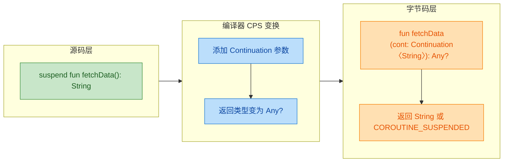

### 挂起点（Suspension Points）

#### 什么是挂起点

挂起点（Suspension Point）是协程执行过程中"可能暂停"的位置。准确地说，每一次对挂起函数的调用都是一个潜在的挂起点。之所以说"潜在"，是因为挂起函数在运行时不一定真的会挂起——如果结果已经就绪，它可以直接返回而不挂起。

```kotlin
suspend fun example() {
    println("A")           // 普通语句，不是挂起点
    delay(1000)            // ← 挂起点 #1：delay 是挂起函数
    println("B")           // delay 恢复后执行
    val data = fetchData() // ← 挂起点 #2：fetchData 是挂起函数
    println("C: $data")    // fetchData 恢复后执行
    val x = add(1, 2)      // 虽然 add 是 suspend，但不会真正挂起
    println("D: $x")       // 紧接着执行
}
```

编译器会在每个挂起点处将函数切割成多个"代码段"（我们稍后在 Continuation 部分详细讲状态机）。你可以把挂起点想象成函数执行的"存档点"——协程在这里保存当前状态，让出线程，等条件满足后从存档点恢复继续执行。

#### 挂起点的运行时行为

在运行时，当协程执行到一个挂起点时，会发生以下流程：

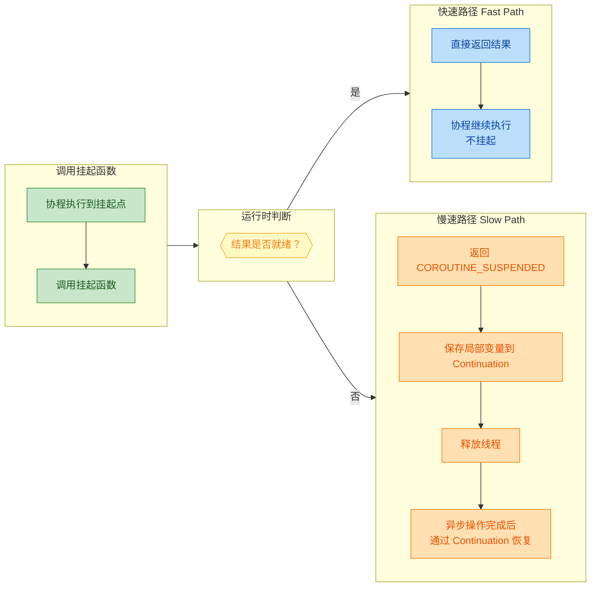

这种"快速路径/慢速路径"的设计非常精妙。它意味着挂起函数在结果已经缓存或立即可用时，不会产生任何额外的挂起开销，性能与普通函数调用几乎一致。

#### 挂起 ≠ 阻塞

这是协程最重要的概念区分之一，值得反复强调：

```kotlin
// 阻塞：线程被占用，什么都干不了，干等着
fun blockingWait() {
    Thread.sleep(1000) // 当前线程被阻塞 1 秒，无法执行其他任务
}

// 挂起：协程暂停，但线程被释放，可以去执行其他协程
suspend fun suspendingWait() {
    delay(1000) // 协程挂起 1 秒，线程被释放去做其他事情
}
```

用一个生活化的比喻来理解：

- 阻塞（Blocking）：你在餐厅点了菜，然后站在厨房门口一动不动地等，直到菜做好。这期间你什么都干不了。
- 挂起（Suspending）：你在餐厅点了菜，拿了个号码牌回到座位上看手机、聊天。菜做好了服务员叫你的号，你再去取。

```kotlin
fun main() = runBlocking {
    // 启动 100,000 个协程，每个都挂起 1 秒
    // 如果是线程，你需要 100,000 个线程（系统会崩溃）
    // 但协程可以轻松做到，因为挂起不占用线程
    val jobs = List(100_000) {
        launch {
            delay(1000L) // 挂起，不阻塞线程
            print(".")
        }
    }
    jobs.forEach { it.join() } // 等待所有协程完成
}
```

### 延续 Continuation

#### Continuation 接口

Continuation（延续）是协程挂起与恢复机制的核心抽象。它在概念上代表了"程序在某个挂起点之后剩余的计算"。Kotlin 标准库中的定义非常简洁：

```kotlin
// kotlin.coroutines.Continuation 接口定义
public interface Continuation<in T> {
    // 协程上下文，携带调度器、Job 等信息
    public val context: CoroutineContext

    // 恢复协程执行，传入结果（成功值或异常）
    public fun resumeWith(result: Result<T>)
}
```

只有两个成员：`context` 提供协程的运行环境信息，`resumeWith` 负责恢复协程执行。Kotlin 还提供了两个便捷的扩展函数：

```kotlin
// 以成功值恢复
public inline fun <T> Continuation<T>.resume(value: T) {
    resumeWith(Result.success(value))
}

// 以异常恢复
public inline fun <T> Continuation<T>.resumeWithException(exception: Throwable) {
    resumeWith(Result.failure(exception))
}
```

你可以把 Continuation 理解为一个"回调对象"（callback），但它比传统回调强大得多——它封装了整个协程的执行状态，包括局部变量、执行位置、上下文信息等。

#### 状态机变换（State Machine Transformation）

这是协程实现中最精妙的部分。编译器会将每个挂起函数编译成一个状态机（State Machine），每个挂起点对应一个状态。函数的 Continuation 参数同时充当状态机的载体，保存所有需要跨挂起点存活的局部变量。

来看一个具体的例子：

```kotlin
// 你写的源码
suspend fun loadUserProfile(userId: String): Profile {
    val token = authenticate(userId)   // 挂起点 #1
    val userData = fetchUser(token)     // 挂起点 #2
    val profile = parseProfile(userData)
    return profile
}
```

编译器会将其变换为类似以下的状态机（简化的伪代码）：

```kotlin
// 编译器生成的状态机（伪代码，展示核心逻辑）
fun loadUserProfile(userId: String, cont: Continuation<Profile>): Any? {
    
    // 首次调用时创建状态机对象，后续恢复时复用同一个对象
    val sm = cont as? LoadUserProfileSM ?: LoadUserProfileSM(cont)
    
    when (sm.label) {
        
        0 -> {
            // ===== 状态 0：初始状态 =====
            sm.userId = userId          // 保存局部变量到状态机
            sm.label = 1                // 设置下一个状态
            // 调用第一个挂起函数，传入状态机自身作为 Continuation
            val result = authenticate(userId, sm)
            if (result == COROUTINE_SUSPENDED) return COROUTINE_SUSPENDED
            // 如果没有真正挂起（快速路径），直接进入下一个状态
            sm.result = result
            // fall through to state 1
        }
        
        1 -> {
            // ===== 状态 1：authenticate 完成后恢复 =====
            // 检查是否有异常
            sm.result.throwOnFailure()
            val token = sm.result as String  // 获取 authenticate 的返回值
            sm.token = token                 // 保存到状态机
            sm.label = 2                     // 设置下一个状态
            val result = fetchUser(token, sm)
            if (result == COROUTINE_SUSPENDED) return COROUTINE_SUSPENDED
            sm.result = result
            // fall through to state 2
        }
        
        2 -> {
            // ===== 状态 2：fetchUser 完成后恢复 =====
            sm.result.throwOnFailure()
            val userData = sm.result as UserData
            val profile = parseProfile(userData) // 普通函数，不是挂起点
            return profile                       // 最终返回结果
        }
        
        else -> throw IllegalStateException("Unexpected state")
    }
}
```

这个状态机的运作流程可以用下图来表示：

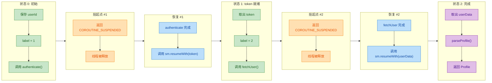

关键洞察：

- 整个挂起函数只生成一个状态机对象（即 Continuation 实例），无论挂起多少次都复用同一个对象。这比传统回调每次创建新的 lambda 对象要高效得多。
- 局部变量被"提升"（hoist）为状态机的字段，这样它们就能跨越挂起点存活。
- `label` 字段记录当前执行到哪个状态，恢复时通过 `when` 分支跳转到正确的位置。

#### 用 suspendCoroutine 手动控制挂起

Kotlin 提供了 `suspendCoroutine` 和 `suspendCancellableCoroutine` 两个底层 API，让你可以手动获取 Continuation 对象并控制挂起与恢复。这在将回调风格的 API 桥接为挂起函数时非常有用：

```kotlin
// 假设有一个传统的回调风格 API
interface Callback {
    fun onSuccess(data: String)
    fun onError(error: Exception)
}

fun loadDataAsync(callback: Callback) {
    // 模拟异步操作...
}

// 将回调 API 桥接为挂起函数
suspend fun loadData(): String {
    // suspendCancellableCoroutine 挂起当前协程，
    // 并将 Continuation 对象暴露给 lambda
    return suspendCancellableCoroutine { continuation ->
        loadDataAsync(object : Callback {
            override fun onSuccess(data: String) {
                // 异步操作成功，以成功值恢复协程
                continuation.resume(data)
            }
            override fun onError(error: Exception) {
                // 异步操作失败，以异常恢复协程
                continuation.resumeWithException(error)
            }
        })

        // 注册取消回调，支持协作式取消
        continuation.invokeOnCancellation {
            // 协程被取消时的清理逻辑
            // 例如取消网络请求
        }
    }
}
```

`suspendCancellableCoroutine` 相比 `suspendCoroutine` 多了取消支持，在实际开发中几乎总是应该优先使用它。

#### Continuation 拦截与调度

Continuation 还有一个重要的能力：拦截（Interception）。协程调度器（Dispatcher）正是通过拦截 Continuation 来实现线程切换的。当协程恢复时，调度器会拦截 `resumeWith` 调用，将其调度到指定的线程上执行：

```kotlin
// 简化的调度流程示意
// 1. 异步操作完成，在 IO 线程调用 continuation.resume(data)
// 2. ContinuationInterceptor（即 Dispatcher）拦截这次恢复
// 3. 将恢复操作 dispatch 到目标线程（如 Main 线程）
// 4. 协程在目标线程上从挂起点恢复执行

suspend fun updateUI() {
    // 在 IO 线程执行网络请求
    val data = withContext(Dispatchers.IO) {
        fetchFromNetwork() // 挂起点：在 IO 线程执行
    }
    // withContext 返回后，自动恢复到原来的调度器（如 Main）
    textView.text = data // 在 Main 线程更新 UI
}
```

整个 Continuation 的拦截链路可以概括为：

```kotlin
// Continuation 的包装层次（由内到外）
// 1. 原始 Continuation（状态机本身）
// 2. DispatchedContinuation（调度器包装，负责线程切换）
// 3. 可能还有其他拦截器的包装

// 恢复时的调用链：
// resume(value)
//   → DispatchedContinuation.resumeWith()
//     → dispatcher.dispatch(context, runnable)  // 切换线程
//       → 原始 Continuation.resumeWith()        // 在目标线程执行状态机
```

#### 零开销抽象的真相

Kotlin 协程常被称为"零开销抽象"（zero-cost abstraction），但这需要准确理解。它并非完全没有开销，而是相比线程和传统回调，开销极小：

```kotlin
// 一个协程的内存开销大约包括：
// 1. 一个状态机对象（Continuation 实例）：几十到几百字节
// 2. 局部变量被提升为字段：与原始变量大小相同
// 3. 没有额外的线程栈（线程栈通常 512KB ~ 1MB）

// 对比：
// - 一个线程：约 1MB 栈内存 + OS 线程资源
// - 一个协程：约 几百字节 ~ 几KB
// - 10万个线程：约 100GB 内存（不可能）
// - 10万个协程：约 几十MB 内存（轻松）
```

状态机变换也避免了回调地狱（Callback Hell）的代码结构问题，同时不需要像 RxJava 那样创建大量中间操作符对象。编译器在编译期完成了所有的"魔法"，运行时只是简单的状态跳转和函数调用。

---

**📝 练习题 1**

以下代码的输出顺序是什么？

```kotlin
suspend fun step1(): Int {
    println("Step 1 start")
    delay(100)
    println("Step 1 end")
    return 1
}

suspend fun step2(x: Int): Int {
    println("Step 2 start: $x")
    delay(100)
    println("Step 2 end")
    return x + 1
}

fun main() = runBlocking {
    println("Begin")
    val a = step1()
    val b = step2(a)
    println("Result: $b")
    println("End")
}
```

A. Begin → Step 1 start → Step 2 start: 1 → Step 1 end → Step 2 end → Result: 2 → End

B. Begin → Step 1 start → Step 1 end → Step 2 start: 1 → Step 2 end → Result: 2 → End

C. Step 1 start → Step 1 end → Step 2 start: 1 → Step 2 end → Begin → Result: 2 → End

D. Begin → Step 1 start → Step 1 end → Step 2 start: 1 → Step 2 end → End → Result: 2

**【答案】** B

**【解析】** 这段代码是顺序调用（sequential），没有使用 `launch` 或 `async` 来并发执行。`val a = step1()` 会先执行完 `step1`（包括挂起和恢复），拿到返回值后才会执行 `step2(a)`。`delay` 只是挂起协程，不会改变执行顺序。挂起函数的核心特性之一就是：虽然底层是状态机和回调，但在代码层面保持了与同步代码完全一致的顺序执行语义，这正是协程相比回调的巨大优势。

---

**📝 练习题 2**

关于编译器对挂起函数的 CPS 变换，以下说法正确的是？

```kotlin
suspend fun compute(x: Int): String
```

A. 编译后签名变为 `fun compute(x: Int): String`，与普通函数完全一致

B. 编译后签名变为 `fun compute(x: Int, cont: Continuation<String>): Any?`，返回 `Any?` 是因为可能返回 `COROUTINE_SUSPENDED`

C. 编译后会为每个挂起点创建一个新的 Continuation 对象

D. `suspend` 关键字会让函数自动在后台线程执行

**【答案】** B

**【解析】** 编译器对挂起函数执行 CPS 变换时，会添加一个 `Continuation<T>` 参数，并将返回类型改为 `Any?`。返回 `Any?` 的原因是函数可能返回两种东西：实际结果（`String`）或特殊标记 `COROUTINE_SUSPENDED`（表示函数已挂起，结果稍后通过 Continuation 回调）。选项 A 忽略了 CPS 变换；选项 C 错误，整个函数只创建一个状态机对象（Continuation），所有挂起点复用同一个实例；选项 D 是常见误区，`suspend` 只是能力声明，不涉及线程切换，线程切换由调度器（Dispatcher）负责。

---

## 协程构建器（Coroutine Builders）

协程不会凭空运行——它需要一个"入口"来启动。这个入口就是协程构建器（Coroutine Builder）。构建器是连接普通同步世界与协程异步世界的桥梁函数。Kotlin 标准协程库提供了三个核心构建器：`launch`、`async` 和 `runBlocking`，它们各自承担不同的职责，适用于不同的场景。

理解它们的区别，是写出正确、高效协程代码的关键一步。我们可以用一个简单的类比来建立直觉：`launch` 像是"派人去办事，不等结果"；`async` 像是"派人去办事，回头来取结果"；`runBlocking` 像是"亲自去办，办完才走"。接下来逐一深入。

---

### launch —— 发射即忘（Fire-and-Forget）

`launch` 是最常用的协程构建器。它启动一个新的协程，但不返回协程的执行结果。它返回的是一个 `Job` 对象，代表这个协程任务本身的句柄（handle），你可以用它来管理协程的生命周期（如取消、等待完成），但无法通过它拿到协程体内的计算值。

`launch` 的函数签名如下：

```kotlin
// CoroutineScope 的扩展函数
// context: 可选的上下文覆盖，默认为 EmptyCoroutineContext
// start: 启动模式，默认 CoroutineStart.DEFAULT（立即调度）
// block: 协程体，一个挂起 lambda
public fun CoroutineScope.launch(
    context: CoroutineContext = EmptyCoroutineContext,
    start: CoroutineStart = CoroutineStart.DEFAULT,
    block: suspend CoroutineScope.() -> Unit  // 返回 Unit，不产出值
): Job
```

注意返回类型是 `Job`，协程体的返回类型是 `Unit`。这意味着 `launch` 天生就不是为"计算并返回结果"设计的，它适合执行"副作用"类型的工作——发网络请求更新 UI、写日志、发送消息等。

```kotlin
import kotlinx.coroutines.*

fun main() = runBlocking {
    // 使用 launch 启动一个子协程
    // 返回的 job 是协程的句柄，不是计算结果
    val job: Job = launch {
        // 这里是协程体，运行在协程环境中
        println("协程开始执行，线程: ${Thread.currentThread().name}")
        delay(1000L) // 挂起 1 秒，不阻塞线程
        println("协程执行完毕")
    }

    println("launch 调用后立即执行到这里，不会等待协程完成")

    // 如果需要等待协程完成，可以调用 join()
    job.join() // 挂起当前协程，直到 job 完成

    println("所有工作完成")
}
```

输出：

```text
launch 调用后立即执行到这里，不会等待协程完成
协程开始执行，线程: main
协程执行完毕
所有工作完成
```

这里有一个关键细节：`launch` 调用后，协程体并不一定立即执行。在默认的 `CoroutineStart.DEFAULT` 模式下，协程会被调度（scheduled）到对应的调度器上。如果当前线程就是目标调度器的线程（比如在 `runBlocking` 的单线程调度器中），协程体会在当前协程挂起或让出执行权时才开始运行。这就是为什么 "launch 调用后立即执行到这里" 先于 "协程开始执行" 打印。

`launch` 的启动模式（`CoroutineStart`）有四种选择：

```kotlin
// DEFAULT: 立即调度，协程体在调度器空闲时执行
launch(start = CoroutineStart.DEFAULT) { /* ... */ }

// LAZY: 惰性启动，直到调用 job.start() 或 job.join() 才调度
val lazyJob = launch(start = CoroutineStart.LAZY) {
    println("我是懒加载的协程")
}
// 此时协程还没有开始
lazyJob.start() // 手动触发启动

// ATOMIC: 立即调度，且在第一个挂起点之前不可取消
launch(start = CoroutineStart.ATOMIC) { /* ... */ }

// UNDISPATCHED: 立即在当前线程执行到第一个挂起点，不经过调度器
launch(start = CoroutineStart.UNDISPATCHED) {
    // 这行代码一定在调用 launch 的线程上立即执行
    println("立即执行，线程: ${Thread.currentThread().name}")
    delay(100) // 挂起后，恢复时才回到调度器指定的线程
    println("恢复后执行")
}
```

`LAZY` 模式在实际开发中很有用——当你想预先定义一批协程任务，但希望在某个条件满足后才真正启动它们时，惰性启动就派上用场了。

关于异常处理，`launch` 启动的协程如果抛出未捕获的异常，该异常会向上传播到父协程，最终可能导致整个协程层级崩溃（这是结构化并发的设计）。如果你需要在 `launch` 中处理异常，要么在协程体内用 `try-catch`，要么安装 `CoroutineExceptionHandler`：

```kotlin
// 方式一：协程体内 try-catch
launch {
    try {
        riskyOperation() // 可能抛异常的挂起函数
    } catch (e: Exception) {
        println("捕获异常: ${e.message}")
    }
}

// 方式二：使用 CoroutineExceptionHandler（仅对 launch 有效）
val handler = CoroutineExceptionHandler { _, exception ->
    println("全局捕获: ${exception.message}")
}
// handler 作为上下文元素传入
launch(handler) {
    throw RuntimeException("出错了")
}
```

---

### async —— 异步计算，延迟取值

如果你需要协程返回一个计算结果，`async` 就是你的选择。它和 `launch` 非常相似——同样启动一个新协程，同样是 `CoroutineScope` 的扩展函数——但关键区别在于返回类型：`async` 返回 `Deferred<T>`，而 `Deferred` 是 `Job` 的子接口，额外提供了 `await()` 方法来获取结果。

```kotlin
// async 的函数签名
// 注意协程体返回 T，而非 Unit
public fun <T> CoroutineScope.async(
    context: CoroutineContext = EmptyCoroutineContext,
    start: CoroutineStart = CoroutineStart.DEFAULT,
    block: suspend CoroutineScope.() -> T  // 返回泛型 T
): Deferred<T>  // 返回 Deferred<T>，可通过 await() 获取 T
```

`Deferred<T>` 可以理解为 Kotlin 协程版的 `Future` / `Promise`。它代表一个"未来某个时刻会产出的值"。

```kotlin
import kotlinx.coroutines.*

fun main() = runBlocking {
    // async 启动协程，返回 Deferred<Int>
    val deferred: Deferred<Int> = async {
        println("开始计算...")
        delay(1000L) // 模拟耗时计算
        42 // 协程体的最后一个表达式就是返回值
    }

    println("async 已启动，可以做其他事情")

    // await() 是挂起函数，会挂起当前协程直到结果就绪
    val result: Int = deferred.await()
    println("计算结果: $result") // 输出: 计算结果: 42
}
```

`async` 真正的威力在于并发组合（concurrent composition）。当你有多个独立的异步任务时，可以同时启动它们，然后分别 `await`，总耗时取决于最慢的那个任务，而不是所有任务耗时之和：

```kotlin
import kotlinx.coroutines.*
import kotlin.system.measureTimeMillis

// 模拟两个独立的网络请求
suspend fun fetchUserProfile(): String {
    delay(1000L) // 模拟 1 秒网络延迟
    return "用户资料"
}

suspend fun fetchUserOrders(): String {
    delay(1200L) // 模拟 1.2 秒网络延迟
    return "订单列表"
}

fun main() = runBlocking {
    val time = measureTimeMillis {
        // 同时启动两个异步任务
        val profileDeferred = async { fetchUserProfile() }
        val ordersDeferred = async { fetchUserOrders() }

        // 分别等待结果
        val profile = profileDeferred.await()
        val orders = ordersDeferred.await()

        println("$profile + $orders")
    }
    // 总耗时约 1200ms，而非 2200ms
    println("总耗时: ${time}ms")
}
```

这就是并发的魅力。如果改成顺序调用（不用 `async`），总耗时就是 1000 + 1200 = 2200ms。用 `async` 并发后，两个请求同时进行，总耗时约等于较慢的那个——1200ms。

下面这张图清晰展示了顺序执行与并发执行的时间线对比：

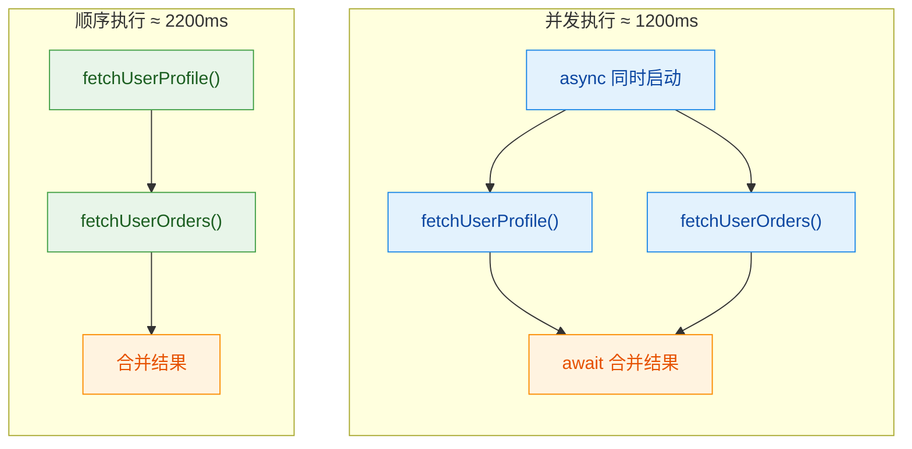

有一个常见的陷阱需要警惕——"假并发"。如果你在 `async` 块内部顺序调用两个挂起函数，那它们仍然是顺序执行的：

```kotlin
// ❌ 错误写法：这不是并发，两个请求仍然是顺序的
val result = async {
    val profile = fetchUserProfile()   // 先等 1000ms
    val orders = fetchUserOrders()     // 再等 1200ms
    "$profile + $orders"               // 总共 2200ms
}

// ✅ 正确写法：启动两个独立的 async
val profileDeferred = async { fetchUserProfile() }  // 立即启动
val ordersDeferred = async { fetchUserOrders() }     // 立即启动
val profile = profileDeferred.await()  // 等待第一个
val orders = ordersDeferred.await()    // 等待第二个（可能已经完成了）
```

关于异常传播，`async` 和 `launch` 有一个重要区别：`async` 中的异常不会立即传播，而是在调用 `await()` 时才抛出。但如果 `async` 是作为某个 `coroutineScope` 或父协程的子协程启动的，异常仍然会导致父协程取消（结构化并发的规则）。

```kotlin
val deferred = async {
    throw RuntimeException("计算出错")
    // 异常被"存储"在 Deferred 中
}

// 直到调用 await() 时，异常才会被重新抛出
try {
    deferred.await()
} catch (e: RuntimeException) {
    println("在 await 处捕获: ${e.message}")
}
```

`async` 同样支持 `LAZY` 启动模式。惰性 `async` 在调用 `await()` 或 `start()` 时才真正启动：

```kotlin
// 惰性 async：定义但不立即执行
val lazyDeferred = async(start = CoroutineStart.LAZY) {
    heavyComputation()
}

// 某个条件满足后才启动
if (needResult) {
    val value = lazyDeferred.await() // 此时才开始计算
}
```

---

### runBlocking —— 阻塞式桥接

`runBlocking` 是一个特殊的构建器。它的设计目的是在非协程环境（普通的阻塞代码）中启动一个协程，并阻塞当前线程直到协程体执行完毕。它是连接"阻塞世界"和"协程世界"的桥梁。

```kotlin
// runBlocking 是顶层函数，不是 CoroutineScope 的扩展
// 它会阻塞调用它的线程
public fun <T> runBlocking(
    context: CoroutineContext = EmptyCoroutineContext,
    block: suspend CoroutineScope.() -> T
): T  // 直接返回结果 T，不是 Deferred
```

注意两个关键点：第一，`runBlocking` 不是 `CoroutineScope` 的扩展函数，它是一个独立的顶层函数，可以在任何地方调用；第二，它直接返回协程体的结果 `T`，不需要 `await()`。

```kotlin
import kotlinx.coroutines.*

// main 函数是普通函数，不是挂起函数
// runBlocking 在这里充当桥梁
fun main() = runBlocking {
    // 这个 lambda 内部就是协程世界
    // 可以调用挂起函数
    println("协程开始，线程: ${Thread.currentThread().name}")
    delay(500L) // 挂起协程，但 main 线程被 runBlocking 阻塞
    println("协程结束")
}
// runBlocking 返回后，main 线程才继续（程序结束）
```

`runBlocking` 的典型使用场景非常有限，主要有两个：

第一，`main` 函数入口。在应用程序的 `main` 函数中，你需要一个地方来启动协程世界。`runBlocking` 就是这个起点。当然，Kotlin 也支持 `suspend fun main()`，这种情况下就不需要 `runBlocking` 了。

第二，测试代码。在单元测试中，测试框架通常期望测试方法是同步的。`runBlocking` 可以让你在测试中调用挂起函数：

```kotlin
@Test
fun testFetchUser() = runBlocking {
    // 在测试中调用挂起函数
    val user = userRepository.fetchUser(1)
    assertEquals("Alice", user.name)
}
```

> 不过现代测试推荐使用 `kotlinx-coroutines-test` 库提供的 `runTest`，它提供了虚拟时间控制等测试专用功能。

`runBlocking` 有一个非常重要的警告：**绝对不要在协程内部调用 `runBlocking`**。这会导致线程被阻塞，而协程的核心优势就是非阻塞。在协程内部嵌套 `runBlocking` 轻则浪费线程资源，重则导致死锁：

```kotlin
// ❌ 危险！在协程内部使用 runBlocking 可能导致死锁
launch(Dispatchers.Main) {
    // 当前在 Main 线程的协程中
    val result = runBlocking {
        // runBlocking 阻塞 Main 线程
        // 如果内部协程也需要 Main 线程，就死锁了
        withContext(Dispatchers.Main) {
            "永远到不了这里"
        }
    }
}
```

死锁的原因是：`runBlocking` 阻塞了 Main 线程等待内部协程完成，而内部协程的 `withContext(Dispatchers.Main)` 又需要 Main 线程来执行——两者互相等待，永远无法完成。

---

### 三大构建器对比

下面从多个维度对三个构建器做一个系统对比：


用一段代码把三者放在一起，直观感受它们的行为差异：

```kotlin
import kotlinx.coroutines.*

fun main() = runBlocking {  // runBlocking: 阻塞 main 线程，创建协程作用域
    println("1. runBlocking 开始，线程: ${Thread.currentThread().name}")

    // launch: 启动协程，返回 Job，不返回值
    val job = launch {
        delay(200L)
        println("3. launch 协程完成")
    }

    // async: 启动协程，返回 Deferred<String>
    val deferred = async {
        delay(300L)
        "async 的结果" // 返回值
    }

    println("2. 构建器调用完毕，等待结果...")

    job.join()                        // 等待 launch 完成
    val result = deferred.await()     // 等待 async 完成并获取结果
    println("4. async 返回: $result")

    println("5. runBlocking 结束")
}
// 输出顺序:
// 1. runBlocking 开始，线程: main
// 2. 构建器调用完毕，等待结果...
// 3. launch 协程完成
// 4. async 返回: async 的结果
// 5. runBlocking 结束
```

最后，关于选择策略，可以用一个简单的决策思路：

- 需要返回值吗？→ 是：用 `async` + `await()`；否：用 `launch`
- 在非协程环境中需要启动协程吗？→ 是：用 `runBlocking`（仅限 main 函数或测试）
- 在已有的协程作用域中？→ 用 `launch` 或 `async`，绝不用 `runBlocking`

记住一个原则：`runBlocking` 是入口，`launch` 是主力，`async` 是需要结果时的选择。在实际 Android 或后端开发中，你 90% 的时间都在用 `launch`，偶尔用 `async` 做并发组合，`runBlocking` 几乎只出现在 `main()` 和测试里。

---

**📝 练习题**

以下代码的输出顺序是什么？

```kotlin
fun main() = runBlocking {
    val a = async {
        delay(200L)
        println("A")
        1
    }
    val b = async {
        delay(100L)
        println("B")
        2
    }
    println("C: ${a.await() + b.await()}")
}
```

A. A → B → C: 3

B. B → A → C: 3

C. C: 3 → A → B

D. A → C: 3 → B

**【答案】** B

**【解析】** 两个 `async` 协程在调用时就被调度启动，它们并发执行。`b` 的 delay 是 100ms，`a` 的 delay 是 200ms，所以 `b` 先完成，打印 "B"。随后 `a` 完成，打印 "A"。虽然代码中先调用了 `a.await()`，但 `await()` 只是挂起等待结果，不影响协程的执行顺序。当 `a.await()` 在等待时，`b` 的协程已经在并发运行了。两个 `await` 都拿到结果后，打印 "C: 3"。所以最终顺序是 B → A → C: 3。

---

## 协程作用域（CoroutineScope）

协程不是凭空存在的——每一个协程都必须在某个"作用域"（Scope）中启动。`CoroutineScope` 是 Kotlin 协程体系中最核心的设计之一，它回答了一个关键问题：**谁负责管理这个协程的生命周期？** 如果说协程是风筝，那么 `CoroutineScope` 就是握着线的那只手。没有作用域，协程就会像断了线的风筝一样失控——泄漏、无法取消、异常无人处理。

这一节我们将从接口定义出发，逐步深入作用域的层次结构，最终理解"结构化并发"（Structured Concurrency）这一贯穿整个协程框架的核心哲学。

### CoroutineScope 接口

#### 接口定义

`CoroutineScope` 的源码定义极其简洁：

```kotlin
// CoroutineScope 接口只有一个属性：coroutineContext
public interface CoroutineScope {
    // 该作用域关联的协程上下文，包含 Job、Dispatcher 等元素
    public val coroutineContext: CoroutineContext
}
```

整个接口只有一个属性——`coroutineContext`。它本身不执行任何逻辑，不启动任何协程，它只是一个"上下文的持有者"（context holder）。真正的魔法发生在 `launch`、`async` 这些扩展函数上，它们都是 `CoroutineScope` 的扩展：

```kotlin
// launch 是 CoroutineScope 的扩展函数
// 这意味着你必须在某个 scope 内才能调用 launch
public fun CoroutineScope.launch(
    context: CoroutineContext = EmptyCoroutineContext, // 可选的额外上下文
    start: CoroutineStart = CoroutineStart.DEFAULT,    // 启动模式
    block: suspend CoroutineScope.() -> Unit            // 协程体，本身也是一个新的 scope
): Job { ... }
```

这个设计意味着：你不可能在"真空"中启动协程。编译器会强制你提供一个 `CoroutineScope`，从而确保每个协程都有明确的归属。

#### 为什么不是一个类而是接口？

将 `CoroutineScope` 设计为接口而非类，是一个深思熟虑的架构决策。它允许任何类通过实现该接口来"成为"一个协程作用域：

```kotlin
// Android 中的 ViewModel 就实现了自己的协程作用域
// viewModelScope 是 ViewModel 的扩展属性
class MyViewModel : ViewModel() {
    fun loadData() {
        // viewModelScope 在 ViewModel 被清除时自动取消
        viewModelScope.launch {
            val data = repository.fetchData() // 挂起函数
            _uiState.value = data             // 更新 UI 状态
        }
    }
}

// 自定义类也可以实现 CoroutineScope
class NetworkService : CoroutineScope {
    // 创建一个 Job 用于管理所有子协程
    private val job = SupervisorJob()

    // 实现接口唯一的属性：组合 Job 和调度器
    override val coroutineContext: CoroutineContext
        get() = Dispatchers.IO + job

    fun fetchData() {
        // 现在可以直接在 this 上调用 launch
        launch {
            // 网络请求...
        }
    }

    // 提供清理方法，取消所有子协程
    fun destroy() {
        job.cancel() // 取消 job 会级联取消所有子协程
    }
}
```

#### 创建 CoroutineScope 的常见方式

```kotlin
fun main() = runBlocking {
    // 方式 1：CoroutineScope() 工厂函数
    // 注意：这是一个函数，不是构造函数（首字母大写是 Kotlin 的命名约定）
    val scope1 = CoroutineScope(Dispatchers.Default + Job())

    // 方式 2：使用 runBlocking 自带的 scope（当前 this）
    // runBlocking 的 lambda 接收者就是 CoroutineScope
    launch { // this: CoroutineScope -> 继承 runBlocking 的 scope
        println("在 runBlocking 的作用域中运行")
    }

    // 方式 3：coroutineScope 挂起函数（小写 c）—— 创建子作用域
    coroutineScope {
        launch {
            println("在子作用域中运行")
        }
    }

    // 方式 4：MainScope() 工厂函数（常用于 Android UI 层）
    // 内部使用 SupervisorJob + Dispatchers.Main
    val uiScope = MainScope()

    // 用完记得取消，防止泄漏
    scope1.cancel()
    uiScope.cancel()
}
```

这里有一个容易混淆的点：`CoroutineScope()`（大写 C）是工厂函数，`coroutineScope {}`（小写 c）是挂起函数。两者用途完全不同，后面会详细对比。

### 作用域层次

协程作用域天然形成树状层次结构。理解这个层次是掌握协程生命周期管理的关键。

#### 父子作用域的形成

当你在一个协程内部启动新的协程时，新协程自动成为外部协程的"子协程"（child coroutine）。这种父子关系通过 `Job` 对象来维护：

```kotlin
fun main() = runBlocking {
    // runBlocking 创建了根 Job（root job）
    val rootJob = coroutineContext[Job]
    println("Root job: $rootJob")

    // launch 创建的协程自动成为 runBlocking 的子协程
    val childJob = launch {
        // 这个 launch 内部再启动的协程，是"孙子"协程
        val grandchildJob = launch {
            delay(1000)
            println("孙子协程完成")
        }
        println("子协程的 Job: ${coroutineContext[Job]}")
        println("孙子协程的 Job: $grandchildJob")

        // 验证父子关系
        println("孙子的父亲是子协程: ${grandchildJob.parent == coroutineContext[Job]}")
    }

    // 验证父子关系
    println("子协程的父亲是根协程: ${childJob.parent == rootJob}")

    // rootJob 的 children 包含 childJob
    println("根协程的子协程: ${rootJob?.children?.toList()}")
}
```

这种自动建立的父子关系带来了三个重要保证：

1. 父协程会等待所有子协程完成后才结束
2. 父协程取消时，所有子协程也会被取消
3. 子协程的未捕获异常会向上传播到父协程

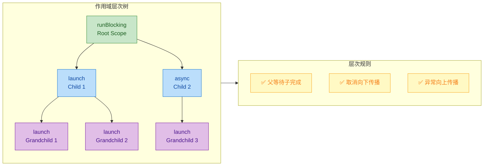

#### coroutineScope vs supervisorScope

Kotlin 提供了两种创建子作用域的挂起函数，它们在异常处理策略上有本质区别：

```kotlin
suspend fun demonstrateScopes() {
    // ---- coroutineScope：一个失败，全部取消 ----
    try {
        coroutineScope {
            launch {
                delay(500)
                println("任务 A 完成") // 不会打印！因为任务 B 先失败了
            }
            launch {
                delay(200)
                throw RuntimeException("任务 B 失败了") // 这会取消兄弟协程 A
            }
        }
    } catch (e: Exception) {
        println("coroutineScope 捕获异常: ${e.message}")
    }

    println("---分隔线---")

    // ---- supervisorScope：各自独立，互不影响 ----
    try {
        supervisorScope {
            launch {
                delay(500)
                println("任务 C 完成") // 会打印！任务 D 的失败不影响它
            }
            launch {
                delay(200)
                throw RuntimeException("任务 D 失败了") // 只影响自己
            }
            delay(1000) // 等待子协程完成
        }
    } catch (e: Exception) {
        println("supervisorScope 捕获异常: ${e.message}")
    }
}
```

两者的核心区别可以用一句话概括：`coroutineScope` 是"连坐制"——一个孩子犯错，全家受罚；`supervisorScope` 是"独立制"——各管各的，互不牵连。

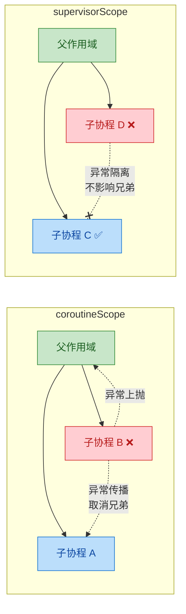

#### CoroutineScope() vs coroutineScope{}

这是初学者最容易混淆的一对概念，必须彻底搞清楚：

```kotlin
fun main() = runBlocking {
    // CoroutineScope()：工厂函数，创建一个独立的、全新的作用域
    // 它不会与当前协程建立父子关系！
    val independentScope = CoroutineScope(Dispatchers.Default)
    independentScope.launch {
        delay(2000)
        println("独立作用域中的协程") // 可能不会打印，因为 main 可能先结束
    }
    // 必须手动管理生命周期
    // independentScope.cancel()

    // coroutineScope{}：挂起函数，创建一个子作用域
    // 它会挂起当前协程，直到内部所有子协程完成
    coroutineScope {
        launch {
            delay(500)
            println("子作用域中的协程") // 一定会打印
        }
        // coroutineScope 会等待这个 launch 完成后才返回
    }
    println("coroutineScope 之后的代码") // 在上面的子作用域全部完成后才执行
}
```

| 特性 | `CoroutineScope()` | `coroutineScope {}` |
|---|---|---|
| 类型 | 工厂函数，返回 `CoroutineScope` 对象 | 挂起函数，创建临时子作用域 |
| 父子关系 | 独立，不继承调用者的 Job | 自动成为当前协程的子作用域 |
| 生命周期 | 需要手动 `cancel()` | 自动管理，内部协程全部完成后返回 |
| 是否挂起 | 不挂起 | 挂起当前协程 |
| 典型场景 | 组件级作用域（ViewModel、Service） | 并行分解（parallel decomposition） |

#### 并行分解模式

`coroutineScope` 最经典的用法是"并行分解"——将一个大任务拆分为多个并行子任务，等待全部完成后汇总结果：

```kotlin
// 一个典型的并行分解示例：同时获取用户信息和订单列表
suspend fun loadUserDashboard(userId: String): Dashboard {
    // coroutineScope 确保两个请求都完成后才返回
    // 如果任何一个失败，另一个也会被取消（fail-fast 策略）
    return coroutineScope {
        // 并行发起两个网络请求
        val userDeferred = async { userService.getUser(userId) }       // 异步获取用户
        val ordersDeferred = async { orderService.getOrders(userId) }  // 异步获取订单

        // 等待两个结果，组装 Dashboard
        Dashboard(
            user = userDeferred.await(),     // 等待用户数据
            orders = ordersDeferred.await()  // 等待订单数据
        )
    }
    // 执行到这里时，两个请求一定都已完成（或者已经抛出异常）
}
```

这种模式的优雅之处在于：调用者只需要 `val dashboard = loadUserDashboard("123")`，完全不需要关心内部的并行细节。函数签名是普通的 `suspend fun`，并行是实现细节，不是接口契约。

### 结构化并发（Structured Concurrency）

结构化并发是 Kotlin 协程最重要的设计哲学，没有之一。它不是一个具体的 API，而是一套通过 `CoroutineScope` 和 `Job` 层次结构自动执行的规则体系。

#### 什么是结构化并发？

在传统的线程编程中，你可以随时随地创建一个新线程，而这个线程与创建它的代码之间没有任何结构化的关系：

```kotlin
// 非结构化并发（传统线程方式）—— 危险！
fun loadData() {
    thread {
        // 这个线程和 loadData() 没有任何生命周期绑定
        // loadData() 返回后，这个线程还在跑
        // 如果 Activity 已经销毁，这里更新 UI 就会崩溃
        val data = fetchFromNetwork()
        updateUI(data) // 💥 可能崩溃
    }
    // loadData() 立即返回，线程在后台野蛮生长
}
```

结构化并发的核心思想是：**并发操作的生命周期必须被限定在一个明确的作用域内**。就像结构化编程用 `if/for/while` 替代了 `goto`，结构化并发用作用域替代了"随意启动线程"。

```kotlin
// 结构化并发（协程方式）—— 安全！
fun ViewModel.loadData() {
    viewModelScope.launch {
        // 这个协程绑定到 viewModelScope
        // 当 ViewModel 被清除时，viewModelScope 取消，这个协程也自动取消
        val data = fetchFromNetwork() // 挂起函数，可以安全取消
        updateUI(data) // ViewModel 还活着，安全更新
    }
}
```

#### 结构化并发的四大保证

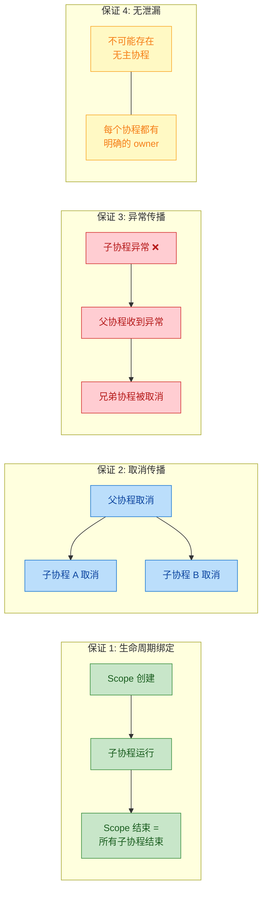

用代码来验证这四个保证：

```kotlin
fun main() = runBlocking {
    // 保证 1：作用域等待所有子协程
    coroutineScope {
        launch {
            delay(1000)
            println("1. 子协程完成") // 一定会在 "作用域结束" 之前打印
        }
        launch {
            delay(500)
            println("2. 另一个子协程完成")
        }
    }
    println("3. 作用域结束") // 一定在 1 和 2 之后打印

    println("===")

    // 保证 2：取消向下传播
    val parentJob = launch {
        launch {
            try {
                delay(Long.MAX_VALUE) // 永远挂起
            } catch (e: CancellationException) {
                println("4. 子协程被取消了: ${e.message}") // 父取消时触发
            }
        }
        launch {
            try {
                delay(Long.MAX_VALUE)
            } catch (e: CancellationException) {
                println("5. 另一个子协程也被取消了")
            }
        }
    }
    delay(100)           // 给子协程一点启动时间
    parentJob.cancel()   // 取消父协程 → 所有子协程级联取消
    parentJob.join()     // 等待取消完成

    println("===")

    // 保证 3：异常向上传播（使用 coroutineScope）
    try {
        coroutineScope {
            launch {
                delay(500)
                println("6. 这行不会打印") // 兄弟协程先失败，自己被取消
            }
            launch {
                delay(100)
                throw IllegalStateException("子协程出错了") // 异常向上传播
            }
        }
    } catch (e: Exception) {
        println("7. 父作用域捕获异常: ${e.message}")
    }
}
```

输出：

```
2. 另一个子协程完成
1. 子协程完成
3. 作用域结束
===
4. 子协程被取消了: ...
5. 另一个子协程也被取消了
===
7. 父作用域捕获异常: 子协程出错了
```

#### 打破结构化并发：GlobalScope

Kotlin 提供了 `GlobalScope` 作为"逃生舱"，但它是结构化并发的反面教材：

```kotlin
fun riskyOperation() {
    // ⚠️ GlobalScope 启动的协程没有父作用域
    // 它的生命周期等同于整个应用进程
    GlobalScope.launch {
        delay(5000)
        println("我可能在不该运行的时候还在运行")
    }
    // 没有人负责取消这个协程
    // 没有人等待它完成
    // 如果它持有 Activity 引用 → 内存泄漏
}
```

`GlobalScope` 在 Kotlin 中被标记为 `@DelicateCoroutinesApi`，意味着"你最好知道自己在做什么"。在绝大多数场景下，你应该使用结构化的作用域。

#### 实际应用：Android 中的作用域层次

一个典型的 Android 应用中，协程作用域形成了清晰的层次结构：

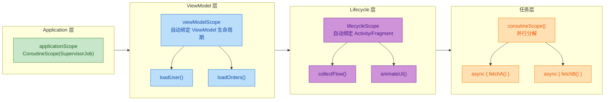

```kotlin
// Application 级别：最长生命周期
class MyApp : Application() {
    // 使用 SupervisorJob 防止单个任务失败影响全局
    val applicationScope = CoroutineScope(SupervisorJob() + Dispatchers.Default)
}

// ViewModel 级别：绑定到 ViewModel 生命周期
class UserViewModel : ViewModel() {
    fun loadDashboard() {
        viewModelScope.launch { // 自动在 onCleared() 时取消
            val dashboard = loadUserDashboard("123") // 内部使用 coroutineScope 并行分解
            _state.value = dashboard
        }
    }
}

// Activity/Fragment 级别：绑定到 UI 生命周期
class UserActivity : AppCompatActivity() {
    override fun onCreate(savedInstanceState: Bundle?) {
        super.onCreate(savedInstanceState)
        lifecycleScope.launch { // 自动在 onDestroy() 时取消
            viewModel.state.collect { state ->
                // 安全地更新 UI，因为 scope 与生命周期绑定
                renderUI(state)
            }
        }
    }
}
```

每一层作用域都有明确的生命周期边界，当边界到达时（ViewModel 清除、Activity 销毁），对应的作用域自动取消，所有子协程随之终止。这就是结构化并发在实际工程中的威力——**你不需要手动追踪和取消每一个协程，作用域替你完成了这一切**。

#### 自定义作用域的最佳实践

```kotlin
class DataSyncService {
    // ✅ 最佳实践：SupervisorJob + 明确的调度器
    private val scope = CoroutineScope(
        SupervisorJob() +                    // 子任务失败不影响其他任务
        Dispatchers.IO +                     // IO 密集型操作
        CoroutineName("DataSyncService")     // 便于调试
    )

    fun syncAll() {
        // 每个 sync 任务独立，一个失败不影响其他
        scope.launch { syncUsers() }
        scope.launch { syncOrders() }
        scope.launch { syncProducts() }
    }

    // ✅ 必须提供清理方法
    fun shutdown() {
        scope.cancel() // 取消所有正在进行的同步任务
    }
}

// ❌ 反模式：不要这样做
class BadService {
    fun doWork() {
        // 每次调用都创建新的 scope，没有统一管理
        CoroutineScope(Dispatchers.IO).launch {
            // 这个协程没有人负责取消它
            // 如果 BadService 被销毁，协程还在跑 → 泄漏
        }
    }
}
```

---

**📝 练习题**

以下代码的输出是什么？

```kotlin
fun main() = runBlocking {
    val scope = CoroutineScope(Job())
    scope.launch {
        delay(100)
        println("A")
    }
    coroutineScope {
        launch {
            delay(100)
            println("B")
        }
    }
    println("C")
}
```

A. A B C

B. B C（A 可能不打印）

C. C B A

D. B A C

**【答案】** B

**【解析】** `CoroutineScope(Job())` 创建了一个独立的作用域，与 `runBlocking` 没有父子关系。`scope.launch` 启动的协程是"野生"的——`runBlocking` 不会等待它完成。而 `coroutineScope {}` 是挂起函数，它会等待内部的 `launch` 完成后才返回，所以 "B" 一定在 "C" 之前打印。当 `runBlocking` 结束、`main` 函数退出时，进程终止，`scope` 中那个 delay 100ms 的协程大概率还没来得及打印 "A"。因此输出是 `B C`，A 可能不打印。这正是结构化并发的核心教训：脱离结构化管理的协程，其行为是不可预测的。

---

## 协程上下文（CoroutineContext、元素组合、继承规则）

协程上下文（CoroutineContext）是 Kotlin 协程体系中最精妙的设计之一。每一个协程都携带一个 `CoroutineContext` 实例，它就像协程的"身份证"加"配置表"——决定了协程在哪个线程上运行、叫什么名字、归谁管理、出了异常怎么处理。理解协程上下文，是从"会用协程"迈向"精通协程"的关键一步。

### CoroutineContext 接口本质

从类型系统的角度看，`CoroutineContext` 是一个接口，定义在 `kotlin.coroutines` 包中。它的核心设计理念是：**一个不可变的、以 Key 为索引的元素集合（an indexed set of Element instances）**。你可以把它想象成一个特殊的 `Map<Key, Element>`，但它比 Map 更轻量，且支持用 `+` 运算符进行组合。

```kotlin
// CoroutineContext 接口的核心定义（简化版）
public interface CoroutineContext {
    // 通过 Key 获取对应的元素，类似 map[key]
    public operator fun <E : Element> get(key: Key<E>): E?

    // 从初始值开始，对所有元素进行折叠（遍历）操作
    public fun <R> fold(initial: R, operation: (R, Element) -> R): R

    // 用 + 运算符组合两个上下文，右侧覆盖左侧的同 Key 元素
    public operator fun plus(context: CoroutineContext): CoroutineContext

    // 移除指定 Key 的元素，返回新的上下文
    public fun minusKey(key: Key<*>): CoroutineContext

    // Key 接口：每种 Element 都有一个伴生对象实现此接口
    public interface Key<E : Element>

    // Element 接口：上下文中的单个元素，本身也是一个 CoroutineContext
    public interface Element : CoroutineContext {
        public val key: Key<*>
    }
}
```

这里有一个非常巧妙的递归设计：`Element` 本身也实现了 `CoroutineContext` 接口。这意味着单个元素（比如一个 `Job`、一个 `Dispatcher`）既是"元素"，也是"只包含自己的上下文"。这种设计让单个元素和组合上下文可以在同一套 API 下无缝使用。

```kotlin
import kotlinx.coroutines.*

fun main() = runBlocking {
    // coroutineContext 是当前协程的上下文
    val ctx = coroutineContext

    // 通过 Key 取出具体元素
    val job: Job? = ctx[Job]                         // 取出 Job 元素
    val dispatcher = ctx[ContinuationInterceptor]    // 取出调度器元素

    println("当前 Job: $job")           // 输出当前协程的 Job 实例
    println("当前调度器: $dispatcher")   // 输出当前协程使用的调度器
}
```

### CoroutineContext 的内置元素类型

协程上下文中可以容纳多种不同类型的元素，每种元素负责协程行为的一个维度。Kotlin 协程库预定义了几种核心元素类型：

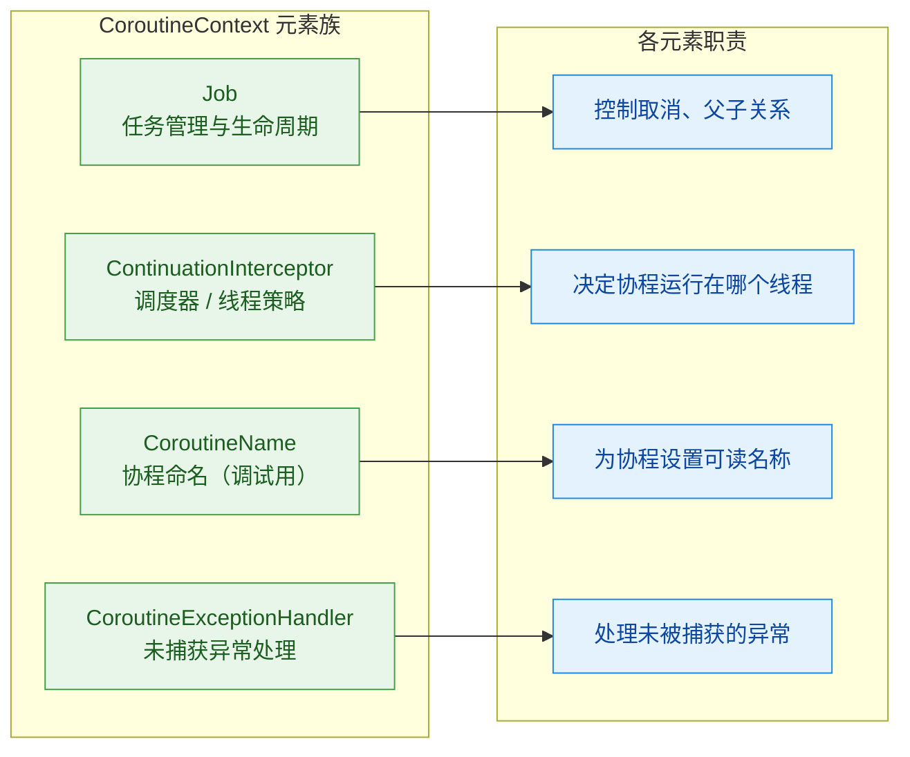

逐一说明这四大核心元素：

**Job** —— 协程的生命周期管理者。每个协程启动时都会创建一个 `Job` 对象，它跟踪协程的状态（活跃、完成、取消），并建立父子层级关系。通过 `ctx[Job]` 可以获取。

**ContinuationInterceptor（调度器）** —— 决定协程的代码在哪个线程或线程池上执行。`Dispatchers.Default`、`Dispatchers.IO`、`Dispatchers.Main` 都是 `ContinuationInterceptor` 的实现。它通过拦截协程的 continuation 来实现线程切换。

**CoroutineName** —— 纯粹用于调试目的的命名标签。在日志和调试工具中，一个有意义的名字远比 `coroutine#42` 更容易定位问题。

**CoroutineExceptionHandler** —— 协程的"最后一道防线"。当协程中抛出未被捕获的异常时，这个 handler 会被调用。它类似于线程的 `Thread.uncaughtExceptionHandler`。

```kotlin
import kotlinx.coroutines.*

fun main() = runBlocking {
    // 创建各种上下文元素
    val name = CoroutineName("数据加载协程")       // 命名元素
    val dispatcher = Dispatchers.IO                  // 调度器元素
    val handler = CoroutineExceptionHandler { ctx, throwable ->
        // 异常处理器：打印协程名和异常信息
        println("${ctx[CoroutineName]?.name} 发生异常: ${throwable.message}")
    }

    // 每个元素都可以独立使用，也可以组合
    println(name.key)        // 输出: CoroutineName
    println(dispatcher.key)  // 输出: ContinuationInterceptor
    println(handler.key)     // 输出: CoroutineExceptionHandler
}
```

### 元素组合：`+` 运算符

协程上下文最优雅的特性之一就是可以用 `+` 运算符将多个元素组合成一个复合上下文。这个操作的语义非常直观：**合并两个上下文，如果有相同 Key 的元素，右侧覆盖左侧**。

```kotlin
import kotlinx.coroutines.*

fun main() = runBlocking {
    // 单个元素本身就是一个合法的 CoroutineContext
    val ctx1: CoroutineContext = CoroutineName("Worker")
    val ctx2: CoroutineContext = Dispatchers.IO

    // 用 + 组合多个元素，形成复合上下文
    val combined = ctx1 + ctx2
    println(combined[CoroutineName])           // 输出: CoroutineName(Worker)
    println(combined[ContinuationInterceptor]) // 输出: Dispatchers.IO

    // 继续追加元素
    val handler = CoroutineExceptionHandler { _, e -> println("Error: $e") }
    val fullCtx = combined + handler
    // fullCtx 现在包含三个元素: CoroutineName + Dispatchers.IO + Handler

    // 同 Key 元素：右侧覆盖左侧
    val ctx3 = CoroutineName("Alpha") + CoroutineName("Beta")
    println(ctx3[CoroutineName]) // 输出: CoroutineName(Beta)  ← 右侧覆盖
}
```

组合操作的内部实现是 `CombinedContext` 类，它用链表结构将多个元素串联起来。但对使用者来说，这些细节完全透明——你只需要关心 `+` 的语义。

```kotlin
// 组合上下文的内部结构示意（链表形式）
// CombinedContext(
//     left = CombinedContext(
//         left = CoroutineName("Worker"),
//         element = Dispatchers.IO
//     ),
//     element = CoroutineExceptionHandler
// )
```

`+` 运算符还有一个重要特性：**Job 元素的特殊处理**。当你组合包含 Job 的上下文时，新的 Job 不会自动成为旧 Job 的子 Job——父子关系是在协程启动时由结构化并发机制建立的，而不是在上下文组合时。

```kotlin
import kotlinx.coroutines.*

fun main() = runBlocking {
    // 演示 + 运算符的覆盖行为
    val base = Dispatchers.Default + CoroutineName("Base")

    // 覆盖调度器，保留名称
    val modified = base + Dispatchers.IO
    println(modified[ContinuationInterceptor]) // Dispatchers.IO（被覆盖）
    println(modified[CoroutineName])           // CoroutineName(Base)（保留）

    // 用 minusKey 移除某个元素
    val withoutName = base.minusKey(CoroutineName)
    println(withoutName[CoroutineName])           // null（已移除）
    println(withoutName[ContinuationInterceptor]) // Dispatchers.Default（保留）
}
```

### fold 遍历：探查上下文中的所有元素

`fold` 方法是遍历上下文中所有元素的通用手段，类似于集合的 `fold` 操作。它在调试和框架开发中非常有用。

```kotlin
import kotlinx.coroutines.*

fun main() = runBlocking {
    // 构建一个包含多个元素的上下文
    val ctx = Dispatchers.Default + CoroutineName("Demo") + Job()

    // 用 fold 遍历所有元素，收集到列表中
    val elements = ctx.fold(mutableListOf<CoroutineContext.Element>()) { list, element ->
        list.add(element)  // 将每个元素加入列表
        list               // 返回累积值
    }

    // 打印所有元素
    elements.forEach { element ->
        println("元素: $element, Key: ${element.key}")
    }
    // 输出类似:
    // 元素: CoroutineName(Demo), Key: CoroutineName
    // 元素: JobImpl{Active}@xxx, Key: Job
    // 元素: Dispatchers.Default, Key: ContinuationInterceptor
}
```

### 上下文的继承规则

这是协程上下文中最容易让人困惑、也最重要的部分。当你用 `launch`、`async` 等构建器启动一个新协程时，新协程的上下文是如何确定的？答案是一套清晰的继承与合并规则。

**核心公式**：

```
新协程的有效上下文 = 父上下文的元素 + 构建器参数中指定的元素 + 新创建的 Job
```

具体步骤如下：

1. **继承父上下文**：新协程首先继承父协程（即所在 CoroutineScope）的所有上下文元素。
2. **参数覆盖**：构建器的 `context` 参数中指定的元素会覆盖从父上下文继承来的同 Key 元素。
3. **强制创建新 Job**：无论父上下文中是否有 Job，新协程总是会创建一个全新的 Job，并将父上下文中的 Job 设为其 parent。这是结构化并发的基石。

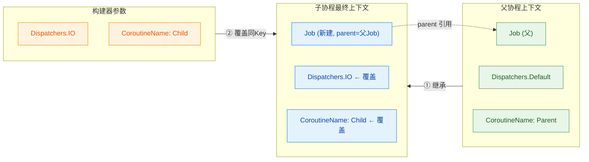

用代码验证这套继承规则：

```kotlin
import kotlinx.coroutines.*

fun main() = runBlocking(CoroutineName("Parent") + Dispatchers.Default) {
    // 父上下文: Job(runBlocking) + Dispatchers.Default + CoroutineName("Parent")

    println("父协程名称: ${coroutineContext[CoroutineName]}")
    // 输出: CoroutineName(Parent)

    println("父协程调度器: ${coroutineContext[ContinuationInterceptor]}")
    // 输出: Dispatchers.Default

    // 启动子协程，通过参数覆盖调度器和名称
    val childJob = launch(Dispatchers.IO + CoroutineName("Child")) {
        // 子协程的上下文 = 继承父上下文 + 参数覆盖 + 新 Job
        println("子协程名称: ${coroutineContext[CoroutineName]}")
        // 输出: CoroutineName(Child)  ← 被参数覆盖

        println("子协程调度器: ${coroutineContext[ContinuationInterceptor]}")
        // 输出: Dispatchers.IO  ← 被参数覆盖

        println("子协程 Job: ${coroutineContext[Job]}")
        // 输出: 一个新的 StandaloneCoroutine 实例

        println("子 Job 的 parent: ${coroutineContext[Job]?.parent}")
        // 输出: 父协程的 BlockingCoroutine 实例（非 null）
    }

    childJob.join()
}
```

### Job 继承的特殊性

在所有上下文元素中，`Job` 的继承行为最为特殊，也最容易踩坑。关键规则是：**子协程永远会创建新的 Job，并将父上下文中的 Job 作为 parent**。

```kotlin
import kotlinx.coroutines.*

fun main() = runBlocking {
    val parentJob = coroutineContext[Job]!!
    println("父 Job: $parentJob")

    launch {
        val childJob = coroutineContext[Job]!!
        println("子 Job: $childJob")
        println("子 Job 是父 Job 吗? ${childJob === parentJob}")
        // 输出: false  ← 子协程有自己的 Job

        println("子 Job 的 parent 是父 Job 吗? ${childJob.parent === parentJob}")
        // 输出: true  ← 但 parent 指向父 Job
    }
}
```

一个常见的陷阱是：如果你在构建器参数中传入一个外部的 `Job()`，会**打破结构化并发**。

```kotlin
import kotlinx.coroutines.*

fun main() = runBlocking {
    val externalJob = Job() // 创建一个独立的 Job

    // 危险！传入外部 Job 会打破父子关系
    launch(externalJob) {
        println("这个协程的 parent 不再是 runBlocking 的 Job")
        println("parent: ${coroutineContext[Job]?.parent}")
        // parent 是 externalJob，而不是 runBlocking 的 Job
        // 这意味着 runBlocking 无法等待这个协程完成
        // 也无法通过取消 runBlocking 来取消这个协程
    }

    // 正确做法：如果需要自定义 Job，使用 SupervisorJob(parent)
    launch(SupervisorJob(coroutineContext[Job])) {
        println("这个协程保持了结构化并发")
        // parent 仍然关联到 runBlocking 的 Job 层级中
    }

    delay(100)
    externalJob.cancel() // 需要手动管理外部 Job 的生命周期
}
```

### 继承规则的完整示例

下面用一个多层嵌套的例子，完整展示上下文的继承链路：

```kotlin
import kotlinx.coroutines.*

// 自定义上下文元素：用于演示自定义 Key
class RequestId(val id: String) : AbstractCoroutineContextElement(RequestId) {
    // 伴生对象作为 Key
    companion object Key : CoroutineContext.Key<RequestId>
    override fun toString(): String = "RequestId($id)"
}

fun main() = runBlocking(CoroutineName("Root") + RequestId("REQ-001")) {
    // 第一层：Root 协程
    // 上下文 = Job(BlockingCoroutine) + CoroutineName("Root") + RequestId("REQ-001")
    printContext("Root")

    launch(CoroutineName("Layer1")) {
        // 第二层：继承 RequestId，覆盖 CoroutineName
        // 上下文 = 新Job(parent=Root的Job) + CoroutineName("Layer1") + RequestId("REQ-001")
        printContext("Layer1")

        launch(Dispatchers.IO) {
            // 第三层：继承 CoroutineName("Layer1") 和 RequestId，新增 Dispatchers.IO
            // 上下文 = 新Job(parent=Layer1的Job) + Dispatchers.IO + CoroutineName("Layer1") + RequestId("REQ-001")
            printContext("Layer2-IO")
        }

        launch(CoroutineName("Layer2-Custom") + RequestId("REQ-002")) {
            // 第三层：覆盖 CoroutineName 和 RequestId
            // 上下文 = 新Job + CoroutineName("Layer2-Custom") + RequestId("REQ-002")
            printContext("Layer2-Custom")
        }
    }

    delay(200) // 等待所有子协程完成
}

// 辅助函数：打印当前协程的上下文信息
suspend fun printContext(label: String) {
    val ctx = currentCoroutineContext() // 获取当前挂起函数所在的协程上下文
    println("=== $label ===")
    println("  Name: ${ctx[CoroutineName]}")
    println("  RequestId: ${ctx[RequestId]}")
    println("  Dispatcher: ${ctx[ContinuationInterceptor]}")
    println("  Job: ${ctx[Job]}")
    println("  Job.parent: ${ctx[Job]?.parent}")
    println()
}
```

输出结果清晰地展示了继承链：`Layer2-IO` 继承了 `Layer1` 的名称和 `Root` 的 `RequestId`，而 `Layer2-Custom` 则用参数覆盖了这两者。

### 自定义上下文元素

Kotlin 允许你定义自己的上下文元素，这在实际项目中非常实用——比如传递请求 ID、用户身份、追踪信息等。实现方式是继承 `AbstractCoroutineContextElement`：

```kotlin
import kotlinx.coroutines.*
import kotlin.coroutines.AbstractCoroutineContextElement
import kotlin.coroutines.CoroutineContext

// 自定义元素：携带用户身份信息
class UserContext(val userId: String, val role: String)
    : AbstractCoroutineContextElement(UserContext) {
    // 伴生对象实现 Key 接口，保证全局唯一
    companion object Key : CoroutineContext.Key<UserContext>
    override fun toString(): String = "UserContext(userId=$userId, role=$role)"
}

// 自定义元素：携带链路追踪 ID
class TraceContext(val traceId: String)
    : AbstractCoroutineContextElement(TraceContext) {
    companion object Key : CoroutineContext.Key<TraceContext>
    override fun toString(): String = "TraceContext($traceId)"
}

// 模拟业务函数：从上下文中读取用户信息
suspend fun fetchUserData(): String {
    // 在任意挂起函数中都可以访问上下文元素
    val user = currentCoroutineContext()[UserContext]
        ?: throw IllegalStateException("缺少 UserContext")
    val trace = currentCoroutineContext()[TraceContext]

    println("[${trace?.traceId}] 正在为用户 ${user.userId}(${user.role}) 加载数据...")
    delay(100) // 模拟网络请求
    return "用户 ${user.userId} 的数据"
}

fun main() = runBlocking {
    // 将自定义上下文注入协程
    launch(UserContext("U-1024", "admin") + TraceContext("TRACE-abc-123")) {
        val data = fetchUserData()
        println("获取结果: $data")
    }

    // 不同用户的协程，上下文完全隔离
    launch(UserContext("U-2048", "viewer") + TraceContext("TRACE-def-456")) {
        val data = fetchUserData()
        println("获取结果: $data")
    }
}
```

这种模式在服务端开发中极为常见，它让你无需通过函数参数层层传递"横切关注点"（cross-cutting concerns），而是通过协程上下文隐式传播。

### CoroutineScope 与 CoroutineContext 的关系

`CoroutineScope` 接口只有一个属性——`coroutineContext`。从本质上说，**CoroutineScope 就是 CoroutineContext 的持有者**。它存在的意义是为结构化并发提供一个语法上的锚点。

```kotlin
// CoroutineScope 的完整定义，就这么简单
public interface CoroutineScope {
    public val coroutineContext: CoroutineContext
}
```

当你调用 `scope.launch { ... }` 时，`launch` 函数会从 `scope.coroutineContext` 中继承上下文元素。这就是为什么 `CoroutineScope` 是协程构建器的接收者（receiver）。

```kotlin
import kotlinx.coroutines.*

fun main() = runBlocking {
    // 手动创建一个自定义 Scope
    val myScope = CoroutineScope(
        SupervisorJob() +                    // 独立的根 Job
        Dispatchers.IO +                     // 默认在 IO 线程池
        CoroutineName("MyScope") +           // 命名
        CoroutineExceptionHandler { _, e ->  // 异常处理
            println("MyScope 捕获异常: ${e.message}")
        }
    )

    // 在自定义 Scope 中启动协程
    myScope.launch {
        // 继承了 Dispatchers.IO、CoroutineName("MyScope")、ExceptionHandler
        println("运行在: ${coroutineContext[CoroutineName]}")
        println("调度器: ${coroutineContext[ContinuationInterceptor]}")
    }

    delay(100)

    // Scope 的生命周期管理：取消 Scope 会取消所有子协程
    myScope.cancel()
}
```

### 上下文与线程的关系（coroutineContext 的实际流转）

一个容易被忽略的细节是：协程上下文在挂起和恢复时是如何流转的。当协程在挂起点暂停后，上下文信息被保存在 `Continuation` 对象中；当协程恢复时，调度器（`ContinuationInterceptor`）负责将 continuation 调度到正确的线程上执行，同时上下文中的所有元素都随之恢复。

```kotlin
import kotlinx.coroutines.*

fun main() = runBlocking {
    launch(Dispatchers.Default + CoroutineName("Traveler")) {
        // 第一段：运行在 Default 线程池
        println("[${Thread.currentThread().name}] 挂起前")

        // 切换到 IO 调度器
        withContext(Dispatchers.IO) {
            // withContext 会临时替换调度器，但保留其他上下文元素
            println("[${Thread.currentThread().name}] IO 中")
            println("名称仍然是: ${coroutineContext[CoroutineName]}")
            // 输出: CoroutineName(Traveler)  ← 名称被保留
        }

        // 恢复到 Default 线程池
        println("[${Thread.currentThread().name}] 恢复后")
    }
}
```

`withContext` 是一个非常重要的上下文切换工具。它会创建一个新的协程上下文（合并当前上下文和参数），在新上下文中执行代码块，完成后恢复到原来的上下文。整个过程是挂起式的，不会创建新的协程。

### 上下文继承的完整流程图

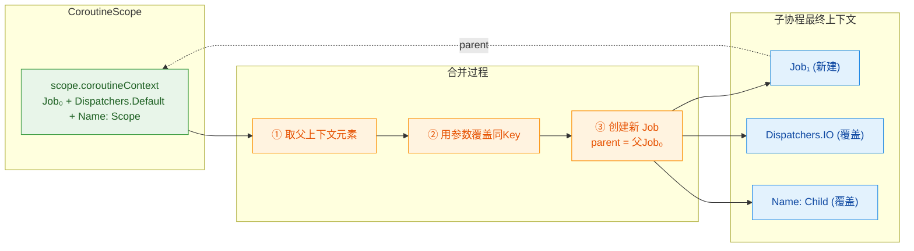

### 实战：上下文在 Android 中的典型用法

在 Android 开发中，协程上下文的继承规则被广泛应用于 ViewModel 的生命周期管理：

```kotlin
import kotlinx.coroutines.*

// 模拟 Android ViewModel 中的协程使用
class MyViewModel {
    // viewModelScope 的上下文通常是:
    // SupervisorJob() + Dispatchers.Main.immediate
    private val viewModelScope = CoroutineScope(
        SupervisorJob() + Dispatchers.Main // 模拟 Android 的 viewModelScope
    )

    fun loadData() {
        // 在 Main 线程启动协程（继承 viewModelScope 的调度器）
        viewModelScope.launch {
            // 此处运行在 Main 线程，可以安全更新 UI
            showLoading()

            // 切换到 IO 线程执行网络请求
            val result = withContext(Dispatchers.IO) {
                // 此处运行在 IO 线程池
                fetchFromNetwork()
            }

            // 自动回到 Main 线程，更新 UI
            updateUI(result)
        }
    }

    fun onCleared() {
        // 取消 Scope 会取消所有子协程
        viewModelScope.cancel()
    }

    // 模拟函数
    private fun showLoading() = println("显示加载中...")
    private suspend fun fetchFromNetwork(): String {
        delay(500)
        return "网络数据"
    }
    private fun updateUI(data: String) = println("更新UI: $data")
}
```

这里的关键在于：`viewModelScope` 的上下文配置了 `SupervisorJob`（子协程失败不影响其他子协程）和 `Dispatchers.Main`（默认在主线程），所有通过 `viewModelScope.launch` 启动的协程都会继承这两个配置。当 ViewModel 被销毁时，调用 `cancel()` 即可一次性取消所有正在运行的协程——这就是结构化并发与上下文继承的完美配合。

### EmptyCoroutineContext 与默认行为

当你不传任何上下文参数时，构建器使用的是 `EmptyCoroutineContext`——一个不包含任何元素的空上下文。此时子协程会完全继承父上下文的所有元素（除了 Job，因为总是会新建）。

```kotlin
import kotlinx.coroutines.*

fun main() = runBlocking(CoroutineName("Parent") + Dispatchers.Default) {
    // 不传参数 = 使用 EmptyCoroutineContext
    launch {
        // 完全继承父上下文的 CoroutineName 和 Dispatchers.Default
        println("名称: ${coroutineContext[CoroutineName]}")
        // 输出: CoroutineName(Parent)

        println("调度器: ${coroutineContext[ContinuationInterceptor]}")
        // 输出: Dispatchers.Default
    }

    // 显式传入 EmptyCoroutineContext，效果完全相同
    launch(EmptyCoroutineContext) {
        println("名称: ${coroutineContext[CoroutineName]}")
        // 输出: CoroutineName(Parent)
    }
}
```

`EmptyCoroutineContext` 是一个单例对象，它的 `get()` 总是返回 `null`，`fold()` 直接返回初始值，`plus()` 直接返回对方。它在类型系统中扮演"零元素"的角色，就像数字中的 0 或集合中的空集。

### 上下文元素的优先级总结

将所有继承规则汇总成一张优先级表：

```
优先级从高到低：
┌─────────────────────────────────────────────────────┐
│  1. 新创建的 Job（最高优先，总是覆盖）                   │
│     → 每个协程必定有自己的 Job                          │
├─────────────────────────────────────────────────────┤
│  2. 构建器参数中指定的元素                               │
│     → launch(Dispatchers.IO) 中的 Dispatchers.IO      │
├─────────────────────────────────────────────────────┤
│  3. 父上下文（CoroutineScope）中的元素                   │
│     → 未被参数覆盖的元素会被继承                         │
├─────────────────────────────────────────────────────┤
│  4. 默认值                                            │
│     → 如果父上下文也没有，使用库的默认值                   │
│     → 调度器默认 Dispatchers.Default                   │
│     → 名称默认 "coroutine"                             │
└─────────────────────────────────────────────────────┘
```

---

**📝 练习题**

以下代码中，子协程 `inner` 最终使用的调度器和协程名称分别是什么？

```kotlin
fun main() = runBlocking(Dispatchers.Default + CoroutineName("Root")) {
    launch(CoroutineName("Outer")) {
        launch(Dispatchers.IO) { // ← inner
            println("Dispatcher: ${coroutineContext[ContinuationInterceptor]}")
            println("Name: ${coroutineContext[CoroutineName]}")
        }
    }
}
```

A. `Dispatchers.Default` + `CoroutineName("Root")`

B. `Dispatchers.IO` + `CoroutineName("Root")`

C. `Dispatchers.IO` + `CoroutineName("Outer")`

D. `Dispatchers.Default` + `CoroutineName("Outer")`

**【答案】** C

**【解析】** 继承链路如下：`runBlocking` 的上下文包含 `Dispatchers.Default + CoroutineName("Root")`。第一层 `launch(CoroutineName("Outer"))` 继承父上下文的 `Dispatchers.Default`，但用参数覆盖名称为 `"Outer"`。第二层 `launch(Dispatchers.IO)` 继承上一层的 `CoroutineName("Outer")`（因为参数中没有指定名称，所以保留继承），同时用参数覆盖调度器为 `Dispatchers.IO`。最终 inner 协程的上下文是 `Dispatchers.IO + CoroutineName("Outer")`。这道题的核心考点是：**只有参数中显式指定的 Key 才会覆盖，未指定的 Key 从父上下文原样继承**。

---

## 调度器（Dispatchers）

协程本身只是一段可挂起的计算逻辑，它并不关心自己运行在哪个线程上。真正决定"协程的代码跑在哪个线程（或线程池）"的，是协程上下文中的一个关键元素——`CoroutineDispatcher`（协程调度器）。你可以把调度器理解为协程世界的"线程调度中心"：每当协程从挂起点恢复执行时，调度器负责把这段 continuation 分派（dispatch）到某个具体的线程上去运行。

调度器的设计哲学源于一个核心洞察：不同类型的任务对线程资源的需求截然不同。CPU 密集型计算需要尽量少的线程切换开销；IO 密集型操作需要大量线程来避免阻塞；UI 操作必须在主线程执行。Kotlin 协程通过预定义的调度器家族，让开发者用声明式的方式表达"这段代码应该跑在什么样的线程环境里"，而不必手动管理线程池。

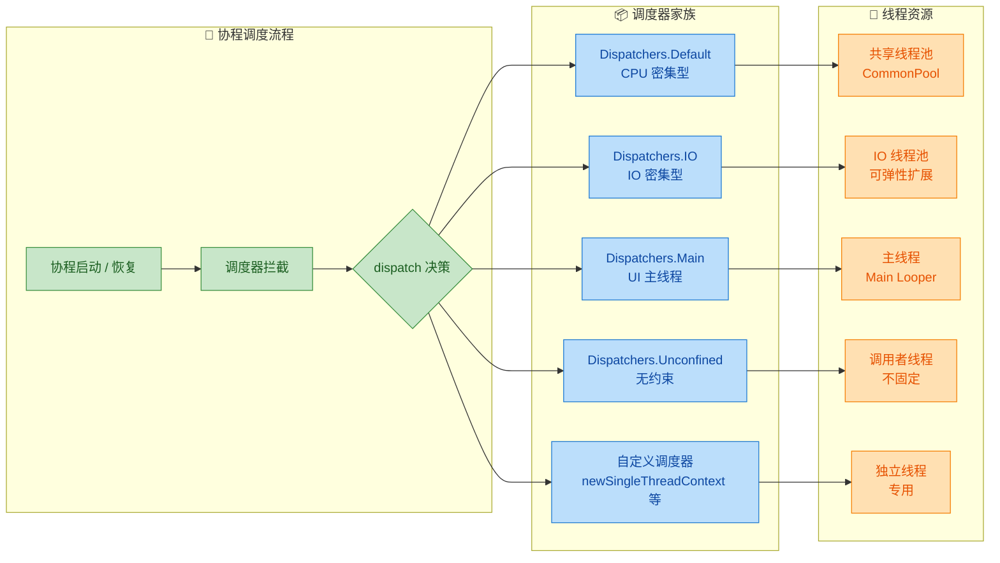

### Dispatchers.Default —— CPU 密集型任务的主战场

`Dispatchers.Default` 是协程库为 CPU 密集型任务量身打造的调度器。当你不显式指定调度器时，`launch` 和 `async` 等构建器默认就使用它（前提是父作用域没有指定其他调度器）。

它背后维护着一个共享线程池（shared pool），线程数量等于机器的 CPU 核心数（至少为 2）。这个设计非常讲究：CPU 密集型任务的瓶颈在于计算本身，线程数超过核心数只会带来无谓的上下文切换开销，反而降低吞吐量。

```kotlin
import kotlinx.coroutines.*

fun main() = runBlocking {
    // 打印当前可用处理器核心数，决定了 Default 调度器的线程数
    println("CPU 核心数: ${Runtime.getRuntime().availableProcessors()}")

    // 启动多个 CPU 密集型协程
    val jobs = List(10) { i ->
        // 使用 Dispatchers.Default 调度器
        launch(Dispatchers.Default) {
            // 模拟 CPU 密集型计算（如排序、加密、数学运算）
            var sum = 0L
            // 大量纯计算操作
            for (j in 1..10_000_000) {
                sum += j
            }
            // 打印执行线程，观察线程复用情况
            println("协程 #$i 完成, sum=$sum, 线程=${Thread.currentThread().name}")
        }
    }
    // 等待所有协程完成
    jobs.forEach { it.join() }
}
```

运行后你会发现，10 个协程并不会创建 10 个线程，而是复用有限的几个线程（数量约等于 CPU 核心数）。这就是 Default 调度器的精髓——用最少的线程完成最多的计算。

典型适用场景包括：JSON/XML 解析、列表排序与过滤、图像处理算法、加密解密运算、复杂业务逻辑计算等。

一个常见误区是把 IO 操作也丢给 Default 调度器。如果你在 Default 线程池里执行阻塞式 IO（比如读文件、网络请求），就会占住宝贵的 CPU 线程，导致其他真正需要 CPU 的协程被饿死（starvation）。

### Dispatchers.IO —— IO 密集型任务的弹性池

`Dispatchers.IO` 专为阻塞式 IO 操作设计。它与 `Dispatchers.Default` 共享底层线程（share the same backing thread pool），但允许创建远超 CPU 核心数的线程——默认上限为 `max(64, CPU核心数)`。这个弹性设计的原因很直观：IO 操作大部分时间都在等待（等网络响应、等磁盘读写），线程处于阻塞状态并不消耗 CPU，所以多开线程不会造成 CPU 争抢，反而能提高并发吞吐。

```kotlin
import kotlinx.coroutines.*
import java.io.File

fun main() = runBlocking {
    // 并发读取多个文件，使用 IO 调度器
    val fileNames = listOf("config.txt", "data.csv", "log.txt")

    val contents = fileNames.map { name ->
        // async + Dispatchers.IO：并发执行阻塞式文件读取
        async(Dispatchers.IO) {
            println("开始读取 $name, 线程=${Thread.currentThread().name}")
            // 模拟阻塞式 IO 操作
            Thread.sleep(1000) // 假装在读文件
            println("完成读取 $name, 线程=${Thread.currentThread().name}")
            "内容来自 $name" // 返回文件内容
        }
    }

    // 收集所有结果
    contents.forEach { deferred ->
        println(deferred.await())
    }
}
```

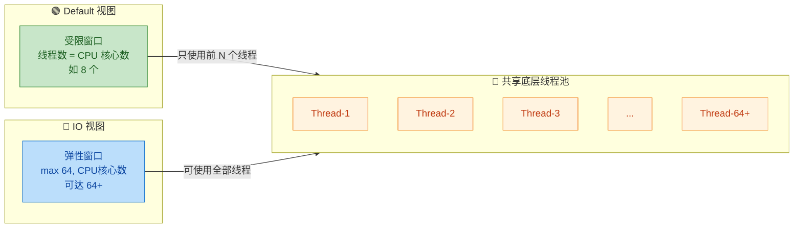

Default 和 IO 共享线程池这一点非常重要。当协程从 `Dispatchers.Default` 通过 `withContext(Dispatchers.IO)` 切换时，很可能根本不会发生实际的线程切换（thread switch），只是调度器的"许可窗口"变了。这种设计极大地减少了线程切换的开销。

```kotlin
import kotlinx.coroutines.*

suspend fun processData() {
    // 当前在 Default 调度器上做 CPU 计算
    val processed = withContext(Dispatchers.Default) {
        println("CPU 计算, 线程=${Thread.currentThread().name}")
        // 执行数据处理逻辑
        (1..1000).map { it * it }.sum()
    }

    // 切换到 IO 调度器写入结果
    withContext(Dispatchers.IO) {
        println("IO 写入, 线程=${Thread.currentThread().name}")
        // 可能和上面是同一个线程！只是调度器的"视图"不同
        Thread.sleep(100) // 模拟写文件
    }
}
```

你还可以通过 `limitedParallelism()` 来自定义 IO 调度器的并行度上限：

```kotlin
import kotlinx.coroutines.*

fun main() = runBlocking {
    // 创建一个最多只允许 4 个协程同时执行的 IO 调度器视图
    // 适用于限制对某个资源（如数据库连接池）的并发访问
    val limitedIO = Dispatchers.IO.limitedParallelism(4)

    val jobs = List(20) { i ->
        launch(limitedIO) {
            println("协程 #$i 开始, 线程=${Thread.currentThread().name}")
            Thread.sleep(500) // 模拟数据库操作
            println("协程 #$i 结束")
        }
    }
    jobs.forEach { it.join() }
    // 虽然启动了 20 个协程，但同一时刻最多只有 4 个在执行
}
```

`limitedParallelism` 在实际项目中非常实用。比如你的数据库连接池只有 10 个连接，就可以用 `Dispatchers.IO.limitedParallelism(10)` 来确保不会有超过 10 个协程同时尝试获取连接。

### Dispatchers.Main —— UI 线程的守护者

`Dispatchers.Main` 将协程调度到平台的主线程（UI 线程）上执行。这个调度器不是 `kotlinx-coroutines-core` 自带的，而是由平台特定的模块提供：

- Android：由 `kotlinx-coroutines-android` 提供，绑定到 Android 的主线程 `Looper`
- JavaFX：由 `kotlinx-coroutines-javafx` 提供
- Swing：由 `kotlinx-coroutines-swing` 提供

在没有引入对应平台模块的纯 JVM/后端项目中，使用 `Dispatchers.Main` 会抛出 `IllegalStateException`。

```kotlin
import kotlinx.coroutines.*

// Android 中的典型用法
class UserViewModel : ViewModel() {

    fun loadUserProfile(userId: String) {
        // viewModelScope 默认使用 Dispatchers.Main
        viewModelScope.launch {
            // 此处在主线程，可以安全地显示 loading
            showLoading()

            // 切换到 IO 调度器执行网络请求
            val user = withContext(Dispatchers.IO) {
                // 这里在 IO 线程池中执行
                apiService.fetchUser(userId)
            }

            // 自动回到主线程，安全更新 UI
            updateUI(user)
            hideLoading()
        }
    }
}
```

`Dispatchers.Main.immediate` 是一个重要的优化变体。普通的 `Dispatchers.Main` 总是会把执行调度（dispatch）到主线程的消息队列中，即使当前已经在主线程上。而 `Main.immediate` 会先检查——如果当前已经在主线程，就直接执行，跳过一次不必要的调度：

```kotlin
import kotlinx.coroutines.*

suspend fun updateTitle(title: String) {
    // 使用 Main.immediate：如果已经在主线程，直接执行，无需排队
    withContext(Dispatchers.Main.immediate) {
        // 更新 UI 标题
        textView.text = title
    }
}
```

这个优化在高频 UI 更新场景下能显著减少延迟。

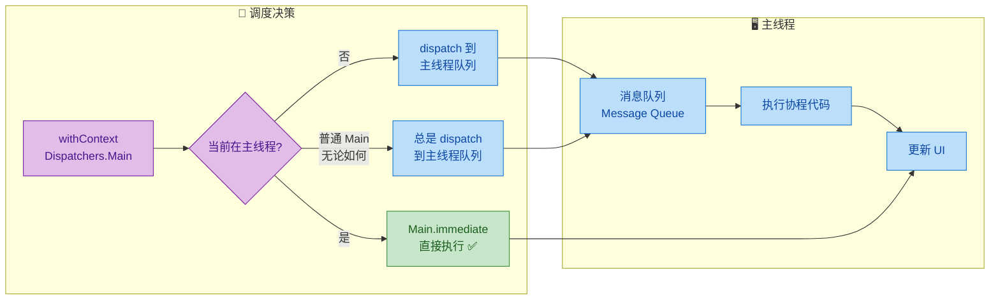

### Dispatchers.Unconfined —— 不受约束的"自由派"

`Dispatchers.Unconfined` 是最特殊的调度器。它在第一个挂起点之前，直接在调用者的线程上执行；在挂起恢复之后，则在恢复它的那个线程上继续执行。换句话说，它完全不做线程调度，协程"漂流"到哪个线程就在哪个线程跑。

```kotlin
import kotlinx.coroutines.*

fun main() = runBlocking {
    // 在 runBlocking 的线程（main）中启动
    launch(Dispatchers.Unconfined) {
        // 第一个挂起点之前：在调用者线程（main）上执行
        println("Unconfined 启动: 线程=${Thread.currentThread().name}")
        // ↑ 输出: main

        // delay 是一个挂起函数，协程在此挂起
        delay(100)

        // 挂起恢复后：在 delay 内部使用的线程上继续
        println("Unconfined 恢复: 线程=${Thread.currentThread().name}")
        // ↑ 输出: kotlinx.coroutines.DefaultExecutor（不再是 main！）
    }

    // 对比：使用 Default 调度器
    launch(Dispatchers.Default) {
        println("Default 启动: 线程=${Thread.currentThread().name}")
        delay(100)
        // 恢复后仍然在 Default 线程池中
        println("Default 恢复: 线程=${Thread.currentThread().name}")
    }

    // 等待子协程完成
    delay(500)
}
```

```kotlin
// Unconfined 的线程漂移行为示意

// 时间线:
// ┌─────────────────────────────────────────────────────┐
// │ main 线程:  [启动] ──> [执行代码A] ──> [挂起 delay]  │
// │                                                     │
// │ DefaultExecutor:              [恢复] ──> [执行代码B]  │
// │                                                     │
// │ 某IO线程:    (如果被IO操作恢复，就在IO线程继续)         │
// └─────────────────────────────────────────────────────┘
```

Unconfined 调度器的使用场景非常有限，官方文档明确标注它为"不推荐在一般代码中使用"。它主要用于：

- 单元测试中，不关心线程行为时简化测试代码
- 某些不消耗 CPU 也不更新共享数据的纯计算场景
- 协程库内部实现

在生产代码中使用 Unconfined 是危险的，因为你无法预测挂起恢复后协程会跑在哪个线程上，这会导致难以排查的并发 bug。

### 自定义调度器 —— 精细化线程控制

当预定义的调度器无法满足需求时，Kotlin 协程提供了多种方式来创建自定义调度器。

`newSingleThreadContext` 创建一个专用的单线程调度器。协程始终在这一个线程上执行，天然线程安全，适合需要严格串行化访问的场景：

```kotlin
import kotlinx.coroutines.*

// 创建一个专用的单线程上下文
// 注意：这会创建一个真实的线程，使用完毕后必须关闭！
val databaseThread = newSingleThreadContext("DatabaseThread")

fun main() = runBlocking {
    // 所有数据库操作都在同一个专用线程上串行执行
    launch(databaseThread) {
        println("数据库操作1, 线程=${Thread.currentThread().name}")
        // 输出: DatabaseThread
    }

    launch(databaseThread) {
        println("数据库操作2, 线程=${Thread.currentThread().name}")
        // 输出: DatabaseThread（同一个线程）
    }

    delay(200)
    // 使用完毕后关闭，释放线程资源
    databaseThread.close()
}
```

`newFixedThreadPoolContext` 创建一个固定大小的线程池调度器：

```kotlin
import kotlinx.coroutines.*

// 创建一个拥有 4 个线程的专用线程池
val customPool = newFixedThreadPoolContext(4, "CustomPool")

fun main() = runBlocking {
    val jobs = List(10) { i ->
        launch(customPool) {
            println("任务 #$i, 线程=${Thread.currentThread().name}")
            Thread.sleep(200)
        }
    }
    jobs.forEach { it.join() }
    // 同一时刻最多 4 个任务并行执行
    customPool.close() // 别忘了关闭
}
```

你也可以将 Java 的 `ExecutorService` 转换为协程调度器，这在需要与现有 Java 线程池集成时非常有用：

```kotlin
import kotlinx.coroutines.*
import java.util.concurrent.Executors

fun main() = runBlocking {
    // 将 Java 线程池转换为协程调度器
    val javaExecutor = Executors.newCachedThreadPool()
    // asCoroutineDispatcher() 是扩展函数
    val dispatcher = javaExecutor.asCoroutineDispatcher()

    launch(dispatcher) {
        println("运行在 Java 线程池中: ${Thread.currentThread().name}")
    }

    delay(100)
    // 关闭调度器和底层线程池
    dispatcher.close()
    javaExecutor.shutdown()
}
```

`limitedParallelism` 是 Kotlin 1.6 引入的更现代的方式，它不创建新线程，而是在现有调度器上创建一个并行度受限的"视图"：

```kotlin
import kotlinx.coroutines.*

fun main() = runBlocking {
    // 基于 Default 调度器创建一个最多 2 并行的视图
    // 不会创建新线程，复用 Default 的线程池
    val twoParallel = Dispatchers.Default.limitedParallelism(2)

    val jobs = List(10) { i ->
        launch(twoParallel) {
            println("任务 #$i 开始, 线程=${Thread.currentThread().name}")
            delay(300)
            println("任务 #$i 结束")
        }
    }
    jobs.forEach { it.join() }
    // 同一时刻最多 2 个协程在执行
    // 无需手动关闭，因为没有创建新的线程资源
}
```

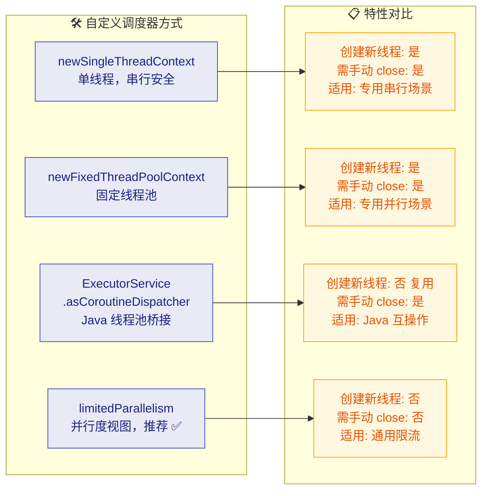

### 调度器的选择策略与最佳实践

理解了每种调度器的特性后，关键在于如何在实际项目中做出正确选择。以下是一套实用的决策框架：

```kotlin
import kotlinx.coroutines.*

// ✅ 正确：根据任务类型选择调度器
class DataRepository {

    // CPU 密集型：数据转换、排序、过滤
    suspend fun transformData(raw: List<RawData>): List<ProcessedData> =
        withContext(Dispatchers.Default) {
            // 复杂的数据映射和计算
            raw.map { it.process() }
                .filter { it.isValid() }
                .sortedBy { it.priority }
        }

    // IO 密集型：网络请求、文件读写、数据库查询
    suspend fun fetchFromNetwork(url: String): Response =
        withContext(Dispatchers.IO) {
            // 阻塞式网络调用
            httpClient.execute(Request(url))
        }

    // UI 更新：必须在主线程
    suspend fun showResult(data: ProcessedData) =
        withContext(Dispatchers.Main.immediate) {
            // 更新界面元素
            view.displayData(data)
        }
}
```

一个非常重要的原则是"挂起函数应该对调用者是 main-safe 的"（main-safety）。这意味着挂起函数内部应该自己负责切换到正确的调度器，调用者不需要操心：

```kotlin
// ✅ 好的设计：函数内部自行切换调度器，对调用者 main-safe
class UserRepository(
    private val api: UserApi,
    private val db: UserDao
) {
    // 调用者可以在任何调度器上调用此函数，包括 Main
    suspend fun getUser(id: String): User {
        // 先尝试从数据库获取（IO 操作）
        val cached = withContext(Dispatchers.IO) {
            db.findById(id)
        }
        if (cached != null) return cached

        // 缓存未命中，从网络获取（IO 操作）
        val remote = withContext(Dispatchers.IO) {
            api.fetchUser(id)
        }

        // 保存到数据库（IO 操作）
        withContext(Dispatchers.IO) {
            db.insert(remote)
        }

        return remote
    }
}

// ❌ 不好的设计：把调度器选择的责任推给调用者
suspend fun getUserBad(id: String): User {
    // 如果调用者在 Main 线程调用，就会阻塞 UI！
    return api.fetchUser(id) // 阻塞式网络调用，没有切换调度器
}
```

关于 `withContext` 切换调度器的性能，有一个常见疑问：频繁切换调度器会不会很昂贵？答案是：开销很小。`withContext` 的切换成本大约在微秒级别，相比于实际的 IO 操作（毫秒到秒级），完全可以忽略不计。而且前面提到过，Default 和 IO 共享线程池，它们之间的切换甚至可能不涉及真正的线程切换。

```kotlin
import kotlinx.coroutines.*
import kotlin.system.measureTimeMillis

fun main() = runBlocking {
    // 测量 withContext 切换开销
    val time = measureTimeMillis {
        repeat(100_000) {
            // 在 Default 和 IO 之间来回切换
            withContext(Dispatchers.Default) {
                // 几乎空操作
            }
            withContext(Dispatchers.IO) {
                // 几乎空操作
            }
        }
    }
    // 200,000 次切换的总耗时，通常在几百毫秒内
    // 平均每次切换仅几微秒
    println("200,000 次调度器切换耗时: ${time}ms")
    println("平均每次: ${time * 1000.0 / 200_000} 微秒")
}
```

最后总结一下调度器选择的速查表：

```kotlin
// 调度器速查表

// Dispatchers.Default
//   线程数: CPU 核心数（至少 2）
//   适用: CPU 密集型计算（排序、解析、加密）
//   注意: 不要在这里做阻塞 IO

// Dispatchers.IO
//   线程数: max(64, CPU核心数)，可弹性扩展
//   适用: 阻塞式 IO（网络、文件、数据库）
//   技巧: 用 limitedParallelism() 限制并发

// Dispatchers.Main
//   线程数: 1（主线程）
//   适用: UI 更新、轻量级操作
//   优化: 用 Main.immediate 避免不必要的 dispatch

// Dispatchers.Unconfined
//   线程数: 不固定（漂移）
//   适用: 测试、特殊场景
//   警告: 生产代码中慎用

// 自定义调度器
//   推荐: limitedParallelism()（不创建新线程）
//   备选: newSingleThreadContext / newFixedThreadPoolContext
//   注意: 后两者需要手动 close() 释放资源
```

---

**📝 练习题**

以下代码在 Android 应用中执行，哪一行会导致运行时崩溃或 ANR（Application Not Responding）？

```kotlin
class MyViewModel : ViewModel() {
    fun loadData() {
        viewModelScope.launch { // viewModelScope 默认 Dispatchers.Main
            val data = fetchData()    // 第 A 行
            updateUI(data)            // 第 B 行
        }
    }

    suspend fun fetchData(): String {
        Thread.sleep(5000)            // 第 C 行：模拟耗时网络请求
        return "result"
    }

    fun updateUI(data: String) {
        textView.text = data          // 第 D 行
    }
}
```

A. 第 A 行：`fetchData()` 调用本身会崩溃

B. 第 B 行：`updateUI` 不能在协程中调用

C. 第 C 行：`Thread.sleep(5000)` 阻塞了主线程，导致 ANR

D. 第 D 行：`textView.text` 不能在主线程更新

**【答案】** C
**【解析】** `viewModelScope.launch` 默认使用 `Dispatchers.Main`，因此协程体内的代码运行在主线程上。`fetchData()` 虽然被声明为 `suspend`，但它内部使用的是 `Thread.sleep()` 而非 `delay()`——`Thread.sleep` 是真正的线程阻塞调用，它会把主线程卡住 5 秒。

---

## Job 任务

在结构化并发（Structured Concurrency）的世界里，每一个协程都不是孤立存在的——它们通过 `Job` 对象组织成一棵树。`Job` 是协程的"身份证"和"生命线"，它追踪协程的状态、管理父子关系、传递取消信号。理解 Job 是掌握协程生命周期管理的关键一步。

### Job 层次

`Job` 是 `CoroutineContext` 中的一个核心元素（Element），每次通过 `launch` 或 `async` 启动协程时，都会自动创建一个 `Job` 实例并挂载到协程上下文中。你可以把 Job 理解为协程的"句柄"（handle）——通过它，你可以查询协程状态、等待协程完成、或者取消协程。

```kotlin
// 演示 Job 的基本获取方式
import kotlinx.coroutines.*

fun main() = runBlocking {
    // launch 返回的就是一个 Job 对象
    val job: Job = launch {
        delay(1000L) // 模拟耗时操作
        println("协程执行完毕")
    }

    // 也可以从协程上下文中提取当前 Job
    val currentJob: Job? = coroutineContext[Job]
    println("当前 runBlocking 的 Job: $currentJob")
    println("launch 创建的子 Job: $job")

    job.join() // 等待子协程完成
}
```

Job 接口本身定义在 `kotlinx.coroutines` 包中，它继承自 `CoroutineContext.Element`，这意味着 Job 可以直接作为上下文的一部分参与组合与继承。Job 的类层次结构如下：

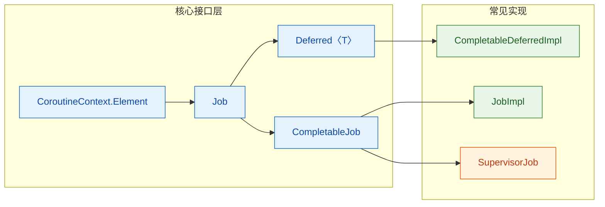

几个关键类型的区别：

- `Job`：最基础的接口，代表一个可取消的、有生命周期的任务。`launch` 返回的就是它。
- `Deferred<T>`：继承自 Job，额外提供 `await()` 方法来获取异步计算结果。`async` 返回的是它。
- `CompletableJob`：继承自 Job，额外提供 `complete()` 和 `completeExceptionally()` 方法，允许外部手动控制完成状态。通过 `Job()` 工厂函数创建。
- `SupervisorJob`：一种特殊的 CompletableJob，子协程的失败不会传播给父协程（后续章节会深入讲解）。

你也可以手动创建一个独立的 Job，用于自定义作用域或控制生命周期：

```kotlin
// 手动创建 Job 的两种方式
fun main() = runBlocking {
    // 方式一：Job() 工厂函数，创建 CompletableJob
    val manualJob: CompletableJob = Job()

    // 方式二：SupervisorJob() 工厂函数
    val supervisorJob: CompletableJob = SupervisorJob()

    // 将手动创建的 Job 作为父 Job 使用
    val scope = CoroutineScope(Dispatchers.Default + manualJob)
    scope.launch {
        println("在自定义 scope 中运行")
    }

    manualJob.complete()   // 手动标记完成
    manualJob.join()       // 等待所有子协程结束
}
```

需要特别注意的一点：当你用 `Job()` 创建一个 Job 并传入 `CoroutineScope` 时，这个 Job 会**替换**掉原本从父作用域继承的 Job，从而**打破**结构化并发的父子链条。这是一个常见的陷阱，后面在父子关系部分会详细说明。

### 父子关系

Job 的父子关系是结构化并发的骨架。当你在一个协程内部启动新的协程时，新协程的 Job 会自动成为外部协程 Job 的子节点（child），形成一棵树状结构。

```kotlin
// 演示 Job 的父子关系树
fun main() = runBlocking {
    // runBlocking 自身有一个 Job，称为 parentJob
    val parentJob = coroutineContext[Job]
    println("Parent job: $parentJob")

    val childJob1 = launch {  // 子协程 1
        val grandchildJob = launch {  // 孙协程
            delay(2000L)
            println("孙协程完成")
        }
        println("子协程1 的 Job: ${coroutineContext[Job]}")
        println("孙协程 的 Job: $grandchildJob")
        delay(1500L)
        println("子协程1 完成")
    }

    val childJob2 = launch {  // 子协程 2
        delay(1000L)
        println("子协程2 完成")
    }

    // 验证父子关系
    println("childJob1 的 parent: ${childJob1[Job]?.parent}")
    println("parentJob 的 children: ${parentJob?.children?.toList()}")

    // 父协程会等待所有子协程完成后才结束
}
```

这棵树的结构可以用下图直观表示：

```mermaid
graph LR
    subgraph 协程树["协程 Job 树"]
        direction TB
        R["runBlocking Job<br/>(Root)"]
        C1["launch Job 1<br/>(Child)"]
        C2["launch Job 2<br/>(Child)"]
        G1["launch Job<br/>(Grandchild)"]
        R --> C1
        R --> C2
        C1 --> G1
    end

    subgraph 规则["父子关系规则"]
        direction TB
        R1["① 子 Job 自动注册到父 Job"]
        R2["② 父 Job 等待所有子 Job 完成"]
        R3["③ 父 Job 取消 → 所有子 Job 取消"]
        R4["④ 子 Job 异常 → 向上传播给父 Job"]
        R1 ~~~ R2
        R2 ~~~ R3
        R3 ~~~ R4
    end

    classDef rootStyle fill:#E8F5E9,stroke:#2E7D32,color:#1B5E20
    classDef childStyle fill:#E3F2FD,stroke:#1565C0,color:#0D47A1
    classDef ruleStyle fill:#FFF8E1,stroke:#F9A825,color:#E65100

    class R rootStyle
    class C1,C2,G1 childStyle
    class R1,R2,R3,R4 ruleStyle
```

父子关系带来的四条核心规则：

**规则一：自动注册。** 子协程启动时，其 Job 会自动成为父 Job 的 child。这不需要任何手动操作，是 `launch`/`async` 内部机制自动完成的。

**规则二：父等子完。** 父协程在自身代码执行完毕后，不会立即进入"已完成"状态，而是会等待所有子协程完成。这就是为什么 `runBlocking` 会一直阻塞到所有内部 `launch` 都结束。

```kotlin
fun main() = runBlocking {
    launch {
        delay(2000L)
        println("子协程完成") // 这行一定会执行
    }
    println("父协程代码执行完毕")
    // runBlocking 不会在这里退出，它会等子协程
}
// 输出：
// 父协程代码执行完毕
// 子协程完成
```

**规则三：取消向下传播。** 当父 Job 被取消时，所有子 Job 会递归地被取消。这是一种"自上而下"的传播。

```kotlin
fun main() = runBlocking {
    val parentJob = launch {
        val child1 = launch {
            try {
                delay(Long.MAX_VALUE) // 永远挂起
            } finally {
                println("子协程1 被取消，执行清理") // 取消时 finally 会执行
            }
        }
        val child2 = launch {
            try {
                delay(Long.MAX_VALUE)
            } finally {
                println("子协程2 被取消，执行清理")
            }
        }
    }

    delay(100L)           // 给子协程一点启动时间
    parentJob.cancel()    // 取消父 Job
    parentJob.join()      // 等待取消完成
    println("父协程已取消")
}
// 输出：
// 子协程1 被取消，执行清理
// 子协程2 被取消，执行清理
// 父协程已取消
```

**规则四：异常向上传播。** 当子协程因未捕获异常而失败时，异常会传播给父 Job，父 Job 会取消自身及所有其他子 Job。这是一种"自下而上"的传播，也是结构化并发保证"不泄漏"的关键机制。

```kotlin
fun main() = runBlocking {
    try {
        val parentJob = launch {
            val child1 = launch {
                delay(500L)
                throw RuntimeException("子协程1 爆炸了！") // 异常向上传播
            }
            val child2 = launch {
                try {
                    delay(Long.MAX_VALUE)
                } finally {
                    println("子协程2 被连带取消") // child1 的异常导致 child2 也被取消
                }
            }
        }
        parentJob.join()
    } catch (e: Exception) {
        println("捕获到异常: ${e.message}")
    }
}
```

**打破父子关系的陷阱：** 前面提到，如果你在创建子协程时传入一个独立的 `Job()`，会切断父子链条：

```kotlin
fun main() = runBlocking {
    // ⚠️ 危险：传入 Job() 会打破结构化并发
    val detachedJob = launch(Job()) {
        delay(2000L)
        println("这个协程不受 runBlocking 管控")
    }

    delay(100L)
    println("runBlocking 即将结束")
    // runBlocking 不会等待 detachedJob 完成！
    // detachedJob 会被直接丢弃，造成协程泄漏
}
```

正确的做法是：如果你需要一个独立的 Job，应该让它成为当前 Job 的子节点：

```kotlin
fun main() = runBlocking {
    // ✅ 正确：将当前 Job 作为父 Job 传入
    val childJob = Job(coroutineContext[Job])

    val scope = CoroutineScope(Dispatchers.Default + childJob)
    scope.launch {
        delay(1000L)
        println("这个协程仍然受结构化并发管控")
    }

    childJob.complete()
    childJob.join()
}
```

### 生命周期

每个 Job 都有一个明确的状态机（State Machine），从创建到最终完成或取消，经历一系列状态转换。理解这个状态机对于调试协程问题至关重要。

Job 的六种状态：

| 状态 | isActive | isCompleted | isCancelled | 含义 |
|------|----------|-------------|-------------|------|
| New | `false` | `false` | `false` | 刚创建，尚未启动（仅 `lazy` 模式） |
| Active | `true` | `false` | `false` | 正在运行中 |
| Completing | `true` | `false` | `false` | 自身代码完成，等待子协程 |
| Cancelling | `false` | `false` | `true` | 正在取消中，执行清理 |
| Cancelled | `false` | `true` | `true` | 已取消（最终状态） |
| Completed | `false` | `true` | `false` | 已正常完成（最终状态） |

注意 `Completing` 和 `Active` 在三个布尔属性上完全一致——它们在外部 API 层面无法区分，`Completing` 是一个内部状态。同样，`Cancelling` 从外部看 `isCancelled = true` 但 `isCompleted = false`，表示取消流程尚未结束。

状态转换的完整流程：

```mermaid
graph LR
    subgraph 正常流程["正常生命周期"]
        direction TB
        N["New<br/>(lazy 模式)"]
        A["Active<br/>(运行中)"]
        CO["Completing<br/>(等待子协程)"]
        CD["Completed<br/>(最终状态)"]
        N -->|"start() / join()"| A
        A -->|"自身代码完成"| CO
        CO -->|"所有子协程完成"| CD
    end

    subgraph 取消流程["取消生命周期"]
        direction TB
        CA["Cancelling<br/>(清理中)"]
        CL["Cancelled<br/>(最终状态)"]
        CA -->|"清理完成"| CL
    end

    A -->|"cancel() / 异常"| CA
    CO -->|"cancel() / 子协程异常"| CA
    N -->|"cancel()"| CL

    classDef newStyle fill:#F3E5F5,stroke:#7B1FA2,color:#4A148C
    classDef activeStyle fill:#E8F5E9,stroke:#2E7D32,color:#1B5E20
    classDef completingStyle fill:#E3F2FD,stroke:#1565C0,color:#0D47A1
    classDef cancellingStyle fill:#FFF3E0,stroke:#E65100,color:#BF360C
    classDef finalStyle fill:#ECEFF1,stroke:#455A64,color:#263238

    class N newStyle
    class A activeStyle
    class CO completingStyle
    class CA cancellingStyle
    class CD,CL finalStyle
```

让我们逐一拆解每个状态转换：

**New → Active：** 默认情况下，`launch` 和 `async` 创建的协程会立即进入 Active 状态。但如果你指定 `start = CoroutineStart.LAZY`，协程会停留在 New 状态，直到你显式调用 `start()` 或 `join()` 或 `await()`。

```kotlin
fun main() = runBlocking {
    // LAZY 模式：协程创建后不会立即执行
    val lazyJob = launch(start = CoroutineStart.LAZY) {
        println("我被启动了！")
    }

    println("lazyJob isActive: ${lazyJob.isActive}")       // false
    println("lazyJob isCompleted: ${lazyJob.isCompleted}")  // false

    delay(500L)
    println("500ms 过去了，协程仍未启动")

    lazyJob.start()  // 显式启动，New → Active
    println("lazyJob isActive: ${lazyJob.isActive}")       // true

    lazyJob.join()   // 等待完成
}
```

**Active → Completing：** 当协程自身的代码块执行完毕（最后一行代码返回），但它还有子协程在运行时，Job 进入 Completing 状态。这个状态从外部看和 Active 一样（`isActive = true`），但内部已经不再执行自身代码了。

```kotlin
fun main() = runBlocking {
    val parentJob = launch {
        launch {
            delay(2000L)  // 子协程需要 2 秒
            println("子协程完成")
        }
        println("父协程自身代码执行完毕")
        // 此时 parentJob 进入 Completing 状态
        // 它在等待子协程完成
    }

    delay(500L)
    // 此时 parentJob 处于 Completing（外部看是 Active）
    println("parentJob isActive: ${parentJob.isActive}")       // true
    println("parentJob isCompleted: ${parentJob.isCompleted}") // false

    parentJob.join()
    // 子协程完成后，parentJob 进入 Completed
    println("parentJob isCompleted: ${parentJob.isCompleted}") // true
}
```

**Completing → Completed：** 当所有子协程都正常完成后，Job 从 Completing 转为 Completed。这是一个最终状态（terminal state），不可逆。

**Active/Completing → Cancelling：** 调用 `cancel()` 或子协程抛出异常时，Job 进入 Cancelling 状态。在这个状态中，协程会执行 `finally` 块中的清理代码，并且所有子协程也会被取消。

```kotlin
fun main() = runBlocking {
    val job = launch {
        try {
            println("协程开始运行")
            delay(5000L)  // 会被取消打断
        } catch (e: CancellationException) {
            // delay 等挂起函数在取消时会抛出 CancellationException
            println("捕获到取消异常: ${e.message}")
        } finally {
            // Cancelling 状态中，finally 块会执行
            println("执行清理工作...")
            println("isActive: ${isActive}")       // false
            println("isCancelled: ${coroutineContext[Job]?.isCancelled}") // true（注意这里不能直接用 Job 的属性）
        }
    }

    delay(200L)
    println("准备取消协程")
    job.cancel(CancellationException("不需要了"))  // Active → Cancelling
    job.join()  // 等待 Cancelling → Cancelled
    println("job isCompleted: ${job.isCompleted}")   // true
    println("job isCancelled: ${job.isCancelled}")   // true
}
```

**Cancelling → Cancelled：** 当清理代码执行完毕、所有子协程也都取消完成后，Job 进入 Cancelled 最终状态。

一个实用的监控 Job 生命周期的方法是使用 `invokeOnCompletion` 回调：

```kotlin
fun main() = runBlocking {
    val job = launch {
        delay(1000L)
        println("工作完成")
    }

    // 注册完成回调，无论正常完成还是取消都会触发
    job.invokeOnCompletion { cause: Throwable? ->
        when (cause) {
            null -> println("Job 正常完成")                          // Completed
            is CancellationException -> println("Job 被取消: ${cause.message}")  // Cancelled
            else -> println("Job 因异常失败: ${cause.message}")       // Cancelled (with exception)
        }
    }

    job.join()
}
```

`invokeOnCompletion` 是一个非常实用的 hook，它在 Job 到达最终状态（Completed 或 Cancelled）时同步调用。注意它的回调是在 Job 完成的那个线程上执行的，不要在里面做耗时操作。

最后，用一段综合代码把整个生命周期串起来：

```kotlin
import kotlinx.coroutines.*

fun main() = runBlocking {
    println("=== Job 生命周期完整演示 ===\n")

    // 1. LAZY 模式创建 → New 状态
    val job = launch(start = CoroutineStart.LAZY) {
        // 3. 进入 Active 状态后执行
        println("[Active] 协程正在执行...")

        // 启动一个子协程
        val childJob = launch {
            delay(1000L)
            println("[Active] 子协程完成")
        }

        println("[Active] 父协程自身代码执行完毕，进入 Completing...")
        // 此时父协程进入 Completing，等待 childJob
    }

    // 2. 验证 New 状态
    println("[New] isActive=${job.isActive}, isCompleted=${job.isCompleted}, isCancelled=${job.isCancelled}")

    // 注册完成回调
    job.invokeOnCompletion { cause ->
        val state = if (cause == null) "Completed" else "Cancelled(${cause.message})"
        println("[Final] Job 到达最终状态: $state")
    }

    // 启动协程：New → Active
    job.start()
    println("[Started] isActive=${job.isActive}")

    // 等待协程完成：Active → Completing → Completed
    job.join()
    println("[Done] isActive=${job.isActive}, isCompleted=${job.isCompleted}, isCancelled=${job.isCancelled}")
}
```

输出：

```
=== Job 生命周期完整演示 ===

[New] isActive=false, isCompleted=false, isCancelled=false
[Started] isActive=true
[Active] 协程正在执行...
[Active] 父协程自身代码执行完毕，进入 Completing...
[Active] 子协程完成
[Final] Job 到达最终状态: Completed
[Done] isActive=false, isCompleted=true, isCancelled=false
```

---

**📝 练习题**

以下代码的输出是什么？

```kotlin
fun main() = runBlocking {
    val job = launch {
        val child = launch {
            delay(3000L)
            println("Child done")
        }
        println("Parent body done")
    }
    delay(100L)
    job.cancel()
    job.join()
    println("isCompleted=${job.isCompleted}, isCancelled=${job.isCancelled}")
}
```

A. `Parent body done` → `Child done` → `isCompleted=true, isCancelled=false`

B. `Parent body done` → `isCompleted=true, isCancelled=true`

C. `Parent body done` → `isCompleted=false, isCancelled=true`

D. `Child done` → `Parent body done` → `isCompleted=true, isCancelled=true`

**【答案】** B

**【解析】** `launch` 启动后，父协程的自身代码很快执行完毕打印 `Parent body done`，然后进入 Completing 状态等待子协程。100ms 后 `job.cancel()` 被调用，父 Job 从 Completing 转入 Cancelling，同时取消信号向下传播给 child，child 的 `delay` 抛出 `CancellationException` 被取消。清理完成后父 Job 进入 Cancelled 最终状态。此时 `isCompleted = true`（已到达最终状态）且 `isCancelled = true`（是通过取消到达的）。`Child done` 永远不会打印，因为 child 在 `delay` 处就被取消了。

---

## Deferred 延迟值

协程世界中，`launch` 构建器用于"发射后不管"（fire-and-forget）的任务——它返回一个 `Job`，代表任务本身，但不携带计算结果。然而在真实开发中，我们经常需要在后台执行一段计算，然后把结果拿回来继续使用。这正是 `Deferred` 的核心使命。

`Deferred<T>` 是 `Job` 的子接口（`Deferred<T> : Job`），它在 `Job` 的生命周期管理能力之上，额外承诺了一件事：**当协程正常完成时，会携带一个类型为 `T` 的结果值**。你可以把它理解为 Kotlin 协程版本的 `Future` / `Promise`，但它与挂起函数深度集成，使用体验远比传统回调或阻塞式 `Future.get()` 优雅。

```mermaid
graph LR
    subgraph 继承关系["Deferred 继承体系"]
        direction TB
        A["Job<br/>管理生命周期"]
        B["Deferred〈T〉<br/>携带返回值 T"]
        A -->|"extends"| B
    end

    subgraph 构建方式["构建方式"]
        direction TB
        C["async { ... }<br/>最常用的构建器"]
        D["CompletableDeferred〈T〉()<br/>手动完成"]
    end

    subgraph 获取结果["获取结果"]
        direction TB
        E["await()<br/>挂起等待结果"]
        F["getCompleted()<br/>立即获取（已完成时）"]
        G["getCompletionExceptionOrNull()<br/>获取异常"]
    end

    继承关系 --> 构建方式
    构建方式 --> 获取结果

    classDef green fill:#C8E6C9,stroke:#388E3C,color:#1B5E20
    classDef blue fill:#BBDEFB,stroke:#1976D2,color:#0D47A1
    classDef orange fill:#FFE0B2,stroke:#F57C00,color:#E65100

    class A,B green
    class C,D blue
    class E,F,G orange
```

---

### async 返回 Deferred

`async` 是创建 `Deferred` 的标准方式。它与 `launch` 几乎是"孪生兄弟"——同样接受 `CoroutineContext`、`CoroutineStart` 参数，同样在指定的 `CoroutineScope` 中启动一个新协程。唯一的关键区别在于：`launch` 返回 `Job`，而 `async` 返回 `Deferred<T>`，其中 `T` 由 lambda 体的最后一个表达式类型推断。

```kotlin
import kotlinx.coroutines.*

fun main() = runBlocking {
    // async 启动一个协程，返回 Deferred<Int>
    // lambda 最后一行是 Int 类型，所以 T = Int
    val deferred: Deferred<Int> = async {
        println("开始计算... [${Thread.currentThread().name}]") // 打印当前线程
        delay(1000L) // 模拟耗时计算（挂起，不阻塞线程）
        42 // 这就是最终的返回值
    }

    println("协程已启动，deferred 类型: ${deferred::class.simpleName}")
    // 此时协程可能还在执行，也可能已经完成

    val result = deferred.await() // 挂起当前协程，等待结果
    println("计算结果: $result") // 输出: 计算结果: 42
}
```

上面的代码揭示了一个重要的执行模型：调用 `async` 时协程**立即启动**（默认 `CoroutineStart.DEFAULT`），但调用者不会被阻塞，它可以继续做其他事情，直到真正需要结果时才调用 `await()`。

#### 并行分解（Parallel Decomposition）

`async` 最经典的应用场景是将一个大任务拆分为多个可并行执行的子任务，最后汇总结果。这种模式在网络请求、数据库查询、文件 IO 等场景中极为常见：

```kotlin
import kotlinx.coroutines.*

// 模拟从不同数据源获取数据
suspend fun fetchUserProfile(): String {
    delay(1200L) // 模拟网络请求耗时 1.2 秒
    return "UserProfile(name=Kiro)"
}

suspend fun fetchUserOrders(): List<String> {
    delay(800L) // 模拟网络请求耗时 0.8 秒
    return listOf("Order#1001", "Order#1002")
}

suspend fun fetchRecommendations(): List<String> {
    delay(1500L) // 模拟推荐算法耗时 1.5 秒
    return listOf("ItemA", "ItemB", "ItemC")
}

fun main() = runBlocking {
    val startTime = System.currentTimeMillis() // 记录开始时间

    // 三个请求并行发起，各自独立执行
    val profileDeferred = async { fetchUserProfile() }       // 立即启动
    val ordersDeferred = async { fetchUserOrders() }         // 立即启动
    val recommendationsDeferred = async { fetchRecommendations() } // 立即启动

    // 三个 await 依次等待结果
    // 但由于三个协程是并行的，总耗时 ≈ max(1200, 800, 1500) ≈ 1500ms
    val profile = profileDeferred.await()
    val orders = ordersDeferred.await()
    val recommendations = recommendationsDeferred.await()

    val elapsed = System.currentTimeMillis() - startTime

    println("用户信息: $profile")
    println("订单列表: $orders")
    println("推荐列表: $recommendations")
    println("总耗时: ${elapsed}ms") // ≈ 1500ms，而非 1200+800+1500=3500ms
}
```

如果用顺序调用（sequential），三个请求依次执行需要约 3500ms；而用 `async` 并行分解后，总耗时仅约 1500ms（取决于最慢的那个）。这就是并发的威力。

```mermaid
graph LR
    subgraph 顺序执行["顺序执行 ≈ 3500ms"]
        direction TB
        S1["fetchUserProfile<br/>1200ms"]
        S2["fetchUserOrders<br/>800ms"]
        S3["fetchRecommendations<br/>1500ms"]
        S1 --> S2 --> S3
    end

    subgraph 并行执行["async 并行 ≈ 1500ms"]
        direction TB
        P1["async { fetchUserProfile }<br/>1200ms"]
        P2["async { fetchUserOrders }<br/>800ms"]
        P3["async { fetchRecommendations }<br/>1500ms"]
    end

    START(("开始")) --> 顺序执行
    START --> 并行执行

    classDef red fill:#FFCDD2,stroke:#D32F2F,color:#B71C1C
    classDef green fill:#C8E6C9,stroke:#388E3C,color:#1B5E20
    classDef neutral fill:#E0E0E0,stroke:#757575,color:#212121

    class S1,S2,S3 red
    class P1,P2,P3 green
    class START neutral
```

#### 惰性启动（Lazy Start）

有时你希望先创建 `Deferred` 对象，但不立即启动协程，而是等到真正需要结果时（调用 `await()` 或手动 `start()`）才开始执行。这通过 `CoroutineStart.LAZY` 实现：

```kotlin
import kotlinx.coroutines.*

fun main() = runBlocking {
    // LAZY 模式：协程不会立即启动
    val lazyDeferred = async(start = CoroutineStart.LAZY) {
        println("惰性协程开始执行!")
        delay(500L)
        "Lazy Result"
    }

    println("async 已调用，但协程尚未启动")
    delay(1000L) // 等待 1 秒，协程仍未启动
    println("准备调用 await()...")

    // 调用 await() 时才真正启动协程
    val result = lazyDeferred.await()
    println("结果: $result")
}
// 输出顺序:
// async 已调用，但协程尚未启动
// 准备调用 await()...
// 惰性协程开始执行!
// 结果: Lazy Result
```

惰性启动在以下场景特别有用：
- 条件性执行：某些计算可能根据前置条件决定是否需要。
- 资源节约：避免不必要的协程创建和调度开销。
- 显式控制时序：确保多个协程在某个同步点之后才同时启动。

不过要注意一个陷阱：如果你创建了两个 `LAZY` 的 `Deferred`，然后依次调用 `await()`，它们会变成**顺序执行**而非并行：

```kotlin
import kotlinx.coroutines.*

fun main() = runBlocking {
    val startTime = System.currentTimeMillis()

    val d1 = async(start = CoroutineStart.LAZY) { delay(1000L); "A" }
    val d2 = async(start = CoroutineStart.LAZY) { delay(1000L); "B" }

    // ❌ 错误用法：d1.await() 会启动 d1 并等待完成，然后才启动 d2
    // 总耗时 ≈ 2000ms（顺序执行）
    // val r1 = d1.await()
    // val r2 = d2.await()

    // ✅ 正确用法：先手动启动两个协程，再分别 await
    d1.start() // 手动启动，不等待完成
    d2.start() // 手动启动，不等待完成
    val r1 = d1.await() // 现在两个已经在并行执行了
    val r2 = d2.await()

    println("结果: $r1, $r2, 耗时: ${System.currentTimeMillis() - startTime}ms")
    // ≈ 1000ms
}
```

---

### await 获取结果

`await()` 是 `Deferred` 最核心的方法，它是一个**挂起函数**（suspend function），语义非常清晰：如果结果已经准备好了，立即返回；如果还没好，挂起当前协程直到结果可用。

```kotlin
// Deferred 接口中的核心方法签名
public interface Deferred<out T> : Job {
    // 挂起函数：等待计算完成并返回结果
    // 如果 Deferred 因异常而完成，await 会重新抛出该异常
    public suspend fun await(): T

    // 非挂起方法：仅在已完成时返回结果，否则抛出 IllegalStateException
    // 实验性 API，谨慎使用
    public fun getCompleted(): T

    // 非挂起方法：返回完成时的异常，正常完成返回 null
    public fun getCompletionExceptionOrNull(): Throwable?
}
```

#### await 的挂起语义

`await()` 的行为取决于 `Deferred` 当前的状态：

```kotlin
import kotlinx.coroutines.*

fun main() = runBlocking {
    val deferred = async {
        delay(1000L)
        "Hello"
    }

    // 场景 1：Deferred 尚未完成 → await 挂起当前协程
    println("isCompleted = ${deferred.isCompleted}") // false
    val result = deferred.await() // 挂起约 1000ms
    println("result = $result")

    // 场景 2：Deferred 已经完成 → await 立即返回，不挂起
    println("isCompleted = ${deferred.isCompleted}") // true
    val result2 = deferred.await() // 立即返回 "Hello"，零开销
    println("result2 = $result2")
}
```

这里有一个重要的性能特性：**`await()` 可以被多次调用，且对已完成的 `Deferred` 调用 `await()` 不会产生任何挂起开销**。这意味着你可以安全地在多个地方 `await` 同一个 `Deferred`，它天然就是一个缓存的计算结果。

#### 多个 await 的执行顺序

当你对多个 `Deferred` 依次调用 `await()` 时，理解执行顺序至关重要：

```kotlin
import kotlinx.coroutines.*

fun main() = runBlocking {
    val d1 = async {
        delay(2000L) // 耗时 2 秒
        println("d1 完成")
        "Result-1"
    }
    val d2 = async {
        delay(1000L) // 耗时 1 秒
        println("d2 完成")
        "Result-2"
    }

    // d1.await() 会挂起约 2 秒
    // 但在这 2 秒内，d2 也在并行执行（它只需 1 秒）
    // 所以当 d1.await() 返回时，d2 早已完成
    val r1 = d1.await() // 挂起 ~2000ms
    val r2 = d2.await() // 立即返回（d2 在 1000ms 时就完成了）

    println("$r1, $r2")
}
// 输出:
// d2 完成        (约 1 秒时)
// d1 完成        (约 2 秒时)
// Result-1, Result-2
```

关键洞察：`await()` 的调用顺序不影响协程的执行顺序。协程在 `async` 调用时就已经启动了，`await()` 只是一个"取结果"的动作。

#### awaitAll —— 批量等待

当你有一组 `Deferred` 需要全部完成时，`awaitAll()` 比逐个 `await()` 更简洁，而且语义更明确：

```kotlin
import kotlinx.coroutines.*

suspend fun fetchData(id: Int): String {
    delay((100L * id)) // 模拟不同耗时
    return "Data-$id"
}

fun main() = runBlocking {
    // 方式 1：使用集合的 awaitAll() 扩展函数
    val deferreds: List<Deferred<String>> = (1..5).map { id ->
        async { fetchData(id) } // 启动 5 个并行协程
    }
    val results: List<String> = deferreds.awaitAll() // 等待全部完成
    println(results) // [Data-1, Data-2, Data-3, Data-4, Data-5]

    // 方式 2：使用顶层 awaitAll() 函数（vararg 参数）
    val d1 = async { fetchData(10) }
    val d2 = async { fetchData(20) }
    val pair = awaitAll(d1, d2) // 传入多个 Deferred
    println(pair) // [Data-10, Data-20]
}
```

`awaitAll()` 的一个重要行为是：如果其中任何一个 `Deferred` 因异常失败，`awaitAll()` 会立即抛出该异常，而不会等待其余的 `Deferred` 完成。这与结构化并发的"快速失败"（fail-fast）理念一致。

---

### 异常传播

`Deferred` 的异常传播机制是协程中最容易踩坑的地方之一，理解它需要区分两个维度：**异常何时传播**以及**异常向谁传播**。

#### 异常的双重传播路径

当 `async` 协程内部抛出异常时，异常会沿两条路径传播：

```mermaid
graph LR
    subgraph 异常源["async 协程抛出异常"]
        direction TB
        EX["throw RuntimeException"]
    end

    subgraph 路径一["路径 1: 向父协程传播"]
        direction TB
        P1["父 CoroutineScope"]
        P2["触发结构化并发取消"]
        P3["取消所有兄弟协程"]
        P1 --> P2 --> P3
    end

    subgraph 路径二["路径 2: 封装在 Deferred 中"]
        direction TB
        D1["Deferred 进入 Completed(Exceptionally) 状态"]
        D2["调用 await() 时重新抛出"]
        D1 --> D2
    end

    异常源 --> 路径一
    异常源 --> 路径二

    classDef red fill:#FFCDD2,stroke:#D32F2F,color:#B71C1C
    classDef orange fill:#FFE0B2,stroke:#F57C00,color:#E65100
    classDef blue fill:#BBDEFB,stroke:#1976D2,color:#0D47A1

    class EX red
    class P1,P2,P3 orange
    class D1,D2 blue
```

这意味着：**即使你没有调用 `await()`，异常也会通过路径 1 传播到父作用域**。这是很多开发者的误解——他们以为不调用 `await()` 就可以"忽略"异常，但实际上异常仍然会导致父协程（以及所有兄弟协程）被取消。

```kotlin
import kotlinx.coroutines.*

fun main() = runBlocking {
    try {
        coroutineScope { // 使用 coroutineScope 来捕获结构化并发的异常
            val deferred = async {
                delay(500L)
                throw RuntimeException("async 内部爆炸了!") // 异常发生
            }

            val otherJob = launch {
                delay(2000L) // 这个协程本应运行 2 秒
                println("这行永远不会执行") // 因为兄弟协程的异常导致它被取消
            }

            // 即使注释掉下面这行，异常仍然会传播到 coroutineScope
            // deferred.await()

            delay(3000L) // 父协程也会被取消
            println("这行也不会执行")
        }
    } catch (e: RuntimeException) {
        println("捕获到异常: ${e.message}")
        // 输出: 捕获到异常: async 内部爆炸了!
    }
}
```

#### supervisorScope 与异常隔离

如果你希望某个 `async` 的失败不影响其他兄弟协程，需要使用 `supervisorScope`。在 supervisor 模式下，异常**不会**自动向父协程传播（路径 1 被切断），而是仅封装在 `Deferred` 中，等待 `await()` 时才暴露：

```kotlin
import kotlinx.coroutines.*

fun main() = runBlocking {
    supervisorScope {
        val failedDeferred = async {
            delay(500L)
            throw RuntimeException("我失败了")
        }

        val successDeferred = async {
            delay(1000L)
            "我成功了!" // 不受兄弟协程异常影响
        }

        // 在 supervisorScope 中，必须通过 await() 来处理异常
        // 如果不调用 await()，异常会被"吞掉"（静默丢失）
        try {
            failedDeferred.await()
        } catch (e: RuntimeException) {
            println("处理失败: ${e.message}") // 处理失败: 我失败了
        }

        val result = successDeferred.await()
        println("成功结果: $result") // 成功结果: 我成功了!
    }
}
```

```kotlin
// 对比表：coroutineScope vs supervisorScope 中 async 异常行为
//
// ┌──────────────────────┬─────────────────────┬──────────────────────┐
// │       行为            │   coroutineScope    │   supervisorScope    │
// ├──────────────────────┼─────────────────────┼──────────────────────┤
// │ 异常自动传播到父协程   │        ✅ 是        │        ❌ 否         │
// │ 兄弟协程被取消        │        ✅ 是        │        ❌ 否         │
// │ await() 抛出异常      │        ✅ 是        │        ✅ 是         │
// │ 不调用 await 也崩溃   │        ✅ 是        │        ❌ 否(静默)   │
// │ 适用场景             │  全部成功或全部失败   │  部分失败可容忍       │
// └──────────────────────┴─────────────────────┴──────────────────────┘
```

#### await 重新抛出异常的机制

`await()` 在 `Deferred` 异常完成时的行为是**重新抛出原始异常**（rethrow），而不是包装成其他类型。这意味着你可以直接用 `try-catch` 捕获原始异常类型：

```kotlin
import kotlinx.coroutines.*
import java.io.IOException

fun main() = runBlocking {
    supervisorScope {
        val deferred = async {
            // 模拟网络请求失败
            throw IOException("网络连接超时")
        }

        try {
            deferred.await() // 重新抛出 IOException（不是 ExecutionException）
        } catch (e: IOException) {
            // 可以直接捕获原始异常类型
            println("网络异常: ${e.message}")
        } catch (e: Exception) {
            println("其他异常: ${e.message}")
        }
    }
}
```

这与 Java 的 `Future.get()` 形成鲜明对比——`Future.get()` 会将原始异常包装在 `ExecutionException` 中，你需要调用 `cause` 才能拿到真正的异常。Kotlin 协程的设计更加直觉化。

#### 异常传播的完整生命周期

```mermaid
graph LR
    subgraph 正常流程["正常完成"]
        direction TB
        N1["async 启动"]
        N2["计算执行中"]
        N3["返回结果 T"]
        N4["Deferred: Completed"]
        N5["await() → T"]
        N1 --> N2 --> N3 --> N4 --> N5
    end

    subgraph 异常流程["异常完成"]
        direction TB
        E1["async 启动"]
        E2["计算执行中"]
        E3["throw Exception"]
        E4["Deferred: CompletedExceptionally"]
        E5["await() → throw Exception"]
        E6["路径1: 通知父 Job"]
        E1 --> E2 --> E3 --> E4 --> E5
        E3 --> E6
    end

    classDef green fill:#C8E6C9,stroke:#388E3C,color:#1B5E20
    classDef red fill:#FFCDD2,stroke:#D32F2F,color:#B71C1C
    classDef blue fill:#BBDEFB,stroke:#1976D2,color:#0D47A1

    class N1,N2,N3 green
    class N4,N5 blue
    class E1,E2 green
    class E3,E4,E5,E6 red
```

#### CompletableDeferred —— 手动控制的 Deferred

除了 `async`，Kotlin 还提供了 `CompletableDeferred<T>`，它允许你从外部手动完成一个 `Deferred`。这在桥接回调式 API 或实现自定义并发原语时非常有用：

```kotlin
import kotlinx.coroutines.*

// 模拟一个回调式 API
interface Callback {
    fun onSuccess(data: String)
    fun onError(error: Throwable)
}

fun fetchWithCallback(callback: Callback) {
    // 模拟异步操作
    Thread {
        Thread.sleep(1000)
        callback.onSuccess("来自回调的数据")
    }.start()
}

// 将回调式 API 桥接为 Deferred
fun fetchAsDeferred(): Deferred<String> {
    val deferred = CompletableDeferred<String>() // 创建一个空的 Deferred

    fetchWithCallback(object : Callback {
        override fun onSuccess(data: String) {
            deferred.complete(data) // 手动完成，设置结果值
        }
        override fun onError(error: Throwable) {
            deferred.completeExceptionally(error) // 手动完成，设置异常
        }
    })

    return deferred // 返回 Deferred，调用者可以 await
}

fun main() = runBlocking {
    val deferred = fetchAsDeferred()
    val result = deferred.await() // 挂起等待回调完成
    println("结果: $result") // 结果: 来自回调的数据
}
```

`CompletableDeferred` 的关键方法：
- `complete(value: T): Boolean` —— 以正常值完成，返回 `true` 表示成功（首次完成），`false` 表示已经完成过了。
- `completeExceptionally(exception: Throwable): Boolean` —— 以异常完成。
- 它是线程安全的，可以从任何线程调用 `complete`。

#### 实战模式：带超时的 async + 异常处理

结合前面学过的超时控制和异常处理，来看一个更贴近实战的模式：

```kotlin
import kotlinx.coroutines.*

// 封装一个安全的异步调用：带超时、带异常处理、带默认值
suspend fun <T> safeAsync(
    scope: CoroutineScope,       // 协程作用域
    timeoutMs: Long = 5000L,     // 超时时间，默认 5 秒
    defaultValue: T,             // 超时或异常时的默认值
    block: suspend () -> T       // 实际的异步计算
): Deferred<T> {
    return scope.async {
        try {
            // withTimeout 在超时时抛出 TimeoutCancellationException
            withTimeout(timeoutMs) {
                block() // 执行实际计算
            }
        } catch (e: TimeoutCancellationException) {
            println("⏰ 操作超时 (${timeoutMs}ms)，使用默认值")
            defaultValue // 超时返回默认值
        } catch (e: Exception) {
            println("❌ 操作异常: ${e.message}，使用默认值")
            defaultValue // 其他异常也返回默认值
        }
    }
}

fun main() = runBlocking {
    // 正常场景
    val d1 = safeAsync(this, timeoutMs = 2000L, defaultValue = "fallback") {
        delay(500L)
        "正常结果"
    }

    // 超时场景
    val d2 = safeAsync(this, timeoutMs = 200L, defaultValue = "fallback") {
        delay(5000L) // 远超超时时间
        "不可能拿到的结果"
    }

    // 异常场景
    val d3 = safeAsync(this, timeoutMs = 2000L, defaultValue = "fallback") {
        throw IllegalStateException("业务逻辑错误")
    }

    println(d1.await()) // 正常结果
    println(d2.await()) // fallback（超时）
    println(d3.await()) // fallback（异常）
}
```

这种模式在 Android 开发中非常实用——网络请求可能超时、可能失败，但 UI 层需要一个确定的结果来渲染界面。

---

## 取消协程（Cancellation of Coroutines）

在真实的应用场景中，协程并不总是能顺利跑完全程。用户可能关闭了页面、网络请求可能已经不再需要、某个计算结果已经过时——这些情况都要求我们能够**及时、安全地取消正在运行的协程**。Kotlin 协程的取消机制设计得非常精巧：它既不像 Java 的 `Thread.stop()` 那样粗暴危险，也不像 `Thread.interrupt()` 那样容易被忽略。它采用的是一种**协作式取消（Cooperative Cancellation）**模型——协程框架发出取消信号，但真正停下来的动作需要协程代码自身"配合"完成。

理解取消机制是写出健壮协程代码的关键。一个不能被正确取消的协程，轻则造成资源泄漏，重则导致应用卡死或数据不一致。

### Job.cancel —— 取消的入口

每个通过 `launch` 或 `async` 启动的协程都会返回一个 `Job`（或其子类型 `Deferred`）。`Job` 是协程生命周期的句柄（handle），而 `Job.cancel()` 就是我们向协程发出"请停下来"这个信号的标准方式。

```kotlin
import kotlinx.coroutines.*

fun main() = runBlocking {
    // launch 返回一个 Job 对象，它是协程的控制句柄
    val job = launch {
        repeat(1000) { i ->
            // println 本身不是挂起函数，但 delay 是
            println("协程工作中... $i")
            delay(500L) // 挂起点：每 500ms 打印一次
        }
    }

    delay(1300L) // 主协程等待 1.3 秒
    println("主协程：我等够了，准备取消")

    job.cancel()  // 向协程发出取消信号
    job.join()    // 等待协程真正结束（取消也需要时间）

    println("主协程：协程已取消，继续执行")
}
```

输出结果：

```
协程工作中... 0
协程工作中... 1
协程工作中... 2
主协程：我等够了，准备取消
主协程：协程已取消，继续执行
```

这里有几个关键细节值得深入理解：

`cancel()` 调用后协程并不会立即停止。它只是将 Job 的状态标记为 "Cancelling"，然后在协程下一次遇到**挂起点（suspension point）**时，抛出一个 `CancellationException` 来中断执行。这就是为什么我们说取消是"协作式"的——如果协程内部没有挂起点，它根本不会响应取消。

`cancel()` 可以接收一个可选的 `CancellationException` 参数，用于提供取消原因：

```kotlin
// 提供取消原因，方便调试和日志追踪
job.cancel(CancellationException("用户关闭了页面"))
```

`cancelAndJoin()` 是一个便捷的扩展函数，等价于先调用 `cancel()` 再调用 `join()`：

```kotlin
// 这两行代码
job.cancel()
job.join()

// 等价于这一行
job.cancelAndJoin()
```

下面这张图展示了 `cancel()` 调用后 Job 状态的完整流转：

```mermaid
graph LR
    subgraph 正常流程
        direction TB
        A[New 新建] --> B[Active 活跃]
        B --> C[Completing 完成中]
        C --> D[Completed 已完成]
    end

    subgraph 取消流程
        direction TB
        E[Active 活跃] -->|"cancel()"| F[Cancelling 取消中]
        F -->|"finally 执行完毕"| G[Cancelled 已取消]
    end

    classDef green fill:#C8E6C9,stroke:#388E3C,color:#1B5E20
    classDef blue fill:#BBDEFB,stroke:#1976D2,color:#0D47A1
    classDef orange fill:#FFE0B2,stroke:#F57C00,color:#E65100
    classDef red fill:#FFCDD2,stroke:#D32F2F,color:#B71C1C

    class A,B green
    class C,D blue
    class E,F orange
    class G red
```

注意 "Cancelling" 状态的存在——协程在被取消后并不是瞬间消失，它会先进入 Cancelling 状态，执行 `finally` 块中的清理逻辑，然后才真正变为 Cancelled。这个设计给了我们释放资源的机会。

### 协作式取消（Cooperative Cancellation）

这是 Kotlin 协程取消机制中最核心、也最容易踩坑的概念。**协程的取消是协作式的**（Coroutine cancellation is cooperative），意味着协程代码必须主动"配合"才能被取消。

`kotlinx.coroutines` 库中所有的挂起函数都是**可取消的（cancellable）**。它们在挂起时会检查协程是否已被取消，如果是，就抛出 `CancellationException`。这些函数包括 `delay()`、`yield()`、`withContext()`、所有 `Channel` 和 `Flow` 的操作等。

但如果你的协程只是在做纯计算，没有调用任何挂起函数，那它就**不会响应取消**：

```kotlin
import kotlinx.coroutines.*

fun main() = runBlocking {
    val startTime = System.currentTimeMillis()

    val job = launch(Dispatchers.Default) {
        var nextPrintTime = startTime
        var i = 0
        // 这是一个纯计算循环，没有任何挂起点
        while (i < 5) {
            // 每隔 500ms 打印一次，但不调用 delay
            if (System.currentTimeMillis() >= nextPrintTime) {
                println("计算中... ${i++}")
                nextPrintTime += 500L
            }
        }
    }

    delay(1300L)
    println("主协程：取消！")
    job.cancelAndJoin() // 尝试取消并等待
    println("主协程：终于结束了")
}
```

输出结果（协程无视了取消信号）：

```
计算中... 0
计算中... 1
计算中... 2
主协程：取消！
计算中... 3
计算中... 4
主协程：终于结束了
```

可以看到，即使我们在 1.3 秒时调用了 `cancel()`，协程依然跑完了全部 5 次迭代。这就是"不配合"的后果。这在实际开发中是一个常见的 bug 来源——比如你在协程中做一个大文件的逐行处理，如果不检查取消状态，用户点了"取消"按钮也毫无效果。

那么如何让计算密集型的协程也能响应取消呢？有三种主要策略。

#### 策略一：检查 isActive 属性

`isActive` 是 `CoroutineScope` 的扩展属性，当协程处于活跃状态时为 `true`，被取消后变为 `false`。在循环中用它替代固定条件即可：

```kotlin
import kotlinx.coroutines.*

fun main() = runBlocking {
    val startTime = System.currentTimeMillis()

    val job = launch(Dispatchers.Default) {
        var nextPrintTime = startTime
        var i = 0
        // 关键改动：用 isActive 替代 i < 5 作为循环条件
        while (isActive) { // 每次循环都检查协程是否仍然活跃
            if (System.currentTimeMillis() >= nextPrintTime) {
                println("计算中... ${i++}")
                nextPrintTime += 500L
            }
        }
        // 协程被取消后，isActive 变为 false，循环自然退出
        println("协程：好的，我停下来了")
    }

    delay(1300L)
    println("主协程：取消！")
    job.cancelAndJoin()
    println("主协程：干净利落")
}
```

输出：

```
计算中... 0
计算中... 1
计算中... 2
主协程：取消！
协程：好的，我停下来了
主协程：干净利落
```

`isActive` 的本质是 `coroutineContext[Job]?.isActive == true` 的简写。它不会抛出异常，只是返回一个布尔值，所以协程可以优雅地退出并执行后续的清理逻辑。

#### 策略二：调用 yield() 函数

`yield()` 是一个挂起函数，它的作用是**让出当前协程的执行权**，给其他协程一个运行的机会。同时，因为它是挂起函数，它会在恢复时检查取消状态：

```kotlin
import kotlinx.coroutines.*

fun main() = runBlocking {
    val job = launch(Dispatchers.Default) {
        var i = 0
        while (i < 1_000_000) {
            i++
            if (i % 1000 == 0) {
                // 每处理 1000 个元素，让出一次执行权
                // yield() 会检查取消状态，如果已取消则抛出 CancellationException
                yield()
            }
        }
        println("计算完成：$i")
    }

    delay(10L)
    println("取消协程")
    job.cancelAndJoin()
    println("结束")
}
```

`yield()` 相比 `isActive` 的优势在于：它不仅检查取消，还能防止协程"霸占"线程，提高并发公平性。缺点是它会引入一次真正的挂起-恢复开销，在极端性能敏感的场景下需要权衡调用频率。

#### 策略三：调用 ensureActive()

`ensureActive()` 是 `CoroutineScope` 或 `CoroutineContext` 的扩展函数。它的实现非常简单——检查协程是否活跃，如果不活跃就立即抛出 `CancellationException`：

```kotlin
// ensureActive 的源码实现（简化版）
public fun Job.ensureActive(): Unit {
    if (!isActive) throw getCancellationException()
    // 如果协程已被取消，直接抛出 CancellationException
    // 如果协程仍然活跃，什么都不做，继续执行
}
```

使用方式：

```kotlin
import kotlinx.coroutines.*

fun main() = runBlocking {
    val job = launch(Dispatchers.Default) {
        var i = 0
        while (i < 1_000_000) {
            i++
            // ensureActive() 在协程被取消时抛出 CancellationException
            ensureActive()
            // 后续的计算逻辑...
        }
    }

    delay(5L)
    job.cancelAndJoin()
    println("已取消")
}
```

三种策略的对比：

```mermaid
graph LR
    subgraph isActive
        direction TB
        A1["isActive 属性"] --> A2["返回 Boolean"]
        A2 --> A3["不抛异常"]
        A3 --> A4["适合需要清理逻辑的场景"]
    end

    subgraph yield
        direction TB
        B1["yield 函数"] --> B2["挂起函数"]
        B2 --> B3["抛 CancellationException"]
        B3 --> B4["让出线程 + 检查取消"]
    end

    subgraph ensureActive
        direction TB
        C1["ensureActive 函数"] --> C2["普通函数"]
        C2 --> C3["抛 CancellationException"]
        C3 --> C4["最轻量的取消检查"]
    end

    classDef green fill:#C8E6C9,stroke:#388E3C,color:#1B5E20
    classDef blue fill:#BBDEFB,stroke:#1976D2,color:#0D47A1
    classDef orange fill:#FFE0B2,stroke:#F57C00,color:#E65100

    class A1,A2,A3,A4 green
    class B1,B2,B3,B4 blue
    class C1,C2,C3,C4 orange
```

简单总结选择原则：
- 需要在取消后执行清理逻辑（如关闭文件、释放锁）→ 用 `isActive`，因为它不抛异常，你可以在循环外写清理代码
- 计算密集且需要公平调度 → 用 `yield()`
- 只需要最快速地响应取消，不关心调度 → 用 `ensureActive()`

### 取消的底层机制 —— CancellationException

当协程被取消时，底层实际发生的事情是：协程的 `Job` 被标记为取消状态，然后在下一个挂起点抛出 `CancellationException`。这个异常在协程框架中有特殊待遇——它被视为**正常的取消信号**，而不是错误。

```kotlin
import kotlinx.coroutines.*

fun main() = runBlocking {
    val job = launch {
        try {
            repeat(1000) { i ->
                println("工作中... $i")
                delay(500L)
            }
        } catch (e: CancellationException) {
            // CancellationException 可以被捕获
            println("捕获到取消异常：${e.message}")
            // 重要：通常不应该吞掉这个异常
            // 如果需要做清理，用 finally 块更合适
            throw e // 重新抛出，让框架知道取消已完成
        } finally {
            // finally 块一定会执行，这是做清理的最佳位置
            println("finally：释放资源")
        }
    }

    delay(1300L)
    job.cancelAndJoin()
    println("结束")
}
```

输出：

```
工作中... 0
工作中... 1
工作中... 2
捕获到取消异常：StandaloneCoroutine was cancelled
finally：释放资源
结束
```

`CancellationException` 的特殊性体现在以下几个方面：

1. 它不会导致父协程取消。普通异常会沿着协程层级向上传播，导致父协程和兄弟协程一起失败。但 `CancellationException` 被框架视为"正常终止"，不会触发这种级联失败。

2. 它不会被 `CoroutineExceptionHandler` 处理。框架认为取消是预期行为，不需要异常处理器介入。

3. `async` 的 `await()` 在协程被取消时也会抛出 `CancellationException`，而不是将其包装成其他异常。

```kotlin
import kotlinx.coroutines.*

fun main() = runBlocking {
    // 演示：CancellationException 不会影响父协程
    val parentJob = launch {
        val childA = launch {
            try {
                delay(Long.MAX_VALUE) // 无限等待
            } finally {
                println("子协程 A：被取消了，清理中...")
            }
        }

        val childB = launch {
            delay(100)
            println("子协程 B：我还活着！")
            delay(Long.MAX_VALUE)
        }

        delay(50)
        childA.cancel() // 只取消子协程 A
        // 子协程 B 不受影响，继续运行
    }

    parentJob.join()
    println("父协程正常完成")
}
```

输出：

```
子协程 A：被取消了，清理中...
子协程 B：我还活着！
父协程正常完成
```

### 取消时的资源清理

在实际开发中，协程往往持有需要释放的资源——数据库连接、文件句柄、网络 socket 等。`finally` 块是执行清理逻辑的标准位置：

```kotlin
import kotlinx.coroutines.*
import java.io.Closeable

// 模拟一个需要关闭的资源
class DatabaseConnection : Closeable {
    init { println("  [DB] 连接已打开") }
    // close 方法释放资源
    override fun close() { println("  [DB] 连接已关闭") }
    // 模拟查询操作
    fun query(sql: String): String = "结果: $sql"
}

fun main() = runBlocking {
    val job = launch {
        // 打开资源
        val db = DatabaseConnection()
        try {
            repeat(100) { i ->
                // 模拟数据库操作
                val result = db.query("SELECT * FROM table_$i")
                println("查询 $i: $result")
                delay(300L) // 挂起点，取消会在这里生效
            }
        } finally {
            // 无论协程是正常完成还是被取消，finally 都会执行
            db.close() // 确保资源被释放
            println("  清理完成")
        }
    }

    delay(1000L)
    println("--- 取消协程 ---")
    job.cancelAndJoin()
    println("--- 程序结束 ---")
}
```

输出：

```
  [DB] 连接已打开
查询 0: 结果: SELECT * FROM table_0
查询 1: 结果: SELECT * FROM table_1
查询 2: 结果: SELECT * FROM table_2
--- 取消协程 ---
  [DB] 连接已关闭
  清理完成
--- 程序结束 ---
```

还有一个非常实用的模式是 Kotlin 标准库的 `use` 函数，它类似 Java 的 try-with-resources，能自动关闭 `Closeable` 资源：

```kotlin
import kotlinx.coroutines.*
import java.io.BufferedReader
import java.io.FileReader

suspend fun readFileWithCancellation(path: String) {
    // use 函数会在 lambda 结束后自动调用 close()
    // 无论是正常结束还是异常（包括 CancellationException）
    BufferedReader(FileReader(path)).use { reader ->
        var line: String?
        while (reader.readLine().also { line = it } != null) {
            println(line)
            yield() // 在每行处理后检查取消状态
        }
    }
    // 离开 use 块后，reader 已自动关闭
}
```

### 取消与异常的交互 —— 一个常见陷阱

有一个非常容易犯的错误：在 `catch` 块中捕获了所有异常，无意中把 `CancellationException` 也吞掉了：

```kotlin
import kotlinx.coroutines.*

fun main() = runBlocking {
    val job = launch {
        while (true) {
            try {
                delay(100)
                println("工作中...")
            } catch (e: Exception) {
                // 危险！这里会捕获 CancellationException
                // 导致协程无法被取消，变成"僵尸协程"
                println("捕获异常：${e::class.simpleName}，继续工作")
            }
        }
    }

    delay(350L)
    println("尝试取消...")
    job.cancelAndJoin() // 这里会永远等下去！协程不会停止
    println("这行永远不会执行")
}
```

正确的做法是：要么只捕获特定的业务异常，要么捕获后重新抛出 `CancellationException`：

```kotlin
import kotlinx.coroutines.*

fun main() = runBlocking {
    val job = launch {
        while (true) {
            try {
                delay(100)
                println("工作中...")
                // 模拟可能抛出业务异常的操作
                if (Math.random() > 0.8) throw RuntimeException("业务错误")
            } catch (e: CancellationException) {
                // 方案一：单独处理 CancellationException，重新抛出
                println("协程被取消，执行清理...")
                throw e // 必须重新抛出！
            } catch (e: Exception) {
                // 这里只会捕获非取消的异常
                println("业务异常：${e.message}，重试...")
            }
        }
    }

    delay(500L)
    job.cancelAndJoin()
    println("正常结束")
}
```

从 Kotlin 1.5 开始，还可以使用更简洁的方式：

```kotlin
import kotlinx.coroutines.*

suspend fun riskyOperation() {
    try {
        // 可能抛出异常的操作
        delay(100)
    } catch (e: Exception) {
        // 使用 coroutineContext.ensureActive() 来重新抛出 CancellationException
        coroutineContext.ensureActive()
        // 如果走到这里，说明不是取消异常，可以安全处理
        println("处理业务异常：${e.message}")
    }
}
```

这个模式的原理是：`ensureActive()` 会检查当前协程是否已被取消，如果是，就抛出 `CancellationException`，从而"穿透" catch 块。如果协程没有被取消，`ensureActive()` 什么都不做，代码继续执行后面的异常处理逻辑。

### 取消的传播与作用域

取消在结构化并发中是**向下传播**的。当你取消一个父协程时，它的所有子协程都会被取消；但取消一个子协程不会影响父协程和兄弟协程（前面已经演示过）。

```mermaid
graph LR
    subgraph 取消传播方向
        direction TB
        P["父 Job（cancel）"] -->|"取消传播"| C1["子 Job A"]
        P -->|"取消传播"| C2["子 Job B"]
        C2 -->|"取消传播"| G1["孙 Job B-1"]
        C2 -->|"取消传播"| G2["孙 Job B-2"]
    end

    subgraph 不传播方向
        direction TB
        X1["子 Job（cancel）"] -.->|"不影响"| X2["父 Job"]
        X1 -.->|"不影响"| X3["兄弟 Job"]
    end

    classDef red fill:#FFCDD2,stroke:#D32F2F,color:#B71C1C
    classDef green fill:#C8E6C9,stroke:#388E3C,color:#1B5E20
    classDef grey fill:#F5F5F5,stroke:#9E9E9E,color:#424242

    class P red
    class C1,C2,G1,G2 red
    class X1 red
    class X2,X3 green
```

```kotlin
import kotlinx.coroutines.*

fun main() = runBlocking {
    // 创建一个父协程
    val parentJob = launch {
        // 子协程 A
        val childA = launch {
            try {
                println("子协程 A：开始工作")
                delay(Long.MAX_VALUE)
            } finally {
                println("子协程 A：被取消了")
            }
        }

        // 子协程 B，它还有自己的子协程
        val childB = launch {
            // 孙协程 B-1
            launch {
                try {
                    println("孙协程 B-1：开始工作")
                    delay(Long.MAX_VALUE)
                } finally {
                    println("孙协程 B-1：被取消了")
                }
            }

            // 孙协程 B-2
            launch {
                try {
                    println("孙协程 B-2：开始工作")
                    delay(Long.MAX_VALUE)
                } finally {
                    println("孙协程 B-2：被取消了")
                }
            }

            try {
                println("子协程 B：开始工作")
                delay(Long.MAX_VALUE)
            } finally {
                println("子协程 B：被取消了")
            }
        }

        delay(100) // 让所有子协程都启动
    }

    delay(200)
    println("--- 取消父协程 ---")
    parentJob.cancelAndJoin() // 取消父协程，所有后代都会被取消
    println("--- 所有协程已取消 ---")
}
```

输出：

```
子协程 A：开始工作
子协程 B：开始工作
孙协程 B-1：开始工作
孙协程 B-2：开始工作
--- 取消父协程 ---
子协程 A：被取消了
孙协程 B-1：被取消了
孙协程 B-2：被取消了
子协程 B：被取消了
--- 所有协程已取消 ---
```

### 实战模式：可取消的网络请求

把前面学到的知识综合起来，看一个贴近实际开发的例子——一个可取消的网络请求模式：

```kotlin
import kotlinx.coroutines.*

// 模拟网络请求
suspend fun fetchUserData(userId: String): String {
    // 模拟网络延迟
    delay(2000L)
    return """{"id": "$userId", "name": "Kotlin Dev"}"""
}

// 模拟缓存写入
suspend fun cacheResult(data: String) {
    delay(100L)
    println("  缓存已写入: ${data.take(30)}...")
}

class UserRepository {
    // 使用 CoroutineScope 管理请求生命周期
    private var currentRequestJob: Job? = null

    // 在指定作用域中发起请求
    suspend fun loadUser(scope: CoroutineScope, userId: String): String? {
        // 取消上一次未完成的请求（如果有的话）
        currentRequestJob?.cancelAndJoin()

        var result: String? = null

        // 启动新请求
        currentRequestJob = scope.launch {
            println("开始加载用户: $userId")
            try {
                // fetchUserData 是挂起函数，天然支持取消
                val data = fetchUserData(userId)

                // 检查取消状态：如果在 fetch 完成后、cache 之前被取消
                // ensureActive 会抛出 CancellationException
                ensureActive()

                cacheResult(data)
                result = data
                println("用户数据加载完成: $userId")
            } catch (e: CancellationException) {
                println("请求被取消: $userId")
                throw e // 重新抛出，保持取消语义
            } catch (e: Exception) {
                println("请求失败: ${e.message}")
            }
        }

        currentRequestJob?.join() // 等待请求完成
        return result
    }
}

fun main() = runBlocking {
    val repo = UserRepository()

    // 场景：用户快速切换，前一个请求应该被取消
    launch {
        val data = repo.loadUser(this, "user_001")
        println("最终结果: $data")
    }

    // 500ms 后用户切换到另一个页面
    delay(500L)
    println("--- 用户切换页面，取消当前请求 ---")
    coroutineContext[Job]?.children?.forEach { it.cancel() }

    delay(100L)
    println("--- 程序结束 ---")
}
```

这个模式在 Android 开发中非常常见：ViewModel 中的协程在 `onCleared()` 时被取消，Repository 层的请求自动终止，资源自动释放。

---

## 超时控制

在真实的生产环境中，我们几乎不可能让一个协程"无限期"地等待下去。网络请求可能因为服务器无响应而永远挂起，数据库查询可能因为锁竞争而迟迟不返回，文件 I/O 可能因为磁盘故障而陷入僵局。如果没有超时机制，这些"僵尸协程"会悄无声息地吞噬系统资源，最终拖垮整个应用。

Kotlin 协程库在 `kotlinx.coroutines` 中提供了一套简洁而强大的超时控制 API：`withTimeout`、`withTimeoutOrNull` 以及与之配套的 `TimeoutCancellationException`。它们的核心思想非常直白——给一段协程代码设定一个"deadline"，超过时限就自动取消。这与前面学习的"协作式取消"机制一脉相承，超时本质上就是一种"定时触发的取消"。

```mermaid
graph LR
    subgraph Timeout["⏱️ 超时控制体系"]
        direction TB
        A["withTimeout"]
        B["withTimeoutOrNull"]
        C["TimeoutCancellationException"]
    end

    subgraph Behavior["🔄 行为差异"]
        direction TB
        D["超时 → 抛异常"]
        E["超时 → 返回 null"]
        F["CancellationException 子类"]
    end

    subgraph UseCase["🎯 适用场景"]
        direction TB
        G["严格超时 / 必须成功"]
        H["可选操作 / 优雅降级"]
        I["自定义异常处理"]
    end

    A --> D
    B --> E
    C --> F
    D --> G
    E --> H
    F --> I

    classDef green fill:#C8E6C9,stroke:#388E3C,color:#1B5E20
    classDef blue fill:#BBDEFB,stroke:#1976D2,color:#0D47A1
    classDef orange fill:#FFE0B2,stroke:#F57C00,color:#E65100

    class A,B,C green
    class D,E,F blue
    class G,H,I orange
```

### withTimeout：严格超时，超时即异常

`withTimeout` 是最直接的超时控制函数。它接受一个时间参数（毫秒）和一个挂起 lambda，如果 lambda 内的代码在指定时间内没有完成，就会抛出 `TimeoutCancellationException`，强制取消协程。

函数签名如下：

```kotlin
// timeMillis: 超时时限，单位毫秒
// block: 需要在时限内完成的挂起代码块
// 返回值: block 的返回值（如果在时限内完成）
public suspend inline fun <T> withTimeout(
    timeMillis: Long,       // 超时时间（毫秒）
    block: suspend CoroutineScope.() -> T  // 要执行的协程代码块
): T
```

来看一个最基础的例子：

```kotlin
import kotlinx.coroutines.*

fun main() = runBlocking {
    try {
        // 设定 1300ms 的超时时限
        val result = withTimeout(1300L) {
            repeat(1000) { i ->
                // 每次迭代打印并挂起 500ms
                println("正在执行第 $i 次迭代...")
                delay(500L) // 挂起点，协程在此检查取消状态
            }
            // 如果能执行到这里，返回 "完成"
            "完成"
        }
        println("结果: $result")
    } catch (e: TimeoutCancellationException) {
        // 超时后会进入这里
        println("操作超时！已自动取消")
    }
}
```

执行时间线分析：

```
时间轴 (ms)    事件
─────────────────────────────────────────
0              开始执行，打印 "第 0 次迭代"
500            delay 结束，打印 "第 1 次迭代"
1000           delay 结束，打印 "第 2 次迭代"
1300           ⚡ 超时！抛出 TimeoutCancellationException
               第 2 次迭代的 delay(500) 在 1300ms 处被取消
```

输出：

```
正在执行第 0 次迭代...
正在执行第 1 次迭代...
正在执行第 2 次迭代...
操作超时！已自动取消
```

这里有一个关键细节：`withTimeout` 内部的取消是在**挂起点**（如 `delay`）处生效的。当超时到达时，协程并不会被"暴力杀死"，而是在下一个挂起点检查到取消信号后抛出异常。这与我们之前学习的协作式取消完全一致。

再看一个更贴近实际的网络请求模拟：

```kotlin
import kotlinx.coroutines.*

// 模拟一个耗时的网络请求
suspend fun fetchDataFromServer(): String {
    delay(5000L) // 模拟网络延迟 5 秒
    return """{"status": "ok", "data": "重要数据"}"""
}

fun main() = runBlocking {
    try {
        // 给网络请求设定 3 秒超时
        val response = withTimeout(3000L) {
            println("开始请求服务器...")
            val data = fetchDataFromServer() // 这里会挂起 5 秒，但 3 秒后就会被取消
            println("收到响应: $data")       // 这行永远不会执行
            data
        }
        println("请求成功: $response")
    } catch (e: TimeoutCancellationException) {
        println("请求超时：服务器在 3 秒内未响应")
        // 实际项目中，这里可以执行降级逻辑
        // 比如返回缓存数据、显示错误提示等
    }
}
```

输出：

```
开始请求服务器...
请求超时：服务器在 3 秒内未响应
```

`withTimeout` 还支持 `Duration` 类型的参数（Kotlin 1.6+），写法更加优雅：

```kotlin
import kotlinx.coroutines.*
import kotlin.time.Duration.Companion.seconds
import kotlin.time.Duration.Companion.milliseconds

suspend fun example() {
    // 使用 Duration API，可读性更好
    withTimeout(3.seconds) {
        // 超时 3 秒
    }

    withTimeout(1500.milliseconds) {
        // 超时 1.5 秒
    }
}
```

#### withTimeout 的返回值

`withTimeout` 不仅仅是一个"超时守卫"，它本身是一个表达式，可以返回值。这使得它可以无缝嵌入到数据流中：

```kotlin
import kotlinx.coroutines.*

// 模拟从缓存获取数据（很快）
suspend fun getFromCache(): String? {
    delay(100L) // 缓存查询很快
    return "缓存中的数据"
}

// 模拟从数据库获取数据（较慢）
suspend fun getFromDatabase(): String {
    delay(2000L) // 数据库查询较慢
    return "数据库中的数据"
}

fun main() = runBlocking {
    // withTimeout 作为表达式，直接返回结果
    val data: String = try {
        withTimeout(500L) {
            // 先查缓存
            val cached = getFromCache()
            if (cached != null) {
                cached // 返回缓存数据（100ms 内完成，不会超时）
            } else {
                getFromDatabase() // 如果缓存未命中，查数据库
            }
        }
    } catch (e: TimeoutCancellationException) {
        "默认兜底数据" // 超时后的降级值
    }

    println("最终获取到: $data")
}
```

### withTimeoutOrNull：优雅降级，超时返回 null

在很多场景下，超时并不意味着"错误"，而只是"这次没拿到结果"。比如：尝试从远程缓存获取数据，超时了就用本地默认值；尝试获取用户位置信息，超时了就跳过这个功能。对于这类场景，用 `try-catch` 包裹 `withTimeout` 显得笨重且不优雅。

`withTimeoutOrNull` 就是为此而生的。它的行为与 `withTimeout` 几乎完全一致，唯一的区别是：**超时时不抛异常，而是返回 `null`**。

```kotlin
// 签名与 withTimeout 几乎一致，但返回类型是 T?（可空）
public suspend inline fun <T> withTimeoutOrNull(
    timeMillis: Long,
    block: suspend CoroutineScope.() -> T
): T?  // 注意这里是可空类型：成功返回 T，超时返回 null
```

基础用法：

```kotlin
import kotlinx.coroutines.*

fun main() = runBlocking {
    // 场景 1：在时限内完成 → 返回正常结果
    val fastResult = withTimeoutOrNull(2000L) {
        delay(500L)          // 500ms 就完成了
        "快速操作的结果"      // 返回这个字符串
    }
    println("快速操作: $fastResult")  // 输出: 快速操作: 快速操作的结果

    // 场景 2：超时 → 返回 null
    val slowResult = withTimeoutOrNull(1000L) {
        delay(5000L)         // 需要 5 秒，但只给了 1 秒
        "慢速操作的结果"      // 永远不会执行到这里
    }
    println("慢速操作: $slowResult")  // 输出: 慢速操作: null
}
```

`withTimeoutOrNull` 与 Kotlin 的空安全运算符配合得天衣无缝，可以写出非常简洁的降级逻辑：

```kotlin
import kotlinx.coroutines.*

// 模拟从远程服务获取配置
suspend fun fetchRemoteConfig(): Map<String, String> {
    delay(3000L) // 远程服务响应慢
    return mapOf("theme" to "dark", "language" to "zh-CN")
}

// 本地默认配置
fun getDefaultConfig(): Map<String, String> {
    return mapOf("theme" to "light", "language" to "en-US")
}

fun main() = runBlocking {
    // 使用 Elvis 运算符 (?:) 实现优雅降级
    // 尝试 1 秒内获取远程配置，超时就用本地默认配置
    val config = withTimeoutOrNull(1000L) {
        println("正在获取远程配置...")
        fetchRemoteConfig()
    } ?: run {
        println("远程配置获取超时，使用本地默认配置")
        getDefaultConfig()
    }

    println("当前配置: $config")
}
```

输出：

```
正在获取远程配置...
远程配置获取超时，使用本地默认配置
当前配置: {theme=light, language=en-US}
```

这种 `withTimeoutOrNull(...) ?: fallback` 的模式在实际项目中极为常见，它把"超时降级"这个复杂的控制流压缩成了一行表达式。

#### 多级超时降级策略

在实际架构中，我们经常需要实现"多级降级"：先尝试最快的数据源，超时后尝试次快的，最后兜底。`withTimeoutOrNull` 可以优雅地串联这种逻辑：

```kotlin
import kotlinx.coroutines.*

// 三级数据源，速度依次递减
suspend fun getFromL1Cache(): String {   // L1 缓存：最快
    delay(50L)
    return "L1 缓存数据"
}

suspend fun getFromL2Cache(): String {   // L2 缓存：较快
    delay(500L)
    return "L2 缓存数据"
}

suspend fun getFromOriginServer(): String { // 源服务器：最慢
    delay(3000L)
    return "源服务器数据"
}

fun main() = runBlocking {
    val data = withTimeoutOrNull(100L) {
        // 第一级：尝试 L1 缓存（100ms 超时）
        println("尝试 L1 缓存...")
        getFromL1Cache()
    } ?: withTimeoutOrNull(800L) {
        // 第二级：L1 超时，尝试 L2 缓存（800ms 超时）
        println("L1 未命中，尝试 L2 缓存...")
        getFromL2Cache()
    } ?: withTimeoutOrNull(5000L) {
        // 第三级：L2 也超时，回源服务器（5s 超时）
        println("L2 未命中，请求源服务器...")
        getFromOriginServer()
    } ?: "最终兜底默认值" // 全部超时的最终降级

    println("获取到的数据: $data")
}
```

```mermaid
graph LR
    subgraph L1["🟢 L1 Cache"]
        direction TB
        A1["尝试 L1 缓存"] --> A2{"100ms 内完成?"}
    end

    subgraph L2["🔵 L2 Cache"]
        direction TB
        B1["尝试 L2 缓存"] --> B2{"800ms 内完成?"}
    end

    subgraph Origin["🟠 Origin Server"]
        direction TB
        C1["请求源服务器"] --> C2{"5000ms 内完成?"}
    end

    subgraph Fallback["🔴 Fallback"]
        direction TB
        D1["返回默认值"]
    end

    A2 -- "✅ 成功" --> R["📦 返回结果"]
    A2 -- "⏱️ 超时/null" --> B1
    B2 -- "✅ 成功" --> R
    B2 -- "⏱️ 超时/null" --> C1
    C2 -- "✅ 成功" --> R
    C2 -- "⏱️ 超时/null" --> D1
    D1 --> R

    classDef green fill:#C8E6C9,stroke:#388E3C,color:#1B5E20
    classDef blue fill:#BBDEFB,stroke:#1976D2,color:#0D47A1
    classDef orange fill:#FFE0B2,stroke:#F57C00,color:#E65100
    classDef red fill:#FFCDD2,stroke:#D32F2F,color:#B71C1C
    classDef result fill:#E1BEE7,stroke:#7B1FA2,color:#4A148C

    class A1,A2 green
    class B1,B2 blue
    class C1,C2 orange
    class D1 red
    class R result
```

### TimeoutCancellationException 深入解析

`TimeoutCancellationException` 是理解超时机制的关键。它的继承关系揭示了超时取消的本质：

```mermaid
graph LR
    subgraph Hierarchy["📐 异常继承体系"]
        direction TB
        A["Throwable"] --> B["Exception"]
        B --> C["RuntimeException"]
        C --> D["IllegalStateException"]
        D --> E["CancellationException"]
        E --> F["TimeoutCancellationException"]
    end

    subgraph Behavior["⚙️ 行为特征"]
        direction TB
        G["不会导致父协程取消"]
        H["被 coroutineScope 视为正常取消"]
        I["但会被 try-catch 捕获"]
        J["withTimeout 外部可见"]
    end

    F --> G
    F --> H
    F --> I
    F --> J

    classDef base fill:#ECEFF1,stroke:#607D8B,color:#263238
    classDef cancel fill:#FFF9C4,stroke:#F9A825,color:#F57F17
    classDef timeout fill:#FFCCBC,stroke:#E64A19,color:#BF360C
    classDef behavior fill:#DCEDC8,stroke:#689F38,color:#33691E

    class A,B,C,D base
    class E cancel
    class F timeout
    class G,H,I,J behavior
```

这个继承关系带来了一个非常重要的行为特征：`TimeoutCancellationException` 是 `CancellationException` 的子类，而 `CancellationException` 在协程体系中有特殊地位——它被视为"正常取消"，**不会导致父协程失败**。

但这里有一个微妙的陷阱。来看这段代码：

```kotlin
import kotlinx.coroutines.*

fun main() = runBlocking {
    // 外层 launch 不会因为内部的 withTimeout 超时而失败
    val job = launch {
        try {
            withTimeout(1000L) {
                delay(2000L)
                println("这行不会执行")
            }
        } catch (e: TimeoutCancellationException) {
            // TimeoutCancellationException 是 CancellationException 的子类
            // 在 withTimeout 的外部，它表现为一个普通异常，可以被捕获
            println("捕获到超时异常: ${e.message}")
        }
        // 关键：协程在 catch 之后继续执行！
        println("协程继续运行，没有被取消")
    }
    job.join()
    println("父协程也正常完成")
}
```

输出：

```
捕获到超时异常: Timed out waiting for 1000 ms
协程继续运行，没有被取消
父协程也正常完成
```

#### withTimeout 内部 vs 外部的异常行为差异

这是一个容易踩坑的地方。`TimeoutCancellationException` 在 `withTimeout` 代码块**内部**和**外部**的行为是不同的：

```kotlin
import kotlinx.coroutines.*

fun main() = runBlocking {
    // ❌ 危险：在 withTimeout 内部捕获 CancellationException
    val result = withTimeout(1000L) {
        try {
            delay(2000L)
            "成功"
        } catch (e: CancellationException) {
            // 这里捕获了取消异常，但这会"吞掉"超时信号！
            // withTimeout 期望通过 CancellationException 来终止代码块
            // 如果你在内部捕获了它，代码块会继续执行
            println("内部捕获到: ${e.message}")
            "降级值" // 这个值会被返回，但这通常不是你想要的行为
        }
    }
    println("结果: $result")
}
```

正确的做法是在 `withTimeout` **外部**捕获异常：

```kotlin
import kotlinx.coroutines.*

fun main() = runBlocking {
    // ✅ 正确：在 withTimeout 外部处理超时
    val result = try {
        withTimeout(1000L) {
            delay(2000L)
            "成功"
        }
    } catch (e: TimeoutCancellationException) {
        // 在外部捕获，withTimeout 内部的取消已经正确完成
        println("超时处理: ${e.message}")
        "降级值"
    }
    println("结果: $result")
}
```

或者更简洁地使用 `withTimeoutOrNull`：

```kotlin
import kotlinx.coroutines.*

fun main() = runBlocking {
    // ✅ 最佳：直接用 withTimeoutOrNull 避免 try-catch
    val result = withTimeoutOrNull(1000L) {
        delay(2000L)
        "成功"
    } ?: "降级值"

    println("结果: $result")
}
```

#### 超时与资源泄漏

超时取消可能导致资源泄漏，这是一个在生产环境中必须重视的问题。当协程因超时被取消时，如果它正持有某些资源（文件句柄、数据库连接、网络 socket），这些资源可能不会被正确释放：

```kotlin
import kotlinx.coroutines.*

// 模拟一个需要手动关闭的资源
class DatabaseConnection(val name: String) {
    init { println("  📂 打开数据库连接: $name") }
    fun query(sql: String): String {
        return "查询结果: [$sql]"
    }
    fun close() { println("  📁 关闭数据库连接: $name") }
}

fun main() = runBlocking {
    // ❌ 有资源泄漏风险的写法
    println("=== 危险写法 ===")
    try {
        withTimeout(500L) {
            val conn = DatabaseConnection("db-1") // 打开连接
            delay(1000L)                           // 模拟耗时查询（会被超时取消）
            conn.close()                           // ⚠️ 这行永远不会执行！
        }
    } catch (e: TimeoutCancellationException) {
        println("  超时了，但数据库连接没有被关闭！")
    }

    println()

    // ✅ 安全写法：使用 try-finally 确保资源释放
    println("=== 安全写法 ===")
    try {
        withTimeout(500L) {
            val conn = DatabaseConnection("db-2")
            try {
                delay(1000L)                       // 模拟耗时查询
                println(conn.query("SELECT * FROM users"))
            } finally {
                // finally 块在取消时也会执行
                conn.close()                       // ✅ 连接一定会被关闭
            }
        }
    } catch (e: TimeoutCancellationException) {
        println("  超时了，但数据库连接已安全关闭")
    }
}
```

输出：

```
=== 危险写法 ===
  📂 打开数据库连接: db-1
  超时了，但数据库连接没有被关闭！

=== 安全写法 ===
  📂 打开数据库连接: db-2
  📁 关闭数据库连接: db-2
  超时了，但数据库连接已安全关闭
```

更好的做法是使用 Kotlin 的 `use` 扩展函数（对于实现了 `Closeable` 的资源）或者自定义类似的模式：

```kotlin
import kotlinx.coroutines.*
import java.io.Closeable

// 让资源实现 Closeable 接口
class ManagedConnection(val name: String) : Closeable {
    init { println("  📂 打开连接: $name") }

    suspend fun query(sql: String): String {
        delay(1000L) // 模拟耗时查询
        return "结果: [$sql]"
    }

    override fun close() {
        println("  📁 关闭连接: $name")
    }
}

fun main() = runBlocking {
    // ✅ 使用 use 自动管理资源生命周期
    val result = try {
        withTimeout(500L) {
            ManagedConnection("db-3").use { conn ->
                // use 会在 lambda 结束时（包括异常/取消）自动调用 close()
                conn.query("SELECT * FROM orders")
            }
        }
    } catch (e: TimeoutCancellationException) {
        "查询超时，返回空结果"
    }
    println("结果: $result")
}
```

### withTimeout 与 withTimeoutOrNull 对比总结

```mermaid
graph LR
    subgraph Compare["📊 对比分析"]
        direction TB
        H1["withTimeout"] --> R1["超时 → 抛 TimeoutCancellationException"]
        H1 --> S1["适合: 超时是错误的场景"]
        H1 --> U1["需要 try-catch 处理"]

        H2["withTimeoutOrNull"] --> R2["超时 → 返回 null"]
        H2 --> S2["适合: 超时可接受的场景"]
        H2 --> U2["配合 ?: 运算符降级"]
    end

    subgraph Shared["🤝 共同特征"]
        direction TB
        C1["基于协作式取消"]
        C2["在挂起点检查超时"]
        C3["支持 Duration 参数"]
        C4["创建子协程作用域"]
    end

    H1 --> C1
    H2 --> C1

    classDef timeout fill:#FFCDD2,stroke:#D32F2F,color:#B71C1C
    classDef nullable fill:#C8E6C9,stroke:#388E3C,color:#1B5E20
    classDef shared fill:#E3F2FD,stroke:#1565C0,color:#0D47A1

    class H1,R1,S1,U1 timeout
    class H2,R2,S2,U2 nullable
    class C1,C2,C3,C4 shared
```

下面这张表格更直观地展示两者的差异：

| 特性 | `withTimeout` | `withTimeoutOrNull` |
|---|---|---|
| 超时行为 | 抛出 `TimeoutCancellationException` | 返回 `null` |
| 返回类型 | `T` | `T?` |
| 适用场景 | 超时是不可接受的错误 | 超时是可预期的正常情况 |
| 错误处理 | 需要 `try-catch` | 使用 `?:` Elvis 运算符 |
| 代码风格 | 命令式（异常驱动） | 函数式（值驱动） |
| 典型用例 | 支付交易、关键 API 调用 | 缓存查询、可选功能加载 |

### 实战模式：超时重试

在生产环境中，单次超时往往不够，我们需要"超时 + 重试"的组合策略。这是一个非常实用的模式：

```kotlin
import kotlinx.coroutines.*

// 通用的超时重试函数
suspend fun <T> withRetryAndTimeout(
    maxRetries: Int = 3,           // 最大重试次数
    timeoutMillis: Long = 1000L,   // 每次尝试的超时时间
    retryDelayMillis: Long = 500L, // 重试间隔
    block: suspend () -> T         // 要执行的操作
): T {
    var lastException: Exception? = null // 记录最后一次异常

    repeat(maxRetries) { attempt ->
        try {
            // 每次尝试都有独立的超时控制
            return withTimeout(timeoutMillis) {
                println("  第 ${attempt + 1} 次尝试...")
                block() // 执行实际操作
            }
        } catch (e: TimeoutCancellationException) {
            lastException = e
            println("  第 ${attempt + 1} 次尝试超时")
            if (attempt < maxRetries - 1) {
                // 不是最后一次，等待后重试
                println("  等待 ${retryDelayMillis}ms 后重试...")
                delay(retryDelayMillis)
            }
        }
    }
    // 所有重试都失败，抛出最后一次的异常
    throw lastException ?: TimeoutCancellationException("所有重试均超时")
}

// 模拟不稳定的网络请求（前两次慢，第三次快）
var callCount = 0
suspend fun unstableApiCall(): String {
    callCount++
    val responseTime = if (callCount < 3) 2000L else 300L // 前两次慢，第三次快
    delay(responseTime)
    return """{"data": "成功获取数据", "attempt": $callCount}"""
}

fun main() = runBlocking {
    callCount = 0 // 重置计数器
    try {
        val result = withRetryAndTimeout(
            maxRetries = 3,
            timeoutMillis = 1000L,
            retryDelayMillis = 200L
        ) {
            unstableApiCall()
        }
        println("最终结果: $result")
    } catch (e: Exception) {
        println("所有重试均失败: ${e.message}")
    }
}
```

输出：

```
  第 1 次尝试...
  第 1 次尝试超时
  等待 200ms 后重试...
  第 2次尝试...
  第 2 次尝试超时
  等待 200ms 后重试...
  第 3 次尝试...
最终结果: {"data": "成功获取数据", "attempt": 3}
```

还可以加入指数退避（Exponential Backoff）策略，让重试间隔逐渐增大，避免对下游服务造成"重试风暴"：

```kotlin
import kotlinx.coroutines.*
import kotlin.math.min
import kotlin.math.pow

// 带指数退避的超时重试
suspend fun <T> withExponentialBackoffRetry(
    maxRetries: Int = 4,
    initialTimeoutMillis: Long = 1000L,
    maxTimeoutMillis: Long = 10000L,     // 单次超时上限
    backoffBase: Double = 2.0,           // 退避基数
    block: suspend () -> T
): T {
    var lastException: Exception? = null

    repeat(maxRetries) { attempt ->
        // 每次重试，超时时间翻倍（但不超过上限）
        val currentTimeout = min(
            initialTimeoutMillis * backoffBase.pow(attempt).toLong(),
            maxTimeoutMillis
        )
        // 重试等待时间也指数增长
        val retryDelay = min(
            500L * backoffBase.pow(attempt).toLong(),
            5000L
        )

        try {
            return withTimeout(currentTimeout) {
                println("  尝试 #${attempt + 1} (超时=${currentTimeout}ms)")
                block()
            }
        } catch (e: TimeoutCancellationException) {
            lastException = e
            println("  尝试 #${attempt + 1} 超时")
            if (attempt < maxRetries - 1) {
                println("  退避等待 ${retryDelay}ms...")
                delay(retryDelay)
            }
        }
    }
    throw lastException ?: TimeoutCancellationException("指数退避重试全部失败")
}
```

```mermaid
graph LR
    subgraph Retry["🔄 指数退避重试流程"]
        direction TB
        A["尝试 #1\ntimeout=1000ms"] --> A1{"成功?"}
        A1 -- "⏱️ 超时" --> W1["退避 500ms"]
        W1 --> B["尝试 #2\ntimeout=2000ms"]
        B --> B1{"成功?"}
        B1 -- "⏱️ 超时" --> W2["退避 1000ms"]
        W2 --> C["尝试 #3\ntimeout=4000ms"]
        C --> C1{"成功?"}
        C1 -- "⏱️ 超时" --> W3["退避 2000ms"]
        W3 --> D["尝试 #4\ntimeout=8000ms"]
        D --> D1{"成功?"}
    end

    A1 -- "✅" --> R["📦 返回结果"]
    B1 -- "✅" --> R
    C1 -- "✅" --> R
    D1 -- "✅" --> R
    D1 -- "⏱️ 超时" --> F["💥 抛出异常"]

    classDef attempt fill:#BBDEFB,stroke:#1976D2,color:#0D47A1
    classDef wait fill:#FFF9C4,stroke:#F9A825,color:#F57F17
    classDef success fill:#C8E6C9,stroke:#388E3C,color:#1B5E20
    classDef fail fill:#FFCDD2,stroke:#D32F2F,color:#B71C1C
    classDef decision fill:#E1BEE7,stroke:#7B1FA2,color:#4A148C

    class A,B,C,D attempt
    class W1,W2,W3 wait
    class R success
    class F fail
    class A1,B1,C1,D1 decision
```

### 超时控制的底层原理

理解 `withTimeout` 的内部实现有助于我们在复杂场景下做出正确的判断。它的核心机制其实并不复杂：

```mermaid
graph LR
    subgraph Internal["🔧 withTimeout 内部机制"]
        direction TB
        S1["1. 创建子 Job"] --> S2["2. 启动定时器\n(delay-based)"]
        S2 --> S3["3. 执行 block 代码"]
        S3 --> S4{"block 先完成\n还是定时器先触发?"}
    end

    subgraph Complete["✅ block 先完成"]
        direction TB
        C1["取消定时器"] --> C2["返回 block 的结果"]
    end

    subgraph Timeout["⏱️ 定时器先触发"]
        direction TB
        T1["调用 job.cancel\n(TimeoutCancellationException)"] --> T2["block 在下一个\n挂起点被取消"]
    end

    S4 -- "block 完成" --> C1
    S4 -- "定时器触发" --> T1

    classDef internal fill:#E3F2FD,stroke:#1565C0,color:#0D47A1
    classDef complete fill:#C8E6C9,stroke:#388E3C,color:#1B5E20
    classDef timeout fill:#FFE0B2,stroke:#F57C00,color:#E65100
    classDef decision fill:#F3E5F5,stroke:#8E24AA,color:#4A148C

    class S1,S2,S3 internal
    class C1,C2 complete
    class T1,T2 timeout
    class S4 decision
```

用伪代码来描述 `withTimeout` 的核心逻辑：

```kotlin
// 伪代码：withTimeout 的简化实现原理
suspend fun <T> withTimeout(timeMillis: Long, block: suspend CoroutineScope.() -> T): T {
    // 1. 创建一个新的子协程作用域（结构化并发）
    val newScope = createChildScope(coroutineContext)

    // 2. 启动一个"定时炸弹"：在 timeMillis 后取消这个作用域
    val timer = newScope.launch {
        delay(timeMillis)  // 等待指定时间
        // 时间到！用 TimeoutCancellationException 取消作用域
        throw TimeoutCancellationException("Timed out waiting for $timeMillis ms")
    }

    return try {
        // 3. 在新作用域中执行用户代码
        val result = newScope.block()
        // 4a. 用户代码正常完成 → 取消定时器
        timer.cancel()
        result
    } catch (e: TimeoutCancellationException) {
        // 4b. 超时异常 → 向外传播
        throw e
    }
}
```

这里有几个关键点值得注意：

第一，超时检测依赖于挂起点。如果你的代码在 `withTimeout` 内部执行的是纯 CPU 密集型计算，没有任何挂起点，那么即使超时时间到了，代码也不会被取消，因为没有机会检查取消状态：

```kotlin
import kotlinx.coroutines.*

fun main() = runBlocking {
    try {
        withTimeout(100L) {
            // ⚠️ 这是一个纯计算循环，没有挂起点
            // withTimeout 无法在中途取消它！
            var sum = 0L
            for (i in 1..1_000_000_000L) {
                sum += i
                // 没有 delay()、yield() 或其他挂起函数
            }
            println("计算完成: $sum")
        }
    } catch (e: TimeoutCancellationException) {
        println("超时了") // 可能在计算完成后才触发
    }
}
```

解决方案是在密集计算中手动插入取消检查点：

```kotlin
import kotlinx.coroutines.*

fun main() = runBlocking {
    try {
        withTimeout(100L) {
            var sum = 0L
            for (i in 1..1_000_000_000L) {
                sum += i
                // 每 100 万次迭代检查一次取消状态
                if (i % 1_000_000 == 0L) {
                    yield() // 挂起点：让出执行权，同时检查取消
                }
            }
            println("计算完成: $sum")
        }
    } catch (e: TimeoutCancellationException) {
        println("计算被超时取消") // 现在可以正确触发了
    }
}
```

第二，`withTimeout` 创建的是一个子作用域，遵循结构化并发。这意味着如果 `withTimeout` 内部启动了子协程，超时时所有子协程都会被一并取消：

```kotlin
import kotlinx.coroutines.*

fun main() = runBlocking {
    try {
        withTimeout(1000L) {
            // 在 withTimeout 内部启动多个子协程
            val job1 = launch {
                println("子协程 1 开始")
                delay(2000L) // 会被超时取消
                println("子协程 1 完成") // 不会执行
            }
            val job2 = launch {
                println("子协程 2 开始")
                delay(3000L) // 会被超时取消
                println("子协程 2 完成") // 不会执行
            }
            // withTimeout 超时时，job1 和 job2 都会被取消
            // 因为它们是 withTimeout 创建的作用域的子协程
        }
    } catch (e: TimeoutCancellationException) {
        println("超时：所有子协程已被取消")
    }
}
```

输出：

```
子协程 1 开始
子协程 2 开始
超时：所有子协程已被取消
```

### 常见陷阱与最佳实践

#### 陷阱 1：超时时间设置不合理

```kotlin
import kotlinx.coroutines.*

suspend fun badExample() {
    // ❌ 超时时间太短，正常操作也会被误杀
    withTimeout(1L) { // 1 毫秒？几乎任何操作都会超时
        fetchData()
    }

    // ❌ 超时时间太长，失去了超时保护的意义
    withTimeout(Long.MAX_VALUE) { // 等于没有超时
        fetchData()
    }
}

// ✅ 合理的超时设置应该基于：
// 1. 操作的正常耗时（P99 延迟）
// 2. 用户可接受的等待时间
// 3. 下游服务的 SLA
suspend fun goodExample() {
    // 网络请求：通常 3-10 秒
    withTimeout(5000L) { fetchData() }

    // 数据库查询：通常 1-5 秒
    withTimeout(3000L) { queryDatabase() }

    // 本地文件 I/O：通常 100ms-1s
    withTimeout(1000L) { readLocalFile() }
}

// 占位函数
suspend fun fetchData(): String { delay(100); return "" }
suspend fun queryDatabase(): String { delay(100); return "" }
suspend fun readLocalFile(): String { delay(100); return "" }
```

#### 陷阱 2：在 withTimeout 内部捕获 CancellationException

```kotlin
import kotlinx.coroutines.*

fun main() = runBlocking {
    // ❌ 错误：在内部吞掉取消异常
    val result1 = withTimeout(500L) {
        try {
            delay(1000L)
            "正常结果"
        } catch (e: Exception) { // Exception 会捕获 CancellationException！
            "吞掉了取消信号" // 超时机制被破坏
        }
    }
    println(result1) // 输出: 吞掉了取消信号（这不是我们想要的）

    // ✅ 正确：如果必须在内部 catch，要重新抛出 CancellationException
    try {
        withTimeout(500L) {
            try {
                delay(1000L)
                "正常结果"
            } catch (e: Exception) {
                if (e is CancellationException) throw e // 重新抛出取消异常
                "处理其他异常"
            }
        }
    } catch (e: TimeoutCancellationException) {
        println("正确捕获到超时") // ✅ 超时机制正常工作
    }
}
```

#### 陷阱 3：withTimeout 与外部取消的交互

```kotlin
import kotlinx.coroutines.*

fun main() = runBlocking {
    val outerJob = launch {
        try {
            // 外部协程被取消时，withTimeout 内部也会被取消
            // 但此时抛出的是普通的 CancellationException，不是 TimeoutCancellationException
            withTimeout(10000L) { // 10 秒超时
                delay(Long.MAX_VALUE) // 等待很久
            }
        } catch (e: TimeoutCancellationException) {
            // ⚠️ 如果是外部取消导致的，这里不会被触发
            println("超时取消")
        } catch (e: CancellationException) {
            // ✅ 外部取消会触发这里
            println("外部取消: ${e.message}")
        }
    }

    delay(500L)        // 等 500ms
    outerJob.cancel()  // 从外部取消协程
    outerJob.join()
}
```

#### 最佳实践清单

```kotlin
import kotlinx.coroutines.*
import kotlin.time.Duration.Companion.seconds

// ✅ 最佳实践 1：优先使用 withTimeoutOrNull + Elvis 运算符
suspend fun bestPractice1(): String {
    return withTimeoutOrNull(3.seconds) {
        fetchRemoteData()
    } ?: getLocalFallback()
}

// ✅ 最佳实践 2：资源操作务必用 try-finally
suspend fun bestPractice2() {
    withTimeout(5.seconds) {
        val resource = acquireResource()
        try {
            resource.use()
        } finally {
            resource.release() // 超时取消时也能释放资源
        }
    }
}

// ✅ 最佳实践 3：CPU 密集型任务中插入 yield()
suspend fun bestPractice3() {
    withTimeout(1.seconds) {
        for (i in 1..1_000_000) {
            heavyComputation(i)
            if (i % 1000 == 0) yield() // 定期让出，允许超时检测
        }
    }
}

// ✅ 最佳实践 4：使用 Duration API 提高可读性
suspend fun bestPractice4() {
    withTimeout(3.seconds) { /* ... */ }           // 而不是 withTimeout(3000L)
    withTimeoutOrNull(500.milliseconds) { /* ... */ } // 而不是 withTimeoutOrNull(500L)
}

// 占位函数
suspend fun fetchRemoteData(): String { delay(100); return "remote" }
fun getLocalFallback(): String = "local"
class Resource { fun use() {}; fun release() {} }
suspend fun acquireResource() = Resource()
fun heavyComputation(i: Int) {}
```

---

**📝 练习题**

以下代码的输出是什么？

```kotlin
import kotlinx.coroutines.*

fun main() = runBlocking {
    val result = withTimeoutOrNull(1000L) {
        val value = withTimeoutOrNull(500L) {
            delay(300L)
            "内层结果"
        }
        println("内层: $value")
        delay(800L)
        "外层结果"
    }
    println("最终: $result")
}
```

A. `内层: 内层结果` → `最终: 外层结果`

B. `内层: 内层结果` → `最终: null`

C. `内层: null` → `最终: null`

D. `内层: null` → `最终: 外层结果`

**【答案】** B

**【解析】** 这道题考查嵌套超时的执行时序。内层 `withTimeoutOrNull(500L)` 中的 `delay(300L)` 在 500ms 时限内完成，所以内层返回 `"内层结果"`，打印 `内层: 内层结果`。接着执行 `delay(800L)`，但此时从外层 `withTimeoutOrNull(1000L)` 开始算起，已经过了约 300ms（内层耗时），再 delay 800ms 总共需要约 1100ms，超过了外层的 1000ms 时限。因此外层在 delay 期间超时，返回 `null`，打印 `最终: null`。

---

**📝 练习题**

关于 `TimeoutCancellationException`，以下哪个说法是正确的？

A. 它是 `IOException` 的子类，表示 I/O 超时

B. 它会导致父协程立即失败并取消所有兄弟协程

C. 它是 `CancellationException` 的子类，在 `withTimeout` 外部可以被 `try-catch` 捕获，不会导致父协程失败

D. 它只能由 `withTimeout` 抛出，`withTimeoutOrNull` 永远不会产生这个异常

**【答案】** C

**【解析】** `TimeoutCancellationException` 继承自 `CancellationException`，而 `CancellationException` 在协程体系中被视为"正常取消"，不会向上传播导致父协程失败。在 `withTimeout` 代码块外部，它表现为一个可捕获的异常。选项 A 错误，它与 `IOException` 无关。选项 B 错误，`CancellationException` 的子类不会导致父协程失败（这是协程取消的核心设计）。选项 D 错误，`withTimeoutOrNull` 内部同样会产生 `TimeoutCancellationException`，只是它在内部捕获了这个异常并返回 `null`，不让异常传播到外部。

---

## 不可取消的代码块

在协程的取消机制中，存在一个微妙但极其重要的边界问题：当一个协程被取消后，它的 `Job` 状态变为 `Cancelling`，此时如果你在 `finally` 块中尝试调用任何挂起函数，都会立即抛出 `CancellationException`。这意味着你无法在清理阶段执行诸如"关闭数据库连接"、"写入日志到远程服务器"、"刷新缓存到磁盘"等需要挂起的操作。Kotlin 协程库为此提供了 `NonCancellable` 这个特殊的 `Job` 对象，它让你能在已取消的协程中开辟一块"安全区域"，完成必要的挂起清理工作。

### 取消状态下挂起函数的困境

要理解 `NonCancellable` 的价值，首先必须深刻理解"取消后的协程为什么不能调用挂起函数"这个根本问题。

当协程被取消时，协程框架会将其 `Job` 的状态从 `Active` 转变为 `Cancelling`。在 `Cancelling` 状态下，所有协作式的挂起函数（如 `delay`、`yield`、`withContext` 等）都会在挂起点检查当前 Job 的状态，一旦发现已取消，就立即抛出 `CancellationException`。这是协程"协作式取消"（cooperative cancellation）的核心机制。

```kotlin
import kotlinx.coroutines.*

fun main() = runBlocking {
    // 启动一个协程
    val job = launch {
        try {
            println("协程开始工作...")
            delay(1000) // 这是一个挂起点，会检查取消状态
            println("这行不会被打印")
        } finally {
            // 协程被取消后，进入 finally 块
            println("进入 finally 块，当前 Job 是否已取消: ${coroutineContext[Job]?.isCancelled}")

            // 尝试在 finally 中调用挂起函数
            try {
                delay(100) // 这里会立即抛出 CancellationException！
                println("这行永远不会被打印")
            } catch (e: CancellationException) {
                println("果然抛出了 CancellationException: ${e.message}")
            }

            println("finally 块结束")
        }
    }

    delay(100) // 让协程有时间启动
    job.cancelAndJoin() // 取消并等待协程完成
    println("主协程结束")
}
```

输出结果：

```
协程开始工作...
进入 finally 块，当前 Job 是否已取消: true
果然抛出了 CancellationException: StandaloneCoroutine was cancelled
finally 块结束
主协程结束
```

这段代码清晰地展示了问题所在：`finally` 块中的 `delay(100)` 没有真正等待 100 毫秒，而是立即抛出了异常。如果这里不是 `delay`，而是一个需要挂起的网络请求（比如向服务器报告任务取消状态）或者一个挂起的文件写入操作，那么这些关键的清理工作就无法完成。

```mermaid
graph LR
    subgraph 协程生命周期
        direction TB
        A["Active 活跃状态"] -->|"cancel()"| B["Cancelling 取消中"]
        B -->|"finally 完成"| C["Cancelled 已取消"]
    end

    subgraph finally块中的行为
        direction TB
        D["普通代码 ✅"] --> E["println / 赋值 / 关闭流"]
        F["挂起函数 ❌"] --> G["delay / withContext / 网络IO"]
        G --> H["立即抛出 CancellationException"]
    end

    B --> D
    B --> F

    classDef active fill:#C8E6C9,stroke:#388E3C,color:#1B5E20
    classDef cancelling fill:#FFE0B2,stroke:#F57C00,color:#E65100
    classDef cancelled fill:#FFCDD2,stroke:#E53935,color:#B71C1C
    classDef ok fill:#BBDEFB,stroke:#1976D2,color:#0D47A1
    classDef fail fill:#F8BBD0,stroke:#C2185B,color:#880E4F

    class A active
    class B cancelling
    class C cancelled
    class D,E ok
    class F,G,H fail
```

这里的关键认知是：非挂起的普通代码（如 `println`、变量赋值、同步的 `close()` 调用）在 `finally` 中可以正常执行，因为它们不会检查取消状态。只有挂起函数才会"感知"到取消并拒绝执行。

### NonCancellable 的本质与用法

`NonCancellable` 是 `kotlinx.coroutines` 包中预定义的一个特殊 `Job` 对象。它的核心特性是：它永远处于 `Active` 状态，不会被取消。当你使用 `withContext(NonCancellable)` 时，你实际上是在告诉协程框架："在这个代码块内，请使用这个永远不会被取消的 Job 作为上下文，这样挂起函数就不会因为检查到取消状态而抛出异常。"

从源码层面看，`NonCancellable` 实现了 `Job` 接口，但它的 `cancel()` 方法是空操作（no-op），`isActive` 永远返回 `true`，`isCancelled` 永远返回 `false`。

```kotlin
import kotlinx.coroutines.*

fun main() = runBlocking {
    val job = launch {
        try {
            println("协程开始执行长时间任务...")
            delay(2000) // 模拟长时间工作
            println("任务完成（如果没被取消的话）")
        } finally {
            // 使用 withContext(NonCancellable) 包裹需要挂起的清理代码
            withContext(NonCancellable) {
                // 在这个块内，挂起函数可以正常执行
                println("开始执行清理工作...")
                delay(500) // 模拟需要时间的清理操作（如刷新缓存到磁盘）
                println("清理工作完成！耗时 500ms")
            }
            // withContext(NonCancellable) 块结束后，取消状态恢复
            println("finally 块结束")
        }
    }

    delay(100) // 让协程启动
    println("准备取消协程...")
    job.cancelAndJoin() // 取消并等待
    println("协程已完全结束")
}
```

输出结果：

```
协程开始执行长时间任务...
准备取消协程...
开始执行清理工作...
清理工作完成！耗时 500ms
finally 块结束
协程已完全结束
```

可以看到，`delay(500)` 在 `withContext(NonCancellable)` 内部正常执行了，没有抛出异常。这就是 `NonCancellable` 的核心价值。

### withContext(NonCancellable) 的工作原理

`withContext` 本身是一个挂起函数，它会切换协程的上下文（context）。当传入 `NonCancellable` 时，它将当前协程上下文中的 `Job` 元素替换为 `NonCancellable` 这个特殊对象。由于 `NonCancellable` 永远处于活跃状态，所以块内的挂起函数在检查 Job 状态时，看到的是"未取消"，于是正常执行。

这里有一个容易被忽略的细节：`withContext(NonCancellable)` 本身也是一个挂起函数，那它在已取消的协程中调用时为什么不会抛异常？答案是 `withContext` 的实现有特殊处理——它在切换上下文之前就已经开始工作了，它的设计允许在 `finally` 块中被调用。

```mermaid
graph LR
    subgraph 正常协程上下文
        direction TB
        A["CoroutineContext"] --> B["Job = 父协程的Job"]
        B --> C["isCancelled = true"]
        C --> D["挂起函数检查 → 抛出异常"]
    end

    subgraph withContext NonCancellable
        direction TB
        E["CoroutineContext"] --> F["Job = NonCancellable"]
        F --> G["isCancelled = false 永远"]
        G --> H["挂起函数检查 → 正常执行"]
    end

    I["finally 块"] --> A
    I --> E

    classDef normal fill:#FFCDD2,stroke:#E53935,color:#B71C1C
    classDef safe fill:#C8E6C9,stroke:#388E3C,color:#1B5E20
    classDef ctx fill:#BBDEFB,stroke:#1976D2,color:#0D47A1
    classDef entry fill:#FFF9C4,stroke:#F9A825,color:#F57F17

    class A,B,C,D normal
    class E,F,G,H safe
    class I entry
```

### 实际应用场景

`NonCancellable` 的使用场景集中在"必须完成的清理操作需要挂起"这一类需求上。以下是几个典型的实战场景。

#### 场景一：数据库事务的安全回滚

当协程在执行数据库事务的过程中被取消，你需要确保事务被正确回滚，而回滚操作本身可能是一个挂起函数。

```kotlin
import kotlinx.coroutines.*

// 模拟挂起的数据库操作
suspend fun beginTransaction() {
    delay(10) // 模拟数据库通信延迟
    println("  [DB] 事务已开启")
}

suspend fun executeQuery(sql: String) {
    delay(50) // 模拟查询执行
    println("  [DB] 执行: $sql")
}

suspend fun commitTransaction() {
    delay(10) // 模拟提交
    println("  [DB] 事务已提交")
}

suspend fun rollbackTransaction() {
    delay(10) // 模拟回滚——这是一个挂起操作！
    println("  [DB] 事务已回滚")
}

fun main() = runBlocking {
    val job = launch {
        // 标记事务是否已开启，用于 finally 判断
        var transactionStarted = false
        try {
            beginTransaction()
            transactionStarted = true

            executeQuery("INSERT INTO users VALUES ('Alice')")
            executeQuery("INSERT INTO orders VALUES (1, 'Alice', 99.99)")

            // 模拟一个耗时操作，在此期间协程可能被取消
            delay(5000) // 假设这里在等待外部服务确认

            commitTransaction()
        } finally {
            if (transactionStarted) {
                // 回滚是挂起操作，必须用 NonCancellable 保护
                withContext(NonCancellable) {
                    rollbackTransaction() // 确保事务被安全回滚
                }
            }
        }
    }

    delay(200) // 让事务开始执行
    println("外部触发取消...")
    job.cancelAndJoin()
    println("协程已结束，事务已安全回滚")
}
```

#### 场景二：资源释放与状态上报

在分布式系统中，一个 worker 协程被取消时，可能需要向调度中心报告自己的状态，这个报告操作通常是网络请求（挂起操作）。

```kotlin
import kotlinx.coroutines.*

// 模拟向调度中心发送状态报告（挂起操作）
suspend fun reportStatus(workerId: String, status: String) {
    delay(100) // 模拟网络延迟
    println("  [Report] Worker '$workerId' 状态: $status")
}

// 模拟释放分布式锁（挂起操作）
suspend fun releaseLock(lockId: String) {
    delay(50) // 模拟网络延迟
    println("  [Lock] 锁 '$lockId' 已释放")
}

fun main() = runBlocking {
    val job = launch {
        val workerId = "worker-42"
        val lockId = "resource-lock-7"

        try {
            reportStatus(workerId, "STARTED")
            println("Worker 开始处理任务...")
            delay(10000) // 模拟长时间任务
            reportStatus(workerId, "COMPLETED")
        } finally {
            // 这些清理操作都需要网络通信（挂起），必须用 NonCancellable
            withContext(NonCancellable) {
                reportStatus(workerId, "CANCELLED") // 上报取消状态
                releaseLock(lockId)                  // 释放分布式锁
                println("所有清理工作完成")
            }
        }
    }

    delay(300)
    println("系统决定取消该 Worker...")
    job.cancelAndJoin()
    println("Worker 已安全退出")
}
```

#### 场景三：文件写入的完整性保证

当协程在写入文件的过程中被取消，你可能需要确保缓冲区被刷新（flush）或者写入一个结束标记，而这些操作在某些 IO 框架中是挂起的。

```kotlin
import kotlinx.coroutines.*

// 模拟挂起的文件操作
suspend fun flushBuffer() {
    delay(50) // 模拟 IO 操作
    println("  [File] 缓冲区已刷新到磁盘")
}

suspend fun writeEndMarker() {
    delay(30) // 模拟 IO 操作
    println("  [File] 结束标记已写入")
}

suspend fun closeFileHandle() {
    delay(20) // 模拟 IO 操作
    println("  [File] 文件句柄已关闭")
}

fun main() = runBlocking {
    val job = launch {
        try {
            println("开始写入大量数据...")
            repeat(100) { i ->
                // ensureActive() 是另一种检查取消的方式
                ensureActive()
                // 模拟逐批写入
                if (i % 20 == 0) println("  已写入 ${i}% ...")
                delay(50)
            }
        } finally {
            // 文件清理操作需要挂起，使用 NonCancellable
            withContext(NonCancellable) {
                flushBuffer()      // 确保数据不丢失
                writeEndMarker()   // 写入结束标记保证文件格式完整
                closeFileHandle()  // 关闭文件
            }
        }
    }

    delay(350) // 让写入进行一段时间
    println("用户取消了写入操作...")
    job.cancelAndJoin()
    println("文件已安全关闭")
}
```

### NonCancellable 的使用陷阱与最佳实践

`NonCancellable` 是一个强大但危险的工具。如果使用不当，它会破坏协程取消机制的协作性，导致协程"取消不掉"的问题。

#### 陷阱一：在 NonCancellable 块中执行长时间操作

```kotlin
import kotlinx.coroutines.*

fun main() = runBlocking {
    val job = launch {
        try {
            delay(1000)
        } finally {
            // ❌ 错误用法：在 NonCancellable 中执行长时间操作
            withContext(NonCancellable) {
                println("开始'清理'...")
                delay(60_000) // 60秒！这会阻止协程及时完成取消
                // 在真实场景中，这可能是一个无限循环或极长的操作
                println("'清理'完成")
            }
        }
    }

    delay(100)
    job.cancel()
    // job.join() 会在这里等待 60 秒！
    // 因为 NonCancellable 块内的代码不响应取消
    println("等待协程结束...（会等很久）")
    job.join()
    println("终于结束了")
}
```

#### 陷阱二：在非 finally 场景中滥用 NonCancellable

```kotlin
import kotlinx.coroutines.*

fun main() = runBlocking {
    val job = launch {
        // ❌ 严重错误：在正常业务逻辑中使用 NonCancellable
        withContext(NonCancellable) {
            // 这个块内的所有代码都无法被取消！
            // 完全破坏了结构化并发的取消传播机制
            while (true) {
                println("我无法被取消！")
                delay(500)
            }
        }
    }

    delay(2000)
    job.cancel() // 这个取消请求不会生效！
    println("尝试取消...但协程不会停止")
    // 程序会一直运行下去
}
```

#### 最佳实践总结

```kotlin
import kotlinx.coroutines.*

// ✅ 正确的模式
suspend fun correctPattern() = coroutineScope {
    val job = launch {
        try {
            // 正常业务逻辑，完全响应取消
            performWork()
        } finally {
            // 1. 非挂起的清理操作直接执行，不需要 NonCancellable
            println("关闭同步资源") // ✅ 普通代码，直接执行
            // localFile.close()   // ✅ 同步 close，直接执行

            // 2. 只有需要挂起的清理操作才用 NonCancellable
            withContext(NonCancellable) {
                // ✅ 保持清理操作简短、有明确超时
                withTimeout(3000) { // 给清理操作设置超时上限
                    flushToRemoteServer()
                    reportCancellation()
                }
            }
        }
    }
}

suspend fun performWork() {
    delay(10000) // 模拟工作
}

suspend fun flushToRemoteServer() {
    delay(100) // 模拟网络操作
    println("数据已刷新到远程服务器")
}

suspend fun reportCancellation() {
    delay(50) // 模拟网络操作
    println("取消状态已上报")
}
```

上面代码中一个关键技巧是：在 `withContext(NonCancellable)` 内部嵌套 `withTimeout`。这样既保证了清理操作能执行，又防止清理操作本身耗时过长。这是生产环境中推荐的防御性编程模式。

```mermaid
graph LR
    subgraph 决策流程
        direction TB
        A["finally 块中需要清理"] --> B{"清理操作是否需要挂起?"}
        B -->|"否：close / println / 赋值"| C["直接执行 ✅"]
        B -->|"是：网络IO / delay / DB操作"| D["withContext NonCancellable"]
        D --> E{"操作耗时是否可控?"}
        E -->|"是"| F["直接执行清理 ✅"]
        E -->|"否 / 不确定"| G["嵌套 withTimeout 限制时间 ✅"]
    end

    classDef question fill:#FFF9C4,stroke:#F9A825,color:#F57F17
    classDef good fill:#C8E6C9,stroke:#388E3C,color:#1B5E20
    classDef action fill:#BBDEFB,stroke:#1976D2,color:#0D47A1

    class A action
    class B,E question
    class C,F,G good
    class D action
```

### finally 清理的完整模式

将前面所有知识整合，下面展示一个生产级别的 `finally` 清理模式，涵盖了同步清理、挂起清理、超时保护和异常处理：

```kotlin
import kotlinx.coroutines.*

// 模拟各种资源
class ManagedResource(val name: String) {
    // 同步关闭——不需要 NonCancellable
    fun close() {
        println("  [Sync] $name 已同步关闭")
    }
}

// 模拟需要挂起的清理操作
suspend fun asyncCleanup(resourceName: String) {
    delay(100) // 模拟异步清理
    println("  [Async] $resourceName 异步清理完成")
}

suspend fun notifyServer(message: String) {
    delay(80) // 模拟网络通信
    println("  [Server] 通知: $message")
}

fun main() = runBlocking {
    val job = launch {
        // 在 try 外部声明资源引用
        val dbConnection = ManagedResource("数据库连接")
        val fileHandle = ManagedResource("文件句柄")

        try {
            println("=== 任务开始 ===")
            println("使用 ${dbConnection.name} 和 ${fileHandle.name} 工作中...")
            delay(5000) // 模拟长时间工作
            println("=== 任务完成 ===")
        } finally {
            println("--- 进入清理阶段 ---")

            // 第一步：同步清理（不需要 NonCancellable）
            dbConnection.close()  // 同步操作，直接执行
            fileHandle.close()    // 同步操作，直接执行

            // 第二步：异步清理（需要 NonCancellable + 超时保护）
            withContext(NonCancellable) {
                try {
                    // 给整个异步清理阶段设置超时上限
                    withTimeout(2000) {
                        asyncCleanup("临时缓存")
                        notifyServer("任务已取消，资源已释放")
                    }
                } catch (e: TimeoutCancellationException) {
                    // 即使清理超时，也要记录日志，不能静默失败
                    println("  [Warning] 异步清理超时，部分清理可能未完成")
                } catch (e: Exception) {
                    // 捕获清理过程中的其他异常
                    println("  [Error] 清理过程出错: ${e.message}")
                }
            }

            println("--- 清理阶段结束 ---")
        }
    }

    delay(200) // 让任务启动
    println(">>> 触发取消 <<<")
    job.cancelAndJoin()
    println(">>> 一切已安全结束 <<<")
}
```

输出结果：

```
=== 任务开始 ===
使用 数据库连接 和 文件句柄 工作中...
>>> 触发取消 <
--- 进入清理阶段 ---
  [Sync] 数据库连接 已同步关闭
  [Sync] 文件句柄 已同步关闭
  [Async] 临时缓存 异步清理完成
  [Server] 通知: 任务已取消，资源已释放
--- 清理阶段结束 ---
>>> 一切已安全结束 <
```

这个模式体现了三层防御：

1. 同步清理直接执行，不依赖任何特殊机制
2. 异步清理用 `NonCancellable` 保护，确保挂起函数能执行
3. `withTimeout` 为异步清理设置时间上限，防止清理本身成为问题
4. `try-catch` 捕获清理过程中的异常，确保清理阶段本身不会崩溃

### invokeOnCompletion 作为补充手段

除了 `finally` + `NonCancellable` 的组合，Kotlin 协程还提供了 `Job.invokeOnCompletion` 回调，它在 Job 完成（无论成功、取消还是异常）时被调用。但需要注意，这个回调是同步的，不能在其中调用挂起函数。

```kotlin
import kotlinx.coroutines.*

fun main() = runBlocking {
    val job = launch {
        println("协程工作中...")
        delay(5000)
    }

    // 注册完成回调——在 Job 完成时同步调用
    job.invokeOnCompletion { cause ->
        // cause 为 null 表示正常完成
        // cause 为 CancellationException 表示被取消
        // cause 为其他异常表示异常完成
        when (cause) {
            null -> println("[Callback] 协程正常完成")
            is CancellationException -> println("[Callback] 协程被取消: ${cause.message}")
            else -> println("[Callback] 协程异常终止: ${cause.message}")
        }
        // ⚠️ 注意：这里不能调用挂起函数！
        // 只能执行同步操作，如日志记录、标志位设置等
    }

    delay(200)
    job.cancelAndJoin()
    println("结束")
}
```

`invokeOnCompletion` 适合做轻量级的同步通知（设置标志位、记录内存日志、触发同步回调），而 `finally` + `NonCancellable` 适合做需要挂起的重量级清理。两者互补，不是替代关系。

```mermaid
graph LR
    subgraph 清理机制对比
        direction TB
        A["finally 块"] --> B["可执行同步代码 ✅"]
        A --> C["挂起代码需要 NonCancellable"]
        C --> D["支持 withTimeout 保护"]

        E["invokeOnCompletion"] --> F["仅同步回调 ✅"]
        E --> G["不能调用挂起函数 ❌"]
        E --> H["适合轻量通知和标志位"]
    end

    subgraph 选择建议
        direction TB
        I["需要挂起清理?"] -->|"是"| J["finally + NonCancellable"]
        I -->|"否 且仅需通知"| K["invokeOnCompletion"]
        I -->|"否 且需同步清理"| L["finally 直接执行"]
    end

    classDef mechanism fill:#BBDEFB,stroke:#1976D2,color:#0D47A1
    classDef yes fill:#C8E6C9,stroke:#388E3C,color:#1B5E20
    classDef no fill:#FFCDD2,stroke:#E53935,color:#B71C1C
    classDef choice fill:#FFF9C4,stroke:#F9A825,color:#F57F17

    class A,E mechanism
    class B,D,F,H yes
    class G no
    class I,J,K,L choice
```

---

**📝 练习题**

以下代码的输出结果是什么？

```kotlin
import kotlinx.coroutines.*

fun main() = runBlocking {
    val job = launch {
        try {
            delay(5000)
        } finally {
            println("A")
            withContext(NonCancellable) {
                println("B")
                delay(100)
                println("C")
            }
            println("D")
        }
    }
    delay(50)
    job.cancelAndJoin()
    println("E")
}
```

A. `A B E`

B. `A B C D E`

C. `A E`

D. `A B C E`

**【答案】** B

**【解析】** 协程在 `delay(5000)` 处被取消后进入 `finally` 块，首先打印 `A`。然后进入 `withContext(NonCancellable)` 块，由于 `NonCancellable` 使得内部挂起函数不受取消影响，`println("B")`、`delay(100)`、`println("C")` 依次正常执行。`withContext` 块结束后，协程回到 `finally` 的正常流程，`println("D")` 也会正常执行（它是非挂起代码，且 `withContext` 块已经结束，`finally` 块的剩余非挂起代码会继续执行）。最后 `cancelAndJoin()` 返回，打印 `E`。完整输出为 `A B C D E`。注意 `D` 能打印是因为它是 `finally` 块中 `withContext` 之后的普通非挂起语句，不会被取消机制拦截。

---

## 协程调试（Coroutine Debugging）

调试并发代码历来是开发中最令人头疼的环节之一。传统多线程程序中，你可以通过线程名称、线程 ID 来追踪执行路径，但协程的世界更加复杂——成千上万的协程可能运行在寥寥几个线程上，一个协程在挂起前后可能切换了线程，堆栈信息也因为挂起-恢复机制而变得支离破碎。Kotlin 协程库为此提供了一整套调试工具链：从最基础的协程命名（CoroutineName），到 JVM 级别的调试代理（Debug Agent），再到 IDE 集成的可视化调试面板。掌握这些工具，能让你在面对复杂并发场景时，像调试单线程代码一样从容。

### 协程名称（CoroutineName）

在多线程编程中，我们习惯给线程起名字以便在日志中区分它们。协程同样支持命名，通过 `CoroutineName` 这个上下文元素（CoroutineContext Element）来实现。

协程名称的核心价值在于：当你有几十甚至上百个协程并发运行时，日志里如果只显示 `coroutine#1`、`coroutine#2` 这样的自动编号，排查问题几乎是大海捞针。而有了语义化的名称，日志瞬间变得可读。

```kotlin
import kotlinx.coroutines.*

fun main() = runBlocking {
    // 通过 CoroutineName 为协程指定一个语义化名称
    // 它是 CoroutineContext 的一个元素，可以用 + 运算符与其他上下文元素组合
    launch(CoroutineName("数据加载协程") + Dispatchers.Default) {
        // 打印当前协程的名称和所在线程
        // coroutineContext 是每个协程内部都可访问的隐式属性
        println("运行在: ${coroutineContext[CoroutineName]?.name}, 线程: ${Thread.currentThread().name}")
    }

    // 再启动一个不同名称的协程做对比
    launch(CoroutineName("UI刷新协程")) {
        println("运行在: ${coroutineContext[CoroutineName]?.name}, 线程: ${Thread.currentThread().name}")
    }
}
```

上面的代码展示了最基本的用法，但实际项目中，协程名称的威力在日志系统中才真正体现。我们来看一个更贴近实战的例子：

```kotlin
import kotlinx.coroutines.*
import java.text.SimpleDateFormat
import java.util.*

// 自定义一个带协程名称的日志函数
// 这是实际项目中非常常见的做法
fun CoroutineScope.log(message: String) {
    // 从当前协程上下文中提取 CoroutineName
    val name = coroutineContext[CoroutineName]?.name ?: "unnamed"
    // 获取当前线程名
    val thread = Thread.currentThread().name
    // 格式化时间戳
    val time = SimpleDateFormat("HH:mm:ss.SSS").format(Date())
    // 输出结构化日志：[时间] [协程名] [线程名] 消息
    println("[$time] [$name] [$thread] $message")
}

fun main() = runBlocking(CoroutineName("主协程")) {
    log("应用启动") // [主协程] 的日志

    // 启动子协程，名称会出现在日志中
    val job1 = launch(CoroutineName("网络请求") + Dispatchers.IO) {
        log("开始请求数据")       // [网络请求] [IO线程]
        delay(500)               // 模拟网络延迟
        log("数据请求完成")       // [网络请求] [IO线程]（可能换了线程）
    }

    val job2 = launch(CoroutineName("缓存写入") + Dispatchers.IO) {
        log("等待数据...")        // [缓存写入]
        job1.join()              // 等待网络请求完成
        log("开始写入缓存")       // [缓存写入]
        delay(200)
        log("缓存写入完成")       // [缓存写入]
    }

    // 等待所有子任务完成
    job1.join()
    job2.join()
    log("所有任务完成")
}
```

运行后你会看到类似这样的输出（时间和线程名会有差异）：

```text
[14:23:01.123] [主协程] [main] 应用启动
[14:23:01.156] [网络请求] [DefaultDispatcher-worker-1] 开始请求数据
[14:23:01.158] [缓存写入] [DefaultDispatcher-worker-2] 等待数据...
[14:23:01.660] [网络请求] [DefaultDispatcher-worker-3] 数据请求完成
[14:23:01.662] [缓存写入] [DefaultDispatcher-worker-1] 开始写入缓存
[14:23:01.865] [缓存写入] [DefaultDispatcher-worker-2] 缓存写入完成
[14:23:01.866] [主协程] [main] 所有任务完成
```

注意观察"网络请求"协程在挂起前后线程从 `worker-1` 变成了 `worker-3`——这正是协程与线程解耦的体现。如果没有协程名称，你很难从线程名推断出这两行日志属于同一个逻辑任务。

关于协程名称的继承规则，有一个容易被忽略的细节：子协程默认不会继承父协程的名称。如果你不显式指定 `CoroutineName`，子协程的名称就是自动生成的编号。

```kotlin
import kotlinx.coroutines.*

fun main() = runBlocking(CoroutineName("父协程")) {
    // 子协程没有指定 CoroutineName
    launch {
        // 这里拿到的 name 实际上是 "父协程"
        // 因为 CoroutineName 作为上下文元素，会被子协程继承
        // 但这不是"子协程自己的名字"，而是从父上下文继承来的
        println("子协程名称: ${coroutineContext[CoroutineName]?.name}")
        // 输出: 子协程名称: 父协程
    }

    // 显式覆盖名称
    launch(CoroutineName("子协程-自定义")) {
        println("子协程名称: ${coroutineContext[CoroutineName]?.name}")
        // 输出: 子协程名称: 子协程-自定义
    }
}
```

这里有个微妙之处：`CoroutineName` 作为上下文元素确实会被继承，所以第一个 `launch` 里读到的是父协程的名称 `"父协程"`。但在调试日志中，这可能造成混淆——你以为是父协程在执行，其实是子协程。因此最佳实践是：为每个有独立职责的协程显式命名。

### 调试模式与调试代理（Debug Mode & Debug Agent）

Kotlin 协程提供了一个 JVM 级别的调试模式，启用后会在线程名中自动附加协程信息。这是最轻量级的调试手段，不需要修改任何业务代码。

启用方式有两种：

```text
方式一：JVM 启动参数
-Dkotlinx.coroutines.debug

方式二：代码中设置系统属性（必须在协程启动前调用）
System.setProperty("kotlinx.coroutines.debug", "")
```

启用调试模式后，`Thread.currentThread().name` 的输出格式会从普通的线程名变成带协程标识的增强格式：

```kotlin
import kotlinx.coroutines.*

fun main() = runBlocking {
    // 在启用 -Dkotlinx.coroutines.debug 后运行
    println("主协程: ${Thread.currentThread().name}")
    // 输出: 主协程: main @coroutine#1

    launch(CoroutineName("worker")) {
        println("子协程: ${Thread.currentThread().name}")
        // 输出: 子协程: main @worker#2
    }

    launch(Dispatchers.Default + CoroutineName("background")) {
        println("后台协程: ${Thread.currentThread().name}")
        // 输出: 后台协程: DefaultDispatcher-worker-1 @background#3
    }
}
```

线程名的格式变成了 `线程名 @协程名#协程ID`。这个信息在日志系统（如 Logback、Log4j）中极其有用，因为大多数日志框架默认会打印线程名，启用调试模式后无需任何额外配置就能在日志中看到协程信息。

```mermaid
graph LR
    subgraph 调试模式关闭
        direction TB
        A1["Thread.currentThread().name"]
        A2["main"]
        A1 --> A2
    end

    subgraph 调试模式开启
        direction TB
        B1["Thread.currentThread().name"]
        B2["main @coroutine#1"]
        B1 --> B2
    end

    subgraph 调试模式 + CoroutineName
        direction TB
        C1["Thread.currentThread().name"]
        C2["main @worker#2"]
        C1 --> C2
    end

    classDef boxGreen fill:#C8E6C9,stroke:#388E3C,color:#1B5E20
    classDef boxBlue fill:#BBDEFB,stroke:#1976D2,color:#0D47A1
    classDef boxOrange fill:#FFE0B2,stroke:#F57C00,color:#E65100

    class A1,A2 boxGreen
    class B1,B2 boxBlue
    class C1,C2 boxOrange
```

除了基础的调试模式，`kotlinx-coroutines-debug` 模块提供了更强大的调试代理（Debug Agent）。它能在运行时追踪所有活跃协程的状态和创建堆栈。

首先需要添加依赖：

```kotlin
// build.gradle.kts
dependencies {
    // 调试代理模块，通常只在 debug 构建或测试中引入
    implementation("org.jetbrains.kotlinx:kotlinx-coroutines-debug:1.7.3")
}
```

然后在代码中使用：

```kotlin
import kotlinx.coroutines.*
import kotlinx.coroutines.debug.*

fun main() = runBlocking {
    // 安装调试代理（通常在应用启动时调用一次）
    DebugProbes.install()

    // 启用创建堆栈追踪（默认为 true）
    // 设为 true 时，每个协程创建时都会记录堆栈，方便追溯"谁创建了这个协程"
    DebugProbes.enableCreationStackTraces = true

    // 启动一些协程来演示
    val job1 = launch(CoroutineName("数据处理")) {
        delay(1000)
    }

    val job2 = async(CoroutineName("计算任务")) {
        delay(2000)
        42
    }

    // 等一小段时间让协程进入挂起状态
    delay(100)

    // 打印当前所有协程的状态快照
    // 这是调试代理最核心的功能
    println("=== 协程快照 ===")
    DebugProbes.dumpCoroutines()

    // 也可以获取结构化的协程信息列表
    val coroutineInfoList = DebugProbes.dumpCoroutinesInfo()
    coroutineInfoList.forEach { info ->
        // 每个 CoroutineInfo 包含：协程状态、名称、创建堆栈、当前挂起堆栈
        println("协程: ${info.context[CoroutineName]?.name ?: "unnamed"}")
        println("  状态: ${info.state}")           // RUNNING, SUSPENDED, CREATED
        println("  Job: ${info.job}")
    }

    // 清理：卸载调试代理
    job1.cancelAndJoin()
    job2.cancelAndJoin()
    DebugProbes.uninstall()
}
```

`DebugProbes.dumpCoroutines()` 的输出类似于线程 dump，但针对的是协程：

```text
=== 协程快照 ===
Coroutine "数据处理#2":DeferredCoroutine{Active}, state: SUSPENDED
    at kotlinx.coroutines.delay(Delay.kt:XXX)
    at com.example.MainKt$main$1$job1$1.invokeSuspend(Main.kt:XX)
    (Coroutine creation stacktrace)
    at kotlin.coroutines.intrinsics.IntrinsicsKt__IntrinsicsJvmKt.createCoroutineUnintercepted(...)

Coroutine "计算任务#3":DeferredCoroutine{Active}, state: SUSPENDED
    at kotlinx.coroutines.delay(Delay.kt:XXX)
    at com.example.MainKt$main$1$job2$1.invokeSuspend(Main.kt:XX)
```

这里有一个重要的性能提示：`DebugProbes.enableCreationStackTraces = true` 会在每个协程创建时捕获完整堆栈，这在生产环境中开销不小。如果你只需要查看协程的当前挂起点而不需要创建堆栈，可以将其设为 `false`：

```kotlin
// 生产环境或性能敏感场景
DebugProbes.enableCreationStackTraces = false
// 此时 dumpCoroutines() 仍然能显示当前挂起点，但不会显示创建堆栈
```

调试代理还有一个非常实用的功能——获取特定 Job 的协程层次结构：

```kotlin
import kotlinx.coroutines.*
import kotlinx.coroutines.debug.*

fun main() = runBlocking {
    DebugProbes.install()

    val parentJob = launch(CoroutineName("父任务")) {
        // 子协程 1
        launch(CoroutineName("子任务A")) {
            delay(5000)
        }
        // 子协程 2
        launch(CoroutineName("子任务B")) {
            // 孙协程
            launch(CoroutineName("孙任务B1")) {
                delay(5000)
            }
            delay(5000)
        }
        delay(5000)
    }

    delay(200) // 等待所有协程启动

    // 打印以 parentJob 为根的协程层次树
    // 这在排查结构化并发问题时非常有用
    println("=== 协程层次结构 ===")
    DebugProbes.printJob(parentJob)

    parentJob.cancelAndJoin()
    DebugProbes.uninstall()
}
```

输出会展示清晰的父子层次：

```text
=== 协程层次结构 ===
"父任务#2":StandaloneCoroutine{Active}
    "子任务A#3":StandaloneCoroutine{Active}
    "子任务B#4":StandaloneCoroutine{Active}
        "孙任务B1#5":StandaloneCoroutine{Active}
```

### 线程关联与线程切换追踪

协程与线程之间的关系是"多对多"的——一个协程在其生命周期中可能在多个线程上执行，一个线程也可能先后执行多个协程。理解这种动态映射关系，是调试协程程序的关键。

```mermaid
graph LR
    subgraph 协程层
        direction TB
        C1["协程 A<br/>CoroutineName: loader"]
        C2["协程 B<br/>CoroutineName: parser"]
        C3["协程 C<br/>CoroutineName: writer"]
    end

    subgraph 调度器
        direction TB
        D1["Dispatchers.IO"]
        D2["Dispatchers.Default"]
    end

    subgraph 线程池
        direction TB
        T1["worker-1"]
        T2["worker-2"]
        T3["worker-3"]
    end

    C1 --> D1
    C2 --> D2
    C3 --> D1

    D1 --> T1
    D1 --> T2
    D1 --> T3
    D2 --> T1
    D2 --> T2

    classDef coroutine fill:#C8E6C9,stroke:#388E3C,color:#1B5E20
    classDef dispatcher fill:#BBDEFB,stroke:#1976D2,color:#0D47A1
    classDef thread fill:#FFE0B2,stroke:#F57C00,color:#E65100

    class C1,C2,C3 coroutine
    class D1,D2 dispatcher
    class T1,T2,T3 thread
```

让我们通过一个详细的例子来观察协程在挂起和恢复时的线程切换行为：

```kotlin
import kotlinx.coroutines.*

// 辅助函数：打印当前协程的线程信息
fun logThread(tag: String) {
    // 获取线程名（如果启用了调试模式，会包含协程信息）
    val threadName = Thread.currentThread().name
    // 获取线程 ID，用于精确区分线程
    val threadId = Thread.currentThread().id
    println("[$tag] 线程: $threadName (id=$threadId)")
}

fun main() = runBlocking {
    println("=== 线程切换追踪演示 ===\n")

    // 演示 1：同一个协程在挂起前后可能切换线程
    launch(Dispatchers.Default + CoroutineName("切换演示")) {
        // 第一次执行：记录当前线程
        logThread("挂起前")

        // delay 是一个挂起点，协程在此暂停
        // 恢复时，调度器会从线程池中选一个可用线程
        // 不保证是同一个线程
        delay(100)

        // 恢复后：可能在不同线程上
        logThread("恢复后")
    }.join()

    println()

    // 演示 2：withContext 显式切换调度器
    launch(CoroutineName("上下文切换")) {
        logThread("初始 (main)")

        // 切换到 IO 调度器
        withContext(Dispatchers.IO) {
            logThread("IO 调度器")

            // 在 IO 中再切换到 Default
            withContext(Dispatchers.Default) {
                logThread("Default 调度器")
            }

            // 回到 IO
            logThread("回到 IO")
        }

        // 回到原始调度器 (main)
        logThread("回到 main")
    }.join()
}
```

这段代码清晰地展示了协程在不同调度器之间切换时，底层线程是如何变化的。`withContext` 是一个挂起函数，它会将协程的执行切换到指定的调度器上，执行完毕后再切回原来的调度器。

在实际项目中，追踪线程切换最实用的方式是结合 `ThreadContextElement` 来自动传播线程本地数据（Thread-Local Data）。这在需要与基于 ThreadLocal 的框架（如 SLF4J MDC、Spring Security Context）集成时尤为重要：

```kotlin
import kotlinx.coroutines.*
import org.slf4j.MDC

// 自定义一个 ThreadContextElement
// 它能在协程切换线程时自动保存和恢复 MDC 上下文
class MdcContext(
    // 保存当前的 MDC 上下文快照
    private val contextMap: Map<String, String> = MDC.getCopyOfContextMap() ?: emptyMap()
) : ThreadContextElement<Map<String, String>?> {

    // 伴生对象作为 CoroutineContext.Key
    companion object Key : CoroutineContext.Key<MdcContext>

    override val key: CoroutineContext.Key<MdcContext> = Key

    // 当协程被调度到某个线程上执行时调用
    // 返回值是该线程之前的 MDC 状态（用于之后恢复）
    override fun updateThreadContext(context: CoroutineContext): Map<String, String>? {
        val oldMap = MDC.getCopyOfContextMap()  // 保存线程原有的 MDC
        MDC.setContextMap(contextMap)            // 设置协程携带的 MDC
        return oldMap                            // 返回旧值
    }

    // 当协程从该线程上移走时调用（挂起或完成）
    // oldState 就是 updateThreadContext 的返回值
    override fun restoreThreadContext(context: CoroutineContext, oldState: Map<String, String>?) {
        if (oldState != null) {
            MDC.setContextMap(oldState)  // 恢复线程原有的 MDC
        } else {
            MDC.clear()                  // 如果之前没有 MDC，就清空
        }
    }
}

// 使用示例
suspend fun processRequest(requestId: String) = coroutineScope {
    // 将 requestId 放入 MDC，并通过 MdcContext 在协程间传播
    MDC.put("requestId", requestId)

    // MdcContext() 会捕获当前 MDC 快照
    // 无论协程切换到哪个线程，MDC 都会跟着走
    launch(Dispatchers.IO + MdcContext()) {
        // 即使在 IO 线程池中，MDC.get("requestId") 仍然能拿到值
        println("IO线程中的 requestId: ${MDC.get("requestId")}")
    }
}
```

这个模式解决了一个非常现实的问题：在传统 Servlet 应用中，一个请求从头到尾都在同一个线程上处理，ThreadLocal 天然可用。但在协程中，一个请求的处理可能跨越多个线程，`ThreadContextElement` 就是桥接这两个世界的关键。

### IDE 集成调试（IntelliJ IDEA）

IntelliJ IDEA 对 Kotlin 协程提供了原生的调试支持，这是日常开发中最常用的调试方式。

在 IntelliJ IDEA 中调试协程时，有几个专属面板和功能：

```mermaid
graph LR
    subgraph IDE调试面板
        direction TB
        A["Coroutines Tab<br/>协程标签页"]
        B["协程列表<br/>显示所有活跃协程"]
        C["协程状态<br/>RUNNING / SUSPENDED"]
        D["协程堆栈<br/>含挂起点信息"]
        A --> B
        B --> C
        C --> D
    end

    subgraph 断点功能
        direction TB
        E["挂起函数断点<br/>Suspend Function Breakpoint"]
        F["条件断点<br/>按协程名过滤"]
        G["日志断点<br/>不暂停只打印"]
        E --> F
        F --> G
    end

    subgraph 变量检查
        direction TB
        H["协程上下文查看"]
        I["CoroutineName"]
        J["Job 状态"]
        K["Dispatcher 信息"]
        H --> I
        I --> J
        J --> K
    end

    classDef panel fill:#C8E6C9,stroke:#388E3C,color:#1B5E20
    classDef breakpoint fill:#BBDEFB,stroke:#1976D2,color:#0D47A1
    classDef variable fill:#FFE0B2,stroke:#F57C00,color:#E65100

    class A,B,C,D panel
    class E,F,G breakpoint
    class H,I,J,K variable
```

使用 IDE 调试协程的关键步骤：

第一，在 Debug 模式下运行程序后，在 Debug 工具窗口中找到 "Coroutines" 标签页。这个标签页会列出当前所有活跃的协程，包括它们的状态（Running、Suspended、Created）、名称和所在的调度器。

第二，设置断点时，可以利用条件断点来过滤特定协程：

```kotlin
import kotlinx.coroutines.*

fun main() = runBlocking {
    // 启动多个协程
    repeat(100) { i ->
        launch(CoroutineName("worker-$i")) {
            // 在这一行设置条件断点
            // 条件表达式: coroutineContext[CoroutineName]?.name == "worker-42"
            // 这样只有 worker-42 这个协程会触发断点
            processItem(i)
        }
    }
}

suspend fun processItem(id: Int) {
    delay(100)
    println("处理项目 $id") // <-- 在此设置条件断点
}
```

在 IntelliJ 中，右键点击断点 → 选择 "More" → 在 Condition 字段中输入过滤表达式。这在调试大量并发协程时极其有用。

第三，利用日志断点（Log Breakpoint）在不暂停程序的情况下追踪协程执行流：右键断点 → 取消勾选 "Suspend" → 勾选 "Log" → 在 "Evaluate and log" 中输入表达式如 `"协程: " + coroutineContext[CoroutineName]?.name + " 线程: " + Thread.currentThread().name`。

### 实用调试技巧汇总

在实际项目中，以下几个调试技巧能显著提升排查效率：

```kotlin
import kotlinx.coroutines.*
import java.util.concurrent.atomic.AtomicLong

// 技巧 1：全局协程计数器——追踪协程泄漏
object CoroutineTracker {
    // 使用原子计数器记录活跃协程数量
    private val activeCount = AtomicLong(0)

    // 在协程启动时调用
    fun onStart(name: String) {
        val count = activeCount.incrementAndGet()
        println("[TRACKER] 协程启动: $name, 当前活跃数: $count")
    }

    // 在协程结束时调用
    fun onComplete(name: String) {
        val count = activeCount.decrementAndGet()
        println("[TRACKER] 协程结束: $name, 当前活跃数: $count")
    }

    // 获取当前活跃协程数
    fun getActiveCount(): Long = activeCount.get()
}

// 技巧 2：包装 launch，自动追踪协程生命周期
fun CoroutineScope.trackedLaunch(
    name: String,
    context: CoroutineContext = EmptyCoroutineContext,
    block: suspend CoroutineScope.() -> Unit
): Job {
    // 将 CoroutineName 合并到上下文中
    val namedContext = context + CoroutineName(name)
    return launch(namedContext) {
        CoroutineTracker.onStart(name)
        try {
            block() // 执行实际的协程体
        } finally {
            // finally 块确保无论正常完成还是取消/异常，都会记录
            CoroutineTracker.onComplete(name)
        }
    }
}

// 技巧 3：协程执行耗时追踪
suspend fun <T> measureCoroutine(
    name: String,
    block: suspend () -> T
): T {
    val startTime = System.currentTimeMillis()  // 记录开始时间
    return try {
        block()  // 执行目标代码
    } finally {
        val elapsed = System.currentTimeMillis() - startTime
        // 注意：这里的耗时包含了挂起时间，不是纯 CPU 时间
        println("[PERF] $name 耗时: ${elapsed}ms (含挂起时间)")
    }
}

fun main() = runBlocking {
    // 使用 trackedLaunch 自动追踪
    val job = trackedLaunch("数据同步") {
        measureCoroutine("网络请求") {
            delay(500) // 模拟网络请求
            "response data"
        }

        measureCoroutine("数据库写入") {
            delay(200) // 模拟数据库操作
        }
    }

    job.join()
    println("最终活跃协程数: ${CoroutineTracker.getActive```kotlin
Count()}")
}
```

上面的 `trackedLaunch` 封装是一个非常实用的模式。在大型项目中，如果你怀疑存在协程泄漏（协程启动后永远不结束），只需要定期检查 `CoroutineTracker.getActiveCount()` 是否持续增长即可。

另一个常见的调试场景是追踪协程的完整执行路径，尤其是当协程在多个挂起函数之间跳转时：

```kotlin
import kotlinx.coroutines.*

// 技巧 4：执行路径追踪器
// 在复杂业务流程中，记录协程经过了哪些关键节点
class ExecutionTracer(private val coroutineName: String) {
    // 用列表记录每个检查点的名称和时间戳
    private val checkpoints = mutableListOf<Pair<String, Long>>()
    // 记录起始时间
    private val startTime = System.currentTimeMillis()

    // 在关键节点调用，记录检查点
    fun checkpoint(label: String) {
        val elapsed = System.currentTimeMillis() - startTime
        checkpoints.add(label to elapsed)
        println("  [$coroutineName] 检查点: $label (+${elapsed}ms)")
    }

    // 打印完整的执行路径摘要
    fun summary() {
        println("\n=== $coroutineName 执行路径 ===")
        checkpoints.forEachIndexed { index, (label, time) ->
            // 计算每个阶段的耗时
            val stepTime = if (index > 0) time - checkpoints[index - 1].second else time
            println("  ${index + 1}. $label (累计: ${time}ms, 本步: ${stepTime}ms)")
        }
        println("  总耗时: ${System.currentTimeMillis() - startTime}ms")
    }
}

// 模拟一个多阶段的业务流程
suspend fun complexBusinessFlow() {
    val tracer = ExecutionTracer("订单处理")

    tracer.checkpoint("开始验证参数")
    delay(50) // 模拟参数校验

    tracer.checkpoint("查询用户信息")
    delay(120) // 模拟数据库查询

    tracer.checkpoint("检查库存")
    delay(80) // 模拟库存服务调用

    tracer.checkpoint("创建订单")
    delay(150) // 模拟订单写入

    tracer.checkpoint("发送通知")
    delay(60) // 模拟消息推送

    tracer.checkpoint("流程完成")
    tracer.summary()
}

fun main() = runBlocking {
    launch(CoroutineName("订单处理")) {
        complexBusinessFlow()
    }.join()
}
```

运行输出：

```text
  [订单处理] 检查点: 开始验证参数 (+0ms)
  [订单处理] 检查点: 查询用户信息 (+52ms)
  [订单处理] 检查点: 检查库存 (+174ms)
  [订单处理] 检查点: 创建订单 (+256ms)
  [订单处理] 检查点: 发送通知 (+408ms)
  [订单处理] 检查点: 流程完成 (+470ms)

=== 订单处理 执行路径 ===
  1. 开始验证参数 (累计: 0ms, 本步: 0ms)
  2. 查询用户信息 (累计: 52ms, 本步: 52ms)
  3. 检查库存 (累计: 174ms, 本步: 122ms)
  4. 创建订单 (累计: 256ms, 本步: 82ms)
  5. 发送通知 (累计: 408ms, 本步: 152ms)
  6. 流程完成 (累计: 470ms, 本步: 62ms)
  总耗时: 471ms
```

这种路径追踪在排查"为什么这个接口这么慢"时特别有效——你能立刻看到瓶颈在哪个阶段。

最后，整理一下协程调试的工具选择策略：

```mermaid
graph LR
    subgraph 开发阶段
        direction TB
        D1["CoroutineName<br/>语义化命名"]
        D2["IDE Coroutines Tab<br/>可视化面板"]
        D3["条件断点<br/>按协程名过滤"]
        D1 --> D2
        D2 --> D3
    end

    subgraph 测试阶段
        direction TB
        T1["DebugProbes<br/>调试代理"]
        T2["dumpCoroutines<br/>协程快照"]
        T3["printJob<br/>层次结构"]
        T1 --> T2
        T2 --> T3
    end

    subgraph 生产环境
        direction TB
        P1["-Dkotlinx.coroutines.debug<br/>调试模式"]
        P2["MDC + ThreadContextElement<br/>日志追踪"]
        P3["CoroutineTracker<br/>泄漏检测"]
        P1 --> P2
        P2 --> P3
    end

    classDef dev fill:#C8E6C9,stroke:#388E3C,color:#1B5E20
    classDef test fill:#BBDEFB,stroke:#1976D2,color:#0D47A1
    classDef prod fill:#FFE0B2,stroke:#F57C00,color:#E65100

    class D1,D2,D3 dev
    class T1,T2,T3 test
    class P1,P2,P3 prod
```

简单总结选择原则：开发阶段优先用 IDE 的 Coroutines 面板和断点，直观高效；测试阶段用 `DebugProbes` 做协程快照和层次分析，排查结构化并发问题；生产环境用 `-Dkotlinx.coroutines.debug` 配合日志框架，零侵入地获取协程信息。`CoroutineName` 则是贯穿所有阶段的基础设施——给每个有意义的协程起个好名字，是协程调试的第一步，也是最重要的一步。

---

**📝 练习题**

以下代码在启用 `-Dkotlinx.coroutines.debug` JVM 参数后运行，`Thread.currentThread().name` 的输出格式是什么？

```kotlin
fun main() = runBlocking {
    launch(CoroutineName("dataLoader") + Dispatchers.Default) {
        println(Thread.currentThread().name)
    }
}
```

A. `main`

B. `DefaultDispatcher-worker-1`

C. `DefaultDispatcher-worker-1 @dataLoader#2`

D. `main @dataLoader#2`

**【答案】** C

**【解析】** 启用 `-Dkotlinx.coroutines.debug` 后，线程名会被增强为 `线程名 @协程名#协程ID` 的格式。这个协程指定了 `Dispatchers.Default` 调度器，所以它运行在 Default 线程池的工作线程上（名称形如 `DefaultDispatcher-worker-N`）；同时指定了 `CoroutineName("dataLoader")`，所以协程名是 `dataLoader`；它是程序中第二个创建的协程（`runBlocking` 本身是 `#1`），所以编号是 `#2`。组合起来就是 `DefaultDispatcher-worker-1 @dataLoader#2`。选项 D 的线程名 `main` 是错误的，因为 `Dispatchers.Default` 会将协程调度到后台线程池，而非主线程。

---

## 本章小结

本章系统地学习了 Kotlin 协程（Coroutines）的核心基础知识。协程是 Kotlin 在异步编程领域最具革命性的特性之一，它以"用同步的写法做异步的事"为核心理念，彻底改变了 JVM 平台上并发编程的范式。下面我们从全局视角，将本章所有知识点串联起来，形成一张完整的认知地图。

### 核心概念回顾：从线程到协程的范式跃迁

协程的本质是一种 **用户态的轻量级并发抽象**。与操作系统线程（OS Thread）不同，协程的调度完全由 Kotlin 运行时在用户空间完成，不涉及内核态切换（kernel context switch）。一个线程上可以运行成千上万个协程，而创建同等数量的线程则会迅速耗尽系统资源。

协程的核心魔法在于 **挂起与恢复（suspend and resume）**。当协程遇到耗时操作时，它不会阻塞当前线程，而是将自身挂起，把线程释放给其他协程使用。当耗时操作完成后，协程在合适的线程上恢复执行。这一切的底层实现依赖于编译器生成的 **状态机（State Machine）** 和 **Continuation** 对象——每个挂起点都是状态机的一个状态转换节点。

```kotlin
// 协程的核心优势：用同步写法表达异步逻辑
// 这段代码不会阻塞任何线程，却读起来像顺序执行
suspend fun fetchAndProcess() {
    val data = fetchFromNetwork()   // 挂起点1：网络请求期间线程被释放
    val processed = processData(data) // 挂起点2：数据处理期间线程被释放
    saveToDatabase(processed)        // 挂起点3：数据库写入期间线程被释放
}
```

### 架构全景：协程的分层体系

本章涉及的所有知识点并非孤立存在，它们构成了一个层次分明的架构体系。理解这个分层关系，是掌握协程的关键。

```mermaid
graph LR
    subgraph APP["🚀 应用层 Application Layer"]
        direction TB
        A1["suspend 函数<br/>挂起函数"]
        A2["launch / async / runBlocking<br/>协程构建器"]
        A3["withTimeout / withTimeoutOrNull<br/>超时控制"]
    end

    subgraph FRAMEWORK["⚙️ 框架层 Framework Layer"]
        direction TB
        B1["CoroutineScope<br/>协程作用域"]
        B2["CoroutineContext<br/>协程上下文"]
        B3["Job / Deferred<br/>任务与延迟值"]
    end

    subgraph RUNTIME["🔧 运行时层 Runtime Layer"]
        direction TB
        C1["Dispatchers<br/>调度器"]
        C2["Continuation<br/>延续体"]
        C3["State Machine<br/>编译器生成的状态机"]
    end

    APP --> FRAMEWORK
    FRAMEWORK --> RUNTIME

    classDef appStyle fill:#C8E6C9,stroke:#388E3C,color:#1B5E20
    classDef fwStyle fill:#BBDEFB,stroke:#1976D2,color:#0D47A1
    classDef rtStyle fill:#FFE0B2,stroke:#F57C00,color:#E65100

    class A1,A2,A3 appStyle
    class B1,B2,B3 fwStyle
    class C1,C2,C3 rtStyle
```

这三层的关系可以这样理解：

- **应用层**是我们日常编写代码直接接触的 API——`suspend` 函数、构建器、超时控制等。
- **框架层**是协程的组织与管理机制——作用域决定了协程的生命边界，上下文携带了协程的运行配置，Job/Deferred 则是协程的句柄（handle）。
- **运行时层**是协程真正执行的引擎——调度器决定在哪个线程上跑，Continuation 和状态机是编译器为我们生成的底层机制。

### 关键知识点串联

#### 构建器、作用域与结构化并发的三角关系

**结构化并发（Structured Concurrency）** 是贯穿本章的核心设计哲学。它的核心思想是：每个协程都必须在一个明确的作用域（`CoroutineScope`）中启动，子协程的生命周期被父作用域严格管理。

```mermaid
graph LR
    subgraph SCOPE["📦 CoroutineScope 作用域"]
        direction TB
        S1["提供 CoroutineContext"]
        S2["管理子协程生命周期"]
        S3["异常向上传播"]
    end

    subgraph BUILDER["🔨 协程构建器"]
        direction TB
        B1["launch<br/>Fire-and-forget<br/>返回 Job"]
        B2["async<br/>返回 Deferred〈T〉<br/>可 await 取值"]
        B3["runBlocking<br/>阻塞当前线程<br/>桥接同步世界"]
    end

    subgraph STRUCTURED["🏗️ 结构化并发保证"]
        direction TB
        G1["父协程等待所有子协程完成"]
        G2["父协程取消则子协程全部取消"]
        G3["子协程异常传播给父协程"]
    end

    SCOPE --> BUILDER
    BUILDER --> STRUCTURED

    classDef scopeStyle fill:#E8F5E9,stroke:#43A047,color:#1B5E20
    classDef builderStyle fill:#E3F2FD,stroke:#1E88E5,color:#0D47A1
    classDef structStyle fill:#FFF3E0,stroke:#FB8C00,color:#E65100

    class S1,S2,S3 scopeStyle
    class B1,B2,B3 builderStyle
    class G1,G2,G3 structStyle
```

这三者的协作逻辑是：`CoroutineScope` 提供上下文环境，构建器（`launch`/`async`）在该环境中创建协程，而结构化并发规则确保所有协程的生命周期被正确管理——不会有"孤儿协程"泄漏。

```kotlin
// 结构化并发的完整示例
fun main() = runBlocking {                    // 顶层作用域，阻塞 main 线程
    val scope = CoroutineScope(Dispatchers.Default + Job()) // 自定义作用域

    scope.launch {                            // 父协程
        val deferred1 = async { fetchUser() } // 子协程1：异步获取用户
        val deferred2 = async { fetchOrder() }// 子协程2：异步获取订单

        // 父协程会等待两个子协程都完成
        val user = deferred1.await()          // 挂起等待结果
        val order = deferred2.await()         // 挂起等待结果
        println("$user, $order")
    }

    // 如果调用 scope.cancel()，上面所有协程（父+子）全部取消
}
```

#### 上下文与调度器的组合机制

`CoroutineContext` 是一个类似 `Map` 的不可变集合，它通过 `+` 运算符组合多个元素（Element）。每个元素都有唯一的 `Key`，后加入的同类型元素会覆盖先前的。

```mermaid
graph LR
    subgraph CTX["🧩 CoroutineContext 上下文"]
        direction TB
        E1["Job<br/>任务控制与层级"]
        E2["Dispatcher<br/>线程调度策略"]
        E3["CoroutineName<br/>调试名称"]
        E4["ExceptionHandler<br/>异常处理器"]
    end

    subgraph DISPATCH["🚦 Dispatchers 调度器"]
        direction TB
        D1["Default<br/>CPU 密集型<br/>共享线程池"]
        D2["IO<br/>阻塞 IO 操作<br/>可弹性扩展"]
        D3["Main<br/>UI 主线程<br/>Android/Desktop"]
        D4["Unconfined<br/>不限定线程<br/>挂起后可能切换"]
    end

    CTX --> DISPATCH

    classDef ctxStyle fill:#F3E5F5,stroke:#8E24AA,color:#4A148C
    classDef dispStyle fill:#E0F7FA,stroke:#00ACC1,color:#006064

    class E1,E2,E3,E4 ctxStyle
    class D1,D2,D3,D4 dispStyle
```

上下文的继承规则是理解协程行为的关键：子协程的上下文 = 父上下文 + 构建器参数覆盖 + 新生成的子 Job。这意味着如果父协程使用 `Dispatchers.IO`，子协程默认也在 IO 调度器上运行，除非显式指定其他调度器。

#### Job 生命周期与取消机制

Job 是协程的"遥控器"，它有完整的生命周期状态机：

```mermaid
graph LR
    subgraph LIFECYCLE["🔄 Job 生命周期"]
        direction TB
        NEW["New<br/>新建"]
        ACTIVE["Active<br/>活跃"]
        COMPLETING["Completing<br/>完成中"]
        COMPLETED["Completed<br/>已完成"]
        CANCELLING["Cancelling<br/>取消中"]
        CANCELLED["Cancelled<br/>已取消"]
    end

    NEW -->|"start()"| ACTIVE
    ACTIVE -->|"子协程完成"| COMPLETING
    COMPLETING -->|"所有子协程完成"| COMPLETED
    ACTIVE -->|"cancel()"| CANCELLING
    CANCELLING -->|"清理完成"| CANCELLED
    COMPLETING -->|"子协程失败"| CANCELLING

    classDef normalStyle fill:#C8E6C9,stroke:#388E3C,color:#1B5E20
    classDef transitStyle fill:#FFF9C4,stroke:#F9A825,color:#F57F17
    classDef cancelStyle fill:#FFCDD2,stroke:#E53935,color:#B71C1C

    class NEW,ACTIVE normalStyle
    class COMPLETING,COMPLETED transitStyle
    class CANCELLING,CANCELLED cancelStyle
```

取消是 **协作式（cooperative）** 的——调用 `job.cancel()` 只是设置了一个取消标志，协程必须在挂起点或主动检查 `isActive` 时才会真正响应取消。这是初学者最容易踩的坑之一：一个纯 CPU 计算的循环如果不检查 `isActive`，即使调用了 `cancel()` 也不会停止。

```kotlin
// 协作式取消的正确写法
val job = launch {
    var i = 0
    while (isActive) {          // 每次循环检查取消状态
        i++
        // 纯计算工作...
        if (i % 1000 == 0) {
            yield()             // 或者用 yield() 主动让出，同时检查取消
        }
    }
    // isActive 为 false 时循环退出，协程正常结束
}

delay(1000)
job.cancel()                    // 设置取消标志
job.join()                      // 等待协程真正结束
```

#### 超时与不可取消代码块的配合

`withTimeout` 和 `withTimeoutOrNull` 是取消机制的高级应用。超时本质上就是"定时取消"——在指定时间后自动调用 `cancel()`。

但在取消或超时发生后，`finally` 块中的清理代码如果需要调用挂起函数（比如关闭网络连接、写入日志），就必须使用 `withContext(NonCancellable)` 包裹，否则挂起函数会立即抛出 `CancellationException` 而无法执行。

```kotlin
// 超时 + 不可取消清理的完整模式
suspend fun robustOperation() {
    try {
        withTimeout(5000L) {                    // 5秒超时
            performLongRunningTask()            // 可能耗时的操作
        }
    } catch (e: TimeoutCancellationException) {
        println("操作超时")                      // 超时处理
    } finally {
        withContext(NonCancellable) {            // 确保清理代码能执行挂起函数
            releaseResources()                  // 释放资源（可能是挂起函数）
            logCompletion()                     // 记录日志（可能是挂起函数）
        }
    }
}
```

### Deferred 与异常传播

`Deferred<T>` 是 `Job` 的子接口，由 `async` 构建器返回。它的特殊之处在于异常传播的双重路径：

1. **结构化并发路径**：异常自动向父协程传播（与 `launch` 相同）。
2. **await() 路径**：调用 `await()` 时，异常会在调用处重新抛出。

这意味着如果 `async` 协程内部抛出异常，即使你没有调用 `await()`，异常仍然会通过父子关系传播并可能导致父协程取消。使用 `supervisorScope` 或 `SupervisorJob` 可以改变这一行为（这将在异常处理章节深入讨论）。

### 调试技巧速查

协程调试是实际开发中的重要技能。本章介绍了三个关键手段：

```kotlin
// 1. 命名协程：在日志中快速定位
launch(CoroutineName("UserLoader")) {
    // 日志输出：[UserLoader] Loading user...
    println("[${coroutineContext[CoroutineName]?.name}] Loading user...")
}

// 2. JVM 参数启用调试模式
// -Dkotlinx.coroutines.debug
// 启用后，线程名会附加协程信息：main @UserLoader#2

// 3. IDE 调试器
// IntelliJ IDEA 的 Coroutines 面板可以查看所有活跃协程的状态和调用栈
```

### 知识点依赖关系总览

```mermaid
graph LR
    subgraph FOUNDATION["🧱 基础概念"]
        direction TB
        F1["协程概念<br/>轻量级线程"]
        F2["挂起函数<br/>suspend + Continuation"]
    end

    subgraph CREATION["🔨 创建与组织"]
        direction TB
        C1["协程构建器<br/>launch / async / runBlocking"]
        C2["协程作用域<br/>CoroutineScope"]
        C3["协程上下文<br/>CoroutineContext"]
    end

    subgraph EXECUTION["⚡ 执行与调度"]
        direction TB
        E1["调度器<br/>Dispatchers"]
        E2["Job 任务<br/>生命周期与父子关系"]
        E3["Deferred 延迟值<br/>async + await"]
    end

    subgraph CONTROL["🎛️ 控制与管理"]
        direction TB
        G1["取消协程<br/>协作式取消"]
        G2["超时控制<br/>withTimeout"]
        G3["NonCancellable<br/>不可取消代码块"]
        G4["协程调试<br/>命名与工具"]
    end

    F1 --> F2
    F2 --> C1
    C1 --> C2
    C2 --> C3
    C3 --> E1
    C1 --> E2
    C1 --> E3
    E2 --> G1
    G1 --> G2
    G2 --> G3
    E2 --> G4

    classDef foundStyle fill:#E8F5E9,stroke:#43A047,color:#1B5E20
    classDef createStyle fill:#E3F2FD,stroke:#1E88E5,color:#0D47A1
    classDef execStyle fill:#FFF3E0,stroke:#FB8C00,color:#E65100
    classDef ctrlStyle fill:#FCE4EC,stroke:#E91E63,color:#880E4F

    class F1,F2 foundStyle
    class C1,C2,C3 createStyle
    class E1,E2,E3 execStyle
    class G1,G2,G3,G4 ctrlStyle
```

### 实战心智模型：协程的"三问"

在编写任何协程代码时，养成问自己三个问题的习惯：

1. **在哪里跑？（Where）** → 由 `Dispatcher` 决定。CPU 密集用 `Default`，IO 阻塞用 `IO`，UI 更新用 `Main`。
2. **谁管它？（Who）** → 由 `CoroutineScope` 和 `Job` 的父子层级决定。确保每个协程都有明确的"主人"。
3. **怎么停？（How to stop）** → 由取消机制决定。确保长时间运行的协程是可取消的（检查 `isActive` 或使用可取消的挂起函数）。

```kotlin
// 三问模型的代码体现
class UserViewModel : ViewModel() {
    fun loadUser() {
        // Where? → Dispatchers.IO（网络请求）
        // Who?   → viewModelScope（ViewModel 销毁时自动取消）
        // How?   → retrofit 的挂起函数天然支持取消
        viewModelScope.launch(Dispatchers.IO) {
            val user = userRepository.fetchUser()  // 可取消的挂起函数
            withContext(Dispatchers.Main) {         // 切到主线程更新 UI
                _userLiveData.value = user
            }
        }
    }
}
```

### 常见陷阱速查表

| 陷阱 | 症状 | 解决方案 |
|------|------|----------|
| 使用 `GlobalScope.launch` | 协程泄漏，生命周期不受控 | 使用结构化并发，绑定到合适的 `CoroutineScope` |
| CPU 密集循环不检查 `isActive` | `cancel()` 无效，协程不停止 | 循环中检查 `isActive` 或调用 `yield()` |
| `finally` 中直接调用挂起函数 | 清理代码被跳过 | 用 `withContext(NonCancellable)` 包裹 |
| `async` 不调用 `await` 就忽略异常 | 异常静默传播导致父协程取消 | 始终处理 `Deferred` 的结果或使用 `SupervisorJob` |
| `runBlocking` 用在主线程/UI 线程 | ANR 或界面卡死 | `runBlocking` 仅用于 `main` 函数或测试 |
| 混淆 `withTimeout` 和 `withTimeoutOrNull` | 未捕获 `TimeoutCancellationException` 导致崩溃 | 需要异常处理用 `withTimeout` + try-catch，需要 null 兜底用 `withTimeoutOrNull` |

---

**📝 练习题 1**

以下代码的输出结果是什么？

```kotlin
fun main() = runBlocking {
    val job = launch {
        try {
            repeat(1000) { i ->
                println("Job: working $i")
                delay(500L)
            }
        } finally {
            println("Job: cleanup start")
            delay(1000L)
            println("Job: cleanup done")
        }
    }
    delay(1300L)
    println("Main: cancelling")
    job.cancelAndJoin()
    println("Main: done")
}
```

A. `Job: working 0` → `Job: working 1` → `Job: working 2` → `Main: cancelling` → `Job: cleanup start` → `Job: cleanup done` → `Main: done`

B. `Job: working 0` → `Job: working 1` → `Job: working 2` → `Main: cancelling` → `Job: cleanup start` → `Main: done`

C. `Job: working 0` → `Job: working 1` → `Main: cancelling` → `Job: cleanup start` → `Job: cleanup done` → `Main: done`

D. `Job: working 0` → `Job: working 1` → `Main: cancelling` → `Job: cleanup start` → `Main: done`

**【答案】** B

**【解析】** 协程在 `delay(500L)` 处挂起，1300ms 后大约完成了 `working 0`（0ms）、`working 1`（500ms）、`working 2`（1000ms），在第三次 `delay(500L)` 等待期间（1000ms~1500ms 之间的 1300ms 处）收到取消信号。取消后进入 `finally` 块，`println("Job: cleanup start")` 正常执行，但随后的 `delay(1000L)` 是一个挂起函数——在已取消的协程中调用挂起函数会立即抛出 `CancellationException`，因此 `"Job: cleanup done"` 永远不会被打印。如果需要在 `finally` 中执行挂起函数，必须使用 `withContext(NonCancellable)` 包裹。

---

**📝 练习题 2**

关于 Kotlin 协程的 `CoroutineContext`，以下说法正确的是？

A. `CoroutineContext` 是一个可变集合，可以随时添加或移除元素

B. 子协程的上下文完全继承父协程的上下文，无法覆盖任何元素

C. `CoroutineContext` 中的元素通过 `Key` 索引，同一 `Key` 的新元素会覆盖旧元素，且子协程会自动生成新的子 `Job` 替换父 `Job`

D. `Dispatchers.Default` 和 `Dispatchers.IO` 使用完全独立的线程池，彼此之间没有任何线程共享

**【答案】** C

**【解析】** `CoroutineContext` 是不可变的（immutable），`+` 运算符返回新的上下文实例，所以 A 错误。子协程的上下文公式是 `父上下文 + 构建器参数`，构建器参数中的元素会覆盖父上下文中同 `Key` 的元素，所以 B 错误。C 正确描述了上下文的合并规则和子 Job 的自动生成机制——这是结构化并发的基础，子协程拥有自己的 `Job`，该 `Job` 是父 `Job` 的子节点。D 错误，`Dispatchers.Default` 和 `Dispatchers.IO` 在底层实际上共享线程（通过 `kotlinx.coroutines` 的 `LimitingDispatcher` 机制），`IO` 调度器只是允许更多的并发线程数（默认 64 个），但线程本身可以与 `Default` 共享。

---