---

# Linux基础 ⭐

---

## 文件系统

Linux 的文件系统是整个操作系统的骨架。与 Windows 使用多个盘符（`C:\`、`D:\`）不同，Linux 采用一种**单一树形结构（Single Rooted Tree）**来组织所有文件和设备——一切皆从根目录 `/` 出发，向下延伸出层层分支。理解文件系统，是掌握 Linux 的第一步，也是后续学习进程管理、权限控制、磁盘 I/O 等高级主题的基石。

在 Linux 的设计哲学中，有一句经典格言：**"Everything is a file"（一切皆文件）**。普通文本是文件，目录是文件，硬件设备是文件，甚至进程间通信的管道（pipe）和网络套接字（socket）也被抽象为文件。这种高度统一的抽象，让用户和程序可以使用同一套接口（`open`、`read`、`write`、`close`）与系统中的一切资源交互，极大地简化了系统的设计复杂度。

---

### 目录结构（/、/home、/etc、/var）

Linux 的目录结构遵循 **FHS（Filesystem Hierarchy Standard，文件系统层次结构标准）**，这是由 Linux 社区维护的一套规范，确保不同发行版（Ubuntu、CentOS、Arch 等）之间的目录布局保持基本一致。下面我们先通过一张全局图来建立整体印象，然后逐个深入讲解核心目录。

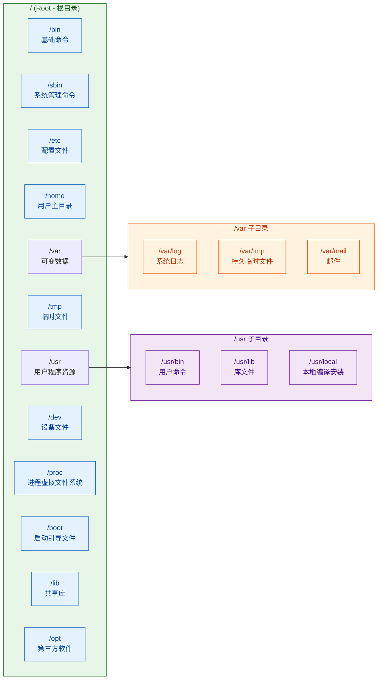

#### `/` — 根目录（Root Directory）

根目录是整棵文件树的**唯一起点**。Linux 中不存在 `C:\` 或 `D:\` 这样的多根概念。无论你插入多少块硬盘、挂载多少个 USB 设备，它们最终都会被"挂载（mount）"到这棵树的某个节点上。你可以把 `/` 想象成一棵大树的树根，所有的分支都从这里长出。

```bash
# 查看根目录下有哪些内容
ls /
# 典型输出：bin  boot  dev  etc  home  lib  media  mnt  opt  proc  root  run  sbin  srv  sys  tmp  usr  var
```

一个常见的初学者困惑是 `/`（根目录）和 `/root` 的区别：
- **`/`**：整个文件系统的顶层目录，包含所有东西。
- **`/root`**：超级管理员（root 用户）的**家目录（home directory）**，类似普通用户的 `/home/username`。

#### `/home` — 用户主目录

`/home` 是所有**普通用户**的个人空间容器。当系统管理员创建一个新用户时（例如 `useradd alice`），系统会自动在 `/home` 下创建一个同名子目录 `/home/alice`，作为该用户的"家"。

```bash
# 查看 /home 下的所有用户目录
ls /home
# 输出示例：alice  bob  charlie

# 每个用户登录后，默认进入自己的家目录
# 波浪号 ~ 是家目录的快捷表示
cd ~           # 等同于 cd /home/当前用户名
pwd            # 输出：/home/alice
```

用户在自己的家目录下拥有完全的读写权限，可以自由创建文件、安装个人配置（如 `.bashrc`、`.vimrc`）。而对其他用户的家目录，通常只有有限的访问权限，这正是 Linux 多用户安全模型的体现。

家目录下常见的隐藏配置文件（以 `.` 开头的文件，`ls -a` 可查看）：

| 文件 / 目录 | 作用 |
|---|---|
| `~/.bashrc` | Bash Shell 的用户级配置，每次打开终端时自动执行 |
| `~/.profile` | 登录时执行的环境变量配置 |
| `~/.ssh/` | 存放 SSH 密钥对（`id_rsa`、`id_rsa.pub`）和已知主机列表 |
| `~/.config/` | 遵循 XDG 规范的应用配置目录 |
| `~/.local/` | 用户级本地安装的程序和数据 |

#### `/etc` — 系统配置文件（Editable Text Configuration）

`/etc` 可以被理解为整个 Linux 系统的"控制面板"。几乎所有的系统级配置都以**纯文本文件**的形式存放在这里。这体现了 Unix 哲学的另一个核心原则：**用纯文本存储配置，方便人类阅读和自动化脚本处理**。

```bash
# 查看 /etc 下的部分重要文件
ls /etc
```

以下是 `/etc` 中最常见、最重要的配置文件一览：

| 文件路径 | 功能说明 |
|---|---|
| `/etc/passwd` | 用户账号信息（用户名、UID、GID、家目录、默认 Shell） |
| `/etc/shadow` | 用户密码的加密哈希（仅 root 可读，安全性关键文件） |
| `/etc/group` | 用户组定义 |
| `/etc/hostname` | 主机名 |
| `/etc/hosts` | 本地 DNS 映射（IP → 域名） |
| `/etc/fstab` | 文件系统挂载表（File System Table），开机自动挂载的磁盘配置 |
| `/etc/resolv.conf` | DNS 解析服务器配置 |
| `/etc/ssh/sshd_config` | SSH 服务端配置 |
| `/etc/crontab` | 系统级定时任务配置 |
| `/etc/systemd/` | Systemd 服务管理器的配置目录 |

让我们看一个 `/etc/passwd` 的真实示例来理解它的格式：

```bash
# 查看 passwd 文件的某一行
cat /etc/passwd | grep alice
# 输出示例：
# alice:x:1001:1001:Alice Smith:/home/alice:/bin/bash
#  ①    ②  ③    ④      ⑤          ⑥         ⑦
# ① 用户名
# ② 密码占位符 (实际密码存储在 /etc/shadow 中)
# ③ UID (User ID，用户标识)
# ④ GID (Group ID，主组标识)
# ⑤ GECOS 字段 (用户备注/全名)
# ⑥ 家目录路径
# ⑦ 默认登录 Shell
```

> **安全提示**：早期 Unix 系统直接将密码存储在 `/etc/passwd` 中，因为该文件对所有用户可读，密码极易被暴力破解。现代 Linux 将密码哈希迁移到了 `/etc/shadow`（仅 root 可读，权限为 `640` 或 `600`），这就是所谓的 **Shadow Password** 机制。

#### `/var` — 可变数据（Variable Data）

`/var` 存放在系统运行过程中**内容持续变化**的数据。如果说 `/etc` 是"静态配置"，那 `/var` 就是"动态数据"。

```bash
# 查看 /var 下的典型子目录
ls /var
# 输出示例：cache  lib  lock  log  mail  opt  run  spool  tmp
```

最重要的子目录及用途：

| 目录 | 说明 |
|---|---|
| `/var/log/` | **系统日志中心**，排查问题的第一去处 |
| `/var/log/syslog` | 通用系统日志（Ubuntu/Debian 系） |
| `/var/log/messages` | 通用系统日志（CentOS/RHEL 系） |
| `/var/log/auth.log` | 认证日志（SSH 登录、sudo 操作等） |
| `/var/log/kern.log` | 内核日志 |
| `/var/cache/` | 应用程序缓存（如 apt 下载的 `.deb` 包） |
| `/var/lib/` | 应用程序的持久状态数据（如数据库文件） |
| `/var/tmp/` | 持久临时文件（重启后仍保留，区别于 `/tmp`） |
| `/var/spool/` | 排队等待处理的任务（如打印队列、邮件队列） |

一个运维中的经典问题是 **`/var/log` 占满磁盘空间导致系统异常**。日志文件会随时间增长，如果没有配置日志轮转（`logrotate`），日志可能膨胀到数十 GB，耗尽磁盘。

```bash
# 查看 /var/log 下各文件的大小，按大小排序
du -sh /var/log/* | sort -rh | head -10
# 输出示例：
# 2.1G    /var/log/syslog
# 500M    /var/log/auth.log
# 120M    /var/log/kern.log
# ...
```

#### 其他重要目录速览

除了上述四个核心目录外，还有几个目录在日常使用和面试中频繁出现：

| 目录 | 说明 |
|---|---|
| `/bin` | 基础用户命令（`ls`、`cp`、`mv`、`cat`），单用户/救援模式下也可用 |
| `/sbin` | 系统管理命令（`fdisk`、`iptables`、`reboot`），通常需要 root 权限 |
| `/usr` | 用户空间程序和数据的**二级层次结构**（`/usr/bin`、`/usr/lib`、`/usr/share`） |
| `/usr/local` | 管理员手动编译安装的软件（不受包管理器管理） |
| `/dev` | 设备文件（`/dev/sda` 磁盘、`/dev/null` 黑洞、`/dev/tty` 终端） |
| `/proc` | **虚拟文件系统**，实时反映内核和进程状态（`/proc/cpuinfo`、`/proc/meminfo`） |
| `/tmp` | 临时文件，任何用户可写，重启后通常被清空 |
| `/boot` | 内核镜像（`vmlinuz`）和引导加载器（GRUB）配置 |
| `/lib` | 系统核心共享库（`.so` 文件，类似 Windows 的 `.dll`） |
| `/mnt`、`/media` | 手动挂载点 / 可移动设备自动挂载点 |
| `/opt` | 第三方商业软件或大型独立应用的安装目录 |

> **现代趋势**：在较新的发行版（如 Fedora、Arch、Ubuntu 20.04+）中，`/bin` 实际上已经是 `/usr/bin` 的符号链接，`/sbin` 也是 `/usr/sbin` 的符号链接。这种被称为 **UsrMerge** 的变革，旨在简化文件系统布局。

---

### 文件类型

在 Linux 中，文件类型远比 Windows 丰富。Windows 主要依赖**文件扩展名**（`.txt`、`.exe`）来区分类型，而 Linux **不依赖扩展名**——文件类型由其在文件系统中的**元数据（inode 信息）**决定。Linux 共定义了 **7 种文件类型**，每种都有独特的用途和标识符。

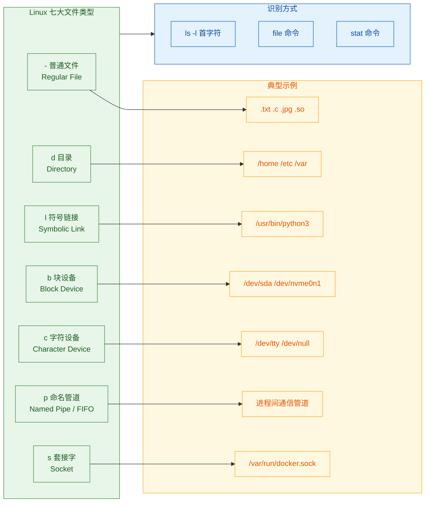

#### ① 普通文件（Regular File） — 标识符 `-`

这是最常见的文件类型，包含实际的数据内容。无论是文本文件、二进制可执行文件、图片、压缩包还是共享库，在 Linux 眼中都是"普通文件"。

```bash
# 创建一个普通文本文件
echo "Hello, Linux!" > hello.txt

# 使用 ls -l 查看，第一个字符为 '-'
ls -l hello.txt
# -rw-r--r-- 1 alice alice 14 Jan 10 10:00 hello.txt
# ^
# '- ' 表示这是一个普通文件

# 使用 file 命令查看更详细的类型信息
file hello.txt
# hello.txt: ASCII text

file /usr/bin/ls
# /usr/bin/ls: ELF 64-bit LSB pie executable, x86-64 ...
# ELF 是 Linux 可执行文件的标准格式 (Executable and Linkable Format)
```

Linux 不像 Windows 那样严格依赖扩展名。你可以把一个可执行文件命名为 `game.txt`，它照样能运行（只要有执行权限）。`file` 命令通过分析文件的 **Magic Number（魔数）**——即文件头部的特定字节序列——来判断真实类型。

#### ② 目录（Directory） — 标识符 `d`

目录在 Linux 中本质上是一种**特殊的文件**，它的"内容"是一张**文件名 → inode 编号的映射表**。当你执行 `ls` 命令时，系统读取的就是这张表。

```bash
ls -ld /home
# drwxr-xr-x 5 root root 4096 Jan 10 10:00 /home
# ^
# 'd' 表示这是一个目录

# 目录的"大小"并不是其内部文件大小之和
# 而是目录文件本身（即映射表）占用的磁盘空间
```

```text
┌──────────────────────────────────────┐
│        目录 /home 的内部结构          │
│  (本质是一张 name → inode 映射表)     │
├────────────┬─────────────────────────┤
│  文件名     │  inode 编号             │
├────────────┼─────────────────────────┤
│  .          │  131073  (指向自身)     │
│  ..         │  2       (指向父目录 /) │
│  alice      │  262145                │
│  bob        │  393217                │
└────────────┴─────────────────────────┘
```

每个目录都包含两个特殊条目：
- **`.`（点）**：指向目录自身。
- **`..`（双点）**：指向父目录。根目录 `/` 的 `..` 指向自身（因为它没有父目录）。

#### ③ 符号链接（Symbolic Link） — 标识符 `l`

符号链接类似于 Windows 的"快捷方式"，它存储的是**目标文件的路径字符串**，而非实际数据。访问符号链接时，系统会自动跳转到目标文件。

```bash
# 创建符号链接：ln -s <目标> <链接名>
ln -s /usr/bin/python3 ~/my_python

# 查看符号链接
ls -l ~/my_python
# lrwxrwxrwx 1 alice alice 16 Jan 10 10:00 my_python -> /usr/bin/python3
# ^
# 'l' 表示符号链接，箭头指向目标

# 如果目标文件被删除，符号链接就会变成"悬空链接 (dangling link)"
rm /usr/bin/python3
ls -l ~/my_python
# lrwxrwxrwx 1 alice alice 16 Jan 10 10:00 my_python -> /usr/bin/python3  (红色闪烁，表示目标不存在)
```

与符号链接相对的是 **硬链接（Hard Link）**，它直接指向目标文件的 **inode**，不是路径。两者的核心区别：

| 特性 | 符号链接（Soft Link） | 硬链接（Hard Link） |
|---|---|---|
| 本质 | 存储目标路径的特殊文件 | 同一 inode 的另一个名字 |
| 跨文件系统 | ✅ 可以 | ❌ 不可以 |
| 链接目录 | ✅ 可以 | ❌ 不可以（防止循环） |
| 目标删除后 | 变为悬空链接（失效） | 仍然可用（inode 引用计数 > 0） |
| `ls -l` 标识 | `l` | `-`（和普通文件一样） |

```bash
# 硬链接示例
echo "original content" > original.txt     # 创建原始文件
ln original.txt hardlink.txt               # 创建硬链接 (不需要 -s)

ls -li original.txt hardlink.txt           # -i 显示 inode 编号
# 131074 -rw-r--r-- 2 alice alice 17 Jan 10 10:00 hardlink.txt
# 131074 -rw-r--r-- 2 alice alice 17 Jan 10 10:00 original.txt
#   ^                ^
# 相同 inode          引用计数为 2（有两个名字指向同一 inode）

rm original.txt                            # 删除原始文件
cat hardlink.txt                           # 硬链接仍然可以正常读取
# original content                         # 数据完好，因为 inode 引用计数从 2 降为 1，未归零
```

#### ④ 块设备文件（Block Device） — 标识符 `b`

块设备以**固定大小的数据块（block）**为单位进行 I/O 操作，支持**随机访问（random access）**。最典型的块设备就是硬盘和 SSD。

```bash
ls -l /dev/sda
# brw-rw---- 1 root disk 8, 0 Jan 10 10:00 /dev/sda
# ^                        ^^^^
# 'b' 块设备                主设备号=8, 次设备号=0

# /dev/sda  -> 第一块 SCSI/SATA 硬盘（整盘）
# /dev/sda1 -> 第一块硬盘的第一个分区
# /dev/sda2 -> 第一块硬盘的第二个分区
# /dev/nvme0n1 -> 第一块 NVMe SSD
```

设备文件不包含实际数据，而是充当用户空间程序与**内核设备驱动**之间的接口。主设备号（Major Number）标识驱动程序类型，次设备号（Minor Number）标识具体设备实例。

#### ⑤ 字符设备文件（Character Device） — 标识符 `c`

字符设备以**单个字符（字节）**为单位进行 I/O，通常是**顺序访问**的流式设备。

```bash
ls -l /dev/null /dev/tty /dev/random
# crw-rw-rw- 1 root root 1, 3 Jan 10 10:00 /dev/null
# crw-rw-rw- 1 root tty  5, 0 Jan 10 10:00 /dev/tty
# crw-rw-rw- 1 root root 1, 8 Jan 10 10:00 /dev/random
# ^
# 'c' 字符设备
```

几个最常用的字符设备：

| 设备 | 功能 | 典型用途 |
|---|---|---|
| `/dev/null` | "黑洞"，写入的任何数据被丢弃，读取立即返回 EOF | 丢弃不需要的输出：`cmd 2>/dev/null` |
| `/dev/zero` | 无限输出 `\0`（零字节）的流 | 生成空白文件：`dd if=/dev/zero of=file bs=1M count=100` |
| `/dev/random` | 从内核熵池生成真随机数（阻塞式） | 密码学安全随机数 |
| `/dev/urandom` | 非阻塞式伪随机数 | 一般用途随机数 |
| `/dev/tty` | 当前进程的控制终端 | 强制从终端读取输入 |

#### ⑥ 命名管道（Named Pipe / FIFO） — 标识符 `p`

命名管道是一种**进程间通信（IPC, Inter-Process Communication）**机制，允许两个不相关的进程通过一个文件系统中的节点进行数据传输。数据遵循 **FIFO（First In, First Out）** 原则。

```bash
# 创建命名管道
mkfifo my_pipe

ls -l my_pipe
# prw-r--r-- 1 alice alice 0 Jan 10 10:00 my_pipe
# ^
# 'p' 表示命名管道

# 终端 1（写端）：向管道写入数据
echo "Hello from Terminal 1" > my_pipe    # 会阻塞，直到有进程从另一端读取

# 终端 2（读端）：从管道读取数据
cat < my_pipe                             # 读出 "Hello from Terminal 1"
```

与 Shell 中的匿名管道 `|`（如 `ls | grep txt`）不同，命名管道存在于文件系统中，可以被任何知道路径的进程访问。

#### ⑦ 套接字文件（Socket） — 标识符 `s`

套接字文件用于**本机进程间通信（Unix Domain Socket）**，比 TCP/IP 回环（`localhost:port`）效率更高，因为它不经过网络协议栈。

```bash
ls -l /var/run/docker.sock
# srw-rw---- 1 root docker 0 Jan 10 10:00 /var/run/docker.sock
# ^
# 's' 表示套接字文件

# Docker 客户端正是通过这个 socket 文件与 Docker 守护进程通信
# 这也是为什么使用 Docker 通常需要将用户加入 docker 组
```

常见的 Unix Domain Socket 文件还包括：
- `/var/run/mysqld/mysqld.sock` — MySQL 本地连接
- `/tmp/.X11-unix/X0` — X Window 图形显示服务器

#### 快速识别文件类型的方法汇总

```bash
# 方法一：ls -l 看首字符
ls -l /dev/sda                # b -> 块设备
ls -l /etc/hostname           # - -> 普通文件
ls -ld /home                  # d -> 目录

# 方法二：file 命令（最智能，分析文件内容）
file /bin/ls                  # ELF 64-bit LSB executable ...
file /etc/passwd              # ASCII text
file /dev/null                # character special (1/3)

# 方法三：stat 命令（最详细，显示 inode 元信息）
stat /etc/hostname
# 输出包含：File type, Inode number, Links count, Access/Modify/Change time 等
```

用一张简洁的速查表收尾：

| 标识符 | 类型 | 英文名 | 一句话记忆 |
|:---:|---|---|---|
| `-` | 普通文件 | Regular File | 存数据的容器 |
| `d` | 目录 | Directory | 文件名到 inode 的映射表 |
| `l` | 符号链接 | Symbolic Link | 存路径的快捷方式 |
| `b` | 块设备 | Block Device | 磁盘、按块随机读写 |
| `c` | 字符设备 | Character Device | 终端、按字节顺序读写 |
| `p` | 命名管道 | Named Pipe (FIFO) | 先进先出的进程通信通道 |
| `s` | 套接字 | Socket | 高效的本地进程通信端点 |

---

**📝 练习题**

Linux 系统中，管理员发现 `/var/log/syslog` 文件已经膨胀到 10GB，导致磁盘空间不足。以下关于该情况的描述，哪项是**正确**的？

A. `/var/log/syslog` 是一个字符设备文件，使用 `mknod` 命令重建即可释放空间

B. `/var` 目录用于存放系统运行中持续变化的数据，日志膨胀是该目录的典型问题，应配置 `logrotate` 进行日志轮转

C. 日志文件存放在 `/etc/log/` 目录下，管理员应去 `/etc/log/` 查找和清理

D. 直接执行 `rm /var/log/syslog` 即可，系统会自动重新创建一个空的日志文件且日志服务不受影响


**【答案】** B

**【解析】** `/var` 目录的设计用途就是存放系统运行过程中不断变化的数据（variable data），其中 `/var/log/` 是系统日志的标准存放位置，日志随时间增长是其天然特性。正确的运维做法是配置 `logrotate`（日志轮转工具），它会按时间或文件大小自动将旧日志归档压缩、删除过期日志。选项 A 错误，日志文件是普通文件（`-`），而非字符设备。选项 C 错误，日志在 `/var/log/` 而不是 `/etc/log/`（`/etc` 存放的是配置文件）。选项 D 的做法非常危险——如果日志服务（如 `rsyslog`）正持有该文件的文件描述符（file descriptor），直接 `rm` 只是删除了目录条目，inode 引用计数不归零，磁盘空间**不会被释放**，直到该进程关闭文件句柄。正确做法是先清空内容（`> /var/log/syslog` 或 `truncate -s 0 /var/log/syslog`），或者使用 `logrotate` 配合服务重载。

---

## 文件权限 ⭐

Linux 是一个多用户操作系统（Multi-user OS），这意味着同一台机器上可能有数十甚至数百个用户同时登录和操作。在这样的环境下，**文件权限（File Permissions）** 就成了操作系统安全模型的基石——它决定了"谁能对哪个文件做什么事"。如果没有权限机制，任何用户都可以随意读取他人的隐私文件、篡改系统配置，甚至删除关键的内核文件，整个系统将不堪一击。

Linux 的权限模型继承自 Unix，其设计哲学是 **"Everything is a file"**。目录是文件，设备是文件，管道也是文件——所以权限系统几乎覆盖了操作系统中的一切资源。理解文件权限，不仅是 Linux 日常运维的基本功，更是理解操作系统**访问控制（Access Control）** 思想的关键入口。

### rwx（读/写/执行）

Linux 为每个文件定义了三种最基本的权限类型：**读（Read）**、**写（Write）** 和 **执行（Execute）**，简写为 `r`、`w`、`x`。它们在**普通文件**和**目录**上的语义有本质区别，这是很多初学者容易混淆的地方。

#### 对普通文件的含义

| 权限 | 符号 | 八进制值 | 含义 |
|:----:|:----:|:-------:|------|
| 读   | `r`  | `4`     | 可以查看文件内容（如 `cat`、`less`、`head`） |
| 写   | `w`  | `2`     | 可以修改文件内容（如 `vim` 编辑、`echo >>` 追加） |
| 执行 | `x`  | `1`     | 可以将文件作为程序运行（如 `./script.sh`） |

一个典型的例子：你写了一个 Shell 脚本 `deploy.sh`，即使脚本内容完全正确，如果没有 `x` 权限，系统会直接拒绝执行并抛出 `Permission denied`。

```bash
# 尝试直接运行一个没有执行权限的脚本
$ ./deploy.sh
# bash: ./deploy.sh: Permission denied   <-- 缺少 x 权限

# 赋予执行权限后再运行
$ chmod +x deploy.sh                     # 添加执行权限
$ ./deploy.sh                            # 现在可以正常运行了
```

#### 对目录的含义（易混淆重点）

目录的权限语义与普通文件**完全不同**，这是考试和面试的高频考点：

| 权限 | 对目录的含义 | 具体表现 |
|:----:|:------------|---------|
| `r`  | 可以**列出**目录中的文件名 | 允许执行 `ls` 查看目录内容 |
| `w`  | 可以**增删改**目录中的条目 | 允许 `touch`/`rm`/`mv` 在该目录下创建、删除、重命名文件 |
| `x`  | 可以**进入**该目录 | 允许 `cd` 进入该目录，也是访问目录内文件的**前提条件** |

这里有一个非常反直觉的设计：**对目录有 `w` 权限，就能删除目录中的任何文件，哪怕你对那个文件本身没有任何权限。** 因为"删除文件"本质上是修改目录的条目列表（即目录的"内容"），而非修改文件本身。

```bash
# 实验：目录权限 vs 文件权限的优先关系
$ ls -la /tmp/testdir/
# drwxrwxrwx  2 root root  4096 ...  .        <-- 目录对所有人开放 w 权限
# -r--------  1 root root    13 ...  secret   <-- 文件仅 root 可读

$ whoami
# student                                      # 当前用户是 student

$ cat /tmp/testdir/secret
# cat: /tmp/testdir/secret: Permission denied  # 无法读取文件内容 ✗

$ rm /tmp/testdir/secret
# rm: remove write-protected file? y
# (文件被成功删除!)                              # 但可以删除文件 ✓ (因为目录有 w)
```

> ⚠️ 这就是为什么 `/tmp` 目录要设置 **Sticky Bit（粘滞位）** 的原因——防止用户删除其他人的临时文件。后面会详细解释。

#### 权限的二进制本质

Linux 内部使用 **位掩码（Bitmask）** 来存储权限，每个权限对应一个 bit。这也是八进制表示法的由来：

```text
  r   w   x
  4   2   1     <-- 十进制权重
  1   1   1     <-- 二进制位
```

三个 bit 恰好对应八进制的 0~7，所以 `rwx = 4+2+1 = 7`，`r-x = 4+0+1 = 5`，`rw- = 4+2+0 = 6`。这个映射关系必须烂熟于心：

| 八进制 | 二进制 | 权限符号 | 含义 |
|:------:|:------:|:--------:|------|
| `0`    | `000`  | `---`    | 无任何权限 |
| `1`    | `001`  | `--x`    | 仅执行 |
| `2`    | `010`  | `-w-`    | 仅写 |
| `3`    | `011`  | `-wx`    | 写+执行 |
| `4`    | `100`  | `r--`    | 仅读 |
| `5`    | `101`  | `r-x`    | 读+执行 |
| `6`    | `110`  | `rw-`    | 读+写 |
| `7`    | `111`  | `rwx`    | 读+写+执行（完全权限） |

### 用户/组/其他（Owner / Group / Others）

Linux 的权限模型将所有访问者分为三个层级，每个层级独立拥有一组 `rwx` 权限：

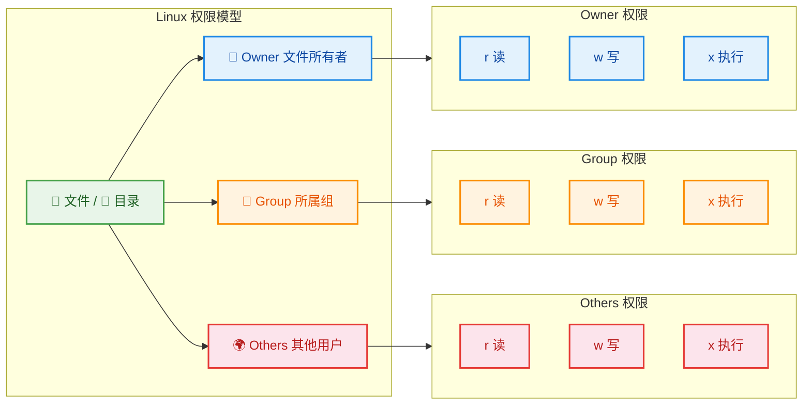

#### 三类角色详解

**① Owner（文件所有者，符号 `u`）**

每个文件有且仅有一个 Owner。默认情况下，**谁创建了文件，谁就是 Owner**。Owner 拥有对文件最高级别的控制权——即便 Owner 把自己的 `rwx` 全部去掉，他仍然可以通过 `chmod` 把权限加回来（因为权限修改权属于 Owner 的特权，不受 `rwx` 限制）。

```bash
# 查看文件的 Owner
$ ls -l config.yaml
# -rw-r--r--  1  alice  devteam  256  Jun 10 14:30  config.yaml
#                ^^^^^  ^^^^^^^
#                Owner  Group
```

**② Group（所属组，符号 `g`）**

Linux 中的每个用户可以属于一个或多个**用户组（Group）**。文件的所属组决定了该组内所有成员的权限。这是 Linux 实现**团队协作**的核心机制——同一个开发团队的成员被加入同一个组，就可以共享项目文件的读写权限，而不用逐一给每个人设置。

```bash
# 查看当前用户所属的所有组
$ groups
# alice devteam docker sudo

# 查看系统中某个组的所有成员
$ getent group devteam
# devteam:x:1001:alice,bob,charlie
```

**③ Others（其他用户，符号 `o`）**

既不是 Owner、也不属于 Group 的所有用户。在一个数百人的服务器上，Others 通常代表绝大多数用户，因此 **Others 权限通常设置得最严格**。

#### 权限字符串的完整解读

当执行 `ls -l` 时，输出的第一列就是完整的权限字符串，共 10 个字符：

```text
-  rwx  r-x  r--
│  ───  ───  ───
│   │    │    └── Others 权限: r-- (仅读)
│   │    └─────── Group  权限: r-x (读+执行)
│   └──────────── Owner  权限: rwx (完全权限)
└──────────────── 文件类型: - 普通文件 / d 目录 / l 链接
```

完整的文件类型标识符列表：

| 字符 | 类型 | 说明 |
|:----:|------|------|
| `-`  | 普通文件 | Regular file |
| `d`  | 目录 | Directory |
| `l`  | 符号链接 | Symbolic link |
| `c`  | 字符设备 | Character device（如终端 `/dev/tty`） |
| `b`  | 块设备 | Block device（如硬盘 `/dev/sda`） |
| `p`  | 命名管道 | Named pipe (FIFO) |
| `s`  | 套接字 | Unix domain socket |

#### 权限判定流程

当一个用户试图访问某个文件时，内核按以下**严格顺序**进行判定，一旦匹配就停止：

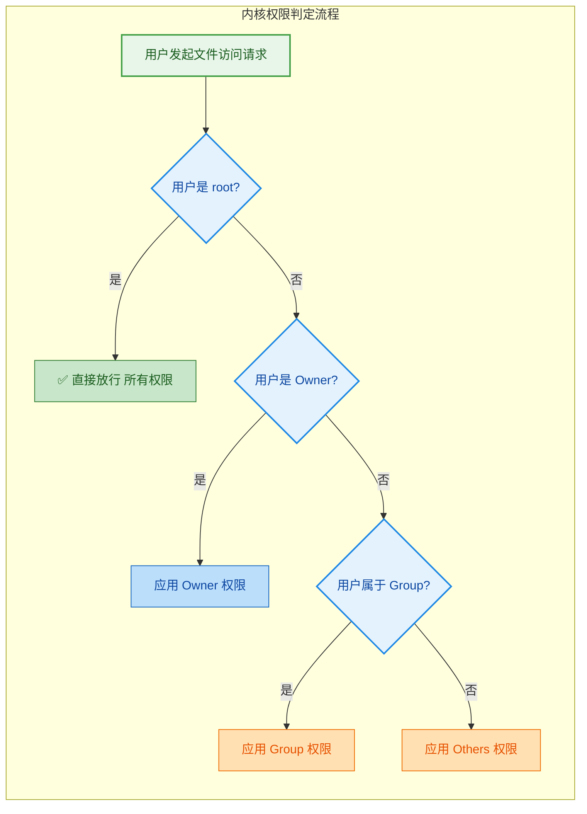

这个流程有一个极其重要的 **"陷阱"**：**如果你既是 Owner 又属于 Group，内核只会检查 Owner 权限，不会看 Group 权限。** 这意味着以下诡异场景是完全可能的：

```bash
# alice 既是 Owner 又在 devteam 组中
$ ls -l report.txt
# ----rwx---  1  alice  devteam  1024  ...  report.txt

# alice 尝试读取自己的文件
$ cat report.txt
# Permission denied!
# 原因: alice 匹配到 Owner (---), 没有 r 权限
# 即使 Group (rwx) 完全开放, 也不会被使用!
```

这个行为是 POSIX 标准规定的：**匹配到哪一级，就只看那一级的权限，绝不"降级"查看下一级。**

#### 特殊权限位

除了基础的 9 位权限（3×3），Linux 还有三个**特殊权限位**，用于解决更复杂的安全需求：

| 特殊位 | 八进制 | 符号 | 作用对象 | 功能 |
|:------:|:------:|:----:|:--------:|------|
| **SUID** | `4000` | `s`（替代 Owner 的 `x`） | 可执行文件 | 执行时以**文件 Owner** 的身份运行，而非当前用户 |
| **SGID** | `2000` | `s`（替代 Group 的 `x`） | 可执行文件/目录 | 执行时以**文件 Group** 身份运行；对目录则使新建文件继承目录的组 |
| **Sticky Bit** | `1000` | `t`（替代 Others 的 `x`） | 目录 | 目录中的文件只能被 **Owner 或 root** 删除 |

**SUID 的经典案例：`passwd` 命令**

普通用户可以修改自己的密码，但密码存储在 `/etc/shadow` 中，该文件只有 root 才能写入。这个矛盾通过 SUID 解决：

```bash
$ ls -l /usr/bin/passwd
# -rwsr-xr-x  1  root  root  68208  ...  /usr/bin/passwd
#    ^
#    s = SUID 被设置

# 当普通用户执行 passwd 时:
# 1. 进程的 Effective UID 临时变为 root (文件 Owner)
# 2. 进程以 root 权限写入 /etc/shadow
# 3. 执行完毕后权限恢复
```

**Sticky Bit 的经典案例：`/tmp` 目录**

```bash
$ ls -ld /tmp
# drwxrwxrwt  24  root  root  4096  ...  /tmp
#          ^
#          t = Sticky Bit 被设置

# 效果: 所有用户都能在 /tmp 中创建文件
# 但只能删除自己创建的文件, 不能删除别人的
```

### chmod 命令

`chmod`（**ch**ange file **mod**e）是修改文件权限的核心命令。它支持两种语法：**符号模式（Symbolic Mode）** 和 **八进制模式（Octal Mode）**。

#### 符号模式（直观灵活）

语法结构：`chmod [who][operator][permission] file`

```text
WHO（谁）    OPERATOR（操作）    PERMISSION（权限）
─────────    ─────────────────    ──────────────────
u = Owner    + = 添加权限         r = 读
g = Group    - = 移除权限         w = 写
o = Others   = = 精确设置         x = 执行
a = All                          s = SUID/SGID
                                 t = Sticky Bit
```

```bash
# ---- 常用示例 ----

# 给 Owner 添加执行权限
$ chmod u+x script.sh          # Owner: --- → --x (叠加)

# 给所有人添加读权限
$ chmod a+r document.txt        # 所有角色都获得 r

# 移除 Others 的写和执行权限
$ chmod o-wx config.yaml        # Others: rwx → r--

# 精确设置: Owner 读写执行, Group 读执行, Others 仅读
$ chmod u=rwx,g=rx,o=r app.bin  # 结果: rwxr-xr-- (等价于 754)

# 同时操作多个角色
$ chmod ug+rw shared.txt        # Owner 和 Group 都添加读写

# 设置 SUID
$ chmod u+s /usr/local/bin/tool # 设置 SUID 位

# 设置 Sticky Bit
$ chmod +t /shared/tmp          # 设置粘滞位
```

#### 八进制模式（简洁高效）

语法：`chmod [特殊位][Owner][Group][Others] file`

每个数字都是 `r(4) + w(2) + x(1)` 的累加：

```bash
# ---- 常用八进制权限 ----

$ chmod 755 app.bin
#       ^^^
#       │││
#       ││└─ Others:  r-x (4+0+1=5)
#       │└── Group:   r-x (4+0+1=5)
#       └─── Owner:   rwx (4+2+1=7)
# 最终权限: -rwxr-xr-x
# 适用场景: 可执行程序、脚本、目录

$ chmod 644 readme.md
# 最终权限: -rw-r--r--
# 适用场景: 普通文件(Owner可写, 其他人只读)

$ chmod 600 id_rsa
# 最终权限: -rw-------
# 适用场景: SSH 私钥、敏感配置文件(仅 Owner 可读写)

$ chmod 700 .ssh/
# 最终权限: drwx------
# 适用场景: SSH 目录(仅 Owner 可进入)

$ chmod 4755 /usr/local/bin/tool
#       ^^^^
#       │
#       └─── 4 = SUID
# 最终权限: -rwsr-xr-x

$ chmod 1777 /tmp
#       ^^^^
#       │
#       └─── 1 = Sticky Bit
# 最终权限: drwxrwxrwt
```

#### 生产环境常见权限速查

| 场景 | 八进制 | 符号表示 | 说明 |
|------|:------:|----------|------|
| Web 静态文件 | `644` | `-rw-r--r--` | 服务进程可读即可 |
| Web 目录 | `755` | `drwxr-xr-x` | 服务进程可进入、列出 |
| 脚本/可执行文件 | `755` | `-rwxr-xr-x` | 所有人可执行 |
| SSH 私钥 | `600` | `-rw-------` | **必须**，否则 SSH 拒绝使用 |
| `.ssh/` 目录 | `700` | `drwx------` | **必须**，否则 SSH 拒绝连接 |
| `/etc/shadow` | `640` | `-rw-r-----` | 密码哈希文件，极度敏感 |
| 共享目录 | `1777` | `drwxrwxrwt` | 如 `/tmp`，Sticky Bit 防删 |

#### 递归修改与 chown 配合

```bash
# -R 递归修改目录下所有文件和子目录的权限
$ chmod -R 755 /var/www/html/    # 递归设置整个 Web 目录

# 更精细的做法: 目录和文件分开设置
$ find /var/www -type d -exec chmod 755 {} \;   # 所有目录设为 755
$ find /var/www -type f -exec chmod 644 {} \;   # 所有文件设为 644
# 原因: 目录需要 x 权限才能进入, 但普通文件不需要 x

# chown 修改文件的 Owner 和 Group
$ chown alice:devteam project/   # 修改 Owner 为 alice, Group 为 devteam
$ chown -R www-data:www-data /var/www/  # 递归修改整个 Web 目录的归属
```

#### umask：默认权限的幕后控制者

当你创建一个新文件时，它的权限并非随机，而是由 **umask（user file-creation mode mask）** 决定：

```text
最终权限 = 基础权限 - umask

文件基础权限: 666 (rw-rw-rw-)    ← 文件默认不给 x，安全考虑
目录基础权限: 777 (rwxrwxrwx)
```

```bash
# 查看当前 umask
$ umask
# 0022                              # 常见默认值

# 计算过程:
# 新建文件: 666 - 022 = 644 → -rw-r--r--
# 新建目录: 777 - 022 = 755 → drwxr-xr-x

$ touch newfile.txt
$ ls -l newfile.txt
# -rw-r--r--  1 alice alice  0  ...  newfile.txt   ← 确认为 644

$ mkdir newdir
$ ls -ld newdir
# drwxr-xr-x  2 alice alice  4096  ...  newdir      ← 确认为 755

# 修改 umask (仅对当前 Shell 会话生效)
$ umask 077                         # 更严格: 仅 Owner 有权限
# 新建文件: 666 - 077 = 600 → -rw-------
# 新建目录: 777 - 077 = 700 → drwx------
```

> ⚠️ 严格来说，umask 的计算不是简单的十进制减法，而是**按位取反再与（AND NOT）**。例如 `umask 033` 时，新建文件权限是 `666 & ~033 = 666 & 744 = 644`，而不是 `633`。不过在绝大多数常见场景下，减法的结果与位运算一致。

---

**📝 练习题**

某 Linux 系统中，文件 `data.csv` 的权限为 `-rw-r-----`，Owner 是 `alice`，Group 是 `analysts`。用户 `bob` 属于 `analysts` 组。现在执行以下命令：

```bash
chmod 640 data.csv
```

以下哪项描述是**正确**的？


A. `bob` 可以读取和写入 `data.csv`


B. `bob` 可以读取 `data.csv`，但不能写入


C. `alice` 可以读取、写入和执行 `data.csv`


D. 不属于 `analysts` 组的其他用户可以读取 `data.csv`


**【答案】** B

**【解析】** `chmod 640` 对应权限 `-rw-r-----`：Owner（`alice`）拥有 `rw-`（读写），Group（`analysts`）拥有 `r--`（仅读），Others 拥有 `---`（无权限）。`bob` 属于 `analysts` 组，匹配 Group 权限，因此只能读取、不能写入。选项 A 错误，因为 Group 没有 `w`；选项 C 错误，因为 Owner 没有 `x`（执行）权限；选项 D 错误，因为 Others 权限为 `---`，完全没有任何访问权限。实际上本题的 `chmod 640` 与文件原有权限 `-rw-r-----` 完全相同，权限没有发生变化，这也是一个值得注意的细节——`chmod` 是**精确设置**而非叠加。

---

**📝 练习题**

在一台 Linux 服务器上，`/projects` 目录的权限为 `drwxrwx---`，Owner 是 `root`，Group 是 `devteam`。目录内有一个文件 `todo.txt`，权限为 `-rw-------`，Owner 是 `charlie`。用户 `dave` 属于 `devteam` 组但不是 `charlie`。请问 `dave` 能否删除 `todo.txt`？


A. 不能，因为 `dave` 对 `todo.txt` 没有任何权限


B. 不能，因为 `dave` 不是 `todo.txt` 的 Owner


C. 可以，因为 `dave` 对 `/projects` 目录有写权限


D. 可以，因为 `dave` 属于 `devteam` 组，对 `todo.txt` 有隐式权限


**【答案】** C

**【解析】** 删除文件的本质是**修改其所在目录的条目**，因此只需要对**目录**拥有 `w`（写）和 `x`（进入）权限即可，与目标文件本身的权限无关。`dave` 属于 `devteam` 组，对 `/projects` 拥有 `rwx` 权限，因此完全可以删除目录内的任何文件——即使他对 `todo.txt` 本身没有任何权限（`---`）。这正是前文提到的"反直觉设计"。如果要防止这种行为，需要在 `/projects` 上设置 **Sticky Bit**（`chmod +t /projects`），设置后只有文件 Owner、目录 Owner 或 root 才能删除文件。

---

## 常用命令 ⭐

Linux 的哲学核心之一是 **"Everything is a file"**，而与文件、进程打交道的方式，就是通过 **命令行（Command Line）**。熟练掌握常用命令是操作系统学习的基本功，也是后续理解进程管理、文件系统、Shell 脚本等高级主题的前提。本节将按照功能域将命令分为四大类：**目录与文件操作**、**文本处理与搜索**、**进程监控与管理**、**权限变更**，逐一进行深入讲解。


---

### ls / cd / pwd / mkdir / rm — 目录与文件操作

这五个命令是你在终端中"行走"的双脚和双手。它们解决的是最基本的问题：**我在哪？这里有什么？怎么去别处？怎么创建和删除东西？**

#### ls — 列出目录内容（List）

`ls` 是你登录终端后最先也最频繁使用的命令。它读取目录的 **目录项（directory entry）**，将文件名、元数据等展示出来。

```bash
# 最基础的用法：列出当前目录下的文件和子目录
ls

# -l (long format): 以长格式显示，包含权限、链接数、属主、属组、大小、修改时间
ls -l

# -a (all): 显示所有文件，包括以 . 开头的隐藏文件（如 .bashrc）
ls -a

# -h (human-readable): 文件大小以 KB/MB/GB 等人类可读单位显示，常与 -l 联用
ls -lh

# -R (recursive): 递归列出所有子目录的内容
ls -R

# -t (time): 按修改时间排序，最新的文件排在最前面
ls -lt

# -S (size): 按文件大小排序，最大的排在前面
ls -lS

# 组合使用：列出 /etc 目录下所有文件（含隐藏），按时间倒序，人类可读格式
ls -alht /etc
```

`ls -l` 输出的每一列含义至关重要，下面用一个 ASCII 图来拆解：

```text
-rw-r--r--  1  root  root  4096  Jan 10 09:30  config.txt
│└────┬───┘  │  │     │     │     └─────┬──────┘  └────┬────┘
│     │      │  │     │     │           │              │
│  权限位    │ 属主  属组  文件大小   最后修改时间     文件名
│(rwx组合)   │
│          硬链接数
│
└── 文件类型: - 普通文件, d 目录, l 符号链接
```

**关键细节**：
- 隐藏文件（dotfiles）以 `.` 开头，如 `.bashrc`、`.ssh/`，`ls` 默认不显示它们，必须加 `-a`。
- `ls` 实际上调用的是 `readdir()` 系统调用来读取目录项，然后配合 `stat()` 获取文件的元数据（inode 信息）。这也是为什么当目录中文件数量极多时，`ls -l` 会明显变慢——每个文件都需要一次 `stat()` 调用。

#### cd — 切换目录（Change Directory）

`cd` 改变当前 Shell 进程的 **工作目录（Current Working Directory, CWD）**。它是 Shell 内建命令（built-in），不是外部可执行程序，因为只有 Shell 进程自身才能改变自己的 CWD。

```bash
# 切换到绝对路径
cd /var/log                # 进入 /var/log 目录

# 切换到相对路径
cd ../                     # 返回上一级目录（.. 代表父目录）
cd ./subdir                # 进入当前目录下的 subdir（. 代表当前目录）

# 回到用户主目录（三种等价写法）
cd                         # 不带参数，直接回 $HOME
cd ~                       # ~ 是 $HOME 的快捷符号
cd $HOME                   # 显式使用环境变量

# 回到上一次所在的目录（非常实用的来回跳转）
cd -                       # 等价于 cd $OLDPWD，并打印目标路径
```

**底层原理**：`cd` 在内核层面调用的是 `chdir()` 系统调用，它修改的是进程控制块（PCB / task_struct）中记录的 CWD 字段。因此子进程的 `cd` 不会影响父进程的工作目录——这解释了为什么在脚本中 `cd` 后，脚本执行完毕回到原来的目录。

#### pwd — 打印工作目录（Print Working Directory）

```bash
# 显示当前所在的绝对路径
pwd                        # 输出如 /home/alice/projects

# -P (physical): 显示物理路径，解析所有符号链接
pwd -P

# -L (logical): 显示逻辑路径（默认），保留符号链接的名字
pwd -L
```

当你通过符号链接进入某个目录时，`pwd` 和 `pwd -P` 的输出可能不同：

```bash
# 假设 /opt/app 是指向 /var/lib/myapp 的符号链接
cd /opt/app
pwd                        # 输出: /opt/app        （逻辑路径）
pwd -P                     # 输出: /var/lib/myapp   （物理真实路径）
```

#### mkdir — 创建目录（Make Directory）

```bash
# 创建单个目录
mkdir myproject

# -p (parents): 递归创建多层目录，父目录不存在时自动创建，已存在时不报错
mkdir -p a/b/c/d           # 一次性创建 a → b → c → d 的嵌套结构

# -m (mode): 创建目录的同时指定权限
mkdir -m 755 deploy        # 创建 deploy 目录，权限为 rwxr-xr-x

# -v (verbose): 显示创建过程
mkdir -pv project/{src,bin,doc}
# 输出:
# mkdir: created directory 'project'
# mkdir: created directory 'project/src'
# mkdir: created directory 'project/bin'
# mkdir: created directory 'project/doc'
```

**小技巧**：`{src,bin,doc}` 是 **Brace Expansion（花括号展开）**，这是 Bash Shell 的特性，不是 `mkdir` 本身的功能。Shell 在执行命令前，先将其展开为 `project/src project/bin project/doc` 三个参数传给 `mkdir`。

#### rm — 删除文件/目录（Remove）

`rm` 是最"危险"的命令之一。Linux 没有图形化回收站，**`rm` 删除的文件直接从目录项中移除**，除非使用专业的数据恢复工具，否则不可逆。

```bash
# 删除单个文件
rm file.txt

# -i (interactive): 删除前逐个确认，防止误删
rm -i important.conf       # 提示 "rm: remove regular file 'important.conf'?"

# -f (force): 强制删除，忽略不存在的文件，不提示确认
rm -f temp.log

# -r (recursive): 递归删除目录及其所有内容（删除目录必须加此选项）
rm -r old_project/

# ⚠️ 经典的"自杀式"命令（绝对不要在生产环境执行！）
# rm -rf /                 # 递归强制删除根目录下的一切 → 系统毁灭
# rm -rf /*                # 同上，通配符展开后效果一样致命

# 更安全的做法：删除前先用 ls 确认目标
ls target_dir/             # 先看看里面有什么
rm -ri target_dir/         # 再用交互模式逐个确认删除
```

**底层机制**：`rm` 调用的是 `unlink()` 系统调用（对于文件）或 `rmdir()`（对于空目录）。`unlink()` 做的事情是将目录项中的文件名与 inode 的关联断开，并将 inode 的 **硬链接计数（link count）** 减 1。只有当硬链接计数降为 0 **且没有进程打开该文件** 时，内核才会真正释放 inode 和数据块。这也是为什么你可以删除一个正在被进程读写的文件而不会导致程序崩溃——数据块直到进程关闭文件描述符后才会被回收。

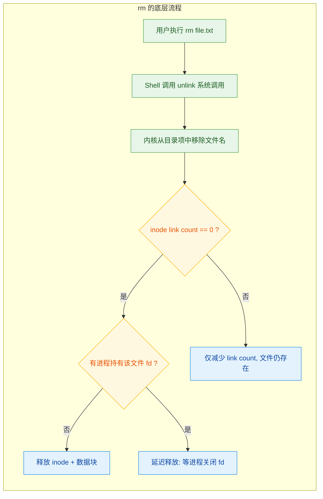

---

### cat / grep / find — 文本处理与搜索

如果说上一组命令是"行走"，这一组命令就是"阅读与搜索"。Linux 世界中配置文件、日志文件、源代码都是纯文本，高效处理文本的能力是系统管理与开发的核心技能。

#### cat — 连接与显示文件（Concatenate）

`cat` 的本意是 **concatenate（拼接）**，但最常被用来快速查看文件内容。

```bash
# 查看文件内容（整个文件一次性输出到终端）
cat /etc/hostname

# 查看多个文件（按顺序拼接输出，这才是 cat 名字的由来）
cat header.txt body.txt footer.txt

# -n (number): 显示行号
cat -n /etc/passwd

# -b (number-nonblank): 只对非空行编号
cat -b script.sh

# -A (show-all): 显示不可见字符（如行尾的 $、Tab 显示为 ^I）
cat -A config.ini          # 排查隐藏字符问题时非常有用

# 利用重定向创建文件（简易写入）
cat > newfile.txt << EOF
第一行内容
第二行内容
EOF
# 这里使用了 Here Document (<<EOF...EOF) 语法

# 拼接文件到新文件
cat part1.log part2.log part3.log > combined.log
```

**使用建议**：`cat` 适合查看小文件。对于大文件（如几 GB 的日志），使用 `less`（分页查看）、`head`（查看前 N 行）、`tail`（查看后 N 行）更加合适。经典的 **UUOC（Useless Use of Cat）** 反模式是 `cat file | grep pattern`，其实 `grep pattern file` 就够了——少一个进程，少一个管道。

#### grep — 文本模式搜索（Global Regular Expression Print）

`grep` 是 Linux 中最强大的文本搜索工具之一，名字来源于 `ed` 编辑器的 `g/re/p` 命令（**g**lobally search for a **r**egular **e**xpression and **p**rint matching lines）。

```bash
# 基本用法：在文件中搜索包含 "error" 的行
grep "error" /var/log/syslog

# -i (ignore-case): 忽略大小写
grep -i "warning" app.log          # 匹配 Warning, WARNING, warning 等

# -n (line-number): 显示匹配行的行号
grep -n "TODO" main.c              # 输出如 "42:// TODO: fix this bug"

# -r (recursive): 递归搜索目录下的所有文件
grep -r "database" /etc/           # 在 /etc 下所有文件中搜索

# -l (files-with-matches): 只输出包含匹配的文件名，不输出具体行
grep -rl "password" /etc/          # 快速定位哪些配置文件含有密码字段

# -v (invert-match): 反向匹配，输出 **不包含** 模式的行
grep -v "^#" /etc/fstab            # 过滤掉注释行（以 # 开头的行）

# -c (count): 只输出匹配的行数
grep -c "404" access.log           # 统计 404 错误出现的次数

# -w (word-regexp): 全词匹配，避免部分匹配
grep -w "port" config.txt          # 匹配 "port" 但不匹配 "export" 或 "support"

# -E (extended-regexp): 使用扩展正则表达式（等价于 egrep）
grep -E "error|fatal|panic" kern.log   # 匹配多个模式（OR 逻辑）

# -A/-B/-C (after/before/context): 显示匹配行的上下文
grep -A 3 "Exception" app.log      # 显示匹配行及其后 3 行
grep -B 2 "Exception" app.log      # 显示匹配行及其前 2 行
grep -C 2 "Exception" app.log      # 显示匹配行及其前后各 2 行

# 与管道结合：经典的过滤用法
ps aux | grep "nginx"              # 从进程列表中筛选 nginx 相关进程
dmesg | grep -i "usb"             # 从内核日志中筛选 USB 相关信息
```

**正则表达式速查**（grep 默认使用 BRE，加 `-E` 使用 ERE）：

```text
.         匹配任意单个字符
*         前一个字符出现 0 次或多次
^         行首锚定
$         行尾锚定
[]        字符集合，如 [a-z] 匹配小写字母
[^]       取反字符集，如 [^0-9] 匹配非数字
\{n,m\}   前一个字符出现 n 到 m 次（BRE 语法）
|         OR 逻辑（ERE，需要 grep -E）
()        分组（ERE，需要 grep -E）
```

#### find — 文件查找（Find）

`find` 是真正意义上的 **文件系统遍历搜索引擎**。与 `grep` 搜索文件内容不同，`find` 搜索的是 **文件本身的属性**——名称、类型、大小、时间、权限等。

```bash
# 基本语法: find [搜索路径] [条件表达式] [动作]

# 按名称查找（-name 区分大小写，-iname 不区分）
find /home -name "*.log"           # 在 /home 下查找所有 .log 文件
find / -iname "readme*"            # 全盘搜索，不区分大小写

# 按文件类型查找（-type）
find /etc -type f                  # f = 普通文件
find /var -type d                  # d = 目录
find /dev -type l                  # l = 符号链接

# 按大小查找（-size）
find / -size +100M                 # 大于 100MB 的文件
find /tmp -size -1k                # 小于 1KB 的文件
find /var/log -size +10M -size -1G # 大于 10MB 且小于 1GB

# 按时间查找（-mtime 修改时间，-atime 访问时间，-ctime 状态变更时间）
find /var/log -mtime -7            # 最近 7 天内修改过的文件
find /tmp -atime +30               # 超过 30 天未访问的文件

# 按权限查找（-perm）
find / -perm -4000                 # 查找所有设置了 SUID 位的文件（安全审计）
find /home -perm 777               # 查找权限为 777 的文件（潜在安全隐患）

# 按用户/组查找
find /home -user alice             # 查找属于 alice 用户的文件
find /var -group www-data          # 查找属于 www-data 组的文件

# 组合条件（-and 默认, -or, -not）
find /etc -name "*.conf" -type f   # 名为 *.conf 且是普通文件（隐含 AND）
find /var -name "*.log" -or -name "*.txt"  # .log 或 .txt 文件
find /home -not -user root         # 不属于 root 的文件

# 找到后执行动作（-exec）
find /tmp -name "*.tmp" -exec rm {} \;         # 删除所有 .tmp 文件
# {} 是占位符，代表 find 找到的每个文件路径
# \; 是 -exec 的结束标记（反斜杠转义分号）

find /var/log -name "*.log" -exec ls -lh {} \; # 列出所有 .log 文件的详细信息

# 更高效的写法：用 + 替代 \;，将多个文件一次性传递给命令
find /tmp -name "*.tmp" -exec rm {} +          # 批量删除，减少进程创建次数

# 与 xargs 结合（处理大量文件时更高效）
find /var/log -name "*.log" | xargs ls -lh
find . -name "*.c" | xargs grep "malloc"       # 在所有 C 源文件中搜索 malloc
```

**`find` vs `locate`**：`find` 每次都实时遍历文件系统树，适合精确搜索但速度较慢。`locate` 基于预建索引数据库（由 `updatedb` 定期更新），搜索极快但结果可能不实时。日常快速查找用 `locate`，需要精确过滤条件时用 `find`。

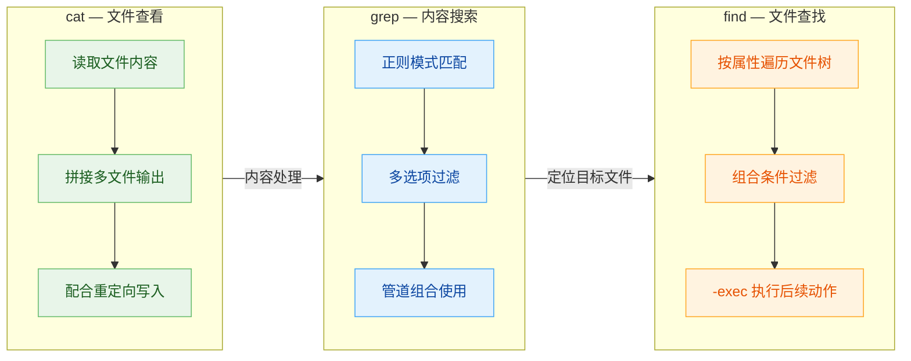

---

### ps / top / kill — 进程监控与管理

操作系统的核心职责之一就是 **进程管理（Process Management）**。这三个命令让你能够观察系统中正在运行的进程状态，并在必要时对其进行干预。

#### ps — 进程快照（Process Status）

`ps` 捕获的是执行命令 **那一瞬间** 的进程状态快照，它读取的是 `/proc` 虚拟文件系统中的信息。

```bash
# 查看当前终端关联的进程
ps                                 # 只显示当前 Shell 会话的进程

# 查看所有进程（两大风格）
ps aux                             # BSD 风格（无短横线），最常用
ps -ef                             # UNIX/System V 风格（带短横线）

# ps aux 各列含义：
# USER  PID  %CPU  %MEM  VSZ   RSS   TTY  STAT  START  TIME  COMMAND
# 用户  进程ID CPU占用 内存占用 虚拟内存 物理内存 终端 状态  启动时间 CPU时间 命令名

# 查看进程树（显示父子关系）
ps auxf                            # f = forest，ASCII 树形显示
ps -ejH                            # System V 风格的层级显示

# 查看特定用户的进程
ps -u alice                        # 查看 alice 用户的所有进程

# 自定义输出列
ps -eo pid,ppid,uid,cmd,%mem,%cpu --sort=-%mem
# -e: 所有进程
# -o: 自定义输出字段（pid=进程ID, ppid=父进程ID, uid=用户ID, cmd=命令）
# --sort=-%mem: 按内存使用率降序排列（- 表示降序）

# 经典组合：查找特定进程
ps aux | grep nginx                # 搜索 nginx 进程
ps aux | grep "[n]ginx"            # 技巧：用正则避免 grep 自身出现在结果中
```

**STAT 列状态码解读**（这在面试和排障中非常重要）：

```text
状态码      含义
─────────────────────────────────────────────────────
R          Running / Runnable — 正在运行或在就绪队列中
S          Sleeping (Interruptible) — 可中断睡眠，等待事件
D          Sleeping (Uninterruptible) — 不可中断睡眠，通常等待 I/O
T          Stopped — 被信号暂停（如 Ctrl+Z 或 SIGSTOP）
Z          Zombie — 僵尸进程，已终止但父进程尚未回收
─────────────────────────────────────────────────────
附加标记：
<          高优先级进程（not nice to others）
N          低优先级进程（nice to others）
s          Session leader（会话首进程）
l          多线程（使用 CLONE_THREAD）
+          前台进程组成员
```

**僵尸进程（Zombie, Z）** 是操作系统面试高频考点：当子进程终止后，内核会保留其 PCB 中的退出状态（exit status），等待父进程通过 `wait()` / `waitpid()` 系统调用读取。如果父进程不调用 `wait()`，子进程就会一直处于 Z 状态，占据进程表项（PID）。大量僵尸进程会导致系统无法创建新进程。

#### top — 实时进程监控（Table of Processes）

如果说 `ps` 是拍照，`top` 就是实时监控视频流。它每隔几秒刷新一次，显示系统整体负载和各进程的资源消耗情况。

```bash
# 启动 top（默认每 3 秒刷新一次）
top

# top 界面上半部分（系统摘要区）示例：
# top - 14:30:01 up 5 days, 3:22, 2 users, load average: 0.52, 0.68, 0.71
#   │                                                      └── 1分钟/5分钟/15分钟平均负载
# Tasks: 213 total, 1 running, 210 sleeping, 0 stopped, 2 zombie
#   │                                                     └── 2个僵尸进程！
# %Cpu(s): 12.5 us, 3.2 sy, 0.0 ni, 83.1 id, 1.0 wa, 0.0 hi, 0.2 si
#           │       │              │          │
#         用户态  内核态      空闲百分比   I/O等待（高=磁盘瓶颈）
# MiB Mem: 7963.4 total, 2105.8 free, 3842.1 used, 2015.5 buff/cache
# MiB Swap: 2048.0 total, 2048.0 free, 0.0 used.  3621.3 avail Mem
```

```bash
# top 运行中的交互快捷键：
# q     — 退出 top
# P     — 按 CPU 使用率排序（默认）
# M     — 按内存使用率排序
# T     — 按运行时间排序
# k     — 输入 PID 并发送信号（默认 SIGTERM）杀死进程
# 1     — 展开显示每个 CPU 核心的独立使用率
# c     — 切换显示完整命令行路径
# H     — 切换线程视图（显示线程而非进程）

# 命令行参数
top -d 1                           # 每 1 秒刷新一次
top -p 1234                        # 只监控 PID 为 1234 的进程
top -u alice                       # 只显示 alice 用户的进程
top -bn1                           # 批处理模式，只输出一次（常用于脚本采集）
```

**load average 解读**：三个数字分别代表过去 1 分钟、5 分钟、15 分钟的系统平均负载。负载值 = 正在运行 + 等待运行（可运行状态在就绪队列中）+ 不可中断等待（D 状态）的进程/线程数。对于 N 核 CPU 的系统，load average 达到 N 表示 CPU 刚好满载，超过 N 表示存在排队等待。例如 4 核 CPU 上 load average 为 4.0 意味着 100% 利用率。

**`top` 的进阶替代品**：`htop`（彩色交互更友好）、`btop`（现代化 TUI）、`glances`（综合资源监控）。

#### kill — 发送信号（Kill / Signal）

`kill` 的名字容易让人误以为它只能"杀死"进程，但它的本质是 **向进程发送信号（signal）**。杀死进程只是其中一种效果。

```bash
# 基本用法：向指定 PID 发送信号
kill 1234                          # 默认发送 SIGTERM (15)，请求进程优雅退出

# 指定信号（三种写法等价）
kill -9 1234                       # 方式一：信号编号
kill -SIGKILL 1234                 # 方式二：信号全名
kill -KILL 1234                    # 方式三：信号简名（去掉 SIG 前缀）

# 查看所有可用信号
kill -l                            # 列出所有信号编号和名称

# 向进程组发送信号（负号 PID 表示进程组）
kill -TERM -1234                   # 向 PGID 为 1234 的整个进程组发送 SIGTERM

# killall：按进程名发送信号
killall nginx                      # 向所有名为 nginx 的进程发送 SIGTERM
killall -9 nginx                   # 强制杀死所有 nginx 进程

# pkill：支持模式匹配的进程信号发送
pkill -f "python.*server"          # 向命令行匹配 "python.*server" 的进程发信号
```

**常用信号一览表**（操作系统考试 & 面试重点）：

```text
编号   名称        默认行为             用途
──────────────────────────────────────────────────────────────
 1    SIGHUP      终止              终端断开；常用于通知守护进程重新加载配置
 2    SIGINT      终止              键盘中断 Ctrl+C
 3    SIGQUIT     终止+Core Dump    键盘退出 Ctrl+\（生成核心转储用于调试）
 9    SIGKILL     强制终止           ☠ 不可捕获、不可忽略，内核直接清除进程
15    SIGTERM     终止              优雅终止请求（可被进程捕获并做清理工作）
18    SIGCONT     继续执行           恢复被暂停的进程（与 fg / bg 配合）
19    SIGSTOP     暂停              ☠ 不可捕获，强制暂停进程
20    SIGTSTP     暂停              键盘暂停 Ctrl+Z（可被捕获）
```

**SIGTERM vs SIGKILL 的本质区别**：

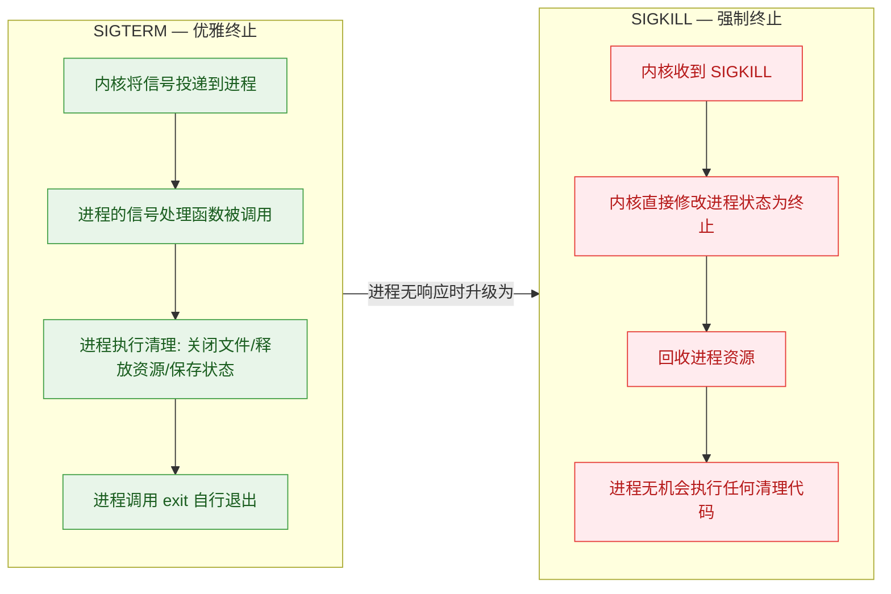

**最佳实践**：始终先尝试 `kill PID`（SIGTERM），给进程机会做清理。等待几秒后如果进程仍在，再使用 `kill -9 PID`（SIGKILL）强制终止。直接用 `-9` 可能导致文件损坏、锁未释放、临时文件残留等问题。

---

### chmod / chown — 权限变更

前面的章节已经介绍了 Linux 文件权限模型（rwx、用户/组/其他）。这一节聚焦于 **如何修改权限和归属关系** 的两个核心命令。

#### chmod — 修改文件权限（Change Mode）

`chmod` 有两种使用方式：**符号模式（Symbolic Mode）** 和 **八进制模式（Octal Mode）**。

**符号模式**（直觉友好，适合微调）：

```bash
# 语法: chmod [who][operator][permission] file
# who:        u(user/属主), g(group/属组), o(others/其他), a(all/所有人)
# operator:   +(添加), -(移除), =(设置为精确值)
# permission: r(读), w(写), x(执行)

# 给文件属主添加执行权限
chmod u+x script.sh                # 属主现在可以执行这个脚本

# 给属组和其他人移除写权限
chmod go-w sensitive.conf          # 只有属主能写

# 给所有人添加读权限
chmod a+r public.html              # 等价于 chmod +r public.html

# 精确设置：属主读写执行，属组读执行，其他人只读
chmod u=rwx,g=rx,o=r deploy.sh

# -R (recursive): 递归修改目录及其所有内容的权限
chmod -R 755 /var/www/html         # 整个 web 目录设为 755
```

**八进制模式**（精确高效，适合批量设置）：

```text
权限     二进制     八进制
───────────────────────────
---       000        0
--x       001        1
-w-       010        2
-wx       011        3
r--       100        4
r-x       101        5
rw-       110        6
rwx       111        7
```

```bash
# 三位八进制分别代表: 属主 | 属组 | 其他人
chmod 755 script.sh                # rwxr-xr-x  属主全权限，其他人可读可执行
chmod 644 document.txt             # rw-r--r--  属主读写，其他人只读
chmod 700 private/                 # rwx------  仅属主可访问
chmod 600 id_rsa                   # rw-------  SSH 私钥的标准权限
chmod 777 /tmp/shared              # rwxrwxrwx  所有人全权限（通常不推荐）
```

**特殊权限位（Special Permissions）**— 面试加分项：

```bash
# SUID (Set User ID) — 八进制前缀 4
chmod 4755 /usr/bin/passwd
# 效果：任何用户执行 passwd 时，进程以文件属主(root)的身份运行
# 这就是为什么普通用户能通过 passwd 命令修改 /etc/shadow（root所有的文件）

# SGID (Set Group ID) — 八进制前缀 2
chmod 2755 /opt/team_project/
# 效果(对目录)：在该目录下新建的文件自动继承目录的属组，而非创建者的主组
# 适用于团队协作目录

# Sticky Bit — 八进制前缀 1
chmod 1777 /tmp
# 效果(对目录)：目录中的文件只能由文件属主或 root 删除，即使其他人有 w 权限
# /tmp 就是经典的 Sticky Bit 目录，防止用户互相删除临时文件
```

```text
# ls -l 中特殊权限的显示方式：
-rwsr-xr-x    →  SUID 生效（属主执行位显示 s 而非 x）
-rwxr-sr-x    →  SGID 生效（属组执行位显示 s）
drwxrwxrwt    →  Sticky Bit 生效（其他人执行位显示 t）

# 如果原本没有执行权限，则显示大写：
-rwSr--r--    →  SUID 设置但属主无执行权限（S = SUID + 无 x）
```

#### chown — 修改文件归属（Change Owner）

`chown` 用于改变文件的 **属主（owner）** 和/或 **属组（group）**。通常需要 **root 权限** 才能执行（因为把文件"送给"别人涉及安全问题）。

```bash
# 修改属主
chown alice file.txt               # 将 file.txt 的属主改为 alice

# 同时修改属主和属组（冒号分隔）
chown alice:developers project/    # 属主改为 alice，属组改为 developers

# 只修改属组（属主留空，冒号保留）
chown :developers file.txt         # 等价于 chgrp developers file.txt

# -R (recursive): 递归修改目录及所有子内容的归属
chown -R www-data:www-data /var/www/html   # Web 服务器经典操作

# --reference: 参照另一个文件的归属来设置
chown --reference=template.conf newfile.conf

# chgrp: 专门修改属组的命令（chown 的子集功能）
chgrp staff report.pdf             # 将 report.pdf 的属组改为 staff
```

**典型应用场景**：

```bash
# 场景一：部署 Web 应用后，将文件归属给 Web 服务器用户
sudo chown -R www-data:www-data /var/www/myapp/

# 场景二：解压 tarball 后恢复正确的归属关系
sudo tar xzf app.tar.gz -C /opt/
sudo chown -R appuser:appgroup /opt/app/

# 场景三：创建共享目录，设置 SGID 确保组归属一致
sudo mkdir /opt/shared
sudo chown root:team /opt/shared
sudo chmod 2775 /opt/shared        # SGID + rwxrwxr-x
# 此后 team 组成员在此目录创建的文件自动属于 team 组
```

**安全提醒**：`chmod 777` 和 `chown` 滥用是初学者常犯的错误。当遇到"Permission denied"时，不要条件反射地 `chmod 777` 或 `sudo chown`，而应该分析 **为什么没有权限**——是属主不对？属组不对？还是权限位不够？精确修改才是正确的做法。

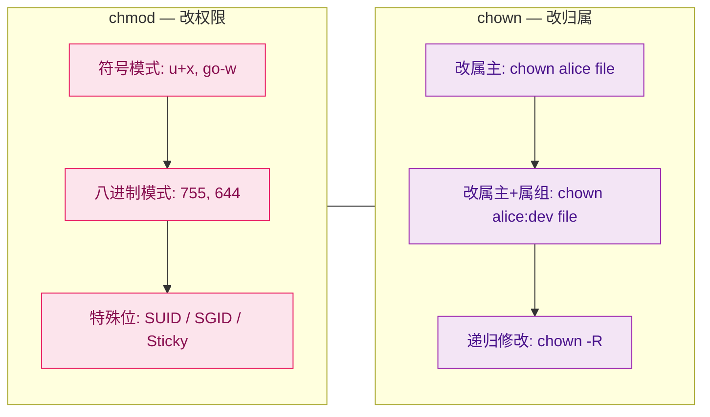

---

**📝 练习题 1**

在一台 4 核 CPU 的 Linux 服务器上，你运行 `top` 发现 **load average** 显示为 `6.50, 4.20, 2.10`。以下分析中最准确的是？

A. 系统在过去 15 分钟内一直处于严重过载状态

B. 系统负载正在 **上升**，最近 1 分钟的负载已超过 CPU 核心数，部分进程在排队等待

C. 系统当前空闲，因为 15 分钟平均值 2.10 低于核心数 4

D. load average 只反映 CPU 使用率，与 I/O 无关


**【答案】** B

**【解析】** load average 的三个数字依次代表过去 1 分钟、5 分钟、15 分钟的平均负载。数值从右到左依次增大（2.10 → 4.20 → 6.50），说明系统负载在 **逐步攀升**。对于 4 核系统，当 load average 为 6.50 时，意味着平均有 6.5 个进程处于可运行或不可中断等待状态，而 CPU 最多只能同时处理 4 个，因此约有 2.5 个进程在排队。选项 A 错在"一直过载"——15 分钟值 2.10 < 4 说明更早之前负载并不高。选项 C 只看了 15 分钟值而忽略了 1 分钟值的告警含义。选项 D 错在 load average 不仅包含 CPU 排队的进程，还包含处于 **D 状态（Uninterruptible Sleep，通常是等待磁盘 I/O）** 的进程，因此它实际上同时反映了 CPU 和 I/O 负载。

---

**📝 练习题 2**

你需要在 `/var/log` 下找出所有 **大于 50MB** 且 **最近 3 天内修改过** 的 `.log` 文件，并将它们全部删除。以下哪个命令组合是正确的？

A. `find /var/log -name "*.log" -size +50M -mtime -3 -exec rm {} +`

B. `grep -r "*.log" /var/log | rm -rf`

C. `find /var/log -name "*.log" -size +50M -mtime +3 -exec rm {} +`

D. `ls -la /var/log/*.log | find -size +50M | rm`


**【答案】** A

**【解析】** 本题考查 `find` 命令的组合条件用法。`find /var/log` 指定搜索路径；`-name "*.log"` 匹配文件名；`-size +50M` 表示大于 50MB；`-mtime -3` 表示最近 3 天内修改过（**减号表示"之内"**，加号表示"之前"）；`-exec rm {} +` 对找到的文件执行删除。选项 B 中 `grep` 是搜索文件内容而非属性，且管道后的 `rm -rf` 没有接收文件名参数，语法错误。选项 C 中 `-mtime +3` 的含义是 **超过 3 天前** 修改的文件，与题意相反。选项 D 完全是无效的命令组合，`ls` 的输出不能直接传给 `find`，`find` 的结果也没有正确传递给 `rm`。

---

## 进程管理

在 Linux 的世界观里，**一切皆文件**（Everything is a file），而让这些文件"活起来"的核心机制，就是**进程**（Process）。当你在终端敲下一条命令、启动一个服务、甚至只是打开一个文本编辑器，操作系统都会为其创建一个进程。进程是**程序在内存中运行的实例**——程序本身只是磁盘上的一段静态二进制代码（passive entity），而进程则是它被加载到内存后、拥有了 CPU 时间片、拥有了自己的地址空间和资源的**动态执行体**（active entity）。

理解进程管理，是深入操作系统内核的第一步。本节我们将从三个维度切入：**如何观察进程**（ps）、**如何控制进程**（kill）、**如何让进程在后台持续运行**（`&` 及相关机制）。

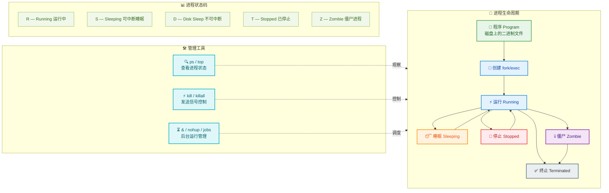

在深入工具之前，有必要先建立一个核心概念模型：Linux 内核为每个进程维护一个 **PCB（Process Control Block）**，在 Linux 源码中对应 `task_struct` 结构体。这个结构体记录了进程的所有元信息——PID、状态、优先级、打开的文件描述符、内存映射、父子关系等。我们日常使用的 `ps`、`top` 等工具，本质上就是在读取 `/proc` 虚拟文件系统中对应进程目录下的信息，而 `/proc` 正是内核将 `task_struct` 暴露给用户态的接口。

---

### ps 查看进程

`ps`（**Process Status**）是 Linux 中最基础也最常用的进程查看命令。它通过读取 `/proc` 文件系统，将内核中进程的快照信息以格式化表格呈现给用户。与 `top` 不同的是，`ps` 输出的是**某一瞬间的静态快照**（snapshot），而非实时动态刷新。

#### 基本用法与选项风格

`ps` 命令的选项有三种风格，这是因为它融合了多个 Unix 传统：

| 风格 | 格式 | 来源 | 示例 |
|------|------|------|------|
| **UNIX 风格** | 带短横线 `-` | System V 传统 | `ps -ef` |
| **BSD 风格** | 不带横线 | BSD 传统 | `ps aux` |
| **GNU 长选项** | 双横线 `--` | GNU 扩展 | `ps --forest` |

这三种风格**可以混用**，但初学者建议先掌握最常用的两种组合：`ps aux` 和 `ps -ef`。

#### `ps aux` —— 最常用的全量进程查看

```bash
# ps aux 各字段解析
# a: 显示所有用户的进程（不限于当前终端）
# u: 以用户友好的格式显示（包含 CPU、内存占用等）
# x: 包含没有控制终端的进程（如守护进程 daemon）
ps aux
```

典型输出如下：

```text
USER       PID %CPU %MEM    VSZ   RSS TTY      STAT START   TIME COMMAND
root         1  0.0  0.3 169436 13076 ?        Ss   Feb25   0:05 /sbin/init
root         2  0.0  0.0      0     0 ?        S    Feb25   0:00 [kthreadd]
mysql     1234  0.2  5.1 1842356 205432 ?      Ssl  Feb25   3:42 /usr/sbin/mysqld
alice     5678  0.0  0.1  22812  5320 pts/0    S+   10:30   0:00 vim notes.txt
root      9012  0.0  0.0      0     0 ?        I<   Feb25   0:00 [kworker/0:0H]
```

每一列的含义都值得深入理解：

```bash
# ┌─────────────────────────────────────────────────────────────────────────┐
# │ 字段       含义                          典型值/说明                     │
# ├─────────────────────────────────────────────────────────────────────────┤
# │ USER       进程所有者的用户名              root, alice, mysql            │
# │ PID        进程ID (Process ID)            唯一标识，内核分配             │
# │ %CPU       CPU 占用百分比                  基于进程生命周期的平均值       │
# │ %MEM       物理内存占用百分比              RSS / 总物理内存               │
# │ VSZ        虚拟内存大小 (KB)              包含 swap + 共享库映射         │
# │ RSS        常驻内存集大小 (KB)            实际在物理内存中的部分          │
# │ TTY        关联的终端                     pts/0=伪终端, ?=无终端(daemon) │
# │ STAT       进程状态码                     S=睡眠, R=运行, Z=僵尸等      │
# │ START      进程启动时间                   若超过24h则显示日期            │
# │ TIME       累计 CPU 使用时间              格式 分:秒                     │
# │ COMMAND    启动进程的完整命令行            带路径和参数                   │
# └─────────────────────────────────────────────────────────────────────────┘
```

**STAT 列**是最值得深究的字段，它由一个主状态字符加上若干修饰字符组成：

```bash
# STAT 状态码详解
# ──────────────────────────────────
# 主状态（第一个字符）：
#   R  Running / Runnable     正在运行 或 在运行队列中等待 CPU
#   S  Interruptible Sleep    可中断睡眠，等待某事件（如 I/O 完成）
#   D  Uninterruptible Sleep  不可中断睡眠，通常在等待磁盘 I/O（此时 kill -9 也杀不掉！）
#   T  Stopped                已停止，通常收到 SIGSTOP 或 SIGTSTP (Ctrl+Z)
#   Z  Zombie                 僵尸进程，已退出但父进程尚未回收其退出状态
#   I  Idle                   空闲的内核线程（Linux 4.14+ 才有）
#
# 修饰字符（第二个字符起）：
#   <  高优先级（nice 值为负）
#   N  低优先级（nice 值为正）
#   L  有页面锁定在内存中（用于实时进程或 I/O）
#   s  会话首进程（session leader）
#   l  多线程（使用 clone() 创建的轻量级进程）
#   +  属于前台进程组
#
# 组合举例：
#   Ss   → 可中断睡眠 + 会话首进程（如 init, sshd）
#   R+   → 正在运行 + 前台进程
#   Ssl  → 可中断睡眠 + 会话首进程 + 多线程（如 mysqld）
#   D+   → 不可中断睡眠 + 前台（可能在执行高密度磁盘 I/O）
#   Z    → 僵尸进程（需要父进程 wait() 回收）
```

#### `ps -ef` —— 完整格式列表

```bash
# -e: 等同于 -A，显示所有进程
# -f: full-format，显示完整信息（包含 PPID 父进程ID）
ps -ef
```

典型输出：

```text
UID        PID  PPID  C STIME TTY          TIME CMD
root         1     0  0 Feb25 ?        00:00:05 /sbin/init
root       456     1  0 Feb25 ?        00:00:12 /usr/lib/systemd/systemd-journald
alice     5678  3456  0 10:30 pts/0    00:00:00 vim notes.txt
```

`ps -ef` 相较 `ps aux` 最大的特点是显示了 **PPID（Parent Process ID）** 列——父进程 ID。在 Linux 中，所有进程构成一棵**进程树**（Process Tree），根节点是 PID=1 的 `init`（或 `systemd`）。每个进程都由其父进程通过 `fork()` 系统调用创建。

#### 实战：进程过滤与组合技巧

在实际运维和开发中，很少直接看全量进程，通常需要配合管道和过滤：

```bash
# 1. 查找特定进程名（最常用）
#    grep -v grep: 排除 grep 自身（因为 grep java 本身也包含 "java"）
ps aux | grep java | grep -v grep

# 2. 更优雅的写法：用方括号技巧避免 grep 匹配自身
#    [j]ava 这个正则匹配 "java"，但 grep 命令本身显示为 "grep [j]ava"，不会自匹配
ps aux | grep '[j]ava'

# 3. 查看进程树结构（--forest 以 ASCII 树形展示父子关系）
ps -ef --forest

# 4. 查看特定用户的进程
#    -u alice: 只显示用户 alice 的进程
ps -u alice

# 5. 按指定列输出（自定义格式）
#    -o: 指定输出列，pid=进程ID, ppid=父进程ID, %cpu=CPU占用, %mem=内存占用, cmd=命令
ps -eo pid,ppid,%cpu,%mem,cmd --sort=-%cpu | head -10
#    --sort=-%cpu: 按 CPU 使用率降序排列
#    head -10: 只看前10行（CPU 占用最高的10个进程）

# 6. 查看线程级信息
#    -L: 显示线程（LWP = Light Weight Process 轻量级进程）
ps -eLf | grep mysqld

# 7. 查看特定 PID 的详细信息
#    -p 1234: 只查看 PID 为 1234 的进程
ps -fp 1234
```

#### 进阶：直接读取 /proc 文件系统

`ps` 命令的数据源是 `/proc` 虚拟文件系统。理解这一层，能帮助你在无法使用 `ps` 的极端环境下（比如最小化容器镜像）仍然获取进程信息：

```bash
# /proc 中每个数字目录对应一个进程，目录名就是 PID
ls /proc/ | grep -E '^[0-9]+$' | head -5
# 输出: 1  2  3  5  7  ...

# 查看 PID=1 的进程状态信息
cat /proc/1/status
# 输出包含:
#   Name:   systemd          ← 进程名
#   State:  S (sleeping)     ← 运行状态
#   Tgid:   1                ← 线程组ID（主线程的PID）
#   Pid:    1                ← 进程ID
#   PPid:   0                ← 父进程ID（0表示由内核直接创建）
#   Threads: 1               ← 线程数
#   VmRSS:  13076 kB         ← 常驻内存

# 查看进程的命令行参数
cat /proc/1/cmdline | tr '\0' ' '
# 输出: /sbin/init
# 注意: cmdline 中参数以 \0 (null) 分隔，tr 将其替换为空格方便阅读

# 查看进程打开的文件描述符
ls -la /proc/1/fd/
# 输出: 0 -> /dev/null       ← 标准输入
#        1 -> /dev/null       ← 标准输出
#        2 -> /dev/null       ← 标准错误
#        3 -> socket:[12345]  ← 网络套接字
```

#### `top` —— 动态实时监控

虽然 `top` 不在标题中，但它和 `ps` 互补，值得简要提及。`top` 提供**实时刷新**的进程视图（默认每 3 秒刷新一次），类似于 Windows 的任务管理器：

```bash
# 直接运行 top，进入交互界面
top

# 常用交互键（在 top 界面内按）：
#   P  → 按 CPU 使用率排序（默认）
#   M  → 按内存使用率排序
#   k  → 输入 PID 杀死进程
#   q  → 退出 top
#   1  → 显示每个 CPU 核心的独立使用率
#   H  → 显示线程视图

# 批处理模式（非交互，适合脚本中使用）
#   -b: batch mode    -n 1: 只刷新一次    -o %CPU: 按CPU排序
top -bn1 -o %CPU | head -20
```

> **面试考点**：`ps` 和 `top` 的本质区别是什么？答：`ps` 是**快照**（snapshot），读取 `/proc` 一次后立即输出并退出；`top` 是**采样**（sampling），持续周期性读取 `/proc` 并计算增量变化（如 CPU 使用率是两次采样之间的差值）。

---

### kill 发送信号

`kill` 这个名字容易让人误解——它的本质不是"杀死进程"，而是**向进程发送信号**（Send a signal to a process）。"杀死"只是众多信号中的一种效果。Linux 信号机制（Signal）是一种**异步通知机制**，内核或进程可以通过信号通知目标进程发生了某个事件。

#### 信号的本质

信号是一种**软件中断**（Software Interrupt）。当一个信号被递送（deliver）到目标进程时，目标进程会暂停当前执行流程，转而执行该信号对应的**信号处理函数**（Signal Handler）。进程可以为大多数信号注册自定义处理函数，但有两个例外：**SIGKILL (9)** 和 **SIGSTOP (19)** 无法被捕获、忽略或阻塞——这是内核保留的"最终手段"。

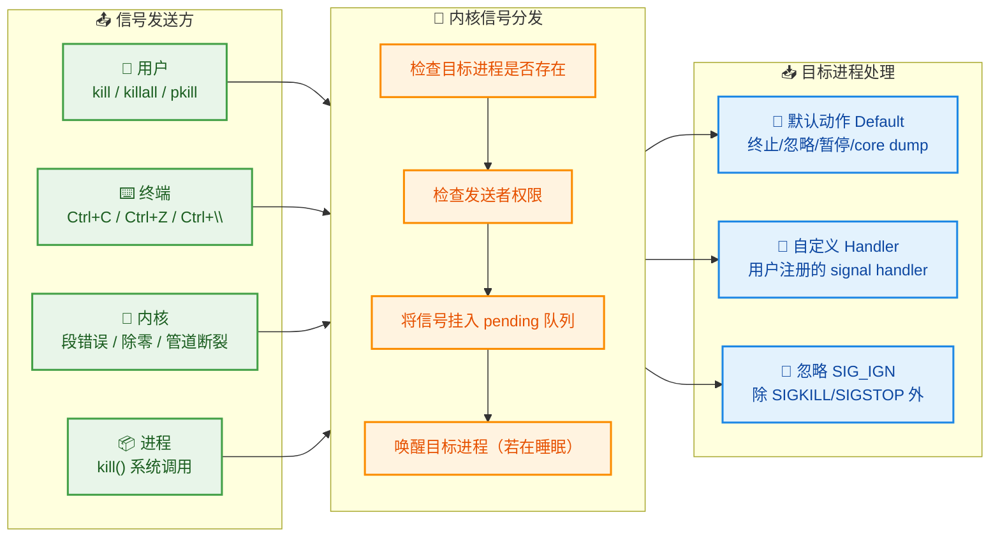

#### 常用信号一览

Linux 定义了 64 种信号（`kill -l` 可查看完整列表），但日常运维和开发中常用的只有以下几种：

| 信号编号 | 信号名称 | 默认动作 | 可捕获? | 常见触发场景 |
|---------|---------|---------|---------|------------|
| **1** | `SIGHUP` | 终止 | ✅ | 终端断开；常被守护进程用于**重新加载配置** |
| **2** | `SIGINT` | 终止 | ✅ | 用户按 **Ctrl+C** |
| **3** | `SIGQUIT` | 终止+Core | ✅ | 用户按 **Ctrl+\\** |
| **9** | `SIGKILL` | 终止 | ❌ | 强制杀死进程，无法捕获/忽略 |
| **15** | `SIGTERM` | 终止 | ✅ | `kill` 的**默认信号**，优雅终止 |
| **18** | `SIGCONT` | 继续 | ✅ | 恢复被暂停的进程 |
| **19** | `SIGSTOP` | 暂停 | ❌ | 强制暂停进程，无法捕获/忽略 |
| **20** | `SIGTSTP` | 暂停 | ✅ | 用户按 **Ctrl+Z** |

#### `kill` 命令详解

```bash
# 基本语法: kill [选项] <PID>

# 1. 发送默认信号 SIGTERM (15) —— 请求进程优雅退出
#    进程收到 SIGTERM 后可以执行清理工作（关闭文件、释放锁、保存状态）再退出
kill 1234

# 2. 等价于上面的写法（显式指定信号）
kill -15 1234       # 用信号编号
kill -SIGTERM 1234  # 用信号名称（带 SIG 前缀）
kill -TERM 1234     # 用信号名称（省略 SIG 前缀）

# 3. 强制杀死进程 —— SIGKILL (9)
#    不给进程任何清理机会，内核直接回收资源
#    ⚠️ 应作为最后手段！可能导致数据丢失、临时文件残留、子进程变孤儿
kill -9 1234

# 4. 暂停和恢复进程
kill -STOP 1234     # 暂停进程（进程状态变为 T）
kill -CONT 1234     # 恢复进程继续运行

# 5. 通知守护进程重新加载配置
#    许多服务（nginx, sshd, apache）用 SIGHUP 触发配置热加载
kill -HUP $(cat /var/run/nginx.pid)
#    等同于: systemctl reload nginx

# 6. 向整个进程组发送信号（PID 前加负号）
#    进程组 PGID=1234 的所有进程都会收到信号
kill -TERM -1234

# 7. 查看所有可用信号
kill -l
```

#### `killall` 和 `pkill` —— 按名称杀进程

实际运维中，你往往不知道 PID，只知道进程名。这时 `killall` 和 `pkill` 更方便：

```bash
# killall: 按精确进程名发送信号
#   杀死所有名为 "python3" 的进程
killall python3

#   向所有 nginx worker 发送 SIGHUP（重新加载）
killall -HUP nginx

# pkill: 按模式匹配进程名/属性（更灵活）
#   杀死命令行中包含 "my_script" 的进程（支持正则）
pkill -f "my_script.py"
#   -f: 匹配完整命令行（而非仅进程名）

#   只杀死属于 alice 用户的 python 进程
pkill -u alice python

#   杀死特定终端上的所有进程
pkill -t pts/2
```

#### SIGTERM vs SIGKILL：优雅停止 vs 强制终止

这是理解进程管理的关键区分，也是面试高频考点：

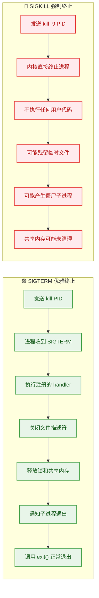

**最佳实践**：先发 `SIGTERM`，给进程合理的清理时间（通常 5-30 秒），如果仍未退出再发 `SIGKILL`。这也正是 Docker `docker stop` 的默认行为——先发 SIGTERM，等待 10 秒后再发 SIGKILL。

```bash
# 生产环境的标准停止流程
PID=1234

kill -TERM $PID          # 第一步：请求优雅退出
sleep 5                  # 第二步：等待 5 秒

if kill -0 $PID 2>/dev/null; then   # 第三步：检查进程是否还活着
    # kill -0 不发送真正信号，只检查进程是否存在（返回 0 表示存在）
    echo "进程未响应 SIGTERM，强制终止..."
    kill -9 $PID         # 第四步：强制杀死
fi
```

#### 信号在 C 语言中的注册

理解用户态如何捕获信号，有助于深入理解上述机制为何 SIGKILL 不可捕获：

```c
// signal_demo.c — 演示信号捕获机制
#include <stdio.h>    // printf 输出
#include <signal.h>   // signal(), SIGTERM, SIGINT 等信号定义
#include <stdlib.h>   // exit() 进程退出
#include <unistd.h>   // sleep() 暂停

// 自定义信号处理函数（当收到 SIGTERM 时被内核回调）
void graceful_shutdown(int signum) {
    // signum: 收到的信号编号
    printf("\n收到信号 %d (SIGTERM)，正在执行清理...\n", signum);
    
    // 这里可以执行清理工作：关闭数据库连接、保存缓存、写日志等
    printf("关闭文件描述符...\n");
    printf("保存应用状态...\n");
    printf("清理完成，进程正常退出。\n");
    
    exit(0);   // 正常退出，退出码为 0
}

int main() {
    // 注册信号处理函数：当收到 SIGTERM 时，调用 graceful_shutdown
    // signal() 是最简单的注册方式（生产中建议用更安全的 sigaction()）
    signal(SIGTERM, graceful_shutdown);
    
    // 注册 SIGINT (Ctrl+C) 也用同一个 handler
    signal(SIGINT, graceful_shutdown);
    
    // ⚠️ 以下代码会编译通过但不会生效——SIGKILL 不可捕获！
    // signal(SIGKILL, graceful_shutdown);  // 内核会忽略这个注册
    
    printf("进程 PID=%d 正在运行，等待信号...\n", getpid());
    
    // 模拟一个长时间运行的服务
    while (1) {
        sleep(1);   // 每秒循环一次，等待信号打断
    }
    
    return 0;   // 正常情况下不会到达这里
}
```

编译运行后，可以在另一个终端用 `kill <PID>` 测试，会看到 `graceful_shutdown` 函数被执行，而 `kill -9 <PID>` 则直接终止进程，不会执行任何清理逻辑。

---

### & 后台运行

当你在终端执行一个长耗时任务（如编译大型项目、下载文件、运行数据处理脚本）时，默认情况下终端会被"阻塞"——在命令执行完毕之前，你无法输入新命令。Linux 提供了一套**作业控制**（Job Control）机制来解决这个问题，`&` 是其中最基础的操作符。

#### 前台与后台的概念

在 Linux 的终端（Terminal / TTY）中：

- **前台进程**（Foreground Process）：占据当前终端，可以接收键盘输入（stdin），能被 `Ctrl+C`（SIGINT）和 `Ctrl+Z`（SIGTSTP）控制。每个终端**同一时刻只有一个前台进程组**。
- **后台进程**（Background Process）：不占据终端，不接收键盘输入，但仍然可以向终端输出（stdout/stderr）。可以有**多个后台进程组**同时运行。

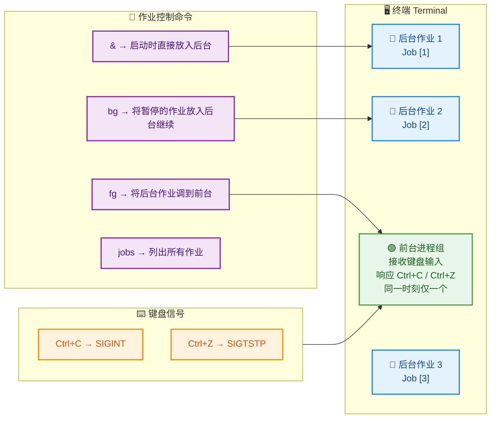

#### `&` 操作符

在命令末尾加 `&`，Shell 会将该命令放入**后台执行**，并立即返回提示符：

```bash
# 将编译任务放到后台执行
make -j8 &
# 输出: [1] 12345
#        ↑    ↑
#      作业号  PID
# Shell 立即返回提示符，可以继续输入其他命令

# 将下载任务放到后台
wget https://example.com/large_file.zip &
# [2] 12346
```

Shell 输出的 `[1]` 是**作业号**（Job Number），`12345` 是进程的 PID。作业号是 Shell 级别的概念（仅在当前 Shell 会话中有效），而 PID 是系统级别的全局唯一标识。

#### 作业控制：`jobs`、`fg`、`bg`、`Ctrl+Z`

```bash
# 1. 查看当前 Shell 的所有后台作业
jobs
# 输出:
# [1]-  Running    make -j8 &
# [2]+  Running    wget https://example.com/large_file.zip &
#   +  表示"当前默认作业"（fg/bg 不指定编号时操作的对象）
#   -  表示"上一个作业"

# 加 -l 选项显示 PID
jobs -l
# [1]- 12345 Running    make -j8 &
# [2]+ 12346 Running    wget https://example.com/large_file.zip &

# 2. Ctrl+Z: 暂停前台进程，放入后台（状态变为 Stopped）
#    假设正在前台运行 vim:
#    按下 Ctrl+Z 后:
# [3]+  Stopped    vim notes.txt
#    vim 被暂停（SIGTSTP），终端控制权交还给 Shell

# 3. bg: 让暂停的作业在后台继续运行
bg %3          # %3 表示作业号为 3 的作业
# [3]+ vim notes.txt &    ← 注意：vim 这类需要终端交互的程序在后台运行没有意义

# 4. fg: 将后台作业调到前台
fg %1          # 将作业 [1] (make) 调到前台
#    此时终端被 make 占据，直到它完成或再次 Ctrl+Z

# 5. 快捷方式
fg             # 不指定编号 → 操作 "+" 标记的默认作业
bg             # 同上
```

#### ⚠️ `&` 的致命缺陷：终端关闭则进程死亡

这是初学者最容易踩的坑：**用 `&` 放到后台的进程，仍然属于当前终端会话**。当你关闭终端（或 SSH 断开）时，Shell 会向所有子进程发送 **SIGHUP** 信号，导致后台进程被终止。

```bash
# 场景：SSH 登录服务器，启动一个数据处理脚本
python3 process_data.py &
# [1] 54321

# 此时如果关闭 SSH 终端窗口...
# Shell 发送 SIGHUP 给 process_data.py
# → 进程被杀死！数据处理中断！
```

这就引出了三种**让进程在终端关闭后继续存活**的方法：

#### 方法一：`nohup` —— 忽略 SIGHUP

```bash
# nohup = No Hang Up，让进程免疫 SIGHUP 信号
# 标准用法：nohup 命令 &
nohup python3 process_data.py &
# 输出: nohup: ignoring input and appending output to 'nohup.out'
# [1] 54321

# nohup 做了三件事：
# 1. 将进程的 SIGHUP 信号处理设为 SIG_IGN（忽略）
# 2. 将 stdout 重定向到 nohup.out（如果当前目录不可写则重定向到 ~/nohup.out）
# 3. 将 stderr 也重定向到 stdout（即也写入 nohup.out）

# 自定义输出文件：
nohup python3 process_data.py > /var/log/myapp.log 2>&1 &
#                                ↑                  ↑   ↑
#                          stdout 重定向       stderr→stdout  后台运行
# 2>&1 的含义: 文件描述符 2(stderr) 重定向到文件描述符 1(stdout) 指向的位置

# 关闭终端后，进程继续运行。可以用 ps 或 top 查看
ps aux | grep process_data
```

#### 方法二：`disown` —— 从 Shell 作业列表中移除

```bash
# 如果你已经用 & 启动了进程，忘记加 nohup，可以事后补救
python3 long_task.py &
# [1] 54321

# 将作业从 Shell 的 job table 中移除
# Shell 不再跟踪该进程，关闭终端时不会向它发送 SIGHUP
disown %1

# 或者移除所有后台作业
disown -a

# 加 -h 选项: 仅标记为"不接收 SIGHUP"，但仍然保留在 jobs 列表中
disown -h %1
```

#### 方法三：`screen` / `tmux` —— 终端复用器（推荐）

这是生产环境中最推荐的方案。`tmux`（Terminal Multiplexer）创建一个独立于你 SSH 连接的**持久会话**（persistent session），即使网络断开，会话中的进程依然在运行，你可以随时重新连接：

```bash
# 创建一个命名会话
tmux new -s mywork
# 进入 tmux 会话后，正常运行任何命令
python3 process_data.py

# 分离会话（Detach）: 按 Ctrl+B 松开后再按 D
# 回到原来的 Shell，tmux 会话在后台继续运行

# 查看所有 tmux 会话
tmux ls
# 输出: mywork: 1 windows (created Thu Feb 26 10:00:00 2026)

# 重新连接（Attach）
tmux attach -t mywork
# 回到之前的会话，进程还在运行

# SSH 断开重连后，仍然可以 attach 回去，一切如故
```

#### 三种方法的对比

```bash
# ┌────────────┬───────────────┬────────────────┬──────────────────────────┐
# │ 特性        │ nohup &       │ disown         │ tmux / screen            │
# ├────────────┼───────────────┼────────────────┼──────────────────────────┤
# │ 终端关闭后   │ ✅ 存活       │ ✅ 存活        │ ✅ 存活                   │
# │ 能否重新交互 │ ❌ 不能       │ ❌ 不能        │ ✅ 可以 attach 回去       │
# │ 能否看输出   │ 📄 看日志文件 │ ❌ 输出丢失     │ ✅ 完整终端回放           │
# │ 使用时机     │ 启动时就知道   │ 忘记 nohup 时  │ 需要交互式长期任务        │
# │ 适合场景     │ 简单后台脚本   │ 事后补救       │ 开发/运维/调试（最推荐）   │
# └────────────┴───────────────┴────────────────┴──────────────────────────┘
```

#### 补充：`systemd` 管理守护进程

在现代 Linux（CentOS 7+, Ubuntu 16.04+）中，真正的生产级服务不应该用 `nohup` 或 `tmux` 来管理，而应该编写 **systemd unit 文件**，由 `systemd`（PID=1）统一管理：

```bash
# /etc/systemd/system/myapp.service
# 一个基本的 systemd 服务单元文件
[Unit]
Description=My Application Service    # 服务描述
After=network.target                  # 在网络服务启动后再启动

[Service]
Type=simple                           # 主进程就是服务进程
User=appuser                          # 以 appuser 身份运行（非 root）
WorkingDirectory=/opt/myapp           # 工作目录
ExecStart=/usr/bin/python3 /opt/myapp/main.py  # 启动命令
ExecStop=/bin/kill -TERM $MAINPID     # 停止时发送 SIGTERM
Restart=on-failure                    # 异常退出时自动重启
RestartSec=5                          # 重启间隔 5 秒

[Install]
WantedBy=multi-user.target            # 在多用户模式下启用

# 使用方式：
# systemctl daemon-reload      ← 重载 unit 文件
# systemctl start myapp        ← 启动服务
# systemctl stop myapp         ← 停止服务（发送 SIGTERM）
# systemctl restart myapp      ← 重启服务
# systemctl status myapp       ← 查看状态
# systemctl enable myapp       ← 设为开机自启
# journalctl -u myapp -f       ← 实时查看日志
```

`systemd` 相比 `nohup`/`tmux` 的优势在于：自动重启、开机自启、日志集中管理（journald）、资源限制（cgroups）、依赖管理等。

---

**📝 练习题**

某运维工程师通过 SSH 连接到远程服务器，执行了以下命令来启动一个数据处理任务：

```bash
python3 /opt/scripts/etl_job.py &
```

随后他关闭了 SSH 终端。第二天他发现任务没有完成。以下哪个选项最准确地解释了这个问题？


A. `&` 只是将进程放入后台，进程仍属于当前 Shell 会话；终端关闭时 Shell 发送 SIGHUP 信号导致进程终止


B. `&` 启动的后台进程不能访问磁盘 I/O，因此数据处理失败


C. SSH 断开后，操作系统会自动杀死所有非 root 用户的进程


D. `&` 启动的进程默认以最低优先级运行，CPU 资源不足导致超时被系统终止


**【答案】** A

**【解析】** 在 Linux 中，`&` 操作符将命令放到当前 Shell 的后台作业列表中运行，但进程仍然是当前 Shell 的子进程，属于同一个会话（Session）。当 SSH 连接断开时，Shell 进程（通常是 bash）会退出，退出前会向其所有后台子进程发送 `SIGHUP`（Signal Hang Up）信号。如果进程没有忽略或捕获 SIGHUP，默认动作是终止。这就是为什么进程被意外杀死了。正确的做法是使用 `nohup python3 /opt/scripts/etl_job.py &` 让进程忽略 SIGHUP，或者使用 `tmux`/`screen` 创建持久会话，又或者编写 `systemd` 服务来管理。选项 B 完全错误，后台进程可以正常进行磁盘 I/O；选项 C 也是错误的，Linux 不会因为 SSH 断开就杀死所有非 root 进程；选项 D 错误，`&` 不影响进程的 nice 值（优先级），且系统不会因优先级低而杀死进程。

---

**📝 练习题**

关于 `kill -9` 和 `kill -15`，以下说法正确的是：


A. `kill -15` 发送的 SIGTERM 信号可以被进程捕获并自定义处理；`kill -9` 发送的 SIGKILL 信号不可被捕获，由内核直接终止进程


B. `kill -9` 和 `kill -15` 的区别仅在于信号编号不同，实际效果完全一样


C. `kill -9` 比 `kill -15` 更安全，应该始终优先使用 `kill -9`


D. 处于 D 状态（Uninterruptible Sleep）的进程可以通过 `kill -9` 立即终止


**【答案】** A

**【解析】** `kill -15`（即 `kill -SIGTERM`）发送的是 SIGTERM 信号，这是 `kill` 命令的默认信号。进程可以通过 `signal()` 或 `sigaction()` 系统调用注册自定义的信号处理函数，在收到 SIGTERM 时执行清理工作（如关闭文件、释放资源、保存状态）后再优雅退出。而 `kill -9`（即 `kill -SIGKILL`）发送的 SIGKILL 信号是两个不可被捕获、不可被忽略、不可被阻塞的信号之一（另一个是 SIGSTOP），内核会绕过进程的所有用户态代码，直接终止进程并回收资源。选项 B 显然错误，两者效果差异巨大；选项 C 是常见的错误实践，`kill -9` 不给进程清理机会，可能导致数据损坏、临时文件残留、僵尸子进程等问题，应作为最后手段；选项 D 也是一个重要考点——处于 D 状态（Uninterruptible Sleep，不可中断睡眠）的进程**连 SIGKILL 也无法立即终止**，因为进程正在等待内核态的 I/O 完成，信号要等到进程返回用户态时才能被递送处理。

---

## 本章小结

本章围绕 **Linux 基础**这一操作系统核心主题，从四大维度系统梳理了日常使用与系统管理所需的关键知识。下面我们从全局视角对整章内容做一次深度回顾与串联，帮助你建立起一张完整的 Linux 基础知识网络。

---

### 知识全景图

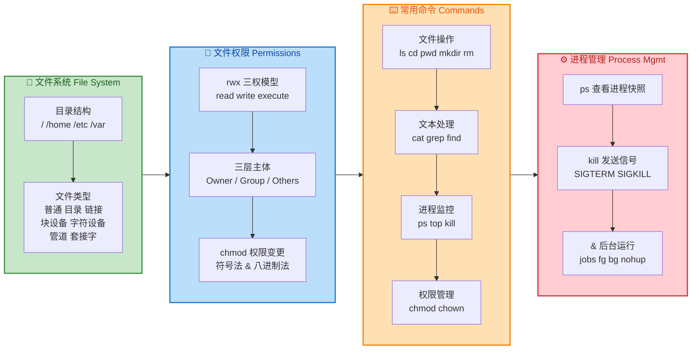

---

### 核心知识回顾

**一、文件系统——Linux 世界的骨架**

Linux 遵循 **"一切皆文件"（Everything is a file）** 的哲学。整个系统以 `/`（根目录）为起点，呈倒树状展开。我们重点掌握了四个关键目录：

| 目录 | 职责 | 典型内容 |
|------|------|----------|
| `/` | 根，所有路径的起点 | 挂载整个文件系统树 |
| `/home` | 用户私有空间 | `~/.bashrc`, 个人文档 |
| `/etc` | 系统级配置 | `/etc/passwd`, `/etc/fstab` |
| `/var` | 可变数据 | 日志 `/var/log`、缓存、邮件 |

文件类型方面，Linux 定义了 **7 种文件类型**，通过 `ls -l` 输出首字符即可识别：`-`（普通文件）、`d`（目录）、`l`（符号链接）、`b`（块设备）、`c`（字符设备）、`p`（管道）、`s`（套接字）。理解这些类型是后续掌握设备管理、进程间通信（IPC）的前提。

**二、文件权限——Linux 安全的第一道防线**

权限模型建立在 **rwx × Owner/Group/Others** 的 3×3 矩阵之上。每个文件都携带一个 9 位权限串（如 `rwxr-xr--`），可以用八进制数（如 `754`）等价表示。核心记忆公式：

```text
r = 4    w = 2    x = 1
```

`chmod` 提供两种修改方式：**符号法**（`chmod u+x file`，语义直观）和**八进制法**（`chmod 755 file`，一步到位）。在实际运维中，八进制法因其简洁高效而被更广泛使用；符号法则在脚本中做增量修改时更为安全，不会意外覆盖其他主体的权限。

需要特别记住的是：**对目录而言，`x`（execute）权限意味着"能否进入该目录"**，而非"执行"。这是初学者最易混淆的概念。

**三、常用命令——与 Linux 对话的语言**

命令按功能可划分为四大族群：

- **文件操作族**：`ls`（列出）、`cd`（切换目录）、`pwd`（打印当前路径）、`mkdir`（创建目录）、`rm`（删除）。其中 `rm -rf` 是运维中最危险的命令，**务必确认路径再执行**。
- **文本处理族**：`cat`（查看/拼接文件）、`grep`（基于正则的文本搜索）、`find`（在目录树中按条件查找文件）。`grep` 与管道 `|` 的组合是 Linux 日志分析的核心手段。
- **进程监控族**：`ps`（静态快照）、`top`（动态实时监控）、`kill`（发送信号）。这三者构成进程生命周期观测的闭环。
- **权限管理族**：`chmod`（改权限）、`chown`（改归属）。`chown user:group file` 可以同时修改属主和属组。

**四、进程管理——操作系统的心跳**

每个运行中的程序都是一个 **进程（Process）**，拥有唯一的 **PID**。我们掌握了三种核心操作：

1. **观察**：`ps aux` 查看全系统进程快照；`ps -ef` 以完整格式查看父子关系（PPID）。
2. **控制**：`kill PID` 发送默认的 `SIGTERM`（15号，温和终止）；`kill -9 PID` 发送 `SIGKILL`（强制终止，不可被捕获）。
3. **后台化**：命令末尾加 `&` 可将任务放入后台；`nohup` 使进程在终端关闭后继续存活；`jobs`、`fg`、`bg` 用于前后台任务切换。

这四大板块之间并非孤立的——它们形成了一条清晰的 **操作链路**：

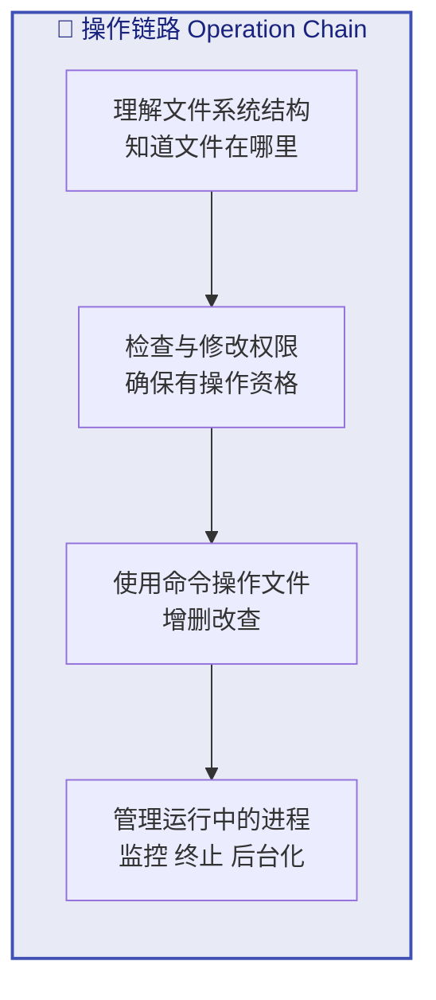

> 你必须先知道文件 **在哪**（文件系统），再确认你 **能不能动它**（权限），然后才能 **对它做操作**（命令），如果操作产生了长时间运行的任务，就需要 **管理进程**。

---

### 高频易错点速查表

| 易错点 | 正确理解 |
|--------|----------|
| `rm -rf /` | 删除整个系统！永远不要执行。现代系统有 `--preserve-root` 保护。 |
| 目录的 `x` 权限 | 表示"能否进入（cd）该目录"，而非执行 |
| `kill -9` | 是 `SIGKILL`，进程无法捕获或忽略，属于最后手段 |
| `chmod 777` | 所有人可读写执行，极不安全，生产环境严禁使用 |
| `nohup` vs `&` | `&` 仅后台运行，终端关闭进程仍可能死亡；`nohup` 才能使进程免疫 `SIGHUP` |
| `find` vs `grep` | `find` 搜索**文件名/属性**；`grep` 搜索**文件内容** |
| 硬链接 vs 软链接 | 硬链接共享 inode，不能跨文件系统；软链接是路径指针，可以跨文件系统 |

---

### 命令速查手册（Cheat Sheet）

```bash
# ========== 文件操作 ==========
ls -la              # 列出所有文件（含隐藏），显示详细信息
cd /etc             # 切换到 /etc 目录
pwd                 # 打印当前工作目录的绝对路径
mkdir -p a/b/c      # 递归创建多层目录
rm -rf dir/         # 强制递归删除目录（谨慎！）

# ========== 文本处理 ==========
cat file.txt        # 查看文件全部内容
grep -rn "error" .  # 在当前目录递归搜索包含 "error" 的行，显示行号
find / -name "*.log" -mtime -7   # 在根目录下查找 7 天内修改过的 .log 文件

# ========== 权限管理 ==========
chmod 755 script.sh        # 属主 rwx，属组 r-x，其他 r-x
chmod u+x,g-w file         # 属主加执行权，属组减写权
chown www-data:www-data /var/www  # 将目录归属改为 www-data 用户和组

# ========== 进程管理 ==========
ps aux | grep nginx         # 查看所有进程中包含 "nginx" 的条目
top -d 2                    # 每 2 秒刷新一次系统资源监控
kill -15 1234               # 向 PID 1234 发送 SIGTERM（温和终止）
kill -9 1234                # 向 PID 1234 发送 SIGKILL（强制终止）
nohup ./server &            # 后台运行 server，且终端关闭后不中断
jobs                        # 查看当前终端的后台任务列表
fg %1                       # 将 1 号后台任务切回前台
```

---

### 与后续章节的衔接

本章所学的 Linux 基础知识，将在操作系统课程的后续章节中被反复调用：

- **进程与线程**：本章的 `ps`、`kill`、`&` 是对进程管理的实践入门，后续将深入进程控制块（PCB）、进程状态转换、调度算法等理论。
- **文件系统原理**：本章的目录结构和文件类型是对文件系统的用户态认知，后续将深入 inode、超级块、磁盘调度等内核级实现。
- **内存管理**：`/proc` 虚拟文件系统中的 `maps`、`status` 等文件，可以直接观察进程的内存布局，是学习虚拟内存的实验基础。
- **安全与保护**：本章的 `rwx` 权限模型是操作系统 **访问控制（Access Control）** 最经典的实例，后续将扩展到 ACL、能力（Capability）模型等更细粒度的安全机制。

---

**📝 练习题 1**

某文件的权限为 `-rwxr-x---`，以下说法正确的是：

A. 该文件的八进制权限为 `755`

B. 属组用户可以修改该文件的内容

C. 其他用户（Others）没有任何权限

D. 该文件是一个目录文件


**【答案】** C

**【解析】** 逐位拆解权限串 `-rwxr-x---`：
- 首字符 `-` 表示这是一个**普通文件**（不是目录），排除 D。
- Owner = `rwx` = 4+2+1 = **7**
- Group = `r-x` = 4+0+1 = **5**
- Others = `---` = 0+0+0 = **0**

因此八进制权限为 `750`，而非 `755`，排除 A。属组权限为 `r-x`，**没有 `w`（写）权限**，所以不能修改文件内容，排除 B。Others 的权限为 `---`，即没有任何权限，C 正确。

---

**📝 练习题 2**

在 Linux 终端中执行以下命令序列后，终端关闭，`long_task` 进程会怎样？

```bash
./long_task &
```

A. 进程继续在后台正常运行，不受任何影响

B. 进程会收到 `SIGHUP` 信号，默认行为是终止

C. 进程自动变为守护进程（daemon），永久运行

D. 进程会收到 `SIGKILL` 信号，被强制杀死


**【答案】** B

**【解析】** 仅使用 `&` 将任务放到后台运行时，该进程仍然是**当前终端会话的子进程**。当终端（即 session leader）关闭时，内核会向该会话中所有前台和后台进程发送 **`SIGHUP`（Signal Hang Up，1号信号）**。`SIGHUP` 的默认行为是**终止进程**，因此 `long_task` 会被杀死。

- A 错误：`&` 只是后台运行，并不能使进程免疫终端关闭。
- C 错误：守护进程需要经过 `fork` + `setsid` 等特殊步骤脱离终端，或使用 `nohup`/`systemd` 等工具。
- D 错误：终端关闭发送的是 `SIGHUP`（1），不是 `SIGKILL`（9）。

若要在终端关闭后保持进程存活，正确做法是使用 `nohup ./long_task &`，这会让进程忽略 `SIGHUP` 信号。

---