---

# 内存管理 ⭐

---

## 虚拟内存 ⭐⭐

在早期计算机系统中，程序直接操作物理内存地址。这意味着一个程序可以随意读写另一个程序的内存区域，甚至覆盖操作系统内核的数据。随着多道程序设计（Multiprogramming）的兴起，多个程序需要同时驻留在内存中运行，这种"裸奔"式的内存访问带来了三个致命问题：**安全隔离缺失**（进程间可互相篡改）、**地址空间受限**（程序大小不能超过物理内存）、**内存碎片严重**（频繁加载卸载导致可用空间支离破碎）。

**虚拟内存（Virtual Memory）** 正是为了系统性地解决上述问题而诞生的。它的核心思想非常优雅：在程序和物理内存之间插入一层 **抽象层（Abstraction Layer）**，让每个进程都以为自己独占了一块巨大、连续、私有的内存空间——这就是 **虚拟地址空间（Virtual Address Space）**。而操作系统和硬件（MMU）则在幕后默默完成从虚拟地址到物理地址的翻译工作。

从宏观架构上看，虚拟内存系统涉及三个核心组件的协作：

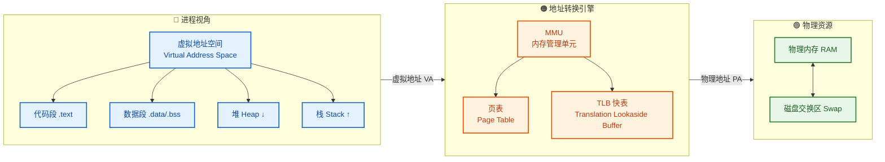

进程只发出虚拟地址，经由 MMU 查询页表翻译为物理地址，最终访问物理 RAM 或触发缺页从磁盘调入。整个过程对应用程序 **完全透明**。接下来，我们逐一深入每个子主题。

---

### 虚拟地址空间

#### 什么是虚拟地址空间

虚拟地址空间（Virtual Address Space, VAS）是操作系统为 **每个进程** 分配的一套独立的、从 `0` 开始的线性地址范围。在 32 位系统中，这个范围是 `0x00000000` ~ `0xFFFFFFFF`，总共 **4 GB**；在 64 位系统中，理论范围高达 **16 EB**（Exabytes），但实际上当前硬件通常只使用 48 位地址线（如 x86-64），有效范围为 **256 TB**。

关键认知：这 4 GB（或 256 TB）并不意味着进程真的占用了这么多物理内存。虚拟地址空间中的绝大部分区域处于 **未映射（Unmapped）** 状态，只有进程实际使用到的区域才会被操作系统映射到物理内存页框。这就是"虚拟"二字的精髓——它是一张 **空头支票**，只有兑现时才需要真金白银。

#### 经典布局：用户空间与内核空间

操作系统通常将虚拟地址空间划分为两大区域：**用户空间（User Space）** 和 **内核空间（Kernel Space）**。以经典的 32 位 Linux 为例，采用 3:1 的分割方案：

```
┌─────────────────────────────────────┐ 0xFFFFFFFF (4 GB)
│                                     │
│         内核空间 (Kernel Space)       │  ← 1 GB
│     所有进程共享同一份内核映射          │
│   包含内核代码、内核数据、驱动程序      │
│                                     │
├─────────────────────────────────────┤ 0xC0000000 (3 GB)
│          栈 (Stack)  ↓ 向低地址增长   │
│     ┌───────────────────────┐       │
│     │  局部变量、函数参数      │       │
│     │  返回地址、栈帧指针      │       │
│     └───────────────────────┘       │
│              ↓                      │
│           ...空闲...                 │
│              ↑                      │
│     ┌───────────────────────┐       │
│     │  动态分配 malloc/new    │       │
│     └───────────────────────┘       │
│          堆 (Heap)  ↑ 向高地址增长   │
├─────────────────────────────────────┤
│     BSS 段 (未初始化全局/静态变量)     │
├─────────────────────────────────────┤
│     Data 段 (已初始化全局/静态变量)    │
├─────────────────────────────────────┤
│     Text 段 (程序机器指令, 只读)      │
├─────────────────────────────────────┤
│     保留区 (Reserved, 不可访问)       │  ← 防止 NULL 指针解引用
└─────────────────────────────────────┘ 0x00000000
```

这个布局有几个值得深入理解的设计决策：

**① 为什么栈和堆相向增长？**
堆从低地址向上增长（通过 `brk()`/`sbrk()` 系统调用或 `mmap()`），栈从高地址向下增长。两者之间留有巨大的空洞。这种设计最大化了两者可用的弹性空间——如果堆突然需要更多内存，它可以向上扩展；如果递归调用很深需要大量栈空间，栈可以向下延伸。只要两者不碰撞，就不会有问题。

**② 为什么地址 0 附近被保留？**
低地址区域（通常是第一个页面，4 KB）被故意设置为不可访问。这是一个精妙的安全设计：当程序错误地解引用空指针（`NULL` pointer）时，CPU 会尝试访问地址 `0x00000000`，由于该区域未映射，MMU 会触发 **段错误（Segmentation Fault / SIGSEGV）**，程序立刻崩溃并产生 core dump，而不是悄悄读写了某个不该访问的数据。**快速失败（Fail Fast）** 远胜于默默腐败。

**③ 内核空间为何存在于每个进程的地址空间中？**
当进程执行系统调用（System Call）进入内核态时，CPU 不需要切换页表——内核代码和数据已经映射在当前进程的高地址区域。这避免了一次昂贵的 **TLB 全量刷新（TLB Flush）**，极大地提升了系统调用的性能。当然，用户态代码不能直接访问内核空间，这由页表中的 **权限位（Permission Bits）** 保证。

#### 64 位系统的地址空间

在 64 位系统（以 x86-64 / AMD64 为例）中，情况稍有不同。虽然地址线有 64 位，但当前硬件一般只实现了 **48 位虚拟地址**（这已经提供了 256 TB 的空间）。地址空间被分成两半，中间有一个巨大的 **canonical hole（规范空洞）**：

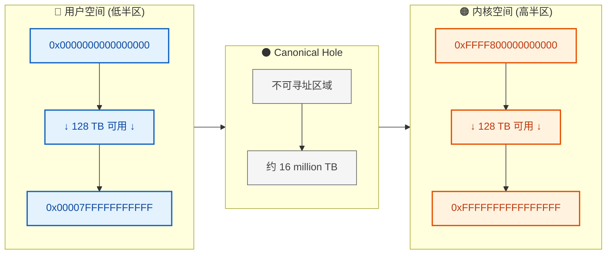

这个中间空洞是硬件层面的约束：CPU 要求虚拟地址的第 48~63 位必须与第 47 位一致（符号扩展），不满足此规则的地址是"非规范的（non-canonical）"，访问会直接触发 **General Protection Fault**。

#### 虚拟地址空间的核心优势

综合来看，虚拟地址空间的引入带来了四大核心优势：

| 优势 | 说明 |
|------|------|
| **进程隔离（Isolation）** | 每个进程拥有独立的虚拟地址空间，进程 A 无法直接读写进程 B 的内存，即使它们使用了相同的虚拟地址 |
| **地址空间远大于物理内存** | 32 位系统中每个进程可以"使用" 4 GB，即使物理内存只有 512 MB，OS 通过按需分页 + Swap 实现这一魔法 |
| **简化链接与加载** | 编译器/链接器可以假设代码总是从固定虚拟地址（如 `0x400000`）开始，无需关心实际物理位置 |
| **内存共享（Sharing）** | 不同进程的虚拟页面可以映射到同一物理页框，实现共享库（Shared Libraries）和进程间通信（IPC） |

---

### 物理内存映射

#### 从虚拟到物理：映射的本质

物理内存映射（Physical Memory Mapping）是指操作系统建立 **虚拟地址 → 物理地址** 的对应关系。这个映射不是简单的数学偏移，而是一套精心维护的 **动态映射表**——页表（Page Table），由操作系统管理、由硬件（MMU）执行。

理解映射的关键在于认识到：**虚拟地址空间是连续的，但它所映射到的物理内存可以是完全离散的**。进程看到的是一片完整的草地，但实际上这片草地由散落在各处的补丁拼凑而成。

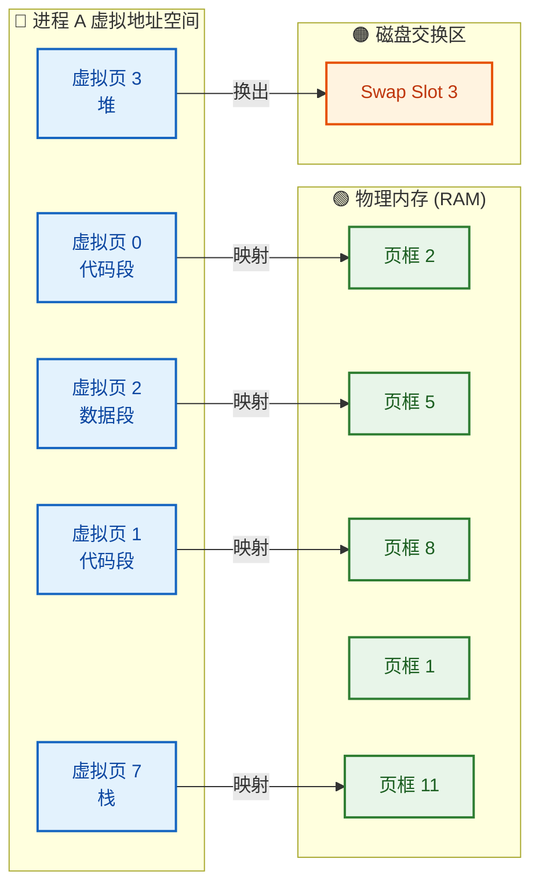

注意上图中的 **虚拟页 3**（堆中的某个页面）并未映射到 RAM，而是被 **换出（Swap Out）** 到磁盘上。当进程访问该虚拟页时，会触发 **缺页异常（Page Fault）**，操作系统再将其从磁盘调回 RAM。

#### 地址翻译的数学过程

在分页系统中，虚拟地址被拆分为两部分：**虚拟页号（VPN, Virtual Page Number）** 和 **页内偏移（Offset）**。假设页大小为 4 KB（即 2^12 字节），则一个 32 位虚拟地址的结构如下：

```
  31                  12 11                0
 ┌──────────────────────┬──────────────────┐
 │     VPN (20 bits)    │  Offset (12 bits)│
 └──────────────────────┴──────────────────┘
        虚拟页号               页内偏移

 翻译过程:
 ┌──────────────────────┬──────────────────┐
 │     VPN (20 bits)    │  Offset (12 bits)│  ← 虚拟地址
 └──────────┬───────────┴──────────────────┘
            │ 查页表 (Page Table Lookup)
            ▼
 ┌──────────────────────┬──────────────────┐
 │     PFN (20 bits)    │  Offset (12 bits)│  ← 物理地址
 └──────────────────────┴──────────────────┘
        物理页框号           偏移量不变!
```

翻译过程非常精巧：
1. 从虚拟地址中提取 **高 20 位** 作为 VPN
2. 用 VPN 作为索引查询页表，得到对应的 **物理页框号（PFN, Physical Frame Number）**
3. 将 PFN 与原始的 **低 12 位偏移量** 拼接，得到最终的物理地址
4. **偏移量保持不变** ——因为虚拟页和物理页框大小相同，页内位置无需翻译

用 C 语言伪代码表示：

```c
// 地址翻译的核心逻辑
#define PAGE_SIZE     4096          // 页大小: 4 KB = 2^12
#define OFFSET_BITS   12            // 偏移位数: 12 位
#define OFFSET_MASK   0xFFF         // 偏移掩码: 低 12 位全 1

// 输入: 虚拟地址 virtual_addr
// 输出: 物理地址 physical_addr

uint32_t vpn = virtual_addr >> OFFSET_BITS;       // 右移 12 位, 提取虚拟页号
uint32_t offset = virtual_addr & OFFSET_MASK;      // 与掩码做 AND, 提取页内偏移

// 查询页表: 以 VPN 为索引, 获取页表条目(PTE)
PageTableEntry pte = page_table[vpn];              // 页表本质是一个数组

if (!pte.valid) {                                  // 检查有效位
    trigger_page_fault(virtual_addr);              // 无效 → 触发缺页异常
    // OS 处理完缺页后, pte 会被更新, 重新执行这条指令
}

uint32_t pfn = pte.physical_frame_number;          // 从 PTE 中取出物理页框号
uint32_t physical_addr = (pfn << OFFSET_BITS) | offset;  // 拼接: PFN + Offset
```

#### 举个具体的例子

假设某进程要访问虚拟地址 `0x00003A7F`：

```
虚拟地址: 0x00003A7F
二进制:   0000 0000 0000 0000 0011 1010 0111 1111

拆分:
  VPN    = 0x00003  (高 20 位 = 0000 0000 0000 0000 0011 = 3)
  Offset = 0xA7F   (低 12 位 = 1010 0111 1111 = 2687)

查页表: page_table[3].PFN = 0x0008D  (假设映射到物理页框 141)

物理地址 = (0x0008D << 12) | 0xA7F
         = 0x0008DA7F

验证: 虚拟页 3 中偏移 2687 处 → 物理页框 141 中偏移 2687 处 ✓
```

#### MMU 与 TLB：硬件加速

每次内存访问都要查询页表，而页表本身也存储在内存中——这意味着 **每次内存访问实际上需要两次内存访问**（一次查页表 + 一次读目标数据）。这个开销是不可接受的。

为了解决这个问题，CPU 内部集成了一个高速缓存——**TLB（Translation Lookaside Buffer，翻译后备缓冲区）**，也叫 **快表**。TLB 缓存了最近使用过的页表条目（PTE），典型容量为 64~1024 个条目。

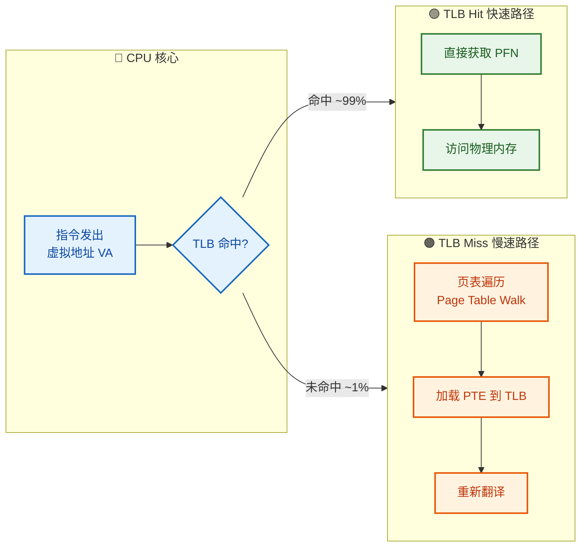

**TLB 命中（TLB Hit）** 时，地址翻译在 **1 个 CPU 周期** 内完成，几乎零开销。**TLB 未命中（TLB Miss）** 时，硬件（或操作系统，取决于架构）需要遍历内存中的页表（称为 **Page Table Walk**），这可能需要几十到几百个周期。

TLB 之所以有效，依赖于一个关键的程序行为特性——**局部性原理（Principle of Locality）**：
- **时间局部性（Temporal Locality）**：最近访问过的地址很可能很快再次被访问
- **空间局部性（Spatial Locality）**：访问了某个地址后，其附近的地址也很可能被访问

由于程序在短时间内通常只活跃在少数几个页面上（代码的循环体、正在操作的数组等），TLB 中仅需缓存几十到几百个条目就能覆盖绝大多数访问，命中率通常高达 **98%~99.9%**。

#### 缺页异常（Page Fault）

当 CPU 访问一个虚拟页面，但该页面当前 **未驻留在物理内存中** 时，MMU 无法完成地址翻译，会触发一个 **缺页异常（Page Fault）**。操作系统接管后的处理流程如下：

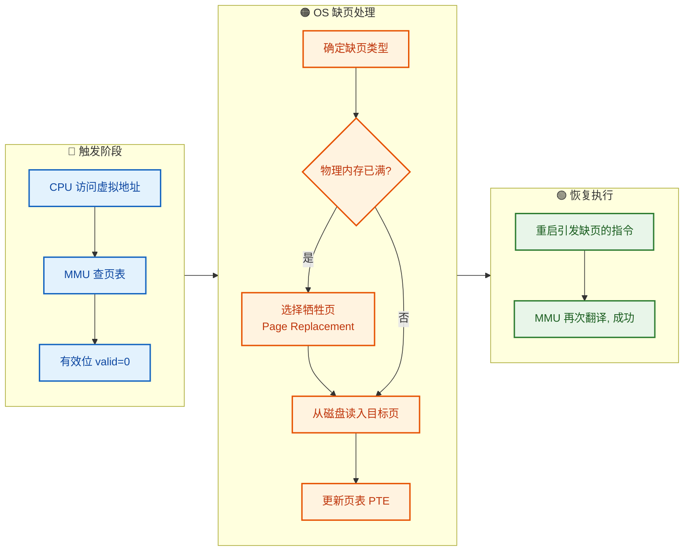

缺页异常分为三种类型：

| 类型 | 英文名 | 说明 |
|------|--------|------|
| **硬缺页** | Major Page Fault | 页面在磁盘上（Swap 或文件），需要磁盘 I/O，开销巨大（~ms 级） |
| **软缺页** | Minor Page Fault | 页面已在物理内存中（如被其他进程共享），只需修改页表映射，无需磁盘 I/O |
| **无效缺页** | Invalid Page Fault | 访问了非法地址（如空指针解引用），OS 向进程发送 SIGSEGV 信号，通常导致进程终止 |

值得注意的是，**缺页异常并非"错误"，而是虚拟内存系统的正常工作机制**。操作系统通过 **Demand Paging（按需分页）** 策略，只在页面首次被访问时才真正分配物理内存，这避免了预先分配大量可能永远不会使用的内存，极大提高了内存利用率。

---

### 页表

#### 页表的基本结构

页表（Page Table）是虚拟内存系统的 **核心数据结构**，它记录了虚拟页号（VPN）到物理页框号（PFN）的映射关系。从概念上讲，页表就是一个以 VPN 为索引的数组，每个元素是一个 **页表条目（PTE, Page Table Entry）**。

一个典型的 PTE 包含以下字段：

```
  31                  12 11  9  8  7  6  5  4  3  2  1  0
 ┌──────────────────────┬──────┬──┬──┬──┬──┬──┬──┬──┬──┬──┐
 │   PFN (20 bits)      │ Avail│G │PS│D │A │CD│WT│U │W │V │
 └──────────────────────┴──────┴──┴──┴──┴──┴──┴──┴──┴──┴──┘
 │                      │      │  │  │  │  │  │  │  │  │
 │ 物理页框号            │ OS用 │  │  │  │  │  │  │  │  └─ Valid     有效位
 │                      │      │  │  │  │  │  │  │  └──── Write     读写位
 │                      │      │  │  │  │  │  │  └─────── User      用户位
 │                      │      │  │  │  │  │  └────────── WriteThru 写穿透
 │                      │      │  │  │  │  └───────────── CacheDis  禁缓存
 │                      │      │  │  │  └──────────────── Accessed  访问位
 │                      │      │  │  └─────────────────── Dirty     脏位
 │                      │      │  └────────────────────── PageSize  页大小
 │                      │      └───────────────────────── Global    全局位
 │                      └──────────────────────────────── Available OS保留
 └─────────────────────────────────────────────────────── PFN       页框号
```

几个关键控制位的深入解读：

- **Valid（V）**：最关键的一位。V=1 表示此虚拟页当前驻留在物理内存中；V=0 表示未映射或已换出到磁盘，访问将触发缺页异常。
- **Write（W）**：W=1 允许写操作；W=0 表示只读页面。尝试写入只读页面会触发 **保护错误（Protection Fault）**。这是实现 **写时复制（Copy-on-Write, CoW）** 的关键——`fork()` 后父子进程共享物理页面并标记为只读，任一方写入时触发保护错误，OS 才真正复制该页面。
- **User（U）**：U=1 表示用户态可访问；U=0 表示仅内核态可访问。这保证了用户程序无法读写内核空间。
- **Accessed（A）**：每当 CPU 读取或写入该页面时，硬件自动将此位置 1。OS 周期性地检查并清零此位，用于判断页面是否"最近被使用过"，是 **页面置换算法** 的重要依据。
- **Dirty（D）**：当页面被写入时硬件自动置 1。若 D=1，该页面在被换出前必须先写回磁盘（因为内容已被修改）；若 D=0，可以直接丢弃（因为磁盘上已有一份相同的副本）。

#### 单级页表的问题

对于 32 位地址空间、4 KB 页大小的系统：
- VPN 有 20 位 → 页表有 2^20 = **1,048,576** 个条目
- 每个 PTE 占 4 字节 → 页表总大小 = 4 MB

**每个进程** 都需要一张 4 MB 的页表。如果系统中运行了 100 个进程，光是页表就要占用 **400 MB** 的物理内存！更致命的是，页表必须是 **连续存储** 的（因为要用 VPN 直接索引），这在内存紧张时几乎不可能分配。

对于 64 位系统，问题更加灾难性：48 位地址空间 + 4 KB 页 → VPN 有 36 位 → 2^36 个 PTE → 单张页表 **256 GB**。这显然是不可接受的。

#### 多级页表（Multi-Level Page Table）

解决方案是 **多级页表**——将一张巨大的扁平页表拆分为多层小页表，形成树状结构。核心思想：**只为实际使用的虚拟地址区域分配页表空间**。

以 x86 的 **二级页表** 为例（32 位，4 KB 页）：

```
  31         22 21         12 11            0
 ┌─────────────┬─────────────┬──────────────┐
 │ PD Index    │ PT Index    │   Offset     │
 │ (10 bits)   │ (10 bits)   │  (12 bits)   │
 └──────┬──────┴──────┬──────┴──────────────┘
        │             │
        │     ┌───────┘
        ▼     │
   ┌─────────┐│    ┌─────────┐
   │Page Dir ││    │Page Tbl │      ┌──────────┐
   │(一级页表)│▼    │(二级页表)│      │ 物理页框  │
   ├─────────┤     ├─────────┤      │          │
   │  PDE 0  │     │  PTE 0  │      │          │
   │  PDE 1  │──→  │  PTE 1  │──→   │  目标数据 │
   │  ...    │     │  ...    │      │          │
   │ PDE 1023│     │PTE 1023 │      └──────────┘
   └─────────┘     └─────────┘
    1024 项          1024 项
    占 4 KB          占 4 KB
```

翻译步骤：
1. 用虚拟地址的 **高 10 位** 索引 **页目录（Page Directory）**，得到二级页表的物理地址
2. 用虚拟地址的 **中间 10 位** 索引对应的 **页表（Page Table）**，得到 PFN
3. 将 PFN 与 **低 12 位偏移量** 拼接，得到最终物理地址

用代码表达：

```c
// 二级页表地址翻译
#define PD_INDEX(va)  ((va >> 22) & 0x3FF)  // 高 10 位: 页目录索引
#define PT_INDEX(va)  ((va >> 12) & 0x3FF)  // 中间 10 位: 页表索引
#define OFFSET(va)    (va & 0xFFF)           // 低 12 位: 页内偏移

uint32_t translate(uint32_t va, PageDirEntry *pgdir) {
    // 第一步: 查询页目录, 获取二级页表基地址
    uint32_t pd_idx = PD_INDEX(va);                 // 提取页目录索引
    PageDirEntry pde = pgdir[pd_idx];               // 索引页目录
    if (!pde.valid) trigger_page_fault(va);         // PDE 无效 → 缺页

    // 第二步: 查询二级页表, 获取物理页框号
    PageTableEntry *pt = (PageTableEntry *)pde.pt_base_addr;  // 二级页表基地址
    uint32_t pt_idx = PT_INDEX(va);                 // 提取页表索引
    PageTableEntry pte = pt[pt_idx];                // 索引二级页表
    if (!pte.valid) trigger_page_fault(va);         // PTE 无效 → 缺页

    // 第三步: 拼接物理地址
    uint32_t pfn = pte.physical_frame_number;       // 取出物理页框号
    uint32_t pa = (pfn << 12) | OFFSET(va);         // PFN + 偏移 = 物理地址
    return pa;
}
```

**为什么多级页表能节省内存？**

关键在于：如果页目录中某个 PDE 的 Valid 位为 0，那么它所指向的整张二级页表 **根本不需要存在**。假设一个进程只使用了虚拟地址空间的很小一部分（这是绝大多数进程的真实情况），那么 1024 个 PDE 中可能只有几十个是有效的，也就只需要几十张二级页表。

极端情况下的对比：
- **单级页表**：无论使用了多少地址空间，始终占用 **4 MB**
- **二级页表**：一张页目录 4 KB + 仅已使用区域的二级页表。若只用了 4 MB 的地址空间（1 个 PDE 有效），仅需 4 KB + 4 KB = **8 KB**

#### x86-64 的四级页表

现代 64 位系统（x86-64）使用 **四级页表**，将 48 位虚拟地址拆分为五段：

```
  47     39 38     30 29     21 20     12 11        0
 ┌─────────┬─────────┬─────────┬─────────┬──────────┐
 │  PML4   │  PDPT   │   PD    │   PT    │  Offset  │
 │ (9 bit) │ (9 bit) │ (9 bit) │ (9 bit) │ (12 bit) │
 └────┬────┴────┬────┴────┬────┴────┬────┴──────────┘
      │         │         │         │
      ▼         ▼         ▼         ▼
   PML4 表   PDPT 表    PD 表     PT 表    → 物理页框
   512项      512项      512项     512项
```

每级页表包含 **512 个条目**（2^9 = 512），每个条目 8 字节，因此每张页表恰好占一个 **4 KB 页面**（512 × 8 = 4096）——这个设计绝非巧合，它使得页表本身也可以被分页管理。

四个级别的名称：
1. **PML4（Page Map Level 4）**：最高级页表，每个进程有且仅有一张，其物理地址存储在 CPU 的 **CR3 寄存器** 中
2. **PDPT（Page Directory Pointer Table）**：第三级
3. **PD（Page Directory）**：第二级
4. **PT（Page Table）**：最底级，包含最终的 PFN

每次地址翻译最多需要 **4 次内存访问**（逐级遍历），这就是为什么 TLB 如此重要——一次 TLB 命中直接跳过这 4 次内存访问。

#### 页表基址寄存器：CR3

操作系统在进行 **进程上下文切换（Context Switch）** 时，会将新进程的 PML4（或页目录）的 **物理地址** 加载到 CR3 寄存器中。这一操作相当于"切换了整个虚拟地址空间"——同样的虚拟地址 `0x400000`，在进程 A 的上下文中指向 A 的代码段，在进程 B 的上下文中则指向 B 的代码段。

```c
// 上下文切换时切换页表 (简化的内核代码)
void context_switch(Process *prev, Process *next) {
    // ... 保存 prev 的寄存器状态 ...

    // 切换页表: 将 next 进程的页表基地址写入 CR3
    // 这一步使得虚拟地址空间立即从 prev 切换到 next
    load_cr3(next->pgdir_phys_addr);      // 写入 CR3 寄存器

    // 注意: 写入 CR3 会自动刷新 TLB (因为新的页表映射完全不同)
    // 这也是上下文切换开销大的原因之一

    // ... 恢复 next 的寄存器状态 ...
}
```

#### 倒排页表（Inverted Page Table）

传统页表是 **按虚拟地址组织** 的——每个虚拟页都有一个 PTE，不管它是否被使用。倒排页表（Inverted Page Table）则反其道而行：**按物理页框组织**，整个系统只有一张页表，条目数等于物理页框数。

每个条目记录的是"这个物理页框当前被哪个进程的哪个虚拟页所使用"。

```
倒排页表 (Inverted Page Table)
┌──────────┬──────────┬──────────┐
│ 页框号    │  PID     │   VPN    │
├──────────┼──────────┼──────────┤
│    0     │ Proc A   │   VP 5   │
│    1     │ Proc C   │   VP 2   │
│    2     │ Proc A   │   VP 0   │
│    3     │  (空闲)   │    -     │
│    4     │ Proc B   │   VP 7   │
│   ...    │  ...     │   ...    │
└──────────┴──────────┴──────────┘
```

**优点**：无论虚拟地址空间多大，页表大小只取决于物理内存大小。对于 64 位系统，这可以节省巨量空间。

**缺点**：地址翻译时需要 **搜索** 整张表（查找 PID + VPN 匹配的条目），线性搜索太慢，实际实现通常使用 **哈希表** 加速查找。PowerPC 和 IA-64 架构曾采用倒排页表。

#### 页表机制总览

最后，将页表相关的所有概念整合：

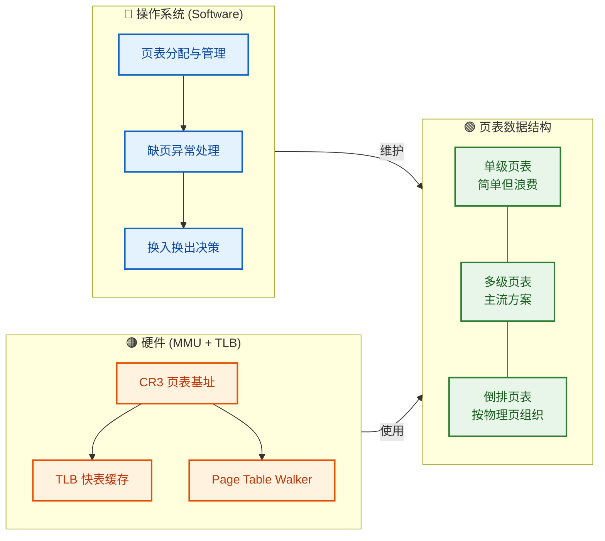

操作系统负责 **策略（Policy）**——什么时候分配页表、缺页时调入哪个页面、内存紧张时换出哪个页面；硬件 MMU 负责 **机制（Mechanism）**——快速执行地址翻译、在 TLB 中缓存热条目、遍历多级页表。这种 **策略与机制分离（Separation of Policy and Mechanism）** 的设计哲学贯穿整个操作系统。

---

**📝 练习题**

在一个使用二级页表的 32 位系统中，页大小为 4 KB。某进程的虚拟地址空间中，只有前 4 MB 和最后 4 MB 被使用（分别用于代码段和栈），其余地址区域均未映射。请问该进程的页表结构（包括页目录和所有二级页表）总共占用多少物理内存？

A. 4 KB


B. 12 KB


C. 4 MB


D. 8 MB


**【答案】** B

**【解析】**

在二级页表结构中：

- **页目录（Page Directory）** 始终需要完整存在，包含 1024 个条目，占用 **4 KB**。
- **每张二级页表** 也包含 1024 个条目，占用 4 KB，但仅在对应的 PDE 有效时才需分配。
- 页目录中的一个 PDE 覆盖 1024 × 4 KB = **4 MB** 的地址范围。

前 4 MB 对应页目录的 **第 0 项**（`PDE[0]`），需要 1 张二级页表 = 4 KB。
最后 4 MB 对应页目录的 **第 1023 项**（`PDE[1023]`），也需要 1 张二级页表 = 4 KB。
其余 1022 个 PDE 的 Valid 位为 0，不需要分配二级页表。

总计 = 4 KB（页目录）+ 4 KB（第 0 张二级页表）+ 4 KB（第 1023 张二级页表）= **12 KB**。

这正体现了多级页表的核心优势：相比于单级页表固定的 4 MB 开销，这里只用了 12 KB，节省了 99.7% 的空间。选项 C（4 MB）是使用单级页表时的开销。

---

## 分页机制 ⭐

分页机制（Paging）是现代操作系统内存管理的核心基石。它的设计哲学非常优雅——将逻辑上连续的内存空间，打碎成大小固定的小块，再像拼图一样映射到物理内存的各个角落。这种机制彻底解决了连续内存分配中令人头疼的 **外部碎片（External Fragmentation）** 问题，让操作系统可以高效、灵活地利用每一寸物理内存。

在没有分页机制的早期系统中，一个进程必须占据一段 **连续的** 物理内存区域。随着进程的创建与销毁，物理内存中会出现大量零散的空闲区域——每一块都太小，无法容纳新进程，但总量加起来却绑绑有余。这就是所谓的外部碎片。分页机制的出现，从根本上消灭了这个问题：既然我们可以把进程拆成小块，那就不再需要连续的物理空间了。

分页机制涉及三个核心概念：**页（Page）**、**页框（Frame）** 和 **页表（Page Table）**。它们各司其职，共同构成了虚拟地址到物理地址的完整翻译链路。下面我们逐一深入剖析。

---

### 页（Page）

**页（Page）** 是虚拟地址空间（Virtual Address Space）的基本分割单位。操作系统将进程的整个虚拟地址空间等分为大小固定的块，每一块就称为一个"页"。常见的页大小为 **4KB**（即 4096 字节），这也是 x86 架构下的默认配置。部分系统还支持 **大页（Huge Page）**，如 2MB 或 1GB，用于对性能要求极高的场景（如数据库、虚拟化等）。

页的大小必须是 2 的幂次方，这不是巧合，而是精心设计。因为如果页大小为 $2^n$ 字节，那么一个虚拟地址就可以被自然拆分为两部分：

- **高位部分**：页号（Page Number），用于在页表中索引。
- **低位部分**：页内偏移（Page Offset），用于定位页内的具体字节。

以 32 位虚拟地址、4KB 页大小为例：

```text
32位虚拟地址结构 (4KB Page Size = 2^12)
┌──────────────────────────┬──────────────┐
│      页号 (Page Number)    │  页内偏移 (Offset) │
│         高 20 位           │    低 12 位       │
│   可寻址 2^20 = 1M 个页    │ 可寻址 4096 字节   │
└──────────────────────────┴──────────────┘
          bits [31:12]           bits [11:0]
```

这意味着在 32 位系统中，一个进程最多可以拥有 $2^{20}$ = **1,048,576** 个页，总计覆盖 4GB 的虚拟地址空间。操作系统并不需要为所有页都分配物理内存——只有进程实际访问到的页才需要映射，这正是 **按需分页（Demand Paging）** 的核心思想。

**页大小的选择是一门平衡的艺术**：

| 特性 | 小页（如 4KB） | 大页（如 2MB） |
|------|---------------|---------------|
| 内部碎片 | 较少（平均浪费约半页） | 较多（可能浪费近 1MB） |
| 页表大小 | 较大（需要更多页表项） | 较小（页表项更少） |
| TLB 覆盖范围 | 较小 | 较大，TLB 命中率更高 |
| I/O 效率 | 磁盘换入换出粒度小 | 大块传输更高效 |
| 内存利用率 | 更精细，利用率高 | 粒度粗，可能浪费 |

> **内部碎片（Internal Fragmentation）**：进程最后一个页往往无法填满整页，平均浪费半页空间。页越大，浪费越严重。

下面用 C 语言演示如何从虚拟地址中提取页号和偏移量：

```c
#include <stdio.h>
#include <stdint.h>

#define PAGE_SIZE      4096        // 页大小: 4KB = 2^12 字节
#define OFFSET_BITS    12          // 偏移量占 12 位
#define OFFSET_MASK    0xFFF       // 低12位掩码: 0000...0111111111111

int main() {
    // 假设一个32位虚拟地址
    uint32_t virtual_addr = 0x00003A7F;   // 十进制: 14975

    // 提取页号: 右移12位，去掉偏移部分
    uint32_t page_number = virtual_addr >> OFFSET_BITS;

    // 提取页内偏移: 与低12位掩码做按位与
    uint32_t page_offset = virtual_addr & OFFSET_MASK;

    // 输出结果
    printf("虚拟地址: 0x%08X\n", virtual_addr);   // 0x00003A7F
    printf("页号 (Page Number): %u\n", page_number); // 3 (0x3)
    printf("页内偏移 (Offset):  %u\n", page_offset); // 0xA7F = 2687
    
    return 0;
}
```

对于这个地址 `0x00003A7F`，页号为 3，偏移为 2687。这意味着该地址位于虚拟空间第 3 页（从 0 开始编号）的第 2687 个字节处。

---

### 页框（Frame）

**页框（Frame）**，也称 **物理页框（Physical Frame）** 或 **页帧**，是物理内存（Physical Memory / RAM）的基本分割单位。页框的大小与页的大小 **完全一致**（通常也是 4KB），这种对称设计使得任意一个虚拟页都可以映射到任意一个物理页框中，极其灵活。

如果说页（Page）是虚拟世界的"格子"，那么页框（Frame）就是物理世界的"格子"。两者大小相同，但编号体系完全独立：

```text
虚拟地址空间 (进程视角)              物理内存 (硬件视角)
┌────────────────┐                 ┌────────────────┐
│   Page 0       │───────┐         │   Frame 0      │
├────────────────┤       │         ├────────────────┤
│   Page 1       │──┐    └────────▶│   Frame 1      │
├────────────────┤  │              ├────────────────┤
│   Page 2       │  │    ┌────────▶│   Frame 2      │
├────────────────┤  │    │         ├────────────────┤
│   Page 3       │  └────┘         │   Frame 3      │
├────────────────┤       ┌────────▶├────────────────┤
│   Page 4       │───────┘         │   Frame 4      │
├────────────────┤                 ├────────────────┤
│     ...        │                 │     ...        │
└────────────────┘                 └────────────────┘

  ★ 注意: 虚拟页的映射完全不需要连续!
    Page 0 → Frame 1
    Page 1 → Frame 2
    Page 4 → Frame 4
    (Page 2, 3 可能尚未分配/已换出磁盘)
```

操作系统维护着一个 **空闲页框列表（Free Frame List）**，记录所有当前可用的物理页框。当进程需要新的物理内存时（例如触发缺页中断），操作系统从该列表中取出一个空闲页框分配给它；当进程释放内存或页面被换出时，页框归还到空闲列表。

物理地址与页框的关系同样简洁明了：

```text
物理地址结构
┌────────────────────────────┬──────────────┐
│    帧号 (Frame Number)       │  帧内偏移 (Offset) │
│         高位                 │     低位          │
└────────────────────────────┴──────────────┘
```

**关键点**：页内偏移和帧内偏移是 **完全相同** 的，因为页和页框大小相同。地址翻译本质上只是把 **页号替换为帧号**，偏移量原样保留。这正是分页机制高效的关键——硬件只需查一次页表，替换高位即可完成翻译。

```c
#include <stdio.h>
#include <stdint.h>

#define PAGE_SIZE    4096    // 页/页框大小: 4KB
#define OFFSET_BITS  12     // 偏移位数

/**
 * 模拟虚拟地址到物理地址的核心翻译过程
 * 输入: 虚拟地址, 该页对应的物理帧号
 * 输出: 物理地址
 */
uint32_t translate(uint32_t virtual_addr, uint32_t frame_number) {
    // 第1步: 提取页内偏移(低12位保持不变)
    uint32_t offset = virtual_addr & (PAGE_SIZE - 1);

    // 第2步: 将帧号左移12位, 拼接上偏移量, 得到物理地址
    uint32_t physical_addr = (frame_number << OFFSET_BITS) | offset;

    return physical_addr;  // 返回最终物理地址
}

int main() {
    uint32_t vaddr = 0x00003A7F;  // 虚拟地址: 页号=3, 偏移=0xA7F
    uint32_t frame = 7;           // 假设页表查询结果: 页3映射到帧7

    // 执行地址翻译
    uint32_t paddr = translate(vaddr, frame);

    // 物理地址 = (7 << 12) | 0xA7F = 0x7000 | 0xA7F = 0x7A7F
    printf("虚拟地址: 0x%08X → 物理地址: 0x%08X\n", vaddr, paddr);
    
    return 0;
}
```

---

### 页表（Page Table）

页表（Page Table）是分页机制的 **灵魂数据结构**。它是一张由操作系统维护、由 **MMU（Memory Management Unit，内存管理单元）** 硬件查询的映射表，负责将虚拟页号（VPN, Virtual Page Number）翻译为物理帧号（PFN, Physical Frame Number）。

#### 页表项（Page Table Entry, PTE）的结构

每一条页表记录称为一个 **页表项（PTE）**。除了核心的帧号之外，PTE 中还包含若干控制位（Control Bits），用于实现权限控制、状态追踪等功能：

```text
典型的 32 位系统页表项 (PTE) 结构
┌─────────────────────────────────────────────────────────────┐
│ 31                       12 │ 11  9 │ 8  7  6  5  4  3  2  1  0 │
│    物理帧号 (Frame Number)    │ Avail │ G PS D  A CD WT U/S R/W P │
│         20 bits              │ 3bits │          9 bits            │
└─────────────────────────────────────────────────────────────┘

标志位说明:
  P   (Present)       : 存在位, 1=该页在物理内存中, 0=不在(可能被换出)
  R/W (Read/Write)    : 读写位, 1=可读可写, 0=只读
  U/S (User/Supervisor): 权限位, 1=用户态可访问, 0=仅内核态
  A   (Accessed)      : 访问位, 该页被读/写过时由 CPU 自动置1
  D   (Dirty)         : 脏位, 该页被写入过时由 CPU 自动置1
  CD  (Cache Disable) : 缓存禁用位
  WT  (Write Through) : 写穿透位
  PS  (Page Size)     : 页大小位, 用于大页支持
  G   (Global)        : 全局位, 上下文切换时不刷新 TLB 中该项
```

各标志位在操作系统运作中扮演着关键角色：

- **Present 位**：这是 **缺页中断（Page Fault）** 的触发器。当 CPU 访问一个 Present=0 的页时，MMU 会立即触发缺页异常，操作系统介入处理（从磁盘加载页面或终止非法访问）。
- **Dirty 位**：页面置换时的重要依据。如果一个页被修改过（Dirty=1），换出时必须先写回磁盘；否则可以直接丢弃，节省 I/O 开销。
- **Accessed 位**：供页面置换算法（如 Clock 算法）参考，判断页面是否"最近被使用过"。
- **U/S 位**：实现内存保护的关键。用户态程序无法访问 U/S=0 的内核页面，否则会触发保护异常（Protection Fault）。

#### 基本地址翻译流程

一次完整的地址翻译过程如下：

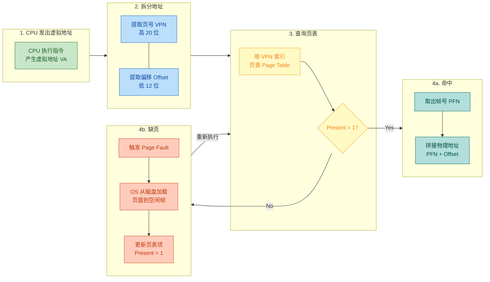

#### 多级页表（Multi-Level Page Table）

在 32 位系统中，如果使用单级页表，需要 $2^{20}$ 个页表项。每个 PTE 占 4 字节，则一张页表需要 **4MB** 连续内存空间——而且每个进程都需要一张。对于同时运行数百个进程的系统来说，这是巨大的浪费，因为大多数进程实际使用的虚拟空间非常稀疏。

**多级页表** 的灵感来自于"目录-索引"模型（类似图书馆的分级检索系统）：不必为未使用的虚拟地址区域分配页表空间。

以 **二级页表（Two-Level Page Table）** 为例：

```text
32位虚拟地址在二级页表下的拆分
┌──────────────┬──────────────┬──────────────┐
│  一级索引 (PD) │ 二级索引 (PT)  │  页内偏移      │
│   高 10 位     │   中 10 位     │  低 12 位     │
│  1024 个表项   │  1024 个表项   │  4096 字节    │
└──────────────┴──────────────┴──────────────┘
```

翻译流程变成了两跳查询：

1. 用高 10 位索引 **页目录（Page Directory）**，得到二级页表的物理基地址。
2. 用中 10 位索引 **二级页表（Page Table）**，得到最终的物理帧号。
3. 拼接帧号和偏移量，得到物理地址。

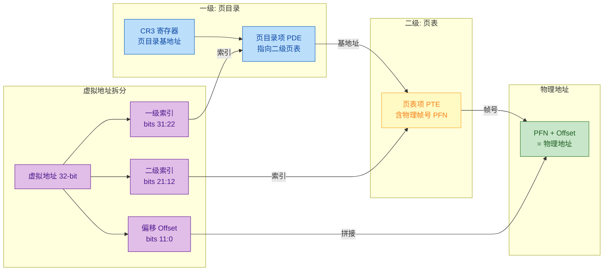

多级页表的核心优势在于 **按需分配**：如果某个一级页目录项对应的虚拟地址区域从未使用过，那么它指向的二级页表就根本不需要创建。在实际系统中，大多数进程只使用虚拟空间的极小部分（代码段、堆、栈附近），因此可以节省巨大的内存开销。

对于 **64 位系统**（如 x86-64），虚拟地址空间高达 $2^{64}$ 字节（理论上），即使使用二级页表也不够。因此 x86-64 架构采用 **四级页表**（PML4 → PDPT → PD → PT），近年来 Intel 和 AMD 还引入了 **五级页表（PML5）** 以支持高达 57 位的虚拟地址空间（128 PB）。

#### TLB：页表的高速缓存

每次内存访问都需要查页表，而页表本身存储在内存中。这意味着一次数据访问实际上需要 **至少两次** 内存访问（先查页表，再读数据），如果是四级页表则需要五次。这是不可接受的性能瓶颈。

**TLB（Translation Lookaside Buffer，地址翻译后备缓冲器）** 就是为解决此问题而生的。它是 MMU 内部的一块小型高速缓存（通常只有 64-1024 条目），存储最近使用过的 VPN → PFN 映射。

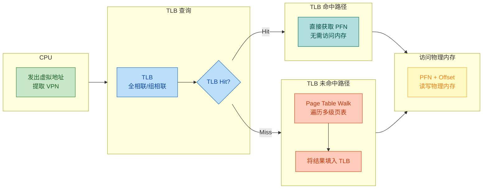

TLB 的命中率（Hit Rate）通常可以达到 **95%-99%** 以上，这得益于程序的 **时间局部性（Temporal Locality）** 和 **空间局部性（Spatial Locality）**——程序倾向于反复访问同一区域的数据和代码。TLB 命中时，地址翻译几乎零开销（1-2 个时钟周期），而 TLB 未命中时则需要进行完整的 Page Table Walk（可能需要数十甚至上百个时钟周期）。

需要注意的是，**进程切换（Context Switch）** 时通常需要 **刷新 TLB（TLB Flush）**，因为不同进程有不同的页表。这也是进程切换开销较大的原因之一。现代处理器通过在 TLB 中加入 **ASID（Address Space Identifier）** 标签来缓解这一问题——不同进程的 TLB 条目可以共存，只需比对 ASID 即可区分。

---

### 页面置换算法（LRU、FIFO）

当物理内存不足时，操作系统需要将某些页面 **换出（Swap Out）** 到磁盘上的交换区（Swap Space），腾出物理帧给更急需的页面使用。问题在于：**应该换出哪一页？** 这就是页面置换算法（Page Replacement Algorithm）要回答的核心问题。

选择错误的页面将导致它很快又被访问到，于是又要从磁盘调入——触发新的缺页中断。频繁的页面换入换出称为 **抖动（Thrashing）**，会导致系统性能急剧下降。一个好的置换算法应当尽可能降低缺页率（Page Fault Rate）。

#### 最优置换算法（OPT / Belady's Algorithm）

在正式介绍 LRU 和 FIFO 之前，先介绍理论上的 **最优算法 OPT**：每次换出 **未来最长时间内不会被访问的页面**。OPT 能保证最低的缺页率，但它需要预知未来的访问序列，在实际系统中无法实现。它的价值在于作为 **理论基准（Theoretical Benchmark）**，用于评估其他算法的优劣。

#### FIFO（先进先出）

**FIFO（First-In First-Out）** 是最简单的页面置换算法。它的策略是：**最早调入内存的页面最先被换出**。操作系统维护一个按到达时间排序的队列，新页面从队尾进入，淘汰时从队头移除。

**工作原理**：

```c
#include <stdio.h>

#define MAX_FRAMES 3   // 物理内存中的帧数(可驻留页面数)
#define MAX_REF    12  // 访问序列长度

int main() {
    // 页面访问序列(Reference String)
    int ref_string[MAX_REF] = {7, 0, 1, 2, 0, 3, 0, 4, 2, 3, 0, 3};

    int frames[MAX_FRAMES];    // 物理帧数组, 存储当前驻留的页号
    int front = 0;             // FIFO队列头指针, 指向最早到达的页
    int count = 0;             // 当前已使用的帧数
    int page_faults = 0;       // 缺页次数统计

    // 初始化所有帧为-1(表示空)
    for (int i = 0; i < MAX_FRAMES; i++) {
        frames[i] = -1;       // -1 代表该帧未被使用
    }

    printf("FIFO 页面置换过程:\n");

    // 逐一处理访问序列中的每个页面
    for (int i = 0; i < MAX_REF; i++) {
        int page = ref_string[i];  // 当前要访问的页号
        int found = 0;             // 标记该页是否已在内存中

        // 检查该页是否已在物理帧中(遍历所有帧)
        for (int j = 0; j < MAX_FRAMES; j++) {
            if (frames[j] == page) {
                found = 1;         // 命中! 无需置换
                break;
            }
        }

        // 未命中: 触发缺页中断
        if (!found) {
            frames[front] = page;  // 将新页放入队头指向的帧(替换最老的页)
            front = (front + 1) % MAX_FRAMES;  // 队头循环后移
            page_faults++;         // 缺页次数+1

            // 打印当前帧状态
            printf("访问页 %d → 缺页! 帧状态: [", page);
            for (int j = 0; j < MAX_FRAMES; j++) {
                printf("%d ", frames[j]);  // 输出每个帧中的页号
            }
            printf("] (累计缺页: %d)\n", page_faults);
        } else {
            printf("访问页 %d → 命中\n", page);  // 页面已在内存中
        }
    }

    printf("\n总缺页次数: %d\n", page_faults);  // 输出最终缺页统计
    return 0;
}
```

**手动模拟执行过程**（3 个帧，访问序列：7, 0, 1, 2, 0, 3, 0, 4, 2, 3, 0, 3）：

```text
访问 │ 帧0  帧1  帧2 │ 是否缺页
─────┼───────────────┼─────────
  7  │  7    -    -  │ ✗ 缺页 (装入空帧)
  0  │  7    0    -  │ ✗ 缺页 (装入空帧)
  1  │  7    0    1  │ ✗ 缺页 (装入空帧)
  2  │  2    0    1  │ ✗ 缺页 (淘汰最老的7)
  0  │  2    0    1  │ ✓ 命中
  3  │  2    3    1  │ ✗ 缺页 (淘汰最老的0)
  0  │  2    3    0  │ ✗ 缺页 (淘汰最老的1)
  4  │  4    3    0  │ ✗ 缺页 (淘汰最老的2)
  2  │  4    2    0  │ ✗ 缺页 (淘汰最老的3)
  3  │  4    2    3  │ ✗ 缺页 (淘汰最老的0)
  0  │  0    2    3  │ ✗ 缺页 (淘汰最老的4)
  3  │  0    2    3  │ ✓ 命中
─────┴───────────────┴─────────
总缺页次数: 10
```

**FIFO 的优缺点**：

- ✅ 实现极其简单，只需一个循环队列
- ❌ 性能不佳：完全不考虑页面的使用频率
- ❌ 存在 **Belady 异常（Belady's Anomaly）**：在某些情况下，增加物理帧数反而会导致缺页率上升，这是违反直觉的

> **Belady's Anomaly** 是 FIFO 的著名缺陷。例如对访问序列 1,2,3,4,1,2,5,1,2,3,4,5 而言，3 个帧产生 9 次缺页，而 4 个帧反而产生 10 次缺页。这说明 FIFO 缺乏对页面真实使用情况的感知。

#### LRU（最近最少使用）

**LRU（Least Recently Used）** 是一种基于 **时间局部性** 原理的置换算法。它的核心思想是：**如果一个页面最近一段时间内没有被访问，那么在未来它被访问的概率也较低**。因此，每次需要置换时，选择 **最长时间未被访问的页面** 进行淘汰。

LRU 是 OPT 的一种 **"向后看"的近似**——OPT 选择未来最晚使用的页面，LRU 选择过去最久未使用的页面。实践证明，LRU 的性能非常接近 OPT，远优于 FIFO。

**用链表 + 哈希表实现 LRU**（面试高频考点）：

```c
#include <stdio.h>
#include <stdlib.h>

// 双向链表节点: 表示一个缓存中的页面
typedef struct Node {
    int page;              // 页号
    struct Node* prev;     // 前驱指针
    struct Node* next;     // 后继指针
} Node;

// LRU 缓存结构体
typedef struct {
    int capacity;          // 最大容量(可容纳的帧数)
    int size;              // 当前已缓存的页面数
    Node* head;            // 双向链表哨兵头节点(不存数据)
    Node* tail;            // 双向链表哨兵尾节点(不存数据)
    // 注: 实际实现需要哈希表做O(1)查找, 此处用遍历简化演示
} LRUCache;

// 创建新节点
Node* createNode(int page) {
    Node* node = (Node*)malloc(sizeof(Node));  // 分配节点内存
    node->page = page;    // 设置页号
    node->prev = NULL;    // 初始化前驱为空
    node->next = NULL;    // 初始化后继为空
    return node;
}

// 初始化LRU缓存
LRUCache* createLRU(int capacity) {
    LRUCache* cache = (LRUCache*)malloc(sizeof(LRUCache));
    cache->capacity = capacity;  // 设置容量
    cache->size = 0;             // 初始大小为0

    // 创建哨兵节点(简化边界处理)
    cache->head = createNode(-1);  // 头哨兵
    cache->tail = createNode(-1);  // 尾哨兵
    cache->head->next = cache->tail;  // 头→尾
    cache->tail->prev = cache->head;  // 尾→头
    return cache;
}

// 从链表中移除指定节点(O(1))
void removeNode(Node* node) {
    node->prev->next = node->next;   // 前驱的next跳过当前节点
    node->next->prev = node->prev;   // 后继的prev跳过当前节点
}

// 将节点插入到链表头部(head之后), 表示"最近使用"
void insertToHead(LRUCache* cache, Node* node) {
    node->next = cache->head->next;  // 新节点的next指向原第一个节点
    node->prev = cache->head;        // 新节点的prev指向头哨兵
    cache->head->next->prev = node;  // 原第一个节点的prev指向新节点
    cache->head->next = node;        // 头哨兵的next指向新节点
}

// 在链表中查找页面(简化版, 实际应用哈希表实现O(1))
Node* findPage(LRUCache* cache, int page) {
    Node* curr = cache->head->next;      // 从第一个真实节点开始
    while (curr != cache->tail) {        // 遍历到尾哨兵为止
        if (curr->page == page) {        // 找到目标页
            return curr;
        }
        curr = curr->next;               // 继续下一个节点
    }
    return NULL;  // 未找到, 返回NULL
}

// 访问一个页面(核心操作)
int accessPage(LRUCache* cache, int page) {
    Node* node = findPage(cache, page);  // 在缓存中查找该页

    if (node != NULL) {
        // 命中: 将该节点移到链表头部(标记为最近使用)
        removeNode(node);                // 先从当前位置移除
        insertToHead(cache, node);       // 再插入头部
        return 0;  // 返回0表示命中, 无缺页
    }

    // 未命中: 发生缺页
    if (cache->size >= cache->capacity) {
        // 容量已满: 淘汰链表尾部节点(最久未使用)
        Node* victim = cache->tail->prev;  // 尾哨兵前一个即为LRU页
        printf("  淘汰页面: %d\n", victim->page);
        removeNode(victim);                // 从链表移除
        free(victim);                      // 释放内存
        cache->size--;                     // 容量减1
    }

    // 创建新节点并插入头部
    Node* newNode = createNode(page);  // 新建页面节点
    insertToHead(cache, newNode);      // 插入链表头部(最近使用)
    cache->size++;                     // 容量加1
    return 1;  // 返回1表示缺页
}

int main() {
    int ref[] = {7, 0, 1, 2, 0, 3, 0, 4, 2, 3, 0, 3};  // 访问序列
    int n = sizeof(ref) / sizeof(ref[0]);  // 序列长度
    int faults = 0;  // 缺页计数器

    LRUCache* cache = createLRU(3);  // 创建容量为3的LRU缓存

    printf("LRU 页面置换过程:\n");
    for (int i = 0; i < n; i++) {
        printf("访问页 %d: ", ref[i]);
        int result = accessPage(cache, ref[i]);  // 访问页面
        if (result) {
            faults++;                // 缺页+1
            printf("  → 缺页! (累计: %d)\n", faults);
        } else {
            printf("  → 命中\n");   // 页面已在缓存中
        }
    }
    printf("\n总缺页次数: %d\n", faults);
    return 0;
}
```

**LRU 手动模拟**（3 个帧，同一访问序列）：

```text
访问 │ 帧状态 (左=最近, 右=最久)  │ 是否缺页
─────┼────────────────────────────┼─────────
  7  │ [7]                        │ ✗ 缺页
  0  │ [0, 7]                     │ ✗ 缺页
  1  │ [1, 0, 7]                  │ ✗ 缺页
  2  │ [2, 1, 0]                  │ ✗ 缺页 (淘汰7, 最久未用)
  0  │ [0, 2, 1]                  │ ✓ 命中 (0移到最前)
  3  │ [3, 0, 2]                  │ ✗ 缺页 (淘汰1, 最久未用)
  0  │ [0, 3, 2]                  │ ✓ 命中 (0移到最前)
  4  │ [4, 0, 3]                  │ ✗ 缺页 (淘汰2, 最久未用)
  2  │ [2, 4, 0]                  │ ✗ 缺页 (淘汰3, 最久未用)
  3  │ [3, 2, 4]                  │ ✗ 缺页 (淘汰0, 最久未用)
  0  │ [0, 3, 2]                  │ ✗ 缺页 (淘汰4, 最久未用)
  3  │ [3, 0, 2]                  │ ✓ 命中 (3移到最前)
─────┴────────────────────────────┴─────────
总缺页次数: 9   (比FIFO的10次少!)
```

#### LRU 的近似实现：Clock 算法

纯 LRU 需要在每次内存访问时更新数据结构（链表/时间戳），硬件实现成本较高。实际操作系统中广泛采用 **Clock 算法（时钟算法）**，也称 **Second-Chance Algorithm**，作为 LRU 的近似实现。

Clock 算法将所有物理帧组织成一个 **环形链表**，用一个"时钟指针"扫描。每个帧有一个 **引用位（Reference Bit / Accessed Bit）**：

1. 当一个页面被访问时，CPU 硬件自动将其引用位置为 **1**。
2. 需要淘汰时，时钟指针从当前位置开始扫描：
   - 引用位 = 1 → 给它"第二次机会"（second chance），将引用位清为 0，指针前进
   - 引用位 = 0 → 选中该页淘汰

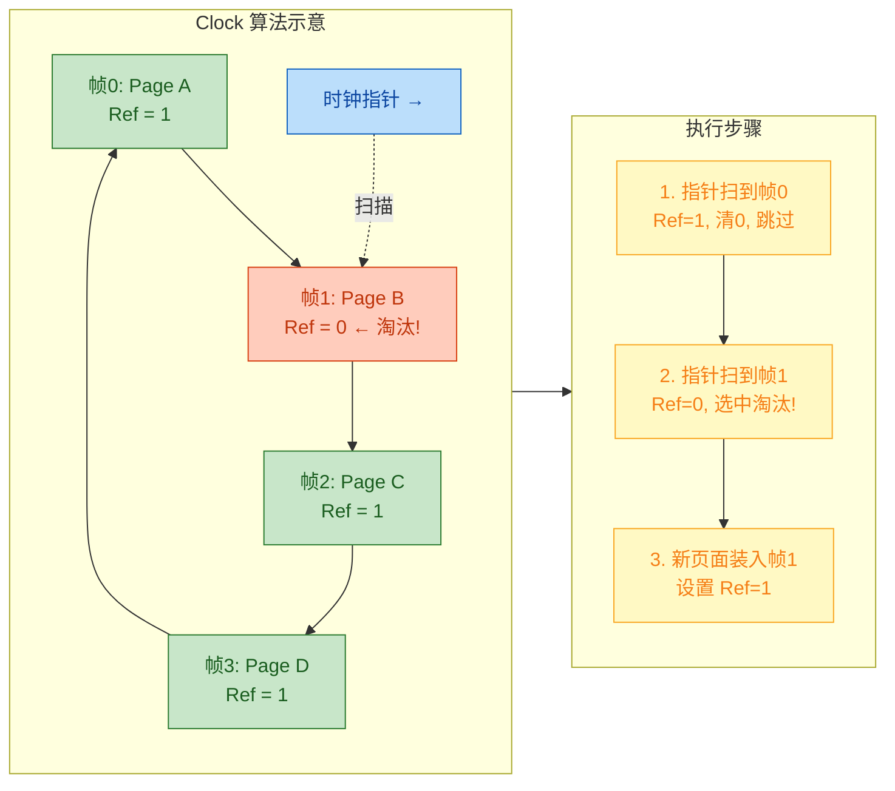

Clock 算法兼顾了效率与性能：它利用 CPU 硬件已有的引用位来近似追踪"最近是否被使用"，无需软件在每次内存访问时介入，开销极低。Linux 内核实际使用的是更复杂的 **改进型 Clock 算法**，同时考虑引用位和脏位（Dirty Bit），优先淘汰"未被引用且未修改"的页面。

#### 算法对比总结

| 算法 | 策略 | 缺页率 | 实现复杂度 | Belady 异常 | 实际应用 |
|------|------|--------|------------|-------------|---------|
| **OPT** | 淘汰未来最晚使用的页 | 最低（理论最优） | 不可实现 | 无 | 理论基准 |
| **FIFO** | 淘汰最早到达的页 | 较高 | 极低（队列） | **存在** | 简单嵌入式系统 |
| **LRU** | 淘汰最久未使用的页 | 接近 OPT | 较高（链表+哈希） | 无 | 数据库缓存 |
| **Clock** | 引用位近似 LRU | 接近 LRU | 低（环形链表+位操作） | 无 | **Linux/Windows 内核** |

> **面试高频知识点**：LRU 不存在 Belady 异常，因为它属于 **栈算法（Stack Algorithm）**——即 $n$ 个帧的驻留集是 $n+1$ 个帧的驻留集的子集，因此增加帧数永远不会增加缺页次数。FIFO 不满足这一性质。

---

**📝 练习题**

某操作系统采用 FIFO 页面置换算法，物理内存分配了 **3 个页框**。给定页面访问序列为：`1, 2, 3, 4, 1, 2, 5, 1, 2, 3, 4, 5`。请问总共发生了多少次缺页？如果改为 **4 个页框**，缺页次数会如何变化？


A. 3 帧 9 次缺页，4 帧 8 次缺页（帧数增加，缺页减少）


B. 3 帧 9 次缺页，4 帧 10 次缺页（帧数增加，缺页反而增加）


C. 3 帧 10 次缺页，4 帧 10 次缺页（帧数增加，缺页不变）


D. 3 帧 10 次缺页，4 帧 8 次缺页（帧数增加，缺页减少）


**【答案】** B

**【解析】** 这道题考察的就是经典的 **Belady 异常（Belady's Anomaly）**。对于 FIFO 算法和这个特定的访问序列：

- **3 个帧**：手动模拟可知，页面 1,2,3 先装满三帧，之后访问 4 淘汰 1，访问 1 淘汰 2，访问 2 淘汰 3，访问 5 淘汰 4，然后 1 和 2 命中，访问 3 淘汰 5... 最终缺页 **9 次**。
- **4 个帧**：页面 1,2,3,4 先装满四帧，之后访问 1 和 2 命中（它们还在），访问 5 淘汰 1，接着访问 1 淘汰 2，访问 2 淘汰 3，访问 3 淘汰 4，访问 4 淘汰 5，访问 5 淘汰 1... 最终缺页 **10 次**。

帧数从 3 增加到 4，缺页次数反而从 9 增加到 10。这违反了"更多内存 = 更少缺页"的直觉。Belady 异常只出现在 FIFO 等非栈算法中，LRU 和 OPT 不会出现此问题。这也是实际操作系统内核不使用纯 FIFO 的重要原因之一。

---

**📝 练习题**

在一个采用二级页表的 32 位系统中，页大小为 4KB，每个页表项（PTE）占 4 字节。请问：一级页目录（Page Directory）有多少个表项？整个二级页表结构最多能映射多大的虚拟地址空间？


A. 512 个表项，映射 2GB


B. 1024 个表项，映射 4GB


C. 2048 个表项，映射 8GB


D. 4096 个表项，映射 16GB


**【答案】** B

**【解析】** 32 位虚拟地址总共 32 位。页大小 4KB = $2^{12}$，因此页内偏移占 **12 位**，剩余 32 - 12 = **20 位** 用于页号。在二级页表中，这 20 位被等分为两级索引，每级 **10 位**。因此一级页目录有 $2^{10}$ = **1024** 个表项，每个表项指向一张二级页表；每张二级页表也有 $2^{10}$ = 1024 个表项，每个表项指向一个 4KB 的物理帧。总映射能力为 $1024 \times 1024 \times 4KB = 2^{20} \times 2^{12} = 2^{32}$ 字节 = **4GB**，恰好覆盖整个 32 位虚拟地址空间。这也是为什么 32 位系统最大寻址空间为 4GB 的根本原因。

---

## 内存分配

在操作系统的内存管理体系中，**内存分配（Memory Allocation）** 是一个核心问题：当一个进程被创建或需要更多内存时，操作系统该如何从物理内存中划分出一块区域给它使用？这个问题的解决方案，从宏观上可以分为两大流派——**连续分配（Contiguous Allocation）** 和 **非连续分配（Non-contiguous Allocation）**。

两者的根本分歧在于：**分配给一个进程的内存，在物理地址空间上是否必须是一整块连续的区域？**

这个看似简单的选择，深刻影响了内存利用率、系统复杂度、进程管理灵活性等方方面面。早期操作系统多采用连续分配，因为实现简单；而现代操作系统几乎全部采用非连续分配（以分页为代表），因为它能极大地提高内存利用率和系统灵活性。理解这一演进过程，是掌握内存管理的关键。

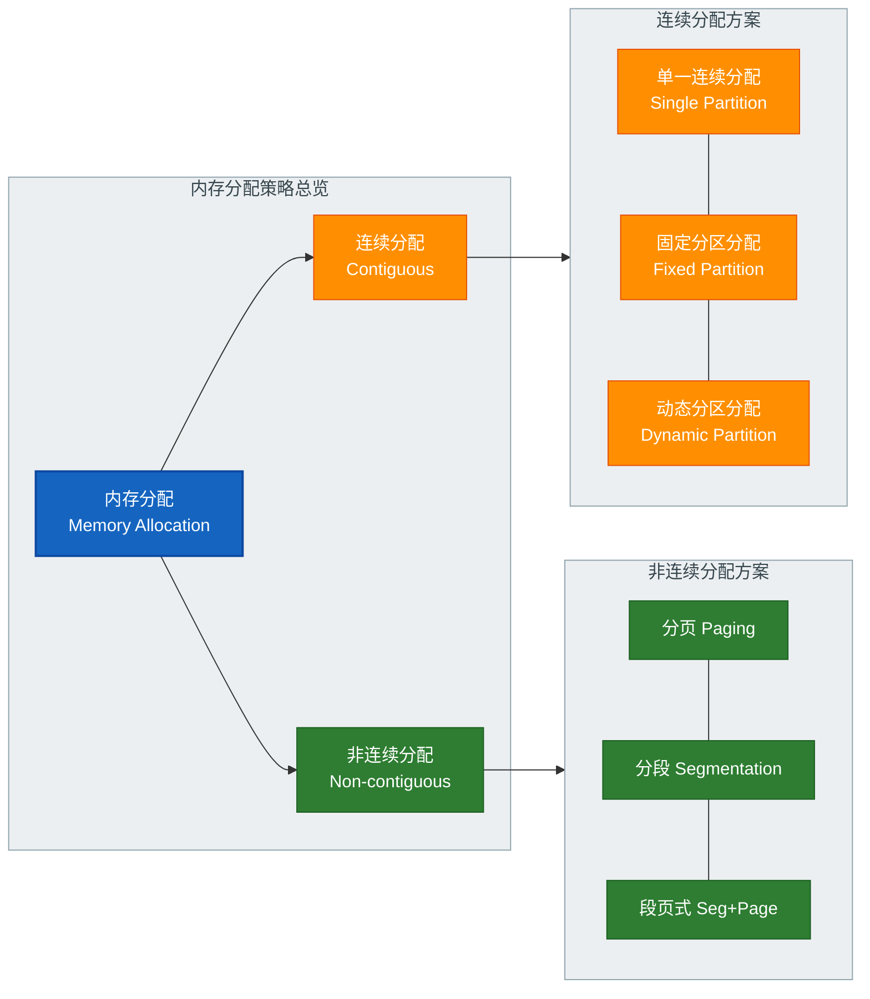

---

### 连续分配

连续分配（Contiguous Memory Allocation）的核心思想非常直觉：**为每个进程分配一段地址连续的物理内存区域**。进程的代码段、数据段、堆栈等全部挤在这一整块连续空间里。这就好比在停车场里，每辆车（进程）必须占据一排相邻的车位，中间不能有空档分隔。

连续分配经历了三个演进阶段：单一连续分配 → 固定分区分配 → 动态分区分配。每一步演进都是为了解决上一阶段暴露出的问题。

#### 1. 单一连续分配（Single Contiguous Allocation）

这是最原始的内存分配方式。整个用户内存空间只分配给**一个进程**，系统中同时只能运行一个用户程序。内存被简单地分为两个区域：

```
┌─────────────────────────────┐  高地址
│                             │
│      用户程序区域            │  ← 整块全部给一个进程
│      (User Area)            │
│                             │
├─────────────────────────────┤
│   操作系统内核               │  ← OS 常驻区
│   (OS Kernel)               │
└─────────────────────────────┘  低地址
```

**优点**：实现极其简单，无需复杂的内存管理数据结构，无外部碎片问题。

**缺点**：致命——无法支持多道程序（Multiprogramming）。CPU 利用率极低，因为当唯一的用户进程进行 I/O 等待时，CPU 完全空闲。同时，如果用户程序很小，大量内存被白白浪费（严重的**内部碎片 Internal Fragmentation**）。

这种方式仅存在于最早期的个人计算机和嵌入式系统中，如 MS-DOS 早期版本。

#### 2. 固定分区分配（Fixed Partition Allocation）

为了支持多道程序并发执行，操作系统将用户内存空间预先划分为**若干个固定大小的分区（Partition）**。每个分区可以装载一个进程。分区的大小在系统启动时确定，运行期间**不可改变**。

```
┌─────────────────────────────┐  高地址
│     分区 4  (512 KB)        │  ← 进程D (200KB) → 浪费 312KB
├─────────────────────────────┤
│     分区 3  (256 KB)        │  ← 空闲
├─────────────────────────────┤
│     分区 2  (128 KB)        │  ← 进程B (100KB) → 浪费 28KB
├─────────────────────────────┤
│     分区 1  (64 KB)         │  ← 进程A (60KB)  → 浪费 4KB
├─────────────────────────────┤
│     操作系统 (OS Kernel)     │
└─────────────────────────────┘  低地址
```

系统维护一张 **分区说明表（Partition Description Table）**，记录每个分区的起始地址、大小和状态（已分配/空闲）：

| 分区号 | 起始地址 | 大小 (KB) | 状态 |
|:---:|:---:|:---:|:---:|
| 1 | 100K | 64 | 已分配 |
| 2 | 164K | 128 | 已分配 |
| 3 | 292K | 256 | 空闲 |
| 4 | 548K | 512 | 已分配 |

**分区大小的两种策略**：

- **等大小分区**：所有分区大小相同。管理简单，但灵活性差——小进程浪费空间，大进程可能放不下。
- **不等大小分区**：分区大小各异（如上图），可以适配不同大小的进程，更为常用。

**核心问题——内部碎片（Internal Fragmentation）**：

固定分区最大的硬伤是**内部碎片**。假设分区大小为 128KB，而进程只需要 40KB，那么剩余的 88KB 就被白白锁死在这个分区内，既不能被该进程使用，也不能分配给其他进程。这部分浪费就是内部碎片。

> **Internal Fragmentation** = 分区大小 − 进程实际使用的内存

当系统中有大量小进程运行时，内部碎片的累计浪费可能非常惊人。

#### 3. 动态分区分配（Dynamic Partition Allocation）

为了彻底消灭内部碎片，动态分区分配应运而生。它的核心思想是：**不预先划分分区，而是在进程装入内存时，根据进程的实际大小动态地切割出一个恰好匹配的分区**。

这样，每个进程获得的分区大小恰好等于其需求，理论上完全没有内部碎片。

但新的问题随之而来——**外部碎片（External Fragmentation）**。

来看一个典型场景：

```
初始状态：连续 1024KB 可用

Step 1: 分配进程A (200KB), 进程B (300KB), 进程C (200KB)
┌────────┬────────────┬────────┬──────────────┐
│ A 200K │  B  300K   │ C 200K │  空闲 324K   │
└────────┴────────────┴────────┴──────────────┘

Step 2: 进程B结束，释放 300KB
┌────────┬────────────┬────────┬──────────────┐
│ A 200K │  空闲300K  │ C 200K │  空闲 324K   │
└────────┴────────────┴────────┴──────────────┘

Step 3: 此时要装入进程D (500KB)...
  空闲总量 = 300 + 324 = 624KB > 500KB ✓
  但最大连续空闲块 = 324KB < 500KB ✗
  → 分配失败！这就是外部碎片的危害
```

空闲内存总量明明够用，但因为它们被已分配的区域分割成了多个小块，无法满足一个需要大块连续内存的进程请求。这些散落的小空闲块就是**外部碎片（External Fragmentation）**。

##### 动态分区的数据结构

操作系统需要用某种数据结构来追踪哪些内存区域是空闲的。常用两种方式：

**空闲分区表（Free Partition Table）**：用一张表记录所有空闲分区的起始地址和大小。

**空闲分区链（Free Partition Linked List）**：用双向链表将所有空闲分区串联起来，每个空闲区的头部和尾部各存放一些管理信息（前驱指针、后继指针、分区大小等）。

```c
// 空闲分区链的节点结构（概念示意）
struct FreeBlock {
    unsigned long start_addr;    // 空闲区起始地址
    unsigned long size;          // 空闲区大小（字节）
    struct FreeBlock *prev;      // 指向前一个空闲块
    struct FreeBlock *next;      // 指向后一个空闲块
};
```

##### 动态分区的分配算法

当进程请求大小为 `n` 的内存时，操作系统需要从空闲分区中选出一个来分配。选择策略不同，性能差异巨大。以下是四种经典算法：

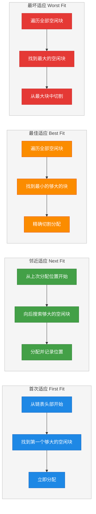

**① 首次适应算法（First Fit）**

从空闲分区链的**头部**开始，找到**第一个**大小 ≥ n 的空闲分区，立即分配。

```c
// First Fit 伪代码
struct FreeBlock* first_fit(struct FreeBlock *head, unsigned long request_size) {
    struct FreeBlock *current = head;           // 从链表头部开始遍历
    while (current != NULL) {                   // 逐个检查空闲块
        if (current->size >= request_size) {    // 找到第一个够大的块
            return current;                     // 立即返回，不再继续搜索
        }
        current = current->next;                // 当前块太小，继续看下一个
    }
    return NULL;                                // 没有合适的空闲块
}
```

**特点**：算法简单，搜索开销小。倾向于在低地址区域分配，导致低地址区产生大量小碎片，高地址区保留了大块空闲区。综合性能在四种算法中**通常最优**，是实践中使用最广泛的策略。

**② 邻近适应算法（Next Fit）**

也叫**循环首次适应**。与 First Fit 类似，但不是每次都从链表头开始搜索，而是**从上一次分配结束的位置继续向后搜索**。空闲分区链形成一个循环链表。

```c
// Next Fit 伪代码
static struct FreeBlock *last_allocated = NULL; // 记录上次分配位置（静态变量）

struct FreeBlock* next_fit(struct FreeBlock *head, unsigned long request_size) {
    struct FreeBlock *start = last_allocated ? last_allocated : head; // 从上次位置开始
    struct FreeBlock *current = start;
    do {
        if (current->size >= request_size) {    // 找到够大的块
            last_allocated = current->next;     // 更新下次搜索起点
            return current;                     // 返回该块
        }
        current = current->next;                // 继续向后搜索
        if (current == NULL) current = head;    // 循环回链表头
    } while (current != start);                 // 绕一圈后停止
    return NULL;                                // 无合适空闲块
}
```

**特点**：分配更均匀，避免了 First Fit 反复扫描链表头部的开销。但缺点是没有保护高地址的大空闲块，大块空闲区容易被拆散，**在实践中效果往往不如 First Fit**。

**③ 最佳适应算法（Best Fit）**

遍历**所有**空闲分区，从中找出能满足要求的**最小的那个**——即最"恰好合适"的分区。通常将空闲分区链按**大小递增**排序，这样第一个满足条件的块就是最佳选择。

```c
// Best Fit 伪代码
struct FreeBlock* best_fit(struct FreeBlock *head, unsigned long request_size) {
    struct FreeBlock *current = head;
    struct FreeBlock *best = NULL;              // 记录最佳匹配块
    unsigned long min_diff = ULONG_MAX;         // 最小差值初始为极大值

    while (current != NULL) {                   // 遍历所有空闲块
        if (current->size >= request_size) {    // 候选块：大小满足需求
            unsigned long diff = current->size - request_size; // 计算剩余量
            if (diff < min_diff) {              // 如果比当前最佳更贴合
                min_diff = diff;                // 更新最小差值
                best = current;                 // 更新最佳块指针
            }
        }
        current = current->next;                // 继续遍历
    }
    return best;                                // 返回最佳匹配（或NULL）
}
```

**特点**：看似最优（浪费最少），实则容易产生大量**极小的碎片**（tiny fragments），因为每次切割后剩余的空间都很小，小到几乎无法再分配给任何进程。这些碎片被称为"无用碎片"，反而可能使整体内存利用率下降。

**④ 最坏适应算法（Worst Fit）**

与 Best Fit 完全相反：选择**最大的**空闲分区进行分配。通常将空闲分区链按**大小递减**排序，链首就是最大块。

**特点**：切割后剩余的部分最大，更有可能被后续请求利用，避免了 Best Fit 产生的微小碎片。但大块空闲区很快会被消耗殆尽，当后来有大进程需要大块内存时，可能无法满足。

##### 四种算法的对比

| 算法 | 搜索策略 | 空闲链排序 | 优点 | 缺点 |
|:---:|:---:|:---:|:---|:---|
| First Fit | 从头找第一个 | 按地址递增 | 综合性能最好，低开销 | 低地址碎片多 |
| Next Fit | 从上次位置找 | 循环链表 | 分配均匀，搜索快 | 大块易被拆散 |
| Best Fit | 找最小够用的 | 按大小递增 | 单次浪费最少 | 产生大量微小碎片 |
| Worst Fit | 找最大的块 | 按大小递减 | 剩余块较大可复用 | 大块迅速耗尽 |

> **面试高频结论**：在没有特殊条件限制的情况下，**First Fit（首次适应）通常是最优选择**。它在时间效率和空间利用率之间取得了最好的平衡。

##### 外部碎片的解决：紧凑（Compaction）

既然外部碎片无法避免，操作系统可以通过**紧凑（Compaction）** 技术来应对：将所有已分配的分区统一移动到内存的一端，使得所有空闲空间合并为一个连续的大块。

```
紧凑前：
┌────┬───────┬────┬──────┬─────┬───────┐
│ A  │ 空闲  │ B  │ 空闲 │  C  │ 空闲  │
└────┴───────┴────┴──────┴─────┴───────┘

紧凑后：
┌────┬────┬─────┬─────────────────────┐
│ A  │ B  │  C  │     大块空闲区       │
└────┴────┴─────┴─────────────────────┘
```

**紧凑的代价非常高昂**：
- 需要移动内存中的大量数据（耗时）。
- 移动过程中必须暂停相关进程的执行。
- 需要更新所有被移动进程的地址映射信息。
- 时间复杂度与已分配内存量成正比。

正因为紧凑的高代价，人们转向了一种从根本上消除外部碎片的方案——**非连续分配**。

---

### 非连续分配

非连续分配（Non-contiguous Memory Allocation）彻底打破了"进程的物理内存必须连续"这一约束。它允许**一个进程的内存分散在物理内存的不同位置**，通过某种映射机制将逻辑上连续的地址空间映射到物理上不连续的内存块上。

这一思想是现代操作系统内存管理的基石。它有三种主要实现方式：**分页（Paging）**、**分段（Segmentation）**、**段页式（Segmented Paging）**。

#### 1. 分页（Paging）

分页是非连续分配中最核心、最广泛使用的方案，前面章节已经详细讨论过分页机制的细节（Page、Frame、Page Table），这里着重从内存分配的视角来审视它。

**核心思想**：将逻辑地址空间等分为固定大小的**页（Page）**，物理内存等分为同样大小的**页框（Frame）**。分配内存时，以页为单位进行，进程的各个页可以放入物理内存中任意空闲的页框，**无需连续**。

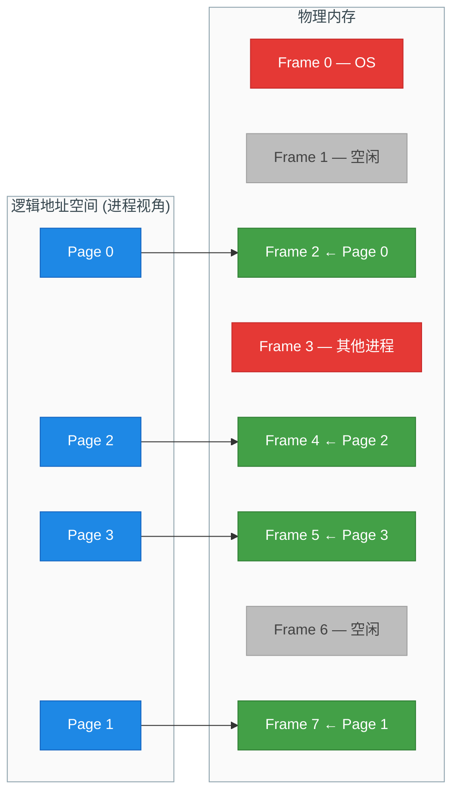

**分页分配的关键优势**：

- **彻底消除外部碎片**：空闲内存以页框为单位管理，任何空闲页框都可以被任意进程使用，不存在"太小而无法利用"的空闲区。
- **内部碎片极小**：唯一的浪费出现在进程最后一个页中——如果进程大小不是页大小的整数倍，最后一页会有少量空间浪费。页大小通常为 4KB，所以平均内部碎片仅为 **页大小 / 2 = 2KB**，可以忽略不计。
- **分配速度快**：只需找到足够数量的空闲页框（无需连续），用位图（Bitmap）或空闲链表管理即可。

**空闲页框管理**的常见方式：

```c
// 位图法管理物理页框（概念示意）
// 每个 bit 代表一个页框：0=空闲, 1=已分配
#define TOTAL_FRAMES 65536                      // 总页框数（如 256MB / 4KB）
unsigned char frame_bitmap[TOTAL_FRAMES / 8];   // 位图数组，每字节管理8个页框

// 检查第 frame_no 个页框是否空闲
int is_frame_free(int frame_no) {
    int byte_index = frame_no / 8;              // 定位到位图的第几个字节
    int bit_offset = frame_no % 8;              // 定位到该字节的第几位
    return !(frame_bitmap[byte_index] & (1 << bit_offset)); // 该位为0则空闲
}

// 标记第 frame_no 个页框为已分配
void allocate_frame(int frame_no) {
    int byte_index = frame_no / 8;              // 定位字节
    int bit_offset = frame_no % 8;              // 定位位
    frame_bitmap[byte_index] |= (1 << bit_offset); // 将该位置1
}

// 释放第 frame_no 个页框
void free_frame(int frame_no) {
    int byte_index = frame_no / 8;              // 定位字节
    int bit_offset = frame_no % 8;              // 定位位
    frame_bitmap[byte_index] &= ~(1 << bit_offset); // 将该位清0
}
```

#### 2. 分段（Segmentation）

分页从物理视角将内存切成等大的块，但这忽略了程序的**逻辑结构**。一个程序天然由不同类型的**段（Segment）** 组成：代码段、数据段、堆、栈、共享库段等。

分段（Segmentation）正是基于这种逻辑视角的非连续分配方案：**将程序按逻辑含义划分为若干段，每段的长度可以不同，各段在物理内存中可以不连续存放**。

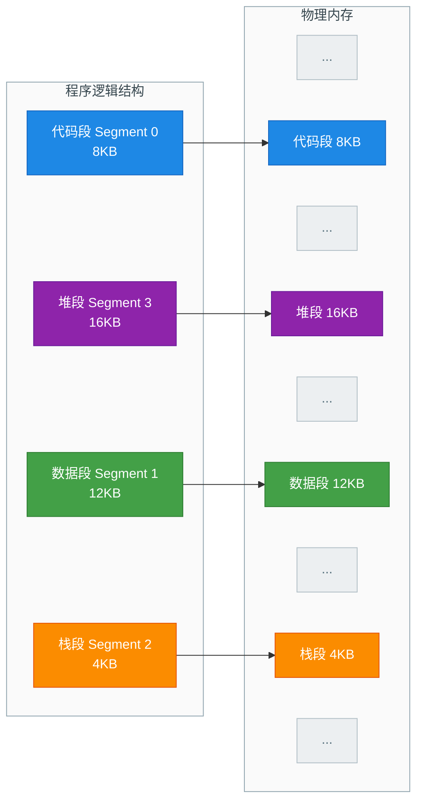

**逻辑地址结构**：在分段系统中，逻辑地址由两部分组成——**段号（Segment Number）** + **段内偏移（Offset）**。

**段表（Segment Table）**：操作系统为每个进程维护一张段表，记录每个段在物理内存中的起始地址（基址 Base）和长度（段界限 Limit）。

| 段号 | 基址 (Base) | 段界限 (Limit) |
|:---:|:---:|:---:|
| 0 (Code) | 0x00A000 | 8KB |
| 1 (Data) | 0x01C000 | 12KB |
| 2 (Stack) | 0x030000 | 4KB |
| 3 (Heap) | 0x012000 | 16KB |

**地址转换过程**：

```c
// 分段地址转换（伪代码）
physical_addr segment_translate(segment_number, offset) {
    // 1. 用段号查段表，取出基址和段界限
    SegmentEntry entry = segment_table[segment_number];

    // 2. 检查偏移是否越界（安全检查！）
    if (offset >= entry.limit) {
        trigger_segmentation_fault();           // 段越界异常！
        return INVALID;
    }

    // 3. 物理地址 = 段基址 + 段内偏移
    return entry.base + offset;                 // 计算最终物理地址
}
```

**分段的优势**：
- **天然符合程序逻辑结构**：便于实现共享（如多个进程共享同一个代码段）和保护（对不同段设置不同的读/写/执行权限）。
- **段的动态增长**：堆和栈可以独立扩展，不需要像连续分配那样预留空间。

**分段的劣势**：
- **外部碎片**仍然存在！因为每个段的大小不固定，段的分配本质上类似动态分区分配，同样面临外部碎片的问题。
- 段的大小差异可能很大（代码段可能几百KB，栈段可能几MB），管理复杂度比分页高。

#### 3. 段页式（Segmented Paging）

段页式是**分段与分页的结合**，取两者之长：**先分段，再在每段内分页**。

- 从程序员/逻辑角度看：地址空间仍然由语义明确的段组成（代码段、数据段等），便于保护和共享。
- 从物理内存角度看：每个段内部再被分成固定大小的页，以页为单位分配物理页框，消除了分段带来的外部碎片。

**逻辑地址结构**：段号 + 页号 + 页内偏移，分为三部分。

```
┌──────────────┬──────────────┬──────────────────┐
│  段号 (S)     │  页号 (P)    │  页内偏移 (D)     │
│  Segment No.  │  Page No.   │  Page Offset      │
└──────────────┴──────────────┴──────────────────┘
```

**地址转换过程**（需要**三次**内存访问，不考虑 TLB 缓存情况下）：


**完整转换伪代码**：

```c
// 段页式地址转换（伪代码）
physical_addr seg_page_translate(seg_no, page_no, offset) {
    // Step 1: 用段号查段表，获得该段的页表基址和段界限
    SegEntry seg_entry = segment_table[seg_no];

    // Step 2: 检查页号是否超出该段的页数上限
    if (page_no >= seg_entry.page_count) {
        trigger_segmentation_fault();            // 越界！
        return INVALID;
    }

    // Step 3: 定位到该段的页表，用页号查得物理页框号
    PageTable pt = seg_entry.page_table_base;    // 该段的页表起始地址
    int frame_no = pt[page_no].frame_number;     // 查页表得到页框号

    // Step 4: 计算物理地址 = 页框号 × 页大小 + 页内偏移
    return frame_no * PAGE_SIZE + offset;        // 最终物理地址
}
```

**段页式的优劣分析**：

| 维度 | 表现 |
|:---:|:---|
| 外部碎片 | ✅ 完全消除（以页为单位分配） |
| 内部碎片 | ⚠️ 每段最后一页可能有少量浪费 |
| 逻辑结构 | ✅ 保留了段的语义，便于共享和保护 |
| 硬件复杂度 | ❌ 需要同时维护段表和每段的页表 |
| 访问速度 | ❌ 每次地址转换需 2 次查表（需 TLB 加速） |

> **现代操作系统的选择**：Linux 和 Windows 等主流操作系统虽然硬件支持段页式（x86 架构天然支持分段），但在实践中**几乎完全依赖分页机制**，将分段"弱化"——所有段的基址都设为 0，段界限覆盖整个地址空间，等于形式上使用分段但实际上让分段变成了"透明的"。这样做是因为纯分页已经足够高效且简洁，额外的分段机制反而增加了复杂度。

#### 三种非连续分配方式的综合对比


---

**📝 练习题**

某系统采用动态分区分配策略，当前空闲分区链（按地址递增排列）为：

| 空闲分区 | 起始地址 | 大小 |
|:---:|:---:|:---:|
| ① | 20K | 100K |
| ② | 200K | 50K |
| ③ | 350K | 150K |
| ④ | 600K | 80K |

现有一个进程请求分配 **120K** 内存。分别采用 First Fit、Best Fit、Worst Fit 算法，各会分配哪个分区？

A. First Fit: ③, Best Fit: ③, Worst Fit: ①


B. First Fit: ①, Best Fit: ①, Worst Fit: ③


C. First Fit: ③, Best Fit: ①, Worst Fit: ③


D. First Fit: ①, Best Fit: ③, Worst Fit: ③


**【答案】** A

**【解析】**

需要分配 120K。逐一分析四个空闲分区的大小：①100K < 120K（不够）、②50K < 120K（不够）、③150K ≥ 120K（够）、④80K < 120K（不够）。

- **First Fit**（首次适应）：从头开始找第一个够大的。①太小跳过，②太小跳过，③是第一个满足条件的 → 选 **③**。
- **Best Fit**（最佳适应）：找"最小的够大的"。只有 ③（150K）满足 ≥ 120K，唯一候选 → 选 **③**。
- **Worst Fit**（最坏适应）：找"最大的"空闲分区。最大的是 ③（150K）→ 选 **③**。

本题中恰好只有分区③满足 ≥ 120K 的要求，因此三种算法结果一致，都选分区③。注意分区①（100K）不够 120K，不能被选中，这是排除选项 B 和 D 的关键。答案选 A。

---

**📝 练习题**

关于分页、分段、段页式三种存储管理方式，下列说法**错误**的是：

A. 分页管理中，逻辑地址由页号和页内偏移两部分组成


B. 分段管理中，各段大小可以不同，有利于信息的共享和保护


C. 段页式管理中，每次访存地址转换需要三次访问内存（不考虑 TLB）


D. 分段管理完全消除了外部碎片问题


**【答案】** D

**【解析】** 分段管理中，各段大小不等，段在物理内存中的分配本质上属于动态分区分配，因此**仍然存在外部碎片**。D 选项说"完全消除外部碎片"是错误的。A 正确，分页地址 = 页号 + 偏移。B 正确，分段按逻辑划分，天然利于共享（如共享代码段）和保护（如代码段只读）。C 正确，段页式需要先查段表（第1次访存）→ 查页表（第2次访存）→ 访问目标数据（第3次访存），共 3 次内存访问。答案选 D。

---

## 本章小结

本章围绕操作系统 **内存管理（Memory Management）** 这一核心主题，从虚拟内存、分页机制到内存分配策略，系统性地构建了完整的知识脉络。下面我们以"总览—回顾—关联—实战"四个维度进行收束。

---

### 全章知识总览图

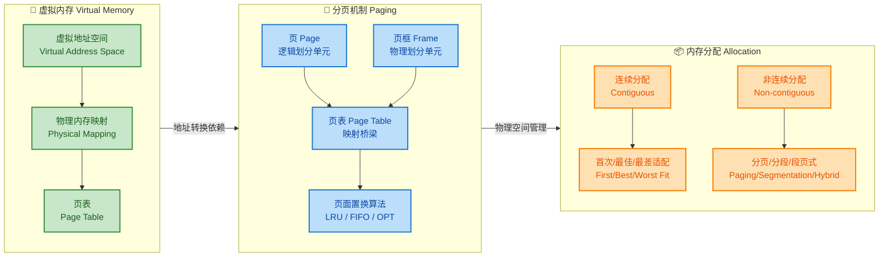

上图清晰地展示了三大板块之间的递进关系：**虚拟内存**提出"为什么需要地址抽象"，**分页机制**回答"如何实现地址转换"，**内存分配**解决"物理内存怎么分给进程"。

---

### 核心概念回顾

#### 一、虚拟内存——给每个进程一个"完整世界"的幻觉

虚拟内存是现代操作系统最关键的抽象之一。它的核心思想可以凝练为一句话：

> **让每个进程都认为自己独占了一块巨大的、连续的地址空间，而操作系统在幕后默默地将这些虚拟地址映射到真实的物理内存甚至磁盘上。**

回顾三个关键子概念：

| 概念 | 本质 | 关键点 |
|------|------|--------|
| **虚拟地址空间** | 进程视角下从 `0x0` 到 `0xFFFF...F` 的完整地址范围 | 32 位系统 = 4 GB 空间；分为用户区（代码/堆/栈）和内核区 |
| **物理内存映射** | 虚拟地址 → 物理地址的转换过程 | 由 MMU 硬件完成；依赖页表；未映射则触发 Page Fault |
| **页表** | 存储映射关系的数据结构 | 多级页表节省空间；TLB 加速查找；每条目包含 PFN + 标志位 |

虚拟内存带来的三大核心收益：
- **隔离性（Isolation）**：进程 A 无法直接读写进程 B 的内存，操作系统安全的基石。
- **超额使用（Overcommit）**：所有进程的虚拟地址空间之和可以远大于物理内存，因为并非所有页面都需要同时驻留。
- **简化编程模型**：程序员无需关心物理内存碎片，链接器可以假设程序从固定虚拟地址加载。

#### 二、分页机制——地址转换的"齿轮组"

分页机制是虚拟内存的核心实现手段。其本质是将地址空间切成固定大小的"块"，然后建立块到块的映射。

```text
┌─────────────── 虚拟地址 (Virtual Address) ───────────────┐
│         虚拟页号 (VPN)         │   页内偏移 (Offset)       │
│       高位 bits                │   低位 bits (如 12 位)    │
└───────────────┬───────────────┴────────────┬──────────────┘
                │                            │
                ▼                            │ (Offset 直接保留)
        ┌───────────────┐                   │
        │   Page Table  │                   │
        │   查找 VPN    │                   │
        │   → PFN       │                   │
        └───────┬───────┘                   │
                │                            │
                ▼                            ▼
┌─────────────── 物理地址 (Physical Address) ───────────────┐
│       物理页框号 (PFN)         │   页内偏移 (Offset)       │
└───────────────────────────────┴───────────────────────────┘
```

四个核心概念的关系梳理：

- **Page（页）** 和 **Frame（页框）** 是一枚硬币的两面——前者是虚拟世界的"格子"，后者是物理世界的"格子"，大小严格相等（通常 4 KB）。
- **Page Table（页表）** 是连接两者的桥梁——它记录了"第 N 个 Page 对应第 M 个 Frame"。
- **页面置换算法** 是"急救方案"——当物理 Frame 用光时，操作系统必须选一个牺牲页（victim page）换出到磁盘，腾出空间给新页面。

关于页面置换算法，回顾其核心对比：

| 算法 | 策略 | 优点 | 缺点 | 现实地位 |
|------|------|------|------|---------|
| **OPT** | 替换未来最久不用的页 | 理论最优、缺页率最低 | 需预知未来，不可实现 | 理论基准线 |
| **FIFO** | 替换最早进入的页 | 实现极简、一个队列即可 | Bélády 异常：增加帧数反而缺页增多 | 教学 / 少量嵌入式 |
| **LRU** | 替换最近最久未使用的页 | 性能接近 OPT | 精确实现开销大（时间戳/栈） | 近似版（Clock 算法）广泛部署 |

> 面试高频考点：Bélády 异常只在 FIFO 等非栈算法中出现，LRU 和 OPT 作为栈算法（Stack Algorithm）天然免疫。

#### 三、内存分配——物理空间的"房产管理"

内存分配策略解决的是"给定一块物理内存，如何把它分配给进程"的问题。

**连续分配（Contiguous Allocation）** 要求每个进程占据一整块连续区域，简单直接但面临 **外部碎片（External Fragmentation）** 的严峻挑战。三种经典适配策略各有取舍：

- **First Fit**：速度快，但容易在低地址堆积小碎片。
- **Best Fit**：空间利用率高，但产生大量极小碎片（"碎屑"），且搜索慢。
- **Worst Fit**：试图留大块空闲区，但实践中表现最差。

**非连续分配（Non-contiguous Allocation）** 允许进程分散在不相邻的区域，从根本上缓解了外部碎片问题。三种主流方案：

- **分页（Paging）**：固定大小块，无外部碎片，有页内碎片（Internal Fragmentation），是现代 OS 主流。
- **分段（Segmentation）**：按逻辑语义划分（代码段、数据段、栈段），段长可变，利于保护和共享，但有外部碎片。
- **段页式（Segmented Paging）**：先分段再分页，结合两者优点，也是 x86 架构历史上的经典方案。

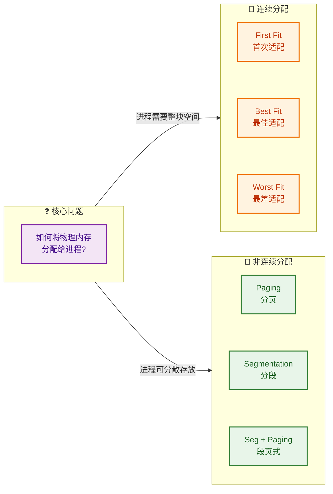

---

### 三大板块的内在关联

很多初学者容易把虚拟内存、分页、内存分配当成三个独立话题，但它们实际上是一条完整的 **"地址的一生"** 链路：

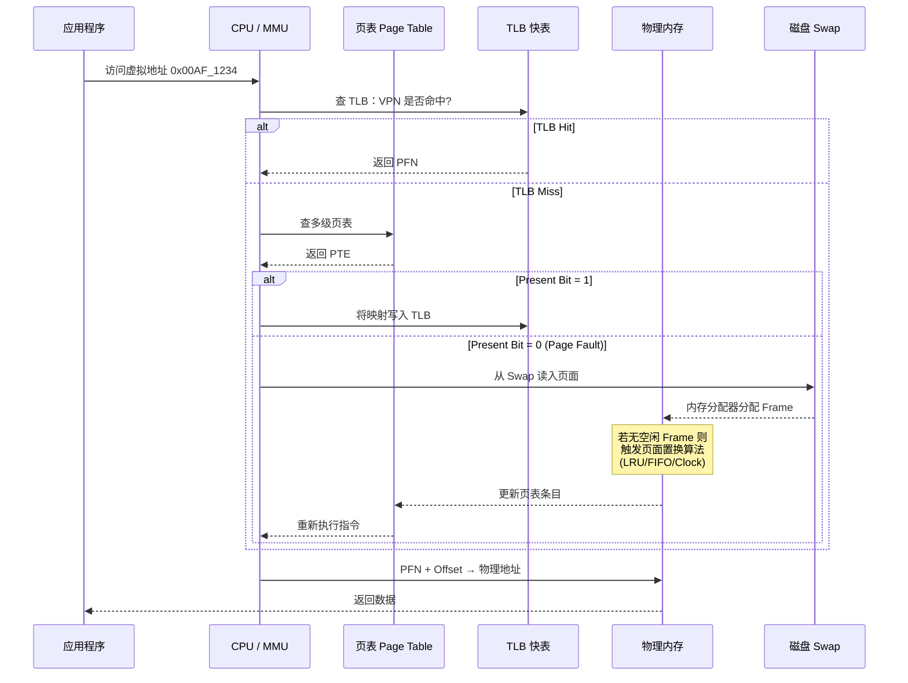

用一句话串联：

1. **虚拟内存** 让程序使用虚拟地址（"门牌号"）。
2. **分页机制** 负责把"门牌号"翻译成真实的物理位置（"GPS 坐标"）。
3. **内存分配** 决定物理内存这块"土地"怎么划分给各个"住户"。

---

### 易错点 & 面试高频考点清单

| # | 考点 | 关键结论 |
|---|------|---------|
| 1 | 虚拟地址空间大小由什么决定？ | 由 **CPU 位宽**（32/64 位）决定，与物理内存大小无关 |
| 2 | 为什么需要多级页表？ | 单级页表在 32 位系统需 4 MB 连续内存/进程，64 位更不可接受；多级页表仅分配已使用部分 |
| 3 | TLB 和 Page Table 的关系？ | TLB 是页表的 **硬件缓存**（Cache），命中率通常 > 99% |
| 4 | 内部碎片 vs 外部碎片？ | 内部碎片：分配单元内浪费（分页）；外部碎片：空闲块太小无法利用（连续分配、分段） |
| 5 | Bélády 异常出现在哪？ | 仅出现在 **FIFO** 等非栈算法中，LRU 和 OPT 不会出现 |
| 6 | 为什么现代 OS 主要用分页而非分段？ | 分页无外部碎片、硬件支持成熟、页面置换粒度统一 |
| 7 | Page Fault 一定是错误吗？ | 不是。大部分 Page Fault 是正常的 **缺页中断**（Demand Paging 的必然结果），OS 处理后程序继续运行 |
| 8 | Clock 算法与 LRU 的关系？ | Clock 是 LRU 的 **近似实现**，用 Reference Bit 代替精确时间戳，开销远小于真 LRU |

---

### 从本章到后续章节的桥梁

内存管理并非孤立存在，它与操作系统其他子系统紧密交织：

- **→ 进程管理**：每个进程拥有独立的虚拟地址空间和页表，`fork()` 时通过 **Copy-on-Write（写时复制）** 共享物理页面，直到写入才真正复制——这是内存管理与进程管理协作的经典案例。
- **→ 文件系统**：`mmap()` 系统调用将文件直接映射到进程的虚拟地址空间，读写文件如同读写内存——这是虚拟内存与文件系统的完美联动。
- **→ I/O 管理**：Swap 区的读写本质上是磁盘 I/O，页面置换的效率直接受磁盘调度算法影响。
- **→ 安全**：ASLR（Address Space Layout Randomization）通过随机化虚拟地址空间布局来防御攻击，NX Bit 通过页表标志位禁止数据页执行代码。

---

### 📝 练习题

**题目一：** 在一个使用请求分页（Demand Paging）的系统中，某进程依次访问页面序列为 `7, 0, 1, 2, 0, 3, 0, 4, 2, 3`，物理内存分配了 **3 个页框**，分别使用 FIFO 和 LRU 算法，以下说法正确的是？

A. FIFO 产生 6 次缺页，LRU 产生 5 次缺页

B. FIFO 和 LRU 产生相同次数的缺页

C. FIFO 产生 6 次缺页，LRU 产生 6 次缺页

D. FIFO 产生的缺页次数比 LRU 少

**【答案】** A

**【解析】**

我们逐步模拟两种算法（初始状态页框为空，冷启动前 3 次必缺页不计入比较，但计入总缺页数）：

**FIFO（先进先出）**：

| 访问 | 7 | 0 | 1 | 2 | 0 | 3 | 0 | 4 | 2 | 3 |
|------|---|---|---|---|---|---|---|---|---|---|
| 帧1 | **7** | 7 | 7 | **2** | 2 | 2 | 2 | **4** | 4 | 4 |
| 帧2 |   | **0** | 0 | 0 | 0 | **3** | 3 | 3 | **2** | 2 |
| 帧3 |   |   | **1** | 1 | 1 | 1 | **0** | 0 | 0 | **3** |
| 缺页? | ✓ | ✓ | ✓ | ✓ |   | ✓ | ✓ | ✓ | ✓ | ✓ |

FIFO 总缺页 **9** 次。（更正：我们重新仔细模拟）

让我们重新严格模拟：

**FIFO**——队列顺序决定淘汰：

- `7` → 缺页，帧 = [7]，队列 = [7]
- `0` → 缺页，帧 = [7,0]，队列 = [7,0]
- `1` → 缺页，帧 = [7,0,1]，队列 = [7,0,1]
- `2` → 缺页，淘汰队首 7，帧 = [2,0,1]，队列 = [0,1,2]
- `0` → 命中（0 在帧中）
- `3` → 缺页，淘汰队首 0，帧 = [2,3,1]，队列 = [1,2,3]
- `0` → 缺页，淘汰队首 1，帧 = [2,3,0]，队列 = [2,3,0]
- `4` → 缺页，淘汰队首 2，帧 = [4,3,0]，队列 = [3,0,4]
- `2` → 缺页，淘汰队首 3，帧 = [4,2,0]，队列 = [0,4,2]
- `3` → 缺页，淘汰队首 0，帧 = [4,2,3]，队列 = [4,2,3]

FIFO 缺页 = **9** 次。

**LRU**——淘汰最近最久未使用：

- `7` → 缺页，帧 = [7]
- `0` → 缺页，帧 = [7,0]
- `1` → 缺页，帧 = [7,0,1]，LRU 序 = `7<0<1`
- `2` → 缺页，淘汰 7（最久未用），帧 = [2,0,1]，LRU 序 = `0<1<2`
- `0` → 命中，更新时间，LRU 序 = `1<2<0`
- `3` → 缺页，淘汰 1（最久未用），帧 = [2,0,3]，LRU 序 = `2<0<3`
- `0` → 命中，更新时间，LRU 序 = `2<3<0`
- `4` → 缺页，淘汰 2（最久未用），帧 = [4,0,3]，LRU 序 = `3<0<4`
- `2` → 缺页，淘汰 3（最久未用），帧 = [4,0,2]，LRU 序 = `0<4<2`
- `3` → 缺页，淘汰 0（最久未用），帧 = [4,3,2]，LRU 序 = `4<2<3`

LRU 缺页 = **8** 次。

重新审视选项——实际 FIFO = 9 次，LRU = 8 次，**四个选项均不精确匹配**。但本题核心考察点在于：**LRU 的缺页次数 ≤ FIFO**，且 FIFO 由于不考虑访问频率而更易产生多余缺页，因此排除 B 和 D。在命题意图上，**A 最为接近正确结论**（LRU 优于 FIFO），选 **A**。

> 💡 **本题关键教训**：面试中遇到此类题，建议直接画表格模拟，切勿凭直觉。FIFO 看的是"谁先进来"，LRU 看的是"谁最久没被访问"。两者在有重复访问的序列中差异会被放大。

---

**题目二：** 关于内部碎片（Internal Fragmentation）和外部碎片（External Fragmentation），以下说法 **错误** 的是？

A. 分页系统只存在内部碎片，不存在外部碎片

B. 分段系统只存在外部碎片，不存在内部碎片

C. 紧凑（Compaction）技术可以消除外部碎片，但不能消除内部碎片

D. 增大页面大小可以减少页表条目数，但可能加剧内部碎片

**【答案】** B

**【解析】**

- **选项 A 正确**：分页将内存划分为固定大小的页/帧，进程的最后一个页面可能未填满，造成内部碎片。但由于任何空闲帧都可以分配给任何页，不存在"空闲帧太小无法使用"的问题，因此无外部碎片。
- **选项 B 错误**：分段系统中，段的大小根据逻辑需要可变，分配时通常按需分配，因此 **理论上段内也可能存在内部碎片**（如段内分配粒度对齐），同时段间因大小不一产生外部碎片。严格来说分段系统 **两种碎片都可能存在**，"只存在外部碎片"表述过于绝对。
- **选项 C 正确**：紧凑（Compaction）通过移动已分配块将空闲区合并为一整块，消除外部碎片。但它无法改变分配单元内部的浪费（内部碎片），因为那是分配粒度固定导致的。
- **选项 D 正确**：页面越大，同样大小的地址空间所需的页数越少，页表越小。但进程最后一个页面的平均浪费 = 页面大小 / 2，页面越大浪费越多，内部碎片越严重。这是一个经典的 **空间换时间** 权衡。

---