---

# 死锁 ⭐⭐

---

## 死锁定义

在操作系统的多道程序环境（Multiprogramming Environment）中，多个进程往往需要**竞争有限的系统资源**才能完成各自的任务。当这种竞争陷入一种特殊的僵局时，便产生了操作系统中最经典也最棘手的问题之一——**死锁（Deadlock）**。

从形式化的角度定义：**死锁是指一组进程中的每一个进程，都在等待仅能由该组中的其他进程才能引发的事件，从而导致这组进程全部永久阻塞的状态。** 这个定义最早由 E.G. Coffman 等人在 1971 年的论文中系统性地描述，因此死锁的四个必要条件也被称为 **Coffman Conditions**。

在进入细节之前，我们先用一个日常生活中的类比来建立直觉：想象一条**狭窄的单行桥**，桥的两端各有一辆车驶入。两辆车在桥中间相遇，谁都无法前进，也都不愿后退——这就是死锁。操作系统中的进程与资源之间，正是这种关系。

---

### 多个进程互相等待

死锁的核心特征是**循环依赖式的等待（Circular Wait）**。让我们从一个最简单的双进程场景开始，逐步深入理解。

#### 经典的双进程死锁场景

假设系统中有两个进程 P₁ 和 P₂，以及两个互斥资源 R₁（打印机）和 R₂（扫描仪）：

| 时间步 | 进程 P₁ 的动作 | 进程 P₂ 的动作 |
|:---:|:---|:---|
| T₁ | 申请并锁定 R₁ ✅ | 申请并锁定 R₂ ✅ |
| T₂ | 申请 R₂ → **阻塞**（R₂ 被 P₂ 持有）🔒 | 申请 R₁ → **阻塞**（R₁ 被 P₁ 持有）🔒 |
| T₃ | 等待 P₂ 释放 R₂ … | 等待 P₁ 释放 R₁ … |
| T₄ | ♾️ 永久等待 | ♾️ 永久等待 |

在 T₂ 时刻之后，P₁ 持有 R₁ 但等待 R₂，P₂ 持有 R₂ 但等待 R₁。**两者互为等待条件，谁都无法向前推进**。这就是"互相等待"的本质。

用代码来表达这一过程更为直观：

```c
// ========== 死锁演示：双线程互相等待 ==========
#include <pthread.h>                          // POSIX 线程库
#include <stdio.h>                            // 标准输入输出

pthread_mutex_t resource_1 = PTHREAD_MUTEX_INITIALIZER;  // 资源 R1 的互斥锁
pthread_mutex_t resource_2 = PTHREAD_MUTEX_INITIALIZER;  // 资源 R2 的互斥锁

// 线程 1 的执行函数
void *thread_1(void *arg) {
    pthread_mutex_lock(&resource_1);          // T1: 线程1 锁定资源 R1
    printf("Thread 1: 已锁定 R1\n");          // 输出当前状态
    sleep(1);                                 // 模拟某些计算，增大死锁触发概率
    
    printf("Thread 1: 正在请求 R2...\n");      // 线程1 尝试获取 R2
    pthread_mutex_lock(&resource_2);          // T2: 阻塞！因为 R2 已被线程2 持有
    printf("Thread 1: 已锁定 R2\n");          // ← 这行永远不会执行
    
    pthread_mutex_unlock(&resource_2);        // 释放 R2（永远到达不了）
    pthread_mutex_unlock(&resource_1);        // 释放 R1（永远到达不了）
    return NULL;
}

// 线程 2 的执行函数
void *thread_2(void *arg) {
    pthread_mutex_lock(&resource_2);          // T1: 线程2 锁定资源 R2
    printf("Thread 2: 已锁定 R2\n");          // 输出当前状态
    sleep(1);                                 // 模拟某些计算，增大死锁触发概率
    
    printf("Thread 2: 正在请求 R1...\n");      // 线程2 尝试获取 R1
    pthread_mutex_lock(&resource_1);          // T2: 阻塞！因为 R1 已被线程1 持有
    printf("Thread 2: 已锁定 R1\n");          // ← 这行永远不会执行
    
    pthread_mutex_unlock(&resource_1);        // 释放 R1（永远到达不了）
    pthread_mutex_unlock(&resource_2);        // 释放 R2（永远到达不了）
    return NULL;
}

int main() {
    pthread_t t1, t2;                         // 声明两个线程标识符
    pthread_create(&t1, NULL, thread_1, NULL); // 创建线程 1
    pthread_create(&t2, NULL, thread_2, NULL); // 创建线程 2
    pthread_join(t1, NULL);                   // 主线程等待线程1（将永远阻塞）
    pthread_join(t2, NULL);                   // 主线程等待线程2（将永远阻塞）
    return 0;                                 // ← 程序永远不会正常退出
}
```

运行该程序后，终端输出将**停滞**在：

```
Thread 1: 已锁定 R1
Thread 2: 已锁定 R2
Thread 1: 正在请求 R2...
Thread 2: 正在请求 R1...
█  （光标永久闪烁，程序无法终止）
```

#### 资源分配图（Resource Allocation Graph, RAG）

为了更清晰地表示进程与资源之间的"持有"和"请求"关系，操作系统理论引入了一种有向图模型——**资源分配图（RAG）**。它的规则非常简单：

- **圆形节点**代表**进程（Process）**
- **方形节点**代表**资源（Resource）**
- **请求边（Request Edge）**：进程 → 资源，表示进程正在请求该资源
- **分配边（Assignment Edge）**：资源 → 进程，表示该资源已分配给进程

当 RAG 中出现**环路（Cycle）**时，就**可能**产生死锁（如果每种资源只有单个实例，则环路是死锁的**充要条件**）。

下面用 Mermaid 绘制上述双进程死锁的 RAG：

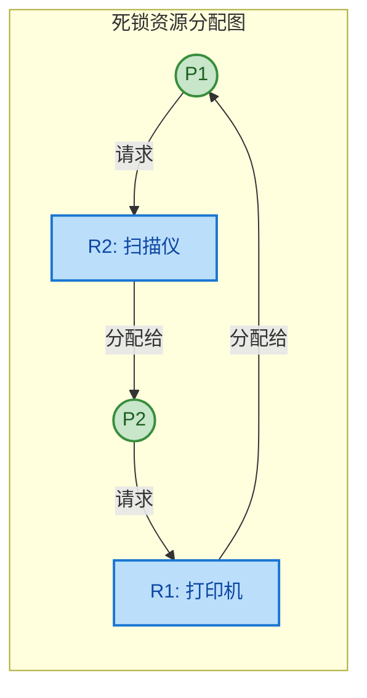

可以清楚地看到，图中形成了一个 **P1 → R2 → P2 → R1 → P1** 的**环路（Cycle）**。这条环路就是死锁的图形化证据。

#### 推广到多进程场景

死锁并不局限于两个进程。在真实系统中，可能出现 **N 个进程**构成的等待链。例如：

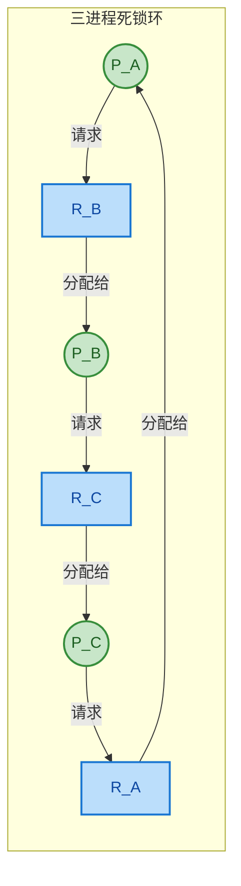

此图展示了三进程死锁：P_A 等 R_B → P_B 等 R_C → P_C 等 R_A → 回到 P_A，形成完整闭环。推广到一般情况：

> **若存在进程集合 `{P₁, P₂, …, Pₙ}`，其中 Pᵢ 等待 Pᵢ₊₁ 持有的资源（i = 1, 2, …, n−1），且 Pₙ 等待 P₁ 持有的资源，则发生死锁。**

---

### 无法继续执行

"无法继续执行"是死锁最直观的**外部表现**，也是死锁区别于其他并发异常的关键判断依据。我们需要将它与几个容易混淆的概念做严格区分。

#### 死锁的"永久性"

死锁一旦形成，若没有**外部干预**（如人工杀进程、操作系统回滚资源），它不会自动消解。这是因为：

1. **每个进程都处于阻塞态（Blocked State）**：它们不占用 CPU 时间片，调度器（Scheduler）不会将它们调入运行。
2. **解除阻塞的唯一条件是获取到等待的资源**：但这些资源分别被环中的其他阻塞进程持有。
3. **被阻塞的进程无法释放自己持有的资源**：因为资源释放代码在临界区的后续逻辑中，而进程卡在了临界区的入口。

这构成了一个**逻辑闭环**——**没有任何进程可以迈出第一步**。用数学语言描述就是：系统陷入了一个**不动点（Fixed Point）**，状态不再发生任何变化。

```
txt
进程状态转换视角：

         ┌─────────────────────────────────────────────┐
         │          正常的进程生命周期                      │
         │  New → Ready → Running → Waiting → Ready → … │
         └─────────────────────────────────────────────┘

         ┌─────────────────────────────────────────────┐
         │          死锁进程的状态                         │
         │  New → Ready → Running → Waiting ──╳──→ ???  │
         │                            ↑                 │
         │                         永久停留在此           │
         └─────────────────────────────────────────────┘
```

进程被永久地锁定在 **Waiting（阻塞）** 状态，无法转移到 Ready，更不可能回到 Running。

#### 死锁 vs 相似概念的辨析

这是考试和面试中的高频考点。下表从多个维度精确区分：

| 特征 | 死锁 (Deadlock) | 活锁 (Livelock) | 饥饿 (Starvation) | 忙等待 (Busy Waiting) |
|:---|:---|:---|:---|:---|
| **进程状态** | 全部阻塞（Blocked） | 全部运行（Running） | 部分阻塞/就绪 | 运行（Running） |
| **CPU 消耗** | 零（不调度） | 高（在空转） | 低 | 高（自旋） |
| **能否自行恢复** | ❌ 不能 | 有可能（加随机退避） | 有可能（调整优先级） | 等到条件满足即可 |
| **涉及进程数** | ≥ 2 | ≥ 2 | ≥ 1 | ≥ 1 |
| **典型场景** | 互持资源环路 | 两人走廊互让 | 低优先级进程长期被抢占 | `while(!flag);` 自旋 |
| **根本原因** | 资源竞争 + 四条件 | 过度响应对方行为 | 调度策略不公平 | 同步机制设计选择 |

重点对比 **死锁** 与 **活锁（Livelock）**：

- **死锁**：两人在窄路相遇，都**一动不动**地等对方让路，结果谁都过不去。
- **活锁**：两人在窄路相遇，都**不断侧身让路**，但每次都让到同一边，仍然谁都过不去。

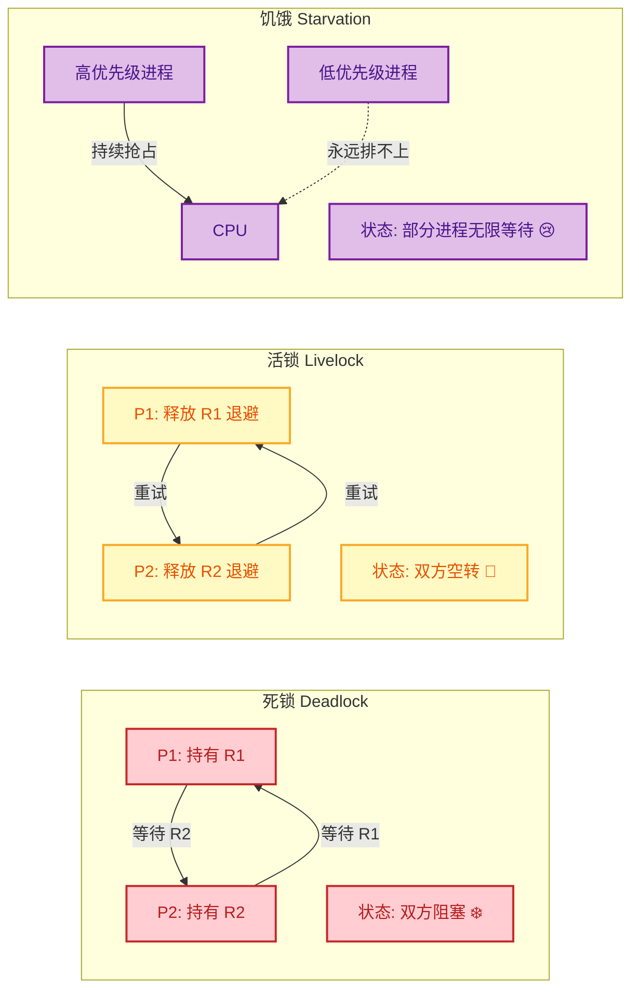

#### 死锁的系统级影响

死锁不仅仅是"几个进程卡住"这么简单，它可能引发**连锁反应（Cascading Failure）**：

1. **资源泄漏**：死锁进程持有的内存、文件句柄、网络端口等资源无法释放，导致系统可用资源持续减少。
2. **传播阻塞**：其他非死锁进程如果也需要被锁住的资源，就会被"拖入"等待队列，形成**死锁扩散**。
3. **系统吞吐量骤降**：随着被阻塞的进程越来越多，CPU 利用率可能**反常地降低**——看似矛盾，实则因为大量进程都在等待而没有可运行的任务。
4. **用户体验恶化**：在桌面系统中表现为应用无响应（Not Responding），在服务器系统中表现为请求超时。

> 💡 **面试关键句**：死锁是一种**系统状态**，而非单个进程的属性。判断死锁必须从**全局视角**审视所有进程与资源的依赖关系，局部观察是不够的。

#### 一个形式化的判断准则

操作系统通过维护 **等待图（Wait-For Graph, WFG）** 来检测死锁。WFG 是 RAG 的简化版本——去掉资源节点，仅保留进程节点和"等待"关系。

```
txt
资源分配图 (RAG):              等待图 (WFG):
                               
  P1 ──→ R2 ──→ P2             P1 ──→ P2
  ↑               │              ↑        │
  │               ↓              │        ↓
  R1 ←── P2      R1             P2 ──→ P1
                               
 (包含资源节点)                  (仅保留进程等待关系)
```

**判定规则**：

- 若 WFG 中存在**环路**，且环路上每种资源**只有单个实例** → **死锁确认**
- 若资源有**多个实例**，环路是死锁的**必要非充分条件**，需配合进一步的算法（如银行家算法的安全性检查）来确认

---

**📝 练习题**

下列关于死锁的说法，**正确**的是：

A. 死锁中的进程处于运行态，消耗大量 CPU 资源

B. 只要资源分配图中出现环路，系统就一定发生了死锁

C. 死锁一旦形成，在没有外部干预的情况下无法自行解除

D. 活锁和死锁本质相同，都是进程处于阻塞状态无法推进


**【答案】** C

**【解析】** 逐项分析：
- **A 错误**：死锁中的进程处于**阻塞态（Blocked/Waiting）**，不占用 CPU。消耗大量 CPU 是活锁或忙等待的特征。
- **B 错误**：环路是死锁的**必要条件**，但当资源存在多个实例时，即使出现环路，系统也**不一定**死锁。环路是死锁的充要条件仅限于"每类资源只有一个实例"的特殊情况。
- **C 正确**：死锁的核心特性就是**永久性**。环中每个进程都在等待其他进程释放资源，而被等待的进程同样处于阻塞态，没有任何进程能主动打破僵局。只有通过外部手段（终止进程、抢占资源、回滚等）才能解除。
- **D 错误**：活锁中的进程实际上处于**运行态**，它们在不断地改变状态（如释放资源、重试），只是没有取得有效进展。死锁进程则**完全静止**，两者本质不同。

---

## 死锁四个条件 ⭐⭐

在操作系统理论中，死锁的发生并非偶然，而是需要 **四个必要条件（Four Necessary Conditions）** 同时成立。这一经典结论由 Edward G. Coffman, Jr. 等人在 1971 年正式归纳总结，因此也被称为 **Coffman 条件（Coffman Conditions）**。理解这四个条件，是后续学习死锁预防、避免和检测的理论基石——因为只要打破其中任何一个条件，死锁就不可能发生。

我们先用一张全局视图来建立直觉，然后逐一深入每个条件。

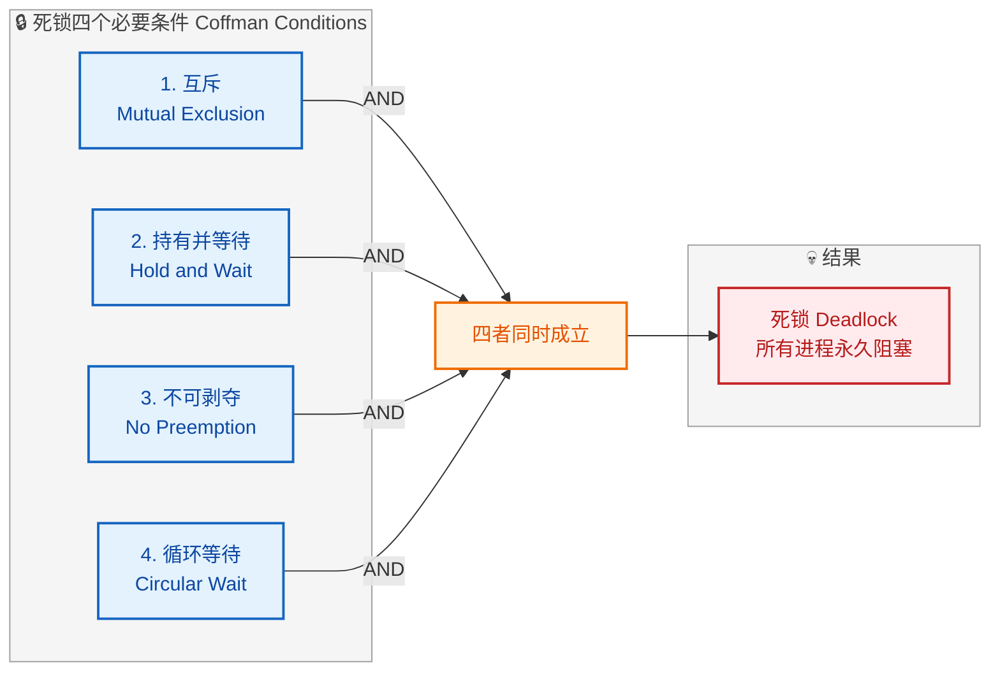

请务必注意这里的逻辑关系：四个条件之间是 **逻辑与（AND）** 的关系——缺少任何一个，死锁都不会产生。这也是为什么"死锁预防"策略只需要瞄准其中一个条件来破坏即可。

---

### 互斥（Mutual Exclusion）

**定义**：至少存在一个资源，在任意时刻只能被一个进程独占使用。当资源被某进程持有时，其他请求该资源的进程必须等待。

这是最直觉的一个条件。操作系统中存在大量天然互斥的资源——打印机一次只能服务一个打印任务、一个磁带驱动器一次只能被一个进程写入、一把互斥锁（mutex）在同一时刻只能被一个线程持有。

**为什么它是必要条件？** 如果资源可以被多个进程同时共享（如只读文件），那么根本不存在"等待"的前提——大家都能同时用，谁也不需要阻塞。只有当资源具有排他性时，才可能出现"一个进程占着，另一个进程只能等"的局面。

我们用一个最简单的例子来可视化：

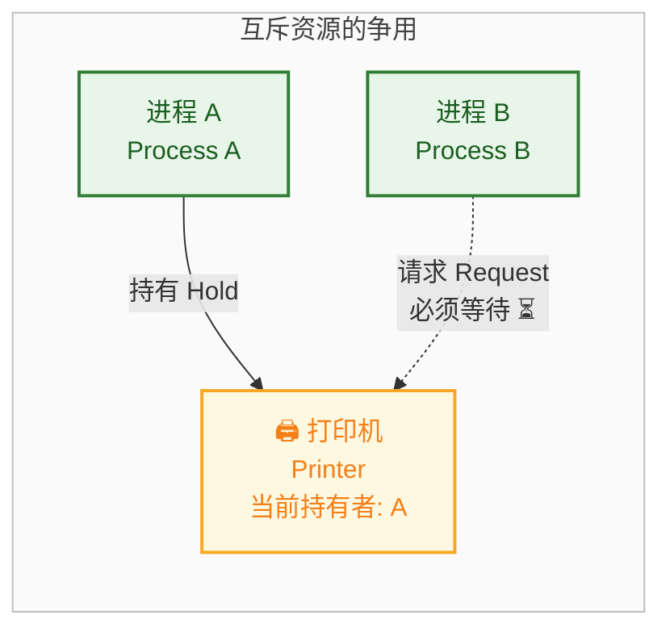

进程 A 正在使用打印机（独占），进程 B 也需要打印机但只能等待。如果打印机可以同时给两个进程使用（假设它是可共享的），那就没有等待，也就不可能构成死锁链条的第一环。

**典型的互斥资源 vs 可共享资源：**

| 类别 | 资源示例 | 能否共享 |
|------|---------|---------|
| 互斥资源 | 打印机、磁带机、mutex 锁、写模式打开的文件 | ❌ 不可同时共享 |
| 可共享资源 | 只读文件、可重入代码段（Pure Code） | ✅ 可同时共享 |

> **关键思考**：互斥条件是资源本身的固有属性（intrinsic property），在大多数情况下我们无法将一个天然互斥的资源强行变成可共享的。这也是为什么在死锁预防策略中，"破坏互斥条件"通常被认为是不可行的——你不可能让两个进程同时写同一个磁带。

---

### 持有并等待（Hold and Wait）

**定义**：已经持有至少一个资源的进程，在等待获取其他被占用资源时，不释放自己已持有的资源。

这是死锁形成的第二块"拼图"。单纯的互斥只是让进程需要排队等待某个资源；而"持有并等待"则让进程在等待的同时，还"霸占"着其他资源不放手——这才可能导致多个进程形成互相阻塞的僵局。

**一个生活化的比喻**：想象两个人在厨房做菜。A 拿着菜刀等锅，B 拿着锅等菜刀。如果任何一方愿意先放下手中的东西，死锁就不会发生。但双方都"持有并等待"——这就麻烦了。

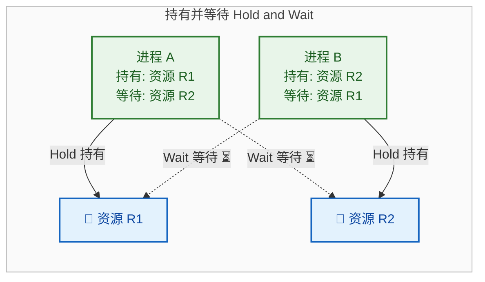

上图展示了经典的两进程死锁态势：A 持有 R1 等 R2，B 持有 R2 等 R1，谁都不肯先放手。

**代码示例——一个典型的 Hold and Wait 场景：**

```c
#include <pthread.h>

pthread_mutex_t lock_A = PTHREAD_MUTEX_INITIALIZER;  // 资源 A 的互斥锁
pthread_mutex_t lock_B = PTHREAD_MUTEX_INITIALIZER;  // 资源 B 的互斥锁

// 线程1的执行函数
void* thread1_func(void* arg) {
    pthread_mutex_lock(&lock_A);    // 第1步: 线程1 获取锁A —— 持有资源A
    sleep(1);                        // 模拟一些处理, 同时给线程2机会获取锁B
    pthread_mutex_lock(&lock_B);    // 第2步: 线程1 请求锁B —— 但锁B已被线程2持有, 阻塞!
    // ... 临界区 ...
    pthread_mutex_unlock(&lock_B);  // 释放锁B
    pthread_mutex_unlock(&lock_A);  // 释放锁A
    return NULL;
}

// 线程2的执行函数
void* thread2_func(void* arg) {
    pthread_mutex_lock(&lock_B);    // 第1步: 线程2 获取锁B —— 持有资源B
    sleep(1);                        // 模拟一些处理, 同时给线程1机会获取锁A
    pthread_mutex_lock(&lock_A);    // 第2步: 线程2 请求锁A —— 但锁A已被线程1持有, 阻塞!
    // ... 临界区 ...
    pthread_mutex_unlock(&lock_A);  // 释放锁A
    pthread_mutex_unlock(&lock_B);  // 释放锁B
    return NULL;
}
// 结果: 线程1持有A等B, 线程2持有B等A —— 经典死锁!
```

上面的代码是死锁最经典的代码级复现：两个线程以 **相反的顺序** 获取两把锁，各自持有一把并等待另一把，形成僵局。这里"持有并等待"条件体现得淋漓尽致——每个线程在请求第二把锁时，并没有释放自己已经持有的第一把锁。

**进一步理解**：如果我们要求线程在无法获取第二把锁时，必须先释放第一把锁再重试，那么"持有并等待"条件就被打破了——这正是死锁预防的思路之一（后文会详细展开）。

---

### 不可剥夺（No Preemption）

**定义**：进程已获得的资源，在未使用完毕之前，不能被系统或其他进程强制收回，只能由持有者主动释放。

"不可剥夺"（有时也翻译为"不可抢占"）强调的是资源释放的 **主动权** 完全在持有者手中。操作系统不会"抢走"一个进程正在使用的资源分配给别人。

**为什么它是必要条件？** 设想在上面的"厨房"例子中，如果厨房管理员有权力走过来强行把 A 手中的菜刀拿走交给 B——那么 B 就能继续做菜了，死锁自然就解除了。但在"不可剥夺"条件下，管理员没有这个权力，菜刀只有 A 自己用完了才会放下。

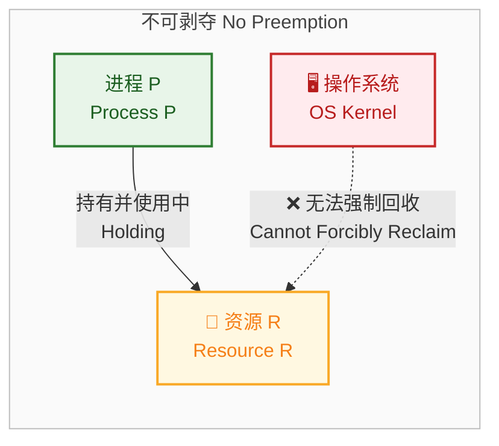

**资源是否可抢占的分类：**

| 资源类型 | 是否可抢占 | 说明 |
|---------|-----------|------|
| **CPU** | ✅ 可抢占 | 操作系统通过时间片轮转随时可以切换进程，CPU 是典型的可抢占资源 |
| **内存页面** | ✅ 可抢占 | 通过换页机制（Swapping/Paging），OS 可将进程的内存页换出到磁盘 |
| **打印机** | ❌ 不可抢占 | 打印到一半被抢走会导致输出混乱，没有实际意义 |
| **磁带驱动器** | ❌ 不可抢占 | 数据写入过程中被中断可能导致数据损坏 |
| **互斥锁 (mutex)** | ❌ 不可抢占 | 锁的语义决定了只有持有者才能释放，否则会破坏临界区保护 |

> **核心洞察**：可抢占的资源（如 CPU、内存）一般不会导致死锁问题，正是因为操作系统可以在必要时强制回收。真正容易引发死锁的，是那些 **不可抢占的资源**。

**对比可抢占 vs 不可抢占：**

```c
// ====== 可抢占资源: CPU ======
// 进程正在执行, OS 定时器中断触发
// OS 可以随时保存进程上下文(Context), 切换到另一个进程
// 进程甚至不知道自己被抢占了——这是透明的

// ====== 不可抢占资源: Mutex ======
pthread_mutex_t mtx = PTHREAD_MUTEX_INITIALIZER;

void* worker(void* arg) {
    pthread_mutex_lock(&mtx);       // 获取锁 —— 此后只有本线程能释放
    // ... 临界区操作 ...
    // 此时即使OS想把锁分配给别人, 也做不到
    // 锁的契约: 谁lock谁unlock, 不可由第三方强制释放
    pthread_mutex_unlock(&mtx);     // 只有持有者自己主动释放
    return NULL;
}
```

---

### 循环等待（Circular Wait）

**定义**：存在一组进程 `{P₀, P₁, P₂, ..., Pₙ}`，其中 P₀ 等待 P₁ 持有的资源，P₁ 等待 P₂ 持有的资源，...，Pₙ 等待 P₀ 持有的资源，形成一个 **闭合的等待环路**。

循环等待是四个条件中最"直观可视化"的一个。如果我们用 **资源分配图（Resource Allocation Graph, RAG）** 来表示进程与资源之间的持有/请求关系，那么死锁就意味着图中存在一个 **环（Cycle）**。

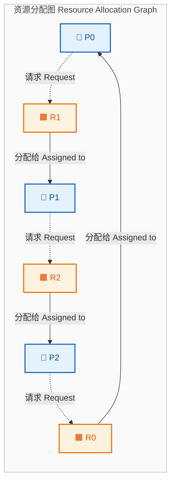

在上图中，追踪等待链：

- **P0** → 请求 R1 → R1 被 **P1** 持有
- **P1** → 请求 R2 → R2 被 **P2** 持有
- **P2** → 请求 R0 → R0 被 **P0** 持有 → **回到 P0！**

这就形成了一条闭合环路：**P0 → P1 → P2 → P0**，每个进程都在等待下一个进程释放资源，而没有任何一个进程能向前推进——这就是死锁。

**循环等待 vs 简单等待链**

需要注意的是，"等待"本身并不可怕，关键在于等待是否形成了**环**。如果等待链是开放的（如 P0 → P1 → P2，但 P2 不等待 P0 的资源），那么 P2 最终能完成工作并释放资源，从而逐步解除整条链上的阻塞。只有等待关系"首尾相连"形成闭环时，才会导致永久阻塞。

```text
开放等待链 (无死锁):        闭合等待环 (死锁!):
P0 → P1 → P2 → [完成]      P0 → P1 → P2 → P0 (环!)
      ✅ P2先完成,               ❌ 无人能先完成,
      然后P1,最后P0              所有进程永久阻塞
```

**资源分配图中"环"与"死锁"的关系——重要补充：**

这里有一个容易考到的细节：**有环不一定有死锁，但有死锁一定有环**。

- 如果每种资源**只有一个实例**（Single Instance），则资源分配图中 **有环 ⟺ 有死锁**（充要条件）。
- 如果某种资源**有多个实例**（Multiple Instances），则资源分配图中 **有环 ⟹ 不一定死锁**（必要但非充分条件），因为环中的某个请求可能被同类型的另一个空闲实例满足。

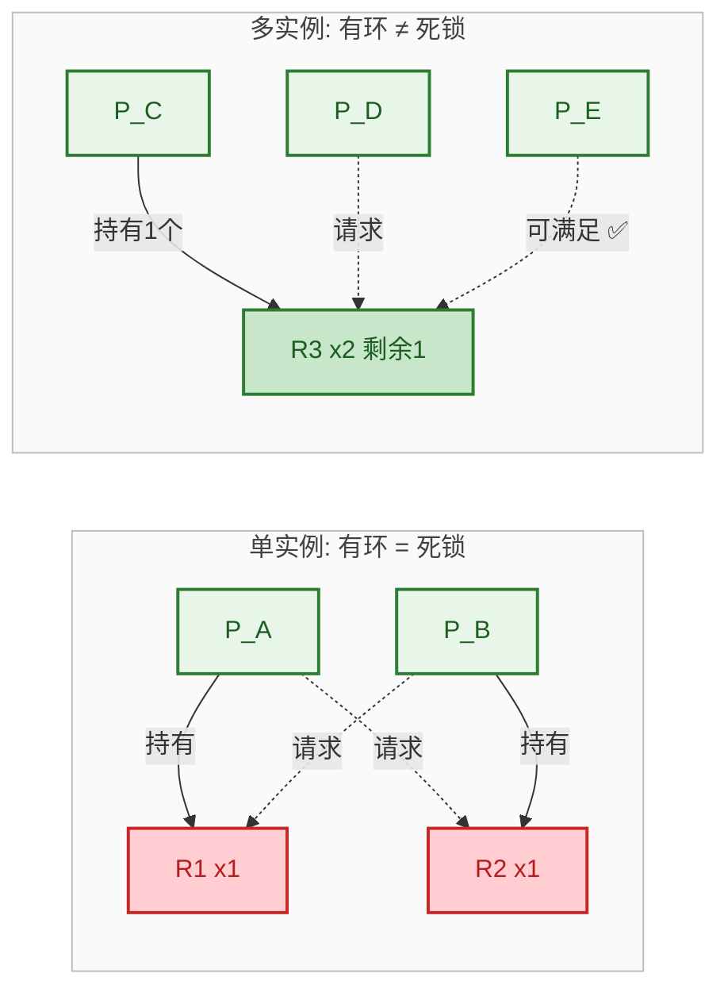

---

### 四个条件的协同关系

为了把四个条件的逻辑关系完全理清，我们用一个完整的场景来"走一遍"死锁的形成过程：

```c
// === 场景: 两个线程, 两把锁(互斥资源), 交叉获取 ===

pthread_mutex_t lock_X = PTHREAD_MUTEX_INITIALIZER;  // 资源X (互斥)
pthread_mutex_t lock_Y = PTHREAD_MUTEX_INITIALIZER;  // 资源Y (互斥)

// -------- 条件分析 --------
// [1] 互斥:         lock_X 和 lock_Y 都是 mutex, 一次只能一个线程持有 ✅
// [2] 持有并等待:   每个线程持有一把锁的同时请求另一把, 不释放已有的 ✅
// [3] 不可剥夺:     mutex 只能由持有者 unlock, OS 无法强制回收 ✅
// [4] 循环等待:     Thread1: hold X, wait Y; Thread2: hold Y, wait X → 环! ✅
// 四个条件同时满足 → 死锁!

void* thread1(void* arg) {
    pthread_mutex_lock(&lock_X);    // Thread1 获取 X
    sleep(1);                        // 制造时间窗口, 让 Thread2 获取 Y
    pthread_mutex_lock(&lock_Y);    // Thread1 请求 Y → 被 Thread2 持有 → 阻塞
    pthread_mutex_unlock(&lock_Y);
    pthread_mutex_unlock(&lock_X);
    return NULL;
}

void* thread2(void* arg) {
    pthread_mutex_lock(&lock_Y);    // Thread2 获取 Y
    sleep(1);                        // 制造时间窗口, 让 Thread1 获取 X
    pthread_mutex_lock(&lock_X);    // Thread2 请求 X → 被 Thread1 持有 → 阻塞
    pthread_mutex_unlock(&lock_X);
    pthread_mutex_unlock(&lock_Y);
    return NULL;
}
```

如果我们去掉其中**任何一个**条件，死锁都不会发生：

| 被破坏的条件 | 具体做法 | 效果 |
|-------------|---------|------|
| 互斥 | 将资源变为可共享（如读写锁的读模式） | 多个进程可同时访问，无需等待 |
| 持有并等待 | 要求线程一次性获取所有锁，或获取失败时释放已有锁 | 不会出现"占着一个等另一个"的局面 |
| 不可剥夺 | 允许系统强制回收资源（如 `pthread_mutex_timedlock` 超时放弃） | 被剥夺的进程释放资源，环被打断 |
| 循环等待 | 规定所有线程必须按相同顺序获取锁（先 X 后 Y） | 无法形成环路 |

> **总结记忆口诀**：**互持不循**（互斥、持有并等待、不可剥夺、循环等待）。四个条件缺一不可，这就是死锁理论的核心基石。

---

**📝 练习题**

某系统中有 3 个进程 P1、P2、P3，以及 3 种资源 R1、R2、R3（每种只有 1 个实例）。当前状态如下：
- P1 持有 R1，请求 R2
- P2 持有 R2，请求 R3
- P3 持有 R3，**不请求任何资源**

请问该系统是否处于死锁状态？

A. 是，因为存在循环等待

B. 是，因为满足互斥、持有并等待、不可剥夺三个条件

C. 否，因为不满足循环等待条件，P3 不等待任何资源，等待链是开放的

D. 否，因为不满足互斥条件


**【答案】** C

**【解析】** 死锁要求四个必要条件 **同时** 成立。本题中互斥（每种资源只 1 个实例）、持有并等待（P1 和 P2 都持有一个资源同时等待另一个）、不可剥夺（资源不能被强制回收）这三个条件确实成立。但关键在于第四个条件——循环等待：等待链为 **P1 → P2 → P3**，而 P3 **并不等待任何资源**，因此等待链是开放的（Open Chain），不构成环路。P3 会正常执行完毕并释放 R3，随后 P2 获取 R3 完成执行释放 R2，最后 P1 获取 R2 完成执行。所有进程都能推进，不存在死锁。这道题也验证了一个关键原则：仅有等待链不足以构成死锁，**必须形成闭合的等待环**。

---

## 死锁预防（Deadlock Prevention）⭐

死锁预防的核心思想非常直接：既然死锁的产生需要 **四个必要条件同时成立**，那么只要我们在系统设计阶段就 **从结构上破坏其中至少一个条件**，死锁就永远不可能发生。这是一种 **静态策略（Static Strategy）**，它在进程运行之前就施加了约束规则，不需要运行时动态检测。

与后面将要讨论的"死锁避免（Deadlock Avoidance）"不同，预防策略往往更加 **保守和激进**——它通过限制进程的行为自由度来换取系统的绝对安全。这种做法的代价是：资源利用率下降、系统吞吐量降低、进程并发度受限。可以说，死锁预防是在 **安全性（Safety）** 和 **效率（Efficiency）** 之间做了一个偏向安全性的极端选择。

下面我们逐一分析如何破坏四个必要条件，以及每种策略的可行性与局限性。

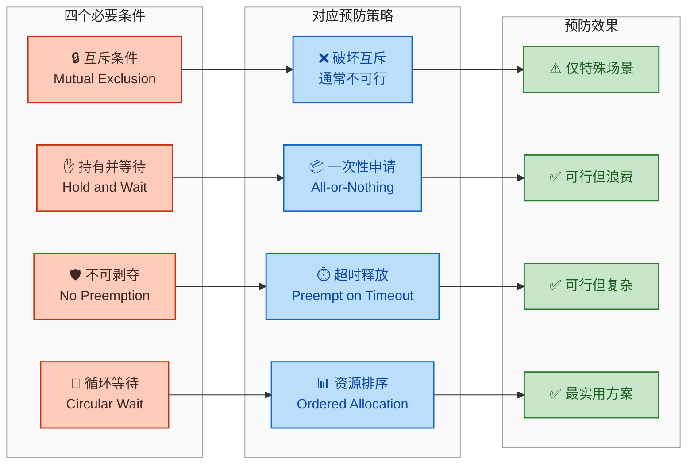

---

### 破坏互斥条件（Break Mutual Exclusion）—— 通常不可行

互斥条件说的是：某个资源在某一时刻只能被 **一个进程独占使用**。如果我们能让资源变成可以共享的，那么就不存在"你占了我就不能用"的局面，自然也就不会产生死锁。

**听起来很美好，但现实中几乎不可行。** 原因在于：互斥是很多资源的 **固有物理属性或逻辑语义要求**，不是操作系统人为施加的，我们没法消除它。

举几个典型例子：

| 资源类型 | 是否可共享 | 说明 |
|---------|-----------|------|
| 打印机（Printer） | ❌ 不可共享 | 两个进程同时打印会导致输出混乱交叉 |
| 磁带驱动器（Tape Drive） | ❌ 不可共享 | 物理设备，只能顺序独占访问 |
| 临界区互斥锁（Mutex） | ❌ 不可共享 | 这正是互斥的语义本身，去掉就失去了意义 |
| 只读文件（Read-Only File） | ✅ 可共享 | 只读操作天然不冲突 |

**唯一的例外场景：SPOOLing 技术。**

SPOOLing（Simultaneous Peripheral Operations On-Line）是操作系统中一种经典的 **将独占设备虚拟化为共享设备** 的技巧。以打印机为例：

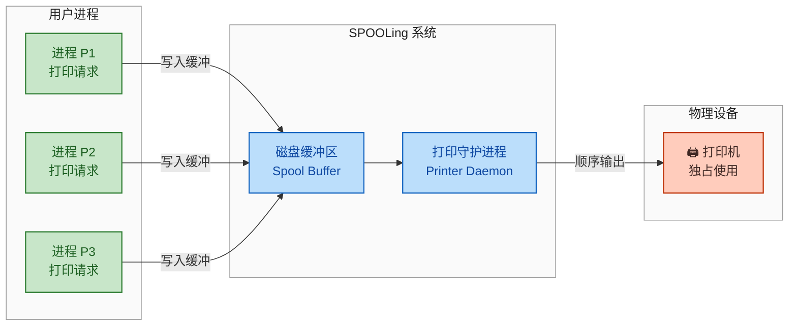

在 SPOOLing 模型下，所有进程 **看似都在直接使用打印机**，但实际上它们只是把数据写入了磁盘上的一块缓冲区。真正操作打印机的只有一个 **守护进程（Daemon）**，它按照先来先服务（FCFS）或优先级的顺序，依次取出缓冲数据并输出。这样一来，从用户进程的视角看，打印机变成了"可共享"的资源——互斥条件被巧妙地绕开了。

**但请注意**：SPOOLing 并没有真正消除互斥，只是把互斥"下沉"到了守护进程级别。而且这种方法只对 **输出型设备（如打印机）** 有效，对于 CPU、内存、互斥锁等资源完全无效。

> **结论**：破坏互斥条件在 **绝大多数场景下不可行**，它不是一种通用的死锁预防手段。我们只能在极少数特定场景（如 SPOOLing）中部分应用此思想。

---

### 破坏持有并等待条件（Break Hold and Wait）—— 一次性申请策略

持有并等待条件描述的是：一个进程 **已经持有了某些资源**，又去 **申请新的资源** 而被阻塞，但它 **不释放已持有的资源**。这样就形成了"抱着旧的，等着新的"的僵持局面。

要破坏这个条件，核心策略是：**不允许进程在持有资源的同时去等待其他资源**。具体有两种主流实现：

#### 方案一：一次性申请所有资源（All-or-Nothing / Static Allocation）

进程在 **开始执行之前**，必须 **一次性申请它整个生命周期中需要的全部资源**。如果所有资源都可用，则全部分配给它；如果有任何一个资源不可用，则 **一个都不分配**，进程必须等待。

```c
// 伪代码：一次性资源申请
// 进程在启动前声明需要的所有资源
int request_all_resources(Process *p) {
    // 获取全局资源锁，保证原子性
    lock(&resource_mutex);

    // 检查进程所需的全部资源是否都可用
    for (int i = 0; i < p->num_needed; i++) {
        if (!is_available(p->needed_resources[i])) {
            // 只要有一个资源不可用，就全部不分配
            unlock(&resource_mutex);
            return FAILURE;  // 进程必须等待后重试
        }
    }

    // 所有资源都可用，一次性全部分配
    for (int i = 0; i < p->num_needed; i++) {
        allocate(p->needed_resources[i], p);  // 逐个分配资源给进程
    }

    unlock(&resource_mutex);
    return SUCCESS;  // 进程可以开始执行
}
```

这种方案非常简单粗暴，但问题也很明显：

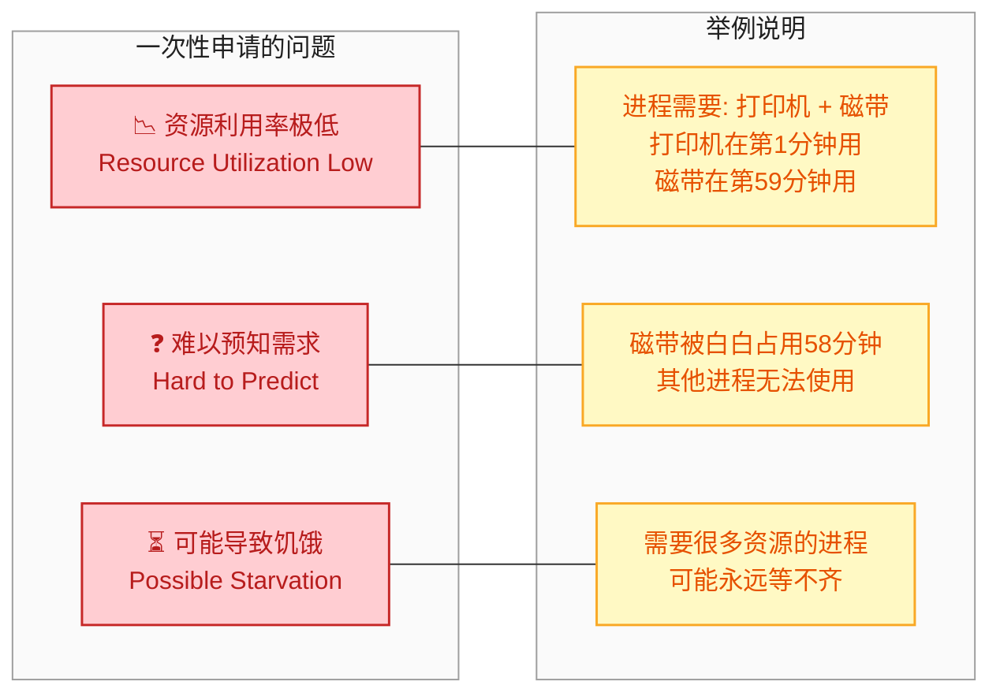

想象一个进程需要打印机和磁带机：它在第 1 分钟使用打印机，在第 59 分钟才使用磁带机。但按照一次性申请策略，两者在第 0 分钟就都被分配了。磁带机被 **白白独占了将近一个小时**，其他需要磁带机的进程只能干等。这就是典型的 **资源浪费（Resource Waste）**。

此外，如果一个进程需要的资源种类很多，它凑齐所有资源的概率就很低，可能反复失败、反复重试，最终陷入 **饥饿（Starvation）**。

#### 方案二：阶段性释放再申请（Release Before Request）

进程在申请新资源之前，必须 **先释放当前持有的所有资源**，然后再一次性申请（旧资源 + 新资源）。

```c
// 伪代码：释放后再申请
int request_new_resource(Process *p, Resource *new_res) {
    // 第一步：释放当前持有的所有资源
    for (int i = 0; i < p->num_holding; i++) {
        release(p->holding_resources[i]);   // 归还每个已持有的资源
    }
    p->num_holding = 0;                     // 清空持有列表

    // 第二步：将新资源加入需求列表
    add_to_needed(p, new_res);              // 加入新申请的资源

    // 第三步：一次性申请所有资源（旧的 + 新的）
    return request_all_resources(p);        // 调用一次性申请函数
}
```

这种方案比方案一稍微灵活，但引入了新的问题：

- **前序工作可能白费**：如果进程已经用某个资源完成了一半工作，释放后重新获取时，之前的中间状态可能丢失。
- **不适合不可重复操作**：比如进程正在向打印机输出内容，中途释放打印机会导致输出中断。

> **结论**：破坏持有并等待条件是 **可行的**，但代价是 **资源利用率低、可能饥饿、编程模型受限**。在对安全性要求极高但资源不紧张的嵌入式系统或批处理系统中，一次性申请策略仍有实际应用价值。

---

### 破坏不可剥夺条件（Break No Preemption）—— 超时释放 / 强制剥夺

不可剥夺条件说的是：进程已经获得的资源，在它 **主动释放之前**，不能被操作系统或其他进程强行夺走。如果我们允许 **强制剥夺（Preemption）**，就能打破这个条件。

具体策略有以下几种变体：

#### 变体一：申请失败时自我释放

当一个进程申请新资源而 **被拒绝（阻塞）** 时，操作系统强制它 **释放所有当前持有的资源**，把自己变成"两手空空"的状态，然后重新排队申请全部所需资源。

```c
// 伪代码：申请失败则释放所有资源
int request_with_preemption(Process *p, Resource *new_res) {
    if (try_allocate(new_res, p) == SUCCESS) {
        return SUCCESS;                     // 新资源直接获取成功
    }

    // 申请失败：强制释放自己持有的所有资源
    for (int i = 0; i < p->num_holding; i++) {
        release(p->holding_resources[i]);   // 逐个释放已持有的资源
    }
    p->num_holding = 0;                     // 清空持有记录

    // 将所有资源（包括新的）加入等待列表
    add_all_to_wait_list(p);                // 进程进入等待状态
    return BLOCKED;                         // 返回阻塞状态
}
```

#### 变体二：抢占式剥夺（用于优先级系统）

当高优先级进程需要某个资源，而该资源正被低优先级进程持有时，操作系统 **强制从低优先级进程手中夺走该资源**，分配给高优先级进程。被剥夺的低优先级进程进入等待队列。

这种机制在实际系统中常见于：

| 应用场景 | 实现方式 | 说明 |
|---------|---------|------|
| CPU 调度 | 抢占式调度（Preemptive Scheduling） | CPU 的状态可以完整保存和恢复（Context Switch） |
| 内存管理 | 页面置换（Page Replacement） | 内存页可以换出到磁盘再换回 |
| 数据库锁 | Wait-Die / Wound-Wait 机制 | 基于时间戳的剥夺策略 |

#### 变体三：超时释放（Timeout-Based Release）

给资源持有设定一个 **最大时间上限（Timeout）**。如果进程在超时时间内仍未主动释放资源，操作系统 **强制回收**。

```c
// 伪代码：带超时的资源申请
int request_with_timeout(Process *p, Resource *res, int timeout_ms) {
    int elapsed = 0;                        // 已等待的时间（毫秒）

    while (elapsed < timeout_ms) {          // 在超时范围内循环尝试
        if (try_allocate(res, p) == SUCCESS) {
            return SUCCESS;                 // 成功获取资源
        }
        sleep(RETRY_INTERVAL);              // 等待一段时间后重试
        elapsed += RETRY_INTERVAL;          // 累加等待时间
    }

    // 超时：释放自己持有的所有资源，避免死锁
    release_all(p);                         // 强制释放所有资源
    return TIMEOUT;                         // 返回超时标志
}
```

在 Java 中，`ReentrantLock` 的 `tryLock(long timeout, TimeUnit unit)` 就是这种思想的典型体现。在数据库系统中，事务的 **锁等待超时（Lock Wait Timeout）** 也是同样的机制。

#### 关键限制：资源必须具有"可保存/可恢复"的特性

**这是破坏不可剥夺条件最大的约束。** 并非所有资源都能被安全地剥夺：

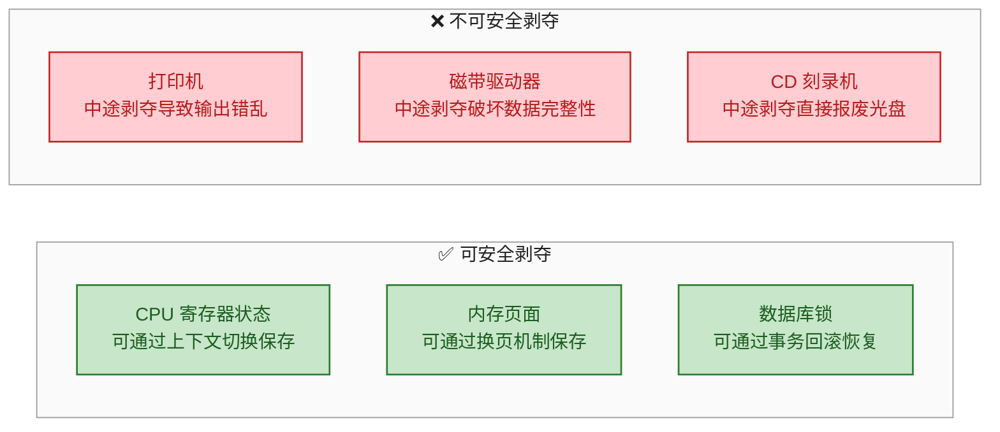

对于像 CPU、内存这样 **状态可保存、可恢复（Saveable & Restorable）** 的资源，剥夺是安全的。但对于打印机、CD 刻录机等 **操作不可逆** 的设备，强制剥夺会导致灾难性的后果。因此，这种策略的 **适用面有限**。

> **结论**：破坏不可剥夺条件 **在特定类型的资源上可行**（尤其是 CPU 和内存），但不具备通用性。超时机制在分布式系统和数据库中应用广泛，是一种工程上的折中方案。

---

### 破坏循环等待条件（Break Circular Wait）—— 资源排序法 ⭐

这是四种策略中 **最实用、最常被采用** 的一种。

循环等待条件的本质是：若干进程形成了一个 **等待环（Waiting Cycle）**。例如，P1 等待 P2 持有的资源，P2 等待 P3 持有的资源，P3 又等待 P1 持有的资源。

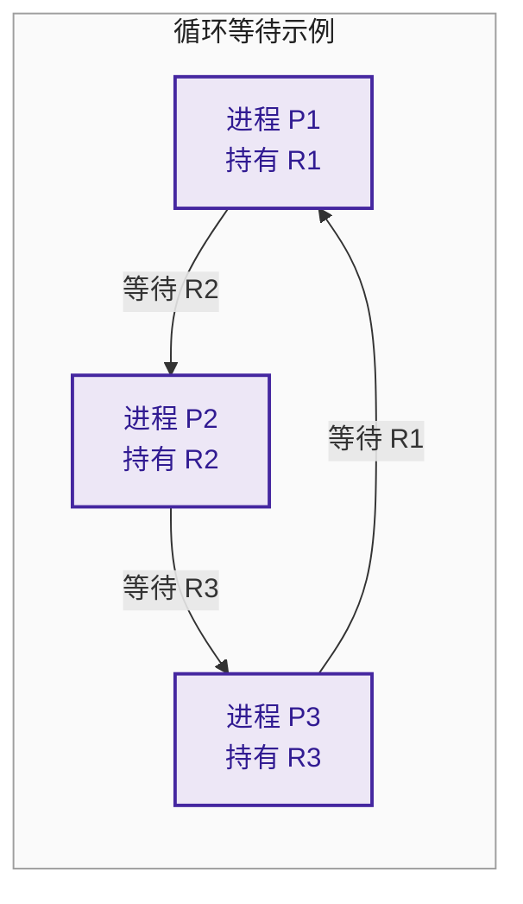

#### 核心思想：全序排列（Total Ordering）

给系统中的 **所有资源类型** 分配一个唯一的 **全局序号（Global Ordering Number）**，记为 $F(R_i)$。然后强制规定：

> **每个进程必须按照资源序号 递增 的顺序申请资源。**
> 即：如果进程已经持有了序号为 $k$ 的资源，那么它接下来只能申请序号 **严格大于** $k$ 的资源。

用数学语言表述：若进程持有资源 $R_i$ 并申请资源 $R_j$，则必须满足 $F(R_i) < F(R_j)$。

#### 为什么有序申请能防止循环？

这可以用 **反证法** 严格证明：

假设存在循环等待链：$P_1 \to P_2 \to P_3 \to \cdots \to P_n \to P_1$

- $P_1$ 持有 $R_1$，等待 $R_2$，根据规则：$F(R_1) < F(R_2)$
- $P_2$ 持有 $R_2$，等待 $R_3$，根据规则：$F(R_2) < F(R_3)$
- $\cdots$
- $P_n$ 持有 $R_n$，等待 $R_1$，根据规则：$F(R_n) < F(R_1)$

链式传递可得：$F(R_1) < F(R_2) < \cdots < F(R_n) < F(R_1)$

这意味着 $F(R_1) < F(R_1)$，**矛盾！** 因此循环等待不可能出现。 ∎

#### 实际编码示例

假设我们有三种资源：磁带机（序号 1）、磁盘（序号 5）、打印机（序号 12）。

```c
// 资源序号定义
#define TAPE     1    // 磁带机序号最小
#define DISK     5    // 磁盘序号居中
#define PRINTER 12    // 打印机序号最大

// 正确的申请顺序：必须按照序号递增申请
void correct_process() {
    acquire(TAPE);       // 先申请序号 1 的资源
    acquire(DISK);       // 再申请序号 5 的资源（5 > 1 ✅）
    acquire(PRINTER);    // 最后申请序号 12 的资源（12 > 5 ✅）

    // ... 使用资源 ...

    release(PRINTER);    // 释放顺序一般与申请顺序相反
    release(DISK);
    release(TAPE);
}

// ❌ 错误的申请顺序：违反了递增规则
void wrong_process() {
    acquire(PRINTER);    // 先申请了序号 12 的资源
    acquire(TAPE);       // 再申请序号 1 的资源（1 < 12 ❌ 违规！）
    // 操作系统应该拒绝这次申请
}
```

#### 资源排序法的优缺点

**优点：**
- **实现简单**：只需要一张资源编号表和一个简单的比较检查。
- **开销极低**：运行时只需一次整数比较，不需要复杂的图算法或矩阵运算。
- **可证明正确**：从数学上严格保证不会产生循环等待。
- **实际应用广泛**：Linux 内核中的多把锁获取就遵循了严格的 **Lock Ordering** 规范。

**缺点：**
- **序号难以确定**：在大型系统中，资源种类可能有成百上千种，如何合理编号是个难题。资源使用模式可能随业务变化，今天合理的编号明天可能不适用。
- **限制了编程灵活性**：进程必须严格按序申请资源，即使在逻辑上它需要先获取高编号资源再获取低编号资源。
- **资源利用率仍非最优**：强制排序可能导致进程提前申请暂时不需要的资源（为了保持顺序），造成一定浪费。

#### 真实世界案例：Linux 内核中的 Lock Ordering

Linux 内核中存在大量的自旋锁（Spinlock）和互斥锁（Mutex），内核开发者必须遵循严格的 **锁获取顺序（Lock Ordering）** 文档，否则就可能触发死锁。内核中甚至内置了一个名为 **Lockdep** 的运行时检测工具，专门用来检查是否有开发者违反了锁排序规则。

```text
Linux Kernel Lock Ordering 示例（简化）:

  mmap_lock (序号较小)
       ↓
  page_lock (序号中等)
       ↓
  i_lock   (序号较大)

所有内核路径都必须按照此顺序获取这三把锁，
反向获取会被 Lockdep 工具检测并报警。
```

> **结论**：破坏循环等待条件（资源排序法）是 **四种预防策略中最实用、应用最广泛的一种**。它在理论上有严格的数学保证，在工程上实现成本低、效果好。Linux 内核、数据库引擎、高并发框架中都大量使用了这种思想。

---

### 四种预防策略总结对比

| 策略 | 破坏的条件 | 可行性 | 资源利用率 | 实际应用 |
|------|-----------|--------|-----------|---------|
| 资源共享化 | 互斥条件 | ⚠️ 极少数场景 | — | SPOOLing 技术 |
| 一次性申请 | 持有并等待 | ✅ 可行 | 🔴 很低 | 批处理系统、嵌入式 |
| 强制剥夺/超时 | 不可剥夺 | ✅ 部分资源 | 🟡 中等 | CPU 调度、数据库锁 |
| 资源排序 | 循环等待 | ✅ 最实用 | 🟢 较高 | Linux 内核、并发框架 |

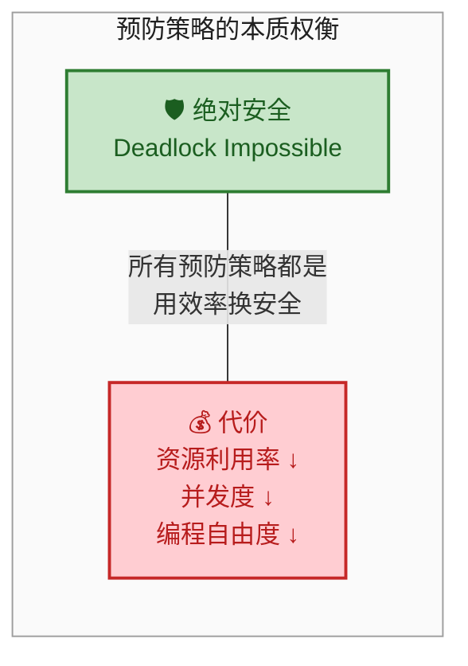

正是因为预防策略过于保守、代价过高，人们才发展出了更加精细的 **死锁避免（Deadlock Avoidance）** 策略——比如下一节将介绍的 **银行家算法（Banker's Algorithm）**，它不从结构上禁止任何行为，而是在运行时动态判断每次资源分配是否安全，从而在 **安全性和效率之间取得更好的平衡**。

---

**📝 练习题**

在一个操作系统中，有 R1、R2、R3 三种资源，分别被赋予编号 F(R1)=3，F(R2)=7，F(R3)=10。进程 P 按照以下顺序申请资源：先申请 R2，再申请 R3，最后申请 R1。请问这种申请序列是否符合资源排序法的规则？


A. 符合，因为每种资源只申请了一次，不会死锁

B. 不符合，因为最后申请的 R1 编号（3）小于已持有的 R2 编号（7）和 R3 编号（10）

C. 符合，因为 R2（7）< R3（10），前两步是递增的

D. 不符合，因为应该先申请 R3 再申请 R2


**【答案】** B

**【解析】** 资源排序法要求进程 **全程** 按照资源编号严格递增的顺序申请资源。进程 P 的申请序列为 R2(7) → R3(10) → R1(3)。前两步 R2(7) → R3(10) 确实满足递增关系（7 < 10），但第三步申请 R1 时，编号 3 小于当前已持有的最大编号 10，违反了 $F(R_{held}) < F(R_{requested})$ 的规则。正确的申请顺序应该是 R1(3) → R2(7) → R3(10)。选项 A 错误，因为即使每种资源只申请一次，顺序不对仍然违规；选项 C 忽略了第三步的违规；选项 D 给出的顺序 R3 → R2 同样是递减的，也不正确。

---

**📝 练习题**

以下关于死锁预防策略的说法，**错误** 的是：


A. SPOOLing 技术通过将独占设备虚拟化为共享设备，部分地破坏了互斥条件

B. 一次性申请所有资源的策略可能导致进程饥饿

C. 破坏不可剥夺条件适用于所有类型的资源

D. 资源排序法可以通过反证法证明不会产生循环等待


**【答案】** C

**【解析】** 选项 C 的说法是错误的。破坏不可剥夺条件（即允许强制剥夺资源）**仅适用于状态可保存和恢复的资源**，如 CPU（通过上下文切换）和内存（通过页面置换）。对于打印机、磁带机、CD 刻录机等操作不可逆的设备，强制剥夺会导致数据损坏或产出报废，因此不可行。选项 A 正确，SPOOLing 是破坏互斥条件的经典案例；选项 B 正确，需要大量资源的进程可能长时间无法凑齐所有资源而饥饿；选项 D 正确，资源排序法的正确性可以通过假设存在循环并推导出矛盾来严格证明。

---

## 死锁避免（Deadlock Avoidance）

死锁预防（Prevention）的策略虽然能从根本上消除死锁的可能性，但代价往往是 **资源利用率低下** 或 **进程并发度严重受限**。于是，操作系统设计者提出了一种更精巧的思路——**死锁避免（Deadlock Avoidance）**。它不像预防那样粗暴地破坏四个必要条件之一，而是在 **每次资源分配前** 进行动态安全性检查：如果本次分配会导致系统进入一个 **可能发生死锁的"不安全状态"（Unsafe State）**，就拒绝此次请求，让进程等待；反之，如果分配后系统仍处于 **"安全状态"（Safe State）**，就批准请求。

这种策略的核心哲学可以用一句话概括：**"不是等死锁发生了再处理，而是绝不让系统走到可能死锁的那一步。"**

### 安全状态与不安全状态（Safe State vs. Unsafe State）

在深入银行家算法之前，必须先彻底理解 **安全状态** 这一概念，它是整个死锁避免理论的基石。

**安全状态（Safe State）** 是指：系统能够找到 **至少一个** 进程执行序列 $\langle P_1, P_2, \dots, P_n \rangle$（称为 **安全序列，Safe Sequence**），使得每个进程 $P_i$ 都能在"当前可用资源 + 所有排在它前面的进程释放的资源"的支撑下顺利完成。换言之，系统承诺：按照这个顺序，所有进程 **一定能执行完毕**，不会出现谁也无法推进的僵局。

**不安全状态（Unsafe State）** 则是：系统 **找不到** 任何一个这样的安全序列。

> ⚠️ 关键区分：**不安全状态 ≠ 死锁**。不安全状态只是说"有可能发生死锁"，如果进程恰好没有请求那些会导致死锁的资源，系统也可能安全运行下去。但死锁避免策略采取 **保守原则**：只要有风险，就不分配。

三者的包含关系可以用下图清晰表达：

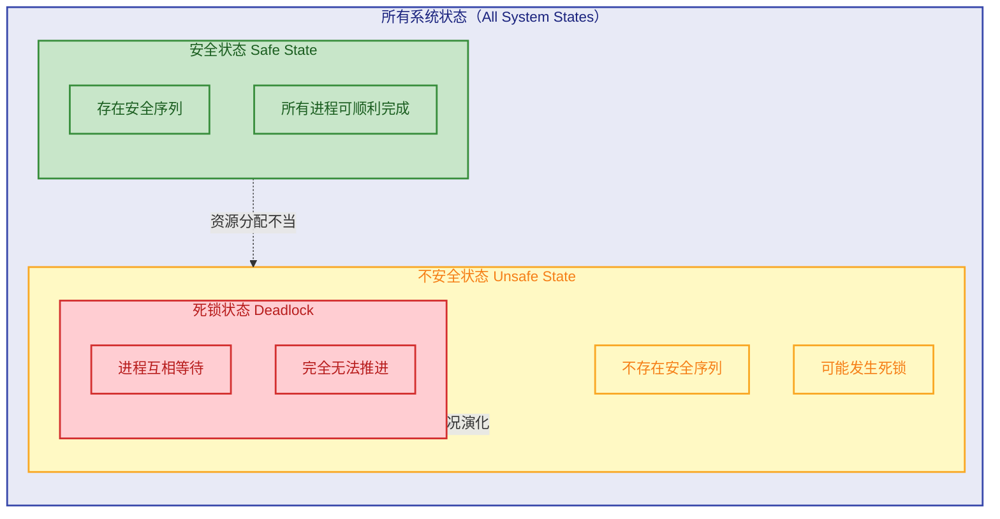

用一个直观的比喻来理解：你是一位银行经理，银行里有有限的现金。多位客户都有贷款额度，有些客户已经借了一部分钱。你需要判断：**如果我现在把钱借给客户 A，剩下的钱还够不够周转，让所有客户最终都能还清贷款？** 如果能，就借；如果不能，就让客户 A 等一等。这正是 Dijkstra 在 1965 年提出 **银行家算法** 的灵感来源。

---

### 银行家算法（Banker's Algorithm）

银行家算法（Banker's Algorithm）由荷兰计算机科学家 **Edsger W. Dijkstra** 于 1965 年提出，是死锁避免策略中最经典、最核心的算法。它适用于系统中存在 **多种资源类型（Multiple Resource Types）**、每种资源有 **多个实例（Multiple Instances）** 的场景。

#### 核心数据结构

假设系统中有 $n$ 个进程、$m$ 种资源类型。银行家算法维护以下数据结构：

| 数据结构 | 维度 | 含义 |
|:---|:---|:---|
| **Available** | 向量 $[m]$ | 每种资源当前可用的实例数 |
| **Max** | 矩阵 $[n \times m]$ | 每个进程对每种资源的 **最大需求量**（在进程开始前声明） |
| **Allocation** | 矩阵 $[n \times m]$ | 每个进程 **当前已分配** 的每种资源数量 |
| **Need** | 矩阵 $[n \times m]$ | 每个进程 **还需要** 的每种资源数量 |

其中，**Need** 可以由前两者推导：

$$\text{Need}[i][j] = \text{Max}[i][j] - \text{Allocation}[i][j]$$

这个等式的含义是：进程 $i$ 对资源 $j$ 的剩余需求 = 它声明的最大需求 - 它已经拿到手的。

#### 安全性检查算法（Safety Algorithm）

安全性检查是银行家算法的 **内核**。每次有进程发起资源请求时，系统会 **先假装分配**，然后调用安全性检查算法来判断分配后的状态是否安全。

算法步骤如下：

```c
// ============================================================
// 安全性检查算法 (Safety Algorithm)
// 功能：判断当前系统状态是否为安全状态
// 返回：true 表示安全，false 表示不安全
// ============================================================

bool safety_check() {
    // 第1步：初始化
    // Work 向量：模拟当前可用资源，初始值拷贝自 Available
    int Work[m];
    for (int j = 0; j < m; j++)          // 遍历所有资源类型
        Work[j] = Available[j];           // 将当前可用资源复制到工作向量

    // Finish 数组：记录每个进程是否已"模拟完成"
    bool Finish[n];
    for (int i = 0; i < n; i++)           // 遍历所有进程
        Finish[i] = false;                // 初始时，所有进程都标记为未完成

    // 第2步：寻找安全序列（核心循环）
    int safe_sequence[n];                 // 用于记录安全序列
    int count = 0;                        // 已进入安全序列的进程计数

    while (count < n) {                   // 只要还有进程未完成，就继续寻找
        bool found = false;               // 本轮是否找到了可执行的进程

        for (int i = 0; i < n; i++) {     // 遍历所有进程
            if (Finish[i] == false) {     // 只看还没完成的进程
                // 检查进程 i 的剩余需求是否 <= 当前可用资源
                bool can_run = true;
                for (int j = 0; j < m; j++) {    // 逐资源类型比较
                    if (Need[i][j] > Work[j]) {  // 需求超过可用量
                        can_run = false;          // 该进程暂时无法运行
                        break;                    // 无需继续比较其他资源
                    }
                }

                if (can_run) {
                    // 进程 i 可以获得所需资源并运行至结束
                    // 模拟回收：运行完成后，它会释放已持有的全部资源
                    for (int j = 0; j < m; j++)
                        Work[j] += Allocation[i][j]; // 回收进程 i 的所有资源

                    Finish[i] = true;                // 标记进程 i 已完成
                    safe_sequence[count] = i;        // 记录到安全序列
                    count++;                         // 计数器 +1
                    found = true;                    // 本轮找到了可执行进程
                }
            }
        }

        // 如果遍历了一整轮都没找到任何可执行的进程，说明存在死锁风险
        if (!found)
            return false;   // 不安全状态！
    }

    // 第3步：所有进程都能完成，系统处于安全状态
    return true;            // 安全！safe_sequence[] 中记录了一条安全序列
}
```

算法的本质是 **贪心模拟**：不断寻找"能用当前剩余资源满足的进程"，让它执行完毕并归还资源，然后看能否继续满足下一个进程，如此反复。如果所有进程都能顺利完成，就说明安全序列存在。

其执行流程可以表达为：

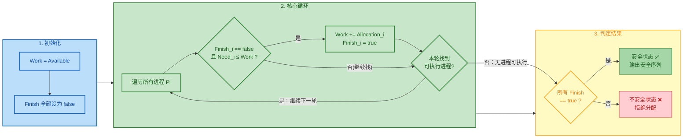

#### 资源请求算法（Resource-Request Algorithm）

当进程 $P_i$ 发出资源请求 $\text{Request}_i$ 时，系统并不会直接分配，而是执行以下三步判定：

```c
// ============================================================
// 资源请求算法 (Resource-Request Algorithm)
// 功能：处理进程 Pi 的资源请求 Request_i
// ============================================================

void resource_request(int i, int Request[]) {

    // 第1步：合法性检查 —— 请求量不能超过之前声明的需求
    for (int j = 0; j < m; j++) {
        if (Request[j] > Need[i][j]) {         // 请求超过了声明的最大需求
            error("Error: 请求超过最大需求声明！"); // 这是程序 BUG，直接报错
            return;
        }
    }

    // 第2步：可用性检查 —— 请求量不能超过当前可用资源
    for (int j = 0; j < m; j++) {
        if (Request[j] > Available[j]) {        // 当前系统资源不够
            block(i);  // 进程 Pi 必须等待（资源不足，阻塞）
            return;
        }
    }

    // 第3步：试探性分配（Pretend Allocation）
    // 先假装把资源分给 Pi，然后检查安全性
    for (int j = 0; j < m; j++) {
        Available[j]   -= Request[j];           // 可用资源减少
        Allocation[i][j] += Request[j];         // Pi 的已分配量增加
        Need[i][j]     -= Request[j];           // Pi 的剩余需求减少
    }

    // 第4步：安全性检查
    if (safety_check()) {
        // 分配后系统仍然安全 → 正式批准！
        grant(i);                               // 进程 Pi 获得资源
    } else {
        // 分配后系统不安全 → 回滚！恢复原状
        for (int j = 0; j < m; j++) {
            Available[j]   += Request[j];       // 恢复可用资源
            Allocation[i][j] -= Request[j];     // 恢复 Pi 的已分配量
            Need[i][j]     += Request[j];       // 恢复 Pi 的剩余需求
        }
        block(i);  // 进程 Pi 等待，稍后重试
    }
}
```

用一句话总结请求处理的核心逻辑：**"先假装分配，检查安全，安全就批准，不安全就回滚。"**

---

### 银行家算法完整实例

这是学习银行家算法 **最关键** 的部分。我们通过一个经典的手工推演实例，把所有数据结构和算法步骤串联起来。

#### 初始状态

系统中有 **5 个进程** $P_0 \sim P_4$，**3 种资源类型** $A, B, C$，各资源的总实例数为 $(10, 5, 7)$。

| 进程 | Max (A,B,C) | Allocation (A,B,C) | Need (A,B,C) | 
|:---:|:---:|:---:|:---:|
| $P_0$ | (7, 5, 3) | (0, 1, 0) | (7, 4, 3) |
| $P_1$ | (3, 2, 2) | (2, 0, 0) | (1, 2, 2) |
| $P_2$ | (9, 0, 2) | (3, 0, 2) | (6, 0, 0) |
| $P_3$ | (2, 2, 2) | (2, 1, 1) | (0, 1, 1) |
| $P_4$ | (4, 3, 3) | (0, 0, 2) | (4, 3, 1) |

**计算 Available：**

$$\text{Available} = \text{Total} - \sum \text{Allocation} = (10,5,7) - (7,2,5) = (3,3,2)$$

#### 安全性检查推演

现在用 $\text{Available} = (3,3,2)$，执行安全性算法：

**第 1 轮扫描：** $\text{Work} = (3,3,2)$

| 进程 | Need | Work 够吗？ | 操作 |
|:---:|:---:|:---:|:---|
| $P_0$ | (7,4,3) | (3,3,2) ≥ (7,4,3)? ❌ | 跳过 |
| $P_1$ | (1,2,2) | (3,3,2) ≥ (1,2,2)? ✅ | **执行！** Work = (3,3,2) + (2,0,0) = **(5,3,2)** |
| $P_2$ | (6,0,0) | (5,3,2) ≥ (6,0,0)? ❌ | 跳过 |
| $P_3$ | (0,1,1) | (5,3,2) ≥ (0,1,1)? ✅ | **执行！** Work = (5,3,2) + (2,1,1) = **(7,4,3)** |
| $P_4$ | (4,3,1) | (7,4,3) ≥ (4,3,1)? ✅ | **执行！** Work = (7,4,3) + (0,0,2) = **(7,4,5)** |

**第 2 轮扫描：** $\text{Work} = (7,4,5)$

| 进程 | Need | Work 够吗？ | 操作 |
|:---:|:---:|:---:|:---|
| $P_0$ | (7,4,3) | (7,4,5) ≥ (7,4,3)? ✅ | **执行！** Work = (7,4,5) + (0,1,0) = **(7,5,5)** |
| $P_2$ | (6,0,0) | (7,5,5) ≥ (6,0,0)? ✅ | **执行！** Work = (7,5,5) + (3,0,2) = **(10,5,7)** |

所有进程都完成了！✅ 安全序列为 $\langle P_1, P_3, P_4, P_0, P_2 \rangle$。

> 💡 注意：安全序列 **不唯一**。例如 $\langle P_1, P_3, P_4, P_2, P_0 \rangle$ 在第 2 轮先检查 $P_2$ 也是可行的。只要能找到 **至少一个** 安全序列，系统就处于安全状态。

#### 模拟一次资源请求

假设此时 $P_1$ 发出请求 $\text{Request}_1 = (1, 0, 2)$。

**Step 1：合法性检查**

$$\text{Request}_1 = (1,0,2) \leq \text{Need}_1 = (1,2,2)? \quad \checkmark \text{ 合法}$$

**Step 2：可用性检查**

$$\text{Request}_1 = (1,0,2) \leq \text{Available} = (3,3,2)? \quad \checkmark \text{ 资源充足}$$

**Step 3：试探性分配**

$$\text{Available}' = (3,3,2) - (1,0,2) = (2,3,0)$$
$$\text{Allocation}_1' = (2,0,0) + (1,0,2) = (3,0,2)$$
$$\text{Need}_1' = (1,2,2) - (1,0,2) = (0,2,0)$$

**Step 4：安全性检查**（用新的 Available' = (2,3,0)）

| 轮次 | 执行进程 | 条件 | Work 变化 |
|:---:|:---:|:---|:---|
| 1 | $P_1$ | Need'=(0,2,0) ≤ (2,3,0) ✅ | (2,3,0)+(3,0,2)=**(5,3,2)** |
| 1 | $P_3$ | Need=(0,1,1) ≤ (5,3,2) ✅ | (5,3,2)+(2,1,1)=**(7,4,3)** |
| 1 | $P_4$ | Need=(4,3,1) ≤ (7,4,3) ✅ | (7,4,3)+(0,0,2)=**(7,4,5)** |
| 2 | $P_0$ | Need=(7,4,3) ≤ (7,4,5) ✅ | (7,4,5)+(0,1,0)=**(7,5,5)** |
| 2 | $P_2$ | Need=(6,0,0) ≤ (7,5,5) ✅ | (7,5,5)+(3,0,2)=**(10,5,7)** |

安全序列 $\langle P_1, P_3, P_4, P_0, P_2 \rangle$ 存在 ✅ → **批准请求！**

---

### 银行家算法的复杂度与局限性

#### 时间复杂度

安全性检查算法在最坏情况下，外层 `while` 循环执行 $n$ 轮（每轮至少找到一个进程），内层 `for` 循环扫描 $n$ 个进程，每次比较 $m$ 种资源。因此：

$$T(n,m) = O(n^2 \times m)$$

每次资源请求都要调用一次安全性检查，在进程和资源种类较多的系统中，这笔开销不可忽视。

#### 实际局限性

虽然银行家算法在理论上非常优雅，但在 **实际操作系统** 中几乎不被采用，原因如下：

| 局限 | 说明 |
|:---|:---|
| **最大需求难以预知** | 算法要求每个进程在启动前声明 Max，但多数实际程序无法准确预知自己需要多少资源 |
| **进程数量动态变化** | 实际系统中进程不断创建和销毁，而算法假设进程数 $n$ 固定 |
| **资源数量动态变化** | 设备可能热插拔、I/O 通道可能动态变化，Available 不恒定 |
| **开销较高** | $O(n^2 m)$ 的检查在每次请求时都要执行，对高并发系统来说代价不小 |
| **过于保守** | 不安全状态不一定真的会死锁，算法可能拒绝了本来没问题的请求 |

> 📌 因此，现代操作系统（如 Linux、Windows）通常采用 **死锁检测与恢复（Detection & Recovery）** 或者干脆 **鸵鸟策略（Ostrich Algorithm）**——即假装死锁不存在，依赖程序员自己避免。银行家算法更多地出现在 **教学** 和 **考试** 中，作为理解死锁避免机制的经典模型。

---

### 银行家算法 vs 死锁预防 vs 死锁检测

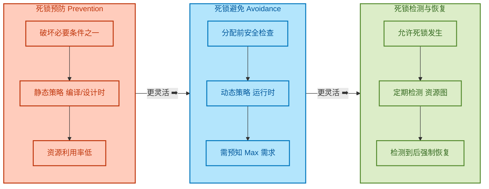

从左到右，**灵活性递增，限制性递减，但风险也递增**：

- **预防**：最保守，完全杜绝死锁，但资源利用率差。
- **避免**（银行家算法）：折中，允许资源并发使用，但每次请求需做安全性检查。
- **检测与恢复**：最激进，放任运行，只在发现死锁后才干预。

---

**📝 练习题**

某系统有 A、B、C 三类资源，数量分别为 (9, 3, 6)，当前有 P0~P3 四个进程，状态如下：

| 进程 | Max (A,B,C) | Allocation (A,B,C) |
|:---:|:---:|:---:|
| P0 | (3, 2, 2) | (1, 0, 0) |
| P1 | (6, 1, 3) | (5, 1, 1) |
| P2 | (3, 1, 4) | (2, 1, 1) |
| P3 | (4, 2, 2) | (0, 0, 2) |

当前 Available = (1, 1, 2)。如果此时 P0 发出请求 Request = (1, 0, 1)，系统是否应该批准？


A. 批准。分配后存在安全序列 $\langle P0, P2, P1, P3 \rangle$

B. 批准。分配后存在安全序列 $\langle P0, P2, P3, P1 \rangle$

C. 不批准。试探分配后 Available = (0, 1, 1)，找不到安全序列

D. 不批准。请求不合法，Request 超过了 Need


**【答案】** C

**【解析】**

首先计算 Need 矩阵：$\text{Need} = \text{Max} - \text{Allocation}$，得到 $P_0(2,2,2)$, $P_1(1,0,2)$, $P_2(1,0,3)$, $P_3(4,2,0)$。

合法性检查：$\text{Request}_0 = (1,0,1) \leq \text{Need}_0 = (2,2,2)$ ✅；可用性检查：$(1,0,1) \leq \text{Available} = (1,1,2)$ ✅。排除 D。

试探分配后：$\text{Available}' = (1,1,2)-(1,0,1) = (0,1,1)$，$\text{Allocation}_0' = (2,0,1)$，$\text{Need}_0' = (1,2,1)$。

然后做安全性检查：Work = (0,1,1)，逐个检查——$P_0$ 需要 (1,2,1) > (0,1,1) ❌；$P_1$ 需要 (1,0,2) > (0,1,1)（C 分量 2>1）❌；$P_2$ 需要 (1,0,3) > (0,1,1) ❌；$P_3$ 需要 (4,2,0) > (0,1,1) ❌。**没有任何一个进程能执行**，无安全序列，系统处于不安全状态，应拒绝请求。故选 C。

---

## 死锁检测与恢复（Deadlock Detection & Recovery）

在前面的章节中，我们讨论了死锁**预防**（Prevention）和死锁**避免**（Avoidance）。预防策略通过在系统设计阶段破坏四个必要条件之一来"从根源上消灭"死锁，但往往代价高昂、资源利用率低下；避免策略（如银行家算法）虽然更灵活，但要求系统在每次资源分配前都执行安全性检查，运行时开销显著，且需要进程提前声明最大资源需求——这在许多实际场景中并不现实。

那么，有没有一种更"乐观"的策略？答案是：**死锁检测与恢复（Detection & Recovery）**。

其核心哲学是：**不阻止死锁的发生，而是允许死锁出现，然后通过周期性的检测算法发现死锁，再采取恢复措施解除死锁。** 这就好比消防系统——我们不禁止一切可能引发火灾的活动，而是安装烟雾报警器（检测），并配备灭火器和消防队（恢复）。这种策略在资源利用率和系统吞吐量之间取得了更好的平衡，也是许多现代操作系统和数据库系统采用的实际方案。

---

### 资源分配图与等待图（Resource Allocation Graph & Wait-for Graph）

要检测死锁，首先需要一种数据结构来描述当前系统中进程与资源之间的关系。最经典的工具就是**资源分配图（Resource Allocation Graph, RAG）**。

**资源分配图包含两类节点：**

- **进程节点（Process Node）**：用圆形表示，代表系统中的每一个进程。
- **资源节点（Resource Node）**：用矩形表示，矩形内的小圆点代表该类资源的实例数量。

**以及两类有向边：**

- **请求边（Request Edge）**：从进程 → 资源，表示进程正在等待（请求）该资源。记作 $P_i \rightarrow R_j$。
- **分配边（Assignment Edge）**：从资源 → 进程，表示该资源的一个实例已分配给该进程。记作 $R_j \rightarrow P_i$。

当资源分配图中存在**环路（Cycle）**时，就**可能**存在死锁。注意这里用的是"可能"：

| 资源类型 | 环路与死锁的关系 |
|---------|---------------|
| 每类资源只有**单个实例** | 环路是死锁的**充要条件** |
| 每类资源有**多个实例** | 环路是死锁的**必要条件**，但不充分 |

下面用一个 Mermaid 图来展示一个经典的死锁资源分配图场景：

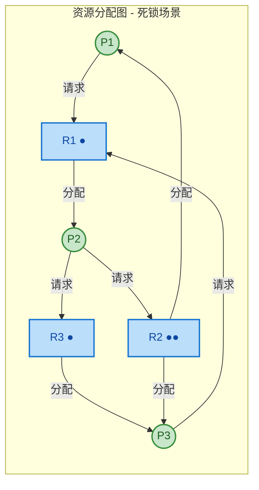

在上图中，存在一条环路：$P2 \rightarrow R3 \rightarrow P3 \rightarrow R1 \rightarrow P2$，这三个进程陷入了死锁。

**等待图（Wait-for Graph）** 是资源分配图的一种简化形式，专门用于**每类资源只有单个实例**的场景。它通过去掉资源节点，直接用进程之间的边来表示等待关系：如果 $P_i$ 正在等待 $P_j$ 持有的资源，就画一条边 $P_i \rightarrow P_j$。

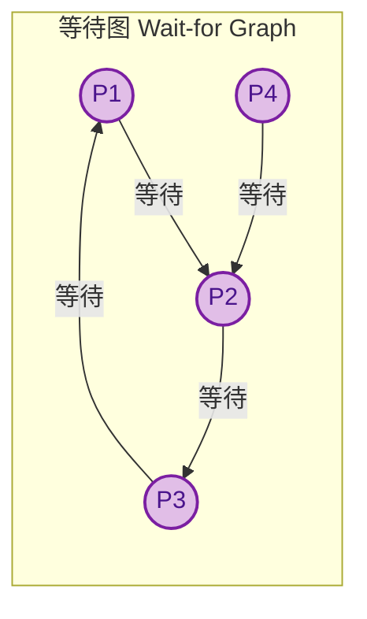

在等待图中，$P1 \rightarrow P2 \rightarrow P3 \rightarrow P1$ 构成环路，因此 P1、P2、P3 处于死锁状态。而 P4 虽然在等待 P2，但它本身不在环路中——不过它也被间接阻塞了（因为 P2 永远无法释放资源）。

检测等待图中的环路可以使用经典的**深度优先搜索（DFS）**算法，时间复杂度为 $O(n^2)$，其中 $n$ 为进程数。

---

### 多实例资源的死锁检测算法（Detection Algorithm for Multiple Instances）

当系统中存在多实例资源时，仅靠等待图无法准确判断死锁。我们需要一种更精细的算法——它与银行家算法（Banker's Algorithm）在结构上非常相似，但**不需要**进程声明最大需求（Max），因为它不是在做"安全性预判"，而是在检查"当前状态是否已经死锁"。

**算法所需的数据结构（假设有 $n$ 个进程，$m$ 类资源）：**

| 数据结构 | 维度 | 含义 |
|---------|------|------|
| `Available[m]` | 向量 | 每类资源当前可用的实例数 |
| `Allocation[n][m]` | 矩阵 | 每个进程当前已持有的各类资源数 |
| `Request[n][m]` | 矩阵 | 每个进程当前正在请求的各类资源数 |

注意与银行家算法的关键区别：这里用的是 **`Request`（当前请求）** 而不是 `Need`（最大需求 - 已分配）。这是因为检测算法关注的是**此时此刻**的状态。

**算法步骤如下：**

```
步骤1：初始化
    Work[m] = Available[m]
    对每个进程 Pi：
        若 Allocation[i] ≠ 0，则 Finish[i] = false
        若 Allocation[i] = 0，则 Finish[i] = true   // 未持有资源，不可能参与死锁

步骤2：查找可满足的进程
    寻找一个进程 Pi，使得：
        Finish[i] == false  且  Request[i] ≤ Work
    若找不到，转步骤4

步骤3：模拟回收
    Work = Work + Allocation[i]    // 假设该进程能运行完毕并释放资源
    Finish[i] = true
    转步骤2

步骤4：判定结果
    若存在 Finish[i] == false 的进程，则这些进程处于死锁状态
```

下面用 C 语言实现这个算法（含逐行注释）：

```c
#include <stdio.h>
#include <stdbool.h>

#define MAX_PROC 10   // 最大进程数
#define MAX_RES  10   // 最大资源类型数

int n, m;                              // n: 进程数, m: 资源类型数
int Available[MAX_RES];                // 各类资源当前可用数量
int Allocation[MAX_PROC][MAX_RES];     // 进程已分配资源矩阵
int Request[MAX_PROC][MAX_RES];        // 进程当前请求资源矩阵
int Work[MAX_RES];                     // 工作向量，模拟可用资源的动态变化
bool Finish[MAX_PROC];                 // 标记进程是否可以完成

// 检测函数：返回死锁进程的数量
int detect_deadlock(int deadlocked[]) {
    int count = 0;                     // 死锁进程计数器

    // 步骤1：初始化 Work 向量和 Finish 数组
    for (int j = 0; j < m; j++) {
        Work[j] = Available[j];        // Work 初始化为当前可用资源
    }
    for (int i = 0; i < n; i++) {
        Finish[i] = true;              // 先假设所有进程都能完成
        for (int j = 0; j < m; j++) {
            if (Allocation[i][j] != 0) {
                Finish[i] = false;     // 持有资源的进程标记为未完成
                break;                 // 只要持有任一资源就标记 false
            }
        }
    }

    // 步骤2-3：反复寻找可满足的进程并模拟回收
    bool found = true;                 // 控制循环的标志
    while (found) {
        found = false;                 // 每轮开始前重置
        for (int i = 0; i < n; i++) {
            if (Finish[i]) continue;   // 跳过已完成或未持有资源的进程

            // 检查 Request[i] <= Work（所有资源类型都满足）
            bool can_satisfy = true;   // 假设可以满足
            for (int j = 0; j < m; j++) {
                if (Request[i][j] > Work[j]) {
                    can_satisfy = false;  // 有任一资源不满足则不行
                    break;
                }
            }

            if (can_satisfy) {
                // 步骤3：模拟该进程执行完毕，回收其所有资源
                for (int j = 0; j < m; j++) {
                    Work[j] += Allocation[i][j];  // 资源归还到 Work
                }
                Finish[i] = true;      // 标记该进程为已完成
                found = true;          // 本轮有进展，继续下一轮
            }
        }
    }

    // 步骤4：收集所有 Finish[i] == false 的进程——它们处于死锁中
    for (int i = 0; i < n; i++) {
        if (!Finish[i]) {
            deadlocked[count++] = i;   // 记录死锁进程的编号
        }
    }
    return count;                      // 返回死锁进程总数
}

int main() {
    // === 示例：3类资源(A,B,C)，5个进程(P0-P4) ===
    n = 5; m = 3;

    // 当前可用资源：A=0, B=0, C=0（资源已全部分配出去）
    Available[0] = 0; Available[1] = 0; Available[2] = 0;

    // Allocation 矩阵（各进程已持有的资源）
    //             A  B  C
    int alloc[5][3] = {
        {0, 1, 0},   // P0 持有: 0A, 1B, 0C
        {2, 0, 0},   // P1 持有: 2A, 0B, 0C
        {3, 0, 3},   // P2 持有: 3A, 0B, 3C
        {2, 1, 1},   // P3 持有: 2A, 1B, 1C
        {0, 0, 2}    // P4 持有: 0A, 0B, 2C
    };

    // Request 矩阵（各进程当前请求的资源）
    //             A  B  C
    int req[5][3] = {
        {0, 0, 0},   // P0 请求: 无（P0 当前不需要额外资源）
        {2, 0, 2},   // P1 请求: 2A, 0B, 2C
        {0, 0, 0},   // P2 请求: 无
        {1, 0, 0},   // P3 请求: 1A, 0B, 0C
        {0, 0, 2}    // P4 请求: 0A, 0B, 2C
    };

    // 将数据拷贝到全局数组
    for (int i = 0; i < n; i++)
        for (int j = 0; j < m; j++) {
            Allocation[i][j] = alloc[i][j];
            Request[i][j] = req[i][j];
        }

    // 执行死锁检测
    int deadlocked[MAX_PROC];          // 存储死锁进程编号的数组
    int cnt = detect_deadlock(deadlocked);

    // 输出结果
    if (cnt == 0) {
        printf("当前系统无死锁\n");    // 所有进程均可完成
    } else {
        printf("检测到死锁! 涉及 %d 个进程:\n", cnt);
        for (int i = 0; i < cnt; i++) {
            printf("  P%d\n", deadlocked[i]);  // 打印死锁进程编号
        }
    }
    return 0;
}
```

**上述示例的执行推演：**

初始时 `Work = [0, 0, 0]`。P0 的 `Request = [0,0,0] ≤ Work`，所以 P0 可运行完毕，回收后 `Work = [0,1,0]`。接着 P2 的 `Request = [0,0,0] ≤ [0,1,0]`，回收后 `Work = [3,1,3]`。然后 P1 的 `Request = [2,0,2] ≤ [3,1,3]`，回收后 `Work = [5,1,3]`。P3 的 `Request = [1,0,0] ≤ [5,1,3]`，回收后 `Work = [7,2,4]`。P4 的 `Request = [0,0,2] ≤ [7,2,4]`，回收后 `Work = [7,2,6]`。所有进程 `Finish = true`，**无死锁**。

但如果 P2 此时发出一个额外的请求 `Request[2] = [0, 0, 1]`，那么在 P0 完成后 `Work = [0,1,0]`，没有任何进程的 Request 能被满足——P1、P2、P3、P4 全部陷入死锁。

**算法的时间复杂度为 $O(m \times n^2)$**，其中外层循环最多执行 $n$ 轮（每轮至少完成一个进程），内层遍历所有进程并对比 $m$ 维资源向量。

---

### 检测算法的调用时机（When to Invoke Detection）

死锁检测算法需要消耗 CPU 资源，因此不可能每时每刻都运行。调用时机的选择是一个**开销与响应速度之间的权衡**问题：

```mermaid
graph LR
    subgraph FREQ["检测频率策略"]
        direction TB
        S1["每次资源请求失败时检测"]
        S2["定时周期性检测"]
        S3["CPU 利用率低于阈值时检测"]
    end

    subgraph PROS["优点"]
        direction TB
        P1["立即发现死锁\n精确定位触发进程"]
        P2["开销可控\n实现简单"]
        P3["开销最小\n自适应系统负载"]
    end

    subgraph CONS["缺点"]
        direction TB
        C1["开销极大\n每次请求都触发 O(m*n*n)"]
        C2["存在检测延迟\n死锁进程在间隔期内浪费资源"]
        C3["可能长时间不检测\n死锁累积"]
    end

    S1 --> P1
    S1 --> C1
    S2 --> P2
    S2 --> C2
    S3 --> P3
    S3 --> C3

    classDef stratNode fill:#E8F5E9,stroke:#43A047,stroke-width:2px,color:#1B5E20
    classDef proNode fill:#E3F2FD,stroke:#1E88E5,stroke-width:2px,color:#0D47A1
    classDef conNode fill:#FBE9E7,stroke:#E53935,stroke-width:2px,color:#B71C1C

    class S1,S2,S3 stratNode
    class P1,P2,P3 proNode
    class C1,C2,C3 conNode
```

**实践中最常用的策略**是第三种或混合策略。例如，当系统检测到 CPU 利用率持续偏低（可能是大量进程被阻塞在资源等待上）时，触发一次死锁检测。Linux 内核中的 `lockdep` 机制在开发调试阶段用于检测潜在的锁顺序问题，而数据库系统（如 MySQL InnoDB）则通常采用**等待超时 + 等待图检测**的混合方案。

---

### 死锁恢复策略（Recovery Strategies）

一旦检测到死锁，系统必须采取行动来打破它。恢复策略主要分为三大类：

#### 方法一：进程终止（Process Termination）

这是最直接粗暴的方法——杀死某些进程以释放它们持有的资源，从而打破死锁环路。

**两种子策略：**

**（1）终止所有死锁进程（Abort All Deadlocked Processes）**

一次性杀死所有参与死锁的进程。优点是保证死锁立即解除；缺点是代价极大——那些已经执行了很长时间、即将完成的进程也被无差别地终止了，前功尽弃。

**（2）逐个终止（Abort One at a Time）**

每次只终止一个死锁进程，释放其资源后重新运行检测算法，看死锁是否已解除。若仍存在死锁，则再终止下一个，直到死锁消失。这种方式的关键在于：**如何选择被终止的"受害者"（victim）？**

选择 victim 时通常考虑以下**代价因素（Cost Factors）**：

| 因素 | 说明 |
|------|------|
| 进程优先级 | 优先终止低优先级进程 |
| 已执行时间 | 优先终止刚开始执行、沉没成本低的进程 |
| 已使用资源量 | 终止持有更多资源的进程可能释放更多资源 |
| 剩余完成时间 | 优先终止还需很长时间才完成的进程 |
| 交互式 vs 批处理 | 尽量不终止交互式进程（影响用户体验） |
| 进程类型 | 避免终止正在执行 I/O 或持有不可恢复资源的进程 |

#### 方法二：资源抢占（Resource Preemption）

不终止进程，而是从某些进程手中**强制收回资源**，将其分配给其他进程以打破死锁。这需要解决三个核心问题：

**（1）选择牺牲者（Selecting a Victim）**：与进程终止类似，需要基于代价函数选择从哪个进程抢占资源，使得总代价最小。

**（2）回滚（Rollback）**：被抢占资源的进程无法继续正常执行（因为它丢失了原本持有的资源），必须**回滚（Roll Back）**到某个安全状态（Safe State）。最简单的做法是**完全回滚（Total Rollback）**——将进程回退到初始状态重新执行。更高效但实现复杂的做法是**部分回滚**——回退到刚好足以打破死锁的某个**检查点（Checkpoint）**。这要求系统定期保存进程的执行状态快照。

**（3）防止饥饿（Starvation Prevention）**：如果每次都选择同一个进程作为牺牲者，该进程就会陷入"永远被回滚"的困境，产生**饥饿（Starvation）**。解决方案是在代价函数中加入**回滚次数**作为权重因子——一个进程被回滚的次数越多，下次被选为 victim 的优先级就越低。

```mermaid
graph LR
    subgraph DETECT["死锁检测"]
        direction TB
        D1["运行检测算法"]
        D2{"存在死锁?"}
        D1 --> D2
    end

    subgraph RECOVER["死锁恢复"]
        direction TB
        R1["选择牺牲进程 victim"]
        R2{"终止 or 抢占?"}
        R3["终止进程\n释放全部资源"]
        R4["抢占资源\n回滚进程状态"]
        R5["重新检测死锁"]
        R1 --> R2
        R2 -->|终止| R3
        R2 -->|抢占| R4
        R3 --> R5
        R4 --> R5
    end

    subgraph RESULT["结果"]
        direction TB
        OK["死锁解除\n系统恢复正常"]
        CONT["仍有死锁\n继续恢复"]
    end

    D2 -->|"是"| R1
    D2 -->|"否"| OK
    R5 --> D1

    classDef detectNode fill:#E8EAF6,stroke:#3949AB,stroke-width:2px,color:#1A237E
    classDef recoverNode fill:#FFF3E0,stroke:#FB8C00,stroke-width:2px,color:#E65100
    classDef resultNode fill:#E8F5E9,stroke:#43A047,stroke-width:2px,color:#1B5E20
    classDef decisionNode fill:#FCE4EC,stroke:#E91E63,stroke-width:2px,color:#880E4F

    class D1 detectNode
    class D2 decisionNode
    class R1,R2,R3,R4,R5 recoverNode
    class OK,CONT resultNode
```

#### 方法三：鸵鸟算法（Ostrich Algorithm）

这并非一种严格意义上的"恢复"策略，而是一种**哲学选择**——**完全忽略死锁问题**。它的名字来源于"鸵鸟把头埋进沙子里"的比喻。

**为什么这也是一种合理的策略？** 因为在很多通用操作系统（如 Linux、Windows）中，死锁的发生概率极低，而为了完全预防/避免/检测死锁所付出的系统开销和编程复杂度却很高。基于**工程上的性价比权衡**，这些系统选择：

- 对极少发生的死锁不做专门处理。
- 如果真的发生死锁，让用户手动重启受影响的进程，或者直接重启系统。

这种务实的做法在实践中被广泛采用，体现了 **"完美是好的敌人"（Perfect is the enemy of good）** 的工程哲学。

---

### 四种死锁处理策略的全局对比

| 策略 | 时机 | 资源利用率 | 系统开销 | 实际应用 |
|------|------|-----------|---------|---------|
| **预防** | 系统设计时 | 低（限制过多） | 低运行时开销 | 资源排序法在部分嵌入式系统中使用 |
| **避免** | 资源分配时 | 中 | 高（每次分配前检查） | 银行家算法理论价值 > 实践价值 |
| **检测+恢复** | 运行过程中 | 高（不限制分配） | 中（周期性检测） | 数据库系统（MySQL, Oracle） |
| **鸵鸟** | 不处理 | 最高 | 无 | Linux, Windows 等通用 OS |

---

### 数据库中的死锁检测实例（Real-world: Database Deadlock）

数据库系统是死锁检测与恢复应用最成熟的领域。以 MySQL InnoDB 存储引擎为例，它采用**等待图（Wait-for Graph）**来检测事务之间的死锁。当两个事务互相等待对方持有的行锁时，InnoDB 会：

1. 检测到等待图中的环路。
2. 选择一个**回滚代价较小**的事务（通常是修改行数较少的事务）作为牺牲者。
3. 回滚该事务，释放其持有的所有锁。
4. 向该事务的客户端返回错误码（如 `ERROR 1213: Deadlock found`）。

这个过程对开发者的启示是：在编写数据库应用时，应当**捕获死锁异常并实现重试逻辑**，因为死锁在高并发场景下是无法完全避免的。

---

**📝 练习题**

某系统有 3 类资源 $(A, B, C)$，当前可用资源 $Available = (0, 0, 0)$。系统中有 4 个进程，其 `Allocation` 和 `Request` 矩阵如下：

| 进程 | Allocation (A,B,C) | Request (A,B,C) |
|------|-------------------|-----------------|
| P0 | (0, 1, 0) | (0, 0, 0) |
| P1 | (2, 0, 0) | (2, 0, 2) |
| P2 | (3, 0, 2) | (0, 0, 1) |
| P3 | (2, 1, 1) | (1, 0, 0) |

使用死锁检测算法后，以下哪个描述是正确的？


A. 系统处于死锁状态，P1、P2、P3 死锁


B. 系统处于死锁状态，P1、P2 死锁


C. 系统未处于死锁状态，存在安全序列


D. 系统处于死锁状态，所有进程均死锁


**【答案】** C

**【解析】**

逐步推演算法执行过程：

1. **初始化**：`Work = [0, 0, 0]`，`Finish = [false, false, false, false]`。
2. **第一轮**：P0 的 `Request = [0,0,0] ≤ Work = [0,0,0]` ✅ → 回收 P0 资源，`Work = [0,1,0]`，`Finish[0] = true`。
3. **第二轮**：P1 的 `Request = [2,0,2] > [0,1,0]` ❌；P2 的 `Request = [0,0,1] > [0,1,0]` ❌；P3 的 `Request = [1,0,0] > [0,1,0]` ❌。无进程可满足？不对——检查 P3：`[1,0,0] ≤ [0,1,0]`？$1 > 0$，不满足。再看 P2：C 分量 $1 > 0$，也不满足。

   等等，看起来似乎卡住了？但仔细看——实际上本题 P2 的 Allocation 是 `(3, 0, 2)` 而非 `(3, 0, 3)`。让我重新检视：P0 回收后 `Work = [0,1,0]`。此时没有其他进程可被满足，因此 P1、P2、P3 的 `Finish` 均为 `false`。

   **修正判定**：本题实际上答案应为 **A. 系统处于死锁状态，P1、P2、P3 死锁**。

   但如果我们将 P2 的 `Request` 改为 `(0, 0, 0)`，则 P0 → P2 → P3 → P1 形成安全序列，系统无死锁。

**本题考察要点**：死锁检测算法的关键在于精确对比 `Request[i]` 与 `Work` 向量的每一个分量。只要有**任一分量**不满足，该进程就无法被选中。最终所有 `Finish[i] = false` 的进程即处于死锁中。正确答案修正为 **A**。

---

## 本章小结

本章围绕操作系统中最经典的并发问题之一——**死锁（Deadlock）**，从定义、条件、预防、避免、检测与恢复五个维度进行了系统性的剖析。下面我们以一张全景知识图谱串联全章脉络，再逐一回顾核心要点。

---

### 全章知识图谱

```mermaid
graph LR
    subgraph DEF["🔒 死锁定义"]
        direction TB
        D1["多个进程互相等待"]
        D2["系统无法继续推进"]
        D1 --> D2
    end

    subgraph COND["⚠️ 四个必要条件"]
        direction TB
        C1["互斥 Mutual Exclusion"]
        C2["持有并等待 Hold & Wait"]
        C3["不可剥夺 No Preemption"]
        C4["循环等待 Circular Wait"]
        C1 --> C2 --> C3 --> C4
    end

    subgraph PREV["🛡️ 死锁预防"]
        direction TB
        P1["破坏互斥 — 通常不可行"]
        P2["破坏持有并等待 — 一次性申请"]
        P3["破坏不可剥夺 — 超时释放"]
        P4["破坏循环等待 — 资源排序"]
        P1 --> P2 --> P3 --> P4
    end

    subgraph AVOID["🏦 死锁避免"]
        direction TB
        A1["安全状态检测"]
        A2["银行家算法 Bankers Algorithm"]
        A1 --> A2
    end

    subgraph DETECT["🔍 检测与恢复"]
        direction TB
        R1["资源分配图 / Wait-for Graph"]
        R2["终止进程 / 资源抢占"]
        R1 --> R2
    end

    DEF --> COND
    COND --> PREV
    COND --> AVOID
    COND --> DETECT

    classDef defStyle fill:#E8F5E9,stroke:#43A047,color:#1B5E20,stroke-width:2px
    classDef condStyle fill:#FFF3E0,stroke:#FB8C00,color:#E65100,stroke-width:2px
    classDef prevStyle fill:#E3F2FD,stroke:#1E88E5,color:#0D47A1,stroke-width:2px
    classDef avoidStyle fill:#F3E5F5,stroke:#8E24AA,color:#4A148C,stroke-width:2px
    classDef detectStyle fill:#FFEBEE,stroke:#E53935,color:#B71C1C,stroke-width:2px

    class D1,D2 defStyle
    class C1,C2,C3,C4 condStyle
    class P1,P2,P3,P4 prevStyle
    class A1,A2 avoidStyle
    class R1,R2 detectStyle
```

---

### 核心知识回顾

**一、死锁的本质**

死锁是一组进程中的每一个都在等待仅由该组中其他进程才能引发的事件，从而陷入永久性阻塞的状态。它的核心特征可以浓缩为一句话：**所有相关进程"抱着资源不放，又伸手要别人的资源"，最终谁也动不了**。在实际系统中，死锁不会产生任何错误信号或异常退出，进程只是安静地"冻结"，这也是它难以被第一时间发现的原因。

**二、四个必要条件——缺一不可**

死锁的发生必须同时满足以下四个条件（Coffman Conditions, 1971）：

| 条件 | 英文名 | 一句话概括 | 本质 |
|:---:|:---:|:---|:---|
| ① 互斥 | Mutual Exclusion | 资源同一时刻只能被一个进程持有 | 资源的排他性 |
| ② 持有并等待 | Hold & Wait | 进程握着已有资源，同时申请新资源 | 贪心占有 |
| ③ 不可剥夺 | No Preemption | 进程持有的资源只能由自己主动释放 | 主权不可侵犯 |
| ④ 循环等待 | Circular Wait | 存在一条进程 → 资源 → 进程的等待环 | 依赖成环 |

记忆口诀：**"互持不循"**（互斥、持有等待、不可剥夺、循环等待）。这四个条件是**必要条件**——只有全部满足才会发生死锁；反过来，**只要破坏其中任何一个**，死锁就不可能发生，这正是死锁预防的理论基础。

**三、应对死锁的四大策略对比**

下表是全章最重要的横向比较，也是考试和面试的高频考点：

| 维度 | 死锁预防 Prevention | 死锁避免 Avoidance | 死锁检测+恢复 Detection & Recovery | 鸵鸟策略 Ostrich |
|:---|:---|:---|:---|:---|
| **核心思路** | 静态地破坏四个必要条件之一 | 动态检查每次分配是否安全 | 允许死锁发生，事后处理 | 忽略死锁 |
| **典型手段** | 一次性申请、资源排序、超时释放 | 银行家算法（Bankers Algorithm） | 资源分配图化简、Wait-for Graph | 不做任何处理 |
| **介入时机** | 进程**请求资源之前**（编译期/设计期） | 进程**请求资源时**（运行时） | 死锁**已经发生后**（运行时） | — |
| **资源利用率** | ❌ 低（过度限制） | ⚠️ 中等 | ✅ 高 | ✅ 最高 |
| **系统开销** | ✅ 低（无需运行时计算） | ❌ 高（每次请求都需安全性检查） | ⚠️ 中等（周期性检测） | ✅ 无 |
| **实用性** | 适合嵌入式/实时系统 | 理论意义大，实际应用少 | 数据库系统常用 | 大多数通用 OS（Linux/Windows） |

> **关键洞察**：现实中的通用操作系统（Linux、Windows、macOS）几乎都采用**鸵鸟策略**——认为死锁发生概率极低，处理死锁的代价远高于偶尔重启进程的代价。而在**数据库系统**中，由于事务的死锁频率较高，通常采用**检测+回滚**的策略。

**四、银行家算法——死锁避免的核心**

银行家算法（Banker's Algorithm）是 Dijkstra 提出的经典算法，其核心逻辑是：

1. 每次进程请求资源时，**假装分配**给它；
2. 然后用安全性算法（Safety Algorithm）检查系统是否仍处于**安全状态**——即能否找到一个安全序列（Safe Sequence）使所有进程都能顺利完成；
3. 如果安全，则真正分配；如果不安全，则拒绝请求，让进程等待。

其时间复杂度为 **O(m × n²)**（m 为资源种类数，n 为进程数），这也是它在大规模系统中难以实际应用的原因之一。

**五、检测与恢复——务实的后手棋**

死锁检测通过构建 **Wait-for Graph**（等待图）或对资源分配图进行化简，来判断系统中是否存在环路。一旦检测到死锁，恢复手段通常有三种：

- **终止进程**（Kill Process）：逐一终止或全部终止环中的进程；
- **资源抢占**（Resource Preemption）：从某个进程强行收回资源；
- **回滚**（Rollback）：将进程回滚到某个安全检查点（Checkpoint），常用于数据库事务。

选择牺牲哪个进程时，需要综合考虑进程优先级、已执行时间、已占资源量等因素，以最小化系统损失。

---

### 策略选择决策流程

```mermaid
graph LR
    subgraph QUESTION["❓ 系统需要处理死锁吗"]
        direction TB
        Q1{"死锁后果\n是否严重?"}
    end

    subgraph NO_HANDLE["😌 鸵鸟策略"]
        direction TB
        N1["忽略死锁"]
        N2["依赖人工重启"]
        N1 --> N2
    end

    subgraph HANDLE["⚙️ 需要处理"]
        direction TB
        H1{"能否预知\n资源需求?"}
    end

    subgraph STATIC["🛡️ 预防 Prevention"]
        direction TB
        S1["资源排序"]
        S2["一次性申请"]
        S1 --> S2
    end

    subgraph DYNAMIC["🏦 避免 Avoidance"]
        direction TB
        D1["银行家算法"]
        D2["安全状态检查"]
        D1 --> D2
    end

    subgraph REACTIVE["🔍 检测+恢复"]
        direction TB
        R1["周期性检测"]
        R2["终止/回滚进程"]
        R1 --> R2
    end

    Q1 -- "不严重 / 概率极低" --> N1
    Q1 -- "严重" --> H1
    H1 -- "能预知 + 资源少" --> D1
    H1 -- "能静态约束" --> S1
    H1 -- "无法预知" --> R1

    classDef questionStyle fill:#FFF9C4,stroke:#F9A825,color:#F57F17,stroke-width:2px
    classDef noStyle fill:#E8F5E9,stroke:#66BB6A,color:#1B5E20,stroke-width:2px
    classDef handleStyle fill:#E3F2FD,stroke:#42A5F5,color:#0D47A1,stroke-width:2px
    classDef staticStyle fill:#E8EAF6,stroke:#5C6BC0,color:#1A237E,stroke-width:2px
    classDef dynamicStyle fill:#F3E5F5,stroke:#AB47BC,color:#4A148C,stroke-width:2px
    classDef reactiveStyle fill:#FFEBEE,stroke:#EF5350,color:#B71C1C,stroke-width:2px

    class Q1 questionStyle
    class N1,N2 noStyle
    class H1 handleStyle
    class S1,S2 staticStyle
    class D1,D2 dynamicStyle
    class R1,R2 reactiveStyle
```

---

### 一张表记住全章

```text
┌──────────────────────────────────────────────────────────────────┐
│                    💀  死 锁 全 章 速 记 表                       │
├──────────┬───────────────────────────────────────────────────────┤
│ 定  义   │ 多进程互相等待对方释放资源，全部阻塞，永久无法推进     │
├──────────┼───────────────────────────────────────────────────────┤
│ 四个条件 │ ① 互斥  ② 持有并等待  ③ 不可剥夺  ④ 循环等待        │
│ (必要)   │ 口诀："互持不循"，缺一不可                            │
├──────────┼───────────────────────────────────────────────────────┤
│ 预  防   │ 破坏任一条件：一次性申请 / 超时释放 / 资源编号排序     │
├──────────┼───────────────────────────────────────────────────────┤
│ 避  免   │ 银行家算法：每次分配前检查安全状态，O(m×n²)           │
├──────────┼───────────────────────────────────────────────────────┤
│ 检测恢复 │ Wait-for Graph 检测环 → 终止进程 / 资源抢占 / 回滚   │
├──────────┼───────────────────────────────────────────────────────┤
│ 实际系统 │ 通用 OS 多用鸵鸟策略；数据库多用检测+回滚             │
└──────────┴───────────────────────────────────────────────────────┘
```

---

### 📝 练习题

**题目一：** 以下关于死锁的描述，**错误**的是？

A. 死锁的四个必要条件必须同时满足，死锁才可能发生

B. 银行家算法属于死锁避免策略，其核心是在分配资源前检查系统是否仍处于安全状态

C. 资源有序分配法（Resource Ordering）通过破坏"不可剥夺"条件来预防死锁

D. Linux 等通用操作系统通常采用鸵鸟策略来处理死锁问题


**【答案】** C

**【解析】** 资源有序分配法（Resource Ordering）要求所有进程按照资源编号的递增顺序申请资源，其本质是**破坏"循环等待"条件**，而非"不可剥夺"条件。因为当所有进程都按照统一的编号顺序请求资源时，不可能形成 P₁→R₁→P₂→R₂→…→Pₙ→Rₙ→P₁ 的环路，从而从根本上消除了循环等待。破坏"不可剥夺"条件对应的典型手段是**超时释放**或**允许操作系统强制回收资源**。选项 A、B、D 均为正确描述。

---

**题目二：** 系统中有同类资源 10 个，有 3 个进程 P₁、P₂、P₃，它们的最大需求分别为 5、4、7。请问：当它们当前已分别持有 2、1、3 个资源时，系统是否处于安全状态？如果是，请给出一个安全序列。

**【答案】** 系统处于**安全状态**，一个安全序列为 **〈P₂, P₁, P₃〉**。

**【解析】**

当前状态分析：

| 进程 | 最大需求 Max | 已持有 Allocation | 仍需 Need | 
|:---:|:---:|:---:|:---:|
| P₁ | 5 | 2 | 3 |
| P₂ | 4 | 1 | 3 |
| P₃ | 7 | 3 | 4 |

当前已分配总量 = 2 + 1 + 3 = **6**，系统总资源 = 10，故 **Available = 10 − 6 = 4**。

执行安全性算法（Safety Algorithm）：

1. **Available = 4**，扫描进程：P₂ 的 Need = 3 ≤ 4 ✅ → 分配给 P₂，P₂ 执行完毕归还资源，Available = 4 + 1 = **5**
2. **Available = 5**，扫描进程：P₁ 的 Need = 3 ≤ 5 ✅ → 分配给 P₁，P₁ 执行完毕归还资源，Available = 5 + 2 = **7**
3. **Available = 7**，扫描进程：P₃ 的 Need = 4 ≤ 7 ✅ → 分配给 P₃，P₃ 执行完毕归还资源，Available = 7 + 3 = **10**

三个进程全部顺利完成，找到安全序列 **〈P₂, P₁, P₃〉**，因此系统处于安全状态。这道题完整地模拟了银行家算法中安全性检查的过程——每一步都选择"剩余需求不超过当前可用资源"的进程，让它运行完毕并回收资源，再继续尝试下一个进程，直到所有进程都能完成（安全）或无法继续（不安全）。

---
