---

# 进程与线程 ⭐⭐

---

## 进程概述（Process Overview）

在操作系统的世界里，**进程（Process）** 是最核心的抽象概念之一。简单来说，进程就是一个 **正在执行的程序实例**（an instance of a running program）。注意"程序"和"进程"的本质区别：程序是静态的，它只是一堆存储在磁盘上的指令和数据；而进程是动态的，它代表程序被加载到内存后，在 CPU 上真正"活"起来的整个执行过程。

一个程序可以同时产生多个进程。例如你打开了三个 Chrome 浏览器窗口，操作系统就会为它们各自创建独立的进程。每个进程都拥有自己的生命周期、自己的资源、自己的运行状态——它们彼此之间既独立又可能协作。

操作系统通过一个关键的数据结构——**进程控制块 PCB（Process Control Block）** 来管理每一个进程。PCB 中记录了进程的所有元信息，是操作系统"认识"一个进程的唯一凭证。

```c
// PCB 的核心字段（概念模型，非真实内核代码）
struct PCB {
    int pid;                    // 进程ID：全局唯一标识符
    int state;                  // 当前状态：就绪 / 运行 / 阻塞
    int priority;               // 优先级：调度时的权重依据
    struct context cpu_ctx;     // CPU 上下文：寄存器快照（PC, SP, 通用寄存器等）
    struct memory_map *mm;      // 内存映射：页表基址、虚拟地址空间描述
    struct file_desc *open_files; // 打开的文件描述符表
    int parent_pid;             // 父进程ID：记录谁创建了自己
    struct list_head children;  // 子进程链表
    unsigned long start_time;   // 创建时间
    // ... 还有信号处理、资源配额等更多字段
};
```

可以说，**没有 PCB，就没有进程**。操作系统对进程的创建、调度、销毁，全部通过操作 PCB 来实现。

---

### 资源分配单位（Unit of Resource Allocation）

这是理解进程最重要的一个视角：**进程是操作系统进行资源分配的基本单位**。

什么意思？当操作系统创建一个进程时，它会为这个进程分配一整套独立的资源"包裹"，主要包括：

| 资源类别 | 具体内容 | 说明 |
|---------|---------|------|
| **内存** | 代码段、数据段、堆、栈 | 构成进程的完整虚拟地址空间 |
| **文件** | 文件描述符表（File Descriptor Table） | 记录进程打开的所有文件、Socket 等 |
| **CPU 上下文** | 程序计数器 PC、栈指针 SP、通用寄存器 | 进程被切换时需要保存/恢复 |
| **信号与处理器** | 信号掩码、信号处理函数表 | 进程级别的异步事件处理 |
| **I/O 资源** | 分配的设备、缓冲区 | 如打印机队列、网络缓冲 |

关键在于——这些资源是 **以进程为边界** 进行分配和回收的。操作系统不会给"半个进程"分配内存，也不会在进程还活着时回收它的地址空间。当进程终止（`exit()`）时，操作系统会 **一次性回收** 该进程所持有的全部资源。

我们用一个 `fork()` 的例子来感受"资源分配"的实际过程：

```c
#include <stdio.h>      // 标准输入输出
#include <unistd.h>     // fork(), getpid()
#include <sys/types.h>  // pid_t 类型定义

int global_var = 100;   // 全局变量——位于数据段

int main() {
    pid_t pid = fork();  // 创建子进程：操作系统在此刻为子进程分配全新的资源副本

    if (pid < 0) {
        // fork 失败：通常是系统资源不足（内存耗尽、进程数达上限）
        perror("fork failed");
        return 1;
    }
    else if (pid == 0) {
        // ---- 子进程空间 ----
        // 子进程获得了父进程数据段的【副本】（Copy-on-Write 机制下是逻辑副本）
        global_var += 50;  // 修改的是子进程自己的副本，不影响父进程
        printf("[Child]  PID=%d, global_var=%d\n", getpid(), global_var);
        // 输出: global_var = 150
    }
    else {
        // ---- 父进程空间 ----
        sleep(1);          // 等待子进程先执行（简单演示用，非严谨同步）
        printf("[Parent] PID=%d, global_var=%d\n", getpid(), global_var);
        // 输出: global_var = 100  ← 父进程的数据未被子进程修改
    }
    return 0;
}
```

运行结果将是：

```
[Child]  PID=1234, global_var=150
[Parent] PID=1233, global_var=100
```

这个例子完美说明了：父子进程虽然代码相同，但它们各自拥有 **独立的数据副本**。子进程修改 `global_var` 丝毫不会影响父进程——因为它们是两个独立的资源分配单位。

> 💡 **Copy-on-Write (COW) 优化**：现代操作系统在 `fork()` 时并不会真正立即复制全部内存页面，而是让父子进程 **共享** 同一份物理页面，并将这些页面标记为"只读"。只有当某一方尝试 **写入** 时，才会触发 Page Fault，操作系统此时才真正复制那一页——这就是"写时复制"。这大幅减少了 `fork()` 的开销。

---

### 独立地址空间（Independent Address Space）

每个进程都拥有自己 **独立的虚拟地址空间（Virtual Address Space）**，这是操作系统提供的最重要的隔离机制之一。

在 32 位系统中，每个进程都"以为"自己独占了 4GB 的内存空间（`0x00000000` ~ `0xFFFFFFFF`）。在 64 位系统中，理论地址空间更是高达 256TB 级别。当然，这只是"虚拟"的——实际的物理内存远没有这么大，背后是 **页表（Page Table）** 和 **MMU（Memory Management Unit）** 在做虚拟地址到物理地址的映射。

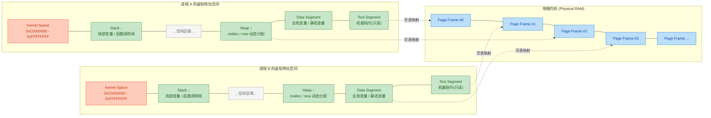

我们来逐层拆解一个典型的虚拟地址空间布局（以 32 位 Linux 为例，从低地址到高地址）：

**1. Text Segment（代码段）** —— 起始于低地址（通常 `0x08048000`）
- 存放编译后的 **机器指令**
- 权限为 **只读 + 可执行**（防止程序意外修改自己的指令）
- 多个运行同一程序的进程可以 **共享** 同一份物理代码页（节省内存）

**2. Data Segment（数据段）**
- 存放 **已初始化的全局变量和静态变量**
- 紧接其后的 **BSS 段** 存放 **未初始化的全局/静态变量**（系统自动清零）
- 权限为 **可读写**

**3. Heap（堆）** —— 向高地址增长 ↑
- 通过 `malloc()` / `new` 等动态分配的内存来自这里
- 由程序员（或 GC）手动管理生命周期
- 堆顶由 `brk` / `sbrk` 系统调用控制

**4. 空闲区域** —— 堆和栈之间的巨大间隔
- 动态链接库（`.so` / `.dll`）通过 `mmap()` 映射到此区域
- 地址空间布局随机化（**ASLR**, Address Space Layout Randomization）会在这里打乱映射位置，增加安全性

**5. Stack（栈）** —— 从高地址向低地址增长 ↓
- 存放 **函数调用帧**（局部变量、返回地址、参数）
- 由编译器自动管理，大小有限（Linux 默认 8MB）
- 递归过深会导致 **Stack Overflow**

**6. Kernel Space（内核空间）** —— 最高地址区域
- 32 位 Linux 的经典划分：用户空间占低 3GB（`0x00000000` ~ `0xBFFFFFFF`），内核空间占高 1GB（`0xC0000000` ~ `0xFFFFFFFF`）
- 用户态代码 **不能直接访问** 内核空间，必须通过 **系统调用（System Call）** 陷入内核态

**地址空间隔离的核心价值：**

- **安全性**：进程 A 无法读写进程 B 的内存，一个进程崩溃不会拖垮其他进程
- **简化编程模型**：每个进程都"以为"自己独占整个内存，无需担心地址冲突
- **支持虚拟内存**：物理内存不足时，操作系统可以将暂时不用的页面 **换出到磁盘（Swap）**，进程毫无感知

```c
#include <stdio.h>

int global_init = 42;       // Data 段：已初始化全局变量
int global_uninit;           // BSS 段：未初始化全局变量（自动为0）

int main() {
    int local_var = 7;       // Stack：局部变量，位于栈帧中
    int *heap_var = (int *)malloc(sizeof(int)); // Heap：动态分配
    *heap_var = 99;          // 向堆内存写入值

    // 打印各变量的虚拟地址，观察它们所在的段
    printf("Text  (main func) : %p\n", (void *)main);        // 代码段地址
    printf("Data  (global_init): %p\n", (void *)&global_init); // 数据段地址
    printf("BSS   (global_uninit): %p\n", (void *)&global_uninit); // BSS段地址
    printf("Heap  (heap_var)  : %p\n", (void *)heap_var);     // 堆地址
    printf("Stack (local_var) : %p\n", (void *)&local_var);   // 栈地址

    free(heap_var);          // 释放堆内存，避免内存泄漏
    return 0;
}
```

运行后你会清晰看到：Text 地址最低，Data/BSS 紧随其后，Heap 稍高，而 Stack 地址非常高——完美对应上面的布局图。

---

### 进程状态（Process States：就绪、运行、阻塞）

进程在其生命周期中，会不断在多个状态之间切换。最经典的模型是 **三态模型（Three-State Model）**：**就绪（Ready）**、**运行（Running）**、**阻塞（Blocked/Waiting）**。

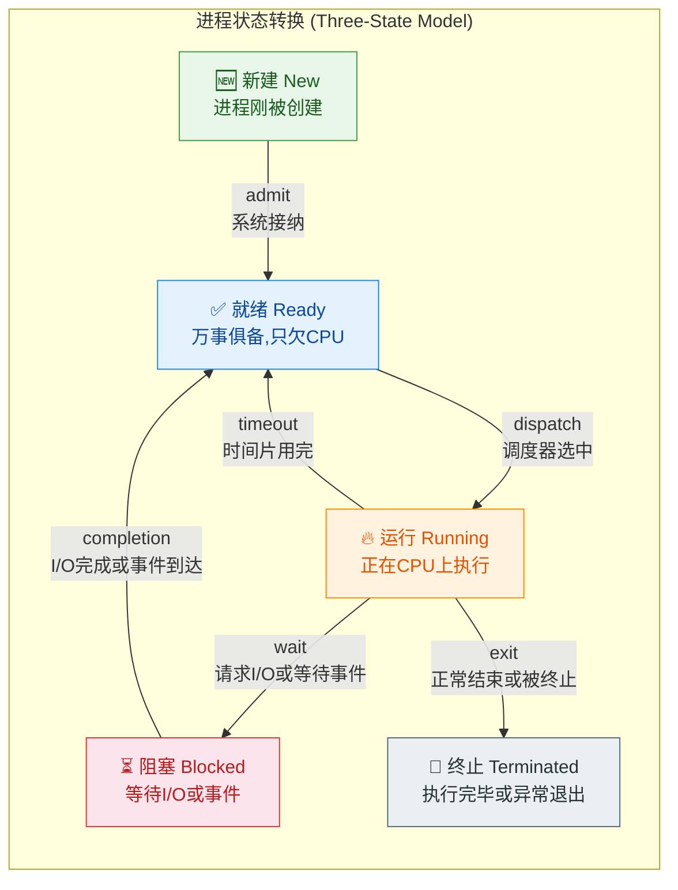

**各状态详解：**

**1. 新建（New）**

进程刚被创建（比如调用了 `fork()` 或操作系统加载了一个可执行文件），PCB 已生成，但还未被加入就绪队列。操作系统可能还在为其分配初始资源。

**2. 就绪（Ready）** —— "万事俱备，只欠 CPU"

进程已经拥有了除 CPU 之外的 **所有必需资源**，随时可以运行。它正在 **就绪队列（Ready Queue）** 中排队等候。系统中可能有几十甚至上百个就绪进程，但 CPU 核心数有限，所以它们必须排队等待 **调度器（Scheduler）** 的选择。

**3. 运行（Running）** —— "正在 CPU 上执行指令"

进程被调度器选中，分配到了 CPU 时间片，正在执行。在单核系统中，任意时刻只有 **一个** 进程处于运行状态；在多核系统中，最多有 N 个进程同时运行（N = CPU 核心数）。

**4. 阻塞（Blocked / Waiting）** —— "在等待某个事件"

进程因为等待 **外部事件** 而主动放弃 CPU。最常见的原因包括：
- 等待 **磁盘 I/O**（读写文件）
- 等待 **网络数据** 到达（`recv()`）
- 等待 **用户输入**（`scanf()`, `read(STDIN)`）
- 等待 **锁/信号量**（`sem_wait()`, `mutex_lock()`）
- 等待 **子进程结束**（`wait()`, `waitpid()`）

阻塞状态的进程会被移出就绪队列，放入对应的 **等待队列（Wait Queue）**。即使 CPU 空闲，阻塞进程也 **不能** 被调度执行——因为它等待的事件还没发生，运行了也没意义。

**5. 终止（Terminated）**

进程执行完毕（`return` 或 `exit()`），或被操作系统强制杀死（`kill -9`）。PCB 可能暂时保留（变成 **僵尸进程 Zombie**），等待父进程调用 `wait()` 回收退出状态后才彻底消失。

---

**核心状态转换路径（必须牢记）：**

| 转换 | 触发条件 | 谁触发 |
|------|---------|--------|
| Ready → Running | 调度器选中该进程 | **操作系统**（调度器 Dispatcher） |
| Running → Ready | 时间片耗尽（Time Quantum Expired）；或有更高优先级进程抢占 | **操作系统**（时钟中断 Timer Interrupt） |
| Running → Blocked | 进程发起 I/O 请求或等待事件 | **进程自身**（主动行为） |
| Blocked → Ready | I/O 完成或等待的事件发生 | **操作系统**（中断处理程序通知） |

> ⚠️ **注意**：**不存在 Blocked → Running 的直接转换！** 即使 I/O 完成了，进程也只能先回到 Ready 状态排队，再由调度器决定何时让它上 CPU。这是考试高频考点。

同样，**不存在 Ready → Blocked 的转换**。一个进程必须先运行起来，才能执行到 I/O 请求语句，才会进入阻塞。没有运行，就不可能"主动"进入阻塞。

---

**五态模型与七态模型（扩展知识）：**

在真实的操作系统中，往往还要考虑 **挂起（Suspended）** 状态。当系统内存紧张时，操作系统可能会将某些进程的内存页面 **换出到磁盘（Swap Out）**，此时进程进入挂起状态。挂起可以细分为：

- **就绪挂起（Ready Suspended）**：进程本身可以运行，但内存被换出了
- **阻塞挂起（Blocked Suspended）**：进程在等待事件，同时内存也被换出了

当内存空间充足时，操作系统会将挂起进程 **换入（Swap In）** 回内存，恢复为正常的就绪或阻塞状态。

---

让我们用一个具体场景来串联整个状态变化过程：

```c
#include <stdio.h>
#include <unistd.h>

int main() {
    // 此刻进程处于 Running 状态（正在 CPU 上执行）

    printf("开始读取文件...\n");

    FILE *f = fopen("/data/large_file.bin", "r");
    // fopen() 内部发起磁盘 I/O 系统调用
    // ──────────────────────────────────────
    // Running → Blocked（等待磁盘数据）
    // 调度器将 CPU 交给其他 Ready 进程
    // ──────────────────────────────────────
    // ... 磁盘控制器读取完毕，触发硬件中断 ...
    // Blocked → Ready（进入就绪队列排队）
    // ──────────────────────────────────────
    // ... 调度器再次选中本进程 ...
    // Ready → Running（继续执行下一条指令）

    if (f != NULL) {
        char buf[1024];
        fread(buf, 1, 1024, f);  // 又一次 I/O → 又一轮状态切换
        fclose(f);               // 关闭文件描述符
    }

    printf("文件读取完成！\n");
    return 0;
    // Running → Terminated（进程正常退出）
}
```

一次简单的文件读取，背后就经历了 **Running → Blocked → Ready → Running** 的完整状态轮转。在高并发服务器中，这样的轮转每秒钟可能发生数百万次。

---

**📝 练习题**

假设系统中有进程 P，当前处于 **阻塞（Blocked）** 状态，等待磁盘 I/O 完成。当磁盘 I/O 操作完成后，进程 P 的状态将变为？

A. 运行（Running）

B. 就绪（Ready）

C. 终止（Terminated）

D. 保持阻塞（Blocked）

**【答案】** B

**【解析】** 当 I/O 完成后，操作系统的中断处理程序会将进程 P 从等待队列移到 **就绪队列**，状态由 Blocked 变为 **Ready**。进程 P 不会直接进入 Running 状态，因为 CPU 可能正在执行其他进程，P 必须在就绪队列中等待调度器的下一次调度。**Blocked → Running 的直接转换在标准进程状态模型中是不存在的**，这是操作系统调度机制的基本原则：所有想获得 CPU 的进程都必须经过就绪状态的"排队"环节。


---

## 线程概述

在早期操作系统中，**进程（Process）** 既是资源分配的单位，也是 CPU 调度的单位。然而随着计算需求的增长，人们发现一个进程内部往往需要同时执行多个子任务——比如一个浏览器进程，需要同时渲染页面、下载资源、响应用户点击。如果为每个子任务都创建一个独立的进程，不仅开销巨大（每个进程都需要独立的地址空间、文件描述符表等），而且进程间通信也十分复杂。

为了解决这个矛盾，操作系统引入了**线程（Thread）** 的概念。线程是进程内部的一个执行流（Execution Flow），多个线程可以共存于同一个进程中，共享该进程的大部分资源，但各自拥有独立的执行上下文。这种设计极大地降低了并发执行的成本，因此线程也被称为 **轻量级进程（Lightweight Process, LWP）**。

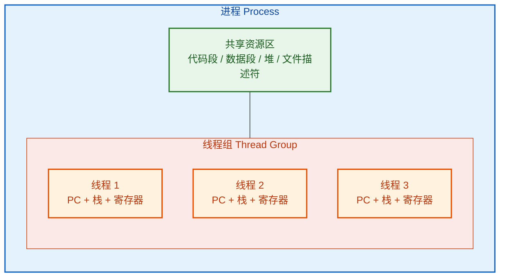

上图清晰地展示了线程与进程的包含关系：一个进程是一个"大容器"，包含了所有共享资源；而线程是容器内部的多个"执行单元"，每个线程有自己独立的程序计数器（PC）、栈（Stack）和寄存器组（Register Set），但它们共用代码段、数据段、堆和文件描述符等资源。

---

### CPU 调度单位

在引入线程之后，操作系统中 **资源分配** 和 **CPU 调度** 这两个核心职能被清晰地分离开来：

| 维度 | 承担者 | 说明 |
|:---:|:---:|:---|
| **资源分配单位** | 进程 | 拥有独立地址空间、文件表、信号处理器等 |
| **CPU 调度单位** | 线程 | 内核调度器（Scheduler）以线程为粒度分配 CPU 时间片 |

这意味着，当操作系统的调度器决定"下一个该让谁上 CPU 执行"时，它看到的不是进程，而是**线程**。具体来说：

1. **调度器视角**：内核维护的就绪队列（Ready Queue）中排列的是一个个**线程控制块（Thread Control Block, TCB）**，而不是进程控制块（PCB）。调度器从就绪队列中选取一个线程，将 CPU 分配给它。

2. **上下文切换粒度变小**：由于线程共享进程的地址空间，同一进程内的线程切换（Thread Context Switch）不需要切换页表（Page Table）、不需要刷新 TLB（Translation Lookaside Buffer），只需要保存和恢复少量寄存器、栈指针和程序计数器即可。这比进程级别的上下文切换要快得多。

3. **独立调度、独立运行**：同一进程中的多个线程可以被分配到不同的 CPU 核心上真正地 **并行（Parallel）** 执行，而不仅仅是并发（Concurrent）交替执行。这是多核时代线程模型的核心优势。

下面用一个流程图来展示调度器如何以线程为单位进行调度：

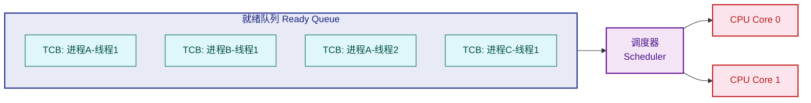

可以看到，就绪队列中混合排列着来自不同进程的线程。调度器不关心这些线程属于哪个进程，它只关心优先级、时间片等调度参数，然后将线程分派到可用的 CPU 核心上执行。

**线程状态模型** 也与进程状态模型类似，每个线程同样拥有 **就绪（Ready）→ 运行（Running）→ 阻塞（Blocked）** 三种基本状态：

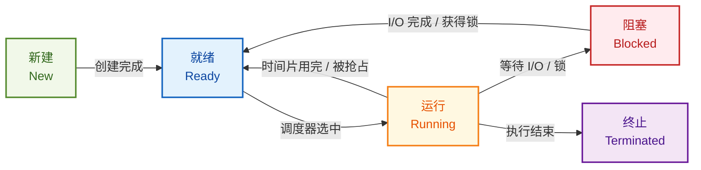

需要特别注意：**一个线程被阻塞，不影响同一进程中的其他线程继续运行**。例如线程 1 正在等待磁盘 I/O，线程 2 和线程 3 仍然可以正常使用 CPU。这是线程模型的一个重要优势——相比单线程进程，一个子任务的阻塞不会导致整个"应用"停摆。

---

### 共享进程资源

线程最核心的设计哲学之一，就是 **共享**。同一进程内的所有线程共享该进程拥有的绝大部分资源，但每个线程也保留了极少量的私有数据。我们可以将资源精确地划分为两类：

#### 线程间共享的资源

| 共享资源 | 说明 |
|:---|:---|
| **代码段（Text Segment）** | 所有线程执行的是同一份程序代码 |
| **数据段（Data Segment）** | 全局变量、静态变量对所有线程可见 |
| **堆（Heap）** | `malloc` / `new` 分配的动态内存，所有线程均可访问 |
| **文件描述符表（File Descriptors）** | 打开的文件、Socket 等句柄共享 |
| **信号处理器（Signal Handlers）** | 进程级别的信号处理方式对所有线程生效 |
| **进程 ID（PID）** | 所有线程属于同一个进程，对外呈现同一个 PID |
| **地址空间（Address Space）** | 页表相同，虚拟地址到物理地址的映射一致 |

#### 线程私有的资源

| 私有资源 | 说明 |
|:---|:---|
| **线程 ID（TID）** | 唯一标识一个线程 |
| **程序计数器（PC）** | 记录该线程当前执行到哪条指令 |
| **寄存器组（Registers）** | 保存该线程的运算中间状态 |
| **栈（Stack）** | 每个线程有独立的调用栈，存放局部变量和函数调用帧 |
| **栈指针（Stack Pointer）** | 指向当前栈顶 |
| **线程局部存储（TLS, Thread-Local Storage）** | 逻辑上的"线程私有全局变量" |
| **信号掩码（Signal Mask）** | 每个线程可以独立屏蔽某些信号 |
| **errno** | C 语言中的错误码，现代实现中是线程私有的 |

下面的内存布局图可以更直观地展示共享与私有的边界：

```c
// ===== 进程地址空间内存布局（含多线程）=====
//
// 高地址
// ┌──────────────────────────────────┐
// │         内核空间 (Kernel)         │  ← 用户不可直接访问
// ├──────────────────────────────────┤
// │       线程 3 的栈 (Stack)        │  ← 私有：局部变量、调用帧
// │            ↓ 向下增长             │
// ├──────────────────────────────────┤
// │       线程 2 的栈 (Stack)        │  ← 私有
// │            ↓ 向下增长             │
// ├──────────────────────────────────┤
// │       线程 1 (主线程) 的栈        │  ← 私有
// │            ↓ 向下增长             │
// ├──────────────────────────────────┤
// │                                  │
// │       ↑ 向上增长                  │
// │        堆 (Heap) ── 共享         │  ← malloc/new 分配
// ├──────────────────────────────────┤
// │   未初始化数据段 (BSS) ── 共享    │  ← 未赋初值的全局/静态变量
// ├──────────────────────────────────┤
// │   已初始化数据段 (Data) ── 共享   │  ← 赋了初值的全局/静态变量
// ├──────────────────────────────────┤
// │      代码段 (Text) ── 共享       │  ← 可执行指令，只读
// └──────────────────────────────────┘
// 低地址
```

**共享带来的好处**是巨大的：

- **零拷贝通信**：线程间传递数据不需要像进程间通信（IPC）那样经过内核中转或序列化/反序列化，直接读写同一块内存即可。
- **高效协作**：一个线程修改了全局数据结构，其他线程立即可见（当然，这也带来了同步问题）。
- **资源节省**：不需要为每个执行流复制一份完整的地址空间。

**共享带来的风险**同样不可忽视：

- **竞态条件（Race Condition）**：多个线程同时读写共享变量时，如果没有同步机制，结果将取决于执行顺序，产生不可预测的 bug。
- **死锁（Deadlock）**：多个线程互相持有对方需要的锁，形成循环等待。
- **数据不一致**：一个线程正在更新某个数据结构的过程中，另一个线程读取了"半成品"状态的数据。

下面是一个经典的竞态条件示例，帮助理解共享内存的风险：

```c
#include <stdio.h>    // 标准输入输出
#include <pthread.h>  // POSIX 线程库

int counter = 0;      // 共享的全局变量，所有线程均可访问

// 线程执行函数：对 counter 累加 100000 次
void* increment(void* arg) {
    for (int i = 0; i < 100000; i++) {
        counter++;    // ⚠️ 非原子操作！实际上是：读 → 加1 → 写 三步
                      // 多线程并发执行时，可能发生数据覆盖
    }
    return NULL;      // 线程执行结束
}

int main() {
    pthread_t t1, t2;                     // 声明两个线程变量

    pthread_create(&t1, NULL, increment, NULL);  // 创建线程1，执行 increment
    pthread_create(&t2, NULL, increment, NULL);  // 创建线程2，执行 increment

    pthread_join(t1, NULL);               // 等待线程1结束
    pthread_join(t2, NULL);               // 等待线程2结束

    // 期望结果: 200000
    // 实际结果: 往往小于 200000，因为两个线程交替执行时发生了"丢失更新"
    printf("Counter = %d\n", counter);    // 输出最终计数值
    return 0;
}
```

这段代码中，`counter++` 看起来只是一条语句，但在 CPU 层面它被拆解为三条指令：①读取 counter 到寄存器；②寄存器值加 1；③将结果写回 counter。当两个线程交替执行这三步时，就可能出现"丢失更新（Lost Update）"的问题。这正是共享资源带来的典型挑战，解决方案包括互斥锁（Mutex）、信号量（Semaphore）、原子操作（Atomic Operation）等，在后续"同步与互斥"章节中会深入展开。

---

### 轻量级

"轻量级"是线程最广为人知的标签。那么，线程到底"轻"在哪里？我们从创建、切换、销毁、通信四个维度来量化对比：

#### 1. 创建开销（Creation Overhead）

创建一个新进程时，操作系统需要完成大量工作：

- 分配独立的虚拟地址空间
- 复制（或 Copy-on-Write）父进程的页表
- 分配并初始化新的 PCB
- 复制文件描述符表
- 设置信号处理表

而创建一个新线程，只需要：

- 分配一个新的栈空间（通常默认 1~8 MB）
- 分配并初始化一个 TCB（Thread Control Block）
- 设置好 PC 入口点和初始寄存器值

**不需要**复制地址空间、页表、文件描述符表等重量级资源——因为这些统统复用所属进程的。

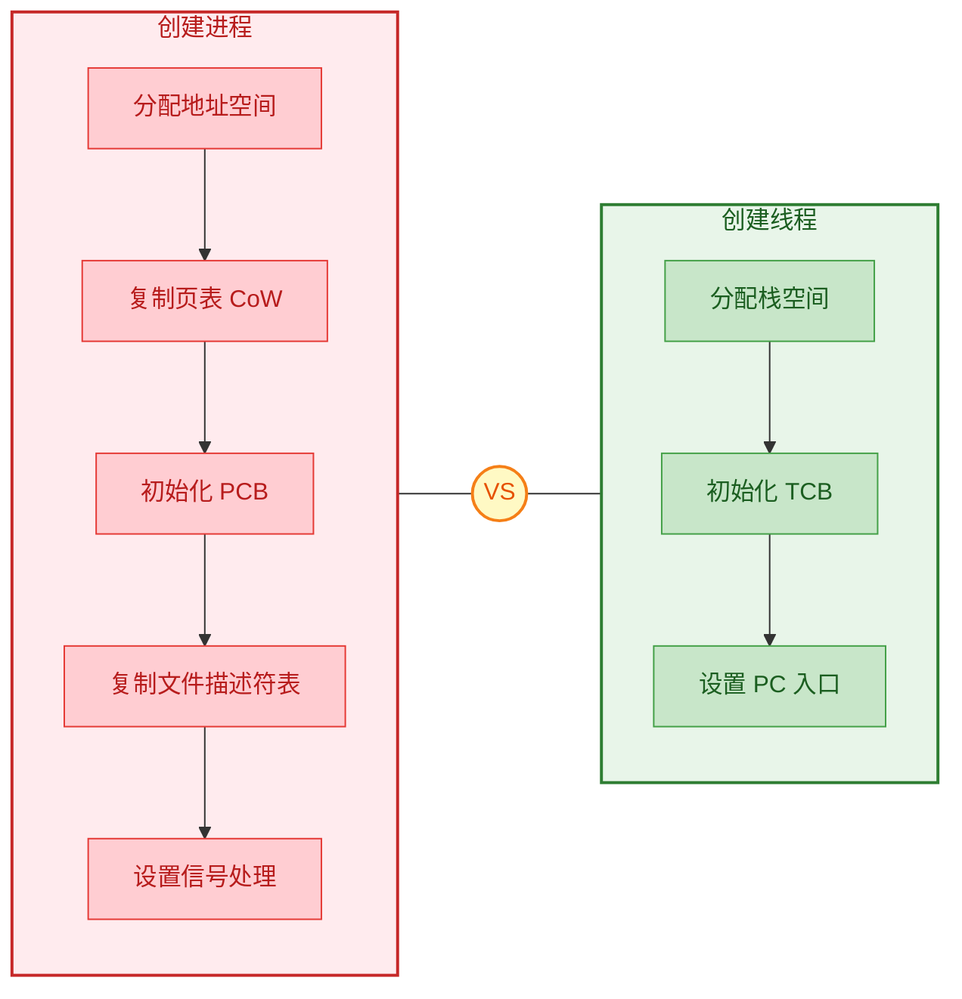

在 Linux 系统下，实测数据大致如下：

| 操作 | 典型耗时 | 备注 |
|:---|:---:|:---|
| `fork()` 创建进程 | ~100-500 μs | 即使使用 CoW，仍需复制页表等元数据 |
| `pthread_create()` 创建线程 | ~10-50 μs | 仅分配栈和 TCB |

线程创建速度通常比进程快 **一个数量级** 左右。

#### 2. 上下文切换开销（Context Switch Overhead）

这是"轻量级"优势体现最明显的地方。

**进程间切换（跨进程）**：
- 保存当前进程的全部寄存器状态到 PCB
- 切换页表基址寄存器（CR3 on x86），指向新进程的页表
- **刷新 TLB**（这一步代价极高，因为之前缓存的虚拟→物理地址映射全部失效）
- 可能导致 CPU Cache 大面积失效（Cache Pollution）
- 恢复新进程的寄存器状态

**线程间切换（同进程内）**：
- 保存当前线程的寄存器状态到 TCB
- **无需切换页表**——因为同一进程，地址空间不变
- **无需刷新 TLB**——映射关系不变，之前的缓存全部有效
- CPU Cache 大部分仍然有效（因为共享代码段和数据段）
- 恢复新线程的寄存器状态

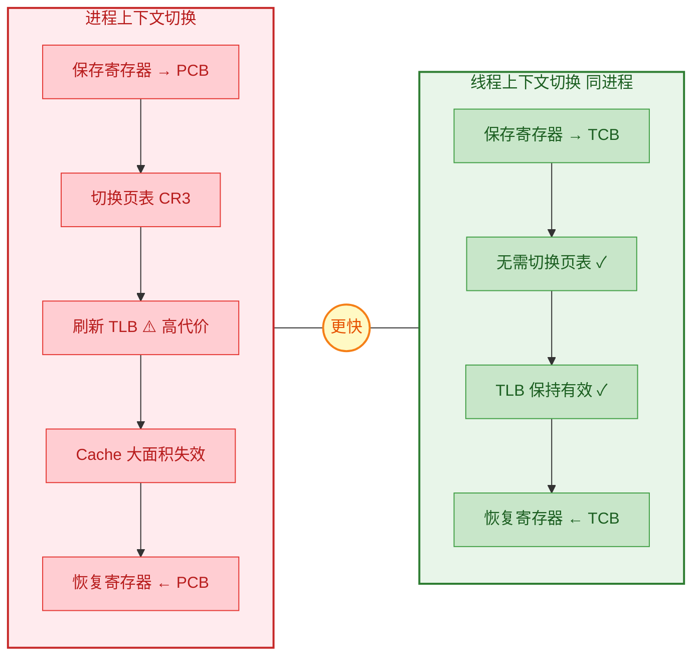

TLB 刷新的代价到底有多大？可以这样理解：TLB 是 CPU 中缓存"虚拟地址→物理地址"映射的高速查找表，一旦被刷新，后续每次内存访问都要重新查页表（Page Table Walk），这需要多次访问内存才能完成一次地址翻译，速度可能慢 **数十倍到上百倍**。因此，避免 TLB 刷新是线程切换最大的性能红利。

#### 3. 销毁开销（Destruction Overhead）

进程终止时，操作系统需要回收该进程的所有资源：释放整个地址空间、关闭所有文件描述符、清理 IPC 资源等。线程终止时，只需回收该线程的栈和 TCB，其他资源仍归进程所有，直到最后一个线程退出（即进程终止）时才统一回收。

#### 4. 通信开销（Communication Overhead）

| 场景 | 方式 | 开销 |
|:---|:---|:---|
| **进程间通信** | 管道 / 消息队列 / 共享内存 + 信号量 / Socket | 需要内核介入、数据拷贝或映射 |
| **线程间通信** | 直接读写共享变量 | 零拷贝，仅需同步原语保护 |

线程间通信本质上就是"对同一块内存的读写"，数据不需要在内核与用户空间之间来回搬运，因此速度极快。

#### 轻量级的代价

虽然线程很"轻"，但这种轻量级是有代价的：

- **稳定性降低**：一个线程崩溃（如段错误 Segmentation Fault），整个进程的所有线程都会被终止——因为它们共享同一个地址空间，一个线程的非法内存写入可能破坏其他线程的数据。
- **调试更困难**：多线程程序的 bug 往往具有不确定性（Non-deterministic），同一段代码在不同运行中可能表现出不同行为（Heisenbug）。
- **同步负担**：共享资源意味着程序员必须手动管理同步，稍有不慎就会引入死锁、竞态条件、活锁等并发 bug。

因此在实际工程中，**进程与线程往往结合使用**：比如 Chrome 浏览器采用多进程架构（每个 Tab 一个进程，进程间隔离保证稳定性），而每个进程内部再使用多线程（渲染线程、JS 线程、网络线程等，线程间高效协作）。这种 **多进程 + 多线程** 的混合模型，兼顾了隔离性和高性能。

---

**📝 练习题**

某操作系统中，进程 A 包含线程 T1、T2、T3。当调度器将 CPU 从 T1 切换到 T2 时，以下哪些操作是 **不需要** 执行的？

A. 保存 T1 的寄存器状态到 TCB

B. 切换页表基址寄存器（CR3）

C. 恢复 T2 的程序计数器（PC）

D. 刷新 TLB（Translation Lookaside Buffer）


**【答案】** B、D

**【解析】** T1 和 T2 同属于进程 A，共享同一个地址空间，因此它们的页表完全相同。在同进程线程切换时，**无需切换页表基址寄存器 CR3**（选项 B 不需要），也**无需刷新 TLB**（选项 D 不需要），因为虚拟地址到物理地址的映射关系没有改变，TLB 中缓存的内容依然有效。而保存/恢复寄存器状态（选项 A、C）是任何上下文切换都必须执行的操作——每个线程有独立的 PC 和寄存器组，切换时必须保存旧线程的、恢复新线程的。这正是同进程线程切换比跨进程切换快得多的根本原因。

---

## 进程 vs 线程 ⭐⭐

在操作系统的世界里，**进程（Process）** 和 **线程（Thread）** 是两个最核心的执行抽象。初学者常将二者混淆，但它们在设计哲学上有着本质的区别：进程是 **资源的容器（Resource Container）**，线程是 **执行的载体（Execution Unit）**。理解二者的异同，不仅是操作系统理论的基石，更是高并发编程、系统调优、面试攻坚的必备功课。

本节将从 **资源、开销、通信、安全** 四个维度，对进程与线程进行全方位的深度对比。

---

### 全景对比图

我们先用一张总览图，建立对进程与线程差异的宏观认知：

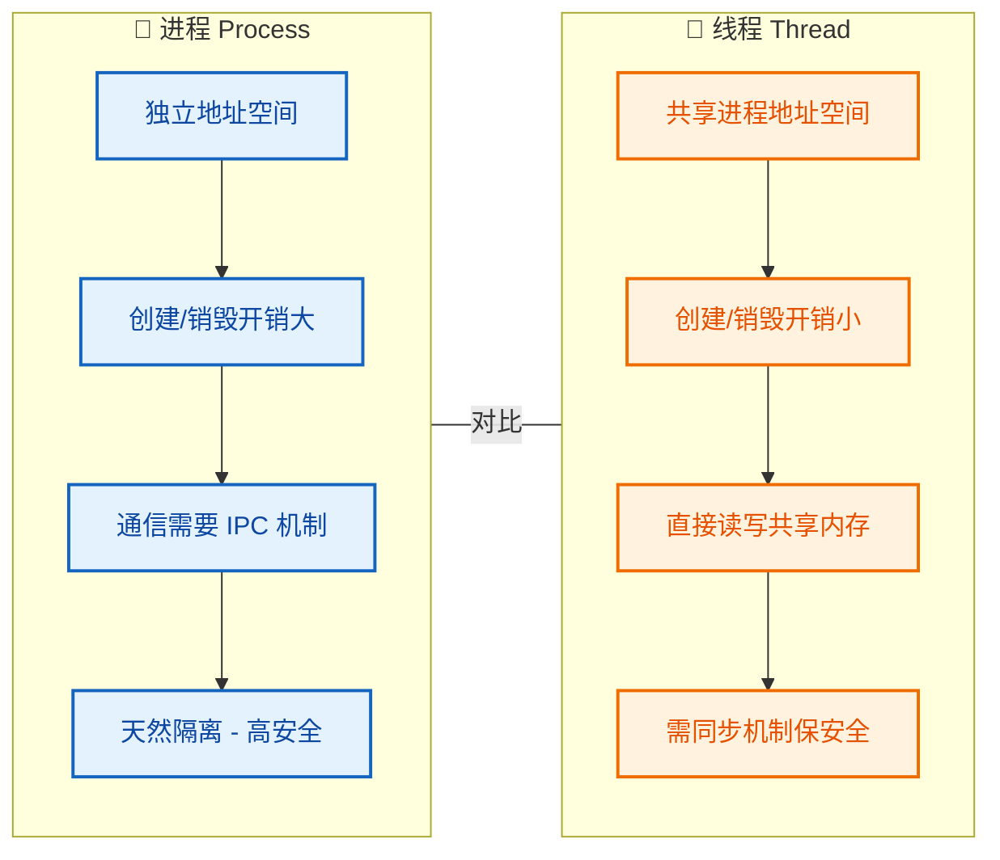

---

### 资源（进程独立、线程共享）

这是进程与线程之间最根本、最核心的区别，其他所有差异几乎都由此衍生。

#### 进程：独立的资源王国

每个进程在操作系统眼中，都是一个 **自给自足的资源单元**。当操作系统通过 `fork()` 或 `CreateProcess()` 创建一个新进程时，内核会为其分配一整套独立的资源集合：

| 资源类型 | 说明 |
|---|---|
| **虚拟地址空间** | 每个进程拥有独立的页表（Page Table），映射到不同的物理内存区域 |
| **代码段 / 数据段 / 堆 / 栈** | 完整的内存布局，互不干扰 |
| **文件描述符表** | 独立的打开文件列表（File Descriptor Table） |
| **信号处理表** | 各进程可自定义信号处理函数 |
| **进程控制块（PCB）** | 包含 PID、状态、优先级、寄存器上下文等元数据 |

关键概念：由于地址空间相互独立，进程 A 中的指针 `0x7ffd1234` 和进程 B 中的同一个虚拟地址 `0x7ffd1234`，实际指向的是 **完全不同的物理内存**。这就是进程隔离的根基。

我们用内存模型图来直观展示两个进程的资源隔离：

```c
// ============================================================
//        进程 A (PID: 1001)          进程 B (PID: 1002)
// ============================================================
//
//   虚拟地址空间 (独立)             虚拟地址空间 (独立)
//  ┌─────────────────┐           ┌─────────────────┐
//  │   Stack (栈)     │           │   Stack (栈)     │
//  │  局部变量/调用帧  │           │  局部变量/调用帧  │
//  ├─────────────────┤           ├─────────────────┤
//  │       ↓          │           │       ↓          │
//  │   (空闲区域)     │           │   (空闲区域)     │
//  │       ↑          │           │       ↑          │
//  ├─────────────────┤           ├─────────────────┤
//  │   Heap (堆)      │           │   Heap (堆)      │
//  │  malloc/new 分配  │           │  malloc/new 分配  │
//  ├─────────────────┤           ├─────────────────┤
//  │   BSS (未初始化)  │           │   BSS (未初始化)  │
//  ├─────────────────┤           ├─────────────────┤
//  │   Data (已初始化) │           │   Data (已初始化) │
//  ├─────────────────┤           ├─────────────────┤
//  │   Text (代码段)   │           │   Text (代码段)   │
//  └─────────────────┘           └─────────────────┘
//         │                              │
//     ┌───┘ 页表A                    ┌───┘ 页表B
//     ▼                              ▼
//  ┌──────────────────────────────────────────────┐
//  │          物理内存 (Physical Memory)           │
//  │  ┌──────┐  ┌──────┐  ┌──────┐  ┌──────┐     │
//  │  │ 帧 0  │  │ 帧 1  │  │ 帧 2  │  │ 帧 3  │ ... │
//  │  │(A用)  │  │(B用)  │  │(A用)  │  │(B用)  │     │
//  │  └──────┘  └──────┘  └──────┘  └──────┘     │
//  └──────────────────────────────────────────────┘
```

#### 线程：共享的协作团队

线程则完全不同。同一个进程内的所有线程，**共享该进程的绝大部分资源**。线程仅拥有少量自己独立的执行上下文：

| 共享资源（属于进程） | 私有资源（属于线程） |
|---|---|
| 虚拟地址空间 | **独立的栈空间**（Stack） |
| 堆（Heap） | **程序计数器**（PC / IP） |
| 全局变量 / 静态变量 | **寄存器组**（Register Set） |
| 文件描述符表 | **线程控制块**（TCB） |
| 代码段（Text） | 线程局部存储（TLS） |

可以这样类比理解：**进程是一栋房子，线程是住在同一栋房子里的人。** 他们共享客厅、厨房、卫生间（地址空间、堆、全局变量），但每个人有自己的房间（栈、寄存器、PC）。

```c
// ======================================================================
//                     进程 P (PID: 2001)
//              ┌─────────────────────────────────┐
//              │     共享地址空间 (Shared)         │
//              │  ┌───────────────────────────┐   │
//              │  │  Text (代码段) - 共享       │   │
//              │  │  Data (全局变量) - 共享     │   │
//              │  │  Heap (堆) - 共享          │   │
//              │  │  文件描述符表 - 共享        │   │
//              │  └───────────────────────────┘   │
//              │                                   │
//              │  ┌─────────┐  ┌─────────┐        │
//              │  │ 线程 T1  │  │ 线程 T2  │       │
//              │  │ ──────── │  │ ──────── │       │
//              │  │ Stack_1  │  │ Stack_2  │  私有  │
//              │  │ PC_1     │  │ PC_2     │  资源  │
//              │  │ Regs_1   │  │ Regs_2   │       │
//              │  │ TCB_1    │  │ TCB_2    │       │
//              │  └─────────┘  └─────────┘        │
//              └─────────────────────────────────┘
// ======================================================================
```

#### 用代码感受区别

下面通过一段 C 语言代码来具体感受"进程资源独立，线程资源共享"这一核心区别：

**进程独立性演示（fork）：**

```c
#include <stdio.h>      // 标准输入输出
#include <unistd.h>     // fork, getpid
#include <sys/wait.h>   // wait

int shared_var = 100;   // 全局变量，fork 后父子各持一份副本

int main() {
    pid_t pid = fork();  // 创建子进程，子进程获得父进程地址空间的【完整拷贝】

    if (pid == 0) {
        // ---- 子进程空间 ----
        shared_var += 50;                       // 修改的是子进程自己的副本
        printf("[Child]  PID=%d, shared_var=%d\n",
               getpid(), shared_var);           // 输出: 150
    } else {
        wait(NULL);                             // 等待子进程结束
        // ---- 父进程空间 ----
        printf("[Parent] PID=%d, shared_var=%d\n",
               getpid(), shared_var);           // 输出: 100（未受影响！）
    }
    return 0;
}
// 运行结果:
// [Child]  PID=1002, shared_var=150
// [Parent] PID=1001, shared_var=100
// 结论: 父子进程的 shared_var 是两个完全独立的内存副本
```

**线程共享性演示（pthread）：**

```c
#include <stdio.h>      // 标准输入输出
#include <pthread.h>    // POSIX 线程库

int shared_var = 100;   // 全局变量，所有线程共享同一份

void *thread_func(void *arg) {
    // ---- 子线程 ----
    shared_var += 50;                           // 直接修改同一块内存
    printf("[Thread] shared_var=%d\n",
           shared_var);                         // 输出: 150
    return NULL;
}

int main() {
    pthread_t tid;                              // 线程标识符
    pthread_create(&tid, NULL,
                   thread_func, NULL);          // 创建子线程（共享地址空间）
    pthread_join(tid, NULL);                    // 等待子线程结束

    // ---- 主线程 ----
    printf("[Main]   shared_var=%d\n",
           shared_var);                         // 输出: 150（被子线程修改了！）
    return 0;
}
// 运行结果:
// [Thread] shared_var=150
// [Main]   shared_var=150
// 结论: 两个线程操作的是同一个 shared_var，修改立即可见
```

这两段代码形成了鲜明对比：`fork()` 出来的子进程修改 `shared_var` **不会影响**父进程，而 `pthread_create()` 出来的子线程修改 `shared_var` **立即影响**主线程。这正是"资源独立"与"资源共享"的本质体现。

---

### 开销（进程大、线程小）

资源模型的差异直接决定了二者在 **创建、销毁和切换** 三个方面的开销天壤之别。

#### 创建开销

| 操作 | 进程 | 线程 |
|---|---|---|
| 地址空间 | 需要创建新的页表、拷贝/COW映射整个地址空间 | 无需创建，直接复用进程地址空间 |
| 内核对象 | 分配完整的 PCB、文件描述符表副本、信号表等 | 仅分配 TCB、独立栈空间 |
| 内存管理 | 需要分配独立的堆区、数据段 | 仅分配线程栈（通常 1~8 MB） |
| 典型耗时 | **毫秒级**（ms） | **微秒级**（μs） |

> 💡 **Copy-On-Write (COW) 优化**：现代 Linux 中 `fork()` 并不会立即复制整个地址空间，而是采用写时复制策略——父子进程初始共享相同的物理页，只有当某一方尝试写入时，内核才会为写入方复制该页。这大大降低了 fork 的开销，但即便如此，其成本仍然远高于创建线程。

#### 上下文切换开销

上下文切换（Context Switch）是操作系统实现多任务并发的核心机制。当 CPU 从一个执行单元切换到另一个时，必须保存当前状态、恢复目标状态。**进程切换和线程切换的开销差距巨大。**

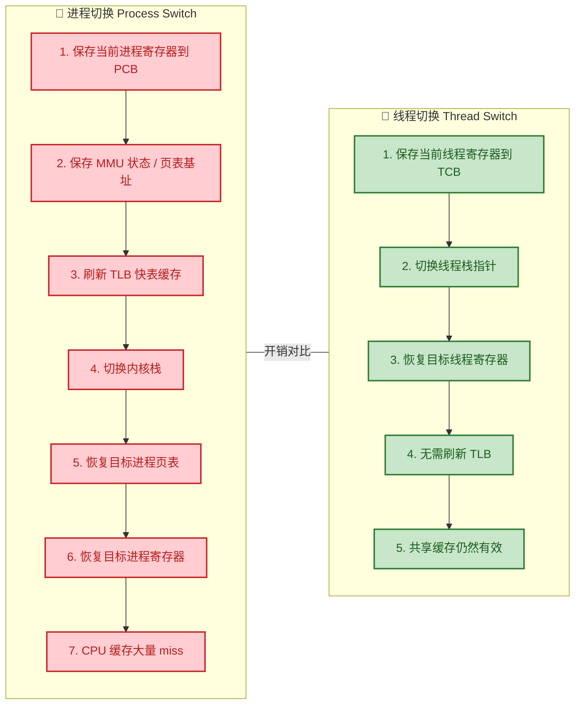

关键差异在于：

- **TLB（Translation Lookaside Buffer）刷新**：进程切换时，由于切换了页表，TLB 中缓存的虚拟地址→物理地址映射全部失效，必须清空（flush）。之后每次内存访问都会触发 TLB miss，需要重新查页表。这是进程切换中**最昂贵的隐性开销**。而线程切换由于共享同一个地址空间，页表不变，TLB 不需要刷新。

- **CPU Cache 命中率**：进程切换后，新进程的代码和数据大概率不在 L1/L2/L3 Cache 中，导致大量 Cache miss。而同进程的线程切换，由于共享代码段和数据段，Cache 中的大部分内容仍然有效。

- **量化对比**：在典型的 x86-64 Linux 系统上，进程切换通常需要 **3~5 微秒**，而同进程内的线程切换仅需 **1~2 微秒**。看似差距不大，但在高并发场景下（例如每秒数十万次切换），累积效应非常可观。

#### 销毁开销

进程销毁时需要回收整个地址空间、关闭所有文件描述符、释放内核资源等；而线程销毁仅需回收栈空间和 TCB，非常轻量。

```c
// 进程销毁的核心步骤（内核视角伪代码）
void destroy_process(PCB *pcb) {
    release_address_space(pcb->page_table);   // 释放整个页表和关联的物理帧
    close_all_fds(pcb->fd_table);             // 关闭所有文件描述符
    release_signal_handlers(pcb->sig_table);  // 释放信号处理表
    remove_from_scheduler(pcb);               // 从调度队列移除
    free_pcb(pcb);                            // 释放 PCB 结构体本身
}

// 线程销毁的核心步骤（内核视角伪代码）
void destroy_thread(TCB *tcb) {
    release_thread_stack(tcb->stack);         // 释放线程栈（通常几 MB）
    remove_from_scheduler(tcb);               // 从调度队列移除
    free_tcb(tcb);                            // 释放 TCB 结构体本身
    // 地址空间? 不动! 文件表? 不动! 因为它们属于进程
}
```

---

### 通信（进程IPC、线程共享内存）

由于资源模型的根本差异，进程与线程在 **数据交换** 方式上也截然不同。

#### 线程通信：天然高效

同一进程内的线程共享地址空间，因此它们之间的"通信"本质上就是 **读写同一块内存**，无需经过内核中转，零拷贝、零系统调用开销：

```c
#include <stdio.h>
#include <pthread.h>

// 共享数据结构 —— 所有线程都可以直接访问
typedef struct {
    int buffer[1024];    // 共享缓冲区
    int count;           // 当前数据量
} SharedData;

SharedData data = { .count = 0 };  // 全局共享实例

void *producer(void *arg) {
    for (int i = 0; i < 100; i++) {
        data.buffer[data.count] = i;   // 直接写入共享缓冲区（无需系统调用）
        data.count++;                   // 更新计数（直接操作共享变量）
    }
    return NULL;
}

void *consumer(void *arg) {
    while (data.count > 0) {
        data.count--;                   // 直接读取共享变量
        int val = data.buffer[data.count]; // 直接从共享缓冲区取数据
        printf("consumed: %d\n", val);
    }
    return NULL;
}
// ⚠️ 注意：此代码没有任何同步机制，存在严重的竞态条件（Race Condition）
// 这里仅用于演示"线程可以直接通信"这一特性，实际使用必须加锁！
```

优势非常明显：直接指针访问，**速度等同于普通内存读写**，延迟在纳秒级别。

#### 进程通信：必须借助 IPC

由于进程的地址空间相互隔离，进程 A 无法直接读取进程 B 的内存。要交换数据，就必须借助操作系统提供的 **进程间通信（Inter-Process Communication, IPC）** 机制。每一种 IPC 都需要不同程度的内核介入：

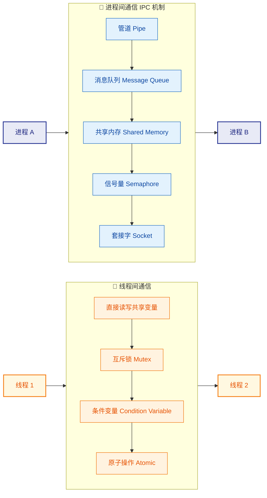

下面简要对比各 IPC 机制的速度与适用场景（详细内容将在下一节"进程间通信 IPC"中展开）：

| IPC 机制 | 是否经过内核 | 数据拷贝次数 | 速度 | 适用场景 |
|---|---|---|---|---|
| **管道 Pipe** | ✅ 是 | 2 次（写入内核缓冲→读出） | 中等 | 父子进程间简单字节流通信 |
| **消息队列** | ✅ 是 | 2 次 | 中等 | 结构化消息传递 |
| **共享内存** | 仅初始映射时 | **0 次** | **最快** | 大量数据高速交换 |
| **信号量** | ✅ 是 | 不传数据，仅同步 | 快 | 进程间同步控制 |
| **Socket** | ✅ 是 | 2+ 次 | 较慢 | 跨网络 / 跨机器通信 |

> 💡 **为什么共享内存最快？** 共享内存（Shared Memory）的本质是：让两个进程的页表中的某些虚拟页指向 **同一块物理内存**。这样两个进程就可以像线程那样直接读写同一块内存，不需要经过内核拷贝。但也正因如此，使用共享内存时同样需要配合信号量或锁来保证同步——它和线程通信面临一样的并发问题。

#### 通信开销的直观对比

```c
// ===================================================================
//   线程通信 vs 进程通信（管道）的数据流路径对比
// ===================================================================
//
//   【线程通信】直接内存访问，零拷贝
//   ┌──────────┐                    ┌──────────┐
//   │ Thread A  │ ── 写入共享变量 ──→ │ Thread B  │
//   │ (用户态)  │    (同一地址空间)   │ (用户态)  │
//   └──────────┘                    └──────────┘
//        延迟: ~ 几纳秒 (ns)
//
//
//   【进程通信 - 管道】需经过内核两次拷贝
//   ┌──────────┐     ┌────────────┐     ┌──────────┐
//   │ Process A │ ──→ │   内核缓冲区  │ ──→ │ Process B │
//   │ (用户态)  │     │  (内核态)    │     │ (用户态)  │
//   └──────────┘     └────────────┘     └──────────┘
//    write()系统调用    内核管理缓冲     read()系统调用
//    用户→内核 拷贝1                    内核→用户 拷贝2
//        延迟: ~ 几微秒 (μs)，差 1000 倍量级
// ===================================================================
```

---

### 安全（进程隔离、线程需同步）

资源模型的差异在安全性和稳定性层面也带来了截然相反的特征。

#### 进程：天然的故障隔离

由于每个进程拥有独立的地址空间，一个进程的崩溃 **不会直接影响** 其他进程。操作系统的内存保护机制（硬件 MMU + 页表权限位）确保了这一点：

- 进程 A 试图访问进程 B 的地址空间 → **触发 Segmentation Fault**，仅进程 A 被杀死
- 进程 A 中的野指针、缓冲区溢出等 Bug → 破坏的是进程 A **自己的** 地址空间
- 进程 A 内存泄漏 → 进程 A 被 OOM Killer 杀掉，进程 B 不受波及

这就是为什么现代浏览器（如 Chrome）采用 **多进程架构**：每个标签页运行在独立进程中，一个标签页崩溃不会拖垮整个浏览器。

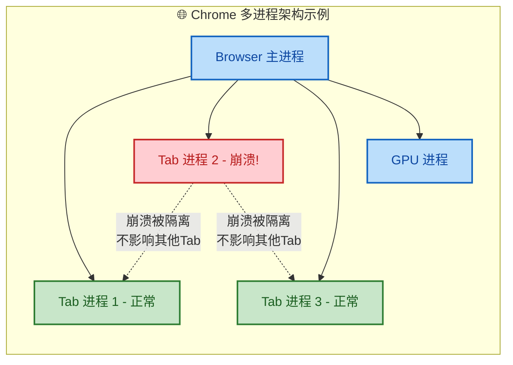

#### 线程：共享的代价——同步与竞态

线程共享地址空间这一特性是双刃剑。它带来了高效通信的同时，也引入了一系列 **并发安全问题**：

**1. 竞态条件（Race Condition）**

当多个线程同时读写同一个共享变量，且最终结果取决于线程的执行顺序时，就产生了竞态条件：

```c
#include <stdio.h>
#include <pthread.h>

int counter = 0;              // 共享计数器

void *increment(void *arg) {
    for (int i = 0; i < 1000000; i++) {
        counter++;            // ⚠️ 非原子操作! 实际分三步:
                              //   1. 读取 counter 到寄存器 (LOAD)
                              //   2. 寄存器值 +1           (ADD)
                              //   3. 写回内存              (STORE)
                              // 两个线程可能同时读到相同的旧值!
    }
    return NULL;
}

int main() {
    pthread_t t1, t2;
    pthread_create(&t1, NULL, increment, NULL);  // 线程1: counter += 1000000
    pthread_create(&t2, NULL, increment, NULL);  // 线程2: counter += 1000000
    pthread_join(t1, NULL);
    pthread_join(t2, NULL);

    printf("Expected: 2000000\n");
    printf("Actual:   %d\n", counter);  // 实际结果几乎总是 < 2000000!
    return 0;
}
// 典型输出:
// Expected: 2000000
// Actual:   1387456    <-- 每次运行结果都不同，且小于预期
```

**为什么会这样？** 因为 `counter++` 不是原子操作。假设两个线程 T1 和 T2 并发执行：

```c
// 竞态条件时序示例（counter 当前值为 42）
//
// 时间线 ──→
//
// T1:  LOAD counter (读到 42)
// T2:                          LOAD counter (也读到 42)
// T1:  ADD 1 (寄存器 = 43)
// T2:                          ADD 1 (寄存器 = 43)
// T1:  STORE counter (写入 43)
// T2:                          STORE counter (写入 43)
//
// 结果: counter = 43，但执行了两次 ++，应该是 44！
// 丢失了一次更新（Lost Update）
```

**2. 一个线程崩溃 → 整个进程崩溃**

由于线程共享地址空间，一个线程的致命错误会波及所有兄弟线程：

```c
// 线程的"连坐效应"
void *bad_thread(void *arg) {
    int *p = NULL;         // 空指针
    *p = 42;               // 💥 触发 SIGSEGV (Segmentation Fault)
    return NULL;            // 永远不会执行到这里
}
// 结果: 操作系统向整个进程发送 SIGSEGV 信号
// 进程内的所有线程一起被终止！
// 不像进程那样有天然的隔离屏障
```

**3. 必须引入同步机制**

为了安全地使用线程共享资源，程序员必须显式地引入同步原语（Synchronization Primitives）：

```c
#include <stdio.h>
#include <pthread.h>

int counter = 0;
pthread_mutex_t lock = PTHREAD_MUTEX_INITIALIZER;  // 初始化互斥锁

void *safe_increment(void *arg) {
    for (int i = 0; i < 1000000; i++) {
        pthread_mutex_lock(&lock);     // 🔒 加锁: 进入临界区前获取互斥锁
        counter++;                     // 临界区: 此时只有一个线程能执行这行
        pthread_mutex_unlock(&lock);   // 🔓 解锁: 离开临界区，释放互斥锁
    }
    return NULL;
}

int main() {
    pthread_t t1, t2;
    pthread_create(&t1, NULL, safe_increment, NULL);
    pthread_create(&t2, NULL, safe_increment, NULL);
    pthread_join(t1, NULL);
    pthread_join(t2, NULL);

    printf("Result: %d\n", counter);   // ✅ 输出: 2000000（结果正确）
    return 0;
}
```

加锁虽然解决了正确性问题，但也带来了新的挑战：

| 同步问题 | 说明 |
|---|---|
| **死锁（Deadlock）** | 两个线程互相等待对方持有的锁，永远无法继续 |
| **活锁（Livelock）** | 线程不断重试但无法推进，类似两人在走廊互相让路 |
| **优先级反转（Priority Inversion）** | 低优先级线程持锁，高优先级线程被迫等待 |
| **性能下降** | 频繁加锁/解锁引入额外开销，过度加锁导致并行退化为串行 |

---

### 综合对比总表

| 维度 | 进程 (Process) | 线程 (Thread) |
|---|---|---|
| **定义** | 资源分配的基本单位 | CPU 调度的基本单位 |
| **地址空间** | 独立（每个进程有自己的页表） | 共享（同进程内线程共用页表） |
| **资源拥有** | 完整拥有：代码/数据/堆/栈/文件表 | 仅拥有栈、PC、寄存器、TCB |
| **创建开销** | 大（ms 级，需分配完整资源） | 小（μs 级，仅分配栈和 TCB） |
| **切换开销** | 大（需切换页表、刷新 TLB） | 小（仅切换栈和寄存器） |
| **通信方式** | 需通过 IPC（管道/消息队列/共享内存等） | 直接读写共享变量 |
| **通信速度** | 较慢（涉及内核介入和数据拷贝） | 极快（等同于内存访问，纳秒级） |
| **故障隔离** | 强：一个进程崩溃不影响其他进程 | 弱：一个线程崩溃→整个进程崩溃 |
| **安全性** | 天然隔离，安全性高 | 需程序员显式同步（锁/原子操作等） |
| **编程复杂度** | 相对简单（不共享状态，少竞态） | 较高（需处理竞态/死锁等并发问题） |
| **可扩展性** | 可跨机器（分布式） | 仅限单机（同一进程内） |
| **典型应用** | Chrome 多标签页、微服务架构、守护进程 | Web 服务器线程池、GUI 事件循环、并行计算 |

---

### 工程实践：何时选进程？何时选线程？

理论对比之后，一个自然的问题是：**在实际开发中，该如何选择？**

**选择进程的场景：**
- 需要 **强隔离性**，例如浏览器标签页、沙箱环境、插件系统
- 需要 **跨机器部署**，例如微服务架构中的独立服务
- 子任务可能 **不稳定或不受信任**，崩溃不能影响主系统
- 不同子任务使用 **不同编程语言** 实现

**选择线程的场景：**
- 需要 **高频共享大量数据**，例如内存数据库的读写
- 追求 **极致的创建/切换性能**，例如高并发 Web 服务器（Nginx worker）
- 子任务之间 **协作紧密**，例如 GUI 程序的渲染线程 + 逻辑线程
- 任务本身是 **CPU 密集的并行计算**，例如矩阵运算、图像处理

> 💡 **现代工程的混合策略**：实际项目中往往不是非此即彼。例如 **Nginx** 采用多进程 + 每个 Worker 进程内多线程（或事件驱动）的混合架构；**Chrome** 主体是多进程，但每个渲染进程内部又使用多线程来处理 JS 执行、排版、合成等子任务。正确的做法是 **根据场景灵活组合**。

---

**📝 练习题**

在一个多线程程序中，两个线程同时对全局变量 `count` 执行 `count++` 操作各 100 万次。假设不使用任何同步机制，以下关于最终 `count` 值的说法，正确的是？

A. `count` 的最终值一定是 200 万


B. `count` 的最终值一定是 100 万


C. `count` 的最终值在 100 万到 200 万之间（含两端），且每次运行结果可能不同


D. `count` 的最终值完全随机，可能是任意整数


**【答案】** C

**【解析】** `count++` 不是原子操作，它在机器码层面分为三步：**LOAD**（从内存读取到寄存器）、**ADD**（寄存器加 1）、**STORE**（写回内存）。当两个线程并发执行时，可能出现"丢失更新（Lost Update）"现象——两个线程同时读到相同的旧值，各自加 1 后写回，导致两次 `++` 只生效一次。

- **最好的情况**：两个线程的操作完全不重叠（串行执行），结果恰好是 200 万。
- **最坏的情况**：每次 `++` 都发生丢失更新，每对操作只生效一次，结果是 100 万。
- **实际运行**：结果介于两者之间，且每次运行因线程调度的不确定性而不同。

选项 A 错误，因为忽略了竞态条件；选项 B 错误，因为不一定每次都是最坏情况；选项 D 错误，因为值不会低于 100 万（至少每组冲突操作中有一次生效），也不会超过 200 万。因此 **C 正确**。这道题的核心考点是理解**竞态条件（Race Condition）** 和 **非原子操作** 在共享资源场景下的行为。

---

## 进程间通信（IPC, Inter-Process Communication） ⭐

操作系统中，每个进程拥有**独立的虚拟地址空间**（Independent Virtual Address Space），进程 A 无法直接读写进程 B 的内存。这种隔离性保障了安全与稳定，但也带来了一个现实问题：**进程之间如何交换数据、协调工作？** 答案就是 **IPC（Inter-Process Communication）**——操作系统提供的一组机制，让进程在隔离的前提下依然能够高效通信。

IPC 并非单一技术，而是一个 **机制家族**。不同场景对吞吐量、延迟、复杂度的需求差异巨大，因此操作系统演化出了多种 IPC 手段。我们可以先从宏观上对它们做一个分类感知：

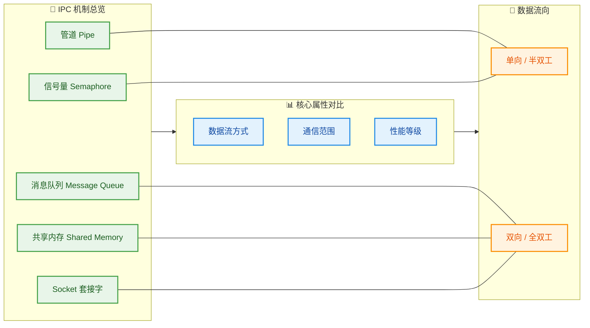

从最基本的管道到支持跨网络的 Socket，每一种 IPC 都有自己的 **适用边界** 和 **设计哲学**。下面我们逐一深入。

---

### 管道（Pipe）

管道是 **Unix/Linux 最经典的 IPC 机制**，它的设计理念极其简洁：在内核中开辟一块有限大小的 **环形缓冲区**（Ring Buffer），一端写入，另一端读取，数据按照 **先进先出（FIFO）** 的字节流方式传递。

#### 匿名管道（Anonymous Pipe）

匿名管道是最基础的形态。它 **没有名字**，只能在具有 **亲缘关系**（Parent-Child）的进程之间使用。在 Shell 中，我们每天都在用它：

```bash
# Shell 管道：ls 的 stdout 通过管道连接到 grep 的 stdin
ls -la | grep ".txt"
```

当你敲下 `|` 时，Shell 在底层做的事情正是：调用 `pipe()` 系统调用创建管道，然后 `fork()` 子进程，父子进程分别持有管道的读端和写端。

**内核视角下的匿名管道结构：**

```c
// pipe() 系统调用原型
// 创建管道，fd[0] 为读端，fd[1] 为写端
int pipe(int fd[2]);
```


下面是一个完整的 C 语言示例，演示父进程通过管道向子进程发送消息：

```c
#include <stdio.h>    // printf
#include <unistd.h>   // pipe, fork, read, write, close
#include <string.h>   // strlen
#include <sys/wait.h> // wait

int main() {
    int fd[2];            // fd[0] = 读端, fd[1] = 写端
    pid_t pid;            // 进程 ID
    char buf[128];        // 读取缓冲区

    // 1. 创建管道（必须在 fork 之前，否则父子进程无法共享同一管道）
    if (pipe(fd) == -1) {
        perror("pipe failed");  // 管道创建失败
        return 1;
    }

    // 2. fork 创建子进程
    pid = fork();

    if (pid < 0) {
        perror("fork failed");  // fork 失败
        return 1;
    }

    if (pid > 0) {
        // ===== 父进程（写端） =====
        close(fd[0]);           // 关闭父进程不需要的读端（重要！避免资源泄漏）

        const char *msg = "Hello from parent!";  // 要发送的消息
        write(fd[1], msg, strlen(msg));           // 将消息写入管道写端
        close(fd[1]);           // 写完后关闭写端，子进程 read() 将收到 EOF

        wait(NULL);             // 等待子进程结束，防止僵尸进程
    } else {
        // ===== 子进程（读端） =====
        close(fd[1]);           // 关闭子进程不需要的写端

        int n = read(fd[0], buf, sizeof(buf) - 1); // 从管道读端读取数据
        buf[n] = '\0';          // 手动添加字符串结束符
        printf("Child received: %s\n", buf);        // 输出接收到的消息
        close(fd[0]);           // 读完后关闭读端
    }

    return 0;
}
// 输出: Child received: Hello from parent!
```

**匿名管道的核心特性：**

| 特性 | 说明 |
|------|------|
| **单向通信** | 数据只能从写端流向读端（Half-duplex）。若需双向通信，必须创建 **两个管道** |
| **亲缘关系** | 只能用于 fork 出来的父子进程或兄弟进程 |
| **字节流** | 无消息边界（No Message Boundary），读写按字节流处理 |
| **内核缓冲** | Linux 默认管道缓冲区大小为 **64KB**（`/proc/sys/fs/pipe-max-size` 可调） |
| **阻塞语义** | 管道满时 `write()` 阻塞；管道空时 `read()` 阻塞 |
| **生命周期** | 随进程存在，所有引用管道的文件描述符关闭后，管道自动销毁 |

#### 命名管道（Named Pipe / FIFO）

匿名管道的最大限制是 **只能在亲缘进程间通信**。命名管道（FIFO）解决了这个问题——它在文件系统中创建一个 **特殊文件节点**，任何知道该路径的进程都可以打开它进行读写，从而实现 **无亲缘关系进程间的通信**。

```c
#include <sys/stat.h>  // mkfifo
#include <fcntl.h>     // open, O_WRONLY, O_RDONLY

// 创建命名管道（文件路径 /tmp/my_fifo，权限 0666）
// 如果文件已存在，mkfifo 会返回 -1 并设置 errno = EEXIST
mkfifo("/tmp/my_fifo", 0666);

// ----- 进程 A（写入端） -----
int fd_w = open("/tmp/my_fifo", O_WRONLY);  // 以只写模式打开 FIFO
write(fd_w, "data", 4);                     // 写入 4 字节数据
close(fd_w);                                // 关闭文件描述符

// ----- 进程 B（读取端） -----
int fd_r = open("/tmp/my_fifo", O_RDONLY);  // 以只读模式打开同一 FIFO
char buf[128];                              // 读取缓冲区
read(fd_r, buf, sizeof(buf));               // 从 FIFO 读取数据
close(fd_r);                                // 关闭文件描述符
```

命名管道在 Shell 中也很实用，例如让两个完全无关的终端进程通信：

```bash
# 终端 1：创建命名管道并读取
mkfifo /tmp/my_fifo
cat < /tmp/my_fifo          # 阻塞等待数据

# 终端 2：向命名管道写入
echo "Hello IPC!" > /tmp/my_fifo   # 终端 1 将立即打印 Hello IPC!
```

**匿名管道 vs 命名管道对比：**

| 维度 | 匿名管道 Anonymous Pipe | 命名管道 Named Pipe (FIFO) |
|------|------------------------|---------------------------|
| 进程关系 | 必须有亲缘关系 | **任意进程** |
| 文件系统可见性 | 不可见 | 以特殊文件存在于文件系统 |
| 创建方式 | `pipe()` | `mkfifo()` |
| 生命周期 | 随引用计数归零销毁 | 文件节点持久存在，需手动 `unlink` 删除 |
| 通信方向 | 单向 | 单向（同样是 FIFO 语义） |

---

### 消息队列（Message Queue）

管道是 **无结构的字节流**——发送方写 100 字节，接收方可能读 40 字节再读 60 字节，没有天然的"消息边界"。**消息队列**（Message Queue）正是为了解决这一痛点而设计的：它允许进程以 **离散的、有类型的消息（Typed Message）** 为单位进行通信。

#### 设计理念

消息队列由内核维护一个 **链表结构**，每条消息包含：
- **消息类型（mtype）**：一个正整数，接收方可按类型选择性地接收
- **消息体（mtext）**：实际的数据负载

这意味着一个消息队列可以同时承载 **多种类型** 的消息，不同消费者各取所需——这是管道无法做到的。

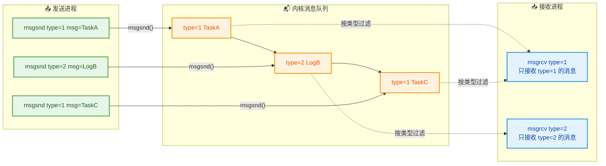

#### System V 消息队列 API

```c
#include <sys/ipc.h>  // ftok, IPC_CREAT
#include <sys/msg.h>  // msgget, msgsnd, msgrcv, msgctl

// 消息结构体（用户自定义，但第一个字段必须是 long 类型的 mtype）
struct msg_buf {
    long mtype;        // 消息类型，必须 > 0
    char mtext[256];   // 消息正文（可自定义大小）
};

// ===== 发送端 =====
// 1. 生成唯一的 IPC key（基于路径 + 项目 ID）
key_t key = ftok("/tmp", 'A');            // 'A' 是 project ID，可以是任意非零字符

// 2. 创建或获取消息队列（IPC_CREAT: 不存在则创建；0666: 权限）
int msqid = msgget(key, IPC_CREAT | 0666);

// 3. 构造消息
struct msg_buf msg;                       // 声明消息结构体
msg.mtype = 1;                            // 设置消息类型为 1
strcpy(msg.mtext, "Hello MQ!");           // 填充消息内容

// 4. 发送消息（0 = 若队列满则阻塞等待）
msgsnd(msqid, &msg, strlen(msg.mtext) + 1, 0);
// 参数: 队列ID, 消息指针, 消息体大小(不含mtype), 标志位

// ===== 接收端 =====
struct msg_buf recv_msg;                  // 用于接收消息的缓冲区

// 5. 接收类型为 1 的消息（0 标志 = 阻塞等待）
msgrcv(msqid, &recv_msg, sizeof(recv_msg.mtext), 1, 0);
// 参数: 队列ID, 缓冲区, 最大接收大小, 期望的消息类型, 标志位
// mtype=0: 接收队列中第一条消息（不区分类型）
// mtype>0: 只接收该类型的第一条消息
// mtype<0: 接收类型值 <= |mtype| 的最小类型的第一条消息

printf("Received: %s\n", recv_msg.mtext); // 输出: Received: Hello MQ!

// 6. 用完后销毁消息队列（IPC_RMID = 立即移除）
msgctl(msqid, IPC_RMID, NULL);
```

#### POSIX 消息队列

除了 System V 风格，现代 Linux 还支持 **POSIX 消息队列**（`mq_open`, `mq_send`, `mq_receive`），它提供了更优雅的 API 和基于文件描述符的操作（可以配合 `select`/`epoll`），但核心思想完全一致。

**消息队列核心特性总结：**

| 特性 | 说明 |
|------|------|
| **有消息边界** | 每条消息是独立单元，接收方一次 `msgrcv()` 恰好收到一条完整消息 |
| **类型过滤** | 可按 `mtype` 选择性接收，实现多路复用 |
| **异步解耦** | 发送方和接收方无需同时在线（消息暂存于内核） |
| **内核拷贝** | 发送和接收各涉及一次 **用户态 ↔ 内核态** 的数据拷贝（共 2 次） |
| **容量限制** | 单条消息和整个队列都有大小上限（可通过 `msgctl` 或 `/proc/sys/kernel/msg*` 配置） |
| **持久性** | System V 消息队列在进程退出后仍然存在，需手动 `msgctl(IPC_RMID)` 删除 |

---

### 共享内存（Shared Memory）

前面的管道和消息队列都有一个共同的性能瓶颈：**数据必须在用户态和内核态之间来回拷贝**。以消息队列为例，发送方调用 `msgsnd()` 时，数据从用户空间拷贝到内核缓冲区；接收方调用 `msgrcv()` 时，数据再从内核缓冲区拷贝到用户空间——**两次拷贝（2 Copies）**。

共享内存（Shared Memory）是所有 IPC 中 **速度最快的**，因为它彻底消除了内核中转：操作系统将 **同一块物理内存页** 映射到多个进程的虚拟地址空间中，进程像访问自己的普通内存一样直接读写，**零拷贝（Zero-Copy）**。

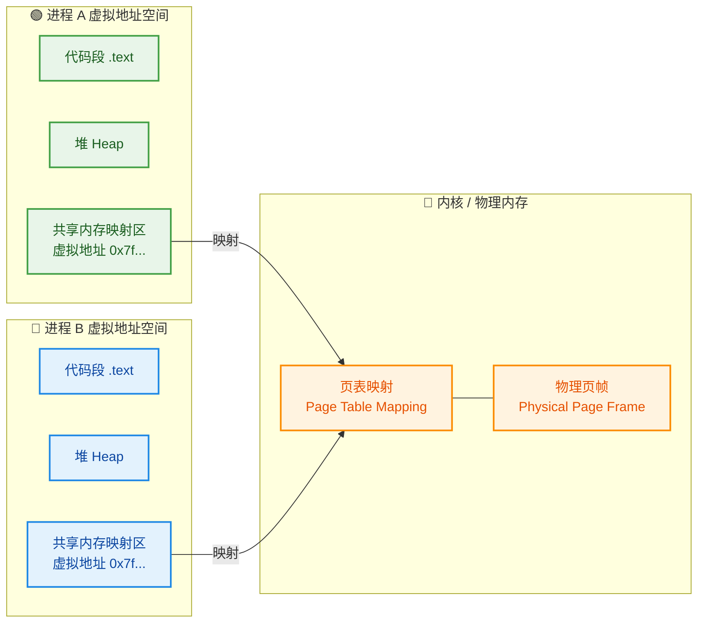

#### 核心原理

1. 进程 A 调用 `shmget()` 在内核中申请一块共享内存区域
2. 进程 A 调用 `shmat()` 将该区域 **附加（Attach）** 到自己的虚拟地址空间
3. 进程 B 同样通过 `shmget()` + `shmat()` 映射 **同一块物理内存**
4. 此后，A 写入的数据，B **瞬间可见**——因为它们读写的是同一块物理页帧，不经过任何内核缓冲或系统调用

#### System V 共享内存 API

```c
#include <sys/ipc.h>  // ftok, IPC_CREAT
#include <sys/shm.h>  // shmget, shmat, shmdt, shmctl
#include <string.h>   // strcpy
#include <stdio.h>    // printf

// ===== 写入端（进程 A）=====
// 1. 生成 IPC key
key_t key = ftok("/tmp", 'S');                   // 与消息队列类似的 key 生成方式

// 2. 创建共享内存段（大小 4096 字节）
int shmid = shmget(key, 4096, IPC_CREAT | 0666);
// 参数: key, 大小(字节), 标志(创建+权限)

// 3. 将共享内存附加到当前进程的地址空间
// shmat 返回映射后的虚拟地址指针
// 第二个参数 NULL 表示让内核自动选择映射地址
// 第三个参数 0 表示可读可写
char *addr = (char *)shmat(shmid, NULL, 0);

// 4. 直接写入数据（就像操作普通内存一样！）
strcpy(addr, "Hello Shared Memory!");            // 直接 memcpy/strcpy，无需系统调用

// 5. 使用完毕后分离（Detach），但不销毁
shmdt(addr);
// 注意：shmdt 只是解除当前进程的映射，共享内存段本身仍然存在于内核

// ===== 读取端（进程 B）=====
// 使用相同的 key 获取同一块共享内存
int shmid2 = shmget(key, 4096, 0666);           // 不需要 IPC_CREAT（已存在）
char *addr2 = (char *)shmat(shmid2, NULL, 0);   // 附加到进程 B 的地址空间

printf("Read: %s\n", addr2);                     // 输出: Read: Hello Shared Memory!

shmdt(addr2);                                    // 分离

// 6. 最终由某个进程销毁共享内存段
shmctl(shmid, IPC_RMID, NULL);                   // IPC_RMID: 标记为待销毁
// 内核将在所有进程都 detach 后真正释放该内存
```

#### mmap 方式（POSIX 风格）

除了 System V API，`mmap` + 文件或匿名映射也是实现共享内存的常见方式，在现代应用中更为流行：

```c
#include <sys/mman.h>   // mmap, munmap
#include <fcntl.h>      // shm_open, O_CREAT, O_RDWR
#include <unistd.h>     // ftruncate, close

// 1. 创建或打开一个 POSIX 共享内存对象（本质是 /dev/shm/ 下的文件）
int fd = shm_open("/my_shm", O_CREAT | O_RDWR, 0666);

// 2. 设置共享内存大小
ftruncate(fd, 4096);                    // 将文件/共享对象截断为 4096 字节

// 3. 映射到进程地址空间
char *ptr = (char *)mmap(
    NULL,                               // addr: 内核自动选择映射地址
    4096,                               // length: 映射大小
    PROT_READ | PROT_WRITE,             // prot: 可读 + 可写
    MAP_SHARED,                         // flags: 共享映射（多进程可见）
    fd,                                 // fd: 共享内存文件描述符
    0                                   // offset: 从文件头开始映射
);

close(fd);                              // 映射建立后可以关闭 fd

// 4. 直接读写
strcpy(ptr, "Hello mmap!");             // 写入
printf("%s\n", ptr);                    // 读取

// 5. 解除映射并删除
munmap(ptr, 4096);                      // 解除映射
shm_unlink("/my_shm");                  // 删除共享内存对象
```

#### ⚠️ 共享内存的致命问题：竞态条件

共享内存的"零拷贝"带来了极致性能，但也引入了最棘手的并发问题——**竞态条件（Race Condition）**。当两个进程同时读写同一块内存时，没有任何内核机制自动保证一致性，必须由程序员 **显式同步**。

这就引出了下一个 IPC 机制——**信号量**。

---

### 信号量（Semaphore）

信号量并不像管道、消息队列那样用于 **传输数据**，它的职责是 **同步与互斥**（Synchronization & Mutual Exclusion）——控制多个进程对共享资源的访问顺序，防止竞态条件。

#### 核心概念

信号量本质上是一个 **由内核维护的非负整数计数器**，配合两个 **原子操作**：

- **P 操作（Proberen，荷兰语"测试"）** 又称 `wait()` / `sem_wait()`：
  - 若信号量值 > 0，则将其 **减 1**，进程继续执行
  - 若信号量值 = 0，则进程 **阻塞等待**，直到信号量值变为正

- **V 操作（Verhogen，荷兰语"增加"）** 又称 `signal()` / `sem_post()`：
  - 将信号量值 **加 1**
  - 若有进程正在阻塞等待该信号量，则 **唤醒其中一个**

> 这两个操作由 Edsger Dijkstra 于 1965 年提出，是并发控制的基石。

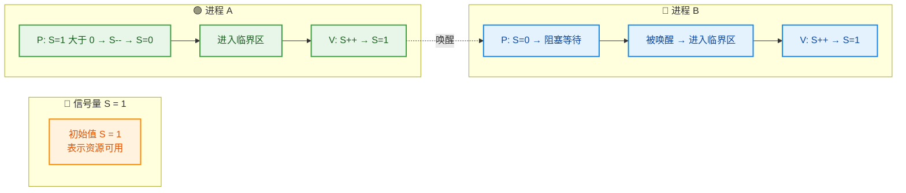

#### 二值信号量 vs 计数信号量

| 类型 | 初始值 | 用途 |
|------|--------|------|
| **二值信号量（Binary Semaphore）** | 0 或 1 | 实现 **互斥锁（Mutex）** 效果，保护临界区 |
| **计数信号量（Counting Semaphore）** | N (N ≥ 1) | 控制 **有限资源的并发访问数**，如连接池大小为 N |

#### POSIX 信号量 API（命名信号量）

```c
#include <semaphore.h>  // sem_open, sem_wait, sem_post, sem_close, sem_unlink
#include <fcntl.h>      // O_CREAT

// ===== 初始化 =====
// 创建命名信号量（跨进程共享）
// 名称: "/my_sem"
// O_CREAT: 不存在则创建
// 0666: 权限
// 1: 初始值为 1（表示资源可用 / 相当于互斥锁）
sem_t *sem = sem_open("/my_sem", O_CREAT, 0666, 1);

// ===== 进程 A / B 中使用 =====
sem_wait(sem);      // P 操作：尝试获取信号量（若为 0 则阻塞）
                    // --- 临界区开始 ---

// 在这里安全地访问共享内存...
// 例如: shared_data->counter++;

                    // --- 临界区结束 ---
sem_post(sem);      // V 操作：释放信号量（值 +1，唤醒等待者）

// ===== 清理 =====
sem_close(sem);     // 关闭当前进程对信号量的引用
sem_unlink("/my_sem"); // 从系统中删除命名信号量
```

#### 共享内存 + 信号量联合使用

在实际工程中，共享内存和信号量几乎 **成对出现**。共享内存提供高速数据通道，信号量保证访问安全：

```c
// 伪代码：生产者-消费者模式（共享内存 + 信号量）

sem_t *mutex = sem_open("/mutex", O_CREAT, 0666, 1);  // 互斥信号量，初始 1
sem_t *empty = sem_open("/empty", O_CREAT, 0666, 10);  // 空槽数量，初始 10（缓冲区大小）
sem_t *full  = sem_open("/full",  O_CREAT, 0666, 0);   // 已用槽数量，初始 0

// ===== 生产者进程 =====
void producer() {
    while (1) {
        int item = produce_item();       // 生产一个数据项

        sem_wait(empty);                 // P(empty): 等待空槽（empty--）
        sem_wait(mutex);                 // P(mutex): 进入临界区

        put_item_to_shared_memory(item); // 将数据写入共享内存缓冲区

        sem_post(mutex);                 // V(mutex): 离开临界区
        sem_post(full);                  // V(full): 通知消费者有新数据（full++）
    }
}

// ===== 消费者进程 =====
void consumer() {
    while (1) {
        sem_wait(full);                  // P(full): 等待有数据（full--）
        sem_wait(mutex);                 // P(mutex): 进入临界区

        int item = get_item_from_shared_memory(); // 从共享内存读取数据

        sem_post(mutex);                 // V(mutex): 离开临界区
        sem_post(empty);                 // V(empty): 通知生产者有空槽（empty++）

        consume_item(item);              // 消费数据
    }
}
```

> **⚠️ 注意 P 操作的顺序**：必须先 `sem_wait(empty/full)` 再 `sem_wait(mutex)`。若颠倒，在缓冲区满时，生产者持有 mutex 却等待 empty，消费者需要 mutex 才能消费释放 empty——**死锁（Deadlock）！**

---

### Socket 套接字

前面介绍的管道、消息队列、共享内存、信号量，都局限于 **同一台机器上的进程通信**。而 Socket 是唯一一种 **既能本地通信，又能跨网络通信** 的 IPC 机制。它是网络编程的基石，也是分布式系统的核心通信抽象。

#### Socket 的两大家族

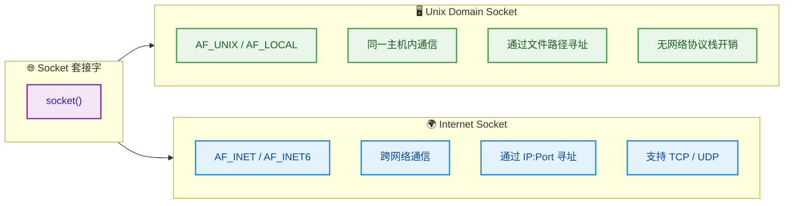

**1. Unix Domain Socket（`AF_UNIX`）**：用于同一主机上的高效 IPC，通过文件系统路径作为地址，不经过网络协议栈，性能优于 TCP loopback。Docker、MySQL、PostgreSQL 等大量使用。

**2. Internet Socket（`AF_INET` / `AF_INET6`）**：用于跨网络通信，通过 IP 地址 + 端口号寻址，支持 TCP（可靠流式）和 UDP（无连接数据报）。

#### TCP Socket 通信流程

TCP Socket 遵循经典的 **Client-Server 模型**，双方通信前需要通过"三次握手"建立连接：

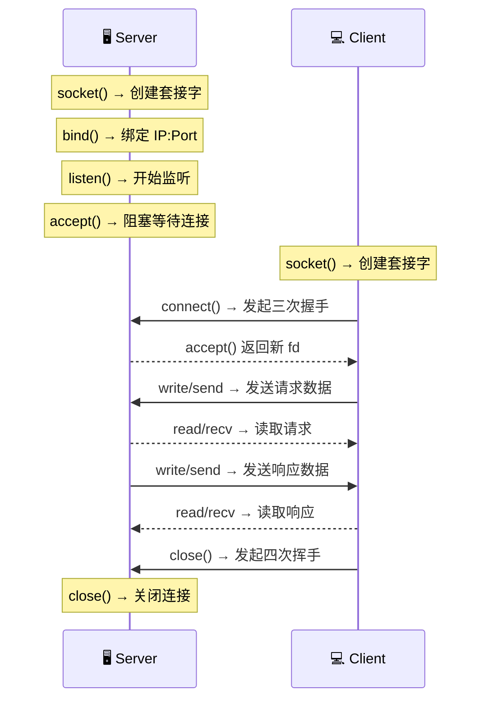

#### TCP Socket 完整代码示例

**服务端（Server）：**

```c
#include <stdio.h>       // printf, perror
#include <string.h>      // memset, strlen
#include <unistd.h>      // read, write, close
#include <arpa/inet.h>   // socket, bind, listen, accept, htons, INADDR_ANY
#include <sys/socket.h>  // socket 相关结构体

int main() {
    int server_fd, client_fd;              // 服务端监听 fd 和客户端连接 fd
    struct sockaddr_in addr;               // IPv4 地址结构体
    char buf[1024];                        // 读取缓冲区

    // 1. 创建 TCP 套接字
    //    AF_INET: IPv4 协议族
    //    SOCK_STREAM: 面向连接的字节流（TCP）
    //    0: 自动选择协议（TCP）
    server_fd = socket(AF_INET, SOCK_STREAM, 0);

    // 2. 配置服务端地址
    memset(&addr, 0, sizeof(addr));        // 清零结构体
    addr.sin_family = AF_INET;             // IPv4
    addr.sin_addr.s_addr = INADDR_ANY;     // 绑定所有网络接口（0.0.0.0）
    addr.sin_port = htons(8080);           // 端口号 8080（htons: 主机字节序→网络字节序）

    // 3. 绑定地址到套接字
    bind(server_fd, (struct sockaddr *)&addr, sizeof(addr));

    // 4. 开始监听，backlog = 5（等待连接队列最大长度）
    listen(server_fd, 5);
    printf("Server listening on port 8080...\n");

    // 5. 接受客户端连接（阻塞，直到有客户端 connect）
    //    返回一个新的 fd 专门用于与该客户端通信
    client_fd = accept(server_fd, NULL, NULL);

    // 6. 读取客户端发送的数据
    int n = read(client_fd, buf, sizeof(buf) - 1);  // 从客户端 fd 读取
    buf[n] = '\0';                                    // 添加字符串结束符
    printf("Received: %s\n", buf);

    // 7. 向客户端发送响应
    const char *resp = "Hello from Server!";
    write(client_fd, resp, strlen(resp));

    // 8. 关闭连接
    close(client_fd);                      // 关闭与客户端的连接
    close(server_fd);                      // 关闭监听套接字

    return 0;
}
```

**客户端（Client）：**

```c
#include <stdio.h>       // printf
#include <string.h>      // strlen, memset
#include <unistd.h>      // read, write, close
#include <arpa/inet.h>   // socket, connect, inet_pton, htons

int main() {
    int sock_fd;                           // 客户端套接字 fd
    struct sockaddr_in serv_addr;          // 服务端地址
    char buf[1024];                        // 读取缓冲区

    // 1. 创建 TCP 套接字
    sock_fd = socket(AF_INET, SOCK_STREAM, 0);

    // 2. 配置服务端地址
    memset(&serv_addr, 0, sizeof(serv_addr));
    serv_addr.sin_family = AF_INET;                   // IPv4
    serv_addr.sin_port = htons(8080);                 // 服务端端口
    inet_pton(AF_INET, "127.0.0.1", &serv_addr.sin_addr); // 将点分十进制IP转为二进制

    // 3. 发起连接（触发 TCP 三次握手）
    connect(sock_fd, (struct sockaddr *)&serv_addr, sizeof(serv_addr));

    // 4. 发送数据到服务端
    const char *msg = "Hello from Client!";
    write(sock_fd, msg, strlen(msg));

    // 5. 读取服务端的响应
    int n = read(sock_fd, buf, sizeof(buf) - 1);
    buf[n] = '\0';
    printf("Server replied: %s\n", buf);              // 输出: Server replied: Hello from Server!

    // 6. 关闭连接
    close(sock_fd);

    return 0;
}
```

#### Unix Domain Socket 示例（本地高效 IPC）

```c
#include <sys/socket.h>  // socket, bind, listen, accept, connect
#include <sys/un.h>      // sockaddr_un, AF_UNIX

// 服务端核心代码片段
int server_fd = socket(AF_UNIX, SOCK_STREAM, 0);  // 使用 AF_UNIX 而非 AF_INET

struct sockaddr_un addr;                           // Unix 域地址结构体
memset(&addr, 0, sizeof(addr));
addr.sun_family = AF_UNIX;                         // Unix 域协议族
strncpy(addr.sun_path, "/tmp/my.sock", sizeof(addr.sun_path) - 1);
// sun_path: 套接字文件路径（代替了 IP:Port）

unlink("/tmp/my.sock");                            // 删除可能残留的旧文件
bind(server_fd, (struct sockaddr *)&addr, sizeof(addr));
listen(server_fd, 5);                              // 开始监听
// 后续 accept/read/write 与 TCP 完全一致
```

#### 五种 IPC 全维度对比

| 维度 | 管道 Pipe | 消息队列 MQ | 共享内存 SHM | 信号量 Sem | Socket |
|------|-----------|-------------|-------------|-----------|--------|
| **通信方向** | 单向 | 双向 | 双向 | N/A（同步用） | 双向 |
| **传输数据** | ✅ 字节流 | ✅ 结构化消息 | ✅ 任意数据 | ❌ 仅计数器 | ✅ 字节流/数据报 |
| **消息边界** | ❌ 无 | ✅ 有 | ❌ 无 | N/A | 取决于协议 |
| **通信范围** | 同一主机 | 同一主机 | 同一主机 | 同一主机 | **同一主机 + 跨网络** |
| **性能** | 中 | 中 | ⚡ **最快** | 低开销 | 低（网络）/ 中（本地） |
| **内核拷贝次数** | 2 次 | 2 次 | **0 次** | 0 次 | 2+ 次 |
| **需要同步？** | 内核保证 | 内核保证 | ⚠️ **必须手动同步** | 自身就是同步机制 | 内核保证 |
| **进程关系** | 亲缘（匿名）/ 任意（命名） | 任意 | 任意 | 任意 | 任意 |
| **典型场景** | Shell 管道 | 任务分发 | 高频数据交换 | 资源访问控制 | 网络服务、微服务通信 |

---

**📝 练习题**

**题目**：在一个生产者-消费者系统中，两个进程通过共享内存交换大量实时数据（如视频帧），同时需要保证数据一致性。以下关于 IPC 机制选择的说法，**正确的是**：

A. 仅使用共享内存即可，因为共享内存本身保证了读写的原子性


B. 应使用消息队列，因为消息队列有消息边界，天然适合传输视频帧


C. 应使用共享内存传输数据，并配合信号量实现进程间同步


D. 应使用管道，因为管道的 FIFO 特性天然适合流式数据传输

**【答案】** C

**【解析】** 该场景有两个核心需求：**大数据量高速传输** 和 **数据一致性**。

- **A 错误**：共享内存提供零拷贝的高速通道，但内核 **不保证** 多进程对共享内存读写的原子性和一致性。如果进程 A 正在写入帧数据的一半时，进程 B 就开始读取，会得到 **撕裂的数据（Torn Read）**，这就是经典的竞态条件。
- **B 错误**：消息队列虽然有消息边界，但每次 `msgsnd`/`msgrcv` 都涉及 **用户态↔内核态的数据拷贝**（共 2 次），对于视频帧这种大数据量场景，性能开销不可接受。且 System V 消息队列对单条消息大小有限制（默认通常为 8KB 左右）。
- **C 正确**：共享内存提供 **零拷贝** 的极致传输性能，配合信号量（或互斥锁）控制读写时序，既保证了速度又保证了一致性——这正是工业级实践中最常用的高性能 IPC 方案。
- **D 错误**：管道也存在 2 次内核拷贝的问题，且匿名管道默认缓冲区仅 64KB，无法高效传输视频帧级别的大数据。管道适合轻量级、小数据量的流式传输场景（如 Shell 命令串联）。

---

## 本章小结

本章围绕操作系统中最核心的两个抽象概念——**进程（Process）** 与 **线程（Thread）**——展开了系统性的梳理。下面从全局视角对本章知识脉络进行回顾与整合。

---

### 核心概念回顾

操作系统的根本使命之一，是让多个程序"看起来"在同时运行。为了实现这一目标，OS 引入了 **进程** 作为 **资源分配的基本单位（unit of resource allocation）**，每个进程拥有独立的地址空间、文件描述符表、信号处理表等资源。进程的生命周期被抽象为 **就绪（Ready）→ 运行（Running）→ 阻塞（Blocked）** 三大核心状态，由操作系统的调度器（Scheduler）驱动状态迁移。

然而，进程的创建与切换代价过于高昂——每次 `fork()` 都要复制页表、刷新 TLB、重建内核数据结构。为了降低并发的开销，操作系统在进程内部进一步引入了 **线程** 作为 **CPU 调度的基本单位（unit of CPU scheduling）**。同一进程内的所有线程 **共享地址空间、堆、全局变量、文件描述符**，每个线程仅维护自己的 **栈（Stack）、程序计数器（PC）、寄存器集合（Register Set）**，因此也被称为 **轻量级进程（Lightweight Process, LWP）**。

进程与线程的核心差异可以沿四条主线展开：

| 维度 | 进程 (Process) | 线程 (Thread) |
|------|---------------|---------------|
| **资源** | 独立地址空间，彼此隔离 | 共享所属进程的地址空间 |
| **开销** | 创建/切换开销大（涉及页表、TLB） | 创建/切换开销小（仅保存少量寄存器） |
| **通信** | 需通过 IPC 机制（管道、消息队列等） | 直接读写共享内存，天然高效 |
| **安全** | 天然隔离，一个进程崩溃不影响其他进程 | 共享空间导致竞态条件，需要同步原语 |

而进程间通信（IPC）则是弥补进程隔离性的关键桥梁，从最简单的 **管道（Pipe）** 到最通用的 **Socket**，五种经典 IPC 机制各有适用场景：

- **管道**：单向、亲缘进程间的字节流通信，简单但功能有限。
- **消息队列**：内核维护的带格式消息链表，支持按类型选择性读取，解耦收发双方。
- **共享内存**：多个进程映射同一块物理内存，速度最快，但必须配合同步机制。
- **信号量**：本质是计数器 + 等待队列，通过 P/V 操作解决互斥与同步问题。
- **Socket**：唯一支持跨网络通信的 IPC，是分布式系统的基石。

---

### 全景知识地图

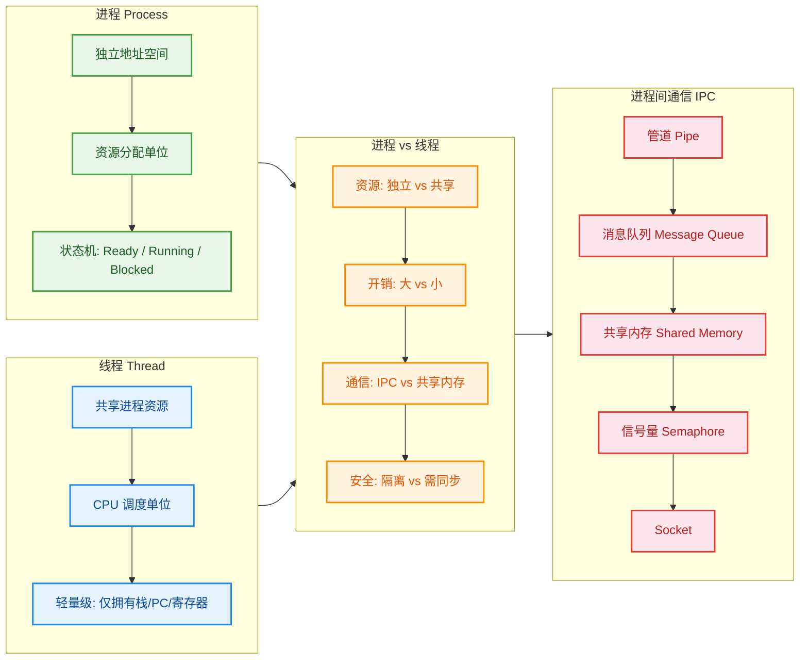

---

### 设计哲学与工程启示

回顾整章内容，有几条贯穿始终的设计思想值得铭记：

**1. 抽象分层（Abstraction & Layering）**

操作系统并非一次性引入"线程"的。最初只有进程，当人们发现并发粒度不够细、开销太大时，才在进程内部再抽象出线程。这是一个典型的 **分层抽象** 过程：先用进程隔离资源，再用线程复用资源中的 CPU 时间片。理解这种"需求驱动的抽象演化"，比记住概念本身更重要。

**2. 隔离与共享的永恒博弈（Isolation vs. Sharing Trade-off）**

进程提供了强隔离，但通信困难、开销大；线程提供了高效共享，但安全问题丛生。这种 trade-off 在计算机科学中无处不在——从虚拟机 vs 容器，到微服务 vs 单体架构，底层逻辑一脉相承。选择哪种模型，取决于你对 **性能**、**安全**、**开发复杂度** 三者的权衡。

**3. IPC 的"没有银弹"原则（No Silver Bullet）**

五种 IPC 机制没有绝对的优劣之分：

```
txt
速度排序:    共享内存 >> 管道 ≈ 消息队列 > Socket
通用性排序:  Socket >> 消息队列 > 共享内存 > 管道 > 信号量
编程难度:    管道(简单) < 消息队列 < Socket < 共享内存+信号量(复杂)
```

在实际工程中，**共享内存 + 信号量** 常常组合使用以实现高性能的本地 IPC；**Socket** 则是网络分布式场景的唯一选择；而 **管道** 则是 Shell 脚本和简单父子进程通信的最佳搭档。

---

### 高频面试考点速查

| 考点 | 一句话要点 |
|------|-----------|
| 进程三态模型 | Ready ↔ Running（调度/时间片耗尽），Running → Blocked（等待 I/O），Blocked → Ready（I/O 完成） |
| 线程为何更轻量 | 不需复制地址空间，切换时仅保存/恢复少量寄存器与栈指针 |
| 进程崩溃是否影响其他进程 | 不影响，因为地址空间独立；但线程崩溃会导致整个进程终止 |
| 共享内存为何最快 | 数据直接在用户空间可见，无需内核态拷贝（zero-copy） |
| 信号量 vs 互斥锁 | 信号量可 > 1（控制并发数），互斥锁只能 0/1（二元排他） |
| `fork()` vs `pthread_create()` | 前者创建新进程（COW 复制页表），后者在进程内创建新线程 |

---

**📝 练习题 1**

以下关于进程与线程的描述，**错误** 的是：

A. 线程是 CPU 调度的基本单位，进程是资源分配的基本单位


B. 同一进程内的线程共享全局变量和堆内存，但各自拥有独立的栈


C. 一个线程的异常崩溃不会影响同一进程内的其他线程，因为每个线程有独立的栈空间


D. 创建线程的开销通常远小于创建进程的开销，因为线程不需要复制地址空间


**【答案】** C

**【解析】** 选项 C 的说法是错误的。虽然每个线程有独立的栈，但所有线程共享同一个地址空间。当一个线程发生严重异常（如段错误 Segmentation Fault）时，操作系统发送的信号（如 `SIGSEGV`）是 **进程级别** 的，这会导致 **整个进程被终止**，其中所有线程一同消亡。线程的"独立栈"仅意味着函数调用链和局部变量互不干扰，并不等同于线程间的故障隔离。真正的故障隔离需要依赖进程的独立地址空间。这也是为什么诸如 Chrome 浏览器采用 **多进程架构**——每个 Tab 一个进程——来防止一个页面崩溃拖垮整个浏览器。

---

**📝 练习题 2**

在 Linux 中，两个无亲缘关系的进程希望以 **最高速度** 交换大量数据（数百 MB），并且通信仅发生在同一台机器上。最合适的 IPC 方案是：

A. 匿名管道（Anonymous Pipe）


B. TCP Socket（`127.0.0.1`）


C. 共享内存（Shared Memory）+ 信号量（Semaphore）同步


D. 消息队列（Message Queue）


**【答案】** C

**【解析】** 题目强调"最高速度"和"同一机器"，这两个约束直接指向 **共享内存**。共享内存的本质是让两个进程的虚拟地址映射到同一块物理页框，数据在用户空间直接可见，**无需任何内核态数据拷贝**，速度在所有 IPC 机制中无出其右。但由于两个进程同时读写同一块内存，必须配合 **信号量或互斥锁** 来解决竞态条件（Race Condition），所以答案是 C。

排除其他选项：A 匿名管道只能用于有亲缘关系的进程（父子/兄弟），且数据需经过内核缓冲区拷贝两次；B TCP Socket 虽然通用，但即使是 `loopback`，数据仍需经历完整的 TCP/IP 协议栈处理（封装、校验、拆包），开销远大于共享内存；D 消息队列有单条消息大小限制（Linux 默认 `msgmax` 为 8192 字节），且数据同样需要在用户态与内核态之间拷贝，不适合传输数百 MB 数据。

---

