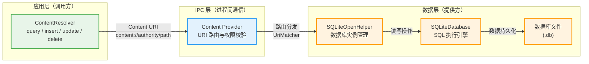
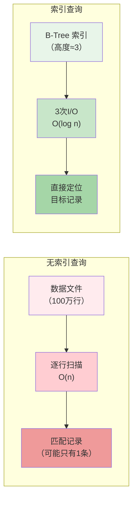

---

# Android数据库实践

---

## ContentProvider与数据库的关系

在 Android 系统的四大组件（Activity、Service、BroadcastReceiver、ContentProvider）中，ContentProvider 是唯一一个专门设计用于在应用程序之间共享数据的组件。然而，许多开发者在初次接触 ContentProvider 时，往往只把它理解为“数据导出接口”，而忽略了它与底层数据库之间的深层关联。事实上，ContentProvider 不仅仅是一层简单的封装——它的设计哲学、数据管理机制以及生命周期管理都与数据库系统有着千丝万缕的联系。理解这种关系，是掌握 Android 数据层架构的关键一步。

### ContentProvider的本质：一个抽象的数据访问层

从软件设计的角度来看，ContentProvider 实质上是一种 **数据访问抽象层（Data Access Layer）**。它将数据存储的具体实现细节——无论是 SQLite 数据库、SharedPreferences、文件系统，还是网络远程服务器——隐藏在统一的接口之后。对外暴露的只有一组基于 URI（Uniform Resource Identifier）的标准操作接口：查询（query）、插入（insert）、更新（update）和删除（delete），这四种操作恰好对应了数据库系统中最核心的 CRUD（Create、Read、Update、Delete）操作。

当我们审视一个典型的 ContentProvider 实现时，会发现它通常包含以下几个核心组件： URI 匹配器（UriMatcher）用于解析传入的 URI 并确定操作的数据表和记录； ContentResolver 由调用方使用，用于发起数据操作请求； ContentProvider 由数据提供方实现，接收并处理这些请求； SQLite 数据库（或其他存储后端）作为数据的实际持久化载体。以下关系图清晰地展示了这个架构中的数据流向：



这个架构的核心价值在于**解耦**。调用方无需关心数据究竟存储在 SQLite 中、SharedPreferences 中，还是来自网络的远程 API。只要 URI 的 authority 和 path 符合 ContentProvider 定义的规则，数据操作就可以透明地进行。这与数据库系统中“模式（Schema）/实例（Instance）”分离的设计思想一脉相承——ContentProvider 定义了数据的“逻辑模式”（通过 URI 结构），而数据库文件则是这个模式的“物理实例”。

### URI：ContentProvider的“数据坐标系统”

如果说数据库中的每一条记录都有一个主键（Primary Key）作为唯一标识，那么在 ContentProvider 的世界中，URI 就是这个标识系统的升级版本。一个完整的 ContentProvider URI 由以下几个部分组成：

- **Scheme**：固定为 `content://`，表明这是一个 ContentProvider 特有的 URI 方案。
- **Authority**：内容提供者的唯一标识，通常使用包名的反转形式（例如 `com.example.app.provider`），类似于数据库中的“数据库名”。
- **Path**：指向具体的数据表或记录，类似于 SQL 中的表名和 WHERE 子句。
- **ID（可选）**：指向某一条具体记录，类似于 WHERE id = ?。

举例来说，`content://com.example.app.provider/users` 可能对应数据库中的一张 `users` 表，而 `content://com.example.app.provider/users/5` 则对应 id 为 5 的那条具体记录。这与 SQL 语句的对应关系如下表所示：

| ContentProvider 操作 | 对应 SQL 语句 |
| --- | --- |
| `content://authority/users` + query() | `SELECT * FROM users` |
| `content://authority/users/5` + query() | `SELECT * FROM users WHERE _id = 5` |
| `content://authority/users` + insert(ContentValues) | `INSERT INTO users VALUES (...)` |
| `content://authority/users/5` + update(ContentValues) | `UPDATE users SET ... WHERE _id = 5` |
| `content://authority/users/5` + delete() | `DELETE FROM users WHERE _id = 5` |

通过这种映射关系，我们可以看出 ContentProvider 的设计者有意地将其 API 与关系型数据库的操作语义保持了一致性。这种一致性并非巧合——它反映了 Android 框架在设计时对数据库系统的深刻理解：既然大多数应用数据最终都存储在 SQLite 中，那么让 ContentProvider 的数据模型与 SQL 模型保持同构，就能最大程度地简化开发者的心智负担。

### ContentProvider与SQLiteOpenHelper的协作机制

在实际开发中，一个完整的 ContentProvider 实现通常会包含一个 SQLiteOpenHelper 子类来管理数据库的创建、版本升级和访问。以下是一个典型的实现结构：

```kotlin
// 定义数据库帮助类：管理 SQLite 数据库的创建与版本
class UserDatabaseHelper(context: Context) : SQLiteOpenHelper(
    context,
    DATABASE_NAME,      // 数据库文件名
    null,               // 不使用自定义游标工厂
    DATABASE_VERSION    // 数据库版本号，用于版本升级判断
) {
    companion object {
        const val DATABASE_NAME = "app_database.db"  // SQLite 数据库文件名
        const val DATABASE_VERSION = 1              // 数据库版本号，升级时递增
        const val TABLE_USERS = "users"             // 用户表名
    }

    // onCreate：在数据库首次创建时调用，通常在此创建所有表
    override fun onCreate(db: SQLiteDatabase) {
        // 使用 CREATE TABLE 语句创建表结构
        db.execSQL("""
            CREATE TABLE $TABLE_USERS (
                _id INTEGER PRIMARY KEY AUTOINCREMENT,  -- 主键，INTEGER 类型自增
                name TEXT NOT NULL,                     -- 用户名字段，非空约束
                email TEXT                              -- 邮箱字段，可空
            )
        """.trimIndent())
    }

    // onUpgrade：在数据库版本号增加时调用，用于执行迁移脚本
    override fun onUpgrade(db: SQLiteDatabase, oldVersion: Int, newVersion: Int) {
        // 简单的升级策略：删除旧表重建（生产环境应使用更安全的迁移方案）
        db.execSQL("DROP TABLE IF EXISTS $TABLE_USERS")
        onCreate(db)  // 重新创建表结构
    }
}
```

```kotlin
// 定义 ContentProvider：暴露数据访问接口
class UserProvider : ContentProvider() {

    // 静态初始化块：定义 URI 匹配规则
    companion object {
        const val AUTHORITY = "com.example.app.provider"  // ContentProvider 的唯一标识
        val CONTENT_URI: Uri = Uri.parse("content://$AUTHORITY/users")  // 用户表的 URI

        // URI 匹配码：用于区分不同的数据路径
        private const val USERS = 1      // 匹配整个 users 表（多条记录）
        private const val USER_ID = 2     // 匹配单条 user 记录

        // 创建 UriMatcher 实例，用于解析传入的 URI
        private val uriMatcher = UriMatcher(UriMatcher.NO_MATCH).apply {
            addURI(AUTHORITY, "users", USERS)       // 添加表级 URI 匹配规则
            addURI(AUTHORITY, "users/#", USER_ID)   // 添加单条记录 URI 匹配规则（# 为占位符）
        }
    }

    // ContentProvider 创建时的回调：初始化数据库帮助类
    override fun onCreate(): Boolean {
        // onCreate 在 ContentProvider 首次被访问时由系统调用
        // 此时数据库帮助类实例被创建，但实际的数据库文件尚未打开
        dbHelper = UserDatabaseHelper(context!!)  // context 由系统在创建时注入
        return true  // 返回 true 表示 ContentProvider 初始化成功
    }

    private lateinit var dbHelper: UserDatabaseHelper  // 数据库帮助类实例

    // query 方法：处理数据查询请求，对应 SQL 的 SELECT 语句
    override fun query(
        uri: Uri,                          // 请求的 URI，指定查询的数据源
        projection: Array<out String>?,   // 要查询的列名数组，null 表示全部列
        selection: String?,                // WHERE 条件子句
        selectionArgs: Array<out String>?, // WHERE 条件中的参数值
        sortOrder: String?                 // 结果排序方式
    ): Cursor? {
        // 获取数据库读连接的引用（可多线程安全读取）
        val db: SQLiteDatabase = dbHelper.readableDatabase

        // 根据 URI 匹配码选择不同的查询策略
        return when (uriMatcher.match(uri)) {
            USERS -> {
                // 匹配表级 URI：查询整个表
                // 相当于执行：SELECT projection FROM users ORDER BY sortOrder
                db.query(
                    UserDatabaseHelper.TABLE_USERS,  // 表名
                    projection,                       // 要返回的列
                    selection,                        // WHERE 条件
                    selectionArgs,                    // WHERE 参数
                    null,                             // GROUP BY（不使用）
                    null,                             // HAVING（不使用）
                    sortOrder                         // 排序
                )
            }
            USER_ID -> {
                // 匹配单条记录 URI：从 URI 中提取 ID 值
                val id: String = uri.lastPathSegment ?: return null
                // 相当于执行：SELECT projection FROM users WHERE _id = id
                db.query(
                    UserDatabaseHelper.TABLE_USERS,
                    projection,
                    "${BaseColumns._ID} = ?",  // WHERE _id = ?（安全参数化查询）
                    arrayOf(id),               // 参数化查询的参数值
                    null, null, sortOrder
                )
            }
            else -> throw IllegalArgumentException("未知 URI: $uri")
        }
    }

    // insert 方法：处理数据插入请求，对应 SQL 的 INSERT 语句
    override fun insert(uri: Uri, values: ContentValues?): Uri? {
        val db: SQLiteDatabase = dbHelper.writableDatabase  // 写入需要可写连接

        return when (uriMatcher.match(uri)) {
            USERS -> {
                // 执行插入操作，返回新记录的行 ID
                val rowId: Long = db.insert(
                    UserDatabaseHelper.TABLE_USERS,  // 表名
                    null,                             // 不使用命名插入（NULL 列 hack）
                    values                            // 要插入的数据（键值对）
                )
                // 构造新记录的 URI 并通知观察者数据已变更
                if (rowId > 0) {
                    val newUri = ContentUris.withAppendedId(CONTENT_URI, rowId)
                    context?.contentResolver?.notifyChange(newUri, null)  // 通知数据观察者
                    newUri  // 返回新记录的 URI
                } else {
                    throw SQLException("插入用户记录失败: $uri")
                }
            }
            else -> throw IllegalArgumentException("不支持的 URI: $uri")
        }
    }

    // update 方法：处理数据更新请求，对应 SQL 的 UPDATE 语句
    override fun update(
        uri: Uri,
        values: ContentValues?,
        selection: String?,
        selectionArgs: Array<out String>?
    ): Int {
        val db: SQLiteDatabase = dbHelper.writableDatabase

        return when (uriMatcher.match(uri)) {
            USERS -> {
                // 更新符合条件的记录，返回受影响的行数
                val count: Int = db.update(
                    UserDatabaseHelper.TABLE_USERS,
                    values,
                    selection,
                    selectionArgs
                )
                // 通知观察者数据已变更（允许懒通知模式）
                if (count > 0) {
                    context?.contentResolver?.notifyChange(uri, null)
                }
                count
            }
            USER_ID -> {
                val id: String = uri.lastPathSegment ?: return 0
                val count: Int = db.update(
                    UserDatabaseHelper.TABLE_USERS,
                    values,
                    "${BaseColumns._ID} = ?",
                    arrayOf(id)
                )
                if (count > 0) {
                    context?.contentResolver?.notifyChange(uri, null)
                }
                count
            }
            else -> throw IllegalArgumentException("不支持的 URI: $uri")
        }
    }

    // delete 方法：处理数据删除请求，对应 SQL 的 DELETE 语句
    override fun delete(
        uri: Uri,
        selection: String?,
        selectionArgs: Array<out String>?
    ): Int {
        val db: SQLiteDatabase = dbHelper.writableDatabase

        return when (uriMatcher.match(uri)) {
            USERS -> {
                val count: Int = db.delete(
                    UserDatabaseHelper.TABLE_USERS,
                    selection,
                    selectionArgs
                )
                if (count > 0) {
                    context?.contentResolver?.notifyChange(uri, null)
                }
                count
            }
            USER_ID -> {
                val id: String = uri.lastPathSegment ?: return 0
                val count: Int = db.delete(
                    UserDatabaseHelper.TABLE_USERS,
                    "${BaseColumns._ID} = ?",
                    arrayOf(id)
                )
                if (count > 0) {
                    context?.contentResolver?.notifyChange(uri, null)
                }
                count
            }
            else -> throw IllegalArgumentException("不支持的 URI: $uri")
        }
    }

    // getType 方法：返回 URI 对应的 MIME 类型，供 ContentResolver 使用
    override fun getType(uri: Uri): String {
        return when (uriMatcher.match(uri)) {
            USERS -> "vnd.android.cursor.dir/vnd.$AUTHORITY.users"     // 目录型 MIME
            USER_ID -> "vnd.android.cursor.item/vnd.$AUTHORITY.users" // 单项型 MIME
            else -> throw IllegalArgumentException("未知 URI: $uri")
        }
    }
}
```

上述代码展示了 ContentProvider 与 SQLite 之间最典型的协作模式。从这段实现中，我们可以提炼出几个关键的设计要点。

### URI路由与SQL编译的对应关系

UriMatcher 在 ContentProvider 中的角色，类似于数据库系统中的**查询解析器（Query Parser）**。当一个 ContentResolver 向 ContentProvider 发起请求时，传入的 URI 首先被 UriMatcher 解析，转化为预定义的匹配码。这个匹配码决定了后续将调用哪一段数据库处理逻辑。整个过程与数据库引擎处理 SQL 语句的流程高度相似：解析（Parsing）→ 计划生成（Plan Generation）→ 执行（Execution）。

具体而言，UriMatcher 的 `addURI()` 方法注册了 URI 的匹配规则，而 `match()` 方法则执行匹配逻辑。当 URI 匹配成功时，ContentProvider 根据匹配码通过 `when` 语句（或 `switch` 语句）分发到对应的处理分支。这种分发机制本质上是一种**模式匹配（Pattern Matching）**，与 SQL 语句中的 WHERE 子句解析在思想上一致——都是根据给定的模式从大量数据/路径中找到符合条件的目标。

值得注意的是，URI 中的路径变量（如 `#` 和 `*`）起着通配符的作用。`#` 匹配任意数字序列（用于单条记录），`*` 匹配任意字符序列（用于可变路径）。这与 SQL LIKE 语句中的 `%` 通配符功能相似，但 UriMatcher 的匹配更加严格和高效，因为它基于精确的前缀树（Trie）结构而非模糊匹配。

### 数据变更通知机制与观察者模式

在 ContentProvider 的 `insert`、`update` 和 `delete` 方法中，我们调用了 `context.contentResolver.notifyChange(uri, null)` 来通知数据观察者。这一机制是 ContentProvider 与数据库系统关联中最为精妙的设计之一——它实现了数据库领域的 **触发器（Trigger）** 和 **发布-订阅（Publish-Subscribe）** 模式的思想。

当 ContentProvider 中的数据发生变更时，notifyChange 会向所有注册了该 URI 的 ContentObserver 发送通知。这些观察者可能是同一个应用中的其他组件（如 Activity、Service），也可能是其他应用中的组件。收到通知后，观察者可以刷新自己的数据缓存或重新查询最新的数据。这种机制确保了数据的一致性视图，避免了多个组件同时访问数据时可能出现的不同步问题。

从数据库系统的角度来看，这种通知机制对应了 **物化视图（Materialized View）** 的自动刷新策略——当底层数据发生变化时，所有依赖该数据的视图都需要被更新。只不过 ContentProvider 将这个过程从数据库服务端搬到了客户端，并通过 Android 的 Binder IPC 机制实现了跨进程通知。

ContentObserver 的注册同样基于 URI 树结构。如果一个 Activity 注册观察 `content://com.example.app.provider/users`，那么对 `content://com.example.app.provider/users/5` 的修改也会触发通知，因为单条记录的 URI 是表级 URI 的子路径。这种层级化的通知机制与数据库中外键级联（Cascade）触发的思想如出一辙——都是在一个地方发生变化时，自动传播到所有相关的依赖方。

### 权限模型：数据安全的守门人

ContentProvider 的另一个与数据库安全机制紧密相关的设计是**权限控制**。在 Android 的 manifest 文件中，我们通过 `<provider>` 标签定义 ContentProvider 的访问权限：

```xml
<!-- AndroidManifest.xml -->
<provider
    android:name=".UserProvider"
    android:authorities="com.example.app.provider"
    android:exported="true"
    android:readPermission="com.example.app.permission.READ_USERS"
    android:writePermission="com.example.app.permission.WRITE_USERS" />
```

这个配置与数据库系统中的**权限管理（GRANT/REVOKE）** 机制在本质上是一致的。在数据库中，管理员可以授予（GRANT）或撤销（REVOKE）用户对特定表、视图或存储过程的 SELECT、INSERT、UPDATE、DELETE 权限。而在 Android 中，ContentProvider 的权限系统控制的是对特定数据 URI 的读写权限——无论数据最终存储在哪里（SQLite、文件、网络），权限检查都在 ContentProvider 这一层统一进行。

`exported` 属性决定了这个 ContentProvider 是否允许其他应用访问。当 `exported="true"` 时，外部应用可以通过声明相同的自定义权限（`android:permission`）或使用 `android:grantUriPermissions` 来获取有限的访问权限。这与数据库中设置表为“公开”或“私有”的概念完全对应——`exported="false"` 相当于一个完全私有的表，只有拥有者应用自身可以访问。

更进一步，ContentProvider 还支持 **URI 级别的权限授予（URI Permission Grants）**。这意味着即使 ContentProvider 整体上不允许外部访问，数据的拥有者仍然可以通过 `Intent.FLAG_GRANT_READ_URI_PERMISSION` 或 `Intent.FLAG_GRANT_WRITE_URI_PERMISSION` 向特定的 Activity 或 Service 授予对某个具体 URI 的临时访问权限。这种细粒度的权限授予机制，与数据库中基于视图（View）的访问控制类似——授予的不是对底层表的直接访问权，而是对一个特定数据子集的受限访问权。

### 生命周期与数据库连接管理

ContentProvider 的生命周期由 Android 系统管理，这与数据库连接池（Connection Pool）的管理方式有着有趣的类比。当 ContentProvider 第一次被某个组件访问时，系统会调用其 `onCreate()` 方法，创建数据库帮助类实例。此时，数据库文件可能尚未真正打开——真正的数据库连接是在第一次执行读或写操作时（即调用 `dbHelper.getReadableDatabase()` 或 `getWritableDatabase()`）才从 SQLiteOpenHelper 的连接池中获取。

SQLiteOpenHelper 内部维护了一个**懒加载的单例连接池**。对于同一个数据库文件，多次调用 `getWritableDatabase()` 或 `getReadableDatabase()` 不会创建多个独立的数据库连接，而是复用内部维护的连接对象。这个设计决策背后的原因在于 SQLite 本身是进程内数据库，不需要像 MySQL 或 PostgreSQL 那样管理网络连接的开销。但即便如此，连接池的复用仍然减少了连接初始化和关闭的 overhead。

ContentProvider 的另一个生命周期细节是其运行在创建它的应用的主进程中。如果 ContentProvider 的宿主应用被系统杀死，该 ContentProvider 也随之销毁，下次访问时会被重新创建。这个特性与数据库连接的超时机制（Connection Timeout）有相似之处——都是通过销毁长时间空闲的连接来释放资源，只不过 ContentProvider 的销毁是由系统的低内存策略触发的，而非连接空闲时间。

### ContentProvider与数据库事务的一致性保证

当应用通过 ContentResolver 执行多个关联的数据操作时（如先插入用户信息，再插入关联的地址信息），每一个操作都各自构成一个独立的事务。如果这些操作需要保持原子性（即要么全部成功，要么全部回滚），开发者需要在 ContentProvider 层面进行额外处理。

标准的 ContentProvider API 本身不提供跨多个 URI 的事务支持，但可以通过扩展 ContentProvider 来实现自定义的事务管理。例如，可以在 ContentProvider 中维护一个应用级的事务上下文，在事务开始时禁用自动通知，在事务结束时一次性提交所有变更并发送通知。这种模式与数据库的显式事务（BEGIN/COMMIT/ROLLBACK）语义完全一致。

```kotlin
// 事务扩展：演示如何在 ContentProvider 中包装事务逻辑
override fun insertWithTransaction(uri: Uri, values: ContentValues): Uri? {
    // 获取可写数据库连接
    val db = dbHelper.writableDatabase

    // 开始数据库事务（相当于 SQL 的 BEGIN TRANSACTION）
    db.beginTransaction()
    try {
        // 执行插入操作
        val rowId = db.insert(UserDatabaseHelper.TABLE_USERS, null, values)

        if (rowId > 0) {
            // 标记事务成功（相当于 COMMIT）
            db.setTransactionSuccessful()
            val newUri = ContentUris.withAppendedId(CONTENT_URI, rowId)
            // 注意：不在事务过程中发送通知，而是在事务成功后再发送
            context?.contentResolver?.notifyChange(newUri, null)
            return newUri
        } else {
            // 插入失败时，事务将在 finally 块中自动回滚
            throw SQLException("插入失败，事务将回滚")
        }
    } finally {
        // 结束事务：若未调用 setTransactionSuccessful()，此时自动回滚
        db.endTransaction()
    }
}
```

这段代码展示了 ContentProvider 中事务管理的基本模式。`beginTransaction()` 标记事务的开始，`setTransactionSuccessful()` 标记事务为成功状态（此时才会真正提交），`endTransaction()` 根据事务是否成功决定提交还是回滚。这个 API 与 Android 官方的 `SQLiteDatabase` 事务接口完全对齐，是将 SQL 事务语义封装到 ContentProvider 接口中的标准做法。

### ContentProvider与Room的关系：一个自然的演进

当 Google 在 Android Jetpack 中推出 Room 数据库时，一个自然的问题是：Room 是否取代了 ContentProvider？答案是否定的——两者解决的是不同层次的问题，但在架构上可以协同使用。

Room 是一个**数据库抽象层**，它将 SQLite 的操作封装为类型安全的 DAO（Data Access Object）和 fluent API，大大减少了样板代码。而 ContentProvider 是一个**进程间数据共享层**，它的核心价值不在于数据存储方式，而在于跨应用的数据访问协议。

一个常见的最佳实践是将 Room 作为 ContentProvider 的底层存储引擎——即 ContentProvider 内部使用 Room 的 DAO 来执行数据库操作，而不是直接操作 SQLiteDatabase。这样既能享受 Room 的编译期检查、LiveData/Flow 集成等优势，又能保持 ContentProvider 提供的进程间通信和权限控制能力。

```kotlin
// Room + ContentProvider 整合示例
@Database(entities = [User::class], version = 1, exportSchema = false)
abstract class UserDatabase : RoomDatabase() {
    abstract fun userDao(): UserDao  // 数据访问对象接口
}

class UserProvider : ContentProvider() {

    private lateinit var database: UserDatabase  // Room 数据库实例

    override fun onCreate(): Boolean {
        // 使用 Room 的数据库构建器初始化数据库实例
        val appContext = context?.applicationContext ?: return false
        database = Room.databaseBuilder(
            appContext,
            UserDatabase::class.java,
            "app_database.db"
        ).build()
        return true
    }

    override fun query(uri: Uri, projection: Array<out String>?, selection: String?,
                       selectionArgs: Array<out String>?, sortOrder: String?): Cursor? {
        // 直接使用 Room DAO 进行查询，结果自动封装为 LiveData 或 Flow
        // 如果需要返回 Cursor（ContentResolver 要求），可以通过 Executor 桥接
        return database.userDao().queryAllAsFlow()  // Flow<List<User>>
            .map { users -> usersToCursor(users, projection) }  // 转换为 Cursor
            .let { /* 执行查询并返回 Cursor */ }
    }
}
```

在这个架构中，Room 负责所有数据库的创建、迁移和类型安全的查询执行，而 ContentProvider 则专注于 URI 路由、权限校验和跨进程通信。这种分层设计使得系统的各个关注点（数据持久化、数据安全、数据共享）得到了清晰的分离，每个层次都可以独立演进而不影响其他层次。

### ContentProvider与CursorLoader的联动

在 Android 的数据加载架构中，ContentProvider 与 CursorLoader 之间存在一个天然的协作关系。CursorLoader 是 Android 3.0 引入的 Loader 框架的一部分，专门用于异步加载 ContentProvider 返回的 Cursor 数据。CursorLoader 的内部实现自动处理了以下细节：使用后台线程执行 ContentResolver.query()；在数据源变更时自动重新查询；Cursor 的生命周期与 Activity/Fragment 生命周期同步，避免了配置变更（如屏幕旋转）导致的数据丢失。

```kotlin
// 使用 CursorLoader 加载 ContentProvider 数据
class UserListFragment : ListFragment(), LoaderManager.LoaderCallbacks<Cursor> {

    override fun onCreateLoader(id: Int, args: Bundle?): Loader<Cursor> {
        // 创建 CursorLoader，指定要查询的 ContentProvider URI
        return CursorLoader(
            requireContext(),
            UserProvider.CONTENT_URI,  // content://com.example.app.provider/users
            arrayOf("_id", "name", "email"),  // projection：要查询的列
            null,   // selection：WHERE 条件（null 表示无过滤）
            null,   // selectionArgs：WHERE 参数
            "name ASC"  // sortOrder：按 name 升序排列
        )
    }

    override fun onLoadFinished(loader: Loader<Cursor>, data: Cursor?) {
        // 加载完成时调用，更新 Adapter 显示数据
        (adapter as? UserAdapter)?.swapCursor(data)
    }

    override fun onLoaderReset(loader: Loader<Cursor>) {
        // Loader 重置时调用，清除旧 Cursor 引用
        (adapter as? UserAdapter)?.swapCursor(null)
    }
}
```

CursorLoader 与 ContentProvider 的联动体现了 Android 架构中对**数据一致性**的极致追求。当 ContentProvider 中的数据通过 notifyChange 通知变更时，CursorLoader 会自动重新执行查询，确保 UI 中显示的数据始终与底层数据库保持同步。这与数据库系统中**缓存失效（Cache Invalidation）** 机制的核心思想完全一致——当底层数据发生变化时，所有相关的缓存条目都应该被标记为无效或自动刷新。

### ContentProvider设计中的反模式与最佳实践

在实际项目中，ContentProvider 的实现存在一些常见的反模式，值得开发者在构建自己的数据层时规避。

第一个常见错误是**在主线程执行耗时操作**。ContentProvider 的大多数方法（query、insert、update、delete）都在调用方所在的线程中同步执行。如果这些方法中包含耗时的数据库操作（如复杂的多表联合查询），就会导致 UI 线程被阻塞，引发 ANR（Application Not Responding）错误。正确的做法是在这些方法内部使用 `ContentProviderOperation` 的 `withYieldAllowed(true)` 参数，或者直接使用 Kotlin 协程将数据库操作移到后台线程。

第二个常见错误是**忽略 URI 的 null path 段处理**。当 URI 为 `content://authority/`（末尾有斜杠但没有 path）时，如果 UriMatcher 的规则只匹配 `content://authority/table` 而不匹配末尾斜杠，就会导致 `IllegalArgumentException`。建议在 UriMatcher 的 `addURI` 调用中同时注册带斜杠和不带斜杠两种形式，或者在 `match()` 返回 `UriMatcher.NO_MATCH` 时提供优雅的降级处理。

第三个常见错误是**权限配置过于宽松**。将 `exported="true"` 同时省略 `readPermission` 和 `writePermission` 意味着任何应用都可以无限制地访问该 ContentProvider 的所有数据。这在处理敏感数据（如用户个人信息）时是一个严重的安全漏洞。正确的做法是始终定义明确的读写权限，并在 ContentProvider 的 query、insert、update、delete 方法中检查调用方是否持有相应权限。

---

#### 📝 练习题

以下关于 Android 中 ContentProvider 与数据库关系的说法，哪个是正确的？

A. ContentProvider 是 SQLite 数据库的上层封装，所有 ContentProvider 的底层存储都必须是 SQLite 数据库。
B. ContentProvider 的 URI 路由机制与数据库系统中的查询解析器（Query Parser）在功能上相似，两者都是将请求转化为具体的执行计划。
C. ContentProvider 的 notifyChange 机制与数据库触发器（Trigger）没有任何相似之处，因为两者运行在完全不同的环境中。
D. ContentProvider 中的 getType 方法返回值与数据存储方式无关，仅用于标识数据的 MIME 类型，可以随意返回任意字符串。

**【答案】** B

**【解析】** 本题考查对 ContentProvider 与数据库系统关系的深层理解。选项 A 错误，因为 ContentProvider 的底层存储可以是任何形式——SQLite、SharedPreferences、文件、网络 API，甚至内存中的数据结构。ContentProvider 是一个抽象的数据访问层，其核心价值在于提供统一的数据访问协议，而非绑定特定的存储引擎。选项 C 错误，ContentProvider 的 notifyChange 机制与数据库触发器在设计思想上高度一致——都是在数据发生变化时自动执行预定义的操作（触发器在服务端自动执行级联操作，notifyChange 向所有观察者发送通知以刷新数据）。两者虽然运行环境不同，但都属于“当数据变更事件发生时自动触发响应”的机制。选项 D 错误，getType 方法返回的 MIME 类型必须遵循特定的格式规范（`vnd.android.cursor.dir/vnd.{authority}.{path}` 或 `vnd.android.cursor.item/vnd.{authority}.{path}`），这是 ContentResolver 正确处理返回数据所依赖的元信息，不能随意返回任意字符串。选项 B 正确，ContentProvider 中的 UriMatcher 解析传入的 URI 并将其路由到对应的处理分支，这个过程与数据库系统中查询解析器解析 SQL 语句、生成执行计划的过程在概念上完全对应——两者都是将结构化的请求（URI 或 SQL）解析为具体的操作目标（特定表/记录或特定执行节点），再分发到对应的处理逻辑中。

---

## Android 数据库选型：SQLite vs Room vs SharedPreferences vs DataStore

### 选型的本质：理解问题的维度

在 Android 开发中，"存储数据" 这一看似简单的需求背后，实际上涉及多个维度的权衡。开发者在为应用选择存储方案时，需要综合考虑数据规模、访问模式、类型安全、性能要求、代码可维护性以及团队技术储备等因素。很多初学者容易陷入一个思维误区：用功能强大的数据库去解决一切存储问题，或者反过来，用简单的键值存储去硬扛复杂的关系型数据。这两种极端都会导致代码质量下降和后期维护困难。

理解选型的第一步，是认识到这四种存储方案并非相互替代的关系，它们各自对应着不同的使用场景和设计哲学。SQLite 是底层引擎，Room 是构建在其之上的抽象层，SharedPreferences 和 DataStore 则属于轻量级键值存储的范畴。选型的核心在于：根据数据的本质特征，选择最适合的工具，而不是用最“强大”的工具去处理所有问题。

在深入比较之前，我们需要建立一套评估框架。这套框架应该涵盖以下几个核心维度：**数据类型与结构复杂度**、**数据规模与增长预期**、**访问模式与频率**、**事务需求**、**类型安全要求**、**迁移与版本管理**、**学习曲线与维护成本**。当我们用这套框架去审视每一种方案时，优劣之分就会变得清晰起来。

### SQLite：关系型数据库的移动原语

SQLite 是一种嵌入式关系型数据库引擎，它的核心设计哲学是"轻量级、自包含、无服务器"。与传统的客户端-服务器数据库（如 MySQL、PostgreSQL）不同，SQLite 没有独立的数据库进程，数据直接存储在设备上的一个或多个文件中。这种设计使得 SQLite 极其适合资源受限的移动环境，它不需要额外的进程间通信开销，启动速度快，内存占用低。

从架构层面来看，SQLite 在 Android 中扮演的是"数据持久化基础设施"的角色。当我们使用 SQLiteOpenHelper 或任何封装了 SQLite 的上层框架时，底层的数据库引擎都是同一个。SQLite 支持标准 SQL 的大多数特性，包括 CREATE、SELECT、UPDATE、DELETE 等 DML 语句，以及 JOIN、子查询、聚合函数、事务控制等高级特性。这意味着开发者可以用熟悉的 SQL 思维去组织和查询数据。

SQLite 的适用场景非常明确：**结构化数据、关系复杂、数据量大、需要高效查询**。典型的应用包括联系人管理、邮件客户端、电商应用的商品和订单数据、社交应用的消息和动态等。在这些场景中，数据之间存在错综复杂的关系，需要通过外键关联、多表查询来获取有意义的信息。如果用键值存储去管理这些关系，数据会变成一团难以维护的泥球（Big Ball of Mud）。

然而，直接使用 SQLite API 开发存在显著的问题。首先，SQL 语句以字符串形式编写，编译器无法进行类型检查和语法校验，一个拼写错误可能直到运行时才会被发现。其次，版本迁移需要开发者手动编写 ALTER TABLE 语句，稍有不慎就会导致数据丢失或损坏。第三_cursor 的管理、资源的正确释放都需要开发者手动处理，稍有疏忽就会造成内存泄漏。第四，SQLite 是同步 API，在主线程执行耗时操作会导致界面卡顿甚至 ANR。这些问题并不是 SQLite 本身的缺陷——它是一个出色的数据库引擎——而是在应用层直接使用其 API 时缺乏工程化保障。

### Room：SQLite 的现代化工程封装

Room 是 Google 在 2017 年 I/O 大会上推出的 SQLite 抽象库，它是 Android Jetpack 组件家族中的数据库层解决方案。从技术演进的角度看，Room 并不是为了取代 SQLite，而是为了解决在应用层直接使用 SQLite API 时遇到的工程化难题。它通过编译时注解处理（Annotation Processing）和代码生成（Code Generation）技术，在编译阶段将开发者定义的元数据转换为类型安全的数据库操作代码。

Room 的核心价值体现在以下几个方面。首先是**编译时类型安全**。当开发者使用 Room 编写数据访问代码时，所有的表名、列名、查询语句都会在编译阶段进行检查。任何表名拼写错误或列名不匹配的问题，都会在编译期被标记为错误，而不是在用户点击某个按钮时才崩溃。这种强类型保障在大型团队协作中尤为重要，它大大降低了因为低级错误导致的线上故障风险。

```kotlin
@Entity(tableName = "users")
data class User(
    @PrimaryKey(autoGenerate = true)
    val id: Long = 0,
    val name: String,
    val email: String,
    @ColumnInfo(name = "created_at")
    val createdAt: Long = System.currentTimeMillis()
)

@Dao
interface UserDao {
    @Query("SELECT * FROM users WHERE id = :id")
    suspend fun getUserById(id: Long): User?

    @Query("SELECT * FROM users ORDER BY created_at DESC")
    fun getAllUsers(): Flow<List<User>>

    @Insert(onConflict = OnConflictStrategy.REPLACE)
    suspend fun insertUser(user: User): Long

    @Delete
    suspend fun deleteUser(user: User)
}
```

上述代码展示了 Room 的典型使用模式。开发者只需要声明数据类（Entity）和接口（DAO），Room 的注解处理器就会自动生成对应的实现类。这段代码中的每一个注解都承载着明确的设计意图：`@Entity` 告诉 Room 这是一个数据库表，`@PrimaryKey` 标识主键，`@Query` 将 SQL 语句与方法签名绑定，`@Insert` 和 `@Delete` 则是预定义的 CRUD 操作。编译后的代码会自动处理 cursor 遍历、类型转换、异常包装等繁琐细节。

其次，Room 提供了**内置的响应式数据流支持**。通过返回 `Flow` 或 `LiveData` 类型，Room 能够自动将数据库的实时变化通知给 UI 层。当数据库中的数据发生变化时，所有观察该数据的组件都会自动收到更新。这种机制与 Android 的生命周期感知能力深度集成，确保了数据更新只会在组件处于活跃状态时才会被分发，避免了内存泄漏和空指针异常。

```kotlin
// 在 ViewModel 中使用 Room + Flow
class UserViewModel(private val userDao: UserDao) : ViewModel() {
    // 当数据库中 users 表的数据发生变化时，UI 会自动收到最新的列表
    val allUsers: Flow<List<User>> = userDao.getAllUsers()
        .stateIn(
            scope = viewModelScope,
            started = SharingStarted.WhileSubscribed(5000),
            initialValue = emptyList()
        )
}
```

第三，Room 的**迁移策略**是其工程化优势的重要组成部分。随着应用版本迭代，数据库表结构不可避免地需要发生变化。Room 提供了从简单到复杂的多种迁移方案：对于简单的列增删，可以使用自动迁移（Auto Migration）；对于复杂的结构变更，可以通过编写 `Migration` 类来精确控制数据迁移逻辑。Room 还会在运行时检测迁移是否完整，如果发现数据库版本不匹配但缺少相应迁移策略，会抛出异常而不是默默破坏数据。

```kotlin
// 定义迁移策略
val MIGRATION_1_2 = object : Migration(1, 2) {
    override fun migrate(database: SupportSQLiteDatabase) {
        // 从版本1升级到版本2的迁移逻辑
        database.execSQL("ALTER TABLE users ADD COLUMN phone TEXT")
    }
}

val MIGRATION_2_3 = object : Migration(2, 3) {
    override fun migrate(database: SupportSQLiteDatabase) {
        database.execSQL("CREATE TABLE users_new (id INTEGER PRIMARY KEY, ...")
        database.execSQL("INSERT INTO users_new SELECT * FROM users")
        database.execSQL("DROP TABLE users")
        database.execSQL("ALTER TABLE users_new RENAME TO users")
    }
}

// 将迁移策略添加到数据库构建器
Room.databaseBuilder(
    context,
    AppDatabase::class.java,
    "app_database"
)
    .addMigrations(MIGRATION_1_2, MIGRATION_2_3)
    .build()
```

当然，Room 并非没有代价。它是一个相对重量级的框架，学习曲线较为陡峭，编译时间会因为注解处理而增加，对于极简单的场景可能显得杀鸡用牛刀。此外，Room 的查询能力受限于它所支持的 SQL 特性子集，复杂查询可能需要借助 `@RawQuery` 来编写原生 SQL。因此，Room 的最佳实践是：用于管理具有复杂关系和频繁查询需求的核心业务数据，而对于简单的配置存储，应该选择更轻量的方案。

### SharedPreferences：轻量级键值存储的典型代表

SharedPreferences 是 Android 平台上最早提供的轻量级数据持久化方案之一。它的设计目标是存储"配置信息"——那些体积小、结构简单、访问频率高的键值对数据。从实现原理来看，SharedPreferences 将数据存储在一个 XML 文件中（位于 `/data/data/<package_name>/shared_prefs/` 目录下），并通过内存缓存来加速读取操作。

SharedPreferences 的核心 API 简洁明了。获取实例后，开发者可以使用 `getString()`、`getInt()`、`getBoolean()` 等方法读取数据，使用 `edit()` 返回的 Editor 对象来写入数据。写入操作默认是异步的，数据会先写入内存缓存，然后由系统负责将变更持久化到磁盘。这种设计避免了频繁的磁盘 I/O，但同时也意味着如果在数据写入后立即关闭进程，可能存在少量数据丢失的风险。

```java
// 保存用户偏好设置
SharedPreferences prefs = context.getSharedPreferences("user_settings", Context.MODE_PRIVATE);
SharedPreferences.Editor editor = prefs.edit();
editor.putString("username", "Alice");
editor.putInt("theme_mode", 1);
editor.putBoolean("notifications_enabled", true);
editor.apply(); // 异步写入，不会阻塞调用线程

// 读取偏好设置
String username = prefs.getString("username", "Guest");
int themeMode = prefs.getInt("theme_mode", 0);
boolean notificationsEnabled = prefs.getBoolean("notifications_enabled", false);
```

SharedPreferences 的适用场景非常具体：**应用配置、用户偏好设置、简单的开关状态、UI 主题选择**等。这些数据的共同特点是：它们是扁平的键值结构，不存在表与表之间的关联关系；单个值的数据量很小（通常不超过几千字节）；读取频率远高于写入频率；不需要进行复杂的查询或聚合操作。

然而，SharedPreferences 存在几个严重的工程化问题，这些问题在数据量增长或团队规模扩大时会被放大。第一个问题是**缺乏类型安全**。所有的数据都是以 `getString`、`getInt` 等方法读取的，如果开发者在写入时使用了错误的类型，或者在重构时修改了键的预期类型，编译器无法检测到这种不匹配，只有在运行时读取到错误的数据类型时才会抛出 ClassCastException。第二个问题是**全量加载到内存**。无论 XML 文件有多大，每次调用 `getSharedPreferences()` 都会将整个文件解析并加载到内存中。对于包含大量数据的 SharedPreferences 文件，这会导致显著的内存开销。第三个问题是**不支持跨进程安全**。虽然 SharedPreferences 提供了 `MODE_MULTI_PROCESS` 模式，但它并不保证跨进程的数据一致性，在多进程场景下容易出现数据丢失或不同步的问题。

此外，SharedPreferences 的 `apply()` 方法虽然是非阻塞的，但如果在主线程执行大量写入操作，仍然可能因为 CPU 繁忙而影响 UI 流畅度。而 `commit()` 方法是同步的，它会在当前线程直接写入磁盘，除非必要否则应该避免在主线程使用。最重要的是，SharedPreferences 完全**不支持 Flow 或任何响应式更新机制**，如果需要监听配置变化，开发者必须手动实现轮询或观察者逻辑，这增加了代码的复杂度。

### DataStore：SharedPreferences 的现代化替代方案

DataStore 是 Google 在 2019 年推出的新一代数据持久化库，它被设计为 SharedPreferences 的后继者，旨在解决 SharedPreferences 在现代应用开发中暴露的种种不足。DataStore 提供了两种实现变体：**Preferences DataStore** 和 **Proto DataStore**。前者与 SharedPreferences 的使用模式最为接近，存储的是键值对；后者则使用 Protocol Buffers 作为数据schema的定义语言，支持更丰富的数据类型和自定义结构。

DataStore 的核心改进首先体现在**响应式数据流**上。与 SharedPreferences 的同步读取不同，DataStore 返回的是 Flow 对象，这使得数据的消费方可以以声明式的方式订阅数据变化。当 DataStore 中的数据被修改时，所有订阅了该数据流的组件都会自动收到最新值，无需手动轮询或重新查询。这种机制与 Kotlin 协程和 Flow 生态深度集成，开发者可以用熟悉的操作符（如 `map`、`filter`、`debounce` 等）来处理数据流。

```kotlin
// Preferences DataStore 典型用法
val Context.dataStore: DataStore<Preferences> by preferencesDataStore(name = "settings")

class SettingsRepository(private val context: Context) {

    private val dataStore = context.dataStore

    // 定义数据键
    private object PreferencesKeys {
        val USERNAME = stringPreferencesKey("username")
        val THEME_MODE = intPreferencesKey("theme_mode")
        val NOTIFICATIONS_ENABLED = booleanPreferencesKey("notifications_enabled")
    }

    // 读取数据 - 返回 Flow，每次数据变化都会自动推送新值
    val userPreferences: Flow<UserPreferences> = dataStore.data
        .map { preferences ->
            UserPreferences(
                username = preferences[PreferencesKeys.USERNAME] ?: "Guest",
                themeMode = preferences[PreferencesKeys.THEME_MODE] ?: 0,
                notificationsEnabled = preferences[PreferencesKeys.NOTIFICATIONS_ENABLED] ?: true
            )
        }

    // 写入数据 - suspend 函数，可在协程中调用
    suspend fun updateUsername(newUsername: String) {
        dataStore.edit { preferences ->
            preferences[PreferencesKeys.USERNAME] = newUsername
        }
    }
}
```

第二个重要改进是**数据一致性与完整性保障**。DataStore 在底层使用了 Kotlin 协程和 Flow 来管理数据操作，确保所有的读写操作都在正确的上下文中执行。写入操作是原子性的，要么全部成功要么全部失败，不会出现部分写入的状态。读取操作也是稳定的，即使在写入过程中发起读取请求，也能获得一致的数据快照。相比 SharedPreferences 的 `apply()` 方法在进程被杀死时可能丢失数据的问题，DataStore 通过事务化的写入机制提供了更好的数据安全保障。

第三个改进是**跨进程支持**。DataStore 内部使用了 ContentProvider 来实现进程间数据共享，这意味着即使应用使用了多进程架构，不同进程之间也能安全地访问同一份数据。当然，这种能力也带来了额外的复杂度，对于大多数单进程应用来说，这并不是关键考量。

但 DataStore 并非万能替代品。首先，DataStore **不支持原生 SQL 查询**，所有数据的组织和访问都是基于键值对进行的。如果应用需要查询"所有年龄大于 25 岁的用户"或"按订单金额排序的最近 10 笔订单"，DataStore 无法胜任这类需求。其次，DataStore **不支持定义数据之间的关系**。如果应用数据中包含一对多或多对多的关系，用 DataStore 管理会变得异常困难——你需要自己实现数据的规范化、关联查询和完整性维护，这无异于重新发明了一个简化版的 SQLite。第三，DataStore 的学习曲线比 SharedPreferences 更陡峭，需要理解 Kotlin 协程和 Flow 的概念，这对于不熟悉 Kotlin 的团队来说可能是一个障碍。

Proto DataStore 作为 DataStore 的另一种形态，使用 Protocol Buffers 来定义数据schema，具有更强的类型安全性和可扩展性。它允许开发者定义复杂的数据结构，包括嵌套对象、枚举类型和重复字段，并且通过 protoc 编译器生成类型安全的访问代码。但 Proto DataStore 的配置相对复杂，需要额外设置 Protobuf 编译环境，对于简单的键值存储场景来说过于重量。

### 选型决策框架：场景驱动的决策树

面对这四种存储方案，开发者最常犯的错误是在没有充分分析数据特征的情况下，凭直觉或偏好做出选择。为了帮助读者建立系统性的决策思维，我们构建了一套基于场景特征的选型决策框架。

**第一步：判断数据结构。** 数据的结构复杂度是选型的首要考量因素。如果数据是扁平的键值集合，即不存在记录之间的关联关系，也不需要跨记录查询，那么应该排除 SQLite 和 Room。例如用户昵称、主题偏好、推送开关等配置信息，它们的结构可以表示为 key-value，这种场景下 DataStore 是最优解，SharedPreferences 是次选。如果数据是结构化的记录集合，记录之间存在一对一、一对多或多对多的关系，需要通过 JOIN 或条件查询来获取数据子集，那么应该进入下一步分析。

**第二步：评估查询复杂度。** 在确定需要使用关系型存储后，需要评估查询需求的复杂度。如果只需要根据主键获取单条记录，或者遍历所有记录进行简单过滤，SQLite 和 Room 的性能差异不明显。但如果需要执行复杂的查询——例如多表连接、聚合计算、模糊搜索、分页查询——Room 的 SQL 抽象层能够提供更好的开发体验和类型安全。如果查询需求极其复杂（例如需要全文检索、地理空间查询），可能需要考虑在 SQLite 之上引入额外的索引库（如 FTS4/FTS5 或 SQLite R-tree）。

**第三步：评估数据规模和变更频率。** 数据规模直接影响存储方案的性能表现。SharedPreferences 和 DataStore 的 XML 文件不适合存储大量数据——当数据量超过几万条记录时，键值存储的读写性能会急剧下降，同时内存占用也会成为问题。SQLite 和 Room 则可以高效处理从几千条到上百万条记录的数据。数据的变更频率也是重要因素：如果数据需要频繁更新（如聊天消息流），Room 的响应式更新机制（Flow/LiveData）可以显著减少 UI 更新的代码量；如果数据几乎不变（如应用首次运行的引导配置），DataStore 或 SharedPreferences 的简单 API 更加合适。

**第四步：评估团队技术储备和维护成本。** 这是最容易被忽视但影响最深远的考量因素。Room 虽然功能强大，但需要团队掌握 Kotlin 协程、Flow、注解处理器等概念，学习曲线较陡。如果团队以 Java 为主力语言，Room 的某些优势（如 Flow 集成）会大打折扣，SQLite + 手写 DAO 可能更实际。SharedPreferences 的 API 极其简单，任何水平的开发者都能快速上手，但埋下的技术债可能在后期难以偿还。DataStore 处于中间位置，API 设计现代但需要一定的 Kotlin 基础。

### 对比总览：四维矩阵分析

为了帮助读者形成直观印象，我们从五个关键维度对四种方案进行对比分析。

**功能丰富度维度。** SQLite 作为关系型数据库引擎，功能最为完备，支持标准 SQL 的绝大部分特性，包括事务、视图、索引、外键约束、触发器等。Room 建立在 SQLite 之上，受益于 SQLite 的全部功能，同时通过 DAO 抽象和编译时检查增强了工程化能力。DataStore（Preferences 模式）的功能最为简单，仅支持基本的键值读写，不支持查询、索引或关系建模。SharedPreferences 的功能集与 DataStore 相似，但缺乏响应式更新能力。

**性能特征维度。** 在读取性能方面，SharedPreferences 因为采用了内存缓存机制，对于频繁读取同一个 key 的场景表现最佳，首次读取后数据驻留内存。DataStore 同样有内存缓存，但因为使用了 Flow 异步分发数据，首次读取需要经历协程调度。SQLite 和 Room 的读取涉及 cursor 管理，但索引覆盖的查询可以做到毫秒级响应。在写入性能方面，SharedPreferences 的 `apply()` 是异步的，表面上看最快，但批量写入时可能因为文件锁竞争而效率下降。Room 的 `Insert` 操作在底层调用 SQLite 的事务 API，批量插入时可以通过显式事务包裹来获得极高的吞吐量。DataStore 的写入是异步且原子性的，适合零散的配置更新。

**开发效率维度。** SharedPreferences 的 API 极为简洁，不需要额外的依赖配置，一行代码即可开始使用，但这也是其最大优势的来源和最大劣势的根源——过于简单的 API 无法支撑复杂的业务需求。Room 需要定义 Entity、DAO 和 Database 类，前期代码量较大，但一旦框架搭好，后续的开发会变得高度标准化和可预测。DataStore 的配置比 SharedPreferences 复杂，但比 Room 简单，需要理解协程和 Flow，但对于有 Kotlin 基础的团队来说，上手成本不高。

**数据安全维度。** Room 提供了最为完善的迁移机制，支持增量迁移、自动迁移和破坏性迁移，能够在版本升级时最大限度保护用户数据。DataStore 的迁移能力有限，主要通过创建新的 DataStore 实例并手动迁移数据来实现。SharedPreferences 的迁移最为简单，通常只需要在新版本中继续使用相同的文件名，已有的数据会自动保留，但如果需要修改数据结构（比如将一个字符串拆分成多个键），需要开发者手动处理。SQLite 在迁移方面与 Room 类似，但需要手写 SQL 迁移语句，错误风险更高。

**可维护性维度。** 从长期维护的角度看，Room 的可维护性最高，因为所有的数据库操作都被约束在类型安全的 DAO 接口中，新增字段或修改查询只需要修改一处代码，编译器会强制检查所有调用点。DataStore 次之，键的定义集中管理，但缺少编译时检查，如果键名拼写错误只能到运行时才发现。SharedPreferences 的可维护性较差，键名散落在代码各处，重构时难以全面排查。SQLite 直接使用的情况可维护性最差，因为 SQL 语句以字符串形式存在，任何表结构变更都需要手动审查所有涉及的查询语句。

### 实际场景选型示例

让我们通过几个具体的应用场景来演示选型决策的实际应用。

**场景一：新闻阅读应用。** 这类应用需要存储新闻文章列表、阅读历史、书签收藏、用户账户信息等数据。文章数据之间存在分类、标签、作者等关联关系，用户可能需要按分类浏览、按关键词搜索、按时间排序。这些特征决定了必须使用关系型存储，而 Room 是最合适的选择。新闻正文可以考虑存储在 SQLite 中，也可以存储在文件中而只在数据库中保存文件路径。后者在大规模图文混排的新闻应用中更为常见。

**场景二：即时通讯应用。** 聊天应用需要存储会话列表、消息内容、联系人信息、未读计数等数据。消息数据量大（可能达到数万条甚至更多），需要支持分页加载、按时间范围查询、会话内搜索。Room 配合分页库（Paging 3）可以优雅地解决这些问题。草稿消息、上传进度等临时状态可以用 DataStore 存储，因为它们是简单的键值数据且不需要复杂的查询。

**场景三：工具类应用（如计算器、倒计时等）。** 这类应用的数据量极小，通常只需要存储用户的设置偏好（如是否启用振动、主题选择、单位制式等）。SharedPreferences 或 DataStore 都可以胜任，考虑到长期可维护性和对响应式更新的需求，DataStore 是更优选择。但如果团队完全是 Java 技术栈，且应用功能极为简单，SharedPreferences 也未尝不可。

**场景四：个人笔记应用。** 笔记应用的数据模型看似简单（笔记标题、内容、创建时间、标签），但当笔记数量增长到数千条时，用户会自然产生搜索、按标签筛选、按时间排序等需求。这些需求意味着需要一个能够支持全文搜索和灵活过滤的存储方案。SQLite 的 FTS4/FTS5 全文搜索扩展是实现笔记搜索的利器，Room 可以很好地封装这一能力。标签与笔记之间是多对多的关系，需要一张中间关联表来维护这种关系，这也是关系型存储优于键值存储的典型场景。

**场景五：应用首次引导状态管理。** 这类数据极其简单，只需要记住"用户是否已完成引导"，通常用一个布尔值表示。这类场景 SharedPreferences 已经足够，过度设计只会增加不必要的复杂度。关键在于判断数据的**本质特征**而不是未来的**想象空间**——如果当前数据确实是简单的布尔开关，就不应该因为"万一以后要加更多配置"而提前引入复杂的存储框架。

### 混合使用策略

值得注意的是，这四种存储方案并非互斥的，一个成熟的应用往往需要同时使用多种存储方案来应对不同的数据需求。关键在于建立清晰的**数据分层架构**。

在最底层，使用 **SQLite/Room** 管理核心业务数据，这些数据构成了应用的价值核心，具有复杂的关系结构和查询需求。在中间层，使用 **DataStore** 管理应用配置和用户偏好，这些数据量小但访问频繁，响应式更新机制可以减少 UI 更新的样板代码。在最表层，如果涉及应用启动时的临时状态或进程内单例缓存，可以使用内存变量而非持久化存储。

```kotlin
// 混合架构示例：应用同时使用 Room、DataStore 和内存缓存
class ContentRepository(
    private val contentDao: ContentDao,      // Room - 核心内容数据
    private val settingsDataStore: DataStore<Preferences>, // DataStore - 配置
    private val memoryCache: LruCache<String, ContentItem>  // 内存 - 热点缓存
) {
    // 核心业务数据走 Room
    fun getArticlesByCategory(category: String): Flow<List<Article>> {
        return contentDao.getArticlesByCategory(category)
    }

    // 用户配置走 DataStore
    val userSettings: Flow<UserSettings> = settingsDataStore.data.map { ... }

    // 热点数据走内存缓存
    fun getHotContent(id: String): ContentItem? {
        memoryCache.get(id)?.let { return it }
        return contentDao.getContentById(id).also { memoryCache.put(id, it) }
    }
}
```

这种分层策略的好处是每种存储方案都被用在了它最擅长的场景中：Room 负责结构化数据的高效管理和查询，DataStore 负责轻量配置的响应式订阅，内存缓存负责热点数据的高速访问。代价是架构复杂度提升，开发者需要理解不同存储方案之间的边界和交互方式。

---

### 实践建议：避免常见选型误区

### 误区一：用 SharedPreferences 存储"大量"数据

有些开发者习惯性地将 SharedPreferences 当作万能存储来使用，把从网络获取的 JSON 响应直接序列化后存进 SharedPreferences。这在小规模数据时可能工作正常，但当数据量增长时，问题会接踵而至：XML 文件越来越大，加载到内存的速度越来越慢，编辑一个 key 时需要读写整个文件。如果发现 SharedPreferences 的数据超过了数百 KB，应该立即考虑迁移到 Room。

### 误区二：排斥直接使用 SQLite

有些开发者因为看到"Google 推荐 Room"就完全排斥直接使用 SQLite API。实际上，对于不需要编译时类型检查、不需要响应式更新、不需要复杂的迁移管理的场景，直接使用 SQLite 配合简单的 DAO 模式可能更加轻量和可控。Room 是一个优秀的框架，但它的价值在于解决特定问题，如果那些问题在你的场景中并不存在，就没有必要承担它的复杂性。

### 误区三：过早引入 Room 导致过度工程

在应用开发的早期阶段，如果数据模型还在频繁变化、业务逻辑尚未稳定，引入 Room 可能反而拖累开发速度。每次表结构变更都需要修改 Entity 类、DAO 接口和迁移策略，而这些工作在快速迭代期可能是徒劳的。正确的做法是先理解数据的本质特征和发展趋势，再决定是否引入重量级框架。

### 误区四：忽视 DataStore 的协程依赖

DataStore 强依赖 Kotlin 协程和 Flow，如果项目的主语言是 Java 或者团队对协程不熟悉，DataStore 反而可能成为维护负担。在这种情况下，退而求其次选择 SharedPreferences 并额外实现一个简单的观察者模式，可能比强行使用 DataStore 更加务实。

---

#### 📝 练习题

在某电商 Android 应用中，商品列表页面需要展示数千种商品，用户可以按分类、价格区间、品牌进行筛选，还可以按销量或价格排序。以下关于数据存储选型的描述，最合理的是哪一项？

A. 所有商品数据存储在 SharedPreferences 中，通过自定义键名（如 `product_001`、`product_002`）来区分不同商品，网络返回后直接序列化存储。本地缓存逻辑通过检查 SharedPreferences 中是否存在对应 key 来判断是否已缓存。
B. 所有数据都使用 Room 存储，包括商品表、分类表、购物车表、订单表、用户地址表等核心业务数据。考虑到数据量大，使用 Flow 分页查询来加载商品列表。
C. 商品的简要信息（ID、名称、价格、缩略图 URL）使用 Room 存储以支持高效查询和排序，购物车中的临时数量和勾选状态使用 DataStore 存储，应用的主题偏好和筛选历史使用 SharedPreferences 存储。
D. 由于数据来源于后端服务器，前端不需要做本地持久化，所有数据直接从网络获取并展示。如果担心离线使用，可以将网络响应序列化到文件中，需要时从文件反序列化即可。

**【答案】** C

**【解析】** 本题考查的是对不同存储方案适用场景的理解，以及混合存储架构的实践能力。

选项 A 的做法是将 SharedPreferences 用于存储结构化的关系型数据，这是最常见的选型错误。SharedPreferences 的设计初衷是存储配置信息（键值对），不适合管理数千条具有相同结构、需要按多个维度筛选和排序的商品数据。将商品数据以 `product_001`、`product_002` 的方式存储，实质上是把 SQLite 的行记录关系"扁平化"为键值对，这完全丧失了数据库的查询优势。当需要筛选"价格在 100-200 元之间且品牌为 X 的商品"时，SharedPreferences 无法提供任何查询能力，只能将所有商品加载到内存后逐条判断，性能极差。

选项 B 的问题在于"所有数据都使用 Room"这个表述。虽然 Room 适合管理核心业务数据，但并非所有数据都需要持久化到 SQLite。例如，用户的临时筛选状态（当前选中的分类、展开的价格区间滑块位置等）是瞬态 UI 状态，通常只需要保持在内存中或用 DataStore 存储即可。将所有数据一股脑塞进 Room 会导致过度设计：每次 UI 状态变化都需要发起数据库写入，不仅性能浪费，还增加了数据的不确定性（数据库操作的异步性使得 UI 状态同步变得复杂）。此外，主题偏好等简单配置用 Room 存储是明显的杀鸡用牛刀。

选项 C 是最合理的方案，它体现了"根据数据本质特征选择工具"的选型原则。商品的详细结构化信息（名称、价格、品牌、分类）适合用 Room 存储，因为它们需要按多个字段进行条件查询和排序，Room 的 SQL 能力可以高效满足这些需求。购物车中的临时状态是典型的键值数据（商品 ID -&gt; 勾选状态/数量），虽然也可以用 Room 的临时表存储，但用 DataStore 存储更加轻量且支持响应式更新——当用户修改数量时，DataStore 会自动通知所有观察者（如购物车总价的计算逻辑），而无需手动管理更新回调。主题偏好和筛选历史是典型的简单配置，数据量小、结构扁平的键值集合，SharedPreferences 或 DataStore 均可，考虑到长期可维护性选择 SharedPreferences 也是合理的。

选项 D 忽视了离线使用和缓存的必要性与合理性。电商应用的用户在地铁、电梯等网络不稳定环境中仍然需要浏览商品、查看缓存数据，直接放弃本地存储会导致用户体验严重下降。此外，将网络响应序列化到文件中的做法既没有利用数据库的查询能力，又引入了文件 I/O 的复杂性，与使用 SharedPreferences 存储大量数据的错误类似，只不过换了一种形式。将数据存储在文件中无法支持结构化查询，无法高效更新单条记录，也无法利用数据库的索引优化——这实际上是在放弃 SQLite/文件存储之外的所有选项之后，退回到了一个最基础的序列化方案。

本题的核心考点在于：选型不是"非此即彼"的单一选择，而应该根据数据的本质特征进行分层管理。成熟应用中的数据往往是异构的，混合使用多种存储方案是工程实践中的常见做法。关键判断依据包括：数据是否具有关系结构、是否需要 SQL 查询、数据量大小、变更频率以及类型安全需求。

---

Android数据库实践

## 性能优化（索引使用、批量操作、异步查询）

数据库性能优化是 Android 应用开发中至关重要的一环。一个看似简单的数据库操作，如果缺乏合理的优化策略，就可能在实际运行中成为性能瓶颈——最直观的表现就是界面卡顿、响应延迟，甚至触发 Application Not Responding（ANR）错误。本章节将从 **索引使用**、**批量操作** 和 **异步查询** 三个核心维度，系统性地剖析 Android 平台（尤其是 SQLite/Room 环境）下数据库性能优化的原理与实践。

理解这些优化策略的意义在于：数据库操作不仅仅是“存取数据”，它们背后涉及磁盘 I/O、文件系统、内存管理、CPU 调度等多个层面的资源消耗。每一毫秒的优化，都可能为用户带来截然不同的使用体验。我们将在下面的内容中，从原理出发，逐层展开每一个优化手段的设计动机、实现方式和注意事项。

### 索引使用

#### 索引的本质与工作原理

索引（Index）是数据库系统中用于加速数据检索的一种数据结构。理解索引的第一步，是认识到 **没有索引的数据库查询是如何工作的**。

当执行一条不带索引的查询语句（如 `SELECT * FROM users WHERE name = 'Alice'`）时，SQLite 引擎需要执行一次 **全表扫描（Full Table Scan）**。这意味着引擎会从数据文件的第一行开始，逐一检查每一行记录是否匹配查询条件，直到遍历完整个表。如果表中包含数万甚至数百万条记录，这种线性扫描的代价是极其昂贵的——时间复杂度为 O(n)，每次查询都需要读取并检查大量的磁盘页面。

索引的核心思想是 **空间换时间**：在数据表之上额外维护一个有序的数据结构，使得查找操作可以在 O(log n) 的时间内完成。SQLite 支持多种索引数据结构，但默认采用 **B-Tree（B+树变体）** 作为其索引实现。B-Tree 是一种自平衡的多路搜索树，其特点是：

- **多路分支**：与二叉树不同，B-Tree 的每个节点可以拥有多个子节点（子节点数量取决于页面大小和键值长度），这使得树的高度大幅降低。以一个高度为 3 的 B-Tree 为例，假设每个节点有 100 个分支，那么该树最多可以索引 100³ = 1,000,000 条记录，而树的高度仅为 3。这意味着从根节点到叶子节点最多只需要 3 次磁盘 I/O。
- **磁盘友好**：B-Tree 的节点大小通常与数据库页大小（SQLite 默认 4KB）对齐，这使得每次 I/O 操作恰好读写一个或多个完整的节点，最大化磁盘带宽利用率。
- **有序支持**：B-Tree 的键值是有序存储的，这不仅支持等值查询（如 `WHERE id = 5`），还支持范围查询（如 `WHERE age BETWEEN 20 AND 30`）和排序操作。

下面通过一个直观的对比来展示索引对查询性能的影响：



在上图中，左侧展示了无索引情况下的全表扫描过程：引擎必须读取整个数据文件，逐行比对才能找到目标记录；右侧则展示了有索引的情况：B-Tree 的高度通常非常低（即使表中数据量达到百万级别，树高一般也不超过 4），查询只需经过少数几次 I/O 即可定位到目标数据。

#### SQLite 中索引的创建与使用

在 SQLite 中，索引可以通过 `CREATE INDEX` 语句显式创建，也可以通过 `PRIMARY KEY` 和 `UNIQUE` 约束隐式创建。理解这两种方式的区别和适用场景，是正确使用索引的基础。

**显式创建索引**是最常见的做法，语法如下：

```sql
-- 为 users 表的 name 列创建普通索引
CREATE INDEX idx_users_name ON users(name);

-- 为 users 表的 (name, age) 列创建复合索引
CREATE INDEX idx_users_name_age ON users(name, age);

-- 为 email 列创建唯一索引（自动拒绝重复值）
CREATE UNIQUE INDEX idx_users_email ON users(email);
```

**隐式创建索引**则发生在定义主键或唯一约束时：

```kotlin
@Entity(
    tableName = "users",
    indices = [Index(value = ["name"]), Index(value = ["email"], unique = true)]
)
data class User(
    @PrimaryKey val id: Long = 0,
    val name: String,
    val email: String,
    val age: Int
)
```

在上述 Room 实体定义中，`indices` 属性告诉 Room 框架在数据库 schema 生成时自动创建对应的索引。`value = ["name"]` 表示在 `name` 列上创建普通索引，`unique = true` 表示在 `email` 列上创建唯一索引。此外，`@PrimaryKey` 注解会自动在 `id` 列上创建主键索引（如果使用整型主键，Room 还会利用 ROWID 优化）。

需要特别强调的是：**并非索引越多越好**。索引的本质是额外的数据结构，它需要占用磁盘空间和内存资源。每次对数据表的插入（INSERT）、更新（UPDATE）或删除（DELETE）操作，都需要同步维护相关的索引结构。这意味着写入操作的成本会随着索引数量的增加而线性增长。因此，创建索引需要遵循以下基本原则：

- **选择性原则**：只为 **高选择性（High Selectivity）** 的列创建索引。一列的选择性定义为 `COUNT(DISTINCT column) / COUNT(*)`，即该列不同值的数量与总行数的比值。选择 性越接近 1（即每个值几乎唯一），索引的效果越好；反之，如果一列只有少量不同值（如性别只有“男/女”两种），索引的选择性极低，全表扫描和索引扫描的性能差异微乎其微，但维护成本却依然存在。
- **查询驱动原则**：索引应该根据实际查询模式来设计，而不是凭感觉或“经验规则”。通过分析应用的查询日志，找出最频繁、最耗时的查询操作，然后为这些查询的 WHERE 子句、JOIN 条件和 ORDER BY 子句中涉及的列创建索引。
- **前缀匹配特性**：对于字符串类型的列，如果查询主要针对前缀匹配（如 `LIKE 'Alice%'`），可以考虑创建 **前缀索引**。SQLite 的 `CREATE INDEX` 语句默认会为字符串列创建前缀索引，索引键只包含字符串的前缀部分（默认前 512 字节），这可以减小索引体积，同时保留大部分查询加速能力。

#### 复合索引的左前缀原则

**复合索引（Composite Index）** 是指在多个列上创建的索引。与单列索引相比，复合索引在设计和使用上有更微妙的约束，其中最核心的原则是 **左前缀原则（Leftmost Prefix Rule）**。

理解左前缀原则的关键在于：复合索引的结构可以类比为一棵按多列排序的 B-Tree。以 `CREATE INDEX idx_name_age ON users(name, age)` 为例，索引中的数据首先按 `name` 排序，在 `name` 相同的情况下再按 `age` 排序。这种多级排序结构决定了：

- 查询 `WHERE name = 'Alice' AND age = 25` **可以完整利用**复合索引，因为查询条件恰好匹配索引的排序层级。
- 查询 `WHERE name = 'Alice'` **可以部分利用**复合索引（只利用第一列），因为索引首先按 `name` 排序，`name` 的值确定了索引中的一个连续区间。
- 查询 `WHERE age = 25` **无法利用**该复合索引，因为查询条件跳过了第一列 `name`，引擎无法从索引的有序结构中获得任何搜索起点。

这一原则在 Android Room 开发中的实际意义是：在定义 Room 实体时，需要仔细考虑查询条件的组合方式。如果应用中存在大量基于 `(name, age)` 组合条件的查询，那么创建 `indices = [Index(value = ["name", "age"])]` 是合理的；但如果查询主要基于 `age` 和 `name` 的独立查询，则应该分别为两列创建单列索引，而不是一个复合索引。

#### 索引失效的常见场景

即使创建了索引，某些查询写法仍然可能导致索引失效，使优化意图落空。Android 开发中需要特别注意以下场景：

**使用函数或表达式**：在 WHERE 子句中对索引列应用函数或计算，会导致索引无法被使用。例如 `WHERE UPPER(name) = 'ALICE'` 或 `WHERE id + 1 = 5`。引擎无法利用索引的有序结构来加速这类查询，因为表达式结果与原始列值之间不存在直接的排序对应关系。正确的做法是尽量将函数应用到比较值的右侧，如 `WHERE name = 'Alice'`（不区分大小写场景下使用 `COLLATE NOCASE` 或专门的索引策略）。

**类型转换**：在 SQLite 中，如果查询条件中列的类型与比较值的类型不一致，会触发隐式类型转换，从而导致索引失效。例如，如果 `age` 列定义为 INTEGER 类型，但查询写成 `WHERE age = '25'`（字符串），SQLite 会将整数转换为字符串后再比较，索引就无法使用了。在 Room 中，使用类型安全的参数绑定（如 `@Query("SELECT * FROM user WHERE age = :age") fun findByAge(age: Int)`）可以避免这类问题。

**使用 OR 连接独立条件**：在某些情况下，使用 `OR` 连接多个查询条件会导致索引失效。例如 `WHERE name = 'Alice' OR age = 25`，如果 `name` 列有索引但 `age` 列没有索引，引擎可能放弃使用索引而选择全表扫描。解决方案包括：为 `age` 列也创建索引，或者将 OR 查询拆分为两个独立查询并使用 `UNION` 合并。

**LIKE 模式以通配符开头**：查询 `WHERE name LIKE '%lice'`（以前缀通配符开头）无法利用索引，因为索引的有序性是针对前缀的，后缀通配符破坏了这种有序性。如果业务确实需要后缀匹配，可以考虑使用 **反向索引** 或全文索引（FTS）扩展。

#### Android Room 中的索引实践

Room 框架在处理索引时有几个值得深入了解的细节：

首先是 **索引创建时机**。Room 在编译时（annotation processing 阶段）根据实体类中的 `@Index` 和 `indices` 属性生成 SQL 建表语句，并在数据库版本升级的 migration 流程中执行索引创建。对于已有大量数据的表，创建索引是一个耗时较长的操作（需要遍历全表数据来构建 B-Tree），Room 默认会在后台线程执行此操作，但仍需在迁移策略中预留足够的时间窗口。

其次是 **索引与外键的关系**。当在 Room 实体中定义 `@ForeignKey` 关系时，SQLite 本身不会自动为外键列创建索引（这与某些其他数据库系统不同）。然而，外键列上的索引对于连接查询性能至关重要，特别是当存在父子表之间的一对多或多对多关系时。如果经常根据外键进行 JOIN 操作，务必在 `indices` 属性中显式添加外键列的索引。

### 批量操作

#### 事务：批量操作的核心基石

**事务（Transaction）** 是数据库管理系统提供的一种机制，用于将一组操作封装为一个不可分割的逻辑单元。事务具有四个经典特性——ACID（Atomicity 原子性、Consistency 一致性、Isolation 隔离性、Durability 持久性）。在批量操作的性能优化语境下，**原子性** 和 **隔离性** 尤为重要。

从性能角度来看，事务的核心价值在于 **减少磁盘 I/O 次数**。在没有事务的情况下，每一条 INSERT/UPDATE/DELETE 语句都会触发一次独立的磁盘同步操作（fsync），数据库引擎需要等待数据真正写入磁盘物理介质后才返回执行结果。磁盘 I/O 是计算机系统中速度最慢的操作之一（通常比内存访问慢 5~6 个数量级），因此大量独立的单语句操作的累计耗时是惊人的。

当多条操作被包装在一个事务中时，数据库引擎只需要在事务 **提交（COMMIT）** 时执行一次磁盘同步即可。所有中间操作的修改都被暂存在内存的 WAL（Write-Ahead Logging）缓冲区或日志中，直到事务结束时才批量刷新到磁盘。这个差异带来的性能提升是数量级的——实践中，合理使用事务可以将批量插入的速度提升 10 倍甚至 100 倍。

```kotlin
// 代码示例：使用 Room 的事务进行批量插入
@Dao
interface UserDao {

    @Insert(onConflict = OnConflictStrategy.REPLACE)
    suspend fun insert(user: User)

    @Insert(onConflict = OnConflictStrategy.REPLACE)
    suspend fun insertAll(users: List<User>)

    @Transaction
    suspend fun batchInsertWithTransaction(users: List<User>) {
        // @Transaction 注解确保整个方法在一个数据库事务中执行
        // 这意味着所有插入操作共享一次磁盘同步
        users.forEach { user ->
            insert(user)  // 逐条插入，但速度仍然很快，因为它们共享事务
        }
    }
}
```

在上述代码中，`insertAll` 方法虽然是 Room 提供的一个方便接口，但如果没有 `@Transaction` 注解的包装，Room 可能会将每一条插入视为独立操作。使用 `@Transaction` 注解后，整个 `batchInsertWithTransaction` 方法的执行过程如下：数据库连接开启事务 → 循环执行每条 INSERT 语句（所有修改暂存在内存） → 提交事务并执行一次磁盘同步 → 返回。在这个过程中，磁盘同步只发生一次，而不是 `users.size()` 次。

#### 批量插入的进阶策略

在需要插入大量数据（如数据同步、批量导入）的场景中，除了使用事务之外，还有一些更精细的优化策略。

**分批提交（Chunked Commit）** 策略是指将大量数据分成多个小批次，每个批次在一个独立的事务中提交。这种策略主要出于以下考量：过大的单次事务会占用大量的内存和日志空间；如果在事务执行过程中发生错误（如应用崩溃、设备断电），过大的事务可能导致大量的回滚操作，增加恢复成本；同时，在 Room 的协程环境中，过长的挂起操作可能影响协程调度器的公平性。

```kotlin
@Dao
abstract class UserDao {

    @Insert(onConflict = OnConflictStrategy.REPLACE)
    abstract suspend fun insert(user: User)

    // 批量插入的核心实现：分批提交策略
    suspend fun batchInsertChunked(users: List<User>, chunkSize: Int = 500) {
        // chunkSize 参数控制每批提交的数据量
        // 500 是一个经验值，在大多数 Android 设备上能兼顾内存使用和 I/O 效率
        users.chunked(chunkSize).forEach { chunk ->
            // 每个 chunk 在独立事务中提交
            // 这样即使中途出错，也只会丢失当前 chunk 的数据
            batchInsertOneChunk(chunk)
        }
    }

    @Transaction
    protected suspend fun batchInsertOneChunk(chunk: List<User>) {
        chunk.forEach { user ->
            insert(user)
        }
    }
}
```

**批量绑定的原生 SQL 方式** 利用了 SQLite 的原生批量插入能力，可以绕过 Room ORM 框架的部分开销：

```kotlin
@Dao
interface UserDao {

    @RawQuery
    suspend fun bulkInsertRaw(query: SupportSQLiteQuery): Long

    // 使用 SupportSQLiteQuery 构建批量插入语句
    fun buildBulkInsertQuery(users: List<User>): SupportSQLiteQuery {
        // 构建形如: INSERT INTO users(name, email, age) VALUES ('Alice', 'alice@email.com', 25), ('Bob', 'bob@email.com', 30), ...
        // SQLite 支持在一条 INSERT 语句中使用多组 VALUES，显著减少 SQL 解析开销
        val sb = StringBuilder()
        sb.append("INSERT OR REPLACE INTO users(name, email, age) VALUES ")

        users.forEachIndexed { index, user ->
            if (index > 0) sb.append(", ")
            sb.append("('${user.name}', '${user.email}', ${user.age})")
        }

        return SimpleSQLiteQuery(sb.toString())
    }
}
```

使用原生批量 SQL 时需要格外注意 **SQL 注入风险**。上面的示例代码直接使用字符串拼接来构建 VALUES 子句，这在生产环境中是不可接受的。更安全的做法是使用参数化绑定：

```kotlin
@Dao
interface UserDao {

    @RawQuery
    suspend fun bulkInsertWithArgs(query: SupportSQLiteQuery): Long

    fun buildBulkInsertWithArgs(users: List<User>): SupportSQLiteQuery {
        // 统计总参数数量
        // 每个 User 对象需要 3 个参数 (name, email, age)
        val argCount = users.size * 3
        val args = Array<Any?>(argCount) { null }

        users.forEachIndexed { index, user ->
            args[index * 3 + 0] = user.name
            args[index * 3 + 1] = user.email
            args[index * 3 + 2] = user.age
        }

        // 使用 ? 占位符，参数通过 SelectionArgs 传递
        val placeholders = users.joinToString(", ") { "?, ?, ?" }
        val sql = "INSERT OR REPLACE INTO users(name, email, age) VALUES $placeholders"

        return SimpleSQLiteQuery(sql, args)
    }
}
```

#### 批量更新与删除

对于批量更新（UPDATE）和删除（DELETE）操作，同样应该使用事务来减少 I/O 开销。此外，还有一个经常被忽视的优化点：**延迟索引维护**。

当一张表上有多个索引时，大批量更新或删除操作会导致每个索引都需要同步更新。如果先删除数据再重建索引（或者反之），会多次遍历数据表。一个更高效的做法是在事务中先执行所有的数据修改（INSERT/UPDATE/DELETE），然后统一更新所有索引。SQLite 的事务机制默认会优化这种操作模式，确保每个索引只被遍历一次。

```kotlin
@Dao
abstract class UserDao {

    @Query("DELETE FROM users WHERE age < :minAge")
    abstract suspend fun deleteYoungUsers(minAge: Int): Int

    @Query("UPDATE users SET active = 0 WHERE lastLogin < :cutoffTime")
    abstract suspend fun deactivateInactiveUsers(cutoffTime: Long): Int

    @Transaction
    suspend fun cleanupUserData(minAge: Int, cutoffTime: Long): CleanupResult {
        // 在同一事务中执行删除和更新操作
        // SQLite 会优化索引维护，只遍历索引一次
        val deletedCount = deleteYoungUsers(minAge)
        val deactivatedCount = deactivateInactiveUsers(cutoffTime)

        return CleanupResult(deleted = deletedCount, deactivated = deactivatedCount)
    }
}
```

### 异步查询

#### 主线程限制的根源与影响

Android 系统对数据库操作最基本的要求之一是：**所有可能阻塞主线程（UI 线程）的操作都必须在后台执行**。这一约束并非 SQLite 或 Room 的独创设计，而是 Android 整个系统架构中的核心安全机制。

理解这一限制需要回顾 Android 的线程模型。在 Android 中，应用的主线程负责处理所有的 UI 事件——屏幕点击、滑动、手势、动画帧回调等。Android 系统以 16ms 为周期向主线程发送 **VSYNC（垂直同步）信号**，触发下一帧的渲染计算和绘制操作。只要主线程在 16ms 内完成了本帧的所有任务，界面就能保持流畅的 60fps 刷新率。

然而，数据库操作涉及的 I/O 操作具有不可预测的延迟特性。一次简单的查询可能在 1ms 内完成（数据已在内存缓存中），也可能需要数百毫秒（需要从闪存中读取数据页）。更糟糕的是，如果数据库文件较大、查询需要扫描大量数据，或者设备存储 I/O 繁忙，查询时间可能远超 16ms 的帧预算。当主线程被数据库操作阻塞超过一定时间（通常是 5 秒），Android 系统就会弹出 ANR 对话框，提示用户应用无响应。

更深远的影响是，即使数据库操作没有触发 ANR，只要它在主线程上的耗时超过 16ms，就会导致当前帧的渲染被推迟，造成 **掉帧（Jank）** 现象。掉帧在用户感知上表现为界面卡顿、动画不流畅、列表滚动迟滞等问题。因此，将数据库操作移出主线程不仅是系统安全策略的要求，更是保证用户界面流畅响应的必要条件。

#### Android 中的异步查询演进

Android 平台在处理数据库异步查询方面经历了多个阶段的演进，每一阶段都代表了不同的编程模型和权衡。

**早期方案：Handler + AsyncTask** 是 Android 早期版本中处理异步操作的两种主要方式。Handler 机制允许将任务投递到特定线程的 MessageQueue 中执行，而 AsyncTask 则提供了一种更便捷的封装。但这两种方案都存在显著的缺点：Handler 方案需要手动管理线程生命周期和线程间的数据传递，代码臃肿且容易出错；AsyncTask 在 Android 3.0 后被废弃，且其内部实现仍然基于 Handler，无法充分利用多核处理器的并行能力。

**现代方案：Kotlin Coroutines** 是当前 Android 异步编程的首选方案。Coroutines 是一种轻量级的并发原语，它通过 **协程调度器（Coroutine Dispatcher）** 来管理协程的执行线程。在 Room 中，`suspend` 函数默认在 **IO 调度器** 上执行（IO 调度器专门优化了 I/O 密集型任务，使用一个可扩展的线程池），而查询结果通过 `withContext(Dispatchers.Main)` 切换回主线程供 UI 使用。

```kotlin
class UserRepository(private val userDao: UserDao) {

    // Room 的 suspend 函数自动在 IO 线程池执行
    suspend fun getUserById(id: Long): User? {
        return userDao.findById(id)  // IO 线程执行
    }

    // 加载用户列表并在主线程观察更新
    fun getAllUsersLiveData(): LiveData<List<User>> {
        // LiveData 自动在主线程分派数据更新
        return userDao.getAllUsersLiveData()
    }

    // 使用 Flow 进行响应式数据查询
    fun getAllUsersFlow(): Flow<List<User>> {
        return userDao.getAllUsersFlow()
            .flowOn(Dispatchers.IO)  // 显式指定在 IO 线程发射数据
            .catch { /* 错误处理 */ }
    }
}
```

#### Room 与 Kotlin 协程的深度集成

Room 2.1 版本开始全面支持 Kotlin 协程，这一集成不仅仅是语法层面的便利，更体现了对数据库操作异步本质的深刻理解。

**Suspend 函数** 是 Room 协程支持的核心。当 DAO 方法被标记为 `suspend` 时，Room 编译器会生成一个包装了数据库操作逻辑的 `SuspendLambda` 对象，该对象包含一个 `Continuation`（协程恢复点）参数。调用方在协程作用域中调用该方法时，协程会被 **挂起（Suspend）**——即暂时退出当前线程，将控制权交还给协程调度器，同时保留方法的局部变量和执行状态。当数据库操作完成时，调度器会选择一个合适的线程来 **恢复（Resume）** 该协程，从挂起点继续执行，并将查询结果传递给调用方。整个过程中，线程资源得到了高效利用：数据库执行期间，协程不占用任何线程；结果返回时，协程在最适合的线程上继续执行。

```kotlin
@Dao
interface UserDao {

    // 带分页的查询
    // Paging 3 库与 Room 的深度集成支持在协程中返回 PagingData
    @Query("SELECT * FROM users ORDER BY name ASC")
    fun getUsersPaged(): PagingSource<Int, User>

    // 单一结果查询
    @Query("SELECT * FROM users WHERE id = :id")
    suspend fun findById(id: Long): User?

    // 列表查询
    @Query("SELECT * FROM users WHERE age >= :minAge")
    suspend fun findByMinAge(minAge: Int): List<User>
}
```

**Flow** 是 Kotlin 响应式编程的核心抽象，Room 对 Flow 的支持使得数据库变更可以被自动观察和推送。Room 在编译时为返回 Flow 的查询方法生成一个 `FlowPagingSource` 或 `FlowQueryCollector`，它们利用 SQLite 的 `ContentObserver` 或 WAL 通知机制来检测底层数据的变化。当数据发生变化时，Room 会自动重新执行查询并将新结果通过 Flow 发射给下游的收集者。这种机制与传统的 `LiveData` 相比，最大的区别在于 Flow 是 **冷流（Cold Stream）**——只有当收集者开始收集时，查询才会执行，且每个收集者都拥有独立的查询实例。

```kotlin
@Dao
interface UserDao {

    // Room 会为 Flow 查询自动处理数据的订阅和取消订阅
    // 当收集者被取消时（如 ViewModel 销毁），Room 会自动关闭数据库游标
    @Query("SELECT * FROM users ORDER BY createdAt DESC")
    fun getAllUsersFlow(): Flow<List<User>>
}
```

```kotlin
class UserListViewModel(private val repository: UserRepository) : ViewModel() {

    // 在 ViewModelScope 中收集 Flow
    // ViewModel 的 onCleared() 会自动取消协程，从而停止数据收集
    val users: Flow<List<User>> = repository.getAllUsersFlow()

    // 收集 Flow 并更新 UI 状态
    fun loadUsers() {
        viewModelScope.launch {
            repository.getAllUsersFlow()
                .collect { userList ->
                    // 状态更新操作切换到主线程
                    withContext(Dispatchers.Main) {
                        _uiState.value = UserListUiState.Success(userList)
                    }
                }
        }
    }
}
```

#### 协程上下文与线程安全

在深入使用 Room 协程支持时，理解 **协程上下文（Coroutine Context）** 和 **线程安全** 的概念至关重要。

Room 数据库连接本身是 **线程安全的（Thread-Safe）**。Room 在内部维护了一个连接池（默认大小为 1），所有通过协程调用的数据库操作都会从连接池中获取连接，并确保同一时刻只有一个操作在特定连接上执行。这意味着即使多个协程同时调用 Room 的 `suspend` 方法，它们也不会产生竞态条件或数据不一致问题。

然而，这种线程安全机制并非没有代价。由于连接池大小有限，如果大量协程同时等待数据库操作完成，它们会在连接池的队列中排队等待。如果等待时间过长，可能导致协程调度器的线程资源耗尽（特别是在 IO 调度器上，它的核心线程数有限），进而影响其他 I/O 操作的执行。因此，**避免在短时间内发起大量并发的数据库查询**是一个重要的设计原则。

更推荐的做法是使用 **结构化并发（Structured Concurrency）** 来管理并发查询的生命周期。`viewModelScope` 和 `lifecycleScope` 是 Android 中最常用的协程作用域——它们与 UI 组件的生命周期绑定，当组件销毁时，所有在作用域中启动的协程都会被自动取消。这不仅避免了资源泄漏，还确保了数据库连接能够及时释放回连接池。

```kotlin
class UserDetailViewModel(
    private val repository: UserRepository
) : ViewModel() {

    private val _userState = MutableStateFlow<UserUiState>(UserUiState.Loading)
    val userState: StateFlow<UserUiState> = _userState

    // 顺序执行多个查询（使用串行）
    fun loadUserWithDetails(userId: Long) {
        viewModelScope.launch {
            try {
                // 串行查询：第一个查询完成后再执行第二个
                // 适用于查询结果相互独立的场景
                val user = repository.getUserById(userId)       // IO 线程
                val posts = repository.getPostsByUserId(userId)  // IO 线程
                val stats = repository.getUserStats(userId)      // IO 线程

                _userState.value = UserUiState.Success(
                    UserDetail(user, posts, stats)
                )
            } catch (e: Exception) {
                _userState.value = UserUiState.Error(e.message)
            }
        }
    }

    // 并行执行多个查询（使用 async）
    fun loadUserWithDetailsParallel(userId: Long) {
        viewModelScope.launch {
            try {
                // 使用 async 启动多个并行协程
                // 这三个查询会同时执行（假设连接池有足够连接）
                // awaitAll() 等待所有协程完成并收集结果
                val (user, posts, stats) = awaitAll(
                    async { repository.getUserById(userId) },
                    async { repository.getPostsByUserId(userId) },
                    async { repository.getUserStats(userId) }
                )

                _userState.value = UserUiState.Success(
                    UserDetail(user!!, posts, stats)
                )
            } catch (e: Exception) {
                _userState.value = UserUiState.Error(e.message)
            }
        }
    }
}
```

在上述代码中，`awaitAll` 与 `async` 的组合展示了 **并行查询** 的模式。与串行执行相比，并行查询可以显著缩短总响应时间（理论上总时间等于最慢查询的耗时，而非所有查询耗时的总和）。但需要注意的是，并非所有场景都适合并行查询——当查询之间存在依赖关系（如第二个查询需要第一个查询的结果作为参数）时，必须使用串行模式。

#### Flow 的背压与 Room 的处理

当使用 Flow 观察数据库查询结果时，另一个需要关注的问题是 **背压（Backpressure）**。背压指的是数据生产者产生数据的速度超过了消费者处理数据的速度，导致数据在管道中积压，最终可能导致内存溢出。

Room 的 Flow 实现通过 **固定缓冲区（Fixed Buffer）** 来缓解背压问题。Room 默认使用容量为 1 的 **漏斗式缓冲区（Conflated Buffer）**，这意味着当新的查询结果到来时，旧的未处理结果会被丢弃（如果消费者处理速度跟不上）。这种设计对于 UI 展示场景是合理的——用户通常只关心最新的数据，丢弃中间状态不会影响最终体验。

如果需要缓冲更多的数据，可以使用 `buffer()` 操作符：

```kotlin
repository.getUserEventsFlow()
    .buffer(capacity = 64)  // 缓冲最多 64 个事件
    .collect { event ->
        // 处理事件
    }
```

但这种做法需要谨慎使用，因为它会占用额外的内存资源。在大多数实时性要求较高的场景中，Room 默认的 conflated 行为已经足够。

### 性能优化的综合策略

#### 索引、批量操作与异步查询的协同

在实际的 Android 应用中，索引使用、批量操作和异步查询这三个优化维度并非孤立存在，而是需要根据具体的业务场景协同配合。下面通过一个综合案例来展示这种协同效应。

假设一个社交类 Android 应用需要实现用户动态（Feed）列表的加载和更新功能。Feed 数据存储在 SQLite 中，包含帖子表（posts）和评论表（comments），且经常需要根据用户 ID、时间戳和点赞数进行多维度查询和排序。

```kotlin
@Entity(
    tableName = "posts",
    indices = [
        Index(value = ["userId"]),              // 查询某用户的所有帖子
        Index(value = ["createdAt"]),          // 按时间排序
        Index(value = ["userId", "createdAt"])  // 复合索引：查询某用户的帖子并按时间排序
    ]
)
data class Post(
    @PrimaryKey val id: Long,
    val userId: Long,
    val content: String,
    val likeCount: Int,
    val createdAt: Long  // Unix 时间戳（毫秒）
)
```

在上述实体定义中，三个索引各自服务于不同的查询模式。单独看每个索引，它们的设计都遵循了选择性和左前缀原则。但在实际的 Feed 加载场景中，还需要配合批量操作和异步查询来达到最佳性能：

```kotlin
@Dao
interface PostDao {

    // 分页查询：利用索引加速排序和分页
    @Query("""
        SELECT * FROM posts
        WHERE userId = :userId
        ORDER BY createdAt DESC
        LIMIT :limit OFFSET :offset
    """)
    suspend fun getPostsByUserPaged(userId: Long, limit: Int, offset: Int): List<Post>

    // 批量插入：利用事务减少 I/O
    @Insert(onConflict = OnConflictStrategy.REPLACE)
    abstract suspend fun insertAll(posts: List<Post>)

    @Transaction
    suspend fun syncPosts(posts: List<Post>) {
        // 在一个事务中完成批量插入
        // 这样即使同步过程中出现异常，也不会导致数据部分更新
        insertAll(posts)
    }
}
```

```kotlin
class FeedRepository(
    private val postDao: PostDao,
    private val apiService: FeedApiService
) {

    // 综合性能优化策略：
    // 1. 在后台协程中执行网络请求和数据库操作（异步查询）
    // 2. 使用 Room 的 suspend 函数自动在 IO 线程池执行
    // 3. 批量写入时使用事务减少 I/O 次数（批量操作）
    // 4. 分页查询利用索引快速定位数据（索引优化）
    suspend fun refreshFeed(userId: Long, page: Int, pageSize: Int = 20): Result<List<Post>> {
        return withContext(Dispatchers.IO) {
            try {
                // Step 1: 从网络获取新数据
                val networkPosts = apiService.fetchPosts(userId, page, pageSize)

                // Step 2: 批量写入本地数据库（利用事务）
                if (networkPosts.isNotEmpty()) {
                    postDao.syncPosts(networkPosts)
                }

                // Step 3: 从本地数据库分页读取（利用索引）
                val localPosts = postDao.getPostsByUserPaged(
                    userId = userId,
                    limit = pageSize,
                    offset = page * pageSize
                )

                Result.success(localPosts)
            } catch (e: Exception) {
                Result.failure(e)
            }
        }
    }
}
```

这个综合案例展示了三种优化手段如何协同工作：**索引** 确保了分页查询能够高效地跳过不需要的行（`OFFSET` 的高效实现依赖于索引，否则 OFFSET 大值时仍需要扫描被跳过的所有行）；**事务** 确保了批量写入的速度，避免了多次磁盘同步；**异步执行** 确保了数据库操作不会阻塞主线程，保证 UI 的流畅响应。

#### 性能调优的度量与验证

无论采用何种优化策略，**度量（Measurement）** 都是性能优化的最后一步，也是最容易被忽视的一步。在 Android 开发中，常用的性能度量工具包括：

- **Android Studio Profiler**：可以实时监控 CPU 使用率、内存分配和 I/O 操作，结合 **Traceview** 和 **Perfetto** 可以精确分析数据库操作的耗时分布。
- **Room 的 `withDebugUtilsEnabled(true)`**：启用后 Room 会在日志中输出每条 SQL 语句的执行时间，便于识别慢查询。
- **`EXPLAIN QUERY PLAN`**：在 SQLite 中执行该语句可以查看查询引擎的执行计划，判断索引是否被正确使用。

```kotlin
// 在 Application 类中启用 Room 的调试日志
@Database(...)
abstract class AppDatabase : RoomDatabase() {
    init {
        // 启用调试模式后，Room 会输出每条 SQL 的执行时间和参数信息
        // 在发布版本中务必关闭
        if (BuildConfig.DEBUG) {
            // 通过反射设置 Room 的数据库配置，启用 SQL 日志
            val dbConfig = Room.databaseBuilder(
                applicationContext,
                AppDatabase::class.java,
                "app_database"
            )
            .setJournalMode(JournalMode.WRITE_AHEAD_LOGGING)
            // 在开发环境中可以添加 .build() 后手动打印 SQL
        }
    }
}
```

```sql
-- 在 SQLite 命令行或 Room 的 rawQuery 中使用 EXPLAIN QUERY PLAN
EXPLAIN QUERY PLAN
SELECT * FROM posts
WHERE userId = 123
ORDER BY createdAt DESC
LIMIT 20 OFFSET 0;

-- 输出结果分析
-- search: Using index: 表示使用了索引
-- scan: Using table scan: 表示进行了全表扫描（需要优化）
-- USING INDEX idx_posts_userId_createdAt: 确认使用了复合索引
```

通过 `EXPLAIN QUERY PLAN` 的输出，可以验证查询是否正确使用了预期的索引。如果输出显示 `USING INDEX idx_posts_userId_createdAt` 而非全表扫描，则说明索引设计生效了。如果发现查询没有使用预期的索引，可能需要重新检查索引定义、查询条件或数据类型匹配。

#### 📝 练习题

在某 Android 应用中，开发者需要频繁执行以下类型的数据库查询操作：

- 查询 A：根据 `userId` 查询用户的所有帖子
- 查询 B：根据 `createdAt`（时间戳）降序排列获取全局帖子列表
- 查询 C：根据 `userId` 和 `createdAt` 查询某用户的帖子列表（按时间倒序）

该开发者定义了如下 Room 实体。请分析现有索引设计的有效性，并指出存在的问题及改进方案：

```kotlin
@Entity(
    tableName = "posts",
    indices = [
        Index(value = ["createdAt"]),
        Index(value = ["userId", "createdAt"])
    ]
)
data class Post(
    @PrimaryKey val id: Long,
    val userId: Long,
    val content: String,
    val createdAt: Long
)
```

A. 该索引设计完全合理，无需修改，因为 `["userId", "createdAt"]` 复合索引可以同时服务于查询 A 和查询 C，`["createdAt"]` 单列索引可以服务于查询 B
B. 存在问题：查询 A（仅根据 `userId` 查询）无法利用 `["userId", "createdAt"]` 复合索引，因为查询条件缺少 `createdAt`，违反了左前缀原则
C. 存在问题：缺少 `userId` 单列索引，`["userId", "createdAt"]` 复合索引在仅查询 `userId` 时效率不高
D. 该设计合理，因为 SQLite 的索引机制会自动为复合索引的第一列创建隐式单列索引

**【答案】** C
**【解析】** 本题考查的核心知识点是复合索引的左前缀原则以及 SQLite 索引机制的特性。

**关于左前缀原则的正确理解**：左前缀原则规定，复合索引 `["userId", "createdAt"]` 可以支持以下查询模式——（1）仅包含 `userId` 的查询，因为 `userId` 是索引的第一列，索引数据按 `userId` 有序排列，引擎可以直接定位到所有 `userId = X` 的连续区间；（2）同时包含 `userId` 和 `createdAt` 的查询，此时可以完整利用索引的两级排序结构。因此，查询 A 实际上 **可以** 利用 `["userId", "createdAt"]` 复合索引，选项 B 和选项 A 中关于查询 A 的表述存在问题。

**关于 SQLite 索引机制的正确理解**：SQLite **不会** 自动为复合索引的某一列单独创建索引，每个索引都是独立存储的数据结构。当查询条件仅包含复合索引的第一列时，查询确实可以利用该复合索引（因为索引首先按第一列排序），但这并非“自动创建单列索引”的效果，而是复合索引本身的查询能力。因此选项 D 的表述虽然部分正确，但结论是误导性的。

**真正的问题所在**：虽然查询 A 可以利用 `["userId", "createdAt"]` 复合索引，但复合索引的查询效率通常不如针对性的单列索引。原因在于：复合索引的 B-Tree 结构中，`createdAt` 列的数据穿插在不同的 `userId` 组之间——当仅查询 `userId` 时，引擎虽然可以定位到目标区间，但索引中包含的每一条记录都同时附带了 `createdAt` 和指针信息，导致每个索引节点的扇出率（fanout）降低，B-Tree 的高度增加，实际 I/O 次数增多。对于查询 A 这种高频率操作（查看某个用户的所有帖子），为 `userId` 创建专用的单列索引可以确保查询以最小化的 I/O 代价完成。

**改进方案**：将索引设计调整为 `indices = [Index(value = ["userId"]), Index(value = ["createdAt"]), Index(value = ["userId", "createdAt"])]`，三个索引各司其职——`userId` 单列索引服务于查询 A，`createdAt` 单列索引服务于查询 B，`userId + createdAt` 复合索引服务于查询 C。这种设计的空间代价是增加了索引存储的冗余（同一个 `userId` 值在单列索引和复合索引中各出现一次），但换取了最优的查询性能。

---

## 常见问题排查（版本升级数据丢失、ANR）

在 Android 应用开发中，数据库作为持久化存储的核心组件，一旦出现问题往往影响面极广。本节重点讨论两类最常见且最具破坏力的数据库相关问题：**版本升级时数据丢失**以及**ANR（Application Not Responding）导致的应用卡死**。这两类问题看似独立，实则在根源上常常与数据库的线程模型、事务管理以及迁移策略紧密相连。我们将从问题产生的底层原理出发，逐层剖析成因，并给出经过生产环境验证的解决方案。

### 版本升级数据丢失

#### 问题本质：数据库升级是一个高风险操作

在 Android 应用的生命周期中，数据库 schema 的变更不可避免。无论是新增一张表、修改某个列的类型、还是添加一条索引，都需要通过 `onUpgrade` 或 Room 的 `Migration` 机制来完成。然而，很多开发团队在快速迭代中将数据库升级视为一个"无脑执行"的步骤，没有充分考虑数据兼容性和迁移路径的正确性，最终导致用户升级应用后数据丢失或应用崩溃。

从 SQLite 的视角来看，数据库升级的本质是一个**破坏性重建过程**：SQLite 不支持在线 DDL（Data Definition Language），对 schema 的修改实际上是通过重建表来实现的。以 `ALTER TABLE` 为例，SQLite 仅支持极其有限的操作——`RENAME TABLE` 和 `ADD COLUMN`。如果需要修改列类型、重命名列或删除列，SQLite 的标准做法是：

1. 创建一张临时表，其 schema 为目标结构。
2. 将原表中的数据按列映射关系复制到临时表。
3. 删除原表。
4. 将临时表重命名为原表名。

这一过程在数据量大时尤其危险——如果迁移过程中发生进程被杀、磁盘空间不足或应用意外退出，数据将永久丢失。Android 的 `SQLiteOpenHelper.onUpgrade` 回调正是在这个高风险窗口中执行，因此任何轻视都可能导致灾难性后果。

#### 根因一：onUpgrade 中直接删除并重建表

这是最常见也是最危险的错误写法之一。以下是一个典型的反面教材：

```kotlin
// kotlin
// ❌ 极度危险的升级代码 —— 没有任何数据迁移，直接删表重建
class DangerousDatabaseHelper(
    context: Context,
    name: String,
    factory: SQLiteDatabase.CursorFactory?,
    version: Int
) : SQLiteOpenHelper(context, name, factory, version) {

    override fun onCreate(db: SQLiteDatabase) {
        db.execSQL("""
            CREATE TABLE user (
                id INTEGER PRIMARY KEY AUTOINCREMENT,
                name TEXT NOT NULL,
                email TEXT,
                created_at INTEGER NOT NULL
            )
        """.trimIndent())
    }

    override fun onUpgrade(db: SQLiteDatabase, oldVersion: Int, newVersion: Int) {
        // 旧版本直接丢弃数据重建 —— 数据完全丢失！
        db.execSQL("DROP TABLE IF EXISTS user")
        onCreate(db)
    }
}
```

这段代码在 `onUpgrade` 中直接执行 `DROP TABLE`，无论旧表中有多少用户数据，都会被无差别清除。对于一个已经积累了数月甚至数年数据的生产应用而言，这种写法是绝对不可接受的。

正确的做法是在 `onUpgrade` 中**按版本路径逐步迁移**。SQLite 不支持 `CASE WHEN` 语法来根据当前版本做条件分支，因此必须显式判断 `oldVersion` 的值，逐级递进：

```kotlin
// kotlin
// ✅ 安全的升级代码 —— 按版本路径逐步迁移，保留每一版本的数据
class SafeDatabaseHelper(
    context: Context,
    name: String,
    factory: SQLiteDatabase.CursorFactory?,
    version: Int
) : SQLiteOpenHelper(context, name, factory, version) {

    companion object {
        // 版本号定义，便于维护
        const val VERSION_1 = 1   // 初始版本：id, name, email, created_at
        const val VERSION_2 = 2   // 新增 age 列
        const val VERSION_3 = 3   // 新增 phone 列，name 列改为 NOT NULL
        const val CURRENT_VERSION = VERSION_3
    }

    override fun onCreate(db: SQLiteDatabase) {
        // 创建初始表结构
        db.execSQL("""
            CREATE TABLE user (
                id INTEGER PRIMARY KEY AUTOINCREMENT,
                name TEXT,
                email TEXT,
                created_at INTEGER NOT NULL
            )
        """.trimIndent())
    }

    override fun onUpgrade(db: SQLiteDatabase, oldVersion: Int, newVersion: Int) {
        // 按版本路径逐步迁移，避免跨版本跳跃
        when {
            oldVersion < VERSION_2 -> {
                // 从 v1 升级到 v2：新增 age 列
                // SQLite 的 ADD COLUMN 是安全的增量操作，不需要重建整表
                db.execSQL("ALTER TABLE user ADD COLUMN age INTEGER DEFAULT 0")
            }
            oldVersion < VERSION_3 -> {
                // 从 v2 升级到 v3：
                // SQLite 不支持直接修改列属性（name 从允许 NULL 改为 NOT NULL）
                // 也不支持直接重命名列，因此需要重建表
                migrateUserTableToV3(db)
            }
            // 如果后续有 v4、v5，继续在此追加
        }
    }

    /**
     * 从 v2 迁移到 v3 的表重建逻辑
     *
     * 步骤：
     * 1. 创建新的 v3 表结构（包含新增的 phone 列，且 name 为 NOT NULL）
     * 2. 将 v2 表的数据迁移到新表（列名和类型一一映射）
     * 3. 删除旧表
     * 4. 将新表重命名为原表名
     *
     * 注意：整个迁移过程在同一个事务中执行，确保原子性
     */
    private fun migrateUserTableToV3(db: SQLiteDatabase) {
        db.beginTransaction()  // 开启事务，保证迁移的原子性
        try {
            // 步骤 1：创建 v3 表结构
            db.execSQL("""
                CREATE TABLE user_v3 (
                    id INTEGER PRIMARY KEY AUTOINCREMENT,
                    name TEXT NOT NULL,
                    email TEXT,
                    age INTEGER DEFAULT 0,
                    phone TEXT,
                    created_at INTEGER NOT NULL
                )
            """.trimIndent())

            // 步骤 2：将 v2 数据迁移到 v3 表
            // 注意：这里使用 v2 的实际列结构进行映射
            db.execSQL("""
                INSERT INTO user_v3 (id, name, email, age, phone, created_at)
                SELECT id,
                       COALESCE(name, ''),  -- 将 NULL 替换为空字符串，满足 NOT NULL 约束
                       email,
                       COALESCE(age, 0),
                       NULL,               -- phone 为新增列，旧数据设为 NULL
                       created_at
                FROM user
            """.trimIndent())

            // 步骤 3：删除旧表
            db.execSQL("DROP TABLE user")

            // 步骤 4：重命名新表为原表名
            db.execSQL("ALTER TABLE user_v3 RENAME TO user")

            db.setTransactionSuccessful()  // 标记事务成功
        } finally {
            db.endTransaction()  // 结束事务
        }
    }
}
```

上述代码演示了安全迁移的核心原则：**事务包裹一切增量变更**、**按版本逐步递进**、**使用 COALESCE 等函数处理默认值**，以及**通过临时表中转避免数据丢失**。

#### 根因二：Room Migration 编写错误

当项目使用 Room 持久化库时，很多开发者误以为 Room 可以自动处理所有升级场景，因而在编写 Migration 时犯下致命错误。Room 的自动迁移（fallbackToDestructiveMigration）确实可以"简化"迁移过程，但它的行为本质上是：**在新旧 schema 不兼容且没有提供 Migration 时，Room 会直接删除旧数据库并重建**——这意味着所有数据都将被清除。

以下是一个典型的 Room Migration 错误场景：

```kotlin
// kotlin
@Database(
    entities = [UserEntity::class, OrderEntity::class],
    version = 3,
    exportSchema = false  // 关闭 schema 导出 —— 这本身就是一个隐患
)
abstract class AppDatabase : RoomDatabase() {

    abstract fun userDao(): UserDao
    abstract fun orderDao(): OrderDao

    companion object {
        private const val DATABASE_NAME = "app_database"

        @Volatile
        private var INSTANCE: AppDatabase? = null

        fun getInstance(context: Context): AppDatabase {
            return INSTANCE ?: synchronized(this) {
                INSTANCE ?: buildDatabase(context).also { INSTANCE = it }
            }
        }

        private fun buildDatabase(context: Context): AppDatabase {
            return Room.databaseBuilder(
                context.applicationContext,
                AppDatabase::class.java,
                DATABASE_NAME
            )
            // ❌ 危险配置：启用 fallbackToDestructiveMigration()
            // 当 version 1 -> 3 跳版本升级时，Room 会直接清空数据库重建
            .fallbackToDestructiveMigration()
            .build()
        }
    }
}
```

在生产环境中，`fallbackToDestructiveMigration()` 的行为是不可预测的。当数据库版本从 1 跳到 3（常见于应用长期未更新，用户直接从旧版本升级到最新版本）时，Room 会执行**破坏性迁移**——删除所有数据并按最新的 schema 重建。用户辛辛苦苦积累的数据将在一瞬间化为乌有。

正确的 Room Migration 策略应当遵循以下原则：

```kotlin
// kotlin
// ✅ 安全的 Room 迁移配置

// 第一步：定义版本化的 Migration 对象
// Migration 2 -> 3：在 user 表中新增 phone 列
private val MIGRATION_2_3 = object : Migration(2, 3) {
    override fun migrate(database: SupportSQLiteDatabase) {
        database.execSQL("ALTER TABLE user ADD COLUMN phone TEXT")
    }
}

// Migration 3 -> 4：在 order 表中新增 status 列，并创建索引
private val MIGRATION_3_4 = object : Migration(3, 4) {
    override fun migrate(database: SupportSQLiteDatabase) {
        database.execSQL(
            "ALTER TABLE order_table ADD COLUMN status INTEGER DEFAULT 0"
        )
        database.execSQL(
            "CREATE INDEX IF NOT EXISTS idx_order_status ON order_table(status)"
        )
    }
}

// 第二步：在 Database 构建器中注册所有 Migration
private fun buildDatabase(context: Context): AppDatabase {
    return Room.databaseBuilder(
        context.applicationContext,
        AppDatabase::class.java,
        DATABASE_NAME
    )
    // 显式注册所有版本迁移路径
    .addMigrations(MIGRATION_2_3, MIGRATION_3_4)
    // 仅在开发阶段使用 fallbackToDestructiveMigrationFromVersion
    // 生产环境绝对不允许 fallbackToDestructiveMigration() 不带参数
    .fallbackToDestructiveMigrationFrom(
        // 只有当数据库降级（downgrade）时才允许破坏性迁移
        // 这在正常升级路径中不会触发
    )
    .build()
}
```

更进一步的工程实践是**开启 schema 导出**，将数据库的每个版本的 schema 以 JSON 形式保存到项目中：

```kotlin
// kotlin
@Database(
    entities = [UserEntity::class, OrderEntity::class],
    version = 4,
    exportSchema = true  // 开启 schema 导出，便于 Migration 自动化生成
)
abstract class AppDatabase : RoomDatabase() {
    // ...
}
```

在 `build.gradle` 中配置 schema 导出路径：

```gradle
groovy
android {
    defaultConfig {
        // 将 schema 文件导出到指定目录，便于版本管理和自动化迁移生成
        javaCompileOptions {
            annotationProcessorOptions {
                arguments += [
                    "room.schemaLocation": "$projectDir/schemas".toString()
                ]
            }
        }
    }
}
```

开启 schema 导出后，每次版本升级都会在 `schemas` 目录下生成对应的 JSON 文件。这些文件不仅记录了完整的表结构，还可用于**Room 的自动化迁移测试**，确保迁移逻辑的正确性。

#### 根因三：忽视数据库降级（Downgrade）场景

除了升级，降级同样是数据丢失的隐患。当用户卸载新版应用后重新安装旧版，或者应用在某些特殊情况下触发降级时，如果 `onDowngrade` 或 Room 的降级配置处理不当，同样会导致数据丢失。

```kotlin
// kotlin
// SQLiteOpenHelper 中的安全降级处理
class SafeDatabaseHelper /* ... */ : SQLiteOpenHelper(/* ... */) {

    override fun onDowngrade(db: SQLiteDatabase, oldVersion: Int, newVersion: Int) {
        // 方案一：保守策略 —— 降级时保留数据，拒绝降级
        // 抛出异常阻止降级，强制用户使用正确的数据格式
        throw IllegalStateException(
            "Cannot downgrade from version $oldVersion to $newVersion. " +
            "Please clear app data or reinstall the application."
        )

        // 方案二：破坏性降级（仅适用于开发阶段）
        // db.execSQL("DROP TABLE IF EXISTS user")
        // onCreate(db)
    }
}
```

对于 Room，推荐显式处理降级：

```kotlin
// kotlin
Room.databaseBuilder(/* ... */)
    .addMigrations(MIGRATION_2_3, MIGRATION_3_4)
    // 当检测到数据库版本高于当前代码支持的版本时（即降级场景），
    // 允许清空数据库重建 —— 仅在明确知道降级不会丢失重要数据时使用
    .fallbackToDestructiveMigration(
        // 仅对特定高版本号启用降级迁移
        // RoomDatabase.DROP_ALL_TABLES 或更精确的版本判断
    )
    .build()
```

#### 预防数据丢失的完整 checklist

为确保数据库升级的安全性，建议在每次 schema 变更前执行以下 checklist：

**迁移前检查**：

- 是否对旧版本数据进行了完整备份（通过事务中的临时表操作）？
- 迁移逻辑是否覆盖了所有可能的旧版本路径（v1→v3、v2→v3 是否都能正确处理）？
- 是否在 `beginTransaction()` 和 `setTransactionSuccessful()` 之间执行了所有 DDL 和 DML 操作？
- 磁盘空间是否足够？（迁移过程可能需要 2~3 倍原表大小的临时空间）

**迁移后验证**：

- 新增列是否有合理的 DEFAULT 值？
- 类型变更是否可能导致数据截断或精度丢失（如 TEXT 转 INTEGER）？
- 外键约束是否在新 schema 中正确建立？
- 索引是否需要重建以覆盖新的查询模式？

---

### ANR 与数据库线程阻塞

#### ANR 的本质：主线程被长时间阻塞

ANR（Application Not Responding）是 Android 系统对应用无响应的一种保护机制。当应用的主线程（Looper 所在的 UI 线程）在一个关键操作上阻塞超过一定时间（通常是 5 秒），系统就会弹出 ANR 对话框，提示用户可以强制关闭应用。

数据库操作是 ANR 的高频诱因之一。SQLite 作为一种**基于文件锁的嵌入式数据库**，其所有的读操作都在读者线程中完成，但写操作会**独占整个数据库文件锁**。如果开发者在主线程执行了一条看似简单的 `INSERT` 语句，但该语句恰好触发了表重建（如添加带 `NOT NULL` 约束且无 DEFAULT 值的列时触发的隐式表重建），或者数据库文件正在被另一个进程持有写锁，主线程将被长时间阻塞，直到锁释放。

更隐蔽的是**连锁阻塞**：假设应用在主线程执行了一个查询，该查询需要扫描一张包含数百万行数据的大表。即使查询本身不涉及写锁，SQLite 在执行全表扫描时仍会持有读锁。如果在此期间有一个后台服务尝试执行写操作（如数据同步服务），写锁请求将被阻塞，而持有读锁的查询线程和等待写锁的后台线程之间形成了**死锁式的资源争用**（虽然 SQLite 内部有死锁检测机制，但等待时间可能很长）。

#### 场景一：主线程同步查询大表

最常见的 ANR 场景是在主线程上执行一个数据量极大的查询：

```kotlin
// kotlin
// ❌ 危险：主线程执行耗时查询，极易触发 ANR
class UserListActivity : AppCompatActivity() {

    private lateinit var database: AppDatabase

    override fun onCreate(savedInstanceState: Bundle?) {
        super.onCreate(savedInstanceState)
        setContentView(R.layout.activity_user_list)

        database = AppDatabase.getInstance(this)

        // ❌ 错误做法：在主线程直接调用同步查询方法
        // 当 user 表数据量达到数万行时，查询可能耗时数秒
        val users = database.userDao().getAllUsersSync()  // 阻塞主线程！

        val adapter = UserAdapter(users)
        recyclerView.adapter = adapter
    }
}
```

`getAllUsersSync()` 的同步实现可能如下：

```kotlin
// kotlin
// ❌ DAO 的同步查询实现 —— 错误做法
@Dao
interface UserDao {

    @Query("SELECT * FROM user ORDER BY created_at DESC")
    fun getAllUsersSync(): List<UserEntity>  // 返回类型为同步 List
}
```

Room 在编译时会为 `List` 返回类型的 `Query` 方法生成同步调用版本，如果在主线程调用，将直接阻塞 UI 线程。正确的做法是使用**协程或 LiveData/Flow** 来实现异步查询：

```kotlin
// kotlin
// ✅ 正确：使用 Flow 进行响应式异步查询
@Dao
interface UserDao {

    @Query("SELECT * FROM user ORDER BY created_at DESC")
    fun getAllUsersFlow(): Flow<List<UserEntity>>

    // ✅ 使用 suspend 函数进行一次性异步查询
    @Query("SELECT * FROM user WHERE id = :userId")
    suspend fun getUserById(userId: Long): UserEntity?

    // ✅ 分页查询：避免一次性加载全部数据
    @Query("SELECT * FROM user ORDER BY created_at DESC LIMIT :limit OFFSET :offset")
    suspend fun getUsersPaginated(limit: Int, offset: Int): List<UserEntity>
}
```

对应的 Activity 实现：

```kotlin
// kotlin
// ✅ 安全的主线程 UI 代码：使用 Flow 收集数据，不阻塞主线程
class UserListActivity : AppCompatActivity() {

    private lateinit var database: AppDatabase
    private lateinit var adapter: UserAdapter

    override fun onCreate(savedInstanceState: Bundle?) {
        super.onCreate(savedInstanceState)
        setContentView(R.layout.activity_user_list)

        database = AppDatabase.getInstance(this)
        adapter = UserAdapter()

        // 使用 lifecycleScope 自动管理协程生命周期
        lifecycleScope.launch {
            // viewModels() 返回的 ViewModel 的 viewModelScope 也是同等效果
            database.userDao().getAllUsersFlow()
                .flowOn(Dispatchers.IO)      // 数据读取在 IO 线程
                .collect { users ->           // UI 更新回到主线程
                    adapter.submitList(users) // 通知 adapter 刷新列表
                }
        }
    }
}
```

#### 场景二：主线程执行写操作导致锁等待

写操作的 ANR 风险比读操作更高。SQLite 的写操作使用**排他锁（Exclusive Lock）**，一旦开始写入，任何其他读操作都会在底层被降级处理或延迟。以下代码看似简单，实则危险：

```kotlin
// kotlin
// ❌ 危险：主线程执行批量写操作
class SyncWorker(
    context: Context,
    workerParams: WorkerParameters
) : CoroutineWorker(context, workerParams) {

    override suspend fun doWork(): Result {
        val database = AppDatabase.getInstance(applicationContext)
        val userDao = database.userDao()

        // 假设需要同步 10000 条用户数据
        val userList = fetchUserListFromServer()  // 从服务器获取数据

        // ❌ 错误：逐条插入，每次插入都开启/关闭一个事务
        // 每次 INSERT 都会触发 fsync()（强制刷盘），10000 次 = 10000 次磁盘同步
        // 在低端设备上可能耗时超过 1 分钟
        userList.forEach { user ->
            database.runInTransaction {  // 每次循环开启一个新事务 —— 极度低效
                userDao.insertUser(user)
            }
        }

        return Result.success()
    }
}
```

这段代码的性能问题在于：每个 `insertUser` 调用都会开启一个独立的写事务，完成后立即提交并刷盘。在低端设备上，一次磁盘同步操作可能需要 10~50 毫秒，10000 次累计可能耗时数分钟。更糟糕的是，如果应用在写入过程中被切到后台，`WorkManager` 的工作进程可能被系统回收，导致数据处于不一致的状态。

优化后的批量写入方案：

```kotlin
// kotlin
// ✅ 安全：使用批量事务进行高效写入
class SyncWorker(
    context: Context,
    workerParams: WorkerParameters
) : CoroutineWorker(context, workerParams) {

    override suspend fun doWork(): Result {
        val database = AppDatabase.getInstance(applicationContext)
        val userDao = database.userDao()

        val userList = fetchUserListFromServer()

        // ✅ 正确：将所有插入操作包裹在单个事务中
        // 这样 SQLite 只需要一次 fsync()，性能提升 10~100 倍
        database.runInTransaction {
            // 使用 insertAll 批量插入（Room 自动生成的批量方法）
            userDao.insertAllUsers(userList)
        }

        return Result.success()
    }
}

// ✅ DAO 中对应的批量插入方法
@Dao
interface UserDao {

    @Insert(onConflict = OnConflictStrategy.REPLACE)
    suspend fun insertAllUsers(users: List<UserEntity>)

    // ✅ 单独插入方法
    @Insert(onConflict = OnConflictStrategy.REPLACE)
    suspend fun insertUser(user: UserEntity)
}
```

如果数据量极大（如数百万行），即使在事务中批量插入也可能因为内存占用过高而导致 OOM。此时应使用**分批提交**策略：

```kotlin
// kotlin
// ✅ 超大数据量的分批插入策略
private suspend fun insertUsersInBatches(
    database: AppDatabase,
    userDao: UserDao,
    userList: List<UserEntity>,
    batchSize: Int = 1000  // 每批 1000 条，减少内存峰值
) {
    // 将大列表拆分为小批次
    userList.chunked(batchSize).forEachIndexed { batchIndex, batch ->
        database.runInTransaction {
            userDao.insertAllUsers(batch)
        }
        // 每批完成后输出进度日志（仅在开发阶段）
        Log.d("SyncWorker", "已完成第 ${batchIndex + 1} 批，${batch.size} 条记录")
    }
}
```

#### 场景三：WAIT 锁与跨线程死锁

SQLite 使用一种称为 **BEGIN IMMEDIATE** 或 **BEGIN EXCLUSIVE** 的写锁策略来避免写-写冲突。当一个事务尝试以写模式开启数据库时，如果数据库当前被另一个读事务持有共享锁（SHARED lock），写事务会进入 WAIT 状态，等待所有共享锁释放。

考虑以下场景：应用使用 `ContentProvider` 暴露数据库接口，系统中的另一个应用或系统组件通过 `ContentResolver` 对该数据库执行查询。同时，应用内部的一个后台协程尝试执行写操作。如果后台写操作使用 `runInTransaction` 且该事务开启模式为默认（DEFERRED），而同时主线程的 `ContentResolver` 查询持有了一个共享锁，写事务将被阻塞。如果主线程随后尝试等待后台协程的完成（如通过 `lifecycleScope.launch` 的 `join`），就会形成一个**逻辑上的死锁**——主线程等待后台协程，后台协程等待数据库锁。

```kotlin
// kotlin
// 模拟一个潜在的锁等待问题
class ProfileActivity : AppCompatActivity() {

    private lateinit var database: AppDatabase

    override fun onCreate(savedInstanceState: Bundle?) {
        super.onCreate(savedInstanceState)

        database = AppDatabase.getInstance(this)

        lifecycleScope.launch {
            // 启动后台同步任务（可能在数据库持有写锁时阻塞）
            val syncJob = launch(Dispatchers.IO) {
                syncDataToServer()  // 这里面可能有写操作
            }

            // ❌ 危险：在主线程等待 IO 线程的同步任务完成
            // 如果 syncDataToServer 中有长时间持锁的写操作，
            // 而同时 ContentProvider 被外部调用触发读操作，可能导致 ANR
            syncJob.join()  // 主线程阻塞等待

            // ... 后续 UI 更新代码
        }
    }

    private suspend fun syncDataToServer() {
        // 模拟从服务器拉取数据并写入本地数据库
        val serverData = fetchServerData()
        database.runInTransaction {
            database.userDao().updateAllUsers(serverData)
        }
    }
}
```

解决这类问题的核心思路是：**永远不要在主线程等待持有数据库锁的操作完成**。如果确实需要在数据同步后更新 UI，应当使用响应式方案——通过 Flow/LiveData 观察数据库的变化，而不是主动等待。

```kotlin
// kotlin
// ✅ 安全：使用 Flow 响应式方案，避免主动等待
class ProfileActivity : AppCompatActivity() {

    private lateinit var database: AppDatabase

    override fun onCreate(savedInstanceState: Bundle?) {
        super.onCreate(savedInstanceState)

        database = AppDatabase.getInstance(this)

        // ✅ 将同步任务交给后台线程，不阻塞主线程
        lifecycleScope.launch(Dispatchers.IO) {
            syncDataToServer()  // Fire and forget 模式
        }

        // ✅ 监听数据库中 sync_status 字段的变化，
        // 当同步完成时自动收到通知并更新 UI
        lifecycleScope.launch {
            database.userDao()
                .observeSyncStatus()
                .collect { status ->
                    when (status) {
                        SyncStatus.COMPLETED -> showSyncSuccessMessage()
                        SyncStatus.FAILED -> showSyncErrorMessage()
                        else -> { /* 同步中，显示进度 */ }
                    }
                }
        }
    }
}
```

#### ANR 排查工具：StrictMode 与 Systrace

在开发阶段，应当使用 Android 提供的调试工具主动检测潜在的 ANR 风险。

**StrictMode** 是最直接的工具，它可以在主线程上检测到任何磁盘读写或数据库操作：

```kotlin
// kotlin
// 在 Application 类中启用 StrictMode
class MyApplication : Application() {

    override fun onCreate() {
        super.onCreate()

        // 仅在 debug 构建中启用 StrictMode
        if (BuildConfig.DEBUG) {
            setupStrictMode()
        }
    }

    private fun setupStrictMode() {
        StrictMode.setThreadPolicy(
            StrictMode.ThreadPolicy.Builder()
                // 检测主线程上的磁盘读写操作
                .detectDiskReads()
                .detectDiskWrites()
                // 检测主线程上的 SQLite 操作
                .detectSqlMisbehavior()
                // 使用 detectAll() 可以检测所有类型的违规
                .penaltyLog()       // 仅记录日志（在测试阶段）
                // penaltyFlashScreen() 在屏幕上闪烁红色警告（更直观）
                .build()
        )

        StrictMode.setVmPolicy(
            StrictMode.VmPolicy.Builder()
                // 检测未关闭的 SQLite 游标（资源泄漏）
                .detectLeakedSqlLiteObjects()
                // 检测 Activity 泄漏
                .detectActivityLeaks()
                // 检测文件描述符泄漏
                .detectFileUriExposures()
                .build()
        )
    }
}
```

**Systrace**（在 Android Studio 中通过 Profiler 或命令行 `systrace.py` 使用）可以捕获系统在 ANR 发生前后的调度信息。当应用出现 ANR 时，系统会在 `/data/anr/` 目录下生成 `traces.txt` 文件，其中包含了 ANR 发生时所有线程的堆栈信息。通过分析主线程的堆栈，如果看到 `__pthread_mutex_lock` 或 `SQLiteConnection.nativeExecute` 等函数，说明 ANR 很可能与数据库操作相关。

```bash
bash
# 查看设备上的 ANR traces 文件
adb shell cat /data/anr/traces.txt

# 使用 systrace 捕获特定时间段的操作
python systrace.py -a com.example.myapp -b 16384 \
    -o trace_output.html sched freq idle am wm gfx view \
    db.Database
```

下表总结了数据库相关 ANR 的常见原因及对应解决方案：

| 场景 | 症状 | 根因 | 解决方案 |
|------|------|------|----------|
| 主线程同步查询大表 | 列表加载卡顿 &gt; 5s | `Query` 返回 `List` 而非 `Flow` | 改用 `Flow` 或 `LiveData`，配合分页 |
| 主线程批量写入 | 写入过程中无响应 | `insert` 逐条执行且无事务包裹 | 使用 `runInTransaction` + 批量 `Insert` |
| 读锁与写锁竞争 | 查询偶发长时间阻塞 | 大查询持有 SHARED 锁过久 | 优化查询条件，添加 LIMIT，使用索引 |
| ContentProvider 跨进程锁 | 外部应用调用时 ANR | ContentProvider 在主线程执行耗时操作 | 使用 `AsyncQueryHandler` 或独立工作线程 |
| 迁移过程大表重建 | 升级应用时 ANR | `onUpgrade` 中执行耗时 DDL | 迁移操作移至后台线程，分批次执行 |

---

#### 📝 练习题

以下关于 Android 数据库升级和 ANR 的描述中，**完全正确**的一项是：

A. 在 `SQLiteOpenHelper.onUpgrade` 中直接调用 `DROP TABLE IF EXISTS` 并执行 `onCreate` 是一种安全的升级方式，因为它保证了新版本数据库的完整性。

B. Room 的 `fallbackToDestructiveMigration()` 机制只会删除迁移失败的表数据，不会影响数据库中的其他表。

C. 如果一个 DAO 方法的返回类型是 `List<UserEntity>` 且使用了 `@Query` 注解，那么在主线程调用该方法不会触发 ANR，因为 Room 会自动将其调度到后台线程。

D. 在执行大规模数据库迁移（如大表重建）时，最佳实践是将迁移逻辑放在 `runInTransaction` 中执行，并确保旧表数据在事务提交前已完整迁移到新表。

**【答案】** D

**【解析】** 逐项分析：

**选项 A 错误**：`DROP TABLE IF EXISTS` 会直接删除旧表，即使旧表中存在数据也会被清除，这不是安全升级，而是数据破坏行为。正确的升级方式应当是先创建新表结构，再将旧表数据迁移到新表，最后才删除旧表，且整个过程必须在事务中进行。

**选项 B 错误**：`fallbackToDestructiveMigration()` 的行为是**销毁整个数据库**（即删除所有表并重建），而不是仅仅针对迁移失败的表。一旦触发该机制，数据库中的所有表数据都将丢失。

**选项 C 错误**：Room 对返回类型的处理规则是：如果是 `suspend` 函数、`LiveData` 或 `Flow`，Room 会自动调度到底层线程执行；如果是**同步的 `List`** 返回类型，Room 会直接在调用线程上执行查询。如果在主线程调用同步的 `List` 返回查询，将直接阻塞主线程，极易触发 ANR。

**选项 D 正确**：大表重建的标准安全模式是：在一个显式事务中，先创建新表（或临时表），将旧表数据通过 `INSERT INTO ... SELECT` 语句迁移到新表，确认数据完整后删除旧表，最后将新表重命名。整个过程原子性地提交到数据库，既保证了数据完整性，又避免了用户看到不完整的数据状态。

---

## 本章小结

### 知识体系全景回顾

本章围绕 **Android 数据库实践** 这一主题，从多个维度展开了系统性的探讨。从数据存储选型到底层原理，从性能优化策略到常见问题的排查与解决，形成了一条从理论认知到工程落地的完整学习路径。通过本章的学习，读者应当对 Android 平台上的数据持久化技术有了全面而深入的理解，能够在实际项目中做出合理的技术决策，并具备解决实际工程问题的能力。

在整个 Android 应用程序的开发实践中，数据存储与持久化是不可回避的核心议题。无论是简单的用户偏好设置，还是复杂的结构化业务数据，都需要一套可靠、高效、易于维护的存储机制来支撑。Android 平台为此提供了丰富的技术选项，每一种方案都有其独特的适用场景和设计哲学，理解这些技术之间的差异与联系，是构建高质量移动应用的基础。

---

### 核心知识点提炼

#### ContentProvider 与数据库的关系

ContentProvider 是 Android 四大组件之一，其本质是一种 **跨进程数据共享机制**。它将数据以统一的 URI 标识和 ContentResolver 接口暴露给其他应用或组件访问。ContentProvider 与数据库之间的关系是 **包装与被包装** 的关系——ContentProvider 并非存储引擎本身，它只是对底层存储（通常是 SQLite 数据库）的一层封装，通过标准化的接口向外提供数据操作能力。

从架构分层的角度来看，ContentProvider 处于 **数据访问层（Data Access Layer）** 的核心位置。它屏蔽了底层存储的细节，对外提供了统一的 CRUD（Create、Read、Update、Delete）操作接口。在实现层面，一个典型的 ContentProvider 需要继承 `ContentProvider` 基类，重写 `onCreate()`、`query()`、`insert()`、`update()`、`delete()`、`getType()` 等核心方法，并配合一个继承自 `ContentProvider` 的 `ContentUris` 和 URI Matcher 工具来完成 URI 到具体数据操作的路由。

值得深入理解的是，ContentProvider 的设计初衷并非仅仅为了封装 SQLite 数据库，它实际上是一种 **通用的数据共享抽象**。底层存储可以是数据库、文件、网络数据甚至是内存缓存，只要通过 ContentProvider 的接口暴露，外部调用者就无需关心数据来源的具体实现细节。这种设计思想体现了软件工程中 **依赖倒置原则** 的应用——高层模块（数据消费者）不依赖于低层模块（存储引擎），而是依赖于抽象接口。

在实际项目中，ContentProvider 常常与 Room 数据库配合使用。Room 作为数据访问抽象层，负责与 SQLite 数据库进行交互，而 ContentProvider 则在此基础上增加了一层进程间通信的能力。这种分层的架构设计使得代码职责更加清晰，也便于后期的维护和扩展。

#### 数据库选型策略

Android 平台提供了多种数据存储方案，每种方案都有其独特的设计目标和适用场景。理解这些方案的差异，是做出正确技术选型的基础。

**SQLite** 是 Android 原生内置的轻量级关系型数据库引擎。它直接基于 C 语言实现，具有零配置、无独立服务器进程、数据库以单个文件形式存储等特性。SQLite 的设计哲学追求极致的简单性和嵌入式场景下的高效性，它的数据库文件可以随着应用一起分发，也可以通过网络传输。对于需要执行复杂查询、建立表关联、进行事务处理的应用场景，SQLite 是最直接的选择。然而，SQLite 的 API 较为底层，使用时需要编写大量的模板代码，且不具备编译时检查能力。

**Room** 是在 SQLite 基础上构建的抽象层，它隶属于 Android Jetpack 组件家族。Room 的核心价值在于将 SQLite 的强大能力与现代化的开发体验相结合。通过注解处理器（Annotation Processor），Room 可以在编译期生成 DAO（Data Access Object）实现类、数据库实例管理代码以及数据迁移逻辑。这不仅大幅减少了样板代码的编写量，更重要的是提供了编译时类型检查和 SQL 语句验证能力——一旦 SQL 语句存在语法错误或表结构不匹配，编译过程就会失败，而不是等到运行时才发现问题。此外，Room 还内置了对 LiveData 和 Kotlin 协程的支持，使得数据查询结果可以以响应式的方式传递给 UI 层。

**SharedPreferences** 适用于存储轻量级的键值对数据，如用户的偏好设置、应用的主题选择、简单的标志位等。SharedPreferences 的实现基于 XML 文件存储在应用的私有目录中，其 API 设计简洁直观，通过 `getXXX()` 和 `edit()` 方法即可完成读写操作。然而，需要特别注意的是，SharedPreferences 并不是为存储大量数据或复杂数据结构设计的。如果需要存储的数据量较大或结构较为复杂，频繁地读写 SharedPreferences 会对性能产生显著影响。另外，SharedPreferences 的读写操作默认是同步的，在主线程上进行大规模读写操作可能导致界面卡顿。

**DataStore** 是 Jetpack 推荐的新一代轻量级数据存储方案，旨在逐步替代 SharedPreferences。DataStore 提供了两种实现模式：Preferences DataStore 和 Proto DataStore。Preferences DataStore 与 SharedPreferences 的使用场景高度重叠，但采用了 Kotlin 协程和 Flow 来处理数据更新，这使得所有的数据读写操作都可以异步进行，避免了主线程阻塞的问题。Proto DataStore 则更进一步，它使用 Protocol Buffers 作为数据序列化格式，可以存储强类型的结构化数据，并提供编译时的 schema 验证能力。对于复杂的配置数据场景，Proto DataStore 是一个值得考虑的选择。

在选型时，一个实用的决策框架如下：如果需要存储的是简单的布尔值、字符串等轻量配置，且不需要复杂查询，选择 SharedPreferences 或 DataStore；如果需要存储的是结构化的业务数据，且可能涉及多表关联、复杂查询或事务操作，选择 SQLite 或 Room。Room 在大多数业务场景下是优先推荐的选择，因为它在保留 SQLite 全部能力的同时，显著提升了开发效率和代码安全性。

#### 性能优化策略

数据库性能优化是一个系统性工程，涉及索引设计、批量操作策略、查询异步化等多个维度。

**索引的使用与优化** 是数据库性能调优中最重要的话题之一。索引本质上是一种特殊的数据结构（B-Tree 或其变体），它可以大幅加速数据检索操作，其代价是额外的存储空间占用和写入操作时的维护开销。在 SQLite 中，通过 `CREATE INDEX` 语句可以为一个或多个列创建索引。选择建立索引的列时，需要考虑以下原则：被频繁用于 WHERE 条件过滤的列应当建立索引；被用于 JOIN 操作的列应当建立索引；被用于 ORDER BY 排序的列在特定场景下也可能受益于索引。但索引并非越多越好，对于数据量较小的表，索引的维护开销可能超过其带来的查询加速收益；对于写操作频繁的表，过多的索引会显著降低插入、更新、删除操作的性能。在 Android 的 SQLite 实现中，可以使用 `EXPLAIN QUERY PLAN` 命令来分析查询计划，判断查询是否正确利用了索引。

**批量操作** 是提升数据写入效率的关键技术。当需要插入或更新大量数据时，逐条执行操作会引入大量的 I/O 开销和事务提交开销。SQLite 的事务机制为批量操作提供了有力的支持——将大量的插入操作包裹在一个事务中，可以将数百甚至数千次磁盘写入合并为一次原子操作，性能提升往往可以达到一到两个数量级。在 Room 中，可以使用 `insertAll()` 方法配合 `@Insert(onConflict = OnConflictStrategy.REPLACE)` 注解来实现批量插入。对于更复杂的批量更新场景，可以考虑使用 SQLite 的 `INSERT OR REPLACE` 或 `UPDATE ... WHERE` 语句结合事务来优化。

**异步查询** 是保证 UI 流畅性的必要条件。任何对数据库的读写操作——即使是看似简单的读取——都可能导致数毫秒到数百毫秒的延迟（取决于数据量和设备性能）。如果在主线程（UI 线程）上执行这些操作，就可能导致界面卡顿甚至 ANR（Application Not Responding）错误。Android 提供了多种异步执行数据库操作的方式：使用 `AsyncTask`（已不推荐）、使用 Java 的 `ExecutorService`、使用 Kotlin 的协程（`launch` 和 `async`）、或者利用 Room 内置的 `LiveData` 和 Flow 响应式机制。其中，Kotlin 协程是当前最推荐的方案，它提供了结构化的并发模型，可以自动管理协程的生命周期，避免内存泄漏和资源泄露问题。Room 与协程的集成使得异步数据库操作变得异常简洁——只需要在 DAO 方法上添加 `suspend` 关键字修饰，并在调用处使用 `launch` 或 `withContext` 即可。

#### 常见问题排查

数据库相关的运行时问题往往比较隐蔽，排查难度较大。本章重点讨论了两个最具代表性的问题：**版本升级数据丢失** 和 **ANR**。

**版本升级数据丢失** 问题的根源在于应用的数据库 schema 发生了变化，但旧的数据库文件没有被妥善处理。当应用从旧版本升级到新版本时，如果新版本的代码期望的表结构与旧版本的文件不匹配，就可能导致数据丢失甚至应用崩溃。解决这个问题的核心机制是 **数据库迁移（Migration）**。在 Room 中，提供了多种迁移策略：通过 `addMigrations()` 方法手动定义迁移逻辑；通过 `fallbackToDestructiveMigration()` 方法在 schema 变化时自动销毁重建（注意：这会导致数据丢失）；通过自动迁移（Auto Migration）API 让编译器自动生成迁移代码。对于 SQLite 直接使用的场景，需要在 `SQLiteOpenHelper` 的 `onUpgrade()` 方法中编写 ALTER TABLE 语句来修改表结构。无论使用哪种方案，都应该在上线前在测试环境中充分验证迁移逻辑的正确性。

**ANR（Application Not Responding）** 是 Android 系统中对主线程阻塞的一种保护机制。当主线程上的任何操作阻塞超过特定时间阈值（通常为 5 秒），系统就会弹出一个 ANR 对话框，让用户选择等待或强制关闭应用。数据库操作是导致 ANR 的常见原因之一。常见的触发场景包括：在主线程上执行首次数据库查询（在 Room 中，即使是第一次获取数据库实例也可能触发）；在主线程上进行大量数据的同步写入；打开了过大的数据库游标（Cursor）导致内存分配阻塞。解决 ANR 的根本原则是 **永远不要在主线程上进行任何可能的耗时数据库操作**。使用 Room 时，默认情况下所有的 DAO 查询方法都应该在协程中执行，或者使用返回 `LiveData`/`Flow` 的方法让 Room 自动在后台线程上执行查询。

---

### 学习建议与进阶方向

本章内容为 Android 数据持久化技术奠定了坚实的实践基础。在后续的学习中，建议读者进一步深入以下几个方向：

**数据库内部原理的深入理解**。本章的讨论主要聚焦于应用层实践，但理解 SQLite 数据库引擎的底层实现——如页面（Page）机制、B-Tree 索引结构、WAL（Write-Ahead Logging）日志模式、事务的 ACID 特性实现原理——将帮助读者做出更精准的性能调优决策。

**Jetpack DataStore 的深入使用**。特别是 Proto DataStore，它结合了 Protocol Buffers 的类型安全特性和 DataStore 的异步响应式 API，是处理复杂配置数据的现代化方案。

**跨进程数据共享的深化实践**。ContentProvider 只是一个起点，在实际的大型应用中，还需要考虑数据同步、权限控制、安全性加固等更复杂的场景。

**新技术的持续跟踪**。Android 生态系统发展迅速，数据库相关的技术也在不断演进。建议关注 Google 在数据库领域的最新动态和最佳实践更新。

---

### 知识脉络关联

本章与前序章节形成了有机的知识链条。**数据库选型**部分与「关系数据库理论」章节相呼应——理解了关系模型、SQL 标准和事务理论，才能真正理解为什么选择 SQLite 或 Room，以及如何在实际编码中遵循数据库设计范式。**性能优化**部分与「查询处理与优化」章节紧密关联——索引的创建策略、查询计划分析、事务隔离级别等理论知识，在 Android 实践中的具体运用方式正是本章所探讨的内容。**ContentProvider** 则与「数据库并发控制」章节形成对接——理解 ContentProvider 如何管理多进程并发访问，有助于理解 Android 平台上数据库锁机制和死锁预防的实际策略。

---

#### 📝 练习题

在 Android 应用开发中，开发者需要在一个列表页面展示本地数据库中存储的大量用户数据（预计单次查询返回数千条记录）。以下哪项方案最能有效避免 UI 线程阻塞并保证列表滚动流畅性？

A. 在 `onCreate()` 中直接在主线程使用 `ContentResolver.query()` 查询数据库，将返回的 Cursor 直接绑定到 `CursorAdapter` 显示

B. 使用 Room 数据库，在主线程调用 `userDao.getAllUsers()` 方法获取 `List<User>` 后，通过 Handler 切换到主线程更新 UI

C. 在 Room 的 DAO 中定义返回 `Flow<List<User>>` 的查询方法，在 ViewModel 中收集该 Flow 并将数据传递给 `RecyclerView.Adapter` 更新列表

D. 使用 SharedPreferences 存储用户数据的 JSON 序列化字符串，在主线程使用 `Gson` 反序列化后通过 `ArrayAdapter` 显示

**【答案】** C

**【解析】** 本题考查的是 Android 平台上数据库查询与 UI 响应的最佳实践。选项 A 在主线程执行同步数据库查询，且直接绑定 Cursor，这极有可能导致 ANR，因为数千条记录的查询操作可能在主线程上阻塞数秒之久——即便 Cursor 采用懒加载机制，首次查询和游标初始化的开销也不可忽视。选项 B 看似通过 Handler 切换了线程，但问题在于 Room 的 `getAllUsers()` 是一个 suspend 函数或同步函数，如果在主线程直接调用它，调用本身就会阻塞主线程，等待数据返回后才能通过 Handler 发送消息到主线程，这个时序是错误的——正确的做法应该是通过协程作用域（如 `viewModelScope.launch`）在后台线程发起调用，而非依赖 Handler。选项 C 是最佳方案，原因在于：Room 的 DAO 方法返回 `Flow<List<User>>` 类型时，Room 会在后台线程（通过 `Dispatchers.IO`）自动执行查询，并将结果以 Flow 的形式发射出来。在 ViewModel 中通过 `collect` 或 `collectLatest` 收集该 Flow 时，Collection 代码块默认在主线程执行（Flow 的 `collect` 会在数据发射的线程上执行，但 Room 已将查询置于 IO 线程，结果会通过 `flowOn(Dispatchers.IO)` 和 `conflate`/`collectLatest` 等操作符优化后发送到主线程），因此可以直接安全地更新 UI。结合分页（Paging 3 库）使用效果更佳。选项 D 的根本问题在于 SharedPreferences 根本不适合存储大量结构化数据——数千条用户记录的 JSON 序列化字符串会导致启动时读取和解析耗时极长，且 SharedPreferences 加载到内存后全部数据都会被持有，内存占用不理想。综上，选项 C 体现了现代 Android 开发中 **Room + Kotlin Flow + MVVM** 的标准响应式编程范式，是处理数据库到 UI 数据流的最佳实践。
