---

# ER模型与概念设计

---

## 实体、属性、联系的概念

数据库系统概论的学习旅程进入第四章，意味着我们从"如何使用数据库"的操作层面，进入到了"如何设计数据库"的抽象层面。在动手写 SQL 语句之前，我们首先需要回答一个根本性的问题：**我们要存储的究竟是什么？** 这个世界由哪些"事物"构成？这些事物之间以怎样的方式相互关联？ER 模型（Entity-Relationship Model，实体-联系模型）正是为回答这些问题而诞生的概念设计工具。

ER 模型由美籍计算机科学家 Peter Chen（陈品山）于 1976 年在论文"The Entity-Relationship Model—Toward a Unified View of Data"中首次提出。它的核心思想简洁而深刻：**用实体（Entity）来描述客观世界中的离散对象，用属性（Attribute）来描述实体的特征，用联系（Relationship）来描述实体之间的关联**。这三者构成了 ER 模型的基本元素，也是我们理解数据库概念设计的基石。

---

### 什么是实体（Entity）

#### 实体的定义与本质

实体是客观世界中存在的、可以相互区分的事物。这些事物可以是具体的存在——如一名学生、一本书、一辆汽车；也可以是抽象的概念——如一次选课记录、一笔订单、一项课程安排。判断一个事物是否构成实体的关键标准有两个：**可区分性**和**独立性**。可区分性意味着我们能够将两个实体明确地区分开来；独立性意味着它不依附于其他实体而独立存在。

在 ER 图中，实体用一个**矩形**来表示，矩形内部写上实体集的名字。实体集（Entity Set）是具有相同属性类型的实体的集合。例如，"学生"是一个实体集，张三、李四都是"学生"实体集中的具体实体。值得特别强调的是，**实体集是概念的集合，实体是集合中的个体**。在日常口语中人们有时会混用这两个词，但在 ER 模型的理论语境下，二者的区别是清晰的。

#### 实体的分类

实体可以根据其性质被划分为不同的类别。按是否具有物理形态，可分为**具体实体**和**抽象实体**。学生、汽车、商品属于具体实体，它们的存在可以被人直观感知；课程、订单、权限属于抽象实体，它们是人类为了管理需要而定义的逻辑概念。按实体标识方式的不同，又可分为**强实体集**和**弱实体集**。强实体集拥有自己的主码，其实体可以被唯一标识；弱实体集的主码部分或全部依赖于与其关联的强实体集。我们稍后会在"弱实体集"专题中详细讨论这一概念。

在 Android 开发中，实体通常对应着 Room 数据库中的 `@Entity` 注解类。例如：

```kotlin
// 定义一个学生实体
@Entity(tableName = "students")
data class Student(
    @PrimaryKey(autoGenerate = true)
    val id: Long = 0,           // 学生编号，唯一标识该实体
    val name: String,           // 学生姓名
    val gender: String,         // 性别
    val birthDate: Long,        // 出生日期（存储为时间戳）
    val major: String           // 专业
)
```

在这个 Kotlin 代码中，`Student` 类代表了一个实体集，`id`、`name`、`gender` 等属性刻画了每一个学生实体的特征。`@Entity` 注解告诉 Room 这是一个需要持久化的实体，`@PrimaryKey` 则标识了用于唯一标识实体的主码——这正是 ER 模型中"主码"概念在 Android 应用层的直接映射。

---

### 什么是属性（Attribute）

#### 属性的定义与功能

属性是实体所具有的某一特征或性质。它描述了实体的外观、状态或行为等方面的信息。以"学生"实体为例，姓名、学号、性别、出生日期、专业等信息都是"学生"实体的属性。属性将抽象的实体具体化为我们可以描述和存储的数据。每一个属性都有一个**取值范围**，称为该属性的**域（Domain）**。例如，"性别"属性的域可以是\{"男", "女"\}，"年龄"属性的域是正整数集合。

在 ER 图中，属性用一个**椭圆**（或椭圆形节点）来表示，椭圆内部标注属性名。如果属性是实体集的主码，则属性名下需要加下划线以示区分。

#### 属性的详细分类

**简单属性与复合属性**。简单属性是不可再分的基本属性，如学生的学号、成绩的数值。复合属性则可以进一步分解为多个简单属性，如"地址"可以分解为"省"、"市"、"区"、"街道"等子属性。在 ER 模型的设计中，是否将复合属性展开取决于实际需求——如果业务逻辑中经常需要单独访问地址的某个组成部分，那么将其拆分为子属性是合理的；否则，保持为简单属性可以简化模型。

**单值属性与多值属性**。单值属性在每一个实体实例上只有一个取值，例如一个学生只有一个学号。多值属性在每一个实体实例上可能有多个取值，例如一个学生可能拥有多个电话号码。在 ER 图中，多值属性通常用双椭圆形表示。在将 ER 模型转换为关系模型时，多值属性的处理是一个需要特别关注的议题——通常需要创建额外的关联表来存储多个取值。

**派生属性**。派生属性是指可以从其他属性计算或推导出来的属性，其值不直接存储在数据库中。例如，"学生年龄"可以从"出生日期"和当前日期计算得出，因此"年龄"是派生属性。在 ER 图中，派生属性用虚线椭圆表示。在 Android 应用的 Room 数据库中，派生属性通常不会对应独立的数据库列——应用层代码在读取数据时动态计算这些值。例如：

```kotlin
@Entity(tableName = "students")
data class Student(
    @PrimaryKey
    val id: Long = 0,
    val name: String,
    val birthDate: Long,        // 出生日期，直接存储于数据库

    // 忽略 age 字段——它是派生属性，由应用层计算
    val gender: String,
    val major: String
) {
    // 派生属性 age，通过方法计算得出，不占用数据库存储空间
    val age: Int
        get() {
            val now = System.currentTimeMillis()
            return ((now - birthDate) / (1000L * 60 * 60 * 24 * 365)).toInt()
        }
}
```

在这个示例中，`birthDate` 是存储在数据库中的实际属性，而 `age` 是一个派生属性，通过 `get()` 访问器方法动态计算。这种设计既节省了存储空间（不需要在每次年龄变化时更新数据库），又保证了数据的一致性（年龄永远不会与出生日期矛盾）。

---

### 实体的属性——码的概念

在讨论属性时，有必要深入理解"码（Key）"这一核心概念，因为它是连接 ER 模型与关系模型的关键桥梁。

**超码（Superkey）** 是实体集中能够唯一标识一个实体的属性或属性组合。举例来说，在学生实体集中，学号可以唯一标识一个学生（所以\{学号\}是超码），\{学号, 姓名\}也是超码，因为它同样能唯一标识学生——但它包含冗余信息。

**候选码（Candidate Key）** 是最小的超码，即去掉任何一个属性后就不再具有唯一标识能力的超码。\{学号\}是候选码，因为如果去掉"学号"，仅剩"姓名"就无法唯一标识学生了。但\{学号, 姓名\}不是候选码，因为去掉"姓名"后"学号"仍然可以唯一标识学生。候选码的"最小性"是其与超码的本质区别。

**主码（Primary Key）** 是从候选码中选定的那个用于在关系模型中唯一标识实体的属性或属性组合。在 ER 图中，主码属性名下方加下划线标注。一个实体集只能有一个主码，但主码可能由多个属性组成——这称为**复合主码**。

**外码（Foreign Key）** 则出现在联系或关系模式的转换中，它表示一个实体的某个属性引用另一个实体的主码，从而建立实体之间的关联。我们稍后在讨论"联系"时会看到外码的实际应用。

以下 Mermaid 图展示了码的概念体系：

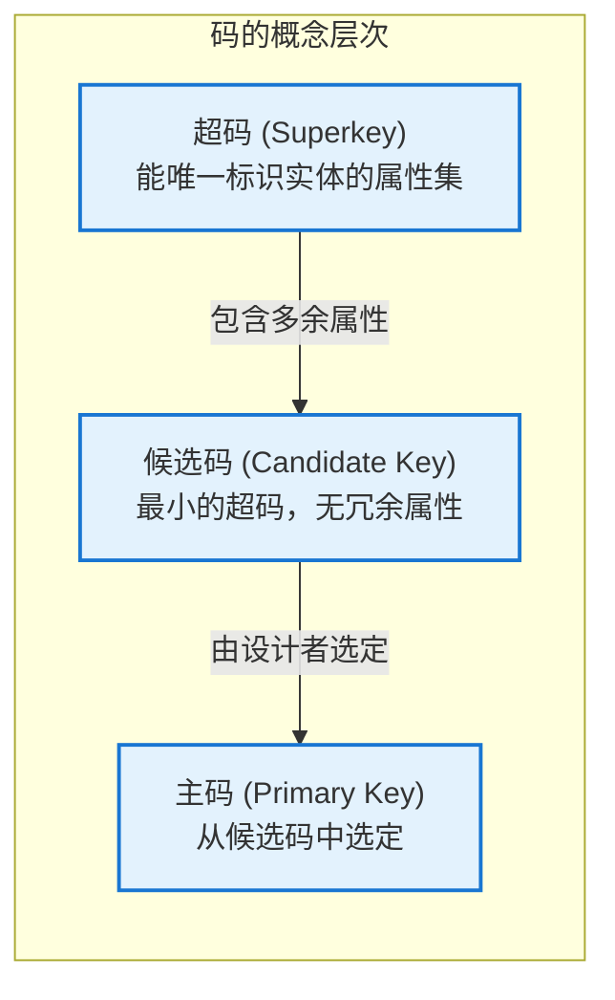

图中清晰展示了从超码到候选码再到主码的筛选过程：设计者从所有超码中识别出候选码（剔除冗余属性），再从候选码中选定一个作为主码。这一层层筛选的过程本质上是在寻找"最精炼的唯一标识方案"。

---

### 什么是联系（Relationship）

#### 联系的本质

联系是实体集之间存在的相互关联。客观世界中的事物并非孤立存在，它们彼此之间存在着千丝万缕的联系。学生需要选修课程，教师需要授课，部门需要管理员工——这些"需要"、"选修"、"管理"就是联系。联系描述的是**实体集之间的行为或语义关联**，而非某个实体的属性。

在 ER 图中，联系用一个**菱形**来表示，菱形内部标注联系的名字。联系集（Relationship Set）是相同类型联系的集合。类似于实体集和实体的区分，联系集是概念的集合，具体的每一次关联实例称为联系的实例。

联系可以分为多种类型：**二元联系**是两个实体集之间的联系，这是最常见的形式；**多元联系**是三个或更多实体集之间的联系，如学生、课程、教师三者之间的"授课"联系；**自联系（递归联系）** 是同一实体集内部的实体之间的联系，例如员工与管理者之间的上下级关系。

以教学管理系统为例，学生和课程之间的"选修"联系反映了学生与课程之间的语义关联；教师和课程之间的"授课"联系反映了教师与课程之间的语义关联。这两个联系描述的都是二元关系。班级、课程、教室、时间槽四个实体集之间的"排课"联系则是一个四元联系——任何一个实体集的变化都会影响排课的结果。

#### 联系与属性的归属

一个常见的困惑是：某些信息究竟应该作为实体的属性，还是作为联系的属性？这需要根据语义来判断。

**课程成绩**是一个典型的需要仔细辨别的例子。成绩可以属于学生吗？不完全是——因为同一门课程中不同学生的成绩是不同的。同样，成绩可以属于课程吗？也不可以——因为同一个学生在不同课程中的成绩是不同的。成绩的语义是：**在某个学生选修某门课程这一特定关联中产生的数值**。因此，成绩应该作为"选修"联系的属性，而非任何一方实体集的属性。

这个判断原则可以用一句话概括：**如果一个信息描述的是"实体A和实体B之间发生了什么事情"的结果或状态，那么它应该属于联系而非实体**。

---

### 实体、属性、联系的整合——学生选课系统

为了将上述概念整合起来，我们用一个完整的小型案例来说明三者如何协同工作。

假设我们要设计一个简化的"学生选课系统"，其需求如下：每个学生有学号、姓名和年级；每门课程有课程号、课程名和学分；每个学生可以选修多门课程，每门课程也可以被多个学生选修；在选修时需要记录成绩。

在这个案例中，**实体集**有两个：`学生`（Student）和 `课程`（Course）。学生实体的属性包括学号（主码）、姓名、年级；课程实体的属性包括课程号（主码）、课程名、学分。

**联系**是 `选修`（takes），它连接了"学生"和"课程"两个实体集。选修联系有一个属性：**成绩**。成绩不属于学生（因为一个学生有多门课的成绩），也不属于课程（因为一门课有多个学生的成绩），它属于"学生选修课程"这一事件本身。

完整的 ER 图如下：

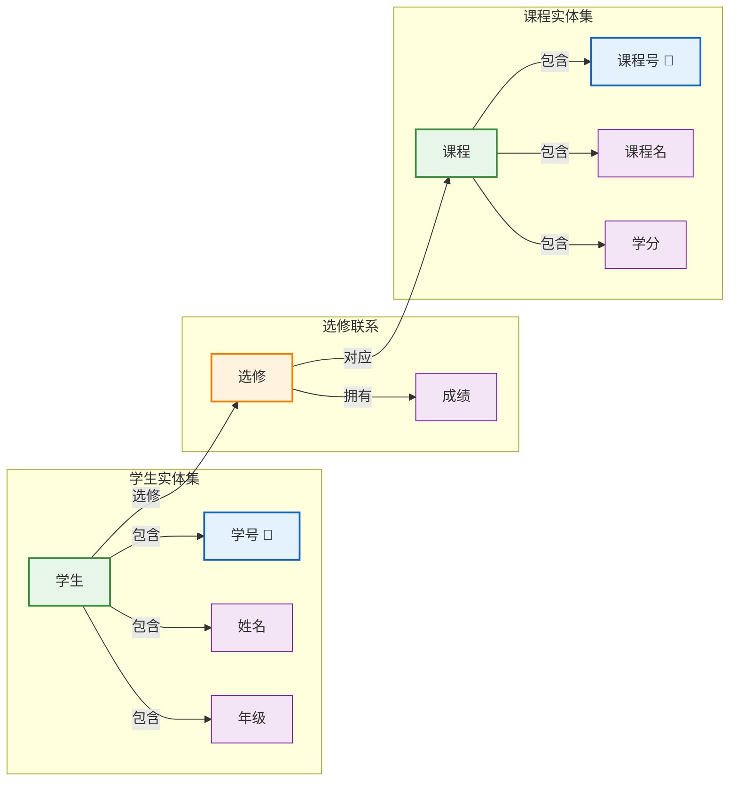

从图中可以清晰地看到：实体集用绿色矩形表示（符合语义化着色的原则），联系的属性用紫色表示——因为成绩不属于任何单一方实体，所以它正确地被放在了联系上。

---

### Android 层面的对应关系

将 ER 模型的概念映射到 Android 开发实践，有助于我们理解从概念设计到代码实现的完整链条。

在 Room 数据库中，上文所描述的 ER 模型元素都有直接的对应关系：

| ER 模型概念 | Room 实现 | 说明 |
|---|---|---|
| 实体集（Entity Set） | `@Entity` 注解的类 | 定义一张数据库表 |
| 实体（Entity） | 类的实例对象 | 表中的一条记录 |
| 属性（Attribute） | 类的成员变量 | 表中的列（Column） |
| 主码（Primary Key） | `@PrimaryKey` 注解 | 唯一标识一行记录 |
| 联系（Relationship） | `@Relation` 注解或关联查询 | 通过外码建立表间关联 |
| 外码（Foreign Key） | `@ForeignKey` 注解 | 在一个实体的表中引用另一个实体的主码 |

具体到学生选课系统的实现，我们需要三个 `@Entity` 类（学生、课程、选课记录），其中选课记录实体包含两个外码——分别引用学生表和课程表，同时包含成绩属性：

```kotlin
// 学生实体
@Entity(tableName = "students")
data class Student(
    @PrimaryKey
    val studentId: Long,        // 主码，唯一标识学生实体
    val name: String,          // 属性：学生姓名
    val grade: Int             // 属性：年级
)

// 课程实体
@Entity(tableName = "courses")
data class Course(
    @PrimaryKey
    val courseId: Long,        // 主码，唯一标识课程实体
    val courseName: String,     // 属性：课程名称
    val credits: Float         // 属性：学分
)

// 选课记录实体——联系的概念实现
@Entity(
    tableName = "enrollments",
    primaryKeys = ["studentId", "courseId"],  // 复合主码，由两个外码组成
    foreignKeys = [
        // 外码：选修联系中的"学生"参与方
        ForeignKey(
            entity = Student::class,
            parentColumns = ["studentId"],
            childColumns = ["studentId"],
            onDelete = ForeignKey.CASCADE   // 删除学生时 cascade 级联删除其选课记录
        ),
        // 外码：选修联系中的"课程"参与方
        ForeignKey(
            entity = Course::class,
            parentColumns = ["courseId"],
            childColumns = ["courseId"],
            onDelete = ForeignKey.CASCADE    // 删除课程时 cascade 级联删除其选课记录
        )
    ]
)
data class Enrollment(
    val studentId: Long,        // 外码，引用学生实体的主码
    val courseId: Long,         // 外码，引用课程实体的主码
    val grade: Float?           // 联系属性：成绩
)
```

这段代码完美地体现了 ER 模型中关于联系的编码方式：`Enrollment` 实体实质上是"选修"联系的代码化实现。其主码由两个外码组成——这在 ER 模型转换规则中有明确的依据：当 `M:N`（多对多）联系转换为关系模式时，联系的两个参与实体的主码以及联系自身的属性共同构成新关系的主码。

---

### 概念层面的哲学思考

从更宏观的视角审视，实体、属性、联系这三个概念实际上构成了人类认知世界的最基本框架。正如古希腊哲学家亚里士多德提出的"实体-属性-状态"本体论框架，ER 模型以计算机科学家特有的精确方式重新诠释了这一古老的思想。

实体是"是什么"（Being）的追问——我们要管理的是哪些对象？属性是"是什么样"（Quality）的刻画——这些对象具有哪些可描述的特征？联系是"如何关联"（Relation）的探索——这些对象之间存在怎样的相互作用？这三个问题构成了数据库概念设计的起点，也是一切信息系统设计的起点。

理解 ER 模型不仅是学习一种绘图技术，更是训练一种**抽象思维能力**——将纷繁复杂的现实世界提炼为结构化的信息模型的能力。这种能力在软件工程的各个领域都有广泛的应用价值：RESTful API 设计中的资源建模、微服务架构中的领域驱动设计（DDD）、甚至日常的问题分析和流程梳理，都可以看到 ER 模型思维的影子。

---

#### 📝 练习题

在 ER 模型中，以下关于属性的描述哪一项是正确的？

A. 派生属性在 ER 图中用实线椭圆表示，其值直接存储在数据库中

B. 多值属性在 ER 图中用单椭圆形表示，一个实体只能有一个多值属性

C. 复合属性可以分解为多个简单属性，其分解后的每个子属性可以单独参与运算和查询

D. 主码属性在 ER 图中不需要特别标注，因为主码本身就是属性的子集

**【答案】** C

**【解析】** 本题考查 ER 模型中属性的分类及其表示方法。选项 A 的错误在于，派生属性在 ER 图中应当用**虚线椭圆**表示（而非实线），其值**不直接存储**在数据库中，而是通过其他属性计算得出，例如年龄由出生日期和当前日期计算而来。选项 B 的错误在于，多值属性在 ER 图中应使用**双椭圆形**表示（而非单椭圆形），且一个实体集中可以定义多个多值属性，例如学生实体可以有多个电话和多个邮箱，两个都是多值属性。选项 C 是正确的：复合属性确实可以分解为多个简单子属性，这些子属性具有独立的语义，可以单独参与查询、排序和运算，例如将地址拆分为省、市、区后，可以按"城市"进行分组统计。选项 D 的错误在于，主码属性在 ER 图中需要用**下划线**特别标注，这是 ER 图的基本表示规范中极为重要的一条，因为主码是实体集唯一标识的关键，在后续转换为关系模型时也是建立表间关联的基础。

---

## ER图的画法

### ER图的基本元素与图形表示

ER图（Entity-Relationship Diagram，实体-联系图）是概念数据建模阶段的核心工具，它以直观的图形化方式描述现实世界中数据之间的结构关系。Peter Chen于1976年首次提出ER模型时，便为数据库设计领域奠定了一块重要基石——它让数据库设计者能够以一种接近人类自然思维的方式审视数据，而不是一开始就陷入表结构、字段类型等技术细节之中。ER图的核心价值在于其承上启下的桥梁作用：向上，它与业务需求紧密对应；向下，它可以机械地转换为关系型数据库的表结构。正是这种双向映射能力，使得ER图成为数据库设计生命周期中不可或缺的一环。

在ER图的构成要素中，一共有三大核心元素：实体（Entity）、属性（Attribute）和联系（Relationship）。这三大元素在ER图中各有其标准的图形表示方法，了解每种元素的视觉约定是掌握ER图画法的第一步。

**实体**在ER图中用矩形来表示。矩形内部书写实体集的名字，这个名字通常采用名词形式，且首字母大写。实体集代表的是一组具有相同性质的现实世界对象的集合。例如，在高校信息管理系统中，"学生"（Student）、"课程"（Course）、"教师"（Instructor）都可以作为实体集出现。每一个具体的实体实例——比如某个具体的学生张三——则是该实体集中的一个成员。在ER图的绘制中，我们通常关注的是实体集层面而非单个实体实例层面，这是因为ER图的设计目的是描述数据的整体结构模式，而非记录具体的数据值。

**属性**在ER图中用椭圆（或者在某些绘图工具中用圆角矩形）来表示，并通过无向边与所属的实体集相连。属性代表的是实体集所具有的某种特征或性质。继续以学生为例，一个学生实体可能具有学号、姓名、性别、出生日期等属性。在ER图的规范表示中，属性的名称写在椭圆内部。值得注意的是，并非所有属性都同等重要——有一种特殊的属性类型叫做**主属性**（Prime Attribute），它是构成主键的属性。在ER图的绘制实践中，主属性通常以下划线标注在属性名称下方，以此来标识该属性在实体集中的关键地位。

**联系**用菱形来表示，菱形内部书写联系的名字，同样用无向边将菱形与参与该联系的实体集连接起来。联系描述的是实体集之间的一种语义关联。例如，"选课"（takes）这个联系将学生实体集和课程实体集关联在一起，表示学生与课程之间的选修关系。联系的名字通常采用动词或动宾短语的形式，以便清晰地表达关系的含义。

下面通过一个完整的ER图示例，展示上述三大元素的综合运用方式：

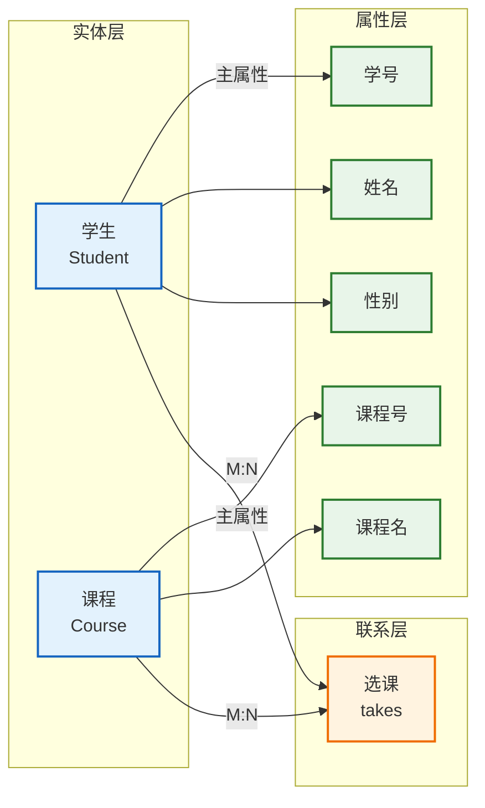

在这幅ER图中，我们可以看到学生（Student）和课程（Course）作为两个实体集各自拥有其属性，而"选课"（takes）作为联系将两者关联在一起。需要特别留意的是，联系与实体之间的连接线上标注了"M:N"，这表示学生和课程之间的选课关系是一种多对多关系——一个学生可以选修多门课程，一门课程也可以被多个学生选修。这种基数标注是ER图表达能力的重要组成部分。

### 实体集与属性绘制的规范

在实际的ER图绘制过程中，实体集和属性的组织方式并非随心所欲，而是需要遵循一系列规范和约定。这些规范不仅影响图形的美观程度，更直接关系到模型表达的准确性和后续转换的可操作性。

首先，关于实体集的命名，应当遵循以下原则：实体集名称应当使用清晰、无歧义的名词，首字母通常大写，其余字母小写（或按驼峰命名法处理）。名称应当反映业务含义，避免使用缩写或技术术语——除非该缩写在业务上下文中已是约定俗成的表达。例如，在医院信息系统中，"Patient"（患者）比"P"更加清晰可读；而在金融系统中，"ATM"虽然是缩写，但由于其在领域内的通用性，直接使用也完全可以接受。

其次，属性的组织需要关注**属性的类型划分**。根据属性的复杂程度和结构特征，可以将属性划分为以下几类，每类在ER图中的表示方式也有所不同：

**简单属性**（Simple Attribute）是最基础的属性类型，它是一个不可再分的原子值。例如学生的"性别"属性，只有"男"和"女"两个可能的原子值，再往下分就没有业务意义了。简单属性在ER图中用普通的椭圆表示。

**复合属性**（Composite Attribute）由多个简单属性组合而成，具有内部结构。例如，学生的"地址"属性可以拆分为"省份"、"城市"、"街道"和"邮编"等子属性。在ER图的绘制中，复合属性用一个椭圆表示，并通过虚线连接到其各个子属性（子属性也用椭圆表示）。复合属性的设计使得模型能够更精细地表达数据的层次结构，同时在某些场景下又可以将复合属性作为一个整体来使用，提供了灵活性。

**单值属性**（Single-valued Attribute）和**多值属性**（Multi-valued Attribute）的区分在于属性值的数量。单值属性在每个实体实例上最多只有一个值——例如每个学生只能有一个学号。多值属性则可能拥有多个值——例如一个学生可能拥有多个电话号码，或者一个课程可能有多个先修课程。在ER图的规范表示中，多值属性用双椭圆（即两个同心椭圆）来表示，以区别于普通的单值属性。

**派生属性**（Derived Attribute）是指其值可以从其他属性计算推导出来的属性。例如，学生的"年龄"可以从"出生日期"和当前日期计算得出，因此"年龄"是派生属性。在ER图中，派生属性用虚线椭圆表示，而不是实线椭圆。派生属性的标注十分重要，因为它提醒数据库设计者：这类属性不需要在数据库中实际存储，其值可以在需要时通过计算获得，从而避免数据冗余和潜在的不一致性问题。

下面的Mermaid图展示了上述几种属性类型的图形化表示方法及其语义对照：

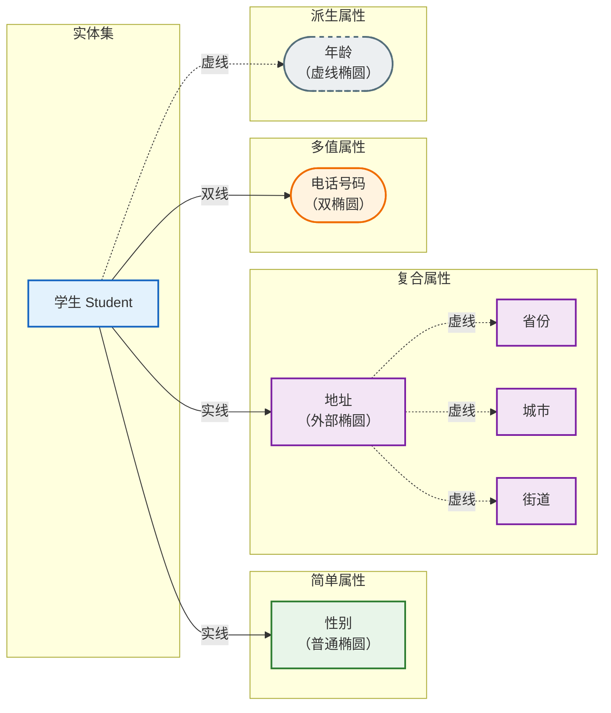

在绘制ER图时，属性的数量控制也是一个值得关注的问题。ER图的核心目标是表达数据的结构骨架，而非事无巨细地记录所有数据细节。因此，在设计ER图时应当遵循"适度属性"原则：只包含对业务分析和数据建模有意义的属性，避免将过度琐碎的细节纳入ER图中。当然，"适度"本身是一个需要根据具体业务场景来判断的概念——对于一个需要记录学生考试成绩的系统而言，"成绩"是一个必要的属性；但如果系统只需要统计学生的出勤率，则"成绩"就可能是不必要的属性。

### 联系绘制的规范与基数标注

联系是ER图中连接实体集的纽带，其绘制规范比实体和属性更为复杂，因为联系不仅有自己的语义含义，还涉及参与约束（participation constraint）和基数比（cardinality ratio）两个维度的约束。这两个约束共同决定了实体之间的数量对应关系，是ER图向关系模式转换的关键依据。

基数比（Cardinality Ratio）描述的是实体集之间对应关系的数量级。在ER模型中，常见的基数比有三种：一对一（1:1）、一对多（1:N）和多对多（M:N）。在ER图中，基数比通常标注在联系的旁边，明确指出参与该联系的各个实体集之间存在怎样的数量对应关系。

以一对一联系为例。假设在某个公司数据库中，我们需要记录"员工"和"办公桌"之间的分配关系——每张办公桌最多分配给一名员工，每名员工最多使用一张办公桌。这种"员工-办公桌"的分配关系就是一种一对一（1:1）联系。在ER图中，1:1联系用标注了"1:1"的连接线来表示，连接线的两端都标注为"1"。

一对多联系是更为常见的一种联系类型。例如，在"系-学生"关系中，一个系可以包含多名学生，但每个学生只能属于一个系。这种关系在ER图中被标注为"1:N"，其中"1"端表示"系"实体集，"N"端表示"学生"实体集。理解一对多联系的关键在于把握其方向性：从"一"端看向"多"端，一个实体可以对应多个实体；从"多"端看向"一"端，每个实体最多只对应一个实体。

多对多联系是三种基数比中最为复杂的一种。在"学生-课程"的选课关系中，一个学生可以选修多门课程，一门课程也可以被多个学生选修，这就是典型的多对多（M:N）联系。值得注意的是，多对多联系在概念模型中可以直观地表达，但在向关系模型转换时，不能直接用一张表来表达这种联系——必须引入一张额外的关联表（也称为交集表或桥接表），将多对多联系拆解为两个一对多联系。这一转换规则将在"ER图转关系模式"一节中详细展开。

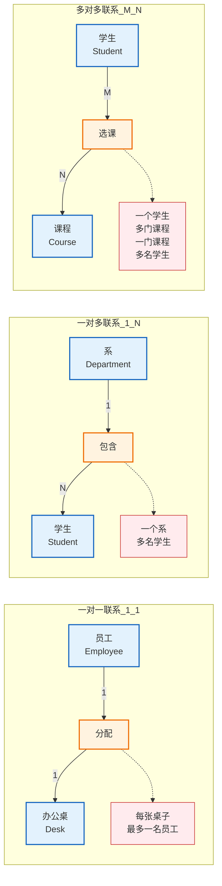

除了基数比之外，参与约束（Participation Constraint）也是联系绘制中不可或缺的要素。参与约束描述的是一个实体集中的实体是否必须参与某个联系，它分为**完全参与**（Total Participation，也称为存在依赖）和**部分参与**（Partial Participation，也称为可选参与）两种情况。

完全参与意味着实体集中的每一个实体都必须参与该联系，不存在任何例外。例如，如果规定每个学生必须至少选修一门课程，那么学生实体集对于"选课"联系就是完全参与的。在ER图的表示中，完全参与用双线（两条平行线）来表示连接，这意味着该实体在联系中是"不可或缺"的。部分参与则意味着实体集中的实体可以选择是否参与该联系，存在不参与的实体是合法的。例如，如果允许学生不选课（休学或退学等情况），那么学生实体集对于"选课"联系就是部分参与的。部分参与用单线来表示连接。

参与约束的标注对于后续的数据完整性设计至关重要。完全参与约束在数据库中通常会实现为外键约束上的NOT NULL限制（表示该联系对应的外键列不能为空），而部分参与则对应允许NULL的外键列。因此，在绘制ER图时准确标注参与约束，能够直接指导后续的数据库建表语句编写。

联系也可以拥有自己的属性。例如，在"学生-课程"的选课联系中，除了两个实体集各自的属性外，联系本身也可能拥有属性——"成绩"（Grade）就是"选课"联系的一个典型属性。因为成绩不是学生固有属性（不同的课程对应不同的成绩），也不是课程固有属性（不同的学生选修同一门课程会有不同的成绩），它只在这个联系发生时才有意义。因此，"成绩"属性应当附加在"选课"联系上，而非学生或课程实体集上。在ER图中，联系的属性用椭圆表示，并通过虚线连接到联系的菱形上。

### ER图的绘制步骤与最佳实践

掌握了ER图的基本元素和表示规范之后，接下来的问题是：面对一个真实的业务场景，我们应当如何系统地绘制ER图？这里介绍一种经过实践检验的绘制方法论，它将整个ER图绘制过程分解为若干有序的步骤，每一步都聚焦于特定层次的建模任务。

**第一步：需求分析与实体识别**。在动手绘制ER图之前，充分理解业务需求是绝对必要的前置工作。这通常包括与业务人员进行访谈、查阅现有的业务文档、分析现有的数据报表和表单等。需求分析的产出物通常是一份功能需求列表和数据需求清单。在此基础上，建模者需要识别出系统中的核心实体集。实体识别的经验法则是：寻找业务描述中的名词——那些被反复提及、具有独立存在意义的业务概念往往是候选实体。例如，在图书管理系统中，通过阅读需求文档，我们可能识别出"图书"、"读者"、"作者"、"出版社"等候选实体。

**第二步：属性提取与键属性确定**。在确定了实体集之后，下一步是为每个实体集识别其属性。同时，还需要确定每个实体集的**主键**（Primary Key）。主键是能够唯一标识实体集中每个实体实例的属性或属性组合。理想情况下，主键应当是单一属性（如学生的学号），但有些情况下可能需要多个属性组合才能唯一标识实体（这称为复合键或复合主键）。主键属性在ER图中应当用下划线明确标注。例如，对于"学生"实体集，"学号"是自然的主键选择；对于"课程"实体集，"课程号"是主键。主键的选择需要考虑以下因素：唯一性（主键值在整个实体集中不能重复）、不可变性（主键值在实体生命周期内不应改变）和简洁性（优先选择单属性主键而非复合主键）。

**第三步：联系识别与基数确定**。在识别出实体集和属性之后，需要寻找实体集之间的语义关联。联系的识别通常依赖于对业务动词的分析——那些描述实体之间动作或关系的动词往往是联系的候选。例如，"借阅"是"读者"和"图书"之间的联系；"编写"是"作者"和"图书"之间的联系。对于每个识别出的联系，需要明确其基数比（1:1、1:N还是M:N）以及参与约束（完全参与还是部分参与）。这一步是ER图绘制的核心难点，因为业务语义往往隐藏在自然语言的细微差别中，需要建模者具备深入的业务理解能力。

**第四步：属性细化与规范化**。在基本结构确定之后，需要对属性进行进一步的处理。这包括识别并标注派生属性（避免在数据库中存储冗余数据）、处理多值属性（考虑是否需要为其建立独立的实体集）、以及检查是否存在属性归类不当的问题（某个属性本应属于其他实体集但被错误地放在了当前实体集中）。例如，假设最初将"院系名称"作为"学生"实体集的属性，但仔细分析后发现一个院系可以有多名学生，此时"院系名称"应当提升为独立的"院系"实体集，"学生"与"院系"之间通过"属于"联系来关联。这种提升处理是ER图精化的重要环节。

**第五步：视图整合与迭代优化**。在完成单个实体集和联系的绘制后，需要将所有元素整合到一幅完整的ER图中，并检查整体的一致性和完整性。这个阶段需要关注的问题包括：是否存在孤立实体（不参与任何联系的实体，这可能是建模疏漏的信号）、是否存在重名实体或重复联系、联系的基数标注是否与业务规则一致、以及ER图的布局是否清晰可读。ER图的绘制很少能够一蹴而就，迭代优化是不可避免的过程。

在实际的ER图绘制工具选择上，有多种工具可供使用。从专业级建模工具如PowerDesigner、ER/Studio、Oracle SQL Developer Data Modeler，到轻量级的draw.io、Visio、ProcessOn等在线绘图工具，再到代码驱动的建模工具如dbdiagram.io和PlantUML，都可以帮助设计者生成符合规范的ER图。不同的工具在协作便利性、导出能力和学习曲线方面各有优劣，但它们所基于的ER图表示规范是基本一致的。


### ER图布局的美学原则与可读性优化

一幅高质量的ER图不仅需要准确表达数据模型，还需要具备良好的可读性和视觉美感。ER图的布局虽然不像数学公式那样有严格的唯一正确答案，但在长期实践中，数据库领域形成了一些被广泛接受的布局美学原则。

**实体集的分组与空间组织**是首要考虑因素。在一幅包含多个实体集的ER图中，应当根据实体集之间的语义关联程度进行空间分组。关联紧密的实体集应当放置在相近的位置，关联较弱或跨多个业务领域的实体集则应当保持适当的距离。例如，在高校信息管理系统的ER图中，"学生"、"课程"、"成绩"和"选课"等与教学直接相关的实体集可以组成一个视觉分组；"教师"、"院系"和"教室"等实体集可以组成另一个分组；"宿舍"和"班级"等实体集又可以组成第三个分组。这种分组策略使得ER图的结构一目了然，读者能够快速定位自己关注的局部模型。

**避免连线交叉**是ER图布局的基本要求。连线交叉过多会让图形显得混乱，严重影响可读性。在手动绘制或使用不支持自动布局的工具时，这需要建模者仔细规划每个实体集的位置。当连线交叉不可避免时，可以适当调整实体集的位置，或者将部分实体集暂时移出主图而在单独的区域绘制。在现代ER建模工具中，大多数都提供了自动布局功能，可以自动调整节点位置以最小化连线交叉。

**标签的摆放**同样值得注意。基数标注（1、N、M）和参与约束标注（单线、双线）应当紧靠连接线放置，避免标注与连线脱离导致的歧义。联系的名称应当居中或偏上放置在菱形内部或紧邻菱形的位置。属性的名称应当清晰地与对应的实体集或联系关联，不要与其他元素的标注产生视觉混淆。

**颜色与样式的运用**可以增强ER图的信息传达能力。虽然ER图的标准表示法并不要求使用颜色（很多学术场合的ER图甚至是纯黑白的），但在商业实践中，适度使用颜色可以有效提升图形的可读性。一个实用的配色策略是：用统一的颜色来表示属于同一业务领域的实体集，用不同的颜色来区分不同类型的元素（如实体、属性、联系）。但需要强调的是，颜色使用应当克制且一致——过度使用颜色反而会造成视觉干扰。

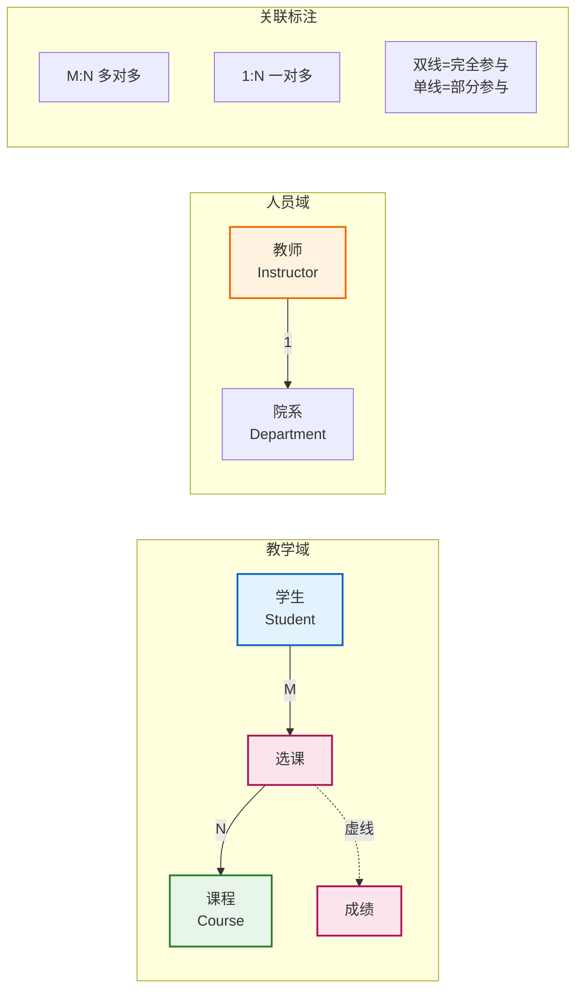

### 完整ER图绘制实例

为了将前述的所有绘制规范和最佳实践整合起来，我们以一个完整的"高校教务管理系统"为例，完整展示ER图的绘制过程和最终结果。

假设该系统的核心业务需求包括：管理学生的基本信息和学籍状态；管理课程的基本信息和学分；记录教师的基本信息和所属院系；记录学生选修课程的情况以及取得的成绩；记录教师授课的情况。在完成需求分析后，我们识别出以下实体集：学生（Student）、课程（Course）、教师（Instructor）、院系（Department）。其中，院系作为独立实体集的原因在于：一个院系拥有多名教师，一个学生也归属某个院系，而且院系本身具有独立的属性（如院系名称、院系主任等），不适合仅作为教师或学生的属性来建模。

实体集的属性设计如下。学生实体集的属性包括：学号（StudentID，作为主键）、姓名（StudentName）、性别（Gender）、出生日期（BirthDate）、入学年份（EnrollmentYear）。其中，学号是主属性，需要在ER图中用下划线标注。课程实体集的属性包括：课程号（CourseID，作为主键）、课程名（CourseName）、学分（Credits）。教师实体集的属性包括：教师号（InstructorID，作为主键）、姓名（InstructorName）、职称（Title）。院系实体集的属性包括：院系号（DepartmentID，作为主键）、院系名称（DepartmentName）。

联系的设计如下。"选课"（Enroll）联系将学生和课程关联起来，其基数比为M:N（多对多），参与约束方面学生为完全参与（每个已注册学生都应有选课记录）而课程为部分参与（可能存在无人选修的课程）。"选课"联系自身拥有"成绩"（Grade）属性。"授课"（Teach）联系将教师和课程关联起来，其基数比为1:N（一名教师可以授课多门课程，一门课程由一名教师主讲），参与约束均为部分参与。"隶属"（BelongsTo）联系将教师和院系关联起来，其基数比为N:1（多名教师隶属同一院系，每名教师只属于一个院系），参与约束方面教师为完全参与（每位教师必须属于某个院系）而院系为部分参与（可能存在没有教师的院系）。此外，还可以考虑添加学生与院系之间的"归属"联系，但具体是否需要取决于业务需求是否要求直接查询某院系的学生名单——如果通过教师表间接查询就足够满足需求，这条联系也可以省略。

下面的Mermaid图展示了上述设计的完整ER图：

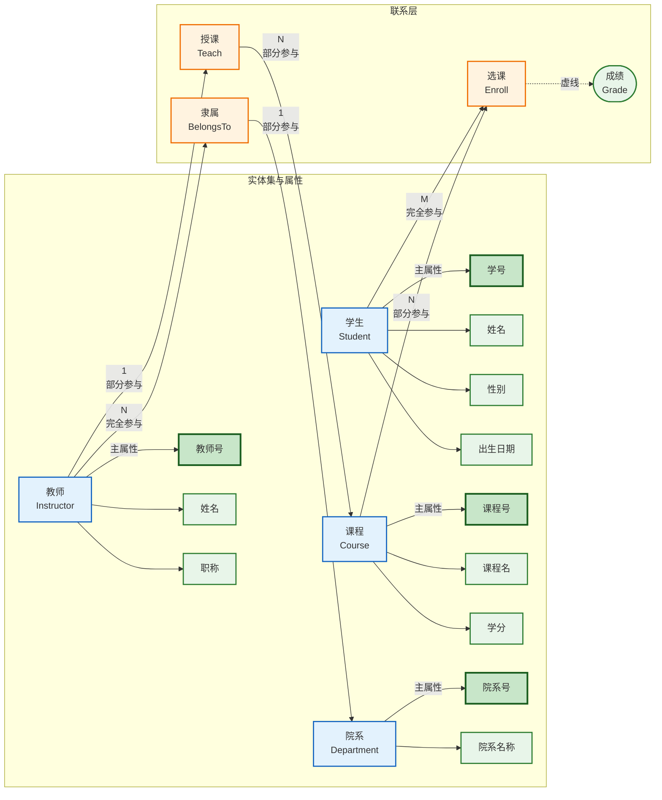

在这幅ER图中，有几个值得特别说明的绘制细节。首先，主键属性（学号、课程号、教师号、院系号）都通过加粗的边框和填充色进行了视觉突出，使其在图中一目了然。其次，"选课"联系上的"成绩"属性通过虚线连接到联系菱形，表示这是一个联系属性而非实体属性。在联系基数标注方面，"M:N"标注在学生到选课的联系上，"1:N"和"N:1"分别标注在授课和隶属联系上。最后，完全参与约束用"完全参与"文字标注和双线连接来双重标识，确保不产生歧义。

在实际项目中，ER图的规模往往远大于上述示例，可能涉及数十个实体集和更多的联系。在这种情况下，单幅ER图可能会变得过于复杂而难以阅读。业界常见的做法是采用**分层ER图**策略：将系统分解为多个子系统，每个子系统绘制一幅局部的ER图，然后再绘制一幅全局的ER图来展示子系统之间的主要联系。这种分而治之的策略有效地控制了每幅图的复杂度，同时保持了整体模型的完整性。

### 绘制工具的代码化实践

随着软件工程实践的发展，越来越多的团队开始采用代码化的方式来描述ER图，这种方式的优势在于：版本控制友好（ER图可以像代码一样纳入Git进行管理）、易于自动化（可以通过脚本自动生成或验证ER图）、以及团队协作便捷（多人可以像合并代码一样合并ER图描述）。以PlantUML和dbdiagram.io为代表的工具提供了简洁的DSL（领域特定语言）来描述ER图。

下面展示如何使用PlantUML语法来描述前述高校教务管理系统的ER图：

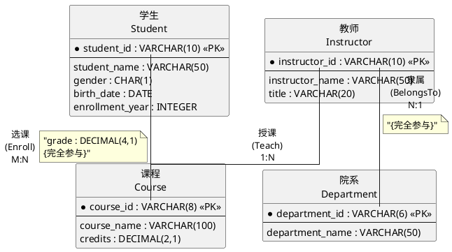

上述PlantUML代码中，每个实体集用`entity`关键字定义，实体集内部的属性用`--`分隔线上下排列，主键属性前标注`*`或`<<PK>>`。联系用`--`连接线表示，基数比和联系名称以注释形式标注在连接线旁边。这种代码化的表示方式虽然不如图形化界面直观，但其在工程实践中的便利性使其日益成为主流的ER图维护方式。

dbdiagram.io则采用了另一种更加简洁的DSL风格，使用类似SQL的语法来描述表结构，隐式地表达了ER图的语义：

```sql
-- 高校教务管理系统 ER图
-- 使用 dbdiagram.io DSL

-- 学生表：实体集 Student
Table student {
  student_id varchar(10) [pk]          -- 学号，主键
  student_name varchar(50)             -- 姓名
  gender char(1)                       -- 性别
  birth_date date                      -- 出生日期
  enrollment_year int                  -- 入学年份
}

-- 课程表：实体集 Course
Table course {
  course_id varchar(8) [pk]            -- 课程号，主键
  course_name varchar(100)             -- 课程名
  credits decimal(2,1)                 -- 学分
}

-- 教师表：实体集 Instructor
Table instructor {
  instructor_id varchar(10) [pk]      -- 教师号，主键
  instructor_name varchar(50)          -- 姓名
  title varchar(20)                    -- 职称
  department_id varchar(6) [ref: < department.department_id] -- 隶属院系
}

-- 院系表：实体集 Department
Table department {
  department_id varchar(6) [pk]       -- 院系号，主键
  department_name varchar(50)          -- 院系名称
}

-- 选课表：联系 Enroll + 成绩属性
-- 注意：M:N 联系拆解为独立关联表
Table enroll {
  student_id varchar(10) [ref: > student.student_id]
  course_id varchar(8) [ref: > course.course_id]
  grade decimal(4,1)                   -- 成绩，选课联系自身的属性
  [ref: < student.student_id, > course.course_id]
}

-- 授课表：联系 Teach（1:N）
Table teaches {
  instructor_id varchar(10) [ref: > instructor.instructor_id]
  course_id varchar(8) [ref: > course.course_id]
}
```

这段代码实际上是ER图向关系模式转换后的结果，它展示了如何通过代码来表达数据模型。在dbdiagram.io的界面中，这段代码会实时渲染为一幅带有外键关系的ER图。从这段代码中我们可以提前观察到ER图到关系模式转换的一个重要特征：多对多联系（如"选课"）被拆解为一张独立的关联表（enroll表），该表包含了两个外键分别引用学生表和课程表，同时将"成绩"这个联系属性作为enroll表自身的列。这种转换规则将在"ER图转关系模式"一节中得到系统性的阐述。

#### 📝 练习题

在ER图的绘制规范中，以下关于属性类型及其图形表示的说法，哪一项是完全正确的？

A. 派生属性的值存储在数据库中，其图形表示使用实线椭圆。
B. 多值属性在每个实体实例上只能有一个值，用单椭圆表示。
C. 复合属性由多个简单属性组成，其图形表示是在父属性和子属性之间使用虚线连接。
D. 主属性（构成主键的属性）在ER图中使用下划线标注在属性名称下方，且必须用实线椭圆表示。

**【答案】** C

**【解析】** 本题考查ER图中属性类型的图形表示规范，需要逐一分析各选项的正确性。

选项A错误。派生属性（Derived Attribute）的值是从其他属性计算推导出来的，其典型例子是"年龄"从"出生日期"推导。在ER图的规范表示中，派生属性**不应当**在数据库中存储其值，而应该在需要时通过计算实时获得。因此，派生属性在ER图中使用**虚线椭圆**表示，而非实线椭圆。实线椭圆表示的是普通存储属性（简单单值属性）。

选项B错误。多值属性（Multi-valued Attribute）是指一个实体实例可能拥有多个值的属性，例如一个人的多个电话号码。在ER图中，多值属性使用**双椭圆**（两个同心椭圆）来表示，以区别于只有一层椭圆的普通单值属性。"每个实体实例只能有一个值"恰恰是单值属性的定义，两者描述完全相反。

选项C正确。复合属性（Composite Attribute）是由多个简单子属性组合而成的属性，其典型代表是"地址"可以拆分为"省份""城市""街道"等子属性。在ER图中，复合属性用一个椭圆表示，各子属性也用椭圆表示，并通过**虚线**（dashed line）将父属性与子属性连接。这一表示法明确表达了复合属性的层次结构关系，即整体与部分之间的构成关系。

选项D前半部分正确（主属性确实需要下划线标注），但后半部分有误。主属性的图形表示本身是椭圆（可以是简单属性椭圆），关键在于**下划线标注**这一标识手段，而非"必须用实线椭圆"这一限制。实际上，在某些ER图变体表示法中，主属性还可能通过加粗边框、双边框等额外视觉手段来强调，但并没有规定其必须使用实线椭圆这一绝对条件。更重要的是，该选项将"下划线标注"与"实线椭圆"强制捆绑，忽略了不同ER图表示法变体之间的差异，因此不完全正确。

综上，正确答案为C。

---

## 联系的类型（1:1、1:N、M:N）

### 联系的基本概念回顾

在 ER 模型中，**联系（Relationship）** 是描述两个或多个实体集之间关联的语义结构。联系的度数（Degree）指参与一个联系中的实体集数量，常见的度数有二元联系（两个实体集之间）、三元联系（三个实体集之间）等。在大多数业务场景下，我们主要讨论二元联系，而二元联系根据参与约束的不同，可以分为三种基本类型：一对一（One-to-One, 1:1）、一对多（One-to-Many, 1:N 或 N:1）、多对多（Many-to-Many, M:N）。

理解这三种联系类型是数据库概念设计的核心能力之一，因为它们直接决定了如何将 ER 图转换为关系模型中的表结构。不正确地识别联系类型会导致数据冗余、插入异常、删除异常或更新异常等问题。

### 一对一联系（1:1）

#### 定义与语义

**一对一联系** 指的是，对于实体集 A 中的每一个实体，在实体集 B 中至多有一个实体与之对应，反之亦然。这种联系表示两个实体集之间存在一一对应的映射关系。在现实世界中，纯粹的 1:1 联系并不十分常见，但当其出现时，通常意味着两个实体之间的关系非常紧密，以至于可以考虑将它们合并为同一个实体集。

举例来说，考虑"学生"实体集和"学生证"实体集之间的关系。一个学生只能拥有一个学生证（或者说一个学生证只能发给一个学生），因此学生与学生证之间是一对一关系。再比如，在某些组织中，"员工"和"办公室"之间可能是一对一关系——每个员工分配一间独立的办公室，每间办公室也只分配给一个员工使用（假设不考虑公共会议室等场景）。

从数学的角度来看，1:1 联系定义了一种**双射（Bijection）**的关系：既是单射（每个 A 最多对应一个 B）又是满射（每个 B 都至少有一个 A 对应）。但在实际数据库设计中，我们通常只关注最大基数约束，而不必严格保证满射——即允许某些员工尚未分配办公室的情况存在。

#### ER 图表示

在 ER 图中，1:1 联系通常用一条连接两个实体集的菱形连线表示，两端各标注 "1" 以表示参与约束。下方展示了一个典型的 1:1 联系 ER 图示例：

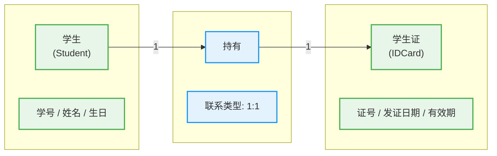

该图表示：一个学生持有（held by）一张学生证，且一张学生证只属于一个学生。需要注意的是，ER 图中联系的命名应当使用动词或动宾短语（如"持有"、"属于"、"分配"），以清晰地表达语义。

#### 一对一联系到关系模式的转换

将 1:1 联系转换为关系模式时，存在三种主要的实现策略：

**策略一：合并策略。** 如果两个实体集之间的 1:1 联系非常紧密，且它们的属性不多，可以直接将两个实体集合并为一个关系模式。例如，可以将 Student 和 IDCard 合并为一个包含双方所有属性的关系模式 StudentWithIDCard。这种方式消除了联系表的存在，减少了连接操作，但可能导致数据冗余（如果某些学生没有学生证，则相关字段需要为空）。

**策略二：外键策略 A。** 在其中一个实体集对应的关系模式中，添加另一个实体集的主键作为外键，同时将联系的属性也一并纳入。以"学生"实体为例，可以创建如下关系模式：

```sql
-- 策略二-A：外键放在 Student 表中
Student(学号 PK, 姓名, 生日, 证号 FK, 发证日期, 有效期)
```

上述方案将学生证的信息（证号、发证日期、有效期）直接嵌入到 Student 表中。如果某个学生尚未办理学生证，则证号及学生证相关字段为空。

**策略三：外键策略 B。** 与策略二相反，将 Student 的主键添加到 IDCard 表中作为外键：

```sql
-- 策略二-B：外键放在 IDCard 表中
IDCard(证号 PK, 发证日期, 有效期, 学号 FK UNIQUE)
```

注意，这里学号字段必须设置为 UNIQUE（唯一约束），以确保一对一关系——每张学生证最多对应一个学生，同时通过外键约束保证参照完整性。

**策略选择的原则：** 在实际设计中，选择哪种策略通常基于以下考量——优先将外键放在那些"整体参与"（Total Participation）的实体集一侧；或者将外键放在使用频率较高的实体集一侧，以减少连接操作的次数。如果难以抉择，可以任意选择一方放置外键，这在逻辑上是等价的。

### 一对多联系（1:N）

#### 定义与语义

**一对多联系**（或等价地称为"多对一联系"，视观察角度而定）是数据库中最常见的一种联系类型。它指的是，对于实体集 A 中的每一个实体，实体集 B 中可以有零个、一个或多个实体与之对应；但对于实体集 B 中的每一个实体，实体集 A 中至多只有一个实体与之对应。

仍然以学校为例：考虑"班级"实体集和"学生"实体集之间的关系。一个班级可以包含多个学生（零个、一个或多个），但每一个学生只能属于一个班级。因此，从班级到学生的方向是"一对多"，从学生到班级的方向则是"多对一"。这两种表述在数学上完全等价，区别仅在于观察视角。

再举其他领域的例子：一家公司中，一个"部门"可以雇用多名"员工"，但每个"员工"只属于一个"部门"。一本"图书"可以被多个"读者"借阅，但一本"图书"的每一次"借阅记录"只对应一本书——这里"读者"和"借阅记录"之间也是一对多关系。

从约束的角度看，1:N 联系中的"一"侧（称为**父亲实体**或**父实体**）对"多"侧（称为**儿子实体**或**子实体**）拥有**参照权威性**。这意味着多侧的每一个实体必须参照且只能参照"一"侧的一个实体。

#### ER 图表示

在 ER 图中，1:N 联系的两端分别标注 "1" 和 "N"（或 "M" 当与 M:N 混淆时使用）。下方展示了一个一对多联系的完整 ER 图示例：

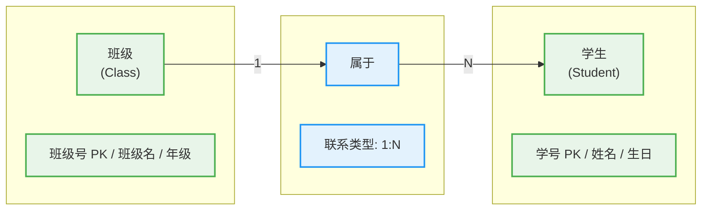

该图表示：每个班级"属于"多个学生，但每个学生只"属于"一个班级。需要特别注意的是，联系的"一"侧和"多"侧标注并非固定不变——如果我们把"学生"放在左边、"班级"放在右边，同一个联系就会被描述为 N:1 联系（从学生指向班级）。ER 图本身没有方向性，"1"和"N"的标注只是描述了最大基数约束，两种画法在语义上完全等价。

#### 一对多联系到关系模式的转换

1:N 联系转换为关系模式的规则相对简单和直接，核心思想是**将外键放在"多"侧**：

```sql
-- 班级表（"一"侧）
Class(
    班级号 CHAR(10) PRIMARY KEY,   -- 班级的主键
    班级名 VARCHAR(50) NOT NULL,
    年级 VARCHAR(20)
)

-- 学生表（"多"侧，包含外键）
Student(
    学号 CHAR(12) PRIMARY KEY,     -- 学生的主键
    姓名 VARCHAR(50) NOT NULL,
    生日 DATE,
    班级号 CHAR(10) NOT NULL,     -- 外键，参照 Class 表的班级号
    CONSTRAINT fk_student_class FOREIGN KEY (班级号) REFERENCES Class(班级号)
)
```

在这个设计中，Student 表的"班级号"字段不仅是一个普通的外键列，它还扮演了一个重要的角色——它实际上是"属于"这个联系的属性的栖身之所。联系的属性（如学生加入班级的日期）可以直接放置在"多"侧的实体表中，而无需创建额外的关联表。这正是 1:N 联系在物理实现上的优势：不需要第三张表来表达关联。

如果一个班级可以有零个学生（即允许"空班"），那么 Student.班级号 字段应该允许 NULL 值。但从"一"侧来看——即班级表中，班级号本身当然不可能为空——一个班级不可能"没有班级号"（主键约束保证了非空）。这说明了一个重要的设计原则：**"一"侧的主键永不为空，"多"侧的参照外键允许为空**（除非存在总参与约束）。

### 多对多联系（M:N）

#### 定义与语义

**多对多联系**（也称为多值联系）是指，对于实体集 A 中的每一个实体，实体集 B 中可以有零个、一个或多个实体与之对应；反之亦然。换言之，两个实体集之间是一种"多"对"多"的映射关系，每个实体的对应数量不受限制。

多对多联系在现实世界中比比不绝，其数量甚至超过 1:1 和 1:N 联系的总和。以下是几个典型的例子：

- **学生与课程**：一个学生可以选修多门课程，一门课程也可以被多个学生选修。这是经典的"学生-选课"场景，实体集 Student 和 Course 之间的联系"选修"是一个 M:N 联系。
- **医生与患者**：一个医生可以为多个患者诊治，一个患者也可以找多个医生就诊（在允许自由选择就医的医疗体系中）。
- **作者与书籍**：一个作者可以编写多本书，一本书也可以由多个作者合著（这引出了自关联 M:N 联系的变体——同实体集内的多值联系）。
- **标签与博客文章**：一篇博客文章可以被打上多个标签，一个标签也可以标记多篇文章。

多对多联系的本质特征是：**它无法被简单地分解到任何一个参与实体的属性中**。如果我们试图把"哪个学生选了哪门课"的信息塞进 Student 表，就会发现一个学生有多门课程时，学号需要重复多行；同样地，如果把这个信息塞进 Course 表，一门课程被多个学生选时，课程号也会重复多行。无论哪种方式，都会造成大量的数据冗余和更新困难。因此，M:N 联系需要用一种完全不同的方式来处理——创建一张独立的**关联表（Associative Entity / Junction Table）**。

#### ER 图表示

M:N 联系在 ER 图中的表示与 1:1 和 1:N 联系完全一致——同样是使用菱形连线，不同之处在于两端都标注"N"（或"M"）：

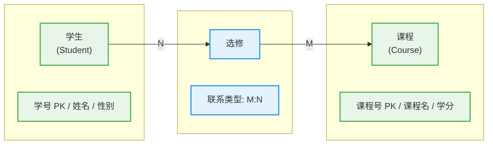

这个图表示学生和课程之间的"选修"联系是 M:N 的。在某些 ER 图表示法中（如 Chen 标注法），两个 N 可以分别用 "M" 和 "N" 来区分，强调这两个方向的基数不必相等。但在大多数情况下，统一标注为 "N" 或 "M:N" 均可。

#### 多对多联系到关系模式的转换

M:N 联系到关系模式的转换需要引入**一个额外的关联关系模式**（也称为桥接表或交叉表）。这个关联表至少需要包含两个属性：两个参与实体集的主键的拷贝。关联表的主键通常由这两个外键组合而成（复合主键），也可能使用一个代理键（Surrogate Key）。

以下是将"学生-选修-课程" M:N 联系转换为关系模式的完整代码示例：

```sql
-- 学生表（实体集 A）
Student(
    学号 CHAR(12) PRIMARY KEY,     -- 学生的主键
    姓名 VARCHAR(50) NOT NULL,
    性别 CHAR(1),
    出生日期 DATE
)

-- 课程表（实体集 B）
Course(
    课程号 CHAR(8) PRIMARY KEY,    -- 课程的主键
    课程名 VARCHAR(100) NOT NULL,
    学分 TINYINT
)

-- 选修表（关联表：M:N 联系的具体化）
Enrollment(
    学号 CHAR(12),                  -- 外键，参照 Student 表（NOT NULL）
    课程号 CHAR(8),                 -- 外键，参照 Course 表（NOT NULL）
    选修日期 DATE,                 -- 联系的属性：选课时间
    成绩 DECIMAL(5,2),             -- 联系的属性：最终成绩
    PRIMARY KEY (学号, 课程号)      -- 复合主键，唯一确定一条选课记录
)

-- 补充约束
ALTER TABLE Enrollment
    ADD CONSTRAINT fk_enroll_student
    FOREIGN KEY (学号) REFERENCES Student(学号);

ALTER TABLE Enrollment
    ADD CONSTRAINT fk_enroll_course
    FOREIGN KEY (课程号) REFERENCES Course(课程号);
```

关于关联表的设计，有几个值得深入讨论的要点：

**第一，复合主键 vs 代理键。** 在上面的设计中，我们使用了 `(学号, 课程号)` 作为复合主键。这意味着一个学生不能在同一门课程中被重复选修（这是合理且期望的约束）。然而，在某些场景下，复合主键可能不是最优选择——例如，如果课程表中课程号未来可能发生变化（尽管主键通常不应改变），或者如果系统需要支持同一学生选修同一课程多次（如重修）的情况。在这些情况下，可以引入一个额外的代理主键（如 `记录号 INT AUTO_INCREMENT PRIMARY KEY`），并将 `(学号, 课程号)` 改为两个独立的外键加一个 UNIQUE 约束。这种"代理键优先"的设计哲学在某些 ORM 框架（如 Hibernate）和许多工程实践中被广泛采用。

**第二，联系的属性归宿。** 在 M:N 联系中，联系本身可能携带属性。以"选修"为例，除了学生号和课程号这两个标识属性外，还可能存在"选修日期"（学生何时选修了这门课）、"成绩"（最终考核得分）、"是否补考"等属性。这些属性**不能**放在 Student 表中（因为一个学生对应多门课程），也不能放在 Course 表中（因为一门课程对应多个学生），必须放在关联表 Enrollment 中。这是由 M:N 联系的数学本质决定的——每个属性的取值范围必须与联系中每一条具体的参与记录一一对应。

**第三，性能考量。** 在实际数据库系统中，M:N 联系通过关联表实现意味着每次查询跨越 M:N 联系的数据都需要至少一次 JOIN 操作。例如，查询"选了数据库课程的所有学生的姓名"需要执行：

```sql
-- M:N 联系查询示例：连接学生表和课程表，通过选修表关联
SELECT S.姓名
FROM Student S
    JOIN Enrollment E ON S.学号 = E.学号
    JOIN Course C ON E.课程号 = C.课程号
WHERE C.课程名 = '数据库系统概论';
```

这个查询涉及两次连接操作，在数据量巨大时可能成为性能瓶颈。因此，在对性能要求极高的场景下（如数据仓库的 OLAP 查询），可能会考虑对 M:N 联系进行**反规范化（Denormalization）**——例如，在 Student 表中添加一个存储所有选修课程号的列表字段（如 JSON 数组）。但这种设计会牺牲数据完整性和更新效率，是一种典型的空间换时间的策略，需要在设计时权衡取舍。

### 三种联系类型的对比与设计决策

#### 维度对比

下面从几个关键维度对三种联系类型进行系统对比，帮助读者在实际设计中做出正确判断：

| 对比维度 | 1:1 联系 | 1:N 联系 | M:N 联系 |
|---------|---------|---------|---------|
| **语义强度** | 最强，通常表示紧密的一一对应关系 | 中等，表示主从或拥有关系 | 较弱，表示对等或宽松的关联 |
| **实现复杂度** | 低（可合并表或用外键） | 低（外键在"多"侧） | 中等（需引入关联表） |
| **存储开销** | 最小（无需额外表） | 较小（仅一个外键列） | 较大（关联表可能很大） |
| **查询连接次数** | 最多需要 1 次 JOIN | 最多需要 1 次 JOIN | 通常需要 2 次 JOIN |
| **数据冗余风险** | 低（正确设计时） | 中等（外键列冗余但必要） | 高（不建关联表时严重冗余） |
| **典型现实类比** | 人与身份证 | 父亲与孩子（家族树） | 学生与课程、医生与患者 |

#### 设计中的常见陷阱

在实际数据库设计过程中，对联系类型的误判是导致后期返工的主要原因之一。以下列举几个典型的陷阱：

**陷阱一：将 M:N 误判为 1:N。** 最常见也最危险的错误。设计者可能因为"感觉上"两个实体集存在主从关系，而忽略了两侧都存在"多"的实际情况。例如，设计"产品"和"供应商"时，可能最初认为每个产品只有一个供应商（1:N），但业务扩展后同一产品可能由多个供应商供货，此时联系类型就变成了 M:N。建立关联表是必要的修改，但代价可能是高昂的数据迁移。

**陷阱二：将 1:1 误判为独立实体。** 在某些情况下，1:1 联系的两个实体集实际上是同一业务实体的两个不同侧面。例如，"用户"和"账户"可能是一对一关系（一个用户对应一个账户，一个账户属于一个用户），此时将它们合并为一张表可能是更好的设计，而不是分别建表然后通过外键关联。

**陷阱三：忽略可选参与（Optional Participation）。** 无论哪种联系类型，"一"侧和"多"侧的实体是否必须参与联系（即是否为**完全参与**或**总参与**）是一个独立的约束维度。有些设计者只关注了"多少"（1 或 N）而忽略了"是否必须"（最小基数）。在实际建模中，应当同时标注最大基数（1 或 N）和最小基数（0 或 1），形成完整的 `(min, max)` 约束。例如，`(0, N)` 表示可选的多值参与，`(1, N)` 表示必须的多值参与。

### 自关联联系中的多元联系

#### 自关联的基本概念

除了两个不同实体集之间的联系外，ER 模型还允许同一个实体集内部的实体之间存在联系，这种联系称为**自关联联系（Recursive / Self-Referencing Relationship）**。自关联联系可以是 1:1、1:N 或 M:N 中的任意一种，具体取决于业务语义的定义。

典型的自关联 1:N 例子包括：员工与上司（每个员工有一个直接上司，上司可以有多个下属）——这是组织结构中最常见的自关联类型。典型的自关联 M:N 例子包括：课程先修关系（数据库系统概论需要先修离散数学，离散数学又可能需要先修高等数学，等等）——一门课程可能需要多门先修课程，同时一门课程可能是多门课程的先修课程。

#### 自关联的联系类型实现

自关联联系在关系模式中的实现需要引入同一个表的主键作为外键，且该外键引用自身。以下是员工-上司（自关联 1:N）的实现示例：

```sql
-- 员工表，包含自关联 1:N 联系"汇报给"
Employee(
    员工号 CHAR(10) PRIMARY KEY,    -- 员工的主键（唯一标识）
    姓名 VARCHAR(50) NOT NULL,
    职位 VARCHAR(30),
    上司号 CHAR(10),               -- 自引用外键，参照自身（员工号）
    HIRE_DATE DATE,
    CONSTRAINT fk_employee_supervisor FOREIGN KEY (上司号) REFERENCES Employee(员工号)
)
```

在上述设计中，`上司号` 字段指向同一个 Employee 表中的另一行（`员工号`），形成了实体集内部的层级引用关系。对于 CEO 这类没有上司的员工，`上司号` 字段应当设置为 NULL。

对于课程先修关系（自关联 M:N），需要一张关联表：

```sql
-- 课程表
Course(
    课程号 CHAR(8) PRIMARY KEY,
    课程名 VARCHAR(100) NOT NULL,
    学分 TINYINT
)

-- 先修关系表（自关联 M:N 联系的关联表）
Prerequisite(
    课程号 CHAR(8),                -- 外键：需要先修的课程
    先修课程号 CHAR(8),            -- 外键：作为前提的课程
    最低成绩 DECIMAL(3,0),         -- 联系属性：如要求先修课程成绩不低于 60 分
    PRIMARY KEY (课程号, 先修课程号),
    CONSTRAINT fk_prereq_course FOREIGN KEY (课程号) REFERENCES Course(课程号),
    CONSTRAINT fk_prereq_prereq FOREIGN KEY (先修课程号) REFERENCES Course(课程号)
)
```

在这个设计中，Prerequisite 表中的两个外键都指向 Course 表自身，因此称为**自引用外键（Self-Referencing Foreign Key）**。这种设计能够优雅地表达复杂的课程先修网络结构，包括线性链条、树状结构乃至更复杂的菱形依赖（两门课程都依赖同一门先修课程）。

### 多元联系及其分解

#### 多元联系的概念

严格意义上，ER 模型中的联系可以连接两个以上的实体集，这种联系称为**多元联系（N-ary Relationship）**或**高阶联系（Higher-Degree Relationship）**。三元联系（Ternary Relationship）连接三个实体集，是最常见的高阶联系类型。

举例来说，考虑一个"项目分配"场景：项目经理、员工和项目三个实体集之间存在一个三元联系"分配"。一个分配记录表示"某员工在某个项目上接受某项目经理的分配"。在这个联系中，三个实体缺一不可——没有项目就无所谓分配，没有员工就无法分配，没有项目经理就无法授权分配。

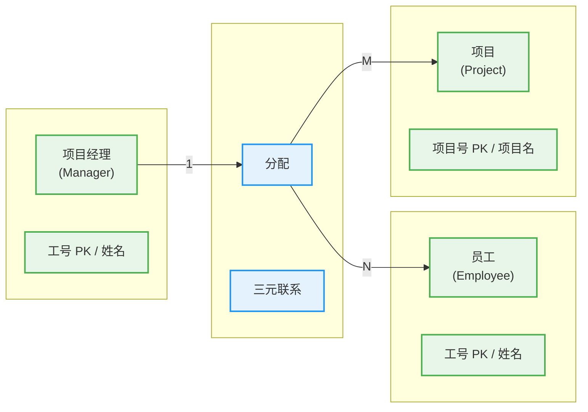

#### 多元联系的实现策略

将多元联系转换为关系模式时，需要创建一个关联表，该表的结构取决于各参与实体集之间的实际基数关系。一种保守的转换策略是将多元联系直接转换为一个关联表，包含所有参与实体的主键作为外键，以及联系自身的属性。

```sql
-- 分配表（三元联系的实现）
Assignment(
    项目经理号 CHAR(10),
    员工号 CHAR(10),
    项目号 CHAR(8),
    分配日期 DATE,                 -- 联系属性
    角色 VARCHAR(50),              -- 联系属性：在此项目中担任的角色
    PRIMARY KEY (项目经理号, 员工号, 项目号),
    CONSTRAINT fk_assign_manager FOREIGN KEY (项目经理号) REFERENCES Manager(工号),
    CONSTRAINT fk_assign_employee FOREIGN KEY (员工号) REFERENCES Employee(工号),
    CONSTRAINT fk_assign_project FOREIGN KEY (项目号) REFERENCES Project(项目号)
)
```

然而，在实际设计中，**更常见的做法是将三元联系拆解为多个二元联系**。这是因为多元联系虽然在概念层面语义清晰，但在实现层面往往导致复杂的多表连接查询。拆解的策略通常是引入一个"中间实体"（也称为**关联实体**或**弱实体**），将多元联系降级为多个二元联系。

例如，上述三元联系"分配"可以拆解为：员工与项目之间的 M:N 联系"参与"，以及项目经理与这个参与记录之间的 1:N 联系"审批"（或"指派"）。这种拆解在逻辑上是等价的（可以相互推导），但在物理实现上可能提供更好的查询性能或更清晰的数据结构。

### 参与约束与基数约束的综合视角

在 ER 模型中，描述一个联系的完整约束需要两个维度：**基数约束（Cardinality Constraint）**和**参与约束（Participation Constraint）**。

基数约束回答的问题是："一个实体最多可以参与多少个该联系的实例？"——这就是我们前面一直在讨论的 1:1、1:N 和 M:N 所表达的内容。

参与约束回答的问题是："一个实体集中的所有实体是否都必须参与该联系？"——这决定了最小基数是 0（**部分参与 / Partial Participation**）还是 1（**完全参与 / Total Participation**）。

将两者结合，就形成了 ER 模型中联系约束的完整描述：**最小-最大（min, max）标注法**。例如：

- `(0, N)`：可选的多值参与（至多 N 个，可以为零）
- `(1, N)`：必须的多值参与（至少 1 个，至多 N 个）
- `(0, 1)`：可选的单值参与（至多一个，可以为零）
- `(1, 1)`：必须的单值参与（恰好一个）

以学生与班级的关系为例，如果我们说"每个学生必须属于一个班级，但一个班级可以没有学生"，那么在 ER 图中，这一约束可以标注为：学生侧的 `(1, 1)`（每个学生恰好参与一个"属于"联系）和班级侧的 `(0, N)`（一个班级可以不参与或参与多个"属于"联系）。

理解这两个维度的约束对于后续的概念设计验证和向关系模型的转换都至关重要。参与约束直接影响外键列是否允许 NULL，基数约束则决定了是否需要关联表以及关联表的主键构成方式。

#### 📝 练习题

某高校选课系统需要存储以下数据：一个学生可以选修多门课程，一门课程可以被多个学生选修。每次选课需要记录选修时间和成绩（百分制）。同时，系统需要记录每门课程的授课教师信息，一位教师可以教授多门课程，一门课程由一位教师负责。以下关于该系统数据库设计的描述，哪一项是正确的？

A. 学生表和课程表之间存在 M:N 联系，因此只需在学生表中添加一个"课程号"字段即可实现该联系。\
B. 该设计中存在两个联系：学生与课程之间的 M:N 联系，以及教师与课程之间的 1:N 联系。将 M:N 联系转换为"选课"关联表（含学生号、课程号、选修时间、成绩），将 1:N 联系通过在课程表中添加教师号外键实现。\
C. 由于学生与课程是多对多关系，教师与课程是一对多关系，因此该设计需要两张关联表：一张用于学生-课程，一张用于教师-课程。\
D. 教师表中"教师号"字段可以作为教师表的主键，同时也是课程表的外键，这说明课程表依赖于教师表，因此课程表应该被合并到教师表中以消除传递依赖。

**【答案】** B

**【解析】** 本题考查的是 ER 模型中多元联系类型的识别及其向关系模式的转换。

**选项 A 错误的原因**：将 M:N 联系简化为在"多"侧添加外键的想法仅适用于 1:N 联系。对于 M:N 联系，如果只在学生表中添加课程号字段，则每行学生记录只能关联一门课程（无法表达一个学生选修多门课程）；如果在课程表中添加学生号字段，则每行课程记录只能关联一个学生（无法表达一门课程被多个学生选修）。因此，正确的实现方式必须引入一张独立的关联表（通常包含学生号和课程号两个外键，以及联系自身的属性如选修时间和成绩），不能仅靠单向的外键列来实现。

**选项 B 正确的原因**：该选项准确识别了两种联系类型——学生与课程之间是 M:N 联系（需要关联表），教师与课程之间是 1:N 联系（外键放在"多"侧，即课程表中）。这是最常见也最标准的 ER 图转关系模式的设计方法。

**选项 C 错误的原因**：教师与课程之间是一对多（1:N）关系而非多对多关系。一对多联系不需要关联表，只需在外键所在侧（课程表）中添加教师号作为外键即可。如果错误地创建了教师-课程的关联表，则会产生笛卡尔积式的冗余数据——因为每位教师负责的课程与其是一对多的，不应该出现同一教师号和课程号的多条组合记录。

**选项 D 错误的原因**：该选项混淆了外键依赖和表合并的概念。教师号作为外键出现在课程表中并不构成将课程表合并到教师表中的理由。合并的前提通常是 1:1 联系或业务上确实属于同一实体。课程和教师是两个独立的业务实体，有各自独立的属性（课程有学分、学时等；教师有职称、教研室等），不应该因为参照关系就强行合并。选项 D 中"传递依赖"的说法是关系数据库规范化理论中的概念（涉及函数依赖的传递性），与这里讨论的外键参照关系是两个不同层次的问题。

---

---

## 弱实体集

### 弱实体集的定义与基本概念

在ER模型的实体集家族中，存在一类特殊的实体集，它们的存在依赖于另一个实体集，自身无法独立存在。我们将这类实体集称为**弱实体集（Weak Entity Set）**，而将其所依赖的那个实体集称为**强实体集（Strong Entity Set）**或**属主实体集（Identifying Entity Set）**。这一概念的引入源于现实世界中大量存在的依赖性关系——某些实体的身份和存在本身就需要借助其他实体才能得到完整的定义和区分。

要理解弱实体集的本质，我们不妨从日常生活的例子出发。想象一个公司组织中的"家属"这一概念：一位员工的配偶或子女，他们的身份信息（姓名、年龄、与员工的关系等）虽然是真实存在的数据，但这些信息无法脱离对应的"员工"而独立地被赋予唯一标识。在数据库建模时，"家属"就是一个典型的弱实体集，而"员工"则是它的强实体集。再比如，大学课程管理系统中的"选课记录"——每一条选课记录对应着一个特定学生在特定学期选修的特定课程，它需要学生信息和课程信息共同来标识自身，因此"选课记录"本身也是一个弱实体集。

弱实体集的核心特征在于：它没有完整的键（Key），或者说它自身的属性集合不足以唯一地标识其中的每一个实体实例。弱实体集的实体实例必须与一个强实体集的实例相结合，才能获得完整的标识。这种标识上的不完整性导致了弱实体集在存在性上对强实体集的依赖——如果删除了某个强实体集的实例，那么所有依赖该实例的弱实体集实例也必须随之被删除，以保持数据库的一致性。这种级联删除的语义是弱实体集概念中非常重要的一环，它反映了现实世界中依赖关系的本质。

### 弱实体集与强实体集的核心区别

理解弱实体集，关键在于把握它与强实体集之间的本质差异。这种差异体现在标识能力、存在依赖、键的结构以及表示方式等多个维度。

**标识能力的差异**是最根本的区别。强实体集拥有完整的键（可能是单属性键，也可能是复合键），仅凭自身属性就能唯一确定每一个实体实例。例如，在员工管理系统中，每个员工都有一个唯一的工号，这个工号本身就能将任意两个员工区分开来。强实体集的键是"自给自足"的，不需要任何外部实体的帮助。弱实体集则截然不同，它自身不拥有能够唯一标识实体的键。以选课记录为例，仅知道某个分数或上课时间，我们无法确定这条记录对应的是哪一位学生选修的哪一门课程——分数和上课时间本身不能作为选课记录的唯一标识。

**存在依赖的关系**体现了两种实体集在数据库语义层面的根本不同。强实体集是"独立"的，它的实例可以独立存在于数据库中，不以任何其他实体集的存在为前提。删除某个强实体集的实例，不会自动导致其他强实体集实例的删除（除非通过其他业务规则或参照完整性约束进行限制）。弱实体集则完全依赖于强实体集而存在。这种依赖关系具有传递性——如果强实体集A的某个实例被删除，那么所有以该实例为"属主"的弱实体集实例都必须被级联删除（CASCADE DELETE）。这一语义确保了数据库不会留下"孤儿"记录，即那些失去属主的弱实体实例。

**键结构的差异**进一步揭示了弱实体集的独特性质。强实体集的键完全由自身属性组成，可能是单一属性（如员工工号），也可能是多个属性的组合（如订单编号加订单年份）。弱实体集的键则由两个部分组成：第一部分是弱实体集自身的一组属性，称为**部分码（Partial Key）**或**部分键**，这部分属性本身不能唯一标识弱实体集实例，但能够区分同一个强实体集实例下的多个弱实体实例；第二部分是强实体集的键，通过参与关系"借"过来的，这部分称为**属主键（Owner Key）**。弱实体集的整体键是部分码与属主键的组合，这两者缺一不可。

下面用一个具体的对比表格来更清晰地展示这些差异：

| 比较维度 | 强实体集 | 弱实体集 |
|---|---|---|
| 键的完整性 | 拥有完整的键，仅由自身属性组成 | 不拥有完整键，需借助强实体集的键 |
| 键的结构 | 自身属性（单属性或复合属性） | 部分码（自身属性）＋ 属主键（来自强实体集） |
| 存在依赖 | 独立存在，不依赖其他实体集 | 依赖强实体集，无独立存在性 |
| 删除语义 | 删除强实体实例时，需考虑参照完整性 | 通常级联删除，删除属主同时删除所有依赖的弱实体实例 |
| 表示方式（ER图） | 单矩形，独立存在 | 双矩形（双线边框），依附于强实体集 |
| 是否需要唯一性约束 | 在自身属性或属性组合上建立唯一性约束 | 在（属主键，部分码）组合上建立唯一性约束 |

### 部分码与属主键的深入理解

部分码（Partial Key）是弱实体集中一个微妙而重要的概念。要正确理解部分码，我们需要把握它在区分能力上的局限性，以及它在整个键结构中的角色定位。

部分码是弱实体集自身的一组属性，这组属性具有一个关键特性：对于同一个强实体集实例而言，这些属性能够区分它所拥有的各个弱实体实例；但对于不同的强实体集实例，这些属性无法提供任何区分能力。回到"家属"的例子：假设同一个员工有三个子女，这三个子女的姓名（假设在同一员工范围内姓名不重复）就可以作为区分不同家属实例的部分码。但"张三"这个名字在不同的员工之间毫无区分能力——它不能告诉我们这个叫张三的人是哪个员工的家属。

部分码的选取通常遵循业务语义。在某些情况下，弱实体集可能天然拥有一个能够作为部分码的属性，例如家属的身份证号码（假设在同一个员工内部是唯一的）。在另一些情况下，可能需要组合多个属性才能形成有效的部分码，比如课程安排中的"上课时间"加"教室编号"（假设同一时段的同一个教室不会同时安排两门课程）。部分码的选取必须确保其在同一个属主范围内是唯一的，这一点至关重要。

属主键（Owner Key）是从强实体集"借来"的键，它与部分码结合后形成弱实体集的完整键。属主键的作用是为弱实体实例提供全局唯一性的保障。通过属主键，我们可以确定弱实体实例属于哪一个强实体实例的"管辖范围"；通过部分码，我们可以在该范围内进一步区分具体的弱实体实例。两者的组合赋予了弱实体集唯一的标识能力。

以选课系统为例进一步说明。假设学生实体集（强实体集）的键是学号（ Sno），课程实体集（强实体集）的键是课程号（ Cno）。选课记录作为弱实体集，其部分码可能是学期（Term），因为在同一个学生选修的同一个课程下，不同的学期自然对应不同的选课记录。那么选课记录的完整键就是（学号, 课程号, 学期）的组合。这三个属性共同唯一地标识了一条选课记录——知道了这三个值，我们就能精确定位到唯一的一条选课数据。

### 弱实体集在ER图中的表示方法

在ER图中，弱实体集的图形表示与强实体集有着明显的视觉区别，这种区别的设计初衷是为了让建模者和数据库开发者能够一目了然地识别出实体集的依赖性质。

弱实体集使用**双线矩形（双边框矩形）**来表示。双线矩形在视觉上与强实体集的单线矩形形成鲜明对比，传达出"依附"和"不完整"的语义。在双线矩形内部，我们书写弱实体集的名称及其非键属性（Non-Key Attributes）。与强实体集一样，弱实体集的属性也可以进一步细分为普通属性和派生属性（Derived Attributes），派生属性用虚线椭圆表示。

弱实体集与其属主强实体集之间的**属主关系（Identifying Relationship）**也具有特殊的表示方式。这种关系在ER图中使用**双线菱形（双边框菱形）**来表示，以区别于普通实体集之间的联系（使用单线菱形）。双线菱形同样传达了这种联系的依赖性质——弱实体集通过这个联系"获得"了属主键，从而补全了自己的标识能力。

属主关系本身也可以拥有属性。以选课为例，"学生"和"课程"之间的"选课"关系可能具有属性，如选课时间、成绩、考试地点等。这些属性直接书写在双线菱形上或通过虚线连接到双线菱形。

用Mermaid语法可以将一个包含强实体集和弱实体集的ER图示意如下：

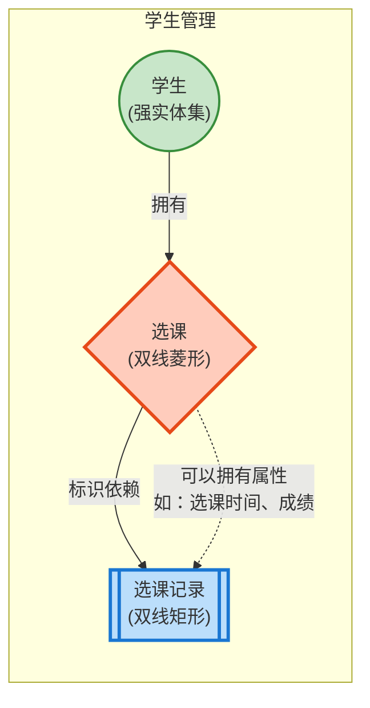

在上述图中，"学生"是强实体集（单线矩形），"选课记录"是弱实体集（双线矩形），而"选课"是标识关系（双线菱形）。双线边框和单线边框的对比直观地反映了两种实体集在标识完整性上的差异。

### 弱实体集参与的联系类型

弱实体集在参与联系时具有一些特殊的行为约束，这些约束源于其存在性依赖的本质特性。

**弱实体集只能参与一对多（1:N）类型的标识关系。** 这个限制并非随意为之，而是由弱实体集的定义所决定的。既然弱实体集需要借助强实体集来获得完整标识，那么弱实体集的每一个实例都必须关联到且仅关联到一个强实体集实例——这是其属主键中属主部分的要求。因此，弱实体集在标识关系中必然处于"多"的一侧，而强实体集处于"一"的一侧。这种关系是有向的、不对称的：强实体集可以独立存在，但弱实体集不能脱离强实体集而存在。

从多值性的角度进一步分析，弱实体集与强实体集之间的标识关系具有严格的方向性。一个强实体集实例可以对应零个、一个或多个弱实体集实例（例如一个员工可以有零个、一个或多个家属），但一个弱实体集实例必然且只能对应一个强实体集实例（一个家属必然对应一个员工）。这种一对多的不对称关系确保了弱实体集键结构的合理性——每一个弱实体实例只需要记录其属主的一个键值，而不是一组属主键值。

弱实体集也可以参与**非标识关系（Non-Identifying Relationship）**。除了与属主强实体集的标识关系外，弱实体集还可能与其他实体集建立普通联系。例如，选课记录（弱实体集）除了与学生（强实体集）有标识关系外，还可能与课程（强实体集）有"选修"的关系。不过需要注意的是，由于弱实体集本身缺乏完整键，在参与非标识关系时，它通常也是以"多"的一侧的身份出现的。

### 弱实体集转换为关系模式

将ER模型转换为关系模型（关系模式）是数据库设计中的关键步骤。当ER图中包含弱实体集时，转换过程需要遵循一些特殊的规则，以确保数据库模式的完整性和一致性。

**第一条规则：弱实体集的属主关系在转换为关系模式时，必须与弱实体集本身合并。** 这是最核心的规则。强实体集和与它关联的弱实体集在关系模型中不应被设计为两个独立的、相互外键关联的关系。相反，弱实体集的关系模式应当包含以下组成部分：弱实体集自身的非键属性、弱实体集的部分码属性，以及强实体集的主键（作为外键同时作为弱实体集的主键的一部分）。以选课记录为例，其关系模式应当设计为：`选课记录（学号, 课程号, 学期, 成绩, 选课时间）`，其中学号和课程号来自学生和课程实体集（作为外键），同时也是选课记录的主键的一部分，学期是选课记录的部分码，成绩和选课时间是选课记录自己的普通属性。

这条规则背后的原理在于：弱实体集无法独立存在，它的每一个实例都必须与一个且仅一个强实体集实例关联。如果将弱实体集设计为独立的关系并通过外键引用强实体集，那么在参照完整性层面就不得不额外施加一个"每一个弱实体实例必须存在对应强实体实例"的约束。而在ER到关系模式的直接转换中，将弱实体集与其标识关系合并的设计方式，能够更自然、更紧密地表达这种存在依赖——弱实体实例的存在性直接由其主键中包含的属主键来保证，不需要额外的约束条件。

**第二条规则：弱实体集的主键由部分码与属主键共同组成。** 在关系模式中，主键的定义必须体现弱实体集在ER模型中的标识语义。如前所述，弱实体集的完整标识需要结合属主键和部分码，因此在关系模式中，主键也应当由这两部分组成。这种设计确保了数据库层面的唯一性约束与概念模型层面的标识语义完全一致。

**第三条规则：删除强实体集实例时，必须级联删除所有依赖的弱实体集实例。** 在参照完整性的定义中，对于从强实体集指向弱实体集的外键关系（即弱实体集中来自强实体集的属性），删除规则应当设置为`CASCADE`。这一设置保证了当某个强实体集实例被删除时，所有依赖它的弱实体集实例也随之被删除，避免出现"孤儿记录"。这种级联删除的行为也是弱实体集存在性依赖在关系模型层面的自然体现。

**第四条规则：如果标识关系本身拥有属性，这些属性同样并入弱实体集的关系模式中。** 弱实体集与强实体集之间的标识关系可能携带有意义的业务属性。例如，在员工与家属的关系中，"成为家属的日期"可能是关系的一个属性；在选课关系中，"选课时间"和"考试地点"可能是关系的属性。这些属性在关系模式转换时应当被包含在弱实体集的关系模式中。

下面通过一个完整的例子来展示弱实体集转换的全过程：

假设有如下ER模型：员工（工号、姓名、部门）是强实体集，家属（姓名、关系、年龄）是弱实体集，员工与家属之间存在"赡养"关系（标识关系），该关系拥有属性"赡养起始年月"。转换后的关系模式如下：

```sql
-- 员工关系模式（强实体集）
CREATE TABLE 员工 (
    工号       CHAR(10) PRIMARY KEY,    -- 主键
    姓名       VARCHAR(50) NOT NULL,
    部门       VARCHAR(100)
);

-- 家属关系模式（弱实体集，合并了标识关系）
CREATE TABLE 家属 (
    工号       CHAR(10) NOT NULL,      -- 来自强实体集的属性，同时也是主键组成部分
    姓名       VARCHAR(50) NOT NULL,   -- 部分码（假设同一员工的家属姓名不重复）
    关系       VARCHAR(20),
    年龄       INT,
    赡养起始年月 DATE,
    PRIMARY KEY (工号, 姓名),          -- 联合主键：属主键 + 部分码
    FOREIGN KEY (工号) REFERENCES 员工(工号)
        ON DELETE CASCADE               -- 级联删除：删除员工时自动删除其家属
        ON UPDATE CASCADE
);
```

在上述代码中，家属关系模式的主键是`(工号, 姓名)`的组合，其中`工号`来自员工实体集（属主键），`姓名`是家属实体集的部分码。`ON DELETE CASCADE`子句确保了当某位员工被从数据库中删除时，该员工的所有家属记录也随之被自动删除，这正是弱实体集存在性依赖在SQL层面的实现。

### 弱实体集的边界情况与设计考量

在实际数据库设计中，弱实体集的使用并非总是非此即彼的绝对选择。有时候，一个实体集究竟是设计为强实体集还是弱实体集，需要根据具体的业务语义和性能考量来权衡。

**是否使用弱实体集的核心判断标准是存在性依赖。** 如果某个实体集在业务逻辑上必然依赖于另一个实体集而存在，且删除父实体时必然要删除子实体，那么这个实体集就应当被设计为弱实体集。例如，订单明细依赖于订单、家属依赖于员工、运动员的比赛成绩依赖于运动员本身（因为成绩不能脱离运动员而独立存在）。反之，如果某个实体集虽然与另一个实体集在业务上有关联，但它的实例可以独立存在和标识，那么它应当被设计为强实体集，即使两者之间存在参照完整性约束。

**部分码的选择需要谨慎。** 有效的部分码必须满足在同一属主范围内唯一。如果我们选取的部分码在某些情况下可能出现重复（例如不同员工的不同家属恰好取了相同的名字），那么仅靠（属主键, 部分码）就无法唯一标识弱实体集实例。此时需要寻找其他属性或属性组合作为部分码，或者考虑将部分码定义为"部分码属性集合加上额外属性"的复合结构。在极端情况下，如果弱实体集实在找不到任何可以作为部分码的属性（即同一个属主下的多个弱实体实例在所有自身属性上都完全相同），那么可以考虑为弱实体集添加一个人工生成的序号属性（如家属序号）作为部分码。

**弱实体集的继承问题也值得考虑。** 在某些扩展ER模型（如EER模型，Extended ER）中，实体集之间可能存在ISA（"是一个"）层次结构。如果一个弱实体集同时也是一个子类（即它参与了特化/泛化层次），那么其标识和继承的语义就会变得复杂。在大多数数据库设计实践中，通常建议将参与ISA层次的实体集设计为强实体集，以简化标识结构和避免多重继承带来的混乱。

### 弱实体集的实际应用场景

理解弱实体集的价值不仅在于掌握其理论概念，更在于能够识别现实系统中的弱实体集模式，并将其正确地建模到数据库设计中。

**组织管理类系统**中，弱实体集随处可见。公司中的员工家属、产品在各仓库的库存记录、建筑物各楼层平面图的房间信息，都可以建模为弱实体集。以库存为例：产品是强实体集，仓库也是强实体集，但"某仓库中的某产品库存"则是一个典型的弱实体集，它需要产品编号加上仓库编号再加上自身的一些属性（如批次号）才能唯一标识。删除某个产品时，该产品在各仓库的库存记录应当被级联处理；删除某个仓库时，该仓库的所有库存记录同样需要被清理。

**教育管理系统**是另一个典型领域。学生（强实体集）、课程（强实体集）都是独立可标识的实体。但学生选修的课程（选课记录）则是弱实体集，它需要学生编号和课程编号共同标识。类似地，学生在某个学期选修某门课程的平时成绩记录，可能是更细粒度的弱实体集——它以（学生编号, 课程编号, 学期, 周次）为主键。每一个层次的关系嵌套都反映了对实体唯一标识的不同粒度的需求。

**医疗信息系统**中，患者（强实体集）和就诊记录（弱实体集）构成了一个经典的关系模式。每次就诊记录都依赖于特定患者而存在，删除患者档案时其所有就诊历史通常也应当被归档或删除（出于医疗法规要求可能采取逻辑删除而非物理删除，但语义上仍是级联处理）。就诊记录中的具体用药明细、各项检查结果，又可以建模为更细粒度的弱实体集。

---

#### 📝 练习题

在ER模型向关系模型转换的过程中，以下关于弱实体集处理方式的描述中，**错误**的是哪一项？

A. 弱实体集的关系模式主键由弱实体集自身的部分码与属主强实体集的主键共同组成
B. 弱实体集与其属主强实体集之间的标识关系在转换时应合并到弱实体集的关系模式中
C. 弱实体集在ER图中用双线矩形表示，其属主关系用双线菱形表示
D. 弱实体集可以独立参与任意类型的联系，包括一对一、多对一和多对多联系

**【答案】** D
**【解析】** 本题考查的是弱实体集的基本特性和转换规则。选项A、B、C均正确描述了弱实体集的相关规范：弱实体集的主键确实由部分码与属主键共同组成，这反映了弱实体集标识不完整的本质特征；标识关系与弱实体集合并是ER到关系模式转换的核心规则，确保了弱实体集的存在依赖在关系模型中得到自然表达；ER图的表示方法（双线矩形和双线菱形）是规范中规定的标准符号。选项D的错误在于：弱实体集**只能**参与一对多（1:N）类型的标识关系，而不能自由参与任意类型的联系。这一限制源于弱实体集的定义——弱实体集的每个实例都必须且仅能关联到一个强实体集实例，因此它在任何关系中都只能处于"多"的一侧，而非"一"的一侧，更遑论多对多联系了。如果允许弱实体集参与一对一或多对多联系，就会破坏"每个弱实体实例必须对应唯一强实体实例"的语义约束，导致数据完整性问题。

---

## ER图转关系模式

### 核心思想：从概念模型到数据模型的桥梁

ER图（Entity-Relationship Diagram）是一种面向人的高层概念模型，它用矩形表示实体集、椭圆表示属性、菱形表示联系，直观地描述了业务领域中"有什么"和"它们之间如何关联"。然而，计算机系统无法直接理解和执行这种图形化表示，必须将其转换为数据库能够存储和管理的形式——这就是**关系模型（Relational Model）**。

将ER图转换为关系模式的过程，本质上是一次**语义降维**：我们把一个富有表现力的语义模型，压缩为一组严格的二维表结构。这种转换并非随意为之，而是遵循一套经过理论证明的规则体系。只要严格遵守这些规则，任何设计合理的ER图都能够被完整地、无歧义地翻译为一组等价的 relation schema。

理解这一转换过程至关重要，原因有三：第一，它是数据库设计从概念阶段走向逻辑阶段的必经之路；第二，转换规则直接决定了最终关系数据库的表结构，而表结构的质量又深刻影响后续的查询性能、数据完整性和维护成本；第三，面试和考试中，ER图转关系模式几乎是必考内容，很多看似复杂的题目只需按部就班地应用几条核心规则即可迎刃而解。

### 基本转换规则概述

在深入展开每一种转换策略之前，我们需要先建立一个全局认知。ER图中的三大构成要素——实体集、属性、联系——在转换为关系模式时各自遵循不同的策略：

**实体集**始终转换为一个关系（即一张表），这是最核心的规则。实体的属性直接成为关系的列（属性），实体的主键成为关系的主键。

**属性**分为简单属性和复合属性。简单属性直接对应一个列；复合属性通常被"展开"——即将其中的每个简单子属性作为独立列。

**联系**的转换则最为复杂，需要根据联系的度数（degree，即参与连接的实体集个数）和基数（cardinality，即一个实体可以参与联系的次数）来分情况讨论。具体而言，一对一（1:1）联系、一对多（1:N）联系和多对多（M:N）联系的转换策略各有不同，甚至在某些情况下（如下所述的特殊场景），联系的转换规则还会因优化需求而调整。

下面我们逐条详细展开每一种转换方法。

### 实体集的转换

实体集转换为关系模式是整个转换过程中最直接的部分。对于每一个实体集 `E`，我们创建一个关系 `R`，`R` 的属性集合由 `E` 的所有属性组成。如果 `E` 具有主键属性 `K`，则在关系 `R` 中将 `K` 设为主键（Primary Key）。

考虑一个经典的例子。在一个"教学管理系统"中，存在"学生"实体集，其属性包括：学号（唯一标识）、姓名、性别、出生日期、专业。其中学号作为主键。转换后的关系模式如下：

```sql
学生（学号, 姓名, 性别, 出生日期, 专业）
-- 学号 作为主键（PK）
```

```sql
-- 学生表建表语句及逐行注释
CREATE TABLE 学生 (
    学号  VARCHAR(20) PRIMARY KEY,      -- 主键，唯一标识每位学生
    姓名  VARCHAR(50) NOT NULL,          -- 学生姓名，不允许为空
    性别  CHAR(1) CHECK (性别 IN ('男', '女')),  -- 性别约束为字符
    出生日期 DATE,                       -- 出生日期，日期类型
    专业  VARCHAR(50)                    -- 所学专业名称
);
```

这就是实体集转换的全部内容。看似简单，但有两个值得注意的细节：

第一，**派生属性**（Derived Attribute）——即可以由其他属性计算得出的属性——在关系模式中通常不作为独立列出现。例如，"年龄"可以从"出生日期"计算得出，因此在ER图中若将"年龄"标记为派生属性，则在转换时应将其省略，避免数据冗余和潜在的数据不一致。在实际数据库中，如果出于查询便利性考虑确实需要存储"年龄"，可以通过在表中增加一列并在应用层维护，或者创建一个**视图（View）**来实现。

第二，**多值属性（Multi-valued Attribute）**的处理较为特殊。如果实体集 `E` 有一个多值属性 `M`，ER模型要求一个实体在 `M` 上可以取多个值，但关系模型中每个单元格只能存放单一值。因此，多值属性不能直接作为一列存在。标准处理方式是为 `M` 单独创建一个关系，该关系的属性包括 `M` 本身以及 `E` 的主键。例如，若"学生"实体集有一个多值属性"电话"，则需要额外创建一个关系：

```sql
-- 多值属性"电话"的处理：创建独立关系
CREATE TABLE 学生_电话 (
    学号  VARCHAR(20),                   -- 引用学生实体的主键，外键
    电话  VARCHAR(20) NOT NULL,          -- 电话号码本身
    PRIMARY KEY (学号, 电话)             -- 复合主键，确保 (学号, 电话) 唯一
);
```

外键约束用于建立两个关系之间的引用完整性，确保每条电话号码记录都对应一个真实存在的学生。

### 联系集的转换（一对一联系 1:1）

一对一联系是三种基数联系中最简单的一种。设实体集 `A` 和 `B` 之间存在 1:1 联系 `R`。转换的基本思路是：选择**参与度较少**的那个实体集，将其主键作为外键放入另一个实体集对应的关系中；同时，将联系本身的属性也一并加入。

为什么优先选择参与度少的实体集？这里涉及一个**连接操作（JOIN）的代价**问题。如果 `A` 中每个实体最多只对应一个 `B` 中的实体，而 `B` 中可能有大量实体不对应任何 `A` 中的实体，那么将 `A` 的主键放入 `B` 的关系中，可以减少外键列中 NULL 值的数量，同时在执行连接查询时效率更高。

具体而言，有三种等价的实现方式：

**方式一（推荐）：** 将联系 `R` 的属性和 `A` 的主键合并到 `B` 的关系中。此时 `B` 的主键不变，`A` 的主键作为外键出现在 `B` 的关系中。

**方式二：** 将联系 `R` 的属性和 `B` 的主键合并到 `A` 的关系中。

**方式三：** 将联系 `R` 完全独立为一个关系，其属性包括 `A` 的主键和 `B` 的主键（作为外键）以及联系自身的属性。

在实际工程中，方式一和方式二更为常见，因为它们将联系的信息融入到已有实体关系中，减少了表的数量。方式三则适用于联系本身具有较多属性，或者联系可能频繁独立查询的场景。

以"系"和"主任"为例：一个系只能有一个系主任，一个教师只能担任一个系的系主任，因此"管理"是一个 1:1 联系。

```sql
-- 方式一：将系主任的主键作为外键加入系的关系中
CREATE TABLE 系 (
    系编号   VARCHAR(20) PRIMARY KEY,
    系名称   VARCHAR(50) NOT NULL,
    系主任工号 VARCHAR(20),             -- 来自教师实体的主键，作为外键
    成立年份 INT,
    FOREIGN KEY (系主任工号) REFERENCES 教师(工号)
);
```

如果选择方式三（独立关系）：

```sql
-- 方式三：独立关系模式
CREATE TABLE 管理 (
    系编号  VARCHAR(20) PRIMARY KEY,    -- 也是外键，引用系
    系主任工号 VARCHAR(20) PRIMARY KEY, -- 也是外键，引用教师
    任职日期 DATE,                      -- 联系自身的属性
    FOREIGN KEY (系编号) REFERENCES 系(系编号),
    FOREIGN KEY (系主任工号) REFERENCES 教师(工号)
);
```

上述两种方式在表达能力上完全等价，选择哪一种取决于实际的查询模式和业务需求。

### 联系集的转换（一对多联系 1:N）

一对多联系是三种基数联系中最常见的形式。设实体集 `A` 和 `B` 之间存在 1:N 联系 `R`，这意味着 `A` 中的一个实体可以关联 `B` 中的多个实体，而 `B` 中的每个实体至多关联 `A` 中的一个实体。

转换规则非常简洁明了：**将"一"端（`A`）的主键添加到"多"端（`B`）对应的关系中，作为外键；同时将联系 `R` 的属性也一并加入 `B` 的关系**。这是因为"多"端已经天然地处于子表的位置，将其作为外键的目标表，可以让每个"多"端的实体精确地指向其对应的"一"端实体。

以"班级"和"学生"为例：一个班级包含多名学生，但每个学生只属于一个班级，因此"属于"是一个 1:N 联系。

```sql
-- 班级表（"一"端）
CREATE TABLE 班级 (
    班级编号 VARCHAR(20) PRIMARY KEY,
    班级名称 VARCHAR(50) NOT NULL,
    年级     INT
);

-- 学生表（"多"端，包含了来自"一"端的外键）
CREATE TABLE 学生 (
    学号   VARCHAR(20) PRIMARY KEY,
    姓名   VARCHAR(50) NOT NULL,
    性别   CHAR(1),
    班级编号 VARCHAR(20),               -- 来自班级实体的主键，作为外键
    FOREIGN KEY (班级编号) REFERENCES 班级(班级编号)
);
```

外键 `班级编号` 建立了学生到班级的引用关系。每个学生通过 `班级编号` 列准确指向其所属班级。如果需要查询某个班级的所有学生，只需执行 `SELECT * FROM 学生 WHERE 班级编号 = '某编号'`。这个外键列的设计使得基于班级的查询非常高效，无需任何连接操作。

### 联系集的转换（多对多联系 M:N）

多对多联系是三种基数联系中最复杂的一种。当两个实体集 `A` 和 `B` 之间存在 M:N 关系 `R` 时，意味着 `A` 中的一个实体可以关联 `B` 中的多个实体，同时 `B` 中的一个实体也可以关联 `A` 中的多个实体。

这种双向的"多"的关系无法通过在某一端的关系中增加外键列来表达——因为一个外键列在每一行只能存储单一值，无法对应多个关联实体。因此，**M:N 联系必须被转换为一个独立的关系**。

这个新关系的属性包括：`A` 的主键和 `B` 的主键（均作为外键）以及联系 `R` 自身的所有属性。新关系的**主键由两个外键构成的复合键**组成，因为仅凭 `A` 的主键无法唯一确定一行（因为一个 `A` 实体对应多个 `B` 实体），同理仅凭 `B` 的主键也无法唯一确定一行。

以"学生"和"课程"为例：一个学生可以选修多门课程，一门课程也可以被多名学生选修，因此"选修"是一个 M:N 联系。

```sql
-- 学生表
CREATE TABLE 学生 (
    学号 VARCHAR(20) PRIMARY KEY,
    姓名 VARCHAR(50) NOT NULL
);

-- 课程表
CREATE TABLE 课程 (
    课程号 VARCHAR(20) PRIMARY KEY,
    课程名 VARCHAR(100) NOT NULL,
    学分   INT
);

-- 选修表（独立的联系关系）
CREATE TABLE 选修 (
    学号  VARCHAR(20),                   -- 来自学生表的外键
    课程号 VARCHAR(20),                  -- 来自课程表的外键
    成绩   DECIMAL(5,2),                 -- 联系自身的属性：考试成绩
    选修时间 DATE,                       -- 联系自身的属性：选课时间
    PRIMARY KEY (学号, 课程号),          -- 复合主键
    FOREIGN KEY (学号) REFERENCES 学生(学号),
    FOREIGN KEY (课程号) REFERENCES 课程(课程号)
);
```

关系 `选修` 的复合主键 `(学号, 课程号)` 确保了每个学生在一门课程中只有一条成绩记录。同时，每个学生可以通过 `选修` 表关联到其所有选修的课程，每门课程也可以通过该表关联到所有选修它的学生。这个中间表在关系数据库理论中常被称为**关联表（Associative Entity）**或**桥接表（Bridge Table）**。

### 弱实体集的转换

弱实体集是ER模型中一个特殊的概念。弱实体集指的是那些**没有足够的属性来独立形成主键**的实体集，它们必须依赖于另一个（强）实体集才能唯一确定其标识。换言之，弱实体集的存在意义是附加在另一个实体之上的。

标准转换规则为：弱实体集不生成独立的主键。它的所有属性（包括其自身的部分键——称为**分辨符/部分键**）以及来自所依赖强实体集的主键，一起构成弱实体集对应关系的主键。同时，弱实体集对应的关系中必须包含一个**外键**，引用强实体集对应的关系，以确保参照完整性。

考虑一个典型的例子："家属"是一个弱实体集，它依赖于"员工"实体集而存在。家属的姓名本身无法唯一标识一个家属（因为同一个员工可能有重名的家属），但"员工工号 + 家属姓名"的组合可以唯一确定一个家属记录。

```sql
-- 员工表（强实体集）
CREATE TABLE 员工 (
    工号  VARCHAR(20) PRIMARY KEY,
    姓名  VARCHAR(50) NOT NULL,
    部门  VARCHAR(50)
);

-- 家属表（弱实体集）
CREATE TABLE 家属 (
    工号   VARCHAR(20),                  -- 来自所依赖强实体的主键
    家属姓名 VARCHAR(50),                -- 弱实体集的部分键（分辨符）
    关系   VARCHAR(20),                  -- 弱实体集自身的其他属性
    电话   VARCHAR(20),
    PRIMARY KEY (工号, 家属姓名),        -- 复合主键
    FOREIGN KEY (工号) REFERENCES 员工(工号)
);
```

这里的关键设计点在于：弱实体集的关系主键由两部分组成——来自强实体集的外键（`工号`）和弱实体集自身的分辨符（`家属姓名`）。复合主键确保了每个员工下的每个家属姓名都是唯一的。此外，外键约束保证了每个家属记录必定对应一个真实存在的员工。

在某些 DBMS 中（如 MySQL 的 InnoDB 引擎），如果需要进一步确保级联一致性，还可以为外键添加 `ON DELETE CASCADE` 等级联删除策略，使得删除某个员工时，其所有家属记录也会被自动删除，避免孤儿记录的产生。

### 层次结构与特化/泛化的转换

ER模型中的特化（Specialization）和泛化（Generalization）为实体集之间的层次关系提供了建模手段。特化是指一个实体集内部根据某种区分原则被划分为多个子实体集；泛化则是多个子实体集归纳为一个父实体集的逆向过程。在ER图中，这种层次关系通常用三角形或带 `ISA` 标签的连线来表示。

特化/泛化的转换比普通实体集和联系更为复杂，需要根据实际约束条件（是否完全特化、是否互斥覆盖）选择适当的转换策略。常见的转换方法有四种：

**第一种：转为单个关系。** 将所有实体集（父实体集和所有子实体集）的属性全部合并到一个关系中，并增加一个**类型标识属性**（也称为"判别属性"或"类型标签"）来区分每条记录属于哪个子实体集。这种方式适用于特化层次较浅、子实体集之间属性差异不大、且经常需要查询父实体全部数据的场景。缺点是可能导致大量空值列。

**第二种：转为多个关系（父-子独立表）。** 为父实体集创建一个关系，为每个子实体集也各创建一个独立的关系。父关系包含父实体集的所有属性，子关系包含子实体集特有的属性加上父关系的主键（作为外键）。这是最常用的转换方式，能够有效避免空值问题。

**第三种：仅保留子关系。** 将父实体集的属性下推到每个子实体集的关系中，不创建独立的父关系。这种方式假设所有有意义的业务查询都发生在子实体层面，适用于完全特化且子实体集之间交集为空的情况。缺点是丢失了父实体集的统一视图。

**第四种：使用垂直分表。** 父关系包含公共属性，每个子关系包含子特有属性加上指向父关系的引用。这种方式结合了第一种和第二种方法的优点，但增加了查询的复杂性（需要 JOIN 才能获取完整数据）。

以"人员"（父）、"教师"和"学生"（子）为例，采用第二种方法：

```sql
-- 父关系：人员表
CREATE TABLE 人员 (
    人员编号 VARCHAR(20) PRIMARY KEY,   -- 全局唯一标识
    姓名     VARCHAR(50) NOT NULL,
    性别     CHAR(1),
    出生日期 DATE,
    联系方式 VARCHAR(50)
);

-- 子关系：教师表
CREATE TABLE 教师 (
    人员编号 VARCHAR(20) PRIMARY KEY,   -- 主键，同时也是外键引用人员表
    工号     VARCHAR(20) UNIQUE,
    职称     VARCHAR(30),
    工资等级 INT,
    FOREIGN KEY (人员编号) REFERENCES 人员(人员编号)
);

-- 子关系：学生表
CREATE TABLE 学生 (
    人员编号 VARCHAR(20) PRIMARY KEY,   -- 主键，同时也是外键引用人员表
    学号     VARCHAR(20) UNIQUE,
    年级     INT,
    专业     VARCHAR(50),
    FOREIGN KEY (人员编号) REFERENCES 人员(人员编号)
);
```

这种设计的优势在于：每个实体只在其实际所属的子表中存储特有的属性，父表中只存储所有实体共有的公共属性，从而消除了因特化层次带来的空值问题。同时，外键约束确保了子实体必定对应一个父实体，维护了层次结构的完整性。

### 综合实例：教学管理系统的完整转换

为了将所有转换规则串联起来，我们以一个完整的教学管理系统为例，展示从ER图到关系模式的完整推导过程。

该系统包含以下实体集和联系：

- **学生**：属性有学号（主键）、姓名、性别、出生日期。假设一位学生可以拥有多个联系电话（多值属性）。
- **课程**：属性有课程号（主键）、课程名、学分。
- **教师**：属性有工号（主键）、姓名、职称。其中职称是原子属性。
- **班级**：属性有班级编号（主键）、班级名称。
- **系**：属性有系编号（主键）、系名称。其中系有一个属性"教师人数"，为派生属性（可从教师表中计算得出，转换时省略）。
- **学生和课程之间的M:N联系"选修"**：属性有成绩、选课时间。
- **教师和课程之间的1:N联系"授课"**：一个教师可以教多门课程，一门课程由一名教师教授。
- **班级和学生的1:N联系"属于"**：一个班级包含多名学生，每个学生属于一个班级。
- **系和教师的1:N联系"属于"**：一个系有多名教师，每位教师属于一个系。
- **系和教师的1:1联系"管理"**：一位系主任管理一个系，一个系有一名系主任。
- **教师（弱实体集）和其家属（强实体集）**：假设"家属"是弱实体集，依赖于"教师"存在。家属属性有姓名（分辨符）、与教师的关系。

转换后的完整关系模式如下：

```sql
-- ============================================================================
-- 教学管理系统：ER图转关系模式 — 完整建表语句
-- ============================================================================

-- 1. 实体集：学生（Student）
-- 主键：学号
CREATE TABLE 学生 (
    学号     VARCHAR(20) PRIMARY KEY,
    姓名     VARCHAR(50) NOT NULL,
    性别     CHAR(1) CHECK (性别 IN ('男', '女')),
    出生日期 DATE
);

-- 1a. 多值属性处理：学生_电话（Student_Phone）
-- 为多值属性"电话"单独创建关系
-- 复合主键 (学号, 电话) 确保唯一性
CREATE TABLE 学生_电话 (
    学号 VARCHAR(20) NOT NULL,
    电话 VARCHAR(20) NOT NULL,
    PRIMARY KEY (学号, 电话),
    FOREIGN KEY (学号) REFERENCES 学生(学号)
);

-- 2. 实体集：课程（Course）
-- 主键：课程号
CREATE TABLE 课程 (
    课程号 VARCHAR(20) PRIMARY KEY,
    课程名 VARCHAR(100) NOT NULL,
    学分   INT CHECK (学分 > 0)
);

-- 3. 实体集：教师（Teacher）— 强实体集
-- 主键：工号
CREATE TABLE 教师 (
    工号  VARCHAR(20) PRIMARY KEY,
    姓名  VARCHAR(50) NOT NULL,
    职称  VARCHAR(30),
    系编号 VARCHAR(20)                  -- 外键，放在实体关系中
);

-- 3a. 弱实体集：家属（Dependant），依赖关系：家属 -> 教师
-- 主键：复合主键（工号, 家属姓名）
-- 其中 工号 来自所依赖的教师实体的主键
CREATE TABLE 家属 (
    工号      VARCHAR(20) NOT NULL,      -- 外键，引用教师主键
    家属姓名   VARCHAR(50) NOT NULL,    -- 分辨符，弱实体集的部分键
    与教师关系 VARCHAR(30),             -- 弱实体集自身属性
    PRIMARY KEY (工号, 家属姓名),        -- 复合主键
    FOREIGN KEY (工号) REFERENCES 教师(工号)
);

-- 4. 实体集：班级（Class）
-- 主键：班级编号
CREATE TABLE 班级 (
    班级编号 VARCHAR(20) PRIMARY KEY,
    班级名称 VARCHAR(50) NOT NULL,
    年级     INT
);

-- 5. 实体集：系（Department）
-- 主键：系编号
-- 注："教师人数"为派生属性，不作为独立列存储
CREATE TABLE 系 (
    系编号   VARCHAR(20) PRIMARY KEY,
    系名称   VARCHAR(50) NOT NULL,
    系主任工号 VARCHAR(20)              -- 1:1联系"管理"的外键放在"多"参与方
);

-- ============================================================================
-- 联系集的转换
-- ============================================================================

-- 6. M:N联系：选修（学生-课程）
-- 必须独立为一个关系（中间表）
-- 复合主键 (学号, 课程号) 来自两个关联实体集的主键
CREATE TABLE 选修 (
    学号     VARCHAR(20) NOT NULL,       -- 外键引用学生表
    课程号   VARCHAR(20) NOT NULL,       -- 外键引用课程表
    成绩     DECIMAL(5,2),
    选课时间 DATE,
    PRIMARY KEY (学号, 课程号),
    FOREIGN KEY (学号) REFERENCES 学生(学号),
    FOREIGN KEY (课程号) REFERENCES 课程(课程号)
);

-- 7. 1:N联系：授课（教师-课程）
-- 将"一"端（教师）的主键放入"多"端（课程）的关系中
-- 已在课程表中添加了教师工号的外键列（见下），此处无需新建关系

-- 课程表补充：加入来自"授课"联系的外键和属性
-- 注意：此列为ALTER语句，若课程表已按前述定义，需执行以下修改
ALTER TABLE 课程
    ADD COLUMN 授课教师工号 VARCHAR(20),
    ADD COLUMN 开课学期 VARCHAR(20),
    ADD FOREIGN KEY (授课教师工号) REFERENCES 教师(工号);

-- 8. 1:N联系：属于（班级-学生）
-- 将"一"端（班级）的主键放入"多"端（学生）的关系中
-- 已在学生表中添加了班级编号的外键列
ALTER TABLE 学生
    ADD COLUMN 班级编号 VARCHAR(20),
    ADD FOREIGN KEY (班级编号) REFERENCES 班级(班级编号);

-- 9. 1:N联系：属于（系-教师）
-- 将"一"端（系）的主键放入"多"端（教师）的关系中
-- 已在教师表中添加了系编号的外键列
ALTER TABLE 教师
    ADD COLUMN 系编号 VARCHAR(20),
    ADD FOREIGN KEY (系编号) REFERENCES 系(系编号);

-- 10. 1:1联系：管理（系-教师）
-- 将"一"端（系）的主键放入教师关系中
-- 已在系表中添加了系主任工号的外键列
ALTER TABLE 系
    ADD COLUMN 系主任工号 VARCHAR(20),
    ADD FOREIGN KEY (系主任工号) REFERENCES 教师(工号);
```

以上建表语句完整展示了从ER图到关系模式的全过程。下面用 Mermaid 图展示该系统的整体关系架构，帮助读者建立全局视图：

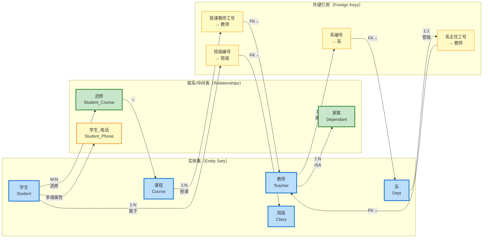

### 转换过程中的规范化检查

ER图到关系模式的转换只是数据库逻辑设计的第一步。转换得到的关系模式集合在物理实现之前，通常还需要经过**关系规范化（Normalization）**的检验。

规范化理论由 E.F. Codd 提出，其核心思想是通过逐步消除关系模式中的**插入异常（Insertion Anomaly）**、**删除异常（Deletion Anomaly）**和**更新异常（Update Anomaly）**，将数据冗余降至最低，同时保证数据的**函数依赖**得到妥善处理。

转换后得到的关系模式在大多数情况下已经处于第三范式（3NF）或 Boyce-Codd 范式（BCNF），因为ER模型的设计本身就蕴含了规范化的理念——每个实体集关注一个主题，每个联系处理一种关系。然而，当ER图的设计存在一些**冗余联系**或**环形依赖**时，转换结果可能存在部分冗余，这时就需要在逻辑设计阶段进一步调整。

一个典型的场景是：假设在ER图中，"供应商"和"项目"之间直接存在 M:N 联系，同时"零件"与两者也各自存在 M:N 联系。如果在转换时不小心将"供应商号"和"项目号"的组合作为某些属性的主键，可能导致传递依赖，此时需要通过**分解（Decomposition）**操作将关系拆分为多个范式等级更高的子关系。

规范化不是越高越好。过度规范化（达到第五范式 5NF 或第六范式 DKNF）可能导致关系数量激增，查询时需要大量的连接操作，反而损害性能。在实际工程中，第三范式（3NF）通常是最平衡的选择。

### Android 中的 Room 映射实践

在 Android 开发中，Google 推荐使用 **Room Persistence Library** 作为本地数据库的解决方案。Room 的核心优势之一在于，它能够将关系型数据库中的表（关系模式）与面向对象的编程语言中的类（Entity）建立映射，从而让开发者以对象操作的方式间接操作数据库。

将 ER 图转换而来的关系模式映射到 Room 的 Entity 类时，核心映射规则与前述 ER→关系模式的转换高度一致。以下展示前述教学管理系统中几个关键 Entity 的 Room 实现：

```kotlin
// Student.kt — 对应"学生"实体集转换而来的关系模式
// Room 通过 @Entity 注解将类映射为数据库表
@Entity(
    tableName = "学生",
    primaryKeys = ["学号"]  // 学号作为主键
)
data class Student(
    val 学号: String,          // 主键列
    val 姓名: String,          // 普通属性列
    val 性别: String,          // 普通属性列
    val 出生日期: Long,        // 日期存储为 Long 型时间戳
    val 班级编号: String?      // 外键引用（可空），来自1:N联系"属于"
) {
    // Room 支持通过 @Relation 注解自动加载关联数据
    // 此注解表示：每个 Student 对象可以关联多个电话号码
    @Relation(
        parentColumn = "学号",      // 主表（Student）中的主键列名
        entityColumn = "学号",     // 关联表（StudentPhone）中的外键列名
        entity = StudentPhone::class
    )
    val 电话列表: List<StudentPhone>   // 多值属性"电话"的对应表示
}
```

```kotlin
// StudentPhone.kt — 对应"学生_电话"关系
// 即多值属性的处理：将多值属性拆分为独立的关系表
@Entity(
    tableName = "学生_电话",
    primaryKeys = ["学号", "电话"],   // 复合主键
    foreignKeys = [
        ForeignKey(
            entity = Student::class,  // 参照的父实体
            parentColumns = ["学号"], // 父表的主键列
            childColumns = ["学号"],  // 子表的外键列
            onDelete = ForeignKey.CASCADE  // 级联删除：删除学生时自动删除其电话
        )
    ]
)
data class StudentPhone(
    val 学号: String,           // 外键列，对应学生表的主键
    val 电话: String            // 电话号码本身
)
```

```kotlin
// Course.kt — 对应"课程"实体集
// 其中包含来自1:N联系"授课"的外键列
@Entity(
    tableName = "课程",
    primaryKeys = ["课程号"],
    foreignKeys = [
        ForeignKey(
            entity = Teacher::class,          // 参照的教师表
            parentColumns = ["工号"],
            childColumns = ["授课教师工号"],
            onDelete = ForeignKey.SET_NULL     // 删除教师时，课程授课教师设为NULL
        )
    ]
)
data class Course(
    val 课程号: String,
    val 课程名: String,
    val 学分: Int,
    val 授课教师工号: String?,   // 外键：来自1:N联系"授课"
    val 开课学期: String?
)
```

```kotlin
// Teacher.kt — 对应"教师"实体集（强实体集）
// 注意：Room 目前对弱实体集没有特殊的语言层面支持
// 需要开发者手动处理弱实体集到关系模式的转换（即手动维护复合主键和外键）
@Entity(
    tableName = "教师",
    primaryKeys = ["工号"]
)
data class Teacher(
    val 工号: String,
    val 姓名: String,
    val 职称: String,
    val 系编号: String?         // 外键：来自1:N联系"属于"
) {
    // Room 的 @Relation 注解支持表达1:N关系
    // 此处表示：一个教师可以有多个家属
    @Relation(
        parentColumn = "工号",
        entityColumn = "工号",
        entity = Dependant::class
    )
    val 家属列表: List<Dependant>
}
```

```kotlin
// Dependant.kt — 对应弱实体集"家属"的转换
// 弱实体集的特征：没有独立的主键，依赖强实体集（教师）的存在
// 在 Room 中，需要在主键中包含父实体的主键列来实现"依赖"语义
@Entity(
    tableName = "家属",
    primaryKeys = ["工号", "家属姓名"],  // 复合主键：工号（来自父）+ 家属姓名（分辨符）
    foreignKeys = [
        ForeignKey(
            entity = Teacher::class,
            parentColumns = ["工号"],
            childColumns = ["工号"],
            onDelete = ForeignKey.CASCADE  // 级联删除
        )
    ]
)
data class Dependant(
    val 工号: String,            // 外键，同时也是复合主键的一部分
    val 家属姓名: String,        // 分辨符，复合主键的另一部分
    val 与教师关系: String
)
```

```kotlin
// Enrollment.kt — 对应M:N联系"选修"的转换
// M:N 联系必须转换为独立的关联表/桥接表
@Entity(
    tableName = "选修",
    primaryKeys = ["学号", "课程号"],  // 复合主键
    foreignKeys = [
        ForeignKey(
            entity = Student::class,
            parentColumns = ["学号"],
            childColumns = ["学号"],
            onDelete = ForeignKey.CASCADE
        ),
        ForeignKey(
            entity = Course::class,
            parentColumns = ["课程号"],
            childColumns = ["课程号"],
            onDelete = ForeignKey.CASCADE
        )
    ]
)
data class Enrollment(
    val 学号: String,            // 外键 + 主键组成部分
    val 课程号: String,          // 外键 + 主键组成部分
    val 成绩: Float?,
    val 选课时间: Long
)
```

```kotlin
// EnrollmentWithStudentAndCourse.kt
// 展示 Room 如何通过 @Relation 实现跨多表的复杂查询
// 此 POJO 将 M:N 联系及其两端的实体数据组合在一起
data class EnrollmentWithDetails(
    @Embedded val enrollment: Enrollment,   // 嵌入选修记录

    @Relation(
        parentColumn = "学号",              // Enrollment 表中的学号
        entityColumn = "学号",
        entity = Student::class
    )
    val student: Student,                   // 关联的学生信息

    @Relation(
        parentColumn = "课程号",            // Enrollment 表中的课程号
        entityColumn = "课程号",
        entity = Course::class
    )
    val course: Course                      // 关联的课程信息
)
```

Room 的映射体系与 ER→关系模式的转换规则形成了一一对应的关系：Entity 类对应关系模式，Entity 的主键属性对应关系的主键，`@ForeignKey` 注解对应外键约束，`@Relation` 注解对应 1:N 或 M:N 联系的查询视图。这种对应关系使得 ER 图的设计成果能够无缝地转化为 Android 应用层的数据模型。

### 转换规则速查表

为便于在实际工作中快速参考，以下列出所有转换规则的要点总结：

| ER 元素 | 转换策略 | 关键注意事项 |
|---------|----------|-------------|
| 强实体集 | 直接转换为一个关系 | 主键 → 主键；派生属性省略 |
| 弱实体集 | 转换为一个关系 | 主键 = 自身分辨符 + 父实体主键；必须包含外键 |
| 简单属性 | 转换为一个列 | - |
| 复合属性 | 展开为多个列 | 仅包含简单子属性 |
| 多值属性 | 创建独立关系 | 新关系包含原实体主键 + 多值属性；复合主键 |
| 1:1 联系 | 外键合并 | 放在参与度少的一端；或独立为关系 |
| 1:N 联系 | 外键合并 | 放在"多"端的关系中 |
| M:N 联系 | 独立关系 | 复合主键 = 两端主键的组合 |
| 特化/泛化 | 父-子独立表 | 子关系主键 = 父关系主键 = 外键 |

#### 📝 练习题

某高校教务系统包含以下ER设计：学生（学号 PK，姓名，专业）和课程（课程号 PK，课程名，学分）之间存在M:N联系"选修"，该联系有一个属性"成绩"。同时，学生和班级（班级号 PK，班级名）之间存在1:N联系"属于"。将上述ER图转换为关系模型后，以下关于所得到的关系模式的说法中，正确的是哪一项？

A. 得到 3 张表：学生（学号 PK，姓名，专业）、课程（课程号 PK，课程名，学分）、选修（学号 PK，课程号 PK，成绩）。其中"属于"联系不需要单独的关系，因为在学生表中增加班级号列即可。
B. 得到 3 张表：学生（学号 PK，姓名，专业，班级号 FK）、课程（课程号 PK，课程名，学分）、选修（学号 PK，课程号 PK，成绩）。学生表中的班级号列用于实现"属于"联系，指向班级表的主键。
C. 得到 4 张表：学生（学号 PK，姓名，专业）、课程（课程号 PK，课程名，学分）、选修（学号 FK，课程号 FK，成绩）、班级（班级号 PK，班级名）。由于"属于"联系是1:N，应在选修表中增加班级号外键。
D. 得到 4 张表：学生（学号 PK，姓名，专业，班级号 FK）、课程（课程号 PK，课程名，学分，授课教师工号 FK）、选修（学号 PK，课程号 PK，成绩）、班级（班级号 PK，班级名）。学生表和课程表各自包含了来自不同联系的外键。

**【答案】** B

**【解析】** 本题考查的是 ER 图到关系模式转换的核心规则应用。

首先，**学生**（强实体集）直接转换为一个关系：学生（学号 PK，姓名，专业）。课程（强实体集）直接转换为一个关系：课程（课程号 PK，课程名，学分）。

其次，**学生与课程之间的 M:N 联系"选修"**必须转换为独立的关系。这是因为"多对多"的关系无法通过在某一端的关系中增加单值外键列来表达。选修关系的属性包括两端实体的主键（作为外键）以及联系自身的属性"成绩"。因此得到：选修（学号 PK，课程号 PK，成绩）。注意这里的主键是复合主键 `(学号, 课程号)`，因为仅凭学号无法唯一确定一行（一个学生选多门课），仅凭课程号也无法唯一确定一行（一门课被多个学生选）。

再次，**学生与班级之间的 1:N 联系"属于"**的转换规则是：将"一"端（班级）的主键放入"多"端（学生）对应的关系中，作为外键。因此，学生表中应增加班级号列，该列作为外键引用班级表的主键。班级表本身作为一个独立的实体集关系存在：班级（班级号 PK，班级名）。

综上，正确的转换结果是 **3 张表**，学生表包含来自"属于"联系的外键，选修表实现 M:N 联系。选项 A 虽然提到了 3 张表的数量，但混淆了 1:N 联系和 M:N 联系的转换规则——A 说"属于联系不需要单独的关系"是对的，但其关于 M:N 联系"选修"的描述不完整（缺少对外键的说明），且整体表结构不够准确。选项 C 错误地将 1:N 联系"属于"转换为了一个独立的关系，这是对 M:N 联系处理方式的误用。选项 D 则是凭空引入了"授课教师工号"这一在题目描述中完全不存在的属性，因此错误。

因此，本题正确答案为 **B**。

---

## 本章小结

本章系统地探讨了数据库概念设计阶段的核心工具——ER模型（Entity-Relationship Model）。ER模型由Peter Chen于1976年提出，其设计初衷是为数据库设计提供一个高层抽象，使得设计者能够摆脱具体存储设备和存取路径的束缚，专注于描述现实世界中数据结构的本质语义。正如建筑设计师在绘制蓝图时不会纠结于砖块的烧制温度，ER图帮助我们在数据库设计的早期阶段捕获业务领域的核心实体及其相互关系，从而为后续的逻辑设计和物理设计奠定坚实基础。

### ER模型的核心构成要素

ER模型由三个最基本的概念构成：**实体（Entity）**、**属性（Attribute）** 和 **联系（Relationship）**。理解这三个概念的内涵与外延，是掌握ER模型的根本所在。

**实体**是客观世界中可以相互区分、具有独立存在意义的事物。实体可以是人（如学生、教师），可以是物（如图书、设备），也可以是抽象概念（如课程、订单）。每个实体具有一个实体集（Entity Set），它是同一类实体的集合。实体集中的每个具体实体称为实体实例（Entity Instance），实体集与实体实例的关系，类似于程序设计中类与对象的关系。在ER图中，实体通常用矩形表示。

**属性**是实体所具有的某一特征或性质。例如，学生实体具有学号、姓名、性别、出生日期等属性。属性可以分为多种类型：从结构角度，可分为简单属性（不可再分，如性别）和复合属性（可进一步拆分，如地址可拆分为省、市、区、街道）；从取值角度，可分为单值属性（每个实体在该属性上只有一个值）和多值属性（每个实体在该属性上可能有多个值，如一个学生的多个联系电话）；从是否派生角度，可分为基属性（直接从数据库中存储的值）和派生属性（可以从其他属性计算推导得出，如年龄可以从出生日期推导）。在ER图中，属性通常用椭圆表示，派生属性用虚线椭圆标识，多值属性则用双线椭圆表示。

**联系**描述了实体集之间的关联关系。联系集（Relationship Set）是n个实体集之间的关联集合，而每个具体的关联实例称为联系实例。例如，“学生选修课程”这一联系集，关联了学生实体集和课程实体集。在ER图中，联系通常用菱形表示。

### ER图的规范画法

绘制ER图并非随意涂抹，而应遵循一套严格的规范，以确保图表清晰、无歧义、易于沟通。

实体集的表示应遵循以下原则：每个实体集应有唯一的名称，放在矩形框内部，名称通常使用名词，采用首字母大写的英文单词或短语表示。实体集的所有属性应列出，对于复合属性，只在图中展示复合属性本身，而不必展开其所有分量成分。对于多值属性，应当将其转换为实体集来处理（将在后续章节深入讨论）。主键属性应当使用下划线明确标注，以便区分实体集中的标识性属性和一般描述性属性。

联系的表示同样有明确规范：联系集应有清晰的名称，通常使用动词或动宾短语表示。参与联系的实体集之间，通过无向边与联系集相连。如果某个实体集在联系中扮演特殊角色（如员工实体集中存在“管理者”和“被管理者”两种角色），可以使用角色标识（Role）来说明该实体在联系中的具体作用。

属性布局方面，通常将主键属性置于属性列表的最上方或最突出位置，与其他属性以虚线与实体集相连。当实体集属性较多时，可以采用分栏布局或将非关键属性另行列表的方式，避免连线和标注过于拥挤，降低图表的可读性。

### 联系类型的深度剖析

联系的类型是ER模型中最核心的概念之一，它决定了实体之间的数量对应关系。理解联系类型不仅仅是记住三种符号（1:1、1:N、M:N），更需要理解每种类型在实际业务场景中的含义以及其对后续关系模式设计的影响。

**一对一联系（1:1）** 指的是对于实体集A中的每一个实体，实体集B中至多有一个实体与之关联，反之亦然。例如，“校长”与“学校”之间的关系——每一所学校至多有一位校长，每一位校长至多管理一所学校，这就是典型的一对一联系。在ER图中，1:1联系的两端各标注"1"。一对一联系的特殊之处在于，它在关系模型中可以选择将任意一端实体的主键放入另一端实体对应的关系中，也可以保持两个关系独立，具体选择取决于查询频率和更新操作的优化考量。

**一对多联系（1:N）** 指的是实体集A中的一个实体可以与实体集B中的多个实体关联，但实体集B中的一个实体至多与实体集A中的一个实体关联。例如，“系”与“教师”之间的关系——一个系有多位教师，但每位教师只属于一个系，这就是一对多联系。在ER图中，一端标注"1"，另一端标注"N"。一对多联系在关系模式转换时具有明确的策略：将“一”端实体的主键作为外键添加到“多”端实体的关系中，这是最自然的转换方式。

**多对多联系（M:N）** 指的是实体集A中的一个实体可以与实体集B中的多个实体关联，反之亦然。例如，“学生”与“课程”之间的关系——一个学生可以选修多门课程，一门课程也可以被多个学生选修，这就是多对多联系。在ER图中，两端均标注"N"或"M"。多对多联系是三种联系类型中最为复杂的一种，因为它不能简单地通过外键嵌入来表达，必须引入一个新的关系表来表达关联，该关系至少包含两个实体的主键作为其候选键或外键。

联系类型的选择应当完全基于业务语义来确定，而非根据数据的存取便利性。在概念设计阶段，我们关注的是“客观世界中事物之间是怎样的关系”，而非“为了查询方便可以怎样组织数据”。这一点至关重要，许多数据库设计初学者容易混淆概念设计阶段和逻辑设计阶段的任务，导致ER图过度受物理实现细节的影响。

### 弱实体集的语义与处理

弱实体集（Weak Entity Set）是ER模型中一个较为特殊但极为重要的概念。理解弱实体集的语义，对于准确建模具有不可或缺的作用。

**弱实体集**指的是那些自身没有足够属性形成主键的实体集，它们必须依赖于另一个实体集（称为标识实体集或属主实体集）才能唯一确定。弱实体集的存在意义在于，现实世界中确实存在这样的实体：它们的唯一性不能由自身属性保证，而必须结合另一个实体的标识才能确定。例如，“家属”是一个典型的弱实体——仅凭姓名无法唯一确定一个家属，因为不同家庭可能有同名同姓的家属；只有将家属与某个特定的员工关联起来，才能唯一确定一个家属实例。

弱实体集具有以下关键特征：首先，弱实体集至少包含一个**部分键（Partial Key）**属性，这些属性在弱实体集内部未必唯一，但与属主实体集的主键组合后，能够唯一确定弱实体集中的每个实例。例如，家属的“姓名”属性与员工的“工号”组合后，可以唯一确定一个家属记录。其次，弱实体集与属主实体集之间存在一种特殊的**拥有（Ownership）**关系，这种关系在ER图中通常用双线菱形表示，称之为“双重参与”或“存在依赖”——属主实体集对弱实体集具有存在支配权，即如果属主实体被删除，则所有依赖其存在的弱实体实例也应当随之删除。这种级联删除语义反映了现实世界中家属对员工的依附关系。

在ER图绘制中，弱实体集用双线矩形表示，其属性中的部分键用虚线下划线标识。弱实体集与属主实体集之间的联系用双线菱形表示，且该联系必然是一个“一对多”联系（一个属主实体对应多个弱实体实例）。此外，弱实体集不拥有自己的主键，其主键由属主实体集的主键和自身部分键的组合构成。

### ER图向关系模式的转换

ER图本身是一种概念模型，最终需要转换为关系数据库管理系统能够处理的**关系模式（Relation Schema）**。这一转换过程称为**ER到关系模型的映射（ER-to-Relational Mapping）**，是数据库设计从概念阶段走向逻辑阶段的桥梁。

转换的基本原则可以概括为“实体对关系、属性对列、联系对外键”。具体而言：

**实体集的转换**是最直接的规则。每个常规实体集转换为一个关系模式，关系模式的名字就是实体集的名字，关系的列就是实体的属性，主键保持不变。例如，学生实体集（含学号、姓名、性别属性，学号为主键）转换为关系模式：`学生(学号, 姓名, 性别)`，其中学号为主键。

**一对一联系的转换**存在三种等效策略：第一种，将一端实体的主键添加到另一端实体对应的关系中，并指定为外键；第二种，将两端实体的主键组合后作为新关系的属性；第三种，合并两个实体集及其联系为一个关系。这三种方法各有优劣，选择时应综合考虑查询模式、数据冗余和更新操作的频率。

**一对多联系的转换**有且仅有唯一的标准做法：将“一”端实体的主键作为外键添加到“多”端实体对应的关系中。例如，系与教师的一对多联系中，教师关系中增加“所属系编号”属性作为外键，参照系关系的主键。这一策略之所以是标准做法，是因为它自然地反映了实体间的数量对应关系，且避免了数据冗余。

**多对多联系的转换**必须引入一个新的关系。新的关系模式至少包含两个属性：两个参与实体集的主键，这两个主键的组合构成新关系的主键（或至少是候选键的一部分）。例如，学生与课程的多对多联系“选修”转换为一个新的关系模式：`选修(学号, 课程号, 成绩)`，其中学号和课程号的组合为主键，学号和课程号各自作为外键分别参照学生关系和课程关系。

**弱实体集的转换**需要特别注意。弱实体集不能独立转换，它必须与属主实体集的主键结合。转换时，弱实体集的关系模式中应包含其自身所有属性以及属主实体集的主键，后者在弱实体关系中同时作为外键（参照属主关系）和主键的一部分。例如，家属弱实体集转换为：`家属(员工工号, 家属姓名, 关系, 性别)`，其中员工工号既是主键的一部分也是外键，参照员工关系。

**属性类型对转换的影响**也需要关注。复合属性应将其各简单分量属性展开后纳入转换后的关系中。派生属性在关系中通常不直接存储其值，而是通过计算获取。多值属性在关系模型中没有直接对应物，标准处理方式是将其转换为一个新的关系，该关系包含多值属性所在实体集的主键以及多值属性本身。

### ER模型的方法论意义

掌握ER模型不仅是学习一种图形表示工具，更是理解数据库系统设计方法论的重要环节。ER模型帮助我们在纷繁复杂的业务需求中抽丝剥茧，识别出数据领域的核心结构。它强调自顶向下的设计思路：首先理解业务的全貌，绘制全局概念模型；然后逐步细化，处理特殊情况和复杂约束；最后通过规范化转换得到高效的关系模式。

值得强调的是，ER图的质量直接决定了后续数据库设计的质量。一个设计良好的ER图应当满足以下标准：**完整性**——所有业务实体、属性和联系均已覆盖；**准确性**——联系类型与业务语义完全吻合；**一致性**——实体间不存在冲突或冗余的描述；**可读性**——图表布局合理、标注清晰，团队成员能够无歧义地理解设计意图。

---

#### 📝 练习题

以下关于ER模型的说法中，错误的是哪一项？

A. 在ER图中，多值属性可以直接作为关系模式中的一个普通列来实现
B. 一对多联系在转换为关系模式时，应将“一”端的主键添加到“多”端的关系中作为外键
C. 弱实体集的主键由其自身部分键和属主实体集的主键组合而成
D. 多对多联系在关系模型中必须转换为一个独立的关系，该关系包含两个参与实体集的主键

**【答案】A**

**【解析】** 本题考查对ER模型核心概念及向关系模式转换规则的掌握程度。

选项A的说法是错误的。在ER模型中，多值属性（Multi-valued Attribute）指的是某一属性对于同一个实体实例可能有多个取值，例如一个员工的多个联系电话。关系模型要求每个属性值必须是原子性的、不可再分的，而多值属性显然不符合这一基本要求。因此，在将ER图转换为关系模式时，**不能**直接将多值属性作为关系中的一个普通列来实现。

正确的处理方式是**将多值属性转换为一个新的关系**。具体做法是：创建一个新的关系模式，该关系包含两个属性——多值属性所在实体集的主键以及多值属性本身。例如，员工实体的多值属性“联系电话”应转换为：`员工电话(员工编号, 联系电话)`，其中员工编号作为外键参照员工关系，而员工编号与联系电话的组合作为该关系的主键。这种处理方式确保了关系模式的第一范式（1NF）要求，即每个属性都是原子的。

选项B的说法是正确的，这是一对多联系的标准转换规则。将“一”端的主键添加到“多”端的关系中，既能表达实体间的关联，又避免了数据冗余。

选项C的说法是正确的，弱实体集的主键由两部分构成：一是弱实体集自身的部分键（用于区分同一属主下的不同弱实体实例），二是属主实体集的主键（用于指明弱实体从属于哪个属主实体）。这两部分的组合才能唯一确定一个弱实体实例。

选项D的说法是正确的，多对多联系无法用简单的外键来表达，因为双方都是“多”的关系，必须引入一个中间关系来表示关联。这个中间关系的属性至少包含两个参与实体集的主键，它们共同构成该关系的主键。

综上所述，本题答案为A。理解多值属性的正确处理方式，是区分ER模型初学者和有一定实践经验的设计者的一个重要标志。
