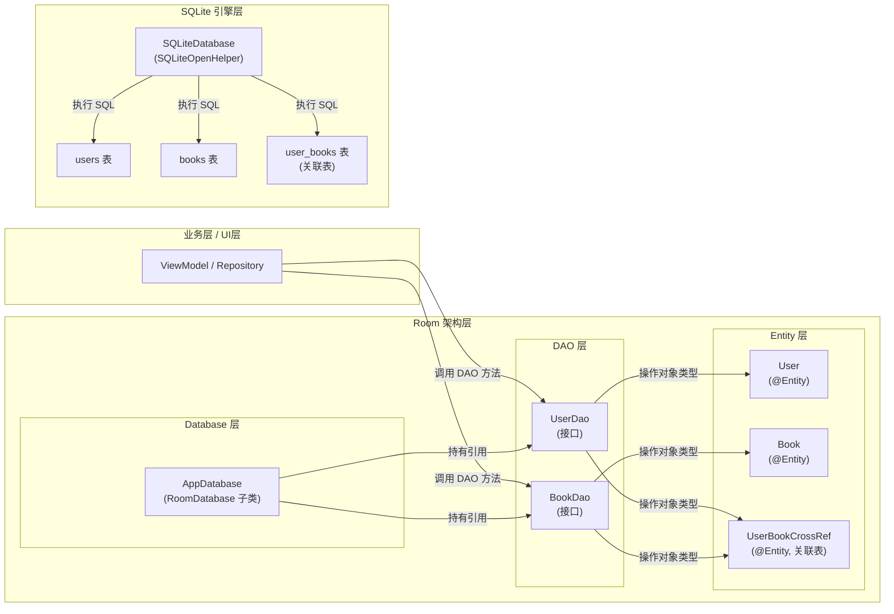
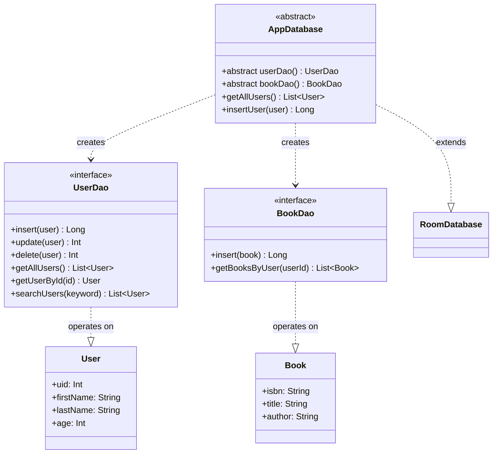
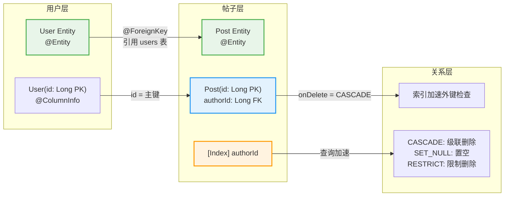
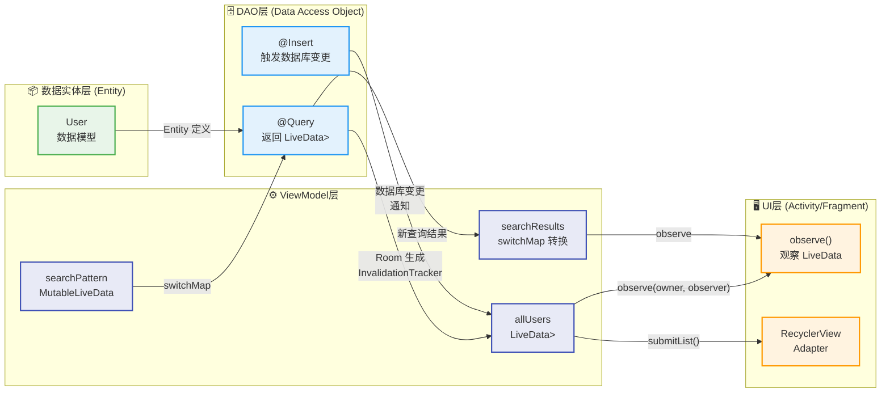
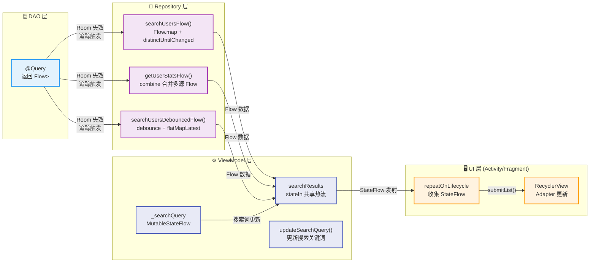

---

# Room框架

---

## Room架构（Entity、DAO、Database）

### 概述

Room 是 Android 官方推荐的本地持久化库，它并非另起炉灶，而是在 SQLite 之上构建了一层结构化的抽象层。理解 Room 的关键在于把握其三大核心组件——Entity、DAO 与 Database——之间的协作关系。Entity 负责定义数据模型，决定了数据以什么样的“形状”存储在数据库中；DAO（Data Access Object）负责定义数据访问接口，封装了对数据库的增删改查操作；Database 则是这三者的“容器”，它将 Entity 和 DAO 绑定在一起，并负责管理数据库的创建、版本以及与 SQLite 的底层连接。理解了这三者的职责划分，就掌握了 Room 的设计精髓。

我们可以将 Room 的架构类比为一个图书馆管理系统：Entity 就像是图书的书目信息卡片，定义了每一本书的ISBN、书名、作者、出版社等字段；DAO 就像是图书馆的借阅柜台，提供了“借书（查询）”、“还书（更新/删除）”、“新书上架（插入）”等操作接口；而 Database 则像是图书馆本身，它管理着所有的书架（数据库文件）、确保新书上架时按照卡片格式来存放、并且协调柜台与书架之间的运作。

在代码层面，这三者之间的关系可以概括为：**Database 持有 DAO 的引用，DAO 操作的是 Entity 对象**。这种关注点分离（Separation of Concerns）的设计使得数据模型、业务逻辑和持久化逻辑三者互不干扰，便于维护和测试。

下面，让我们逐一深入解析这三个组件的内部机制与使用细节。

---

### Entity：数据的骨架

#### 什么是 Entity

Entity 是 Room 中用于描述数据库表结构的 Kotlin 或 Java 类。每一个被 `@Entity` 注解标记的类，Room 编译器都会将其自动映射为一张数据库表。类中的每一个属性对应表中的一列，属性名即为列名（可通过注解参数自定义）。Entity 是 Room 架构中“数据模型层”的核心，它决定了数据的存储结构。

从 ORM（Object-Relational Mapping，对象关系映射）的角度来看，Entity 就是对象世界与关系世界之间的“桥梁”。没有 Entity，我们就只能手写 SQL 语句来操作数据库中的行列，而有了 Entity，Room 可以在编译期自动生成从对象到表、从属性到列的映射代码，大大降低了数据库操作的门槛。

#### 基础 Entity 定义

一个最简单的 Entity 只需要用 `@Entity` 注解标记一个数据类即可。Room 会自动将该类的所有主构造函数参数映射为表列。

```kotlin
// kotlin
// 定义一个 User Entity，对应数据库中的 users 表
@Entity
data class User(
    // uid 作为主键，Room 会自动生成自增 ID
    @PrimaryKey(autoGenerate = true)
    val uid: Int = 0,

    // first_name 和 last_name 对应表中的列
    val firstName: String?,
    val lastName: String?,

    // age 对应 age 列
    val age: Int
)
```

```java
// java
// Java 版本的 Entity 定义
@Entity
public class User {
    // 主键，自动生成
    @PrimaryKey(autoGenerate = true)
    private int uid;

    private String firstName;
    private String lastName;
    private int age;

    // 无参构造函数（Room 需要）
    public User() {}

    // 带参构造函数
    public User(String firstName, String lastName, int age) {
        this.firstName = firstName;
        this.lastName = lastName;
        this.age = age;
    }

    // Getter 和 Setter（Room 使用字段或 Getter，取决于注解配置）
    public int getUid() { return uid; }
    public void setUid(int uid) { this.uid = uid; }
    public String getFirstName() { return firstName; }
    public void setFirstName(String firstName) { this.firstName = firstName; }
    public String getLastName() { return lastName; }
    public void setLastName(String lastName) { this.lastName = lastName; }
    public int getAge() { return age; }
    public void setAge(int age) { this.age = age; }
}
```

上述代码中，`@Entity` 注解的类会被 Room 编译器处理，生成对应的 SQLite 建表语句。生成的建表 SQL 大致如下：

```sql
CREATE TABLE users (
    uid INTEGER PRIMARY KEY AUTOINCREMENT NOT NULL,
    firstName TEXT,
    lastName TEXT,
    age INTEGER NOT NULL
);
```

值得强调的是，Room 的编译时代码生成（Compile-time Code Generation）机制是其区别于传统 SQLite 辅助库的重要特征。与运行时通过反射来读取注解的库不同，Room 在编译阶段就完成了 Entity 到 SQLite 的映射配置，并生成对应的实现类。这意味着错误可以在编译期被捕获，而非等到应用运行时才暴露。

#### @PrimaryKey 详解

主键是关系型数据库中最核心的概念之一，它唯一标识表中每一行数据。在 Room 中，使用 `@PrimaryKey` 注解来标记主键字段。

```kotlin
@Entity
data class Book(
    @PrimaryKey  // 简单主键，无自增
    val isbn: String,

    val title: String,
    val author: String
)
```

```kotlin
@Entity
data class Article(
    @PrimaryKey(autoGenerate = true)  // 设为自动生成，插入时无需指定
    val id: Long = 0,  // 注意：必须提供默认值或使用可空类型

    val title: String,
    val content: String
)
```

`autoGenerate = true` 参数表示由数据库自动生成主键值。当插入数据时，如果我们将 `id` 设为默认值 `0`，Room 会忽略该值，由 SQLite 的 `AUTOINCREMENT` 机制自动分配下一个可用的整数值。需要注意的是，SQLite 的 AUTOINCREMENT 有一定的性能开销和行号限制，在高并发写入场景下，主键的设计需要结合实际情况权衡。

此外，Room 还支持**复合主键**（Composite Primary Key），即多个字段共同构成主键：

```kotlin
@Entity(primaryKeys = ["firstName", "lastName"])
// 复合主键：firstName 和 lastName 的组合唯一
data class Person(
    val firstName: String,
    val lastName: String,
    val age: Int
)
```

复合主键的使用场景相对有限，通常出现在多对多关联表或业务逻辑要求多个字段组合唯一的情况下。

#### 列字段配置：@ColumnInfo

默认情况下，Room 使用属性名作为数据库列名。但在实际项目中，数据库列名通常采用下划线命名法（snake_case），而 Kotlin/Java 属性名采用驼峰命名法（camelCase）。`@ColumnInfo` 注解允许我们独立控制列名和其他列属性：

```kotlin
@Entity
data class UserProfile(
    @PrimaryKey(autoGenerate = true)
    val userId: Long = 0,

    @ColumnInfo(name = "user_name")  // 列名为 user_name，而非 userName
    val userName: String,

    @ColumnInfo(name = "created_at", typeAffinity = ColumnInfo.TEXT)
    // 存储为 ISO 8601 格式的时间戳字符串
    val createdAt: String,

    @ColumnInfo(name = "is_active", index = true)
    // 创建索引，加速按状态查询
    val isActive: Boolean = true
)
```

`@ColumnInfo` 的主要参数包括：

- **name**：指定数据库列名，实现命名规范的转换（如 camelCase → snake_case）。
- **typeAffinity**：指定列的类型亲和性。SQLite 是无类型数据库，同一列可以存储不同类型的数据，但 Room 需要为生成的代码指定类型。常见值有 `INTEGER`、`REAL`、`TEXT`、`BLOB`。
- **index**：是否在该列上创建索引。对于频繁查询的字段（如外键、常用过滤条件），建立索引可以显著提升查询性能。
- **collate**：指定列的排序规则，如 `NOCASE`（不区分大小写）适用于文本搜索场景。

#### 表名配置：@Entity 的 tableName 参数

默认情况下，Room 使用类名作为表名。通过 `tableName` 参数可以自定义表名：

```kotlin
@Entity(tableName = "tb_user")  // 使用 tb_user 作为表名，而非 User
data class User(
    @PrimaryKey
    val id: Int,
    val name: String
)
```

在实际项目中，为表名添加统一前缀（如 `tb_`）是一种常见的命名规范，有助于在数据库管理工具中快速区分业务表与系统表。

#### 忽略字段：@Ignore

有时候，一个 Entity 类中会包含一些不应该被持久化到数据库的字段。例如，计算属性、临时变量或者由其他字段推导出的派生数据。这时可以使用 `@Ignore` 注解告诉 Room 忽略该字段：

```kotlin
@Entity
data class Employee(
    @PrimaryKey
    val id: Int,

    val firstName: String,
    val lastName: String,

    @Ignore  // 不会被存入数据库，仅存在于内存中的对象
    val fullName: String = "$firstName $lastName",  // 这其实无法工作

    // 正确做法：使用 @Transient（在 Java 中）或用函数代替
    // 这里演示正确的忽略方式
    val departmentId: Int
) {
    // 派生属性应该用普通属性（而非 data class 的 copy/equals 生成）
    // 如果必须标注，用 @Ignore
    // @Ignore
    // val avatarUrl: String? = null
}
```

```kotlin
// 实际开发中更常见的场景：
@Entity
data class User(
    @PrimaryKey
    val id: Int,

    val name: String,

    // 一个从服务器获取的头像 URL，不持久化到本地数据库
    @Ignore
    val avatarUrl: String? = null
)
```

`@Ignore` 还能用于标记那些在数据库中已存在但当前 Entity 类不需要的遗留字段，确保数据库迁移或版本升级时的兼容性。

#### 数据类与 Room 的天然契合

在 Kotlin 中，`data class` 是专门为数据存储设计的类。Room 与 `data class` 的组合是官方推荐的实践，原因在于 `data class` 自动提供了 `equals()`、`hashCode()`、`toString()`、`copy()` 等方法，这些方法在数据比较、调试和部分更新场景中非常有用。然而，使用 `data class` 也需要注意一些陷阱：

1. **主键不可变**：`data class` 的属性默认是不可变的（`val`），但 Room 要求主键字段在对象被插入后保持不变。这是合理的设计约束，与数据完整性原则一致。
2. **默认值的歧义**：当 Entity 有多个带默认值的属性时，Room 生成的构造函数可能无法准确识别哪个参数对应哪个字段。可以通过 `@PrimaryKey(autoGenerate = true)` 配合默认值为 `0` 或 `null` 来解决。

#### Entity 的继承与嵌入：@Embedded 与 @Relation

Room 提供了两个强大的注解来处理复杂的数据结构：**@Embedded** 允许将一个对象拆解为多个列存储在同一张表中，而 **@Relation** 则用于处理表与表之间的关联关系（类似于外键）。

**@Embedded** 的典型使用场景是地址信息。假设一个用户有省、市、区、街道等多级地址信息，将这些字段单独提取为一个 `Address` 类并嵌入 `User` 中，可以让数据模型更加清晰：

```kotlin
// 定义一个嵌入对象：地址
data class Address(
    val street: String?,
    val city: String?,
    val state: String?,
    val zipCode: String?,
    val country: String?
)

// 定义 User Entity，使用 @Embedded 将 Address 的字段展开到 users 表中
@Entity
data class UserWithAddress(
    @PrimaryKey
    val id: Int,

    val name: String,

    @Embedded  // Address 的所有字段会被展开为 users 表的列
    val address: Address,

    // 嵌套的嵌入对象（前缀冲突时使用 prefix 参数区分）
    @Embedded(prefix = "mailing_")
    val mailingAddress: Address? = null
)
```

上述 `UserWithAddress` 类对应的数据库表结构大致如下：

| 列名 | 类型 | 说明 |
|------|------|------|
| id | INTEGER | 主键 |
| name | TEXT | 用户名 |
| street | TEXT | 街道（来自 Address） |
| city | TEXT | 城市 |
| state | TEXT | 州/省份 |
| zipCode | TEXT | 邮编 |
| country | TEXT | 国家 |
| mailing_street | TEXT | 邮寄地址-街道（来自 mailingAddress） |
| mailing_city | TEXT | 邮寄地址-城市 |
| mailing_state | TEXT | 邮寄地址-州 |
| mailing_zipCode | TEXT | 邮寄地址-邮编 |
| mailing_country | TEXT | 邮寄地址-国家 |

可以看到，`prefix` 参数有效地解决了同类型嵌入对象之间的列名冲突问题。

---

### DAO：数据访问的契约

#### DAO 的设计哲学

DAO（Data Access Object，数据访问对象）是 Room 架构中连接业务逻辑层与数据持久化层的“桥梁”。DAO 本质上是一个**接口**（在 Kotlin 中为接口，在 Java 中可以是接口或抽象类），它定义了所有对数据库表的操作方法。Room 编译器在编译阶段会根据 DAO 接口中的方法签名自动生成对应的 SQLite 实现代码。

将 DAO 设计为接口而非具体实现类，是软件工程中**面向接口编程**原则的体现。接口定义了“做什么”（What），而具体的实现细节由 Room 生成的代码负责“怎么做”（How）。这种设计带来了三个显著优势：第一，业务代码只依赖于接口而不依赖具体实现，便于单元测试时使用模拟对象（Mock）替换真实数据库；第二，接口的方法签名本身就是对数据访问行为的规范文档；第三，Room 可以针对不同的操作类型（查询、插入、更新、删除）生成高度优化的 SQLite 语句。

从架构分层来看，DAO 属于**数据访问层（Data Access Layer）**，它位于业务逻辑层之下，直接与 Database 组件交互。这种分层使得数据持久化逻辑与业务规则相互独立，符合 Clean Architecture 的核心理念。

#### 基础 DAO 定义

```kotlin
// 定义一个 DAO 接口，专门负责操作 User 表
@Dao  // Data Access Object 注解
interface UserDao {

    // 插入操作：返回新插入行的主键值（Long 类型）
    @Insert
    suspend fun insertUser(user: User): Long

    // 批量插入：返回插入的行数
    @Insert
    suspend fun insertAll(vararg users: User)

    // 查询操作：返回所有用户列表
    @Query("SELECT * FROM user")
    suspend fun getAllUsers(): List<User>

    // 带条件的查询：按年龄查询
    @Query("SELECT * FROM user WHERE age > :minAge")
    suspend fun getUsersOlderThan(minAge: Int): List<User>

    // 更新操作：返回受影响的行数
    @Update
    suspend fun updateUser(user: User): Int

    // 删除操作：返回受影响的行数
    @Delete
    suspend fun deleteUser(user: User): Int

    // 删除所有数据
    @Query("DELETE FROM user")
    suspend fun deleteAllUsers()
}
```

上述代码展示了 DAO 的基本结构。关键要点如下：

1. **@Dao 注解**：标识该接口为 Room 的 DAO 组件。Room 编译器会识别所有带此注解的接口并生成实现。
2. **suspend 关键字**：在 Kotlin 中，`suspend` 函数可以在协程中执行而不会阻塞主线程。Room 2.1 之后的版本全面支持协程，所有 DAO 方法都推荐使用 `suspend` 修饰。这使得数据库的异步操作变得异常简洁——只需在调用处使用 `launch` 或 `async` 协程构建器即可。
3. **@Insert、@Update、@Delete 注解**：Room 自动根据 Entity 的主键来执行对应的操作。`@Insert` 返回插入后生成的主键值（如果是批量插入则返回 `List<Long>`）；`@Update` 和 `@Delete` 返回受影响的行数。
4. **@Query 注解**：这是 DAO 中最灵活也是最强大的注解。参数中传入的是原生 SQL 语句，Room 会根据返回类型自动进行结果集的映射。

#### @Query：灵魂注解

`@Query` 是 DAO 中最核心的注解，它接受一个 SQL 查询字符串作为参数，Room 会验证该 SQL 的语法正确性（编译期检查）以及返回值类型与 Entity 的匹配性。

**基础查询**：

```kotlin
@Dao
interface ProductDao {
    // 查询所有商品
    @Query("SELECT * FROM product")
    fun getAllProducts(): Flow<List<Product>>  // 使用 Flow 实现响应式查询

    // 带条件的单值查询
    @Query("SELECT * FROM product WHERE id = :productId")
    suspend fun getProductById(productId: Int): Product?

    // 统计查询：返回满足条件的记录数量
    @Query("SELECT COUNT(*) FROM product WHERE price < :maxPrice")
    suspend fun countCheapProducts(maxPrice: Double): Int

    // 聚合查询：计算平均价格
    @Query("SELECT AVG(price) FROM product")
    suspend fun getAveragePrice(): Double?

    // 分页查询：LIMIT 和 OFFSET
    @Query("SELECT * FROM product ORDER BY name ASC LIMIT :limit OFFSET :offset")
    suspend fun getProductsPaged(limit: Int, offset: Int): List<Product>
}
```

**LIKE 模糊查询**：

```kotlin
// 搜索用户名中包含指定关键词的用户
@Query("SELECT * FROM user WHERE firstName LIKE '%' || :keyword || '%' OR lastName LIKE '%' || :keyword || '%'")
suspend fun searchUsers(keyword: String): List<User>
```

在 SQLite 的 LIKE 语法中，通配符 `'%'` 匹配任意序列（包括空串），`'?'` 匹配单个字符。上述查询使用字符串拼接构建了 `LIKE '%keyword%'` 模式，实现前后通配的模糊搜索。

**IN 子句与多值参数**：

```kotlin
// 查询指定 ID 列表中的所有用户
@Query("SELECT * FROM user WHERE uid IN (:userIds)")
suspend fun getUsersByIds(userIds: List<Int>): List<User>

// 也可以使用 vararg（可变参数）方式传入
@Query("SELECT * FROM user WHERE uid IN (:userIds)")
suspend fun getUsersByIds(vararg userIds: Int): List<User>
```

**NULL 安全查询**：

```kotlin
// 查询备注为 NULL 的记录
@Query("SELECT * FROM task WHERE note IS NULL")
suspend fun getTasksWithNoNote(): List<Task>

// 查询备注不为 NULL 的记录
@Query("SELECT * FROM task WHERE note IS NOT NULL")
suspend fun getTasksWithNotes(): List<Task>
```

在 SQL 中，`NULL` 与任何值的比较运算（`=`、`<>`）都不会返回真（因为 `NULL = NULL` 的结果既不是 TRUE 也不是 FALSE，而是 UNKNOWN），因此必须使用 `IS NULL` 和 `IS NOT NULL` 来判断空值。

#### @Insert、@Update、@Delete 的深度解析

这三个注解虽然使用简单，但背后蕴含了 Room 对 SQLite 事务的精细管理。

```kotlin
@Dao
interface UserDao {

    // 单条插入
    @Insert
    suspend fun insert(user: User): Long

    // 批量插入：Room 会自动将多条插入包装在一个事务中
    @Insert
    suspend fun insertAll(users: List<User>)

    // 使用 @Insert(onConflict = OnConflictStrategy.REPLACE)
    // 可以实现“存在则替换”语义，类似于 UPSERT
    @Insert(onConflict = OnConflictStrategy.REPLACE)
    suspend fun insertOrReplace(user: User)

    // @Update 会根据主键判断，如果记录不存在则不产生任何影响
    @Update
    suspend fun update(user: User): Int

    // @Delete 同样基于主键匹配来删除记录
    @Delete
    suspend fun delete(user: User): Int

    // 也可以使用 @Query 执行自定义的 DELETE 语句
    @Query("DELETE FROM user WHERE age > :age")
    suspend fun deleteUsersOlderThan(age: Int): Int
}
```

`OnConflictStrategy` 枚举定义了插入冲突时的处理策略：

- **REPLACE**：用新记录替换已有记录（执行 DELETE 后 INSERT）。
- **ABORT**（默认）：事务回滚，抛出异常。
- **ROLLBACK**：事务回滚（同 ABORT 在 SQLite 中表现类似）。
- **FAIL**：操作失败但不回滚已执行的部分。
- **IGNORE**：跳过冲突行，继续执行后续操作。

在 Kotlin 中使用 `@Insert(onConflict = OnConflictStrategy.REPLACE)` 实际上是调用了 SQLite 的 `INSERT OR REPLACE` 语句。需要特别注意的是，如果表中有外键约束且设置了 `ON DELETE`/`ON UPDATE` 行为，REPLACE 操作可能触发外键级联动作。

#### LiveData 与 Flow：响应式数据流

在现代 Android 开发中，UI 层需要随着数据变化自动更新。Room 对两种主流的响应式方案提供了开箱即用的支持：**LiveData**（来自 Android Jetpack）和 **Flow**（来自 Kotlin 协程库）。

**LiveData 版本**：

```kotlin
@Dao
interface UserDao {
    // 返回 LiveData，数据库变化会自动通知观察者
    @Query("SELECT * FROM user")
    fun getAllUsersLiveData(): LiveData<List<User>>

    // 带过滤条件的 LiveData 查询
    @Query("SELECT * FROM user WHERE age >= :minAge ORDER BY age DESC")
    fun getAdultsLiveData(minAge: Int): LiveData<List<User>>
}
```

LiveData 是生命周期感知的组件，它会在 Activity/Fragment 进入活跃状态时自动开始观察数据库，当数据发生变化时在主线程上通知 UI 更新。当 Activity 进入后台或被销毁时，LiveData 会自动停止观察，避免内存泄漏和空指针异常。

**Flow 版本（推荐）**：

```kotlin
@Dao
interface UserDao {
    // Room 会自动将数据库的 ContentObserver 转换为 Kotlin Flow
    // Room 会将 Flow 的发射放在主线程上（与 LiveData 行为一致）
    @Query("SELECT * FROM user ORDER BY age ASC")
    fun getAllUsersFlow(): Flow<List<User>>

    // 带过滤条件的 Flow 查询
    @Query("SELECT * FROM user WHERE age >= :minAge")
    fun getAdultsFlow(minAge: Int): Flow<List<User>>

    // 也可以使用 flowOf() 配合 withContext(IO) 实现后台发射
    // 但 Room 2.2+ 会在后台线程执行查询并在主线程发射
    @Query("SELECT * FROM user WHERE name LIKE :pattern")
    fun searchUsers(pattern: String): Flow<List<User>>
}
```

Flow 相比 LiveData 更加灵活和强大。LiveData 只在活跃生命周期内发射数据，而 Flow 是一个冷流（cold stream），可以被各种操作符（`map`、`filter`、`debounce` 等）组合使用，支持背压（backpressure）处理，并且可以切换到任意协程作用域中执行。

```kotlin
// 在 ViewModel 中使用 Flow 的典型模式
class UserViewModel(private val userDao: UserDao) : ViewModel() {

    // 只暴露 Flow 给 UI 层，不暴露 DAO 的具体引用
    val allUsers: Flow<List<User>> = userDao.getAllUsersFlow()

    // 带转换的 Flow：筛选出成年人并转换为 UI 模型
    val adultUsers: Flow<List<UserUiModel>> = userDao.getAllUsersFlow()
        .map { users -> users.filter { it.age >= 18 } }
        .map { adults -> adults.map { UserUiModel.fromEntity(it) } }
}
```

从架构角度来说，将 Flow 作为 DAO 方法的返回类型是当前的推荐做法，因为 Flow 更加现代化且与 Kotlin 协程体系无缝融合。LiveData 则更适合与旧有的 Android 组件（如 Fragment 的 `observe()` 方法）配合使用。

#### DAO 的事务管理

在涉及多条记录的批量操作时，事务的原子性（Atomicity）是确保数据一致性的关键。Room 默认将每一条 `@Insert`、`@Update`、`@Delete` 操作包装在独立的事务中执行。对于需要多条操作保持原子性的场景，Room 提供了 `@Transaction` 注解和 `withTransaction` 协程扩展函数。

```kotlin
@Dao
abstract class UserDao {

    // 方式一：@Transaction 注解批量方法
    @Insert
    abstract suspend fun insertUser(user: User): Long

    @Insert
    abstract suspend fun insertProfile(profile: UserProfile): Long

    @Transaction  // 确保整个方法在一个事务中执行
    open suspend fun insertUserWithProfile(user: User, profile: UserProfile) {
        val userId = insertUser(user)
        // 如果这里抛出异常，整个事务会回滚
        insertProfile(profile.copy(userId = userId))
    }

    // 方式二：使用 withTransaction 协程函数（更灵活）
    @Transaction
    @Query("SELECT * FROM user WHERE id = :userId")
    abstract fun getUserWithProfile(userId: Int): Flow<UserWithProfile?>
}
```

```kotlin
// 在 Repository 或 ViewModel 中使用 withTransaction
class UserRepository(private val database: AppDatabase) {

    private val userDao = database.userDao()

    suspend fun transferUser(fromId: Int, toId: Int, amount: Double) {
        // 在事务中执行：扣款 -> 加款 -> 记录日志
        database.withTransaction {
            val fromUser = userDao.getUserById(fromId)
            val toUser = userDao.getUserById(toId)

            if (fromUser != null && fromUser.balance >= amount) {
                userDao.updateBalance(fromId, fromUser.balance - amount)
                userDao.updateBalance(toId, toUser.balance + amount)
                userDao.insertTransferLog(
                    TransferLog(fromId, toId, amount, System.currentTimeMillis())
                )
            }
        }
    }
}
```

`withTransaction` 是一个挂起函数，它启动一个新的事务块，在 lambda 执行完毕后自动提交。如果 lambda 中抛出任何异常，事务会自动回滚。这与 SQLite 的 `BEGIN TRANSACTION … COMMIT / ROLLBACK` 模式完全对应，但以声明式的方式呈现。

---

### Database：Room 的顶层容器

#### Database 的角色

`@Database` 注解的类是 Room 架构中的顶层组件，它承担着三重职责：

1. **版本管理器**：管理数据库的 schema 版本号，驱动迁移（Migration）流程。
2. **组件注册中心**：声明所有参与数据库构建的 Entity 和 DAO。
3. **连接工厂**：持有对底层 SQLite 数据库的引用，提供数据访问的入口点。

从设计模式的角度看，`@Database` 类实际上是 **Abstract Factory 模式**的体现——它定义了一组创建相关对象（Entity、DAO）的接口，使得客户端代码可以通过统一的入口访问数据库的各个部分，而无需关心底层的 SQLite 实现细节。

#### Database 类的定义

```kotlin
// AppDatabase.kt
// AppDatabase 类需要同时继承 RoomDatabase
@Database(
    entities = [User::class, Book::class, Author::class],  // 声明所有参与数据库的 Entity
    version = 1,  // 数据库版本号，从 1 开始，每次 schema 变化必须递增
    exportSchema = true  // 导出 schema 到指定目录，用于迁移和版本管理
)
abstract class AppDatabase : RoomDatabase() {

    // 提供各表的 DAO 访问入口
    abstract fun userDao(): UserDao
    abstract fun bookDao(): BookDao
    abstract fun authorDao(): AuthorDao

    // 可以定义一些全局方法，如清除所有表的数据
    companion object {
        // @Volatile 确保多线程间的可见性
        @Volatile
        private var INSTANCE: AppDatabase? = null

        // 使用 Dagger/Hilt 或手动方式获取 Database 实例
        fun getDatabase(context: Context): AppDatabase {
            return INSTANCE ?: synchronized(this) {
                val instance = Room.databaseBuilder(
                    context.applicationContext,  // 使用 ApplicationContext 避免内存泄漏
                    AppDatabase::class.java,     // Database 类的 Class 对象
                    "app_database"              // 数据库文件名（不含扩展名）
                )
                .build()  // 同步构建（实际为异步），也可使用 addCallback
                INSTANCE = instance
                instance
            }
        }
    }
}
```

上述代码展示了 Database 类的标准结构。几个关键点需要深入理解：

**泛型参数 entities**：该参数接受一个 Class 数组，声明了数据库中包含的所有 Entity 类型。Room 编译器会检查这些 Entity 之间的一致性——例如，如果 Entity A 引用了 Entity B（通过外键），但 B 没有被包含在 entities 列表中，编译期就会报错。这种强类型检查机制是 Room 安全性的重要体现。

**version 参数**：版本号是数据库 schema 管理的核心。每次对数据库结构进行任何变更（新增表、新增列、修改列类型、删除列等），都必须将 version 加 1。如果不配合 Migration 或 `fallbackToDestructiveMigration()`，旧版本的 APK 安装在新版本的数据库上时会导致应用崩溃。

**exportSchema = true**：启用后，Room 会在每次编译时将数据库的 schema（表结构快照）导出到 `app/schemas/` 目录下，以 JSON 文件形式存储。每个版本的 schema 会被保存为一个文件，文件名格式为 `版本号.json`（例如 `1.json`、`2.json`）。这些 schema 文件是实现数据库迁移的关键依据，也是团队协作和 CI/CD 流程中不可或缺的工具。

#### Room.databaseBuilder 的配置选项

`Room.databaseBuilder()` 返回一个 `DatabaseBuilder` 对象，提供了丰富的配置方法：

```kotlin
val database = Room.databaseBuilder(
    context.applicationContext,
    AppDatabase::class.java,
    "app_database"
)
    // 数据库创建和打开时的回调，可用于预填充数据
    .addCallback(object : Callback() {
        override fun onCreate(db: SupportSQLiteDatabase) {
            super.onCreate(db)
            // 数据库首次创建时执行，可以在这里插入初始数据
            // 注意：此回调在后台线程中执行
        }

        override fun onOpen(db: SupportSQLiteDatabase) {
            super.onOpen(db)
            // 数据库每次打开时执行
        }

        override fun onConfigure(db: SupportSQLiteDatabase) {
            super.onConfigure(db)
            // 在数据库配置之前调用，可以设置外键约束等
            db.setForeignKeyConstraintsEnabled(true)
        }
    })

    // 当版本不匹配且没有 Migration 时，摧毁旧数据库重建
    // ⚠️ 警告：这会导致旧数据全部丢失，仅适用于开发阶段
    .fallbackToDestructiveMigration()

    // 指定在 schema 版本回退时也执行破坏性迁移
    .fallbackToDestructiveMigrationFrom(2, 3)  // 仅在从版本 2 或 3 回退时允许破坏

    // 设置数据库打开模式的工厂（默认使用标准模式）
    // .openHelperFactory(factory)

    // 设置查询执行线程（默认返回董氏线程，用于观察 LiveData/Flow）
    // Room 2.2+ 不推荐修改此设置
    // .setTransactionExecutor(Executors.newSingleThreadExecutor())

    // 设置 Journal 模式（废弃，Room 3.0 已移除）
    // .setJournalMode(JournalMode.WRITE_AHEAD_LOGGING)

    // 添加迁移策略（详见“数据库迁移”章节）
    .addMigrations(MigrationFrom1To2(), MigrationFrom2To3())

    // 自动关闭时间（达到空闲连接超时后自动关闭数据库）
    .setAutoCloseTimeout(30, TimeUnit.SECONDS)

    .build()
```

这些配置选项覆盖了数据库生命周期中的各种场景。开发阶段最常用的是 `fallbackToDestructiveMigration()`，它允许开发者在 schema 频繁变化时跳过迁移代码的编写，直接通过清除旧数据库来适配新结构。但一旦应用进入生产阶段，这个选项就必须被移除并替换为正式的 Migration 策略。

#### 单例模式与多实例管理

在上述 Database 定义中，`getDatabase()` 方法采用了**双重检查锁定（Double-Checked Locking）**模式来确保数据库实例的单例性。这是 Android 开发中的标准实践，原因在于：

- 数据库对象是重量级资源，重复创建会消耗大量内存和 CPU。
- 多线程同时访问同一个数据库连接可能导致竞争条件和锁争用。
- Android 组件（Activity、Fragment）在配置变更（如屏幕旋转）时会被销毁和重建，如果每次都创建新的数据库实例，会导致资源浪费和潜在的连接泄漏。

```kotlin
// 双重检查锁定模式的详细解释
@Volatile  // 确保 INSTANCE 对所有线程可见
private var INSTANCE: AppDatabase? = null

fun getDatabase(context: Context): AppDatabase {
    return INSTANCE ?: synchronized(this) {  // 同步块确保线程安全
        INSTANCE ?: buildDatabase(context).also { INSTANCE = it }
        // 第一次检查在同步块外（提升性能）
        // 第二次检查在同步块内（确保单例）
    }
}
```

然而，在某些高级场景下，可能需要多个数据库实例共存。例如，一个应用需要同时连接一个只读的预置数据库（assets 中预装的数据库）和一个可写的用户数据库。此时可以创建两个不同的 Database 实例，分别指向不同的文件路径。

```kotlin
// 多数据库实例场景
val readOnlyDb = Room.databaseBuilder(
    context,
    AppDatabase::class.java,
    "preloaded_database.db"  // 指向 assets 中的预置数据库
)
    .createFromAsset("databases/preloaded_database.db")  // 从 APK assets 复制
    .openHelperFactory(null)  // 打开为只读模式
    .build()

val writableDb = Room.databaseBuilder(
    context,
    AppDatabase::class.java,
    "user_database.db"
)
    .build()
```

#### RoomDatabase 基类的核心方法

`RoomDatabase` 作为所有 Database 类的基类，提供了一些在运行时管理数据库的关键方法：

```kotlin
// 在协程中执行批量操作，自动包装在事务中
suspend fun insertBatch(items: List<Entity>) {
    database.runInTransaction {
        items.forEach { entityDao.insert(it) }
    }
}

// 清除所有表中的数据（TRUNCATE TABLE 的替代方式）
database.clearAllTables()

// 执行不返回结果的原始 SQL（谨慎使用，绕过了编译期检查）
database.openHelper.writableDatabase.execSQL("PRAGMA foreign_keys = ON")

// 获取底层 SQLiteDatabase（仅在万不得已时使用）
val sqliteDb = database.openHelper.writableDatabase
```

需要特别强调的是，`clearAllTables()` 不会删除表本身，只删除表中的数据行。这在需要重置应用数据但保留表结构的场景下非常有用。而 `execSQL()` 和直接获取 `writableDatabase` 应当是最后的手段，因为这些操作完全绕过了 Room 的类型安全和编译期检查。

#### 架构全景：三者协作的完整流程

为了更清晰地理解 Entity、DAO、Database 三个组件如何协同工作，下面通过一个完整的查询流程来说明数据的流转路径：





在这个架构中，**数据流向**遵循一个清晰的模式：

1. **应用启动**：调用 `AppDatabase.getDatabase(context)` 获取或创建 `AppDatabase` 实例。
2. **请求发起**：ViewModel/Repository 调用 `database.userDao()` 获取 DAO 实例。
3. **操作执行**：调用 DAO 方法（如 `userDao.getAllUsers()`）。
4. **代码生成**：Room 编译器在编译期生成的 `UserDao_Impl` 类中的实现方法，将方法调用翻译为 SQLite 语句。
5. **数据库交互**：`SupportSQLiteDatabase` 执行实际的 SQL 语句。
6. **结果映射**：查询结果通过 `User` 类的构造函数或字段 setter 被重新组装为 Entity 对象。
7. **返回值传递**：Entity 对象（或 Flow/LiveData）沿着调用链返回给 UI 层。

整个流程的关键在于**编译时代码生成**。正是因为 Room 在编译阶段就完成了 SQL 语句的生成和验证，所以它能够提供比运行时反射方案更高的性能、更强的类型安全保证和更友好的错误提示。

---

### 总结与练习

#### 本节小结

本节深入探讨了 Room 架构的三大支柱：**Entity**、**DAO** 与 **Database**。Entity 作为数据的骨架，通过注解将 Kotlin 数据类映射为数据库表，支持主键、自增、复合主键、列配置、字段忽略以及嵌入对象等丰富特性。DAO 作为数据访问的契约，以接口形式定义了增删改查的全部操作，Room 编译器根据方法签名自动生成 SQLite 实现代码，支持协程、Flow 和 LiveData 等多种异步与响应式模式。Database 作为顶层容器，负责整合所有 Entity 和 DAO，管理数据库版本、控制事务边界，并提供数据库访问的入口点。

三者的关系可以概括为：**Database 是容器，Entity 是骨架，DAO 是接口**。理解了这三个组件的职责边界和协作方式，就掌握了 Room 框架的核心设计思想。

---

#### 📝 练习题

关于 Room 架构中 Entity、DAO、Database 三个组件的职责与关系，以下说法哪一项是**错误**的？

A. Entity 类中所有属性都会被持久化到数据库表中，除非使用 `@Ignore` 注解标记。`@ColumnInfo` 注解可以用于修改属性在数据库中的列名和类型，但不改变该属性是否被持久化。
B. DAO 接口中标记了 `@Insert` 的方法必须使用 `suspend` 关键字修饰，以确保 Room 在后台线程执行插入操作，避免阻塞主线程。
C. `@Database` 注解的类必须继承自 `RoomDatabase`，并通过 `entities` 参数声明所有参与数据库的 Entity 类型。如果某个 Entity 被其他 Entity 通过外键引用但未被包含在 `entities` 列表中，编译时会报错。
D. `Room.databaseBuilder()` 创建的 Database 实例推荐使用 ApplicationContext 而非 Activity Context，以避免因 Activity 销毁导致的内存泄漏。Database 实例应使用单例模式管理，确保整个应用生命周期内只有一个数据库连接实例。

**【答案】** B

**【解析】** 本题考查对 Room 三大组件的理解深度。

选项 B 的错误在于它过度绝对化了。虽然在实际开发中，DAO 方法**推荐**使用 `suspend` 关键字修饰以便在协程中异步执行，但这并非强制性要求。Room 同样支持非 suspend 的 DAO 方法——Room 编译器会为这些方法生成在后台线程执行的实现，并通过 `Callback` 或 `ReactiveStreams` 方式将结果传递回调用者。

具体来说，以下写法是完全合法且可编译通过的：

```kotlin
@Dao
interface UserDao {
    // 不使用 suspend，返回 LiveData（Room 自动在后台线程执行查询）
    @Query("SELECT * FROM user")
    fun getAllUsersLiveData(): LiveData<List<User>>

    // 不使用 suspend，返回 Flow（Room 自动在后台线程执行查询）
    @Query("SELECT * FROM user")
    fun getAllUsersFlow(): Flow<List<User>>

    // 不使用 suspend，返回 RxJava 的 Single
    @Query("SELECT * FROM user WHERE id = :id")
    fun getUserById(id: Int): Single<User>

    // 不使用 suspend，也不返回任何响应式类型
    // Room 会在后台线程执行，并忽略返回值
    @Insert
    fun insertSync(user: User)  // 虽然不推荐，但语法正确
}
```

`@Insert`、`@Update`、`@Delete` 等注解的方法在不带 `suspend` 的情况下，Room 会使用内部维护的线程池来执行这些操作，只是调用方需要在适当的线程上接收结果（或根本不使用结果）。

相比之下，其他三个选项的表述都是正确的：

- **选项 A 正确**：`@Ignore` 确实用于排除不需要持久化的字段，`@ColumnInfo` 仅改变持久化的元数据（列名、类型等），不会改变持久化行为本身。
- **选项 C 正确**：Room 在编译期会验证所有 Entity 之间引用的完整性。如果 Entity A 通过 `@ForeignKey` 引用了 Entity B，但 B 没有被包含在 Database 的 `entities` 列表中，Room 会报编译错误。
- **选项 D 正确**：使用 ApplicationContext 是 Android 内存管理的最佳实践；Database 作为重量级资源，使用单例模式确保全局唯一实例是标准做法。

因此，本题答案为 **B**。

---

## Entity 定义（注解、主键、外键）

在 Room 持久化框架中，Entity 是整个数据访问层的基础构建单元。它本质上是一个用注解修饰的 Kotlin 或 Java 类，Room 编译器会依据这些注解在编译期自动生成对应的 SQLite 数据表结构。理解 Entity 的定义机制，是掌握 Room 框架的第一步，也是最关键的一步。本节将深入剖析 Entity 注解的每一个细节、主键的多种声明方式，以及外键约束的实现原理与实战技巧。

### Entity 注解基础

#### @Entity 注解的核心作用

`@Entity` 是 Room 框架中最基础的注解，所有代表数据表的对象类都必须使用此注解进行标记。从技术实现角度来看，Room 编译器在处理阶段会读取所有被 `@Entity` 修饰的类，解析其字段信息，然后生成对应的 SQLite `CREATE TABLE` 语句。这一过程完全发生在编译期，因此不会产生任何运行时的性能开销。

`@Entity` 注解本身可以接受多个可选参数，这些参数用于控制表的全局行为。以下几个参数最为常用：

`tableName` 参数允许开发者自定义表的名称，而不是直接使用类名作为表名。在实际项目中，建议始终显式指定表名，因为类名可能随着重构而改变，显式指定可以避免数据库结构与代码之间的隐式耦合。例如，将类名 `UserInfo` 对应的表名指定为 `user`，是一种推荐的命名习惯——表名使用全小写是 SQLite 的社区惯例。

`indices` 参数用于声明需要在表上创建的索引。索引对于提升查询性能至关重要，特别是在经常用于 `WHERE` 子句或 `JOIN` 操作的字段上。通过在 Entity 层面声明索引，Room 会确保数据库表结构与索引定义保持同步。

`inheritSuperindices` 参数控制是否继承父类中声明的索引。默认值为 `false`，如果设置为 `true`，则父类中通过 `@Entity` 注解的 `indices` 参数声明的索引也会被应用到当前表中。

下面展示了一个最基本的 Entity 定义：

```kotlin
@Entity(tableName = "users")
data class User(
    @PrimaryKey
    val id: Long,
    val name: String,
    val email: String
)
```

```java
@Entity(tableName = "users")
public class User {
    @PrimaryKey
    public long id;
    public String name;
    public String email;
}
```

这段代码定义了一个人用户表，包含 `id`、`name` 和 `email` 三个字段。Room 编译器会自动将其转换为 SQLite 中的 `CREATE TABLE users (id INTEGER PRIMARY KEY, name TEXT, email TEXT)` 语句。值得注意的是，Room 会根据 Kotlin 或 Java 的字段类型自动映射到对应的 SQLite 类型——`Long` 映射为 `INTEGER`，`String` 映射为 `TEXT`，`ByteArray` 映射为 `BLOB`，`Boolean` 映射为 `INTEGER`（0 或 1），等等。

#### 字段推断机制与 @ColumnInfo 注解

Room 在默认情况下会将 Entity 类中的所有字段（包括 private、protected 和 public 字段）都视为数据表的列。这一行为看似方便，但有时会带来问题——例如，某些字段用于存储内存中的临时状态，不应该被持久化到数据库；又或者，某些字段是从网络接口获取的缓存数据，不应直接存入本地表。

为了精细控制每个字段的列属性，Room 提供了 `@ColumnInfo` 注解。该注解可以附加在任意字段上，通过其参数来覆盖默认的列名、数据类型、是否可为空、默认值等属性。

`name` 参数是最常用的选项，它允许指定字段在数据库表中对应的列名，而非直接使用字段名作为列名。这在多种场景下非常有用：与遗留数据库系统集成时，遗留数据库的列名可能采用不同的命名规范（如 snake_case 或全大写）；或者在应用层使用符合 Kotlin 编码规范的字段名（camelCase），而数据库层使用下划线命名法（snake_case）以符合 SQL 最佳实践。

`typeAffinity` 参数用于显式指定字段的类型亲和性。虽然 Room 会根据字段类型自动推断 SQLite 类型，但在某些边界情况下，显式指定可以避免类型转换的歧义。可选值包括 `INTEGER`、`REAL`、`TEXT`、`BLOB` 和 `UNDEFINED`。

`defaultValue` 参数允许为列指定默认值。当插入新记录而未提供该字段的值时，数据库会使用预设的默认值。这一特性在处理可选字段时特别有用，可以简化 DAO 层的插入逻辑。

`collate` 参数用于指定列的排序规则。例如，`Collate.NOCASE` 表示排序时不区分大小写，这在处理用户名称等文本字段时非常实用。

```kotlin
@Entity(tableName = "products")
data class Product(
    @PrimaryKey(autoGenerate = true)
    val id: Long,

    @ColumnInfo(name = "product_name", typeAffinity = ColumnInfo.TEXT)
    val productName: String,

    @ColumnInfo(name = "price", typeAffinity = ColumnInfo.REAL, defaultValue = "0.0")
    val price: Double,

    @ColumnInfo(collate = ColumnInfo.NOCASE)
    val category: String? = null,

    // transientField 不会被 Room 持久化，因为用 @Ignore 修饰
    @Ignore
    val isFavorite: Boolean = false
)
```

在上述代码中，`productName` 字段的列名被显式指定为 `product_name`，这是 SQLite 中推荐的命名风格（snake_case），而 Kotlin 代码中仍然使用自然的 camelCase 命名。`price` 字段设置了默认值为 `0.0`，当插入一条未指定价格的商品时，数据库会自动填入该默认值。`category` 字段允许为空（用 `?` 修饰），并且指定了不区分大小写的排序规则。`isFavorite` 字段被 `@Ignore` 注解修饰，表示 Room 在处理该类时会完全忽略这个字段，不会在表中创建对应的列。

#### @Ignore 注解的深层机制

`@Ignore` 注解虽然简单，但理解其工作原理有助于构建更健壮的 Entity 结构。从编译期处理流程来看，Room 编译器在解析 Entity 时会遍历所有字段，检查是否存在 `@Ignore` 注解。如果存在，则将该字段从待处理的字段列表中移除，后续生成建表语句时不会包含该字段。

这一机制为开发者提供了极大的灵活性。我们可以在 Entity 类中包含那些仅用于内存操作的字段，比如从服务器获取的额外元数据、应用运行时状态、计算得出的派生值等，而无需担心这些字段会被意外持久化。一个典型的应用场景是：在一个用户信息 Entity 中，`avatarBitmap` 用于在 UI 层缓存头像图片（内存中的位图对象），显然不应该被存入数据库，此时使用 `@Ignore` 是最合适的选择。

```kotlin
@Entity(tableName = "articles")
data class Article(
    @PrimaryKey
    val id: String, // 使用 UUID 作为主键

    val title: String,

    val content: String,

    val authorId: Long,

    val createdAt: Long, // 时间戳，单位毫秒

    val updatedAt: Long,

    // 以下字段仅存在于内存中，不持久化
    @Ignore
    var parsedContent: Spannable? = null, // 富文本解析后的内容

    @Ignore
    var readProgress: Float = 0f, // 阅读进度（0.0 ~ 1.0）

    @Ignore
    var isBookmarked: Boolean = false // 是否已收藏（运行时状态）
)
```

### 主键设计

#### 单字段主键

主键（Primary Key）是关系型数据库中最重要的约束之一。在 SQLite 的语境下，每个表必须有且只有一个主键（虽然可以声明复合主键，但逻辑上仍然是一个主键约束）。主键具有两大核心特性：唯一性（主键值在表中不能重复）和非空性（主键值不能为 NULL）。此外，SQLite 会自动为主键列创建索引，这使得基于主键的查询具有极高的效率。

在 Room 中，使用 `@PrimaryKey` 注解来声明主键字段。最简单的方式是将 `@PrimaryKey` 直接修饰在一个 `Long` 或 `Int` 类型的字段上，Room 会自动将其创建为 `INTEGER PRIMARY KEY`。在 SQLite 中，整数类型的主键具有一个特殊的语义——如果插入时未指定值或传入 `NULL`，SQLite 会自动为该行分配一个尚未使用的最大整数值加一，这就是 SQLite 的自增主键机制。

```kotlin
@Entity(tableName = "categories")
data class Category(
    @PrimaryKey
    val categoryId: Long, // 显式管理的自增长 ID

    val name: String,

    val description: String?
)
```

上述代码中的主键是手动管理的，这意味着应用代码需要负责生成唯一的主键值。常见的手动生成策略包括：使用时间戳（可能产生冲突）、使用 UUID（`java.util.UUID.randomUUID().toString()`）、使用分布式 ID 生成器（如 Twitter 的 Snowflake 算法）等。

#### 自增主键（autoGenerate）

在实际开发中，更常见的做法是让数据库自动生成主键值。`@PrimaryKey` 注解提供了 `autoGenerate` 参数，将其设置为 `true` 后，Room 会确保该主键为自增主键。当插入新记录时，如果主键字段的值为 `0` 或默认值（对于非可空类型），SQLite 会忽略应用层传入的值，转而自动生成下一个自增序列值。

```kotlin
@Entity(tableName = "orders")
data class Order(
    @PrimaryKey(autoGenerate = true)
    val orderId: Long = 0, // 显式默认值 0，SQLite 会忽略此值并自动生成

    val customerId: Long,

    val totalAmount: Double,

    val status: String,

    val createdTime: Long = System.currentTimeMillis()
)
```

关于 `autoGenerate = true` 的使用，有一个关键细节需要特别注意：自增机制仅在传入默认值（通常是 `0` 或 `null`）时才会触发。如果显式传入了一个非零的正整数，SQLite 会直接使用该值，而不是生成新的自增值。这意味着应用可以同时支持自动生成和手动指定两种模式——只需在插入时传入 `0`（或 `null`）即可触发自动生成，传入具体的正整数则使用指定值。但从数据一致性的角度出发，建议在整个应用中统一使用同一种模式，避免产生主键冲突。

#### 复合主键

关系型数据库中的复合主键（Composite Primary Key）是指由两个或更多字段组合在一起构成的主键。复合主键的唯一性约束作用于字段组合之上，即每行的这些字段组合值必须是唯一的，但单个字段的值可以重复。复合主键在多对多关系表中非常常见，也可以用于表达一种自然的业务主键——例如，在课程选课表中，以学生 ID 和课程 ID 的组合作为主键是最自然的选择，因为一个学生不能重复选修同一门课程。

在 Room 中，通过 `@Entity` 注解的 `primaryKeys` 参数来声明复合主键，而不是使用 `@PrimaryKey` 注解：

```kotlin
@Entity(
    tableName = "enrollments",
    primaryKeys = ["studentId", "courseId"]
)
data class Enrollment(
    val studentId: Long,
    val courseId: Long,
    val enrolledAt: Long = System.currentTimeMillis(),
    val grade: String? = null
)
```

Room 编译器看到 `primaryKeys` 参数后，会在生成的 `CREATE TABLE` 语句中包含 `PRIMARY KEY (studentId, courseId)` 子句。这种设计清晰地表达了业务约束：一个学生对于某门课程只能有一条选课记录。

然而，使用复合主键时需要格外谨慎。SQLite 的自增主键机制仅在单字段整数主键时生效，复合主键不支持自增语义，因此应用层必须负责为每个参与复合主键的字段生成唯一值。此外，复合主键会自动创建一个联合索引，如果后续需要基于单个字段进行查询，可能还需要额外的索引来优化查询性能。

```kotlin
@Entity(
    tableName = "order_items",
    primaryKeys = ["orderId", "productId"],
    indices = [Index(value = ["orderId"]), Index(value = ["productId"])]
)
data class OrderItem(
    val orderId: Long,
    val productId: Long,
    val quantity: Int,
    val unitPrice: Double
)
```

上述代码中的 `OrderItem` Entity 使用了复合主键（订单 ID 与商品 ID 的组合），同时额外声明了两个单字段索引。虽然复合主键本身已经包含了一个联合索引，但这个索引只能用于查询整个主键组合，无法高效支持仅基于 `orderId` 或仅基于 `productId` 的查询。因此，通过 `indices` 参数显式创建了额外的索引来优化这些查询场景。

### 外键约束

#### 外键的概念与意义

外键（Foreign Key）是关系型数据库中实现引用完整性（Referential Integrity）的核心机制。在数据库层面，外键约束确保了一个表中的字段值必须与另一个表（父表）中的主键值相匹配。这种约束防止了“孤立记录”的产生——例如，当试图删除一个被订单引用的用户时，数据库会拒绝该操作，除非明确指定了级联删除行为。

从业务建模的角度来看，外键清晰地表达了实体之间的关系类型。回想一下数据库理论中的实体-联系（ER）模型：外键对应着实体之间的“联系”本身。以订单表为例，`customer_id` 字段作为外键引用了用户表的主键，这本身就表达了一种“订单由用户下单”的业务语义。

在 SQLite 中，外键约束默认是关闭的（由于 SQLite 的历史兼容性问题），需要在数据库连接时显式启用 `PRAGMA foreign_keys = ON`。Room 在创建数据库时会自动执行这一语句，因此 Room 创建的所有数据库连接都默认开启了外键约束检查。

#### @ForeignKey 注解详解

Room 提供了 `@ForeignKey` 注解来在 Entity 中声明外键约束。该注解可以修饰一个字段，使其成为指向另一个表的外键列。`@ForeignKey` 注解的参数设计非常丰富，涵盖了外键关系描述的各个方面：

`entity` 参数指定被引用的目标 Entity 类型。这个参数告诉 Room，这个外键引用的是哪个表。`parentColumns` 参数是一个字符串数组，指定父表中被引用的列名（通常是父表的主键，但也可以是其他唯一约束列）。`childColumns` 参数也是一个字符串数组，指定当前 Entity 中引用父表的外键列名。`onDelete` 和 `onUpdate` 参数则指定了当父表中的被引用记录被删除或更新时，当前表应该如何响应。

```kotlin
@Entity(
    tableName = "posts",
    foreignKeys = [
        ForeignKey(
            entity = User::class,
            parentColumns = ["id"],
            childColumns = ["authorId"],
            onDelete = ForeignKey.CASCADE
        )
    ],
    indices = [Index(value = ["authorId"])]
)
data class Post(
    @PrimaryKey(autoGenerate = true)
    val id: Long,

    val title: String,

    val content: String,

    // 外键列：引用 users 表的 id 列
    val authorId: Long,

    val publishedAt: Long? = null
)
```

这段代码定义了一个博客帖子表，其中 `authorId` 字段是一个外键，引用了 `User` Entity 的 `id` 主键。`onDelete = ForeignKey.CASCADE` 表示当用户被删除时，该用户的所有帖子也会被自动删除——这就是级联删除（Cascade Delete），它确保了引用完整性不会因为父表记录的删除而被破坏。

#### 引用动作详解

外键约束中的 `onDelete` 和 `onUpdate` 参数用于定义当父表中的数据发生变化时，Room 数据库如何处理子表中的相关记录。SQLite 标准定义了四种引用动作，Room 通过 `ForeignKey` 注解的枚举值完整支持了这些动作：

**CASCADE（级联）**：这是最常用的引用动作。当父表中的记录被删除或更新时，数据库会自动对子表中所有匹配的记录执行相同的操作（删除或更新）。级联删除可以有效地防止孤立记录，但需要谨慎使用——一旦触发，可能会删除大量数据。比如在上面的博客例子中，删除一个用户会级联删除该用户的所有帖子，这在业务逻辑上是合理的（用户注销时删除其所有内容）。

**SET_NULL（置空）**：当父表中的记录被删除或更新时，子表中的外键列被设置为 `NULL`。这要求外键列必须允许为空（数据库列必须使用可空类型）。级联置空适用于可选的关联关系——例如，员工表中有一个可选的部门外键，当部门被删除时，员工仍然保留，只是失去了部门关联。

**SET_DEFAULT（设为默认值）**：当父表中的记录被删除时，子表中的外键列被设置为声明时的默认值。需要在数据库列上预先设置 `defaultValue`。这一动作在语义上与 SET_NULL 类似，但更适合有明确默认值场景的业务需求。

**RESTRICT（限制）**：当存在子表记录引用父表记录时，禁止删除或更新父表记录。与 NO_ACTION 不同，RESTRICT 在检测到引用关系时会立即阻止操作，而不会等到事务提交时才报错。RESTRICT 是最严格的引用完整性保护，适用于不允许任何孤立关联的业务场景。

**NO_ACTION（无操作）**：与 RESTRICT 类似，但延迟检查直到语句执行完毕（在同一事务中）。在实际效果上，NO_ACTION 和 RESTRICT 的差异主要体现在延迟检查的时机上，在大多数业务场景中两者表现相近。

```kotlin
// 定义被引用的父表：部门表
@Entity(tableName = "departments")
data class Department(
    @PrimaryKey
    val deptId: Long,
    val name: String,
    val budget: Double
)

// 定义引用子表：员工表
@Entity(
    tableName = "employees",
    foreignKeys = [
        ForeignKey(
            entity = Department::class,
            parentColumns = ["deptId"],
            childColumns = ["departmentId"],
            onDelete = ForeignKey.SET_NULL // 部门删除后，员工记录保留但部门字段置空
        )
    ],
    indices = [Index(value = ["departmentId"])]
)
data class Employee(
    @PrimaryKey(autoGenerate = true)
    val empId: Long,
    val name: String,
    val position: String,
    val departmentId: Long? = null // 可空，因为 SET_NULL 要求列允许为空
)
```

上述代码展示了一个部门-员工关系的建模。员工表通过外键引用部门表，`onDelete = ForeignKey.SET_NULL` 表示当某个部门被从数据库中删除时，该部门的员工记录不会被删除，但员工的 `departmentId` 字段会被自动设置为 `NULL`。这种设计符合业务逻辑——公司可能在组织调整时撤销某些部门，但不应因此丢失员工信息。

#### 多外键与嵌套关系

一个 Entity 可以包含多个外键，分别引用不同的父表。这种场景在实际应用中非常普遍——例如，一张订单明细表可能同时引用订单表（作为主订单的子关联）和商品表（关联商品信息）。

```kotlin
@Entity(
    tableName = "order_items",
    foreignKeys = [
        ForeignKey(
            entity = Order::class,
            parentColumns = ["orderId"],
            childColumns = ["orderId"],
            onDelete = ForeignKey.CASCADE
        ),
        ForeignKey(
            entity = Product::class,
            parentColumns = ["productId"],
            childColumns = ["productId"],
            onDelete = ForeignKey.RESTRICT // 禁止删除正在被订单引用的商品
        )
    ],
    indices = [Index(value = ["orderId"]), Index(value = ["productId"])]
)
data class OrderItem(
    @PrimaryKey(autoGenerate = true)
    val itemId: Long,

    val orderId: Long,
    val productId: Long,
    val quantity: Int,
    val unitPrice: Double
)
```

在这个 `OrderItem` Entity 中，两个外键分别执行不同的引用策略：引用 `Order` 的外键使用 `CASCADE` 策略，意味着删除订单时订单明细也会被级联删除；引用 `Product` 的外键使用 `RESTRICT` 策略，意味着禁止删除任何已被订单引用的商品，这是一种保护性约束，可以防止误删商品数据导致历史订单的引用失效。

#### 索引优化与外键的协同

外键约束与数据库索引之间存在紧密的协同关系。当数据库需要验证外键约束时（插入或更新子表记录时检查引用是否有效，或删除父表记录时查找是否存在子表引用），数据库引擎需要在子表上快速定位与外键值匹配的记录。如果没有索引，数据库将不得不执行一次全表扫描来检查引用完整性——随着数据量的增长，这会成为严重的性能瓶颈。

基于这一原理，Room 在检测到 Entity 包含外键时，会在生成的代码中自动在对应的子表列上创建索引。然而，显式地在 `foreignKeys` 参数附近声明 `indices` 仍然是一个值得推崇的好习惯，原因有两点：第一，显式声明使索引的存在性更加明确，代码审查者一眼就能看到性能相关的设计决策；第二，如果未来外键约束被修改，显式声明的索引不会意外丢失。

下面的 Mermaid 图展示了多表关联场景下外键与索引的协同关系：



该图展示了从 User 到 Post 的外键引用关系，以及索引在其中的加速作用。`authorId` 上的索引不仅服务于按作者查询帖子的业务需求，还确保了外键约束检查的高效执行。当执行删除用户的操作时，数据库引擎可以通过 `authorId` 索引快速定位该用户的所有帖子，从而高效地执行级联删除或约束检查。

#### 主键与外键的协同建模

在设计复杂的数据模型时，主键和外键通常需要协同工作以准确表达业务语义。以一个典型的内容管理系统（CMS）为例，涉及用户（User）、文章（Article）、标签（Tag）以及文章-标签关联（ArticleTagCrossRef）四个实体。

```kotlin
// 用户实体
@Entity(tableName = "users")
data class User(
    @PrimaryKey(autoGenerate = true)
    val id: Long,
    val username: String,
    val email: String
)

// 文章实体
@Entity(
    tableName = "articles",
    foreignKeys = [
        ForeignKey(
            entity = User::class,
            parentColumns = ["id"],
            childColumns = ["authorId"],
            onDelete = ForeignKey.CASCADE
        )
    ],
    indices = [Index("authorId")]
)
data class Article(
    @PrimaryKey(autoGenerate = true)
    val id: Long,
    val title: String,
    val body: String,
    val authorId: Long,
    val publishedAt: Long
)

// 标签实体
@Entity(tableName = "tags")
data class Tag(
    @PrimaryKey(autoGenerate = true)
    val id: Long,
    val name: String
)

// 文章-标签关联实体（多对多关系的中间表）
@Entity(
    tableName = "article_tag_cross_ref",
    primaryKeys = ["articleId", "tagId"]
)
data class ArticleTagCrossRef(
    val articleId: Long,
    val tagId: Long
)
```

这段代码展示了一个完整的多对多关系建模方案。`ArticleTagCrossRef` 是一个关联实体（Join Entity），它的主键是两个外键的组合——这种设计同时保证了关联的唯一性（同一篇文章不能重复关联同一个标签）和数据的紧凑性（不需要额外的主键列）。关联实体不包含任何业务字段，仅用于表达关系，这是数据库设计中处理多对多关系的标准模式。

#### 嵌套对象与关系展开

Room 的 Entity 定义还支持一种更高级的数据组织方式——嵌套对象（Embedded Objects）。通过 `@Embedded` 注解，可以将一个复杂的对象拆分为多个列存储在同一张表中，这在处理具有层次结构的业务数据时非常有用。例如，一个地址信息（包含街道、城市、省份、邮编等）可以作为嵌入对象合并到用户表中，而不是单独建立一张地址表。

```kotlin
@Embed(prefix = "home_")
data class Address(
    val street: String,
    val city: String,
    val province: String,
    val postalCode: String
)

@Entity(tableName = "users")
data class User(
    @PrimaryKey(autoGenerate = true)
    val id: Long,
    val name: String,
    val email: String,

    // 将 Address 的所有字段平铺展开到 users 表中
    // 对应的列名分别为 home_street, home_city, home_province, home_postal_code
    @Embedded
    val homeAddress: Address,

    // 可以在同一个 Entity 中嵌入多个对象
    @Embedded(prefix = "work_")
    val workAddress: Address? = null
)
```

`@Embedded` 注解与外键约束是正交的关系——`@Embedded` 用于将对象字段展开为平铺的列，而 `@Relation` 用于声明与其他 Entity 的关联关系（通过外键）。两者可以结合使用，但职责不同：`@Embedded` 处理的是数据在同一行的展开存储，`@Relation` 处理的是表与表之间的引用关系。

### Room 与 SQLite 类型映射

Room 对 Kotlin/Java 类型到 SQLite 类型的映射遵循一套固定的规则，理解这套规则对于避免类型不匹配错误至关重要。

`INTEGER` 类型映射：Kotlin 中的 `Int`、`Long`、`Short`、`Byte` 以及它们的包装类型（nullable）都会被映射为 SQLite 的 `INTEGER`。值得注意的是，`Boolean` 类型同样映射为 `INTEGER`，在数据库中存储为 `0`（false）或 `1`（true）。`java.util.Date` 在早期版本中默认映射为 `INTEGER`（存储时间戳），在新版本中可以通过 `@TypeConverter` 自定义转换。

`REAL` 类型映射：`Float` 和 `Double` 及其包装类型映射为 SQLite 的 `REAL`。

`TEXT` 类型映射：`String`、`Char` 以及 `java.util.Date`（通过 TypeConverter）映射为 `TEXT`。通常 `java.util.Date` 会被转换为时间戳（整数）存储，但如果使用 `@TypeConverter` 自定义转换器，则可以存储为 ISO 8601 格式的文本字符串。

`BLOB` 类型映射：`ByteArray`（字节数组）映射为 SQLite 的 `BLOB`，常用于存储二进制数据如图片缩略图、小文件等。但需要注意 SQLite 并不适合存储大型二进制文件，这类数据通常应该存储在文件系统中，而数据库中仅保存文件路径。

对于 Room 不支持的类型（如枚举类型、自定义类等），需要使用 `@TypeConverter` 注解注册类型转换器，将复杂类型转换为 Room 支持的基本类型。以下是一个完整的类型转换器示例：

```kotlin
class Converters {
    // 将枚举转换为字符串存储
    @TypeConverter
    fun fromOrderStatus(status: OrderStatus): String {
        return status.name // OrderStatus.PENDING -> "PENDING"
    }

    // 从字符串恢复为枚举
    @TypeConverter
    fun toOrderStatus(value: String): OrderStatus {
        return OrderStatus.valueOf(value) // "PENDING" -> OrderStatus.PENDING
    }

    // 将 Date 转换为 Long（毫秒时间戳）存储
    @TypeConverter
    fun fromTimestamp(value: Long?): Date? {
        return value?.let { Date(it) }
    }

    @TypeConverter
    fun dateToTimestamp(date: Date?): Long? {
        return date?.time
    }
}
```

注册类型转换器的方式是在 `Database` 抽象类的 `@Database` 注解中添加 `converters` 参数：

```kotlin
@Database(
    entities = [User::class, Order::class, Product::class],
    version = 1,
    exportSchema = false,
    converters = [Converters::class]
)
abstract abstract AppDatabase : RoomDatabase()
```

一旦类型转换器被注册，Entity 中的字段就可以直接使用这些类型，Room 编译器会自动在插入和查询时调用相应的转换方法。

### Entity 设计的最佳实践

在实际项目中，Entity 的设计不仅关乎数据库结构的正确性，还直接影响应用架构的清晰度和可维护性。以下几点是经过大量工程实践验证的设计原则：

**单一职责原则**：每个 Entity 应该仅代表一种业务实体。不要在一个 Entity 中混合存储多种不同实体的数据。例如，不要在用户 Entity 中存储用户的订单列表——订单应该通过外键关系与用户关联，而不是内嵌在用户表中。这种分离使得数据访问层更加模块化，也更符合关系型数据库的规范化理论。

**合理使用可空性**：字段的可空性（`?` 或包装类型）应该反映业务逻辑。如果某个字段在业务上允许缺失（如用户的昵称），则应使用可空类型并设置合适的默认值。如果某个字段在业务上必须有值（如订单的总金额），则应使用非空类型，并在应用层做好校验。通过正确设置可空性，数据库层面的 NOT NULL 约束可以为应用提供额外的安全保障。

**索引规划前置**：在设计 Entity 时就应该规划好索引策略。外键列必须建立索引（Room 会自动为外键列创建索引，但显式声明仍是好习惯）。频繁用于查询条件的字段（如用户名、邮箱）应该考虑建立索引。避免创建过多的索引——每个索引都会占用额外的存储空间，并在数据插入、更新时增加维护成本（数据变更时需要同时更新所有相关索引）。

**版本管理意识**：Entity 的结构变更（增加字段、修改字段类型等）会触发数据库版本升级。在设计初期就应该建立数据库迁移策略。如果使用 `Room.databaseBuilder()` 且 `fallbackToDestructiveMigration()` 被设置为 `true`，数据库升级时会销毁旧表并重建——这意味着所有数据都会丢失。在生产环境中，这种 destructive migration 是绝对不能接受的，必须使用结构化的 `Migration` 策略来保证数据安全。

**避开常见陷阱**：避免在 Entity 中直接存储 `Context`、`Bitmap` 等 Android 框架对象——这些对象无法被 Room 序列化到数据库中。避免在 Entity 中使用可变集合类型（如 `MutableList`）作为持久化字段——Room 对集合的支持有限，更好的方式是将一对多关系拆分为独立的关联表。如果 Entity 包含大量字段，考虑将不常一起查询的字段拆分为多个关联表，以减少每次查询的数据量（但也要避免过度拆分导致的查询复杂度上升）。

---

#### 📝 练习题

在 Room 持久化框架中，以下关于 Entity 定义的描述，哪一项是**不正确**的？

A. `@Entity(tableName = "orders")` 注解可以显式指定表名，若不指定则默认使用类名作为表名
B. 复合主键通过 `@Entity(primaryKeys = ["field1", "field2"])` 声明，此时字段不能使用 `autoGenerate = true` 的自增语义
C. `@ForeignKey` 注解的 `onDelete = ForeignKey.CASCADE` 参数表示当父表记录被删除时，子表的外键列会被设置为 NULL
D. `@Ignore` 注解用于标记不希望 Room 持久化的字段，这些字段既不会被创建为数据库列，也不会参与编译期的代码生成

**【答案】** C

**【解析】** 本题考查对 Room Entity 定义核心机制的掌握程度。

选项 A 的描述是正确的。`tableName` 参数是 `@Entity` 注解的可选参数，用于显式指定表名。如果省略该参数，Room 会使用类名（经过简单转换后）作为表名。显式指定表名是一种推荐的做法，因为它将表名与类名解耦，即使类名在重构过程中发生变化，数据库表名也能保持稳定。

选项 B 的描述是正确的。复合主键不支持 SQLite 的自增（`AUTOINCREMENT`）语义。SQLite 的 `AUTOINCREMENT` 机制只能应用于单列 INTEGER 主键。当使用 `primaryKeys` 数组声明复合主键时，每个字段的值必须由应用层代码显式提供，不存在自动递增的机制。因此，在声明复合主键的情况下，`autoGenerate` 参数既不适用也不能使用。

选项 C 的描述是**错误**的，这是本题的答案。`onDelete = ForeignKey.CASCADE` 的语义是**级联删除**（Cascade Delete），即当父表中的记录被删除时，数据库会自动删除子表中所有引用该父记录的行，而不是将外键列设置为 NULL。设置 NULL 的动作对应的是 `onDelete = ForeignKey.SET_NULL`。两者的效果截然不同——CASCADE 会彻底删除子表中的关联数据，而 SET_NULL 仅断开了引用关系，子表记录本身仍然保留。

选项 D 的描述是正确的。`@Ignore` 注解向 Room 编译器传达了一个明确的信号：被标记的字段应该被完全忽略。编译器在生成数据库表结构时会跳过这些字段，既不会为其创建数据库列，也不会在数据访问代码中涉及这些字段的处理。`@Ignore` 是处理内存专属字段（如缓存的位图对象、运行时状态等）的标准手段。

---

Room框架

## DAO接口（@Query、@Insert、@Update、@Delete）

### DAO的角色与设计哲学

在 Room 持久化框架的三层架构中，DAO（Data Access Object，数据访问对象）扮演着承上启下的关键角色。如果说 Entity 是一张数据库表的结构映射，那么 DAO 就是这张表的操作界面。DAO 本质上是一个 **interface**（在 Kotlin 中也可以是 abstract class），它将所有对数据库的读写操作封装为方法调用，上层的 ViewModel 或 Repository 无需关心 SQL 语句如何编写、ResultSet 如何遍历，只需要调用 DAO 中定义好的方法即可完成数据持久化。

这种设计体现了 **关注点分离（Separation of Concerns）** 的原则。Entity 负责“数据长什么样”，Database 负责“数据库连接和版本”，而 DAO 则负责“数据怎么存取”。三层各司其职，代码的可维护性和可测试性都得到了显著提升。

在 Android 的单元测试中，DAO 接口的优势尤为突出。由于 DAO 是接口而非具体实现，我们可以用 `fake DAO` 或 `in-memory DAO` 来替换真实的数据库实现，从而在没有文件系统 I/O 的情况下完成业务逻辑的验证。这在现代 Android 开发中是非常重要的实践。

---

### DAO的声明与基本结构

在 Room 中，DAO 遵循一套简洁的声明规范。一个典型的 DAO 接口如下所示：

```kotlin
// Kotlin
@Dao  // @Dao 注解标记此类为 DAO 接口
interface UserDao {

    // 方法定义...
}
```

```java
// Java
@Dao  // @Dao 注解标记此类为 DAO 接口
public interface UserDao {

    // 方法定义...
}
```

`@Dao` 注解是 Room 识别 DAO 组件的唯一标识。在编译时，Room 会扫描所有被 `@Dao` 修饰的接口，并为其生成对应的实现类。开发者永远不需要（也不应该）手动实现这个接口——Room 的代码生成器会在编译阶段自动创建 `UserDao_Impl` 这样的类，它内部封装了 SQLite 数据库的底层操作逻辑。

一个完整的 DAO 设计通常会包含四类操作：查询（Query）、插入（Insert）、更新（Update）和删除（Delete）。这四种操作对应了关系型数据库的 CRUD（Create, Read, Update, Delete）基本能力。下面逐一深入解析这四类操作的核心注解。

---

### @Query —— 自由查询的核心注解

#### 基本原理

`@Query` 是 DAO 中最灵活、最强大的注解。它允许开发者编写任意合法的 SQLite 语句，并将其映射为 Java/Kotlin 方法。Room 在编译时会对 `@Query` 中的 SQL 语句进行语法验证，确保语句的正确性——这是 Room 区别于传统 SQLiteHelper 的重要优势：很多错误在编译期就能被发现，而不是等到运行时才崩溃。

`@Query` 的返回值类型决定了查询结果的映射方式。Room 会根据返回值类型自动选择合适的 Cursor 解析策略：

```kotlin
@Dao
interface UserDao {

    // 返回 List<User>：Room 自动将所有结果行映射为 User 对象列表
    @Query("SELECT * FROM user")
    fun getAllUsers(): List<User>

    // 返回 Single<User>：表示期望恰好返回一条记录
    @Query("SELECT * FROM user WHERE id = :id")
    fun getUserById(id: Long): User?

    // 返回 Flow<List<User>>：实时数据流，结果集变化时自动推送新值
    @Query("SELECT * FROM user")
    fun getAllUsersFlow(): Flow<List<User>>

    // 返回 LiveData<List<User>>：与 Android 生命周期组件集成
    @Query("SELECT * FROM user")
    fun getAllUsersLiveData(): LiveData<List<User>>
}
```

#### 参数绑定机制

`@Query` 中的参数通过方法参数传入，SQL 语句中使用冒号加参数名的形式进行绑定：

```kotlin
@Query("SELECT * FROM user WHERE age > :minAge AND city = :city ORDER BY name ASC")
//                        ↑                 ↑ 参数名绑定
//                        参数名必须与方法参数名完全一致
fun getUsersByCondition(minAge: Int, city: String): List<User>
```

参数绑定支持多种数据类型，包括基本类型（Int、Long、Float、Double）、String、byte[] 以及 Room 管理的实体类型。当传入一个 Room 管理的实体作为参数时，Room 会自动提取其主键值用于条件匹配。此外，`@Query` 还支持传递 `null` 作为参数，这在构建可选查询条件时非常有用：

```kotlin
// 当 city 参数为 null 时，WHERE 子句被忽略，返回所有年龄符合条件但城市任意的用户
@Query("SELECT * FROM user WHERE age > :minAge" +
       " AND (:city IS NULL OR city = :city)")
fun searchUsers(minAge: Int, city: String?): List<User>
```

#### 编译时验证的强大保障

Room 编译器会对每一条 `@Query` 语句进行严格的语法检查。它会验证以下几点：

- **表名是否存在于关联的 Database 类中**：如果写错了表名（如 `SELECT * FROM usr`），编译时会立即报错。
- **列名是否在对应 Entity 中有匹配字段**：查询的列名必须与 Entity 字段名一致，Room 才能正确映射。
- **参数类型是否兼容**：例如 `:age` 绑定的 Int 参数与 SQL 中的 INTEGER 比较是否类型匹配。
- **返回值列数与类型是否兼容**：查询返回的列必须能映射到声明的返回值类型。

这种编译期验证机制极大地提升了开发效率。以往在使用 SQLiteOpenHelper 时，一个列名拼写错误可能直到运行时翻开 Logcat 才能发现；而 Room 将这类错误拦截在编译阶段，节省了大量调试时间。

#### 高级查询技巧

**聚合查询**：利用 SQLite 内置函数进行数据统计。

```kotlin
// 计算所有用户的平均年龄。Room 会将聚合函数的返回值映射为 Double 类型
@Query("SELECT AVG(age) FROM user WHERE city = :city")
fun getAverageAgeByCity(city: String): Double?

// 统计符合条件的用户数量，返回值直接映射为 Int
@Query("SELECT COUNT(*) FROM user WHERE age >= :minAge")
fun countUsersAboveAge(minAge: Int): Int

// 获取每个城市的用户数量，按城市分组
// Room 要求查询多列时使用 data class 或 Object 接收结果
data class CityCount(val city: String, val count: Int)

@Query("SELECT city, COUNT(*) as count FROM user GROUP BY city")
fun getUserCountByCity(): List<CityCount>
```

**多表联合查询**：当查询涉及多个 Entity 时，使用 `JOIN` 语句并配合包含多个 Entity 字段的 data class 接收结果。

```kotlin
data class UserWithBook(
    val userName: String,
    val userAge: Int,
    val bookTitle: String,
    val bookAuthor: String
)

@Query("""
    SELECT user.name AS userName, user.age AS userAge,
           book.title AS bookTitle, book.author AS bookAuthor
    FROM user
    INNER JOIN book ON user.id = book.ownerId
    WHERE user.id = :userId
""")
fun getUserWithBooks(userId: Long): List<UserWithBook>
```

**分页查询**：结合 SQLite 的 `LIMIT` 和 `OFFSET` 关键字实现分页。

```kotlin
@Query("SELECT * FROM user ORDER BY name ASC LIMIT :pageSize OFFSET :offset")
// :pageSize 指定每页加载多少条记录
// :offset 指定跳过多少条记录（offset = pageSize * (pageIndex - 1)）
fun getUsersPaged(pageSize: Int, offset: Int): List<User>
```

&gt; **注意**：Room 目前不直接支持基于游标的分页优化（如 Room Paging 3 库提供的 PagingSource），但上述手写分页方式在数据量可控的场景下完全够用。关于 Room 与 Paging 3 的集成，将在后续的 "Room与LiveData/Flow结合" 章节中详细展开。

---

### @Insert —— 数据插入的核心注解

#### 基本用法

`@Insert` 用于向数据库表中插入记录。Room 会自动生成 INSERT 语句，并处理数据映射。插入操作可以针对单个对象，也可以批量插入一个对象集合：

```kotlin
@Dao
interface UserDao {

    // 插入单个 User 对象。返回值可以是 void、long（新记录的主键）、或 List<Long>（批量插入时）
    @Insert
    fun insertUser(user: User): Long
    // ↑ 返回值类型为 Long，表示新插入记录的自增主键值。
    // 如果插入失败（违反约束等），Room 会抛出 SQLiteConstraintException。

    // 插入多个 User 对象。Room 会将这些对象全部插入，返回所有新记录的主键列表
    @Insert
    fun insertUsers(users: List<User>): List<Long>

    // 插入一个用户并等待Completable完成（RxJava3环境）
    @Insert
    fun insertUserRx(user: User): Completable
}
```

#### 冲突处理策略

在实际业务中，插入操作可能会遇到主键冲突、唯一索引冲突等异常情况。`@Insert` 提供了 `onConflict` 参数来定义冲突发生时的处理策略：

```kotlin
// onConflict = OnConflictStrategy.REPLACE：冲突时用新记录替换旧记录（先DELETE再INSERT）
@Insert(onConflict = OnConflictStrategy.REPLACE)
fun insertUser(user: User): Long

// onConflict = OnConflictStrategy.IGNORE：冲突时忽略插入操作，保留已有记录
@Insert(onConflict = OnConflictStrategy.IGNORE)
fun insertUserIgnore(user: User): Long

// onConflict = OnConflictStrategy.ABORT：冲突时中止事务并抛出异常（默认行为）
@Insert(onConflict = OnConflictStrategy.ABORT)
fun insertUserAbort(user: User): Long
```

这里特别值得深入理解的是 `REPLACE` 和 `IGNORE` 的区别。`REPLACE` 策略在遇到主键冲突时会先执行 DELETE 删除旧行，再执行 INSERT 插入新行。这意味着如果表中有 ON DELETE 触发器或外键约束设置 `ON DELETE CASCADE`，级联删除会被触发。而 `IGNORE` 策略则完全跳过冲突行，不执行任何修改，更保守但也更安全。

#### 插入与关系的处理

当 Entity 中包含关系字段（如 `@Relation`）时，简单的 `@Insert` 只会插入根实体，关系数据不会被自动处理。Room 提供了 `@Insert` 与 `@Relation` 的配合机制，通过事务确保关系的原子性：

```kotlin
// 带关系数据的插入：需要在一个事务中同时插入 User 和关联的 Books
// 具体实现在 Repository 层完成，详见后续 Relation 章节
@Transaction
fun insertUserWithBooks(user: User, books: List<Book>) {
    // 1. 先插入 User，获取其生成的主键
    // 2. 为每本书设置 ownerId 为新插入的 User 主键
    // 3. 批量插入 Books
}
```

---

### @Update —— 数据更新的核心注解

#### 基本用法

`@Update` 用于更新数据库中已存在的记录。Room 会根据 Entity 的主键定位需要更新的行，其他字段的值会用传入对象中的数据覆盖：

```kotlin
@Dao
interface UserDao {

    // 更新单个 User 对象。Room 根据 user.id 找到对应行，更新其他字段
    // 返回值为 int，表示受影响的行数（通常为 1）
    @Update
    fun updateUser(user: User): Int

    // 批量更新多个 User 对象。Room 会执行多次 UPDATE 行更新操作
    @Update
    fun updateUsers(users: List<User>): Int

    // 支持部分字段更新：传入只包含需要更新字段的对象（利用 Kotlin 的 data class copy）
    @Update
    fun updateUserNameOnly(user: User): Int
}
```

#### @Update 与 @Query 的选择

`@Update` 的优势在于简洁——开发者不需要编写 SQL 语句，只需要传入 Entity 对象即可。但它的局限也很明显：只能基于主键进行全字段更新，无法实现条件更新或部分字段更新（这需要结合 `@Query` 使用）。

对于需要更精细控制更新的场景，应当使用 `@Query`：

```kotlin
// 使用 @Query 实现部分字段更新：只更新用户名称和邮箱
// UPDATE 语句中明确指定需要更新的列，ID 作为条件列
@Query("UPDATE user SET name = :name, email = :email WHERE id = :userId")
fun updateUserNameAndEmail(userId: Long, name: String, email: String): Int

// 使用 @Query 实现批量条件更新：所有年龄超过指定值且城市匹配的用户，年龄增加指定岁数
@Query("UPDATE user SET age = age + :years WHERE age > :thresholdAge AND city = :city")
fun incrementAgeForEligibleUsers(thresholdAge: Int, city: String, years: Int): Int

// 使用 @Query 实现原子递增：更新计数器（并发安全）
@Query("UPDATE counter SET value = value + 1 WHERE id = :counterId")
fun incrementCounter(counterId: Long): Int
```

`@Update` 和 `@Query("UPDATE ... ")` 的一个重要区别在于：**`@Update` 会自动处理 Entity 的字段到列名的映射**，如果 Entity 字段名和数据库列名不一致（如使用了 `@ColumnInfo(name = "...")` 自定义列名），`@Update` 仍然能正确工作。但用 `@Query` 编写 SQL 时，列名必须使用数据库中的实际列名，这与 Entity 字段名可能存在差异。

---

### @Delete —— 数据删除的核心注解

#### 基本用法

`@Delete` 与 `@Update` 的设计理念高度一致。Room 根据传入对象的主键值定位要删除的行：

```kotlin
@Dao
interface UserDao {

    // 删除单个 User 对象。Room 根据 user.id 找到对应行并删除
    // 返回值为 int，表示受影响的行数
    @Delete
    fun deleteUser(user: User): Int

    // 批量删除多个 User 对象
    @Delete
    fun deleteUsers(users: List<User>): Int

    // 删除 Entity 的所有记录（传入一个只包含主键值的对象）
    @Delete
    fun deleteUserById(user: User): Int
}
```

#### 精细化删除：@Query 的补充

与更新类似，当需要基于非主键条件删除记录时，应使用 `@Query`：

```kotlin
@Dao
interface UserDao {

    // 删除所有年龄低于指定值的用户
    @Query("DELETE FROM user WHERE age < :minAge")
    fun deleteUsersBelowAge(minAge: Int): Int

    // 删除指定城市的所有用户
    @Query("DELETE FROM user WHERE city = :city")
    fun deleteUsersByCity(city: String): Int

    // 删除所有用户（截断表，速度最快）
    @Query("DELETE FROM user")
    fun deleteAllUsers()

    // 删除重复记录：保留每个名字最新插入的那条（保留ID最大的）
    @Query("""
        DELETE FROM user
        WHERE id NOT IN (
            SELECT MAX(id) FROM user GROUP BY name
        )
    """)
    fun deleteDuplicateUsers(): Int
}
```

&gt; **注意**：使用 `DELETE FROM user` 清空全表虽然功能正确，但在数据量大的情况下效率不如 `TRUNCATE TABLE`。不过 SQLite 的 `TRUNCATE` 实际上是 `DELETE` 的别名实现，所以两者性能差异不大。如果对性能有极致要求，可以考虑在 Database 的 `openHelper.onCreate()` 或迁移脚本中直接执行 DDL 语句。

---

### @RawQuery —— 动态SQL的终极方案

除了上述四种预定义注解之外，Room 还提供了 `@RawQuery` 来处理完全动态的 SQL 查询场景。当 SQL 语句在运行时才能确定时（如根据用户选择动态构建过滤条件），`@Query` 的编译期验证就无法工作了，此时 `@RawQuery` 派上用场：

```kotlin
@Dao
interface UserDao {

    // @RawQuery 接收一个 SupportSQLiteQuery 对象作为参数
    // SupportSQLiteQuery 可以在运行时动态构建
    fun getUsersByRawQuery(query: SupportSQLiteQuery): List<User>

    // 结合 Kotlin 的 lambda 扩展，可以更便捷地构建动态查询
    fun getUsersByDynamicQuery(
        tableName: String,
        whereClause: String?,
        args: Array<String>
    ): List<User> {
        val queryBuilder = SimpleSQLiteQuery(
            "SELECT * FROM $tableName" +
            (if (whereClause != null) " WHERE $whereClause" else ""),
            args  // 绑定参数，防止 SQL 注入
        )
        return getUsersByRawQuery(queryBuilder)
    }
}
```

`@RawQuery` 的核心价值在于运行时灵活性。但它牺牲了 `@Query` 的编译期验证能力——拼写错误和类型不匹配只有在运行时才会暴露。因此，**@RawQuery 应该作为 @Query 的补充手段，而非首选方案**。在大多数场景下，@Query 的约束和能力已经足够，只有在真正需要动态 SQL 的场景下才诉诸 @RawQuery。

---

### DAO方法的调用与线程约束

Room 的数据库操作必须在 **后台线程** 中执行。这是 SQLite 和 Android UI 线程安全模型的共同要求：数据库 I/O 操作可能会阻塞调用线程，如果放在主线程（UI 线程）中执行，会导致界面卡顿甚至 ANR（Application Not Responding）。

```kotlin
// 在 ViewModel 或 Repository 中调用 DAO 方法
class UserRepository(private val userDao: UserDao) {

    // 方式一：使用 Kotlin 协程（推荐）
    fun insertUser(user: User) {
        // io dispatcher 是专门用于 I/O 操作的线程池
        CoroutineScope(Dispatchers.IO).launch {
            userDao.insertUser(user)
        }
    }

    // 方式二：使用 LiveData/Flow 自动切线程（Room 内部处理）
    fun getAllUsersFlow(): Flow<List<User>> {
        return userDao.getAllUsersFlow()
    }

    // 方式三：使用 RxJava
    fun getAllUsersRx(): Single<List<User>> {
        return userDao.getAllUsersRx()
            .subscribeOn(Schedulers.io())
    }
}
```

下表汇总了 DAO 四大操作注解的核心特性：

| 注解 | SQL 操作 | 参数类型 | 返回值类型 | 编译期验证 | 冲突策略 |
|------|---------|---------|-----------|-----------|---------|
| `@Query` | SELECT / UPDATE / DELETE | 任意类型，绑定用 `:` | Entity / List / Flow / LiveData | **完整验证** | N/A |
| `@Insert` | INSERT | Entity / Entity List | Long / List&lt;Long&gt; | 表名、列名验证 | via `onConflict` |
| `@Update` | UPDATE | Entity / Entity List | Int（影响行数） | 表名、列名验证 | 抛出异常 |
| `@Delete` | DELETE | Entity / Entity List | Int（影响行数） | 表名验证 | 抛出异常 |
| `@RawQuery` | 任意 | SupportSQLiteQuery | 自定义 | 无 | 自行处理 |

---

### 综合示例：完整的UserDao定义

```kotlin
@Dao  // 标记为 Room DAO 接口
interface UserDao {

    // ========== 查询操作 ==========

    // 查询所有用户，返回 LiveData 自动在后台线程执行，UI 自动观察变化
    @Query("SELECT * FROM user ORDER BY name ASC")
    fun getAllUsersLiveData(): LiveData<List<User>>

    // 查询所有用户，返回 Flow（热流），数据变化时自动推送新值
    @Query("SELECT * FROM user ORDER BY name ASC")
    fun getAllUsersFlow(): Flow<List<User>>

    // 按 ID 查询单个用户，? 允许返回 null（ID 不存在时）
    @Query("SELECT * FROM user WHERE id = :userId")
    fun getUserById(userId: Long): User?

    // 带条件的多参数查询
    @Query("""
        SELECT * FROM user
        WHERE (:minAge IS NULL OR age >= :minAge)
          AND (:city IS NULL OR city = :city)
        ORDER BY age DESC
    """)
    fun searchUsers(minAge: Int?, city: String?): Flow<List<User>>

    // 聚合查询：统计用户总数
    @Query("SELECT COUNT(*) FROM user")
    fun getUserCount(): Int

    // 分页查询
    @Query("SELECT * FROM user ORDER BY name ASC LIMIT :limit OFFSET :offset")
    fun getUsersPaged(limit: Int, offset: Int): List<User>

    // ========== 插入操作 ==========

    // 插入单个用户，返回新记录的自增主键
    @Insert(onConflict = OnConflictStrategy.REPLACE)
    // REPLACE 策略：若主键冲突则替换旧记录
    suspend fun insertUser(user: User): Long
    // suspend 关键字：Room 生成协程兼容的协程实现，可在挂起函数中调用

    // 批量插入，返回所有新记录的主键列表
    @Insert(onConflict = OnConflictStrategy.REPLACE)
    suspend fun insertUsers(users: List<User>): List<Long>

    // ========== 更新操作 ==========

    // 更新单个用户（基于主键）
    @Update
    suspend fun updateUser(user: User): Int

    // 使用 @Query 精细化更新：只更新指定字段
    @Query("UPDATE user SET age = :newAge, city = :newCity WHERE id = :userId")
    suspend fun updateUserProfile(userId: Long, newAge: Int, newCity: String): Int

    // ========== 删除操作 ==========

    // 删除单个用户（基于主键）
    @Delete
    suspend fun deleteUser(user: User): Int

    // 条件删除
    @Query("DELETE FROM user WHERE age < :minAge")
    suspend fun deleteYoungUsers(minAge: Int): Int

    // 清空全表
    @Query("DELETE FROM user")
    suspend fun deleteAllUsers()

    // ========== 批量操作（组合使用）==========

    // 在一个事务中执行多个操作
    @Transaction
    fun replaceAllUsers(newUsers: List<User>) {
        // Transaction 注解确保以下两个操作在同一个数据库事务中执行
        // 原子性保证：要么全部成功，要么全部回滚
        deleteAllUsers()           // 先清空
        insertUsers(newUsers)      // 再批量插入
    }
}
```

---

### @Query返回值的深入理解

Room 对 `@Query` 返回值的处理机制值得进一步探讨。返回值类型不仅决定了数据如何从 Cursor 中解析，还决定了查询的执行方式和观察机制。

**基本类型返回值**：当返回值是 Int、Long、Double 等基本类型时，Room 期望查询恰好返回一行一列的结果。如果查询返回多行，Room 会取第一行；如果查询返回多列，Room 会取第一列。如果查询无结果，基本类型会返回对应 Kotlin 默认值（如 0 或 0.0），而不会抛出异常。

```kotlin
@Query("SELECT COUNT(*) FROM user WHERE city = :city")
fun getUserCountByCity(city: String): Int  // 无结果时返回 0

@Query("SELECT AVG(age) FROM user")
fun getAverageAge(): Double?  // 使用可空类型区分“无结果”和“结果为0”的情况
```

**List 和 Set 返回值**：当返回 `List<T>` 或 `Set<T>` 时，Room 遍历整个结果集，将每一行映射为一个 T 对象并放入集合。List 保持插入顺序，Set 去重。

**Flow 和 LiveData**：这是 Room 与现代 Android 响应式编程模型集成的核心。当返回 `Flow<T>` 或 `LiveData<T>` 时，Room 不再是一个“查询-返回-结束”的单向操作，而是一个 **可观察的数据源**。Room 会在内部为查询注册一个 `ContentObserver`（对 Flow 来说是 `InvalidationTracker`），当数据库内容发生变化时，自动重新执行查询并将新结果推送给所有观察者。整个过程对开发者完全透明。

```kotlin
// Flow 版本：数据流式推送
userDao.getAllUsersFlow().collect { users ->
    // 每当数据库中 user 表发生变化（插入/更新/删除），
    // 此 lambda 会被重新调用，users 为最新的数据快照
    updateUI(users)
}

// LiveData 版本：带生命周期感知的观察
userDao.getAllUsersLiveData().observe(viewLifecycleOwner) { users ->
    // 当 Activity/Fragment 处于 RESUMED 状态时才更新 UI
    // 在后台时自动暂停观察，避免无谓的资源消耗
    updateUI(users)
}
```

---

### 关系型查询与@Embedded/@Relation

在实际业务中，单表查询往往不够用。Room 提供了 `@Embedded` 和 `@Relation` 注解来处理一对多和多对多关系：

```kotlin
// 定义一个包含关系数据的 data class
data class UserWithBooks(
    @Embedded val user: User,          // 将 User 实体的所有字段展开嵌入到此 data class 中
    @Relation(
        parentColumn = "id",           // User 表中的主键列名
        entityColumn = "ownerId"       // Book 表中的外键列名
    )
    val books: List<Book>              // Room 会自动执行第二条查询获取关联的 Books
)

// DAO 中使用 @Relation 的方法必须使用 @Transaction 修饰
@Transaction
@Query("SELECT * FROM user WHERE id = :userId")
fun getUserWithBooks(userId: Long): UserWithBooks?
```

`@Transaction` 注解在此处至关重要。Room 在处理 `@Relation` 时会执行两次查询——第一次查询父实体，第二次查询关联的子实体。这两次查询必须在一个事务中执行，否则可能出现父实体被删除但子实体未清理的不一致状态。

---

#### 📝 练习题

在 Android Room 数据库开发中，以下哪种说法是**错误**的？

A. `@Query` 注解会在编译期验证 SQL 语句的表名和列名是否与 Entity 匹配，而 `@RawQuery` 不会进行此类编译期验证

B. `@Insert` 注解的 `onConflict = OnConflictStrategy.REPLACE` 策略在遇到主键冲突时会触发 `ON DELETE CASCADE` 级联删除

C. `@Update` 和 `@Delete` 注解的返回值是 `void`，因为更新和删除操作的影响行数对业务逻辑没有意义

D. 当 DAO 方法的返回值为 `Flow<T>` 或 `LiveData<T>` 时，Room 会在数据库内容变化时自动重新执行查询并推送新结果

**【答案】** C

**【解析】** 本题考查对 Room DAO 四大核心注解返回值类型的理解。

选项 A 正确：`@Query` 是 Room 中编译期验证最为严格的注解。Room 编译器会解析 SQL 语句中的表名和列名，与 `@Database` 中注册的 Entity 以及 Entity 的字段进行逐一比对。任何不匹配都会导致编译错误。而 `@RawQuery` 接收运行时构造的 `SupportSQLiteQuery`，SQL 内容在编译时对 Room 不可见，因此无法进行验证。

选项 B 正确：`REPLACE` 策略在 SQLite 中对应的行为是 `DELETE` + `INSERT` 的组合操作。当检测到主键冲突时，SQLite 先执行 DELETE 删除旧行（包括可能存在的级联子记录），再执行 INSERT 插入新行。如果数据库表定义了外键约束且设置了 `ON DELETE CASCADE`，那么旧行删除时关联的子行也会被级联删除。这是一个常被忽视但非常重要的细节。

选项 C **错误**：这是本题的干扰项。`@Update` 和 `@Delete` 注解的返回值**不是** `void`，而是 `int`。这个 `int` 表示受影响的行数（the number of rows affected）。在许多业务场景中，这个值有重要意义。例如，在乐观锁模式下，可以通过检查返回值是否为 0 来判断是否发生了并发冲突——如果返回 0，说明 WHERE 条件匹配不到任何行（数据已被其他线程修改），此时应触发冲突处理逻辑。此外，在批量更新或删除操作中，返回值可以帮助确认有多少条记录被实际修改。

选项 D 正确：Room 通过 `InvalidationTracker` 机制实现了数据库变化的观察能力。当查询返回 `Flow` 或 `LiveData` 时，Room 在首次调用时会执行查询并将结果 emit 出去。同时，Room 会在内部注册一个观察者监听数据库中相关表的变化。一旦检测到任何一条被观察的表中的数据发生了 `INSERT`、`UPDATE` 或 `DELETE` 操作，`InvalidationTracker` 就会触发，Room 会自动重新执行查询并将最新结果通过 Flow 或通知 LiveData 观察者推送出去。开发者无需手动调用刷新方法，实现了数据层与 UI 层的无缝响应式绑定。

---

## 数据库迁移（Migration）

### 为什么需要数据库迁移

在 Android 应用的生命周期中，数据库结构变更是不可避免的现实。随着产品功能的迭代演进，开发者可能需要在已有表的基础上新增字段、调整数据类型、拆分或合并表、创建新的索引，甚至删除不再使用的列。这些结构层面的变化，如果不能以一种安全、可靠的方式反映到底层数据库文件中，就会导致应用在升级后因数据库 Schema 不匹配而崩溃。

举一个常见的场景：应用 1.0 版本中只有一个 `User` 表，包含 `id`、`name`、`email` 三个字段。到了 1.1 版本，产品经理要求新增一个 `avatar_url` 字段用于存储用户头像地址。如果开发者直接修改 `User` 实体类并重新编译安装，SQLite 会发现数据库文件的版本号（由 `version()` 方法返回）与代码中声明的版本号不一致——数据库文件仍然使用旧的 Schema，而代码期望的是新的 Schema。此时 Android 会抛出 `IllegalStateException: Migration not found` 或 `Cannot verify the provided database because the content doesn't match its schema` 之类的异常，应用无法正常启动。

数据库迁移（Migration）的核心作用，就是充当新旧 Schema 之间的桥梁。它定义了一套转换规则，告诉 SQLite 如何在保持现有数据完整性的前提下，将数据库从版本 N 升级到版本 N+1。通过显式声明迁移路径，开发者可以精确控制每一次升级过程中发生了什么，而不是让数据库简单地被重建（销毁旧数据）或直接崩溃。

### 迁移的基本原理

Room 的数据库版本管理建立在 SQLite 原生的 `PRAGMA user_version` 机制之上。每当应用调用 `Room.databaseBuilder().build()` 时，Room 会在内部检查数据库文件的当前版本号与代码中声明的版本号之间是否存在差异。如果当前版本小于目标版本，Room 就会查找并执行一个已注册的 `Migration` 对象链来完成升级；如果当前版本大于目标版本（即发生了降级），Room 默认会抛出异常，因为降级场景通常意味着数据兼容性问题。

一个 `Migration` 对象的核心结构非常简洁，它只包含三个要素：`startVersion`（起始版本号）、`endVersion`（目标版本号）以及一个 `MigrationCallback`（在回调中执行 SQL 语句）。当 Room 需要从版本 A 升级到版本 B 时，它会按照版本号的顺序依次执行所有必要的迁移对象。例如，如果数据库从版本 1 升级到版本 3，而系统中注册了 `Migration(1, 2)` 和 `Migration(2, 3)` 两个迁移对象，Room 会依次执行这两个迁移，从而完成完整的升级路径。

### Fallback 策略与自动迁移

手动为每一个版本差异编写迁移代码虽然精确可控，但当应用版本迭代频繁时，维护成本会急剧上升。为此，Room 2.1.0 引入了 **自动迁移（Auto Migration）** 机制，开发者只需声明迁移的方向（哪些版本之间需要迁移），Room 会在编译期分析两个 Schema 之间的差异，自动生成对应的 SQL 语句。对于简单的字段增删场景，自动迁移能够显著减少样板代码。

不过，自动迁移并非万能。当迁移涉及复杂的业务逻辑——例如将一个字符串字段拆分为两个字段并需要根据一定规则填充数据，或者需要在迁移过程中引用其他表的数据进行计算——自动生成就无法满足需求，此时仍需要手写迁移逻辑。此外，Room 2.2.0 引入了 `addMigrations()` 方法的替代方案：通过 `fallbackToDestructiveMigration()` 设置降级时的破坏性重建策略。

```kotlin
// kotlin
// build.gradle 中声明自动迁移模块依赖
// implementation "androidx.room:room-runtime:2.6.1"
// implementation "androidx.room:room-ktx:2.6.1"  // KTX 支持

@Database(
    version = 3,
    entities = [User::class, Article::class],
    // 声明自动迁移规范，Room 会自动推断 Schema 变化
    autoMigrations = [
        AutoMigration(from = 1, to = 2),
        AutoMigration(from = 2, to = 3)
    ]
)
abstract class AppDatabase : RoomDatabase() {

    companion object {
        @Volatile
        private var INSTANCE: AppDatabase? = null

        fun getInstance(context: Context): AppDatabase {
            return INSTANCE ?: synchronized(this) {
                val builder = Room.databaseBuilder(
                    context.applicationContext,
                    AppDatabase::class.java,
                    "app_database"
                )

                // 如果找不到对应版本的 Migration，
                // 则销毁数据库并重建（注意：会丢失所有数据）
                builder.fallbackToDestructiveMigration()

                // 更精细的控制：仅在降级时允许破坏性重建
                // builder.fallbackToDestructiveMigrationFrom(2, 3)

                builder.build().also { INSTANCE = it }
            }
        }
    }
}
```

上述代码展示了三种迁移策略的组合使用。`fallbackToDestructiveMigration()` 会让 Room 在找不到迁移路径或遇到降级时直接删除数据库并重新创建——这意味着所有已有数据将被清除，因此在生产环境中使用前需要三思。`fallbackToDestructiveMigrationFrom(2, 3)` 则是一种更可控的方案，只在从版本 2 降级到版本 3 时允许破坏性重建，其他版本差异仍需要显式迁移。

### 手动迁移的完整实践

当自动迁移无法覆盖复杂场景时，手写迁移是必经之路。下面通过一个完整的例子演示从版本 1 到版本 3 的手动迁移过程，涵盖添加字段、重命名表和迁移数据的完整流程。

假设初始版本（version = 1）的 Schema 如下：

```kotlin
// kotlin
// User 实体类 - 版本 1
@Entity(tableName = "users")
data class User(
    @PrimaryKey(autoGenerate = true)
    val id: Long = 0,
    val name: String,
    val email: String,
    val createdAt: Long = System.currentTimeMillis()
)
```

版本 2 的需求是：将 `email` 字段替换为 `username` 和 `phone` 两个字段（假设业务决定废弃邮箱登录，改用用户名加手机号的方式）。版本 3 的需求是：新增一个 `articles` 表，并且 `User` 和 `Article` 之间存在一对多关系。

首先，更新实体类以反映最终形态：

```kotlin
// kotlin
// User 实体类 - 版本 3（最终形态）
@Entity(
    tableName = "users",
    indices = [Index(value = ["username"], unique = true)]  // 用户名唯一约束
)
data class User(
    @PrimaryKey(autoGenerate = true)
    val id: Long = 0,
    val username: String,
    val phone: String,
    val createdAt: Long = System.currentTimeMillis()
)

// Article 实体类 - 版本 3 新增
@Entity(
    tableName = "articles",
    foreignKeys = [
        ForeignKey(
            entity = User::class,
            parentColumns = ["id"],
            childColumns = ["authorId"],
            onDelete = ForeignKey.CASCADE  // 删除用户时级联删除其文章
        )
    ],
    indices = [Index(value = ["authorId"])]  // 外键列建立索引
)
data class Article(
    @PrimaryKey(autoGenerate = true)
    val id: Long = 0,
    val title: String,
    val content: String,
    val authorId: Long,
    val publishedAt: Long = System.currentTimeMillis()
)

// 一对多关系
data class UserWithArticles(
    @Embedded val user: User,
    @Relation(
        parentColumn = "id",
        entityColumn = "authorId"
    )
    val articles: List<Article>
)
```

接下来是最关键的迁移代码部分。在 Room 中，迁移逻辑通常集中在一个专用的 Kotlin 文件中，每个迁移对象对应一个从版本到版本的转换路径：

```kotlin
// kotlin
import androidx.room.migration.Migration
import androidx.sqlite.db.SupportSQLiteDatabase

// 第一个迁移：从版本 1 升级到版本 2
// 这个迁移的核心任务是将 email 字段拆分为 username 和 phone
// 同时需要处理旧数据的迁移策略
val MIGRATION_1_2 = object : Migration(1, 2) {
    override fun migrate(database: SupportSQLiteDatabase) {
        // 步骤 1：创建一张临时表，结构与版本 2 的 User 表一致
        // 这里使用临时表的原因是 SQLite 不支持直接 ALTER COLUMN
        database.execSQL("""
            CREATE TABLE users_new (
                id INTEGER PRIMARY KEY AUTOINCREMENT NOT NULL,
                username TEXT NOT NULL,
                phone TEXT NOT NULL,
                createdAt INTEGER NOT NULL
            )
        """.trimIndent())

        // 步骤 2：将旧表中的数据迁移到新表
        // 旧表中只有 email 字段，我们假设旧 email 的本地部分（@ 符号前）
        // 作为新的 username，完整的 email 作为新的 phone
        // 这是一种常见的数据推断策略，实际项目中应与产品确认
        database.execSQL("""
            INSERT INTO users_new (id, username, phone, createdAt)
            SELECT
                id,
                -- 提取 email 中 @ 符号前的字符串作为用户名
                -- SUBSTR(..., 1, INSTR(...)-1) 是 SQLite 中截取子字符串的写法
                CASE
                    WHEN INSTR(email, '@') > 1
                    THEN SUBSTR(email, 1, INSTR(email, '@') - 1)
                    ELSE 'user_' || id  -- 如果 email 格式异常，生成默认用户名
                END AS username,
                phone,
                createdAt
            FROM (
                -- 步骤 2a：创建临时 phone 列，初始为空字符串
                SELECT id, name, email, '', createdAt FROM users
            )
        """.trimIndent())

        // 步骤 3：删除旧表
        database.execSQL("DROP TABLE users")

        // 步骤 4：将临时表重命名为正式表名
        database.execSQL("ALTER TABLE users_new RENAME TO users")
    }
}

// 第二个迁移：从版本 2 升级到版本 3
// 这个迁移的任务是新增 articles 表并建立外键关系
val MIGRATION_2_3 = object : Migration(2, 3) {
    override fun migrate(database: SupportSQLiteDatabase) {
        // 步骤 1：创建 Article 表
        database.execSQL("""
            CREATE TABLE articles (
                id INTEGER PRIMARY KEY AUTOINCREMENT NOT NULL,
                title TEXT NOT NULL,
                content TEXT NOT NULL,
                authorId INTEGER NOT NULL,
                publishedAt INTEGER NOT NULL,
                FOREIGN KEY(authorId) REFERENCES users(id) ON DELETE CASCADE
            )
        """.trimIndent())

        // 步骤 2：为 authorId 列建立索引，加速按作者查询文章的场景
        database.execSQL("""
            CREATE INDEX index_articles_authorId ON articles(authorId)
        """.trimIndent())

        // 步骤 3：为 users 表的 username 列建立唯一索引
        database.execSQL("""
            CREATE UNIQUE INDEX index_users_username ON users(username)
        """.trimIndent())
    }
}
```

迁移脚本编写完成后，需要将它们注册到数据库构建器中：

```kotlin
// kotlin
@Database(
    version = 3,
    entities = [User::class, Article::class],
    exportSchema = true  // 必须开启 Schema 导出，用于自动迁移和版本对比
)
abstract class AppDatabase : RoomDatabase() {

    abstract fun userDao(): UserDao
    abstract fun articleDao(): ArticleDao

    companion object {
        private const val DATABASE_NAME = "app_database"

        @Volatile
        private var INSTANCE: AppDatabase? = null

        fun getInstance(context: Context): AppDatabase {
            return INSTANCE ?: synchronized(this) {
                val builder = Room.databaseBuilder(
                    context.applicationContext,
                    AppDatabase::class.java,
                    DATABASE_NAME
                )

                // 将所有手动迁移对象添加到构建器中
                builder.addMigrations(MIGRATION_1_2, MIGRATION_2_3)

                builder.build().also { INSTANCE = it }
            }
        }
    }
}
```

### Schema 导出与版本管理

在上述代码中，`exportSchema = true` 是一个容易被忽视但极其重要的配置。当此选项开启时，Room 会在编译阶段将每次数据库构建时的完整 Schema 导出为 JSON 文件，默认保存到 `schemas/` 目录下。这些 JSON 文件不仅记录了每个版本的完整数据库结构，还包含了迁移脚本的快照，它们是自动迁移功能正常工作所必需的基础数据，同时也是在调试阶段追溯数据库历史变更的重要依据。

实际项目中，建议将 `schemas/` 目录纳入版本控制系统进行管理，并配置 `build.gradle` 中的 Schema 路径指向该目录：

```groovy
// groovy - build.gradle (app module)
android {
    defaultConfig {
        // roomSchemaExportDir 的配置方式在较新版本中已更改为 ksp 参数
        // 但 room { } 闭包的方式仍然广泛使用
    }
}

room {
    schemaLocation = "$projectDir/schemas"
    // 开启注解处理器以支持自动迁移
    annotationProcessorOptions {
        arguments += ["room.schemaLocation": "$projectDir/schemas".toString()]
    }
}
```

### 迁移中的常见陷阱与最佳实践

**数据丢失风险** 是迁移过程中最需要警惕的问题。SQLite 的 `ALTER TABLE` 命令支持范围非常有限——它只能重命名表名或添加列，无法修改列类型、删除列或重命名列。因此，当需要这些操作时，唯一安全的做法是使用“创建新表 → 迁移数据 → 删除旧表 → 重命名”的三步走策略。在上面的 `MIGRATION_1_2` 示例中，我们正是遵循了这一策略。

**迁移事务性** 也是一个关键考量。虽然在 `Migration.migrate()` 方法中手动调用 `beginTransaction()` 和 `setTransactionSuccessful()` 并不是必需的——因为 Room 在执行迁移时会将整个迁移过程包装在一个隐式事务中——但如果迁移脚本内部需要控制更细粒度的事务边界（例如，部分数据先写入日志表，然后再修改主表），就需要显式管理事务。Room 提供的 `SupportSQLiteDatabase` 对象支持标准的 SQLite 事务控制语法。

```kotlin
// kotlin
val MIGRATION_COMPLEX = object : Migration(3, 4) {
    override fun migrate(database: SupportSQLiteDatabase) {
        // 显式开启事务，确保迁移的原子性
        database.beginTransaction()
        try {
            // 执行多个 SQL 操作
            database.execSQL("CREATE TABLE category_new (...)")
            database.execSQL("INSERT INTO category_new SELECT * FROM category")
            database.execSQL("DROP TABLE category")
            database.execSQL("ALTER TABLE category_new RENAME TO category")

            // 标记事务成功
            database.setTransactionSuccessful()
        } finally {
            // 无论成功或失败，都必须结束事务
            database.endTransaction()
        }
    }
}
```

**性能优化** 在数据量较大的迁移场景中尤为重要。如果 `users` 表中已有数百万条记录，上述迁移脚本可能会在主线程上执行较长时间，导致 ANR（Application Not Responding）。解决方案包括：将大表迁移操作放入后台线程执行（但这会显著增加迁移管理的复杂度），或者分批处理数据（使用 `LIMIT` 和 `OFFSET` 子句逐批迁移）。对于极大的数据量，也可以考虑在迁移前先导出数据到文件，迁移完成后再导回——尽管这种方案实现成本较高。

### Room 2.4.0 及之后的增强迁移能力

Room 2.4.0 引入了 `MigrationContainer` 的 `validate()` 方法，允许开发者自定义 Schema 校验逻辑。当自动迁移无法完全覆盖所有变更时，可以在 `validate()` 中执行自定义的校验规则，确保迁移后的数据库状态符合预期。此外，2.5.0 版本对 `AutoMigrationSpec` 进行了扩展，支持在自动迁移过程中通过注解回调来执行自定义的数据转换逻辑。

```kotlin
// kotlin
// 使用 AutoMigrationSpec 进行自定义数据转换
@Database(
    version = 4,
    entities = [User::class, Article::class],
    autoMigrations = [
        AutoMigration(
            from = 3,
            to = 4,
            spec = UserAutoMigrationSpec::class  // 指定自定义迁移规格
        )
    ],
    exportSchema = true
)
abstract class AppDatabase : RoomDatabase()

// 自定义迁移规格类，可以实现更精细的自动迁移控制
@DeleteTable(tableName = "users")
@RenameTable(fromTableName = "articles", toTableName = "posts")
class UserAutoMigrationSpec : AutoMigrationSpec {
    // 可以在迁移前或迁移后执行额外的处理逻辑
    override fun onPostMigrate(database: SupportSQLiteDatabase) {
        // 迁移完成后的回调，例如初始化默认数据
        database.execSQL("""
            INSERT OR IGNORE INTO users (username, phone)
            VALUES ('system', '00000000000')
        """.trimIndent())
    }
}
```

通过 `AutoMigrationSpec`，开发者可以在自动迁移的基础上注入个性化的处理逻辑——既享受自动推断的便利，又不失对关键数据转换步骤的掌控能力。这种“半自动”的迁移模式在实际项目中具有很高的实用价值，它在代码量和灵活性之间取得了良好的平衡。

### 迁移的可测试性

数据库迁移逻辑的可靠性直接关系到用户数据的安危，因此迁移代码的可测试性是工程实践中的重要环节。Room 提供了 `MigrationTestHelper` 工具类，允许在单元测试中模拟完整的迁移流程：

```kotlin
// kotlin
import androidx.room.Room
import androidx.room.testing.MigrationTestHelper
import androidx.sqlite.db.framework.FrameworkSQLiteOpenHelperFactory
import androidx.test.platform.app.InstrumentationRegistry

class MigrationTest {

    private val helper = MigrationTestHelper(
        InstrumentationRegistry.getInstrumentation(),
        AppDatabase::class.java.qualifiedName,
        FrameworkSQLiteOpenHelperFactory()
    )

    @Test
    fun testMigration1To2() {
        // 步骤 1：创建版本 1 的数据库（使用旧的 Schema 文件）
        val database = helper.createDatabase("test_db", 1)

        // 步骤 2：向版本 1 的数据库中插入测试数据
        database.apply {
            execSQL("INSERT INTO users (name, email, createdAt) VALUES ('Alice', 'alice@example.com', 1000)")
            execSQL("INSERT INTO users (name, email, createdAt) VALUES ('Bob', 'bob@example.com', 2000)")
            close()
        }

        // 步骤 3：执行迁移到版本 2
        val migratedDatabase = helper.runMigrationsAndValidate(
            "test_db",
            2,          // 目标版本
            true,       // 是否验证迁移后的内容
            MIGRATION_1_2  // 使用的迁移对象
        )

        // 步骤 4：验证迁移结果
        val cursor = migratedDatabase.query("SELECT username, phone FROM users ORDER BY id")
        cursor.moveToFirst()

        // Alice 的 email 是 alice@example.com
        // 预期迁移后 username 为 "alice"，phone 为 "alice@example.com"
        assert(cursor.getString(0) == "alice")
        assert(cursor.getString(1) == "alice@example.com")

        cursor.moveToNext()

        // Bob 的 email 是 bob@example.com
        assert(cursor.getString(0) == "bob")
        assert(cursor.getString(1) == "bob@example.com")

        cursor.close()
        migratedDatabase.close()
    }
}
```

通过 `MigrationTestHelper`，开发者可以在隔离的测试环境中验证每一步迁移是否正确执行、数据是否被完整保留、约束是否被正确建立。这种测试驱动的方式能够有效地在应用发布前发现迁移逻辑中的缺陷，避免用户数据损失的风险。

### 迁移策略的选择决策树

在实际项目中，选择合适的迁移策略需要根据具体场景进行权衡。以下决策逻辑可以作为参考：

如果 Schema 变更仅涉及新增字段（且新字段有默认值或可以为 NULL），自动迁移通常能够自动处理，可以直接使用 `AutoMigration`。如果涉及列的删除、类型变更或重命名，且数据量较小或可以接受数据重置，`fallbackToDestructiveMigration()` 是一种快速迭代阶段的有效手段。如果涉及数据迁移或复杂的结构变更，必须手写 `Migration` 对象，确保所有数据转换逻辑在迁移脚本中被显式表达。如果应用处于快速迭代期且频繁变更 Schema，可以优先采用自动迁移配合 `AutoMigrationSpec` 自定义回调的方式。

无论选择哪种策略，**始终开启 Schema 导出**并将其纳入版本控制，同时**为关键迁移编写单元测试**，是保障数据安全的两道最重要的防线。

---

#### 📝 练习题

在应用迭代过程中，开发团队需要将一个存储用户信息的 `User` 表从版本 1 升级到版本 2。新版本中，`email` 字段被删除，同时新增了 `phone`（非空）字段和 `username`（唯一）字段。现有数据库中有 5000 条用户记录。团队中有人建议直接使用 `fallbackToDestructiveMigration()` 策略来简化迁移过程。以下关于此方案的说法，哪一项是正确的？

A. `fallbackToDestructiveMigration()` 会自动将旧表中所有数据迁移到新表中，`email` 字段的数据会自动转换到 `phone` 和 `username` 字段中，数据不会丢失。

B. `fallbackToDestructiveMigration()` 会保留现有数据库文件并在后台执行 Schema 升级，不需要用户手动干预，但会导致数据库文件体积异常增大。

C. `fallbackToDestructiveMigration()` 会删除现有的数据库文件并重新创建一个空的新 Schema 数据库，导致所有现有用户数据（5000 条记录）被永久删除，除非在删除前手动备份数据。

D. `fallbackToDestructiveMigration()` 只能在应用的 debug 版本中使用，在 release 版本中会自动降级为手写迁移策略，以确保生产环境的数据安全。

**【答案】** C

**【解析】** 本题考查对 `fallbackToDestructiveMigration()` 机制的理解以及数据库迁移策略的风险意识。

`fallbackToDestructiveMigration()` 的核心行为是：当 Room 在运行时无法找到从当前数据库版本到目标版本的有效迁移路径时（即找不到对应的 `Migration` 对象链），它会**直接删除现有的数据库文件**（包括其中的所有数据），然后使用最新的 Schema 重新创建一个**空**数据库。这个过程是破坏性的、不可逆的——5000 条用户记录将在一瞬间被清除，且没有任何自动恢复机制。

选项 A 的错误在于混淆了破坏性重建与数据迁移的概念。`fallbackToDestructiveMigration()` 不会执行任何数据迁移逻辑，更不会自动将 `email` 字段的内容转换到新字段中。它只做一件事：删除旧数据库。数据转换必须通过显式编写 `Migration` 对象来实现。

选项 B 的错误在于它描述的行为与 SQLite 的实际运作机制完全不符。`fallbackToDestructiveMigration()` 不会“保留现有数据库文件”，更不存在“数据库文件体积异常增大”的现象。Schema 升级通过迁移对象实现，不需要也不应该修改数据库文件的底层存储逻辑。

选项 D 的错误在于 `fallbackToDestructiveMigration()` 是 Room 的运行时配置开关，它在 debug 和 release 构建变体中行为完全一致，不存在按构建类型自动降级的机制。如果在生产环境中使用了 `fallbackToDestructiveMigration()`，其破坏性行为会原封不动地发生。

因此，在涉及用户数据存留的场景下，正确的方式应当是为每一个版本差异编写 `Migration` 对象，或者在确认数据可以清空的特定场景（如首次大规模 Schema 重构）下谨慎使用破坏性重建策略。数据安全永远是数据库迁移的首要考量。

---

## Room 与 LiveData/Flow 结合

### 为什么需要响应式数据流

在传统的数据查询模式中，应用程序往往采用「拉取（Pull）」策略来获取数据：Activity 或 Fragment 发起一次查询请求，数据库返回结果，界面展示数据，整个过程结束。下一次数据更新时，应用需要重新发起查询。这种模式在小规模应用中尚可接受，但随着业务复杂度提升，其弊端愈发明显——开发者需要在 ViewModel 中自行编写定时轮询逻辑，或者在数据变更后手动触发重新查询，这不仅增加了代码量，还容易引入状态同步错误和性能浪费。

Android 引入 LiveData 和 Kotlin 引入 Flow 之后，Room 提供了对这两种响应式数据流的原生支持，使得数据库中的数据变化能够自动向观察者（界面层）推送通知。开发者无需手动轮询，也无需在每次数据变更后编写繁琐的刷新代码，界面层会自动感知到底层数据的变动并做出响应。这种「推送（Push）」模式大幅简化了数据驱动的 UI 开发，同时也天然契合了 Android 架构组件的生命周期管理机制。

---

### LiveData 基础与 Room 集成

#### LiveData 核心概念

LiveData 是 Jetpack 架构组件库中提供的一种可观察的数据持有类（Observable data holder）。它的设计目标是在数据变化时主动通知活跃的观察者，同时具备内置的生命周期感知能力——当观察者处于 STARTED 或 RESUMED 状态时，LiveData 才会向其分发数据；当观察者的生命周期进入 DESTROYED 状态时，LiveData 会自动解除订阅关系，防止内存泄漏。这一特性使得 LiveData 成为构建生命周期安全的数据流的理想选择。

LiveData 本身是不可变的（immutable），通常配合 `MutableLiveData` 在内部写入数据，通过公开的 `LiveData` 只读接口暴露给外部。这种设计遵循了单向数据流原则：数据只能通过受保护的写入接口修改，而只能通过公开的只读接口读取。

#### Room 返回 LiveData

Room 的 DAO 方法可以声明返回类型为 `LiveData<T>`，其中 `T` 是查询结果的类型。当 DAO 方法返回 LiveData 时，Room 会在编译期自动为该方法生成一个实现，该实现内部使用了 `LiveData` 的 `observe` 机制与数据库的 `InvalidationTracker` 联动。当数据库中对应的表发生任何数据变化时（无论是插入、更新还是删除），`InvalidationTracker` 会检测到变化并触发 LiveData 重新计算查询结果，新的数据会自动流向所有活跃的观察者。

```kotlin
// UserDao.kt
@Dao
interface UserDao {
    /**
     * 查询所有用户，返回 LiveData。
     * Room 会在内部管理 LiveData 的生命周期，
     * 当 users 表数据变化时自动推送最新结果。
     */
    @Query("SELECT * FROM users")
    fun getAllUsersLive(): LiveData<List<User>>

    /**
     * 按姓名模糊查询用户，同样支持 LiveData 响应式更新。
     * 每次 users 表中 name 列的数据变化时，
     * Room 会自动重新执行此查询并更新 LiveData 的值。
     */
    @Query("SELECT * FROM users WHERE name LIKE :pattern")
    fun findUsersByNameLive(pattern: String): LiveData<List<User>>

    /**
     * 按 ID 查询单个用户。
     * 返回 LiveData<User?> 使得界面可以观察用户是否存在。
     */
    @Query("SELECT * FROM users WHERE id = :userId")
    fun getUserByIdLive(userId: Int): LiveData<User?>
}
```

当 DAO 返回 `LiveData<User>` 时，Room 生成的实现类内部实际上会创建一个 `LiveData` 对象，并通过 `Database.getInvalidationTracker().addObserver(...)` 向数据库的失效追踪器注册一个观察者。每当 `users` 表（通过注解中的表名推断）发生写操作时，失效追踪器会通知该 LiveData 重新执行 SQL 查询，将新结果设置到 LiveData 的 value 中。

#### 在 ViewModel 中使用 LiveData

ViewModel 是 Android 架构组件中用于管理界面相关数据的类，它可以在配置变更（如屏幕旋转）后继续存活。将 Room 返回的 LiveData 与 ViewModel 结合使用，可以实现数据在数据库与界面之间的无缝流动，且无需担心生命周期问题。

```kotlin
// UserViewModel.kt
class UserViewModel(application: Application) : AndroidViewModel(application) {
    /**
     * 通过 by lazy 延迟初始化 DAO 实例，
     * 避免在构造函数中过早访问数据库上下文。
     */
    private val userDao: UserDao by lazy {
        // 获取 Application 级别的 Room 数据库实例
        val db = UserDatabase.getDatabase(application)
        db.userDao()
    }

    /**
     * 暴露给界面的只读 LiveData，遵循最小权限原则。
     * 外部组件只能观察数据，不能直接修改。
     */
    val allUsers: LiveData<List<User>> = userDao.getAllUsersLive()

    /**
     * 带过滤条件的查询结果 LiveData。
     * 可以根据用户输入动态更新查询参数。
     */
    private val _filteredUsers = MutableLiveData<List<User>>()
    val filteredUsers: LiveData<List<User>> = _filteredUsers

    /**
     * 根据搜索模式过滤用户。
     * @param pattern 用户输入的搜索字符串
     */
    fun searchUsers(pattern: String) {
        // 使用 LiveData 的 switchMap 转换操作符，
        // 当输入 pattern 变化时自动切换到新的 LiveData 数据源
        _filteredUsers.value = userDao.findUsersByNameLive("%$pattern%").value
    }

    /**
     * 插入新用户，插入操作会自动触发 allUsers LiveData 的更新。
     * 由于 Room 在后台线程执行写操作，这里不需要额外处理线程切换。
     * @param user 要插入的用户对象
     */
    fun insertUser(user: User) {
        // 使用 launchWhenStarted（在 lifecycle-runtime-ktx 2.6+ 已被废弃，
        // 推荐使用 lifecycleScope + repeatOnLifecycle）
        // 来在 ViewModelScope 中启动协程执行数据库操作
        viewModelScope.launch {
            userDao.insertUser(user)
            // 插入完成后，allUsers LiveData 会自动收到数据库变化通知
            // 并将最新的用户列表推送给所有观察者
        }
    }
}
```

需要特别注意的是，上述 `searchUsers` 方法中直接访问 LiveData 的 `.value` 是不正确的做法。正确的方式应该使用 `Transformations.switchMap` 或者直接返回 LiveData。下面的改进版本展示了更符合响应式编程范式的方式：

```kotlin
// UserViewModel.kt
class UserViewModel(application: Application) : AndroidViewModel(application) {
    private val userDao: UserDao by lazy {
        val db = UserDatabase.getDatabase(application)
        db.userDao()
    }

    // 搜索关键词的 MutableLiveData，作为查询触发器
    private val _searchPattern = MutableLiveData<String>("")
    val searchPattern: LiveData<String> = _searchPattern

    /**
     * 使用 Transformations.switchMap 实现响应式过滤查询。
     * 当 _searchPattern 的值变化时，switchMap 会自动执行新的查询，
     * 并返回对应的 LiveData。整个过程无需手动刷新数据。
     */
    val searchResults: LiveData<List<User>> = Transformations.switchMap(_searchPattern) { pattern ->
        if (pattern.isBlank()) {
            // 如果搜索框为空，返回所有用户的 LiveData
            userDao.getAllUsersLive()
        } else {
            // 否则执行模糊搜索
            userDao.findUsersByNameLive("%$pattern%")
        }
    }

    /**
     * 设置搜索关键词，内部更新 _searchPattern 的值，
     * 自动触发 switchMap 执行新的查询。
     */
    fun setSearchPattern(pattern: String) {
        _searchPattern.value = pattern
    }

    fun insertUser(user: User) {
        viewModelScope.launch {
            userDao.insertUser(user)
        }
    }
}
```

#### 在 Activity/Fragment 中观察 LiveData

在 Activity 或 Fragment 中，观察 Room 返回的 LiveData 是整个响应式链路中的最后一环。通过 `observe` 方法将 LifecycleOwner（Activity 或 Fragment 本身）传入后，LiveData 会自动管理订阅的生命周期。

```kotlin
// MainActivity.kt
class MainActivity : AppCompatActivity() {
    private lateinit var userViewModel: UserViewModel
    private lateinit var adapter: UserListAdapter

    override fun onCreate(savedInstanceState: Bundle?) {
        super.onCreate(savedInstanceState)
        setContentView(R.layout.activity_main)

        // 初始化 ViewModel，与 Activity 生命周期绑定
        userViewModel = ViewModelProvider(this)[UserViewModel::class.java]

        // 初始化 RecyclerView 适配器
        adapter = UserListAdapter { user ->
            // 点击用户项时的处理逻辑
            Toast.makeText(this, "点击了: ${user.name}", Toast.LENGTH_SHORT).show()
        }
        findViewById<RecyclerView>(R.id.recyclerView).adapter = adapter

        // 观察所有用户的 LiveData
        // 第一个参数为 LifecycleOwner（Activity 本身），
        // 第二个参数为 Observer 回调，当数据变化时自动调用
        userViewModel.allUsers.observe(this) { users ->
            // 更新适配器的数据集，RecyclerView 会自动刷新界面
            // 这里传入的是一个全新的 List，DiffUtil 会计算差异并高效更新列表
            adapter.submitList(users)
        }

        // 观察搜索结果
        userViewModel.searchResults.observe(this) { results ->
            adapter.submitList(results)
        }

        // 搜索框输入监听
        findViewById<EditText>(R.id.searchEditText).addTextChangedListener {
            userViewModel.setSearchPattern(it?.toString() ?: "")
        }

        // 插入测试数据
        findViewById<Button>(R.id.addUserButton).setOnClickListener {
            userViewModel.insertUser(
                User(
                    name = "测试用户 ${System.currentTimeMillis() % 1000}",
                    email = "test@example.com",
                    age = (18..60).random()
                )
            )
        }
    }
}
```

整个数据流向可以用下图表示：



上图中，实线箭头表示数据流动方向。当数据库中的数据发生任何变化时，`InvalidationTracker` 会检测到 `users` 表的变更，触发 DAO 层中返回 LiveData 的查询重新执行，新的结果通过 LiveData 的观察者机制流向 ViewModel 层，最终到达 UI 层更新界面。整个过程无需手动刷新，Room 与 Jetpack 架构组件的深度集成使得这条响应式数据链路开箱即用。

---

### Kotlin Flow 基础与 Room 集成

#### Flow 与 LiveData 的定位差异

Kotlin Flow 是 Kotlin 协程库中用于处理异步数据流的组件，它是 Kotlin 语言级别的响应式编程方案。相比于 LiveData，Flow 更加底层和通用——Flow 本身不包含生命周期感知能力，它只是一个冷流（Cold Stream），没有观察者时会停止执行，有新观察者订阅时从头开始发射数据。这种设计使得 Flow 可以表达任意异步序列，包括但不限于数据库查询结果、文件流、网络请求等。

LiveData 则专为 Android 界面生命周期设计，它内置了对 STARTED/RESUMED 状态的感知，并且在数据分派时会考虑粘性事件（sticky event）特性。从功能角度来看，Flow 提供了更丰富的操作符（如 `map`、`filter`、`flatMapConcat`、`debounce`、`distinctUntilChanged` 等），而 LiveData 的内置转换操作符相对有限（仅有 `map`、`switchMap`）。在实际项目中，选择 Flow 还是 LiveData 取决于具体场景：简单的数据观察使用 LiveData 更便捷，复杂的异步数据处理管道则 Flow 更为强大。

#### Room 返回 Flow

Room 从 2.1.0 版本开始支持返回 `Flow<T>` 类型。Room 为返回 Flow 的 DAO 方法生成的实现同样依赖于数据库的 `InvalidationTracker`，但机制与 LiveData 有所不同。Room 在编译时生成一个实现，该实现会在 Flow 的收集（collect）过程中注册一个协程作用域内的数据库观察者。当数据库表发生变更时，Room 会重新执行查询并通过 Flow 发射新的数据。

```kotlin
// UserDao.kt
@Dao
interface UserDao {
    /**
     * 查询所有用户并返回 Flow。
     * 与 LiveData 版本不同，Flow 版本支持更多的操作符组合，
     * 可以在 DAO 层或 Repository 层构建复杂的数据转换管道。
     */
    @Query("SELECT * FROM users ORDER BY name ASC")
    fun getAllUsersFlow(): Flow<List<User>>

    /**
     * 监控单个用户的数据变化。
     * 当该用户的信息发生任何变更时，Flow 会重新发射最新的用户数据。
     * 适合用于用户详情页面的实时数据同步。
     */
    @Query("SELECT * FROM users WHERE id = :userId")
    fun getUserByIdFlow(userId: Int): Flow<User?>

    /**
     * 支持分页的 Flow 查询。
     * Room 的 Paging 3 库与 Flow 深度集成，
     * 可以实现高效的分页加载和无限滚动。
     */
    @Query("SELECT * FROM users ORDER BY createTime DESC")
    fun getUsersPagedFlow(): Flow<PagingData<User>>

    /**
     * 组合多个条件的 Flow 查询。
     * 可以将多个 Flow 源合并，实现更复杂的业务逻辑。
     */
    @Query("SELECT * FROM users WHERE age >= :minAge")
    fun getUsersByMinAgeFlow(minAge: Int): Flow<List<User>>
}
```

#### Flow 的收集与生命周期管理

Flow 的收集（collect）是触发数据流的主动行为。只有当协程开始收集 Flow 时，Room 才会注册数据库观察者。如果收集被取消（如协程被取消或作用域销毁），Room 会自动注销对应的观察者。这种按需订阅的特性使得 Flow 非常高效——没有活跃的观察者时，不会有任何数据库查询被执行。

然而，这也带来一个关键挑战：Flow 本身不感知 Android 组件的生命周期。如果在 `Activity.onCreate()` 中直接调用 `flow.collect { ... }`，当 Activity 进入后台（`onStop`）时，Flow 的收集协程并不会自动暂停，仍会继续接收数据并可能尝试更新已不可见的 UI，引发内存泄漏或崩溃。因此，使用 Flow 时必须显式管理生命周期。

```kotlin
// MainActivity.kt
class MainActivity : AppCompatActivity() {
    private val userViewModel: UserViewModel by viewModels()
    private val adapter = UserListAdapter { /* 点击处理 */ }

    override fun onCreate(savedInstanceState: Bundle?) {
        super.onCreate(savedInstanceState)
        setContentView(R.layout.activity_main)

        // 使用 repeatOnLifecycle API（在 lifecycle-runtime-ktx 2.6+ 推荐）
        // 在 Activity 生命周期内收集 Flow 数据
        lifecycleScope.launch {
            // repeatOnLifecycle 会自动在 STARTED 状态开始执行块，
            // 在 STOPPED 状态自动取消协程，确保只收集活跃状态的数据
            repeatOnLifecycle(Lifecycle.State.STARTED) {
                // collect 是挂起函数，会持续等待新数据发射
                // 当数据库变化时，Room 重新执行查询，Flow 发射新数据
                // 这里收集的是 ViewModel 中暴露的 Flow
                userViewModel.allUsersFlow.collect { users ->
                    adapter.submitList(users)
                }
            }
            // repeatOnLifecycle 块结束后，协程自动取消，Flow 收集停止
        }
    }
}
```

`repeatOnLifecycle` 是 Google 推荐的 Flow 收集模式。它接收一个 `Lifecycle.State` 参数，当宿主生命周期达到该状态时启动协程执行体，当生命周期降至此状态以下时自动取消协程。对于 Activity 场景，通常使用 `STARTED` 状态，这样既保证了界面可见时有数据流动，又避免了 Activity 不可见时仍执行昂贵的 UI 更新操作。

```kotlin
// viewModelScope 中的协程函数，由 ViewModel 暴露
class UserViewModel(private val repository: UserRepository) : ViewModel() {
    /**
     * Flow 版本的数据源，直接暴露 Flow 而非包装后的 LiveData。
     * Repository 层负责构造数据转换管道。
     */
    val usersFlow: Flow<List<User>> = repository.allUsers

    /**
     * 组合多个数据源的 Flow 示例。
     * 这里展示了 Flow 在数据组合方面的强大能力。
     */
    private val _combinedData = MutableStateFlow(CombinedData())
    val combinedData: Flow<CombinedData> = _combinedData.asStateFlow()

    /**
     * 在 ViewModel 中处理 Flow 数据。
     * viewModelScope 保证在 ViewModel 存活期间收集数据。
     */
    init {
        viewModelScope.launch {
            // 收集用户数据并进行业务处理
            repository.allUsers.collect { users ->
                // 过滤逻辑
                val adultUsers = users.filter { it.age >= 18 }
                // 更新 StateFlow
                _combinedData.value = CombinedData(
                    totalCount = users.size,
                    adultCount = adultUsers.size,
                    latestUsers = adultUsers.take(5)
                )
            }
        }
    }
}
```

#### StateFlow 与 SharedFlow

Kotlin 协程库提供了两种特殊的 Flow 实现，在 Room 集成场景中各有用途：

**StateFlow** 是一个状态容器型 Flow，它始终保存当前状态值，并且新订阅者会在订阅时立即收到最新值（热流特性）。这使得 `StateFlow` 非常适合用于表示「当前状态」，比如一个列表的当前内容、用户输入框的当前值等。在 Room 场景中，如果需要在 ViewModel 中暴露一个可以被界面直接观察的状态，`StateFlow` 是比普通 `Flow` 更好的选择，因为它具有粘性特性，新加入的观察者不会错过任何已发射的数据。

**SharedFlow** 是一个多播热流，多个收集者可以同时接收同一份数据流。`SharedFlow` 可以配置重放（replay）缓冲区大小，支持配置缓存策略。相比之下，当 DAO 方法直接返回 `Flow<T>` 时，该 Flow 是冷流，每个观察者会获得独立的数据流副本。如果需要多个消费者共享同一份数据流，应使用 `SharedFlow` 或在 Repository 层使用 `.shareIn()` 操作符将冷流转换为热流。

```kotlin
// UserRepository.kt
class UserRepository(private val userDao: UserDao) {
    /**
     * 将 Room 返回的 Flow 转换为 SharedFlow，
     * 使得多个消费者可以共享同一数据流。
     * - sharingStarted: 决定何时开始共享
     *   - Eagerly: 立即开始，即使没有观察者
     *   - Lazily: 第一个观察者出现时开始
     *   - WhileSubscribed: 第一个观察者出现时开始，最后一个消失时停止
     * - replay: 每个新订阅者可以重放最近 N 条数据
     */
    private val _usersSharedFlow = userDao.getAllUsersFlow()
        .stateIn(
            scope = viewModelScope,
            started = SharingStarted.WhileSubscribed(5000), // 最后一个观察者消失后，保留 5 秒数据
            initialValue = emptyList() // 初始值，在 Flow 收集到第一个值之前使用
        )
    val usersShared: StateFlow<List<User>> = _usersSharedFlow

    /**
     * 配置缓存策略的 SharedFlow 示例。
     * replay = 1 意味着新订阅者可以立即收到最近一次发射的数据。
     * 这在聊天消息等场景中非常有用。
     */
    private val _chatMessages = MutableSharedFlow<Message>(
        replay = 1, // 新订阅者立即收到最新消息
        extraBufferCapacity = 100, // 额外缓冲 100 条消息
        onBufferOverflow = BufferOverflow.DROP_OLDEST // 缓冲区满时丢弃最旧的消息
    )
}
```

---

### Room + Flow + Repository 模式

在_clean_architecture 架构中，Repository 层扮演着数据源抽象的角色。Repository 屏蔽了数据究竟来自数据库、网络还是内存缓存的具体实现细节，向上层的 ViewModel/UseCase 提供统一的数据接口。Room + Flow 的组合为 Repository 层提供了强大的数据流处理能力。

```kotlin
// UserRepository.kt
class UserRepository(private val userDao: UserDao) {
    /**
     * 获取所有用户的 Flow。
     * Flow 在这里代表一个「随时间变化的数据序列」，
     * 每当数据库中 users 表的数据变化时，Flow 会重新发射完整的用户列表。
     */
    fun getAllUsersFlow(): Flow<List<User>> = userDao.getAllUsersFlow()

    /**
     * 按条件搜索用户，支持 Flow 响应式更新。
     * @param query 搜索关键词
     * @return 符合搜索条件的用户 Flow
     */
    fun searchUsersFlow(query: String): Flow<List<User>> {
        return userDao.getAllUsersFlow()
            // map 操作符对 Flow 发出的每个列表进行转换
            .map { users ->
                if (query.isBlank()) {
                    users
                } else {
                    users.filter {
                        it.name.contains(query, ignoreCase = true) ||
                        it.email.contains(query, ignoreCase = true)
                    }
                }
            }
            // distinctUntilChanged 确保只有列表内容实际变化时才发射新数据，
            // 避免相同的查询结果被重复发射，减少无谓的 UI 刷新
            .distinctUntilChanged()
    }

    /**
     * Flow 版本的联合查询示例：同时关注用户数据和统计信息。
     * combine 操作符将两个 Flow 合并为一个 Flow，
     * 只要任一源 Flow 发射新数据，就会产生新的组合结果。
     */
    fun getUserStatsFlow(): Flow<UserStats> {
        return combine(
            userDao.getAllUsersFlow(),           // 源1: 用户列表
            userDao.getUserCountFlow(),           // 源2: 用户总数（另一个 Flow）
            userDao.getAverageAgeFlow()            // 源3: 平均年龄（第三个 Flow）
        ) { users, count, avgAge ->
            // 组合函数：三个数据源任一变化时执行此函数
            UserStats(
                totalUsers = count,
                averageAge = avgAge,
                youngestUser = users.minByOrNull { it.age },
                oldestUser = users.maxByOrNull { it.age }
            )
        }
    }

    /**
     * 使用 flatMapLatest 实现搜索防抖（debounce）。
     * 当用户在搜索框快速输入时，flatMapLatest 会在新的搜索词到来时
     * 取消前一个搜索词的查询协程，只执行最新的搜索。
     * debounce 确保只在用户停止输入 300ms 后才触发实际查询，
     * 避免频繁的数据库访问。
     */
    fun searchUsersDebouncedFlow(searchQueries: Flow<String>): Flow<List<User>> {
        return searchQueries
            .debounce(300) // 等待用户停止输入 300ms
            .filter { it.length >= 2 } // 只搜索 2 个字符以上的词
            .flatMapLatest { query -> // 取消前一个搜索，只保留最新的
                userDao.findUsersByNameFlow("%$query%")
            }
            .catch { e ->
                // 捕获异常，发射空列表而非崩溃
                emit(emptyList())
            }
    }
}
```

```kotlin
// UserViewModel.kt
class UserViewModel(private val repository: UserRepository) : ViewModel() {
    private val _searchQuery = MutableStateFlow("")
    val searchQuery: StateFlow<String> = _searchQuery.asStateFlow()

    /**
     * 在 ViewModel 中使用 stateIn 将冷流转换为热流。
     * viewModelScope 作为共享作用域，确保协程生命周期与 ViewModel 一致。
     */
    val searchResults: StateFlow<List<User>> = _searchQuery
        .debounce(300) // 搜索防抖
        .filter { it.length >= 2 }
        .flatMapLatest { query ->
            // flatMapLatest 在新查询到来时自动取消前一个查询的 Flow 收集
            repository.searchUsersFlow(query)
        }
        .stateIn(
            scope = viewModelScope,
            started = SharingStarted.WhileSubscribed(5000),
            initialValue = emptyList()
        )

    /**
     * 另一种常见模式：直接使用 Repository 返回的 Flow，
     * 由 UI 层负责在合适的生命周期状态中收集。
     */
    val allUsers: Flow<List<User>> = repository.getAllUsersFlow()

    fun updateSearchQuery(query: String) {
        _searchQuery.value = query
    }
}
```



---

### LiveData 与 Flow 的选择指南

在实际项目中选择 LiveData 还是 Flow，需要综合考虑多个因素。

**选择 LiveData 的场景**：当数据仅需要与 Android 界面组件（如 Activity、Fragment）绑定时，LiveData 是更自然的选择。它内置的生命周期感知能力使得代码更加简洁，无需额外编写生命周期管理逻辑。当团队中包含不熟悉 Kotlin 协程的开发者时，LiveData 的 callback 风格 API 更容易上手。当项目需要使用 `Transformation.map` 和 `Transformation.switchMap` 等开箱即用的转换操作符时，LiveData 已经覆盖了最常见的需求。

**选择 Flow 的场景**：当需要在 Repository 层构建复杂的数据转换管道时，Flow 的丰富操作符（`map`、`filter`、`flatMapConcat`、`flatMapMerge`、`debounce`、`distinctUntilChanged`、`retry`、`catch`、`combine`、`zip` 等）提供了远超 LiveData 的灵活性。当数据流需要跨越多个层次的组件（不只是 UI）传递时，Flow 的通用性使其成为更好的选择。当需要实现背压（backpressure）控制时，Flow 提供了 `buffer`、`conflate`、`collectLatest` 等机制。当使用 Kotlin 进行全栈开发时，Flow 作为 Kotlin 标准库的组件，在服务端和客户端可以复用相同的响应式编程思维。

值得注意的是，这两者并非互斥关系。在同一个项目中完全可以同时使用 LiveData 和 Flow——例如在 DAO 层返回 Flow，在 Repository 层将其转换为 LiveData 暴露给 ViewModel；或者在 ViewModel 中使用 `asLiveData()` 扩展函数将 Flow 转换为 LiveData，以兼容已有的 LiveData 观察代码。

```kotlin
// 互转示例
class UserViewModel(private val repository: UserRepository) : ViewModel() {
    /**
     * 将 Flow 转换为 LiveData，供习惯 LiveData 的代码使用。
     * asLiveData() 是 lifecycle-livedata-ktx 库提供的扩展函数。
     */
    val usersLiveData: LiveData<List<User>> = repository
        .getAllUsersFlow()
        .map { users -> users.sortedBy { it.name } }
        .asLiveData()

    /**
     * Flow 版本，数据转换直接在 Flow 管道中完成。
     * 界面可以通过 repeatOnLifecycle 收集。
     */
    val usersFlow: Flow<List<User>> = repository
        .getAllUsersFlow()
        .map { users -> users.sortedBy { it.name } }
}
```

---

### 性能考量与最佳实践

#### 数据库线程与 Flow/LiveData 收集线程

Room 在后台线程（默认使用 `ExponentialBackoffScheduler` 管理的 `TransactionThread`）执行数据库查询。当 Room 为返回 LiveData/Flow 的查询生成实现时，它会在后台线程执行 SQL 语句，并将查询结果通过 `postValue()`（LiveData）或 `emit()`（Flow）切换到主线程。这意味着在 Activity/Fragment 中收集 Flow 或观察 LiveData 时，数据默认已经到达主线程，可以直接更新 UI 而无需额外的 `withContext(Dispatchers.Main)` 切换。

然而，如果在 ViewModelScope 或其他 CoroutineScope 中收集 Flow，数据到达的线程取决于 Flow 的实现。对于 Room 返回的 Flow，数据会在 Room 的后台线程中发射，因此如果在 `viewModelScope.launch` 中直接收集，需要注意可能不在主线程。解决方案是在 `flow.collect` 之前加上 `.flowOn(Dispatchers.Main)` 或在 collect 块中使用 `withContext(Dispatchers.Main)`。

```kotlin
// ViewModel.kt
class UserViewModel(private val repository: UserRepository) : ViewModel() {
    private val _uiState = MutableStateFlow<List<User>>(emptyList())
    val uiState: StateFlow<List<User>> = _uiState.asStateFlow()

    init {
        viewModelScope.launch {
            repository.getAllUsersFlow()
                // flowOn 将上游操作（Room 数据库查询）切换到 IO 线程池
                // 确保数据库 IO 操作在合适的线程执行
                .flowOn(Dispatchers.IO)
                // collect 在 viewModelScope（默认主线程或视配置而定）执行
                // 但 collection 本身的线程取决于 launch 的上下文
                .collect { users ->
                    // 在这里更新 StateFlow，数据流转到 UI 层
                    _uiState.value = users
                }
        }
    }
}
```

#### 避免不必要的数据库查询

使用 `distinctUntilChanged()` 操作符可以有效减少不必要的数据库查询。当数据库表发生变化但查询结果与上一次相同时（例如修改了一条不在当前查询过滤条件内的记录），`distinctUntilChanged` 会过滤掉重复的结果，避免触发无谓的 UI 刷新。

```kotlin
// 不使用 distinctUntilChanged 的代码
@Query("SELECT * FROM users WHERE age >= :minAge")
fun getAdultsFlow(minAge: Int): Flow<List<User>>
// 假设只关心 18 岁以上的用户，当一条 age=10 的用户记录被更新时，
// Room 仍会重新执行查询并发射结果，即使结果集合没有实际变化。

// 使用 distinctUntilChanged 的代码
@Query("SELECT * FROM users WHERE age >= :minAge")
fun getAdultsFlow(minAge: Int): Flow<List<User>>

// 在 Repository 层包装
fun getAdultsDistinctFlow(minAge: Int): Flow<List<User>> {
    return userDao.getAdultsFlow(minAge)
        .distinctUntilChanged() // 只有列表内容实际变化才发射
}

// 或者在 ViewModel 中
val adults: StateFlow<List<User>> = userDao.getAdultsFlow(18)
    .distinctUntilChanged()
    .stateIn(viewModelScope, SharingStarted.WhileSubscribed(5000), emptyList())
```

#### Flow 的背压处理

当数据库频繁变化（如批量插入大量数据）时，Flow 可能会在短时间内发射大量数据，如果收集端的 UI 更新跟不上发射速度，就会产生背压（backpressure）问题。Room 生成的 Flow 实现内部使用了缓冲区来应对这种情况，但可以通过配置 Flow 的收集策略来进一步优化。

```kotlin
// 使用 conflate 只处理最新数据，忽略中间数据
viewModelScope.launch {
    userDao.getAllUsersFlow()
        .conflate() // 只保留最新发射的数据，丢弃中间数据
        .collect { users ->
            // 批量更新时，只会收到最新的一批数据
            updateUI(users)
        }
}

// 使用 collectLatest 在新数据到来时自动取消前一个收集任务
viewModelScope.launch {
    userDao.getAllUsersFlow()
        .collectLatest { users -> // 如果上一次 collection 还未完成，新数据会取消它
            // 适合处理耗时的 UI 渲染操作
            processAndRender(users)
        }
}
```

---

#### 📝 练习题

下列关于 Room 框架中 LiveData 与 Flow 的说法，错误的是哪一项？

A. Room 的 DAO 方法返回 LiveData 时，Room 内部使用 `InvalidationTracker` 监听数据库表的变化。当表数据发生变更时，`InvalidationTracker` 会触发 LiveData 重新执行查询并推送新结果。
B. LiveData 天生具有生命周期感知能力，当 LifecycleOwner 进入 DESTROYED 状态时 LiveData 会自动解除订阅；而 Flow 本身不具备生命周期感知，需要配合 `repeatOnLifecycle` 等 API 才能在合适的生命周期阶段收集数据。
C. Room 返回的 Flow 和 LiveData 本质上相同，都是冷流，订阅后才开始执行数据库查询。
D. 在 ViewModel 中可以使用 `stateIn` 操作符将冷流转换为热流，配置 `SharingStarted.WhileSubscribed` 可以让热流在最后一个观察者消失后继续运行一段指定时间后再停止共享。

**【答案】** C
**【解析】** 本题考查 LiveData 与 Flow 在 Room 集成中的特性差异。选项 A 正确描述了 Room 监听数据库变化的机制——`InvalidationTracker` 是 Room 内部维护的一个组件，用于追踪被观察表的变更，触发重新查询并推送结果。选项 B 正确指出两者的关键区别：LiveData 作为 Jetpack 架构组件，专为 Android 生命周期设计，具备内置的生命周期感知能力；而 Flow 作为 Kotlin 协程库的基础组件，不包含任何生命周期管理逻辑，使用时必须显式通过 `repeatOnLifecycle`、`launchWhenStateIn` 等 API 来控制收集时机。选项 C 的错误在于：LiveData 是热流（Hot Observable），它始终保持一个当前值，新订阅者在订阅时会立即收到最新值（粘性事件特性）。Room 返回的 LiveData 虽然在底层查询执行后才开始推送数据，但其本身的行为是热流。而 Flow 在 Room 集成中默认是冷流——只有当有观察者收集时，Room 才会注册数据库观察者并开始发射数据。所以「都是冷流」的说法是错误的。选项 D 正确说明了 `stateIn` 的作用和 `SharingStarted.WhileSubscribed` 的缓存策略。因此本题答案为 C。

---

## 本章小结

本章系统地介绍了 Android 平台上官方推荐的数据库持久化方案——**Room 持久化库**。Room 不仅仅是一个简单的 SQLite 封装层，它在抽象层次、编译时校验、响应式数据流以及生命周期感知等多个维度上，为开发者提供了现代化、工程化的数据库开发体验。通过对本章内容的学习，我们已经掌握了从零构建一个完整 Room 数据库应用所需的核心知识体系。下面，让我们对本章各知识点进行一次全面的回顾与梳理。

### 架构设计与核心组件的协同关系

Room 框架的核心价值在于它将数据库操作进行了分层抽象，整个框架围绕三条主线展开：**数据实体（Entity）** 定义数据的结构，**数据访问对象（DAO）** 定义操作数据的接口，**数据库类（Database）** 负责整体的配置与实例管理。这三者之间形成了严谨的契约关系：Entity 决定了数据库表的结构，DAO 提供了访问这些表的方法，而 Database 则是连接两者的容器。

这种分层设计的思想本质上源于软件工程中的**关注点分离（Separation of Concerns）**原则。在没有 Room 的时代，开发者通常将 SQL 语句、数据库连接管理、数据模型转换等逻辑混杂在一起，导致代码耦合度高、难以测试和维护。Room 通过编译时注解处理器（Annotation Processor）在编译阶段自动生成实现代码，将这些繁琐的胶水代码（Boilerplate Code）降到最低，同时通过编译时检查确保 SQL 语句的正确性——这是一个从根本上提升开发效率和代码质量的工程决策。

从宏观架构来看，Room 的设计还借鉴了**门面模式（Facade Pattern）**的思想。开发者无需直接面对底层的 `SQLiteOpenHelper` 或 `SQLiteDatabase`，而是通过类型安全的 DAO 接口来操作数据。这种抽象既保留了 SQL 的表达能力，又提供了面向对象语言的开发体验，使得数据库开发不再是一项独立的专业技能，而是融入了 Android 日常开发的常规流程。

### Entity 注解体系与数据建模哲学

Entity 是 Room 中数据建模的核心载体。通过 `@Entity` 注解标记一个数据类，Room 能够在编译期自动为该类生成对应的数据库表结构。这种**声明式的数据建模**方式，与 Android 传统的命令式数据库操作形成了鲜明对比。开发者只需要告诉 Room“我希望这个类对应一张什么样的表”，框架便会自动处理从对象到行的转换（Object-Relational Mapping，ORM）。

在 Entity 的设计细节中，**主键（Primary Key）** 的定义是最为基础的知识点。Room 要求每一个 Entity 必须至少有一个主键，用于唯一标识表中的每一行记录。默认情况下，Room 会将以 `id` 或 `classname_id` 命名的字段自动识别为主键，但更常见的做法是显式使用 `@PrimaryKey` 注解进行标注。对于需要复合主键的场景，Room 同样支持在 `@Entity` 注解的 `primaryKeys` 属性中声明多个字段。

**外键（Foreign Key）** 关系是 Entity 体系中用于表达表间关联的关键机制。通过 `@ForeignKey` 注解，我们可以在一个 Entity 中声明对另一个 Entity 的引用关系，并进一步定义级联操作（如 `CASCADE`）的行为。这一机制使得 Room 能够自动维护引用完整性，当父表中的记录被删除或更新时，相关的子表记录也能得到相应的处理。例如，当删除一个用户时，该用户的所有订单记录可以自动被一并删除，这是关系型数据库中维护数据一致性的重要手段。

此外，Room 还提供了 `@Embedded` 注解来支持**嵌套对象**的建模方式，以及 `@Ignore` 注解来排除不需要持久化的字段。这些细粒度的控制能力，使得 Room 在面对复杂业务场景时依然能够保持模型描述的清晰与准确。

### DAO 接口与类型安全的查询机制

DAO（Data Access Object）是 Room 架构中负责数据访问逻辑的组件。DAO 本质上是一个接口，Room 会在编译时为其生成实现类。这种**接口驱动设计**的模式，使得业务逻辑与数据访问逻辑得以解耦，开发者可以专注于定义“我要对数据做什么”，而不必关心“数据如何被持久化”。

DAO 中最核心的注解包括 `@Insert`、`@Update`、`@Delete` 和 `@Query`。其中，前三者代表了 CRUD 操作中最基础的三种写操作，它们的工作方式相对直接：Room 根据方法的参数类型自动推断对应的 Entity，并将数据插入、更新或删除到数据库中。值得注意的是，这些方法既可以接受单个对象，也可以接受对象列表（`List<T>`），这为批量操作提供了便利。

而 `@Query` 注解则是 Room 类型安全查询体系的精髓所在。通过 `@Query` 注解，开发者可以使用原生的 SQL 语句来定义任意的查询逻辑。与传统的 `SQLiteDatabase.query()` 方法相比，`@Query` 的优势不仅在于代码的可读性，更在于**编译时校验**——如果编写的 SQL 语句存在语法错误，或者引用的列名、表名与已定义的 Entity 不匹配，编译过程会直接报错，而不是等到运行时才暴露问题。这一特性极大地缩短了调试周期，提升了开发效率。

`@Query` 方法还支持**参数绑定**机制，方法参数可以通过占位符（`?1`、`?2`）或命名参数（`:paramName`）的方式注入到 SQL 语句中。Room 在运行时负责将这些参数值安全地绑定到预编译的 SQL 语句中，从而有效防止 SQL 注入攻击。此外，Room 的 `@Query` 方法可以返回单条记录、记录列表，甚至可以返回特定的投影（Projection）对象，实现字段级别的精确查询控制。

### 数据库迁移的演进策略

随着应用的迭代升级，数据库表结构不可避免地面临变更需求。Room 提供了两种主要的迁移策略：**破坏性升级（Destructive Migration）** 和**增量迁移（Incremental Migration）**。

破坏性升级是最为简单的策略，通过 `fallbackToDestructiveMigration()` 方法配置，当数据库版本升级且找不到对应迁移策略时，Room 会删除旧数据库并重新创建。这种方式虽然使用便捷，但会导致用户数据的完全丢失，因此仅适用于开发阶段或数据可丢弃的场景。

增量迁移则是一种更为严谨和工程化的方案。开发者需要定义 `Migration` 对象，在其中编写从旧版本到新版本的具体变更逻辑（如 `ALTER TABLE ADD COLUMN`）。这些 Migration 对象通过 `addMigrations()` 方法注册到 Database 构建器中。当应用升级时，Room 会根据当前版本和新版本自动查找并执行一条完整的迁移路径。

更进一步的，Room 2.4.0 引入了**自动迁移（Auto Migration）**功能，框架能够根据 Entity 的注解变化自动推断出所需的迁移逻辑。这一能力的引入，标志着 Room 在智能化方面的又一次进化，它大幅降低了迁移代码的维护负担。然而，自动迁移并非万能，对于涉及数据转换、复杂约束变更或跨多版本的多步迁移场景，仍然需要手动编写 Migration 来确保数据迁移的准确性和业务连续性。

在实际项目中，数据库迁移的设计应当遵循**最小化数据损失**的原则。每一次升级都需要仔细评估旧版本数据的处理策略，是保留、转换还是放弃，这些决策直接影响用户体验和数据的商业价值。

### 响应式数据流与生命周期感知

Room 与现代 Android 响应式编程模型的结合，是本章最具实践价值的知识点之一。传统上，数据库查询的结果需要通过回调（Callback）的方式返回给调用方，这种模式在异步操作频繁的场景下容易导致回调嵌套过深（即所谓的“回调地狱”），并且难以与 UI 层的生命周期进行有效的关联。

**LiveData** 作为 Android Architecture Components 的一部分，提供了一种生命周期感知的可观察数据持有者（Observable Data Holder）。当 DAO 方法的返回值被包装为 `LiveData<T>` 时，Room 会自动在后台线程执行查询操作，并在数据发生变化时将结果分发给所有活跃的观察者。由于 LiveData 只在 `STARTED` 或 `RESUMED` 状态下通知观察者，因此它天然地与 Activity 和 Fragment 的生命周期相契合，开发者无需担心因界面销毁而引发的空指针异常或内存泄漏。

而 **Kotlin Flow** 则代表了更为现代化和函数式的响应式数据流方案。作为 Kotlin 协程的一部分，Flow 提供了冷流（Cold Stream）的语义，即只有在收集器（Collector）开始收集时，数据流才会被触发。这种特性使得 Flow 在处理数据库变更通知时表现出色：Room 支持返回 `Flow<T>` 类型的查询结果，当数据库中的数据发生任何变化时，Flow 会自动发射新的数据项。这一机制完美地实现了**观察者模式**，使得 UI 层可以实时响应底层数据的变化，而无需手动触发刷新。

两者的选择取决于具体的项目背景和团队技术栈。对于仍在使用 Java 或对响应式编程不熟悉的团队，LiveData 是一个稳健的过渡选择；而对于全面拥抱 Kotlin 协程的项目，Flow 提供了更一致和强大的异步数据流处理能力。无论选择哪种方案，Room 都为开发者屏蔽了底层线程切换和数据观察的复杂性，使得“数据即 UI 的真相来源”这一架构理念得以优雅实现。

### 整体知识脉络回顾

从全局视角审视，本章构建了一条从**底层原理**到**上层应用**的完整知识链条。我们首先理解了 Room 框架的整体架构哲学——它不是对 SQLite 的简单包装，而是一套融合了编译时注解处理、类型安全、响应式编程和生命周期感知的综合解决方案。随后，我们深入学习了 Entity 的数据建模能力、DAO 的查询接口设计、迁移策略的演进路径，以及与响应式数据流的深度整合。

这些知识点之间并非孤立存在，而是相互支撑、共同构成 Room 技术体系的完整拼图。Entity 定义了“数据是什么”，DAO 定义了“数据如何被访问”，Database 定义了“数据如何被管理”，而迁移机制和响应式集成则分别保证了系统的**演进能力**和**实时性**。掌握这些核心概念及其相互关系，是成为一名合格的 Android 数据持久化工程师的必经之路。

---

#### 📝 练习题

以下关于 Room 持久化库的描述，正确的是哪一项？

A. Room 的 `@Query` 注解中编写的 SQL 语句错误只能在应用运行时才能被发现，因为 Room 不对 SQL 进行编译时校验
B. Room 的 Entity 类中，如果字段使用 `@Ignore` 注解标记，则该字段既不会被 Room 持久化，也不会参与数据库表的列生成，因此可以在类中完全省略该字段
C. Room 的 `@Insert` 方法在插入数据时，如果发生主键冲突且 Entity 未设置 `@PrimaryKey` 的 `autoGenerate` 属性为 `true`，默认行为是直接替换旧数据
D. 使用 `fallbackToDestructiveMigration()` 配置的数据库在遇到版本升级时，如果存在对应的 Migration 对象，会优先执行 Migration 而不会执行破坏性迁移

**【答案】** D

**【解析】** 本题考查对 Room 核心机制的理解，需要逐项分析各描述的正确性。

**选项A** 错误。Room 的 `@Query` 注解是 Room 框架类型安全体系的核心特性之一。Room 在编译阶段会通过注解处理器（Annotation Processor）解析 `@Query` 中的 SQL 语句，并将其与已编译的 Entity 类进行比对校验。如果 SQL 中引用的表名或列名与 Entity 定义不匹配，或者 SQL 语法本身存在错误，编译过程会直接抛出错误并导致构建失败，开发者能够在编译期而非运行时发现问题。这与直接使用 `SQLiteDatabase` 的 `rawQuery()` 方法形成了本质区别，后者仅在运行时执行时才可能暴露 SQL 错误。

**选项B** 错误。`@Ignore` 注解的作用是告诉 Room“不要将此字段持久化到数据库中”，但这并不意味着该字段可以被省略。`@Ignore` 的典型使用场景是在一个 Entity 类中保留一个非持久化的字段用于业务逻辑，例如缓存某个计算结果或存储临时状态。Room 在生成表结构时确实会忽略该字段，但它仍然是 Entity 类的一部分，仍然可以作为普通的 Kotlin/Java 成员变量使用。如果直接省略字段，就失去了使用 `@Ignore` 的意义——该字段既不存在，就无需任何注解标记。

**选项C** 错误。Room 的 `@Insert` 方法默认行为在遇到主键冲突时，并不会自动替换旧数据，而是会抛出 `SQLiteConstraintException`。如果开发者期望在主键冲突时用新数据覆盖旧数据，需要显式配置 `@Insert` 注解的 `onConflict` 属性为 `OnConflictStrategy.REPLACE`。这一设计是 SQLite 自身的默认约束行为，Room 没有改变这一语义。在实际开发中，建议根据业务需求明确指定冲突策略，避免意外的数据覆盖或插入失败。

**选项D** 正确。这是理解 Room 数据库升级机制的关键知识点。`fallbackToDestructiveMigration()` 的作用是为数据库升级提供一种降级策略：当 Room 在版本升级时找不到对应的 Migration 路径（即没有为旧版本到新版本之间的差异定义 Migration）时，才会被触发执行破坏性迁移——即删除旧数据库并重新创建。但只要存在对应的 Migration 对象，Room 会严格优先执行 Migration，执行成功后保留用户数据。只有当 Migration 缺失或执行失败时，才会降级到破坏性迁移。这一优先级的设计确保了迁移策略的确定性，开发者可以通过精确的 Migration 编写来完全控制数据升级行为，而 `fallbackToDestructiveMigration()` 只是作为最后的保底手段存在。
