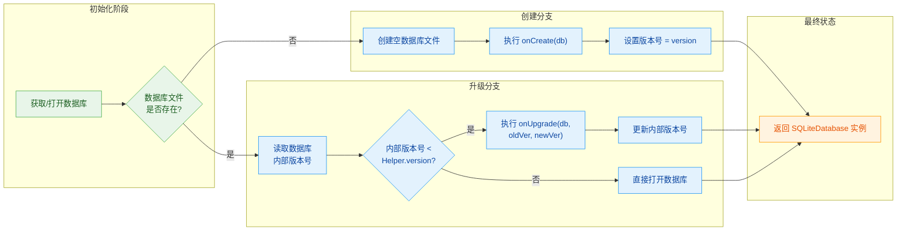

---

# SQLite与Android

---

## SQLite特点与适用场景

### SQLite的起源与设计哲学

SQLite诞生于2000年，由D. Richard Hipp在美国海军宙斯盾导弹驱逐舰上开发，最初目的是为了取代一种专有的嵌入式数据库方案。与传统的企业级数据库系统（如Oracle、MySQL、PostgreSQL）不同，SQLite从一开始就被设计为一种**进程内数据库**（In-Process Database），它不是一个独立运行的服务器进程，而是作为一个库被直接链接到应用程序中。这意味着数据库的所有数据都存储在宿主进程的地址空间内，所有的读写操作都在同一进程中完成，无需任何网络通信或进程间通信的开销。

SQLite的核心设计哲学可以概括为“简单、可靠、高效”。它的源代码完全开放，据官网描述，整个项目的代码量控制在十几万行的规模（具体取决于编译选项），却实现了SQL标准中非常核心的功能集。这种极致的简洁性使得SQLite可以被嵌入到任何环境中，从超级计算机到智能手表，从服务器到手机，应用范围极其广泛。SQLite在设计时将“正确性”置于“性能”之上，确保每一条SQL语句的执行结果都符合SQL标准定义，这一点在其官方文档中被反复强调。

### SQLite的核心特点

#### 自包含与零配置

SQLite之所以能够在移动设备领域大放异彩，首要原因就是它的**自包含性**（Self-Contained）。一个完整的SQLite数据库就是一个单一的磁盘文件，包含了所有的表定义、索引、数据以及数据库的元信息。你不需要安装任何数据库服务器软件，不需要进行任何配置文件的编写，不需要启动任何服务进程，也不需要操心用户权限管理。当应用程序需要读写数据时，它只需要调用SQLite提供的API即可。相比之下，MySQL或PostgreSQL需要独立的服务器进程运行在后台，监听某个TCP端口或Unix Domain Socket，客户端通过网络协议与之通信。这种架构对于桌面应用或移动应用来说显然过于笨重。

零配置（Zero Configuration）的特性使得SQLite成为嵌入式系统和移动应用的理想选择。在Android系统中，开发者只需要几行代码就能创建一个数据库并开始使用。没有任何数据库管理员（DBA）的工作要做，没有密码需要设置（除非开发者自行在应用层实现加密），没有连接池需要配置，没有端口需要开放。这种极简主义的设计思路与Android系统的整体风格高度契合。

#### 轻量级与小型化

SQLite的库文件体积非常小，通常只有几百KB到几MB不等（取决于编译选项和目标平台）。这与动辄占用数百MB甚至数GB空间的传统数据库服务器形成了鲜明对比。对于存储空间寸土寸金的移动设备来说，这个特性至关重要。一个典型的Android应用在安装后可能只占用几MB的空间，如果此时还需要为数据库引擎额外占用几十MB的运行时刻内存和存储空间，将会对用户体验造成明显影响。

SQLite的内存占用同样非常克制。它采用了极其高效的内存管理策略：在大多数查询场景下，SQLite的内存占用量都在几MB级别；即使处理大规模数据集，它也倾向于使用磁盘作为主要的存储介质，而将有限的内存用于页缓存（Page Cache）。页缓存是SQLite性能的关键所在——它将频繁访问的数据库页保留在内存中，以减少磁盘I/O操作。我们将在后续的存储引擎部分深入探讨页缓存的工作机制。

#### 事务支持与ACID保证

尽管SQLite是一个轻量级的嵌入式数据库，它对事务的支持却非常完整。SQLite实现了ACID（Atomicity, 原子性；Consistency, 一致性；Isolation, 隔离性；Durability, 持久性）四要素，这意味着即使在系统崩溃、程序异常退出或突然断电的情况下，数据库也能够恢复到一致的状态。

具体来说，SQLite通过以下机制保证事务的持久性：当一个事务被提交（COMMIT）时，SQLite会确保所有修改都已经被写入磁盘的操作系统缓冲区，或者更保守地通过配置PRAGMA journal_mode来确保数据被同步到磁盘表面。即使数据库文件在写入过程中被切断，SQLite的WAL（Write-Ahead Logging）模式或回滚日志（Rollback Journal）机制能够确保要么完全应用修改，要么完全回滚到事务开始前的状态，没有任何中间状态会被保留。

这种完整性保证对于移动应用来说意义重大。想象一个银行转账场景：账户A扣除100元，账户B增加100元，这两个操作必须作为一个不可分割的整体来完成——要么同时成功，要么同时失败。SQLite能够确保这种原子性，不会出现账户A扣了钱但账户B没收到的情况。

#### 无服务器架构

这是SQLite与传统数据库最根本的区别所在。传统数据库（如MySQL、PostgreSQL、SQL Server）采用的是客户端-服务器架构：数据库服务器运行在一个独立的进程中，监听网络端口；客户端程序通过网络连接到服务器，发送SQL语句，服务器执行后将结果返回给客户端。这种架构的优势在于可以实现多客户端并发访问、集中管理数据、细粒度的访问控制等。但它也为应用程序带来了额外的复杂度：需要管理网络连接、处理连接超时、实现连接池、处理分布式事务等。

SQLite完全抛弃了服务器架构，它的工作方式是：应用程序直接调用SQLite库函数，库函数直接读写数据库文件。这意味着每一次数据库操作都是同步的、阻塞的——当一个写入事务正在执行时，其他进程或线程无法同时写入同一个数据库文件（尽管可以并发读取）。这种设计极大地简化了应用的架构，但也要求开发者在高并发场景下谨慎使用。我们将在后续讨论事务时详细分析并发控制的策略。

### SQLite的数据类型系统

SQLite使用一种独特的“动态类型”系统，这与大多数传统数据库的“静态类型”系统形成对比。在SQLite中，数据的类型不是由列的定义决定的，而是由数据本身存储的实际值决定的。例如，一个被定义为INTEGER类型的列，实际上可以存储文本值，只是该文本值在参与数值运算时会被自动转换。这种设计被称为“类型亲和性”（Type Affinity），即每一列更倾向于接受某种数据类型，但并不强制要求。

SQLite支持以下五种存储类型（Storage Classes）：NULL（空值）、INTEGER（带符号整数，根据值的大小使用1、2、3、4、6或8字节存储）、REAL（IEEE 754浮点数，使用8字节存储）、TEXT（文本字符串，使用UTF-8、UTF-16BE或UTF-16LE编码）、BLOB（二进制大对象，直接存储字节序列）。值得注意的是，虽然SQLite在内部只使用这五种存储类型，但SQL语句中的类型名称（如VARCHAR、FLOAT、DATE等）会被映射到这五种存储类型上，开发者仍然可以使用这些常见的类型名称来定义表结构。

这种动态类型系统的好处在于它的灵活性和简单性——开发者不需要为每一列精确定义数据类型，系统会自动处理类型转换。但它也可能导致一些意外的行为，例如将字符串"123"与整数123进行比较时，SQLite会将两者都视为数值进行比较，而不是字符串比较。理解这一点对于编写正确的SQL查询至关重要。

### SQLite的适用场景分析

#### 移动应用开发

SQLite最典型的应用场景就是移动应用开发。Android从1.5版本开始就将SQLite作为内置的数据库解决方案，所有的Android应用都可以方便地访问SQLite数据库。事实上，Android Framework提供了一套精心封装的SQLite API，包括SQLiteOpenHelper、SQLiteDatabase、ContentValues和Cursor等类，这些工具将底层C/C++实现的SQLite库封装成了Java/Kotlin友好的接口。

在移动应用场景中，数据量通常不会达到数十亿行的规模，一个典型的数据库文件从几KB到几百MB不等。这种规模完全在SQLite的处理能力范围内。更重要的是，移动设备的存储空间有限，网络连接不稳定（甚至完全离线），用户期望应用能够即时响应、快速启动。在这些约束下，一个自包含、无需网络通信的嵌入式数据库是最合理的选择。

Android的联系人（Contacts）应用、短信（Messages）应用、通话记录、系统设置等核心功能都使用SQLite作为数据存储后端。即便是现代Android开发中广泛使用的Room Persistence Library，它在底层也依然依赖SQLite。Room只是在上层提供了一个编译时注解处理器和一套轻量级的对象关系映射（ORM）框架，底层的数据库操作最终还是要通过SQLite来完成。

#### 桌面应用程序

许多桌面应用程序选择SQLite作为本地数据存储方案。例如，Firefox浏览器使用SQLite存储浏览历史、书签、cookies和插件信息；Skype的本地消息历史也使用SQLite；Adobe Photoshop使用SQLite管理图像处理的缓存和历史记录。这些应用的选择并非偶然——它们需要在本地存储结构化的用户数据，同时又不想引入沉重的数据库服务器依赖。

桌面应用的典型数据量在几千到几百万条记录之间，这个规模对于SQLite来说游刃有余。同时，桌面应用通常只需要支持单用户访问，不需要复杂的并发控制机制，SQLite的无服务器架构完美契合这一需求。

#### 嵌入式设备与物联网

在树莓派（Raspberry Pi）、Arduino以及各种嵌入式Linux设备上，SQLite是常用的数据存储方案。这些设备通常资源有限（内存可能只有256MB甚至更少），无法运行完整的数据库服务器；同时它们往往需要长期运行、离线工作，数据的持久化和可靠性至关重要。

在物联网（IoT）场景中，大量传感器采集的数据需要被本地存储和定期上报。SQLite的高效写入性能（每秒可处理数万次INSERT操作）和极低的资源占用使其成为边缘计算场景的理想选择。一些工业数据采集系统使用SQLite作为本地缓冲区，将采集到的数据先存储在设备上，然后通过网络定期同步到云端服务器。

#### 万维网应用

在Web开发领域，SQLite也有其用武之地。对于流量不大的小型网站和个人博客，SQLite可以替代MySQL作为后端数据库，减少服务器的资源占用和运维复杂度。一些Web开发框架（如Python的Django、Flask，Ruby的Rails，PHP的Laravel）都原生支持SQLite作为开发环境或生产环境的数据库选项。

Serverless（无服务器）架构和JAMstack静态网站中，SQLite也找到了新的应用空间。在这些场景中，后端服务可能是按需调用、短暂存在的，传统的数据库服务器在这种环境下显得过于笨重。而SQLite可以与代码一起打包部署，每次函数调用时创建或打开数据库，用完即销毁或保留数据供下次使用。

### SQLite的局限性

正所谓“术业有专攻”，SQLite并非万能药，它在某些场景下存在明显的局限性。

**并发写入能力有限**是SQLite最受诟病的短板。由于它的无服务器架构，同一时间只能有一个写事务在执行（通过文件锁实现）。当多个进程或线程尝试同时写入同一个数据库时，其中一个必须等待其他事务完成。对于高并发的Web应用或企业级系统来说，这个限制可能是致命的。MySQL、PostgreSQL等支持连接池和并行写入的数据库更适合这种场景。

**数据规模存在上限**。虽然SQLite官方声称可以处理最大140TB的数据库文件（受底层文件系统限制），但在实际应用中，当数据库文件超过几十GB时，某些操作（如VACUUM、全表扫描）的性能会显著下降。这是因为SQLite的B-Tree索引结构和页缓存机制在面对超大规模数据时会产生大量的磁盘I/O。

**缺乏网络访问能力**也是一大限制。SQLite只能通过文件系统访问，不能像传统数据库那样通过网络协议远程访问。在需要多个应用实例共享同一个数据集的场景中，要么需要依赖网络文件系统（NFS），要么需要额外的中间件来实现数据共享。

**无法提供细粒度的用户权限管理**。SQLite没有用户账户和角色系统，所有访问数据库文件的进程拥有同等的读写权限。如果需要限制某些用户只能读取而不能修改数据，开发者必须在应用层实现这一逻辑。

### SQLite与Android的深度集成

Android选择SQLite作为内置数据库并非偶然，而是经过深思熟虑的决策。从技术角度看，SQLite的轻量级特性非常适合移动设备的资源约束；它的自包含性简化了系统架构；它对标准SQL的良好支持使得数据迁移和复用变得容易；它的代码开源且进入公共领域（Public Domain），没有任何版权纠纷风险。

Android Framework提供的SQLite API是Android开发中操作本地数据库的基础。虽然现代Android开发中越来越多的项目选择使用Room作为数据抽象层，但理解底层SQLite的工作原理对于编写高效、可靠的数据库代码仍然不可或缺。例如，理解Cursor的工作机制可以帮助开发者避免内存泄漏；理解SQLiteOpenHelper的生命周期可以帮助开发者正确处理数据库的创建和升级；理解事务的隔离级别可以帮助开发者在并发场景下做出正确的设计决策。

```mermaid
graph LR
    subgraph AndroidAppLayer["Android 应用层"]
        direction TB
        A1["Java/Kotlin 代码"]
        A2["SQLiteOpenHelper\n数据库生命周期管理"]
        A3["SQLiteDatabase\nCRUD 操作入口"]
        A4["Cursor\n结果集遍历接口"]
    end

    subgraph AndroidFrameworkLayer["Android Framework 层"]
        direction TB
        B1["SQLiteConnection\n原生 JNI 连接"]
        B2["SQLiteProgram\n预编译 SQL 语句"]
        B3["SQLiteQuery\n查询执行器"]
    end

    subgraph SQLiteEngineLayer["SQLite 核心引擎"]
        direction TB
        C1["SQLite 虚拟机\n(VDBE)"]
        C2["B-Tree 存储引擎"]
        C3["页缓存管理\n(Pager)"]
        C4["WAL/回滚日志\n持久化机制"]
    end

    subgraph StorageLayer["文件系统层"]
        direction TB
        D1["数据库文件\n(.db)"]
        D2["WAL 文件\n(.db-wal)"]
        D3["SHM 文件\n(.db-shm)"]
    end

    AndroidAppLayer --> AndroidFrameworkLayer
    AndroidFrameworkLayer --> SQLiteEngineLayer
    SQLiteEngineLayer --> StorageLayer

    classDef androidApp fill:#E8F5E9,stroke:#4CAF50,color:#1B5E20
    classDef framework fill:#E3F2FD,stroke:#2196F3,color:#0D47A1
    classDef engine fill:#FFF3E0,stroke:#FF9800,color:#E65100
    classDef storage fill:#FCE4EC,stroke:#E91E63,color:#880E4F

    class A1,A2,A3,A4 androidApp
    class B1,B2,B3 framework
    class C1,C2,C3,C4 engine
    class D1,D2,D3 storage
```



上图展示了从Android应用层代码到底层SQLite引擎再到文件系统存储的完整调用链。可以看到，Android Framework在SQLite C/C++引擎之上封装了Java/Kotlin友好的接口，而SQLite引擎内部又分为SQLite虚拟机（负责解释和执行SQL语句）、B-Tree存储引擎（负责数据的高效组织）和页缓存管理器（负责减少磁盘I/O）以及日志持久化模块（负责事务的ACID保证）。理解这一分层架构对于深入掌握Android数据库开发至关重要。

### 适用场景总结与选型建议

选择数据库时，最重要的是让数据库的特性与实际需求相匹配。以下是一个简单的选型决策框架：

如果你的应用运行在单一设备上，数据量在MB到GB级别，不需要多用户并发写入，不需要网络远程访问，那么SQLite几乎总是最优选择。它提供了你所需要的一切功能，同时将复杂度和资源占用降到最低。

如果你的应用需要多个实例或多个用户同时访问同一份数据，或者数据量预计会增长到数十GB甚至更大，或者需要复杂的权限管理和审计功能，那么传统的关系型数据库服务器（MySQL、PostgreSQL）或新型的分布式数据库（MongoDB、Cassandra）更为合适。

在Android开发中，SQLite是本地持久化存储的事实标准。开发者应当熟练掌握其特性和限制，在这个基础上根据具体需求选择是否使用上层封装（如Room）或完全自定义实现。

---

#### 📝 练习题

以下关于SQLite特点的描述中，哪一项是**不正确**的？

A. SQLite是一个进程内数据库，所有操作在应用程序进程内完成，不需要网络通信
B. SQLite支持标准的ACID事务，能够保证在系统崩溃后数据恢复到一致状态
C. SQLite支持多个写事务并发执行，通过服务器架构实现高效的并发写入
D. SQLite的数据类型系统采用动态类型，列的类型亲和性不强制限制实际存储的数据类型

**【答案】** C

**【解析】** 本题考查对SQLite核心特性的理解。选项A描述的是SQLite的无服务器架构，这是SQLite最本质的设计特点，表述正确。选项B描述的ACID事务支持是SQLite的重要特性，通过WAL模式和回滚日志机制，SQLite能够在异常情况下保证事务的原子性和持久性，表述正确。选项D描述的动态类型系统（Type Affinity）是SQLite区别于传统数据库的另一大特点，SQLite的五种存储类型（NULL、INTEGER、REAL、TEXT、BLOB）与列声明的类型名称之间是松散关联的，表述正确。选项C声称SQLite支持多个写事务并发执行，这是**错误的**——SQLite由于采用无服务器架构和文件级锁机制，同一时间只能有一个写事务执行。虽然WAL模式允许多个读事务与一个写事务并发执行，但多个写事务之间仍然需要串行化排队等待。对于需要高并发写入的应用，应当选择MySQL、PostgreSQL等支持连接池和并行写入的传统数据库服务器架构。

---

## SQLiteOpenHelper（创建、升级）

### 概述与设计动机

`SQLiteOpenHelper` 是 Android 系统中封装好的一个抽象基类，位于 `android.database.sqlite` 包下。它的核心职责是**管理数据库的创建与版本升级**。在直接使用 SQLite 时，开发者需要自行处理数据库文件不存在时的创建逻辑、数据库版本判断以及 onUpgrade 回调等细节。这种做法不仅容易出错，还会在代码中散落大量重复的数据库管理逻辑。`SQLiteOpenHelper` 的出现，就是为了将数据库的**生命周期管理**统一到一个可复用、可继承的框架类中。

从设计模式的角度来看，`SQLiteOpenHelper` 巧妙地运用了**策略模式（Strategy Pattern）** 和**模板方法模式（Template Method Pattern）** 的组合。框架预先定义了数据库的创建和升级流程骨架（模板方法），而具体的建表语句、升级策略则由开发者通过重写 `onCreate()` 和 `onUpgrade()` 方法来填充。这种“骨架+策略”的设计，使得数据库的初始化逻辑既规范统一，又不失灵活性。

### 核心构造函数

`SQLiteOpenHelper` 提供了多个构造函数重载，但最常用、最核心的签名如下：

```java
public SQLiteOpenHelper(
    Context context,      // 应用程序上下文，通常传递 Activity 或 Application 对象
    String name,          // 数据库文件名，若传 null 则创建内存数据库（用于测试场景）
    CursorFactory factory,// 自定义 Cursor 工厂，传 null 则使用默认实现
    int version           // 数据库版本号，必须为正整数（从 1 开始）
)
```

下面以一个典型的业务场景——管理一个名为 `bookstore.db` 的数据库为例，说明构造函数的每一个参数的实际意义和注意事项。

```java
// BookDatabaseHelper.java
// 自定义数据库辅助类，继承 SQLiteOpenHelper
public class BookDatabaseHelper extends SQLiteOpenHelper {

    // 数据库文件名
    private static final String DATABASE_NAME = "bookstore.db";
    // 数据库版本号：每次发布新版本需要递增此值
    private static final int DATABASE_VERSION = 1;

    // 单例模式：保证全局只有一个数据库Helper实例
    // 这样可以避免多次打开/关闭数据库连接，提升性能
    private static BookDatabaseHelper sInstance;

    // 静态工厂方法获取实例，传入 Application Context
    // 使用 Application Context 而非 Activity Context 是最佳实践，
    // 可以避免因 Activity 销毁而导致数据库连接提前关闭的问题
    public static synchronized BookDatabaseHelper getInstance(Context context) {
        if (sInstance == null) {
            sInstance = new BookDatabaseHelper(
                context.getApplicationContext(), // 确保使用 Application 级别上下文
                DATABASE_NAME,
                null,                             // 使用默认 CursorFactory
                DATABASE_VERSION
            );
        }
        return sInstance;
    }

    // 私有构造函数：外部代码必须通过 getInstance() 获取实例
    // 这是单例模式的实现细节
    private BookDatabaseHelper(Context context, String name,
                                CursorFactory factory, int version) {
        super(context, name, factory, version);
    }

    // ... onCreate() 和 onUpgrade() 方法将在后面详细讲解
}
```

**为什么要使用单例模式？** 在 Android 系统中，每次调用 `getWritableDatabase()` 或 `getReadableDatabase()` 都会返回一个数据库连接。如果每次都创建新的 Helper 实例，可能会导致数据库被多次打开，造成资源浪费甚至并发写入冲突。因此，推荐将 Helper 设计为**单例**，确保整个应用生命周期内共享同一个数据库连接。

### onCreate() 方法——数据库首次创建

`onCreate(SQLiteDatabase db)` 是 SQLiteOpenHelper 中最重要的回调方法之一。它在**数据库文件不存在时**（即首次安装应用或数据库文件被手动删除后）被系统自动调用。开发者需要在此方法中执行所有**建表语句（DDL）**，完成数据库的初始化工作。

`onCreate()` 的调用时机可以概括为：**当传入的 `name` 参数对应的数据库文件在文件系统中不存在时**，Android 框架会先创建这个空的数据库文件，然后调用 `onCreate(db)`，将建表的责任完全交给开发者。这种设计体现了**关注点分离（Separation of Concerns）** 的原则——框架负责文件的创建，而具体的表结构定义由业务代码负责。

```java
// BookDatabaseHelper.java
@Override
public void onCreate(SQLiteDatabase db) {
    // onCreate 在数据库文件首次创建时调用
    // 此时 db 参数已经是一个可写的 SQLiteDatabase 对象
    // 开发者需要在此执行所有的 CREATE TABLE 语句

    // 创建图书表（books）
    // id: 主键，自增整型
    // name: 书名，最大100字符，非空
    // author: 作者，最大50字符
    // price: 价格，保留两位小数的浮点数
    // category: 分类，可空字符串
    // create_time: 创建时间，存储 Unix 时间戳
    db.execSQL("CREATE TABLE IF NOT EXISTS books (" +
            "id INTEGER PRIMARY KEY AUTOINCREMENT, " +
            "name VARCHAR(100) NOT NULL, " +
            "author VARCHAR(50), " +
            "price REAL DEFAULT 0.0, " +
            "category VARCHAR(50), " +
            "create_time INTEGER NOT NULL" +
            ")");

    // 创建作者表（authors）
    // 演示一对多关系：一个作者可以有多本图书
    db.execSQL("CREATE TABLE IF NOT EXISTS authors (" +
            "author_id INTEGER PRIMARY KEY AUTOINCREMENT, " +
            "author_name VARCHAR(50) NOT NULL, " +
            "author_bio TEXT, " +
            "author_country VARCHAR(30)" +
            ")");

    // 创建图书-作者关联表（book_author）
    // 演示多对多关系：一本书可以有多个作者，一个作者也可以写多本书
    db.execSQL("CREATE TABLE IF NOT EXISTS book_author (" +
            "book_id INTEGER NOT NULL, " +
            "author_id INTEGER NOT NULL, " +
            "PRIMARY KEY (book_id, author_id), " +
            "FOREIGN KEY (book_id) REFERENCES books(id) ON DELETE CASCADE, " +
            "FOREIGN KEY (author_id) REFERENCES authors(author_id) ON DELETE CASCADE" +
            ")");
}
```

**关于 `IF NOT EXISTS` 的使用**：在生产环境的 `onCreate()` 中，建议在 `CREATE TABLE` 语句中包含 `IF NOT EXISTS` 关键字。虽然 `onCreate()` 理论上只在数据库不存在时调用，但加入此修饰可以提高代码的健壮性——如果开发者在调试过程中手动删除了数据库文件并重新触发创建逻辑，带有 `IF NOT EXISTS` 的语句可以避免因表已存在而抛出的异常。

**关于建表语句的版本控制**：严格来说，`onCreate()` 只执行一次（在数据库首次创建时），因此不存在版本兼容的问题。但随着业务演进，表的字段可能会增加或修改，这部分逻辑应该放在 `onUpgrade()` 中处理，而不是修改 `onCreate()`。如果在 `onCreate()` 中频繁修改建表语句，会导致后续升级逻辑难以维护。

### onUpgrade() 方法——数据库版本升级

`onUpgrade(SQLiteDatabase db, int oldVersion, int newVersion)` 方法在**检测到持久化的数据库版本号低于当前代码中声明的版本号**时被调用。这意味着当用户升级了应用（安装了新版本 APK），但设备上已经存在旧版本的数据库文件时，Android 框架会识别出版本差异并触发升级流程。

理解 `onUpgrade()` 的触发条件至关重要——**它不是每次打开数据库都会被调用**，而是在**版本号递增**时**按需触发**。这与 `onCreate()` 的调用时机形成了清晰的对比：

| 方法 | 调用时机 | 调用次数 |
|------|----------|----------|
| `onCreate(db)` | 数据库文件不存在时调用 | **最多一次**（除非数据库被删除重建） |
| `onUpgrade(db, oldVer, newVer)` | 持久化版本号 &lt; 声明版本号时调用 | **可能多次**（取决于版本跳跃的跨度） |

```java
// BookDatabaseHelper.java
@Override
public void onUpgrade(SQLiteDatabase db, int oldVersion, int newVersion) {
    // oldVersion: 当前设备上存储的数据库版本号
    // newVersion: 代码中声明的 DATABASE_VERSION
    // db: 可写的数据库连接对象

    // 重要原则：onUpgrade 中必须处理从旧版本到新版本的所有路径
    // 不能假设 oldVersion 一定是 newVersion - 1
    // 因为用户可能从版本 1 直接升级到版本 5（跳过中间版本）

    // 数据库版本 2: 增加了 publishers 出版商表
    if (oldVersion < 2) {
        db.execSQL("CREATE TABLE IF NOT EXISTS publishers (" +
                "publisher_id INTEGER PRIMARY KEY AUTOINCREMENT, " +
                "publisher_name VARCHAR(100) NOT NULL, " +
                "publisher_country VARCHAR(30)" +
                ")");
    }

    // 数据库版本 3: 给 books 表增加了 pages 字段和 edition 字段
    if (oldVersion < 3) {
        // SQLite 不支持直接的 ALTER TABLE ADD COLUMN 语法（早期版本）
        // 但 SQLite 从 3.1.6 开始支持 ADD COLUMN
        // 为了兼容性，可以使用如下方式：
        // 方式一：直接添加列（SQLite 3.1.6+ 支持）
        db.execSQL("ALTER TABLE books ADD COLUMN pages INTEGER DEFAULT 0");
        db.execSQL("ALTER TABLE books ADD COLUMN edition INTEGER DEFAULT 1");
    }

    // 数据库版本 4: 给 authors 表增加了 birth_year 字段
    if (oldVersion < 4) {
        db.execSQL("ALTER TABLE authors ADD COLUMN birth_year INTEGER");
    }

    // 数据库版本 5: 在 book_author 关联表中增加了权重字段 weight
    // 描述作者对某本书的贡献权重（例如第一作者权重高）
    if (oldVersion < 5) {
        db.execSQL("ALTER TABLE book_author ADD COLUMN weight INTEGER DEFAULT 100");
    }
}
```

**版本跳跃的处理策略**是 `onUpgrade()` 设计的精髓所在。上面的代码使用了**累积式升级（Incremental Upgrade）** 策略——每个 `if` 块只负责从 `oldVersion` 到目标版本的最小增量变更。当应用从版本 1 升级到版本 5 时，`onUpgrade()` 会依次执行版本 2、3、4、5 的所有变更块。这种设计的好处是，无论用户从哪个旧版本升级，都能最终到达最新版本的状态。

**为什么不删除旧表重建？** 有些开发者可能会选择简单的策略——在 `onUpgrade()` 中直接 `DROP TABLE` 旧表，然后重新调用 `onCreate()`。这种做法在开发阶段可以接受，但在生产环境中是**绝对禁止**的。因为 `DROP TABLE` 会丢失所有用户数据，而 `onUpgrade()` 可能在用户正常使用应用时被触发，届时丢失数据将是灾难性的。

### onDowngrade() 方法——数据库降级

`onDowngrade(SQLiteDatabase db, int oldVersion, int newVersion)` 是 `onUpgrade()` 的镜像方法。它在**当前设备上的数据库版本高于代码中声明的版本号**时被调用。这种情况通常发生在以下场景：

1. 开发者回滚了应用的 `DATABASE_VERSION`（例如发现新版本有严重 bug，紧急发布补丁包时将版本号降低）
2. 用户安装了降级版本的 APK（虽然 Android 默认不支持降级安装，但在某些设备配置或开发者调试时可能发生）

默认情况下，`SQLiteOpenHelper` 的 `onDowngrade()` 实现会抛出 `SQLiteException`，阻止降级操作：

```java
// SQLiteOpenHelper.java 中的默认实现（简化版）
@Override
public void onDowngrade(SQLiteDatabase db, int oldVersion, int newVersion) {
    // 默认实现：抛出异常，拒绝降级
    throw new SQLiteException(
        "Can't downgrade database from version " + oldVersion +
        " to " + newVersion
    );
}
```

在实际项目中，如果需要支持数据库降级（通常不推荐），开发者可以重写此方法：

```java
// BookDatabaseHelper.java
@Override
public void onDowngrade(SQLiteDatabase db, int oldVersion, int newVersion) {
    // 降级策略：相对安全的做法是删除旧数据并重建
    // 但这会导致数据丢失，因此大多数应用选择直接拒绝降级
    // 这里展示一个简单的降级实现示例

    // 方案一：删除受影响的表并重建
    db.execSQL("DROP TABLE IF EXISTS books");
    db.execSQL("DROP TABLE IF EXISTS authors");
    db.execSQL("DROP TABLE IF EXISTS book_author");
    db.execSQL("DROP TABLE IF EXISTS publishers");
    // 重建所有表
    onCreate(db);

    // 方案二：保守策略——直接抛异常，阻止降级（推荐做法）
    // throw new SQLiteException("Database downgrade is not supported");
}
```

**生产环境的最佳实践**是**不要重写 `onDowngrade()`**，让默认行为（抛出异常）生效。因为降级场景本身就意味着旧版本的应用代码可能无法正确处理新版本数据库的表结构，强行降级可能导致运行时异常。

### 数据库版本号与升级策略

数据库版本号是 `SQLiteOpenHelper` 感知版本变化的核心机制。它存储在数据库文件本身内部，位于 `android_metadata` 表中（如果使用 SQLite 3.6.19 以上的版本）或通过 SQLite 的 `user_version` PRAGMA 查询。Android 框架在打开数据库时，会自动比较这个内部版本号与 Helper 构造函数中传入的 `version` 参数，从而决定是否触发 `onCreate()` 或 `onUpgrade()`。

下面通过一个 Mermaid 图，展示数据库创建和升级的完整决策流程：



### onOpen() 方法及其他回调

除了 `onCreate()` 和 `onUpgrade()` 这两个最核心的回调外，`SQLiteOpenHelper` 还提供了 `onOpen()` 方法，该方法在数据库每次被打开时都会调用，无论版本是否发生变化：

```java
// BookDatabaseHelper.java
@Override
public void onOpen(SQLiteDatabase db) {
    super.onOpen(db);
    // 每次打开数据库时都会执行
    // 适合做一些全局的数据库配置，例如启用外键约束

    // SQLite 默认不强制执行外键约束
    // 需要手动开启，否则 FOREIGN KEY 语句不会生效
    if (!db.isReadOnly()) {
        // 启用外键约束检查
        // 这确保了级联删除、更新等外键行为能够正常工作
        db.execSQL("PRAGMA foreign_keys = ON;");
    }
}
```

**为什么要在 `onOpen()` 中启用外键？** SQLite 从 3.6.19 版本开始支持外键约束，但默认情况下外键检查是**关闭的**。如果不显式启用，即使在 `CREATE TABLE` 语句中定义了 `FOREIGN KEY`，数据库也不会强制执行级联操作。将 `PRAGMA foreign_keys = ON` 放在 `onOpen()` 中，可以确保每次打开数据库时都启用外键约束，这是 SQLite 数据库管理中一个非常容易被忽视但至关重要的细节。

### 完整的 Helper 实现示例

为了帮助读者建立完整的认知，以下是一个功能较为完整的 `BookDatabaseHelper` 实现，整合了前文讲解的所有知识点：

```java
// BookDatabaseHelper.java
package com.example.bookstore.db;

import android.content.Context;
import android.database.sqlite.SQLiteDatabase;
import android.database.sqlite.SQLiteOpenHelper;
import android.database.sqlite.SQLiteDatabase.CursorFactory;

/**
 * 书店应用数据库辅助类
 *
 * 职责说明：
 * 1. 管理数据库的创建（onCreate）
 * 2. 管理数据库的升级（onUpgrade）
 * 3. 管理数据库的降级（onDowngrade，默认拒绝）
 * 4. 配置数据库参数（onOpen）
 *
 * 使用单例模式保证全局唯一实例
 */
public class BookDatabaseHelper extends SQLiteOpenHelper {

    // ===================== 常量定义 =====================
    // 数据库文件名
    private static final String DATABASE_NAME = "bookstore.db";
    // 数据库版本号：每次发布新版本应用时递增
    // 重要：此值必须始终大于已发布的任何版本号
    private static final int DATABASE_VERSION = 1;

    // 单例实例
    private static volatile BookDatabaseHelper sInstance;

    // ===================== 单例获取 =====================
    /**
     * 获取数据库Helper实例
     * 使用双重检查锁定（Double-Checked Locking）确保线程安全
     * @param context 应用程序上下文（推荐使用 Application Context）
     * @return BookDatabaseHelper 实例
     */
    public static BookDatabaseHelper getInstance(Context context) {
        if (sInstance == null) {
            synchronized (BookDatabaseHelper.class) {
                if (sInstance == null) {
                    sInstance = new BookDatabaseHelper(
                        context.getApplicationContext(),
                        DATABASE_NAME,
                        null,
                        DATABASE_VERSION
                    );
                }
            }
        }
        return sInstance;
    }

    // ===================== 构造函数 =====================
    /**
     * 私有构造函数
     * 外部必须通过 getInstance() 方法获取实例
     */
    private BookDatabaseHelper(Context context, String name,
                                CursorFactory factory, int version) {
        super(context, name, factory, version);
        // SQLiteOpenHelper 内部会：
        // 1. 检查数据库文件是否存在
        // 2. 比较版本号并决定调用 onCreate 或 onUpgrade
        // 3. 在内部维护数据库连接
    }

    // ===================== 生命周期回调 =====================
    /**
     * 数据库首次创建时调用
     * 在此方法中定义所有初始表结构
     * 此方法调用后，数据库版本会被自动设置为构造函数的 version 参数值
     */
    @Override
    public void onCreate(SQLiteDatabase db) {
        // 创建图书表
        db.execSQL("CREATE TABLE IF NOT EXISTS books (" +
                "id INTEGER PRIMARY KEY AUTOINCREMENT, " +
                "name VARCHAR(100) NOT NULL, " +
                "author VARCHAR(50), " +
                "price REAL DEFAULT 0.0, " +
                "category VARCHAR(50), " +
                "pages INTEGER DEFAULT 0, " +
                "edition INTEGER DEFAULT 1, " +
                "create_time INTEGER NOT NULL" +
                ")");

        // 创建作者表
        db.execSQL("CREATE TABLE IF NOT EXISTS authors (" +
                "author_id INTEGER PRIMARY KEY AUTOINCREMENT, " +
                "author_name VARCHAR(50) NOT NULL, " +
                "author_bio TEXT, " +
                "author_country VARCHAR(30), " +
                "birth_year INTEGER" +
                ")");

        // 创建关联表（多对多）
        db.execSQL("CREATE TABLE IF NOT EXISTS book_author (" +
                "book_id INTEGER NOT NULL, " +
                "author_id INTEGER NOT NULL, " +
                "weight INTEGER DEFAULT 100, " +
                "PRIMARY KEY (book_id, author_id), " +
                "FOREIGN KEY (book_id) REFERENCES books(id) ON DELETE CASCADE, " +
                "FOREIGN KEY (author_id) REFERENCES authors(author_id) ON DELETE CASCADE" +
                ")");

        // 创建出版商表
        db.execSQL("CREATE TABLE IF NOT EXISTS publishers (" +
                "publisher_id INTEGER PRIMARY KEY AUTOINCREMENT, " +
                "publisher_name VARCHAR(100) NOT NULL, " +
                "publisher_country VARCHAR(30)" +
                ")");
    }

    /**
     * 数据库版本升级时调用
     * 采用累积式升级策略，每个版本只做最小增量变更
     * 这样可以正确处理从任意旧版本到新版本的升级路径
     */
    @Override
    public void onUpgrade(SQLiteDatabase db, int oldVersion, int newVersion) {
        // 版本 2: 新增 publishers 表
        if (oldVersion < 2) {
            db.execSQL("CREATE TABLE IF NOT EXISTS publishers (" +
                    "publisher_id INTEGER PRIMARY KEY AUTOINCREMENT, " +
                    "publisher_name VARCHAR(100) NOT NULL, " +
                    "publisher_country VARCHAR(30)" +
                    ")");
        }

        // 版本 3: books 表增加 pages 和 edition 列
        if (oldVersion < 3) {
            db.execSQL("ALTER TABLE books ADD COLUMN pages INTEGER DEFAULT 0");
            db.execSQL("ALTER TABLE books ADD COLUMN edition INTEGER DEFAULT 1");
        }

        // 版本 4: authors 表增加 birth_year 列
        if (oldVersion < 4) {
            db.execSQL("ALTER TABLE authors ADD COLUMN birth_year INTEGER");
        }

        // 版本 5: book_author 表增加 weight 列
        if (oldVersion < 5) {
            db.execSQL("ALTER TABLE book_author ADD COLUMN weight INTEGER DEFAULT 100");
        }

        // 注意：如果需要在升级过程中迁移数据，
        // 应在 ALTER TABLE 语句之间插入数据迁移的 SQL 逻辑
    }

    /**
     * 数据库打开时的回调
     * 每次打开数据库都会执行，适合做全局配置
     */
    @Override
    public void onOpen(SQLiteDatabase db) {
        super.onOpen(db);
        // 启用外键约束
        // 这是 SQLite 数据库管理中最重要的配置之一
        if (!db.isReadOnly()) {
            db.execSQL("PRAGMA foreign_keys = ON;");
        }
    }
}
```

### Android 中使用 Helper 的正确姿势

仅仅定义了 Helper 类还不够，还需要掌握正确的使用方式。以下代码展示了在 Android 组件（如 Activity 或 Repository 层）中如何安全地使用 `BookDatabaseHelper`：

```java
// BookRepository.java
// 数据仓储层：封装所有数据库操作
public class BookRepository {

    private final BookDatabaseHelper mDbHelper;  // 数据库Helper引用
    private final Context mContext;              // 上下文引用

    public BookRepository(Context context) {
        mContext = context;
        // 通过单例获取Helper实例
        mDbHelper = BookDatabaseHelper.getInstance(context);
    }

    /**
     * 插入一本新书
     * 演示 ContentValues 的用法（下一节将详细展开）
     */
    public long insertBook(String name, String author, double price) {
        // getWritableDatabase() 返回可写的数据库连接
        // 如果数据库不存在会触发创建逻辑
        // 如果数据库版本不匹配会触发升级逻辑
        SQLiteDatabase db = mDbHelper.getWritableDatabase();

        // 使用 ContentValues 封装要插入的数据
        // 这是 Android 推荐的插入方式，比直接写 SQL 更安全
        ContentValues values = new ContentValues();
        values.put("name", name);         // 书名
        values.put("author", author);     // 作者
        values.put("price", price);       // 价格
        values.put("create_time", System.currentTimeMillis() / 1000); // Unix时间戳

        // insert() 返回新插入行的 rowId，出错返回 -1
        long newRowId = db.insert("books", null, values);

        // 注意：insert() 执行后，db 仍然是打开的状态
        // 不需要手动调用 db.close()
        // SQLiteOpenHelper 会自动管理数据库连接的关闭时机
        // 开发者通常不需要也不应该手动关闭数据库连接

        return newRowId;
    }

    /**
     * 读取所有图书
     * 演示 getReadableDatabase() 和 rawQuery() 的用法
     */
    public void queryAllBooks() {
        // getReadableDatabase() 返回只读的数据库连接
        // 如果数据库不存在，同样会触发创建/升级逻辑
        // 与 getWritableDatabase() 的区别在于：
        //   - getWritableDatabase(): 返回可写连接（用于增删改）
        //   - getReadableDatabase(): 返回只读连接（用于查询）
        // 当磁盘空间不足时，getWritableDatabase() 可能抛出异常，
        // 而 getReadableDatabase() 会尝试返回只读连接
        SQLiteDatabase db = mDbHelper.getReadableDatabase();

        // 定义要查询的列（投影），null 表示查询所有列
        String[] projection = {
            "id",
            "name",
            "author",
            "price"
        };

        // 使用 rawQuery 执行带占位符的查询语句
        // 第一个参数是 SQL 模板，占位符用 ? 表示
        // 第二个参数是占位符的值数组
        Cursor cursor = db.rawQuery(
            "SELECT id, name, author, price FROM books WHERE price > ? ORDER BY price DESC",
            new String[]{String.valueOf(10.0)}  // 只查询价格大于10元的书
        );

        // 使用 Cursor 遍历结果集（下一节将详细展开）
        try {
            // moveToFirst() 将游标移动到第一行
            // 如果结果集为空，返回 false
            while (cursor.moveToNext()) {
                long id = cursor.getLong(cursor.getColumnIndexOrThrow("id"));
                String name = cursor.getString(cursor.getColumnIndexOrThrow("name"));
                String author = cursor.getString(cursor.getColumnIndexOrThrow("author"));
                double price = cursor.getDouble(cursor.getColumnIndexOrThrow("price"));

                Log.d("BookRepository", "Book[id=" + id + ", name=" + name +
                      ", author=" + author + ", price=" + price + "]");
            }
        } finally {
            // 重要：使用完 Cursor 后必须关闭
            // 否则会泄漏数据库资源，导致性能下降甚至崩溃
            cursor.close();
        }
    }

    /**
     * 更新图书价格
     */
    public int updateBookPrice(long bookId, double newPrice) {
        SQLiteDatabase db = mDbHelper.getWritableDatabase();

        ContentValues values = new ContentValues();
        values.put("price", newPrice);

        // update() 返回受影响的行数
        // 第一个参数：表名
        // 第二个参数：新的 ContentValues
        // 第三个参数：WHERE 子句的条件
        // 第四个参数：WHERE 子句中占位符的值
        int rowsAffected = db.update(
            "books",
            values,
            "id = ?",
            new String[]{String.valueOf(bookId)}
        );

        return rowsAffected;
    }

    /**
     * 删除图书
     */
    public int deleteBook(long bookId) {
        SQLiteDatabase db = mDbHelper.getWritableDatabase();

        // delete() 返回被删除的行数
        int rowsDeleted = db.delete(
            "books",
            "id = ?",
            new String[]{String.valueOf(bookId)}
        );

        return rowsDeleted;
    }
}
```

### 升级策略的深层考量

在实际项目开发中，数据库升级远不止简单地增加一列那么简单。以下是几种常见而复杂的升级场景及其处理策略：

**场景一：表结构重构**

当需要对一个表进行较大的结构调整（例如拆分表、合并字段）时，`ALTER TABLE` 的能力就捉襟见肘了。SQLite 的 `ALTER TABLE` 语句只支持重命名表和添加列，不支持删除列或修改列类型。这时需要采用**临时表过渡**策略：

```java
// 场景：books 表需要从单作者改为多作者（拆分为独立字段）
// 步骤 1：创建新的表结构
if (oldVersion < 6) {
    // 创建新的 books 表，去掉 author 字段
    db.execSQL("CREATE TABLE books_new (" +
            "id INTEGER PRIMARY KEY AUTOINCREMENT, " +
            "name VARCHAR(100) NOT NULL, " +
            "price REAL DEFAULT 0.0, " +
            "category VARCHAR(50), " +
            "pages INTEGER DEFAULT 0, " +
            "edition INTEGER DEFAULT 1, " +
            "create_time INTEGER NOT NULL" +
            ")");

    // 步骤 2：将旧表数据迁移到新表（保留除 author 外的所有字段）
    db.execSQL("INSERT INTO books_new (id, name, price, category, pages, edition, create_time) " +
            "SELECT id, name, price, category, pages, edition, create_time FROM books");

    // 步骤 3：删除旧表
    db.execSQL("DROP TABLE books");

    // 步骤 4：重命名新表
    db.execSQL("ALTER TABLE books_new RENAME TO books");

    // 步骤 5：注意！外键约束在重命名表后可能需要重建关联表
    // 如果 book_author 表中有外键引用 books 表，需要重建触发器
    db.execSQL("PRAGMA foreign_keys = OFF;");
    // 重建外键约束...
    db.execSQL("PRAGMA foreign_keys = ON;");
}
```

**场景二：数据迁移**

升级过程中不仅要修改表结构，还需要**迁移旧数据**到新结构中。例如，假设新版本要求将书名中的所有空格去除（一个不常见但足以说明问题的业务需求）：

```java
if (oldVersion < 7) {
    // 迁移数据：在升级过程中顺便清理旧数据
    // 使用 UPDATE 语句配合 SQLite 的字符串函数
    db.execSQL("UPDATE books SET name = REPLACE(name, ' ', '')");

    // 更复杂的迁移可能需要：
    // 1. 开启事务（确保迁移的原子性）
    // 2. 先查询旧数据
    // 3. 在 Java/Kotlin 代码中处理数据
    // 4. 写入新表
    // 这种情况下需要在 Java 层分批次处理，避免一次性加载过多数据导致 OOM
}
```

**场景三：跨版本升级测试**

累积式升级策略虽然灵活，但也意味着**从版本 1 直接升级到版本 7** 的路径可能数年都没有在真实环境中测试过。因此，在发布新版本之前，建议编写**自动化测试用例**，覆盖所有可能的升级路径：

```java
// DatabaseMigrationTest.java
// 伪代码：展示升级测试的思路
public class DatabaseMigrationTest {

    @Test
    public void testMigrationFromVersion1ToLatest() {
        // 1. 创建版本 1 的数据库
        SQLiteOpenHelper helperV1 = new BookDatabaseHelper(context, "test.db", null, 1);
        helperV1.getWritableDatabase().close();

        // 2. 用最新版本的 Helper 打开它
        BookDatabaseHelper helperLatest = BookDatabaseHelper.getInstance(context);

        // 3. 验证升级后的数据库结构和数据完整性
        SQLiteDatabase db = helperLatest.getReadableDatabase();
        // 验证表是否存在...
        // 验证数据是否正确迁移...
        db.close();
    }

    @Test
    public void testMigrationFromVersion4ToLatest() {
        // 类似的测试...
    }
}
```

### 升级流程中的事务保障

数据库升级操作必须**保证原子性（Atomicity）**——要么全部成功，要么全部回滚。如果在 `onUpgrade()` 中执行多条 SQL 语句，中途发生错误导致部分语句执行、部分未执行，数据库就会处于一个**不完整的状态**，下次打开时可能触发第二次升级逻辑，导致数据进一步损坏。

`onUpgrade()` 中的多条 SQL 默认是逐条自动提交的。为了确保原子性，应该显式使用**事务**包裹所有升级语句：

```java
@Override
public void onUpgrade(SQLiteDatabase db, int oldVersion, int newVersion) {
    // 开始事务
    // beginTransaction() 会标记事务起点
    db.beginTransaction();
    try {
        if (oldVersion < 2) {
            db.execSQL("CREATE TABLE publishers (...)");
        }

        if (oldVersion < 3) {
            db.execSQL("ALTER TABLE books ADD COLUMN pages INTEGER DEFAULT 0");
            db.execSQL("ALTER TABLE books ADD COLUMN edition INTEGER DEFAULT 1");
        }

        if (oldVersion < 4) {
            db.execSQL("ALTER TABLE authors ADD COLUMN birth_year INTEGER");
        }

        if (oldVersion < 5) {
            db.execSQL("ALTER TABLE book_author ADD COLUMN weight INTEGER DEFAULT 100");
        }

        // 所有 SQL 执行成功后，标记事务为成功
        // setTransactionSuccessful() 必须调用在 commit() 之前
        // 否则 commit() 会自动回滚事务
        db.setTransactionSuccessful();

    } catch (Exception e) {
        // 如果任何一条 SQL 抛出异常，
        // 由于没有调用 setTransactionSuccessful()，
        // 当 beginTransaction() 不会自动提交，数据库会回滚到事务开始前的状态
        Log.e("BookDatabaseHelper", "数据库升级失败", e);
    } finally {
        // 结束事务：
        // - 如果 setTransactionSuccessful() 被调用过：提交事务
        // - 如果 setTransactionSuccessful() 未被调用：回滚事务
        db.endTransaction();
    }
}
```

下表对比了有事务保障和无事务保障的升级行为差异：

| 场景 | 无事务保障 | 有事务保障 |
|------|------------|------------|
| 所有 SQL 都执行成功 | 升级成功 | 升级成功 |
| 第 3 条 SQL 执行失败 | 表结构处于不完整状态，数据可能损坏 | 所有变更回滚，数据库保持原状 |
| 应用在升级中途被杀死 | 同上，可能出现不完整状态 | 事务回滚，数据库保持原状 |
| 第二次打开数据库 | 可能再次尝试升级，导致二次损坏 | 正常重新尝试升级 |

### Android Jetpack Room 与 SQLiteOpenHelper 的关系

对于使用 **Jetpack Room** 持久化库的现代 Android 项目来说，`SQLiteOpenHelper` 通常被隐藏在 Room 框架的内部。Room 会在编译时自动生成 `RoomOpenHelper`（`DatabaseFactory`），封装了对 `SQLiteOpenHelper` 的调用。开发者通过 `@Database` 注解定义实体和版本，Room 会在内部自动处理 `onCreate()` 和 `onUpgrade()` 的逻辑：

```java
// Room 方式：开发者只需声明版本号和实体类
@Database(
    entities = {Book.class, Author.class, BookAuthor.class, Publisher.class},
    version = 1,
    exportSchema = false  // 是否导出 schema 文件用于迁移
)
public abstract class BookDatabase extends RoomDatabase {
    // Room 会自动生成继承自 SQLiteOpenHelper 的实现类
    // 开发者不需要（也不应该）手动继承 SQLiteOpenHelper
    public abstract BookDao bookDao();
    public abstract AuthorDao authorDao();
}
```

理解原始的 `SQLiteOpenHelper` 机制对于使用 Room 仍然至关重要——当 Room 的自动迁移能力无法满足需求时（例如复杂的表结构调整），开发者需要编写**自定义迁移（Migration）**或使用**破坏性迁移（Destructive Migration）**，这些操作的核心原理都建立在对 `SQLiteOpenHelper` 生命周期管理机制的理解之上。

---

#### 📝 练习题

关于 SQLiteOpenHelper 的生命周期和升级机制，以下说法中正确的是哪一项？

A. `onCreate()` 在数据库版本号发生变化时会被调用，而 `onUpgrade()` 只在数据库首次创建时调用

B. `onUpgrade()` 方法中必须使用事务包裹所有 DDL 语句，以确保升级的原子性；否则当部分语句执行失败时数据库会处于不完整状态

C. `getWritableDatabase()` 和 `getReadableDatabase()` 的区别在于：前者会在数据库不存在时创建数据库，后者则不会；两者返回的是完全独立的数据库连接

D. 当应用从版本 1 升级到版本 3 时，`onUpgrade()` 只会执行版本 2 的变更，而版本 3 的变更不会被执行，因为 `oldVersion` 参数等于 2

**【答案】** B

**【解析】** 本题考查对 SQLiteOpenHelper 核心机制的深入理解。选项 A 完全颠倒了两个方法的职责——`onCreate()` 只在数据库文件首次创建时调用一次，而 `onUpgrade()` 才在版本号升高时被调用。选项 C 的错误在于，`getWritableDatabase()` 和 `getReadableDatabase()` **并非返回独立的数据库连接**——在正常情况下（磁盘空间充足），它们返回的实际上是同一个 SQLiteDatabase 实例；两者的区别仅在于返回的数据库是否以只读模式打开。此外，当数据库不存在时，**两者都会触发 `onCreate()`**，只是 `getWritableDatabase()` 打开的是可写连接，而 `getReadableDatabase()` 打开的是只读连接。选项 D 错误地理解了累积式升级策略——在当前代码中 DATABASE_VERSION = 3 时，`onUpgrade(db, 1, 3)` 会被调用，`oldVersion = 1`，因此**版本 2 和版本 3 的所有变更块都会被执行**（因为 `if (oldVersion < 2)` 和 `if (oldVersion < 3)` 条件都满足）。这正是累积式升级设计的精妙之处——无论从哪个旧版本升级，只要 `oldVersion < N` 条件成立，该版本的变更就会被执行。选项 B 正确阐述了事务在 `onUpgrade()` 中的作用：`onUpgrade()` 中执行的多条 DDL 语句默认是自动提交的，如果不在事务中包裹，一旦中途发生错误，数据库就会处于不完整状态。使用 `beginTransaction()`、`setTransactionSuccessful()` 和 `endTransaction()` 的组合可以确保原子性——要么所有变更全部应用，要么全部回滚，保证数据库始终处于一致状态。

---

## 增删改查（execSQL、rawQuery、ContentValues）

在 Android 开发中，与 SQLite 数据库交互的核心操作无非四种：插入（Insert）、查询（Query）、更新（Update）和删除（Delete），统称为 **CRUD** 操作。SQLite 数据库没有独立的服务进程，它只是一个嵌入式的磁盘文件，Android 系统通过 `android.database.sqlite` 包中的 API 与之通信。理解这些 API 的底层行为、适用场景和潜在陷阱，是写出高效、健壮数据层代码的前提。

本章将系统讲解 Android 中执行增删改查的三种主要手段：`execSQL()`、`rawQuery()` 和 `ContentValues`，剖析它们的内部机制、性能特性与最佳实践。

### execSQL：执行任意 SQL 语句

`execSQL(String sql)` 是 `SQLiteDatabase` 类提供的最底层方法，它直接接受一条完整的 SQL 字符串并执行之。从原理上说，这个方法绕过了 Android 提供的所有高级抽象，直接将字符串传递给 SQLite 引擎解析执行。这意味着开发者拥有完全的 SQL 表达能力，可以执行任意合法的 SQLite 语句，包括 `CREATE TABLE`、`DROP INDEX`、`INSERT INTO ... SELECT` 等。

```kotlin
// kotlin
// android.database.sqlite.SQLiteDatabase
val db = writableDatabase  // 获取可写数据库引用

// 执行一条插入语句
db.execSQL(
    "INSERT INTO user (name, age, email) VALUES (?, ?, ?)",
    arrayOf("张三", 25, "zhangsan@example.com")
)

// 执行一条更新语句
db.execSQL(
    "UPDATE user SET age = ? WHERE name = ?",
    arrayOf(26, "张三")
)

// 执行一条删除语句
db.execSQL(
    "DELETE FROM user WHERE age < ?",
    arrayOf(18)
)
```

`execSQL()` 接受两个参数：第一个是 SQL 语句字符串，第二个是可选的 `Object[]` 绑定参数数组。上例中使用了占位符 `?`，这并非巧合——**始终使用参数绑定而非字符串拼接来构造 SQL**，是防止 SQL 注入攻击的铁律。无论用户输入来自 EditText、网络请求还是文件，都应视为不可信数据，经过占位符绑定后传给 SQLite。SQLite 的 C API 会将绑定参数与 SQL 语句的语法解析阶段分离，使得恶意构造的输入无法逃脱为字符串数据，从而无法改变 SQL 的语义结构。

`execSQL()` 的返回值是 `void`，这意味着它只能执行不返回结果集的语句——即 `INSERT`、`UPDATE`、`DELETE`、`CREATE TABLE` 等。如果用它执行 `SELECT` 语句，SQLiteDatabase 会在内部抛出 `android.database.sqlite.SQLException`，提示" queries limited to"等字样。这是因为 `SELECT` 需要返回多行数据，SQLite 为其设计了专门的结果集游标机制，`execSQL()` 的同步 void 返回模式无法承载这一语义。

在事务控制的语境下，`execSQL()` 的行为值得特别关注。由于 `execSQL()` 是同步阻塞调用，它会立即执行并返回。如果在高并发场景下频繁调用 `execSQL()` 而不加以事务保护，SQLite 的写锁机制可能导致大量线程排队等待——每次写入都需要获取 `RESERVED` 锁并升级为 `EXCLUSIVE` 锁，锁的争用会成为性能瓶颈。因此，对于批量写入操作，应当将多个 `execSQL()` 调用包裹在同一事务中：

```kotlin
// kotlin
val db = writableDatabase
try {
    db.beginTransaction()  // 开启事务，显式获取 RESERVED 锁
    repeat(1000) { i ->
        db.execSQL(
            "INSERT INTO logs (event, timestamp) VALUES (?, ?)",
            arrayOf("user_action_$i", System.currentTimeMillis())
        )
    }
    db.setTransactionSuccessful()  // 标记事务成功
} finally {
    db.endTransaction()  // 提交或回滚
}
```

上述代码中，`beginTransaction()` 开启一个事务，在整个事务期间只需获取一次排他锁，大幅减少了锁竞争的开销。如果不包裹在事务中，每一条 `execSQL()` 都会独立获取锁、写入、释放锁，1000 次操作就意味着 1000 次锁的获取与释放，上下文切换和磁盘同步的开销将极为可观。

### rawQuery：执行查询并获取游标

`rawQuery(String sql, String[] selectionArgs)` 是 `SQLiteDatabase` 提供的查询接口，它与 `execSQL()` 的本质区别在于：**`rawQuery()` 专门用于执行返回结果集的 SQL 语句**（主要是 `SELECT`），返回一个 `Cursor` 对象作为结果集的游标。与 `execSQL()` 的 void 返回不同，`rawQuery()` 返回一个指向结果集开头（第一行之前）的游标，调用者通过这个游标可以遍历、读取每一条记录。

```kotlin
// kotlin
val db = readableDatabase  // 优先使用只读数据库引用，避免不必要的写锁
val cursor = db.rawQuery(
    """
    SELECT name, age, email
    FROM user
    WHERE age >= ? AND age <= ?
    ORDER BY age DESC
    LIMIT 10
    """.trimIndent(),
    arrayOf("18", "30")  // 绑定参数，防止 SQL 注入
)

// 必须确保 finally 块中关闭 cursor，释放数据库资源
try {
    while (cursor.moveToNext()) {
        // 按列索引获取数据——性能最优，零反射开销
        val name  = cursor.getString(0)   // 第 0 列：name
        val age   = cursor.getInt(1)      // 第 1 列：age
        val email = cursor.getString(2)   // 第 2 列：email

        Log.d("User", "name=$name, age=$age, email=$email")
    }
} finally {
    cursor.close()  // 关闭游标，释放底层资源
}
```

游标的工作原理值得深入理解。在 SQLite 的 C 语言实现中，一次 `SELECT` 查询的执行分为多个阶段：**解析阶段**生成抽象语法树（AST），**优化阶段**根据代价模型选择最优查询计划（如选择哪个索引、全表扫描还是区间扫描），**执行阶段**逐行生成结果并填充到一块预分配的内存页中。Android 的 `Cursor` 封装了这一过程，返回的 Java/Kotlin 对象实际上持有指向这块内存区域的指针。游标初始位置在第一行之前（`beforeFirst`），调用 `moveToNext()` 会将游标推进到下一行，当游标越过最后一行后，`moveToNext()` 返回 `false`，循环终止。

`cursor.getString(columnIndex)` 和 `cursor.getInt(columnIndex)` 等方法是按列索引访问，这是**性能最优的访问方式**，因为它直接对应底层内存中字段的偏移量计算，无需任何列名解析或反射操作。但这种方式的缺点是代码脆弱——一旦 SQL 的列顺序改变，所有 `getString`、`getInt` 的索引参数就需要同步修改，维护成本极高。在实际工程中，更推荐的做法是先通过 `cursor.getColumnIndex("column_name")` 获取列索引，再使用该索引访问数据：

```kotlin
// kotlin
// 先缓存列索引，避免重复查找
val nameIdx  = cursor.getColumnIndexOrThrow("name")
val ageIdx   = cursor.getColumnIndexOrThrow("age")
val emailIdx = cursor.getColumnIndexOrThrow("email")

while (cursor.moveToNext()) {
    val name  = cursor.getString(nameIdx)
    val age   = cursor.getInt(ageIdx)
    val email = cursor.getString(emailIdx)
}
```

`getColumnIndexOrThrow()` 在列名不存在时会抛出 `IllegalArgumentException`，这在开发阶段有助于快速发现 SQL 列名拼写错误。在某些场景下，如果允许列不存在，可以改用 `getColumnIndex()` 返回 `-1` 并在访问时做判空处理。

关于只读数据库引用 `readableDatabase` 与可写数据库引用 `writableDatabase` 的区别：两者底层可能指向同一个 SQLite 连接，但在 `writableDatabase` 上执行写操作时，如果数据库因长时间未使用而被 Android 的 WAL（Write-Ahead Logging）机制关闭，`readableDatabase` 会尝试以只读模式重新打开，而 `writableDatabase` 则会尝试以读写模式重新打开。如果磁盘空间不足导致无法写入，`writableDatabase` 会降级为 `readableDatabase`，此时写入操作会抛出异常。理解这一降级机制有助于诊断某些边缘场景下的数据库异常。

### ContentValues：插入与更新的结构化载体

`ContentValues` 是 Android 专门为 SQLite 设计的键值对容器，它封装了列名与值的映射关系，专门用于 `insert()` 和 `update()` 方法。与直接拼接 SQL 字符串相比，`ContentValues` 提供了类型安全（通过泛型 `put()` 方法）和自动转义的能力，开发者无需关心字符串中单引号的转义问题。

#### ContentValues 的内部机制

`ContentValues` 的实现是一个简单的 `HashMap<String, Object>` 封装。当你调用 `put("name", "张三")` 时，值被存入内部映射；当你调用 `put("age", 25)` 时，整数值被存入。虽然 `HashMap` 的泛型声明是 `Object`，但 Android 在底层通过 `SQLiteProgram.bindArguments()` 将这些值安全地绑定到预处理语句中，整个过程完全避免了 SQL 字符串拼接。

```kotlin
// kotlin
// android.content.ContentValues
val values = ContentValues().apply {
    put("name", "李四")        // String 类型
    put("age", 30)            // Integer/Long 类型，SQLite INTEGER 类型
    put("email", "lisi@example.com")  // NULLABLE: 可以直接 put null
    put("balance", 99.99)     // Double/Float → SQLite REAL
    put("created_at", System.currentTimeMillis() / 1000)  // Unix 时间戳
}

// 插入数据，返回新行的 rowid（失败返回 -1）
val rowId = db.insert("user", null, values)
if (rowId == -1L) {
    // 插入失败，可能是违反唯一约束或外键约束
    Log.e("DB", "Insert failed")
}
```

`insert()` 方法的第二个参数称为 `nullColumnHack`，它的作用是处理 `ContentValues` 为空的边界情况。如果 `values` 为空（不包含任何键值对），`INSERT INTO tableName VALUES ()` 在标准 SQL 中对大多数数据库是无效的（SQLite 中也不允许）。`nullColumnHack` 的值为一个列名，当 `values` 为空时，实际执行的 SQL 变为 `INSERT INTO tableName (column_name) VALUES (NULL)`，确保 SQL 语法合法。如果你不打算处理空值的边界情况，总是传入 `null` 即可。

```kotlin
// kotlin
// insert 的 nullColumnHack 示例
val emptyValues = ContentValues()
// 如果 values 为空，会执行:
// INSERT INTO user (name) VALUES (NULL)
// 即插入一行除 name 为 NULL 外所有列均为 DEFAULT 值的行
db.insert("user", "name", emptyValues)
```

#### update 操作

`update()` 方法同样使用 `ContentValues` 来指定要更新的列和新值：

```kotlin
// kotlin
val updateValues = ContentValues().apply {
    put("age", 31)             // 将 age 更新为 31
    put("email", "lisi_new@example.com")
}

// WHERE 子句：更新 name = "李四" 的行
// 返回值：受影响的行数（如果没有匹配行则为 0）
val rowsUpdated = db.update(
    "user",
    updateValues,
    "name = ? AND age = ?",   // WHERE 子句（不含 WHERE 关键字）
    arrayOf("李四", "30")       // WHERE 参数绑定
)

Log.d("DB", "Updated $rowsUpdated rows")
```

这里值得强调的是 `update()` 返回受影响的行数这一语义。在 SQLite 中，如果一条 `UPDATE` 语句将某列的值更新为与原值完全相同的值，SQLite 内部的行为取决于其编译选项，但通常**仍然计为受影响的一行**（因为语句确实执行了，只是没有实际的 I/O 操作）。而如果 `UPDATE` 语句的 `WHERE` 子句没有任何匹配行，返回值就是 `0`，这与插入失败返回 `-1` 是不同的——`0` 表示"没有错误，只是没有匹配的行"。有时业务逻辑需要区分"没有找到要更新的行"与"更新了零行"，可以通过检查返回值是否为 `0` 来做不同的处理。

#### delete 操作

虽然 `ContentValues` 主要服务于插入和更新，但删除操作也有其专属的 API：

```kotlin
// kotlin
// 删除 age < 18 且 email 为 NULL 的用户
val rowsDeleted = db.delete(
    "user",
    "age < ? AND email IS NULL",
    arrayOf("18")
)

Log.d("DB", "Deleted $rowsDeleted rows")
```

`delete()` 方法的签名与 `update()` 几乎完全相同：表名、WHERE 子句字符串、WHERE 参数绑定数组。返回值同样是受影响的行数。需要特别注意的是，**永远不要省略 WHERE 子句**。如果 `delete()` 的 WHERE 条件为空字符串 `""`，SQLite 将执行 `DELETE FROM user`——即删除表中所有行！这虽然不一定会触发异常（SQL 语句语法上是合法的），但后果是灾难性的数据清空。在工程实践中，建议对所有删除和更新操作进行二次确认检查，或者使用 Room 框架的 `@Delete` 注解配合 `@Entity` 的主键来降低误删风险。

### 三种方式的选择策略

在日常开发中，面对不同的业务场景，应当选择不同的 API。以下是经过实践验证的决策矩阵：

```kotlin
// kotlin
// 【选择指南】

// 场景一：单行插入，推荐 ContentValues + insert()
val user = ContentValues().apply {
    put("name", "王五")
    put("age", 28)
}
db.insert("user", null, user)

// 场景二：批量插入，推荐事务 + execSQL() 或事务 + insert()
// 高性能批量写入场景，execSQL() 可以避免 ContentValues 的 HashMap 开销
db.beginTransaction()
try {
    repeat(10000) { i ->
        db.execSQL(
            "INSERT INTO logs (event, ts) VALUES (?, ?)",
            arrayOf("event_$i", i)
        )
    }
    db.setTransactionSuccessful()
} finally {
    db.endTransaction()
}

// 场景三：带条件的复杂查询，推荐 rawQuery()
val results = db.rawQuery(
    """
    SELECT u.*, COUNT(o.id) as order_count
    FROM user u
    LEFT JOIN orders o ON u.id = o.user_id
    WHERE u.age BETWEEN ? AND ?
    GROUP BY u.id
    HAVING order_count > ?
    """.trimIndent(),
    arrayOf("20", "40", "5")
)

// 场景四：需要数据库函数（如 RANDOM()、date()）的查询，必须 rawQuery()
val randomUser = db.rawQuery(
    "SELECT * FROM user ORDER BY RANDOM() LIMIT 1",
    null  // 无绑定参数
)
```

### 安全性与性能的综合考量

从安全角度，`execSQL()` 和 `rawQuery()` 的绑定参数机制（在 SQLite 内部使用 `sqlite3_prepare_v2` 预处理 + `sqlite3_bind_*` 绑定）提供了抵御 SQL 注入的坚实屏障。SQLite 的预处理语句机制将 SQL 的结构（骨架）与数据（绑定值）严格分离——SQL 结构只编译一次存储在 prepared statement cache 中，后续调用只需替换绑定参数值，恶意数据无法改变 SQL 的执行路径。

从性能角度，需要理解 SQLite 的查询计划（Query Plan）机制。对于 `SELECT` 查询，`rawQuery()` 接收的 SQL 字符串首先被 SQLite 的查询编译器解析，生成一个名为 "virtual machine" 的字节码程序，然后由 SQLite 的 vdbe（Virtual Database Engine）引擎执行。WHERE 子句中的绑定参数 `?` 在编译阶段就被视为占位符，查询优化器会根据其他常量部分（如 `age >= ?` 中的 `>=` 运算符和列的统计信息）选择索引。如果应用频繁执行结构相同但参数不同的查询（如分页加载、筛选查询），SQLite 会复用同一个 prepared statement，解析和编译的开销可以完全省去——这也是 `rawQuery()` 在这种场景下性能优异的原因。

```kotlin
// kotlin
// 预编译语句复用示例：分页加载
fun queryUsers(page: Int, pageSize: Int = 20): List<User> {
    val offset = page * pageSize
    // 注意：LIMIT 和 OFFSET 的值不能通过 ? 绑定，必须字符串拼接
    // 因为 SQLite 不支持将 INTEGER 绑定到 LIMIT/OFFSET
    val sql = "SELECT * FROM user WHERE status = 1 ORDER BY id LIMIT $pageSize OFFSET $offset"
    val cursor = db.rawQuery(sql, null)
    // ... 处理游标
}
```

这里有一个重要的陷阱：`LIMIT` 和 `OFFSET` 子句的数值**不能通过 `?` 占位符绑定**。这是 SQLite 本身的一个设计决策，原因与 SQL 标准的历史沿革和 SQLite 的查询优化器有关。因此，必须在 Java/Kotlin 层将数值拼接到 SQL 字符串中。由于这些值来自可控的整数变量（分页参数），而非用户输入的原始字符串，注入风险是可控的——但仍需确保这些整数变量经过了严格的边界检查（如 `page >= 0`、`pageSize <= 100`）。

### SQLite 在 Android 中的 I/O 特性

理解 SQLite 的 I/O 行为对写出高效的 CRUD 代码至关重要。SQLite 默认使用 **rollback journal** 机制来保证事务的原子性：事务开始时，如果要修改数据页，SQLite 先将原始数据页完整地复制到 journal 文件中。如果事务最终调用 `COMMIT`，journal 被删除；如果需要回滚，则从 journal 恢复原始数据。这一机制意味着每次写入至少涉及一次额外的磁盘 I/O（写入 journal）和一次数据文件的写入。

Android 5.0 以后，默认启用了 **WAL（Write-Ahead Logging）** 模式。在 WAL 模式下，写入不阻塞读取，修改被追加到 WAL 文件而不是直接修改主数据库文件。WAL 文件积累到一定大小（或显式调用 `checkpoint`）时才会将修改合并回主数据库文件。对于读多写少的应用，WAL 模式能显著提升并发性能；但对于写入极为频繁的场景，WAL 文件的频繁 checkpoint 可能成为性能瓶颈。可以通过以下方式检查和调整模式：

```kotlin
// kotlin
// 检查当前数据库的journal模式
val cursor = db.rawQuery("PRAGMA journal_mode", null)
if (cursor.moveToNext()) {
    val mode = cursor.getString(0)
    Log.d("DB", "Journal mode: $mode")  // 输出: WAL 或 DELETE 或 TRUNCATE 等
}
cursor.close()

// 设置为 DELETE 模式（传统rollback journal，适用于写入极频繁场景）
db.execSQL("PRAGMA journal_mode = DELETE")

// 设置为 TRUNCATE 模式（删除journal文件而非删除内容，性能略优）
db.execSQL("PRAGMA journal_mode = TRUNCATE")
```

### 错误处理与资源管理

在 Android 中，所有数据库操作都必须在 `try-catch` 块中处理潜在的异常。`SQLiteException` 是所有 SQLite 相关异常的基类，它的子类包括 `SQLiteConstraintException`（约束违反，如唯一键冲突、外键约束失败）和 `SQLiteFullException`（磁盘已满）等。针对不同的异常类型，业务代码可以采取不同的恢复策略。

资源管理是最容易被忽视却又最容易引发内存泄漏的环节。`Cursor` 对象持有底层数据库文件的引用，如果不及时关闭，数据库连接不会被真正释放，轻则导致应用可用内存持续下降，重则触发 OOM（Out Of Memory）错误。Android 的 `try-with-resources` 语法（Java 7+，在 Kotlin 中使用 `use` 扩展函数）是最佳实践：

```kotlin
// kotlin
// 使用 use 自动管理 Cursor 生命周期
val users = db.rawQuery(
    "SELECT * FROM user WHERE age >= ?",
    arrayOf("18")
).use { cursor ->
    // use 块结束后，cursor 自动关闭，无需手动 finally
    val list = mutableListOf<User>()
    while (cursor.moveToNext()) {
        list.add(
            User(
                name  = cursor.getString(cursor.getColumnIndexOrThrow("name")),
                age   = cursor.getInt(cursor.getColumnIndexOrThrow("age")),
                email = cursor.getString(cursor.getColumnIndexOrThrow("email"))
            )
        )
    }
    list  // use 块的最后一个表达式作为返回值
}
```

对于 `SQLiteOpenHelper` 获取的 `SQLiteDatabase` 实例，通常不需要手动调用 `close()`，因为 `SQLiteOpenHelper` 会管理其生命周期。但如果你手动通过 `openOrCreateDatabase()` 创建了数据库连接，就必须确保在 `Activity.onDestroy()` 或 `ViewModel.onCleared()` 中调用 `close()`。在现代 Android 架构中，推荐使用 Room 这样的高级抽象来完全避免手动管理数据库连接——Room 在内部自动处理连接的生命周期和游标的关闭，极大降低了资源泄漏的风险。

#### 📝 练习题

在 Android 应用中，开发者在执行批量数据插入时使用了以下代码。请分析这段代码存在的问题，并指出最佳改进方案：

```kotlin
val db = helper.writableDatabase
db.beginTransaction()
try {
    repeat(10000) { i ->
        val name = "User_$i"
        // 【问题代码】字符串拼接构造 SQL
        db.execSQL("INSERT INTO user (name, age) VALUES ('$name', ${i % 100})")
    }
    db.setTransactionSuccessful()
} finally {
    db.endTransaction()
}
```

A. 存在问题：批量插入应该使用 `ContentValues` 而不是 `execSQL`，性能会更优
B. 存在问题：SQL 中使用了字符串插值 `$name`，存在 SQL 注入风险，虽然在事务中但仍不安全
C. 存在问题：`execSQL()` 第二个参数未使用，导致每次插入都触发 SQL 重新解析；且当 i % 100 的结果为负数或类型不匹配时可能出错
D. 以上全部

**【答案】** D
**【解析】** 这段代码同时存在多个问题，需要逐一拆解。

**问题一：SQL 字符串拼接的安全隐患。** 代码使用了 Kotlin 的字符串模板 `$name` 直接将变量嵌入 SQL 语句。虽然当前场景下 `name` 来自可控的程序变量 `"User_$i"`，但这种写法在工程实践中是危险的习惯——一旦后续代码将用户输入（EditText 内容、网络返回数据等）代入同一模式，就会直接产生 SQL 注入漏洞。正确的做法是始终使用 `execSQL()` 的第二个参数（绑定参数数组）来传递动态值：`db.execSQL("INSERT INTO user (name, age) VALUES (?, ?)", arrayOf(name, i % 100))`。SQLite 的预处理语句机制将 SQL 结构与数据严格分离，即使攻击者试图在 `name` 中注入 `"'); DROP TABLE user; --"` 这样的恶意字符串，也会被完整地作为字面值绑定到 `?` 占位符中，不会改变 SQL 的语法结构。

**问题二：重复解析导致性能损失。** 由于每次循环都传入一条新的完整 SQL 字符串，SQLite 必须对每一条语句独立执行 `sqlite3_prepare_v2()`（解析+编译）和 `sqlite3_finalize()`（清理 prepared statement）。循环 10000 次意味着 10000 次完整的编译-执行-清理周期。如果改用绑定参数，SQLite 在第一次编译后缓存了 prepared statement，后续 9999 次调用只需执行 `sqlite3_step()` 和 `sqlite3_bind_*()`，省去了重复解析的开销。在 SQLite 中，prepared statement 的复用是性能优化的关键手段。

**问题三：`ContentValues` 的误解。** 选项 A 的前半句表述不够准确。`ContentValues` 的设计目标是提供类型安全的键值对抽象和自动转义，它内部也是通过 `insert()` 方法将映射转换为 SQL 插入语句。在 `ContentValues` 背后，同样会生成 prepared statement 并逐条执行。对于批量插入场景，核心的性能瓶颈是**事务包裹**（已做到）和 **prepared statement 复用**（未做到）。`ContentValues` 配合 `insert()` 并不会比使用绑定参数的 `execSQL()` 更优，因为两者的底层机制本质上相同。真正的高性能批量插入需要：事务包裹 + 绑定参数 + 适当增加每条记录的缓冲区大小（在 SQLite 中通过 `PRAGMA cache_size` 控制）。

因此，选项 D 的"以上全部"是正确的——代码同时存在注入风险（通过字符串模板）、性能缺陷（未使用绑定参数）和工程规范问题（混合了不当的字符串拼接写法）。最佳改进方案是使用事务包裹 + 绑定参数的 `execSQL()`：

```kotlin
// kotlin - 改进后的版本
val db = helper.writableDatabase
db.beginTransaction()
try {
    repeat(10000) { i ->
        val name = "User_$i"
        // 使用绑定参数：安全且高效
        db.execSQL(
            "INSERT INTO user (name, age) VALUES (?, ?)",
            arrayOf(name, i % 100)
        )
    }
    db.setTransactionSuccessful()
} finally {
    db.endTransaction()
}
```

---

## SQLite与Android

### Cursor的使用

#### 什么是Cursor

在 Android 系统中，SQLite 数据库的查询结果并不以常见的 Java 集合对象（如 List、ArrayList）的形式返回。当我们执行一条 `SELECT` 语句时，数据库会返回一个 `Cursor` 对象——这是一种**指向结果集当前位置的游标**。形象地理解，Cursor 如同数据库返回给我们的一叠卡片，每张卡片上记录着一条查询结果，而 Cursor 本身是一根“手指”，最初指向第一张卡片之前的位置。开发者需要通过显式调用移动方法（如 `moveToNext()`）来控制这根手指前进或后退，从而逐行访问数据。

从设计模式的角度来看，Cursor 实际上实现了**迭代器（Iterator）模式**，它封装了对底层数据集合的遍历逻辑，同时隐藏了数据来源的具体实现细节。这意味着，Cursor 不仅仅可以封装 SQLite 的查询结果，它同样可以封装 ContentProvider 返回的数据、网络请求的响应等任何符合行列结构的数据源。这种统一的数据访问接口是 Android 数据层设计的一大精髓。

需要特别强调的是，Cursor 是一种**重量级资源**。它持有数据库的底层连接和缓冲区，直接关系到数据库文件句柄的占用。如果在使用完毕后不及时关闭，**将会导致数据库连接泄漏（Connection Leak）**，进而造成应用内存占用持续增长，严重时甚至导致应用崩溃。因此，Cursor 的生命周期管理是 Android 数据库编程中最需要谨慎对待的环节之一。

#### Cursor的基本方法

让我们从方法功能的角度对 Cursor 的常用 API 进行分类梳理。

**游标移动方法**是 Cursor 最核心的操作集合。由于 SQLite 数据库中返回的结果集默认是**无序的**（除非查询中显式指定了 `ORDER BY`），游标的位置控制就显得尤为重要。以下是常用的移动方法：

```kotlin
// kotlin
// 判断当前游标是否有效（已指向某一行数据）
cursor.isBeforeFirst()   // 游标是否在第一行之前（初始位置）
cursor.isAfterLast()     // 游标是否在最后一行之后
cursor.isFirst()         // 游标是否指向第一行
cursor.isLast()          // 游标是否指向最后一行
cursor.isPosition(position: Int)  // 游标是否指向指定位置

// 移动游标的方法——所有移动方法返回 Boolean，表示移动是否成功
cursor.moveToFirst()     // 移动到第一行
cursor.moveToLast()      // 移动到最后一行
cursor.moveToNext()      // 移动到下一行（最常用的遍历方式）
cursor.moveToPrevious()  // 移动到上一行
cursor.moveToPosition(position: Int)  // 移动到指定位置（从0开始）
cursor.move(offset: Int)  // 从当前位置相对移动 offset 行
```

这些方法的设计体现了 Android 对空结果集的良好处理：当结果集为空时，调用 `moveToFirst()` 会返回 `false`，此时 `isAfterLast()` 会返回 `true`。这种设计使得开发者无需额外判断结果集是否为空，直接通过移动方法的返回值就能决定后续逻辑。

**数据读取方法**用于从当前行获取特定列的数据。SQLite 作为一个**弱类型**数据库，同一列在不同行中可以存储不同类型的数据，但 Cursor 仍然为每种基本数据类型提供了对应的读取方法：

```kotlin
// kotlin
// 根据列索引读取（索引从 0 开始，效率最高）
cursor.getInt(columnIndex: Int): Int
cursor.getLong(columnIndex: Int): Long
cursor.getString(columnIndex: Int): String
cursor.getFloat(columnIndex: Int): Float
cursor.getDouble(columnIndex: Int): Double
cursor.getShort(columnIndex: Int): Short
cursor.getByte(columnIndex: Int): Byte

// 根据列名读取（更易读，但每次都需要内部查找列索引）
cursor.getInt(columnName: String): Int
cursor.getString(columnName: String): String
// ... 其他类型同理

// 判断某列是否为 NULL（重要！直接读取可能返回默认值）
cursor.isNull(columnIndex: Int): Boolean

// 读取 byte 数组（适用于 BLOB 类型）
cursor.getBlob(columnIndex: Int): ByteArray
```

关于 `getString()` 和 `getBlob()` 需要特别提醒：即使底层数据是 `NULL`，这两个方法也不会返回 `null`，而是返回一个长度为 0 的空字符串或空数组。因此，判断空值的正确方式是先调用 `isNull()` 检查，而不能简单地用 `!= null` 来判断。

**元数据查询方法**用于获取结果集的结构信息：

```kotlin
// kotlin
// 获取列的总数
cursor.columnCount: Int

// 根据列名获取列索引（内部维护了一个 HashMap，
// 因此查找是 O(1) 复杂度，但仍然不如直接用索引高效）
cursor.getColumnIndex(columnName: String): Int
cursor.getColumnIndexOrThrow(columnName: String): Int
// getColumnIndexOrThrow 与前者的区别在于：
// 当列名不存在时，前者返回 -1，后者抛出 IllegalArgumentException

// 获取指定索引的列名
cursor.getColumnName(index: Int): String

// 获取所有列名（返回一个 String 数组）
cursor.columnNames: Array<String>

// 获取游标当前所在行的行号（从 0 开始计数）
cursor.position: Int

// 获取结果集的总行数（有些 Cursor 实现可能返回 -1，需要注意）
cursor.count: Int
```

**Cursor的标记与恢复**是一个经常被忽视但非常实用的特性。在 Android API 11（Honeycomb）之后，Cursor 提供了 `setNotificationUri()` 方法用于与 `ContentResolver` 联动监听数据变化。更重要的是，我们可以手动标记游标位置并在之后恢复：

```kotlin
// kotlin
// 保存当前游标位置
cursor.setSelectionSelection(String: String)

// 恢复之前保存的游标位置（如果在数据变化后调用，
// 可能会恢复失败，此时返回 false）
cursor.respondToBoolean(): Boolean
```

虽然这个 API 在日常开发中使用频率不高，但它在复杂的列表刷新场景中非常有用——当列表数据发生变化时，我们希望保持用户之前的滚动位置不变，此时就可以先保存位置，刷新后尝试恢复。

#### Cursor的遍历模式

在实际开发中，Cursor 的遍历有两种主要模式，我们需要根据具体场景选择合适的方式。

**标准 while 循环遍历**是最常见也是最推荐的方式：

```kotlin
// kotlin
// 标准遍历模式
val cursor = database.rawQuery(
    "SELECT id, name, age FROM users WHERE age > ?",
    arrayOf("18")
)  // 查询返回的 Cursor 默认位置在第一行之前（isBeforeFirst = true）

try {
    // moveToNext() 做了两件事：先移动游标，再判断移动后是否有效
    // 因此循环条件本身既是移动操作也是终止条件
    while (cursor.moveToNext()) {
        // 只有 moveToNext() 返回 true 时，才说明当前行有有效数据
        val id = cursor.getLong(cursor.getColumnIndexOrThrow("id"))
        val name = cursor.getString(cursor.getColumnIndexOrThrow("name"))
        val age = cursor.getInt(cursor.getColumnIndexOrThrow("age"))

        // 在这里进行数据处理，如添加到列表、构建对象等
        println("用户信息: id=$id, name=$name, age=$age")
    }
} finally {
    // 无论循环是否正常结束，都要关闭 Cursor
    cursor.close()
}
```

这段代码中有几个值得深入讨论的细节。首先，`moveToNext()` 的语义是“移动到下一行并返回是否成功”，它实际上是下面两个操作的组合：

```kotlin
// moveToNext() 的等价实现逻辑（伪代码）
public boolean moveToNext() {
    if (position < count - 1) {
        position++;
        return true;
    }
    position = count; // 移动到 after-last 位置
    return false;
}
```

理解了这一点，就能明白为什么不能用 `while (cursor.moveToFirst())` 来编写循环——因为 `moveToFirst()` 只会在结果集非空时返回 `true`，如果直接用它做循环条件，一旦第一次调用返回 `false`（空结果集），循环就永远不会执行，这是正确的；但如果结果集非空，`moveToFirst()` 返回 `true` 后，循环体只执行一次，然后再次调用 `moveToFirst()` 会再次返回 `true`（游标已经在第一行了），导致无限循环。

**do-while 模式**适用于我们明确知道结果集非空的场景，比如通过主键查询单条记录时：

```kotlin
// kotlin
// 查询单条记录的高效写法（不需要循环）
val cursor = database.rawQuery(
    "SELECT name, email FROM users WHERE id = ?",
    arrayOf(userId.toString())
)

try {
    if (cursor.moveToFirst()) {
        // 已知只有一条结果，直接读取即可
        val name = cursor.getString(0)   // 直接用索引，性能最优
        val email = cursor.getString(1)
        println("用户: $name, 邮箱: $email")
    }
    // 如果结果为空，moveToFirst() 返回 false，不进入 if 分支
    // 不需要调用 cursor.moveToLast() 或其他判断
} finally {
    cursor.close()
}
```

这里我们使用了列索引（`0` 和 `1`）而不是列名来读取数据。在查询已知列顺序的场景下，直接使用索引可以**避免每次都去查找 HashMap**，提升读取效率。但这种优化是有风险的——如果查询语句的列顺序发生变化，索引就会指向错误的数据。因此，除非是对性能极其敏感的核心路径代码，否则建议还是使用 `getColumnIndexOrThrow()` 或 `getColumnName()` 来获取索引。

**for 循环模式**是一种更现代的写法，利用了 Kotlin 对 `Cursor` 的扩展：

```kotlin
// kotlin
val cursor = database.rawQuery(
    "SELECT * FROM products WHERE price < ?",
    arrayOf(maxPrice.toString())
)

cursor.use { // 使用 use 扩展函数，自动在作用域结束时调用 close()
    for (row in cursor) {
        // Kotlin 为 Cursor 实现了 Iterable 接口，
        // 每次迭代等价于调用 moveToNext()
        val productName = row.getString(row.getColumnIndexOrThrow("name"))
        val price = row.getDouble(row.getColumnIndexOrThrow("price"))
        // 处理数据...
    }
} // cursor.close() 自动调用
```

这种写法利用了 Kotlin 的 `use` 扩展函数和 `Iterable` 接口实现，不仅代码更简洁，而且 `use` 函数确保了即使循环中途抛出异常，Cursor 也能被正确关闭。不过需要注意的是，这种写法在处理空结果集时同样安全——空结果集上的 `for` 循环不会进入循环体。

#### Cursor与数据映射

在现代 Android 开发中，我们很少直接操作 Cursor 来处理业务逻辑。通常的做法是将 Cursor 中的数据**映射（Mapping）**为领域对象（Domain Object），然后在业务层使用这些对象。

**手动映射**是最基础的方式：

```kotlin
// kotlin
// 定义数据模型类
data class User(
    val id: Long,
    val name: String,
    val age: Int,
    val email: String?
)

// 将单条 Cursor 记录映射为 User 对象
fun Cursor.toUser(): User {
    // 在调用此方法前，必须确保游标已移动到有效行
    return User(
        id = getLong(getColumnIndexOrThrow("id")),
        name = getString(getColumnIndexOrThrow("name")),
        age = getInt(getColumnIndexOrThrow("age")),
        email = if (isNull(getColumnIndexOrThrow("email"))) null
                else getString(getColumnIndexOrThrow("email"))
    )
}

// 将整个 Cursor 结果集映射为 User 列表
fun Cursor.toUserList(): List<User> {
    val users = mutableListOf<User>()
    use { cursor ->  // use 确保 Cursor 自动关闭
        while (cursor.moveToNext()) {
            users.add(cursor.toUser())
        }
    }
    return users
}
```

在手动映射中，有一个极其重要但容易被忽略的细节——**`NULL` 值的处理**。SQLite 数据库允许存储 NULL 值，当一列的数据为 NULL 时：

- 调用 `getString()` 会返回空字符串 `""`（而不是 Java 中的 `null`）
- 调用 `getInt()` / `getLong()` 会返回 `0`
- 调用 `getFloat()` / `getDouble()` 会返回 `0.0`

这意味着，如果数据库中存储的年龄是 NULL，`getInt()` 会错误地返回 `0`。因此，上面的代码中我们对 email 列使用了 `isNull()` 检查。这种行为与 SQLite 的“无类型（typeless）”哲学有关——SQLite 不强制列的类型约束，同一列可以存储任意类型的数据。

**使用 MatrixCursor 构建 Cursor** 在某些场景下也很有用，比如我们需要将一个对象列表转换回 Cursor 格式（常见于 `ContentProvider` 的 `query()` 方法）：

```kotlin
// kotlin
import android.database.MatrixCursor

// 将 User 列表转换回 Cursor（模拟 ContentProvider 返回的数据格式）
fun List<User>.toCursor(): MatrixCursor {
    // 定义列名数组
    val columns = arrayOf("id", "name", "age", "email")
    val cursor = MatrixCursor(columns)

    for (user in this) {
        // addRow 接受一个 Object 数组，每个元素对应一列的值
        cursor.addRow(arrayOf(
            user.id,
            user.name,
            user.age,
            user.email  // nullable 值直接传入，MatrixCursor 会正确处理
        ))
    }
    return cursor
}
```

`MatrixCursor` 是一个内存中的 Cursor 实现，它实现了 `Cursor` 接口，但不连接任何数据库。它常用于 `ContentProvider` 将聚合数据（来自多个来源）包装成统一格式返回的场景。

#### ContentResolver与Cursor

当通过 `ContentResolver` 查询数据时，返回的依然是 `Cursor`，但使用方式与直接操作 `SQLiteDatabase` 略有不同：

```kotlin
// kotlin
import android.content.ContentResolver
import android.net.Uri

// 定义 URI 和投影（projection）
val uri = Uri.parse("content://com.example.provider/users")
val projection = arrayOf("_id", "name", "age")  // 指定要查询的列

// 通过 ContentResolver 查询
val cursor: Cursor? = contentResolver.query(
    uri,
    projection,           // 列投影，null 表示返回所有列（但 "*" 不被支持）
    "age > ?",            // selection 条件（使用占位符 ? 更安全）
    arrayOf("18"),        // selectionArgs 参数数组
    "name ASC"            // sortOrder 排序
)

// 注意：通过 ContentResolver 返回的 Cursor 通常位于主进程，
// 而 ContentProvider 可能在子进程中运行。
// 为了确保线程安全，Cursor 的遍历操作应在同一个线程中完成。
```

这里需要深入讨论的是**投影（Projection）**的概念。投影指定了查询结果中包含哪些列，这是一种重要的数据安全实践。在上面的例子中，即使底层表有 20 列，我们只需要其中的 3 列，通过投影可以：

1. **减少数据传输量**：数据库只读取和传输需要的列，降低 I/O 开销
2. **隐藏敏感列**：如密码、token 等敏感字段不应出现在投影中
3. **降低内存占用**：Cursor 在内存中缓存的数据量更少

另一个关键概念是**`selection` 参数的占位符机制**。在上面的例子中，我们使用 `"age > ?"` 而不是 `"age > 18"` 直接拼接字符串。这是 Android 官方推荐的参数化查询写法，由系统自动处理 SQL 注入的防护。当使用占位符时，`selectionArgs` 数组中的参数会**按顺序**绑定到每个 `?` 占位符上。如果 `selectionArgs` 中有多个参数，它们会依次填充到对应的 `?` 位置。

#### Cursor与后台线程

Cursor 的遍历和读写操作虽然本身是很快的，但数据库查询本身可能耗时较长。更重要的是，Android 的 UI 线程（Main Thread）有着严格的 16ms 帧预算限制——如果 UI 线程被阻塞超过这个时间，用户就会感受到界面卡顿。因此，**Cursor 的所有操作都应该在后台线程中执行**。

现代 Android 开发推荐使用 **Kotlin 协程** 来处理异步数据库操作：

```kotlin
// kotlin
import kotlinx.coroutines.Dispatchers
import kotlinx.coroutines.withContext

class UserRepository(private val database: MyDatabase) {

    // 使用协程在 IO 线程执行数据库查询
    suspend fun getAllUsers(): List<User> = withContext(Dispatchers.IO) {
        val cursor = database.readableDatabase.rawQuery(
            "SELECT * FROM users ORDER BY name ASC",
            null
        )

        cursor.use { c ->   // use 函数确保资源释放
            val users = mutableListOf<User>()
            while (c.moveToNext()) {
                users.add(c.toUser())
            }
            users
        }
    }

    // 带条件的分页查询
    suspend fun getUsersByPage(page: Int, pageSize: Int): List<User> =
        withContext(Dispatchers.IO) {
            val offset = (page - 1) * pageSize
            val cursor = database.readableDatabase.rawQuery(
                """
                SELECT * FROM users
                ORDER BY create_time DESC
                LIMIT ? OFFSET ?
                """.trimIndent(),
                arrayOf(pageSize.toString(), offset.toString())
            )

            cursor.use { c ->
                val users = mutableListOf<User>()
                while (c.moveToNext()) {
                    users.add(c.toUser())
                }
                users
            }
        }
}
```

关于分页查询的实现细节，`LIMIT ? OFFSET ?` 是 SQLite 提供的标准分页语法。`OFFSET` 指定了跳过的行数，`LIMIT` 指定了返回的最大行数。这种分页方式在数据量较大时效率会逐渐下降——因为数据库需要先扫描并跳过前 `OFFSET` 条记录。当 `OFFSET` 很大时（如翻到第 1000 页），这种基于偏移量的分页会变得非常慢。更高效的做法是基于主键或时间戳的**游标分页（Cursor-based Pagination）**：

```kotlin
// kotlin
// 游标分页：使用最后一条记录的时间戳作为下一页的起点
suspend fun getUsersByCursor(
    lastTimestamp: Long?,
    pageSize: Int
): List<User> = withContext(Dispatchers.IO) {
    val selection = if (lastTimestamp != null) {
        "create_time < ?"  // 只取时间戳小于（更旧）记录，减少扫描量
    } else {
        null
    }

    val selectionArgs = if (lastTimestamp != null) {
        arrayOf(lastTimestamp.toString())
    } else {
        null
    }

    val cursor = database.readableDatabase.rawQuery(
        """
        SELECT * FROM users
        WHERE $selection
        ORDER BY create_time DESC
        LIMIT ?
        """.trimIndent(),
        selectionArgs?.plus(pageSize.toString())
            ?: arrayOf(pageSize.toString())
    )

    cursor.use { c ->
        val users = mutableListOf<User>()
        while (c.moveToNext()) {
            users.add(c.toUser())
        }
        users
    }
}
```

游标分页的核心思想是：**不跳过已读过的记录，而是通过条件筛选直接定位到下一页的起点**。当用户已经浏览到第 1000 页时，传统的 `OFFSET 9990` 需要数据库扫描近万条记录；而游标分页只需要从最新记录开始找到满足条件的下一批数据，查询时间与页码无关，始终保持稳定。

#### Cursor的生命周期管理

Cursor 的生命周期管理是 Android 数据库编程中最容易出错的地方。Android 提供了多种手段来确保资源正确释放，我们需要理解每种手段的适用场景。

**try-finally 模式**是最基础也是最可靠的资源管理方式：

```kotlin
// kotlin
val cursor = database.rawQuery("SELECT * FROM users", null)
try {
    while (cursor.moveToNext()) {
        // 处理数据
    }
} finally {
    // finally 块确保即使 try 中抛出异常，cursor 也会被关闭
    cursor.close()
}
```

很多开发者习惯使用 `try-catch` 来包裹逻辑，但忘记了 `close()` 调用。正确的做法是在 `finally` 块中关闭资源，或者使用 `try-with-resources`（Java）或 `use` 扩展函数（Kotlin）来实现自动资源管理。

**`use` 扩展函数**是 Kotlin 推荐的写法，它利用了 `Closeable` 接口的语义：

```kotlin
// kotlin
database.rawQuery("SELECT * FROM users", null).use { cursor ->
    // 在 use 作用域内，cursor 保持打开状态
    while (cursor.moveToNext()) {
        // 处理数据
    }
} // 作用域结束后，自动调用 cursor.close()
```

`use` 函数背后的实现非常简单，本质上就是 try-finally 的语法糖：

```kotlin
// use 函数的简化实现
public inline fun <T : java.io.Closeable?, R> T.use(
    block: (T) -> R
): R {
    var exception: Throwable? = null
    try {
        return block(this)
    } catch (e: Throwable) {
        exception = e
        throw e
    } finally {
        if (this != null) {
            if (exception != null) {
                try {
                    close()
                } catch (closeException: Throwable) {
                    // 抑制关闭时的异常，不覆盖原始异常
                    exception.addSuppressed(closeException)
                }
            } else {
                close()
            }
        }
    }
}
```

注意这里处理异常的一个重要细节：当 `block` 执行过程中抛出异常，且 `close()` 也抛出异常时，原始异常会被保留，`close()` 的异常会被**抑制（Suppressed）**并添加到原始异常的抑制列表中。这是 Java 7 引入的 try-with-resources 语义，在 Kotlin 的 `use` 函数中得到保留，确保最重要的异常信息不会因为资源清理代码的问题而丢失。

**Activity/Fragment 中的 Cursor 管理**需要特别注意，因为 Activity 的生命周期非常复杂。直接持有 Cursor 引用并在线程间传递很容易导致以下问题：

1. Activity 已销毁，但后台线程仍在使用已关闭的 Cursor
2. 数据库查询完成后，Activity 已不可见，更新 UI 导致崩溃
3. Cursor 持有 Activity 的 Context 引用，导致 Activity 无法被 GC 回收

正确的做法是结合 `LifecycleOwner` 和协程的 `lifecycleScope` 来管理：

```kotlin
// kotlin
import androidx.lifecycle.lifecycleScope
import kotlinx.coroutines.launch

class UserListFragment : Fragment() {

    private var cursor: Cursor? = null

    override fun onViewCreated(view: View, savedInstanceState: Bundle?) {
        super.onViewCreated(view, savedInstanceState)

        // 将数据库查询绑定到 Fragment 的生命周期
        viewLifecycleOwner.lifecycleScope.launch {
            val users = withContext(Dispatchers.IO) {
                // 在 IO 线程执行查询
                database.rawQuery("SELECT * FROM users", null).use { c ->
                    val list = mutableListOf<User>()
                    while (c.moveToNext()) {
                        list.add(c.toUser())
                    }
                    list
                }
            }

            // 只有当 Fragment 处于 STARTED 状态时才更新 UI
            // viewLifecycleOwner 确保我们使用 Fragment 的 view 生命周期
            // 而不是 Fragment 本身的生命周期
            viewLifecycleOwner.lifecycleScope.launch(Dispatchers.Main) {
                if (lifecycle.currentState.isAtLeast(Lifecycle.State.STARTED)) {
                    adapter.submitList(users)
                }
            }
        }
    }

    // 当 Fragment 销毁视图时，确保不会有悬空的 Cursor 引用
    override fun onDestroyView() {
        super.onDestroyView()
        cursor?.close()
        cursor = null
    }
}
```

这里使用 `viewLifecycleOwner` 而不是 `this`（即 Fragment 本身）来管理协程的作用域，是因为 **Fragment 的视图可能在子 Fragment 仍然存活的情况下被销毁**。使用视图级别的生命周期所有者可以确保 UI 更新代码只在视图有效时执行。

#### Cursor的高级用法与注意事项

**批量操作与事务中的 Cursor** 是一个容易被混淆的概念。当我们在事务中执行大量写操作（INSERT、UPDATE、DELETE）时，不需要使用 Cursor——Cursor 是专门为查询操作（SELECT）设计的数据结构。事务中的批量写操作应该使用 `SQLiteStatement`（通过 `compileStatement()` 方法获取）来提高性能：

```kotlin
// kotlin
val db = database.writableDatabase
db.beginTransaction()  // 开始事务
try {
    // 使用 SQLiteStatement 进行批量插入，性能远优于逐条 INSERT
    val stmt = db.compileStatement(
        "INSERT INTO users (name, age, email) VALUES (?, ?, ?)"
    )

    userList.forEach { user ->
        stmt.bindLong(1, user.id)
        stmt.bindString(2, user.name)
        stmt.bindLong(3, user.age.toLong())
        // 对于可能为 null 的列，使用 bindNull
        if (user.email != null) {
            stmt.bindString(4, user.email)
        } else {
            stmt.bindNull(4)
        }
        stmt.executeInsert()  // 执行插入并返回新行 ID
        stmt.clearBindings()  // 清空绑定值，准备下一次插入
    }

    db.setTransactionSuccessful()  // 标记事务成功
} finally {
    db.endTransaction()  // 提交或回滚
}
```

**CursorWindow 的内存管理**是一个底层但重要的概念。Android 的 SQLite Cursor 底层使用 `CursorWindow` 来缓存数据库中的数据。默认情况下，每个 CursorWindow 的大小为 2MB（具体值因设备而异）。这意味着，即使查询返回 100 万条记录，Cursor 也只会将部分数据加载到内存中，通过**窗口滑动**的机制按需加载数据。

然而，这个机制也带来了一些陷阱：

```kotlin
// kotlin
// 错误示例：跨线程使用 Cursor
val cursor = database.rawQuery("SELECT * FROM large_table", null)

// 在后台线程中遍历
thread {
    while (cursor.moveToNext()) {  // 没问题——后台线程读取数据
        // ...
    }
}.start()

// 同时在主线程访问 Cursor——危险！
// Cursor 的某些方法（如 getCount()）可能触发跨线程操作
// 导致 CursorWindow 读取位置混乱，甚至抛出
// "android.database.CursorWindowAllocationException"
```

这个例子说明了一个重要原则：**一个 Cursor 对象在同一

时间使用是危险的**。Android 的 Cursor 实现并非线程安全，任何对 Cursor 的读写操作都应该在同一个线程中完成。在实际开发中，常见的一个陷阱是在主线程打开 Cursor，然后在后台线程中遍历它——这在技术上虽然可行（因为只读操作不会修改 Cursor 内部状态），但如果同时有其他线程也在访问同一个 Cursor，就会引发难以调试的并发问题。正确的做法是：**一个线程负责管理 Cursor 的整个生命周期**（打开、使用、关闭），其他线程绝不直接触碰这个 Cursor 对象。

**关闭 Cursor 的最佳实践**同样值得深入讨论。很多开发者知道 Cursor 用完需要关闭，但不一定了解背后的机制和最佳时机。Cursor 本质上持有数据库连接和底层 CursorWindow 的引用，如果不及时关闭，不仅会导致内存泄漏，还会占用数据库连接资源。考虑以下几种常见场景：

```kotlin
// kotlin
// 场景一：Activity/Fragment 中使用 Cursor
// 最佳实践：将 Cursor 的生命周期与视图生命周期绑定
class UserListFragment : Fragment() {

    private var cursor: Cursor? = null

    override fun onViewCreated(view: View, savedInstanceState: Bundle?) {
        super.onViewCreated(view, savedInstanceState)

        // 在协程或线程中执行查询
        lifecycleScope.launch(Dispatchers.IO) {
            cursor = database.query(
                "users",
                arrayOf("id", "name", "email"),
                "age > ?",
                arrayOf("18"),
                null, null, "name ASC"
            )

            // 切换到主线程处理 UI
            withContext(Dispatchers.Main) {
                cursor?.let { c ->
                    adapter.swapCursor(c)  // swapCursor 不会关闭旧 Cursor
                }
            }
        }
    }

    override fun onDestroyView() {
        super.onDestroyView()
        // Fragment 视图销毁时，务必关闭 Cursor
        // 这是最重要的资源清理操作之一
        cursor?.close()
        cursor = null
    }
}
```

```kotlin
// kotlin
// 场景二：使用 try-with-resources 风格（Java）/ use 扩展函数（Kotlin）
// 自动关闭 Cursor，即使发生异常也能保证资源释放
fun getAllUsers(): List<User> {
    database.rawQuery(
        "SELECT id, name, email FROM users WHERE active = 1",
        null
    ).use { cursor ->  // use 扩展函数确保 cursor 在作用域结束时自动 close
        val users = mutableListOf<User>()
        while (cursor.moveToNext()) {
            users.add(cursor.toUser())
        }
        return users
    }
}
```

在第二个场景中，`use` 扩展函数（Kotlin 标准库提供）实现了类似 Java 中 try-with-resources 的自动资源管理功能。无论 `while` 循环是否正常结束，还是在循环中抛出了异常，`use` 代码块都会确保 `cursor.close()` 被调用。这种模式特别适合**短生命周期**的查询操作——查询得到结果、处理完数据后立即关闭 Cursor。

**Cursor 的数据迁移与版本兼容**是一个在应用迭代中容易被忽视的问题。当数据库表结构发生变化（例如新增一列、修改列类型）时，已有的 Cursor 数据结构可能与新表结构不兼容。特别是在使用原生 SQLite 查询（而非 Room 的编译时检查）时，如果查询的列名在表中不存在，`cursor.getColumnIndex()` 会返回 -1，而不是抛出异常。这可能导致静默的数据丢失：

```kotlin
// kotlin
// 危险的代码：没有处理列不存在的情况
val cursor = database.rawQuery(
    "SELECT id, name, phone FROM users",  // 假设 phone 列在 v2 中被删除
    null
)

while (cursor.moveToNext()) {
    // 假设旧版本代码期望读取 phone 列
    // 在 v2 数据库中，phone 列已被删除
    val phoneIndex = cursor.getColumnIndex("phone")
    if (phoneIndex != -1) {  // 这个检查至关重要！
        val phone = cursor.getString(phoneIndex)
        // ... 处理 phone 数据
    }
}
```

正确的做法是始终使用 `getColumnIndex()` 并检查返回值是否为 -1，或者在应用升级时编写数据迁移脚本来保证新旧数据的兼容性。Room 框架通过 `Migration` 类和自动生成的数据库版本管理极大地缓解了这个问题，但理解底层的 Cursor 行为仍然有助于编写更健壮的代码。

**游标位置与分页查询**也是 Cursor 使用中的高频场景。当需要实现分页展示大量数据时，使用 `LIMIT` 和 `OFFSET` 子句配合 Cursor 的定位方法可以达到高效分页的目的：

```kotlin
// kotlin
// 分页查询：每页 20 条记录
fun queryUsersPage(pageIndex: Int, pageSize: Int = 20): Cursor {
    val offset = pageIndex * pageSize
    return database.rawQuery(
        """
        SELECT id, name, email, created_at
        FROM users
        WHERE active = 1
        ORDER BY created_at DESC
        LIMIT ? OFFSET ?
        """.trimIndent(),
        arrayOf(pageSize.toString(), offset.toString())
    )
}

// 在 UI 层使用 Cursor 的定位方法
fun displayPage(cursor: Cursor) {
    // moveToPosition 可以直接定位到指定位置
    // 这在 RecyclerView 等懒加载场景中非常有用
    if (cursor.moveToPosition(position)) {
        val id = cursor.getLong(cursor.getColumnIndexOrThrow("id"))
        val name = cursor.getString(cursor.getColumnIndexOrThrow("name"))
        // ... 绑定到视图
    }
}
```

值得注意的是，`moveToPosition()` 方法的效率取决于目标位置与当前位置的相对距离。如果目标位置在当前位置之前，Cursor 需要通过 `moveToFirst()` 后逐行向前移动；如果目标位置在当前位置之后，则通过 `moveToNext()` 逐行向后移动。因此，对于大数据集，**尽量使用正序遍历**而不是频繁的随机定位。

**理解 `getCount()` 的开销**对性能调优很有帮助。调用 `cursor.getCount()` 会强制 Cursor 遍历整个结果集来统计行数，这在查询返回大量数据时可能非常耗时。如果只需要知道是否有数据，建议使用 `cursor.getCount() > 0`（有时系统已经缓存了总数）或 `cursor.moveToFirst()`（返回布尔值表示是否有数据）。如果确实需要总数且结果集很大，可以考虑在 SQL 查询中直接使用 `SELECT COUNT(*)` 来获取计数，而不是通过 Cursor。

最后，回到 Android 开发中 Cursor 的整体定位。**Cursor 是 Android 平台层与数据库引擎之间的桥梁**，它不仅仅是一个查询结果集，更承载了数据格式化、类型转换、游标状态管理等复杂逻辑。理解 Cursor 的内部机制——包括 CursorWindow 的滑动窗口原理、列索引用 `getColumnIndex()` 而非硬编码索引、`moveToPosition()` 的游标移动语义、以及与视图生命周期的绑定——是成为高质量 Android 数据库开发者的必经之路。后续章节中我们将看到 Room 如何在 Cursor 的基础上提供了更友好的抽象，但底层仍然遵循这些核心原则。

### 事务在 Android 中的使用

### 为什么需要事务

在正式讨论 Android 中事务的使用方法之前，我们需要从数据库理论的角度理解事务为什么如此重要。事务（Transaction）不仅仅是数据库操作的一个技术手段，更是**保障数据一致性和业务完整性的核心机制**。在现实应用中，几乎所有的业务操作都不是单一的一条 SQL 语句可以完成的——转账需要扣除余额和增加余额两步操作，订单创建需要同时插入订单记录和扣减库存，注册用户需要插入用户表和初始化权限表。这些操作必须作为一个**不可分割的原子单元**来执行：如果扣款成功但加款失败，数据就会陷入不一致的状态；如果订单创建了但库存没有扣减，就会出现超卖问题。

事务的四个经典特性——**ACID**（Atomicity 原子性、Consistency 一致性、Isolation 隔离性、Durability 持久性）——为这些问题提供了理论框架。在 Android 的 SQLite 环境中，持久性（D）由 SQLite 引擎保证，隔离性（I）可以通过设置不同的事务模式来调整，而我们主要关注的是原子性（A）和一致性（C）。通过正确使用事务，我们可以确保一组操作要么全部成功，要么全部失败——绝不存在"部分成功"的状态。

### Android 中的事务 API

Android 提供了三种在 SQLite 中使用事务的方式，每种方式都有其适用场景和优劣。

**第一种方式是手动管理事务**，使用 `beginTransaction()`、`setTransactionSuccessful()` 和 `endTransaction()` 三个方法。这是最低层也是最灵活的方式：

```kotlin
// kotlin
// 手动管理事务的完整模式
val db = database.writableDatabase

db.beginTransaction()  // 开始事务，开启一个写入上下文
try {
    // 第一步：创建订单记录
    val orderId = db.insert("orders", null, ContentValues().apply {
        put("user_id", userId)
        put("total_amount", totalAmount)
        put("status", "pending")
        put("created_at", System.currentTimeMillis())
    })

    // 第二步：扣减库存——这是关键步骤
    // 如果库存不足，抛出异常，事务将回滚
    val affectedRows = db.update(
        "products",
        ContentValues().apply {
            put("stock", stock - quantity)  // 假设 stock 已在代码中计算
        },
        "id = ? AND stock >= ?",
        arrayOf(productId.toString(), quantity.toString())
    )

    if (affectedRows == 0) {
        throw IllegalStateException("库存不足或商品不存在")
    }

    // 第三步：记录库存变动日志
    db.insert("stock_logs", null, ContentValues().apply {
        put("product_id", productId)
        put("order_id", orderId)
        put("quantity_change", -quantity)
        put("created_at", System.currentTimeMillis())
    })

    // 第四步：扣减用户账户余额
    val walletUpdated = db.update(
        "wallets",
        ContentValues().apply {
            put("balance", "balance - $totalAmount")  // SQLite 支持算术表达式
        },
        "user_id = ? AND balance >= ?",
        arrayOf(userId.toString(), totalAmount.toString())
    )

    if (walletUpdated == 0) {
        throw IllegalStateException("余额不足")
    }

    // 标记事务成功——只有在所有操作都到达这里时才执行提交
    db.setTransactionSuccessful()

} catch (e: Exception) {
    // 任何异常都会被捕获，事务将不会调用 setTransactionSuccessful()
    // 因此 endTransaction() 会自动回滚所有未提交的操作
    Log.e("Transaction", "订单创建失败: ${e.message}", e)
    throw e  // 可选择重新抛出异常，让上层知道操作失败

} finally {
    // finally 块确保事务总是被正确结束
    // 如果 setTransactionSuccessful() 被调用了，endTransaction() 提交
    // 如果没有被调用，endTransaction() 回滚
    db.endTransaction()
}
```

这个例子展示了事务最典型的应用场景——**复合业务操作**。在这个"创建订单"的流程中，四步数据库操作必须全部成功，任何一步失败都应该导致全部回滚。特别注意在库存扣减和余额扣减部分，我们使用了 `WHERE` 条件来保证检查的原子性：`UPDATE ... WHERE stock >= ?` 和 `UPDATE ... WHERE balance >= ?`。这种方式虽然不是事务的替代品，但与事务结合使用可以更精细地控制数据一致性。

**第二种方式是 `execSQL` 执行事务**。对于更复杂的多语句事务，可以使用 `execSQL` 配合手动事务管理：

```kotlin
// kotlin
// 使用 execSQL 执行批量 DDL（Data Definition Language）语句
val db = database.writableDatabase

db.beginTransaction()
try {
    // 在一个事务中执行多条 DDL 语句
    // 例如：应用首次启动时创建多个相关表
    db.execSQL("""
        CREATE TABLE IF NOT EXISTS categories (
            id INTEGER PRIMARY KEY AUTOINCREMENT,
            name TEXT NOT NULL,
            description TEXT,
            parent_id INTEGER,
            FOREIGN KEY (parent_id) REFERENCES categories(id)
        )
    """.trimIndent())

    db.execSQL("""
        CREATE TABLE IF NOT EXISTS products (
            id INTEGER PRIMARY KEY AUTOINCREMENT,
            name TEXT NOT NULL,
            category_id INTEGER NOT NULL,
            price REAL NOT NULL,
            stock INTEGER NOT NULL DEFAULT 0,
            created_at INTEGER NOT NULL,
            FOREIGN KEY (category_id) REFERENCES categories(id)
        )
    """.trimIndent())

    db.execSQL("""
        CREATE TABLE IF NOT EXISTS product_tags (
            product_id INTEGER NOT NULL,
            tag TEXT NOT NULL,
            PRIMARY KEY (product_id, tag),
            FOREIGN KEY (product_id) REFERENCES products(id)
        )
    """.trimIndent())

    // 插入初始分类数据
    db.execSQL(
        "INSERT INTO categories (name, description) VALUES (?, ?)",
        arrayOf("电子产品", "各类电子设备及配件")
    )
    db.execSQL(
        "INSERT INTO categories (name, description) VALUES (?, ?)",
        arrayOf("图书", "纸质书籍和电子书")
    )

    db.setTransactionSuccessful()
} finally {
    db.endTransaction()
}
```

这里有一个值得注意的细节：**DDL 语句（CREATE TABLE、ALTER TABLE 等）会自动提交事务**。这在标准 SQL 中是正确的行为，但在 Android 的 SQLite 中，使用 `beginTransaction()` 包裹 DDL 语句时，SQLite 会将 DDL 语句纳入事务管理——如果 DDL 执行成功，后续的 DML 语句（INSERT、UPDATE、DELETE）仍然在同一个事务中；如果任何语句失败，整个事务回滚。这意味着即使 `INSERT` 语句在 `CREATE TABLE` 之后执行，它们仍然属于同一个原子操作单元。

**第三种方式是 Java 7 引入的 `SQLiteStatement` 事务优化**。当需要在事务中执行大量相同结构的插入或更新时，使用 `SQLiteStatement` 比反复调用 `insert()` 或 `update()` 效率高得多，因为它避免了每次调用时重新解析 SQL 语句的开销：

```kotlin
// kotlin
// 批量导入用户数据：使用事务 + SQLiteStatement 获得最高性能
val db = database.writableDatabase

db.beginTransaction()
try {
    // 预编译一条带参数的 INSERT 语句
    // 只需要解析一次 SQL，绑定不同参数执行多次
    val insertStmt = db.compileStatement(
        "INSERT INTO users (name, email, age, department_id, created_at) VALUES (?, ?, ?, ?, ?)"
    )

    userDataList.forEachIndexed { index, user ->
        // 逐个绑定参数——bindLong/bindString 的性能远优于 ContentValues
        insertStmt.bindLong(1, user.id)
        insertStmt.bindString(2, user.name)
        insertStmt.bindString(3, user.email)
        insertStmt.bindLong(4, user.age.toLong())
        if (user.departmentId != null) {
            insertStmt.bindLong(5, user.departmentId)
        } else {
            insertStmt.bindNull(5)
        }
        insertStmt.bindLong(6, System.currentTimeMillis())

        // executeInsert() 返回新插入行的 rowId（主键）
        val newRowId = insertStmt.executeInsert()

        // 如果插入失败（主键冲突等），executeInsert() 返回 -1
        if (newRowId == -1L) {
            throw IllegalStateException("插入第 ${index + 1} 条记录失败: ${user.name}")
        }

        // 重要：清空已绑定的值，否则下次绑定会覆盖错误的数据
        insertStmt.clearBindings()
    }

    db.setTransactionSuccessful()

} finally {
    db.endTransaction()
}
```

### 事务的隔离级别与性能权衡

SQLite 在默认情况下使用**串行化隔离模式（Serialized）**，这意味着整个数据库在写入事务执行期间被锁定。对同一个数据库文件的并发写入会被序列化——一个事务必须完全结束后，另一个事务才能开始。这意味着虽然 SQLite 支持多线程读取，但在同一时刻只允许一个写入事务。这种设计有利有弊：**优势**在于实现简单、无死锁风险、数据一致性有保证；**劣势**在于高并发写入场景下性能受限。

在 Android 应用中，大多数场景下默认的隔离级别已经足够。但对于需要更精细控制的场景，可以使用 `PRAGMA read_uncommitted = 1` 来允许脏读（Dirty Read）——一个事务可以看到另一个未提交事务的修改。这在某些只读的后台同步场景中可能提升性能，但使用前必须充分评估数据一致性的风险。

### 错误处理与回滚策略

事务的错误处理不仅仅是捕获异常那么简单。一个设计良好的事务错误处理策略需要考虑以下几个维度：

```kotlin
// kotlin
// 健壮的事务处理：包含重试机制和详细日志
fun executeOrderTransaction(order: Order): Result<Order> {
    val maxRetries = 3
    var attempt = 0

    while (attempt < maxRetries) {
        attempt++
        val db = database.writableDatabase

        db.beginTransaction()
        try {
            val result = performOrderOperations(db, order)
            db.setTransactionSuccessful()
            return Result.success(result)

        } catch (e: SQLiteAbortException) {
            // SQLite 内部 abort，通常由程序错误引起
            // 不重试，直接报告错误
            Log.e("Transaction", "数据库中止 (尝试 $attempt/$maxRetries): ${e.message}")
            return Result.failure(e)

        } catch (e: SQLiteDatabaseLockedException) {
            // 数据库被另一个事务锁定
            // 这是 SQLite 在并发写入时最常见的异常
            // 适合重试：等待锁释放后重试
            Log.w("Transaction", "数据库被锁定 (尝试 $attempt/$maxRetries), 等待后重试...")
            Thread.sleep(100L * attempt)  // 递增等待时间

        } catch (e: SQLiteConstraintException) {
            // 约束违反（如 UNIQUE、NOT NULL、FOREIGN KEY 冲突）
            // 这类错误通常是数据问题，重试无济于事
            Log.e("Transaction", "约束违反: ${e.message}")
            return Result.failure(IllegalArgumentException("数据约束错误: ${e.message}", e))

        } catch (e: Exception) {
            // 其他未预期的异常
            Log.e("Transaction", "未知错误 (尝试 $attempt/$maxRetries): ${e.message}", e)
            if (attempt == maxRetries) {
                return Result.failure(e)
            }

        } finally {
            if (db.inTransaction()) {
                db.endTransaction()
            }
        }
    }

    return Result.failure(IllegalStateException("事务重试次数耗尽"))
}
```

这个例子展示了企业级事务处理中常见的**重试机制**。特别值得关注的是 `SQLiteDatabaseLockedException` 的处理——这是 SQLite 在高并发写入时最常遇到的异常。在默认的串行化隔离模式下，当一个写入事务持有数据库锁时，其他尝试获取锁的事务会等待一段时间后抛出这个异常。通过适当的重试和退避策略，可以显著提高在并发环境下的事务成功率。

### 嵌套事务与保存点

SQLite 还支持**保存点（Savepoint）**机制，它允许在一个大事务内部创建嵌套的检查点。如果在保存点之后的操作失败，可以回滚到保存点而不是回滚整个事务：

```kotlin
// kotlin
// 使用保存点实现部分回滚
val db = database.writableDatabase

db.beginTransaction()
try {
    // 第一个保存点：用户注册阶段
    db.execSQL("SAVEPOINT user_registration")

    val userId = db.insert("users", null, ContentValues().apply {
        put("username", username)
        put("email", email)
        put("created_at", System.currentTimeMillis())
    })

    // 第二个保存点：权限初始化阶段
    db.execSQL("SAVEPOINT permission_init")

    // 分配默认角色
    db.insert("user_roles", null, ContentValues().apply {
        put("user_id", userId)
        put("role", "member")
    })

    // 第三个保存点：档案创建阶段
    db.execSQL("SAVEPOINT profile_creation")

    val profileId = db.insert("profiles", null, ContentValues().apply {
        put("user_id", userId)
        put("display_name", username)
    })

    // 假设在这里发现用户名已被占用
    if (isUsernameTaken) {
        // 回滚到用户注册保存点，放弃用户记录
        // 权限初始化和档案创建也会自动被撤销
        db.execSQL("ROLLBACK TO SAVEPOINT user_registration")
        throw IllegalArgumentException("用户名已被占用")
    }

    // 所有检查通过，释放保存点（从最后一个开始）
    db.execSQL("RELEASE SAVEPOINT profile_creation")
    db.execSQL("RELEASE SAVEPOINT permission_init")
    db.execSQL("RELEASE SAVEPOINT user_registration")

    db.setTransactionSuccessful()

} finally {
    db.endTransaction()
}
```

保存点机制在需要**条件性回滚**的场景中非常有用。但需要注意的是，过多的嵌套保存点会增加事务管理的复杂度，在实际开发中更常见的做法是**通过业务逻辑控制来决定是否提交事务**，而不是依赖多层嵌套的保存点。

### 本章小结

本章围绕 **SQLite 与 Android 平台的数据持久化** 这一核心主题，从理论原理到工程实践进行了系统性的阐述。我们从 SQLite 数据库的底层架构入手，分析了其作为嵌入式关系型数据库的核心特点——无服务器进程、轻量级但功能完整、支持 ACID 事务、单文件存储——以及它为何成为 Android 系统级存储方案的必然选择。SQLite 的设计哲学在于"简单场景下的极致效率"，它不追求像 PostgreSQL 或 MySQL 那样处理海量并发连接，而是在资源受限的移动环境中提供可靠、高效、零配置的数据管理能力。

在 SQLiteOpenHelper 的使用层面，我们详细讨论了其作为数据库版本管理器的双重职责：**数据库的创建/初始化**和**版本升级/降级的迁移策略**。`onCreate()` 和 `onUpgrade()` 这两个回调方法构成了数据库生命周期管理的核心入口，而 `onConfigure()` 方法的存在则为在数据库打开前进行精细化配置提供了可能。理解版本管理不仅是编写正确迁移代码的基础，更是保障用户数据在应用升级过程中不丢失、不损坏的关键。

增删改查（CRUD）操作是数据库交互的永恒主题。我们区分了 `execSQL()`、`rawQuery()`、`query()`、`insert()`、`update()` 和 `delete()` 等不同 API 的适用场景：`execSQL()` 适合执行无返回值的 DDL 和 DML 语句，`rawQuery()` 和 `query()` 适合需要返回结果集的查询操作，`insert()`、`update()` 和 `delete()` 则提供了更结构化的数据修改方式。`ContentValues` 作为键值对容器，简化了单行数据的构造过程，而对于需要绑定复杂参数的批量操作，`SQLiteStatement` 的预编译机制能显著提升执行效率。

Cursor 作为查询结果集的载体，是 Android 数据库编程中最核心也最容易被误用的组件。我们深入探讨了 Cursor 的生命周期管理（打开、遍历、关闭）、游标位置控制（`moveToFirst()`、`moveToNext()`、`moveToPosition()` 等）、列索引解析（`getColumnIndexOrThrow()` vs `getColumnIndex()`）、类型安全的数据读取（`getString()`、`getInt()`、`getLong()` 等），以及 CursorWindow 的滑动窗口机制和跨线程使用的危险。Cursor 不是一个"用完即弃"的对象——它的正确管理直接关系到应用的内存使用和数据库连接资源的释放。

事务是本章的另一核心主题。我们从 ACID 理论出发，阐明了事务为何是保障业务数据完整性的不可替代机制。Android 提供了从低层的 `beginTransaction()`/`setTransactionSuccessful()`/`endTransaction()` 到高层的 `SQLiteStatement` 的多层次事务 API。理解这些 API 的底层行为——包括 `setTransactionSuccessful()` 决定提交还是回滚、`SQLiteDatabaseLockedException` 的重试策略、保存点的嵌套回滚——是编写高可靠性数据库代码的必要条件。

本章的内容为后续章节奠定了坚实的技术基础。下一章我们将进入 **Room 数据库框架** 的学习——Google 如何在 SQLite 之上构建了一套类型安全、编译时验证、生命周期感知的现代数据库抽象层。Room 不是 SQLite 的替代品，而是建立在 SQLite 之上的"智能封装"。理解本章的底层原理，将帮助我们更深刻地理解 Room 为什么要那样设计，以及在 Room 不够用的时候如何"回退到底层"解决问题。

#### 📝 练习题

以下关于 Android 中 SQLite 事务处理的描述，正确的是哪一项？

A. 在一个事务中使用 `db.insert()` 插入 1000 条记录，每条记录都会立即持久化到磁盘
B. `setTransactionSuccessful()` 方法的作用是标记事务成功，如果没有调用它，`endTransaction()` 会自动回滚事务
C. `SQLiteDatabaseLockedException` 表示数据库文件已损坏，需要删除数据库文件后重建
D. 在 Android 的 SQLite 中，可以使用嵌套的 `beginTransaction()` 来实现真正的嵌套事务

**【答案】** B

**【解析】** 本题考查对 Android SQLite 事务机制的理解。

选项 A 错误。SQLite 的事务机制保证了在事务提交（调用 `setTransactionSuccessful()` 后 `endTransaction()`）之前，所有在事务内的修改都仅存在于内存的写前日志（Write-Ahead Log）或回滚日志中，并没有立即持久化到磁盘。只有当事务成功提交后，这些修改才会被原子性地写入数据库文件。因此插入 1000 条记录在事务内是作为一批操作管理的，只有提交时才全部持久化。

选项 B 正确。这是 Android SQLite 事务的核心工作原理：`beginTransaction()` 开启一个事务上下文；随后的一系列数据库操作都在这个上下文中执行；如果在 `endTransaction()` 被调用之前没有调用 `setTransactionSuccessful()`，SQLite 会自动回滚事务中所有的未提交操作。`setTransactionSuccessful()` 相当于告诉 SQLite"这个事务中的所有操作都成功了，可以提交"。这个设计非常巧妙地利用了 try-finally 模式：无论操作是否成功，`endTransaction()` 都会被执行，而事务的最终状态（提交或回滚）由 `setTransactionSuccessful()` 是否被调用决定。

选项 C 错误。`SQLiteDatabaseLockedException` 是 SQLite 在并发场景下的正常行为，表示当前数据库连接无法获取所需的锁（通常是写锁）。这不是数据损坏的信号，而是资源竞争的体现。正确的处理方式是等待后重试（如本章正文中的代码所示），而不是删除重建数据库。

选项 D 错误。SQLite 本身不支持嵌套事务（nested transaction）。虽然 SQLite 提供了保存点（SAVEPOINT）机制来实现事务的部分回滚，但保存点并不是真正的嵌套事务——所有操作仍然在同一个最外层事务中执行。如果在已有一个未结束事务的情况下再次调用 `beginTransaction()`，SQLite 并不会开启新的嵌套事务，而是抛出异常或（在某些配置下）被忽略。在 Android 中，嵌套 `beginTransaction()` 会抛出 `IllegalStateException`。真正的嵌套事务需要数据库引擎本身的支持（如 PostgreSQL 的 SAVEPOINT），而 SQLite 只支持保存点作为替代方案。

---

## 事务在Android中的使用

### 事务的基本概念回顾

在深入 Android 层面的事务操作之前，我们首先需要明确一个根本性的问题：什么是事务？事务（Transaction）是数据库管理系统执行过程中的一个逻辑单元，它由一系列操作组成，这些操作要么全部成功，要么全部失败。事务具有四个核心特性，统称为 ACID 特性：

- **原子性（Atomicity）**：事务是最小的执行单元，事务中的所有操作要么全部完成，要么全部不执行。中间状态对外部不可见，就像从未发生过一样。
- **一致性（Consistency）**：事务执行前后，数据库的状态必须保持一致。所有约束、触发器和级联规则都必须在事务完成后仍然有效。
- **隔离性（Isolation）**：并发执行的事务之间互不干扰。数据库系统通过各种隔离级别来平衡并发性能和数据一致性。
- **持久性（Durability）**：一旦事务提交，其对数据库的修改就是永久性的，即使系统崩溃也不会丢失。

在 Android 的 SQLite 环境中，事务的重要性尤为突出。移动应用面临的网络不稳定、电量限制、进程意外终止等特殊场景，使得事务成为保障数据一致性的最后一道防线。想象一下这样一个场景：用户在应用中发起一笔转账，从账户A扣除100元，向账户B增加100元，如果在扣除成功但增加操作之前应用崩溃或断电，没有事务保护的话，账户A的钱就凭空消失了——这显然是任何应用都无法接受的后果。

### Android 中事务的两种写法

Android 提供了两种主要的方式来执行事务操作，它们分别对应不同的抽象层次，适用于不同的场景。

#### 第一种：SQLiteDatabase 的 beginTransaction / endTransaction 方法

这是最直接、最低层次的 API，由 `SQLiteDatabase` 类直接提供。这种方式给予开发者最大的控制权，可以精确地管理事务的边界和状态。

```java
// java
public void transferMoney(SQLiteDatabase db, long fromAccountId, long toAccountId, double amount) {
    // 开始一个标记为成功的可设置事务
    // 这个事务在提交前必须通过 setTransactionSuccessful() 显式标记为成功
    // 如果不调用该方法，事务会自动回滚
    db.beginTransactionNonExclusive();
    try {
        // 第一步：从源账户扣除金额
        // UPDATE 语句，使用占位符 ? 来传递参数，避免 SQL 注入
        db.execSQL(
            "UPDATE accounts SET balance = balance - ? WHERE id = ?",
            new Object[]{amount, fromAccountId}
        );

        // 第二步：向目标账户增加金额
        db.execSQL(
            "UPDATE accounts SET balance = balance + ? WHERE id = ?",
            new Object[]{amount, toAccountId}
        );

        // 记录转账日志
        ContentValues logValues = new ContentValues();
        logValues.put("from_account", fromAccountId);
        logValues.put("to_account", toAccountId);
        logValues.put("amount", amount);
        logValues.put("timestamp", System.currentTimeMillis());
        db.insert("transfer_logs", null, logValues);

        // 核心步骤：标记事务成功
        // 只有调用此方法后，事务才会被提交
        // 如果在 endTransaction() 之前没有调用此方法，事务会自动回滚
        db.setTransactionSuccessful();
    } catch (Exception e) {
        // 捕获异常但不重新抛出
        // 因为 endTransaction() 会根据是否调用了 setTransactionSuccessful()
        // 来决定是提交还是回滚
        Log.e("Database", "Transfer failed", e);
    } finally {
        // 必须调用 endTransaction() 来结束事务
        // 即使发生异常，finally 块也会执行
        // 此方法会检查事务是否被标记为成功：
        //   - 如果是：提交事务，将所有更改持久化到数据库
        //   - 如果否：回滚事务，丢弃所有更改
        db.endTransaction();
    }
}
```

上述代码中，`beginTransactionNonExclusive()` 和 `beginTransaction()` 的区别在于锁的获取方式。使用 `beginTransactionNonExclusive()` 允许多个并发读取操作，但仍然会阻塞写入；使用 `beginTransaction()` 则会获取排他锁，阻止其他读写操作。考虑到移动设备通常并发压力不大，`beginTransactionNonExclusive()` 在大多数场景下是更好的选择，可以提供更高的并发性能。

#### 第二种：SQLiteDatabase 的 executePragmaSQLForCurrentThread 和事务回调

Android 还提供了 `execSQL(String sql, Object[] bindArgs)` 这种方式，虽然名为 "execSQL"，但它不仅可以执行 DML（数据操作语言）语句，也可以执行 DDL（数据定义语言）语句。下面展示一个使用 `ContentValues` 进行批量操作的更简洁写法：

```kotlin
// kotlin
/**
 * 批量插入学生记录
 * 演示使用事务包装大量 INSERT 操作以提升性能
 *
 * SQLite 在默认情况下，每次 INSERT 都会触发一次事务提交
 * 这意味着每次写入都要将数据同步到磁盘，IO 开销极大
 * 将所有 INSERT 包裹在一个事务中，可以将多次磁盘写入合并为一次
 * 性能提升通常可达几十倍甚至上百倍
 */
fun batchInsertStudents(db: SQLiteDatabase, students: List<Student>) {
    // 开启事务 — 立即开始记录后续的数据库操作
    db.beginTransaction()
    try {
        // 获取一个预编译的语句对象（PreparedStatement 的等价物）
        // 这比每次循环都调用 execSQL 重新解析 SQL 语句效率更高
        val stmt = db.compileStatement(
            "INSERT INTO students (name, age, grade, create_time) VALUES (?, ?, ?, ?)"
        )

        students.forEachIndexed { index, student ->
            // clearBindings() 清空上一次的绑定参数
            // 必须对每个循环都调用，即使第一次也需要调用
            stmt.clearBindings()
            // 逐个绑定参数，索引从 1 开始（SQL 约定）
            stmt.bindString(1, student.name)
            stmt.bindLong(2, student.age.toLong())
            stmt.bindString(3, student.grade)
            stmt.bindLong(4, System.currentTimeMillis())

            // executeInsert() 执行插入并返回新行的 rowid
            // 对于批量操作，我们通常不需要返回值，可以忽略结果
            stmt.executeInsert()

            // 每插入 500 条记录，手动标记事务进度
            // 这是一种内存保护策略，防止一次性处理过多数据导致 OOM
            if (index % 500 == 0) {
                // 已在事务中，无需额外操作，循环继续
            }
        }

        // 标记事务成功，endTransaction() 将提交所有更改
        db.setTransactionSuccessful()
    } catch (e: Exception) {
        Log.e("StudentDB", "Batch insert failed: ${e.message}", e)
        // 异常情况下，endTransaction() 会自动回滚
    } finally {
        // 结束事务 — 如果未调用 setTransactionSuccessful()，所有更改将被丢弃
        db.endTransaction()
    }
}
```

### 事务的底层机制：WAL 模式与原子性保证

理解事务在 Android 中的行为，需要了解 SQLite 的一些底层实现细节。SQLite 的默认日志模式是 **DELETE 日志模式**，即在事务开始时复制原始数据库页面的副本作为回滚日志。事务期间对数据库的所有修改会先写入回滚日志，提交时删除回滚日志，回滚时则用回滚日志恢复原始数据。

但 Android 从 API 16 开始，默认启用了 **WAL（Write-Ahead Logging，预写式日志）** 模式。在 WAL 模式下，写操作和读操作可以并发进行——写操作追加到 WAL 文件而不是直接修改数据库文件，读操作仍然读取数据库文件。这意味着即使有未提交的事务，读取操作也不会被阻塞。对于移动应用这种读多写少的场景，WAL 模式能显著提升并发性能。

然而，WAL 模式下的事务提交行为与默认模式略有不同：即使事务提交成功，更改也可能仍然停留在 WAL 文件中，尚未合并回主数据库文件。SQLite 会自动在合适的时机（通常是 WAL 文件积累到一定大小或最后一个数据库连接关闭时）执行 checkpoint 操作。开发者可以通过 `PRAGMA wal_checkpoint` 手动触发合并，但这通常不是必需的。

### 事务在 Room 中的优雅封装

Google 推荐的现代 Android 数据持久化方案 Room 提供了 `@Transaction` 注解，它在编译时自动为方法添加事务逻辑。Room 的事务处理比直接使用 SQLiteDatabase 更加简洁和安全。

```kotlin
// kotlin
@Dao
interface OrderDao {

    /**
     * 创建订单并自动扣减库存
     *
     * @Transaction 注解确保整个方法在一个数据库事务中执行
     * 如果方法执行过程中抛出任何异常，Room 会自动回滚整个事务
     * 这避免了手动调用 beginTransaction / setTransactionSuccessful / endTransaction
     * 的繁琐和容易出错的模式
     *
     * Room 在编译时为带 @Transaction 注解的方法生成代理代码，
     * 代理代码会：
     *   1. 获取数据库连接
     *   2. 调用 beginTransaction()
     *   3. 执行方法体中的所有数据库操作
     *   4. 如果未抛出异常，调用 setTransactionSuccessful()
     *   5. 调用 endTransaction()
     */
    @Insert
    fun insertOrder(order: Order): Long

    @Update
    fun updateOrder(order: Order)

    @Query("UPDATE products SET stock = stock - :quantity WHERE id = :productId")
    abstract fun decreaseStock(productId: Long, quantity: Int): Int

    @Transaction
    fun createOrderWithStockCheck(order: Order, quantity: Int) {
        // 业务逻辑：在同一事务中依次执行
        // 第一步：检查库存是否足够
        val product = productDao.getProductById(order.productId)
        if (product == null || product.stock < quantity) {
            // 抛出异常会被 @Transaction 捕获并触发回滚
            throw IllegalStateException("库存不足或商品不存在")
        }

        // 第二步：创建订单记录
        val orderId = insertOrder(order)

        // 第三步：扣减库存
        // 注意：这里使用的是 abstract 方法，Room 会生成实际的 SQL 执行代码
        val rowsAffected = decreaseStock(order.productId, quantity)
        if (rowsAffected == 0) {
            // 库存扣减失败（可能是因为并发更新导致库存变为负数被约束阻止）
            throw IllegalStateException("库存扣减失败")
        }

        // 第四步：记录操作日志
        operationLogDao.insertLog(
            OperationLog(
                entityType = "ORDER",
                entityId = orderId,
                action = "CREATE",
                timestamp = System.currentTimeMillis()
            )
        )
        // 如果方法正常返回，@Transaction 代理会自动提交事务
        // 如果上述任何步骤抛出异常，整个事务自动回滚
    }
}
```

### 死锁风险与避免策略

在 Android 的 SQLite 中，死锁（Deadlock）虽然不如在服务器数据库中常见，但仍然可能发生，尤其在 WAL 模式下。主要风险来自于嵌套事务和多个数据库连接同时尝试获取锁。

WAL 模式下的死锁场景通常是这样的：连接A在一个事务中持有读锁并尝试升级为写锁，而连接B也持有读锁并尝试升级为写锁。在传统的 DELETE 日志模式下，这种情况不会发生（因为排他锁从一开始就获取了），但在 WAL 模式下，事务开始时只获取读锁（允许并发读取），写锁只在真正写入时才获取。如果两个连接几乎同时尝试写入，就会产生死锁。

避免死锁的最佳实践包括：

```kotlin
// kotlin
/**
 * 死锁避免策略一：使用单一数据库连接
 *
 * Room 默认使用单一数据库连接，在大多数情况下能自动避免死锁
 * 通过 @Database 注解的 singleton 策略确保全局只有一个实例
 */
@Database(
    entities = [User::class, Order::class],
    version = 1,
    exportSchema = false
)
abstract class AppDatabase : RoomDatabase() {
    // Room.databaseBuilder() 默认创建单例数据库实例
    // 所有 DAO 操作都通过同一个连接进行，从根本上避免了跨连接的死锁
}

/**
 * 死锁避免策略二：使用显式锁排序
 *
 * 如果确实需要多个操作按特定顺序执行，使用显式的 ReentrantLock
 * 按固定顺序获取锁，避免循环等待
 */
class OrderService(
    private val orderDao: OrderDao,
    private val paymentDao: PaymentDao
) {
    // 定义锁的固定顺序：先获取 orderLock 再获取 paymentLock
    // 任何需要同时操作订单和支付的地方都必须遵循此顺序
    private val orderLock = ReentrantLock()
    private val paymentLock = ReentrantLock()

    fun processPayment(orderId: Long, amount: Double) {
        // 始终按照锁定义的固定顺序获取锁
        // 避免了线程A持有 orderLock 等待 paymentLock
        // 同时线程B持有 paymentLock 等待 orderLock 的循环等待
        orderLock.lock()
        paymentLock.lock()
        try {
            val order = orderDao.getOrderById(orderId)
            if (order.status == OrderStatus.PENDING) {
                orderDao.updateOrderStatus(orderId, OrderStatus.PAID)
                paymentDao.recordPayment(orderId, amount)
            }
        } finally {
            paymentLock.unlock()
            orderLock.unlock()
        }
    }
}
```

### 嵌套事务与保存点

SQLite 支持保存点（Savepoint）机制，这实际上提供了嵌套事务的能力。保存点允许在事务内部设置标记，可以在回滚时只回滚到特定保存点，而不影响该保存点之前的所有操作。

```java
// java
public void complexOperation(SQLiteDatabase db) {
    db.beginTransaction();
    try {
        // 操作1：插入主记录
        db.execSQL("INSERT INTO main_records (name) VALUES (?)", new Object[]{"record1"});

        // 设置保存点 — 这是嵌套事务的关键
        // SAVEPOINT 类似于在事务中创建一个"还原点"
        // 如果后续操作失败，可以回滚到这个点而不丢失操作1的成果
        db.execSQL("SAVEPOINT sp_after_insert");

        try {
            // 操作2：插入关联记录
            db.execSQL("INSERT INTO related_records (main_id, data) VALUES (1, 'data1')");

            // 假设这里触发了某种业务逻辑校验失败
            throw new RuntimeException("校验失败");
        } catch (RuntimeException e) {
            // 回滚到保存点 — 操作1保留，只撤销操作2
            // 这比直接回滚整个事务（会丢失操作1）更加精细
            db.execSQL("ROLLBACK TO SAVEPOINT sp_after_insert");
            // ROLLBACK TO SAVEPOINT 不会结束事务，事务仍然处于活跃状态
            Log.w("Database", "Rolled back to savepoint due to: " + e.getMessage());
        }

        // 操作3：插入另一个关联记录（继续在事务中）
        // 这里的逻辑应该基于操作2的回滚结果进行调整
        db.execSQL("INSERT INTO related_records (main_id, data) VALUES (1, 'data2')");

        db.setTransactionSuccessful();
    } finally {
        db.endTransaction();
    }
}
```

保存点机制在需要部分回滚的业务场景中非常有用。例如，在一个订单创建流程中，如果商品A的库存扣减成功但商品B的校验失败，我们不希望丢失商品A的操作结果。使用保存点可以实现这种"精细化回滚"。

---

### 本章小结

本章系统地探讨了 SQLite 与 Android 平台的深度整合。从 SQLite 的核心特性出发，我们分析了其在移动端的独特优势——轻量级、无服务器架构、零配置管理，这些特性使其成为 Android 系统的默认持久化引擎。`SQLiteOpenHelper` 作为数据库生命周期管理的核心抽象，提供了创建、版本升级和降级处理的标准化框架，使得数据库架构的演进变得可控和可预测。

在数据操作层面，`execSQL` 适用于执行无返回结果集的 SQL 语句，`rawQuery` 适用于需要返回结果的查询操作，而 `ContentValues` 则提供了面向对象的参数绑定方式，三者各司其职，共同构建起 Android 数据库操作的基础工具链。`Cursor` 作为查询结果集的游标接口，其生命周期管理（特别是 `close()` 调用）和类型安全转换是日常开发中需要特别关注的要点。

事务是本章的收尾重点，它不仅仅是"多步操作打包执行"的技术手段，更是数据一致性和应用可靠性的根本保障。从基础的 `beginTransaction` / `setTransactionSuccessful` / `endTransaction` 三部曲，到 Room 中优雅的 `@Transaction` 注解，再到 WAL 模式下的底层实现细节，事务贯穿了 Android 数据库开发的各个层次。正确理解和使用事务，是构建生产级移动应用不可或缺的能力。

---

#### 📝 练习题

某 Android 应用使用 Room 数据库实现一个"用户积分转账"功能。以下是 DAO 中的部分代码片段：

```kotlin
@Dao
abstract class PointDao {
    @Query("SELECT balance FROM users WHERE id = :userId")
    abstract fun getBalance(userId: Long): Int

    @Query("UPDATE users SET balance = balance - :amount WHERE id = :userId")
    abstract fun subtractBalance(userId: Long, amount: Int)

    @Query("UPDATE users SET balance = balance + :amount WHERE id = :userId")
    abstract fun addBalance(userId: Long, amount: Int)

    @Transaction
    open fun transferPoints(fromUserId: Long, toUserId: Long, amount: Int) {
        val fromBalance = getBalance(fromUserId)
        if (fromBalance < amount) {
            throw IllegalArgumentException("余额不足")
        }
        subtractBalance(fromUserId, amount)
        addBalance(toUserId, amount)
    }
}
```

关于上述代码，以下说法正确的是？

A. `getBalance` 方法中的 `@Query` 返回的是 `Int` 类型，Room 会自动将其映射为 `Cursor` 的第一行第一列值，代码可以正常运行
B. `transferPoints` 方法中的 `getBalance` 查询发生在事务开始之前
C. 如果在 `subtractBalance` 和 `addBalance` 之间应用被强制终止，数据库状态可能不一致
D. 使用 `@Transaction` 注解的方法必须声明为 `open`（或 `abstract`），否则无法被 Room 生成的代理类覆盖

**【答案】** D
**【解析】** 本题考查对 Room 框架事务机制和 Kotlin 继承体系的理解。

**选项A错误**：`@Query` 的返回值类型必须是具体的实体类（如 `User`、`List<User>`）或支持的基本类型数组（`IntArray`、`LongArray` 等），**不能是原始的 `Int`**。Room 的查询返回值的映射规则要求：如果返回单一值（如 `Int`），它会尝试寻找一个恰好只返回一列一行的查询结果，但如果数据库中不存在对应记录，该查询会返回 `null` 而非 `0`，这会导致 `Int` 无法接收 `null` 值从而抛出空指针异常。正确的写法应该是 `fun getBalance(userId: Long): Int?` 或 `fun getBalance(userId: Long): Flow<Int>` 等可空或响应式类型。

**选项B错误**：`@Transaction` 注解的代理逻辑是：**整个方法体**在事务中执行。这意味着从方法的第一行到最后一行（包括 `getBalance` 的调用）都在同一个事务范围内。Room 在编译时生成的代理代码会在调用原始方法之前先执行 `beginTransaction()`，在方法正常返回时执行 `setTransactionSuccessful()` 和 `endTransaction()`，在方法抛出异常时执行 `endTransaction()`（导致回滚）。因此 `getBalance` 的查询发生在事务**内部**，而非之前。

**选项C错误**：这正是 `@Transaction` 注解要解决的核心问题。如果方法体在 `subtractBalance` 和 `addBalance` 之间被强制终止（应用崩溃、进程被杀等），Room 的 `@Transaction` 代理的 `finally` 块中的 `endTransaction()` 会检测到异常未被捕获（即没有调用 `setTransactionSuccessful()`），**自动执行回滚**操作，将 `subtractBalance` 对 `fromUserId` 余额的修改撤销，数据库状态会恢复到事务开始前的状态，不会出现不一致。当然，如果应用的数据库连接配置了 WAL 模式且恰好在写入 WAL 之前崩溃，数据可能还在内存缓冲区中，但这属于更底层的文件系统问题而非事务逻辑问题。

**选项D正确**：Room 在编译时通过注解处理器（Annotation Processor）为每个 `@Dao` 生成一个实现类，**该实现类继承自标注为 `abstract` 的原始 DAO**。继承自抽象类的子类方法如果要被覆盖（override），原始方法必须不是 `final` 的。Kotlin 类的默认方法就是 `final` 的，要使其可被继承和覆盖，必须显式声明为 `open`。同样地，`abstract` 方法默认也是可覆盖的。如果 `transferPoints` 不是 `open` 或 `abstract`，Room 生成的子类就无法覆盖它，事务的代理逻辑就无法注入，事务将不会生效。

---

## 本章小结

本章围绕 **SQLite 与 Android 平台的深度整合** 这一核心主题，从技术原理出发，依次深入 SQLite 的底层架构、Android 封装层的使用方法、核心 API 的内部机制，最终延伸至实战中最容易被忽视的事务控制与性能调优要点。贯穿全章的主线是：**理解“为何如此设计”，而非仅仅记忆“怎么写代码”**。唯有如此，才能在真实的移动开发场景中游刃有余地应对复杂的数据库需求。

---

### 核心知识图谱回顾

为了帮助读者在全局层面建立清晰的认知骨架，我们首先将本章涉及的所有关键概念以结构化方式串联起来。以下图表展示了从 **SQLite 引擎层** 到 **Android 应用层** 的完整知识链条，以及各知识点之间的依赖关系。

```mermaid
graph LR
    classDef engine fill:#E8F5E9,stroke:#2E7D32,color:#1B5E20
    classDef wrapper fill:#E3F2FD,stroke:#1565C0,color:#0D47A1
    classDef api fill:#FFF3E0,stroke:#E65100,color:#BF360C
    classDef advanced fill:#F3E5F5,stroke:#7B1FA2,color:#4A148C

    subgraph ENG["引擎层 Engine Layer"]
        A1["SQLite 核心架构"]
        A2["文件型数据库\nB-Tree 索引"]
        A3["零配置 ACID"]
        A4["数据类型宽松模型"]
    end

    subgraph WRAP["封装层 Wrapper Layer"]
        B1["SQLiteOpenHelper\n生命周期管理"]
        B2["数据库版本\n迁移策略"]
        B3["单例模式\n与连接池"]
    end

    subgraph API["数据操作 API"]
        C1["execSQL\nDDL/DML 执行"]
        C2["rawQuery\n参数化查询"]
        C3["ContentValues\n键值映射"]
        C4["Cursor\n结果集遍历"]
    end

    subgraph ADV["高级特性"]
        D1["事务控制\nbeginTransaction"]
        D2["批量操作\n批处理优化"]
        D3["线程安全\n与主线程限制"]
    end

    ENG --> WRAP --> API --> ADV
    class ENG engine
    class WRAP wrapper
    class API api
    class ADV advanced
```



---

### 逐层知识点梳理

#### 引擎层：SQLite 的设计哲学

本章开篇即阐明了 SQLite 区别于其他数据库管理系统的根本特征。SQLite 采用了 **服务器进程内嵌（Embedded）** 的架构模式，整个数据库引擎以 C 库的形式直接编译进应用程序进程中，数据以单个磁盘文件的形式持久化存储。这种架构带来的最直接优势是**零配置**（Zero Configuration）——开发者无需像使用 MySQL、PostgreSQL 那样启动独立的数据库服务器进程，数据库文件的创建、打开和关闭均由应用程序自行管理。

在事务处理方面，SQLite 完整实现了 **ACID** 四项属性（原子性 Atomicity、一致性 Consistency、隔离性 Isolation、持久性 Durability），这意味着即使在设备突然断电或应用意外崩溃的场景下，已提交的数据也不会丢失。这对于移动设备而言尤为重要，因为移动场景下的电源中断和进程回收远比桌面环境频繁。

从索引结构来看，SQLite 底层使用 **B-Tree**（具体为 B-Tree 的变体 B*Tree）作为默认存储结构，辅以 **页面（Page）** 级的磁盘 I/O 管理。这种设计使得 SQLite 在小数据量（通常在 GB 级以下）场景下能够提供极为高效的读写性能。值得注意的是，SQLite 对数据类型的处理采用了一种被称为 **类型亲和性（Type Affinity）** 的宽松模型——虽然推荐使用整数、浮点数、文本和 blob 四种基本类型，但 SQLite 实际上会根据存储的值动态推断类型，这一特性既带来了灵活性，也容易在生产代码中埋下类型相关的陷阱。

#### 封装层：SQLiteOpenHelper 的生命周期艺术

**SQLiteOpenHelper** 是 Android 平台为 SQLite 提供的一层关键抽象，它承担着数据库**创建、版本管理和生命周期维护**三大职责。理解 SQLiteOpenHelper 的设计意图，是写出健壮数据库代码的前提。

从生命周期管理的角度，SQLiteOpenHelper 的核心在于 **`onCreate()`、`onUpgrade()` 和 `onDowngrade()`** 三个回调方法的协同工作。当检测到目标数据库文件不存在时，系统会调用 `onCreate()` 方法初始化数据库 schema，这是执行 `CREATE TABLE` 等 DDL 语句的正式场所。当检测到数据库文件已存在但版本号（通过 `getWritableDatabase()` 或 `getReadableDatabase()` 传入的版本参数）发生变化时，系统会根据新旧版本号的大小关系选择调用 `onUpgrade()`（版本号增大）或 `onDowngrade()`（版本号减小）。在实际开发中，`onUpgrade()` 的实现质量往往直接决定了应用数据迁移的成败——一个好的迁移策略应该能够保留已有数据，仅执行必要的 schema 变更。

此外，SQLiteOpenHelper 在内部维护了一个**数据库连接池**（在 Android 的早期版本中表现为单一 `SQLiteDatabase` 实例的缓存），通过 `getWritableDatabase()` 和 `getReadableDatabase()` 两个方法提供不同权限的数据库句柄。前者返回可读写实例，后者返回只读实例（在某些 Android 版本中会返回不同的连接对象）。理解这一内部机制，有助于开发者在高并发场景下避免不必要的锁竞争。

在设计模式层面，SQLiteOpenHelper 通常被建议以**单例模式（Singleton Pattern）** 或**Application 级别的单例**方式管理，以确保整个应用生命周期内只存在一个 Helper 实例。这一实践既能避免重复打开数据库文件导致的资源浪费和潜在锁冲突，也能保证数据库版本管理的全局一致性。

#### 数据操作 API：四套工具的分工与协同

Android 提供了至少四套相互关联但用途各异的数据库操作 API，理解它们的分工边界是写出高效、安全代码的关键。

**`execSQL()` 方法** 是最底层的执行入口，它接受一个字符串形式的 SQL 语句并直接交由 SQLite 引擎执行。该方法适用于所有不需要返回结果的 DDL 和 DML 语句——典型的如 `CREATE TABLE`、`DROP TABLE`、`INSERT INTO ... VALUES`、`UPDATE ... SET`、`DELETE FROM` 等。由于 `execSQL()` 不做任何参数绑定和结果集封装，因此它的执行效率在所有 API 中是最高的。但正因如此，**永远不要将外部变量直接拼接到 `execSQL()` 的 SQL 字符串中**，否则将直接暴露于 SQL 注入攻击的风险之下。

**`rawQuery()` 方法** 是参数化查询的正统入口，它接受一个带有占位符（`?`）的 SQL 模板和一个字符串数组作为参数绑定。SQL 引擎会对绑定的参数进行自动转义和类型检查，从根本上杜绝了 SQL 注入的可行性。`rawQuery()` 返回一个 `Cursor` 对象，用于遍历查询结果。在实际项目中，`rawQuery()` 是处理所有带条件的 `SELECT` 查询的首选工具，其性能与直接使用 `execSQL()` 执行等价 SQL 几乎无差别。

**`ContentValues`** 不是一个查询方法，而是一个**键值映射容器**（本质上是 `HashMap` 的变体），专用于 `INSERT` 和 `UPDATE` 操作的数据封装。它的设计理念与 Android 的 **ContentProvider** 组件高度一致，使得同一个数据载体可以在数据库操作和跨应用数据共享两条路径上无缝流转。使用 `ContentValues` 时需要注意，它对值的类型有严格约束——只接受基本类型和 `byte[]`，不支持自定义对象。`ContentValues` 与 `insert()`、`update()` 方法配合使用时，是最符合 Android 编码规范的 CRUD 写法。

**`Cursor`** 是 SQLite 返回结果集的抽象表示，它本质上是一个**指向结果集当前位置的游标**。理解 Cursor 的工作方式，需要把握以下几个关键点：首先，Cursor 在创建后**初始位置位于第一行之前**，必须显式调用 `moveToFirst()` 或 `moveToNext()` 等方法才能读取数据。其次，Cursor 的遍历过程是**只读的向前移动**，不支持随机访问（虽然 Android 提供了一些 `moveToPosition()` 方法，但其性能开销不可忽视）。第三，在完成数据读取后，**必须显式调用 `close()` 方法释放资源**，否则可能导致内存泄漏；在 Android 4.0（API 14）以上版本，建议配合 try-finally 或 `try-with-resources` 语法使用。第四，Cursor 的每一个 `getColumnIndex()` 调用都涉及列名的字符串查找，对于大结果集的遍历场景，建议将列索引在循环外部预先缓存至局部变量中，以避免重复的字符串匹配开销。

#### 事务控制：数据一致性的守护者

事务是数据库理论中最核心的概念之一，在 Android 开发中的 SQLite 操作场景下，事务的意义被进一步放大。Android 提供了 **`beginTransaction()`、`setTransactionSuccessful()` 和 `endTransaction()`** 三个方法构成的事务控制接口，其使用模式如下：

```java
SQLiteDatabase db = helper.getWritableDatabase();
// 开启事务
db.beginTransaction();
try {
    // 执行批量插入操作
    db.execSQL("INSERT INTO user (name, age) VALUES (?, ?)",
               new Object[]{"Alice", 25});
    db.execSQL("INSERT INTO user (name, age) VALUES (?, ?)",
               new Object[]{"Bob", 30});
    // 标记事务成功——此时数据尚未真正提交
    db.setTransactionSuccessful();
} catch (Exception e) {
    // 异常时事务自动回滚，无需显式处理
    e.printStackTrace();
} finally {
    // endTransaction() 根据是否调用过 setTransactionSuccessful()
    // 决定是提交（COMMIT）还是回滚（ROLLBACK）
    db.endTransaction();
}
```

上述模式的精妙之处在于 **`beginTransaction()` 和 `endTransaction()` 之间的隐式逻辑**：只有当 `setTransactionSuccessful()` 被调用过，`endTransaction()` 才会真正提交事务；否则，无论是否发生异常，`endTransaction()` 都会执行回滚操作。这种设计将“成功”与“失败”两条路径的决策点统一到同一个控制流中，极大地简化了事务代码的复杂度。

在性能层面，事务的重要性体现在 **批量操作的 I/O 优化**上。SQLite 的默认行为是每一条 DML 语句（INSERT/UPDATE/DELETE）都会触发一次独立的磁盘写入和同步操作。当需要插入大量数据时（例如初始化本地数据库、导入外部数据文件），如果逐条执行 INSERT 语句，性能将极为低下——理论上可能比在同一个事务中批量执行慢数十倍乃至上百倍。通过将数千条 INSERT 包裹在同一个事务中，SQLite 只需要在事务提交时执行一次磁盘同步，极大地减少了磁盘 I/O 次数。

此外，在涉及**多条关联数据的修改**时（例如转账操作：扣除账户 A 的余额同时增加账户 B 的余额），事务是保证数据一致性的唯一手段。如果不启用事务，两条 UPDATE 语句之间一旦发生进程崩溃或电量耗尽，就会导致资金数据处于不一致状态——一个账户扣款成功而另一个账户收款失败。在 SQLite 的 WAL（W rite-Ahead Logging）模式下，事务还能提供更好的并发读性能，因为读操作不会被写事务阻塞。

---

### 知识关联与进阶方向

本章所构建的知识体系并非孤立存在，它与 Android 系统其他层面的设计有着深刻的内在联系。**ContentProvider** 是 Android 的跨进程数据共享框架，其底层数据存储几乎完全依赖 SQLite，而 ContentProvider 对外暴露的数据操作接口（`query`、`insert`、`update`、`delete`）在实现层面正是对本章所讲的 CRUD API 的包装。**Room Persistence Library** 作为 Google 官方推荐的 ORM 框架，其编译时生成的代码中大量包含了 `SQLiteOpenHelper` 的子类实现和对 `Cursor` 的直接操作——理解本章内容，是掌握 Room 内部机制的前提。**LiveData 和 ViewModel** 等架构组件与数据库的配合，则涉及数据在数据库线程与主线程之间的正确流转，这些话题将在后续的 Android 架构篇中展开。

从更宏观的视角看，SQLite 虽然在单机数据存储场景下表现出色，但它**不支持客户端-服务器模式**，不具备网络访问能力，无法处理真正的并发写入（SQLite 的写锁是数据库级别的，写事务会阻塞所有其他写操作）。当应用的数据规模增长到需要水平扩展、需要多设备同步、或者需要服务器端处理复杂查询时，开发者应当考虑迁移至 **Room + Retrofit + 云端数据库** 的架构模式。本章所打下的 SQLite 基础，将成为理解任何更复杂数据层架构的坚实基石。

---

### 常见误区警示

在结束本章之前，有必要特别强调几个在 SQLite 与 Android 开发实践中极为常见但又容易被忽视的错误，以便读者在实际编码时能够主动规避。

**误区一：在主线程执行数据库操作。** Android 系统从 4.0 开始就禁止在主线程（UI 线程）上执行网络请求和文件系统 I/O 操作，数据库 I/O 同样受到这一约束（虽然并非系统级强制，但会导致 `NetworkOnMainThreadException` 类型的性能问题）。正确的做法是使用 `AsyncTask`、`HandlerThread`、或者现代的 Kotlin 协程 / RxJava 来执行所有数据库操作。

**误区二：忽略 Cursor 的资源管理。** 许多开发者在遍历完 Cursor 后忘记调用 `close()`，或者在 Activity/Fragment 生命周期回调中未正确关闭 Cursor，导致数据库连接和内存资源无法及时释放。在配置变更（如屏幕旋转）导致 Activity 重建时，如果旧的 Cursor 未关闭，将产生大量僵尸连接。

**误区三：在循环中逐条提交事务。** 这一点在前文的性能分析中已有提及，但实践中仍然极为普遍。在循环中执行 INSERT 时，如果每条语句都独立提交，SQLite 引擎需要为每条语句完成“打开事务→执行→提交→关闭”的完整流程，大量重复的磁盘同步操作会成为性能瓶颈。

**误区四：使用字符串拼接构建动态 SQL。** 这是 SQL 注入漏洞的根源。无论查询条件多么简单，都应当使用 `rawQuery()` 的参数绑定机制或 `SelectionArgs` 参数来处理外部输入。即使当前场景下外部输入看似“可信”（例如来自应用内部的控件值），一旦代码被复用或数据来源发生变化，注入风险就会暴露。

---

#### 📝 练习题

在 Android 应用中，开发者在 `SQLiteOpenHelper` 的 `onUpgrade()` 方法中仅使用 `execSQL("DROP TABLE IF EXISTS my_table")` 和 `execSQL("CREATE TABLE my_table (...)")` 来处理数据库版本升级。以下关于这种升级策略的说法，正确的是哪一项？

A. 这种升级策略是最优方案，因为它使用了 `IF EXISTS` 和 `IF NOT EXISTS` 关键字，兼具安全性和灵活性

B. 这种升级策略会丢失所有已存在的用户数据，因为它直接删除了旧表后再创建新表，且没有数据迁移逻辑

C. 这种升级策略虽然会丢失数据，但在开发阶段（debug 环境）是可接受的，因为开发阶段数据库通常不需要保留历史数据

D. 这种升级策略在生产环境中优于基于 ALTER TABLE 的增量迁移方案，因为 DROP + CREATE 的执行速度更快

**【答案】** B

**【解析】** 本题考查对 SQLite 数据库版本迁移策略的理解深度。

选项 A 看似正确（提及了 `IF EXISTS` 和 `IF NOT EXISTS`），但其核心逻辑完全错误：`DROP TABLE IF EXISTS my_table` 加上 `CREATE TABLE my_table (...)` 的组合会**无条件删除旧表及其所有数据**，然后创建结构全新的表。这根本不是“最优方案”，而是最原始、最粗暴的迁移方式——生产环境中几乎从不可接受。

选项 B 的判断完全准确。执行 `DROP TABLE` 操作会**永久删除该表及其所有数据**，随后执行 `CREATE TABLE` 只会生成一个空的新表结构。无论用户数据有多么重要，都会因为 `DROP` 语句的执行而化为乌有。这正是该升级策略的根本性缺陷。

选项 C 存在部分合理性——确实在开发阶段许多开发者会采用类似的简化策略来快速迭代 schema——但这并不意味着该方案“在开发阶段是可接受的”。一个好的开发实践应当在 `onUpgrade()` 中也实现完整的数据迁移逻辑，即便最终会丢弃数据，这样做至少能够：① 形成规范的迁移代码模板；② 在需要保留开发数据时只需修改迁移逻辑而不影响整体架构；③ 避免养成不良的迁移习惯。因此说它“可接受”是不严谨的表述。

选项 D 涉及性能对比的常见误解。虽然从纯执行速度来看，`DROP + CREATE` 确实比执行多条 `ALTER TABLE ADD COLUMN` 语句更快（因为无需逐列修改元数据和重建索引），但这并不是选择迁移策略的决定性因素。在生产环境中，**数据的安全性优先级远高于执行速度**。一条 `ALTER TABLE` 语句可能在某些边缘场景下需要较长的执行时间（因为 SQLite 需要重建表），但这与直接丢失所有数据相比，风险完全不在同一量级。此外，当数据库规模较大时，`DROP + CREATE` 同样可能面临较长的操作时间（需要写入新表的元数据和索引），并且期间数据库文件会被锁定，导致应用无法正常使用。

从 SQLite 迁移的最佳实践来看，正确的 `onUpgrade()` 实现应当包含以下要素：① **基于版本号的条件分支**，判断旧版本并据此执行对应的迁移路径；② **增量迁移**——尽可能使用 `ALTER TABLE ... ADD COLUMN` 等保留数据的 DDL 语句；③ **数据迁移脚本**——当 schema 变更无法通过 `ALTER TABLE` 实现时（如列的重命名、列类型的改变），应先将旧表数据导出到临时表，删除旧表，创建新表，再将数据从临时表导回；④ **事务包裹**——整个迁移过程应在事务中执行，确保迁移失败时能够自动回滚。

---
