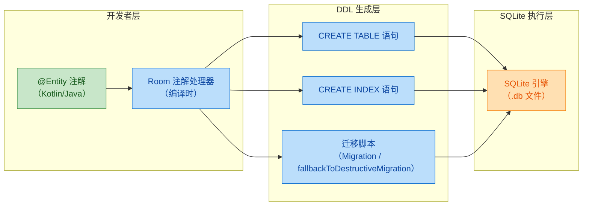
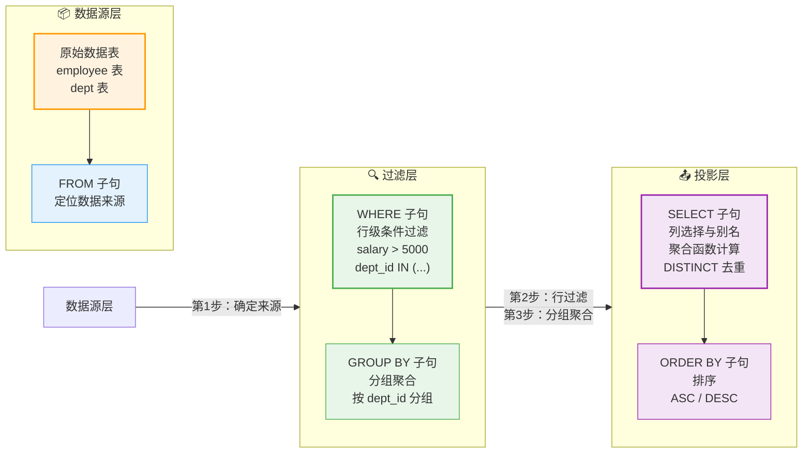
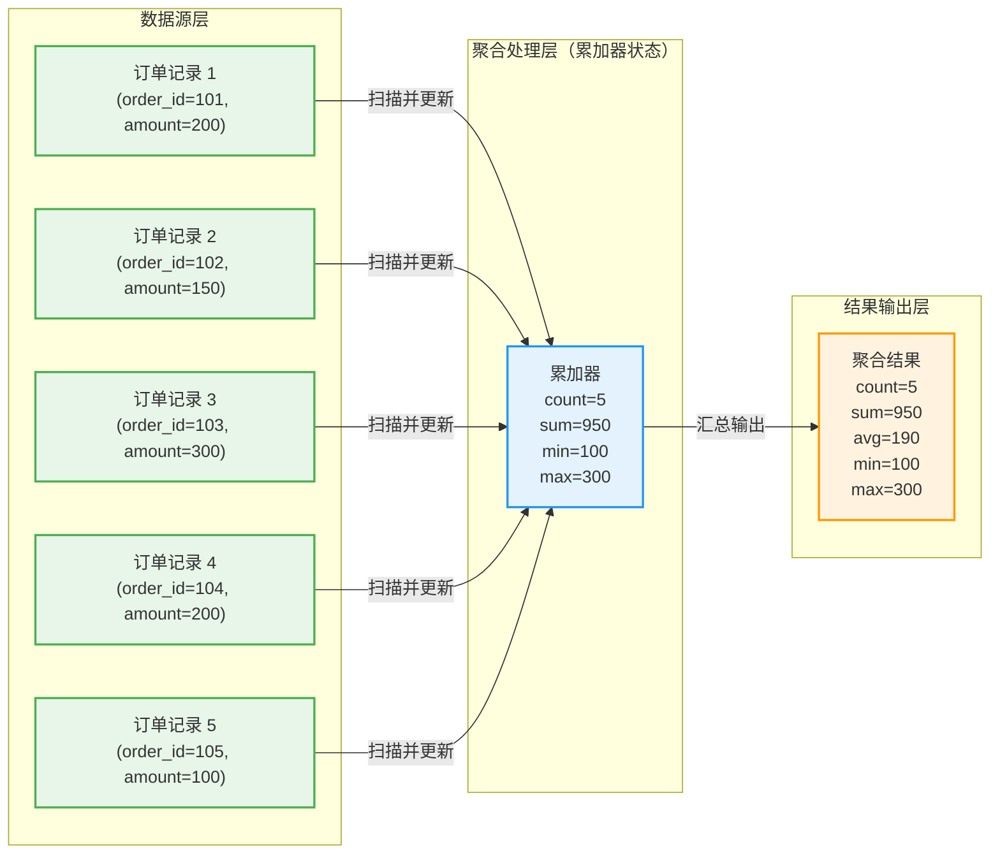
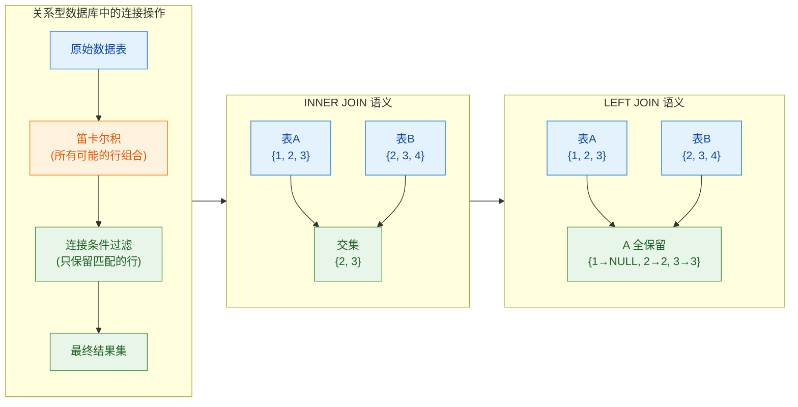
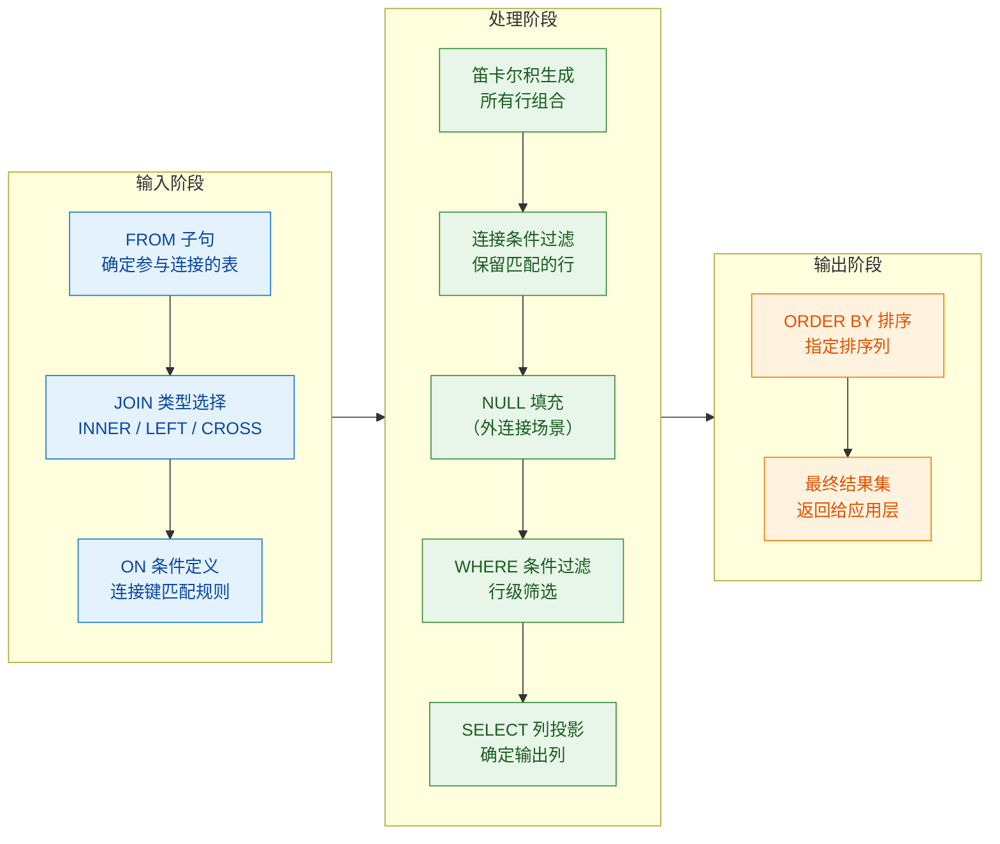
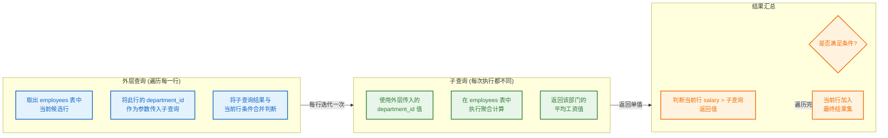
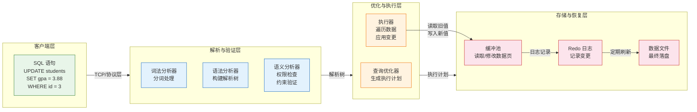
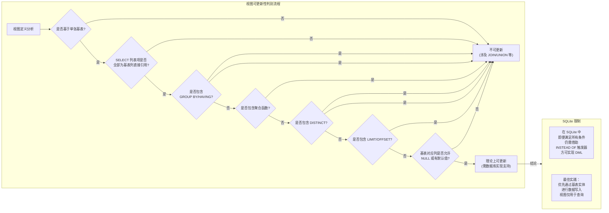

---

# SQL基础

---

## 第三章 SQL基础

### SQL概述与分类（DDL、DML、DCL）

#### 一、SQL的诞生与标准化历程

SQL（Structured Query Language，结构化查询语言）是用于管理关系型数据库的标准计算机语言。它的历史可以追溯到1970年代，当时IBM公司的研究员Edgar F. Codd提出了关系数据模型的概念，这一理论彻底改变了数据管理的范式。在关系模型提出之后，IBM启动了名为System/R的研究项目，并在其基础上开发出了SEQUEL（Structured English Query Language）语言，这便是SQL的雏形。尽管SEQUEL这个名字因为商标问题最终被简化为SQL，但"SEQUEL"这个发音在业界一直沿用至今。

1986年，美国国家标准协会（ANSI）正式发布了SQL标准的第一版（ANSI X3.135-1986），随后国际标准化组织（ISO）也在1987年采纳了该标准。此后，SQL标准经历了多次重大修订：1989年的SQL-89（SQL1）加入了完整性约束；1992年的SQL-92（SQL2）大幅扩展了功能，引入了事务控制、集合操作等核心特性；1999年的SQL:1999（SQL3）引入了面向对象特性和正则表达式支持；2003年的SQL:2003加入了XML支持；2006年的SQL:2006扩展了XQuery支持；2008年的SQL:2008和2011年的SQL:2011持续完善；最新的标准包括SQL:2016（JSON支持）、SQL:2019（多维数组支持）和SQL:2023（等等）。

值得注意的是，尽管SQL标准由ANSI和ISO制定，但没有任何数据库管理系统（DBMS）完全遵循标准的每一个细节。不同的数据库厂商——如MySQL、PostgreSQL、Oracle、SQLite、Microsoft SQL Server等——都在实现SQL标准的基础上添加了自己的扩展和特有语法。这种"方言"差异意味着，开发者在从一个数据库系统迁移到另一个时，有时需要调整SQL语句的写法。然而，核心的SELECT、INSERT、UPDATE、DELETE等语句在所有关系型数据库中保持高度一致，这也是SQL能够成为"数据库通用语言"的根本原因。

#### 二、SQL的核心定位与设计哲学

在数据库系统的三层架构中，SQL扮演着至关重要的角色。如果我们回顾一下数据库系统的经典三层结构——外模式（用户层）、模式（逻辑层）、内模式（物理层）——SQL正是连接用户应用与数据库内部存储的桥梁。应用程序通过SQL向数据库发出操作请求，数据库的查询处理器（Query Processor）负责解析、优化和执行这些请求，最终由存储引擎（Storage Engine）与物理存储介质交互。

SQL的设计哲学体现了几个核心原则。首先是**数据独立性（Data Independence）**：SQL作为一层抽象，允许应用程序在不考虑物理存储细节的情况下操作数据。当底层存储结构发生变化时（比如从机械硬盘迁移到SSD，或者改变索引结构），应用程序中的SQL语句无需修改。其次是**声明式语法（Declarative Syntax）**：与命令式编程语言不同，SQL是一种声明式语言——你告诉数据库"你想要什么"（What），而不是"如何获取"（How）。数据库的查询优化器会决定最优的执行策略。这种设计将"语义表达"与"执行策略"分离，极大地简化了开发者的负担。

举个例子，如果我们想查询所有年龄大于30岁的用户：

```sql
-- SQL: 声明式语言，只描述"要什么"
SELECT name, email FROM users WHERE age > 30;
```

开发者无需编写遍历、筛选、投影的循环逻辑，数据库会自动选择一个最优的执行路径（可能使用索引扫描、全表扫描或者其他方式）。这种分离关注点的设计是SQL最精妙之处，也是关系模型"数据独立"理念的直接体现。

#### 三、SQL语句的完整分类体系

SQL标准将所有SQL语句按照其功能划分为多个类别。在数据库系统概论的教学体系中，最常用且最重要的分类方式是**三分法**：DDL（Data Definition Language，数据定义语言）、DML（Data Manipulation Language，数据操作语言）和DCL（Data Control Language，数据控制语言）。有些教材还会单独列出DQL（Data Query Language，数据查询语言）作为SELECT的专门分类，或者TCL（Transaction Control Language，事务控制语言）。理解这一分类体系，不仅有助于记忆SQL语句的用途，更能帮助开发者在脑海中建立清晰的知识图谱。

下面，我们通过一个详细的Mermaid图表来展示SQL语句的完整分类及其主要成员：

```mermaid
graph LR
    %% 全局方向：LR（从左到右），子图水平排列

    %% 子图1：DDL
    subgraph DDL["🔧 DDL 数据定义语言"]
        direction TB
        DDL_C["CREATE\n创建对象"]
        DDL_A["ALTER\n修改对象"]
        DDL_D["DROP\n删除对象"]
        DDL_TRUNC["TRUNCATE\n清空表"]
        DDL_R["RENAME\n重命名"]
    end

    %% 子图2：DML
    subgraph DML["📝 DML 数据操作语言"]
        direction TB
        DML_INS["INSERT\n插入数据"]
        DML_UPD["UPDATE\n更新数据"]
        DML_DEL["DELETE\n删除数据"]
        DML_MERGE["MERGE\n合并操作"]
    end

    %% 子图3：DQL / SELECT
    subgraph DQL["🔍 DQL 数据查询语言"]
        direction TB
        DQL_SEL["SELECT\n查询数据"]
        DQL_FROM["FROM\n数据来源"]
        DQL_WHERE["WHERE\n条件过滤"]
        DQL_G["GROUP BY\n分组"]
        DQL_H["HAVING\n分组过滤"]
        DQL_O["ORDER BY\n排序"]
        DQL_L["LIMIT/OFFSET\n分页"]
    end

    %% 子图4：DCL
    subgraph DCL["🔐 DCL 数据控制语言"]
        direction TB
        DCL_GR["GRANT\n授权"]
        DCL_REV["REVOKE\n撤销授权"]
        DCL_COM["COMMIT\n提交事务"]
        DCL_ROLL["ROLLBACK\n回滚事务"]
        DCL_SAVE["SAVEPOINT\n保存点"]
    end

    %% 子图5：其他
    subgraph OTHER["📌 其他控制语句"]
        direction TB
        OTH_USE["USE\n选择数据库"]
        OTH_SHOW["SHOW\n显示信息"]
        OTH_EXPL["EXPLAIN\n执行计划"]
        OTH_SET["SET\n系统变量"]
    end

    %% 跨子图连接：优先使用子图名链式连接
    DDL -->|"定义结构"| DML
    DML -->|"操作数据"| DQL
    DQL -->|"查询结果"| DCL
    OTHER -->|"辅助控制"| DDL

    %% 样式定义
    classDef ddl fill:#C8E6C9, stroke:#388E3C, stroke-width:2px
    classDef dml fill:#BBDEFB, stroke:#1976D2, stroke-width:2px
    classDef dql fill:#FFF9C4, stroke:#F57F17, stroke-width:2px
    classDef dcl fill:#FFCCBC, stroke:#E64A19, stroke-width:2px
    classDef other fill:#E1BEE7, stroke:#7B1FA2, stroke-width:2px

    class DDL_C,DDL_A,DDL_D,DDL_TRUNC,DDL_R ddl
    class DML_INS,DML_UPD,DML_DEL,DML_MERGE dml
    class DQL_SEL,DQL_FROM,DQL_WHERE,DQL_G,DQL_H,DQL_O,DQL_L dql
    class DCL_GR,DCL_REV,DCL_COM,DCL_ROLL,DCL_SAVE dcl
    class OTH_USE,OTH_SHOW,OTH_EXPL,OTH_SET other
```



&gt; **图表解读**：上图展示了SQL语句的完整分类体系。箭头方向表示操作的逻辑顺序——首先通过DDL定义数据库结构（表、索引、视图等），然后通过DML操作数据，DQL用于查询数据，而DCL负责权限控制和事务管理。Android开发中最常用的是DML和DQL，即增删改查操作。

#### 四、DDL（Data Definition Language）详解

数据定义语言（DDL）用于定义、修改和删除数据库的**结构对象**。这里的"结构对象"包括数据库本身（DATABASE/SCHEMA）、表（TABLE）、索引（INDEX）、视图（VIEW）、触发器（TRIGGER）、存储过程（PROCEDURE）、函数（FUNCTION）等。DDL的核心特点是**自动提交**（Auto-Commit）——每一条DDL语句在执行后都会立即被隐式提交（Implicit Commit），这意味着你无法用ROLLBACK撤销一条DROP TABLE语句的后果。这一设计反映了DDL操作的"结构性"本质：修改数据库结构是一项严肃的元数据变更，不应该轻易回退。

在Android开发中，最常用的DDL语句是`CREATE TABLE`和`DROP TABLE`。当你使用Room数据库框架时，Room会在编译时根据Entity注解自动生成建表语句，但你仍然有必要理解这些建表语句的底层原理。

**CREATE语句**是最重要的DDL命令，用于创建数据库对象：

```sql
-- 创建一个名为 users 的表
CREATE TABLE users (
    -- INTEGER PRIMARY KEY: SQLite中自增主键的标准写法
    id INTEGER PRIMARY KEY AUTOINCREMENT,
    -- TEXT: 字符串类型，NOT NULL表示不允许为空
    name TEXT NOT NULL,
    -- REAL: 浮点数类型，存储年龄
    age REAL,
    -- TEXT UNIQUE: 唯一约束，email不能重复
    email TEXT UNIQUE,
    -- TEXT DEFAULT: 默认值
    gender TEXT DEFAULT 'unknown',
    -- REAL DEFAULT 0.0: 分数字段，默认0.0
    score REAL DEFAULT 0.0,
    -- TEXT CHECK: 约束检查，age必须大于0
    age INTEGER CHECK (age > 0),
    -- 创建时间戳，记录插入时刻
    created_at TEXT DEFAULT (datetime('now'))
    -- SQLite不支持FOREIGN KEY默认开启，需要单独启用
);
```

```sql
-- 为 users 表创建一个索引，加速 name 列的查询
CREATE INDEX idx_users_name ON users(name);

-- 创建一个视图，提供一个只读的年龄统计窗口
CREATE VIEW age_stats AS
    SELECT
        COUNT(*) AS total_users,
        AVG(age) AS avg_age,
        MAX(age) AS max_age,
        MIN(age) AS min_age
    FROM users;
```

**ALTER语句**用于修改已存在的数据库对象。例如，在实际开发中，数据库表结构很少能够一步到位定义完成。随着业务需求的变化，我们需要向现有表中添加新列、修改列类型或约束：

```sql
-- 为 users 表添加一个新列：电话号码
ALTER TABLE users ADD COLUMN phone TEXT;

-- 为 users 表添加一个新列：最后登录时间（带默认值）
ALTER TABLE users ADD COLUMN last_login TEXT DEFAULT 'never';

-- SQLite 不支持直接 DROP COLUMN，可以使用以下变通方案：
-- 1. 创建新表（不含目标列）
-- 2. 复制数据
-- 3. 删除旧表
-- 4. 重命名新表
```

**DROP语句**用于永久删除数据库对象：

```sql
-- 删除索引
DROP INDEX idx_users_name;

-- 删除视图
DROP VIEW IF EXISTS age_stats;

-- 删除表（永久删除，包括所有数据和结构）
DROP TABLE IF EXISTS users;
```

&gt; **特别提醒**：`DROP TABLE` 是一个极其危险的操作。在生产环境中执行此操作之前，必须确保已经做了完整的数据库备份。由于DDL语句的自动提交特性，一旦执行DROP TABLE，数据将无法通过ROLLBACK恢复。在Android应用开发中，虽然不太可能误操作线上用户的数据库，但开发调试阶段仍需谨慎。

**TRUNCATE语句**用于快速清空表中的所有数据，但保留表结构：

```sql
-- 清空 users 表的所有数据（保留表结构）
-- 注意：SQLite 不直接支持 TRUNCATE，替代方案是 DELETE FROM users;
TRUNCATE TABLE users;  -- 在MySQL/PostgreSQL中可用
DELETE FROM users;     -- SQLite 等效写法
```

#### 五、DML（Data Manipulation Language）详解

数据操作语言（DML）用于对数据库中**存储的数据**进行增、删、改操作。与DDL不同，DML操作默认**不会自动提交**——它们被包含在一个事务上下文中，开发者可以通过COMMIT显式提交确认更改，或者通过ROLLBACK回滚撤销更改。这种设计体现了"数据操作"与"结构定义"在安全级别上的差异：修改数据是频繁且可恢复的操作，而修改结构则是低频且高风险的操作。

**INSERT语句**用于向表中插入新数据行：

```sql
-- 方式一：插入单行数据，指定所有列的值
INSERT INTO users (name, age, email, gender, score)
VALUES ('张三', 28, 'zhangsan@example.com', '男', 92.5);

-- 方式二：插入多行数据，提高批量插入效率
INSERT INTO users (name, age, email, gender, score)
VALUES
    ('李四', 35, 'lisi@example.com', '女', 88.0),
    ('王五', 22, 'wangwu@example.com', '男', 76.5),
    ('赵六', 41, 'zhaoliu@example.com', '女', 95.0);

-- 方式三：省略列名列表（但VALUES必须提供所有列的值，且顺序必须与表定义一致）
INSERT INTO users VALUES (NULL, '孙七', 30, 'sunqi@example.com', '男', 85.0);

-- 方式四：插入默认值的简写形式
INSERT INTO users DEFAULT VALUES;  -- 使用所有列的默认值
```

**UPDATE语句**用于修改表中已存在的数据：

```sql
-- 更新单个列：把所有分数低于60的用户分数改为60（及格线）
UPDATE users
SET score = 60.0
WHERE score < 60.0;

-- 更新多个列：更新特定用户的多个字段
UPDATE users
SET
    age = 29,           -- 年龄加1
    score = 88.5,       -- 更新分数
    last_login = datetime('now')  -- 更新最后登录时间
WHERE id = 1;

-- 使用表达式更新：给所有用户的分数加5分
UPDATE users
SET score = score + 5.0;
```

&gt; **WHERE子句的重要性**：UPDATE语句中如果不加WHERE条件，将更新表中**所有行的指定列**。这是一个极其常见的错误。在编写UPDATE语句时，建议先写WHERE条件，再写SET和值，最好先用SELECT验证影响范围，再执行UPDATE。

**DELETE语句**用于从表中删除数据行：

```sql
-- 删除指定用户
DELETE FROM users WHERE id = 5;

-- 删除所有年龄超过80岁的用户
DELETE FROM users WHERE age > 80;

-- 删除分数为0的所有用户（清除僵尸账号）
DELETE FROM users WHERE score = 0.0;

-- 删除所有数据（保留表结构，等同于 TRUNCATE）
DELETE FROM users;
```

&gt; **DELETE与TRUNCATE的区别**：DELETE是DML语句，可以被回滚；TRUNCATE是DDL语句，自动提交不可回滚。在数据量大时，TRUNCATE比DELETE快得多，因为它不记录每行的删除日志。DELETE会触发DELETE触发器，而TRUNCATE不会。

**MERGE语句**（SQL:2003引入）是一个功能强大的DML命令，它可以根据条件对表执行INSERT、UPDATE或DELETE操作，有点像"批量UPSERT"：

```sql
-- 将新数据合并到目标表：如果存在则更新，不存在则插入
MERGE INTO users AS target
USING (VALUES
    (1, '张三', 29, 'zhangsan@example.com'),
    (6, '周八', 25, 'zhouba@example.com')
) AS source(id, name, age, email)
ON target.id = source.id
WHEN MATCHED THEN
    -- 如果记录存在，执行UPDATE
    UPDATE SET name = source.name, age = source.age
WHEN NOT MATCHED THEN
    -- 如果记录不存在，执行INSERT
    INSERT (id, name, age, email) VALUES (source.id, source.name, source.age, source.email);
```

需要注意的是，SQLite对MERGE的支持有限，如果你需要实现UPSERT功能，可以使用INSERT ... ON CONFLICT（SQLite特有）或REPLACE INTO。

#### 六、DCL（Data Control Language）详解

数据控制语言（DCL）负责数据库的**安全管理和事务控制**。在企业级数据库环境中，DCL扮演着至关重要的角色——它决定了谁可以访问什么数据，可以执行什么操作。Android开发者通常较少直接使用DCL语句，因为SQLite默认不支持多用户访问控制，但理解DCL的概念对于理解数据库安全机制和事务管理至关重要。

**GRANT和REVOKE**构成权限管理的核心：

```sql
-- 授予用户读取 users 表的权限
GRANT SELECT ON users TO 'app_user';

-- 授予用户插入和更新的权限
GRANT INSERT, UPDATE ON users TO 'app_user';

-- 授予用户所有权限（谨慎使用）
GRANT ALL PRIVILEGES ON database_name.* TO 'admin_user';

-- 撤销用户的更新权限
REVOKE UPDATE ON users FROM 'app_user';

-- 撤销用户的所有权限
REVOKE ALL PRIVILEGES ON users FROM 'app_user';
```

**事务控制语句**（也称为TCL，Transaction Control Language）管理数据库的ACID特性：

```sql
-- 开始一个事务
BEGIN TRANSACTION;  -- 或 START TRANSACTION

-- 提交事务，将所有更改永久写入数据库
COMMIT;

-- 回滚事务，撤销当前事务中的所有更改
ROLLBACK;

-- 设置保存点，允许部分回滚
SAVEPOINT savepoint_name;

-- 回滚到指定的保存点
ROLLBACK TO SAVEPOINT savepoint_name;

-- 释放保存点
RELEASE SAVEPOINT savepoint_name;
```

```kotlin
// Android 中使用事务的典型场景示例
// 在 Room 数据库中执行事务操作
@Database(entities = [User::class], version = 1)
abstract class AppDatabase : RoomDatabase() {
    abstract fun userDao(): UserDao

    fun transferScore(fromId: Long, toId: Long, amount: Double) {
        // withTransaction 是 Room 提供的 DSL，自动处理 begin/commit/rollback
        userDao().let { dao ->
            database.runInTransaction {
                // 从用户A扣除分数
                dao.decrementScore(fromId, amount)
                // 给用户B增加分数
                dao.incrementScore(toId, amount)
            }
        }
    }
}
```

#### 七、三种分类在实际开发中的对比

为了更清晰地理解DDL、DML和DCL之间的区别，我们从多个维度进行对比：

| 对比维度 | DDL | DML | DCL |
|---------|-----|-----|-----|
| **操作对象** | 数据库结构（元数据） | 表中存储的数据 | 权限、事务状态 |
| **提交方式** | 自动提交（无法回滚） | 手动提交（可回滚） | 手动提交 |
| **是否触发触发器** | 否（TRUNCATE不触发） | 是（DELETE触发DELETE触发器） | 不涉及 |
| **日志记录** | 记录结构变更 | 记录数据变更（行级日志） | 记录权限变更 |
| **典型操作** | CREATE, ALTER, DROP | INSERT, UPDATE, DELETE | GRANT, COMMIT, ROLLBACK |
| **对性能的影响** | 元数据缓存失效 | 写入日志、可能触发索引更新 | 控制并发和一致性 |
| **风险等级** | 高（结构变更不可逆） | 中（数据变更可回滚） | 中（权限误操作可恢复） |

#### 八、Android开发中的SQL实践

在Android开发中，SQLite是默认的本地数据库引擎，而现代Android开发通常使用Room Persistence Library作为抽象层。尽管Room通过注解处理器自动生成SQL代码，但理解底层SQL语句对于编写高效、正确的数据库代码仍然不可或缺。

**在Android中查看Room生成的SQL语句**是一个很好的学习方式：

```kotlin
// Room数据库的构建过程可以开启SQL日志
@Database(entities = [User::class], version = 1, exportSchema = false)
abstract class AppDatabase : RoomDatabase() {
    companion object {
        @Volatile
        private var INSTANCE: AppDatabase? = null

        fun getDatabase(context: Context): AppDatabase {
            return INSTANCE ?: synchronized(this) {
                val instance = Room.databaseBuilder(
                    context.applicationContext,
                    AppDatabase::class.java,
                    "app_database"  // 数据库文件名
                )
                .build()
                INSTANCE = instance
                instance
            }
        }
    }
}
```

```kotlin
// DAO层：直接使用SQL语句
@Dao
interface UserDao {

    // 查询所有用户（SELECT -> DQL/DML中的查询）
    @Query("SELECT * FROM users ORDER BY name ASC")
    fun getAllUsers(): List<User>

    // 条件查询
    @Query("SELECT * FROM users WHERE age > :minAge ORDER BY age DESC")
    fun getUsersOlderThan(minAge: Int): List<User>

    // 插入数据（INSERT -> DML）
    @Insert(onConflict = OnConflictStrategy.REPLACE)
    fun insertUser(user: User): Long  // 返回新插入行的id

    // 批量插入
    @Insert(onConflict = OnConflictStrategy.REPLACE)
    fun insertUsers(users: List<User>)

    // 更新数据（UPDATE -> DML）
    @Update
    fun updateUser(user: User)

    // 删除数据（DELETE -> DML）
    @Delete
    fun deleteUser(user: User)

    // 带条件的删除（SQL注入防护：使用占位符 ? 或 :param）
    @Query("DELETE FROM users WHERE score < :threshold")
    fun deleteUsersWithLowScore(threshold: Double): Int
}
```

```kotlin
// Entity实体类（对应DDL中的CREATE TABLE）
@Entity(tableName = "users")  // 映射到 users 表
data class User(
    @PrimaryKey(autoGenerate = true)  // 主键，自动生成
    val id: Long = 0,

    @ColumnInfo(name = "name")  // 列名映射
    val name: String,

    val age: Int,

    @ColumnInfo(name = "email", index = true)  // 在email列上创建索引
    val email: String,

    val gender: String = "unknown",  // 默认值

    val score: Double = 0.0,

    val createdAt: String = ""  // 创建时间戳
)
```

#### 九、SQL语句的执行顺序与解析原理

理解SQL语句的**执行顺序**对于写出高效查询至关重要。虽然我们在编写SQL时按照`SELECT ... FROM ... WHERE ... GROUP BY ... HAVING ... ORDER BY ...`的顺序书写，但数据库引擎内部的执行顺序却完全不同：

```mermaid
graph LR
    subgraph PARSE["📥 SQL解析阶段"]
        direction TB
        P1["1. FROM\n确定数据来源"]
        P2["2. ON / JOIN\n连接条件"]
        P3["3. WHERE\n行级过滤"]
        P4["4. GROUP BY\n分组聚合"]
        P5["5. HAVING\n分组过滤"]
        P6["6. SELECT\n投影列"]
        P7["7. ORDER BY\n排序"]
        P8["8. LIMIT\n限制行数"]
    end

    subgraph OPT["⚙️ 查询优化阶段"]
        direction TB
        O1["执行计划生成\n(Access Path Selection)"]
        O2["代价模型评估\n(Cost Estimation)"]
        O3["最优计划选择\n(Plan Selection)"]
    end

    subgraph EXEC["📤 执行阶段"]
        direction TB
        E1["索引扫描\n或\n全表扫描"]
        E2["数据过滤\n与聚合"]
        E3["结果排序\n与返回"]
    end

    PARSE -->|"抽象语法树"| OPT
    OPT -->|"执行计划"| EXEC

    classDef parse fill:#E3F2FD, stroke:#1565C0, stroke-width:2px
    classDef opt fill:#FFF3E0, stroke:#E65100, stroke-width:2px
    classDef exec fill:#E8F5E9, stroke:#2E7D32, stroke-width:2px

    class P1,P2,P3,P4,P5,P6,P7,P8 parse
    class O1,O2,O3 opt
    class E1,E2,E3 exec
```



&gt; **图表解读**：SQL引擎的执行顺序遵循"先筛选、后投影、再排序"的原则。这意味着数据库首先在FROM阶段确定数据来源，然后在WHERE阶段尽可能早地过滤掉不需要的行（这叫做"谓词下推"，Predicate Pushdown），最后才在SELECT阶段处理投影和计算。这种自底向上的执行顺序是查询优化的重要基础。

#### 📝 练习题

在Android应用中使用Room数据库时，开发者定义了一个Entity类并通过@Insert注解插入数据。以下关于SQL语句分类的说法中，正确的是哪一项？

A. Entity类中的字段定义属于DML范畴，因为它们直接定义了数据的结构
B. @Insert注解对应的SQL语句属于DDL，因为它是在编译时生成的结构
C. Room的@Query注解中编写SELECT语句属于DQL或DML中的查询操作
D. DELETE语句属于DCL，因为它涉及数据的删除操作

**【答案】** C

**【解析】**

本题考察的是SQL语句的三大分类（DDL、DML、DCL）的准确理解。

**选项A分析**：Entity类中的字段定义（如`val name: String`）在编译时会被Room框架转换为CREATE TABLE语句（DDL）。Entity定义的是**数据结构**——即表的schema（模式），这属于元数据定义，因此是DDL的范畴，而非DML。A选项说"属于DML"是错误的。

**选项B分析**：@Insert注解对应的INSERT INTO语句是向表中**插入数据行**的操作，这是典型的DML（数据操作语言）。INSERT是操作存储在表中的数据，而非定义表的结构，因此不是DDL。编译时生成只是Room的实现细节，其语义仍然是DML。B选项错误。

**选项C分析**：SELECT语句用于从数据库中**查询数据**。SELECT虽然在功能上属于"查询"操作（业界有时将DQL单独作为一个类别），但从标准SQL的三分类来看，SELECT既不属于DDL也不属于DCL，它属于DML的一部分（虽然严格来说DML的"M"指Manipulation，SELECT严格意义上不修改数据）。在大多数教学体系中，SELECT被归入DQL（Data Query Language）或视作DML的查询子集。因此C选项的说法是正确的——@Query中的SELECT语句属于DQL或DML中的查询操作。

**选项D分析**：DELETE语句用于**删除表中的数据行**，属于DML（数据操作语言），而非DCL。DCL的核心职责是控制数据库的**访问权限**（GRANT/REVOKE）和**事务状态**（COMMIT/ROLLBACK/SAVEPOINT）。DELETE虽然也是"修改"数据库状态的一种操作，但按照SQL标准的分类，它属于DML的范畴。

**【知识点延伸】**：在Android/Room开发中，理解SQL分类还有一层实际意义——Room对不同类型的SQL语句有不同的处理策略。例如，DDL语句（CREATE TABLE、ALTER TABLE等）在执行时会立即提交，不受事务控制；而DML语句（INSERT、UPDATE、DELETE）可以被包含在数据库事务中，享受原子性保证。这就是为什么在进行多步数据操作时（如转账场景），必须确保它们在一个事务内执行——如果其中任何一步失败，可以通过ROLLBACK撤销所有更改。

---

## SQL概述与分类（DDL、DML、DCL）

在正式展开数据定义语言的讨论之前，我们有必要先对 SQL 的整体轮廓建立一个清晰的认识。SQL（Structured Query Language，结构化查询语言）是关系型数据库管理系统中进行数据操作的核心语言，它的设计哲学融合了数据查询、数据操纵、数据定义和数据控制四大功能域。这四个功能域并非彼此孤立，而是协同工作，共同支撑起数据库应用的全部生命周期——从 schema 的创建与演化，到数据的增删改查，再到权限的管理与审计，每一个环节都有赖于 SQL 相应子语言的精确执行。

从语义和功能目标的角度，SQL 可以划分为三个主要类别：**DDL（Data Definition Language，数据定义语言）**、**DML（Data Manipulation Language，数据操纵语言）** 和 **DCL（Data Control Language，数据控制语言）**。理解这三者的分工与边界，是掌握 SQL 体系的第一块基石。

**DDL** 负责定义和管理数据库中的对象结构。在关系型数据库的语境下，"对象"主要指数据库（database）、表（table）、索引（index）、视图（view）、触发器（trigger）、存储过程（stored procedure）等逻辑和物理构件。DDL 的核心使命是描述"数据长什么样"、"数据之间有什么关系"、"数据如何被组织"。当我们执行一条 DDL 语句时，数据库系统不仅会在数据字典（data dictionary）中记录该对象的元数据（metadata），还会在物理存储层面分配或回收空间。因此，DDL 操作通常具有**自动提交**（auto-commit）的特性，即每一条 DDL 语句都会隐式地结束当前事务，并对数据库结构做出持久化变更。典型的 DDL 语句包括 `CREATE`、`ALTER`、`DROP`、`TRUNCATE`、`COMMENT` 和 `RENAME`，其中前三条是本章的核心议题。

**DML** 专注于数据的读写操作，即我们常说的"增删改查"。`INSERT`、`UPDATE`、`DELETE` 和 `SELECT` 属于 DML 范畴。与 DDL 不同的是，DML 语句默认不会自动提交——它们位于一个事务的上下文中，只有在显式执行 `COMMIT` 或通过其他提交机制确认后，变更才会被持久化。这种设计赋予了 DML 操作原子性和回滚能力，使得应用程序可以在多个数据修改步骤中保持一致性。值得注意的是，`SELECT` 虽然是查询语句，但从语言分类的角度它也被归入 DML，因为它实质上是对数据的"读操作"。

**DCL** 则承担着数据库安全治理的职责，涵盖权限授予（grant）、权限回收（revoke）、角色创建（create role）以及事务控制（commit、rollback）等功能。在企业级数据库应用中，DCL 是确保数据隔离性和访问控制合规性的关键机制。

在 Android 开发实践中，SQLite 引擎对这三类语言的支持程度各有侧重。SQLite 完整支持 DDL 和 DML，但在 DCL 方面仅支持有限的事务控制语句（`BEGIN`、`COMMIT`、`ROLLBACK`），而不支持用户管理和权限管理语句（因为 SQLite 是文件级数据库，缺乏多用户概念）。这一差异对于 Android 开发者理解 SQLite 与企业级数据库（如 MySQL、PostgreSQL、Oracle）之间的能力边界非常重要。

### 数据定义（CREATE、ALTER、DROP）

### 概述：数据定义语言的核心地位

数据定义语言（DDL）是 SQL 语言家族中负责"建章立制"的核心子集。如果说数据库是一片土地，那么 DDL 就是在这片土地上划定疆界、铺设道路、建造房屋的规划图纸。每一张表、每一个索引、每一道约束，都必须通过 DDL 语句来宣告其存在与规范。DDL 语句的执行结果不仅影响数据的物理存储布局，还决定了数据的逻辑组织结构和业务规则的底层表达方式。

在 Android 平台上，虽然大多数开发者通过 Room 这样的 ORM 框架来间接使用 DDL（Room 会在编译时根据注解生成 DDL 语句），但理解 DDL 的底层原理对于排查数据库迁移问题、优化查询性能以及设计复杂的数据模型仍然不可或缺。当应用进行数据库版本升级（schema migration）时，底层执行的正是 `ALTER TABLE` 语句；当 Room 生成数据库创建脚本时，输出的便是 `CREATE TABLE` 语句。掌握 DDL，就是掌握了与数据库"底层架构"直接对话的能力。

### CREATE 语句：创建数据库对象

`CREATE` 语句是 DDL 中使用最为频繁的一条命令，它用于在数据库中创建新的对象。能够被 `CREATE` 创建的对象种类繁多，但其中最核心、最基础的是**表（table）**。除此之外，`CREATE` 还可以用于创建数据库本身（`CREATE DATABASE`）、创建索引（`CREATE INDEX`）、创建视图（`CREATE VIEW`）、创建触发器（`CREATE TRUNCATE`）以及创建约束（`CREATE TABLE` 中的 `CONSTRAINT` 子句）等。在本节中，我们将聚焦于 `CREATE TABLE` 的完整语法与语义。

#### 创建数据库

在企业级数据库管理系统中（如 MySQL、PostgreSQL），创建一个新的数据库通常使用 `CREATE DATABASE` 语句：

```sql
CREATE DATABASE my_app_db
  CHARACTER SET utf8mb4       -- 指定字符集为 utf8mb4（支持完整的 Unicode 范围）
  COLLATE utf8mb4_unicode_ci; -- 指定排序规则（unicode_ci 规则对大小写和重音符号不敏感）
```

这条语句的语义非常明确：在数据库实例中分配一个新的逻辑命名空间。`CHARACTER SET`（或 `CHARSET`）决定了数据库中存储文本数据所使用的编码方案；`COLLATE` 则决定了字符串比较和排序的规则。不同的字符集-排序规则组合会直接影响 `WHERE`、`ORDER BY` 和 `LIKE` 等子句的行为。例如，`utf8mb4_general_ci` 在比较时不区分大小写且处理速度较快，而 `utf8mb4_unicode_ci` 则遵循 Unicode 标准进行更精确的字符比较。

在 SQLite 中，由于其嵌入式特性，不存在独立的"创建数据库"语句——一个数据库就是一个文件。当我们首次连接到某个 `.db` 文件时，如果该文件不存在，SQLite 会自动创建它。这种"无头"（headless）的设计使得 SQLite 的使用极为简洁，但也意味着 Android 开发者需要自行管理数据库文件的创建路径和版本初始化逻辑。

#### 创建表（CREATE TABLE）

`CREATE TABLE` 是 DDL 中最核心的语句，它定义了关系模型中的"关系"（即表）的结构。一张表的定义包含以下核心要素：**列定义**、**数据类型**、**约束条件** 和 **表级选项**。

```sql
CREATE TABLE IF NOT EXISTS users (
  -- 用户ID：主键，使用自增整数类型
  id           INTEGER PRIMARY KEY AUTOINCREMENT,

  -- 用户名：非空字符串，最大255字符，唯一约束
  username     TEXT    NOT NULL UNIQUE,

  -- 邮箱：可空字符串，用于存储用户联系方式
  email        TEXT,

  -- 密码哈希：NOT NULL 确保每个用户必须设置密码
  password_hash TEXT   NOT NULL,

  -- 账户创建时间：默认为当前时间戳
  created_at   INTEGER DEFAULT (strftime('%s', 'now')),

  -- 账户状态：默认为1（正常），CHECK 约束确保值为0或1
  status       INTEGER DEFAULT 1 CHECK (status IN (0, 1)),

  -- 账户余额：DECIMAL 类型确保精度，DEFAULT 0.00 初始为零
  balance      REAL    DEFAULT 0.00
);
```

逐行解析上述 `CREATE TABLE` 语句，我们可以清晰地看到关系模型中每一个核心概念的对应实现：

**主键（Primary Key）**：通过 `PRIMARY KEY` 关键字声明。上例中的 `id` 列被指定为主键，这意味着该列具有双重约束——**唯一性**（该列的所有值互不相同）和**非空性**（NOT NULL）。主键是关系模型中标识元组（行）的最小属性集，每一个表都应该拥有一个主键，以便支持行级别的唯一寻址。在 SQLite 中，`INTEGER PRIMARY KEY` 列具有特殊语义：它不仅是一个主键约束，还会自动激活**行ID别名**机制，使得该列的值可以直接通过 `last_insert_rowid()` 函数回读，或者在后续查询中直接使用 `WHERE id = ?` 进行高效定位。SQLite 的查询优化器对主键列的等值查找做了特殊优化，其时间复杂度为 O(1)（通过 B-Tree 索引直接定位）。

**数据类型**：SQLite 采用**动态类型系统**（dynamic typing），即每一列的数据类型建议性（type affinity）而非强制性。这意味着 SQLite 允许在声明为 INTEGER 的列中存储文本数据（虽然不推荐）。然而，在设计和实现数据库 schema 时，为每一列指定准确的数据类型仍然是最佳实践，因为类型信息会被数据字典记录，并且影响排序规则和比较行为。上例中使用的 `INTEGER`、`TEXT`、`REAL` 是 SQLite 的五种存储类（storage class）中最常用的三种，另外两种是 `BLOB`（二进制大对象）和 `NUMERIC`。在企业级数据库（MySQL、PostgreSQL）中，数据类型的约束则是强制性的——向整数列插入字符串会直接触发类型错误。

**NOT NULL 约束**：该约束确保列值不能为空（NULL）。NULL 在关系模型中是一个特殊的标记，表示"未知"或"缺失"的值。NOT NULL 约束的应用场景非常广泛：任何业务上不允许缺失的字段都应该施加 NOT NULL 约束，如用户密码、订单金额等。NOT NULL 不仅是一种数据完整性保证，也为数据库引擎提供了优化机会——因为 NULL 值需要额外的位图标记来标识，而非 NULL 列可以使用更紧凑的存储方式。

**UNIQUE 约束**：确保列中的所有值互不相同。与主键不同，一张表可以有多个 UNIQUE 列，但只能有一个主键；而且 UNIQUE 列允许存储 NULL 值（但只能存储一个 NULL）。UNIQUE 约束在数据库内部通过创建唯一索引（unique index）来实现。

**DEFAULT 约束**：为列提供默认值。当 INSERT 语句未指定该列的值时，数据库引擎会自动使用 DEFAULT 表达式。上例中 `created_at` 使用了 SQLite 的 `strftime` 函数来获取 Unix 时间戳作为默认值，这比使用字符串字面量更加可靠，因为它不依赖于数据库连接的时区设置。

**CHECK 约束**：一种用户定义的完整性约束条件。上例中 `CHECK (status IN (0, 1))` 确保 `status` 列的值只能是 0 或 1，从而在数据库层面防止了非法状态值的侵入。CHECK 约束在 MySQL 的早期版本（MySQL 5.7 之前）中曾被忽略，但现代数据库系统都已正确实现。Android 开发者需要注意：SQLite 从 3.3.0 版本开始支持 CHECK 约束，而目前主流 Android 设备所使用的 SQLite 版本均远高于此。

#### CREATE INDEX：创建索引

索引（Index）是数据库性能优化的核心手段之一。从数据结构的角度来看，索引是一种**辅助访问结构**（auxiliary access structure），它不改变数据的物理存储顺序，但通过建立额外的查找路径，显著加速了按索引列进行的查询操作。

```sql
CREATE INDEX IF NOT EXISTS idx_users_email ON users (email);  -- 为 email 列创建普通索引
CREATE UNIQUE INDEX IF NOT EXISTS idx_users_username ON users (username);  -- 为 username 列创建唯一索引
```

索引的底层数据结构通常是 **B-Tree**（平衡多路搜索树）或 **B+Tree**。以 B-Tree 为例，其查找操作从根节点开始，每一步都通过二分查找确定子节点的分支路径，直至叶子节点。整个查找过程的高度平衡性确保了从根到叶的路径长度始终相等，因此时间复杂度稳定在 O(log n)。对于一张包含数百万行数据的表，B-Tree 索引可以将原本需要全表扫描的查询（如 `WHERE email = 'xxx@example.com'`）从 O(n) 降低到 O(log n)，性能提升可达数万倍。

在 SQLite 中，索引的创建是异步的——`CREATE INDEX` 语句会立即返回，但索引的实际构建（B-Tree 的填充）在后台进行。这种设计避免了大型索引构建过程中的阻塞问题，但也意味着刚刚创建的索引在某些边缘情况下可能尚未完全就绪。

索引并非没有代价。每一个索引都需要占用额外的磁盘空间，并且在数据插入、更新和删除时，相关的所有索引都需要同步维护。因此，索引的创建应当遵循**选择性原则**（selectivity principle）：只为那些**WHERE 子句中频繁出现**、**JOIN 操作中作为连接条件**、或者**需要强制唯一性**的列创建索引。一味地增加索引不仅浪费空间，还会降低写入性能——每次插入一行数据时，数据库都需要同时更新该行的主数据 B-Tree 和所有相关索引的 B-Tree。

#### CREATE VIEW：创建视图

视图（View）是从一个或多个表中导出的虚拟表。它本身不存储数据，而是存储一条 `SELECT` 查询的定义。每当对视图进行查询时，数据库引擎都会将视图的定义展开（expand）并执行底层查询。视图本质上是一种**命名查询**，它为复杂的查询逻辑提供一个可重用的抽象层。

```sql
-- 创建一个展示活跃用户的视图，仅包含 status = 1 的用户记录
CREATE VIEW active_users AS
SELECT
  id,
  username,
  email,
  balance
FROM users
WHERE status = 1;
```

视图在数据库设计中扮演着多重角色：**数据抽象**——将复杂的表连接和过滤条件封装为一个可命名的对象，上层应用只需查询视图而无需了解底层表的结构细节；**安全性**——通过视图限制用户只能看到特定的数据子集，例如创建一个仅包含脱敏字段的视图供外部系统访问；**向后兼容**——在表结构变更时，通过创建与旧表名相同的视图来保持上层查询的兼容性。

### ALTER 语句：修改数据库对象

`ALTER` 语句用于对已存在的数据库对象进行结构修改。数据库的生命周期并非一成不变——业务需求的演进、数据量的增长、合规性要求的变更，都可能推动 schema 的演化。`ALTER` 语句正是应对这些变化的工具。

在 SQLite 中，`ALTER TABLE` 的能力相对有限——SQLite 最初设计时出于简化目的，只支持表名修改和表的重命名两种 `ALTER TABLE` 操作。直到 SQLite 3.25.0（2018年发布）才引入了 `ALTER TABLE ... ADD COLUMN` 功能。更高级的操作（如修改列类型、删除列、重命名列）需要通过**表重建**（table rebuild）技术来实现：创建一个新表，将数据从旧表迁移过去，删除旧表，然后重命名新表。在 Android 的 Room 数据库迁移中，这正是 `Migration` 回调中常见的一种模式。

#### 添加列

```sql
-- 向 users 表添加一个"最后登录时间"列
ALTER TABLE users ADD COLUMN last_login INTEGER;
```

这条语句为 `users` 表增加了一个新列 `last_login`。需要特别注意的是，在 SQLite 中向已有表添加列时，该列**不能**具有 `PRIMARY KEY`、`UNIQUE` 或 `NOT NULL` 约束（除非提供了 `DEFAULT` 值）。因为已有行的该列值在添加时无法确定，必须依赖 DEFAULT 值或允许 NULL 来填充。

#### 重命名表

```sql
ALTER TABLE users RENAME TO app_users;
```

该语句将 `users` 表的名称变更为 `app_users`。在 Android 数据库迁移中，如果要删除一张表并重建，最安全的做法是先将该表重命名，然后创建新表，最后通过数据迁移脚本将数据从旧表导入新表。这种"重命名-创建-迁移"三步法可以最大程度地降低迁移过程中数据丢失的风险。

#### SQLite 中更复杂的结构变更

当需要修改列的数据类型或删除列时，SQLite 需要执行表重建。以下是在 Room 迁移中实现列类型变更的典型模式：

```sql
-- 步骤1：创建新表，定义期望的新结构
CREATE TABLE users_new (
  id           INTEGER PRIMARY KEY AUTOINCREMENT,
  username     TEXT    NOT NULL UNIQUE,
  email        TEXT,
  password_hash TEXT   NOT NULL,
  created_at   INTEGER DEFAULT (strftime('%s', 'now')),
  status       INTEGER DEFAULT 1 CHECK (status IN (0, 1)),
  -- 新增的列，原有数据默认填充
  last_login   INTEGER,
  -- 将 balance 类型从 REAL 改为 TEXT（旧数据会自动文本化）
  balance      TEXT    DEFAULT '0.00'
);

-- 步骤2：将旧表中的数据迁移到新表
INSERT INTO users_new (id, username, email, password_hash, created_at, status, balance)
SELECT id, username, email, password_hash, created_at, status, CAST(balance AS TEXT) FROM users;

-- 步骤3：删除旧表
DROP TABLE users;

-- 步骤4：将新表重命名为原名
ALTER TABLE users_new RENAME TO users;
```

这一系列操作的实质是"复制-替换"策略。关键点在于：数据迁移时需要显式处理类型转换（如 `CAST(balance AS TEXT)`），以确保数据不会因类型不兼容而丢失或截断。如果涉及 NOT NULL 约束，还需要为新列提供适当的默认值以填充历史记录中的 NULL 行。

### DROP 语句：删除数据库对象

`DROP` 语句用于从数据库中永久删除对象。与 `DELETE` 语句（属于 DML）不同，`DROP` 删除的是**对象本身**（表结构、索引等），而非对象中的数据。当执行 `DROP TABLE` 时，不仅表中的所有数据会被立即删除，表结构及其相关索引、约束、触发器也会一并被销毁，且这一操作**不可回滚**。

```sql
DROP TABLE IF EXISTS users;  -- 如果 users 表存在，则删除它；否则不执行任何操作
```

`IF EXISTS` 子句是一个重要的安全保护措施。当 `DROP TABLE` 语句在脚本中顺序执行时，如果某张表因为前置步骤已经不存在，`IF EXISTS` 可以防止数据库抛出"表不存在"的异常而导致脚本中断。在数据库迁移脚本和生产环境维护脚本中，使用 `IF EXISTS` 和 `IF NOT EXISTS` 是一种被广泛推荐的最佳实践。

```sql
DROP INDEX IF EXISTS idx_users_email;  -- 删除索引
DROP VIEW IF EXISTS active_users;       -- 删除视图
DROP DATABASE IF EXISTS my_app_db;      -- 删除整个数据库（需要相应权限）
```

删除操作是不可逆的，这一特性要求开发者在执行 `DROP` 前必须三思而后行。在生产环境中，标准的做法是：在执行删除操作之前，先执行备份（backup）；如果条件允许，先将目标表重命名（如 `users_to_delete`）而非立即删除，观察一段时间确认无误后再正式删除。对于视图的删除，SQLite 的 `DROP VIEW` 只会删除视图的定义和元数据，不会影响底层表的数据。

### 约束系统：数据完整性的守护者

在深入理解了 `CREATE`、`ALTER`、`DROP` 三大 DDL 操作之后，我们有必要将视野扩展到约束系统——因为约束正是在数据定义阶段被声明，并在数据操纵阶段被强制执行的完整性规则。

数据库约束（Constraint）是关系模型中**完整性约束条件**的具体实现。它们在 `CREATE TABLE` 或 `ALTER TABLE` 语句中声明，定义了数据必须满足的业务规则。从类型上划分，主要包括以下几种：

**主键约束（PRIMARY KEY）**：如前所述，确保列值唯一且非空，并自动创建唯一索引。主键约束具有以下特征：每个表只能有一个主键；主键列会自动创建聚集索引（clustered index，在 SQLite 中为 B-Tree 结构的 rowid 表）；主键值一旦确定就不应更改（因为它可能作为外键引用）。

**唯一约束（UNIQUE）**：确保列或列组合的值在同一表中不重复。与主键不同，唯一约束允许多个 NULL 值（因为 NULL 不等于 NULL，在 SQL 标准中两个 NULL 被认为是"未知"而非"相等"）。

**非空约束（NOT NULL）**：确保列值不能为空。这是唯一在列定义内部直接声明的约束（通过 `NOT NULL` 关键字），其他所有约束都需要使用 `CONSTRAINT` 子句。

**外键约束（FOREIGN KEY）**：确保引用完整性（referential integrity）。外键约束要求子表中的外键列的值必须在父表的主键或唯一键中存在。例如，如果 `orders` 表中有一个 `user_id` 列引用 `users` 表的 `id` 列，那么任何向 `orders` 插入的行都必须拥有一个在 `users` 表中实际存在的 `user_id` 值。SQLite 从 3.6.19 版本开始支持外键约束（默认关闭，需要通过 `PRIVATE FOREIGN KEY` 语句启用）。在 Android 开发中，如果使用 Room，可以通过 `@ForeignKey` 注解来定义和管理外键关系。

**检查约束（CHECK）**：用户定义的布尔表达式，用于验证列值或行值满足特定条件。`CHECK (status IN (0, 1))` 和 `CHECK (age >= 0)` 都是常见的应用场景。检查约束在数据插入或更新时由数据库引擎评估，如果条件返回 FALSE，则操作被拒绝。

**默认约束（DEFAULT）**：为列提供默认值，作为 `INSERT` 时省略该列时的候补值。

### 数据定义与 Android Room 框架的关联

在 Android 开发中，Room 持久化库对 DDL 进行了全面的抽象和封装。开发者通过 Java/Kotlin 注解定义数据实体（Entity）和数据库结构（Database），Room 在编译时自动生成 DDL 语句。这一过程可以用下图来描述：



从图中可以看出，Room 框架本质上是一套**DDL 生成器**。理解了这一层关系后，我们就能理解为什么在进行 Room 数据库版本升级时，需要提供 `Migration` 对象或使用 `fallbackToDestructiveMigration()`——前者让我们能够精确控制 schema 的演化路径（通过手写 `ALTER TABLE` 等 DDL 语句），后者则告诉 Room 在无法进行增量迁移时直接销毁旧数据库并重新创建（等价于执行 `DROP TABLE` 后重新 `CREATE TABLE`）。

在 Android 中进行复杂数据库迁移时，开发者经常需要直接编写 DDL 语句：

```kotlin
// Kotlin: 在 Room Migration 中手写 DDL 语句
val migration_1_2 = object : Migration(1, 2) {
    override fun migrate(database: SupportSQLiteDatabase) {
        // ALTER TABLE: 添加新列
        database.execSQL(
            "ALTER TABLE users ADD COLUMN phone TEXT"
        )

        // CREATE INDEX: 为新列创建索引以加速按手机号查找
        database.execSQL(
            "CREATE INDEX IF NOT EXISTS idx_users_phone ON users (phone)"
        )
    }
}
```

上述代码展示了 Android 开发中 DDL 的典型应用场景。`database.execSQL()` 方法直接接收并执行 DDL 语句字符串，这要求开发者对 SQL DDL 语法有扎实的掌握。

### 事务与 DDL 的交互

一个重要的实践细节：DDL 语句的执行与事务机制之间存在微妙的关系。在大多数企业级数据库（MySQL 的 InnoDB、PostgreSQL、Oracle）中，每条 DDL 语句都会自动触发一个隐式的 `COMMIT`，将自己包含在一个独立的事务中。这意味着在事务中间执行一条 DDL 语句会导致之前未提交的操作被强制提交，后续的操作则处于新的事务中。

SQLite 的行为略有不同：默认情况下，SQLite 的 `ALTER TABLE` 语句不支持在显式事务中执行（SQLite 会将其视为非法操作并抛出异常）。这一限制源于 SQLite 内部的表重建机制——`ALTER TABLE` 实际上可能涉及创建临时表和数据迁移，如果在事务上下文中进行，则回滚语义会变得复杂。因此，在 SQLite 中进行 schema 变更时，通常需要确保没有活动的事务。

### DDL 与数据库迁移策略

在实际项目中，数据库 schema 的演化是一个持续的过程。随着应用功能的迭代，数据库结构需要不断调整。一种被广泛采用的迁移策略是**版本化增量迁移**：

```sql
-- V1 -> V2: 添加 phone 列并创建索引
ALTER TABLE users ADD COLUMN phone TEXT;
CREATE INDEX IF NOT EXISTS idx_users_phone ON users (phone);

-- V2 -> V3: 创建新表以支持多设备登录
CREATE TABLE IF NOT EXISTS user_devices (
  id         INTEGER PRIMARY KEY AUTOINCREMENT,
  user_id    INTEGER NOT NULL,
  device_name TEXT   NOT NULL,
  token      TEXT    NOT NULL,
  created_at  INTEGER DEFAULT (strftime('%s', 'now')),
  FOREIGN KEY (user_id) REFERENCES users(id) ON DELETE CASCADE
);
CREATE INDEX IF NOT EXISTS idx_user_devices_user_id ON user_devices (user_id);
```

这种增量迁移的优势在于：每一个版本的变更都是原子且可追溯的。Android Room 通过 `Migration` 类提供了类似的能力，每一个 `Migration` 对象对应一个版本增量。当数据库版本从 N 升级到 N+1 时，Room 会自动查找并执行相应的 `Migration`，如果找不到则抛出异常。

#### 📝 练习题

以下关于 SQL DDL 语句的描述中，**错误**的是哪一项？

A. `CREATE TABLE` 语句可以同时指定列的数据类型、默认值、非空约束和检查约束，且这些定义都会永久保存在数据库的数据字典中。\
B. `ALTER TABLE ... ADD COLUMN` 在 SQLite 中可以为新列指定 `PRIMARY KEY` 约束，只要同时提供了 `DEFAULT` 值。\
C. `DROP TABLE` 语句会同时删除表的结构和表中存储的所有数据，且该操作在支持事务的数据库中可以通过 `ROLLBACK` 进行回滚。\
D. `CREATE INDEX` 语句创建的索引会占用额外的磁盘空间，并在数据插入、更新、删除时增加维护开销，因此应该只为高频查询列创建索引。

**【答案】** B

**【解析】** 本题考查对 SQLite DDL 特性的理解。SQLite 在向已有表添加列时，对约束类型有明确的限制：新增列**不能**被指定为 `PRIMARY KEY`、`UNIQUE` 或 `NOT NULL`（除非有 DEFAULT 值）约束。这是因为在添加新列时，表中已存在的行无法自动获得该列的值，SQLite 无法在没有数据来源的情况下为已有行填充主键值或唯一值。

具体而言，`ALTER TABLE ... ADD COLUMN` 的 SQLite 文档明确说明：新列只能有 `DEFAULT` 约束（带默认值或 `CURRENT_TIMESTAMP` 等关键字）或完全无约束。列可以是 `NOT NULL` 当且仅当同时指定了 `DEFAULT` 值——此时所有已有行都会以该默认值填充该列，从而满足非空要求。但即便如此，**绝对不能**添加 `PRIMARY KEY` 约束，因为 `PRIMARY KEY` 要求列值唯一且非空，SQLite 无法保证已有行在新增列后的唯一性，更无法自动生成主键值。

选项 A 正确：`CREATE TABLE` 语句确实可以同时指定多种列属性，这些元数据会被持久化到数据字典中供数据库引擎在后续的 DML 操作中引用。

选项 C 错误但具有迷惑性：`DROP TABLE` 在支持事务的数据库（如 MySQL InnoDB、PostgreSQL）中仍然表现为自动提交（隐式 `COMMIT`），因为 DDL 语句会在执行前强制提交当前事务，因此后续无法通过 `ROLLBACK` 回滚。不过本题要求选择"错误"项，而 B 选项的错误更为根本——它描述的是一个在 SQLite 中根本不可能发生的操作。

选项 D 正确：索引是典型的"空间换时间"策略，创建时消耗磁盘空间和维护时增加写操作开销都是必然代价，因此应该审慎地为选择性高、查询频率高的列创建索引。

综上，答案为 **B**。

---

## 数据查询基础（SELECT、WHERE、ORDER BY、GROUP BY）

数据查询是 SQL 语言中最核心、最常用的功能。在数据库日常运维和应用程序开发中，超过七成的数据库操作都涉及数据的查询与检索。掌握好 SELECT、WHERE、ORDER BY 和 GROUP BY 这四个核心子句，就等于拿到了数据库操作的第一把钥匙。本节将深入剖析这四个子句的语法细节、执行原理以及在实际开发中的最佳实践。

### SELECT 语句的基石角色

SELECT 是 SQL 语言中用于数据检索的关键字，它决定了最终返回哪些列以及以何种形式返回。理解 SELECT 的本质，对于编写高效、可靠的查询语句至关重要。

#### 基本语法结构

SELECT 语句的基本框架由多个子句组成，其中最核心的是 SELECT 子句和 FROM 子句。SELECT 子句指定要查询的列，FROM 子句指定数据来源的表。这两个子句共同构成了每一条查询语句不可或缺的基础骨架。一个完整的 SELECT 语句还可以包含 WHERE、GROUP BY、HAVING、ORDER BY 等可选子句，这些子句按照特定的顺序依次对数据进行筛选、分组、过滤和排序。

```sql
-- sql 基础 SELECT 语法示例
-- 语法：SELECT 列名 FROM 表名 [WHERE 条件] [ORDER BY 列名 [ASC|DESC]];
SELECT emp_name,       -- 查询员工姓名列
       emp_salary,     -- 查询员工工资列
       dept_id         -- 查询部门编号列
FROM   employee;       -- 数据来源为 employee 表
```

上述代码展示了 SELECT 语句最朴素的用法：从 employee 表中取出所有行的 emp_name、emp_salary 和 dept_id 三列数据。当表中有大量数据时，这样的查询会返回表中所有的记录，因此在使用前需要确认是否真的需要全表扫描。

#### 列的别名与表达式

SELECT 子句不仅可以直接列出列名，还可以使用表达式进行计算，甚至可以为查询结果设置别名。别名的设置使得返回结果的列名更加直观，便于应用程序读取，也方便开发者在调试阶段快速理解查询输出的含义。别名的设置有两种常见写法：一种是在列名或表达式后直接使用 AS 关键字加别名，另一种是省略 AS 直接写别名（部分数据库系统也支持这种简写形式）。

```sql
-- sql SELECT 表达式与别名使用
-- 查询每位员工的年薪，使用 AS 关键字设置列别名
SELECT emp_name    AS 姓名,           -- 给 emp_name 列设置别名为"姓名"
       emp_salary  AS 月薪,           -- 给 emp_salary 列设置别名为"月薪"
       emp_salary * 12 AS 年薪,      -- 计算年薪（月薪乘以12）并设置别名为"年薪"
       emp_salary * 12 + ISNULL(bonus, 0) AS 年终总收入  -- 年薪加上奖金（奖金可能为NULL）
FROM   employee;
```

在这个示例中，ISNULL(bonus, 0) 函数的作用是将 bonus 字段中的 NULL 值替换为 0，这样做可以避免在算术运算中出现 NULL 导致整个表达式结果变为 NULL 的情况。这是数据查询中一个非常实用的技巧，因为在关系数据库中，NULL 与任何值进行运算的结果都是 NULL，如果不加以处理，可能会导致统计结果出现偏差。

#### DISTINCT 去重

在实际业务场景中，经常需要去除查询结果中的重复记录。这时可以使用 DISTINCT 关键字来实现。DISTINCT 作用于 SELECT 后面的全部列列表，它会对这些列的组合值进行去重。也就是说，只有当所有指定的列值都相同时，记录才会被合并为一条。DISTINCT 关键字的使用需要特别注意其性能开销，因为数据库引擎需要对结果集进行额外的比较和去重操作。

```sql
-- sql DISTINCT 去重查询
-- 查询公司中所有存在员工的部门编号（去重）
SELECT DISTINCT dept_id    -- 对 dept_id 列的结果去重
FROM   employee;
```

需要特别注意的是，DISTINCT 后面如果跟随多列，那么去重的依据是这些列的组合值，而非单独某一列。例如 SELECT DISTINCT dept_id, emp_name FROM employee，其去重逻辑是判断 dept_id 和 emp_name 的组合值是否完全相同，而非仅仅检查 dept_id 是否重复。

### WHERE 条件筛选

WHERE 子句是 SELECT 语句中最重要的过滤机制，它的作用是从 FROM 子句指定的表（或多表连接后的结果集）中筛选出满足特定条件的记录。只有满足 WHERE 条件的数据行才会被纳入后续的处理流程，被不满足条件的行则直接被过滤掉。WHERE 子句的表达式求值发生在查询处理的早期阶段，这使得它能够有效减少后续处理步骤的数据量，提升查询效率。

#### 比较运算符

WHERE 子句中最基础的条件形式是使用比较运算符。SQL 提供了六种标准的比较运算符：等于（=）、不等于（&lt;&gt; 或 !=）、大于（&gt;）、小于（&lt;）、大于等于（&gt;=）、小于等于（&lt;=）。这些运算符的语义与大多数编程语言中的用法一致，但在空值（NULL）的处理上存在显著差异。当使用等于号（=）判断某个字段是否等于 NULL 时，结果永远不会为真，因为 NULL 代表的是“未知”或“不存在”的状态，两个未知值之间无法进行有意义的比较。

```sql
-- sql WHERE 子句比较运算符示例
-- 查询工资高于 8000 元的员工信息
SELECT emp_name,
       emp_salary,
       dept_id
FROM   employee
WHERE  emp_salary > 8000;   -- 筛选出工资大于8000的记录

-- 查询部门编号不等于 3 的员工
SELECT emp_name,
       emp_salary,
       dept_id
FROM   employee
WHERE  dept_id <> 3;        -- 筛选出部门编号不等于3的记录
```

#### 逻辑运算符

当需要同时满足多个条件时，就需要借助逻辑运算符。SQL 支持三种逻辑运算符：AND（逻辑与）、OR（逻辑或）和 NOT（逻辑非）。AND 运算符要求所有条件都满足才返回真，OR 运算符要求至少有一个条件满足，NOT 运算符对单个条件取反。在复杂查询中，合理运用逻辑运算符可以构建出非常精细的筛选条件。

逻辑运算符的优先级遵循 NOT &gt; AND &gt; OR 的顺序，即 NOT 的优先级最高，AND 次之，OR 最低。在实际编写中，为了避免歧义和逻辑错误，建议使用括号明确指定运算顺序。当 AND 和 OR 混合使用时，如果不加括号明确优先级，可能会产生意想不到的结果。

```sql
-- sql WHERE 子句逻辑运算符示例
-- 查询工资在 5000 到 10000 之间，且部门为技术部或销售部的员工
SELECT emp_name,
       emp_salary,
       dept_id,
       emp_title
FROM   employee
WHERE  emp_salary BETWEEN 5000 AND 10000    -- 工资在5000到10000之间（闭区间）
AND    (dept_id = 1 OR dept_id = 2);       -- 部门编号为1或2（使用括号明确OR优先级）
```

#### BETWEEN 与 IN 运算符

BETWEEN 运算符用于判断某个值是否在指定范围内，它是一个闭区间操作符，包含两端的边界值。BETWEEN 的语法更加直观，可读性优于使用 AND 连接的两次比较运算。例如，salary BETWEEN 5000 AND 10000 等价于 salary &gt;= 5000 AND salary &lt;= 10000。

IN 运算符则用于判断某个值是否存在于一个指定的集合中。当需要对一个字段进行多个值的匹配时，IN 运算符比多个 OR 条件的串联要简洁得多。在某些数据库系统的查询优化器中，IN 运算符还可能被优化为更高效的操作。

```sql
-- sql BETWEEN 与 IN 运算符
-- 使用 BETWEEN 查询工资在 3000 到 6000 区间的员工
SELECT emp_name,
       emp_salary
FROM   employee
WHERE  emp_salary BETWEEN 3000 AND 6000;   -- 包含 3000 和 6000 两个端点值

-- 使用 IN 查询特定部门的员工
SELECT emp_name,
       emp_salary,
       dept_id
FROM   employee
WHERE  dept_id IN (1, 3, 5, 7);             -- 查询部门编号为1、3、5、7的员工
```

#### LIKE 模糊匹配

LIKE 运算符用于执行字符串的模糊匹配，是处理文本数据时不可或缺的工具。LIKE 支持两种通配符：百分号（%）代表任意长度（包括零个）的任意字符，下划线（_）代表恰好一个任意字符。通过这两个通配符的组合，可以灵活地构建各种文本搜索模式。

需要特别注意的是，LIKE 模糊匹配的执行效率通常不如精确匹配，因为大多数情况下数据库无法利用索引来加速 LIKE 查询（当通配符出现在模式的开头时，如 '%keyword'，索引完全无法使用）。因此，在对性能要求较高的生产环境中，应当谨慎使用 LIKE 模糊匹配，并尽量将通配符放在模式的末尾，以便数据库能够利用前缀索引。

```sql
-- sql LIKE 模糊匹配示例
-- 查询所有姓"张"的员工（姓名字段以"张"开头）
SELECT emp_name,
       emp_email
FROM   employee
WHERE  emp_name LIKE '张%';                 -- 百分号在末尾，匹配以"张"开头的任意字符串

-- 查询邮箱域名为 gmail.com 的员工
SELECT emp_name,
       emp_email
FROM   employee
WHERE  emp_email LIKE '%@gmail.com';       -- 百分号在开头，匹配以"@gmail.com"结尾的邮箱

-- 查询工号第三位为"A"的员工（例如：12A345）
SELECT emp_name,
       emp_no
FROM   employee
WHERE  emp_no LIKE '__A%';                 -- 前两个下划线匹配任意两个字符，第三位必须是"A"
```

#### NULL 值的判断

在关系数据库中，NULL 代表“未知”或“缺失”的值，它既不等于 0，也不等于空字符串，更不等于另一个 NULL。因此，判断某个字段是否为 NULL 不能使用等于号（=），而必须使用 IS NULL 或 IS NOT NULL 运算符。这是一个初学者极易犯错的地方，也是面试中频繁考察的知识点。

```sql
-- sql NULL 值判断
-- 查询尚未分配部门的员工（部门字段为 NULL）
SELECT emp_name,
       dept_id
FROM   employee
WHERE  dept_id IS NULL;                    -- 使用 IS NULL 判断是否为 NULL

-- 查询已经分配了部门的员工
SELECT emp_name,
       dept_id
FROM   employee
WHERE  dept_id IS NOT NULL;                -- 使用 IS NOT NULL 判断是否不为 NULL
```

### ORDER BY 排序

ORDER BY 子句用于对查询结果集按照一个或多个列的值进行排序。排序是数据展示中最常见的需求之一，因为数据库表中的数据在物理存储上并不遵循任何特定的顺序，只有通过 ORDER BY 显式指定后，返回结果的顺序才是确定的、可预测的。

#### 升序与降序

ORDER BY 默认的排序方向是升序（ASC），即从最小值到最大值排列。对于数字类型，升序意味着从小到大；对于字符串类型，升序通常按照字符的编码顺序（如 ASCII 码或数据库的字符集排序规则）排列。降序（DESC）则按照从大到小的方向排列。需要特别指出的是，升序和降序的指定是针对每一列独立进行的，即可以在同一个 ORDER BY 子句中为不同列指定不同的排序方向。

```sql
-- sql ORDER BY 排序示例
-- 按工资从高到低排序查询员工信息
SELECT emp_name,
       emp_salary,
       dept_id
FROM   employee
WHERE  emp_salary > 0       -- 排除工资未定义的异常数据
ORDER BY emp_salary DESC;  -- 按工资降序排列（最高的排在最前面）

-- 按部门升序、同一部门内按工资降序排列
SELECT dept_id,
       emp_name,
       emp_salary
FROM   employee
ORDER BY dept_id ASC,      -- 第一排序键：部门编号升序
         emp_salary DESC;  -- 第二排序键：同部门内按工资降序
```

当 ORDER BY 指定多个排序列时，数据库会首先按照第一个排序列的值进行排序，当第一列的值相同时，才使用第二列的值作为次级排序依据。这种多级排序的机制在报表生成和数据导出场景中非常有用。

#### ORDER BY 与 NULL

在大多数数据库系统中，NULL 值在排序时的位置取决于数据库的实现和配置。通常情况下，在升序（ASC）排序时，NULL 值会被默认排在最前面；在降序（DESC）排序时，NULL 值会被排在最后面。如果需要控制 NULL 值的排序位置，可以使用 COALESCE 函数将 NULL 替换为一个特定的值，或者使用数据库特定的语法（如 NULLS FIRST / NULLS LAST）。

```sql
-- sql ORDER BY 处理 NULL 值
-- 查询员工并按奖金降序排列，NULL 奖金的记录排在最后
SELECT emp_name,
       emp_salary,
       bonus
FROM   employee
ORDER BY bonus DESC NULLS LAST;  -- 很多数据库支持 NULLS LAST 语法
-- 或者使用 COALESCE 函数实现兼容所有数据库的写法：
-- ORDER BY COALESCE(bonus, -1) DESC;  -- 将 NULL 替换为 -1（小于任何正常奖金值）
```

#### ORDER BY 的性能考量

ORDER BY 是一个相对昂贵的操作，因为它需要对结果集进行全量排序。当数据量较小时，数据库可能使用内存排序；但当数据量较大时，数据库会启用外部排序（借助磁盘空间进行排序），这会导致显著的性能下降。如果查询中同时包含 WHERE 条件和 ORDER BY 子句，数据库的查询优化器会尝试先应用 WHERE 条件减少数据量，再对过滤后的结果进行排序，从而降低排序操作的代价。

### GROUP BY 分组

GROUP BY 子句是 SQL 数据分析功能的基石。它的核心作用是将查询结果按照一个或多个列的值进行分组，使得后续的聚合计算能够以组为单位进行。分组之后，每一组只产生一行汇总数据，而非原始的每行数据。从查询处理流程的角度来看，GROUP BY 在 WHERE 条件过滤之后执行，在 ORDER BY 之前执行。

#### 基本分组概念

当使用 GROUP BY 时，SELECT 列表中出现的每一项必须满足以下两个条件之一：要么它是 GROUP BY 子句中指定的列（即分组列），要么它被包含在一个聚合函数中。这是因为在分组之后，每一组会压缩成一行，组内原本多行的非分组列的值不再唯一，因此数据库无法确定应该返回组内哪一行的值。

```sql
-- sql GROUP BY 分组查询示例
-- 按部门统计各部门的员工数量和平均工资
SELECT dept_id              AS 部门编号,
       COUNT(*)             AS 员工总数,   -- COUNT(*) 统计每个组的行数
       AVG(emp_salary)      AS 平均工资,   -- AVG() 计算每组的平均工资
       SUM(emp_salary)      AS 工资总额,   -- SUM() 计算每组的工资总额
       MAX(emp_salary)      AS 最高工资,   -- MAX() 计算每组的最高工资
       MIN(emp_salary)      AS 最低工资    -- MIN() 计算每组的最低工资
FROM   employee
GROUP BY dept_id;                        -- 按部门编号进行分组
```

上述查询将 employee 表按照 dept_id 分成若干组，每一组对应一个部门。数据库会对每个组分别执行聚合函数，最终返回每个部门的汇总统计信息。如果没有 GROUP BY 子句，聚合函数会对整个表的所有记录进行计算，只返回一个汇总值。

#### 多列分组

GROUP BY 不仅支持单列分组，还支持多列分组。多列分组意味着数据的分组粒度更细，先按照第一个分组列的值进行分组，在每一个分组内部再按照第二个分组列的值进行子分组。这种层层嵌套的分组方式可以满足多维度的数据分析需求。

```sql
-- sql 多列分组查询
-- 按部门和岗位统计员工数量和平均工资
SELECT dept_id              AS 部门编号,
       emp_title            AS 岗位名称,
       COUNT(*)             AS 员工总数,
       ROUND(AVG(emp_salary), 2) AS 平均工资  -- ROUND() 将平均工资保留两位小数
FROM   employee
GROUP BY dept_id,                              -- 第一分组键：部门编号
         emp_title;                            -- 第二分组键：岗位名称
```

在这个示例中，分组的逻辑是先按 dept_id 分成不同的部门组，然后在每个部门组内部，再按照 emp_title 进一步细分为不同的岗位子组。这样可以得到每个部门中每个岗位的统计数据。

#### GROUP BY 与 WHERE 的协同

WHERE 条件和 GROUP BY 可以在同一条查询语句中协同工作。它们的执行顺序是：先由 WHERE 子句筛选出满足条件的记录，然后再对过滤后的结果进行分组。这意味着 WHERE 条件只作用于原始数据，无法看到聚合计算的结果。如果需要在分组之后对组级别的统计结果进行筛选，则需要使用 HAVING 子句（将在后续章节详细讨论）。

```sql
-- sql GROUP BY 与 WHERE 协同
-- 查询平均工资高于 6000 的部门（先筛选、后分组）
SELECT dept_id              AS 部门编号,
       COUNT(*)             AS 员工数,
       ROUND(AVG(emp_salary), 2) AS 平均工资
FROM   employee
WHERE  emp_status = 'ACTIVE' -- 第一步：WHERE 子句过滤掉非在职员工
GROUP BY dept_id;            -- 第二步：对过滤后的数据按部门分组
```

#### 聚合函数与分组的关系

在分组查询中，聚合函数扮演着核心角色。COUNT、SUM、AVG、MAX、MIN 是最常用的五个聚合函数，它们分别用于计数、求和、求平均、求最大值和求最小值。值得注意的是，COUNT(*) 和 COUNT(列名) 在处理 NULL 值时行为不同：COUNT(*) 统计每组的行数（包括 NULL 值所在的行），而 COUNT(列名) 只统计该列非 NULL 值的数量。

```sql
-- sql 聚合函数详细用法
-- 统计公司员工的各种指标
SELECT COUNT(*)             AS 所有员工数,      -- 包含 NULL 行的总行数
       COUNT(emp_salary)     AS 有工资记录的人数, -- 只统计工资不为 NULL 的人数
       COUNT(DISTINCT dept_id) AS 部门数量,    -- 统计不重复的部门数量
       SUM(emp_salary)      AS 工资总额,
       ROUND(AVG(emp_salary), 2) AS 平均工资,
       MAX(emp_salary)      AS 最高工资,
       MIN(emp_salary)      AS 最低工资,
       MAX(emp_salary) - MIN(emp_salary) AS 工资极差  -- 计算最高与最低工资的差值
FROM   employee;
```

#### GROUP BY 与 ORDER BY 的配合

在分组查询中，ORDER BY 子句通常用于对分组后的汇总结果进行排序。常见的做法是按照聚合函数的值进行排序，例如按照部门平均工资从高到低排列，或者按照员工数量从多到少排列。GROUP BY 和 ORDER BY 的配合使用几乎涵盖了所有数据分析报表的基本需求。

```sql
-- sql GROUP BY 与 ORDER BY 配合
-- 按部门统计员工数量和平均工资，并按平均工资从高到低排序
SELECT dept_id              AS 部门编号,
       COUNT(*)             AS 员工总数,
       ROUND(AVG(emp_salary), 2) AS 平均工资
FROM   employee
WHERE  emp_status = 'ACTIVE'                -- 过滤在职员工
GROUP BY dept_id                            -- 按部门分组
ORDER BY AVG(emp_salary) DESC;              -- 按平均工资降序排列
```

### 查询子句的执行顺序

理解 SQL 各子句之间的执行顺序，对于编写正确且高效的查询至关重要。虽然我们在编写 SQL 时按照 SELECT、FROM、WHERE、GROUP BY、HAVING、ORDER BY 的顺序书写，但数据库引擎的实际执行顺序与此并不相同。理解这一底层机制，可以帮助开发者预判查询的行为，避免出现逻辑错误。



上方的 Mermaid 流程图展示了数据库引擎处理 SELECT 查询的逻辑顺序。FROM 子句首先确定数据的来源表；WHERE 子句随后对每一行数据进行条件判断，过滤掉不满足条件的行；GROUP BY 子句将剩余的行按照分组键分成若干组；SELECT 子句最后对每个组执行聚合计算，并完成列的选取和别名设置。如果存在 ORDER BY 子句，则在 SELECT 之后对最终结果集进行排序。这种顺序的理解对于正确使用 HAVING 子句（在分组之后过滤）和避免在 WHERE 子句中使用聚合函数至关重要——因为在 WHERE 子句执行阶段，分组尚未发生，聚合函数没有上下文可以计算。

### 综合查询示例

将上述四个子句综合运用，可以构建出功能强大的数据查询语句。以下示例展示了一个典型的业务报表查询，它综合运用了条件筛选、分组聚合和多级排序，能够满足大多数数据分析场景的需求。

```sql
-- sql 综合查询示例：员工工资分析报表
-- 查询条件：只统计在职员工，工资大于0元
-- 分组维度：按部门分组
-- 输出指标：员工人数、平均工资、工资总额、最高最低工资
-- 排序规则：按平均工资从高到低排列

SELECT
       dept_id              AS 部门编号,            -- 分组键①
       COUNT(*)             AS 在职员工数,           -- 组内行数（在职员工计数）
       ROUND(AVG(emp_salary), 2) AS 平均月工资,      -- 组内工资平均值，保留两位小数
       SUM(emp_salary)      AS 月工资总额,           -- 组内工资加总
       MAX(emp_salary)      AS 最高工资,             -- 组内最高工资
       MIN(emp_salary)      AS 最低工资,             -- 组内最低工资
       ROUND(STDDEV(emp_salary), 2) AS 工资标准差,    -- 组内工资离散程度（部分数据库支持）
       MAX(emp_salary) - MIN(emp_salary) AS 工资极差  -- 组内工资最大落差
FROM   employee
WHERE  emp_status = 'ACTIVE'           -- 条件一：只统计在职状态员工
AND    emp_salary > 0                  -- 条件二：排除工资未定义或异常数据
GROUP BY dept_id                        -- 按部门编号分组聚合
HAVING COUNT(*) >= 2                   -- 组级过滤：只保留员工数不少于2人的部门
ORDER BY 平均月工资 DESC;              -- 按平均月工资降序排列（薪资最高的部门排在前面）
```

这个综合示例展示了查询语句各子句之间的协作关系：WHERE 子句在分组之前过滤行级数据，HAVING 子句在分组之后过滤组级数据。两者虽然都起到过滤作用，但作用的时机和对象完全不同——WHERE 作用于原始数据行，HAVING 作用于分组后的聚合结果。这种区分是 SQL 查询编写中最容易被混淆的概念之一。

### Android 中的 SQLite 查询实践

在 Android 开发中，数据查询通常通过 SQLiteDatabase 或 Room 框架来完成。SQLite 作为 Android 内置的轻量级关系数据库，其 SQL 语法与标准 SQL 基本一致，但在某些细节上存在差异。理解这些差异，有助于开发者在 Android 平台上编写高效的数据库查询代码。

```kotlin
// kotlin Android SQLite 查询实践
// 使用 SQLiteDatabase.rawQuery() 执行带参数的查询
// 参数使用占位符 (?) 防止 SQL 注入攻击

fun queryEmployeesByDept(
    db: SQLiteDatabase,       // 数据库访问对象
    deptId: Int,              // 部门编号（动态参数）
    minSalary: Double         // 最低工资过滤条件
): Cursor {
    // 定义查询语句模板，条件值使用占位符 ?
    val sql = """
        SELECT emp_name,           -- 员工姓名
               emp_salary,         -- 员工工资
               emp_title,          -- 岗位名称
               hire_date           -- 入职日期
        FROM   employee
        WHERE  dept_id = ?         -- 占位符①：部门编号条件
        AND    emp_salary >= ?     -- 占位符②：最低工资条件
        AND    emp_status = 'ACTIVE'  -- 在职状态过滤
        ORDER BY emp_salary DESC   -- 按工资降序排列
    """.trimIndent()

    // 执行查询，传入参数数组替换占位符
    // selectionArgs 数组中的元素按顺序对应 SQL 中的 ? 占位符
    return db.rawQuery(
        sql,                                       // SQL 查询语句模板
        arrayOf(deptId.toString(), minSalary.toString())  // 参数数组
    )
}
```

```kotlin
// kotlin 使用 Room 框架进行类型安全的查询
// Room 框架将 SQL 查询与 Kotlin 数据类绑定，提供编译时检查

@Dao
interface EmployeeDao {

    /**
     * 查询指定部门且工资达到阈值的员工列表
     * @param deptId 部门编号，用于过滤特定部门
     * @param minSalary 最低工资阈值，只返回工资大于等于此值的员工
     * @return 满足条件的员工列表，按工资降序排列
     */
    @Query("""
        SELECT emp_name,
               emp_salary,
               emp_title
        FROM   employee
        WHERE  dept_id = :deptId           -- Room 使用冒号前缀绑定方法参数
        AND    emp_salary >= :minSalary     -- 绑定第二个参数
        AND    emp_status = 'ACTIVE'
        ORDER BY emp_salary DESC
    """)
    fun getEmployeesByDeptAndSalary(
        deptId: Int,      // 对应 :deptId
        minSalary: Double // 对应 :minSalary
    ): List<Employee>
}
```

```kotlin
// kotlin 分组聚合查询示例（Room 框架）
@Dao
interface EmployeeDao {

    /**
     * 按部门统计员工数量和平均工资
     * Room 完全支持 GROUP BY 语法
     * @return 每个部门的统计信息列表，按平均工资降序排列
     */
    @Query("""
        SELECT dept_id              AS deptId,
               COUNT(*)             AS employeeCount,
               ROUND(AVG(emp_salary), 2) AS avgSalary
        FROM   employee
        WHERE  emp_status = 'ACTIVE'           -- 只统计在职员工
        GROUP BY dept_id                       -- 按部门分组
        ORDER BY avgSalary DESC                 -- 按平均工资降序
    """)
    fun getDeptSalaryStats(): List<DeptStat>
}

/**
 * 用于接收分组聚合查询结果的 data class
 * 属性名必须与 SQL SELECT 列表中的别名严格对应
 * Room 通过字段名或别名进行结果映射
 */
data class DeptStat(
    val deptId: Int,           -- 对应 SELECT 中的 deptId 别名
    val employeeCount: Int,    -- 对应 SELECT 中的 employeeCount 别名
    val avgSalary: Double      -- 对应 SELECT 中的 avgSalary 别名
)
```

在 Android 开发中，使用占位符（? 或 :paramName）传递参数是防止 SQL 注入的最佳实践。永远不要将用户输入直接拼接到 SQL 语句中，即使对于看似无害的数据也不例外。Room 框架通过编译时注解处理和参数绑定机制，为开发者提供了额外的安全保障——它会自动处理参数与 SQL 语句的安全拼接，使得 SQL 注入漏洞在源代码层面就被消除。

#### 📝 练习题

以下关于 SQL 查询子句执行顺序的描述，全部正确的是哪一项？

A. SELECT → FROM → WHERE → GROUP BY → HAVING → ORDER BY，执行 SELECT 时还未进行分组，因此可以在 SELECT 中直接使用分组列别名
B. FROM → WHERE → GROUP BY → HAVING → SELECT → ORDER BY，HAVING 在 SELECT 之前执行，所以 HAVING 中可以使用 SELECT 中定义的列别名
C. FROM → WHERE → GROUP BY → HAVING → SELECT → ORDER BY，WHERE 在 GROUP BY 之前执行，所以 WHERE 条件中可以使用聚合函数来过滤数据
D. FROM → WHERE → GROUP BY → HAVING → SELECT → ORDER BY，WHERE 在 GROUP BY 之前执行，因此 WHERE 中不能使用聚合函数，但 HAVING 中可以使用聚合函数

**【答案】** D

**【解析】** 本题考查的是 SQL 各子句的实际执行顺序与逻辑约束。

SQL 语句的书写顺序为 SELECT...FROM...WHERE...GROUP BY...HAVING...ORDER BY，但数据库引擎的实际处理顺序为：**FROM → WHERE → GROUP BY → HAVING → SELECT → ORDER BY**。理解这一顺序是解开本题所有选项的关键。

下面逐一分析四个选项：

**选项 A 错误**：虽然 SELECT 在逻辑上最后执行（投影阶段），但在语义上 SELECT 列表中引用的分组列（如 dept_id）和聚合函数是在 GROUP BY 之后才有意义的。更重要的是，在标准 SQL 中，SELECT 子句定义的列别名**不能**在同一个 SELECT 子句中的其他表达式里直接引用（例如 `SELECT dept_id AS d, d + 1 AS next_d` 是**不合法**的），因为 SELECT 子句作为整体是同时投影的，而不是逐列顺序执行的。虽然某些数据库（如 MySQL）在非标准扩展下支持这种用法，但这并非 SQL 标准行为。

**选项 B 错误**：由于执行顺序为 `HAVING → SELECT`，HAVING 子句的执行早于 SELECT 子句。因此，HAVING 中**不能**使用 SELECT 子句中定义的列别名。例如，以下写法是错误的：`SELECT dept_id AS d, COUNT(*) AS cnt FROM employee GROUP BY dept_id HAVING cnt > 5`。正确的写法应该是 `HAVING COUNT(*) > 5`，或者使用嵌套查询先定义别名再引用。

**选项 C 错误**：由于执行顺序为 `WHERE → GROUP BY`，WHERE 条件在分组操作之前就已经被评估了。因此，WHERE 子句中**不能**使用聚合函数。例如，`SELECT dept_id, COUNT(*) FROM employee WHERE COUNT(*) > 2 GROUP BY dept_id` 是错误的——此时分组尚未发生，COUNT(*) 没有任何组可以计数。正确的做法是将聚合函数的过滤条件放在 HAVING 子句中：`GROUP BY dept_id HAVING COUNT(*) > 2`。

**选项 D 正确**：该选项完整准确地描述了 SQL 各子句的执行顺序及其约束关系。由于 WHERE 在 GROUP BY 之前执行，所以 WHERE 条件中不能使用聚合函数（因为分组尚未进行）；而 HAVING 在 GROUP BY 之后执行，所以 HAVING 条件中可以放心地使用聚合函数来对每个分组的结果进行筛选。这正是 D 选项所述的核心内容——WHERE 过滤行，HAVING 过滤组，两者各司其职，缺一不可。

理解执行顺序还有助于写出正确的查询语句。例如，如果需要先按部门分组，再筛选平均工资大于 8000 且员工数不少于 3 人的部门，正确的写法是：

```sql
-- sql HAVING 与聚合函数的使用
SELECT dept_id,
       COUNT(*) AS emp_count,
       AVG(emp_salary) AS avg_salary
FROM   employee
WHERE  emp_status = 'ACTIVE'         -- WHERE 在分组前过滤原始行
GROUP BY dept_id
HAVING AVG(emp_salary) > 8000        -- HAVING 在分组后过滤组
AND    COUNT(*) >= 3;                -- HAVING 中可以使用聚合函数
```

这条查询的执行流程为：FROM 定位 employee 表 → WHERE 过滤在职员工 → GROUP BY 按部门分组 → HAVING 过滤出平均工资 &gt; 8000 且员工数 ≥ 3 的部门 → SELECT 投影输出 → ORDER BY 排序。理解了这一流程，就彻底掌握了 SQL 查询的核心执行模型。

---

## 聚合函数（COUNT、SUM、AVG、MAX、MIN）

### 什么是聚合函数

聚合函数（Aggregate Function）是 SQL 语言中用于对一组数据进行汇总计算的特殊函数。与普通函数逐行处理数据不同，聚合函数会将多行记录“压缩”为一个单一的汇总值，从而帮助我们从海量数据中提取出有意义的统计信息。在数据库查询中，聚合函数是数据分析的基石，无论是统计订单总数、计算平均销售额，还是找出最高温度，聚合函数都是首选工具。

理解聚合函数的关键在于明确其**输入与输出**的对应关系。普通函数如 `UPPER(name)` 接收一行的某个列值，返回该行的转换结果；而聚合函数如 `SUM(amount)` 接收一组行的某列值，返回这组值的算术和。从一对一的行变换，到多对一的汇总压缩，这一特性使得聚合函数成为连接原始数据与业务洞察的桥梁。

在 SQL 标准中，聚合函数分为两大类：一类是**算术聚合函数**，包括 COUNT、SUM、AVG、MAX、MIN，它们对数值型数据进行数学运算；另一类是**列表聚合函数**，如 STRING_AGG（拼接字符串）、ARRAY_AGG（合并为数组），它们对非数值型数据进行处理。本章聚焦于前一类，因为它们是最常用且最基础的五种聚合函数。

### COUNT 函数——统计数据行数

COUNT 是最常用的聚合函数，其作用是统计满足特定条件的记录数量。COUNT 函数有两种基本用法：COUNT(*) 和 COUNT(列名)，二者在语义上有微妙的区别，理解这种区别对于编写正确的查询至关重要。

`COUNT(*)` 统计的是结果集中的总行数，包括那些含有 NULL 值的行。数据库引擎在执行 `COUNT(*)` 时，只需要确认每一行是否存在，因此它会计算所有被扫描到的记录，无论每行的列值是否为 NULL。这意味着 `COUNT(*)` 本质上是一个“计数器”，它回答的是“这个结果集有多少条记录”。

`COUNT(列名)` 或 `COUNT(DISTINCT 列名)` 则不同。当指定某一列名时，COUNT 只会统计该列值不为 NULL 的行数。如果某行在指定列上的值为 NULL，COUNT 会跳过这一行，不将其计入统计结果。这一特性在某些业务场景下非常有用——例如，统计有多少客户留下了电话号码时，我们希望排除那些电话号码字段为 NULL 的记录。

此外，`COUNT(DISTINCT 列名)` 还会进一步去除重复值，只统计唯一非空值的数量。比如在一个拥有上亿条交易记录的数据表中，我们想了解有多少个不同的客户参与过交易，`COUNT(DISTINCT customer_id)` 就能给出精确的答案。

```sql
-- sql

-- 统计 employees 表中的总员工数
SELECT COUNT(*) AS total_employees
FROM employees;
-- 结果：返回表中所有记录的行数，不管任何列是否为 NULL

-- 统计有电话号码的员工数（排除 NULL 值）
SELECT COUNT(phone_number) AS employees_with_phone
FROM employees;
-- 结果：只统计 phone_number 列非空的行数

-- 统计公司覆盖了多少个不同的城市
SELECT COUNT(DISTINCT city) AS unique_cities
FROM employees;
-- 结果：统计 city 列中不重复的非空值数量
```

值得注意的是，在一些大型数据仓库和分布式数据库中（如 Hive、Spark SQL、ClickHouse），COUNT(*) 的性能可能受到数据分布和存储格式的影响。在这些系统中，COUNT(*) 往往需要扫描全表或全分区来确保精确计数，而在另一些支持元数据存储的系统中（如某些 MySQL 存储引擎），COUNT(*) 可以直接从统计信息中获取，无需逐行扫描。

### SUM 函数——求和数据总和

SUM 函数用于计算某一数值列的总和，它是业务分析中最直观的数据聚合方式。从财务报表中的总收入计算，到物流系统中的总货运量统计，SUM 函数无处不在。与 COUNT 不同，SUM 函数只能应用于数值类型的列（INTEGER、FLOAT、DECIMAL 等），对非数值列使用 SUM 会导致类型错误。

SUM 函数在计算过程中会自动忽略 NULL 值，这一点与 COUNT(列名) 的行为一致。具体来说，如果一列包含以下值：`[100, 200, NULL, 300, NULL]`，`SUM(column)` 的结果将是 `600`，而不是 `600 + NULL = NULL`。这种设计是符合数学直觉的——未知值（NULL）不应该影响已知值的总和。然而，这也带来一个潜在的风险：如果数据中 NULL 代表“应填未填”的缺失值，那么简单地忽略它们可能会低估实际的业务总量。在实际项目中，开发者需要与业务方确认 NULL 的语义，决定是否需要用 COALESCE 函数将 NULL 替换为 0 后再求和。

SUM 函数还经常与 CASE 表达式结合使用，实现条件求和的功能。例如，在一个订单表中，我们需要分别统计“已完成”订单和“已取消”订单的总金额：

```sql
-- sql

-- 基础用法：统计所有订单的总金额
SELECT SUM(order_amount) AS total_revenue
FROM orders;

-- 条件求和：分别统计不同状态的订单总额
SELECT
    SUM(CASE WHEN order_status = 'COMPLETED' THEN order_amount ELSE 0 END) AS completed_revenue,
    SUM(CASE WHEN order_status = 'CANCELLED' THEN order_amount ELSE 0 END) AS cancelled_revenue,
    SUM(CASE WHEN order_status = 'COMPLETED' THEN order_amount ELSE 0 END) -
    SUM(CASE WHEN order_status = 'CANCELLED' THEN order_amount ELSE 0 END) AS net_revenue
FROM orders;

-- 在聚合中处理 NULL：将 NULL 视为 0 再求和（显式写法，更清晰）
SELECT SUM(COALESCE(order_amount, 0)) AS total_with_null_handled
FROM orders;
```

SUM 函数的另一个重要特性是，它可以在 SELECT 列表中多次使用，分别对不同列进行求和。在 SQL92 标准中，这种写法是完全合法的，数据库引擎会分别计算每个 SUM 表达式的结果，不会产生冲突。然而，在实际性能方面，如果需要同时对多列求和，某些数据库可能会选择多次扫描数据，而另一些优化器可能会在单次扫描中完成所有 SUM 计算——这取决于具体的查询优化器实现。

### AVG 函数——计算算术平均值

AVG 函数用于计算某一数值列的算术平均值，其计算方式为该列所有非空值之和除以非空值的个数：AVG(x) = SUM(x) / COUNT(x)。这种计算方式意味着 AVG 函数同样会忽略 NULL 值，这与 SUM 函数的 NULL 处理策略保持一致。

AVG 函数在统计分析中的重要性不言而喻。它是描述数据中心趋势的最基本指标之一。相比于 SUM 提供的绝对总量，AVG 提供的平均值能够消除记录数量差异的影响，使不同规模的数据集之间具有可比性。例如，在比较两个地区的消费水平时，直接比较消费总额可能因人口差异而失真，但比较人均消费额（AVG）则更加公平合理。

然而，使用 AVG 函数时必须警惕一个经典的统计陷阱——**平均值受极端值影响极大**。考虑这样一个场景：某公司有 100 名员工，其中 99 名月薪 5 千元，而 CEO 月薪 500 万元。AVG 计算出的平均月薪将高达约 55 万元，这个数字完全无法代表绝大多数员工的收入水平。在 SQL 中处理这类问题时，我们通常需要结合 MEDIAN（中位数）或 PERCENTILE_CONT（百分位数）来获得更稳健的描述性统计。更高级的分析场景中，还会使用标准差（STDDEV/STDDEV_POP）来衡量数据的离散程度。

```sql
-- sql

-- 基础用法：计算所有产品的平均价格
SELECT AVG(product_price) AS average_price
FROM products;

-- 计算平均订单金额（排除未支付订单）
SELECT AVG(order_amount) AS average_completed_order
FROM orders
WHERE order_status = 'COMPLETED';

-- 结合 ROUND 函数控制小数位数（常见于报表）
SELECT ROUND(AVG(salary), 2) AS average_salary
FROM employees
WHERE department_id = 10;
```

在不同的数据库系统中，AVG 函数的返回值类型可能有所不同。某些系统会保持与输入列相同的精度（如 DECIMAL(10,2) 输入得到 DECIMAL 类型的结果），而另一些系统则会将结果转换为 FLOAT 或 DOUBLE。这种差异在涉及财务数据的精确计算时尤为重要——金融行业通常要求使用精确数值类型（DECIMAL/NUMERIC）来避免浮点数运算带来的精度损失。

### MAX 函数——获取最大值

MAX 函数返回指定列中的最大值，它的应用场景极为广泛。从找出历史最高销售记录，到获取最新一条日志的时间戳，再到确定价格区间的上限，MAX 函数是数据查询中不可或缺的一员。

MAX 函数的一个独特优势在于它对数据类型的要求相对宽松。与 SUM 和 AVG 只能处理数值类型不同，MAX 函数几乎可以应用于任何可比较的数据类型——整数、浮点数、字符串、日期时间、甚至二进制数据。当应用于字符串列时，MAX 按照数据库的排序规则（COLLATION）进行比较，通常是字典序或二进制码值序比较。当应用于日期时间列时，MAX 会找出最近的（时间戳最大的）日期。这使得 MAX 函数在处理非数值型数据的极值查询时同样游刃有余。

```sql
-- sql

-- 数值极值：找出最贵商品的价格
SELECT MAX(product_price) AS max_price
FROM products;

-- 日期极值：找出最近一次登录时间
SELECT MAX(last_login_time) AS most_recent_login
FROM users;

-- 字符串极值：找出按字母顺序排在最后的部门名称
SELECT MAX(department_name) AS last_department_name
FROM departments;

-- 实战技巧：结合 LIMIT 或 FETCH 获取最大值对应的完整行
-- MySQL / PostgreSQL / SQLite 中获取价格最高的商品完整信息
SELECT *
FROM products
ORDER BY product_price DESC
LIMIT 1;
```

在处理 NULL 值方面，MAX 函数与 SUM 和 AVG 保持一致——它会自动忽略列中的 NULL 值。如果一列的所有值都是 NULL，MAX 将返回 NULL（而不是一个具体的数值）。这一行为在某些场景下是合理的，但在另一些场景下可能需要额外的处理——比如使用 COALESCE 将 NULL 替换为默认值。

### MIN 函数——获取最小值

MIN 函数与 MAX 函数在行为上完全对称，唯一的区别在于它返回的是指定列中的最小值。MIN 函数同样支持数值类型、字符串类型和日期时间类型，并且同样忽略 NULL 值。

MIN 函数在业务场景中常被用于确定数据的下限。例如，在库存管理系统中，我们需要知道每种商品的最低库存量，当库存低于某个阈值时触发补货提醒；在价格监控系统中，MIN 函数可以帮助识别历史最低价或竞争对手的最低报价。

```sql
-- sql

-- 数值极值：找出最便宜商品的价格
SELECT MIN(product_price) AS min_price
FROM products;

-- 日期极值：找出最早的订单日期
SELECT MIN(order_date) AS earliest_order
FROM orders;

-- 价格区间计算：最大值与最小值的差（跨度）
SELECT
    MAX(product_price) - MIN(product_price) AS price_range,
    MAX(product_price) AS highest_price,
    MIN(product_price) AS lowest_price
FROM products
WHERE category_id = 5;
```

### MAX 与 MIN 的特殊应用

MAX 和 MIN 函数除了单独使用外，在一些高级查询模式中也发挥着重要作用。其中最经典的应用场景是**在没有 GROUP BY 的情况下，SELECT 列表中同时包含聚合函数和非聚合列**。在标准 SQL 中，这种写法通常是不允许的——因为非聚合列的值不确定，数据库不知道应该返回哪一行的值。然而，某些数据库（如 MySQL 的默认模式）在检测到 SELECT 列表中只有聚合函数时，会放宽这一限制，允许混合使用。

更常见的模式是利用子查询，将 MAX/MIN 值作为过滤条件：

```sql
-- sql

-- 找出每个类别中价格最高的商品（利用 MAX 相关子查询）
SELECT product_name, category_id, product_price
FROM products p
WHERE product_price = (
    SELECT MAX(product_price)
    FROM products
    WHERE category_id = p.category_id
);
-- 这种写法中，子查询引用了外层表的 category_id，
-- 因此称为"相关子查询"（Correlated Subquery），
-- 子查询需要为外层表的每一行执行一次

-- 更高效的方式：利用窗口函数（在支持窗口函数的数据库中）
SELECT product_name, category_id, product_price
FROM (
    SELECT *,
           ROW_NUMBER() OVER (
               PARTITION BY category_id
               ORDER BY product_price DESC
           ) AS rank_in_category
    FROM products
) ranked
WHERE rank_in_category = 1;
```

### 聚合函数与 GROUP BY 的协同

单独使用聚合函数时，它们会对整个结果集进行汇总，返回单一的一行结果。然而，在实际业务中，我们更常见的需求是**分组的聚合统计**——例如，分别统计每个部门的员工数、每个月的销售额、每个产品类别的平均价格。这种“分组后再聚合”的需求就需要将聚合函数与 GROUP BY 子句结合使用。

GROUP BY 子句的作用是根据一个或多个列的值将数据划分为多个互不相交的组。对于每一个组，SQL 会计算聚合函数的值，并产生一行结果。如果 SELECT 列表中包含了聚合函数，那么所有非聚合列都必须出现在 GROUP BY 子句中（除非使用了某些数据库特定的扩展）。这一规则背后的逻辑非常清晰：每个组内的所有行在非聚合列上应该具有相同的值，因此返回哪一个值是不确定的——唯一确定的是这些行的聚合结果。

```sql
-- sql

-- 按部门统计员工人数
SELECT
    department_id,
    COUNT(*) AS employee_count,
    SUM(salary) AS total_salary,
    AVG(salary) AS average_salary,
    MAX(salary) AS highest_salary,
    MIN(salary) AS lowest_salary
FROM employees
GROUP BY department_id;
-- 输出示例：
-- department_id | employee_count | total_salary | average_salary | highest_salary | lowest_salary
-- -------------+----------------+-------------+----------------+----------------+-------------
-- 1            | 15             | 150000      | 10000          | 18000          | 7000
-- 2            | 23             | 322000      | 14000          | 25000          | 9000
-- ...          | ...            | ...         | ...            | ...            | ...

-- 按月份统计订单总额和平均金额
SELECT
    strftime('%Y-%m', order_date) AS order_month,
    COUNT(*) AS order_count,
    SUM(order_amount) AS monthly_revenue,
    AVG(order_amount) AS average_order_value
FROM orders
WHERE order_status = 'COMPLETED'
GROUP BY strftime('%Y-%m', order_date)
ORDER BY order_month;
```

### HAVING 子句——过滤分组结果

在使用 GROUP BY 进行分组聚合后，我们可能需要对分组后的结果进行筛选——比如只保留订单数超过 100 的月份、只保留平均工资低于 8000 的部门。这里就需要使用 HAVING 子句。

必须强调的是，WHERE 和 HAVING 虽然都用于过滤数据，但它们的作用时机和对象完全不同。WHERE 子句在数据分组**之前**对原始数据进行过滤，每一条不满足 WHERE 条件的记录在进入分组阶段之前就被排除了。HAVING 子句则在分组聚合**之后**对分组结果进行过滤，它作用于 GROUP BY 产生的每一个分组行。理解这一时序差异是编写正确查询的关键——一个常见的新手错误是在 HAVING 中使用聚合函数（这是正确的），或者在 WHERE 中使用聚合函数（这是错误的，因为 WHERE 在分组之前执行，聚合函数根本没有意义）。

```sql
-- sql

-- 找出订单数超过 10 且平均订单金额超过 500 的客户
SELECT
    customer_id,
    COUNT(*) AS order_count,
    AVG(order_amount) AS avg_order_amount,
    SUM(order_amount) AS total_spent
FROM orders
WHERE order_status = 'COMPLETED'         -- WHERE：在分组前过滤，只统计已完成的订单
GROUP BY customer_id
HAVING COUNT(*) > 10                     -- HAVING：在分组后过滤，只保留订单数 > 10 的客户
   AND AVG(order_amount) > 500;          -- HAVING 中的聚合条件：平均订单金额 > 500
-- 注意：如果将 COUNT(*) > 10 写在 WHERE 子句中，
-- 数据库会报错，因为分组前的数据没有"组"的上下文，无法进行 COUNT 聚合

-- 综合示例：同时使用 WHERE 和 HAVING
-- 统计 2024 年内，订单数量不少于 5 且总金额超过 10000 的商品类别
SELECT
    p.category_id,
    c.category_name,
    COUNT(o.order_id) AS order_count,
    SUM(o.order_amount) AS total_revenue,
    AVG(o.order_amount) AS avg_revenue
FROM orders o
JOIN order_items oi ON o.order_id = oi.order_id
JOIN products p ON oi.product_id = p.product_id
JOIN categories c ON p.category_id = c.category_id
WHERE o.order_date >= '2024-01-01'        -- 时间范围过滤（WHERE，分组前）
  AND o.order_date < '2025-01-01'
  AND o.order_status = 'COMPLETED'
GROUP BY p.category_id, c.category_name
HAVING COUNT(o.order_id) >= 5            -- 过滤订单数不足的类别（分组后）
  AND SUM(o.order_amount) > 10000;        -- 过滤总金额不足的类别（分组后）
ORDER BY total_revenue DESC;
```

### 聚合函数的执行原理

理解聚合函数的执行原理有助于编写更高效的查询并避免常见的性能陷阱。从数据库引擎的内部处理流程来看，聚合操作通常发生在查询执行的 **GroupAggregate** 或 **HashAggregate** 阶段。

当 GROUP BY 子句指定了排好序的列时，数据库可以使用**流式聚合**（Stream Aggregation）策略。数据被按照 GROUP BY 列的顺序扫描，每遇到一个新的分组值就输出前一组的聚合结果。这种方式的优势在于内存占用恒定——只需要保存当前分组的状态，不需要将所有数据加载到内存中。当 GROUP BY 列无序或缺乏索引支持时，数据库可能退化为**哈希聚合**（Hash Aggregation）策略：遍历所有数据，用哈希表维护每个分组的聚合状态。这种方式在数据量很大时可能消耗大量内存。

对于没有 GROUP BY 子句的聚合（对全表进行单一聚合），执行策略会更加简单直接。数据库通常只需要维护少数几个累加器（Accumulator）——分别对应 COUNT、SUM、AVG 等聚合函数的状态变量。每读取一行数据，就更新相应的累加器。最终，所有累加器的值组合成单一的一行输出结果。



### DISTINCT 与聚合函数的组合

在聚合函数中使用 DISTINCT 修饰符，可以实现去重后的聚合统计。这一功能在分析用户行为、商品类目分布等场景中非常实用——我们常常需要知道“有多少个不同的客户下了订单”，而不是“有多少条订单记录”。

```sql
-- sql

-- 统计所有订单的总金额（不去重）
SELECT SUM(order_amount) AS total_revenue
FROM orders;

-- 统计所有不同客户（按 customer_id 去重）支付的金额总和
SELECT SUM(DISTINCT order_amount) AS total_unique_amounts
FROM orders;
-- 注意：这一查询的结果并非"不同客户的支付总额"，
-- 而是"所有不重复的订单金额之和"——金额相同但客户不同的订单只会被计一次

-- 统计有实际消费的不同客户数量
SELECT COUNT(DISTINCT customer_id) AS unique_customers
FROM orders
WHERE order_status = 'COMPLETED';

-- 组合使用 DISTINCT 和多个列：统计不同客户-商品组合的数量
SELECT COUNT(DISTINCT customer_id || '-' || product_id) AS unique_customer_product_pairs
FROM order_items;
-- 在某些数据库中也可以写作：
-- SELECT COUNT(DISTINCT customer_id, product_id) FROM order_items;
```

使用 DISTINCT 进行去重聚合时需要特别注意性能问题。`COUNT(DISTINCT column)` 通常需要数据库在内部维护一个临时集合来记录已见过的值，对于基数（Cardinality）非常高的列（如用户 ID、订单 ID），这一操作可能消耗大量内存并影响查询性能。在 Hive、Spark 等大数据系统中，常见的优化策略是先对 DISTINCT 列进行分组，再在外部查询中进行 COUNT——但这种方式的输出精度可能略有差异。

### 聚合函数与空值处理

空值（NULL）在 SQL 中是一个特殊的概念，它代表“未知”或“缺失”的值，而非零或空字符串。聚合函数对 NULL 的处理方式遵循一套统一的规则，理解这套规则对于避免计算错误至关重要。

COUNT、SUM、AVG、MAX、MIN 五种聚合函数在处理 NULL 时遵循完全一致的原则：**忽略 NULL 值，只对非空值进行运算**。具体来说，COUNT(列名) 统计非空值的个数，SUM 将非空值累加，AVG 用非空值的和除以非空值的个数，MAX 和 MIN 在比较时跳过 NULL 值。

然而，这种“自动忽略 NULL”的行为有时并非业务所需。在某些业务场景下，NULL 可能代表“未发生”或“未填报”，应该被视为零或某个默认值。此时，我们需要使用 COALESCE 或 IFNULL 函数将 NULL 替换为适当的值后再进行聚合：

```sql
-- sql

-- 场景：计算每个销售员的月平均销售额
-- 假设某月没有销售记录时，amount 字段为 NULL

-- 默认行为：AVG 自动忽略 NULL，不将该月计入平均值的分母
SELECT
    salesperson_id,
    AVG(monthly_sales) AS avg_sales_default
FROM monthly_performance
GROUP BY salesperson_id;
-- 结果可能偏高，因为没有销售记录的月份被排除了

-- 改进行为：将 NULL 替换为 0 后再计算平均值
SELECT
    salesperson_id,
    AVG(COALESCE(monthly_sales, 0)) AS avg_sales_with_zero
FROM monthly_performance
GROUP BY salesperson_id;
-- 结果更准确地反映了"包含零销售额月份"的年均表现

-- COUNT(*) 与 COUNT(列名) 的区别示例
SELECT
    COUNT(*) AS total_rows,           -- 包含 NULL 行
    COUNT(bonus) AS rows_with_bonus,  -- 只统计 bonus 非 NULL 的行
    COUNT(*) - COUNT(bonus) AS rows_without_bonus  -- 间接计算出有 NULL 的行数
FROM employees;
```

### Android 中的聚合函数应用

在 Android 应用开发中，SQL 聚合函数的使用主要集中在 SQLite 数据库层面。无论是通过原生 SQLite API、ContentValues，还是更现代的 Room 持久化库，聚合函数的语法都是相同的——它们是标准 SQL 的一部分，数据库引擎负责执行计算。

```kotlin
// kotlin

// 通过 Room @Query 直接使用聚合函数
@Dao
interface OrderDao {

    // 统计已完成订单的数量
    @Query("SELECT COUNT(*) FROM orders WHERE status = 'COMPLETED'")
    suspend fun getCompletedOrderCount(): Int

    // 计算某用户的累计消费金额
    @Query("SELECT SUM(amount) FROM orders WHERE userId = :userId AND status = 'COMPLETED'")
    suspend fun getTotalSpending(userId: Long): Double?

    // 计算某商品类别的平均价格
    @Query("SELECT AVG(price) FROM products WHERE categoryId = :categoryId")
    suspend fun getAveragePrice(categoryId: Long): Double?

    // 获取某商品的历史最高价和最低价
    @Query("SELECT MAX(price), MIN(price) FROM price_history WHERE productId = :productId")
    suspend fun getPriceRange(productId: Long): PriceRange?

    // 按月统计收入（SQLite 中使用 strftime 提取年月）
    @Query("""
        SELECT strftime('%Y-%m', orderDate) AS month,
               COUNT(*) AS orderCount,
               SUM(amount) AS monthlyRevenue
        FROM orders
        WHERE status = 'COMPLETED'
        GROUP BY strftime('%Y-%m', orderDate)
        ORDER BY month DESC
    """)
    suspend fun getMonthlyRevenue(): List<MonthlyRevenue>
}

// LiveData 与聚合函数结合使用
@Query("SELECT COUNT(*) FROM cart_items WHERE userId = :userId")
fun getCartItemCount(userId: Long): LiveData<Int>

// Flow（Kotlin 协程）与聚合函数结合
@Query("SELECT SUM(price * quantity) FROM cart_items WHERE userId = :userId")
fun getCartTotal(userId: Long): Flow<Double?>
```

```java
// java

// 在原生 SQLite API 中使用聚合函数
public int getCompletedOrderCount(SQLiteDatabase db, long userId) {
    Cursor cursor = db.rawQuery(
        "SELECT COUNT(*) FROM orders WHERE userId = ? AND status = 'COMPLETED'",
        new String[]{ String.valueOf(userId) }
    );
    int count = 0;
    if (cursor != null && cursor.moveToFirst()) {
        count = cursor.getInt(0);  // COUNT(*) 返回整数，直接用 getInt(0)
        cursor.close();
    }
    return count;
}

// 计算平均评分（处理返回 NULL 的情况）
public double getAverageRating(SQLiteDatabase db, long productId) {
    Cursor cursor = db.rawQuery(
        "SELECT AVG(rating) FROM reviews WHERE productId = ?",
        new String[]{ String.valueOf(productId) }
    );
    double avgRating = 0.0;
    if (cursor != null && cursor.moveToFirst()) {
        // AVG 可能返回 NULL（例如没有任何评价的情况），cursor.isNull(0) 检查第一列是否为 NULL
        if (!cursor.isNull(0)) {
            avgRating = cursor.getDouble(0);
        }
        cursor.close();
    }
    return avgRating;
}
```

### 聚合函数的性能考量

在生产环境中，聚合函数的性能往往成为查询优化的焦点。理解影响聚合性能的关键因素，有助于开发者在编写查询时做出明智的决策。

**数据量与扫描范围**：聚合函数的性能首先取决于需要扫描的数据行数。WHERE 条件越精确，扫描的行数越少，聚合的速度越快。因此，为 WHERE 条件中的列建立索引，可以间接加速聚合查询。特别地，如果 WHERE 条件能够利用索引覆盖（Covering Index）直接返回所需列，数据库引擎甚至可以在不访问表数据的情况下完成聚合。

**GROUP BY 列的基数**：GROUP BY 子句中列的基数（即不同值的数量）对聚合性能有显著影响。基数过低（如只有两三个不同值）的分组聚合通常很快，因为分组数量少；但基数过高时（如对唯一ID列进行分组），聚合效果就会退化——每个组只有一到两行，聚合的收益几乎为零，甚至不如直接查询原始数据。

**聚合函数的选择性**：在 COUNT、SUM、AVG、MAX、MIN 五种聚合函数中，COUNT 通常是最轻量的操作，因为它只需要计数而不需要做算术运算。SUM 和 AVG 需要额外的数学运算，但两者开销相近——AVG 本质上就是 SUM 除以 COUNT。MAX 和 MIN 需要在每一行上做比较操作，在数据量极大时可能比简单的累加稍慢，但差异通常可以忽略。

**DISTINCT 聚合的开销**：`COUNT(DISTINCT column)` 是所有聚合操作中开销最大的一种，因为数据库需要维护一个哈希集合或排序集合来追踪已见过的唯一值。当 distinct 列的基数（不同值的数量）非常高时，这种内存压力尤为明显。在处理大数据量时，可以考虑近似算法（如 HyperLogLog）来换取查询性能的显著提升——虽然会牺牲一定的精度，但对于 UV（独立访客）统计等场景通常是可以接受的。

---

#### 📝 练习题

以下关于 SQL 聚合函数的描述，错误的是哪一项？

A. `COUNT(*)` 统计结果集的总行数，包括所有列值为 NULL 的行；而 `COUNT(列名)` 只统计该列非 NULL 的行数
B. `SUM(column)` 在计算时会自动将 NULL 视为 0，因此 NULL 值不会影响求和结果
C. `AVG(column)` 的计算结果等价于 `SUM(column) / COUNT(column)`，且两者都会忽略 NULL 值
D. `MAX(column)` 和 `MIN(column)` 只能应用于数值类型的列，不能处理字符串或日期时间类型的数据

**【答案】** D
**【解析】** MAX 和 MIN 函数具有广泛的适用性，它们可以应用于任何可比较的数据类型，包括整数、浮点数、字符串和日期时间类型。当应用于字符串时，MAX 返回按字典序或数据库排序规则（COLLATION）排在最后的值；当应用于日期时间列时，MAX 返回最近（时间戳最大）的日期。选项 A 正确区分了 `COUNT(*)` 与 `COUNT(列名)` 的行为差异——前者不跳过任何行，后者跳过指定列中值为 NULL 的行。选项 B 正确说明了 SUM 对 NULL 的处理方式——SUM 在累加过程中自动忽略 NULL 值，相当于每次只加上非空的数值。选项 C 正确指出 AVG 的定义等价于 SUM 除以 COUNT，且两者都遵循忽略 NULL 的规则，因此三者（AVG、SUM、COUNT）在 NULL 处理上行为一致。只有选项 D 错误地将 MAX/MIN 的适用范围限制在数值类型上，忽略了它们对其他数据类型的兼容性。

---

## 多表连接查询

### 为什么需要多表连接

在真实的业务场景中，数据从来不是孤立存储的。一条订单记录需要关联到客户信息，订单明细需要关联到商品信息，商品信息又需要关联到分类和供应商信息。这种「数据分散存储、按需组合」的设计思想，正是关系型数据库的核心优势——**关系模型**（Relation Model）的精髓所在。

我们已经学会了如何从单表中查询数据，但仅凭单表查询，无法回答类似这样的问题：

- 哪些客户下了订单？订单金额是多少？
- 每种商品的累计销量和库存分别是多少？
- 销售额最高的商品属于哪个分类？

要回答这些问题，就必须将分散在**多张表**中的数据**连接**起来，按共同的键值进行匹配，合成一张逻辑上的「宽表」后再进行筛选、分组和聚合。SQL 提供的 `JOIN` 操作正是实现这一目标的核心机制。

理解多表连接的关键在于建立这样一个直觉：**连接本质上是一种笛卡尔积（Cartesian Product）加上过滤条件**。当执行 `SELECT * FROM A, B` 时，数据库会先将 A 表的每一行与 B 表的每一行配对，生成 A × B 行的一个巨大集合，然后通过 `ON` 或 `WHERE` 条件从中筛选出真正需要的组合。这种理解方式虽然不是数据库执行连接的最高效方式，但它能帮助我们准确把握连接操作的语义。

---

### 连接查询的基本语法

在 SQL 中，连接查询的标准语法使用 `JOIN` 关键字，其一般形式如下：

```sql
SELECT  列名1, 列名2, ...
FROM    表A
JOIN类型 表B ON 连接条件
WHERE   筛选条件
ORDER BY 排序列;
```

连接条件写在 `ON` 子句中，这一点非常重要。`ON` 子句专门用于定义两张表之间如何匹配，而 `WHERE` 子句用于在连接结果上做进一步筛选。两者的职责泾渭分明，混淆使用是初学者最常见的错误。

还有一种更早期的语法，将连接条件和筛选条件都写在 `WHERE` 子句中，用逗号分隔多表：

```sql
SELECT  *
FROM    表A, 表B
WHERE   连接条件 AND 筛选条件;
```

这种逗号连接语法在早期 SQL 标准中很常见，至今仍然有效。但它存在一个严重缺陷：当只写逗号不写条件时，会产生**无过滤的笛卡尔积**，数据量急剧膨胀，极易导致性能灾难。而使用 `JOIN...ON` 语法时，连接条件显式分离，代码可读性和可维护性都更好。当代数据库开发实践**推荐始终使用显式的 `JOIN` 语法**。

---

### INNER JOIN（内连接）

#### 语义解析

`INNER JOIN` 是最常用的连接类型。其语义可以这样理解：**只保留那些在连接条件上成功匹配的行**。具体来说，数据库先根据连接条件将左表和右表的行配对，然后丢弃所有匹配失败的行。换言之，如果左表中某行在右表中找不到任何匹配的行（反之亦然），则该行不会出现在最终结果中。

这种「只取交集」的特性，使内连接非常适合回答「两边都有数据」的问题。例如：哪些客户有订单？哪些商品被卖出过？

#### 语法结构

```sql
SELECT  A.客户姓名, B.订单编号, B.订单金额
FROM    客户表 A
INNER JOIN 订单表 B ON A.客户ID = B.客户ID;
```

上述语句中，`客户表` 作为左表，`订单表` 作为右表。`ON A.客户ID = B.客户ID` 是连接条件——只有当两条记录的 `客户ID` 相等时，才会配对成功。

#### 场景示例

```sql
-- sql 内连接示例：查询所有有订单的客户姓名及其订单金额
SELECT
    c.customer_name,     -- 客户姓名
    o.order_id,          -- 订单编号
    o.total_amount       -- 订单总金额
FROM
    customers c          -- 客户表，别名 c
INNER JOIN
    orders o             -- 订单表，别名 o
    ON c.customer_id = o.customer_id;  -- 两表通过客户ID连接
```

在这个例子中，如果某位客户在 `customers` 表中存在，但在 `orders` 表中没有任何订单记录，那么这位客户**不会**出现在查询结果中。同样，如果某条订单记录的客户 ID 在 `customers` 表中找不到对应记录（理论上不应该发生，由外键约束保证），这条订单也会被丢弃。

#### 多表内连接

内连接可以同时连接多张表，形成一条**连接链**：

```sql
-- sql 查询订单详情：包含客户姓名、商品名称和订单金额
SELECT
    c.customer_name,     -- 客户姓名（来自 customers 表）
    o.order_id,          -- 订单编号（来自 orders 表）
    p.product_name,      -- 商品名称（来自 products 表）
    oi.quantity,         -- 购买数量（来自 order_items 表）
    oi.unit_price * oi.quantity AS line_total  -- 行项小计
FROM
    orders o
INNER JOIN customers c ON o.customer_id = c.customer_id      -- 订单连接客户
INNER JOIN order_items oi ON o.order_id = oi.order_id       -- 订单连接订单明细
INNER JOIN products p ON oi.product_id = p.product_id;     -- 订单明细连接商品
```

从语义上看，这四张表的连接形成了一条完整的信息链：`orders` 作为中心，向上连接到 `customers`（谁下的单），向下连接到 `order_items`（买了什么），再通过 `products` 补充商品详情（买的商品叫什么名字）。每一步连接都通过外键关系进行。

连接顺序并不是固定的。数据库的查询优化器（Query Optimizer）会根据统计信息和索引状况，**自动决定最优的连接顺序和连接算法**，而不是严格按照 `FROM` 子句中书写的顺序执行。这也是为什么理解逻辑语义比关心物理执行顺序更重要的原因。

---

### LEFT JOIN（左外连接）

#### 语义解析

`LEFT JOIN`（也称为 `LEFT OUTER JOIN`）在连接语义上做了一项关键扩展：**保留左表中所有行，即使这些行在右表中没有任何匹配**。当右表没有匹配时，对应右表列的值以 `NULL` 填充。

这意味着左表的每一行**至少会出现在结果中一次**。如果右表有匹配，则显示匹配值；如果右表没有匹配，则右表各列均为 `NULL`。这一特性使左外连接成为处理「主-从关系」时的首选工具。

「左」指的是 `FROM` 子句中**排在左侧的表**（左表）。无论右表数据是否存在，左表的数据都会被完整保留。

#### 语法结构

```sql
SELECT  A.列名, B.列名
FROM    主表 A
LEFT JOIN 从表 B ON A.主键 = B.外键;
```

#### 场景示例

一个经典场景是：**查询所有客户（包括从未下单的客户）及其订单信息**。使用内连接会丢失无订单客户，使用左外连接则可以完整保留所有客户：

```sql
-- sql 左外连接示例：查询所有客户及其订单（包括从未下单的客户）
SELECT
    c.customer_id,       -- 客户ID
    c.customer_name,     -- 客户姓名
    o.order_id,         -- 订单编号（无订单时为 NULL）
    o.order_date,       -- 订单日期（无订单时为 NULL）
    o.total_amount      -- 订单金额（无订单时为 NULL）
FROM
    customers c         -- 左表：客户表（主表）
LEFT JOIN
    orders o            -- 右表：订单表（从表）
    ON c.customer_id = o.customer_id;  -- 连接条件
```

在这个查询中，如果某位客户从未下过单，`orders` 表对应的各列将显示为 `NULL`。通过检查某列是否为 `NULL`，我们可以精确地筛选出「有订单的客户」或「无订单的客户」：

```sql
-- sql 找出从未下单的客户（左外连接 + WHERE 筛选 NULL）
SELECT
    c.customer_id,
    c.customer_name,
    c.email
FROM
    customers c
LEFT JOIN
    orders o ON c.customer_id = o.customer_id
WHERE
    o.order_id IS NULL;  -- 关键：右表的主键为 NULL 表示无匹配
```

上述查询的工作原理值得深入理解。左外连接先确保左表每行至少出现一次（右表列填充 `NULL`），然后 `WHERE` 条件筛选出那些右表列仍然为 `NULL` 的行——即在右表中找不到任何匹配的左表行。

#### 右表全保留的特殊变体

如果需要保留右表的所有行（即使左表没有匹配），可以使用 `RIGHT JOIN`（右外连接）。其本质与左外连接完全相同，只是保留的是右侧表的行：

```sql
-- sql 右外连接：保留右表（订单表）的所有行
SELECT
    c.customer_id,
    c.customer_name,
    o.order_id,
    o.total_amount
FROM
    customers c
RIGHT JOIN
    orders o ON c.customer_id = o.customer_id;
```

不过，在实际开发中，**强烈建议避免使用 `RIGHT JOIN`**。因为 `RIGHT JOIN` 可以通过调换表的顺序改写为等价的 `LEFT JOIN`，而 `LEFT JOIN` 更符合从主到从、从整体到局部的自然思维逻辑。此外，维护者阅读代码时需要在大脑中「翻转」表的顺序，增加了认知负担。当看到 `RIGHT JOIN` 时，应该立即考虑将其重写为 `LEFT JOIN` 以提高代码可读性。

---

### 自连接（Self Join）

#### 应用场景

自连接是一种特殊的连接形式——**表与自身进行连接**。这听起来有些反直觉，但它在实际业务中非常有用。任何时候，当表中存在**层次结构**（hierarchical structure）或**同一实体内部的关联关系**时，自连接就是解决问题的利器。

典型的应用场景包括：

- **组织架构**：员工表中的每一行代表一个员工，而 `manager_id` 列指向该员工的直接主管（同样是员工表中的一行）。要查询每个员工及其主管姓名，就必须将员工表与自身连接。
- **地区层级**：国家 → 省份 → 城市 → 区县的层级关系，所有层级数据存储在同一张表中，通过 `parent_id` 指向上级行政区。
- **好友关系**：社交网络中，A 是 B 的好友，B 也是 A 的好友，同一张好友关系表需要自连接才能展示双向信息。
- **航班转机路径**：同一航班表中，A 航班的终点城市等于 B 航班的起点城市，需要自连接来寻找转机方案。

理解自连接的关键在于：**为同一张表起两个不同的别名**，在逻辑上把它们当作两张不同的表来使用。数据库物理上只有一张表，但在查询逻辑上我们将其「复制」了一份，通过别名区分「左视图」和「右视图」。

#### 语法结构

```sql
SELECT  A.列名, B.列名
FROM    同一张表 AS A
JOIN    同一张表 AS B ON A.某列 = B.某列;
```

#### 员工-主管场景示例

```sql
-- sql 自连接示例：查询每个员工及其直接主管的姓名
SELECT
    e.employee_name AS 员工姓名,       -- 普通员工的姓名
    e.title AS 员工职位,               -- 普通员工的职位
    m.employee_name AS 主管姓名,       -- 主管的姓名（通过自连接获取）
    m.title AS 主管职位                -- 主管的职位
FROM
    employees e          -- 别名 e 代表员工（左视图）
LEFT JOIN
    employees m          -- 别名 m 代表主管（右视图），仍是同一张表
    ON e.manager_id = m.employee_id;  -- 员工的 manager_id 等于主管的 employee_id
```

这里使用 `LEFT JOIN` 而不是 `INNER JOIN` 有重要意义。公司的 CEO 通常没有上级，其 `manager_id` 为 `NULL`。如果使用 `INNER JOIN`，CEO 会被排除在结果之外——因为他没有可匹配的主管行。而 `LEFT JOIN` 确保所有员工都出现在结果中，CEO 的主管信息列将显示为 `NULL`。

可以把这个查询的逻辑理解为：数据库内部维护了员工表的两个「虚拟副本」。副本 A（别名 `e`）提供员工信息，副本 B（别名 `m`）提供主管信息。通过比较员工副本中 `manager_id` 字段的值与主管副本中 `employee_id` 字段的值，找到每个员工对应的主管记录。

#### 地区层级场景示例

```sql
-- sql 自连接示例：查询每个城市及其所属省份和国家
SELECT
    city.city_name AS 城市名称,
    province.province_name AS 所属省份,
    country.country_name AS 所属国家
FROM
    locations city        -- 城市节点
INNER JOIN
    locations province    -- 省份节点（仍然是同一张表）
    ON city.parent_id = province.location_id
INNER JOIN
    locations country     -- 国家节点（仍然是同一张表）
    ON province.parent_id = country.location_id
WHERE
    city.location_type = 'CITY';  -- 筛选出城市级别的记录
```

在这个三表自连接中，我们通过 `parent_id` 链条，将同一张 `locations` 表分别「投射」为城市、省份、国家三个逻辑视图。每一层连接都遵循相同的模式：`子级.parent_id = 父级.location_id`。

---

### 连接操作的执行原理与性能考量

理解连接操作的底层执行原理，对于编写高效 SQL 至关重要。数据库的查询优化器通常采用三种主要算法来执行连接操作。

**嵌套循环连接（Nested Loop Join）** 是最直观的算法。外层循环遍历左表的每一行，对每一行在内层表中寻找匹配的行。其时间复杂度为 O(n × m)，其中 n 和 m 分别是两张表的行数。当左表较小时（称为「驱动表」），这种算法非常高效。但如果左表很大而右表没有合适的索引，性能会急剧下降。在嵌套循环连接中，**驱动表的选择**直接影响性能。优化器通常选择数据量较小的表作为驱动表。

**哈希连接（Hash Join）** 先将右表的所有行加载到内存中的哈希表中（如果右表太大无法完全放入内存，则使用分区策略），然后遍历左表的每一行，在哈希表中查找匹配项。其时间复杂度为 O(n + m)，对等值连接非常高效，特别适合连接条件没有索引的情况。哈希连接的缺点是**消耗较多内存**，且当哈希表无法完全放入内存时需要分批处理。

**排序合并连接（Sort Merge Join）** 首先分别对两张表按连接键进行排序，然后在两个已排序的结果集上进行类似于合并两个有序链表的扫描。其优势在于避免了随机 I/O——如果连接键上已有索引，排序步骤可以被跳过。缺点是当数据分布不均匀时（存在大量相同连接键值，即「数据倾斜」），性能会显著下降。

在 Android 应用中使用 SQLite 时，通常面对的是**中小规模数据**，上述算法的选择由 SQLite 内部决定。但有一条实践准则始终适用：**为连接键建立索引**。在 `customers.customer_id` 和 `orders.customer_id` 上各建立一个索引，SQLite 执行连接时就能快速定位匹配行，而无需逐行扫描。

此外，**减少连接前的中间结果集大小**也很重要。可以在连接之前先用 `WHERE` 条件过滤数据（通常称为「提前过滤」），让数据库处理更少的数据量：

```sql
-- sql 优化实践：先过滤再连接
SELECT
    c.customer_name,
    o.order_id
FROM
    customers c
INNER JOIN
    orders o ON c.customer_id = o.customer_id
WHERE
    c.city = '北京'          -- 提前在北京客户维度过滤
    AND o.order_date >= '2024-01-01';  -- 提前在时间维度过滤
```

---

### 连接查询的可视化理解



上方图表从左到右展示了三种不同的连接语义。最左列展示了连接操作的整体流程：原始数据经过笛卡尔积生成所有可能的行组合，再通过连接条件过滤得到最终结果。中间列展示了内连接的「交集」语义——只有同时存在于两张表中的值才会保留。最右列展示了左外连接的语义——左表（A 表）中的所有值都被保留，没有右表匹配的行以 `NULL` 填充。

---

### Android 中的连接查询实践

在 Android 开发中，使用 Room 持久化库进行数据库操作时，可以通过以下几种方式执行连接查询。

#### 使用 Room @Relation 注解（推荐方式）

Room 提供了声明式的 `@Relation` 注解来处理一对一和一对多关系，这是最符合 Kotlin 习惯用法的方式：

```kotlin
// kotlin Room Entity 定义：客户实体
@Entity(tableName = "customers")
data class Customer(
    @PrimaryKey
    @ColumnInfo(name = "customer_id")
    val customerId: Int,
    @ColumnInfo(name = "customer_name")
    val customerName: String,
    val email: String?
)

// kotlin Room Entity 定义：订单实体
@Entity(
    tableName = "orders",
    foreignKeys = [
        ForeignKey(
            entity = Customer::class,
            parentColumns = ["customer_id"],
            childColumns = ["customer_id"]
        )
    ]
)
data class Order(
    @PrimaryKey
    @ColumnInfo(name = "order_id")
    val orderId: Int,
    @ColumnInfo(name = "customer_id")
    val customerId: Int,
    @ColumnInfo(name = "order_date")
    val orderDate: String,
    @ColumnInfo(name = "total_amount")
    val totalAmount: Double
)

// kotlin Room POJO：带关联订单的客户（@Relation 实现自动连接）
data class CustomerWithOrders(
    @Embedded          // 将 Customer 实体的列展平到此对象中
    val customer: Customer,
    @Relation(         // 声明与 Customer 一对多的关系
        parentColumn = "customer_id",  // Customer 表的连接键
        entityColumn = "customer_id"   // Order 表的连接键
    )
    val orders: List<Order>  // 一对多：每位客户对应多个订单
)

// kotlin Room DAO：使用 @Relation 注解执行连接查询
@Dao
interface CustomerDao {
    // Room 自动执行两个查询：
    // 1. SELECT * FROM customers
    // 2. SELECT * FROM orders WHERE customer_id IN (1, 2, 3, ...)
    @Transaction  // 重要：必须加 @Transaction 注解以确保原子性
    @Query("SELECT * FROM customers")
    fun getAllCustomersWithOrders(): List<CustomerWithOrders>

    // 按客户ID查询特定客户及其所有订单
    @Transaction
    @Query("SELECT * FROM customers WHERE customer_id = :customerId")
    fun getCustomerWithOrders(customerId: Int): CustomerWithOrders?
}
```

`@Embedded` 和 `@Relation` 的组合是 Room 中处理连接查询最优雅的方式。`@Embedded` 告诉 Room 将 `Customer` 实体的列展平到 `CustomerWithOrders` 这个 POJO 中，而 `@Relation` 则声明了需要「额外查询并填充」的一对多关联。Room 在执行时会先用一条查询获取所有客户，然后用 `IN` 子句批量获取每位客户的订单，将结果组装为 `CustomerWithOrders` 对象。

#### 使用 @Query 编写原生连接 SQL

当需要更精细地控制连接行为或执行复杂的连接查询时，可以直接在 `@Query` 中编写原生 SQL：

```kotlin
// kotlin Room DAO：使用原生 SQL 执行内连接
@Dao
interface OrderDao {
    // 内连接：只返回有订单的客户及其订单信息
    @Query("""
        SELECT
            c.customer_id AS customerId,
            c.customer_name AS customerName,
            c.email,
            o.order_id AS orderId,
            o.order_date AS orderDate,
            o.total_amount AS totalAmount
        FROM customers c
        INNER JOIN orders o ON c.customer_id = o.customer_id
        WHERE o.order_date BETWEEN :startDate AND :endDate
        ORDER BY o.total_amount DESC
    """)
    fun getOrdersWithCustomerInfo(
        startDate: String,
        endDate: String
    ): List<OrderWithCustomerInfo>

    // 左外连接：所有客户（包括无订单的客户）
    @Query("""
        SELECT
            c.customer_id AS customerId,
            c.customer_name AS customerName,
            c.email,
            o.order_id AS orderId,
            o.order_date AS orderDate,
            o.total_amount AS totalAmount
        FROM customers c
        LEFT JOIN orders o ON c.customer_id = o.customer_id
    """)
    fun getAllCustomersWithOrderDetails(): List<OrderWithCustomerInfo>
}

// kotlin 用于接收连接查询结果的 POJO
data class OrderWithCustomerInfo(
    val customerId: Int,
    val customerName: String,
    val email: String?,
    val orderId: Int?,       // 左连接中无订单时为 NULL
    val orderDate: String?,  // 左连接中无订单时为 NULL
    val totalAmount: Double? // 左连接中无订单时为 NULL
)
```

注意在 Kotlin 中接收 `LEFT JOIN` 结果时，**可空字段必须声明为可空类型**（`Int?`、`String?`、`Double?`），因为没有匹配行的记录中对应右表列值为 `NULL`。如果错将 `orderId` 声明为 `Int` 而非 `Int?`，Room 在遇到 `NULL` 值时会抛出 `SQLiteConstraintException`。

#### 自连接在 Room 中的实现

```kotlin
// kotlin Room Entity：员工表（用于自连接演示）
@Entity(tableName = "employees")
data class Employee(
    @PrimaryKey
    @ColumnInfo(name = "employee_id")
    val employeeId: Int,
    @ColumnInfo(name = "employee_name")
    val employeeName: String,
    @ColumnInfo(name = "manager_id")
    val managerId: Int?,  // 指向自身的外键，CEO 为 NULL
    val title: String
)

// kotlin Room DAO：自连接查询
@Dao
interface EmployeeDao {
    // 自连接查询：每个员工及其主管姓名
    @Query("""
        SELECT
            e.employee_name AS employeeName,
            e.title AS employeeTitle,
            m.employee_name AS managerName,
            m.title AS managerTitle
        FROM employees e
        LEFT JOIN employees m ON e.manager_id = m.employee_id
        ORDER BY e.employee_id
    """)
    fun getAllEmployeesWithManager(): List<EmployeeWithManager>

    // 自连接 + WHERE 筛选：查找所有有下属的员工及其下属数量
    @Query("""
        SELECT
            m.employee_name AS managerName,
            m.title AS managerTitle,
            COUNT(e.employee_id) AS directReportCount
        FROM employees e
        INNER JOIN employees m ON e.manager_id = m.employee_id
        GROUP BY m.employee_id
        ORDER BY directReportCount DESC
    """)
    fun getManagersWithDirectReports(): List<ManagerStats>
}

// kotlin 连接查询结果 POJO
data class EmployeeWithManager(
    val employeeName: String,
    val employeeTitle: String,
    val managerName: String?,  // CEO 的主管为 NULL
    val managerTitle: String?
)

data class ManagerStats(
    val managerName: String,
    val managerTitle: String,
    val directReportCount: Int
)
```

在自连接中，为同一张表指定不同的别名（`e` 和 `m`），然后通过 `ON` 条件将员工的 `manager_id` 与主管的 `employee_id` 关联起来。这个模式与原生 SQL 中的自连接完全一致，Room 只是在 Java/IDEA 层面提供了类型安全的查询接口。

---

### 连接查询的常见错误与调试策略

连接查询的复杂性在于，错误往往不会产生明显的错误信息（如语法错误），而是以「结果不正确」的形式潜伏。以下是几个最常见的陷阱。

**笛卡尔积灾难**是最危险也最常见的错误。当 `JOIN` 缺少 `ON` 条件时（或者 `WHERE` 中遗漏了连接条件），数据库会生成两张表的笛卡尔积。如果每张表各有 1000 行，结果将是 100 万行——这不仅浪费 I/O 和内存，还可能导致数据库崩溃。防范措施是：在 `JOIN` 后**必须立即写 `ON` 条件**，不要省略。

**连接条件放在 `WHERE` 子句中而非 `ON` 子句中**看似无关紧要，但在外连接场景下会导致截然不同的结果。将连接条件放在 `WHERE` 子句中，会在连接完成后再过滤，这相当于将外连接「降级」为内连接——所有因为没有匹配而被填充 `NULL` 的行，都会在 `WHERE` 条件筛选中被丢弃。例如，`LEFT JOIN ... ON c.id = o.cid WHERE o.amount > 100` 会把 `o.amount` 为 `NULL` 的行（无订单客户）全部排除，最终结果与 `INNER JOIN` 无异。正确的做法是将筛选条件也放在 `ON` 子句中：`LEFT JOIN ... ON c.id = o.cid AND o.amount > 100`。

**列名歧义**也是高频错误。当连接的表中有同名列（如两张表都有 `id`、`name`、`create_time` 等常见列名），在 `SELECT` 中必须使用表别名来限定列名，否则数据库会报「列名歧义」（ambiguous column name）的错误。养成在多表查询中**始终使用表别名**的习惯，可以从根本上避免这个问题。

**性能陷阱**往往隐藏在不经意间。对大表的连接如果没有索引，数据库可能选择低效的嵌套循环算法，导致查询时间从毫秒级暴增到分钟级。在外键列和连接键列上建立索引，是保证连接查询性能的最基本手段。同时，注意连接的顺序——虽然优化器会重排，但显式地从**数据量小的表到数据量大的表**连接（或者反过来，取决于优化策略），能让优化器更容易找到高效的执行计划。

---

### 多表连接查询流程图



这张流程图展示了数据库执行多表连接查询时经历的完整处理流水线。首先在输入阶段确定参与连接的表、选择连接类型并定义连接条件；然后在处理阶段依次经历笛卡尔积生成、条件过滤、NULL 填充（仅在外连接场景下发生）、WHERE 条件筛选和 SELECT 列投影；最后在输出阶段进行排序并返回结果。理解这个流程有助于在编写复杂查询时预见每一步的输入输出，从而更准确地写出期望的 SQL。

#### 📝 练习题

以下关于 SQL 连接查询的说法，哪一项是**错误**的？

A. `INNER JOIN` 只保留两表连接条件匹配成功的行，如果某行在另一表中没有匹配，则该行不出现在结果中\
B. `LEFT JOIN` 会保留左表的全部行，右表中没有匹配的行以 `NULL` 填充\
C. `RIGHT JOIN` 可以完全替代 `LEFT JOIN` 使用，只要调换表的顺序即可达到相同效果\
D. 自连接要求对同一张表使用两个不同的别名，在逻辑上将其视为两张不同的表

**【答案】** C

**【解析】**

选项 A 正确。内连接（`INNER JOIN`）的语义就是取两表的交集——只有当连接条件两边都存在匹配时，对应行才会出现在结果中。在连接条件上匹配失败的行，无论来自左表还是右表，都会被丢弃。

选项 B 正确。左外连接（`LEFT JOIN`）的核心语义就是保证左表（`FROM` 子句中排在左侧的表）的每一行至少出现在结果中一次。如果右表中有匹配的行，则显示匹配的右表列值；如果右表中没有任何匹配，则右表各列填充为 `NULL`。

选项 C **错误**。虽然 `RIGHT JOIN` 在逻辑上可以通过调换表的顺序改写为等价的 `LEFT JOIN`（`A RIGHT JOIN B` 等价于 `B LEFT JOIN A`），但这并不意味着可以简单地将所有 `RIGHT JOIN` 替换为 `LEFT JOIN` 而无需改变表的顺序。在实际开发和维护中，代码的可读性是一个重要考量——`LEFT JOIN` 更符合「主表 → 从表」的自然思维模式，而 `RIGHT JOIN` 需要在大脑中翻转表的顺序。此外，业界最佳实践建议尽量避免使用 `RIGHT JOIN`，不是因为功能上不可替代，而是为了保持代码风格的一致性和可读性。

选项 D 正确。自连接的本质就是将同一张表通过别名的方式在逻辑上「复制」为两张虚拟表。别名 `A` 和别名 `B` 指向物理上同一张表的数据，但查询引擎将它们视为两个独立的行来源来处理。所有标准连接类型（`INNER`、`LEFT` 等）都可以应用到自连接上，形成自内连接、自左连接等变体。``

---

## 子查询（嵌套查询、相关子查询）

### 什么是子查询

子查询（Subquery），又称嵌套查询（Nested Query），是指在一个 `SELECT` 语句的 `WHERE` 子句、`HAVING` 子句或 `FROM` 子句中，再嵌入另一个完整的 `SELECT` 语句。被嵌入的内层查询称为子查询，外层的查询称为外层查询或主查询。子查询的实质是将一个查询的结果作为另一个查询的输入条件，这种“查询嵌套”的能力使得 SQL 拥有了表达复杂数据关系的能力。

子查询的核心价值在于，它允许我们将多步逻辑合并为一条语句来完成，而无需借助中间表或多次查询。打个比方，如果把主查询比作“最终目标”，那么子查询就是通往这个目标的“阶梯”。每一层子查询解决一个子问题，层层递进，最终得到我们需要的答案。

在 SQL 标准中，子查询可以分为多种类型：按返回结果的形式，可分为标量子查询（返回单一值）、行子查询（返回一行）、列子查询（返回一列）和表子查询（返回一张临时表）；按查询方式，可分为非相关子查询（子查询独立于外层查询）和相关子查询（子查询依赖外层查询的列值）；按位置，可分为 `WHERE` 子句子查询、`HAVING` 子句子查询和 `FROM` 子句子查询（即派生表）。

---

### 非相关子查询

非相关子查询（Non-correlated Subquery）是指子查询的执行完全不依赖于外层查询的列值。数据库系统在执行时，会先完整地执行子查询得到结果集，然后用这个结果集去参与外层查询的过滤。这种子查询的执行顺序是“由内向外”的，内层查询先被执行，其结果被固化下来，再交由外层使用。

#### 标量子查询

标量子查询是最简单的子查询形式，它返回单一的值（单行单列），可以出现在 `SELECT` 列表、`WHERE` 条件、`HAVING` 条件等几乎任何需要单个值的地方。由于它保证返回且仅返回一个值，因此使用起来最为安全，不需要额外的集合判断逻辑。

```sql
-- sql 查找工资高于公司平均工资的员工信息
SELECT
    employee_id,    -- 员工编号
    employee_name,  -- 员工姓名
    salary          -- 工资
FROM employees
WHERE salary > (
    SELECT AVG(salary)  -- 先计算所有员工的平均工资
    FROM employees
);
```

上述查询的工作原理如下：首先，`SELECT AVG(salary) FROM employees` 作为子查询，先计算出全体员工的平均工资，假设结果为 7500 元；然后，外层查询在这个平均值上，利用 `salary > 7500` 的条件过滤出工资高于平均值的员工。这种写法非常直观，省去了我们手工计算平均值的步骤。

标量子查询也可以出现在 `SELECT` 列表中，这在需要同时展示明细数据和汇总数据时非常有用：

```sql
-- sql 查询每位员工及其部门平均工资的对比
SELECT
    e.employee_name,           -- 员工姓名
    e.salary,                  -- 员工个人工资
    d.department_name,         -- 部门名称
    (SELECT AVG(salary)        -- 子查询：计算该员工所属部门的平均工资
     FROM employees
     WHERE department_id = e.department_id) AS dept_avg_salary,
    e.salary - (SELECT AVG(salary)           -- 与部门平均工资的差值
                FROM employees
                WHERE department_id = e.department_id) AS diff_from_avg
FROM employees e
JOIN departments d ON e.department_id = d.department_id;
```

这里需要注意的是，子查询中引用了外层查询的列 `e.department_id`，虽然这看起来像是相关子查询的写法，但由于子查询对每一个外层行都会重新执行（使用该行的 `department_id`），本质上仍然是相关子查询的范畴。

#### 行子查询与列子查询

行子查询返回完整的一行数据（多个列），通常与 `IN`、`ALL`、`ANY/SOME` 等操作符配合使用。列子查询则返回一列数据（多行单列），广泛用于 `IN`、`EXISTS` 等场景。

```sql
-- sql 查找与"张伟"在同一个部门且职位相同的员工
SELECT
    employee_name,
    department_id,
    position
FROM employees
WHERE (department_id, position) = (
    SELECT department_id, position   -- 行子查询：返回一行两列
    FROM employees
    WHERE employee_name = '张伟'
)
AND employee_name != '张伟';  -- 排除张伟本人
```

在这个例子中，子查询首先找到员工“张伟”所在的部门编号和职位，返回一个包含两个值的行。然后外层查询找出所有（部门编号，职位）元组与该元组完全匹配的记录。这种写法利用了 SQL 标准中的“行值构造器”（Row Value Constructor）语法，代码简洁且意图清晰。

列子查询的一个典型应用场景是在 `IN` 操作符的右侧：

```sql
-- sql 查找选修了课程编号为 'CS101' 或 'CS102' 的学生姓名
SELECT DISTINCT student_name
FROM students
WHERE student_id IN (
    SELECT student_id           -- 列子查询：返回一列学号
    FROM enrollments
    WHERE course_id IN ('CS101', 'CS102')
);
```

`IN` 操作符的右侧可以是一个由圆括号包裹的值列表，也可以是一个返回单列多行的子查询。上述查询首先通过子查询找到所有选修了 'CS101' 或 'CS102' 课程的学号集合，然后外层查询根据这些学号找出对应的学生姓名。

#### 表子查询（FROM 子句中的子查询）

子查询还可以出现在 `FROM` 子句中，此时子查询产生的结果集被当作一张临时表（派生表）来使用。这是一种极为强大的技术，它允许我们将复杂的中间计算结果封装起来，再对外层进行进一步处理。

```sql
-- sql 统计每个部门中工资排名第二的员工信息
SELECT
    ranked.department_id,
    ranked.employee_name,
    ranked.salary
FROM (
    SELECT
        department_id,
        employee_name,
        salary,
        ROW_NUMBER() OVER (
            PARTITION BY department_id    -- 按部门分组
            ORDER BY salary DESC           -- 每组内按工资降序排列
        ) AS rank_in_dept
    FROM employees
) AS ranked
WHERE ranked.rank_in_dept = 2;  -- 取每组排名第二的记录
```

子查询首先使用窗口函数 `ROW_NUMBER()` 为每个部门内的员工按工资从高到低标记了序号（1、2、3……），然后外层查询通过 `WHERE rank_in_dept = 2` 筛选出每个部门工资排名第二的员工。派生表 `ranked` 在这里充当了中间结果的角色，使得原本需要两步才能完成的查询（第一步计算排名，第二步筛选）合并为一条语句。

需要特别说明的是，`FROM` 子句中的子查询必须为派生表指定一个别名（如上述代码中的 `AS ranked`），这是 SQL 标准的强制要求。不同数据库系统的别名语法可能略有差异，但别名本身不可省略。

---

### 相关子查询

相关子查询（Correlated Subquery）与非相关子查询的本质区别在于：相关子查询的执行依赖于外层查询的当前行。也就是说，对于外层查询返回的每一行数据，子查询都会重新执行一次，并使用该行的某个列值作为过滤条件。这种“内外关联”的特性使得相关子查询能够表达更加精细的、行级别的数据关系，但同时也意味着其执行效率通常低于非相关子查询，因为子查询需要被反复执行（次数等于外层查询的结果集行数）。

为了帮助读者直观理解相关子查询的执行过程，下面用流程图展示其执行机制：



执行过程可以归纳为以下步骤：外层查询从 `employees` 表中取出第一行记录，将其 `department_id` 列的值传递给子查询；子查询利用这个 `department_id` 在 `employees` 表中计算该部门的平均工资，并将结果返回给外层；外层比较当前行的 `salary` 与该平均工资的大小，判断是否满足条件；满足则当前行进入结果集，不满足则丢弃；然后外层取第二行，重复以上过程……直到遍历完全部记录。

下面通过具体的代码来演示相关子查询的各种应用场景。

#### 标量相关子查询

```sql
-- sql 查找工资高于其所在部门平均工资的员工
SELECT
    employee_name,
    department_id,
    salary
FROM employees AS outer_e
WHERE salary > (
    SELECT AVG(salary)              -- 子查询：计算当前员工所属部门的平均工资
    FROM employees
    WHERE department_id = outer_e.department_id  -- 引用外层列，建立关联
);
```

这是标量相关子查询最经典的例子。子查询中的 `outer_e.department_id` 引用了外层查询的表别名和列名，正是这个引用使得子查询与外层产生了关联。对于每一个员工记录，子查询都会计算出该员工所在部门的平均工资（通过 `WHERE department_id = outer_e.department_id` 限定部门），然后外层判断该员工的工资是否高于该平均值。

#### EXISTS 与 NOT EXISTS

`EXISTS` 和 `NOT EXISTS` 是专门用于检测子查询结果集是否为空的操作符，它们只关心子查询是否有返回行，而不关心具体返回了什么内容。因此，在 `EXISTS` 后的子查询中，`SELECT` 列表通常使用 `*` 或 `1`（甚至可以是常量 `NULL`），因为无论选择什么，最终的结果都是布尔值。

```sql
-- sql 查找至少选修了'CS101'课程的学生信息
SELECT
    student_id,
    student_name,
    enrollment_date
FROM students AS s
WHERE EXISTS (
    SELECT 1                      -- 常量即可，实际值无关紧要
    FROM enrollments AS e
    WHERE e.student_id = s.student_id   -- 关联条件：选课记录属于该学生
      AND e.course_id = 'CS101'
);
```

对于每一个学生记录，外层查询都会执行一次子查询，检查是否存在该学生选修 'CS101' 课程的选课记录。如果存在（`EXISTS` 为真），则该学生进入最终结果集。`NOT EXISTS` 的用法与此类似，只是判断条件相反。

`EXISTS` 和 `IN` 在某些场景下可以完成相同的查询任务，但二者在语义和性能上存在差异：

```sql
-- sql 用 IN 实现上述查询（功能等价）
SELECT student_id, student_name, enrollment_date
FROM students
WHERE student_id IN (
    SELECT student_id
    FROM enrollments
    WHERE course_id = 'CS101'
);
```

当子查询结果集较小且外层表较大时，`IN` 方式可能会先将子查询结果物化出来，然后进行集合匹配；而 `EXISTS` 则采用逐行判断的策略。在不同的数据库优化器下，两者的性能表现可能不同。通常来说，如果子查询能利用索引（列上有索引），两者性能相近；如果子查询结果集很大，`IN` 可能导致较大的内存开销，此时 `EXISTS` 的逐行判断策略可能更优。

#### 使用 ALL 和 ANY/SOME

`ALL`（所有）和 `ANY`/`SOME`（任意）是用于将一个标量值与子查询结果集进行比较的关键字。它们为相关子查询提供了一种简洁的表达方式。

- `scalar > ALL (subquery)`：当标量值大于子查询返回值中的所有值时，条件成立。
- `scalar > ANY (subquery)`：当标量值大于子查询返回值中的至少一个值时，条件成立。
- `scalar = ALL (subquery)`：当标量值等于子查询返回的所有值时，条件成立（等价于 `IN`）。
- `scalar = ANY (subquery)`：当标量值等于子查询返回的至少一个值时，条件成立。

```sql
-- sql 查找工资高于'CS'部门所有员工工资的员工（即工资高于CS部门的最高工资）
SELECT
    employee_name,
    salary,
    department_id
FROM employees
WHERE salary > ALL (
    SELECT salary
    FROM employees
    WHERE department_id = 'CS'
);
```

这里子查询返回的是 'CS' 部门所有员工的工资集合。`salary > ALL (...)` 的含义是，工资必须大于这个集合中的每一个值，即高于部门中的最高工资。因此，上述查询等价于：

```sql
-- sql 上述查询的等价改写
SELECT
    employee_name,
    salary,
    department_id
FROM employees
WHERE salary > (
    SELECT MAX(salary)
    FROM employees
    WHERE department_id = 'CS'
);
```

不过，`> ALL` 和 `> ANY` 的价值在于它们提供了一种更直接的关系型思维——我们可以不用先计算聚合值，而是直接表达“比所有这些值都大”或“比其中任何一个值大”的语义。在某些复杂的多条件查询中，`ALL` 和 `ANY` 配合子查询能够写出非常优雅的表达式。

---

### 子查询与表连接的对比

子查询和表连接（JOIN）是两种最为常用的多表查询手段，它们在许多场景下可以互相替代，但各自有其最佳适用场景。理解何时使用子查询、何时使用连接，是编写高效 SQL 的关键能力之一。

从语义上看，子查询更侧重于“过滤”的思维方式——先通过子查询得到一个候选集合（可能基于某个条件聚合后的结果），然后从中筛选数据。而连接则更侧重于“合并”的思维方式——将多张表的行按关联条件拼接到一起。从结果上看，不涉及聚合的单表子查询（使用 `IN`）和 `INNER JOIN` 通常能产生相同的结果；但涉及聚合（如 `MAX`、`AVG`）的子查询，如果只想保留聚合前的原始列，则子查询往往是更自然的选择。

```sql
-- sql 子查询方式：查询每个部门工资最高的员工
SELECT
    e.employee_name,
    e.salary,
    e.department_id
FROM employees e
WHERE e.salary = (
    SELECT MAX(salary)
    FROM employees
    WHERE department_id = e.department_id
);
```

```sql
-- sql 连接方式：查询每个部门工资最高的员工
SELECT
    e.employee_name,
    e.salary,
    e.department_id
FROM employees e
JOIN (
    SELECT department_id, MAX(salary) AS max_salary
    FROM employees
    GROUP BY department_id
) AS dept_max
ON e.department_id = dept_max.department_id
   AND e.salary = dept_max.max_salary;
```

上述两种写法都能得到正确结果。子查询方式的优点是逻辑清晰、一气呵成；连接方式的优点是中间结果可以被外层复用地查看（在调试时更有优势）。在实际的数据库优化器中，这两种写法通常会被优化为相似的执行计划。

下面通过一个表格总结子查询和连接各自的优势场景：

| 场景 | 推荐方式 | 理由 |
|------|----------|------|
| 需要对一张表进行聚合后，再与原表关联 | 子查询（在 `FROM` 中派生表或相关子查询） | 聚合逻辑独立表达，代码简洁 |
| 需要从多张表中选取所有列进行展示 | `JOIN` | 连接天然保留所有参与表的列 |
| 判断“是否存在”类问题 | `EXISTS` | 语义精确，找到第一个匹配即停止 |
| 简单的集合成员判断（`A ∈ B`） | `IN` 子查询 | 语义直观，代码可读性高 |
| 需要产生笛卡尔积后过滤 | `JOIN` | 连接条件显式表达关联关系 |

---

### 子查询的常见错误与优化策略

在使用子查询时，有几类常见的错误需要特别注意。

第一类错误是子查询返回多行但外层期望单值。如果子查询使用了聚合函数（`MAX`、`AVG` 等）但忘记加 `GROUP BY`，或者子查询本身返回了多行数据，而外层使用了 `=` 或 `>` 等标量比较操作符，就会触发“子查询返回多行”的运行时错误。解决方法是仔细检查子查询的逻辑，必要时加上 `LIMIT 1` 或确保聚合函数的作用范围正确。

第二类错误是忽视子查询的执行代价。相关子查询由于需要对外层每一行都重新执行子查询，当外层结果集很大时，整体的时间复杂度会急剧上升。在生产环境中遇到性能问题时，应优先考虑将相关子查询改写为连接或派生表的形式。

第三类错误是在 `FROM` 子句中使用子查询时忘记别名。如前所述，所有主流数据库都要求 `FROM` 子句中的子查询（即派生表）必须有一个别名，这是一个语法层面的要求。

优化子查询的一般策略包括：首先，尽可能将相关子查询改写为非相关子查询或派生表连接，以减少重复计算；其次，对于 `IN` 子查询，如果 `IN` 列表中的值很多（几百甚至几千个），考虑改用临时表 + 连接的方式；第三，确认子查询涉及的所有列上都有适当的索引，特别是外层传入子查询的关联列（如 `department_id`），应在子查询对应的表中建立索引以加速过滤。

---

### 综合应用示例

下面通过一个综合案例，展示子查询在实际业务场景中的典型用法。假设我们有一个简化的在线教育数据库，包含以下三张表：

- `students`：学生信息表（student_id, student_name, major）
- `courses`：课程信息表（course_id, course_name, credits）
- `enrollments`：选课记录表（student_id, course_id, grade, semester）

业务需求：找出在 2023-2024 学年第二学期中，所修课程的平均绩点（Grade Point Average, GPA）高于其所在专业所有学生平均 GPA 的学生，列出其学号、姓名、专业和该学期的 GPA。

```sql
-- sql 综合案例：找出 GPA 超其专业平均值的优秀学生
SELECT
    s.student_id,
    s.student_name,
    s.major,
    ROUND(AVG(
        CASE grade                         -- 将字母等级转换为绩点数值
            WHEN 'A'  THEN 4.0
            WHEN 'A-' THEN 3.7
            WHEN 'B+' THEN 3.3
            WHEN 'B'  THEN 3.0
            WHEN 'B-' THEN 2.7
            WHEN 'C+' THEN 2.3
            WHEN 'C'  THEN 2.0
            WHEN 'C-' THEN 1.7
            WHEN 'D'  THEN 1.0
            WHEN 'F'  THEN 0.0
            ELSE NULL
        END
    ), 2) AS semester_gpa
FROM students s
JOIN enrollments e ON s.student_id = e.student_id
WHERE e.semester = '2023-2024-S2'              -- 限定学期
GROUP BY s.student_id, s.student_name, s.major
HAVING AVG(
    CASE grade
        WHEN 'A'  THEN 4.0
        WHEN 'A-' THEN 3.7
        WHEN 'B+' THEN 3.3
        WHEN 'B'  THEN 3.0
        WHEN 'B-' THEN 2.7
        WHEN 'C+' THEN 2.3
        WHEN 'C'  THEN 2.0
        WHEN 'C-' THEN 1.7
        WHEN 'D'  THEN 1.0
        WHEN 'F'  THEN 0.0
        ELSE NULL
    END
) > (                                          -- 子查询：计算该专业所有学生该学期平均GPA
    SELECT AVG(gpa_value)                       -- 外层 HAVING 子句中的相关子查询
    FROM (
        SELECT
            s2.student_id,
            AVG(
                CASE grade
                    WHEN 'A'  THEN 4.0
                    WHEN 'A-' THEN 3.7
                    WHEN 'B+' THEN 3.3
                    WHEN 'B'  THEN 3.0
                    WHEN 'B-' THEN 2.7
                    WHEN 'C+' THEN 2.3
                    WHEN 'B'  THEN 3.0
                    WHEN 'C'  THEN 2.0
                    WHEN 'C-' THEN 1.7
                    WHEN 'D'  THEN 1.0
                    WHEN 'F'  THEN 0.0
                    ELSE NULL
                END
            ) AS gpa_value
        FROM students s2
        JOIN enrollments e2 ON s2.student_id = e2.student_id
        WHERE e2.semester = '2023-2024-S2'
        GROUP BY s2.student_id
    ) AS major_student_gpas
    WHERE major_student_gpas.student_id IN (
        -- 内层列子查询：筛选出同一专业的学生ID
        SELECT s3.student_id
        FROM students s3
        WHERE s3.major = s.major          -- 通过外层 s.major 关联到当前学生专业
    )
)
GROUP BY s.student_id, s.student_name, s.major;
```

这个查询涉及了三层嵌套：最外层是按学生分组并计算 GPA 的主查询，`HAVING` 条件中使用了一个相关子查询，该子查询内部又嵌套了一个派生表和一个列子查询。虽然上述写法在逻辑上是正确的，但在实际生产中，这样的多层嵌套会带来可读性差和性能问题。更推荐的写法是将内层派生表提前到外层 `FROM` 中，并使用窗口函数计算每个专业学生的平均 GPA：

```sql
-- sql 优化版本：使用窗口函数替代嵌套子查询
WITH student_gpa AS (
    SELECT
        s.student_id,
        s.student_name,
        s.major,
        AVG(CASE grade
            WHEN 'A'  THEN 4.0 WHEN 'A-' THEN 3.7
            WHEN 'B+' THEN 3.3 WHEN 'B'  THEN 3.0 WHEN 'B-' THEN 2.7
            WHEN 'C+' THEN 2.3 WHEN 'C'  THEN 2.0 WHEN 'C-' THEN 1.7
            WHEN 'D'  THEN 1.0 WHEN 'F'  THEN 0.0
        END) AS semester_gpa
    FROM students s
    JOIN enrollments e ON s.student_id = e.student_id
    WHERE e.semester = '2023-2024-S2'
    GROUP BY s.student_id, s.student_name, s.major
),
major_avg AS (
    SELECT
        major,
        AVG(semester_gpa) AS major_average_gpa
    FROM student_gpa
    GROUP BY major
)
SELECT
    sg.student_id,
    sg.student_name,
    sg.major,
    ROUND(sg.semester_gpa, 2) AS semester_gpa
FROM student_gpa sg
JOIN major_avg ma ON sg.major = ma.major
WHERE sg.semester_gpa > ma.major_average_gpa
ORDER BY sg.major, sg.semester_gpa DESC;
```

使用 `WITH` 语句（公用表表达式，Common Table Expression，CTE）将中间结果显式地命名为临时表 `student_gpa` 和 `major_avg`，逻辑清晰、层次分明。`JOIN` 操作代替了多层嵌套的子查询，执行计划也更容易被数据库优化器理解和优化。这种改写思路——用连接和窗口函数替代深层嵌套子查询——是 SQL 优化的一个重要方向。

---

#### 📝 练习题

在数据库 `employees` 中，`salaries` 表包含所有员工的工资历史记录（emp_no, salary, from_date, to_date）。当前在职员工的工资记录是指 `to_date = '9999-01-01'`。以下哪个 SQL 语句能够正确查询出当前工资高于其所在部门（`dept_emp` 表中的 `dept_no`）平均当前工资的所有在职员工信息？

A.
```sql
SELECT e.emp_no, e.first_name, e.last_name
FROM employees e
JOIN salaries s ON e.emp_no = s.emp_no
WHERE s.to_date = '9999-01-01'
  AND s.salary > (
      SELECT AVG(salary)
      FROM salaries
      WHERE to_date = '9999-01-01'
  );
```

B.
```sql
SELECT e.emp_no, e.first_name, e.last_name
FROM employees e
JOIN salaries s ON e.emp_no = s.emp_no
JOIN dept_emp d ON e.emp_no = d.emp_no
WHERE s.to_date = '9999-01-01'
  AND s.salary > (
      SELECT AVG(s.salary)
      FROM salaries s
      JOIN dept_emp d ON s.emp_no = d.emp_no
      WHERE d.dept_no = dept_emp.dept_no
        AND s.to_date = '9999-01-01'
  );
```

C.
```sql
SELECT e.emp_no, e.first_name, e.last_name
FROM employees e
JOIN salaries s ON e.emp_no = s.emp_no
JOIN dept_emp d ON e.emp_no = d.emp_no
WHERE s.to_date = '9999-01-01'
  AND s.salary > ALL (
      SELECT AVG(s2.salary)
      FROM salaries s2
      JOIN dept_emp d2 ON s2.emp_no = d2.emp_no
      WHERE d2.dept_no = d.dept_no
        AND s2.to_date = '9999-01-01'
      GROUP BY d2.dept_no
  );
```

D.
```sql
SELECT e.emp_no, e.first_name, e.last_name
FROM employees e
JOIN dept_emp d ON e.emp_no = d.emp_no
JOIN salaries s ON e.emp_no = s.emp_no
WHERE s.to_date = '9999-01-01'
  AND s.salary > (
      SELECT AVG(s2.salary)
      FROM salaries s2
      JOIN dept_emp d2 ON s2.emp_no = d2.emp_no
      WHERE d2.dept_no = d.dept_no
        AND s2.to_date = '9999-01-01'
  );
```

**【答案】** D

**【解析】** 本题考查相关子查询的正确使用方式以及多表连接中的表别名的正确引用。

首先分析业务需求：查询当前工资高于其所在部门平均当前工资的在职员工。这要求我们计算两个层面的聚合——员工个人的当前工资，以及该员工所属部门的平均当前工资——并进行比较。正确的逻辑应该是：对于每一个员工，用他的当前工资与“该员工所在部门”的平均当前工资进行比较。

接下来逐一分析四个选项：

**选项 A 的问题**在于，子查询计算的是全体在职员工的平均工资（`SELECT AVG(salary) FROM salaries WHERE to_date = '9999-01-01'`），而没有限定部门。查询条件 `s.salary > (全体平均工资)` 虽然能执行，但只能选出工资高于公司整体平均水平的员工，不满足“高于其所在部门平均工资”的业务要求。

**选项 B 的问题**出在子查询的关联列引用上。子查询中使用了 `dept_emp.dept_no`，但 `dept_emp` 是表名而非别名。在子查询的 `WHERE` 子句中，应该引用外层连接定义的别名 `d.dept_no`（因为外层查询中 `dept_emp` 表被别名为 `d`），而不是直接使用表名 `dept_emp`。在 SQL 标准中，子查询内部不能直接引用外层查询中表的未别名化名称（除非表在子查询作用域内仍然可见且未冲突）。即便数据库允许这样的语法，`dept_emp.dept_no` 也缺乏明确的上下文——它是模糊的引用。正确做法应该是 `d.dept_no`。

**选项 C 的问题**在于逻辑错误且语法使用不当。`> ALL` 表示大于子查询返回结果中的**所有**值。但子查询中使用了 `GROUP BY d2.dept_no`，这意味着它会按部门分组计算平均工资，返回的是多条记录（每个部门一个平均值）。此时 `s.salary > ALL (...)` 的含义就变成了“工资大于所有部门的平均工资”，即大于每个部门的平均工资中的**最大值**。这与需求不符——我们只需要大于当前员工所在部门的平均工资，而不是大于所有部门的平均工资。此外，选项 C 中 `SELECT AVG(s2.salary) ... GROUP BY d2.dept_no` 的写法本身就会因为聚合后有多行返回值而与 `> ALL` 产生奇怪的语义。

**选项 D 是正确答案**。其正确性体现在以下几个方面：其一，外层通过 `JOIN dept_emp d` 将员工与部门信息关联，确保每个员工都有对应的 `d.dept_no`；其二，`JOIN salaries s` 确保了使用当前工资记录（`to_date = '9999-01-01'`）；其三，子查询是一个典型的**相关子查询**，子查询内部通过 `d2.dept_no = d.dept_no` 将外层员工所属的部门编号传入子查询，子查询计算的是“与该员工在同一部门的所有在职员工”的平均工资；其四，子查询中正确使用了别名 `d` 和 `d2`（而非未别名的表名）来引用列，消除了歧义。综合来看，选项 D 的逻辑链条是：对于外层查询返回的每一行员工记录，子查询计算该员工所在部门的平均当前工资，外层判断该员工的当前工资是否高于该平均值——完全符合业务需求。

通过这道题，我们应该认识到相关子查询中的列引用必须使用明确的别名，而不能依赖表名；同时要理解 `> ALL` 和 `> ANY` 等集合比较操作符的精确语义，避免在聚合子查询上误用。

---

## 数据操纵（INSERT、UPDATE、DELETE）

在数据库的生命周期中，数据的存储只是第一步，更重要的是对数据的持续维护与更新。SQL（Structured Query Language）中的数据操纵语言（Data Manipulation Language，DML）正是承担这一职责的核心工具。DML 包含了三条最常用也最重要的语句：`INSERT` 用于向表中添加新记录，`UPDATE` 用于修改已存在的数据，`DELETE` 用于删除不需要的记录。这三条语句构成了所有数据库应用层开发中 CRUD（Create、Read、Update、Delete）操作的基石。

在 Android 开发中，这三条语句对应着 Room 持久化库中的 `@Insert`、`@Update`、`@Delete` 注解以及 `Query` 方法中直接编写的 SQL 语句。无论是管理用户配置信息、缓存网络数据，还是维护本地业务状态，都离不开对这三条 DML 语句的深刻理解。本章节将系统性地剖析这三条语句的语法变体、执行机制、使用场景以及注意事项，并通过 Android 端的 Room 数据库代码进行对照说明，帮助读者建立从理论到实践的完整知识链条。

### INSERT 语句

`INSERT` 是向数据库表中添加新数据的基本手段。它的核心思想是将一条（或多条）新的记录插入到指定的表中，使数据库的内容得到扩充。理解 `INSERT` 的关键在于把握两个维度：一是插入数据的来源（是直接给出值，还是从其他表查询而来），二是插入数据的数量（是单行插入还是批量插入）。

#### 单行插入

最常见的 `INSERT` 语法是 `INSERT INTO table_name (column1, column2, ...) VALUES (value1, value2, ...)`。这种写法明确指定了每一列要插入的具体值，是最直观、最常用的方式。

```sql
-- sql
-- 向学生表中插入一条完整的记录
-- 表结构假设为: id(主键), name(姓名), age(年龄), major(专业), gpa(平均绩点)
INSERT INTO students (id, name, age, major, gpa)
VALUES (1, '张伟', 20, '计算机科学与技术', 3.75);
```

上述语句的执行过程可以拆解为以下几个步骤：首先，数据库系统解析 `INSERT` 关键字，识别出这是一条数据插入操作；其次，根据 `INTO` 子句定位目标表 `students`；然后，将列名列表与值列表按顺序一一对应，检查数据类型是否匹配、约束条件是否满足（如主键是否唯一、外键是否有效、非空列是否已赋值等）；最后，将验证通过的数据写入表的数据页中，并更新相应的索引结构。

在 Android 的 Room 中，等价的操作可以通过 `@Insert` 注解方法来实现：

```kotlin
// kotlin
@Insert(onConflict = OnConflictStrategy.REPLACE)
fun insertStudent(student: Student): Long

// 调用示例
val student = Student(
    id = 1,
    name = "张伟",
    age = 20,
    major = "计算机科学与技术",
    gpa = 3.75f
)
val insertedId = studentDao.insertStudent(student)
// 返回值为主键值（如果是自增主键则返回新生成的主键）
```

这里需要特别解释 `onConflict` 参数的含义。当插入的数据违反了表的某种约束（例如主键冲突、唯一索引冲突）时，数据库会触发冲突。`OnConflictStrategy.REPLACE` 表示用新记录替换已存在的记录，这是一种“覆盖式”插入；`OnConflictStrategy.ABORT`（默认值）表示中断操作并回滚；`OnConflictStrategy.IGNORE` 表示忽略冲突，不执行插入。这些策略对于处理重复数据至关重要。

#### 隐式列名插入

在 `INSERT` 语句中，如果要为表的所有列按顺序插入值，可以省略列名列表，但此时必须严格保证 `VALUES` 中的值与表定义的列顺序完全一致。这种写法虽然书写简便，但可读性和安全性都较差，因为一旦表结构发生变化（例如新增了列或调整了列的顺序），语句就会出错甚至导致数据错位。

```sql
-- sql
-- 省略列名列表，按表定义顺序插入所有列的值
-- 前提：表的列顺序为 id, name, age, major, gpa
INSERT INTO students
VALUES (2, '李娜', 21, '软件工程', 3.82);
```

在实际项目中，这种写法应当极力避免。一个更好的做法是始终显式指定列名，即使要插入所有列也不例外。这样做的好处是：代码自文档化，即使不查阅表结构也能知道每一条数据对应的是什么字段；抗表结构变化能力强，即使表新增了列，只要不指定该列，就不会导致语句失败；团队协作友好，其他开发者能够一目了然地理解插入操作的意图。

#### 多行插入

`INSERT` 语句支持在一个 `VALUES` 子句中同时指定多行数据，这被称为多行插入（Multi-Row Insert）。这种写法相比执行多条单行 `INSERT` 语句有显著的性能优势，因为数据库只需要解析一次语句、开启一次事务、写入一次数据页，就能完成多条记录的插入。

```sql
-- sql
-- 一次性插入多条学生记录
-- 多行 VALUES 之间用逗号分隔，这是 SQL 标准语法
INSERT INTO students (id, name, age, major, gpa)
VALUES
    (3, '王强', 19, '信息安全', 3.60),
    (4, '陈婷', 22, '数据科学与大数据技术', 3.91),
    (5, '刘洋', 20, '人工智能', 3.45);
```

从执行效率的角度来看，多行插入的优势来源于数据库系统的批量处理机制。当接收到一个包含多条 `VALUES` 的 `INSERT` 语句时，数据库的查询优化器会将这些行打包在一起，统一进行合法性检查（约束验证、数据类型转换等），然后批量写入磁盘。对于支持 `INSERT` 并行化的数据库引擎（如 InnoDB），多行插入还可能触发并行写入，进一步提升吞吐量。

在 Android Room 中，批量插入同样得到了良好的支持：

```kotlin
// kotlin
@Insert(onConflict = OnConflictStrategy.REPLACE)
fun insertAllStudents(students: List<Student>): List<Long>

// 调用示例：批量插入五名学生记录
val studentList = listOf(
    Student(3, "王强", 19, "信息安全", 3.60f),
    Student(4, "陈婷", 22, "数据科学与大数据技术", 3.91f),
    Student(5, "刘洋", 20, "人工智能", 3.45f)
)
val insertedIds = studentDao.insertAllStudents(studentList)
// 返回值是一个包含所有新插入记录主键的列表
```

值得注意的是，`insertAllStudents` 方法的返回值类型是 `List<Long>`，对应每一条插入记录的 ID。在 `OnConflictStrategy.REPLACE` 策略下，如果某条记录因为主键冲突而被替换而非新增，则对应的返回值为 `-1`，这为开发者提供了一种检测插入是否真正发生了的手段。

#### 子查询插入

`INSERT` 语句不仅可以使用 `VALUES` 关键字直接指定值，还可以通过 `INSERT ... SELECT` 语法将 `SELECT` 查询的结果直接插入到目标表中。这种方式通常用于数据迁移、表备份、条件复制等场景。

```sql
-- sql
-- 将计算机学院所有学生的成绩信息复制到一个成绩备份表中
-- 假设存在表 students_backup，结构与 students 表相同
INSERT INTO students_backup (id, name, age, major, gpa)
SELECT id, name, age, major, gpa
FROM students
WHERE major = '计算机科学与技术';
```

子查询插入的执行过程比普通 `INSERT` 稍微复杂一些。数据库首先执行 `SELECT` 子查询，将所有满足条件的行检索出来；然后将这些行作为“虚拟的” `VALUES` 数据，逐条或批量地插入到目标表中。这个过程可以看作是一个“先查询，后写入”的两阶段操作，但由于两步之间没有结果集返回给客户端，数据库通常能够进行流水线化处理，减少中间结果落地的开销。

在 Android Room 中，子查询插入可以通过 `@Query` 注解直接编写 SQL 来实现：

```kotlin
// kotlin
@Query("""
    INSERT INTO students_backup (id, name, age, major, gpa)
    SELECT id, name, age, major, gpa
    FROM students
    WHERE major = :majorName
""")
fun backupStudentsByMajor(majorName: String): Int
// 返回值是受影响的行数（即实际插入的记录数）
```

需要特别强调的是，`INSERT ... SELECT` 语句中的 `SELECT` 子查询可以包含复杂的连接（JOIN）、聚合（GROUP BY）、过滤（WHERE）等操作，这使得数据插入具有了极大的灵活性。然而，这种灵活性也带来了风险——如果 `SELECT` 子查询返回的结果集非常大，而目标表的约束检查（如外键关联）又比较耗时，那么整个插入操作可能会占用大量的系统资源甚至导致事务锁等待。因此，在处理大规模数据迁移时，建议将操作拆分成多个小批次，分批提交事务。

#### 序列与自增主键

在大多数现代关系型数据库中，主键通常被设置为自动递增（Auto Increment）或使用序列（Sequence）机制来生成。这样，在执行 `INSERT` 时就可以省略主键列的插入，由数据库自动分配唯一的标识符。

```sql
-- sql
-- 省略主键列，由数据库自动分配
-- 假设 id 列设置为 AUTO_INCREMENT（MySQL）或 SERIAL（PostgreSQL）
INSERT INTO students (name, age, major, gpa)
VALUES ('赵敏', 21, '网络工程', 3.68);
```

自动递增机制背后的实现原理因数据库而异。在 MySQL 的 InnoDB 引擎中，每个表维护一个全局的计数器，存储在内存和磁盘上，每次插入时从计数器中取出当前值并递增。在 PostgreSQL 中，则使用序列对象（Sequence Object）来生成递增值，序列是独立的数据库对象，可以被多个表共享，也可以自定义步长和起始值。

在 Room 中，实体类的主键通常用 `@PrimaryKey(autoGenerate = true)` 注解来标记，指示 Room 让数据库自动生成主键值：

```kotlin
// kotlin
@Entity(tableName = "students")
data class Student(
    @PrimaryKey(autoGenerate = true)
    val id: Int = 0,  // 默认值为 0，插入时由数据库自动生成
    val name: String,
    val age: Int,
    val major: String,
    val gpa: Float
)
```

### UPDATE 语句

`UPDATE` 语句用于修改表中已存在的数据记录。与 `INSERT` 不同，`UPDATE` 操作的对象是已经驻留在数据库中的行，因此需要格外谨慎——一个不恰当的 `UPDATE` 语句可能导致大量数据的意外修改，甚至造成无法挽回的损失。

`UPDATE` 语句的基本语法结构为 `UPDATE table_name SET column1 = value1, column2 = value2, ... [WHERE condition]`。其中 `SET` 子句指定要修改的列和新值，`WHERE` 子句（可选但强烈建议使用）限定被修改的行范围。如果省略 `WHERE` 子句，则表中的所有行都会被修改，这通常是一个需要极力避免的“灾难性”操作。

#### 基本 UPDATE 操作

```sql
-- sql
-- 将学号为 3 的学生的 GPA 修改为 3.88
-- SET 子句指定要修改的列和新的值
UPDATE students
SET gpa = 3.88
WHERE id = 3;
```

这条语句的执行流程如下：首先，数据库系统根据 `WHERE` 子句定位到满足条件的行（这里通过主键 `id = 3` 精确匹配），在索引的辅助下，这个定位过程通常非常高效；如果 `WHERE` 条件没有命中任何行，数据库不会报错，只会返回一个“0 行受影响”的提示，开发者应当对此进行检查；然后，数据库根据 `SET` 子句中的赋值表达式计算新值，过程中可能涉及数据类型转换、表达式求值等操作；最后，将计算出的新值写入对应的数据行，并更新所有受影响的索引结构。

在 Android Room 中，`UPDATE` 操作对应 `@Update` 注解：

```kotlin
// kotlin
@Update
fun updateStudent(student: Student): Int
// 返回值是受影响的行数
```

使用 `@Update` 时需要注意，Room 会根据实体的主键来判断哪一行需要被更新。因此，传入的 `Student` 对象必须包含正确的主键值：

```kotlin
// kotlin
// 修改学号为 3 的学生的 GPA
val updatedStudent = Student(
    id = 3,
    name = "王强",
    age = 19,
    major = "信息安全",
    gpa = 3.88f  // 新的 GPA 值
)
val affectedRows = studentDao.updateStudent(updatedStudent)
// 如果 id=3 的记录存在，affectedRows 为 1；否则为 0
```

#### 多列同时更新

`UPDATE` 语句的 `SET` 子句可以同时指定多个列的修改，这称为多列更新（Multi-Column Update）。所有在 `SET` 子句中指定的列都会在同一行中同时被更新。

```sql
-- sql
-- 将学号为 4 的学生的专业和 GPA 同时更新
-- SET 子句中多个赋值表达式之间用逗号分隔
UPDATE students
SET major = '机器学习',
    gpa = 4.00
WHERE id = 4;
```

多列更新在逻辑上等价于连续执行多个单列 `UPDATE` 语句，但在执行效率上前者远优于后者。原因在于：数据库只需要扫描一次目标行（索引查找或全表扫描），然后在一次页面修改操作中同时写入所有变更，而不是多次扫描、多次修改。如果使用行级锁引擎（如 InnoDB），多列更新也只需要锁定目标行一次，减少了锁竞争。

```kotlin
// kotlin
// Room 中同样可以更新多个列
@Query("UPDATE students SET major = :newMajor, gpa = :newGpa WHERE id = :studentId")
fun updateStudentInfo(studentId: Int, newMajor: String, newGpa: Float): Int

// 调用示例
val rowsUpdated = studentDao.updateStudentInfo(
    studentId = 4,
    newMajor = "机器学习",
    newGpa = 4.00f
)
```

#### 表达式计算更新

`SET` 子句中的值不仅可以是字面量（Literal），还可以是任意的表达式。数据库会在更新时动态计算表达式的结果，并将计算结果写入目标列。这一特性使得 `UPDATE` 能够支持基于现有数据计算新值的场景，例如百分比增长、统计聚合、条件赋值等。

```sql
-- sql
-- 将所有学生的 GPA 提高 0.1，但上限为 4.0
-- LEAST 函数确保 GPA 不超过 4.0
UPDATE students
SET gpa = LEAST(gpa + 0.1, 4.0);
```

这个例子展示了几个重要的编程思想：首先，`gpa + 0.1` 是一个基于当前值计算的表达式，新值是旧值的增量结果；其次，`LEAST(gpa + 0.1, 4.0)` 使用了条件函数来设置上限，防止数据超出合理范围；最后，这条语句没有 `WHERE` 子句，意味着所有学生的 GPA 都将被更新，这在某些业务场景下是预期的（例如统一调整评分标准），但也需要谨慎使用。

```sql
-- sql
-- 更复杂的表达式示例：根据成绩段更新等级
-- CASE 表达式实现条件赋值，类似于编程语言中的 if-else 链
UPDATE students
SET grade = CASE
    WHEN gpa >= 3.7 THEN 'A'
    WHEN gpa >= 3.3 THEN 'B'
    WHEN gpa >= 2.7 THEN 'C'
    WHEN gpa >= 2.0 THEN 'D'
    ELSE 'F'
END;
```

`CASE` 表达式是 SQL 中实现条件逻辑的核心工具，在 `UPDATE` 语句中尤其有用。它的工作方式类似于编程语言中的 `switch` 或 `if-else if-else` 结构：数据库从第一个 `WHEN` 条件开始依次评估，一旦找到满足的条件，就返回对应的 `THEN` 值并结束整个 `CASE` 表达式的求值。

在 Room 中，可以使用 `@Query` 注解来执行带表达式的更新操作：

```kotlin
// kotlin
@Query("UPDATE students SET gpa = LEAST(gpa + :increment, 4.0) WHERE gpa < 4.0")
fun bumpGpa(increment: Float): Int

@Query("""
    UPDATE students
    SET grade = CASE
        WHEN gpa >= 3.7 THEN 'A'
        WHEN gpa >= 3.3 THEN 'B'
        WHEN gpa >= 2.7 THEN 'C'
        WHEN gpa >= 2.0 THEN 'D'
        ELSE 'F'
    END
""")
fun updateGrades(): Int
```

#### WHERE 子句的重要性

`UPDATE` 语句中最关键的部分是 `WHERE` 子句，它是数据修改操作的“过滤器”，决定了哪些行会被修改。省略 `WHERE` 子句或 `WHERE` 条件写得不准确，是数据库误操作的两大主要原因。

在实际工程中，有几种策略可以防止意外的全局更新。第一，使用主键或唯一索引列作为 `WHERE` 条件，可以精确定位到单条记录。第二，在执行 `UPDATE` 之前先用等价的 `SELECT` 语句验证影响范围，确认行数符合预期后再执行修改。第三，开启事务（Transaction），在事务中执行 `UPDATE`，待验证结果无误后再提交（COMMIT）。

```sql
-- sql
-- 错误示范：忘记 WHERE 子句，导致所有记录被修改
-- UPDATE students SET gpa = 3.5;  -- 所有学生的 GPA 都变成 3.5，灾难！

-- 正确做法：先用 SELECT 验证影响范围
SELECT id, name, gpa
FROM students
WHERE major = '计算机科学与技术' AND gpa < 3.5;

-- 确认行数和内容无误后，再执行 UPDATE
UPDATE students
SET gpa = 3.5
WHERE major = '计算机科学与技术' AND gpa < 3.5;
```

### DELETE 语句

`DELETE` 语句用于从数据库表中删除数据记录。与 `UPDATE` 类似，`DELETE` 也通过 `WHERE` 子句来限定删除的范围。`DELETE` 操作是数据库中最需要谨慎对待的操作之一，因为被删除的数据在未做备份的情况下几乎不可能恢复（除非使用了特殊的闪回技术），这也是为什么在生产环境中通常建议开启“软删除”（Soft Delete）机制——用一个标志位（如 `is_deleted` 或 `deleted_at`）来标记记录已废弃，而不是真正将其从物理存储中抹去。

#### 基本 DELETE 操作

`DELETE` 语句的基本语法为 `DELETE FROM table_name [WHERE condition]`。

```sql
-- sql
-- 删除学号为 5 的学生记录
-- 通过主键定位，精确删除单条记录
DELETE FROM students
WHERE id = 5;
```

`DELETE` 的执行过程与 `UPDATE` 有相似之处：首先根据 `WHERE` 条件定位目标行；如果找到了匹配的行，则在事务的上下文中将这些行标记为“已删除”；在后续的垃圾回收阶段（通常由数据库的清理进程触发），这些被标记的行占用的物理空间才会被真正释放并可重复利用。

在 Room 中，`DELETE` 操作由 `@Delete` 注解提供：

```kotlin
// kotlin
@Delete
fun deleteStudent(student: Student): Int

@Query("DELETE FROM students WHERE id = :studentId")
fun deleteStudentById(studentId: Int): Int

// 调用示例
val studentToDelete = Student(id = 5, name = "", age = 0, major = "", gpa = 0f)
val deletedRows = studentDao.deleteStudent(studentToDelete)

// 或使用主键删除
val deleted = studentDao.deleteStudentById(5)
```

#### TRUNCATE TABLE 与 DELETE 的区别

除了 `DELETE` 之外，还有一种快速清空表的方法——`TRUNCATE TABLE`。虽然两者都能达到移除表中数据的目的，但它们的工作原理和适用场景有本质区别。

```sql
-- sql
-- TRUNCATE TABLE：快速清空整个表
-- 注意：TRUNCATE 不能带 WHERE 子句，它本质上是 DDL 而非 DML
TRUNCATE TABLE students;
```

`TRUNCATE` 与 `DELETE` 的核心差异体现在以下几个方面。在执行速度上，`DELETE` 是逐行删除，每删除一行都会记录到事务日志中（如果使用 `DELETE` 且数据库处于完整恢复模式），而 `TRUNCATE` 则是以页面级别（或extent级别）直接释放表的数据页，几乎不需要逐行处理日志，因此速度通常快一个数量级以上。在事务行为上，`DELETE` 是 DML（Data Manipulation Language）语句，可以回滚（ROLLBACK），而 `TRUNCATE` 是 DDL（Data Definition Language）语句，在某些数据库中隐式提交（Auto-commit），无法直接回滚。在触发器方面，`DELETE` 会触发 `DELETE` 类型的行级触发器（如果定义了的话），而 `TRUNCATE` 不会触发任何行级触发器。在自增主键方面，`TRUNCATE` 会将自增计数器重置回初始值（或种子值），而 `DELETE` 不会影响自增计数器的当前值。在约束方面，`TRUNCATE` 要求表不能被外键引用（即不能是子表），而 `DELETE` 则没有这个限制。

下表总结了 `DELETE` 与 `TRUNCATE TABLE` 的关键区别：

```sql
-- sql
-- | 特性               | DELETE               | TRUNCATE TABLE       |
-- |-------------------|----------------------|----------------------|
-- | 语句类型           | DML                  | DDL                  |
-- | WHERE 子句        | 支持                 | 不支持               |
-- | 逐行处理          | 是                   | 否（页面级释放）     |
-- | 事务回滚          | 可回滚               | 通常无法回滚         |
-- | 行级触发器        | 触发                 | 不触发               |
-- | 自增主键重置      | 否                   | 是                   |
-- | 外键约束检查      | 执行                 | 要求无外键引用       |
-- | 日志记录          | 详细行日志           | 最小化日志           |
```

在 Android Room 环境中，`TRUNCATE` 操作通常不直接暴露为 API。如果需要清空整个表，Room 的建议做法是在数据库升级时通过 `@Database` 的 `clearAllTables()` 方法，或者使用 `@Query("DELETE FROM table_name")` 来逐行删除（虽然慢但安全）。如果对性能有极高要求且能接受清空整个表的后果，可以考虑在 `RoomDatabase` 的回调中执行 `TRUNCATE`（前提是你的数据库引擎支持）。

### 事务控制与原子性保障

`INSERT`、`UPDATE`、`DELETE` 三条 DML 语句的执行都遵循数据库事务（Transaction）的管理原则。事务是数据库管理系统执行过程中的一个逻辑单位，由一条或多条 DML 语句组成。事务具有四个核心特性，统称为 ACID 属性：原子性（Atomicity）确保事务中的所有操作要么全部成功，要么全部失败回滚；一致性（Consistency）确保事务执行前后数据库都处于一致的状态；隔离性（Isolation）确保并发执行的事务互不干扰；持久性（Durability）确保已提交的事务对数据库的修改是永久性的。

在 Android Room 中，事务是通过 `@Transaction` 注解或 `runInTransaction` 方法来管理的：

```kotlin
// kotlin
@Dao
abstract class StudentDao {

    @Insert
    abstract fun insertStudent(student: Student): Long

    @Update
    abstract fun updateStudent(student: Student): Int

    @Delete
    abstract fun deleteStudent(student: Student): Int

    @Transaction
    open fun transferStudents(fromMajor: String, toMajor: String) {
        // 将一个专业的学生转到另一个专业
        // 涉及 UPDATE 和 DELETE 操作，全部在一个事务中完成
        // 如果中途发生异常，所有操作都会回滚
        val students = getStudentsByMajor(fromMajor)
        for (student in students) {
            val updatedStudent = student.copy(major = toMajor)
            updateStudent(updatedStudent)
        }
    }
}
```

`@Transaction` 注解的工作原理是在方法执行前开启一个事务，在方法正常返回时提交（COMMIT）事务，在方法抛出异常时自动回滚（ROLLBACK）事务。这确保了包含多条 DML 语句的业务逻辑具有原子性——要么全部成功，要么全部不发生。

### 约束条件对 DML 的影响

数据库表上定义的约束（Constraint）——包括主键约束（PRIMARY KEY）、唯一约束（UNIQUE）、外键约束（FOREIGN KEY）、非空约束（NOT NULL）、检查约束（CHECK）和默认值约束（DEFAULT）——对 DML 语句的执行有着深远的影响。当一条 `INSERT` 或 `UPDATE` 语句违反了任何一条约束时，整个语句将被拒绝执行，数据库返回错误信息。

以唯一约束为例，如果尝试向已存在主键的表中插入一条主键相同的记录，数据库会抛出唯一约束冲突错误：

```sql
-- sql
-- 尝试插入主键为 1 的记录，但该主键已存在
INSERT INTO students (id, name, age, major, gpa)
VALUES (1, '孙浩', 20, '物联网工程', 3.50);
-- 错误：Duplicate entry '1' for key 'PRIMARY'
```

外键约束同样会影响 DML 操作。当尝试删除或修改一条被子表引用的父表记录时，如果外键约束设置了 `ON DELETE RESTRICT` 或 `ON UPDATE CASCADE` 等行为，数据库会根据预设的级联策略进行处理或拒绝操作。

```sql
-- sql
-- 假设存在成绩表 scores，引用 students 表的 id 作为外键
-- 外键定义为：ON DELETE CASCADE（父表删除，子表级联删除）
-- 如果删除 students 中 id=3 的记录，scores 表中所有引用该学生的成绩记录也会被自动删除
DELETE FROM students WHERE id = 3;
-- 这条语句会同时删除 scores 表中 student_id = 3 的所有成绩记录
```

这种级联行为的设计动机在于维护引用完整性（Referential Integrity）——确保数据库中不存在“孤儿记录”（即引用了不存在实体的外键值）。在 Android Room 中，可以通过 `@ForeignKey` 注解的 `onDelete` 和 `onUpdate` 属性来定义相同的级联策略。

### 性能优化考量

在处理大量数据的 DML 操作时，性能是一个不可忽视的因素。以下是几个关键的优化策略。

**批量操作优先于逐行操作**。前文已经讨论过，多行 `INSERT` 比多个单行 `INSERT` 的性能更好。同样地，在更新或删除大量行时，应当尽量使用一条包含 `WHERE` 条件的语句，而不是在循环中逐行执行：

```sql
-- sql
-- 低效写法：在循环中逐行删除（伪代码示例）
-- FOR each old_student IN students WHERE graduation_year < 2020 LOOP
--     DELETE FROM students WHERE id = old_student.id;
-- END LOOP;

-- 高效写法：一条语句删除所有目标记录
DELETE FROM students
WHERE graduation_year < 2020;
```

**索引对 DML 性能的影响**。表上定义的索引虽然能加速 `SELECT` 查询，但会增加 `INSERT`、`UPDATE`、`DELETE` 操作的开销——因为每次数据修改都需要同步更新索引结构。因此，在设计表时应当避免为不常用的列创建索引，同时定期检查并移除无用的索引。

**批量操作中的事务拆分**。当需要插入或更新百万级数据时，一次性在一个事务中执行所有操作可能会导致事务过大（占用大量事务日志空间、长时间持有锁）。更好的策略是将数据分批处理，每批在独立的事务中执行：

```kotlin
// kotlin
@Transaction
open fun batchInsertStudents(students: List<Student>, batchSize: Int = 500) {
    // 将大量数据拆分为小批次，每个批次独立提交
    // 这样可以控制事务大小，避免长时间锁定
    students.chunked(batchSize).forEach { batch ->
        insertAllStudents(batch)
    }
}
```

**批量写入配置**。在 Android 的 Room 数据库配置中，可以通过设置 `journalMode` 来优化写入性能：

```kotlin
// kotlin
@Database(entities = [Student::class], version = 1, exportSchema = false)
abstract class AppDatabase : RoomDatabase() {
    abstract fun studentDao(): StudentDao

    companion object {
        @Volatile
        private var INSTANCE: AppDatabase? = null

        fun getDatabase(context: Context): AppDatabase {
            return INSTANCE ?: synchronized(this) {
                val instance = Room.databaseBuilder(
                    context.applicationContext,
                    AppDatabase::class.java,
                    "school_database"
                )
                // 设置 WAL 模式，提升并发写入性能
                .setJournalMode(JournalMode.WRITE_AHEAD_LOGGING)
                .build()
                INSTANCE = instance
                instance
            }
        }
    }
}
```

WAL（Write-Ahead Logging，预写式日志）模式允许写操作和读操作并发执行，显著提升了多线程环境下的数据库吞吐量。

### 可视化：一条 DML 语句的完整生命周期

为帮助读者建立对 DML 语句执行过程的系统性认识，以下用 Mermaid 图展示一条 `UPDATE` 语句从客户端发送到数据库到最终落盘的完整生命周期：



上述流程图清晰地展示了一个分层架构视角下的 SQL 执行路径。从客户端发送的原始 SQL 文本开始，经过词法和语法解析生成解析树，再经过语义分析完成权限和约束的验证；接着，查询优化器根据统计信息和成本模型生成最优的执行计划；最后，执行器按照执行计划与存储引擎交互——从缓冲池中读取需要修改的数据页，在内存中完成修改，同时将变更记录到 Redo 日志以保障持久性，最终由后台的检查点（Checkpoint）进程将脏页刷新到磁盘。

#### 📝 练习题

某电商系统的订单表（orders）包含订单状态字段 `status`，其中 `status = 0` 表示“待支付”，`status = 1` 表示“已支付”，`status = 2` 表示“已取消”。业务需求是：将所有超过 30 天且状态仍为“待支付”（`status = 0`）的订单自动取消，并将其状态更新为“已取消”（`status = 2`），同时记录当前时间戳作为取消时间 `canceled_at`。假设存在 `order_id`（主键）、`status`、`created_at`（订单创建时间）和 `canceled_at`（取消时间，允许 NULL）字段。以下四条 SQL 语句，哪一条最准确且最安全地实现了上述需求？

A. `UPDATE orders SET status = 2, canceled_at = NOW() WHERE status = 0;`

B. `UPDATE orders SET status = 2, canceled_at = NOW() WHERE status = 0 AND created_at < DATE_SUB(NOW(), INTERVAL 30 DAY);`

C. `DELETE FROM orders WHERE status = 0 AND created_at < DATE_SUB(NOW(), INTERVAL 30 DAY);`

D. `INSERT INTO orders_archive SELECT * FROM orders WHERE status = 0 AND created_at < DATE_SUB(NOW(), INTERVAL 30 DAY); DELETE FROM orders WHERE status = 0 AND created_at < DATE_SUB(NOW(), INTERVAL 30 DAY);`

**【答案】** B

**【解析】**

选项 A 虽然正确地使用了 `UPDATE` 语句将状态更新为 `2` 并设置取消时间，但它遗漏了关键的时间条件 `created_at < DATE_SUB(NOW(), INTERVAL 30 DAY)`。这意味着该语句会将所有状态为“待支付”的订单（无论创建了多久）都标记为“已取消”，这显然不符合“超过 30 天”的业务要求，可能导致大量近期订单被误取消。

选项 B 完整准确地覆盖了所有业务条件：`(status = 0)` 限定只处理待支付订单，`created_at < DATE_SUB(NOW(), INTERVAL 30 DAY)` 限定只处理创建时间超过 30 天的订单，`SET status = 2, canceled_at = NOW()` 正确更新了状态和时间戳。此外，该语句使用精确的主键或时间条件进行定位，理论上只会影响有限的记录集（相比全表扫描的 A 选项），对数据库的压力也更小。

选项 C 使用了 `DELETE` 而非 `UPDATE`，这直接违背了业务需求——需求是“自动取消”订单（更新状态），而不是“删除”订单记录。在实际业务中，订单数据通常需要长期存档以供对账和审计使用，随意删除可能导致数据丢失和法律风险。

选项 D 虽然在逻辑上先备份再删除看起来“安全”，但同样犯了与 C 相同的错误——使用了 `DELETE` 而非 `UPDATE`。此外，该选项执行了两条语句，如果中间发生异常可能导致数据不一致（虽然可以通过事务包装，但这不是本题讨论的核心）。更重要的是，选项 D 完全偏离了业务需求：需求是要“更新状态”而非“删除记录”。

---

## 视图（创建、使用、可更新性）

### 视图的概念与定义

视图（View）从本质上讲，是一种虚拟表。它并不在数据库中以物理数据的形式存储任何记录，而是将一条预定义的 SQL 查询语句封装为一个“逻辑表对象”，存储在数据字典之中。当应用程序或用户查询一个视图时，数据库引擎会像执行普通查询一样，动态地将视图的定义展开（expand）为底层表的访问过程，然后返回查询结果。换言之，**视图就是一个被命名的、存储在数据字典中的 SQL 查询定义**，它本身不存储数据，但可以像真实表一样被查询。

理解视图的关键在于区分“物化视图”（Materialized View）和“普通视图”的差异。在 Oracle、PostgreSQL 等大型数据库系统中，物化视图会真实地将查询结果写入磁盘，形成独立的数据快照；而在 SQLite（以及 MySQL、SQL Server 等大多数关系型数据库）中，视图始终是虚拟的——每次访问视图时，数据库都会重新执行一次定义中的查询语句，因此视图中的数据始终与底层基表（Base Table）保持同步。这种设计使得视图具有以下几个核心特性：

**第一，数据独立性。** 底层表的结构即便发生了不影响视图定义的变化，应用程序也可以继续通过原有视图访问数据，而无需修改任何业务代码。例如，若在基表中新增了一列，只要该列未被视图引用，视图的行为就不会改变。

**第二，安全性控制。** 通过精心设计视图，可以将敏感列（如薪资、密码等）排除在特定用户组的可见范围之外。用户被授予视图上的查询权限，但无法直接访问底层基表，从而实现了细粒度的数据保护。

**第三，简化复杂查询。** 对于频繁使用的多表连接、聚合统计等复杂操作，可以预先封装为视图，业务代码只需对视图执行简单的 SELECT 语句，极大地降低了 SQL 拼接的复杂度，同时也将业务逻辑与数据模型的耦合度降到了最低。

---

### 视图的创建

在 SQLite 中，创建视图的语法遵循标准 SQL 规范，使用 `CREATE VIEW` 语句。以下是完整的语法结构：

```sql
CREATE [TEMPORARY | TEMP] VIEW view_name AS
select_statement;
```

其中，`TEMPORARY` 或 `TEMP` 关键字是可选的——如果使用，则创建的是一个临时视图，该视图仅在当前数据库会话期间存在，会话结束后自动被数据库引擎丢弃。若省略，则创建的是永久视图，它将作为数据库对象被持久化存储在数据字典中，直到被显式删除。`view_name` 是视图的名称，命名规则与普通表的命名规则一致，必须是合法的标识符且在同一个数据库中不能与已有的表或视图重名。`select_statement` 是任何合法的 `SELECT` 语句，它定义了视图返回的结果集。

#### 单表视图

最基础的视图类型是基于单张基表的简单查询视图。例如，在一个员工信息管理系统中，`employees` 表包含了员工编号（`emp_id`）、姓名（`name`）、部门编号（`dept_id`）、职位（`title`）和薪资（`salary`）等字段。如果我们希望只向外部系统展示员工的基本信息，而隐藏薪资等敏感字段，可以创建如下视图：

```sql
-- 创建员工基本信息视图，隐藏薪资字段
-- 仅暴露 emp_id、name、dept_id 和 title 四个字段
CREATE VIEW employee_basic_info AS
SELECT
    emp_id,        -- 员工编号：用于唯一标识员工
    name,          -- 姓名：员工的公开姓名
    dept_id,       -- 部门编号：员工所属的部门标识
    title          -- 职位：员工在部门中的岗位名称
FROM employees;    -- 从 employees 基表查询所有记录
```

上述视图 `employee_basic_info` 就像一张虚拟表，可以直接用于查询：

```sql
-- 查询所有员工的公开基本信息
SELECT * FROM employee_basic_info;
```

当执行这条查询时，SQLite 内部会将其改写为对 `employees` 表的查询，并在结果中自动排除 `salary` 字段。对于业务代码而言，它只需要知道 `employee_basic_info` 这个视图的存在，而无需了解底层 `employees` 表的完整结构。

#### 多表连接视图

视图的真正威力体现在封装复杂的多表关联查询上。在企业级业务中，数据通常分散在多张关联表中，通过 `JOIN` 操作连接起来。如果我们希望每次查询都能以统一的视角看到跨表的数据组合，可以将 `JOIN` 逻辑预先封装为视图。

```sql
-- 创建员工与部门信息综合视图
-- 将员工表与部门表进行左连接，展示完整的员工信息及所在部门名称
CREATE VIEW employee_with_dept AS
SELECT
    e.emp_id,        -- 员工编号：关联员工身份的唯一标识
    e.name,          -- 员工姓名
    e.title,         -- 员工职位
    e.salary,        -- 员工薪资（此视图面向内部管理人员开放）
    d.dept_name,     -- 部门名称：通过 JOIN 从 departments 表获取
    d.dept_location  -- 部门所在地：通过 JOIN 从 departments 表获取
FROM employees AS e                    -- 以 e 作为 employees 表的别名
LEFT JOIN departments AS d             -- 使用左外连接确保即使部门信息缺失也保留员工记录
ON e.dept_id = d.dept_id;              -- 连接条件：员工表中 dept_id 等于部门表中 dept_id
```

这个视图将两个表连接后的结果集封装起来。此后，任何需要查看员工完整信息（含部门详情）的业务代码，只需要执行 `SELECT * FROM employee_with_dept`，而不必每次都编写冗长的 `JOIN` 语句。这不仅提升了代码的可读性，更重要的是，当查询逻辑需要调整时（例如需要添加第三个表的关联），只需修改视图的定义，而无需在整个应用的数十处代码中逐一替换 SQL 语句。

#### 聚合视图

视图同样可以封装聚合查询，用于生成统计报表或中间结果集。假设业务需要按部门统计员工数量和平均薪资，可以创建一个聚合视图：

```sql
-- 创建部门薪资统计视图
-- 按部门分组，计算员工人数、平均薪资、最高薪资和最低薪资
CREATE VIEW dept_salary_stats AS
SELECT
    d.dept_id,           -- 部门编号：作为分组依据
    d.dept_name,         -- 部门名称：便于业务人员识读
    COUNT(e.emp_id),     -- 统计该部门的员工总数
    AVG(e.salary),       -- 计算该部门的平均薪资
    MAX(e.salary),       -- 获取该部门的最高薪资
    MIN(e.salary)        -- 获取该部门的最低薪资
FROM departments AS d                   -- 部门表作为主表（可能存在尚未分配员工的部门）
LEFT JOIN employees AS e                -- 左连接确保空部门也被统计进来
ON d.dept_id = e.dept_id                -- 部门编号作为连接条件
GROUP BY d.dept_id, d.dept_name;        -- 按部门进行分组聚合
```

需要特别注意的是，SQLite 并没有原生的物化视图机制，所以上述聚合视图在每次被查询时都会重新执行一次聚合运算。对于数据量较大的表，这可能会带来显著的性能开销。在生产环境中，如果聚合统计的实时性要求不高，更常见的做法是结合 Android 端的缓存策略或后台定时任务来生成统计结果并缓存起来，而非每次都直接查询聚合视图。

---

### 视图的使用

视图创建完成后，在 SQLite 中可以被视为一张普通表来使用，但这种“使用”的本质是**查询改写（Query Rewriting）**——数据库引擎在处理对视图的引用时，会自动将视图替换为其底层定义中的查询语句，并将其嵌入到整个查询计划中执行。

#### 查询视图

对视图执行 `SELECT` 是最常见的操作方式，其语法与查询普通表完全一致：

```sql
-- 从员工综合视图中查询市场部（dept_name = '市场部'）的所有员工信息
-- SQLite 内部会将此查询展开为完整的 JOIN 与 WHERE 组合
SELECT
    emp_id,
    name,
    salary,
    dept_location
FROM employee_with_dept
WHERE dept_name = '市场部'
ORDER BY salary DESC;
```

SQLite 在处理上述查询时，内部的查询改写过程大致如下：首先获取 `employee_with_dept` 视图的定义，即前面那段 `LEFT JOIN` 查询；然后将外部查询的 `SELECT` 列、`WHERE` 条件和 `ORDER BY` 子句**渗透（push-down）**到视图定义中；最终生成的执行计划可能等价于：

```sql
-- SQLite 内部改写后的等价查询（逻辑上等效）
SELECT
    e.emp_id,
    e.name,
    e.salary,
    d.dept_location
FROM employees AS e
LEFT JOIN departments AS d
ON e.dept_id = d.dept_id
WHERE d.dept_name = '市场部'
ORDER BY e.salary DESC;
```

这种查询下推（Query Push-down）优化是关系型数据库引擎的标准行为，它能尽可能早地在底层数据源层面完成数据过滤和排序，从而减少中间结果集的体积，提升整体执行效率。不过需要指出的是，SQLite 对视图的查询下推优化相对简单，并非所有复杂的视图都能被完全展开为最优的执行计划，开发者在编写涉及视图的复杂查询时仍需关注实际执行效率。

#### 在 Android Room 中使用视图

在 Android 的 Room 数据库抽象层中，视图被映射为带有 `@DatabaseView` 注解的抽象类。Room 编译器能够识别这一注解，将视图当作一张只读的表来处理，从而允许开发者通过 DAO 接口对其进行查询操作。以下展示一个完整的实践流程：

首先，假设数据库中已经存在以下两张基表：

```sql
-- 员工信息表
CREATE TABLE employees (
    emp_id INTEGER PRIMARY KEY,     -- 员工编号，主键
    name TEXT NOT NULL,             -- 员工姓名，非空
    dept_id INTEGER,                -- 部门编号，外键
    title TEXT,                     -- 职位
    salary REAL                     -- 月薪
);

-- 部门信息表
CREATE TABLE departments (
    dept_id INTEGER PRIMARY KEY,    -- 部门编号，主键
    dept_name TEXT NOT NULL,        -- 部门名称，非空
    dept_location TEXT              -- 部门所在地
);
```

接下来，定义视图并在 Room 中进行映射：

```kotlin
import androidx.room.DatabaseView;  // Room 提供的视图注解

/**
 * EmployeeWithDeptView：员工与部门关联视图的数据类
 * 使用 @DatabaseView 注解告知 Room 这是一个视图而非表
 * 视图在数据库中的定义（通过 @Database(views = [EmployeeWithDeptView::class]) 关联）
 * 等价于之前创建的 employee_with_dept 视图。
 * Room 会将此类的字段映射到视图查询的 SELECT 列上。
 */
@DatabaseView(
    value = """
        SELECT
            e.emp_id AS empId,
            e.name AS name,
            e.title AS title,
            e.salary AS salary,
            d.dept_name AS deptName,
            d.dept_location AS deptLocation
        FROM employees AS e
        LEFT JOIN departments AS d
        ON e.dept_id = d.dept_id
    """,
    viewName = "employee_with_dept"  // 指定数据库中实际视图的名称
)
data class EmployeeWithDeptView(
    val empId: Long,           // 员工编号
    val name: String,          // 员工姓名
    val title: String,         // 职位
    val salary: Double,         // 薪资
    val deptName: String?,     // 部门名称（可能为空，若员工未分配部门）
    val deptLocation: String?  // 部门所在地（可能为空）
)
```

然后，在数据库类中声明这个视图：

```kotlin
import androidx.room.Database;        // Room 数据库主注解
import androidx.room.DatabaseView;    // 视图注解

/**
 * AppDatabase：应用数据库抽象类
 * version：数据库版本号，用于管理数据库迁移
 * entities：声明所有基表（实体类）
 * views：声明所有视图（通过 @DatabaseView 定义的数据类）
 * 注意：views 中声明的视图类必须已在 entities 之外的单独列表中声明
 */
@Database(
    entities = [Employee::class, Department::class],  // 基表实体列表
    views = [EmployeeWithDeptView::class],           // 视图类列表
    version = 1
)
abstract class AppDatabase : RoomDatabase() {
    abstract fun employeeDao(): EmployeeDao
    abstract fun deptDao(): DepartmentDao
}
```

最后，通过 DAO 接口查询视图：

```kotlin
import androidx.room.Dao;              // Data Access Object 注解
import androidx.room.Query;            // 查询注解
import java.util.List;               // 列表容器

/**
 * EmployeeViewDao：员工视图数据访问接口
 * 提供对员工综合视图的查询方法
 * 这些方法的行为与查询普通 Room Entity 完全相同，
 * Room 会自动将方法调用转换为对应的 SQL 查询语句
 */
@Dao
interface EmployeeViewDao {

    /**
     * 查询所有员工的综合信息（含部门详情）
     * @return 包含员工完整信息和部门信息的列表
     * 生成的 SQL：SELECT * FROM employee_with_dept
     */
    @Query("SELECT * FROM employee_with_dept")
    fun getAllEmployeesWithDept(): List<EmployeeWithDeptView>

    /**
     * 根据部门名称筛选员工
     * Room 会将 :deptName 参数绑定到 SQL 语句中
     * @param deptName 要查询的部门名称
     * @return 该部门下所有员工的综合信息
     * 生成的 SQL：SELECT * FROM employee_with_dept WHERE deptName = :deptName
     */
    @Query("SELECT * FROM employee_with_dept WHERE deptName = :deptName")
    fun getEmployeesByDept(deptName: String): List<EmployeeWithDeptView>

    /**
     * 查询薪资高于指定值的员工列表
     * @param minSalary 最低薪资阈值
     * @return 薪资高于该阈值的员工列表
     * 生成的 SQL：SELECT * FROM employee_with_dept WHERE salary > :minSalary
     */
    @Query("SELECT * FROM employee_with_dept WHERE salary > :minSalary")
    fun getEmployeesAboveSalary(minSalary: Double): List<EmployeeWithDeptView>
}
```

通过 Room 的视图映射机制，Android 开发者得以用一致的类型安全接口访问视图数据——所有的查询结果都通过 `EmployeeWithDeptView` 这个数据类进行封装，编译器会检查 SQL 语句与返回类型之间的兼容性。这种设计将视图的底层 SQL 细节完全屏蔽在了数据层内部，上层业务代码只需关注 `EmployeeViewDao` 提供的接口，而无需关心这些数据究竟来自单表查询、多表连接还是聚合运算。

#### 视图的限制

在 SQLite 中使用视图时，需要了解以下几个重要的限制：

**第一，视图不能使用索引。** 视图本身不存储数据，因此无法在其上创建索引。如果在业务中发现某个视图的查询性能不足，只能通过在底层基表上创建索引来间接加速视图的查询——因为视图查询在展开后本质上仍然是对基表的查询。

**第二，视图不能嵌套定义。** 虽然标准 SQL 允许在创建视图时使用 `FROM` 子句引用另一个已存在的视图（即“嵌套视图”或“视图的视图”），但 SQLite 对此的支持有严格限制。在 SQLite 中，虽然技术上可以创建基于视图的视图，但这种多层嵌套会显著增加查询改写的复杂度，并在实际使用中容易引发意外的行为。因此，**最佳实践是避免创建嵌套视图**，始终从基表出发定义视图。

**第三，SQLite 的视图是只读的。** 这是 SQLite 与其他数据库（如 PostgreSQL）的一个显著差异。SQLite 并不支持通过视图执行 `INSERT`、`UPDATE` 或 `DELETE` 操作，即便底层基表允许这些操作。这一限制意味着，在 Android 应用中使用 Room 映射的视图，DAO 接口中也**只能定义 `@Query` 方法**，而不能定义 `@Insert`、`@Update` 或 `@Delete` 方法。

---

### 视图的可更新性

#### 可更新视图的理论基础

在数据库理论中，“可更新视图”（Updatable View）指的是那些允许通过视图执行 `INSERT`、`UPDATE`、`DELETE` 操作的视图。当用户对视图执行一条数据修改语句时，数据库引擎会将该操作**反向映射（Reverse Mapping）**到视图所基于的底层基表上。具体而言，如果向一个视图插入一行数据，数据库需要确定这行数据的每个字段分别对应基表中的哪一列，然后将插入操作转换为对基表的操作。这种反向映射的可行性取决于视图的定义是否足够“简单”，能够建立明确的字段对应关系。

判断一个视图是否可更新的理论条件在 SQL 标准中有明确定义。一个视图必须满足以下所有条件，才可能被认定为理论上的可更新视图：

**条件一：视图必须基于单张基表。** 视图中不能包含 `JOIN` 操作，不能有 `UNION` 或 `EXCEPT`/`INTERSECT` 等集合运算，也不能包含 `GROUP BY`、`HAVING`、`DISTINCT` 等聚合或去重操作。这是因为数据库引擎在进行反向映射时，必须能够将视图中的每一列明确地映射回基表中的某一列。如果视图涉及多张表的连接，那么插入或更新操作将无法确定每个字段应该写入哪一张基表。

**条件二：视图中的每一列都必须直接对应基表中的物理列。** 视图中不能包含计算表达式（如 `salary * 12`），不能包含常量值（如 `'Active'`），不能包含聚合函数（如 `SUM`、`COUNT`），也不能包含子查询——每个 `SELECT` 列表项必须是基表列的直接引用。

**条件三：基表的对应列必须接受 `NULL` 值或有默认值。** 这是因为在通过视图插入数据时，如果视图的定义中省略了某些基表列（如 `SELECT name, salary FROM employees` 省略了 `emp_id`），那么数据库需要能够为被省略的列填充值，要么该列允许 `NULL`，要么该列已经定义了 `DEFAULT` 值。

#### SQLite 的可更新视图实践

前文已经提到，**SQLite 视图默认是只读的**，无论其定义是否满足可更新的理论条件，SQLite 都不支持对视图执行 DML 操作（`INSERT`、`UPDATE`、`DELETE`）。这是 SQLite 的架构设计决策——为了保持数据库引擎的简洁性和事务的确定性，SQLite 选择不实现视图的可更新性机制。

如果业务场景确实需要在 SQLite 中通过类似“视图”的抽象层实现数据写入逻辑，有以下几种替代方案：

**方案一：使用 INSTEAD OF 触发器（INSTEAD OF Trigger）。** SQLite 虽然不支持直接的可更新视图，但它提供了 `INSTEAD OF` 触发器机制，允许在视图上定义插入、更新、删除的触发器。通过 `INSTEAD OF` 触发器，可以在视图层面拦截 DML 操作，然后手动编写触发器体中的逻辑，将操作转发到正确的基表上。以下是一个具体的示例：

```sql
-- 定义员工基本信息的视图（基于单表，可以映射到基表）
CREATE VIEW employee_basic_info AS
SELECT
    emp_id,        -- 员工编号
    name,          -- 员工姓名
    dept_id,       -- 部门编号
    title          -- 职位
FROM employees;

-- 在视图上创建 INSTEAD OF INSERT 触发器
-- 当向视图插入数据时，自动将数据写入基表 employees
CREATE TRIGGER insert_employee_basic_info
INSTEAD OF INSERT ON employee_basic_info
BEGIN
    -- 手动将视图插入操作转换为对基表 employees 的插入
    -- 通过 NEW 虚拟表访问插入语句提供的每一列值
    INSERT INTO employees (emp_id, name, dept_id, title)
    VALUES (
        NEW.emp_id,     -- 从插入语句中获取 emp_id 值
        NEW.name,       -- 从插入语句中获取 name 值
        NEW.dept_id,    -- 从插入语句中获取 dept_id 值
        NEW.title       -- 从插入语句中获取 title 值
    );
END;

-- 在视图上创建 INSTEAD OF UPDATE 触发器
-- 当更新视图中的数据时，自动将更新应用到基表
CREATE TRIGGER update_employee_basic_info
INSTEAD OF UPDATE ON employee_basic_info
BEGIN
    UPDATE employees
    SET
        name = NEW.name,        -- 使用 NEW.name 作为新的姓名值
        dept_id = NEW.dept_id,  -- 使用 NEW.dept_id 作为新的部门编号
        title = NEW.title       -- 使用 NEW.title 作为新的职位值
    WHERE emp_id = OLD.emp_id;  -- OLD.emp_id 指向被更新行的原始 emp_id
END;

-- 在视图上创建 INSTEAD OF DELETE 触发器
-- 当从视图删除数据时，自动从基表中删除对应记录
CREATE TRIGGER delete_employee_basic_info
INSTEAD OF DELETE ON employee_basic_info
BEGIN
    DELETE FROM employees
    WHERE emp_id = OLD.emp_id;  -- 依据 OLD.emp_id 定位要删除的基表行
END;
```

上述三个触发器共同构成了一个完整的视图可更新性方案。触发器创建完成后，对 `employee_basic_info` 视图执行 `INSERT`、`UPDATE`、`DELETE` 语句时，SQLite 会自动激活对应的触发器，由触发器体中的逻辑完成实际的基表操作。从业务代码的角度看，调用者完全不需要关心数据实际上写入了哪一张表——它只知道正在操作一个名为 `employee_basic_info` 的数据对象。

在 Room 中，由于 SQLite 视图本身不支持 DML 操作，因此映射为视图的数据类所对应的 DAO 中**不能声明任何修改性操作**。如果业务确实需要通过视图的抽象层进行数据写入，那么必须将触发器的创建语句纳入数据库的迁移脚本中（通过 `Callback` 或 `Migration`），并在 DAO 中通过 `@Query` 注解手动调用这些触发器所模拟的插入/更新/删除逻辑（本质上仍是 `INSERT INTO ...` 等语句，但这些语句会触发 `INSTEAD OF` 触发器）。然而，这种做法在 Android 实践中极为罕见——更常见的做法是直接对基表实体进行操作，而非绕道视图。

#### 视图可更新性的判断流程

为了帮助读者在实际开发中快速判断一个视图是否可能具有可更新性，以下列出一个系统化的判断流程。下图展示了从视图定义到可更新性结论的完整决策路径：



&gt; **图示说明**：上图中，菱形节点表示判断条件，矩形节点表示结论。绿色分支表示满足条件的路径，红色分支（指向 Z）表示不满足条件的情况。右侧补充说明了 SQLite 特有的实现限制和推荐做法。

---

### 删除视图

当视图不再需要时，应当将其从数据库中删除以释放数据字典空间并保持数据库结构的清晰。删除视图的语法如下：

```sql
-- 删除指定的视图
-- IF EXISTS 子句是可选的安全措施：当视图不存在时不会报错
DROP VIEW [IF EXISTS] view_name;
```

`IF EXISTS` 关键字的作用是防止在视图不存在时抛出错误——如果省略此子句而视图恰好不存在，SQLite 将抛出异常。对于应用程序而言，建议始终使用 `DROP VIEW IF EXISTS` 模式，尤其是在数据库迁移脚本中，这样可以确保无论视图是否已存在，迁移脚本都能安全地执行而不中断业务流程。

```sql
-- 安全删除员工综合信息视图
-- 先判断是否存在，存在则删除，不存在则静默忽略
DROP VIEW IF EXISTS employee_with_dept;

-- 安全删除员工基本信息视图
DROP VIEW IF EXISTS employee_basic_info;

-- 安全删除部门薪资统计视图
DROP VIEW IF EXISTS dept_salary_stats;
```

在 Room 的数据库迁移管理中，如果某个数据库版本需要删除某个视图，对应的 `Migration` 对象中应当包含 `DROP VIEW IF EXISTS` 语句。需要特别强调的是，**删除视图不会影响底层基表中的任何数据**——视图只是查询定义，删除它只是移除了一个“窗户”，楼里的“房间”（基表数据）不会受到任何影响。

---

### 视图的设计原则与最佳实践

在实际项目中合理地使用视图，需要遵循以下几条经过工程实践验证的设计原则：

**原则一：视图应该保持职责单一。** 每个视图应当聚焦于一个明确的业务领域或数据聚合维度，避免创建一个“万能视图”包含过多的列和关联逻辑。单一职责的视图更易于维护、理解和优化，也更容易被 Room 等 ORM 框架正确映射。

**原则二：避免在视图中嵌入业务逻辑。** 视图本质上是一个数据结构（Data Structure），而非业务规则载体。虽然在 SQL 中可以实现复杂的条件逻辑（如 `CASE WHEN` 表达式），但过度的业务规则嵌入会使视图变得脆弱——一旦业务规则发生变化，视图定义的修改可能波及大量依赖它的业务代码。建议将业务规则保留在应用层（Android 的 ViewModel 或 Repository 中），视图中仅保留数据结构的定义。

**原则三：使用注释记录视图的设计意图。** 在 `CREATE VIEW` 语句之前添加注释，说明视图的业务用途、数据来源、访问权限和更新注意事项。这些注释将成为数据库 schema 的“活文档”，对后续的代码维护和团队协作大有裨益。

**原则四：区分查询视图与物化视图（逻辑）需求。** 在 SQLite 中，视图没有物化机制。如果业务需要“定时快照”式的视图，正确的做法是：创建一个真实的表作为快照容器，通过后台任务（如 WorkManager 定时任务）定期执行 `INSERT OR REPLACE INTO snapshot_table SELECT * FROM complex_view`，从而在物理表中保存视图的某一时刻的结果。这种“伪物化视图”模式虽然不如数据库原生物化视图高效，但完全符合 SQLite 的能力边界，且实现方式清晰可控。

---

#### 📝 练习题

以下关于 SQLite 视图的说法中，正确的是哪一项？

A. SQLite 视图在创建后会自动在磁盘上生成一份物化数据副本，查询视图时直接读取该副本，因此性能优于直接查询基表
B. 在 SQLite 中，只要视图基于单张基表且不包含聚合函数，就可以直接对其执行 `INSERT`、`UPDATE`、`DELETE` 操作，无需额外配置
C. 在 Android Room 中，可以使用 `@DatabaseView` 注解将数据库视图映射为一个只读的抽象数据类，并通过 DAO 的 `@Query` 方法进行查询
D. SQLite 支持在视图上创建普通索引以加速视图查询，因此可以将频繁访问的视图物化为带索引的“伪表”

**【答案】** C
**【解析】** 本题考查对 SQLite 视图机制和 Room 映射的理解，需要逐一分析每个选项的错误之处。

选项 A 声称 SQLite 视图会自动生成物化副本，这是对 SQLite 架构的根本性误解。SQLite 的视图始终是虚拟的——它仅存储一条 SQL 查询语句的定义，每次查询视图时数据库引擎都会动态地将该语句展开并执行，从中获取实时数据。SQLite 并不存在原生物化视图机制，这一点与 PostgreSQL（支持 `CREATE MATERIALIZED VIEW`）或 Oracle 等大型数据库系统不同。如果需要类似物化视图的效果，必须手动创建一个基表并通过定时任务填充数据。因此 A 错误。

选项 B 涉及视图的可更新性。SQLite 确实不满足标准 SQL 中关于可更新视图的理论条件——即它不支持通过视图直接执行 DML 操作，但这并非因为视图定义“不够简单”。即便视图基于单张基表且不包含聚合函数，SQLite 仍然禁止对视图执行 `INSERT`、`UPDATE`、`DELETE`。这是 SQLite 数据库引擎的设计决策，而非查询定义的问题。如果需要在 SQLite 中实现可更新视图，必须借助 `INSTEAD OF` 触发器来拦截 DML 操作并手动转发到基表。因此 B 错误。

选项 C 是正确答案。在 Android 的 Room 持久化库中，`@DatabaseView` 注解专门用于声明一个数据类代表数据库中的视图。该注解接受两个核心参数：`value`（视图的查询定义 SQL 语句）和 `viewName`（数据库中实际视图的名称）。Room 将这类视图视为只读的数据抽象——因为 SQLite 视图本身不支持 DML 操作，所以 Room 只允许在对应 DAO 中定义 `@Query` 查询方法，而不能定义 `@Insert`、`@Update` 等修改性方法。开发者通过 DAO 查询视图时，Room 会自动生成相应的 SQL 语句，执行时 SQLite 会将其展开为对基表的查询，从而返回实时的联接/聚合结果。因此 C 完全正确。

选项 D 的前半句说 SQLite 支持在视图上创建索引，但这一表述本身就是错误的。视图作为虚拟表，并没有实际的数据存储，因此无法在其上创建任何形式的索引。索引必须依附于物理上真实存在的表或列才能建立。如果尝试对视图创建索引，SQLite 会抛出语法错误。后半句提到的“伪表”方案虽然技术上可行，但这并非 SQLite 的原生功能，而是开发者自行维护的快照表，其创建和维护逻辑完全由应用程序控制，与数据库的索引机制无关。因此 D 错误。

---

## 本章小结

本章围绕 SQL（Structured Query Language，结构化查询语言）这一数据库系统的核心语言展开了系统性的学习。从 SQL 的诞生背景与标准化历程，到数据定义、数据查询、数据操纵，再到视图这一重要的高级特性，层层递进，构成了一个完整的 SQL 知识体系。以下对本章各知识模块进行回顾与总结。

### SQL的核心地位与标准演进

SQL 作为关系型数据库的标准查询语言，其设计初衷是为了提供一种声明式的、面向结果的数据操作方式，而非像早期层次模型或网状模型那样要求用户手动编写导航式的存取路径。这种从"过程式"到"声明式"的范式转变，是数据库技术发展史上的重要里程碑。SQL 由 IBM 最初开发（System R 项目），后经 ANSI 和 ISO 标准化，形成了 ANSI SQL 系列标准。不同的数据库产品（如 MySQL、PostgreSQL、Oracle、SQL Server、SQLite）在遵循标准的同时，也各自引入了特有的扩展语法，这要求开发者在实际工作中既要理解标准的通用性，也要了解特定数据库的差异性。

本章按照 SQL 语句的功能将其分为三大类别：**DDL（Data Definition Language，数据定义语言）** 负责数据库对象的创建、修改与删除；**DML（Data Manipulation Language，数据操纵语言）** 负责数据的增删改查操作；**DCL（Data Control Language，数据控制语言）** 负责权限管理与事务控制。这种分类方式帮助学习者从宏观上把握 SQL 的功能边界。

### 数据定义与模式设计

数据定义是数据库构建的基石。**CREATE** 语句用于创建数据库对象（DATABASE、SCHEMA）、数据表（TABLE）、索引（INDEX）、约束（CONSTRAINT）等多种实体。以创建表为例，一个完整的数据定义语句不仅包含表名和列名，还需要为每一列指定恰当的数据类型（INTEGER、VARCHAR、DATE、TIMESTAMP 等），并通过约束条件（如 PRIMARY KEY、NOT NULL、UNIQUE、FOREIGN KEY、CHECK）来保证数据的完整性和一致性。

**ALTER** 语句提供了对已有数据库结构进行演进的能力。表结构的变更是软件开发中极为常见的场景：可能需要添加新列以适应业务扩展，可能需要修改列的数据类型以提升存储效率，也可能需要删除不再使用的列以简化模式。ALTER 语句的灵活性与各数据库产品对此语句的支持程度密切相关——部分数据库允许使用单个 ALTER 语句完成多项修改，而另一些则要求逐项操作。

**DROP** 语句则用于彻底删除数据库对象，其危险性在于这是一种不可逆的操作，会导致数据及其元数据的永久丢失。在生产环境中执行 DROP 操作前，务必进行完整的备份与充分的评审。

数据定义的核心设计理念在于：**一个经过良好设计的表结构，应当在数据库层面尽可能地前置数据质量校验**，而非将这一责任推给应用层代码。约束的合理运用（主键约束保证唯一性、外键约束维护参照完整性、检查约束限定取值范围）能够显著降低数据错误发生的概率。

### 数据查询：SQL的核心表达力

数据查询是 SQL 语言中最为复杂、也最具表达力的部分。**SELECT** 语句的语法结构融合了投影（选择列）、选择（过滤行）、排序（ORDER BY）、分组（GROUP BY）、去重（DISTINCT）等多种关系代数运算，形成了一套高度模块化的查询构造体系。

**WHERE** 子句作为行级过滤条件，其求值发生在 FROM 子句之后、SELECT 子句之前。理解这一逻辑执行顺序对于编写高效的查询至关重要。WHERE 条件中可以使用比较运算符、逻辑运算符（AND、OR、NOT）、范围判断（BETWEEN）、集合判断（IN）、模式匹配（LIKE）以及空值判断（IS NULL）。值得注意的是，NULL 值的处理是 SQL 查询中最容易出错的环节之一——任何与 NULL 值的比较运算（除了 IS NULL 和 IS NOT NULL）结果都不会为真，因此使用 COALESCE 或 IFNULL 函数进行空值替换是常见的处理手段。

**ORDER BY** 子句提供了结果集的排序能力，支持多级排序（先按第一列，相同则按第二列，依此类推），排序方向可以为升序（ASC，默认）或降序（DESC）。排序是一个计算密集型的操作，对于大型结果集应当谨慎使用，必要时可通过索引来加速排序过程。

**GROUP BY** 子句将结果集按一个或多个列的值进行分组，配合聚合函数（aggregate functions）使用，能够实现数据的统计汇总分析。GROUP BY 的语义要求：SELECT 列表中的所有非聚合列都必须在 GROUP BY 子句中出现。这一约束源于关系代数中分组操作的数学定义——当数据被分组后，同一组内的所有行在非聚合维度上具有相同的值。

### 聚合函数与数据分析

聚合函数是数据分析的利器，它们对一组值进行计算并返回单个值。**COUNT** 统计数量（COUNT(*) 统计所有行，COUNT(column) 统计非空值），**SUM** 计算总和，**AVG** 计算平均值，**MAX** 和 **MIN** 分别求最大值和最小值。聚合函数在默认情况下会将 NULL 值排除在计算之外（除了 COUNT(*)），这一行为设计是合理的——空值代表"未知"，将其纳入数值运算会产生语义上的歧义。

**HAVING** 子句是 GROUP BY 的"第二道过滤关卡"，它与 WHERE 的根本区别在于：WHERE 在分组之前过滤行，而 HAVING 在分组之后过滤组。HAVING 条件中可以引用聚合函数，这是 WHERE 子句无法实现的能力。例如，"找出订单总额超过 10000 元的客户"这一查询，就需要使用 HAVING SUM(amount) &gt; 10000。

聚合函数还可以与 **DISTINCT** 关键字结合使用，如 COUNT(DISTINCT column) 用于统计不重复值的数量，这在去重计数场景中非常实用。

### 多表连接：关系数据的融合

关系型数据库的核心价值之一在于通过外键约束将数据分解到多个表中以消除冗余，而多表连接（JOIN）则是将分解后的数据重新组装在一起的关键机制。

**INNER JOIN**（内连接）返回两个表中满足连接条件的交集记录。当某表中的行在另一表中找不到匹配时，这些行会被完全忽略。内连接是最常用的连接类型，适用于需要同时获取两个表相关联数据的场景。

**LEFT JOIN**（左外连接）在内连接的基础上，额外保留左表中所有不满足连接条件的记录，右表对应位置填以 NULL。这在需要"保留主表所有记录，同时补充关联信息"的场景中不可替代。例如，"列出所有客户及其订单信息，即使某些客户尚未下过订单"，就必须使用左外连接。

**自连接**（Self Join）是连接操作的一种特殊应用，即表与自身进行连接。在处理具有层次结构的数据（如员工与管理者之间的关系、分类与子分类的关系）时，自连接是唯一直接且优雅的解决方案。自连接的核心在于为同一张表定义两个不同的别名（alias），以区分逻辑上的两个"副本"。

连接操作的性能优化是一个值得关注的实践话题。连接的效率高度依赖于连接列上是否存在合适的索引。在进行多表连接时，查询优化器会根据统计信息和索引状态选择最优的连接算法（嵌套循环连接、哈希连接、归并连接等）。理解连接的类型与行为，是编写高效查询的必要前提。

### 子查询：查询的嵌套与关联

子查询（Subquery）是指嵌套在其他查询语句内部的 SELECT 语句。根据子查询的返回结果，可以分为**标量子查询**（返回单一值）、**列子查询**（返回一列值）、**表子查询**（返回多行多列表）。根据子查询是否依赖外层查询的值，又可分为**非关联子查询**（独立求解，先执行子查询再执行外层）和**关联子查询**（每行都需要重新计算，需要逐行求值）。

子查询最常见的应用场景包括：在 WHERE 子句中使用 IN 或 EXISTS 进行集合成员判断；在 SELECT 列表中嵌入标量子查询作为计算列；使用比较运算符配合子查询返回的聚合值（如找出销售额超过平均水平的部门）。

**相关子查询**的执行效率通常是优化重点。由于相关子查询需要对外层查询的每一行重新求值，当外层结果集较大时，性能开销会显著增加。在这种情况下，通常可以考虑将相关子查询改写为连接（JOIN）或使用窗口函数（Window Functions）来实现等价逻辑。在 SQL 的发展历程中，窗口函数是继 GROUP BY 之后的又一重要分析特性，它在 OLAP 场景中具有不可替代的价值。

### 数据操纵：增删改的现实操作

**INSERT** 语句负责向表中添加新记录，支持单行插入和多行插入两种形式。多行插入在批量导入数据时具有明显的性能优势。INSERT ... SELECT 结构允许将查询结果直接插入目标表，这对于数据迁移、备份恢复和 ETL 场景极为有用。

**UPDATE** 语句用于修改已有记录的值。WHERE 子句在 UPDATE 中的作用与 SELECT 同样关键——省略 WHERE 条件将导致整张表的所有记录被修改，这是数据库操作中最常见也最危险的失误之一。UPDATE 语句同样支持子查询，可以在 SET 子句或 WHERE 子句中嵌套子查询以实现复杂的更新逻辑。

**DELETE** 语句用于删除记录。与 UPDATE 类似，WHERE 子句的有无直接决定了影响的记录范围。DELETE 操作会记录到事务日志中（取决于数据库的日志模式），因此在大批量删除时可能产生大量的日志 I/O。某些数据库提供了 TRUNCATE TABLE 语句，它以日志最小化的方式快速清空表，但在语义上与 DELETE 存在差异（如不可带 WHERE 条件、不可触发 DELETE 触发器等）。

### 视图：虚拟表与逻辑独立性

视图（View）是一种**虚拟表**，它本身不存储数据，而是存储一个预定义的 SELECT 查询语句。每当查询视图时，数据库引擎会动态地将视图定义与当前数据进行拼接组合，返回实时的查询结果。

视图的核心价值体现在多个层面。首先是**数据抽象与逻辑独立性**：通过视图呈现给应用程序的数据模式可以与底层的物理存储模式分离，当底层表结构发生变化时，只需调整视图定义而不必修改应用程序代码。其次是**安全性控制**：可以基于视图为不同角色的用户创建不同的数据访问窗口，隐藏敏感列或限制对特定行范围的可见性。第三是**简化复杂查询**：将多表连接、聚合计算等复杂逻辑封装在视图中，应用层代码只需像查询普通表一样引用视图名称。

然而，视图并非万能。视图的**可更新性**受到较多限制——只有满足特定条件（如来自单表、未使用聚合和 DISTINCT、未包含 GROUP BY 和 HAVING 等）的简单视图才是可更新的。对于不可更新的视图，任何 INSERT、UPDATE、DELETE 操作都无法直接作用于视图，必须借助**INSTEAD OF 触发器**（如果数据库支持）来实现自定义的更新逻辑。

### SQL学习的工程意义

从工程实践的角度看，SQL 能力的培养需要理论学习与大量实践的双重支撑。本章所涵盖的每一个知识点，在实际的 Android 应用开发中都有直接的用武之地。例如，使用 Room 数据库时，DAO 方法最终会被转换为底层的 SQL 语句执行；使用 ContentProvider 共享数据时，URI 查询背后同样是 SQL 引擎的支撑；而理解事务的 ACID 特性，则是编写可靠数据持久化代码的理论前提。

SQL 不仅是数据查询的工具，更是关系数据模型这一核心理论的实践载体。理解 SQL 语句背后的关系代数原理（选择、投影、连接、并、差、笛卡尔积），能够帮助你预判查询的性能特征，识别低效写法，并在面对复杂业务需求时设计出优雅而高效的数据访问方案。

本章的知识体系为后续深入学习数据库事务管理、并发控制、索引原理与查询优化等进阶主题奠定了坚实的语言基础和概念基础。SQL 的学习没有终点——每一次实际项目的锤炼，都会让你对这门语言有更深的体悟。

---

#### 📝 练习题

以下关于 SQL 的说法中，正确的是哪一项？

A. GROUP BY 子句可以对数值列进行排序，因此不需要 ORDER BY 子句

B. LEFT JOIN 与 INNER JOIN 的区别在于：LEFT JOIN 会保留左表中所有记录，即使右表中没有匹配的行也会以 NULL 填充

C. DELETE 语句删除数据后可以通过 ROLLBACK 回滚，而 TRUNCATE 不支持回滚

D. 视图是一个真实存储数据的数据库对象，因此查询视图比查询基表更快

**【答案】** B

**【解析】**

**选项A**错误。GROUP BY 的作用是将数据行按照指定列的值进行分组聚合，它并不提供排序功能。如果需要对分组后的结果进行排序，必须显式使用 ORDER BY 子句。GROUP BY 和 ORDER BY 解决的是不同层面的问题，不能相互替代。

**选项B正确。** LEFT JOIN（也称为 LEFT OUTER JOIN）是外连接的一种形式，它在返回两个表满足连接条件的交集记录之外，还会保留左表中所有不满足连接条件的记录。对于这些不匹配的行，右表对应的列值会以 NULL 填充。这是 LEFT JOIN 与 INNER JOIN（仅返回两表交集）的本质区别，也是处理"保留主表所有记录"这一常见业务需求的正确方法。

**选项C错误。** TRUNCATE 和 DELETE 在支持事务回滚方面的行为是一致的——在未提交（COMMIT）的事务中，两者都是可以回滚的。TRUNCATE 与 DELETE 的主要区别在于：TRUNCATE 以日志最小化的方式快速清空表（通常通过释放数据页而非逐行删除），因此在处理大型表时效率更高；但 TRUNCATE 不能用于带有外键约束引用的表（除非先禁用外键检查或清空引用它的子表），且无法触发 DELETE 触发器。两者是否可回滚取决于事务上下文，而非语句本身。

**选项D错误。** 视图并不是一个"真实存储数据的数据库对象"——它仅存储一条 SELECT 查询定义，不占用独立的存储空间（除非数据库实现了物化视图 materialized view）。查询视图时，数据库引擎需要实时执行底层定义的 SELECT 语句，将结果动态组装返回，因此查询视图通常不会比直接查询基表更快（反而可能略有性能开销，因为多了一层查询解析与合并的过程）。视图的主要价值在于数据抽象、安全控制和简化复杂查询，而非性能提升。
