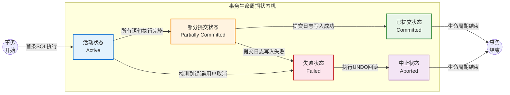
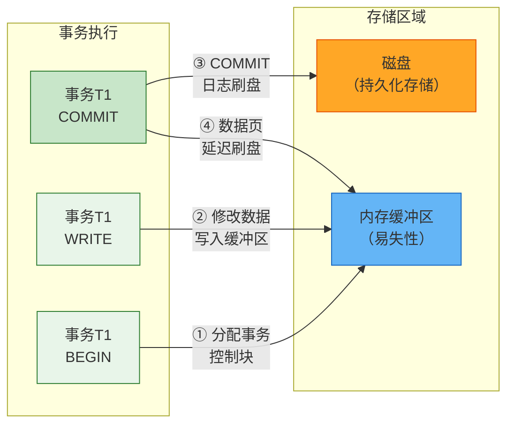
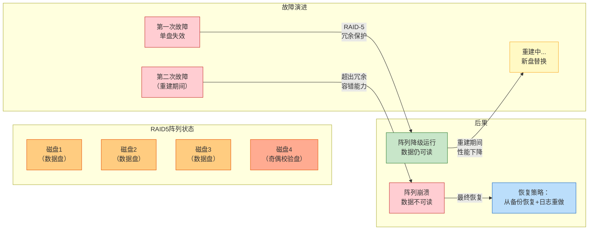
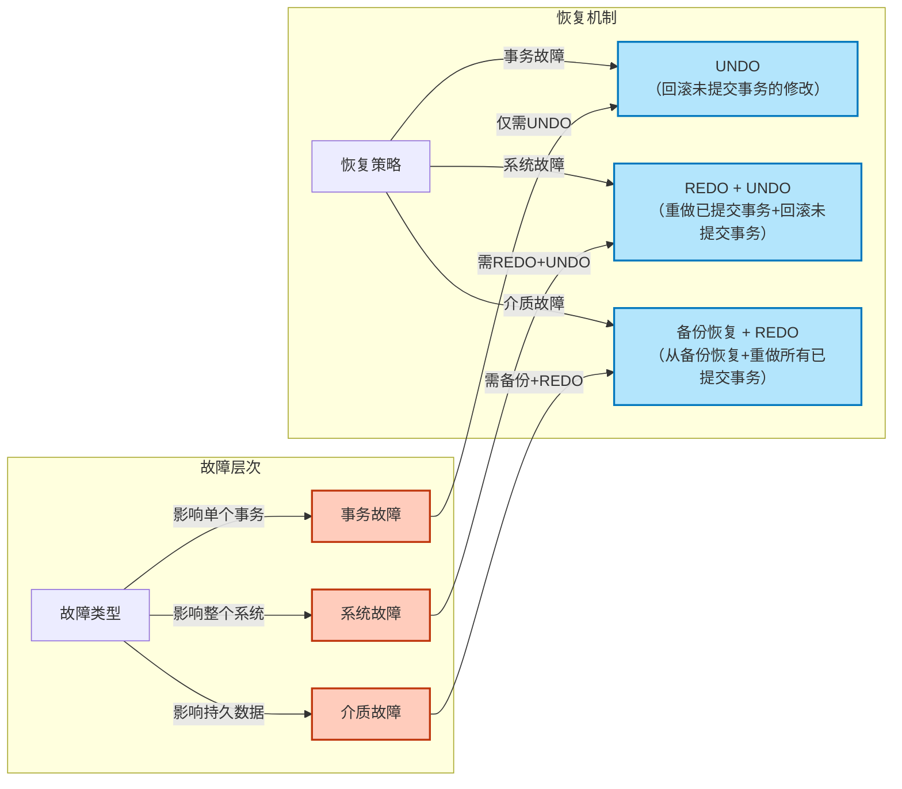
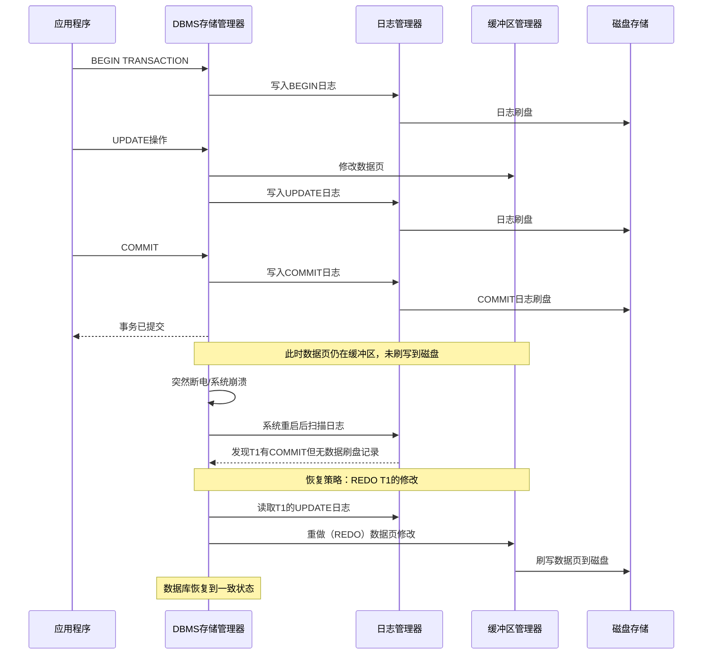

---

# 事务管理

---

## 事务的概念与ACID特性

### 什么是事务

在数据库系统中，**事务（Transaction）** 是由一系列数据库操作组成的一个不可分割的逻辑工作单元。这些操作要么全部成功执行，要么全部不执行——不存在“部分成功”的状态。事务的这个特性在数据库理论中被称为**原子性（Atomicity）**，它是事务最为根本的特质，也是整个数据库管理系统得以在并发环境下可靠运行的理论基石。

理解事务的最佳方式是将它与我们日常生活中的许多场景进行类比。最为经典的类比之一就是银行转账。假设账户 A 向账户 B 转账 100 元，这个操作在数据库层面实际上包含两个独立的步骤：第一步是从 A 的账户余额中减去 100 元；第二步是向 B 的账户余额中增加 100 元。如果在第一步执行之后、第一步执行之前，系统突然发生了崩溃，那么账户 A 的钱已经被扣除了，但账户 B 的余额却没有增加——这就造成了数据的不一致。而事务机制的设计目标，正是为了防止这种“中间状态”暴露给外部世界，确保整个转账操作要么完整地发生，要么根本不发生。

从数据库内部实现的角度来看，一个事务通常以 `BEGIN`（或 `START TRANSACTION`）语句开始，以 `COMMIT`（提交）或 `ROLLBACK`（回滚）语句结束。当应用程序执行 `COMMIT` 时，意味着事务中的所有操作已经被永久地写入数据库，此时数据库进入了一个新的、一致的状态。当应用程序执行 `ROLLBACK` 时，意味着事务中的所有操作都被撤销，数据库恢复到事务开始之前的那个状态。从这里我们也可以看出，事务实际上是对数据库状态的一次有控制的转换过程——从一个一致的状态，经过一系列的中间操作，最终到达另一个一致的状态。

事务的概念不仅仅适用于单用户、单数据库的环境。在现代企业级应用中，数据库往往需要同时处理成千上万的并发请求。想象一下，一个电商平台在同一秒钟内可能有数万笔订单同时生成，每一笔订单的生成背后都涉及库存扣减、用户余额扣款、商家余额增加、订单记录创建等多个数据库操作。如果没有事务机制来保证这些操作的完整性和隔离性，那么系统的数据将会陷入一片混乱——超卖、账户余额对不上、订单状态不一致等问题将层出不穷。事务机制与并发控制协议（如锁机制、多版本并发控制等）相结合，共同构成了数据库系统在多用户环境下维持数据一致性和完整性的两大支柱。

### ACID 特性详解

数据库领域公认的事务四大特性被归纳为 ACID 四个字母，分别代表 **Atomicity（原子性）**、**Consistency（一致性）**、**Isolation（隔离性）** 和 **Durability（持久性）**。这四个特性最早由数据库领域先驱 Jim Gray 在其经典论文 "The Notions of Consistency and Predicate Locks in a Shared Database"（1975年发表于 ACM SIGOPS Operating Systems Review）中正式提出，后来又在《Transaction Processing: Concepts and Techniques》等著作中得到了系统化的阐述。如今，ACID 已经成为评估和设计事务处理系统时不可绕过的理论框架。

#### Atomicity（原子性）

原子性要求事务作为一个整体被执行，其中的所有操作要么全部成功，要么全部失败。事务执行过程中的任何一点——无论是第一条 SQL 语句执行完毕之后、第三条语句执行到一半，还是最后一条语句执行之前——都不应该被其他并发事务看到。这种“全有或全无”的语义是事务最核心的承诺。

在数据库系统的内部实现中，原子性主要通过**日志（Log）机制**来保证。当一个事务开始执行时，系统会在日志文件中记录一条"BEGIN TRANSACTION"记录。此后，每一条对数据库的修改操作执行之前，系统会先将这条修改的“前像”（Before Image，修改前的数据值）和“后像”（After Image，修改后的数据值）写入日志。只有当日志写入成功之后，对数据库的实际修改才会被执行。如果事务在执行过程中发生了错误，或者应用程序主动发出了 `ROLLBACK` 请求，系统就会根据日志中记录的前像执行**UNDO（回滚）操作**，将所有已执行的修改恢复到事务开始之前的状态。

以一个具体的银行转账场景为例，假设我们有如下的事务：

```sql
BEGIN TRANSACTION;
    -- 从账户A扣款
    UPDATE account SET balance = balance - 1000 WHERE account_id = 'A';
    -- 向账户B存款
    UPDATE account SET balance = balance + 1000 WHERE account_id = 'B';
COMMIT;
```

如果第二条 UPDATE 语句因为某种原因执行失败了（比如账户 B 被锁定了，或者余额字段触发了某种约束），那么整个事务必须回滚——第一条 UPDATE 语句所做的修改必须被撤销，即使它本身已经成功执行了。这正是原子性的体现。

从操作系统和底层存储的角度来看，原子性还涉及到一个更深层次的问题：**缓存刷新和磁盘同步**。现代数据库管理系统通常不会直接写入磁盘，而是先将数据缓存在内存缓冲区中。当事务提交时，系统必须确保所有相关的脏页（Dirty Page，已被修改但尚未写回磁盘的页面）被刷新到磁盘，并且这个刷新操作本身也必须是原子性的——否则，如果刷新进行到一半时发生了断电，系统重启后将无法判断哪些数据已经持久化、哪些还没有。为此，数据库系统通常依赖于操作系统的缓存刷新机制（`fsync` 系统调用）以及预写式日志（Write-Ahead Logging, WAL）协议来确保原子性和持久性（后文将详细讨论）。

#### Consistency（一致性）

一致性是指事务执行结束后，数据库必须从一个一致的状态转换到另一个一致的状态。这里需要特别澄清的是，**一致性并不是由事务本身单独保证的**，而是由三个因素共同保证的：正确的应用程序代码（定义了什么操作是合法的）、完整性约束（定义了什么是“一致”的状态）、以及事务的原子性和隔离性（确保操作在不被干扰的情况下正确执行）。

数据库的完整性约束包括多种类型，主要有：

**主键约束（Primary Key Constraint）**：要求表中每一条记录都有一个唯一的标识符，且该标识符不能为空。在银行账户表中，`account_id` 列通常被定义为主键，这保证了每个账户都有一个唯一的身份标识。

**外键约束（Foreign Key Constraint）**：要求一个表中的某个列（或列组）的值必须在另一个表的主键值集合中出现。例如，在订单表中，`customer_id` 是外键，它引用了客户表中的主键。外键约束保证了参照完整性——你不能创建一个指向不存在的客户的订单。

**唯一约束（Unique Constraint）**：要求某个列或列组的值在整个表中是唯一的，但允许为空值（空值的个数可以有多个，取决于具体的数据库实现）。

**检查约束（Check Constraint）**：要求某个列的值必须满足一个布尔表达式。例如，`balance >= 0` 这个检查约束保证了账户余额永远不会变为负数。

**非空约束（NOT NULL）**：要求某个列的值不能为空。

在银行转账的例子里，如果我们定义了一条检查约束 `balance >= 0`，那么即使某笔转账操作在逻辑上试图将账户余额扣为负数（例如转账金额超过了账户余额），数据库也应该拒绝执行该操作，从而保证数据库状态始终满足这个约束。

从更宏观的视角来看，一致性也可以从业务规则的角度来理解。例如，在一个人事管理系统中，一条业务规则可能是：“每个部门必须至少有一名经理。” 如果一条事务试图删除某个部门中的最后一名经理，而该部门仍然存在，那么这个事务应该被拒绝，从而保持数据库状态满足“每个部门都有经理”这一业务规则。

值得特别强调的是，**一致性与原子性虽然紧密相关，但它们描述的是不同的东西**。原子性关注的是事务执行过程的完整性——事务中的所有操作要么全部执行，要么全部不执行。一致性关注的是事务执行结果的合法性——事务执行完毕后，数据库必须满足所有定义的完整性约束。一个事务可以是原子的但不是一致的（例如，扣款和存款都成功执行了，但金额不一致——扣了100元却加了200元），也可以是一致的但不是原子的（理论上不太可能，因为原子性是实现一致性的手段之一）。然而在实际中，原子性和一致性通常是相互依赖、不可分割的。

#### Isolation（隔离性）

隔离性是指并发执行的事务之间是相互隔离的，每一个事务在执行过程中感觉不到其他事务的存在。隔离性是 ACID 四个特性中最复杂、也是最容易被误解的一个。隔离性的存在主要是为了解决并发控制中的各类问题。

在理想情况下，如果每个事务都能完全隔离地执行，数据库的并发控制将变得非常简单——就像每个事务独占整个数据库一样。然而，在实际的数据库系统中，完全隔离通常意味着极低的并发度，因为一个事务在执行期间会锁定它访问的所有数据，其他事务必须等待。出于性能考虑，数据库系统通常允许不同程度的隔离，并定义了**隔离级别（Isolation Level）** 来平衡隔离程度与并发性能。

标准 SQL 规范定义了四种隔离级别（从低到高）：

**READ UNCOMMITTED（未提交读）**：这是最低的隔离级别。一个事务可以看到其他事务修改过但尚未提交的数据。这种隔离级别几乎不提供任何隔离保护，可能导致**脏读（Dirty Read）** 问题——读取到了从未真正持久化的数据。如果持有这些数据的事务最终回滚了，那么当前事务基于这些数据所做的后续操作就是建立在错误的基础之上的。

**READ COMMITTED（已提交读）**：这是大多数数据库的默认隔离级别。一个事务只能看到其他事务已经提交的数据。但这里存在一个微妙的问题——在一个事务的执行过程中，它可能在不同的时间点看到不同的数据状态。例如，事务 T1 修改了一行数据并提交了，此时事务 T2 读取到了新值；然后 T1 又修改了另一行数据并提交了，T2 再次读取时看到的数据状态与上一次又不同。这种现象被称为**不可重复读（Non-Repeatable Read）**——同一个事务中的两次读取操作返回了不同的结果。

**REPEATABLE READ（可重复读）**：这是 MySQL InnoDB 引擎的默认隔离级别。在一个事务执行期间，多次读取同一行的数据将返回相同的结果，即使其他事务在此期间修改并提交了该行数据。然而，这种隔离级别并不能阻止**幻读（Phantom Read）** 问题——如果一个事务执行了范围查询（例如 `SELECT * FROM orders WHERE amount > 1000`），随后另一个事务插入了一条满足该条件的新记录并提交，那么第一个事务再次执行相同的范围查询时，将看到这条新插入的记录，仿佛“幻觉”一般。InnoDB 通过 MVCC（Multi-Version Concurrency Control，多版本并发控制）和间隙锁（Gap Lock）技术在很大程度上缓解了幻读问题，但标准的 REPEATABLE READ 定义本身并不完全消除幻读。

**SERIALIZABLE（可串行化）**：这是最高的隔离级别。它要求事务的执行效果与串行执行（即一个接一个地执行）完全相同。这是最强的隔离保证，消除了所有并发问题——脏读、不可重复读和幻读——但代价是最低的并发性能，因为需要对读取和写入的数据范围加锁。

这些隔离级别与并发问题的对应关系可以通过下表来清晰理解：

| 隔离级别 | 脏读 | 不可重复读 | 幻读 |
|---|---|---|---|
| READ UNCOMMITTED | 可能发生 | 可能发生 | 可能发生 |
| READ COMMITTED | 不可能 | 可能发生 | 可能发生 |
| REPEATABLE READ | 不可能 | 不可能 | 可能发生（InnoDB除外） |
| SERIALIZABLE | 不可能 | 不可能 | 不可能 |

隔离性的实现机制主要有两大类：**基于锁的并发控制（Lock-based Concurrency Control）** 和 **多版本并发控制（Multi-Version Concurrency Control, MVCC）**。基于锁的方法通过在数据项上加锁来实现隔离，例如**共享锁（Shared Lock）** 允许多个事务同时读取同一数据项，而**排他锁（Exclusive Lock）** 则要求在修改数据时独占访问权。MVCC 的核心思想是为每个事务提供一个数据库在某个时间点的“快照”，事务在该快照上执行，仿佛数据库在那个时间点被冻结了一样。PostgreSQL 和 MySQL InnoDB 都采用了 MVCC 作为其主要的并发控制策略。

从理论上讲，隔离性可以通过**串行化理论（Serializability Theory）** 来严格定义。**冲突可串行化（Conflict Serializability）** 是最常用的一种判定标准：如果一个并发事务调度可以通过一系列非冲突操作的交换操作转换为串行调度，那么这个调度就是冲突可串行化的。冲突操作包括读-写冲突（一个事务读取某数据项，而另一个事务写入同一数据项）和写-读冲突（一个事务写入某数据项，而另一个事务读取同一数据项）。写-写冲突则需要通过**严格两阶段锁（Strict Two-Phase Locking, Strict 2PL）** 等协议来控制。

#### Durability（持久性）

持久性保证一旦事务被提交（COMMIT），其对数据库所做的所有修改将永久保存，即使系统发生崩溃也不会丢失。在数据库系统中，持久性通常通过将事务的结果写入非易失性存储（Non-volatile Storage，如磁盘）来保证。

持久性的实现涉及到数据库存储系统的多个层面。在最底层，数据库依赖操作系统的文件系统和底层硬件（如磁盘）来持久化数据。然而，这里存在一个关键问题：磁盘写入操作并非总是可靠的。磁盘缓存中的数据可能在断电时丢失，磁盘固件本身也可能存在 bug。此外，即使是“已写入”的数据，磁盘表面可能存在坏道或数据在物理上被错误地写入。

为了尽可能地保证持久性，数据库系统采用了多种策略。最核心的策略是**预写式日志（Write-Ahead Logging, WAL）协议**。WAL 协议的核心思想是：**在对数据库做任何修改之前，必须先将修改的日志记录写入到持久化存储中**。具体来说，每当事务修改了一个数据页时，系统首先将这个修改的描述信息（哪个事务、哪个数据页、哪个字段、从什么值改为什么值）追加写入日志文件。只有当日志记录被安全地写入磁盘（通常通过调用 `fsync()` 或 `fdatasync()` 系统调用来确保），系统才会允许对数据库页面的实际修改。这个日志不仅记录了后像（After Image，用于 REDO），也记录了前像（Before Image，用于 UNDO），从而同时支持了事务的提交和回滚。

然而，WAL 协议虽然极大提升了持久性的可靠性，但它并不能覆盖所有的故障场景。考虑以下场景：事务 T1 刚刚提交，日志已经成功刷写到磁盘，但数据库的缓冲池还没有来得及将 T1 修改过的脏页刷写到磁盘，此时发生了断电。重启后，数据库可以根据日志恢复 T1 的修改（执行 REDO），所以数据不会丢失。但是，如果数据库的日志本身所在磁盘发生了物理损坏（而非只是断电导致缓存丢失），那么日志记录本身也可能丢失，此时数据库将无法恢复 T1 的修改。这种情况下，即使有 WAL 协议也无法保证持久性，因为持久性的实现隐含地假设了存储介质本身是可靠的。

因此，在对数据持久性要求极高的场景（如金融系统中记录资金流向的事务），通常还需要引入**数据库复制（Replication）** 机制。通过将日志同时同步（Synchronous Replica）到多个物理节点，即使主节点所在的磁盘发生了不可恢复的故障，从节点上仍然保存着完整的数据副本。现代分布式数据库系统（如 Google Spanner、TiDB、CockroachDB）通过 Paxos/Raft 等一致性协议在多个数据中心之间同步日志，提供了更强的持久性保证。

还有一个需要了解的细节是**提交语义（Commit Semantics）**。当应用程序收到数据库返回的“提交成功”响应时，它实际上意味着什么？根据严格的 ACID 定义，“提交成功”应该意味着事务的结果已经持久化到非易失性存储中。但在某些配置下，数据库的提交操作可能只是“尽力而为”的。例如，在 MySQL 中，如果将 `innodb_flush_log_at_trx_commit` 参数设置为 `2`，那么提交操作只保证将日志写入操作系统的缓存（由操作系统负责最终刷写到磁盘），而不保证立即刷写到磁盘。这种配置可以显著提升写入性能，但牺牲了严格的持久性保证。数据库的使用者必须清楚地理解这些配置的语义，并根据应用的实际需求做出权衡。

### ACID 特性的实际意义与权衡

ACID 四个特性构成了可靠数据库系统的理论支柱，但它们之间并非完全独立，而是相互影响、相互制约的。在实际的系统设计和实现中，工程师们经常需要在某些特性之间进行权衡。

最常见的权衡发生在**隔离性与性能之间**。更高的隔离级别（如 SERIALIZABLE）意味着更强的数据一致性保证，但同时也意味着更多的锁竞争和更低的并发吞吐量。在一个高并发的 web 应用中，选择过高的隔离级别可能导致严重的性能瓶颈。相反，选择较低的隔离级别可以提升性能，但开发者需要自己承担处理各种并发异常（如脏读、不可重复读、幻读）的责任。

另一个重要的权衡发生在**可用性与一致性之间**。这在分布式数据库系统的语境下尤为重要。著名的 CAP 定理（由 Eric Brewer 在 2000 年提出）指出：在分布式系统中，一致性（Consistency）、可用性（Availability）和分区容错性（Partition Tolerance）三者不可兼得，最多只能同时满足其中两个。由于网络分区在现实世界中不可避免地会发生（即使是同一数据中心内的服务器，也可能因为交换机故障而出现网络分区），因此工程师必须在一致性和可用性之间做出选择。CP 系统（如 HBase、MongoDB）在发生网络分区时会牺牲可用性以保证一致性；AP 系统（如 Cassandra）在发生网络分区时会牺牲一致性以保证可用性。而现代的分布式数据库系统通过引入更精细的一致性模型（如**最终一致性（Eventual Consistency）**、**因果一致性（Causal Consistency）** 等）以及更复杂的一致性协议（如 Paxos、Raft），试图在一致性和可用性之间找到更精细的平衡点。

从 Android 应用开发的角度来看，理解 ACID 特性对于正确使用 SQLite 和 Room 至关重要。SQLite 本身是一个单文件的、进程内的关系型数据库，它的事务处理在同一个进程内是严格符合 ACID 特性的。当你使用 Room 库进行数据库操作时，Room 默认会在一个事务中执行所有的数据库操作，除非你显式地将它们拆分到不同的事务中。在 Android 中，你可以通过 `@Transaction` 注解来确保某个操作在一个事务中执行，这对于那些涉及多条 SQL 语句的复合操作（例如，同时更新多张有关联关系的表）来说是必须的。此外，理解 SQLite 的 WAL 模式（默认在 Android API 16+ 启用）和 PRAGMA 语法对于优化 Android 应用中的数据库性能也有实际帮助。

### ACID 特性的形式化理解

从计算机科学的角度来看，ACID 特性可以通过形式化的方法来严格定义和验证。

**原子性** 可以通过**可交换性（Commutativity）** 和**可恢复性（Recoverability）** 来形式化。如果一个调度中的所有操作都是可交换的（即调换两个操作的顺序不会影响最终结果），那么这个调度就是原子的。从日志的角度，原子性等价于“所有 UNDO 日志要么全部存在，要么全部不存在”。

**一致性** 可以通过**完整性约束（Integrity Constraints）** 来形式化。如果一个数据库状态满足所有定义的完整性约束，那么这个状态就是一致的。一致性要求事务的执行结果也是一个一致的数据库状态。

**隔离性** 可以通过**串行性（Serializability）** 来形式化。如果一个并发调度的结果与某个串行调度的结果相同，那么这个调度就是可串行化的。**冲突图（Conflict Graph）** 和 **优先图（Precedence Graph）** 是判断调度是否冲突可串行化的常用工具。

**持久性** 可以通过**持久化承诺（Persistence Promises）** 来形式化。如果一个事务提交了，那么在所有后续的故障恢复过程中，该事务的所有修改都将被恢复。

这些形式化的定义为数据库系统的实现提供了精确的指导方针，使得开发者可以验证他们的实现是否真正满足 ACID 承诺。

---

#### 📝 练习题

在银行转账场景中，账户A向账户B转账1000元。以下哪种情况最能说明**一致性（Consistency）** 特性未被满足？

A. 在转账过程中，系统崩溃导致账户A扣款成功但账户B收款失败，事务回滚后数据恢复一致

B. 账户A余额为500元，转账1000元时被数据库检查约束 `balance >= 0` 拒绝，事务执行失败

C. 事务提交后，账户A余额正确扣除了1000元，账户B余额正确增加了1000元，但审计日志中只记录了扣款记录而未记录存款记录

D. 账户A和账户B同时向对方转账1000元，由于并发控制不当，两个账户的余额都只变动了500元而非预期的1000元

**【答案】** C

**【解析】** 本题考查对 ACID 四个特性本质的理解与区分。

选项 A 描述的是**原子性（Atomicity）** 问题。原子性关注的是“事务中的所有操作要么全部成功，要么全部失败”。场景中扣款成功但收款失败时，系统通过回滚机制恢复了数据的一致状态，这恰恰是原子性（通过 UNDO 日志实现）在发挥作用——它保证不存在“部分完成”的中间状态。

选项 B 描述的是**完整性约束（Integrity Constraint）** 触发导致的操作失败。虽然这里涉及到了“一致性”的概念（因为余额不能为负本身就是一种业务一致性规则），但题目问的是“一致性未被满足”的情况。在该选项中，约束被触发后数据库拒绝了操作，事务根本没有执行完毕，因此最终数据库状态仍然是满足完整性约束的，不存在“一致性被破坏”的情况。该选项更多体现的是数据库通过约束机制**主动预防**一致性被破坏。

选项 C 描述的正是**一致性（Consistency）** 被破坏的场景。一致性要求事务执行完毕后，数据库必须从一个一致的状态转换到另一个一致的状态。本题中，扣款和存款都正确执行了（原子性满足），但审计日志中两条记录只记录了一条——这意味着从业务审计的角度来看，数据库的状态是不一致的：账务数据和审计记录对不上。虽然数据库中的账户余额在数值上可能仍然满足约束（如两个账户的余额之和不变），但业务层面的完整性和可审计性被破坏了，这正是**业务一致性**未被满足的典型表现。

选项 D 描述的是**隔离性（Isolation）** 问题。隔离性关注的是并发事务之间的相互干扰。两个账户同时向对方转账时，如果隔离性不够（比如使用了 READ UNCOMMITTED 级别，或者锁机制不当），可能导致两个事务在彼此的中间状态上操作，最终导致两个账户的余额都只变动了一半。这本质上是一个并发控制问题，而不是数据状态本身不满足约束的问题。

因此，最能说明一致性特性未被满足的是选项 C，因为它揭示了事务虽然物理上执行了（原子性OK），但业务层面的数据完整性被破坏了——审计日志与账务数据不一致，这才是 ACID 中“一致性”所真正关注的核心问题：事务执行的结果必须使数据库满足所有语义层面的完整性约束。

---

---

## 事务的状态与生命周期

### 事务状态模型概述

事务的状态与生命周期是理解数据库系统如何保证数据一致性的重要前置知识。一个数据库事务从开始到结束，并非简单地从“运行”跳转到“结束”，而是经历一个精心设计的、带有多个中间状态的完整生命周期。之所以设计如此多的状态，是因为数据库系统必须在各种可能的运行环境——包括硬件故障、软件崩溃、并发冲突等极端条件下——依然保证 ACID 特性的完整兑现。

在数据库理论中，事务的状态模型最早由数据库研究先驱 James Gray 在其经典论文中形式化定义，随后被 ANSI/ISO SQL 标准采纳。该模型将事务的生命周期抽象为五种基本状态：**活动状态（Active）**、**部分提交状态（Partially Committed）**、**已提交状态（Committed）**、**中止状态（Aborted）** 和 **失败状态（Failed）**。这五种状态之间的转换关系构成了理解事务行为的基石。

理解这一状态模型的价值在于：它揭示了数据库系统在将一个逻辑操作集合转换为持久数据变更的过程中所经历的真实步骤。每一种状态都对应着系统在这一转换过程中所完成的具体工作，同时也对应着系统在崩溃恢复时需要采取的不同策略。举例来说，一个处于“部分提交”状态的事务，在系统崩溃后需要被重新完成（REDO），而一个处于“活动”状态的事务则可以直接回滚（UNDO）而不留任何痕迹。

### 活动状态（Active）

活动状态是事务生命周期的起点。当一个应用程序向数据库系统提交第一条 SQL 语句并开始执行时，事务即进入活动状态。在活动状态下，事务的所有读写操作都在数据库的私有工作区中进行——换言之，事务可以看到自己迄今为止所做的所有修改，但这些修改对其他并发事务而言仍然是不可见的。

活动状态的核心特征可以归纳为以下两点：第一，事务正在执行中，其操作尚未全部完成；第二，所有已执行操作产生的数据变更首先被写入数据库的日志缓冲区和内存缓冲区，但尚未刷写到磁盘的持久化存储区域。这种“延迟写入”（write-behind）策略是现代数据库系统提升性能的关键手段之一，它允许数据库将多次小的物理写操作合并为一次大的批量写操作，从而显著减少磁盘 I/O 次数。

从实现的角度来看，在活动状态期间，数据库的锁管理器会为事务分配一个唯一的事务标识符（Transaction ID，常缩写为 XID），并在该事务执行的整个过程中维护一个读-写集合（Read-Write Set）。读-写集合记录了该事务访问过的所有数据项及其模式（读或写），这是后续冲突检测和并发控制算法（如两阶段锁协议）赖以运作的数据结构。

值得特别强调的是，活动状态并不意味着事务的执行一定是顺利的。在活动状态期间，事务可能遭遇各种运行时错误，例如违反约束条件（CHECK 约束、UNIQUE 约束、外键约束等）、死锁（Deadlock）导致的超时中止、或者应用程序主动取消操作等。当这些情况发生时，事务会从活动状态转移到失败状态（Failed），随后进入中止处理流程。

### 部分提交状态（Partially Committed）

当事务执行完最后一条 SQL 语句并生成结果集之后，在系统将提交指令正式写入持久化日志之前，事务进入一个极为关键的状态——**部分提交状态**。这个状态在数据库理论中具有极其深刻的含义，它代表了一种“不可逆转变”的临界点。

为什么需要这个中间状态？答案在于数据库系统对崩溃恢复能力的严格保证。数据库系统在将事务标记为“已提交”之前，必须确保所有必要的信息都已经安全地记录到持久化存储中。这个“必要的信息”不是数据本身，而是**提交日志记录**（Commit Log Record）。一旦提交日志记录被成功地写入磁盘（通常还需要伴随一次强制刷盘操作 `fsync`），即使随后发生系统崩溃，数据库也能在恢复时识别出这是一个已经成功完成的事务，并确保其所有修改都被持久化。

部分提交状态到已提交状态的转换过程，本质上是执行一次“安全检查”：

- **日志写入验证**：确认事务的提交日志记录已经成功写入磁盘，而不仅仅是停留在操作系统的文件系统缓存中。这是通过调用底层存储设备的 `fsync` 或 `fdatasync` 系统调用来实现的。
- **数据刷盘协调**：在某些数据库实现中，系统会在提交时将事务修改过的数据页（Data Page）从内存缓冲区刷写到磁盘。这并非所有数据库的必选操作，因为有日志先行写入（Write-Ahead Logging）机制作为保障。
- **锁资源释放准备**：在提交过程的最后阶段，系统会释放事务持有的所有排他锁（Exclusive Lock），但在此之前需要完成提交日志的写入以确保恢复时的可见性。

这个状态的设计哲学体现了数据库系统设计中一个永恒的主题——**将数据安全与性能之间的权衡做到极致**。部分提交状态之所以称为“部分”，正是因为此时事务的所有数据库操作已经执行完毕，但事务的“提交”这一关键动作尚未完成。一个处于部分提交状态的事务如果遭遇系统崩溃，恢复管理器会在系统重启后自动将其“推进”到已提交状态——这就是恢复技术中 **REDO** 机制的根基。

### 已提交状态（Committed）

已提交状态是事务的正常终止状态之一，代表事务的所有操作已经成功完成，并且其结果已经被永久性地写入数据库。当提交日志记录被安全地刷写到磁盘之后，事务即进入已提交状态。

进入已提交状态后，事务对数据库所做的所有修改对所有并发事务立即可见（取决于隔离级别）。同时，事务持有的所有锁会被系统自动释放。这些锁的释放是系统保证的原子操作——要么全部释放，要么在崩溃恢复时通过事务表（Transaction Table）的重建来恢复一致的锁状态。

从状态机的角度而言，已提交状态是一个**吸收态**（Absorbing State），意味着事务的生命周期已经完整结束。系统会从活动事务列表中移除该事务的记录，并可能将其状态信息归档到历史日志中以支持后续的审计和调试需求。

### 失败状态（Failed）与中止状态（Aborted）

失败状态是事务生命周期中处理异常情况的过渡状态。当事务在活动状态或部分提交状态期间遭遇不可恢复的错误时——例如执行时发现约束冲突、检测到死锁、被用户主动取消（Rollback），或者在提交过程中 I/O 设备报告写入失败——事务即转入失败状态。

失败状态的核心语义是：事务需要被**回滚**（Rollback），即撤销该事务已经执行的所有修改操作，使数据库恢复到事务开始之前的状态。这个撤销过程在数据库理论中被称为 **UNDO** 机制。

回滚操作的执行过程远比表面上看起来复杂。一个事务在活动状态期间可能已经修改了多个数据页，这些修改部分存在于内存缓冲区中，部分可能已经被操作系统刷新到磁盘（虽然对其他事务不可见）。回滚操作需要：

1. **读取撤销日志（Undo Log）**：系统在事务执行期间会记录每一条修改操作的“逆向操作”。例如，如果事务执行了 `UPDATE account SET balance = balance - 100 WHERE id = 1`，系统会记录一条 Undo 日志，内容类似于 `UPDATE account SET balance = balance + 100 WHERE id = 1`。这些 Undo 日志与 REDO 日志一样，也需要被持久化以应对回滚过程中的崩溃。
2. **按相反顺序应用撤销日志**：为了保证数据库的一致性，回滚操作必须严格按照时间顺序的逆序来执行。假设事务依次执行了操作 A、B、C，那么回滚时必须先撤销 C，再撤销 B，最后撤销 A。这是因为后续操作可能依赖于前面操作的结果（例如先插入一条记录，再基于该记录插入另一条记录，回滚时必须先删除后者）。
3. **释放所有锁资源**：回滚完成后，系统释放事务持有的所有锁，使被锁定的数据项对其他事务重新可用。
4. **记录回滚完成标记**：系统会向日志中写入一条中止记录（Abort Record），标识该事务已经被成功回滚。

一旦回滚操作完成，事务即从失败状态转移到**中止状态**。中止状态也是一个吸收态，代表事务的异常终止。值得注意的是，中止状态之后，根据应用逻辑的需要，应用程序可能会选择重新发起一个新的事务来重试之前的操作——这在处理乐观并发冲突和某些类型的业务重试逻辑时非常常见。

### 事务生命周期的完整状态转换图

为了更清晰地呈现上述五种状态之间的转换关系，以下用 Mermaid 图展示完整的事务状态机：



上图展示了事务在正常流程和异常流程中的完整迁移路径。需要特别注意的几条关键转换路径：

- **活动 → 部分提交**：表示事务的逻辑工作已经完成，正处于提交前的准备阶段。
- **部分提交 → 已提交**：这是整个事务生命周期中最关键的一次状态跃迁，一旦成功，事务的持久性（Durability）就得到了保障。
- **活动/部分提交 → 失败**：异常分支的入口，触发条件包括约束违反、死锁超时、用户取消和 I/O 错误等。
- **失败 → 中止**：通过执行完整的回滚操作将数据库恢复到事务开始前的状态。

### 状态转换与 ACID 特性的对应关系

理解事务状态模型的最佳方式之一，是将其与 ACID 四大特性进行对照分析：

**原子性（Atomicity）** 与状态转换的对应关系最为直接。原子性保证一个事务中的所有操作要么全部成功，要么全部失败。从状态机的角度来看，这意味着事务只能从活动状态最终到达已提交状态（全部成功）或中止状态（全部失败），而绝不可能停留在部分提交或失败状态。从部分提交状态转移到已提交状态的行为本身必须是原子的——提交日志要么全部写入成功，要么全部写入失败，不存在“部分提交成功”的中间状态。

**一致性（Consistency）** 体现在事务进入已提交状态之前，系统必须验证所有约束条件是否被满足。如果在活动状态执行期间发现任何一致性违反（例如账户余额变为负数、外键引用不存在的记录），事务会被强制转移到失败状态并最终回滚。这种状态转移本身就是数据库执行一致性检查的结果。

**隔离性（Isolation）** 与状态模型的关系体现在锁的持有时间窗口上。在严格两阶段锁协议（Strict 2PL）下，事务持有的排他锁会一直被持有到事务结束（无论是提交还是回滚）。这意味着在活动状态和部分提交状态期间，事务对数据项的修改对其他并发事务是不可见的——直到提交动作完成后，修改才对外部可见。这种锁的持有策略确保了隔离性特性的实现。

**持久性（Durability）** 则是由部分提交状态到已提交状态之间的转换过程来保证的。正是因为系统在事务处于部分提交状态时，必须将提交日志记录安全地刷写到持久化存储，事务的完成结果才不会因为系统崩溃而丢失。如果系统崩溃发生在事务已经进入已提交状态之后，恢复时该事务的所有修改都会被恢复；如果崩溃发生在部分提交状态之后，REDO 机制会重新应用事务的修改；如果崩溃发生在活动状态，事务表中的未完成事务记录会被清理，对应的修改会被 UNDO 回滚。

### 状态管理与并发控制的关系

在实际的数据库实现中，事务的状态信息并非孤立存在，而是与并发控制子系统、锁管理器、日志管理器和恢复管理器紧密协作。以下通过一个简化的状态追踪流程来说明这种协作关系：

```kotlin
// kotlin — 事务状态追踪简化模型
class TransactionContext(
    val transactionId: Long,          // 事务唯一标识符
    var currentState: TransactionState = TransactionState.ACTIVE
) {
    // 维护该事务的读-写集合，用于并发控制和恢复
    val readSet = mutableListOf<DataItem>()      // 读取的数据项集合
    val writeSet = mutableListDataItem>()         // 修改的数据项集合

    // 维护该事务持有的锁信息
    val heldLocks = mutableMapOf<DataItem, LockMode>()

    // 维护该事务产生的日志记录
    val logRecords = mutableListOf<LogRecord>()
}

/**
 * 枚举类型定义事务的所有可能状态
 */
enum class TransactionState {
    ACTIVE,              // 活动状态：事务正在执行
    PARTIALLY_COMMITTED, // 部分提交：所有语句执行完毕，等待提交日志写入
    COMMITTED,           // 已提交：提交日志成功写入，事务正常结束
    FAILED,              // 失败状态：遇到错误，需要回滚
    ABORTED              // 中止状态：回滚完成，事务异常终止
}

/**
 * 事务状态转换的核心控制器
 */
object TransactionStateMachine {

    // 状态转换的前置条件检查
    private fun validateTransition(
        current: TransactionState,
        target: TransactionState,
        context: TransactionContext
    ): Boolean {
        return when {
            current == TransactionState.ACTIVE &&
                target == TransactionState.PARTIALLY_COMMITTED -> {
                // 活动 → 部分提交：必须验证所有操作已成功执行
                // 且未发生任何约束违反
                context.logRecords.isNotEmpty()
            }
            current == TransactionState.PARTIALLY_COMMITTED &&
                target == TransactionState.COMMITTED -> {
                // 部分提交 → 已提交：必须确认提交日志已刷写到磁盘
                // 这是持久性保证的关键步骤
                context.logRecords.any { it.type == LogType.COMMIT }
            }
            current == TransactionState.ACTIVE &&
                target == TransactionState.FAILED -> {
                // 活动 → 失败：任何运行时错误均可触发
                true
            }
            current == TransactionState.FAILED &&
                target == TransactionState.ABORTED -> {
                // 失败 → 中止：必须完成所有回滚操作
                // 包括应用 Undo 日志和释放锁
                true
            }
            else -> false
        }
    }

    // 执行状态转换，同时维护并发控制子系统的一致性
    fun transitionTo(
        context: TransactionContext,
        newState: TransactionState
    ): Boolean {
        if (!validateTransition(context.currentState, newState, context)) {
            return false  // 非法转换被拒绝
        }

        // 在状态转换时执行必要的副作用操作
        when (newState) {
            TransactionState.PARTIALLY_COMMITTED -> {
                // 进入部分提交状态：冻结写操作，生成提交日志
                prepareCommitLog(context)
            }
            TransactionState.COMMITTED -> {
                // 进入已提交状态：释放所有排他锁，更新锁表
                releaseAllLocks(context)
                removeFromTransactionTable(context.transactionId)
            }
            TransactionState.ABORTED -> {
                // 进入中止状态：执行完整的回滚流程
                executeRollback(context)
                releaseAllLocks(context)
                removeFromTransactionTable(context.transactionId)
            }
            else -> { /* 其他状态转换无特殊副作用 */ }
        }

        context.currentState = newState
        return true
    }
}
```

上述代码模型揭示了事务状态管理中几个关键的设计考量。首先，**状态转换的前置条件验证**确保了状态机的合法性和一致性——例如，不允许从事务从未进入过的状态进行非法转换。其次，**状态转换时的副作用操作**（如锁的释放、回滚的执行）必须在正确的时机以正确的顺序执行，否则会破坏系统的整体一致性。最后，**事务表（Transaction Table）**作为全局数据结构，追踪着所有活跃事务及其当前状态，是恢复管理器在系统崩溃后进行恢复决策的核心依据。

### 嵌套事务的状态语义

在传统的数据库系统中，事务是扁平结构（Flat Transaction）——要么完全成功，要么完全失败，不存在中间的回退点。然而，在更复杂的应用场景中（如存储过程调用、子事务协调），**嵌套事务**（Nested Transaction）模型提供了更灵活的状态管理能力。

在嵌套事务模型中，子事务可以独立提交或回滚，而其父事务的状态取决于所有子事务的结果。一个典型的嵌套事务状态规则如下：

- **根事务**（Root Transaction）遵循标准的五状态模型。
- **子事务**（Sub-transaction）在提交时仅将自己的修改对同级和下级子事务可见，而对外部事务不可见。只有当根事务最终提交时，所有子事务的修改才对数据库全局可见。
- 如果任意一个子事务回滚，**不会**必然导致整个根事务回滚——这取决于应用层定义的补偿策略。

嵌套事务的状态模型为构建复杂业务逻辑提供了更大的灵活性，但也带来了显著的实现复杂性。现代主流关系型数据库（如 PostgreSQL、MySQL）通常不支持完整的嵌套事务语义，但通过 **保存点**（Savepoint）机制提供了类似的能力——允许在一个大事务内部设置多个回滚点，当某个子操作失败时仅回滚到最近的保存点而非整个事务。

```sql
-- sql — 保存点机制演示（Oracle/PostgreSQL/MySQL 兼容）
START TRANSACTION;

    -- 业务操作第一步：更新账户余额
    UPDATE accounts
    SET balance = balance - 500
    WHERE account_id = 101;

    -- 设置保存点 A，如果后续操作失败可回滚到此处
    SAVEPOINT savepoint_a;

    -- 业务操作第二步：记录交易日志
    INSERT INTO transaction_log (account_id, amount, type)
    VALUES (101, -500, 'TRANSFER');

    -- 设置保存点 B
    SAVEPOINT savepoint_b;

    -- 业务操作第三步：发送通知（假设可能失败）
    -- 如果这一步失败，我们选择回滚到保存点 B，保留前两步的结果
    INSERT INTO notification_queue (account_id, message)
    VALUES (101, '转账已完成');

-- 全部成功则提交
COMMIT;
```

在上述示例中，如果 `INSERT INTO notification_queue` 语句失败，应用程序可以执行 `ROLLBACK TO SAVEPOINT savepoint_b`，使事务回滚到保存点 B 时的状态，保留前两步成功的数据库修改。这种机制的本质是在扁平事务的框架下，通过多个中间状态（每个保存点对应一个隐式状态）实现了对事务局部回滚能力的模拟。

### 状态持久化与恢复中的事务表

在数据库系统的物理实现层面，事务的状态信息本身也需要被持久化，以支持崩溃后的恢复过程。这个任务由**事务表**（Transaction Table）来承担。事务表是一个驻留在磁盘上的数据结构（在某些实现中以磁盘上的日志为根基，辅以内存中的缓存），记录了所有“尚在进行中但尚未完全结束”的事务的关键信息。

事务表中的每条记录通常包含以下字段：

```text
字段名               类型          说明
─────────────────────────────────────────────────────────
transaction_id       BIGINT        事务全局唯一标识
state                TINYINT       当前状态（ACTIVE/PARTIALLY_COMMITTED/FAILED）
first_lsn            BIGINT        该事务第一条日志记录的逻辑序列号
last_lsn             BIGINT        该事务最新一条日志记录的逻辑序列号
undo_next_lsn        BIGINT        回滚时下一条待撤销日志的序列号
```

恢复过程的伪代码揭示了事务表与状态转换的紧密关系：

```python
# python — 崩溃恢复中的事务状态处理伪代码
def recovery_procedure():
    """
    ARIES 恢复算法的简化伪代码
    展示事务状态在恢复过程中的核心作用
    """

    # 第一阶段：分析阶段（Analysis）
    # 从日志中重建崩溃时的完整事务表
    transaction_table = analyze_log()

    # 在分析阶段，每个事务根据其日志记录被赋予状态
    # COMMITTED 状态的事务，其修改需要被 REDO
    # ACTIVE/FAILED 状态的事务，其修改需要被 UNDO

    for txn in transaction_table:
        if txn.state == 'COMMITTED':
            # 已提交事务进入重做队列
            redo_queue.append(txn)
        elif txn.state in ('ACTIVE', 'PARTIALLY_COMMITTED', 'FAILED'):
            # 未完成事务进入回滚队列
            undo_set.add(txn)

    # 第二阶段：重做阶段（Redo）
    # 从检查点开始，按顺序重做所有已提交事务的修改
    for lsn in log_sequence_numbers(from_checkpoint):
        log_record = read_log(lsn)
        if log_record.type == 'UPDATE':
            # 重做已提交事务的修改
            if log_record.transaction_id in committed_transactions:
                apply_redo(log_record)
        elif log_record.type == 'COMPENSATE':
            # UNDO 操作本身也会产生日志（CLR）
            # CLR 日志也需要被 REDO
            apply_redo(log_record)

    # 第三阶段：回滚阶段（Undo）
    # 从后向前回滚所有未完成事务
    for txn in undo_set:
        while txn.last_lsn > txn.undo_next_lsn:
            prev_lsn = get_previous_lsn(txn.last_lsn)
            if is_update_log(txn.last_lsn):
                # 生成补偿日志（CLR）并执行 UNDO
                generate_compensation_log(txn)
                apply_undo(txn.last_lsn)
            txn.last_lsn = prev_lsn

        # 回滚完成后写入中止记录
        write_abort_record(txn)
```

这个伪代码展示了事务状态在恢复过程中的决定性作用：处于 `COMMITTED` 状态的事务，其所有修改都会被 REDO 以确保持久性；处于 `ACTIVE`、`PARTIALLY_COMMITTED` 或 `FAILED` 状态的事务，其所有修改都会被 UNDO 以恢复到事务开始前的状态。特别值得注意的是 `PARTIALLY_COMMITTED` 状态——一个处于该状态的事务在崩溃恢复时会被当作已提交事务来处理，因为其提交日志记录虽然在崩溃前未能完全持久化，但其逻辑上的“提交意图”已经表达，系统有义务在恢复时将其完成。

### 状态转换的时间语义与性能考量

在实际系统中，事务状态之间的转换并非瞬时完成的。每个转换步骤都涉及实际的 I/O 操作和系统调用，这些操作的耗时在事务的总执行时间中占据显著比例。理解这些时间开销对于数据库的性能调优和架构设计具有重要意义。

**日志写入延迟**（Log Write Latency）是影响部分提交状态持续时间的核心因素。当事务执行到提交点时，必须等待提交日志被写入磁盘的日志文件。对于使用传统机械硬盘（HDD）的数据库系统，一次 `fsync` 操作的典型延迟在 5\~15 毫秒之间；对于使用固态硬盘（SSD）的系统，这一延迟可降低到 0.1\~1 毫秒。这意味着一个每秒处理 1000 笔事务的数据库系统，其日志子系统必须能够支持每秒至少 1000 次的同步写入操作。

**组提交**（Group Commit）是一种被广泛采用的优化技术，其核心思想是：将多个并发事务的提交日志合并为一次批量写入操作，从而摊薄每次提交的单事务开销。当多个事务同时到达提交点时，系统会延迟一小段时间（通常为几毫秒），将这段时间内到达的所有提交请求打包成一条批量提交日志记录，然后一次性刷写到磁盘。这使得即使单个事务的提交也需要等待磁盘 I/O，多个并发事务的平均提交延迟也能得到显著改善。

```sql
-- sql — 展示组提交效果的时序对比

-- 场景一：无组提交（三个事务串行提交）
-- T1: |--执行--|--日志写入--|--返回成功--|
-- T2:         |--执行--|--日志写入--|--返回成功--|
-- T3:               |--执行--|--日志写入--|--返回成功--|
-- 总耗时 = 3 × (执行时间 + 日志写入时间)

-- 场景二：组提交（三个事务合并提交）
-- T1: |--执行--|--等待组提交--|--返回成功--|
-- T2: |--执行--|--等待组提交--|--返回成功--|
-- T3: |--执行--|--等待组提交--|--返回成功--|
-- 总耗时 ≈ max(执行时间) + 一次日志写入时间
-- 组提交可实现 3x 级别的吞吐量提升
```

**预写式日志**（Write-Ahead Logging, WAL）机制进一步将提交延迟与数据写入解耦。在 WAL 协议下，数据页的修改可以先写入内存缓冲区，只要对应的日志记录已经安全地持久化到磁盘，修改就不会丢失。这意味着提交操作只需要等待日志写入完成，而无需等待数据页被刷写到磁盘。PostgreSQL 的架构就是 WAL 原理的最佳实践案例——其数据页的刷盘时机完全由检查点（Checkpoint）机制控制，与事务提交时机相互独立，从而实现了提交延迟和数据持久性之间的优雅分离。

#### 📝 练习题

在数据库系统中，以下关于事务状态的说法中，**错误** 的一项是：

A. 当事务执行完最后一条 SQL 语句后、提交日志记录写入磁盘之前，事务处于部分提交状态（Partially Committed）
B. 如果数据库系统在事务处于活动状态（Active）时发生崩溃，恢复时该事务的所有修改都会被 UNDO，因为其修改结果尚未对任何其他事务可见
C. 事务在已提交状态（Committed）下持有的锁会被立即释放，以确保系统整体的并发吞吐量
D. 嵌套事务模型中，子事务的提交会使其修改对父事务可见，但对同一数据库会话外的其他并发事务不可见，直到根事务最终提交

**【答案】** C
**【解析】** 本题考查对事务状态模型和锁机制的深入理解。选项 C 声称“事务在已提交状态下持有的锁会被立即释放”，这个表述混淆了事务完成与锁释放的时序关系。在标准的数据库实现中，锁的释放时机取决于并发控制协议的类型。在严格两阶段锁协议（Strict 2PL）下，事务持有的所有排他锁必须保留到事务**结束**（COMMIT 或 ROLLBACK）之时，而不仅仅是“提交”动作本身完成之时。实际上，锁的释放发生在事务状态从任何非活跃状态（ACTIVE、PARTIALLY_COMMITTED、FAILED）转移到终止状态（COMMITTED 或 ABORTED）之后、事务从活动事务表中移除之前。选项 A 正确描述了部分提交状态的定义。选项 B 正确理解了活动状态事务在崩溃恢复时的处理方式——由于尚未写入提交日志，系统无法证明该事务曾经意图提交，因此其所有修改都会被 UNDO 回滚。选项 D 正确描述了嵌套事务中子事务提交的可见性语义——子事务的修改仅对同一继承层级的事务层次结构内部可见，外部事务不可见，直到根事务最终提交。

---

## 故障类型（事务故障、系统故障、介质故障）

数据库系统在实际运行过程中，面临着多种多样的故障威胁。这些故障可能在不同层次、以不同方式对数据库的一致性造成破坏。理解故障的分类及其特征，是掌握恢复技术的必要前提。根据故障的物理成因和影响范围，可以将数据库系统中常见的故障划分为三大类：事务故障（Transaction Failure）、系统故障（System Failure）和介质故障（Media Failure）。这三类故障在成因上逐层加深，在恢复难度上也逐级递增，共同构成了数据库恢复机制必须应对的挑战。

---

### 事务故障

事务故障是指在事务执行过程中，由于事务自身逻辑错误或某些内部条件不满足而导致事务无法正常完成的情况。从本质上讲，事务故障是**由应用程序自身缺陷引发的事务非正常终止**，它仅影响个别事务，而不会波及其他事务或整个系统。

#### 事务故障的典型成因

事务故障的产生原因多种多样，但归结起来主要集中在以下几个方面。第一是**数据约束违反**（Constraint Violation），例如事务试图插入一条违反唯一性约束或外键约束的记录，或者更新的数值超出了预设的取值范围，导致数据库管理系统（DBMS）检测到约束冲突而强制回滚该事务。第二是**逻辑错误**（Logical Error），即事务内部的业务逻辑存在缺陷，比如在银行转账场景中，转出账户的余额不足时，应用程序的逻辑判断会主动撤销整个转账操作。第三是**编程错误**（Programming Error），例如数组越界、死循环、断言失败等程序级别的错误，这些错误被异常处理机制捕获后，会触发事务的回滚操作。第四是**资源死锁**（Deadlock），当两个或多个事务相互持有对方需要的锁而形成循环等待时，DBMS的死锁检测机制会选择牺牲其中一个事务（通常是最年轻的事务）来打破僵局，被选中的事务将被回滚。

#### 事务故障的特征

事务故障具有显著的特征，这些特征直接决定了其恢复策略的选择。首先，**故障的影响范围仅限于单个事务**，其他并发执行的事务不受影响，因为DBMS为每个事务维护了独立的上下文。其次，事务故障通常发生在事务的**执行过程中**，即事务已经部分执行并对数据库产生了修改，这些修改在恢复时必须被完全撤销——这正是UNDO操作的用武之地。第三，事务故障属于**可预期故障**，即在正常系统运行条件下就有可能发生，而非由于灾难性外部事件引起，因此DBMS内部已经内置了完善的处理机制。当事务故障发生时，DBMS的日志管理器会记录一条类型为`ABORT`的日志记录，其中包含了足够的信息用于执行逆向回滚操作。

#### 事务故障的处理流程

当DBMS检测到事务故障时，会自动执行以下处理流程：首先，日志管理器写入一条`ABORT`日志记录，标记该事务进入回滚状态；然后，存储管理器从日志中逆向扫描该事务的所有写操作，逐一执行补偿操作（Compensation Log Record），将数据库恢复到事务开始前的状态；最后，写入一条`ABORT_COMPLETE`日志记录，释放该事务持有的所有锁资源。整个过程对用户透明，应用程序无需介入。需要特别强调的是，事务故障恢复只需要执行**UNDO**操作，因为故障事务的修改尚未提交，其他正常事务不可能依赖这些未提交的脏数据——除非存在脏读（Dirty Read），但这属于隔离级别配置问题，不影响恢复策略的基本原则。

---

### 系统故障

系统故障是指在数据库系统运行过程中，由于硬件层面的软性错误或系统软件（如操作系统、DBMS本身）的异常终止而导致系统无法继续正常工作的故障。与事务故障不同，系统故障的影响范围是**整个系统层面的**，它会导致所有正在执行的事务（无论正常与否）全部中断，但**不会造成物理存储介质的损坏**——数据库文件本身仍然完好无损。

#### 系统故障的成因分析

系统故障的成因可以从硬件和软件两个维度来分析。从硬件角度看，**CPU故障**、**内存故障**、**总线错误**等都属于系统故障的范畴。举例而言，当内存条出现单比特翻转（Single Bit Flip）错误且未被纠错码（ECC）修正时，可能导致DBMS进程访问到被破坏的数据结构而崩溃；又如，突然断电（Power Failure）是最为常见的系统故障之一，在未配置不间断电源（UPS）的环境中，电压骤降或突然断电会导致DBMS进程被强制终止。从软件角度看，**操作系统内核崩溃**、**DBMS进程被异常终止**（如被`kill -9`强制杀死）、**数据库软件本身的Bug导致进程崩溃**等均属于系统故障的范畴。值得注意的是，**突然断电**虽然是一种物理事件，但它作用于系统层面而非存储介质层面，因此被归类为系统故障而非介质故障——这其中的关键区别在于数据库文件本身并未损坏，只是内存中的数据因断电而丢失。

#### 系统故障的恢复挑战

系统故障的恢复面临着比事务故障更为复杂的挑战，主要体现在以下几个方面。第一，**故障发生时正在执行的事务处于不确定状态**：有些事务已经完成了提交（Commit），其修改结果可能已经写入了磁盘，也可能仍停留在内存缓冲区中尚未刷写；有些事务正在执行过程中，其部分修改已经写入了磁盘但事务尚未提交；还有些事务尚未开始任何写操作。恢复程序必须能够准确区分这三种情况，并分别采取不同的处理策略。第二，系统故障后**内存数据全部丢失**，恢复程序必须完全依赖于磁盘上持久化的日志文件来重建系统的正确状态。第三，恢复程序需要在最短时间内将数据库恢复到一致状态，因此必须借助**检查点（Checkpoint）**等优化技术来减少恢复时需要扫描的日志量——这一点将在后续的恢复技术专题中深入讨论。

#### 系统故障中的常见场景：突然断电

突然断电是实际生产环境中最为频繁发生的系统故障类型。为了深入理解其影响机制，我们可以借助以下示意图来观察事务执行与数据持久化之间的关系：



从图中可以看出一个容易被忽视的关键事实：即使事务已经提交（COMMIT日志已成功刷写到磁盘），该事务修改的数据页也可能仍停留在内存缓冲区中，尚未被刷写到磁盘。如果此时发生突然断电，那么当系统重启后，事务T1的修改将**无法被恢复**——尽管事务已经提交，但修改从未持久化到磁盘。这引出了一个极为重要的结论：**提交事务的修改不一定已经持久化到磁盘**。正因为此，现代DBMS通常提供多种刷写策略（如`ALTER DATABASE SET CHECKPOINT`配置项），允许管理员在性能与持久性之间进行权衡。

系统故障恢复的核心策略可以用一句经典原则来概括：**已提交事务中未写入磁盘的修改必须重做（REDO），未提交事务中已写入磁盘的修改必须撤销（UNDO）**。这两条原则分别对应了事务原子性与持久性的要求，构成了现代恢复技术的基础骨架。

---

### 介质故障

介质故障是指数据库赖以存储数据的物理介质（如磁盘）发生不可恢复的损坏而导致的故障。这是所有故障类型中**最为严重**的一类，因为它直接破坏了数据库的持久化数据文件，可能导致**数据的永久性丢失**。介质故障的恢复难度最高，往往需要依赖备份介质（如磁带备份、云备份）并结合重做日志才能将数据库恢复到故障前的状态。

#### 介质故障的成因

介质故障的成因既包括物理性的硬件损坏，也包括人为因素导致的逻辑性介质失效。从物理层面来看，**磁盘驱动器故障**是最典型的介质故障来源。磁盘是一种机械精密设备，其内部包含高速旋转的盘片、精确移动的磁头臂等机械部件，长期运行后会出现磁头老化、盘片划伤、马达失效等问题。磁盘的平均无故障时间（MTBF）通常在50万到100万小时之间，意味着在大型数据库系统中，磁盘故障几乎是不可避免的事件。**磁盘控制器故障**（如RAID控制器固件崩溃）也会导致逻辑上连续的数据库文件在物理层面无法读取，属于介质故障的范畴。此外，**固态硬盘（SSD）的存储单元磨损**、**RAID阵列中的多盘同时失效**（超出冗余容错能力）等也都是介质故障的常见形式。

从人为因素角度看，**误操作导致的介质清空**（如不小心执行了`dd`命令覆盖了整个磁盘分区）、**文件系统元数据损坏**（如`fsck`修复失败导致文件链接丢失）、**管理员错误配置导致存储卷被格式化**等，虽然并非介质本身的物理损坏，但其效果与介质故障等同——数据库文件在逻辑上变得不可访问，恢复过程同样需要借助备份和日志。

#### 介质故障的严重性评估

为了更直观地理解三类故障的严重性差异，我们可以用一个对比表格来呈现它们在各个维度上的区别：

| 维度 | 事务故障 | 系统故障 | 介质故障 |
|------|----------|----------|----------|
| **影响范围** | 单个事务 | 整个系统（所有事务） | 整个数据库（持久数据） |
| **数据文件状态** | 完好无损 | 完好无损 | 部分或全部损坏 |
| **内存数据状态** | 不受影响 | 全部丢失 | 全部丢失 |
| **恢复手段** | 仅需UNDO | 需要UNDO+REDO | 需要备份+REDO |
| **恢复速度** | 较快（单个事务） | 较慢（系统全局） | 最慢（需要恢复备份） |
| **预防措施** | 应用层逻辑审查 | UPS、冗余电源 | RAID、多副本备份 |

从表中可以清晰地看到，三类故障的影响范围和恢复代价呈递进关系。介质故障之所以最为严重，是因为它不仅要求恢复正在进行的事务状态，还需要**重建整个数据库的数据文件**——如果数据库文件本身已经损坏，那么即使日志记录完整，也只能恢复到备份点之后的状态，备份点与故障发生时刻之间的所有已提交事务的修改将永久丢失。

#### 介质故障的典型场景：RAID阵列降级

在实际生产环境中，数据库通常部署在RAID（Redundant Array of Independent Disks）磁盘阵列上，以提供数据冗余保护。然而，RAID并非万能的防护手段。以下示意图展示了RAID-5阵列中多盘故障的恢复场景：



从上图中可以看出一个关键风险：当RAID阵列中第一块磁盘发生故障并进入重建（Rebuild）过程时，阵列处于**降级（Degraded）**状态运行，此时数据冗余保护能力降为零。如果在重建尚未完成之前，第二块磁盘也发生故障（这在大型阵列中并非小概率事件），整个阵列将崩溃，数据库文件将面临部分或全部丢失的风险。这就是为什么在关键业务系统中，**不仅需要RAID保护，还需要定期进行数据库级别的全量备份**——RAID解决的是磁盘硬件故障的快速恢复问题，而备份解决的是更广泛场景下的数据保护问题。

---

### 三类故障的层次关系与恢复策略总览

理解了三类故障各自的特征之后，有必要将它们放在一个统一的框架下来审视。数据库恢复机制的核心目标，是在各种故障发生后，通过一系列精心设计的步骤，将数据库恢复到一个**一致且完整**的状态。一致性（Consistency）意味着数据库中的所有数据满足所有约束条件，完整性（Integrity）意味着数据库包含了所有已提交事务的修改而不包含未提交事务的修改。

为了更清晰地展示三类故障与恢复策略之间的对应关系，以下图表从日志记录的视角进行了系统性的总结：



需要特别指出的是，上图中的恢复策略层次具有包含关系：介质故障的恢复策略（备份+REDO）包含了系统故障的恢复策略（REDO+UNDO），而系统故障的恢复策略又包含了事务故障的恢复策略（UNDO）。这意味着，如果一套恢复机制能够成功处理介质故障，那么它理论上也能处理系统故障和事务故障。但反过来并不成立——因此，恢复机制的设计必须以最严重的故障类型（介质故障）为基准，这也是为什么数据库系统中普遍采用**基于日志的恢复机制（Write-Ahead Logging, WAL）**的原因：日志既是恢复的基础数据来源，也是介质故障恢复的关键依赖。

#### 故障恢复的时序图

为了更精确地展示系统从正常运行到故障发生再到恢复完成的完整过程，以下时序图以突然断电事件为例，展示了各个组件之间的交互：



这个时序图清晰地展示了恢复决策的关键依据：DBMS通过检查日志中是否存在事务的COMMIT记录来判断该事务是否已提交——如果存在COMMIT记录但数据页未刷写到磁盘，则需要执行REDO；如果不存在COMMIT记录（即事务被回滚），则需要执行UNDO。

---

### 故障类型的实际案例分析

为了将理论知识与实际场景更好地结合，本节通过两个典型案例来演示不同故障类型在真实环境中的表现和处理过程。

#### 案例一：事务死锁导致的故障

考虑一个典型的死锁场景。事务T1在一个账户A上持有排他锁，同时请求账户B的排他锁；事务T2在账户B上持有排他锁，同时请求账户A的排他锁。这种经典的循环等待关系构成死锁。当DBMS的死锁检测器识别出死锁环后，会选择回滚其中一个事务（假设为T1）以打破僵局。从T1的角度看，这属于事务故障。恢复过程如下：日志管理器从后向前扫描T1的日志记录，将T1对账户A和账户B的所有修改逆向恢复（即执行UNDO操作）。由于T2仍然持有账户B的锁，T1的回滚释放了账户A的锁，使得T2可以继续执行并最终成功提交。这个过程中，T2的修改（假设包括对账户B的更新）已经部分写入数据库——此时T2属于系统故障后未提交的事务，REDO操作将在后续的恢复阶段发挥作用。

#### 案例二：磁盘控制器故障导致的介质故障

在某电商平台的数据库服务器中，由于RAID控制器固件出现不可恢复的错误，导致包含订单表空间数据文件的磁盘卷被识别为不可读状态。从数据库系统的角度看，这属于介质故障。恢复步骤包括：首先从最近的数据库全量备份（假设为前一天的凌晨备份）恢复到新的磁盘卷；然后应用自备份时间点以来所有的归档日志（Archive Log），逐条重做已提交事务的修改；最后执行一次完整的数据库一致性检查。整个恢复过程可能耗时数小时，在此期间数据库服务不可用，这就解释了为什么在关键业务系统中，**备份策略的设计**和**恢复时间目标（RTO）**的规划与数据库恢复机制本身同样重要。一个设计良好的备份和恢复方案，应当能够在介质故障发生时，在可接受的时间窗口内将数据丢失量（RPO）控制在最小范围内。

---

### 故障预防的多层次体系

了解了故障类型和恢复技术之后，有必要从系统设计的角度审视故障预防的层次化体系。恢复机制属于**故障发生后的补救措施**，而更高级别的数据库系统会同时部署**故障预防措施**，从源头减少故障发生的概率。

在事务故障预防层面，主要手段包括：**充分的测试**（在事务上线前发现逻辑错误）、**合理的约束设计**（避免约束冲突导致的非预期回滚）、**良好的并发控制策略**（通过减少锁竞争来降低死锁发生的概率）等。在系统故障预防层面，常见的措施包括：**不间断电源（UPS）**保护（防止突然断电导致的数据丢失）、**冗余电源和冷却系统**（提高硬件可靠性）、**高可用架构（如数据库集群）**（在单节点故障时自动切换到备用节点）等。在介质故障预防层面，**RAID技术**（提供数据冗余和快速重建能力）、**定期备份策略**（全量备份+增量备份+归档日志）、**异地容灾**（将备份数据存储在地理上分离的位置）等都是业界广泛采用的方案。

这些预防措施并非相互替代关系，而是协同互补的。打个形象的比喻：事务故障预防相当于在代码中写好异常处理逻辑，系统故障预防相当于为服务器配备UPS和双路供电，而介质故障预防则相当于为重要数据购买保险——每一层防护都应对不同类型的风险，共同构成了数据库系统可靠性的完整防线。

---

#### 📝 练习题

在数据库系统中，突然断电属于以下哪种故障类型？断电后重启恢复时，恢复程序需要重点关注哪些日志记录？请说明判断依据和恢复策略的基本原理。

A. 事务故障 —— 只需回滚中断的事务
B. 系统故障 —— 需要执行REDO和UNDO操作
C. 介质故障 —— 需要从备份恢复并重做所有日志
D. 人为故障 —— 需要人工介入修复数据

**【答案】** B

**【解析】**

**判断依据**：突然断电属于**系统故障**（System Failure），而非事务故障或介质故障。判断的核心依据在于故障**影响的是系统层面而非单个事务层面**，且**数据库文件本身并未物理损坏**。

具体分析如下：事务故障的影响范围仅限于单个事务（如死锁回滚、约束违反回滚等），而突然断电会导致**所有正在执行的事务全部中断**，这显然超出了事务故障的范畴。介质故障的特征是物理存储介质发生不可恢复的损坏（如磁盘盘片划伤、SSD存储芯片烧毁等），此时数据库文件本身已经损坏。而突然断电发生时，磁盘上的数据库文件**本身并未受到物理破坏**，只是内存中尚未刷写到磁盘的数据页因断电而丢失了——重启后磁盘上的数据文件仍然是完整可读的，这与介质故障有着本质区别。系统故障的定义正是“在系统运行过程中发生的、导致系统无法继续正常工作、但未造成物理存储介质损坏”的故障，突然断电完美符合这一定义。

**恢复策略分析**：系统故障恢复时，恢复程序需要扫描日志来确定每个事务的状态，并根据状态分别执行不同的操作：

第一，**对于已提交但未写入磁盘的事务**（即事务的COMMIT日志记录存在，但对应的数据页尚未刷写到磁盘），需要执行**REDO（重做）**操作。这是因为事务虽然已经提交，但修改结果可能只停留在内存缓冲区中，断电导致这些修改丢失。REDO操作通过重读日志中的数据修改信息，将修改重新应用到数据库文件中，确保已提交事务的持久性得到保障。

第二，**对于未提交但已部分写入磁盘的事务**（即事务没有COMMIT日志记录，但存在该事务对数据库的修改已经被写入了磁盘），需要执行**UNDO（回滚）**操作。这是因为这些修改是在事务尚未正式提交的情况下被持久化的，属于“脏数据”；如果不清除这些修改，将破坏数据库的一致性——其他事务可能已经看到了这些未提交的修改。UNDO操作通过逆向扫描日志记录，将数据库恢复到事务开始前的状态。

这就是数据库恢复中著名的**REDO/UNDO恢复原则**：已提交事务的未持久化修改必须重做，未提交事务的已持久化修改必须回滚。恢复程序通常从日志的最新位置（可能从最近的检查点开始）逆向扫描，结合事务表和脏页表等数据结构，确定恢复的起点和范围，依次执行必要的REDO和UNDO操作，最终将数据库恢复到一致状态。

---

## 恢复技术（日志、检查点、REDO/UNDO）

事务管理的前几个知识点介绍了 ACID 特性、事务状态机以及各类故障，但仅有概念层面的理解还远远不够。数据库系统之所以能够在各种软硬件故障发生后仍然保证数据的一致性和持久性，核心依赖于一套精密的**恢复机制**。恢复技术是数据库系统中最贴近工程实践的组成部分之一，它将理论承诺转化为可以实际运行的代码和算法。

理解恢复技术不仅仅是学习几个术语，而是需要从**为什么需要日志**这一根本问题出发，逐步揭开数据库如何在崩溃后重建一致状态的全貌。整个恢复体系由三个核心组件构成：**日志（Log）** 提供了恢复操作的依据，**检查点（Checkpoint）** 减少了恢复时需要扫描的数据量，**REDO 和 UNDO** 则是实际执行恢复操作的具体手段。三者相互配合，共同构成了现代数据库恢复技术的基石。

---

### 日志技术基础

#### 日志的必要性

在深入讨论日志技术之前，有必要先理解一个看似简单但至关重要的问题：**为什么数据库系统需要日志，而不是直接修改磁盘上的数据文件？** 这个问题的答案涉及到磁盘 I/O 的物理特性和事务原子性的实现代价之间的权衡。

磁盘存储有两个关键特性：一是磁盘的最小写入单位通常远大于一条记录的大小（通常为扇区 512 字节或 4KB 页），二是磁盘写入不具有原子性——如果一个页的写入进行到一半时发生断电，该页可能既不是旧值也不是新值，而是一堆损坏的字节。如果数据库直接修改数据文件（称为**原地更新 in-place update**），那么当事务修改了多个页而在提交前发生故障时，部分页已经写入磁盘而部分页尚未写入，导致数据文件处于一个永远不可能由任何事务序列产生的一致状态。这就是著名的**部分写（partial write）** 问题。

日志技术通过将所有的修改操作首先记录到一个顺序写入的日志文件中来解决上述问题。日志文件的写入是追加（append-only）的，追加写入具有更好的原子性保证——新记录总是追加到日志末尾，即使发生故障，最多丢失的是最后几条记录，而不会破坏已有记录的正确性。此外，顺序写入日志文件的性能远高于随机写入数据文件，因为磁盘磁头移动大幅减少。

#### 日志记录的结构

日志文件本质上是一个只追加的记录序列，每条记录称为一个**日志记录（Log Record）**。一条完整的日志记录通常包含以下字段：

```text
<Log Sequence Number (LSN), Transaction ID, Previous LSN, Log Type, Page ID, Length, Offset, Before-Image, After-Image, Commit Time>
```

**日志序列号（LSN）** 是每条日志记录在整个日志流中的唯一标识，通常是一个单调递增的整数。LSN 非常重要，因为后续的检查点信息和事务控制都依赖 LSN 来定位日志位置。日志序列号可以由日志管理模块集中分配，也可以基于物理偏移量计算。

**事务标识（Transaction ID）** 标识这条日志记录属于哪个事务。每个事务在启动时会被分配一个唯一的 ID，通常是一个整数。这个 ID 将日志记录与具体的事务关联起来，使得系统可以追踪某个事务的所有操作。

**前驱 LSN（Previous LSN）** 指向该事务上一条日志记录的 LSN。这一设计使得数据库可以沿着事务的操作链反向回溯，而不需要在事务控制块中维护一个完整的日志指针列表。回溯操作在事务回滚（Undo）时尤为重要——系统需要从最新的日志记录开始，依次向前回滚每一步操作。

**日志类型（Log Type）** 标识这条日志记录所代表的操作类型。常见的类型包括 `UPDATE`、`INSERT`、`DELETE`、`CLRS`（Compensation Log Record，用于记录Undo操作）等。不同类型的日志记录携带的信息有所不同：UPDATE 记录既包含修改前的值（Before-Image）也包含修改后的值（After-Image），而 INSERT 记录只需要 After-Image（因为新行在数据库中原本不存在），DELETE 记录只需要 Before-Image（因为删除后该行彻底消失）。

**页标识与偏移（Page ID, Length, Offset）** 用于精确定位被修改的数据页及其修改位置。当恢复操作需要重做或回滚某个修改时，系统需要知道该修改作用于哪个数据页的哪个位置。

**Before-Image（前镜像）** 记录数据项被修改之前的值。Before-Image 是执行 UNDO 操作的关键依据——恢复系统通过将数据项恢复为 Before-Image 来撤销一个已写入磁盘的操作。

**After-Image（后镜像）** 记录数据项被修改之后的值。After-Image 是执行 REDO 操作的关键依据——恢复系统通过将数据项设置为 After-Image 来重新执行一个修改操作。

下表总结了不同类型日志记录的字段分布：

| 日志类型 | Before-Image | After-Image | 说明 |
|---------|-------------|-------------|------|
| UPDATE   | 必需         | 必需         | 最通用的日志类型，覆盖所有场景 |
| INSERT   | 不需要       | 必需         | 新插入的行原本不存在，只需记录新值 |
| DELETE   | 必需         | 不需要       | 被删除的行若要恢复，需要原始值 |
| CLRS     | 必需         | 必需         | 撤销操作本身也是一种事务操作 |

#### Write-Ahead Logging 原则

**预写式日志（Write-Ahead Logging，简称 WAL）** 是所有现代数据库恢复技术的设计基石。WAL 原则包含两条核心规则：

**规则一（Write-Ahead Undo Rule）**：在对数据页进行任何修改之前，必须先将对应的 UNDO 信息（Before-Image）写入日志并确保日志已成功持久化到磁盘。如果不遵循这条规则，恢复时将无法知道修改前的值，从而无法撤销一个已经写入磁盘的操作。

**规则二（Write-Ahead Commit Rule）**：在事务提交之前，必须先将事务的提交日志记录（COMMIT 日志）写入磁盘并确保其持久化。只有当 COMMIT 日志安全落盘后，才能向客户端确认事务已成功提交。这确保了即使数据库随后崩溃，已提交事务的所有修改在恢复后仍然可见。

WAL 原则的精妙之处在于它将数据修改的持久化与日志的持久化绑定在一起——修改数据的时机可以灵活选择（既可以每条语句后立即写回，也可以延迟批量写回），但日志的持久化必须走在数据持久化之前。这种解耦使得数据库可以在性能和数据安全之间做出精细的权衡。

下面用一段伪代码展示 WAL 机制的核心流程：

```sql
-- UPDATE 操作遵循 WAL 原则的伪代码表示
-- 注意：此代码仅用于理解 WAL 原理，不对应任何特定数据库的 API

PROCEDURE ExecuteUpdate(transaction_id, page_id, offset, new_value):
    BEGIN
        -- 第一步：从数据页中读取旧值（Before-Image）
        old_value := ReadDataPage(page_id).GetValue(offset)

        -- 第二步：构建 UPDATE 日志记录，包含 Before-Image 和 After-Image
        log_record := CreateLogRecord(
            LSN = GenerateNextLSN(),
            TransactionID = transaction_id,
            LogType = UPDATE,
            BeforeImage = old_value,
            AfterImage = new_value,
            PageID = page_id,
            Offset = offset
        )

        -- 第三步：将日志记录追加写入日志文件并强制刷盘
        -- 这是 WAL 的关键：日志必须先于数据写入磁盘
        AppendToLogFile(log_record)
        ForceWriteLogToDisk(log_record)  -- 确保持久化

        -- 第四步：修改数据页
        WriteToDataPage(page_id, offset, new_value)

        -- 数据页的刷盘时机可以延迟，由缓冲区管理器负责
        -- 但日志的刷盘必须在数据修改之前完成
    END
```

上述代码中有一个细节值得特别强调：`ForceWriteLogToDisk` 函数不仅仅将数据写入操作系统的文件缓冲区，它会进一步调用操作系统的 `fsync` 或 `fdatasync` 系统调用，强制将数据从操作系统缓冲区写入磁盘硬件。只有经过这一步，数据才真正获得了断电保护。如果只调用了普通的 `write` 函数而没有 `fsync`，数据可能仍然停留在操作系统缓存中，断电后同样会丢失——这正是许多数据库性能调优中反复被提及的 WAL 刷盘策略问题。

---

### 检查点机制

#### 检查点的设计动机

现代数据库系统的日志文件可能非常长。假设一个数据库系统每秒产生 1000 条日志记录，连续运行一周后，日志文件的总量将达到 6.04 亿条记录。如果恢复时需要从日志开头逐条分析所有记录来确定系统崩溃前的状态，所需的恢复时间将是灾难性的——一个运行了一周的数据库可能需要数小时才能完成恢复。

检查点（Checkpoint）正是为了解决这个问题而引入的。检查点的核心思想是：**在某个时间点，将数据库缓冲区中所有已修改的脏页强制写回磁盘，并在日志中记录这个时间点之前所有已完成活动的信息。** 这样，恢复时只需从最近的检查点开始扫描日志，而不必从日志开头开始。

检查点机制的本质是在**恢复完整性和恢复时间**之间建立了一个可调节的平衡点。检查点越频繁，恢复时需要扫描的日志量越少，恢复速度越快，但频繁的检查点会产生额外的 I/O 开销；检查点越稀疏，恢复时需要分析的日志量越大，恢复时间越长，但检查点本身带来的开销较小。这是一个典型的系统调优参数，不同的数据库系统会根据应用场景选择不同的默认值和可配置策略。

#### 检查点的工作流程

检查点的创建涉及数据库多个组件的协同工作，包括日志管理器、缓冲区管理器和事务管理器。以下是创建检查点的详细步骤：

**步骤一：记录检查点开始时刻的日志序列号。** 日志管理器在检查点开始时写入一条 `BEGIN_CHECKPOINT` 日志记录，并将当前的 LSN 记为检查点 LSN（Checkpoint LSN）。这个 LSN 是恢复时的起始搜索点。

**步骤二：停止启动新事务。** 事务管理器暂停接受新的事务请求，确保检查点操作期间没有新的事务开始和提交。这是检查点一致性的必要条件——如果允许新事务在检查点过程中插入，检查点记录的信息将很快变得不准确。

**步骤三：将所有脏页写回磁盘。** 缓冲区管理器遍历所有脏页（dirty page），将所有已修改但尚未写回磁盘的页强制写回数据文件。这里有一个重要的区别：**并非所有脏页都来自已提交事务**。检查点过程中写回的脏页可能包含尚未提交事务的修改，这些页的写回并不意味着数据已经永久化——它们仍然依赖于对应事务的提交日志来保证持久性。

**步骤四：写入检查点记录。** 日志管理器在所有脏页写回完成后，向日志文件中写入一条 `END_CHECKPOINT` 日志记录。这条记录包含丰富的信息：检查点 LSN、活动事务列表（Active Transaction Table，ATT）以及脏页表（Dirty Page Table，DPT）。活动事务列表记录了在检查点时刻尚未提交的事务及其最早的未持久化日志位置；脏页表记录了哪些数据页被修改过以及它们最早的修改来自哪条日志记录。

**步骤五：恢复新事务的接受。** 检查点完成后，事务管理器恢复正常的服务工作。

检查点机制的优雅之处在于它将恢复信息的维护融入了日常运行过程。ATT 和 DPT 不是在恢复时才临时构建的，而是在检查点建立时就已系统化地写入日志，从而使得恢复过程可以快速定位到需要重新处理的关键数据。

#### 检查点的变体与优化

传统的检查点方案要求将所有脏页同步写回磁盘，这会造成一个明显的 I/O 突发高峰——在检查点时刻，数据库必须同时写出数千个脏页，这可能阻塞正常的事务处理数百毫秒甚至数秒。对于高并发、延迟敏感的应用来说，这种同步检查点带来的暂停（checkpoint pause）是不可接受的。

因此，现代数据库引入了**模糊检查点（Fuzzy Checkpoint）** 的概念。模糊检查点的核心改进在于：它不要求在检查点开始和结束之间将所有脏页全部写回，而是分批次渐进地写回，并在 `END_CHECKPOINT` 记录中精确记录哪些页在该检查点之前已经写回、哪些页可能尚未写回。恢复时，系统根据 DPT 可以判断某个页在崩溃时是否已经写回，从而决定是否需要 REDO 该页上的操作。

ARIES（Algorithm for Recovery and Isolation Exploiting Semantics）算法是最著名的模糊检查点实现，被 IBM DB2、Microsoft SQL Server 和 PostgreSQL 等主流数据库广泛采用。ARIES 的检查点机制只要求将 ATT 和 DPT 的快照写入日志，而不需要冻结所有活动事务或强制写出所有脏页，从而实现了近乎零暂停的检查点操作。

---

### REDO 与 UNDO 机制

#### REDO：重新执行已承诺的操作

**REDO** 的字面意思是"重做"，但在数据库恢复的语境下，它的含义比日常用语中的"重做"精确得多。REDO 特指**将某个已经提交（committed）的事务的所有修改重新施加到数据文件上的过程**。为什么要 REDO 呢？因为一个已提交事务的修改可能尚未从数据库缓冲区写入磁盘数据文件。如果在提交之后、修改写入磁盘之前发生了系统崩溃，那么磁盘上的数据文件并不包含该事务的修改。恢复系统需要识别出这些缺失的修改，并通过重放（replay）日志中的 After-Image 将它们重新施加到数据文件上。

REDO 操作的执行逻辑相对直接：从检查点开始向后扫描日志，对于每条日志记录，检查对应的数据页是否已经包含了该操作的结果（即该页的 LSN 是否大于等于当前日志记录的 LSN）。如果页尚未更新（页的 LSN 小于日志记录的 LSN），则将 After-Image 写入该页；如果页已经更新（页的 LSN 大于等于日志记录的 LSN），则跳过这条日志记录，因为修改已经在磁盘上了。

这个判断逻辑引出了一个重要的概念：**数据页的页级 LSN（Page LSN）**。每个数据页都维护一个元数据字段，记录该页最近一次被修改的日志记录的 LSN。通过比较页级 LSN 和日志记录中的 LSN，恢复系统可以判断该页的状态——这是实现增量恢复（incremental recovery）的关键机制。

#### UNDO：回滚未完成的事务

如果说 REDO 是为了确保已提交事务的修改不丢失，那么 **UNDO** 就是为了确保未提交事务的修改不会对数据库产生永久影响。当一个事务尚未提交但数据库发生崩溃时，该事务在缓冲区中产生的所有修改都是"临时"的——它们可能已经在数据文件上了（如果使用了 steal 策略），但绝对不应该被其他事务看到。恢复系统需要通过 UNDO 操作将这些修改恢复到事务开始前的状态。

UNDO 操作的执行依赖于日志记录中的 Before-Image。与 REDO 从日志开头（或检查点）向后扫描不同，UNDO 通常从日志末尾向后扫描，查找那些属于未完成事务的最新的日志记录。对于每条需要 UNDO 的日志记录，恢复系统执行以下步骤：将数据项恢复为 Before-Image，在日志中写入一条 CLRS（Compensation Log Record）记录，继续回溯到该事务的上一条日志记录，重复上述过程直到该事务的所有操作都被撤销。

CLRS 记录的引入是恢复技术中一个精妙的细节。CLRS 本身也是日志记录，它记录了"刚刚执行了一次 UNDO"这一事实。CLRS 之所以必要，有两个原因：第一，CLRS 确保了 UNDO 操作的幂等性——即使恢复过程被多次中断，重复执行 UNDO 也不会产生错误结果；第二，CLRS 使得恢复过程可以精确追踪事务的回滚进度，避免在部分 UNDO 的情况下结束。

#### steal/force 策略与恢复选择

在讨论何时需要 REDO、何时需要 UNDO 之前，需要理解两个关键的缓冲区管理策略，它们直接决定了恢复算法的复杂度：

**Steal 策略**：允许将未提交事务修改过的脏页写回磁盘。Steal 策略的好处是缓冲区管理器不必为每个活动事务保留大量内存，坏处是如果事务最终回滚，需要 UNDO。**No-Steal 策略**则要求脏页必须等到事务提交后才能写回，从而完全消除了 UNDO 的需要，但可能需要巨大的缓冲区空间。

**Force 策略**：要求事务提交时必须将该事务产生的所有脏页立即写回磁盘。Force 策略使得已提交事务的修改绝不会因崩溃而丢失，从而消除了 REDO 的需要，但会显著增加事务提交的延迟。**No-Force 策略**允许脏页在事务提交后仍然保留在缓冲区中，由缓冲区管理器自行决定何时写回，这是大多数数据库的默认选择，因为它提供了更好的事务吞吐量。

现代数据库系统通常采用 **Steal + No-Force** 组合：允许未提交事务的脏页被写回磁盘（steal），但不要求提交时立即写回所有脏页（no-force）。这个组合提供了最佳的缓冲区利用率，但代价是恢复时**同时需要 REDO 和 UNDO**。如果一个已提交事务的脏页在提交后尚未写回就发生了崩溃，需要 REDO；如果一个未提交事务的脏页在回滚前被写回了磁盘，需要 UNDO。

下面通过一个具体场景来说明 REDO 和 UNDO 的必要性：

```sql
-- 场景描述：假设事务T1修改了数据项A（从100变为200），事务T2修改了数据项B（从50变为75）
-- 事务T1已提交，T2尚未提交，此时发生系统崩溃
-- 缓冲区管理采用 Steal + No-Force 策略

-- 崩溃前的操作时间线：
-- 时间点1: T1开始，执行 UPDATE A SET value=200 WHERE id=1
-- 时间点2: T1写入COMMIT日志到磁盘（日志持久化）
-- 时间点3: T1向客户端返回"提交成功"
-- 时间点4: T2开始，执行 UPDATE B SET value=75 WHERE id=2
-- 时间点5: T2修改了数据页，但对应的脏页尚未写回磁盘
-- 崩溃发生

-- 恢复过程分析：
-- 1. 识别活动事务：T2是未提交事务，需要UNDO
-- 2. 识别已提交事务：T1已提交，但其脏页可能未写回，需要REDO
-- 3. UNDO阶段：从日志末尾反向扫描，对T2的修改执行UNDO
--    将B的值恢复为50，写入CLRS记录
-- 4. REDO阶段：从检查点开始正向扫描，对T1的修改执行REDO
--    如果数据页中的A值不是200，则将其设置为200

-- 结果：T1的修改被保留，T2的修改被撤销，数据库恢复到一致状态
```

---

### ARIES 恢复算法概述

**ARIES** 是 IBM Almaden 研究中心在 1990 年代初提出的恢复算法，全称为"使用语义的恢复和隔离算法"（Algorithm for Recovery and Isolation Exploiting Semantics）。ARIES 是数据库恢复领域最具影响力的算法之一，它奠定了现代关系数据库恢复技术的理论基础。

ARIES 的核心设计哲学可以概括为三个关键特性：**写前日志（Write-Ahead Logging）** 确保了恢复的可回溯性；**REDO 阶段重演历史** 保证了所有已提交事务的修改不会丢失；**UNDO 阶段回滚未完成事务** 保证了部分完成的事务不会留下痕迹。ARIES 采用了**物理逻辑日志（physiological logging）** 的策略：日志记录指向具体的数据页和偏移量（物理层面），但日志内容包含的是逻辑操作（逻辑层面），这种混合策略在恢复灵活性和性能之间取得了良好平衡。

ARIES 的恢复过程分为三个阶段：**分析阶段（Analysis）** 从检查点开始扫描日志，构建崩溃时的 ATT 和 DPT，确定恢复的起点和需要恢复的数据页；**重做阶段（Redo）** 从 DPT 中记录的最早脏页开始，依次重放所有日志记录，确保所有已提交事务的修改都被重新施加到数据文件上；**回滚阶段（Undo）** 从 ATT 中记录的活动事务的最末日志开始，依次回滚所有未完成事务的修改。

ARIES 算法的优雅之处在于它的**增量性**和**细粒度控制**。它不要求精确的检查点（允许模糊检查点），不要求预先知道所有活跃事务（通过分析阶段动态重建 ATT），并且支持**部分回滚**（允许事务只回滚到某个保存点而非全部回滚）。这些特性使得 ARIES 能够适应从嵌入式数据库到企业级 OLTP 系统的广泛场景。

---

### 介质故障恢复

介质故障（Media Failure）特指磁盘存储介质（如硬盘或固态存储）发生物理损坏导致的故障。介质故障与之前讨论的事务故障和系统故障有本质区别：事务故障和系统故障不涉及存储介质的损坏，数据文件本身仍然完好，只是内存中的修改可能丢失；而介质故障直接损坏了数据文件本身，数据库必须从其他存储介质（如备份磁带、远程副本）中恢复数据。

介质故障恢复通常依赖**物理备份（Physical Backup）** 和**日志归档（Log Archiving）** 的配合使用。首先，系统定期（如每天凌晨）对整个数据库做一个完整的一致性物理备份，将数据文件复制到独立的存储介质上。当介质故障发生时，数据库管理员从最近的备份中恢复数据文件，然后按照日志归档中的记录，从备份时间点开始重放所有归档日志，将数据恢复到故障发生的时刻。

这个过程中有一个关键的时间窗口问题：**最近一次备份到故障发生之间产生的修改**（称为"备份窗口期间的增量数据"）完全依赖于归档日志的完整性来恢复。如果归档日志本身也受到了介质故障的影响（虽然通常会设置多份副本），这部分数据将永久丢失。因此，**日志归档的多副本策略和跨站点复制**是介质故障恢复中最重要的工程实践。

现代云数据库服务（如 Amazon RDS、Google Cloud Spanner）通过**同步复制到多个可用区**来几乎消除介质故障的影响。数据被同步写入多个物理上隔离的存储节点，任何单一节点的介质故障都不会影响数据的可用性。这种架构将介质故障从一种需要主动恢复的灾难性事件，转变为一种可以被透明切换的容错机制。

---

### 恢复技术小结

恢复技术是数据库系统中最能体现"工程之美"的领域之一。它以看似简单的日志追加操作为起点，通过 WAL 原则将原子性承诺编码为可验证的约束条件，借助检查点机制将恢复时间控制在可接受的范围内，以 REDO/UNDO 双阶段执行为手段在数据安全与性能之间找到了最优平衡点，最终通过 ARIES 算法将所有理论组件整合为一个在实践中经受了数十年检验的完整系统。

理解恢复技术的关键在于始终记住一个核心目标：**在数据库发生任何形式的故障后，能够将数据库恢复到满足 ACID 特性的最近一致状态**。日志是这一恢复过程的唯一可靠依据，检查点是加速恢复的优化手段，REDO 和 UNDO 是执行恢复的具体操作。所有这些组件共同协作，使得数据库系统能够在面对硬件故障、软件崩溃、人为错误乃至自然灾害时，仍然守护着用户数据的完整性和持久性。

---

#### 📝 练习题

以下关于数据库恢复技术的描述中，正确的是哪一项？

A. 在 No-Force 策略下，事务提交后其修改一定已经在磁盘数据文件中持久化，因此恢复时不需要执行 REDO 操作

B. 检查点的核心作用是在日志文件中标记一个位置，使恢复时无需从日志开头扫描，从而缩短恢复时间

C. 根据 WAL（Write-Ahead Logging）原则，数据页的修改必须先于其对应的日志记录写入磁盘，这是为了确保日志记录可以作为恢复的唯一依据

D. 在介质故障恢复中，如果数据库启用了日志归档功能，则不需要进行物理备份，仅依靠归档日志即可完全恢复数据

**【答案】** B

**【解析】** 本题考查对数据库恢复机制中多个核心概念的辨析能力。

选项A错误。No-Force 策略的含义是事务提交时不强制要求将脏页写回磁盘，脏页可以继续保留在缓冲区中由缓冲区管理器决定何时写回。因此，事务提交后其修改可能仍然只存在于内存缓冲区中，尚未持久化到磁盘数据文件。恢复时需要检查这些脏页对应的日志记录，如果发现数据文件中缺少这些修改，就必须执行 REDO 操作来重放日志中的 After-Image。这是现代数据库广泛采用 No-Force 策略的代价——需要 REDO 来保证已提交事务的修改不丢失。

选项B正确。检查点的本质就是在日志文件中记录一个一致的状态快照。检查点记录中包含了活动事务列表（ATT）和脏页表（DPT），使得恢复系统在分析阶段可以直接从检查点记录获取关键信息，而无需从日志文件的开头逐条扫描来重建这些状态。这确实大大缩短了恢复时间。检查点越频繁，需要扫描的日志量越少，但检查点本身的 I/O 开销越大，这是系统调优中的一个经典权衡。

选项C错误。WAL 原则恰恰要求日志记录的写入必须先于数据页的修改并持久化到磁盘，而非数据页先写入。Write-Ahead Logging 中的 "Write-Ahead" 本身就是"先写日志，再写数据"的意思。具体而言，在修改数据页之前，必须先将 Before-Image 写入日志并确保日志已刷盘（WAL 规则一）；在事务提交之前，必须先将 COMMIT 日志记录写入日志并确保刷盘（WAL 规则二）。如果违反 WAL 原则，恢复时将无法对已写入磁盘的修改执行 UNDO，因为没有日志记录来指示修改前的值。

选项D错误。介质故障的特点是数据文件本身遭到物理损坏。归档日志虽然记录了所有的修改操作，但它依赖于数据文件本身的存在——日志记录中只包含修改的增量信息（Before-Image 和 After-Image），并不包含完整的数据库状态。没有物理备份作为基础，仅有归档日志无法重建数据文件的内容。正确的介质故障恢复流程是：先从最近的物理备份中恢复数据文件，然后重放从备份时间点到故障发生时刻之间的所有归档日志，最终将数据库恢复到故障发生时的状态。

---

## 本章小结

### 事务管理知识全景

本章系统地探讨了数据库系统中事务管理的核心知识体系。从理论基石到工程实践，从ACID特性的哲学高度到REDO/UNDO的具体操作，我们构建了一条完整的学习路径。理解事务管理不仅是通过数据库考试的关键，更是成为一名合格软件工程师的必备素养——因为在真实的生产环境中，数据一致性的价值往往远超代码本身。

### 核心概念的凝练

事务管理是数据库管理系统保证数据一致性的核心机制。通过本章的学习，我们需要深刻理解以下几个关键点：

**事务的本质**在于，它将一组数据库操作封装为一个不可分割的逻辑工作单元。事务概念的提出，源于对现实世界业务活动的抽象——任何一个完整的业务操作，无论多么复杂，在逻辑上都应该具有“要么全部成功，要么全部不发生”的原子性特征。例如，银行转账操作涉及两个账户的余额更新，如果只扣减了转出账户的金额而未增加转入账户的金额，这将导致数据一致性的彻底破坏。事务机制正是为了解决这类问题而设计的。

**ACID特性**是事务管理的理论支柱，它们相互关联、缺一不可。Atomicity（原子性）保证了事务执行的整体性；Consistency（一致性）确保了事务执行前后数据库始终处于合法状态；Isolation（隔离性）解决了并发执行时的事务干扰问题；Durability（持久性）则保证了已提交事务的结果永远不会丢失。这四个特性并非孤立存在，它们共同构成了事务管理的完整框架。值得注意的是，隔离性是其中最为复杂的特性，因为它涉及并发控制这一深邃话题，不同的隔离级别在性能与一致性之间做出了不同的权衡。

**事务的状态转换**揭示了事务从创建到终结的完整生命周期。一个事务可能经历活动状态、部分提交状态、提交状态、中止状态和终结状态。这些状态之间的转换遵循严格的规则，任何状态的异常跳转都意味着系统可能出现了故障。理解状态机模型有助于我们把握事务的全局行为，特别是在恢复场景中，事务的当前状态直接决定了恢复策略的选择。

### 故障类型与恢复策略的对应关系

本章将数据库系统可能面临的故障划分为三个层次，每个层次具有不同的影响范围和恢复手段。

**事务故障**是单个事务内部错误导致的中止事件，其影响范围局限于单个事务。此类故障的恢复相对简单，数据库系统只需执行UNDO操作，将该事务所做的全部修改回滚至事务开始前的状态即可。由于其他事务不受影响，恢复过程对系统整体运行的影响较小。在Android应用的SQLite环境中，事务故障是最常见的一类问题——例如，违反约束条件（如主键冲突、唯一性约束违背）或应用程序主动调用`ROLLBACK`都会触发此类故障。

**系统故障**涉及整个数据库管理系统实例的异常终止，可能导致内存中未持久化的数据丢失。由于系统故障不会破坏物理存储介质，理论上所有已提交事务的结果（如果已写入磁盘）或未提交事务的修改（如果未写入磁盘）都需要被妥善处理。这里便引出了REDO和UNDO两种核心恢复操作的设计智慧：对于已提交但修改可能未写入磁盘的事务，需要执行REDO以确保其效果不丢失；对于未提交事务的修改，必须执行UNDO以防止脏数据泄露到磁盘。这种“瞻前顾后”的恢复策略体现了数据库设计者的深谋远虑。

**介质故障**是最为严重的故障类型，它意味着物理存储设备的损坏或数据文件的不可访问。恢复此类故障需要依赖备份介质（如磁带、云存储中的快照）和日志记录的协同工作。恢复过程通常遵循“还原备份→应用日志”的标准流程，其中日志的完整性直接决定了恢复的精确程度。这一类故障在现代云数据库时代仍然不可完全避免，合理的备份策略和定期的故障恢复演练是保障业务连续性的必要手段。

### 恢复机制的技术哲学

日志机制是数据库恢复技术的基石，其设计蕴含了精妙的技术哲学思想。Write-Ahead Logging（WAL）原则——日志必须先于数据写入磁盘——看似简单，却是一个深刻的设计决策。它保证了即使在数据写入过程中发生系统崩溃，日志中仍然保留了足够的信息来完成恢复。这一原则的核心价值在于，它将数据恢复的“确定性”从不可靠的物理操作中抽象出来，转移到可严格序列化的日志记录上。

检查点技术的引入则是对恢复效率与资源消耗之间平衡的艺术。通过定期创建检查点，系统将恢复时的搜索范围限制在最近检查点之后的日志区间，从而大幅缩短了恢复时间。检查点间隔的设置是一个典型的工程权衡问题：间隔过短会增加系统开销（频繁的检查点写入），间隔过长则会在故障时导致过长的恢复时间。在Oracle、PostgreSQL等主流数据库中，检查点策略的调优是DBA的重要工作之一。

REDO和UNDO操作的双重记录机制——无论是对已提交事务还是未提交事务都需要考虑——看似增加了系统负担，实则是保证数据一致性的必然要求。这种设计反映了数据库系统设计中一个永恒的主题：**乐观与悲观的辩证统一**。日志记录采取的是悲观策略——假设任何操作都可能失败，因此必须记录足够的信息以应对最坏情况；而事务提交采取的是乐观策略——假设大多数操作都会成功，因此可以尽早释放锁资源。

### Android开发实践的启示

虽然事务管理的理论具有普遍性，但在Android平台的SQLite和Room实践中呈现出独特的特点。SQLite的事务支持通过`BEGIN`、`COMMIT`、`ROLLBACK`语句或`TRANSACTION`控制块来实现，其底层同样遵循WAL原则和原子提交协议。然而，Android应用的特殊之处在于，它运行在资源受限的移动环境中，且可能面临进程被系统回收的风险。这要求开发者在编写涉及多步数据库操作的应用逻辑时，必须显式使用事务来保证数据一致性。

Room框架进一步封装了事务的复杂性，提供了`@Transaction`注解来声明事务性方法。但理解其底层原理仍然是必要的——只有理解事务边界的重要性，才能避免常见的并发陷阱，如死锁（多事务以不同顺序访问相同资源）和活锁（事务反复重试但始终无法完成）。在Android的UI线程与数据库线程分离架构中，正确管理事务的生命周期尤为重要，过长的事务持有会阻塞连接池并导致ANR问题。

### 知识体系的内在联系

纵观全章，事务管理的各个知识点并非孤立存在，而是形成了一个有机整体。事务的ACID特性是目标，状态转换是表现形式，故障分类是威胁来源，恢复技术是实现手段。它们之间的关系可以这样理解：正是因为我们要保证ACID特性，所以才需要精确管理事务的每一种状态；正是因为状态管理可能因各种故障而失败，所以才发展出了日志、检查点、REDO/UNDO等恢复技术。每一个知识点都是前一知识点的延伸，又是后一知识点的铺垫。

理解这种内在联系，有助于我们在面对实际问题时进行系统性的思考。当我们在生产环境中遇到数据不一致的问题时，诊断思路应该是：首先检查事务是否正确使用了提交和回滚机制（原子性），其次分析并发场景下是否存在隔离级别不足导致的干扰（隔离性），再次评估系统故障后的恢复是否完整（持久性），最后验证业务规则是否在数据库约束层面得到了强制（一致性）。这种层层递进的诊断方法，正是本章知识体系在实际工作中的应用体现。

---

#### 📝 练习题

数据库系统在执行恢复操作时，针对检查点之后发生的系统故障，需要结合日志记录进行REDO和UNDO操作。假设在检查点时刻事务T1已提交（其修改已写入数据库缓冲区但尚未强制写入磁盘），事务T2正在执行（已部分写入数据但未提交），事务T3尚未开始。关于系统故障恢复时的操作顺序和范围，以下说法正确的是？

A. 只需对T1执行REDO，因为T1已提交但修改可能未持久化；T2需要执行UNDO以回滚其未提交的修改；T3无需处理。
B. 只需对T1执行REDO，因为T1已提交；T2和T3都需要执行UNDO，因为它们都未提交。
C. 只需要对T2执行UNDO，T1和T3都无需处理，因为T1已提交而T3尚未开始。
D. 只需对T1执行REDO，只需对T2执行UNDO，T3无需任何操作。

**【答案】** A

**【解析】**

本题综合考察了对数据库恢复机制中REDO/UNDO策略的深度理解，需要逐个分析每个事务的状态和应该采取的恢复操作。

对于事务T1的状态分析：T1在检查点时刻已经提交，这意味着数据库系统已经向应用程序确认了T1的所有操作都已成功完成。根据事务的持久性特性，已提交事务的修改必须被保证永久保存。然而，这里有一个关键细节需要把握——T1的修改虽然已写入数据库缓冲区，但根据数据库系统的缓冲管理策略（特别是 steal + no-force 策略，这是大多数数据库系统采用的默认策略），修改结果尚未强制刷写到磁盘。在这种情况下发生系统崩溃，已提交事务T1的修改可能并未真正持久化到磁盘上，如果不进行任何操作，这些修改将随着内存数据的丢失而丢失，违反了持久性要求。因此，系统必须对T1执行REDO（重做）操作，根据日志记录重新应用T1的所有修改，确保这些已提交的结果真正持久化到磁盘。

对于事务T2的状态分析：T2在检查点之后正在执行，这意味着T2已经完成了部分数据库修改操作，但由于某种原因（可能是系统崩溃、约束冲突或主动回滚）未能提交到完成状态。根据事务的原子性要求，未提交事务的修改绝对不应该出现在最终的数据库状态中——如果允许未提交的修改持久化到磁盘，将可能导致数据库进入不一致状态（即脏数据泄露）。因此，系统必须对T2执行UNDO（回滚）操作，根据日志记录中的回滚信息，将T2所做的所有修改恢复到事务开始前的原始值。值得注意的是，UNDO操作只能回滚当前活跃事务的修改，而不能影响已提交事务的结果，这体现了日志记录中事务标识信息的核心作用。

对于事务T3的状态分析：T3在检查点之后尚未开始，这意味着在检查点时刻T3根本不存在于系统中，因此也就没有任何与T3相关的修改或日志记录需要处理。恢复操作不需要对T3做任何处理，这是显而易见的结论。

综合以上分析，选项A完全正确地描述了恢复策略：对T1执行REDO以保证已提交事务的持久性，对T2执行UNDO以防止未提交事务的脏数据泄露，对T3则无需任何操作。选项B错误地认为T3也需要UNDO，这显然是对事务状态理解不准确导致的；选项C完全忽略了T1已提交事务可能存在的持久化问题，这是一个严重的遗漏，因为已提交事务的修改如果未写入磁盘就丢失的话，将直接违反事务的持久性保证；选项D虽然与A表达了相同的处理方式，但缺少对T1 REdo必要性的理论论证，未能充分解释为什么T1需要REDO而不是置之不理。

从更深层次理解本题，我们可以提炼出数据库恢复机制设计的两个核心原则：**一是已提交事务的修改必须保证持久化（通过REDO实现），二是未提交事务的修改绝对不能持久化（通过UNDO实现）**。这两个原则看似简单直接，却构成了整个数据库恢复理论的基础。结合检查点的概念，检查点的作用在于标记一个“安全点”——在此点之前的所有已提交事务的修改理论上已经写入磁盘，因此恢复时只需要从最近的检查点开始扫描日志，大大缩小了恢复搜索范围，提升了恢复效率。理解这一点，是真正掌握数据库恢复机制的关键所在。
