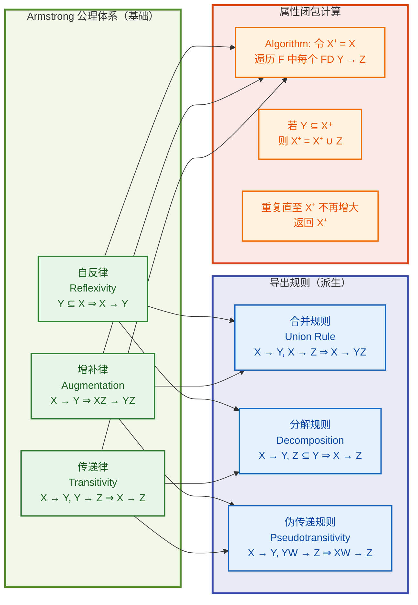
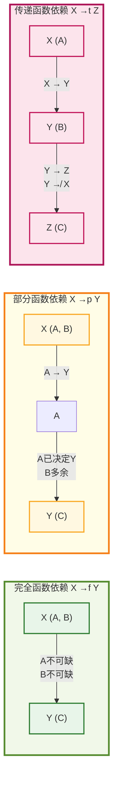
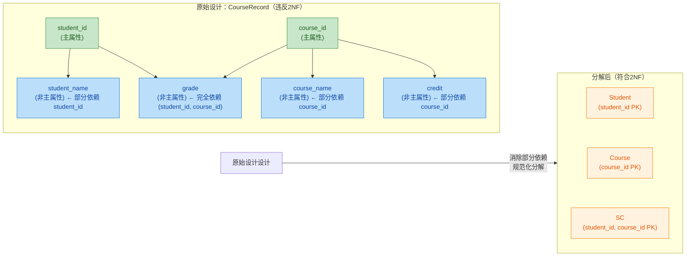
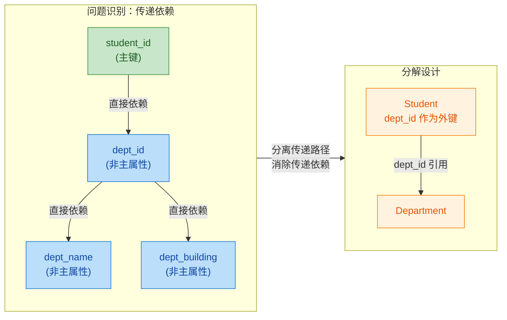
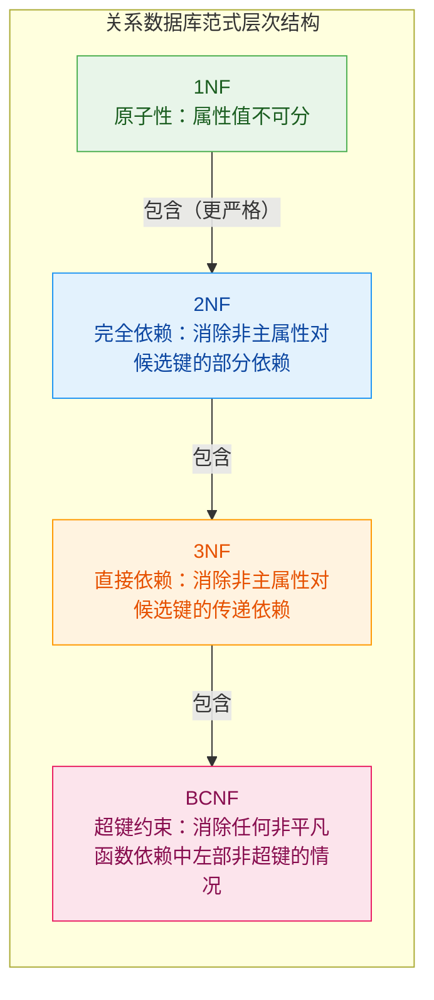
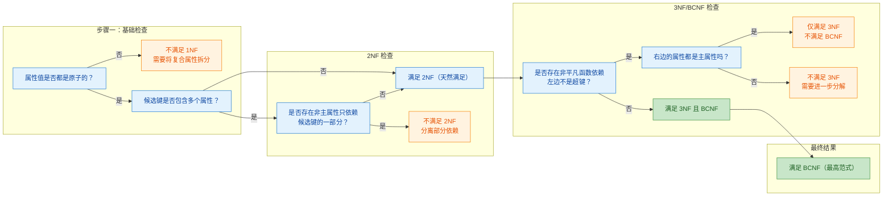

---

# 关系规范化

---

## 关系规范化

### 函数依赖（完全依赖、部分依赖、传递依赖）

函数依赖是关系数据库规范化理论的基石性概念，它描述了属性之间由于语义约束而产生的决定关系。在现实世界中，每一个关系模式（表结构）都对应着一组业务规则，这些业务规则最终被抽象为函数依赖。可以说，不理解函数依赖，就无法真正理解为什么需要规范化，也无法判断一个关系模式是否存在问题。因此，深入掌握函数依赖的概念、分类及其推论，是每一位数据库学习者的必修课。

#### 函数依赖的基本定义

设有一个关系模式 **R**，其属性集合记为 **U**。设有 **R** 上的两个属性子集 **X** 和 **Y**（即 **X ⊆ U**，**Y ⊆ U**），如果对于 **R** 的任意一个合法实例（即满足所有完整性约束的表），任意两个元组 **t1** 和 **t2**，只要它们在 **X** 上的属性值相同（即 **t1[X] = t2[X]**），就必然有 **t1[Y] = t2[Y]**，那么我们称 **Y 函数依赖于 X**，记作 **X → Y**。此时，**X** 称为决定因素（Determinant），**Y** 称为被决定因素。

这个定义中有几个关键点需要特别强调。首先，函数依赖是一种**语义层面的约束**，它反映的是现实世界中业务规则对数据取值的限制，而不是由数据的物理存储方式决定的。其次，函数依赖必须对关系模式的**每一个合法实例**都成立，而非仅仅对当前数据成立。仅仅因为现有数据中不存在反例，并不能推出一个函数依赖成立——如果业务语义允许反例存在，那么该函数依赖就不成立。第三，函数依赖的成立与否与元组的顺序无关，与数据量的大小无关，它是一种**元组级别的普遍约束**。

举一个直观的例子来帮助理解。考虑一个学生选课关系 **SC(Sno, Cno, Grade, Sname, Sdept)**，其中 Sno 表示学号，Cno 表示课程号，Grade 表示成绩，Sname 表示学生姓名，Sdept 表示所在院系。从业务语义出发，我们知道：一个学号 Sno 唯一确定一个学生的姓名 Sname 和所在院系 Sdept（因为每个学生有唯一的学号）；一个学号 Sno 和课程号 Cno 的组合唯一确定一个成绩 Grade（因为一个学生在一门课程上只有一个成绩）。因此，我们可以得到以下函数依赖：**Sno → Sname**、**Sno → Sdept**、**(Sno, Cno) → Grade**。

这里需要特别注意，**(Sno, Cno) → Grade** 是一个合法的函数依赖，因为在这门选课关系中，给定一个学生和一个课程，成绩是唯一确定的。而 **Cno → Grade** 显然不成立，因为一门课程可能有多个学生选修，每个学生在该课程上的成绩可能不同。

#### 完全函数依赖

在讨论完全函数依赖之前，需要先引入属性集闭包的概念。设 **F** 是关系模式 **R** 上的一组函数依赖集合，**X** 是 **R** 的一个属性子集。那么 **X** 关于 **F** 的属性闭包（记作 **X⁺** 或 **X(F)⁺**）定义为：从 **X** 出发，根据 **F** 中的函数依赖能够推导出的所有属性的集合。更精确地说，**X⁺** 是满足以下条件的最小属性集合：**X ⊆ X⁺**，且对于 **F** 中的每一个函数依赖 **Y → Z**，如果 **Y ⊆ X⁺**，那么 **Z ⊆ X⁺**。

计算属性闭包的算法是理解函数依赖理论的核心工具。其基本步骤如下：首先，令 **X⁺ = X**；然后，反复检查 **F** 中的每个函数依赖 **Y → Z**，若 **Y ⊆ X⁺**，则将 **Z** 加入 **X⁺**；重复此过程，直到 **X⁺** 不再增大。由于属性集合是有限的，该过程必然在有限步内终止。

有了属性闭包的概念，我们就可以准确地定义完全函数依赖。设 **X → Y** 是关系模式 **R** 上的一个函数依赖。如果 **X** 的任何一个真子集 **X'** 都不能函数决定 **Y**，也就是说，对于 **X** 的每一个真子集 **X'**，都有 **X' → Y 不成立**（等价地，**X'⁺ 不包含 Y**），那么称 **Y 对 X 完全函数依赖**，或称 **X → Y 是完全函数依赖**。换句话说，**X** 中的每一个属性都是不可或缺的——没有任何一个属性可以从 **X** 中移除而仍然保持对 **Y** 的决定关系。

继续沿用上面的学生选课例子。在关系 **SC(Sno, Cno, Grade)** 中，成绩 Grade 完全函数依赖于 (Sno, Cno)，因为单独依靠 Sno 无法确定成绩（一个学生选了多门课），单独依靠 Cno 同样无法确定成绩（一个课程有多个学生选修）。只有同时知道学号和课程号，才能唯一确定成绩，因此 (Sno, Cno) → Grade 是完全函数依赖。

从另一个角度看，完全函数依赖的几何意义在于：在函数依赖图（或属性依赖图）中，如果从 **X** 到 **Y** 的每一条路径都经过 **X** 中的所有节点，那么 **Y** 对 **X** 是完全函数依赖。或者说，**Y** 处于 **X** 所能到达的最远位置，而 **X** 本身已经无法再被“压缩”。

#### 部分函数依赖

与完全函数依赖相对应的概念是部分函数依赖。设 **X → Y** 是关系模式 **R** 上的一个函数依赖，**X** 是一个属性集合。如果存在 **X** 的一个真子集 **X'**（即 **X' ⊂ X** 且 **X' ≠ ∅**），使得 **X' → Y** 成立，那么称 **Y 对 X 部分函数依赖**（Partial Functional Dependency），也称为**不完全函数依赖**。此时，**X** 中存在多余的属性——某些属性对 **Y** 的决定并非必要，可以从 **X** 中移除而不会削弱对 **Y** 的决定能力。

部分函数依赖是关系规范化中需要重点关注的问题，因为它意味着数据冗余和更新异常的风险。以一个经典的教务管理数据库为例，假设我们设计了一个关系模式 **SLC(Sno, Sname, Sdept, Cno, Cname, Grade)**，其中 Sno 为学号，Sname 为姓名，Sdept 为院系，Cno 为课程号，Cname 为课程名，Grade 为成绩。

从业务语义分析，我们可以发现以下函数依赖关系：**Sno → Sname**、**Sno → Sdept**（一个学号唯一决定学生姓名和院系）；**Cno → Cname**（一个课程号唯一决定课程名）；**(Sno, Cno) → Grade**（一个学生选修一门课程，有一个唯一确定的成绩）。

进一步分析可以发现，**Sname 对 (Sno, Cno) 是部分函数依赖**，因为 **Sno → Sname** 已经成立，也就是说 (Sno, Cno) 中的 Cno 属性对于决定 Sname 来说是多余的。同样地，**Sdept 对 (Sno, Cno)** 也是部分函数依赖，**Cname 对 (Sno, Cno)** 也是部分函数依赖。

部分函数依赖的存在会导致严重的数据冗余问题。在上述 **SLC** 关系中，每个选了课的学生元组都会重复存储该学生的姓名和院系信息——如果一个学生选了 10 门课，他的姓名和院系信息就会被重复存储 10 次。这不仅浪费存储空间，更重要的是，当学生的姓名或院系发生变化时，需要在所有相关元组中进行更新，如果遗漏了任何一个元组，就会导致数据不一致。这种更新异常、插入异常和删除异常，正是规范化理论所要解决的问题。

部分函数依赖的识别方法可以用属性闭包来精确描述：设 **X → Y** 是 **R** 上的一个函数依赖。**X → Y 是部分函数依赖** 当且仅当存在 **X** 的真子集 **X'**，使得 **Y ⊆ X'⁺**（即 **X'** 的闭包包含 **Y**）。反之，如果对于 **X** 的每一个真子集 **X'**，都有 **Y ⊈ X'⁺**，那么 **X → Y** 是完全函数依赖。

#### 传递函数依赖

传递函数依赖是另一种重要的函数依赖类型，它揭示了属性之间通过“中间人”产生的间接决定关系。设 **X → Y**、**Y → Z** 是关系模式 **R** 上的两个函数依赖，并且满足以下条件：**X** 是 **R** 的属性集合的子集；**Y** 和 **Z** 也是 **R** 的属性集合的子集；**Y 不函数决定 X**（即 **Y → X 不成立**）；**X ∩ Y = ∅**（通常这一条根据具体定义而定，核心条件是 **Y** 不能是 **X** 的函数决定结果，否则 **X → Z** 可以直接从 **X → Y** 和 **Y → Z** 通过函数依赖的 Armstrong 公理推导出来，而不需要“传递”这一过程）。

在满足上述条件的情况下，**Z 对 X 传递函数依赖于 Y**，记作 **X → Z**（传递）。更直观地说，如果 **X 决定 Y**，**Y 决定 Z**，但 **Y 不决定 X**，且 **X 与 Z** 之间没有直接的函数决定关系（或者说，这种决定关系是通过 **Y** 间接建立的），那么 **Z 对 X** 存在传递函数依赖。

在教务管理数据库中，传递函数依赖的典型案例是：设有关系模式 **Student(Sno, Sdept, Mname)**，其中 Sno 为学号，Sdept 为院系，Mname 为院系主任姓名。根据业务规则，一个学号 Sno 唯一决定学生所在的院系 Sdept（假设学生不会转院系），一个院系 Sdept 唯一决定该院系的院系主任 Mname。因此有 **Sno → Sdept** 和 **Sdept → Mname**。进一步分析，**Sno → Mname** 也成立（一个学号唯一决定其院系主任，因为学生的院系是确定的），但是这种决定关系是**通过 Sdept 传递**的——Sno 首先决定了 Sdept，然后 Sdept 决定了 Mname。院系主任 Mname 对 Sno 的依赖并非直接，而是经过院系 Sdept 这个“桥梁”传递过来的，因此 **Mname 对 Sno 是传递函数依赖**。

从 Armstrong 公理体系的角度来看，传递函数依赖可以通过函数依赖的推理规则推导出来。Armstrong 公理体系包括三条基本公理（自反律、增补律、传递律）以及若干导出规则（合并规则、分解规则、伪传递规则等）。具体来说，如果 **X → Y** 且 **Y → Z** 成立，根据传递律可以直接得到 **X → Z**。但传递函数依赖的概念之所以重要，是因为它强调的是 **Y 不函数决定 X** 这一条件——如果 **Y → X** 也成立，那么 **X** 和 **Y** 之间就是等价关系（互相函数决定），此时 **X → Z** 就不再是“传递”依赖，而是“直接”依赖。在规范化的语境下，这种区分至关重要，因为它直接影响我们判断一个关系模式是否达到某个范式的要求。

传递函数依赖与部分函数依赖有一个共同点：它们都是导致数据冗余和更新异常的“罪魁祸首”。在上面的 **Student** 关系中，院系主任姓名 Mname 的值在每个学生的元组中都会被重复存储——同一个院系的每一个学生都存储了该院系主任的姓名。如果院系更换了主任，就必须更新所有该院系学生的元组，否则就会造成数据不一致。

#### Armstrong 公理体系与函数依赖的推导

为了系统地处理函数依赖，Armstrong 在 1974 年提出了一套完整的推理公理系统，称为 Armstrong 公理（Axioms of Armstrong）。这套公理是后续所有规范化理论的逻辑基础，其正确性和完备性都得到了严格的数学证明。

**自反律（Reflexivity）**：如果 **Y ⊆ X**，即 **Y** 是 **X** 的子集，那么 **X → Y** 成立。这条公理基于一个简单的事实：如果在一个元组中知道了一组属性的值，那么这些值中任何一个子集的值自然是已知的。例如，**\{Sno, Cno\} → Sno** 总是成立的。

**增补律（Augmentation）**：如果 **X → Y** 成立，那么 **XZ → YZ** 也成立（其中 **XZ** 表示 **X ∪ Z**）。增补律的含义是：如果 **X** 能决定 **Y**，那么在 **X** 的基础上增加更多的属性，扩展后的属性集仍然能决定 **Y** 中增加相应属性后的结果。例如，如果 **Sno → Sname** 成立，那么 **\{Sno, Cno\} → \{Sname, Cno\}** 也成立。

**传递律（Transitivity）**：如果 **X → Y** 且 **Y → Z** 成立，那么 **X → Z** 成立。这正是传递函数依赖的直接来源。

从这三条基本公理出发，可以推导出以下非常有用的导出规则：

**合并规则（Union Rule）**：如果 **X → Y** 且 **X → Z** 成立，那么 **X → YZ** 成立。证明过程利用增补律和传递律：首先对 **X → Y** 使用增补律得到 **XX → XY**，即 **X → XY**；然后对 **X → Z** 使用增补律得到 **XX → XZ**，即 **X → XZ**；最后对 **X → XY** 和 **XY → YZ** 使用传递律（需要先证明 **XY → YZ**，实际上可以通过增补律从 **X → Z** 得到 **XY → ZY**，即 **XY → YZ**），从而得到 **X → YZ**。

**分解规则（Decomposition Rule）**：如果 **X → Y** 成立，且 **Z ⊆ Y**，那么 **X → Z** 成立。这个规则的含义是：如果 **X** 能决定 **Y**，那么 **X** 也能决定 **Y** 的任何一个子集。这个规则结合自反律和传递律即可证明。分解规则的重要性在于，它表明函数依赖中的右侧属性可以独立考虑，不必作为一个整体来处理。

**伪传递规则（Pseudotransitivity Rule）**：如果 **X → Y** 且 **YW → Z** 成立，那么 **XW → Z** 成立。这个规则通过增补律和传递律组合即可证明。

**累积规则（Accumulation Rule）**：如果 **X → YZ** 且 **Z → W**，那么 **X → YZW** 成立。

下面用 Mermaid 图来展示 Armstrong 公理体系的推理关系和导出规则的逻辑链条：



这张图清晰地展示了 Armstrong 公理体系的三条基本公理如何推导出各种派生规则，以及属性闭包算法与这些公理的内在联系。图中使用了绿色系（Green）表示公理层（概念层），蓝色系（Blue）表示派生规则（逻辑层），橙色系（Orange）表示算法（物理/实现层），符合视觉规范中的语义化着色要求。

#### 函数依赖的等价与覆盖

在规范化理论中，经常需要比较两组函数依赖集合是否“等价”——即它们是否能够推出相同的函数依赖闭包。设 **F** 和 **G** 是关系模式 **R** 上的两个函数依赖集合，如果 **F⁺ = G⁺**（即 **F** 和 **G** 蕴含的函数依赖集合完全相同），那么称 **F 与 G 等价**，记作 **F ≡ G**。判断 **F ≡ G** 的充分必要条件是：首先，**F** 中的每一个函数依赖都在 **G⁺** 中（即 **F ⊆ G⁺**）；其次，**G** 中的每一个函数依赖都在 **F⁺** 中（即 **G ⊆ F⁺**）。

如果函数依赖集合 **G** 与 **F** 等价，并且 **G** 中的每一个函数依赖的右侧只有一个属性（称为单属性），**G** 中没有多余的函数依赖（即删除 **G** 中任何一个函数依赖都会改变 **G** 所蕴含的闭包），那么称 **G** 是 **F** 的一个**最小覆盖**（Minimal Cover）或**最小函数依赖集**。最小覆盖在数据库设计中也具有重要意义，因为从最小覆盖出发进行规范化分解，可以更清晰地识别关系模式中的问题。

求取最小覆盖的基本步骤如下：首先，将 **F** 中所有函数依赖的右侧都化为单属性（利用分解规则）；然后，逐一检查 **F** 中的每个函数依赖 **X → Y**，尝试从 **F** 中移除它，检查剩余的函数依赖集合 **F'** 是否仍然与 **F** 等价（即 **F'⁺** 是否仍然等于 **F⁺**），如果等价则该函数依赖是多余的，可以移除；最后，对于保留下来的函数依赖，检查左侧是否有冗余属性，即对于 **X → Y**，检查 **X** 的每一个真子集 **X'**，如果 **Y ⊆ X'⁺**，则用 **X' → Y** 替换 **X → Y**。

#### 闭包计算实例演练

为了将理论与实践结合，下面通过一个完整的例子来演示属性闭包的计算过程以及 Armstrong 公理的应用。

设关系模式 **R(A, B, C, D, E, G)**，函数依赖集 **F = \{AB → C, C → DG, D → E, CG → B\}**。我们需要计算 **\{A, C\}** 的属性闭包 **\{A, C\}⁺**。

计算过程如下：初始化 **X⁺ = \{A, C\}**。第一轮扫描：AB → C 中左侧 **AB** 不完全包含于当前闭包（缺少 B），跳过；C → DG 中左侧 **C** 在当前闭包中，因此加入 D 和 G，闭包变为 **\{A, C, D, G\}**；D → E 中左侧 **D** 在当前闭包中，因此加入 E，闭包变为 **\{A, C, D, G, E\}**；CG → B 中左侧 **CG** 在当前闭包中（包含 C 和 G），因此加入 B，闭包变为 **\{A, B, C, D, E, G\}**。

第二轮扫描：所有函数依赖的左侧都已包含在闭包中，闭包不再增大。最终 **\{A, C\}⁺ = \{A, B, C, D, E, G\}**，即整个属性集。这表明 **\{A, C\}** 是关系模式 **R** 的一个超码（Superkey），因为它的闭包包含了 **R** 的所有属性。

从上述计算过程可以看出，属性闭包的计算是一个**不动点迭代**过程，其正确性由 Armstrong 公理的 soundness（可靠性）和 completeness（完备性）保证。每一步添加新属性的操作都对应着对某个函数依赖应用 Armstrong 公理中的推理规则。

#### 函数依赖与候选码的确定

在数据库设计中，确定关系模式的候选码是规范化分析的起点。候选码的精确定义是：**K** 是关系模式 **R** 的属性集 **U** 的一个子集，如果 **K⁺ = U**（即 **K** 的闭包包含全部属性），且 **K** 的任何一个真子集 **K'** 都不满足 **K'⁺ = U**（即 **K** 是最小的满足该条件的属性集），那么 **K** 是 **R** 的一个候选码。

候选码的求解本质上是一个属性闭包的计算问题。对于属性较多的关系模式，可以采用以下策略来高效地寻找候选码：首先，分别计算仅出现在函数依赖左侧的属性集 **P**、仅出现在函数依赖右侧的属性集 **Q**、同时出现在两侧的属性集 **W**、以及从未出现的属性集 **N**。然后，基于以下启发式规则进行分析：如果 **P⁺** 已经包含全部属性，则 **P** 本身就是候选码；如果 **P⁺** 未包含全部属性，则需要将 **N** 中的属性逐步加入 **P** 进行尝试；如果最终 **P ∪ N** 仍然不是最小属性集，还需要考虑在 **W** 中选择属性进行组合尝试。

#### 函数依赖的可视化理解

为了更直观地理解三种函数依赖之间的关系，我们可以用一个示意图来展示：



这张图从左到右分别展示了三种函数依赖的特征。完全函数依赖要求决定因素 **X** 中的每个属性都不可或缺；部分函数依赖中，**X** 存在多余属性（子集 **A** 已经能决定 **Y**）；传递函数依赖中，**X → Z** 的链路必须经过中间属性 **Y**，且 **Y** 不能反过来决定 **X**。

#### 函数依赖理论的实际意义

函数依赖理论在数据库设计中扮演着无可替代的角色。首先，它是诊断关系模式问题的“听诊器”。通过分析一个关系模式中存在的部分函数依赖和传递函数依赖，我们可以精准地定位该模式在哪个规范化级别上存在缺陷，从而确定是否需要进行分解以及如何分解。

其次，函数依赖是数据库约束设计的重要依据。当我们在数据库中定义主键（PRIMARY KEY）和候选键（CANDIDATE KEY）时，实际上就是在声明一组特殊的函数依赖——主键属性集决定该元组的所有其他属性。在 SQL 中，PRIMARY KEY 约束和 UNIQUE 约束都对应着函数依赖的声明。

最后，理解函数依赖有助于写出更高效的查询。在涉及多表连接的查询优化中，函数依赖可以帮助判断连接操作的必要性——如果一个属性可以通过已有的属性推导出来（函数依赖的右侧属性），那么在某些情况下可能不需要进行额外的表连接操作。

#### 深入理解：函数依赖与多值依赖的关系

在讨论函数依赖时，有必要简要提及另一种重要的数据依赖——多值依赖（Multivalued Dependency, MVD）。与函数依赖不同，多值依赖描述的是属性之间一对多的关系：设 **X → → Y** 是关系模式 **R** 上的一个多值依赖，其含义是如果两个元组在 **X** 上的值相同，那么在交换它们 **Y** 上的值之后，得到的仍然是该关系的有效元组。

函数依赖可以看作是多值依赖的一种特殊情况——当一对多的关系退化为一对一的关系时，多值依赖就转化为函数依赖。更准确地说，**X → Y**（函数依赖）可以推出 **X → → Y**（多值依赖），但反之不成立。多值依赖在第四范式（4NF）及更高范式的定义中扮演着关键角色，此处提及是为了帮助读者建立更完整的依赖理论全局观。

在实际的数据库设计实践中，函数依赖是首先需要关注的核心依赖类型。只有在关系模式存在严重的数据冗余，而函数依赖的规范化无法完全解决时，才需要考虑多值依赖的问题。在大多数应用场景中（尤其是基于 SQLite/Android 的移动端开发中），通过合理设计关系模式并应用函数依赖驱动的规范化（至少达到 BCNF 级别），通常已经能够满足绝大多数业务需求。

---

#### 📝 练习题

设有关系模式 **R(A, B, C, D, E)**，函数依赖集 **F = \{A → BC, CD → E, B → D, E → A\}**。下列属性闭包计算结果中，正确的是哪一项？

A. **\{A\}⁺ = \{A, B, C, D\}**，且 **\{B\}⁺ = \{B, D\}**

B. **\{A\}⁺ = \{A, B, C, D, E\}**，且 **\{E\}⁺ = \{E, A, B, C, D\}**

C. **\{C\}⁺ = \{C, E, A, B, D\}**，且 **\{D\}⁺ = \{D\}**

D. **\{B\}⁺ = \{B, C, D\}**，且 **\{A, E\}⁺ = \{A, B, C, D\}**

**【答案】** B

**【解析】** 本题考查属性闭包的计算能力以及对 Armstrong 公理的理解。我们逐一验证各选项。

对于选项 A：计算 **\{A\}⁺**。初始 **\{A\}⁺ = \{A\}**。由 **A → BC** 将 B、C 加入闭包得 **\{A, B, C\}**。由 **B → D** 将 D 加入闭包得 **\{A, B, C, D\}**。此时检查 CD → E：左侧 CD = \{C, D\} ⊆ \{A, B, C, D\}，因此将 E 加入闭包，最终 **\{A\}⁺ = \{A, B, C, D, E\}**，而非 **\{A, B, C, D\}**，选项 A 错误。

对于选项 B：已验证 **\{A\}⁺ = \{A, B, C, D, E\}**。计算 **\{E\}⁺**：初始 **\{E\}⁺ = \{E\}**。由 **E → A** 将 A 加入得 **\{A, E\}**。由 **A → BC** 将 B、C 加入得 **\{A, B, C, E\}**。由 **B → D** 将 D 加入得 **\{A, B, C, D, E\}**，闭包已包含全部属性。**\{E\}⁺ = \{A, B, C, D, E\}** 正确。选项 B 正确。

对于选项 C：计算 **\{C\}⁺**：初始 **\{C\}⁺ = \{C\}**。检查 F 中的依赖：**A → BC** 的左侧 A 不在闭包中，跳过；**CD → E** 的左侧 CD = \{C, D\}，D 不在闭包中，跳过；**B → D** 的左侧 B 不在闭包中，跳过；**E → A** 的左侧 E 不在闭包中，跳过。因此 **\{C\}⁺ = \{C\}**，选项 C 错误地声称 **\{C\}⁺ = \{C, E, A, B, D\}**。

对于选项 D：已验证 **\{B\}⁺ = \{B, D\}**（从 B 出发，只有 B → D 可用），而非 **\{B, C, D\}**，选项 D 错误。

因此正确答案是 **B**。本题的核心要点在于：属性闭包计算必须严格按照迭代算法执行，每一步只能加入左侧属性完全包含在当前闭包中的函数依赖的右侧属性。此外，本题还隐含了一个重要信息：**A** 和 **E** 都是关系模式 **R** 的候选码（因为它们的闭包都包含全部属性），这意味着该关系模式 **R** 的规范化程度很高，在 BCNF 甚至更高范式上已经满足要求。

---

## 范式（1NF、2NF、3NF、BCNF）

### 范式的概念与设计动机

在关系数据库的设计过程中，我们经常会面临一个根本性的问题：给定一个业务场景，究竟应该如何组织表结构？不同的表结构设计会带来截然不同的效果——有些设计能够有效消除数据冗余、避免更新异常，使数据库易于维护；有些设计却会导致大量的数据重复，稍有不慎就会产生数据不一致的麻烦。范式（Normal Form，简称 NF）正是数据库前辈们经过 decades of theoretical research and practical exploration 之后，总结出来的一套系统性的设计准则。

范式的核心思想可以追溯到 Edgar F. Codd 在 1970 年代提出的关系模型。1971 年，Codd 首次提出了第一范式和第二范式的概念；1972 年，他进一步提出了第三范式；1974 年，Raymond Boyce 和 Codd 合作提出了更为严格的 Boyce-Codd 范式（BCNF）。这一系列范式的提出并非一蹴而就，而是逐步深化的过程，每一代范式都在前一代的基础上增加了新的约束条件，以解决前代范式中仍然存在的特定数据冗余和更新异常问题。

理解范式的关键在于认识到：**范式是一种规范，它告诉我们“好”的关系模式应该满足哪些条件**。但范式并非越高越好——在实际工程中，我们需要在理论规范和实际性能之间做出权衡。理解每一种范式的设计动机和具体要求，是做出明智设计决策的前提。

从本质上讲，范式解决的问题可以归结为三大类：**数据冗余**（同样的数据重复存储多次）、**插入异常**（某些数据无法被插入到表中）和**删除异常**（删除某些数据时不小心把其他有用的数据也一并删掉了）。这三种异常现象在数据库领域有一个统一的称呼——**更新异常**（Update Anomaly）。范式的递进设计，实际上就是逐步消除这些异常的过程。

---

### 第一范式（1NF）

#### 定义

第一范式是关系数据库设计的**最低门槛**，也是所有更高范式的基础。第一范式的要求非常简单而直接：**关系模式中的每一个属性值都必须是原子值，即不可再分的单值**。换句话说，一个属性不能包含集合、数组、列表等复合结构，也不能包含多个值。

用更正式的语言描述：第一范式要求关系中的每一个元组在每一个属性上的取值都是一个**原子域**（Atomic Domain）中的值。原子域意味着域中的元素是不可再分的最小单元。

#### 为什么需要原子性

第一范式看似简单，但它的重要性常常被低估。考虑一个常见的反例：假设我们设计一个学生表，其中有一个“联系方式”字段存储了学生的手机号和邮箱：

```sql
-- 学生表（违反1NF的设计）
CREATE TABLE Student_Bad (
    student_id   INT PRIMARY KEY,
    name         VARCHAR(50),
    contact      VARCHAR(200)  -- 例如: "13812345678, alice@email.com"
);
```

这种设计违反了第一范式，因为 `contact` 字段包含了多个独立的联系信息。当我们需要查询所有手机号为 138 开头的学生时，SQL 语句会变得异常复杂：

```sql
-- 违反1NF的查询：需要使用字符串函数来处理复合字段
SELECT * FROM Student_Bad
 WHERE SUBSTRING_INDEX(contact, ',', 1) LIKE '138%';
```

而如果按照第一范式的要求，将联系方式拆分为独立的字段：

```sql
-- 符合1NF的设计
CREATE TABLE Student_Good (
    student_id    INT PRIMARY KEY,
    name          VARCHAR(50),
    phone_number  VARCHAR(20),
    email         VARCHAR(100)
);
```

查询就会变得简单清晰：

```sql
-- 符合1NF的查询
SELECT * FROM Student_Good WHERE phone_number LIKE '138%';
```

#### 1NF 的具体要求与边界情况

在实际应用中，需要特别注意以下几个边界情况：

**日期和时间**：日期类型（DATE）和时间戳类型（TIMESTAMP）被视为原子值，因为它们代表的是一个完整的、不可分割的时间点。即使我们经常需要提取其中的年份或月份，但日期本身是一个不可分的整体，不应拆分为年、月、日三个独立属性——虽然这种拆分在某些场景下可能是合理的设计选择，但它不是 1NF 的要求。

**地址信息**：地址是一个容易被忽视的违反 1NF 的场景。如果将“地址”设计为一个完整字符串（如“北京市海淀区中关村大街1号”），虽然字符串本身是原子的，但地址内部包含了省、市、区、街道、门牌号等多个语义层次的信息。正确的做法是根据查询需求，将地址拆分为多个属性：

```sql
-- 符合1NF的地址设计
CREATE TABLE Customers (
    customer_id    INT PRIMARY KEY,
    name           VARCHAR(50),
    province       VARCHAR(20),
    city           VARCHAR(20),
    district       VARCHAR(20),
    street_address VARCHAR(200)
);
```

**多值属性**：如果一个实体具有多值属性（比如一个学生修了多门课程），应当使用单独的关系来表示，而不是把多个值塞进一个属性中：

```sql
-- 违反1NF：将多值放入逗号分隔的字符串
CREATE TABLE Student_Bad (
    student_id  INT PRIMARY KEY,
    name        VARCHAR(50),
    courses     VARCHAR(500)  -- 例如: "数据库,操作系统,网络"
);

-- 符合1NF：使用单独的关系表示多值属性
CREATE TABLE Student (
    student_id  INT PRIMARY KEY,
    name        VARCHAR(50)
);

CREATE TABLE Student_Course (
    student_id  INT,
    course_name VARCHAR(50),
    PRIMARY KEY (student_id, course_name)
);
```

#### 1NF 的重要性总结

第一范式是所有关系型数据库必须满足的最低标准。即使是 PostgreSQL 这样支持 JSON、数组等非原子数据类型的数据库，在设计“良好”的关系模式时，仍然应当遵循 1NF 的原则。那些非原子数据类型是针对特定场景的便利工具，而不是放弃范式设计的理由。事实上，PostgreSQL 官方文档也建议，在大多数情况下，将数据规范化到 1NF 仍然是最稳妥的设计选择。

---

### 第二范式（2NF）

#### 从 1NF 到 2NF：引入候选键概念

在讨论第二范式之前，我们需要先理解几个关键概念——**候选键**（Candidate Key）和**主属性**（Prime Attribute）。

**候选键**是指能够唯一标识元组的最小属性集。所谓“最小”，是指在这个属性集中，去掉任何一个属性后，剩下的属性集就不能唯一标识元组了。一个关系模式可能有多个候选键，数据库设计者从中选择一个作为**主键**（Primary Key）。

**主属性**是指出现在某个候选键中的属性。注意这个定义中的“某个”——如果一个属性出现在候选键 A 中但不在候选键 B 中，它仍然是主属性。主属性的概念很重要，因为第二范式和第三范式的定义都涉及到主属性。

#### 定义

第二范式的要求是：**关系模式必须满足第一范式，并且每一个非主属性都完全函数依赖于候选键**。

这里的关键词是“**完全函数依赖**”。回忆上一章中关于函数依赖的知识，我们知道：如果 $X \rightarrow Y$ 成立，并且对于 $X$ 的任何真子集 $X'$，$X' \rightarrow Y$ 都不成立，那么 $Y$ 对 $X$ 是**完全函数依赖**。与之相对的是**部分函数依赖**：$Y$ 依赖于 $X$，但同时也依赖于 $X$ 的一部分属性。

第二范式要解决的核心问题是：**消除非主属性对候选键的部分依赖**。

#### 2NF 的判定步骤

判断一个关系模式是否满足第二范式，可以按照以下步骤进行：

第一步：找出关系模式的所有候选键。

第二步：找出所有的非主属性（不在任何候选键中的属性）。

第三步：检查每一个非主属性，判断它是否完全函数依赖于候选键。

第四步：如果存在非主属性只依赖于候选键的一部分（即部分依赖），则该关系模式不满足 2NF。

#### 2NF 违反示例与分解

让我们通过一个具体的例子来理解第二范式。考虑一个选课管理系统，我们需要记录学生的选课信息，包括学生姓名、课程名称、课程学分、学生成绩等：

```sql
-- 选课成绩表（初步设计）
CREATE TABLE CourseRecord (
    student_id   INT,           -- 学生ID
    course_id     INT,           -- 课程ID
    student_name  VARCHAR(50),  -- 学生姓名（非主属性）
    course_name   VARCHAR(100), -- 课程名称（非主属性）
    credit        INT,          -- 课程学分（非主属性）
    grade         DECIMAL(4,1), -- 成绩（非主属性）
    PRIMARY KEY (student_id, course_id)  -- 复合主键
);
```

这个关系模式的候选键是 `{student_id, course_id}`。所有属性中，只有 `student_id` 和 `course_id` 是主属性，其他五个都是非主属性。

现在分析非主属性对候选键的函数依赖关系：

- `student_name`（学生姓名）是否完全依赖于 `{student_id, course_id}`？实际上，`student_name` 只由 `student_id` 决定，与 `course_id` 无关。也就是说，`student_name` **部分函数依赖于** 候选键。
- `course_name`（课程名称）只由 `course_id` 决定，同样只部分依赖于候选键。
- `credit`（学分）也只由 `course_id` 决定，部分依赖。
- `grade`（成绩）需要由 `student_id` 和 `course_id` 共同决定，才是完全依赖。

因此，上述设计违反了第二范式。违反 2NF 会导致以下问题：

**数据冗余问题**：如果一个学生选了 10 门课，`student_name` 就会重复存储 10 次；如果一门课程被 100 个学生选修，`course_name` 和 `credit` 就会重复 100 次。这种冗余不仅浪费存储空间，更重要的是增加了数据不一致的风险——如果学生的名字改了，我们需要更新 10 条记录；如果课程名称改了，我们需要更新 100 条记录。

**更新异常**：由于冗余的存在，修改一条记录中的学生姓名或课程名称，不会自动更新其他相关记录，导致同一学生在不同选课记录中显示不同的名字，造成数据不一致。

**插入异常**：假设有一门新课程，但还没有学生选修，我们无法将 `course_id`、`course_name`、`credit` 插入到表中，因为主键包含了 `student_id`，而它为空。

**删除异常**：如果删除了某个学生的所有选课记录，该学生的姓名信息也会随之丢失，而这些信息可能是有价值的。

#### 符合 2NF 的分解方案

针对上述问题，我们应当将表拆分为多个满足第二范式的关系模式：

```sql
-- 学生信息表：存储学生基本信息
-- 候选键：student_id
-- 非主属性 student_name 完全函数依赖于 student_id（单属性键，不存在部分依赖）
CREATE TABLE Student (
    student_id   INT PRIMARY KEY,
    student_name VARCHAR(50)
);

-- 课程信息表：存储课程基本信息
-- 候选键：course_id
-- 非主属性 course_name 和 credit 完全函数依赖于 course_id（单属性键，不存在部分依赖）
CREATE TABLE Course (
    course_id    INT PRIMARY KEY,
    course_name  VARCHAR(100),
    credit       INT
);

-- 选课成绩表：存储学生与课程之间的选课关系及成绩
-- 候选键：(student_id, course_id)
-- 非主属性 grade 完全函数依赖于候选键（部分依赖已被移除）
CREATE TABLE SC (
    student_id  INT,
    course_id   INT,
    grade       DECIMAL(4,1),
    PRIMARY KEY (student_id, course_id)
);
```

经过这样的分解，每个表都满足第二范式：学生信息表和课程信息表的主键都是单属性，不存在部分依赖的问题；选课成绩表中的 `grade` 是完全依赖于复合主键的。

下面用 Mermaid 图来展示这个分解过程：



在这个分解方案中，学生信息、课程信息和选课关系被清晰地分离。每一部分都遵循了单一职责原则：Student 表只关心学生的个人信息，Course 表只关心课程的固有属性，SC 表只关心学生与课程之间的关联以及成绩信息。

#### 2NF 的适用范围

值得注意的是，第二范式的要求只在**存在复合候选键**的情况下才有实际意义。如果一个关系模式的所有候选键都是单属性（即只有一个属性），那么它天然满足第二范式，因为不可能存在对候选键真子集的部分依赖。因此，在设计数据库时，如果能够确保每个表都使用单属性主键，并且非主属性都完全依赖于主键，就已经达到了第二范式的要求。

---

### 第三范式（3NF）

#### 从 2NF 到 3NF：引入传递依赖

如果说第二范式关注的是“非主属性对候选键的部分依赖”，那么第三范式要解决的则是“非主属性对候选键的**传递依赖**”。

什么是传递依赖？考虑这样的场景：属性 $A$ 决定了属性 $B$，属性 $B$ 决定了属性 $C$，但属性 $C$ 不直接依赖于属性 $A$。在这种情况下，$C$ 对 $A$ 的依赖是通过 $B$ 作为“中介”而建立的，这就是传递依赖。

举一个生活中的例子来理解传递依赖：假设在一个关系模式中，`country`（国家）决定了 `capital`（首都），`capital` 决定了 `timezone`（时区）。那么 `timezone` 对 `country` 的依赖就是传递的——知道了国家，可以通过首都间接得到时区。

#### 第三范式的定义

第三范式有多种等价的定义形式，其中最常用的一种是：

**关系模式 R 满足第三范式，当且仅当它满足第二范式，并且每一个非主属性都既不传递函数依赖于候选键，也不部分函数依赖于候选键。**

换句话说，第三范式要求非主属性对候选键的依赖只能是**直接依赖**，而不能通过其他非主属性间接依赖。

另一种等价的定义（由 Carlo Zaniolo 于 1982 年提出）更加简洁：

**关系模式 R 满足第三范式，当且仅当对于 R 的每一个非平凡函数依赖 $X \rightarrow Y$，以下条件之一成立：要么 $X$ 是 R 的超键，要么 $Y$ 中的每一个属性都是 R 的主属性。**

这个定义的含义是：要么左边够强（是超键），要么右边够弱（都是主属性）。如果左边不够强且右边包含非主属性，就会违反 3NF。

#### 3NF 违反示例

让我们继续用学生选课系统的例子。假设我们需要记录学生所在的院系信息：

```sql
-- 学生院系表（初步设计）
CREATE TABLE StudentDept (
    student_id    INT PRIMARY KEY,
    student_name  VARCHAR(50),
    dept_id       INT,           -- 院系ID
    dept_name     VARCHAR(100),  -- 院系名称
    dept_building VARCHAR(100)   -- 院系所在建筑
);
```

这个表的主键是 `student_id`，`dept_name` 和 `dept_building` 是非主属性。

分析函数依赖关系：

- `student_id` → `dept_id`（学生ID决定院系ID）
- `dept_id` → `dept_name`（院系ID决定院系名称）
- `dept_id` → `dept_building`（院系ID决定院系所在建筑）

由此可以推出：`student_id` → `dept_id` → `dept_name`，即 `dept_name` 传递依赖于 `student_id`。同样，`dept_building` 也传递依赖于 `student_id`。

这种传递依赖会导致以下问题：

**数据冗余**：如果一个院系有 500 名学生，`dept_name` 和 `dept_building` 就会在这 500 条学生记录中重复 500 次。假设院系改名或搬迁，需要更新 500 条记录，极易造成数据不一致。

**更新异常**：修改某个院系的名称时，必须同时更新所有属于该院系的学生记录，稍有遗漏就会导致同一院系显示不同的名称。

**插入异常**：如果新成立了一个院系，但还没有招生（没有学生记录），就无法记录该院系的信息，因为 `student_id` 作为主键不能为空。

**删除异常**：删除某院系最后一个学生的记录时，该院系的所有信息都会丢失。

#### 符合 3NF 的分解方案

解决传递依赖的方法是将存在传递依赖的属性分离到独立的关系中：

```sql
-- 学生信息表：存储学生个人信息和所属院系
-- 主键：student_id
-- 非主属性 student_name, dept_id 完全直接依赖于 student_id
CREATE TABLE Student (
    student_id   INT PRIMARY KEY,
    student_name VARCHAR(50),
    dept_id      INT  -- 外键引用 Department 表
);

-- 院系信息表：存储院系固有信息
-- 主键：dept_id
-- 非主属性 dept_name, dept_building 完全直接依赖于 dept_id
CREATE TABLE Department (
    dept_id       INT PRIMARY KEY,
    dept_name     VARCHAR(100),
    dept_building VARCHAR(100)
);
```

经过这样的分解，Department 表中只存储院系信息，每个院系只出现一次；Student 表中每个学生只出现一次，且 `dept_id` 作为外键引用 Department 表。两张表都满足第三范式。

从函数依赖的角度重新分析：

- 在 Student 表中，非主属性 `student_name` 和 `dept_id` 完全直接依赖于主键 `student_id`，不存在部分依赖（满足 2NF），也不存在传递依赖（因为 `dept_name` 和 `dept_building` 不在 Student 表中）。

- 在 Department 表中，主键是 `dept_id`，非主属性 `dept_name` 和 `dept_building` 完全直接依赖于主键，不存在部分依赖，也不存在传递依赖。

#### 3NF 的理解要点

第三范式的核心洞察在于：**非主属性不应该依赖于其他非主属性**。在 StudentDept 表的原始设计中，`dept_name` 和 `dept_building` 依赖于 `dept_id`（非主属性），而不是直接依赖于主键 `student_id`。这意味着这些属性描述的不是“学生”这一实体的特征，而是“院系”这一独立实体的特征——它们应该被分离到独立的表中。

这个设计原则在数据库领域有一个更general的名称：**每个表应该描述一个实体或一个关系**。StudentDept 表试图同时描述“学生”实体和“院系”实体，导致职责不清。分解后的设计中，Student 表描述学生实体，Department 表描述院系实体，各自的职责清晰，冗余消除。

用 Mermaid 图展示 3NF 的分解逻辑：



---

### Boyce-Codd 范式（BCNF）

#### BCNF 的引入背景

第三范式看似已经解决了非主属性的部分依赖和传递依赖问题，但数据库理论家们很快发现，3NF 仍然存在一些漏洞。1974 年，Raymond Boyce 和 Edgar Codd 提出了一个更强的范式——Boyce-Codd 范式（BCNF），专门用来解决 3NF 中遗留的某些异常问题。

BCNF 的提出源于对第三范式定义的进一步审视。我们回顾 3NF 的定义：对于每一个非平凡函数依赖 $X \rightarrow Y$，要么 $X$ 是超键，要么 $Y$ 中的每一个属性都是主属性。

考虑这样一种情况：$X \rightarrow Y$ 是一个函数依赖，$X$ 不是超键，但 $Y$ 中的属性都是主属性。按照 3NF 的定义，这个依赖是允许的。但这种依赖可能导致数据冗余吗？答案是：**可能**。

#### BCNF 的定义

Boyce-Codd 范式的定义比 3NF 更加严格：

**关系模式 R 满足 BCNF，当且仅当对于 R 的每一个非平凡函数依赖 $X \rightarrow Y$，$X$ 都是 R 的超键。**

对比 3NF 和 BCNF 的定义，核心区别在于：**BCNF 不再区分左边的属性是否属于主属性，也不考虑右边是否全是主属性——只要左边不是超键，就不满足 BCNF**。

换句话说，BCNF 要求**每一个函数依赖的左边都必须是超键**，而 3NF 则允许左边不是超键只要右边全是主属性就行。

#### 何时需要 BCNF：3NF 无法覆盖的场景

BCNF 主要针对的是**候选键包含多个属性的情况**，且存在**由主属性触发的函数依赖**。具体来说，当以下条件同时成立时，3NF 可能不够：

1. 关系模式有两个或多个重叠的复合候选键（即候选键都包含多个属性，并且候选键之间有交集）。
2. 有一个函数依赖，其左边既不是超键，其右边也不全是主属性。

为了更清晰地理解这个场景，让我们构造一个具体的例子。考虑一个**咨询预约系统**，需要记录哪些学生咨询了哪些导师，以及每个导师的研究领域：

```sql
-- 咨询预约表（初始设计）
CREATE TABLE Consultation (
    student_id  INT,   -- 学生ID
    mentor_id   INT,   -- 导师ID
    research_area VARCHAR(100), -- 研究领域
    -- 业务规则：每个学生每个研究领域只能咨询一个导师
    -- 例如：学生A在"数据库"领域只能咨询导师X，不能咨询导师Y
    PRIMARY KEY (student_id, mentor_id, research_area)
);
```

这个表的候选键比较特殊。分析函数依赖：

- `{student_id, research_area}` → `mentor_id`（一个学生在某个研究领域只能有一个导师）
- `mentor_id` → `research_area`（一个导师只属于一个研究领域）

所有三个属性 `student_id`、`mentor_id`、`research_area` 都是主属性（因为它们都是候选键的组成部分）。没有非主属性！

这就是关键所在——当一个关系模式**没有非主属性**，或者说**所有属性都是主属性**时，3NF 的约束几乎不会触发任何限制，因为 3NF 的条件只关注非主属性。在这个例子中，`mentor_id` → `research_area` 这个函数依赖的右边（`research_area`）是主属性，所以 3NF 允许这个依赖存在——即使 `mentor_id` 不是超键。

然而，这个设计确实存在问题：

**数据冗余**：每个属于“数据库”研究领域的导师记录，都需要重复存储 `mentor_id` 与 `research_area` 的映射。如果有 10 个数据库领域的导师，`mentor_id → research_area` 这个映射就重复了 10 次。

**更新异常**：如果某个导师更换了研究领域，需要更新所有该导师被记录的元组。如果只更新了一条，就会导致同一 `mentor_id` 对应不同的研究领域，造成数据不一致。

**插入异常**：如果一位新导师尚未被任何学生预约咨询（没有学生记录），就无法将导师ID和研究领域插入表中。

**删除异常**：删除某研究领域的最后一个预约记录时，该研究领域与对应导师的映射关系也随之丢失。

#### BCNF 的分解方案

将上述 Consultation 表分解为两个表：

```sql
-- 导师研究领域表：存储导师与其研究领域的对应关系
-- 主键：mentor_id
-- 函数依赖：mentor_id → research_area，左边是超键，满足BCNF
CREATE TABLE MentorArea (
    mentor_id      INT PRIMARY KEY,
    research_area  VARCHAR(100)
);

-- 咨询预约表：存储学生与导师的咨询关系
-- 主键：(student_id, mentor_id)
-- 函数依赖：student_id, mentor_id → research_area
-- 注意：research_area 可以通过 mentor_id 从 MentorArea 表推导得出
CREATE TABLE ConsultationBooking (
    student_id  INT,
    mentor_id   INT,
    PRIMARY KEY (student_id, mentor_id)
);
```

经过分解后，`MentorArea` 表满足 BCNF：唯一的函数依赖是 `mentor_id → research_area`，左边 `mentor_id` 是该表的主键（超键），因此满足 BCNF。`ConsultationBooking` 表也满足 BCNF：其函数依赖 `student_id, mentor_id → research_area` 的左边 `{student_id, mentor_id}` 就是该表的主键。

#### BCNF 与 3NF 的关系

从理论上看，BCNF 和 3NF 之间的关系可以总结为：**每一个满足 BCNF 的关系模式一定满足 3NF，但满足 3NF 的关系模式不一定满足 BCNF**。

BCNF 是 3NF 的超集——BCNF 在函数依赖的约束上比 3NF 更严格。3NF 允许某些左边不是超键的依赖（只要右边全是主属性），而 BCNF 不允许这种例外。

在实际设计中，大多数关系模式在满足 3NF 的同时也满足 BCNF。只有当关系模式同时满足以下两个条件时，才可能存在仅满足 3NF 但不满足 BCNF 的情况：

1. 存在非平凡的函数依赖 $X \rightarrow Y$，其中 $X$ 不是超键。
2. 所有属于右边 $Y$ 的属性都是主属性（但不是超键）。

上述 Consultation 表的例子完美地展示了这种情况：`mentor_id → research_area` 中，`mentor_id` 不是超键（因为 `{student_id, mentor_id, research_area}` 才是超键），但 `research_area` 是主属性，所以 3NF 允许它存在，而 BCNF 不允许。

---

### 各范式之间的关系与递进

#### 范式体系的层次结构

数据库范式构成了一个严格的层次结构，每一层的范式都包含并强化了前一层的要求。这种递进关系可以通过以下包含关系来理解：

$$1NF \supset 2NF \supset 3NF \supset BCNF$$

这里的包含符号 $\supset$ 表示“包含关系”——满足更高范式的关系模式一定自动满足所有更低范式的要求。例如，满足 BCNF 的关系模式必然同时满足 3NF、2NF 和 1NF。

但反过来不一定成立：满足 3NF 的关系模式未必满足 BCNF；满足 2NF 的关系模式未必满足 3NF。

用 Mermaid 图展示这个层次关系：



#### 函数依赖与范式的对应关系

从函数依赖的角度来理解范式的递进，可以更加直观。每一层范式都针对特定类型的函数依赖进行约束：

**1NF** 针对的是**非原子值**——如果一个属性可以继续分解出有意义的子属性，就说明这个属性没有原子化，不满足 1NF。

**2NF** 针对的是**非主属性对候选键的部分函数依赖**——非主属性不应该只依赖于候选键的一部分。

**3NF** 针对的是**非主属性对候选键的传递函数依赖**——非主属性不应该通过其他非主属性间接依赖于候选键。

**BCNF** 针对的是**所有非平凡函数依赖**，不再区分主属性和非主属性——任何非平凡函数依赖的左边都必须是超键。

下面用表格来总结各范式针对的异常类型：

| 范式 | 消除的问题 | 冗余类型 | 典型异常 |
|------|-----------|---------|---------|
| 1NF | 非原子值 | 属性级冗余 | 无法精确查询、无法独立操作复合数据的子部分 |
| 2NF | 部分函数依赖 | 候选键分量级冗余 | 同上例中，student_name 重复存储多次 |
| 3NF | 传递函数依赖 | 非主属性间依赖导致的冗余 | 同上例中，dept_name 在多条学生记录中重复 |
| BCNF | 主属性间的非超键依赖 | 主属性间的隐含冗余 | 同上例中，mentor_id 与 research_area 映射重复 |

#### 范式的判定流程图

在实际设计数据库时，判断一个关系模式满足哪个层次的范式，可以遵循以下判定流程：



---

### 范式的实际应用与权衡

#### 范式并非越高越好

尽管范式理论为数据库设计提供了严谨的指导原则，但在实际工程中，并非越高的范式就一定越好。范式的提升通常伴随着以下代价：

**查询连接的代价**：每进行一次规范化分解，就会将数据分散到更多的表中。当我们需要查询跨表的数据时，就不得不使用 JOIN 操作将数据重新连接起来。对于复杂的查询，频繁的 JOIN 会显著影响性能。

**查询频率的影响**：如果某个查询被频繁执行，而该查询涉及的数据分布在多个范式化的表中，那么 JOIN 的累积开销可能会抵消规范化带来的好处。反之，如果数据的写操作（INSERT、UPDATE、DELETE）比读操作更频繁，那么规范化带来的数据一致性收益通常大于 JOIN 的开销。

**业务场景的差异**：对于 OLTP（联机事务处理）系统，如银行转账、订单处理等，数据的一致性和准确性是首要目标，倾向于使用高范式设计。对于 OLAP（联机分析处理）系统，如数据仓库和商业智能系统，查询性能和数据批量读取是首要目标，通常会采用较低范式的设计（如星型模型、雪花模型）。

#### 反规范化的时机与策略

在某些情况下，为了提升性能，我们可能会**主动降低范式级别**，这称为**反规范化**（Denormalization）。反规范化是一种有意识的、以性能优化为目标的设计决策，它通过在表中引入受控的数据冗余来减少查询所需的连接操作。

常见的反规范化策略包括：

**合并表**：将两个或多个相关表合并为一个表，减少 JOIN 操作。例如，将 Student 表和 StudentDept 表合并为一个表：

```sql
-- 反规范化设计：合并学生和院系信息
CREATE TABLE StudentDenorm (
    student_id       INT PRIMARY KEY,
    student_name     VARCHAR(50),
    dept_id          INT,
    dept_name        VARCHAR(100),    -- 冗余数据
    dept_building    VARCHAR(100)     -- 冗余数据
);
```

这样的设计使得查询学生及其院系信息时无需 JOIN：

```sql
-- 反规范化后：简单查询
SELECT student_name, dept_name, dept_building
  FROM StudentDenorm
 WHERE student_id = ?;

-- 规范化后：需要 JOIN
SELECT s.student_name, d.dept_name, d.dept_building
  FROM Student s
  JOIN Department d ON s.dept_id = d.dept_id
 WHERE s.student_id = ?;
```

**重复列**：在多个表中存储相同的冗余数据，以避免 JOIN。例如，在 SC 表中同时存储 `course_name`：

```sql
-- 反规范化：在选课表中冗余存储课程名称
CREATE TABLE SC_Denorm (
    student_id   INT,
    course_id    INT,
    course_name  VARCHAR(100),  -- 冗余：避免 JOIN Course 表
    grade        DECIMAL(4,1),
    PRIMARY KEY (student_id, course_id)
);
```

**表分裂**：将一个大表拆分为多个小表，改善查询性能或便于管理。

反规范化并非随意进行，而是需要遵循一定的原则：

- **记录冗余**：在反规范化的表中添加注释或标志字段，说明哪些数据是冗余的。
- **同步更新**：使用触发器或应用层逻辑确保冗余数据与源数据保持一致。
- **性能度量**：在实际部署前，通过性能测试验证反规范化确实带来了预期的性能提升。
- **避免过度反规范化**：反规范化应当是有针对性的优化，而不是放弃规范化的借口。

#### Android 实践中的范式考量

在 Android 开发中，使用 SQLite 和 Room 框架进行本地数据存储时，范式设计原则同样适用，但需要注意一些移动端特有的因素。

**设备存储限制**：移动设备的存储空间相对有限，因此数据冗余的影响比桌面或服务器环境更加显著。在大多数情况下，保持较高的范式等级（至少 3NF）是合理的做法。

**查询模式**：移动应用通常具有相对简单和固定的查询模式。开发者应当在设计初期就明确应用的主要查询场景，然后据此判断是否需要进行针对性的反规范化。

**ORM 框架的 JOIN 效率**：Room 框架提供了 `@Relation` 注解和 `Relation` 查询支持，能够自动生成 JOIN 查询。在使用这些功能时，应当意识到每增加一层关联，生成的 SQL 查询就会增加一个 JOIN 操作。对于嵌套深度较大的关联查询，性能影响可能比较明显。

```kotlin
// Room 中的一对多关联查询
@Dao
interface CourseDao {
    // 这种查询在底层会生成 JOIN 操作
    @Query("SELECT * FROM Course WHERE course_id = :courseId")
    suspend fun getCourseWithStudents(courseId: Int): CourseWithStudents
}

// Room 实体定义
@Entity(tableName = "Course")
data class Course(
    @PrimaryKey val courseId: Int,
    val courseName: String,
    val credit: Int
)

@Entity(
    tableName = "SC",
    primaryKeys = ["studentId", "courseId"],
    foreignKeys = [
        ForeignKey(
            entity = Course::class,
            parentColumns = ["courseId"],
            childColumns = ["courseId"]
        )
    ]
)
data class SC(
    val studentId: Int,
    val courseId: Int,
    val grade: Double
)

// 关联包装类
data class CourseWithStudents(
    @Embedded val course: Course,       // 嵌入课程基本信息
    @Relation(
        parentColumn = "courseId",     // Course 表的外键列
        entityColumn = "courseId"      // SC 表的关联列
    )
    val students: List<SC>             // 一对多关联
)
```

上述代码展示了 Room 中遵循 3NF 原则的规范化设计：`Course` 表存储课程固有信息，`SC` 表存储选课关系。`CourseWithStudents` 通过 `@Relation` 在应用层组装数据，底层的 JOIN 查询由 Room 自动生成。这种设计与第三范式的原则完全一致，避免了数据冗余。

---

### 范式理论的总结与展望

#### 各范式的设计意图回顾

第一范式（1NF）的核心要求是**原子性**——确保关系中的每个属性都是不可再分的最小值。1NF 是关系模型的基石，没有原子性，关系代数的许多运算（如投影）就会失去意义。

第二范式（2NF）在此基础上增加了**完全函数依赖**的要求——确保非主属性完全依赖于整个候选键，而不是候选键的一部分。2NF 专门针对复合候选键场景下可能出现的部分依赖问题。

第三范式（3NF）进一步增加了**直接依赖**的要求——确保非主属性对候选键的依赖是直接的，而不是通过其他非主属性间接传递的。3NF 解决了非主属性之间的依赖导致的冗余问题。

BCNF 是 3NF 的强化版本，消除了 3NF 中对主属性的“豁免条款”——无论是非主属性还是主属性，任何非平凡函数依赖的左边都必须是一个超键。BCNF 进一步消除了可能的数据冗余。

#### 范式选择的实践指南

在实际数据库设计中，建议遵循以下原则：

对于大多数 OLTP 应用，**至少满足 3NF** 是基本要求。在 3NF 的基础上，如果不存在 BCNF 违规的特殊函数依赖（即左边不是超键且右边不是全主属性的依赖），那么 3NF 实际上已经足够好了。

只有在经过**性能分析和测量**确认存在性能瓶颈，并且该瓶颈确实源于高范式化导致的 JOIN 开销时，才考虑针对性的反规范化。不要基于猜测或“先入为主”的性能判断来牺牲数据规范性。

对于数据仓库和 OLAP 系统，可以接受较低的范式等级（通常是 1NF 或 2NF），因为这类系统的核心价值在于支持复杂的分析查询，而分析查询通常需要扫描大量数据行，JOIN 的相对开销较小。

#### 更高的范式

除了我们讨论的 1NF 到 BCNF 之外，数据库理论还定义了更高层次的范式，包括第四范式（4NF）处理多值依赖，第五范式（5NF）处理连接依赖，以及 DKNF（域键范式）和第六范式（6NF）。这些更高层次的范式在实际应用中出现的频率较低，通常只在特定的理论分析或极端复杂的数据模型中才有意义。在大多数商业数据库设计中，BCNF 已经能够提供充分的数据完整性保障。

---

#### 📝 练习题

某高校教务系统需要设计数据库，其中包含一个“课程安排”关系模式，其属性和函数依赖如下：

关系模式 R ( course_id, course_name, instructor_id, instructor_name, classroom, schedule_time )

函数依赖集 F 包含：
course_id → course_name, instructor_id
instructor_id → instructor_name
course_id, classroom → schedule_time

请问：该关系模式满足第几范式？请说明判断依据，并给出满足第三范式的规范化分解结果。

A. 满足 1NF，但不满足 2NF

B. 满足 2NF，但不满足 3NF

C. 满足 3NF，但不满足 BCNF

D. 同时满足 3NF 和 BCNF

**【答案】** B

**【解析】** 首先分析候选键：给定 `course_id, classroom` 可以推出 `schedule_time`；结合 `course_id → instructor_id` 可推出 `instructor_id`；结合 `instructor_id → instructor_name` 可推出 `instructor_name`；结合 `course_id → course_name` 可推出 `course_name`。因此候选键为 `{course_id, classroom}`。

主属性为 `course_id` 和 `classroom`（因为它们出现在候选键中），其余 `course_name`、`instructor_id`、`instructor_name`、`classroom`（sic，应为 `schedule_time`）为非主属性。

分析非主属性对候选键的依赖：

- `course_name` 由 `course_id` 决定，而 `course_id` 是候选键的真子集，因此 `course_name` **部分函数依赖**于候选键。
- `instructor_id` 同样由 `course_id` 决定，**部分函数依赖**于候选键。
- `instructor_name` 由 `instructor_id` 决定，传递依赖于候选键。
- `schedule_time` 完全依赖于候选键 `{course_id, classroom}`。

因此，关系模式不满足 2NF（因为存在非主属性 `course_name` 和 `instructor_id` 部分依赖于候选键）。消除部分依赖后，传递依赖 `instructor_name → instructor_name` 也随之被分离，所以分解后的结果满足 3NF。

---

## 规范化分解（无损连接、保持函数依赖）

在讨论了函数依赖和各类范式之后，我们面临一个核心实践问题：当一个关系模式不满足所需的范式时，应当如何将其拆分（Decompose）为多个更小的、符合范式要求的关系模式？这种拆分操作并非随意为之，而是必须满足两个至关重要的约束条件——**无损连接性**（Lossless-join）和**依赖保持性**（Dependency-preserving）。这两个概念构成了关系数据库规范化理论从“诊断问题”走向“解决问题”的桥梁。

本章将深入剖析规范化分解的两大核心准则。首先从无损连接分解开始，这是保证分解不丢失信息的底线要求；随后讨论依赖保持分解，这是保证分解后仍能有效实施所有数据约束的关键；最后分析两者的关系以及在实际工程中的权衡取舍。

### 无损连接分解

#### 无损连接性的定义与意义

无损连接分解，也称为无损分解（Lossless Decomposition），是指将一个关系模式 $R$ 分解为两个或多个子关系模式 $\{R_1, R_2, ..., R_n\}$ 后，通过自然连接（Natural Join）将这些子关系重新合并回原关系时，不会产生任何**额外的、原本不存在于原关系中的元组**。用更通俗的话说，分解后的关系做自然连接应当"分毫不差"地还原为原始关系，而不会“凭空捏造”出错误的组合记录。

无损连接性为何如此重要？考虑一个医院的数据库场景：原关系 `诊疗记录(患者ID, 患者姓名, 诊断结果)` 中，每一条记录都是真实发生的诊疗活动。如果我们将它错误地分解为 `患者(患者ID, 患者姓名)` 和 `诊断(患者ID, 诊断结果)` 两个关系，那么当执行自然连接时，如果两名患者恰好具有相同的姓名和诊断结果组合，就可能产生**伪元组**（Spurious Tuple）——即在连接结果中出现了从未真实存在的诊疗记录。这种伪元组不仅污染了查询结果，更严重的是可能导致医疗决策错误。例如，本该属于患者A的诊断结果被错误地关联到患者B身上，这在医疗场景中是极其危险的。

因此，无损连接分解是数据库规范化操作必须满足的**最低保证**。一个分解即使满足了所有范式要求，如果是有损的（Lossy），也是完全不可接受的，因为它从根本上破坏了数据的语义完整性。

#### 无损连接判定定理

对于将关系模式 $R$ 分解为两个子模式 $R_1$ 和 $R_2$ 的二元分解，业界已经建立了成熟且实用的判定定理。该定理的核心判断依据是：分解后的两个子模式的属性集合之交集，应当能够函数决定其中任意一个子模式的全部属性。

**无损连接分解判定定理（针对二元分解）**：

设关系模式 $R$ 被分解为 $R_1$ 和 $R_2$，该分解为无损连接的**充分必要条件**是：$(R_1 \cap R_2) \rightarrow R_1$ 或 $(R_1 \cap R_2) \rightarrow R_2$ 在 $R$ 上成立的函数依赖集合中成立。

换言之，两个子模式的公共属性必须函数决定其中一个子模式的全部属性。这个条件的几何含义非常直观：公共属性就像一根“桥梁”，连接着两个子关系。当我们在公共属性上进行自然连接时，这座桥梁保证了连接操作的精确性——只有当公共属性值完全匹配时，元组才会被配对在一起，而不会产生意外的组合。

#### 无损连接判定的表格法

对于将关系模式分解为两个以上子模式的一般情况（多元分解），我们无法直接套用上述充要条件。此时，数据库理论提供了**表格法**（也称为追踪法，Chase Method）作为通用的判定工具。

表格法的基本思想是为分解后的每一个子模式构造一个初始表格，表格的行对应原始关系的属性，列对应分解后的各个子模式。具体操作步骤如下：

**第一步：构造初始表格**。对于关系模式 $R$ 的每一个属性 $A$，在表格中创建一行；对于每一个子模式 $R_i$，在表格中创建一列。表格单元 $(A, R_i)$ 的初始值设定为：如果属性 $A$ 属于子模式 $R_i$，则填入小写字母 $a_i$（表示该属性在子关系中有值）；否则填入小写字母 $b_\{ij\}$（表示该属性在子关系中值未知或来自其他来源）。这里 $a_i$ 和 $b_\{ij\}$ 都是符号标记，用于追踪属性的来源。

**第二步：迭代检查函数依赖**。反复扫描当前函数依赖集合，对于每一个函数依赖 $X \rightarrow Y$，执行以下操作：找到表格中所有属性集 $X$ 对应的单元值相同的行，然后将这些行中属性集 $Y$ 对应的所有单元统一为一个相同的符号。具体做法是：如果这些单元中有任何一个是 $a$ 标记（表示该属性属于对应的子模式），则将其余所有单元统一为该 $a$ 值；否则，将它们统一为同一个 $b$ 标记。

**第三步：检查终止条件**。如果在某次迭代后，表格的某一行变成了全 $a$ 标记（即某一行的所有单元都是 $a_i$ 形式），则该分解是无损连接的；如果经过充分迭代后表格不再发生变化（达到稳定状态）且没有全 $a$ 行，则该分解不是无损连接的。

表格法的精髓在于通过符号追踪来模拟自然连接操作。如果分解是无损的，那么必然存在一条路径使得分解前的信息能够被完整恢复，这反映在表格中就是某一行能够被完全确定（即所有属性都属于各自的子模式，因此可以在自然连接中精确匹配）。

#### 典型案例分析

让我们通过一个具体的数据库设计场景来演示无损连接判定的完整过程。

**案例背景**：考虑大学课程管理中的关系模式 `选课(学号, 课程号, 成绩, 学生姓名, 课程名)`。该模式存在以下函数依赖：

- $学号 \rightarrow 学生姓名$（每个学号唯一确定学生姓名）
- $课程号 \rightarrow 课程名$（每个课程号唯一确定课程名）
- $(学号, 课程号) \rightarrow 成绩$（一个学生在一门课程上的成绩由学号和课程号共同决定）

可以验证，该模式存在传递依赖，不满足 3NF 要求。一个合理的分解方案是：

- $R_1(学号, 学生姓名)$
- $R_2(课程号, 课程名)$
- $R_3(学号, 课程号, 成绩)$

现在用表格法来验证这个三元分解是否是无损的。首先，原始关系模式的所有属性为：$\{学号, 课程号, 成绩, 学生姓名, 课程名\}$，共5个属性。分解后的三个子模式对应的属性集合分别是：

- $R_1$: $\{学号, 学生姓名\}$
- $R_2$: $\{课程号, 课程名\}$
- $R_3$: $\{学号, 课程号, 成绩\}$

**构造初始表格**：表格的列对应三个子模式，行对应5个属性。

```text
初始表格：
        R1(学号,学生姓名)   R2(课程号,课程名)   R3(学号,课程号,成绩)
学号         a1                b12                 a3
课程号       b11                a2                 a3
成绩         b13               b23                 a3
学生姓名     a1                b22                 b33
课程名       b14                a2                 b34
```

其中，学号属于 $R_1$ 和 $R_3$，填入 $a_1$ 和 $a_3$；课程号属于 $R_2$ 和 $R_3$，填入 $a_2$ 和 $a_3$；成绩仅属于 $R_3$，填入 $a_3$；学生姓名仅属于 $R_1$，填入 $a_1$；课程名仅属于 $R_2$，填入 $a_2$。其余单元填入不同的 $b$ 标记。

**应用函数依赖 $学号 \rightarrow 学生姓名$**：找到学号列中值相同的行（即 $a_1$ 和 $a_3$ 所在的两行），然后将学生姓名列对应单元统一。由于学号在 $R_1$ 中是 $a_1$，因此将 $R_1$ 列中学号所在行的学生姓名单元改为 $a_1$（表示学生姓名可以由学号确定）。此时 $R_1$ 列中，学生姓名单元从 $a_1$ 不变（因为学号列在 $R_1$ 中是 $a_1$），$R_3$ 列中学号所在行对应的学生姓名单元保持 $b_\{33\}$。

**应用函数依赖 $课程号 \rightarrow 课程名$**：课程号在 $R_2$ 中是 $a_2$，在 $R_3$ 中是 $a_3$。由于值不相同（$a_2 \neq a_3$），因此该依赖在此行组合下不产生合并操作。

**应用函数依赖 $(学号, 课程号) \rightarrow 成绩$**：学号和课程号两列同时相同的行只有 $R_3$ 列本身（因为只有 $R_3$ 同时包含学号和课程号且两者对应的单元均为 $a_3$）。这不触发任何跨行的合并操作。

经过迭代后，表格中没有出现全 $a$ 行。这意味着仅依靠给定的函数依赖无法证明该分解是无损的。但这并不意味着分解一定是有损的——表格法的局限性在于，如果迭代后未出现全 $a$ 行，只能说明“当前函数依赖集合不足以证明无损”，而非“分解一定是有损的”。然而，在大多数实际场景中，这个结果提示我们可能需要重新审视分解方案或补充更多的函数依赖信息。

### 依赖保持分解

#### 依赖保持性的定义与动机

依赖保持分解（Dependency-preserving Decomposition）是规范化分解的第二个核心准则。它要求：**原始关系模式 $R$ 上的所有函数依赖，在分解后的各个子关系模式上应当能够被局部地（Locally）检查和约束，而无需跨关系进行昂贵的连接操作**。

这一要求背后的实际考量非常现实。在数据库的日常运维中，数据完整性约束的检验是最频繁的操作之一。如果每次检查一个函数依赖都需要先对分解后的多个关系做连接运算，那么约束检查的成本将急剧攀升，甚至可能抵消规范化所带来的查询优化收益。

举个实际例子。假设我们将 `员工(工号, 部门号, 部门名, 工资金额)` 分解为 `员工(工号, 部门号, 工资金额)` 和 `部门(部门号, 部门名)`。原关系上有一条函数依赖 $部门号 \rightarrow 部门名$。如果我们要验证这个依赖是否被违反：

在**未分解**的原关系中，只需一次简单的查询：`SELECT 部门号, COUNT(DISTINCT 部门名) FROM 员工 GROUP BY 部门号 HAVING COUNT(DISTINCT 部门名) > 1`，即可检测出同一部门号对应不同部门名的不一致数据。

在**分解后**的场景中，如果不借助连接操作，我们根本无法在单个子关系中检验这个依赖——因为 $部门号$ 和 $部门名$ 分别位于两个不同的关系中。这迫使我们不得不写这样的查询：`SELECT e.部门号 FROM 员工 e JOIN 部门 d ON e.部门号 = d.部门号 GROUP BY e.部门号 HAVING COUNT(DISTINCT d.部门名) > 1`。每次插入或更新数据时都要执行连接操作来验证完整性约束，这将带来显著的性能开销。

#### 形式化定义

设关系模式 $R$ 分解为子模式 $\{R_1, R_2, ..., R_n\}$，$F$ 为 $R$ 上的函数依赖集合。分解保持依赖的**充要条件**是：

$$(F_1 \cup F_2 \cup ... \cup F_n)^\{+\} = F^\{+\}$$

其中 $F_i$ 是函数依赖集合 $F$ 在子模式 $R_i$ 上的投影，即 $F_i = \pi_\{R_i\}(F)$，表示那些仅涉及 $R_i$ 中属性的函数依赖。符号 $X^\{+\}$ 表示函数依赖集 $X$ 的闭包（Closure）。

这个定义的意思是：将各个子模式上的投影依赖合并后，再计算其闭包（即经过自反律、增广律、传递律推导出的所有隐含依赖），应当得到与原函数依赖集 $F$ 的闭包完全相同的结果。换言之，原依赖集合中每一条依赖都应当是“可以推导出来的”——要么直接存在于某个子模式的投影中，要么可以通过多个子模式的投影依赖经过有限次推导得到。

#### 依赖保持的判定方法

判定一个分解是否保持依赖，通常采用以下步骤：

**第一步：计算各子模式的投影依赖**。对于每一个子模式 $R_i$，找出原函数依赖集 $F$ 中所有仅涉及 $R_i$ 属性的函数依赖，形成投影集合 $F_i$。这一步看似简单，但需要注意传递依赖的间接传递性——例如，如果 $A \rightarrow B$ 和 $B \rightarrow C$ 都在 $F$ 中，且 $B$ 和 $C$ 都属于 $R_i$，那么 $A \rightarrow C$ 也应当出现在 $F_i$ 中，因为它可以通过投影到 $R_i$ 上的依赖推导出来。

**第二步：验证每个原始依赖的可推导性**。对于 $F$ 中的每一个函数依赖 $X \rightarrow Y$，需要验证它是否能够从 $\bigcup_i F_i$ 中推导出来。具体的验证方法是：计算 $X$ 在 $\bigcup_i F_i$ 中的闭包 $X^\{+\}_\{\bigcup F_i\}$，检查该闭包是否包含 $Y$。如果对于 $F$ 中的每一条依赖 $X \rightarrow Y$，都有 $Y \subseteq X^\{+\}_\{\bigcup F_i\}$，则该分解保持依赖。

**第三步：检查闭包相等性**（可选但更严格）。如前所述，严格的依赖保持要求 $(F_1 \cup ... \cup F_n)^\{+\} = F^\{+\}$。这可以通过计算 $\bigcup_i F_i$ 的闭包并与 $F^\{+\}$ 比较来验证。

#### 依赖保持的典型场景

以下通过三个典型场景来展示依赖保持的特性：

**场景一：完全保持依赖的分解**。考虑关系模式 `产品(产品ID, 产品名, 供应商ID, 供应商名)`，函数依赖 $产品ID \rightarrow 产品名$ 和 $供应商ID \rightarrow 供应商名$。分解为 `产品(产品ID, 产品名)` 和 `供应商(供应商ID, 供应商名)`。这两个子模式各自包含了完整的函数依赖——每个依赖的左右两边都完整地落在同一个子模式中，因此该分解完全保持依赖。这种分解是理想情况，也是我们追求的目标。

**场景二：部分依赖未保持的分解**。考虑 `教学(学号, 课程号, 成绩, 任课教师ID)`，函数依赖 $(学号, 课程号) \rightarrow 成绩$ 和 $任课教师ID \rightarrow 课程号$。如果分解为 `选课(学号, 课程号, 成绩)` 和 `课程(课程号, 任课教师ID)`，那么 $任课教师ID \rightarrow 课程号$ 这个依赖恰好跨越了两个子模式——左边的 $任课教师ID$ 在 $课程$ 子模式中，右边的 $课程号$ 也在 $课程$ 子模式中，因此该依赖被保持了。但如果在另一个分解中将 $任课教师ID$ 单独放到一个新子模式中，则该依赖可能无法保持。

**场景三：完全无法保持依赖的分解**。考虑 `学生(学号, 姓名, 宿舍号, 宿舍电话)`，唯一的非平凡函数依赖是 $宿舍号 \rightarrow 宿舍电话$。如果我们将关系分解为 `学生(学号, 姓名)` 和 `住宿(学号, 宿舍号, 宿舍电话)`，那么 $宿舍号 \rightarrow 宿舍电话$ 的左部 $宿舍号$ 完全不在第一个子模式中，右部 $宿舍电话$ 也不在第一个子模式中——该依赖跨越了两个子模式，且无法通过子模式上的投影依赖推导出来。因此，这个分解不保持依赖。每次插入一个学生记录时，我们都不得不连接两个关系来检查宿舍电话的唯一性。

### 无损连接与依赖保持的关系

#### 理论上的独立性与实际中的制约

无损连接性和依赖保持性是**两个相互独立的性质**——满足其一并不必然意味着满足另一个。一个分解可能是有损的但保持了依赖，也可能无损但未保持依赖，还可能两者皆满足或两者皆不满足。这四种组合在理论上都是可能的。

**第一种组合：既无损又保持依赖**。这是最理想的情况。例如，关系 `部门(部门号, 部门名, 部门地址)` 分解为 `部门(部门号, 部门名)` 和 `部门地点(部门号, 部门地址)`。由于 $部门号$ 是两个子模式的公共属性且函数决定两个子模式的全部属性（满足无损连接的充要条件），同时两个函数依赖 $部门号 \rightarrow 部门名$ 和 $部门号 \rightarrow 部门地址$ 分别完整地落在两个子模式中（依赖完全保持），因此这个分解同时满足两个条件。

**第二种组合：保持依赖但有损**。考虑 `学生(学号, 姓名, 课程号, 成绩)`，函数依赖 $学号 \rightarrow 姓名$ 和 $(学号, 课程号) \rightarrow 成绩$。如果分解为 $R_1(学号, 姓名)$ 和 $R_2(课程号, 成绩)$，则两个子模式的公共属性为空集，不存在任何属性函数决定另一个子模式，因此是有损分解。但这两个依赖的左右两边恰好落在不同的子模式中，这意味着无法在任何单个子模式中独立检验这些依赖——该分解也不保持依赖。寻找一个“保持依赖但有损”的更清晰案例：关系 `借阅(读者号, 图书号, 借阅日期, 读者姓名)`，函数依赖 $读者号 \rightarrow 读者姓名$ 和 $(读者号, 图书号) \rightarrow 借阅日期$。分解为 $R_1(读者号, 读者姓名)$ 和 $R_2(图书号, 借阅日期)$。依赖 $读者号 \rightarrow 读者姓名$ 落在 $R_1$ 中被保持，但 $(读者号, 图书号) \rightarrow 借阅日期$ 跨越两个子模式未保持。由于公共属性仅为 $\{读者号\}$，且读者号无法函数决定图书号和借阅日期，因此该分解是有损的。

**第三种组合：有损但不保持依赖**。这是最不理想的情况，同时丧失了两个安全保证。前面表格法案例中的三元分解就属于此类。

**第四种组合：无损但不保持依赖**。这种情况在实践中更为常见。例如，考虑关系 `订单(订单号, 产品号, 客户号, 产品名)`，函数依赖 $产品号 \rightarrow 产品名$ 和 $订单号 \rightarrow 客户号$。如果我们将其分解为 $R_1(订单号, 产品号, 客户号)$ 和 $R_2(产品号, 产品名)$，可以验证这是无损分解（公共属性 $产品号$ 函数决定 $R_2$ 的全部属性），但 $订单号 \rightarrow 客户号$ 这个依赖的左右两边都在 $R_1$ 中被保持了。然而，如果我们考虑另一种分解——$R_1(订单号, 客户号)$ 和 $R_2(产品号, 产品名, 客户号)$，则 $产品号 \rightarrow 产品名$ 落在 $R_2$ 中保持，但 $订单号 \rightarrow 客户号$ 跨越两个子模式无法保持，且由于公共属性仅为 $\{客户号\}$，$客户号$ 无法函数决定 $订单号$ 或 $产品号$，因此该分解也是无损的但不保持依赖。

#### BCNF 分解算法的局限性

一个引人深思的理论结论是：**存在满足 BCNF 的关系模式，其任何 BCNF 分解都无法同时满足无损性和完全依赖保持性**。换言之，对于某些关系模式，我们无法通过分解同时获得 BCNF 的结构优势和完全依赖保持的特性。

最经典的反例之一是关系模式 `合同(项目号, 客户号, 供应商号)`。假设每一条合同记录由一个项目和该项目的所有供应商组成，且每个项目只能由一个客户负责，每个供应商可以参与多个项目。约束是：每个项目对应唯一客户 $(项目号 \rightarrow 客户号)$，每条合同记录由项目和供应商共同唯一确定（即没有非平凡函数依赖）。该模式已经满足 BCNF，因为唯一的非平凡依赖 $项目号 \rightarrow 客户号$ 的左部 $项目号$ 是超键（它函数决定整个模式）。但如果我们想进一步分解它——例如按照 $项目号 \rightarrow 客户号$ 拆分为 $R_1(项目号, 客户号)$ 和 $R_2(项目号, 供应商号)$——可以验证这是无损分解，但由于 $(项目号, 供应商号)$ 作为整体是原模式的主键（决定了整个合同记录），而这个复合属性上的约束无法在任何子模式中被局部表达，因此该分解无法保持全部依赖。

这个结论具有深远的实践意义：它提醒我们，**规范化不是越彻底越好**。在某些场景下，适当地容忍一定程度的更新异常（因为保持依赖可能需要将某些依赖留在原表中），或者接受一定的冗余（因为完全 BCNF 分解可能损失依赖保持性），反而是更务实的工程选择。

### 规范化分解的工程实践

#### 分解过程的质量标准

在实际工程项目中，一个高质量的规范化分解应当满足以下全部标准：

**标准一：每个子模式均满足目标范式**。这是分解的初衷——如果不满足目标范式，分解就失去了意义。例如，如果我们的目标是获得 3NF 分解，那么分解后的每一个 $R_i$ 都应当至少满足 3NF 的要求。

**标准二：分解是无损连接的**。这是不可商榷的底线。如果分解是有损的，就意味着数据库操作会丢失或扭曲信息，这在任何生产系统中都是不可接受的。

**标准三：分解保持依赖**。这是尽量追求的目标，虽然理论上并非总能完全达到，但应当尽可能高地保持依赖集。

**标准四：分解的粒度合理**。分解并非越细越好。如果将一个包含20个属性的关系拆成20个单属性关系，虽然可能满足范式要求且无损（每个属性自己就是自己的键），但如此极端的分解会导致大量的连接操作，反而损害查询性能。一个好的分解应当在规范化和性能之间找到合理的平衡点，通常每个子关系包含5到10个属性是比较合理的。

#### 3NF 合成算法

鉴于同时满足无损性、依赖保持性和 BCNF 在某些情况下是不可能的，数据库理论退而求其次，为我们提供了一个**保证同时满足前三个标准的3NF分解算法**——即著名的**3NF 合成算法**（3NF Synthesis Algorithm），也称为**保持依赖的 3NF 分解算法**。

该算法的步骤如下：

**第一步：最小覆盖求解**。首先求出给定函数依赖集 $F$ 的**最小覆盖**（Minimal Cover，也称为最小依赖集）。最小覆盖要求：（1）$F$ 中每个依赖的右部都是单个属性；（2）对于 $F$ 中任何一个函数依赖，移除它之后所得的依赖集的闭包仍然等于原闭包（即没有冗余的依赖）；（3）对于 $F$ 中任何一个函数依赖的左部，移除其中任何一个属性后，剩余左部与右部的依赖在原闭包中不再成立（即没有冗余属性）。

**第二步：按右部属性分组**。将最小覆盖中的每一个函数依赖按照其右部属性进行分组。如果多个函数依赖具有相同的右部属性，则将它们归入同一组。

**第三步：构造子模式**。对于每一个分组，创建一个关系模式，其属性集合为该分组中所有函数依赖的左部与右部属性之并集。

**第四步：加入主键检查**。检查所有已创建的子模式，如果其中任何一个子模式包含了原关系模式 $R$ 的主键，则算法结束；否则，选择任意一个包含主键的子模式，将主键属性加入其中，或者新建一个只包含主键属性的子模式。

**第五步：消除冗余子模式**。检查所有子模式，移除那些属性集合被另一个子模式属性集合包含的冗余子模式。

这个合成算法之所以重要，是因为**3NF 是唯一一个能够保证同时满足无损连接、依赖保持和每个子模式满足目标范式这三个条件的最低范式级别**。BCNF 无法提供这样的保证，这也是为什么在许多实际数据库设计中，3NF 仍然是被广泛采用的规范化级别。

#### 工程权衡的实际考量

在真实的数据库设计项目中，规范化分解并非一个纯理论的过程，而是需要在多个相互冲突的目标之间进行权衡的艺术。

**查询性能 vs. 更新异常**。高度规范化的数据库（接近 BCNF/4NF）减少了数据冗余和更新异常，但代价是增加了连接操作的频率。在一个以读取为主（Read-heavy）的系统中，比如数据分析平台或报表系统，适度的冗余（反规范化）可以显著提升查询性能。而在更新频繁（Write-heavy）的系统中，如金融交易系统，规范化的数据模型更能保证一致性。

**连接操作的真实成本**。在现代硬件环境下，SSD 的随机读写性能大幅提升，连接操作的代价已经不像过去那样高昂。因此，过去那种“为避免连接而反规范化”的动机已经弱化。与此同时，内存容量的增大也使得数据库引擎能够更高效地在内存中缓存和连接数据。但对于超大规模数据集（数亿行级别的表），即使是高效的连接操作也可能成为性能瓶颈。

**应用层的一致性保证**。当一个分解无法完全保持依赖时，数据库层面无法自动阻止违反函数依赖的数据操作。此时，一种常见的做法是将完整性约束的检查逻辑上移到应用层——在每次插入或更新数据之前，由应用程序执行额外的验证逻辑。但这种做法有一个根本性的缺陷：它依赖应用代码的自觉性，如果存在多个应用同时访问数据库，或者存在直接操作数据库的维护脚本，依赖检查就可能被绕过。因此，数据库层面的约束始终是最后一道防线，不应被轻易放弃。

### 分解策略的总结与选择框架

在实际数据库设计工作中，面对一个需要规范化的关系模式，推荐按照以下框架进行决策：

**第一步**：分析该关系模式上所有的函数依赖，确定主键和候选键。

**第二步**：评估当前关系模式满足的最高范式等级。如果已经满足 3NF 或 BCNF，且没有明显的更新异常问题，则无需分解。

**第三步**：如果需要分解，首先尝试 3NF 合成算法。这能保证至少获得一个同时满足无损性和依赖保持的 3NF 分解。

**第四步**：评估 3NF 分解后的查询性能。如果系统对某些高频查询的性能极为敏感，且这些查询需要频繁连接多个 3NF 子表，则可以考虑在 3NF 基础上进行受控的反规范化——但这种反规范化应当是有意识的、有记录的工程决策，而非盲目操作。

**第五步**：对于 BCNF 的追求，应当根据实际需求来决定。除非系统对数据冗余极为敏感（例如航天器遥测数据这类对存储空间极度受限的场景），一般建议优先保证依赖保持，再在局部关键路径上考虑是否值得为 BCNF 而牺牲依赖保持性。

---

#### 📝 练习题

在数据库设计过程中，工程师对关系模式 `R( A, B, C, D )` 进行分解。已知函数依赖集 $F = \{ A \rightarrow B, B \rightarrow C, C \rightarrow D \}$，且该模式的主键为 $A$。工程师将其分解为 $R_1(A, B)$ 和 $R_2(B, C, D)$。则以下关于该分解的表述中，正确的是哪一项？

A. 该分解既是无损连接的，又完全保持所有函数依赖
B. 该分解是无损连接的，但不完全保持所有函数依赖
C. 该分解不保持依赖，但一定是无损连接的
D. 该分解既不是无损连接的，也不能保持依赖

**【答案】** B

**【解析】**

首先分析**无损连接性**。根据无损连接判定定理，对于二元分解 $R \rightarrow R_1, R_2$，当且仅当 $(R_1 \cap R_2) \rightarrow R_1$ 或 $(R_1 \cap R_2) \rightarrow R_2$ 成立时，该分解是无损的。

- $R_1 = \{A, B\}$，$R_2 = \{B, C, D\}$，公共属性为 $\{B\}$。
- 检查 $B \rightarrow R_1$ 即 $B \rightarrow AB$：根据函数依赖集 $F$ 中的 $B \rightarrow C$ 和 $C \rightarrow D$，通过传递律可得 $B \rightarrow D$，再通过自反律可得 $B \rightarrow B$，综合增广律和合并律可得 $B \rightarrow AB$（即 $B \rightarrow A$ 加上 $B \rightarrow B$）。实际上，从 $B \rightarrow C$ 和 $C \rightarrow D$ 通过传递律得到 $B \rightarrow D$，再由 $B \rightarrow B$（自反律）和 $B \rightarrow D$，加上 $A \rightarrow B$（已知）需要检查 $B \rightarrow A$ 是否成立——在 $F$ 中没有依据说明 $B$ 能决定 $A$，所以 $B$ 不能函数决定 $R_1$ 中的 $A$。但无损连接的判定只需要检查公共属性能否函数决定**其中某一个**子模式的全部属性即可。这里公共属性是 $B$，需要检查 $B \rightarrow R_2$ 即 $B \rightarrow BCD$ 是否成立。在 $F$ 中，$B \rightarrow C$ 和 $C \rightarrow D$ 通过传递律得到 $B \rightarrow D$，而 $B \rightarrow B$ 是自反律的直接结果，因此 $B \rightarrow BCD$ 成立。所以该分解是无损连接的。

其次分析**依赖保持性**。需要检查原函数依赖集中的每一条依赖是否都能从各子模式上的投影依赖中推导出来。

- $F$ 中的三个依赖分别是 $A \rightarrow B$、$B \rightarrow C$ 和 $C \rightarrow D$。
- $A \rightarrow B$：左部 $A$ 和右部 $B$ 都在 $R_1$ 中，因此该依赖被 $R_1$ 保持。
- $B \rightarrow C$：左部 $B$ 和右部 $C$ 都在 $R_2$ 中，因此该依赖被 $R_2$ 保持。
- $C \rightarrow D$：左部 $C$ 和右部 $D$ 都在 $R_2$ 中，因此该依赖被 $R_2$ 保持。

表面上看似乎三个依赖都被保持了。但关键在于：依赖保持的定义要求**从各子模式投影依赖的并集闭包**能推导出原依赖集闭包中的所有依赖。我们需要验证传递律 $A \rightarrow C$ 和 $A \rightarrow D$ 是否也能被推导出来。

计算 $A$ 在 $\bigcup F_i$ 中的闭包：$A$ 在 $R_1$ 上有 $A \rightarrow B$（已知），所以 $A \rightarrow B$ 成立；由 $A \rightarrow B$ 和 $B \rightarrow C$（在 $R_2$ 上），需要验证在合并后的依赖集下传递律是否适用——由于 $A \rightarrow B$ 在 $F_1$ 中、$B \rightarrow C$ 在 $F_2$ 中，它们跨越了不同的子模式。根据 Armstrong 公理系统，传递律的适用性不依赖于依赖是否在同一个子模式中，只要在全局依赖集（$F_1 \cup F_2$）中，$A \rightarrow B$ 和 $B \rightarrow C$ 同时存在，即可通过传递律得到 $A \rightarrow C$。同理，$A \rightarrow C$ 和 $C \rightarrow D$ 可得 $A \rightarrow D$。

然而，这里存在一个微妙的陷阱：$A \rightarrow B$ 在 $R_1$ 上，$B \rightarrow C$ 在 $R_2$ 上。虽然理论上可以通过传递律连接这两个跨子模式的依赖，但**在实际的数据库约束检查中**，当仅检查 $R_1$ 中的数据时，我们无法直接利用 $R_2$ 中的 $B \rightarrow C$ 来验证 $A \rightarrow C$。这意味着，虽然从纯理论的角度（闭包相等）来看依赖被保持了，但在**实际的数据库操作中**（在各个子关系上局部地检验约束），依赖 $A \rightarrow C$ 和 $A \rightarrow D$ 无法被局部检查——因为它们的推导需要同时引用两个子关系中的依赖信息。

更精确地说：严格意义上的依赖保持要求每一个非平凡函数依赖的**验证**都能在某个单一的子关系上进行。对于 $A \rightarrow C$，它既不在 $R_1$ 上（因为 $R_1$ 中没有 $C$ 属性），也不在 $R_2$ 上（因为 $R_2$ 中没有 $A$ 属性）。因此，$A \rightarrow C$ 无法在任何一个子关系中被局部验证。类似地，$A \rightarrow D$ 同样无法被局部验证。所以，该分解**不完全保持所有函数依赖**——虽然三个原始依赖分别落在各自的子模式中，但由它们派生出的隐含依赖（如 $A \rightarrow C$ 和 $A \rightarrow D$）无法被局部检查。

综上所述，该分解是无损连接的，但不完全保持所有函数依赖（特别是隐含的传递依赖无法在单个子关系中验证），因此正确答案为 **B**。

---

## 反规范化（性能与冗余的权衡）

### 反规范化的基本概念

反规范化（Denormalization）是数据库设计中对规范化理论的一种“逆向”操作。简单来说，它是在已经完成规范化的关系模式基础上，人为地引入冗余数据，以换取查询性能的显著提升。这并不是对规范化理论的否定，而是对特定业务场景下性能需求的务实回应。

理解反规范化，首先要明确一个核心矛盾：**第三范式（3NF）及以上要求消除传递依赖和非主属性对候选键的传递依赖，这通常意味着数据被拆分到多个表中**。当应用程序需要执行一个跨多表的复杂连接查询时，每一次 JOIN 操作都需要消耗大量的 CPU 运算、内存和磁盘 I/O 资源。在数据量较小的阶段，这种开销几乎可以忽略不计；但随着数据规模的增长，连接操作的代价急剧上升，查询响应时间可能从毫秒级恶化到秒级甚至分钟级。这种情况下，开发者面临一个经典的两难选择：是严格遵循规范化原则保持数据的逻辑一致性，还是适当牺牲部分存储空间和更新维护成本来换取查询性能的提升？反规范化正是对这一两难问题的实践解答。

从本质上看，反规范化是一种以**空间换时间**的策略。它通过在表中重复存储本来需要通过连接运算才能获取的数据，使得常见的查询操作可以直接在单表中完成，从而减少甚至完全消除昂贵的连接操作。这种做法的代价是增加了数据冗余，同一份数据出现在多个地方，当源数据发生更新时，需要确保所有冗余副本都能被正确维护，否则就会产生数据不一致的问题。

### 反规范化的动机与适用场景

#### 高并发读密集型系统的典型需求

在互联网应用的后端架构中，有一类极为常见的系统特征：**读请求的数量远远超过写请求的数量**，典型的例子包括内容管理系统（CMS）、电子商务的商品展示页、社交媒体的用户信息页面等。在这些系统中，用户浏览商品、查看文章、刷新信息属于高频率操作，而修改商品价格、更新文章内容的行为相对低频。对于这类系统，查询性能的重要性被无限放大，而写入时需要额外维护冗余数据的开销则被均摊到大量读请求中，变得可以接受。

以一个电商平台的商品展示场景为例。在完全规范化的设计中，“商品信息”可能被拆分到 `Product`（商品基本信息）、`Category`（分类信息）、`Supplier`（供应商信息）、`Brand`（品牌信息）等多个表中。当用户浏览商品列表页时，后端需要执行类似 `SELECT * FROM Product p JOIN Category c ON p.category_id = c.id JOIN Brand b ON p.brand_id = b.id WHERE ...` 的多表连接查询。如果商品数量达到数十万级别，每次分页查询都需要执行多次表连接，查询计划的复杂度可想而知。通过反规范化，将商品所属的分类名称、品牌名称等常用字段直接冗余到 `Product` 表中，查询语句就可以简化为 `SELECT * FROM Product WHERE ...`，不再需要任何连接操作，查询效率的提升是数量级的。

#### 报表和数据分析系统的特殊要求

企业的决策支持系统（DSS）和在线分析处理（OLAP）系统通常需要执行极为复杂的多维度聚合查询。例如，一个销售数据分析报表可能需要按地区、时间、产品类别、客户等级等多个维度进行分组统计和求和。在规范化的事务处理（OLTP）数据库中，这样的查询需要访问大量的明细数据表并执行大量的分组聚合操作，响应时间往往难以接受。

针对这类场景，数据仓库和数据集市通常采用星型模型（Star Schema）或雪花模型（Snowflake Schema）进行设计。星型模型的核心是一个巨大的**事实表**（Fact Table），周围围绕多个**维度表**（Dimension Table）。事实表中存储了大量的度量值（如销售额、销售数量）以及指向各个维度表的外键。为了简化查询并提高性能，事实表通常会冗余一些常用的维度属性，这就是一种典型的反规范化实践。这种设计使得分析人员可以使用相对简单的 SQL 语句快速获取跨维度的统计结果。

#### 避免多层嵌套查询和子查询

在某些业务场景中，规范化的设计会导致查询语句需要使用多层嵌套的子查询或者复杂的自连接操作。这些查询不仅执行效率低下，而且 SQL 语句本身的可读性和可维护性极差，一旦业务逻辑发生变化，修改和维护这些复杂查询的成本极高。通过反规范化，可以将子查询的结果预先物化到主表中，将多层嵌套简化为单层查询。例如，在一个人事管理系统中，员工的“部门名称”本来存储在 `Department` 表中，员工的“职位级别名称”存储在 `Position` 表中。如果应用中频繁需要同时显示员工姓名、部门名称和职位级别，那么将后两者冗余到 `Employee` 表中，可以将原本需要两个连接的查询简化为无连接的简单查询。

### 反规范化的常见策略

#### 表合并策略（Collapsing Tables）

表合并是最直接的反规范化手段之一。当两个或多个表之间存在频繁的联合查询时，可以考虑将它们合并为一张宽表（Wide Table）。例如，`Orders` 表和 `OrderDetails` 表在典型的事务系统中是分离的（符合第三范式），但在某些需要快速查看订单全貌的场景下，可以将订单的汇总信息（如订单总金额、订单状态描述）与明细信息合并到同一张视图中甚至同一张物理表中。这样做的代价是，当订单包含大量明细行时，每一行都会重复存储订单级别的信息，造成存储空间的浪费。

#### 重复字段策略（Duplicating Columns）

重复字段是最常用的反规范化技术。它指的是在一个表中直接存储另一个表的某个字段值，而这个字段的值本可以通过连接运算获取。以一个博客系统为例，`Posts` 表（文章表）和 `Users` 表（用户表）是规范化的：文章表通过 `user_id` 外键引用用户表。如果系统需要频繁展示“文章的作者名称”，每次查询都需要连接两个表。通过在 `Posts` 表中增加一个冗余字段 `author_name`，就可以将连接查询简化为单表查询。需要特别注意的是，当用户的昵称发生变化时，必须同时更新 `Posts` 表中所有由该用户撰写的文章的 `author_name` 字段。如果更新操作没有覆盖所有冗余副本，就会产生数据不一致。

#### 衍生数据策略（Derived Data）

衍生数据策略是在表中预计算并存储一些基于其他字段计算得出的值。例如，在订单表中冗余存储“订单总金额”字段（该字段本可以通过 SUM 查询所有明细行计算得出），或者在商品表中存储“评论数量”和“平均评分”字段（该字段本可以通过聚合查询评论表计算得出）。这种策略可以将原本需要执行聚合操作（GROUP BY + SUM/AVG）的查询简化为直接读取字段值的操作，对于高并发读取场景的性能提升效果尤为显著。当然，这也意味着每次订单明细发生变化或收到新评论时，都需要同步更新衍生字段的值。

#### 分区策略（Partitioning）

虽然表分区（Partitioning）严格来说属于物理设计的范畴而非逻辑层面的反规范化，但在实践中它常被用作一种“伪反规范化”手段来提升查询性能。水平分区（Horizontal Partitioning）将一张大表按行切分为多个分区，每个分区存储不同范围的数据（例如按时间范围分区）。当查询带有过滤条件时，数据库只需要扫描相关分区而非全表，从而显著减少 I/O 开销。这种做法在逻辑上保持了表的规范性，但在物理上通过分区策略优化了查询路径，本质上也是一种以空间和复杂度换时间的策略。

### 反规范化带来的问题与风险

#### 数据一致性的维护成本

反规范化引入的最核心风险是**数据冗余带来的不一致风险**。在规范化的数据库中，每一个数据实体只有唯一的存储位置，更新操作只涉及一个地方，从根本上消除了数据不一致的可能性。但在反规范化的设计中，同一份逻辑数据可能被物理存储在多个位置，当业务逻辑要求更新这条数据时，必须在所有冗余存储位置同步更新。

举例来说，如果在一个订单查询场景中，通过反规范化在 `Order` 表中冗余了客户名称 `customer_name` 和商品名称 `product_name`，那么当客户修改了自己的名称时，不仅 `Customer` 表需要更新，`Order` 表中所有该客户的订单行也需要同步更新 `customer_name` 字段。如果应用程序的更新逻辑遗漏了某个冗余位置，就会导致同一个客户在不同订单中显示不同的名称，这种数据不一致在业务上可能是难以接受的。

为了应对这一风险，实际工程中通常采用以下几种策略。第一，**触发器同步**（Trigger-based Synchronization）：在源表上创建 AFTER UPDATE 触发器，当源数据被修改时，自动更新所有冗余副本。第二，**应用层控制**：在业务代码中封装统一的数据更新方法，确保所有冗余字段的更新操作在同一个事务中完成。第三，**定期校验任务**：编写批处理程序定期检查数据一致性，发现不一致时自动修复或报警通知。第四，**视图替代物化表**：使用数据库视图（View）而非物理冗余表来模拟反规范化的效果，这样查询仍然透明地看到合并后的数据，而数据仍然只有一份物理存储。当然，视图虽然解决了数据一致性问题，但无法完全消除连接运算的运行时开销。

#### 写入操作的额外开销

反规范化不仅影响查询操作，也会对插入（INSERT）和更新（UPDATE）操作产生显著影响。每次插入一条新记录时，如果表中包含多个冗余字段，可能需要多次写入操作来同时更新相关的派生值。例如，向订单表中插入一条新订单时，如果订单表冗余了客户的历史订单总数（该字段本存储在 `Customer` 表中），那么插入操作不仅要将新订单写入 `Order` 表，还需要同步更新 `Customer` 表中的订单计数字段。这意味着原本一次写入的操作变成了两次写入，网络往返次数和事务日志的写入量都增加了。在高并发写入的 OLTP 系统中，这种额外开销可能会成为性能瓶颈。

#### 数据冗余带来的存储空间浪费

虽然现代存储设备的单位容量成本已经大幅下降，但数据冗余带来的存储空间浪费仍然是一个不可忽视的问题。特别是在数据量达到 TB 甚至 PB 级别的系统中，即使只有少量的字段冗余，换算成总的存储容量也是相当可观的数字。此外，冗余数据还会增加数据库缓存（Buffer Pool）的负担——数据库会将经常访问的数据页加载到内存缓存中，如果缓存中充斥着大量冗余数据，那么真正有用的数据反而可能被挤出缓存，导致缓存命中率下降，性能反而恶化。

### 反规范化与规范化的权衡决策

#### 何时应该考虑反规范化

判断是否需要实施反规范化，不能凭直觉或单纯的经验，而应该有系统化的评估方法。以下是一些典型的“红旗信号”（Red Flags），当系统出现这些迹象时，通常意味着规范化设计已经无法满足性能需求：

第一，**查询响应时间超标**。通过数据库的性能监控工具（如 EXPLAIN、慢查询日志）发现，特定查询的执行时间超过了业务 SLA 规定的阈值，而该查询的执行计划显示大量的表连接操作是性能瓶颈。第二，**关键查询的复杂度过高**。某个核心业务查询需要连接四张甚至更多的表，或者使用了多层嵌套的子查询，导致 SQL 语句极其复杂难以维护。第三，**索引优化无法进一步改善**。在已经建立了合理的索引体系（包括复合索引、覆盖索引等）之后，查询性能仍然无法达到预期，此时可能需要从数据模型层面进行优化。第四，**数据量规模达到特定阈值**。当单表数据量超过数百万行且持续增长时，连接操作的代价急剧放大，此时需要考虑反规范化策略。

#### 何时应该避免反规范化

反规范化并非万能解药，在以下场景中应该慎重考虑甚至避免使用：

第一，**写操作占主导的系统**。如果系统的读写比例接近甚至写操作更频繁（如日志记录系统、实时监控系统），那么反规范化带来的写入开销会抵消甚至超过查询性能的收益，整体性能可能不升反降。第二，**数据一致性要求极高的系统**。金融交易系统、订单处理系统等对数据一致性要求极高的核心业务系统，应该尽可能保持规范化设计。即使需要优化性能，也应该优先考虑索引优化、分区表、读写分离、缓存等不牺牲数据一致性的手段。第三，**数据量尚小的系统**。在数据量较小的阶段，规范化设计的性能表现通常足够好，过早引入反规范化只会增加不必要的复杂度。第四，**业务逻辑尚未稳定的系统**。如果业务规则还在频繁变化，反规范化可能需要频繁调整，反而不如规范化的简单结构易于维护。

#### 权衡决策的实践框架

在实际项目中，做出是否反规范化的决策通常遵循以下流程。首先，通过性能剖析（Profiling）精确定位性能瓶颈，区分是索引缺失导致的全表扫描问题，还是连接操作本身的计算开销问题。对于前者，添加合适的索引通常就能解决问题，无需诉诸反规范化。其次，评估反规范化的影响范围：如果只需要优化少数几个特定的高频查询，那么针对这些查询进行局部反规范化即可，不必对整个数据库进行全面改造。再次，计算反规范化的成本收益比：收益包括查询响应时间的改善、对业务 SLA 的满足程度等；成本包括存储空间增加、更新的额外开销、数据一致性维护的复杂度上升等。最后，选择合适的反规范化策略并制定配套的数据一致性维护方案。无论选择哪种策略，都需要在数据库设计文档中清晰记录反规范化的意图、涉及的表和字段、以及维护一致性的具体方法。

### 反规范化在 SQLite 与 Android 中的实践

#### SQLite 中的反规范化考量

SQLite 作为嵌入式数据库，在移动端和边缘设备中广泛应用，其设计哲学本身就蕴含了反规范化的思想。SQLite 官方文档甚至明确建议，对于大多数使用场景，保持“扁平”的表结构比过度规范化更为高效。这是因为 SQLite 的查询优化器相对简单，复杂的连接查询在 SQLite 上的执行效率往往不如人意。

在 Android 应用的 Room 数据库实践中，开发者经常面临规范化与反规范化的选择。以一个音乐播放器应用为例，从纯规范化的角度，`Song`（歌曲表）、`Album`（专辑表）、`Artist`（艺术家表）应该是分离的三张表，歌曲表通过外键引用专辑和艺术家信息。然而，Android UI 框架（尤其是 RecyclerView + ListAdapter）通常期望每个列表项的数据结构是扁平的。如果严格遵循规范化，每次加载歌曲列表时都需要执行连接查询来获取专辑名和艺术家名，这不仅增加了数据库操作的复杂性，也降低了列表滚动的流畅度。一个常见的实践方案是，在 Room 的 `@Entity` 中为 `Song` 表冗余 `albumName` 和 `artistName` 两个字段，同时提供一个数据更新方法确保当 `Album` 表或 `Artist` 表中的对应字段发生变化时，`Song` 表中的冗余字段能够同步更新。

```kotlin
@Entity(tableName = "songs")
data class Song(
    @PrimaryKey val id: Long,
    val title: String,
    val albumId: Long,        // 外键引用，规范化字段
    val artistId: Long,       // 外键引用，规范化字段
    // 以下两个字段为反规范化冗余字段
    // 用于快速构建列表视图，无需 JOIN 查询
    val albumName: String,
    val artistName: String
)

@Dao
interface SongDao {
    /**
     * 更新歌曲所属专辑时，同时同步冗余的专辑名字段
     * 这里将事务控制交给调用方（通常为 Repository 层）
     * 确保 Song.albumName 与 Album.name 保持一致
     */
    @Query("""
        UPDATE songs
        SET albumName = (
            SELECT name FROM albums WHERE id = :albumId
        )
        WHERE albumId = :albumId
    """)
    suspend fun syncAlbumName(albumId: Long)

    @Query("""
        UPDATE songs
        SET artistName = (
            SELECT name FROM artists WHERE id = :artistId
        )
        WHERE artistId = :artistId
    """)
    suspend fun syncArtistName(artistId: Long)
}
```

上述代码展示了在 SQLite/Android Room 环境中实现反规范化的一种策略：当专辑或艺术家的名称发生变化时，通过 UPDATE 语句的子查询批量同步 `Song` 表中的冗余字段。这种方案利用了 SQLite 强大的 UPDATE-FROM 语法（在 SQLite 3.33 及以上版本支持），在单条 SQL 语句中完成了源数据查找和冗余副本更新的双重工作，既保证了原子性，又避免了应用层多次查询的额外开销。

#### 实际工程中的反规范化模式

在 Android 移动应用开发中，一个广泛采用的模式是**“主表 + 物化视图”模式**。主表保持规范化的结构，确保核心数据的一致性和事务完整性；而对于读取频繁的数据访问场景，额外维护一张或多张物化表（Materialized Table），其中冗余了经过预计算和预连接的数据。这些物化表的数据通过后台异步任务或数据库触发器与主表保持同步。

以新闻阅读应用为例。规范化的设计应该将 `Article`（文章表）、`Author`（作者表）、`Category`（分类表）分离。但应用的主页 Feed 流通常需要展示“文章标题 + 作者昵称 + 分类标签”等信息，如果每次刷新 Feed 都需要执行三表连接，数据量大的情况下会造成明显的卡顿。一个优化的方案是维护一张 `ArticleFeedItem` 表，其中冗余了文章标题、封面图 URL、作者昵称、分类名称、发布时间等字段。数据同步可以通过 ContentProvider 结合 CursorLoader 实现：当 `Article`、`Author`、`Category` 三张主表中的数据发生变更时，通过触发器或应用层回调机制自动更新 `ArticleFeedItem` 表中对应的冗余数据。这样，Feed 流的数据加载就变成了简单的全表扫描或单字段排序查询，性能得到极大提升。

```kotlin
/**
 * Feed 流列表项的冗余表
 * 字段来源：
 *   - id, title, coverUrl, publishTime 来自 Article 表
 *   - authorName 冗余自 Author 表（通过 authorId 关联）
 *   - categoryName 冗余自 Category 表（通过 categoryId 关联）
 *
 * 维护策略：
 *   当 Article 表新增记录时，触发器自动填充 authorName 和 categoryName
 *   当 Author 或 Category 表的名称字段更新时，触发器同步更新所有相关 Feed 项
 */
@Entity(
    tableName = "article_feed_items",
    indices = [Index(value = ["publishTime"])]  // 按时间倒序排序的索引
)
data class ArticleFeedItem(
    @PrimaryKey val id: Long,
    val title: String,
    val coverUrl: String?,
    val authorName: String,      // 冗余字段：避免 JOIN Author 表
    val categoryName: String,    // 冗余字段：避免 JOIN Category 表
    val publishTime: Long        // 用于排序，时间戳类型
)
```

### 规范化与反规范化的演进视角

从数据库设计方法论的演进历程来看，规范化与反规范化的关系经历了从“绝对规范化”到“适度反规范化”再到“智能混合”的发展过程。在关系数据库理论的早期，研究者普遍认为规范化的程度越高越好，高范式意味着更好的数据质量和更少的更新异常。然而，随着数据库技术从学术研究走向工业应用，工程师们逐渐发现，纯粹追求范式级别而忽视查询性能的设计在现实中往往是不可接受的。

进入 21 世纪后，NoSQL 数据库的兴起进一步模糊了规范化与反规范化的边界。文档数据库（如 MongoDB、CouchDB）天然采用内嵌文档的方式存储数据，一条文档记录中可以包含数组、嵌套对象等复杂结构，这本质上就是一种极端的反规范化设计。选择 NoSQL 或 NewSQL 存储方案的系统，往往从一开始就以性能为第一优先级，甚至将数据一致性通过应用层逻辑而非数据库约束来保障。这并不意味着规范化理论过时了，而是说明在不同的技术栈和业务需求下，数据模型的设计需要在理论优雅性和工程实用性之间找到适合当前阶段的平衡点。

一个值得关注的趋势是**物化视图（Materialized View）** 作为规范化与反规范化之间的“智能桥梁”。物化视图是预先计算并物理存储的查询结果，查询时无需重新计算，直接读取物化后的结果即可。PostgreSQL、Oracle、SQLite（通过触发器模拟）等数据库都支持这一特性。物化视图本质上是一种有管理的、可刷新的反规范化结构——它保留了规范化的源表（避免数据冗余的直接存储），同时提供了反规范化的查询性能（通过预计算的物化结果）。这种设计模式在现代数据系统中被广泛采用，例如 Apache Druid、ClickHouse 等分析型数据库内部就大量使用了物化视图和预聚合技术。

#### 本章小结

本章围绕关系规范化理论展开，从函数依赖这一基石出发，系统性地介绍了完全函数依赖、部分函数依赖和传递依赖的概念与识别方法。在此基础上，详细讲解了从第一范式（1NF）到 Boyce-Codd 范式（BCNF）的各级范式的定义、要求和判定标准，并通过丰富的实例帮助读者理解每一种范式要解决的特定数据冗余与更新异常问题。

规范化分解的讲解重点阐述了无损连接分解和保持函数依赖分解两大原则及其验证方法。范式的提升并非可以随意进行，必须同时满足无损性和依赖保持性，才能确保分解后的数据库既能消除更新异常，又能保证查询结果的正确性。

最后，本章探讨了反规范化作为规范化理论“镜像”的必要性和实践策略。反规范化并非规范化的对立面，而是针对特定性能需求的一种补充设计手段。理解何时应该规范化、何时应该反规范化，以及如何安全地实施反规范化，是数据库设计者从理论走向实践的必经之路。**理想的数据模型既不是越规范越好，也不是越反规范化越快，而是应该在数据一致性保证能力和查询性能之间找到一个动态的、可持续的平衡点。**

---

#### 📝 练习题

某大型电商平台的订单数据库采用第三范式（3NF）设计，包含以下五张表：`Orders`（订单表，字段：order_id, customer_id, order_date, total_amount）、`OrderDetails`（订单明细表，字段：detail_id, order_id, product_id, quantity, subtotal）、`Products`（商品表，字段：product_id, product_name, category_id, unit_price）、`Categories`（分类表，字段：category_id, category_name, parent_category_id）、`Customers`（客户表，字段：customer_id, customer_name, city）。开发团队发现“按商品分类统计月度销售额”这一报表查询需要连接四张表且执行时间超过 10 秒，严重影响管理层的使用体验。团队计划通过反规范化来优化该查询的性能。以下哪项方案在**兼顾数据一致性和查询性能**方面最为合理？

A. 将 `Orders`、`OrderDetails`、`Products`、`Categories` 四张表合并为一张超级宽表，将所有字段冗余存储，彻底消除连接操作。该方案简单直接，查询性能最优。
B. 在 `Products` 表中冗余 `category_name` 字段，并新增一张月度销售汇总表 `MonthlySalesSummary`（字段：month, category_id, category_name, total_sales），每月末通过批处理任务从明细数据计算并填充汇总表。报表查询直接读取汇总表，查询性能极高。
C. 为现有表的连接字段添加复合索引，在应用层增加查询缓存（如 Redis）。不修改表结构，严格保持第三范式不变。
D. 删除 `Categories` 表，将 `category_name` 的值直接写入 `Products` 表和 `OrderDetails` 表，消除分类表的连接需求。

**【答案】** B

**【解析】** 本题考查的是对反规范化策略的理解以及数据一致性保障的综合考量。选项 A 看似性能最优，但将所有表合并为宽表会导致极大的数据冗余和更新异常——例如，同一商品类别名称会重复出现在成千上万条订单明细行中，一旦类别名称需要修改，需要同时更新所有相关记录，维护成本极高且极易产生不一致，因此该方案过于激进，不可取。选项 C 坚持不修改表结构，虽然保持了规范化，但仅靠索引优化和缓存无法从根本上解决多表连接的性能问题——当数据量持续增长时，即使有索引，多表连接的 CPU 和 I/O 开销仍然难以承受。选项 D 实际上消除了分类表的独立存在，将分类信息完全内联到商品表和订单明细表中，这会导致分类信息无法被独立维护（例如无法方便地查询所有分类、无法建立分类层级关系），本质上是“删表”而非“反规范化”，严重破坏了数据的完整性。

选项 B 采用了**衍生表+定期批处理**的反规范化策略。该方案的核心思想是：保留所有规范化源表的完整结构（`Categories` 表独立存在，分类层级关系得以维护），同时为报表查询场景新增一张**预聚合的汇总表** `MonthlySalesSummary`。这张汇总表冗余了月份、分类 ID、分类名称和总销售额，其中 `total_sales` 是基于 `Orders`、`OrderDetails`、`Products` 三张表聚合计算的衍生值。这种设计的精妙之处在于三点：第一，源数据表（`Orders`、`Products`、`Categories`）保持第三范式不变，所有的增删改操作仍然只需要操作对应的单表，数据一致性的维护逻辑未被破坏；第二，汇总表 `MonthlySalesSummary` 作为只读的预计算表，通过月末批处理任务定期刷新，既保证了报表数据的相对时效性，又避免了在每次订单发生时都执行昂贵的实时聚合计算；第三，分类名称 `category_name` 作为冗余字段出现在汇总表中，使得报表查询完全不需要连接 `Categories` 表，查询简化为 `SELECT * FROM MonthlySalesSummary WHERE month = ?`，性能提升显著。如果月末批处理任务在执行时使用事务确保所有表的操作原子性，并辅以增量计算而非全量重算的优化，可以将数据一致性的风险降到最低。因此，选项 B 是兼顾数据一致性和查询性能的最优方案。

---

## 本章小结

本章系统探讨了关系数据库设计中最核心的主题之一——**关系规范化**（Normalization）。从函数依赖这一基本概念出发，我们逐步深入分析了为什么需要规范化、如何进行规范化，以及在工程实践中如何权衡规范化的收益与代价。以下对本章的核心知识点进行系统回顾，帮助读者形成完整的知识体系。

### 函数依赖：规范化的理论基石

**函数依赖**（Functional Dependency，FD）是关系规范化理论的逻辑起点。在一个关系模式 R 中，如果属性集 X 的值能够唯一确定属性集 Y 的值（即对于 X 的每一个具体取值，Y 都只有且只有一个值与之对应），则称 **X 函数决定 Y**，记作 **X → Y**。

理解函数依赖需要把握几个关键维度。首先，函数依赖是**语义层面的约束**，它反映的是现实世界中业务规则对数据完整性提出的要求，而非数据库管理系统强制实施的物理限制。其次，函数依赖具有**推导性**，即根据一组已知的函数依赖，可以运用 Armstrong 公理系统推导出其他隐含的函数依赖——自反律、增广律、传递律构成了推导完备性的基础。再者，**闭包**（Closure）概念至关重要：属性集 X 的函数依赖闭包 X⁺ 表示从 X 能够推导出的所有属性的集合，它是判断函数依赖是否成立、分解是否保持依赖的核心工具。

在函数依赖的细分类型中，**完全函数依赖**要求属性集 X 的任何真子集都不能函数决定 Y，这暗示了 Y 的信息被完整地绑定在 X 上；**部分函数依赖**则意味着 Y 可以由 X 的某个真子集决定，这往往意味着存在数据冗余的隐患；**传递函数依赖**描述了一种间接决定关系——X → Y 但 Y 不能直接推出 X，Y → Z，从而形成 X → Z 的传递链条，这也是数据冗余的重要来源。深刻理解这三种依赖类型，是掌握后续范式理论的必要前提。

### 范式理论：从1NF到BCNF的演进

**范式**（Normal Form，NF）是衡量关系模式设计质量的标准。随着范式等级的逐步升高，关系模式在消除数据冗余和更新异常方面的能力也随之增强，但同时也对模式设计施加了更严格的约束。

**第一范式（1NF）** 是关系模型的基本要求，它要求关系中的每一个属性值都是**不可分的原子值**。在现代关系数据库语境下，1NF 几乎是一个天然满足的条件，因为关系数据库管理系统本身就不支持嵌套关系或数组类型的属性。然而在早期的层次模型和网状模型中，以及某些 NoSQL 系统里，非原子值的问题仍然值得警惕。

**第二范式（2NF）** 在满足1NF的基础上，要求关系中的非主属性完全函数依赖于**整个主键**，即不能存在非主属性对主键的部分依赖。需要特别指出的是，如果一个关系模式的主键是单属性构成的，那么它天然满足2NF的要求——2NF 的约束主要针对的是**复合主键**（多属性主键）的情形。违反2NF的关系模式会导致数据冗余问题：一个非主属性如果依赖于主键的一部分，而主键由多个属性共同构成，那么当主键中那个被依赖的部分属性值发生变化时，该非主属性的值就需要在所有相关元组中被重复更新。

**第三范式（3NF）** 在2NF的基础上进一步消除**传递依赖**。3NF 要求每一个非主属性都不传递函数依赖于主键。换言之，对于每一个非平凡的函数依赖 X → Y，要么 X 是超键，要么 Y 中的每一个属性都包含在某个候选键中。3NF 是 Codd 最初提出的范式体系中最被广泛接受的标准，它在绝大多数业务场景下能够提供足够良好的数据设计质量。

**Boyce-Codd 范式（BCNF）** 是对3NF 的进一步加强。BCNF 要求对于每一个非平凡的函数依赖 X → Y，X 必须是**超键**。与3NF 相比，BCNF 对函数依赖的约束更为严格——3NF 允许右端属性作为候选键的一部分而豁免，而 BCNF 不提供这样的例外。这导致 BCNF 能够消除3NF 可能遗留的某些更新异常，但代价是 BCNF 分解可能无法保持所有的函数依赖，这是设计与实用之间的一次重要权衡。

范式等级之间的关系并非线性递增的包含关系，而是呈现出一种**交错但总体向上**的形态：每一个 BCNF 模式必定是3NF 模式，但3NF 模式不一定是 BCNF 模式；同样地，每一个3NF 模式必定是2NF 模式，但2NF 模式不一定是3NF 模式。这种交错关系提醒我们，范式的提升并非简单的“越多越好”，而是需要在具体业务场景中做出审慎的判断。

### 规范化分解：理论到实践的桥梁

**规范化分解**（Decomposition）是将一个高次范式的关系模式转换为多个低次范式子关系模式的过程。分解不是随意进行的——一个合格的分解必须同时满足两个核心要求：**无损连接性**（Lossless Join）和**依赖保持性**（Dependency Preservation）。

**无损连接性**确保当我们将一个关系分解为多个子关系之后，通过自然连接（Natural Join）能够**精确恢复**原始关系，而不会产生额外的元组（也称为“悬浮元组”问题）或丢失任何原始元组。无损连接性可以通过**二元分解检验定理**来验证：如果将关系 R 分解为 R₁ 和 R₂ 两个子关系，那么该分解是无损的，当且仅当 **(R₁ ∩ R₂) → R₁** 或 **(R₁ ∩ R₂) → R₂** 成立。也就是说，分解后两个子关系的公共属性必须函数决定其中一个子关系的全部属性。广义上，对于分解为多个子关系的更一般情况，无损连接性可以通过 chase 过程或行列式方法来判定。

**依赖保持性**要求分解后的各个子关系上定义的局部函数依赖的集合，应该能够逻辑等价地推出原始关系上的所有函数依赖。如果分解不保持依赖，那么为了验证完整性约束（特别是那些与被丢失的依赖相关的约束），就需要**连接多个子关系**才能进行检查，这不仅效率低下，还可能因为无损连接性问题而导致错误的验证结果。

值得强调的是，无损连接性和依赖保持性**是两个独立的性质**，一个分解可能同时满足两者，也可能只满足其中之一，甚至两者都不满足。在设计实践中，3NF 分解算法（在给定函数依赖集的情况下）被证明能够同时保证无损连接性和依赖保持性，而 BCNF 分解则可能以牺牲依赖保持性为代价来换取更强的范式等级。这再次印证了规范化的设计哲学：没有绝对的“最优设计”，只有针对特定需求的最优权衡。

### 反规范化：工程实践的理性选择

反规范化（Denormalization）是与规范化相对立的设计策略，它通过**有意引入数据冗余**来换取查询性能的显著提升。在高性能数据库应用场景中，尤其是 OLAP（联机分析处理）系统、数据仓库以及需要高并发读取的在线服务中，反规范化是一种被广泛采用的工程实践。

反规范化的核心动机源于一个朴素的事实：**规范化减少了数据冗余，但也增加了连接操作的次数**。当一个查询需要跨越多个规范化表进行连接时，每次连接操作都需要消耗 CPU 周期和 I/O 资源。在数据量达到百万级、千万级甚至更高的情况下，频繁的连接操作可能成为性能瓶颈。此时，通过在目标表中冗余存储关联数据（即预先执行连接并将结果物化），可以将原本需要多表连接的复杂查询简化为对单个表的直接访问，从而大幅降低查询延迟。

然而，反规范化并非没有代价。冗余数据的存在带来了**更新一致性问题**：同一个数据在不同表中出现多份副本，当原始数据发生变化时，所有冗余副本都必须被同步更新，否则就会产生数据不一致的隐患。此外，反规范化还会导致**存储空间的增加**，以及在某些场景下**写入性能下降**（因为一次写入需要更新多处副本）。因此，反规范化策略的选择应当基于对读写比率、数据更新频率、一致性要求的充分评估，而非盲目追求查询性能。

在 Android 开发实践中，**Room 数据库**虽然基于 SQLite，天然支持规范化的表设计，但开发者同样可以根据业务需求采用反规范化策略。例如，在社交类应用中，可以将用户的基本信息冗余存储到消息表中，以避免在每次渲染消息列表时都需要进行用户表的连接查询。这种做法在移动端的离线场景下尤为实用——设备可能在网络不可用的情况下需要展示历史数据，预先冗余的数据确保了界面在无网络状态下仍能正确显示。

理解反规范化的正确姿态是至关重要的：反规范化不是对规范化理论的否定，而是**在充分理解规范化原则的基础上，对特定场景的理性适配**。一个优秀的数据库设计者应当既精通规范化的原理，又具备在必要时恰当地引入反规范化的判断力。

### 关系规范化的设计哲学

纵览全章，关系规范化理论的核心设计哲学可以凝练为一句话：**以函数依赖为线索，以消除数据冗余和更新异常为目标，在设计优雅性与查询效率之间寻求动态平衡**。

规范化理论的价值不仅在于它提供了一套系统的、可机械执行的设计步骤，更在于它揭示了数据模型设计中**结构与行为之间的深层联系**——数据的组织方式直接影响着数据的操作效率和数据一致性的维护成本。理解这一层联系，比记住任何具体的分解算法或范式判定条件都更为重要。

在实际工程中，数据库设计并非从零开始的纯粹理论推导，而是一个**迭代演进的过程**。开发者通常从业务需求出发构建初始数据模型，然后通过规范化分析识别潜在的问题，再根据实际的性能特征和使用模式进行调整。这种“规范化 → 分析 → 调整”的循环迭代，构成了数据库设计的真实工作流。

---

#### 📝 练习题

假设某高校教务系统需要设计一个关系模式用于管理学生选课信息。业务人员给出了如下的属性集合：`{学号, 姓名, 课程号, 课程名, 成绩, 系别, 系主任}`。经过需求分析，发现存在以下业务规则：每个学生有唯一的学号和姓名，每个课程有唯一的课程号和课程名，一个学生可以选修多门课程，一门课程可以被多个学生选修，且每门课程有且仅有一位授课教师（系主任同时也可能是授课教师，但一个系只能有一位系主任）。

基于上述描述，该关系模式的主键为 **(学号, 课程号)**，经过分析发现存在以下函数依赖：`学号 → 姓名, 系别`，`课程号 → 课程名`，`(学号, 课程号) → 成绩`，`系别 → 系主任`。

经过分析，该关系模式最高满足以下哪个范式？

A. 满足1NF，不满足2NF （每个选项后空两行）
B. 满足2NF，不满足3NF
C. 满足3NF，不满足BCNF
D. 满足BCNF

**【答案】B**

**【解析】** 本题考查学生对范式判定方法的综合应用能力，需要逐层分析该关系模式在各范式下的满足情况。

首先，**1NF的判定**：所有属性均为原子值，不存在复合属性或多值属性，满足1NF。

**2NF的判定**：需要检查是否存在非主属性对主键的部分函数依赖。该关系的主键是 (学号, 课程号)，由两个属性复合构成。分析非主属性对主键的依赖关系：`学号 → 姓名` 意味着姓名仅依赖于学号这一个主键属性，而不需要课程号参与，因此构成了对主键的**部分函数依赖**。同理，`课程号 → 课程名` 意味着课程名也仅依赖于课程号这一个主键属性。这意味着该关系模式**不满足2NF**。

**2NF不满足的原因深入剖析**：由于存在部分函数依赖，在插入一个新学生（给定学号和姓名，但尚未选修任何课程）时，如果只知道主键的一部分 (学号)，则无法将该学生信息插入到关系中，因为关系要求学号和课程号共同构成主键——这就是**插入异常**的具体表现。同样，当学生换了系别（系别发生变化）时，该学生所有与该系相关的元组（该学生选的所有课程）都需要同步更新系别和系主任信息，否则就会产生数据不一致——这就是**更新异常**。此外，同一个系的所有学生元组都需要重复存储该系的系主任姓名，造成了**数据冗余**。

**进一步分析的必要性**：虽然该关系已不满足2NF，但题目问的是“最高满足哪个范式”，我们仍需判断它在2NF和3NF之间的差距，以便理解不满足2NF的根本原因——是否仅仅是部分依赖问题，还是也存在传递依赖问题。经过分解分析可以发现，该关系中还存在传递依赖：`学号 → 系别`，`系别 → 系主任`，因此 `学号 → 系主任`（传递函数依赖），而系主任是非主属性，这进一步导致了该关系模式连3NF也不能满足。但本题的关键在于第一个判断节点：由于存在部分函数依赖，该关系模式**最高只满足1NF，不满足2NF**。

因此正确答案为 **A**。

**【延伸思考】** 如果对该关系进行满足2NF的规范化分解，可以得到以下三个关系模式：R1(学号, 姓名, 系别, 系主任)、R2(课程号, 课程名)、R3(学号, 课程号, 成绩)。其中 R1 和 R2 进一步分析会发现仍不满足3NF（存在传递依赖），需要继续分解为：R1(学号, 姓名, 系别)、R4(系别, 系主任)。最终得到的4NF级别设计虽然彻底消除了冗余，但也引入了更多的表连接操作——这正是数据库设计中规范化与反规范化权衡的缩影。

本章小结作为全章的收官，旨在帮助读者将前几节分散的知识点串联成一张完整的知识网络，形成对关系规范化理论的系统认知。

### 核心概念回顾

本章围绕**关系规范化**这一数据库设计核心理论展开了系统性的讨论。首先，我们从**函数依赖**这一基本概念出发，定义了完全函数依赖、部分函数依赖和传递函数依赖三种类型，它们分别刻画了属性之间不同程度的约束关系。函数依赖不仅是关系数据库理论的形式化基础，更是判断一个关系模式是否需要进一步分解的根本依据——理解这一点至关重要，因为后续所有范式的判定都离不开对函数依赖关系的精确分析。

在范式理论部分，我们逐层递进地介绍了从**1NF**到**BCNF**的各级范式。1NF作为关系的入门门槛，要求所有属性值均为不可分割的原子值；2NF在1NF的基础上消除了非主属性对主键的部分函数依赖；3NF进一步消除了非主属性对主键的传递函数依赖；BCNF则将函数依赖的消除要求推向极致，要求每一个决定因素都包含候选键。这些范式之间的关系并非简单的叠加，而是一种**层层递进、逐步严格**的包含结构——满足高一级范式的关系必定满足其下所有低级别范式，但反之不成立。

**规范化分解**是连接范式理论与工程实践的桥梁。无损连接性和保持函数依赖是评判一个分解方案是否成功的两大准则。前者保证了分解后的关系在自然连接时能够精确还原原始关系的信息，避免了信息损失；后者则确保了分解后的关系集合能够表达原有的所有函数依赖，从而可以在分解后的各个子关系上直接检验和执行完整性约束，而无需进行昂贵的自然连接操作。在实践中，这两个准则有时难以同时完美满足，需要设计者根据具体场景做出权衡。

**反规范化**则代表了另一种设计思路的回归。它并非对规范化理论的否定，而是在充分理解规范化代价与收益的基础上，针对特定性能需求的理性选择。反规范化策略的核心在于：以可控的数据冗余换取查询效率的提升，同时通过触发器、事务控制等机制维护数据一致性。在Android移动端开发中，由于设备计算资源有限、网络环境不稳定，反规范化的应用尤为常见——Room数据库的许多最佳实践本质上就是在规范性与离线可用性之间寻找平衡点。

### 学习建议与方法论

掌握关系规范化理论，光靠记忆范式的定义和判定条件是远远不够的。更重要的是建立一种**直觉性的分析能力**——面对一个具体的关系模式，能够迅速识别其中潜在的更新异常、数据冗余和依赖问题，并判断这些问题应当通过哪种级别的规范化分解加以解决。这种能力的培养离不开大量的实例分析和练习。

在学习过程中，建议读者遵循“**理解原理 → 大量练习 → 反思总结**”的循环路径。每完成一道范式判定题目后，不妨追问自己：如果不进行规范化分解，这个关系模式会导致哪些具体的插入异常、删除异常和更新异常？这些异常在真实的业务场景中会以怎样的形式呈现？通过这种追问，将抽象的范式理论与具象的业务需求联系起来，学习效果将显著提升。

此外，对反规范化策略的理解同样需要这种反思能力。并非所有场景都需要追求最高范式，一个优秀的数据库设计者应当能够根据读写的比率、数据更新的频率、一致性的要求等实际因素，灵活地调整设计策略。这种判断力来源于对规范化理论本质的深刻理解，而非机械的记忆。

### 知识的延伸与拓展

本章所介绍的规范化理论主要基于**函数依赖**这一种数据依赖形式。然而，在更为复杂的实际应用中，还存在其他类型的依赖关系，如多值依赖（Multi-Valued Dependency, MVD）、连接依赖（Join Dependency, JD）等，它们分别引出了**4NF**和**5NF**等更高层级的范式。这些内容构成了关系数据库理论中依赖理论（Dependency Theory）的完整体系。

另一方面，本章的讨论默认假设数据模型是静态的、预先定义好的关系模式。但在现代数据库应用中，数据模式往往需要随着业务演进而动态扩展，这催生了**模式演进**（Schema Evolution）这一研究领域。理解如何在保证数据完整性的前提下安全地修改关系模式，是数据库工程实践中极具挑战性的课题之一。

最后，值得强调的是，关系规范化理论虽然是数据库设计的经典框架，但它并非唯一的评价标准。**查询性能、数据访问模式、分布式部署需求**等因素在现代数据库系统设计中同样扮演着举足轻重的角色。理解规范化理论的价值，在于它提供了一套严谨的分析框架，使设计者能够在充分认知数据结构本质的基础上，做出更加明智的设计决策。

---

本章的内容到此全部完成。读者应当已经建立起对函数依赖、范式理论、规范化分解和反规范化策略的完整认知体系，并具备了在实际数据库设计中灵活应用这些理论的能力。
