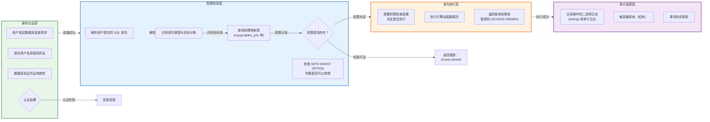
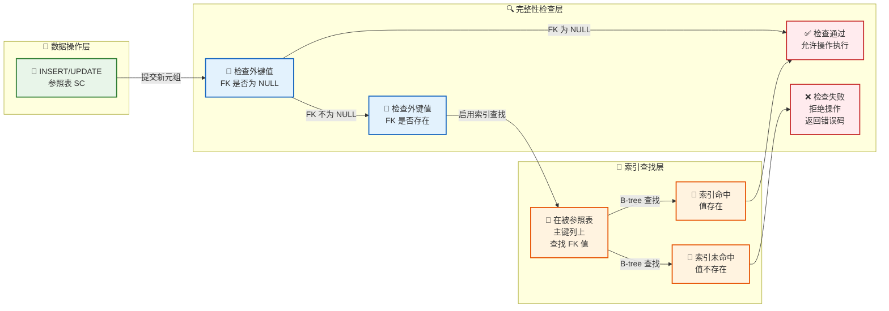

---

# 安全性与完整性

---

## 数据库安全性（权限管理、GRANT/REVOKE）

### 数据库安全性的本质与重要性

数据库安全性（Database Security）是指保护数据库系统免受未经授权的访问、篡改、泄露和破坏的整套机制与技术。在企业级应用中，数据库往往存储着最核心的商业数据——客户信息、财务记录、知识产权、用户隐私——这些数据的价值远超应用代码本身。一旦数据库遭受攻击或发生泄露，其后果往往是灾难性的，不仅可能导致直接的经济损失，还会引发法律责任和信誉危机。因此，数据库安全性不是事后的补丁，而是数据库系统设计之初就必须纳入核心架构的根基性要素。

从数据库系统架构的角度来看，安全性是一个多层次的概念。我们通常从**身份认证**（Authentication）、**访问控制**（Authorization）、**审计追踪**（Auditing）和**数据加密**（Encryption）四个维度来构建完整的安全防护体系。身份认证解决的是"你是谁"的问题，确保只有持有合法凭证的用户才能进入数据库系统；访问控制解决的是"你能做什么"的问题，在用户通过认证之后，根据预设的权限规则决定其对数据库对象的操作范围；审计追踪解决的是"你做了什么"的问题，通过日志记录确保所有操作的透明性和可追溯性；数据加密则解决的是"数据如何保护"的问题，即使攻击者突破了前面的防线，仍然无法直接读取敏感数据的内容。

在关系型数据库管理系统（RDBMS）中，SQL 标准定义了一套完整的**自主访问控制**（Discretionary Access Control, DAC）机制。这套机制的核心思想是：数据库管理员（或对象所有者）可以为不同的用户或角色授予不同的权限，用户可以在自己的权限范围内自主地决定是否将权限转授给他人。这种设计既灵活又实用，使得权限管理能够适应组织内部复杂的业务协作关系。与之对应的是**强制访问控制**（Mandatory Access Control, MAC），后者基于安全标签体系，通常用于军事或政府等高安全等级场景，在通用商业数据库中应用较少，本章不做深入展开。

理解数据库安全性的另一个重要视角是**最小权限原则**（Principle of Least Privilege）。这一原则要求系统中的每个主体（用户、程序、进程）只被授予完成其任务所必需的最小权限集合，不多也不少。最小权限原则是数据库安全设计的核心指导思想，它从根本上缩小了攻击面：即使某个账户被攻破，攻击者所能造成的损害也被限制在最小范围内。在实际工程实践中，遵循最小权限原则还意味着应当避免使用数据库管理员（DBA）账号运行应用程序、为不同用途的应用创建独立的数据库账户、定期审查并撤销不再需要的权限等一系列具体实践。

### 权限的类型与层次结构

关系型数据库中的权限体系是一个精心设计的层次结构，不同层级的权限控制着不同粒度的数据库操作。理解这一层次结构是掌握 GRANT/REVOKE 机制的前提。

#### 数据库级权限（Database-Level Privileges）

数据库级权限是最顶层的权限单位，它控制着用户对整个数据库的基本连接能力。在 MySQL 中，当管理员使用 `CREATE DATABASE` 语句创建数据库时，该语句的默认行为是为创建者授予对该数据库的全部权限（包括以后创建的所有表）。这类权限的典型代表是 `CREATE` 权限，它允许用户在数据库中创建新的表、视图、索引等对象。需要特别注意的是，`CREATE` 权限的授予对象通常是开发人员或数据建模工程师，而非普通应用程序用户——后者只需要对特定表进行增删改查操作即可。

#### 表级权限（Table-Level Privileges）

表级权限是数据库权限管理中最常用也最精细的层级。在标准 SQL 中，表级权限包括以下几种核心类型：

**SELECT 权限**允许用户执行查询操作，即从表中读取数据。这是只读应用账户最基本的权限，也是数据分析师、业务报表系统最常被授予的权限。授予 SELECT 权限意味着用户可以执行 `SELECT` 语句读取数据，但不能修改、删除或新增任何记录。

**INSERT 权限**允许用户执行插入操作，即向表中添加新记录。持有 INSERT 权限的用户可以执行 `INSERT INTO ... VALUES ...` 语句或 `INSERT INTO ... SELECT ...` 语句。需要特别关注的是，INSERT 操作可能触发的触发器（Trigger）也会以同样的权限上下文中执行，这意味着即使一个用户只被授予了 INSERT 权限，如果表上定义了具有副作用的触发器，该用户的行为边界可能会超出单纯的数据插入。

**UPDATE 权限**允许用户修改表中已有的数据。`UPDATE` 权限有两种授予方式：一种是授予对整个表的 UPDATE 权限，用户可以修改任意行的任意列；另一种是授予对特定列的 UPDATE 权限，用户只能修改指定的列子集。后者提供了更细粒度的控制能力，例如可以允许用户修改客户的联系方式但不能修改其账户余额。

**DELETE 权限**允许用户删除表中的记录。持有 DELETE 权限的用户可以执行 `DELETE FROM ... WHERE ...` 语句删除满足条件的行。值得注意的是，`DELETE` 权限与 `DROP TABLE` 权限是完全不同的——前者只允许删除数据行，后者允许删除整个表结构，后者属于更高级别的 DDL（Data Definition Language）权限。

**REFERENCES 权限**是一个在教学中容易被忽视但在实践中非常重要的权限类型。当一个用户试图创建外键约束引用某张表时，数据库系统需要确保被引用的表不会被随意删除或修改，从而保证参照完整性。REFERENCES 权限就是为这种场景设计的——它控制用户是否可以在其他表中创建引用该表的外键。

#### 列级权限（Column-Level Privileges）

列级权限是表级权限的进一步细化，它允许管理员精确控制到表中的每一列。在标准 SQL:1999 规范中，GRANT 语句支持如下语法来授予列级权限：

```sql
-- sql
-- 将员工表的姓名和部门列的 INSERT 和 UPDATE 权限授予招聘专员角色
-- 该角色只能操作指定的列，无法触及工资、社会保障号等敏感字段
GRANT INSERT(emp_name, department_id), UPDATE(emp_name, department_id)
ON TABLE employees
TO 'recruiter_role'@'localhost';
```

列级权限在敏感数据保护中具有不可替代的价值。想象一个银行系统中，柜员需要更新客户的联系方式，但绝对不能接触账户余额或信用评分。通过列级权限，系统可以在数据库层面实现这一隔离，即使应用程序代码存在漏洞或被恶意篡改，攻击者也无法通过 SQL 注入等手段获取敏感列的数据。这种防御深度正是数据库安全"纵深防御"（Defense in Depth）理念的体现。

#### 索引级、视图级与存储过程级权限

除了对表本身的操作权限外，SQL 标准还定义了针对索引、视图和存储过程等数据库对象的权限。`INDEX` 权限允许用户创建或删除索引，这在 MySQL 中直接关联到查询性能的优化；`ALTER` 权限允许用户修改表结构（如添加列、修改数据类型），这是一个极其敏感的权限，因为它可能间接影响数据的完整性和业务逻辑；`CREATE VIEW` 权限允许用户创建视图，而视图本质上是一个预定义的查询，它本身也可以被授予 SELECT 等权限，从而实现复杂的数据访问控制策略。

存储过程和函数（Stored Routines）的执行权限是另一个值得深入讨论的话题。当一个存储过程被创建时，其权限检查发生在两个层面：**创建时检查**（Definer's Rights）和**执行时检查**（Invoker's Rights）。如果存储过程使用创建者权限（DEFINER = 创建者），那么执行该过程的用户不需要直接持有过程内部所访问对象的权限——所有操作以创建者的身份执行。这是一种"权限提升"机制，使用得当可以简化权限管理，使用不当则可能成为安全漏洞。SQL:2003 标准引入了 `INVOKER` 安全域的概念，允许管理员选择让存储过程以调用者的权限执行，从而强制调用者必须持有底层对象的相应权限。

### GRANT 语句：权限授予机制详解

`GRANT` 语句是数据库权限管理的第一入口。它的设计哲学体现了 SQL 语言对安全性的深刻理解——通过声明式的方式，将复杂的权限分配逻辑转化为可读、可审计、可撤销的指令。

#### 基本语法结构

标准 SQL 中的 GRANT 语句遵循以下基本语法框架：

```sql
-- sql
-- 将表 employees 上的 SELECT 权限授予用户 alice
-- WITH GRANT OPTION 允许 alice 将该权限转授给他人
GRANT SELECT
ON TABLE employees
TO 'alice'@'hostname'
IDENTIFIED BY 'alice_password'
WITH GRANT OPTION;
```

上述语句包含几个关键组成部分。首先是权限列表（`SELECT`），它定义了被授予的操作类型，可以同时列出多个权限以英文逗号分隔。其次是 `ON` 子句，它指定了权限的作用对象，使用 `TABLE` 关键字明确指出这是一个表级权限（标准 SQL 中 `TABLE` 关键字是可选的，但显式写出可以提高语句的可读性和明确性）。`TO` 子句标识了权限的接收者，可以是单个用户名、角色名或 `PUBLIC`（表示所有用户）。`IDENTIFIED BY` 子句在 MySQL 等数据库中用于同时完成用户创建和权限授予，这在初始化新用户时非常方便。`WITH GRANT OPTION` 是一个可选但极其重要的子句，它赋予了接收者将相同权限进一步授予他人的能力。

#### 角色：权限的逻辑分组

在复杂的生产环境中，直接为每个用户分配单个权限很快就会变成一场管理噩梦。假设一个有 1000 名员工的银行需要为柜员、大堂经理、信贷专员、风控分析师等数十种角色分别配置不同的权限组合，如果为每个用户逐一分配权限，权限清单将变得不可维护。角色的出现完美地解决了这个问题。

角色（Role）是一个命名的权限集合，它充当权限与用户之间的中介层。管理员首先定义各种角色并为每个角色授予所需的权限集合，然后将用户分配给相应的角色。一个用户可以被分配多个角色，这在业务场景中非常自然——例如一个网点的负责人可能同时具有"柜员"和"网点管理"的角色。角色的另一个重要特性是**角色激活**（Role Activation）——在某些数据库系统中，用户会话默认不会启用所有被授予的角色，用户需要显式地 `SET ROLE` 来激活特定角色，从而进一步限制了权限在特定上下文中被意外使用的风险。

```sql
-- sql
-- 步骤一：创建各种业务角色
CREATE ROLE 'teller_role';          -- 柜员角色
CREATE ROLE 'manager_role';          -- 经理角色
CREATE ROLE 'auditor_role';          -- 审计员角色

-- 步骤二：为柜员角色授予基础权限
-- 柜员可以查询客户信息、办理存取款业务、查询交易流水
GRANT SELECT, INSERT ON TABLE customers TO 'teller_role';
GRANT SELECT, INSERT, UPDATE ON TABLE accounts TO 'teller_role';
GRANT SELECT ON TABLE transactions TO 'teller_role';

-- 步骤三：为经理角色授予更高级的权限
-- 经理在柜员权限基础上，增加了账户销户、交易审核等权限
GRANT DELETE ON TABLE accounts TO 'manager_role';
GRANT ALL PRIVILEGES ON TABLE employees TO 'manager_role';
-- 注意：ALL PRIVILEGES 并不等同于授予所有可能的权限，它只包含
-- INSERT, SELECT, UPDATE, DELETE, REFERENCES, INDEX, ALTER, CREATE, DROP
-- 不包括 GRANT OPTION 和 DDL 之外的特殊权限

-- 步骤四：将角色分配给具体用户
GRANT 'teller_role' TO 'zhang_san'@'localhost';
GRANT 'manager_role' TO 'li_si'@'localhost';
-- 一个用户可以同时属于多个角色
GRANT 'teller_role', 'manager_role' TO 'wang_wu'@'localhost';

-- 步骤五：设置默认激活的角色
-- 用户连接数据库时，自动启用 teller_role
SET DEFAULT ROLE 'teller_role' FOR 'zhang_san'@'localhost';
```

角色的引入不仅简化了权限管理，还增强了系统的可审计性——当需要调整所有柜员的权限时，管理员只需修改 `teller_role` 角色的权限定义，无需逐个修改数百个用户账户。同时，角色名本身就可以成为安全审计日志中的有意义标识，比起一串用户 ID，角色名更容易理解权限变更的业务意图。

#### WITH GRANT OPTION 的传递机制

`WITH GRANT OPTION` 赋予了其接收者将相同权限转授给他人的能力，这形成了一条**权限传递链**（Privilege Propagation Chain）。理解这条链的行为模式对于安全管理员至关重要，因为它可能导致权限在不经意间扩散到超出预期的范围。

考虑以下场景：管理员将 `SELECT ON employees` 权限授予用户 A，并附带了 `WITH GRANT OPTION`。用户 A 将此权限转授给用户 B，同样带有 `WITH GRANT OPTION`。用户 B 又将 `SELECT ON employees` 转授给用户 C。此时，如果管理员决定撤销用户 A 的权限，那么根据不同的数据库实现，权限撤销可能产生**级联效应**（Cascading Revoke）——用户 B 和 C 的权限可能同时被自动撤销，因为这些权限的根源已经被切断。这种级联撤销机制确保了权限管理的一致性，但管理员在进行权限回收时需要充分意识到其影响范围。

MySQL 在权限撤销方面采用了一个重要的设计原则：**权限不会跨授权路径独立存在**。也就是说，当 A 授予 B 权限后，如果管理员再次授予 A 相同的权限，新授予的权限与之前的授权路径是独立的。撤销时，只有撤销操作的发起者对应的授权路径会被移除，其他路径的授权不受影响。这种设计避免了"一人撤销影响全局"的过度级联效应。

### REVOKE 语句：权限撤销机制详解

权限的生命周期并不止于授予。在实际运行中，员工的岗位调动、项目结束、账户注销等情况都需要将已授予的权限及时回收。`REVOKE` 语句正是为此设计的——它是 GRANT 的逆操作，用于从用户或角色处撤销已授予的权限。

#### 基本语法与行为

```sql
-- sql
-- 撤销用户 alice 对 employees 表的 SELECT 权限
-- RESTRICT 关键字表示如果该权限已被转授出去，则拒绝撤销操作
-- 管理员需要先撤销所有下游的转授，然后再执行此撤销操作
REVOKE SELECT
ON TABLE employees
FROM 'alice'@'hostname'
RESTRICT;

-- 撤销权限并同时撤销 GRANT OPTION
-- 如果 alice 曾将权限转授给其他人，这些下游授权也会被撤销
REVOKE GRANT OPTION ON SELECT
ON TABLE employees
FROM 'alice'@'hostname';
```

`REVOKE` 语句在语义上需要处理一个微妙的问题：当被撤销的权限曾经被持有者转授给他人时，这些下游的授权是否应该一并撤销？SQL 标准默认采用级联（CASCADE）行为，即撤销权限会自动清除所有通过该权限建立的下游授权。但在 MySQL 等数据库中，可以通过 `RESTRICT` 关键字显式禁止这种级联行为，要求管理员在撤销前先手动清理所有下游授权。

#### 权限状态的查看

作为安全管理员，日常工作中最频繁的操作之一就是查看当前数据库中的权限分配情况。MySQL 提供了一组系统表和命令用于此目的：

```sql
-- sql
-- 查看当前 MySQL 用户及其全局权限
-- mysql.user 表存储了每个用户的认证信息和全局权限
SELECT user, host, select_priv, insert_priv, update_priv, delete_priv
FROM mysql.user
WHERE user = 'alice';

-- 查看某个用户对特定数据库的权限
-- mysql.db 表记录了数据库级别的权限分配
SELECT db, user, host, select_priv, insert_priv, update_priv, delete_priv
FROM mysql.db
WHERE user = 'alice' AND db = 'hr_system';

-- 查看某个用户对特定表的权限
-- mysql.tables_priv 表记录了表级和列级的详细权限信息
SELECT * FROM mysql.tables_priv
WHERE user = 'alice';

-- 查看某个用户对特定列的权限
-- mysql.columns_priv 表记录了列级权限的详细信息
SELECT * FROM mysql.columns_priv
WHERE user = 'alice';

-- 使用 SHOW GRANTS 命令快速查看用户的完整权限清单
-- 这是 DBA 日常巡检中最常用的命令
SHOW GRANTS FOR 'alice'@'hostname';

-- 查看所有用户的权限总览（需要管理员权限）
SHOW GRANTS FOR PUBLIC;  -- 查看授予 PUBLIC（所有用户）的权限
```

这些系统表和命令构成了数据库安全管理的"眼睛"。通过定期查询这些信息，管理员可以及时发现异常权限分配，如非预期的宽泛权限、长期不活跃但仍持有高权限的账户、权限继承链条过长等潜在安全风险。

### Android 中的数据库安全实践

在 Android 应用开发中，数据库安全性面临着独特的挑战。与服务端数据库直接由 DBA 管理不同，Android 应用中的数据库（通常基于 SQLite）运行在终端用户设备上，面临着应用被逆向工程、设备被 root、数据被提取等多重威胁。

#### SQLite 数据库的基本安全机制

Android 中使用 SQLite 数据库主要有两种方式：直接使用 `SQLiteOpenHelper` 类和通过 Room Persistence Library。两种方式在底层都依赖 SQLite 引擎，但在权限管理方面都存在固有的局限性。

SQLite 本身是一个嵌入式数据库，没有用户认证机制。任何运行在设备上的进程（只要获得了文件系统级别的访问权限）都可以直接打开并读写 SQLite 数据库文件。因此，**Android 数据库安全的第一道防线不是 SQLite 的权限系统，而是操作系统的应用沙箱机制**。Android 为每个应用分配了独立的 UID 和数据目录，其他应用默认无法访问该目录中的文件。数据库文件以 `0600` 的权限创建（即仅所有者可读写），这确保了数据库文件不会被其他应用直接读取。

#### 安全使用 SQLite 的工程实践

在 Android 项目中，数据库安全应当从以下几个方面入手：

**数据库文件的存储位置选择**。Android 提供了多个可以存储数据库的位置，每个位置具有不同的安全级别。使用应用私有目录（通过 `context.getDatabasePath()` 或 `getFilesDir()` 获取）是最安全的选择，该目录受到 Android 沙箱机制的保护。使用外部存储（SD 卡等）存储数据库文件是极其危险的做法，因为外部存储对所有应用可见，且在设备连接电脑时可以被直接挂载读取。

```kotlin
// kotlin
// 安全实践：在应用私有目录中创建数据库
class SecureDatabaseHelper(context: Context) : SQLiteOpenHelper(
    context,
    "secure_app.db",           // 数据库文件名，位于应用私有目录
    null,                       // 使用默认的 CursorFactory
    1,                          // 数据库版本号
    SQLiteDatabase.OPEN_READWRITE or SQLiteDatabase.CREATE_IF_NECESSARY
) {
    // 数据库文件路径示例：/data/data/com.example.app/databases/secure_app.db
    // 该路径受到 Android Linux 内核级别的 UID 隔离保护

    override fun onCreate(db: SQLiteDatabase) {
        db.execSQL("""
            CREATE TABLE IF NOT EXISTS user_credentials (
                id INTEGER PRIMARY KEY AUTOINCREMENT,
                -- 绝对不要在设备端存储明文密码！
                -- 正确做法：存储密码的加盐哈希值
                password_hash TEXT NOT NULL,
                salt TEXT NOT NULL,
                created_at INTEGER NOT NULL
            )
        """.trimIndent())
    }
}
```

**敏感数据的加密存储**。当数据库中存储敏感信息（如用户凭证、隐私数据）时，应当使用数据库加密机制。SQLCipher 是一个广泛使用的 SQLite 加密扩展，它在 SQLCipher Android 版本中通过替换标准 Android SQLite 库来实现透明的数据库级加密。使用时只需要在打开数据库时提供加密密钥：

```kotlin
// kotlin
// 使用 SQLCipher 对数据库进行加密
// 需要在 build.gradle 中添加依赖：net.zetetic:android-database-sqlcipher:4.5.4
class EncryptedDatabaseHelper(
    private val context: Context,
    private val passphrase: ByteArray  // 密钥，应当来源于用户输入或安全存储
) : SQLiteOpenHelper(context, DATABASE_NAME, null, DATABASE_VERSION) {

    private val database: SQLiteDatabase
        get() {
            // 加载 SQLCipher 原生库
            System.loadLibrary("sqlcipher")
            // 通过 SupportFactory 创建支持加密的数据库实例
            val factory = SupportFactory(passphrase)
            return database
        }

    // 加密密钥的管理是整个方案中最关键也最困难的部分
    // 绝对不要将密钥硬编码在源代码中——这相当于把钥匙放在锁旁边
    // 推荐使用 Android Keystore 系统来安全地存储和获取密钥
}
```

**Android Keystore 的集成使用**。Android Keystore 是系统级密钥存储服务，它将加密密钥存储在硬件安全模块（HSM）或软件实现的安全容器中，对应用进程不可直接导出。对于需要加密本地数据库的应用，推荐使用 Keystore 生成一个数据加密密钥（DEK），然后用 DEK 加密数据库。具体做法是：用 Keystore 生成的密钥加密一个随机生成的数据库密钥（DBEK），将加密后的 DBEK 存储在 SharedPreferences 或文件系统中，应用启动时从 Keystore 获取解密密钥来解锁 DBEK，进而打开数据库。

```kotlin
// kotlin
// 使用 Android Keystore 安全地管理数据库加密密钥
object KeystoreManager {
    private const val KEY_ALIAS = "database_encryption_key"
    private const val ANDROID_KEYSTORE = "AndroidKeyStore"
    private const val PREFS_NAME = "secure_prefs"
    private const val ENCRYPTED_KEY_PREF = "encrypted_db_key"

    fun getOrCreateDatabaseKey(context: Context): ByteArray {
        val sharedPrefs = context.getSharedPreferences(PREFS_NAME, Context.MODE_PRIVATE)

        // 方案流程：
        // 1. 尝试从 SharedPreferences 中加载已加密存储的数据库密钥
        // 2. 如果不存在，则生成一个新的随机数据库密钥
        // 3. 用 Keystore 中的主密钥对数据库密钥进行加密后存储
        // 4. 返回解密后的数据库密钥供 SQLCipher 使用

        val encryptedKeyBase64 = sharedPrefs.getString(ENCRYPTED_KEY_PREF, null)

        return if (encryptedKeyBase64 != null) {
            // 已存在密钥，需要解密后使用
            val encryptedKey = android.util.Base64.decode(encryptedKeyBase64, android.util.Base64.DEFAULT)
            decryptKey(encryptedKey)  // 使用 Keystore 密钥解密
        } else {
            // 首次运行，需要生成并存储新密钥
            val newKey = generateRandomDatabaseKey()
            val encryptedKey = encryptKey(newKey)  // 用 Keystore 加密
            sharedPrefs.edit()
                .putString(ENCRYPTED_KEY_PREF, android.util.Base64.encodeToString(encryptedKey, android.util.Base64.DEFAULT))
                .apply()
            newKey
        }
    }

    private fun generateRandomDatabaseKey(): ByteArray {
        // 生成 256 位的随机数据库密钥
        val keyGenerator = KeyGenerator.getInstance("AES")
        keyGenerator.init(256, SecureRandom())
        return keyGenerator.generateKey().encoded
    }

    private fun encryptKey(key: ByteArray): ByteArray {
        // 获取或创建 Keystore 中的主密钥（用于加密数据库密钥）
        val keyStore = KeyStore.getInstance(ANDROID_KEYSTORE).apply { load(null) }

        val masterKey: SecretKey = if (keyStore.containsAlias(KEY_ALIAS)) {
            // 已存在，直接加载
            (keyStore.getEntry(KEY_ALIAS, null) as KeyStore.SecretKeyEntry).secretKey
        } else {
            // 创建新的主密钥，设置在设备重启后仍可使用（user-authenticated 暂不要求）
            val keyGenerator = KeyGenerator.getInstance(
                KeyProperties.KEY_ALGORITHM_AES,
                ANDROID_KEYSTORE
            )
            val spec = KeyGenParameterSpec.Builder(
                KEY_ALIAS,
                KeyProperties.PURPOSE_ENCRYPT or KeyProperties.PURPOSE_DECRYPT
            )
                .setBlockModes(KeyProperties.BLOCK_MODE_GCM)
                .setEncryptionPaddings(KeyProperties.ENCRYPTION_PADDING_NONE)
                .setKeySize(256)
                .setUserAuthenticationRequired(false)  // 若设为 true，需配合生物认证
                .build()

            keyGenerator.init(spec)
            keyGenerator.generateKey()
        }

        // 使用主密钥加密数据库密钥
        val cipher = Cipher.getInstance("AES/GCM/NoPadding")
        cipher.init(Cipher.ENCRYPT_MODE, masterKey)
        val encryptedBytes = cipher.doFinal(key)
        // 将 IV 和密文合并存储（GCM 模式需要 IV 进行解密）
        return cipher.iv + encryptedBytes
    }

    private fun decryptKey(encryptedKey: ByteArray): ByteArray {
        // 从存储的加密密钥中提取 IV 和密文
        val iv = encryptedKey.copyOfRange(0, 12)  // GCM 模式的 IV 固定 12 字节
        val cipherText = encryptedKey.copyOfRange(12, encryptedKey.size)

        val keyStore = KeyStore.getInstance(ANDROID_KEYSTORE).apply { load(null) }
        val masterKey = (keyStore.getEntry(KEY_ALIAS, null) as KeyStore.SecretKeyEntry).secretKey

        val cipher = Cipher.getInstance("AES/GCM/NoPadding")
        cipher.init(Cipher.DECRYPT_MODE, masterKey, GCMParameterSpec(128, iv))
        return cipher.doFinal(cipherText)
    }
}
```

#### Room 框架中的安全考量

Room 是 Google 推荐的 Android 持久化库，它在 SQLite 之上提供了编译时验证和抽象层。虽然 Room 本身不直接管理权限，但其使用方式涉及几个安全要点：

使用 Room 时，数据库的访问应当通过 Repository 模式进行封装，避免 DAO（Data Access Object）直接在 UI 层被调用。Repository 层负责统一管理数据来源、处理缓存策略，并在必要时执行加密/解密操作。这样做的好处是，即使需要修改加密策略或切换存储后端，上层代码无需改动，符合"安全设计中的单一信任边界"原则。

```kotlin
// kotlin
// Repository 模式中的安全数据访问
class SecureUserRepository(
    private val userDao: UserDao,
    private val encryptedPreferences: EncryptedSharedPreferences
) {
    // Repository 作为数据访问的统一入口
    // 在此处可以集中处理安全相关的逻辑，如：
    // - 验证用户权限后再执行操作
    // - 对敏感字段进行脱敏处理后再返回给 UI 层
    // - 记录安全审计日志

    suspend fun getUser(userId: Long): User? {
        // 安全检查：在返回用户数据前，验证调用者是否有权访问
        val callerUid = android.os.Process.myUid()
        if (!hasAccessPermission(callerUid, userId)) {
            // 记录未授权访问尝试
            logSecurityEvent("Unauthorized access attempt: uid=$callerUid to user=$userId")
            return null
        }

        val user = userDao.getUserById(userId)
        // 脱敏处理：即使有访问权限，也不应将某些敏感字段直接暴露给 UI
        return user?.copy(
            // 例如：即使柜员可以查询客户，也不应看到完整的身份证号
            // 保留前三位和后四位，中间用星号替代
            idNumber = maskSensitiveField(user.idNumber),
            phoneNumber = maskSensitiveField(user.phoneNumber)
        )
    }

    private fun maskSensitiveField(value: String): String {
        if (value.length <= 7) return "****"
        return value.substring(0, 3) + "****" + value.substring(value.length - 4)
    }
}
```

### 权限管理的最佳实践与安全策略

#### 最小权限原则的具体实施

在生产环境中落实最小权限原则，需要从以下几个维度持续努力：

**基于角色的权限分配**。永远不要为应用账户授予超过其实际需求的权限。一个只负责读取数据的报表系统，只需要 `SELECT` 权限，不应持有 `INSERT`、`UPDATE` 或 `DELETE` 权限。在 MySQL 中，这可以通过分别创建只读账户和读写账户来实现，应用程序根据不同的操作类型使用相应的账户连接数据库。

**权限的及时回收**。员工离职、项目交接、岗位调动时，必须及时撤销其数据库账户或至少移除不再需要的权限。这不仅仅是安全最佳实践，在合规性审计（如 SOC 2、ISO 27001）中也是强制要求。许多数据泄露事件的事后分析表明，攻击者正是利用了已离职员工的长期有效凭证获得了未授权访问权限。

**定期的权限审计**。建议建立定期的权限审查机制，例如每季度审查一次所有数据库账户的权限分配，识别并清理以下几类问题：权限过宽的账户（如 DBA 权限授予了普通开发人员）、长期不活跃但权限仍有效的僵尸账户（Stale Accounts）、权限授予链条过长导致追踪困难的复杂授权关系。

```sql
-- sql
-- MySQL 安全审计查询：识别权限过宽的账户
-- 查找持有 DELETE 或 DROP 权限的非管理员账户
SELECT
    u.user,
    u.host,
    -- 将用户的权限汇总为一个易于阅读的列表
    GROUP_CONCAT(DISTINCT
        CASE
            WHEN p.db IS NULL AND p.table_name IS NULL THEN CONCAT('GLOBAL:', p Select_priv)
            WHEN p.table_name IS NOT NULL THEN CONCAT(p.db, '.', p.table_name, ':',
                IF(p.select_priv='Y','SELECT,',''),
                IF(p.insert_priv='Y','INSERT,',''),
                IF(p.update_priv='Y','UPDATE,',''),
                IF(p.delete_priv='Y','DELETE,',''),
                IF(p.drop_priv='Y','DROP,',''),
                IF(p.grant_priv='Y','GRANT,','')
            )
            ELSE CONCAT(p.db, ':',
                IF(p.select_priv='Y','SELECT,',''),
                IF(p.insert_priv='Y','INSERT,',''),
                IF(p.update_priv='Y','UPDATE,',''),
                IF(p.delete_priv='Y','DELETE,',''),
                IF(p.drop_priv='Y','DROP,',''),
                IF(p.grant_priv='Y','GRANT,','')
            )
        END
    ) AS privilege_summary
FROM mysql.user u
LEFT JOIN mysql.db p ON u.user = p.user AND u.host = p.host
WHERE u.user NOT IN ('root', 'mysql.infoschema', 'mysql.session', 'mysql.sys')
AND (u.delete_priv = 'Y' OR u.drop_priv = 'Y' OR u.grant_priv = 'Y'
     OR EXISTS (SELECT 1 FROM mysql.db pd WHERE pd.user = u.user
                AND (pd.delete_priv = 'Y' OR pd.drop_priv = 'Y')))
GROUP BY u.user, u.host;
```

#### 防止 SQL 注入与权限绕过的深层防御

即使数据库系统配置了严格的权限规则，应用程序代码中的 SQL 注入漏洞仍然可能成为权限绕过的通道。SQL 注入攻击的本质是攻击者通过在用户输入中注入 SQL 语句片段，改变应用程序构造查询的意图。在某些情况下，注入点恰好位于权限检查逻辑之前，攻击者可以通过注入改变查询的执行流程，使本应受到权限限制的查询返回额外的数据。

```java
// java
// 不安全的代码示例：直接拼接用户输入到 SQL 语句中
// 攻击者输入 "1; DROP TABLE users; --" 可能导致灾难性后果
public void searchUsers(String keyword) {
    // 危险！keyword 被直接拼接到 SQL 中
    String sql = "SELECT * FROM users WHERE name LIKE '%" + keyword + "%'";
    // 即使当前用户只有 SELECT 权限，
    // 某些数据库配置下注入的 DROP TABLE 仍可能被执行
    // 更常见的是通过 UNION 注入获取本无权限访问的表的数据
}

// 安全的代码示例：使用参数化查询
public void searchUsersSafe(String keyword) {
    // 参数化查询（PreparedStatement）确保用户输入被当作数据而非 SQL 代码
    String sql = "SELECT * FROM users WHERE name LIKE ?";
    PreparedStatement stmt = connection.prepareStatement(sql);
    stmt.setString(1, "%" + keyword + "%");
    ResultSet rs = stmt.executeQuery();
    // 输入中的任何 SQL 特殊字符（', ", ;, -- 等）都不会改变查询结构
}
```

深层防御（Defense in Depth）的理念在此处得到了充分体现：数据库层面的权限控制（GRANT/REVOKE）和应用层面的输入验证（参数化查询）共同构成了一道难以逾越的安全屏障。即使其中一层被突破，另一层仍然能够提供保护。这种"不信任任何单一防线"的设计思想，是数据库安全架构中最重要的指导原则。

### 权限管理的数据流与系统交互

为了更清晰地理解数据库权限管理在整个系统中的位置和作用，以下通过流程图展示一个典型请求从用户发起操作到数据库执行响应的完整安全检查流程。



从上述流程可以看出，权限检查发生在 SQL 语句执行之前，这是数据库安全架构中的关键设计决策——未授权的语句根本不会被执行引擎接收，从而确保了数据库内部状态不会因权限不足的请求而被意外修改。在 MySQL 中，这一检查由 `mysql.tables_priv`、`mysql.columns_priv` 和 `mysql.db` 等权限映射表驱动，每次查询都需要遍历这些系统表以确认用户是否持有必要的权限。这也是为什么在大规模数据库中，权限表的索引优化和查询效率对整体性能有显著影响。

---

#### 📝 练习题

在 MySQL 数据库中，现有以下权限配置：`GRANT SELECT, UPDATE ON employees TO 'alice'@'localhost' WITH GRANT OPTION;`，随后 `alice` 执行了 `GRANT SELECT ON employees TO 'bob'@'localhost';`。现在管理员执行 `REVOKE SELECT, UPDATE ON employees FROM 'alice'@'localhost';`。关于撤销后的权限状态，以下说法正确的是：

A. alice 和 bob 均失去对 employees 表的 SELECT 权限，但 bob 保留了 alice 转授时携带的 GRANT OPTION
B. alice 失去 SELECT 和 UPDATE 权限，bob 保留 SELECT 权限（因为 alice 转授的权限独立于管理员授予的权限路径）
C. alice 和 bob 均保留原有权限，因为 REVOKE 语句必须指定 CASCADE 才能级联撤销
D. alice 失去 SELECT 和 UPDATE 权限，bob 的 SELECT 权限被级联撤销（因为该权限的源头已被撤销）

**【答案】** D

**【解析】**

正确答案是 D。让我们深入分析 MySQL 中权限撤销的级联机制。

MySQL 的权限系统基于一个核心概念：**权限的授权路径**。当 alice 执行 `GRANT SELECT ON employees TO 'bob'@'localhost';` 时，bob 获得的这笔授权与管理员授予 alice 的那笔授权**不是独立的**——它们之间存在依赖关系。bob 的 SELECT 权限来源于 alice 的转授，而 alice 的转授权又来源于管理员授予的 `WITH GRANT OPTION`。当管理员执行 `REVOKE` 撤销 alice 的权限时，MySQL 会级联地撤销所有通过 alice 这个授权路径衍生出的下游权限，因为这些权限的"根"已经被移除。

选项 A 错误，因为 alice 转授时**不会**携带 GRANT OPTION。alice 持有的 `WITH GRANT OPTION` 是独立的权限标记，她转授给 bob 时只能授予 `SELECT` 权限本身，而不会同时授予 `WITH GRANT OPTION`——后者需要 alice 显式地在转授语句中包含。选项 B 的"独立路径"说法与 MySQL 的实际行为不符。选项 C 的错误在于，MySQL 的 `REVOKE` 在默认行为下**就是级联撤销**的（等价于隐含 `CASCADE`），除非显式指定 `RESTRICT` 关键字。但需要注意的是，在 MySQL 5.7 及之前的版本中，`RESTRICT` 的处理方式与标准 SQL 有所不同——它拒绝撤销的是那些被其他人通过 `GRANT OPTION` 再转授出去的权限，而不是简单阻止级联。

从安全管理的角度来看，级联撤销机制确保了权限管理的**自洽性**——不会出现一个用户撤销了某个权限，但该权限通过其他路径仍然存在的矛盾情况。这对于安全管理员来说既是保护也是提醒：在撤销某个用户的权限之前，必须先评估该用户是否曾经将权限转授给他人，撤销操作的影响范围可能远超直接授予的对象。

---

## 完整性约束（实体完整性、参照完整性、用户定义完整性）

### 引言

数据库的完整性（Integrity）是指数据库中数据的**正确性**和**一致性**。与安全性（Security）不同，安全性关注的是“防止未授权的访问和恶意破坏”，而完整性关注的是“防止合法用户因操作失误或系统故障而导致数据错误”。完整性约束（Integrity Constraint）正是保障数据库数据质量的核心手段，它定义了数据库状态必须满足的规则，任何违背这些规则的更新操作都必须被数据库管理系统（DBMS）拒绝执行。

从宏观角度来看，完整性约束可以划分为三大类：**实体完整性**（Entity Integrity）针对单个关系（表）内部的主键进行约束，确保每一条记录都能被唯一标识；**参照完整性**（Referential Integrity）针对两个或多个关系之间的外键关系进行约束，确保表与表之间引用的有效性；**用户定义完整性**（User-defined Integrity）则由用户根据具体的业务需求自行定义，涵盖了五花八门的业务规则。这三类约束从不同层面共同构筑了数据库的“数据质量防线”。

---

### 实体完整性

#### 基本概念

实体完整性规则规定：**在一个基本关系（base relation）中，主键（Primary Key, PK）的值不能为空（NULL），并且必须唯一地标识元组（tuple）**。换言之，主键列被强制施加了 NOT NULL 约束和 UNIQUE 约束——既不允许出现空值，也不允许出现重复值。

为什么实体完整性如此重要？我们可以从关系数据模型的基本理论来理解。在关系模型中，每一个实体（entity）对应关系中的一个元组，而主键的作用正是为每个实体提供一个**全局唯一且不可缺失的标识符**。这与现实世界中的身份证号码、员工编号等概念是一致的——一个人如果没有身份证号，在身份证管理系统中就失去了可辨识性，同样地，一个元组如果没有主键值，在数据库中就无法被唯一地定位、引用和操作。

从实现层面来看，实体完整性约束通常由 DBMS 自动维护。当用户向表中插入一条新记录时，如果主键列被留空（NULL），或者主键值与已有记录重复，DBMS 会立即检测到这一违规行为并拒绝执行插入操作，同时向用户返回一条错误信息。同样，在执行 UPDATE 操作修改主键值时，DBMS 也会进行相同的检查。

#### 主键约束的声明方式

在 SQL 标准中，主键约束既可以在 CREATE TABLE 语句创建表结构时声明，也可以在表创建之后通过 ALTER TABLE 语句添加。以下分别介绍这两种方式。

**在 CREATE TABLE 时声明主键**

```sql
CREATE TABLE Student (
    -- 学号作为主键，使用列级约束语法
    StudentID CHAR(10) PRIMARY KEY,
    StudentName VARCHAR(50) NOT NULL,
    Gender CHAR(1),
    BirthDate DATE,
    Major VARCHAR(50)
);
```

上述代码中，`PRIMARY KEY` 关键字直接跟在 `StudentID` 列的定义之后，这种方式称为**列级约束**（column-level constraint）。当主键由多个列组合而成（称为**复合主键**，composite primary key）时，必须使用**表级约束**（table-level constraint）语法：

```sql
CREATE TABLE SC (
    -- 成绩关系中，学号和课程号共同构成复合主键
    -- 单独看学号或课程号都不能唯一确定一条选课记录
    StudentID CHAR(10),
    CourseID CHAR(6),
    Grade DECIMAL(5,1),
    PRIMARY KEY (StudentID, CourseID)  -- 表级复合主键约束
);
```

在复合主键场景下，规则的含义是：`(StudentID, CourseID)` 这个组合值不能为空且不能重复。但请注意，复合主键中**单个列本身是允许为空值的**（如果 DBMS 没有额外施加 NOT NULL 约束的话）。不过在关系模型的严格语义下，主键整体不允许全部为空，因此复合主键中的每个列最好也显式加上 NOT NULL 约束，以确保主键的整体有效性。

**在表创建后添加主键**

如果一张表在设计之初没有声明主键，后来业务需求发生了变化（例如发现某个列组合可以作为自然主键），可以通过 ALTER TABLE 语句添加主键约束：

```sql
-- 假设原表没有主键，现在要将以 Email 列作为主键
ALTER TABLE Teacher
ADD CONSTRAINT PK_Teacher PRIMARY KEY (Email);
```

注意，这里使用了 `ADD CONSTRAINT` 语法并为约束指定了一个可选的名称 `PK_Teacher`。为约束命名是一个良好的实践，因为在后续操作中（如删除约束或定位错误信息时）需要一个可读的标识符。如果省略约束名，DBMS 会自动生成一个系统级的内部名称，这对调试和维护都是不利的。

#### 主键与唯一索引的区别

在许多 DBMS（如 MySQL 的 InnoDB 引擎）中，主键约束在物理层面会被实现为**聚集索引**（clustered index），而唯一约束（UNIQUE constraint）则被实现为**唯一索引**（unique index）。两者虽然都能保证值的唯一性，但存在若干关键差异：

第一，主键在每个表中**只能有一个**，而唯一约束可以有多个。例如一个 `User` 表可以有一个主键 `UserID`，同时对 `Email` 列和 `PhoneNumber` 列各施加一个唯一约束，分别保证邮箱和手机号不重复。

第二，主键列**隐含 NOT NULL 约束**，而唯一约束列**允许存在 NULL 值**（且在标准 SQL 中，唯一约束允许多个 NULL 值存在，因为 NULL 不等于 NULL）。

第三，聚集索引决定了数据的物理存储顺序（数据页按主键值排序存放），而唯一索引则不影响数据的物理布局。因此，选择哪个列作为主键不仅是一个逻辑设计问题，也是一个影响物理存储性能的决策。

---

### 参照完整性

#### 基本概念

参照完整性（Referential Integrity），有时也称为**引用完整性**，是维护数据库中表与表之间关系一致性的关键约束。它的核心规则可以表述为：**如果关系 R1 的某个属性（或属性组）FK 是参照关系 R2 主键 PK 的外键（Foreign Key），那么 FK 的值要么等于 R2 中某个元组的主键值，要么完全为空（NULL）**。

为了更清晰地理解这个概念，我们引入一个经典的例子——学生-选课数据库。考虑以下三个关系：

```sql
Student(SID, SName, Major)
Course(CID, CName, Credit)
SC(SID, CID, Grade)
```

其中，`SC`（选课）关系中的 `SID` 是参照 `Student` 表主键的外键，`CID` 是参照 `Course` 表主键的外键。这意味着：每一条选课记录中的学号必须对应一个真实存在的学生（否则就是一个“幽灵选课”），每一条选课记录中的课程号也必须对应一个真实存在的课程（否则就是选了一门不存在的课）。如果某条选课记录的学号在 `Student` 表中找不到对应的记录，则这条记录违反了参照完整性约束。

从语义上讲，参照完整性确保了数据库中所有引用关系的**有效闭合性**——所有外键值要么指向一个真实存在的被参照元组，要么明确表示“未参照任何对象”（NULL）。这种设计避免了“悬空引用”（dangling reference）问题，即避免了引用一个不存在的实体的尴尬情况。

#### 外键约束的声明方式

**在 CREATE TABLE 时声明外键**

```sql
-- 定义学生表（被参照表/父表）
CREATE TABLE Student (
    SID CHAR(10) PRIMARY KEY,
    SName VARCHAR(50) NOT NULL,
    Major VARCHAR(50)
);

-- 定义课程表（被参照表/父表）
CREATE TABLE Course (
    CID CHAR(6) PRIMARY KEY,
    CName VARCHAR(100) NOT NULL,
    Credit INT
);

-- 定义选课表（参照表/子表）
CREATE TABLE SC (
    SID CHAR(10),
    CID CHAR(6),
    Grade DECIMAL(4,1),
    PRIMARY KEY (SID, CID),
    -- 声明外键约束：指明 SID 列参照 Student 表的 SID 主键
    FOREIGN KEY (SID) REFERENCES Student(SID),
    -- 声明外键约束：指明 CID 列参照 Course 表的 CID 主键
    FOREIGN KEY (CID) REFERENCES Course(CID)
);
```

在上述代码中，`FOREIGN KEY (SID) REFERENCES Student(SID)` 的含义是：当前表（SC）中的 `SID` 列是外键，它参照 `Student` 表中 `SID` 列的值。`REFERENCES` 关键字后面跟随的是被参照表名（被参照列名），如果被参照列名与外键列名相同，可以简写为 `REFERENCES Student`，但为了代码的清晰可读性，建议始终显式写出被参照的列名。

**使用表级约束语法声明外键**

对于复合外键或需要为约束命名的情况，应采用表级约束语法：

```sql
CREATE TABLE SC (
    SID CHAR(10),
    CID CHAR(6),
    Grade DECIMAL(4,1),
    PRIMARY KEY (SID, CID),
    CONSTRAINT FK_SC_Student FOREIGN KEY (SID) REFERENCES Student(SID),
    CONSTRAINT FK_SC_Course FOREIGN KEY (CID) REFERENCES Course(CID)
);
```

#### 参照动作（Referential Actions）

参照完整性约束中最复杂也最灵活的部分是**参照动作**（referential action）。当被参照表中的元组被删除（DELETE）或主键值被修改（UPDATE）时，如果该元组正被参照表中的一个或多个外键引用，DBMS 必须决定如何处理这些“孤儿元组”。标准 SQL 定义了两种典型的场景和四种标准的处理策略：

**场景一：删除被参照元组（DELETE）**

假设要从 `Student` 表中删除一个学生记录，但该学生的学号已经在 `SC` 表中作为外键被引用。DBMS 必须决定如何处理这些选课记录。

**场景二：更新被参照主键（UPDATE）**

假设 `Student` 表中学号的编码规则发生了变化，需要修改某个学生的学号。同样的，DBMS 必须处理 `SC` 表中的外键引用。

针对上述两种场景，SQL 标准定义了四种参照动作：

**1. RESTRICT（限制）**

这是最严格的动作策略。当试图删除或修改一个被参照元组时，如果存在至少一个来自参照表的外键引用，DBMS 会**直接拒绝执行该操作**，并返回错误。这是一种“预防优先”的策略，确保没有任何引用关系被意外破坏。例如：

```sql
-- 尝试删除一个仍有选课记录的学生
DELETE FROM Student WHERE SID = '20230001';
-- 如果 SC 表中仍有该学号的记录，DBMS 将拒绝删除并报错
-- 错误信息类似：Cannot delete or update a parent row: a foreign key constraint fails
```

RESTRICT 是许多保守型数据库设计的首选参照动作，因为它最大限度地保护了数据一致性。

**2. CASCADE（级联）**

当被参照元组被删除或修改时，DBMS 会**自动将对应的参照表中的元组也一并删除或修改**。在级联删除的场景中，删除一个学生记录会导致该学生的所有选课记录被同时删除：

```sql
-- 定义外键约束时指定 ON DELETE CASCADE
CREATE TABLE SC (
    SID CHAR(10),
    CID CHAR(6),
    Grade DECIMAL(4,1),
    PRIMARY KEY (SID, CID),
    FOREIGN KEY (SID) REFERENCES Student(SID)
        ON DELETE CASCADE  -- 删除学生时，级联删除其所有选课记录
        ON UPDATE CASCADE  -- 修改学号时，级联更新所有选课记录中的学号
);
```

级联删除在逻辑上具有很强的“链式效应”，对于存在强层级关系的实体（如部门-员工、产品-订单明细）非常有用。但使用级联删除时需要格外谨慎——如果不小心删除了顶层节点，可能会导致大量底层数据被意外清除。在实际工程中，建议在执行级联删除操作之前，通过事务和日志进行充分的评估。

**3. SET NULL（置空）**

当被参照元组被删除或修改时，参照表中的对应外键值将被设置为 NULL。这意味着参照关系被“切断”，但参照表中的元组本身得以保留。这种策略适用于“软删除”场景——用户离职了，选课记录仍然保留但标记为“已作废”（学号为空）：

```sql
CREATE TABLE SC (
    SID CHAR(10),
    CID CHAR(6),
    Grade DECIMAL(4,1),
    PRIMARY KEY (SID, CID),
    FOREIGN KEY (SID) REFERENCES Student(SID)
        ON DELETE SET NULL  -- 学生被删除后，选课记录中学号设为 NULL
);
```

需要注意的是，使用 SET NULL 动作要求外键列本身允许 NULL 值。如果外键列被同时施加了 NOT NULL 约束，SET NULL 动作将无法正常工作。

**4. SET DEFAULT（设为默认值）**

当被参照元组被删除或修改时，参照表中的对应外键值将被设置为该列的默认值（DEFAULT）。例如，如果设置了一个特殊的学生编号 "WITHDRAWN" 作为“已退学”的标记，就可以使用 SET DEFAULT 策略：

```sql
CREATE TABLE SC (
    SID CHAR(10) DEFAULT 'UNKNOWN',
    CID CHAR(6),
    Grade DECIMAL(4,1),
    PRIMARY KEY (SID, CID),
    FOREIGN KEY (SID) REFERENCES Student(SID)
        ON DELETE SET DEFAULT  -- 学生被删除后，学号设为默认值 'UNKNOWN'
);
```

#### 参照完整性的实现机制

在 DBMS 的内部实现中，参照完整性的维护通常依赖于**索引**。当外键约束被声明时，DBMS 会在外键列上**自动创建一个索引**（在大多数主流 DBMS 中），以便快速检查一个外键值是否在父表中存在。没有索引的话，每次插入或修改参照表中的外键值时，DBMS 都必须对父表进行一次全表扫描来验证引用有效性，这在数据量大的情况下是难以接受的。

以 MySQL 的 InnoDB 引擎为例，它强制要求外键列和被参照列上都必须建立索引（这一要求并非所有 DBMS 都强制）。外键检查通过索引查找在 O(log n) 时间内完成。在 PostgreSQL 中类似，外键约束同样利用 B-tree 索引来加速参照检查。

以下 Mermaid 图展示了外键约束检查在 INSERT 和 UPDATE 操作中的执行流程：



从上图中可以看到，完整性检查并非一个简单的“比对”操作，而是一个涉及索引查询的完整流程。DBMS 首先判断外键值是否为空（如果是空值，按照参照完整性规则可以直接通过检查），然后在外键列的索引上执行查找操作。如果索引命中（外键值在父表中存在），操作继续执行；如果索引未命中，则拒绝操作并报错。

#### 自参照完整性

参照完整性不仅存在于两个不同的表之间，还可以出现在**同一张表的内部**，这种特殊的参照完整性称为**自参照完整性**（self-referential integrity）或**递归外键**（recursive foreign key）。一个典型的应用场景是组织结构表——每个员工都有一个上级经理，而经理本身也是员工：

```sql
CREATE TABLE Employee (
    EMP_ID CHAR(8) PRIMARY KEY,
    EMP_NAME VARCHAR(50) NOT NULL,
    MANAGER_ID CHAR(8),  -- 上级经理的工号
    TITLE VARCHAR(30),
    -- 自参照外键：MANAGER_ID 参照同一张表的 EMP_ID
    FOREIGN KEY (MANAGER_ID) REFERENCES Employee(EMP_ID)
        ON DELETE SET NULL   -- 经理离职时，将其设为 NULL（表示暂无上级）
        ON UPDATE CASCADE    -- 经理工号变更时，级联更新下属的 MANAGER_ID
);
```

在这个设计中，最高层级的员工（如 CEO）没有上级，其 `MANAGER_ID` 自然为空（NULL）。自参照结构在实际业务中非常常见，如菜单项的上级菜单、商品分类的父分类、任务负责人的上级负责人等。

---

### 用户定义完整性

#### 基本概念与地位

用户定义完整性（User-defined Integrity），也称为**语义完整性**（semantic integrity），是三类完整性约束中最灵活、覆盖面最广的一类。它不遵循任何预设的模型规则，而是由数据库设计者根据具体的业务需求和领域知识，自行定义和维护的数据约束条件。

如果说实体完整性和参照完整性解决的是“所有数据库系统共有的”数据一致性问题，那么用户定义完整性解决的就是“本系统特有的”业务规则问题。例如：

- 学生的年龄必须在 15 到 45 之间；
- 课程学分只能是 1、2、3、4 四个值之一；
- 考试成绩必须在 0 到 100 之间；
- 订单日期不能晚于发货日期；
- 教师的职称只能是“教授”、“副教授”、“讲师”、“助教”四种枚举值之一；
- 用户的密码长度不能少于 6 个字符。

这些规则没有统一的数学模型可以概括，每一条规则都反映了特定业务领域的专业知识和政策要求。因此，用户定义完整性约束的设计是数据库设计中最需要与业务方反复沟通的环节——设计者必须深入理解业务逻辑，才能准确地用 SQL 约束表达业务规则。

#### 列值约束（列级 CHECK 约束）

最直接的用户定义完整性实现方式是 **CHECK 约束**。CHECK 约束通过一个布尔表达式对列的值域进行限制，只有表达式求值结果为 TRUE 的 INSERT 或 UPDATE 才被允许。如果表达式求值为 FALSE 或 UNKNOWN（当涉及 NULL 值的比较时），操作将被拒绝。

**数值范围约束**

```sql
CREATE TABLE Student (
    SID CHAR(10) PRIMARY KEY,
    SName VARCHAR(50) NOT NULL,
    Age INT,
    -- 年龄必须在 15 到 45 岁之间
    CONSTRAINT CK_Student_Age CHECK (Age >= 15 AND Age <= 45),
    Gender CHAR(1),
    -- 性别只能是 'M' 或 'F'
    CONSTRAINT CK_Student_Gender CHECK (Gender IN ('M', 'F'))
);
```

上述代码中，`CK_Student_Age` 和 `CK_Student_Gender` 是分别为两个 CHECK 约束指定的名称。这种命名约定（以 `CK_` 前缀标识约束类型）虽然不是语法要求，但能够显著提升代码的可读性和可维护性。

**枚举值约束**

在不支持 ENUM 数据类型的 DBMS 中（如 PostgreSQL 15 之前的版本、MySQL 5.x），CHECK 约束是实现枚举类型的主要手段：

```sql
CREATE TABLE Teacher (
    TID CHAR(8) PRIMARY KEY,
    TName VARCHAR(50) NOT NULL,
    Title VARCHAR(20),
    -- 职称只能是以下四种之一
    CONSTRAINT CK_Teacher_Title
        CHECK (Title IN ('教授', '副教授', '讲师', '助教'))
);
```

**字符串模式约束**

CHECK 约束中还可以使用字符串函数来实现模式检查：

```sql
CREATE TABLE Student (
    SID CHAR(10) PRIMARY KEY,
    Email VARCHAR(100),
    -- 邮箱地址必须包含 '@' 符号
    CONSTRAINT CK_Student_Email CHECK (Email LIKE '%@%.%'),

    PhoneNumber CHAR(11),
    -- 手机号必须是 11 位纯数字
    CONSTRAINT CK_Student_Phone CHECK (PhoneNumber NOT LIKE '%[^0-9]%'
                                       AND LENGTH(PhoneNumber) = 11)
);
```

#### 表级 CHECK 约束

当约束条件涉及多个列之间的关系时（如比较两个列的值，或涉及同一行中多个列的逻辑关系），列级 CHECK 约束就无法满足需求了。此时需要使用**表级 CHECK 约束**——即在 CREATE TABLE 语句的末尾，在所有列定义之后统一声明的 CHECK 约束。

**跨列约束**

```sql
CREATE TABLE OrderInfo (
    OrderID CHAR(12) PRIMARY KEY,
    OrderDate DATE NOT NULL,
    ShipDate DATE,
    -- 发货日期必须不早于订单日期
    CONSTRAINT CK_Order_ShipDate CHECK (ShipDate IS NULL OR ShipDate >= OrderDate),

    TotalAmount DECIMAL(10,2),
    PaidAmount DECIMAL(10,2),
    -- 已支付金额不能超过订单总金额
    CONSTRAINT CK_Order_PaidAmount CHECK (PaidAmount <= TotalAmount)
);
```

在这个例子中，`CK_Order_ShipDate` 约束了 `ShipDate` 和 `OrderDate` 两个列之间的关系，`CK_Order_PaidAmount` 约束了 `TotalAmount` 和 `PaidAmount` 之间的关系。这些规则无法仅通过单列的 CHECK 约束来表达，因此必须使用表级语法。

**多行联合约束**

```sql
CREATE TABLE CourseEnrollment (
    StudentID CHAR(10) NOT NULL,
    CourseID CHAR(6) NOT NULL,
    EnrollmentYear INT,
    Semester INT,
    Grade DECIMAL(4,1),
    -- 复合主键：每个学生每门课只能有一条选课记录
    PRIMARY KEY (StudentID, CourseID),
    -- 学期编号必须是 1 或 2
    CONSTRAINT CK_Enrollment_Semester CHECK (Semester IN (1, 2)),
    -- 成绩只能在 0-100 之间，或者为空（表示尚未评分）
    CONSTRAINT CK_Enrollment_Grade CHECK (Grade IS NULL OR (Grade >= 0 AND Grade <= 100))
);
```

#### NOT NULL 约束的归属

从分类角度看，NOT NULL 约束（即“非空约束”）在 SQL 标准中并没有被明确归类到上述三类之一。在许多教材中，NOT NULL 被视为用户定义完整性的一部分，因为它本质上是对列值域的一种限制（不允许空值），其语义完全由用户根据业务需求决定。但在某些教学体系中，NOT NULL 被单独列出作为一个基础约束类型。

从实现机制上分析，NOT NULL 与 CHECK (Column IS NOT NULL) 在功能上是等价的。但 NOT NULL 作为一种语法糖，在语义清晰度和执行效率上通常优于等价的 CHECK 约束。因此，建议在需要禁止空值时优先使用 NOT NULL 关键字，而非通过 CHECK 约束来实现。

#### 约束的维护时机

DBMS 维护完整性约束的时机是一个容易被忽视但非常重要的细节。不同的 DBMS 在具体实现上可能有所差异，但总体而言，约束的检查遵循以下原则：

**INSERT 操作**：约束在数据实际写入之前进行检查。如果约束条件不满足，新行不会被插入到表中。

**UPDATE 操作**：约束检查同样在数据写入之前进行。特别需要注意的是，当 UPDATE 语句同时修改了多个列时，约束检查是对新值整体进行的——即要同时满足所有涉及的约束条件。

**DELETE 操作**：约束检查主要针对参照完整性约束（外键引用关系）。被删除的元组是否被参照表引用，由参照完整性约束来决定是否允许删除。

**事务中的延迟检查**：在标准 SQL 中，可以使用 `DEFERRABLE` 子句将约束检查的时机从每条语句后延迟到整个事务提交时（COMMIT 时）再进行检查。这在某些复杂的业务场景中非常有用——例如在一个事务中同时删除父记录和子记录：

```sql
-- 将外键约束设为 INITIALLY DEFERRED，意味着在事务提交时才检查
CREATE TABLE SC (
    SID CHAR(10),
    CID CHAR(6),
    Grade DECIMAL(4,1),
    PRIMARY KEY (SID, CID),
    CONSTRAINT FK_SC_Student FOREIGN KEY (SID) REFERENCES Student(SID)
        ON DELETE CASCADE
        DEFERRABLE INITIALLY DEFERRED  -- 延迟检查：在 COMMIT 时才验证
);
```

默认情况下（`NOT DEFERRABLE` 或 `DEFERRABLE INITIALLY IMMEDIATE`），约束检查在每条语句执行完毕后立即进行。如果在事务中途暂时违反了约束（例如先更新了子表再更新父表的过程中），即使最终事务结束时数据会恢复到一致状态，DBMS 也会立即报错。

#### 约束的验证与违反处理

当数据操作违反了完整性约束时，DBMS 通常会返回一个错误消息。以 MySQL 为例，违反不同类型的约束会返回不同的错误代码：

| 约束类型 | 错误代码 | 典型错误信息 |
|---------|---------|-------------|
| 主键冲突（实体完整性） | 1062 | Duplicate entry 'xxx' for key 'PRIMARY' |
| 外键冲突（参照完整性） | 1452 | Cannot add or update a child row: a foreign key constraint fails |
| CHECK 约束违反 | 3819 | Check constraint 'CK_xxx' violated |
| NOT NULL 约束违反 | 1048 | Column 'xxx' cannot be null |

值得注意的是，**MySQL 的 MyISAM 引擎曾经不支持 CHECK 约束**（语法上接受但实际忽略），直到 MySQL 8.0.16 之后，InnoDB 引擎才真正实现了 CHECK 约束的检查功能。这导致了许多早期基于 MySQL 的项目在使用 CHECK 约束时“看起来声明了但实际上没有生效”的隐患。因此，在使用 CHECK 约束时，了解目标 DBMS 的版本和存储引擎支持情况是非常必要的。

#### 在 Android 应用层处理约束违反

当 Android 应用通过 Room 库或其他方式向 SQLite 数据库提交的数据违反了完整性约束时，SQLite 会抛出 `SQLiteConstraintException` 异常。Android 应用需要妥善处理这类异常，通常的策略包括：

```kotlin
// Android/Kotlin - 在 Repository 层处理约束违反异常
try {
    // 尝试插入一条新的学生记录
    studentDao.insert(student)
} catch (e: SQLiteConstraintException) {
    // 检测到完整性约束违反（如主键冲突或外键冲突）
    Log.e("DatabaseError", "数据完整性约束被违反: ${e.message}")
    // 根据业务需求决定如何处理：
    // 方案一：向用户显示友好的错误提示
    // 方案二：自动修正（如生成新的主键值后重试）
    // 方案三：记录日志并回滚事务
}
```

在 Android 开发中，Room 库通过 `@Entity` 注解中的 `primaryKeys`、`foreignKeys` 和 `check` 属性来支持上述三种完整性约束的定义。Room 在编译时生成的数据库 schema 和 SQLite 触发器会自动维护这些约束，其底层机制与原生 SQL 完全一致。

---

### 完整性约束与性能的关系

完整性约束在保障数据质量的同时，也会带来一定的性能开销。每当执行 INSERT、UPDATE、DELETE 操作时，DBMS 都需要验证相关约束是否被满足。如果约束涉及外键检查，DBMS 可能需要进行索引查找甚至跨表扫描来验证引用的有效性。

在极端高并发写入场景下，大量并发的约束检查可能成为系统的性能瓶颈。常见的优化策略包括：

**批量插入优化**：在执行批量数据导入时（如 ETL 流程），可以先暂时禁用约束检查和索引维护（多数 DBMS 提供 `SET FOREIGN_KEY_CHECKS=0`、`DISABLE KEYS` 等开关），完成批量导入后再重新启用并检查。这种方法能够显著提升导入速度，但必须确保导入的数据本身是干净的。

**索引优化**：为外键列建立合适的索引可以大幅加速参照完整性检查。如果外键上没有索引，DBMS 在每次 INSERT 和 UPDATE 时都可能需要对父表进行全表扫描。

**延迟检查（Deferred Checking）**：如前所述，将约束检查延迟到事务提交时能够避免在事务中间暂时违反约束导致的报错，同时在某些场景下也可能减少不必要的检查次数。

---

### 三种完整性约束的综合对比

为帮助读者建立全局视角，以下从多个维度对三类完整性约束进行系统对比：

| 维度 | 实体完整性 | 参照完整性 | 用户定义完整性 |
|-----|----------|----------|-------------|
| **约束对象** | 单个关系的主键列 | 两个关系之间的外键-主键对应关系 | 任意列或列组合 |
| **标准名称** | Entity Integrity | Referential Integrity | Semantic / Domain Integrity |
| **SQL 实现** | PRIMARY KEY | FOREIGN KEY ... REFERENCES ... | CHECK |
| **系统自动检查** | 是 | 是 | 是 |
| **业务相关性** | 无（理论层面） | 低（模型层面） | 高（业务层面） |
| **灵活性** | 低（每表仅一个主键） | 中等（参照动作可选） | 高（自由定义任意表达式） |
| **性能影响** | 适中（主键索引维护） | 较高（外键检查 + 索引） | 取决于 CHECK 表达式复杂度 |
| **常见错误** | 主键为空或重复 | 引用不存在的父记录 | 业务规则被违反 |

从对比表中可以看出，三类约束各自承担了不同层次的职责：**实体完整性**是最底层的基础约束，确保每条数据可被唯一标识；**参照完整性**在表间关系层面发挥作用，防止数据孤岛和悬空引用；**用户定义完整性**则在业务逻辑层面设防，确保数据符合领域知识的要求。三者层层递进，共同构成了数据库完整性的防护体系。

---

### 触发器与完整性约束的协同关系

虽然触发器（Trigger）将在下一节中专门讨论，但触发器与完整性约束之间存在紧密的协同关系，在此有必要提前做一个概念上的铺垫。

触发器是一种特殊的数据库对象，它由一系列 SQL 语句和 PL/SQL/T-SQL 代码组成，与特定的表事件（INSERT、UPDATE、DELETE）绑定，当事件发生时自动执行。从功能上看，触发器可以实现**超越标准约束表达能力**的完整性检查和修复逻辑。

例如，标准 SQL 的 CHECK 约束无法直接实现“当某个列的值超过阈值时，自动将另一列设为一个计算值”这样的复杂业务规则。此时，可以使用触发器：

```sql
-- Oracle PL/SQL 示例：当订单总额超过 10000 时，自动将优先级设为 'HIGH'
CREATE OR REPLACE TRIGGER trg_set_priority
BEFORE INSERT OR UPDATE OF TotalAmount ON OrderInfo
FOR EACH ROW
WHEN (NEW.TotalAmount > 10000)
BEGIN
    :NEW.Priority := 'HIGH';
END;
/
```

在这个例子中，`Priority` 列的赋值逻辑超出了 CHECK 约束的能力范围——CHECK 约束只能拒绝不符合条件的操作（返回错误），而不能自动修正。但触发器不仅能够检测违规，还能执行复杂的修正逻辑，使数据状态满足业务要求。

然而，需要强调的是：**触发器不是万能的**。滥用触发器会导致系统行为难以预测（“幽灵逻辑”问题）、性能急剧下降（每个受影响的行都会触发一次触发器执行），以及调试和维护的极大困难。一个良好的数据库设计原则是：**优先使用声明式约束（DDL 级别的约束）来实现完整性规则，只有在声明式约束无法表达时，才求助于触发器**。

---

### 完整性约束在数据库设计中的实践建议

#### 设计阶段的完整性规划

在数据库概念设计和逻辑设计阶段，就应当系统地梳理所有完整性约束，而不是留到物理实现阶段才临时添加。具体而言：

**实体层面**：明确每个实体的主键是什么，选择自然键（natural key）还是代理键（surrogate key）。代理键（如自增 ID、UUID）通常更稳定，不随业务属性变化而变化，因此在实践中被广泛采用。

**关系层面**：绘制完整的 ER 图（Entity-Relationship Diagram），标注所有外键关系及其参照动作。特别关注“一对多”和“多对多”关系的两端，决定是否启用级联删除。

**业务规则层面**：与业务分析师深入沟通，将所有业务规则翻译为 SQL 约束或触发器。常见的业务规则包括：值域限制（数值范围、字符串长度）、枚举限制（固定取值列表）、条件依赖（某列有值时另一列必须也有值）、跨行约束（同一表中不同行之间的一致性关系）等。

#### 测试阶段的约束验证

在数据库上线之前，必须进行完整性约束的充分测试：

**正向测试**：向数据库中插入符合所有约束条件的合法数据，验证操作能够正常完成。

**边界测试**：测试约束边界值。例如，如果年龄约束为 15≤Age≤45，则需要测试 Age=15、Age=45、Age=14、Age=46 以及 NULL 值是否被正确处理。

**反向测试**：故意制造违反约束的数据，验证 DBMS 是否能够正确识别并拒绝这些违规操作。

**级联测试**：对于存在外键关系的表，测试级联删除、级联更新等动作是否符合预期。

---

#### 📝 练习题

关于数据库完整性约束的以下描述中，哪一项是**不正确**的？

A. 实体完整性规则要求基本关系中主键的值不能为空且必须唯一，但组成复合主键的各个单列本身可以为空值（如果未额外施加 NOT NULL 约束的话）
B. 参照完整性规则规定外键的值要么是被参照表主键的值，要么为空 NULL；但在外键上同时定义 NOT NULL 约束时，外键列将不允许出现空值，因此参照完整性退化为“外键值必须等于某个父表主键值”
C. 用户定义的 CHECK 约束在 MySQL 5.7 及之前版本的 MyISAM 存储引擎中是实际生效的，能够有效阻止违反业务规则的数据被写入
D. 当使用 ON DELETE SET NULL 的参照动作时，如果外键列本身被定义了 NOT NULL 约束，则删除被参照元组时会因为无法将外键置为空而违反 NOT NULL 约束，导致删除操作失败

**【答案】** C
**【解析】** 本题考查三个知识点：复合主键与 NOT NULL 的关系、参照动作与 NOT NULL 的交互、以及 MySQL 存储引擎对 CHECK 约束的支持情况。

**选项A分析**：实体完整性只要求主键整体不为空且唯一。对于复合主键 `(A, B)`，关系模型只保证组合 `(A, B)` 的整体唯一性和非空性，而 **不要求** 单独的 A 列或 B 列非空。如果设计者希望复合主键中的每一列都非空，必须在每一列上显式定义 NOT NULL 约束。因此 A 的描述是正确的。

**选项B分析**：参照完整性的标准定义是外键值“等于父表主键值”或“等于 NULL”。当外键列同时被施加 NOT NULL 约束时，NULL 值被排除在外，此时外键列只能取父表主键值中的某一个，因此参照完整性在效果上变为“外键值必须等于父表主键值”。B 的描述符合标准 SQL 语义，是正确的。

**选项C分析**：这是**错误选项**。MySQL 的 MyISAM 存储引擎虽然在语法上接受 CHECK 约束的声明，但**实际上海略了 CHECK 约束的执行**，并不会对插入或修改的数据进行 CHECK 条件验证。直到 MySQL 8.0.16 之后，InnoDB 引擎才真正实现了 CHECK 约束的运行时检查。MyISAM 完全不支持 CHECK 约束的强制执行，因此不能依赖它来阻止违反业务规则的数据写入。C 选项的表述与事实相反。

**选项D分析**：当外键定义为 `ON DELETE SET NULL` 且外键列同时被 `NOT NULL` 约束时，删除父表元组会导致 DBMS 尝试将子表对应外键设为 NULL，但 NOT NULL 约束又禁止列中出现 NULL 值。两者产生冲突，DBMS 的标准行为是拒绝执行删除操作（或者在某些实现中根据约束检查顺序报错）。D 的描述是正确的。

---

## 触发器

### 触发器概述

触发器（Trigger）是数据库系统中一种特殊类型的存储过程，它不是被用户直接调用执行，而是在特定数据库事件发生时自动被数据库管理系统（DBMS）隐式执行。这里的“特定数据库事件”通常包括对表中数据的插入（INSERT）、更新（UPDATE）和删除（DELETE）操作。当这些事件发生时，触发器像一个“守门员”或“自动执行的任务”一样，在后台自动运行预先定义好的SQL语句序列，从而实现复杂的业务规则和自动化处理逻辑。

理解触发器的关键在于把握其**事件驱动**的本质。与普通的存储过程不同，触发器没有显式的调用语句，它完全依赖于数据库内部的事件分发机制。打个比方来说，当你在ATM机上进行取款操作时，银行的监控系统会自动记录这笔交易——这个监控系统的行为模式就像一个触发器：取款操作是“触发事件”，监控系统记录交易是“触发动作”，而整个过程无需人工干预，完全由系统自动完成。

在关系型数据库管理系统中，触发器扮演着数据守护者的角色，它能够在数据变更的关键节点上介入，执行必要的验证、修改或记录操作。这种机制确保了业务规则的一致性得到强制执行，即使应用程序代码存在漏洞或被绕过，数据库层面仍然能够维护数据的完整性和一致性。触发器的这种“后台自动化”特性使其成为数据库安全性和完整性控制中不可或缺的工具。

### 触发器的基本组成

一个完整的触发器由三个核心要素构成：触发事件、触发条件和触发动作。这三个要素共同决定了触发器何时激活、执行什么逻辑。

#### 触发事件

触发事件是指那些能够引起触发器执行的具体数据库操作。在主流的关系型数据库中，最常见的触发事件分为三类：INSERT事件（插入操作）、UPDATE事件（更新操作）和DELETE事件（删除操作）。有些数据库系统还支持更细粒度的事件区分，例如区分UPDATE操作中具体修改了哪些列，或者在INSERT事件中区分是直接插入还是通过LOAD DATA等方式批量导入。

在SQLite数据库中，触发器可以针对特定表的INSERT、UPDATE或DELETE操作建立，也可以同时针对多个事件类型。例如，一个触发器可以在表中的数据被插入或更新时都执行相应逻辑。这种灵活性使得开发者可以根据业务需求精确控制触发器的激活时机。

#### 触发条件

触发条件是触发器执行前需要满足的额外判定标准。当触发事件发生时，触发器并不会立即执行其定义的语句序列，而是首先评估触发条件是否成立。只有当触发条件返回真（TRUE）时，触发器的主体语句才会被执行。这一机制类似于编程语言中的if语句——先判断条件，再决定是否执行特定代码块。

触发条件在SQL标准中使用WHEN子句来定义，它可以引用新行（NEW）和旧行（OLD）中的列值，从而实现基于数据内容的条件判断。例如，可以设定一个触发条件为“只有当新插入的订单金额超过10000元时才执行审核流程”，这样的条件判断能够避免对所有数据变更都执行高代价的操作，提升数据库的整体运行效率。

#### 触发动作

触发动作是触发器被激活后实际执行的SQL语句集合。它可以是单个SQL语句，也可以是一个由BEGIN和END包围的语句块（compound statement），从而支持多条语句的顺序执行。在触发动作中，可以引用NEW和OLD关键字来访问被影响行的数据状态：NEW代表新值（在INSERT和UPDATE操作中可用），OLD代表旧值（在UPDATE和DELETE操作中可用）。

触发动作的编写需要格外谨慎，因为任何逻辑错误都可能导致数据一致性问题或性能瓶颈。触发动作中应该避免编写过于复杂的业务逻辑，这些逻辑更应该在应用程序层面处理，触发器应该专注于那些必须在数据库层面自动执行的、数据相关的操作。

### 触发器的分类

触发器根据不同的分类标准可以划分为多种类型，理解这些分类有助于在实际开发中正确选择和使用触发器。

#### 按触发时机分类

根据触发器相对于数据变更操作的执行时间，可以分为**BEFORE触发器**和**AFTER触发器**。

BEFORE触发器在触发事件执行之前被激活，这意味着一旦数据变更操作（如INSERT语句）到达数据库，数据库会首先调用BEFORE触发器，在数据实际写入表之前对数据进行干预。BEFORE触发器的典型应用场景包括数据验证和修改——可以在数据写入之前检查其合法性，甚至直接修改即将写入的值。例如，如果希望所有新员工的工资都不低于最低工资标准，可以在INSERT操作前通过BEFORE触发器自动将低于标准的数据提升到最低工资水平。

AFTER触发器则在触发事件完成之后执行，此时数据变更已经应用到表中，触发器可以基于已变更的数据执行后续操作。AFTER触发器常用于记录审计日志、同步更新其他相关表或执行那些需要在数据确认后才能进行的操作。例如，在一条订单记录被插入后，自动更新客户的订单统计信息。

这两种时机的选择取决于具体的业务需求。如果需要修改或验证即将写入的数据，应该选择BEFORE触发器；如果需要基于已确认的数据执行操作，则应该选择AFTER触发器。在实际应用中，BEFORE触发器使用更为频繁，因为它具有“前置拦截”的能力。

#### 按触发级别分类

根据触发器的作用范围，可以分为**行级触发器**（Row-Level Trigger）和**语句级触发器**（Statement-Level Trigger）。

行级触发器针对每一行被影响的数据单独执行一次。如果一条UPDATE语句修改了100行数据，一个行级触发器将被执行100次，每次处理一行。而语句级触发器则无论实际影响了多少行数据，只在触发事件执行前后各执行一次。

考虑一个具体的例子：假设有一条批量更新语句将某个商品的价格降低了10%，如果为该商品的price列创建了行级触发器，那么每降低一次价格都会触发一次触发器执行；而语句级触发器则只会在批量更新开始前和结束后各执行一次。行级触发器能够访问到每一行的具体数据变化（通过OLD和NEW关键字），而语句级触发器则无法区分具体哪一行被修改。

在SQLite中，默认的触发器级别是语句级。如果需要创建行级触发器，需要在CREATE TRIGGER语句中显式指定FOR EACH ROW关键字。这一特性对于需要逐行处理数据的场景非常重要。

#### DML触发器与DDL触发器

DML触发器（DML Trigger）是最常见的触发器类型，它响应数据操作语言（Data Manipulation Language）的事件，即INSERT、UPDATE和DELETE操作。这类触发器在日常的业务逻辑实现中使用最为广泛，主要负责维护数据完整性和自动化处理流程。

DDL触发器（DDL Trigger）则响应数据定义语言（Data Definition Language）的事件，如CREATE TABLE、ALTER TABLE、DROP TABLE等DDL操作。DDL触发器在数据库对象变更审计、防止危险操作或自动同步相关配置等场景中非常有用。然而，需要注意的是，SQLite对DDL触发器的支持相对有限，不支持事件ALTER和DROP等DDL操作相关的触发器。

### 触发器的工作原理

深入理解触发器的工作原理，对于正确设计和使用触发器至关重要。触发器的执行涉及多个内部机制，包括事件检测、触发器匹配、执行上下文建立和语句执行等步骤。

#### 触发器的事件检测与分发

当用户执行一条DML语句时，数据库引擎会经历一系列内部处理流程。首先，解析器（Parser）对SQL语句进行语法分析，将其分解为可识别的操作单元。然后，优化器（Optimizer）制定执行计划。但在执行计划实际执行之前，数据库还需要完成一项关键工作——检测该操作是否会激活任何触发器。

数据库系统内部维护着一张触发器注册表，其中记录了所有已定义的触发器及其关联的表、事件类型和激活时机。当一条DML语句进入执行阶段时，数据库会查询这张注册表，找出所有与目标表和触发事件匹配的触发器。如果存在匹配的触发器，这些触发器会按照数据库内部的调度顺序依次被激活执行。

这一机制意味着触发器并不是“魔法般”地自动运行，而是数据库引擎有意识地、系统性地检测和调用结果。因此，触发器的执行开销是可以被量化和监控的，这也是性能调优中需要考虑的因素。

#### NEW与OLD引用

在触发器的执行上下文中，有两个特殊的虚拟表（或称为过渡表）扮演着核心角色：NEW表和OLD表。

NEW表代表即将被插入的新行或更新后的新值。在INSERT事件中，NEW表包含了所有将被插入的列值；在UPDATE事件中，NEW表包含了更新操作完成后的新值。通过引用NEW表的列，可以获取触发事件产生的新数据。例如，在一条员工记录被插入时，可以获取该员工的新工资额、部门编号等信息。

OLD表代表被更新前的旧值或即将被删除的行。在DELETE事件中，OLD表包含了所有将被删除的行的数据；在UPDATE事件中，OLD表包含了更新前的原始值。通过引用OLD表的列，可以获取触发事件发生前的原始数据，这对于审计追踪和基于变化量的计算特别有用。

```sql
-- SQL 示例：在订单表上创建一个触发器，当订单金额超过10000时自动记录日志
-- sql
CREATE TRIGGER log_high_value_orders
AFTER INSERT ON orders
BEGIN
    -- 判断新插入的订单金额是否超过10000元
    -- NEW.order_amount 引用新插入记录的金额字段
    -- 如果超过阈值，则在审计表中插入一条记录
    -- NEW.order_id 引用新订单的ID，NEW.order_amount 引用新订单的金额
    INSERT INTO order_audit (order_id, amount, audit_type, created_at)
    VALUES (NEW.order_id, NEW.order_amount, 'HIGH_VALUE', datetime('now'));
END;
```

在上述代码中，NEW.order_id和NEW.order_amount分别引用了刚刚插入的订单记录中的订单ID和订单金额字段。触发器通过这些引用获取具体的数据值，然后执行后续的INSERT操作将审计记录写入审计表中。

#### 触发器执行顺序与递归控制

当一条SQL语句可能触发多个触发器时，执行顺序变得非常重要。在同一张表上，针对同一事件可能定义了多个触发器（例如，来自不同开发者的需求），这些触发器的执行顺序由创建时间决定，先创建的先执行。但这种行为在不同数据库系统中可能有所不同，Oracle数据库支持通过FOLLOWS和PRECEDES子句显式指定触发器的执行顺序，而SQLite则按照创建顺序执行。

触发器的递归调用是另一个需要特别注意的场景。如果触发器中的语句再次触发了同一个触发器，就可能形成无限递归。例如，一个AFTER UPDATE触发器执行了一条UPDATE语句，如果这条UPDATE语句又满足触发条件，就会导致触发器被再次调用，形成循环。在设计触发器时，应该考虑设置递归深度限制或使用触发器禁用标志来防止这类问题。SQLite提供了recursion_limit pragma来控制递归深度。

### 触发器的创建与管理

#### CREATE TRIGGER语句详解

在SQLite中，创建触发器使用CREATE TRIGGER语句。其基本语法结构如下：

```sql
-- sql
CREATE TRIGGER [IF NOT EXISTS] trigger_name
    [BEFORE | AFTER | INSTEAD OF]  -- 触发时机：事件之前、之后、还是替代原操作
    [INSERT | UPDATE | DELETE | UPDATE OF column_list]  -- 触发事件类型
    ON table_name                   -- 关联的目标表
    [FOR EACH ROW]                  -- 行级触发器标志（SQLite默认即是）
    [WHEN condition]                -- 触发条件（可选）
BEGIN
    trigger_statements;             -- 触发动作的主体语句
END;
```

下面对各个组成部分进行详细说明：

- **trigger_name**：触发器的名称，在一个数据库中应该保持唯一性。建议使用有意义的命名规范，例如包含表名、事件类型和目的等信息，如`tr_orders_after_insert_audit`。

- **BEFORE | AFTER | INSTEAD OF**：指定触发器相对于触发事件的执行时机。BEFORE在事件发生前执行，可以修改即将写入的数据；AFTER在事件发生后执行，此时数据已经写入；INSTEAD OF则用于视图（View），用触发器替代原操作。

- **INSERT | UPDATE | DELETE**：指定触发器响应的事件类型。UPDATE后可以跟OF子句指定具体的列名，只有当这些列被更新时才触发。

- **table_name**：触发器关联的表名。注意SQLite的触发器只能关联到具体的表，不能直接关联到视图（除非使用INSTEAD OF触发器）。

- **FOR EACH ROW**：表明这是一个行级触发器，对每一行数据变更单独触发一次。如果省略此子句，则默认为语句级触发器。

- **WHEN condition**：可选的触发条件表达式，只在条件返回真时执行触发动作。

```sql
-- sql
-- 示例1：创建一个防止非法工资调整的触发器
-- 在员工工资被更新之前检查新工资是否低于当前工资的80%
-- OLD.salary 引用更新前的原工资
-- NEW.salary 引用更新后的新工资
CREATE TRIGGER prevent_salary_reduction
BEFORE UPDATE OF salary ON employees
FOR EACH ROW
WHEN NEW.salary < OLD.salary * 0.8
BEGIN
    -- 抛出异常信息，阻止此次更新操作
    -- SQLite没有内置的RAISE函数，但可以结合其他机制
    SELECT RAISE(ABORT, '工资下调幅度不能超过20%');
END;

-- 示例2：创建一个维护产品库存同步的触发器
-- 当订单详情被插入时，自动减少对应产品的库存数量
CREATE TRIGGER update_inventory_on_order
AFTER INSERT ON order_items
FOR EACH ROW
WHEN NEW.quantity IS NOT NULL AND NEW.quantity > 0
BEGIN
    -- 从产品库存表中减去已订购的数量
    -- 这里使用子查询来确保原子性操作
    UPDATE products
    -- 减去订购数量：NEW.quantity 引用订单详情中的订购数量
    -- WHERE条件确保只更新对应的产品
    SET stock_quantity = stock_quantity - NEW.quantity
    WHERE product_id = NEW.product_id;
END;

-- 示例3：创建一个记录所有数据变更的审计触发器
-- 支持INSERT、UPDATE、DELETE三种操作的统一审计表
CREATE TRIGGER audit_employees_changes
AFTER INSERT OR UPDATE OR DELETE ON employees
FOR EACH ROW
BEGIN
    -- 使用CASE语句区分不同操作类型
    -- INSERT操作时 OLD 为 NULL，NEW 包含新数据
    -- DELETE操作时 NEW 为 NULL，OLD 包含被删除的数据
    -- UPDATE操作时两者都有效
    INSERT INTO audit_log (
        table_name,
        operation,
        record_id,
        old_data,
        new_data,
        change_time
    ) VALUES (
        'employees',
        CASE
            -- 使用临时判断语句来检测当前触发的事件类型
            -- 这些条件在WHEN子句未覆盖的情况下仍然需要在代码中处理
            WHEN (SELECT 1 FROM pragma_function_list WHERE name = 'last_insert_rowid') IS NOT NULL
            THEN 'INSERT'
            ELSE 'MODIFY'
        END,
        COALESCE(NEW.employee_id, OLD.employee_id),
        CASE WHEN OLD.employee_id IS NOT NULL THEN json(OLD.*) ELSE NULL END,
        CASE WHEN NEW.employee_id IS NOT NULL THEN json(NEW.*) ELSE NULL END,
        datetime('now')
    );
END;
```

#### 触发器的修改与删除

触发器的修改在大多数数据库系统中并不直接支持，通常需要先删除旧的触发器，再创建新的触发器。这种设计简化了数据库引擎的实现，同时也避免了修改过程中可能出现的状态不一致问题。

```sql
-- sql
-- 删除触发器的基本语法
-- DROP TRIGGER [IF EXISTS] trigger_name;

-- 示例：删除之前创建的触发器
DROP TRIGGER IF EXISTS prevent_salary_reduction;

-- 删除后重新创建一个更宽松的版本
-- 例如将工资下调容忍度从80%调整到70%
CREATE TRIGGER prevent_salary_reduction_v2
BEFORE UPDATE OF salary ON employees
FOR EACH ROW
WHEN NEW.salary < OLD.salary * 0.7
BEGIN
    SELECT RAISE(ABORT, '工资下调幅度不能超过30%');
END;
```

在删除触发器之前，应该确保没有其他业务逻辑依赖于该触发器。删除一个仍在使用的触发器可能导致数据完整性问题或业务规则失效。建议在删除前进行充分的测试和审查。

#### 触发器的查看

在实际开发和维护过程中，经常需要查看数据库中已存在的触发器及其定义。SQLite提供了多种方式查询触发器信息：

```sql
-- sql
-- 方法1：通过sqlite_master系统表查询所有触发器
-- sqlite_master是SQLite的元数据表，存储了数据库的结构信息
SELECT name, sql FROM sqlite_master
WHERE type = 'trigger'
ORDER BY name;

-- 方法2：查询特定表的所有触发器
-- 仅显示与指定表相关的触发器
SELECT name, sql FROM sqlite_master
WHERE type = 'trigger'
  AND tbl_name = 'employees'
ORDER BY name;

-- 方法3：使用PRAGMA语句查询更详细的信息
-- pragma_trigger_info可以获取触发器的详细元数据
PRAGMA table_info('employees');  -- 先查看表结构

-- 方法4：获取触发器关联的表和事件
SELECT
    name AS trigger_name,
    tbl_name AS table_name,
    sql AS definition
FROM sqlite_master
WHERE type = 'trigger'
  AND sql LIKE '%INSERT%';  -- 查找所有INSERT相关的触发器
```

### 触发器在SQLite/Android中的应用

#### SQLite触发器的特点与限制

SQLite作为Android设备上默认的嵌入式数据库引擎，对触发器有独特的实现方式和限制。理解这些特点有助于在Android开发中正确使用触发器。

SQLite的触发器有以下主要特点：首先，SQLite支持行级触发器和语句级触发器，默认行为是语句级触发，但通过FOR EACH ROW子句可以创建行级触发器。其次，SQLite的触发器只能在表上创建，不能直接在索引上创建。第三，SQLite支持INSTEAD OF触发器，这允许在视图上创建触发器，实现对视图的INSERT、UPDATE、DELETE操作。第四，SQLite的触发器不支持对触发器内部的递归调用进行细粒度控制，虽然有recursion_limit可以限制全局的递归深度。

```sql
-- sql
-- SQLite特有：创建视图上的INSTEAD OF触发器
-- 这在SQLite中非常有用，因为SQLite的视图是只读的
-- 通过INSTEAD OF触发器可以向视图写入数据

-- 首先创建一个客户订单汇总视图
CREATE VIEW customer_order_summary AS
SELECT
    c.customer_id,
    c.customer_name,
    COUNT(o.order_id) AS order_count,
    COALESCE(SUM(o.order_amount), 0) AS total_amount
FROM customers c
LEFT JOIN orders o ON c.customer_id = o.customer_id
GROUP BY c.customer_id, c.customer_name;

-- 为该视图创建一个INSTEAD OF INSERT触发器
-- 当向视图插入数据时，自动将数据路由到相应的基础表
CREATE TRIGGER instead_of_insert_order_summary
INSTEAD OF INSERT ON customer_order_summary
FOR EACH ROW
BEGIN
    -- 插入新客户到客户表
    -- 假设视图插入时提供了客户ID和客户名称
    INSERT OR IGNORE INTO customers (customer_id, customer_name)
    VALUES (NEW.customer_id, NEW.customer_name);
END;
```

同时，SQLite的触发器也有一些重要的限制：不能以表名或列名作为参数传递给触发器（但可以使用临时表或上下文变量）；触发器执行时抛出异常会导致整个事务回滚，这是保证数据一致性的机制，但在某些场景下可能过于严格；不支持FOR EACH STATEMENT的显式语法（虽然默认行为就是语句级）。

#### Android中Room与触发器的协作

在Android开发中，Room持久化库是官方推荐的本地数据库解决方案。Room在编译时自动生成数据库访问代码，为开发者提供了类型安全的数据库操作接口。然而，Room本身并不直接支持触发器的创建和管理——Room注解（如@Insert、@Update、@Delete）用于定义数据访问方法，但触发器的定义需要通过Database的回调方法或迁移脚本来实现。

```kotlin
// kotlin
// Android Room中如何创建和管理触发器

// 方式1：使用Room的Callback在数据库创建时执行触发器创建语句
// 这是最常用的方法，在数据库第一次被创建时自动执行DDL语句

@Database(
    entities = [Employee::class, AuditLog::class],
    version = 1,
    exportSchema = false
)
abstract class AppDatabase : RoomDatabase() {

    abstract fun employeeDao(): EmployeeDao

    // 使用Callback在数据库创建时初始化触发器
    companion object {
        @Volatile
        private var INSTANCE: AppDatabase? = null

        fun getDatabase(context: Context): AppDatabase {
            return INSTANCE ?: synchronized(this) {
                val instance = Room.databaseBuilder(
                    context.applicationContext,
                    AppDatabase::class.java,
                    "company_database"
                )
                    // 添加数据库创建回调
                    .addCallback(DatabaseCallback())
                    .build()
                INSTANCE = instance
                instance
            }
        }
    }

    /**
     * 数据库创建回调类
     * 当数据库首次创建或版本升级时，onCreate方法会被调用
     * 我们可以在这个时机创建所有需要的触发器
     */
    private class DatabaseCallback : Callback() {
        override fun onCreate(db: SupportSQLiteDatabase) {
            super.onCreate(db)
            // 在数据库创建时执行触发器创建语句
            db.execSQL("""
                -- 创建员工表审计触发器
                -- 当员工表发生插入、更新或删除操作时，自动记录审计日志
                CREATE TRIGGER IF NOT EXISTS trg_employee_audit_insert
                AFTER INSERT ON employees
                FOR EACH ROW
                BEGIN
                    -- 将插入操作记录到审计表
                    -- NEW.employee_id 等引用新插入记录的值
                    INSERT INTO audit_log (
                        table_name,
                        operation,
                        record_id,
                        old_value,
                        new_value,
                        timestamp
                    ) VALUES (
                        'employees',
                        'INSERT',
                        NEW.employee_id,
                        NULL,
                        json_object(
                            'name', NEW.name,
                            'department', NEW.department,
                            'salary', NEW.salary
                        ),
                        datetime('now')
                    );
                END;
            """.trimIndent())

            db.execSQL("""
                -- 创建员工表更新审计触发器
                -- 记录所有字段的变更（通过OLD和NEW对比）
                CREATE TRIGGER IF NOT EXISTS trg_employee_audit_update
                AFTER UPDATE ON employees
                FOR EACH ROW
                WHEN OLD.name != NEW.name
                   OR OLD.department != NEW.department
                   OR OLD.salary != NEW.salary
                BEGIN
                    INSERT INTO audit_log (
                        table_name,
                        operation,
                        record_id,
                        old_value,
                        new_value,
                        timestamp
                    ) VALUES (
                        'employees',
                        'UPDATE',
                        NEW.employee_id,
                        json_object(
                            'name', OLD.name,
                            'department', OLD.department,
                            'salary', OLD.salary
                        ),
                        json_object(
                            'name', NEW.name,
                            'department', NEW.department,
                            'salary', NEW.salary
                        ),
                        datetime('now')
                    );
                END;
            """.trimIndent())

            db.execSQL("""
                -- 创建员工表删除审计触发器
                -- 在删除前保存被删除的数据（因为DELETE后OLD数据不可直接引用）
                CREATE TRIGGER IF NOT EXISTS trg_employee_audit_delete
                AFTER DELETE ON employees
                FOR EACH ROW
                BEGIN
                    INSERT INTO audit_log (
                        table_name,
                        operation,
                        record_id,
                        old_value,
                        new_value,
                        timestamp
                    ) VALUES (
                        'employees',
                        'DELETE',
                        OLD.employee_id,
                        json_object(
                            'name', OLD.name,
                            'department', OLD.department,
                            'salary', OLD.salary
                        ),
                        NULL,
                        datetime('now')
                    );
                END;
            """.trimIndent())
        }
    }
}
```

上述代码展示了在Room数据库中创建触发器的标准模式。通过继承RoomDatabase.Callback类并重写onCreate方法，我们可以在数据库首次创建时执行任意的SQL语句，包括CREATE TRIGGER语句。这里使用了IF NOT EXISTS子句来确保即使数据库已经存在触发器也不会导致错误。

```kotlin
// kotlin
// 方式2：使用Room的Migration（迁移）来添加触发器
// 适用于数据库版本升级时需要添加新的触发器

// 首先定义迁移版本2
val MIGRATION_1_2 = object : Migration(1, 2) {
    override fun migrate(database: SupportSQLiteDatabase) {
        // 在版本升级时创建触发器
        // 这确保了已存在的数据库也能获得新触发器
        database.execSQL("""
            CREATE TRIGGER IF NOT EXISTS trg_auto_archive_orders
            AFTER UPDATE ON orders
            FOR EACH ROW
            WHEN NEW.status = 'COMPLETED'
            BEGIN
                -- 当订单状态变更为已完成时，自动将其归档
                -- 将完成日期设置为当前时间
                -- 这里使用延迟归档，实际移动数据到归档表
                INSERT INTO orders_archive (
                    order_id, customer_id, order_date,
                    completed_date, total_amount
                )
                VALUES (
                    NEW.order_id,
                    NEW.customer_id,
                    NEW.order_date,
                    datetime('now'),
                    NEW.total_amount
                );
            END;
        """.trimIndent())
    }
}

// 在构建数据库时应用迁移
val instance = Room.databaseBuilder(
    context.applicationContext,
    AppDatabase::class.java,
    "company_database"
)
    .addMigrations(MIGRATION_1_2)
    .build()
```

#### 触发器的Android应用实践

在Android应用中使用触发器，主要有以下典型应用场景和实践方法：

第一个场景是数据变更监听与事件通知。在Android中，有时需要在数据变更后执行一些后台操作，如刷新UI、发送通知或上报数据到服务器。虽然LiveData和Flow可以监听数据库查询结果的变化，但对于某些复杂的业务逻辑，使用触发器可以在数据库层面捕获数据变更事件。

```kotlin
// kotlin
// 场景实践：使用触发器实现订单状态变更的实时通知
// 在触发器中设置标志位，应用程序轮询或观察该标志位来触发通知

// 首先创建一个通知事件表，用于触发器写入事件
@Database(entities = [NotificationEvent::class], version = 1)
abstract class NotificationDatabase : RoomDatabase() {
    abstract fun notificationEventDao(): NotificationEventDao
}

// 定义通知事件实体类
@Entity(tableName = "notification_events")
data class NotificationEvent(
    @PrimaryKey(autoGenerate = true)
    val id: Long = 0,
    val eventType: String,        // 事件类型，如ORDER_STATUS_CHANGE
    val relatedId: Long,          // 关联记录ID
    val message: String,          // 通知消息内容
    val isProcessed: Boolean = false,  // 处理标志，程序处理后设为true
    val createdAt: String         // 创建时间
)

// 创建触发器监听订单状态变更
db.execSQL("""
    CREATE TRIGGER IF NOT EXISTS trg_order_status_notification
    AFTER UPDATE OF status ON orders
    FOR EACH ROW
    WHEN OLD.status != NEW.status
    BEGIN
        -- 当订单状态发生变化时，向通知事件表插入记录
        -- 应用程序可以观察这张表来获取实时通知
        INSERT INTO notification_events (
            event_type,
            related_id,
            message,
            is_processed,
            created_at
        ) VALUES (
            'ORDER_STATUS_CHANGE',
            NEW.order_id,
            printf('订单 %d 状态已从 [%s] 更新为 [%s]',
                   NEW.order_id, OLD.status, NEW.status),
            0,
            datetime('now')
        );
    END;
""".trimIndent())

// 应用程序端监听通知事件的示例
// 使用Flow持续监听未处理的notification_events表
@Dao
interface NotificationEventDao {
    @Query("""
        SELECT * FROM notification_events
        WHERE is_processed = 0
        ORDER BY created_at DESC
    """)
    fun getUnprocessedNotifications(): Flow<List<NotificationEvent>>

    @Query("""
        UPDATE notification_events
        SET is_processed = 1
        WHERE id = :eventId
    """)
    suspend fun markAsProcessed(eventId: Long)
}
```

### 触发器的应用场景深度解析

触发器在数据库应用中有广泛的用途，深入理解各种应用场景有助于在实际开发中做出正确的技术决策。

#### 数据验证与业务规则强制执行

触发器最常见的用途之一是在数据库层面强制执行业务规则。与应用程序层的验证相比，触发器验证具有更高的可靠性和不可绕过性——即使应用程序存在bug或被恶意绕过，数据库层的触发器仍然会执行，确保数据不会被非法操作污染。

常见的业务规则验证场景包括：字段值范围检查（如工资不能为负数或超过预设上限）、字段间关系验证（如订单结束日期必须晚于开始日期）、状态流转验证（如订单只有在“待处理”状态下才能变更为“已完成”）、唯一性验证（除了主键和唯一索引之外的业务唯一性约束）、以及数据依赖关系验证（如删除产品前必须先删除相关的订单详情）。

```sql
-- sql
-- 综合业务规则验证触发器示例

-- 场景1：订单状态流转规则验证
-- 订单状态流转图：PENDING -> PROCESSING -> SHIPPED -> COMPLETED
--                   |                     |
--                   +-------- CANCELLED <--+
-- 只有满足上述规则的状态转换才被允许
CREATE TRIGGER trg_validate_order_status_transition
BEFORE UPDATE OF status ON orders
FOR EACH ROW
WHEN OLD.status != NEW.status
BEGIN
    SELECT CASE
        -- 规则1：已完成的订单不能取消
        WHEN OLD.status = 'COMPLETED'
        THEN RAISE(ABORT, '已完成的订单不能修改状态')
        -- 规则2：已取消的订单不能再变更状态
        WHEN OLD.status = 'CANCELLED'
        THEN RAISE(ABORT, '已取消的订单不能重新激活')
        -- 规则3：PENDING状态下只能变更为PROCESSING或CANCELLED
        WHEN OLD.status = 'PENDING'
             AND NEW.status NOT IN ('PROCESSING', 'CANCELLED')
        THEN RAISE(ABORT, '待处理订单只能转为处理中或已取消')
        -- 规则4：PROCESSING状态下只能变更为SHIPPED或CANCELLED
        WHEN OLD.status = 'PROCESSING'
             AND NEW.status NOT IN ('SHIPPED', 'CANCELLED')
        THEN RAISE(ABORT, '处理中订单只能转为已发货或已取消')
        -- 规则5：SHIPPED状态下只能变更为COMPLETED
        WHEN OLD.status = 'SHIPPED'
             AND NEW.status != 'COMPLETED'
        THEN RAISE(ABORT, '已发货订单只能标记为已完成')
    END;
END;

-- 场景2：员工调薪幅度限制
-- 每次调薪幅度不能超过原工资的30%
CREATE TRIGGER trg_validate_salary_adjustment
BEFORE UPDATE OF salary ON employees
FOR EACH ROW
WHEN OLD.salary != NEW.salary
BEGIN
    SELECT CASE
        -- 检查是否为降薪且幅度超过30%
        -- OLD.salary * 1.3 表示原工资的130%，即允许的最大涨幅
        -- 如果新工资低于这个值，说明降薪幅度超过30%
        WHEN NEW.salary < OLD.salary * 0.7
        THEN RAISE(ABORT, '工资下调幅度不能超过原工资的30%')
        -- 检查是否为涨薪且幅度超过30%
        WHEN NEW.salary > OLD.salary * 1.3
        THEN RAISE(ABORT, '工资上调幅度不能超过原工资的30%，请提交特殊审批')
        -- 检查是否为负数工资
        WHEN NEW.salary < 0
        THEN RAISE(ABORT, '工资不能为负数')
    END;
END;
```

#### 级联操作与数据同步

触发器可以自动维护表之间的数据一致性，实现复杂的级联逻辑。虽然现代关系型数据库通常支持外键约束的ON DELETE和ON UPDATE级联动作，但这些内置级联行为的表达能力有限。触发器可以提供更精细和复杂的级联控制。

```sql
-- sql
-- 级联操作示例：维护订单与账户余额的一致性

-- 账户表，记录每个账户的余额
CREATE TABLE accounts (
    account_id INTEGER PRIMARY KEY,
    account_name TEXT NOT NULL,
    balance REAL NOT NULL DEFAULT 0
);

-- 交易明细表，记录每一笔收入和支出
CREATE TABLE transactions (
    transaction_id INTEGER PRIMARY KEY,
    account_id INTEGER NOT NULL,
    amount REAL NOT NULL,
    transaction_type TEXT NOT NULL CHECK(transaction_type IN ('DEPOSIT', 'WITHDRAW')),
    transaction_date TEXT NOT NULL,
    description TEXT,
    FOREIGN KEY (account_id) REFERENCES accounts(account_id)
);

-- 当交易被插入时，自动更新账户余额
CREATE TRIGGER trg_update_balance_on_insert
AFTER INSERT ON transactions
FOR EACH ROW
WHEN NEW.amount > 0
BEGIN
    -- 根据交易类型增减余额
    -- DEPOSIT表示存款，余额增加；WITHDRAW表示取款，余额减少
    UPDATE accounts
    SET balance = balance +
        CASE
            WHEN NEW.transaction_type = 'DEPOSIT' THEN NEW.amount
            WHEN NEW.transaction_type = 'WITHDRAW' THEN -NEW.amount
            ELSE 0
        END
    WHERE account_id = NEW.account_id;
END;

-- 当交易被删除时，反向冲销账户余额变更
-- 类似于“撤销”操作的效果
CREATE TRIGGER trg_reverse_balance_on_delete
AFTER DELETE ON transactions
FOR EACH ROW
WHEN OLD.amount > 0
BEGIN
    UPDATE accounts
    SET balance = balance +
        CASE
            WHEN OLD.transaction_type = 'DEPOSIT' THEN -OLD.amount
            WHEN OLD.transaction_type = 'WITHDRAW' THEN OLD.amount
            ELSE 0
        END
    WHERE account_id = OLD.account_id;
END;
```

#### 审计日志与数据追踪

在金融、医疗、政府等对数据安全和合规性要求较高的领域，审计日志是必不可少的功能。触发器可以自动、透明地记录所有敏感数据变更，无需依赖应用程序的配合。这种“数据库原生”的审计机制确保了审计记录的完整性和不可篡改性。

```sql
-- sql
-- 审计日志表的设计
CREATE TABLE audit_log (
    audit_id INTEGER PRIMARY KEY AUTOINCREMENT,
    table_name TEXT NOT NULL,           -- 被操作的表名
    operation TEXT NOT NULL,             -- 操作类型：INSERT、UPDATE、DELETE
    record_id TEXT,                      -- 被操作记录的主键值
    old_values TEXT,                     -- 变更前的完整数据（JSON格式）
    new_values TEXT,                     -- 变更后的完整数据（JSON格式）
    changed_columns TEXT,                -- 实际变更的列名列表
    old_checksum TEXT,                   -- 变更前数据的校验和
    new_checksum TEXT,                   -- 变更后数据的校验和
    session_user TEXT,                   -- 执行操作的用户
    application_name TEXT,              -- 发起操作的应用程序
    client_ip TEXT,                      -- 客户端IP地址
    server_timestamp TEXT DEFAULT (datetime('now', 'utc')),  -- 服务器时间戳
    transaction_id INTEGER              -- 所属事务的ID
);

-- 创建综合审计触发器
-- 使用临时表存储变更列的检测结果
CREATE TRIGGER trg_audit_orders
AFTER INSERT OR UPDATE OR DELETE ON orders
FOR EACH ROW
BEGIN
    INSERT INTO audit_log (
        table_name,
        operation,
        record_id,
        old_values,
        new_values,
        changed_columns,
        old_checksum,
        new_checksum,
        session_user,
        application_name,
        server_timestamp
    )
    VALUES (
        'orders',
        CASE
            WHEN INSERTING() THEN 'INSERT'
            WHEN UPDATING() THEN 'UPDATE'
            WHEN DELETING() THEN 'DELETE'
        END,
        COALESCE(NEW.order_id, OLD.order_id),
        CASE WHEN OLD.order_id IS NOT NULL
             THEN json_object(
                 'order_id', OLD.order_id,
                 'customer_id', OLD.customer_id,
                 'order_date', OLD.order_date,
                 'status', OLD.status,
                 'total_amount', OLD.total_amount
             ) ELSE NULL END,
        CASE WHEN NEW.order_id IS NOT NULL
             THEN json_object(
                 'order_id', NEW.order_id,
                 'customer_id', NEW.customer_id,
                 'order_date', NEW.order_date,
                 'status', NEW.status,
                 'total_amount', NEW.total_amount
             ) ELSE NULL END,
        CASE
            WHEN UPDATING() THEN json_array(
                CASE WHEN OLD.customer_id != NEW.customer_id THEN 'customer_id' END,
                CASE WHEN OLD.status != NEW.status THEN 'status' END,
                CASE WHEN OLD.total_amount != NEW.total_amount THEN 'total_amount' END
            )
            ELSE NULL
        END,
        CASE WHEN OLD.order_id IS NOT NULL
             THEN hex(sha512(OLD.order_id || OLD.customer_id || OLD.total_amount))
             ELSE NULL END,
        CASE WHEN NEW.order_id IS NOT NULL
             THEN hex(sha512(NEW.order_id || NEW.customer_id || NEW.total_amount))
             ELSE NULL END,
        'APP_USER',
        'CompanyApp-v2.0',
        datetime('now', 'utc')
    );
END;
```

#### 自动计算与派生数据维护

在某些业务场景中，需要维护一些计算得到的派生数据，例如汇总值、统计数据或缓存结果。触发器可以确保这些派生数据与源数据保持同步，避免了应用程序忘记更新派生数据的风险。

```sql
-- sql
-- 自动计算派生数据示例：维护客户统计信息

-- 客户表
CREATE TABLE customers (
    customer_id INTEGER PRIMARY KEY,
    customer_name TEXT NOT NULL,
    customer_tier TEXT DEFAULT 'BRONZE',  -- 客户等级：BRONZE、SILVER、GOLD、PLATINUM
    total_orders INTEGER DEFAULT 0,       -- 累计订单数
    total_spent REAL DEFAULT 0,            -- 累计消费金额
    last_order_date TEXT                  -- 最后下单日期
);

-- 触发器1：当新订单创建时，更新客户的统计信息
CREATE TRIGGER trg_update_customer_stats_on_new_order
AFTER INSERT ON orders
FOR EACH ROW
WHEN NEW.status != 'CANCELLED'
BEGIN
    -- 使用原子更新方式增加统计计数
    -- 累计订单数加1
    UPDATE customers
    SET total_orders = total_orders + 1,
        -- 累计消费金额加上新订单金额
        total_spent = total_spent + NEW.total_amount,
        -- 更新最后下单日期
        last_order_date = NEW.order_date
    WHERE customer_id = NEW.customer_id;

    -- 同时根据累计消费自动调整客户等级
    -- 这个逻辑根据消费金额阈值自动升级客户等级
    UPDATE customers
    SET customer_tier =
        CASE
            -- 消费满50000升级为PLATINUM
            WHEN total_spent >= 50000 THEN 'PLATINUM'
            -- 消费满20000升级为GOLD
            WHEN total_spent >= 20000 THEN 'GOLD'
            -- 消费满5000升级为SILVER
            WHEN total_spent >= 5000 THEN 'SILVER'
            -- 其他为BRONZE
            ELSE 'BRONZE'
        END
    WHERE customer_id = NEW.customer_id;
END;

-- 触发器2：当订单取消时，逆向扣减统计（可选逻辑）
CREATE TRIGGER trg_revert_customer_stats_on_cancel
AFTER UPDATE ON orders
FOR EACH ROW
WHEN OLD.status != 'CANCELLED' AND NEW.status = 'CANCELLED'
BEGIN
    UPDATE customers
    SET total_orders = total_orders - 1,
        total_spent = total_spent - OLD.total_amount,
        -- 注意：last_order_date不会回退到倒数第二次订单
        -- 因为订单取消不代表订单从未存在
    WHERE customer_id = OLD.customer_id;

    -- 重新计算客户等级（因为消费金额减少可能导致降级）
    UPDATE customers
    SET customer_tier =
        CASE
            WHEN total_spent >= 50000 THEN 'PLATINUM'
            WHEN total_spent >= 20000 THEN 'GOLD'
            WHEN total_spent >= 5000 THEN 'SILVER'
            ELSE 'BRONZE'
        END
    WHERE customer_id = OLD.customer_id;
END;
```

### 触发器的优势与局限性

#### 触发器的主要优势

触发器作为一种强大的数据库机制，具有以下显著优势：

**透明性和不可绕过性**：触发器的执行对应用程序是完全透明的。应用程序只需要执行基本的DML操作，触发器会自动在后台运行。这意味着即使应用程序存在缺陷、被恶意攻击或存在多个访问入口（Web API、移动App、后台管理工具等），触发器定义的业务规则始终会被执行。这种“数据库原生”的特性使得触发器成为维护数据完整性的最后一道防线。

**集中化的业务规则**：将业务规则集中在数据库层而不是分散在多个应用程序模块中，可以显著降低代码重复和维护成本。当业务规则变更时，只需要修改触发器而不必更新所有使用该表的应用程序代码。在大型企业系统中，这种集中化的管理方式可以避免因应用程序版本不一致导致的业务规则执行差异。

**原子性保证**：触发器作为数据库事务的一部分执行，具有ACID特性的保证。如果触发器执行失败，整个事务（包括触发它的DML操作）都会被回滚。这种原子性确保了数据状态的一致性不会出现“部分成功”的中间状态。对于需要在多个相关表中保持数据一致性的场景，触发器提供了一种可靠的实现方式。

**事件驱动的自动化**：触发器实现了事件驱动的架构模式，无需轮询或定时任务。当数据变更发生时，相关的维护操作会被立即执行，延迟几乎为零。这比在应用程序层实现定时批处理任务更加实时和高效。

#### 触发器的主要局限性

然而，触发器也并非万能，它存在以下主要局限：

**性能开销**：触发器会增加每次DML操作的执行时间。虽然单次触发的开销可能很小，但在高并发的OLTP系统或批量数据处理场景中，频繁触发的触发器可能成为性能瓶颈。特别是如果一个触发器内部执行了复杂的查询或多表更新，累积的延迟可能非常可观。

**调试和测试困难**：触发器的执行过程对应用程序是不可见的，这使得调试变得困难。当数据出现异常时，很难快速定位是应用程序逻辑还是触发器逻辑导致的问题。测试触发器也需要特殊的测试环境和方法，不像单元测试那样直观。

**可移植性问题**：虽然基本的触发器语法在各主流数据库中相似，但细节实现存在差异。例如，Oracle的BEFORE行级触发器可以使用:NEW和:OLD前缀，而SQL Server使用INSERTED和DELETED虚拟表。触发器内部的语法细节（如异常处理、序列的引用方式等）也各不相同。这意味着将一个数据库的触发器迁移到另一个数据库可能需要大量改写。

**逻辑复杂度限制**：在触发器中应该避免编写过于复杂的业务逻辑。触发器应该是简单、快速的，因为它在每次数据变更时都会执行。复杂的业务逻辑应该在应用程序层或专门的存储过程中处理，将触发器保留给那些必须与数据操作紧耦合的简单规则。

**隐藏的副作用**：如果触发器修改了不在预期范围内的数据，可能会产生难以追踪的副作用。当多个触发器级联时，这个问题更加严重——一个触发器的行为可能触发另一个触发器，形成难以预测的执行路径。

### 触发器与约束的比较

在数据库完整性控制中，触发器与约束（Constraint）是两种互补的机制。理解它们的区别和适用场景，有助于在实际开发中做出正确的技术选择。

约束是数据库内置的完整性控制机制，包括主键约束（PRIMARY KEY）、唯一约束（UNIQUE）、外键约束（FOREIGN KEY）、检查约束（CHECK）和非空约束（NOT NULL）。约束在DDL层面定义，数据库引擎在内部将其编译为高效的执行计划。约束的执行由数据库引擎在数据操作的最底层完成，开销极低且完全可靠。

```sql
-- sql
-- 使用约束 vs 触发器实现相同功能

-- 方法1：使用CHECK约束验证工资非负
-- 这是最简单、最高效的方式
ALTER TABLE employees
ADD CONSTRAINT chk_salary_non_negative
CHECK (salary >= 0);

-- 方法2：使用CHECK约束验证工资范围
-- CHECK约束非常适合简单的值范围检查
ALTER TABLE employees
ADD CONSTRAINT chk_salary_range
CHECK (salary BETWEEN 3000 AND 500000);

-- 方法3：使用触发器验证复杂的状态流转规则
-- 当业务规则涉及状态间的逻辑关系而非简单的值检查时
-- 触发器比CHECK约束更具表达力
CREATE TRIGGER trg_validate_order_status
BEFORE UPDATE ON orders
FOR EACH ROW
WHEN OLD.status = 'COMPLETED' AND NEW.status != 'COMPLETED'
BEGIN
    SELECT RAISE(ABORT, '已完成订单不能回退状态');
END;
```

一般来说，对于简单的值验证和范围检查，优先使用约束，因为它们的执行效率更高、实现更简单、数据库引擎优化得更好。对于涉及多表关联、历史数据比较、复杂的条件判断或需要执行额外的数据操作（如自动写入审计表）时，应该使用触发器。在实际项目中，最佳实践往往是**将两者结合使用**：用约束处理简单直接的规则，用触发器处理复杂业务逻辑。

---

#### 📝 练习题

在Android应用开发中，开发者需要在本地SQLite数据库中实现一个业务规则：当用户的账户余额发生变更时，系统需要自动记录一条余额变动日志。以下哪种实现方式最符合数据库设计最佳实践？

A. 在应用程序的Java/Kotlin代码中，每次余额变更操作后都显式调用一条INSERT语句来记录日志。这种方式将所有逻辑集中在应用层，便于调试和修改。

B. 使用SQLite的触发器实现余额变动的自动记录。当账户表发生UPDATE操作时，触发器自动向余额变动日志表插入一条记录，应用层代码只需执行普通的余额更新操作。

C. 在每次余额变更时，通过ContentProvider的ContentObserver监听数据库变化，当检测到账户表更新时，在ContentObserver的回调中插入日志记录。这种方式利用了Android的观察者模式。

D. 创建一个专门的数据库视图（View），包含账户余额和变动历史信息。每次需要查询余额变动时，通过联结（JOIN）视图和相关表来获取完整信息，无需单独的日志记录机制。

**【答案】** B

**【解析】** 本题考查的是数据库触发器在实际应用中的正确使用方式，以及数据库设计最佳实践的理解。

选项A虽然在逻辑上可行，但存在明显缺陷。首先，应用层显式记录日志完全依赖于应用程序的正确调用，如果应用程序因bug跳过日志插入操作，或者存在多个访问入口（如Web服务直接修改数据库），日志记录就会出现遗漏。其次，应用层代码需要为每次余额变更都编写额外的INSERT语句，增加了代码复杂度和出错概率。

选项B是最佳答案。触发器作为数据库内核层面执行的特殊存储过程，具有透明性和不可绕过性。当UPDATE语句修改账户表时，触发器自动激活，不依赖应用层代码的配合。这意味着即使绕过应用程序直接操作数据库（如通过调试工具或脚本），日志记录仍然会执行，确保了业务规则的完整性和数据的可审计性。此外，将余额变动的自动记录逻辑放在数据库层，也符合“数据完整性规则应在数据库层面强制执行”的数据库设计原则。

选项C虽然利用了Android平台的观察者机制，但存在几个问题：ContentObserver的回调执行时机不确定，可能存在延迟；它需要应用程序主动注册观察者，如果应用意外退出或崩溃，观察者可能失效；而且ContentObserver本质上是应用层的解决方案，无法捕获其他进程对数据库的直接修改。因此，这种方式不适合作为核心业务规则的技术手段。

选项D的视图方案从根本上误解了问题的性质。视图是用来查询数据的，而不是用来记录数据变更的。即使创建包含余额历史的视图，也无法实现自动记录余额变动历史的功能。此外，每次查询都动态计算历史记录会极大增加查询开销，不利于性能优化。

综上所述，选项B通过数据库触发器实现的方案，既保证了业务规则的强制执行，又实现了应用层代码与数据完整性逻辑的解耦，是最符合数据库设计最佳实践的选择。

---

## 本章小结

本章围绕数据库系统的**安全性**（Security）与**完整性**（Integrity）两大核心议题展开。这两个主题虽然看似不同——前者关注"谁可以做什么"，后者关注"数据必须满足什么条件"——但它们共同构成了数据库系统的两道防线：安全性防线抵御来自用户层面的非法访问与操作，完整性防线则守护数据本身的正确性与一致性。一个缺乏安全机制的数据库会让未授权用户窃取或破坏数据，而一个缺乏完整性约束的数据库则会让错误的数据污染整个系统，两者缺一不可。

---

### 安全性与完整性：两个维度，同一目标

在学习具体技术细节之前，有必要理解安全性和完整性之间的本质区别与联系。

**数据库安全性**关注的是**访问控制**（Access Control），即确保只有经过授权的用户才能以规定的方式访问数据库中的数据。安全性的威胁主要来自外部的非法入侵或内部用户的越权操作。例如，一个员工不应该能够查看同公司其他员工的薪资数据，一个实习生不应该能够删除关键的客户记录。安全性控制的核心问题是："你是否有权做这件事？"

**数据库完整性**关注的是**数据正确性**（Data Correctness），即确保数据库中的数据满足预定义的规则和约束。完整性破坏可能来自合法的操作——操作本身是授权的，但结果产生了不合理的数据。例如，一个用户将某位学生的成绩输入为负数，这在系统看来是一次完全"合法"的插入操作（用户有权插入数据），但负数成绩显然违背了业务规则。完整性控制的核心问题是："你要做的事情是否会让数据变得不对？"

从实现机制上看，安全性通常依赖于**身份认证**（Authentication）、**权限管理**（Authorization）和**审计追踪**（Auditing）等层面；而完整性则通过**约束**（Constraints）、**触发器**（Triggers）和**事务控制**（Transaction Control）等机制来实现。两者的实现路径不同，但最终目标一致——保障数据库系统可靠、可信地运行。

---

### 安全性：多层次的防护体系

#### 权限管理模型

数据库安全性管理的核心理念是**最小权限原则**（Principle of Least Privilege）：每个用户或角色只应被授予完成其工作所必需的最小权限集。这一原则贯穿了数据库权限管理的各个环节，从用户创建到权限分配，再到权限的回收与撤销，每一个步骤都体现着对安全性的审慎考量。

在传统的数据库安全模型中，最具影响力的是**GRANT/REVOKE 模型**，这一模型最早由 IBM 的 System R 项目在 1970 年代提出，并被后来的 SQL 标准所采纳。该模型的核心思想是将数据库对象（如表、视图、存储过程等）的**所有权**（Ownership）与**使用权限**（Usage Privileges）分离。所有者天然拥有对该对象的所有权限，并且可以将权限授予其他用户，同时可以选择是否允许这些用户进一步将权限转授他人。

#### SQL 权限管理语句

**GRANT 语句**用于授予权限，其基本语法涵盖了对象权限和角色权限两大类。对象权限包括 SELECT（查询）、INSERT（插入）、UPDATE（更新）、DELETE（删除）等数据操作权限，以及 REFERENCES（创建外键约束）和 EXECUTE（执行存储过程）等结构权限。当一个用户被授予某种权限时，该用户就获得了在规定范围内操作对应对象的合法身份。

```sql
-- 将 employees 表的查询权限授予 HR_Admin 角色
GRANT SELECT ON employees TO HR_Admin;

-- 将员工表中更新薪资的权限授予工资管理员
GRANT UPDATE(salary) ON employees TO payroll_admin;

-- 授予权限时附加 WITH GRANT OPTION，允许接收者再授予给他人
GRANT SELECT, INSERT ON departments TO dept_manager WITH GRANT OPTION;
```

**REVOKE 语句**用于撤销权限，它是 GRANT 的逆操作。当组织架构调整或人员岗位变动时，及时撤销不必要的权限是维护系统安全的重要措施。撤销权限时需要特别注意级联效应（CASCADE）和restrict效应：如果某用户从他人处获得了权限 A，而授予者被撤销了权限 A，那么该用户的权限 A 是否也应该被级联撤销？这取决于具体的实现策略。

```sql
-- 撤销 HR_Admin 角色对 employees 表的查询权限
REVOKE SELECT ON employees FROM HR_Admin;

-- 撤销 WITH GRANT OPTION 权限（同时撤销接收者转授的权限）
REVOKE GRANT OPTION FOR SELECT ON employees FROM dept_manager CASCADE;
```

值得注意的是，GRANT/REVOKE 模型虽然功能强大，但在大型企业级应用中逐渐暴露出一些问题。当系统中存在成百上千个用户和对象时，手工管理权限变得极为复杂且容易出错。为此，现代数据库系统引入了**基于角色的访问控制**（Role-Based Access Control, RBAC）模型。在 RBAC 中，权限不是直接授予单个用户，而是授予角色，再将角色分配给用户。这种间接管理方式大大简化了权限管理，特别适合组织结构复杂、人员变动频繁的企业环境。

```sql
-- 创建角色
CREATE ROLE data_analyst;

-- 为角色分配权限
GRANT SELECT ON sales_data TO data_analyst;
GRANT SELECT ON inventory TO data_analyst;

-- 将角色分配给用户
GRANT data_analyst TO user_zhang_san;
GRANT data_analyst TO user_li_si;
```

#### 数据库安全的其他层面

权限管理只是数据库安全体系的一个环节。完整的数据库安全策略还包括以下几个层面：

**用户认证**（Authentication）确保用户身份的真实性。现代数据库系统支持多种认证机制，包括操作系统认证、数据库自身认证、LDAP 目录服务认证以及基于 Kerberos 的单点登录认证等。强密码策略（要求密码包含大小写字母、数字和特殊字符的组合，并定期更换）也是用户认证安全的重要保障。

**视图机制**（View Mechanism）为安全性提供了灵活的数据保护手段。通过创建只包含特定列或行的视图，可以限制用户只能看到其有权访问的数据子集，而无需直接授予基础表的访问权限。这种"数据屏蔽"（Data Masking）策略在处理敏感信息时尤为有用。

**审计日志**（Audit Log）记录所有对数据库的操作，为安全事件的追踪和溯源提供依据。审计日志通常包括操作用户、操作时间、操作类型、受影响的对象以及操作结果等信息。

---

### 完整性约束：数据质量的守护者

数据库完整性约束是确保数据**内部一致性**（Internal Consistency）的重要机制。与安全性不同，完整性约束不关心"谁在做操作"，而关心"操作的结果是否有效"。一个数据库可能在安全性方面固若金汤，但如果完整性约束缺失，仍然可能因为合法操作而充斥着错误数据。

#### 三类基本完整性

**实体完整性**（Entity Integrity）要求关系中的每个元组（行）都有一个唯一标识符——主键（Primary Key）。主键值不能为空（NULL），且必须唯一。这一约束保证了数据库中的每条记录都可以被唯一地识别和引用。在关系模型中，主键是最基本的完整性要求，它不仅是一个技术概念，更反映了现实世界中"每个实体都有唯一身份"这一普遍规律。例如，学生表中的学号、客户表中的客户编号，都应该被定义为主键以保证实体完整性。

```sql
-- 定义主键约束，确保每个学生有唯一标识
CREATE TABLE students (
    student_id VARCHAR(20) PRIMARY KEY,
    name VARCHAR(50) NOT NULL,
    enrollment_date DATE NOT NULL
);
```

**参照完整性**（Referential Integrity）定义了表与表之间的关系，要求外键（Foreign Key）引用必须指向一个确实存在的记录，或者为空。外键约束确保了数据之间的引用一致性，防止出现"孤儿记录"（Orphan Records）——即引用了不存在的主键值的记录。例如，订单表中的 customer_id 外键必须引用客户表中实际存在的 customer_id 值。当被引用的主键记录被删除或修改时，数据库需要决定如何处理引用它的外键记录，这一行为由参照动作（Referential Action）控制：RESTRICT（限制删除）、CASCADE（级联删除/修改）、SET NULL（设为空）和 SET DEFAULT（设为默认值）。

```sql
-- 定义外键约束，维护参照完整性
CREATE TABLE orders (
    order_id INT PRIMARY KEY,
    customer_id INT NOT NULL,
    order_date DATE NOT NULL,
    FOREIGN KEY (customer_id) REFERENCES customers(customer_id)
        ON DELETE RESTRICT
        ON UPDATE CASCADE
);
```

**用户定义完整性**（User-Defined Integrity）允许数据库管理员根据具体的业务规则定义额外的约束条件。这些规则不属于实体完整性和参照完整性的范畴，但反映了特定应用领域的业务逻辑。常见的用户定义完整性约束包括 NOT NULL 约束（要求某列不能为空）、UNIQUE 约束（要求某列或列组合的值唯一）、CHECK 约束（要求列值满足特定条件）以及域约束（Domain Constraints，定义某列可取值的集合）。

```sql
-- CHECK 约束实现用户定义完整性
CREATE TABLE products (
    product_id INT PRIMARY KEY,
    product_name VARCHAR(100) NOT NULL,
    price DECIMAL(10, 2) NOT NULL CHECK (price > 0),
    stock_quantity INT NOT NULL CHECK (stock_quantity >= 0),
    discount_rate DECIMAL(3, 2) CHECK (discount_rate BETWEEN 0 AND 1)
);
```

#### 约束的检查时机与性能考量

完整性约束在何时进行检查是一个重要的设计决策。大多数数据库系统在每条语句执行完毕后立即检查约束，这种**立即检查**（Immediate Checking）模式能够快速发现并拒绝违反约束的操作。但有些场景下，需要在事务提交时才进行约束检查——这就是**延迟检查**（Deferred Checking）模式。例如，在批量导入数据时，如果数据之间存在循环引用，那么即使数据最终是一致的，单条插入时也可能暂时违反约束，此时就需要使用延迟检查。

约束的存在对数据库性能有直接影响。每次插入、更新或删除操作都需要触发约束检查，这增加了数据库的额外开销。在高并发、大数据量的应用场景中，约束的合理设计尤为重要——既不能过于宽松（失去数据质量保障），也不能过于严格（严重影响系统性能）。索引的合理使用、约束的批量验证、以及在必要时使用延迟检查，都是平衡完整性与性能的有效手段。

---

### 触发器：自动化的数据守护机制

#### 触发器的本质与工作机制

**触发器**（Trigger）是一种特殊的数据库对象，它定义了在特定数据库事件（如 INSERT、UPDATE、DELETE）发生时自动执行的程序代码。与存储过程需要被显式调用不同，触发器是"被动"的——它时刻监视着数据库的变化，一旦指定的事件发生，就自动激活并执行预定义的操作。这种"事件驱动"的执行模式使触发器成为实现复杂业务规则和自动化数据处理的有力工具。

从工作原理上看，触发器可以理解为一个"监视器-响应器"系统。监视器部分定义了触发条件（事件 + 条件表达式），响应器部分定义了触发后要执行的动作（一条或多条 SQL 语句，以及可选的逻辑控制）。触发器的执行发生在触发语句的同一事务中，这意味着如果触发器内部的操作失败，整个事务（包括触发它的语句）都会被回滚，保证了数据操作的一致性。

触发器在数据库系统中承担着多种重要角色：维护数据完整性、实施复杂的业务规则、创建审计跟踪、实现数据复制与同步、以及自动化复杂的数据转换。例如，当一个订单被取消时，系统不仅需要更新订单表的状态，还可能需要恢复库存数量、通知相关人员、记录取消原因等一系列关联操作——这些都可以通过触发器自动完成，确保了业务规则的一致性执行。

#### 触发器的语法与使用

在 SQL 标准中，触发器由四部分组成：**触发时机**（BEFORE 或 AFTER）、**触发事件**（INSERT、UPDATE、DELETE）、**关联表**（ON table_name）和**触发动作**（BEGIN ... END 块中的 SQL 语句）。Oracle 数据库的触发器语法是这一模式的典型代表：

```sql
-- Oracle 风格的触发器：自动维护员工薪资变更审计日志
CREATE OR REPLACE TRIGGER trg_salary_audit
AFTER UPDATE OF salary ON employees
FOR EACH ROW
WHEN (NEW.salary != OLD.salary)
DECLARE
    v_change_amount NUMBER(10, 2);
BEGIN
    -- 计算薪资变更量
    v_change_amount := :NEW.salary - :OLD.salary;

    -- 插入审计日志记录
    INSERT INTO salary_audit (
        audit_id,
        employee_id,
        old_salary,
        new_salary,
        change_amount,
        change_date,
        changed_by
    ) VALUES (
        salary_audit_seq.NEXTVAL,
        :OLD.employee_id,
        :OLD.salary,
        :NEW.salary,
        v_change_amount,
        SYSDATE,
        USER
    );
END;
/
```

在 MySQL 中，触发器的语法略有不同，使用 `NEW` 和 `OLD` 关键字引用新行和旧行的值：

```sql
-- MySQL 风格的触发器：自动更新库存数量
DELIMITER //
CREATE TRIGGER trg_after_order_insert
AFTER INSERT ON orders
FOR EACH ROW
BEGIN
    -- 检查库存是否充足
    IF (SELECT stock_quantity FROM products
        WHERE product_id = NEW.product_id) < NEW.quantity THEN
        -- 抛出错误（MySQL 5.5 及之前版本需要特殊处理）
        SIGNAL SQLSTATE '45000'
            SET MESSAGE_TEXT = '库存不足，无法创建订单';
    ELSE
        -- 扣减库存
        UPDATE products
        SET stock_quantity = stock_quantity - NEW.quantity
        WHERE product_id = NEW.product_id;
    END IF;
END //
DELIMITER ;
```

#### 触发器的应用场景与注意事项

触发器的典型应用场景包括：

**自动化数据验证与转换**。当简单的 CHECK 约束无法表达复杂的业务规则时，触发器可以提供更灵活的数据验证逻辑。例如，在插入订单记录时验证客户状态是否有效、订单金额是否在允许范围内等。

**级联更新与数据同步**。当一个表中的数据发生变化时，自动更新所有相关表中的关联数据。例如，更新部门表中的部门名称时，自动更新员工表中的部门名称字段（虽然更好的方式是通过外键和级联约束实现）。

**审计追踪**。记录数据的变更历史，为数据变更分析和问题追溯提供依据。审计触发器通常在数据变更前后记录旧值和新值、操作者身份和操作时间等信息。

**数据复制与实时同步**。将一个数据库中的数据变更实时同步到另一个数据库中，实现数据的分布式复制。

然而，触发器的使用也需要谨慎。过度依赖触发器可能导致以下问题：

**隐蔽性**。触发器在后台自动执行，开发者可能在使用应用层代码时忽略这些隐藏的副作用，导致意外的行为。

**性能开销**。触发器在每次触发事件发生时都会执行，频繁的触发器执行可能影响数据库的整体性能。特别是在大批量数据操作时，触发器的累积开销可能非常显著。

**调试困难**。触发器中的错误可能难以定位，因为错误发生的位置（触发器代码）可能与触发它的语句不在同一代码模块中。

**可维护性**。系统中散布的多个触发器可能形成复杂的依赖关系，当业务规则变更时，理解所有触发器之间的交互变得困难。

因此，触发器应当作为**最后手段**使用——当无法通过约束、存储过程或其他更显式的机制实现所需功能时，再考虑使用触发器。

---

### Android 环境下的安全性与完整性实践

在 Android 应用开发中使用 SQLite 数据库时，安全性和完整性的实现方式与服务器端数据库有所不同。由于 SQLite 是嵌入式数据库，它缺乏独立的用户认证和权限管理体系（文件系统权限代替了数据库级别的权限管理），但完整性约束和触发器的概念是完全适用的。

**使用 Room 持久化库时**，完整性约束通过 `@Entity` 注解和 `@PrimaryKey`、`@ForeignKey`、`@ColumnInfo` 等注解在代码层面声明：

```kotlin
@Entity(
    tableName = "orders",
    foreignKeys = [
        ForeignKey(
            entity = Customer::class,
            parentColumns = ["customer_id"],
            childColumns = ["customer_id"],
            onDelete = ForeignKey.RESTRICT,
            onUpdate = ForeignKey.CASCADE
        )
    ],
    indices = [Index("customer_id")]
)
data class Order(
    @PrimaryKey
    @ColumnInfo(name = "order_id")
    val orderId: Int,

    @ColumnInfo(name = "customer_id")
    val customerId: Int,

    @ColumnInfo(name = "order_date")
    val orderDate: Long, // 使用时间戳存储

    @ColumnInfo(name = "quantity")
    val quantity: Int
)
```

在 Android 中，安全性更多体现在**应用层**的设计上：敏感数据应使用 SQLCipher 等加密库进行加密存储，应用间的数据共享应通过 Content Provider 并配置合理的权限，使用 Room 的 `@Query` 方法时注意防止 SQL 注入攻击等。

---

### 全章知识脉络

本章所涵盖的三大主题——数据库安全性、完整性约束和触发器——构成了数据库系统可靠运行的知识框架。安全性通过权限管理机制（GRANT/REVOKE）控制"谁可以做什么"，是数据库系统的**外部防线**；完整性约束通过主键、外键和 CHECK 等规则确保"数据必须是什么样子"，是数据库系统的**内部防线**；触发器则作为自动化的事件响应机制，将安全性和完整性的要求转化为可执行的业务逻辑，是两条防线上不可或缺的**自动化守卫**。

这三者之间的关系可以概括为：安全性定义了**操作权限的边界**，完整性约束定义了**数据状态的边界**，而触发器则是确保这两个边界**被持续遵守的自动化手段**。理解它们之间的协作关系，是构建安全、可靠数据库应用的关键所在。

从教学设计的角度回顾，本章的知识体系遵循了数据库保护策略的**递进层次**：安全性作为第一层保护，通过用户身份认证和操作权限控制，从外部阻止未授权访问；完整性约束作为第二层保护，通过在数据库模式层面定义各类约束条件，从内部确保数据的合法性和一致性；触发器作为第三层保护，通过事件驱动的自动化机制，在数据变更的瞬间即时执行预设的业务逻辑，填补了约束机制无法覆盖的动态业务规则空白。

三个知识点之间形成了有机的互补关系。GRANT/REVOKE 机制定义了**谁有权操作哪些数据**，完整性约束规定了**数据必须满足哪些条件**，而触发器则确保**每次数据变更时自动执行哪些动作**。仅靠其中任何一个都无法构建完整的数据库保护体系——没有安全性，数据面临未授权访问风险；没有完整性约束，数据可能陷入非法状态；没有触发器，复杂的业务规则无法在数据库层面自动强制执行。

在实际工程实践中，这三者的实现需要根据具体场景权衡取舍。服务器端 Oracle、MySQL 等数据库通常同时启用三者，构建多层次的防护体系；而在 Android 嵌入式场景下，安全性更多依赖文件系统权限和应用层加密，完整性约束通过 Room 框架的注解声明实现，触发器则因 SQLite 的限制而较少使用，转而在应用层代码中处理复杂的业务逻辑。

掌握本章内容的关键在于理解**每一项机制的设计动机**：为什么要设计 GRANT/REVOKE 而非简单的密码保护？完整性约束为什么要区分实体、参照和用户定义三类？触发器与约束之间的边界在哪里？只有理解了这些"为什么"，才能在真实的数据库设计与开发中做出正确的技术决策。

---

### 本章知识点速览

| 知识点 | 核心作用 | 典型关键字 |
|--------|---------|-----------|
| GRANT/REVOKE | 控制用户对数据库对象的操作权限 | SELECT, INSERT, UPDATE, DELETE, WITH GRANT OPTION |
| 完整性约束 | 确保数据满足预定义的正确性规则 | PRIMARY KEY, FOREIGN KEY, UNIQUE, NOT NULL, CHECK |
| 触发器 | 响应事件自动执行预定义逻辑 | BEFORE, AFTER, NEW, OLD, SIGNAL |
| Android Room | 在应用层声明式实现约束与查询 | @Entity, @ForeignKey, @Query, @ColumnInfo |

---

#### 📝 练习题

关于数据库触发器的以下叙述中，正确的是哪一项？

A. 触发器可以在任意时间点主动执行，不需要特定事件的触发
B. 触发器既可以在行级（FOR EACH ROW）也可以在语句级（FOR EACH STATEMENT）执行
C. MySQL 中触发器可以修改 NEW 行的主键值以实现 ID 重置
D. 触发器可以返回结果集给调用它的应用程序

**【答案】** B
**【解析】** 本题考查对触发器基本特性的理解。选项 A 错误，触发器的核心特征就是**被动响应**，它只能由 INSERT、UPDATE、DELETE 等特定事件触发，无法主动执行。选项 B 正确，触发器根据粒度可以分为**行级触发器**（每影响一行执行一次）和**语句级触发器**（每条语句执行一次）。大多数主流数据库包括 MySQL 都支持这两种模式。选项 C 错误，在 MySQL 的触发器中，`NEW` 行代表新插入或更新后的数据，**不能直接修改主键值**，否则会破坏数据的唯一性和引用完整性。选项 D 错误，触发器作为数据库服务器的内部机制执行，其执行结果通过数据的最终状态体现，而非返回结果集——这是触发器与存储过程的重要区别之一。

---

#### 📝 练习题

在 Android 应用中使用 Room 数据库时，下列关于数据完整性和安全性的做法，错误的是哪一项？

A. 使用 @ForeignKey 注解定义表之间的外键关系，并设置级联删除策略
B. 使用 @ColumnInfo 注解配合 NOT NULL 约束确保必填字段不为空
C. 将数据库文件直接存储在外部存储卡上以便多应用共享
D. 使用 SQLCipher 对数据库进行全文件加密以保护敏感数据

**【答案】** C
**【解析】** 本题综合考查 Android 数据库安全实践。选项 A 正确，通过 Room 的 @ForeignKey 注解定义外键并设置 onDelete = ForeignKey.CASCADE 等策略，可以在数据库层面保证参照完整性。选项 B 正确，利用 @ColumnInfo 配合数据库的 NOT NULL 约束可以在数据持久化前保证字段非空。选项 C 错误，这是**严重的安全隐患**——将数据库文件存储在外部存储卡（SD卡）上意味着任何获得存储卡访问权限的应用都可以读取、修改甚至删除数据库内容，完全绕过了 Android 的应用沙箱隔离机制。敏感数据应当存储在应用的私有目录（getDatabasePath 返回的路径）并配合加密手段保护。选项 D 正确，对于包含敏感信息（如用户隐私、金融数据）的数据库，使用 SQLCipher 进行全文件加密是行业标准做法。

---
