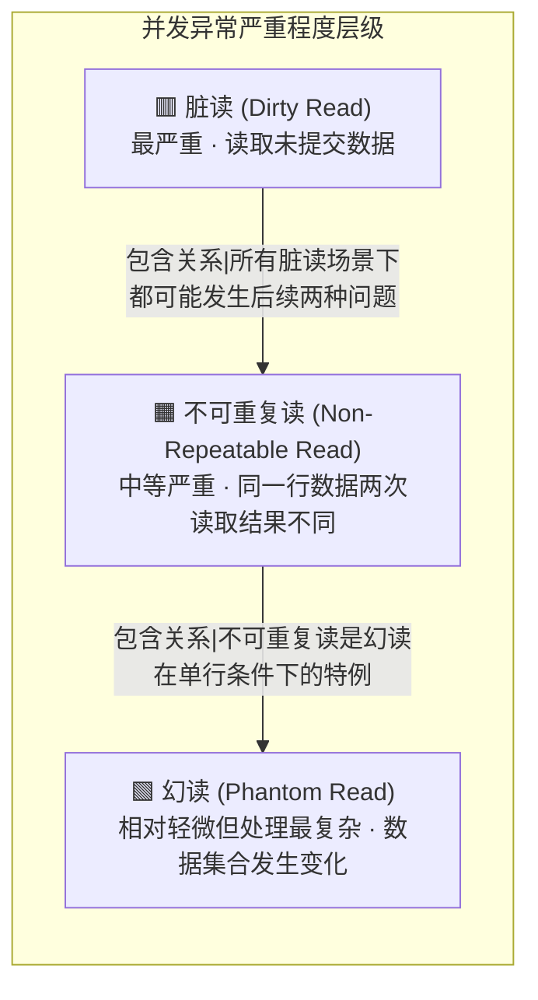
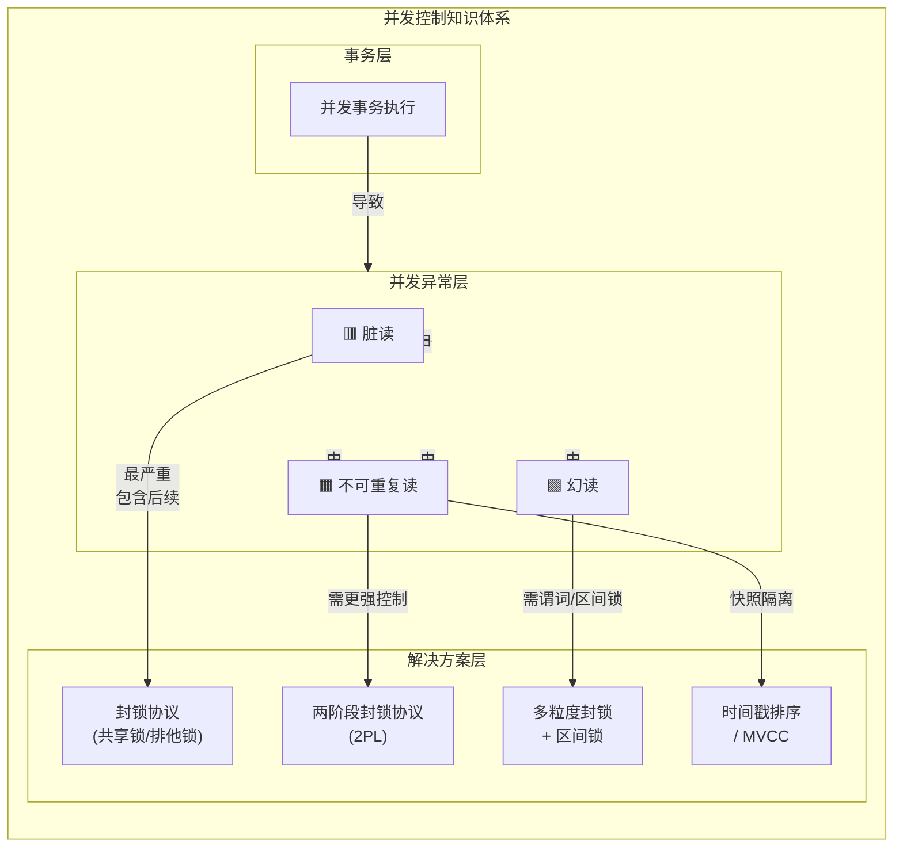
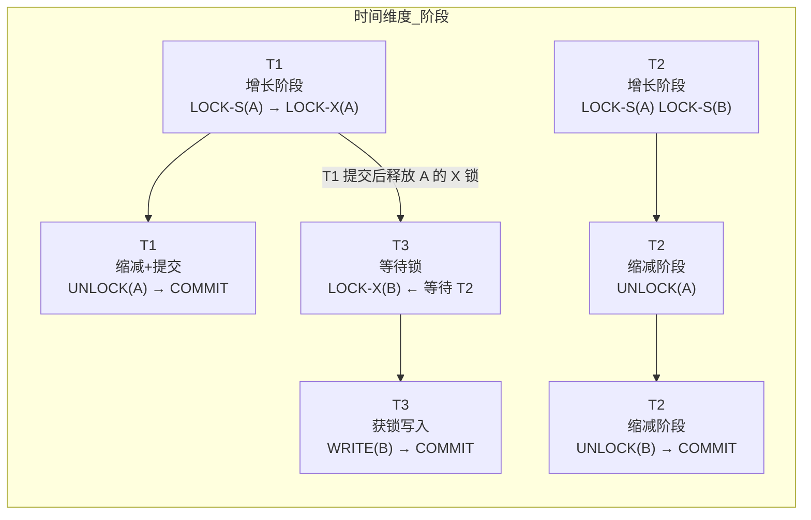
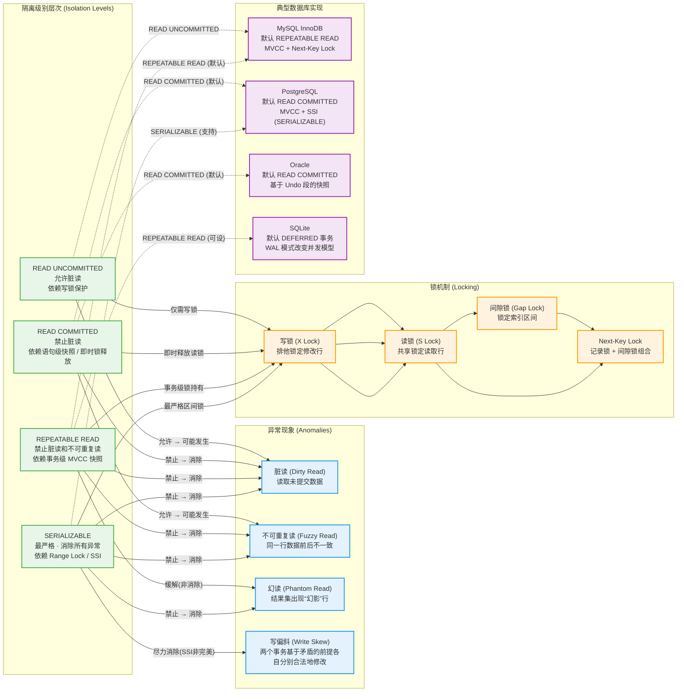

---

# 并发控制

---

## 并发问题（脏读、不可重复读、幻读）

在现代数据库系统中，并发控制是确保多个事务同时运行时数据一致性和隔离性的核心机制。当多个事务在同一时间对数据库中的数据进行读写操作时，如果没有任何形式的协调与控制，就会产生各种数据不一致现象。这些由于并发执行所引发的问题，统称为**并发异常**（Concurrency Anomalies）。理解这些异常是掌握并发控制技术的起点，因为每一种并发控制协议和隔离级别，从本质上讲，都是为了解决或规避这些异常而设计的。

并发问题的根源在于数据库的**三大经典问题**：原子性、一致性和隔离性。虽然原子性和一致性主要由数据库的日志机制（Write-Ahead Logging）和恢复子系统来保障，但隔离性则完全依赖于并发控制机制。隔离性的目标是在并发执行时，让每个事务感觉自己是独自在运行，仿佛在独享整个数据库。然而，这种完美的隔离在实践中往往会带来严重的性能问题——完全隔离意味着串行执行，而串行执行在当今高并发系统中是不可接受的。因此，数据库系统需要在**隔离程度**与**并发性能**之间寻找一个平衡点。

理解并发问题的另一个重要视角是认识到：**并发异常并不是数据被“破坏”了，而是多个事务的交错执行导致了某种违背直觉的结果**。这些结果虽然不涉及硬件故障或软件崩溃，但它们违反了数据库理论中定义的"ACID"属性中的"I"——Isolation（隔离性）。为了系统地讨论这些问题，我们需要引入一个贯穿整个章节的核心概念：**事务（Transaction）**。

### 事务的概念与并发执行的基础

**事务**是数据库中进行数据操作的基本单位，它由一系列的数据库操作（如读取、写入）组成。事务具有四个经典特性，即 ACID 属性：原子性（Atomicity）保证事务中的所有操作要么全部成功，要么全部失败；一致性（Consistency）保证事务执行前后数据库从一个一致状态转换到另一个一致状态；隔离性（Isolation）保证并发执行的事务互不干扰；持久性（Durability）保证已提交的事务对数据库的修改是永久的。

在讨论并发问题时，我们重点关注隔离性。**隔离级别**（Isolation Level）正是用来量化隔离程度的标准——从最弱的 READ UNCOMMITTED 到最强的 SERIALIZABLE，不同的隔离级别允许不同程度的不一致现象存在。每一种并发异常都对应着一种或多种隔离级别下的“合法”行为（或者说，是被允许的不一致），理解它们之间的关系对于设计可靠的数据访问逻辑至关重要。

为了更直观地理解并发问题的本质，我们首先需要建立事务交错执行的思维模型。在单线程串行执行的世界里，事务按照时间顺序一个接一个运行，每个事务都能看到一个稳定的数据库状态。但在并发场景下，多个事务的指令在时间维度上交叉混合，就像两条河流的水流交织在一起，这种交叉的方式有无数种可能，而其中相当一部分会导致数据不一致。我们接下来要讨论的三种经典并发问题——脏读、不可重复读和幻读——就是这些不一致现象中最具代表性的三种。

### 脏读（Dirty Read）

#### 问题描述

**脏读**是并发异常中最直观、最容易理解的一种。它的定义是：**一个事务读取了另一个尚未提交的事务中所修改的数据**。这里有两个关键点需要深刻理解：第一，读取的是“脏”数据——即被修改后但尚未确定最终状态的数据；第二，另一个事务还没有提交，意味着这个修改可能会被**回滚**（Rollback）。

为什么脏数据是“危险”的？因为在数据库系统中，事务的提交（COMMIT）意味着“我确定这些修改是正确的，可以永久生效”，而回滚则意味着“我后悔了，这些修改作废，恢复到修改前的状态”。如果事务 A 修改了一行数据但尚未提交，事务 B 此时读取了该行数据，那么事务 B 读到的就是一个**可能即将不存在的数据**。一旦事务 A 最终回滚，事务 B 手中就持有一个在数据库中根本不存在的数据——这就是典型的“脏读”场景。

#### 直观场景演示

让我们通过一个具体的例子来深入理解脏读的严重后果。考虑一个银行转账场景：事务 A 负责从账户 X 转出 1000 元到账户 Y。在执行过程中，事务 A 先扣减了账户 X 的余额（从 5000 变为 4000），但尚未完成账户 Y 的增加操作，也尚未提交。此时，事务 B 读取了账户 X 的余额，看到的是 4000 元。

```text
时间点    事务A                              事务B
T1       BEGIN TRANSACTION;
T2                                          BEGIN TRANSACTION;
T3       UPDATE account SET balance = 4000  (X账户扣款，尚未提交)
T4                                          SELECT balance FROM account WHERE id = 'X';  -- 读到 4000
T5       ROLLBACK;  (转账失败，全部回滚，X账户恢复为5000)
T6                                          ... 后续操作基于"余额为4000"的假设继续执行
```

在这个例子中，事务 B 基于“脏”数据 4000 元做了后续的业务决策，但这个数据在事务 A 回滚后实际上已经不存在了。事务 B 以为账户 X 只有 4000 元，但实际账户 X 有 5000 元。这就是脏读带来的数据不一致。

#### 技术层面的深层分析

从数据库内部实现的角度来看，脏读之所以会发生，是因为在某些低隔离级别下，**读取操作不需要等待写入操作提交**。在数据库的存储引擎层，每一行数据通常会有一个**版本号**或**事务标识**来标记它当前的状态。当一个事务修改某行数据时，数据库会在该行上施加一个**排他锁**（Exclusive Lock），这会阻止其他事务同时修改该行，但**不会阻止其他事务读取该行**。这正是脏读产生的技术根源——读写操作之间没有相互阻塞。

具体来说，当事务 A 修改了某行数据后，该行数据进入一种“已修改但未提交”的中间状态。在一些数据库实现中，这个修改会被记录到**回滚段**（Rollback Segment）或**undo 日志**中，而原数据可能被保留用于可能的回滚操作。如果此时事务 B 发起一个读取请求，而数据库的隔离级别设置为 READ UNCOMMITTED，存储引擎可能直接返回这个“已修改但未提交”的值——这就产生了脏读。

脏读的危害不仅在于读取了错误的数据本身，更在于这种错误数据会**污染**事务的后续决策。一个事务一旦读取了脏数据，它可能会基于这个数据做出错误的业务判断，进而执行一系列错误的操作。这些错误操作本身可能没有问题，但它们建立在错误的前提之上，最终导致整个业务逻辑的失效。在金融、医疗、库存管理等对数据准确性要求极高的应用场景中，脏读可能是灾难性的。

### 不可重复读（Non-Repeatable Read）

#### 问题描述

**不可重复读**的定义是：**在同一事务中，两次读取同一行数据时，获得了不同的值**。与脏读不同，不可重复读读取的数据是已经提交的数据，不涉及回滚的问题。它的核心矛盾在于：**一个事务在执行过程中，希望多次读取同一批数据时，每次读到的值都是相同的**——因为这个事务认为在这段时间内，没有其他事务在修改这些数据。但现实是，其他事务（甚至是同一个事务启动的其他操作）在两次读取之间提交了修改。

不可重复读的关键特征是：第一次读取和第二次读取之间，**同一个数据行的值发生了变化**。这种变化不是由于本事务的修改造成的，而是由于其他事务的修改并提交造成的。这意味着本事务在两次读取之间“看到”了数据库状态的改变，这在某些业务场景下是不可接受的。

#### 与脏读的本质区别

理解不可重复读与脏读的区别至关重要。**脏读**读取的是**未提交**的数据，存在回滚的可能性；**不可重复读**读取的是**已提交**的数据，确定存在于数据库中。从数据“真实性”的角度来说，不可重复读中的数据反而更“真实”——它至少是一个被其他事务确认并持久化的值。但从单个事务的视角来看，不可重复读仍然是一种异常，因为它破坏了事务对数据的**一致性预期**。

为了更清晰地理解这个区别，我们可以做一个类比：想象你在图书馆查阅一本参考书，第一次查阅时书页上写着某个数据。当你合上书去做其他事情时，另一个人在那本书上做了修改并用新版本替换了原书。当你再次打开同一页时，看到的是不同的内容。在脏读场景中，相当于你看到的是别人在草稿纸上写的内容（可能被划掉）；在不可重复读场景中，你看到的是已经被正式出版的新版本（确实改变了）。两者都是“变化”，但性质不同。

#### 直观场景演示

让我们通过一个经典的库存查询场景来理解不可重复读。假设一个订单处理系统需要检查某个商品的库存数量是否充足，然后决定是否接受订单。为了确保库存检查的准确性，系统要求在订单处理事务中，库存数量应该在整个处理过程中保持不变。

```text
时间点    事务A (订单处理)                      事务B (库存出库)
T1       BEGIN TRANSACTION;
T2       SELECT stock FROM product WHERE id = 1;  -- 读到 stock = 100
T3                                          BEGIN TRANSACTION;
T4                                          UPDATE product SET stock = 95 WHERE id = 1;  -- 出库5件
T5                                          COMMIT;
T6       SELECT stock FROM product WHERE id = 1;  -- 再次读取，stock = 95
T7       (比较两次读取的结果，发现不一致)
```

在上述场景中，事务 A 在 T2 时刻读取到库存为 100，并基于这个数据进行后续的订单处理逻辑（比如计算可接受的最大订单量）。但在 T2 和 T6 之间，事务 B 修改了库存并提交。当事务 A 在 T6 再次读取库存时，读到的是 95——与第一次读取的值不同。这就是典型的不可重复读。

不可重复读的问题在于，如果事务 A 的业务逻辑依赖于“两次读取值相同”这个假设，那么这个假设就失效了。例如，假设事务 A 的逻辑是：

```sql
-- 事务A中的伪代码逻辑
BEGIN;
stock1 = SELECT stock FROM product WHERE id = 1;  -- 第一次读取：100
IF stock1 >= 50 THEN
    -- 假设库存充足，生成订单...
    -- 在此期间，事务B修改了库存...
    stock2 = SELECT stock FROM product WHERE id = 1;  -- 第二次读取：95
    IF stock2 >= 50 THEN
        -- 提交订单...
        COMMIT;
    ELSE
        ROLLBACK;
    END IF;
END IF;
```

在这个逻辑中，事务 A 两次检查库存的意图是确保在订单处理过程中库存没有发生足以影响订单可行性的变化。但由于两次读取之间发生了不可重复读（库存从 100 降到了 95），如果订单处理的某些操作依赖于库存的具体数值（而不仅仅是“是否大于等于某个阈值”），就会导致逻辑错误。

#### 技术层面的深层分析

从技术实现角度来看，不可重复读的产生是因为**读操作和写操作之间的隔离不足**。在数据库的锁机制中，当一个事务读取某行数据时，通常会在该行上获取一个**共享锁**（Shared Lock）。共享锁允许多个事务同时持有（因为读操作之间不冲突），但会阻塞试图获取**排他锁**（Exclusive Lock）的事务（写操作）。然而，问题在于：**很多数据库实现并不会在读取完成后持续持有共享锁**——它们采用一种称为“**读完即释放**”（Lock After Read，在 Oracle 中称为“一致读”）的策略，或者称为“快照读”（Snapshot Read）。

在这种策略下，事务在读取数据时获得一个数据快照（Snapshot），基于这个快照返回数据。但快照本身是有时间戳的——它反映的是某个特定时刻数据库的状态。当其他事务修改了数据并提交后，这些修改对当前事务的快照没有影响。但如果当前事务再次发起读取请求，系统会重新获取一个新的快照，这个新快照就会包含其他事务已提交的修改——从而导致两次读取结果不一致。

这种行为在 MVCC（多版本并发控制，Multi-Version Concurrency Control）实现中尤为明显。MVCC 的核心思想是为每个事务提供一个“视图”，这个视图基于事务的开始时间或快照时间。MVCC 可以避免脏读（因为它不会读取未提交的数据），但不能完全避免不可重复读，因为它依赖于事务级别的快照一致性——如果两次读取在时间上跨越了其他事务的提交点，就会产生不可重复读。

### 幻读（Phantom Read）

#### 问题描述

**幻读**是三种经典并发问题中最微妙、最容易混淆的一种。其定义是：**在同一事务中，两次执行同一个范围查询（如 SELECT WHERE 条件），返回的记录数或结果集不同**。与不可重复读不同，幻读不是针对**同一行数据**的值变化，而是针对**满足查询条件的新行**的出现或消失。形象地说，事务 A 在第一次查询时看到了 10 行数据，第二次查询时却看到了 12 行——就好像“幻影”一样，多出来的两行是其他事务插入的新记录。

幻读的核心特征在于：它涉及到**数据集合**的变化，而不是**单个数据项**的值变化。不可重复读关注的是行内部的数据（行的属性值），而幻读关注的是行的存在性（哪些行满足查询条件）。这种区别看似细微，但实际上需要完全不同的技术手段来处理。

#### 幻觉的来源：插入与删除

幻读有两个方向：**幻影行增加**和**幻影行减少**。前者是指在两次查询之间，其他事务插入了满足查询条件的新行；后者是指其他事务删除了原本满足查询条件的行。

```text
时间点    事务A (查询订单)                       事务B (创建新订单)
T1       BEGIN TRANSACTION;
T2       SELECT * FROM orders WHERE status = 'pending';  -- 返回 10 条记录
T3                                          BEGIN TRANSACTION;
T4                                          INSERT INTO orders VALUES (...);  -- 插入一条新订单
T5                                          COMMIT;
T6       SELECT * FROM orders WHERE status = 'pending';  -- 返回 11 条记录
T7       (处理这10条订单，但发现多出了一条)
```

在这个场景中，事务 A 两次查询"pending"状态的订单。第一次查到 10 条，A 基于这个数字做了某些决策（比如预分配处理资源）。但是在两次查询之间，事务 B 插入了一条新的 pending 订单。当事务 A 第二次查询时，看到了 11 条记录——这条多出来的订单就是“幻影”。

幻读的另一个方向——幻影删除——同样值得关注：

```text
时间点    事务A (汇总报表)                       事务B (取消订单)
T1       BEGIN TRANSACTION;
T2       SELECT COUNT(*) FROM orders WHERE status = 'completed';  -- 返回 100
T3                                          BEGIN TRANSACTION;
T4                                          DELETE FROM orders WHERE id = 999;  -- 删除一条已完成订单
T5                                          COMMIT;
T6       SELECT COUNT(*) FROM orders WHERE status = 'completed';  -- 返回 99
T7       (两次汇总结果不一致)
```

#### 幻读与不可重复读的深刻区别

很多初学者容易将幻读和不可重复读混为一谈，因为两者都表现为“同一事务中两次读取结果不同”。但它们有着本质的区别，这个区别对于理解并发控制机制至关重要。

**不可重复读是行级别的变化**：同一个特定的数据行的值发生了变化。在实现上，它关注的是**已有行**上数据的读写冲突。

**幻读是集合级别的变化**：满足查询条件的**行集合**发生了变化——有新行加入或有旧行退出。在实现上，它不仅需要处理已有行上的数据冲突，还需要处理**数据区间**上的插入和删除冲突。

这个区别意味着：解决不可重复读的锁机制（如行级共享锁）不足以解决幻读。因为当事务 A 在某行数据上持有共享锁时，其他事务确实无法修改该行的值——这就防止了不可重复读。但如果其他事务在满足查询条件的其他行上插入新记录，行级锁对此无能为力。新插入的行在插入之前不存在，因此没有被任何锁保护；插入之后，它已经满足了查询条件，但它并不会“触发”原有行上的锁。这就是为什么幻读被认为是一种更高级别的并发问题，需要更复杂的锁机制（如谓词锁或区间锁）来解决。

#### 谓词锁与区间锁的引入

为了解决幻读问题，数据库系统引入了**谓词锁**（Predicate Lock）和**区间锁**（Range Lock）的概念。

**谓词锁**是对**查询条件**（谓词）加锁，而不是对具体的数据行加锁。当事务 A 执行一个查询 `SELECT * FROM orders WHERE status = 'pending'` 时，谓词锁会锁定所有满足 `status = 'pending'` 这个谓词的数据行——包括现在已经存在的行和未来将要插入的行。这意味着，即使事务 B 在之后插入一条新订单，只要这条新订单的 `status = 'pending'`，它就会被谓词锁阻塞，从而避免幻读。

**区间锁**（有时也称为**Next-Key Locking**）是谓词锁在索引级别的一种实现。在实际数据库系统中，对一个完整的表加谓词锁的代价非常高（因为需要扫描整个表来确认哪些行满足条件）。更好的方式是在索引上建立锁——如果 `status` 字段上有索引，数据库可以在索引条目上建立锁，从而间接地锁定所有满足条件的数据行。例如，在 `status` 索引上锁定所有 `status = 'pending'` 的索引条目，就相当于对所有满足该条件的行加上了锁。而且，当其他事务试图插入一行 `status = 'pending'` 的新记录时，它必须先在索引中插入条目，这个插入操作会被区间锁阻塞。

### 三种并发问题的关系与层级

#### 问题层级与包含关系

脏读、不可重复读和幻读并不是相互独立的三种现象，它们之间存在一种**逻辑上的层级关系**。理解这种层级关系对于理解隔离级别的设计至关重要。

从严重程度来看，**脏读是最轻量级也最危险的异常**——它读取了尚未确定的数据，这个数据随时可能因为回滚而消失。脏读的发生意味着其他所有并发问题的可能性都存在：如果一个事务能读取未提交的数据，那么在那个数据被修改时，不可重复读自然会发生；如果那个修改是插入操作，幻读也会发生。因此，**脏读是所有并发问题的“源头”**。

**不可重复读**次之——它读取的是已提交的数据，但同一事务中多次读取同一数据时值发生了变化。如果一个系统能防止不可重复读，那么脏读自然也被防止了（因为防止不可重复读的机制会要求读取已提交的数据）。但不可重复读仍然不能防止幻读——因为幻读关注的是数据集合的变化，而不是单行数据的值变化。

**幻读**是三者中最“高级”的异常——它涉及数据集合的变化。从某种意义上说，幻读包含了不可重复读的某些场景（当查询条件精确匹配到一行时，幻读退化为不可重复读），但它也有自己独特的场景（当其他事务插入新行时）。防止幻读需要最强的并发控制机制，也会带来最大的性能开销。

#### 层级关系图

我们可以将三种并发问题用一个层级图来表示它们的包含关系：



这幅图展示了三种异常之间的逻辑层级关系。上层的异常（脏读）是最严重也是最容易触发的，下层的异常（幻读）则需要更精细的并发控制才能防止。从数据库隔离级别的设计角度来看，这个层级关系直接决定了不同隔离级别能够防止哪些异常——更强的隔离级别总是建立在能够防止更弱级别异常的基础上。

### 与 Android 开发实践的联系

在 Android 应用开发中，理解并发问题对于正确使用 SQLite 和 Room 数据库至关重要。很多 Android 开发者可能从未直接面对过这些问题，因为他们的大多数操作都是在单线程（主线程或后台线程的单一数据库连接）下完成的。但随着应用复杂度的提升，并发场景会逐渐出现。

#### SQLite 的默认行为与并发限制

SQLite 作为嵌入式数据库，在默认配置下只允许**一个写事务**同时执行，读事务可以并发进行但受到一定的限制。在 SQLite 中，写操作通过**数据库级锁**来控制——当一个事务正在写入时，整个数据库文件被锁定，其他事务的写入操作必须等待。虽然这种粗粒度的锁机制极大地简化了并发控制，但并不意味着 SQLite 可以完全避免并发问题。

例如，在 Android 的多线程环境中，如果两个线程共享同一个 SQLite 数据库连接（`SQLiteOpenHelper` 实例），那么一个线程的长时间读操作可能会阻塞另一个线程的写操作——这虽然不是脏读或不可重复读，但仍然是并发问题的一种表现（**锁等待**）。正确的做法是为每个线程提供独立的数据库连接（`getWritableDatabase()` 或 `getReadableDatabase()` 在多线程环境下需要适当的同步管理），或者使用**连接池**（Room 2.2+ 提供的 `SupportSQLiteOpenHelper`）。

#### Room 数据库的事务与隔离

Room 是 Android Jetpack 推荐的数据库抽象层，它在 SQLite 之上提供了更高级的抽象。在 Room 中，事务通过 `@Transaction` 注解来声明，确保带注解的方法中的所有数据库操作在同一个事务中执行。

```kotlin
// Room 中使用 @Transaction 确保数据一致性
@Dao
abstract class OrderDao {

    @Insert
    abstract suspend fun insertOrder(order: Order): Long

    @Update
    abstract suspend fun updateOrder(order: Order): Long

    /**
     * 转账操作：扣款 + 存款必须在同一个事务中完成
     * 如果不加 @Transaction，在并发场景下可能出现：
     * 1. 线程A读取账户余额
     * 2. 线程B也读取了相同的账户余额
     * 3. 线程A写入新余额（扣除100元）
     * 4. 线程B也写入新余额（也扣除100元，但基于错误的原余额）
     * 结果：账户被扣了200元而非100元（不可重复读的变种）
     */
    @Transaction
    open suspend fun transferMoney(fromAccountId: String,
                                    toAccountId: String,
                                    amount: Double) {
        // 在同一事务中执行：先扣款，再存款
        // Room 会确保这两个操作对其他事务不可见，直到事务提交
        val fromAccount = getAccountById(fromAccountId)
        fromAccount.balance -= amount
        updateAccount(fromAccount)

        val toAccount = getAccountById(toAccountId)
        toAccount.balance += amount
        updateAccount(toAccount)
    }
}
```

在这个例子中，`@Transaction` 注解确保了 `transferMoney` 方法中的所有数据库操作在同一个事务中执行。如果不使用 `@Transaction`，两个写操作（扣款和存款）可能会被分开提交，在并发场景下就会出现数据不一致。但即便使用了 `@Transaction`，开发者仍然需要意识到 SQLite/Room 默认的隔离级别可能无法完全防止所有并发问题——特别是幻读。如果应用需要处理高度并发的插入和查询场景，可能需要考虑使用更高层次的并发控制策略。

#### Flow 与 LiveData 观测中的时序问题

在 Android 的响应式编程中，`Flow` 和 `LiveData` 用于观测数据库的变化。很多开发者会遇到这样一种情况：同一个事务中先插入一条数据，然后立即观测查询结果，却发现查询结果中不包含刚刚插入的数据。这实际上是一种**幻读的变种**——查询的结果集在插入前后发生了变化。

```kotlin
@Dao
interface ProductDao {

    @Query("SELECT * FROM product WHERE category = :category")
    fun observeProductsByCategory(category: String): Flow<List<Product>>

    @Insert
    abstract suspend fun insertProduct(product: Product)

    @Query("DELETE FROM product WHERE id = :productId")
    abstract suspend fun deleteProduct(productId: String)
}

// 在 ViewModel 中使用
class ProductViewModel(private val dao: ProductDao) : ViewModel() {

    fun addProduct(product: Product) {
        viewModelScope.launch {
            dao.insertProduct(product)
            // 注意：Flow 的发射时机取决于数据库的变化检测机制
            // 如果刚插入就读取 Flow，可能看不到刚插入的数据（幻读效应）
        }
    }
}
```

这种情况虽然不是严格意义上的幻读（因为它发生在单个事务内部），但它揭示了一个重要的原理：**观测（Observable Query）和写入之间的时序关系并不是强同步的**。Room 的 `Flow` 实现依赖于数据库的 `ContentObserver` 或轮询机制来检测变化，这意味着一旦检测到变化，Flow 才会发射新的数据。如果在这个窗口期内有新的写入，可能会在下一次发射中才体现出来。理解这一点有助于开发者在构建复杂的数据层逻辑时避免不必要的困惑。

### 总结与知识图谱

三种经典并发问题的核心对比如下：

| 异常类型 | 描述 | 读取的数据状态 | 影响范围 | 技术根源 |
|---------|------|--------------|---------|---------|
| **脏读** | 读取另一事务未提交的数据 | 未提交（可能回滚） | 单行数据 | 读写之间无阻塞 |
| **不可重复读** | 同一事务两次读取同一行结果不同 | 已提交 | 单行数据 | 读完即释放锁 / 快照读 |
| **幻读** | 同一事务两次范围查询结果集不同 | 已提交 | 数据集合 | 缺少区间锁/谓词锁 |

这三种并发问题的本质是：**并发事务之间的操作交错导致一个事务看到的数据库状态不是“静止”的，而是“动态变化”的**。只不过变化的方式不同——脏读是看到了“即将消失”的数据，不可重复读是看到了“正在变化”的数据值，幻读是看到了“正在增减”的数据行。这种状态的不一致性破坏了事务的隔离性假设，是所有并发控制机制需要解决的问题。



通过这幅总览图，我们可以清晰地看到三种并发问题在并发控制知识体系中的位置：它们是并发事务执行带来的副作用，解决它们是后续所有并发控制技术的根本出发点。从下一节开始，我们将逐一深入探讨数据库系统为解决这些问题而设计的各种机制——从最基本的封锁协议，到成熟的两阶段封锁协议，再到应对死锁的检测与处理策略，最终形成对整个并发控制体系的完整理解。

---

#### 📝 练习题

某银行系统中，事务 T1 和事务 T2 并发执行。T1 的操作是"从账户 A 转账 1000 元到账户 B"，T2 的操作是"查询账户 A 和账户 B 的余额并打印"。在 SERIALIZABLE 隔离级别下，以下描述中错误的是哪一项？

A. T2 两次查询账户 A 的余额必定相同
B. T2 两次查询账户 B 的余额必定相同
C. T2 一定不会读取到 T1 未提交的转账操作结果
D. T2 一定不会看到账户 A 或账户 B 的余额同时发生变化（即看到转账前或转账后的一致状态，但不会看到"扣了 A 的钱但还没加到 B"的中间状态）

**【答案】** D

**【解析】** 本题考查的是对不同隔离级别及其能够防止的并发问题的理解。

在 SERIALIZABLE 隔离级别下，数据库系统通过强制事务串行化执行来提供最高级别的隔离性。这可以通过多种技术实现，包括严格的两阶段封锁协议（Strict 2PL）配合区间锁，或者通过快照隔离（Snapshot Isolation）结合序列化快照执行等机制。

首先分析 A、B、C 三个选项的正确性。**选项 A 和 B** 描述的是"不可重复读"问题——同一事务中两次读取同一行数据结果不同。在 SERIALIZABLE 级别下，系统通过在读取的数据行上持有锁（直到事务结束才释放）或者通过快照机制确保每次读取都基于事务开始时的数据库状态，因此不可重复读被完全防止，A 和 B 都是正确的。**选项 C** 描述的是"脏读"问题——读取未提交事务的数据。在 SERIALIZABLE 级别下，事务只能读取已提交事务的数据（MVCC 快照隔离中快照基于已提交数据；封锁协议中写锁阻止未提交数据被读取），因此脏读也被完全防止，C 是正确的。

**选项 D 是错误的**，这是本题的陷阱所在。SERIALIZABLE 隔离级别确实能保证事务的串行化执行，但它**不能保证**一个转账操作（包含两次更新：扣款和存款）作为原子操作对其他事务可见。也就是说，如果 T1 执行了 `UPDATE account SET balance = balance - 1000 WHERE id = 'A'` 但尚未执行 `UPDATE account SET balance = balance + 1000 WHERE id = 'B'` 时提交了（这是不允许的，因为转账是一个事务），或者 T1 的两次更新之间的时间间隔很长，那么 T2 仍然可能在两次查询之间看到"转账进行中"的状态——即 A 的余额已经减少，但 B 的余额尚未增加。SERIALIZABLE 保证的是**事务级别的串行化**（事务 T1 和 T2 整体上按某种顺序执行），但并不保证**语句级别的原子性**。一个事务内部的多条 SQL 语句对其他事务的可见性取决于具体的实现机制。在标准封锁协议实现中，SERIALIZABLE 通过在事务结束时才释放锁来工作，但读操作并不会被写操作阻塞（读使用快照，写使用锁），因此在读写交错时，仍然可能看到不一致的中间状态——除非使用了严格的 SSI（Serializable Snapshot Isolation）机制。因此 D 选项的描述过于绝对，在某些 SERIALIZABLE 实现中并不成立。

---

## 封锁协议（共享锁、排他锁）

### 什么是封锁机制

在数据库并发控制的世界里，封锁（Locking）是最为核心也最为广泛应用的一种技术手段。它的基本思想极为朴素——当一个事务需要对数据库中的某个数据对象（比如一行记录、一个页面、甚至整个表）进行操作时，首先向系统申请对该对象的控制权；如果系统判断当前没有其他事务持有冲突的权限，那么就将该权限授予这个事务；该事务在操作完毕后，必须释放这个权限，以便其他事务能够继续工作。这种“申请—持有—释放”的模式，构成了数据库并发控制的基础骨架。

封锁机制之所以重要，是因为它从根本上解决了并发事务之间的访问冲突问题。设想一个没有封锁机制的场景：两个事务同时试图修改同一条记录，数据库既无法保证修改的先后顺序，也无法确保最终的数据一致性，结果将是一团糟。封锁机制通过在时间维度上对访问进行排序，使得并发执行的事务在逻辑上可以串行化，从而保证数据库的正确性。

从实现角度来看，封锁是由数据库管理系统（DBMS）的锁管理器（Lock Manager）来统一管理的。锁管理器维护着一张**锁表**（Lock Table），记录当前所有被持有的锁的信息，包括锁的类型、持有者事务、锁住的数据对象、以及锁的粒度等。当事务提出锁请求时，锁管理器在锁表中查找目标对象的状态，决定是立即授予锁还是让事务等待。

### 锁的基本类型

数据库系统中的锁可以根据不同的维度进行分类，而从**锁定模式**的角度来看，最基础也最重要的划分是**共享锁（Shared Lock）**和**排他锁（Exclusive Lock）**，在有些文献中也分别称为**S锁**和**X锁**。这两种锁的设计，源自一个核心的观察——不同的操作类型对数据的访问需求是不同的。

**读操作**的本质是查看数据，它不修改数据的值，因此多个事务同时读取同一份数据是不会产生任何冲突的。就像图书馆里同一本书可以被多个人同时借阅阅读，内容不会因此改变。**写操作**则完全不同，它会修改数据的值，如果两个事务同时对同一数据进行写，其中一个的修改结果可能被另一个覆盖，导致数据丢失。这种“写—写冲突”的本质是**更新丢失（Lost Update）**问题。

基于这一认知，数据库系统设计了两种不同的锁模式来分别处理读和写的场景：

**共享锁（S锁）**是专门为读操作设计的。如果一个事务对某个数据对象加上了共享锁，其他事务仍然可以再对这个对象加共享锁（继续读），但不能加排他锁（不能写）。这就好比多个人可以同时阅读同一份文件，但任何人在阅读期间，别人不能对文件进行修改。

**排他锁（X锁）**则是为写操作设计的。一旦一个事务对某个数据对象加上了排他锁，其他事务既不能加共享锁（不能读），也不能加排他锁（不能写）。这相当于一个人正在编辑一份文件时，完全阻止其他人对该文件的任何访问，包括阅读。

### 锁的相容矩阵

理解两种锁之间关系的最直观方式，是查看**锁的相容矩阵**（Lock Compatibility Matrix）。相容矩阵描述了当一个事务已经持有某种类型的锁时，另一个事务请求同一种锁是否被允许。

```ascii
锁的相容矩阵
━━━━━━━━━━━━━━━━━━━━━━━━━━━━━━━━━━━━
请求 ↓ \ 持有 →   S（共享锁）    X（排他锁）
━━━━━━━━━━━━━━━━━━━━━━━━━━━━━━━━━━━━
S（请求共享锁）        ✓（相容）     ✗（不相容）
X（请求排他锁）        ✗（不相容）   ✗（不相容）
━━━━━━━━━━━━━━━━━━━━━━━━━━━━━━━━━━━━
✓ 表示允许请求；✗ 表示拒绝请求（必须等待）
```

这张矩阵的每一行代表新请求的锁类型，每一列代表当前已持有的锁类型。**S锁与S锁是相容的**，这体现了“多个读者可以同时运行”的并发读原则。**S锁与X锁不相容**，因为如果一个事务正在读取数据，另一个事务试图修改它，修改的结果可能会使读取到的数据变得无效（脏读风险）。**X锁与X锁不相容**，两个写操作不能同时作用于同一数据，否则会发生更新丢失。

### 共享锁的运作机制

共享锁的加锁操作通常发生在事务执行**SELECT**语句时（尽管不同的隔离级别下行为有所不同）。当一个事务执行读操作并申请共享锁时，系统会检查目标数据对象上是否已经存在排他锁。如果不存在排他锁，则将共享锁授予该事务，并记录在锁表中；如果存在排他锁，则该事务必须等待，直到排他锁被释放。

共享锁的一个关键特性是**可叠加性**。同一个数据对象上可以同时存在多个共享锁，这些锁被不同的事务所持有，它们之间互不干扰。系统通过引用计数来追踪有多少个事务持有该对象上的共享锁。例如，如果事务T1和事务T2都对同一行数据加了共享锁，锁表中该行的S锁引用计数为2。只有当所有持有共享锁的事务都释放了锁之后，该对象的共享锁状态才会清除。

在标准的封锁协议中，共享锁应该在事务**读取完数据之后继续持有**，直到事务提交或回滚时才释放。这一设计是保证隔离性的基础——如果在读取数据后立即释放共享锁，另一个事务可能在此期间修改数据，而当前事务后续基于该数据进行的计算和操作就会基于过时的信息，从而导致不可重复读等问题。然而，共享锁的持有时间越长，并发度就越低，这是一个固有的权衡。

下面通过一个具体的场景来理解共享锁的行为：

```sql
-- 事务T1：读取账户余额（加共享锁）
BEGIN;
SELECT balance FROM accounts WHERE id = 101;  -- 此时对(id=101,balance)行加了S锁
-- T1继续执行其他操作，但此时S锁仍然持有
-- 在T1提交之前，其他事务无法对该行加X锁
COMMIT;  -- 提交时释放S锁
```

```sql
-- 事务T2：尝试修改同一账户余额（需要排他锁）
BEGIN;
UPDATE accounts SET balance = balance + 1000 WHERE id = 101;  -- 请求X锁
-- 如果T1尚未提交，则T2在此阻塞等待
COMMIT;
```

在上述场景中，T1持有S锁期间，T2尝试获取X锁会被阻塞，直到T1释放S锁（提交或回滚）后才能继续执行。这确保了T2的更新操作不会在T1读取和T1提交之间发生，从而避免了脏读和不可重复读。

### 排他锁的运作机制

排他锁用于保护写操作，包括**UPDATE**、**DELETE**和**INSERT**等语句。当事务需要对数据进行修改时，必须先获取该数据对象的排他锁。与共享锁不同，排他锁的加锁条件极为严格——只有当目标对象上**不存在任何其他锁**（无论是共享锁还是排他锁）时，排他锁才能被授予。

排他锁的核心目标是解决写—写冲突。如果没有排他锁，两个事务同时修改同一数据，可能发生以下场景：事务T1和T2都读取了某账户余额为1000元，T1给余额加500元（变为1500元），T2给余额加1000元（变为2000元）。如果T1先写入1500元，T2后写入2000元，那么T1的修改结果就完全被覆盖了——T1加了500元的效果在最终结果中消失了，这就是典型的更新丢失问题。

有了排他锁之后，上述场景会被有效阻止。当T1对某行加X锁修改数据时，T2必须等待T1释放锁才能获得X锁。这样T1和T2对数据的修改就形成了先后顺序，而非并发交叠，最终数据结果必然是某一次修改的完整体现。

排他锁的持有同样贯穿整个事务的存活期。事务在持有X锁期间，其他事务既不能读也不能写被锁住的数据对象。这种严格的独占性确保了数据修改的原子性和一致性，但同时也意味着排他锁是并发性能的主要杀手之一——一个长时间持有X锁的事务可能导致其他大量事务阻塞堆积。

### 锁粒度的选择

封锁协议中还有一个不可忽视的设计维度——**锁粒度**（Lock Granularity），即锁住的数据对象的大小。常见的锁粒度从小到大包括：

- **行级锁（Row Lock）**：锁住单独的一行记录。这是粒度最细的锁，并发度最高，但锁管理的开销也最大——系统需要为每一行维护独立的锁信息。
- **页级锁（Page Lock）**：锁住数据库存储中的一个页面（通常为4KB或8KB）。许多数据库系统（如MySQL的InnoDB）在某些情况下会使用页级锁。
- **表级锁（Table Lock）**：锁住整张表。粒度最粗，开销最小，但并发度最低。
- **数据库级锁（Database Lock）**：锁住整个数据库，几乎不使用。

```ascii
锁粒度层次结构
═══════════════════════════════════════
    粒度越小 →  →  →  →  →  粒度越大

    行锁 → 页锁 → 表锁 → 数据库锁

    并发度: 高  →  →  →  →  →  低
    开    销: 大  →  →  →  →  →  小
═══════════════════════════════════════
```

现代关系型数据库（如MySQL的InnoDB）默认使用**行级锁**，这意味着事务可以并发地修改同一张表的不同行，而不会相互阻塞。只有当两个事务试图修改同一行时，才会产生锁冲突。这种细粒度锁策略在保证正确性的同时，最大化了系统的并发吞吐量。

但行级锁并非银弹。当一个事务需要修改表中大量的行（比如执行`UPDATE orders SET status='completed' WHERE order_date < '2024-01-01'`更新数以万计的记录）时，如果对每一行都逐一加锁，锁管理的开销会变得非常可观。为了处理这类场景，InnoDB引入了**意向锁（Intention Lock）**的概念。意向锁是一种**表级锁**，它表明当前事务打算在表中的某些行上加某种类型的锁。意向锁分为**意向共享锁（IS锁）**和**意向排他锁（IX锁）**。

意向锁的设计目的是让锁管理器在加行级锁之前，能够快速判断表中是否已经有其他事务持有行级锁。如果一个事务要对某行加S锁，它首先需要在表上加IS锁；如果要对某行加X锁，它首先需要在表上加IX锁。当另一个事务试图对该表加表级锁时，可以通过检查意向锁来判断是否可以安全授予，而无需逐行扫描整个表的锁状态。

### 基本的封锁协议：一次封锁法

在理解了共享锁和排他锁之后，我们来看一个最朴素的封锁策略——**一次封锁法**（One-Time Locking）。一次封锁法的思想是：事务在开始执行前，必须一次性将自己可能访问的**所有数据对象**全部加锁；只有在所有锁都成功获取之后，事务才能开始实际的数据操作；在事务结束时，一并释放所有锁。

一次封锁法的优点是概念简单，理论上可以保证事务的串行化调度。它的缺陷同样明显：首先，事务在开始前必须预知自己需要访问哪些数据对象，这在实际应用中往往很难做到——许多查询的条件是运行时才确定的；其次，一次性锁定大量数据对象会严重限制系统的并发度，因为锁持有时间被不必要地延长了。一个只读取一行数据的事务，因为无法预知该行是否足够，可能锁定整张表，导致其他事务完全无法工作。

一次封锁法的这些缺陷，推动了更精细的封锁策略的发展，也就是接下来要讨论的**两阶段封锁协议（2PL）**。但在深入2PL之前，理解共享锁与排他锁的交互原则，以及它们在基本封锁协议中的角色，是不可或缺的基础。

### Android 中的锁机制

在 Android 应用层使用 SQLite 或 Room 时，数据库引擎内部自动管理封锁协议，开发者无需手动编写锁的申请和释放代码。然而，理解锁的存在和其行为特性，对于写出正确且高效的数据库操作代码至关重要。

当多个线程同时访问同一个数据库连接时，SQLite 会通过**文件锁**（file-level locking）来管理并发。在 Android 环境中，如果应用使用单一数据库连接，多个线程的读写操作会被 SQLite 内部序列化。Room 数据库默认配置下，通过线程池来管理数据库访问，确保同一时刻只有一个线程执行写操作。

```kotlin
// Room 数据库的并发访问示意
// Kotlin 代码展示了在协程中使用 Room 进行数据访问
// 当多个协程同时执行数据库操作时，Room/SQLite 内部会处理锁的协调

// 假设有两个协程同时执行：
// 协程A: 读取 id=1 的用户信息（SELECT 操作）
// 协程B: 更新 id=1 的用户邮箱（UPDATE 操作）

// 在底层，SQLite 的写操作需要获取排他锁
// 在排他锁持有期间，所有其他读/写操作都必须等待
// 这就是为什么在 Android 中，建议将耗时较长的数据库操作
// 放在后台线程（如 Dispatchers.IO）执行，以避免阻塞主线程
```

值得注意的是，SQLite 的默认事务隔离级别是 **DEFERRED**（延迟封锁），这意味着锁只有在真正需要时才被获取，而非事务一开始就全部获取。在 DEFERRED 模式下，读操作最初不会获取任何锁，直到第一次真正读取数据时才获取共享锁；写操作同样延迟到第一次写数据时才获取排他锁。这种延迟策略在一定程度上平衡了并发性和正确性。

### 封锁协议的现状与挑战

封锁协议虽然是并发控制领域最经典的方法，但它并非没有局限性。**锁等待**和**死锁**是封锁机制带来的两大主要挑战。当一个事务持有锁而另一个事务需要同一个锁时，后者必须等待——如果系统中存在大量这样的等待关系，不仅会降低吞吐率，还可能导致事务超时甚至级联回滚。而死锁问题更为棘手——两个或多个事务互相持有对方需要的锁，形成循环等待，任何一个事务都无法继续执行。

这些问题催生了后续的多种解决策略，包括死锁检测与恢复机制、时间戳排序协议、多版本并发控制（MVCC）等技术。MVCC 是现代数据库系统（如 PostgreSQL、MySQL 的 InnoDB）中极为重要的并发控制方案，它通过为每个数据项维护多个版本，使得读操作几乎不需要等待，从而在很大程度上克服了传统封锁协议的缺陷。

尽管如此，理解共享锁和排他锁的工作原理，始终是掌握数据库并发控制理论的基石。无论是学习两阶段封锁协议、隔离级别，还是理解 MVCC 的底层机制，都离不开对这一基本锁模型的深刻认识。

#### 📝 练习题

在数据库并发控制中，当事务T1对数据对象R持有共享锁（S锁）时，以下哪种说法是正确的？

A. 事务T2此时既可以对R加共享锁，也可以对R加排他锁，两者都被允许
B. 事务T2此时可以对R加共享锁，但不能对R加排他锁
C. 事务T2此时可以对R加排他锁，但不能对R加共享锁
D. 事务T2此时既不能对R加共享锁，也不能对R加排他锁，必须等待T1释放锁

**【答案】** B

**【解析】** 本题考查的是共享锁与排他锁之间的相容性关系。根据锁的相容矩阵，共享锁与共享锁是**相容**的，因为多个事务同时读取同一数据不会产生冲突。共享锁与排他锁是**不相容**的——如果一个事务正在读取数据，另一个事务试图修改该数据，就可能产生脏读或数据不一致问题，因此后者必须等待前者释放锁。

选项A的错误在于：虽然S-S相容，但S-X不相容，因此T2不能对R加排他锁。选项C的错误在于：X锁要求目标对象上不存在任何其他锁，因此即使T2请求的是S锁（与T1持有的S锁相容），也是可以获取的，而不是只能请求X锁。选项D的错误在于：T2可以获取S锁，因为它与T1持有的S锁是相容的。

这一相容性设计体现了并发控制的核心思想：**允许多个读者同时运行，但写操作必须独占资源**。这也是为什么在数据库系统中，读操作通常不会阻塞读操作，但写操作会阻塞所有其他操作。

---

## 两阶段封锁协议（2PL）

### 协议的核心思想

两阶段封锁协议（Two-Phase Locking Protocol，简称 **2PL**）是数据库领域中最经典、最广泛使用的并发控制方法之一。它由数据库先驱 Gray 等人在 1976 年的研究中正式提出，其核心思想异常简洁——**所有事务对数据的封锁操作必须分为两个泾渭分明的阶段**：第一阶段可以不断申请封锁（**增长阶段**，Growing Phase），但一旦某个事务释放了第一个封锁（不再申请新封锁），该事务便立即进入第二阶段；第二阶段只能释放封锁（**缩减阶段**，Shrinking Phase），绝不能再申请新的封锁。这条看似简单的规则，恰恰保证了事务的可串行化调度。

理解 2PL 的关键在于把握"分界点"的概念。设想一个事务 T，它依次执行了 Lock-S(A)、Lock-S(B)、Unlock(A)、Unlock(B)、Lock-X(C) 这样的操作序列——其中 Unlock(A) 之后又出现了 Lock-X(C)，意味着在缩减阶段重新发起了封锁申请，这违反了 2PL 协议，会产生非可串行化的风险。反观 Lock-S(A)、Lock-S(B)、Lock-X(C)、Unlock(A)、Unlock(B)、Unlock(C) 的序列则完全符合 2PL 规范：增长阶段（申请了三个锁）→ 收缩阶段（依次释放三个锁），两个阶段严格分离。

### 增长阶段与缩减阶段的语义

增长阶段（Growing Phase）是事务"积累权利"的时期。在此期间，事务可以根据需要向锁管理器申请任意数量、任意类型的锁。每申请到一个锁，事务就获得了一部分数据的访问控制权。这个阶段的长短取决于事务实际需要访问哪些数据——理想情况下，事务应该尽可能早地知道自己需要访问的全部数据，从而在一个连贯的操作中完成所有加锁，减少增长阶段的持续时间。

缩减阶段（Shrinking Phase）是事务"释放权利"的时期。一旦事务决定释放第一个锁（即使此时它仍持有其他锁），协议就强制要求该事务从此不再申请任何新锁。事务在缩减阶段只能逐步释放已持有的锁，直至所有锁全部释放，事务最终完成。这一设计的精妙之处在于：**它通过限制锁的申请时机，从根本上消除了事务之间的某些危险交互模式**。具体来说，当一个事务 T1 进入缩减阶段后，它对数据的占用已经"松动"，其他等待中的事务 T2 才有可能获得相同的锁并继续推进。这为可串行化的实现提供了结构性的保障。

### 可串行化证明与冲突等价

2PL 之所以能够保证调度可串行化，根本原因在于它产生的所有封锁调度的**冲突图是前馈的（acyclic）**。回忆一下冲突关系的定义：对于两个操作 O_i 和 O_j（分别属于事务 T_i 和 T_j），如果调换它们的顺序会改变执行结果，且其中至少有一个是写操作，则称 O_i 和 O_j 冲突。在 2PL 的约束下，当 T_i 持有某个数据项的锁时，任何试图访问同一数据项的 T_j 必须等待——这意味着冲突操作的时间顺序被锁机制严格固定，从而在冲突图中形成了一条有向边。由于 2PL 不允许事务在释放锁之后重新申请锁，冲突图中的边永远不会反向回溯，因此图中不存在环。一个无环的冲突图对应着一个可串行化的调度。

以一个具体场景为例。考虑事务 T1 写入 A，事务 T2 写入 B，事务 T1 读取 B，事务 T2 读取 A。如果按照 T1(Lock-X A) → T1(Write A) → T1(Lock-S B) → T1(Unlock A) → T1(Read B) → T1(Unlock B) → T2(Lock-X B) → T2(Write B) → T2(Lock-S A) → T2(Read A) → T2(Unlock B) → T2(Unlock A) 的顺序执行，这个调度符合 2PL 协议（两个事务均在释放第一个锁之后进入缩减阶段），其冲突图为 T1 → T2（T1 写 A 与 T2 读 A 冲突，T1 读 B 与 T2 写 B 冲突），无环，因此可串行化且等价为串行顺序 T1 → T2。

### 2PL 的类型与变体

2PL 协议并非单一的一种实现，而是包含多个变体，每个变体针对不同的工程需求进行了优化。

#### 基础两阶段封锁（Basic 2PL）

基础 2PL 即前述的"增长阶段 + 缩减阶段"模型。它能够保证可串行化，但在实际应用中面临两个主要问题：级联回滚（Cascading Abort）和严格调度顺序。级联回滚指的是，由于一个事务的失败导致其他事务也需要回滚的现象。考虑以下场景：T1 写入了 X，T2 读取了 X（基于 T1 的结果），T3 又读取了 X（基于 T2 的结果）。如果 T1 最终回滚，那么 T2 和 T3 基于"脏数据"所做的操作都需要撤销，这种连锁反应在大规模系统中可能是灾难性的。

#### 严格两阶段封锁（Strict 2PL）

为了解决级联回滚问题，**严格两阶段封锁（Strict 2PL，S2PL）** 在基础 2PL 的基础上增加了一条额外约束：**事务必须持有排他锁（X 锁）直至事务结束**。也就是说，不仅要求两阶段分离，还要求所有写锁（排他锁）一直持有到事务提交或中止之后才释放。这一约束的意义在于：其他事务永远无法读取到尚未提交的修改（因为它们无法获取共享锁来读取被 X 锁保护的数据），从而彻底消除了级联回滚的可能性。

严格 2PL 的加锁策略可以总结为：增长阶段正常申请 S 锁和 X 锁；当事务进入提交或中止处理时，所有持有的锁一次性全部释放（而不是在缩减阶段逐步释放）。在实际实现中，这一策略通常由锁管理器在事务提交/回滚的回调中统一完成。

```sql
-- 严格2PL的锁持有示意（伪代码逻辑）
BEGIN TRANSACTION;
    -- 增长阶段：申请所有需要的锁
    LOCK_S(table=accounts, row=1001);  -- 以共享模式锁定账户1001
    READ(accounts.balance);             -- 读取余额

    LOCK_X(table=accounts, row=1001);  -- 申请排他锁以进行更新
    WRITE(accounts.balance, new_value);-- 执行写入

    -- 事务提交点
    COMMIT;                            -- 提交时统一释放所有锁
    -- 锁在事务整个存活周期中被持有，确保其他事务无法读取未提交数据

-- 注意：在实际SQL执行中，上述伪代码的语义对应如下：
-- SELECT balance FROM accounts WHERE id = 1001;  （隐式S锁）
-- UPDATE accounts SET balance = new_value WHERE id = 1001; （隐式X锁）
-- COMMIT;  （隐式释放所有锁）
```

#### 强严格两阶段封锁（Strong Strict 2PL）

**强严格两阶段封锁（Strong Strict 2PL，SS2PL）** 是对 S2PL 的进一步强化：不仅排他锁必须持有到事务结束，**共享锁也必须持有到事务结束**。这一策略在实际商业数据库系统中极为常见，几乎所有主流关系型数据库（Oracle、SQL Server、PostgreSQL 等）在默认隔离级别下都采用 SS2PL 或其近似实现。SS2PL 的优势在于它提供了最强的数据一致性保证，几乎不会产生任何异常；代价则是并发度最低，因为共享锁的长时间持有会阻塞大量只读事务。

```sql
-- SS2PL 中事务的生命周期与锁状态

-- 事务 T1：转账操作
BEGIN;
    -- 时间点 0：事务开始，锁表为空
    UPDATE accounts          -- 隐式获取 X 锁
        SET balance = balance - 100
        WHERE account_id = 1;

    -- 时间点 1：持有 account_id=1 的 X 锁

    UPDATE accounts          -- 隐式获取另一个 X 锁
        SET balance = balance + 100
        WHERE account_id = 2;

    -- 时间点 2：持有 account_id=1 和 account_id=2 的两个 X 锁

    COMMIT;                  -- 提交时一次性释放所有锁
    -- 时间点 3：锁表清空

-- 事务 T2：余额查询（共享锁请求）
BEGIN;
    -- 如果 T1 尚未提交，T2 的 SELECT 将被阻塞
    -- 因为 T1 持有 account_id=1 的 X 锁，T2 无法获取其 S 锁
    SELECT balance FROM accounts WHERE account_id = 1;
COMMIT;

-- 在 SS2PL 下，T2 的 SELECT 只能在 T1 完全提交后才能执行
-- 这保证了 T2 永远读不到未提交的脏数据
```

### 锁转换与锁升级

在 2PL 框架中，还有一个值得深入讨论的细节——**锁转换（Lock Conversion / Lock Upgrade）**。在实际数据库操作中，一个事务可能会先以共享模式（S 锁）读取某行数据，然后在分析后发现需要修改该行。这时，事务需要将 S 锁"升级"为 X 锁。根据 2PL 协议，锁升级操作（即从 S 锁到 X 锁的转换申请）属于"申请新锁"，因此必须发生在增长阶段。如果事务已经进入了缩减阶段（即已经释放了任何锁），则不允许再发起锁升级请求。

锁升级的细节还涉及死锁问题。两个事务可能同时持有对方的 S 锁，然后都试图升级为 X 锁——这会导致经典的死锁情形。例如，T1 持有 A 的 S 锁并请求 A 的 X 锁（升级），同时 T2 持有 B 的 S 锁并请求 B 的 X 锁（升级），而 A 和 B 又分别被对方以 S 锁持有着。这种"升级死锁"是 2PL 系统中需要特别处理的场景，通常由死锁检测器通过等待图（Wait-For Graph）来发现并解决。

### 与 Android 开发的关联

在 Android 平台上，虽然 SQLite 数据库默认的锁机制（数据库级锁，与 2PL 不同），但 Android 应用开发者仍然可以借助更高层的抽象——特别是 **Room Persistence Library** ——来间接利用 2PL 思想管理并发。

Room 在处理多线程数据库访问时，默认提供了基于 **写入管理器（Write Ahead Logging，WAL）** 和 ** journal 模式** 的并发控制机制。当多个线程同时访问同一个 Room 数据库实例时，Room 底层的 SQLite 连接池会确保写操作通过 `JournalMode.WRITE_AHEAD_LOGGING` 机制实现序列化——本质上相当于执行了一种近似 2PL 的并发控制策略。每个写事务在持有写锁期间独占数据库写入权限，读事务则可以并发执行（取决于隔离级别设置）。

```kotlin
// Android Room 中的事务隔离示例
@Dao
abstract class AccountDao {

    @Query("SELECT * FROM accounts WHERE id = :accountId")
    abstract fun getAccount(accountId: Long): Account?

    @Query("UPDATE accounts SET balance = :newBalance WHERE id = :accountId")
    abstract fun updateBalance(accountId: Long, newBalance: Double)

    @Transaction  // Room 会在事务内执行，确保 2PL 性质的实现
    open fun transfer(fromId: Long, toId: Long, amount: Double): Boolean {
        // Room 的 @Transaction 注解确保整个函数在一个数据库事务中执行
        // 这意味着在事务开始时获取锁，事务结束时释放锁
        // 本质上模拟了 2PL 的锁持有行为

        val from = getAccount(fromId)       // 增长阶段：获取 S 锁
        val to = getAccount(toId)           // 增长阶段：获取 S 锁

        if (from == null || from.balance < amount) {
            return false                    // 回滚，锁自动释放
        }

        // 锁升级：S 锁需要转为 X 锁才能写入
        updateBalance(fromId, from.balance - amount)  // X 锁写入
        val toAccount = getAccount(toId)              // 获取目标账户信息
        updateBalance(toId, (toAccount?.balance ?: 0.0) + amount)  // X 锁写入

        return true                                  // 提交，释放所有锁
    }
}
```

值得注意的是，Android Room 的 `@Transaction` 注解在底层实现了数据库事务的原子性保证。当一个被 `@Transaction` 标记的方法执行时，SQLite 会开启一个事务，该事务持有必要的数据库级锁直至方法正常返回或异常回滚。这种实现虽然不是教科书意义上的"两阶段封锁协议"（因为 SQLite 使用的是数据库级或表级锁，而非行级锁），但从效果上看，它同样实现了增长阶段（积累读写操作）和缩减阶段（提交或回滚）的分离，保证了事务的原子性和隔离性。

### 2PL 的优点与局限性

两阶段封锁协议之所以成为数据库并发控制的基石，源于它一系列令人称道的优点。首先，**实现相对简洁**：相比其他并发控制协议（如基于时间戳的协议或乐观并发控制），2PL 的核心逻辑只需要维护一个锁管理器，在事务状态变更时管理锁的申请和释放即可。其次，**保证可串行化**：只要严格遵循两阶段规则，所有产生的调度都是冲突可串行化的，这是理论上最严格的一致性保证。再次，**兼容性强**：2PL 是一个框架性的协议，它可以与各种锁粒度（从数据库级到行级，甚至列级）配合使用，适应不同的系统需求。

然而，2PL 也有其不可回避的局限性。最突出的问题是 **并发度受限**。由于事务必须持有锁直至结束（尤其是 S2PL 和 SS2PL），长事务会严重阻塞其他事务的推进。在一个涉及复杂计算的事务中，锁可能被持有数秒甚至数分钟，期间所有其他试图访问同一数据的请求都必须排队等待。此外，**死锁几乎是不可避免的**。当多个事务以不同的顺序申请多个数据项的锁时，死锁几乎必然发生。例如，T1 先锁 A 再锁 B，T2 先锁 B 再锁 A——在某个特定的执行时机下，两者会相互阻塞。这要求数据库系统必须配备完善的死锁检测与处理机制。

下表从多个维度对比了基础 2PL 与两种主要变体的特性差异：

| 特性 | 基础 2PL（Basic 2PL） | 严格 2PL（Strict 2PL） | 强严格 2PL（Strong Strict 2PL） |
|---|---|---|---|
| 两阶段分离 | ✓ 强制 | ✓ 强制 | ✓ 强制 |
| X 锁持有至事务结束 | ✗ 无要求 | ✓ 要求 | ✓ 要求 |
| S 锁持有至事务结束 | ✗ 无要求 | ✗ 无要求 | ✓ 要求 |
| 防止脏读 | ✗ 不保证 | ✓ 保证 | ✓ 保证 |
| 防止不可重复读 | ✓ 保证 | ✓ 保证 | ✓ 保证 |
| 级联回滚 | 可能发生 | 不发生 | 不发生 |
| 并发度 | 最高 | 中等 | 最低 |
| 实现复杂度 | 低 | 中 | 中 |

### 调度示例与执行流程

让我们通过一个完整的例子，深入理解 2PL 在实际执行中的行为。假设有三个并发事务：T1（读并更新账户 A）、T2（读取账户 A 和 B）、T3（更新账户 B）。以下是一个符合 SS2PL 协议的合法调度：

```sql
-- 时间轴（T1、T2、T3 并发执行，SS2PL 协议保证可串行化）

-- 时间点 T1：事务 T1 开始
T1: LOCK-S(A)          -- 增长阶段：申请 A 的共享锁（用于后续可能的写）
T1: READ(A)            -- 读取 A 的当前值

-- 时间点 T2：事务 T2 开始
T2: LOCK-S(A)          -- T2 申请 A 的共享锁，因 T1 持有的是 S 锁，T2 可以获准（S-S 兼容）
T2: LOCK-S(B)          -- T2 申请 B 的共享锁，获准
T2: READ(A)            -- T2 读取 A 的值
T2: READ(B)            -- T2 读取 B 的值
T2: UNLOCK(A)          -- ⚠️ T2 在缩减阶段释放了 A 的锁，但根据 SS2PL，S 锁应持有至事务结束
                        -- 注意：此调度实际为 S2PL 而非 SS2PL。但它仍保证可串行化

-- 时间点 T3：事务 T3 开始
T3: LOCK-X(B)          -- T3 申请 B 的排他锁。此时 T2 持有 B 的 S 锁，S-X 不兼容，T3 必须等待

-- 时间点 T3'：等待 T2 释放 B 的锁
T1: LOCK-X(A)          -- T1 申请将 A 的 S 锁升级为 X 锁。升级请求在增长阶段，允许
T1: WRITE(A)           -- T1 写入 A
T1: COMMIT             -- T1 提交，释放 A 的 X 锁

-- 时间点 T4：T2 和 T3 的锁冲突已解决
T2: UNLOCK(B)          -- T2 释放 B 的锁
T3: LOCK-X(B)          -- T3 获得 B 的排他锁
T3: WRITE(B)           -- T3 写入 B
T3: COMMIT             -- T3 提交，释放 B 的锁

-- 此时 T2 的读操作已经在 T1 写入 A 之前完成（等价为串行顺序 T2 → T1 → T3）
-- 或在 T1 写入 A 之后完成（等价为 T1 → T2 → T3）
-- 无论哪种等价结果，都是正确的可串行化调度
```

该调度最终等价的串行顺序为 **T2 → T1 → T3**（因为 T2 在 T1 写入 A 之前读取了 A），这正是 2PL 保证可串行化的体现。

下面通过一个 Mermaid 图展示上述调度中各事务的锁持有状态变化：



该图展示了三个事务在时间维度上的并发执行与锁依赖关系。T3 在等待 T2 释放 B 的锁，而 T2 释放锁的时机又发生在 T1 提交（释放 A 的锁）之后——这正是 SS2PL 保证的无级联可串行化执行的体现。

#### 📝 练习题

假设某数据库系统采用强严格两阶段封锁协议（Strong Strict 2PL）进行并发控制。现有三个并发事务 T1、T2 和 T3，初始时数据项 A 和 B 的值均为 100。以下是它们的部分操作序列：

```text
T1: LOCK-S(A) → READ(A) → LOCK-X(B) → WRITE(B) → UNLOCK(A) → COMMIT
T2: LOCK-S(A) → READ(A) → UNLOCK(A) → LOCK-S(B) → READ(B) → COMMIT
T3: LOCK-X(A) → READ(A) → WRITE(A) → UNLOCK(A) → COMMIT
```

关于该调度序列的可串行性与协议合规性，以下哪项判断最准确？

A. 该调度符合强严格两阶段封锁协议（SS2PL）的全部规定，且调度结果可串行化

B. 该调度违反 SS2PL 协议，因为它允许脏读和级联回滚

C. 该调度在 T1 的 `UNLOCK(A)` 处违反了 SS2PL 协议（SS2PL 要求事务持有全部锁直至提交）

D. 该调度符合基础两阶段封锁协议（Basic 2PL），但不违反 SS2PL 的核心原则

**【答案】** C

**【解析】** 强严格两阶段封锁协议（SS2PL）的核心约束有两条：第一，所有封锁操作必须遵循增长阶段-缩减阶段的两阶段分离原则；第二，**事务必须持有所有已获取的封锁（无论是 S 锁还是 X 锁）直至事务终止（提交或回滚）才可释放**。SS2PL 在 Basic 2PL 的两阶段分离基础上，对锁的持有时间做了更严格的要求——不只是排他锁，共享锁也必须在整个事务生命周期内持有。

分析 T1 的操作序列：`LOCK-S(A)` → `READ(A)` → `LOCK-X(B)` → `WRITE(B)` → `UNLOCK(A)` → `COMMIT`。T1 在持有 A 的共享锁期间，又申请了 B 的排他锁，这符合增长阶段的定义。但随后 T1 在尚未提交的情况下就执行了 `UNLOCK(A)`，释放了 A 的 S 锁——这直接违反了 SS2PL 的第二条约束。在 SS2PL 下，T1 必须在 `COMMIT` 执行时才被允许释放包括 `LOCK-S(A)` 在内的所有锁。因此该调度违反了 SS2PL 协议。

选项 A 的前半句正确（调度可串行化，因为 T1 在 T3 完成对 A 的写入前读取了 A，等价串行顺序为 T1 → T3），但调度本身不符合 SS2PL 的全部规定。选项 B 说该调度"允许脏读"并不准确——在 SS2PL 下脏读不会发生（因为题中调度违反了 SS2PL，所以脏读在技术上可能发生，但 B 的判断理由不精确）。选项 D 说调度符合基础 2PL 也不对，因为 T1 在释放 A 的 S 锁后仍然在 `LOCK-X(B)` 阶段（增长阶段未结束）——实际上，**释放任何一个锁就意味着进入了缩减阶段**，缩减阶段不能申请新锁。T1 在 `UNLOCK(A)` 之后虽然没有再申请新锁，但 T2 在缩减阶段仍在等待（其 `LOCK-S(B)` 被 T1 的 X 锁阻塞）。严格来说，该调度同样违反了基础 2PL 中"缩减阶段不得申请新锁"的定义，只是因为恰好没有再申请新锁，所以从结果上看是可串行化的。因此最准确的选择是 **C**。

---

## 死锁的检测与处理

### 什么是死锁

在数据库的并发控制中，死锁（Deadlock）是一种极为棘手却不可避免的问题。它指的是两个或两个以上的事务在执行过程中，因互相持有对方需要的锁资源而形成的一种循环等待僵局。每一个事务都在等待另一个事务释放锁，而没有一个事务能够继续向前推进。

举个生活中的类比：假设甲和乙分别坐在一张桌子的两侧，桌上有一支笔和一张纸。甲拿着笔等待纸，乙拿着纸等待笔，双方谁也不肯放手，于是两个人就这样僵持住了——这就是死锁。在数据库世界里，这种僵局不会自动打破，必须依靠外部机制来介入解决。

理解死锁的本质，需要从资源分配图（Resource Allocation Graph）这一经典工具入手。资源分配图是一种有向图，包含两类节点：一类是用圆圈表示的事务节点（T1、T2……），另一类是用方框表示的资源节点（每种锁类型对应一个资源方框，方框中的黑点数量表示该类型资源的实例数）。边分为两种：从事务指向资源的边表示该事务正在请求（等待）某个资源，从资源指向事务的边表示该资源已被该事务持有。当且仅当资源分配图中存在环路时，系统才处于死锁状态。

但这里有一个重要的细节需要特别说明：在资源拥有多个实例的情况下（有多个锁实例），环路只是死锁的必要条件而非充分条件。换句话说，有环一定可能死锁，但没环也不一定就没有死锁——因为资源多实例的存在可能导致环路被"分散"到不同的实例上。因此，在实际数据库系统中，普遍采用更为可靠的基于等待图的检测算法。

---

### 等待图法

等待图（Wait-For Graph，WFG）是检测死锁最直接、最常用的方法。其核心思想非常简单：将资源分配图简化，移除所有资源节点，只保留事务节点，如果事务T1等待事务T2持有的锁，就在T1和T2之间画一条有向边。所有边的方向从等待者指向持有者。

这样一来，死锁的检测就变成了一个纯粹的图论问题：**当等待图中存在环路时，就意味着死锁发生了**。因为环路T1→T2→T3→T1表示T1等待T2持有的资源，T2等待T3持有的资源，T3又等待T1持有的资源，形成了一个完美的循环等待。

等待图法的算法实现通常采用深度优先搜索（DFS）或广度优先搜索（BFS）来检测环路。在一个包含n个事务的系统中，最坏情况下的时间复杂度为O(n²)，因为需要遍历所有可能的边（每对事务之间最多只有一条等待边）。当事务数量较少时，这种方法是高效的。但随着并发事务数量的增加，检测的开销也会线性增长。

在实际实现中，数据库系统通常会维护一个实时的等待图，每当有事务请求锁或释放锁时，相应的边就会被添加或删除。当检测到环路时，系统立即启动死锁处理机制。值得注意的是，检测本身也需要消耗计算资源，因此很多系统在设计时会选择周期性检测而非每次锁操作后立即检测，以平衡检测的及时性与开销。

下面给出一个等待图的示意代码，帮助理解其工作原理：

```kotlin
/**
 * 等待图节点：代表一个活跃事务
 * 每个事务维护其当前持有的锁集合和等待的锁集合
 */
class TransactionNode(
    val transactionId: String,          // 事务的唯一标识符
    val heldLocks: MutableSet<Lock> = mutableSetOf(),  // 当前持有的锁集合
    val waitingFor: MutableSet<Lock> = mutableSetOf()  // 等待获取的锁集合
)

/**
 * 等待图类：封装死锁检测的核心逻辑
 * 维护所有活跃事务的节点信息，并提供环路检测功能
 */
class WaitForGraph(
    private val transactions: MutableMap<String, TransactionNode> = mutableMapOf()
) {
    /**
     * 添加一条等待边：从waiter（等待者）指向holder（持有者）
     * 当事务T1请求的锁被事务T2持有时，调用此方法添加边T1→T2
     * @param waiter 等待锁的事务ID
     * @param holder 持有锁的事务ID
     */
    fun addWaitEdge(waiter: String, holder: String) {
        val waiterNode = transactions[waiter]
        val holderNode = transactions[holder]
        // 将等待者的节点信息与持有者关联起来
        // 形成等待图中的有向边：waiter → holder
        waiterNode?.waitingFor?.add(Lock(holder = holder))
    }

    /**
     * 移除一条等待边：当等待者获得锁后，移除其等待关系
     * @param waiter 原等待者的事务ID
     * @param holder 原持有者的事务ID
     */
    fun removeWaitEdge(waiter: String, holder: String) {
        val waiterNode = transactions[waiter]
        waiterNode?.waitingFor?.removeAll { it.holder == holder }
    }

    /**
     * 检测死锁：使用DFS遍历等待图，寻找环路
     * @return 如果存在环路，返回构成环路的事务ID列表；否则返回null
     *
     * 算法思路：
     * 1. 对每个未访问的事务进行深度优先搜索
     * 2. 使用着色机制：白色=未访问，灰色=正在访问（递归栈中），黑色=已完全访问
     * 3. 如果在DFS过程中遇到灰色节点，说明找到了从该灰色节点到自身的路径，即环路
     */
    fun detectDeadlock(): List<String>? {
        val color = mutableMapOf<String, Color>()  // 着色记录访问状态
        val parent = mutableMapOf<String, String?>()  // 记录遍历路径，用于还原环路

        // 初始化：所有节点标记为白色（未访问）
        transactions.keys.forEach { tid ->
            color[tid] = Color.WHITE
            parent[tid] = null
        }

        // 遍历所有事务节点作为DFS起点
        for (tid in transactions.keys) {
            if (color[tid] == Color.WHITE) {
                val cycle = dfsDetectCycle(tid, color, parent)
                if (cycle != null) {
                    return cycle  // 找到环路，立即返回
                }
            }
        }
        return null  // 所有节点遍历完毕，未发现环路
    }

    /**
     * DFS深度优先搜索核心算法
     * @param current 当前访问的事务ID
     * @param color 着色映射表
     * @param parent 父子关系映射
     * @return 如果发现环路，返回环路上的事务序列；否则返回null
     */
    private fun dfsDetectCycle(
        current: String,
        color: MutableMap<String, Color>,
        parent: MutableMap<String, String?>
    ): List<String>? {
        // 标记为灰色：表示当前节点正在递归栈中，正在被访问
        color[current] = Color.GREY

        val node = transactions[current]
        // 遍历当前事务的所有等待关系（等待边指向的事务）
        node?.waitingFor?.forEach { lock ->
            val neighbor = lock.holder  // 持有者的事务ID
            when (color[neighbor]) {
                Color.WHITE -> {
                    // 邻居是白色：尚未访问，继续深度搜索
                    parent[neighbor] = current
                    val cycle = dfsDetectCycle(neighbor, color, parent)
                    if (cycle != null) return cycle
                }
                Color.GREY -> {
                    // 邻居是灰色：在当前递归栈中发现了回路！
                    // 这意味着从neighbor到current存在一条路径，
                    // 再加上current到neighbor的等待边，形成死锁环路
                    return reconstructCycle(neighbor, current, parent)
                }
                Color.BLACK -> {
                    // 邻居是黑色：已完全访问的节点，无需再处理
                    // 因为该节点的子树已经搜索完毕，不会有新的环路
                }
            }
        }

        // 搜索完毕，将当前节点标记为黑色
        color[current] = Color.BLACK
        return null
    }

    /**
     * 从检测到的回边重构完整的环路路径
     * @param cycleStart 环路起始节点（即灰色节点）
     * @param cycleEnd 环路结束节点（发现回边时的当前节点）
     * @param parent 父子关系映射
     * @return 环路上的事务ID列表
     */
    private fun reconstructCycle(
        cycleStart: String,
        cycleEnd: String,
        parent: MutableMap<String, String?>
    ): List<String> {
        val cycle = mutableListOf<String>()
        var node: String? = cycleEnd
        // 从cycleEnd回溯到cycleStart，还原整条路径
        while (node != null && node != cycleStart) {
            cycle.add(node)
            node = parent[node]
        }
        cycle.add(cycleStart)  // 加上起点，完成环路
        return cycle.reversed()  // 反转得到正确顺序
    }

    /** 着色枚举：WHITE=未访问，GREY=递归栈中，BLACK=已完全访问 */
    private enum class Color { WHITE, GREY, BLACK }
}
```

这段代码展示了等待图法检测死锁的完整思路。着色DFS算法的时间复杂度为O(V+E)，其中V是事务数，E是等待边的数量。相比于简单的矩阵运算，着色DFS的优势在于能够同时找到具体的环路路径，为后续的死锁处理提供直接的目标信息。

---

### 超时检测法

超时检测法（Timeout Detection）是最简单粗暴的死锁处理策略。其核心思想是：给每个事务设置一个"存活时间上限"，如果一个事务的等待时间超过了这个阈值，系统就假设它陷入了死锁并强制回滚。

这个方法的优点是实现极为简单——数据库系统只需要记录每个事务的开始时间（或最后活动时间），定期扫描所有活跃事务，计算其等待时长即可。无需维护复杂的等待图，也无需运行复杂的图遍历算法。

然而，超时法的缺点同样明显。第一，**阈值的设定是一个两难选择**：设置过短，正常的长事务可能被误判为死锁而导致不必要的回滚，造成浪费；设置过长，则死锁持续期间会锁住大量资源，影响系统整体吞吐量。第二，**超时并不等于死锁**：网络抖动、系统负载波动、用户思考时间过长等情况都可能导致事务等待时间超过阈值，但此时系统并未真正死锁。第三，**无法定位具体的死锁环**：超时法只能发现"某个事务等太久了"，但无法知道它具体在和谁形成环路，因此在解除死锁时缺乏针对性。

在实际生产环境中，超时检测法通常作为辅助手段使用。大多数商用数据库（如Oracle、MySQL InnoDB）都提供了可配置的`lock_wait_timeout`参数，允许管理员根据业务特性调整超时阈值。同时，很多系统在发现超时后，会结合等待图进一步分析，以确认是否真的发生了死锁，从而决定是否真正执行回滚。

---

### 死锁的处理策略

当死锁被检测到之后，系统必须采取行动来打破僵局。数据库系统通常采用以下几种策略：

#### 回滚代价最小的事务

这是最常用的死锁处理策略。当检测到一个死锁环时，系统会计算环中每个事务的"回滚代价"——这个代价可以基于多种因素来衡量。最简单的方式是比较各事务已执行的时间，已执行时间越长，回滚代价越高，因为需要撤销更多的工作。更精确的评估会考虑事务已修改的数据行数、已写出的日志量、事务对业务的重要性等级等因素。

选择回滚代价最小的事务进行回滚，可以最大程度地减少系统资源的浪费。这是一个典型的优化决策问题：在多个可行的事务回滚方案中，选择对系统影响最小的那个。回滚后，该事务持有的所有锁资源被释放，环路被打破，其他等待中的事务得以继续执行。

#### 抢占式回滚（Victim Selection）

有些系统采用抢占式的方式来处理死锁，即强制选择一个"受害者"事务进行回滚，即使这个事务本身可能并未超时或并非环路中最"轻量级"的选择。这种方法在某些场景下是必要的，例如：死锁环中的所有事务都具有相似的回滚代价，或者管理员明确指定了某些关键事务不允许被回滚。

抢占式回滚需要解决的一个关键问题是：**被强制回滚的事务是否应该被重新启动？** 不同系统的处理策略不同。有些系统会将回滚次数计入事务的"饥饿值"，当饥饿值超过一定阈值后，该事务将获得优先级保证，确保其最终能够完成。但这样做又可能造成新的问题——频繁抢占同一事务会导致它反复回滚而永远无法提交，这在理论上称为"饥饿"（Starvation）。

#### 激进回滚与乐观并发控制

另一种思路是从源头减少死锁的发生概率。一些采用乐观并发控制（Optimistic Concurrency Control，OCC）的数据库系统，会在事务提交阶段才检测冲突。其基本思想是：假设大多数情况下事务之间不会产生冲突，因此允许事务在不加锁的情况下自由执行，只在提交前检查是否与其他事务存在数据冲突。如果发现冲突（类似于在提交阶段检测到了"死锁"），则选择其中一个事务进行回滚。

OCC的缺点在于，当冲突率较高时，事务会反复回滚，效率反而不如悲观的锁机制。因此，它更适合读多写少、冲突概率低的场景，如数据分析报表系统。Oracle的默认隔离级别就结合了多版本并发控制（MVCC）和OCC的思想，通过维护数据的多个历史版本，让读写操作互不阻塞，从根本上减少了锁等待和死锁的可能性。

---

### 死锁的预防策略

除了被动检测死锁之外，数据库系统还可以在事务调度层面主动预防死锁的发生。预防策略的核心思想是：通过规定事务获取锁的顺序或方式，确保死锁从根本上不可能发生。

#### 一次性获取所有锁

一种直觉式的预防方法是：要求事务在开始执行之前，一次性地声明它需要的所有锁。只有当所有锁都被授予时，事务才能真正开始执行；在执行过程中，事务不允许再申请新的锁。这种策略被称为预声明（Pre-declaration）或锁预申请（Lock Pre-acquisition）。

其优点是：从根本上消除了循环等待的条件之一（持有并请求），因为每个事务要么不持有任何锁，要么持有全部所需的锁。但缺点同样明显——在实际应用中，事务通常无法在开始前预知所有需要访问的数据（尤其是涉及范围查询时），而且一次性申请大量锁会降低并发度，造成资源浪费。

#### 锁顺序排序

如果所有事务都必须按照相同的顺序来获取锁，那么死锁就永远不可能发生。这是因为锁顺序排序从根本上破坏了循环等待的另一个条件。举例来说，假设系统规定所有事务必须先锁A再锁B最后锁C，那么即使T1持有A等待B、T2持有B等待C、T3持有C等待A这种情况也不会发生——因为T1不会在持有A的同时还持有C来等待A。

这种策略的局限性在于：它要求系统能够对所有可能被锁定的对象分配一个全局唯一的顺序。对于关系型数据库中大量的数据行，这通常是不可行的。因此，锁顺序排序更多应用于锁对象数量有限且固定的场景，如文件系统中的目录层级锁定。

#### 层次锁与锁升级

大型数据库系统通常采用分层锁定（Hierarchical Locking）的策略来平衡并发度与死锁概率。在这种机制下，事务可以先获取粗粒度锁（如表锁），再根据需要将其"升级"为细粒度锁（如行锁）。层次锁的好处是减少了锁管理开销，但引入了新的死锁可能性——例如，T1持有表A的锁等待行B，T2持有行B的锁等待表A，就会形成跨层次的死锁。

锁升级（Lock Escalation）是指当事务持有的细粒度锁数量超过某个阈值时，系统自动将其替换为一个粗粒度锁。虽然这可以简化锁管理，但也可能引发新的死锁问题，因为升级操作本身需要获取新的锁，可能与其他事务形成竞争。

---

### 死锁检测的时机与优化

死锁检测的频率直接影响到系统的响应速度和资源消耗。在实际设计中，数据库系统需要在"检测的及时性"和"检测的开销"之间做出权衡。

#### 周期性检测

最常见的做法是周期性检测。系统维护一个后台线程，按照固定的时间间隔运行死锁检测算法。检测间隔的选择取决于系统的负载特征和业务对响应时间的要求——在线交易系统可能需要更频繁的检测（如每秒一次），而批处理系统可以容忍较长的检测间隔（如每分钟甚至更长）。

周期检测的一个关键参数是"等待边"的建立时机。如果每次锁等待都立即创建等待边，那么即使在两次检测之间存在短暂的死锁，系统也能在下一个检测周期发现它。但如果等待边的创建有延迟，就可能出现死锁持续超过一个检测周期的情况。

#### 增量检测

为了降低每次检测的计算开销，一些先进的数据库系统采用了增量检测（Incremental Detection）算法。与其每次都重新遍历整个等待图，不如只关注自上次检测以来发生变化的部分。每次锁请求或释放事件触发时，系统更新局部数据结构，仅检查新产生的等待边是否参与构成环路。如果新边没有形成环路，那么整个图的其余部分可以保持不变。

增量检测的理论基础是死锁环路的"局部性"——死锁通常发生在少数几个相互竞争的事务之间，而不是整个系统范围内的大环路。因此，通过局部更新和局部检查，可以大大减少检测的计算量。

#### 资源排序与锁粗化

在应用层面，开发者也可以通过一些编程实践来减少死锁的发生概率。资源排序是最基本也是最有效的技巧：如果所有的事务都按照相同的顺序访问多个数据资源（如同一个WHERE子句中的多个UPDATE语句），死锁就几乎不会发生。数据库领域的最佳实践通常建议：按主键或索引顺序访问数据；将大事务拆分为多个小事务以减少锁定时间窗口；在可能的情况下使用只读事务。

---

### MySQL InnoDB的死锁处理

MySQL的InnoDB存储引擎采用了一种称为"等待图超时检测"与"死锁回滚"相结合的处理方式。InnoDB默认启用死锁检测（`innodb_deadlock_detect`参数可控制开关），当检测到死锁时，会选择一个回滚代价最小的事务作为"受害者"进行回滚。InnoDB通过记录每个事务的最近活动时间来判断回滚代价——等待时间越长的事务，越可能被选为受害者。

对于无法使用死锁检测的场景（如高并发下的锁竞争导致检测开销过大），管理员可以选择关闭死锁检测，依赖`innodb_lock_wait_timeout`参数设置的超时机制来处理死锁。关闭死锁检测后，系统退化为超时检测模式，所有锁等待都受统一超时限制，虽然不再有检测开销，但可能造成正常长事务被误判。

InnoDB的另一个特性是其使用的行级锁与MVCC的结合。当一个事务更新某行数据时，InnoDB实际上锁定的是该行数据的索引项而非数据本身。这意味着死锁可能在索引层面发生，而不是应用层可见的数据层面。这也是为什么在InnoDB中，索引设计的质量会直接影响死锁的发生频率。

```sql
-- 查看InnoDB的当前死锁信息（如果存在）
SHOW ENGINE INNODB STATUS;

-- 示例输出中的"LATEST DETECTED DEADLOCK"部分会显示：
-- 1. 参与死锁的事务及其执行的SQL语句
-- 2. 等待图的结构（各事务持有的锁和等待的锁）
-- 3. 系统选择的受害者事务及其回滚操作
```

---

### Oracle数据库的死锁处理

Oracle数据库采用了一种不同于MySQL的锁机制——它主要依赖行级锁（Row Locks）和多版本并发控制（MVCC）来管理并发。Oracle的MVCC通过为每个数据块维护多个版本的数据快照，让读操作几乎永不阻塞写操作，写操作也几乎永不阻塞读操作。这种设计从源头上大幅降低了锁争用和死锁的可能性。

即便如此，Oracle仍然实现了死锁检测机制。当死锁发生时，Oracle会生成一条死锁跟踪文件（Deadlock Trace File），记录死锁的详细信息，包括涉及的会话、SQL语句、等待的锁类型等。Oracle通常会回滚最后一个导致死锁的SQL语句，而不是整个事务——这是一种比回滚整个事务更轻量的处理方式，被称为"语句级回滚"（Statement-Level Rollback）。

Oracle的这种方式体现了"最小化伤害"的原则：只回滚导致死锁的直接语句，而不是整个事务，从而保留了事务中其他合法工作的成果。

---

### 实际开发中的死锁排查与预防

作为Android应用开发者，虽然数据库的死锁处理主要由底层数据库引擎完成，但理解死锁机制对于写出高质量的数据库代码至关重要。以下是一些实用的建议：

**1. 保持事务简短**

事务持有锁的时间越长，死锁发生的窗口期就越长。一个好的实践是：尽量在事务之外进行数据读取和业务逻辑计算，只在真正需要写入时才开启事务，并且事务内的操作越少越好。在Room数据库中，应该避免在事务中执行耗时的网络请求或复杂的计算。

**2. 统一访问顺序**

如果多个事务需要访问相同的多条记录，务必确保它们按照相同的顺序进行操作。例如，如果事务A先更新用户表再更新订单表，事务B也应该遵循同样的顺序。违反这一原则是死锁最常见的诱因之一。

**3. 合理设计索引**

索引不仅影响查询性能，还直接关系到锁的粒度。没有适当索引的查询可能导致数据库对大量数据行加锁（表锁或间隙锁），从而增加死锁风险。在复合索引中，索引列的顺序也很重要——它决定了范围查询会锁定哪些间隙。

**4. 监控与日志**

在生产环境中，应该建立死锁监控机制。大多数数据库都支持配置死锁事件告警，当死锁发生时自动通知开发团队。同时，应该定期分析死锁日志，识别高频发生死锁的SQL模式，从根本上优化应用代码。

```kotlin
/**
 * Room数据库中正确处理事务的示例
 *
 * 关键原则：
 * 1. 事务尽可能简短
 * 2. 操作按固定顺序执行（先user表后order表）
 * 3. 使用事务回调而非长时间开启事务
 */
@Dao
abstract class UserOrderDao {

    @Insert
    abstract suspend fun insertUser(user: User): Long

    @Insert
    abstract suspend fun insertOrder(order: Order): Long

    /**
     * 创建订单的完整事务操作
     * Room会在suspend函数结束后自动提交事务
     *
     * 注意操作顺序：先user后order，与其他事务保持一致
     * 即使其他并发事务也是先操作user再操作order，
     * 也不会形成循环等待（避免了死锁的必要条件）
     */
    @Transaction
    suspend fun createUserOrder(user: User, order: Order): Long {
        // 在事务开始前完成所有计算和校验
        // 确保不需要在事务中进行耗时操作
        val orderWithUserId = order.copy(userId = 0L)

        // 开启事务：严格按照顺序执行
        val userId = insertUser(user)          // 第一步：锁定用户记录
        val orderId = insertOrder(             // 第二步：锁定订单记录
            orderWithUserId.copy(userId = userId)
        )

        // 事务自动提交，锁自动释放
        // 即使在insertUser和insertOrder之间有其他事务插入，
        // 由于顺序一致，死锁不会发生
        return orderId
    }
}
```

---

### 死锁检测算法的形式化分析

从理论计算机科学的角度，死锁检测本质上是一个图可达性问题。我们将系统状态建模为一个五元组（S, E, R, P, W），其中S是所有进程的集合，E是所有资源类型的集合，R是从进程到资源类型的当前分配映射，W是当前的等待映射，P是每种资源类型拥有的实例数量。

系统的安全状态（Safe State）是指存在一个进程执行序列（P1, P2, ..., Pn），使得对于每个Pi，它能够顺利完成执行并释放其持有的资源，然后这些资源被用于满足Pi+1的需求。如果系统处于安全状态，则不存在死锁。反之，如果不存在这样的序列，系统就处于不安全状态，可能或必然发生死锁。

银行家算法（Banker's Algorithm）是经典的安全状态检测算法，但其要求预先知道每个进程的最大资源需求，这在动态的数据库环境中通常是不可行的。因此，实际的数据库系统更多依赖运行时检测而非预防性检测。

#### 等待图与资源分配图的等价性

资源分配图（RAG）和等待图（WFG）之间存在严格的数学等价关系。对于单实例资源类型，RAG中有环路等价于WFG中有环路，等价于死锁存在。对于多实例资源类型，我们需要在RAG上使用矩阵分析法（Banker类算法）进行死锁检测，而WFG仍然适用——只是WFG中的环路只是死锁的必要条件，需要额外的可满足性检查。

这个形式化理论为数据库系统的死锁检测提供了坚实的数学基础，也帮助我们理解为什么简单超时法虽然不能精确定位死锁，但在实践中仍有一定效果——因为超时检测本质上是将"等待时间过长"作为"可能死锁"的近似指标。

---

### 隔离级别与死锁的关系

不同的隔离级别会直接影响死锁的发生频率和类型。在READ UNCOMMITTED级别下，事务可能读取未提交数据，虽然减少了读锁的使用，但也可能导致更多的写冲突。在SERIALIZABLE级别下，范围谓词锁（Gap Lock）会锁定更大的数据区间，极大地增加了锁冲突和死锁的可能性。

REPEATABLE READ是MySQL InnoDB的默认隔离级别，它使用Next-Key锁来防止幻读。Next-Key锁实际上是记录锁和间隙锁的组合，会锁定索引记录本身以及该记录之前的间隙。在涉及范围查询（如`SELECT * FROM orders WHERE amount > 100`）的场景中，Next-Key锁可能锁定从第一条满足条件的记录到满足条件最后一条记录之间的整个区间，这大大增加了与其他事务发生锁冲突的概率。

MVCC架构（如PostgreSQL的实现）通过让读写操作互不干扰，从根本上减少了锁的使用量，从而降低了死锁风险。PostgreSQL的Serializable Snapshot Isolation（SSI）更是通过在快照层面检测写冲突而非使用锁来避免死锁，是当前最前沿的并发控制技术之一。

---

#### 📝 练习题

假设在某个数据库中，事务T1和T2同时启动并执行以下操作（忽略数据库初始状态，假设数据行A和B已存在）：

- T1：`SELECT * FROM accounts WHERE id = 1 FOR UPDATE;`（锁定id=1的行）
- T2：`SELECT * FROM accounts WHERE id = 2 FOR UPDATE;`（锁定id=2的行）
- T1：`UPDATE accounts SET balance = balance - 100 WHERE id = 2;`（等待T2持有的id=2行锁）
- T2：`UPDATE accounts SET balance = balance + 100 WHERE id = 1;`（等待T1持有的id=1行锁）

假设数据库系统采用等待图法进行死锁检测，以下关于该场景的描述，哪一项是正确的？

A. 等待图中存在一条从T1指向T2的边和一条从T2指向T1的边，形成一个包含两个节点的环路，此时数据库会判定发生了死锁
B. 由于T1和T2持有的都是行级锁（细粒度锁），行级锁不会产生死锁，因此系统不会进行死锁检测
C. 如果数据库采用超时检测法且超时阈值设置为30秒，则系统在第30秒时一定能准确检测到死锁并回滚正确的事务
D. 该场景中，T1和T2的执行顺序不会影响死锁的发生，只要两者都使用FOR UPDATE锁定了不同的行，最终必然会死锁

**【答案】** A

**【解析】**

选项A正确。分析整个过程：T1执行`SELECT ... FOR UPDATE`后持有id=1行的排他锁；T2执行`SELECT ... FOR UPDATE`后持有id=2行的排他锁。随后T1尝试更新id=2的行，发现该行被T2持有，于是T1进入等待状态——这在等待图中创建了一条边T1→T2（等待者指向持有者）。同时T2尝试更新id=1的行，发现该行被T1持有，T2也进入等待状态——等待图中又创建了边T2→T1。此时等待图中存在一个环路：T1→T2→T1。根据等待图法死锁检测的原理，环路的存在意味着死锁发生。数据库系统会选择回滚代价较小的事务（通常是等待时间较短的）作为受害者，打破环路，让另一个事务继续执行。

选项B错误。行级锁同样会产生死锁，而且由于锁定粒度更细，在多个事务交叉访问不同行时更容易形成复杂的等待环路。数据库系统对所有类型的锁（行锁、表锁、间隙锁等）统一进行死锁管理，不会因为是行级锁就跳过检测。

选项C错误。超时检测法的核心缺陷之一就是"无法准确判断超时是否由死锁引起"。一个事务等待超过30秒可能是因为：系统负载过高导致处理缓慢、网络延迟、用户长时间思考、前端卡顿等多种原因。超时机制只能发现"等待时间过长"的现象，但不能确认这就是死锁。真正的死锁检测需要分析等待关系（等待图），而不是单纯的时间流逝。因此即使到了第30秒，系统也不能"准确"判断发生了死锁，更可能的是将一个正常等待的事务误判为死锁并错误回滚。

选项D错误。死锁的发生与操作顺序密切相关。如果T1和T2按照一致的顺序访问数据行——比如都先操作id=1再操作id=2——那么后启动的事务会直接阻塞等待先启动的事务，不存在循环等待。例如：T1先锁定id=1，T2尝试锁定id=1时直接等待T1；T1继续锁定id=2；T1完成后T2依次获得id=1和id=2的锁。整个过程最多形成一条单向的等待链（T2→T1），永远不会有T1→T2的等待边，因此不会发生死锁。这个结论与前面提到的"锁顺序排序"预防死锁的原理完全一致。

---

## 隔离级别（READ UNCOMMITTED → SERIALIZABLE）

### 隔离级别的本质与意义

隔离级别（Isolation Level）是数据库管理系统中用于 **控制并发事务之间相互影响程度** 的一套机制。从本质上讲，隔离级别是在 **数据一致性（Consistency）** 与 **系统并发度（Concurrency）** 之间做出的一种权衡（Trade-off）。隔离级别设得越高，数据一致性越强，但事务之间的阻塞和等待就越频繁，系统吞吐量和响应能力就会下降；隔离级别设得越低，事务之间的干扰越少，系统并发能力越强，但出现数据异常（Anomaly）的风险也就越高。

数据库标准中定义了四种隔离级别，由低到高依次为：READ UNCOMMITTED（未提交读）、READ COMMITTED（已提交读）、REPEATABLE READ（可重复读）和 SERIALIZABLE（串行化）。这四个级别并非凭空设计，而是针对若干种典型的并发数据异常现象逐一“封堵”后逐步形成的。每提升一个级别，就意味着消除了更多的异常类型，或者说在同一时间窗口内，事务执行的逻辑等价性更接近于“逐个串行执行”。

理解隔离级别的关键在于：它并不是一种“开关”，而是 **一组约束规则的组合**。不同的数据库实现（MySQL InnoDB、PostgreSQL、Oracle、SQL Server 等）在这些级别的具体实现细节上存在差异，但总体的目标和语义是统一的。以下各小节将逐层深入地分析每种隔离级别及其所解决和遗留的并发问题。

### 并发数据异常现象回顾

在深入隔离级别之前，有必要系统性地梳理 ANSI SQL 标准中定义的三种经典并发异常现象，因为每一种隔离级别本质上都是在与特定异常做斗争。

**脏读（Dirty Read）** 是指一个事务读取了另一个事务 **尚未提交** 的修改数据。假设事务 A 修改了某行数据但尚未 commit，此时事务 B 读取到了这些修改，而随后事务 A 执行了 rollback，那么事务 B 读取到的数据就是一个从未真正存在过的“幽灵数据”。脏读的危害在于，基于这些从未生效的数据所做的后续计算和决策完全是空中楼阁。

**不可重复读（Non-Repeatable Read / Fuzzy Read）** 是指在同一事务内部，前后两次读取同一行数据时，得到了不同的结果。这种现象通常发生在另一个事务在该事务的两次读取之间修改并提交了该行数据。例如，事务 A 在时刻 T1 读取某账户余额为 1000 元，在时刻 T2 再次读取同一账户时，余额变成了 1200 元——在这两次读取之间，事务 B 修改并提交了余额。不可重复读意味着事务的执行结果可能依赖于外部并发事件，导致同一事务的相同查询在不同时间点产生不同的返回值。

**幻读（Phantom Read）** 是指在同一事务中，两次执行同一个范围查询（Range Query），返回的记录数量或内容不一致。这里的“幻”体现在：新出现的记录仿佛“从空气中冒出来”。例如，事务 A 执行 `SELECT * FROM orders WHERE amount > 500`，第一次返回 10 条记录；在事务 A 执行期间，事务 B 插入了一条 `amount = 800` 的新订单并提交；事务 A 再次执行相同查询时，返回了 11 条记录。幻读与不可重复读的关键区别在于：不可重复读针对的是 **单行数据的值变化**，而幻读针对的是 **整个查询结果集的变化**（包括新增或删除的行）。

除了上述三种经典异常，学术界还定义了其他异常类型，如 **脏写（Dirty Write）**、**丢失更新（Lost Update）**、**写偏斜（Write Skew）** 等。其中写偏斜是一种特别值得关注的现象——两个并发事务各自读取一组数据，基于各自读取的内容做出互相矛盾但各自“合法”的修改。这种异常即使在 SERIALIZABLE 隔离级别下，某些数据库若使用快照隔离（Snapshot Isolation）策略，仍然可能无法完全消除。

### READ UNCOMMITTED：最低隔离级别

READ UNCOMMITTED 是 SQL 标准中定义的 **最低隔离级别**。顾名思义，在这个级别下，事务可以读取到其他事务尚未提交的数据——即允许脏读。

这个级别存在的合理性在于：对于某些 **只读型统计查询** 或 **数据展示类场景**，精确的数据一致性并非首要考量，而查询的响应速度和系统吞吐量才是关键。在这种场景下，偶尔读到脏数据的负面影响几乎可以忽略不计（因为这些查询通常不涉及写入或关键决策），而放弃隔离约束带来的性能收益则相当可观。

**从锁机制的角度理解 READ UNCOMMITTED**：在这个级别下，写事务通常会对修改的行持有排他锁（X Lock），但读事务 **通常不使用锁**，或者说采用了 **非锁定读取（Non-Locking Read）** 的方式。具体的实现方式因数据库而异：MySQL InnoDB 在 READ UNCOMMITTED 级别下会读取行的 **最新快照**（即使该行的最新修改来自一个尚未提交的事务），而不做任何锁等待。

以下以 MySQL 为例说明 READ UNCOMMITTED 的行为特征：

```sql
-- Session 1: 开启事务并修改数据（不提交）
START TRANSACTION;
UPDATE accounts SET balance = balance - 500 WHERE account_id = 1;
-- 此时 Session 1 持有 account_id=1 行的排他锁，数据修改已生效但未提交

-- Session 2: 在 READ UNCOMMITTED 级别下读取
SET SESSION TRANSACTION ISOLATION LEVEL READ UNCOMMITTED;
START TRANSACTION;
SELECT balance FROM accounts WHERE account_id = 1;
-- 可能读取到 Session 1 未提交的修改值（脏读）
```

需要特别指出的是，尽管 READ UNCOMMITTED 允许脏读，但它 **仍然禁止脏写（Dirty Write）**——即两个未提交事务不能先后修改同一行，后面的事务必须等待前面持有排他锁的事务释放。这是通过数据库的 **写锁排队机制** 实现的，而非依赖于隔离级别本身。换言之，隔离级别主要控制 **读操作与写操作之间的相互干扰**，而写操作之间的基本互斥是由锁机制本身保证的。

**实际应用中的考量**：由于现代数据库的锁开销已经大幅优化，且 READ UNCOMMITTED 在大多数oltp（联机事务处理）场景下并非首选方案，真正在生产环境中使用此级别的情况非常少见。它更多出现在以下场景：数据分析时的快速快照、只读报表服务器（对数据新鲜度要求不高）、或者调试和诊断环境。

### READ COMMITTED：主流数据库的默认选择

READ COMMITTED 是 **大多数主流关系型数据库的默认隔离级别**，包括 Oracle、SQL Server 以及 PostgreSQL（在 PostgreSQL 中称为默认级别，但实际实现略有不同）。这个级别 **禁止脏读**，即事务只能读取到已经提交的数据修改。但它 **允许不可重复读**——在同一事务内部，两次读取同一行可能得到不同的值，因为在此期间其他事务可能修改并提交了该行。

**READ COMMITTED 的实现机制** 是理解其行为的关键。主流实现方式分为两大类：

**基于锁定读取（Locking Read）**：在每次读取数据时，对所读取的行加共享锁（S Lock），并在事务提交或回滚后立即释放这些锁。这意味着如果某行正在被另一个事务以排他锁方式修改，当前事务的读取操作将被阻塞，直到修改事务完成。这种方式保证了读取的都是已提交数据，但由于锁在读取后立即释放，事务内部的后续读取无法保证与前一次读取的一致性——因为在此期间，其他事务完全可以修改并提交该行。

**基于快照读取（Snapshot Read）**：每次读取数据时，读取的是 **在事务开始时刻（或者上一条语句执行时刻）的数据库快照**。MySQL InnoDB 在 READ COMMITTED 级别下采用的就是快照读取方式——每次语句执行时生成一个新的快照。这种方式避免了读操作的阻塞，因为读取的是历史快照数据而非当前锁定的数据。但它的代价是：事务内部的多次查询可能看到不同的数据版本，从而产生不可重复读。

以 MySQL InnoDB 为例，进一步说明快照读取的工作原理：

```sql
-- Session 1
START TRANSACTION;
UPDATE accounts SET balance = balance - 500 WHERE account_id = 1;
COMMIT;  -- 提交修改，balance 从 1000 变为 500

-- Session 2: READ COMMITTED 级别
SET SESSION TRANSACTION ISOLATION LEVEL READ COMMITTED;
START TRANSACTION;

SELECT balance FROM accounts WHERE account_id = 1;
-- 第一次读取：balance = 1000（读取快照）

SELECT balance FROM accounts WHERE account_id = 1;
-- 第二次读取：balance = 1000（仍在同一快照中，与第一次相同）
-- 因为 READ COMMITTED 下，快照在每条语句开始时刷新，
-- 但在同一语句内部，读取的是同一快照

-- 开启新语句
SELECT * FROM accounts WHERE account_id > 0;
-- 第三条语句开始时刷新快照，此时看到 Session 1 已提交的数据：
-- balance = 500
```

这个示例揭示了 READ COMMITTED 级别的一个关键特征：虽然同一事务内的同一查询语句返回相同结果（因为在同一语句内部快照不变），但 **不同语句之间** 可能看到不同的数据状态。事务 A 在时间轴上看到的数据是不连续的——这是不可重复读的本质表现。

**Oracle 数据库的默认行为** 与 MySQL 有所不同。Oracle 使用了一种称为 **语句级快照（Statement-Level Snapshot）** 的机制：每个查询语句开始时生成一个快照，该语句执行期间始终看到的是这个快照中的数据。但与 MySQL 不同的是，Oracle 在 READ COMMITTED 基础上还支持一种称为 **写一致性（Write Consistency）** 的机制：当一个更新语句检测到它要修改的行在读取之后被其他事务修改过，会自动重新执行查询以获得最新状态。这种机制在一定程度上缓解了不可重复读带来的问题，但并未从根本上消除它。

**REPEATABLE READ：MySQL InnoDB 的默认选择**

REPEATABLE READ 是 MySQL InnoDB 的 **默认隔离级别**。这个级别 **禁止脏读和不可重复读**，即在同一个事务内，多次读取同一行数据将得到完全相同的结果。但它 **在理论上允许幻读**（尽管 InnoDB 通过 Next-Key Lock 机制在很多情况下实际消除了幻读）。

**REPEATABLE READ 的核心实现手段是事务级别的快照**。在 REPEATABLE READ 级别下，整个事务从第一条查询语句开始，就获得了一个 **一致的数据库视图（Read View）**，该视图在事务的整个生命周期内保持不变。这意味着事务内部所有的读取操作——无论发生在事务开始后的哪个时间点——都返回相同的数据状态。即使在此期间其他事务修改并提交了数据，当前事务仍然“看不见”这些变化。

```sql
-- Session 2: REPEATABLE READ 级别（MySQL InnoDB 默认）
SET SESSION TRANSACTION ISOLATION LEVEL REPEATABLE READ;
START TRANSACTION;

SELECT balance FROM accounts WHERE account_id = 1;
-- 第一次读取：balance = 1000，创建事务级快照

-- （假设 Session 1 在此期间执行了 UPDATE 并提交）
UPDATE accounts SET balance = balance + 200 WHERE account_id = 1;
-- Session 2 的 UPDATE 会看到新值（500 + 200 = 700）还是旧值？
-- InnoDB 中，写操作总是读取最新已提交数据（而非快照），
-- 这是 MVCC 与写操作之间的基本原则：读不阻塞写，写不阻塞读（多数情况）
-- UPDATE 会将 balance 修改为 700

SELECT balance FROM accounts WHERE account_id = 1;
-- 第三次读取：balance = 700（UPDATE 后的新值）
-- 因为 UPDATE 改变了事务本地的数据视图
-- 但如果这是一个纯读事务，始终返回 balance = 1000
```

InnoDB 的 REPEATABLE READ 实现还依赖 **Next-Key Lock**（也被称为 Gap Lock + Record Lock 的组合）。Next-Key Lock 是一种区间锁，它不仅锁定索引记录本身，还锁定该记录之前的“间隙”（Gap）。这种机制的主要目的是 **防止幻读**——当事务 A 执行一个范围查询（如 `SELECT * FROM orders WHERE amount > 500`）时，InnoDB 不仅锁定已经存在的满足条件的行，还会在这些行之间的间隙上加锁，从而阻止其他事务在间隙中插入新记录。从实际效果上看，InnoDB 的 REPEATABLE READ 在很多常见场景下已经能够防止幻读，但这并不意味着所有幻读场景都被消除——某些边界条件和特殊的索引使用方式下，幻读仍然可能发生。

### SERIALIZABLE：最严格的隔离境界

SERIALIZABLE 是 SQL 标准中定义的 **最高隔离级别**，它要求并发执行的多个事务的最终效果在逻辑上等价于这些事务 **按照某种顺序逐一串行执行** 的效果。换言之，启用 SERIALIZABLE 级别后，数据库系统必须保证事务的 **可串行化（Serializability）**——这是并发控制理论中最重要的正确性标准之一。

SERIALIZABLE 级别的理想目标是 **消除所有类型的并发异常**：脏读、不可重复读、幻读、写偏斜以及其他一切可能的数据不一致现象。从理论上讲，如果所有事务都按照严格的串行顺序执行，那么它们之间不可能产生任何相互干扰，因为同一时刻只有一个事务在真正工作。

**SERIALIZABLE 的实现代价是高昂的**。为了保证可串行化，数据库系统通常需要采用以下一种或多种策略，而每一种策略都伴随着显著的性能开销：

第一种策略是 **严格的两阶段封锁（Strict 2PL）配合锁升级**。所有读操作都加共享锁（S Lock），所有写操作都加排他锁（X Lock），并且锁必须持有到事务结束（commit 或 rollback）。更关键的是，对于范围查询（Range Query），需要锁定整个查询区间——不仅包括已存在的记录，还包括所有可能的插入位置。这实际上是 MySQL 的 Next-Key Lock 在 SERIALIZABLE 级别下的最严格应用。代价是：大量的锁竞争导致事务吞吐量急剧下降，死锁风险显著增加。

第二种策略是 **快照隔离结合序列化抖动（Serializable Snapshot Isolation, SSI）**。PostgreSQL 在 SERIALIZABLE 级别下采用的正是这种方式。它基于 MVCC 快照读取（与 REPEATABLE READ 相同的快照机制），在此基础上增加了 **序列化抖动检测（SSI Detection）** 模块。该模块通过追踪事务之间的读写依赖关系（读写依赖、写读依赖、写写依赖），在检测到可能违反串行化顺序的情况时，强制其中一个事务回滚（通常称为 "serialization error"，错误码 40001）。这种方式的优点是读操作不需要加锁（保持了 MVCC 的高并发优势），但缺点是存在 **误判** 的可能性——即使实际上两个事务没有真正产生冲突，SSI 算法仍可能因为检测到某些特定的依赖模式而回滚其中之一。这种“冤枉式”回滚会浪费事务的执行工作，降低整体效率。

```sql
-- PostgreSQL: SERIALIZABLE 级别的序列化抖动
-- Session 1
BEGIN;
SET TRANSACTION ISOLATION LEVEL SERIALIZABLE;
SELECT balance FROM accounts WHERE account_id = 1;
-- balance = 1000

-- Session 2（并发执行）
BEGIN;
SET TRANSACTION ISOLATION LEVEL SERIALIZABLE;
SELECT balance FROM accounts WHERE account_id = 1;
-- balance = 1000（读取相同快照）

-- Session 1
UPDATE accounts SET balance = balance + 100 WHERE account_id = 1;
COMMIT;  -- 提交成功：balance = 1100

-- Session 2
UPDATE accounts SET balance = balance + 200 WHERE account_id = 1;
-- PostgreSQL 检测到写-写冲突与读写依赖的组合，
-- 可能触发序列化错误，Session 2 被强制回滚：
-- ERROR: could not serialize access due to
-- concurrent update
```

第三种策略是 **纯串行执行**，即数据库根本不提供并发写操作的能力——所有写事务被强制串行排队。这种方式在某些嵌入式或移动数据库中可能被采用（如 SQLite 的某些模式），但对于 OLTP 场景来说几乎不可接受。

**SERIALIZABLE 级别的适用场景** 相对有限，主要包括：金融交易系统（股票交易、银行转账等对数据一致性要求极高的领域）、库存管理系统（防止超卖）、以及任何“读-计算-写”模式的事务（Read-Modify-Write Pattern），因为这类事务如果不使用最强隔离级别，极易产生丢失更新问题。

### 隔离级别与异常现象的对应关系

以下表格系统性地展示了每种隔离级别与各类并发异常之间的对应关系。需要特别注意的是，不同数据库在具体实现上可能存在差异，因此某些“理论上允许”的异常在特定实现中可能被意外消除（或反过来）：

```text
隔离级别              脏读      不可重复读    幻读       写偏斜
----------------------------------------------------------------
READ UNCOMMITTED      可能发生   可能发生     可能发生    可能发生
READ COMMITTED        不可能    可能发生     可能发生    可能发生
REPEATABLE READ       不可能    不可能      理论上可能   可能发生
                      （实际通过  （InnoDB    （InnoDB    （某些实现中）
                      Next-Key   通过MVCC    通过Gap Lock
                      Lock 大幅  消除）      大幅缓解）
                      缓解）
SERIALIZABLE          不可能    不可能      不可能      理论上消除
                      （SSI 可    （SSI 确保   （Range      （但某些实现
                       能误判回    读写依赖    Lock 或     如 PostgreSQL
                       滚）        追踪）      SSI 追踪    SSI 仍可能
                                  区间冲突）  范围冲突）  存在极边缘
                                                                     情况）
```

上述表格中的“可能发生”与“不可能”并非绝对二分。在实际工程实践中，需要结合具体数据库的内部实现（如 MySQL InnoDB 的 Next-Key Lock 机制与 PostgreSQL 的 SSI 机制之间的差异）来准确判断某种异常是否真的会发生。

### 隔离级别在 Android 开发中的实践映射

在 Android 开发中，隔离级别主要体现在 **Room 数据库** 和 **原生 SQLite** 的使用层面。理解这些实践映射有助于开发者在应用层面做出正确的并发控制决策。

**Room 数据库** 通过 `SupportSQLiteDatabase` 或 `RoomDatabase` 的配置选项支持设置隔离级别。在 Jetpack Room 中，默认情况下数据库连接使用 **READ COMMITTED** 级别（底层依赖 SQLite 的 WAL 模式配合事务隔离）。开发者可以在 `@Transaction` 注解的方法中使用显式事务，通过 `beginTransactionWithListener` 等方式手动控制事务的隔离行为。

```kotlin
// Android / Kotlin - Room 中控制事务隔离级别
@Dao
abstract class AccountDao(private val db: AppDatabase) {

    // 使用可重复读隔离级别执行转账事务
    @Transaction
    open fun transfer(sourceId: Long, targetId: Long, amount: Double) {
        // beginTransaction() 在 Room 中默认继承数据库的隔离级别
        // Room 底层 SQLite 默认使用 DEFERRED 锁（延迟加锁）
        // 结合 WAL 模式，实际上提供了接近 READ COMMITTED 的语义

        // 关键操作1：扣款
        val sourceAccount = getAccountById(sourceId)
        if (sourceAccount.balance < amount) {
            throw IllegalStateException("余额不足")
        }
        updateBalance(sourceId, sourceAccount.balance - amount)

        // 关键操作2：存款
        val targetAccount = getAccountById(targetId)
        updateBalance(targetId, targetAccount.balance + amount)
    }

    @Query("SELECT * FROM accounts WHERE id = :id")
    abstract fun getAccountById(id: Long): Account

    @Query("UPDATE accounts SET balance = :newBalance WHERE id = :id")
    abstract fun updateBalance(id: Long, newBalance: Double)
}
```

**Android 原生 SQLite** 则通过 `SQLiteDatabase` 的 `beginTransactionWithListener` 方法配合 `setTransactionSuccessful` 来管理事务生命周期。需要注意的是，SQLite 本身的事务隔离实现与大型关系数据库有本质区别——SQLite 采用 **数据库级别的锁**（文件锁），而非行级锁或页级锁。在 WRITE 事务执行期间，整个数据库文件被锁定，其他连接的所有写操作（包括读取）都会被阻塞。但 SQLite 的 WAL（Write-Ahead Logging）模式改变了这一行为：在 WAL 模式下，读操作不需要等待写锁，写操作也不需要排他性地锁定整个数据库——只要 WAL 文件中尚未 checkpoint（检查点），多个读写事务可以并发执行。

```java
// Android / Java - SQLite 显式事务控制
SQLiteDatabase db = helper.getWritableDatabase();

// 开始一个显式事务，默认隔离级别继承数据库设置
// SQLite 支持的隔离级别：DEFERRED / IMMEDIATE / EXCLUSIVE
db.beginTransactionNonExclusive();
// DEFERRED: 锁在需要时才获取（读写都不立即加锁）
// IMMEDIATE: 立即获取读锁，允许其他事务读取但阻塞写入
// EXCLUSIVE: 立即获取排他锁，完全独占数据库

try {
    // 执行读操作
    Cursor cursor = db.rawQuery(
        "SELECT balance FROM accounts WHERE id = ?",
        new String[]{String.valueOf(sourceId)}
    );
    cursor.moveToFirst();
    double sourceBalance = cursor.getDouble(0);
    cursor.close();

    // 读后校验：防止余额被并发修改（乐观并发控制的思路）
    if (sourceBalance < amount) {
        throw new IllegalStateException("余额不足");
    }

    // 执行写操作
    db.execSQL("UPDATE accounts SET balance = ? WHERE id = ?",
        new Object[]{sourceBalance - amount, sourceId});
    db.execSQL("UPDATE accounts SET balance = balance + ? WHERE id = ?",
        new Object[]{amount, targetId});

    db.setTransactionSuccessful(); // 标记事务成功

} finally {
    db.endTransaction(); // 自动回滚（若未调用 setTransactionSuccessful）
}
```

**Android 中隔离级别选择建议**：对于绝大多数移动端应用场景，READ COMMITTED（Room 的默认行为）已经足够。REPEATABLE READ 适用于需要在一个业务操作中多次读取并基于读取结果做决策的场景（如上例中的转账操作），可以避免“读后被他人修改”的困扰。SERIALIZABLE 在 Android 环境中几乎不需要，因为移动端的并发冲突概率远低于服务端，且 SERIALIZABLE 带来的性能损耗在移动设备上尤为明显。

### 隔离级别与锁机制的关系

理解隔离级别不能脱离锁机制——隔离级别本质上是通过 **不同粒度的锁** 和 **锁的持有时间** 来实现的。隔离级别与锁策略之间存在一种清晰的映射关系：

**锁粒度（Lock Granularity）** 从粗到细依次为：数据库级锁、表级锁、页级锁、行级锁。隔离级别越低（如 READ UNCOMMITTED），通常需要的锁粒度越粗，或者根本不需要读锁（只依赖写锁）；隔离级别越高（如 SERIALIZABLE），需要的锁粒度越细（行级甚至间隙锁），且锁的覆盖范围越广（需要锁定整个查询区间）。

**锁的持有时间（Lock Duration）** 是另一个关键维度。在 READ UNCOMMITTED 和 READ COMMITTED 级别下，读锁（共享锁）通常在读取完成后立即释放——这被称为 **非两阶段封锁（Non-2PL）** 或 **一阶段封锁（One-Phase Locking）**。在 REPEATABLE READ 和 SERIALIZABLE 级别下，读锁需要持有到事务结束——这是两阶段封锁（Two-Phase Locking, 2PL）的核心特征。锁持有时间越长，对并发的抑制越强，数据一致性越有保障，但系统的整体吞吐量下降越多。

以下 Mermaid 图展示了隔离级别与并发控制机制之间的层次关系：



从上图中可以清晰地看到隔离级别的递进关系：每提升一个级别，就在原有基础上增加了对更多异常现象的控制能力。右下方展示的典型数据库实现表明，尽管不同数据库的默认级别和内部机制各有不同，但它们都遵循同样的理论框架——通过不同形式的锁与快照机制，在一致性与并发性之间寻找平衡点。

### 设置隔离级别的实际考量

在实际项目中，选择合适的隔离级别需要综合考虑以下因素。

**业务数据的敏感度** 是首要考量。如果业务涉及财务计算、库存扣减、订单处理等对数据一致性高度敏感的操作，应优先选择 REPEATABLE READ 或 SERIALIZABLE。即使这些级别会带来一定的性能开销，但在关键业务场景中，数据错误导致的损失往往远大于性能下降带来的用户体验影响。

**事务的执行时长** 也是一个不可忽视的因素。事务持有锁的时间越长，对其他事务的阻塞效果越明显。高隔离级别配合长事务是性能杀手——它会导致锁竞争加剧、死锁概率上升、系统整体吞吐量的严重下降。因此，在使用高隔离级别时，必须确保事务的执行路径尽可能短：只读取必要的数据、做最少的计算、执行最精简的写操作。如果一个业务逻辑确实需要跨越较长时间窗口，应考虑将其拆分为多个短事务，并使用 **乐观并发控制（Optimistic Concurrency Control）** 而非悲观锁。

**并发冲突的概率** 决定了应该选择乐观还是悲观策略。如果系统中的并发写操作集中在少数热点数据上（如秒杀场景、热门商品库存），悲观锁（配合高隔离级别）更为合适，因为冲突频繁，乐观策略会导致大量事务回滚重试。反之，如果写冲突概率较低（如用户个人信息更新、个人笔记编辑），乐观并发控制（通过版本号或时间戳字段）配合低隔离级别通常能获得更好的综合性能。

**数据库产品的具体实现** 同样重要。MySQL InnoDB 在 REPEATABLE READ 级别下通过 Next-Key Lock 几乎消除了幻读，使得这个默认级别在大多数 OLTP 场景中可以直接使用而无需升级到 SERIALIZABLE。而 PostgreSQL 在 READ COMMITTED 级别下通过 "PostgreSQL DML UPDATE 写一致性" 机制已经能够在一定程度上缓解不可重复读，但其默认级别仍然是 READ COMMITTED，开发者如果需要更强的隔离保障，需要显式设置为 REPEATABLE READ 或 SERIALIZABLE。

```sql
-- 不同数据库设置隔离级别的语法

-- MySQL
SET SESSION TRANSACTION ISOLATION LEVEL REPEATABLE READ;
SET GLOBAL TRANSACTION ISOLATION LEVEL SERIALIZABLE;

-- PostgreSQL
SET TRANSACTION ISOLATION LEVEL REPEATABLE READ;
SET SESSION CHARACTERISTICS AS TRANSACTION ISOLATION LEVEL SERIALIZABLE;

-- Oracle（仅支持 READ COMMITTED 和 SERIALIZABLE）
ALTER SESSION SET ISOLATION_LEVEL = SERIALIZABLE;

-- SQL Server
SET TRANSACTION ISOLATION LEVEL REPEATABLE READ;
SET TRANSACTION ISOLATION LEVEL SERIALIZABLE;
```

在 Android 应用的 Room 数据库中，隔离级别通过 `RoomDatabase.Builder` 的 `setJournalMode` 和事务管理间接控制。当使用 WAL（Write-Ahead Logging）模式时，SQLite 的并发能力得到显著增强，即使在默认的隔离级别下也能提供更好的并发性能。因此，对于 Android 应用来说，如果数据库的写入压力不大，优先确保 WAL 模式开启（Room 默认已启用），通常比调整隔离级别更能提升用户体验。

---

#### 📝 练习题

某在线教育平台的后台数据库采用 MySQL（InnoDB 引擎），当前隔离级别为默认的 REPEATABLE READ。系统中的一个核心业务场景是“课程抢购”——在抢购开始时，大量用户同时执行以下操作：检查课程的剩余名额（`SELECT remaining FROM courses WHERE id = ?`），如果大于 0，则将名额减一并更新数据库（`UPDATE courses SET remaining = remaining - 1 WHERE id = ?`）。以下关于该场景的描述，哪一项最符合 REPEATABLE READ 隔离级别下的实际行为？

A. 由于 REPEATABLE READ 使用事务级快照，同一事务内两次查询一定能读到相同的剩余名额，因此可以完美地防止课程超卖。
B. REPEATABLE READ 禁止了脏读和不可重复读，但 InnoDB 的 Next-Key Lock 只对唯一索引（UNIQUE）生效，对于非唯一索引上的范围查询无法防止幻读，因此可能出现同一名额被多次减一的超卖现象。
C. 上述代码片段构成的是一个典型的读后写（Read-After-Write）场景。由于 REPEATABLE READ 的快照机制，事务 A 读取的 `remaining` 值不会被事务 B 的并发更新所修改，因此只要每个抢购操作都在独立的事务中执行，就能可靠地防止超卖。
D. 即使使用 SERIALIZABLE 隔离级别，上述代码逻辑仍然无法完全消除超卖——因为检查和更新操作之间存在一个时间窗口，期间其他事务可能已经修改了数据。正确的做法应该在 UPDATE 语句中使用 `WHERE remaining > 0` 的条件乐观锁，或者使用 `SELECT ... FOR UPDATE` 进行悲观锁定。

**【答案】** D

**【解析】**

本题综合考察了对隔离级别、锁机制和并发控制最佳实践的理解，需要逐一分析各选项的错误之处。

**选项 A 的错误**：REPEATABLE READ 的事务级快照确实保证了同一事务内多次读取返回相同结果，但这是针对**同一事务**而言的。上述业务代码中，每一次用户抢购操作通常是一个**独立的新事务**——事务 A 检查名额后提交，事务 B 在事务 A 提交之后才开启并读取，此时事务 B 看到的是事务 A 已提交后的新数据（即减一之后的值），而不是事务 A 开启时的快照。因此，快照机制只在单事务内部生效，无法跨越多个独立事务提供“串行化”的效果。每个事务都从自己的起始时刻创建快照，而这些事务是并发执行的，所以快照之间互不感知，无法防止并发事务之间的竞争条件（Race Condition）。此外，MySQL InnoDB 的 REPEATABLE READ 并不保证事务的串行化执行，只是通过 MVCC 提供了一致性读取。

**选项 B 的错误**：InnoDB 的 Next-Key Lock 并不仅仅作用于唯一索引。它对非唯一索引同样生效——当对非唯一索引列进行查询时，InnoDB 会在该索引记录上加上 Next-Key Lock，锁定该记录本身及其前面的 Gap。如果查询条件是范围扫描，Next-Key Lock 会覆盖整个扫描区间。因此，InnoDB 的 REPEATABLE READ 在很多场景下能够防止幻读。但更深层的错误在于：即使 Next-Key Lock 能够锁定索引区间，上述代码逻辑中的超卖问题也不能单纯依靠隔离级别和锁来解决。核心问题在于 **检查-计算-写入（Check-Then-Act）** 模式的固有缺陷——即使使用了行锁，`SELECT` 和 `UPDATE` 之间的时间窗口仍然存在竞态条件，正确的解决方案应该是在数据库层面将检查和更新合并为一个原子操作。

**选项 C 的错误**：这是最具迷惑性的选项。它声称“REPEATABLE READ 的快照机制保证事务 A 读取的值不被事务 B 修改”。从单个事务的快照语义来看，这句话本身没错——事务 A 读取的 `remaining` 值确实是快照中的值，不受事务 B 写操作的直接影响（MVCC 的读写不互阻塞特性）。但问题在于：事务 A 的更新操作本身读取的是最新数据而非快照。MySQL InnoDB 的 MVCC 遵循一个基本原则——**写操作总是读取最新已提交的数据（最新快照）**，而不是事务自身的旧快照。事务 A 执行 `UPDATE courses SET remaining = remaining - 1 WHERE id = ?` 时，InnoDB 会读取当前已提交的最新值（如果事务 B 已提交，则为 B 修改后的值），然后在其基础上减一。这意味着即使事务 A 在快照中看到 `remaining = 1`，如果在此之前事务 B 已经提交了相同的更新，事务 A 的更新仍然会在 `remaining = 0` 的基础上继续减一，导致超卖。更关键的是，多个独立事务并发执行时，每个事务都从自己的快照起始点开始，它们之间完全独立，没有任何机制能够保证它们按照“先检查后更新”的原子顺序串行执行。

**选项 D 的正确性分析**：选项 D 指出了两个关键点。第一，即使在 SERIALIZABLE 隔离级别下，上述代码逻辑仍无法完全消除超卖——因为即使使用最强的锁，`SELECT` 和 `UPDATE` 仍然是两条分开的语句，它们之间的时间窗口无法消除。当事务 A 执行完 `SELECT`（获得 `remaining = 1` 并加锁）之后、准备执行 `UPDATE` 之前，如果事务 B 也执行了 `SELECT`（同样获得 `remaining = 1`），那么当 A 和 B 依次提交时，就会发生超卖。SERIALIZABLE 级别能够保证事务在逻辑上串行化，但前提是锁的粒度足够覆盖检查和更新的整个过程——这需要使用 `SELECT ... FOR UPDATE` 在检查阶段就锁定行，而不是在 UPDATE 时才锁定。第二，正确的做法是使用 **原子条件更新（Atomic Conditional Update）**：将 `UPDATE courses SET remaining = remaining - 1 WHERE id = ? AND remaining > 0`。这样，数据库在执行 UPDATE 时会同时检查 `remaining > 0` 条件，如果条件不满足（已被其他事务减至 0 或负数），UPDATE 的影响行数为 0，应用层据此判断抢购失败。这种方式将检查和更新合并为一条原子语句，彻底消除了两者之间的时间窗口。悲观锁方案（`SELECT ... FOR UPDATE`）同样可行，它在 SELECT 阶段就获取排他锁，后续的 UPDATE 将在持锁状态下执行，保证了检查和更新的原子性，但代价是更高的锁竞争和更差的并发性能。

---

## 本章小结

### 核心概念回顾

本章围绕 **并发控制（Concurrency Control）** 这一数据库系统的核心主题，从问题表象出发，逐步深入到解决机制，最终落到工程实践中最常用的隔离级别选择。我们沿着“问题 → 机制 → 协议 → 处理策略 → 权衡决策”这条逻辑链条，系统地探讨了多事务并发执行场景下的各种挑战与应对之道。

**并发问题的本质**在于，多个事务同时读写数据库中的同一批数据时，由于执行顺序的交错（Interleaving），会导致数据在某些中间状态被其他事务看到，从而破坏数据库的一致性和隔离性。脏读（Dirty Read）是最严重的场景——一个事务读取了另一个事务尚未提交的修改，这些修改如果最终被回滚，读取到的数据就变成了“幽灵数据”。不可重复读（Non-repeatable Read）则发生在同一事务内两次读取同一行数据时结果不一致，原因是这两次读取之间有另一个事务修改并提交了该行。幻读（Phantom Read）更进一步，它不是修改现有行，而是在一个范围内新增或删除了行，导致两次范围查询的结果出现差异。

这些问题的严重程度逐级递增，而它们能否发生，取决于数据库所选择的 **隔离级别（Isolation Level）**。

**封锁协议（Locking Protocol）** 是解决并发问题的最基本手段。其核心思想是利用锁来协调事务之间的数据访问冲突。在数据库语境下，最基础也是最重要的锁分为两种：共享锁（Shared Lock，S锁）允许持有锁的事务读取数据，但禁止写入；排他锁（Exclusive Lock，X锁）则完全禁止其他事务对数据的任何访问，包括读取和写入。这两种锁之间存在严格的兼容性规则——当一个数据项上已经存在共享锁时，其他事务可以再获取共享锁（因为读读不冲突），但无法获取排他锁；同理，排他锁一旦加上，任何其他锁都无法再获取。这种规则从底层保证了写操作不会被并发的读操作所干扰，也为后续更复杂的锁机制奠定了基础。

在基础封锁协议之上，**两阶段封锁协议（Two-Phase Locking, 2PL）** 引入了一个关键的时间约束：每个事务的封锁操作必须分为两个阶段——扩张阶段（Growing Phase）和收缩阶段（Shrinking Phase）。在扩张阶段，事务可以不断获取新的锁但不能释放任何锁；在收缩阶段，事务可以不断释放锁但不能再获取新锁。这个看似简单的规则，实际上蕴含着深刻的洞察：一旦事务开始释放锁，就意味着它已经进入了“收尾”状态，不再应该尝试获取新的资源锁。2PL 能够保证 **可串行化（Serializable）** 的并发调度，即并发执行的事务效果等价于某个串行顺序执行的效果。

然而，2PL 本身并不完美。**级联回滚（Cascading Abort）** 是其固有的一个缺陷——由于一个事务释放的锁可能立即被另一个事务获取并使用，如果释放锁的事务最终回滚，后续持有这些锁的事务也不得不回滚，造成不必要的连锁反应。**严格两阶段封锁协议（Strict 2PL）** 通过要求事务持有所有排他锁直到事务结束才释放，很大程度上缓解了级联回滚问题。**强严格两阶段封锁协议（Strong Strict 2PL, SS2PL）** 则更进一步，要求所有锁（包括共享锁）都持有到事务结束，提供了最强的正确性保证，这也是大多数商用数据库实际采用的策略。

**死锁（Deadlock）** 是并发控制中最棘手的问题之一。当两个或多个事务相互等待对方持有的锁，而任何一方都无法继续前进时，就形成了死锁。死锁的本质是循环等待，典型的场景如：事务 T1 持有数据 A 的排他锁并等待数据 B，而事务 T2 持有数据 B 的排他锁并等待数据 A——两者形成了经典的循环依赖。

处理死锁主要有两种互补的策略。**死锁预防（Deadlock Prevention）** 策略从源头入手，通过在锁获取时施加额外的限制来确保循环等待永远不会发生，例如使用 **Wait-Die 方案**（非等待式，老事务等待新事务释放锁，新事务直接回滚）或 **Wound-Wait 方案**（伤害式，老事务直接“伤害”新事务、强制其回滚）。**死锁检测与恢复（Deadlock Detection and Recovery）** 策略则允许死锁发生，但系统会持续维护一个 **等待图（Wait-for Graph）**，当图中出现环时即检测到死锁，随后选择一个“牺牲者”事务进行回滚以打破环。检测与恢复的代价在于等待图维护的空间和时间开销，以及牺牲者选择和回滚的计算成本。在实际系统中，两种策略的选择取决于应用场景的特性——高冲突场景下预防更优，低冲突场景下检测更灵活。

**隔离级别（Isolation Level）** 是连接理论机制与工程实践的桥梁。SQL 标准定义了四个隔离级别，每个级别都对应着一组明确的禁止现象（Anomaly）：

**READ UNCOMMITTED** 允许脏读，是最弱的隔离级别，仅适用于对数据一致性要求极低但要求高吞吐量的场景，如日志聚合等。

**READ COMMITTED** 禁止脏读，但允许不可重复读。这是许多数据库（如 Oracle、SQL Server）的默认级别。实现上通常通过“立即释放共享锁”或“延迟释放共享锁”等策略来达成，前者可能导致不可重复读，后者则接近于 2PL 的效果。

**REPEATABLE READ** 禁止脏读和不可重复读，但允许幻读。InnoDB 存储引擎在此级别下通过 **多版本并发控制（MVCC）** 配合 **Next-Key Lock** 机制，有效抑制了幻读现象，使得实际隔离效果往往优于理论定义。

**SERIALIZABLE** 提供最强的隔离保证，理论上是完全可串行化的调度。但在实现上，许多数据库会对其进行优化——如果当前隔离级别下检测到查询实际上不会产生冲突，则跳过真正的串行化执行，以换取更好的性能。

### Android 开发视角

在 Android 的 SQLite 和 Room 开发中，并发控制虽然大部分由底层数据库引擎自动处理，但开发者仍需理解其原理以便写出正确的代码。例如，在 Room 中使用 `@WriteDao` 和 `@ReadDao` 分流读写操作时，实际上就是在利用数据库的读写锁机制；在多线程环境下使用 `DatabaseBuilder` 的 `enableMultiInstanceInvalidation()` 时，底层通过 ContentProvider 机制实现了跨进程的失效通知；以及在使用 `Transaction` API 显式开启事务时，`Transaction` 本身在数据库层面会获取排他锁，从而保证批量操作的原子性。理解这些背后的机制，有助于开发者在遇到 “Database locked” 异常或数据不一致问题时，能够从原理层面分析和解决。

---

#### 📝 练习题

在数据库并发控制中，以下哪种隔离级别下可能发生幻读（Phantom Read）现象？

A. READ UNCOMMITTED
B. READ COMMITTED
C. REPEATABLE READ
D. SERIALIZABLE

**【答案】** C
**【解析】** 幻读是指在同一事务中，两次执行相同范围的条件查询，第二次查询的结果中出现了第一次查询不存在的行（新增或删除），这是因为在两次查询之间有其他事务向该范围内插入了新行并提交了。

在 SQL 标准定义的四个隔离级别中，REPEATABLE READ 禁止了脏读（Dirty Read）和不可重复读（Non-repeatable Read），但仅承诺禁止幻读，而标准中的 REPEATABLE READ 对幻读的保护是不完整的——它只禁止了脏读和不可重复读，对于范围查询中新增行的幻影（Phantom）现象并未彻底消除。

具体来说：
- READ UNCOMMITTED：可能发生脏读、不可重复读和幻读三种现象。
- READ COMMITTED：禁止脏读，但可能发生不可重复读和幻读。
- REPEATABLE READ：禁止脏读和不可重复读，但理论上允许幻读（尽管许多数据库通过底层技术如 MVCC + Next-Key Lock 进行了增强）。
- SERIALIZABLE：完全禁止所有三种现象，提供最强的隔离保证。

值得注意的是，在 MySQL 的 InnoDB 引擎中，由于默认使用 MVCC 配合临键锁（Next-Key Lock）算法，REPEATABLE READ 级别下幻读实际上已经被很好地抑制了。但从数据库理论考试的角度，仍然认为 REPEATABLE READ 理论上可能发生幻读，这是考生需要特别注意的考试要点。

---
