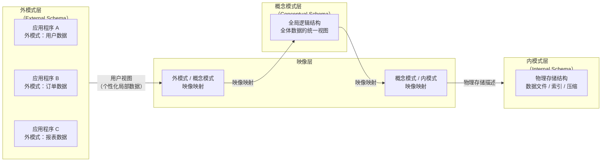
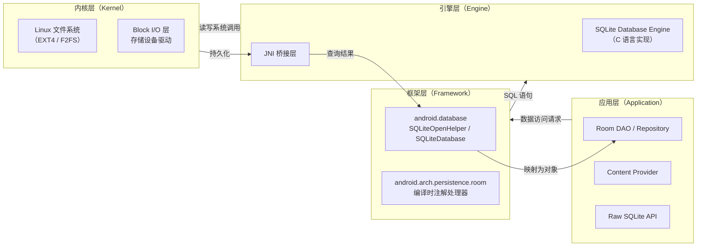
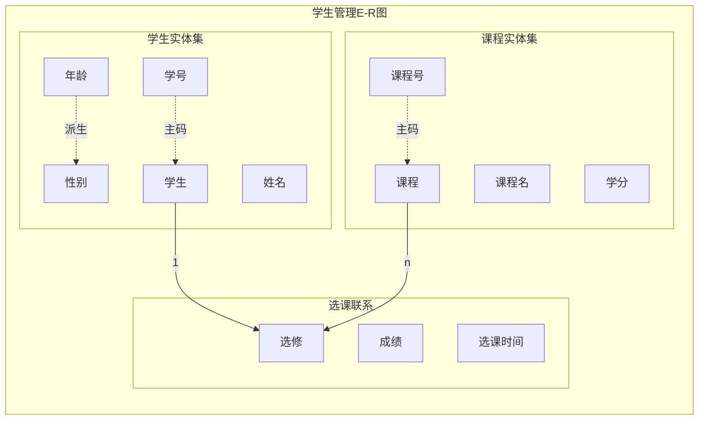
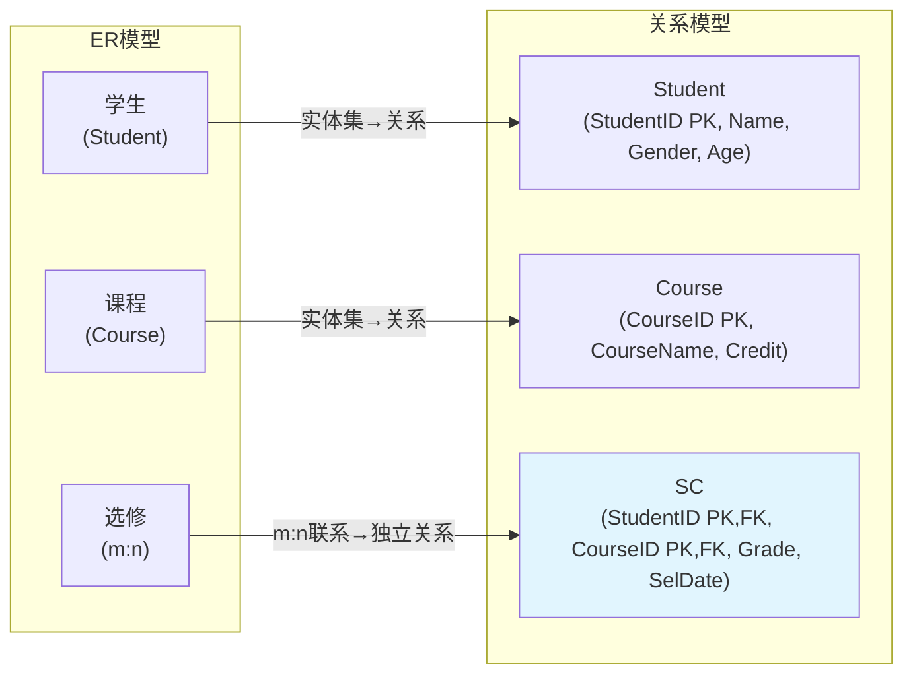
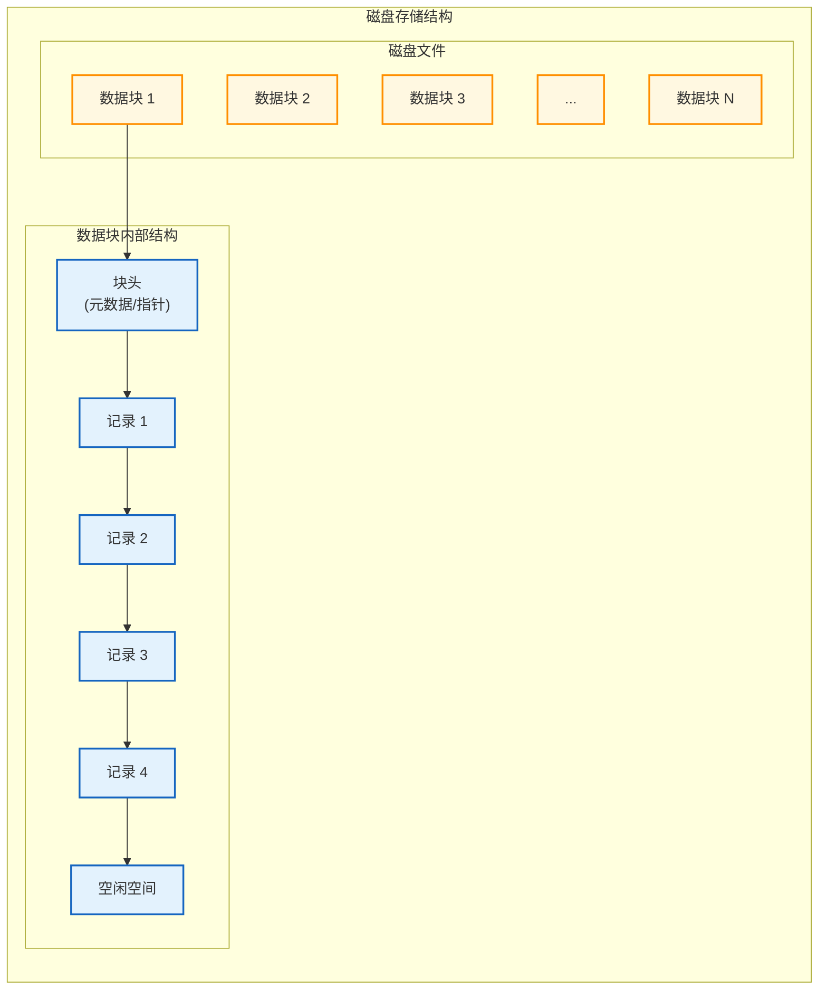
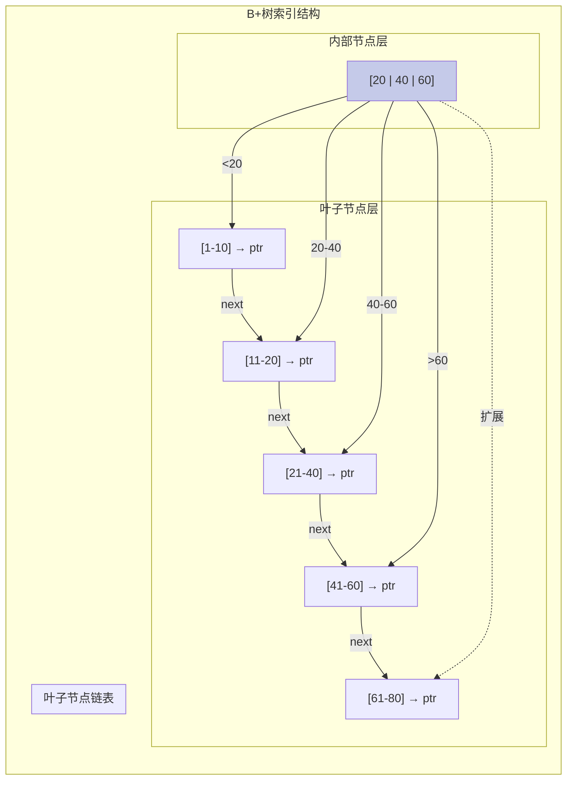
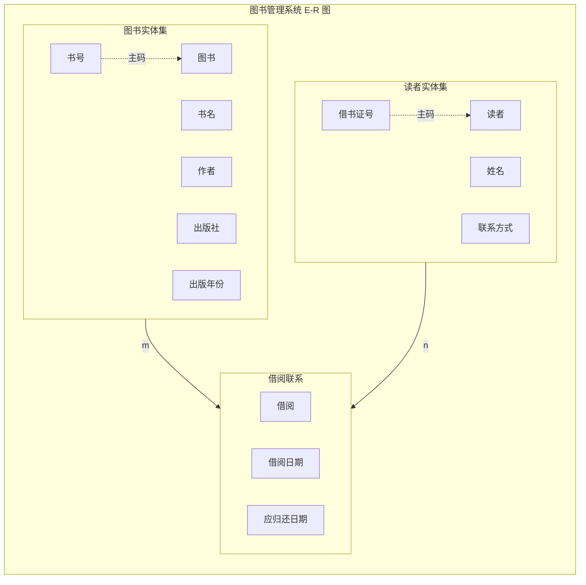
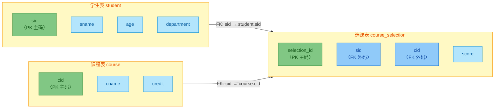
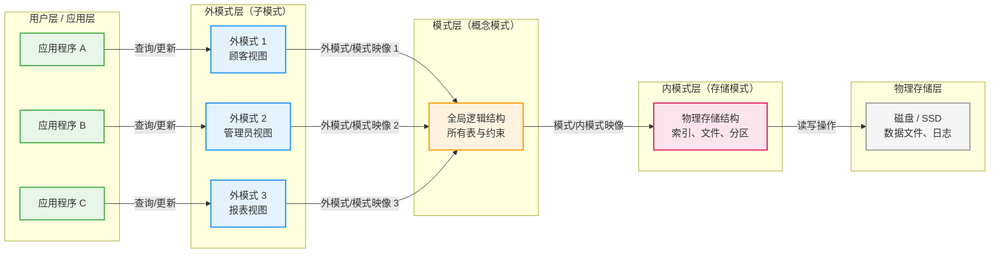

---

# 数据库基础概念

---

## 数据库、DBMS 与数据库系统的概念

### 从数据到数据库：信息管理的演进之路

在计算机科学发展的早期阶段，数据管理主要依赖于文件处理系统（File Processing System）。程序员直接编写程序来读取、写入和操作存储在文件系统中的数据文件。这种方式在数据规模较小、系统复杂度较低的年代尚可接受，但随着数据量的爆炸式增长和应用场景的日益复杂，其固有的缺陷逐渐暴露出来：数据冗余严重、数据不一致、数据共享困难、程序与数据高度耦合、缺乏统一的数据安全管理机制。正是这些缺陷催生了数据库技术的诞生，而理解数据库技术的起点，在于厘清几个最基本却至关重要的概念——数据、数据库、数据库管理系统以及数据库系统。

---

### 数据的概念

**数据（Data）** 是数据库系统中最基本的处理对象，但数据绝不仅仅等同于数字。在数据库领域，**数据是描述客观事物的符号记录**。这些符号可以是数字，也可以是文字、图形、图像、声音、视频等多媒体信息。换言之，只要是能够被计算机识别、存储和加工的信息，都可以被称为数据。

数据具有**语义性**——数据本身是符号，但符号必须承载意义才能成为有用的信息。例如，“37.5”这串数字本身并无明确含义，但当我们知道它代表“体温”且单位是“摄氏度”时，它就成为了一条有意义的数据。因此，**数据是信息的载体，信息是数据所承载的内涵**。在数据库系统中，我们既关注数据的存储形式（数据结构），也关注数据所表达的业务含义（数据语义）。

数据的定义可以从多个维度来理解。从**类型**角度，数据分为结构化数据、半结构化数据和非结构化数据。结构化数据遵循严格的数据模型（如关系模型），具有明确的数据类型和字段定义，例如关系数据库中的表；半结构化数据的结构不固定但包含标记信息，如 XML 文档、JSON 数据；非结构化数据则没有预定义的数据模型，如文本、图片、音频、视频。从**性质**角度，数据又可分为静态数据和动态数据——前者如系统配置参数，相对稳定；后者如交易记录、传感器读数，随着业务活动不断变化更新。

理解数据的概念，还需要认识到数据与信息的关系。在数据库技术的语境中，**数据是原始事实的记录，而信息是对数据进行加工处理后具有语义价值的结果**。从数据到信息的转化过程通常涉及数据的收集、整理、分析和解释。这一转化过程正是数据库系统要高效支持的核心活动。数据管理技术发展的历史，在某种意义上就是不断提高数据处理效率、保证数据质量、挖掘数据价值的历史。

---

### 数据库的概念

**数据库（Database，简称 DB）** 是长期存储在计算机内、有组织的、可共享的大量数据的集合。理解这一定义，需要逐层剖析其关键特征。

**“长期存储”** 意味着数据库中的数据不是临时的、瞬时的，而是被持久化保存的。数据在程序运行结束后仍然存在，不会因计算机关闭而丢失。这与内存中的临时变量形成鲜明对比。数据库通过磁盘或其他持久化存储介质来实现数据的长期保存，现代数据库系统还可能利用固态硬盘（SSD）、内存数据库（In-Memory Database）等技术来进一步优化存储性能和持久性之间的平衡。

**“有组织”** 是数据库区别于普通文件集合的根本特征。数据库不是数据的简单堆叠，而是按照某种**数据模型（Data Model）** 来组织和结构化数据的。数据模型定义了数据的结构、数据之间的联系以及数据的操作约束。正是因为有了数据模型的约束，数据库才能高效地存储、检索和维护数据。常见的数据模型包括层次模型、网状模型、关系模型和面向对象模型，其中关系模型自 20 世纪 70 年代由 IBM 研究员 Edgar F. Codd 提出以来，已经成为当今主流数据库系统的理论基础。

**“可共享”** 体现了数据库系统设计的核心目标之一——支持多用户、多应用的并发访问。传统文件系统中，一个文件往往由一个应用程序独占使用，不同应用之间共享数据极为困难。数据库系统通过提供统一的数据访问接口，使得多个用户和多个应用程序能够同时访问同一份数据，同时保证数据的一致性和完整性。共享性的实现依赖于数据库管理系统提供的并发控制机制、事务管理机制和数据访问控制机制。

**“大量数据”** 则强调了数据库的规模特性。现代企业级数据库系统存储的数据量往往达到 TB（太字节）甚至 PB（拍字节）级别。例如，一个大型电商平台的订单数据库可能存储数十亿条交易记录，一个社交网络平台的用户行为数据库可能存储数千亿条互动数据。这种大规模数据的管理对数据库系统的存储架构、查询优化和性能调优都提出了极高的要求。

数据库的核心价值在于**数据集成（Data Integration）和数据抽象（Data Abstraction）**。通过将企业或组织中的各种数据源统一集成到数据库中，打破信息孤岛，为跨部门、跨系统的数据分析和决策支持提供统一的数据基础。同时，数据库通过对数据的高层抽象，使得应用程序开发者和终端用户无需关心数据的物理存储细节，只需关注数据的逻辑结构，从而大大简化了应用系统的开发和维护工作。

从物理层面看，数据库中的数据以特定的文件格式存储在磁盘上。以 SQLite 为例，数据库就是一个单一的 `.db` 文件，其中包含了表、索引、视图等数据库对象的所有数据和元数据。以 MySQL 为代表的客户端-服务器数据库则可能涉及多个物理文件（数据文件、日志文件、控制文件等）。但无论采用何种物理存储方式，从逻辑层面看，用户和应用程序所感知到的数据库，都是一个统一的、有组织的、可共享的数据集合。

---

### 数据库管理系统的概念

如果说数据库是存放数据的仓库，那么**数据库管理系统（Database Management System，简称 DBMS）** 就是管理这个仓库的智能系统。DBMS 是位于用户和操作系统之间的一层系统软件，负责高效地组织、存储、管理和维护数据库中的数据，并为用户提供数据定义、数据操纵、数据控制和数据查询等操作接口。

DBMS 的核心功能可以从以下几个方面深入理解。

**第一，数据定义功能（Data Definition）。** DBMS 提供专门的数据定义语言（Data Definition Language，DDL），用于描述数据库的逻辑结构、完整性约束和存储路径等。程序员或数据库管理员（DBA）通过 DDL 创建数据库对象（如表、视图、索引、存储过程），修改其结构，或删除不再需要的对象。以 SQLite 为例，创建一张用户表的操作如下：

```sql
-- 使用数据定义语言（DDL）创建数据库表
-- CREATE TABLE 是 DDL 的核心语句，用于定义新的数据库表结构
CREATE TABLE IF NOT EXISTS user (
    -- INTEGER PRIMARY KEY 表示 id 为整数类型且自动递增为主键
    -- 主键是唯一标识表中每行数据的字段，其值不能为空且必须唯一
    id INTEGER PRIMARY KEY AUTOINCREMENT,
    -- TEXT 表示用户名为可变长度文本类型，NOT NULL 约束表示不允许为空
    username TEXT NOT NULL UNIQUE,
    -- TEXT 类型存储密码，数据库中通常存储密码的哈希值而非明文
    password_hash TEXT NOT NULL,
    -- TEXT 类型存储电子邮件，同样设置唯一性约束避免重复注册
    email TEXT,
    -- REAL 类型存储账户余额，用于精确的浮点数存储
    balance REAL DEFAULT 0.0,
    -- TEXT 类型存储用户注册时间，存储格式为 ISO 8601 标准时间字符串
    created_at TEXT DEFAULT (datetime('now'))
);
-- 以上语句定义了 user 表的六个字段及其数据类型和约束条件
```

**第二，数据操纵功能（Data Manipulation）。** DBMS 提供数据操纵语言（Data Manipulation Language，DML）来实现对数据的增删改查操作。DML 的核心操作包括 INSERT（插入）、UPDATE（更新）、DELETE（删除）和 SELECT（查询）。DML 中的查询操作又被称为数据查询语言（Data Query Language，DQL），但通常 SELECT 语句被归入 DML 的范畴。以 Android 开发中常用的 SQLite 为例：

```kotlin
// Android 环境中使用 SQLiteOpenHelper 或直接使用 SQLiteDatabase 进行数据操作
// 以下代码演示了完整的增删改查（CRUD）操作
val dbHelper = MyDatabaseHelper(context, "app_database", null, 1)
val db = dbHelper.writableDatabase

// INSERT 操作：向 user 表中插入一条新记录
// ContentValues 用于封装要插入的键值对数据
val insertValues = ContentValues().apply {
    put("username", "zhang_san")      // 用户名
    put("password_hash", "hashed_pwd") // 密码哈希值
    put("email", "zhangsan@example.com") // 邮箱地址
    put("balance", 1000.0)              // 账户余额
}
// db.insert() 方法返回新插入行的 row ID，出错时返回 -1
val newRowId = db.insert("user", null, insertValues)

// UPDATE 操作：修改已存在的数据
// 假设用户 zhang_san 消费了 150 元，需要更新其余额
val updateValues = ContentValues().apply {
    put("balance", 850.0)  // 更新后的余额
}
// update() 方法的第三个参数是 WHERE 条件，第四个参数是条件中占位符的值
// 第三个参数为 null 时，WHERE 子句被省略，意味着更新所有行（非常危险！）
val rowsUpdated = db.update(
    "user",
    updateValues,
    "username = ?",        // WHERE 条件：指定要更新的用户名
    arrayOf("zhang_san")   // 条件参数：防止 SQL 注入攻击
)

// DELETE 操作：删除不必要的数据记录
// 谨慎使用，删除操作不可逆，重要数据应先备份
// 第一个参数是表名，第二个参数是 WHERE 条件
val rowsDeleted = db.delete(
    "user",
    "username = ?",
    arrayOf("zhang_san")
)

// SELECT 操作：查询数据（最常用的数据访问方式）
// rawQuery() 方法用于执行带参数的 SELECT 语句，返回 Cursor 游标对象
val cursor = db.rawQuery(
    """
    SELECT id, username, email, balance
    FROM user
    WHERE balance > ?
    ORDER BY balance DESC
    """.trimIndent(),
    arrayOf("100.0")  // 查询余额大于 100 的用户，按余额降序排列
)

// 通过 Cursor 遍历查询结果
// cursor.moveToNext() 依次遍历每一行，直到返回 false（无更多行）
while (cursor.moveToNext()) {
    val id = cursor.getInt(cursor.getColumnIndexOrThrow("id"))
    val username = cursor.getString(cursor.getColumnIndexOrThrow("username"))
    val email = cursor.getString(cursor.getColumnIndexOrThrow("email"))
    val balance = cursor.getDouble(cursor.getColumnIndexOrThrow("balance"))
    // 在 Android 中，通常将查询结果封装为数据类或 LiveData 返回
    Log.d("DB_QUERY", "User: $username, Email: $email, Balance: $balance")
}
// 操作完成后必须关闭 Cursor，释放数据库资源
cursor.close()
db.close()
```

**第三，数据控制功能（Data Control）。** DBMS 提供数据控制语言（Data Control Language，DCL）来管理数据库的安全性和完整性。DCL 的核心语句包括 GRANT（授予权限）和 REVOKE（撤销权限）。DBMS 需要确保只有经过授权的用户才能访问特定的数据，同时防止未授权的数据泄露和恶意篡改。此外，DBMS 还负责维护数据的完整性约束——例如实体完整性（主键值不能为空）、参照完整性（外键引用必须有效）、域完整性（字段值必须在合法范围内）等。

**第四，数据安全和恢复功能。** DBMS 需要提供完善的机制来保护数据免受意外或恶意破坏。这包括用户身份认证、访问控制列表（ACL）、数据加密、审计日志、数据库备份与恢复等能力。当系统发生故障（如断电、硬件损坏、软件崩溃）时，DBMS 必须能够将数据库恢复到一致性和完整性状态，确保不丢失已提交的事务数据。

**第五，并发控制功能。** 在多用户环境中，多个用户可能同时对同一份数据进行读写操作。如果不加以控制，可能会导致脏读、不可重复读、幻读等并发问题。DBMS 通过**锁机制（Locking）**、**多版本并发控制（MVCC）** 等技术来协调并发操作，保证事务的 ACID 特性（即原子性、一致性、隔离性、持久性）。这是数据库系统区别于简单文件系统的关键技术之一。

**第六，查询处理和优化。** 当用户提交一条 SQL 查询语句时，DBMS 并不会直接执行该语句。查询首先经过**解析器（Parser）** 进行语法分析和语义检查，然后由**查询优化器（Query Optimizer）** 生成最优的执行计划，最后由**执行引擎（Execution Engine）** 按照计划执行查询并返回结果。查询优化是 DBMS 中最复杂也最核心的技术之一——同样一条查询语句可能有数十种甚至数百种不同的执行方式，优化器的任务就是从中选择代价最低的那一种。现代 DBMS 通常采用基于代价的优化（Cost-Based Optimization，CBO）策略，通过统计信息（如表的行数、索引的基数）来估算不同执行计划的代价。

下面通过一个 Mermaid 架构图来展示 DBMS 的核心组件及其交互关系：

```mermaid
graph LR
    %% 全局方向：从左到右，强制水平排列

    %% 定义样式：概念层、逻辑层、物理层分离
    classDef user_layer fill:#E8F5E9,stroke:#4CAF50,stroke-width:2px,color:#1B5E20
    classDef dms_layer fill:#E3F2FD,stroke:#2196F3,stroke-width:2px,color:#0D47A1
    classDef storage_layer fill:#FFF3E0,stroke:#FF9800,stroke-width:2px,color:#E65100

    %% 用户交互层（概念层 - 绿色系）
    subgraph user_layer["用户交互层"]
        direction TB
        A["用户 / 应用程序\n（User / Application）"]
        B["SQL 查询接口\n（SQL Interface）"]
    end

    %% DBMS 核心处理层（逻辑层 - 蓝色系）
    subgraph dms_layer["DBMS 核心处理层"]
        direction TB
        C["查询解析器\n（Query Parser）"]
        D["查询优化器\n（Query Optimizer）"]
        E["执行引擎\n（Execution Engine）"]
        F["事务管理器\n（Transaction Manager）"]
        G["并发控制器\n（Concurrency Control）"]
        H["恢复管理器\n（Recovery Manager）"]
    end

    %% 物理存储层（物理层 - 橙色系）
    subgraph storage_layer["物理存储层"]
        direction TB
        I["索引管理器\n（Index Manager）"]
        J["缓冲管理器\n（Buffer Manager）"]
        K["磁盘存储管理\n（Disk Storage Manager）"]
        L["数据文件 / 日志文件\n（Data / Log Files）"]
    end

    %% 跨层连接：子图间使用子图名链式连接
    user_layer -->|"SQL 语句"| dms_layer
    dms_layer -->|"读写请求"| storage_layer
    storage_layer -->|"查询结果"| user_layer

    %% 层内详细连接（逐行分写，禁止链式）
    A -->|"提交请求"| B
    B -->|"转发 SQL"| C
    C -->|"语法树"| D
    D -->|"最优执行计划"| E
    E -->|"操作指令"| F
    F -->|"调度事务"| G
    G -->|"加锁 / 解锁"| I
    E -->|"数据操作"| I
    I -->|"缓存页读写"| J
    J -->|"磁盘 I/O"| K
    K -->|"持久化"| L
    L -->|"数据页"| J
```



从上图中可以清晰地看到 DBMS 的分层架构：用户通过 SQL 接口提交的请求，经过解析、优化、执行、事务管理和并发控制等多个环节的处理，最终由存储管理层完成数据的物理读写操作。这种分层设计体现了软件工程中**关注点分离（Separation of Concerns）** 的核心原则，使得 DBMS 的各个组件可以独立演进和优化。

---

### 数据库系统的概念

**数据库系统（Database System，简称 DBS）** 是指在计算机系统中引入数据库之后的完整系统，它由**数据库**、**数据库管理系统（及其开发工具）**、**应用程序**以及**数据库管理员**四个部分组成的整体。理解数据库系统的概念，需要从系统整体的角度审视各个组成部分之间的协作关系。

如果将整个系统比作一家现代化的图书馆，那么数据库就是图书馆的书库——存放着海量的书籍和数据；DBMS 就是图书馆的自动化管理系统——负责图书的编目、检索、借还、排序和日常维护；应用程序就像是读者使用的各类工具和服务的总和，例如自助查询终端、移动借阅 App、图书推荐系统等；而数据库管理员（DBA）则是图书馆的馆长和技术团队——负责制定数据管理策略、监控系统性能、处理异常故障、保障数据安全等。换言之，数据库系统是一个涵盖了硬件、软件、人员和管理制度的完整体系。

**数据库系统与数据库管理系统的区别**是初学者容易混淆的概念。简而言之，**数据库**是数据的集合，**DBMS** 是管理数据的系统软件，而**数据库系统**则是包含数据库、DBMS、应用程序和 DBA 在内的完整系统。打个比方：如果数据库相当于一个仓库中的货物，那么 DBMS 就是管理这些货物的仓库管理系统，而数据库系统则是整个仓库建筑及其配套设施、管理团队和运营流程的总和。

在 Android 开发领域，开发者日常打交道的核心是 SQLite 数据库引擎和 Room 持久化库。SQLite 是 Android SDK 内置的轻量级关系数据库，它实现了 DBMS 的核心功能但以嵌入式的方式运行——没有独立的数据库服务器进程，数据库就是一个文件。但从数据库系统的视角看，一个完整的 Android 应用如果要实现可靠的数据管理，通常还需要在 SQLite 之上构建数据访问层（如 Room）、业务逻辑层和数据展示层，这才构成一个真正意义上的**数据库应用系统**。

---

### 数据库系统的外部体系结构

为了帮助不同层次的用户（从应用程序开发者到数据库管理员）从不同视角理解数据库系统，数据库系统通常采用**三级模式-两级映像**的外部体系结构。这一结构是理解数据库系统如何实现数据独立性的关键理论基础。

数据库系统的三级模式包括**外模式（External Schema）**、**概念模式（Conceptual Schema）** 和**内模式（Internal Schema）**。

**概念模式**也称为逻辑模式，是数据库中全体数据的逻辑结构和特征的描述。它是数据库管理员（DBA）对数据库所定义的整体逻辑结构，介于外部用户视图和内部物理存储之间。概念模式使用**数据定义语言（DDL）** 来描述，不涉及数据的物理存储细节。对于一个企业的人事管理系统而言，概念模式可能定义了员工表、部门表、工资表等数据库对象的逻辑结构及其相互关系。

**外模式**也称为子模式或用户模式，是单个用户或应用程序所能看到和使用的局部数据的逻辑结构和特征的描述。一个数据库可以有多个外模式，分别对应不同的用户群体或应用模块。例如，人事部门的用户可能看到一个包含员工薪资和绩效的外模式，而财务部门的用户可能看到一个只包含部门预算和费用报销信息的外模式。外模式是概念模式的子集，它为不同用户提供了个性化且安全的数据视图。

**内模式**是数据物理结构和存储方式的描述，是数据在数据库内部的表示方式。内模式定义了数据记录如何存储、索引采用何种结构（如 B+ 树索引或哈希索引）、数据是否压缩、是否加密等物理层面的细节。内模式由**存储模式语言**描述，一般由数据库管理员在 DBA 视角下进行调整，普通应用程序开发者通常无需关心。

两级映像是指**外模式-概念模式映像**和**概念模式-内模式映像**。这两级映像是实现数据库系统两个重要特性——**逻辑数据独立性**和**物理数据独立性**——的关键机制。

当数据库的全局逻辑结构（概念模式）发生变化时，例如在员工表中新增一个字段或修改某个字段的数据类型，只要外模式-概念模式的映像做了相应调整，用户的应用程序就无需修改——这就是**逻辑数据独立性**。同样，当数据的物理存储结构（内模式）发生变化时，例如从磁盘存储改为 SSD 存储、调整索引结构或重新组织数据文件的物理布局，只要概念模式-内模式的映像做了相应更新，用户的应用程序和全局逻辑结构就可以保持不变——这就是**物理数据独立性**。数据独立性是数据库系统相对于文件系统的核心优势之一，它极大地提高了数据库系统的可维护性、可扩展性和可移植性。

用 Mermaid 图可以直观地展示三级模式-两级映像的体系结构：



这张图清晰地展示了数据库系统三级模式的自顶向下的层次关系以及两级映像的枢纽作用。外部层对应多个不同的用户视图（每个应用可能看到不同的数据子集），中间是全局统一的逻辑结构，底层是数据的物理存储。两侧的映像层分别承担了逻辑数据独立性和物理数据独立性的保障职责。

---

### 数据库系统的整体构成与运行机制

数据库系统作为一个复杂的人机系统，其整体构成可以从**五个主要组成部分**来理解。

**第一，硬件部分。** 硬件是数据库系统运行的物质基础，包括服务器、存储设备（磁盘阵列、SSD）、网络设备以及各类输入输出设备。在 Android 环境中，硬件主要指移动设备的处理器、内存和存储空间。对于大规模数据库系统（如企业级 MySQL 集群、Oracle RAC），硬件的选型和配置（如 RAID 级别、内存容量、网络带宽）对系统整体性能有着决定性影响。

**第二，软件部分。** 软件部分包括操作系统、DBMS 软件本身、以及各种应用开发工具和接口库。在 Android 中，操作系统是 Linux 内核，DBMS 是 SQLite，常见的开发工具包括 Android Studio、Room 库（作为 SQLite 的抽象层）、Jetpack 组件等。DBMS 软件是数据库系统的核心，它负责任务繁重的数据存储、检索、更新、并发控制和恢复管理等关键工作。

**第三，数据部分。** 数据是数据库系统处理的对象，也是系统存在价值的根本所在。高质量的数据库系统需要拥有**正确性（Correctness）**、**完整性（Integrity）** 和**一致性（Consistency）** 的数据。数据的质量取决于多个因素：数据模型的合理性、完整性约束的有效性、数据录入规范的严格性、以及 DBMS 事务管理机制的可靠性。

**第四，人员部分。** 数据库系统中涉及的人员角色包括数据库管理员（DBA）、系统分析师、应用程序开发人员和最终用户。其中，DBA 是数据库系统的核心管理人员，负责数据库的安装配置、性能调优、安全管理、备份恢复、容量规划以及日常运维工作。在大型组织中，DBA 是一个专业化程度非常高的岗位，需要深入理解数据库原理和业务需求。应用程序开发人员负责基于数据库设计应用系统的逻辑层和数据访问层。在 Android 开发中，开发者通常使用 Room 库提供的注解处理器和 DAO（Data Access Object）接口来定义数据访问操作，而无需直接编写底层的 SQL 语句。

**第五，规程部分。** 规程是指数据库系统的操作规范和管理制度，包括数据入库标准、数据维护流程、故障处理预案、安全审计规范等。没有完善的规章制度，再先进的技术也无法保证数据的安全和系统的稳定运行。

在 Android 平台的数据库开发实践中，一个典型应用的数据层架构通常呈现如下形态：最上层是 UI 层（Activity/Fragment）和 ViewModel 层，它们通过 LiveData 或 Kotlin Flow 与数据层通信；中间是 Repository 层，负责整合来自不同数据源（数据库、网络等）的数据；底层则是 Room 数据库（封装了 SQLite）和 Network API。这种架构遵循了**关注点分离**的原则，使得数据持久化逻辑与业务逻辑和界面展示逻辑相互独立。

```kotlin
// Android Jetpack 架构下的 Room 数据库使用示例
// 演示如何通过 Room 实现数据抽象层，将底层 SQLite 操作封装为优雅的 Kotlin API

// 第一步：定义数据实体（Entity）——对应数据库中的一张表
@Entity(tableName = "products")  // @Entity 注解声明此类为数据库表，tableName 指定表名
data class Product(
    // @PrimaryKey 声明此字段为主键，autoGenerate = true 表示主键自动递增
    @PrimaryKey(autoGenerate = true)
    val id: Long = 0,             // 商品编号（主键）

    @ColumnInfo(name = "name")   // @ColumnInfo 指定列名，可用于字段名与列名不一致的情况
    val name: String,            // 商品名称

    val price: Double,           // 商品价格

    val category: String,        // 商品分类

    val stock: Int = 0           // 库存数量，默认值为 0
)

// 第二步：定义 DAO（Data Access Object）—— 定义数据访问接口
// DAO 是应用程序访问数据库的唯一通道，封装了所有对数据库的 CRUD 操作
@Dao
interface ProductDao {
    // @Insert 注解的方法用于插入数据，onConflict = OnConflictStrategy.REPLACE
    // 表示如果插入的主键已存在，则替换原有记录
    @Insert(onConflict = OnConflictStrategy.REPLACE)
    suspend fun insert(product: Product): Long  // 返回新插入行的主键值

    // @Insert 还可以批量插入多个商品，返回各自行主键值组成的列表
    @Insert(onConflict = OnConflictStrategy.REPLACE)
    suspend fun insertAll(products: List<Product>)

    // @Update 注解的方法用于更新现有记录，参数为要更新的 Product 对象
    // Room 会根据主键值找到对应行并更新其他字段
    @Update
    suspend fun update(product: Product)

    // @Delete 注解的方法用于删除指定的记录
    @Delete
    suspend fun delete(product: Product)

    // @Query 注解用于执行自定义的 SQL 查询语句
    // 下面的查询返回所有商品的列表，按价格升序排列
    @Query("SELECT * FROM products ORDER BY price ASC")
    fun getAllProducts(): Flow<List<Product>>  // Flow 是 Kotlin 协程中的响应式数据流

    // 带条件的查询：查找分类为指定值的商品，返回 LiveData（响应式数据容器）
    @Query("SELECT * FROM products WHERE category = :category ORDER BY price DESC")
    fun getProductsByCategory(category: String): LiveData<List<Product>>

    // 带聚合函数的查询：统计某分类下库存为 0（缺货）的商品数量
    @Query("SELECT COUNT(*) FROM products WHERE category = :category AND stock = 0")
    suspend fun getOutOfStockCount(category: String): Int

    // 多条件组合查询：查找满足多个条件的商品
    @Query("""
        SELECT * FROM products
        WHERE category = :category
        AND price BETWEEN :minPrice AND :maxPrice
        AND stock > 0
        ORDER BY price ASC
    """)
    suspend fun getFilteredProducts(
        category: String,
        minPrice: Double,
        maxPrice: Double
    ): List<Product>
}

// 第三步：定义 Room 数据库类 —— 数据库的全局入口点
// @Database 注解声明一个 Room 数据库类，entities 参数指定所有数据表对应的 Entity 类
@Database(entities = [Product::class], version = 1, exportSchema = false)
abstract class AppDatabase : RoomDatabase() {
    // 数据库类中声明一个抽象的 DAO 属性，Room 会自动生成其实现类
    abstract fun productDao(): ProductDao

    // 伴生对象（Companion Object）提供获取数据库实例的静态工厂方法
    companion object {
        // @Volatile 注解确保 INSTANCE 变量的可见性，多线程环境下正确同步
        @Volatile
        private var INSTANCE: AppDatabase? = null

        fun getDatabase(context: Context): AppDatabase {
            // 如果实例已存在则直接返回，避免重复创建数据库连接
            return INSTANCE ?: synchronized(this) {
                // Room.databaseBuilder() 是构建数据库实例的工厂方法
                // 参数依次为：上下文对象、数据库类名、数据库文件存储位置
                val instance = Room.databaseBuilder(
                    context.applicationContext,
                    AppDatabase::class.java,
                    "app_database"        // 数据库文件名，最终存储为 /data/data/<package>/databases/app_database
                )
                    // .addMigrations() 可在此处添加数据库迁移策略（后续版本更新时）
                    .build()
                INSTANCE = instance
                instance
            }
        }
    }
}
```

从上述代码可以看出，Room 库对 SQLite 进行了全面的抽象和封装，使得开发者无需编写任何 SQLite 代码（不需要继承 SQLiteOpenHelper，不需要手动编写 SQL 语句来执行 CRUD），而是通过注解和接口定义的方式声明数据结构（Entity）、数据操作（DAO）和数据库配置（Database）。Room 编译器在项目构建过程中自动生成底层 SQLite 操作代码，极大地提升了开发效率并减少了出错的可能性。这种设计正是**数据抽象**理念在实践中的具体体现——应用程序开发者工作在更高层次的抽象之上，而底层细节被良好地封装在框架内部。

---

### 数据库系统的发展历程与里程碑

数据库技术的发展经历了几个重要的阶段，每一阶段都伴随着新的数据模型、新的技术和新的应用需求的出现。

**第一代：层次数据库和网状数据库（1960s-1970s 初）。** 层次数据库（Hierarchical Database）以树形结构组织数据，最典型的代表是 IBM 公司于 1968 年推出的 **IMS（Information Management System）**。网状数据库（Network Database）以图形结构组织数据，比层次模型提供了更高的数据灵活性，代表产品包括 **CODASYL** 提出的 DBTG（Data Base Task Group）模型及其实现系统。这两代数据库系统的共同特点是数据模型比较底层，应用程序需要显式地处理数据导航（Data Navigation）——程序员需要知道数据在存储设备上的物理位置和访问路径，这种高度的数据依赖性使得应用程序的维护成本极高。

**第二代：关系数据库（1970s 至今）。** 1970 年，IBM 研究中心的研究员 **Edgar F. Codd** 发表了具有里程碑意义的论文《A Relational Model of Data for Large Shared Data Banks》，首次提出了**关系模型（Relational Model）** 的理论。关系模型以**数学中的集合论和谓词逻辑**为基础，用二维表格（关系）来描述数据和数据之间的联系。关系模型具有坚实的数学理论基础，查询语言（如 SQL）基于**关系代数**和**关系演算**，具有简洁、强大和高度抽象的特点。更重要的是，关系模型实现了**数据独立性**——应用程序不再需要了解数据的物理存储细节，只需通过逻辑操作来访问数据。1987 年，ISO（国际标准化组织）正式发布了 **SQL 标准**（SQL-87），此后经历了多次修订（SQL-92、SQL:1999、SQL:2003、SQL:2008、SQL:2011、SQL:2016、SQL:2023），逐步完善了关系数据库的功能和标准。

**第三代：后关系数据库时代（1990s 至今）。** 随着互联网的爆炸式增长和 Web 2.0 应用的兴起，传统关系数据库在处理海量非结构化数据和高并发访问时遇到了瓶颈。以 **NoSQL**（Not Only SQL）为代表的新型数据库应运而生，包括文档数据库（MongoDB）、键值数据库（Redis）、列族数据库（HBase）、图数据库（Neo4j）等。这些系统在特定场景下（如大规模数据存储、高并发读写、灵活的数据模式）提供了优于关系数据库的性能和灵活性。但 NoSQL 并非关系数据库的替代品，而是在特定领域的补充。近年来，**NewSQL** 数据库（如 Google Spanner、CockroachDB、TiDB）尝试融合关系模型的 ACID 事务保证和 NoSQL 系统的水平扩展能力，代表了数据库技术发展的新方向。

在移动和嵌入式领域，**SQLite** 是一个独特且极为成功的产品。SQLite 由 D. Richard Hipp 于 2000 年发布，最初用于美国海军的一艘导弹驱逐舰上。它以单一文件的形式提供完整的 SQL 数据库功能，代码量极小（仅约十几万行 C 代码），资源消耗极低，却能够处理高达 TB 级别的数据。SQLite 已成为全球部署最广泛的数据库引擎——它内置在每一个 Android 和 iOS 智能手机中，运行在 Firefox 和 Chrome 浏览器中，被飞机黑匣子、医疗设备、车载系统等无数嵌入式设备所使用。

---

### 数据库系统的优势与核心价值

数据库系统相较于传统的文件管理系统具有显著的优势，这些优势也是数据库技术能够在短短几十年内迅速取代文件系统成为主流数据管理手段的根本原因。

**数据集成与数据共享。** 数据库系统将组织内的所有数据集中存储、统一管理，打破了部门之间的数据壁垒。不同部门、不同应用可以通过 DBMS 提供的接口访问同一份数据，实现真正的数据共享。这不仅消除了大量重复存储造成的数据冗余，还确保了数据的一致性——同一数据在数据库中只有一个“真实来源”。

**数据独立性与程序可维护性。** 如前所述，三级模式-两级映像的架构使得数据的逻辑结构与物理存储相互独立。当应用需求变化导致数据结构需要调整时，修改的范围被限制在局部层面，不会“牵一发而动全身”。这一特性对于需要长期维护和持续演进的企业信息系统尤为重要。

**高效的数据访问与查询能力。** DBMS 提供了强大的数据查询和检索能力，用户无需编写复杂的遍历代码，只需使用声明式的 SQL 语句描述想要获取什么数据，DBMS 的查询优化器会自动决定如何最高效地获取这些数据。索引机制（如 B+ 树索引、哈希索引）使得大规模数据的检索可以在毫秒级完成。

**数据完整性与安全性保障。** DBMS 通过完整性约束（主键、唯一键、外键、检查约束、触发器等）自动维护数据的正确性和一致性。通过用户认证、权限管理和访问控制，DBMS 确保只有授权用户才能访问特定的数据。此外，审计日志功能记录了所有对数据的操作历史，为事后分析和责任追踪提供了依据。

**并发访问与事务支持。** 在多用户环境中，DBMS 的并发控制机制确保多个用户可以同时操作数据而不会互相干扰。事务管理机制（ACID 特性）保证了在系统故障或并发冲突发生时，数据库能够恢复到一致的状态，不会出现“部分更新”的尴尬局面。

**数据备份与灾难恢复。** DBMS 提供了完善的备份和恢复工具，支持全量备份、增量备份、日志备份等多种策略。当发生硬件故障、人为误操作或自然灾害时，数据库可以在最短时间内恢复到正常运行状态，最大限度减少数据丢失。

---

### Android 平台数据库技术栈全景

对于 Android 应用开发者而言，理解数据库相关技术在整个平台技术栈中的位置至关重要。Android 的数据库技术栈可以从上到下分为几个层次。

**应用层（Application Layer）。** 这是开发者直接编写业务逻辑代码的地方，通过 Room、ContentProvider 或原始 SQLite API 与数据库进行交互。在 MVVM 架构中，这一层通常对应 ViewModel、Repository 和 DAO 的组合。

**Room 抽象层（Room Abstraction Layer）。** Room 是 Google 官方推荐的 Android 数据持久化库，发布于 2017 年的 Google I/O 大会。Room 在 SQLite 之上构建了一层类型安全的抽象，提供了编译时 SQL 语句验证、生命周期感知的 LiveData/Flow 支持、数据库迁移工具等特性。对于绝大多数 Android 应用开发场景，Room 都是首选的数据库解决方案。

**SQLite 引擎层（SQLite Engine Layer）。** SQLite 是 Android 内置的嵌入式关系数据库引擎。它实现了标准的大部分 SQL-92 特性和一些 SQL-99 特性，支持事务、视图、触发器、索引等数据库特性。SQLite 的核心是用 C 语言编写的，Android 框架通过JNI（Java Native Interface）与 SQLite 引擎进行通信。

**系统库层（System Library Layer）。** Android 的 `android.database` 和 `android.database.sqlite` 包提供了底层的数据库操作 API。其中 `SQLiteOpenHelper` 是一个封装了数据库创建、版本管理和生命周期回调的抽象类，是早期 Android 开发中管理 SQLite 数据库的标准方式。而 `SQLiteDatabase` 则提供了 execSQL()、rawQuery() 等直接的数据库操作方法。

**Linux 内核层（Linux Kernel Layer）。** SQLite 的数据最终通过 Linux 文件系统写入存储介质。在 Android 设备上，应用私有数据库文件通常存储在 `/data/data/<应用包名>/databases/` 目录下。此外，Android 的 Binder 机制负责应用进程与系统服务（如 Activity Manager、Content Provider）之间的进程间通信，其中也涉及数据库相关的 IPC 操作。



---

### 本节小结

本节从最基础的概念出发，系统性地梳理了数据、数据库、数据库管理系统和数据库系统这四个核心概念之间的逻辑关系。

**数据**是描述客观事物的符号记录，是数据库系统处理的基本对象；**数据库**是长期存储在计算机内、有组织的、可共享的大量数据集合，它通过数据模型实现了数据的结构化组织和持久化存储；**数据库管理系统**是位于用户和操作系统之间的系统软件，负责提供数据定义、数据操纵、数据控制、数据安全、并发控制和恢复管理等全套功能，是数据库系统得以运转的核心引擎；**数据库系统**则是由数据库、DBMS、应用程序、数据库管理员和相关的硬件与软件环境所组成的完整体系。

理解这些基础概念及其相互关系，是深入学习后续章节——如数据模型、关系模型、数据库系统架构——的重要前提。特别是 DBMS 的分层架构设计和三级模式-两级映像的外部体系结构，是数据库系统实现**数据独立性**这一核心价值的关键机制。而将理论概念与 Android 平台的具体技术实现（SQLite、Room）相结合，则有助于开发者在实践中更深刻地理解数据库系统的运行原理，写出更高效、更可靠的数据库应用代码。

---

#### 📝 练习题

以下关于数据库、DBMS 和数据库系统的说法中，正确的是哪一项？

A. 数据库就是 DBMS，两者名称不同但本质上是同一个概念
B. 数据库系统就是数据库加上 DBMS，应用程序和 DBA 不属于数据库系统的组成部分
C. 三级模式-两级映像的体系结构实现了数据的逻辑独立性和物理独立性
D. SQLite 在 Android 中运行时需要启动独立的数据库服务器进程

**【答案】** C
**【解析】** 本题考查数据库系统中几个核心概念的辨析。

选项 A 错误。数据库（Database）是指存放数据的集合本身，而数据库管理系统（DBMS）是用于管理这个数据集合的系统软件。打个比方，数据库相当于仓库中的货物本身，而 DBMS 相当于管理货物的仓库管理系统。两者在概念和功能上都有明确的区分，绝非同一事物。

选项 B 错误。数据库系统（Database System）是一个完整的体系，由硬件、软件、数据和人员四大要素组成。其中软件不仅包括 DBMS，还包括应用程序及其开发工具；人员则包括数据库管理员（DBA）、系统分析师、应用程序开发人员和最终用户。应用程序和 DBA 都是数据库系统不可或缺的组成部分。

选项 C 正确。三级模式包括外模式（用户模式）、概念模式（逻辑模式）和内模式（存储模式）。外模式-概念模式映像使得改变概念模式（如添加新字段）不会影响已有的用户程序，从而实现**逻辑数据独立性**；概念模式-内模式映像使得改变内模式（如更换存储结构、调整索引）不会影响概念模式和用户程序，从而实现**物理数据独立性**。两级映像是数据库系统实现数据独立性的关键机制，也是数据库系统相较于文件系统的重要优势之一。

选项 D 错误。SQLite 是一个**嵌入式数据库引擎**，它在 Android 中不需要独立的服务器进程。SQLite 数据库就是一个普通的文件（`.db` 或 `.sqlite`），所有的数据库操作（如查询、更新）都在应用程序进程内完成。这种嵌入式架构使得 SQLite 具有部署简单、资源占用少、零配置等优点，特别适合移动设备和嵌入式场景。这也是为什么 Android 设备能够做到开箱即用、无需额外安装数据库服务器软件的原因。

**【答案】** C

---

## 数据模型

数据模型（Data Model）是数据库系统中用于描述数据、数据之间的联系、数据操作以及完整性约束条件的工具。它是数据库系统设计的核心，决定了数据库能够表达什么样的数据结构，支持什么样的操作，以及能够施加什么样的完整性规则。可以说，数据模型是数据库系统的灵魂——不同的数据模型对应着不同的理论体系和适用范围，理解数据模型是理解数据库系统本质的第一步。

从数据库发展的历史来看，数据模型经历了从层次模型（Hierarchical Model）和网状模型（Network Model）到关系模型（Relational Model）的演进，目前关系模型仍然是商业数据库的主流。与此同时，面向对象模型（Object-Oriented Model）、对象关系模型（Object-Relational Model）、键值模型（Key-Value Model）、文档模型（Document Model）等新型数据模型也在特定场景中发挥着重要作用。每一种数据模型都试图在**表达能力的丰富性**与**实现的可操作性**之间寻找平衡，而数据模型的选择直接影响着数据库系统的性能、灵活性和应用场景。

数据模型通常由以下三个要素构成：**数据结构**、**数据操作**和**完整性约束**。数据结构是指对数据静态特征的描述，包括数据的类型、性质以及数据之间关系的描述；数据操作是指对数据动态特征的描述，指的是对数据库中各种对象实例所允许执行的操作的集合，典型的操作包括查询、插入、更新和删除；完整性约束是指对数据静态和动态规则的描述，用来限定数据的值以及数据之间的关系必须满足的条件。这三个要素共同构成了一个完整的数据模型框架，任何数据库系统都必须在这三个层面上给出明确的定义。

下面我们将从概念模型、逻辑模型和物理模型三个层次来深入探讨数据模型的设计与实现。

### 概念模型

概念模型（Conceptual Model）是面向用户和业务的角度，对现实世界中客观事物及其联系的抽象表示。它不依赖于任何具体的计算机系统或数据库管理系统，而是一种纯语义层面的模型。概念模型的作用是：在数据库设计的早期阶段，帮助设计人员与用户之间建立起沟通的桥梁，使得双方能够就业务需求达成共识。概念模型只关注“**是什么**”，而不关注“**怎么做**”。

#### 实体与实体集

在概念模型中，最基本的组成单元是**实体（Entity）**。实体是指客观存在的、可区别于其他事物的对象。例如，在一个人事管理系统中，一位具体的员工就是一个实体，一台具体的电脑也是一个实体。与之对应，**实体集（Entity Set）**是指同一类型实体的集合。例如，所有员工构成了“员工”实体集，所有电脑构成了“设备”实体集。在概念模型的绘制中，每个实体集通常用一个矩形来表示。

需要注意的是，实体集中的每一个实体都应该具有某种共同的特征或属性。例如，“学生”实体集中的每个学生都有学号、姓名、性别、出生日期等属性，但每个实体的属性取值可以不同。实体与实体集之间的关系类似于面向对象编程中对象与类的关系——实体是实体集的实例，实体集是实体的抽象。

#### 属性

**属性（Attribute）** 是实体所具有的某一特征或性质。例如，学生实体可能具有学号、姓名、性别、出生日期、专业等属性。每个具体的实体由一组属性值来描述，例如某个学生的属性值可能是 \{2024001, 张三, 男, 2005-03-15, 计算机科学与技术\}。在概念模型的图形表示中，属性通常用椭圆形来表示，并通过无向边与相应的实体集相连。

属性可以分为以下几种类型：

**简单属性**是指不可再分的属性，例如人的性别、血型等。**复合属性**是指可以进一步拆分为多个简单属性的属性，例如“地址”可以拆分为“省份”、“城市”、“街道”等子属性。在数据库设计中，复合属性通常根据实际需要决定是否需要展开为多个简单属性来处理。

**单值属性**是指对于每个实体该属性只有一个值，例如每个学生只有一个学号。**多值属性**是指对于每个实体该属性可能有多个值，例如一个学生可能有多门课程的成绩，或者一个教师可能有多项科研成果。在概念模型中，多值属性通常用双椭圆来表示。

**派生属性**是指可以通过其他属性计算推导出来的属性，例如“年龄”可以从“出生日期”计算得出。在概念模型中，派生属性通常用虚线椭圆来表示，以区别于存储在数据库中的基本属性（也称为基属性或持久属性）。

#### 码与键

在实体集中，需要有一种方式来唯一地识别每一个实体，这就是**码（Key）**的概念。**超码（Super Key）**是指能够唯一标识实体集中每个实体的属性或属性组合。例如，在学生实体集中，学号可以唯一标识每个学生，因此\{学号\}是一个超码。\{学号, 姓名\}也是一个超码，因为它同样能够唯一标识每个学生，但它包含了冗余信息。

**候选码（Candidate Key）**是指那些能够唯一标识实体且其任何真子集都不能唯一标识实体的最小属性组合。例如，\{学号\}是一个候选码，因为仅凭学号就能唯一确定一个学生，且去掉任何一个属性后剩下的集合无法唯一标识任何学生。在一个实体集中，候选码可能有多个，比如公民身份证号和驾照号码都可能是人员实体集的候选码。

**主码（Primary Key）**是指从候选码中由设计者指定的一个用来唯一标识实体的码。主码是实体集的最重要标识，在概念模型中通常用下划线来标注。主码的选择需要考虑稳定性（选择不会频繁变动的属性）、简洁性（选择属性个数最少的候选码）和自然性（选择业务上最自然的标识）等因素。

**外码（Foreign Key）**是指一个实体集中的某个属性或属性组合，其值参照另一个实体集的主码。外码用于建立两个实体集之间的参照完整性约束。例如，在选课关系中，“学号”属性参照学生实体集的主码“学号”，“课程号”属性参照课程实体集的主码“课程号”。外码的概念体现了数据模型中数据之间相互联系的能力。

#### 联系

现实世界中不仅存在独立的事物（实体），还存在事物之间的各种相互关系。**联系（Relationship）**是指实体集之间或实体集内部之间的相互关系。例如，“学生选修课程”是一种联系，它关联了“学生”实体集和“课程”实体集；“教师指导学生”也是一种联系，它关联了“教师”实体集和“学生”实体集。在概念模型的图形表示中，联系通常用菱形来表示，并通过线条与相关的实体集相连。

联系也可以具有属性。例如，“选课”联系可能具有“成绩”和“选课时间”属性，这些属性描述的是特定学生选修特定课程这一事件的信息，而不是单纯属于学生或课程的属性。

联系按照参与实体的数量可以分为以下几种类型：

**二元联系**是最常见的情况，指两个实体集之间的联系。例如，学生与课程之间的选修关系、用户与订单之间的下单关系等。

**多元联系**是指三个或三个以上实体集之间的联系。例如，供应商、项目、零件三者之间的供应关系可能是一个多元联系，表示某个供应商为某个项目供应某种零件。

**自联系**是指同一实体集内部实体之间的联系。例如，员工实体集中存在“管理者”与“被管理者”的联系，这就是一种自联系——某些员工（管理者）管理着另一些员工（被管理者）。自联系通过在联系的两端指向同一个实体集来表达。

#### 联系的基数

联系的基数（Cardinality）描述的是一个实体集中的一个实体可以与另一个实体集中的多少个实体发生联系。联系的基数主要有以下几种类型：

**一对一（1:1）联系**是指实体集A中的每个实体最多与实体集B中的一个实体发生联系，反之亦然。例如，在某个系统中，每个公民只能拥有一个唯一的身份证号码，而每个身份证号码也只能对应一个公民（假设不考虑历史变更），这就是一对一联系。

**一对多（1:n）联系**是指实体集A中的一个实体可以与实体集B中的多个实体发生联系，但实体集B中的一个实体最多与实体集A中的一个实体发生联系。例如，一位教师可以指导多名学生，但每个学生通常只有一位主要导师（假设为简化的导师模型），这就是一对多联系。

**多对多（m:n）联系**是指实体集A中的一个实体可以与实体集B中的多个实体发生联系，同时实体集B中的一个实体也可以与实体集A中的多个实体发生联系。例如，一个学生可以选修多门课程，一门课程也可以被多个学生选修，这就是多对多联系。多对多联系在概念模型中起到非常重要的作用，因为多对多关系通常需要在逻辑模型阶段通过引入关联实体（也称为交叉实体或桥接表）来进行转换。

下面我们用一个完整的 E-R 图示例来展示概念模型的完整表达方式：



在上图中，我们可以清楚地看到学生实体集具有学号、姓名、性别、年龄等属性，其中学号是主码，年龄是派生属性；课程实体集具有课程号、课程名、学分等属性，其中课程号是主码；选修是一个多对多联系，它关联了学生实体集和课程实体集，并且自身具有成绩和选课时间属性。联系两侧的"1"和"n"标注表示了基数——一个学生可以选修多门课程，一门课程也可以被多个学生选修。

#### E-R 图的设计原则

在设计 E-R 图时，需要遵循一些基本原则以确保模型的准确性和可维护性。

**相对性原则**是指实体的确定和属性的划分是相对的，取决于研究的粒度和关注点。例如，在一个人事管理系统中，“部门”可能是一个实体；但如果我们的关注点是组织架构的层次结构，“部门”可能退化为“员工”实体的一个属性。设计者需要根据业务需求合理地划分实体和属性。

**相容性原则**是指 E-R 图应当与业务需求相一致，反映出业务领域中的真实关系。避免将不相关的概念强行关联，也避免遗漏重要的业务联系。

**最小冗余原则**是指在设计 E-R 图时，应尽量避免属性在多个实体集中重复出现。如果某个属性需要被多个实体集引用，通常应该考虑是否需要建立一个独立的实体集，或者检查现有实体集之间的关系是否正确建模。

**规范化原则**是指 E-R 图中的实体和联系应当遵循一定的规范。例如，一个实体集应当有一个明确的主码，联系应当清晰地表达实体之间的语义关系，避免使用模糊或歧义的联系。

### 逻辑模型

逻辑模型（Logical Model）是在概念模型的基础上，按照某种特定的数据模型（如关系模型、层次模型、网状模型等）将概念结构转换为数据库管理系统所支持的数据模型。逻辑模型是面向**数据库管理系统**的，它描述了数据的结构以及数据之间逻辑关系的实现方式。与概念模型不同，逻辑模型需要考虑具体的实现细节，但仍然独立于具体的物理存储方案。

逻辑模型的设计目标是将 E-R 图等概念模型转换为特定数据模型下的数据结构，同时保持数据的语义完整性和一致性。逻辑模型的设计过程本质上是一个**模型转换**的过程，需要遵循一定的转换规则。

#### 逻辑模型到关系模型的转换

关系模型（Relational Model）是目前商业数据库系统中最广泛使用的数据模型。1970 年，IBM 研究员 Edgar F. Codd 在论文《A Relational Model of Data for Large Shared Data Banks》中首次提出了关系模型的概念，奠定了关系数据库的理论基础。关系模型以其简单的数据结构（二维表）、坚实的数学基础（集合论和谓词逻辑）以及高度的物理数据独立性，在数据库领域占据了主导地位。

将 E-R 图转换为关系模型需要遵循一套系统的转换规则：

**实体的转换**：每个实体集直接转换为一个关系（表）。实体集的属性成为关系的属性，实体集的主码成为关系的主码。例如，“学生”实体集可以转换为一个名为 `Student` 的关系，包含 `StudentID`（学号，主码）、`Name`（姓名）、`Gender`（性别）、`Age`（年龄）等属性。

**联系的转换**：联系的转换规则根据联系的基数类型有所不同。

一对一（1:1）联系的转换有三种常见策略。第一种策略是将联系转换为一个独立的关系，该关系包含两个实体集的主码以及联系自身的属性，每个主码同时作为该关系的外码。例如，如果教师和部门之间存在一对一的工作分配联系，可以建立一个名为 `TeacherDepartmentAssignment` 的关系，包含 `TeacherID`、`DepartmentID` 以及可能的分配时间等属性。第二种策略是将联系属性合并到其中一个实体集对应的关系中。通常选择将外码和联系属性添加到参与联系的两个实体中**外键取值较少**的那个实体集对应的关系中。第三种策略是在两个实体集对应的关系中互添外码，但这可能造成数据冗余和管理复杂性，一般不推荐使用。

一对多（1:n）联系的转换规则是：在多端实体集对应的关系中，添加一端实体集的主码作为外码，同时将联系自身的属性也一并添加到这个关系中。例如，在教师指导学生的一对多联系中（假设一位教师指导多名学生），应该在学生关系中添加 `TeacherID`（导师编号）作为外码，参照教师关系的主码 `TeacherID`。这样就通过外码建立了两个关系之间的参照关系，而不需要建立一个额外的独立关系。

多对多（m:n）联系的转换规则是：必须为该联系建立一个独立的关系，该关系至少包含两个参与实体集的主码（它们合在一起作为该关系的主码，同时也是两个外码），同时可以包含联系自身的属性。例如，学生与课程之间的选修联系是一个多对多关系，它转换为一个名为 `CourseSelection` 或 `SC` 的关系，包含 `StudentID`（学生学号，外码）、`CourseID`（课程号，外码）、`Grade`（成绩）、`SelectionDate`（选课日期）等属性。其中 `StudentID` 和 `CourseID` 的组合构成该关系的主码。

多元联系的转换规则是：当联系涉及三个或更多实体集时，同样需要建立一个独立的关系。该关系包含所有参与实体集的主码，这些主码的组合构成关系的主码，同时可以包含联系自身的属性。

自联系的转换规则是：与普通二元联系类似，但需要注意在关系中引入两个外码来参照同一个实体集的主码。例如，员工之间的上下级关系（管理者-被管理者）可以转换为一个名为 `EmployeeRelation` 的关系，包含 `EmployeeID`（员工编号）、`ManagerID`（管理者编号，外码参照员工的主码）。这里 `EmployeeID` 和 `ManagerID` 是同一个属性域上的两个外码。

#### 关系模型的基本术语

在深入讨论关系模型之前，我们有必要梳理一下关系模型中的一些核心术语，这些术语构成了关系数据库理论的基础词汇表。

**关系（Relation）** 是关系模型中最基本的概念，它对应于日常理解中的“表”（Table）。从数学的角度来看，关系是笛卡尔积的一个子集。设有一组域 $D_1, D_2, \ldots, D_n$ 的笛卡尔积 $D_1 \times D_2 \times \cdots \times D_n$，关系就是这个笛卡尔积的一个子集。由于笛卡尔积可以看作是一个 $n$ 维向量空间中的点集，因此关系也可以理解为一个由 $n$ 个属性构成的元组的集合。

**元组（Tuple）** 是关系中的一行数据，代表一个具体的实体或实体之间的联系。例如，在学生表中，每一行记录就是一个元组，代表一个具体的学生。元组在数学上是一个有序的 $n$ 元组 $(t_1, t_2, \ldots, t_n)$，其中 $t_i$ 是第 $i$ 个属性上的取值。

**属性（Attribute）** 是关系中的列，对应于实体集的某一特征或性质。每个属性都有一个名称和一个取值范围（即属性域）。属性的个数称为关系的**度（Degree）**。一个关系的度决定了该关系中每个元组所包含的值的数量。

**域（Domain）** 是属性所取值的集合。例如，性别的域可能是 \{男, 女\}，学号的域可能是所有合法学号的集合。每个属性都必须从某个域中取值，且所有属性值都应该是**原子**的（即不可再分的）。关系的这个性质称为**第一范式（1NF）**，它是关系模型的基本要求。

**候选码（Candidate Key）** 是在一个关系中能够唯一标识每个元组的最小属性组合。与概念模型中的定义一致，候选码的任何一个真超集都能唯一标识元组，但候选码本身是最小的。

**主码（Primary Key）** 是从候选码中选定的用于唯一标识元组的属性或属性组。主码的值不能为空（NULL），且在整个关系中必须唯一。

**外码（Foreign Key）** 是关系中的某个属性或属性组，其取值参照另一个关系的主码。外码用于表达关系之间的参照完整性约束。如果外码的值为空，则表示该元组在参照关系中没有对应的元组；如果外码的值非空，则该值必须在被参照关系的主码中存在。

**主属性与非主属性**：包含在任何候选码中的属性称为**主属性**（Prime Attribute）；不包含在任何候选码中的属性称为**非主属性**（Non-prime Attribute）或**非码属性**。

下面我们给出一个完整的关系模型转换示例：



从上面的转换图可以看出，三个 E-R 模型元素被转换为了三个关系（表）。`Student` 和 `Course` 关系分别对应学生实体集和课程实体集，它们各自的主码 `StudentID` 和 `CourseID` 分别作为两个关系的主键。`SC` 关系对应学生与课程之间的选修联系（多对多），它的主码由 `StudentID` 和 `CourseID` 组合而成，同时这两个属性也作为外码分别参照 `Student` 和 `Course` 关系。`Grade`（成绩）和 `SelDate`（选课日期）是联系自身的属性。

#### 完整性约束

完整性约束是关系模型中非常重要的组成部分，它用于确保数据库中数据的准确性和一致性。关系模型中主要定义了以下几类完整性约束：

**实体完整性（Entity Integrity）** 要求主码的值不能为空（NULL）。如果主码为空，就无法唯一地标识关系中的元组，这与主码的定义相矛盾。实体完整性规则是针对主码的约束，它保证了一个关系中不会有两条完全相同的记录。

**参照完整性（Referential Integrity）** 要求外码的值必须是被参照关系中主码的值，或者为空。具体来说，如果关系 R1 的外码 FK 参照关系 R2 的主码 PK，则对于 R1 中的每一个元组，其 FK 的取值要么等于 R2 中某个元组的 PK 值，要么为空。参照完整性约束维护了关系之间数据的一致性，防止出现“孤立引用”的情况——例如，选课记录中的学号必须对应一个真实存在的学生。

**用户定义完整性（User-defined Integrity）** 是针对具体应用领域的语义约束，它由用户根据业务规则自行定义。例如，学生的成绩必须在 0 到 100 之间，课程学分必须是正整数，选课日期不能晚于毕业日期等。用户定义完整性约束是对业务规则的形式化表达，是保证数据质量的重要手段。

**域完整性（Domain Integrity）** 要求每个属性的取值必须在合理的范围内，即符合属性所定义的域的约束。例如，性别的取值只能是“男”或“女”，出生日期不能是将来的日期等。域完整性是最基本的完整性约束，通常在数据库表定义时通过数据类型和 CHECK 约束来实现。

### 物理模型

物理模型（Physical Model）是数据模型层次结构中最底层的模型，它描述了数据在计算机系统中的**物理存储结构**和**存取方法**。物理模型面向的是数据库的物理存储设备（如磁盘、固态硬盘等），它决定了数据在物理层面的组织方式、索引结构、文件存储格式以及数据的存取效率。

物理模型的设计需要考虑多种因素，包括存储设备的特性（磁盘的寻道时间、旋转延迟、传输速率；固态硬盘的读写特性等）、数据的访问模式（是偏向随机读取还是顺序扫描）、查询的性能要求、数据的更新频率以及系统的并发控制需求等。物理模型的设计者通常是数据库管理员（DBA）或经验丰富的数据库开发人员，他们需要对底层存储系统和数据库管理系统的物理实现有深入的理解。

#### 物理存储组织

数据库中的数据最终需要以某种形式持久化到存储设备上。在物理层面，数据的存储组织主要涉及以下几个方面：

**文件的类型与组织**。数据库中的数据通常以文件的形式存储在磁盘上。不同的文件类型适用于不同的数据访问需求。**堆文件（Heap File）**是最简单的文件组织形式，数据记录按照插入的顺序无序地存储在文件中。堆文件适合插入密集型的工作负载，但查找操作需要扫描整个文件，效率较低。**排序文件（Sorted File）**按照某个或某组属性的值对记录进行排序存储，这种组织方式有利于范围查询和等值查询（如果排序列上有索引的话），但插入和更新操作可能需要移动大量记录来维持排序顺序。**哈希文件（Hashed File）**通过哈希函数将记录分布到不同的桶（Bucket）中，适合等值查询但不适合范围查询。

**记录的组织方式**。在物理存储中，记录可以采用**定长记录**或**变长记录**的组织方式。定长记录中每个字段占用固定大小的存储空间，这使得记录的定位和计算偏移量变得简单高效。变长记录（如包含 TEXT、VARCHAR 等类型的字段）需要额外的管理开销来追踪每个字段的位置，但能够节省存储空间。在实际应用中，许多数据库系统采用混合策略：定长字段集中在一起存储，变长字段通过指针或偏移量来引用。

**数据块（Data Block）与页面（Page）**。数据块是数据库与磁盘交互的基本单位，也称为页面。大多数数据库系统的数据块大小在 4KB 到 64KB 之间，具体取决于系统的配置和存储设备的特性。数据块是内存与磁盘之间传输数据的最小单位，每次磁盘 I/O 操作至少读取或写入一个完整的数据块。当需要访问某条记录时，数据库系统首先定位包含该记录的数据块，然后将整个数据块读入内存缓冲区。数据块的大小对数据库性能有显著影响——较大的数据块可以减少磁盘 I/O 次数（因为每次 I/O 能传输更多数据），但可能造成空间浪费；较小的数据块则相反。



上图展示了数据在磁盘文件中的物理存储结构。每个数据块包含一个块头（存储元数据信息和指向记录的指针）以及多个定长或变长记录。块头还记录了块中空闲空间的起始位置，这对插入新记录至关重要。当需要插入一条新记录时，数据库系统会扫描文件找到第一个有足够空闲空间的数据块，然后将记录写入该块中。

#### 索引结构

索引（Index）是数据库系统中用于加速数据访问的最重要的物理结构之一。索引的核心理念类似于书籍的目录——通过建立从索引键值到数据记录物理位置的映射，使得数据库能够快速定位目标数据，而无需扫描整个表。

**索引的分类**可以从多个维度来划分。按索引键的数量划分，可以分为**单列索引**（基于单一列构建）和**复合索引**（基于多列组合构建）。按索引键的顺序与数据物理顺序的关系划分，可以分为**聚簇索引（Clustered Index）**和**非聚簇索引（Non-clustered Index）**。聚簇索引的键值顺序与数据在磁盘上的物理存储顺序一致，每个表最多只能有一个聚簇索引（因为数据只能按照一种方式物理排序）；非聚簇索引则独立于数据的物理存储顺序，一个表可以有多个非聚簇索引。按索引键值是否允许重复，可以分为**唯一索引**（所有键值唯一）和**非唯一索引**。

**B+ 树索引**是当前关系数据库中最广泛使用的索引结构。B+ 树是一种平衡多路搜索树，它具有以下特点：所有叶子节点在同一层，形成一个有序的链表；所有非叶子节点仅作为索引路径的引导，不存储实际的数据记录；树的高度较低（通常为 3 到 4 层），这意味着从根节点到叶子节点的路径最多只需要几次磁盘 I/O 操作；B+ 树能够自动保持平衡，插入和删除操作后通过节点分裂和合并来维持树的平衡性。



B+ 树索引的工作原理如下：当执行一个范围查询（如查找学号在 1000 到 2000 之间的所有学生）时，数据库系统首先从根节点开始，比较查询条件与根节点中的键值，根据比较结果确定应该访问哪个子节点。这个过程逐层向下重复，直到到达叶子节点。在叶子节点中，数据库系统找到满足条件的第一个索引条目，然后沿着叶子节点之间的链表顺序扫描，直到遇到不满足条件的条目为止。

**哈希索引**使用哈希函数将索引键值映射到桶的地址。哈希索引的查找时间复杂度接近 O(1)，在等值查询场景下非常高效。然而，哈希索引不支持范围查询，因为哈希函数的输出与键值的大小顺序没有直接关系。哈希索引特别适合的场景包括：主键查找、唯一性检查以及基于等值条件的连接操作（Hash Join）等。

**索引的选择策略**是物理模型设计中的关键决策。不当的索引不仅不能提升查询性能，反而会增加写操作的开销（因为每次插入、更新、删除都需要维护索引结构）和存储空间的消耗。一般而言，对于以下情况应该考虑建立索引：在 WHERE 子句中频繁引用的列上建立索引；在连接操作中经常作为连接条件的列上建立索引；在 ORDER BY 或 GROUP BY 子句中引用的列上建立索引（以避免额外的排序操作）；在具有高选择性的列上（即不同值数量占总记录数比例高的列）建立索引效果更好。

同时，以下情况通常不建议建立索引：更新频繁但查询很少涉及的列；列的基数很低（如性别只有两个值）；查询总是返回大量结果的列（此时全表扫描可能更高效）；存储空间有限的场景。

#### 物理模型与逻辑模型的关系

物理模型是在逻辑模型的基础上，结合具体的数据库管理系统特性和硬件环境进行进一步细化的结果。逻辑模型定义的是“**数据结构是什么**”和“**数据之间的关系是什么**”，而物理模型在此基础上进一步决定“**数据如何存放**”、“**如何组织和访问**”以及“**存放在什么位置**”。

例如，在逻辑模型中，我们定义了一个 `Student` 表，包含 `StudentID`、`Name`、`Gender`、`Age`、`Major` 等属性，以及它们之间的主码和外码约束。在物理模型中，我们需要进一步决定：`StudentID` 使用什么数据类型（INT 还是 VARCHAR）、每个属性的存储长度是多少、是否需要在某些列上建立索引（如果经常按 `Name` 搜索，可能需要在 `Name` 上建立索引；如果经常按 `Major` 进行分组统计，可能需要在 `Major` 上建立索引）、表使用什么存储引擎或存储参数、数据是否需要分区存储等。

这种层次划分体现了数据库系统的一个重要特性——**数据独立性**。逻辑数据独立性是指当总体逻辑结构改变时，通过修改全局逻辑结构到外部模式（应用程序）的映像，而不改变应用程序。物理数据独立性是指当物理存储结构改变时，通过修改概念模式到物理模式之间的映像，而不改变应用程序和全局逻辑结构。正是这种多层次的抽象保证了数据库系统能够适应不断变化的业务需求和硬件环境。

### 三种模型的综合对比

为了更清晰地理解概念模型、逻辑模型和物理模型之间的关系和区别，我们可以从多个维度进行对比分析。

从**抽象层次**来看，概念模型处于最高层，它是对现实世界业务场景的直接抽象，与具体的计算机系统无关；逻辑模型处于中间层，它将概念模型映射到特定的数据模型（如关系模型），定义了数据的结构和约束；物理模型处于最低层，它面向存储设备的物理特性，定义了数据的物理存储方式和存取路径。

从**关注点**来看，概念模型关注的是“**要管理什么业务对象和它们之间的业务关系**”，强调的是业务语义；逻辑模型关注的是“**业务对象如何用数据结构来表达，数据之间的关系如何建模**”，强调的是数据结构的完整性；物理模型关注的是“**数据结构如何高效地存储和访问**”，强调的是性能优化。

从**设计工具和方法**来看，概念模型通常使用 E-R 图、UML 类图等图形化工具来表达；逻辑模型通常通过关系（表）、列、键、约束等数据库概念来表达；物理模型则通过具体的 SQL DDL 语句（CREATE TABLE、CREATE INDEX 等）、存储参数和物理存储规范来表达。

从**参与角色**来看，概念模型的设计主要由系统分析师和业务专家共同完成，因为他们最了解业务需求；逻辑模型的设计主要由数据库设计师和架构师完成，他们需要同时理解业务需求和数据库理论；物理模型的设计主要由数据库管理员（DBA）完成，因为他们最了解底层存储环境和数据库系统的物理实现。

下面通过一个综合示例来展示三种模型的转换过程。假设我们要设计一个简化的图书管理系统：

**业务需求**（概念模型阶段）：图书馆中有图书和读者两种实体。图书具有书号、书名、作者、出版社、出版年份等属性；读者具有借书证号、姓名、联系方式等属性。每位读者可以借阅多本图书，一本图书也可以被多位读者借阅（在不同的时间段）。每次借阅记录包含借阅日期和应归还日期。



**关系模型设计**（逻辑模型阶段）：将 E-R 图转换为三个关系——`Book`（书号 PK，书名，作者，出版社，出版年份）、`Reader`（借书证号 PK，姓名，联系方式）、`Borrow`（书号 PK,FK，借书证号 PK,FK，借阅日期，应归还日期）。其中 `Borrow` 关系的主码由 `书号` 和 `借书证号` 组合而成，因为它需要唯一标识每一次借阅行为（同一本书可以被同一读者在不同时间多次借阅）。

```sql
-- 图书表
CREATE TABLE Book (
    BookID    VARCHAR(20)  PRIMARY KEY,        -- 书号，主码，唯一标识每本书
    Title     VARCHAR(100) NOT NULL,          -- 书名，不允许为空
    Author    VARCHAR(50),                    -- 作者
    Publisher VARCHAR(50),                    -- 出版社
    PubYear   INTEGER,                        -- 出版年份
    -- 书号使用字符串类型是因为有些ISBN编号包含字母
    -- 添加CHECK约束确保出版年份在合理范围内
    CONSTRAINT CHK_Book_PubYear CHECK (PubYear >= 1000 AND PubYear <= EXTRACT(YEAR FROM CURRENT_DATE))
);

-- 读者表
CREATE TABLE Reader (
    ReaderID  VARCHAR(20) PRIMARY KEY,         -- 借书证号，主码，唯一标识每位读者
    Name      VARCHAR(50)  NOT NULL,          -- 姓名，不允许为空
    Phone     VARCHAR(20),                    -- 联系电话，可变长度字符串
    Email     VARCHAR(100),                   -- 电子邮箱地址
    -- 可以添加唯一约束确保联系方式的合理性
    CONSTRAINT UQ_Reader_Phone UNIQUE (Phone)
);

-- 借阅记录表（关联实体）
CREATE TABLE Borrow (
    BookID    VARCHAR(20) NOT NULL,           -- 书号，参照Book表的外码
    ReaderID  VARCHAR(20) NOT NULL,           -- 借书证号，参照Reader表的外码
    BorrowDate DATE     NOT NULL,             -- 借阅日期，记录借书时间
    DueDate   DATE     NOT NULL,              -- 应归还日期，基于业务规则设置
    ReturnDate DATE,                          -- 实际归还日期，允许为空（未归还时为空）
    -- 复合主码：由书号、借书证号和借阅日期组成
    -- 这里引入借阅日期作为主码的一部分是因为同一读者可能多次借阅同一本书
    PRIMARY KEY (BookID, ReaderID, BorrowDate),
    -- 外码约束：确保参照完整性
    FOREIGN KEY (BookID) REFERENCES Book(BookID)
        ON DELETE RESTRICT                     -- 不允许删除已被借阅的图书
        ON UPDATE CASCADE,                      -- 图书编号更新时级联更新借阅记录
    FOREIGN KEY (ReaderID) REFERENCES Reader(ReaderID)
        ON DELETE RESTRICT                     -- 不允许删除已有借阅记录的读者
        ON UPDATE CASCADE,                      -- 读者证号更新时级联更新借阅记录
    -- 业务完整性约束：应归还日期必须不早于借阅日期
    CONSTRAINT CHK_Borrow_Date CHECK (DueDate >= BorrowDate)
);
```

**物理存储优化**（物理模型阶段）：根据实际访问模式进行物理层面的优化设计。如果系统经常需要按书名搜索图书，应该在 `Book.Title` 列上建立索引；如果系统经常需要查询某位读者的所有借阅记录（按 `ReaderID` 查找），应该在 `Borrow.ReaderID` 上建立索引；如果经常需要查询某本书的借阅历史（按 `BookID` 查找），应该在 `Borrow.BookID` 上建立索引。如果借阅数据量非常大，还可以考虑按年份对借阅记录表进行**范围分区**（Range Partitioning），将不同年份的借阅记录存储在不同的物理分区中，从而提升历史数据查询和归档操作的效率。

```sql
-- 在经常查询的列上建立非聚簇索引，加速检索操作
CREATE INDEX IDX_Book_Title ON Book(Title);           -- 按书名搜索图书
CREATE INDEX IDX_Borrow_ReaderID ON Borrow(ReaderID); -- 查找某读者的借阅记录
CREATE INDEX IDX_Borrow_BookID ON Borrow(BookID);      -- 查找某本书的借阅历史
CREATE INDEX IDX_Borrow_DueDate ON Borrow(DueDate);   -- 查找即将到期的图书

-- 可选：为组合查询建立复合索引，优化多条件查询
CREATE INDEX IDX_Borrow_ReaderDate ON Borrow(ReaderID, BorrowDate);
-- 该复合索引支持以下查询模式：
-- 1. 仅按ReaderID查询（最左前缀匹配）
-- 2. 按ReaderID和BorrowDate组合查询
-- 但不支持仅按BorrowDate查询（不满足最左前缀原则）
```

### Android 中的数据模型实践

在 Android 开发中，数据模型的概念贯穿于应用开发的各个层面。虽然 Android 平台主要使用 SQLite 作为本地数据库，并且 Google 提供了 Room 持久化库来简化数据库操作，但其背后的数据模型原理与关系数据库理论是一致的。

在 Android 应用开发中，**概念模型**对应的是业务层面的领域对象（Domain Object）。例如，一个新闻阅读应用可能包含新闻、分类、用户、评论等业务实体。这些实体及其之间的关系首先在业务层面进行建模，通常使用 Kotlin 数据类或 Java POJO（Plain Old Java Object）来表达。开发者需要分析应用的需求，确定需要管理哪些业务对象、这些对象具有哪些属性、以及对象之间存在什么样的业务关系。

**逻辑模型**对应的是 Room 数据库中的实体（Entity）和关系（Relation）定义。在 Room 中，每个 `@Entity` 注解的类对应数据库中的一张表，类的属性对应表中的列，主码通过 `@PrimaryKey` 注解来指定，外码关系通过 `@ForeignKey` 注解或者 `@Relation` 注解来实现。这种映射关系正是 E-R 模型到关系模型转换的直接体现。

```kotlin
// Android Room 框架中的实体定义示例

/**
 * Book 实体类，对应数据库中的 Book 表
 * @Entity 注解将此类标记为数据库实体
 * tableName 参数指定表名（可选，默认使用类名作为表名）
 */
@Entity(tableName = "books")
data class Book(
    // @PrimaryKey 标记此字段为主码
    // autoGenerate = true 表示主码由数据库自动生成
    @PrimaryKey(autoGenerate = true)
    val bookId: Long = 0,

    // @ColumnInfo 注解指定列名和数据类型
    @ColumnInfo(name = "title")
    val title: String,

    val author: String,

    @ColumnInfo(name = "publisher")
    val publisher: String,

    @ColumnInfo(name = "publish_year")
    val publishYear: Int,

    // ISBN 可能包含字母和数字，因此使用 String 类型
    @ColumnInfo(name = "isbn")
    val isbn: String? = null,

    // isAvailable 表示图书当前是否可借
    // 默认为 true（新书上架默认为可借状态）
    @ColumnInfo(name = "is_available")
    val isAvailable: Boolean = true
)

/**
 * Reader 实体类，对应数据库中的 Reader 表
 */
@Entity(tableName = "readers")
data class Reader(
    @PrimaryKey(autoGenerate = true)
    val readerId: Long = 0,

    @ColumnInfo(name = "name")
    val name: String,

    @ColumnInfo(name = "phone")
    val phone: String? = null,

    @ColumnInfo(name = "email")
    val email: String? = null,

    // 注册日期，记录读者注册时间
    @ColumnInfo(name = "register_date")
    val registerDate: Long = System.currentTimeMillis()
)

/**
 * BorrowRecord 实体类，对应数据库中的 Borrow 表
 * 展示了一对多关系的建模方式
 */
@Entity(
    tableName = "borrow_records",
    // 外码定义：此表中的 readerId 列参照 readers 表的 readerId 列
    foreignKeys = [
        ForeignKey(
            entity = Reader::class,       -- 被参照的实体类
            parentColumns = ["readerId"], -- 被参照表的主码列
            childColumns = ["readerId"],   -- 本表中的外码列
            // 级联删除策略：如果删除读者，同时删除其所有借阅记录
            onDelete = ForeignKey.CASCADE,
            // 级联更新策略：如果读者ID更新，借阅记录中的外码同步更新
            onUpdate = ForeignKey.CASCADE
        ),
        ForeignKey(
            entity = Book::class,
            parentColumns = ["bookId"],
            childColumns = ["bookId"],
            onDelete = ForeignKey.CASCADE,
            onUpdate = ForeignKey.CASCADE
        )
    ],
    // 复合主码：由 bookId、readerId 和 borrowDate 组成
    // 这确保了同一读者可以多次借阅同一本书（在不同时间）
    primaryKeys = ["bookId", "readerId", "borrowDate"]
)
data class BorrowRecord(
    @ColumnInfo(name = "book_id")
    val bookId: Long,

    @ColumnInfo(name = "reader_id")
    val readerId: Long,

    @ColumnInfo(name = "borrow_date")
    val borrowDate: Long,           -- 使用时间戳存储借阅日期

    @ColumnInfo(name = "due_date")
    val dueDate: Long,              -- 应归还日期（时间戳）

    @ColumnInfo(name = "return_date")
    val returnDate: Long? = null,   -- 实际归还日期，允许为空（表示未归还）

    // 计算属性：判断是否已逾期
    val isOverdue: Boolean
        get() = returnDate == null && System.currentTimeMillis() > dueDate
)
```

在 Android 中，**物理模型**层面则对应着 Room 数据库的具体实现细节。开发者需要考虑索引的创建（通过 `@Index` 注解）、数据库版本管理（通过 Room 的迁移机制）、数据库连接池的配置以及查询优化等物理层面的问题。虽然 Room 在大多数情况下能够自动生成合理的物理存储方案，但了解底层 SQLite 的存储机制对于处理性能问题和实现高级功能仍然非常重要。

```kotlin
/**
 * Room 数据库类定义，包含版本管理和索引优化
 */
@Database(
    entities = [Book::class, Reader::class, BorrowRecord::class],
    version = 1,
    exportSchema = true  -- 导出数据库模式文件，便于版本管理
)
@TypeConverters(DateConverters::class)  -- 自定义类型转换器
abstract class LibraryDatabase : RoomDatabase() {

    abstract fun bookDao(): BookDao
    abstract fun readerDao(): ReaderDao
    abstract fun borrowDao(): BorrowDao

    companion object {
        @Volatile
        private var INSTANCE: LibraryDatabase? = null

        fun getDatabase(context: Context): LibraryDatabase {
            return INSTANCE ?: synchronized(this) {
                val builder = Room.databaseBuilder(
                    context.applicationContext,
                    LibraryDatabase::class.java,
                    "library_database"        -- 数据库文件名
                )
                    // 设置数据库容量上限（可选）
                    .setJournalMode(JournalMode.WRITE_AHEAD_LOGGING)
                    // WRITE_AHEAD_LOGGING 模式提升并发写入性能
                    // 基于时间戳的范围查询在此索引上性能显著提升

                INSTANCE = builder.build()
                INSTANCE!!
            }
        }
    }
}

/**
 * 数据访问对象（DAO）示例
 */
@Dao
interface BorrowDao {

    /**
     * 查询某位读者的当前借阅记录（未归还的借阅）
     * 生成的 SQL 会利用 bookId、readerId 等索引进行高效查询
     */
    @Query("""
        SELECT * FROM borrow_records
        WHERE readerId = :readerId
        AND returnDate IS NULL
        ORDER BY dueDate ASC
    """)
    fun getCurrentBorrows(readerId: Long): Flow<List<BorrowRecord>>

    /**
     * 统计每本书被借阅的次数
     * GROUP BY 操作在 bookId 索引上执行效率更高
     */
    @Query("""
        SELECT bookId, COUNT(*) as borrowCount
        FROM borrow_records
        GROUP BY bookId
        ORDER BY borrowCount DESC
    """)
    fun getBookPopularity(): Flow<List<BookPopularity>>
}
```

### 数据模型演进与新型数据模型

关系模型自 1970 年代诞生以来，一直是数据库领域的主流模型。然而，随着互联网应用的高速发展，特别是 Web 2.0、移动互联网和物联网的普及，出现了大量传统关系数据库难以高效处理的场景——如海量数据的存储与实时分析、半结构化或无结构数据的处理、超高并发读写访问等。这促使了 NoSQL（Not Only SQL）数据库的兴起，带来了键值模型、文档模型、列族模型和图模型等多种新型数据模型。

**键值模型（Key-Value Model）**是最简单的数据模型，它将数据存储为键值对的形式。每个数据项由一个唯一的键（Key）和对应的值（Value）组成。键值模型不关心值的内部结构，只负责根据键来存储和检索值。Redis 是键值模型的典型代表，它支持字符串、哈希表、列表、集合、有序集合等丰富的数据结构。键值模型的优势在于极高的读写性能和简单的横向扩展能力，特别适合缓存、会话管理、实时排行榜等场景。

**文档模型（Document Model）**以文档（Document）作为数据的基本存储单位，每个文档是一个自包含的数据单元，通常采用 JSON 或 BSON 格式。文档模型的灵活性在于文档的结构可以是任意的，不同文档可以拥有不同的字段集合，非常适合存储半结构化数据。MongoDB 是文档模型的典型代表。文档模型与面向对象编程语言有天然的亲和力，因为文档的结构与对象的结构非常相似——在面向对象语言中使用文档数据库时，开发者通常不需要进行对象-关系映射（Object-Relational Mapping），因为文档本身就是对象的一种自然表达。

**列族模型（Column-Family Model）**也称为宽列存储模型，它将数据组织为行和列，但与传统关系数据库不同的是，列族模型允许同一行中的不同列存储在不同的物理位置，并且同一列族中的列可以根据需要动态添加。HBase 和 Cassandra 是列族模型的典型代表。列族模型特别适合海量数据的分布式存储和实时读写访问，它通过列级别的水平分区实现了良好的可扩展性。

**图模型（Graph Model）**专门用于处理数据之间复杂的关系网络。在图模型中，数据被表示为节点（Node）和边（Edge）的集合。节点代表实体，边代表实体之间的关系。图模型的核心优势在于能够高效地处理深度遍历查询，如社交网络中的“朋友的朋友的朋友”查询，或者知识图谱中的多跳关系推理。Neo4j 是图模型的典型代表。

每一种数据模型都有其适用的场景和局限性。在实际工程中，选择合适的数据模型需要综合考虑数据的结构特征、访问模式、一致性需求、性能要求和团队的技术能力等多方面因素。近年来，多模型数据库（Multi-model Database）的概念也逐渐兴起，即同一个数据库系统支持多种数据模型，以适应不同的业务需求。例如，ArangoDB 同时支持文档模型、键值模型和图模型；CouchDB 支持文档模型和键值模型。选择多模型数据库可以在一定程度上减少系统中的数据库种类，降低运维复杂度。

#### 📝 练习题

以下关于数据库数据模型的叙述中，正确的是哪一项？

A. 概念模型、逻辑模型和物理模型分别面向不同的抽象层次，三者之间相互独立，设计时不需要考虑它们之间的转换关系
B. 在 E-R 图中，多对多（m:n）联系必须转换为一个独立的关系（表），该关系的主码由参与联系的所有实体集的主码组合而成
C. 物理模型的设计完全由数据库管理系统自动完成，设计人员不需要关注索引设计、分区策略等物理层面的决策
D. 关系模型中的外码可以参照自己的主码，即自参照外码是不合法的，这在任何情况下都不应该出现

**【答案】** B

**【解析】**

选项 A 错误。虽然概念模型、逻辑模型和物理模型处于不同的抽象层次，但它们并非相互独立。恰恰相反，这三个层次的模型之间存在着严格的转换关系。概念模型是逻辑模型的基础，逻辑模型是物理模型的依据。设计时必须遵循从概念模型到逻辑模型（如 E-R 图到关系模型的转换规则），再从逻辑模型到物理模型（如为关系模型指定物理存储参数和索引结构）的完整链路。脱离这种层次化的转换关系，数据模型的设计将失去一致性和完整性保证。

选项 B 正确。在 E-R 模型中，多对多（m:n）联系必须被转换为一个独立的关系（表）。这是因为关系模型不允许在一个关系的属性中直接存储另一个关系主码的多个取值——如果尝试在学生关系的属性中存储课程号，则无法表达一名学生选修多门课程的情况，因为属性的单值性决定了它只能存放一个值。因此，必须创建一个独立的关联关系（也称为交叉表、桥接表或连接表），该关系至少包含两个外码，分别参照参与联系的各实体集的主码。这两个外码的组合构成该关联关系的主码。例如，学生与课程之间的选修联系转换后得到的 `SC` 表，其主码由 `StudentID` 和 `CourseID` 组合而成。这个选项正确地描述了数据模型转换的核心规则。

选项 C 错误。物理模型的设计是数据库设计中至关重要的一环，不能完全交给数据库管理系统自动处理。虽然现代数据库管理系统确实提供了自动优化器等自动调优功能，但物理模型的设计——包括是否建立索引、建立何种类型的索引（聚簇还是非聚簇、B+ 树还是哈希）、数据分区策略、存储参数配置等——都需要设计人员根据业务特点、数据规模、访问模式等因素做出明智的决策。不当的物理设计可能导致严重的性能问题。例如，如果查询总是涉及日期范围但没有在日期列上建立索引，每次范围扫描都可能触发全表扫描；又如，在高并发写入场景下，不恰当的索引反而会成为写入性能的瓶颈。因此，物理模型的设计需要 DBA 与应用开发团队协作完成。

选项 D 错误。关系模型中的外码不仅可以参照其他关系的主码，而且**完全可以**参照同一关系自己的主码。这种外码称为**自参照外码（Self-referencing Foreign Key）**，也称为递归外码或自引用外码。自参照外码是合法的，并且在实际数据库设计中非常有用。例如，在员工管理场景中，每个员工可能有也可能没有上级（管理者），管理者的信息同样存储在员工表中。此时，员工表的设计如下：`Employee(EmployeeID PK, Name, ManagerID FK → Employee.EmployeeID)`，其中 `ManagerID` 是自参照外码，它参照本表的主码 `EmployeeID`，表达了员工与其管理者之间的层次关系。另一个常见的例子是组织架构表（部门树），其中每个部门有一个上级部门字段参照本表的主码。自参照外码在表达递归结构（树形结构、层次结构）时不可或缺。因此，“自参照外码不合法”的说法是完全错误的。

---

## 关系模型基础（关系、元组、属性、码）

在了解了数据库系统的基本概念之后，我们正式进入关系模型的学习。关系模型（Relational Model）是IBM公司的研究员埃德加·科德（Edgar F. Codd）于1970年在论文《A Relational Model of Data for Large Shared Data Banks》中首次提出的。这一模型的提出具有划时代的意义——它首次用数学理论（集合论和谓词逻辑）为数据库管理系统提供了一种严格的、形式化的数据组织方式。在此之前，层次模型和网状模型占据主导地位，它们的结构复杂且缺乏统一的理论基础。关系模型的诞生，使得数据管理从“技术直觉”走向“科学原理”，也为后来SQL语言的诞生奠定了根基。

关系模型的核心思想简洁而优美：**将数据组织成由行和列构成的二维表格结构，这种表格在数学上称为“关系”（Relation）**。虽然我们在日常开发中习惯称之为“表”（Table），但在数据库理论中，这两个概念有着微妙的区别——关系是一个严格的数学概念，而表是其在具体DBMS实现中的物理化身。理解这种区别的本质，是深入掌握关系数据库原理的第一步。

---

### 关系的数学定义

从集合论的角度来看，一个关系本质上是一个**笛卡尔积（Cartesian Product）的子集**。设有两个域（Domain）——域可以理解为一种具有相同数据类型的值的集合——比如 `D1 = {张伟, 李娜, 王强}` 表示所有可能的姓名，`D2 = {20, 21, 22}` 表示所有可能的年龄，那么这两个域的笛卡尔积为：

`D1 × D2 = {(张伟, 20), (张伟, 21), (张伟, 22), (李娜, 20), (李娜, 21), (李娜, 22), (王强, 20), (王强, 21), (王强, 22)}`

笛卡尔积中的每一个元素称为一个**元组（Tuple）**，元组是关系模型中的核心数据结构。元组由多个分量组成，每个分量来自不同的域。如果从上述笛卡尔积中选取部分元组构成一个新的集合，例如 `R = {(张伟, 20), (李娜, 21), (王强, 22)}`，这个集合R就是一个关系。在实际数据库中，这种选取操作通过 `SELECT` 语句来实现。

理解这一数学定义至关重要，因为它决定了关系模型的两个本质特征：**关系中元组的顺序不重要**（因为集合是无序的），以及**关系中不存在完全相同的两行**（因为集合中不存在重复元素）。这两点在实际的SQL操作中有直接的体现——`SELECT` 语句默认不保证返回顺序，数据库系统会自动消除结果集中的重复行（除非使用 `DISTINCT` 明确指定，即使不指定，底层引擎通常也会进行去重优化）。

---

### 关系与二维表

虽然关系的数学定义抽象而严谨，但在日常使用中，我们更常通过二维表的形式来理解和操作关系。下面以一个典型的学生信息表为例，直观地展示关系模型的核心结构：

```sql
-- 定义一个学生信息表（关系）
CREATE TABLE student (
    -- 学号：整型，主键约束确保唯一性
    sid INT PRIMARY KEY,
    -- 姓名：可变长度字符串，最大20个字符
    sname VARCHAR(20),
    -- 年龄：整型，取值通常在合理范围内
    age INT,
    -- 所在院系：可变长度字符串，最大30个字符
    department VARCHAR(30)
);
```

```sql
-- 向学生表中插入三条元组（记录）
INSERT INTO student VALUES (1001, '张伟', 20, '计算机科学与技术');
INSERT INTO student VALUES (1002, '李娜', 21, '人工智能');
INSERT INTO student VALUES (1003, '王强', 19, '软件工程');
```

上述代码定义了一张学生表（关系），并插入了三条记录（元组）。每条记录包含四个字段的值——这些字段在关系模型中有一个专门的术语称为**属性（Attribute）**。下表以表格形式展示了这些数据：

| sid（学号） | sname（姓名） | age（年龄） | department（院系） |
|:---:|:---:|:---:|:---:|
| 1001 | 张伟 | 20 | 计算机科学与技术 |
| 1002 | 李娜 | 21 | 人工智能 |
| 1003 | 王强 | 19 | 软件工程 |

---

### 元组（Tuple）

**元组**是关系模型中的基本数据单位，代表关系中的一行记录。从集合论的角度看，元组是一个有序的 n 元组（n-tuple），其中 n 表示关系的**度（Degree）**——即关系中属性的个数。在上例中，学生表的度为4，因为每个元组包含四个属性值（学号、姓名、年龄、院系）。

元组具有以下关键特性：

**有序性**：元组中属性的排列顺序是有意义的。尽管从数学集合的角度来看，关系的属性集合本身是无序的，但在数据库实现中，属性的物理存储顺序和逻辑定义顺序会直接影响SQL查询中对列的引用方式。例如，`SELECT sname FROM student` 和 `SELECT sid FROM student` 产生的结果完全不同，因为列的位置虽然不影响语义等价性，但不同的列确实代表不同的属性。

**唯一性**：在一个关系中，不存在两个完全相同的元组。这是关系作为集合的根本属性。唯一性的保证机制在物理层面通常通过主键约束或唯一索引来实现。

**原子性**：关系模型要求元组中每个属性的值都是**不可再分的基本数据项**，即原子值（Atomic Value）。这意味着我们不能在一个单元格中存储一个列表、数组或嵌套结构。这一约束称为**第一范式（1NF）**，是关系模型的基本要求。

元组在数据库内部通常以行的形式存储，每一行包含该元组所有属性对应的值。现代数据库系统（如SQLite）在内部存储元组时，会根据表结构和数据类型对元组进行压缩和优化。例如，对于整数类型的学号字段，系统可能使用定长存储以加快查找速度；对于字符串类型的姓名和院系字段，系统可能使用变长存储以节省空间。

---

### 属性（Attribute）

**属性**是关系模型中用于描述实体特征或关系的字段。每个属性都有一个**属性名**（如 `sid`、`sname`）和一个**域**（Domain）。域定义了属性的取值范围和数据类型，是属性语义约束的数学表达。

以学生表为例，各个属性的域可以定义如下：

| 属性名 | 中文含义 | 数据类型（域） |
|:---:|:---:|:---:|
| sid | 学号 | 所有可能的正整数（通常在某一范围内，如1000~9999） |
| sname | 姓名 | 所有合法姓名的字符串集合 |
| age | 年龄 | 所有合法年龄的整数（通常为15~65之间的整数） |
| department | 院系 | 所有已开设院系的字符串集合 |

属性的概念与编程语言中的“字段”（field）概念相似，但比后者更为严格和抽象。在关系模型中，属性的选择不是任意的——它必须准确反映所建模的现实世界实体的关键特征。一个良好的属性设计应当满足以下原则：

**语义清晰**：属性名应当直观表达其含义，避免歧义。在实际开发中，团队通常会制定命名规范（如驼峰命名法或下划线分隔法），并在中英文注释中明确说明每个属性的业务含义。

**不可细分**：如前所述，属性值必须是原子值。例如，“地址”字段如果包含“省-市-区-街道”这样的复合信息，就会违反原子性原则。在实际设计中，地址通常被拆分为多个属性（如 province、city、district、street）以满足第一范式的要求。

**单值性**：对于任何一个元组，每个属性只能有且仅有一个值。这与允许一个属性存储多个值的多值字段形成对比。在关系模型中，如果需要表示一对多关系，应当通过外键关联到另一个关系，而不是在单个属性中存储多个值。

---

### 码（Key）

码是关系模型中最为重要的约束机制之一，它决定了关系的结构和数据的完整性。码不是某个单一的概念，而是一个包含多个层次的概念体系：**候选码（Candidate Key）**、**主码（Primary Key）** 和 **外码（Foreign Key）** 共同构成了关系模型的键体系。

#### 候选码（Candidate Key）

**候选码**是关系中能够**唯一标识**元组的**最小属性集**。理解这个定义的两个关键词——“唯一标识”和“最小”——是掌握候选码概念的关键。

“唯一标识”意味着：对于关系中的任何一个元组，我们都可以通过候选码的值在整个关系中找到唯一的匹配。具体而言，如果属性集 `{sid}` 是学生表的候选码，那么对于任何一个元组，其 `sid` 值在整个关系中是唯一的——不会出现两个学生拥有相同的学号。

“最小”意味着：候选码中不包含任何冗余属性。如果我们能从 `{sid, sname}` 中去掉 `sname` 只保留 `sid` 仍然能够唯一标识元组，那么 `{sid, sname}` 就不是一个候选码，因为它不满足最小性要求。真正的候选码只有一个属性：`{sid}`。

一个关系可能有多个候选码。例如，在学生表中，如果学号 `sid` 能唯一标识学生，同时身份证号 `id_card` 也能唯一标识学生（假设每个学生的身份证号不同），那么 `{sid}` 和 `{id_card}` 都是候选码。多个候选码的存在是正常的，它们在理论上地位平等。

```sql
-- 创建学生表，定义候选码
CREATE TABLE student (
    sid INT,                      -- 学号：候选码候选之一
    id_card VARCHAR(18),          -- 身份证号：候选码候选之二
    sname VARCHAR(20),
    age INT,
    department VARCHAR(30),
    -- 为学号定义唯一约束（候选码约束）
    CONSTRAINT uk_sid UNIQUE (sid),
    -- 为身份证号定义唯一约束（候选码约束）
    CONSTRAINT uk_id_card UNIQUE (id_card)
);
```

上述代码中的 `UNIQUE` 约束正是候选码约束在SQL中的实现方式。每个候选码在数据库中都会对应创建一个唯一索引（Unique Index），以保证插入数据时系统能够自动检测并拒绝违反唯一性的操作。

#### 主码（Primary Key）

**主码**是从一个关系的多个候选码中**人为选定**的一个。主码的作用与候选码完全相同——唯一标识元组并提供最小性保证。但主码的特殊之处在于，它是在所有候选码中被**设计者指定为首选**的那个码。

为什么需要指定主码？因为候选码可能有多个，而实际的数据表结构只能有一个“主”标识符。在物理存储层面，主码通常会被选择作为默认的聚集索引（Clustered Index）的依据，这意味着数据行会按照主码值的顺序在磁盘上进行物理排序和存储。这种物理排列对查询性能有显著影响——使用主码进行查找的操作通常可以获得最优的I/O效率。

主码的选择是一个需要综合考虑的设计决策。科德提出的十二条规则中的第一条就明确指出：**规则零：所有关系型数据库管理系统必须能够完全通过其关系能力来管理数据库**。这条规则奠定了主码选择的基本原则——主码应当是稳定的、自然的、能够被用户理解的标识符。在学生表中，学号 `sid` 是比身份证号 `id_card` 更好的主码选择，因为学号是系统内部生成的代理键（Surrogate Key），它不会随时间变化，且取值连续均匀，适合作为聚集索引的键。

```sql
-- 使用 PRIMARY KEY 关键字定义主码
CREATE TABLE student (
    sid INT PRIMARY KEY,         -- 主码：系统生成且稳定
    sname VARCHAR(20) NOT NULL,  -- 非主属性显式声明非空约束
    age INT,
    department VARCHAR(30)
);
```

在上述代码中，`PRIMARY KEY` 约束同时包含两层语义：**唯一性（UNIQUE）**和**非空性（NOT NULL）**。这意味着主码值既不能重复，也不能为空。相比之下，使用 `UNIQUE` 约束定义的候选码允许有空值（但最多只能有一个空值，因为关系模型的集合性质不允许重复行）。

#### 外码（Foreign Key）

**外码**是关系模型中实现表之间关联的核心机制。如果关系R1中的某个属性（或属性组）取值参照另一个关系R2的主码，那么这个属性（或属性组）在R1中就称为**外码**。外码建立了两个关系之间的引用完整性约束。

以学生表和选课表的关系为例：每个学生可以选修多门课程，但每条选课记录必须对应一个真实存在的学生。这里，学生表（`student`）作为主表，选课表（`course_selection`）作为从表。选课表中的 `sid` 属性就是一个外码，它参照了学生表的主码。

```sql
-- 学生表（主表，被参照关系）
CREATE TABLE student (
    sid INT PRIMARY KEY,
    sname VARCHAR(20),
    age INT,
    department VARCHAR(30)
);

-- 选课表（从表，参照关系）
CREATE TABLE course_selection (
    -- 选课记录编号：主码
    selection_id INT PRIMARY KEY,
    -- 学号：外码，参照 student 表的 sid
    -- 这条约束保证：插入选课记录时，sid 必须在 student 表中存在
    sid INT,
    -- 课程编号：外码，参照 course 表的 cid
    cid INT,
    -- 成绩：整型
    score INT,
    -- 定义外码约束
    CONSTRAINT fk_sid FOREIGN KEY (sid) REFERENCES student(sid),
    CONSTRAINT fk_cid FOREIGN KEY (cid) REFERENCES course(cid)
);
```

外码约束的核心价值在于保证**引用完整性（Referential Integrity）**。具体而言，当我们在选课表中插入一条记录时，数据库系统会自动检查所引用的 `sid` 值是否在学生表中存在。如果不存在，插入操作将被拒绝。同样，如果试图删除一个已在选课表中被引用的学生记录，数据库系统也会根据预设的外码动作（`ON DELETE` / `ON UPDATE`）采取相应措施——可能是拒绝删除（`RESTRICT`）、级联删除相关记录（`CASCADE`）、将外码值置为空（`SET NULL`）或将外码值置为默认值（`SET DEFAULT`）。

下表系统地对比了三种码的本质区别：

| 码类型 | 定义 | 作用范围 | 值的要求 | SQL实现 |
|:---:|:---:|:---:|:---:|:---:|
| 候选码 | 能唯一标识元组的最小属性集 | 单个关系内 | 唯一且非空 | `UNIQUE` 约束 |
| 主码 | 从候选码中选定的唯一标识符 | 单个关系内 | 唯一且非空 | `PRIMARY KEY` 约束 |
| 外码 | 参照另一个关系主码的属性集 | 两个关系之间 | 值必须在被参照关系的主码中存在（或为空） | `FOREIGN KEY` 约束 |

---

### 关系的完整性约束

关系模型不仅定义了数据的组织形式，还通过**完整性约束（Integrity Constraints）**确保数据的正确性和一致性。完整性约束是关系模型区别于普通二维表格的本质特征之一——正是因为有了这些约束，数据库才能保证数据的一致性，而不是退化为一个普通的电子表格。

#### 实体完整性（Entity Integrity）

**实体完整性**要求：**主码的值不能为空（NULL）**。这一约束的理论依据是：主码作为元组的唯一标识，如果其值为空，就意味着存在一个“无法标识”的元组，这既在语义上不合理，也会破坏引用完整性约束的链式完整性。

实体完整性通过 `PRIMARY KEY` 约束自动强制实施。在SQLite中，如果尝试向设置了主键的列插入 NULL 值，系统会立即抛出 `NOT NULL constraint failed` 错误。

#### 参照完整性（Referential Integrity）

**参照完整性**要求：**外码的值必须是被参照关系中某个元组的主码值，或者为空**。参照完整性通过 `FOREIGN KEY` 约束自动强制实施。参照完整性的核心作用在于防止出现“孤立记录”——即引用了不存在的主记录的子记录。

#### 用户定义完整性（User-Defined Integrity）

除了实体完整性和参照完整性这两类系统级约束之外，关系模型还允许用户根据具体的业务需求定义**用户完整性约束**。常见的用户定义完整性包括：

**非空约束（NOT NULL）**：要求某个属性的值不能为空。例如，在学生表中，姓名 `sname` 不应为空，因为每个学生都应该有姓名。

**取值范围约束（CHECK）**：限制属性的取值范围。例如，年龄 `age` 应当在合理范围内（如15到65之间）。

```sql
-- 展示用户定义完整性的SQL示例
CREATE TABLE student (
    sid INT PRIMARY KEY,
    sname VARCHAR(20) NOT NULL,        -- 非空约束
    age INT CHECK (age >= 15 AND age <= 65),  -- 取值范围约束
    department VARCHAR(30)
);
```

**唯一性约束（UNIQUE）**：要求某个属性或属性组合的值在关系内唯一。这与主码约束的区别在于，唯一约束允许空值。

---

### 关系模型的性质

关系模型之所以能够成为数据库领域的标准范式，不仅仅是因为其简洁的数学基础，更因为由数学本质所决定的一系列优良性质。这些性质既是对关系特征的抽象概括，也是关系型数据库管理系统（RDBMS）设计实现的基本原则。

**表结构的有序性是弱约束的**：在数学上，关系是一个集合，集合本身是无序的。但为了方便用户理解和使用，SQL标准允许在定义表时指定列的顺序，并且 `SELECT` 语句可以选择性地指定返回列的顺序。然而，这种有序性在语义上并非关系的固有属性——真正有意义的是元组之间的相对关系，而不是它们的排列顺序。

**元组的有序性是弱约束的**：同样地，元组在关系中的物理存储顺序并不代表任何业务含义。一个良好的数据库设计不应依赖元组的物理顺序来表达业务逻辑，而应通过显式的排序字段（如 `created_at`、`sequence_no` 等）来维持业务层面的顺序。

**属性值是原子性的**：这是第一范式（1NF）的基本要求。原子性确保了数据的不可分割性——每个属性值都是最基本的、不可再分的单元。这一性质虽然限制了关系模型表达复杂结构的能力（如嵌套关系、数组等），但却极大地简化了数据的查询和操作逻辑，也是关系代数和关系演算能够高效运作的前提条件。

**不存在重复元组**：由于关系本质上是集合，集合中不允许存在相同元素。数据库系统在执行查询时，如果结果中可能包含重复行，通常会自动消除重复元组（`DISTINCT` 操作）。这一行为在理论上符合关系的数学定义，但在实际性能敏感的查询场景中，消除重复会带来额外的计算开销，因此 `DISTINCT` 的使用需要权衡语义需求和性能代价。

---

### 键体系的ER图展示

为了更直观地理解关系模型中各层键概念之间的关系，以下通过Mermaid ER图展示学生管理系统的键体系结构：



上述ER图展示了三个表之间的键关联关系。学生表（`student`）和课程表（`course`）作为主表，各自拥有一个主码（`sid` 和 `cid`）。选课表（`course_selection`）作为关联表，通过两个外码（`sid` 和 `cid`）分别参照学生表和课程表，同时拥有自己的主码（`selection_id`）。这种设计体现了关系模型中**多对多（M:N）关联**的标准处理方式——将多对多关系拆解为两个一对多（1:N）关系，并通过一个关联表来承载。

---

### 关系模型与编程实践

在Android开发中，关系模型的具体实现与日常编程实践紧密相关。理解关系模型的核心概念不仅有助于写出正确的SQL语句，更能帮助开发者在设计数据库架构时做出合理的决策。

以Room数据库框架为例，Room是Google官方推荐的Android持久化解决方案，它在SQLite之上封装了一层类型安全的抽象。Room中的 `@Entity` 注解对应一个关系（表），`@PrimaryKey` 注解对应主码，`@ForeignKey` 注解对应外码，`@ColumnInfo` 注解对应属性。理解这些注解背后对应的关系模型概念，能够帮助开发者更准确地使用Room的各项功能。

```kotlin
// Android Room 框架中的实体类定义
// 对应关系模型中的"关系"（Relation）

@Entity(
    // 定义外码约束
    foreignKeys = [
        // 外码：sid 参照 student 表的 sid
        // 注意：此处省略了课程表实体，实际使用时需要完整定义
        ForeignKey(
            entity = StudentEntity::class,  // 被参照的实体类
            parentColumns = ["sid"],          // 被参照实体的主码列
            childColumns = ["sid"],           // 本实体中的外码列
            onDelete = ForeignKey.CASCADE    // 级联删除策略
        )
    ],
    // 定义复合主码（多个候选码组合）
    primaryKeys = ["selection_id"]
)
data class CourseSelectionEntity(
    // 主码：选课记录编号，对应候选码中的主码选择
    @ColumnInfo(name = "selection_id")
    val selectionId: Int,

    // 外码：学号，对应关系模型中的外码
    @ColumnInfo(name = "sid")
    val sid: Int,

    // 外码：课程编号，对应关系模型中的外码
    @ColumnInfo(name = "cid")
    val cid: Int,

    // 属性：成绩，对应关系模型中的普通属性
    @ColumnInfo(name = "score")
    val score: Int?
)
```

上述Kotlin代码展示了Room实体类与关系模型概念之间的精确对应关系。理解这种对应关系对于正确使用Room框架至关重要——例如，只有理解了外码约束的级联删除语义，才能在代码中正确处理删除学生时相关的选课记录的联动删除问题。

---

### 关系的度与基数

关系的“度”（Degree）指的是关系中属性的个数，这是一个静态的结构特征。一个度为 n 的关系通常称为 n 元关系（n-ary relation）。在实际应用中，大多数关系都是二元关系（度为2）或三元关系（度为3），因为随着属性数量的增加，关系会变得过于复杂，难以理解和维护。

与“度”相对应的概念是元组的“基数”（Cardinality），指的是关系中元组的个数。基数是一个动态的特征——它会随着数据的插入、删除和更新操作而不断变化。在数据库调优和性能分析中，基数是一个关键指标——高基数列（如唯一标识符）适合建立索引，而低基数列（如性别、布尔标志）则更适合建立位图索引或分区策略。

---

#### 📝 练习题

关于关系模型中的码（Key）概念，以下说法正确的是哪一项？

A. 一个关系可以没有候选码，但必须有主码
B. 外码的值可以是被参照关系的主码值，也可以是被参照关系的候选码值
C. 主码是从候选码中选取的，主码的值可以为空
D. 候选码的所有属性都是主属性，即所有属性都组成候选码

**【答案】** B
**【解析】** 本题考查的是关系模型中键体系的概念，属于数据库理论的核心基础内容。

**选项A分析**：一个关系**必须至少有一个候选码**，因为关系中的每个元组都需要能够被唯一标识。如果没有候选码，就意味着无法区分关系中的不同元组，这违反了关系模型的基本定义。既然存在候选码，就可以从中选取主码。因此“可以没有候选码”的表述是错误的。

**选项B分析**：外码的值**既可以是被参照关系的主码值，也可以是被参照关系的候选码值**。外码约束的核心要求是：外码的值必须在被参照关系的**“被参照属性集”**中存在。被参照属性集可以是主码，也可以是候选码（通过 `UNIQUE` 约束定义）。在SQL标准中，`REFERENCES` 子句既可以参照主码，也可以参照唯一约束定义的候选码。因此选项B的说法是正确的。

**选项C分析**：主码的值**不能为空**。这是实体完整性约束（Entity Integrity）的要求。如果主码为空，就意味着存在一个无法被唯一标识的元组，这不仅在语义上不合理，也会破坏整个引用完整性链路的可靠性。因此“主码的值可以为空”的表述是错误的。

**选项D分析**：**候选码的所有属性都是主属性**，但主属性不一定构成候选码。主属性是指所有出现在**任何候选码中的属性**。例如，假设关系R有属性A、B、C，且候选码为 `{A, B}`，那么A、B、C都是主属性——其中A和B是候选码的组成部分，而C虽然没有出现在这个候选码中，但它是另一个候选码 `{A, C}` 的组成部分（假设存在）。然而，并非所有属性都组成候选码——候选码要求属性集必须具有**最小性**（即不可再分），所以单个属性C虽然可能是主属性，但 `{C}` 本身可能并不构成候选码（如果C不能独立唯一标识元组的话）。因此选项D中“即所有属性都组成候选码”的推论过于绝对，是错误的。

综上所述，只有选项B的表述完全正确。

---

## 数据库系统架构（三级模式、两级映像）

### 三级模式结构概述

数据库系统之所以能够实现数据的高度独立性和共享性，核心在于其采用了一套精心设计的**三层架构**——外模式、模式和内模式。这种分层思想贯穿于几乎所有主流数据库管理系统中，从Oracle、MySQL到SQLite，无一例外地遵循这一架构模式。理解这套架构，是掌握数据库系统本质的关键所在。

我们不妨用一个生活化的比喻来初步感知它的含义。想象一座现代化的图书馆：图书的具体存放位置（放在哪一排、哪一架子、哪一层）相当于**内模式**——这是物理层面的存储安排；图书馆的目录卡片系统（按作者、按书名、按主题分类的目录）相当于**模式**——这是全局的逻辑组织方式；而读者在前台看到的检索界面和查询表单，则相当于**外模式**——这是每个人与数据库交互的个性化视角。同样的书籍（数据）可以有不同的存放方式和不同的目录组织，而每个读者又可以根据自己的需要看到不同的检索界面，三者各司其职又相互配合。

三级模式结构的提出，最早可以追溯到20世纪70年代的ANSI/SPARC报告（American National Standards Institute, Study Group on Database Systems）。这份报告奠定了数据库标准架构的理论基础，对后世几乎所有关系型数据库系统都产生了深远影响。它的核心目标有两个：**数据独立性**（Data Independence）和**数据抽象**（Data Abstraction）。数据独立性指的是当数据库的物理存储结构或全局逻辑结构发生变化时，应用程序不需要被修改；而数据抽象则是指通过逐层抽象，隐藏底层复杂的实现细节，让用户和开发者能够在一个更高层次的视角下理解和操作数据。

---

### 模式（Schema）

#### 概念与定义

**模式**是数据库的**全局逻辑结构**描述，也称为逻辑模式或概念模式。它是数据库中所有数据的逻辑结构和特征的总体描述，是所有用户的公共数据视图。在三级模式结构中，模式处于**中间层**，是连接外模式和内模式的枢纽。

模式这个概念需要仔细辨析。在日常语境中，"模式"（Pattern）往往指某种规律性的东西，但在数据库领域，模式特指对数据库**逻辑结构的形式化描述**。打个比方，如果你要建造一栋大楼，你需要先有一份设计图纸，上面标注了每一层有多少房间、每个房间的用途、房间之间的连通关系等。这份设计图纸就相当于数据库的"模式"——它描述的不是实际建成的楼层（那是物理存储），而是你计划要建造的逻辑结构。

在关系型数据库中，模式描述的核心内容包括：所有关系（表）的名称、每个关系中所有属性的名称和数据类型、主键（Primary Key）的定义、外键（Foreign Key）的引用关系、以及各种完整性约束（如NOT NULL、UNIQUE、CHECK等）。例如，一个大学教务系统数据库的模式可能包含学生表（Student）、课程表（Course）、选课表（SC）等，每个表都有其字段定义和约束条件。

#### 模式的特点

模式具有以下几个显著特点。首先，模式是**全局性的**——它描述的是整个数据库中所有数据的逻辑组织，而不是某个特定用户或特定应用所关心的那部分数据。每个数据库有且只有一个模式，这与后面要讲的外模式形成鲜明对比。

其次，模式是**相对稳定的**。一旦数据库的逻辑结构被设计确定下来，就不会频繁变动。这就像一座建筑的结构设计图纸，不会因为内部装修风格的变化而随意修改主体结构。当然，这并不意味着模式永远不能改变，而是说模式的变化是一个严肃的、需要慎重考虑的决定。

第三，模式是**形式化的**。模式是用某种**数据定义语言**（Data Definition Language, DDL）来精确描述的，有严格的语法和语义规则。这种形式化使得模式可以被数据库管理系统（DBMS）理解和处理。DBMS会根据模式定义来验证用户操作的有效性，并据此组织数据的物理存储。

#### 模式实例

让我们通过一个具体的例子来理解模式。考虑一个在线书店的数据库：

```sql
-- 使用SQL定义一个在线书店数据库的全局模式
-- 模式定义：描述整个数据库的逻辑结构

-- 定义顾客表
CREATE TABLE Customer (
    customer_id   INT PRIMARY KEY,        -- 顾客ID，主键，唯一标识每位顾客
    customer_name VARCHAR(100) NOT NULL,  -- 顾客姓名，不能为空
    email         VARCHAR(200) UNIQUE,    -- 电子邮箱，唯一约束
    phone         VARCHAR(20),           -- 联系电话
    register_date DATE DEFAULT CURRENT_DATE  -- 注册日期，默认当天
);

-- 定义书籍表
CREATE TABLE Book (
    book_id       INT PRIMARY KEY,        -- 书籍ID，主键
    title         VARCHAR(200) NOT NULL,  -- 书名，不能为空
    author        VARCHAR(100),           -- 作者
    publisher     VARCHAR(100),           -- 出版社
    price         DECIMAL(10,2),         -- 价格，保留两位小数
    stock_count   INT DEFAULT 0          -- 库存数量，默认为0
);

-- 定义订单表
CREATE TABLE Orders (
    order_id      INT PRIMARY KEY,        -- 订单ID，主键
    customer_id   INT,                    -- 下单顾客ID，外键引用
    order_date    DATE NOT NULL,           -- 订单日期
    total_amount  DECIMAL(10,2),         -- 订单总金额
    status        VARCHAR(20) DEFAULT 'pending',  -- 订单状态
    FOREIGN KEY (customer_id) REFERENCES Customer(customer_id)
);
```

以上就是一个在线书店数据库的**模式**定义。它精确描述了数据库中有哪些表、每个表有哪些字段、字段的数据类型是什么、哪些是主键和外键、以及各种约束条件。这就是全局逻辑视图——无论多少个应用程序访问这个数据库，它们都要遵循这个统一的逻辑结构。

#### 模式在DBMS中的地位

在实际的数据库管理系统中，模式信息存储在系统目录（System Catalog）中，也称为数据字典（Data Dictionary）。系统目录本身也是一组特殊的数据表，它记录了数据库的元数据（Metadata）——关于数据的数据。DBMS在执行任何数据操作之前，都会先查阅系统目录来验证操作的合法性。当我们执行一条SELECT查询时，DBMS会先检查涉及的表是否存在、字段名是否正确、用户是否有权限访问等，这些验证都依赖于模式信息。

---

### 外模式（External Schema）

#### 概念与定义

**外模式**是数据库的**用户局部逻辑视图**，也称为子模式（Subschema）或用户模式。每个外模式对应了某一个或某一类用户群体所关心的数据范围和操作方式，是对模式的一个局部重构。

继续用图书馆的比喻：如果把模式理解为图书馆的统一目录系统，那么外模式就相当于不同读者手中的"个性化书单"。一位研究人工智能的学者可能只关心书架上标注了"AI"、"机器学习"、"深度学习"标签的区域；一位文学爱好者可能只浏览"小说"、"诗歌"、"散文"专区。图书馆的目录是统一编制的，但不同读者根据自身需求看到的、关注的内容子集是不同的。

在数据库系统中，外模式的核心作用是提供**数据安全性和使用便利性**。通过定义不同的外模式，可以实现以下目标：第一，不同角色的用户只能看到他们有权访问的数据，例如普通员工看不到工资信息而HR可以；第二，每个用户/应用可以拥有自己习惯的数据组织和呈现方式，例如同样的客户数据，销售部门按销售区域组织，市场部门按客户类型组织；第三，简化用户操作，将复杂的多表关联查询封装为用户友好的视图。

#### 外模式的实现方式

在大多数数据库系统中，外模式通常通过**视图**（View）来实现。视图是从一个或多个基本表（模式中的实际表）中导出的虚拟表，它本身不存储数据，而是存储一条SELECT查询语句的定义。当用户查询一个视图时，DBMS会先将视图展开为底层基本表的查询，然后执行展开后的语句。这种机制使得视图在逻辑上表现为一个独立的数据表，但实际上它是对基本表数据的某种"投影"或"过滤"。

```sql
-- 外模式示例：在在线书店数据库中为不同角色定义不同的外模式（视图）

-- 视图1：为前台顾客提供的视图
-- 顾客只需要看到书籍的基本信息，不需要知道库存细节和成本
CREATE VIEW CustomerBookView AS
SELECT
    book_id,       -- 书籍ID
    title,         -- 书名
    author,        -- 作者
    price          -- 价格
FROM Book
WHERE stock_count > 0;  -- 只显示有库存的书籍

-- 视图2：为库存管理员提供的视图
-- 库存管理员需要管理所有书籍的库存信息
CREATE VIEW InventoryView AS
SELECT
    book_id,           -- 书籍ID
    title,             -- 书名
    stock_count,       -- 当前库存数量
    CASE              -- 库存状态判断
        WHEN stock_count = 0 THEN '缺货'
        WHEN stock_count < 10 THEN '库存紧张'
        ELSE '库存充足'
    END AS stock_status
FROM Book;

-- 视图3：为财务人员提供的订单汇总视图
-- 财务人员关心订单金额和状态，不需要顾客的详细联系方式
CREATE VIEW FinanceOrderView AS
SELECT
    order_id,           -- 订单ID
    customer_id,        -- 顾客ID
    order_date,         -- 订单日期
    total_amount,       -- 订单总金额
    status              -- 订单状态
FROM Orders
WHERE status IN ('completed', 'cancelled');  -- 只显示已完成和已取消的订单
```

上述三个视图分别对应三种不同的外模式。第一种是为普通顾客设计的视图，只暴露了最基本、最必要的书籍信息，并且自动过滤掉了缺货的书籍，让顾客界面更加简洁友好。第二种是为库存管理员设计的视图，增加了库存状态的分析和判断，帮助管理员快速掌握库存情况。第三种是为财务人员设计的视图，过滤掉了处于中间状态（如"处理中"、"配送中"）的订单，只保留财务上需要结算的订单信息。

#### 外模式与模式的关系

一个数据库可以有**多个外模式**，这是外模式与模式的一个关键区别——模式只有一个，而外模式可以有多个。想象一个企业数据库：人力资源部门有自己的外模式（包含员工档案、工资、考勤等信息），销售部门有自己的外模式（包含客户信息、销售记录、产品目录等），财务部门又有自己的外模式。这些不同的外模式都是从同一个全局模式中"抽取"出来的不同子集，经过适当的筛选、投影和连接操作后，呈现给不同用户群体。

外模式和模式之间存在一种"多对一"的对应关系：多个外模式可以对应同一个模式。这是因为不同的用户可以从同一个全局逻辑结构中提取出不同的数据子集，以满足不同的业务需求。

#### 外模式的意义

外模式的引入带来了巨大的实际价值。从**数据安全**角度看，通过外模式可以精确控制不同用户对不同数据的访问权限。在一个没有外模式隔离的系统中，如果应用程序直接访问模式层，那么一旦有漏洞被攻击，所有数据都暴露无遗。而通过精心设计的外模式，可以实现"最小权限原则"——每个用户或程序只能访问其工作所必需的数据，其余敏感信息被外模式自然屏蔽。

从**编程效率**角度看，外模式简化了应用程序的开发。开发人员不需要了解数据库的全局复杂结构，只需要关注自己负责的业务领域对应的数据子集。同时，如果底层数据库结构发生变化（比如某个表被拆分），只要模式层的变化不影响对应的外模式定义，应用程序就无需修改。

---

### 内模式（Internal Schema）

#### 概念与定义

**内模式**是数据库的**物理存储结构**描述，也称为存储模式（Storage Schema）。它描述了数据在磁盘或其他存储介质上的实际存储方式和存取方法，是数据库最底层的表示。

如果说模式是对数据"逻辑上是什么样子"的描述，那么内模式就是对数据"物理上是什么样子"的描述。继续用图书馆的比喻：内模式描述的是"书架是用什么材料做的"、"书籍按照什么顺序排列"、"每一排书架有多少层、每层放多少本书"、"过道有多宽以便于推书车通过"等信息——这些都是物理层面的、实际存放的细节。

内模式关注的核心内容包括：数据文件的具体组织方式（如堆文件、索引文件、哈希文件）、索引的类型和位置（B+树索引、哈希索引等）、数据压缩和加密策略、数据的存放位置（哪个磁盘、哪个表空间）、以及记录的存储顺序等。这些细节决定了数据在物理层面如何被保存和检索。

#### 内模式的特点

内模式与模式和外模式相比，有几个显著不同的特点。首先，内模式是**最贴近硬件的**。它的描述对象直接面向存储设备和文件系统，涉及的是磁盘块（Block）的分配、内存缓冲区的管理、数据页（Page）的组织等底层概念。这要求设计者不仅要理解数据逻辑，还要了解存储设备的物理特性。

其次，内模式对**性能有决定性影响**。同一个逻辑数据，可以有不同的物理存储方式——是按行存储还是按列存储？是使用堆组织还是索引组织？是否启用压缩？这些选择直接决定了数据的读写性能。一个设计良好的内模式可以让查询效率提升数十倍甚至数百倍，而一个糟糕的内模式设计则可能导致系统性能严重下降。

第三，内模式对用户和大多数应用程序是**完全透明的**。普通用户甚至大多数应用开发者都不需要（也不应该）了解数据的物理存储细节。DBMS负责在逻辑操作和物理操作之间进行转换——用户发出逻辑层面的SQL查询，DBMS在内部将其转化为对物理存储的读写操作。

#### 内模式实例

以MySQL的InnoDB存储引擎为例，其内模式涉及的关键配置如下：

```sql
-- 内模式配置示例（MySQL/InnoDB环境）
-- 这些配置直接影响数据的物理存储方式和存取效率

-- 1. 表空间配置：定义数据文件的组织方式
-- InnoDB使用共享表空间（ibdata文件）也可以使用独立表空间
-- 独立表空间模式下，每个表的数据和索引存储在独立的.ibd文件中
-- 表空间的大小、扩展方式、文件路径都属于内模式层面的配置

-- 2. 索引组织方式：InnoDB使用聚簇索引（Clustered Index）
-- 聚簇索引决定了数据的物理存储顺序与索引键顺序一致
-- 即便创建多个索引，底层数据只存储一份
-- 非聚簇索引（如MyISAM）则数据和索引分开存储

-- 3. 行格式配置：InnoDB支持多种行格式
-- DYNAMIC（动态行格式，默认，推荐用于大字段场景）
-- COMPACT（紧凑行格式，节省空间）
-- REDUNDANT（冗余行格式，兼容旧版本）
CREATE TABLE ExampleTable (
    id INT PRIMARY KEY,          -- 主键索引，叶子节点存储完整行数据
    name VARCHAR(255),            -- VARCHAR字段
    description TEXT,             -- TEXT字段，在COMPACT/DYNAMIC格式下
    created_at TIMESTAMP          -- 时间戳字段
) ENGINE=InnoDB
  ROW_FORMAT=DYNAMIC             -- 指定行格式为DYNAMIC
  KEY_BLOCK_SIZE=16;             -- 指定页面大小为16KB
```

```sql
-- 4. 索引定义（属于内模式的一部分）
-- 索引的物理存储结构直接影响查询性能
CREATE INDEX idx_name ON ExampleTable(name);   -- 普通B+树索引
CREATE INDEX idx_created ON ExampleTable(created_at);  -- 时间字段索引

-- 5. 表分区（也是一种内模式层面的组织策略）
-- 将表按范围、列表或哈希划分为多个物理分区
CREATE TABLE SalesRecord (
    id INT,
    sale_date DATE,
    amount DECIMAL(10,2),
    region VARCHAR(50)
)
PARTITION BY RANGE (YEAR(sale_date)) (           -- 按年份范围分区
    PARTITION p2022 VALUES LESS THAN (2023),    -- 2022年及以前的数据
    PARTITION p2023 VALUES LESS THAN (2024),    -- 2023年的数据
    PARTITION p2024 VALUES LESS THAN (2025),    -- 2024年的数据
    PARTITION p2025 VALUES LESS THAN MAXVALUE   -- 2025年及以后的数据
);
```

上述配置展示了内模式关注的几个核心方面：数据文件的空间管理（BUFFER_POOL_SIZE）、索引的物理存储结构（不同的索引类型）、行在磁盘上的存储格式（ROW_FORMAT）、以及数据分区策略（PARTITION）。这些都是物理层面的决策，虽然最终用户感知不到，但它们深刻影响着数据库系统的存储效率和查询性能。

#### 物理数据独立性

内模式的引入，最核心的价值之一是提供了**物理数据独立性**（Physical Data Independence）。这意味着，当数据库的物理存储结构发生变化时（比如更换了存储设备、调整了索引结构、改变了数据分区策略），只要不影响到模式层——即全局逻辑结构保持不变——那么建立在模式层之上的所有外模式和应用程序都不需要任何修改。

举例来说，如果一个数据库原来使用机械硬盘存储，现在升级为SSD固态硬盘，数据库管理员只需要调整内模式中的存储配置（如表空间位置、缓冲区大小等），整个系统对上层应用来说仍然"感觉不到"这种变化。应用程序继续按照原来的方式发送SQL查询，DBMS继续按照原来的方式返回结果，只是底层的存取路径已经悄然优化了。

---

### 两级映像（Mapping）

#### 映像的概念与作用

**两级映像**是三级模式架构中连接三个层次的"桥梁"，分别是**外模式/模式映像**（External Schema / Conceptual Schema Mapping）和**模式/内模式映像**（Conceptual Schema / Internal Schema Mapping）。这两级映像的存在，使得数据库系统的三个层次能够各自独立地发生变化，而不会影响其他层次——这正是数据库技术赖以实现数据独立性的核心机制。

可以这样理解：如果把三级模式想象成一座三层楼的建筑，那么两级映像就相当于连接各层楼的电梯系统。第一级映像（外模式/模式）连接的是一楼（外模式用户界面）和二楼（全局逻辑层），第二级映像（模式/内模式）连接的是二楼（全局逻辑层）和三楼（物理存储层）。有了电梯系统，一楼装修不会影响二楼的格局，二楼调整不会影响三楼的管道线路——各层可以相对独立地变化。

#### 外模式/模式映像

**外模式/模式映像**定义了外模式与模式之间的对应关系。对于每一个外模式，都存在一个与之对应的外模式/模式映像。这个映像规定了外模式中的数据对象（如视图中的字段、记录）与模式中的全局逻辑数据（如基本表中的字段、记录）之间的映射规则。

当模式的结构发生变化时（例如在模式中增加了一个新字段、修改了某个字段的数据类型、或者将一个表拆分为两个表），受影响的外模式/模式映像也需要相应调整。通过调整这个映像，可以让不同的外模式继续正常工作，从而保护建立在这些外模式之上的应用程序不受影响。

```sql
-- 外模式/模式映像的实际体现（以视图为例）

-- 假设原来的Customer表有字段：
-- customer_id, customer_name, email, phone, address, register_date

-- 外模式定义：顾客信息查询视图（只暴露部分字段）
CREATE VIEW CustomerPublicView AS
SELECT
    customer_id,
    customer_name,
    email,
    phone
FROM Customer;

-- 这里的映像关系是：
-- CustomerPublicView.customer_id <--> Customer.customer_id
-- CustomerPublicView.customer_name <--> Customer.customer_name
-- CustomerPublicView.email <--> Customer.email
-- CustomerPublicView.phone <--> Customer.phone

-- 现在假设Customer表需要增加一个新字段：会员等级(member_level)
-- 增加新字段后的Customer表：
-- customer_id, customer_name, email, phone, address, register_date, member_level

-- 外模式/模式映像自动更新（DBMS内部处理）：
-- 原来的四个字段映射关系保持不变
-- 新增的member_level和address字段不在CustomerPublicView的映射范围内
-- 因此CustomerPublicView视图的定义无需修改，应用程序继续正常使用
```

在实际的数据库系统中，外模式/模式映像存储在系统目录（数据字典）中，由DBMS维护。当用户连接数据库并提交查询时，DBMS会根据这个映像将用户的查询（基于外模式）转换为对模式的查询，然后再交由下一级处理。

从数据安全的角度看，外模式/模式映像还隐含了重要的安全控制功能。当用户通过视图（外模式）访问数据时，DBMS会检查用户请求的每一个字段和记录是否在该外模式的映射范围内。如果某个查询试图超出映射范围访问未授权的数据，DBMS会拒绝该操作并返回错误。这种机制确保了不同用户只能看到各自被允许看到的数据。

#### 模式/内模式映像

**模式/内模式映像**定义了模式与内模式之间的对应关系。这个映像描述了全局逻辑数据（如一个关系表）的结构和特征，如何映射到物理存储层面（如具体的磁盘文件、页面布局、索引结构等）。

与外模式/模式映像可能有多个不同（每个外模式都有一个独立的映像）不同，模式/内模式映像在每个数据库中只有**一个**，因为模式只有一个，内模式也只有一个，两者之间是一一对应的关系。

```sql
-- 模式/内模式映像的体现（以数据存取为例）

-- 逻辑层（模式）：应用程序发送SQL查询
SELECT * FROM Book WHERE price > 50.00 ORDER BY price;

-- 这条SQL语句描述的是"从Book表中找出价格大于50的所有书籍，按价格排序"
-- 这是逻辑层面的操作描述，不涉及任何物理存储细节

-- 物理层（内模式）：DBMS根据模式/内模式映像执行以下操作
-- 1. 查看Book表的存储位置（内模式信息：哪个表空间，哪个数据文件）
-- 2. 判断是否使用索引（内模式信息：B+树索引idx_price_on_book）
-- 3. 读取数据页（内模式信息：页大小16KB，缓存策略）
-- 4. 对结果排序或使用索引的有序扫描（内模式信息：索引是否覆盖查询）

-- 模式/内模式映像的关键配置（MySQL/InnoDB示例）
-- 以下配置定义了模式中的Book表如何映射到物理存储

-- 配置1：表空间映射
-- Book表的数据和索引存储在哪个表空间中
ALTER TABLE Book TABLESPACE innodb_file_per_table;  -- 独立表空间

-- 配置2：索引到物理存储的映射
-- 创建的索引如何影响数据物理组织
CREATE INDEX idx_book_price ON Book(price);
-- 在InnoDB中，由于使用聚簇索引（主键索引），
-- idx_book_price是一个辅助索引（非聚簇索引）
-- 其叶子节点存储的是主键值而非完整行数据
-- 模式/内模式映像需要记录：此索引叶子节点指向Book表的主键

-- 配置3：数据压缩与行格式
ALTER TABLE Book ROW_FORMAT=COMPRESSED KEY_BLOCK_SIZE=8;
-- 物理层：Book表的数据将以压缩格式存储，压缩块大小为8KB
```

模式/内模式映像的工作流程可以概括为：当DBMS接收到一条逻辑查询（如SELECT语句）时，它首先参考模式/内模式映像，将逻辑操作转换为物理操作计划。这个转换过程称为**查询优化**（Query Optimization）。DBMS会考虑多种执行策略（如全表扫描、索引扫描、不同的连接算法等），并根据内模式中记录的物理存储信息（如索引的存在和类型、数据分布统计信息等）选择一个最优的执行计划。

例如，对于上述查询`SELECT * FROM Book WHERE price > 50.00 ORDER BY price`，DBMS可能评估以下几种执行策略：策略一是全表扫描，逐行检查price字段并排序；策略二是使用price字段上的索引，直接定位到满足条件的记录，利用索引的有序性避免排序；策略三是使用主键索引扫描后再过滤和排序。DBMS会根据索引的B+树深度、数据页的填充因子、缓冲池命中率等内模式信息，计算出每种策略的预计成本，最终选择成本最低的方案执行。

#### 两级映像与数据独立性

两级映像机制的核心价值在于实现了**两个层次的数据独立性**：

**逻辑数据独立性**（Logical Data Independence）由外模式/模式映像提供。当模式的结构发生改变时（如增加新实体、修改属性、拆分或合并表），只要相应的外模式/模式映像被正确更新，建立在各个外模式之上的应用程序就不需要修改。这对于系统的演化和扩展至关重要——业务需求变化了，可以在不修改应用程序的前提下调整数据库的逻辑结构。

**物理数据独立性**（Physical Data Independence）由模式/内模式映像提供。当内模式发生变化时（如更换存储设备、调整索引结构、修改数据分区、启用压缩等），只要模式/内模式映像被正确调整，模式本身可以保持不变，进而所有外模式和应用系统都不受影响。这使得数据库管理员可以在不中断业务的情况下优化存储性能。

这两种独立性的关系可以用一个表格来对比总结：

| 特性 | 逻辑数据独立性 | 物理数据独立性 |
|------|--------------|---------------|
| 涉及层次 | 外模式 ↔ 模式 | 模式 ↔ 内模式 |
| 影响的层面 | 逻辑结构（表、字段、约束） | 物理结构（文件、索引、分区） |
| 触发原因 | 业务需求变化导致逻辑模型调整 | 存储介质更换、性能调优导致物理布局调整 |
| 保护范围 | 应用程序代码不受逻辑变化影响 | 应用程序和逻辑设计不受物理变化影响 |

需要特别强调的是，这两种独立性的程度并不相同。逻辑数据独立性更难实现，因为逻辑结构的变化往往涉及语义层面的变更——将一个表拆分成两个表不仅仅是结构上的变化，还可能影响数据完整性和业务逻辑的处理方式。因此，虽然现代数据库系统能够提供较好的物理数据独立性，但逻辑数据独立性往往是有限的，需要通过精心设计模式/外模式映像来尽量扩大其保护范围。

---

### 三级模式与两级映像的协同工作

#### 整体架构全景

将三级模式和两级映像综合起来看，数据库系统的架构可以表示为：



在这个架构中，数据流遵循一个清晰的双向路径。当用户（应用程序）发起数据操作请求时，请求从外到内逐层传递：**用户层**的SQL请求首先到达**外模式层**，DBMS根据外模式/模式映像将请求转换为对全局逻辑结构（模式）的操作；然后DBMS参考模式/内模式映像，将逻辑操作转换为对物理存储的访问；最终，存储在**磁盘**上的数据被读取到内存中，返回给用户。

数据写入的过程则相反：应用程序提供的数据首先经过外模式和模式层的验证（确保符合全局逻辑约束），然后经过模式/内模式映像的规划，最终写入物理存储。

#### 数据查询的完整生命周期

让我们通过一个具体的查询场景来理解三级模式和两级映像的协同工作过程。

假设一个在线书店应用需要查询"所有价格低于100元的计算机类书籍"。整个查询处理过程如下：

```sql
-- 用户层：应用程序提交的SQL查询
SELECT b.book_id, b.title, b.author, b.price
FROM Book b
WHERE b.price < 100
  AND b.category = 'Computer';
```

**第一步：外模式层处理。** 应用程序连接数据库时使用的是特定的外模式（可能是专门为该应用定制的视图或权限集合）。DBMS验证应用程序有权访问Book表的相关字段，并将用户的查询与该外模式的定义进行比对。这个阶段的外模式/模式映像确保了查询中的字段名和表名能够正确映射到全局模式中的定义。

**第二步：模式层处理与查询优化。** DBMS将查询解析为抽象语法树，然后转换为模式层面的逻辑查询计划。在这个阶段，DBMS参考模式定义（如表结构、字段类型、约束条件等）进行语义验证，并生成多个候选的逻辑执行计划。模式/内模式映像提供了表的内模式信息（如可用的索引、存储结构等），DBMS结合这些信息进行**成本估算**，选择最优的执行策略。

**第三步：内模式层处理与物理执行。** 基于选定的执行策略，DBMS生成具体的物理操作序列。这可能包括：使用price字段的B+树索引定位价格小于100的记录、使用category字段的索引进行条件过滤、对结果集进行连接操作（如果Books通过中间表关联Category）等。

**第四步：物理存储访问。** 根据内模式描述的存储结构，DBMS向存储子系统发出实际的I/O请求。数据可能从磁盘读取到内存缓冲区，经过解压（如启用了压缩）和类型转换后，组装成结果集返回。

**第五步：结果返回。** 结果按照外模式定义的格式进行投影和转换（可能只返回外模式允许的字段），最终返回给应用程序。

整个过程中，两级映像始终在幕后发挥作用，确保每一层的操作都能正确映射到相邻层——既保证了逻辑的正确性，也保证了物理的高效性。

---

### Android 中的 SQLite 与三级模式

#### SQLite 中的三级模式体现

在 Android 开发中，SQLite 是最常用的本地数据库引擎。尽管 SQLite 是一个轻量级的嵌入式数据库，但它在架构上仍然遵循了三级模式的基本原则。理解这些对应关系，对于 Android 开发者更好地使用 SQLite 和 Room 等数据库框架具有重要意义。

```kotlin
// Android 中使用 SQLiteOpenHelper 定义数据库模式
// 这本质上是在定义三级模式中的"模式层"（概念模式）

class BookDatabaseHelper(context: Context) : SQLiteOpenHelper(
    context,
    DATABASE_NAME,    // 数据库名称
    null,              // 自定义游标工厂（通常为null）
    DATABASE_VERSION  // 数据库版本号
) {

    companion object {
        const val DATABASE_NAME = "bookstore.db"  // 实际物理文件名称（属于内模式）
        const val DATABASE_VERSION = 1            // 模式版本号
    }

    // 模式定义（CREATE TABLE语句）
    // 这对应了三级模式中的"模式层"——全局逻辑结构
    override fun onCreate(db: SQLiteDatabase) {
        // 创建Book表：描述书籍数据的逻辑结构
        db.execSQL("""
            CREATE TABLE Book (
                book_id     INTEGER PRIMARY KEY,     -- 书籍ID，整数主键
                title       TEXT    NOT NULL,        -- 书名，文本，不能为空
                author      TEXT,                   -- 作者
                price       REAL,                   -- 价格，实数类型
                category_id INTEGER,                 -- 分类ID，外键引用
                FOREIGN KEY (category_id) REFERENCES Category(category_id)
            )
        """.trimIndent())

        // 创建Category表：描述书籍分类的逻辑结构
        db.execSQL("""
            CREATE TABLE Category (
                category_id INTEGER PRIMARY KEY,    -- 分类ID，主键
                category_name TEXT NOT NULL         -- 分类名称
            )
        """.trimIndent())
    }

    // 模式升级处理：当模式版本变化时执行
    // 这体现了模式/内模式映像的作用——模式变化时的迁移策略
    override fun onUpgrade(db: SQLiteDatabase, oldVersion: Int, newVersion: Int) {
        // 简单的升级策略：删除旧表重建（生产环境应使用更复杂的迁移逻辑）
        db.execSQL("DROP TABLE IF EXISTS Book")
        db.execSQL("DROP TABLE IF EXISTS Category")
        onCreate(db)  // 重新创建模式
    }
}
```

在上述代码中，`SQLiteOpenHelper`的`onCreate`方法定义的表结构对应了**模式层**——所有表的全局逻辑定义。数据库文件名`bookstore.db`则对应了**内模式**——数据在物理存储中的实际组织（SQLite将整个数据库存储在一个`.db`文件中）。而**外模式**则体现在不同的Content Provider、DAO接口或业务层代码中——它们各自定义了不同的数据访问视图。

#### Room 框架与三级模式

Google推荐的Android数据库框架**Room**对三级模式的体现更加清晰。Room通过注解（Annotation）将模式、外模式和物理存储组织得井井有条：

```kotlin
// Room 实体类：定义数据库表的逻辑结构（对应"模式层"）
// @Entity 注解将一个Kotlin类映射为数据库中的一张表
@Entity(
    tableName = "Book",         // 表名
    foreignKeys = [              // 定义外键约束
        ForeignKey(
            entity = Category::class,  // 引用Category实体
            parentColumns = ["category_id"],   // 父表的主键列
            childColumns = ["category_id"],    // 子表的外键列
            onDelete = ForeignKey.CASCADE      -- 级联删除：删除分类时自动删除其下的书籍
        )
    ],
    indices = [                  // 定义索引（属于内模式的优化配置）
        Index(value = ["category_id"]),        // 为category_id字段建立索引，加速分类查询
        Index(value = ["price"])               // 为price字段建立索引，加速价格排序和范围查询
    ]
)
data class Book(
    @PrimaryKey                  // 主键约束：唯一标识每条记录
    @ColumnInfo(name = "book_id") // 列名映射
    val bookId: Int,

    @ColumnInfo(name = "title")
    val title: String,

    @ColumnInfo(name = "author")
    val author: String?,

    @ColumnInfo(name = "price")
    val price: Double?,

    @ColumnInfo(name = "category_id")
    val categoryId: Int
)
```

```kotlin
// Room DAO（Data Access Object）：定义数据访问接口（对应"外模式层"）
// DAO 是应用程序访问数据库的入口点，每个业务模块可以有自己的DAO
// 这体现了"外模式"的概念——不同的用户/应用有不同的局部视图

@Dao
interface BookDao {

    // 查询所有书籍：提供书籍列表视图
    @Query("SELECT * FROM Book")
    fun getAllBooks(): List<Book>

    // 按分类查询：提供分类书籍视图
    // 不同业务场景可以定义不同的查询方法作为不同的"外模式"
    @Query("SELECT * FROM Book WHERE category_id = :categoryId")
    fun getBooksByCategory(categoryId: Int): List<Book>

    // 价格范围查询：提供筛选视图
    @Query("SELECT * FROM Book WHERE price BETWEEN :minPrice AND :maxPrice")
    fun getBooksByPriceRange(minPrice: Double, maxPrice: Double): List<Book>

    // 聚合统计：提供统计视图（一种特殊的外模式——聚合数据视图）
    @Query("SELECT category_id, COUNT(*) as count FROM Book GROUP BY category_id")
    fun getBookCountByCategory(): List<CategoryCount>
}
```

```kotlin
// Room Database 类：定义数据库的整体配置（对应"内模式层"）
// Database类封装了数据库文件的创建、版本管理、迁移策略等物理层面的操作

@Database(
    entities = [Book::class, Category::class],  // 模式层：包含的实体（表）
    version = 1,                                  // 模式版本号
    exportSchema = true                            // 导出模式schema文件到磁盘（用于版本迁移）
)
abstract class AppDatabase : RoomDatabase() {

    // 提供DAO实例供应用程序使用
    abstract fun bookDao(): BookDao
    abstract fun categoryDao(): CategoryDao

    companion object {
        @Volatile
        private var INSTANCE: AppDatabase? = null

        fun getDatabase(context: Context): AppDatabase {
            return INSTANCE ?: synchronized(this) {
                val instance = Room.databaseBuilder(
                    context.applicationContext,
                    AppDatabase::class.java,
                    "bookstore.db"   // 内模式：物理数据库文件名
                )
                    .addMigrations()  // 内模式：模式迁移策略
                    .build()
                INSTANCE = instance
                instance
            }
        }
    }
}
```

从上述代码可以看出，Room框架通过清晰的层次划分对应了数据库的三级模式架构：实体类（`@Entity`）对应**模式层**，定义了全局的表结构；DAO接口对应**外模式层**，为不同的业务场景提供不同的数据访问视图；`RoomDatabase`类的配置对应**内模式层**，管理数据库文件的物理存储、版本迁移等底层细节。

#### 迁移与模式演化

在Android应用的生命周期中，数据库模式的演进是一个不可避免的问题。随着应用版本的迭代，可能需要添加新表、新字段，或者调整数据结构。Room框架通过**迁移策略**（Migration Strategy）来处理模式变化，这本质上就是维护模式/内模式映像的过程。

```kotlin
// Android Room 数据库迁移配置
// 迁移是模式/内模式映像更新的一种体现

@Database(
    entities = [Book::class, Category::class],
    version = 2,  // 版本号从1升级到2
    exportSchema = true
)
abstract class AppDatabase : RoomDatabase() {
    abstract fun bookDao(): BookDao
    abstract fun categoryDao(): CategoryDao

    companion object {
        fun getDatabase(context: Context): AppDatabase {
            return Room.databaseBuilder(
                context.applicationContext,
                AppDatabase::class.java,
                "bookstore.db"
            )
                // 定义从版本1到版本2的迁移策略
                .addMigrations(object : Migration(1, 2) {
                    override fun migrate(database: SupportSQLiteDatabase) {
                        // SQL语句描述了模式的变化
                        // 在这里可以添加新列、创建新表、复制数据等
                        database.execSQL(
                            "ALTER TABLE Book ADD COLUMN publish_date TEXT"
                        )
                        database.execSQL(
                            "CREATE INDEX idx_book_publish ON Book(publish_date)"
                        )
                    }
                })
                .build()
        }
    }
}
```

当应用从版本1升级到版本2时，Room会执行Migration策略中的migrate方法。这个方法中的SQL语句描述了模式的变化（添加新字段和索引），这正是对模式层和内模式层的更新。由于DAO接口（外模式层）不需要变化——新添加的publish_date字段默认不会被已有的查询方法使用——因此建立在DAO之上的应用程序代码可以完全不受影响。这完美地体现了三级模式架构中"模式变化不影响外模式"的设计目标。

---

### 本章小结

三级模式和两级映像是数据库系统架构中最核心的概念，它们共同构成了数据库系统实现数据独立性、数据共享和系统可扩展性的理论基础。

**三级模式**从三个不同的视角描述了数据库：内模式描述数据在物理存储层面的实际组织方式（文件结构、索引类型、存储路径等），它是数据库系统最底层的表示，直接与硬件和存储设备打交道；模式描述了整个数据库的全局逻辑结构（所有表的定义、字段、约束、关系等），它是整个数据库系统的核心抽象，是所有用户共享的统一视图；外模式则描述了各个用户或应用程序所关心的局部数据视图（视图、权限集合、数据子集等），它是模式的不同子集，为不同的用户群体提供个性化的数据访问接口。

**两级映像**是连接这三个层次的桥梁：外模式/模式映像连接了用户视图和全局逻辑，确保了每个用户只能看到自己被授权的数据，同时当全局逻辑结构变化时用户视图可以保持稳定；模式/内模式映像连接了全局逻辑和物理存储，使逻辑层面的操作能够转化为高效的物理存取操作，同时当物理存储调整时逻辑层面可以保持不变。

这两级映像机制带来的核心价值是**两个层次的数据独立性**：物理数据独立性使得数据库管理员可以在不改变逻辑结构的前提下优化物理存储；逻辑数据独立性使得开发团队可以在不修改应用程序的前提下调整数据模型。

在Android开发中，SQLite和Room框架都遵循了这一架构原则。SQLite的数据库文件对应内模式，表定义对应模式，DAO和业务层接口对应外模式。Room通过`@Entity`、`@Dao`和`@Database`注解清晰地分离了这三个层次，并通过迁移策略管理模式演化，完整地体现了三级模式/两级映像的设计思想。

理解这一架构不仅有助于开发者在宏观层面把握数据库系统的设计原理，更能在实际开发中指导我们设计出更合理、更易维护、更易扩展的数据访问层。无论是设计一个复杂的企业级数据库系统，还是开发一个简单的Android本地应用，三级模式/两级映像的思想都是我们应该始终遵循的设计指南。

---

#### 📝 练习题

关于数据库系统的三级模式（外模式、模式、内模式）和两级映像（外模式/模式映像、模式/内模式映像），以下说法正确的是哪一项？

A. 一个数据库只能有一个外模式，但可以有多个模式
B. 外模式/模式映像实现了物理数据独立性，模式/内模式映像实现了逻辑数据独立性
C. 模式（概念模式）是数据库的物理存储结构描述，外模式（子模式）是全局逻辑结构描述
D. 两级映像的存在使得三个模式层次可以相对独立地变化，从而实现数据独立性

**【答案】** D

**【解析】** 本题考查对数据库三级模式和两级映像的全面理解。

首先分析选项A："一个数据库只能有一个外模式，但可以有多个模式"。根据三级模式的定义，一个数据库有且仅有一个**模式**（全局逻辑模式），但可以有**多个外模式**——每个用户或应用程序群体都可以有自己的外模式。因此选项A说反了，错误。

选项B："外模式/模式映像实现了物理数据独立性，模式/内模式映像实现了逻辑数据独立性"。这个说法恰好把两种数据独立性的归属弄反了。**模式/内模式映像**对应的是**物理数据独立性**——当内模式（物理存储结构）变化时，只要模式/内模式映像正确更新，模式层就不受影响；而**外模式/模式映像**对应的是**逻辑数据独立性**——当模式（全局逻辑结构）变化时，只要相应的外模式/模式映像正确更新，各外模式就可以保持不变。选项B颠倒了对应关系，错误。

选项C："模式（概念模式）是数据库的物理存储结构描述，外模式（子模式）是全局逻辑结构描述"。这个说法完全混淆了三个层次的含义。模式（概念模式）描述的是数据库的**全局逻辑结构**——即有哪些表、字段、约束和关系；外模式（子模式）描述的是用户局部视图——即特定用户或应用程序所看到的数据子集；只有**内模式**才是物理存储结构的描述。选项C将模式描述为物理结构、将外模式描述为全局逻辑结构，恰恰说反了，错误。

选项D："两级映像的存在使得三个模式层次可以相对独立地变化，从而实现数据独立性"。这个表述是正确的。两级映像机制的核心作用正是**解耦**三个模式层次之间的依赖关系：外模式/模式映像允许模式变化而不影响外模式（逻辑数据独立性），模式/内模式映像允许内模式变化而不影响模式（物理数据独立性）。有了这两级映像，系统管理员可以在不影响上层应用的前提下调整物理存储或逻辑结构，大大增强了系统的可维护性和可演化性。故正确答案为D。

理解两级映像与两种数据独立性的对应关系，有一个记忆小技巧：**物理独立性对应"内模式"那一侧**（内模式↔模式），所以是"模式/内模式映像"；**逻辑独立性对应"外模式"那一侧**（模式↔外模式），所以是"外模式/模式映像"。记忆口诀："物理看内，逻辑看外"——物理独立性由内模式侧保障，逻辑独立性由外模式侧保障。

---

## 本章小结

### 核心概念的梳理与串联

本章从数据库技术体系的原点出发，围绕“数据如何被组织、管理和持久化”这一核心命题，逐步展开了一个完整而递进的知识框架。整个第一章的核心任务，实际上是为读者建立一套系统化的数据库认知坐标系——无论后续章节深入到何种细节，这套坐标系都将作为理解和推理的底层支撑。

**数据库（Database, DB）** 作为本体的起点，其本质并非简单的“数据集合”。从哲学层面看，数据库代表了一种对现实世界信息的高度抽象和结构化表达。一个设计良好的数据库，其内部的数据冗余是被严格控制的，数据之间的联系是被明确刻画的，数据的状态是能够被事务机制所保障的。我们日常所说的“数据库”，在严格的学术语境下，实际上指的是 **数据库实例（Database Instance）** ——即数据库某一时刻所呈现的数据状态，而完整的数据库则包括了数据本身、数据的定义（Schema）以及支撑数据运作的元数据（Metadata）。

**数据库管理系统（DBMS）** 是连接用户与数据的关键中间层。它的核心价值在于提供了一套统一的数据操作接口和完整的数据管理机制。回溯数据库技术的发展历史，早期的文件系统之所以被 DBMS 所取代，根本原因在于文件系统无法有效解决数据冗余、数据不一致、数据孤立、完整性难以维护等一系列系统性问题。DBMS 通过其内核的五大核心功能模块——存储管理、查询处理、事务管理、恢复管理、并发控制——为这些问题提供了系统性的解决方案。其中，事务管理尤其值得强调：它不仅是数据库区别于文件系统的标志性特性，更是现代信息系统能够在并发环境下可靠运行的理论基石。ACID 特性（原子性 Atomicity、一致性 Consistency、隔离性 Isolation、持久性 Durability）看似简单，但每一条特性背后都对应着极其复杂的工程实现，理解这一点对于后续深入学习事务机制至关重要。

### 数据模型：数据库系统的抽象层次

数据模型是数据库系统设计的灵魂。它决定了我们如何“看待”数据、如何表达数据之间的联系、如何保证数据的完整性。从数据库设计的方法论角度看，数据模型贯穿了数据库生命周期的全过程——从概念设计阶段的 E-R 模型，到逻辑设计阶段的层次模型、网状模型、关系模型，再到物理设计阶段对存储结构和存取方法的具体规划。

**概念模型** 处于人类认知世界与计算机处理数据之间的“中间层”，它不需要考虑任何具体的 DBMS 实现或存储技术，其唯一的目标是准确、完整地捕获业务领域的实体、属性以及实体之间的关系。E-R（Entity-Relationship）模型自 1976 年由 Peter Chen 提出以来，一直是概念建模的首选工具。实体（Entity）是可区分的客观存在，属性（Attribute）是实体的特征描述，联系（Relationship）刻画了实体之间的关联——这三者的组合构成了描述业务世界的元语言。理解概念模型的重要性，不仅在于它是数据库设计的起点，更在于它培养了一种将现实世界抽象为结构化表示的思维能力。

**逻辑模型** 是概念模型向 DBMS 实现转化的桥梁。在本章中，我们重点讨论了**关系模型（Relational Model）**，因为它不仅是当前主流的关系型数据库（RDBMS）的理论基石，更是数据库领域过去五十年中最为成功的数据模型。关系模型之所以能够脱颖而出，核心原因在于其数学基础——关系代数和关系演算。关系模型以**表（Table）** 作为唯一的结构表示，以**关系（Relation）** 作为理论基础，以**元组（Tuple）** 作为数据记录，以**属性（Attribute）** 作为字段定义，以**码（Key）** 作为数据唯一性和实体完整性的保障。这套简洁而优雅的框架，配合 SQL 这一声明式查询语言，使得数据的定义、操作和控制都变得高度统一和可推理。关系模型的另一大优势在于其**数据独立性（Data Independence）**：物理存储的改变不会影响上层逻辑结构，逻辑结构的改变也不会影响用户的应用程序。这种特性使得数据库系统能够在维护和演进过程中保持稳定。

**物理模型** 则深入到了数据在磁盘或其他存储介质上的实际组织方式。它需要回答诸如数据采用什么文件结构存储、索引使用 B+ 树还是 Hash 表、数据如何分页和分区等工程问题。物理模型的设计往往与具体的 DBMS 产品特性紧密相关，例如 MySQL 的 InnoDB 存储引擎与 PostgreSQL 在物理存储层面的实现就存在显著差异。

这三个层次的模型并非孤立存在，而是通过严格的映射关系紧密关联。概念模型中的实体对应逻辑模型中的关系，逻辑模型中的关系最终落实为物理模型中的存储文件。这种层次化的设计哲学，恰恰是数据库系统实现**数据独立性**的技术基础。

### 数据库系统架构的设计哲学

**三级模式-两级映像架构** 是数据库领域最具影响力的系统设计范式之一，由美国国家标准协会（ANSI）在 1975 年提出的 SPARC 报告中首次系统阐述。这套架构的核心思想，是通过在用户应用与物理存储之间插入多个抽象层次，使得系统的各个部分能够相对独立地变化和发展。

具体而言，**外模式（External Schema）** 也称子模式或用户模式，是数据库系统与终端用户或应用程序之间的接口。每一个外模式描述了特定用户群体所关注的数据视图，不同的用户可以看到数据库的不同方面——例如，财务部门看到的员工薪资信息对人力资源部门可能是不可见的。这种数据视图的差异化设计，既满足了业务上的安全需求，也简化了不同用户群体对数据库的理解复杂度。

**概念模式（Conceptual Schema）** 是整个数据库的全局逻辑结构视图，它是对整个数据库中所有数据的逻辑结构和特征的统一描述。概念模式不涉及任何物理存储细节，它所关注的是“数据库里有哪些数据、数据之间有什么关系、数据的完整性约束是什么”。概念模式是连接外模式和内模式的枢纽，也是数据库管理员（DBA）进行全局数据管理的核心工具。

**内模式（Internal Schema）** 则完全聚焦于数据的物理存储层面。它描述了数据在存储设备上的组织方式，包括记录的存储顺序、索引的结构设计、数据压缩策略、加密方式等。内模式是数据库最底层的表示，与具体的 DBMS 实现和硬件环境密切相关。

连接这三个模式的，是 **两级映像（Mapping）** 机制。**外模式-概念模式映像** 定义了外部视图与全局概念视图之间的对应关系，当概念模式发生改变时（例如新增了一个字段），只需要调整相应的映像定义，而无需修改上层应用程序——这保证了程序的逻辑数据独立性。**概念模式-内模式映像** 则定义了全局逻辑视图与物理存储视图之间的对应关系，当物理存储结构发生改变时（例如更换了索引结构），只需要调整这一层映像，而无需改变概念模式——这保证了物理数据独立性。

理解两级映像机制的关键，在于认识到它是一种**解耦（Decoupling）** 思想的具体实践。在软件工程中，解耦是系统可维护性、可扩展性和可演化性的根本保障。三级模式-两级映像架构将数据库系统的三个关注点——用户视图、逻辑结构、物理存储——进行了清晰的分层隔离，这使得数据库系统能够应对复杂的业务需求变化和持续的技术演进，而无需对整个系统进行重构。

### 关系模型基础概念的深化理解

关系模型作为本章的理论重点，其每一个基础概念都值得反复咀嚼。**关系（Relation）** 本质上是一个数学概念——它是域（Domain）上的笛卡尔积的子集。将这一抽象概念落地到数据库实践中，关系就表现为一张二维表：表的每一行是一个元组，对应现实世界中的一个实体实例；表的每一列是一个属性，对应实体的一个特征；整个表构成了一个有限元组的集合。

理解 **元组（Tuple）** 时需要特别注意，元组在数学上是一个有序 n 元组（Ordered n-tuple），但在关系模型中，关系作为集合，其元组应该是无序的。然而在实际 DBMS 实现中，元组在物理存储上确实存在顺序（尽管这个顺序对用户不可见），且元组中的属性值是按照定义顺序存储的。这种理论与实现之间的微妙差异，恰恰体现了数据库领域“从理论到实践”这一转化过程的复杂性。

**属性（Attribute）** 的概念相对直观，但需要强调的是，属性的取值必须来自其定义的**域（Domain）**。域的定义不仅限制了属性取值的类型，还在更高层次上保证了数据的语义一致性。例如，“性别”这一属性的域被定义为 \{“男”, “女"\}，那么任何其他取值都是不合法的。属性可以进一步细分为简单属性与复合属性、单值属性与多值属性、存储属性与派生属性等类别，这些分类对于数据库设计中的规范化过程具有直接的指导意义。

**码（Key）** 是关系模型中最为核心的概念之一。**超码（Superkey）** 是能够唯一标识一个元组的属性集合；**候选码（Candidate Key）** 是在超码的基础上满足最小性（即去掉任何一个属性后就不再具有唯一标识能力）的码；**主码（Primary Key）** 是从候选码中由数据库设计者指定的那个码，它唯一地确定了关系中的每一个元组；**外码（Foreign Key）** 则建立了不同关系之间的引用完整性约束。外码的概念将关系模型中本应分散独立的关系连接成了一个有机整体，使数据库能够表达现实世界中丰富多样的关联关系。

此外还需要补充的是**空值（NULL）** 的概念。在现实数据中，“未知”或“不适用”的情况不可避免，因此 SQL 引入了 NULL 来表示属性的空缺状态。但 NULL 的引入也带来了三值逻辑（Three-Valued Logic）的问题——在 AND、OR、NOT 运算中，除了我们熟悉的 TRUE 和 FALSE 之外，还存在 UNKNOWN 这一第三个真值状态。理解三值逻辑对于正确编写 SQL 查询条件至关重要，许多看似正确的 SQL 语句正是因为未充分考虑 NULL 的存在而导致逻辑错误。

### 知识体系的内在关联

纵观本章的五个知识点，它们并非孤立存在，而是形成了一个严密的逻辑链条：**数据模型** 定义了数据的结构化表示方式，是数据库系统设计的指导思想；**关系模型** 作为当前最具影响力的数据模型，为逻辑层面的数据组织提供了理论基础；**关系、元组、属性、码** 等基础概念则是关系模型的具体构成要素；**数据库、DBMS、数据库系统** 构成了从数据本体到管理系统再到完整系统的层次递进；而 **三级模式-两级映像架构** 则从系统工程的视角，为上述所有概念提供了一个稳定、可扩展的软件架构支撑。

这四个层面——概念层、模型层、结构层、架构层——共同构成了数据库系统概论第一章的知识骨架。后续章节中将要学习的 SQL 语言、关系代数、规范化理论、事务处理、并发控制等内容，都将在这个骨架上继续生长，最终形成一棵枝繁叶茂的知识大树。

---

#### 📝 练习题

以下关于数据库三级模式-两级映像架构的说法，错误的是哪一项？

A. 外模式是数据库的全局逻辑结构视图，一个数据库只能有一个外模式
B. 概念模式独立于外模式，也独立于内模式，提供了对数据库整体逻辑结构的描述
C. 两级映像机制使得数据的物理存储变化不会影响应用程序，这一特性称为物理数据独立性
D. 三级模式结构的设计目标之一是提高数据与应用程序之间的独立性，从而降低系统维护成本

**【答案】** A

**【解析】** 本题考查对数据库三级模式-两级映像架构的理解。选项 A 的表述是错误的，因为一个数据库系统可以拥有**多个外模式**。不同的用户或应用程序群体，由于其业务需求和数据权限的不同，可以各自拥有不同的外部视图（外模式）。例如，银行的数据库系统中，柜员看到的外模式可能只包含客户的基本信息和日常交易记录，而信贷部门的外模式则可能包含客户的信用评分和贷款历史。这两个外模式都是银行同一全局数据库的不同侧面描述，因此一个数据库系统通常对应多个外模式，而非只有一个。选项 B 正确，概念模式描述的是整个数据库的全局逻辑结构，独立于具体的用户视图和物理存储实现。选项 C 正确，两级映像中的概念模式-内模式映像，正是实现物理数据独立性的关键机制——当数据库的物理存储方式改变时（如更换存储设备、调整索引结构），只需修改概念模式与内模式之间的映像定义，而无需改变概念模式和上层应用。选项 D 正确，三级模式-两级映像架构的核心设计目标，正是通过分层抽象实现数据与应用程序的解耦，从而显著降低系统维护成本、提升系统的可演化能力。
