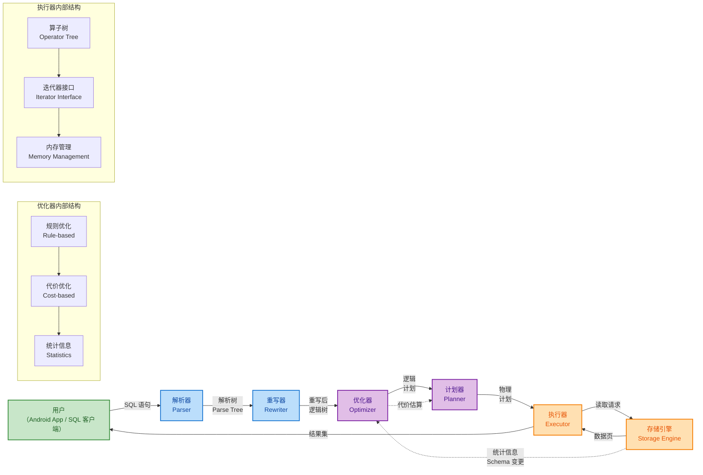
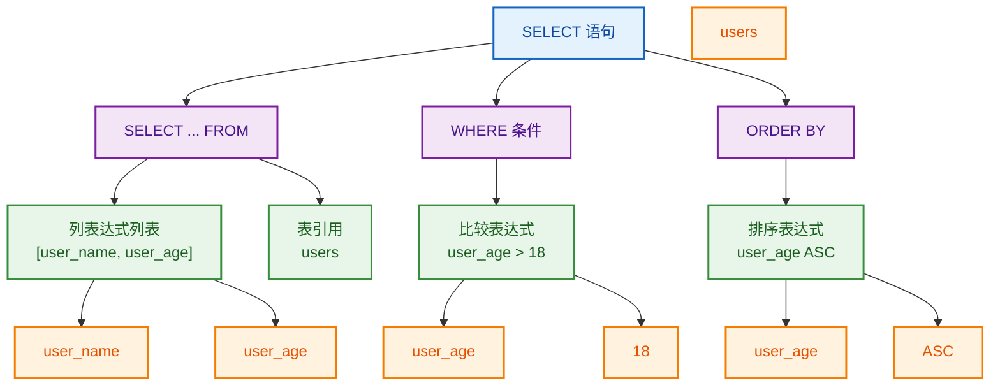
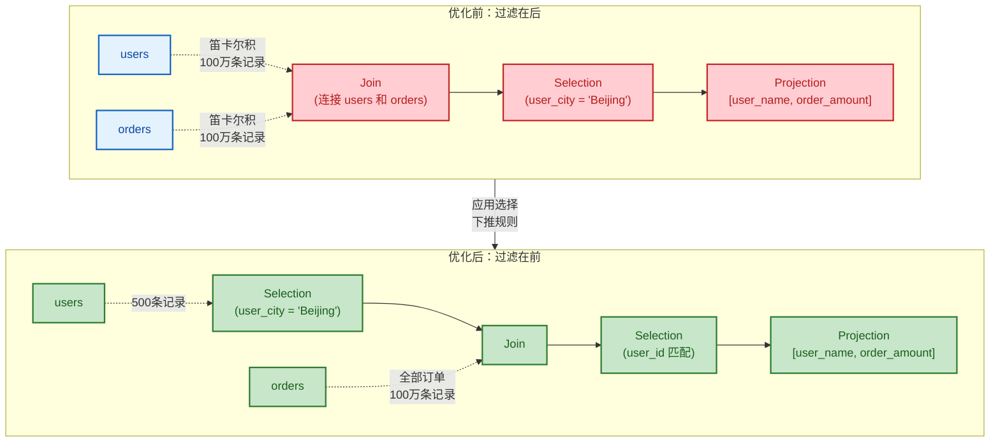
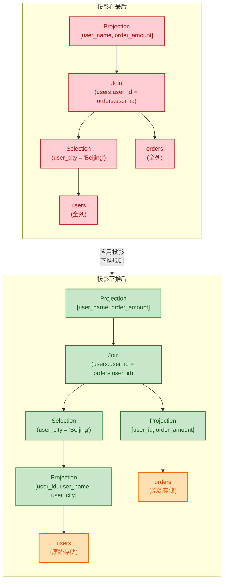
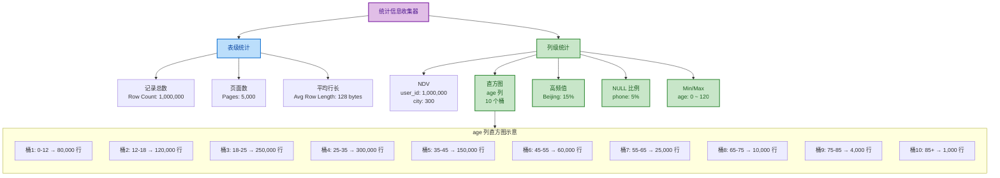
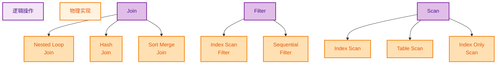
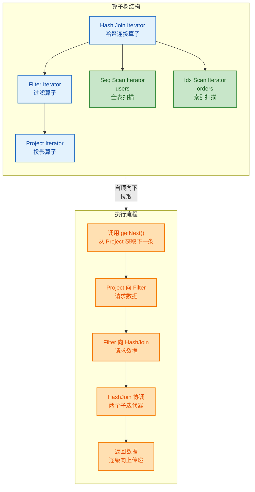
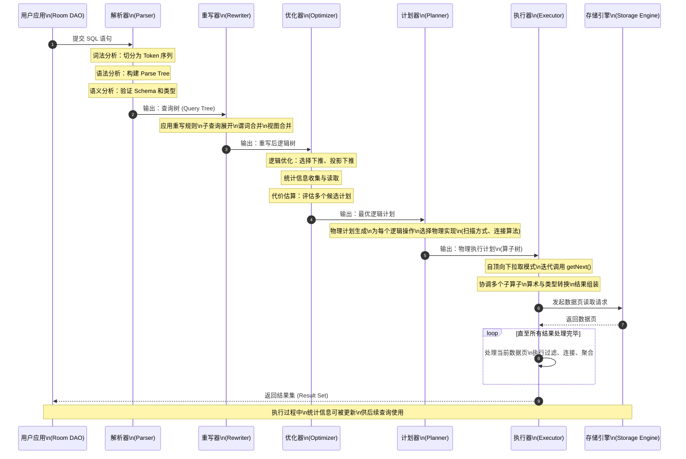

---

# 查询处理与优化

---

## 查询处理与优化

### 查询处理流程（解析、优化、执行）

#### 概述：从 SQL 到结果的完整旅程

当我们在 Android 应用中通过 Room 执行一条 SQL 查询，或者在数据库管理工具中输入一条 SELECT 语句时，数据库管理系统（DBMS）并不会直接去磁盘上寻找数据。从一条高级声明式的 SQL 语句到最终返回满足条件的结果集，数据需要经历一段复杂而精密的旅程。这段旅程被划分为三个核心阶段：**解析（Parsing）**、**优化（Optimization）** 和 **执行（Execution）**。

理解这三个阶段的内部机制，对于深入掌握数据库系统的工作原理、编写高效的 SQL 语句、以及在 Android 开发中合理使用 SQLite 与 Room 都具有不可替代的价值。查询处理是数据库系统架构中最具技术含量的部分之一，它融合了编译器理论、算法优化、统计学和存储系统等多个领域的知识。

在整个查询处理流程中，解析阶段负责将文本形式的 SQL 语句转换为数据库内部可理解的中间表示；优化阶段负责在数以千计的可能执行方案中选择代价最低的那一个；执行阶段则负责按照优化器选定的计划真正地读取数据、进行计算并返回结果。这三个阶段紧密协作，构成了数据库系统响应查询的核心能力。

---

### 查询处理的整体架构

为了建立对整个流程的宏观认识，我们首先通过一个 Mermaid 时序图来展示查询处理流程中各个组件之间的交互关系。在一个典型的数据库系统中，查询处理的完整路径可以概括为：用户接口接收 SQL 语句，然后依次经过解析器（Parser）、重写器（Rewriter）、优化器（Optimizer）、计划器（Planner），最终到达执行器（Executor）与存储引擎（Storage Engine）进行交互。



这张图揭示了查询处理的分层架构。**用户层**代表发起查询的外部来源，可以是 Android 应用中的 Room DAO，也可以是数据库管理工具中的 SQL 编辑器。**接口层**负责将原始的 SQL 文本转换为结构化的内部表示。**逻辑层**承担最为核心的智能决策——决定如何最优地执行一个查询。**物理层**则负责实际的数据读写操作，是整个流程中与磁盘和内存直接打交道的部分。

值得注意的是图中的两条**反馈回路**。第一条从存储引擎返回统计信息给优化器，这是基于代价的查询优化（CBO）的核心依赖。第二条从优化器内部展示了一个迭代改进的过程：规则优化首先应用一系列预定义的转换规则（如选择下推），然后代价优化基于统计信息评估不同方案的代价，最终选择代价最小的执行计划。

---

### 第一阶段：解析（Parsing）

#### 解析的本质：翻译与验证

解析是查询处理的第一道关卡。当数据库系统接收到一条 SQL 语句时，它面对的是一段文本——一系列英文单词、符号和数字的序列。解析阶段的任务，就是将这段文本翻译成数据库内部可以理解、可以操作的数据结构，同时验证这段文本是否符合 SQL 语法规则。

这个过程与编程语言编译器中的词法分析和语法分析高度相似。事实上，许多数据库系统的解析器直接借鉴了编译器领域成熟的技术和工具。例如，PostgreSQL 使用了 GNU Bison 作为语法分析器，而 SQLite 则实现了一个手写的递归下降解析器。理解解析的工作原理，不仅有助于理解数据库系统本身，也有助于理解软件开发中通用的语言处理技术。

解析过程本身又可以细分为两个子阶段：**词法分析（Lexical Analysis）** 和 **语法分析（Syntactic Analysis）**。有些系统还会在这两个子阶段之后加入**语义分析（Semantic Analysis）** 的环节，进一步检查表名、列名是否存在，数据类型是否匹配等。

#### 词法分析：将文本切分为标记

词法分析器（Lexer，也称为 Scanner）的工作是逐字符扫描输入的 SQL 文本，将其切分成为一个一个具有独立语义的**标记（Token）**。标记是语法分析的最小单位，它代表 SQL 语句中的一个基本语法元素。

考虑以下这条在 Android Room 应用中常见的查询语句：

```sql
SELECT user_name, user_age FROM users WHERE user_age > 18 ORDER BY user_age ASC;
```

词法分析器会将这段文本分解为以下标记序列。每一个标记都有一个类型（Token Type）和一个值（Token Value）。类型决定了标记在语法结构中的角色，值则是标记对应的实际文本内容。

```sql
-- SQL 词法分析示例
-- 标记序列：类型 / 值

SELECT    -- KEYWORD,  "SELECT"
user_name -- IDENTIFIER, "user_name"
,         -- COMMA,    ","
user_age  -- IDENTIFIER, "user_age"
FROM      -- KEYWORD,  "FROM"
users     -- IDENTIFIER, "users"
WHERE     -- KEYWORD,  "WHERE"
user_age  -- IDENTIFIER, "user_age"
>         -- OPERATOR, ">"
18        -- INTEGER_LITERAL, "18"
ORDER     -- KEYWORD,  "ORDER"
BY        -- KEYWORD,  "BY"
user_age  -- IDENTIFIER, "user_age"
ASC       -- KEYWORD,  "ASC"
;         -- SEMICOLON, ";"
```

在词法分析过程中，分析器还需要处理一些边界情况。例如，它需要正确识别带引号的字符串（如 `'Beijing'`），识别数字常量（包括整数和浮点数），识别注释（SQL 标准注释以 `--` 开头），以及处理空白字符（空格、制表符、换行符）的跳过逻辑。

#### 语法分析：将标记组织成树

语法分析器（Parser）接收词法分析器输出的标记序列，根据 SQL 语言的语法规则（通常以上下文无关文法 Context-Free Grammar 来描述），将线性的标记序列组织成为一个**解析树（Parse Tree）**，也称为**语法树（Syntax Tree）**。

解析树是一种树形数据结构，它精确地表达了 SQL 语句的语法结构。树的每个内部节点代表一个语法构造（如 SELECT 子句、WHERE 条件、FROM 子句等），叶子节点则代表具体的标记（如列名、表名、操作符等）。



解析树的结构反映了 SQL 语句的层次嵌套关系。在一个 SELECT 语句中，WHERE 子句是 SELECT 和 FROM 子句的兄弟节点，它们共同作为 SELECT 语句的子节点。而在 WHERE 子句内部，比较表达式又可以进一步分解为左操作数（列引用）、操作符和右操作数（常量）。

不同的数据库系统可能使用不同的树形数据结构来表示解析结果。SQLite 使用一种称为 **Parse Tree** 的内部结构，而 PostgreSQL 则使用 **抽象语法树（Abstract Syntax Tree, AST）**。抽象语法树相对于具体语法树的优势在于它省略了那些仅用于语法完整性但对语义理解无贡献的节点（如括号、分号等），使得树结构更加紧凑和易于处理。

#### 语义分析：超越语法的深层检查

仅仅通过语法分析验证了 SQL 语句在语法上是否正确，这还不够。数据库系统还需要进行**语义分析（Semantic Analysis）**，以确保查询在语义上也是有效的。语义分析涉及以下几个关键方面：

** Schema 验证** 是最基础的一项检查。数据库系统需要确认 SELECT 子句中引用的列名确实存在于 FROM 子句指定的表中，WHERE 子句中使用的列也必须属于这些表。此外，系统还需要验证这些列是否确实属于当前连接的数据库和模式（Schema）。在 Android Room 中，这个验证通常发生在编译时——Room 的注解处理器会检查 DAO 方法上标注的 @Query 中的 SQL 语句是否引用了正确的实体类和属性。

**数据类型兼容性检查** 确保操作符两边的操作数类型是兼容的。例如，比较表达式 `user_age > 'eighteen'` 可能在某些数据库中会尝试隐式类型转换，而在另一些数据库中则会被判定为类型错误。语义分析阶段会处理这类类型检查和必要的隐式类型转换。

**引用消解（Reference Resolution）** 处理列名可能存在歧义的情况。当查询涉及多表连接且不同表中存在同名列时，列名引用必须被明确限定为某个特定的表。例如，在连接 users 表和 orders 表的查询中，user_id 列的引用必须明确指向 users.user_id 还是 orders.user_id。

**权限检查** 确认当前用户是否具有执行该查询所需的权限。用户必须至少对查询涉及的表具有 SELECT 权限，对视图的查询还需要额外的权限验证。

经过语义分析后，解析阶段会生成一个**查询树（Query Tree）**或**逻辑查询计划（Logical Query Plan）**作为输出。这个数据结构封装了查询的完整语义信息，可以被后续的优化阶段直接使用。在某些数据库系统中，解析和语义分析被合并为一个阶段，输出的是一个统一的内部表示。

---

### 第二阶段：优化（Optimization）

#### 优化的意义：为什么需要优化器

如果说解析阶段的工作是“翻译”，那么优化阶段的工作就是“规划”。给定一个语义明确的查询，存在多种不同的执行方式可以得到相同的结果。优化器的核心任务，就是在这些可能的执行方式中选择**代价最低**的那一个。

理解优化的必要性需要我们正视一个基本事实：对于同一个查询，不同的执行方法在性能上可能相差数个数量级。让我们通过一个具体例子来说明这一点。

考虑以下查询：

```sql
SELECT u.user_name, o.order_amount
FROM users u, orders o
WHERE u.user_id = o.user_id
  AND u.user_city = 'Beijing';
```

这个查询涉及两个表的连接操作。一种 naive（朴素）的执行方式是：首先计算两个表的笛卡尔积（`users × orders`），然后在笛卡尔积的结果上应用 WHERE 条件进行过滤。假设 users 表有 10,000 条记录，orders 表有 100,000 条记录，那么笛卡尔积将产生 10 亿条中间记录。即使每条记录只占用 100 字节，这也将占用约 100GB 的内存和磁盘空间，而实际满足条件的结果可能只有几百条。

另一种更聪明的执行方式是：首先在 users 表上应用 WHERE 条件过滤出所有城市为 Beijing 的用户（假设只有 500 人），然后只将这 500 个用户 ID 与 orders 表进行连接。这样一来，连接操作的规模从 10 亿次比较降低到了最多 50,000 次比较，性能提升可达数万倍。

优化器的工作，就是自动地找出类似上述的聪明策略，而无需用户手动重写查询语句。这正是声明式 SQL 的魅力所在——用户只需要描述“想要什么”（SELECT 满足条件的记录），而不需要操心“如何得到它”（具体的执行步骤）。优化器负责在用户不干预的情况下自动推导出高效的执行策略。

#### 逻辑优化：等价变换的艺术

逻辑优化是优化过程的第一个主要环节。它的核心思想是：在不改变查询结果的前提下，通过应用一系列**等价变换规则（Equivalence Rules）**，将原始的逻辑查询树转换为一个在语义上等价但执行效率更高的形式。

等价变换的“等价”二字至关重要。优化器对查询树所做的任何修改，都必须严格保证变换前后的查询返回完全相同的结果。任何导致结果语义改变的“优化”都是不可接受的严重错误。数据库系统需要通过严密的数学证明或穷举测试来确保每一条等价变换规则的安全性。

#### 选择下推（Selection Push-Down）

**选择下推**是最重要、应用最广泛的逻辑优化策略之一。它的基本思想是：将过滤条件尽可能移动到查询树的靠近数据源的位置执行，从而减少后续处理需要访问和处理的数据量。



在上述转换中，优化器将 WHERE 条件 `user_city = 'Beijing'` 从连接操作之后移动到了连接操作之前。由于这个过滤条件只涉及 users 表，优化器可以先在 users 表上应用过滤（减少到 500 条记录），然后只将这 500 条记录参与连接操作，而不是让整个 orders 表（100 万条记录）与整个 users 表进行连接。

在 Android 的 Room 框架中，选择下推的优化通常由底层 SQLite 引擎自动完成。但作为开发者，理解这一原则有助于我们编写出更容易被优化的 SQL 语句。例如，以下两条查询在语义上等价，但第二条更容易被优化器识别和应用下推优化：

```kotlin
// Room DAO 中的两种等价查询方式

// 方式一：全部在代码中过滤（无法利用选择下推）
@Query("SELECT * FROM users, orders WHERE users.user_id = orders.user_id")
fun getAllMatchedUsers(): List<UserOrder>

// 方式二：明确指定过滤条件（允许优化器进行选择下推）
@Query("""
    SELECT u.user_name, o.order_amount
    FROM users u, orders o
    WHERE u.user_id = o.user_id
      AND u.user_city = 'Beijing'
      AND o.order_status = 'completed'
""")
fun getCompletedOrdersFromBeijing(): List<UserOrder>
```

#### 投影下推（Projection Push-Down）

**投影下推** 与选择下推的思路类似，但处理的是列的维度而非行的维度。其核心思想是：将列的筛选操作（即 SELECT 子句中实际需要的列）尽可能下推到靠近数据源的位置，从而减少每个处理阶段需要读取和传递的数据量。

考虑以下查询：

```sql
SELECT u.user_name, o.order_amount
FROM users u
JOIN orders o ON u.user_id = o.user_id
WHERE u.user_city = 'Beijing';
```

如果我们直接按照 FROM -&gt; JOIN -&gt; WHERE -&gt; SELECT 的顺序执行，执行器首先需要读取 users 表的**所有列**，然后读取 orders 表的**所有列**，最后才在 SELECT 阶段筛选出所需的 user_name 和 order_amount 两列。

投影下推优化会将查询树重构为：



在优化后的计划中，users 表只需要读取 user_id、user_name 和 user_city 三列，而不需要读取该表中可能存在的其他数十个列（如地址、电话、注册日期等）。orders 表同样只需要读取 user_id 和 order_amount 两列。这个优化不仅减少了 I/O 开销（从磁盘读取的数据量更少），还减少了网络传输量（在分布式数据库中尤为重要）和内存占用（中间结果占用的内存更少）。

#### 其他等价变换规则

除了选择下推和投影下推之外，逻辑优化阶段还涉及众多其他的等价变换规则。以下列举一些常见且重要的规则：

**连接重排序（Join Reordering）**：当查询涉及多个表的连接时，不同的连接顺序可能导致截然不同的执行代价。上述笛卡尔积的例子已经说明了这一点。连接重排序的规则允许优化器尝试不同的连接顺序（如 A join B join C 可以有 (A join B) join C 或 A join (B join C) 等多种形式），并选择代价最低的顺序。

**子查询改写（Subquery Unnesting）**：SQL 允许在 WHERE 子句中使用子查询（如 `WHERE salary > (SELECT AVG(salary) FROM employees)`）。优化器通常会将相关子查询（Correlated Subquery）转换为连接操作，从而允许更激进的优化策略。

**谓词合并（Predicate Merging）**：当多个过滤条件作用于同一个表时，优化器会尝试合并这些条件。例如，条件 `age > 18 AND age < 65` 可以合并为一个范围谓词 `age BETWEEN 18 AND 65`，这在某些存储引擎中可以触发更高效的索引范围扫描。

**常量折叠（Constant Folding）**：表达式中的常量可以在编译时计算。例如，`WHERE price > 100 * 1.08` 中的 `100 * 1.08` 可以预先计算为 `108.0`，避免在每行数据处理时重复计算。

#### 代价优化：基于统计的决策

如果说逻辑优化是“规则驱动”的——它依赖预定义的一组等价变换规则来改进查询计划，那么**代价优化（Cost-based Optimization, CBO）** 则是“数据驱动”的——它依赖对数据本身特征的统计分析来评估不同计划的执行代价，并从中选择最优方案。

代价优化的核心挑战在于：**不同的物理执行计划在访问数据的方式上可能存在巨大差异，而这种差异的根源在于数据的分布特征**。例如，考虑一个涉及范围谓词的查询 `WHERE age > 30`，如果 age 列的分布高度不均匀（大多数用户的年龄集中在某个范围），那么估计满足条件的记录数就至关重要——它直接决定了查询计划应该选择索引扫描还是全表扫描。

#### 统计信息：代价估算的基石

代价优化器做出正确决策的前提，是它对数据分布有准确的了解。**统计信息（Statistics）** 就是描述数据分布特征的数据。数据库系统会周期性地收集和维护以下几类关键统计信息：

**表级统计** 描述表的基本属性，包括表的记录总数（Row Count 或 Cardinality）、表占用的物理页面数、以及表中列的个数等。这些信息是估算任何查询代价的基础起点。

**列级统计** 描述单个列的数据分布特征，其中最重要的包括：

- **NDV（Number of Distinct Values）**：列中不同取值的个数，也称为基数（Cardinality）。例如，性别列的 NDV 通常为 2，身份证号列的 NDV 接近表的记录总数。NDV 对于估算连接操作的结果大小至关重要——如果连接的两个列的 NDV 差异很大，可能意味着连接结果会有大量重复。

- **直方图（Histogram）**：将列的值域划分为若干个桶（Bucket），并记录每个桶中的记录数。直方图能够捕捉数据的分布形态，是估算选择率（Selectivity）的主要依据。

- **高频值列表（Top-K Frequency）**：记录出现频率最高的 K 个值及其出现次数。这对于处理高度偏斜（Skewed）分布的数据尤为重要。

- **NULL 值比例**：记录列中 NULL 值的数量和比例。许多聚合操作（如 COUNT、AVG）对 NULL 值的处理方式会直接影响查询结果的正确性。

- **最小值与最大值（Min/Max）**：记录列的数值边界。这对于快速排除不可能满足条件的查询非常有用——如果 WHERE 条件为 `age > 80`，而 age 列的最大值只有 75，优化器可以立即得出没有记录满足条件的结论，完全跳过数据扫描。



在这个直方图示例中，我们可以看到 age 列的分布严重右偏——大多数用户的年龄集中在 18 到 45 岁之间，而 65 岁以上的用户只占极小的比例。如果查询条件是 `WHERE age > 60`，优化器基于直方图可以准确估计出只有约 4% 的记录满足条件，从而选择使用索引扫描而非全表扫描。

**索引统计** 描述索引的结构和内容，包括索引的大小、深度（B-Tree 层级）、叶节点的排列顺序等。这些信息对于评估使用索引的代价至关重要。

#### 代价模型：量化执行代价

在拥有了统计信息之后，代价优化器需要一个**代价模型（Cost Model）** 来量化不同执行计划的代价。代价模型通常由一组公式组成，这些公式以统计信息作为输入，输出对某个操作执行代价的估计值。

在数据库系统中，代价通常被量化为**磁盘 I/O 次数**。这是因为磁盘读写是数据库操作中最昂贵的部分——一次磁盘 I/O 的时间（毫秒级）通常是内存操作时间（纳秒级）的数万倍。因此，即使代价模型也会考虑 CPU 计算成本和内存使用情况，磁盘 I/O 通常仍然占据主导权重。

一个简化的代价估算公式可能如下所示：

```text
总代价 = CPU_处理代价 + I/O_代价 + 内存_代价

I/O_代价 = 读取页面数 × 页面I/O时间

读取页面数 = 估计结果行数 ÷ 每页面行数
```

其中**估计结果行数**是代价估算中最关键的部分，它依赖于统计信息和选择率计算。

**选择率（Selectivity）** 是指满足条件的记录数占总记录数的比例。对于一个谓词 `age > 30`，选择率 = 满足 age &gt; 30 的行数 / 总行数。选择率乘以表的记录总数，就得到对该查询返回行数的估计。

不同类型的谓词有不同的选择率估算方法。对于**等值谓词**（如 `city = 'Beijing'`），如果该列上有高频值统计，优化器会使用精确的频率估计；否则假设均匀分布，选择率 = 1 / NDV。对于**范围谓词**（如 `age > 30 AND age < 50`），优化器会使用直方图来估算。如果直方图的桶边界已知，可以计算落入范围内的桶的记录数。对于**合取谓词**（多个 AND 条件），如果条件之间相互独立，选择率可以相乘；对于**析取谓词**（多个 OR 条件），选择率需要用容斥原理计算。

#### 计划空间与搜索策略

代价优化的另一个核心挑战是：**可能的执行计划数量随查询复杂度的增长呈指数级增长**。一个涉及 N 个表的连接查询，可能的连接顺序数量为 N!（阶乘级增长）。再加上每种连接顺序可以有不同的连接算法（嵌套循环连接、哈希连接、归并连接等），以及每个表可以选择不同的访问路径（索引扫描、全表扫描等），计划空间的规模可以迅速变得不可接受。

为了在有限的计算时间内找到足够好的执行计划，代价优化器通常采用以下几种搜索策略：

**启发式搜索（Heuristic Search）** 使用预定义的规则来限制搜索空间。例如，先应用选择下推和投影下推等逻辑优化规则，大幅减少中间结果的大小，然后再在简化后的查询上应用代价优化。这种策略简单高效，但可能错过某些非平凡的优化机会。

**动态规划（Dynamic Programming）** 是目前主流数据库系统（如 IBM DB2、Microsoft SQL Server、Oracle、PostgreSQL）广泛采用的优化策略。其核心思想是：对于连接操作，如果已经知道了连接 A 和连接 B 的最优子计划，那么连接 (A, B) 的最优计划可以通过组合这两个最优子计划来构建，而无需重新评估所有可能性。动态规划通过记录和复用子问题的最优解，将连接顺序搜索的时间复杂度从指数级降低到多项式级（具体为 O(3^N) 或更优）。

**遗传算法（Genetic Algorithm）** 等随机化搜索方法适用于超大规模的搜索空间。它们通过模拟生物进化的过程（选择、交叉、变异），在可接受的时间内找到一个“足够好”但不一定是最优的执行计划。PostgreSQL 的遗传查询优化器（GEQO）就是这一策略的代表。

#### 从逻辑计划到物理计划

逻辑优化产生的结果是**逻辑查询计划（Logical Query Plan）**，它描述了查询的逻辑操作序列（如 Filter、Project、Join），但没有指定这些操作的具体执行方式。从逻辑计划到**物理查询计划（Physical Query Plan）** 的转换，就是为每个逻辑操作选择具体的物理执行算法和数据访问方法。



不同的物理实现有不同的适用场景：

**扫描操作（Scan）** 有三种主要实现方式。**全表扫描（Table Scan）** 按顺序读取表的所有数据页，适用于需要访问大部分数据的查询。**索引扫描（Index Scan）** 先通过索引定位到满足条件的页面，再读取相应的数据页，适用于选择性高的查询（过滤后数据量少）。**索引覆盖扫描（Index Only Scan）** 则更为高效——如果所需的数据完全包含在索引中，则无需回表读取数据页，直接返回索引中的数据即可。

**连接操作（Join）** 的三种经典算法各有优劣。**嵌套循环连接（Nested Loop Join）** 将较小的表作为外层循环，较大的表作为内层循环，对每一行外层记录扫描内层表寻找匹配。这种算法简单直观，适用于小表连接或有良好索引的场景。**哈希连接（Hash Join）** 首先在较小的表上构建哈希表，然后在较大的表上探测——对每条大表记录计算哈希值，在哈希表中查找匹配。哈希连接对等值连接特别有效，但需要足够的内存来容纳哈希表。**归并连接（Sort Merge Join）** 首先将两个表按照连接键排序，然后像拉链一样同时遍历两个有序表寻找匹配。归并连接在已排序的数据（如已有索引）上非常高效，且可以高效处理非等值连接条件。

---

### 第三阶段：执行（Execution）

#### 执行引擎架构：迭代器模型

经过优化阶段产生的物理执行计划，最终需要被实际执行以产出查询结果。**执行引擎（Execution Engine）** 负责按照计划执行各种操作并返回结果集。现代数据库系统普遍采用**迭代器模型（Iterator Model）** 作为执行引擎的核心架构，也称为**火山模型（Volcano Model）** 或**拉取模型（Pull Model）**。

在迭代器模型中，每个物理操作符（如扫描、过滤、连接、聚合）都实现为一个**迭代器（Iterator）**，提供两个核心方法：`open()` 和 `getNext()`。`open()` 方法负责初始化操作符的内部状态（如打开文件、初始化游标、建立连接等）；`getNext()` 方法则返回下一条结果记录（或一个表示“已无更多记录”的标记）。整个执行引擎通过递归调用这些方法，形成一棵**算子树（Operator Tree）**。



迭代器模型的核心优势在于其**解耦能力**和**统一性**。每个算子只需要关注自己的逻辑——如何处理输入并产生输出——而不需要关心其他算子的实现细节。这种设计使得执行引擎可以灵活地组合各种算子来适应不同的查询计划。同时，所有算子都遵循相同的接口约定，使得添加新的算子类型变得简单。

#### 执行模式：推与拉

除了拉取模型之外，还有一种称为**推送模型（Push Model）** 或**物化模型（Materialization Model）** 的执行模式。在推送模型中，数据从叶节点（数据源）向根节点（结果输出）流动——每个算子在产生输出时主动“推送”给下游算子，而不是等待下游来“拉取”。

推送模型的优势在于可以更好地利用 CPU 的向量化（Vectorization）能力——一次处理一批（Batch）数据而非一条记录，从而显著减少函数调用开销和缓存未命中的开销。近年来，许多分析型数据库（如 ClickHouse、Vectorwise）采用了基于推送的向量化执行引擎，在处理大规模数据分析查询时取得了数量级的性能提升。

现代执行引擎也可能结合两种模型的特点。例如，在算子树中使用推模式进行批处理，同时在算子树的不同分支之间使用拉模式进行协调。

#### 在 Android 中的执行流程

在 Android 平台上，我们通常不直接面对原始的 SQL 执行引擎，而是通过 SQLite 或 Room 框架来与数据库交互。但理解底层执行流程对于编写高性能的 Android 数据访问代码仍然非常有帮助。

```kotlin
// Android Room 环境下查询执行的完整流程

// 第一步：定义 DAO 接口
interface UserDao {
    @Query("""
        SELECT u.user_name, o.order_amount
        FROM users u
        INNER JOIN orders o ON u.user_id = o.user_id
        WHERE u.user_city = :city
        ORDER BY o.order_amount DESC
    """)
    fun getUsersWithOrdersByCity(city: String): Flow<List<UserOrder>>
}

// 第二步：编译时 Room 生成实现
// Room 编译时执行以下内部步骤：

// 2.1 解析 SQL 语句
//    生成解析树，验证表名、列名、参数绑定

// 2.2 生成 SQLite 程序
//    Room 将 SQL 转换为 SQLite 虚拟机指令
//    例如：Open、Filter、Column、Result 等指令

// 2.3 生成调用代码
//    在运行时创建 PreparedStatement
//    绑定参数值（:city）
//    执行 sqlite3_step() 循环

// 第三步：运行时执行
//    SQLite 虚拟机的执行循环：
//    while (sqlite3_step(stmt) == SQLITE_ROW) {
//        // 读取当前行的各列值
//        String name = sqlite3_column_text(stmt, 0);
//        double amount = sqlite3_column_double(stmt, 1);
//        // 组装结果对象
//        resultList.add(new UserOrder(name, amount));
//    }
```

上述代码展示了从 Room 的声明式查询定义到最终执行的完整映射过程。在编译阶段，Room 的注解处理器负责解析 SQL 语句、检查语法和语义有效性，并生成对应的 SQLite 调用代码。在运行时，SQLite 引擎会加载生成的程序，按照火山模型的拉取模式执行——每次调用 `sqlite3_step()` 都会驱动虚拟机向前执行一条指令并产生（或准备产生）一行结果。

---

### 查询处理流程的完整协作

将上述三个阶段整合在一起，我们可以用一个端到端的时序图来展示一条 SQL 语句从输入到输出的完整旅程：



这张时序图清晰地展示了各组件之间的协作关系和消息传递顺序。值得注意的是，优化器在做出决策时需要调用存储引擎获取最新的统计信息，而执行器在执行过程中也会产生运行时统计信息（Runtime Statistics），这些信息可能被反馈给优化器用于后续的查询调优（如自适应查询处理）。

---

### 查询处理在 Android 开发中的实践意义

虽然 Android 开发者通常不需要手动实现解析器、优化器或执行引擎，但理解查询处理的完整流程对于编写高质量的数据访问代码具有直接的实践指导意义。

**在 SQL 语句层面**：了解选择下推和投影下推的原理，可以帮助开发者编写出更容易被优化的查询语句。例如，将过滤条件写入 SQL WHERE 子句而不是在应用代码中事后过滤；只 SELECT 必要的列而非使用 `SELECT *`；在多表查询时明确指定连接条件而非依赖隐式交叉连接。

**在数据库设计层面**：理解索引在查询优化中的作用，可以帮助开发者在设计表结构时做出更合理的决策。例如，为频繁出现在 WHERE 子句和连接条件中的列创建索引；在创建复合索引时考虑列的顺序（将选择性高的列放在前面）；定期运行 `ANALYZE` 命令（或使用 Room 的 `fallbackToDestructiveMigration` 等策略）以确保统计信息的准确性。

**在性能调优层面**：理解代价优化的原理可以帮助开发者诊断和解决性能问题。例如，使用 Room 的 `EXPLAIN QUERY PLAN` 功能（通过 `SupportSQLiteQuery` 接口可以包装原生 SQL）来查看 SQLite 为某个查询选择的执行计划，从而判断是否需要添加索引或调整查询语句。

```kotlin
// Android Room 中查看查询执行计划

@Dao
interface UserDao {
    // 查看 SQLite 为查询选择的执行计划
    @Suppress("NO_ACTUAL_FOR_EXPECT_FUNCTION")
    @Query("EXPLAIN QUERY PLAN " +
           "SELECT u.user_name, o.order_amount " +
           "FROM users u " +
           "INNER JOIN orders o ON u.user_id = o.user_id " +
           "WHERE u.user_city = :city")
    fun explainQueryPlan(city: String): List<ExplainQueryPlanRow>
}

// 在 logcat 中观察输出，类似如下：
// SEARCH TABLE users USING INDEX idx_city (city=?)
// SEARCH TABLE orders USING INDEX idx_user_id (user_id=?)
// USE TEMP B-TREE FOR ORDER BY
```

---

#### 📝 练习题

关于查询处理流程，以下说法正确的是：

A. 语法分析和语义分析可以完全独立进行，语法分析通过后无需进行语义分析即可执行查询
B. 优化器的代价估算完全依赖于用户提供的查询执行提示（Hint），数据库自身不会收集和使用统计信息
C. 选择下推是一种逻辑优化策略，它将过滤条件尽可能移动到靠近数据源的位置执行，以减少中间结果的数据量
D. 在火山模型（迭代器模型）中，每个算子只能向下游算子推送数据，不能被下游算子拉取数据

**【答案】** C

**【解析】**

选项 A 错误。语法分析只能验证 SQL 语句在语法结构上是否正确（即是否符合 SQL 语言的语法规则），但无法验证表名和列名是否存在、用户是否有权限执行该查询、以及数据类型是否兼容等语义层面的问题。语义分析是查询处理中不可或缺的环节，必须在执行查询之前完成。

选项 B 错误且与事实相反。现代数据库系统的代价优化器主要依赖**自动收集的统计信息**来进行代价估算，而非用户提示。用户提示（Hint）在某些数据库（如 Oracle、MySQL）中可以作为补充手段影响优化器的决策，但统计信息才是代价估算的核心数据来源。如果完全依赖用户提示，数据库将无法智能地适应数据分布的变化。

选项 C 正确。选择下推（Selection Push-Down）是查询优化中最基础也是最重要的逻辑优化策略之一。其核心思想是利用过滤条件在数据源处就可以排除大量不相关记录的特点，将 WHERE 子句中的过滤谓词尽可能移动到查询树的叶节点附近执行。这可以显著减少后续连接、聚合等操作需要处理的数据量，从而提升整体查询性能。例如，`SELECT * FROM A JOIN B ON A.id = B.a_id WHERE A.status = 'active'` 中，`A.status = 'active'` 的过滤应当首先作用于 A 表，减少 A 表参与连接的行数。

选项 D 错误。火山模型（Volcano Model）本质上是一个**拉取模型（Pull Model）**，而非推送模型。每个算子的 `getNext()` 方法由其下游算子调用，算子从上游算子拉取数据进行处理后再输出给下游。数据流动的方向是从叶节点（数据源）向根节点（结果输出）逐级拉取，而非从根节点向下推送。因此，表述中说“只能向下游推送”恰好与火山模型的实际机制相反。

---

---

## 查询代价估算

### 代价模型概述

查询代价估算是数据库查询优化器在众多候选执行计划中做出选择的核心依据。在关系型数据库系统中，同一个查询往往可以对应多种截然不同的执行路径——连接操作的先后顺序、是否利用索引、采用何种连接算法——这些选择直接决定了查询的响应时间和资源消耗。查询优化器的职责正是通过代价估算，在海量可能的执行计划中筛选出代价最低的那一个。

代价模型（Cost Model）是对查询执行过程中资源消耗的数学抽象。一个完善的代价模型需要考虑多种因素：磁盘 I/O 的次数和吞吐量、CPU 处理元组的计算成本、内存的使用量与页面置换开销、网络通信开销（在分布式数据库中尤为重要）。不同数据库系统基于自身架构和硬件特征，会采用不同精度的代价模型。商业数据库如 Oracle 和 IBM DB2 拥有极其精细的代价模型，包含数百个可调参数；而轻量级数据库如 SQLite 则采用极为简化的代价模型，以适应嵌入式环境的资源限制。

从本质上讲，代价估算是一个预测问题：给定一个查询执行计划，预测执行该计划所需消耗的资源量。这个预测过程需要依赖统计信息（Statistics），即数据库系统维护的关于表、列、索引等对象的数据分布描述。统计信息的质量直接决定了代价估算的准确性，进而影响查询优化的效果。统计信息不准确是生产环境中查询性能问题的常见根源之一——即使优化器工作正常，低质量的统计信息也会导致其做出错误的优化决策。

### 统计信息

统计信息是代价估算的基石。数据库系统通过定期收集或实时维护这些描述数据分布的特征值，为代价估算提供输入数据。理解和掌握统计信息的类型、收集方式和更新策略，是深入理解查询代价估算的前提。

#### 基本统计信息

数据库系统最常维护的基本统计信息包括表级统计量和列级统计量两大类。

表级统计量描述整个表的宏观特征。其中最重要的是**基数**（Cardinality），即表中元组（行）的总数量，记作 $|R|$ 表示关系 $R$ 的元组数。其次是**宽度**（Width），即每个元组以字节为单位的平均大小，它决定了当需要将数据读入内存时需要传输的数据量。此外还有**块数**（Number of Pages），即表占用的磁盘存储页面数量，记作 $|R|_\{pages\}$。这三个指标看似简单，却构成了许多代价估算公式的基础。例如，若要将整个表 $R$ 读取一遍，所需的磁盘 I/O 代价至少为 $|R|_\{pages\}$（在最理想情况下，每个页面仅需一次顺序读）。

列级统计量描述单个列的数据分布特征。**唯一值数量**（Number of Distinct Values, NDV）是最基础的列级统计量，它表示该列中不同值的个数，记作 $NDV(A)$ 表示属性 $A$ 的唯一值数量。NDV 对于估算选择操作的过滤效果至关重要：如果某列的 NDV 很大，说明该列的选择性较强，单个值只能过滤掉很少的元组；如果 NDV 很小（接近 1），则说明列值重复度高，选择操作可能过滤掉大量元组。

**最小值和最大值**（Min、Max）描述了列的取值范围。对于范围查询（Range Query，如 `A > 100 AND A < 500`），Min 和 Max 共同决定了满足条件的元组比例。此外，数据库系统还会维护**空值数量**（Number of Nulls），用于估算含空值的条件过滤效果。

#### 直方图

直方图（Histogram）是描述列值分布的核心数据结构。当一个列的 NDV 很大时，仅用 NDV 一个数字无法描述数据的实际分布形态——相同 NDV 的两列，数据分布可能截然不同。直方图将列值划分为若干个**桶**（Bucket），每个桶覆盖一段值域范围，并记录落入该桶的元组数量。

等宽直方图（Equi-Width Histogram）将值域范围均匀划分为固定数量的桶，每个桶的宽度相同但元组数量可能差异很大。这种直方图的优点是存储空间固定，缺点是在数据分布不均匀时描述精度较低——密集区域的桶会包含大量元组，而稀疏区域的桶可能几乎是空的。

等高直方图（Equi-Depth Histogram，也称等深直方图）将元组数量大致均匀地分配到各个桶中，每个桶包含大致相同数量的元组（但桶的宽度各异）。这种直方图在数据分布不均匀时表现更好，因为密集区域会被划分成更多的窄桶，稀疏区域则用少数宽桶覆盖。实践中，大多数数据库系统默认使用等高直方图。

```sql
-- 在 PostgreSQL 中查看表和列的统计信息
-- 统计信息存储在 pg_statistic 系统表中
SELECT attname, n_distinct, avg_width
FROM pg_stats
WHERE tablename = 'orders';

-- 查看更详细的直方图信息
SELECT attname, n_distinct, most_common_vals, most_common_freqs, histogram_bounds
FROM pg_stats
WHERE tablename = 'orders' AND attname = 'status';
```

上述 SQL 展示了如何在 PostgreSQL 中查询列的统计信息。`n_distinct` 即 NDV 值，`most_common_vals` 和 `most_common_freqs` 分别记录了最常见值及其频率，`histogram_bounds` 则记录了直方图的桶边界。

直方图的精度由桶的数量决定。桶数量越多，对分布的描述越精细，但存储和维护成本也越高。数据库系统通常允许用户通过参数控制直方图的桶数（如 PostgreSQL 的 `ALTER TABLE SET STATISTICS`），在精度和开销之间取得平衡。

#### 选择率

**选择率**（Selectivity）是连接代价估算和过滤效果估算中最核心的概念。选择率定义为查询结果集占原数据集的比例，取值范围在 0 到 1 之间。如果关系 $R$ 有 $|R|$ 个元组，选择操作 $\sigma_\{p\}(R)$ 返回的元组数期望值为 $|R| \times sel(p)$，其中 $sel(p)$ 是谓词 $p$ 的选择率。

对于**等值谓词** $A = v$（其中 $A$ 是属性，$v$ 是常量值），如果列 $A$ 上存在直方图或 MCV（Most Common Values）信息，选择率可以精确估算为：

$$sel(A = v) = \frac\{|\sigma_\{A=v\}(R)|\}\{|R|\}$$

在没有详细分布信息时，最简单的估计假设所有值均匀分布，此时：

$$sel(A = v) = \frac\{1\}\{NDV(A)\}$$

对于**范围谓词** $A &gt; v$ 或 $A &lt; v$，需要利用 Min/Max 值和直方图信息。如果 $v$ 落在值的分布范围内，选择率约为 $v$ 在该范围内的相对位置。例如，对于 $A &gt; v$：

$$sel(A &gt; v) = \frac\{Max(A) - v\}\{Max(A) - Min(A)\}$$

这当然是最粗略的估计——它假设值在范围内均匀分布。真实的直方图可以提供更精确的估算，通过累计直方图中 $v$ 左侧各桶的频率即可得到更准确的结果。

对于**合取谓词**（多个 AND 条件），数据库系统通常假设各条件之间**相互独立**（Independence Assumption），因此总选择率为各条件选择率的乘积：

$$sel(p_1 \land p_2 \land \ldots \land p_n) = \prod_\{i=1\}^\{n\} sel(p_i)$$

这一假设在实践中常常不成立——例如 `age = 25` 和 `city = 'Beijing'` 可能存在相关性（北京年轻人比例较高），但独立假设仍然被广泛采用，因为它简单且在大多数情况下误差可接受。某些高级优化器会尝试利用**条件依赖**（Conditional Dependency）信息来修正这一假设。

对于**析取谓词**（多个 OR 条件），若假设相互独立：

$$sel(p_1 \lor p_2) = 1 - (1 - sel(p_1)) \times (1 - sel(p_2))$$

### 单操作代价估算

在拥有了统计信息作为输入后，数据库系统需要对查询执行计划中的每一个物理操作符估算其执行代价。以下分别介绍几种最常见操作符的代价估算方法。

#### 顺序扫描

顺序扫描（Sequential Scan）是最基本的表访问方式。优化器通常会估计顺序扫描的代价为一个读取操作，其 I/O 成本与需要扫描的页面数成正比。考虑一个简单的关系 $R$，包含 $|R|_\{pages\}$ 个磁盘页面，如果这些页面已经在缓冲区缓存中，则实际 I/O 代价为零；如果不在缓存中，则需要 $|R|_\{pages\}$ 次磁盘读操作。

然而，优化器在评估顺序扫描的吸引力时，会综合考虑以下因素：每页的 CPU 处理成本（遍历元组、检查元组是否满足条件）、结果集回传至父操作符的通信成本，以及最终输出元组的排序代价（如果有的话）。一个常见的简化公式将顺序扫描的总代价表示为：

$$Cost_\{SeqScan\}(R) = |R|_\{pages\} \times T_\{disk\_read\} + |R| \times T_\{cpu\_tuple\}$$

其中 $T_\{disk\_read\}$ 是读取一个页面的时间成本，$T_\{cpu\_tuple\}$ 是处理一个元组的 CPU 时间成本。这些参数在不同硬件上差异巨大，这也是为什么数据库系统通常允许管理员根据实际硬件特征调优代价模型参数的原因。

#### 索引扫描

索引扫描（Index Scan）的代价取决于索引的类型和查询的性质。对于**索引唯一扫描**（Index Unique Scan），即通过主键或唯一索引查找单个元组，代价通常估算为访问索引树的一层（通常为 3-4 层 B-Tree 高度）加上一次表数据页面的随机读取，总代价接近常数级别。

对于**索引范围扫描**（Index Range Scan），代价估算涉及多个组件：

$$Cost_\{IndexRangeScan\}(R, idx) = Height(idx) + |R_\{indexed\_pages\}| \times T_\{random\_io\} + |Result| \times T_\{cpu\_tuple\}$$

第一项是遍历索引 B-Tree 到目标范围的起始位置的代价（树的高度，通常 3-4）。第二项是读取索引叶子节点中满足范围的条目所指向的所有表数据页面的 I/O 成本——如果这些页面在磁盘上，需要随机读取；如果在缓冲区缓存中，则代价接近零。第三项是对每个返回元组进行后续过滤（如 index condition 之外的附加条件）的 CPU 成本。

索引扫描的关键在于**索引过滤效果**。如果索引列上的条件有很高的选择率（即过滤掉大部分元组），则只需读取少量表页面；如果选择率很低（返回大量元组），则索引扫描可能还不如直接顺序扫描。在后一种情况下，优化器会估算两种方式的代价并选择更经济的方案。

#### 连接代价估算

连接（Join）是查询处理中最昂贵的操作之一，其代价估算也是最复杂的。不同的连接算法对应不同的代价模型。

对于**嵌套循环连接**（Nested Loop Join, NLJ），外层关系 $R$ 的每个元组都需要在内层关系 $S$ 上查找匹配的元组。朴素嵌套循环连接的总代价为：

$$Cost_\{NLJ\}(R, S) = |R| \times |S| + Cost_\{read\}(R) + Cost_\{read\}(S)$$

如果内层关系 $S$ 在连接属性上有索引，则每次查找的代价从 $|S|$（全表扫描）降低到 $Height(S_\{idx\}) + 1$（索引查找），此时代价变为：

$$Cost_\{NLJ\_Indexed\}(R, S) = |R| \times (Height(idx_S) + 1) + Cost_\{read\}(R) + Cost_\{read\}(S)$$

在这种情况下，优化器会将较小的关系作为外层（驱动表），以减少对内层的访问次数。

对于**排序合并连接**（Sort-Merge Join, SMJ），代价主要由排序阶段和合并阶段的成本构成：

$$Cost_\{SMJ\}(R, S) = Cost_\{sort\}(R) + Cost_\{sort\}(S) + Cost_\{merge\}(R, S)$$

其中 $Cost_\{sort\}(X)$ 通常包括对关系 $X$ 的排序 I/O 成本（如果是外部排序，还包括大量磁盘读写的开销）和 CPU 比较成本，$Cost_\{merge\}(R, S)$ 是线性扫描两个已排序关系进行合并的代价，大约与 $|R| + |S|$ 成正比。

对于**哈希连接**（Hash Join），代价主要来自构建哈希表和探测阶段：

$$Cost_\{HJ\}(R, S) = |R| \times T_\{cpu\_hash\} + |S| \times T_\{cpu\_probe\} + Cost_\{IO\}(R) + Cost_\{IO\}(S)$$

当较小的关系 $R$（构建端）能够完全放入内存哈希表时，I/O 成本主要是读取两个关系的顺序 I/O。当 $R$ 过大无法完全放入内存时，需要进行分片哈希连接（Partitioned Hash Join），此时两个关系都需要分批读入和写出，I/O 成本会显著增加。

### 代价公式的形式化表达

为了使代价估算系统化和可计算化，数据库研究社区和工业界发展出了一系列形式化的代价公式。以下是 PostgreSQL 逻辑优化器（基于 SELINGER 风格的代价模型）中几个关键代价公式的示例，这些公式展示了代价估算的典型结构和参数构成。

在 PostgreSQL 的代价模型中，有几个关键的代价参数：

- `seq_page_cost`：顺序扫描一个页面的代价（基准值，设为 1.0）
- `random_page_cost`：随机读取一个页面的代价（典型值为 4.0，假设磁盘随机访问比顺序访问慢约 4 倍）
- `cpu_tuple_cost`：处理一个元组的 CPU 代价（典型值为 0.01）
- `cpu_index_tuple_cost`：处理一个索引元组的 CPU 代价（典型值为 0.005）
- `cpu_operator_cost`：执行一次 CPU 操作的代价（典型值为 0.0025）

这些参数可以通过 `ALTER SYSTEM SET` 命令在 PostgreSQL 中动态调整，以适应不同的硬件环境。例如，在纯 SSD 存储的服务器上，`random_page_cost` 可能被调低至 1.1，接近 `seq_page_cost`，因为 SSD 的随机读取与顺序读取性能差异远小于传统机械硬盘。

顺序扫描的代价可以表示为：

$$Cost_\{SeqScan\} = pages \times seq\_page\_cost + tuples \times cpu\_tuple\_cost$$

索引扫描的代价为：

$$Cost_\{IndexScan\} = pages \times random\_page\_cost \times index\_selectivity + tuples \times cpu\_index\_tuple\_cost \times index\_selectivity + result\_tuples \times cpu\_tuple\_cost$$

其中 `index_selectivity` 表示索引条件的选择率。这个公式体现了索引扫描代价的三个组成部分：从索引中查找条目的成本、从索引条目定位到表页面的成本、以及对结果元组进行后续处理（如回表后检查 WHERE 子句中的非索引列条件）的成本。

### 分布式环境下的代价估算

在分布式数据库或数据仓库（如 GreenPlum、ClickHouse、StarRocks）中，查询经常涉及跨节点的数据流动，代价估算需要额外考虑网络传输成本和节点间的协调开销。

网络带宽和延迟是分布式代价估算中的关键参数。传输一个页面数据通过网络的开销远大于读取同一页面从本地磁盘的开销——在局域网环境中，网络传输一个字节的时间大约是磁盘读取的 10-100 倍；在跨地域的广域网环境中，这一差距可能扩大到 1000 倍以上。因此，分布式查询优化器在评估执行计划时，必须将网络传输的数据量作为一个重要的代价因素。

数据倾斜（Data Skew）是分布式环境特有的挑战。如果数据在各个节点上分布不均匀，某些节点可能需要处理远超平均数量的数据，导致木桶效应——整个查询的完成时间取决于最慢的节点。传统的基于平均值的代价估算无法捕捉这种偏差，高级分布式优化器会利用数据分布的统计信息（如每个分片的数据量标准差）来预估倾斜风险，并在必要时调整执行计划，例如重新分区或调整连接顺序。

### 代价估算的局限性与挑战

尽管代价模型和估算技术已经发展得相当成熟，但实际应用中仍然存在众多局限性和挑战。理解和认识这些局限性，对于数据库开发者和 DBA 正确诊断和解决性能问题至关重要。

**统计信息陈旧**是生产环境中最常见的问题。当表中的数据发生大量增删改之后，如果统计信息没有及时更新，代价估算所依据的数据就与实际情况严重脱节。这会导致优化器做出完全错误的计划选择。例如，某表原本只有 10 万行，统计信息记录 NDV 为 1000，选择率估算为 0.001；但实际数据已增长至 1000 万行且大部分值相同（NDV 实际为 10），此时优化器会严重低估查询结果集的大小，可能选择不适合的连接顺序或索引。解决这一问题的方法是建立定期收集统计信息的策略，或使用自动统计信息收集机制（如 PostgreSQL 的 autovacuum 配合 ANALYZE）。

**相关性假设失效**是另一个重要挑战。代价估算模型通常假设不同列之间是相互独立的，但真实数据中列与列之间往往存在关联。例如，在电商数据库中，`category`（商品类别）和 `price`（价格）往往相关（电子产品平均价格高于图书）；`city`（城市）和 `income_level`（收入水平）也可能相关。忽略这些相关性会导致合取谓词的选择率被严重低估（当独立性假设导致乘积远小于实际值时）或高估。高端数据库系统尝试通过收集列间相关性统计（如列组统计信息）来缓解这一问题，但收集和维护所有列组合的相关性信息在计算上是不可行的。

**用户自定义函数和复杂表达式**也增加了代价估算的难度。当 WHERE 子句中包含用户自定义函数、复杂数学表达式或跨表子查询时，优化器往往无法精确估算其选择性，可能退化为使用默认保守估计（如选择率为 0.5，即假设一半元组满足条件），这显著降低了优化质量。

**自适应查询处理**是近年来应对代价估算不确定性的重要研究方向。传统数据库系统在编译时确定执行计划后便不再改变，但自适应方法允许在执行过程中根据运行时收集的实际统计信息（如实际返回的行数）动态调整执行计划。例如，如果哈希连接构建端的数据量远超预期（内存哈希表无法容纳），系统可以中途切换到分片哈希连接策略。这种方法在处理数据倾斜和流式数据场景时尤为有效。

#### 📝 练习题

查询优化器在进行连接顺序优化时，需要对不同连接方案的代价进行估算。假设有两个关系 R 和 S，R 包含 10,000 个元组、占用 500 个磁盘页面，S 包含 50,000 个元组、占用 2,000 个磁盘页面。R 的连接属性上有索引，且该索引的选择率为 0.01（即 1% 的 R 元组满足连接条件）。现需要估算将 R 与 S 进行嵌套循环连接（以 R 为驱动表）的代价，其中每次查找 S 需要使用索引。

已知参数：顺序读取一个页面代价 = 1，随机读取一个页面代价 = 4，处理一个元组的 CPU 代价 = 0.01，索引查找一次代价 = 0.1。

请问以下哪种方案是该场景下代价最低的连接方式？

A. 直接对 R 和 S 进行嵌套循环连接，R 为外层，使用全表扫描查找 S
B. R 作为驱动表，使用索引查找 S 的嵌套循环连接
C. 先对 R 进行过滤使元组数减少到 100 个，再作为驱动表使用索引查找 S
D. 交换驱动表，以 S 为外层，R 为内层使用索引查找 R

**【答案】** C

**【解析】** 本题考查嵌套循环连接代价估算的综合应用。

选项 A 的代价：读取 R 的 500 个页面 + R 中每个元组（10,000 个）对 S 进行全表扫描（2,000 页面）= 500 + 10,000 × 2,000 = 20,000,500（再加上 CPU 处理代价）。由于没有利用索引，内层 S 需要全表扫描，代价极其高昂。

选项 B 的代价：读取 R 的 500 个页面 + R 中每个元组（10,000 个）使用索引查找 S 一次 = 500 + 10,000 × 0.1 = 1,500（加上 CPU 处理和最终结果输出代价）。相比选项 A，由于 S 的查找通过索引完成，代价降低了约 4 个数量级。

选项 C 的代价：过滤 R 使元组减少到 100 个（100 个元组） + 读取 R 的 500 个页面 + 100 个元组使用索引查找 S = 500 + 100 × 0.1 = 510。此处假设过滤操作在读取 R 的过程中同时完成，不需要额外读取成本。驱动表元组数从 10,000 减少到 100，使索引查找次数大幅降低，代价约为选项 B 的三分之一。

选项 D 的代价：读取 S 的 2,000 页面 + S 中每个元组（50,000 个）使用索引查找 R 一次 = 2,000 + 50,000 × 0.1 = 7,000。虽然索引查找 S（选项 B）比索引查找 R（选项 D）代价相同，但驱动表选择 S（50,000 个元组）而非 R（10,000 个元组），导致索引查找次数是选项 B 的 5 倍。

综上，选项 C 代价最低（约 510 单位），因为过滤条件将驱动表的元组数从 10,000 大幅削减至 100，大幅减少了需要通过索引访问 S 的次数，体现了"小表先驱动"原则在有过滤条件时的延伸——不仅要让小表做驱动表，还要尽可能在驱动前减少驱动表的元组数量。

---

## 等价变换规则

### 什么是等价变换

等价变换是查询优化的核心思想之一。在数据库查询处理过程中，同一个查询结果可以由多种不同的执行路径得到，而等价变换规则正是用来描述这些**语义上等价但执行效率不同**的查询表达式之间的转换关系。

从数学角度来看，如果两个表达式 $E_1$ 和 $E_2$ 对于所有可能的数据库实例都产生相同的结果集，我们就称 $E_1$ 和 $E_2$ 是**等价**的，记作 $E_1 \equiv E_2$。等价变换的意义在于，优化器可以借助这些规则将一个低效的查询表达式转换为执行效率更高的等价形式，而无需担心结果正确性问题。

理解等价变换的原理对于深入掌握查询优化器的工作机制至关重要。无论是选择下推、连接重排序还是子查询展开，背后都依赖于这些等价变换规则的支撑。在实际应用中，优化器并不会盲目尝试所有可能的变换，而是会根据代价模型有选择性地应用规则，因此掌握每条规则的使用条件和效果是分析优化决策的前提。

### 关系代数视角下的等价性

#### 选择运算的等价变换

选择运算（Selection）是关系代数中用于过滤元组的基本操作，其变换规则在查询优化中应用最为广泛。

**分解规则**是最常用的选择变换之一。当一个选择条件由多个子条件通过合取（AND）连接时，可以将该选择拆分为多个嵌套的选择操作。其形式化表达为：

$$\sigma_\{F_1 \land F_2\}(R) \equiv \sigma_\{F_1\}(\sigma_\{F_2\}(R))$$

这条规则的合理性在于：根据选择运算的定义，每个元组必须同时满足 $F_1$ 和 $F_2$ 才能被保留。先用 $F_2$ 过滤一遍，再用 $F_1$ 过滤一遍，与直接用复合条件过滤的效果完全一致。而从性能角度看，分两次过滤可能有巨大优势——如果 $F_2$ 是一个高选择性的谓词（即能快速排除大量元组），那么在第一次过滤后，待处理的元组数量会大幅减少，后续计算的资源消耗自然降低。

考虑一个实际场景：某电商数据库中有一个 `orders` 表包含数百万条订单记录，其中大部分订单状态为"已完成"。如果查询语句是：

```sql
SELECT * FROM orders
WHERE order_status = 'pending'
  AND order_date > '2024-01-01'
```

并且`order_status = 'pending'`这个条件的选择性远高于`order_date > '2024-01-01'`（因为只有少数订单处于待处理状态），那么优化器应该优先应用`order_status`条件进行过滤。分解规则使得这种优化成为可能——即使原查询将两个条件写在一起，优化器也可以将其改写为先按状态过滤、再按日期过滤的执行计划。

**交换规则**处理的是选择条件之间的顺序关系。当两个选择条件通过析取（OR）连接时，它们可以交换顺序执行：

$$\sigma_\{F_1 \lor F_2\}(R) \equiv \sigma_\{F_2 \lor F_1\}(R)$$

这条规则看似简单，但它确保了优化器在考虑条件重排时有理论依据。在实际优化中，如果某个析取条件涉及索引列，优化器可能希望优先处理能利用索引的条件。

#### 投影运算的等价变换

投影（Projection）运算用于从元组中提取指定的属性列。在复杂查询中，过多的投影列会增加中间结果的体积，因此投影下推也是重要的优化手段。

**合并投影规则**指出，连续的多个投影操作等价于只保留最外层（最后执行）的投影：

$$\pi_\{A_1, A_2, ..., A_n\}(\pi_\{B_1, B_2, ..., B_m\}(R)) \equiv \pi_\{A_1, A_2, ..., A_n\}(R)$$

这里的前提是 $\{A_1, A_2, ..., A_n\} \subseteq \{B_1, B_2, ..., B_m\}$。内层投影产生的中间结果只包含必要的列，外层投影在其基础上进一步筛选，最终效果等价于只做一次投影。这条规则为投影下推提供了理论基础——将投影向数据源方向移动是安全的。

**投影与选择交换规则**允许在某些条件下调整投影和选择的相对顺序：

$$\pi_L(\sigma_F(R)) \equiv \sigma_F(\pi_\{L \cup attr(F)\}(R))$$

其中 $attr(F)$ 表示选择条件 $F$ 中涉及的所有属性列。这条规则的意义在于：如果选择条件 $F$ 只引用投影列表 $L$ 中的属性（以及可能需要的其他属性），那么可以先做投影再执行选择，从而减少选择操作需要处理的列数。实践中，这条规则常用于优化包含大量无关列的查询。

#### 连接运算的等价变换

连接（Join）是查询处理中开销最大的操作之一，连接顺序和连接方式的选择直接影响查询性能。

**连接交换律**是最基本的连接等价规则：

$$R \bowtie S \equiv S \bowtie R$$

顾名思义，自然连接和θ连接满足交换律。这条规则看似显然，但它对于多表连接的优化至关重要——它允许优化器尝试不同的表连接顺序，而不仅仅是原查询中指定的顺序。

**连接结合律**允许调整连接的分组方式：

$$(R \bowtie S) \bowtie T \equiv R \bowtie (S \bowtie T)$$

这条规则的意义在于：给定三个或更多表参与连接，优化器可以自由决定先连接哪两个表。对于结果集大小的估计以及中间结果体积的控制，结合律提供了巨大的优化空间。例如，如果某个表的体积很小而另两个表很大，先用小表与其中一个大切换可以产生较小的中间结果。

**选择与连接交换**规则建立了选择和连接之间的变换关系：

$$\sigma_F(R \bowtie S) \equiv \sigma_F(R) \bowtie S$$

这条规则成立的条件是：选择条件 $F$ 只涉及关系 $R$ 的属性。其核心思想是：**如果能提前对某个关系进行过滤，就应该尽早执行过滤**，这样在连接操作中参与计算的元组数量就会减少。这正是"选择下推"优化策略的理论基础。

更进一步的规则允许选择条件涉及多个关系：

$$\sigma_\{F_1 \land F_2\}(R \bowtie S) \equiv \sigma_\{F_1\}(R) \bowtie \sigma_\{F_2\}(S)$$

其中 $F_1$ 只涉及 $R$ 的属性，$F_2$ 只涉及 $S$ 的属性。这种变换可以将一个跨表的选择条件分解为两个表上各自的选择操作，为在连接前独立过滤每个表提供了理论依据。

### SQL层面的等价变换

#### 子查询展开

子查询是SQL中常见的语法结构，但嵌套的子查询通常难以被优化器直接处理。**子查询展开**（Subquery Flattening）将子查询转换为连接操作，使优化器能够应用更丰富的优化策略。

对于相关子查询（Correlated Subquery），展开操作将其转换为连接时需要将外层查询的列引用一并带入。考虑以下查询：

```sql
SELECT p.product_name
FROM products p
WHERE p.category_id IN (
    SELECT c.category_id
    FROM categories c
    WHERE c.region = 'APAC'
)
```

如果 `category_id` 不是 `categories` 表的主键，上述查询的实际含义是从 `products` 中找出那些 `category_id` 存在于 `categories` 表中且满足 `region = 'APAC'` 的记录。优化器可以将此查询改写为：

```sql
SELECT p.product_name
FROM products p
JOIN categories c
  ON p.category_id = c.category_id
WHERE c.region = 'APAC'
```

这种改写使得连接操作可以直接利用 `category_id` 列上的索引（如果存在），同时后续的过滤条件 `region = 'APAC'` 可以与连接操作一起优化执行。

不过，子查询展开并非总是可行。当子查询包含聚合且与外层存在依赖关系时，简单展开可能改变查询语义。优化器需要仔细分析依赖关系图，只有在确保语义等价的前提下才会执行展开。

#### 谓词下推与合并

谓词下推（Predicate Pushdown）是现代查询引擎广泛采用的优化技术，其核心思想是将过滤条件尽可能移动到数据读取阶段执行，从而减少需要处理的数据量。

在关系代数层面，谓词下推对应于选择运算向叶子节点方向移动。以一个涉及视图的查询为例：

```sql
SELECT *
FROM (
    SELECT order_id, customer_id, total_amount
    FROM orders
    WHERE order_status = 'completed'
) AS completed_orders
WHERE customer_id = 10086
```

优化器可以识别出外层查询的 `customer_id = 10086` 条件实际上可以下推到内层子查询中，改写为：

```sql
SELECT *
FROM (
    SELECT order_id, customer_id, total_amount
    FROM orders
    WHERE order_status = 'completed'
      AND customer_id = 10086
) AS completed_orders
```

这样，底层扫描操作只需要读取满足两个条件的记录，而非先读取所有已完成的订单再在外层过滤。

**谓词合并**则是与下推相反方向的变换。当两个查询块各自包含过滤条件时，如果它们访问的是同一个表，可以将这些条件合并为一个查询块。例如：

```sql
SELECT *
FROM orders
WHERE order_id IN (
    SELECT order_id
    FROM order_items
    WHERE quantity > 10
)
AND order_status = 'shipped'
```

优化器可能将其改写为半连接形式，在连接执行过程中同时考虑 `quantity > 10` 和 `order_status = 'shipped'` 两个条件，避免物化中间结果后再过滤。

#### 聚合运算的等价变换

聚合操作（如 SUM、COUNT、AVG 等）的位置和方式也会影响查询性能。

**聚合分解规则**允许将分组聚合拆分为多个阶段执行：

$$\gamma_\{G; \text\{agg\}\}(R) \equiv \pi_\{G, \text\{agg\}\}(\gamma_\{G; \text\{agg\}\}(\sigma_F(R)))$$

这条规则的意义在于：对于超大数据集，如果选择条件 $F$ 具有较高的选择性，先过滤再聚合可以显著减少需要聚合处理的元组数量。

**多维聚合优化**是数据仓库场景中的重要技术。对于包含多个分组维度的查询（如同时按日、周、月统计），可以先计算最细粒度的聚合结果，再通过ROLLUP或CUBE操作汇总到不同层级。优化器会将这类查询分解为多个简单聚合的UNION ALL，而非对原始数据重复扫描。

### 代价敏感的变换决策

#### 变换的收益与成本

等价变换并非总是有益的。虽然某些变换（如选择下推）通常能减少数据处理量，但也有一些变换可能引入额外开销。

**中间结果膨胀**是需要警惕的风险。考虑将一个查询中的OR条件拆分为UNION ALL：

```sql
-- 原查询
SELECT * FROM orders WHERE status = 'A' OR status = 'B'

-- 可能的等价变换
SELECT * FROM orders WHERE status = 'A'
UNION ALL
SELECT * FROM orders WHERE status = 'B'
```

虽然语义等价，但如果`status`列上没有合适的索引，这种UNION ALL拆分会导致表被扫描两次，产生更大的I/O开销。优化器需要根据统计信息判断是否执行此类变换。

**重复计算**是另一个潜在问题。将一个公共子表达式（CSE）物化可以避免重复计算，但如果该表达式结果较小，额外的物化步骤可能得不偿失。优化器需要在计算共享与物化开销之间权衡。

#### 统计信息的作用

等价变换的决策高度依赖**统计信息**的准确性。数据库系统维护的统计信息包括表大小（元组数、占用页数）、列基数（不同值数量）、直方图、数据分布等。这些信息用于估算每种执行计划的代价，从而选择最优方案。

以连接重排序为例，优化器需要估算每种连接顺序产生的中间结果大小。如果某个表的过滤条件选择性很高（返回很少元组），那么先连接该表可能是更优的选择。但这种判断完全基于统计信息——如果统计信息过时或缺失，优化器可能做出错误决策。

现代数据库系统通常提供 ANALYZE 或 UPDATE STATISTICS 命令让管理员主动刷新统计信息。在 Android 的 SQLite/Room 环境中，虽然没有显式的统计信息管理接口，但 SQLite 会根据数据变化自动维护相关统计（如 sqlite_stat1、sqlite_stat4 表），只是在默认配置下可能不够精确。

### 实践中的等价变换示例

#### Android Room 环境下的查询变换

在 Android 应用开发中，使用 Room 框架编写查询时，优化器对 SQL 语句的变换直接影响应用性能。以下通过具体示例说明等价变换的应用。

假设应用维护一个本地数据库存储用户浏览历史，其中包含一个视图：

```kotlin
@Database(entities = [BrowseHistory::class], views = ["RecentBrowses"], version = 1)
abstract class AppDatabase : RoomDatabase()
```

视图定义如下：

```sql
CREATE VIEW RecentBrowses AS
SELECT url, title, browse_time
FROM browse_history
WHERE browse_time > datetime('now', '-7 days')
```

应用需要查询最近一周内访问过的、与特定关键词相关的页面：

```sql
SELECT * FROM RecentBrowses
WHERE title LIKE '%database%' OR url LIKE '%database%'
```

优化器可能将此查询变换为：首先在视图层（实际是子查询）应用时间过滤，然后对过滤后的结果应用LIKE匹配。更进一步，如果浏览历史表很大，优化器可能将OR条件拆解为两个独立的查询，通过UNION ALL合并结果——这在title和url列分别有索引时可能更高效。

#### 物化视图与查询重写

对于复杂聚合查询，物化视图（Materialized View）是一种空间换时间的优化策略。物化视图预先计算并存储查询结果，查询时直接返回而非实时计算。

当基表数据发生变化时，物化视图需要**刷新**以保持同步。刷新的方式可以是全量刷新（重新计算整个视图）或增量刷新（只更新受影响的部分）。从等价变换角度看，增量刷新依赖于识别哪些数据变化会影响物化视图，并只对这些变化进行重新计算。

SQLite 不支持原生物化视图，但应用层可以通过手动管理表来实现类似效果。例如，在 Room 中创建一个专门存储聚合结果的表：

```kotlin
@Dao
interface StatisticsDao {
    // 预计算聚合结果并存储
    @Query("""
        INSERT OR REPLACE INTO daily_stats(date, view_count)
        SELECT date(browse_time), COUNT(*)
        FROM browse_history
        WHERE date(browse_time) = :targetDate
        GROUP BY date(browse_time)
    """)
    suspend fun refreshDailyStats(targetDate: String)

    // 查询时直接读取预计算结果
    @Query("SELECT view_count FROM daily_stats WHERE date = :targetDate")
    suspend fun getDailyViewCount(targetDate: String): Int?
}
```

这种模式本质上是通过应用层控制实现了物化视图的刷新逻辑，等价于将原本需要在查询时实时执行的聚合操作提前到数据写入时完成。

### 等价变换的完整性

需要强调的是，等价变换规则并非适用于所有场景。每条规则都有其**适用条件**，违反这些条件可能导致语义错误。

以著名的“NULL陷阱”为例：空值（NULL）在SQL中具有特殊的语义——它表示“未知”而非“什么都没有”。考虑以下两个查询：

```sql
-- 查询A
SELECT * FROM orders WHERE quantity > 10 OR quantity <= 10

-- 查询B
SELECT * FROM orders
```

查询A使用了分解规则将 `quantity > 10` 的条件与其否定 `quantity <= 10` 用OR连接，理论上是全true，应该返回所有记录。但实际上，由于NULL值的特殊性，`quantity IS NULL` 的元组既不满足 `quantity > 10` 也不满足 `quantity <= 10`，因此查询A不会返回包含NULL的元组，而查询B会。这是一个典型的等价变换失败案例——看似完备的逻辑推理因为NULL的语义而失效。

另一个常见陷阱是**聚合与NULL的关系**。`COUNT(*)` 会计算所有元组（包括NULL），而 `COUNT(column)` 只计算非NULL元组。如果原查询使用 `COUNT(column)` 而优化器错误地将其替换为 `COUNT(*)`，结果可能完全不同。

因此，优化器在应用等价变换时必须考虑这些边界情况。现代数据库系统的优化器通常内置了对NULL语义、聚合行为等特殊规则的处理逻辑。作为开发者，理解这些底层机制有助于编写更易优化的SQL语句，也便于在遇到异常查询行为时快速定位问题根源。

#### 集合操作的等价性

并集（UNION）、交集（INTERSECTION）、差集（EXCEPT/DIFFERENCE）等集合操作也遵循特定的等价变换规则。

**并集的交换律和结合律**：

$$R \cup S \equiv S \cup R$$
$$(R \cup S) \cup T \equiv R \cup (S \cup T)$$

在查询优化中，如果 UNION 操作带有 ALL 选项（即不去重），优化器可以更自由地调整执行顺序，因为无需维护去重的语义。但如果是不带 ALL 的 UNION（默认会去重），重排操作可能会影响最终结果集合的顺序特性。

**投影与集合操作的交换**较为复杂：

$$\pi_L(R \cup S) \equiv \pi_L(R) \cup \pi_L(S)$$

这条规则表明，投影可以分布到并集操作上——先对每个集合做投影再取并集，与先取并集再做投影是等价的。这为投影下推提供了另一种可能性：当并集的某个操作数特别大时，将投影下推到各自内部可能减少数据传输量。

---

## 📝 练习题

在 SQLite 数据库中，有如下两条查询语句：

**查询1：**

```sql
SELECT o.order_id, c.customer_name
FROM orders o
JOIN customers c ON o.customer_id = c.customer_id
WHERE o.order_status = 'completed' AND c.region = 'East'
```

**查询2：**

```sql
SELECT o.order_id, c.customer_name
FROM orders o
JOIN (
    SELECT customer_id, customer_name
    FROM customers
    WHERE region = 'East'
) c ON o.customer_id = c.customer_id
WHERE o.order_status = 'completed'
```

关于这两条查询的说法，以下正确的是：

A. 查询1和查询2在任何情况下都完全等价，执行计划也必然相同 （每个选项后空两行）

B. 查询1和查询2结果集相同，但查询2允许优化器先将`c.region = 'East'`条件下推到子查询中执行，减少连接时的数据量

C. 查询2一定比查询1快，因为子查询已经预先过滤了数据

D. 这两条查询违反了SQL标准，不应该在同一个数据库系统中同时存在

**【答案】** B

**【解析】** 本题考查的是对等价变换规则的理解以及实际优化行为的认识。

首先分析选项A：说两条查询"在任何情况下都完全等价，执行计划也必然相同"是错误的。虽然从关系代数角度看，去掉子查询的语法包装后两个表达式的语义相同（即先过滤再连接），但执行计划是否相同取决于具体的查询优化器。SQLite等数据库系统的优化器能力有限，可能不会自动将查询1改写为查询2的形式。优化器的决策受限于其内置的启发式规则和代价估算模型，并非所有语义等价的表达式都会被转换为相同的执行计划。因此"任何情况下"和"必然相同"的表述过于绝对。

选项B是正确的表述。它准确描述了等价变换的核心应用场景：查询2实际上是对查询1应用了**选择下推**（Selection Pushdown）规则的结果。具体来说，选择条件 `c.region = 'East'` 只涉及 `customers` 表的属性，根据等价变换规则 $\sigma_\{F_1 \land F_2\}(R \bowtie S) \equiv \sigma_\{F_1\}(R) \bowtie \sigma_\{F_2\}(S)$，该条件可以独立地在连接操作之前对 `customers` 表进行过滤。查询2的写法将这一变换显式化，它确实允许优化器（如果它识别到了子查询结构）先将 `customers` 表过滤到只包含东区客户的小结果集，再与 `orders` 表进行连接。理论上，这种变换能减少连接操作需要处理的元组数量，特别是在 `customers` 表中东区客户只占很小比例的情况下效果显著。

选项C的错误在于过度简化了优化决策。"一定比查询1快"是一个过于绝对的论断。等价变换的收益取决于多种因素：第一，如果 `customers` 表本身很小（或者东区客户占比很高），预先过滤的开销可能大于减少连接数据量带来的收益；第二，SQLite的查询优化器较为简单，可能不会主动将查询1改写为查询2的形式，因此两者实际执行计划可能完全相同；第三，如果 `customer_id` 列上存在索引且过滤后的小表能更好地利用该索引进行嵌套循环连接，则查询2可能更快，但这种情况并非"一定"发生。查询优化的代价模型是复杂的多因素权衡，不存在放之四海而皆准的"更快"结论。

选项D明显错误。子查询是SQL标准的合法语法，无论是派生表（Subquery in FROM子句）还是连接操作都是标准SQL的组成部分。两条查询都是完全合规的SQL语句，在任何符合SQL标准的数据库系统中都应该被正确解析和执行。

本题的启示在于：等价变换规则描述的是"可以安全进行的转换"，但具体是否执行以及执行后的效果如何，取决于查询优化器的实现能力和代价估算的准确性。在编写SQL时显式地应用这些规则（如查询2的写法）可以帮助优化器做出更好的决策，但不能保证性能一定提升，理解这一点对于编写高效的数据库查询至关重要。

---

## 常见优化策略（选择下推、投影下推）

在上一节讨论等价变换规则时，我们已经从数学层面理解了关系代数表达式之间的等价关系。然而，知道两个表达式等价只是第一步，问题的关键在于：数据库系统如何将这些等价变换落地为实际可执行的高效计划？本节将深入讲解两种最常用、最基础也是最有效的查询优化策略——**选择下推**（Selection Pushdown）和**投影下推**（Projection Pushdown）。这两种策略的核心思想极为朴素：**尽早过滤数据、尽早丢弃无关列**，从而最大限度地减少查询处理过程中需要访问和操作的数据量。

### 选择下推：让过滤操作提前登场

#### 设计动机与核心思想

在一条典型的 SQL 查询中，WHERE 子句往往承载着数据过滤的重任。考虑一个直觉上的例子：假设某电商数据库中存储了 **1 亿条订单记录**，用户执行如下查询：

```sql
SELECT * FROM orders WHERE status = 'shipped' AND customer_id = 10086;
```

如果数据库不加优化地执行这条查询，一个朴素但低效的执行计划可能是：首先将 `orders` 表中全部 1 亿条记录读取到内存或中间结果缓冲区中，然后再执行过滤条件。这就好比从水库中把全部 1 亿立方米的水抽出来，过滤后再倒掉 99.9%——显然是一种对计算资源和 I/O 带宽的巨大浪费。

**选择下推**策略的灵感正是来源于此。其核心思想可以概括为一句话：**将选择运算尽可能地移动到查询树的叶子位置**，也就是靠近基本关系（表）的位置。这样做的好处是多方面的：首先，提前执行过滤可以显著减少后续运算符需要处理的数据行数，从而降低 CPU 计算量；其次，被过滤掉的数据根本不需要从磁盘读取或传输到内存，这意味着 I/O 开销大幅下降；最后，较小的中间结果意味着更少的内存占用和更小的网络传输量（在分布式数据库场景下尤为重要）。

从关系代数的角度来看，选择运算满足以下重要性质——**选择运算对并集具有分配律**：

```text
σ_F (R ∪ S) ≡ (σ_F R) ∪ (σ_F S)
```

同时，选择对差集和笛卡尔积也具有分配律（前提是选择条件可分解）。这些数学性质为选择下推提供了坚实的理论基础，确保下推后的表达式与原表达式在语义上完全等价。

#### 单表查询中的选择下推

在单表查询场景中，选择下推是最直接的优化手段。以如下查询为例：

```sql
SELECT * FROM products WHERE category = 'electronics' AND price > 1000;
```

在未经优化的执行计划中，数据库可能先执行全表扫描（Table Scan），将表中所有记录逐一取出，然后在内存中应用 WHERE 条件进行过滤。而经过选择下推优化后，系统会在扫描阶段就利用索引（如 `category` 索引或 `price` 索引）直接定位到满足条件的记录，从而避免扫描全表。

下面通过一个具体的执行计划对比来直观展示这一差异：

```sql
-- 假设 products 表有 100,000 条记录
-- 仅有 500 条记录满足 category = 'electronics'
-- 其中 50 条同时满足 price > 1000

-- 未优化的执行计划（概念性表示）
EXPLAIN
SELECT product_name, price FROM products
WHERE category = 'electronics' AND price > 1000;
-- 执行计划可能是：
-- -> Table scan on products (rows: 100000)
--     -> Filter: (category = 'electronics' AND price > 1000)
--         -> ... 逐行过滤 ...

-- 优化后的执行计划
-- -> Table scan on products using idx_category_price (rows: 500)
--     -> Filter: (price > 1000)
--         -> ... 仅处理 500 条记录 ...
```

在这个对比中，选择下推配合索引使用（通常称为**索引条件下推**，Index Condition Pushdown，ICP），使得数据库只需要读取 500 条记录而非 100,000 条，处理的数据量减少了 99.5%。这是一个极为可观的性能收益。

#### 多表连接查询中的选择下推

多表连接场景是选择下推发挥威力的更重要舞台。当查询涉及两个或多个表的连接操作时，选择下推的策略需要更加精细地规划。

考虑如下查询：

```sql
SELECT o.order_id, o.order_date, c.customer_name
FROM orders o
JOIN customers c ON o.customer_id = c.customer_id
WHERE o.order_date > '2024-01-01' AND c.region = '华东';
```

这条查询涉及 `orders` 表和 `customers` 表的连接操作。未优化的执行计划可能先执行笛卡尔积或嵌套循环连接，然后在大规模中间结果上应用过滤条件。而经过选择下推优化后，系统会采取如下策略：首先，在 `orders` 表的扫描阶段就应用 `order_date > '2024-01-01'` 条件，只取出最近的部分订单；其次，在 `customers` 表的扫描阶段就应用 `region = '华东'` 条件，只取出华东地区的客户记录；最后，仅在这两个经过预过滤的小数据集之间执行连接操作。

这种优化的效果是惊人的。假设原始数据规模为：orders 表 1 亿条、customers 表 1 千万条、满足日期条件的订单有 500 万条、满足区域条件的客户有 200 万条。如果不加优化，连接操作可能需要处理 1 亿 × 1 千万 = **10 万亿条记录**的笛卡尔积；而经过双重选择下推后，只需要处理 500 万 × 200 万 = **1 万亿条记录**，仍然是一个巨大的数字但已经减少了 99% 的工作量。

更重要的是，如果连接键上建有索引（如 `customer_id` 索引），则可以在过滤后的数据集上使用 **索引连接**（Index Join）或 **哈希连接**（Hash Join）进一步加速，实际效率提升可能达到几个数量级。

从理论上讲，多表连接中的选择下推需要遵循以下原则：

- **选择条件中只涉及某一个表的属性时，应立即下推至该表的扫描操作中**。
- **选择条件涉及多个表的属性时（如连接条件），需要在完成相关表的数据读取后才能应用**，此时选择与连接操作的相对顺序需要根据代价模型来决定。

#### 选择下推与索引的协同

选择下推策略并非孤立运作，它与数据库的索引机制形成了一个紧密配合的优化体系。当数据库的查询优化器决定将选择条件下推时，如果被下推的选择条件恰好可以利用索引，则会产生显著的协同效应。

```sql
-- products 表上建有复合索引 (category, price)
CREATE INDEX idx_category_price ON products(category, price);

-- 查询语句
SELECT product_id, product_name FROM products
WHERE category = 'electronics' AND price > 1000;
```

在这个例子中，`category = 'electronics'` 是一个等值条件，`price > 1000` 是一个范围条件。优化器会选择沿着复合索引的 B+ 树结构，首先定位到所有 `category = 'electronics'` 的叶子节点（因为等值条件是索引的最左前缀），然后在这些节点中筛选出 `price > 1000` 的记录。整个过程完全在索引树中完成，无需回表（访问主表数据页），这就是 **索引覆盖扫描**（Index Covered Scan）的威力——即使数据量很大，查询也能在毫秒级别完成，因为只需要读取少量索引页面。

然而，并非所有选择条件下推都是有效的。优化器需要评估以下因素：

**条件下推的有效性判断标准：**

| 评估维度 | 说明 |
|---------|------|
| **选择性（Selectivity）** | 条件过滤后剩余数据的比例。选择性越低（过滤掉的数据越多），下推的价值越大。选择性 = 满足条件的记录数 / 总记录数 |
| **索引可用性** | 条件下推的位置是否能够利用索引结构。索引覆盖度越高，收益越大 |
| **数据分布** | 优化器需要依赖统计信息来判断选择性。如果统计信息不准确，可能做出错误的下推决策 |
| **连接类型** | 在多表查询中，选择条件下推到驱动表和被驱动表的效果不同。通常将条件下推到驱动表更有利 |

### 投影下推：让无用列尽早消失

#### 核心原理与设计动机

如果说选择下推关注的是“减少行数”，那么投影下推关注的则是“减少列数”。在数据库表中，每一行数据由多个属性（列）组成。然而在一次具体查询中，用户通常只需要其中的部分列。投影下推策略的思想就是：**将投影操作尽可能地移动到查询树的下层，让无关列尽早被丢弃**，从而减少数据在各处理阶段之间传输和存储的开销。

这一策略的必要性源于一个基本事实：现代关系型数据库通常采用**行存格式**（Row Store）或**列存格式**（Column Store）来组织数据。以行存为例，即使查询只需要读取 3 列，数据库在物理读取时通常也需要将整行数据从磁盘加载到内存。考虑一个极端场景：假设 `users` 表有 100 列，平均行长为 500 字节，而用户实际只需要其中的 2 列（用户名和邮箱，总共 50 字节）。如果不对投影进行下推优化，系统需要读取 500 字节但只使用 50 字节，**90% 的 I/O 带宽被浪费**了。

投影下推的核心目标就是解决这个问题。通过将投影操作下推到数据扫描阶段，系统可以在读取数据时只访问所需的列（如果存储引擎支持列级读取），或者至少在扫描后立即丢弃不需要的列，减少后续操作符处理的数据量。

#### 单表查询中的投影下推

在单表查询场景中，投影下推的实现相对直接。以如下查询为例：

```sql
SELECT product_name, price FROM products WHERE stock > 0;
```

未优化的执行计划可能按照以下步骤执行：

1. 全表扫描，读取每行的所有列（包括 `product_id`、`product_name`、`description`、`price`、`stock`、`category_id` 等全部 15 个字段）。
2. 应用 `stock > 0` 过滤条件。
3. 对过滤后的结果执行投影操作，只保留 `product_name` 和 `price` 两列。

经过投影下推优化后，执行计划演变为：

1. 在扫描阶段就只读取 `product_name`、`price` 和 `stock` 三列（仅需要满足 WHERE 和 SELECT 的列）。
2. 应用 `stock > 0` 过滤条件。
3. 执行投影操作，最终输出 `product_name` 和 `price`。

这个优化带来的收益取决于表的列数和查询涉及的列数。如果表有 20 列，查询只取 2 列，则 I/O 数据量减少了 90%。即使在不支持纯列级读取的行存引擎中，也可以在扫描后立即丢弃不需要的列，从而减少传递给下游运算符的每个元组（tuple）的大小，降低内存占用和 CPU Cache 命中率。

```sql
-- 查看 SQLite 的查询计划（投影下推不可见但影响执行效率）
EXPLAIN QUERY PLAN
SELECT product_name, price FROM products WHERE stock > 0;
-- 结果可能显示：
-- SCAN TABLE products USING INDEX idx_stock
-- (数据库使用 stock 索引扫描，但实际读取的列信息取决于引擎实现)
```

#### 多表连接中的投影下推

多表连接场景是投影下推策略最充分发挥作用的舞台。在连接操作中，如果能够提前丢弃各表中不需要的列，不仅可以减少连接操作的输入数据量，还能显著减少连接结果的大小。

考虑以下查询：

```sql
SELECT o.order_id, o.order_date, c.customer_name
FROM orders o
JOIN customers c ON o.customer_id = c.customer_id
WHERE o.order_date > '2024-01-01';
```

这条查询涉及 `orders` 和 `customers` 两个表的连接。`orders` 表可能有 30 个列，`customers` 表可能有 25 个列，但查询只需要 `orders` 表的 3 个列（`order_id`、`order_date`、`customer_id`）和 `customers` 表的 1 个列（`customer_name`），加上连接键 `customer_id`。

**未优化的执行流程**可能是：首先分别扫描两个表的全部数据，然后执行连接操作，最后投影出所需的 3 个列。这期间传输和处理了大量完全不需要的数据——`orders` 表有 97% 的列被白白读取和处理，`customers` 表有 96% 的列同样被浪费。

**经过投影下推优化后**，执行流程变为：首先，在扫描 `orders` 表时只读取 `order_id`、`order_date`、`customer_id` 三列，并应用 `order_date > '2024-01-01'` 条件过滤；然后，在扫描 `customers` 表时只读取 `customer_id` 和 `customer_name` 两列；最后，执行连接操作。由于每个表的输入数据量大幅缩小，连接操作的效率和内存占用都得到了显著改善。

从关系代数的角度看，投影运算对连接操作具有如下分配性质：

```text
π_{A₁, A₂, ..., B₁, B₂, ...} (R ⋈ S) ≡ (π_{A₁, A₂, ..., R_key} R) ⋈ (π_{B₁, B₂, ..., S_key} S)
```

其中 `R_key` 和 `S_key` 分别表示关系 R 和 S 的连接键。这一等价变换确保了投影下推到连接操作两侧在数学上是安全的。

#### 投影下推与列存储的协同

在分析型数据库（OLAP）场景中，**列存储格式**（Column Store）为投影下推提供了更加极致的优化空间。在列存中，每一个列的数据独立存储在不同的数据页中。这意味着当查询只需要 3 个列时，数据库只需要读取 3 个列对应的数据页，而完全忽略其他列的数据页——这不仅仅是投影操作的位置调整，而是**物理 I/O 量的直接减少**。

```sql
-- 在 ClickHouse 等列存数据库中
SELECT order_id, order_date, customer_name
FROM orders
WHERE order_date > '2024-01-01';
```

假设 `orders` 表有 100 个列。在列存引擎中，查询优化器识别出只需要读取 `order_id`、`order_date` 和 `customer_name` 三个列对应的列文件。数据库物理读取的 I/O 量仅为原来的 3%。这种优化效果是行存引擎无法企及的，也是列存数据库在分析型 workloads 上性能卓越的重要原因之一。

### 选择下推与投影下推的协同作战

在实际查询中，选择下推和投影下推几乎总是协同工作的。它们的优化目标互补——前者减少行数，后者减少列数——共同构成了**数据缩减**（Data Reduction）的核心策略。

以一个综合性的查询为例：

```sql
SELECT product_name, price, category_name
FROM products p
JOIN categories c ON p.category_id = c.category_id
WHERE p.stock > 0 AND c.is_active = 1;
```

经过协同优化后的执行计划大致如下：

```sql
-- 优化后的逻辑执行计划（Mermaid 正交布局）
graph LR
    subgraph ScanCategories["扫描 categories 表"]
        direction TB
        SC1["过滤: is_active = 1"]
        SC2["投影: category_id, category_name"]
    end

    subgraph ScanProducts["扫描 products 表"]
        direction TB
        SP1["过滤: stock > 0"]
        SP2["投影: product_name, price, category_id"]
    end

    subgraph JoinOp["连接操作"]
        direction TB
        J1["哈希连接: p.category_id = c.category_id"]
        J2["最终投影: product_name, price, category_name"]
    end

    ScanCategories -->|"category_id, category_name| (过滤后少量行)| JOIN_small| J1
    ScanProducts -->|"product_name, price, category_id| (过滤后少量行)| J1
```

在这个执行计划中，选择下推和投影下推的双重作用清晰可见：每个表的扫描阶段都先应用了 WHERE 条件中的相关过滤，同时只读取满足 SELECT 和连接需求的最少列。连接操作接收到的输入数据已经经过了充分地精简，无论是行数还是列数都被压缩到了最小必要范围。

### Android 中的选择下推与投影下推实践

在 Android 应用开发中，开发者通过 **Room 持久化库** 与 SQLite 数据库交互。虽然 Room 封装了大量实现细节，但理解选择下推和投影下推的原理仍然对编写高效查询至关重要。

#### Room 中的查询编写与下推优化

当我们在 Room 中定义一个查询接口时，查询条件的组织和字段的选择会直接影响底层 SQLite 的执行效率：

```kotlin
// 定义 Room DAO 接口
@Dao
interface OrderDao {

    // 优化实践 1：选择字段而非 SELECT *
    // Room 会将此查询下推为只读取必要字段的 SQLite 语句
    @Query("SELECT order_id, order_date, total_amount " +
           "FROM orders " +
           "WHERE order_date > :startDate AND status = :status")
    fun getOrdersByDate(startDate: String, status: String): List<OrderSummary>

    // 优化实践 2：合理使用 WHERE 条件
    // SQLite 会利用索引（如果有）进行选择下推
    @Query("SELECT * FROM products WHERE category_id = :categoryId AND price > :minPrice")
    fun getExpensiveProducts(categoryId: Int, minPrice: Double): List<Product>

    // 优化实践 3：利用 Room 的 Projection 映射
    // 使用 data class 而非实体类作为返回值，减少隐式投影开销
    data class OrderSummary(
        val order_id: Long,
        val order_date: String,
        val total_amount: Double
    )
}
```

在上述代码中，第一个查询方法展示了**投影下推**的手动实践——开发者主动只选择需要的字段（`order_id`、`order_date`、`total_amount`），而非使用 `SELECT *`。虽然 Room 最终生成的 SQLite 语句仍然以 `SELECT order_id, order_date, total_amount ...` 的形式出现，但 SQLite 的查询执行器在处理时会受益于只读取和传输这三列数据。在 Room 的编译期，它会根据返回类型 `OrderSummary` 自动生成只包含这三个字段的 SELECT 语句，这本身就是一种对投影下推原则的遵循。

第二个查询方法则涉及**选择下推**。WHERE 子句中的两个条件 `category_id = :categoryId` 和 `price > :minPrice` 都会被 SQLite 的查询优化器分析。如果 `category_id` 或 `price` 上建有索引，优化器会将这些条件下推到索引扫描阶段，实现高效的过滤。

#### Room 中的多表查询与下推策略

Room 支持使用 `@Relation` 注解或直接编写 JOIN 查询来处理多表关联。理解下推策略有助于开发者编写更高效的关联查询：

```kotlin
@Dao
interface CustomerDao {

    // 方法 1：使用 @Relation（Room 自动处理关联数据的获取）
    // 实际执行两条查询，分别获取客户信息和订单信息
    // 每次查询都会应用选择和投影下推
    @Query("SELECT * FROM customers WHERE region = :region")
    fun getCustomersWithOrders(region: String): List<CustomerWithOrders>

    data class CustomerWithOrders(
        val customerId: Long,
        val customerName: String,
        val region: String,
        @Relation(
            parentColumn = "customer_id",
            entityColumn = "customer_id"
        )
        val orders: List<Order>
    )

    // 方法 2：手写 JOIN 查询（需要手动控制投影）
    // 开发者应明确指定需要的字段，避免 SELECT *
    @Query("""
        SELECT c.customer_id AS cid, c.customer_name, c.region,
               o.order_id, o.order_date, o.total_amount
        FROM customers c
        INNER JOIN orders o ON c.customer_id = o.customer_id
        WHERE c.region = :region AND o.order_date > :startDate
    """)
    fun getCustomerOrders(region: String, startDate: String): List<CustomerOrderResult>

    data class CustomerOrderResult(
        val cid: Long,
        val customer_name: String,
        val region: String,
        val order_id: Long,
        val order_date: String,
        val total_amount: Double
    )
}
```

在第二种方法中，虽然使用了 JOIN 连接，但 WHERE 条件 `c.region = :region AND o.order_date > :startDate` 中的 `region` 条件只涉及 `customers` 表，`order_date` 条件只涉及 `orders` 表。SQLite 的查询优化器在处理这条语句时，理论上可以分别在这两个表的数据读取阶段应用相应的过滤条件（如果存在合适的索引）。开发者通过在 WHERE 子句中精确指定过滤条件，实际上是在引导优化器做出更好的决策。

### 下推策略的边界与局限

尽管选择下推和投影下推是极为有效的优化手段，但它们并非万能。在某些情况下，过度或不当地应用这些策略反而可能适得其反。

**子查询场景**是下推策略面临挑战的典型场景之一。当选择条件出现在子查询中时，将其下推到外表可能改变查询的语义：

```sql
-- 不可直接下推的示例
SELECT * FROM orders o
WHERE EXISTS (
    SELECT 1 FROM order_items oi
    WHERE oi.order_id = o.order_id AND oi.quantity > 10
);

-- 这里的 EXISTS 子查询中的数量过滤无法简单地合并到外层
-- 因为它是一个相关子查询，依赖于外层 orders 表的行
```

**涉及用户定义函数的选择条件下推**同样受限。如果选择条件中使用了用户定义函数（UDF），优化器通常无法判断函数的单调性或选择性，因此无法安全地将条件下推。

**统计信息缺失或不准确**是另一个重要限制。优化器依赖表的统计信息（如行数、列基数、数据分布直方图等）来评估不同下推策略的代价。如果统计信息过时或不完整，优化器可能做出错误的下推决策，选择了实际上并非最优的执行计划。

---

## 📝 练习题

在 Android 应用开发中，开发者在 Room DAO 中编写了以下查询方法，用于获取指定分类下价格超过 100 的商品列表。假设商品表中 `category_id` 列建有索引，而 `price` 列没有索引。以下关于选择下推和投影下推策略的说法，哪一项是**不正确**的？

```kotlin
@Query("SELECT product_id, product_name, price, category_id " +
       "FROM products " +
       "WHERE category_id = :categoryId AND price > 100")
fun getExpensiveProducts(categoryId: Int): List<ProductSummary>
```

A. 在 SQLite 执行该查询时，如果 `category_id = :categoryId` 条件的选择性很高（过滤掉大量行），则优化器会优先利用 `category_id` 索引执行扫描，这体现了选择下推的思想。

B. 查询中的 `SELECT product_id, product_name, price, category_id` 明确指定了四个字段而非使用 `SELECT *`，这是投影下推策略的体现，有助于减少不必要的数据读取。

C. `price > 100` 条件无法被下推到索引扫描阶段，因为它涉及的 `price` 列没有建立索引，但 SQLite 仍然可以在利用 `category_id` 索引定位到候选行后，在扫描过程中对每行检查 `price > 100` 条件。

D. 由于 WHERE 子句中包含了两个过滤条件（`category_id` 和 `price`），为了实现最优性能，必须将这两个条件下推到同一个扫描操作中。如果其中一个条件无法下推，则另一个也不应该下推。

**【答案】** D

**【解析】** 本题考查对选择下推和投影下推策略边界条件的理解。

选项 A 正确。SQLite 的查询优化器会根据代价模型评估是否使用 `category_id` 索引。如果 `category_id = :categoryId` 的选择性很高（即符合条件的行数很少），使用索引扫描获取候选行比全表扫描的代价更低。这正体现了选择下推的核心思想——通过索引结构提前过滤数据，减少需要处理的行数。

选项 B 正确。开发者明确指定了需要的四个字段，而不是使用 `SELECT *` 读取全部列。虽然 Room 编译期生成的 SQL 语句仍然需要读取这些指定列的数据，但这种写法符合投影下推的原则——在查询设计层面避免读取不需要的列，在 SQLite 引擎层面也有助于减少数据传输量和内存占用。

选项 C 正确。`price > 100` 条件无法直接利用索引进行精确查找（因为没有 `price` 列的索引），但 SQLite 可以在使用 `category_id` 索引定位到满足第一个条件的候选行之后，在逐行遍历这些候选行的过程中应用 `price > 100` 的过滤条件。这正是 **索引条件下推**（Index Condition Pushdown，ICP）技术的典型工作方式——部分条件下推至索引扫描阶段执行，而非等到索引扫描完成后再统一过滤。

选项 D **不正确**，这是本题的关键选项。选项 D 声称“如果其中一个条件无法下推，则另一个也不应该下推”，这个论断是错误的。选择下推的各个条件是**相互独立**的优化决策。一个条件下推的可行性取决于它自身的特性和可用的访问路径，与其他条件是否能够下推无关。在本例中，`category_id = :categoryId` 可以通过索引下推，`price > 100` 无法通过索引下推但可以在索引扫描后过滤，这两个条件完全可以独立地参与优化决策。SQLite 的优化器完全可以先利用 `category_id` 索引定位候选行（应用第一个条件下推），然后对这些候选行逐一检查 `price > 100` 条件（第二个条件的延迟过滤）。这两个操作完全可以共存，而非必须“捆绑下推”。实际上，这正是大多数数据库查询优化器在实际执行中采取的策略——每个条件下推到其能够利用的最底层访问路径上执行。

---

## 本章小结

本章围绕查询处理与优化这一核心主题，系统性地剖析了从用户提交 SQL 语句到数据库系统返回结果集的完整技术链条。查询处理与优化是数据库管理系统中最具技术含量、最能体现系统设计智慧的部分之一，理解这一过程对于数据库开发者、DBA 以及应用架构师都具有不可替代的价值。

### 查询处理流程全景

查询处理（Query Processing）是 DBMS 将高级声明式语言（如 SQL）转换为物理执行算子的全过程。整个流程可以划分为三个核心阶段：**解析（Parsing）**、**优化（Optimization）** 和 **执行（Execution）**。

在解析阶段，DBMS 的词法分析器首先将 SQL 文本分解为一系列 token（词法单元），识别出关键字、表名、列名、运算符、字面量等基本语法元素。随后，语法分析器根据 SQL 语法规则将这些 token 组装成一棵 **解析树（Parse Tree）**，此时系统仅关注语法正确性，而不关心语义。例如，解析器不会检查某个表名是否真实存在于数据库中，这是后续语义分析的职责。解析树随后经过语义检查，验证表引用、列引用是否有效，类型是否匹配，最终转换为 **查询树（Query Tree）** 或 **逻辑代数表达式树**，此时查询被表示为关系代数的形式，例如选择（σ）、投影（π）、连接（⋈）等代数算子的组合。

进入优化阶段后，系统面临一个极为关键的设计决策：是否采用 **代价模型（Cost Model）** 驱动的查询优化器。传统的基于规则的优化器（Rule-Based Optimizer, RBO）按照预定义的启发式规则序列对查询树进行转换，执行顺序相对固定。而现代商业数据库系统普遍采用 **基于代价的优化器（Cost-Based Optimizer, CBO）**，它通过内置的代价模型估算每一种可能执行计划的资源消耗（主要是磁盘 I/O 次），从中选取代价最低的方案。查询优化的核心挑战在于搜索空间的爆炸问题——对于包含多个连接操作的查询，可能存在的执行计划数量随连接表的数量呈指数级增长，因此优化器必须在有限时间内做出足够好的决策，而非追求理论最优。

执行阶段负责根据优化器选定的物理执行计划，调用存储管理器读取数据并生成结果集。现代数据库通常采用 **迭代器模型（Iterator Model）**，每个物理算子（如全表扫描、索引扫描、嵌套循环连接、哈希连接等）实现 `open()`、`next()`、`close()` 三个接口，通过流水化（pipelining）或者物化（materialization）的方式将算子串联成执行管道。

### 查询代价估算机制

代价估算是基于代价的查询优化器的技术基石。一个可靠的代价模型需要准确估算三个关键指标：**结果集基数（Cardinality）**、**中间结果大小（Intermediate Result Size）** 和 **I/O 代价（Disk I/O Cost）**。

基数估算的准确性直接影响连接顺序和连接方法的选择。DBMS 依赖表和列的统计信息来完成这一工作，包括 **直方图（Histogram）**、**箱式图（Count-Min Sketch）**、**采样数据（Samples）** 以及列值的 **高频元素频率（Top-K Values）** 等。统计信息的时效性是一个实践中的难题——数据分布随时间变化，如果统计信息严重滞后，代价估算将失去准确性，优化器可能选出一条次优甚至极差的执行计划。因此，DBA 需要定期执行 `ANALYZE` 或 `UPDATE STATISTICS` 命令来刷新统计信息。

I/O 代价通常以 **磁盘块（Block/Page）访问次数** 为度量单位，因为磁盘 I/O 是数据库查询性能最主要的瓶颈。在代价模型中，系统会区分 **顺序 I/O** 和 **随机 I/O**，前者远快于后者。内存缓冲区（Buffer Pool）的大小直接影响有效 I/O 次数——缓存命中的页面无需再次读取磁盘，因此代价模型还需要考虑缓冲区命中率。

代价公式的一般形式可以表示为：总代价等于 CPU 代价与 I/O 代价的加权之和。在纯基于磁盘的系统中，I/O 代价通常占据主导地位，代价公式可以简化为对磁盘块访问次数的计数。不同的物理算子有不同的代价公式，例如全表扫描的代价与表占用的总块数成正比，而基于索引的扫描代价则与满足条件的记录数及其聚集程度相关。

### 等价变换规则

查询优化的一个重要手段是利用关系代数的 **等价变换规则**，将初始的查询表示转换为更高效的等价形式。等价意味着变换前后的查询在语义上完全相同，即对任意合法的数据库实例，两者返回的结果集完全一致。

最核心的变换规则包括 **选择操作符的可交换性**：多个选择条件的合取（σ∧）可以分解为顺序应用的选择 cascade（σ₁(σ₂(R))），也可以合并为一个选择（σ₁∧σ₂(R)）；选择与投影的 **交换规则**：在满足一定条件时，可以将选择操作推到投影之前，从而减少中间结果的数据量。连接操作的 **结合律** 尤为重要——`(R ⋈ S) ⋈ T` 与 `R ⋈ (S ⋈ T)` 结果等价，但执行代价可能相差甚远，优化器正是通过重新排列连接顺序来寻找最优计划。

此外，**集合操作** 的等价规则同样重要：并集和交集满足交换律与结合律。这些规则为优化器重新组织查询结构提供了理论基础。需要特别指出的是，并非所有看似合理的变换都是合法的。例如，涉及空值（NULL）处理或聚合函数的查询，其等价变换需要格外谨慎。

### 常见优化策略

在众多优化策略中，**选择下推（Selection Pushdown）** 是最为经典且效果显著的优化手段。其核心理念是将选择操作尽可能地移动到查询树的叶子端执行，从而在数据读取阶段就过滤掉不满足条件的元组，减少后续算子需要处理的数据量。这一策略的合理性基于选择操作符的单调性——它不会增加结果集的大小，反而倾向于缩减。

具体而言，如果查询包含 `WHERE` 子句中的过滤条件，优化器会尝试将这些条件对应的选择算子下推到数据源节点。例如，对于 `SELECT * FROM Orders WHERE status = 'Shipped'`，如果 Orders 表上存在 `status` 列的索引，优化器可以先利用索引定位满足条件的页面，再执行后续操作，而不是先读取整个 Orders 表再过滤。

**投影下推（Projection Pushdown）** 与选择下推的原理相似，但关注的是列的缩减。在 `SELECT` 子句中指定目标列后，优化器应当只读取这些列的数据，而非加载整行记录。列式存储（Columnar Storage）数据库在这一策略上具有天然优势——它可以将投影操作直接映射为按列读取物理存储块，而无需解析整行数据。即使在行式存储系统中，如果投影的列集合包含索引覆盖列（Covering Columns），优化器也可以仅通过索引扫描满足查询，避免回表访问。

除此之外，还有多种重要的优化策略值得深入理解。**连接顺序优化** 关注多表连接的物理顺序，贪心策略（如深度优先贪心连接）和动态规划算法（如 System R 风格的动态规划）是两类主流方法。**子查询去关联化（Subquery Decorrelation）** 将相关子查询转换为等价的标准连接形式，解除子查询对外部行的依赖，使执行引擎能够采用更高效的连接算法。**谓词下推** 在更广义的层面上，将各类过滤条件尽可能推近数据源。**物化视图** 则允许预先计算并存储复杂的查询结果，查询时直接返回而非重新计算。**索引覆盖** 策略确保查询所需的所有列都包含在索引结构中，使优化器选择仅索引扫描（Index-Only Scan）而不产生额外的表访问。

### 整体脉络回顾

从更宏观的视角审视，查询处理与优化这一主题串联起了数据库系统的多个核心子系统。解析阶段连接了 SQL 语言层与关系代数层，优化阶段在逻辑代数表达式与物理执行计划之间架起了桥梁，执行阶段则与存储引擎、缓冲区管理器、索引管理器紧密协作。每个阶段的决策都会对最终查询性能产生深远影响：解析阶段的语法错误会导致查询直接失败；优化阶段的策略选择决定了查询执行的效率上限；执行阶段的算子实现质量决定了优化器决策能否被忠实执行。

理解这些技术原理，不仅有助于数据库开发者编写出更高效的 SQL 语句（通过提供利于优化器决策的查询结构），也能帮助 DBA 在面对复杂查询调优时有的放矢地采取干预措施，如创建合适的索引、更新统计信息、修改查询写法等。更重要的是，这些原理构成了现代数据库查询引擎（如 Calcite、Presto、ClickHouse）的技术骨架，理解它们就等于理解了当代分布式查询执行引擎的设计哲学。

---

#### 📝 练习题

以下关于查询处理的描述，哪一项是正确的？

A. 解析阶段（Parsing）的主要任务是检查 SQL 语句中引用的表名和列名是否真实存在于数据库中，并将查询转换为物理执行计划

B. 基于代价的查询优化器（CBO）的核心依赖于代价模型，该模型需要利用表的统计信息（如直方图、基数估计）来估算不同执行计划的资源消耗

C. 选择下推（Selection Pushdown）的优化效果在于将选择操作移动到查询树的根节点，从而确保结果集在返回给用户之前完成所有过滤

D. 在等价变换规则中，连接操作不满足交换律，即 `R ⋈ S` 与 `S ⋈ R` 在语义上不等价，因此优化器不能改变连接的左右顺序

**【答案】** B

**【解析】**

选项 A 错误，因为验证表名和列名的存在性属于**语义分析（Semantic Analysis）**阶段的工作，而不是单纯的解析阶段。解析阶段主要负责词法分析和语法分析，生成解析树，不涉及数据字典的查询。

选项 B 正确。基于代价的查询优化器（Cost-Based Optimizer）的核心依赖于代价模型，而代价模型的准确性在很大程度上取决于**统计信息**的质量。统计信息包括但不限于：表的元组总数、每个列的值分布直方图、高频值频率、NULL 值比例、索引选择性等。优化器利用这些信息进行基数估算（Cardinality Estimation）和 I/O 代价估算，从而在众多候选执行计划中选择代价最低的方案。

选项 C 错误，因为选择下推的方向是**向下**（推向叶子节点），而非向上推向根节点。根节点是查询结果的最终输出端，选择操作下推到越靠近数据源的位置，就能在越早的阶段过滤掉不必要的数据，从而减少后续算子的处理量。

选项 D 错误，因为连接操作**满足交换律**，即 `R ⋈ S` 与 `S ⋈ R` 在语义上完全等价，返回的元组集合相同（仅在连接结果的列顺序上可能有所不同，但这不影响语义）。正是由于交换律和结合律，优化器才得以在多表连接时自由调整连接顺序和分组，寻找最优的执行路径。
