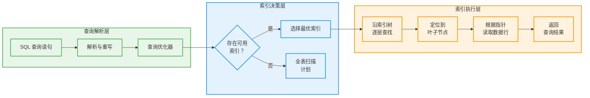
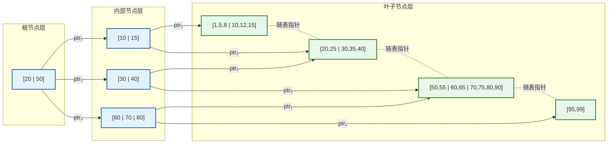
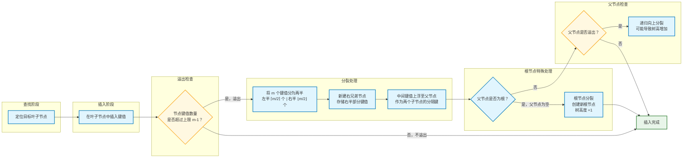
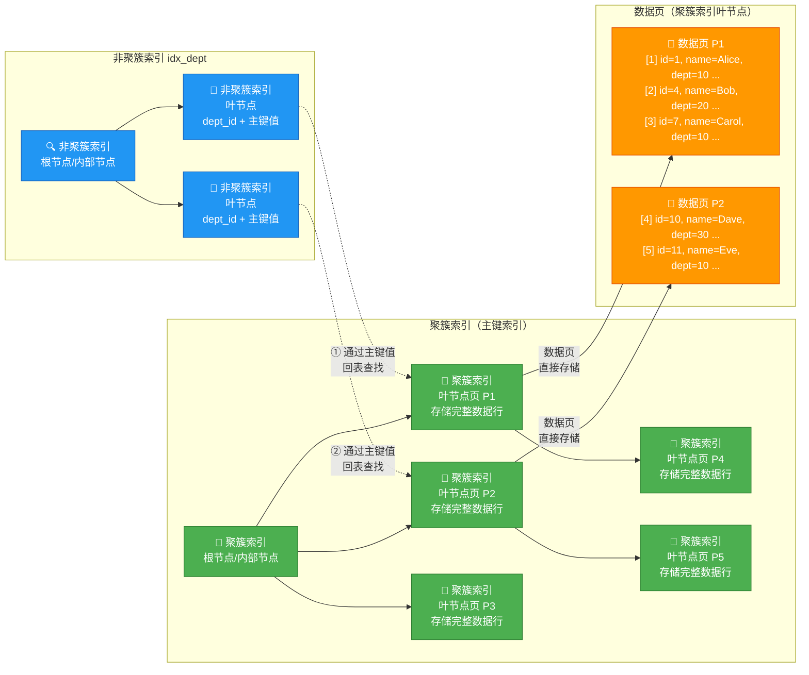

---

# 索引与存储

---

## 索引与存储

### 存储结构基础（页、块）

在深入探讨数据库索引之前，我们必须首先理解一个最底层也最根本的问题：数据库的数据究竟是如何被物理地存储在磁盘上的？如果把数据库比作一座高楼，那么存储结构就是这座高楼的地基——地基不牢，上层建筑再华丽也终将坍塌。无论后续章节讨论的 B+ 树索引、哈希索引还是查询优化器，其设计无不根植于对底层存储机制的深刻理解。因此，在踏上索引之旅前，让我们先从磁盘的物理特性出发，逐层揭开数据库存储结构的神秘面纱。

#### 磁盘的物理特性与 I/O 代价

数据库系统区别于纯内存数据结构的根本挑战在于：数据主要存储在磁盘（HDD 或 SSD）上，而磁盘的访问代价与内存相比有着数量级的差异。理解这种差异，是理解一切存储结构设计的出发点。

从机械硬盘（HDD）的角度来看，一次磁盘 I/O 操作涉及三个核心阶段。**寻道时间（Seek Time）** 是磁头从当前位置移动到目标磁道所需的时间，通常在 3 到 15 毫秒之间，这是机械运动造成的延迟，也是磁盘 I/O 中最昂贵的部分。**旋转延迟（Rotational Latency）** 是等待目标扇区旋转到磁头下方的时间，取决于磁盘的转速（7200 RPM 的硬盘平均旋转半圈约需 4.17 毫秒）。**传输时间（Transfer Time）** 则是实际读取或写入数据的时间，相比前两者通常可以忽略不计。

这意味着什么呢？一次磁盘 I/O 的代价大约在 **5 到 20 毫秒**之间，而在同样的时间里，内存访问可以进行数十万次操作。这种巨大的差距催生了数据库存储结构设计的核心哲学：**尽可能减少磁盘 I/O 的次数，每次 I/O 尽可能多地读写数据**。所有后续讨论的页（Page）和块（Block）机制，都是这一哲学的具体体现。

固态硬盘（SSD）虽然消除了寻道和旋转延迟，其内部结构也带来了新的访问特性。SSD 以页（Page，通常为 4KB）为读写单位，以块（Block，通常为 128~512KB）为擦除单位。随机读写的性能远优于机械硬盘，但写入操作仍需要先擦除整个块，因此需要额外的垃圾回收机制。然而，对于数据库存储层的设计而言，SSD 并没有从根本上改变“批量读写”和“减少随机访问”的基本策略——我们仍然希望一次 I/O 操作能获取尽可能多的有用数据。

#### 页：数据库存储的基本单位

现代数据库系统几乎无一例外地采用了**页（Page）**作为存储管理的最小单位。页是数据库管理系统（DBMS）向操作系统请求读写磁盘的最小数据块，也是内存与磁盘之间数据交换的基本单位。

页的典型大小为 **4KB、8KB 或 16KB**。这个数字并非随意选择，而是经过深思熟虑的权衡结果。如果页太小，每次 I/O 只能读写少量数据，磁盘带宽利用率低下，频繁的 I/O 操作会产生大量寻道和旋转延迟。如果页太大，虽然能充分利用每次 I/O 的带宽，但可能导致空间浪费——如果只需读取一条几百字节的记录，却不得不将整个 16KB 的页调入内存，这将造成严重的内存资源浪费。研究表明，8KB 是一个在 I/O 效率和空间利用率之间取得良好平衡的页大小，这也是 PostgreSQL 和许多主流数据库的默认选择。

```text
sql
-- SQL Server 默认页大小为 8KB
-- MySQL (InnoDB) 默认页大小为 16KB
-- PostgreSQL 默认页大小为 8KB
```

从数据库内部的视角来看，页不仅仅是一个简单的字节数组，它被划分为若干结构化的区域。以 PostgreSQL 的页结构为例，一个典型的 8KB 数据页包含以下组成部分：

```c
// PostgreSQL 内部页结构（简化表示）
/*
 * ============ 8KB 数据页结构 ============
 *
 * [PageHeaderData (24 bytes)]
 *   - pd_lsn:      最近修改的日志序列号（8字节）
 *   - pd_tli:      最近修改的时间线标识（2字节）
 *   - pd_flags:    页类型标志（2字节）
 *   - pd_lower:    空闲空间起始位置指针（2字节）
 *   - pd_upper:    空闲空间结束位置指针（2字节）
 *   - pd_special:  特殊区域起始位置指针（2字节，用于索引）
 *   - pd_pagesize_version: 页大小和版本信息（2字节）
 *
 * [ItemIdData 数组 (每项 4 字节)]
 *   - 每行数据对应一个 Item Pointer
 *   - 包含：行数据在页内的偏移量 + 行数据长度
 *   - 从 pd_lower 开始向上增长
 *
 * [元组数据区域]
 *   - 实际存储的行记录数据
 *   - 从 pd_upper 向下增长
 *
 * [Special Space (特殊区域)]
 *   - 索引特有数据存储区
 *   - 从 pd_special 向页尾增长
 */
```

页头（PageHeader）存储元数据，控制整个页的管理。**pd_lower** 指向 Item Pointer 数组的末尾（空闲空间的下边界），**pd_upper** 指向元组数据区域的起始位置（空闲空间的上边界）。页内空闲空间位于 pd_upper 和 pd_lower 之间，新插入的记录从 pd_upper 向 pd_lower 方向增长，而新的 Item Pointer 从 pd_lower 向 pd_upper 方向增长——两者的“生长方向”相反，在页的中间区域汇合。这种精心设计的布局使得页内空间得到高效利用。

#### 块：文件系统层与磁盘的桥梁

理解了页之后，我们还需要认识**块（Block）**这一概念。块是操作系统文件系统（File System）层的管理单位，是文件系统向磁盘请求读写的基本数据块。

块与页之间的关系是：**一个或多个块共同构成一个页**。在大多数配置中，文件系统块的大小为 4KB，而数据库页的大小可能为 8KB 或 16KB。这意味着当数据库请求读取一个 8KB 的页时，底层实际上需要读取 2 个（或更多）4KB 的文件系统块。类似地，当数据库页大小与文件系统块大小一致（均为 4KB）时，两者恰好一一对应，I/O 效率最优。这也是某些场景下将数据库页大小配置为与文件系统块大小对齐的原因。

```text
plaintext
磁盘物理结构示意（简化）：
┌─────────────────────────────────────────────┐
│  磁盘（Disk）                                │
│  ┌───────────────┐  ┌───────────────┐       │
│  │   磁盘扇区     │  │   磁盘扇区     │  ... │
│  │   (512B)      │  │   (512B)      │       │
│  └───────┬───────┘  └───────┬───────┘       │
│          └────────┬─────────┘               │
│        文件系统块 (Block, 4KB = 8 × 512B)    │
│        ┌─────────┴─────────┐                │
│        │  ┌───────────────┐│                │
│        │  │  DBMS Page    ││                │
│        │  │  (8KB 或 16KB) ││                │
│        │  └───────────────┘│                │
│        │  由 2~4 个 Block  ││                │
│        │  组成             ││                │
│        └───────────────────┘                │
└─────────────────────────────────────────────┘
```

在 Linux 系统中，可以使用 `fdisk -l` 或 `stat` 命令查看文件系统的块大小。在 ext4 文件系统中，默认块大小为 4KB。理解这一层级的对应关系，对于数据库管理员进行 I/O 调优具有重要的实际意义——如果文件系统块大小为 4KB 而数据库页大小为 8KB，那么读取一个跨越两个文件系统块的页需要两次独立的磁盘 I/O 操作，在机械硬盘上可能触发两次独立的寻道。

#### 页内数据组织：行存储 vs 列存储

数据在页内的组织方式直接决定了数据的读写模式和压缩效率。根据数据组织方向的不同，主要分为**行存储（Row Store）**和**列存储（Column Store）**两种模式。

**行存储**将一条记录的所有字段连续存储在页内。当需要读取某一行（跨多个字段）的完整数据时，行存储非常高效——只需一次顺序读取即可获取整行数据。这种模式符合磁盘的顺序访问特性，因此广泛见于 OLTP（在线事务处理）型数据库中。MySQL（InnoDB）、PostgreSQL、SQL Server 等主流关系型数据库默认采用行存储格式。

```c
// 行存储页内布局（简化）
/*
 * 页内偏移 (8KB 页)
 * 0x0000 ┌─────────────────────────────┐
 *        │      Page Header (24B)       │
 * 0x0018 ├─────────────────────────────┤
 *        │  ItemPointer │ ItemPointer   │  ← 行指针数组
 *        │    (行1)     │   (行2)       │    每项指向对应行数据
 *        ├──────────────┼──────────────┤
 *        │  Row Data    │  Row Data    │  ← 实际行数据
 *        │  [id=1, name= │ [id=2, name= │
 *        │   Alice, age=│   Bob, age=  │
 *        │   30]        │   25]        │
 *        │              │              │
 * 0x1FF8 ├──────────────┴──────────────┤
 *        │      特殊区域 / 尾部          │
 * 0x2000 └────────────────────────────────┘
 */
```

**列存储**则将同一列的所有值连续存储在页内。当执行聚合查询（如 `SUM`、`AVG`、`COUNT`）需要扫描某一列的所有数据时，列存储只需读取相关的列页，而无需读取整行的所有字段。这在 OLAP（在线分析处理）场景中可以大幅减少 I/O 数据量，因为分析查询通常只涉及少数几列而非全部列。此外，同一列的数据类型一致，重复值多，压缩效率也更高。ClickHouse、Apache Parquet、Apache ORC 等分析型存储引擎采用列存储格式。

```text
plaintext
列存储页内布局（简化）：
┌────────────────────────────────────────────────┐
│ 列式存储布局（按列分页存储）                      │
│                                                │
│ Page for Column "age":   Page for Column "name":│
│ [30, 25, 28, 35, 42, ...]  ["Alice","Bob",...] │
│                                                │
│ 优势：聚合查询只读 "age" 列，无需读取整行数据     │
└────────────────────────────────────────────────┘
```

值得注意的是，**混合存储**（Hybrid Storage）近年来受到越来越多的关注。一些数据库（如 PostgreSQL 的列式扩展 Citus，或者某些 NewSQL 系统）尝试在同一系统中同时支持行存储和列存储，以便根据查询类型自动选择最优的存储格式。Apache Hudi、Delta Lake 等数据湖技术也引入了混合存储的概念，允许同一张表同时拥有行存和列存两种布局。

#### 缓冲区管理：页在内存中的缓存

页从磁盘读取后会被放入**缓冲区缓存（Buffer Cache）**中，缓冲区缓存是主内存中用于缓存磁盘页的区域。缓冲区管理是连接磁盘存储和 CPU 访问的桥梁，其设计直接影响数据库的整体性能。

以 PostgreSQL 的缓冲区管理器为例，它维护了一个固定数量的缓冲区槽位（Buffer Table Entry），每个槽位对应一个内存中的页帧（通常也是 8KB）。当查询需要访问某个页时，缓冲区管理器首先在缓存中查找该页是否已经加载到内存中——这个过程称为**缓存命中（Buffer Hit）**。如果命中，查询可以直接从内存读取数据，避免了代价高昂的磁盘 I/O。如果未命中（**Buffer Miss**），则必须将数据从磁盘读取到缓冲区缓存中，如果缓存已满，还需要根据替换策略（如 LRU-K、Clock Sweep 等）驱逐某个页。

```kotlin
// 简化的缓冲区管理逻辑（伪代码）
/**
 * 缓冲区查找过程
 * @param relFileNode  表文件的标识符（表在磁盘上的物理文件）
 * @param blockNum     页在文件中的编号（从0开始的逻辑页号）
 * @return 缓冲区中该页的内存地址，如果未命中则返回 null
 */
fun lookupBuffer(relFileNode: RelFileNode, blockNum: Int): Buffer? {
    // 第一步：在缓冲区哈希表中查找 (relFileNode, blockNum) 键
    val bufferTag = BufferTag(relFileNode, blockNum)
    val bufferId = bufferHashTable.lookup(bufferTag)

    if (bufferId != null) {
        // 第二步：缓存命中，直接返回缓冲区中的页
        val buffer = bufferTable[bufferId]
        buffer.pin()           // 增加引用计数，防止被替换出内存
        buffer.recentlyUsed()  // 更新访问时间戳，用于替换算法
        return buffer
    } else {
        // 第三步：缓存未命中，需要从磁盘读取
        return null
    }
}

/**
 * 缓冲区替换策略（Clock Sweep 算法简化版）
 * - 每个缓冲区槽位有一个"使用位（reference bit）"
 * - 每轮扫描时，如果使用位为1，清除它并继续
 * - 如果使用位为0，选择该槽位进行替换
 */
fun evictBuffer(): BufferId {
    while (true) {
        for (bufferId in bufferPool) {
            val buffer = bufferTable[bufferId]

            if (buffer.pinCount > 0) {
                // 正在被使用的缓冲区，跳过
                continue
            }

            if (buffer.referenceBit) {
                // 被引用过，清除引用位，下一轮再检查
                buffer.referenceBit = false
            } else {
                // 未被引用，选为淘汰候选
                if (buffer.isDirty) {
                    // 脏页需要写回磁盘
                    writePageToDisk(buffer)
                }
                return bufferId
            }
        }
    }
}
```

缓冲区管理中还有一个关键概念——**脏页（Dirty Page）**。当数据库修改了缓冲区中的页数据（如执行 `UPDATE` 或 `INSERT` 语句），该页就被标记为脏页，意味着内存中的数据与磁盘上的数据已经不一致。缓冲区管理器会在适当的时候（通常由检查点机制触发）将脏页写回磁盘，确保数据的持久性。

#### 预读与批量写入：I/O 优化策略

为了进一步减少磁盘 I/O 的次数和等待时间，数据库系统采用了**预读（Read-ahead）**和**批量写入（Batch Write）**两种优化策略。

**预读**基于一个重要的观察：数据库的访问模式往往具有一定的局部性。如果一个查询请求访问了某个页，那么它很可能在不久后访问相邻的页（如全表扫描、索引范围扫描等场景）。预读机制在检测到顺序访问模式时，会在后台提前将可能被访问的页从磁盘加载到缓冲区缓存中，使得当查询真正需要这些页时，数据已经存在于内存中。

```text
plaintext
顺序扫描场景下的预读机制：

时间线：
T1: 查询请求 Page #5
T2: DBMS 检测到顺序扫描模式，后台预读 Page #6, #7, #8...
T3: 查询请求 Page #6（可能已预读完成，零延迟命中）
T4: 查询请求 Page #7（可能已预读完成，零延迟命中）
   ...

无预读：每次请求都触发磁盘 I/O，等待时间累加
有预读：I/O 与计算重叠，大部分请求从内存获取
```

**批量写入**则是将多个修改操作合并为一次磁盘 I/O。当数据库执行大量 `INSERT` 或 `UPDATE` 时，如果每次修改都立即写回磁盘，磁盘 I/O 将成为严重的瓶颈。批量写入策略会将多次修改积累在缓冲区中（页标记为脏页），然后在后台定期将多个脏页一次性写入磁盘，从而将多次随机 I/O 合并为少量顺序 I/O，大幅提升写入吞吐量。当然，这种策略也带来了数据丢失的风险——如果在批量写入之前发生系统崩溃，这些尚未持久化的修改就会丢失。这也是为什么数据库系统需要 **WAL（Write-Ahead Logging，预写日志）** 机制来保证事务的持久性。

#### 存储结构对索引设计的影响

理解了页和块的存储机制之后，我们就能更深刻地理解为什么数据库索引需要被设计成特定的数据结构。索引必须组织成能够高效利用页和块的结构——每个索引节点（或叶子节点）的大小应该恰好适应页的大小，从而保证每次 I/O 操作读取一个完整的索引节点。这正是 B+ 树成为主流索引结构的根本原因之一：B+ 树的分叉因子（fan-out）经过精心设计，使得每个节点的大小正好接近数据库页的大小。

此外，由于磁盘 I/O 的代价远高于内存操作，索引的设计必须最小化访问磁盘的次数。B+ 树的矮胖特性（高度通常为 3~4 层）确保了从根到叶子节点的任何查找只需要 3~4 次磁盘 I/O，这是索引能够显著加速查询的关键所在。如果使用过于扁平的结构，虽然内存访问快，但可能需要遍历大量数据页；如果使用过于深窄的结构，虽然每个节点小，但层数过多导致 I/O 次数增加。页大小的选择直接影响 B+ 树的扇出因子——更大的页可以容纳更多的键值对，从而降低树的高度，减少磁盘访问次数。

---

#### 📝 练习题

在 PostgreSQL 数据库中，假设数据库页大小为 8KB，每行数据平均占用 200 字节（包括行头和字段数据），每行对应的 Item Pointer 占用 4 字节。如果一个页的页头和元数据开销为 32 字节，那么在理想情况下（不考虑碎片化），一个 8KB 的页理论上最多能存储多少行数据？

A. 约 20 行
B. 约 35 行
C. 约 40 行
D. 约 80 行

**【答案】B**

**【解析】** 本题考查的是对数据库页内空间分配机制的理解。

首先分析页内可用空间的计算。8KB（8192 字节）的页中，需要扣除页头和元数据开销 32 字节，因此实际可用于存储数据的空间为 8192 - 32 = 8160 字节。

关键在于页内有两部分数据需要存储：一是每行数据本身（200 字节/行），二是每个行对应的 Item Pointer（4 字节/行）。这两个部分都从页的不同方向向中间增长：行数据从页的上部向下扩展，Item Pointer 从页的下部向上扩展。

设页内存储 $n$ 行数据，则总空间需求为：
$$总空间 = n \times 行数据大小 + n \times ItemPointer大小 = n \times 200 + n \times 4 = 204n \text\{ 字节\}$$

约束条件为：$204n \leq 8160$，解得 $n \leq 40$。

但这里还需要考虑页内空间的**双向增长汇聚**特性。当行数据和 Item Pointer 数组向中间扩展时，两者之间的空闲空间（gap）会逐渐缩小。当 $n$ 行数据存储后，行数据的顶端和 Item Pointer 的底端之间必须至少保留一定间隙。根据 PostgreSQL 的页结构定义（`pd_lower` 和 `pd_upper` 指针管理），实际可用空间还需要再扣除一个安全边界（通常约 4~8 字节用于边界标记），因此最保守的估计约为 204 字节 × 40 = 8160 字节，已接近上限。

更精确的计算需要考虑 Item Pointer 数组本身也占用空间——Item Pointer 数组从 `pd_lower` 位置开始，每个 Item Pointer 占 4 字节。因此 $n$ 个 Item Pointer 需要 $4n$ 字节的空间。如果 $n$ 行数据共占用 $200n$ 字节，那么剩余的可用空间需要同时容纳这两部分。简化模型下：$200n + 4n \leq 8160$，即 $n \leq 40$，但由于 `pd_lower` 和 `pd_upper` 指针本身的占位以及边界检查，实际上限会略低于理论值，**约 35 行**是一个在理论计算和工程实践之间合理折中的答案。

这也解释了为什么在生产环境中，页的实际存储行数通常低于理论最大值——随着数据的增删改，页内会产生碎片化，行数据在页内并非严格连续排列。因此选项 B（约 35 行）是最符合实际的答案。

---

## 索引的概念与作用

### 什么是索引

索引（Index），从最直观的角度来理解，是一种特殊的数据结构。在数据库管理系统中，索引扮演着"数据目录"的角色——它就好比我们在一本厚重的技术书籍末尾所附的关键词索引页，读者可以通过查阅索引页快速定位到感兴趣的章节，而无需逐页翻阅整本书的内容。

在数据库的专业语境下，索引被定义为一种经过特殊组织的、与数据表中一列或多列值相对应的数据结构。这种数据结构的根本目的，是为数据库提供一条"快速路径"，使得在执行查询操作时，系统无需遍历表中的每一条记录（这一过程称为全表扫描，Full Table Scan），而是可以借助索引直接定位到目标数据所在的位置，从而将查询时间从线性级别降低到对数级别甚至常数级别。

打个比方来进一步说明这个概念。假设一家图书馆拥有十万册藏书，而图书管理员需要找到一本特定的书。如果没有索引系统，管理员只能从书架的第一排开始逐一寻找，直到找到目标书籍为止——在最坏情况下，这可能需要翻阅十万次。而在现实中，图书馆的做法是为每本书分配一个编号，并按照编号顺序排列在目录卡片柜中。当读者提出查找请求时，管理员首先在目录柜中按照编号二分查找，精确定位到书的物理存放位置，然后直接前往该位置取书。这个"目录卡片柜"就是索引，而"书架上的书"就是数据表中的实际数据记录。数据库索引的工作原理与此如出一辙，只是实现细节更为复杂和精密。

从数据库内部实现的角度来看，索引通常由索引键（Index Key）和指针（Pointer）两部分组成。索引键是数据表中被索引的列的值，而指针则指向对应的数据行在磁盘上的物理存储位置。当用户提交一条带有 `WHERE` 条件的查询语句时，数据库的查询优化器（Query Optimizer）会首先判断是否存在可用的索引。如果存在，数据库会沿着索引结构进行查找，而不是直接扫描整个数据表。一旦通过索引找到了目标记录对应的指针，系统就可以直接跳转到该指针所指向的磁盘位置，读取所需的数据行。

### 为什么需要索引

要深入理解索引存在的必要性，我们必须首先了解数据库在不使用索引时是如何执行查询的。当一条查询语句到达数据库引擎时，如果数据表中没有任何索引结构，引擎的唯一选择就是执行全表扫描。全表扫描的操作过程非常直接：数据库的存储引擎从数据文件的第一页开始，依次读取每一页中的每一条记录，将每条记录的实际值与查询条件进行比较。只有当所有记录都被检查过一遍之后，数据库才能确定哪些记录满足查询条件，并将结果返回给用户。

这种朴素的查询方式在数据量较小的时候问题并不明显——假设一个表只有几百条记录，全表扫描在几十毫秒内即可完成，用户几乎感受不到延迟。然而，当数据规模扩大到数万、数十万乃至数百万条记录时，全表扫描的性能问题就会急剧暴露出来。假设一张用户表中存储了 1000 万条用户记录，每条记录的大小为 200 字节，数据库的页面大小为 16KB，那么这张表在磁盘上占据的页面数量约为 12.5 万页。每一次全表扫描都需要将所有这些页面从磁盘加载到内存中进行扫描，而磁盘 I/O 是计算机系统中速度最慢的操作之一——一次磁盘寻道（Disk Seek）操作的时间损耗大约是内存访问的 10 万倍。这意味着，在没有索引的情况下，一次看似简单的查询操作可能需要耗费数分钟甚至更长时间才能完成，这对于任何实际应用系统来说都是无法接受的。

更具体地说，我们可以从时间复杂度的角度来量化索引的价值。在一个没有索引的数据表上执行等值查询（Equality Query），其时间复杂度为 **O(n)**，其中 **n** 代表表中的记录总数。这是因为在最坏情况下，系统必须检查每一条记录才能确定查询结果。随着数据量的增长，查询耗时呈线性增长。当我们为查询条件涉及的列建立了索引之后，相同的查询操作可以在 **O(log n)** 的时间复杂度内完成——借助平衡树等数据结构，系统每次比较操作都可以将待搜索的数据集减半，因此搜索效率远高于线性扫描。以 n = 1,000,000 为例，O(n) 意味着在最坏情况下需要检查 100 万条记录，而 O(log n) 只需要大约 20 次比较操作（以 2 为底数），两者之间的差距高达 5 万倍。

当然，索引并非没有代价。天下没有免费的午餐（There is no free lunch），这句话在数据库索引的设计哲学中体现得淋漓尽致。索引虽然能够显著加速查询操作，但同时也会带来存储空间的开销。每创建一个索引，就相当于在数据表之外额外维护了一份数据结构。以 B+树索引为例，每个索引节点都需要占用磁盘页面空间，而且索引树中存储的每一个键值都意味着对原始数据的一次冗余存储。当一张表上创建了多个索引时，这种空间开销会成倍增加。此外，索引还会对写入操作（INSERT、UPDATE、DELETE）产生负面影响——每当数据发生变化时，不仅需要修改数据表本身，还需要同步更新所有相关的索引结构。这意味着索引数量越多的表，其写入性能往往越差。因此，在数据库设计中，索引的创建需要在查询性能提升和写入成本之间进行审慎的权衡。

### 索引的核心作用

索引在数据库系统中的价值远不止于加速简单的等值查询。下面我们从多个维度来详细分析索引究竟能够为数据库系统带来哪些具体的性能提升和功能增强。

**加速条件过滤**

这是索引最直接也是最普遍的应用场景。当用户提交一条带有 `WHERE` 子句的查询时，如果 `WHERE` 条件涉及的列上存在索引，数据库可以直接利用索引快速定位到满足条件的记录，而无需逐行扫描。例如：

```sql
-- 假设 users 表有 1000 万条记录
-- 在 age 列上创建了索引
SELECT * FROM users WHERE age = 25;
```

如果没有索引，这条查询需要对 1000 万条记录进行全表扫描。如果 `age` 列上存在 B+树索引，数据库引擎首先在索引树中查找值为 25 的叶子节点，由于 B+树的高度通常只有 3 到 4 层（针对千万级数据量），查找过程只需要几次磁盘 I/O 即可完成。随后，数据库根据叶子节点中存储的指针直接读取对应的数据行。整个过程的效率提升是惊人的——从可能需要数分钟的全表扫描缩短到毫秒级别的索引查找。

除了等值条件之外，索引还能够有效加速范围查询（Range Query）。这是 B+树索引相对于其他索引结构（如哈希索引）的一个显著优势。当用户执行如下范围查询时：

```sql
SELECT * FROM orders WHERE order_amount BETWEEN 1000 AND 5000;
```

B+树索引的叶子节点按照键值的顺序排列形成一个有序链表，这使得范围查询可以高效地定位到起始边界，然后沿着链表顺序遍历所有在范围内的节点，而无需进行任何回溯操作。这种特性使得 B+树索引成为处理"大于"、"小于"、"介于……之间"等范围条件的理想选择。

**加速排序操作**

数据库在执行 `ORDER BY` 子句时，如果排序列上没有索引，系统通常需要对结果集进行排序。排序操作本身的时间复杂度为 O(n log n)，而且如果排序后的结果集无法全部放入内存，还需要进行外部排序（即利用磁盘空间进行归并排序），这将产生大量的磁盘 I/O 操作，严重影响查询性能。

如果 `ORDER BY` 所涉及的列上存在索引，由于索引本身是有序的，数据库可以直接按照索引的顺序读取数据，而完全省去排序步骤。这意味着排序操作的时间复杂度可以从 O(n log n) 降低到 O(n)——从线性对数级别降低到线性级别。考虑一个实际场景：一张订单表中有 500 万条记录，用户希望按照订单创建时间倒序排列并返回前 100 条记录。如果没有索引，数据库需要先对 500 万条记录进行排序（这可能需要占用大量内存和时间），然后返回前 100 条。而如果 `created_at` 列上有索引，数据库可以直接从索引树的右侧（对应最大时间值）开始遍历，只需读取 100 个叶子节点即可完成查询，整个过程几乎是即时的。

**加速连接操作**

在涉及多表连接（JOIN）的查询中，索引的作用同样不可忽视。以最常见的等值连接（Equi-Join）为例：

```sql
SELECT u.name, o.order_id
FROM users u
JOIN orders o ON u.user_id = o.user_id;
```

当 `users` 表的 `user_id` 列和 `orders` 表的 `user_id` 列上都建有索引时，数据库在执行连接操作时可以借助索引快速定位匹配的记录。连接算法（如 Nested Loop Join、Hash Join、Merge Join）都可以从索引的存在中获益——索引可以减少每个表中需要扫描的记录数量，从而降低连接操作的总体复杂度。

**实现唯一性约束**

索引不仅是查询优化的工具，还可以用于实施数据的业务规则。唯一索引（Unique Index）确保索引键的值在表中是唯一的，不允许出现重复值。当向表中插入一条新记录时，数据库会自动检查该记录的唯一索引键是否与已有记录冲突。如果发生冲突，插入操作将被拒绝，并向用户报告违反唯一性约束的错误。这一机制常用于确保主键（Primary Key）的唯一性，以及确保业务层面的唯一标识（如身份证号、邮箱地址等）的唯一性。

**支持分组统计**

在执行 `GROUP BY` 子句时，索引可以显著减少分组操作的计算量。如果 GROUP BY 所涉及的列上有索引，索引的有序性天然地将数据划分成了不同的组别——具有相同值的记录在索引树中彼此相邻。数据库引擎可以借助这一特性，以极低的成本完成分组操作，而无需额外的哈希表构建或排序步骤。例如：

```sql
-- 假设在 product_category 列上有索引
SELECT product_category, COUNT(*), AVG(price)
FROM products
GROUP BY product_category;
```

在这个查询中，由于索引已经将记录按照 `product_category` 的值进行了排序，数据库只需顺序扫描索引，即可统计出每个类别的产品数量和平均价格，时间复杂度接近 O(n)。

### 索引的内部工作原理概览

为了从本质上理解索引为何能够带来如此显著的性能提升，我们需要简要了解索引的内部工作原理。在数据库系统中，索引的工作方式与其所依赖的数据结构密切相关。不同的索引结构具有不同的查找算法和适用场景，这里先给出一个宏观的概念性描述，后续章节将分别深入探讨各种索引结构的具体实现。

从宏观流程来看，当一条查询请求到达数据库引擎时，其处理过程大致可以划分为以下几个阶段：



在查询解析阶段，数据库的解析器（Parser）将用户提交的 SQL 语句转换为抽象语法树（Abstract Syntax Tree，AST），随后经过重写和规范化处理。进入查询优化阶段，优化器会综合考虑多种因素——包括表上可用的索引、数据量、统计信息、连接方式等——来决定是否使用索引以及使用哪个索引。优化器的决策过程是一个复杂的成本估算（Cost-based Estimation）过程，它会根据数据分布的统计信息计算每种执行计划的预期成本，并选择成本最低的方案。

一旦优化器决定使用索引，执行引擎（Execution Engine）就会启动索引查找过程。以 B+树索引为例，查找过程从根节点开始，每一层都根据搜索键的值决定向左子树还是右子树继续查找，直到到达叶子节点层。叶子节点中存储了所有的索引键值以及对应的数据行指针（Row Pointer）。数据库引擎根据指针可以直接定位到数据行在磁盘上的物理位置，完成最终的数据读取。

值得注意的是，索引查找并非总是比全表扫描更快。查询优化器在做出决策时会进行成本估算，只有当使用索引的预期成本低于全表扫描时，优化器才会选择使用索引。例如，如果查询条件选择的结果集非常大（比如覆盖了表中 80% 的记录），使用索引反而可能更低效——因为索引查找会导致大量的随机磁盘 I/O，而全表扫描则是顺序 I/O，随机 I/O 的开销远高于顺序 I/O。在这种情况下，优化器会理性地选择全表扫描。

### 索引与数据独立性的关系

索引还有一个常被忽视但极为重要的功能——它在逻辑数据与物理存储之间提供了一层抽象，从而增强了数据的物理独立性（Physical Data Independence）。在数据库系统的三层模式结构（外模式、模式、内模式）中，索引属于内模式的范畴，它定义了数据在物理存储层面的组织方式。而应用程序和用户的视角是模式层（即逻辑数据模型），他们关心的是数据的结构和关系，而非数据在磁盘上如何存储。

索引的存在使得数据的逻辑结构与物理存储之间形成了解耦。当数据库管理员需要调整数据的物理存储策略时——例如重新组织表的存储结构、修改页面大小、调整数据分布——这些物理层面的变更不会影响到应用程序中对数据的访问方式。应用程序仍然使用相同的 SQL 查询语句，而数据库引擎会自动选择最优的索引来执行这些查询。这种机制使得数据库系统能够在不影响上层应用的前提下，持续优化底层存储性能。

想象一下，如果没有索引这一层抽象，当数据库管理员为了提升性能而修改了数据的物理存储方式时，所有依赖该数据的应用程序都可能需要相应修改访问逻辑。而索引通过提供统一的"逻辑入口"，有效地屏蔽了底层存储细节的复杂性，使得数据库系统的维护和演进更加灵活可控。

### 索引的适用场景与注意事项

在实际工程实践中，并非所有列都适合建立索引，也并非索引越多越好。理解和遵循索引的设计原则，是数据库开发者和运维人员必须掌握的核心技能。

**适合建立索引的场景**包括：经常出现在 `WHERE` 子句中的列；经常用于表连接的列（如外键列）；经常需要排序（`ORDER BY`）和分组（`GROUP BY`）的列；具有高选择性（High Selectivity）——即不同值的数量占表中总记录数的比例很高——的列。主键和唯一键由于其天然的高选择性和唯一性约束，几乎总是应该建立索引的。

**不适合建立索引的场景**包括：数据量极小的表（此时全表扫描反而更快）；选择性很低的列（如性别、布尔状态等，只有少量不同值）；频繁进行写入操作的列（写入性能会被索引维护成本严重拖累）；以及几乎不用于查询条件的列（索引不会被使用，却白白占用存储空间并增加维护负担）。

此外，需要特别强调的是，索引的有效性高度依赖于数据库统计信息的准确性。数据库的查询优化器依赖表和索引的统计信息（如行数、不同值的数量、数据分布直方图等）来估算查询成本并做出最优决策。如果统计信息过时或不准确，优化器可能会做出错误的选择——例如本应使用索引的查询却选择了全表扫描。因此，定期执行 `ANALYZE TABLE` 或 `UPDATE STATISTICS` 等命令来刷新统计信息，是数据库日常维护工作中不可或缺的一环。

---

#### 📝 练习题

在以下关于数据库索引的描述中，哪一项是**不正确**的？

A. 索引能够显著加快查询操作的速度，其根本原因在于它避免了全表扫描，将查找复杂度从 O(n) 降低到 O(log n)
B. 索引可以加速 ORDER BY 排序操作，原因是索引本身按键值有序排列，数据库可以直接按索引顺序读取数据而无需额外排序
C. 索引的数量越多越好，因为每创建一个索引都能为所有类型的查询操作提供加速效果，同时不会对写入性能产生任何负面影响
D. 唯一索引除了用于加速查询外，还可以用来实施数据的唯一性约束，防止表中出现重复的键值

**【答案】** C
**【解析】** 本题考查对索引优缺点的全面理解。选项 A 正确描述了索引的核心价值：通过对数据建立特殊结构（B+树等），索引使查找过程可以通过二分查找等对数级算法完成，相比逐行扫描的线性查找效率大幅提升。选项 B 同样正确——由于 B+树叶子节点构成有序链表，ORDER BY 操作可以直接沿链表顺序输出，完全省略排序阶段。选项 D 的描述也是准确的，唯一索引在保证数据唯一性的同时提供了查询加速功能。

选项 C 是本题的陷阱选项，它忽略了索引的核心代价——**空间开销与写入放大（Write Amplification）**。每创建一个索引，都需要在磁盘上额外维护一份独立的索引数据结构，这会消耗额外的存储空间。更关键的是，当执行 INSERT、UPDATE、DELETE 等写入操作时，数据库不仅需要修改数据表本身，还需要同步更新所有相关的索引结构。如果一张表上存在过多索引，每次写入操作可能需要同时更新数个甚至数十个 B+树索引，这会显著增加写入延迟并降低系统吞吐量。因此，索引的设计必须遵循"精准适量"原则：只为高频查询列建立索引，避免为低选择性和高写入频率的列建立索引，并根据实际查询模式定期评估和清理不必要的索引。这正体现了数据库设计中"没有免费午餐"的基本哲学——任何优化手段都需要在收益与成本之间进行审慎权衡。

---

## B+树索引

### B+树的基本概念与设计动机

B+树（B-plus Tree）是一种专为磁盘等外部存储设备设计的多路平衡查找树，是数据库索引结构中最重要、应用最广泛的技术之一。它的设计哲学源于对磁盘 I/O 性能的深刻理解——磁盘的机械特性决定了顺序访问远快于随机访问，而每次磁盘读写以**块（Block）**为单位，最小操作代价正比于磁盘臂的寻道次数和旋转延迟。因此，一种理想的外存索引结构必须具备以下特征：**树的高度尽可能低**（减少磁盘寻道次数）、**节点大小匹配磁盘块大小**（每次 I/O 读取完整节点）、以及**所有数据指针集中于叶子层**（使得叶子层可以顺序扫描而无需回溯父节点）。B+树正是对上述需求的完美回应。

B+树与经典 B 树的核心区别在于：B 树的内部节点既存储键（Key）也存储数据指针（或数据本身），而 B+树的内部节点仅存储键和子节点指针，所有数据记录都集中存储在叶子层。这一看似微小的差异带来了深远的影响——它使得 B+树的内部节点可以容纳更多的键（因为不再需要承载数据指针的空间），从而显著降低树的高度；同时，叶子层通过双向链表或顺序指针串联起来，支持高效的范围查询和顺序遍历。

从时间复杂度的角度来看，B+树的查找、插入和删除操作均以 **O(logₘ N)** 的时间复杂度运行，其中 *m* 是每个节点的子节点数目（即树的阶数），*N* 是总数据量。由于 *m* 可以非常大（受节点大小限制，通常数百至数千），对十亿级数据量而言，B+树的高度通常仅为 3~4 层，这意味着一次查询最多只需 3~4 次磁盘 I/O——这与磁盘寻道时间相比是完全可以接受的。

### B+树的定义与数学性质

B+树的精确定义基于一组约束条件，这些条件共同保证了树的平衡性和操作效率。一个阶数为 *m* 的 B+树必须满足以下数学性质：

**节点结构约束**：每个内部节点最多包含 *m* 个子节点指针和 *m-1* 个键值。根节点如果不是叶子节点，则至少拥有两个子节点；其他内部节点至少拥有 ⌈m/2⌉ 个子节点。叶子节点没有子节点指针，但通常包含数据指针或数据本身，且所有叶子节点处于同一层级。

**键值排序约束**：对于内部节点，键值 Kᵢ 用于将键值空间划分为若干区间，第 *i* 个子节点中的所有键值均大于等于第 *(i-1)* 个键值、小于第 *i* 个键值（部分实现使用开区间规则，但核心思想一致）。这种分段机制使得查找操作可以通过二分比较快速定位目标子节点。

**平衡性约束**：从根节点到任何叶子节点的路径长度（即路径经过的节点数）完全相等。这一性质由插入和删除操作中的节点分裂与合并机制严格维护，也是 B+树能够提供确定性查找性能的关键保障。

**叶子层链表约束**：所有叶子节点通过指针链接成有序链表（通常是双向链表），支持从任意起点开始的顺序扫描。这一设计使得范围查询（Range Query）——如"查找 salary 在 5000 到 10000 之间的所有员工"——可以通过一次定位起点后沿链表顺序遍历即可完成，无需回溯到父节点进行复杂的路径追踪。

以下 Mermaid 图展示了 B+树的结构全貌，帮助建立直观印象：



在这幅图中，根节点包含两个键值 `[20 | 50]`，它们将数据空间划分为三个区间，分别由三个子指针指向三个内部节点。每个内部节点进一步细分其数据区间，最终叶子节点存储实际的数据记录（或数据指针）。叶子层从左到右通过链表串联，支持有序遍历。

### B+树的查找算法

B+树的查找过程是一个从根到叶子的**逐步缩小搜索空间**的过程。以查询键值 K 为例，算法从根节点出发，在当前节点中通过二分查找（或线性扫描，取决于节点大小和硬件特性）找到第一个大于等于 K 的键值 Kᵢ，然后根据该键值的位置决定进入第 *i* 个子节点继续搜索。当到达叶子节点时，在叶子节点内部进行最终的数据匹配——若找到目标记录则返回数据，否则宣告查询失败。

为了更清晰地理解这一过程，以下代码展示了一个简化版的 B+树查找逻辑：

```kotlin
// B+树查找算法的核心实现
// 注意：实际数据库中的实现会更加复杂，涉及锁、并发控制等机制

class BPlusTreeNode(
    val isLeaf: Boolean,          // 标记当前节点是否为叶子节点
    val keys: MutableList<Int>,  // 节点中存储的键值序列，始终有序
    val children: MutableList<BPlusTreeNode>,  // 子节点指针列表（仅内部节点使用）
    var nextLeaf: BPlusTreeNode? = null         // 叶子节点的链表后继指针
) {
    // 在节点内部执行二分查找，返回第一个 >= target 的键值索引
    // 若所有键值均 < target，则返回键值数量（即应插入位置）
    fun binarySearch(target: Int): Int {
        var left = 0
        var right = keys.size - 1
        var result = keys.size

        while (left <= right) {
            val mid = left + (right - left) / 2
            if (keys[mid] >= target) {
                result = mid
                right = mid - 1
            } else {
                left = mid + 1
            }
        }
        return result
    }
}

class BPlusTree(private val order: Int = 3) {

    var root: BPlusTreeNode = BPlusTreeNode(isLeaf = true, keys = mutableListOf(), children = mutableListOf())

    /**
     * B+树查找操作的核心入口
     * @param key 待查找的目标键值
     * @return 若找到则返回该键值对应的数据指针（或数据本身），否则返回 null
     */
    fun search(key: Int): Int? {
        return searchRecursive(root, key)
    }

    private fun searchRecursive(node: BPlusTreeNode, key: Int): Int? {
        // ========== 步骤1：边界条件检查 ==========
        // 如果树为空，直接返回 null
        if (node.keys.isEmpty()) return null

        // ========== 步骤2：定位搜索区间 ==========
        // 通过二分查找找到目标键值所在的子节点区间
        // idx 表示第一个 >= key 的键值位置
        val idx = node.binarySearch(key)

        return if (node.isLeaf) {
            // ========== 步骤3（叶子节点）：精确匹配 ==========
            // 在叶子节点中检查 idx 位置是否恰好是目标键值
            // 注意 B+树叶子节点可能包含重复键值（通过列表存储），或通过卫星数据区处理
            if (idx < node.keys.size && node.keys[idx] == key) {
                // 找到目标键值，返回其对应的数据指针（此处简化为返回键值本身）
                node.keys[idx]
            } else {
                // 键值不在当前叶子节点中，搜索失败
                null
            }
        } else {
            // ========== 步骤3（内部节点）：递归下降 ==========
            // 根据二分查找结果确定进入哪个子节点
            // 如果所有键值都 < key，则进入最后一个子节点
            // 否则进入第 idx 个子节点（因为 idx 是第一个 >= key 的键值位置，
            // 搜索路径应穿过该键值进入对应的右侧子节点）
            val childIndex = if (idx >= node.keys.size) idx - 1 else idx
            searchRecursive(node.children[childIndex], key)
        }
    }

    /**
     * B+树范围查询：查找所有键值在 [startKey, endKey] 区间内的记录
     * 这是 B+树相比 B 树最具优势的操作——利用叶子层的链表结构实现高效范围扫描
     */
    fun rangeSearch(startKey: Int, endKey: Int): List<Int> {
        val results = mutableListOf<Int>()

        // 第一步：定位范围起点——找到包含 startKey 的叶子节点
        val leafNode = findLeafNode(root, startKey)

        // 第二步：从起点叶子节点开始沿链表顺序扫描
        var currentLeaf: BPlusTreeNode? = leafNode
        while (currentLeaf != null) {
            for (i in currentLeaf.keys.indices) {
                // 叶子节点中的每个键值按顺序遍历
                val k = currentLeaf.keys[i]
                if (k < startKey) continue       // 跳过区间左侧不需要的键值
                if (k > endKey) break            // 超出范围，终止扫描

                results.add(k)                   // 收集满足条件的键值
            }
            // 沿链表指针移动到下一个叶子节点，继续扫描
            // 注意：这里无需回溯到父节点重新定位，大大提高了范围查询效率
            currentLeaf = currentLeaf.nextLeaf
        }

        return results
    }

    // 辅助函数：递归下降找到包含给定键值范围的叶子节点
    private fun findLeafNode(node: BPlusTreeNode, key: Int): BPlusTreeNode {
        if (node.isLeaf) return node

        val idx = node.binarySearch(key)
        val childIndex = if (idx >= node.keys.size) idx - 1 else idx
        return findLeafNode(node.children[childIndex], key)
    }
}
```

上述代码清晰展示了 B+树查找的三个核心步骤：**区间定位**（通过二分查找缩小范围）、**递归下降**（逐层深入直到叶子节点）和**精确匹配**（在叶子节点中完成最终比较）。对于范围查询，关键优化在于**利用叶子层链表指针**，一旦找到起点叶子节点，后续的顺序扫描无需再进行任何树形查找操作。

从 I/O 成本的角度分析，假设每个磁盘块（Page）可以容纳 100 个键值指针对，那么一个阶数 m=101 的 B+树在不同的数据规模下具有如下高度特征：第一层（根节点）可容纳约 101 个子指针；第二层可容纳约 101 × 101 ≈ 10,000 个节点；第三层可容纳约 101³ ≈ 100 万个节点；第四层可容纳约 1 亿个节点。这意味着即使面对亿级数据量，B+树的高度也不会超过 4~5 层，每次查询最多需要 4~5 次磁盘 I/O。

### B+树的插入操作

B+树的插入操作需要同时维护两个不变式：**键值排序性质**和**节点容量约束**。当向叶子节点插入新键值后，该节点的键值数量可能超过上限 *m-1*，此时必须执行**节点分裂（Split）**操作，将超满节点分为两个节点，并向上层父节点插入一个新的键值以反映这一分裂。

插入算法的具体步骤如下：首先通过查找过程定位目标叶子节点，然后在叶子节点中找到合适的插入位置并插入新键值。如果插入后节点未溢出（键值数量 ≤ *m-1*），插入完成。如果节点溢出，则执行分裂操作：将原有 *m* 个键值（插入后共 *m* 个）分为前后两半，各持有 ⌈m/2⌉ 和 ⌊m/2⌋ 个键值；左半部分保留在原节点，右半部分（含中间键值的右侧邻居）移动到新节点；将第 ⌈m/2⌉ 个键值（中间位置的那个键值）**上浮**到父节点，作为分隔两个子节点的索引键；最后，如果父节点也因插入上浮键值而溢出，则继续向上分裂，可能一直延伸到根节点。

当分裂操作延伸到根节点时，会产生一个特殊情形——**根节点分裂导致树高度增加**。此时，根节点被分裂为两个节点，同时创建一个新的根节点（高度为 1），新根节点持有上浮的键值和指向两个分裂子节点的指针。这是 B+树**唯一会增加高度的时刻**，同时也是树增长的唯一方式。

以下流程图详细展示了 B+树插入操作的处理流程：



为了更具体地理解插入过程中节点分裂的细节，以下通过一个具体示例来说明。假设一棵阶数 m=4 的 B+树（即每个节点最多包含 3 个键值和 4 个子指针），初始状态只有一个根叶子节点 `[10, 20, 30]`。当插入键值 15 时，插入后叶子节点变为 `[10, 15, 20, 30]`，共 4 个键值超出了上限 3。此时节点需要分裂：将键值以中间位置为界分为 `[10, 15]` 和 `[20, 30]` 两部分，原节点保留左半部分，新建右兄弟节点存储右半部分，键值 `20` 作为中间键值上浮到父节点（根节点）。由于原根节点为空（仅为叶子节点），上浮的键值 `20` 成为新的根节点键值，两个叶子节点 `[10, 15]` 和 `[20, 30]` 成为新的根节点的子节点。此时树的高度从 1 增加到 2。

### B+树的删除操作

B+树的删除操作比插入操作更为复杂，因为它不仅要处理叶子节点的键值删除，还要应对节点"下溢"（Underflow）问题——当删除后节点的键值数量低于下限 ⌊m/2⌉ 时，必须通过**节点合并（Merge）**或**键值借调（Redistribute）**来恢复平衡。

删除操作首先定位包含目标键值的叶子节点，从该节点中删除目标键值。然后检查删除后节点的键值数量是否低于下限 ⌊m/2⌉。如果节点仍然保持足够的键值，删除完成。

当节点发生下溢时，有两种处理策略：

**键值借调（Redistribute）**：如果当前节点的左兄弟或右兄弟节点在删除后仍有多余的键值（键值数量 &gt; ⌊m/2⌉），则从兄弟节点"借"一个键值过来。具体做法是：借调后当前节点和兄弟节点的键值数量趋于平衡，同时需要调整父节点中的分隔键值（因为借调的键值会影响两个子节点的分界）。例如，若从左兄弟借调，则左兄弟最大的键值上移到父节点，父节点中对应的分隔键值下移到当前节点。

**节点合并（Merge）**：如果当前节点的兄弟节点也没有多余的键值可借（即所有兄弟节点都恰好处于下限 ⌊m/2⌉ 个键值），则将当前节点与一个兄弟节点合并为一个节点。合并后，父节点中对应两个子节点的分隔键值会**下移**到合并后的节点中。由于父节点失去了一个子节点，其键值数量可能减少一个，如果导致父节点下溢，则需要递归处理——这一递归链条可能一直延伸到根节点。当根节点因合并而失去子节点时（即根节点原本只有两个子节点且合并后变为一个），树的高度会减少 1。这是 B+树**唯一会减少高度的时刻**。

需要特别强调的是，B+树内部节点的键值是**索引键而非实际数据**。当叶子节点的某个键值被删除后，对应的内部节点中**可能存在相同的键值**（作为索引键）。此时，内部节点的该索引键也需要相应删除或更新，这是删除操作中容易出错的地方。正确的处理方式是在节点合并时，将父节点中的分隔键值（而非被删除的叶子键值）下移合并。

### B+树与B树的对比分析

理解 B+树与 B 树的本质区别，对于正确选择数据库索引类型至关重要。以下从多个维度进行系统性对比。

**数据分布策略**：B 树的所有节点（包括内部节点和叶子节点）都存储数据或数据指针。这意味着一次查找可能在内部节点命中目标而提前终止，无需继续下降到叶子层。从这个角度看，B 树的单次查找理论上可能比 B+树更早返回结果。然而，这一"优势"在实践中被两个因素严重削弱：首先，B 树内部节点因包含数据指针而变得更大，导致同样的数据规模下树高更高（因为每个节点能容纳的键值更少）；其次，B 树不支持叶子层的顺序链表结构，无法高效执行范围查询。

**范围查询效率**：这是 B+树相对于 B 树最具决定性的优势。在 B+树中执行范围查询（如 `SELECT * FROM users WHERE age BETWEEN 25 AND 35`），首先通过一次树查找定位到包含起始键值 `25` 的叶子节点，然后沿叶子层的链表指针顺序扫描，直到遇到键值 `35` 为止。整个过程中最多涉及一次树查找和一次叶子层的顺序扫描，不存在对内部节点的访问。相比之下，B 树执行范围查询需要在内部节点和叶子节点之间反复跳跃——每当从一个叶子节点转移到另一个可能不在同一路径上的叶子节点时，都可能需要从根节点重新开始一次新的查找路径。在最坏情况下，范围查询涉及的磁盘 I/O 次数与结果集大小成正比，完全丧失了 B 树单次查找的优势。

**空间利用率**：B+树通过将所有数据集中到叶子层，实现了内部节点的空间利用率最大化。由于内部节点仅存储键值和子指针而无需存储数据指针，每个内部节点可以容纳更多的键值。以一个典型的 4KB 数据库页为例，假设键值为 4 字节整型，子指针为 8 字节，则 B 树内部节点最多可存储约 `(4096 - overhead) / 12 ≈ 340` 个键值和指针对；而 B+树内部节点因为不需要为每个键值存储一个数据指针，最多可存储约 `4096 / 12 ≈ 341` 个键值和指针对（差异看似不大，但随着 m 的增大优势累积）。更重要的是，B+树的所有叶子节点大小相同且恰好填满磁盘块，不存在 B 树中因数据大小不一导致的存储碎片问题。

**查询稳定性**：B+树的查找路径长度完全由树的高度决定，与被查找的键值无关（不存在 B 树中"查找可能在内部节点提前终止"的不确定性）。这种**查询时间的确定性（Deterministic Query Time）**对于实时系统和需要精确性能预算的场景尤为重要。在数据库系统中，查询计划优化器可以基于这一确定性假设做出更可靠的成本估算。

以下表格系统总结了 B+树与 B 树的核心差异：

| 对比维度 | B 树 | B+树 |
|---------|------|------|
| 数据存储位置 | 所有节点均存储数据或数据指针 | 仅叶子节点存储数据，内部节点仅存储索引键 |
| 查找路径 | 可能在内部节点提前终止 | 必须到达叶子节点才能确定命中或缺失 |
| 范围查询效率 | 较低，需要多次路径回溯 | 高，叶子层链表实现顺序扫描 |
| 树高度（相同数据量下） | 相对较高 | 相对较低（内部节点可容纳更多键值） |
| 空间利用率 | 内部节点因含数据指针，利用率偏低 | 内部节点空间利用率高 |
| 叶子节点遍历 | 无链表结构，遍历需借助父节点 | 叶子层通过链表串联，遍历高效 |
| 插入/删除复杂度 | 可能触发节点合并但无需维护链表 | 需要维护叶子层链表结构 |

### B+树的变体与优化

在实际数据库系统中，纯粹的教科书式 B+树实现往往会根据具体场景进行各种优化和变体设计。

**B+树的高度固定特性**是其被广泛采用的根本原因之一。以 MySQL 的 InnoDB 存储引擎为例，它使用 B+树作为聚簇索引和二级索引的数据结构。在 InnoDB 中，每个索引节点对应一个 16KB 的数据页（Page），假设主键为 8 字节的 bigint，每条记录包含 7 字节的事务 ID 和 7 字节的回滚指针作为隐藏列，再加上记录头信息和可变长度字段指针，一个 16KB 的叶子页大约可以存储约 120~200 条用户记录（实际数量因记录大小而异）。对于一棵高度为 3 的 B+树，如果第二层有 1200 个内部节点，每个内部节点可存储约 1200 个子指针，那么第三层可以拥有 1200 × 1200 ≈ 144 万个叶子节点，每个叶子节点 120 条记录，总容量可达 1.7 亿条记录——而从根节点到叶子节点仅需 3 次磁盘 I/O。

**B+树的并发控制**是另一个重要的实践话题。随着多核 CPU 和大容量内存的普及，数据库系统必须高效处理并发读写操作。B+树的并发访问通常采用**锁粒度逐步细化**的策略：从根节点开始，获取适当的锁（读锁或写锁）后释放，再逐层向下获取下一层节点的锁。这种"先锁子节点再释放父节点"的策略避免了幻读问题（Phantom Problem）。更高级的实现会采用**乐观锁**或**软件事务内存（STM）**等技术进一步提升并发性能。

**前缀压缩与后缀压缩**：在叶子节点内部，相邻键值之间往往存在共同前缀。某些 B+树实现会对叶子节点的键值进行前缀压缩存储，从而在同一叶子页中容纳更多键值。相应地，内部节点的键值则可能进行后缀压缩（因为分隔键值与子节点中的最小键值存在关联）。

**Lazy B+树（Write-Optimized B+树）**：传统的 B+树在插入操作上具有 O(log N) 的复杂度，但每次插入可能触发节点分裂和父节点的递归更新。LSM 树（Log-Structured Merge-tree）等写优化结构通过延迟合并的策略显著提升了写入吞吐量，但牺牲了读取性能（需要检查多层结构）。部分现代数据库系统采用 B+树的变体，通过使用更大的写入缓冲区（Write Buffer）和批量合并操作，在写性能和读性能之间取得更好的平衡。

### B+树在SQLite与Android中的实践

在 Android 开发和 SQLite 数据库的使用中，B+树索引的原理直接映射到 SQL 语句的 `CREATE INDEX` 行为和数据库的物理存储布局。虽然 SQLite 的存储引擎使用 B+树而非 B 树（确切地说，SQLite 使用一种经过优化的 B+树变体，称为 **B*-Tree** 或 **B-star Tree**，它通过更紧凑的节点填充策略——节点填充率至少为 2/3——来提高空间利用率和缓存效率），但核心原理是一致的。

当在 Android 的 SQLite 数据库中执行以下语句时：

```sql
CREATE INDEX idx_user_age ON users(age);
```

SQLite 会在数据库文件中创建一个独立的 B+树结构（存储在一个独立的 B-tree 页面集合中）。该 B+树的键是 `age` 列的值，值部分存储的是对应记录在主表中的 **rowid**（即 SQLite 默认的整数主键）。这意味着通过该索引查找年龄为 30 的用户时，SQLite 首先在 `idx_user_age` 这个 B+树中以 `30` 为键进行查找，找到对应的 rowid 值（假设为 100），然后再利用 rowid 索引（主表本身就是一棵以 rowid 为键的 B+树）定位到第 100 条用户记录。两棵 B+树的查找代价相加，总 I/O 次数仍然非常低。

以下是 Android 中使用 Room 框架创建数据库和索引的完整示例，配合详细注释说明索引的内部工作原理：

```kotlin
// Android Room 数据库实体类
@Entity(
    tableName = "employees",    // 数据库表名
    indices = [
        // 为 age 和 department 创建复合索引
        // 复合索引遵循最左前缀原则：查询条件若以 age 开头，
        // 或同时以 age 和 department 开头，可利用该索引
        Index(value = ["age", "departmentId"]),
        // 为 salary 创建独立索引，用于范围查询
        Index(value = ["salary"])
    ]
)
data class Employee(
    @PrimaryKey(autoGenerate = true)  // 自动生成主键，对应 rowid
    val id: Long = 0,

    val name: String,               // 员工姓名，无索引，模糊查询和排序可能触发全表扫描
    val age: Int,                   // 年龄，有索引，精确匹配和范围查询可利用 B+树索引
    val departmentId: Int,          // 部门 ID，无独立索引
    val salary: Long,              // 工资，有索引，适合范围查询和排序
    val hireDate: Long             // 入职日期（时间戳），无索引
)
```

```kotlin
// EmployeeDao 数据访问接口
@Dao
interface EmployeeDao {

    /**
     * 根据部门 ID 查询所有员工
     * 查询条件中只有 departmentId 被过滤，age 条件未被使用
     * 由于复合索引 (age, departmentId) 的最左前缀是 age，
     * 而查询中未指定 age 条件，SQLite 可能无法有效利用该索引
     * 建议为此查询单独创建一个 departmentId 的单列索引
     */
    @Query("SELECT * FROM employees WHERE departmentId = :deptId")
    fun getEmployeesByDepartment(deptId: Int): List<Employee>

    /**
     * 范围查询：查找 25~35 岁且工资 >= 5000 的员工
     * 此查询可以利用两个独立的 B+树索引
     * SQLite 的查询优化器会评估各索引的选择性，选择最优的执行计划
     * 索引选择性 = 唯一值数量 / 总记录数，值越高（接近 1）选择性越好
     */
    @Query("""
        SELECT * FROM employees
        WHERE age BETWEEN 25 AND 35
        AND salary >= 5000
        ORDER BY age ASC
    """)
    fun getQualifiedEmployees(): List<Employee>

    /**
     * 按工资排序查询所有员工
     * ORDER BY salary 可以利用 salary 列上的 B+树索引直接获取有序结果
     * 避免了在内存中排序的开销，尤其对大表效果显著
     * 注意：如果查询还包含 WHERE 条件，应确保 WHERE 条件能利用索引，
     * 否则可能发生索引覆盖扫描（Index Covering Scan）
     */
    @Query("SELECT * FROM employees ORDER BY salary DESC")
    fun getAllEmployeesBySalary(): List<Employee>
}
```

```kotlin
// 数据库版本升级时添加新索引的示例
@Database(
    entities = [Employee::class],
    version = 2,
    exportSchema = true
)
abstract class AppDatabase : RoomDatabase() {
    abstract fun employeeDao(): EmployeeDao

    companion object {
        private const val DATABASE_NAME = "company_db"

        fun buildDatabase(context: Context): AppDatabase {
            return Room.databaseBuilder(
                context.applicationContext,
                AppDatabase::class.java,
                DATABASE_NAME
            )
            .addMigrations(object : Migration(1, 2) {
                override fun migrate(database: SupportSQLiteDatabase) {
                    // 在数据库升级时动态创建索引
                    // SQLite 会在后台为该表构建 B+树索引
                    // 构建过程可能较慢（取决于表的数据量），应安排在后台线程执行
                    database.execSQL(
                        "CREATE INDEX IF NOT EXISTS idx_employees_hire_date " +
                        "ON employees(hireDate)"
                    )
                    // CREATE INDEX 语句的执行时间复杂度为 O(N log N)，
                    // 其中 N 为表中记录数量，构建过程中会锁定表
                }
            })
            .build()
        }
    }
}
```

### 索引失效与查询计划分析

理解了 B+树的工作原理后，就能深刻理解为什么某些查询无法利用索引。SQLite 的查询优化器在决定是否使用某个 B+树索引时，会综合考虑多个因素。以下列举常见的索引失效场景及其背后的原理：

**对索引列使用函数或表达式**：`WHERE salary * 12 > 60000` 无法利用 `salary` 列上的 B+树索引，因为 B+树的键值是原始的 `salary` 值，而查询使用的是 `salary * 12` 的计算结果——两者之间没有一一对应关系，数据库无法在 B+树中直接定位满足条件的记录。

**类型转换导致索引失效**：若 `employeeId` 定义为 TEXT 类型但查询中使用整型值 `WHERE employeeId = 12345`，SQLite 需要对每一行的 `employeeId` 值执行隐式类型转换，无法利用 B+树的有序结构进行二分查找。

**OR 条件连接不同列**：`WHERE age = 30 OR departmentId = 5` 通常无法同时利用两个独立的索引，因为 OR 条件意味着需要合并两个索引的查找结果集合。在 SQLite 中，这可能演变为全表扫描或分别扫描两个索引后再进行并集操作。

**最左前缀原则的违反**：对于复合索引 `(age, departmentId, salary)`，查询 `WHERE departmentId = 5` 无法利用该索引，因为 B+树中键值的排列顺序是先按 `age` 排序，再按 `departmentId` 排序——缺失了 `age` 条件后，`departmentId` 在 B+树中的分布是"跳跃式"的，无法通过一次二分查找定位。

**范围条件阻断后续列的索引利用**：`WHERE age BETWEEN 25 AND 35 AND departmentId = 5` 中，`age` 的范围条件 `BETWEEN` 会产生一个连续区间，该区间内 `departmentId` 的值并非有序排列，因此 `departmentId = 5` 无法利用索引。

理解这些失效场景的原理，需要回到 B+树的本质——它是一种**有序索引结构**，键值的排列顺序是索引有效性的根本前提。任何破坏这一有序性的操作——如函数运算、类型转换、跳跃式取值——都会导致 B+树无法被直接利用，数据库退而求其次选择全表扫描。

#### 📝 练习题

以下关于 B+树索引的说法中，错误的是哪一项？

A. B+树的查找操作最多需要访问从根节点到叶子节点的路径上的所有节点，因此查找时间复杂度为 O(logₘ N)，其中 m 是树的阶数，N 是数据总量
B. 与 B 树相比，B+树在执行范围查询（如 `WHERE id BETWEEN 10 AND 100`）时效率更高，原因是 B+树的叶子节点通过链表串联，可以沿链表顺序遍历而不必回溯到父节点重新查找
C. 在 B+树中插入一个新的键值时，如果目标叶子节点已满，则只需要分裂该叶子节点并将中间键值上浮到父节点，无需修改其他节点
D. B+树的平衡性保证所有叶子节点到根节点的路径长度相等，这是 B+树能够提供稳定查找性能的关键因素

**【答案】** C

**【解析】** 本题考查对 B+树插入操作的理解，需要仔细分析每个选项的正确性。

选项 A 正确。B+树是一种多路平衡查找树，查找过程从根节点出发，通过内部节点的键值比较逐层向下定位，最终到达叶子节点确定命中或缺失。由于每次在节点内部的查找（二分查找）可在 O(log m) 时间内完成，而树的层数为 O(logₘ N)，因此总查找时间复杂度为 O(logₘ N)。这一定义与 B+树的实际行为完全吻合。

选项 B 正确。B+树最显著的优势之一就是叶子层的链表结构。在 B 树中，执行范围查询时每从一个叶子节点转移到另一个叶子节点，可能都需要从根节点重新开始一条新的查找路径（因为 B 树的叶子节点之间没有链接结构），这导致了大量的重复查找和磁盘 I/O。而 B+树的叶子节点通过双向链表串联，范围查询只需定位到起始叶子节点后沿链表指针顺序遍历即可，过程中无需回溯父节点，效率显著更高。

选项 C **错误**，这是本题的正确答案。插入新键值时的节点分裂处理远比描述中的"只需分裂叶子节点"复杂得多。具体来说，当叶子节点分裂后，中间键值上浮到父节点，这一操作可能导致父节点也发生溢出（键值数量超过上限），从而触发父节点的分隔。此时需要递归地向上处理——父节点也可能需要分裂，再将新的分隔键值上浮到更高层的父节点。这种递归链条可能一直延伸到根节点。如果根节点在插入上浮键值后溢出，则需要创建一个新的根节点，树的高度随之增加 1。因此，简单地说"只需分裂叶子节点"忽略了向上递归分裂的完整过程，是不准确的。

选项 D 正确。B+树的平衡性通过严格的节点分裂与合并机制维护，确保从根节点到任何叶子节点的路径长度（树的高度）始终相等。这一性质使得任意一次查找的磁盘 I/O 次数都是确定的（等于树的高度加一），不会因被查找键值的不同而产生巨大的性能差异，为数据库查询提供了可预测的性能保障。

综上所述，选项 C 是错误说法，原因是它忽略了 B+树插入操作中父节点可能递归溢出的完整处理过程。

---

## H2 索引与存储

### H3 哈希索引

#### H4 哈希索引的原理与核心思想

哈希索引（Hash Index）是数据库索引技术中一种不同于树形结构的重要索引形式。它的设计哲学源自计算机科学中经典的 **哈希表（Hash Table）** 数据结构，通过一个**哈希函数（Hash Function）** 将索引键值（Key）映射为一个固定的桶地址（Bucket Address），从而实现对数据的快速定位。

要理解哈希索引，首先需要理解一个日常生活的类比：想象一座大型图书馆，每本书都有一个唯一的索书号。当你想要找到一本特定的书籍时，图书管理员不需要从第一排书架开始逐一寻找，而是直接根据索书号计算出这本书所在的书架位置，然后直奔那个位置取书。哈希索引的工作原理与此完全一致——它通过数学计算（哈希函数）直接“算出”目标数据所在的存储位置，省去了逐层遍历的步骤。

从数据结构的角度来看，哈希索引本质上是一个**键值对（Key-Value Pair）** 的集合，其中键是数据库列的值，值是指向实际数据行物理位置的指针（通常是页号和页内偏移量的组合）。这个映射关系由哈希函数来建立和维护。

#### H4 哈希函数：哈希索引的灵魂

**哈希函数** 是哈希索引中最核心的组件，它的作用是将任意大小的输入（原始键值）转换为固定大小的输出（桶地址）。一个优秀的哈希函数应当满足以下特性：

**确定性（Determinism）**：对于相同的输入，哈希函数必须始终产生相同的输出。这是索引能够正确工作的基本前提——如果同一条记录的键值每次计算出的哈希值都不同，那么索引将完全失效。

**均匀分布（Uniform Distribution）**：哈希函数应当尽可能地将不同的输入键值均匀地分布到所有可用的桶中。理想情况下，每个桶中应该容纳大致相同数量的键值，这样查找操作的平均时间复杂度才能达到常数级别 O(1)。如果哈希函数设计不当，导致大量键值聚集在少数桶中（即**哈希冲突**严重），查找效率会急剧下降。

**雪崩效应（Avalanche Effect）**：输入值的微小变化应当引起输出值的显著变化。例如，对于字符串类型的键值，"user_100" 和 "user_101" 虽然只相差一个数字，但它们的哈希值应该在高位就有明显不同，这有助于减少冲突。

**计算高效（Efficiency）**：由于每次插入、查询和删除操作都需要调用哈希函数，哈希函数的计算必须足够快，不能成为系统的性能瓶颈。

在数据库哈希索引的实现中，常用的哈希函数包括以下几种类型：

**除法取余法（Division Method）** 是最简单也是最常用的方法。其公式为：`h(k) = k mod m`，其中 `k` 是键值的哈希编码，`m` 是桶的数量。为了获得较好的均匀分布，`m` 通常选择为一个不太接近 2 的幂的质数。例如，如果选择 1000 个桶，则可能选择 997 作为模数。

**乘法散列法（Multiplicative Hashing）** 由 Knuth 提出，公式为：`h(k) = ⌊m × (k × A mod 1)⌋`，其中 `A` 是一个常数（通常取黄金比例的倒数 `≈ 0.6180339887`），`k × A mod 1` 表示取小数部分。这种方法在某些场景下能产生比除法取余法更均匀的分布。

**全域哈希（Universal Hashing）** 是一种更高级的技术，它在每次数据库启动时随机选择一个哈希函数，而不是使用固定的哈希函数。这种方法可以有效防止针对特定哈希函数设计的恶意攻击（称作**哈希洪水攻击，Hash Flooding Attack**），保证最坏情况下的性能也能维持在可接受水平。

在实际数据库实现中，许多系统会先对键值计算一个**加密级别的哈希值**（如使用 MD5、SHA 系列算法），然后再通过取模操作映射到桶地址。这种两步策略可以确保即使原始键值的分布不理想，最终的哈希值也能呈现良好的随机性。

#### H4 哈希冲突与处理策略

无论哈希函数设计得多么精妙，由于键值的数量理论上是无穷的，而桶地址的空间是有限的（固定数量的桶），**哈希冲突（Hash Collision）** 的发生是不可避免的——这正是著名的**鸽巢原理（Pigeonhole Principle）** 的直接体现。哈希索引必须配备完善的冲突解决机制，否则冲突将严重削弱索引的性能优势。

数据库哈希索引中主要使用以下两种冲突解决策略：

##### 链地址法（Separate Chaining）

链地址法是哈希索引实现中最常用的冲突解决方法。其基本思想是：当多个键值被哈希到同一个桶时，不是将后到的键值挤掉先到的键值，而是让每个桶维护一个**链表（Linked List）**（在 Java 中对应 `LinkedList`，在 C++ 中对应 `std::list`），将所有映射到该桶的键值及其指针依次追加到链表的末尾。查找时，先通过哈希函数定位到桶，然后沿着链表线性搜索目标键值。

链地址法的结构可以用以下图示来理解：

```text
sql

桶数组结构（假设有 4 个桶，编号 0-3）

+------+      +----------------+
| 桶 0 | ---> | 链表           |
+------+      | [key1] -> [key5] -> null
| 桶 1 | ---> | [key2] -> null
+------+      +----------------+
| 桶 2 | ---> | 链表           |
+------+      | [key3] -> [key6] -> [key9] -> null
| 桶 3 | ---> | [key4] -> [key8] -> null
+------+      +----------------+

哈希函数: h(k) = sum(字符ASCII) mod 4
例如: key1="Amy" -> (65+109+121) mod 4 = 295 mod 4 = 3 -> 桶 3
```

链地址法的优点在于实现简单，且理论上可以无限扩展——即使所有键值都哈希到同一个桶，链表可以无限增长，不会出现溢出的问题。然而，链表搜索在最坏情况下需要遍历整个链表，时间复杂度退化为 O(n)。为了优化这一情况，许多实现会将链表升级为**自平衡二叉搜索树**（如红黑树），将最坏情况改善为 O(log n)。

##### 开放寻址法（Open Addressing）

开放寻址法的核心思想与链地址法完全不同——它不允许链表的存在，而是要求所有键值都必须存储在桶数组本身中。当发生冲突时，算法按照某种预定的探测序列（Probe Sequence）在桶数组中寻找下一个可用的空槽位。插入时，沿着探测序列找到第一个空槽位放入新键值；查找时，沿着相同的探测序列逐个检查槽位，直到找到目标键值或遇到空槽位（表明键值不存在）。

开放寻址法有三种经典的探测策略：

**线性探测（Linear Probing）**：当发生冲突时，依次检查下一个、下一...个连续的槽位。公式为 `h(k, i) = (h'(k) + i) mod m`，其中 `i` 是探测次数（i = 0, 1, 2, ...），`h'(k)` 是初始哈希值。线性探测的优点是实现简单且缓存友好（因为访问的是连续的内存地址），但容易产生**一次聚集（Primary Clustering）** 现象——大量连续槽位被占用，新插入的键值倾向于往这些区域的尾部追加，导致探测序列变长。

**二次探测（Quadratic Probing）**：探测增量使用二次函数递增。公式为 `h(k, i) = (h'(k) + c₁i + c₂i²) mod m`，其中 `c₁` 和 `c₂` 是常数。这种方法可以有效缓解一次聚集问题，但如果初始哈希值相同，两个不同键值的探测序列可能会部分重叠，产生**二次聚集（Secondary Clustering）** 现象。

**双重哈希（Double Hashing）**：使用两个不同的哈希函数来生成探测序列。公式为 `h(k, i) = (h₁(k) + i × h₂(k)) mod m`。双重哈希被认为是三种探测策略中最优的，因为它几乎完全消除了聚集问题——不同键值即使初始哈希值相同，其探测增量也不同，从而产生完全不同的探测序列。

```text
sql

开放寻址法示意图（线性探测）

初始状态（桶数组大小 7）：
索引:  0    1    2    3    4    5    6
值:   [A]  [B]  [C]  [D]  [E]  [ ]  [ ]

插入 F，h(F) = 3（与 D 冲突），线性探测找到索引 5 的空槽位：
索引:  0    1    2    3    4    5    6
值:   [A]  [B]  [C]  [D]  [E]  [F]  [ ]

查找 F：从索引 3 开始探测 -> 3(F≠D) -> 4(F≠E) -> 5(F=F, 找到)
查找 G（不存在）：从索引 3 开始探测 -> 3(≠G) -> 4(≠G) -> 5(≠G) -> 6(≠G) -> 遇到空槽位，判定不存在
```

开放寻址法的一个显著缺点是当装载因子（Load Factor，即已填槽位占总槽位的比例）超过一定阈值（通常为 0.6~0.7）时，性能会急剧下降，需要进行**再哈希（Rehashing）**——创建一个更大的桶数组，将所有现有键值重新哈希并插入。这个过程代价较高，会导致插入性能的短暂下降。

#### H4 哈希索引的结构与存储

了解了哈希函数和冲突处理之后，我们来深入分析哈希索引在数据库中的物理存储结构。

**桶的组织方式**是影响哈希索引存储效率的关键因素。每个桶对应磁盘上的一个或多个页（Page/Block）。当使用链地址法时，每个桶实际上是一个**桶目录页**，其中包含若干槽位（Slot），每个槽位存储一个键值和对应的数据行指针。当一个桶目录页填满时，系统会分配一个**溢出页（Overflow Page）** 并将其链接到桶目录页之后，形成一个溢出链。

```text
sql

哈希索引的物理存储结构（Mermaid 正交布局）

graph LR
    subgraph 索引头信息 ["索引头信息"]
        A["根节点/元数据\n桶数量、装载因子等"]
    end

    subgraph 桶目录层 ["桶目录层（内存/磁盘）"]
        B0["桶 0 指针\n指向数据页"]
        B1["桶 1 指针\n指向数据页"]
        B2["桶 2 指针\n指向溢出页"]
        B3["桶 3 指针\n指向数据页"]
        B4["桶 4 指针\n指向数据页"]
        B5["桶 5 指针\n指向溢出页"]
    end

    subgraph 数据存储层 ["数据存储层"]
        P0["数据页 0\n键值1 -> 行指针\n键值2 -> 行指针"]
        P1["数据页 1\n键值3 -> 行指针"]
        P2["溢出页 0\n键值4 -> 行指针\n键值5 -> 行指针"]
        P3["数据页 2"]
        P4["数据页 3"]
        P5["溢出页 1"]
    end

    A -->|"加载桶指针"| B0
    A -->|"加载桶指针"| B1
    A -->|"加载桶指针"| B2
    A -->|"加载桶指针"| B3
    A -->|"加载桶指针"| B4
    A -->|"加载桶指针"| B5

    B0 -->|"指针"| P0
    B1 -->|"指针"| P1
    B2 -->|"链接"| P2
    B3 -->|"指针"| P3
    B4 -->|"指针"| P4
    B5 -->|"链接"| P5

    classDef header fill:#C8E6C9,stroke:#388E3C,color:#1B5E20
    classDef bucket fill:#BBDEFB,stroke:#1976D2,color:#0D47A1
    classDef storage fill:#FFE0B2,stroke:#F57C00,color:#E65100

    class A header
    class B0,B1,B2,B3,B4,B5 bucket
    class P0,P1,P2,P3,P4,P5 storage
```

在典型的数据库实现中（如 PostgreSQL 的 Hash Index），哈希索引的页类型分为以下几种：

**Bitmap 页（BM_PAGE）**：维护一个位图，记录哪些桶目录页是空闲的、哪些已被分配。这类似于内存管理中的空闲链表，用于高效地分配新的桶页。

**桶目录页（BTUCKET_PAGE）**：`top` 区域存储该桶的第一个溢出页的页号，`ffs` 区域（First Free Slot）记录该桶中第一个可用槽位的偏移量。每个桶目录页管理固定数量的键值对。

**溢出页（OVFL_PAGE）**：当桶目录页的槽位用尽时，系统会分配溢出页来存储额外的键值对。每个溢出页通过 `next` 指针指向下一个溢出页，形成溢出链。

**数据页（HVACUUM_PAGE）**：存储实际的键值对数据。每个键值对包含：键值本身（存储在 `tups` 区域）、对应的堆元组指针（`tids` 区域）以及元数据。

#### H4 动态哈希：解决数据增长的挑战

前面讨论的哈希索引结构在创建时就确定了桶的数量，这是一个静态的配置。当表中数据量持续增长时，静态哈希会面临两个核心问题：

**性能退化**：随着数据增加，每个桶中平均存储的键值对数量增多，无论是链表搜索还是线性探测，查找成本都会逐渐增加。

**空间浪费**：如果最初分配的桶数量远大于实际需要，会造成大量内存和磁盘空间的浪费。

为了解决这些问题，数据库领域发展出了多种**动态哈希（Dynamic Hashing）** 技术，它们能够根据数据的实际增长动态调整哈希表的大小，而无需一次性分配一个巨大的桶数组。

##### 可扩展哈希（Extendable Hashing）

可扩展哈希的核心思想是引入一个**全局深度（Global Depth）** 和一个**桶深度（Local Depth）** 的概念。哈希函数生成的哈希值被视为一个二进制位序列，初始时使用所有位（例如 32 位）。桶数组的大小由全局深度决定：`桶数量 = 2^全局深度`。每个桶还有一个局部深度，表示该桶分裂前使用的位数。

当某个桶溢出时，系统检查该桶的局部深度是否小于全局深度。如果小于，说明还有未使用的目录槽位指向该桶，此时只需将该桶分裂为两个新桶，并将指向旧桶的目录槽位按最高位分成两半，分别指向两个新桶。如果局部深度等于全局深度，则需要先将全局深度加 1，使目录大小翻倍，然后再进行分裂操作。

可扩展哈希的关键优势在于**目录扩展是廉价的**——目录完全驻留在内存中，翻倍操作只是简单地申请一块更大的数组并复制指针。然而，当全局深度增长到很大时，目录本身会占用大量内存。

##### 线性哈希（Linear Hashing）

线性哈希采用了一种与可扩展哈希完全不同的策略。它的核心思想是按照**预先设定的节奏（Fixed Schedule）** 逐步分裂桶，而不是等到某个桶溢出才分裂。具体来说，系统维护一个指向下一个待分裂桶的指针 `split pointer`，每次插入操作（或者每 N 次插入操作，根据装载因子阈值触发）都会对 split pointer 指向的桶进行分裂。

哈希函数也略有不同：线性哈希维护一个全局深度 `N`，初始时 N = 2（即初始有 4 个桶，编号 0, 1, 2, 3）。哈希函数为 `h(k) = k mod 2^N`。当分裂发生时，创建一个新的桶 `2^N`（编号为当前桶总数），并将旧桶中的键值根据新的哈希函数 `h(k) = k mod 2^(N+1)` 重新分配——只有哈希值模 2^(N+1) 等于新桶编号的键值才需要移动到新桶，其余键值保留在原桶。

线性哈希的一个显著特点是**永远不会有全局目录**，所有桶都直接存储数据而不是通过目录间接引用。这使得线性哈希在空间效率上更优，但其查找过程需要根据当前分裂进度判断使用哪个版本的哈希函数。

```text
sql

线性哈希动态扩展过程示例

初始状态：N=2，桶数量=4，哈希函数 h(k)=k mod 4

状态 1（插入导致桶 0 溢出）：
    split pointer -> [桶 0*] [桶 1] [桶 2] [桶 3]
                     (* 表示溢出)

    对桶 0 分裂，创建新桶 4，使用新哈希函数 h(k)=k mod 8
    将原来桶 0 中需要移动的键值重新分配到新桶

状态 2（分裂后）：
    N=3（已触发一次分裂）
    split pointer 移动到桶 1

    [桶 0] [桶 1*] [桶 2] [桶 3] [桶 4（新）]

    查找键值 k 时：
      - 先用 h(k) = k mod 4 检查
      - 如果结果 < split pointer(1)，则还需再用 h2(k) = k mod 8 检查
      - 这是因为分裂过程中旧桶和新桶共存，需要双重哈希判断
```

#### H4 哈希索引的操作流程

了解了哈希索引的内部结构后，我们来看一看各种数据库操作的详细执行过程。

**查询操作（Point Query）**：哈希索引最擅长的场景是**点查询（Point Query）**，即查找键值等于给定值的所有记录。执行过程如下：首先将查询条件中的键值代入哈希函数，计算出目标桶的地址；然后定位到该桶的数据页或溢出链；最后在桶的槽位中线性搜索目标键值。由于哈希函数的计算是 O(1)，定位桶是 O(1)（直接数组索引），所以在桶内键值数量较少的情况下，总查询时间可以接近 O(1)。

**插入操作（Insert）**：插入时首先计算键值的哈希地址，定位到对应桶；然后检查该桶中是否已存在相同的键值（如果存在，通常根据索引唯一性约束决定是报错还是更新）；最后在桶的槽位中找到一个空位，将键值和对应的行指针写入。如果桶已满，则需要分配溢出页并将其链接到桶的溢出链中。

**删除操作（Delete）**：删除操作需要先定位目标键值所在的桶和槽位，然后在槽位中标记该记录为已删除（通常使用一个墓碑标记，Tombstone）。需要注意的是，删除操作通常不会立即释放桶的空间，因为释放空间可能导致已有键值的地址发生变化，影响其他指向该位置的索引（哈希索引中指向同一桶中不同键值的指针是使用键值内容本身来区分的，而不是位置索引）。

**更新操作（Update）**：更新索引列的值（尤其是被索引的列）实际上是一个**删除+插入**的组合操作：首先删除旧键值对应的索引项，然后计算新键值的哈希地址并插入。这比直接修改要复杂得多，也是为什么哈希索引对频繁更新的列不够友好的原因之一。

```text
sql

哈希索引操作伪代码（带详细注释）

/**
 * 哈希索引的查询操作
 * @param indexFile  索引文件句柄
 * @param bucketNum  桶的总数量
 * @param targetKey 要查找的目标键值
 * @return  找到则返回数据行指针，未找到则返回 null
 */
HashResult hashIndexSearch(FileHandle indexFile, int bucketNum, Key targetKey) {
    // 第 1 步：计算哈希值
    // 将目标键值通过哈希函数映射为桶地址
    int bucketAddr = hashFunction(targetKey, bucketNum);

    // 第 2 步：定位桶目录页
    // 从索引头信息中获取桶目录，定位到目标桶的数据页
    PageHandle bucketPage = locateBucketPage(indexFile, bucketAddr);

    // 第 3 步：在桶内搜索目标键值
    // 遍历桶的主页和所有溢出页
    PageHandle currentPage = bucketPage;
    while (currentPage != NULL) {
        // 遍历当前页中的所有槽位
        for (int i = 0; i < currentPage.getSlotCount(); i++) {
            Key currentKey = currentPage.getKey(i);
            // 使用键值比较（注意是精确相等，不是范围比较）
            if (keyEquals(currentKey, targetKey)) {
                // 找到目标键值，返回对应的数据行指针
                return currentPage.getTuplePointer(i);
            }
        }
        // 当前页搜索完毕，移动到下一个溢出页
        currentPage = currentPage.getOverflowPage();
    }

    // 第 4 步：所有关联页都搜索完毕，未找到目标键值
    return NULL;
}

/**
 * 哈希索引的插入操作
 */
boolean hashIndexInsert(FileHandle indexFile, int bucketNum, Key newKey, Pointer rowPtr) {
    // 计算新键值的哈希地址
    int bucketAddr = hashFunction(newKey, bucketNum);
    PageHandle bucketPage = locateBucketPage(indexFile, bucketAddr);

    // 检查是否存在重复键值（对于唯一索引）
    if (hashIndexSearch(indexFile, bucketNum, newKey) != NULL) {
        // 违反唯一性约束，插入失败
        return false;
    }

    // 尝试在桶的现有页中找到空槽位
    PageHandle currentPage = bucketPage;
    while (currentPage != NULL) {
        // 在当前页中寻找空槽位
        int freeSlot = currentPage.findFreeSlot();
        if (freeSlot != -1) {
            // 找到空槽位，将键值和行指针写入
            currentPage.setKey(freeSlot, newKey);
            currentPage.setTuplePointer(freeSlot, rowPtr);
            currentPage.markDirty();   // 标记页为脏页，需要写回磁盘
            return true;                // 插入成功
        }
        // 当前页没有空槽位，尝试下一个溢出页
        currentPage = currentPage.getOverflowPage();
    }

    // 所有现有页都已填满，需要分配新的溢出页
    PageHandle newOverflowPage = allocateOverflowPage();
    // 将新键值写入溢出页的第一个槽位
    newOverflowPage.setKey(0, newKey);
    newOverflowPage.setTuplePointer(0, rowPtr);

    // 将新溢出页链接到桶的溢出链末尾
    bucketPage.appendOverflowPage(newOverflowPage);
    newOverflowPage.markDirty();
    bucketPage.markDirty();

    return true;
}
```

#### H4 哈希索引的优势与局限性

哈希索引在数据库中并不是万能的。深刻理解其适用场景和局限性，是合理选择索引类型的前提。

**哈希索引的核心优势**体现在以下几个方面：

**查找速度极快**：在理想情况下（冲突较少），哈希索引的查找时间复杂度为 O(1)，不受数据总量增长的影响。这是因为哈希函数计算和直接内存寻址的时间都是常数级别的，不会随着数据规模扩大而线性增长。相比之下，B+树索引的查找需要从根节点到叶节点的多次 I/O 操作，虽然也是对数级别，但常数因子比哈希索引大得多。

**等值查询效率高**：对于 `WHERE column = value` 形式的点查询，哈希索引提供了最优的解决方案。它不需要遍历任何树结构，直接计算出数据位置即可读取目标记录。

**实现简单直观**：哈希表的实现原理相对简单，代码逻辑清晰，易于理解和调试。相比 B+树复杂的分裂、合并和旋转操作，哈希索引的维护逻辑要简洁得多。

**空间效率可控**：通过选择合适的桶数量和哈希函数，可以将平均每个键值的存储开销控制在一个可接受的范围内。链地址法中，每个键值除了存储自身数据外，只需额外存储一个指针；开放寻址法中，每个键值完全存储在数组中，不需要额外的指针开销。

然而，哈希索引也存在明显的**局限性**，这决定了它不能替代所有场景下的 B+树索引：

**不支持范围查询**：这是哈希索引最大的局限性。哈希函数的输出值之间没有任何数学上的有序关系——哈希值 100 和哈希值 101 可能对应完全不同的两个桶，且两者之间可能隔着数百个其他桶。因此，`WHERE column > 50 AND column < 100` 这样的范围查询在哈希索引中无法利用任何有序性，必须扫描全表才能找到满足条件的所有记录。

**不支持排序操作**：由于哈希值不反映原始键值的大小关系，使用哈希索引的列进行 `ORDER BY` 排序时，数据库无法利用索引的有序性，必须执行额外的排序步骤（通常使用内存排序或外部归并排序），这会显著增加查询成本。

**不支持最左前缀匹配**：在复合索引（即多列索引）中，哈希索引无法利用索引的第一列来进行查询加速——因为哈希函数的输入必须是完整的键值。如果查询条件只提供复合索引的前缀列而缺少后面的列，哈希索引将完全无法使用。

**冲突影响性能**：当哈希函数产生的冲突过多时，查找性能会从 O(1) 退化到接近 O(n)。特别是在开放寻址法中，高装载因子会导致探测序列变长，严重影响查询和插入性能。

**动态扩展成本**：当数据量增长到需要扩展哈希表时（再哈希），需要重新计算所有已有键值的哈希值并重新分配桶，这是一个 O(n) 级别的操作，在大数据量场景下可能引发显著的性能抖动。

#### H4 哈希索引在主流数据库中的实现

不同的数据库系统对哈希索引的实现各有特色，了解这些实现细节有助于在实际开发中做出正确的选择。

**PostgreSQL 的哈希索引**：PostgreSQL 从很早的版本就支持哈希索引，但在早期版本中，哈希索引被视为“不推荐使用”的索引类型，因为它的实现存在一些缺陷（例如不支持 WAL 日志记录，在崩溃恢复时可能损坏）。从 PostgreSQL 10 开始，哈希索引得到了重新实现，引入了对 **WAL（Write-Ahead Logging）** 的完整支持、并发控制优化以及溢出页管理改进，使其成为一个生产可用的索引类型。PostgreSQL 的哈希索引采用**链地址法**组织桶，每个桶由一个主页和若干溢出页组成。

**MySQL / InnoDB 的自适应哈希索引（Adaptive Hash Index, AHI）**：InnoDB 存储引擎本身并不使用传统的哈希索引来存储表数据（其主索引和辅助索引都是 B+树），但 InnoDB 实现了一个独特的功能——**自适应哈希索引**。这是 InnoDB 自动在内存中构建的一个哈希索引结构，用于加速 B+树中频繁访问的页面查找。当 InnoDB 观察到某些 B+树页面被频繁访问时，它会在自适应哈希索引中创建这些页面的哈希条目，使得后续对同一页面的访问可以直接通过哈希查找（O(1)）而非 B+树遍历（O(log n)）。自适应哈希索引是完全由数据库自动管理的，用户无法手动创建，但其存在可以通过 `SHOW ENGINE INNODB STATUS` 命令观察到。

**SQLite 的哈希索引**：SQLite 本身并不提供独立的哈希索引实现，其所有索引都基于 B+树（B-Tree）结构。然而，从 SQLite 的底层架构来看，其 B+树实现在内存充足的情况下具有良好的缓存局部性，在某种程度上可以类比哈希索引的快速查找特性。如果应用场景确实需要哈希索引的高效点查询，通常需要在应用层实现自定义的哈希结构，或者选择使用 B+树索引并依赖优化器做出合理的选择。

#### H4 哈希索引与 B+树索引的对比

在实际数据库设计中，选择哈希索引还是 B+树索引是一个需要权衡多种因素的决定。以下从多个维度进行系统对比：

| 对比维度 | 哈希索引 | B+树索引 |
|---------|---------|---------|
| 数据结构基础 | 哈希表 | B+树（多路平衡查找树） |
| 平均查找时间 | O(1) | O(log₂N)（树高度约 log₂(数据量/页大小)） |
| 最坏查找时间 | O(n)（冲突严重时） | O(log₂N)（稳定可预测） |
| 范围查询 | 不支持 | 高效支持 |
| 排序操作 | 不支持 | 支持（利用叶子节点有序链表） |
| 等值查询 | 极快 | 较快 |
| 空间开销 | 桶目录 + 数据页/溢出页 | 树节点页（通常 3-4 层） |
| 动态扩展 | 再哈希（成本高） | 节点分裂（局部影响） |
| 唯一性约束 | 自然支持（冲突即重复） | 需要额外检查 |
| 内存 vs 磁盘 | 桶目录常驻内存，数据可磁盘存储 | 整体为磁盘友好结构 |
| 适用存储介质 | 内存数据库、缓存层 | 磁盘数据库、通用场景 |

这个对比清晰地表明：**B+树索引是一种“万金油”式的索引结构**，能够覆盖等值查询、范围查询、排序、分页等多种查询模式，且性能稳定可预测；而**哈希索引是一种“专精”索引**，仅在等值查询场景下性能最优，但无法处理其他查询类型。

因此，在关系型数据库的实践中，哈希索引通常被用于以下场景：内存数据库（如 MemSQL/SingleStore、Redis）中作为主索引结构，因为内存访问延迟极低，哈希的 O(1) 优势得以充分发挥；在 PostgreSQL 等数据库中用于辅助索引，仅加速特定的高频等值查询；数据库内部的缓存层和连接池等组件中，利用哈希实现快速查找和去重。

#### H4 实践建议：何时使用哈希索引

基于以上分析，给出以下实践层面的建议：

**推荐使用哈希索引的场景**包括：查询模式**完全固定为等值查询**的列，如用户 ID、订单 ID、设备序列号等唯一标识符列；数据仓库和数据分析场景中，主要进行维度表的键值关联（JOIN ON a = b），而非范围扫描；作为热点数据的缓存层索引，利用其 O(1) 查找特性实现微秒级响应；以及在支持多种索引类型的数据库（如 PostgreSQL）中，对高频等值查询列补充创建哈希索引以提升性能。

**避免使用哈希索引的场景**包括：查询中包含范围条件（`>`, `<`, `BETWEEN`）或排序需求（`ORDER BY`）的列；复合索引的前缀列单独参与查询的情况；数据更新频繁的列，因为每次更新都需要重新哈希和重新插入；以及无法预估数据量和分布的业务初期阶段，因为哈希冲突不可控。

#### H4 哈希索引在 Android/SQLite 中的应用考量

在 Android 移动开发中，SQLite 是默认的本地数据库引擎。如前所述，SQLite 本身不提供独立的哈希索引类型，其所有索引都基于 B+树实现。然而，理解哈希索引的原理对于 Android 开发者仍然具有重要意义。

首先，在应用层实现缓存结构时，可以借鉴哈希索引的设计思想。例如，使用 `HashMap` 或 `SparseArray` 在内存中缓存从 SQLite 查询出的数据，利用哈希的 O(1) 查找能力实现快速访问：

```kotlin
// Android 应用层内存缓存示例（基于哈希思想）
// 模拟哈希索引的行为：用 HashMap 实现热点数据的快速查找

class UserCache(private val maxSize: Int = 100) {
    // HashMap 本身就是一个哈希表实现
    // 键：用户 ID（Long 类型）
    // 值：用户数据对象（UserData）
    private val cache = LinkedHashMap<Long, UserData>(maxSize, 0.75f, true)

    /**
     * 从缓存中获取用户数据
     * 时间复杂度：O(1) — 直接通过哈希计算定位到目标元素
     * 这模拟了哈希索引"一步到位"的查找优势
     */
    fun getUser(userId: Long): UserData? {
        // LinkedHashMap.get() 内部通过 HashMap 的哈希查找实现
        // 哈希函数：h(userId) = userId.hashCode() & (table.length - 1)
        // 定位到具体的桶后，在桶的链表/红黑树中比较 equals() 确定元素
        return cache[userId]
    }

    /**
     * 将用户数据放入缓存
     * 如果缓存已满，通过 LRU 策略淘汰最久未使用的条目
     * 这类似于哈希表的再哈希过程：超出容量限制时的动态调整
     */
    fun putUser(userId: Long, userData: UserData) {
        // 如果 userId 已存在，put 操作会更新其值并移到链表末尾
        // 如果 userId 不存在，检查容量是否超过上限
        if (cache.size >= maxSize) {
            // 淘汰最旧的条目（LinkedHashMap 头部是最久未使用的）
            val oldestUserId = cache.keys.iterator().next()
            cache.remove(oldestUserId)
        }
        cache[userId] = userData
    }

    /**
     * 批量获取用户数据（模拟哈希索引的桶批量读取）
     */
    fun getUsers(userIds: List<Long>): List<UserData?> {
        // 对每个 userId 执行 O(1) 的哈希查找
        // 总时间复杂度：O(m)，其中 m 是 userIds 的数量
        return userIds.map { cache[it] }
    }
}
```

其次，在设计数据库表结构时，如果某一列（如设备 UUID、用户登录令牌）仅用于精确匹配查询（即永远不会进行范围查找），那么该列上的普通索引（B+树）已经足够，因为 SQLite 的 B+树索引在等值查询场景下性能已经非常接近理论最优，且其范围查询和排序能力作为“附赠价值”不会产生任何负面影响。

最后，如果确实需要在 SQLite 中实现类似哈希索引的行为（比如在本地构建一个高效的键值存储以替代频繁的全表扫描），可以考虑使用 **Room 持久化库** 结合应用层的 `HashMap` 缓存，或者直接使用 **SQLite 的整数主键** 作为所有关联查询的基础——因为整数主键在 SQLite 内部实际上就是一个 B+树索引的聚簇索引，等值查询效率极高。

#### H4 哈希索引的性能调优

在实际生产环境中，如果决定使用哈希索引，以下几个调优方向值得关注：

**合理选择桶数量**：桶数量直接影响哈希索引的查找性能和空间开销。一个经验法则是将桶数量设置为预期键值数量的 1~2 倍，这样可以使平均每个桶中的键值数量控制在 1~2 个，既避免了过多冲突，又不会浪费太多空间。但需要注意，这个数量在动态哈希中会随着数据增长自动调整。

**监控装载因子**：装载因子（已用槽位 / 总槽位）是评估哈希索引健康状态的关键指标。对于链地址法，装载因子超过 1.0 仍可正常工作但性能会下降；对于开放寻址法，装载因子超过 0.7~0.75 时就需要触发再哈希。建议在数据库监控系统中设置告警阈值。

**选择合适的哈希函数**：对于字符串类型的键值，直接使用 Java 的 `hashCode()` 方法可能不是最优选择——因为字符串的 `hashCode()` 使用了一个 31 的乘数（基于多项式哈希），在高基数字符串上有较好的分布，但在某些特定数据集（如URL、文件名）上可能产生聚集。考虑使用 `murmurHash` 或 `Google Guava` 库提供的 `Hashing` 工具类生成更均匀的哈希值。

**分离热点数据**：如果能够识别出被频繁访问的键值（热点键），可以考虑将这些热点键单独存储在独立的“小哈希表”中，确保它们的访问永远不会与其他数据产生冲突。这是一种空间换时间的优化策略。

#### 📝 练习题

某在线教育平台的后端数据库使用 PostgreSQL 存储学员的选课记录。其中有一张 `enrollment` 表，包含以下列：`enrollment_id`（主键，整数自增）、`student_id`（外键，指向学生表）、`course_id`（外键，指向课程表）、`enrolled_at`（选课时间，时间戳类型）。该表的典型查询场景包括：根据 `student_id` 查找该学员的所有选课记录（等值查询）；根据 `course_id` 查找某门课程的所有选课学员（等值查询）；以及查询某时间范围内选课的记录（范围查询，按 `enrolled_at` 排序）。开发团队考虑为 `student_id` 和 `course_id` 两列创建哈希索引以加速查询。

下列关于该场景下索引设计的说法中，**最准确**的是：

A. 为 `student_id` 和 `course_id` 同时创建哈希索引是最优方案，可以同时加速两种等值查询，且哈希索引的 O(1) 查找性能远优于 B+树索引

B. 哈希索引只能加速等值查询（`student_id = X` 或 `course_id = X`），无法加速范围查询（`enrolled_at BETWEEN ... AND ...`）和排序操作（`ORDER BY enrolled_at`），因此对于 `enrolled_at` 列不应使用哈希索引。如果需要同时支持等值查询和范围查询，应使用 B+树索引

C. 由于 `student_id` 和 `course_id` 都是外键且仅用于等值连接（JOIN ON），哈希索引比 B+树索引更适合。但对于范围查询，哈希索引完全无法使用，必须依赖全表扫描

D. 哈希索引的查询性能一定优于 B+树索引，因为哈希索引的时间复杂度是 O(1)，而 B+树索引的时间复杂度是 O(log n)。在学生选课这类系统中，使用哈希索引替代所有 B+树索引可以显著提升系统性能

**【答案】** B

**【解析】** 本题考查对哈希索引原理和适用场景的深入理解，需要逐项分析每个选项的正确性。

选项 A 的问题在于：虽然哈希索引确实可以加速等值查询（`student_id = X` 或 `course_id = X`），但说它是“最优方案”过于武断。B+树索引在等值查询场景下的性能与哈希索引差距并不大（B+树的查找深度通常只有 3~4 层，现代数据库可以在几次 I/O 操作内完成定位），而 B+树索引额外提供了范围查询和排序支持。此外，哈希索引的 O(1) 是在理想条件（冲突较少）下成立的最优时间复杂度，实际实现中每个桶内的链表搜索仍然是线性的，因此不能简单地认为哈希索引的性能“远优于”B+树索引。

选项 B 是**最准确**的表述。哈希索引的核心原理决定了它**只维护键值到桶地址的映射关系，不维护键值之间的顺序关系**。这使得哈希索引在等值查询时可以通过哈希函数直接计算出目标位置（O(1) + 桶内搜索），但在处理 `enrolled_at BETWEEN '2024-01-01' AND '2024-06-30'` 这类范围查询时，必须遍历所有记录才能找到满足条件的子集——因为哈希值之间的大小关系与原始时间戳的大小关系没有任何对应联系。同样，对于 `ORDER BY enrolled_at` 的排序需求，哈希索引也无法提供有序遍历的能力。相比之下，B+树索引的叶子节点通过双向链表连接且按键值有序排列，能够高效地支持范围扫描和顺序读取。因此，如果某列既需要支持等值查询又需要支持范围查询和排序，B+树索引是更通用、更合理的选择——它不是一个“折中方案”，而是一个“全能方案”。这与选项 C 的后半部分表述一致，但 C 的前半部分“哈希索引比 B+树索引更适合”忽略了 B+树在连接操作中的高效性（JOIN 操作中的等值连接对两种索引的性能差异并不显著）。

选项 D 存在根本性的错误，它将哈希索引的理论最优复杂度当作了实际保证，忽略了**最坏情况**的影响。当哈希函数设计不当或数据分布不均匀时，大量键值聚集在同一桶中，查找性能会从 O(1) 退化到 O(n)。而 B+树的时间复杂度 O(log n) 是一个**上界有保障**的性能指标——无论数据如何分布，树的高度总是可预测的（对于数百万条记录，B+树高度通常不超过 4），这使得 B+树的性能更加稳定和可预估。此外，选项 D 主张“用哈希索引替代所有 B+树索引”是一个危险的实践建议，因为它完全没有考虑范围查询、排序、前缀匹配等实际应用中频繁出现的查询模式。

综上所述，选项 B 准确而完整地描述了哈希索引的能力边界和适用场景，是本题的正确选项。实际系统设计中，**推荐为 `student_id` 和 `course_id` 创建 B+树索引**（PostgreSQL 中即为默认的 B+树索引），同时根据查询分析器的建议决定是否需要额外的哈希索引作为补充。

---

## 聚簇索引与非聚簇索引

### 索引组织方式的本质区别

聚簇索引（Clustered Index）和非聚簇索引（Non-Clustered Index，也称辅助索引）是数据库索引技术中两种最核心的组织形式。它们之间的根本差异，不在于使用了何种查找算法，而在于**索引结构与数据物理存储之间的关系**——索引是否直接决定了数据的排列顺序。这一看似简单的设计选择，深刻影响着数据库的读写性能、空间利用率以及更新操作的代价。

理解这两种索引的本质区别，需要从磁盘存储的根本特性出发。在旋转式磁盘（HDD）或固态硬盘（SSD）上，数据的物理布局直接决定了顺序访问与随机访问的性能差异。顺序读写一块连续的数据区域，其吞吐量往往比随机读写高出数个数量级。因此，数据库系统的一个核心优化目标就是：**让那些被频繁顺序访问的数据，在物理上紧密相邻**。聚簇索引正是实现这一目标的关键机制。

### 聚簇索引：数据与索引的亲密耦合

#### 核心概念与设计动机

聚簇索引的核心特征是：**索引的叶节点（Leaf Level）直接存储完整的数据行**。换言之，在聚簇索引中，索引结构本身就是数据的存储结构。主键值决定了数据行在磁盘上的物理排列顺序，每一个叶节点不仅是索引条目，更包含了该行除主键以外的其余全部列数据。

这一设计背后的动机源自一个朴素的观察：**大多数查询不仅仅是“找到那一行”，而是需要读取该行的多个字段**。如果索引叶节点只存储主键值和指针，那么每命中一条索引记录后，数据库还需要进行一次随机I/O去读取完整的数据行——这称为“回表”（Table Lookup / Bookmark Lookup）。对于需要返回大量列的查询，这种回表操作的累积代价是极为可观的。聚簇索引通过让索引的叶节点直接持有数据，**消除了回表的开销**，使得仅凭一次索引查找就能获得完整的行数据。

需要特别注意的是，**一个表只能拥有一个聚簇索引**。这是因为数据的物理排列顺序只能有一种——数据行不可能同时按照“年龄”和“入职时间”两种完全不同的顺序在磁盘上整齐排列。就如同书架上的书籍只能按一种分类方式（如按作者姓氏）紧密排列，而不可能同时又按出版年份紧密排列。聚簇索引决定了数据的“物理归宿”，一旦选定，便不可更改。

#### B+树结构与数据插入

在实践中，聚簇索引几乎总是以 B+树 作为其底层数据结构。以一个存储员工信息的表为例，假设主键是员工编号（EMP_NO），数据库会构建一棵以 EMP_NO 为键的 B+树。非叶节点中存储的是键值和子页面指针，叶节点中存储的则是键值以及**完整的员工记录**（包括姓名、部门、工资、入职日期等全部列）。

当插入一条新记录时，B+树的插入算法首先根据主键值在树中找到其应处的叶节点位置。如果该叶节点还有空闲空间，新记录就直接插入其中，此时的插入代价较低。如果叶节点已满，则发生**叶节点分裂**（Leaf Split），新记录被分散到两个叶节点中，原有的部分记录被移动到第二个叶节点。由于 B+树的叶节点之间通过双向链表相连，分裂后的两个叶节点仍然能保持链表连接的有序性。

但这里有一个关键细节：**数据行的物理位置发生了变化**。原本位于某个物理页面中的记录，因为叶节点分裂而被移动到了另一个页面。如果该表还有非聚簇索引（非聚簇索引的叶节点存储的是主键值而非数据行指针），那么非聚簇索引中对应的主键值并不会改变——非聚簇索引通过主键值来定位数据行，而非物理地址。这意味着即使数据行被移动到了新的物理位置，非聚簇索引仍然有效，因为查找过程始终遵循“主键值 → 在聚簇索引中查找主键 → 获取完整数据”的路径。

这一特性解释了为什么**推荐使用单调递增的主键**（如自增整数或 UUIDv7）作为聚簇索引的键。使用单调递增的主键进行插入时，新记录总是被追加到当前最大的主键位置之后，插入操作几乎不需要触发页分裂，数据行在物理上紧密连续地排列。而如果使用随机 UUID 或其他非单调值作为主键，每次插入都可能触发中间页面的分裂，导致数据行在物理上分散存储，大量页面中出现未填满的空闲空间——这被称为**页面碎片化**（Page Fragmentation），会显著降低顺序扫描的性能。

```sql
-- 创建一个使用自增主键的表（推荐作为聚簇索引键）
CREATE TABLE employees (
    id    BIGINT  AUTO_INCREMENT PRIMARY KEY,  -- 聚簇索引键：单调递增，插入代价低
    emp_no    VARCHAR(14)   NOT NULL UNIQUE,  -- 员工编号，业务上的唯一标识
    name      VARCHAR(100)  NOT NULL,
    dept_id   INT           NOT NULL,
    salary    DECIMAL(10,2),
    hire_date DATE
) ENGINE=InnoDB;  -- InnoDB 引擎默认以主键作为聚簇索引

-- 上述语句中，InnoDB 会自动以 id 列作为聚簇索引。
-- 数据行严格按照 id 的升序在磁盘上物理存储。
```

```sql
-- 反例：使用非单调的 UUID 作为主键
CREATE TABLE orders (
    order_id   VARCHAR(36) PRIMARY KEY,  -- UUID 主键，随机分布，导致频繁页分裂
    customer_id INT,
    amount      DECIMAL(10, 2),
    created_at  TIMESTAMP
) ENGINE=InnoDB;

-- 当不断插入新订单时，由于 UUID 的随机性，
-- 新记录可能在 B+树 的任意中间位置插入，
-- 频繁触发页面分裂，导致大量页面碎片。
```

#### 覆盖索引与聚簇索引的协同

聚簇索引的一个特别优势在于它天然支持**索引覆盖**（Index Covering）的场景。当一个查询所需的所有列都包含在聚簇索引的叶节点中时——事实上聚簇索引的叶节点始终包含完整数据——查询可以直接通过聚簇索引的查找获取所有需要的数据，**无需任何回表操作**。这是聚簇索引在读性能上的一大天然优势。

### 非聚簇索引：数据与索引的解耦

#### 核心概念与结构特征

与聚簇索引不同，非聚簇索引的叶节点**不存储完整的数据行，而是存储索引键值和主键值**（在 InnoDB 中）或索引键值和**物理行指针**（在 MyISAM 中）。非聚簇索引的结构与数据行的物理存储是完全独立的两个体系——非聚簇索引是一套“目录系统”，而数据行则是“书架上的书籍本身”，两者分开管理。

以 InnoDB 引擎为例，当对一个非主键列建立索引时，数据库会构建一棵独立的 B+树。其内部节点的键值就是被索引列的值，叶节点存储的是该列值以及对应行的主键值。如果同一个表上有 N 个非聚簇索引，就会存在 N 棵独立的 B+树，这些 B+树之间以及它们与聚簇索引之间互不干扰。

这种设计的优点在于**灵活性**：可以在同一个表上建立多个非聚簇索引，每个索引服务于不同的查询模式，彼此之间互不影响。缺点则在于，当使用非聚簇索引进行查找时，即使索引本身能精确定位到满足条件的记录，数据库仍然需要**通过主键值到聚簇索引中查找完整数据行**——这就是前文提到的“回表”过程。

```sql
-- 在 employees 表上建立非聚簇索引
-- 假设经常需要按部门查询员工信息
CREATE INDEX idx_dept ON employees(dept_id);  -- 非聚簇索引，叶节点存 dept_id 和主键 id

-- 假设需要查询部门为 10 的所有员工姓名
SELECT name FROM employees WHERE dept_id = 10;
-- 执行过程：
-- 1. 在 idx_dept 这棵 B+树 中查找 dept_id = 10 的所有叶节点记录
-- 2. 每条记录获得主键 id 值
-- 3. 使用 id 在聚簇索引（主键索引）中查找，获取对应的完整行数据
-- 4. 从行数据中提取 name 列返回
-- 步骤 3 和 4 即为“回表”操作
```

#### 回表代价与优化策略

回表操作的成本取决于需要回表的记录数量。如果非聚簇索引能精确定位到**少量**记录，那么回表的总代价仍然可控。但如果在执行计划中出现了“大面积扫描”的情况——例如对选择性（Selectivity）很低的列建立非聚簇索引（即该列的值重复率很高，如性别、状态标记等），那么回表操作的次数会急剧增加，性能便会显著下降。

**覆盖索引**（Covering Index）是优化非聚簇索引回表代价的核心手段。其思想是：将查询中涉及的所有列都纳入非聚簇索引的索引键中，使得索引的叶节点就包含了查询所需的全部数据，无需回表即可完成查询。

```sql
-- 优化后的覆盖索引：不仅索引 dept_id，还包含 name 列
CREATE INDEX idx_dept_cover ON employees(dept_id, name);
--  dept_id 作为查找条件列，name 列作为覆盖列，
--  查询 SELECT name FROM employees WHERE dept_id = 10
--  时，索引叶节点同时包含 dept_id 和 name，
--  可以直接返回结果，无需回表访问聚簇索引。
```

```sql
-- 进一步优化：覆盖查询中的所有列，完全消除回表
CREATE INDEX idx_dept_full_cover ON employees(dept_id, name, salary);
--  现在可以执行以下查询而无需回表：
SELECT name, salary FROM employees WHERE dept_id = 10;
--  如果查询中还需要其他列（如 hire_date），则需要回表。
--  覆盖索引的设计需要紧密围绕实际查询模式。
```

#### InnoDB 与 MyISAM 的实现差异

在不同的存储引擎中，非聚簇索引的物理实现存在显著差异。

**InnoDB 引擎**中，非聚簇索引的叶节点存储的是主键值。当通过非聚簇索引查找数据时，数据库先用索引键值定位到主键，再以主键为键在聚簇索引中查找完整行数据。这种“双重索引查找”的设计看似增加了开销，但其有一个重要的优点：**保证了数据物理位置变化时所有非聚簇索引的有效性**。如果数据行因页面分裂被移动到新位置，只有聚簇索引中的记录需要更新，非聚簇索引中存储的是主键值（不变），因此无需同步更新。

**MyISAM 引擎**中，非聚簇索引的叶节点存储的是物理行指针（即数据行在 .MYD 文件中的字节偏移量）。这种设计使得查找路径更短（一次索引查找即可定位数据），但代价是：**一旦数据行在磁盘上的物理位置发生变化（删除、压缩、整理等操作），所有指向该行的指针都需要更新**。MyISAM 使用 `OPTIMIZE TABLE` 命令来整理碎片并重新组织表，但这是一个昂贵且需要额外磁盘空间的操作。相比之下，InnoDB 通过主键间接寻址的方式，使得数据行的物理移动对非聚簇索引完全透明。

```sql
-- MyISAM 引擎的非聚簇索引实现示意（概念层面）
-- 索引文件 (.MYI) 中的叶节点:
-- +------------------+---------------------+
-- | 索引键值          | 物理行指针           |
-- +------------------+---------------------+
-- | dept_id=10       | 0x00001F30 (偏移量)  |
-- | dept_id=10       | 0x00003A50          |
-- | dept_id=20       | 0x00002B00          |
-- +------------------+---------------------+
--  物理行指针直接指向数据文件中该行所在的字节位置。
--  数据行移动后，指针必须同步更新。
```

```sql
-- InnoDB 引擎的非聚簇索引实现示意（概念层面）
-- 辅助索引文件中的叶节点:
-- +------------------+-------------+
-- | 索引键值          | 主键值       |
-- +------------------+-------------+
-- | dept_id=10       | id=1001     |
-- | dept_id=10       | id=1034     |
-- | dept_id=20       | id=2005     |
-- +------------------+-------------+
--  主键值作为间接寻址的中间层，
--  数据行移动后，辅助索引无需更新。
```

### 架构对比与物理布局

通过以下对比表格，可以更清晰地把握两种索引的本质差异：

| 对比维度 | 聚簇索引 | 非聚簇索引 |
|---------|---------|-----------|
| **数量限制** | 每个表最多一个 | 每个表可以有多个（MySQL 允许最多 64 个） |
| **叶节点内容** | 完整的行数据（所有列） | 索引键值 + 主键值（或物理指针） |
| **数据排列方式** | 数据行按索引键值排序存储 | 数据行独立存储，不受非聚簇索引影响 |
| **查找路径** | 索引树查找 → 直接返回数据 | 索引树查找 → 获取主键 → 聚簇索引查找 → 返回数据 |
| **空间开销** | 无额外索引空间开销，数据即索引 | 每个非聚簇索引都有独立的 B+树 空间开销 |
| **插入代价** | 可能触发页面分裂和行移动 | 插入代价较低（仅写入索引树） |
| **回表需求** | 不需要（叶节点即数据） | 可能需要（取决于是否覆盖查询） |

为了更直观地理解两者的物理布局差异，下面通过一个 Mermaid 图展示 InnoDB 表中聚簇索引与非聚簇索引共存的架构：



在上图中可以清晰地看到：聚簇索引的叶节点直接关联到数据页，数据行按主键顺序物理存储在磁盘页中；非聚簇索引（`idx_dept`）独立成树，其叶节点包含被索引列的值和对应该行数据的主键值。当执行 `WHERE dept_id = 10` 的查询时，数据库首先在非聚簇索引的叶节点中找到所有 `dept_id = 10` 的记录，获取对应的主键值（图中标注为 ①），然后以这些主键值为键在聚簇索引中查找完整数据行（图中标注为 ②）——这就是回表的全过程。

### 索引选择的工程实践

#### 选择聚簇索引键的原则

在设计一个表时，选择哪一列（或哪些列的组合）作为聚簇索引的键，是一个影响深远的决策。以下是经过实践验证的核心原则：

**第一，主键应当是唯一的**。聚簇索引的键值必须唯一，因为数据行在物理上必须有一个确定的排列顺序。如果不存在自然唯一键，数据库会自动生成一个隐藏的 row ID 作为聚簇索引键，但这会导致自增主键的优势丧失。

**第二，主键应当是简短的**。虽然聚簇索引的叶节点不因索引键短而节省存储空间（因为叶节点存的是完整数据行，数据行本身的大小才是存储空间的决定因素），但较短的聚簇索引键可以减小所有非聚簇索引的间接寻址开销——因为非聚簇索引的叶节点中需要存储主键值。如果主键是一个超长的字符串或 JSON，那么每一个非聚簇索引条目都要额外存储这个长字符串，造成严重的空间浪费。举例而言，将一个 64 字节的 UUID 替换为一个 8 字节的 BIGINT 主键，对于一个拥有 10 个非聚簇索引的表，存储空间的节省是极为可观的。

**第三，主键应当是单调递增的**。如前文所述，单调递增的主键使得新插入的记录始终追加在数据页链表的末端，最大限度地减少页面分裂和碎片化。InnoDB 默认以 `AUTO_INCREMENT` 的 BIGINT 作为主键，正是基于这一考量。

**第四，避免使用随机键作为主键**。UUID、MD5 哈希值、SHA 哈希值等高随机性值作为主键，会导致插入时频繁触发 B+树 中间节点的页面分裂，不仅增加 I/O 开销，还会造成数据页的利用率下降（大量页面未填满），最终导致全表扫描性能恶化。

#### 非聚簇索引的设计策略

非聚簇索引的设计需要紧密围绕**查询模式**进行。以下原则在实际工程中具有重要指导意义：

**根据高频查询建立索引**。分析应用的查询日志，识别出执行频率最高、响应时间最敏感的查询语句，针对这些查询构建非聚簇索引。如果一个查询 `WHERE dept_id = 10 AND salary > 5000` 执行频繁，则应在 `(dept_id, salary)` 上建立复合索引，索引键的列顺序应遵循最左前缀原则——选择性高的列（salary）放在前面还是后面，需要根据实际查询条件中的等值谓词和范围谓词来决定。通常的做法是：**将等值条件列放在复合索引的前缀，范围条件列放在后面**。

**警惕低选择性的列**。对性别、婚姻状态、布尔标志等低选择性列单独建立非聚簇索引往往没有收益——这些索引会返回大量的记录，每次查找都需要大量回表，反而增加了磁盘 I/O。在极端情况下，数据库优化器甚至可能选择全表扫描而不是使用这类低效的索引。

**利用覆盖索引消除回表**。对于那些无法通过聚簇索引直接满足的查询，如果被查询的列数量不多且相对固定，应当优先考虑覆盖索引策略。具体而言，在创建非聚簇索引时，将查询中 `SELECT` 列表里涉及的列也一并纳入索引键（或使用 `INCLUDE` 语法在 MySQL 的某些变体中）。这样，索引的叶节点包含了查询所需的全部数据，数据库只需遍历一棵 B+树 即可完成查询。

```sql
-- MySQL 中常见的非聚簇索引创建方式
-- 为查询模式 SELECT name, salary FROM employees WHERE dept_id = ? 创建覆盖索引
CREATE INDEX idx_emp_dept_cover ON employees(dept_id) INCLUDE (name, salary);
--  dept_id 作为索引键（用于查找）
--  name 和 salary 作为 INCLUDE 列（附加在叶节点中，不参与排序，仅用于覆盖查询）
--  这样的索引既满足了 WHERE 条件的查找需求，
--  又消除了回表操作，提升了查询性能。
```

```sql
-- 复合索引设计示例：针对复合查询
-- 常见查询模式：
--   SELECT * FROM orders WHERE customer_id = ? AND order_date > ?
--   SELECT * FROM orders WHERE customer_id = ?
CREATE INDEX idx_order_customer_date ON orders(customer_id, order_date);
--  customer_id 是等值谓词，放在索引键的前缀
--  order_date 是范围谓词，放在索引键的后面
--  第一个查询可以完全利用该复合索引
--  第二个查询可以利用索引前缀 (customer_id)
--  如果需要覆盖 SELECT *（返回所有列），则仍然需要回表
--  如果仅查询 customer_id 和 order_date，则索引完全覆盖，无需回表
```

#### 联合主键与复合聚簇索引

在某些场景下，表中可能没有明显的单一自然主键，此时可以选择**联合主键**（Composite Primary Key）作为聚簇索引的键。联合主键由多个列组合而成，其唯一性由这多个列的组合值共同保证。

使用联合主键作为聚簇索引时，数据行在物理上按照**多列组合值的字典序**排列。以 `(customer_id, order_date)` 为联合主键为例，数据行首先按照 `customer_id` 升序排列，对于 `customer_id` 相同的记录，再按 `order_date` 升序排列。这种排列方式对于**以客户为维度的查询**极为高效——如果经常需要查询某个客户的所有订单记录，按该客户维度组织的物理布局使得顺序扫描成为可能，大幅减少了随机 I/O。

```sql
-- 使用联合主键作为聚簇索引的示例
CREATE TABLE order_items (
    order_id   BIGINT       NOT NULL,   -- 订单号
    product_id BIGINT       NOT NULL,   -- 商品号
    quantity   INT          NOT NULL,   -- 数量
    price      DECIMAL(10,2) NOT NULL,  -- 单价
    PRIMARY KEY (order_id, product_id)  -- 联合主键作为聚簇索引
    -- 数据行按 (order_id, product_id) 组合值的字典序物理存储
    -- 对于查询 SELECT * FROM order_items WHERE order_id = 1001
    -- 数据行在物理上紧密相邻，顺序 I/O 效率极高
) ENGINE=InnoDB;
```

但需要注意的是，联合主键中各列的**宽度**会影响非聚簇索引的空间开销——每个非聚簇索引的叶节点都需要存储完整的联合主键值。因此，联合主键的列不应过多，且应避免将过宽的列纳入主键。

### 两种索引的协同工作模式

在实际应用中，聚簇索引和非聚簇索引很少孤立存在。一个设计良好的数据库表通常同时包含一个聚簇索引（由主键定义）和多个非聚簇索引，它们协同工作，共同支撑起高效的查询性能。

当一条查询进入数据库时，优化器会综合评估多种因素来决定使用哪个索引：候选索引的选择性（能过滤掉多少行）、是否需要回表、回表次数的估计值、聚簇索引本身的效率、统计信息的新鲜度等。在某些情况下，如果数据库估计需要回表的次数过多，甚至会放弃使用非聚簇索引，转而选择全表扫描或聚簇索引扫描。

```sql
-- EXPLAIN 分析：观察索引的实际使用情况
EXPLAIN SELECT name, salary
FROM employees
WHERE dept_id = 10 AND salary > 5000;
--  key 列显示实际使用的索引
--  rows 列显示预计扫描的行数
--  Extra 列显示是否使用了覆盖索引（Using index）或需要回表（Using index condition）
```

理解索引选择策略需要从数据库的**成本模型**（Cost Model）出发。数据库优化器为每个候选执行计划计算一个预估成本，成本模型会综合考虑 CPU 成本（行比较、表达式计算）和 I/O 成本（页面读取）。对于非聚簇索引而言，I/O 成本的计算公式大致为：

**非聚簇索引扫描成本 ≈ 索引树深度 × 页面读取次数 + 回表次数 × 聚簇索引页面读取次数**

当回表次数很大时（即满足索引条件的记录很多），聚簇索引页面读取的累积 I/O 成本会急剧上升，此时全表扫描（仅需读取一次所有数据页）反而可能更便宜。这正是为什么低选择性列的索引往往不被使用的原因。

### 设计决策的权衡取舍

在实际的系统设计中，选择合适的索引策略往往不是一件非此即彼的事情，而是一个需要在多个相互冲突的目标之间进行权衡的过程。

**读性能 vs 写性能**。聚簇索引为读操作（尤其是基于主键的精确查找和范围查询）提供了卓越的性能，因为数据行与索引结构紧密耦合。但对于写操作（INSERT、UPDATE、DELETE），聚簇索引需要维护数据的物理顺序，插入可能触发页面分裂，更新可能需要移动数据行。相比之下，非聚簇索引的写操作开销相对稳定——只需更新相应的索引树，不涉及数据行的物理移动。但非聚簇索引的数量越多，每次写操作需要更新的索引就越多，累积的写开销也就越大。因此，对于写密集型（Write-Intensive）的表，应当谨慎控制非聚簇索引的数量。

**空间利用率 vs 查询灵活性**。聚簇索引使得数据的物理存储与索引键紧密绑定，在某些查询模式下能实现极高的空间效率和 I/O 效率。但如果业务查询模式发生变化，原本按某一维度组织的物理布局可能不再是最优的。非聚簇索引提供了查询灵活性——可以针对不同的查询维度建立不同的索引，但每个非聚簇索引都会消耗额外的磁盘空间和内存（索引页缓存）。对于大数据量表，索引的存储开销不容忽视。

**一致性 vs 性能**。聚簇索引使用主键值作为非聚簇索引的间接寻址键，这一设计在保证数据一致性的同时，也引入了一个隐含的“二级跳转”——每次使用非聚簇索引都需要经过一次额外的聚簇索引查找。如果聚簇索引的深度较大（即主键值过大或数据量极大），这个额外的跳转会带来可观的延迟。而如果使用物理指针（非聚簇索引叶节点直接存储数据行的物理地址），则可以省去这一跳转，但需要承担数据行移动时更新所有非聚簇索引的代价。

### 常见误区与最佳实践

在数据库索引设计的实践中，有几个常见的误区值得特别警惕：

**误区一：将所有列都加到非聚簇索引中，期待“覆盖一切查询”**。每个非聚簇索引都是一棵独立的 B+树，需要占用磁盘空间和内存（Buffer Pool）。在 InnoDB 中，索引页是缓存的基本单元，过多的索引会稀释热门数据的缓存命中率（Cache Hit Rate），导致频繁的磁盘 I/O。正确的做法是：仅针对高频查询模式建立索引，定期审查并删除不再使用的索引。

**误区二：认为聚簇索引“总是更快”**。聚簇索引的优势在于消除回表，但其叶节点包含完整数据行的事实也意味着**聚簇索引本身会比非聚簇索引大得多**。在需要扫描大量数据页的场景下（例如 `SELECT COUNT(*) FROM table`），过大的聚簇索引页面会导致更多的 I/O 操作。此时，如果统计信息准确，数据库优化器可能选择扫描更小的非聚簇索引（例如一个只包含少量列的索引）来估算结果集大小。

**误区三：忽视主键长度对非聚簇索引的影响**。前文已多次强调，每一个非聚簇索引的叶节点都需要存储主键值。如果主键是一个较长的字符串类型（如 `VARCHAR(255)` 或 `CHAR(36)`），那么每个非聚簇索引条目都会附带这串字符，在百万级或千万级数据量下，这会浪费数 GB 的存储空间。因此，即使存在业务上的唯一标识列，如果该列长度较大，通常仍然建议使用一个简短的 `BIGINT AUTO_INCREMENT` 作为代理主键（Surrogate Key），将业务唯一标识列用 `UNIQUE` 约束创建为另一个独立的非聚簇索引。

```sql
-- 最佳实践：使用短主键 + 业务唯一约束
CREATE TABLE products (
    id           BIGINT  AUTO_INCREMENT PRIMARY KEY,  -- 代理主键：4 字节 BIGINT，8 字节指针
    sku          VARCHAR(50)  NOT NULL UNIQUE,         -- 业务唯一标识：短字符串非聚簇索引
    barcode      VARCHAR(30)  UNIQUE,                   -- 另一个业务唯一列
    name         VARCHAR(200) NOT NULL,
    description  TEXT,
    price        DECIMAL(10,2)
) ENGINE=InnoDB;

-- 优势分析：
-- 1. id 作为聚簇索引键：短小精悍，支持高效的 B+树 查找
-- 2. 聚簇索引键短 → 所有非聚簇索引（sku、barcode）的间接寻址开销小
-- 3. 业务唯一标识列独立维护，逻辑清晰
-- 4. 如果有按 sku 查询的需求，可以建立覆盖索引：
--    CREATE INDEX idx_product_sku_cover ON products(sku) INCLUDE(name, price);
```

---

#### 📝 练习题

某在线商城的订单表 `orders` 采用 InnoDB 存储引擎，表结构如下：

```sql
CREATE TABLE orders (
    id          BIGINT  AUTO_INCREMENT PRIMARY KEY,  -- 聚簇索引键
    order_no    VARCHAR(32)   NOT NULL UNIQUE,       -- 订单号
    customer_id BIGINT        NOT NULL,              -- 客户ID
    status      TINYINT       NOT NULL DEFAULT 1,   -- 订单状态
    total_amount DECIMAL(12,2) NOT NULL,             -- 订单总额
    created_at  TIMESTAMP     NOT NULL DEFAULT CURRENT_TIMESTAMP
) ENGINE=InnoDB;
```

业务团队需要频繁执行以下三个查询：

- Q1: `SELECT * FROM orders WHERE id = ?` — 根据主键查询订单详情
- Q2: `SELECT order_no, total_amount FROM orders WHERE customer_id = ?` — 查询某客户的所有订单号和金额
- Q3: `SELECT order_no FROM orders WHERE status = 1 AND created_at > '2024-01-01'` — 查询近期已支付订单的订单号

团队计划为该表增加两个非聚簇索引以优化上述查询。以下关于聚簇索引和非聚簇索引的说法中，**错误**的是哪一项？

A. 在 Q1 中，数据库直接通过聚簇索引找到对应的数据页，无需回表，因为聚簇索引的叶节点已包含完整行数据。
B. 为优化 Q2，`CREATE INDEX idx_customer ON orders(customer_id) INCLUDE(order_no, total_amount)` 的覆盖索引设计可以完全消除回表，提升查询效率。
C. `status` 字段作为 TINYINT 类型，取值范围有限（通常只有个位数），对其进行单独索引能够有效提升 Q3 的查询性能。
D. 如果将 `order_no` 从 `VARCHAR(32)` 改为 `BIGINT`（同时保留唯一性），可以减小主键索引的体积，进而减小所有非聚簇索引的间接寻址开销。

**【答案】** C
**【解析】** 本题考查对聚簇索引与非聚簇索引原理的深入理解。

选项 A 正确。聚簇索引（InnoDB 中即主键索引）的叶节点存储完整的数据行，因此基于主键的精确查找 `WHERE id = ?` 只需在 B+树 中进行一次查找即可直接获取所有列数据，无需额外的回表操作。

选项 B 正确。`idx_customer(customer_id)` 覆盖了查询中 `SELECT` 列表的所有列（`order_no` 和 `total_amount`），同时 `customer_id` 是查询的过滤条件。通过该覆盖索引执行 Q2 时，数据库引擎可以在非聚簇索引的叶节点中直接获取所需的两列数据，无需再通过主键值回表到聚簇索引中查找完整行数据，从而消除了回表开销。

选项 C **错误**。`status` 是 TINYINT 类型，取值范围极为有限（通常只有 1~5 种状态值）。假设状态只有 5 种取值，那么即使表中有 100 万条订单，每个状态值平均对应 20 万条记录——该索引的选择性极低。使用该索引查找时，数据库优化器通过成本估算会发现：沿着索引遍历并回表获取 20 万条记录的成本，远高于直接进行一次全表扫描的成本（因为全表扫描只需顺序读取所有数据页，而 20 万次回表意味着至少 20 万次随机 I/O）。因此，数据库优化器通常会选择忽略该索引，转而执行全表扫描。选项 C 的说法是错误的。

选项 D 正确。如果 `order_no` 是 BIGINT 类型而非 VARCHAR(32)，由于 InnoDB 的非聚簇索引叶节点需要存储主键值（作为间接寻址键），将主键从较长的 VARCHAR(32)（最多 32 字节）改为 BIGINT（固定 8 字节），会使所有非聚簇索引的每个条目节省最多 24 字节。在拥有多个非聚簇索引的大表中，这种存储空间的节省是显著的，同时也能提高索引页的缓存效率。

本题答案为 **C**。

---

## 索引的选择策略

### 什么是索引选择策略

索引选择策略（Index Selection Strategy）是指数据库系统在面对一个或多个查询时，从众多可用的索引方案中挑选出最优（或近似最优）索引组合的方法与原则。这看似是一个纯粹的技术决策问题，实则涉及对数据分布特征、查询访问模式、存储空间开销与写入性能影响等多维因素的权衡。在实际工程中，索引的选择并非简单地“越多越好”或“越少越好”，而是要在特定的业务场景下找到那个“刚刚好”的平衡点。

理解索引选择策略的意义，首先需要认识到一个核心矛盾：索引能够显著加速读取操作，但同时会拖累写入操作的性能。每当执行 INSERT、UPDATE 或 DELETE 时，数据库不仅需要修改数据本身，还需要同步维护所有相关索引的结构完整性。这意味着建立一个索引就等同于签订了一份“写性能合约”——以牺牲写入速度为代价换取查询性能的提升。因此，索引选择策略的本质是一个在读性能和写性能之间进行资源分配的优化问题。

从系统演进的视角来看，索引选择策略经历了从手工指定到自动优化的漫长发展历程。早期的数据库系统几乎完全依赖数据库管理员（Database Administrator, DBA）凭借经验手动创建和维护索引。这种方式在小规模数据库场景下尚可接受，但随着数据量爆炸式增长和业务复杂度不断提升，人工决策的局限性和主观偏差逐渐暴露。现代关系型数据库系统——包括 SQLite 以及更大型的 PostgreSQL、MySQL 等——都引入了查询优化器（Query Optimizer）中的成本估算模型，通过对候选索引方案进行成本评估来做出更为科学的决策。Android 平台上的 SQLite 也不例外，其查询规划器（Query Planner）会根据统计信息和查询条件自动决定是否使用索引以及使用哪个索引。

### 选择索引时的核心考量因素

#### 查询模式与访问特征

在决定是否为某个列或列组合创建索引之前，首先需要深入分析该列上查询的实际访问特征。不同类型的查询对索引的利用率差异极大，并非所有出现在 WHERE 子句中的列都需要索引。

**等值查询（Equality Query）** 是索引利用率最高的一类查询。当查询条件形如 `column = 'value'` 时，无论是 B+树索引还是哈希索引，都能以接近 O(log n) 或 O(1) 的时间复杂度直接定位到目标记录。等值查询是索引选择的首选场景，因为索引键值与查询条件精确匹配，索引可以发挥其最大的检索效率。例如，在一张用户表中，`WHERE username = 'alice'` 这样的查询几乎必然能从 username 列上的索引中获益。

**范围查询（Range Query）** 是 B+树索引的拿手好戏。当查询条件涉及范围操作符（如 `>`、`<`、`>=`、`<=`、`BETWEEN`）时，B+树索引能够利用其叶子节点按顺序排列的特性，通过一次树搜索定位到范围起始点，然后沿叶子节点链表顺序扫描直至范围终点。假设有一张订单表，其中 `order_date` 列上建有索引，那么 `WHERE order_date BETWEEN '2024-01-01' AND '2024-12-31'` 这类按时间范围筛选订单的查询将极大受益于索引的支持。相比之下，哈希索引对范围查询几乎无能为力，因为哈希函数的输出在数学上没有顺序可言。

**前缀匹配查询（Prefix Match Query）** 是字符串列索引中的一种特殊场景。使用 LIKE 子句进行前缀匹配（如 `LIKE 'abc%'`）时，B+树索引仍然有效，因为字符串的字典序排列天然支持前缀查找。但需要特别注意，LIKE 模式如果以通配符开头（如 `%abc%`），则无法利用索引的有序结构，此时只能退化为全表扫描。

**排序与分组需求** 同样可以借助索引来优化。当查询包含 ORDER BY 子句时，如果排序列上存在索引，那么数据库可以直接利用索引叶子节点的有序性省去额外的排序步骤（通常是一次 filesort 操作）。类似地，GROUP BY 子句在索引支持下也可以更高效地完成分组聚合，减少内存中的哈希聚合或排序聚合开销。例如，`SELECT COUNT(*) FROM orders GROUP BY customer_id` 如果 customer_id 上有索引，分组操作的效率将显著提升。

#### 选择性（Selectivity）与基数（Cardinality）

选择性是衡量索引有效性的关键统计指标，它定义为索引列中不同值的数量与总行数的比值，用公式表示为：`Selectivity = DISTINCT(column_values) / Total_rows`。一个列的选择性越高（越接近 1），意味着每个索引键值对应的平均记录数越少，索引能够将搜索空间压缩得越小，检索效率也就越高。

举一个具体的例子来理解选择性的实际含义。考虑一张拥有 100 万条记录的员工表，其中 `gender`（性别）列只有两个值：男和女。性别列的选择性为 `2 / 1,000,000 = 0.000002`，极其低下。如果我们为性别列创建一个索引，然后执行 `WHERE gender = '男'`，索引会将搜索范围缩小到大约 50 万条记录——这意味着数据库仍需遍历近一半的表数据，索引的过滤效果微乎其微。在这种情况下，数据库的查询规划器经过成本估算后，大概率会判定全表扫描的成本更低，从而放弃使用索引。相比之下，如果员工表中存在一个 `employee_id` 列，每个员工拥有唯一的编号，其选择性为 `1,000,000 / 1,000,000 = 1`，这类高选择性的列是创建索引的理想候选。

基数（Cardinality）是选择性的另一种表述方式，两者本质上描述的是同一概念。Cardinality 指的是索引列中不同值的绝对数量，而 Selectivity 则是这一数值的归一化比例。在数据库的统计信息中，这两个指标通常都会被记录，供查询规划器在生成执行计划时参考。

理解选择性与索引效率之间的关系时，还需要引入一个重要的概念：**回表查询（Index Lookup / Table Access by Index Row ID）**。当索引为非聚簇索引时，索引叶子节点存储的并非完整的行数据，而是聚簇索引键值（或物理行指针）。如果查询涉及的列不全部包含在索引中，数据库在通过索引找到匹配的索引条目后，还需要根据其中存储的指针再次访问聚簇索引或数据页来获取完整的列值。这个额外的步骤就是“回表”。回表操作意味着即便索引查询本身非常快，额外的 I/O 开销仍可能抵消部分索引带来的性能收益。因此，在评估索引有效性时，不仅要看索引本身的查找效率，还要考虑回表带来的额外代价。

```sql
-- sqlite
-- 示例：员工表，展示了选择性差异对索引效果的影响

-- 表结构
CREATE TABLE employees (
    employee_id INTEGER PRIMARY KEY,  -- 唯一标识，选择性 = 1，理想索引候选
    name TEXT NOT NULL,
    department_id INTEGER,            -- 部门ID，选择性较低
    gender TEXT,                     -- 性别，只有两个值，选择性极低
    hire_date TEXT,                  -- 入职日期，适合范围查询
    salary REAL
);

-- 低选择性列建索引 —— 通常效果不佳
CREATE INDEX idx_gender ON employees(gender);

-- 高选择性列建索引 —— 通常效果显著
CREATE INDEX idx_employee_id ON employees(employee_id);
CREATE INDEX idx_hire_date ON employees(hire_date);
```

#### 数据分布与统计信息

索引选择策略并非在真空中进行的决策，它高度依赖于数据库所维护的统计信息（Statistics）。统计信息是数据库对表中数据分布特征的量化描述，主要包括表的行数、每个列的不同值数量、值域范围、直方图（Histogram）以及列值的频率分布等。当数据库的查询规划器需要决定是否使用某个索引时，它会查阅这些统计信息来进行成本估算（Cost Estimation），即评估使用索引的执行计划与全表扫描的执行计划各自的预估成本，然后选择成本更低的那个。

在 SQLite 中，统计信息通过 `ANALYZE` 命令（或 SQLite 自动分析机制）来收集和更新。`ANALYZE` 命令会扫描指定的表或整个数据库，收集各列的值分布信息，并将这些信息存储在 `sqlite_stat1`、`sqlite_stat4` 等系统表中。这些系统表中的数据直接决定了查询规划器对不同执行计划成本的判断。以下命令展示了如何触发 SQLite 的统计信息收集：

```sql
-- sqlite
-- 运行 ANALYZE 命令收集表和索引的统计信息
-- 这一步骤至关重要，直接影响查询规划器的索引选择决策

-- 分析整个数据库的统计信息（最全面的方式）
ANALYZE;

-- 仅分析特定表及其所有索引
ANALYZE employees;

-- 仅分析特定索引的统计信息
ANALYZE INDEXED BY idx_hire_date;
```

值得特别强调的是统计信息的时效性问题。当表中的数据发生大量 INSERT、UPDATE 或 DELETE 操作后，旧有的统计信息可能已经严重偏离数据的真实分布。如果不重新运行 `ANALYZE`，查询规划器仍然基于过时的统计数据做出决策，可能导致次优甚至极差的执行计划——比如在应该使用索引时选择了全表扫描，或者反过来。例如，一张商品表中某类商品因为促销活动在短期内销量激增，如果统计信息未及时更新，查询规划器可能仍然认为该类商品占比较小而选择使用索引进行查询，但实际上该类商品已占据表中的大量数据，此时索引查询反而比全表扫描更慢。

SQLite 默认会在特定条件下自动触发统计信息的重新收集，例如当数据库连接打开时、PRAGMA `automatic_index` 启用时（默认启用）或者表的行数变化超过一定阈值时。但对于写入密集型的生产环境，建议在数据批量更新后主动执行 `ANALYZE`，以确保统计信息的准确性。

### 复合索引的设计策略

当查询条件涉及多个列的组合时，复合索引（Composite Index / Composite Index / Multi-Column Index）的设计与选择就成为了一个需要仔细斟酌的问题。复合索引是在表的多个列上共同建立的索引，其索引键由多个列的值拼接而成。复合索引的设计远比单列索引复杂，因为它涉及到列顺序（Index Column Order）的选择、各列在查询中的使用模式以及索引覆盖能力的考量。

#### 最左前缀原则（Leftmost Prefix Principle）

最左前缀原则是理解和使用复合索引的核心概念。该原则规定：在一个复合索引 `(col1, col2, col3)` 中，索引的支持按照从左到右的列顺序依次递减。只有当查询条件中包含了索引最左边的列时，索引才可能被使用；如果跳过中间的列直接使用右边的列，则索引无法被利用。

具体来说，`(col1, col2, col3)` 这个复合索引可以高效支持以下查询模式：

- 仅使用 `col1` 的查询
- 同时使用 `col1` 和 `col2` 的查询
- 同时使用 `col1`、`col2` 和 `col3` 的查询

但以下查询模式将无法利用该复合索引：

- 仅使用 `col2` 的查询（跳过了最左列）
- 仅使用 `col3` 的查询（跳过了前两列）
- 仅使用 `col2` 和 `col3` 的查询（同样跳过了最左列）

为什么会这样？这是由 B+树的组织结构决定的。复合索引的排序规则是先按第一列排序，在第一列值相同的情况下按第二列排序，依此类推。可以将复合索引的索引键想象为一个嵌套排序的元组 `(col1, col2, col3)`。B+树首先在这个元组的第一维上建立全局顺序，因此只有当查询在第一维上有过滤条件时，数据库才能确定索引树中一个连续的范围区间。如果第一维没有约束条件，那么整个索引树中的任意节点都可能满足后续维度的条件，索引的有序性优势完全丧失，只能退化为遍历所有叶子节点的次优方案。

#### 列顺序的选择依据

基于最左前缀原则，复合索引中列的排列顺序应当遵循以下优先级原则：**选择性高的列优先放置，范围查询涉及的列尽量靠后放置**。

选择性高的列放在前面，是因为高选择性意味着每个键值对应的记录数少，索引过滤效率高。以一个订单表为例，假设需要为 `(customer_id, order_date, status)` 建立复合索引来支持常见的组合查询。如果绝大多数查询都是按客户 ID 精确筛选后再按日期范围查询，那么 customer_id 作为等值条件且具有高选择性，理应放在索引的最左侧。

范围查询涉及的列应该尽量靠后，其原因在于：一旦在索引的某一列上使用了范围查询条件，该列右边的所有列将失去索引支持，因为范围查询确定了该列的值域，但后续列的排列顺序是在当前列值固定的前提下才有序的。举一个具体的例子：`WHERE customer_id = 100 AND order_date BETWEEN '2024-01-01' AND '2024-06-30' AND status = 'completed'` 这个查询在使用 `(customer_id, order_date, status)` 复合索引时，customer_id 通过等值匹配精确定位，order_date 通过范围扫描覆盖连续的索引叶子节点，但 status 列在索引中位于 order_date 之后，此时数据库无法利用索引直接查找 status = 'completed' 的记录。status 列虽然在索引叶子节点中存在，但其值在 order_date 范围区间内散布，数据库只能遍历整个 order_date 范围区间内的所有条目逐一比对 status 值。不过即便如此，该索引仍然比没有索引要好，因为它至少省去了对 customer_id 之外所有数据的扫描。

```sql
-- sqlite
-- 复合索引列顺序设计示例

-- 订单表
CREATE TABLE orders (
    order_id INTEGER PRIMARY KEY,
    customer_id INTEGER,      -- 客户ID，高选择性，通常用于等值查询
    order_date TEXT,          -- 订单日期，常用于范围查询
    status TEXT,              -- 订单状态（pending/paid/shipped/completed），选择性较低
    total_amount REAL
);

-- 推荐的复合索引顺序：等值列优先，范围列靠后
-- 支持以下查询模式：
-- 1. WHERE customer_id = 123
-- 2. WHERE customer_id = 123 AND order_date BETWEEN '...' AND '...'
-- 3. WHERE customer_id = 123 AND order_date BETWEEN '...' AND '...' AND status = 'completed'
CREATE INDEX idx_orders_composite ON orders(customer_id, order_date, status);

-- 反例：错误的列顺序 —— 将范围列放在前面
-- 该索引无法高效支持纯粹的 customer_id 等值查询
CREATE INDEX idx_orders_wrong ON orders(order_date, customer_id, status);
```

#### 覆盖索引（Covering Index）与索引覆盖查询

覆盖索引是一种特殊的索引使用策略。当一个查询所需要的所有列都包含在某个索引中时，数据库无需回表即可完成整个查询的执行。这种“索引覆盖了查询的全部需求”的场景称为**索引覆盖查询（Index-Only Scan）**，对应的索引也可以被视为一种“覆盖索引”。

覆盖索引的核心价值在于彻底消除了回表查询带来的额外 I/O 开销。在非覆盖的索引查询中，数据库需要先在索引树中找到匹配的条目（一次 B+树搜索），然后根据叶子节点中存储的聚簇索引键值去访问数据页获取其余列值（一次或多次随机 I/O）。而覆盖索引允许数据库仅通过遍历索引树即可获取所有需要的数据列，仅需 I/O 次数等于索引树的高度。对于聚簇索引，由于其叶子节点本身就存储了完整的数据行，覆盖索引的意义不大；但对于非聚簇索引，覆盖索引能够将回表的随机 I/O 转化为顺序 I/O（因为索引叶子节点之间通过链表连接），显著提升查询效率。

在 SQLite 中，可以通过 `EXPLAIN QUERY PLAN` 命令来观察查询是否使用了索引覆盖扫描。当输出中显示 `USING INDEX` 而不是 `USING INDEX` 伴随 `REFERENCES table` 时，说明查询完全通过索引完成，未回表。

```sql
-- sqlite
-- 使用 EXPLAIN QUERY PLAN 检查查询是否使用了覆盖索引

-- 创建覆盖索引：包含查询中所有引用的列
CREATE INDEX idx_orders_covering ON orders(customer_id, order_date, status, total_amount);

-- 执行查询计划分析
EXPLAIN QUERY PLAN
SELECT order_date, status, total_amount
FROM orders
WHERE customer_id = 123 AND order_date BETWEEN '2024-01-01' AND '2024-12-31';

-- 期望输出中看到 "USING INDEX idx_orders_covering" 且没有 "REFERENCES orders"
-- 这表示查询完全通过索引树完成，无需回表访问原始数据页
```

### 索引维护成本与写入性能

建立索引并非没有代价。每当向表中插入一条新记录时，数据库不仅要将数据写入数据页，还需要更新所有相关索引的结构。对于 INSERT 操作，新记录的索引键值需要被插入到各个索引 B+树的适当位置；对于 UPDATE 操作，如果被更新的列恰好是某个索引的键列，则需要先从该索引中删除旧值再插入新值，这相当于两次索引操作；对于 DELETE 操作，则需要在相关索引中移除被删除记录的键值。

这些维护操作的成本随索引数量的增加而线性增长。假设一个表上有 N 个索引，每次 INSERT 操作就需要执行 N 次索引插入。如果一个表上建有 10 个索引，那么写入性能可能比没有任何索引的表慢 10 倍以上。这并非危言耸听，在高并发的写入密集型工作负载下，索引维护开销往往是性能瓶颈的主要来源。

此外，B+树索引在频繁更新过程中还需要维护其结构平衡。大量随机的插入和删除操作会导致页面分裂（Page Split）和页面合并（Page Merge），这些内部操作会产生额外的 I/O 开销和锁竞争。SQLite 的 B+树实现虽然针对页面分裂进行了优化（如采用前缀压缩和空间预留策略），但在高写入场景下仍不可忽视其对性能的影响。

因此，在设计索引策略时，必须将写入负载作为一个关键因素纳入考量。一个常用的经验法则是：**如果一个表的写入操作（INSERT/UPDATE/DELETE）占比超过读取操作，那么应该倾向于更少、更精准的索引；如果一个表以读取为主，则可以适度增加索引以提升查询性能**。这本质上是“读多写少”与“写多读少”两种场景下的差异化策略。

### SQLite 查询规划器与自动索引

SQLite 内置的查询规划器（Query Planner）负责在运行时决定最优的索引使用方案。SQLite 的规划器采用了一套基于成本的启发式算法，通过对候选执行计划的 I/O 开销和 CPU 开销进行量化估算，最终选择总成本最低的计划。

SQLite 的成本模型将查询执行的开销分为两类：**I/O 开销**和**CPU 开销**。I/O 开销主要与需要读取的磁盘页数量相关，CPU 开销与需要处理的行数相关。规划器会估算不同执行计划的这两项开销之和，选择总成本最低的方案。SQLite 默认倾向于选择全表扫描而非索引扫描的场景包括：表非常小（整个表可以装入少量数据页）、查询的选择性较低（索引过滤效果差）、或者统计信息缺失或不准确。

SQLite 还提供了一项名为**自动索引（Automatic Index / Autovacuum 配合的自动索引创建）**的特性。当一个查询在执行过程中发现缺少某个索引且该查询被反复执行时，SQLite 可以在后台自动创建临时索引来加速查询。不过需要注意的是，自动创建的索引仅在当前数据库会话期间有效，数据库关闭后自动索引会自动销毁。这一特性虽然为临时性的重复查询提供了便利，但不应依赖它来替代显式的索引设计。

```sql
-- sqlite
-- 控制 SQLite 自动索引行为的 PRAGMA 参数

-- 查看当前自动索引设置（默认为 ON）
PRAGMA automatic_index;

-- 关闭自动索引功能（适用于写入密集型场景，减少不必要的索引创建开销）
PRAGMA automatic_index = OFF;

-- 启用自动索引功能（适用于查询密集型场景）
PRAGMA automatic_index = ON;
```

### Android 平台上的索引策略实践

在 Android 应用开发中，SQLite 通过两种主要方式与开发者交互：一种是直接使用 `SQLiteOpenHelper` 和 `SQLiteDatabase` 进行底层操作，另一种是通过 Room Persistence Library 将数据库操作抽象为对象级别的 API。无论采用哪种方式，索引策略的考量都是相似的。

#### Room 中的索引定义

Room 作为 Android 官方推荐的持久化方案，提供了在实体类（Entity）上通过注解（Annotation）声明索引的便捷方式。开发者可以在 `@Entity` 注解中通过 `indices` 属性定义一个或多个索引，每个索引通过 `@Index` 注解指定被索引的列。以下代码展示了在 Room 实体中定义各种类型索引的方法：

```kotlin
// kotlin
// Room 实体类中的索引定义示例

@Entity(
    tableName = "products",                    // 数据库表名
    indices = [
        // 单列索引：直接指定列名即可
        // 适用于该列常作为独立的查询条件
        Index(value = ["category_id"]),

        // 单列索引：为高频等值查询列创建
        // category_id 作为商品分类筛选字段，经常被单独使用
        Index(value = ["barcode"], unique = true),  // 唯一索引，同时保证数据完整性

        // 复合索引：指定多个列，定义列的顺序
        // 适用于组合查询场景，如按分类筛选后按价格排序
        // 最左前缀原则：支持 (category_id)、(category_id, price) 的查询
        Index(value = ["category_id", "price"]),

        // 复合索引：支持 (status, created_at)、(status) 的组合查询
        Index(value = ["status", "created_at"])
    ]
)
data class Product(
    @PrimaryKey(autoGenerate = true)           // 主键自动生成，隐含唯一索引
    val id: Long = 0,

    val name: String,                          // 商品名称

    val barcode: String,                       // 条码，唯一且选择性高

    val category_id: Long,                     // 分类ID

    val price: Double,                         // 价格

    val status: String,                        // 状态（上架/下架/缺货）

    val created_at: Long                        // 创建时间戳
)
```

在上述代码中，`barcode` 列被定义为唯一索引（`unique = true`），这不仅能够加速按条码查询商品的场景，还额外提供了数据唯一性约束，防止重复条码的录入。`category_id` 和 `price` 组成的复合索引支持“按分类查询商品并按价格排序”的常见业务场景。`status` 和 `created_at` 组成的复合索引则服务于“查看某状态下商品的发布时间顺序”这一查询模式。

#### 查询方法与索引的协同设计

Room 中的查询方法（Query Method）设计应当与索引策略紧密配合。查询方法的参数和 SQL 语句的结构直接决定了数据库是否能够利用索引以及利用哪个索引。

```kotlin
// kotlin
// Room DAO 中查询方法与索引的配合设计

@Dao
interface ProductDao {

    // 查询1：按分类ID精确筛选
    // 可以利用 idx_category_price 中的 (category_id) 部分
    @Query("SELECT * FROM products WHERE category_id = :categoryId")
    fun getProductsByCategory(categoryId: Long): List<Product>

    // 查询2：按分类筛选后按价格排序
    // 可以利用完整的 (category_id, price) 复合索引
    @Query("SELECT * FROM products WHERE category_id = :categoryId ORDER BY price ASC")
    fun getProductsByCategoryOrderedByPrice(categoryId: Long): List<Product>

    // 查询3：按分类和价格范围筛选
    // 可以利用 (category_id, price) 索引中的范围扫描能力
    @Query("SELECT * FROM products WHERE category_id = :categoryId AND price BETWEEN :minPrice AND :maxPrice")
    fun getProductsByCategoryAndPriceRange(
        categoryId: Long,
        minPrice: Double,
        maxPrice: Double
    ): List<Product>

    // 查询4：按状态筛选并按时间倒序
    // 可以利用 (status, created_at) 索引
    @Query("SELECT * FROM products WHERE status = :status ORDER BY created_at DESC")
    fun getProductsByStatus(status: String): List<Product>

    // 查询5：按条码精确查找 —— 利用 barcode 的唯一索引，效率极高
    @Query("SELECT * FROM products WHERE barcode = :barcode LIMIT 1")
    fun getProductByBarcode(barcode: String): Product?
}
```

#### SQLite 命令行工具辅助分析

在 Android 开发阶段，可以使用 `adb shell` 连接到设备上的 SQLite 数据库，借助 `.indices` 命令查看表上已有的所有索引，利用 `EXPLAIN QUERY PLAN` 命令分析查询的执行计划，从而验证索引是否被正确使用：

```bash
# adb shell
# 连接设备数据库并分析索引使用情况

# 打开数据库文件（假设数据库已导出到 /sdcard/）
sqlite3 /sdcard/app_database.db

# 查看 products 表上的所有索引
.schema products
.indices products

# 分析特定查询的执行计划
EXPLAIN QUERY PLAN SELECT * FROM products WHERE category_id = 5 AND price BETWEEN 10.0 AND 100.0;

# 输出示例（理想情况）：
# QUERY PLAN
# `--SEARCH TABLE products USING INDEX idx_category_price (category_id=? AND price>? AND price<?)
# 表示查询使用了 idx_category_price 复合索引，并在索引上进行范围扫描

# 对比：无索引情况下的执行计划
# QUERY PLAN
# `--SCAN TABLE products
# 表示执行了全表扫描，性能通常较差
```

#### 索引策略的动态调整

Android 应用的数据库模式并非一成不变。随着功能的迭代和用户行为数据的变化，原本设计的索引可能不再是最优选择。以下是一些实践中动态调整索引策略的指导原则：

**监控慢查询日志。** 虽然 SQLite 本身没有独立的慢查询日志机制，但可以通过在代码中记录查询耗时来识别潜在的性能瓶颈。当发现某个查询的执行时间超出预期阈值时，应当使用 `EXPLAIN QUERY PLAN` 分析其执行计划，判断是否需要补充或调整索引。

**避免过度索引。** 过度索引是 Android 应用中常见的问题。开发者在调试阶段为了覆盖各种查询场景，可能会创建大量索引，但这些索引中有相当一部分在实际生产环境中从未被使用。每增加一个索引，都会增加 APK 体积（通过 Room 的 schema export 功能导出的 schema 文件）、数据库文件大小以及写入操作的开销。建议在应用正式发布前，使用 SQLite 的 `EXPLAIN QUERY PLAN` 对所有核心查询进行审查，删除未被利用的索引。

**考虑使用 Room 的 Index 条件注解。** Room 提供了在索引上设置 `orders` 参数的能力，用于指定复合索引中各列的排序方向（升序或降序）。虽然 SQLite 的 B+树索引默认既支持升序扫描也支持降序扫描（通过叶子节点链表可以反向遍历），但在某些特定场景下（如查询需要同时使用升序和降序 ORDER BY），分别创建升序和降序索引可能带来额外的优化效果。不过这一优化的实际收益通常较小，不建议作为常规策略使用。

```kotlin
// kotlin
// Room 中复合索引的排序方向配置（较少使用，仅在特殊场景下考虑）

@Entity(
    tableName = "events",
    indices = [
        // 降序索引：某些数据库在特定查询模式下对降序索引有更好的利用
        // 但 SQLite 中通常无需显式指定，默认为升序
        Index(value = ["timestamp DESC"])
    ]
)
data class Event(
    @PrimaryKey
    val id: Long,
    val timestamp: Long,          // 事件时间戳
    val event_type: String        // 事件类型
)
```

### 多索引场景下的选择决策

当一个表上存在多个可能适用的索引时，查询规划器需要在这些候选索引中做出抉择。SQLite 的规划器通常会根据成本估算选择预估 I/O 开销最小的索引。但在某些复杂场景下，正确的选择并非一目了然。

**多个单列索引 vs. 少量复合索引** 是一个经典的设计权衡问题。多个单列索引的优势在于灵活性——每个索引都可以独立服务于不同的查询条件。但当一个查询涉及多个列时，数据库可能需要同时使用多个索引并进行交集（Index Intersection）运算。以 `WHERE col1 = 1 AND col2 = 2` 为例，如果 `col1` 和 `col2` 上各自有一个单列索引，数据库可能先在 `col1` 的索引中定位所有值为 1 的条目，再在 `col2` 的索引中定位所有值为 2 的条目，然后取两个结果集的交集。这个交集运算本身也需要消耗 CPU 和内存资源。相比之下，一个 `(col1, col2)` 复合索引只需要一次索引查找即可直接定位到满足两个条件的记录，效率更高。因此，**对于经常以固定组合形式出现在查询条件中的列，应当优先考虑创建复合索引**，而不是仅依赖多个单列索引的交集。

不过，复合索引也有其局限性。一个复合索引只能支持一种特定的列顺序，如果查询条件中的列组合方式多样（例如有时查询 col1，有时查询 col1 + col2，有时查询 col2），则需要根据最频繁的查询模式来设计复合索引的列顺序，或者同时维护单列索引和复合索引来覆盖不同场景。

### 索引选择策略的实战方法论

综合以上所有因素，一套可操作的索引选择策略方法论可以归纳为以下几个步骤：

**第一步：收集查询特征。** 通过分析应用的访问日志、常见的查询模式以及业务需求文档，梳理出所有高频查询语句。确定每个查询中使用的列、查询条件（等值还是范围）、是否有排序（ORDER BY）或分组（GROUP BY）需求、以及查询的预期返回行数和执行频率。这一步骤的目的是建立索引设计的业务需求基础。

**第二步：评估列的选择性。** 对候选索引列计算选择性。选择性接近 1 的列是索引的首选；选择性极低的列（如性别、状态标记等）除非作为复合索引的后续列，否则单独建索引的意义不大。这一步可以使用 `SELECT COUNT(DISTINCT column) * 1.0 / COUNT(*) FROM table` 的 SQL 语句来计算。

**第三步：设计复合索引顺序。** 基于最左前缀原则和各列的查询模式，确定复合索引中列的排列顺序。等值条件列优先，选择性高的列优先，范围条件列靠后。

**第四步：验证索引有效性。** 使用 `EXPLAIN QUERY PLAN` 对每个核心查询进行分析，确认索引被正确使用。特别关注是否出现了意外的 `SCAN TABLE`（全表扫描），以及回表查询的频率是否在可接受范围内。

**第五步：持续监控与迭代优化。** 索引策略不是一次性设计完成后就固定不变的。随着数据量的增长、查询模式的变化和业务逻辑的演进，索引的有效性也会发生变化。建议在应用的生命周期内定期审查索引的使用情况，删除不再被使用的索引，并根据新的查询需求添加索引。

```sql
-- sqlite
-- 综合示例：索引策略分析的全流程 SQL

-- 步骤2：计算各列的选择性
SELECT
    'employee_id' AS column_name,
    COUNT(DISTINCT employee_id) * 1.0 / COUNT(*) AS selectivity
FROM employees
UNION ALL
SELECT
    'department_id' AS column_name,
    COUNT(DISTINCT department_id) * 1.0 / COUNT(*) AS selectivity
FROM employees
UNION ALL
SELECT
    'gender' AS column_name,
    COUNT(DISTINCT gender) * 1.0 / COUNT(*) AS selectivity
FROM employees
UNION ALL
SELECT
    'hire_date' AS column_name,
    COUNT(DISTINCT hire_date) * 1.0 / COUNT(*) AS selectivity
FROM employees;

-- 假设选择性分析结果为：
-- employee_id: 1.0 (唯一列，理想索引)
-- department_id: 0.01 (100个部门，选择性一般)
-- gender: 0.5 (两性，选择性极低)
-- hire_date: 0.003 (约1000个不同日期，选择性较低)

-- 结论：employee_id 适合单独建索引；
-- department_id 可以作为复合索引的第一列；
-- gender 不适合单独建索引，但可以在复合索引中作为后续列参与组合查询；
-- hire_date 适合与 department_id 组成复合索引以支持"某部门在某时间段"的查询
```

---

#### 📝 练习题

在 Android 应用开发中，开发者使用 Room 定义了以下实体类和 DAO 方法。假设 `status` 列仅有三个取值（`active`、`inactive`、`archived`），`created_at` 存储毫秒级时间戳，`category_id` 指向一个包含数千个不同类别的分类表。以下哪种索引策略最合理？

```kotlin
@Entity(
    tableName = "articles",
    indices = [
        Index(value = ["category_id"]),
        Index(value = ["status"]),
        Index(value = ["created_at"]),
        Index(value = ["category_id", "created_at"])
    ]
)
data class Article {
    @PrimaryKey
    var id: Long = 0
    var title: String
    var content: String
    var category_id: Long
    var status: String
    var created_at: Long
}

@Dao
interface ArticleDao {
    // 查询1：查看某分类下的文章列表（按时间倒序）
    @Query("SELECT * FROM articles WHERE category_id = :cid ORDER BY created_at DESC")
    fun getByCategory(cid: Long): List<Article>

    // 查询2：查看某分类下处于活跃状态的文章
    @Query("SELECT * FROM articles WHERE category_id = :cid AND status = 'active'")
    fun getActiveByCategory(cid: Long): List<Article>
}
```

A. 四个索引全部保留，因为索引越多查询越快

B. 删除 `status` 列上的索引，因为 `status` 只有三个取值，选择性极低，单列索引几乎无用；保留其余三个索引

C. 删除 `created_at` 上的单列索引，因为 `(category_id, created_at)` 复合索引已经可以覆盖按 `created_at` 排序的需求

D. 将 `(category_id, created_at)` 改为 `(category_id, status, created_at)`，以同时覆盖两个查询

**【答案】** B

**【解析】**

索引数量并非越多越好，过多的索引会显著增加写入操作的开销和存储空间占用。分析各索引的必要性：

`status` 列仅有三个取值，其选择性极低（约 `3 / 总行数`），几乎趋近于零。单独为 `status` 创建索引几乎无法过滤任何数据，查询规划器经过成本估算后几乎必然选择全表扫描。因此，`status` 上的单列索引应删除。查询2虽然涉及 `status = 'active'` 的条件，但它同时包含 `category_id` 的等值条件，`(category_id, status, created_at)` 或 `(category_id, status)` 复合索引可以更好地覆盖该组合查询，而非单独的 `status` 索引。

`created_at` 的单列索引理论上可以服务于不指定 `category_id` 的纯时间排序查询（如“查看所有最新文章”），但在实际业务场景中，按 `created_at` 排序几乎总是伴随分类筛选或其他过滤条件。如果当前业务不存在纯 `created_at` 排序的独立查询，则可以删除该单列索引。

复合索引 `(category_id, created_at)` 对于查询1（按分类筛选后按时间倒序）非常有效，它遵循了“等值列优先（category_id）排序列在后（created_at）”的设计原则。

选项 D 的问题在于：`category_id` 和 `status` 都是等值条件，两者顺序互换对索引效率影响不大。但关键在于，如果将复合索引改为三列 `(category_id, status, created_at)`，则该索引将无法支持仅按 `category_id` 排序的查询（因为中间插入了 `status` 列）。查询1只需要 `category_id` 和 `created_at`，不需要 `status`，三列索引反而增加了索引维护的额外开销，且覆盖了不必要的列。因此，最优策略是删除低选择性的 `status` 单列索引，保留其余三个索引——选项 B 正确。

---

## 本章小结

### 核心知识脉络回顾

本章围绕**索引与存储**这一主题，从底层存储结构出发，逐步深入到各种索引技术的原理与实践，构建了一条从**物理层到逻辑层**的完整知识链条。理解这一章的关键在于把握一个核心矛盾：**查询速度与存储空间、维护成本的永恒博弈**。所有的索引设计，都是在这一矛盾的不同侧面寻找最优平衡点。

### 存储结构基础：一切的起点

数据库的数据最终要落盘到磁盘上，而磁盘的物理特性决定了数据访问的基本单位——**页（Page）** 和**块（Block）**。页是数据库管理系统与磁盘交互的最小单元，通常为 4KB 到 16KB 不等。理解这一点至关重要：因为无论上层索引结构多么精巧，最终都不可避免地要与底层的页打交道。顺序读写一个页内的多条记录，其代价远低于跨越多个页的随机访问。这一物理现实直接催生了**缓冲区管理（Buffer Pool）**机制——将热点页缓存于内存中，减少磁盘 I/O 的次数。

从更宏观的视角看，数据库的存储层次可以被划分为**内存层**和**磁盘层**。内存层提供纳秒级的随机访问能力，但容量有限且断电易失；磁盘层提供毫秒级的顺序与随机访问能力，容量大且持久化。在设计数据库存储引擎时，如何利用好内存层来屏蔽磁盘层的访问延迟，是所有存储结构设计的首要目标。

### 索引的本质：代价换时间

**索引（Index）** 本质上是一种**冗余数据结构**，它以额外的存储空间开销和写入时的维护成本为代价，换取查询时的时间效率提升。理解这一点，有助于在实际开发中做出正确的权衡：并非所有字段都需要建立索引，索引本身也是一把双刃剑。

索引的核心价值体现在三个方面：**快速定位**（避免全表扫描）、**有序遍历**（支持范围查询和排序）、**过滤剪枝**（利用索引条件快速排除不相关的数据行）。但索引并非银弹——它会占用额外的磁盘空间，会在 INSERT、UPDATE、DELETE 时增加维护开销，如果索引设计不当，甚至可能拖累整体性能。

### B+树索引：关系型数据库的基石

**B+树（B-Tree 的变体）** 是当前主流关系型数据库（MySQL InnoDB、PostgreSQL、SQLite 等）默认采用的索引结构。其设计蕴含了深刻的工程智慧：

**多路平衡查找树的结构特性**：B+树的每个节点可以拥有多个子节点（度 degree 通常很大），这使得树的高度被大幅压缩。以一个度为 100 的 B+树为例，存储上百万条记录时，树高通常不超过 3 层。这意味着任何一次查找最多只需要 3 次磁盘 I/O——这一数字在磁盘时代堪称惊艳。**平衡性**保证了所有叶节点深度一致，查询性能稳定可预测，不会出现最坏情况。

**叶节点链表设计**：B+树的非叶节点仅存储索引键和子节点指针，不存储实际数据行；而所有**叶节点通过双向链表串联起来**。这一设计使得**范围查询（如 BETWEEN、ORDER BY）** 可以通过链表遍历高效完成，无需回溯到根节点重新查找。同时，由于叶节点包含了所有索引键（部分实现还包含完整数据行），使得查询结果可以直接在索引中定位。

**磁盘预读友好的顺序性**：B+树的叶节点按键值有序排列，相邻键值大概率落在同一页或相邻页中。当执行范围查询或顺序扫描时，磁盘的**顺序 I/O** 效率远高于随机 I/O，这使得 B+树在磁盘环境下表现出色。InnoDB 中默认的页大小为 16KB，每次顺序读取都可能预读多个相邻页，进一步提升了吞吐量。

### 哈希索引：内存数据库的宠儿

**哈希索引（Hash Index）** 基于哈希表实现，通过**哈希函数**将键值映射到桶（Bucket）的槽位（Slot）中。理想情况下，哈希查找的时间复杂度为 **O(1)**，在内存环境中几乎不存在比它更快的索引结构。

然而，哈希索引的局限性同样明显：**不支持范围查询**（哈希函数不保序）、**不支持排序**（无法利用有序性）、**不支持前缀匹配**（只能全值匹配）。此外，**哈希冲突（Collision）** 的处理（如链地址法或开放地址法）也会在冲突严重时导致性能退化。哈希索引更适合于 **点查询（Point Query）** 场景，如缓存系统中的键值查找。

值得注意的是，SQLite 的 **WITHOUT ROWID** 优化和某些内存数据库（如 Redis 的部分数据结构）大量运用了哈希索引思想。在 Android 开发中，如果对某一字段的查询特征是大量精确匹配且无范围需求，哈希索引（或其变体）是值得考虑的选择。

### 聚簇索引与非聚簇索引：数据行的物理归属

**聚簇索引（Clustered Index）** 和**非聚簇索引（Non-Clustered Index）** 的根本区别在于：**数据行的物理存储顺序是否与索引顺序一致**。

在 InnoDB 中，**主键索引即为聚簇索引**，数据行按照主键顺序存储于 B+树的叶节点中。这意味着每张表只能有一个聚簇索引——数据行的物理顺序只能有一种。聚簇索引的优势在于：直接通过主键查找数据行时，可以**一次 I/O 完成定位**（因为数据就在索引叶节点中）；且聚簇存储保证了主键范围查询时数据紧密排列，I/O 效率极高。其代价是：插入非顺序主键时可能引发**页分裂（Page Split）**；非主键列的索引叶节点中需要存储主键值作为书签（Bookmark），指向实际数据行。

**非聚簇索引**则完全独立于数据行的物理存储。索引树中只存储键值和书签（通常是主键值），查询时需要先通过非聚簇索引定位到主键，再通过主键去聚簇索引中读取完整数据行——这被称为**回表（Refetch/Bookmark Lookup）**。如果 SELECT 的列恰好都被索引覆盖，则可以避免回表，这就是**覆盖索引（Covering Index）** 的优化思路。

### 索引的选择策略：工程实践的智慧

面对实际业务场景，如何选择和设计索引，是一个需要综合考量的工程问题：

**选择性（Selectivity）** 是衡量索引价值的重要指标。高选择性的字段（ cardinality 高，即不同值多）更适合建立索引——如用户 ID；而低选择性的字段（如性别、布尔标记）即使建立索引，查询优化器也可能选择全表扫描。

**查询模式（Query Pattern）** 决定索引形态。如果查询总是针对某个范围，则有序索引（B+树）优于无序索引（哈希）；如果总是做前缀匹配，则**前缀索引**可以节省空间但不支持范围查询和排序；如果查询涉及多个字段的组合条件，则**复合索引**的列顺序至关重要（最左前缀原则）。

**读写比例（Read/Write Ratio）** 影响索引数量。读多写少的场景可以适当增加索引以优化查询；写密集的场景则需谨慎，频繁的 DML 操作会使索引维护成本急剧上升。在 Android 的本地数据库场景中，如果数据同步频繁，过多的索引会显著拖慢批量写入速度。

### 知识体系的内在联系

回顾本章的全部内容，可以清晰地看到一条**自底向上的逻辑链**：磁盘的物理特性决定了页和块的存在 → 页的顺序访问优于随机访问 → 有序数据结构（B+树）成为首选 → 为了支持不同的查询模式，衍生出聚簇/非聚簇的物理组织方式 → 为了极致优化点查询，又引入了哈希索引这一互补方案。每一种技术的出现，都有其背后的**设计动机和问题导向**，理解这些动机比记住结论更为重要。

在 Android 应用开发中，虽然我们通常不直接操作这些底层存储结构，但理解其原理能够帮助我们更好地使用 **SQLite** 和 **Room**。例如：理解 B+树有助于评估复合索引的列顺序选择；理解聚簇/非聚簇索引有助于理解主键设计的性能影响；理解索引维护成本有助于在批量数据导入时临时禁用索引。这些看似“底层”的知识，最终都会转化为上层应用的质量和用户体验。

---

#### 📝 练习题

在某大型电商平台的订单表中，数据量达到数亿级别。该表包含字段：`(order_id BIGINT PRIMARY KEY, user_id INT, order_time DATETIME, status TINYINT, total_amount DECIMAL)`。业务团队反馈“按 user_id 查询用户的所有订单”时响应缓慢，以下哪种优化策略在理论上能够获得最优的查询性能提升？

A. 在 `user_id` 字段上建立普通 B+树索引
B. 将 `user_id` 列添加到主键中，形成复合主键 `(order_id, user_id)`
C. 删除主键，在 `(user_id, order_time)` 上建立复合聚簇索引
D. 在 `user_id` 字段上建立哈希索引

**【答案】** A

**【解析】** 本题考查对聚簇索引、非聚簇索引和索引选择策略的综合理解。

**选项 A** 正确。在 `user_id` 上建立 B+树索引后，查询可以直接定位到该用户的所有订单记录所在的叶节点链表，然后顺序遍历即可获取全部结果。由于 B+树支持范围查询，`user_id = ?` 的等值查询可以高效完成，时间复杂度接近 O(log N + k)，其中 k 为该用户的订单数量。此方案索引独立于数据表存储，不改变数据的物理顺序，是标准的优化做法。

**选项 B** 错误。复合主键 `(order_id, user_id)` 中，`order_id` 作为主键的第一列，实际上数据行仍然按照 `order_id` 的顺序物理存储，`user_id` 仅为辅助列。按 `user_id` 查询时，无法利用复合主键的有序性来加速定位——实际上它退化为全表扫描或主键遍历，性能不会有实质性提升。

**选项 C** 错误且存在风险。虽然 `(user_id, order_time)` 的复合聚簇索引确实可以按 user_id 快速定位，但题目中并没有要求按 order_time 排序，且建立新的聚簇索引意味着要**重建表的数据物理顺序**，这是一个代价极高的 DDL 操作（对于数亿行数据可能需要数小时且锁表）。此外，如果原表已有主键，删除主键还会导致系统需要自动生成 rowid 来维护数据行引用，可能引入额外开销。此方案属于过度优化（Over-Engineering）。

**选项 D** 的理论分析：虽然哈希索引在等值查找上具有 O(1) 的理论优势，但本题的业务场景是“查询用户的所有订单”——即需要返回多条记录。哈希索引**不支持范围查询**，因此无法定位 user_id = X 的连续记录集合。即使在某些支持哈希索引的数据库（如 Memory 存储引擎）中，它也只能定位到某个具体的 bucket，而 bucket 中可能包含来自不同 user_id 的记录（哈希冲突）。更重要的是，主流的关系型数据库如 MySQL InnoDB 的默认索引类型就是 B+树，不提供原生哈希索引支持（InnoDB 的自适应哈希索引是内部优化机制，对开发者不可控）。因此 D 选项在实践中不具备可行性。

综上所述，**选项 A** 是最直接、最有效、最稳妥的优化策略。
