---

# DNS

---

## DNS概述（域名解析）

DNS（Domain Name System，域名系统）是互联网的一项**核心基础设施服务**，它的本质是一个**分布式的、层次化的命名系统**，负责将人类可读的域名（如 `www.google.com`）翻译为机器可识别的 IP 地址（如 `142.250.80.4`）。这个过程被称为 **域名解析（Name Resolution）**。

### 为什么需要 DNS？

互联网中的每一台主机（Host）之间进行通信，最终依赖的是 **IP 地址**。无论是你在浏览器输入一个网址，还是你的手机 App 向服务器发送请求，底层的网络协议栈（TCP/IP Stack）都需要一个明确的 IP 地址来定位目标。然而，IP 地址对人类来说极其不友好——试想你需要记住 `2607:f8b0:4004:0800:0000:0000:0000:200e` 才能访问 Google，这显然是不现实的。

DNS 的出现就是为了解决这个矛盾：**让人使用易于记忆的名字，让机器使用高效的数字地址，DNS 在两者之间充当翻译官（Translator）。**

在 DNS 诞生之前，早期的互联网（ARPANET 时代）使用一个名为 `hosts.txt` 的纯文本文件来维护主机名到 IP 地址的映射。这个文件由斯坦福研究院（SRI）集中维护，所有联网的机器需要定期下载最新版本。当网络规模很小（几十到几百台主机）时，这种方式尚可运作。但随着互联网爆炸式增长，这种集中式方案暴露出致命缺陷：

- **单点故障（Single Point of Failure）**：中心服务器宕机，整个网络的名字解析瘫痪。
- **流量瓶颈（Traffic Bottleneck）**：所有主机都向同一台服务器请求，带宽迅速耗尽。
- **维护困难（Maintenance Nightmare）**：新增主机需要人工更新并分发文件，延迟巨大。
- **名称冲突（Name Collision）**：没有统一的命名规范，重名不可避免。

正是这些问题催生了 DNS 的设计。1983 年，Paul Mockapetris 发布了 **RFC 882** 和 **RFC 883**（后来被 **RFC 1034** 和 **RFC 1035** 取代），正式定义了 DNS 协议。

### DNS 的核心设计思想

DNS 的架构遵循几个关键的设计原则：

**第一，分布式数据库（Distributed Database）。** DNS 没有任何一台服务器存储互联网上所有域名的完整映射。数据被分散存储在全球成千上万的 DNS 服务器上，每台服务器只负责自己"管辖区域"内的数据。这种设计消除了单点故障，也避免了流量集中。

**第二，层次化命名空间（Hierarchical Namespace）。** DNS 的域名采用树状结构，从右向左层级递增。以 `mail.google.com.` 为例（注意最后有一个点 `.`，代表根域）：

```text
.                    ← 根域 (Root)
├── com              ← 顶级域 (Top-Level Domain, TLD)
│   ├── google       ← 二级域 (Second-Level Domain, SLD)
│   │   ├── mail     ← 子域/主机名 (Subdomain / Hostname)
│   │   ├── www
│   │   └── drive
│   ├── amazon
│   └── github
├── org
├── cn
│   ├── edu
│   │   └── tsinghua
│   └── gov
└── net
```

这种层次化结构使得管理权可以**逐级委派（Delegation）**。根域的管理者不需要知道 `mail.google.com` 的 IP 是什么，它只需要知道 `.com` 这个顶级域由谁负责；`.com` 的管理者也不需要知道 Google 所有子域的 IP，它只需知道 `google.com` 的权威服务器在哪里。这种"**各管一段**"的思想，是 DNS 能够扩展到数十亿域名的根本原因。

**第三，缓存机制（Caching）。** DNS 的查询结果会被各级参与者（浏览器、操作系统、本地 DNS 服务器等）缓存一段时间（由 TTL，Time To Live 字段控制）。缓存大幅减少了重复查询对上级服务器的压力，也显著降低了用户的访问延迟。

### DNS 的传输层协议

DNS 主要使用 **UDP 协议**，端口号为 **53**。选择 UDP 的原因在于：

- DNS 查询和响应通常很短小（大多数在 512 字节以内），一个 UDP 数据报就能搞定。
- UDP 无需建立连接（No Handshake），省去了 TCP 三次握手的开销，速度更快。
- DNS 查询的实时性要求高，偶尔丢包可以由应用层重试解决，不需要 TCP 的可靠传输保障。

但在以下场景中，DNS 会切换到 **TCP 协议**（同样是端口 53）：

- **响应数据超过 512 字节**（或启用 EDNS0 后超过配置的缓冲区大小）：UDP 放不下，必须用 TCP。
- **区域传送（Zone Transfer）**：主从 DNS 服务器之间同步完整的区域数据时（`AXFR`/`IXFR` 查询），数据量大且要求可靠，必须使用 TCP。

下面用一个 Mermaid 图来展示 DNS 在整个网络协议栈中的位置，以及它与用户应用之间的关系：

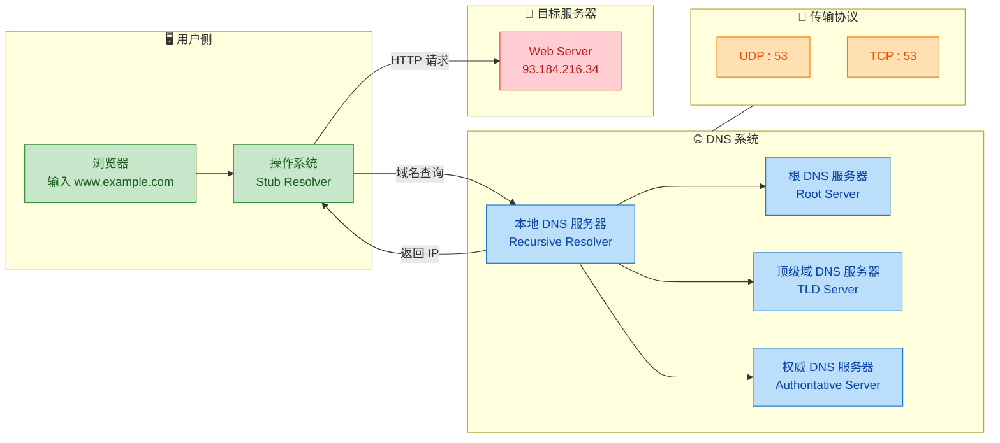

### DNS 报文结构概览

DNS 的查询（Query）和响应（Response）使用**相同的报文格式**，结构紧凑高效。一个 DNS 报文由以下几个部分组成：

```text
+--+--+--+--+--+--+--+--+--+--+--+--+--+--+--+--+
|                    Header (12 Bytes)             |  ← 固定 12 字节报头
+--+--+--+--+--+--+--+--+--+--+--+--+--+--+--+--+
|                   Question Section               |  ← 查询问题区域
+--+--+--+--+--+--+--+--+--+--+--+--+--+--+--+--+
|                   Answer Section                 |  ← 应答资源记录
+--+--+--+--+--+--+--+--+--+--+--+--+--+--+--+--+
|                  Authority Section               |  ← 权威资源记录
+--+--+--+--+--+--+--+--+--+--+--+--+--+--+--+--+
|                 Additional Section               |  ← 附加资源记录
+--+--+--+--+--+--+--+--+--+--+--+--+--+--+--+--+
```

其中 **Header** 是最关键的部分，其 12 字节的内部结构如下：

| 字段 | 长度 | 说明 |
|---|---|---|
| **Transaction ID** | 16 bit | 事务标识符，用于匹配查询与响应 |
| **QR** | 1 bit | 0 = Query，1 = Response |
| **Opcode** | 4 bit | 操作码：0 = 标准查询，1 = 反向查询，2 = 服务器状态 |
| **AA** | 1 bit | Authoritative Answer，该响应是否来自权威服务器 |
| **TC** | 1 bit | Truncated，响应是否被截断（超过 UDP 限制时置 1） |
| **RD** | 1 bit | Recursion Desired，客户端是否期望递归查询 |
| **RA** | 1 bit | Recursion Available，服务器是否支持递归查询 |
| **Z** | 3 bit | 保留字段，必须为 0 |
| **RCODE** | 4 bit | 响应码：0 = 无错误，3 = NXDOMAIN（域名不存在） |
| **QDCOUNT** | 16 bit | 问题区域中的条目数 |
| **ANCOUNT** | 16 bit | 应答区域中的资源记录数 |
| **NSCOUNT** | 16 bit | 权威区域中的资源记录数 |
| **ARCOUNT** | 16 bit | 附加区域中的资源记录数 |

其中 **TC 位** 与传输协议的选择直接相关：当响应数据过大被截断时，TC 位被置为 1，客户端收到后会自动使用 TCP 重新发起查询，获取完整的响应。

### 域名的组成规则

一个完整的域名（FQDN，Fully Qualified Domain Name）有严格的格式约束：

- **总长度** 不超过 **253 个字符**（不含末尾的根域点）。
- 每一级 **标签（Label）** 长度不超过 **63 个字符**。
- 标签之间用 `.` 分隔。
- 大小写不敏感（Case-Insensitive）：`Google.COM` 和 `google.com` 等价。
- 允许的字符：字母（a-z）、数字（0-9）、连字符（`-`），但标签不能以连字符开头或结尾。

在实际使用中，我们通常省略末尾的根域点（`.`），例如写 `www.google.com` 而不是 `www.google.com.`。但在 DNS 配置文件（如 BIND 的 Zone File）中，末尾的点非常重要——**有点表示绝对域名（FQDN），无点表示相对域名**，会自动拼接当前区域的域名后缀。

### 一次域名解析的全景时间线

为了让你直观感受 DNS 在一次网页访问中所处的阶段和耗时比例，下面给出一个简化的时序图：

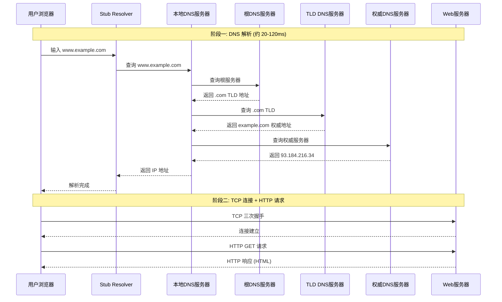

从时序图可以清晰看到：**在你看到网页内容之前，DNS 解析是第一个发生的网络操作。** 它的性能直接影响用户感知的"打开速度"。在没有缓存的最坏情况下，DNS 解析可能需要经历多次网络往返（RTT），耗时可达数百毫秒。这也是为什么后续章节中我们会讨论 **HTTPDNS** 等优化方案的原因。

### DNS 的重要性与安全隐患

DNS 被形象地称为互联网的 **"电话簿"（Phone Book of the Internet）**。它的重要性怎么强调都不为过——如果 DNS 服务中断，即使所有 Web 服务器正常运行，用户也无法通过域名访问任何网站。2016 年 10 月，美国 DNS 服务商 Dyn 遭受大规模 DDoS 攻击，导致 Twitter、GitHub、Netflix 等大量知名网站数小时无法访问，就是一个典型案例。

正因为 DNS 如此关键，它也成为网络攻击的重点目标。常见的 DNS 安全威胁包括：

| 攻击类型 | 英文名 | 原理简述 |
|---|---|---|
| DNS 欺骗 | DNS Spoofing | 攻击者伪造 DNS 响应，将域名指向恶意 IP |
| DNS 缓存投毒 | Cache Poisoning | 向 DNS 缓存中注入虚假记录，影响后续所有查询该域名的用户 |
| DNS 劫持 | DNS Hijacking | 篡改用户的 DNS 服务器配置，使所有查询经过攻击者控制的服务器 |
| DNS 放大攻击 | DNS Amplification | 利用 DNS 响应大于请求的特点，伪造源 IP 发起反射式 DDoS |
| DNS 隧道 | DNS Tunneling | 将恶意数据编码在 DNS 查询中，绕过防火墙进行隐蔽通信 |

为对抗这些威胁，业界提出了 **DNSSEC（DNS Security Extensions）** 等安全扩展协议，通过数字签名验证 DNS 响应的真实性和完整性。此外，**DoH（DNS over HTTPS）** 和 **DoT（DNS over TLS）** 则通过加密 DNS 查询流量来防止中间人窃听和篡改。

---

📝 **练习题**

以下关于 DNS 的描述，**错误**的是：

A. DNS 本质上是一个分布式的层次化数据库系统，没有任何单一服务器存储所有域名的映射

B. DNS 默认使用 UDP 协议（端口 53）进行查询，因为大多数 DNS 报文足够短小，无需建立 TCP 连接

C. 当 DNS 响应报文中的 TC（Truncated）位被置为 1 时，表示该响应数据完整无误，客户端可以直接使用

D. DNS 域名采用树状层次结构，管理权可以逐级委派（Delegation），使系统具有良好的可扩展性


【答案】C

【解析】TC 位（Truncated）被置为 1 时，表示的含义恰恰相反——**响应数据因为超过 UDP 承载能力而被截断了，数据是不完整的**。此时客户端应当使用 TCP 协议（同样在端口 53 上）重新发起查询，以获取完整的响应内容。选项 A 正确描述了 DNS 的分布式特性；选项 B 正确描述了 DNS 选择 UDP 的原因；选项 D 正确描述了 DNS 的层次化委派机制。因此错误的是 C。


---

## DNS查询过程 ⭐

DNS 查询（DNS Resolution / DNS Lookup）是将人类可读的域名（如 `www.example.com`）转换为机器可识别的 IP 地址（如 `93.184.216.34`）的完整链路过程。这个过程看似简单——用户在浏览器敲下一个网址，瞬间就打开了网页——但背后实际上涉及 **多级缓存命中判断** 与 **多台服务器之间的递归/迭代协作**。理解这个过程，是掌握整个互联网通信基石的关键一环。

在深入每一层之前，我们需要先理解两个核心概念：**递归查询（Recursive Query）** 与 **迭代查询（Iterative Query）**。

- **递归查询**：客户端把"找到最终结果"的责任完全交给了某一台 DNS 服务器（通常是本地 DNS 服务器 / Local DNS Resolver）。客户端只发一次请求，然后等待最终答案。就好比你问前台："帮我查一下张总的电话号码"，前台会帮你跑完所有流程，最后直接给你号码。
- **迭代查询**：DNS 服务器不会帮你跑完全程，而是告诉你"我不知道最终答案，但你可以去问另一台服务器"。就好比你问路人："火车站怎么走？"路人说："我不确定，但你往前走到那个路口问交警吧。"然后你再去问交警。

在实际的 DNS 解析中，**客户端到本地 DNS 服务器之间通常是递归查询，而本地 DNS 服务器向外部各级服务器发起的查询通常是迭代查询**。这种"递归+迭代"的混合模式，是当今互联网 DNS 系统的主流工作方式。

下面这张时序图完整展示了一次 **缓存全部未命中** 情况下的 DNS 查询全链路：

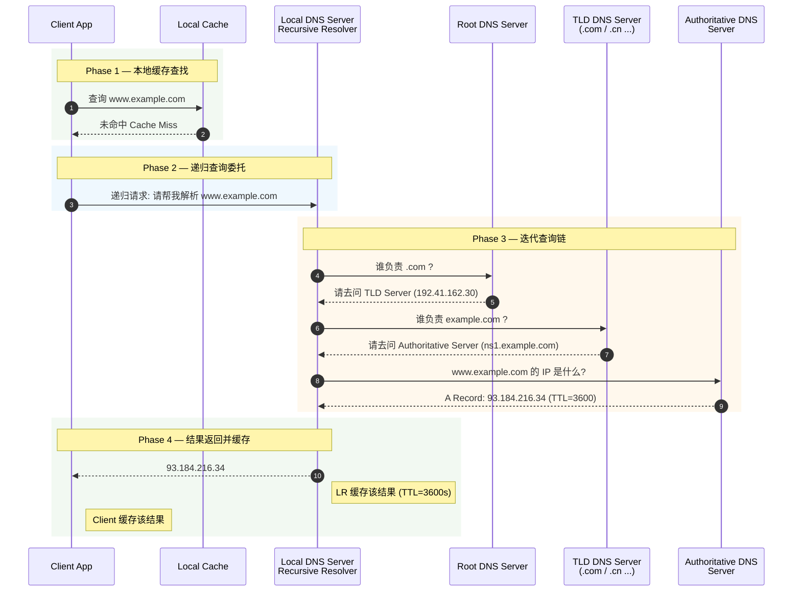

可以看到，整个查询过程像一条 **链式追问**：从最宏观的"根"逐步缩小范围，直到找到最终负责该域名的那台权威服务器。接下来我们逐层拆解。

---

### 本地缓存

本地缓存（Local Cache）是 DNS 查询的 **第一道防线**，也是速度最快的一层。在请求真正"出门"之前，系统会在多个层面检查是否已经缓存过该域名的解析结果。

**缓存存在于多个层级**，从近到远依次是：

1. **浏览器缓存（Browser DNS Cache）**：现代浏览器（Chrome、Firefox、Safari 等）都维护着自己独立的 DNS 缓存。例如在 Chrome 中你可以通过 `chrome://net-internals/#dns` 查看当前缓存的所有 DNS 记录。浏览器缓存的生命周期通常较短（Chrome 默认约 60 秒），目的是在短时间内高频访问同一域名时避免重复查询。

2. **操作系统缓存（OS DNS Cache）**：如果浏览器缓存未命中，请求会交给操作系统的 DNS 解析器（Stub Resolver）。操作系统同样维护着一个 DNS 缓存。
   - **Windows**：通过 `ipconfig /displaydns` 查看，通过 `ipconfig /flushdns` 清除。
   - **macOS**：通过 `sudo dscacheutil -flushcache` 清除。
   - **Linux**：取决于是否运行了 `systemd-resolved` 或 `nscd` 等缓存守护进程。

3. **hosts 文件（Static Mapping）**：在查询任何外部 DNS 服务器之前，操作系统还会检查本地的 `hosts` 文件。这是一个静态的"域名→IP"映射表，优先级极高。
   - **Linux / macOS**：`/etc/hosts`
   - **Windows**：`C:\Windows\System32\drivers\etc\hosts`

   hosts 文件的典型内容如下：

   ```bash
   # hosts 文件示例
   # 格式: IP地址    域名
   127.0.0.1       localhost          # 回环地址,指向本机
   ::1             localhost          # IPv6 回环地址
   192.168.1.100   myserver.local     # 自定义内网域名映射
   # 下面这行可用于"屏蔽"某个域名(指向无效地址)
   0.0.0.0         ads.annoying.com   # 将广告域名指向空地址,实现屏蔽
   ```

**缓存的核心机制——TTL（Time To Live）**

每条 DNS 记录都携带一个 **TTL** 值，单位为秒，表示"这条记录可以被缓存多长时间"。例如 TTL=3600 意味着缓存 1 小时。TTL 到期后，缓存记录失效，下次查询必须重新向上游 DNS 服务器获取。

TTL 是一个 **权衡设计**（Trade-off）：
- **TTL 设置过短**（如 60 秒）：DNS 记录更新后能快速生效，但会增加 DNS 查询流量，增大上游服务器负载。
- **TTL 设置过长**（如 86400 秒 = 24 小时）：减少查询次数，提高性能，但域名指向变更后需要很长时间才能全网生效。

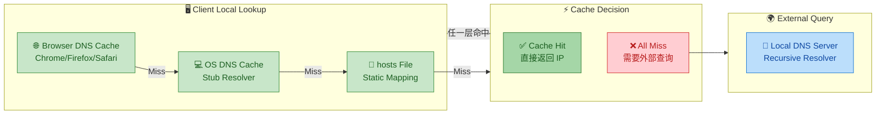

> 💡 **实际统计**：在大型互联网环境中，本地缓存的命中率通常可以达到 **70%~90%**。也就是说，绝大多数 DNS 查询根本不需要离开本机或本地网络，这极大地降低了全球 DNS 系统的负载。

---

### 本地DNS服务器

当本地缓存全部未命中时，操作系统的 Stub Resolver 会将查询请求发送给 **本地 DNS 服务器**（Local DNS Server），也常被称为 **递归解析器（Recursive Resolver）** 或 **DNS Forwarder**。

**本地 DNS 服务器是谁？**

它并不是你电脑上的某个进程，而是网络中一台 **专门负责代你完成 DNS 查询全过程** 的服务器。它的地址通常通过以下方式获得：

1. **DHCP 自动分配**：当你的设备连接到路由器时，路由器通过 DHCP 协议自动下发 DNS 服务器地址。家庭网络中，这个地址往往就是路由器自身（如 `192.168.1.1`），路由器再转发给 ISP 的 DNS。
2. **手动配置**：你也可以在网络设置中手动指定 DNS 服务器，常见的公共 DNS 服务有：

| 提供商 | Primary DNS | Secondary DNS | 特点 |
|--------|-------------|---------------|------|
| Google Public DNS | `8.8.8.8` | `8.8.4.4` | 全球覆盖,速度快 |
| Cloudflare DNS | `1.1.1.1` | `1.0.0.1` | 主打隐私保护 |
| 阿里公共 DNS | `223.5.5.5` | `223.6.6.6` | 国内速度优异 |
| 腾讯 DNSPod | `119.29.29.29` | — | 国内广泛使用 |

**本地 DNS 服务器的工作职责**

本地 DNS 服务器收到客户端的递归请求后，它承担了 **"全权代理"** 的角色：

1. **先查自身缓存**：本地 DNS 服务器也维护着一个庞大的缓存（因为它为成千上万的客户端服务，缓存命中率通常很高）。如果缓存中有且 TTL 未过期，直接返回。
2. **缓存未命中则发起迭代查询**：向根 DNS 服务器 → 顶级域 DNS 服务器 → 权威 DNS 服务器逐级查询（下文详述）。
3. **缓存查询结果**：将最终拿到的 IP 地址缓存起来（遵循 TTL），以便后续其他客户端查询同一域名时直接返回。
4. **将最终结果返回给客户端**。

**为什么不让客户端自己去迭代查询？**

这是一个很好的架构问题。原因有三：

- **效率**：本地 DNS 服务器为大量用户共享缓存（Shared Cache），一个用户查过的域名，其他用户可以直接命中缓存，避免重复查询。
- **简化客户端**：客户端只需要知道"找本地 DNS 服务器要答案"就行了，不需要理解整个 DNS 层级结构。这符合网络设计中 **"端系统简单，网络智能"** 的原则。
- **安全管控**：企业或 ISP 可以在本地 DNS 服务器上实施 **域名过滤、日志审计、安全策略**（如拦截恶意域名）。

---

### 根DNS服务器

当本地 DNS 服务器缓存未命中，且需要从零开始解析一个域名时，它的第一个求助对象就是 **根 DNS 服务器（Root DNS Server）**。

根 DNS 服务器是整个 DNS 层次结构的 **最顶层**，是域名解析的"起点"。全球共有 **13 组根服务器**，以字母 A 到 M 命名（`a.root-servers.net` 到 `m.root-servers.net`）。注意这里说的是"13 组"而不是"13 台"——通过 **Anycast（任播）** 技术，每一组根服务器在全球部署了数百个镜像节点，实际物理服务器总数超过 **1500 台**。

| 根服务器 | 运营机构 | 备注 |
|---------|---------|------|
| A | Verisign | — |
| B | USC-ISI | 美国南加州大学 |
| C | Cogent Communications | — |
| D | University of Maryland | 马里兰大学 |
| E | NASA | 美国国家航空航天局 |
| F | ISC (Internet Systems Consortium) | 运营 BIND |
| G | US DoD (NIC) | 美国国防部 |
| H | US Army Research Lab | 美国陆军研究实验室 |
| I | Netnod (Sweden) | 瑞典,非美国机构 |
| J | Verisign | — |
| K | RIPE NCC (Netherlands) | 荷兰,欧洲区域互联网注册管理机构 |
| L | ICANN | 互联网名称与数字地址分配机构 |
| M | WIDE Project (Japan) | 日本,亚太 |

**根服务器并不知道最终答案**

这是一个非常重要的认知：根服务器 **不存储** 任何具体域名的 IP 地址。它只知道"**谁负责管理 `.com`**""**谁负责管理 `.cn`**""**谁负责管理 `.org`**"等顶级域。

所以，当本地 DNS 服务器问根服务器："请问 `www.example.com` 的 IP 是什么？"时，根服务器的回答是：

> "我不知道 `www.example.com` 的 IP，但我知道 `.com` 这个顶级域由某某 TLD 服务器负责，你去问它吧。这是它的地址。"

这个回答被称为 **Referral（转介/引荐）**。

**Anycast 技术简述**

为什么 13 个 IP 地址就能支撑全球数十亿设备的 DNS 查询？关键在于 **Anycast**：同一个 IP 地址被分配给分布在全球各地的多台服务器，网络路由协议（如 BGP）会自动将用户的请求导向 **物理距离最近或网络延迟最低** 的那台服务器。这意味着：

- 中国用户查询根服务器时，请求可能被路由到北京的镜像节点。
- 美国用户的请求则可能到达弗吉尼亚的节点。
- 即使某个节点宕机，流量也会自动切换到下一个最近的节点，实现了 **高可用（High Availability）**。

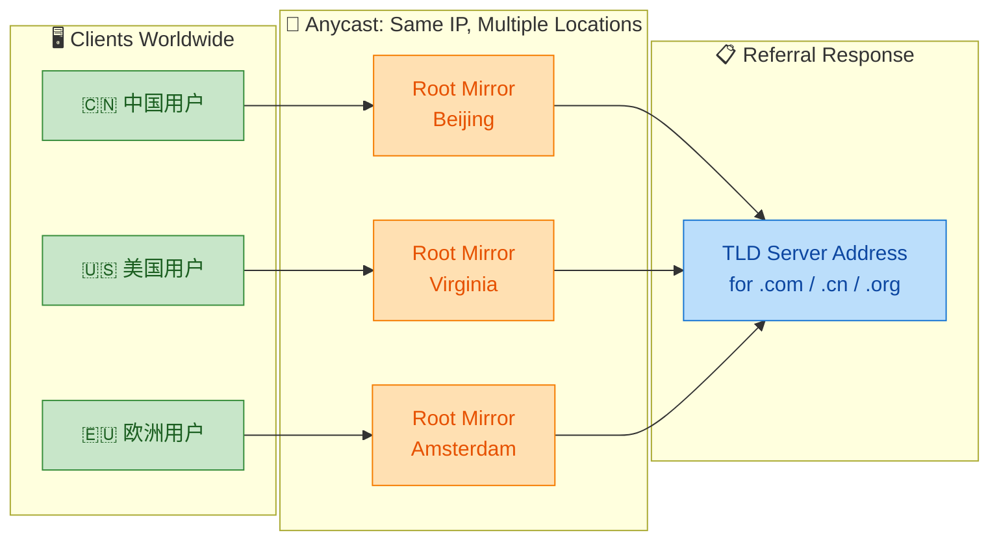

**根服务器地址是怎么知道的？**

你可能会想：本地 DNS 服务器又是怎么知道根服务器在哪的？答案是 **Root Hints 文件**。每台递归解析器在启动时都会加载一个叫做 `named.root`（或 `root.hints`）的文件，里面硬编码了 13 组根服务器的域名和 IP 地址。这个文件由 IANA（互联网号码分配局）维护，内容极少变更。

---

### 顶级域DNS服务器

从根服务器获得转介后，本地 DNS 服务器的下一站是 **顶级域 DNS 服务器（TLD DNS Server，Top-Level Domain DNS Server）**。

顶级域就是域名中最后那个"点"后面的部分。TLD 大致可分为以下几类：

| 类别 | 英文名 | 示例 | 说明 |
|------|--------|------|------|
| 通用顶级域 | gTLD (Generic TLD) | `.com` `.org` `.net` `.info` | 最常见,不限国家 |
| 国家代码顶级域 | ccTLD (Country Code TLD) | `.cn` `.uk` `.jp` `.de` | 代表国家或地区 |
| 新通用顶级域 | New gTLD | `.app` `.dev` `.cloud` `.xyz` | 2012年后 ICANN 开放的新域名 |
| 基础设施顶级域 | Infrastructure TLD | `.arpa` | 用于反向 DNS 等基础设施 |

**TLD 服务器的职责**

TLD 服务器的角色类似"部门主管"——它不知道具体某个域名的 IP，但它知道 **哪台权威 DNS 服务器负责管理该二级域名**。

例如，`.com` 的 TLD 服务器管理着所有以 `.com` 结尾的域名注册信息。当本地 DNS 服务器问它："请问 `www.example.com` 的 IP 是什么？"时，TLD 服务器的回答是：

> "我不知道具体 IP，但 `example.com` 这个域名的权威 DNS 服务器是 `ns1.example.com`（IP: 203.0.113.10），你去问它。"

这又是一次 **Referral**。

**谁在运营 TLD 服务器？**

- `.com` 和 `.net` 由 **Verisign** 运营。
- `.org` 由 **Public Interest Registry (PIR)** 运营。
- `.cn` 由 **中国互联网络信息中心（CNNIC）** 运营。
- `.uk` 由 **Nominet** 运营。

每个 TLD 运营机构都维护着该顶级域下所有已注册域名的 **NS 记录（Name Server Record）**，即"哪个权威 DNS 服务器负责解析该域名"。

---

### 权威DNS服务器

经过根服务器和 TLD 服务器的两次转介，本地 DNS 服务器终于来到了 **权威 DNS 服务器（Authoritative DNS Server）**——这是 DNS 查询链条的 **终点站**。

权威 DNS 服务器是某个域名（如 `example.com`）的 **"官方数据源"**。它存储着该域名下所有子域名的完整 DNS 记录（A 记录、AAAA 记录、CNAME 记录、MX 记录等）。当本地 DNS 服务器问它："请问 `www.example.com` 的 IP 是什么？"时，它能直接给出 **最终权威答案（Authoritative Answer）**：

> "`www.example.com` 的 A 记录是 `93.184.216.34`，TTL 为 3600 秒。"

**权威 DNS 服务器由谁管理？**

权威 DNS 服务器通常由 **域名持有者** 自行管理或委托第三方服务商管理。常见形式有：

1. **域名注册商提供的 DNS**：如 GoDaddy、Namecheap、阿里云万网等，在你购买域名时默认提供权威 DNS 服务。
2. **专业 DNS 服务商**：如 Cloudflare DNS、AWS Route 53、DNSPod 等，提供更高性能和更丰富的功能（如智能解析、负载均衡、DDoS 防护）。
3. **自建 DNS 服务器**：大型企业或组织可以自己搭建权威 DNS（如使用 BIND、PowerDNS、NSD 等开源软件）。

**权威应答 vs 非权威应答**

这是一个面试中常考的概念区分：

- **权威应答（Authoritative Answer, AA）**：直接来自权威 DNS 服务器的回答。DNS 响应报文中的 **AA 标志位（Authoritative Answer flag）** 会被设为 `1`。
- **非权威应答（Non-Authoritative Answer）**：来自缓存的回答。当本地 DNS 服务器返回的是之前缓存的结果（而非实时查询权威服务器得到的结果）时，AA 标志位为 `0`。

你在 Windows 上用 `nslookup` 查询时经常会看到 **"Non-authoritative answer"** 的提示，这就说明本地 DNS 服务器返回的是缓存结果。

**完整查询链路总结**

让我们用一张完整的流程图，把 DNS 查询的五个层级从左到右串联起来：

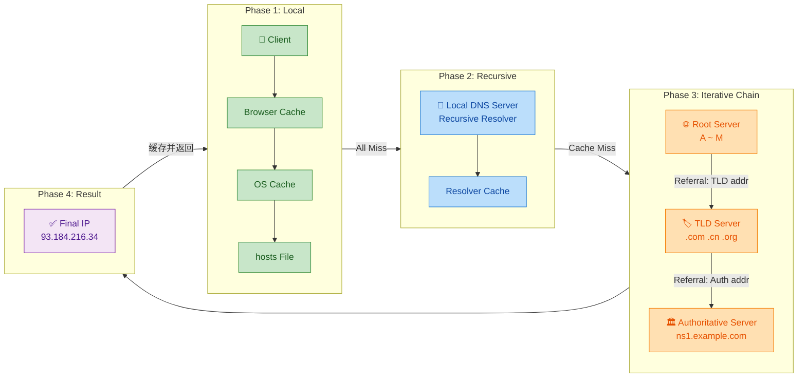

**使用 `dig` 命令追踪完整查询过程**

在 Linux/macOS 终端中，`dig` 是一个强大的 DNS 诊断工具。使用 `+trace` 参数可以模拟从根服务器开始的完整迭代查询过程：

```bash
# 使用 dig 命令追踪 www.example.com 的完整 DNS 解析过程
# +trace 参数: 模拟从根服务器开始的迭代查询, 逐级显示每一步
# +nodnssec 参数: 不显示 DNSSEC 签名信息, 使输出更简洁
dig www.example.com +trace +nodnssec

# 输出大致如下(简化):
# .                  518400  IN  NS  a.root-servers.net.   <-- 第1步: 查询根服务器
# com.               172800  IN  NS  a.gtld-servers.net.   <-- 第2步: 根返回 .com 的 TLD 服务器
# example.com.       172800  IN  NS  ns1.example.com.      <-- 第3步: TLD 返回权威服务器
# www.example.com.   3600    IN  A   93.184.216.34         <-- 第4步: 权威服务器返回最终 IP

# 其他常用 dig 命令:
dig www.example.com A          # 查询 A 记录 (IPv4 地址)
dig www.example.com AAAA       # 查询 AAAA 记录 (IPv6 地址)
dig www.example.com CNAME      # 查询 CNAME 记录 (别名)
dig @8.8.8.8 www.example.com   # 指定使用 Google DNS 进行查询
dig www.example.com +short     # 只输出最终 IP, 省略其他信息
```

---

📝 **练习题**

某用户在浏览器中访问 `www.taobao.com`，假设浏览器缓存、操作系统缓存和 hosts 文件中均无该域名的记录，但本地 DNS 服务器（递归解析器）的缓存中已存在该域名且 TTL 未过期。请问以下哪个说法是正确的？

A. 本地 DNS 服务器会向根 DNS 服务器发起查询，因为每次请求都必须从根开始

B. 本地 DNS 服务器直接从缓存返回结果，响应报文中 AA 标志位为 1（权威应答）

C. 本地 DNS 服务器直接从缓存返回结果，响应报文中 AA 标志位为 0（非权威应答）

D. 客户端会跳过本地 DNS 服务器，直接向根 DNS 服务器发起迭代查询

【答案】C

【解析】题目明确说明本地 DNS 服务器的缓存中已存在该域名记录且 TTL 未过期，因此本地 DNS 服务器无需向任何上游服务器发起查询，直接返回缓存结果即可，排除 A。然而，由于该结果来自缓存而非权威 DNS 服务器的实时回答，所以这是一个 **非权威应答（Non-Authoritative Answer）**，DNS 响应报文中的 **AA 标志位为 0**，排除 B。选项 D 违背了 DNS 的基本架构设计——客户端只与本地 DNS 服务器通过递归查询交互，不会自行发起迭代查询，客户端的 Stub Resolver 不具备迭代查询能力。因此正确答案为 **C**。

---

## DNS记录类型

DNS 的核心使命是"把名字翻译成地址"，但实际上它远不止做翻译——它是一个 **通用的分布式键值数据库（Distributed Key-Value Database）**。每一条存储在 DNS 中的数据被称为一条 **资源记录（Resource Record, RR）**。不同类型的资源记录承载着不同语义的信息：有的记录把域名映射到 IPv4 地址，有的映射到 IPv6 地址，有的则把一个域名指向另一个域名。理解这些记录类型，是深入掌握 DNS 工作机制的关键一环。

一条标准的 DNS 资源记录，在概念上可以用一个四元组来表示：

```
(Name, Value, Type, TTL)
```

- **Name**：查询的主键，通常是域名（如 `www.example.com`）。
- **Value**：记录的值，取决于 Type（可能是 IP 地址、另一个域名等）。
- **Type**：记录类型，决定了 Name 和 Value 的语义。
- **TTL（Time To Live）**：该记录在缓存中允许存活的秒数，过期后必须重新查询权威服务器。

下面用一张总览图来展示最常见的三种记录类型之间的关系：

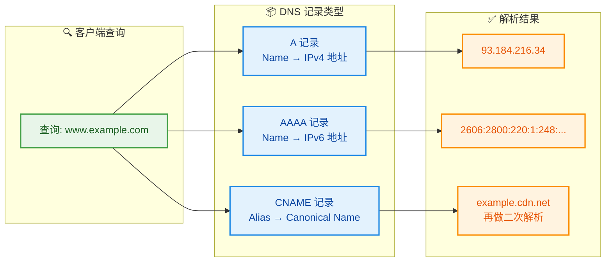

需要强调的是，DNS 记录类型远不止这三种。RFC 标准中定义了数十种类型（MX、NS、TXT、SRV、SOA、PTR 等），但 **A、AAAA、CNAME 是前端和后端工程师在日常开发中接触最频繁的三种**，也是面试中考察的重点。我们逐一深入讲解。

---

### A记录（IPv4）

A 记录是 DNS 中最基础、最经典的记录类型，其中 **"A" 代表 Address**。它的作用非常直接：**将一个域名（Domain Name）映射到一个 IPv4 地址**。

#### 记录格式

A 记录的四元组语义如下：

| 字段 | 含义 | 示例 |
|------|------|------|
| **Name** | 主机域名 | `www.example.com` |
| **Value** | IPv4 地址（32 位，点分十进制） | `93.184.216.34` |
| **Type** | 固定为 `A` | `A` |
| **TTL** | 缓存有效期（秒） | `300`（即 5 分钟） |

在实际的 DNS 区域文件（Zone File）中，一条 A 记录看起来类似这样：

```bash
# 域名              TTL    类别   类型   IPv4地址
www.example.com.    300    IN     A      93.184.216.34
```

- `IN` 表示 **Internet 类别（Class）**，几乎所有的 DNS 记录都属于 IN 类。
- 末尾的 `.` 是 **FQDN（Fully Qualified Domain Name）** 的标准写法，表示这是一个从根域开始的绝对域名。

#### 一域名多 A 记录：DNS 负载均衡

一个域名 **可以配置多条 A 记录**，每条指向不同的 IP 地址。当 DNS 服务器收到查询时，会将所有 A 记录都返回给客户端，但 **每次返回的记录顺序可能不同**——这就是最原始的 **DNS 轮询负载均衡（DNS Round-Robin Load Balancing）**。

```bash
# 同一域名绑定了三个不同的服务器IP
www.mysite.com.    60    IN    A    10.0.1.1    # 服务器节点1
www.mysite.com.    60    IN    A    10.0.1.2    # 服务器节点2
www.mysite.com.    60    IN    A    10.0.1.3    # 服务器节点3
```

客户端（通常是浏览器或操作系统的 Resolver）拿到多条记录后，**一般会选择列表中的第一个 IP 进行连接**。由于 DNS 服务器会轮换返回顺序，流量就被大致均匀地分散到多台服务器上。

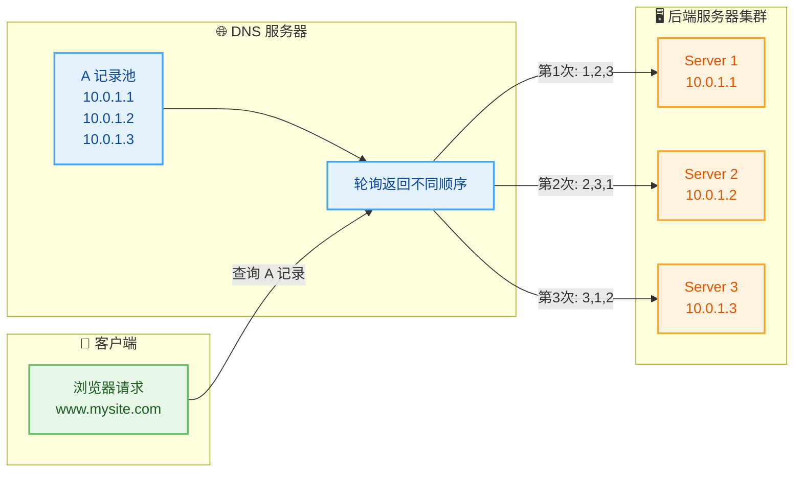

> ⚠️ DNS 轮询是一种 **非常粗粒度** 的负载均衡手段。它无法感知服务器的实时负载、健康状态，也无法做加权分配。生产环境中通常配合硬件/软件负载均衡器（如 Nginx、AWS ALB）使用。

#### TTL 的工程权衡

TTL 的设置是一门艺术，需要在 **性能** 与 **灵活性** 之间做取舍：

| TTL 值 | 优点 | 缺点 |
|--------|------|------|
| **较大**（如 86400 = 24h） | 减少 DNS 查询次数，降低解析延迟 | IP 变更后，全网生效慢（最长需等 24h） |
| **较小**（如 60 = 1min） | IP 变更后快速生效，适合故障切换 | DNS 查询频繁，增加解析延迟和服务器压力 |

一个常见的工程实践是：**平时用较大 TTL（如 3600s），计划做服务器迁移前，提前把 TTL 调低（如 60s）**，等旧缓存过期后再切换 IP，迁移完成后再把 TTL 调回。

#### 用 `dig` 命令实际查看 A 记录

```bash
# 使用 dig 工具查询 example.com 的 A 记录
# @8.8.8.8 指定使用 Google 的公共DNS服务器
dig @8.8.8.8 www.example.com A

# --- 输出片段 ---
# ;; ANSWER SECTION:
# www.example.com.    256    IN    A    93.184.216.34
#                     ^^^          ^    ^^^^^^^^^^^^^
#                     TTL剩余秒数  类型  IPv4地址
```

---

### AAAA记录（IPv6）

AAAA 记录在功能上与 A 记录 **完全对称**——它将域名映射到一个 **IPv6 地址**，而非 IPv4 地址。

#### 为什么叫 "AAAA"？

这个命名并非随意取的。IPv4 地址长度为 **32 位（4 字节）**，对应 A 记录；IPv6 地址长度为 **128 位（16 字节）**，恰好是 IPv4 的 **4 倍**——所以用了 **4 个 A**，即 **AAAA**。这是一种非常直觉的命名方式。

```
IPv4:  32 bits  → A     (1个A)
IPv6: 128 bits  → AAAA  (4个A, 因为 128 = 32 × 4)
```

#### 记录格式

| 字段 | 含义 | 示例 |
|------|------|------|
| **Name** | 主机域名 | `www.example.com` |
| **Value** | IPv6 地址（128 位，冒号分隔十六进制） | `2606:2800:0220:0001:0248:1893:25c8:1946` |
| **Type** | 固定为 `AAAA` | `AAAA` |
| **TTL** | 缓存有效期（秒） | `300` |

Zone File 中的写法：

```bash
# 域名              TTL    类别   类型    IPv6地址
www.example.com.    300    IN     AAAA   2606:2800:220:1:248:1893:25c8:1946
```

#### 双栈环境下的解析策略：Happy Eyeballs

在当今互联网 **IPv4 / IPv6 双栈共存** 的过渡期，一个域名往往同时配有 A 记录和 AAAA 记录。那么客户端到底用哪个？

现代操作系统和浏览器普遍采用 **Happy Eyeballs 算法（RFC 8305）**，其核心思路是：

1. **同时发起** A 记录和 AAAA 记录的 DNS 查询。
2. **优先尝试 IPv6** 连接（因为 IPv6 是未来趋势）。
3. 如果 IPv6 连接在短时间内（通常 250ms）未成功，**立即回退并发起 IPv4 连接**。
4. 最终 **选择先成功建立的连接**。

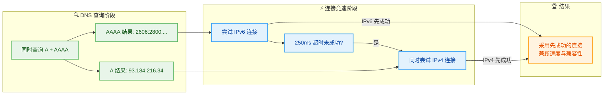

这个算法的精妙之处在于：**用户完全无感知**。无论底层网络是纯 IPv4、纯 IPv6、还是双栈，客户端都能自动选择最优路径，最大程度减少连接延迟。

#### A 与 AAAA 的对比总结

| 维度 | A 记录 | AAAA 记录 |
|------|--------|-----------|
| **映射目标** | IPv4 地址（32 bit） | IPv6 地址（128 bit） |
| **地址格式** | `93.184.216.34` | `2606:2800:220:1:248:1893:25c8:1946` |
| **地址空间** | ~43 亿（已耗尽） | ~3.4 × 10³⁸（几乎无限） |
| **当前普及度** | 主流，几乎 100% 覆盖 | 快速增长中，全球约 40%+ 采用 |
| **查询流程** | 与 AAAA 完全一致 | 与 A 完全一致 |
| **能否共存** | ✅ 同一域名可同时拥有 A 和 AAAA | ✅ 同一域名可同时拥有 A 和 AAAA |

---

### CNAME（别名）

CNAME 的全称是 **Canonical Name Record（规范名称记录）**。它的作用与 A/AAAA 截然不同——**CNAME 不直接指向 IP 地址，而是将一个域名（别名）指向另一个域名（规范名）**。

你可以把 CNAME 理解为文件系统中的 **符号链接（Symbolic Link）**，或者 C/C++ 中的 **typedef / using**：它为一个"真实名字"起了一个"昵称"。

#### 记录格式

| 字段 | 含义 | 示例 |
|------|------|------|
| **Name** | 别名域名（Alias） | `blog.example.com` |
| **Value** | 规范域名（Canonical Name） | `example.github.io` |
| **Type** | 固定为 `CNAME` | `CNAME` |
| **TTL** | 缓存有效期（秒） | `3600` |

Zone File 写法：

```bash
# 别名域名            TTL    类别   类型    规范域名（真实指向）
blog.example.com.    3600   IN     CNAME  example.github.io.
```

#### CNAME 的解析链：递归展开

当客户端查询一个配置了 CNAME 的域名时，DNS 解析器不会直接得到 IP 地址，而是会触发一个 **链式解析（CNAME Chaining）** 过程：


可以看到，CNAME 链可以有 **多层嵌套**，但最终 **必须以一条 A 或 AAAA 记录终止**，否则解析将失败。在实际工程中，应尽量控制 CNAME 链的层数（建议不超过 3 层），因为每多一层就意味着多一次 DNS 查询，增加解析延迟。

#### CNAME 的典型使用场景

**场景一：CDN 接入**

这是 CNAME 最经典、最广泛的用途。当你为网站接入 CDN（如 Cloudflare、阿里云 CDN）时，CDN 厂商会给你一个 CNAME 地址，你需要在自己的 DNS 中把域名指向它：

```bash
# 将自己的域名 CNAME 到 CDN 厂商提供的域名
www.mysite.com.    600    IN    CNAME    www.mysite.com.cdn.cloudflare.net.
```

CDN 厂商会在自己的 DNS 系统中，根据用户的地理位置、网络状况等，**动态返回最优边缘节点的 IP 地址**。这就是为什么 CDN 必须用 CNAME 而不能直接用 A 记录——因为 IP 是动态变化的，控制权在 CDN 厂商手中。

**场景二：多子域名指向同一服务**

```bash
# 多个子域名都指向同一个规范域名
blog.example.com.     3600   IN   CNAME   lb.example.com.
shop.example.com.     3600   IN   CNAME   lb.example.com.
api.example.com.      3600   IN   CNAME   lb.example.com.

# 规范域名持有真实的 A 记录
lb.example.com.       60     IN   A       10.0.1.1
lb.example.com.       60     IN   A       10.0.1.2
```

这样做的好处是：**当服务器 IP 变更时，只需修改 `lb.example.com` 的 A 记录，所有子域名自动生效**，维护成本极低。

**场景三：第三方托管服务**

将 GitHub Pages、Vercel、Netlify 等平台托管的站点绑定到自定义域名：

```bash
docs.example.com.    3600   IN   CNAME   my-org.github.io.
```

#### CNAME 的关键限制规则

CNAME 有几条非常重要的 **硬性约束（RFC 1034 / RFC 2181）**，违反这些规则会导致 DNS 解析异常：

**规则一：CNAME 不能与其他记录共存于同一个 Name**

```bash
# ❌ 错误! 同一域名不能同时有 CNAME 和 A 记录
example.com.    IN    CNAME    other.com.
example.com.    IN    A        1.2.3.4        # 冲突!

# ❌ 错误! 同一域名不能同时有 CNAME 和 MX 记录
example.com.    IN    CNAME    other.com.
example.com.    IN    MX       mail.example.com.  # 冲突!
```

原因：DNS 标准规定，如果一个 Name 有 CNAME 记录，那么该 Name **不能有任何其他类型的记录**。因为 CNAME 表示"这个名字的真实身份是另一个名字"，再给它附加别的记录在语义上是矛盾的。

**规则二：裸域（Zone Apex）不应使用 CNAME**

```bash
# ❌ 不推荐! 裸域使用 CNAME
example.com.    IN    CNAME    other.com.    # 会导致 MX、NS 等记录失效

# ✅ 正确做法: 裸域使用 A 记录
example.com.    IN    A        93.184.216.34
```

裸域（也叫 Zone Apex，即不带 `www` 等前缀的根域名，如 `example.com`）通常需要配置 NS 记录和 SOA 记录，由于规则一的限制，CNAME 会与这些必要记录冲突。为了解决这个问题，部分 DNS 厂商发明了非标准的替代方案：

| 方案 | 提供者 | 原理 |
|------|--------|------|
| **ALIAS 记录** | DNSimple, Route 53 等 | DNS 服务器端在返回前自动解析 CNAME 为 A 记录 |
| **ANAME 记录** | 部分 DNS 厂商 | 类似 ALIAS，服务端透明展开 |
| **Flattening** | Cloudflare | 对裸域的 CNAME 自动做扁平化处理 |

这些方案的核心思路一致：**在 DNS 服务器端完成 CNAME → A 的转换，对外只暴露 A 记录**，从而绕开 CNAME 不能用于裸域的限制。

#### A / AAAA / CNAME 三者关系全景图

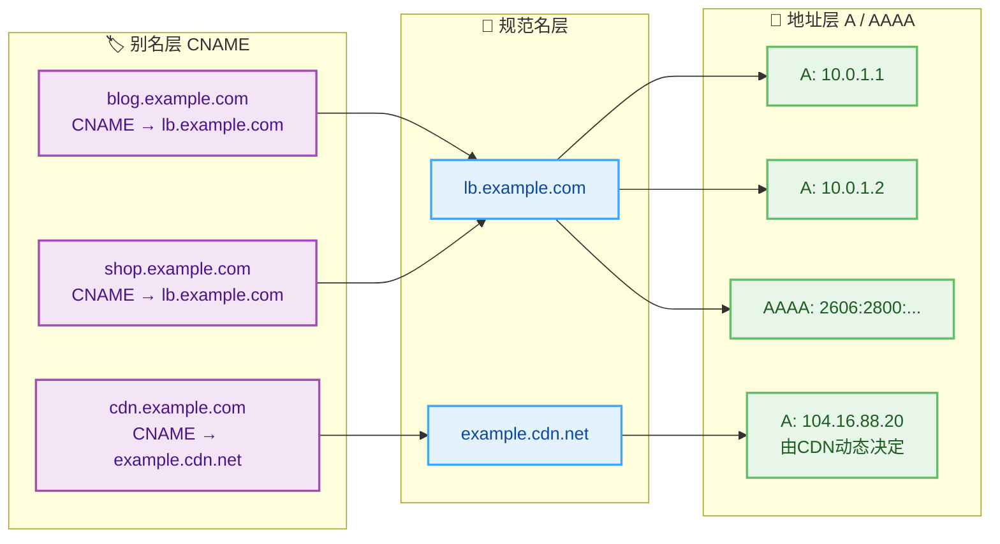

这张图清晰展示了三种记录的 **层次关系**：CNAME 把多个别名汇聚到一个规范名，规范名再通过 A / AAAA 记录解析到实际的网络地址。这种分层设计让 DNS 管理变得高效而灵活。

#### 补充：其他常见 DNS 记录类型速览

虽然本节重点讲解 A、AAAA、CNAME，但为了知识的完整性，这里简要介绍其他几种高频出现的记录类型：

| 类型 | 全称 | 作用 | 示例 Value |
|------|------|------|-----------|
| **MX** | Mail Exchange | 指定域名的邮件服务器 | `10 mail.example.com` |
| **NS** | Name Server | 指定域名的权威 DNS 服务器 | `ns1.example.com` |
| **TXT** | Text | 存储任意文本，常用于 SPF、DKIM 验证 | `"v=spf1 include:_spf.google.com ~all"` |
| **SRV** | Service | 指定特定服务的主机和端口 | `0 5 5060 sip.example.com` |
| **SOA** | Start of Authority | 域的权威信息（主 NS、管理员邮箱等） | 一组复合字段 |
| **PTR** | Pointer | 反向解析，IP → 域名 | `www.example.com` |

其中 **PTR 记录** 特别值得一提：它的作用与 A/AAAA 正好相反——给定一个 IP 地址，查询其对应的域名。这在 **反垃圾邮件检测** 和 **网络安全审计** 中非常常用。

---

📝 **练习题**

你的公司网站 `www.mycompany.com` 需要接入 CDN 服务。CDN 厂商提供了加速域名 `www.mycompany.com.cdn.provider.net`。同时，你希望裸域 `mycompany.com` 也能正常访问，且公司邮箱依赖该域名的 MX 记录。以下 DNS 配置方案中，**哪一个是正确的**？

A.
```
mycompany.com.        IN    CNAME    www.mycompany.com.cdn.provider.net.
www.mycompany.com.    IN    CNAME    www.mycompany.com.cdn.provider.net.
mycompany.com.        IN    MX       10 mail.mycompany.com.
```

B.
```
mycompany.com.        IN    A        93.184.216.34
www.mycompany.com.    IN    CNAME    www.mycompany.com.cdn.provider.net.
mycompany.com.        IN    MX       10 mail.mycompany.com.
```

C.
```
mycompany.com.        IN    CNAME    www.mycompany.com.cdn.provider.net.
www.mycompany.com.    IN    A        93.184.216.34
mycompany.com.        IN    MX       10 mail.mycompany.com.
```

D.
```
mycompany.com.        IN    A        93.184.216.34
www.mycompany.com.    IN    A        93.184.216.34
mycompany.com.        IN    MX       10 mail.mycompany.com.
```


【答案】B

【解析】本题考查 CNAME 的两条核心限制规则：

- **选项 A 错误**：裸域 `mycompany.com` 使用了 CNAME，同时又配置了 MX 记录。根据 RFC 标准，CNAME 不能与任何其他记录类型共存于同一个 Name。这会导致 MX 记录失效，公司邮箱彻底瘫痪。
- **选项 B 正确**：裸域使用 A 记录直接指向服务器 IP，不与 MX 冲突；`www` 子域名使用 CNAME 接入 CDN，完全合规。这是工程实践中最标准的方案。
- **选项 C 错误**：与 A 相同的问题——裸域 CNAME 与 MX 冲突。虽然 `www` 改用了 A 记录，但裸域的 CNAME 依然违规。
- **选项 D 虽然不违规，但未满足需求**：`www.mycompany.com` 使用了 A 记录而非 CNAME，意味着没有接入 CDN。CDN 的核心价值在于 **动态调度最优边缘节点**，必须通过 CNAME 将控制权交给 CDN 厂商的 DNS 系统。直接写死 A 记录完全绕开了 CDN。

---

## HTTPDNS

传统 DNS 解析依赖操作系统内置的 UDP 递归查询链路（Local DNS → Root → TLD → Authoritative），这条链路在绝大多数场景下运行良好，但在**移动互联网**和**大规模分布式服务**的背景下，暴露出了一系列难以回避的痛点。HTTPDNS 正是为了解决这些痛点而诞生的**应用层域名解析方案**——它绕过了传统的 Local DNS（LDNS），改为通过 **HTTP/HTTPS 协议**直接向可信的域名解析服务端发送请求，获取域名对应的 IP 地址。

要深入理解 HTTPDNS，我们必须先弄清楚：传统 DNS 到底"哪里不好"，HTTPDNS 又是如何"对症下药"的。

### 传统 DNS 的核心痛点

在移动互联网场景下，传统 DNS 面临以下几个非常典型的问题：

**1. 域名劫持（DNS Hijacking）**

这是最广为人知的问题。用户发出的 DNS 查询报文是基于 **UDP 明文**传输的，中间任何一个网络节点（尤其是某些不规范的运营商 Local DNS）都可以篡改返回的 IP 地址。攻击者或运营商可能将你的域名解析结果替换成广告页面、钓鱼网站，甚至直接返回一个错误的 IP。这在国内的网络环境中曾经非常普遍——用户访问 `www.example.com`，实际被导向了一个满屏弹窗的广告页。

**2. 调度不精准（Inaccurate Scheduling）**

大型互联网公司通常会部署 CDN（Content Delivery Network）来加速内容分发。CDN 的核心调度逻辑依赖 DNS：权威 DNS 服务器会根据**请求来源的 IP 地址**来判断用户的地理位置，然后返回离用户最近的 CDN 节点 IP。

然而问题在于，权威 DNS 看到的"请求来源"并不是终端用户的真实 IP，而是 **Local DNS 服务器的 IP**。如果用户使用了跨区域的 Local DNS（比如北京的用户手动配置了一个广东的 DNS 服务器），或者运营商的 Local DNS 本身做了跨区域的递归转发，权威 DNS 就会做出错误的调度判断，把北京的用户导向广东的 CDN 节点，造成延迟飙升。

**3. 解析延迟高 & 可用性差**

传统 DNS 查询可能经历多级递归（本地缓存 miss → Local DNS miss → Root → TLD → Authoritative），每一跳都引入额外的 RTT。在弱网环境（移动网络切换、地铁信号差等场景）下，UDP 包丢失后没有可靠重传机制，DNS 解析失败会直接导致页面加载卡死或 App 请求超时。

**4. DNS 缓存更新不可控**

Local DNS 的 TTL（Time To Live）缓存策略往往不受服务端控制。有些运营商 LDNS 会擅自延长缓存时间（为了减少自身的查询压力），导致服务端更换 IP 后，用户端迟迟无法感知到新的解析结果，影响故障切换和灰度发布等运维操作。

### HTTPDNS 的工作原理

HTTPDNS 的核心思路非常直观：**既然传统 DNS 的链路不可控，那就另起炉灶，自建一条可控的解析通道。**

客户端不再调用操作系统提供的 `getaddrinfo()` / `gethostbyname()` 等系统级 DNS 解析接口，而是直接通过 **HTTP(S) 请求**向 HTTPDNS 服务端查询域名。

一个典型的 HTTPDNS 请求可能长这样：

```
GET https://httpdns.provider.com/resolve?host=www.example.com&client_ip=1.2.3.4
```

服务端返回一个 JSON 格式的响应：

```json
{
  "host": "www.example.com",
  "ips": ["93.184.216.34", "93.184.216.35"],
  "ttl": 300,
  "client_ip": "1.2.3.4"
}
```

客户端拿到 IP 后，直接使用这个 IP 发起后续的业务请求（HTTP/HTTPS/TCP 等），完全跳过了操作系统的 DNS 解析流程。

下面用一张时序图来对比传统 DNS 和 HTTPDNS 的解析流程差异：

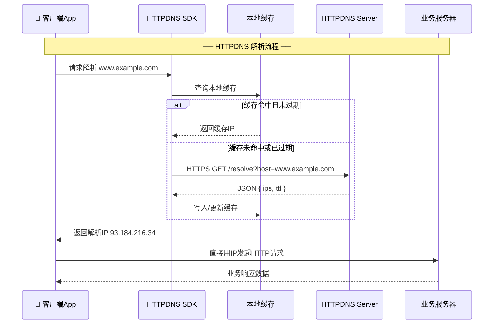

### HTTPDNS 的关键技术细节

**1. 客户端 SDK 集成**

HTTPDNS 并不是浏览器或操作系统原生支持的能力，它需要通过**客户端 SDK**（Software Development Kit）嵌入到 App 中。主流云厂商（如阿里云、腾讯云、华为云）都提供了 Android / iOS 的 HTTPDNS SDK。SDK 的核心职责包括：

- **拦截域名解析请求**：Hook 网络库的域名解析环节，将其转向 HTTPDNS 通道。
- **本地缓存管理**：维护一份域名→IP 的映射缓存，遵循服务端下发的 TTL 进行过期淘汰。
- **预解析（Pre-resolve）**：App 启动时可以提前批量解析热点域名，减少首次请求的解析延迟。
- **降级容灾**：当 HTTPDNS 服务端不可达时，自动回退（fallback）到传统的 Local DNS 解析，保证可用性。

**2. IP 直连与 SNI 问题**

使用 HTTPDNS 后，客户端拿到的是 IP 地址而非域名，后续的 HTTP 请求会变成直接用 IP 访问。这在 HTTP 场景下问题不大（设置 `Host` 请求头即可），但在 **HTTPS** 场景下会遇到一个经典问题——**SNI（Server Name Indication）**。

TLS 握手阶段，客户端需要在 `ClientHello` 消息中携带目标域名（SNI 字段），以便服务器根据域名选择正确的证书。如果客户端用 IP 直连，SNI 字段为空或为 IP 地址，服务器可能无法返回正确的证书，导致 TLS 握手失败。

解决方案是：在 IP 直连的同时，**手动设置 SNI 字段为原始域名**，并在证书校验时也使用原始域名进行匹配，而非 IP。以下是一个 Android (OkHttp) 场景下的简化代码示例：

```java
// 构建 OkHttpClient，自定义 DNS 解析逻辑
OkHttpClient client = new OkHttpClient.Builder()
    // 自定义 DNS 实现，将域名解析委托给 HTTPDNS SDK
    .dns(hostname -> {
        // 调用 HTTPDNS SDK 获取 IP 列表
        String ip = HttpDnsService.getIpByHost(hostname);
        if (ip != null) {
            // 将 HTTPDNS 返回的 IP 封装为 InetAddress 列表
            return Collections.singletonList(InetAddress.getByName(ip));
        }
        // HTTPDNS 失败时降级为系统默认 DNS 解析
        return Dns.SYSTEM.lookup(hostname);
    })
    .build();

// 发起请求时仍然使用域名 URL（OkHttp 会自动处理 Host 头和 SNI）
Request request = new Request.Builder()
    .url("https://www.example.com/api/data")  // URL 中保留域名
    .build();

// 执行请求
Response response = client.newCall(request).execute();
```

> 上述代码中，OkHttp 的 `dns()` 接口允许我们替换底层的域名解析实现。由于 URL 中仍然保留域名，OkHttp 会自动在 TLS 握手时设置正确的 SNI，并在证书校验时使用域名进行匹配，因此不需要额外处理 SNI 问题。

**3. 客户端 IP 精准调度**

传统 DNS 中，权威服务器只能看到 Local DNS 的 IP，无法感知真实用户 IP（虽然 EDNS Client Subnet 扩展协议试图解决这个问题，但并未被所有 LDNS 支持）。

HTTPDNS 天然解决了这个问题：HTTP 请求是客户端**直接**发给 HTTPDNS 服务端的，服务端可以从 TCP 连接中获取客户端的**真实出口 IP**，也可以通过请求参数显式传入 `client_ip`。基于真实的用户 IP，HTTPDNS 服务端能够精准判断用户的地理位置和运营商归属，从而返回**最优的 CDN 节点 IP**，大幅提升访问速度。

### 传统 DNS vs HTTPDNS 对比

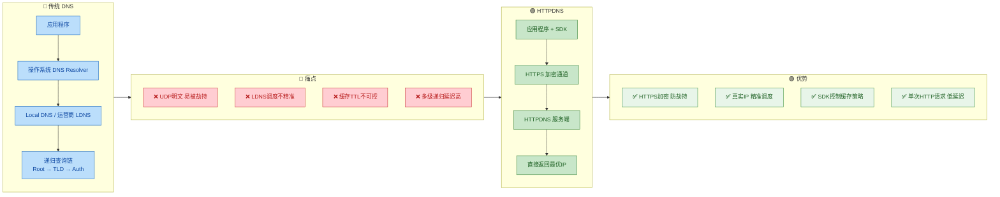

下面用一张表格做一个更直观的总结：

| 对比维度 | 传统 DNS | HTTPDNS |
|:---:|:---:|:---:|
| **协议** | UDP（端口 53） | HTTP/HTTPS（端口 80/443） |
| **加密性** | 明文传输，易被劫持 | HTTPS 加密，防篡改 |
| **调度精度** | 基于 LDNS IP，可能跨区域误判 | 基于客户端真实 IP，精准调度 |
| **缓存控制** | TTL 由 LDNS 决定，不可控 | SDK 本地管理，完全可控 |
| **解析延迟** | 多级递归，弱网下丢包严重 | 单次 HTTP 请求，支持预解析 |
| **部署成本** | 零成本，系统原生支持 | 需集成 SDK，有额外服务费用 |
| **适用场景** | 通用场景、浏览器访问 | 移动 App、对可用性要求高的业务 |
| **容灾** | 依赖运营商 LDNS 稳定性 | HTTPDNS 故障时可降级回传统 DNS |

### HTTPDNS 的典型应用场景

**1. 移动端 App 加速**

手机 App 是 HTTPDNS 最主流的应用场景。用户的手机频繁切换 Wi-Fi / 4G / 5G 网络，每次网络切换可能导致 Local DNS 变化，解析结果不稳定。HTTPDNS SDK 通过本地缓存 + 预解析机制，可以在网络切换时快速命中缓存，避免 DNS 解析带来的额外延迟。

**2. 防劫持刚需业务**

金融类、电商类、视频类 App 对内容安全性要求极高。DNS 劫持可能导致用户被引导至钓鱼页面，造成资金或隐私泄露。HTTPDNS 通过 HTTPS 加密传输彻底杜绝了中间人篡改解析结果的可能性。

**3. CDN 调度优化**

视频直播、短视频、大文件下载等高带宽业务，严重依赖 CDN 的就近调度。HTTPDNS 提供的精准调度能力可以确保用户始终连接到最近的 CDN 边缘节点，降低首帧时间、减少卡顿。

### HTTPDNS 的局限性

HTTPDNS 并非银弹，它也有自身的限制：

- **仅适用于 App 环境**：浏览器中的 Web 页面无法直接使用 HTTPDNS（浏览器不允许 JavaScript 绕过系统 DNS），因此 HTTPDNS 基本上是**移动端 Native App 的专属方案**。在 Web 场景下，如果需要类似能力，更多是依赖 DoH（DNS over HTTPS）等浏览器原生支持的加密 DNS 协议。
- **增加客户端复杂度**：集成 SDK 意味着更多的代码量、更多的兼容性测试、更多的异常处理（如 HTTPDNS 服务端超时、SNI 配置、证书校验等）。
- **服务依赖风险**：HTTPDNS 服务本身也可能出现故障，因此必须设计好**降级策略**（fallback to Local DNS），否则反而会降低可用性。
- **成本**：大多数云厂商的 HTTPDNS 服务按查询次数计费，对于请求量巨大的 App 来说，这是一笔不可忽视的额外支出。

### HTTPDNS 与 DoH / DoT 的关系

值得一提的是，HTTPDNS 并不是唯一的"加密 DNS"方案。近年来，IETF 标准化了两个更通用的加密 DNS 协议：

- **DoH（DNS over HTTPS，RFC 8484）**：将标准 DNS 查询封装在 HTTPS 请求中，端口 443。
- **DoT（DNS over TLS，RFC 7858）**：将标准 DNS 查询封装在 TLS 连接中，端口 853。

它们与 HTTPDNS 的核心区别在于：

| | HTTPDNS | DoH / DoT |
|:---:|:---:|:---:|
| **标准化** | 非标准，各厂商私有实现 | IETF 标准化（RFC 8484 / RFC 7858） |
| **集成方式** | App SDK 集成 | 操作系统/浏览器原生支持 |
| **协议格式** | 私有 HTTP API（返回 JSON） | 标准 DNS 报文格式（二进制） |
| **适用范围** | 移动 App | 全平台（浏览器、OS、IoT等） |
| **调度能力** | 支持精准 IP 调度 | 依赖 EDNS Client Subnet |

简单来说，HTTPDNS 是**国内互联网大厂**面对复杂运营商环境的**实用主义解决方案**，而 DoH/DoT 是**国际标准社区**推动的**通用加密 DNS 方案**。两者解决的核心问题有重叠（防劫持、加密传输），但设计目标和适用场景有所不同。在未来，随着 DoH 在主流浏览器和操作系统中的普及，传统 DNS 劫持问题有望在系统层面得到根本性解决，届时 HTTPDNS 的防劫持优势将不再独特——但其**精准调度**和**客户端可控缓存**的能力仍然具有不可替代的价值。

---

📝 **练习题**

某移动 App 在使用 HTTPDNS 进行域名解析后，通过 IP 直连方式发起 HTTPS 请求，但发现 TLS 握手阶段频繁失败，服务器返回了错误的证书。以下哪项最可能是导致该问题的原因？

A. HTTPDNS 返回的 IP 地址不正确，指向了错误的服务器

B. 客户端未正确设置 SNI（Server Name Indication），导致服务器无法根据域名选择正确的证书

C. HTTPDNS 服务端的 TTL 设置过短，缓存频繁失效导致解析不稳定

D. 客户端的系统 DNS 缓存与 HTTPDNS 缓存产生了冲突

【答案】B

【解析】这是 HTTPDNS + HTTPS 场景下最经典的坑。当客户端使用 IP 直连发起 HTTPS 请求时，TLS 握手的 `ClientHello` 消息中需要携带 **SNI 字段**来告知服务器"我要访问哪个域名"。现代服务器通常在同一个 IP 上托管多个域名（虚拟主机），依赖 SNI 来选择对应的 TLS 证书。如果客户端用 IP 直连但没有手动设置 SNI 为原始域名，服务器就无法判断应该返回哪张证书，可能返回默认证书或直接拒绝连接，导致 TLS 握手失败。选项 A 虽然理论上也可能导致问题，但题目明确指出"返回了错误的证书"而非"连接不上"，这是 SNI 缺失的典型症状。选项 C 和 D 与 TLS 握手失败无直接关系。

---

## 本章小结

本章围绕 **DNS（Domain Name System）** 这一互联网基础设施的核心协议，从概念、查询机制、记录类型到现代优化方案进行了系统性的梳理。下面从几个维度对全章知识进行回顾与提炼。

---

### 核心知识脉络回顾

DNS 的本质是一个 **分布式、层次化的命名系统**，它将人类可读的域名（如 `www.example.com`）映射为机器可路由的 IP 地址（如 `93.184.216.34`）。这个看似简单的"翻译"动作，背后支撑着一套精密的多级查询架构和丰富的资源记录体系。

我们可以将本章的知识体系归纳为 **"一条主线、两大分支、一个演进"**：

| 归纳维度 | 内容 | 关键词 |
|:---:|:---|:---|
| **一条主线** | DNS 查询的完整生命周期：从浏览器缓存到权威服务器的逐级解析 | Recursive / Iterative Query |
| **分支一** | DNS 记录类型：A、AAAA、CNAME 等资源记录的语义与应用场景 | RR (Resource Record) |
| **分支二** | DNS 的层次化架构：根服务器 → TLD → 权威服务器的委派机制 | Delegation, Zone |
| **一个演进** | HTTPDNS：绕过传统 LocalDNS 的现代解析方案，解决劫持、调度等痛点 | Anti-Hijacking, Precision Scheduling |

---

### 全局架构总览

下面这张图将本章所有核心知识点串联为一个完整的 DNS 解析全景视图，从客户端发起请求开始，到最终获得 IP 地址结束，覆盖了传统 DNS 路径与 HTTPDNS 旁路两条链路：

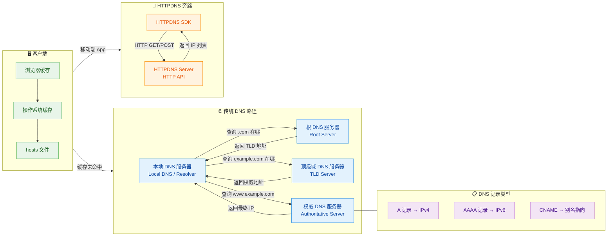

---

### 关键考点速查表

以下是本章最高频的面试 / 考试考点，建议重点记忆：

| # | 考点 | 核心要点 |
|:---:|:---|:---|
| 1 | **递归查询 vs 迭代查询** | 客户端 → LocalDNS 通常是 **递归**（客户端只问一次，LocalDNS 负责跑完全程）；LocalDNS → 各级服务器通常是 **迭代**（每次只获得下一跳的指引） |
| 2 | **缓存与 TTL** | 每一级都有缓存，TTL（Time To Live）决定缓存有效期。TTL 过短增加查询开销，过长导致变更生效慢 |
| 3 | **13 组根服务器** | 全球 13 组根服务器（A–M），通过 **Anycast** 技术部署了上千个实例节点，并非物理上只有 13 台 |
| 4 | **CNAME 的限制** | CNAME 不能与其他记录共存于同一域名；裸域（Zone Apex，如 `example.com`）通常不能设置 CNAME |
| 5 | **HTTPDNS 的核心价值** | 防劫持（绕开 LocalDNS）、精准调度（服务端拿到真实客户端 IP）、灵活降级（SDK 可回退传统 DNS） |
| 6 | **A vs AAAA** | A 记录映射到 32 位 IPv4 地址；AAAA 记录映射到 128 位 IPv6 地址（之所以叫 AAAA，是因为 128 = 32 × **4**） |

---

### 易混淆概念辨析

**1. 递归查询 ≠ 迭代查询**

很多同学容易混淆这两个概念。最简单的记忆方式：

- **递归（Recursive）**：你去餐厅点餐，服务员帮你跑腿去厨房、取餐、端上桌——你只需要 **问一次**，服务员负责全程。对应客户端向 LocalDNS 发出的请求。
- **迭代（Iterative）**：你问路人"图书馆在哪"，路人说"你先去那个路口问"，到了路口又说"往东走再问"——每次只给你 **下一步的线索**。对应 LocalDNS 向根 → TLD → 权威逐步询问的过程。

**2. CNAME ≠ 重定向（Redirect）**

CNAME 是在 **DNS 层面** 的别名指向，浏览器地址栏不会变化，用户完全无感知。而 HTTP 301/302 重定向是在 **应用层** 发生的跳转，浏览器地址栏会变成新的 URL。两者工作在不同层次，解决不同问题。

**3. HTTPDNS ≠ DoH（DNS over HTTPS）**

| 对比项 | HTTPDNS | DoH（DNS over HTTPS） |
|:---:|:---|:---|
| **目的** | 解决运营商劫持、精准调度 | 加密 DNS 查询，保护隐私 |
| **标准化** | 各厂商私有实现（阿里云、腾讯云等） | IETF 标准 RFC 8484 |
| **协议** | 普通 HTTP/HTTPS 接口 | 严格基于 HTTPS，使用 `application/dns-message` |
| **使用场景** | 主要用于 **移动端 App** | 浏览器、操作系统级别均支持 |
| **返回格式** | 通常为 JSON | 标准 DNS 报文（wireformat） |

---

### 学习建议

1. **动手实践**：使用 `dig`、`nslookup` 命令在终端实际跟踪一次完整的 DNS 解析过程。例如 `dig +trace www.baidu.com` 可以看到从根服务器开始的完整迭代过程。
2. **关注 TTL**：在开发中修改 DNS 记录后，如果发现没有立即生效，第一时间检查旧记录的 TTL 值——这是最常见的"DNS 改了但不生效"问题的根源。
3. **理解分层思想**：DNS 的层次化架构（根 → TLD → 权威）是分布式系统设计的经典范式，理解它有助于你掌握更多分布式系统（如 CDN、微服务注册中心）的设计思路。

---

### 📝 练习题

**题目一：DNS 查询过程中，以下哪个说法是正确的？**

A. 客户端直接向根 DNS 服务器发起递归查询，根服务器返回最终 IP 地址

B. 本地 DNS 服务器向根服务器、TLD 服务器、权威服务器发起的通常是迭代查询，每次只获得下一步的指引

C. DNS 查询过程中不存在任何缓存机制，每次都必须从根服务器开始查询

D. CNAME 记录可以直接返回 IP 地址，无需进一步解析


【答案】B

【解析】

- **A 错误**：客户端（Stub Resolver）通常向 **本地 DNS 服务器（LocalDNS）** 发起递归查询，而非直接联系根服务器。根服务器也不会返回最终 IP，它只负责告知 TLD 服务器的地址。
- **B 正确**：LocalDNS 在整个解析链条中扮演"跑腿人"角色。它向根服务器查询时，根服务器只返回 TLD 的地址（Referral）；向 TLD 查询时，TLD 只返回权威服务器的地址。这就是典型的 **迭代查询（Iterative Query）** 模式——每次只获得"下一跳"的线索。
- **C 错误**：DNS 系统在多个层级都有缓存（浏览器缓存、OS 缓存、LocalDNS 缓存），缓存命中后可以直接返回结果，大幅减少查询延迟和上游服务器负载。
- **D 错误**：CNAME 记录的值是另一个域名（Canonical Name），而非 IP 地址。DNS 解析器遇到 CNAME 后，必须对这个新域名 **再次发起解析**，直到最终获得 A 或 AAAA 记录中的 IP 地址。

---

**题目二：某移动 App 在部分地区出现 DNS 解析被运营商劫持的问题，以下哪种方案最适合解决？**

A. 将域名的 TTL 设置为 0，禁止所有中间节点缓存

B. 将 A 记录改为 CNAME 记录，通过别名间接解析

C. 集成 HTTPDNS SDK，通过 HTTP 协议直接向可信服务端获取解析结果

D. 在 App 中硬编码服务器 IP 地址，完全绕过 DNS


【答案】C

【解析】

- **A 错误**：TTL 设置为 0 只会导致缓存失效、查询量暴增，但请求仍然走传统 DNS 链路，**无法规避运营商在 LocalDNS 层面的劫持**。而且 TTL=0 会严重增加解析延迟。
- **B 错误**：CNAME 只是域名层面的别名映射，最终仍然需要通过传统 DNS 解析拿到 IP，同样经过 LocalDNS，**劫持问题依然存在**。
- **C 正确**：HTTPDNS 的核心思路就是 **绕开传统 UDP 端口 53 的 DNS 协议**，App 通过 SDK 以 HTTP/HTTPS 请求的方式，直接向可信的 HTTPDNS 服务端（如阿里云、腾讯云提供的服务）获取解析结果。由于不经过运营商的 LocalDNS，从根本上避免了劫持问题，同时还能实现更精准的流量调度。
- **D 错误**：硬编码 IP 虽然能彻底绕过 DNS，但 **完全丧失了灵活性**——服务器 IP 变更时必须发版更新 App，无法做负载均衡和容灾切换。这在生产环境中是不可接受的做法，HTTPDNS 才是工程上的最佳实践。

---

