---

# HTTPS ⭐⭐⭐

---

## HTTPS 概述

HTTPS（**HyperText Transfer Protocol Secure**）是互联网上最广泛使用的安全通信协议。简单来说，它就是在原有的 HTTP 协议之上，套了一层 **安全外壳**，使得客户端与服务器之间的所有数据传输都处于加密保护之下。今天我们在浏览器地址栏看到的那把小锁🔒，背后就是 HTTPS 在默默工作。

要理解 HTTPS，首先需要理解一个核心问题：**HTTP 到底"不安全"在哪里？**

HTTP 协议本身是一个**明文传输协议（Plaintext Protocol）**。这意味着，从你的浏览器到目标服务器之间，所有经过的路由器、交换机、Wi-Fi 热点、ISP（Internet Service Provider，互联网服务提供商）设备，**都能直接读取你发送和接收的全部内容**——包括你的账号密码、银行卡号、聊天记录、Cookie 等敏感信息。这就好比你在大街上对着远处的朋友大喊你的银行卡密码，路过的每个人都能听到。

HTTPS 的出现就是为了解决这三大安全威胁：

| 安全威胁 | 英文术语 | 说明 |
|---------|---------|------|
| **窃听** | Eavesdropping | 第三方偷看传输内容 |
| **篡改** | Tampering | 第三方修改传输内容（如注入广告） |
| **冒充** | Impersonation | 第三方伪装成目标服务器 |

HTTPS 分别通过 **加密（Encryption）**、**数据完整性校验（Data Integrity）** 和 **身份认证（Authentication）** 来一一化解这些威胁。

---

### HTTP + TLS/SSL

HTTPS 的本质可以用一个极其简洁的公式来表达：

> **HTTPS = HTTP + TLS/SSL**

这不是一种全新的协议设计，而是一种 **协议栈的叠加（Protocol Layering）**。HTTP 仍然负责定义请求和响应的语义（GET、POST、状态码、Header 等），而 TLS/SSL 作为一个独立的安全层，插入在 HTTP 和 TCP 之间，负责对数据进行加密、解密和身份验证。

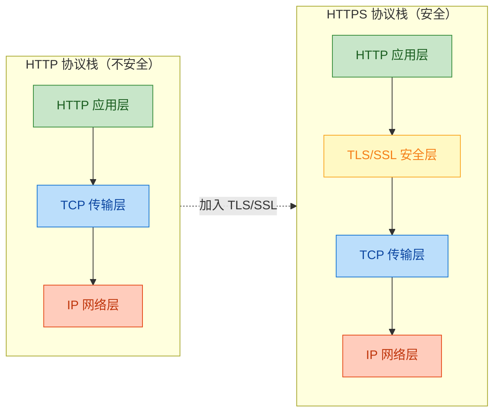

从上图可以非常清晰地看到：TLS/SSL 层像一片"夹心"一样被插入到 HTTP 和 TCP 之间。这种设计的精妙之处在于——**HTTP 层完全不需要做任何修改**。对于上层的 HTTP 来说，它只是把数据"交给下一层"，至于下一层是直接交给 TCP 还是先经过 TLS 加密再交给 TCP，HTTP 根本不关心。这就是经典的 **分层解耦（Separation of Concerns）** 思想。

#### SSL 与 TLS 的历史关系

很多人会困惑：SSL 和 TLS 到底是什么关系？为什么有时候说 SSL，有时候又说 TLS？

**SSL（Secure Sockets Layer，安全套接层）** 是由 **Netscape（网景公司）** 在 1990 年代中期发明的。它经历了三个版本：

- **SSL 1.0**：从未公开发布，存在严重安全缺陷。
- **SSL 2.0**（1995）：首次发布，但很快被发现多个漏洞。
- **SSL 3.0**（1996）：进行了重大重新设计，使用较广泛，但在 2014 年因 **POODLE 攻击** 被宣告不安全。

随后，IETF（Internet Engineering Task Force，互联网工程任务组）接手了这项工作，将协议标准化并更名为 **TLS（Transport Layer Security，传输层安全协议）**：

- **TLS 1.0**（1999）：本质上是 SSL 3.1，与 SSL 3.0 差异不大。
- **TLS 1.1**（2006）：增加了对抗 CBC 攻击的防护。
- **TLS 1.2**（2008）：引入 AEAD 加密模式（如 AES-GCM），成为长期主流版本。
- **TLS 1.3**（2018）：大幅精简握手流程（从 2-RTT 减少到 **1-RTT**，甚至支持 **0-RTT** 恢复），移除了不安全的旧算法，是目前最推荐的版本。

> 📌 **关键结论**：SSL 已经完全被淘汰，现代互联网全部使用 TLS。但由于历史习惯，人们口中说的"SSL"通常也指 TLS。在技术文档中，建议统一使用 **TLS** 这一术语。

#### 端口与 URL 差异

| 特征 | HTTP | HTTPS |
|------|------|-------|
| **默认端口** | 80 | **443** |
| **URL 前缀** | `http://` | `https://` |
| **数据传输** | 明文 | 加密 |
| **需要证书** | 不需要 | **需要** |
| **TCP 握手后** | 直接发 HTTP 请求 | **先进行 TLS 握手**，再发 HTTP 请求 |

当你在浏览器输入 `https://www.example.com` 时，实际发生的连接过程是：

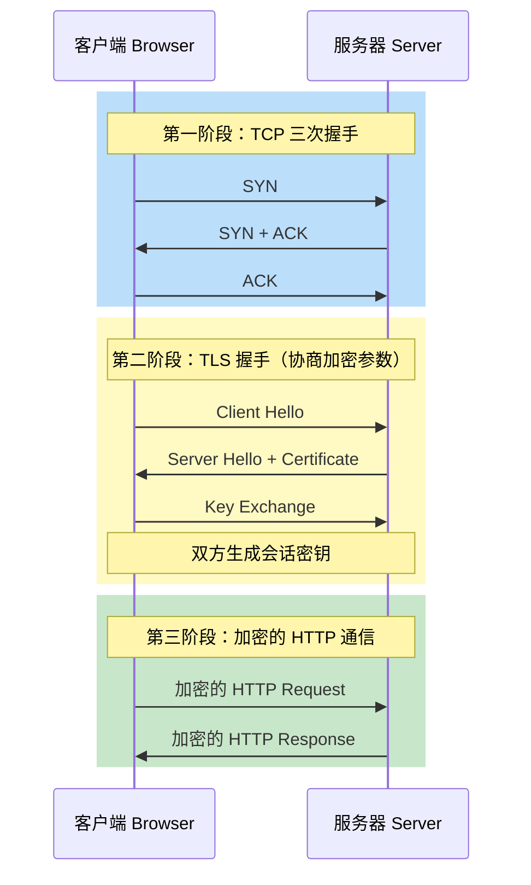

可以看到，HTTPS 比 HTTP **多了一个 TLS 握手阶段**。这也是为什么 HTTPS 的首次连接会比 HTTP 稍慢的原因——但这个代价是完全值得的，而且现代 TLS 1.3 已经将这个开销降到了极低。

---

### 加密传输

理解了 HTTPS 的协议结构后，我们来看看"加密传输"到底意味着什么，以及 **数据在网络上流动时到底长什么样**。

#### 明文 vs 密文：直观对比

假设你通过一个登录表单提交了用户名和密码：

**HTTP 传输时（明文）——任何中间节点都能直接读取：**

```text
POST /login HTTP/1.1
Host: www.example.com
Content-Type: application/x-www-form-urlencoded

username=zhangsan&password=MyP@ssw0rd123
```

**HTTPS 传输时（密文）——中间节点看到的是这样的：**

```text
17 03 03 00 8A 4E 7B 2C A1 F3 9D 82 0B 61 C4 D7
3F A8 5E 19 22 6B 7D E0 94 B3 C8 1A 55 F2 D6 08
... (完全不可读的二进制数据)
```

其中 `17 03 03` 是 TLS Record 协议的头部（`17` 表示 Application Data，`03 03` 表示 TLS 1.2），后面的内容全部是经过加密算法处理后的密文（Ciphertext），**没有正确的密钥就无法解密**。

#### HTTPS 提供的三大安全保证

HTTPS 不仅仅是"加密"这么简单。一个完整的安全通信需要同时满足三个特性，TLS 协议通过不同的密码学机制分别实现了它们：

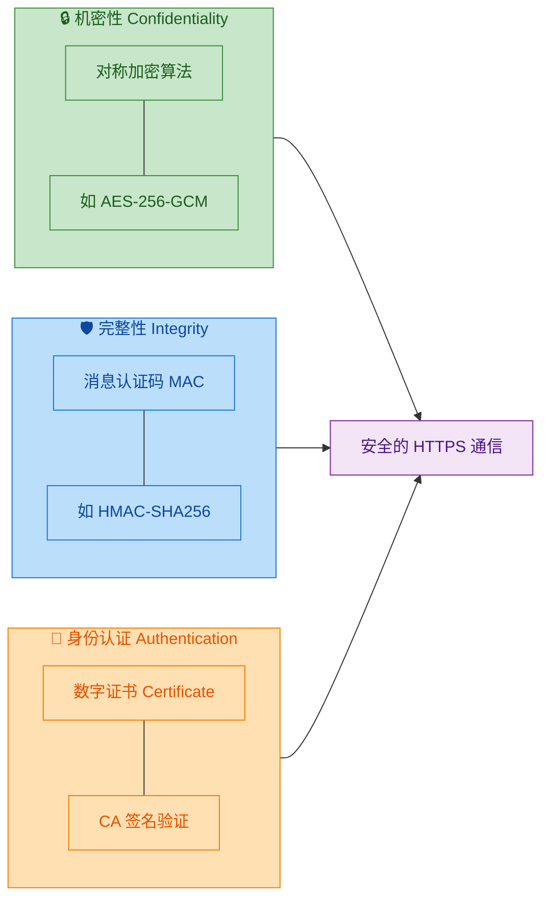

**1. 机密性（Confidentiality）**

通过**对称加密算法**（如 AES）将明文转化为密文。即使数据包被截获，攻击者也无法还原原始内容。这解决了 **窃听（Eavesdropping）** 问题。

**2. 完整性（Integrity）**

每一个 TLS 记录（TLS Record）都附带一个 **消息认证码（MAC, Message Authentication Code）**。接收方可以通过 MAC 验证数据在传输过程中是否被修改过。如果哪怕一个比特被篡改，MAC 校验就会失败，接收方会立即丢弃该数据。这解决了 **篡改（Tampering）** 问题。

> 现代 TLS 通常使用 **AEAD（Authenticated Encryption with Associated Data）** 模式（如 AES-GCM），它将加密和完整性校验合并在一个操作中完成，既高效又安全。

**3. 身份认证（Authentication）**

通过 **数字证书（Digital Certificate）** 和 **CA（Certificate Authority，证书颁发机构）** 体系，客户端可以验证"我连接的确实是真正的 `www.example.com`，而不是某个冒充者"。这解决了 **冒充（Impersonation）** 问题，也是防御**中间人攻击（Man-in-the-Middle Attack）**的关键。

#### TLS Record Protocol：数据是如何被封装的

当 HTTP 层把数据交给 TLS 层后，TLS 会将数据切分成若干个 **TLS Record（记录）**，每个 Record 最大 16KB (2^14 bytes)，然后对每个 Record 独立进行处理：

```text
┌─────────────────────────────────────────────────┐
│                  TLS Record                      │
├──────────┬──────────┬───────────────────────────┤
│ 类型(1B) │ 版本(2B) │ 长度(2B)                   │
│   0x17   │  0x0303  │  Payload 长度              │
├──────────┴──────────┴───────────────────────────┤
│                                                  │
│   加密后的 HTTP 数据 (Encrypted Payload)          │
│   + 认证标签 (Authentication Tag)                │
│                                                  │
└─────────────────────────────────────────────────┘
```

处理流程如下：

1. **分片（Fragmentation）**：将 HTTP 数据按最大 16KB 切块。
2. **压缩（Compression）**：在 TLS 1.2 中可选（但因 CRIME 攻击，实际中已禁用），TLS 1.3 中已移除。
3. **加密 + MAC（Encrypt & Authenticate）**：使用会话密钥（Session Key）对数据进行 AEAD 加密，生成密文和认证标签。
4. **添加 Record Header**：附上类型、版本号和长度信息。

#### 性能考量：HTTPS 到底慢多少？

早期人们对 HTTPS 有一个常见误解："HTTPS 很慢，会显著增加延迟"。这在 2010 年代之前可能有一定道理，但在今天，**HTTPS 的性能开销已经可以忽略不计**，原因包括：

| 优化技术 | 说明 |
|---------|------|
| **TLS 1.3** | 握手只需 **1-RTT**（首次）或 **0-RTT**（恢复），比 TLS 1.2 的 2-RTT 快了一倍 |
| **Session Resumption** | TLS 会话复用，避免重复进行完整握手 |
| **硬件加速（AES-NI）** | 现代 CPU 内置 AES 指令集，加解密几乎零开销 |
| **HTTP/2 + HTTPS** | HTTP/2 多路复用减少连接数，配合 HTTPS 效果更佳 |
| **OCSP Stapling** | 服务器主动附带证书状态，避免客户端额外请求 OCSP 服务器 |

Google 在 2010 年将 Gmail 全面切换到 HTTPS 后曾公开表示：SSL/TLS 只占用了不到 **1% 的 CPU 资源**、不到 **10KB 的内存**、以及不到 **2% 的网络延迟增加**。这在今天只会更低。

---

**📝 练习题**

关于 HTTPS，以下说法 **错误** 的是？


A. HTTPS 是一种全新设计的协议，与 HTTP 没有直接关系


B. TLS 是 SSL 的后续标准化版本，现代浏览器已不再支持 SSL


C. HTTPS 在 TCP 握手之后、HTTP 通信之前，需要进行 TLS 握手


D. HTTPS 不仅提供加密，还提供数据完整性校验和身份认证


**【答案】** A

**【解析】** HTTPS 并非一种全新协议，而是 **HTTP + TLS/SSL** 的组合。HTTP 负责应用语义，TLS 负责安全传输，两者通过协议分层叠加在一起工作。HTTP 协议本身在 HTTPS 中没有做任何修改，只是数据在交给 TCP 之前先经过 TLS 层加密。选项 B 正确，SSL 3.0 在 2014 年因 POODLE 攻击被废弃，现代浏览器已全面转向 TLS。选项 C 正确描述了连接建立的三个阶段：TCP 握手 → TLS 握手 → HTTP 通信。选项 D 正确，TLS 提供的三大安全保证是机密性（Confidentiality）、完整性（Integrity）和身份认证（Authentication）。

---

## 加密方式 ⭐

在理解 HTTPS 之前，我们必须先搞清楚一个核心问题：**数据在网络中传输时，如何保证不被窃听和篡改？** 答案就是 **加密（Encryption）**。加密是将明文（Plaintext）通过某种算法转换为密文（Ciphertext）的过程，只有持有正确密钥（Key）的一方才能将密文还原为明文。在 HTTPS 体系中，加密方式主要分为三大类：**对称加密、非对称加密、混合加密**。它们各有优劣，最终在 TLS 协议中被巧妙地组合使用，形成了一套既安全又高效的加密通信方案。

---

### 对称加密（Symmetric Encryption）

#### 核心思想

对称加密是最古老、也是最直观的加密方式。其核心原则极其简单：**加密和解密使用同一把密钥（Same Key）**。发送方用密钥 K 加密明文，接收方用同一个密钥 K 解密密文。就好比你和朋友各持一把完全相同的锁钥匙，你用钥匙锁上箱子寄出去，朋友用同一把钥匙打开。

用数学语言表达：

- **加密**：$C = E_K(P)$，其中 $P$ 为明文，$K$ 为密钥，$C$ 为密文
- **解密**：$P = D_K(C)$，用同一个 $K$ 还原

#### 代表算法：AES（Advanced Encryption Standard）

AES 是当今最主流的对称加密算法，由美国国家标准与技术研究院（NIST）于 2001 年正式采纳，用以取代老旧的 DES 算法。AES 属于 **分组密码（Block Cipher）**，它将明文按固定长度（128 bit）分块，逐块进行加密。

**AES 的核心参数：**

| 参数 | 说明 |
|---|---|
| **密钥长度** | 128 / 192 / 256 bit（常用 AES-128、AES-256） |
| **分组长度** | 固定 128 bit（16 字节） |
| **加密轮数** | 10 / 12 / 14 轮（对应不同密钥长度） |
| **运算类型** | 字节替换、行移位、列混淆、轮密钥加 |

AES 之所以被广泛采用，在于它在安全性与性能之间取得了极佳的平衡。现代 CPU（如 Intel、AMD）甚至内置了 **AES-NI 硬件指令集**，可以在硬件层面直接加速 AES 运算，使其加解密速度达到 **数 GB/s** 的量级。

#### AES 的工作模式

单纯的 AES 只能加密一个 128 bit 的数据块，而实际通信中数据往往远大于此。因此需要 **工作模式（Mode of Operation）** 来处理任意长度的数据。以下是几种常见模式：

- **ECB（Electronic Codebook）**：最简单，每块独立加密。相同明文块 → 相同密文块，**安全性极差**，实际中几乎不用。
- **CBC（Cipher Block Chaining）**：每块加密前先与前一块密文异或（XOR），引入了块间依赖，安全性大幅提升。TLS 1.0/1.1 中曾大量使用。
- **GCM（Galois/Counter Mode）**：CTR 计数器模式 + GMAC 认证，**既加密又认证**（Authenticated Encryption）。这是 TLS 1.2/1.3 中的首选模式，也是目前最推荐的模式。

```text
┌──────────────────────────────────────────────────────────────────┐
│                  AES-GCM 加密流程简化示意                         │
│                                                                  │
│   明文 Block 1    明文 Block 2    明文 Block 3                    │
│       │               │               │                          │
│       ▼               ▼               ▼                          │
│  ┌─────────┐    ┌─────────┐    ┌─────────┐                      │
│  │Counter=1│    │Counter=2│    │Counter=3│   ← 递增计数器         │
│  └────┬────┘    └────┬────┘    └────┬────┘                      │
│       │               │               │                          │
│       ▼               ▼               ▼                          │
│   AES_K(Ctr)     AES_K(Ctr)     AES_K(Ctr)  ← 用密钥K加密计数器 │
│       │               │               │                          │
│       ▼               ▼               ▼                          │
│     XOR             XOR             XOR       ← 与明文异或       │
│       │               │               │                          │
│       ▼               ▼               ▼                          │
│   密文 Block 1    密文 Block 2    密文 Block 3                    │
│       │               │               │                          │
│       └───────┬───────┘───────┬───────┘                          │
│               ▼               ▼                                  │
│           GHASH（伽罗瓦域乘法）→ Authentication Tag               │
└──────────────────────────────────────────────────────────────────┘
```

GCM 模式的精妙之处在于：它不仅加密数据，还会生成一个 **认证标签（Authentication Tag）**。接收方解密后会验证这个 Tag，如果数据被篡改过，Tag 校验会失败，从而同时实现了 **机密性（Confidentiality）** 和 **完整性（Integrity）**。

#### 对称加密的致命问题：密钥分发（Key Distribution Problem）

对称加密速度极快、效率极高，但有一个根本性的难题——**如何安全地把密钥传递给对方？**

设想一下场景：客户端 Alice 想和服务器 Bob 进行加密通信。他们必须先约定一个共同的密钥 K。但问题来了：

- 如果通过网络明文传输 K → 中间人直接截获，加密形同虚设
- 如果线下面对面交换 K → 在互联网场景中完全不现实
- 如果每对通信方预设不同的 K → 密钥数量为 $O(n^2)$，管理成本爆炸

这就是著名的 **密钥分发问题（Key Distribution Problem）**，它直接催生了下面要介绍的非对称加密技术。

---

### 非对称加密（Asymmetric Encryption）

#### 核心思想

非对称加密在 1976 年由 Diffie 和 Hellman 提出概念，彻底革新了密码学。其核心原则是：**使用一对数学相关但不同的密钥——公钥（Public Key）和私钥（Private Key）**。

- **公钥**：可以公开给任何人，用于加密数据
- **私钥**：必须严格保密，用于解密数据

关键特性：**用公钥加密的数据，只有对应的私钥能解密；用私钥加密（签名）的数据，只有对应的公钥能验证**。这两把钥匙在数学上互为"逆运算"，但从公钥推导出私钥在计算上是 **不可行的（Computationally Infeasible）**。

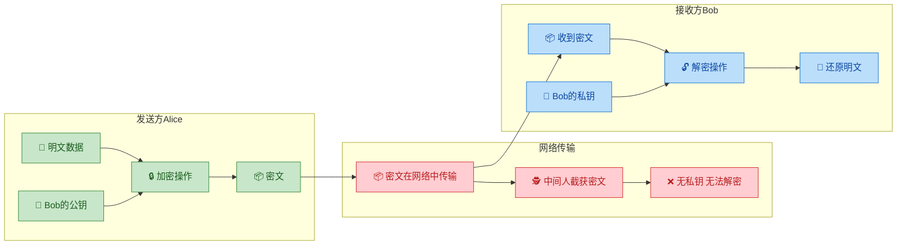

#### 代表算法：RSA

RSA 算法由 Rivest、Shamir、Adleman 三人于 1977 年提出，是最经典的非对称加密算法。其安全性基于 **大整数因式分解的困难性（Integer Factorization Problem）**。

**RSA 密钥生成的核心数学步骤（简化版）：**

```python
# === RSA 密钥生成核心流程（简化演示） ===

# 1. 选择两个大素数 p 和 q（实际中每个至少 1024 bit）
p = 61
q = 53

# 2. 计算模数 n = p × q（n 的 bit 长度就是密钥长度）
n = p * q  # n = 3233

# 3. 计算欧拉函数 φ(n) = (p-1)(q-1)
phi_n = (p - 1) * (q - 1)  # φ(n) = 3120

# 4. 选择公钥指数 e，要求 1 < e < φ(n) 且 gcd(e, φ(n)) = 1
e = 17  # 常用值：65537 (0x10001)

# 5. 计算私钥指数 d，满足 e × d ≡ 1 (mod φ(n))
d = pow(e, -1, phi_n)  # d = 2753（即 17 × 2753 mod 3120 = 1）

# === 公钥 = (e, n) = (17, 3233) ===
# === 私钥 = (d, n) = (2753, 3233) ===

# --- 加密过程 ---
plaintext = 65  # 明文（必须 < n）
ciphertext = pow(plaintext, e, n)  # C = P^e mod n = 65^17 mod 3233 = 2790

# --- 解密过程 ---
decrypted = pow(ciphertext, d, n)  # P = C^d mod n = 2790^2753 mod 3233 = 65
print(f"解密结果: {decrypted}")  # 输出: 65 ✅ 与原文一致
```

**为什么安全？** 攻击者知道公钥 $(e, n)$，想要推导私钥 $d$，就必须先将 $n$ 分解为 $p \times q$，然后才能计算 $\phi(n)$ 进而得到 $d$。但当 $n$ 是一个 2048 bit 甚至 4096 bit 的大数时，目前人类已知的最优分解算法（如普通数域筛法 GNFS）所需的计算量是天文数字级别的——即使使用超级计算机也需要数百万年。

#### 其他常见非对称算法

| 算法 | 数学基础 | 典型用途 | 密钥长度 |
|---|---|---|---|
| **RSA** | 大整数分解 | 加密、签名 | 2048 / 4096 bit |
| **ECC（椭圆曲线）** | 椭圆曲线离散对数 | 签名、密钥交换 | 256 / 384 bit |
| **ECDHE** | 椭圆曲线 Diffie-Hellman | 密钥交换（临时） | 256 bit |
| **Ed25519** | 扭曲爱德华曲线 | 数字签名 | 256 bit |

值得注意的是，**ECC（Elliptic Curve Cryptography）** 正在逐步取代 RSA。ECC 仅需 256 bit 的密钥就能达到 RSA 3072 bit 的安全强度，密钥更短意味着计算更快、带宽消耗更低，非常适合移动端和 IoT 场景。TLS 1.3 已经将 ECDHE 作为密钥交换的首选。

#### 非对称加密的弱点：性能

非对称加密虽然优雅地解决了密钥分发问题，但有一个显著缺点——**速度极慢**。

以 RSA-2048 为例，其加解密涉及大数模幂运算（Modular Exponentiation），计算复杂度远高于 AES 的位移和异或操作。在相同硬件条件下，RSA 的加密速度大约只有 AES 的 **千分之一到万分之一**。如果整个 HTTPS 通信过程全程使用 RSA 加密数据，网页加载速度将慢到无法接受。

这就引出了 HTTPS 最精妙的设计——**混合加密**。

---

### 混合加密（Hybrid Encryption）

#### 设计哲学

混合加密是 HTTPS/TLS 的核心加密策略，它完美地融合了对称加密和非对称加密的各自优势：

> **用非对称加密解决"密钥分发"问题，用对称加密解决"数据传输"问题。**

换言之：

- **非对称加密** → 只在握手阶段使用，用于安全地交换一个 **对称密钥**
- **对称加密** → 在后续的全部数据传输中使用，保证高速加密

这种"各取所长"的策略，既获得了非对称加密的安全性，又保留了对称加密的高性能。

#### 完整流程

```mermaid
graph LR
    subgraph 阶段一: 密钥交换
        direction TB
        S1["🖥️ 服务器生成 RSA/ECC 密钥对"]
        S2["📤 服务器发送公钥给客户端"]
        S3["🎲 客户端生成随机对称密钥 K"]
        S4["🔒 用服务器公钥加密 K"]
        S5["📤 发送加密后的 K 给服务器"]
        S6["🔐 服务器用私钥解密得到 K"]
        S1 --> S2
        S2 --> S3
        S3 --> S4
        S4 --> S5
        S5 --> S6
    end

    subgraph 阶段二: 加密通信
        direction TB
        D1["✅ 双方共享对称密钥 K"]
        D2["📄 客户端用 K 加密请求"]
        D3["📄 服务器用 K 解密请求"]
        D4["📄 服务器用 K 加密响应"]
        D5["📄 客户端用 K 解密响应"]
        D1 --> D2
        D2 --> D3
        D3 --> D4
        D4 --> D5
    end

    S6 --> D1

    classDef phase1 fill:#E3F2FD,stroke:#1565C0,color:#0D47A1
    classDef phase2 fill:#E8F5E9,stroke:#2E7D32,color:#1B5E20

    class S1,S2,S3,S4,S5,S6 phase1
    class D1,D2,D3,D4,D5 phase2
```

让我们用一个更具体的场景来理解整个过程：

**第一步：服务器准备密钥对**
服务器预先生成一对非对称密钥（公钥 + 私钥），私钥安全地存储在服务器上，公钥则嵌入到 **数字证书（Digital Certificate）** 中，随时准备发送给客户端。

**第二步：客户端获取公钥**
客户端（如浏览器）发起 HTTPS 连接时，服务器将包含公钥的证书发送给客户端。客户端验证证书合法性后，提取出服务器的公钥。

**第三步：生成并加密对称密钥**
客户端生成一个随机的 **预主密钥（Pre-Master Secret）**，然后用服务器的公钥对其进行非对称加密，并将密文发送给服务器。由于只有服务器持有对应的私钥，所以即使中间人截获了这段密文，也无法解密。

**第四步：服务器解密获取对称密钥**
服务器用自己的私钥解密，得到 Pre-Master Secret。至此，客户端和服务器都拥有了相同的 Pre-Master Secret，双方再通过约定的算法（结合之前交换的随机数）推导出最终的 **会话密钥（Session Key）**。

**第五步：对称加密通信**
后续的所有 HTTP 请求和响应数据，都使用这个会话密钥进行 AES-GCM 等对称加密。由于对称加密速度极快，用户几乎感受不到加密带来的延迟。

#### 三种加密方式的对比总结

| 维度 | 对称加密 | 非对称加密 | 混合加密 |
|---|---|---|---|
| **密钥数量** | 1 把（共享） | 2 把（公钥 + 私钥） | 两者结合 |
| **代表算法** | AES-128/256-GCM | RSA-2048、ECDHE | TLS 协议 |
| **加解密速度** | ⚡ 极快（GB/s 级别） | 🐢 极慢（KB/s 级别） | ⚡ 握手后极快 |
| **密钥分发** | ❌ 困难（核心痛点） | ✅ 公钥可公开分发 | ✅ 已解决 |
| **适用场景** | 大量数据加密 | 密钥交换、数字签名 | HTTPS 全过程 |
| **安全性** | 取决于密钥保密性 | 基于数学难题 | 两者优势叠加 |

#### 前向安全性（Forward Secrecy）补充

现代 TLS（尤其是 TLS 1.3）已经不再直接使用 RSA 来交换密钥，而是采用 **ECDHE（Elliptic Curve Diffie-Hellman Ephemeral）** 算法。其中的 "Ephemeral"（临时的）至关重要——每次握手都会生成一对全新的临时密钥。

这带来了一个极其重要的安全特性——**前向安全性（Perfect Forward Secrecy, PFS）**：

- **RSA 密钥交换**：如果服务器的私钥在未来某天泄露，攻击者可以用它解密之前录制的所有历史通信流量——因为所有会话的 Pre-Master Secret 都是用同一个 RSA 公钥加密的。
- **ECDHE 密钥交换**：每次会话使用临时密钥对，会话结束后即销毁。即使服务器长期私钥泄露，历史会话的密钥也无法被还原。

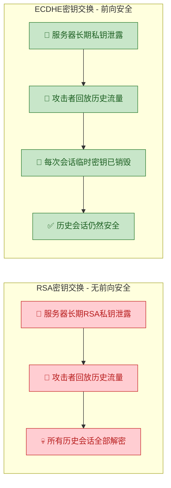

这就是为什么 TLS 1.3 **强制要求使用 ECDHE**，并彻底移除了 RSA 密钥交换模式。前向安全性已经从"推荐"升级为"必须"。

---

**📝 练习题**

在 HTTPS 通信中，客户端与服务器进行 TLS 握手时采用混合加密策略。以下关于这一策略的描述，**正确的是**：

A. 整个通信过程全程使用 RSA 非对称加密来保护数据，以确保最高安全性


B. 客户端使用服务器的私钥加密预主密钥，服务器用公钥解密


C. 握手阶段使用非对称加密交换对称密钥，后续数据传输使用对称加密


D. TLS 1.3 推荐使用 RSA 进行密钥交换，因为 RSA 比 ECDHE 更安全


**【答案】** C

**【解析】** 混合加密的核心思想就是"各取所长"：**非对称加密解决密钥分发问题（握手阶段），对称加密解决数据传输效率问题（通信阶段）**。选项 A 错误，全程 RSA 加密性能完全无法接受（速度仅为 AES 的千分之一）；选项 B 因果颠倒，应该是客户端用服务器的 **公钥** 加密，服务器用 **私钥** 解密；选项 D 恰好相反，TLS 1.3 已经 **移除了 RSA 密钥交换**，强制使用 ECDHE 以确保前向安全性（Perfect Forward Secrecy）。因此只有 C 正确。

---

## TLS 握手流程 ⭐⭐⭐

TLS 握手（TLS Handshake）是 HTTPS 建立安全连接的**核心环节**，它发生在 TCP 三次握手之后、应用层数据传输之前。其根本目标是：让通信双方在一条**不安全**的网络信道上，安全地协商出一把**共享的对称密钥**（Session Key），后续所有 HTTP 报文都用这把密钥进行加密。

整个握手过程综合运用了前文提到的三种加密方式——**非对称加密**用于身份验证与密钥交换，**对称加密**用于后续的数据加密，**哈希算法**用于完整性校验。握手本身不传输任何业务数据，但它是整条 HTTPS 链路中**最精密、最关键**的阶段。

> 以下以经典的 **TLS 1.2 RSA 密钥交换**为主线讲解（TLS 1.3 将握手简化为 1-RTT，但核心思想相通）。

下面先给出 TLS 握手的全局时序图，再逐步拆解每个阶段。

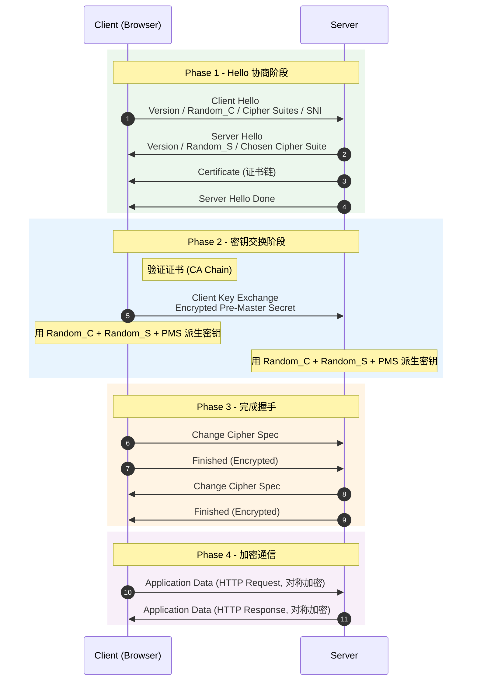

---

### Client Hello（支持的加密套件、随机数）

TLS 握手的**第一枪**由客户端打响。当浏览器（或任何 TLS 客户端）向服务器发起 HTTPS 请求时，TCP 连接建立后，客户端立即发送一条 **Client Hello** 消息，内容包含以下关键字段：

**1. TLS 版本号（Protocol Version）**

客户端告诉服务器自己支持的**最高 TLS 版本**，例如 TLS 1.2（`0x0303`）或 TLS 1.3（`0x0304`）。服务器会据此选择双方都兼容的版本。如果服务器不支持客户端提出的任何版本，握手直接失败。

**2. 客户端随机数（Client Random / Random_C）**

一个 **32 字节**的随机数，由客户端本地生成。这个随机数是后续密钥派生的三大原料之一，**明文传输**——它本身被窃听并不会导致密钥泄露，因为还有另外两个原料。

**3. 加密套件列表（Cipher Suites）**

这是一个**有序列表**，列出客户端支持的所有加密套件，按照优先级从高到低排列。每个 Cipher Suite 实质上是一组算法的组合，命名格式如下：

```text
TLS_ECDHE_RSA_WITH_AES_256_GCM_SHA384
 │      │    │       │       │      │
 │      │    │       │       │      └─ PRF/HMAC 哈希算法
 │      │    │       │       └─ 对称加密模式 (GCM = 认证加密)
 │      │    │       └─ 对称加密算法 + 密钥长度
 │      │    └─ WITH 分隔符
 │      └─ 身份认证算法 (用于验证证书)
 └─ 密钥交换算法 (ECDHE = 椭圆曲线 Diffie-Hellman 临时)
```

一个典型的 Client Hello 可能携带十几到二十几个 Cipher Suite，例如：

| 优先级 | Cipher Suite | 说明 |
|:---:|---|---|
| 1 | `TLS_ECDHE_RSA_WITH_AES_128_GCM_SHA256` | ECDHE 密钥交换 + RSA 认证 + AES-128-GCM |
| 2 | `TLS_ECDHE_RSA_WITH_AES_256_GCM_SHA384` | 更长密钥，更高安全 |
| 3 | `TLS_RSA_WITH_AES_256_CBC_SHA256` | 纯 RSA 交换（无前向安全） |
| ... | ... | ... |

**4. SNI（Server Name Indication）**

当同一台服务器（同一个 IP）托管了多个域名的 HTTPS 站点时，客户端需要在 Client Hello 中通过 SNI 扩展字段指明自己要访问的**目标域名**（如 `www.example.com`）。服务器根据 SNI 返回对应域名的证书。

> ⚠️ SNI 字段在 TLS 1.2 中是**明文**的，这意味着中间人可以看到你正在访问哪个域名（尽管看不到具体内容）。TLS 1.3 引入了 **Encrypted Client Hello (ECH)** 来解决这一隐私问题。

**5. 其他扩展（Extensions）**

包括支持的椭圆曲线列表（Supported Groups）、签名算法列表（Signature Algorithms）、会话恢复标识（Session ID / Session Ticket）等。

下面用一段伪代码来展示 Client Hello 的数据结构：

```python
# === Client Hello 报文结构（伪代码） ===

client_hello = {
    # TLS 协议版本: 客户端支持的最高版本
    "version": "TLS 1.2",  # 0x0303

    # 客户端随机数: 32 字节，用于后续密钥派生
    "random": generate_random_bytes(32),  # Random_C

    # 会话 ID: 用于尝试恢复之前的 TLS 会话（首次连接为空）
    "session_id": b"",

    # 加密套件列表: 按优先级降序排列
    "cipher_suites": [
        "TLS_ECDHE_RSA_WITH_AES_128_GCM_SHA256",   # 最优先
        "TLS_ECDHE_RSA_WITH_AES_256_GCM_SHA384",   # 次优先
        "TLS_RSA_WITH_AES_256_CBC_SHA256",          # 兼容旧服务器
    ],

    # 压缩方法: TLS 1.3 已废弃压缩（防 CRIME 攻击）
    "compression_methods": ["null"],

    # 扩展字段
    "extensions": {
        # SNI: 告诉服务器我要访问哪个域名
        "server_name": "www.example.com",
        # 支持的椭圆曲线
        "supported_groups": ["x25519", "secp256r1"],
        # 支持的签名算法
        "signature_algorithms": ["rsa_pss_sha256", "ecdsa_secp256r1_sha256"],
    }
}
```

总结一下，Client Hello 的核心使命就是**自我介绍**——"我是谁，我支持什么，我的随机数是这个"。

---

### Server Hello（选择加密套件、随机数、证书）

服务器收到 Client Hello 后，从中挑选自己也支持且最优的选项，回复一系列消息。虽然逻辑上是多条消息，但通常在**同一个 TCP 数据包**中返回，我们将其整体称为 Server Hello 阶段。

**1. Server Hello 消息**

服务器在客户端提供的候选中做出**抉择**：

| 字段 | 说明 |
|---|---|
| Protocol Version | 双方都支持的最高版本（如 TLS 1.2） |
| **Server Random (Random_S)** | 服务器生成的 32 字节随机数，密钥派生的第二大原料 |
| Session ID | 分配一个新的会话 ID，或返回客户端提供的（恢复会话时） |
| **Chosen Cipher Suite** | 从客户端列表中**选中一个**加密套件 |

服务器的选择策略通常是：**遍历客户端列表，找到第一个自己也支持的**（尊重客户端优先级），或者按照服务器自身的优先级排序（取决于服务器配置）。

**2. Certificate（证书消息）**

紧接着 Server Hello，服务器发送自己的**数字证书链**。这是一个有序的证书列表：

```text
Certificate Chain (从叶子到根):
┌─────────────────────────────────┐
│  [0] 服务器证书 (Leaf Cert)       │  ← 包含服务器公钥 + 域名
│      Issuer: Intermediate CA     │
├─────────────────────────────────┤
│  [1] 中间 CA 证书                 │  ← 签发服务器证书的中间 CA
│      Issuer: Root CA             │
├─────────────────────────────────┤
│  [2] 根 CA 证书 (通常省略)         │  ← 客户端本地已预置，无需传输
└─────────────────────────────────┘
```

证书中最重要的信息是服务器的**公钥（Public Key）**，客户端稍后将用这把公钥来加密 Pre-Master Secret。

**3. Server Key Exchange（可选）**

如果选择的密钥交换算法是 **ECDHE** 或 **DHE**（而非纯 RSA），服务器需要额外发送 Diffie-Hellman 公开参数。纯 RSA 密钥交换模式下不需要此消息。

**4. Server Hello Done**

一条标志性的空消息，告诉客户端："我这边的招呼打完了，轮到你了。"

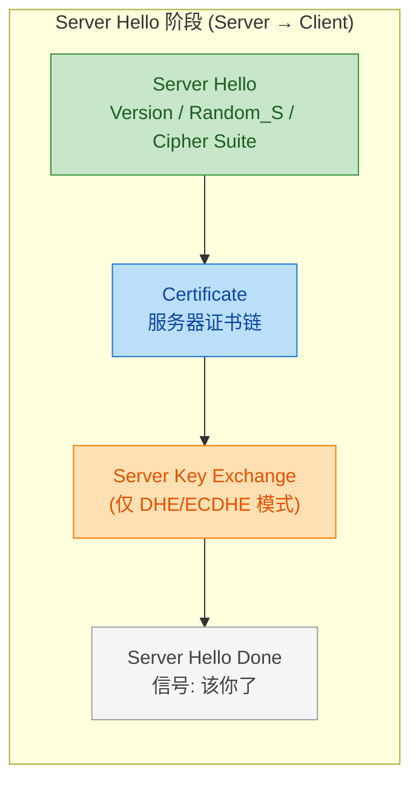

---

### 客户端验证证书

收到服务器的证书后，客户端**不会盲目信任**，而是执行一套严格的验证流程。这个环节是防御**中间人攻击**的第一道防线。验证步骤如下：

**步骤 1：证书链验证（Chain of Trust）**

客户端从服务器证书（叶子证书）开始，逐级向上验证签名：

```text
验证流程:

  服务器证书 ──签名验证──→ 中间 CA 证书 ──签名验证──→ 根 CA 证书
       │                        │                      │
  用中间 CA 公钥             用根 CA 公钥          客户端信任库中
  验证此证书签名             验证此证书签名         预置的根证书 ✓
```

- 每一级证书中的 `Issuer` 字段指向上一级签发者；
- 客户端用上一级 CA 的公钥验证当前证书的**数字签名**；
- 最终追溯到一个**根证书**（Root CA），它必须存在于客户端本地的**受信任根证书存储区**（Trust Store）中；
- 如果任何一级签名验证失败，或根证书不在信任库中，浏览器会显示经典的 **"Your connection is not private"** 警告。

**步骤 2：域名匹配（Domain Validation）**

证书中的 **Subject Alternative Name (SAN)** 或 **Common Name (CN)** 必须与用户请求的域名一致。例如，用户访问 `www.example.com`，那么证书中必须包含该域名或通配符 `*.example.com`。否则验证失败。

**步骤 3：有效期检查（Validity Period）**

每张证书都有 `Not Before` 和 `Not After` 时间戳。如果当前时间不在有效期内，证书视为无效。

**步骤 4：吊销检查（Revocation Check）**

客户端通过 **CRL（Certificate Revocation List）** 或 **OCSP（Online Certificate Status Protocol）** 检查证书是否已被 CA 主动吊销。若被吊销（如私钥泄露），即使证书本身签名合法，也将被拒绝。

```python
# === 证书验证伪代码 ===

def verify_certificate(cert_chain, hostname, trust_store):
    # Step 1: 证书链签名验证 —— 从叶子到根逐级验证
    for i in range(len(cert_chain) - 1):
        current_cert = cert_chain[i]          # 当前证书
        issuer_cert = cert_chain[i + 1]       # 签发者证书
        # 用签发者的公钥验证当前证书的数字签名
        if not verify_signature(current_cert.signature,
                                issuer_cert.public_key):
            return False, "签名验证失败"

    # Step 2: 根证书必须在本地信任库中
    root_cert = cert_chain[-1]                # 链顶端为根 CA
    if root_cert not in trust_store:
        return False, "根证书不受信任"

    # Step 3: 域名匹配 —— SAN 或 CN 必须包含目标域名
    leaf_cert = cert_chain[0]                 # 叶子证书（服务器证书）
    if hostname not in leaf_cert.san_list:
        return False, "域名不匹配"

    # Step 4: 有效期检查
    now = current_time()
    if now < leaf_cert.not_before or now > leaf_cert.not_after:
        return False, "证书已过期或尚未生效"

    # Step 5: 吊销状态检查 (OCSP/CRL)
    if is_revoked(leaf_cert):
        return False, "证书已被吊销"

    # 全部通过
    return True, "证书验证成功"
```

---

### 客户端生成预主密钥（Pre-Master Secret）

证书验证通过后，客户端进入密钥交换的**核心步骤**——生成 **Pre-Master Secret（预主密钥，简称 PMS）**。

在 RSA 密钥交换模式下，PMS 是客户端**单独生成**的一个 **48 字节**的随机数，结构如下：

```text
Pre-Master Secret (48 bytes):
┌──────────────────────┬──────────────────────────────┐
│  TLS Version (2B)    │  Random Bytes (46B)          │
│  例如: 0x03 0x03     │  高质量密码学随机数            │
└──────────────────────┴──────────────────────────────┘
       共 48 字节 = 密钥派生的第三大原料
```

**为什么需要 PMS？**

到目前为止，双方已经有了两个随机数——Client Random 和 Server Random——但它们都是**明文传输**的，攻击者可以完整窃听到。如果仅用这两个随机数来生成密钥，安全性就**完全依赖**于传输通道本身，这违背了 TLS 的设计初衷。

PMS 的引入解决了这个问题：它是客户端**本地**生成的，然后用服务器公钥**加密后**传输。只有持有对应私钥的服务器才能解密得到 PMS。这样一来，即使攻击者截获了所有明文传输的内容（包括 Random_C 和 Random_S），也无法得到 PMS，因此无法计算出最终的会话密钥。

三个随机数的关系可以概括为：

```text
密钥派生原料:

  Random_C (明文, 32B)  ──┐
                          ├──→ PRF 函数 ──→ Master Secret (48B) ──→ Session Keys
  Random_S (明文, 32B)  ──┤
                          │
  PMS (加密传输, 48B)   ──┘  ← 这是唯一的 "秘密" 原料
```

> 💡 为什么要用**三个**随机数而不是只用 PMS？因为多个独立的随机源可以提高密钥的**随机性（Entropy）**。即使其中某个随机数生成器存在缺陷（如客户端的伪随机数不够好），另外两个也能提供补充保障，从而增强整体安全性。

---

### 用服务器公钥加密预主密钥

客户端生成 PMS 后，使用从服务器证书中提取的**公钥**对 PMS 进行 RSA 加密，然后将密文通过 **Client Key Exchange** 消息发送给服务器。

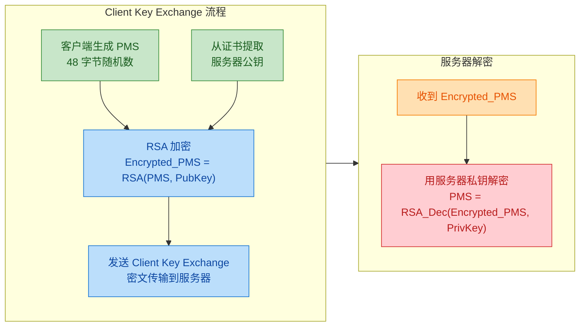

**这一步的安全保证**在于：RSA 的**数学单向性**。用公钥加密后的密文，只有对应的私钥才能解密。而服务器的私钥从未在网络上传输过（它始终安全存储在服务器端），因此中间人即使截获了加密后的 PMS 密文，也**无法解密**。

```python
# === 客户端: 加密并发送 PMS ===

# 1. 生成 48 字节的 Pre-Master Secret
pms = generate_random_bytes(48)               # 本地生成，绝不明文传输

# 2. 从服务器证书中提取公钥
server_public_key = cert_chain[0].public_key  # 叶子证书中的 RSA 公钥

# 3. 用服务器公钥对 PMS 进行 RSA 加密
encrypted_pms = rsa_encrypt(pms, server_public_key)

# 4. 将密文作为 Client Key Exchange 消息发送
send_to_server(ClientKeyExchange(encrypted_pms))


# === 服务器: 接收并解密 PMS ===

# 5. 接收 Client Key Exchange
encrypted_pms = receive_client_key_exchange()

# 6. 用服务器私钥解密，还原 PMS
server_private_key = load_private_key("/etc/ssl/private/server.key")
pms = rsa_decrypt(encrypted_pms, server_private_key)  # 只有真正的服务器能做到

# 至此，客户端和服务器都拥有了: Random_C, Random_S, PMS
```

> ⚠️ **前向安全性（Forward Secrecy）问题**：在纯 RSA 密钥交换模式中，如果服务器的私钥在**未来某天**被泄露，攻击者可以回溯解密之前录制的所有历史流量（因为所有会话的 PMS 都用同一把 RSA 私钥加密）。这就是为什么现代 TLS 部署**强烈推荐**使用 **ECDHE**（Ephemeral Diffie-Hellman）密钥交换——每次握手使用**临时**的 DH 密钥对，即使长期私钥泄露也不影响历史会话的安全。TLS 1.3 已**强制**要求使用 ECDHE，彻底弃用了纯 RSA 密钥交换。

---

### 双方计算会话密钥

此时，客户端和服务器**同时拥有**三个相同的原料：`Random_C`、`Random_S`、`PMS`。双方独立执行**完全相同**的密钥派生函数（PRF, Pseudo-Random Function），计算出最终的会话密钥（Session Keys）。

**第一步：PMS → Master Secret**

```text
Master Secret = PRF(PMS, "master secret", Random_C + Random_S)
                                  │
                         固定的 Label 字符串，防止不同用途的密钥混淆
```

输出一个固定长度的 **48 字节** Master Secret。

**第二步：Master Secret → 密钥块（Key Block）**

```text
Key Block = PRF(Master Secret, "key expansion", Random_S + Random_C)
```

Key Block 被切分为**六段**，分别用于不同目的：

```text
Key Block 切分:
┌─────────────────────────────────────────────────────────┐
│  client_write_MAC_key    │  对称加密前的 HMAC 密钥 (C→S) │
├──────────────────────────┼──────────────────────────────┤
│  server_write_MAC_key    │  对称加密前的 HMAC 密钥 (S→C) │
├──────────────────────────┼──────────────────────────────┤
│  client_write_key        │  客户端 → 服务器 的对称加密密钥│
├──────────────────────────┼──────────────────────────────┤
│  server_write_key        │  服务器 → 客户端 的对称加密密钥│
├──────────────────────────┼──────────────────────────────┤
│  client_write_IV         │  客户端 → 服务器 的初始化向量  │
├──────────────────────────┼──────────────────────────────┤
│  server_write_IV         │  服务器 → 客户端 的初始化向量  │
└─────────────────────────────────────────────────────────┘
```

> 注意：双方**不是只有一把密钥**，而是各持有一套方向性密钥——客户端发往服务器的数据用 `client_write_key` 加密，服务器发往客户端的数据用 `server_write_key` 加密。这样即使一个方向被破解，另一个方向仍然安全。

```python
# === 密钥派生过程（双方独立执行，结果一致） ===

# 输入: 三个共享原料
random_c = client_random    # 32 字节, 明文交换
random_s = server_random    # 32 字节, 明文交换
pms = pre_master_secret     # 48 字节, 加密传输后双方共享

# Step 1: 从 PMS 派生 Master Secret (48 字节)
master_secret = PRF(
    secret=pms,                            # 派生的种子密钥
    label=b"master secret",                # 固定标签字符串
    seed=random_c + random_s               # 客户端随机数 + 服务器随机数
)  # 输出: 48 字节

# Step 2: 从 Master Secret 派生 Key Block
key_block = PRF(
    secret=master_secret,                  # 上一步的输出作为新的种子
    label=b"key expansion",                # 不同的标签 → 不同的输出
    seed=random_s + random_c               # 注意: 这里顺序反过来了!
)

# Step 3: 将 Key Block 切分为 6 段密钥材料
client_write_mac_key = key_block[0:mac_len]        # HMAC 密钥 (C→S)
server_write_mac_key = key_block[mac_len:2*mac_len] # HMAC 密钥 (S→C)
client_write_key = key_block[...]                   # AES 加密密钥 (C→S)
server_write_key = key_block[...]                   # AES 加密密钥 (S→C)
client_write_iv = key_block[...]                    # 初始化向量 (C→S)
server_write_iv = key_block[...]                    # 初始化向量 (S→C)
```

由于双方输入（三个随机数）完全一致，PRF 又是确定性函数，所以双方会独立计算出**完全相同**的密钥材料——这是整个握手的精妙之处：**双方从未直接交换过会话密钥本身**，但通过共享原料各自派生出了相同的密钥。

---

### 加密通信

密钥材料就绪后，双方通过交换 **Change Cipher Spec** 和 **Finished** 消息来正式切换到加密模式。

**1. Change Cipher Spec（CCS）**

这是一条极其简短的消息（实际上只有 1 个字节：`0x01`），它并不属于握手协议本身，而是一个**信号**，告知对方："从下一条消息起，我将使用刚才协商好的加密参数来加密所有数据。"

客户端和服务器各自发送一条 CCS。

**2. Finished 消息**

CCS 之后，双方各自发送的**第一条加密消息**就是 Finished。它包含一个 **verify_data**——对之前所有握手消息的哈希摘要，用刚派生的密钥加密后发送。

```text
verify_data = PRF(Master_Secret, "client finished", Hash(所有握手消息))
```

这条消息有两重作用：

- **验证密钥一致性**：如果对方能成功解密并验证 verify_data，说明双方派生的密钥确实相同；
- **防篡改**：Hash 覆盖了所有握手消息，任何中间人对握手过程的篡改都会导致 Hash 不匹配，握手失败。

**3. Application Data（正式通信）**

Finished 验证通过后，TLS 握手宣告完成。后续所有 HTTP 请求和响应都被封装在 **TLS Record** 中，使用协商好的**对称加密算法**（如 AES-256-GCM）进行加密传输。

```text
TLS Record 结构:
┌──────────────────────────────────────────────────┐
│  Content Type (1B)  │  Version (2B)  │  Len (2B) │  ← Record Header (明文)
├──────────────────────────────────────────────────┤
│                                                  │
│   Encrypted Payload (HTTP Request/Response)      │  ← 对称加密的密文
│                                                  │
├──────────────────────────────────────────────────┤
│   Authentication Tag / MAC                       │  ← 完整性校验值
└──────────────────────────────────────────────────┘
```

至此，一次完整的 TLS 握手流程结束。整个过程可以用一句话高度概括：

> **非对称加密解决了"如何安全地交换密钥"的问题，对称加密解决了"如何高效地加密数据"的问题，数字证书解决了"如何验证对方身份"的问题。三者协同，共同构建了 HTTPS 的安全基石。**

最后，让我们回顾一下完整的 TLS 1.2 握手时间线与 RTT 消耗：

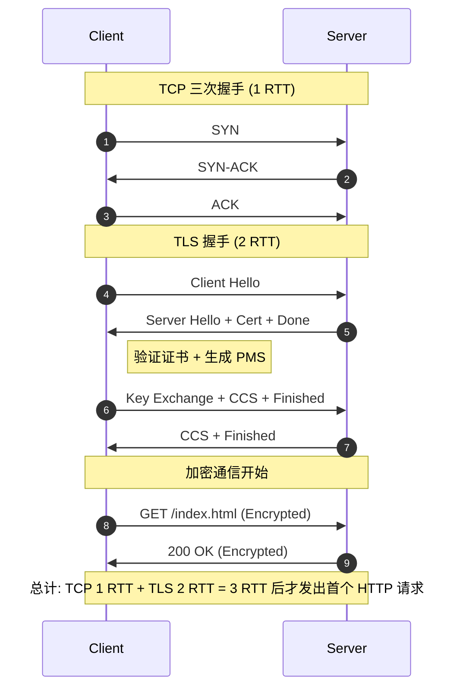

> 📌 **TLS 1.3 的改进**：将握手从 **2-RTT** 压缩到 **1-RTT**（首次连接），甚至支持 **0-RTT**（会话恢复时）。核心优化是：Client Hello 中直接携带密钥交换参数（Key Share），服务器在 Server Hello 中就能一步完成密钥协商，省去了一个来回。

---

**📝 练习题**

在 TLS 1.2 RSA 密钥交换模式的握手过程中，以下哪个密钥材料是**加密传输**的？

A. Client Random（客户端随机数）

B. Server Random（服务器随机数）

C. Pre-Master Secret（预主密钥）

D. Master Secret（主密钥）

**【答案】** C

**【解析】** 在 TLS 握手中，Client Random 随 Client Hello 明文发送，Server Random 随 Server Hello 明文发送，两者都可以被中间人截获。Master Secret 是双方**本地独立计算**的，从未在网络上传输。只有 **Pre-Master Secret** 是由客户端生成后，用服务器证书中的 RSA 公钥加密，再通过 Client Key Exchange 消息密文传输给服务器的。这正是 TLS 握手中**非对称加密**真正发挥作用的地方——保护 PMS 不被窃听，从而确保最终会话密钥的安全。

---

**📝 练习题**

关于 TLS 1.2 握手，以下说法**错误**的是：

A. 双方协商出的会话密钥从未在网络上直接传输

B. 纯 RSA 密钥交换不具备前向安全性（Forward Secrecy）

C. Client Hello 中的 SNI 字段在 TLS 1.2 中是加密的

D. Finished 消息包含对所有握手消息的哈希校验，用于防篡改

**【答案】** C

**【解析】** 选项 A 正确：会话密钥（Session Key）是双方各自用 Random_C + Random_S + PMS 通过 PRF 本地派生的，从不直接传输。选项 B 正确：纯 RSA 模式下，所有会话的 PMS 都用同一把 RSA 私钥加密，一旦该私钥未来泄露，历史流量可被追溯解密，因此不具备前向安全性。选项 C **错误**：TLS 1.2 中 SNI 是**明文**传输的，中间人可以看到用户访问的域名。TLS 1.3 的 Encrypted Client Hello（ECH）扩展才尝试解决这个隐私问题。选项 D 正确：Finished 消息中的 verify_data 是对所有前序握手消息的哈希摘要，任何篡改都会导致验证失败。

---

## 证书验证 ⭐⭐

在 TLS 握手流程中，当服务器将自己的数字证书（Digital Certificate）发送给客户端后，客户端并不会"盲目信任"这张证书。它必须执行一整套严格的验证流程，确认这张证书**确实**是由可信机构签发的、**确实**属于当前正在通信的服务器、并且**确实**还在有效期内。这套机制的核心目标只有一个——**防止中间人攻击（Man-in-the-Middle Attack）**。

如果没有证书验证，攻击者可以随意伪造一张证书声称"我就是 google.com"，然后截获你与真正服务器之间的所有通信。证书验证就是 HTTPS 安全体系中那道**不可逾越的信任防线**。

客户端拿到证书后，验证过程可以概括为以下四个核心维度：

```
验证维度            验证问题                        失败后果
─────────────────────────────────────────────────────────────────
1. CA证书链验证     "这张证书是谁签的？能信吗？"      ERR_CERT_AUTHORITY_INVALID
2. 根证书验证       "签发链条的最顶端我认识吗？"       ERR_CERT_AUTHORITY_INVALID
3. 证书有效期验证   "这张证书过期了吗？"              ERR_CERT_DATE_INVALID
4. 域名匹配验证     "这张证书是给这个网站的吗？"       ERR_CERT_COMMON_NAME_INVALID
─────────────────────────────────────────────────────────────────
任意一项失败 → 浏览器弹出安全警告，连接可能被终止
```

---

### CA 证书链（Certificate Chain of Trust）

#### 为什么需要"链式"信任？

设想一个最朴素的方案：每个网站直接找全球最权威的根证书机构（Root CA）来签发证书。这在理论上可行，但在实际中根本不现实：

- 全球有**数以亿计**的网站需要证书，几个 Root CA 根本忙不过来。
- Root CA 的私钥极其珍贵（存放在离线的硬件安全模块 HSM 中），每次签发都有泄露风险，签发次数必须降到最低。
- 需要分级管理，不同层级承担不同的审核责任。

因此，PKI（Public Key Infrastructure，公钥基础设施）引入了**层级委托**的信任模型，形成了我们所说的 **证书链（Certificate Chain）**。

#### 证书链的三级结构

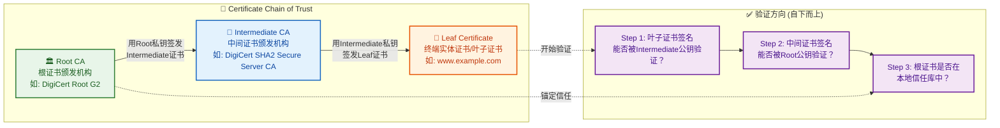

| 层级 | 名称 | 英文 | 角色说明 |
|------|------|------|----------|
| 第一层 | **根证书** | Root Certificate | 信任锚点（Trust Anchor），预装在操作系统/浏览器中 |
| 第二层 | **中间证书** | Intermediate Certificate | 由 Root CA 签发，负责日常签发工作 |
| 第三层 | **叶子证书** | Leaf / End-Entity Certificate | 网站实际使用的证书，包含域名和公钥 |

#### 签名与验证的数学本质

每一张证书的**签名**（Signature）本质上是上一级 CA 对当前证书内容的**数字摘要**（Hash）进行**私钥加密**后的产物。验证时，使用上一级 CA 的**公钥解密**签名得到摘要，再与自己计算的摘要比对：

```
签发过程（Intermediate CA 签发 Leaf 证书）:
───────────────────────────────────────────────
证书内容(域名+公钥+有效期+...) 
       │
       ▼
   SHA-256 哈希  →  得到摘要 H
       │
       ▼
   Intermediate CA 的私钥加密 H  →  得到数字签名 Sig
       │
       ▼
   将 Sig 附在证书末尾  →  完整的 Leaf 证书


验证过程（客户端验证 Leaf 证书）:
───────────────────────────────────────────────
从 Leaf 证书中取出签名 Sig
       │
       ▼
   用 Intermediate CA 的公钥解密 Sig  →  得到 H'
       │
       ▼
   自己对证书内容做 SHA-256  →  得到 H
       │
       ▼
   比较 H == H' ？
       │
     ┌─┴──┐
    是     否
     │      │
   ✅ 签名有效   ❌ 证书被篡改，立即终止
```

#### 为什么中间证书至关重要？

服务器在 TLS 握手时，必须将**叶子证书 + 所有中间证书**一并发送给客户端（Root 证书不用发，因为客户端本地已有）。如果服务器只发了叶子证书而忽略中间证书，客户端就无法构建完整的信任链，验证将直接失败。这是实际运维中一个**极其常见的配置错误**：

```
❌ 错误配置（缺少中间证书）:
   客户端收到: [Leaf Cert]
   → 找不到签发者 → ERR_CERT_AUTHORITY_INVALID

✅ 正确配置（完整证书链）:
   客户端收到: [Leaf Cert] + [Intermediate Cert]
   → Leaf 由 Intermediate 签发 ✓
   → Intermediate 由 Root 签发 ✓（Root 在本地信任库）
   → 链路完整，验证通过 ✅
```

实际证书链可能不止三层。某些场景下会出现多层中间 CA（例如 Root → Intermediate 1 → Intermediate 2 → Leaf），客户端会沿链路逐级向上验证，直到命中本地信任库中的某个 Root 或已信任的中间证书为止。

---

### 根证书（Root Certificate）

#### 信任的起点：Trust Anchor

根证书是整个 PKI 信任体系的**绝对起点**，它具有一个独特的性质——**自签名（Self-Signed）**，即根证书的签发者（Issuer）和持有者（Subject）是同一个实体，它用自己的私钥给自己签名。

```
┌─────────────────────────────────────────────┐
│           Root Certificate 结构示意           │
├─────────────────────────────────────────────┤
│  Subject:    CN=DigiCert Global Root G2     │  ← 持有者
│  Issuer:     CN=DigiCert Global Root G2     │  ← 签发者（与Subject相同!）
│  Public Key: RSA 2048-bit                   │
│  Validity:   2013-08-01 ~ 2038-01-15       │  ← 超长有效期
│  Signature:  自己的私钥签名                   │  ← Self-Signed
│  Basic Constraints: CA:TRUE                 │  ← 标记为CA证书
└─────────────────────────────────────────────┘
```

你可能会疑惑：自己给自己签名，那不是谁都能做吗？没错，**任何人**都可以生成一个自签名证书。根证书之所以可信，**不是因为它的密码学性质，而是因为它被预装在你的操作系统和浏览器的信任库中**。这是一种**社会性信任机制**——操作系统厂商（Microsoft、Apple、Google）和浏览器厂商（Mozilla）充当了"信任守门人"的角色。

#### 根证书的分发与管理

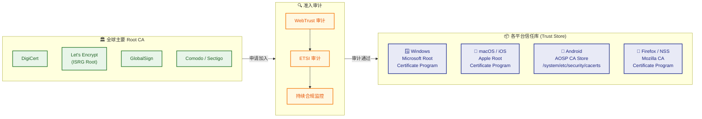

各平台的根证书信任库数量大致如下：

| 平台 | 信任库位置 | 大致数量 |
|------|-----------|---------|
| Windows | `certmgr.msc` → 受信任的根证书颁发机构 | ~400+ |
| macOS | 钥匙串访问（Keychain Access）→ 系统根证书 | ~170+ |
| Android | `/system/etc/security/cacerts/` | ~150+ |
| Firefox | 内置独立 NSS 库（不依赖操作系统） | ~150+ |

> 💡 **重要细节**：Firefox 使用自己独立的信任库（基于 Mozilla NSS），而不复用操作系统的。这意味着在 Windows 上手动导入某个根证书后，Chrome 会信任它（Chrome 用系统库），但 Firefox 不会，除非你同时也在 Firefox 中导入。

#### 根证书被撤销意味着什么？

一旦某个 Root CA 被发现违规操作（如私自签发欺诈证书），各大平台会将其从信任库中**移除**。这意味着该 Root CA 签发链路下的**所有证书**瞬间失效。历史上发生过若干起著名事件：

- **2011 DigiNotar 事件**：荷兰 CA 被入侵，攻击者签发了 `*.google.com` 的欺诈证书用于监控伊朗用户，DigiNotar 随后被所有主流浏览器移除，公司破产清算。
- **2015 CNNIC 事件**：CNNIC 的中间 CA 签发了未经授权的 Google 域名证书，Google 和 Mozilla 随后移除了 CNNIC 根证书的信任。
- **2019 DarkMatter 事件**：阿联酋安全公司申请加入 Mozilla 信任库被拒。

这些事件充分说明：**信任是社会契约，一旦打破，代价是毁灭性的**。

---

### 证书有效期（Certificate Validity Period）

#### 为什么证书需要有效期？

每张数字证书都有一个明确的 `Not Before` 和 `Not After` 字段，定义了证书的有效时间窗口。设定有效期的核心原因包括：

1. **密钥安全性随时间递减**：私钥存在时间越长，被泄露或被暴力破解的风险越高。定期更换证书（及其密钥对）是安全最佳实践。
2. **信息变更**：网站所有者可能变更（公司被收购、域名转让），证书不应永久绑定。
3. **算法淘汰**：随着计算能力增长，旧的加密算法可能变得不安全（如 SHA-1 已被淘汰），有效期机制迫使证书定期"换代"。
4. **吊销机制的局限**：CRL（Certificate Revocation List）和 OCSP 机制并不完美，短有效期可以作为**被动的安全兜底**。

#### 有效期的演变趋势

证书有效期在行业推动下**持续缩短**：

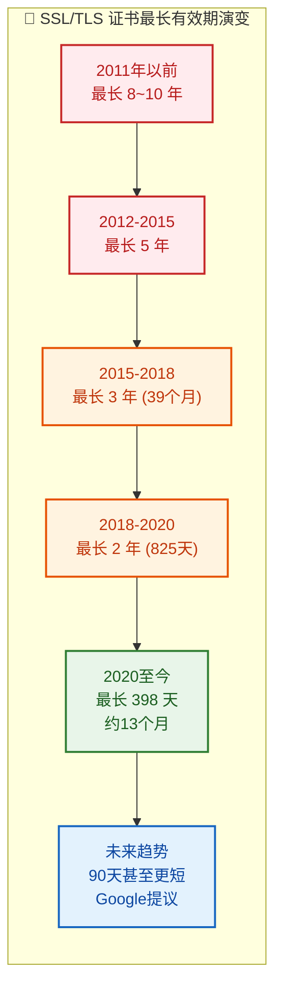

当前行业标准是 **最长 398 天（约 13 个月）**，由 Apple 在 2020 年率先强制执行，随后 Google 和 Mozilla 跟进。Google 在 2023 年提出将其进一步缩短至 **90 天** 的计划，这将使自动化证书管理（如 ACME 协议 / Let's Encrypt）成为刚性需求。

> ⚠️ **注意**：根证书的有效期通常是 **20-25 年**，因为它们的更换成本极高（需要全球所有设备更新信任库）。而叶子证书的有效期则尽可能短。

#### 客户端验证有效期的逻辑

```
当前系统时间: T

if T < NotBefore:
    ❌ 证书尚未生效 (ERR_CERT_DATE_INVALID)
    // 常见原因: 客户端系统时钟不准（比真实时间慢很多）

elif T > NotAfter:
    ❌ 证书已过期 (ERR_CERT_DATE_INVALID)  
    // 最常见的证书错误!
    // 原因: 管理员忘记续期 或 客户端时钟快了

else:
    ✅ 有效期验证通过
```

这里有一个**非常实际的运维陷阱**：如果用户的电脑**系统时钟严重偏差**（比如回到了 2010 年），即使证书完全合法，也会验证失败。很多"证书错误"的用户投诉，根因其实是客户端的时钟问题。Chrome 浏览器甚至会在检测到系统时间异常时，给出特别的提示页面 `NET::ERR_CERT_DATE_INVALID`，并建议用户检查系统时钟。

---

### 域名匹配（Domain Name Matching）

#### 为什么需要域名匹配？

即使一张证书是由合法的 CA 签发的、在有效期内，也不代表它可以用在**任何网站**上。证书是与**特定域名**绑定的。如果你访问 `www.example.com`，浏览器必须确认服务器出示的证书确实是颁发给 `www.example.com` 的，否则任何拥有合法证书的人都可以冒充任意网站。

域名匹配验证的核心是检查证书中的 **Subject Alternative Name（SAN）** 扩展字段（旧版本也看 Subject 中的 CN 字段，但现代浏览器已逐步废弃仅依赖 CN 的做法）。

#### 证书中的域名字段

```
┌──────────────────────────────────────────────────────────┐
│                    证书域名相关字段                         │
├──────────────────────────────────────────────────────────┤
│                                                          │
│  Subject:                                                │
│    CN (Common Name) = www.example.com    ← 传统字段(已弱化) │
│                                                          │
│  X509v3 Extensions:                                      │
│    Subject Alternative Name (SAN):       ← 现代标准字段    │
│      DNS: www.example.com                                │
│      DNS: example.com                                    │
│      DNS: api.example.com                                │
│      DNS: *.cdn.example.com              ← 通配符         │
│      IP:  93.184.216.34                  ← 也可绑定IP     │
│                                                          │
└──────────────────────────────────────────────────────────┘
```

> 📌 **关键演变**：自 2017 年 Chrome 58 起，Chrome 不再检查 CN 字段，**完全依赖 SAN**。如果证书只有 CN 而没有 SAN 扩展，Chrome 会直接报 `ERR_CERT_COMMON_NAME_INVALID`。

#### 通配符证书（Wildcard Certificate）

通配符证书使用 `*` 来匹配某一层级的任意子域名，例如：

| 证书 SAN | 能匹配的域名 | 不能匹配的域名 |
|----------|-------------|---------------|
| `*.example.com` | `www.example.com`<br/>`api.example.com`<br/>`mail.example.com` | `example.com`（裸域名）<br/>`a.b.example.com`（多级子域名） |
| `*.cdn.example.com` | `us.cdn.example.com`<br/>`eu.cdn.example.com` | `cdn.example.com`<br/>`a.b.cdn.example.com` |

**通配符规则要点**：

1. `*` 只能出现在**最左侧**标签位置（`*.example.com` ✅，`www.*.com` ❌）。
2. `*` 只匹配**一层**子域名，不能跨越 `.` 号。
3. `*` 不匹配裸域名本身（`*.example.com` 不匹配 `example.com`），因此实践中通配符证书的 SAN 通常**同时包含** `*.example.com` 和 `example.com`。

#### 域名匹配验证的完整流程

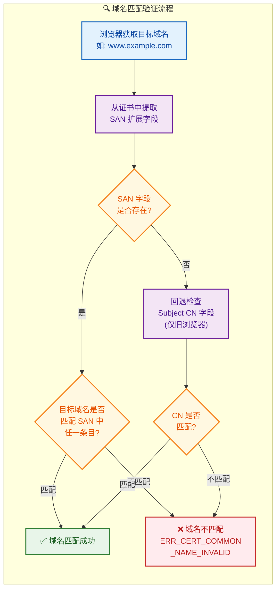

#### 多域名证书（SAN Certificate / Multi-Domain Certificate）

除了通配符证书，还有一种常见的证书类型是 **SAN 多域名证书**，它在一张证书中列出**多个完全不同的域名**：

```
Subject Alternative Name:
    DNS: www.google.com
    DNS: google.com
    DNS: *.google.com
    DNS: youtube.com
    DNS: *.youtube.com
    DNS: gmail.com
    DNS: *.gmail.com
    DNS: ... (Google的证书包含数十个域名)
```

这种证书特别适合大型企业管理旗下多个域名的 HTTPS 部署，减少证书管理和握手开销。

#### 证书验证四维度：完整检查流程总览

将上述四个维度整合，客户端执行的完整验证流程如下：

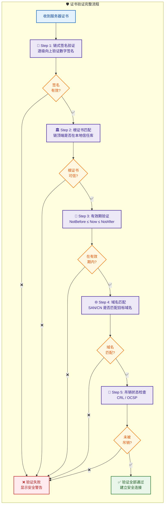

> 💡 **补充**：图中的 Step 5——吊销状态检查（Revocation Check）虽不在本节重点目录中，但它是实际验证流程不可缺少的一环。客户端通过 **CRL（Certificate Revocation List）** 或 **OCSP（Online Certificate Status Protocol）** 查询证书是否已被签发 CA 提前吊销。现代浏览器多采用 **OCSP Stapling** 方案，由服务器主动携带 OCSP 响应，避免客户端额外网络请求造成的延迟和隐私泄露。

---

**📝 练习题**

某运维人员为 `api.mysite.com` 部署了一张通配符证书，证书的 SAN 字段包含 `*.mysite.com`。部署完成后，用户访问 `https://api.mysite.com` 一切正常，但访问 `https://mysite.com`（裸域名）时浏览器报 `ERR_CERT_COMMON_NAME_INVALID` 错误。以下哪项是最可能的原因？

A. 证书已过期，需要续签


B. `*.mysite.com` 的通配符不匹配 `mysite.com` 裸域名，SAN 中缺少 `mysite.com` 条目


C. 客户端系统时钟错误导致有效期验证失败


D. 该证书未被任何 Root CA 签名，是自签名证书


**【答案】** B

**【解析】** 通配符证书 `*.mysite.com` 中的 `*` 只匹配**一级子域名**（如 `api.mysite.com`、`www.mysite.com`），而**不匹配**裸域名 `mysite.com` 本身。因此访问 `https://mysite.com` 时，浏览器在 SAN 列表中找不到匹配项，域名匹配验证失败，报 `ERR_CERT_COMMON_NAME_INVALID`。正确做法是在证书的 SAN 中同时包含 `*.mysite.com` **和** `mysite.com`。选项 A（过期）和 C（时钟）会导致 `ERR_CERT_DATE_INVALID`，而非域名错误；选项 D（自签名）会导致 `ERR_CERT_AUTHORITY_INVALID`。浏览器的错误类型本身就精确指向了域名匹配失败这一维度。

---

**📝 练习题**

关于 CA 证书链，以下说法**正确**的是：

A. 根证书由上级 CA 签发，因此根证书也需要通过链式验证


B. 客户端验证证书链时，方向是从根证书向下验证到叶子证书


C. 服务器在 TLS 握手时应发送叶子证书和中间证书，根证书无需发送


D. 中间 CA 被吊销后，根证书也会失效


**【答案】** C

**【解析】** 选项 C 正确：服务器在 TLS 握手中需要发送**叶子证书 + 中间证书**的完整链路，供客户端逐级验证。根证书已经预装在客户端本地信任库中，无需（也不应该）在网络中传输。选项 A 错误，根证书是**自签名**（Self-Signed）的，Issuer 和 Subject 相同，它不由任何上级签发，其可信性来源于被预装在操作系统/浏览器信任库中。选项 B 错误，客户端验证方向是**自下而上**（从叶子证书 → 中间证书 → 根证书），而非自上而下。选项 D 错误，中间 CA 被吊销影响的是**该中间 CA 签发的所有下级证书**，而非其上级的根证书；根证书本身的有效性不受下级中间 CA 的影响。

---

## 中间人攻击（Man-in-the-Middle Attack, MITM）

中间人攻击是 HTTPS 安全体系中最经典、最核心的威胁模型。理解它，不仅能帮助我们明白"为什么需要证书验证"，更能深刻理解 TLS 握手流程中每一步设计的安全意义。简单来说，**中间人攻击是指攻击者秘密地插入到通信双方之间，分别与两端建立独立的连接，使双方都以为自己在与对方直接通信，而实际上所有流量都经过攻击者的转发和窥视。**

### 中间人攻击的基本原理

要理解 MITM，我们先回忆一个关键事实：在网络通信中，数据包从客户端到服务器要经过许多中间节点（路由器、交换机、网关等）。如果攻击者能控制其中任意一个节点，或者能以某种方式将自己"插入"到通信路径中，就具备了实施中间人攻击的前提条件。

攻击的核心思路是：**攻击者对客户端伪装成服务器，对服务器伪装成客户端**。这样，客户端以为自己在和真正的服务器通信，服务器也以为自己在和真正的客户端通信，而攻击者在中间可以做到：

- **窃听（Eavesdropping）**：读取所有明文数据，包括密码、Cookie、个人信息等。
- **篡改（Tampering）**：修改传输中的请求或响应内容，例如注入恶意脚本。
- **伪造（Forgery）**：以任何一方的身份发送完全伪造的消息。

下面用一个时序图来展示中间人攻击的完整过程：

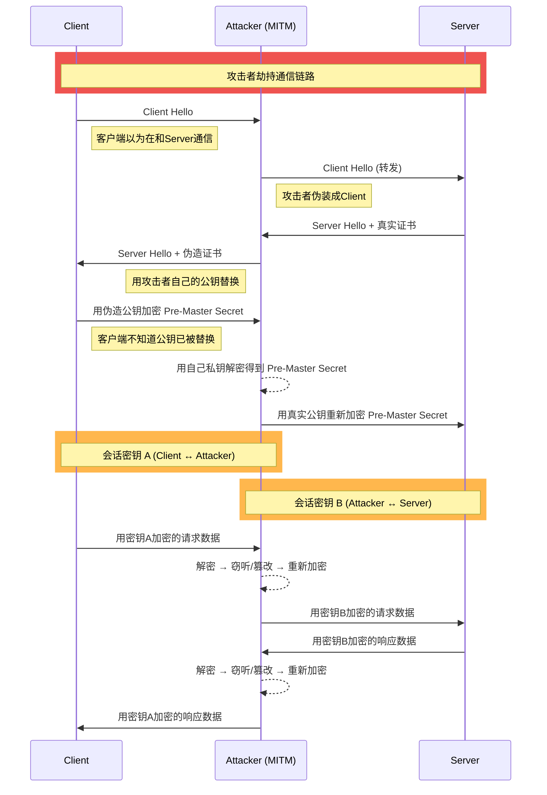

从图中可以看出一个关键点：**攻击者与通信双方分别维护了两套独立的加密会话**（Session Key A 和 Session Key B）。对客户端而言，数据确实是"加密"的——但加密的对象是攻击者而非服务器。对服务器而言同理。这就是中间人攻击的精妙与危险之处。

### 中间人攻击的常见实施手段

攻击者要成功实施 MITM，首先需要将自己"插入"到通信链路中。以下是几种常见的技术手段：

#### ARP 欺骗（ARP Spoofing）

在局域网中，设备通过 ARP 协议将 IP 地址解析为 MAC 地址。攻击者可以发送伪造的 ARP 响应包（Gratuitous ARP），将网关的 IP 地址映射到自己的 MAC 地址上。这样，同一局域网内其他设备发往网关的所有流量都会先经过攻击者的机器。

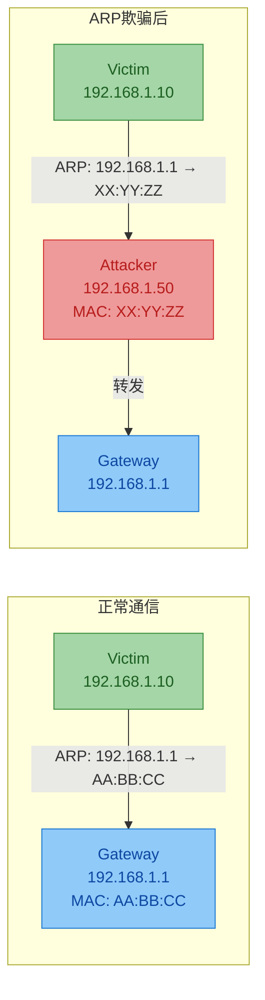

这种攻击在**公共 Wi-Fi（如咖啡厅、机场）**中尤其容易实施，因为攻击者与受害者处于同一个局域网中。

#### DNS 劫持（DNS Hijacking）

攻击者通过入侵 DNS 服务器、污染 DNS 缓存（DNS Cache Poisoning），或者在本地网络中伪造 DNS 响应，将目标域名（如 `bank.com`）解析到攻击者控制的 IP 地址。用户在浏览器中输入正确的网址，实际连接到的却是攻击者的服务器。

#### Wi-Fi 钓鱼热点（Evil Twin）

攻击者创建一个与合法热点同名的 Wi-Fi 接入点（例如伪造名为 "Starbucks_WiFi" 的热点）。用户一旦连接，其所有网络流量都会经过攻击者的设备，攻击者就天然处于"中间人"位置。

#### SSL Stripping（SSL 剥离）

这是一种更隐蔽的攻击方式。攻击者不尝试伪造证书，而是**将 HTTPS 降级为 HTTP**。具体做法是：

1. 攻击者与服务器之间仍然维持正常的 HTTPS 连接。
2. 攻击者与客户端之间却使用明文 HTTP 连接。
3. 当服务器返回的页面中有 `https://` 链接时，攻击者将其替换为 `http://`。

用户看到浏览器地址栏没有锁标志，但很多人并不会注意这一细微差异。这种攻击之所以危险，是因为它**完全绕过了证书验证机制**——根本就不使用 TLS，自然无需伪造任何证书。

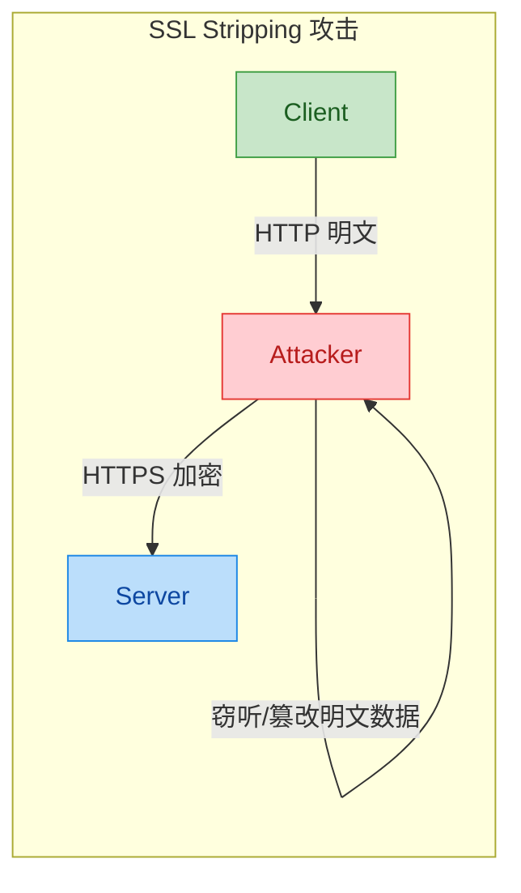

> **防御措施**：服务器应启用 **HSTS（HTTP Strict Transport Security）** 头，强制浏览器只通过 HTTPS 访问该站点。一旦浏览器记住了 HSTS 策略，即使攻击者试图降级为 HTTP，浏览器也会拒绝连接。

### HTTPS 如何防御中间人攻击

HTTPS 之所以能有效防御 MITM，核心在于 **TLS 握手 + CA 证书体系** 的双重保障。我们逐一分析每一层防线：

#### 第一道防线：服务器身份认证（Certificate Verification）

TLS 握手中，服务器必须出示由受信任 CA（Certificate Authority）签发的数字证书。客户端会执行以下验证：

| 验证项目 | 验证内容 | 防御效果 |
|---------|---------|---------|
| **签名验证** | 用 CA 公钥验证证书的数字签名 | 确保证书未被伪造或篡改 |
| **证书链验证** | 从叶子证书一路追溯到受信任的根证书 | 确保签发者可信 |
| **域名匹配** | 证书中的 CN/SAN 必须与访问的域名一致 | 防止用合法证书冒充其他站点 |
| **有效期检查** | 证书必须在有效期内 | 防止使用过期或被撤销的证书 |

如果攻击者试图用自己的证书替换服务器的真实证书，客户端在验证时就会发现：**该证书不是由受信任的 CA 签发的**，或者**证书中的域名与实际访问的域名不匹配**。此时浏览器会弹出醒目的安全警告，阻止连接继续。

#### 第二道防线：密钥交换的安全性

即使攻击者能拦截流量，在没有服务器私钥的情况下，他**无法解密客户端发送的 Pre-Master Secret**。因为 Pre-Master Secret 是用服务器证书中的公钥加密的，只有持有对应私钥的真正服务器才能解密。现代 TLS（1.2+）广泛采用的 **ECDHE（Elliptic Curve Diffie-Hellman Ephemeral）** 密钥交换算法更进一步提供了**前向安全性（Forward Secrecy）**——即便服务器的长期私钥在未来泄露，之前的会话密钥也无法被回推出来。

#### 第三道防线：消息完整性校验（MAC / AEAD）

TLS 在每一条消息中都包含消息认证码（Message Authentication Code）。即使攻击者能够拦截密文，任何对密文的篡改都会导致 MAC 校验失败，接收方会立即终止连接。现代 TLS 1.3 统一使用 **AEAD（Authenticated Encryption with Associated Data）** 模式（如 AES-256-GCM），将加密和完整性校验合二为一，进一步提高了安全性和性能。

### 中间人攻击成功的前提条件

理解了防御机制后，我们反过来分析：在什么情况下，中间人攻击仍然可能成功？

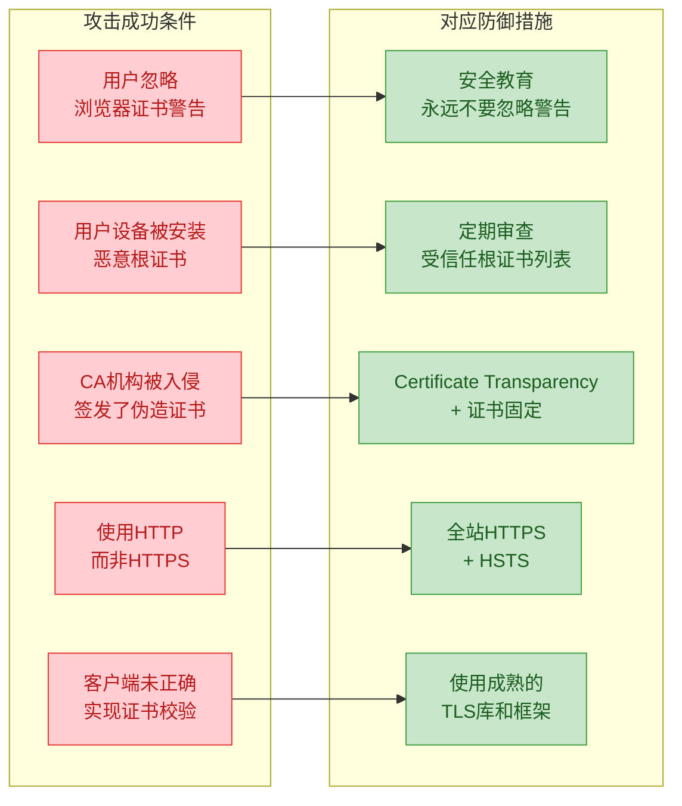

逐一展开说明：

**1. 用户主动忽略浏览器警告**

当浏览器检测到证书异常时，会显示类似 "Your connection is not private"（NET::ERR_CERT_AUTHORITY_INVALID）的警告页面。如果用户点击 "Advanced → Proceed anyway"，就等于手动放行了中间人攻击。这是目前最常见的 MITM 成功路径之一，属于**人为因素（Human Factor）** 导致的安全漏洞。

**2. 恶意根证书被安装到用户设备**

企业网络中常见的做法是：在员工设备上安装企业自签的根证书（Corporate Root CA），然后在网关处部署 SSL 代理（如 Blue Coat、Zscaler）对所有 HTTPS 流量进行解密审查。这本质上就是一种"合法的中间人攻击"。恶意软件也可能通过类似手段在用户不知情的情况下安装恶意根证书。

**3. CA 机构被入侵**

历史上曾多次发生 CA 被入侵或违规签发证书的事件。例如 2011 年 DigiNotar 事件——该荷兰 CA 被黑客入侵后，签发了伪造的 `*.google.com` 通配符证书，被用于监控伊朗用户的 Gmail 通信。此事件直接导致 DigiNotar 被所有主流浏览器吊销信任并最终破产。

**4. 使用 HTTP 而非 HTTPS**

如果站点本身就不使用 HTTPS，或者用户通过 HTTP 访问（例如手动输入 `http://bank.com`），那么流量本来就是明文的，攻击者无需伪造任何证书即可窃听和篡改。

**5. 客户端未正确实现证书校验**

在移动端 App 开发中，开发者可能为了方便调试而禁用了证书校验（例如在代码中实现一个"信任所有证书"的 TrustManager），如果这段代码被遗留到生产环境，就会使 App 完全暴露在中间人攻击之下。以下是一个 **反面示例** ：

```java
// ⚠️ 危险！这是一个反面教材，永远不要在生产环境使用！
// 这段代码禁用了所有证书校验，使App完全暴露在MITM攻击之下
TrustManager[] trustAllCerts = new TrustManager[]{
    new X509TrustManager() {
        @Override
        public void checkClientTrusted(X509Certificate[] chain, String authType) {
            // 空实现 → 不校验客户端证书（本身影响不大）
        }
        @Override
        public void checkServerTrusted(X509Certificate[] chain, String authType) {
            // ⚠️ 空实现 → 不校验服务器证书（致命漏洞！）
            // 任何证书都会被接受，包括攻击者自签名的伪造证书
        }
        @Override
        public X509Certificate[] getAcceptedIssuers() {
            return new X509Certificate[0]; // 返回空数组，不限制可信CA
        }
    }
};

// 用"信任一切"的TrustManager初始化SSL上下文
SSLContext sc = SSLContext.getInstance("TLS");       // 获取TLS协议的SSLContext实例
sc.init(null, trustAllCerts, new SecureRandom());    // 关键：注入了不做任何校验的TrustManager
// 此后通过该SSLContext创建的所有HTTPS连接都不会验证服务器证书
```

### 实际案例：一次完整的 MITM 攻击场景

为了更直观地理解，让我们设想一个典型的咖啡厅 MITM 攻击场景：

1. **环境准备**：攻击者在咖啡厅中开启一台笔记本，创建名为 "CoffeeShop_Free_WiFi" 的钓鱼热点。
2. **受害者连接**：一位用户连接了该热点，并访问 `bank.com` 进行网上银行操作。
3. **SSL Stripping**：攻击者运行 `sslstrip` 工具，将用户浏览器中的 HTTPS 链接降级为 HTTP。
4. **凭证窃取**：用户在 HTTP 页面上输入用户名和密码，攻击者以明文形式截获。
5. **透明转发**：攻击者将请求通过 HTTPS 转发给真实的 `bank.com`，页面功能一切正常，用户毫无察觉。

**如果该银行部署了 HSTS + Preload**，步骤 3 就会失败——浏览器内置了该域名必须使用 HTTPS 的规则，HTTP 请求根本不会发出。**如果用户的 App 实现了证书固定（Certificate Pinning）**，即使攻击者持有一张由合法 CA 签发但不是银行原始证书的证书，连接也会被拒绝。

### 防御中间人攻击的完整策略总览

| 防御层级 | 技术手段 | 防御目标 |
|---------|---------|---------|
| **传输层** | 全站 HTTPS + HSTS + Preload List | 杜绝 HTTP 降级攻击 |
| **证书层** | CA 证书链验证 + Certificate Transparency | 检测伪造或违规签发的证书 |
| **应用层** | Certificate Pinning（证书固定） | 防止合法但非预期的 CA 签发证书 |
| **网络层** | DNSSEC（DNS 安全扩展） | 防止 DNS 劫持和缓存投毒 |
| **协议层** | TLS 1.3 + ECDHE（前向安全） | 确保密钥交换不可逆推，即便私钥泄露 |
| **用户层** | 安全意识培训，不忽略浏览器警告 | 消除人为因素带来的安全风险 |

---

**📝 练习题**

某咖啡厅中，攻击者通过 ARP 欺骗将自己插入到受害者与网关之间，并尝试对受害者访问的 `https://mail.google.com` 发起中间人攻击。攻击者使用自签名证书替换了 Google 的真实证书。以下哪种情况下，攻击 **最有可能成功** ？

A. 受害者使用最新版 Chrome 浏览器，看到证书警告后点击了"继续访问"


B. 受害者使用最新版 Chrome 浏览器，`mail.google.com` 已加入 HSTS Preload List，且受害者未点击任何警告


C. 受害者的手机 App 使用了 Certificate Pinning，且 Pin 的是 Google 自己的公钥


D. 受害者的操作系统刚刚更新，受信任根证书列表为官方默认状态，且受害者未安装任何第三方证书


**【答案】** A

**【解析】** 本题的核心在于理解 HTTPS 安全防御的各层机制以及它们的失效条件。

- **选项 A 正确**：虽然 Chrome 会在检测到自签名证书时弹出醒目的安全警告（NET::ERR_CERT_AUTHORITY_INVALID），但如果用户主动忽略警告、手动选择"继续访问"，浏览器将接受该伪造证书并建立连接。此时攻击者成功与用户建立了一条使用伪造证书的 TLS 连接，中间人攻击生效。这充分说明了**人为因素是安全链中最薄弱的环节**。
- **选项 B 错误**：`google.com` 域名已被列入 HSTS Preload List，这意味着 Chrome 内置了该域名必须使用有效 HTTPS 的规则。浏览器在检测到无效证书时，根本不会提供"继续访问"的选项——用户想忽略警告都做不到。
- **选项 C 错误**：Certificate Pinning 机制将服务器证书（或公钥）的哈希值硬编码在 App 中。即使攻击者的自签名证书通过了系统级验证（这里实际不会，因为是自签名的），App 也会在 Pin 验证阶段检测到公钥不匹配并拒绝连接。
- **选项 D 错误**：操作系统默认的受信任根证书列表不包含攻击者的自签名 CA。因此自签名证书无法通过证书链验证，浏览器会阻止连接（除非用户如选项 A 那样主动忽略警告）。

---

## 证书固定（Certificate Pinning）

在前面的章节中，我们了解了 CA 证书链验证机制——客户端通过信任根证书（Root CA）来逐级验证服务器证书的合法性。这套体系在绝大多数场景下运作良好，但它存在一个根本性的 **信任过度扩散** 问题：操作系统和浏览器内置了数百个受信任的根 CA，**任何一个 CA 都可以为任何域名签发证书**。一旦其中某个 CA 被攻破、被政府胁迫、或自身管理失误签发了错误证书，攻击者就能利用这张"合法"证书对目标域名发起 **中间人攻击（MITM）**，而客户端的标准证书验证流程会认为一切正常，完全无法察觉。

**证书固定（Certificate Pinning）** 正是为了应对这一威胁而诞生的安全加固技术。它的核心思想极其简洁：**不要盲目信任所有 CA，而是在客户端预先"钉住"（Pin）特定的证书或公钥信息，只有匹配的证书才被接受。** 这相当于在标准 CA 验证之上，额外加了一道白名单校验。

---

### 为什么需要证书固定——真实攻击案例

证书固定并非理论上的过度防御，历史上已经多次发生 CA 被攻破导致的安全事件：

| 年份 | 事件 | 影响 |
|------|------|------|
| 2011 | **DigiNotar** 被入侵，攻击者签发了 `*.google.com` 的伪造证书 | 伊朗用户的 Gmail 通信被监听，DigiNotar 随后破产 |
| 2012 | **Trustwave** 承认曾签发用于流量监控的子 CA 证书 | 企业可解密员工 HTTPS 流量 |
| 2013 | 法国 **ANSSI**（政府机构）签发了 Google 域名的伪造证书 | Google 发现后将其从信任列表移除 |
| 2015 | **CNNIC** 通过中间 CA（MCS Holdings）签发了 Google 域名证书 | Google/Mozilla 随后移除了 CNNIC 根证书 |

这些事件揭示了一个残酷现实：**CA 信任体系是"木桶效应"——安全水平取决于最弱的那个 CA。** 证书固定通过将信任范围从"数百个 CA"缩小到"指定的一个或几个"，从根本上降低了攻击面。

---

### 证书固定的工作原理

证书固定的本质是：**客户端在 TLS 握手完成、标准证书链验证通过之后，额外检查服务器证书（或证书链中某一环）是否与预先存储的"指纹"匹配。**

整个流程可以用下图直观地表示：

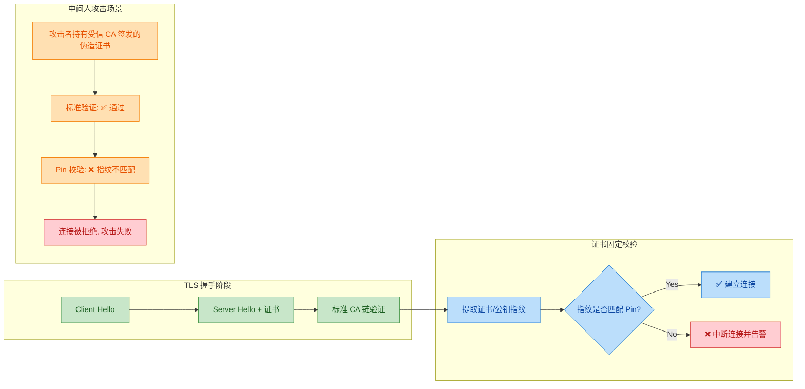

关键在于 **Pin（钉子）** 到底是什么。它通常是证书链中某一层级的 **公钥的哈希值**（Subject Public Key Info, SPKI Hash），而不是整个证书的哈希。这样做的好处是：即使证书过期续签，只要使用同一对密钥，Pin 值就不会变化，避免了频繁更新。

Pin 值的计算方式如下（以 OpenSSL 为例）：

```bash
# 从服务器证书中提取 SPKI（Subject Public Key Info）并计算 SHA-256 哈希
# 1. 获取服务器证书
openssl s_client -connect example.com:443 < /dev/null 2>/dev/null | \
    openssl x509 -outform PEM > server.pem

# 2. 提取公钥信息并生成 Base64 编码的 SHA-256 哈希（即 Pin 值）
openssl x509 -in server.pem -pubkey -noout | \               # 从证书中提取公钥（PEM 格式）
    openssl pkey -pubin -outform DER | \                      # 将公钥转为 DER 二进制格式
    openssl dgst -sha256 -binary | \                          # 计算 SHA-256 摘要
    openssl enc -base64                                        # 输出 Base64 编码
# 输出示例: YLh1dUR9y6Kja30RrAn7JKnbQG/uEtLMkBgFF2Fuihg=
```

---

### 固定级别的选择策略

在证书链中，可以选择固定不同层级的证书，每种选择都有其取舍：

```mermaid
graph LR
    subgraph Cert_Chain["证书链层级"]
        direction TB
        ROOT["🏛️ 根证书 Root CA"]
        INTER["🔗 中间证书 Intermediate CA"]
        LEAF["📄 叶子证书 Leaf / End-Entity"]
        ROOT --> INTER --> LEAF
    end

    subgraph Pin_Root["固定根证书"]
        direction TB
        PR1["灵活性: ⭐⭐⭐ 高"]
        PR2["安全性: ⭐ 低"]
        PR3["适用: 信任特定 CA 体系"]
    end

    subgraph Pin_Inter["固定中间证书 ✅ 推荐"]
        direction TB
        PI1["灵活性: ⭐⭐ 中"]
        PI2["安全性: ⭐⭐ 中"]
        PI3["适用: 平衡安全与运维"]
    end

    subgraph Pin_Leaf["固定叶子证书"]
        direction TB
        PL1["灵活性: ⭐ 低"]
        PL2["安全性: ⭐⭐⭐ 高"]
        PL3["适用: 极致安全需求"]
    end

    ROOT -.-> Pin_Root
    INTER -.-> Pin_Inter
    LEAF -.-> Pin_Leaf

    classDef chain fill:#E8EAF6,stroke:#3F51B5,color:#1A237E
    classDef rootPin fill:#FFF3E0,stroke:#EF6C00,color:#BF360C
    classDef interPin fill:#E8F5E9,stroke:#43A047,color:#1B5E20
    classDef leafPin fill:#FCE4EC,stroke:#E91E63,color:#880E4F

    class ROOT,INTER,LEAF chain
    class PR1,PR2,PR3 rootPin
    class PI1,PI2,PI3 interPin
    class PL1,PL2,PL3 leafPin
```

**具体分析：**

- **固定叶子证书（Leaf Pinning）**：安全性最强，因为精确匹配到具体服务器证书。但每次证书续签（通常 1 年一次）都需要更新客户端的 Pin 值，运维成本极高。如果 App 用户不更新版本，就会无法连接。

- **固定中间证书（Intermediate CA Pinning）** ✅ **业界推荐**：将信任范围限定到特定 CA 的中间证书。服务器证书可以自由续签，只要继续由同一中间 CA 签发就不会破坏 Pin。在安全性和灵活性之间取得了最佳平衡。

- **固定根证书（Root CA Pinning）**：最宽松的方式。只要证书链最终归属于指定的根 CA 即可。灵活但防御力弱——如果该根 CA 被攻破，固定就失去意义了。

> **最佳实践**：始终配置 **至少两个 Pin**——一个用于当前使用的证书/密钥，另一个作为 **备份 Pin（Backup Pin）**，对应一个离线保存的备用密钥对。这样即使主密钥需要紧急轮换，也不会导致客户端全部无法连接。

---

### 证书固定的实现方式

#### 方式一：HTTP 公钥固定（HPKP）—— 已废弃 ⚠️

HTTP Public Key Pinning（HPKP）是一种基于 HTTP 响应头的动态固定机制。服务器通过返回 `Public-Key-Pins` 头部，告诉浏览器在未来一段时间内只接受特定公钥：

```text
# HPKP 响应头示例
Public-Key-Pins:
    pin-sha256="base64==";           # 当前证书公钥的 SPKI 哈希
    pin-sha256="base64==";           # 备份公钥的 SPKI 哈希（强制要求至少一个备份）
    max-age=5184000;                 # Pin 有效期（秒），此处为 60 天
    includeSubDomains;               # 同时应用于所有子域名
    report-uri="https://example.com/hpkp-report"  # 违规时上报的 URL
```

**HPKP 被废弃的原因**：该机制存在严重的 **自毁风险（Bricking Risk）**。如果管理员配置错误（比如 Pin 值写错、密钥丢失），或者攻击者劫持了首次连接并注入恶意 Pin（称为 **HPKP Super Cookie** 攻击），那么所有用户将在 `max-age` 期间完全无法访问该网站，且无法修复。Google Chrome 在 2018 年（Chrome 72）正式移除了 HPKP 支持。

#### 方式二：客户端应用内固定（Application-Level Pinning）—— 主流方案 ✅

这是目前移动端 App 最常用的方案。开发者在应用代码中硬编码（或通过配置文件嵌入）预期的 Pin 值，在每次 TLS 连接时进行校验。

**Android 实现（Network Security Config）：**

```xml
<!-- res/xml/network_security_config.xml -->
<!-- Android 7.0+ 原生支持的网络安全配置 -->
<network-security-config>
    <domain-config>
        <!-- 指定目标域名，includeSubdomains 表示子域名也生效 -->
        <domain includeSubdomains="true">api.example.com</domain>
        <pin-set expiration="2026-12-31">
            <!-- 当前使用的中间 CA 公钥 Pin（SHA-256） -->
            <pin digest="SHA-256">YLh1dUR9y6Kja30RrAn7JKnbQG/uEtLMkBgFF2Fuihg=</pin>
            <!-- 备份 Pin：对应离线存储的备用密钥 -->
            <pin digest="SHA-256">sRHdihwgkaib1P1gN7SkKPLZC8nFEaTGHRos3MUzd6A=</pin>
        </pin-set>
    </domain-config>
</network-security-config>
```

```xml
<!-- AndroidManifest.xml 中引用配置 -->
<application
    android:networkSecurityConfig="@xml/network_security_config"
    ... >
</application>
```

**iOS 实现（TrustKit 框架）：**

```swift
// AppDelegate.swift - 使用 TrustKit 第三方库进行证书固定
import TrustKit

func application(_ application: UIApplication,
                 didFinishLaunchingWithOptions launchOptions: [UIApplication.LaunchOptionsKey: Any]?) -> Bool {

    // 配置 TrustKit 的证书固定策略
    let trustKitConfig: [String: Any] = [
        // 配置目标域名的固定策略
        kTSKPinnedDomains: [
            "api.example.com": [
                kTSKEnforcePinning: true,                      // 启用强制固定（不匹配则拒绝连接）
                kTSKIncludeSubdomains: true,                   // 子域名同样生效
                kTSKPublicKeyAlgorithms: [kTSKAlgorithmRsa2048], // 公钥算法为 RSA 2048
                kTSKPublicKeyHashes: [                          // SPKI SHA-256 Pin 列表
                    "YLh1dUR9y6Kja30RrAn7JKnbQG/uEtLMkBgFF2Fuihg=",  // 主 Pin
                    "sRHdihwgkaib1P1gN7SkKPLZC8nFEaTGHRos3MUzd6A="   // 备份 Pin
                ]
            ]
        ]
    ]

    // 初始化 TrustKit（会自动 hook NSURLSession 的证书验证回调）
    TrustKit.initSharedInstance(withConfiguration: trustKitConfig)
    return true
}
```

**OkHttp（Java/Kotlin）实现：**

```java
// 使用 OkHttp 的 CertificatePinner 进行证书固定
import okhttp3.CertificatePinner;
import okhttp3.OkHttpClient;

// 构建 Pin 配置
CertificatePinner certificatePinner = new CertificatePinner.Builder()
    // 为 api.example.com 添加两个 Pin（至少一个备份）
    .add("api.example.com",
         "sha256/YLh1dUR9y6Kja30RrAn7JKnbQG/uEtLMkBgFF2Fuihg=")  // 主 Pin
    .add("api.example.com",
         "sha256/sRHdihwgkaib1P1gN7SkKPLZC8nFEaTGHRos3MUzd6A=")  // 备份 Pin
    .build();

// 将 CertificatePinner 注入 OkHttp 客户端
OkHttpClient client = new OkHttpClient.Builder()
    .certificatePinner(certificatePinner)  // 每次 TLS 连接后自动校验 Pin
    .build();
```

#### 方式三：Certificate Transparency（CT）—— HPKP 的替代方案

Google 推动的 **Certificate Transparency（证书透明度）** 机制正在逐步取代 HPKP 的定位。CT 不是在客户端固定特定证书，而是要求所有 CA 签发的证书必须记录到公开可审计的日志（CT Log）中。任何人都可以监控这些日志，一旦发现某个 CA 为你的域名签发了未经授权的证书，就能立即发现并采取措施。

CT 的优势在于它是 **检测型（Detective）** 而非 **预防型（Preventive）** 的，不会像 HPKP 那样因为配置错误导致网站不可访问。主流浏览器（Chrome、Safari 等）已经强制要求所有新签发的证书必须包含 SCT（Signed Certificate Timestamp），否则不予信任。

---

### 证书固定的风险与应对

证书固定虽然能显著提升安全性，但也带来了 **运维复杂度** 和 **可用性风险**：

| 风险 | 描述 | 应对策略 |
|------|------|---------|
| **Pin 过期/失效** | 证书续签后新证书不匹配旧 Pin | 始终维护备份 Pin；设置 Pin 过期提醒 |
| **密钥泄露** | 被 Pin 住的密钥泄露需要紧急轮换 | 备份 Pin 对应独立的离线密钥对 |
| **App 版本碎片化** | 旧版 App 的 Pin 值无法远程更新 | 实现 Pin 的动态下发机制（如配置中心） |
| **调试困难** | 开发/测试环境无法使用抓包工具（如 Charles） | Debug 构建禁用 Pinning；或在配置中添加调试 CA |
| **CDN 证书不可控** | 使用 CDN 时证书由 CDN 提供商管理 | Pin 到 CDN 提供商的中间 CA |

> **实际决策建议**：对于 **金融、医疗、政务** 等高安全要求的 App，证书固定是必要的安全加固措施。对于普通应用，CT + 标准 CA 验证通常已经足够。过度使用证书固定反而可能因运维失误导致大面积故障。

---

### 完整工作流程总览

以下时序图展示了一个启用了证书固定的移动 App 在建立 HTTPS 连接时的完整验证流程：

```mermaid
sequenceDiagram
    participant App as 📱 Mobile App
    participant TLS as 🔒 TLS Engine
    participant Server as 🖥️ Server
    participant PinStore as 📌 Pin Store

    App->>Server: Client Hello
    Server->>App: Server Hello + Certificate Chain

    App->>TLS: 标准 CA 链验证
    TLS-->>App: ✅ CA 验证通过

    App->>App: 提取服务器证书 SPKI
    App->>App: SHA-256(SPKI) 计算指纹

    App->>PinStore: 读取预存 Pin 列表
    PinStore-->>App: [Pin_主, Pin_备份]

    alt 指纹匹配任意一个 Pin
        App->>App: ✅ Pin 校验通过
        App->>Server: 继续 TLS 握手, 建立加密通道
        App->>Server: 🔐 正常通信
    else 指纹不匹配任何 Pin
        App->>App: ❌ Pin 校验失败
        App->>App: 中断连接, 上报安全事件
        Note over App,Server: 疑似中间人攻击, 拒绝通信
    end
```

---

**📝 练习题**

某金融 App 使用证书固定（Certificate Pinning），将 Pin 值固定到了叶子证书（Leaf Certificate）的公钥。运营一年后，服务器证书到期需要续签。续签时使用了 **全新的密钥对** 生成 CSR。以下哪种情况会发生？

A. 所有客户端正常连接，因为新证书仍由同一 CA 签发

B. 所有客户端连接失败，因为新证书的公钥指纹与 Pin 不匹配

C. 只有旧版本客户端连接失败，新版本客户端不受影响

D. 标准 CA 验证和 Pin 校验都会失败


**【答案】** B

**【解析】** 证书固定的校验发生在标准 CA 链验证 **之后**，它比较的是服务器证书公钥的 SPKI 哈希值与客户端预存的 Pin 值。由于续签时使用了 **全新的密钥对**，新证书的公钥完全不同，其 SHA-256 哈希自然与旧 Pin 不匹配。尽管新证书由同一 CA 签发、标准 CA 验证可以通过，但 Pin 校验会失败，导致 **所有客户端**（无论新旧版本，只要内置了旧 Pin）都无法连接。这正是叶子证书固定的最大运维风险。正确做法是：① 续签时复用原密钥对（reuse key），或 ② 提前在 App 中配置备份 Pin 对应新密钥，或 ③ 改为固定中间 CA 证书以获得更好的灵活性。选项 A 忽略了 Pin 校验这一额外步骤；选项 C 的前提不成立（新旧版本 App 内置的都是旧 Pin）；选项 D 中标准 CA 验证实际上是可以通过的，因为新证书本身是合法签发的。

---

## 本章小结

本章围绕 **HTTPS (HTTP Secure)** 展开，从底层加密原理到上层握手流程，再到证书信任体系与安全攻防，构建了一条完整的 HTTPS 知识链路。下面从六个维度进行回顾与总结。

---

### 核心知识脉络回顾

**第一层：HTTPS 的本质**

HTTPS 并非一个全新协议，而是在 HTTP 与 TCP 之间嵌入了一层 **TLS/SSL** 安全层。它的核心使命是解决 HTTP 明文传输带来的三大威胁：**窃听 (Eavesdropping)**、**篡改 (Tampering)** 和 **冒充 (Impersonation)**。通过加密传输，HTTPS 同时提供了 **机密性 (Confidentiality)**、**完整性 (Integrity)** 和 **身份认证 (Authentication)** 三重保障。默认端口从 HTTP 的 `80` 变为 `443`。

**第二层：加密方式的演进逻辑**

加密是 HTTPS 的基石。三种加密方式之间存在清晰的递进关系：

| 加密方式 | 代表算法 | 优势 | 劣势 | 在 HTTPS 中的角色 |
|---------|---------|------|------|-----------------|
| 对称加密 | AES-128/256 | 速度极快，适合大数据量 | 密钥分发困难 (Key Distribution Problem) | 加密实际通信数据 |
| 非对称加密 | RSA / ECDHE | 公私钥分离，无需预共享密钥 | 速度慢，不适合加密大量数据 | 安全交换对称密钥 |
| **混合加密** | RSA + AES 等组合 | 兼顾安全与性能 | 流程较复杂 | **HTTPS 实际采用的方案** |

混合加密的设计哲学可以总结为一句话：**用非对称加密解决「密钥交换」问题，用对称加密解决「数据传输」问题**。这是理解整个 TLS 握手的思想根基。

**第三层：TLS 握手——安全通道的建立过程**

TLS 握手是本章最核心、最高频的考点。整个流程可以浓缩为「**两次往返 (2-RTT)**，**三个随机数**，**一把会话密钥**」：

```mermaid
graph LR
    subgraph Phase1["🔵 Phase 1: Hello 协商"]
        direction TB
        A["Client Hello<br/>随机数 R1 + 加密套件列表"]
        B["Server Hello<br/>随机数 R2 + 选定套件 + 证书"]
        A --> B
    end

    subgraph Phase2["🟢 Phase 2: 密钥交换"]
        direction TB
        C["客户端验证证书<br/>CA 链逐级校验"]
        D["生成 Pre-Master Secret<br/>用服务器公钥加密发送"]
        C --> D
    end

    subgraph Phase3["🟠 Phase 3: 加密通信"]
        direction TB
        E["双方计算 Master Secret<br/>PRF 函数: R1 + R2 + PMS"]
        F["派生 Session Key<br/>ChangeCipherSpec 切换"]
        G["对称加密通信 ✅"]
        E --> F --> G
    end

    Phase1 --> Phase2 --> Phase3

    classDef phase1 fill:#E3F2FD,stroke:#1565C0,color:#0D47A1
    classDef phase2 fill:#E8F5E9,stroke:#2E7D32,color:#1B5E20
    classDef phase3 fill:#FFF3E0,stroke:#E65100,color:#BF360C

    class A,B phase1
    class C,D phase2
    class E,F,G phase3
```

三个随机数 (`Client Random` + `Server Random` + `Pre-Master Secret`) 共同经过 **PRF (Pseudo-Random Function)** 运算，生成最终的 **Master Secret**，再从中派生出用于对称加密的 **Session Key**。使用三个随机数而非一个的设计，是为了防止任意一方的随机数生成器存在缺陷，从而大幅提升密钥的随机性和不可预测性。

**第四层：证书验证——信任的锚点**

加密解决了「怎么安全传输」，证书解决了「跟谁安全传输」。整个信任模型是一条自底向上的 **证书链 (Certificate Chain)**：

```
服务器证书 (Leaf Certificate)
   ↑ 签发并签名
中间 CA 证书 (Intermediate CA)
   ↑ 签发并签名
根证书 (Root CA) ← 预装在操作系统/浏览器中，是信任的锚点 (Trust Anchor)
```

客户端验证时执行四项关键检查：**① 签名验证**（沿 CA 链逐级用上级公钥验证下级签名）→ **② 有效期检查**（`Not Before` / `Not After`）→ **③ 域名匹配**（CN 或 SAN 字段 vs. 请求域名，支持通配符）→ **④ 吊销状态**（CRL / OCSP）。任何一项失败，浏览器都会弹出安全警告。

**第五层：中间人攻击 (MITM) ——HTTPS 要防御的核心威胁**

中间人攻击的本质是攻击者同时伪装成客户端和服务器，在双方之间建立两条独立的加密通道。HTTPS 通过 **CA 证书体系** 防御 MITM：攻击者无法伪造一张被合法 CA 签发的证书，因此客户端在验证证书时就能发现异常。但如果用户主动信任了攻击者的根证书（如企业代理、Fiddler/Charles 抓包），MITM 仍然可以成功——这正是调试工具的工作原理。

**第六层：证书固定 (Certificate Pinning) ——额外的安全加固**

证书固定是在标准 CA 验证之上的增强措施。应用在编译期或首次连接时，将服务器证书（或公钥）的哈希 **硬编码 / 固定** 到客户端中。即使攻击者拥有一张合法 CA 签发的证书，只要其哈希与固定值不匹配，连接就会被拒绝。这在移动端 App 安全中尤为常见，但也带来了证书轮换困难的运维挑战，因此业界逐渐转向更灵活的 **Certificate Transparency (CT)** 等方案。

---

### 一张图总览 HTTPS 安全体系

```mermaid
graph LR
    subgraph Crypto["🔐 加密体系"]
        direction TB
        SYM["对称加密 AES<br/>加密数据流"]
        ASYM["非对称加密 RSA/ECDHE<br/>交换密钥"]
        HYB["混合加密<br/>HTTPS 实际方案"]
        SYM --> HYB
        ASYM --> HYB
    end

    subgraph Handshake["🤝 TLS 握手"]
        direction TB
        CH["Client Hello"]
        SH["Server Hello + Cert"]
        KE["密钥交换 + 验证"]
        SK["生成 Session Key"]
        CH --> SH --> KE --> SK
    end

    subgraph Trust["🛡️ 信任体系"]
        direction TB
        CA["CA 证书链验证"]
        DOM["域名 + 有效期检查"]
        PIN["Certificate Pinning"]
        CA --> DOM --> PIN
    end

    subgraph Defense["⚔️ 攻防"]
        direction TB
        MITM["中间人攻击"]
        DEF["防御: 证书验证 + Pinning"]
        MITM --> DEF
    end

    Crypto --> Handshake
    Handshake --> Trust
    Trust --> Defense

    classDef crypto fill:#EDE7F6,stroke:#4527A0,color:#311B92
    classDef handshake fill:#E3F2FD,stroke:#1565C0,color:#0D47A1
    classDef trust fill:#E8F5E9,stroke:#2E7D32,color:#1B5E20
    classDef defense fill:#FBE9E7,stroke:#BF360C,color:#BF360C

    class SYM,ASYM,HYB crypto
    class CH,SH,KE,SK handshake
    class CA,DOM,PIN trust
    class MITM,DEF defense
```

---

### 高频面试考点速查表

| 考点 | 一句话回答 |
|------|-----------|
| HTTPS 与 HTTP 的区别 | HTTP 明文传输，HTTPS = HTTP + TLS，加密 + 认证 + 完整性，端口 443 |
| 为什么用混合加密 | 非对称加密慢但能安全交换密钥，对称加密快适合传数据，两者互补 |
| TLS 握手几个 RTT | TLS 1.2 需要 2-RTT；TLS 1.3 优化为 1-RTT，支持 0-RTT 恢复 |
| 三个随机数的作用 | Client Random + Server Random + Pre-Master Secret → 保证密钥随机性 |
| 为什么需要 CA | 防止中间人伪造公钥；CA 作为可信第三方为服务器身份背书 |
| 证书固定的利弊 | 利：防止 CA 被攻破后的 MITM；弊：证书轮换困难，运维成本高 |
| 中间人攻击原理 | 攻击者拦截通信，分别与双方建立独立加密通道，转发并窃取数据 |
| 证书链验证顺序 | 叶子证书 → 中间 CA → 根 CA（预装在系统中），逐级验签 |

---

### 关键术语英文对照

| 中文 | English | 简要说明 |
|------|---------|---------|
| 对称加密 | Symmetric Encryption | 同一密钥加密解密 |
| 非对称加密 | Asymmetric Encryption | 公钥加密，私钥解密 |
| 预主密钥 | Pre-Master Secret (PMS) | 客户端生成的第三个随机数 |
| 会话密钥 | Session Key | 实际用于对称加密通信的密钥 |
| 证书颁发机构 | Certificate Authority (CA) | 签发数字证书的可信第三方 |
| 证书链 | Certificate Chain / Chain of Trust | 从叶子证书到根证书的信任传递 |
| 证书固定 | Certificate Pinning | 客户端硬编码预期证书哈希 |
| 中间人攻击 | Man-in-the-Middle (MITM) | 攻击者拦截并伪装双方通信 |
| 加密套件 | Cipher Suite | 一组加密算法的组合，如 `TLS_ECDHE_RSA_WITH_AES_128_GCM_SHA256` |

---

**📝 练习题 1**

在 TLS 1.2 握手过程中，Pre-Master Secret 是由哪一方生成的？它是如何安全传递给对方的？

A. 由服务器生成，通过客户端的公钥加密后发送给客户端

B. 由客户端生成，通过服务器证书中的公钥加密后发送给服务器

C. 由双方各自独立生成相同的值，无需传递

D. 由 CA 机构生成并分别下发给客户端和服务器


**【答案】** B

**【解析】** 在 TLS 1.2 的 RSA 密钥交换模式下，**Pre-Master Secret 由客户端随机生成**。客户端从服务器发来的证书中提取公钥，用该公钥对 PMS 进行加密，然后发送给服务器。服务器使用自己的私钥解密得到 PMS。之后双方各自使用 `Client Random + Server Random + PMS` 三个值通过 PRF 函数计算出相同的 Master Secret，再派生出 Session Key 用于对称加密通信。选项 A 主客体颠倒；选项 C 描述的更接近 Diffie-Hellman 密钥协商但表述不准确；选项 D 纯属捏造，CA 只负责签发证书，不参与密钥生成。

---

**📝 练习题 2**

某开发者在 Android App 中实施了证书固定 (Certificate Pinning)，将服务器叶子证书的 SHA-256 哈希硬编码在应用中。以下哪种场景下，该 App 仍然能正常建立 HTTPS 连接？

A. 服务器证书到期后续签了新证书（同一 CA 签发，密钥对不变，使用公钥哈希固定）

B. 服务器迁移到了新域名，使用了全新的证书

C. 攻击者利用某被入侵的 CA 签发了一张该域名的合法证书并实施 MITM

D. 用户手动将攻击者的根证书安装到系统信任列表中


**【答案】** A

**【解析】** 本题关键在于理解证书固定的匹配对象。题目说的是「叶子证书的 SHA-256 哈希」，但括号中补充了「使用公钥哈希固定 (Public Key Pinning)」。在公钥固定模式下，只要服务器证书的**公钥不变**，即使证书本身因续签而改变（序列号、有效期等变化），公钥哈希仍然匹配，连接可以正常建立，因此 **A 正确**。选项 B 中新域名意味着全新的证书和密钥对，哈希必然不匹配。选项 C 和 D 正是证书固定要防御的场景——即使攻击者持有合法 CA 签发的证书，或用户信任了恶意根证书，由于该证书的公钥哈希与固定值不匹配，App 会拒绝连接。这体现了证书固定相比标准 CA 验证的额外安全价值。

---

