---

# HTTP版本演进 ⭐⭐

---

## HTTP/1.0

HTTP/1.0 于 1996 年在 **RFC 1945** 中被正式文档化，是第一个被广泛使用并具有完整请求/响应语义的 HTTP 版本。在 HTTP/1.0 之前，HTTP/0.9 极其简陋——它只能发送 `GET` 请求，服务器只返回纯 HTML 文本，没有状态码、没有 Header、没有 Content-Type。HTTP/1.0 在此基础上引入了三大核心改进：**请求/响应头部（Headers）**、**状态码（Status Codes）** 和 **多种请求方法（GET、POST、HEAD）**。然而，它在连接管理上采用了最朴素的策略——**短连接（Short-lived Connection）**，即每一次 HTTP 请求都必须建立一条全新的 TCP 连接，响应完成后立刻断开。

要深入理解 HTTP/1.0 的设计哲学，我们需要回到当时的互联网环境：网页内容简单（纯文本 + 少量图片），用户交互频率低，服务器资源宝贵。在这种背景下，"用完即断"的策略是合理的——它实现简单、状态清晰、服务器不需要维护长时间的连接状态。但随着 Web 的爆炸式发展，这一策略迅速暴露出严重的性能瓶颈。

### 短连接（Short-lived Connection）

所谓 **短连接（Short-lived Connection）**，是指客户端与服务器之间的 TCP 连接 **只服务于一次请求-响应交互**，交互完成后连接立即关闭。这是 HTTP/1.0 的默认行为，也是其最显著的特征。

一次完整的 HTTP/1.0 短连接通信过程如下：

1. **TCP 三次握手（3-Way Handshake）**：客户端与服务器建立 TCP 连接，消耗 **1.5 个 RTT**（Round-Trip Time）。
2. **HTTP 请求/响应**：客户端发送 HTTP Request，服务器返回 HTTP Response，消耗至少 **1 个 RTT** + 数据传输时间。
3. **TCP 四次挥手（4-Way Handshake）**：通信结束，双方断开连接，消耗 **2 个 RTT**。

这意味着，**即使只传输几个字节的数据，也必须经历完整的 TCP 连接生命周期**。TCP 握手和挥手的开销相对于实际数据传输来说是非常昂贵的。

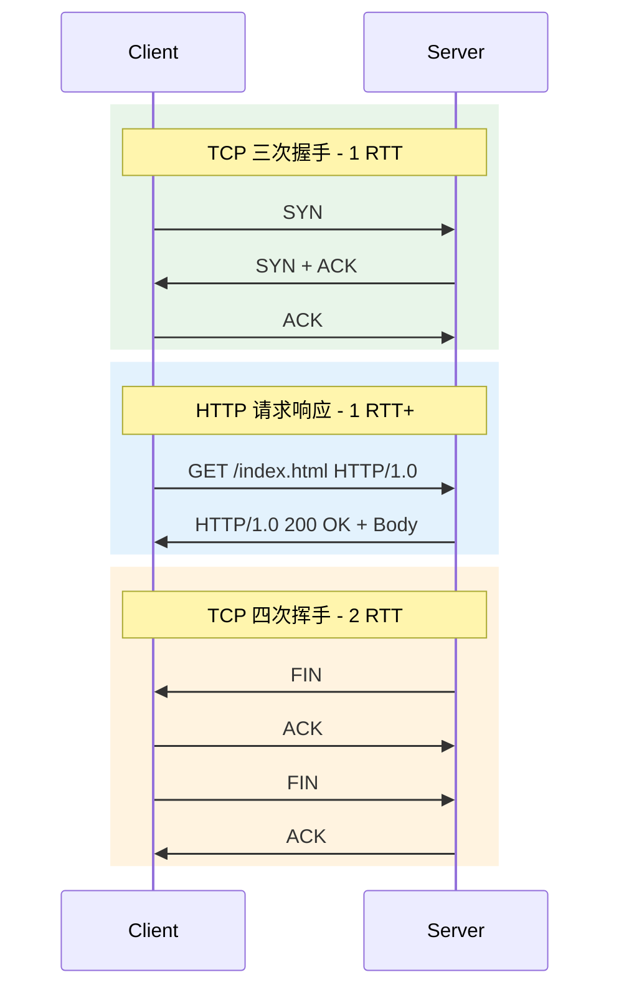
```mermaid
sequenceDiagram
    participant C as Client
    participant S as Server

    rect rgb(232,245,233)
        Note over C,S: TCP 三次握手 - 1 RTT
        C->>S: SYN
        S->>C: SYN + ACK
        C->>S: ACK
    end

    rect rgb(227,242,253)
        Note over C,S: HTTP 请求响应 - 1 RTT+
        C->>S: GET /index.html HTTP/1.0
        S->>C: HTTP/1.0 200 OK + Body
    end

    rect rgb(255,243,224)
        Note over C,S: TCP 四次挥手 - 2 RTT
        S->>C: FIN
        C->>S: ACK
        C->>S: FIN
        S->>C: ACK
    end
```

**短连接的核心缺陷在于"连接开销比"极高。** 我们可以用一个简单的比喻来理解：想象你每次去图书馆借一本书，都必须重新办一张借书证（TCP 握手），借完之后立刻注销借书证（TCP 挥手）。如果你需要借 10 本书，就要办 10 次证、注销 10 次。显然，办一张证然后连续借 10 本书会高效得多——这正是 HTTP/1.1 Keep-Alive 要解决的问题。

从性能角度量化分析：如果一个网页包含 1 个 HTML 文件 + 1 个 CSS 文件 + 1 个 JS 文件 + 5 张图片 = **8 个资源**，HTTP/1.0 就需要建立和关闭 **8 条独立的 TCP 连接**。假设一次 RTT 为 50ms，那么仅 TCP 握手就消耗 8 × 50ms = **400ms**，这还不包括挥手的时间和 TCP 慢启动（Slow Start）带来的额外延迟。

### 每次请求新建连接（Connection-per-Request）

**Connection-per-Request** 模型是对 HTTP/1.0 短连接行为的另一个维度的描述：它强调的是 **请求与连接之间的一一映射关系**——每一个 HTTP 请求都"独占"一条 TCP 连接，不与任何其他请求共享。

这种模型带来了若干直接后果：

**1. TCP 慢启动的反复惩罚（Slow Start Penalty）**

TCP 为了避免网络拥塞，在每条新连接建立后不会立即以全速发送数据，而是从一个很小的 **拥塞窗口（Congestion Window, cwnd）** 开始，逐步探测网络带宽。初始窗口通常只有 **10 个 MSS**（Maximum Segment Size，约 14KB）。这意味着每条新连接都要经历一段"加速期"，无法立即达到最佳吞吐量。

在 HTTP/1.0 模型下，由于每次请求都新建连接，**每次连接都要从零开始慢启动**。即使客户端和服务器之间的带宽很充裕，实际利用率也会很低，因为连接在"刚刚热起来"时就被关闭了。

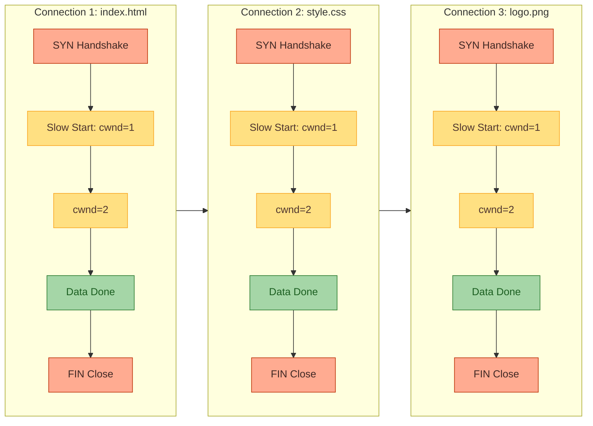
```mermaid
graph LR
    subgraph conn1["Connection 1: index.html"]
        direction TB
        A1["SYN Handshake"]:::kernel --> A2["Slow Start: cwnd=1"]:::warn --> A3["cwnd=2"]:::warn --> A4["Data Done"]:::app --> A5["FIN Close"]:::kernel
    end

    subgraph conn2["Connection 2: style.css"]
        direction TB
        B1["SYN Handshake"]:::kernel --> B2["Slow Start: cwnd=1"]:::warn --> B3["cwnd=2"]:::warn --> B4["Data Done"]:::app --> B5["FIN Close"]:::kernel
    end

    subgraph conn3["Connection 3: logo.png"]
        direction TB
        C1["SYN Handshake"]:::kernel --> C2["Slow Start: cwnd=1"]:::warn --> C3["cwnd=2"]:::warn --> C4["Data Done"]:::app --> C5["FIN Close"]:::kernel
    end

    conn1 --> conn2 --> conn3

    classDef kernel fill:#FFAB91,stroke:#BF360C,color:#3E2723
    classDef warn fill:#FFE082,stroke:#F9A825,color:#4E342E
    classDef app fill:#A5D6A7,stroke:#2E7D32,color:#1B5E20
```

上图清晰地展示了 HTTP/1.0 的致命问题：每条连接都重复经历了 **握手 → 慢启动 → 短暂传输 → 挥手** 的完整周期。慢启动的窗口增长（cwnd=1 → 2 → 4 → ...）永远无法真正"跑满"带宽。

**2. 服务器端资源压力（Server Resource Exhaustion）**

每条 TCP 连接在服务器端都需要占用系统资源：**文件描述符（File Descriptor）**、**内存中的 Socket 缓冲区**、**内核态的 TCB（Transmission Control Block）** 等。在 Connection-per-Request 模型下，如果同时有大量客户端请求不同资源，服务器需要同时维护大量短命的 TCP 连接，导致资源快速消耗。

虽然每条连接存活时间短，但在高并发场景下，大量连接的频繁创建和销毁会带来严重的 **内核上下文切换开销** 和 **端口耗尽风险**（ephemeral port exhaustion）。在 TIME_WAIT 状态下，已关闭的连接仍需占用端口 **2×MSL（Maximum Segment Lifetime，通常为 60 秒）**，这进一步加剧了问题。

**3. 早期的应对策略**

面对 HTTP/1.0 的性能问题，当时的开发者和浏览器厂商采取了一些 **Workaround**：

- **并行连接（Parallel Connections）**：浏览器同时打开多条 TCP 连接（通常 2-6 条）来并行请求资源。这虽然提升了加载速度，但本质上是"以量换速"，进一步加剧了服务器的连接压力。
- **非标准 `Connection: Keep-Alive` 头部**：部分 HTTP/1.0 实现（如早期的 Netscape 浏览器）引入了非标准的 `Connection: Keep-Alive` 头部来请求连接复用。但由于这不是规范的一部分，不同实现之间的兼容性参差不齐，且与某些中间代理（Proxy）的交互存在严重问题（著名的 **Proxy Keep-Alive 问题**：不理解 Keep-Alive 的代理会盲目转发这个头部，导致"挂起的连接"）。

这些 Workaround 的局限性，直接推动了 HTTP/1.1 将 **持久连接（Persistent Connection）** 作为默认行为写入标准。

> **面试考点总结**：HTTP/1.0 的核心缺陷可以用"**三次握手的浪费、慢启动的重复、短连接的低效**"来概括。这三个问题是理解后续 HTTP/1.1、HTTP/2 乃至 HTTP/3 所有优化方向的起点。

---

**📝 练习题**

在 HTTP/1.0 中，一个网页引用了 3 个外部资源（1 个 CSS + 2 张图片），加上 HTML 本身，浏览器共需要加载 4 个资源。假设每次 TCP 握手耗时 1 个 RTT，请求/响应耗时 1 个 RTT，TCP 挥手耗时 2 个 RTT（简化模型），且浏览器**不使用并行连接**。请问总共至少需要多少个 RTT？


A. 4 个 RTT


B. 8 个 RTT


C. 12 个 RTT


D. 16 个 RTT


**【答案】** D

**【解析】** 在 HTTP/1.0 默认短连接模型下，每个资源都需要独立经历完整的 TCP 生命周期：握手（1 RTT）+ 请求响应（1 RTT）+ 挥手（2 RTT）= **4 RTT/资源**。4 个资源串行加载：4 × 4 = **16 RTT**。这道题的核心是让你直观感受 HTTP/1.0 短连接模型下连接管理开销是多么巨大——在实际传输数据上只花了 4 个 RTT，但"连接管理税"（握手 + 挥手）就占了 12 个 RTT，整整 **75% 的时间浪费在了非数据传输上**。这正是 HTTP/1.1 持久连接要解决的核心痛点。

---

## HTTP/1.1 ⭐

HTTP/1.1 是互联网历史上**寿命最长、影响最深远**的 HTTP 版本。它于 1997 年以 RFC 2068 首次发布，后经 1999 年的 RFC 2616 修订，最终在 2014 年被拆分为 RFC 7230–7235 系列文档重新定义。从 1999 年到 HTTP/2 于 2015 年正式标准化，HTTP/1.1 统治了 Web 通信长达 **16 年之久**。

回顾 HTTP/1.0 的核心痛点：每一次请求都需要经历 **TCP 三次握手 → 发送请求 → 接收响应 → TCP 四次挥手** 的完整生命周期。在一个包含数十个 CSS、JS、图片资源的现代网页中，这意味着浏览器可能需要建立 **数十条短命的 TCP 连接**，造成极大的延迟和资源浪费。HTTP/1.1 正是为了系统性地解决这些问题而诞生的。

下面我们用一张时序图来直观感受 HTTP/1.0 与 HTTP/1.1 在连接模型上的本质差异：

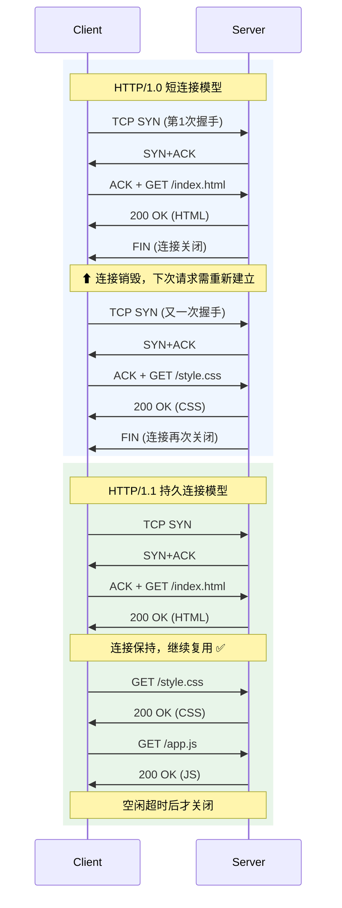
```mermaid
sequenceDiagram
    participant C as Client
    participant S as Server

    rect rgb(239, 246, 255)
        Note over C,S: HTTP/1.0 短连接模型
        C->>S: TCP SYN (第1次握手)
        S->>C: SYN+ACK
        C->>S: ACK + GET /index.html
        S->>C: 200 OK (HTML)
        S->>C: FIN (连接关闭)
        Note over C,S: ⬆ 连接销毁，下次请求需重新建立
        C->>S: TCP SYN (又一次握手)
        S->>C: SYN+ACK
        C->>S: ACK + GET /style.css
        S->>C: 200 OK (CSS)
        S->>C: FIN (连接再次关闭)
    end

    rect rgb(232, 245, 233)
        Note over C,S: HTTP/1.1 持久连接模型
        C->>S: TCP SYN
        S->>C: SYN+ACK
        C->>S: ACK + GET /index.html
        S->>C: 200 OK (HTML)
        Note over C,S: 连接保持，继续复用 ✅
        C->>S: GET /style.css
        S->>C: 200 OK (CSS)
        C->>S: GET /app.js
        S->>C: 200 OK (JS)
        Note over C,S: 空闲超时后才关闭
    end
```

可以看到，HTTP/1.1 通过**一条连接承载多次请求-响应**，将 TCP 握手开销从 O(n) 降至 O(1)。这只是它众多优化中的第一步。

---

### 持久连接 (Keep-Alive)

#### 从 "用完即弃" 到 "长期租约"

持久连接（Persistent Connection）是 HTTP/1.1 最核心的改进，也是后续管道化、分块传输等特性的**基础设施**。

在 HTTP/1.0 中，如果客户端希望复用连接，需要在请求头中**显式声明**：

```
GET /index.html HTTP/1.0
Connection: Keep-Alive          ← 需要手动请求保持
```

服务器如果同意，会在响应头中回显：

```
HTTP/1.0 200 OK
Connection: Keep-Alive          ← 服务器确认同意
Keep-Alive: timeout=5, max=100  ← 可选：超时5秒，最多100个请求
```

但这只是一个**非标准的扩展约定**（Non-standard extension），不是所有服务器和代理都支持，且中间代理（Proxy）处理 `Connection` 头时常出现兼容性问题（著名的 **Proxy Connection 问题**）。

HTTP/1.1 做出了一个根本性的决策变更：

> **持久连接成为默认行为（Default Behavior）。**

也就是说，在 HTTP/1.1 中，除非**显式声明关闭**，否则每条连接都会被保持：

```
HTTP/1.1 200 OK
# 无需声明 Keep-Alive，默认就是持久的
# 只有想关闭时才需要：
# Connection: close
```

#### 持久连接的工作机制

持久连接的底层实现依赖于 TCP 连接的状态管理。我们来拆解其完整生命周期：

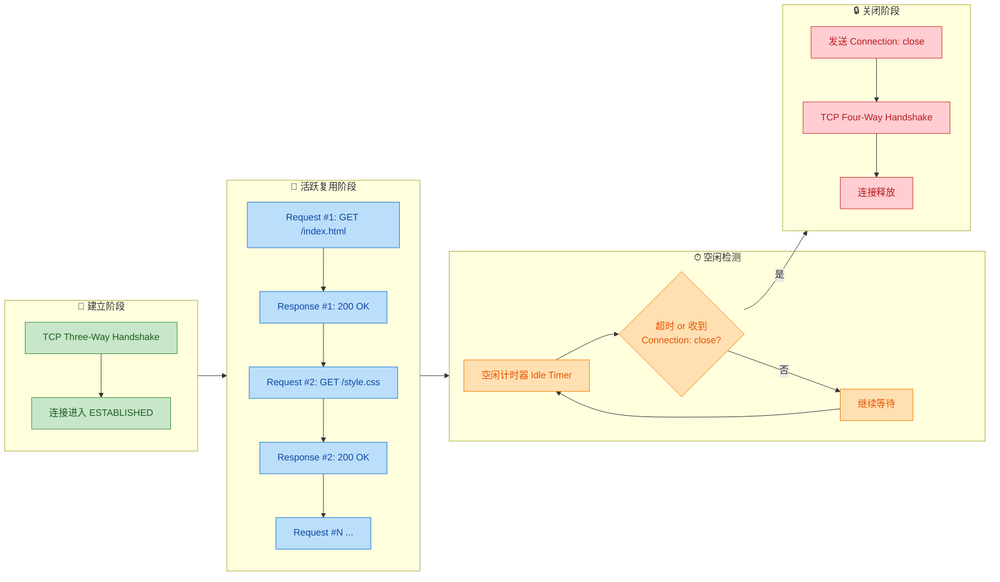
```mermaid
graph LR
    subgraph Phase1["🔗 建立阶段"]
        direction TB
        A["TCP Three-Way Handshake"]
        B["连接进入 ESTABLISHED"]
        A --> B
    end

    subgraph Phase2["📡 活跃复用阶段"]
        direction TB
        C["Request #1: GET /index.html"]
        D["Response #1: 200 OK"]
        E["Request #2: GET /style.css"]
        F["Response #2: 200 OK"]
        G["Request #N ..."]
        C --> D --> E --> F --> G
    end

    subgraph Phase3["⏱ 空闲检测"]
        direction TB
        H["空闲计时器 Idle Timer"]
        I{"超时 or 收到<br/>Connection: close?"}
        J["继续等待"]
        H --> I
        I -- 否 --> J
        J --> H
    end

    subgraph Phase4["🔒 关闭阶段"]
        direction TB
        K["发送 Connection: close"]
        L["TCP Four-Way Handshake"]
        M["连接释放"]
        K --> L --> M
    end

    Phase1 --> Phase2 --> Phase3
    I -- 是 --> Phase4

    classDef greenNode fill:#C8E6C9,stroke:#388E3C,color:#1B5E20
    classDef blueNode fill:#BBDEFB,stroke:#1976D2,color:#0D47A1
    classDef orangeNode fill:#FFE0B2,stroke:#F57C00,color:#E65100
    classDef redNode fill:#FFCDD2,stroke:#D32F2F,color:#B71C1C

    class A,B greenNode
    class C,D,E,F,G blueNode
    class H,I,J orangeNode
    class K,L,M redNode
```

几个关键的工程细节：

**1. 空闲超时（Idle Timeout）**

服务器不会无限期保持空闲连接。常见配置如：

| 服务器 | 默认 Keep-Alive 超时 | 配置项 |
|--------|----------------------|--------|
| Nginx  | 75 秒               | `keepalive_timeout 75;` |
| Apache | 5 秒                | `KeepAliveTimeout 5` |
| Tomcat | 60 秒               | `connectionTimeout="60000"` |

**2. 最大请求数限制**

为了防止单个客户端长期霸占连接资源，服务器通常会限制每条连接处理的最大请求数。例如 Apache 的 `MaxKeepAliveRequests 100` 表示一条持久连接最多处理 100 个请求后强制关闭。

**3. 并发连接数限制**

虽然持久连接减少了握手次数，但浏览器加载一个页面时往往需要**并行获取**多个资源。为此，浏览器通常会对**同一域名**建立多条持久连接（RFC 2616 建议不超过 2 条，但现代浏览器普遍采用 **6–8 条**）。这也是为什么早期前端会使用**域名分片（Domain Sharding）**技术——将资源分散到 `img1.example.com`、`img2.example.com` 等多个子域，以绕过单域名连接数限制。

#### 持久连接 vs 短连接的性能对比

假设一个页面需要加载 10 个资源，RTT (Round-Trip Time) 为 50ms，TCP 握手需要 1.5 RTT：

| 指标 | HTTP/1.0 短连接 | HTTP/1.1 持久连接 |
|------|-----------------|-------------------|
| TCP 握手次数 | 10 次 | 1 次 |
| 握手总延迟 | 10 × 75ms = 750ms | 1 × 75ms = 75ms |
| TCP 慢启动影响 | 每次连接都从头开始 | 拥塞窗口可持续增长 |
| 服务器 Socket 消耗 | 瞬时峰值高 | 稳定可控 |

持久连接带来的**隐性收益**往往被忽视——由于 TCP 连接不再频繁销毁重建，**拥塞窗口（Congestion Window, cwnd）** 可以在持久连接上持续增长，使得后续请求可以享受到更大的传输带宽，而不必每次都从慢启动（Slow Start）阶段重新爬升。

---

### 管道化 (Pipelining)

#### 不等回复就连续发问

如果说持久连接解决了"每次开门都要重新敲门"的问题，那么管道化（Pipelining）则尝试解决"发完一个问题必须等回答后才能问下一个"的问题。

在没有管道化的持久连接中，请求-响应严格遵循 **串行模式（Sequential Mode）**：

```
Client: [发送 Req1] ---- 等待 ---- [收到 Resp1] [发送 Req2] ---- 等待 ---- [收到 Resp2]
                    ↑ 空闲浪费时间 ↑                            ↑ 空闲浪费时间 ↑
```

管道化允许客户端在 **收到前一个响应之前**，就连续发送多个请求：

```
Client: [发送 Req1][发送 Req2][发送 Req3] ---- 等待 ---- [收到 Resp1][收到 Resp2][收到 Resp3]
```

这样，网络的空闲等待时间被大幅压缩，理想情况下 N 个请求只需要约 **1 个 RTT** 的延迟（而非 N 个 RTT）。

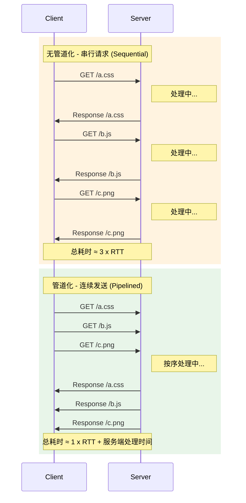
```mermaid
sequenceDiagram
    participant C as Client
    participant S as Server

    rect rgb(255, 243, 224)
        Note over C,S: 无管道化 - 串行请求 (Sequential)
        C->>S: GET /a.css
        Note right of S: 处理中...
        S->>C: Response /a.css
        C->>S: GET /b.js
        Note right of S: 处理中...
        S->>C: Response /b.js
        C->>S: GET /c.png
        Note right of S: 处理中...
        S->>C: Response /c.png
        Note over C,S: 总耗时 ≈ 3 x RTT
    end

    rect rgb(232, 245, 233)
        Note over C,S: 管道化 - 连续发送 (Pipelined)
        C->>S: GET /a.css
        C->>S: GET /b.js
        C->>S: GET /c.png
        Note right of S: 按序处理中...
        S->>C: Response /a.css
        S->>C: Response /b.js
        S->>C: Response /c.png
        Note over C,S: 总耗时 ≈ 1 x RTT + 服务端处理时间
    end
```

#### 管道化的严格约束

管道化虽然理念先进，但它附带了一系列非常**严格的限制**：

| 约束 | 说明 |
|------|------|
| **FIFO 顺序响应** | 服务器必须**严格按请求到达的顺序**返回响应（First-In-First-Out），不允许乱序 |
| **仅限幂等方法** | 只有 `GET`、`HEAD` 等幂等（Idempotent）请求才允许管道化；`POST` 等非幂等方法不允许 |
| **失败难恢复** | 如果管道中某个请求失败，客户端很难判断哪些请求已被服务器处理，可能需要**全部重试** |
| **代理兼容性差** | 许多中间代理服务器无法正确处理管道化请求 |

#### 为什么管道化在实践中几乎没有被采用？

尽管 HTTP/1.1 规范明确支持管道化，但现实中 **几乎所有主流浏览器都默认禁用了该功能**（Chrome 从未启用，Firefox 曾支持但后来移除）。核心原因如下：

**1. FIFO 约束引发队头阻塞（下一节详述）**

管道化要求服务器必须按顺序响应。如果第一个请求的处理很慢（比如一个复杂的数据库查询），后面所有已经处理完毕的响应都必须排队等待，这就是著名的 **队头阻塞（Head-of-Line Blocking）** 问题。

**2. 错误恢复的不确定性**

假设客户端通过管道发送了 5 个请求，在收到第 3 个响应后连接突然中断。此时客户端无法确定：请求 4 和请求 5 是否已经被服务器接收并处理？如果请求 5 是一个 `POST /order`（即便规范禁止，但工程实践中难以保证），是否已经产生了副作用？这种**不确定性**对可靠性要求极高的 Web 应用来说是不可接受的。

**3. 服务器和代理的实现质量参差不齐**

大量已部署的 HTTP 中间件（代理、CDN、负载均衡器）在面对管道化请求时表现不稳定，可能出现响应错位、连接重置等异常行为。

> 📌 **面试高频知识点**：管道化是 HTTP/1.1 一个**理论上存在、实践中基本废弃**的特性。它的核心限制（FIFO 响应顺序）直接催生了队头阻塞问题，也为 HTTP/2 的多路复用（Multiplexing）设计提供了反面教材。

---

### 队头阻塞问题 (Head-of-Line Blocking) ⭐

#### 什么是队头阻塞？

队头阻塞（Head-of-Line Blocking, HoL Blocking）是计算机科学中一个经典的性能反模式，在 HTTP/1.1 的上下文中，它特指：**当一条 TCP 连接上的第一个（队头）响应因为处理缓慢而迟迟不能返回时，后续所有已就绪的响应都被迫排队等待，无法先行发送。**

这是 HTTP/1.1 最致命的性能瓶颈，也是推动 HTTP/2 诞生的直接动因。

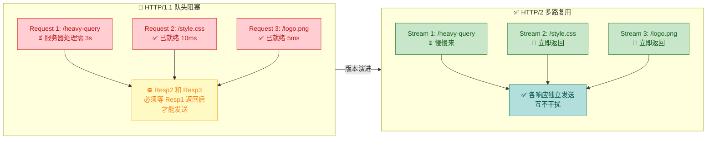
```mermaid
graph LR
    subgraph Blocked["🚫 HTTP/1.1 队头阻塞"]
        direction TB
        R1["Request 1: /heavy-query<br/>⏳ 服务器处理需 3s"]
        R2["Request 2: /style.css<br/>✅ 已就绪 10ms"]
        R3["Request 3: /logo.png<br/>✅ 已就绪 5ms"]
        WAIT["⛔ Resp2 和 Resp3<br/>必须等 Resp1 返回后<br/>才能发送"]
        R1 --> WAIT
        R2 --> WAIT
        R3 --> WAIT
    end

    subgraph Free["✅ HTTP/2 多路复用"]
        direction TB
        S1["Stream 1: /heavy-query<br/>⏳ 慢慢来"]
        S2["Stream 2: /style.css<br/>🚀 立即返回"]
        S3["Stream 3: /logo.png<br/>🚀 立即返回"]
        OK["✅ 各响应独立发送<br/>互不干扰"]
        S1 --> OK
        S2 --> OK
        S3 --> OK
    end

    Blocked --> |"版本演进"| Free

    classDef blockNode fill:#FFCDD2,stroke:#D32F2F,color:#B71C1C
    classDef freeNode fill:#C8E6C9,stroke:#388E3C,color:#1B5E20
    classDef waitNode fill:#FFF9C4,stroke:#F9A825,color:#F57F17
    classDef okNode fill:#B2DFDB,stroke:#00796B,color:#004D40

    class R1,R2,R3 blockNode
    class S1,S2,S3 freeNode
    class WAIT waitNode
    class OK okNode
```

#### 队头阻塞的两个层面

许多人只知道 HTTP 层的队头阻塞，但实际上这个问题存在于**两个不同的协议层**，理解这一点对面试至关重要：

**1. HTTP 层队头阻塞（HTTP-level HoL Blocking）**

这是 HTTP/1.1 协议语义本身造成的。由于 HTTP/1.1 要求响应**严格按请求顺序返回**（即使使用管道化也是如此），慢响应必然阻塞快响应。

- **根因**：HTTP/1.1 没有请求/响应的 **标识机制**（没有 Stream ID 的概念），客户端只能通过 **顺序位置** 来匹配哪个响应对应哪个请求
- **HTTP/2 如何解决**：引入**二进制帧（Binary Frame）** 和 **Stream ID**，每个请求-响应对都有唯一标识，响应可以乱序返回，客户端通过 Stream ID 完成匹配 → 这就是**多路复用（Multiplexing）**

**2. TCP 层队头阻塞（TCP-level HoL Blocking）**

即使 HTTP/2 解决了 HTTP 层的队头阻塞，底层 TCP 协议仍然存在自己的队头阻塞问题。TCP 是一个**可靠的、有序的**字节流协议，它保证数据按发送顺序交付给上层应用。如果 TCP 传输过程中某个数据包丢失（Packet Loss），即使后续数据包已经到达接收端，TCP 也**不会把它们交给应用层**，而是等待丢失包的重传完成。

- **根因**：TCP 的可靠有序交付机制
- **HTTP/3 如何解决**：弃用 TCP，转而使用基于 UDP 的 **QUIC 协议**，实现**独立的流级别（Per-Stream）有序交付**，一个流的丢包不影响其他流

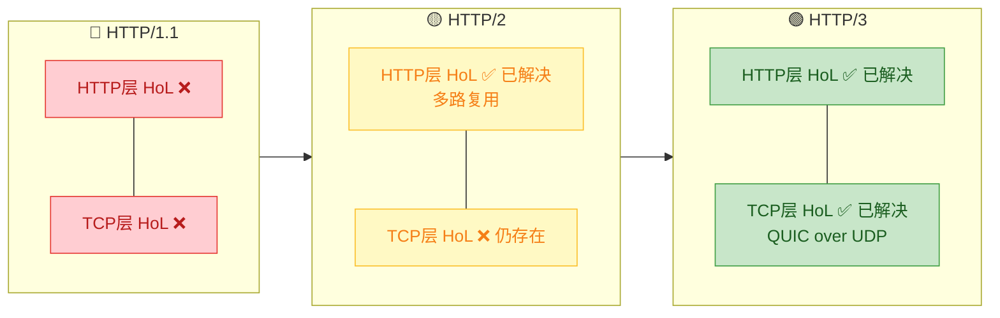
```mermaid
graph LR
    subgraph L1["🔴 HTTP/1.1"]
        direction TB
        H1A["HTTP层 HoL ❌"]
        H1B["TCP层 HoL ❌"]
        H1A --- H1B
    end

    subgraph L2["🟡 HTTP/2"]
        direction TB
        H2A["HTTP层 HoL ✅ 已解决<br/>多路复用"]
        H2B["TCP层 HoL ❌ 仍存在"]
        H2A --- H2B
    end

    subgraph L3["🟢 HTTP/3"]
        direction TB
        H3A["HTTP层 HoL ✅ 已解决"]
        H3B["TCP层 HoL ✅ 已解决<br/>QUIC over UDP"]
        H3A --- H3B
    end

    L1 --> L2 --> L3

    classDef redCard fill:#FFCDD2,stroke:#E53935,color:#B71C1C
    classDef yellowCard fill:#FFF9C4,stroke:#FBC02D,color:#F57F17
    classDef greenCard fill:#C8E6C9,stroke:#43A047,color:#1B5E20

    class H1A,H1B redCard
    class H2A,H2B yellowCard
    class H3A,H3B greenCard
```

#### HTTP/1.1 时代的队头阻塞缓解策略

既然队头阻塞是 HTTP/1.1 的 "天生缺陷"，工程师们在 HTTP/2 到来之前发明了多种 **Workaround（变通方案）**：

| 策略 | 原理 | 缺点 |
|------|------|------|
| **并发连接** | 浏览器对同域名开 6-8 条 TCP 连接，每条独立排队 | 增加服务器负担，TCP 竞争带宽 |
| **域名分片** | 将资源分散到多个子域名，绕过单域名连接限制 | DNS 解析开销增加，证书管理复杂 |
| **资源合并** | 将多个 CSS/JS 合并成一个文件（Bundle），减少请求数 | 缓存粒度变粗，改一行代码整个 Bundle 失效 |
| **CSS Sprites** | 将多个小图标合并成一张大图，通过 CSS `background-position` 切割 | 维护困难，修改一个图标需重新生成整张图 |
| **内联资源** | 将小型 CSS/JS/图片以 `data:` URI 或 `<style>` 标签内联进 HTML | HTML 体积膨胀，无法独立缓存 |

> 📌 **关键洞察**：这些方案本质上都是在**减少请求数量**或**分散队列压力**，是典型的 "治标不治本"。HTTP/2 通过多路复用从根本上消除了 HTTP 层队头阻塞，使得上述大部分 Workaround 不再必要，甚至可能产生负面效果（如 HTTP/2 下域名分片反而降低性能，因为它阻止了单连接多路复用的优势发挥）。

---

### 分块传输 (Chunked Transfer Encoding)

#### 当服务器不知道响应有多长时

在 HTTP/1.0 中，服务器必须在响应头中通过 `Content-Length` 告知客户端响应体的**精确字节长度**：

```
HTTP/1.0 200 OK
Content-Length: 34210       ← 必须预先知道精确大小
Content-Type: text/html

(正好 34210 字节的响应体)
```

这要求服务器在发送响应**之前**就必须知道完整的响应体大小。但很多场景下这是做不到的：

- **动态页面生成**：服务器边渲染 HTML 边发送，最终大小在渲染完成前未知
- **实时数据流**：如实时日志、股票行情推送，数据是持续生成的
- **大文件压缩**：gzip 压缩后的大小在压缩完成前无法确定
- **数据库查询结果集**：结果集边查询边返回，总大小未知

HTTP/1.1 引入了 **分块传输编码（Chunked Transfer Encoding）** 来解决这个问题。它允许服务器将响应体分成若干个大小已知的 **"块"（Chunk）**，逐块发送，每个块都自带长度标记，最后以一个 **零长度的终止块** 标志传输结束。

#### 分块传输的报文格式

分块传输的 HTTP 响应格式如下：

```
HTTP/1.1 200 OK
Transfer-Encoding: chunked         ← 声明使用分块传输（取代 Content-Length）
Content-Type: text/html

1a                                  ← 第 1 块：大小 0x1A = 26 字节（十六进制）
This is the first chunk.           ← 第 1 块数据（26 字节）

1c                                  ← 第 2 块：大小 0x1C = 28 字节
And this is the second one.        ← 第 2 块数据（28 字节）

0                                   ← 终止块：大小为 0，表示传输结束
                                    ← 空行标志报文结束
```

每个 Chunk 的结构可以归纳为：

```text
┌─────────────────────────────────────────────────┐
│  Chunk Size (十六进制 ASCII) + CRLF              │  ← 块大小头
├─────────────────────────────────────────────────┤
│  Chunk Data (实际数据字节) + CRLF                │  ← 块数据体
└─────────────────────────────────────────────────┘
           ... 重复 N 次 ...
┌─────────────────────────────────────────────────┐
│  0 + CRLF                                       │  ← 终止块
│  CRLF                                           │  ← 结束标记
└─────────────────────────────────────────────────┘
```

#### 分块传输的工作流程

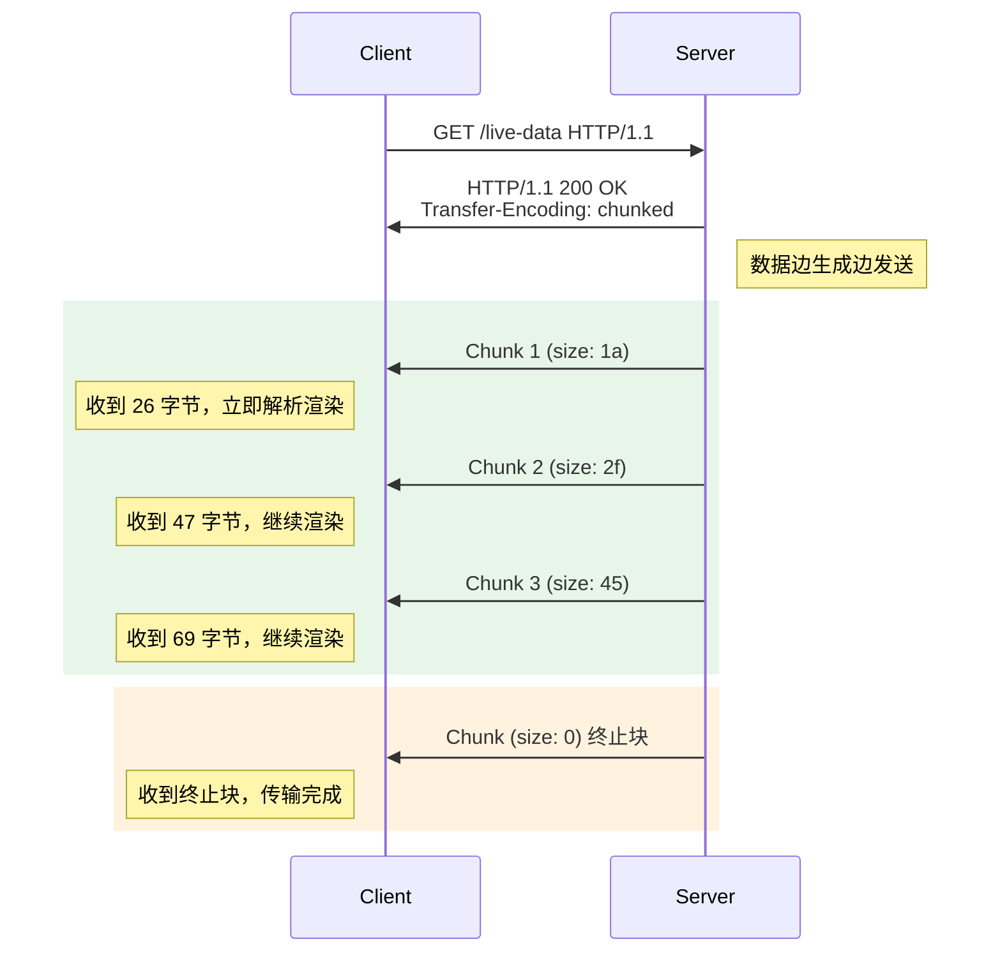
```mermaid
sequenceDiagram
    participant C as Client
    participant S as Server

    C->>S: GET /live-data HTTP/1.1
    S->>C: HTTP/1.1 200 OK<br/>Transfer-Encoding: chunked

    Note right of S: 数据边生成边发送

    rect rgb(232, 245, 233)
        S->>C: Chunk 1 (size: 1a)
        Note left of C: 收到 26 字节，立即解析渲染
        S->>C: Chunk 2 (size: 2f)
        Note left of C: 收到 47 字节，继续渲染
        S->>C: Chunk 3 (size: 45)
        Note left of C: 收到 69 字节，继续渲染
    end

    rect rgb(255, 243, 224)
        S->>C: Chunk (size: 0) 终止块
        Note left of C: 收到终止块，传输完成
    end
```

#### 分块传输的核心应用场景

**1. 与 gzip 压缩联用（最常见）**

现代 Web 服务器通常同时启用 gzip 压缩和分块传输。因为流式压缩（Streaming Compression）不可能预先知道最终的压缩大小，所以将压缩后的数据分块发送是最自然的选择：

```
HTTP/1.1 200 OK
Content-Encoding: gzip             ← 内容经过 gzip 压缩
Transfer-Encoding: chunked         ← 压缩后的数据分块传输
```

注意 `Content-Encoding` 和 `Transfer-Encoding` 是两个不同层次的概念：前者描述**内容本身的编码格式**（语义层），后者描述**传输过程的编码方式**（传输层）。

**2. Server-Sent Events (SSE)**

分块传输是实现 SSE（服务器推送事件）的底层机制之一。服务器可以通过持续发送 Chunk 来推送实时事件：

```
HTTP/1.1 200 OK
Content-Type: text/event-stream
Transfer-Encoding: chunked

data: {"price": 150.25}\n\n        ← Chunk 1: 推送第一条事件
data: {"price": 151.00}\n\n        ← Chunk 2: 推送第二条事件
...                                 ← 连接保持，持续推送
```

**3. Trailer Headers（尾部头）**

分块传输还支持一个鲜为人知但很实用的特性——**Trailer Headers**。服务器可以在终止块之后追加额外的 HTTP 头部，这些头部只有在整个响应体传输完成后才能确定。典型用途是附加**校验和（Checksum）**：

```
HTTP/1.1 200 OK
Transfer-Encoding: chunked
Trailer: Content-MD5               ← 预告：终止块后会有 Content-MD5 头

... (多个数据块) ...

0                                   ← 终止块
Content-MD5: rL0Y20zC+Fzt72VPzMSk2A==   ← 尾部头：完整响应体的 MD5
```

#### `Content-Length` vs `Transfer-Encoding: chunked`

| 特性 | Content-Length | Transfer-Encoding: chunked |
|------|---------------|---------------------------|
| 响应体大小 | 必须预先已知 | 可以未知 |
| 发送方式 | 一次性或按固定大小发送 | 按 Chunk 分段发送 |
| 客户端判断结束 | 收够 N 字节即结束 | 收到 size=0 的终止块 |
| 适用场景 | 静态文件、已缓存的小响应 | 动态内容、流式数据、压缩内容 |
| 能否共存 | ❌ 二者互斥，不能同时出现 | ❌ 二者互斥 |

> ⚠️ **重要**：`Content-Length` 和 `Transfer-Encoding: chunked` 是**互斥的**。如果两者同时出现在响应头中，RFC 7230 规定 `Transfer-Encoding` 的优先级更高，`Content-Length` 应被忽略。这也是一些 HTTP Smuggling（请求走私）攻击的利用点——利用不同中间件对这两个头的优先级判断不一致来制造歧义。

---

**📝 练习题**

关于 HTTP/1.1 的队头阻塞（Head-of-Line Blocking），以下说法**正确**的是：

A. HTTP/1.1 的队头阻塞仅存在于使用管道化（Pipelining）的场景中，不使用管道化则不存在此问题

B. HTTP/2 通过多路复用完全消除了所有层面的队头阻塞问题

C. HTTP/1.1 的队头阻塞根本原因是响应必须按请求顺序返回，而 HTTP/2 通过为每个请求-响应分配 Stream ID 实现乱序交付来解决此问题

D. 增加浏览器对同一域名的并发 TCP 连接数可以从根本上解决 HTTP 层的队头阻塞


**【答案】** C

**【解析】**

- **A 错误**：即使不使用管道化，HTTP/1.1 在单条连接上的请求-响应也是严格串行的（发一个等一个），这本身就是一种队头阻塞——前一个请求未完成，后一个请求根本无法发出。管道化只是让这个问题更加显著（多个请求同时在队列中），但阻塞本质是 HTTP/1.1 协议的固有缺陷。

- **B 错误**：HTTP/2 仅解决了 **HTTP 应用层**的队头阻塞（通过多路复用），但底层 **TCP 传输层**的队头阻塞仍然存在。TCP 的有序交付机制决定了一个丢包会阻塞同一连接上所有流的数据交付。彻底解决 TCP 层队头阻塞需要 HTTP/3 的 QUIC 协议。

- **C 正确**：这是对 HTTP/1.1 队头阻塞根因和 HTTP/2 解决方案的精准描述。HTTP/1.1 没有请求/响应标识机制，只能依赖顺序匹配；HTTP/2 引入 Stream ID 使得响应可以乱序发送，客户端通过 ID 完成匹配。

- **D 错误**：增加并发连接数只是将单队列变成多队列，**每条连接内部**的队头阻塞仍然存在。这是一种缓解策略（Mitigation），而非根本解决方案（Solution）。且过多连接会带来资源浪费和带宽竞争等副作用。

---

## HTTP/2 ⭐⭐

HTTP/2 是由 IETF 在 2015 年正式发布的下一代 HTTP 协议（RFC 7540），其前身是 Google 主导的 **SPDY** 协议。HTTP/1.1 虽然通过 Keep-Alive 和 Pipelining 做了优化，但 **队头阻塞（Head-of-Line Blocking）** 和 **冗余头部** 两大顽疾始终没有根治。为了解决这些问题，HTTP/2 对传输层做了一次 **革命性重构**——它没有改变 HTTP 的语义（方法、状态码、Header 字段依旧不变），而是彻底重新设计了数据在客户端与服务器之间 **如何封装与传输** 的方式。

在深入各子特性之前，我们先建立一个 HTTP/2 核心概念的全局视图：

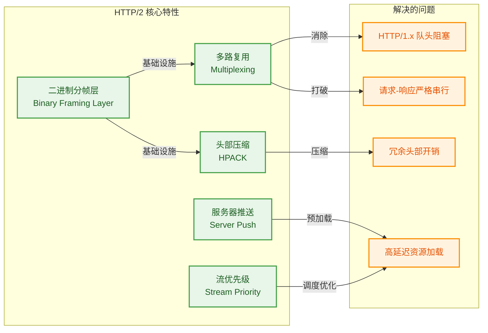
```mermaid
graph LR
    subgraph HTTP2["HTTP/2 核心特性"]
        direction TB
        A["二进制分帧层<br/>Binary Framing Layer"]
        B["多路复用<br/>Multiplexing"]
        C["头部压缩<br/>HPACK"]
        D["服务器推送<br/>Server Push"]
        E["流优先级<br/>Stream Priority"]
    end

    subgraph SOLVE["解决的问题"]
        direction TB
        S1["HTTP/1.x 队头阻塞"]
        S2["冗余头部开销"]
        S3["请求-响应严格串行"]
        S4["高延迟资源加载"]
    end

    A -->|基础设施| B
    A -->|基础设施| C
    B -->|消除| S1
    B -->|打破| S3
    C -->|压缩| S2
    D -->|预加载| S4
    E -->|调度优化| S4

    classDef featureStyle fill:#E8F5E9,stroke:#43A047,stroke-width:2px,color:#1B5E20
    classDef problemStyle fill:#FFF3E0,stroke:#FB8C00,stroke-width:2px,color:#E65100

    class A,B,C,D,E featureStyle
    class S1,S2,S3,S4 problemStyle
```

HTTP/2 的所有高级特性，都建立在 **二进制分帧层** 这块基石之上。理解了分帧，就理解了 HTTP/2 的灵魂。

---

### 二进制分帧（Binary Framing Layer）

HTTP/1.x 是一个 **纯文本协议（Text-based Protocol）**。请求和响应以人类可读的 ASCII 文本传输，用 `\r\n` 换行符分隔 Header 与 Body。这种设计虽然方便调试，却存在严重的解析效率问题——文本解析需要逐字符扫描来定位分隔符，且无法对消息做精细粒度的控制。

HTTP/2 在应用层（HTTP 语义）和传输层（TCP）之间，**插入了一个全新的二进制分帧层**。所有 HTTP 消息在发送前，都被分解成更小的、带有明确类型标识的 **帧（Frame）**，以二进制格式编码后传输。接收端再将这些帧重新组装还原为完整的 HTTP 消息。

#### 分帧层在协议栈中的位置

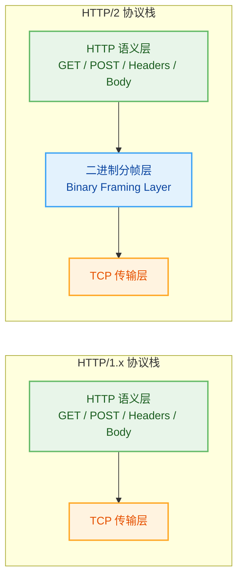
```mermaid
graph LR
    subgraph HTTP1["HTTP/1.x 协议栈"]
        direction TB
        H1_APP["HTTP 语义层<br/>GET / POST / Headers / Body"]
        H1_TCP["TCP 传输层"]
        H1_APP --> H1_TCP
    end

    subgraph HTTP2["HTTP/2 协议栈"]
        direction TB
        H2_APP["HTTP 语义层<br/>GET / POST / Headers / Body"]
        H2_BIN["二进制分帧层<br/>Binary Framing Layer"]
        H2_TCP["TCP 传输层"]
        H2_APP --> H2_BIN
        H2_BIN --> H2_TCP
    end

    classDef appStyle fill:#E8F5E9,stroke:#66BB6A,stroke-width:2px,color:#1B5E20
    classDef binStyle fill:#E3F2FD,stroke:#42A5F5,stroke-width:2px,color:#0D47A1
    classDef tcpStyle fill:#FFF3E0,stroke:#FFA726,stroke-width:2px,color:#E65100

    class H1_APP,H2_APP appStyle
    class H2_BIN binStyle
    class H1_TCP,H2_TCP tcpStyle
```

可以看到，HTTP/2 并没有抛弃 HTTP 的语义——你依旧写 `GET /index.html`，依旧发 `Content-Type: text/html`。变的只是这些信息 **如何被编码和传输**。这也是为什么 HTTP/2 能够做到与 HTTP/1.1 **语义完全兼容**。

#### 帧的结构

每个 HTTP/2 帧都有固定的 **9 字节头部**，后面跟着可变长度的 **Payload**：

```text
+-----------------------------------------------+
|                Length (24 bits)                |
+---------------+-------------------------------+
| Type (8 bits) | Flags (8 bits)                |
+---+-----------+-------------------------------+
| R |        Stream Identifier (31 bits)        |
+---+-------------------------------------------+
|              Frame Payload (变长)              |
+-----------------------------------------------+
          总计: 9 字节固定头 + Payload
```

各字段详解如下：

| 字段 | 长度 | 说明 |
|------|------|------|
| **Length** | 24 bits | Payload 的长度（不含 9 字节头），最大 2^24 - 1 = 16,777,215 字节，默认上限 16,384 字节 |
| **Type** | 8 bits | 帧类型，决定如何解释 Payload |
| **Flags** | 8 bits | 布尔标志位，含义取决于帧类型（如 `END_STREAM`、`END_HEADERS`） |
| **R** | 1 bit | 保留位，必须为 0 |
| **Stream Identifier** | 31 bits | 流标识符，标识该帧属于哪个流（Stream），0 表示连接级别的控制帧 |

HTTP/2 定义了 **10 种帧类型**，其中最核心的是：

| Type 值 | 帧类型 | 用途 |
|---------|--------|------|
| 0x0 | **DATA** | 承载 HTTP 请求/响应的 Body 数据 |
| 0x1 | **HEADERS** | 承载 HTTP 头部字段（经过 HPACK 压缩） |
| 0x2 | **PRIORITY** | 指定流的优先级（已在 RFC 9113 中被废弃） |
| 0x3 | **RST_STREAM** | 立即终止某个流 |
| 0x4 | **SETTINGS** | 连接级别的配置参数（如最大并发流数） |
| 0x5 | **PUSH_PROMISE** | 服务器推送的预告帧 |
| 0x6 | **PING** | 心跳检测与 RTT 测量 |
| 0x7 | **GOAWAY** | 优雅关闭连接 |
| 0x8 | **WINDOW_UPDATE** | 流量控制窗口调整 |
| 0x9 | **CONTINUATION** | HEADERS 帧的延续（当头部过大时拆分） |

#### 文本 vs 二进制：直观对比

以一个简单的 GET 请求为例：

```text
# HTTP/1.1（文本格式，人类可读）
GET /index.html HTTP/1.1\r\n
Host: www.example.com\r\n
Accept: text/html\r\n
\r\n

# HTTP/2（二进制格式，机器高效）
# 被拆解为:
# 1. HEADERS Frame (Stream ID=1)
#    → 包含 :method=GET, :path=/index.html, :authority=www.example.com 等伪头部
#    → 头部经过 HPACK 压缩
# 2. 如果有 Body，还会有 DATA Frame (Stream ID=1)
```

二进制分帧带来的核心优势有三：

1. **高效解析**：二进制格式无需逐字符扫描寻找分隔符，接收端只需读取固定 9 字节头部就能知道 Payload 长度和帧类型，O(1) 定位，解析速度远超文本协议。
2. **精细控制**：每个帧都带有 Stream ID，使得 **同一条 TCP 连接上可以交错传输不同请求/响应的帧**，这正是多路复用的基础。
3. **紧凑传输**：二进制编码天然比文本更紧凑，再叠加 HPACK 头部压缩，传输效率显著提升。

---

### 多路复用 ⭐（Multiplexing — 解决队头阻塞）

多路复用是 HTTP/2 中 **最核心、最具颠覆性** 的特性。要理解它，需要先回顾三个关键概念：

- **连接（Connection）**：一条 TCP 连接，对应一个 socket。
- **流（Stream）**：连接中的一个虚拟双向通道，每个流有唯一的 Stream ID。一个请求-响应对占据一个流。
- **帧（Frame）**：流中传输的最小数据单元，一条 HTTP 消息被拆成多个帧。

它们之间的关系是：**一个连接包含多个流，一个流包含多个帧**。

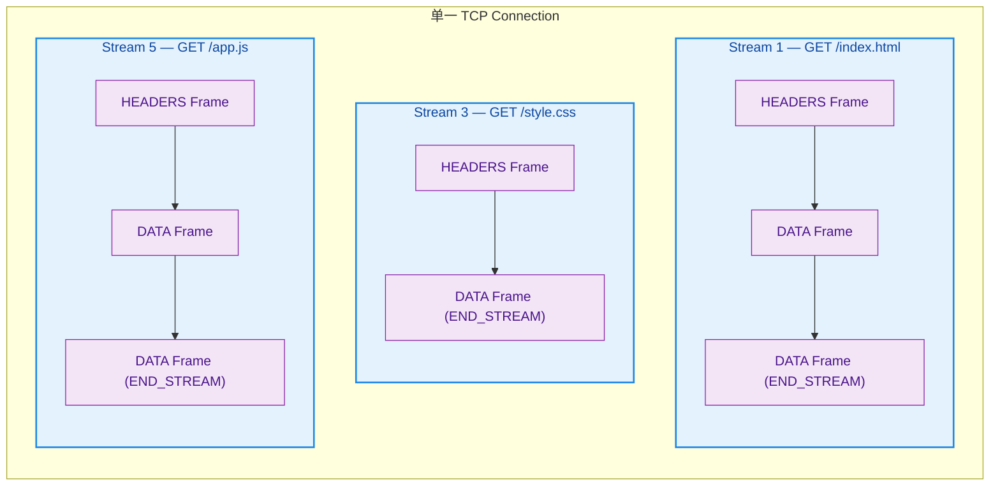
```mermaid
graph LR
    subgraph CONN["单一 TCP Connection"]
        direction TB

        subgraph S1["Stream 1 — GET /index.html"]
            direction TB
            F1A["HEADERS Frame"]
            F1B["DATA Frame"]
            F1C["DATA Frame (END_STREAM)"]
            F1A --> F1B --> F1C
        end

        subgraph S2["Stream 3 — GET /style.css"]
            direction TB
            F2A["HEADERS Frame"]
            F2B["DATA Frame (END_STREAM)"]
            F2A --> F2B
        end

        subgraph S3["Stream 5 — GET /app.js"]
            direction TB
            F3A["HEADERS Frame"]
            F3B["DATA Frame"]
            F3C["DATA Frame (END_STREAM)"]
            F3A --> F3B --> F3C
        end
    end

    classDef streamStyle fill:#E3F2FD,stroke:#1E88E5,stroke-width:2px,color:#0D47A1
    classDef frameStyle fill:#F3E5F5,stroke:#8E24AA,stroke-width:1px,color:#4A148C

    class S1,S2,S3 streamStyle
    class F1A,F1B,F1C,F2A,F2B,F3A,F3B,F3C frameStyle
```

上图展示了逻辑视角——三个请求各自占据一个独立的 Stream。但在 **物理传输层面**，这些帧并不是按 Stream 排队传输的，而是 **交错混合（Interleaved）** 在同一条 TCP 连接上：

```text
 TCP Connection 数据流（时间轴 →）
┌──────────────────────────────────────────────────────────────┐
│ S1:HDR │ S3:HDR │ S5:HDR │ S1:DATA │ S3:DATA │ S5:DATA │...│
└──────────────────────────────────────────────────────────────┘
   ↑ 不同 Stream 的帧自由交错，不必等待前一个完成
```

#### 对比 HTTP/1.1 的困境

在 HTTP/1.1 的场景中，即使开启了 Pipelining，响应也必须 **严格按请求顺序返回**。如果第一个响应是一个耗时的大文件，后面的小文件必须排队等待——这就是经典的 **队头阻塞（HOL Blocking）**。

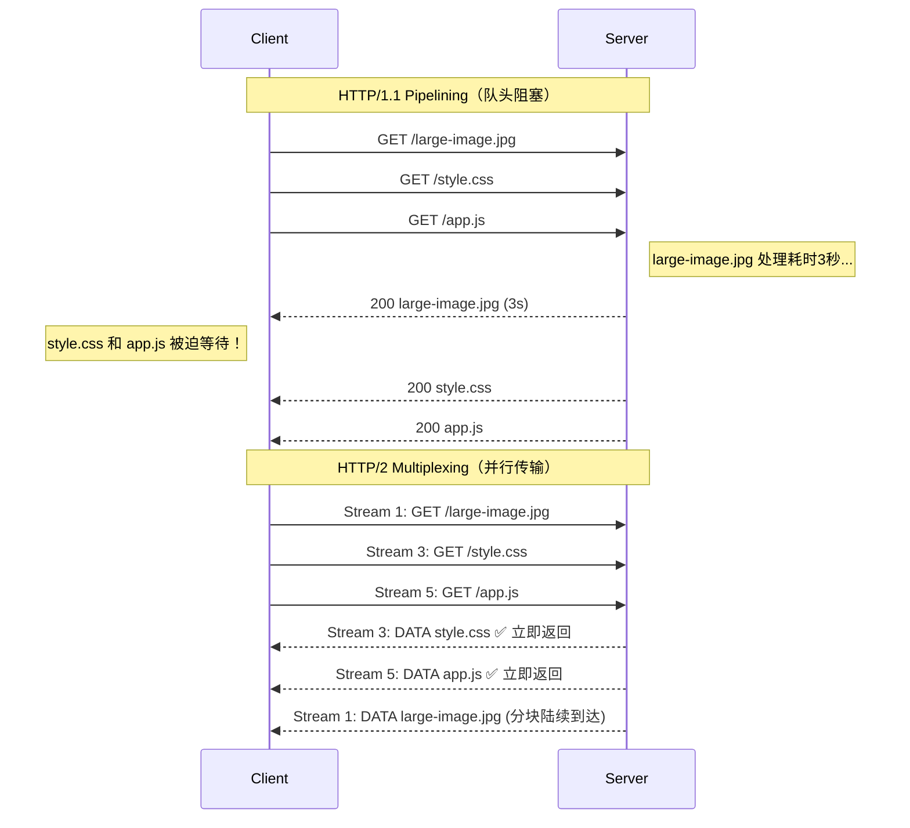
```mermaid
sequenceDiagram
    participant C as Client
    participant S as Server

    Note over C,S: HTTP/1.1 Pipelining（队头阻塞）

    C->>S: GET /large-image.jpg
    C->>S: GET /style.css
    C->>S: GET /app.js

    Note right of S: large-image.jpg 处理耗时3秒...
    S-->>C: 200 large-image.jpg (3s)
    Note left of C: style.css 和 app.js 被迫等待！
    S-->>C: 200 style.css
    S-->>C: 200 app.js

    Note over C,S: HTTP/2 Multiplexing（并行传输）

    C->>S: Stream 1: GET /large-image.jpg
    C->>S: Stream 3: GET /style.css
    C->>S: Stream 5: GET /app.js

    S-->>C: Stream 3: DATA style.css ✅ 立即返回
    S-->>C: Stream 5: DATA app.js ✅ 立即返回
    S-->>C: Stream 1: DATA large-image.jpg (分块陆续到达)
```

HTTP/2 的多路复用从根本上消除了 **应用层的队头阻塞**：

1. **所有请求共享一条 TCP 连接**——不再需要像 HTTP/1.1 那样开 6-8 个并发连接来"伪并行"。
2. **帧级别交错传输**——小资源可以立即插入传输，不受大资源阻塞。
3. **流可以独立关闭或取消**——通过 `RST_STREAM` 帧，可以单独终止某一个流而不影响其他流和整个连接。

#### Stream ID 的分配规则

Stream ID 并非随意分配，而是有严格约定：

- **客户端发起的流**：使用 **奇数** ID（1, 3, 5, 7, ...）
- **服务器发起的流**（如 Server Push）：使用 **偶数** ID（2, 4, 6, 8, ...）
- **Stream 0**：保留给连接级别的控制帧（如 SETTINGS、PING、GOAWAY）
- ID **单调递增**，不可复用。当 ID 空间耗尽时，需要建立新连接。

这种设计确保了两端不会分配到相同的 Stream ID，从而避免冲突。

#### 流量控制（Flow Control）

多路复用引入了一个新问题：如果某个 Stream 大量发送 DATA 帧，可能会挤占其他 Stream 的带宽。HTTP/2 为此设计了 **逐流（per-stream）** 和 **逐连接（per-connection）** 两级流量控制，机制类似 TCP 滑动窗口：

- 每个流和整个连接各自维护一个 **窗口大小（Window Size）**，初始值为 65,535 字节。
- 发送方每发一个 DATA 帧，可用窗口就减少相应大小。
- 接收方处理完数据后，发送 `WINDOW_UPDATE` 帧来增大窗口，允许发送方继续发送。
- **注意**：流量控制仅作用于 DATA 帧，HEADERS 等控制帧不受限制。

> ⚠️ **重要提醒**：HTTP/2 的多路复用解决的是 **应用层** 的队头阻塞。但底层 TCP 仍然存在 **传输层** 的队头阻塞——如果某个 TCP 包丢失，TCP 的可靠传输机制会阻塞该连接上 **所有流** 的数据交付。这也正是 HTTP/3 转向 QUIC（基于 UDP）的根本原因。

---

### 头部压缩（HPACK）

HTTP/1.x 的头部字段以纯文本形式传输，且 **每次请求都会重复发送** 几乎相同的 Header。以一个典型场景为例——你在同一个网站上连续浏览多个页面，每次请求都会携带如下头部：

```text
GET /page1 HTTP/1.1
Host: www.example.com
User-Agent: Mozilla/5.0 (Windows NT 10.0; Win64; x64) ...
Accept: text/html,application/xhtml+xml,...
Accept-Language: zh-CN,zh;q=0.9,en;q=0.8
Accept-Encoding: gzip, deflate, br
Cookie: session_id=abc123; tracking_id=xyz789; preferences=dark_mode
```

这些头部可能占据 **500 字节到数 KB**，而且每次请求几乎完全相同，只是 `:path` 不一样。在移动网络等高延迟环境下，这种冗余传输带来的开销非常显著。

HTTP/2 引入了专门的头部压缩算法 **HPACK**（RFC 7541），从三个层面同时压缩头部：

#### 1. 静态表（Static Table）

HPACK 预定义了一张包含 **61 个常见头部字段** 的索引表。协议规范中硬编码了这些最常用的 Header Name 和 Header Value 组合：

| Index | Header Name | Header Value |
|-------|-------------|--------------|
| 1 | `:authority` | *(空)* |
| 2 | `:method` | `GET` |
| 3 | `:method` | `POST` |
| 4 | `:path` | `/` |
| 5 | `:path` | `/index.html` |
| 6 | `:scheme` | `http` |
| 7 | `:scheme` | `https` |
| 8 | `:status` | `200` |
| ... | ... | ... |
| 16 | `accept-encoding` | `gzip, deflate, br` |
| ... | ... | ... |
| 61 | `www-authenticate` | *(空)* |

当要发送 `:method: GET` 时，只需发送 **索引号 2**——一个字节就搞定了，取代了完整的文本字符串。

#### 2. 动态表（Dynamic Table）

静态表只覆盖了最通用的头部。对于特定连接中频繁出现但不在静态表中的头部（如 `Cookie`、自定义 Header），HPACK 维护一张 **动态表（Dynamic Table）**。

工作流程如下：

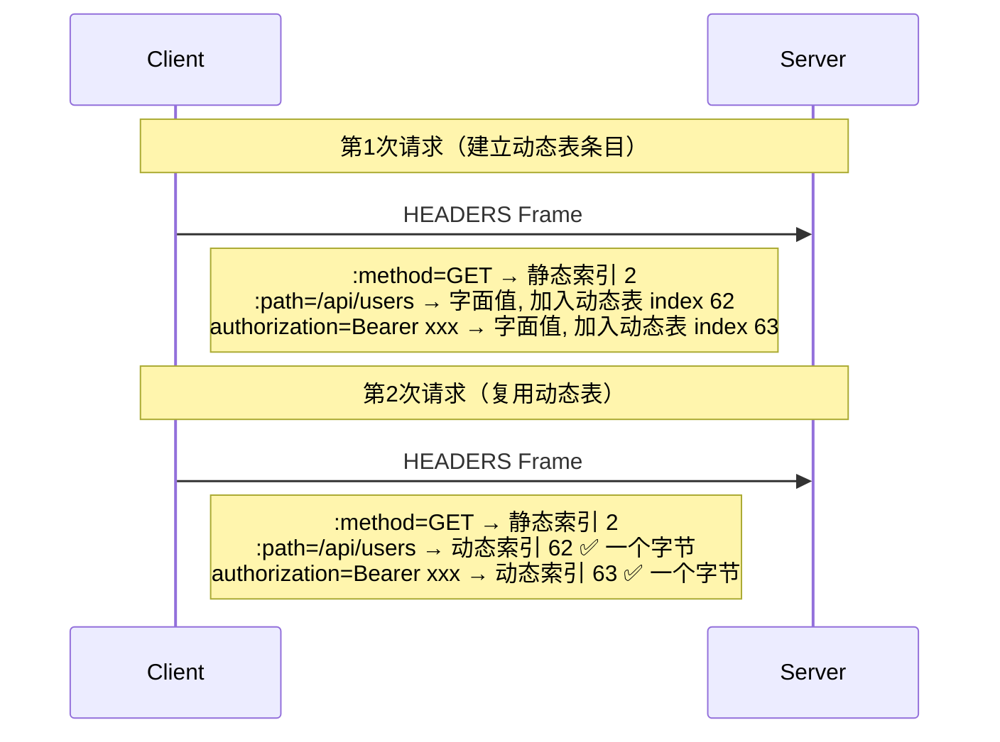
```mermaid
sequenceDiagram
    participant C as Client
    participant S as Server

    Note over C,S: 第1次请求（建立动态表条目）

    C->>S: HEADERS Frame
    Note right of C: :method=GET → 静态索引 2<br/>:path=/api/users → 字面值, 加入动态表 index 62<br/>authorization=Bearer xxx → 字面值, 加入动态表 index 63

    Note over C,S: 第2次请求（复用动态表）

    C->>S: HEADERS Frame
    Note right of C: :method=GET → 静态索引 2<br/>:path=/api/users → 动态索引 62 ✅ 一个字节<br/>authorization=Bearer xxx → 动态索引 63 ✅ 一个字节
```

- 首次出现的头部以 **字面值（Literal）** 发送，同时添加到动态表。
- 后续请求中再次出现相同头部时，直接发送 **索引号** 即可。
- 动态表由两端各自独立维护，但通过帧的传输保持 **隐式同步**——发送方添加条目时，接收方收到帧后也同步添加。
- 动态表有 **大小上限**（通过 `SETTINGS_HEADER_TABLE_SIZE` 协商），超出时按 FIFO 淘汰最旧的条目。

#### 3. 哈夫曼编码（Huffman Coding）

对于无法被索引压缩的字面值（比如第一次出现的 URL 路径），HPACK 还会使用 **静态哈夫曼编码** 进一步压缩。HPACK 规范中定义了一张基于 HTTP 头部字符频率统计的哈夫曼码表，高频字符（如小写字母、数字）用较短的编码，低频字符用较长的编码，从而将字面值的传输大小平均压缩约 **37%**。

#### HPACK 整体工作流

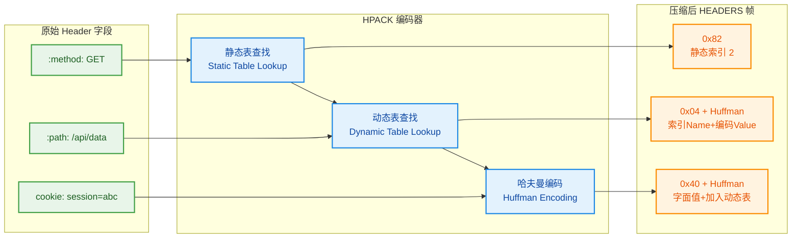
```mermaid
graph LR
    subgraph INPUT["原始 Header 字段"]
        direction TB
        H1[":method: GET"]
        H2[":path: /api/data"]
        H3["cookie: session=abc"]
    end

    subgraph HPACK["HPACK 编码器"]
        direction TB
        ST["静态表查找<br/>Static Table Lookup"]
        DT["动态表查找<br/>Dynamic Table Lookup"]
        HF["哈夫曼编码<br/>Huffman Encoding"]
        ST --> DT --> HF
    end

    subgraph OUTPUT["压缩后 HEADERS 帧"]
        direction TB
        O1["0x82<br/>静态索引 2"]
        O2["0x04 + Huffman<br/>索引Name+编码Value"]
        O3["0x40 + Huffman<br/>字面值+加入动态表"]
    end

    H1 --> ST
    H2 --> DT
    H3 --> HF

    ST --> O1
    DT --> O2
    HF --> O3

    classDef inputStyle fill:#E8F5E9,stroke:#43A047,stroke-width:2px,color:#1B5E20
    classDef hpackStyle fill:#E3F2FD,stroke:#1E88E5,stroke-width:2px,color:#0D47A1
    classDef outputStyle fill:#FFF3E0,stroke:#FB8C00,stroke-width:2px,color:#E65100

    class H1,H2,H3 inputStyle
    class ST,DT,HF hpackStyle
    class O1,O2,O3 outputStyle
```

HPACK 的压缩效果在实践中非常显著。根据 HTTP/2 的设计者统计，**在典型的 Web 浏览场景中，头部压缩率可以达到 85%-95%**，尤其在多次请求同一站点时效果最好。

> 📌 **安全考量**：HPACK 的设计也充分考虑了安全性。早期的 SPDY 协议使用 DEFLATE 压缩头部，但被 **CRIME 攻击** 利用——攻击者通过观察压缩后的大小变化来推测 Cookie 等敏感信息。HPACK 通过使用静态哈夫曼编码（而非自适应的）和索引表方式，有效抵御了这类 compression oracle 攻击。

---

### 服务器推送（Server Push）

在传统的 HTTP 请求-响应模型中，**一切由客户端驱动**：浏览器请求 HTML → 解析后发现需要 CSS → 再请求 CSS → 解析 CSS 发现需要字体 → 再请求字体……这种 **逐步发现、逐步请求** 的瀑布式加载（Waterfall Loading）造成了大量的 RTT 浪费。

HTTP/2 的 Server Push 允许服务器在客户端 **尚未请求** 某个资源时，**主动** 将该资源推送给客户端。服务器作为"了解全局依赖关系"的一方，可以预判客户端接下来会需要什么。

#### 推送流程

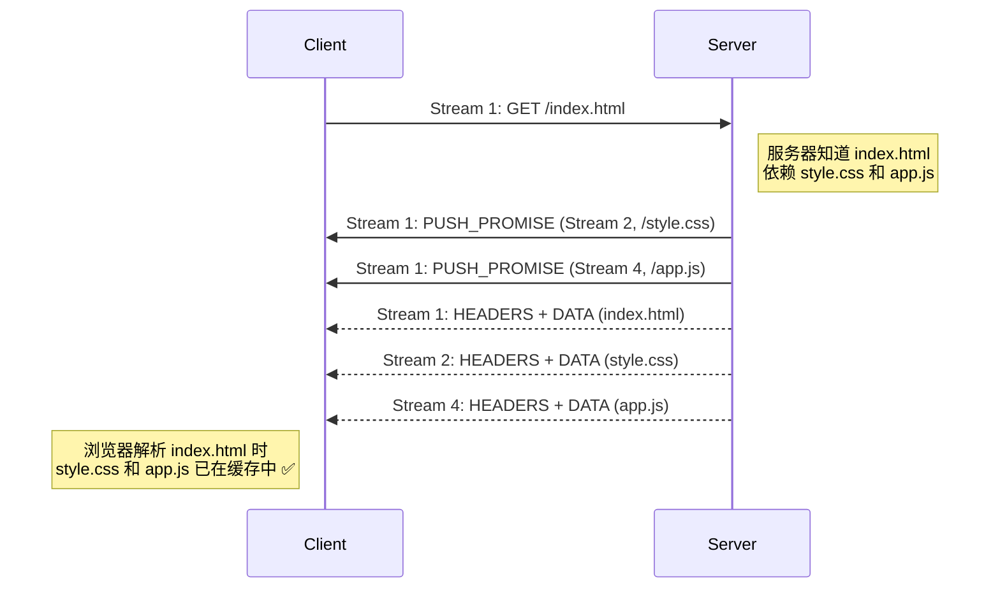
```mermaid
sequenceDiagram
    participant C as Client
    participant S as Server

    C->>S: Stream 1: GET /index.html

    Note right of S: 服务器知道 index.html<br/>依赖 style.css 和 app.js

    S->>C: Stream 1: PUSH_PROMISE (Stream 2, /style.css)
    S->>C: Stream 1: PUSH_PROMISE (Stream 4, /app.js)

    S-->>C: Stream 1: HEADERS + DATA (index.html)
    S-->>C: Stream 2: HEADERS + DATA (style.css)
    S-->>C: Stream 4: HEADERS + DATA (app.js)

    Note left of C: 浏览器解析 index.html 时<br/>style.css 和 app.js 已在缓存中 ✅
```

关键步骤说明：

1. **PUSH_PROMISE 帧**：服务器先在 **原始请求的流**（Stream 1）上发送 PUSH_PROMISE 帧，告知客户端："我将在 Stream 2 上推送 `/style.css`"。PUSH_PROMISE 中包含了模拟请求的完整头部（`:method`, `:path` 等）。
2. **预留 Stream ID**：推送的资源使用 **偶数** Stream ID（由服务器分配），与客户端发起的奇数 ID 区分。
3. **发送推送响应**：服务器在预留的 Stream 上发送 HEADERS 和 DATA 帧，与普通响应无异。
4. **客户端接收**：浏览器将推送的资源缓存起来。当解析 HTML 发现需要这些资源时，直接从缓存命中，**零延迟**。

#### 客户端的控制权

Server Push 并非强制行为，客户端拥有完全的控制权：

- **拒绝推送**：客户端可以对推送的 Stream 发送 `RST_STREAM` 帧，告诉服务器"这个资源我不需要，请停止发送"。典型场景是客户端已经缓存了该资源。
- **禁用推送**：客户端在 SETTINGS 帧中设置 `SETTINGS_ENABLE_PUSH = 0`，全面禁止服务器推送。
- **限制并发推送**：通过 `SETTINGS_MAX_CONCURRENT_STREAMS` 限制服务器能同时推送的资源数量。

#### 实践中的现状

尽管 Server Push 在理论上很优雅，但在实际生产环境中 **应用并不广泛**，原因包括：

- **缓存失效浪费**：服务器无法准确判断客户端是否已缓存某资源，推送已缓存的资源纯属浪费带宽。
- **优先级冲突**：推送的资源可能与客户端真正急需的资源争抢带宽。
- **CDN 兼容性差**：很多 CDN 和中间代理不支持或不能正确转发 PUSH_PROMISE。
- **替代方案**：`103 Early Hints` 状态码和 `<link rel="preload">` 提供了更灵活的替代方案。

> ⚠️ Chrome 浏览器已在 **Chrome 106（2022 年）** 中移除了对 HTTP/2 Server Push 的支持。这一特性正逐渐被行业边缘化，但它的设计思想——**服务器主动推送资源以减少延迟**——被 Early Hints 等机制继承。

---

### 流优先级（Stream Priority）

当多个流同时活跃时，带宽是有限的。如果所有流均等分配带宽，那么关键资源（如 CSS、JS）和非关键资源（如低优先级的图片）将以相同速度加载，这并不符合实际需求。HTTP/2 引入了 **流优先级** 机制，允许客户端告诉服务器"哪些资源更重要，请优先传输"。

#### 优先级模型（原始 RFC 7540）

原始的 HTTP/2 优先级使用 **依赖树（Dependency Tree）** 模型：

- 每个流可以声明 **依赖于** 另一个流（Parent），形成一棵树。
- 每个流有一个 **权重（Weight）**，范围 1-256，同一父节点下的子流按权重比例分配带宽。

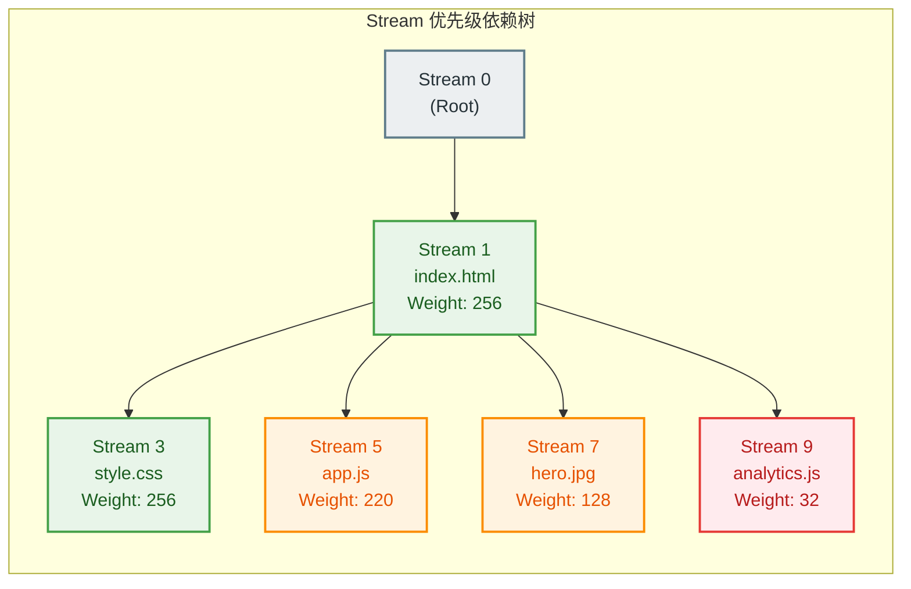
```mermaid
graph LR
    subgraph DEP_TREE["Stream 优先级依赖树"]
        direction TB
        ROOT["Stream 0<br/>(Root)"]
        S1["Stream 1<br/>index.html<br/>Weight: 256"]
        S3["Stream 3<br/>style.css<br/>Weight: 256"]
        S5["Stream 5<br/>app.js<br/>Weight: 220"]
        S7["Stream 7<br/>hero.jpg<br/>Weight: 128"]
        S9["Stream 9<br/>analytics.js<br/>Weight: 32"]

        ROOT --> S1
        S1 --> S3
        S1 --> S5
        S1 --> S7
        S1 --> S9
    end

    classDef rootStyle fill:#ECEFF1,stroke:#607D8B,stroke-width:2px,color:#263238
    classDef highStyle fill:#E8F5E9,stroke:#43A047,stroke-width:2px,color:#1B5E20
    classDef medStyle fill:#FFF3E0,stroke:#FB8C00,stroke-width:2px,color:#E65100
    classDef lowStyle fill:#FFEBEE,stroke:#E53935,stroke-width:2px,color:#B71C1C

    class ROOT rootStyle
    class S1,S3 highStyle
    class S5,S7 medStyle
    class S9 lowStyle
```

在这个例子中，`style.css` 和 `app.js` 都依赖于 `index.html`（只有 HTML 解析完才知道需要它们）。CSS 权重 256、JS 权重 220、图片 128、分析脚本 32。当它们同时竞争带宽时，服务器 **按权重比例** 分配：CSS 获得最多带宽，分析脚本获得最少。

#### 依赖关系的含义

- **依赖（Dependency）**：如果 Stream 5 依赖 Stream 3，意味着 **优先保证 Stream 3 的传输**。只有当 Stream 3 传输完毕或被阻塞时，Stream 5 才会开始获得带宽。
- **独占标志（Exclusive Flag）**：如果 Stream 5 以 `exclusive=true` 依赖 Stream 1，那么 Stream 1 下所有原有子流都变成 Stream 5 的子流，Stream 5 成为唯一的直接子节点。

#### 浏览器的典型优先级策略

现代浏览器在发起 HTTP/2 请求时，会自动为不同类型的资源分配优先级：

| 资源类型 | 典型优先级 | 原因 |
|---------|-----------|------|
| HTML 文档 | **最高** | 是所有依赖的根 |
| CSS 文件 | **最高** | 阻塞渲染（Render-blocking） |
| 同步 JS（`<script>`） | **高** | 阻塞 DOM 解析 |
| Web 字体 | **高** | 阻塞文本渲染 |
| 异步 JS（`async/defer`） | **中** | 不阻塞渲染 |
| 图片（可视区域） | **中** | 影响 LCP（Largest Contentful Paint） |
| 图片（不可见区域） | **低** | 可延迟 |
| Prefetch 资源 | **最低** | 预加载，不急需 |

#### 优先级机制的演进

原始 RFC 7540 的依赖树模型虽然灵活，但在实践中 **暴露了严重问题**：

1. **实现复杂**：服务器需要维护一棵动态变化的优先级树，开销大。
2. **互操作性差**：不同浏览器和服务器对优先级的实现差异极大，实际效果不一致。
3. **容易被忽略**：很多 HTTP/2 服务器实现（如 Nginx）根本没有完整实现优先级调度。

因此，在更新的 **RFC 9113**（2022 年发布的 HTTP/2 修订版）中，原始的 PRIORITY 帧和依赖树模型 **已被正式废弃（Deprecated）**。取而代之的是一个更简洁的扩展：**Extensible Priorities（RFC 9218）**，使用 `Priority` HTTP 头部字段：

```text
# 新的优先级语法示例（基于 Structured Headers）
Priority: u=0          # 最高紧急度 (urgency 0-7, 默认 3)
Priority: u=3, i       # 中等紧急度, incremental(增量式, 适用于图片)
Priority: u=7, i       # 最低紧急度, 增量式
```

这种简化模型更易实现、更易标准化，正在逐步替代原始的优先级方案。

---

**📝 练习题**

**题目一**：关于 HTTP/2 的多路复用（Multiplexing），以下说法 **正确** 的是？

A. HTTP/2 需要为每个请求建立独立的 TCP 连接，但可以在连接内并行传输

B. HTTP/2 的多路复用同时解决了应用层和 TCP 传输层的队头阻塞问题

C. 在同一条 TCP 连接上，不同 Stream 的帧可以交错发送，接收端通过 Stream ID 重新组装

D. HTTP/2 的客户端发起的流使用偶数 Stream ID，服务器发起的流使用奇数 Stream ID


**【答案】** C

**【解析】** 选项 A 错误，HTTP/2 的核心优势之一就是 **单一 TCP 连接承载所有请求**，不再需要多个连接。选项 B 错误，HTTP/2 的多路复用仅解决了 **应用层** 的队头阻塞；底层 TCP 的队头阻塞依然存在——一个 TCP 丢包会阻塞该连接上所有流的数据交付，这也是 HTTP/3 转向 QUIC 的核心动因。选项 C 正确，这正是多路复用的核心机制：帧在物理链路上交错传输，接收端根据每个帧头部的 31-bit Stream Identifier 将其归类到对应的流，再重组为完整的 HTTP 消息。选项 D 因果倒置，正确的规则是 **客户端用奇数 ID、服务器用偶数 ID**。

---

**题目二**：以下关于 HPACK 头部压缩的描述，**错误** 的是？

A. HPACK 使用静态表和动态表两种索引机制来避免重复传输相同的头部字段

B. HPACK 的动态表由通信双方各自独立维护，通过帧的传输保持隐式同步

C. HPACK 采用 DEFLATE 通用压缩算法来压缩头部字面值，以获得最高压缩率

D. HPACK 使用静态哈夫曼编码来压缩无法被索引的字面值字符串


**【答案】** C

**【解析】** 选项 A 正确，静态表包含 61 个预定义条目覆盖最常见的头部，动态表在连接生命周期内动态积累高频头部。选项 B 正确，两端各维护一份动态表副本，发送方添加条目时接收方收到对应帧后同步添加，无需额外协商。**选项 C 错误**，HPACK **没有** 使用 DEFLATE 算法。早期的 SPDY 协议使用 DEFLATE 压缩头部，但被 **CRIME 攻击**（Compression Ratio Info-leak Made Easy）利用：攻击者通过观察压缩后大小的变化来逐字节推测 Cookie 等敏感值。HPACK 正是为了防御这类 compression oracle attack 而专门设计的，它使用 **固定的静态哈夫曼码表**（而非自适应压缩），避免了压缩率泄露信息的风险。选项 D 正确，这正是 HPACK 的第三层压缩手段。

---

## HTTP/3 ⭐

HTTP/3 是 HTTP 协议家族中最新的重大版本演进，它做出了一个革命性的决定——**彻底抛弃 TCP，转而基于 QUIC 协议（底层使用 UDP）来传输数据**。这并非简单的"换个传输层"，而是对整个网络通信栈的一次深层重构。HTTP/2 虽然在应用层通过多路复用（Multiplexing）解决了 HTTP 层面的队头阻塞（Head-of-Line Blocking），但它仍然运行在 TCP 之上——而 TCP 自身的可靠传输机制会引入另一层队头阻塞。HTTP/3 的诞生，正是为了从根本上消灭这个残留问题，同时大幅缩短连接建立的延迟。

Google 早在 2012 年就开始实验一个名为 **SPDY** 的协议来改进 HTTP，随后又推出了 **gQUIC**（Google QUIC）。IETF 在此基础上标准化了 QUIC 协议，并将基于 QUIC 的 HTTP 正式命名为 **HTTP/3**（RFC 9114，2022 年发布）。如今，主流浏览器（Chrome、Firefox、Safari、Edge）和大型 CDN（Cloudflare、Akamai）都已广泛支持 HTTP/3。

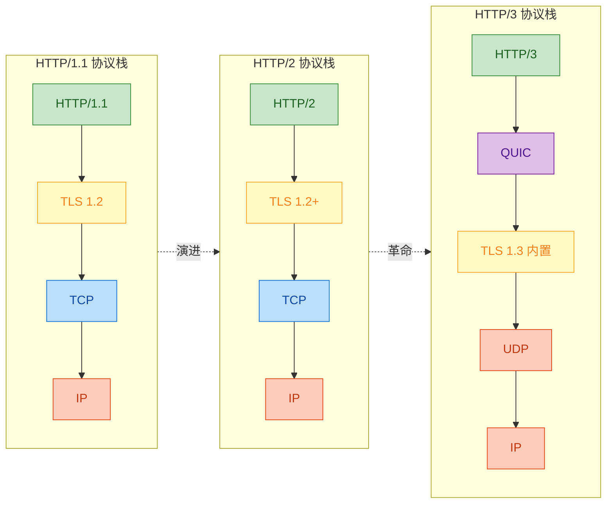
```mermaid
graph LR
    subgraph HTTP1["HTTP/1.1 协议栈"]
        direction TB
        A1["HTTP/1.1"]
        A2["TCP"]
        A3["TLS 1.2"]
        A4["IP"]
        A1 --> A3 --> A2 --> A4
    end

    subgraph HTTP2["HTTP/2 协议栈"]
        direction TB
        B1["HTTP/2"]
        B2["TCP"]
        B3["TLS 1.2+"]
        B4["IP"]
        B1 --> B3 --> B2 --> B4
    end

    subgraph HTTP3["HTTP/3 协议栈"]
        direction TB
        C1["HTTP/3"]
        C2["QUIC"]
        C3["TLS 1.3 内置"]
        C4["UDP"]
        C5["IP"]
        C1 --> C2
        C2 --> C3
        C3 --> C4 --> C5
    end

    HTTP1 -.->|"演进"| HTTP2 -.->|"革命"| HTTP3

    classDef appLayer fill:#C8E6C9,stroke:#388E3C,color:#1B5E20
    classDef secLayer fill:#FFF9C4,stroke:#F9A825,color:#F57F17
    classDef transLayer fill:#BBDEFB,stroke:#1976D2,color:#0D47A1
    classDef netLayer fill:#FFCCBC,stroke:#E64A19,color:#BF360C
    classDef quicLayer fill:#E1BEE7,stroke:#7B1FA2,color:#4A148C

    class A1,B1,C1 appLayer
    class A3,B3,C3 secLayer
    class A2,B2 transLayer
    class C2 quicLayer
    class A4,B4,C4,C5 netLayer
```

从上图可以清楚看到，HTTP/3 最核心的变化就是将传输层从 **TCP + TLS** 替换为 **QUIC（内置 TLS 1.3）+ UDP**。QUIC 不是简单地"在 UDP 上模拟 TCP"，它是一个全新设计的传输协议，在用户态（User Space）实现，融合了可靠传输、加密、多路复用等能力于一体。

---

### 基于 QUIC（UDP）

#### 为什么要抛弃 TCP？

TCP 作为互联网的基石协议已经服务了近 50 年，它提供了可靠传输、拥塞控制、流量控制等关键能力。然而，正是这些"优点"在现代高性能 Web 场景下变成了枷锁：

1. **协议僵化（Protocol Ossification）**：TCP 实现在操作系统内核中，任何改动都需要升级全球数十亿设备的内核，迭代周期极其漫长。中间设备（Middlebox）如防火墙、NAT 路由器也对 TCP 包格式有固化假设，新的 TCP 扩展选项（TCP Options）常常被丢弃或篡改。
2. **连接建立延迟大**：TCP 需要 1-RTT 的三次握手，加上 TLS 1.2 的 2-RTT 握手，首次连接可能需要 3-RTT 才能开始传输数据。即使用 TLS 1.3 优化到 1-RTT，总计也要 2-RTT。
3. **队头阻塞不可避免**：TCP 的字节流语义要求数据按序交付，一个丢包会阻塞该连接上所有后续数据。

#### QUIC 协议的核心设计

QUIC（Quick UDP Internet Connections）在 UDP 之上构建了一个全新的传输层，它的设计哲学可以概括为：**把所有好的东西融合在一起，并且可以快速迭代**。

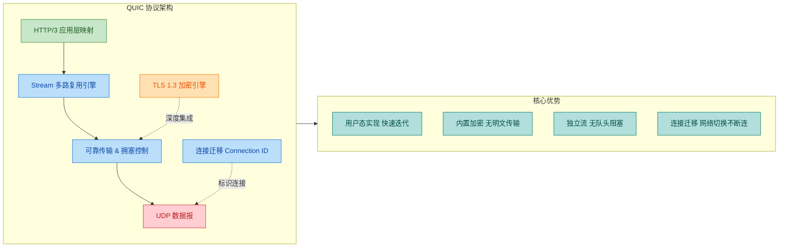
```mermaid
graph LR
    subgraph QUIC_ARCH["QUIC 协议架构"]
        direction TB
        S1["HTTP/3 应用层映射"]
        S2["Stream 多路复用引擎"]
        S3["可靠传输 & 拥塞控制"]
        S4["TLS 1.3 加密引擎"]
        S5["连接迁移 Connection ID"]
        S6["UDP 数据报"]
        S1 --> S2 --> S3 --> S6
        S4 -.->|"深度集成"| S3
        S5 -.->|"标识连接"| S6
    end

    subgraph BENEFITS["核心优势"]
        direction TB
        B1["用户态实现 快速迭代"]
        B2["内置加密 无明文传输"]
        B3["独立流 无队头阻塞"]
        B4["连接迁移 网络切换不断连"]
    end

    QUIC_ARCH --> BENEFITS

    classDef appGreen fill:#C8E6C9,stroke:#388E3C,color:#1B5E20
    classDef frameworkBlue fill:#BBDEFB,stroke:#1976D2,color:#0D47A1
    classDef runtimeOrange fill:#FFE0B2,stroke:#F57C00,color:#E65100
    classDef benefitTeal fill:#B2DFDB,stroke:#00796B,color:#004D40
    classDef udpRed fill:#FFCDD2,stroke:#D32F2F,color:#B71C1C

    class S1 appGreen
    class S2,S3,S5 frameworkBlue
    class S4 runtimeOrange
    class S6 udpRed
    class B1,B2,B3,B4 benefitTeal
```

**QUIC 的关键特性**一览：

| 特性 | TCP + TLS | QUIC |
|------|----------|------|
| 实现层 | 内核态（Kernel Space） | 用户态（User Space） |
| 加密范围 | 仅加密 Payload | **几乎加密一切**（含大部分 Header） |
| 多路复用 | 无（单字节流） | **原生 Stream 级别多路复用** |
| 连接标识 | 四元组（IP + Port） | **Connection ID**（支持迁移） |
| 握手延迟 | 1-RTT (TCP) + 1-RTT (TLS 1.3) = 2-RTT | **1-RTT（首次）/ 0-RTT（恢复）** |
| 队头阻塞 | 有 | **无（Stream 独立）** |
| 迭代速度 | 极慢（内核升级） | 快（应用更新即可） |

#### 为什么选择 UDP 而不是造一个新协议？

一个自然的疑问是：既然要重新设计传输层，为什么不直接定义一个新的传输层协议（IP Protocol Number），而是"借壳" UDP？

原因非常现实——**中间设备的兼容性**。互联网上存在大量 NAT 网关、防火墙和负载均衡器，它们只认识 TCP（协议号 6）和 UDP（协议号 17）。如果你发送一个全新协议号的 IP 包，绝大多数中间设备会直接丢弃。UDP 是已有协议中最"薄"的一个（仅 8 字节头部，无状态），几乎不施加任何语义约束，是一个理想的"空白画布"。

```text
UDP Datagram 结构（仅 8 字节头部）
┌────────────────────────────────────────────────────────┐
│  Source Port (16bit)  │  Dest Port (16bit)             │
├────────────────────────────────────────────────────────┤
│  Length (16bit)       │  Checksum (16bit)              │
├────────────────────────────────────────────────────────┤
│                                                        │
│              QUIC Packet（加密后的数据）                  │
│         ┌──────────────────────────────────┐           │
│         │  Header (Connection ID, PN, ...) │           │
│         │  Encrypted Payload (Frames)      │           │
│         │    ├── STREAM Frame              │           │
│         │    ├── ACK Frame                 │           │
│         │    ├── CRYPTO Frame              │           │
│         │    └── ...                       │           │
│         └──────────────────────────────────┘           │
│                                                        │
└────────────────────────────────────────────────────────┘
```

QUIC 将所有复杂逻辑封装在 UDP Payload 内部，对外界来说它就是普通的 UDP 流量，可以穿越几乎所有现有网络基础设施。

#### 用户态实现的深远影响

TCP 在内核中实现，修改它需要操作系统厂商配合发布补丁，周期以年计。而 QUIC 在用户态实现，意味着：

- **快速迭代**：Google 可以通过 Chrome 更新在数周内向数十亿用户推送新版 QUIC。
- **灵活的拥塞控制**：可以为不同场景定制算法（如 Google 的 BBR），而不用等内核支持。
- **应用可控**：开发者可以选择自己喜欢的 QUIC 库（如 `quiche`、`ngtcp2`、`msquic`），不受操作系统限制。

#### Connection ID 与连接迁移

传统 TCP 用"四元组"（源 IP、源端口、目标 IP、目标端口）来标识一个连接。当你的手机从 Wi-Fi 切换到 4G 时，源 IP 改变，TCP 连接就断了，必须重新握手。

QUIC 引入了 **Connection ID** 的概念：连接不再绑定到网络地址，而是由一个唯一的 ID 来标识。即使底层 IP 改变，只要双方仍然持有相同的 Connection ID，连接就可以**无缝迁移**，无需重新握手。这对移动场景（Wi-Fi ↔ 蜂窝切换、漫游）体验提升巨大。

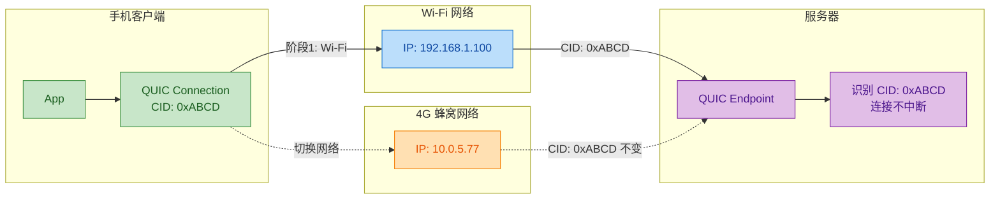
```mermaid
graph LR
    subgraph PHONE["手机客户端"]
        direction TB
        P1["App"]
        P2["QUIC Connection<br/>CID: 0xABCD"]
        P1 --> P2
    end

    subgraph WIFI["Wi-Fi 网络"]
        direction TB
        W1["IP: 192.168.1.100"]
    end

    subgraph CELL["4G 蜂窝网络"]
        direction TB
        C1["IP: 10.0.5.77"]
    end

    subgraph SERVER["服务器"]
        direction TB
        S1["QUIC Endpoint"]
        S2["识别 CID: 0xABCD<br/>连接不中断"]
        S1 --> S2
    end

    P2 -->|"阶段1: Wi-Fi"| W1
    W1 -->|"CID: 0xABCD"| S1
    P2 -.->|"切换网络"| C1
    C1 -.->|"CID: 0xABCD 不变"| S1

    classDef phoneCls fill:#C8E6C9,stroke:#388E3C,color:#1B5E20
    classDef wifiCls fill:#BBDEFB,stroke:#1976D2,color:#0D47A1
    classDef cellCls fill:#FFE0B2,stroke:#F57C00,color:#E65100
    classDef serverCls fill:#E1BEE7,stroke:#7B1FA2,color:#4A148C

    class P1,P2 phoneCls
    class W1 wifiCls
    class C1 cellCls
    class S1,S2 serverCls
```

如图所示，手机从 Wi-Fi（IP: 192.168.1.100）切换到 4G（IP: 10.0.5.77），但 QUIC 连接的 Connection ID 始终是 `0xABCD`，服务器根据 CID 识别出这是同一个连接，**无缝继续传输**，用户完全无感知。

---

### 解决 TCP 队头阻塞

#### 回顾：HTTP/2 的"残留痛点"

在上一节 HTTP/2 中，我们知道多路复用（Multiplexing）已经在**应用层**解决了队头阻塞：多个 HTTP 请求/响应可以在同一个 TCP 连接上交错传输。然而，这些多路复用的数据最终都要通过**同一条 TCP 连接**传输。

TCP 保证的是**字节流的有序可靠交付**。当 TCP 层检测到一个数据包丢失时，它必须等待该丢包被重传并确认后，才能将后续已经到达的数据交给应用层。这就是 **TCP 层的队头阻塞（TCP-level Head-of-Line Blocking）**。

来看一个具体的场景：

```text
HTTP/2 over TCP：TCP 队头阻塞示意

客户端同时请求 3 个资源：Stream 1 (CSS), Stream 3 (JS), Stream 5 (Image)

TCP 发送顺序（字节流）：
┌──────┬──────┬──────┬──────┬──────┬──────┬──────┬──────┐
│ S1-1 │ S3-1 │ S5-1 │ S1-2 │ S3-2 │ S5-2 │ S1-3 │ S3-3 │
└──────┴──────┴──────┴──────┴──────┴──────┴──────┴──────┘
  Pkt1   Pkt2   Pkt3   Pkt4   Pkt5   Pkt6   Pkt7   Pkt8

                  ↓ 传输中 Pkt2 丢失 ↓

到达接收端：
┌──────┐ xxxxxx ┌──────┬──────┬──────┬──────┬──────┬──────┐
│ Pkt1 │  LOST  │ Pkt3 │ Pkt4 │ Pkt5 │ Pkt6 │ Pkt7 │ Pkt8 │
└──────┘        └──────┴──────┴──────┴──────┴──────┴──────┘

TCP 的反应：Pkt2 丢了！虽然 Pkt3~8 都已到达...
            但我必须等 Pkt2 重传成功后才能交付任何数据。

结果：Stream 1, 3, 5 全部被阻塞！
      即使 Stream 5 的数据 (Pkt3, Pkt6) 已经完整到达，
      也无法交给 HTTP/2 层处理。
```

这是一个非常关键的认知：**HTTP/2 的多路复用在应用层是独立的，但在 TCP 层又被"粘"回了一条队列**。在高丢包率网络（如移动网络、弱网环境）下，HTTP/2 的性能甚至可能**退化到不如 HTTP/1.1 的多连接方案**（HTTP/1.1 开 6 个并行连接，一个丢包只影响一个连接）。

#### QUIC 的 Stream 级独立传输

QUIC 从协议设计层面就解决了这个问题。它的核心思路是：**把多路复用下沉到传输层，让每个 Stream 有独立的可靠性保证**。

在 QUIC 中，一个连接（Connection）可以承载多个 **Stream**，每个 Stream 是一个独立的、有序的字节流。关键在于：**Stream 之间没有顺序依赖关系**。如果 Stream 3 的一个数据包丢了，只有 Stream 3 需要等待重传，Stream 1 和 Stream 5 的数据可以立即交付给应用层。

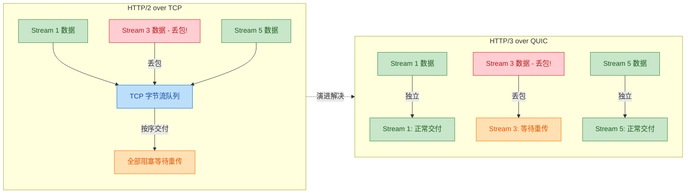
```mermaid
graph LR
    subgraph TCP_HOL["HTTP/2 over TCP"]
        direction TB
        T1["Stream 1 数据"]
        T2["Stream 3 数据 - 丢包!"]
        T3["Stream 5 数据"]
        T4["TCP 字节流队列"]
        T5["全部阻塞等待重传"]
        T1 --> T4
        T2 -->|"丢包"| T4
        T3 --> T4
        T4 -->|"按序交付"| T5
    end

    subgraph QUIC_NO_HOL["HTTP/3 over QUIC"]
        direction TB
        Q1["Stream 1 数据"]
        Q2["Stream 3 数据 - 丢包!"]
        Q3["Stream 5 数据"]
        Q4["Stream 1: 正常交付"]
        Q5["Stream 3: 等待重传"]
        Q6["Stream 5: 正常交付"]
        Q1 -->|"独立"| Q4
        Q2 -->|"丢包"| Q5
        Q3 -->|"独立"| Q6
    end

    TCP_HOL -.->|"演进解决"| QUIC_NO_HOL

    classDef okStream fill:#C8E6C9,stroke:#388E3C,color:#1B5E20
    classDef lostStream fill:#FFCDD2,stroke:#D32F2F,color:#B71C1C
    classDef blockedStream fill:#FFE0B2,stroke:#F57C00,color:#E65100
    classDef queueCls fill:#BBDEFB,stroke:#1976D2,color:#0D47A1

    class T1,T3,Q1,Q3 okStream
    class T2,Q2 lostStream
    class T4 queueCls
    class T5 blockedStream
    class Q4,Q6 okStream
    class Q5 blockedStream
```

对比非常直观：左侧 TCP 模型中，丢包导致整个字节流阻塞；右侧 QUIC 模型中，丢包只影响对应 Stream，其它 Stream 不受任何影响。

#### 技术实现细节

QUIC 是如何实现"Stream 独立"的呢？关键在于 **QUIC Packet 的结构设计**：

1. **Packet Number 是全局的、单调递增的**：每个 QUIC Packet 有一个唯一的 Packet Number，**永远不会重复使用**（与 TCP 的 Sequence Number 不同，TCP 的 Seq 是字节偏移量，重传包用同一个 Seq）。这使得丢包检测更加精确。

2. **STREAM Frame 携带独立的 Offset**：每个 STREAM Frame 都包含自己的 Stream ID 和 Offset（字节偏移）。接收端为每个 Stream 维护独立的重组缓冲区（Reassembly Buffer）。

3. **ACK 基于 Packet Number**：QUIC 的 ACK 机制确认的是 Packet Number 而非字节流偏移。重传的数据会放在新的 Packet 中（新的 Packet Number），这使得 RTT 测量更准确，不存在 TCP 的**重传歧义（Retransmission Ambiguity）**问题。

```text
QUIC 数据包与 Stream 独立示意

Packet #10: [STREAM Frame: StreamID=1, Offset=0, Data="CSS part1"]
Packet #11: [STREAM Frame: StreamID=3, Offset=0, Data="JS part1"]   ← 丢失!
Packet #12: [STREAM Frame: StreamID=5, Offset=0, Data="IMG part1"]
Packet #13: [STREAM Frame: StreamID=1, Offset=500, Data="CSS part2"]

接收端处理：
┌─────────────────────────────────────────────┐
│ Stream 1 Buffer: [CSS part1][CSS part2]  ✅ 可交付 │
│ Stream 3 Buffer: [        空洞        ]  ⏳ 等重传 │
│ Stream 5 Buffer: [IMG part1]             ✅ 可交付 │
└─────────────────────────────────────────────┘

重传时使用新 Packet Number：
Packet #17: [STREAM Frame: StreamID=3, Offset=0, Data="JS part1"]  ← 重传数据
                                                                     新 PN!
```

请特别注意：重传 Stream 3 的数据时，使用的是 **Packet #17**（新编号），而非重复使用 #11。这个设计看似微小，但它使得发送端可以准确计算 RTT（用 Packet #17 的 ACK 时间），而 TCP 遇到重传时无法确定 ACK 对应的是原始包还是重传包（即**Karn 算法**需要特殊处理的问题）。

#### 量化对比：丢包率对性能的影响

在理想网络（0% 丢包）下，HTTP/2 和 HTTP/3 性能接近。但随着丢包率增加，差距急剧扩大：

| 丢包率 | HTTP/2 (TCP) | HTTP/3 (QUIC) | 说明 |
|--------|-------------|---------------|------|
| 0% | 基准性能 | 约等于基准 | 无差异 |
| 1% | 性能下降约 20-30% | 下降约 5-8% | TCP 全流阻塞 vs Stream 隔离 |
| 3% | 性能下降约 50-60% | 下降约 15-20% | 差距显著 |
| 5%+ | 性能急剧恶化 | 相对平稳下降 | 移动弱网场景典型 |

> 注：具体数值因测试环境、并发 Stream 数等因素而异，此处给出的是工程经验中的大致范围。

这就是为什么 HTTP/3 在**移动端**和**弱网环境**下优势最为明显。

---

### 0-RTT 连接

#### 传统握手延迟回顾

在讨论 0-RTT 之前，我们先量化理解传统协议栈的连接建立成本：

```text
HTTP/1.1 + TLS 1.2 握手时序

Client                                    Server
  │                                         │
  │──── TCP SYN ────────────────────────►   │  ┐
  │◄─── TCP SYN-ACK ───────────────────    │  │ 1-RTT (TCP)
  │──── TCP ACK ────────────────────────►   │  ┘
  │                                         │
  │──── TLS ClientHello ───────────────►   │  ┐
  │◄─── TLS ServerHello + Cert ────────    │  │
  │──── TLS Key Exchange ──────────────►   │  │ 2-RTT (TLS 1.2)
  │◄─── TLS Finished ─────────────────    │  │
  │──── TLS Finished ─────────────────►   │  ┘
  │                                         │
  │──── HTTP GET / ────────────────────►   │  数据传输开始
  │◄─── HTTP 200 OK ──────────────────    │
  │                                         │
  总延迟：3-RTT 后才能收到第一字节数据

HTTP/2 + TLS 1.3 握手时序

Client                                    Server
  │                                         │
  │──── TCP SYN ────────────────────────►   │  ┐ 1-RTT (TCP)
  │◄─── TCP SYN-ACK ───────────────────    │  ┘
  │──── TCP ACK + TLS ClientHello ─────►   │  ┐
  │◄─── TLS ServerHello + Finished ────    │  │ 1-RTT (TLS 1.3)
  │──── TLS Finished + HTTP Request ───►   │  ┘
  │◄─── HTTP Response ────────────────    │
  │                                         │
  总延迟：2-RTT（TCP 1-RTT + TLS 1.3 1-RTT）

QUIC (HTTP/3) 首次连接

Client                                    Server
  │                                         │
  │──── QUIC Initial                        │  ┐
  │     (UDP + TLS ClientHello             │  │
  │      + Connection Setup) ──────────►   │  │ 1-RTT
  │◄─── QUIC Handshake                     │  │ (QUIC + TLS 1.3
  │     (TLS ServerHello + Finished) ──    │  │  合并握手!)
  │──── QUIC Handshake Complete            │  │
  │     + HTTP/3 Request ─────────────►   │  ┘
  │◄─── HTTP/3 Response ─────────────    │
  │                                         │
  总延迟：1-RTT（QUIC 将传输层握手与 TLS 握手合并!）
```

关键突破：QUIC 将 TCP 的三次握手与 TLS 1.3 的握手**合并为一次交互**，在 1-RTT 内完成连接建立 + 加密协商。这已经比 HTTP/2 的 2-RTT 快了一倍。

但 QUIC 还有更激进的优化——**0-RTT Connection Resumption**。

#### 0-RTT 的工作原理

当客户端**之前曾经连接过某个服务器**时，QUIC 允许客户端在第一个数据包中就携带加密的应用数据，**无需等待任何握手响应**。这就是 0-RTT（Zero Round-Trip Time）。

实现原理如下：

1. **首次连接**（1-RTT）：客户端和服务器完成完整的 QUIC + TLS 1.3 握手。握手结束后，服务器向客户端发送一个 **Session Ticket** 和 **Transport Parameters**，客户端将其缓存到本地。

2. **后续连接**（0-RTT）：客户端使用缓存的 Session Ticket 派生出一个 **Early Data Key**（也叫 0-RTT Key），用这个密钥加密应用数据，然后在**第一个 QUIC Initial Packet 中同时发送** ClientHello + 加密的 HTTP/3 请求。

3. **服务器响应**：服务器收到后，用存储的 Session 信息验证 Ticket，派生相同的 Early Data Key 解密数据，**立即处理请求并返回响应**。

```mermaid
graph LR
    subgraph FIRST["首次连接 1-RTT"]
        direction TB
        F1["Client: 发送 Initial<br/>ClientHello"]
        F2["Server: 返回 Handshake<br/>ServerHello + Ticket"]
        F3["Client: 缓存 Session Ticket<br/>+ 参数到本地"]
        F4["开始正常通信"]
        F1 --> F2 --> F3 --> F4
    end

    subgraph RESUME["后续连接 0-RTT"]
        direction TB
        R1["Client: 读取缓存的 Ticket"]
        R2["Client: 用 Early Data Key<br/>加密 HTTP 请求"]
        R3["Client: 发送 Initial Packet<br/>ClientHello + 加密请求"]
        R4["Server: 验证 Ticket<br/>解密并处理请求"]
        R5["Server: 立即返回响应<br/>无需等待握手完成"]
        R1 --> R2 --> R3 --> R4 --> R5
    end

    FIRST -.->|"下次访问"| RESUME

    classDef clientCls fill:#C8E6C9,stroke:#388E3C,color:#1B5E20
    classDef serverCls fill:#BBDEFB,stroke:#1976D2,color:#0D47A1
    classDef cacheCls fill:#FFF9C4,stroke:#F9A825,color:#F57F17
    classDef fastCls fill:#F3E5F5,stroke:#7B1FA2,color:#4A148C

    class F1,F3,R1,R2,R3 clientCls
    class F2,R4,R5 serverCls
    class F3 cacheCls
    class F4 fastCls
```

#### 各版本握手延迟对比

```mermaid
graph LR
    subgraph COMPARE["握手延迟对比"]
        direction TB
        C1["HTTP/1.1 + TLS 1.2<br/>3-RTT"]
        C2["HTTP/2 + TLS 1.3<br/>2-RTT"]
        C3["HTTP/3 QUIC 首次<br/>1-RTT"]
        C4["HTTP/3 QUIC 恢复<br/>0-RTT"]
        C1 --> C2 --> C3 --> C4
    end

    subgraph IMPACT["实际影响 RTT=100ms"]
        direction TB
        I1["300ms 才发数据"]
        I2["200ms 才发数据"]
        I3["100ms 才发数据"]
        I4["0ms 立即发数据"]
    end

    C1 --- I1
    C2 --- I2
    C3 --- I3
    C4 --- I4

    classDef slowCls fill:#FFCDD2,stroke:#D32F2F,color:#B71C1C
    classDef medCls fill:#FFE0B2,stroke:#F57C00,color:#E65100
    classDef fastCls fill:#C8E6C9,stroke:#388E3C,color:#1B5E20
    classDef instantCls fill:#B2DFDB,stroke:#00796B,color:#004D40

    class C1,I1 slowCls
    class C2,I2 medCls
    class C3,I3 fastCls
    class C4,I4 instantCls
```

假设客户端到服务器的 RTT 为 100ms（这在跨国访问中很常见），那么：

- **HTTP/1.1 + TLS 1.2**：首字节延迟 = 300ms（握手） + 传输时间
- **HTTP/2 + TLS 1.3**：首字节延迟 = 200ms + 传输时间
- **HTTP/3 首次连接**：首字节延迟 = 100ms + 传输时间
- **HTTP/3 恢复连接**：首字节延迟 ≈ **0ms** + 传输时间（数据随第一个包一起发出）

对于高频访问的网站（用户每天多次打开），绝大多数连接都是"恢复连接"场景，0-RTT 的收益极其可观。

#### 0-RTT 的安全性考量

0-RTT 不是没有代价的。它存在一个重要的安全风险——**重放攻击（Replay Attack）**。

由于 0-RTT 数据在握手完成前就被发送，攻击者可以截获这个加密的 0-RTT 数据包并**原样重放**给服务器。服务器可能无法区分这是合法的新请求还是重放的旧请求。

```text
重放攻击示意：

Client                   Attacker                 Server
  │                         │                       │
  │── 0-RTT: GET /api ──►  │                       │
  │         (被截获)         │── 重放 0-RTT 包 ──►  │
  │                         │── 重放 0-RTT 包 ──►  │  服务器收到
  │                         │── 重放 0-RTT 包 ──►  │  多份相同请求!
  │                         │                       │
```

因此，RFC 8446（TLS 1.3）和 RFC 9001（QUIC-TLS）对 0-RTT 做了严格的限制建议：

1. **只允许幂等操作（Idempotent Operations）**：0-RTT 数据应该只携带 `GET`、`HEAD` 等幂等请求，绝不应携带 `POST`（如支付、转账）等会改变服务器状态的操作。
2. **服务器端去重**：服务器可以维护一个已处理过的 0-RTT Ticket 列表，拒绝重复提交。
3. **单次使用 Ticket**：每个 Session Ticket 只允许一次 0-RTT 使用，用后即废。
4. **时间窗口限制**：服务器可以限制 0-RTT Ticket 的有效期（通常几秒到几分钟）。

在实际工程中，需要在**性能收益**和**安全风险**之间做权衡。大多数生产环境会开启 0-RTT，但只对 GET 请求使用，并配合服务器端防重放策略。

#### 代码层面：QUIC 0-RTT 建连示意（伪代码）

```python
# ============================================
# QUIC 0-RTT 客户端连接示意 (伪代码)
# ============================================

class QUICClient:
    def __init__(self, server_addr):
        self.server_addr = server_addr          # 目标服务器地址
        self.session_cache = {}                  # 本地 Session Ticket 缓存

    def connect(self, request):
        """
        尝试建立 QUIC 连接并发送请求
        """
        # 步骤1: 检查是否有该服务器的缓存 Session Ticket
        cached_ticket = self.session_cache.get(self.server_addr)

        if cached_ticket and not cached_ticket.is_expired():
            # ========== 0-RTT 路径 ==========
            # 步骤2a: 使用缓存 Ticket 派生 Early Data Key
            early_key = derive_early_data_key(cached_ticket)

            # 步骤3a: 加密应用数据 (HTTP/3 请求)
            encrypted_request = encrypt(request, early_key)

            # 步骤4a: 构建 Initial Packet，同时包含 ClientHello 和 0-RTT 数据
            initial_packet = QUICPacket(
                packet_type="Initial",                # QUIC Initial 包类型
                tls_client_hello=build_client_hello(), # TLS 握手消息
                early_data=encrypted_request,          # 0-RTT 加密数据 (关键!)
                connection_id=generate_new_cid()       # 新的 Connection ID
            )

            # 步骤5a: 发送! 数据随第一个包一起飞出去 → 0-RTT!
            send_udp(self.server_addr, initial_packet)

            # 步骤6a: 等待服务器响应 (可能同时包含握手完成 + HTTP 响应)
            response = receive_response()
            return response

        else:
            # ========== 1-RTT 首次连接路径 ==========
            # 步骤2b: 常规 QUIC 握手 (1-RTT)
            connection = quic_full_handshake(self.server_addr)

            # 步骤3b: 缓存服务器返回的 Session Ticket (为下次 0-RTT 做准备)
            if connection.session_ticket:
                self.session_cache[self.server_addr] = connection.session_ticket

            # 步骤4b: 握手完成后发送请求
            response = connection.send_request(request)
            return response
```

---

**📝 练习题**

某用户使用手机浏览器频繁访问一个支持 HTTP/3 的网站。在地铁中，手机频繁在 Wi-Fi 和 4G 之间切换，且网络丢包率约为 3%。以下关于 HTTP/3 的说法，**错误**的是：

A. 手机从 Wi-Fi 切换到 4G 时，QUIC 连接可以通过 Connection ID 实现无缝迁移，无需重新握手

B. 当某个 Stream 的数据包丢失时，只有该 Stream 被阻塞，其他 Stream 可以正常交付数据

C. 由于用户频繁访问该网站，后续连接可以使用 0-RTT 恢复，在第一个数据包中就携带加密的 HTTP 请求

D. 0-RTT 连接恢复是绝对安全的，可以用于携带任何类型的 HTTP 请求（包括 POST 支付请求）


**【答案】** D

**【解析】**

选项 A 正确：QUIC 使用 Connection ID 而非传统的四元组（源 IP、源端口、目标 IP、目标端口）来标识连接。当手机从 Wi-Fi 切换到 4G 后，虽然 IP 地址发生变化，但 Connection ID 不变，服务器可以识别出是同一个连接，实现无缝迁移。

选项 B 正确：这是 QUIC 解决 TCP 队头阻塞的核心机制。在 QUIC 中，每个 Stream 拥有独立的重组缓冲区和顺序保证，Stream 之间互不干扰。丢包只影响丢失数据所属的 Stream，而不会像 TCP 那样阻塞所有数据的交付。

选项 C 正确：首次连接后，服务器会向客户端发送 Session Ticket，客户端缓存该 Ticket。下次连接时，客户端利用缓存的 Ticket 派生 Early Data Key，在第一个 QUIC Initial Packet 中同时发送 ClientHello 和加密的 HTTP 请求，实现 0-RTT 连接。

选项 D **错误**：0-RTT 存在**重放攻击（Replay Attack）**风险。攻击者可以截获并重放 0-RTT 数据包，服务器可能无法区分合法请求和重放请求。因此，0-RTT 只应用于**幂等操作**（如 GET 请求），绝不应携带会改变服务器状态的操作（如 POST 支付请求）。这是 TLS 1.3（RFC 8446）和 QUIC（RFC 9001）标准中明确的安全建议。

---

## 本章小结

HTTP 协议的版本演进，本质上是一部 **网络传输效率的优化史**。从最初朴素的"一问一答"模型，到如今基于 QUIC 的全面革新，每一代协议都在解决上一代遗留的核心瓶颈。让我们用一条清晰的主线将全章内容串联起来。

### 演进主线：从连接管理到协议栈革命

整个 HTTP 版本演进可以归纳为 **三次关键跳跃**：

| 演进阶段 | 核心矛盾 | 解决方案 | 关键词 |
|:---:|:---:|:---:|:---:|
| **1.0 → 1.1** | 频繁建立/销毁 TCP 连接的开销 | 持久连接 Keep-Alive、管道化 Pipelining | **连接复用** |
| **1.1 → 2** | HTTP 层队头阻塞 (HOL Blocking)、文本协议低效 | 二进制分帧、多路复用 Multiplexing | **应用层并行** |
| **2 → 3** | TCP 层队头阻塞、握手延迟 | QUIC (基于 UDP)、0-RTT | **传输层革命** |

这条主线揭示了一个深刻的规律：**每一代 HTTP 协议的改进，都是在将瓶颈从更高层推向更低层，直到最终触及传输层本身，不得不更换底层协议。**

### 核心问题流转图

下面这张图展示了"队头阻塞"这一核心问题在不同版本中如何被逐步消解：

```mermaid
graph LR
    subgraph HTTP10["HTTP/1.0 时代"]
        direction TB
        P1["每次请求新建 TCP 连接"]
        P1B["连接无法复用<br/>巨大延迟开销"]
        P1 --> P1B
    end

    subgraph HTTP11["HTTP/1.1 时代"]
        direction TB
        S1["持久连接 Keep-Alive"]
        S1B["管道化 Pipelining"]
        S1C["HTTP 层队头阻塞<br/>响应必须按序返回"]
        S1 --> S1B --> S1C
    end

    subgraph HTTP2["HTTP/2 时代"]
        direction TB
        S2["二进制分帧层"]
        S2B["多路复用<br/>Stream 并行交错"]
        S2C["TCP 层队头阻塞<br/>丢包阻塞所有流"]
        S2 --> S2B --> S2C
    end

    subgraph HTTP3["HTTP/3 时代"]
        direction TB
        S3["QUIC 基于 UDP"]
        S3B["独立流控<br/>丢包仅影响单流"]
        S3C["0-RTT 连接建立"]
        S3 --> S3B --> S3C
    end

    HTTP10 -->|"引入持久连接"| HTTP11
    HTTP11 -->|"引入多路复用"| HTTP2
    HTTP2 -->|"更换传输层协议"| HTTP3

    classDef era10 fill:#FFCCBC,stroke:#E64A19,color:#BF360C
    classDef era11 fill:#FFE0B2,stroke:#F57C00,color:#E65100
    classDef era2 fill:#BBDEFB,stroke:#1976D2,color:#0D47A1
    classDef era3 fill:#C8E6C9,stroke:#388E3C,color:#1B5E20

    class P1,P1B era10
    class S1,S1B,S1C era11
    class S2,S2B,S2C era2
    class S3,S3B,S3C era3
```

### 各版本核心特性速查

**HTTP/1.0 — 短连接时代**

最原始的请求-响应模型。每一次 HTTP 请求都需要经历完整的 **TCP 三次握手 → 数据传输 → 四次挥手** 流程。在一个包含数十个资源（图片、CSS、JS）的现代网页中，这意味着数十次 TCP 连接的建立与销毁，延迟开销极大。这一设计在早期简单网页时代尚可接受，但随着 Web 复杂度爆炸式增长，它迅速成为性能瓶颈。

**HTTP/1.1 — 持久连接与管道化**

通过 `Connection: Keep-Alive` 默认复用 TCP 连接，消除了重复握手开销。管道化 (Pipelining) 更进一步，允许客户端不等前一个响应就连续发送多个请求。然而，服务器 **必须按请求顺序** 返回响应，这导致了经典的 **HTTP 层队头阻塞 (Head-of-Line Blocking)**——前面的慢响应会卡住后面所有的快响应。分块传输编码 (`Transfer-Encoding: chunked`) 则解决了动态内容无法预知 `Content-Length` 的问题，允许服务器将响应体切分为多个 chunk 逐步发送。

**HTTP/2 — 二进制分帧与多路复用**

这是 HTTP 协议的一次结构性革命。在应用层与传输层之间引入了 **二进制分帧层 (Binary Framing Layer)**，将所有通信拆解为帧 (Frame)，帧属于流 (Stream)，多条流在同一 TCP 连接上 **并行交错传输**，彻底解决了 HTTP 层的队头阻塞。配合 **HPACK 头部压缩** 算法（静态表 + 动态表 + Huffman 编码），大幅减少了冗余头部的传输开销。**服务器推送 (Server Push)** 允许服务器主动向客户端推送尚未请求的资源，**流优先级 (Stream Priority)** 则让客户端可以建议服务器优先处理关键资源。

然而，HTTP/2 仍然运行在 TCP 之上。TCP 的可靠传输机制要求字节流严格有序，一旦某个 TCP 段丢失，内核必须等待该段重传完成后才能将后续数据交付应用层——**TCP 层队头阻塞** 由此产生，且它对所有 HTTP/2 流一视同仁地阻塞。

**HTTP/3 — QUIC 革命**

HTTP/3 做出了最激进的决策：**放弃 TCP，改用基于 UDP 的 QUIC 协议**。QUIC 在用户态实现了可靠传输、流控、拥塞控制，并且每条 QUIC Stream 拥有 **独立的丢包恢复机制**，一条流的丢包不会阻塞其他流，从根本上消灭了 TCP 层队头阻塞。同时，QUIC 将 TLS 1.3 握手融合进传输层握手，实现了首次连接 **1-RTT**、恢复连接 **0-RTT** 的极致低延迟体验。Connection ID 机制更赋予了连接 **跨网络迁移** 的能力（例如 Wi-Fi 切换到 4G 不断连）。

### 协议栈对比一览

```mermaid
graph LR
    subgraph STACK1["HTTP/1.1 协议栈"]
        direction TB
        A1["HTTP/1.1<br/>文本协议"]
        A2["TLS 1.2 可选"]
        A3["TCP"]
        A4["IP"]
        A1 --> A2 --> A3 --> A4
    end

    subgraph STACK2["HTTP/2 协议栈"]
        direction TB
        B1["HTTP/2<br/>二进制分帧"]
        B2["TLS 1.2+ 事实强制"]
        B3["TCP"]
        B4["IP"]
        B1 --> B2 --> B3 --> B4
    end

    subgraph STACK3["HTTP/3 协议栈"]
        direction TB
        C1["HTTP/3"]
        C2["QUIC<br/>内置 TLS 1.3"]
        C3["UDP"]
        C4["IP"]
        C1 --> C2 --> C3 --> C4
    end

    STACK1 ~~~ STACK2 ~~~ STACK3

    classDef appLayer fill:#C8E6C9,stroke:#2E7D32,color:#1B5E20
    classDef secLayer fill:#E1BEE7,stroke:#7B1FA2,color:#4A148C
    classDef transLayer fill:#BBDEFB,stroke:#1565C0,color:#0D47A1
    classDef netLayer fill:#FFE0B2,stroke:#EF6C00,color:#E65100

    class A1,B1,C1 appLayer
    class A2,B2 secLayer
    class C2 secLayer
    class A3,B3,C3 transLayer
    class A4,B4,C4 netLayer
```

这张协议栈对比图清晰展示了 HTTP/3 最本质的变化：**传输层从 TCP 切换到 UDP，并将安全层 (TLS) 融入到 QUIC 内部**，整个协议栈变得更加紧凑高效。

### 关键数字对比

| 指标 | HTTP/1.0 | HTTP/1.1 | HTTP/2 | HTTP/3 |
|:---|:---:|:---:|:---:|:---:|
| **连接模式** | 短连接 | 持久连接 | 持久连接 + 多路复用 | QUIC 连接 + 多路复用 |
| **首次连接延迟** | 每请求 1-RTT (TCP) | 1-RTT (TCP) | 1-RTT (TCP) + 2-RTT (TLS) | 1-RTT (QUIC+TLS) |
| **恢复连接延迟** | 同上 | 同上 | 1-RTT (TLS Session) | **0-RTT** |
| **HTTP 队头阻塞** | ✅ 存在 | ✅ 存在 | ❌ 已解决 | ❌ 已解决 |
| **TCP 队头阻塞** | ✅ 存在 | ✅ 存在 | ✅ 存在 | ❌ 已解决 |
| **头部格式** | 文本 (ASCII) | 文本 (ASCII) | **二进制 + HPACK 压缩** | **二进制 + QPACK 压缩** |
| **服务器推送** | ❌ | ❌ | ✅ | ✅ |
| **连接迁移** | ❌ | ❌ | ❌ | ✅ (Connection ID) |

### 一句话记忆法

> **1.0 一锤子买卖，1.1 排队等号，2.0 多窗口并行但共享一条路，3.0 各走各的路互不干扰。**

- HTTP/1.0：每请求一个新连接 → "一锤子买卖"
- HTTP/1.1：复用连接但响应必须排队 → "排队等号"
- HTTP/2：多路复用但共享一条 TCP → "多窗口并行但共享一条路"（TCP 丢包全体等待）
- HTTP/3：QUIC 独立流控 → "各走各的路互不干扰"

---

**📝 练习题 1**

以下关于 HTTP 各版本的描述，**错误** 的是：

A. HTTP/1.1 默认开启持久连接（Keep-Alive），避免了每次请求都重新建立 TCP 连接的开销

B. HTTP/2 的多路复用机制彻底解决了所有层面的队头阻塞问题，包括 TCP 层

C. HTTP/3 使用 QUIC 协议（基于 UDP），每条流的丢包恢复互相独立，解决了 TCP 层队头阻塞

D. HTTP/2 使用 HPACK 算法对头部进行压缩，通过静态表、动态表和 Huffman 编码减少冗余

**【答案】** B

**【解析】** HTTP/2 的多路复用只解决了 **HTTP 应用层** 的队头阻塞，即多条 Stream 的帧可以交错传输，不再要求响应按序返回。但 HTTP/2 仍运行于 TCP 之上，TCP 的字节流必须严格有序传递。当某个 TCP 包丢失时，操作系统内核会阻塞后续所有已到达的数据，等待丢失段重传后才交付给应用层，这就是 **TCP 层队头阻塞**。它对 HTTP/2 的所有 Stream 一视同仁地阻塞，反而可能比 HTTP/1.1 的多连接方案更严重（HTTP/1.1 开 6 条并行连接，丢包只影响其中一条）。真正解决 TCP 层队头阻塞的是 HTTP/3 的 QUIC 协议。

---

**📝 练习题 2**

在 HTTP/3 中，0-RTT 连接恢复带来了极致的低延迟体验，但它也存在安全方面的顾虑。以下关于 0-RTT 的说法 **正确** 的是：

A. 0-RTT 是首次连接到服务器时就能实现的特性，无需任何先决条件

B. 0-RTT 发送的早期数据 (Early Data) 存在重放攻击 (Replay Attack) 的风险，因此通常仅适用于幂等请求

C. 0-RTT 机制与 TLS 完全无关，它是 QUIC 传输层独立实现的特性

D. 0-RTT 意味着客户端不需要任何加密就能发送数据

**【答案】** B

**【解析】** 0-RTT 连接恢复的前提是客户端曾经与该服务器成功建立过连接，缓存了 TLS Session Ticket 或 PSK（Pre-Shared Key），因此 **首次连接无法实现 0-RTT**（A 错误）。0-RTT 机制本质是 TLS 1.3 的 Early Data 特性被深度集成在 QUIC 中（C 错误），客户端使用之前缓存的密钥材料加密 Early Data，**数据仍然是加密的**（D 错误）。然而，由于 0-RTT 数据在握手完成前发出，服务器无法确认该数据的"新鲜度"，攻击者可以截获并重放这些早期数据包。因此 0-RTT 只应用于 **幂等请求**（如 GET），不应用于会改变服务器状态的操作（如转账、下单）。B 正确。

---

