---
title: UDP协议
priority: 3
date: 2026-03-09
slug: udp-protocol
allowCopy: true
---

---

# UDP协议

---

## UDP 特点

**UDP（User Datagram Protocol，用户数据报协议）** 是传输层的另一个核心协议，与上一章学习的 TCP 形成鲜明对照。如果说 TCP 是一家"负责任的快递公司"，那么 UDP 更像是一个 **"只管投递、不问结果的邮局"**——它把数据尽力送出去，但不保证对方一定收到，也不保证顺序，更不需要提前"签合同"。

UDP 定义在 **RFC 768** 中，整个规范只有区区 3 页纸，这与 TCP 动辄数十页的 RFC 形成了戏剧性的反差。正因为简单，UDP 具备了 TCP 无法比拟的 **低开销、低延迟** 优势，在许多对实时性要求极高的场景中大放异彩。

UDP 的核心特性可以浓缩为三个关键词：**无连接（Connectionless）**、**不可靠（Unreliable）**、**面向报文（Message-Oriented）**。下面逐一深入剖析。

---

### 无连接（Connectionless）

所谓 **无连接**，是指 UDP 在发送数据之前 **不需要建立连接，发送完数据之后也不需要释放连接**。这与 TCP 的 "三次握手建立连接 → 数据传输 → 四次挥手释放连接" 的完整生命周期形成了根本区别。

具体来说，无连接意味着以下几点：

**1. 没有握手过程（No Handshake）**

TCP 发送第一个数据字节之前，必须先完成三次握手，双方交换 ISN、协商窗口大小等参数。而 UDP 的发送方 **想发就发**——应用程序调用 `sendto()` 系统调用，数据就直接被封装成 UDP 数据报（Datagram）交给 IP 层，完全没有前置协商。

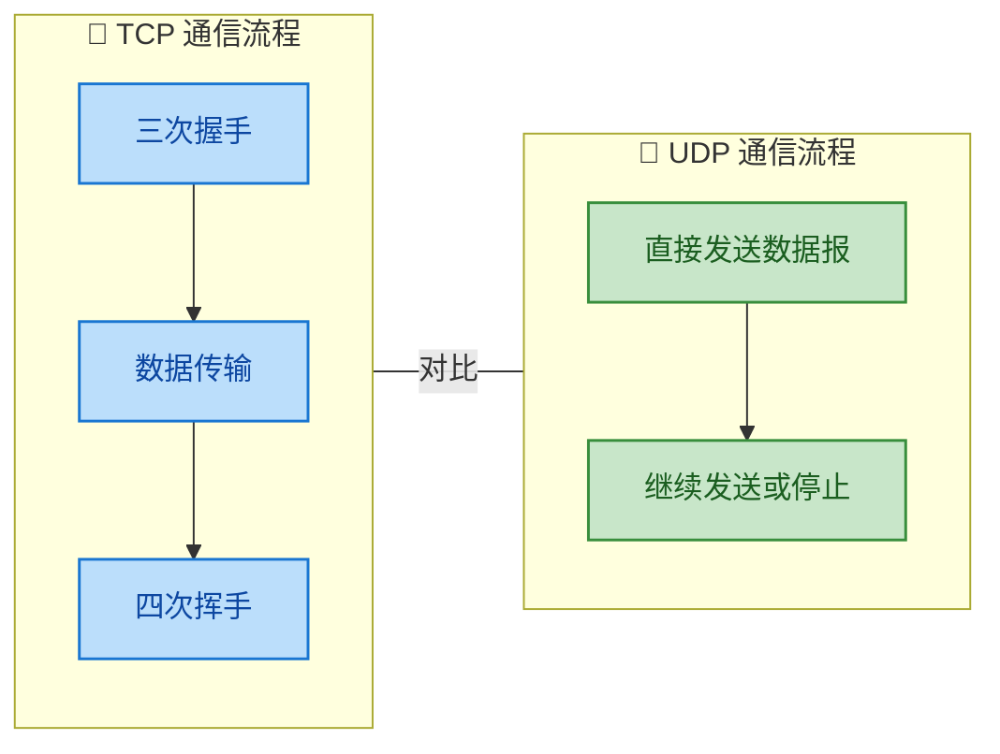

从图中可以直观看出，UDP 省去了连接建立和释放的全部开销。对于只需要发送一两个小数据包的场景（例如 DNS 查询），TCP 的三次握手本身可能比数据传输还耗时——这时 UDP 的优势便体现得淋漓尽致。

**2. 没有连接状态（No Connection State）**

TCP 两端在连接建立后，各自要维护大量的 **连接状态信息（Connection State）**，包括：发送缓冲区、接收缓冲区、序列号、确认号、拥塞窗口 cwnd、接收窗口 rwnd、各种定时器（重传定时器、持续定时器、TIME_WAIT 定时器）等。这些状态占用内存资源，也限制了一台服务器能同时维持的连接数量。

而 UDP **不维护任何连接状态**。服务端不需要为每个客户端保留"会话"信息，这使得 UDP 服务器可以同时服务 **海量客户端**。举个例子：一台 DNS 服务器每秒处理数万甚至数十万次查询，如果每次查询都要经历 TCP 三次握手 + 四次挥手并维护连接状态，资源消耗将是灾难性的。使用 UDP 后，每个请求都是独立的数据报，服务器无需记住"谁连接了我"。

**3. 支持一对一、一对多、多对多通信**

TCP 是 **点对点（Point-to-Point）** 的，一条 TCP 连接只能有两个端点。而 UDP 由于没有连接的概念，天然支持多种通信模式：

| 通信模式 | UDP 支持 | TCP 支持 | 说明 |
|---------|---------|---------|------|
| **单播** Unicast (1:1) | ✅ | ✅ | 一个发送方 → 一个接收方 |
| **广播** Broadcast (1:All) | ✅ | ❌ | 一个发送方 → 局域网内所有主机 |
| **多播/组播** Multicast (1:N) | ✅ | ❌ | 一个发送方 → 特定组内的所有成员 |

这一特性使 UDP 成为 **视频直播、在线会议、IPTV** 等一对多传输场景的首选协议。TCP 要实现"一对多"，只能由服务器与每个客户端分别建立独立连接，开销巨大。

---

### 不可靠（Unreliable）

"不可靠"这个词在日常语境中是贬义的，但在网络协议设计中，它是一种 **刻意的设计选择（Design Choice）**，是用"不保证"换取"高性能"的 trade-off。

**UDP 的不可靠具体体现在以下方面：**

**1. 不保证交付（No Guaranteed Delivery）**

UDP 把数据报交给 IP 层之后，就"不管了"。如果数据报在网络传输过程中因为路由器缓冲区溢出、链路故障等原因被丢弃，UDP **不会检测到丢包，也不会重传**。发送方甚至不知道数据有没有到达接收方。

对比 TCP：TCP 为每个字节编号（Seq），接收方必须回复确认（ACK），发送方在超时未收到 ACK 时会自动重传。UDP 没有这些机制——没有序列号跟踪、没有确认应答、没有重传定时器。

**2. 不保证顺序（No Ordering）**

UDP 数据报在网络中可能经过不同的路由路径到达目的地，后发的数据报可能先到。UDP **不提供乱序重排机制**——接收方收到数据报的顺序可能与发送顺序不同。

TCP 通过序列号（Seq）和接收缓冲区实现乱序重组，保证交付给应用层的数据总是有序的。UDP 如果需要有序性，必须由 **应用层自行处理**。

**3. 不进行流量控制（No Flow Control）**

UDP 没有滑动窗口、没有 rwnd 通告。发送方以任意速率发送数据，如果接收方来不及处理，多余的数据报会被 **直接丢弃**，且发送方对此毫不知情。

**4. 不进行拥塞控制（No Congestion Control）**

UDP 没有 cwnd、没有慢启动、没有拥塞避免。即使网络已经严重拥堵，UDP 发送方仍然会以恒定速率注入数据包。这是一把 **双刃剑**：

- **优点**：发送速率不会因网络波动而突然下降，能维持 **稳定的数据输出速率**，适合实时音视频等对延迟抖动敏感的应用。
- **缺点**：UDP 流量不会"退让"，在网络拥塞时可能 **加剧拥塞**，对共享网络中的其他 TCP 流量造成不公平竞争（因为 TCP 会主动降速而 UDP 不会）。

> ⚠️ **重要提醒**："不可靠"不等于"不能用"。很多基于 UDP 的应用协议会在 **应用层** 自行实现部分可靠性机制。例如：
> - **QUIC 协议**（Google 设计，HTTP/3 的底层传输协议）基于 UDP，但在应用层实现了类似 TCP 的可靠传输、拥塞控制和加密。
> - **TFTP（Trivial File Transfer Protocol）** 基于 UDP，但在应用层增加了简单的 ACK 和重传机制。
> - 游戏协议通常基于 UDP，但会在应用层对关键数据（如玩家位置同步）增加序列号和确认。

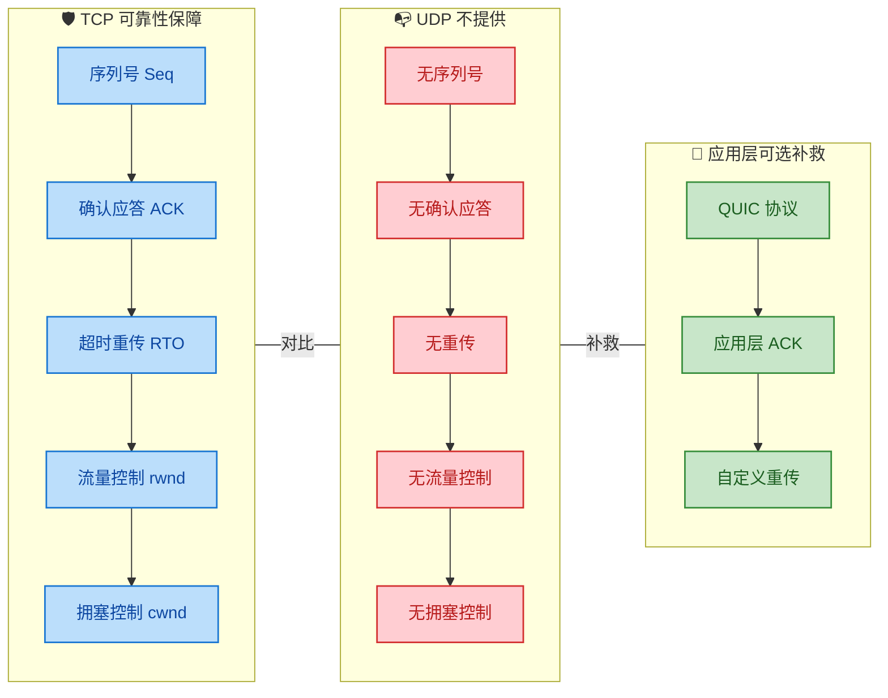

---

### 面向报文（Message-Oriented）

这是 UDP 与 TCP 在数据处理模型上的 **本质差异**，也是很多初学者容易忽略但面试频繁考查的知识点。

**TCP 是面向字节流（Byte-Stream Oriented）的**：应用程序写入 TCP 发送缓冲区的数据被视为一连串无结构的字节。TCP 可能把应用层交下来的一个大块数据拆分成多个报文段（Segmentation），也可能把多次写入的小块数据合并成一个报文段发送（Nagle 算法）。接收方只能看到一个连续的字节流，**完全无法知道发送方每次 `write()` 的边界在哪里**。

**UDP 是面向报文（Message/Datagram-Oriented）的**：应用程序每次调用 `sendto()` 交给 UDP 一个完整的消息，UDP **既不合并、也不拆分**，而是原封不动地给消息加上一个 UDP 首部，作为一个独立的 UDP 数据报交给 IP 层。接收方每次调用 `recvfrom()` 都能收到一个 **完整的、边界清晰的消息**。

```c
// ====== UDP 发送示例 (伪代码) ======
// 应用层调用 3 次 sendto()
sendto(sock, "Hello", 5, ...);    // 第1个数据报：5 字节
sendto(sock, "World", 5, ...);    // 第2个数据报：5 字节
sendto(sock, "!", 1, ...);        // 第3个数据报：1 字节

// 网络上会传输 3 个独立的 UDP 数据报
// 接收方调用 3 次 recvfrom()，分别收到 "Hello"、"World"、"!"

// ====== TCP 发送示例 (伪代码) ======
// 应用层调用 3 次 write()
write(sock, "Hello", 5);          // 写入 5 字节
write(sock, "World", 5);          // 写入 5 字节
write(sock, "!", 1);              // 写入 1 字节

// TCP 可能合并为 1 个报文段发送 "HelloWorld!"
// 也可能拆分为 "Hell" + "oWorld!"
// 接收方 read() 的边界与发送方 write() 的边界完全无关
```

这个特性带来两个重要的实践影响：

**1. UDP 没有"粘包"问题**

TCP 面向字节流的特性会导致经典的 **粘包（Sticky Packet）** 问题：接收方一次 `read()` 可能读到半个消息、一个完整消息、甚至一个半消息拼在一起。因此 TCP 应用必须自行设计 **消息边界协议**（如在消息头部加长度字段、使用特定分隔符等）。

UDP 天然保持消息边界，每个数据报就是一个独立的、完整的应用消息，**不存在粘包问题**。这让 UDP 应用的消息解析逻辑更加简单。

**2. UDP 要求应用层合理控制消息大小**

既然 UDP 不拆分消息，如果应用层交给 UDP 的数据过大，超出了底层网络的 **MTU（Maximum Transmission Unit，最大传输单元）**，则必须由 **IP 层** 进行分片（Fragmentation）。IP 分片有诸多弊端：

- 只要一个分片丢失，整个 UDP 数据报就需要全部丢弃（因为 UDP 不重传，IP 层也不重传）。
- 分片增加了路由器的处理负担。
- 重组分片消耗接收方资源，且有超时风险。

因此，最佳实践是让每个 UDP 数据报的大小保持在 **一个 MTU 以内**（以太网 MTU 通常为 1500 字节，减去 IP 首部 20 字节和 UDP 首部 8 字节，有效载荷不超过 **1472 字节**）。很多 UDP 应用（如 DNS）将消息限制在 **512 字节** 以内以确保安全。

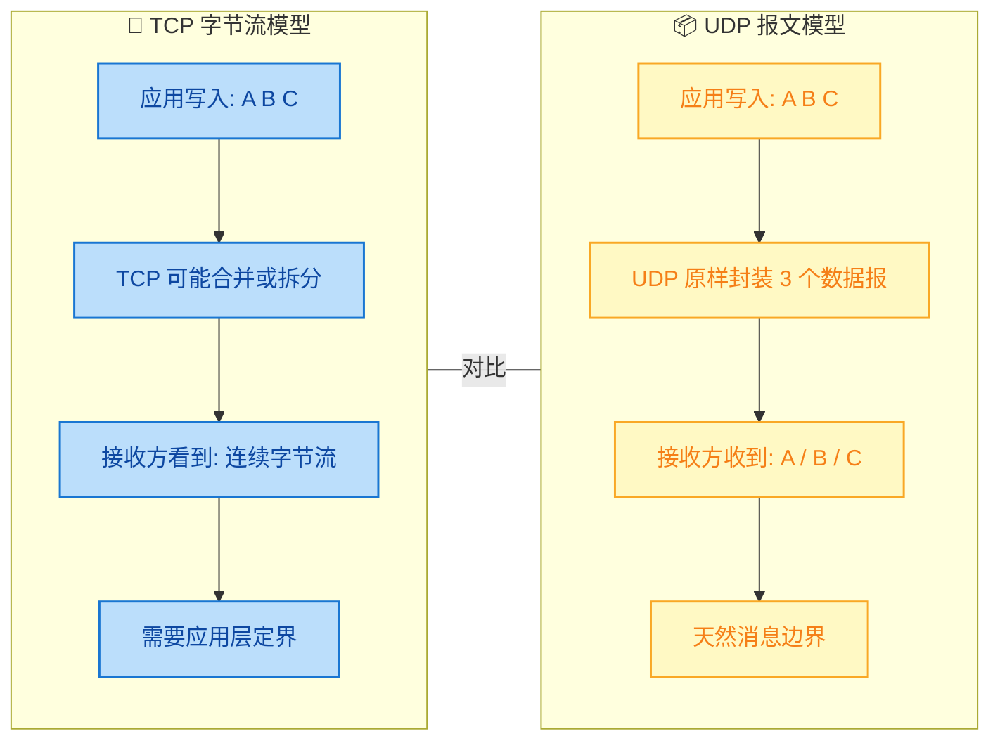

---

### UDP 特点总结一览

| 维度 | UDP | TCP（对比参照） |
|------|-----|----------------|
| **连接性** | 无连接，想发就发 | 面向连接，三次握手 |
| **可靠性** | 不可靠，尽最大努力交付 | 可靠，确认+重传 |
| **数据模型** | 面向报文，保留消息边界 | 面向字节流，无消息边界 |
| **通信模式** | 单播/广播/多播 | 仅单播（点对点） |
| **首部开销** | 8 字节（极小） | 20 字节起（不含选项） |
| **拥塞控制** | 无 | 有（慢启动/拥塞避免等） |
| **流量控制** | 无 | 有（滑动窗口/rwnd） |
| **传输速率** | 由应用层决定，恒定输出 | 由网络状况动态调节 |
| **状态维护** | 无状态 | 有状态（大量连接信息） |

> 一句话总结 UDP 的设计哲学：**Keep it simple, let the application decide.**（保持简单，让应用来决定。）UDP 只做最基础的 "端口复用 + 校验和" 功能，把所有高级特性（可靠性、有序性、流控）的决定权完全交给上层应用。这种极简主义的设计使得 UDP 成为了一个极其灵活的传输层"底座"，应用可以在其之上按需定制任何所需的功能。

---

## UDP 报文结构

UDP（User Datagram Protocol）之所以被称为"轻量级"协议，很大程度上源于它极其简洁的报文结构。整个 UDP 首部（Header）仅有 **8 字节**，相比 TCP 首部最少 20 字节的开销，UDP 在传输效率上有着天然的优势。理解 UDP 的报文结构，是掌握其"面向报文"特性的关键，也是分析网络抓包数据的基础技能。

---

### UDP 数据报的整体构成

一个完整的 UDP 数据报（UDP Datagram）由两部分组成：**首部（Header）** 和 **数据部分（Payload / Data）**。首部承载控制信息，数据部分则是上层应用交付下来的原始报文。UDP 不会对应用层数据做任何拆分或合并——应用层交下来多大的报文，UDP 就原封不动地加上首部后交给网络层，这就是"面向报文（Message-oriented）"的直观体现。

下面用一张全局视图来展示 UDP 数据报在整个协议栈中的封装位置：

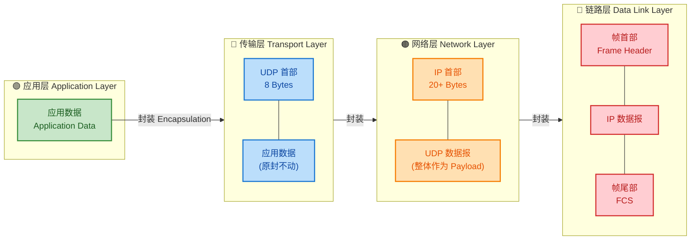

可以看到，UDP 在整个封装链条中扮演的角色非常"薄"——它仅仅添加了一个 8 字节的首部，没有任何额外的控制机制。

---

### 首部字段逐一解析

UDP 首部由 **4 个字段** 组成，每个字段恰好 **2 字节（16 bits）**，总计 **8 字节（64 bits）**。以下是经典的报文格式图：

```
 0               8               16              24            31 (bit)
 +-+-+-+-+-+-+-+-+-+-+-+-+-+-+-+-+-+-+-+-+-+-+-+-+-+-+-+-+-+-+-+-+
 |         源端口号 (Source Port)  |      目的端口号 (Dest Port)   |
 +-+-+-+-+-+-+-+-+-+-+-+-+-+-+-+-+-+-+-+-+-+-+-+-+-+-+-+-+-+-+-+-+
 |           长度 (Length)         |        校验和 (Checksum)     |
 +-+-+-+-+-+-+-+-+-+-+-+-+-+-+-+-+-+-+-+-+-+-+-+-+-+-+-+-+-+-+-+-+
 |                                                               |
 |                      数据 (Payload / Data)                     |
 |                         (可变长度)                              |
 |                                                               |
 +-+-+-+-+-+-+-+-+-+-+-+-+-+-+-+-+-+-+-+-+-+-+-+-+-+-+-+-+-+-+-+-+
```

下面逐一深入讲解每个字段：

#### 🔹 源端口号（Source Port） — 16 bits

源端口号标识了**发送方进程**所使用的端口。取值范围为 `0 ~ 65535`。这个字段在 UDP 中是**可选的（Optional）**。如果发送方不需要对方回复（即单向通信），可以将该字段置为 `0`。

实际应用中，操作系统通常会为客户端自动分配一个 **临时端口号（Ephemeral Port）**，范围一般在 `49152 ~ 65535` 之间（IANA 推荐），也有系统使用 `1024 ~ 65535`。例如你用浏览器发起 DNS 查询时，操作系统可能会分配端口 `52347` 作为源端口。

#### 🔹 目的端口号（Destination Port） — 16 bits

目的端口号标识了**接收方进程**所使用的端口，这个字段是**必需的（Required）**。接收端的操作系统根据该端口号将数据报**分用（Demultiplexing）** 给正确的应用进程。

常见的知名端口号（Well-known Ports）举例：

| 端口号 | 协议/服务 | 说明 |
|:---:|:---:|:---|
| 53 | DNS | 域名解析 |
| 67/68 | DHCP | 动态主机配置（Server/Client） |
| 69 | TFTP | 简单文件传输 |
| 123 | NTP | 网络时间协议 |
| 161 | SNMP | 简单网络管理 |
| 443 | QUIC | 基于 UDP 的新一代传输协议 |

#### 🔹 长度（Length） — 16 bits

这个字段表示的是**整个 UDP 数据报的长度**，单位是**字节（Byte）**，包括首部和数据两部分。因此：

$$\text{Length} = \text{UDP Header (8 Bytes)} + \text{Payload}$$

由于该字段为 16 bits，理论最大值为 $2^{16} - 1 = 65535$ 字节。减去 8 字节的首部，**数据部分最大为 65527 字节**。但在实际网络中，由于 IP 层的 MTU（Maximum Transmission Unit）限制（以太网通常为 1500 字节），UDP 数据报过大会导致 **IP 层分片（Fragmentation）**，而 UDP 本身对分片毫不知情，这也是 UDP"不可靠"的表现之一。

> **注意**：Length 字段的**最小值为 8**，意味着数据部分可以为空（0 字节）。一个"空的" UDP 数据报是合法的，常见于某些探测性协议。

#### 🔹 校验和（Checksum） — 16 bits

校验和用于检测 UDP 数据报在传输过程中是否发生了**比特错误（Bit Errors）**。这是 UDP 提供的**唯一一项差错检测机制**，但它**不提供纠错能力**——一旦发现错误，接收端直接**丢弃**该数据报，不会通知发送方。

校验和的计算范围**不仅仅是 UDP 首部和数据**，还包括一个从 IP 层"借来"的 **伪首部（Pseudo Header）**。这是 UDP 校验和设计中最容易被忽略的关键点。

---

### 伪首部（Pseudo Header）详解

伪首部是一个**虚构的结构**，它并不真正存在于任何传输的数据报中，仅用于**校验和的计算过程**。设计它的目的是让 UDP 的校验和能够覆盖到 IP 层的关键信息（源/目的 IP 地址），从而**防止数据报被错误投递到错误的主机**。

IPv4 下 UDP 伪首部结构如下：

```
 0               8               16              24            31 (bit)
 +-+-+-+-+-+-+-+-+-+-+-+-+-+-+-+-+-+-+-+-+-+-+-+-+-+-+-+-+-+-+-+-+
 |                        源 IP 地址 (32 bits)                    |
 +-+-+-+-+-+-+-+-+-+-+-+-+-+-+-+-+-+-+-+-+-+-+-+-+-+-+-+-+-+-+-+-+
 |                       目的 IP 地址 (32 bits)                   |
 +-+-+-+-+-+-+-+-+-+-+-+-+-+-+-+-+-+-+-+-+-+-+-+-+-+-+-+-+-+-+-+-+
 |   全零 (8)    |  协议号 (8)    |       UDP 长度 (16 bits)      |
 +-+-+-+-+-+-+-+-+-+-+-+-+-+-+-+-+-+-+-+-+-+-+-+-+-+-+-+-+-+-+-+-+
```

伪首部共 **12 字节**，各字段含义：

| 字段 | 大小 | 说明 |
|:---|:---:|:---|
| 源 IP 地址 | 4 Bytes | 来自 IP 首部 |
| 目的 IP 地址 | 4 Bytes | 来自 IP 首部 |
| 全零填充 | 1 Byte | 固定为 `0x00` |
| 协议号 | 1 Byte | UDP 为 `17`（即 `0x11`） |
| UDP 长度 | 2 Bytes | 与 UDP 首部中的 Length 字段相同 |

所以校验和的完整计算范围是：

$$\text{Checksum Scope} = \underbrace{\text{Pseudo Header}}_{\text{12 Bytes}} + \underbrace{\text{UDP Header}}_{\text{8 Bytes}} + \underbrace{\text{Payload}}_{\text{Variable}}$$

下面用一张图来直观展示这个关系：

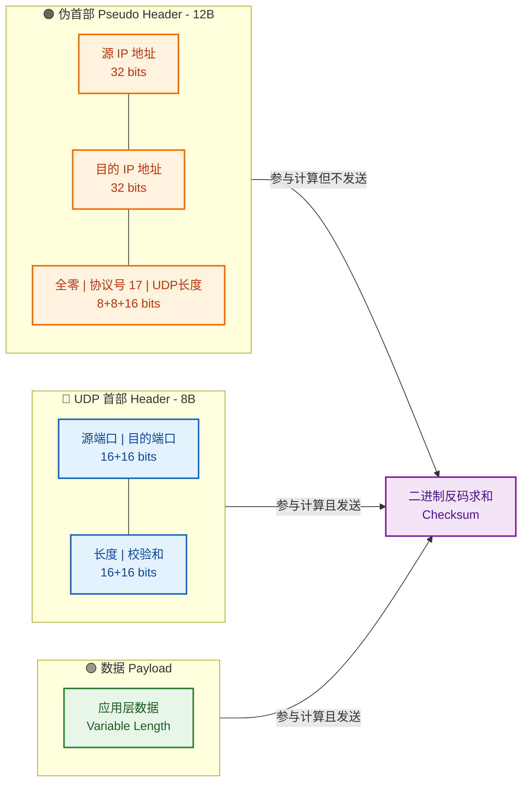

> **关键理解**：伪首部**只参与计算，不参与传输**。它是 UDP 跨层"偷看" IP 层信息的一种设计手段，虽然在理论上违反了协议分层的纯洁性，但在实践中有效地增强了校验的覆盖面。

---

### 校验和的计算步骤

UDP 校验和采用 **Internet Checksum** 算法（与 IP 首部校验和算法相同），具体步骤如下：

**发送端计算过程：**

1. 将伪首部、UDP 首部和数据部分按顺序排列
2. 如果数据长度为奇数字节，在末尾填充一个全零字节（仅用于计算，不传输）
3. 将所有内容视为一系列 **16 位（2 字节）** 的整数
4. 将校验和字段本身先置为 `0`
5. 对所有 16 位整数进行 **二进制反码求和（One's Complement Sum）**
6. 将求和结果**取反码**，得到最终校验和并填入首部

**接收端验证过程：**

1. 同样构造伪首部，连同收到的 UDP 首部（包含校验和）和数据一起进行二进制反码求和
2. 如果结果全为 `1`（即 `0xFFFF`），说明传输无误
3. 如果不是全 `1`，说明数据报存在错误，**直接丢弃**

以下用一个具体的数值示例来演示：

```python
# ============================================
# UDP 校验和计算示例 (简化版)
# ============================================

def compute_checksum(data_16bit_list):
    """
    计算 Internet Checksum (二进制反码求和)
    :param data_16bit_list: 16位整数列表
    :return: 16位校验和
    """
    total = 0                          # 初始化累加值为 0

    for value in data_16bit_list:      # 遍历每一个 16 位整数
        total += value                 # 逐个累加
        # 如果产生了进位(超出16位), 将进位回卷到低位
        while total > 0xFFFF:          # 检测是否溢出 16 位
            carry = total >> 16        # 提取高位进位
            total = (total & 0xFFFF) + carry  # 回卷: 低16位 + 进位

    checksum = total ^ 0xFFFF          # 取反码 (按位取反, 保留16位)
    return checksum                    # 返回最终校验和


# --- 示例数据 ---
# 假设伪首部 + UDP首部 + 数据 展开为以下 16 位字段:
# (为简化, 仅列出几个示例值)
fields = [
    0xC0A8, 0x0001,   # 源 IP: 192.168.0.1
    0xC0A8, 0x0002,   # 目的 IP: 192.168.0.2
    0x0011, 0x000F,   # 全零+协议号17, UDP长度15(含填充)
    0x1F40, 0x0035,   # 源端口 8000, 目的端口 53
    0x000F, 0x0000,   # UDP长度 15, 校验和先置0
    0x4865, 0x6C6C,   # 数据: "Hell"
    0x6F00             # 数据: "o" + 填充零字节
]

result = compute_checksum(fields)      # 调用校验和计算函数
print(f"Checksum: 0x{result:04X}")     # 输出十六进制校验和
```

---

### 校验和字段为全零的特殊情况

在 **IPv4** 中，UDP 的校验和是**可选的**。如果发送端决定不计算校验和，会将该字段设置为 `0x0000`。接收端看到全零的校验和时，就知道发送端跳过了校验，不做任何验证。

但在 **IPv6** 中，由于 IPv6 首部本身**取消了首部校验和**（为了提高路由器转发效率），UDP 校验和变成了**强制的（Mandatory）**。如果不计算校验和，IPv6 下的 UDP 报文可能在传输中悄悄损坏而完全无法被检测到。

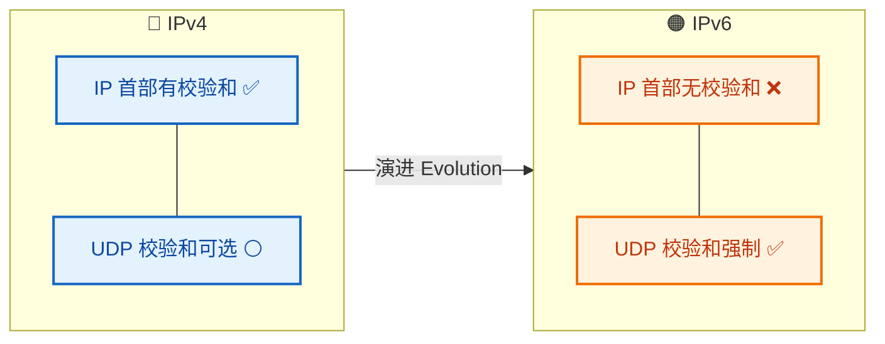

---

### 为何首部如此简单？—— 设计哲学

UDP 首部只有 8 字节，这不是"偷懒"，而是一种深思熟虑的**极简设计哲学（Minimalist Design Philosophy）**。我们可以从"有什么"和"没有什么"两个角度来理解：

**UDP 首部有什么：**
- **端口号**（源 + 目的）：实现进程间通信（Process-to-Process Communication）的最低要求
- **长度字段**：标明数据报边界，因为 UDP 是面向报文的，接收端需要知道完整报文的边界
- **校验和**：提供最基本的差错检测

**UDP 首部没有什么：**
- ❌ 序号（Sequence Number）—— 不保证顺序
- ❌ 确认号（Acknowledgment Number）—— 不提供确认
- ❌ 窗口大小（Window Size）—— 不做流量控制
- ❌ 标志位（Flags）—— 不需要连接管理
- ❌ 选项字段（Options）—— 不支持扩展协商

正因为去掉了这些"包袱"，UDP 才能实现：
- **极低的首部开销**（8B vs TCP 的 20~60B）
- **极低的处理延迟**（不需要维护连接状态）
- **极高的灵活性**（上层可以自定义可靠性机制，如 QUIC）

---

### 用 Wireshark 视角看 UDP 报文

在实际的网络分析中，使用 Wireshark 抓包工具可以清晰地看到 UDP 报文的每一个字段。以一个 DNS 查询报文为例，各层封装关系如下：

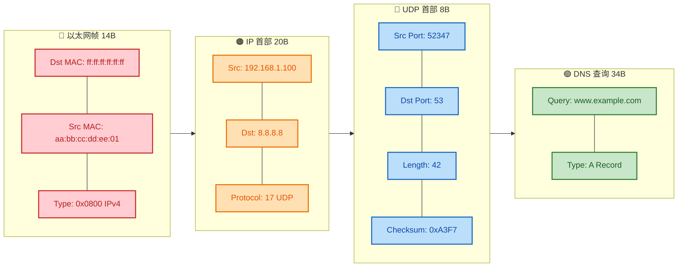

在这个例子中，整个 UDP 数据报的长度为 42 字节（8 字节首部 + 34 字节 DNS 数据）。Wireshark 会自动校验 Checksum 并在界面中标注是否正确，这在调试网络问题时非常有用。

---

**📝 练习题**

某 UDP 数据报的首部十六进制转储如下：`1F 40 00 35 00 2A XX XX`。关于这个 UDP 报文，以下说法正确的是？

A. 源端口号为 53，目的端口号为 8000

B. 该 UDP 数据报总长度为 42 字节，其中数据部分为 34 字节

C. 该 UDP 数据报数据部分长度为 42 字节

D. `XX XX` 代表的是 UDP 报文的长度字段


**【答案】** B

**【解析】**

逐字段解析这段十六进制：

- **`1F 40`** → 源端口号：`0x1F40` = **8000**（十进制）
- **`00 35`** → 目的端口号：`0x0035` = **53**（十进制，即 DNS 服务端口）
- **`00 2A`** → 长度字段：`0x002A` = **42**（十进制，单位字节）
- **`XX XX`** → 校验和字段（Checksum），不是长度字段

因此选项 A 源/目的端口搞反了；选项 C 把总长度当成了数据长度（数据部分 = 42 - 8 = 34 字节）；选项 D 错误地认为 `XX XX` 是长度字段，实际是校验和。**选项 B 正确**：总长度 42 字节，数据部分 42 - 8 = 34 字节。

---

## TCP vs UDP ⭐

TCP（Transmission Control Protocol）与 UDP（User Datagram Protocol）是传输层（Transport Layer）最核心的两大协议。它们共同承载了互联网几乎所有的数据传输任务，但在设计哲学上却走了截然不同的两条路：**TCP 选择了可靠性，UDP 选择了效率**。理解二者的差异，是掌握网络编程、系统架构设计和性能调优的基础中的基础。

---

### 核心设计哲学对比

要理解 TCP 与 UDP 的区别，首先要抓住它们各自的 **设计出发点（Design Philosophy）**：

- **TCP 的哲学**：「我要确保每一个字节都正确、有序、完整地到达对端，哪怕为此牺牲一些速度和资源。」它像一通电话——先拨号建立连接，通话过程中双方实时确认彼此能听到，挂断时也有明确的结束流程。

- **UDP 的哲学**：「我只负责把数据尽快扔出去，至于对面收没收到、顺序对不对，那不是我的事。」它像寄明信片——写上地址直接投进邮筒，没有回执，没有确认，简单直接。

这两种哲学并无高下之分，只是适用于不同的场景。选择哪一个，取决于你的应用更看重 **数据完整性（Data Integrity）** 还是 **传输实时性（Real-time Performance）**。

---

### 逐项对比详解

下面从多个维度深入剖析 TCP 与 UDP 的差异：

#### 1. 连接性（Connection）

**TCP 是面向连接的（Connection-Oriented）**。在正式传输数据之前，TCP 需要通过 **三次握手（Three-Way Handshake）** 建立连接，传输结束后还需要通过 **四次挥手（Four-Way Handshake）** 释放连接。这个过程确保了双方都准备好了收发数据，但也引入了额外的时间开销（至少一个 RTT 的建连延迟）。

**UDP 是无连接的（Connectionless）**。发送方不需要事先与接收方建立任何连接，直接将数据报（Datagram）发出即可。这意味着 UDP 没有建连和断连的开销，第一个数据包可以立即发送，非常适合对延迟敏感的场景。

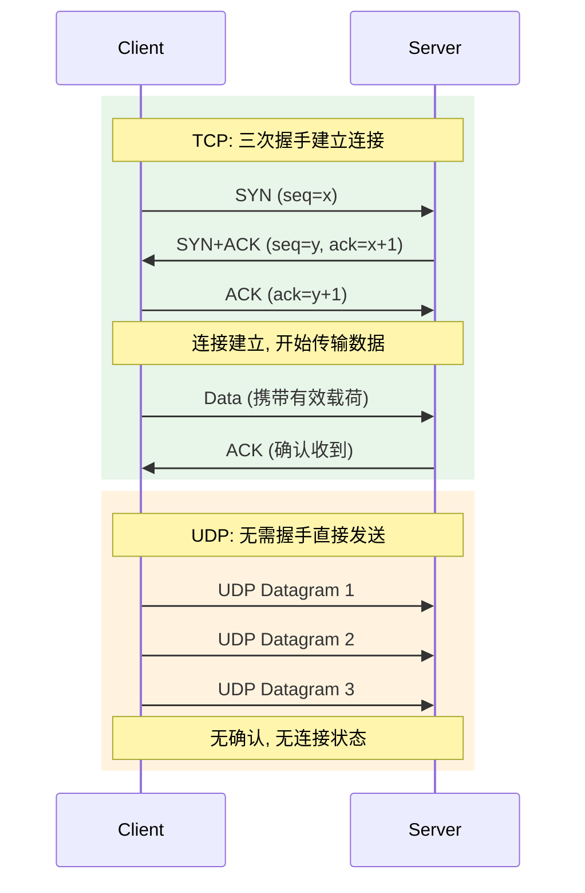

从图中可以清晰看出：TCP 在发送第一个有效数据之前，已经消耗了 **1.5 个 RTT**；而 UDP 的第一个数据报 **零延迟** 即可发出。

#### 2. 可靠性（Reliability）

这是 TCP 和 UDP 最本质的区别。

**TCP 提供可靠传输（Reliable Delivery）**，其可靠性建立在以下四大机制之上：

- **确认应答（ACK Mechanism）**：接收方每收到数据都会回复 ACK，发送方据此判断数据是否到达。
- **超时重传（Timeout Retransmission）**：如果发送方在 RTO（Retransmission Timeout）时间内未收到 ACK，会自动重传该数据段。
- **序列号与排序（Sequence Number & Ordering）**：每个字节都有唯一的序列号，接收方可以根据序列号将乱序到达的数据重新排列。
- **校验和（Checksum）**：TCP 头部包含校验和字段，用于检测传输过程中的位错误。

**UDP 不提供可靠性保证（Unreliable / Best-Effort Delivery）**。数据报可能丢失、重复、乱序到达，UDP 协议本身不做任何处理。如果应用需要可靠性，必须在应用层自行实现（例如 QUIC 协议就是在 UDP 之上构建了自己的可靠传输机制）。

#### 3. 有序性（Ordering）

**TCP 保证数据有序到达**。即使底层 IP 层将数据包以不同顺序送达，TCP 也会利用序列号在接收端的缓冲区中重组，上层应用读到的永远是按发送顺序排列的字节流。但这也引入了一个问题——**队头阻塞（Head-of-Line Blocking, HOL Blocking）**：如果序列号靠前的包丢失了，即使后续的包已经到达，也必须等待重传完成后才能交付给应用层。

**UDP 不保证顺序**。每个数据报都是独立的，先发后到、后发先到都有可能。但反过来说，UDP **没有队头阻塞问题**——每个数据报独立交付，一个包的丢失不会影响其他包的处理。

#### 4. 传输方式（Transmission Model）

**TCP 是面向字节流的（Byte-Stream Oriented）**。应用层写入的数据被 TCP 视为无结构的字节流，TCP 会根据窗口大小、MSS（Maximum Segment Size）等因素自行决定如何分段（Segmentation）。这意味着发送方调用两次 `send()` 写入的数据，接收方可能一次 `recv()` 就全部读取，也可能需要多次——也就是经典的 **粘包问题（Packet Sticking）**。应用层需要自己设计消息边界（如长度前缀、分隔符等）。

**UDP 是面向报文的（Message-Oriented / Datagram-Oriented）**。应用层交给 UDP 多大的报文，UDP 就原封不动地加上头部发送出去，不拆分也不合并。接收方每次 `recvfrom()` 恰好读取一个完整的数据报。**UDP 天然保留了消息边界（Message Boundary）**，不存在粘包问题。

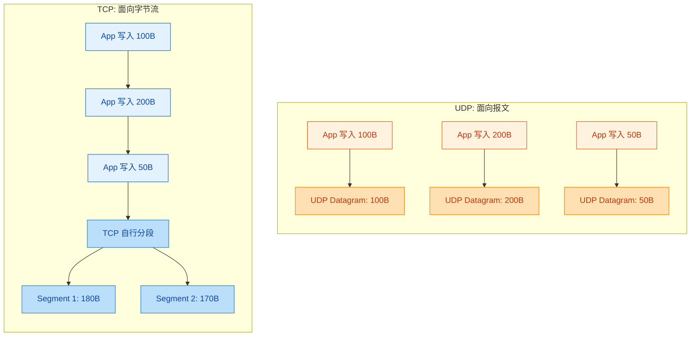

这张图直观展示了：TCP 把多次写入的数据当作连续的字节流、自行决定怎么切；而 UDP 严格保持每次写入的数据报边界不变。

#### 5. 流量控制与拥塞控制（Flow Control & Congestion Control）

**TCP 拥有完善的流量控制和拥塞控制机制**：

- **流量控制（Flow Control）**：通过 **滑动窗口协议（Sliding Window Protocol）**，接收方在 ACK 中携带自己的 **接收窗口大小（rwnd, Receive Window）**，告知发送方「我还能接受多少数据」，防止接收方缓冲区溢出。
- **拥塞控制（Congestion Control）**：通过 **慢启动（Slow Start）、拥塞避免（Congestion Avoidance）、快重传（Fast Retransmit）、快恢复（Fast Recovery）** 等算法，TCP 动态调整发送速率，避免网络过载。发送方维护一个 **拥塞窗口（cwnd, Congestion Window）**，实际发送量取 `min(rwnd, cwnd)`。

**UDP 没有任何流量控制和拥塞控制**。发送方可以以任意速率发送数据，不关心网络是否拥堵、接收方是否处理得过来。这是一把双刃剑：

- **优势**：发送速率完全由应用层控制，可以实现极低延迟。
- **风险**：在网络拥堵时，UDP 流量不会自动退让，可能加剧拥塞，甚至导致大量丢包。这也是为什么大规模使用 UDP 的应用（如视频会议、在线游戏）通常会在 **应用层实现自己的拥塞控制策略**。

#### 6. 头部开销（Header Overhead）

**TCP 头部最小 20 字节**（不含选项），最大可达 60 字节（含选项如时间戳、窗口缩放等）。头部包含：源端口、目的端口、序列号、确认号、数据偏移、标志位（SYN/ACK/FIN/RST 等）、窗口大小、校验和、紧急指针等字段。

**UDP 头部固定仅 8 字节**。只有四个字段：源端口（2B）、目的端口（2B）、长度（2B）、校验和（2B）。极简的头部意味着更低的协议开销（Protocol Overhead），在传输小数据包时优势尤为明显。

```text
┌─────────────────── TCP Header (20~60 Bytes) ───────────────────┐
│ Src Port (2B) │ Dst Port (2B)                                  │
│ Sequence Number (4B)                                           │
│ Acknowledgment Number (4B)                                     │
│ Offset│Resv│Flags (2B) │ Window Size (2B)                      │
│ Checksum (2B)          │ Urgent Pointer (2B)                   │
│ Options (0~40B)        │ Padding                               │
└────────────────────────────────────────────────────────────────┘

┌─────────────────── UDP Header (Fixed 8 Bytes) ────────────────┐
│ Src Port (2B) │ Dst Port (2B)                                  │
│ Length   (2B) │ Checksum (2B)                                  │
└────────────────────────────────────────────────────────────────┘
```

UDP 头部仅为 TCP 最小头部的 **40%**，对于频繁发送小数据包的场景（如 DNS 查询、心跳包、游戏状态同步），这个差距会被显著放大。

#### 7. 通信模式（Communication Pattern）

**TCP 仅支持一对一通信（Unicast）**。因为 TCP 连接是两个端点之间的有状态会话（Stateful Session），每条连接由四元组 `(srcIP, srcPort, dstIP, dstPort)` 唯一标识，天然不支持一对多。

**UDP 支持一对一、一对多（Broadcast/Multicast）、多对多通信**。由于 UDP 无连接，每个数据报都是独立的，可以轻松实现广播（Broadcast）和组播（Multicast）。这在局域网服务发现（如 mDNS、SSDP）、IPTV 多频道分发、实时音视频会议等场景中至关重要。

---

### 全维度对比总表

| 对比维度 | TCP | UDP |
|:---|:---|:---|
| **连接性** | 面向连接（三次握手/四次挥手） | 无连接 |
| **可靠性** | 可靠传输（ACK、重传、排序） | 不可靠（Best-Effort） |
| **有序性** | 保证有序（存在 HOL Blocking） | 不保证（无 HOL Blocking） |
| **传输方式** | 面向字节流（有粘包问题） | 面向报文（天然保留消息边界） |
| **流量控制** | ✅ 滑动窗口 | ❌ 无 |
| **拥塞控制** | ✅ 慢启动 / 拥塞避免等 | ❌ 无 |
| **头部大小** | 20 ~ 60 字节 | 固定 8 字节 |
| **通信模式** | 仅单播（Unicast） | 单播 / 广播 / 组播 |
| **速度** | 较慢（建连 + 确认开销） | 较快（零建连、零确认） |
| **资源消耗** | 高（维护连接状态、缓冲区） | 低（无状态） |
| **典型应用** | HTTP/HTTPS, FTP, SMTP, SSH | DNS, DHCP, 视频直播, 游戏 |

---

### 如何选择：TCP 还是 UDP？

在实际工程中，选择 TCP 还是 UDP 需要根据 **业务需求** 做权衡。以下是一个简洁的决策模型：

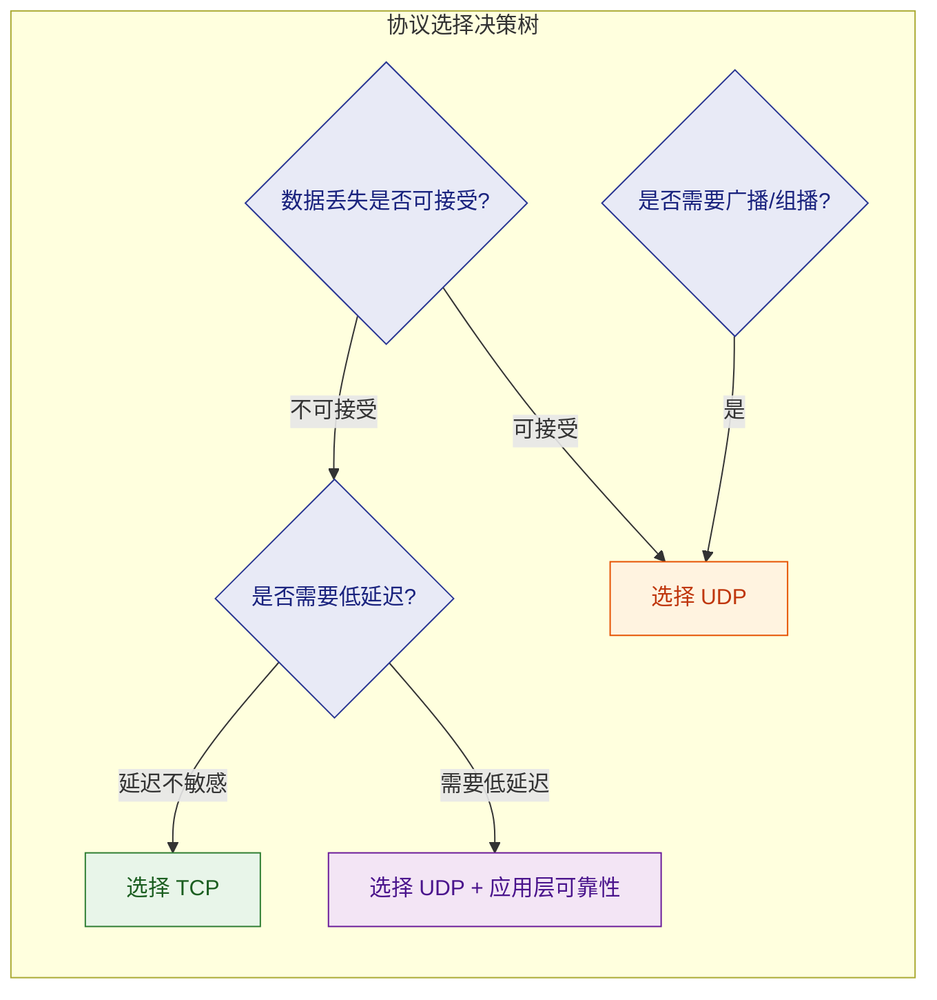

**关键决策点解读**：

- 如果你的应用 **绝对不能容忍数据丢失**（如文件传输、数据库同步、金融交易），且对延迟不那么敏感 → **选 TCP**。
- 如果数据丢失是可以接受的（如丢一帧画面、少一次位置更新），而实时性是第一优先级 → **选 UDP**。
- 如果既需要可靠性，又需要低延迟和灵活性 → **在 UDP 之上构建自定义可靠传输**（如 Google 的 QUIC、游戏中的 Reliable UDP）。QUIC 协议正是这种思路的典范——它基于 UDP 实现了类似 TCP 的可靠传输和拥塞控制，同时通过消除 HOL Blocking、支持 0-RTT 握手等方式大幅降低了延迟。

---

### 现代趋势：UDP 的复兴

在互联网早期，TCP 占据了绝对主导地位。但近年来，UDP 的使用比例正在快速上升，背后有几个关键驱动力：

1. **QUIC 协议的普及**：HTTP/3 基于 QUIC，而 QUIC 基于 UDP。随着 Google、Cloudflare 等大厂推动，越来越多的 Web 流量跑在 UDP 上。QUIC 解决了 TCP 的 HOL Blocking 问题，支持连接迁移（Connection Migration），在移动网络环境下表现尤为优秀。

2. **实时通信需求爆发**：视频会议（Zoom、腾讯会议）、在线游戏、IoT 传感器数据上报，这些场景都天然偏好 UDP 的低延迟特性。

3. **TCP 的中间设备僵化问题（Ossification）**：由于防火墙、NAT 设备等中间设备对 TCP 协议头做了大量假设和干预，想要在 TCP 层面引入新特性变得极其困难。而 UDP 的极简头部加上应用层加密（如 QUIC 对传输层信息加密），使得协议创新可以绕过中间设备的干扰。

---

**📝 练习题**

某在线多人对战游戏需要实时同步玩家位置，同步频率为每秒 60 次。偶尔丢失 1-2 次位置更新不影响体验，但延迟超过 50ms 会导致明显卡顿。该游戏的位置同步模块应该选择什么传输方案？

A. 直接使用 TCP，因为 TCP 可靠性高，能确保所有位置数据到达

B. 直接使用 UDP，因为 UDP 延迟低且无需建连

C. 使用 UDP，并在应用层实现完整的 TCP 级别可靠传输机制

D. 使用 UDP，仅在应用层添加序列号用于检测乱序和过期包，不做重传


**【答案】** D

**【解析】** 本题的关键约束是：① 丢包可接受（偶尔丢 1-2 次位置更新无影响）；② 延迟极其敏感（50ms 以上不可接受）；③ 发送频率极高（60Hz）。

- **A 错误**：TCP 的确认应答和超时重传机制会引入额外延迟，更致命的是 HOL Blocking——一个包丢失会阻塞后续所有包的交付，在 60Hz 的高频场景下，这会导致明显的卡顿和抖动。
- **B 不够完善**：裸 UDP 虽然延迟低，但完全没有包序管理。在网络抖动时，接收方可能先收到一个「旧」的位置包再收到「新」的，如果不加甄别直接使用旧数据，角色会出现「瞬移回退」现象。
- **C 错误**：如果在 UDP 之上实现完整的 TCP 级别可靠传输（含重传），那就重新引入了 TCP 的延迟问题，本末倒置。
- **D 正确**：这是游戏行业的标准做法。给每个 UDP 包附带一个递增的序列号（Sequence Number），接收方据此判断：如果收到的包序列号小于已处理的最大序列号，说明是过期包，直接丢弃；如果序列号更大则正常处理。**不做重传**，因为位置数据具有天然的「最新值覆盖」特性——丢失的旧位置在下一帧就会被更新的位置取代，重传毫无意义。这种方案兼顾了低延迟和数据有效性。

---

## UDP 应用场景

UDP 协议虽然"不可靠"，但凭借其 **低延迟、低开销、无连接** 的天然优势，在众多实际场景中反而是最优选择。理解 UDP 的应用场景，本质上就是理解 **"什么时候我们愿意用可靠性换取速度"**。

下面我们从三个经典且极具代表性的场景——DNS、视频直播、游戏——来深入剖析 UDP 为何不可替代。

---

### DNS（Domain Name System）

#### 为什么 DNS 选择 UDP？

DNS 是互联网最基础的"电话簿"服务，负责将人类可读的域名（如 `www.google.com`）解析为机器可路由的 IP 地址（如 `142.250.80.4`）。DNS 查询是互联网上 **最高频** 的操作之一——你每打开一个网页，浏览器可能触发数十次 DNS 解析。

DNS 默认使用 **UDP 端口 53** 进行通信，原因可以从多个维度分析：

**① 请求-响应模型天然适配无连接协议**

DNS 查询是一个极其简单的 **"一问一答"（Query-Response）** 模型。客户端发送一个查询报文，服务器返回一个应答报文，整个交互只需 **两个数据包（2 packets）**。如果使用 TCP，光是建立连接的三次握手就需要 3 个包，加上释放连接的四次挥手还需要 4 个包，总计至少 **9 个包** 才能完成一次查询。这种开销对于 DNS 这种超轻量级交互而言，完全是浪费。

```
 UDP 方式 (2 packets)              TCP 方式 (9+ packets)
 ─────────────────────             ─────────────────────────
 Client ──Query──▶ Server          Client ──SYN──────▶ Server
 Client ◀─Reply──  Server          Client ◀─SYN+ACK──  Server
                                   Client ──ACK──────▶ Server
        完成！                      Client ──Query────▶ Server
                                   Client ◀─Reply────  Server
                                   Client ──ACK──────▶ Server
                                   Client ──FIN──────▶ Server
                                   Client ◀─ACK──────  Server
                                   Client ◀─FIN──────  Server
                                   Client ──ACK──────▶ Server
                                          完成...
```

**② DNS 报文极小，完美匹配 UDP 特性**

绝大多数 DNS 查询报文和响应报文的大小都远小于 **512 字节**（这是早期 DNS 规范 RFC 1035 规定的 UDP 载荷上限）。UDP 面向报文的特性意味着整个 DNS 消息可以封装在 **一个 UDP 数据报** 中完成传输，无需分段、无需重组，处理效率极高。

**③ DNS 服务器的并发压力要求极低开销**

全球顶级 DNS 服务器（如根域名服务器）每秒需处理 **数十万甚至上百万次** 查询请求。UDP 的无连接特性意味着服务器 **不需要为每个客户端维护任何状态（stateless）**，不需要分配 TCB（Transmission Control Block），这极大降低了服务器的内存和 CPU 开销。如果使用 TCP，服务器很快就会因海量并发连接而耗尽资源。

**④ 丢包？重发就好了**

DNS 解析失败的代价很低。如果 UDP 查询包丢失了，客户端只需在超时后 **简单重传** 即可，应用层自己就能处理这种"不可靠性"。通常 DNS 客户端的重传策略是：等待 2-5 秒无响应后重发，最多重试 2-3 次，若仍失败则尝试备用 DNS 服务器。

#### DNS 什么时候会用 TCP？

这是一个常见的面试考点。虽然 DNS 默认使用 UDP，但在以下两种情况下会 **回退到 TCP 端口 53**：

- **响应报文超过 512 字节**：当 DNS 响应数据过大（如包含大量记录的区域传送），UDP 无法承载时，服务器会在响应中设置 **TC 标志位（Truncated）**，通知客户端用 TCP 重新请求。
- **区域传送（Zone Transfer）**：主 DNS 服务器与从 DNS 服务器之间同步完整的区域数据（AXFR/IXFR）时，数据量巨大且要求可靠传输，必须使用 TCP。

> 💡 **扩展**：随着 DNSSEC 和 EDNS0 的推广，DNS 响应变得越来越大。EDNS0 将 UDP 载荷上限扩展到了 **4096 字节**，但超大响应仍需回退 TCP。此外，现代的 **DNS over HTTPS (DoH)** 和 **DNS over TLS (DoT)** 则完全运行在 TCP 之上，主要目的是加密和隐私保护。

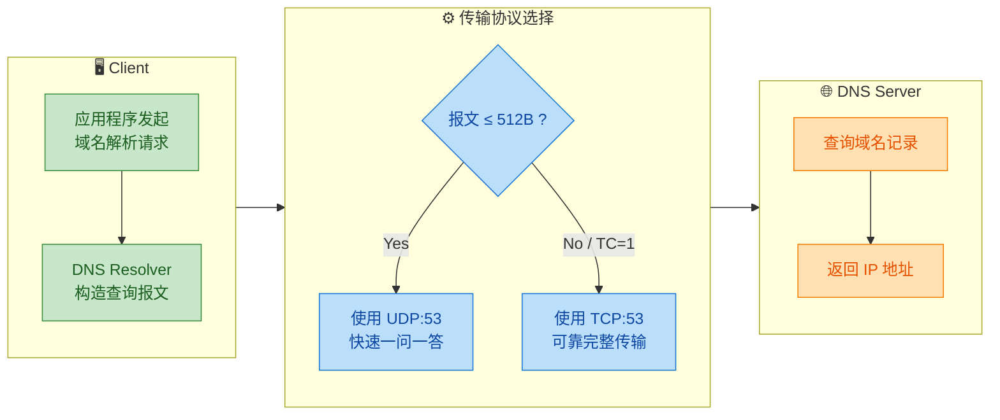

---

### 视频直播（Live Video Streaming）

#### 实时性是直播的生命线

视频直播与"点播视频"（Video on Demand）有着本质区别。点播可以缓冲、可以暂停，用户对延迟不敏感；而直播的核心诉求是 **"实时"**——主播说了一句话，观众必须在极短的延迟（通常 < 1-3 秒）内看到和听到。

在这种场景下，TCP 的可靠传输机制反而成为 **致命缺陷**：

**① TCP 的重传机制导致"延迟叠加"（Head-of-Line Blocking）**

假设直播流的一个视频帧在传输中丢失了。TCP 的做法是：暂停后续所有数据的交付，等待丢失的包被重传并按序到达后，才将数据交给应用层。在这段等待期间，后续已经到达的新帧全部被"堵"在接收缓冲区中。对于直播而言，**那个丢失的旧帧已经过时了，重传它毫无意义**，但 TCP 不知道这一点——它只关心"按序交付"。

```
  时间轴 ──────────────────────────────────────────────▶

  TCP 场景（Head-of-Line Blocking）:
  ┌────────┐ ┌────────┐   ❌丢失    ┌────────┐ ┌────────┐
  │ Frame1 │ │ Frame2 │  Frame3    │ Frame4 │ │ Frame5 │
  └────────┘ └────────┘            └────────┘ └────────┘
       ✅        ✅       等待重传...   🔒阻塞     🔒阻塞
                          ↓ 重传到达后才能继续播放
                          ↓ 此时 Frame4/5 已过时 → 卡顿！

  UDP 场景（跳过丢帧，继续播放）:
  ┌────────┐ ┌────────┐   ❌丢失    ┌────────┐ ┌────────┐
  │ Frame1 │ │ Frame2 │  Frame3    │ Frame4 │ │ Frame5 │
  └────────┘ └────────┘            └────────┘ └────────┘
       ✅        ✅      跳过！→       ✅        ✅
                    观众可能闪一下，但不会卡顿
```

**② UDP 允许应用层自主控制传输策略**

使用 UDP 后，应用层可以根据直播的特殊需求定制传输策略：

- **丢帧容忍**：丢失一两个视频帧？跳过即可。人眼对短暂的画面抖动/马赛克远比"卡顿"更容忍。
- **前向纠错（FEC, Forward Error Correction）**：发送冗余数据包，接收端即使丢了部分包，也能通过冗余信息恢复原始数据，无需重传。
- **自适应码率（ABR, Adaptive Bitrate）**：根据实时网络状况动态调节视频质量，避免拥塞。

**③ 组播/广播的天然支持**

直播场景下，同一份视频流需要分发给成千上万的观众。UDP 天然支持 **组播（Multicast）** 和 **广播（Broadcast）**，发送方只需发送一份数据，网络中的路由器负责复制并分发给所有订阅者。TCP 由于其点对点连接的性质，**无法支持组播**，服务器必须为每个观众维护一条独立的 TCP 连接，资源消耗呈线性增长。

#### 典型直播协议栈

| 协议层级 | 协议名称 | 传输层 | 说明 |
|---------|---------|-------|------|
| 传统直播 | **RTP/RTCP** | UDP | Real-time Transport Protocol，最经典的实时媒体传输协议 |
| 互动直播 | **WebRTC** | UDP (SRTP) | 浏览器原生支持的实时通信，延迟可低至 200ms |
| 低延迟直播 | **SRT** | UDP | Secure Reliable Transport，Haivision 开源，兼顾低延迟与可靠性 |
| 传统推流 | **RTMP** | TCP | Adobe Flash 时代产物，延迟 1-3 秒，正在被取代 |
| 点播/回放 | **HLS/DASH** | TCP (HTTP) | 基于 HTTP 的分片传输，延迟 5-30 秒，适合点播 |

> 💡 **注意**：现代直播架构中，很多方案并非"纯 UDP"或"纯 TCP"，而是 **在 UDP 之上构建自定义的可靠性机制**。例如 WebRTC 使用 UDP 传输媒体流，但其信令（Signaling）通道通常走 WebSocket（TCP）。SRT 协议则在 UDP 之上实现了 ARQ（Automatic Repeat reQuest）重传，但重传有时间窗口限制——超过播放时限的包直接丢弃。

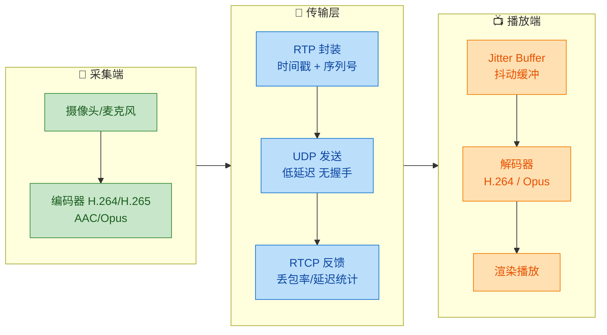

#### Jitter Buffer：UDP 直播的核心组件

由于 UDP 不保证顺序，网络传输中的包到达时间可能有 **抖动（Jitter）**。播放端通常会设置一个 **Jitter Buffer（抖动缓冲区）**：

- 收到的包先进入缓冲区，按 RTP 序列号重新排序；
- 缓冲区引入一个微小的固定延迟（如 50-200ms），换取平滑的播放体验；
- 如果某个包在缓冲窗口内未到达，直接标记为丢失并跳过。

这就是为什么你看直播时偶尔会看到画面闪烁或马赛克——那就是 UDP 丢包后播放端选择"跳过"而非"等待"的结果。

---

### 游戏（Online Gaming）

#### 网络游戏对延迟的极端敏感性

在竞技类网络游戏（FPS 射击、MOBA、格斗）中，玩家的操作指令必须在 **极短时间** 内传递到服务器并广播给其他玩家。业界通常认为：

| 延迟范围 | 玩家体验 |
|---------|---------|
| < 30ms | 极佳，几乎感觉不到延迟 |
| 30-80ms | 良好，大多数玩家可接受 |
| 80-150ms | 勉强可玩，操作有明显滞后感 |
| > 150ms | 严重影响体验，"卡得不行" |

在这种严苛要求下，TCP 的缺陷被无限放大：

**① 过时的数据毫无价值**

游戏中的"状态数据"是高频更新的。假设服务器每秒向客户端发送 **60 次** 角色位置更新（即 60 tick rate）。如果第 30 帧的位置数据在传输中丢失了，TCP 会暂停一切等待重传。但当重传数据到达时，服务器已经发送到了第 35 帧——第 30 帧的旧位置早已过时，完全没有使用价值。

UDP 的做法则是：**丢了就丢了，直接用最新到达的第 31 帧继续渲染**。

**② 游戏需要的是"最新状态"，而非"完整历史"**

这是游戏网络编程中的核心哲学。游戏中大多数数据属于 **状态型数据（State Data）** 而非 **事件型数据（Event Data）**：

- **状态型数据**：角色坐标、生命值、视角朝向——每一帧都会覆盖上一帧，旧数据自然失效。
- **事件型数据**：开枪、释放技能、购买装备——必须可靠送达，丢失会导致逻辑错误。

因此，成熟的游戏网络架构通常采用 **UDP + 自定义可靠层** 的混合方案：

```
┌─────────────────────────────────────────────────┐
│              Game Application Layer              │
├──────────────────────┬──────────────────────────┤
│   Unreliable Channel │   Reliable Channel       │
│   (位置/视角/状态)    │   (技能/伤害/事件)        │
│   纯 UDP，允许丢包    │   UDP + ACK + 重传        │
├──────────────────────┴──────────────────────────┤
│                 UDP Socket                       │
├─────────────────────────────────────────────────┤
│                 IP Layer                         │
└─────────────────────────────────────────────────┘
```

这种设计的精妙之处在于：**在同一个 UDP Socket 上，对不同类型的数据施加不同的可靠性策略**。这是 TCP 做不到的——TCP 对所有数据一视同仁地保证可靠有序。

#### 游戏中 UDP 的具体应用模式

**模式一：Dead Reckoning（航位推算）**

客户端在未收到服务器最新位置时，根据上一次收到的速度和方向 **预测** 角色位置，待新数据到达后再修正。这使得即使丢包，画面也不会"冻住"。

**模式二：Client-Side Prediction（客户端预测）**

玩家按下移动键后，客户端 **不等待** 服务器确认就立即在本地渲染移动效果，同时将操作通过 UDP 发送给服务器。服务器验证后如果结果一致则无需处理，不一致则发送修正指令"拉回"客户端。这极大地掩盖了网络延迟带来的操作迟滞感。

**模式三：插值与外推（Interpolation & Extrapolation）**

客户端渲染其他玩家的动作时，总是基于"过去两个已确认位置"进行 **平滑插值**，而非直接跳变。这样即使中间丢了几个 UDP 包，画面上其他角色的移动依然流畅自然。

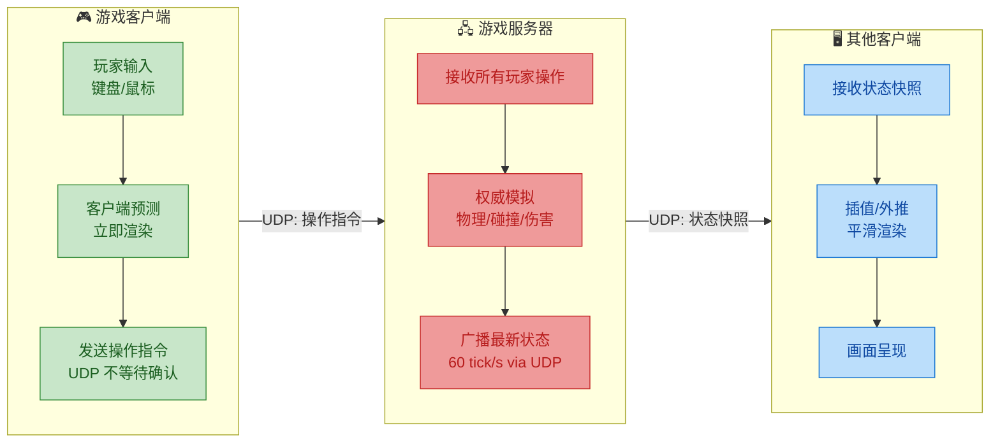

#### 知名游戏引擎的网络方案

| 游戏/引擎 | 网络协议 | 说明 |
|-----------|---------|------|
| **Quake III** | UDP + 自定义可靠层 | 90 年代 FPS 网络编程的鼻祖，奠定了现代游戏网络架构 |
| **Valve Source** | UDP | CS:GO / Dota 2 / Half-Life 2 引擎，采用快照插值 |
| **Unreal Engine** | UDP + 自定义 Reliable Channel | UE 内建网络框架，支持 RPC + 属性同步 |
| **Unity (Netcode)** | UDP (via Unity Transport) | 默认使用 UDP，提供 Reliable / Unreliable 双通道 |
| **ENet** | UDP + 可选可靠层 | 轻量级开源游戏网络库，被大量独立游戏采用 |

> 💡 **面试高频问题**：为什么游戏不直接用 TCP？答案的核心就是一句话：**TCP 的队头阻塞（Head-of-Line Blocking）会将单个丢包的延迟扩散到所有后续数据，对实时交互体验造成毁灭性影响**。而游戏中大部分数据天然是"最新覆盖旧值"的状态型数据，丢包完全可以容忍。

---

### 三大场景核心对比

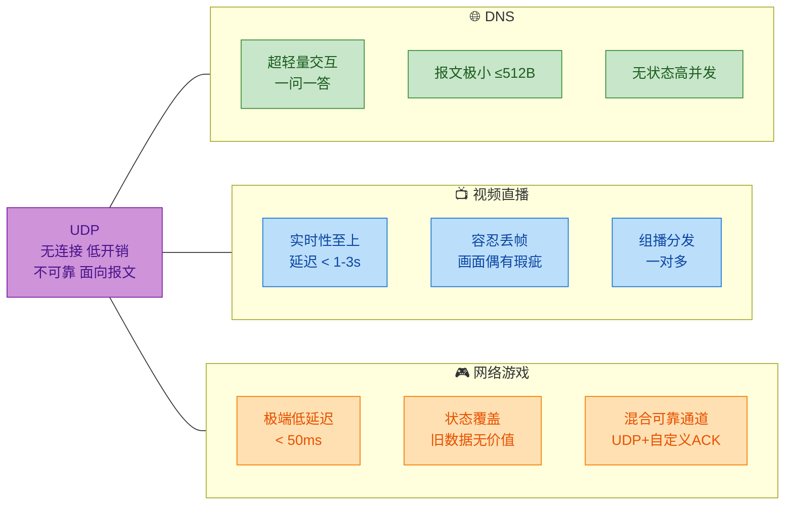

总结来看，UDP 的三大经典应用场景有一个共同的底层逻辑：

| 维度 | DNS | 视频直播 | 网络游戏 |
|------|-----|---------|---------|
| **选择 UDP 的核心原因** | 交互简单，TCP 开销不值得 | 实时性比完整性重要 | 最新状态覆盖旧数据 |
| **如何应对丢包** | 应用层超时重传 | FEC + 跳过丢帧 | 预测 + 插值 + 选择性重传 |
| **延迟容忍度** | 百毫秒级可接受 | 1-3 秒为上限 | 50ms 以内为理想 |
| **是否需要额外可靠机制** | 否（简单重试即可） | 部分需要（FEC） | 是（混合 Reliable/Unreliable 通道） |

---

**📝 练习题**

某在线 FPS 射击游戏的服务器以 64 tick/s 的频率向客户端发送角色位置更新。某次传输中，第 100 帧的位置数据包丢失，而第 101、102 帧正常到达。如果使用 TCP 传输，以下哪种现象最有可能发生？

A. 客户端直接跳过第 100 帧，使用第 101 帧渲染，画面流畅无影响

B. 客户端收到第 101、102 帧后立即渲染，第 100 帧异步补传后用于回放

C. 客户端必须等待第 100 帧重传到达后，才能将第 101、102 帧交付给应用层，导致画面卡顿

D. TCP 自动丢弃过时的第 100 帧，优先交付第 101、102 帧


**【答案】** C

**【解析】** TCP 保证 **按序交付（In-Order Delivery）**，这是其可靠传输机制的核心。当第 100 帧丢失时，即使第 101、102 帧已经到达并被放入接收缓冲区，TCP 协议栈也 **不会** 将它们交付给应用层——它必须等待第 100 帧被成功重传并就位后，才能按照 100→101→102 的顺序将三帧数据一并交付。这就是经典的 **队头阻塞（Head-of-Line Blocking）** 问题。在这段重传等待的时间里（通常至少一个 RTT），游戏画面会出现明显卡顿或冻结。这正是游戏选择 UDP 而非 TCP 的根本原因——UDP 不保证顺序，第 101、102 帧到达后即可立即交付给应用层处理。选项 A 描述的是 UDP 的行为而非 TCP；选项 B 描述的"异步补传"机制在标准 TCP 中不存在；选项 D 中 TCP 不具备"丢弃过时帧"的智能判断能力，它对所有字节一视同仁。


---

## 本章小结

本章围绕 **UDP（User Datagram Protocol，用户数据报协议）** 展开，从协议特性、报文结构、与 TCP 的核心对比，到实际应用场景进行了系统性梳理。以下是对全章知识脉络的回顾与提炼。

---

### 核心特性回顾

UDP 的设计哲学可以用一句话概括：**以最小的协议开销，换取最大的传输自由度**。它的三大核心特征——**无连接（Connectionless）、不可靠（Unreliable）、面向报文（Message-Oriented）**——并非缺陷，而是刻意为之的设计取舍（design trade-off）。

- **无连接**意味着通信双方无需像 TCP 那样经历三次握手（3-Way Handshake）建立连接，发送端随时可以向任意目标地址发出数据报，接收端也无需维护任何连接状态（connection state）。这使得 UDP 天然支持 **一对多（multicast / broadcast）** 的通信模式，且资源占用极低。

- **不可靠**意味着 UDP 不提供确认重传（ACK/Retransmission）、流量控制（Flow Control）、拥塞控制（Congestion Control）等机制。数据报可能丢失、重复、乱序到达，协议本身对此不做任何补救。这种"尽最大努力交付"（Best-Effort Delivery）的策略将可靠性的责任完全上交给 **应用层**，由开发者根据业务需求自行决定是否以及如何处理。

- **面向报文**意味着 UDP 对应用层下发的数据既不拆分也不合并，而是原封不动地加上 UDP 首部后交给网络层。一个 `sendto()` 对应一个完整的 UDP 数据报，接收端一个 `recvfrom()` 也恰好读取一个完整报文。这种保留消息边界（Message Boundary）的特性，使得 UDP 天然避免了 TCP 中的 **粘包/拆包（Sticky Packet / Packet Splitting）** 问题。

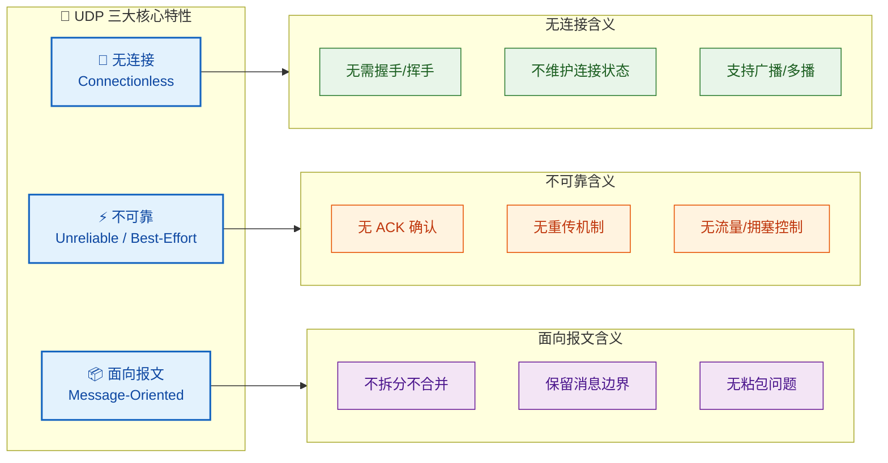

---

### 报文结构回顾

UDP 的首部设计堪称极简主义的典范，**仅 8 字节（Bytes）**，包含四个字段，每个字段 2 字节（16 bits）：

| 字段 | 长度 | 作用 |
|------|------|------|
| 源端口号（Source Port） | 16 bit | 标识发送方进程，可选填（可置 0） |
| 目的端口号（Destination Port） | 16 bit | 标识接收方进程，必填 |
| 长度（Length） | 16 bit | UDP 首部 + 数据的总字节数，最小值为 8 |
| 校验和（Checksum） | 16 bit | 检测传输错误，覆盖伪首部+首部+数据 |

需要特别记住的关键点：

1. **长度字段的最小值为 8**，即仅有首部、不携带任何数据的空报文。理论最大值为 65535 字节，但受限于 IP 层 MTU，实际有效载荷（payload）通常远小于此。
2. **校验和的计算引入了伪首部（Pseudo Header）**，包含源 IP、目的 IP、协议号（17）和 UDP 长度，这是一种跨层校验设计，目的是防止数据报被错误投递到错误的主机或进程。
3. 与 TCP 的 **20 字节**最小首部相比，UDP 的 8 字节首部意味着更低的协议开销（overhead），这在传输大量小报文时优势尤为显著。

---

### TCP vs UDP 对比回顾

这是面试和考试中的高频考点，以下是核心对比维度的总结提炼：

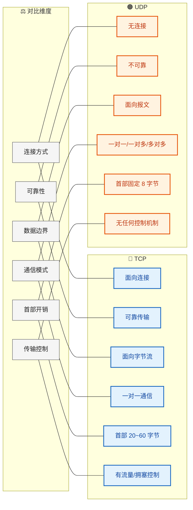

选择 TCP 还是 UDP，本质上是在 **可靠性（Reliability）** 与 **实时性/效率（Real-time / Efficiency）** 之间做取舍：

- 当业务对数据完整性、顺序性有刚性要求时（如文件传输 FTP、网页浏览 HTTP、邮件 SMTP），选择 **TCP**。
- 当业务对延迟极度敏感，且能容忍少量丢包时（如实时音视频、在线游戏、DNS 查询），选择 **UDP**。
- 现代趋势是 **基于 UDP 构建应用层可靠性**，如 Google 的 QUIC 协议（HTTP/3 的底层传输协议），在 UDP 之上自行实现了连接管理、可靠传输和拥塞控制，同时享受 UDP 的低延迟和免握手优势。

---

### 应用场景回顾

本章讨论了三个最经典的 UDP 应用场景：

**1. DNS（Domain Name System）**

DNS 查询使用 UDP 的核心原因是：查询报文小（通常远小于 512 字节）、对响应速度要求高、一问一答的交互模式完美契合 UDP 的无连接特性。若每次域名解析都需要 TCP 三次握手，网络延迟将显著增加。但也需注意，当 DNS 响应超过 512 字节（如区域传送 Zone Transfer）或需要更高安全性时（DNS over TCP/TLS），仍会回退到 TCP。

**2. 视频直播（Live Streaming）**

直播场景对实时性的要求远高于完整性。偶尔丢失几个视频帧，人眼几乎无法感知，但如果因为重传导致画面卡顿数秒，用户体验将严重下降。UDP 的无重传特性恰好满足了这一需求。实际应用中，通常在 UDP 之上使用 **RTP（Real-time Transport Protocol）** 进行时间戳标记和序列编号，再配合 **RTCP** 进行质量反馈。

**3. 在线游戏（Online Gaming）**

游戏中的玩家位置、操作指令等数据具有强时效性——0.5 秒前的位置信息对当前帧毫无价值。与其花时间重传过期数据，不如直接丢弃并发送最新状态。因此游戏网络普遍采用 UDP，并在应用层自行实现关键数据（如击杀确认、交易操作）的可靠传输。

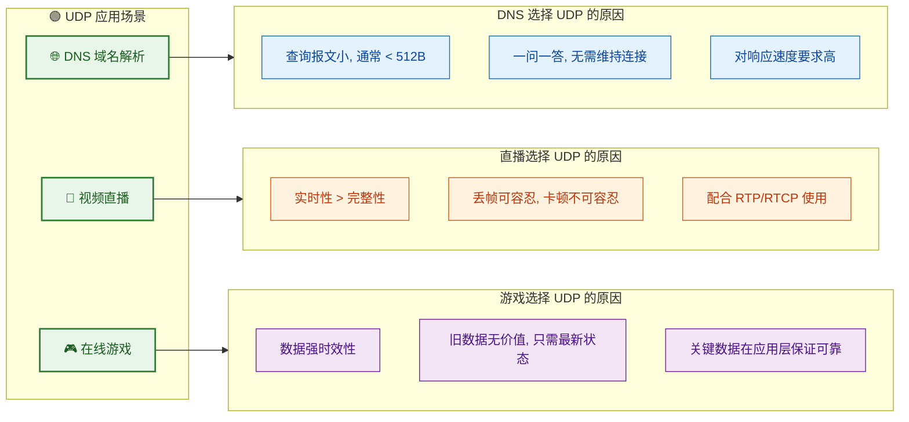

---

### 一句话总结

> UDP 是传输层的"快递自取柜"——它只负责把包裹放到指定格口（端口），不打电话确认你收没收到、包裹破没破损、顺序对不对。你想要这些服务？请自行处理（应用层实现），或者换用"顺丰上门签收"（TCP）。

---

**📝 练习题 1**

以下关于 UDP 协议的描述，**错误** 的是：

A. UDP 首部固定为 8 字节，包含源端口、目的端口、长度和校验和四个字段

B. UDP 的校验和计算仅覆盖 UDP 首部和数据部分，不涉及 IP 层信息

C. UDP 是面向报文的协议，发送方每次调用 `sendto()` 发出的数据会作为一个完整的数据报传输

D. UDP 支持一对一、一对多和多对多的通信模式

**【答案】** B

**【解析】** UDP 校验和的计算并非仅覆盖 UDP 自身的首部和数据，还引入了一个 **伪首部（Pseudo Header）**，其中包含源 IP 地址、目的 IP 地址、协议号（UDP 为 17）以及 UDP 长度。这种跨层设计的目的是：即使 IP 首部在传输中被篡改或出错，导致数据报被投递到错误的主机，接收端仍然可以通过校验和检测到这一错误并丢弃该报文。选项 A 正确描述了 UDP 的首部结构；选项 C 正确阐述了面向报文的含义；选项 D 正确说明了 UDP 的多种通信模式支持。因此 B 是错误选项。

---

**📝 练习题 2（面试高频）**

在实际工程中，许多现代协议（如 HTTP/3 底层的 QUIC）选择 **基于 UDP 重新实现可靠传输**，而非直接使用 TCP。请问这样做的主要优势是什么？

A. UDP 比 TCP 更安全，天然抵御中间人攻击

B. 绕开操作系统内核中 TCP 协议栈的限制，在用户态灵活实现连接管理、可靠传输和拥塞控制，同时保留 UDP 的低延迟和 0-RTT 连接建立优势

C. UDP 的校验和比 TCP 更强，数据完整性更好

D. UDP 首部包含更多字段，能携带更丰富的控制信息

**【答案】** B

**【解析】** QUIC 协议选择基于 UDP 构建的核心原因在于 **灵活性与性能的双重考量**。TCP 协议栈深度嵌入操作系统内核，任何改进（如修改拥塞控制算法、调整握手流程）都需要等待内核更新和全网部署，迭代周期极长。而基于 UDP 在 **用户态（User Space）** 实现传输逻辑，开发者可以像更新普通应用一样快速迭代协议行为。同时，QUIC 实现了 **0-RTT 连接建立**，首次连接仅需 1-RTT，重连时可以做到 0-RTT 直接发送数据，大幅降低了连接延迟。此外，QUIC 还解决了 TCP 的 **队头阻塞（Head-of-Line Blocking）** 问题——在 TCP 中，一个丢包会阻塞整个连接上所有流的数据；而 QUIC 支持多路复用的独立流，单个流的丢包不影响其他流。选项 A 错误，安全性不是 UDP 本身的特性（QUIC 的安全性来自内置的 TLS 1.3）；选项 C 错误，两者校验和机制并无强弱之分；选项 D 错误，UDP 首部字段比 TCP 更少。

---

