---

# 网络模型

---

## OSI 七层模型（Open Systems Interconnection Reference Model）

OSI 参考模型是由国际标准化组织 **ISO**（International Organization for Standardization）于 **1984 年**正式发布的网络通信框架。它的核心思想是 **分层解耦（Layered Decoupling）**——将极其复杂的网络通信过程，自顶向下拆分为 **七个功能层次**，每一层只专注于完成一类特定的任务，并通过**明确定义的接口**与相邻层交互。

你可以把它理解为一座七层大厦的蓝图：每一层的工人只需要关心自己楼层的工作，完成后把"半成品"通过电梯（接口）传递给下一层即可。这种设计带来了巨大的工程优势——**可替换性、可维护性、标准化**。

> 需要注意的是，OSI 模型在工业实践中并未被完整采纳（实际主流是 TCP/IP 四层模型），但它作为**理论参考框架**的价值无可替代，是理解一切网络协议的"思维地图"。

---

### 七层总览与数据封装流

在深入每一层之前，我们先建立一个全局视角。下图展示了 OSI 七层模型的完整分层结构，以及数据从发送端到接收端的**封装（Encapsulation）与解封装（Decapsulation）**过程：

```mermaid
graph LR
    subgraph SenderHost["📤 发送端 Sender Host"]
        direction TB
        S7["7 应用层<br/>Application"]
        S6["6 表示层<br/>Presentation"]
        S5["5 会话层<br/>Session"]
        S4["4 传输层<br/>Transport"]
        S3["3 网络层<br/>Network"]
        S2["2 数据链路层<br/>Data Link"]
        S1["1 物理层<br/>Physical"]
        S7 --> S6 --> S5 --> S4 --> S3 --> S2 --> S1
    end

    subgraph Medium["🌐 物理介质<br/>Physical Medium"]
        direction TB
        M1["电信号 / 光信号 / 无线电波"]
    end

    subgraph ReceiverHost["📥 接收端 Receiver Host"]
        direction TB
        R1["1 物理层<br/>Physical"]
        R2["2 数据链路层<br/>Data Link"]
        R3["3 网络层<br/>Network"]
        R4["4 传输层<br/>Transport"]
        R5["5 会话层<br/>Session"]
        R6["6 表示层<br/>Presentation"]
        R7["7 应用层<br/>Application"]
        R1 --> R2 --> R3 --> R4 --> R5 --> R6 --> R7
    end

    S1 --> M1 --> R1

    classDef appLayer fill:#C8E6C9,stroke:#388E3C,color:#1B5E20
    classDef presLayer fill:#DCEDC8,stroke:#689F38,color:#33691E
    classDef sessLayer fill:#F0F4C3,stroke:#AFB42B,color:#827717
    classDef transLayer fill:#BBDEFB,stroke:#1976D2,color:#0D47A1
    classDef netLayer fill:#FFE0B2,stroke:#F57C00,color:#E65100
    classDef dlLayer fill:#FFCCBC,stroke:#E64A19,color:#BF360C
    classDef phyLayer fill:#D7CCC8,stroke:#5D4037,color:#3E2723
    classDef medStyle fill:#E1BEE7,stroke:#7B1FA2,color:#4A148C

    class S7,R7 appLayer
    class S6,R6 presLayer
    class S5,R5 sessLayer
    class S4,R4 transLayer
    class S3,R3 netLayer
    class S2,R2 dlLayer
    class S1,R1 phyLayer
    class M1 medStyle
```

数据在发送端**自顶向下**逐层封装，每经过一层就会被加上该层的**头部（Header）**甚至**尾部（Trailer）**信息；到达接收端后则**自底向上**逐层解封装，最终还原出原始数据。这个过程就像寄一封信——你写好信（应用层数据），装入信封写上地址（网络层），再装入快递袋贴上运单（链路层），最后交给卡车运走（物理层）。

---

### 第七层：应用层（Application Layer）

应用层是 OSI 模型中**最接近用户**的一层。它并不是指我们日常使用的"应用程序"本身（比如浏览器、微信），而是指**应用程序与网络之间的接口**——即应用程序用来访问网络服务的那些**协议和规则**。

**核心职责：**

- 为用户的应用进程提供**网络服务的入口**
- 定义应用进程之间通信的**消息格式与语义**
- 典型协议包括：**HTTP**（网页浏览）、**FTP**（文件传输）、**SMTP/POP3/IMAP**（电子邮件）、**DNS**（域名解析）、**SNMP**（网络管理）、**Telnet/SSH**（远程登录）

举一个直观的例子：当你在浏览器地址栏输入 `www.example.com` 并按下回车，浏览器首先通过 **DNS 协议**将域名解析为 IP 地址，然后通过 **HTTP/HTTPS 协议**向服务器发起请求。这两步操作全部发生在应用层。

应用层产生的数据单元通常被称为 **消息（Message）**。

---

### 第六层：表示层（Presentation Layer）

表示层常被称为网络的"**翻译官**"。它负责解决一个关键问题：**不同系统之间的数据格式差异**。比如，一台大端序（Big-Endian）机器和一台小端序（Little-Endian）机器之间通信，如果不做格式转换，数据将被完全误读。

**核心职责：**

| 功能 | 说明 | 示例 |
|------|------|------|
| **数据格式转换** | 将本地数据格式转为网络通用格式 | EBCDIC ↔ ASCII 编码转换 |
| **数据加密/解密** | 保证传输过程中数据安全 | SSL/TLS 加密 |
| **数据压缩/解压** | 减少传输数据量，提高效率 | JPEG、MPEG、GZip 压缩 |

一个经典的现实类比：两个人分别说中文和法语，中间需要一个翻译（表示层），翻译不关心你们在聊什么话题（应用层的事），也不关心声音怎么传播（底层的事），他只负责把中文"转码"为法语，反之亦然。

> **实践注意**：在 TCP/IP 模型中，表示层的功能通常被合并到应用层中处理。例如 HTTPS 中的 TLS 加密，从 OSI 视角看属于表示层工作，但在实现中它位于应用层协议栈内。

---

### 第五层：会话层（Session Layer）

会话层负责**建立、管理和终止**两个通信进程之间的**会话（Session）**。你可以将它类比为一次电话会议的"**主持人**"——它决定何时开始、何时暂停、何时恢复、何时结束，以及谁在什么时候有发言权。

**核心职责：**

- **会话建立与释放**：协商建立连接，通信结束后有序释放资源
- **对话控制（Dialog Control）**：管理通信双方的交互模式
  - **全双工（Full-Duplex）**：双方可同时发送和接收
  - **半双工（Half-Duplex）**：同一时刻只能有一方发送
- **同步与检查点（Synchronization & Checkpointing）**：在长时间传输中插入**同步点**，一旦出错可以从最近的同步点恢复，而无需从头重传

举个例子：你正在下载一个 2GB 的文件，下载到 1.5GB 时网络中断了。如果会话层设置了同步点（比如每 100MB 一个），恢复连接后只需要从 1.5GB 处继续下载，而不是从 0 开始。这个"**断点续传**"的概念正是会话层同步机制的体现。

典型协议/技术：**NetBIOS**、**RPC（Remote Procedure Call）**、**PPTP**（点对点隧道协议）等。

---

### 第四层：传输层（Transport Layer）

传输层是 OSI 模型中承上启下的关键层次，是**真正实现"端到端（End-to-End）"通信**的第一层。它的核心使命只有一个：**确保数据完整、可靠（或高效）地从源主机的某个进程传输到目标主机的某个进程**。

**核心职责：**

- **分段与重组（Segmentation & Reassembly）**：将上层大块数据切分为合适大小的**段（Segment）**，接收端再重新组装
- **端到端连接管理**：建立、维护和释放传输连接（如 TCP 三次握手）
- **流量控制（Flow Control）**：防止发送方速率过快导致接收方缓冲区溢出
- **差错控制（Error Control）**：检测丢包、重复、乱序，必要时请求重传
- **多路复用（Multiplexing）**：通过**端口号（Port Number）**区分同一主机上的不同应用进程

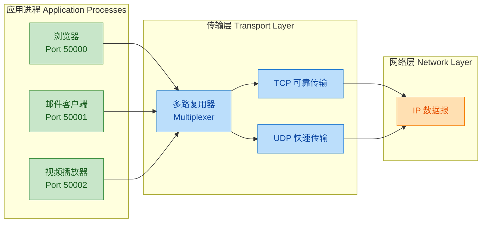

传输层的两大支柱协议：

| 特性 | TCP（传输控制协议） | UDP（用户数据报协议） |
|------|---------------------|------------------------|
| 连接方式 | 面向连接（Connection-Oriented） | 无连接（Connectionless） |
| 可靠性 | 可靠传输，保证顺序和完整性 | 尽最大努力交付，不保证 |
| 速度 | 相对较慢（额外开销） | 快速（轻量级） |
| 应用场景 | 网页、文件传输、邮件 | 视频直播、DNS 查询、游戏 |

传输层的数据单元称为 **段（Segment）**（TCP）或 **数据报（Datagram）**（UDP）。

---

### 第三层：网络层（Network Layer）

如果说传输层关注的是"进程到进程"，那网络层关注的就是 **"主机到主机"** 的问题。网络层最核心的任务是 **路由选择（Routing）** 和 **逻辑寻址（Logical Addressing）**——它要为每一个数据包找到一条从源主机到目标主机的最佳路径，哪怕它们之间隔着几十个中间网络。

**核心职责：**

- **逻辑寻址**：使用 **IP 地址**为每台设备分配全局唯一的逻辑标识，不受物理位置约束
- **路由选择**：根据路由表和路由算法（如 OSPF、BGP、RIP），计算数据包的最佳转发路径
- **分组转发（Packet Forwarding）**：路由器根据目标 IP 地址逐跳（Hop-by-Hop）转发数据包
- **分片与重组（Fragmentation & Reassembly）**：当数据包超过链路的 **MTU（Maximum Transmission Unit）**时，将其拆分为更小的分片

网络层的核心设备是 **路由器（Router）**。路由器工作在第三层，它通过查看每个数据包的**目标 IP 地址**，结合自身的**路由表（Routing Table）**，决定数据包应该从哪个接口转发出去。

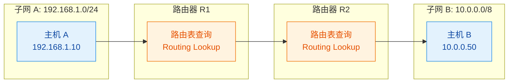

网络层的数据单元称为 **数据包 / 分组（Packet）**，最典型的协议是 **IP（Internet Protocol）**，辅以 **ICMP**（差错报告，如 ping）、**ARP**（IP → MAC 地址解析）、**IGMP**（组播管理）等。

---

### 第二层：数据链路层（Data Link Layer）

数据链路层解决的是**同一链路（直接相连的两个节点）之间**如何可靠地传输数据的问题。如果说网络层负责"城市之间的高速公路规划"，那链路层就负责"每一段公路上车辆如何安全行驶"。

**核心职责：**

- **帧封装（Framing）**：将网络层的数据包封装为**帧（Frame）**，添加帧头和帧尾，明确帧的边界
- **物理寻址**：使用 **MAC 地址（Media Access Control Address）**作为硬件级别的唯一标识，48 位，通常表示为 `AA:BB:CC:DD:EE:FF`
- **差错检测**：在帧尾附加 **FCS（Frame Check Sequence）**，通常采用 **CRC（循环冗余校验）**算法，接收方据此判断帧是否在传输中损坏
- **介质访问控制（Media Access Control）**：当多个设备共享同一物理介质时，决定谁可以在何时发送数据。经典方法包括 **CSMA/CD**（以太网）和 **CSMA/CA**（Wi-Fi）

链路层的核心设备是 **交换机（Switch）**，它工作在第二层，通过学习各端口连接设备的 MAC 地址来构建 **MAC 地址表**，实现帧的精准转发。

数据链路层通常进一步细分为两个子层：

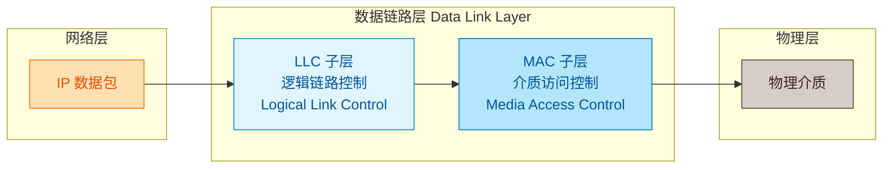

- **LLC（Logical Link Control）子层**：由 IEEE 802.2 标准定义，负责向上层提供统一接口，实现流量控制和差错通知
- **MAC（Media Access Control）子层**：负责控制物理介质的访问，处理 MAC 地址和帧的收发

链路层的数据单元称为 **帧（Frame）**。典型协议/标准包括 **Ethernet（IEEE 802.3）**、**Wi-Fi（IEEE 802.11）**、**PPP**（点对点协议）等。

---

### 第一层：物理层（Physical Layer）

物理层是 OSI 模型的**最底层**，它与硬件直接打交道。物理层完全不关心数据的"含义"，它只知道一件事：**如何将比特（Bit）转换为物理信号，通过传输介质送到对端**。

**核心职责：**

- **比特编码（Bit Encoding）**：定义如何将 0 和 1 编码为电压变化、光脉冲或无线电波。常见编码方式：曼彻斯特编码（Manchester Encoding）、NRZ（Non-Return-to-Zero）、4B/5B 等
- **传输介质（Transmission Media）**：
  - **有线**：双绞线（Twisted Pair）、同轴电缆（Coaxial Cable）、光纤（Fiber Optic）
  - **无线**：Wi-Fi 无线电波、蓝牙、红外线、卫星链路
- **接口与连接器规格**：定义物理接口的形状、引脚数量和排列方式，如 RJ-45（以太网口）、LC/SC（光纤接口）
- **信号特性**：规定电压电平、信号速率、最大传输距离等电气/光学参数
- **传输模式**：
  - **单工（Simplex）**：只能单向传输（如广播电台）
  - **半双工（Half-Duplex）**：可双向但不能同时（如对讲机）
  - **全双工（Full-Duplex）**：可同时双向传输（如电话）

物理层的核心设备包括 **集线器（Hub）**、**中继器（Repeater）**、以及各种线缆和接口。集线器收到信号后，会将其**广播**到所有端口（不做任何智能转发），中继器则单纯地**放大和再生**衰减的信号。

物理层的数据单元是最小粒度的 **比特流（Bit Stream）**。

---

### 数据封装全流程（PDU 变化）

理解七层模型最关键的一环是掌握 **协议数据单元（PDU, Protocol Data Unit）** 在每一层的变化。下表清晰展示了数据从应用层到物理层的封装过程：

| 层次 | PDU 名称 | 添加的头部/尾部 | 关键标识 |
|------|----------|----------------|----------|
| 7 - 应用层 | Data（数据） | — | 应用协议语义 |
| 6 - 表示层 | Data（数据） | 编码/加密信息 | 格式标识 |
| 5 - 会话层 | Data（数据） | 会话控制信息 | Session ID |
| **4 - 传输层** | **Segment（段）** | **传输层头部** | **源/目标端口号** |
| **3 - 网络层** | **Packet（包）** | **网络层头部** | **源/目标 IP 地址** |
| **2 - 链路层** | **Frame（帧）** | **帧头 + 帧尾** | **源/目标 MAC 地址 + FCS** |
| **1 - 物理层** | **Bits（比特流）** | — | 电/光/无线信号 |

一个助记口诀可以帮你记住这些 PDU：

> **"All People Seem To Need Data Processing"**
> (**A**pplication → **P**resentation → **S**ession → **T**ransport → **N**etwork → **D**ata Link → **P**hysical)

---

### 对等层通信（Peer-to-Peer Communication）

OSI 模型中有一个极其重要的概念叫 **对等层通信**（也称虚拟通信）。虽然数据实际上是从发送端自顶向下流到物理层，经过物理介质传输后在接收端自底向上还原，但从**逻辑视角**来看，发送端的第 N 层**直接**与接收端的第 N 层通信。

例如：
- 发送端的**传输层** TCP 与接收端的**传输层** TCP 之间，就好像有一条逻辑直连的通道。它们通过**传输层协议头部**中携带的信息（端口号、序列号、确认号等）进行"对话"
- 发送端的**网络层**与接收端的**网络层**通过 IP 头部中的信息（IP 地址、TTL 等）进行"对话"

这种对等通信的设计使得**每一层可以独立演进**。比如，你可以把底层从以太网换成 Wi-Fi，而传输层的 TCP 协议完全不需要改动——因为 TCP 只和对面的 TCP"交流"，它不关心底层的细节。这就是**分层架构的精髓所在**。

---

### OSI 模型的优缺点

**✅ 优点：**

1. **清晰的分层架构**：每层职责明确、边界清晰，极大简化了网络问题的定位和调试。网络工程师排障时常说"从哪一层查起"，正是基于此
2. **标准化**：为不同厂商的设备和软件提供了统一的参考标准，促进了互操作性
3. **模块化设计**：层与层之间通过接口交互，内部实现可以独立更改，不影响其他层
4. **教学价值极高**：是计算机网络教育中不可替代的理论基础

**❌ 缺点：**

1. **过于理想化**：七层的划分在实践中显得过于细碎，特别是第 5、6 层（会话层和表示层）功能模糊，很多协议难以精确归入某一层
2. **实现滞后**：OSI 配套的协议栈（如 X.25、X.400 等）开发速度远慢于 TCP/IP，导致市场被 TCP/IP 先占
3. **性能考量不足**：分层越多，每层的封装/解封装开销越大
4. **"先有标准，后有实现"的困境**：TCP/IP 是"先有实现，再总结标准"，而 OSI 反其道行之，导致标准与实践脱节

这也解释了为什么实际工程中通用的是 **TCP/IP 四层模型**——它将 OSI 的上三层（应用、表示、会话）合并为一个**应用层**，将下两层（链路、物理）合并为**网络接口层**，更贴合真实协议栈的实现。

---

**📝 练习题**

在 OSI 七层模型中，当主机 A 向主机 B 发送一个 HTTP 请求时，数据在**发送端网络层**完成封装后的 PDU（协议数据单元）被称为什么？该 PDU 中新增的最关键标识信息是什么？

A. Segment（段）；源端口号和目标端口号

B. Packet（包）；源 IP 地址和目标 IP 地址

C. Frame（帧）；源 MAC 地址和目标 MAC 地址

D. Data（数据）；HTTP 请求头部


**【答案】** B

**【解析】** 在 OSI 模型的数据封装过程中，每一层都会将上层传下来的 PDU 视为自己的"载荷（Payload）"，并添加本层的控制信息。**传输层**将数据封装为 **Segment（段）**，添加端口号——这是选项 A 描述的层次。到了**网络层**，段被进一步封装为 **Packet（包）**，此时最关键的新增信息是 **源 IP 地址和目标 IP 地址**，它们用于路由器进行逐跳转发和路径选择。选项 C 描述的是**数据链路层**的封装行为（Frame + MAC 地址），选项 D 描述的是应用层的原始数据。因此正确答案是 **B**。记住 PDU 名称的层次对应关系：Data → Segment → Packet → Frame → Bits，这是网络面试中的高频考点。

---

## TCP/IP 四层模型 ⭐

TCP/IP（Transmission Control Protocol / Internet Protocol）模型是当今互联网事实上的标准体系结构。与 OSI 七层模型偏重"理论参考"不同，TCP/IP 模型是在实践中逐步演化而来的——先有协议实现，后有模型归纳。它将网络通信精炼为 **四个层次**，每一层各司其职，通过层间接口协同工作，共同完成端到端的数据传输。

理解 TCP/IP 模型的关键在于理解 **封装（Encapsulation）** 与 **解封装（Decapsulation）** 的过程：数据从应用层出发，每经过一层就会被包上一个该层的"信封"（Header），到达对端后再逐层拆开。这一过程就像寄一封信——你写好信纸（应用数据），装进信封写上收件人（传输层端口），再套一个大信封写上地址（网络层 IP），最后贴上邮票交给邮局（链路层 MAC 帧）。

```mermaid
graph LR
    subgraph 发送端["📤 发送端 Sender"]
        direction TB
        A["🌐 应用层<br/>Application Layer<br/>HTTP / DNS / HTTPS"]
        B["🚢 传输层<br/>Transport Layer<br/>TCP / UDP"]
        C["📍 网络层<br/>Network Layer<br/>IP / ICMP / ARP"]
        D["🔗 链路层<br/>Link Layer<br/>Ethernet / Wi-Fi"]
        A -->|"添加应用头"| B
        B -->|"添加TCP/UDP头"| C
        C -->|"添加IP头"| D
    end

    subgraph 网络["☁️ 物理网络 Network"]
        direction TB
        E["📡 路由器 / 交换机<br/>Routers / Switches"]
    end

    subgraph 接收端["📥 接收端 Receiver"]
        direction TB
        H["🌐 应用层<br/>Application Layer"]
        I["🚢 传输层<br/>Transport Layer"]
        J["📍 网络层<br/>Network Layer"]
        K["🔗 链路层<br/>Link Layer"]
        K -->|"剥离帧头"| J
        J -->|"剥离IP头"| I
        I -->|"剥离TCP/UDP头"| H
    end

    D -->|"比特流传输"| E
    E -->|"比特流传输"| K

    classDef appLayer fill:#C8E6C9,stroke:#388E3C,color:#1B5E20,stroke-width:2px
    classDef transLayer fill:#BBDEFB,stroke:#1976D2,color:#0D47A1,stroke-width:2px
    classDef netLayer fill:#FFE0B2,stroke:#F57C00,color:#E65100,stroke-width:2px
    classDef linkLayer fill:#FFCDD2,stroke:#D32F2F,color:#B71C1C,stroke-width:2px
    classDef cloud fill:#F3E5F5,stroke:#7B1FA2,color:#4A148C,stroke-width:2px

    class A,H appLayer
    class B,I transLayer
    class C,J netLayer
    class D,K linkLayer
    class E cloud
```

每层的数据单元（Protocol Data Unit, PDU）有专属名称：

| 层次 | PDU 名称 | 英文 | 关键标识 |
|------|---------|------|---------|
| 应用层 | 报文 / 消息 | Message | URL / 域名 |
| 传输层 | 段 / 数据报 | Segment (TCP) / Datagram (UDP) | 端口号 Port |
| 网络层 | 分组 / 包 | Packet | IP 地址 |
| 链路层 | 帧 | Frame | MAC 地址 |

下面逐层深入讲解。

---

### 应用层（Application Layer）—— HTTP / HTTPS / DNS

应用层是用户和网络交互的最前线，处于 TCP/IP 模型的最顶层。它直接面向具体的网络应用场景，为不同的服务定义了各自的通信协议。应用层协议规定了 **消息的格式、交互的时序、以及语义**，但它并不关心数据如何在网络中传输——那是下层的事情。

#### 1. HTTP（HyperText Transfer Protocol，超文本传输协议）

HTTP 是万维网（World Wide Web）的基石协议，采用经典的 **请求-响应（Request-Response）** 模型。客户端（通常是浏览器）发送一个 HTTP Request，服务器返回一个 HTTP Response。

**核心特征：**

- **无状态（Stateless）**：每次请求都是独立的，服务器不会记住上一次请求的信息。这意味着如果你连续访问同一个网页两次，对服务器而言这是两个完全无关的请求。为了解决无状态带来的不便（如保持用户登录），引入了 Cookie、Session、Token 等机制。

- **基于 TCP**：HTTP/1.0 和 HTTP/1.1 都建立在 TCP 连接之上（默认端口 **80**），确保数据可靠传输。HTTP/3 则改用基于 UDP 的 QUIC 协议，大幅降低了连接延迟。

- **明文传输**：HTTP 协议本身不加密，数据在网络中以明文形式传递，存在被窃听和篡改的风险。

**HTTP 请求报文结构示例：**

```text
GET /index.html HTTP/1.1          # 请求行：方法(GET) + 路径(/index.html) + 协议版本
Host: www.example.com             # 请求头：目标主机域名
User-Agent: Mozilla/5.0           # 请求头：客户端标识（浏览器类型）
Accept: text/html                 # 请求头：客户端可接受的响应内容类型
Connection: keep-alive            # 请求头：希望保持持久连接（HTTP/1.1 默认）
                                  # 空行：分隔请求头与请求体
                                  # 请求体：GET 方法通常没有请求体
```

**HTTP 响应报文结构示例：**

```text
HTTP/1.1 200 OK                   # 状态行：协议版本 + 状态码(200) + 原因短语(OK)
Content-Type: text/html           # 响应头：响应体的内容类型
Content-Length: 3057              # 响应头：响应体的字节长度
Set-Cookie: session=abc123        # 响应头：服务器设置 Cookie
                                  # 空行
<html>...</html>                  # 响应体：实际返回的网页内容
```

**常用 HTTP 方法对比：**

| 方法 | 用途 | 幂等性 | 有请求体 |
|------|------|--------|---------|
| **GET** | 获取资源 | ✅ 是 | ❌ 通常无 |
| **POST** | 提交数据 / 创建资源 | ❌ 否 | ✅ 有 |
| **PUT** | 替换 / 更新整个资源 | ✅ 是 | ✅ 有 |
| **DELETE** | 删除资源 | ✅ 是 | ❌ 通常无 |
| **PATCH** | 部分更新资源 | ❌ 否 | ✅ 有 |

> **幂等性（Idempotency）** 指的是：同一请求执行多次，效果与执行一次相同。例如 GET 请求获取资源，无论请求几次，服务器上的资源状态不变；而 POST 每次提交可能都会创建一条新记录。

**HTTP 状态码分类速查：**

| 分类 | 范围 | 含义 | 典型示例 |
|------|------|------|---------|
| 1xx | 100-199 | 信息性（Informational） | 100 Continue |
| 2xx | 200-299 | 成功（Success） | 200 OK, 201 Created |
| 3xx | 300-399 | 重定向（Redirection） | 301 永久重定向, 302 临时重定向 |
| 4xx | 400-499 | 客户端错误（Client Error） | 400 Bad Request, 403 Forbidden, 404 Not Found |
| 5xx | 500-599 | 服务器错误（Server Error） | 500 Internal Server Error, 502 Bad Gateway |

**HTTP 版本演进：**

- **HTTP/1.0**：每次请求都需要建立一个新的 TCP 连接，请求完毕即断开（短连接）。开销大、效率低。
- **HTTP/1.1**：引入 **持久连接（Persistent Connection）** 和 **管线化（Pipelining）**，允许在一个 TCP 连接上发送多个请求，但仍存在 **队头阻塞（Head-of-Line Blocking）** 问题——前一个请求的响应没回来，后面的请求就得排队等。
- **HTTP/2**：引入 **多路复用（Multiplexing）**，在单个 TCP 连接上并行传输多个请求/响应流，彻底解决了应用层队头阻塞。同时支持 **头部压缩（HPACK）** 和 **服务器推送（Server Push）**。
- **HTTP/3**：底层传输协议从 TCP 切换为 **QUIC（基于 UDP）**，解决了 TCP 层面的队头阻塞问题，连接建立更快（0-RTT / 1-RTT），在高延迟、高丢包网络下表现优异。

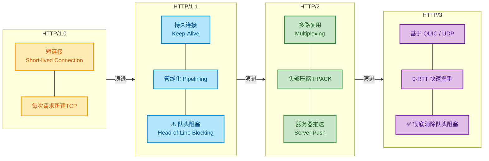

---

#### 2. HTTPS（HTTP Secure）

HTTPS 并不是一个独立的新协议，而是 **HTTP + TLS/SSL** 的组合。它在 HTTP 与 TCP 之间插入了一个 **TLS（Transport Layer Security）** 加密层，为通信提供三大安全保障：

| 安全属性 | 英文 | 作用 | 实现手段 |
|---------|------|------|---------|
| **机密性** | Confidentiality | 防窃听 | 对称加密（AES 等） |
| **完整性** | Integrity | 防篡改 | 消息摘要（HMAC-SHA256 等） |
| **身份认证** | Authentication | 防冒充 | 数字证书 + CA 签名（RSA / ECDSA） |

HTTPS 的默认端口号为 **443**。

**TLS 握手流程（简化版，以 TLS 1.2 为例）：**

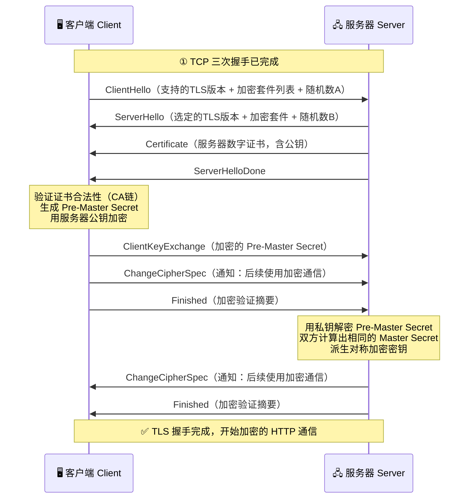

**握手的核心思想：** 通过 **非对称加密（RSA/ECDHE）** 安全地交换一个 **Pre-Master Secret**，然后双方各自用 Pre-Master Secret + 随机数A + 随机数B 推导出相同的 **对称密钥（Session Key）**，后续的实际数据传输全部使用该对称密钥加密。之所以如此设计，是因为非对称加密计算量大、速度慢，仅用于"钥匙交接"阶段；而对称加密速度快，适合大量数据的实时加解密。

**HTTP vs HTTPS 对比：**

| 对比项 | HTTP | HTTPS |
|--------|------|-------|
| 默认端口 | 80 | 443 |
| 传输方式 | 明文 | TLS 加密 |
| 安全性 | ❌ 不安全 | ✅ 机密+完整+认证 |
| 性能开销 | 低 | 略高（TLS 握手开销） |
| 证书要求 | 无 | 需要 CA 签发的数字证书 |
| URL 前缀 | `http://` | `https://` |

---

#### 3. DNS（Domain Name System，域名系统）

DNS 是互联网的"电话簿"，它将人类可读的域名（如 `www.google.com`）解析为计算机可路由的 IP 地址（如 `142.250.80.4`）。没有 DNS，我们就必须记忆每个网站的 IP 地址——这在有数十亿网站的今天显然不现实。

**DNS 的层级结构：**

DNS 采用分布式、层级化的命名体系。以域名 `mail.google.com.` 为例（注意最后有一个 `.`，代表根域）：

```text
.                        ← 根域 (Root)
├── com.                 ← 顶级域 (TLD, Top-Level Domain)
│   ├── google.com.      ← 二级域 (SLD, Second-Level Domain)
│   │   ├── mail.google.com.   ← 子域/主机名
│   │   └── www.google.com.
│   └── example.com.
├── org.
├── cn.                  ← 国家顶级域 (ccTLD)
│   └── edu.cn.
└── ...
```

**DNS 解析流程（递归 + 迭代查询）：**

当你在浏览器输入 `www.example.com` 时，DNS 解析经历以下步骤：

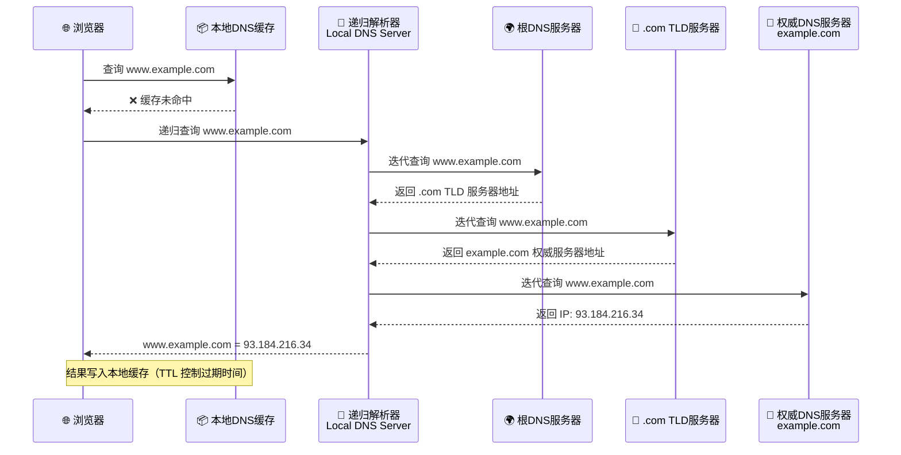

**解析流程要点：**

1. **浏览器缓存** → **操作系统缓存** → **hosts 文件** → **本地 DNS 服务器**，逐级查找，一旦命中即返回。
2. 客户端到本地 DNS 服务器之间是 **递归查询（Recursive Query）**——客户端只发一次请求，本地 DNS 服务器负责帮你跑完全程。
3. 本地 DNS 服务器到各级权威服务器之间是 **迭代查询（Iterative Query）**——每一级服务器不会帮你继续查，只告诉你"下一个该问谁"。
4. 查到结果后，各级缓存都会根据 **TTL（Time To Live）** 值缓存记录，下次查询相同域名可以直接命中缓存，大幅提升效率。

**常见 DNS 记录类型：**

| 记录类型 | 英文全称 | 作用 | 示例 |
|---------|---------|------|------|
| **A** | Address | 域名 → IPv4 地址 | `example.com → 93.184.216.34` |
| **AAAA** | — | 域名 → IPv6 地址 | `example.com → 2606:2800:...` |
| **CNAME** | Canonical Name | 域名别名 → 另一个域名 | `www.example.com → example.com` |
| **MX** | Mail Exchange | 邮件服务器指向 | `example.com → mail.example.com` |
| **NS** | Name Server | 指定权威 DNS 服务器 | `example.com → ns1.example.com` |
| **TXT** | Text | 任意文本（常用于验证） | SPF, DKIM 等 |

**DNS 使用 UDP 还是 TCP？**

DNS 默认使用 **UDP 端口 53** 进行查询，因为 DNS 请求报文通常很小（一般不超过 512 字节），UDP 的无连接特性能最大限度减少延迟。但当响应数据超过 512 字节（如 DNSSEC 签名数据或大量记录），或者进行 **区域传送（Zone Transfer）** 时，DNS 会自动切换为 **TCP 端口 53**，以确保大数据量传输的可靠性。

---

### 传输层（Transport Layer）—— TCP / UDP

传输层是 TCP/IP 模型中承上启下的关键层次。它为应用层提供 **端到端（End-to-End）** 的通信服务，核心职责是：将网络层提供的"主机到主机"的服务，细化为"进程到进程"的服务。传输层通过 **端口号（Port Number, 0~65535）** 来标识不同的进程。

#### 1. TCP（Transmission Control Protocol，传输控制协议）

TCP 是一种 **面向连接（Connection-Oriented）** 的、**可靠的（Reliable）**、**基于字节流（Byte-Stream）** 的传输协议。它提供的可靠性体现在：数据不丢失、不重复、不乱序，且具有流量控制与拥塞控制能力。

**TCP 段（Segment）头部关键字段：**

```text
 0                   1                   2                   3
 0 1 2 3 4 5 6 7 8 9 0 1 2 3 4 5 6 7 8 9 0 1 2 3 4 5 6 7 8 9 0 1
+-+-+-+-+-+-+-+-+-+-+-+-+-+-+-+-+-+-+-+-+-+-+-+-+-+-+-+-+-+-+-+-+
|          Source Port          |       Destination Port        |  ← 源端口 + 目的端口（各16位）
+-+-+-+-+-+-+-+-+-+-+-+-+-+-+-+-+-+-+-+-+-+-+-+-+-+-+-+-+-+-+-+-+
|                        Sequence Number                        |  ← 序列号（32位）：标识字节流中的位置
+-+-+-+-+-+-+-+-+-+-+-+-+-+-+-+-+-+-+-+-+-+-+-+-+-+-+-+-+-+-+-+-+
|                    Acknowledgment Number                      |  ← 确认号（32位）：期望收到的下一个字节序号
+-+-+-+-+-+-+-+-+-+-+-+-+-+-+-+-+-+-+-+-+-+-+-+-+-+-+-+-+-+-+-+-+
|  Data |       |U|A|P|R|S|F|                                   |
| Offset| Rsrvd |R|C|S|S|Y|I|            Window Size            |  ← 标志位 + 窗口大小（16位）
|       |       |G|K|H|T|N|N|                                   |
+-+-+-+-+-+-+-+-+-+-+-+-+-+-+-+-+-+-+-+-+-+-+-+-+-+-+-+-+-+-+-+-+
|           Checksum            |         Urgent Pointer        |
+-+-+-+-+-+-+-+-+-+-+-+-+-+-+-+-+-+-+-+-+-+-+-+-+-+-+-+-+-+-+-+-+
```

**关键标志位说明：**

- **SYN**（Synchronize）：发起连接，同步序列号
- **ACK**（Acknowledge）：确认应答，确认号有效
- **FIN**（Finish）：请求释放连接
- **RST**（Reset）：强制重置连接
- **PSH**（Push）：通知接收方立即将数据推送给应用层
- **URG**（Urgent）：紧急数据标志

##### TCP 三次握手（Three-Way Handshake）

三次握手是 TCP 建立连接的过程，目的是：① 确认双方的发送和接收能力正常；② 协商初始序列号（ISN, Initial Sequence Number）。

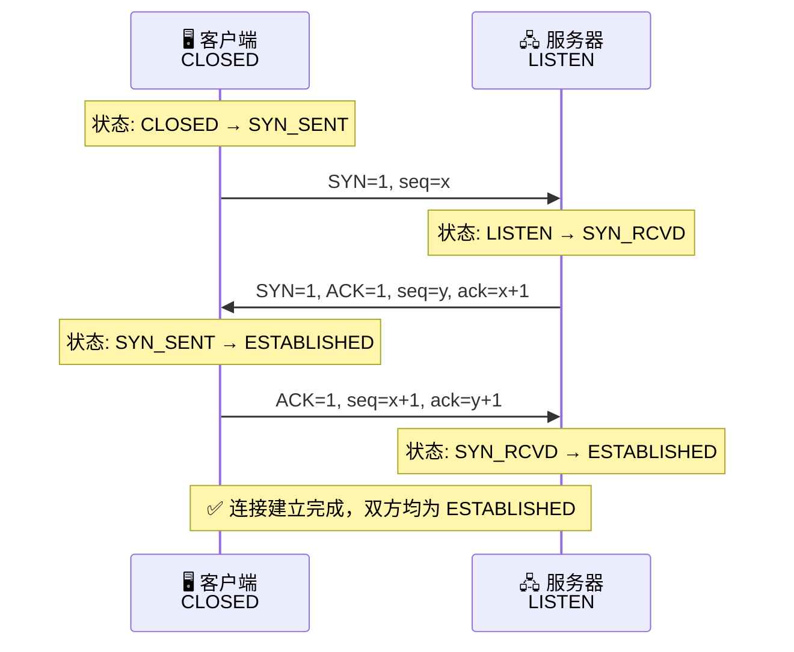

**为什么是三次握手，不是两次？**

如果只有两次握手，一个典型的故障场景是：客户端发送的第一个 SYN 报文在网络中延迟了很久，客户端超时后重新发了一个新的 SYN 并成功建立连接、传输数据、关闭连接。此后那个"迟到"的旧 SYN 终于到达服务器，服务器以为是新连接请求，回复 SYN-ACK 后就直接进入 ESTABLISHED 状态开始等待数据——但客户端根本不会理会这个响应。结果服务器白白浪费资源维持了一个"幽灵连接"。**第三次握手就是客户端对服务器的"确认的确认"**，确保双方对此次连接达成一致。

##### TCP 四次挥手（Four-Way Handshake）

连接释放需要四次挥手，因为 TCP 是 **全双工（Full-Duplex）** 的——两个方向的数据流是独立关闭的。

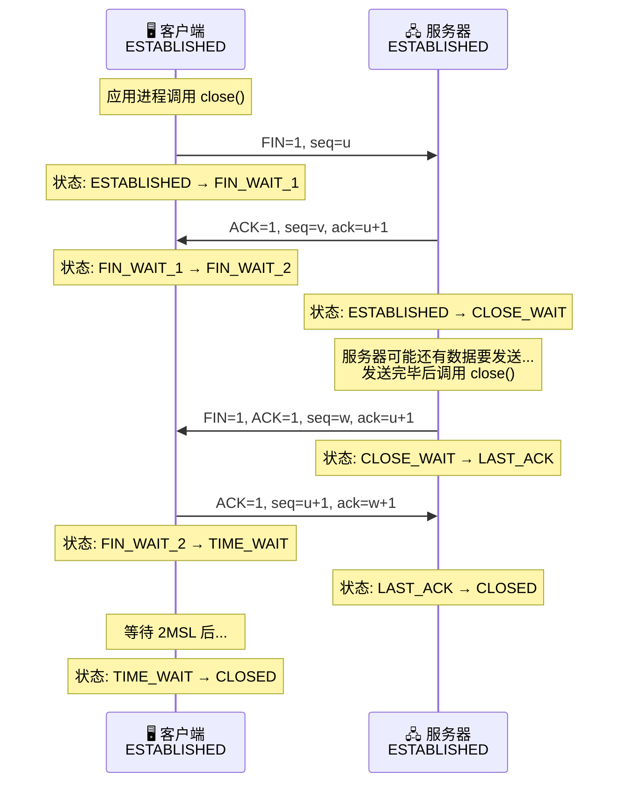

**为什么需要 TIME_WAIT 等待 2MSL（Maximum Segment Lifetime）？**

- **原因一：确保最后一个 ACK 能到达服务器。** 如果这个 ACK 丢失，服务器会超时重发 FIN，而客户端在 TIME_WAIT 状态下仍然能收到并重新回复 ACK。如果客户端直接关闭，服务器就无法正常关闭连接。
- **原因二：确保本次连接中所有残留的报文段在网络中完全消亡。** 防止这些"旧报文"干扰后续使用相同四元组（源IP、源端口、目的IP、目的端口）的新连接。

##### TCP 可靠传输机制

TCP 通过以下机制组合实现可靠传输：

| 机制 | 说明 |
|------|------|
| **序列号 + 确认号** | 每个字节都有编号，接收方告知"下一个期望的字节号" |
| **超时重传（RTO）** | 发送方在计时器超时后重传未被确认的数据 |
| **快速重传** | 收到 3 个重复 ACK 后立即重传，不等超时 |
| **滑动窗口** | 发送方在窗口范围内可连续发送，无需逐个等待确认 |
| **流量控制** | 接收方通过 Window Size 告知发送方自己的缓冲区剩余空间，防止接收方被"淹没" |
| **拥塞控制** | 发送方根据网络拥塞状况动态调整发送速率 |
| **校验和** | 检测传输过程中是否发生比特错误 |

**TCP 拥塞控制四大算法（经典 Reno 版本）：**

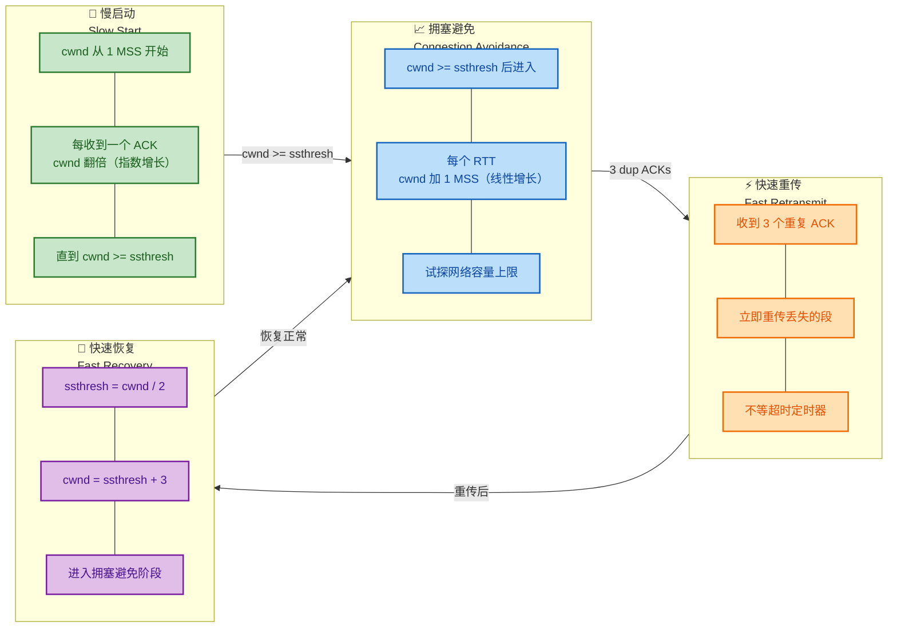

> **cwnd**（Congestion Window）：拥塞窗口，发送方自己维护的，表示当前允许发送的数据量。
> **ssthresh**（Slow Start Threshold）：慢启动阈值，区分慢启动和拥塞避免阶段的分界线。
> **MSS**（Maximum Segment Size）：最大段大小，一个 TCP 段中数据字段的最大长度。

当发生 **超时** 丢包时（比 3 个重复 ACK 更严重），TCP Reno 会将 ssthresh 设为当前 cwnd 的一半，并将 cwnd 重置为 1 MSS，重新进入慢启动阶段——这是非常激进的回退策略。

---

#### 2. UDP（User Datagram Protocol，用户数据报协议）

UDP 是一种 **无连接（Connectionless）** 的、**尽最大努力交付（Best-Effort）** 的传输协议。它不提供可靠性保证、不做流量控制、不做拥塞控制。UDP 的设计哲学就是"简单即美"——把可靠性交给应用层自己处理。

**UDP 数据报头部结构（仅 8 字节）：**

```text
 0                   1                   2                   3
 0 1 2 3 4 5 6 7 8 9 0 1 2 3 4 5 6 7 8 9 0 1 2 3 4 5 6 7 8 9 0 1
+-+-+-+-+-+-+-+-+-+-+-+-+-+-+-+-+-+-+-+-+-+-+-+-+-+-+-+-+-+-+-+-+
|          Source Port          |       Destination Port        |  ← 源端口 + 目的端口（各16位）
+-+-+-+-+-+-+-+-+-+-+-+-+-+-+-+-+-+-+-+-+-+-+-+-+-+-+-+-+-+-+-+-+
|            Length             |           Checksum            |  ← 长度（含头部+数据）+ 校验和
+-+-+-+-+-+-+-+-+-+-+-+-+-+-+-+-+-+-+-+-+-+-+-+-+-+-+-+-+-+-+-+-+
|                          Data ...                             |  ← 应用数据
+-+-+-+-+-+-+-+-+-+-+-+-+-+-+-+-+-+-+-+-+-+-+-+-+-+-+-+-+-+-+-+-+
```

对比 TCP 头部最小 20 字节，UDP 头部仅 **8 字节**，开销极低。

**TCP vs UDP 全面对比：**

| 特性 | TCP | UDP |
|------|-----|-----|
| 连接方式 | 面向连接（三次握手） | 无连接 |
| 可靠性 | 可靠传输（确认、重传、排序） | 不保证可靠 |
| 传输方式 | 字节流（Byte Stream） | 数据报（Datagram） |
| 头部开销 | 最小 20 字节 | 固定 8 字节 |
| 传输效率 | 较低（可靠性开销） | 较高（轻量级） |
| 流量控制 | ✅ 滑动窗口 | ❌ 无 |
| 拥塞控制 | ✅ 四大算法 | ❌ 无 |
| 通信模式 | 一对一（点到点） | 一对一 / 一对多 / 多对多 |
| 典型应用 | HTTP, HTTPS, FTP, SMTP, SSH | DNS, DHCP, SNMP, 视频直播, 游戏 |

**如何选择 TCP vs UDP？**

- 需要 **数据完整性和顺序性** → TCP（如文件传输、网页浏览、邮件）
- 需要 **低延迟，能容忍少量丢包** → UDP（如实时视频、语音通话、在线游戏）
- 需要 **广播/组播** → UDP（TCP 不支持一对多）

---

### 网络层（Network Layer）—— IP

网络层的核心任务是实现 **主机到主机（Host-to-Host）** 的通信，解决的是"数据包如何从源主机穿越多个网络到达目的主机"的问题。IP（Internet Protocol）是网络层的绝对核心协议。

#### 1. IPv4 地址

IPv4 地址长 **32 位**，通常用 **点分十进制（Dotted Decimal Notation）** 表示，如 `192.168.1.100`。理论上可以表示约 2³² ≈ 43 亿个地址，但由于早期分配不合理以及互联网设备爆发式增长，IPv4 地址早已枯竭。

**IP 地址 = 网络号（Network ID）+ 主机号（Host ID）**

过去使用分类编址（Classful Addressing），将 IP 地址分为 A~E 五类：

| 类别 | 首位模式 | 网络号位数 | 范围 | 默认子网掩码 | 用途 |
|------|---------|-----------|------|------------|------|
| A 类 | 0xxxxxxx | 8 位 | 1.0.0.0 ~ 126.255.255.255 | 255.0.0.0 (/8) | 大型网络 |
| B 类 | 10xxxxxx | 16 位 | 128.0.0.0 ~ 191.255.255.255 | 255.255.0.0 (/16) | 中型网络 |
| C 类 | 110xxxxx | 24 位 | 192.0.0.0 ~ 223.255.255.255 | 255.255.255.0 (/24) | 小型网络 |
| D 类 | 1110xxxx | — | 224.0.0.0 ~ 239.255.255.255 | — | 组播 |
| E 类 | 1111xxxx | — | 240.0.0.0 ~ 255.255.255.255 | — | 保留/实验 |

> **127.x.x.x** 是环回地址（Loopback），最常用的是 `127.0.0.1`（localhost），数据不会出网卡，用于本机自身通信测试。

**私有地址（Private Address）范围：**

| 类别 | 私有地址范围 | CIDR 表示 |
|------|------------|----------|
| A 类 | 10.0.0.0 ~ 10.255.255.255 | 10.0.0.0/8 |
| B 类 | 172.16.0.0 ~ 172.31.255.255 | 172.16.0.0/12 |
| C 类 | 192.168.0.0 ~ 192.168.255.255 | 192.168.0.0/16 |

私有地址不能直接在公网上路由，需要通过 **NAT（Network Address Translation，网络地址转换）** 将私有地址映射为公网地址后才能访问互联网。这也是缓解 IPv4 地址不足的重要手段之一。

#### 2. CIDR 与子网划分

**CIDR（Classless Inter-Domain Routing，无类别域间路由）** 打破了传统的分类编址限制，使用 **"IP地址/前缀长度"** 的形式灵活划分网络。例如 `192.168.1.0/24` 表示前 24 位是网络号，后 8 位是主机号。

**子网掩码（Subnet Mask）** 是与 IP 地址配合使用的 32 位二进制数，用于区分网络号和主机号。将 IP 地址与子网掩码进行 **按位与（AND）** 运算，即可得到网络地址：

```text
IP 地址:      192.168.1.100   → 11000000.10101000.00000001.01100100
子网掩码:     255.255.255.0   → 11111111.11111111.11111111.00000000
───────────────────────────────────────────────────────────────────
按位与结果:   192.168.1.0     → 11000000.10101000.00000001.00000000  ← 网络地址
```

- **网络地址**（主机号全0）：`192.168.1.0` — 代表整个子网，不能分配给主机
- **广播地址**（主机号全1）：`192.168.1.255` — 向该子网所有主机发送数据
- **可用主机数** = 2^(32 - 前缀长度) - 2 = 2⁸ - 2 = **254** 台

#### 3. IP 数据报（IP Datagram）

IPv4 数据报头部最小 **20 字节**，主要包含：

| 字段 | 长度 | 说明 |
|------|------|------|
| 版本（Version） | 4 bit | IPv4 = 4, IPv6 = 6 |
| 首部长度（IHL） | 4 bit | 头部长度，单位是 4 字节 |
| 总长度（Total Length） | 16 bit | 整个数据报的长度（含头部+数据） |
| 标识（Identification） | 16 bit | 分片时标识属于同一个原始数据报 |
| 标志（Flags） | 3 bit | DF（不分片）、MF（更多分片） |
| 片偏移（Fragment Offset） | 13 bit | 分片在原始数据中的相对位置 |
| TTL（Time To Live） | 8 bit | 生存时间，每经过一个路由器减1，减到0则丢弃 |
| 协议（Protocol） | 8 bit | 上层协议标识：TCP=6, UDP=17, ICMP=1 |
| 源 IP 地址 | 32 bit | 发送方 IP |
| 目的 IP 地址 | 32 bit | 接收方 IP |

> **TTL 的作用**：防止数据报在网络中无限循环。如果路由表配置错误导致"路由环路"，没有 TTL 机制的话，数据报会在环路中永远转圈，浪费带宽。

#### 4. 路由与转发

**路由（Routing）** 是确定数据包从源到目的地的路径的过程；**转发（Forwarding）** 是路由器根据路由表将收到的数据包从正确的接口发出去的动作。

路由器维护一张 **路由表（Routing Table）**，每一条路由条目包含：目的网络地址、子网掩码、下一跳（Next Hop）、出接口。当收到一个数据包时，路由器用目的 IP 与路由表中的每一条进行 **最长前缀匹配（Longest Prefix Match）**，找到最精确的匹配项进行转发。

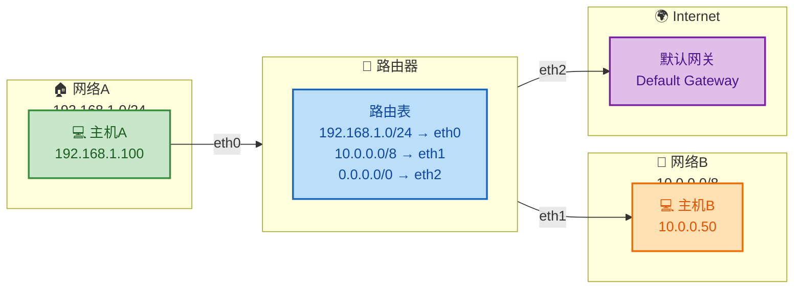

#### 5. 重要的辅助协议

- **ARP（Address Resolution Protocol）**：将 IP 地址解析为 MAC 地址。当主机知道目标 IP 但不知道 MAC 地址时，会广播 ARP 请求，目标主机响应自己的 MAC 地址。
- **ICMP（Internet Control Message Protocol）**：用于报告网络错误和诊断。常用工具 `ping`（利用 ICMP Echo Request/Reply）和 `traceroute`（利用 TTL 递增 + ICMP Time Exceeded）都依赖此协议。
- **NAT（Network Address Translation）**：在私有网络和公网之间转换 IP 地址，使多台内网设备共享一个公网 IP 出口。

#### 6. IPv6 简述

IPv6 使用 **128 位** 地址，可提供约 2¹²⁸ ≈ 3.4×10³⁸ 个地址，理论上可以"给地球上每一粒沙子分配一个 IP"。IPv6 简化了头部结构（固定 40 字节，取消了校验和与分片字段），原生支持 IPSec 安全机制，并通过邻居发现协议（NDP）取代了 ARP。IPv6 地址的表示形式为 8 组 16 位十六进制数，用冒号分隔，如 `2001:0db8:85a3:0000:0000:8a2e:0370:7334`。

---

### 链路层（Data Link Layer）—— 以太网

链路层（在 TCP/IP 模型中也称 Network Access Layer 或 Link Layer）负责 **相邻节点之间** 的数据传输。它将网络层交下来的 IP 数据报封装成 **帧（Frame）**，通过物理介质发送到下一个直接相连的节点。这里的"相邻"是指在同一条物理链路或同一个局域网（LAN）上的设备。

#### 1. 以太网（Ethernet）

以太网是当今最主流的有线局域网技术，由 IEEE 802.3 标准定义。它使用 **MAC 地址（Media Access Control Address）** 来标识局域网中的设备。

**MAC 地址** 是一个 **48 位（6 字节）** 的硬件地址，通常烧录在网卡（NIC）中，格式为 `AA:BB:CC:DD:EE:FF`（十六进制表示）。前 24 位是 **OUI（Organizationally Unique Identifier）**，标识制造商；后 24 位由制造商自行分配，确保全球唯一性。

**以太网帧结构（Ethernet II / DIX 格式）：**

```text
┌──────────┬──────────┬───────────┬────────────────────┬───────────┐
│ 前导码    │ 目的MAC   │ 源MAC     │ 类型/长度           │ 数据        │ FCS      │
│ Preamble │ Dst MAC  │ Src MAC   │ EtherType          │ Payload    │ (CRC-32) │
│ 8 bytes  │ 6 bytes  │ 6 bytes   │ 2 bytes            │ 46~1500B   │ 4 bytes  │
└──────────┴──────────┴───────────┴────────────────────┴───────────┘
```

| 字段 | 长度 | 说明 |
|------|------|------|
| 前导码 + SFD | 8 字节 | 用于时钟同步和帧定界 |
| 目的 MAC 地址 | 6 字节 | 接收方的硬件地址 |
| 源 MAC 地址 | 6 字节 | 发送方的硬件地址 |
| 类型 | 2 字节 | 标识上层协议（0x0800=IPv4, 0x0806=ARP, 0x86DD=IPv6） |
| 数据（Payload） | 46~1500 字节 | 承载上层数据（最大即为 **MTU = 1500 字节**） |
| FCS | 4 字节 | 帧校验序列，CRC-32 校验，检测传输错误 |

> **MTU（Maximum Transmission Unit）**：以太网的 MTU 为 1500 字节，这是链路层能承载的最大数据量（不含帧头帧尾）。如果网络层的 IP 数据报超过 MTU，就必须进行 **分片（Fragmentation）**。

#### 2. 交换机与 MAC 地址表

以太网交换机（Switch）是链路层的核心设备。它维护一张 **MAC 地址表（CAM Table, Content Addressable Memory Table）**，记录每个 MAC 地址对应的端口。

交换机的工作流程：

1. **学习（Learning）**：收到一个帧时，记录"源 MAC 地址 → 入端口"的映射。
2. **转发（Forwarding）**：查找目的 MAC 地址，如果在表中找到对应端口，则只从该端口转发（单播）。
3. **泛洪（Flooding）**：如果目的 MAC 地址不在表中（未知单播），则向除入端口外的所有端口转发。
4. **过滤（Filtering）**：如果源端口和目的端口相同（说明通信双方在同一端口/网段），则丢弃该帧。

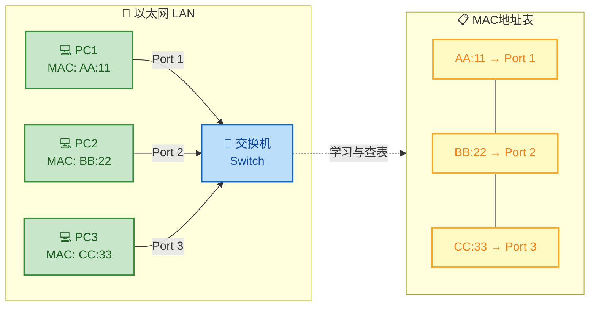

#### 3. ARP 的工作过程（链路层视角）

ARP 虽然在功能上属于网络层辅助协议，但它直接操作链路层帧。假设主机 A（192.168.1.10）要发数据给同一子网的主机 B（192.168.1.20），但不知道 B 的 MAC 地址：

1. **主机 A 广播 ARP Request**：目的 MAC 为 `FF:FF:FF:FF:FF:FF`（广播地址），询问"谁的 IP 是 192.168.1.20？请告诉我你的 MAC 地址。"
2. **子网内所有主机收到该广播帧**，但只有 IP 为 192.168.1.20 的主机 B 回复。
3. **主机 B 单播 ARP Reply**：告诉 A "我的 MAC 地址是 XX:XX:XX:XX:XX:XX。"
4. **主机 A 缓存该映射** 到本地 ARP 缓存表（有过期时间），后续发送给 B 的帧就可以直接填写目的 MAC 地址，无需再次 ARP 查询。

#### 4. 冲突域与广播域

| 概念 | 定义 | 分隔设备 |
|------|------|---------|
| **冲突域（Collision Domain）** | 共享同一传输介质、可能发生帧冲突的范围 | 交换机的每个端口就是一个独立的冲突域 |
| **广播域（Broadcast Domain）** | 广播帧能到达的所有设备范围 | **路由器** 隔离广播域，交换机不能隔离广播域 |

在现代全交换（Full-Switched）网络中，每个交换机端口构成独立的冲突域，已基本消除了冲突问题。但广播域需要依靠路由器或 **VLAN（Virtual LAN）** 来划分。VLAN 可以在同一台交换机上逻辑划分多个广播域，提升安全性和管理灵活性。

---

### 数据封装全流程总览

当你在浏览器中访问 `http://www.example.com` 时，数据从应用层到链路层的封装过程如下：

```text
┌──────────────────────────────────────────────────────────────────────┐
│                        应用层 Application Layer                      │
│  ┌────────────────────────────────────────────────────────┐          │
│  │  HTTP 请求报文: "GET /index.html HTTP/1.1 ..."        │  Message │
│  └────────────────────────────────────────────────────────┘          │
├──────────────────────────────────────────────────────────────────────┤
│                        传输层 Transport Layer                        │
│  ┌──────────┬─────────────────────────────────────────────┐          │
│  │ TCP 头部  │           HTTP 报文（应用数据）               │  Segment │
│  │ 20+ bytes│                                             │          │
│  └──────────┴─────────────────────────────────────────────┘          │
├──────────────────────────────────────────────────────────────────────┤
│                        网络层 Network Layer                          │
│  ┌──────────┬──────────┬──────────────────────────────────┐          │
│  │ IP 头部   │ TCP 头部  │         应用数据                  │  Packet  │
│  │ 20 bytes │ 20+ bytes│                                  │          │
│  └──────────┴──────────┴──────────────────────────────────┘          │
├──────────────────────────────────────────────────────────────────────┤
│                        链路层 Link Layer                             │
│  ┌──────────┬──────────┬──────────┬──────────────────┬─────┐        │
│  │ 帧头 MAC  │ IP 头部   │ TCP 头部  │    应用数据       │ FCS │ Frame  │
│  │ 14 bytes │ 20 bytes │ 20+ bytes│                  │ 4B  │        │
│  └──────────┴──────────┴──────────┴──────────────────┴─────┘        │
└──────────────────────────────────────────────────────────────────────┘
```

每一层只关心自己的头部信息，对上层传下来的数据视为不透明的"载荷（Payload）"——这就是 **分层封装（Layered Encapsulation）** 的精髓。接收端则按相反顺序逐层解封装，最终将纯净的应用数据交给目标进程。

---

**📝 练习题 1**

在 TCP 三次握手过程中，第二次握手报文的标志位组合是什么？

A. SYN=1, ACK=0

B. SYN=1, ACK=1

C. SYN=0, ACK=1

D. FIN=1, ACK=1


**【答案】** B

**【解析】** TCP 三次握手的三个报文分别是：① 客户端发送 SYN=1（请求建立连接）；② 服务器回复 **SYN=1, ACK=1**（同意建立连接，同时确认收到客户端的 SYN）；③ 客户端发送 ACK=1（确认收到服务器的 SYN）。第二次握手需要同时完成两件事——对客户端 SYN 的确认（ACK=1）和自己发起的同步请求（SYN=1），因此标志位组合为 SYN=1, ACK=1。

---

**📝 练习题 2**

某主机的 IP 地址为 `172.16.5.130/25`，请问该子网的广播地址是什么？

A. 172.16.5.127

B. 172.16.5.128

C. 172.16.5.255

D. 172.16.5.191


**【答案】** C

**【解析】** 子网前缀长度为 `/25`，意味着子网掩码为 `255.255.255.128`（即前 25 位为 1，后 7 位为 0）。将 IP 地址 `172.16.5.130` 与子网掩码进行 AND 运算：`130` 的二进制为 `10000010`，与掩码最后一个字节 `10000000` 做 AND 运算得到 `10000000` = `128`，因此网络地址为 `172.16.5.128`。广播地址是主机号全为 1 的地址，即将后 7 位全部置 1：`10000000` | `01111111` = `11111111` = `255`，所以广播地址为 `172.16.5.255`。可用主机范围是 `172.16.5.129` ~ `172.16.5.254`，共 2⁷ - 2 = 126 台。选项 A（172.16.5.127）是 `172.16.5.0/25` 这个子网的广播地址，注意区分。

---

## 各层协议与职责

在前面两节中，我们分别拆解了 OSI 七层模型与 TCP/IP 四层模型的宏观架构。本节将把视角切换到 **"微观协议级别"**——逐层盘点每一层到底跑着哪些核心协议，它们各自承担什么职责，以及协议之间如何配合完成一次完整的网络通信。理解这张 **"协议地图"** 是后续深入学习每个协议细节的前提。

---

### 总览：协议在分层模型中的分布

我们以工程实践中最常用的 **TCP/IP 四层模型** 为主线，同时标注其与 OSI 七层模型的映射关系。下面这张图给出了一个全局视角：

```mermaid
graph LR
    subgraph L4["应用层 Application Layer"]
        direction TB
        HTTP["HTTP/HTTPS"]
        DNS["DNS"]
        FTP["FTP/SFTP"]
        SMTP["SMTP/POP3/IMAP"]
        SSH["SSH/Telnet"]
        DHCP["DHCP"]
        SNMP["SNMP"]
    end

    subgraph L3["传输层 Transport Layer"]
        direction TB
        TCP["TCP"]
        UDP["UDP"]
        QUIC["QUIC"]
    end

    subgraph L2["网络层 Internet Layer"]
        direction TB
        IP["IPv4 / IPv6"]
        ICMP["ICMP"]
        ARP2["ARP"]
        OSPF["OSPF / BGP"]
        IGMP["IGMP"]
    end

    subgraph L1["网络接口层 Link Layer"]
        direction TB
        ETH["Ethernet 802.3"]
        WIFI["Wi-Fi 802.11"]
        PPP["PPP/PPPoE"]
        MAC["MAC Addressing"]
    end

    L4 --> L3 --> L2 --> L1

    classDef appCls fill:#C8E6C9,stroke:#388E3C,color:#1B5E20
    classDef transCls fill:#BBDEFB,stroke:#1976D2,color:#0D47A1
    classDef netCls fill:#FFE0B2,stroke:#F57C00,color:#E65100
    classDef linkCls fill:#FFCDD2,stroke:#D32F2F,color:#B71C1C

    class HTTP,DNS,FTP,SMTP,SSH,DHCP,SNMP appCls
    class TCP,UDP,QUIC transCls
    class IP,ICMP,ARP2,OSPF,IGMP netCls
    class ETH,WIFI,PPP,MAC linkCls
```

可以看到，**越靠近用户的上层协议越多**（应用层协议数量远多于底层），这是因为不同的应用场景催生出不同的应用层协议，而底层负责的是更加通用的"搬运"工作。

---

### 应用层协议与职责 (Application Layer)

应用层对应 OSI 模型的 **第 5/6/7 层（会话层 + 表示层 + 应用层）**，是用户和程序直接打交道的地方。它的核心职责是：**定义应用程序之间的通信规则和数据格式**。

#### HTTP / HTTPS — 万维网的基石

**HTTP（HyperText Transfer Protocol）** 是浏览器与 Web 服务器之间最常用的请求-响应协议（Request-Response Protocol）。它工作在 TCP 之上（HTTP/1.1、HTTP/2）或 QUIC/UDP 之上（HTTP/3）。

| 特性 | 说明 |
|---|---|
| **默认端口** | HTTP: `80`，HTTPS: `443` |
| **通信模式** | 请求-响应（Request-Response） |
| **状态性** | 无状态（Stateless），通过 Cookie/Session 实现状态保持 |
| **版本演进** | HTTP/1.0 → HTTP/1.1（持久连接） → HTTP/2（多路复用） → HTTP/3（基于 QUIC） |

**HTTPS** 并不是一个独立协议，而是 **HTTP + TLS/SSL** 的组合。TLS 握手在 TCP 连接之上建立加密通道，保证数据的 **机密性（Confidentiality）**、**完整性（Integrity）** 和 **身份认证（Authentication）**。

#### DNS — 互联网的电话簿

**DNS（Domain Name System）** 将人类可读的域名（如 `www.example.com`）解析为机器可路由的 IP 地址（如 `93.184.216.34`）。它是整个互联网最关键的基础设施之一——没有 DNS，我们就得记住每个网站的 IP。

DNS 查询通常使用 **UDP 端口 53**（快速、轻量），当响应数据超过 512 字节或进行区域传输（Zone Transfer）时，会切换到 **TCP 端口 53**。

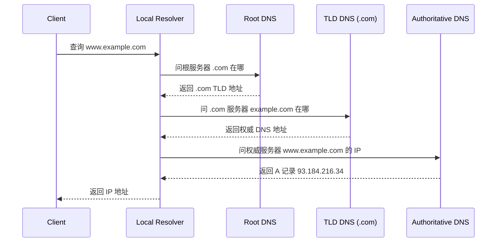

这就是经典的 **递归 + 迭代查询** 流程：客户端对 Local Resolver 做递归查询，Resolver 再依次对根、TLD、权威服务器做迭代查询。实际中，缓存（Cache）会大幅减少查询次数。

#### 其他重要应用层协议速览

| 协议 | 端口 | 传输层 | 核心职责 |
|---|---|---|---|
| **FTP** | 20(数据)/21(控制) | TCP | 文件传输，支持主动/被动模式 |
| **SMTP** | 25/587 | TCP | 发送电子邮件（Mail Transfer） |
| **POP3/IMAP** | 110/143 | TCP | 接收/管理邮件，IMAP 支持服务端同步 |
| **SSH** | 22 | TCP | 加密远程登录与命令执行 |
| **Telnet** | 23 | TCP | 明文远程登录（已逐步被 SSH 替代） |
| **DHCP** | 67(Server)/68(Client) | UDP | 动态分配 IP 地址、子网掩码、网关等 |
| **SNMP** | 161/162 | UDP | 网络设备监控与管理 |
| **RTP** | 动态 | UDP | 实时音视频传输 |

一条规律：**对可靠性要求高的协议（文件、邮件、登录）选 TCP；对实时性敏感、容忍少量丢包的协议（DHCP 广播、音视频流、DNS 快速查询）选 UDP。**

---

### 传输层协议与职责 (Transport Layer)

传输层对应 OSI 的 **第 4 层**，它的核心使命只有一个：**提供端到端（End-to-End）的进程级通信**。网络层只关心"主机到主机"，而传输层通过 **端口号（Port Number）** 将数据精确地交付给目标主机上的某个具体进程。

#### TCP — 可靠的字节流传输

**TCP（Transmission Control Protocol）** 是互联网上使用最广泛的传输层协议。它的核心设计哲学是：**在不可靠的 IP 网络之上，构建一条可靠的、有序的、无差错的字节流通道。**

TCP 承担的六大职责：

| 职责 | 机制 |
|---|---|
| **连接管理** | 三次握手（3-Way Handshake）建立连接，四次挥手（4-Way Handshake）释放连接 |
| **可靠传输** | 序列号（Sequence Number）+ 确认号（ACK）+ 超时重传（Retransmission） |
| **流量控制** | 滑动窗口（Sliding Window），接收方通告窗口大小（rwnd） |
| **拥塞控制** | 慢启动（Slow Start）、拥塞避免（Congestion Avoidance）、快速重传/恢复 |
| **有序交付** | 按序列号重新排列乱序到达的分段 |
| **全双工通信** | 双方可同时发送和接收数据 |

TCP 报文段中的关键字段值得单独拿出来看：

```
┌──────────────────────────────────────────────────────────┐
│  源端口 (16bit)          │  目的端口 (16bit)            │
├──────────────────────────────────────────────────────────┤
│              序列号 Sequence Number (32bit)               │
├──────────────────────────────────────────────────────────┤
│              确认号 Acknowledgment Number (32bit)         │
├────────┬────────┬────────────────────────────────────────┤
│数据偏移│保留 │ U A P R S F │     窗口大小 (16bit)       │
│ (4bit) │(6bit)│ R C S S Y I │     Window Size            │
│        │      │ G K H T N N │                            │
├────────┴────────┴────────────────────────────────────────┤
│  校验和 Checksum (16bit) │  紧急指针 (16bit)            │
├──────────────────────────────────────────────────────────┤
│              选项 Options (可变长)                        │
├──────────────────────────────────────────────────────────┤
│                    数据 Payload                           │
└──────────────────────────────────────────────────────────┘
```

其中 **SYN、ACK、FIN、RST** 这几个标志位（Flags）是 TCP 状态机转换的核心驱动力。

#### UDP — 极简的数据报服务

**UDP（User Datagram Protocol）** 几乎是传输层能做到的 "最小功能集"——它只在 IP 数据报的基础上加了 **端口复用** 和一个 **可选的校验和**，其他什么都不管。

| 特性 | TCP | UDP |
|---|---|---|
| 连接方式 | 面向连接 | 无连接 |
| 可靠性 | 可靠（ACK + 重传） | 不可靠（Best Effort） |
| 有序性 | 保证顺序 | 不保证 |
| 头部开销 | 20 字节（最小） | **8 字节**（固定） |
| 传输模式 | 字节流 | 数据报（有消息边界） |
| 典型场景 | Web、文件传输、邮件 | DNS、视频流、游戏、IoT |

> **设计直觉**：如果你的应用 **自己实现了可靠性**（如 QUIC），或者 **根本不需要可靠性**（如实时视频丢一帧无所谓），那么用 UDP 可以获得更低的延迟和更小的开销。

#### QUIC — 新一代传输协议

**QUIC（Quick UDP Internet Connections）** 由 Google 提出并已标准化为 RFC 9000，是 HTTP/3 的底层传输协议。它运行在 **UDP 之上**，却在用户态实现了类似 TCP 的可靠传输、拥塞控制，并原生集成了 TLS 1.3 加密。QUIC 的最大优势是 **0-RTT / 1-RTT 连接建立**，相比 TCP + TLS 的多次往返大幅降低了首包延迟。

---

### 网络层协议与职责 (Internet/Network Layer)

网络层对应 OSI 的 **第 3 层**，核心使命是：**实现跨网络的主机到主机（Host-to-Host）通信**，也就是 **寻址（Addressing）** 和 **路由（Routing）**。

#### IP — 网络层的绝对核心

**IP（Internet Protocol）** 是整个 TCP/IP 体系的"腰部"协议，所有上层数据最终都要封装成 IP 数据报（Datagram）在网络中传递。

**IPv4 vs IPv6 关键对比**：

| 维度 | IPv4 | IPv6 |
|---|---|---|
| 地址长度 | 32 位（约 43 亿地址） | 128 位（约 3.4×10³⁸ 地址） |
| 地址表示 | 点分十进制 `192.168.1.1` | 冒号分隔十六进制 `2001:db8::1` |
| 头部长度 | 20-60 字节（可变） | **固定 40 字节**（扩展头链式追加） |
| NAT 需求 | 大量依赖 NAT | 设计上不需要 NAT |
| 内置安全 | 可选 IPSec | IPSec 是标准组成部分 |

IP 协议的核心职责包括：

1. **逻辑寻址**：为每台主机/接口分配全局唯一的 IP 地址。
2. **分片与重组（Fragmentation & Reassembly）**：当数据报大于链路 MTU 时，发送端（IPv4）或源端（IPv6）将其分片，目的端负责重组。
3. **路由转发（Routing & Forwarding）**：路由器根据目的 IP 查找路由表，决定下一跳（Next Hop）。
4. **TTL/Hop Limit**：防止数据报在网络中无限循环。

> 注意：IP 协议本身是 **无连接的（Connectionless）** 且 **不可靠的（Unreliable）**——它不保证交付、不保证顺序、不保证不重复。可靠性由上层 TCP 等协议负责。

#### ICMP — 网络层的诊断信使

**ICMP（Internet Control Message Protocol）** 是 IP 的"伴生协议"，用于在主机和路由器之间传递 **控制消息和错误报告**。它虽然在技术上封装在 IP 数据报内，但在逻辑上属于网络层。

最常见的 ICMP 应用：

- **`ping`**：发送 ICMP Echo Request / Echo Reply，测试目标可达性和延迟。
- **`traceroute`**：利用递增 TTL 触发 ICMP Time Exceeded 消息，逐跳探测路径。
- **目的不可达（Destination Unreachable）**：当路由器无法转发或端口未开放时反馈。
- **重定向（Redirect）**：告知主机有更优的下一跳路由。

#### ARP — 地址解析协议

**ARP（Address Resolution Protocol）** 严格来说横跨网络层和链路层，它解决的问题是：**已知目标 IP 地址，如何获取其 MAC 地址？**

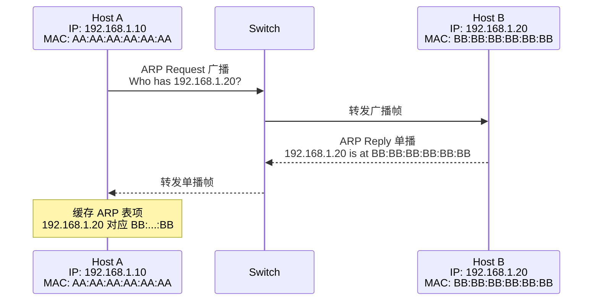

ARP 使用广播（Broadcast）发送请求，目标主机以单播（Unicast）回复。每台主机本地维护一张 **ARP 缓存表**（可通过 `arp -a` 命令查看），以避免频繁广播。

#### 路由协议 — OSPF / BGP / RIP

路由协议不传输用户数据，而是让路由器之间 **交换路由信息**，从而构建和维护路由表。

| 协议 | 类型 | 作用范围 | 核心算法 |
|---|---|---|---|
| **RIP** | 距离矢量（Distance Vector） | IGP（自治系统内部） | Bellman-Ford，最大跳数 15 |
| **OSPF** | 链路状态（Link State） | IGP（自治系统内部） | Dijkstra 最短路径 |
| **BGP** | 路径矢量（Path Vector） | **EGP（自治系统之间）** | 基于策略的路径选择 |

一个简单的理解方式：**RIP 和 OSPF 管的是"一个公司内部的路怎么走"（IGP），BGP 管的是"公司之间的高速公路怎么互联"（EGP）。** BGP 是驱动整个全球互联网路由的核心协议，被称为互联网的 "粘合剂"（The Glue of the Internet）。

---

### 网络接口层协议与职责 (Network Interface / Link Layer)

网络接口层对应 OSI 的 **第 1 层（物理层）+ 第 2 层（数据链路层）**。它的职责是：**在直接相连的两个节点之间，把比特流可靠地搬运过去。**

#### 以太网 (Ethernet IEEE 802.3)

以太网是有线局域网（LAN）的事实标准。它定义了：

- **帧格式（Frame Format）**：包含目的 MAC、源 MAC、类型/长度字段、数据、FCS 校验等。
- **MAC 地址（Media Access Control Address）**：48 位硬件地址，烧录在网卡中，是链路层寻址的唯一标识。
- **CSMA/CD（载波侦听多路访问/冲突检测）**：传统半双工以太网的介质访问控制方法（现代全双工交换以太网已不再需要）。

以太网帧结构如下：

```
┌──────────┬──────────┬──────────┬──────────┬────────────────┬──────────┐
│ Preamble │ Dest MAC │ Src MAC  │Type/Len  │   Payload      │   FCS    │
│ 8 bytes  │ 6 bytes  │ 6 bytes  │ 2 bytes  │ 46-1500 bytes  │ 4 bytes  │
└──────────┴──────────┴──────────┴──────────┴────────────────┴──────────┘
```

- **Preamble（前导码）**：用于时钟同步。
- **Type/Len**：标识上层协议类型（如 `0x0800` = IPv4，`0x0806` = ARP，`0x86DD` = IPv6）。
- **FCS（Frame Check Sequence）**：32 位 CRC 校验，检测传输错误。
- **MTU（Maximum Transmission Unit）**：以太网的标准 MTU 为 **1500 字节**，这也是为什么 TCP MSS 通常为 1460（1500 - 20 IP头 - 20 TCP头）。

#### Wi-Fi (IEEE 802.11)

Wi-Fi 是无线局域网的标准，它与以太网共享 LLC 子层但在 MAC 子层有显著差异：

- 使用 **CSMA/CA（冲突避免）** 而非 CSMA/CD，因为无线环境中无法同时发送和检测冲突。
- 帧格式更复杂，包含 **最多 4 个地址字段**（源、目的、AP、中继）。
- 支持多种工作模式：Infrastructure（通过 AP 通信）、Ad-Hoc（设备直连）。

#### PPP / PPPoE

**PPP（Point-to-Point Protocol）** 是点对点链路上的数据链路层协议，常见于 DSL 拨号上网场景。**PPPoE（PPP over Ethernet）** 则是在以太网帧中封装 PPP，让用户通过以太网接入也能使用 PPP 的认证（PAP/CHAP）和会话管理能力。这是家庭宽带拨号上网的底层技术基础。

---

### 数据封装全流程：一次 HTTP 请求的旅行

理解各层协议最好的方式是跟踪一个真实请求从发出到收到的全过程。当你在浏览器输入 `https://www.example.com` 并按下回车：

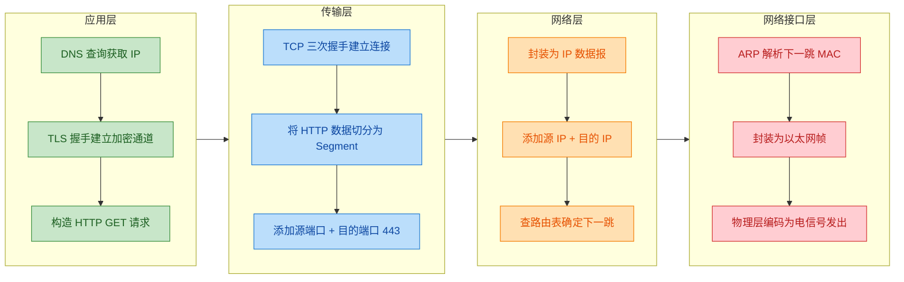

每经过一层，数据都会被加上该层的 **头部（Header）**，这个过程叫做 **封装（Encapsulation）**。到了接收端，则逆向逐层 **解封装（Decapsulation）**，最终应用层拿到原始的 HTTP 响应数据。

各层数据单元的名称也有讲究：

| 层 | 数据单元名称 (PDU) | 英文 |
|---|---|---|
| 应用层 | 消息/报文 | Message |
| 传输层 | 段（TCP）/ 数据报（UDP） | Segment / Datagram |
| 网络层 | 分组 / 数据报 | Packet / Datagram |
| 网络接口层 | 帧 | Frame |
| 物理层 | 比特流 | Bits |

---

### 层间协作的关键接口

各层之间并不是完全独立的"黑箱"，它们通过明确的标识符建立上下文关联：

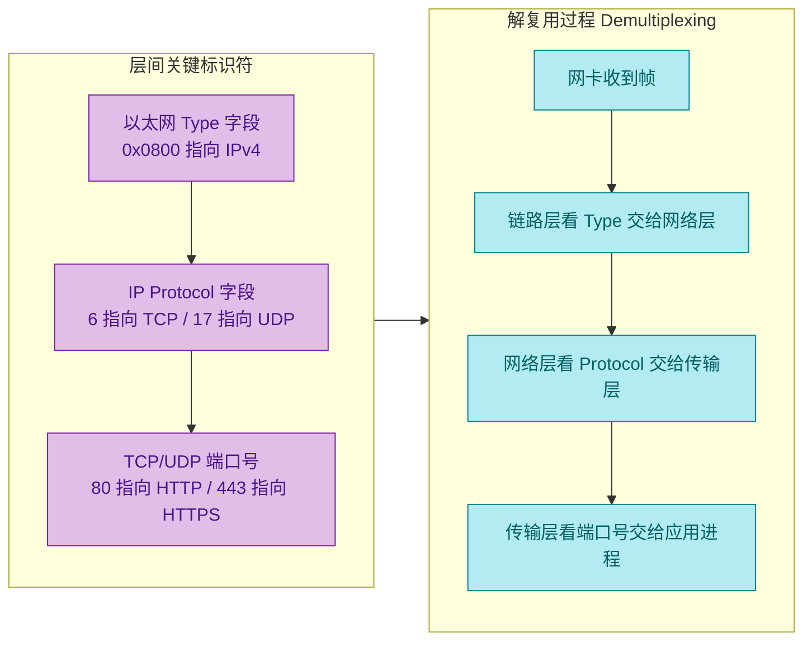

这条 **解复用链（Demultiplexing Chain）** 是协议栈能够正确工作的关键——每一层都通过上一层留下的"标识符"，精确地把数据向上传递给正确的协议或进程。

> **一句话总结**：以太网帧用 `Type` 找网络层协议，IP 用 `Protocol` 找传输层协议，TCP/UDP 用 `Port` 找应用进程。这三级定位，就像快递先看国家、再看城市、最后看门牌号。

---

**📝 练习题**

当一台主机收到一个以太网帧后，操作系统协议栈需要进行逐层解复用。以下关于解复用过程的描述，**正确的是**：

A. 链路层通过 IP 头部的 Protocol 字段判断应交给哪个网络层协议处理

B. 网络层通过以太网帧的 Type 字段判断应交给 TCP 还是 UDP

C. 传输层通过目的端口号将数据交给对应的应用进程

D. 应用层通过源 MAC 地址识别数据来自哪台主机


**【答案】** C

**【解析】** 解复用是一个严格的逐层过程，每一层只看属于 **本层头部** 的标识字段：

- **链路层**看的是以太网帧中的 **Type 字段**（如 `0x0800` 表示 IPv4），据此决定交给网络层的哪个协议——所以 A 错误（链路层不会去看 IP 头部）。
- **网络层**看的是 IP 头部的 **Protocol 字段**（如 `6` 表示 TCP，`17` 表示 UDP），据此交给传输层——所以 B 错误（网络层看的不是以太网 Type）。
- **传输层**看的是 TCP/UDP 头部的 **目的端口号**（如 `80` → HTTP 进程，`443` → HTTPS 进程），据此将数据准确交付给对应的应用进程——**C 正确**。
- **应用层**已经是最高层，不再进行协议解复用；而且 MAC 地址属于链路层概念，应用层一般不直接操作 MAC 地址——所以 D 错误。

---

## 本章小结

本章围绕计算机网络的**分层体系结构**展开，从经典的 OSI 七层模型到工程实践中的 TCP/IP 四层模型，系统梳理了网络通信的核心框架。分层思想（Layered Architecture）是整个计算机网络学科的**基石**——它将复杂的端到端通信问题拆解为多个职责单一、边界清晰的层次，每一层只需关注自身的功能，并通过**服务接口（Service Interface）**向上层提供能力，通过**协议（Protocol）**与对等层通信。理解了这套框架，后续学习任何具体协议时都能迅速定位它"住在哪一层、解决什么问题、和谁打交道"。

---

### 核心知识脉络回顾

**OSI 七层模型**是国际标准化组织（ISO）提出的理论参考框架。它将网络通信划分为物理层、数据链路层、网络层、传输层、会话层、表示层和应用层共七层。其价值在于提供了一套**通用语言**——无论厂商、平台、实现方式如何不同，工程师都能用这七层来描述和定位问题。但 OSI 模型本身过于理想化，会话层与表示层在实际协议栈中很少独立存在，因此工业界并未完全按照它来实现。

**TCP/IP 四层模型**是互联网事实上的标准架构。它将 OSI 的七层**务实地压缩**为四层：

| 层次 | 核心职责 | 代表协议 |
|------|---------|---------|
| **应用层** | 为用户进程提供网络服务，定义数据的语义与格式 | HTTP、HTTPS、DNS、FTP、SMTP |
| **传输层** | 提供端到端（End-to-End）的逻辑通信，区分同一主机上的不同进程 | TCP（可靠）、UDP（轻量） |
| **网络层** | 负责跨网络的寻址与路由，将数据包从源主机送达目标主机 | IP、ICMP、ARP |
| **链路层** | 负责相邻节点之间的帧传输，处理物理介质访问与差错检测 | Ethernet、Wi-Fi (802.11)、PPP |

四层模型的精髓可以用一句话概括：**应用层决定"说什么"，传输层决定"怎么说"，网络层决定"走哪条路"，链路层决定"每一步怎么迈"。**

---

### 两大模型对比总览

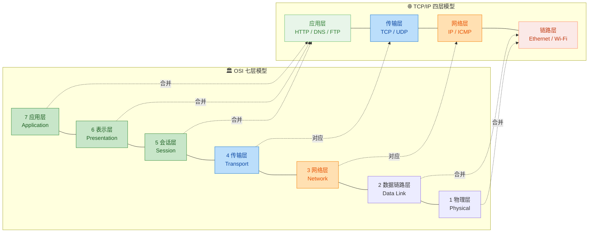

---

### 数据封装与解封装

分层模型最直观的体现就是**封装（Encapsulation）**过程。数据从应用层出发，每经过一层都会被加上该层的**头部（Header）**，到达链路层后还会加上**尾部（Trailer）**用于差错校验。到达对端后则逐层剥离头部，最终还原出应用数据。各层数据单元的名称也不同：

| 层次 | PDU 名称（Protocol Data Unit） | 关键头部字段 |
|------|-------------------------------|-------------|
| 应用层 | Message / 报文 | 取决于具体协议（如 HTTP Header） |
| 传输层 | Segment（TCP）/ Datagram（UDP） | 源端口、目的端口、序列号、确认号 |
| 网络层 | Packet / 分组 | 源 IP、目的 IP、TTL、协议号 |
| 链路层 | Frame / 帧 | 源 MAC、目的 MAC、类型、FCS |

这条"穿衣-脱衣"的流水线清晰地体现了**关注点分离（Separation of Concerns）**原则：每一层只读写自己的头部，完全不关心上层 payload 里装的是什么。

---

### 各层协议关系全景图

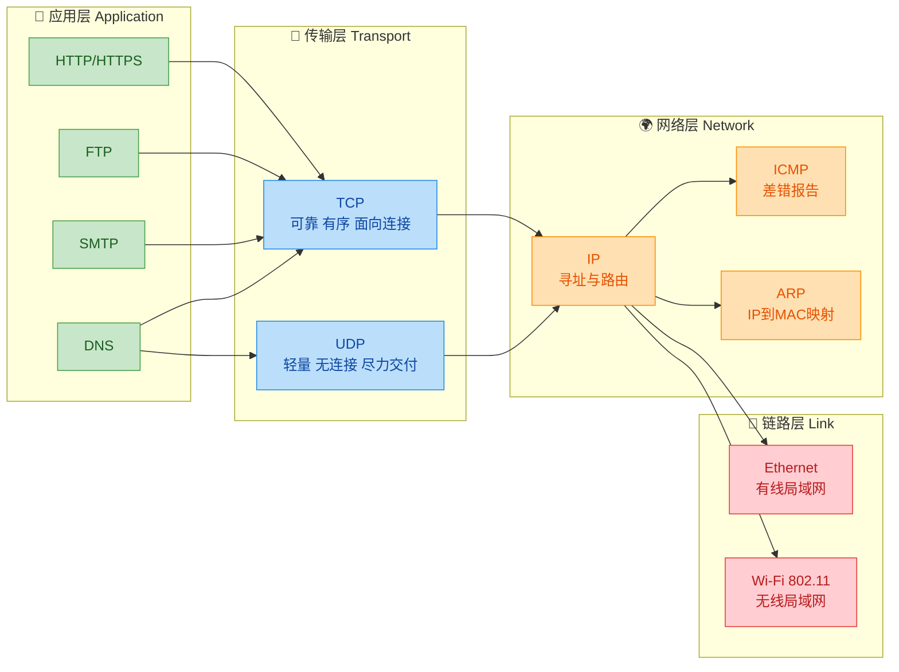

---

### 关键概念速记清单

以下是本章需要牢记的**高频考点与核心概念**：

1. **分层的本质**：将复杂系统拆分为多个独立模块，通过标准接口组合，实现高内聚、低耦合。
2. **协议 vs 服务**：协议是同层对等实体之间的通信规则（水平方向）；服务是下层向上层提供的能力（垂直方向）。
3. **TCP vs UDP 的根本区别**：TCP 以连接管理和流控/拥塞控制换取可靠性；UDP 以极低开销换取实时性。选择哪个取决于应用对"可靠性"和"延迟"的优先级。
4. **IP 的核心角色**：网络层的 IP 协议是整个互联网的"腰部"（Internet 的 narrow waist），所有上层协议最终都要通过 IP 来路由和寻址。
5. **ARP 的特殊位置**：ARP 在逻辑上服务于网络层（将 IP 地址解析为 MAC 地址），但其报文直接封装在链路层帧中，因此它**横跨**网络层与链路层。
6. **DNS 的双栖特性**：DNS 查询通常使用 UDP（端口 53）以追求速度，但当响应数据超过 512 字节或涉及区域传送（Zone Transfer）时，会退回到 TCP。
7. **HTTPS = HTTP + TLS**：TLS 工作在应用层与传输层之间（在 TCP/IP 模型中归属应用层），通过非对称加密协商会话密钥，再用对称加密保护数据传输。

---

### 一句话串联四层

> 用户在浏览器输入 URL → **DNS（应用层）** 将域名解析为 IP → **TCP（传输层）** 三次握手建立可靠连接 → **IP（网络层）** 逐跳路由将分组送往目标服务器 → **以太网（链路层）** 在每段物理链路上以帧为单位传输比特 → 服务器收到请求后原路返回 HTTP 响应 → 浏览器渲染页面。

这条链路从上到下、从左到右，就是本章所有知识点的**活体串联**。后续章节将分别深入每一层的内部机制。

---

**📝 练习题 1**

在 TCP/IP 四层模型中，以下哪一层负责**将数据从源主机跨越多个网络送达目标主机**？

A. 应用层（Application Layer）

B. 传输层（Transport Layer）

C. 网络层（Network Layer）

D. 链路层（Link Layer）

**【答案】** C

**【解析】** 网络层（Network Layer）的核心职责是**寻址（Addressing）与路由（Routing）**。它通过 IP 地址标识源和目的主机，利用路由算法在多个中间网络之间逐跳（hop-by-hop）转发分组，最终将数据包从源端送达目的端。传输层（B）虽然也提供端到端通信，但它依赖网络层完成跨网络传输，自身关注的是进程到进程的可靠性与复用；链路层（D）只负责相邻节点之间的帧传输，不具备跨网络能力；应用层（A）定义的是数据的语义而非传输路径。

---

**📝 练习题 2（面试高频）**

当你在浏览器中输入 `https://www.example.com` 并按下回车后，数据在 TCP/IP 协议栈中的封装顺序是什么？请从上到下排列各层添加的头部。

A. IP Header → TCP Header → HTTP Message → Ethernet Header

B. HTTP Message → TCP Header → IP Header → Ethernet Header + Trailer

C. Ethernet Header → IP Header → TCP Header → HTTP Message

D. TCP Header → HTTP Message → IP Header → Ethernet Header

**【答案】** B

**【解析】** 数据封装遵循**自顶向下**的顺序。首先，应用层生成 HTTP 请求报文（Message）；然后传输层在其前面加上 TCP 头部（含源/目的端口、序列号等），形成 Segment；接着网络层再加上 IP 头部（含源/目的 IP、TTL 等），形成 Packet；最后链路层在最外层加上以太网帧头（含源/目的 MAC）和帧尾 FCS（Frame Check Sequence），形成 Frame。选项 B 完整且正确地描述了这一过程。选项 A 将 IP 放在了最先，违反了自顶向下原则；选项 C 描述的是解封装（自底向上）的顺序；选项 D 的顺序混乱，不符合任何标准流程。

---