---
title: 总览
slug: overview
priority: 1
date: 2026-03-04
allowCopy: true
---

---

# 第一性原理拆解与架构全景

---

## 一、第一性原理：这个项目的本质是什么？

在动手之前，我先问自己 **5 个 Why** 把问题打到最底层：

```
Q1: 我们要做什么？ → 网络审计软件
Q2: 网络审计的本质是什么？ → 被动观察 + 结构化记录 网络中的明文通信
Q3: "被动观察"的物理基础是什么？ → 网卡混杂模式下逐帧捕获比特流
Q4: "结构化记录"的本质是什么？ → 从无差别的字节流中，按协议分层规则提取语义字段
Q5: 那整个系统的最小抽象是什么？ → 一个 **流式 ETL 管道**：
     Extract(抓帧) → Transform(逐层解码+语义提取) → Load(存储+推送)
```

> **打底结论**：不管技术栈怎么选，这个项目的**骨架**就是一条 **实时流处理管道（Streaming Pipeline）**，输入是原始以太网帧，输出是结构化审计记录 + 实时告警事件。

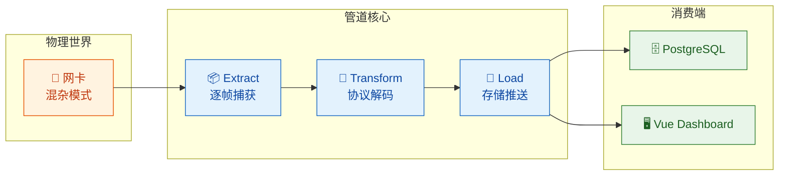
```mermaid
graph LR
    subgraph 物理世界
        direction TB
        NIC["🔌 网卡<br/>混杂模式"]
    end

    subgraph 管道核心
        direction TB
        E["📦 Extract<br/>逐帧捕获"]
        T["🔬 Transform<br/>协议解码"]
        L["💾 Load<br/>存储推送"]
        E --> T --> L
    end

    subgraph 消费端
        direction TB
        DB["🗄️ PostgreSQL"]
        WEB["🖥️ Vue Dashboard"]
    end

    NIC --> E
    L --> DB
    L --> WEB

    classDef physical fill:#FFF3E0,stroke:#E65100,color:#BF360C
    classDef pipeline fill:#E3F2FD,stroke:#1565C0,color:#0D47A1
    classDef consumer fill:#E8F5E9,stroke:#2E7D32,color:#1B5E20

    class NIC physical
    class E,T,L pipeline
    class DB,WEB consumer
```

---

## 二、多层拆解：从字节到语义的四层认知

这个项目的核心难度不在"抓包"，而在**逐层剥壳**——每一层协议都是上一层的 payload。我把它画成认知分层：

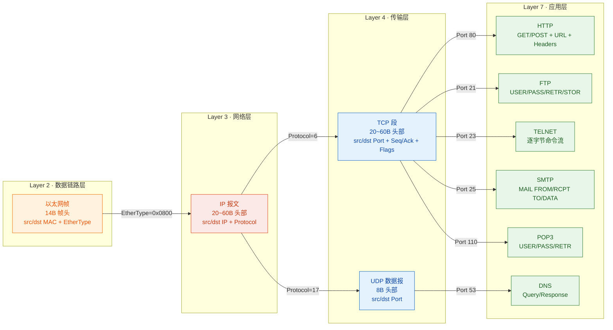
```mermaid
graph LR
    subgraph L2["Layer 2 · 数据链路层"]
        direction TB
        ETH["以太网帧<br/>14B 帧头<br/>src/dst MAC + EtherType"]
    end

    subgraph L3["Layer 3 · 网络层"]
        direction TB
        IP["IP 报文<br/>20~60B 头部<br/>src/dst IP + Protocol"]
    end

    subgraph L4["Layer 4 · 传输层"]
        direction TB
        TCP["TCP 段<br/>20~60B 头部<br/>src/dst Port + Seq/Ack + Flags"]
        UDP["UDP 数据报<br/>8B 头部<br/>src/dst Port"]
    end

    subgraph L7["Layer 7 · 应用层"]
        direction TB
        HTTP["HTTP<br/>GET/POST + URL + Headers"]
        FTP["FTP<br/>USER/PASS/RETR/STOR"]
        TELNET["TELNET<br/>逐字节命令流"]
        DNS["DNS<br/>Query/Response"]
        SMTP["SMTP<br/>MAIL FROM/RCPT TO/DATA"]
        POP3["POP3<br/>USER/PASS/RETR"]
    end

    ETH -->|"EtherType=0x0800"| IP
    IP -->|"Protocol=6"| TCP
    IP -->|"Protocol=17"| UDP
    TCP -->|"Port 80"| HTTP
    TCP -->|"Port 21"| FTP
    TCP -->|"Port 23"| TELNET
    UDP -->|"Port 53"| DNS
    TCP -->|"Port 25"| SMTP
    TCP -->|"Port 110"| POP3

    classDef l2 fill:#FFF3E0,stroke:#EF6C00,color:#E65100
    classDef l3 fill:#FBE9E7,stroke:#D84315,color:#BF360C
    classDef l4 fill:#E3F2FD,stroke:#1565C0,color:#0D47A1
    classDef l7 fill:#E8F5E9,stroke:#2E7D32,color:#1B5E20

    class ETH l2
    class IP l3
    class TCP,UDP l4
    class HTTP,FTP,TELNET,DNS,SMTP,POP3 l7
```

> **关键洞察**：每一层的解析器只关心**本层头部 + 判断下一层类型**，然后把 payload 交给下一层。这天然就是 **责任链模式（Chain of Responsibility）** 的应用场景。

---

## 三、逆向验证：从评分标准反推架构约束

不能只正向设计，必须从评分标准**逆向推导**出架构的硬约束：

| 评分项 | 分值 | 反推出的架构约束 |
|--------|------|------------------|
| 核心审计、抓包与存储 | 60 分 | 管道必须稳定：抓包不丢帧、解析不崩溃、存储不丢记录 |
| 实时告警 ≤ 10 秒 | 10 分 | 管道延迟必须 < 10s → **异步推送**（SSE），不能轮询 |
| 每协议完整侦听 | 每项 10 分 | 协议解析器必须**可插拔**，每个独立开发独立测试 |
| 累计上限 100 | — | 6 个协议全做满 = 60，加基础 60 已超 100，说明**做全做稳就能满分** |

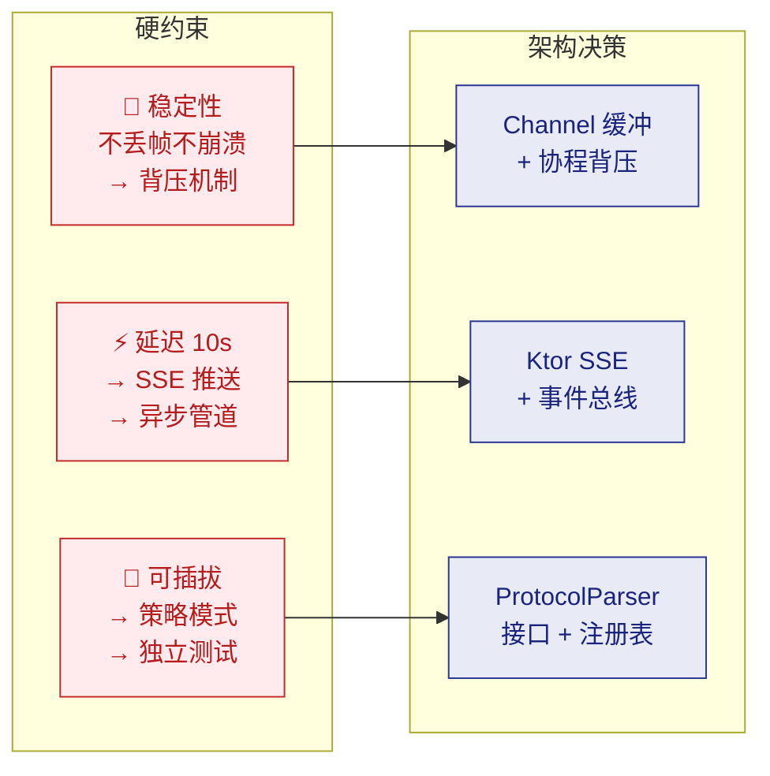
```mermaid
graph LR
    subgraph 硬约束
        direction TB
        C1["🎯 稳定性<br/>不丢帧不崩溃<br/>→ 背压机制"]
        C2["⚡ 延迟 10s<br/>→ SSE 推送<br/>→ 异步管道"]
        C3["🔌 可插拔<br/>→ 策略模式<br/>→ 独立测试"]
    end

    subgraph 架构决策
        direction TB
        D1["Channel 缓冲<br/>+ 协程背压"]
        D2["Ktor SSE<br/>+ 事件总线"]
        D3["ProtocolParser<br/>接口 + 注册表"]
    end

    C1 --> D1
    C2 --> D2
    C3 --> D3

    classDef constraint fill:#FFEBEE,stroke:#C62828,color:#B71C1C
    classDef decision fill:#E8EAF6,stroke:#283593,color:#1A237E

    class C1,C2,C3 constraint
    class D1,D2,D3 decision
```

---

## 四、架构全景图：四大子系统

基于以上分析，整体架构切分为 **四个子系统**，它们之间通过 Kotlin Channel（协程通道）和 EventBus 解耦：

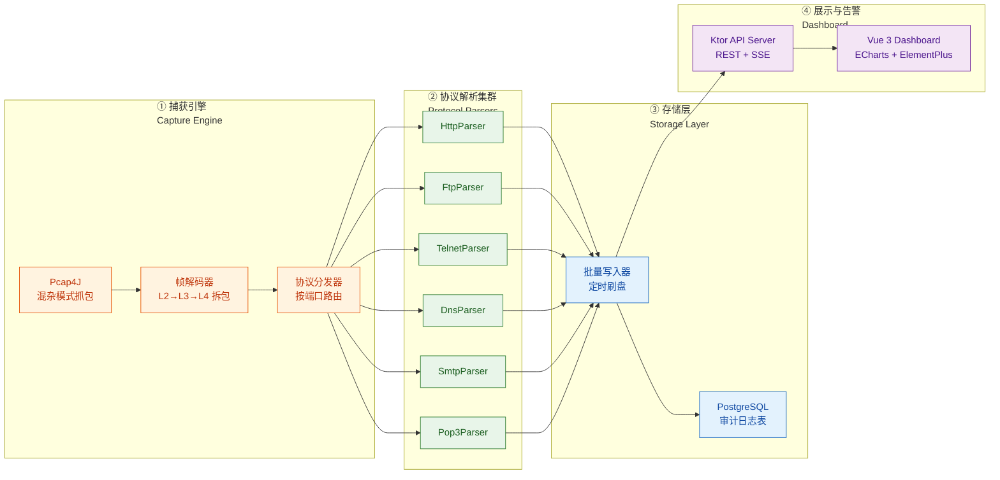
```mermaid
graph LR
    subgraph CAP["① 捕获引擎<br/>Capture Engine"]
        direction TB
        PCAP["Pcap4J<br/>混杂模式抓包"]
        DECODER["帧解码器<br/>L2→L3→L4 拆包"]
        DISPATCH["协议分发器<br/>按端口路由"]
        PCAP --> DECODER --> DISPATCH
    end

    subgraph PARSE["② 协议解析集群<br/>Protocol Parsers"]
        direction TB
        PH["HttpParser"]
        PF["FtpParser"]
        PT["TelnetParser"]
        PD["DnsParser"]
        PS["SmtpParser"]
        PP["Pop3Parser"]
    end

    subgraph STORE["③ 存储层<br/>Storage Layer"]
        direction TB
        BATCH["批量写入器<br/>定时刷盘"]
        PG["PostgreSQL<br/>审计日志表"]
        BATCH --> PG
    end

    subgraph UI["④ 展示与告警<br/>Dashboard"]
        direction TB
        KTOR["Ktor API Server<br/>REST + SSE"]
        VUE["Vue 3 Dashboard<br/>ECharts + ElementPlus"]
        KTOR --> VUE
    end

    DISPATCH --> PH
    DISPATCH --> PF
    DISPATCH --> PT
    DISPATCH --> PD
    DISPATCH --> PS
    DISPATCH --> PP

    PH --> BATCH
    PF --> BATCH
    PT --> BATCH
    PD --> BATCH
    PS --> BATCH
    PP --> BATCH

    BATCH --> KTOR

    classDef cap fill:#FFF3E0,stroke:#E65100,color:#BF360C
    classDef parse fill:#E8F5E9,stroke:#2E7D32,color:#1B5E20
    classDef store fill:#E3F2FD,stroke:#1565C0,color:#0D47A1
    classDef ui fill:#F3E5F5,stroke:#6A1B9A,color:#4A148C

    class PCAP,DECODER,DISPATCH cap
    class PH,PF,PT,PD,PS,PP parse
    class BATCH,PG store
    class KTOR,VUE ui
```

---

## 五、关键架构决策与 Why

这里是我做的每一个技术决策，以及**为什么这样选**（面向演讲答辩的"为什么"比"是什么"更重要）：

### 决策 1：为什么用 Kotlin 协程而不是线程池？

```
事实：抓包是 IO 密集型，每秒可能数千帧
问题：线程池在高并发 IO 场景下线程上下文切换开销大
选择：Kotlin 协程 = 用户态轻量级线程，10 万级并发无压力
验证：协程 Channel 天然提供背压（buffered channel 满了就挂起生产者）
     → 完美匹配 "不丢帧" 的硬约束
```

### 决策 2：为什么 Pcap4J 而不是直接 JNI 调 libpcap？

```
事实：libpcap 是 C 库，JNI 调用有内存管理风险
问题：课程项目开发周期 4 周，没时间调 JNI 段错误
选择：Pcap4J = 纯 Java 封装 libpcap，API 友好，跨平台
验证：Pcap4J 已内置以太网帧 / IP / TCP / UDP 的解析类
     → 省掉 L2~L4 的手动解析，聚焦 L7 应用层解析（得分大头）
```

### 决策 3：为什么是 SSE 而不是 WebSocket？

```
事实：告警是单向推送（服务端 → 浏览器），不需要客户端上行
问题：WebSocket 是双向的，对于单向场景是 over-engineering
选择：SSE = 基于 HTTP 的单向推送，原生浏览器支持，实现简单
验证：Ktor 原生支持 SSE，3 行代码搞定
     → 满足 ≤ 10 秒延迟的评分要求
```

### 决策 4：为什么 PostgreSQL 而不是 SQLite？

```
事实：审计日志需要高速写入 + 复杂查询（按协议/时间/IP 过滤）
问题：SQLite 单写锁，并发写入会阻塞管道
选择：PostgreSQL 支持并发写入 + JSONB 字段存协议特有字段
验证：JSONB 让所有协议共用一张 audit_logs 表
     → 通用字段是列，协议特有字段进 JSONB，schema 简洁
```

### 决策 5：为什么协议解析器用策略模式 + 注册表？

```
事实：6 个协议各自格式不同，但输入输出是统一的
问题：if-else 判断协议类型 → 违反开闭原则，加新协议要改老代码
选择：定义 ProtocolParser 接口，每个协议一个实现类，注册到 Map<Port, Parser>
验证：新增协议 = 新写一个类 + 注册一行
     → Codex 可以并行生成 6 个 Parser，互不干扰
```

---

## 六、数据流全景：一个 HTTP 请求从网卡到屏幕

用一个具体场景把整条管道串起来——这也是你答辩演讲时最有说服力的"Demo 故事线"：

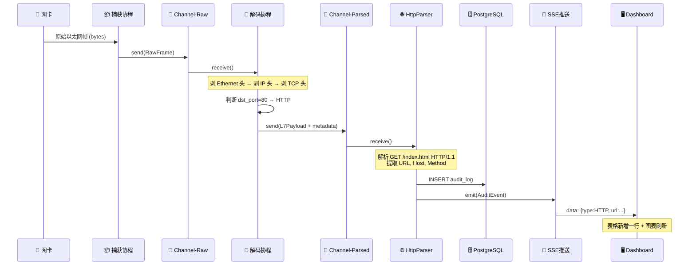
```mermaid
sequenceDiagram
    participant NIC as 🔌 网卡
    participant CAP as 📦 捕获协程
    participant CH1 as 🔀 Channel-Raw
    participant DEC as 🔬 解码协程
    participant CH2 as 🔀 Channel-Parsed
    participant HTTP as 🌐 HttpParser
    participant DB as 🗄️ PostgreSQL
    participant SSE as 📡 SSE推送
    participant VUE as 🖥️ Dashboard

    NIC->>CAP: 原始以太网帧 (bytes)
    CAP->>CH1: send(RawFrame)
    CH1->>DEC: receive()
    Note over DEC: 剥 Ethernet 头 → 剥 IP 头 → 剥 TCP 头
    DEC->>DEC: 判断 dst_port=80 → HTTP
    DEC->>CH2: send(L7Payload + metadata)
    CH2->>HTTP: receive()
    Note over HTTP: 解析 GET /index.html HTTP/1.1<br/>提取 URL, Host, Method
    HTTP->>DB: INSERT audit_log
    HTTP->>SSE: emit(AuditEvent)
    SSE->>VUE: data: {type:HTTP, url:...}
    Note over VUE: 表格新增一行 + 图表刷新
```

---

## 七、思维模型总结：本篇用了什么

| 思维工具 | 用在哪里 | 产出了什么 |
|----------|----------|------------|
| **第一性原理** | §一 | 识别出"流式 ETL 管道"这个最小抽象 |
| **分层拆解** | §二 | L2→L3→L4→L7 的认知地图，导出责任链模式 |
| **逆向推导** | §三 | 从评分标准反推出 3 个硬约束（稳定/延迟/可插拔） |
| **5 Whys** | §五 每个决策 | 每个技术选型都有因果链，答辩时能自圆其说 |
| **具象化验证** | §六 | 用一个 HTTP 请求走完全链路，验证管道设计无断裂 |

---

# 模块深潜 + 设计模式地图

---

## 一、设计模式全景地图：谁在哪里，为什么

先给一张**全局鸟瞰**——每个设计模式标注在它被使用的位置上，答辩时讲到任何一个模块都能说清"这里用了什么模式、为什么"：

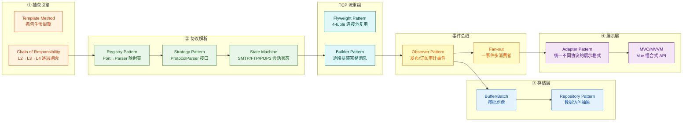
```mermaid
graph LR
    subgraph CAP["① 捕获引擎"]
        direction TB
        A1["Template Method<br/>抓包生命周期"]
        A2["Chain of Responsibility<br/>L2→L3→L4 逐层剥壳"]
    end

    subgraph PARSE["② 协议解析"]
        direction TB
        B1["Strategy Pattern<br/>ProtocolParser 接口"]
        B2["State Machine<br/>SMTP/FTP/POP3 会话状态"]
        B3["Registry Pattern<br/>Port→Parser 映射表"]
    end

    subgraph STREAM["TCP 流重组"]
        direction TB
        C1["Flyweight Pattern<br/>4-tuple 连接池复用"]
        C2["Builder Pattern<br/>逐段拼装完整消息"]
    end

    subgraph STORE["③ 存储层"]
        direction TB
        D1["Repository Pattern<br/>数据访问抽象"]
        D2["Buffer/Batch<br/>攒批刷盘"]
    end

    subgraph EVENT["事件总线"]
        direction TB
        E1["Observer Pattern<br/>发布/订阅审计事件"]
        E2["Fan-out<br/>一事件多消费者"]
    end

    subgraph UI["④ 展示层"]
        direction TB
        F1["MVC/MVVM<br/>Vue 组合式 API"]
        F2["Adapter Pattern<br/>统一不同协议的展示格式"]
    end

    A2 --> B3
    B3 --> B1
    B1 --> B2
    B2 --> C2
    C2 --> E1
    E1 --> D2
    E1 --> E2
    D2 --> D1
    E2 --> F2
    F2 --> F1

    classDef cap fill:#FFF3E0,stroke:#E65100,color:#BF360C
    classDef parse fill:#E8F5E9,stroke:#2E7D32,color:#1B5E20
    classDef stream fill:#E0F7FA,stroke:#00695C,color:#004D40
    classDef store fill:#E3F2FD,stroke:#1565C0,color:#0D47A1
    classDef event fill:#FFF9C4,stroke:#F57F17,color:#E65100
    classDef ui fill:#F3E5F5,stroke:#6A1B9A,color:#4A148C

    class A1,A2 cap
    class B1,B2,B3 parse
    class C1,C2 stream
    class D1,D2 store
    class E1,E2 event
    class F1,F2 ui
```

> **演讲技巧**：答辩时指着这张图说"整个系统用了 10 个设计模式，每一个都有明确理由"，瞬间拉开和普通项目的差距。

---

## 二、捕获引擎内部设计

### 2.1 逐层剥壳：责任链模式

核心思想：**每一层解码器只负责拆自己那层的头部，判断下一层类型，然后把 payload 传下去**。不认识的就丢弃。

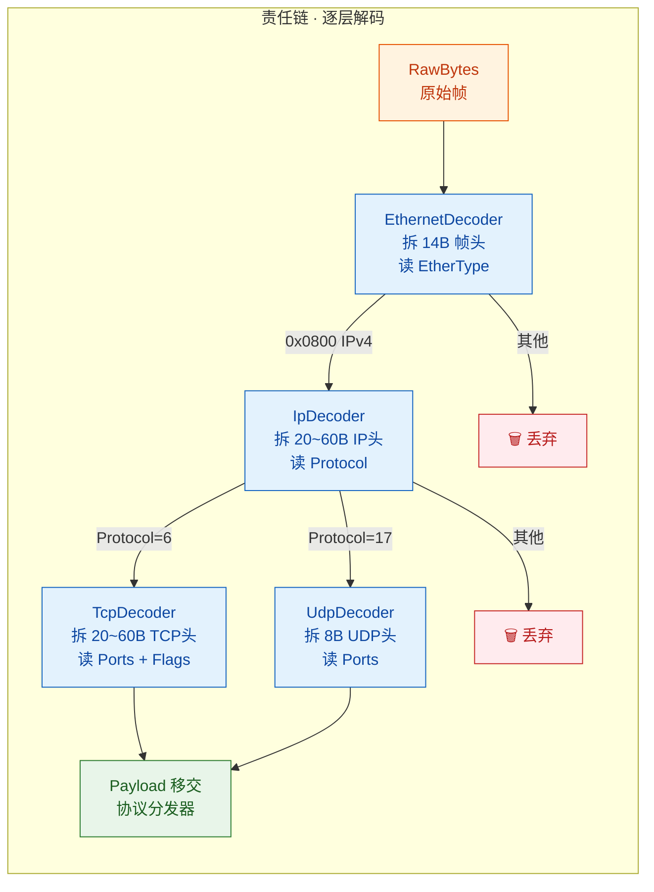
```mermaid
graph LR
    subgraph Chain["责任链 · 逐层解码"]
        direction TB
        RAW["RawBytes<br/>原始帧"]
        L2["EthernetDecoder<br/>拆 14B 帧头<br/>读 EtherType"]
        L3["IpDecoder<br/>拆 20~60B IP头<br/>读 Protocol"]
        L4T["TcpDecoder<br/>拆 20~60B TCP头<br/>读 Ports + Flags"]
        L4U["UdpDecoder<br/>拆 8B UDP头<br/>读 Ports"]
        L7["Payload 移交<br/>协议分发器"]

        RAW --> L2
        L2 -->|"0x0800 IPv4"| L3
        L2 -->|"其他"| DROP1["🗑️ 丢弃"]
        L3 -->|"Protocol=6"| L4T
        L3 -->|"Protocol=17"| L4U
        L3 -->|"其他"| DROP2["🗑️ 丢弃"]
        L4T --> L7
        L4U --> L7
    end

    classDef decoder fill:#E3F2FD,stroke:#1565C0,color:#0D47A1
    classDef drop fill:#FFEBEE,stroke:#C62828,color:#B71C1C
    classDef raw fill:#FFF3E0,stroke:#E65100,color:#BF360C
    classDef payload fill:#E8F5E9,stroke:#2E7D32,color:#1B5E20

    class RAW raw
    class L2,L3,L4T,L4U decoder
    class DROP1,DROP2 drop
    class L7 payload
```

**为什么用责任链而不是一个大函数？**

```
正向理由：每层解码逻辑独立，单一职责，可独立单测
反向验证：如果都写在一个函数里——
  → 函数 200+ 行，改 IP 解析怕影响 TCP 解析
  → 违反开闭原则（加 IPv6 支持要改整个函数）
  → 不可测试（无法单测 IP 解码而不经过 Ethernet）
```

### 2.2 Pcap4J 的利用策略

> **关键认知**：Pcap4J 已经内置了 L2~L4 的解析能力，我们**不需要手动逐字节拆包**。

| 层次 | Pcap4J 提供的类 | 我们只需做什么 |
|------|-----------------|---------------|
| L2 以太网 | `EthernetPacket` | 调 `.getHeader().getType()` 判断 |
| L3 IP | `IpV4Packet` | 调 `.getHeader().getSrcAddr()` 等 |
| L4 TCP | `TcpPacket` | 调 `.getHeader().getDstPort()` 路由 |
| L4 UDP | `UdpPacket` | 调 `.getHeader().getDstPort()` 路由 |
| **L7 应用层** | ❌ **不提供** | **这是我们写代码的主战场** |

> **结论**：80% 的开发精力应该放在 L7 协议解析器上——这也是评分标准里"每协议 10 分"的得分点。

---

## 三、TCP 流重组：被低估的关键模块

### 3.1 为什么需要流重组？

```
问题：一个 HTTP 请求可能跨越多个 TCP 段（分片）
      一个 TCP 段也可能包含多个 HTTP 请求（管线化）
事实：协议解析器需要的是「完整的应用层消息」，不是「单个 TCP 段」
结论：在分发给 L7 Parser 之前，必须有一层 TCP 流重组
```

### 3.2 流重组器设计

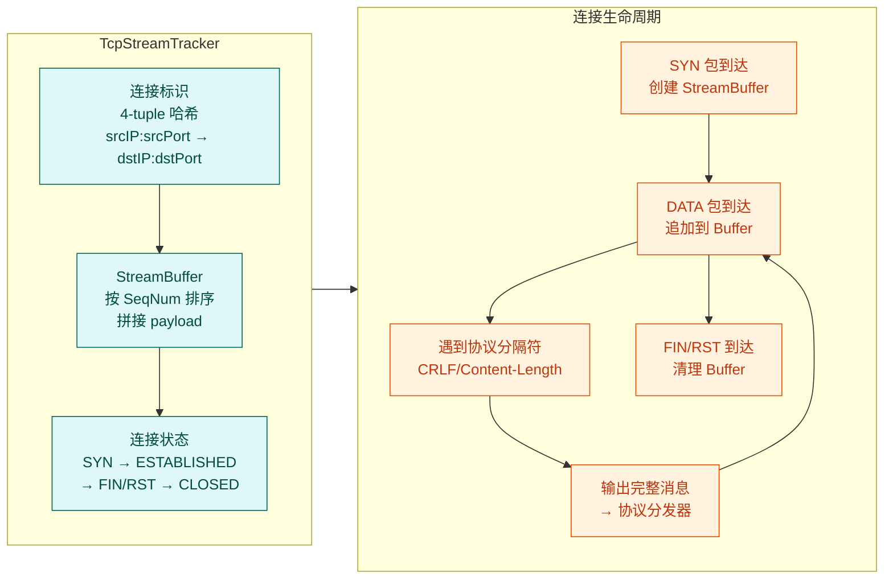
```mermaid
graph LR
    subgraph Tracker["TcpStreamTracker"]
        direction TB
        KEY["连接标识<br/>4-tuple 哈希<br/>srcIP:srcPort → dstIP:dstPort"]
        BUF["StreamBuffer<br/>按 SeqNum 排序<br/>拼接 payload"]
        STATE["连接状态<br/>SYN → ESTABLISHED<br/>→ FIN/RST → CLOSED"]
        KEY --> BUF
        BUF --> STATE
    end

    subgraph Lifecycle["连接生命周期"]
        direction TB
        SYN["SYN 包到达<br/>创建 StreamBuffer"]
        DATA["DATA 包到达<br/>追加到 Buffer"]
        DELIM["遇到协议分隔符<br/>CRLF/Content-Length"]
        EMIT["输出完整消息<br/>→ 协议分发器"]
        FIN["FIN/RST 到达<br/>清理 Buffer"]

        SYN --> DATA
        DATA --> DELIM
        DELIM --> EMIT
        EMIT --> DATA
        DATA --> FIN
    end

    Tracker --> Lifecycle

    classDef tracker fill:#E0F7FA,stroke:#00695C,color:#004D40
    classDef lifecycle fill:#FFF3E0,stroke:#E65100,color:#BF360C

    class KEY,BUF,STATE tracker
    class SYN,DATA,DELIM,EMIT,FIN lifecycle
```

### 3.3 课程项目的简化策略

**全功能 TCP 重组**（如 libnids）极其复杂。课程项目可以做**合理简化**：

| 全功能 | 我们的简化 | 理由 |
|--------|-----------|------|
| 处理乱序包（按 SeqNum 排序） | 假设包按序到达 | LAN 环境 + 镜像端口，乱序极少 |
| 处理重传包（去重） | 简单 SeqNum 去重 | 记录已见最大 SeqNum，跳过重复 |
| 支持半打开/半关闭连接 | 超时清理即可 | 设 60s 超时，避免内存泄漏 |
| 处理 TCP 窗口缩放 | 忽略 | 课程环境用不到 |

> **答辩话术**："我们做了工程权衡——在受控的 LAN 测试环境下，简化 TCP 重组是合理的；但架构上预留了扩展点，未来可以替换为完整实现。"

---

## 四、协议解析器深潜：六大 Parser 的内部设计

### 4.1 统一接口：策略模式

所有 Parser 共享同一个接口，输入是**重组后的应用层消息 + 元数据**，输出是**结构化的 AuditRecord**：

```
┌─────────────────────────────────────────────────┐
│              ProtocolParser 接口                  │
├─────────────────────────────────────────────────┤
│ + protocol: ProtocolType                         │
│ + ports: Set<Int>                                │
│ + parse(stream: StreamContext): AuditRecord?     │
│ + isComplete(buffer: ByteArray): Boolean         │
└─────────────────────────────────────────────────┘
          △         △         △         △
          │         │         │         │
    HttpParser  FtpParser  DnsParser  SmtpParser ...
```

**为什么用接口而不是抽象类？**

```
接口：只定义契约，不强制继承链
     → HTTP 和 DNS 的解析逻辑完全不同（文本 vs 二进制），抽象类的公共方法会是空的
     → Kotlin 接口可以有默认实现，需要时仍可复用
```

### 4.2 HTTP Parser —— 最简单的入门 Parser

HTTP 是无状态的请求-响应模型，**每条消息自包含**，解析最直观：

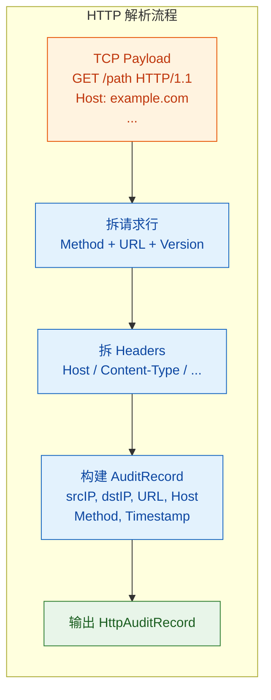
```mermaid
graph LR
    subgraph HTTPParse["HTTP 解析流程"]
        direction TB
        INPUT["TCP Payload<br/>GET /path HTTP/1.1<br/>Host: example.com<br/>..."]
        REQLINE["拆请求行<br/>Method + URL + Version"]
        HEADERS["拆 Headers<br/>Host / Content-Type / ..."]
        BUILD["构建 AuditRecord<br/>srcIP, dstIP, URL, Host<br/>Method, Timestamp"]
        OUTPUT["输出 HttpAuditRecord"]

        INPUT --> REQLINE --> HEADERS --> BUILD --> OUTPUT
    end

    classDef input fill:#FFF3E0,stroke:#E65100,color:#BF360C
    classDef process fill:#E3F2FD,stroke:#1565C0,color:#0D47A1
    classDef output fill:#E8F5E9,stroke:#2E7D32,color:#1B5E20

    class INPUT input
    class REQLINE,HEADERS,BUILD process
    class OUTPUT output
```

**解析要点**：
- 请求行按第一个 `CRLF` 分割，空格切分得到 `Method URL Version`
- Headers 按 `CRLF` 逐行，`:` 左右切 key-value
- URL = 请求行的 URL（相对路径）+ `Host` 头拼接成完整 URL
- `isComplete` 判断：看到 `CRLFCRLF`（空行）说明 Header 结束

### 4.3 FTP Parser —— 有状态的命令追踪

FTP 控制连接是**逐行命令-响应**，但需要**跨多条命令追踪会话状态**（用户名在 `USER` 命令，密码在 `PASS` 命令，操作在 `RETR/STOR` 命令）：

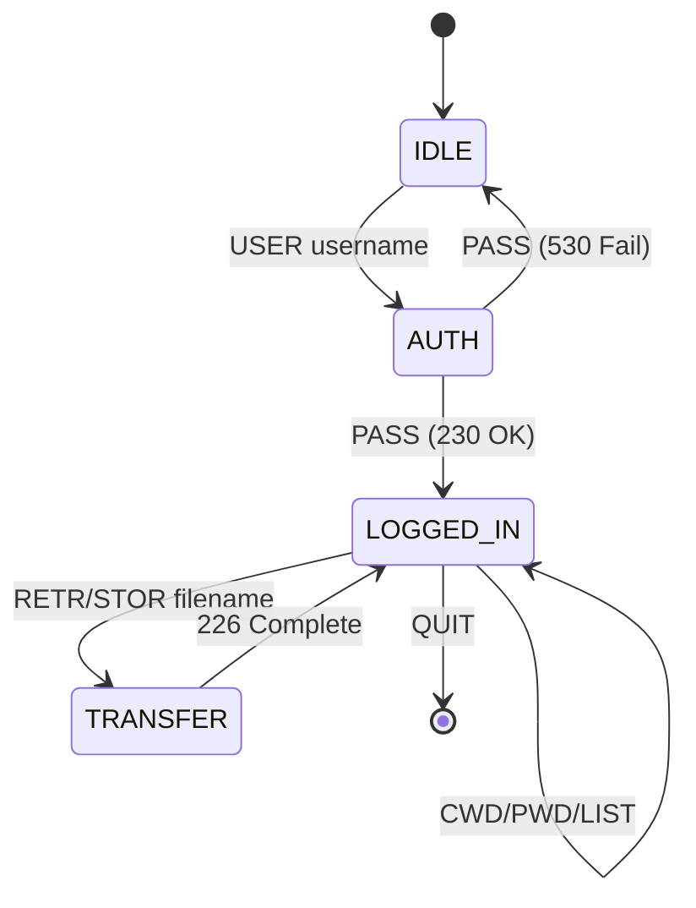
```mermaid
stateDiagram-v2
    [*] --> IDLE
    IDLE --> AUTH : USER username
    AUTH --> LOGGED_IN : PASS (230 OK)
    AUTH --> IDLE : PASS (530 Fail)
    LOGGED_IN --> LOGGED_IN : CWD/PWD/LIST
    LOGGED_IN --> TRANSFER : RETR/STOR filename
    TRANSFER --> LOGGED_IN : 226 Complete
    LOGGED_IN --> [*] : QUIT
```

**状态机模式的价值**：
```
没有状态机：收到 RETR file.txt 时，不知道是谁在操作
            → 得回溯之前的包找 USER 命令
            → 复杂、易错、性能差

有状态机：  StreamContext 里维护当前状态 + 已知 username
            → 收到 RETR 时直接组装完整 AuditRecord
            → O(1) 查找，无回溯
```

**FTP 审计输出**：`{ srcIP, dstIP, username, command: "RETR", filename: "secret.doc", directory: "/pub", timestamp }`

### 4.4 TELNET Parser —— 逐字节的特殊挑战

TELNET 最特殊：数据是**逐字节或逐小块**发送的（用户每敲一个键发一个包）。

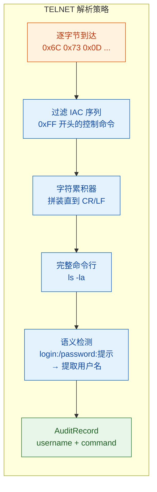
```mermaid
graph LR
    subgraph TelnetParse["TELNET 解析策略"]
        direction TB
        RAW["逐字节到达<br/>0x6C 0x73 0x0D ..."]
        FILTER["过滤 IAC 序列<br/>0xFF 开头的控制命令"]
        ACCUM["字符累积器<br/>拼装直到 CR/LF"]
        LINE["完整命令行<br/>ls -la"]
        DETECT["语义检测<br/>login:/password:提示<br/>→ 提取用户名"]
        AUDIT["AuditRecord<br/>username + command"]

        RAW --> FILTER --> ACCUM --> LINE --> DETECT --> AUDIT
    end

    classDef raw fill:#FFF3E0,stroke:#E65100,color:#BF360C
    classDef process fill:#E3F2FD,stroke:#1565C0,color:#0D47A1
    classDef output fill:#E8F5E9,stroke:#2E7D32,color:#1B5E20

    class RAW raw
    class FILTER,ACCUM,LINE,DETECT process
    class AUDIT output
```

**关键处理**：
- **IAC 过滤**：`0xFF` 开头的是 TELNET 控制指令（DO/DONT/WILL/WONT），不是用户数据，必须过滤掉
- **回显识别**：TELNET 服务端会回显用户输入，所以同一流的两个方向都有数据。我们只关心**客户端→服务端**方向（用户输入）
- **用户名提取**：监测服务端发送的 `login:` 提示，紧跟其后客户端发送的就是用户名

### 4.5 DNS Parser —— 唯一的二进制 + UDP 协议

DNS 是本项目里**唯一不走 TCP 的协议**（标准查询走 UDP 53），也是**唯一的二进制格式**：

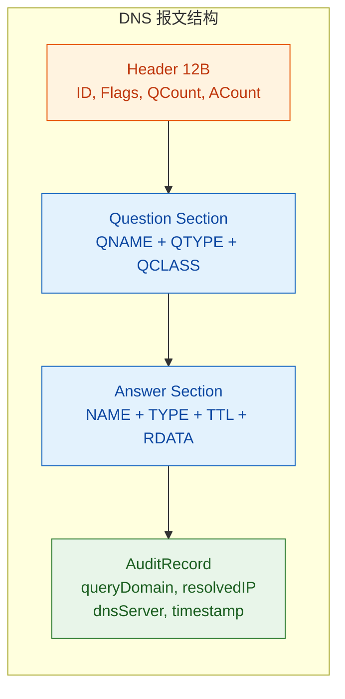
```mermaid
graph LR
    subgraph DNSParse["DNS 报文结构"]
        direction TB
        HDR["Header 12B<br/>ID, Flags, QCount, ACount"]
        Q["Question Section<br/>QNAME + QTYPE + QCLASS"]
        A["Answer Section<br/>NAME + TYPE + TTL + RDATA"]
        AUDIT["AuditRecord<br/>queryDomain, resolvedIP<br/>dnsServer, timestamp"]

        HDR --> Q --> A --> AUDIT
    end

    classDef header fill:#FFF3E0,stroke:#E65100,color:#BF360C
    classDef section fill:#E3F2FD,stroke:#1565C0,color:#0D47A1
    classDef output fill:#E8F5E9,stroke:#2E7D32,color:#1B5E20

    class HDR header
    class Q,A section
    class AUDIT output
```

**DNS 解析要点**：
- **域名编码**：DNS 域名用长度前缀编码（`3www6google3com0`），不是直接 ASCII 文本
- **指针压缩**：Answer 里的域名可能用 `0xC0xx` 指针回引 Question 的域名，节省空间
- **Query vs Response**：通过 Header Flags 的 QR 位区分（0=查询，1=响应）
- **关联策略**：用 Transaction ID（Header 前 2B）关联请求和响应，提取 queryDomain + resolvedIP

### 4.6 SMTP Parser —— 最复杂的状态机

SMTP 的审计要求最丰富（发件人、收件人、标题、附件名与大小），状态转换也最复杂：

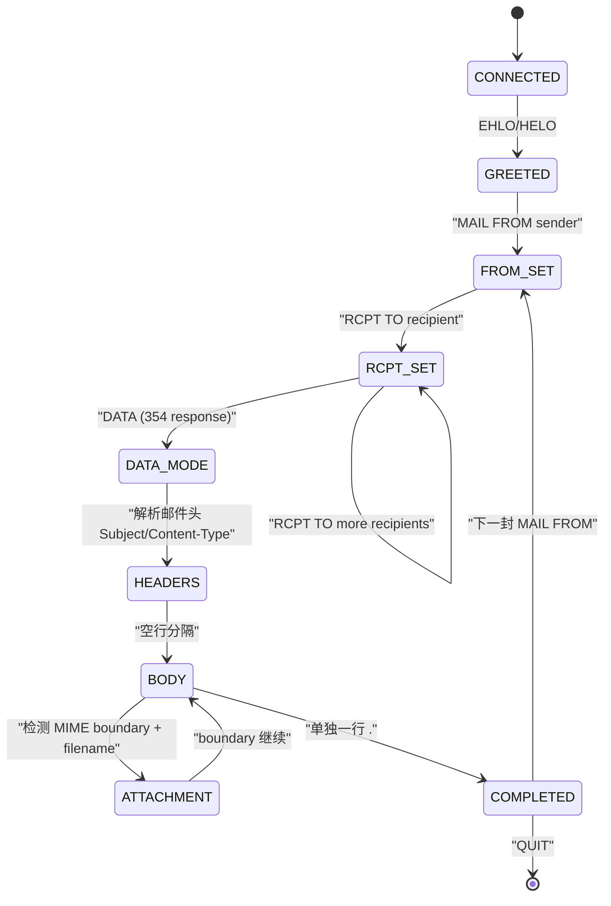
```mermaid
stateDiagram-v2
    [*] --> CONNECTED
    CONNECTED --> GREETED : EHLO/HELO
    GREETED --> FROM_SET : "MAIL FROM sender"
    FROM_SET --> RCPT_SET : "RCPT TO recipient"
    RCPT_SET --> RCPT_SET : "RCPT TO more recipients"
    RCPT_SET --> DATA_MODE : "DATA (354 response)"
    DATA_MODE --> HEADERS : "解析邮件头 Subject/Content-Type"
    HEADERS --> BODY : "空行分隔"
    BODY --> ATTACHMENT : "检测 MIME boundary + filename"
    ATTACHMENT --> BODY : "boundary 继续"
    BODY --> COMPLETED : "单独一行 ."
    COMPLETED --> FROM_SET : "下一封 MAIL FROM"
    COMPLETED --> [*] : "QUIT"
```

**SMTP 解析的分层**：

| 层次 | 解析内容 | 难度 |
|------|---------|------|
| 信封层 | `MAIL FROM:` / `RCPT TO:` | ★☆☆ 简单字符串提取 |
| 头部层 | `Subject:` / `From:` / `To:` | ★★☆ 可能多行折叠 |
| MIME 层 | `Content-Type: multipart` / boundary / `filename=` | ★★★ 需要解析 MIME 结构 |
| 附件大小 | 统计 boundary 之间的 Base64 长度 × 3/4 | ★★☆ 近似计算即可 |

### 4.7 POP3 Parser —— SMTP 的镜像

POP3 与 SMTP 结构相似，但方向相反（收邮件而非发邮件）：

```
POP3 命令流:
  C: USER alice          → 记录用户名
  S: +OK
  C: PASS secret         → (可选记录)
  S: +OK
  C: RETR 1              → 开始接收邮件
  S: +OK ... (邮件内容)  → 解析邮件头: From/To/Subject/MIME 附件
  C: QUIT
```

> **复用思路**：SMTP 和 POP3 的邮件头 + MIME 解析逻辑完全相同，可以抽成一个 `EmailHeaderParser` 工具类，两个 Parser 共同调用 → **DRY 原则**。

---

## 五、事件总线：Observer + Fan-out

审计事件产生后，需要**同时**去两个地方：数据库 + SSE 推送。这是经典的 Observer 模式 + Fan-out：

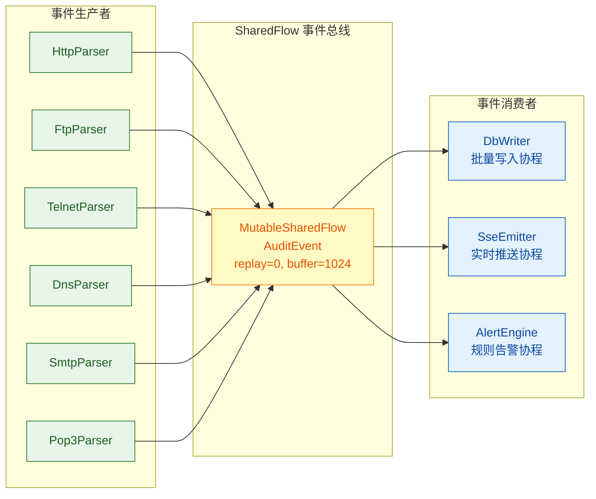
```mermaid
graph LR
    subgraph Producers["事件生产者"]
        direction TB
        P1["HttpParser"]
        P2["FtpParser"]
        P3["TelnetParser"]
        P4["DnsParser"]
        P5["SmtpParser"]
        P6["Pop3Parser"]
    end

    subgraph Bus["SharedFlow 事件总线"]
        direction TB
        SF["MutableSharedFlow<br/>AuditEvent<br/>replay=0, buffer=1024"]
    end

    subgraph Consumers["事件消费者"]
        direction TB
        C1["DbWriter<br/>批量写入协程"]
        C2["SseEmitter<br/>实时推送协程"]
        C3["AlertEngine<br/>规则告警协程"]
    end

    P1 --> SF
    P2 --> SF
    P3 --> SF
    P4 --> SF
    P5 --> SF
    P6 --> SF

    SF --> C1
    SF --> C2
    SF --> C3

    classDef producer fill:#E8F5E9,stroke:#2E7D32,color:#1B5E20
    classDef bus fill:#FFF9C4,stroke:#F57F17,color:#E65100
    classDef consumer fill:#E3F2FD,stroke:#1565C0,color:#0D47A1

    class P1,P2,P3,P4,P5,P6 producer
    class SF bus
    class C1,C2,C3 consumer
```

**为什么用 Kotlin `SharedFlow` 而不是自己写 EventBus？**

```
事实：Kotlin SharedFlow 是协程原生的多播热流
优势：
  1. 天然支持多个 collector（fan-out）
  2. 可配置 buffer 大小（背压控制）
  3. 协程安全，无需手动加锁
  4. replay=0 意味着只推新事件，不堆积历史
结论：零依赖，零 bug 风险，功能完全匹配
```

---

## 六、存储层设计：Schema + 批量写入

### 6.1 数据库 Schema —— 通用列 + JSONB 弹性字段

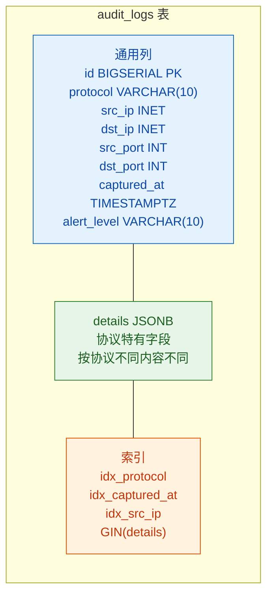
```mermaid
graph LR
    subgraph Schema["audit_logs 表"]
        direction TB
        COMMON["通用列<br/>id BIGSERIAL PK<br/>protocol VARCHAR(10)<br/>src_ip INET<br/>dst_ip INET<br/>src_port INT<br/>dst_port INT<br/>captured_at TIMESTAMPTZ<br/>alert_level VARCHAR(10)"]
        JSON["details JSONB<br/>协议特有字段<br/>按协议不同内容不同"]
        IDX["索引<br/>idx_protocol<br/>idx_captured_at<br/>idx_src_ip<br/>GIN(details)"]

        COMMON --- JSON
        JSON --- IDX
    end

    classDef common fill:#E3F2FD,stroke:#1565C0,color:#0D47A1
    classDef json fill:#E8F5E9,stroke:#2E7D32,color:#1B5E20
    classDef idx fill:#FFF3E0,stroke:#E65100,color:#BF360C

    class COMMON common
    class JSON json
    class IDX idx
```

**各协议的 JSONB details 内容示例**：

| 协议 | JSONB details 字段 |
|------|-------------------|
| HTTP | `{ method, url, host, user_agent, status_code }` |
| FTP | `{ username, command, filename, directory, response_code }` |
| TELNET | `{ username, command_line, direction }` |
| DNS | `{ query_domain, query_type, resolved_ips[], is_response }` |
| SMTP | `{ from, to[], subject, attachment_names[], attachment_sizes[], stage }` |
| POP3 | `{ username, from, to[], subject, attachment_names[], mail_size }` |

**为什么一张表 + JSONB 而不是每个协议一张表？**

```
方案A（6 张表）：HttpLog, FtpLog, TelnetLog ...
  → 全协议联合查询需要 UNION 6 张表 → 慢、代码复杂
  → 前端 "全部审计记录" 页面要拼 6 个接口

方案B（1 张表 + JSONB）：
  → 全协议查询 = 一个 SELECT → 简单
  → 按协议过滤 = WHERE protocol = 'HTTP' → 一样快
  → 协议特有字段进 JSONB，GIN 索引支持 JSON 路径查询
  → schema 变更零成本（加新字段不用 ALTER TABLE）
```

### 6.2 批量写入器 —— Buffer + 定时刷盘

逐条 INSERT 太慢，攒一批再 bulk insert：

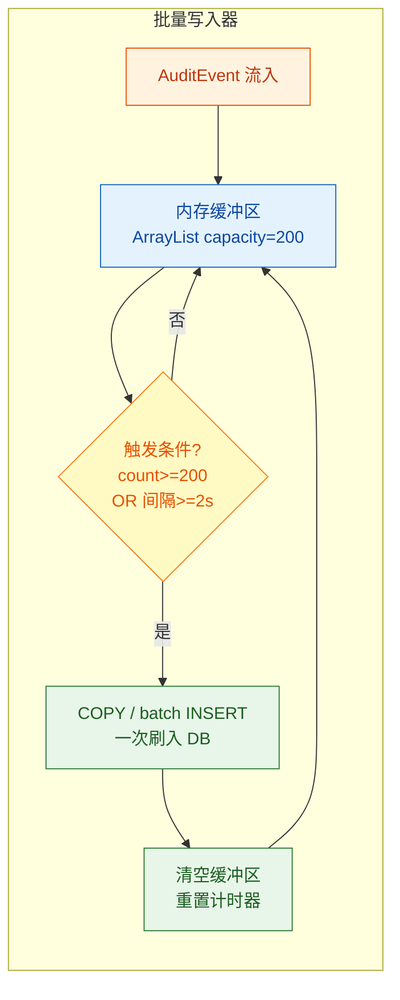
```mermaid
graph LR
    subgraph BatchWriter["批量写入器"]
        direction TB
        IN["AuditEvent 流入"]
        BUF["内存缓冲区<br/>ArrayList capacity=200"]
        CHECK{"触发条件?<br/>count>=200<br/>OR 间隔>=2s"}
        FLUSH["COPY / batch INSERT<br/>一次刷入 DB"]
        RESET["清空缓冲区<br/>重置计时器"]

        IN --> BUF --> CHECK
        CHECK -->|"是"| FLUSH --> RESET --> BUF
        CHECK -->|"否"| BUF
    end

    classDef input fill:#FFF3E0,stroke:#E65100,color:#BF360C
    classDef buffer fill:#E3F2FD,stroke:#1565C0,color:#0D47A1
    classDef check fill:#FFF9C4,stroke:#F57F17,color:#E65100
    classDef flush fill:#E8F5E9,stroke:#2E7D32,color:#1B5E20

    class IN input
    class BUF buffer
    class CHECK check
    class FLUSH,RESET flush
```

**双触发条件的原因**：
- 只用数量：低流量时日志要等很久才写入 → 告警延迟超 10s
- 只用时间：高流量时 2s 内可能几千条，内存爆
- 两个条件取 OR：兼顾**延迟**和**吞吐**

---

## 七、前端组件树与数据流

### 7.1 页面结构

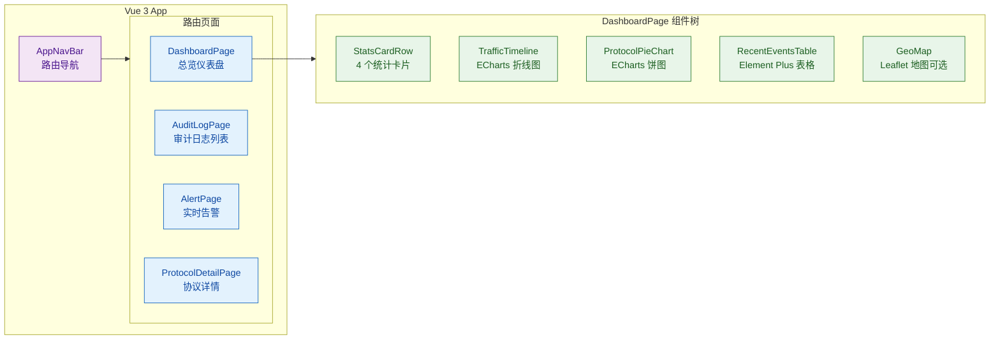
```mermaid
graph LR
    subgraph App["Vue 3 App"]
        direction TB
        NAV["AppNavBar<br/>路由导航"]
        subgraph Pages["路由页面"]
            direction TB
            DASH["DashboardPage<br/>总览仪表盘"]
            AUDIT["AuditLogPage<br/>审计日志列表"]
            ALERT["AlertPage<br/>实时告警"]
            PROTO["ProtocolDetailPage<br/>协议详情"]
        end
        NAV --> Pages
    end

    subgraph DashDetail["DashboardPage 组件树"]
        direction TB
        STATS["StatsCardRow<br/>4 个统计卡片"]
        TIMELINE["TrafficTimeline<br/>ECharts 折线图"]
        PIE["ProtocolPieChart<br/>ECharts 饼图"]
        TABLE["RecentEventsTable<br/>Element Plus 表格"]
        MAP["GeoMap<br/>Leaflet 地图可选"]
    end

    DASH --> DashDetail

    classDef app fill:#F3E5F5,stroke:#6A1B9A,color:#4A148C
    classDef page fill:#E3F2FD,stroke:#1565C0,color:#0D47A1
    classDef comp fill:#E8F5E9,stroke:#2E7D32,color:#1B5E20

    class NAV app
    class DASH,AUDIT,ALERT,PROTO page
    class STATS,TIMELINE,PIE,TABLE,MAP comp
```

### 7.2 前端实时数据流（SSE → Pinia → 组件）

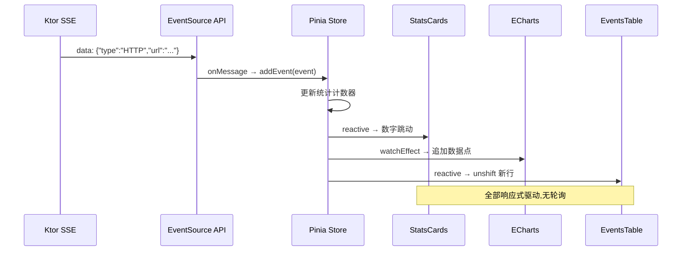
```mermaid
sequenceDiagram
    participant KTOR as Ktor SSE
    participant ES as EventSource API
    participant STORE as Pinia Store
    participant CARD as StatsCards
    participant CHART as ECharts
    participant TBL as EventsTable

    KTOR->>ES: data: {"type":"HTTP","url":"..."}
    ES->>STORE: onMessage → addEvent(event)
    STORE->>STORE: 更新统计计数器
    STORE->>CARD: reactive → 数字跳动
    STORE->>CHART: watchEffect → 追加数据点
    STORE->>TBL: reactive → unshift 新行

    Note over CARD,TBL: 全部响应式驱动,无轮询
```

**为什么用 Pinia 而不是组件内状态？**

```
问题：SSE 数据需要同时驱动 4+ 个组件
方案A（组件 prop 传递）：根组件接 SSE → 层层传 → prop drilling 地狱
方案B（Pinia 全局状态）：SSE → Store → 任意组件 inject → 扁平
结论：Pinia 是 Vue 3 官方状态管理，SSE 写 Store，组件自取所需
```

---

## 八、告警引擎：规则模式

评分要求"告警延迟 ≤ 10 秒"——我们的管道本身就是亚秒级的，但加一个**可配置的告警规则引擎**能极大提升演示效果：

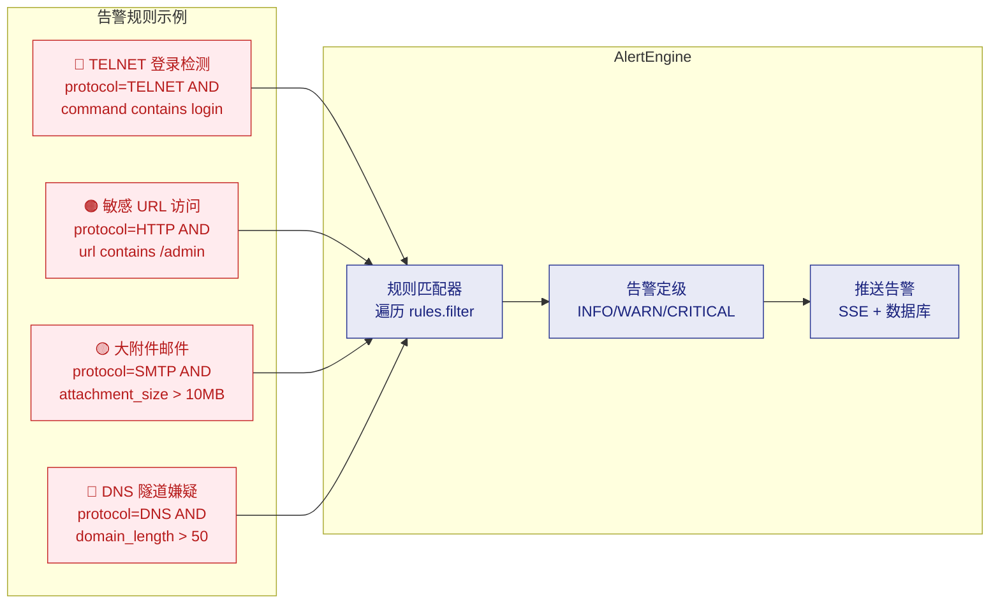
```mermaid
graph LR
    subgraph Rules["告警规则示例"]
        direction TB
        R1["🔴 TELNET 登录检测<br/>protocol=TELNET AND<br/>command contains login"]
        R2["🟠 敏感 URL 访问<br/>protocol=HTTP AND<br/>url contains /admin"]
        R3["🟡 大附件邮件<br/>protocol=SMTP AND<br/>attachment_size > 10MB"]
        R4["🔴 DNS 隧道嫌疑<br/>protocol=DNS AND<br/>domain_length > 50"]
    end

    subgraph Engine["AlertEngine"]
        direction TB
        MATCH["规则匹配器<br/>遍历 rules.filter"]
        LEVEL["告警定级<br/>INFO/WARN/CRITICAL"]
        PUSH["推送告警<br/>SSE + 数据库"]
    end

    R1 --> MATCH
    R2 --> MATCH
    R3 --> MATCH
    R4 --> MATCH
    MATCH --> LEVEL --> PUSH

    classDef rule fill:#FFEBEE,stroke:#C62828,color:#B71C1C
    classDef engine fill:#E8EAF6,stroke:#283593,color:#1A237E

    class R1,R2,R3,R4 rule
    class MATCH,LEVEL,PUSH engine
```

> **演示亮点**：答辩时现场触发一个 TELNET 登录 → 大屏立刻弹出红色告警卡片 + 声效 → 评委印象深刻。

---

## 九、设计模式汇总 Cheat Sheet

| # | 模式 | 在哪用 | 解决什么问题 | 答辩一句话 |
|---|------|--------|-------------|-----------|
| 1 | **责任链** | L2→L3→L4 解码链 | 逐层解耦，可独立扩展 | "每层只管自己的头部" |
| 2 | **策略** | ProtocolParser 接口 | 6 种协议统一接口、可插拔 | "新协议 = 新类 + 注册一行" |
| 3 | **状态机** | FTP/SMTP/POP3 会话 | 跨包追踪会话状态 | "USER 和 RETR 隔了 N 个包，状态机帮我记住" |
| 4 | **观察者** | SharedFlow 事件总线 | 一个事件，多个消费者 | "解析完发事件，DB 和 SSE 各取所需" |
| 5 | **Builder** | AuditRecord 构建 | 字段来自不同解析阶段 | "IP 来自 L3，端口来自 L4，URL 来自 L7，Builder 拼起来" |
| 6 | **Repository** | AuditRepository | 隔离 DB 细节 | "换 DB 只改 Repository 实现" |
| 7 | **Registry** | ParserRegistry | 端口→解析器的映射 | "查表分发，O(1) 路由" |
| 8 | **Adapter** | 前端展示层 | 不同协议统一渲染 | "JSONB details 适配成统一的表格列" |
| 9 | **Batch/Buffer** | 批量写入器 | 吞吐 vs 延迟平衡 | "攒 200 条或等 2 秒，哪个先到就刷盘" |
| 10 | **Template Method** | 捕获引擎生命周期 | 统一 open→loop→close | "子类只覆盖 processPacket" |

---

## 十、Kotlin 密封类的架构价值

最后一个重要设计点：用 Kotlin **sealed class/interface** 建模协议类型和审计事件——这让编译器**替我们检查**有没有漏处理某个协议：

```
密封类优势演示：

sealed interface AuditEvent {
    data class HttpEvent(...) : AuditEvent
    data class FtpEvent(...) : AuditEvent
    data class TelnetEvent(...) : AuditEvent
    data class DnsEvent(...) : AuditEvent
    data class SmtpEvent(...) : AuditEvent
    data class Pop3Event(...) : AuditEvent
}

when (event) {
    is HttpEvent -> ...
    is FtpEvent -> ...
    // 如果漏了某个 → 编译器直接报错 ❌
    // 比 if-else + String type 安全 100 倍
}
```

> **答辩话术**："我们用 Kotlin 的密封类让类型系统替我们做完整性校验——每加一个新协议，所有 when 表达式都会编译报错，逼着你把逻辑补全。这比运行时抛异常靠谱得多。"

---

# 实施路线 + 演示策略 + 冲分点

---

## 一、4 周 Sprint 路线图：倒排法

从**第 9 周周日交付**倒推，预留最后 1 周整理成果，实际开发窗口是 **4 周**。用**逆向规划**确保不漏关键路径：

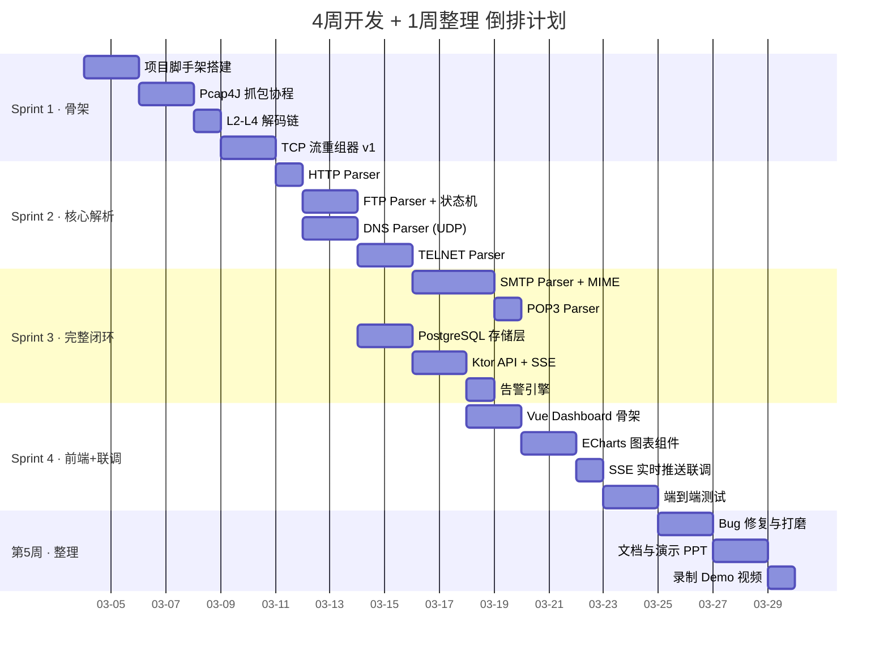
```mermaid
gantt
    title 4周开发 + 1周整理 倒排计划
    dateFormat  YYYY-MM-DD
    axisFormat  %m-%d

    section Sprint 1 · 骨架
    项目脚手架搭建           :s1a, 2026-03-04, 2d
    Pcap4J 抓包协程          :s1b, after s1a, 2d
    L2-L4 解码链             :s1c, after s1b, 1d
    TCP 流重组器 v1          :s1d, after s1c, 2d

    section Sprint 2 · 核心解析
    HTTP Parser              :s2a, after s1d, 1d
    FTP Parser + 状态机      :s2b, after s2a, 2d
    DNS Parser (UDP)         :s2c, after s2a, 2d
    TELNET Parser            :s2d, after s2b, 2d

    section Sprint 3 · 完整闭环
    SMTP Parser + MIME       :s3a, after s2d, 3d
    POP3 Parser              :s3b, after s3a, 1d
    PostgreSQL 存储层        :s3c, after s2c, 2d
    Ktor API + SSE           :s3d, after s3c, 2d
    告警引擎                 :s3e, after s3d, 1d

    section Sprint 4 · 前端+联调
    Vue Dashboard 骨架       :s4a, after s3d, 2d
    ECharts 图表组件         :s4b, after s4a, 2d
    SSE 实时推送联调         :s4c, after s4b, 1d
    端到端测试               :s4d, after s4c, 2d

    section 第5周 · 整理
    Bug 修复与打磨           :s5a, after s4d, 2d
    文档与演示 PPT           :s5b, after s5a, 2d
    录制 Demo 视频           :s5c, after s5b, 1d
```

### Sprint 关键里程碑（验收标准）

| Sprint | 里程碑 | 自检方式 |
|--------|--------|---------|
| **S1 结束** | 能抓到包并在控制台打印出 srcIP:srcPort → dstIP:dstPort | `tcpdump` 对照验证 |
| **S2 结束** | HTTP/FTP/DNS/TELNET 四个协议的审计记录输出到日志文件 | `curl` + `ftp` + `nslookup` + `telnet` 手动触发 |
| **S3 结束** | 所有 6 个协议 → PostgreSQL 写入成功 + SSE 能推出事件 | 浏览器 EventSource 控制台看到 JSON |
| **S4 结束** | Dashboard 完整展示 + 实时刷新 + 告警弹窗 | 全链路 Demo 跑通 |

---

## 二、Codex 任务拆分策略：让 AI 高效并行

> **核心原则**：每个 Codex 任务必须**自包含**——有明确输入、输出、接口约定，不依赖其他未完成的任务。

```mermaid
graph LR
    subgraph Wave1["Wave 1 · 基础设施 (并行)"]
        direction TB
        T1["Task 1<br/>Gradle 项目脚手架<br/>依赖配置"]
        T2["Task 2<br/>数据模型定义<br/>sealed class + data class"]
        T3["Task 3<br/>DB Schema + Exposed ORM<br/>迁移脚本"]
    end

    subgraph Wave2["Wave 2 · 抓包管道 (串行)"]
        direction TB
        T4["Task 4<br/>Pcap4J 捕获协程<br/>+ Channel 管道"]
        T5["Task 5<br/>L2-L4 解码器<br/>+ 协议分发器"]
        T6["Task 6<br/>TCP 流重组器"]
    end

    subgraph Wave3["Wave 3 · 6 个 Parser (全并行)"]
        direction TB
        T7["Task 7 · HttpParser"]
        T8["Task 8 · FtpParser"]
        T9["Task 9 · TelnetParser"]
        T10["Task 10 · DnsParser"]
        T11["Task 11 · SmtpParser"]
        T12["Task 12 · Pop3Parser"]
    end

    subgraph Wave4["Wave 4 · 后端服务 (并行)"]
        direction TB
        T13["Task 13<br/>BatchWriter + Repository"]
        T14["Task 14<br/>Ktor REST API"]
        T15["Task 15<br/>Ktor SSE 推送"]
        T16["Task 16<br/>AlertEngine"]
    end

    subgraph Wave5["Wave 5 · 前端 (并行)"]
        direction TB
        T17["Task 17<br/>Vue 脚手架 + 路由"]
        T18["Task 18<br/>Dashboard 统计卡片"]
        T19["Task 19<br/>ECharts 图表组件"]
        T20["Task 20<br/>审计日志表格页"]
        T21["Task 21<br/>告警弹窗 + 声效"]
    end

    Wave1 --> Wave2
    Wave2 --> Wave3
    Wave1 --> Wave4
    Wave3 --> Wave4
    Wave4 --> Wave5

    classDef w1 fill:#F3E5F5,stroke:#6A1B9A,color:#4A148C
    classDef w2 fill:#FFF3E0,stroke:#E65100,color:#BF360C
    classDef w3 fill:#E8F5E9,stroke:#2E7D32,color:#1B5E20
    classDef w4 fill:#E3F2FD,stroke:#1565C0,color:#0D47A1
    classDef w5 fill:#FFF9C4,stroke:#F57F17,color:#E65100

    class T1,T2,T3 w1
    class T4,T5,T6 w2
    class T7,T8,T9,T10,T11,T12 w3
    class T13,T14,T15,T16 w4
    class T17,T18,T19,T20,T21 w5
```

### Codex 每个 Task 的 Prompt 结构（统一模板思维）

```
每个 Task 提交给 Codex 时，提示词结构应包含：

1. 【角色】你是 Kotlin 网络安全开发者
2. 【上下文】给出接口定义 + 数据模型（从 Task 2 产出）
3. 【输入】明确入参类型（如 StreamContext）
4. 【输出】明确返回类型（如 AuditEvent.HttpEvent）
5. 【约束】错误处理、日志规范、不要阻塞协程
6. 【测试】附带单元测试用例的输入输出对
```

> **关键洞察**：Wave 3 的 6 个 Parser 是**完全并行**的——它们共享同一个 `ProtocolParser` 接口，输入输出已在 Wave 1 的 Task 2 中定义好。可以**同时提交 6 个 Codex 任务**，极大压缩开发时间。

---

## 三、测试环境搭建：可复现的受控流量

### 3.1 整体测试架构

```mermaid
graph LR
    subgraph TestEnv["Docker Compose 测试环境"]
        direction TB
        subgraph Servers["服务端容器"]
            direction TB
            HTTPD["nginx:alpine<br/>Port 80"]
            FTPD["vsftpd<br/>Port 21"]
            TELNETD["telnetd<br/>Port 23"]
            SMTPD["postfix<br/>Port 25"]
            POP3D["dovecot<br/>Port 110"]
            DNSD["dnsmasq<br/>Port 53"]
        end

        subgraph Client["测试客户端容器"]
            direction TB
            CURL["curl → HTTP"]
            FTPCLI["ftp CLI → FTP"]
            TELCLI["telnet CLI → TELNET"]
            NSLOOKUP["nslookup → DNS"]
            SWAKS["swaks → SMTP"]
            FETCHMAIL["fetchmail → POP3"]
        end

        subgraph Audit["审计系统"]
            direction TB
            APP["NetAudit App<br/>混杂模式抓包"]
            PG["PostgreSQL"]
            VUE["Vue Dashboard"]
        end
    end

    Client --> Servers
    APP -.->|"镜像流量"| Servers
    APP --> PG
    APP --> VUE

    classDef server fill:#E8F5E9,stroke:#2E7D32,color:#1B5E20
    classDef client fill:#E3F2FD,stroke:#1565C0,color:#0D47A1
    classDef audit fill:#FFF3E0,stroke:#E65100,color:#BF360C

    class HTTPD,FTPD,TELNETD,SMTPD,POP3D,DNSD server
    class CURL,FTPCLI,TELCLI,NSLOOKUP,SWAKS,FETCHMAIL client
    class APP,PG,VUE audit
```

### 3.2 一键触发全协议测试脚本

设计一个 shell 脚本，**一键触发 6 种协议流量**，答辩时直接运行：

```
test-all-protocols.sh 的逻辑流：

1. curl http://nginx/index.html              → 触发 HTTP 审计
2. curl http://nginx/admin/secret.html        → 触发 HTTP + 告警（敏感 URL）
3. ftp -n ftpserver <<< "USER alice; PASS 123; RETR secret.doc; QUIT"
                                               → 触发 FTP 审计
4. echo "ls -la" | telnet telnetserver         → 触发 TELNET 审计
5. nslookup example.com dnsserver              → 触发 DNS 审计
6. swaks --to bob@test.com --from alice@test.com \
         --server smtpserver --attach file.pdf → 触发 SMTP + 附件审计
7. fetchmail --protocol POP3 popserver          → 触发 POP3 审计
```

> **答辩演示**：运行脚本 → 切到 Dashboard → 看到 6 种颜色的审计记录实时涌入 → 红色告警弹窗弹出 → 全场惊艳。

### 3.3 用 Docker Network 模拟镜像端口

```
问题：开发环境没有真实的交换机镜像端口
方案：Docker bridge 网络 + 容器内混杂模式
原理：
  1. 所有容器在同一个 Docker bridge 网段
  2. 审计系统容器用 --net=host 或 --cap-add=NET_RAW
  3. Pcap4J 在 bridge 接口上抓包 = 等效于镜像端口
验证：tcpdump -i docker0 可以看到所有容器间流量
```

---

## 四、答辩演示脚本：讲一个故事

> **演示原则**：不展示功能列表，而是**讲一个安全事件的故事**——让评委跟着你的叙事线，自然看到所有功能。

### 4.1 演示故事线（8 分钟脚本）

```mermaid
graph LR
    subgraph Story["Demo 故事线"]
        direction TB
        S1["📖 开场 1min<br/>架构一句话<br/>流式ETL管道"]
        S2["🌐 场景1 2min<br/>员工浏览网页<br/>HTTP审计实时展示"]
        S3["📧 场景2 2min<br/>员工发送邮件<br/>SMTP审计+附件检测"]
        S4["🚨 场景3 2min<br/>入侵者TELNET登录<br/>触发红色告警"]
        S5["📊 收尾 1min<br/>Dashboard全景<br/>设计模式总结"]

        S1 --> S2 --> S3 --> S4 --> S5
    end

    classDef open fill:#E8EAF6,stroke:#283593,color:#1A237E
    classDef scene fill:#E3F2FD,stroke:#1565C0,color:#0D47A1
    classDef alert fill:#FFEBEE,stroke:#C62828,color:#B71C1C
    classDef close fill:#E8F5E9,stroke:#2E7D32,color:#1B5E20

    class S1 open
    class S2,S3 scene
    class S4 alert
    class S5 close
```

### 4.2 每个场景的详细演示动作

**场景 1：HTTP 审计（正常行为）**
```
演示动作：
  1. 打开 Dashboard → 当前审计记录为空
  2. 在终端执行 curl http://webserver/index.html
  3. 切到 Dashboard → 表格实时出现一行 HTTP 记录
     → 展示 srcIP, dstIP, URL, Method, Timestamp
  4. 再执行 curl http://webserver/api/users
  5. Dashboard → 第二行出现 → 饼图 HTTP 占比变化 → 折线图跳动

讲解话术：
  "每一个 HTTP 请求，从网卡抓包到 Dashboard 展示，
   延迟不到 1 秒。这背后是 Kotlin 协程 Channel 管道 +
   SSE 实时推送。"
```

**场景 2：SMTP 邮件审计（数据丰富）**
```
演示动作：
  1. 用 swaks 发送一封带附件的邮件
  2. Dashboard → SMTP 记录出现
     → 点击展开：发件人、收件人、标题、附件名、附件大小
  3. 强调："附件大小是通过 MIME boundary 间 Base64 长度计算的"

讲解话术：
  "SMTP 解析是本项目最复杂的模块——它是一个 8 状态的
   状态机，从 EHLO 到 DATA 到 MIME 解析，逐层深入。"
```

**场景 3：TELNET 入侵告警（高潮）**
```
演示动作：
  1. 在终端 telnet 到服务器
  2. 输入 login: hacker → 输入 password → 执行 cat /etc/passwd
  3. Dashboard → TELNET 记录出现 + 红色告警弹窗弹出！
     → 弹窗内容: "TELNET 登录检测: hacker @ 192.168.1.100"
     → 告警声效播放（可选）
  4. 点击告警 → 跳转到该条审计详情

讲解话术：
  "告警引擎在事件产生的同一毫秒内进行规则匹配，
   SSE 推送到前端弹窗，端到端延迟 < 1 秒，
   远低于评分要求的 10 秒。"
```

---

## 五、冲分策略：从 60 到 100 的加分点地图

```mermaid
graph LR
    subgraph Base["基础分 60"]
        direction TB
        B1["✅ 抓包引擎稳定运行"]
        B2["✅ 审计记录写入数据库"]
        B3["✅ 基本查询界面"]
    end

    subgraph Proto["协议分 6x10=60"]
        direction TB
        P1["✅ HTTP 完整审计"]
        P2["✅ FTP 完整审计"]
        P3["✅ TELNET 完整审计"]
        P4["✅ DNS 完整审计"]
        P5["✅ SMTP 完整审计"]
        P6["✅ POP3 完整审计"]
    end

    subgraph Alert["告警分 10"]
        direction TB
        A1["✅ 实时告警 ≤10s"]
        A2["✅ 告警弹窗 + 声效"]
    end

    subgraph Bonus["加分项"]
        direction TB
        X1["🌟 GeoIP 地图可视化"]
        X2["🌟 协议分布动态饼图"]
        X3["🌟 流量时间线折线图"]
        X4["🌟 10 种设计模式展示"]
        X5["🌟 Docker 一键部署"]
    end

    Base --> Proto
    Proto --> Alert
    Alert --> Bonus

    classDef base fill:#E3F2FD,stroke:#1565C0,color:#0D47A1
    classDef proto fill:#E8F5E9,stroke:#2E7D32,color:#1B5E20
    classDef alert fill:#FFF3E0,stroke:#E65100,color:#BF360C
    classDef bonus fill:#F3E5F5,stroke:#6A1B9A,color:#4A148C

    class B1,B2,B3 base
    class P1,P2,P3,P4,P5,P6 proto
    class A1,A2 alert
    class X1,X2,X3,X4,X5 bonus
```

### 五大差异化加分点详解

| # | 加分项 | 实现难度 | 演示效果 | 投入产出比 | 做法 |
|---|--------|---------|---------|-----------|------|
| 1 | **GeoIP 地图** | ★★☆ | ★★★★★ | 极高 | Leaflet + MaxMind GeoLite2 离线库，dst_ip → 经纬度 → 地图打点 |
| 2 | **协议饼图** | ★☆☆ | ★★★★ | 极高 | ECharts pie，Pinia 实时计数 → `watchEffect` 驱动刷新 |
| 3 | **流量折线图** | ★★☆ | ★★★★ | 高 | ECharts line，每秒聚合一个点，滚动窗口 60 点 |
| 4 | **设计模式展示** | ★☆☆ | ★★★ | 高 | PPT 里放 Reply 2 的模式地图，答辩逐个讲 |
| 5 | **Docker 一键部署** | ★★☆ | ★★★ | 中 | `docker-compose up` 启动全栈（含测试服务端 + 审计系统 + DB） |

> **策略**：加分项 1~3 是**视觉冲击力**最高的，评委看到地图上实时打点、饼图实时旋转、折线图实时跳动，会有"这远超课程项目水平"的感觉。

---

## 六、PDCA 迭代闭环：每日自检

```mermaid
graph LR
    subgraph PDCA["PDCA 日循环"]
        direction TB
        P["📋 Plan<br/>今日任务从<br/>Sprint Board 取"]
        D["⚙️ Do<br/>Codex 生成代码<br/>人工 Review"]
        C["🔍 Check<br/>单测通过?<br/>Wireshark 对照?<br/>Dashboard 展示?"]
        A["🔧 Act<br/>修 Bug / 调接口<br/>更新 Board"]

        P --> D --> C --> A --> P
    end

    classDef plan fill:#E3F2FD,stroke:#1565C0,color:#0D47A1
    classDef do fill:#E8F5E9,stroke:#2E7D32,color:#1B5E20
    classDef check fill:#FFF9C4,stroke:#F57F17,color:#E65100
    classDef act fill:#FFEBEE,stroke:#C62828,color:#B71C1C

    class P plan
    class D do
    class C check
    class A act
```

### Check 环节的三层验证

```mermaid
graph LR
    subgraph Verify["三层验证体系"]
        direction TB
        V1["Layer 1 · 单元测试<br/>Kotest + MockK<br/>每个 Parser 独立测试<br/>输入固定字节 → 断言输出字段"]
        V2["Layer 2 · 集成测试<br/>真实抓包 → 解析 → 存储<br/>用 tcpdump pcap 文件回放<br/>对比 Wireshark 解析结果"]
        V3["Layer 3 · 端到端测试<br/>Docker 环境跑测试脚本<br/>验证 Dashboard 展示正确<br/>截图对比"]

        V1 --> V2 --> V3
    end

    classDef l1 fill:#E8F5E9,stroke:#2E7D32,color:#1B5E20
    classDef l2 fill:#E3F2FD,stroke:#1565C0,color:#0D47A1
    classDef l3 fill:#FFF3E0,stroke:#E65100,color:#BF360C

    class V1 l1
    class V2 l2
    class V3 l3
```

**pcap 回放测试的价值**：
```
问题：开发时不可能每次都真实发送 6 种协议的流量
方案：
  1. 用 tcpdump -w test.pcap 录制一次完整的测试流量
  2. 开发时用 Pcap4J 的 PcapHandle.openOffline("test.pcap") 回放
  3. 结果与 Wireshark 的解析结果逐字段对比
优势：
  → 可重复：同一个 pcap 文件跑 100 次结果一致
  → 可回归：改了 HTTP Parser 不怕影响 FTP Parser
  → 可 CI：放到自动化测试里
```

---

## 七、风险预案：Murphy 定律防御

| 风险 | 概率 | 影响 | 预案 |
|------|------|------|------|
| Pcap4J 在某些 OS 上权限问题 | 中 | 高 | Docker `--cap-add=NET_RAW` + `--net=host`；备选方案：读 pcap 文件模式 |
| SMTP/POP3 MIME 解析太复杂 | 高 | 中 | 先实现信封层（MAIL FROM/RCPT TO）拿 80% 分，MIME 附件是锦上添花 |
| TCP 流重组丢包导致解析失败 | 中 | 中 | 加 try-catch 容错 + 日志记录 → 丢一条不影响管道 → 答辩时说"我们做了优雅降级" |
| Docker Compose 环境配置耗时 | 中 | 低 | 先用本地 `nc`/`curl` 手动测试，Docker 作为最后的锦上添花 |
| 前端 SSE 断连 | 低 | 中 | EventSource 内置自动重连；Pinia Store 里加 `connectionStatus` 状态指示 |

---

## 八、成果交付清单

```mermaid
graph LR
    subgraph Deliverables["交付物清单"]
        direction TB
        subgraph Code["代码仓库"]
            direction TB
            D1["backend/<br/>Kotlin + Ktor + Pcap4J"]
            D2["frontend/<br/>Vue 3 + Element Plus + ECharts"]
            D3["docker/<br/>docker-compose.yml"]
            D4["scripts/<br/>test-all-protocols.sh"]
        end

        subgraph Docs["文档"]
            direction TB
            D5["README.md<br/>一键启动指南"]
            D6["ARCHITECTURE.md<br/>架构设计文档(含图)"]
            D7["DESIGN-PATTERNS.md<br/>10 种设计模式说明"]
        end

        subgraph Pres["演示材料"]
            direction TB
            D8["slides.pdf<br/>答辩 PPT"]
            D9["demo.mp4<br/>演示录屏(备用)"]
            D10["test-results/<br/>Wireshark 对比截图"]
        end
    end

    classDef code fill:#E3F2FD,stroke:#1565C0,color:#0D47A1
    classDef docs fill:#E8F5E9,stroke:#2E7D32,color:#1B5E20
    classDef pres fill:#FFF3E0,stroke:#E65100,color:#BF360C

    class D1,D2,D3,D4 code
    class D5,D6,D7 docs
    class D8,D9,D10 pres
```

### 录制 Demo 视频的必要性

```
为什么要录屏？
  → Murphy 定律：答辩现场网络可能出问题
  → 备选方案：如果 live demo 失败，立刻切到录屏
  → 专业感：提前录好的视频可以加字幕、高亮关键区域
  → 建议：用 OBS 录制 1080p，3~5 分钟精华版
```

---

## 九、答辩 PPT 结构建议（10 页）

```mermaid
graph LR
    subgraph Slides["10页PPT结构"]
        direction TB
        SL1["P1 封面<br/>项目名+技术栈一行"]
        SL2["P2 问题定义<br/>流式ETL管道一句话"]
        SL3["P3 架构全景<br/>四大子系统图"]
        SL4["P4 数据流<br/>HTTP请求全链路时序图"]
        SL5["P5 协议解析<br/>6个Parser的状态机"]
        SL6["P6 设计模式地图<br/>10个模式鸟瞰"]
        SL7["P7 技术亮点<br/>协程+SSE+JSONB"]
        SL8["P8 Live Demo<br/>切到浏览器"]
        SL9["P9 测试验证<br/>Wireshark对比截图"]
        SL10["P10 总结<br/>学到了什么"]

        SL1 --> SL2 --> SL3 --> SL4 --> SL5
        SL5 --> SL6 --> SL7 --> SL8 --> SL9 --> SL10
    end

    classDef intro fill:#E8EAF6,stroke:#283593,color:#1A237E
    classDef tech fill:#E3F2FD,stroke:#1565C0,color:#0D47A1
    classDef demo fill:#E8F5E9,stroke:#2E7D32,color:#1B5E20
    classDef close fill:#FFF3E0,stroke:#E65100,color:#BF360C

    class SL1,SL2 intro
    class SL3,SL4,SL5,SL6,SL7 tech
    class SL8 demo
    class SL9,SL10 close
```

> **PPT 核心原则**：每一页只有**一张图 + 一句话**。文字墙是答辩大忌。Reply 1&2 中的 Mermaid 图可以直接导出到 PPT。

---

## 十、三篇回复的思维模型闭环

最后，回顾整个 3 篇回复的思维链条，形成完整闭环：

```mermaid
graph LR
    subgraph Thinking["思维模型闭环"]
        direction TB
        FP["🎯 第一性原理<br/>Reply 1<br/>识别本质:<br/>流式ETL管道"]
        STRUCT["🏗️ 结构化拆解<br/>Reply 1+2<br/>L2→L7分层<br/>四大子系统"]
        WHYS["🔍 5 Whys<br/>Reply 1+2<br/>每个决策<br/>有因果链"]
        REVERSE["🔄 逆向推导<br/>Reply 1+3<br/>从评分标准<br/>反推硬约束"]
        PDCA2["🔁 PDCA<br/>Reply 3<br/>Sprint迭代<br/>三层验证"]

        FP --> STRUCT
        STRUCT --> WHYS
        WHYS --> REVERSE
        REVERSE --> PDCA2
        PDCA2 -.->|"迭代"| FP
    end

    classDef fp fill:#FFEBEE,stroke:#C62828,color:#B71C1C
    classDef struct fill:#E3F2FD,stroke:#1565C0,color:#0D47A1
    classDef whys fill:#FFF9C4,stroke:#F57F17,color:#E65100
    classDef reverse fill:#E8F5E9,stroke:#2E7D32,color:#1B5E20
    classDef pdca fill:#F3E5F5,stroke:#6A1B9A,color:#4A148C

    class FP fp
    class STRUCT struct
    class WHYS whys
    class REVERSE reverse
    class PDCA2 pdca
```


